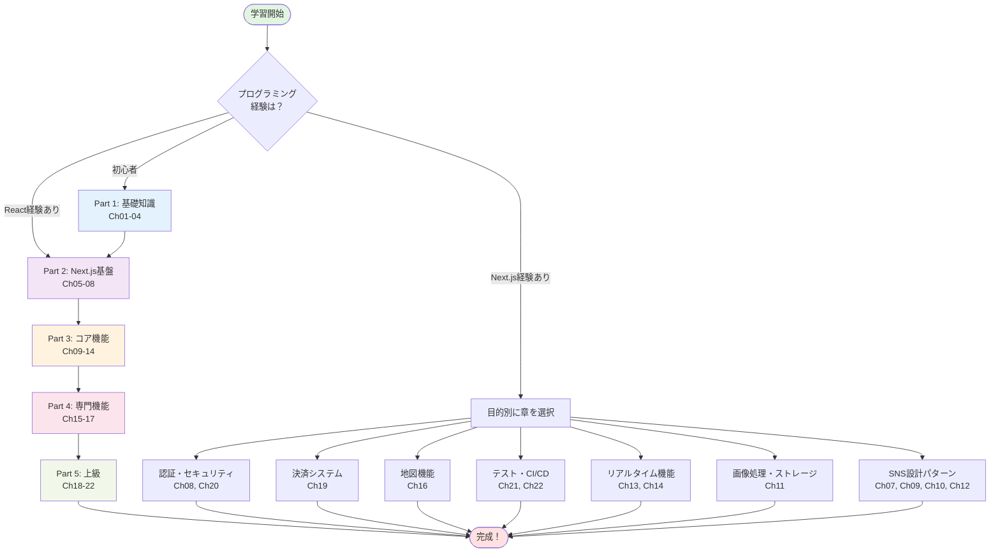
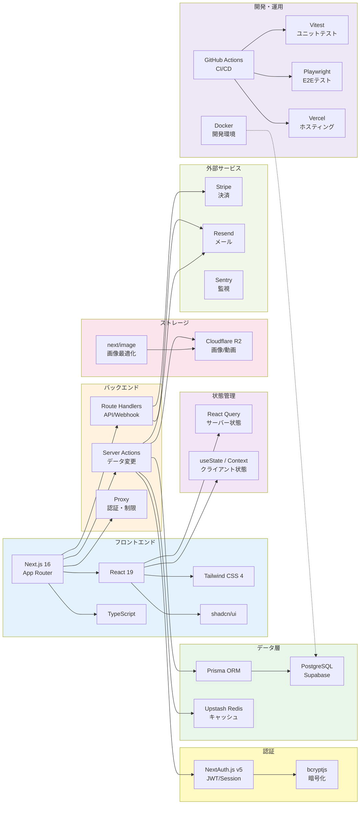
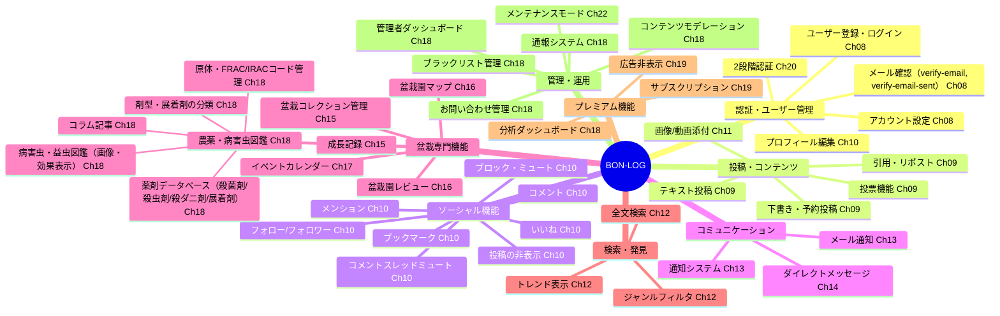
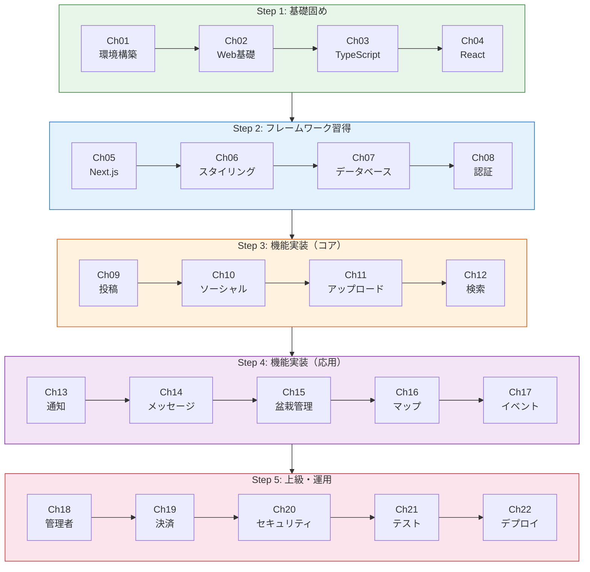
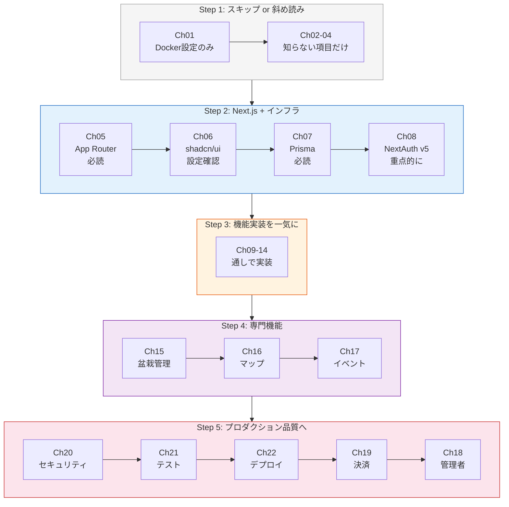
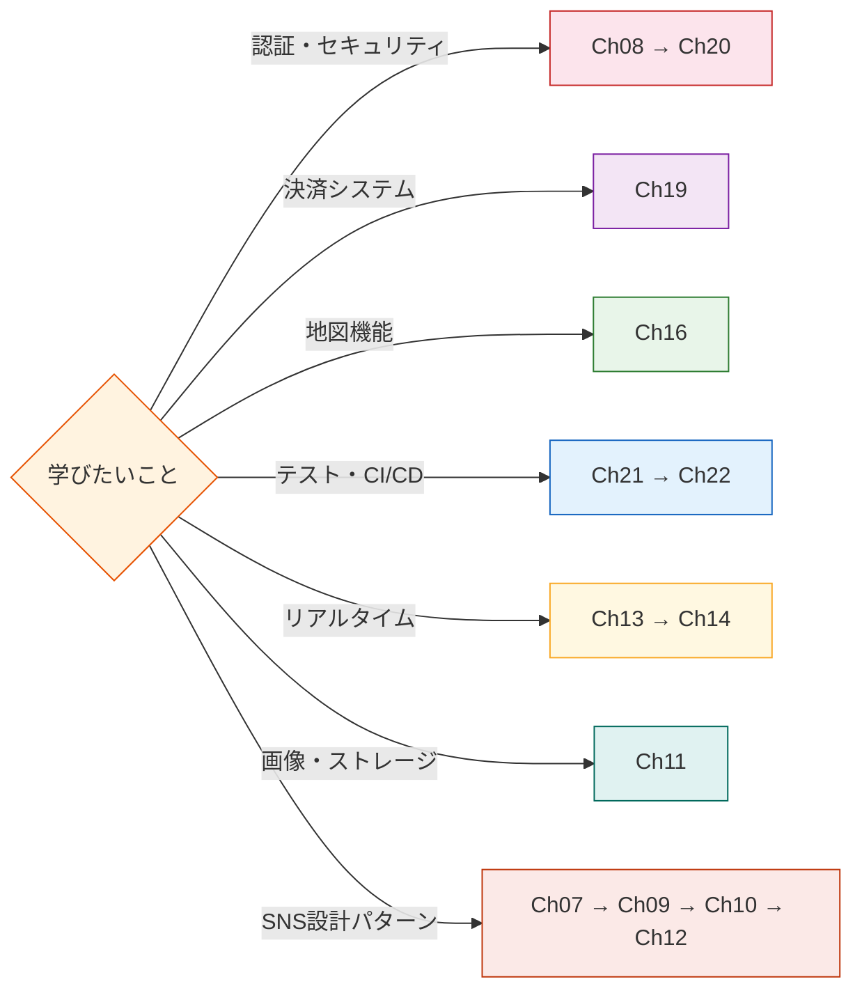
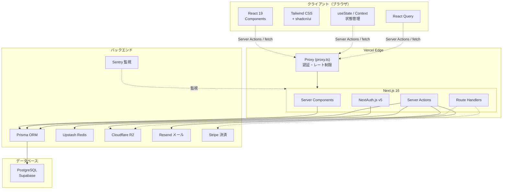
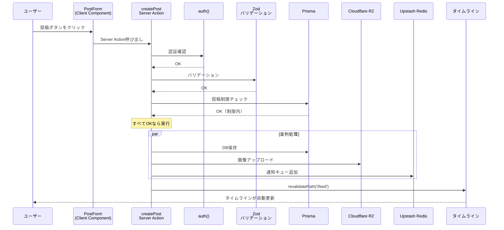
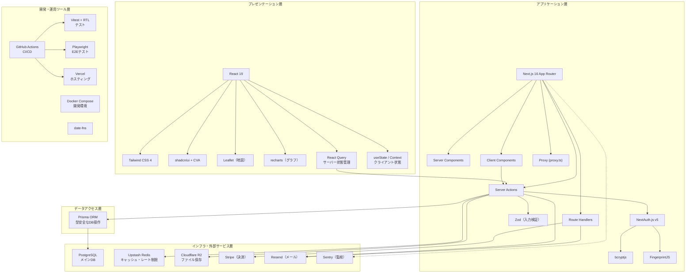

# BON-LOG 開発チュートリアル - 目次

盆栽愛好家向けSNS「BON-LOG」を1から構築するための学習ガイドです。
初心者がWeb開発の基礎から本番デプロイまで、段階的に学べるように構成しています。

> **本チュートリアルについて**  
> 記載内容は**実際のBON-LOGプロジェクトのコード・構成に合わせてあります**。  
> プロジェクトで使っていない技術（例: Zustand、Sharp）は削除するか「選択肢として紹介」にしています。  
> 初心者の方が抜け・漏れなく理解できるよう、できるだけ分かりやすく書いています。

---

## 手順に沿って進めるには（初心者向け）

**「どの手順で、どのファイルに、何を入力すればいいか」** が分かるように、各章では次の形式で実習を書いています。

| 項目 | 内容 |
|------|------|
| **手順番号** | 章内で何番目の作業か（例: 手順 9-1） |
| **対象ファイル** | コードを書く・編集するファイルのパス（例: `prisma/schema.prisma`） |
| **入力するコード** | そのファイルに追加・修正する内容 |
| **このあと変わること** | そのコードを入れたことで、アプリやプロジェクトのどこがどう変わるか |
| **確認方法** | 正しくできたかを確認する手順（コマンド実行・画面の確認など） |

**進め方の流れ**: 各章で「対象ファイル」を開く → 「入力するコード（サンプルコード）」を写す（写経推奨） → 保存 → 「実行方法」に従って動かす → 「実行するとこうなる」と見比べて確認 → 「確認方法」を実行する → 「このあと変わること」を読んで理解する。

各手順には、**サンプルコード**（そのまま写経して実行できる具体なコード）と**実行するとこうなる**（画面・ターミナル・DBなどに実際にどう表示・出力されるかの説明）を記載しています。初心者の方が「自分の環境で正しく動いているか」を判断できるようにしています。

詳しい読み方・用語の説明は **[チュートリアルの進め方（手順の読み方）](./00_how_to_follow_steps.md)** にまとめています。初めての方は一読してください。

### チュートリアルで「漏れなく」学べるか

| 観点 | 説明 |
|------|------|
| **機能の網羅** | アプリの主要機能（認証・メール確認・投稿・ソーシャル・検索・通知・DM・盆栽・マップ・イベント・農薬・病害虫図鑑・管理・決済・セキュリティ・テスト・デプロイ・PWA・RSS・背景アニメーション・書道風UIデザイン等）は、いずれも**対応する章**で扱っています。目次の「アプリケーション機能マップ」で機能→章の対応を確認できます。**教育資料の手順を省略なく実施すれば、このプロジェクトが完成する**ように構成しています。 |
| **サンプルコードと実行結果** | 各章の実習手順には**サンプルコード**（写経して実行できる具体なコード）と**実行するとこうなる**（実行したときの表示・出力の説明）を記載しています。初心者でも「合っているか」を判断しやすく、可能な限り親切に書いています。 |
| **コードの網羅** | 「**全ファイルを1行ずつ解説**」する形式ではありません。各章では**その機能で使う考え方・パターン・代表的なコード**を学び、同じパターンが `lib/actions/` や `app/` の他のファイルにもあることを示します。章を読み終えたあと、プロジェクト内の同名ファイルや関連ファイルを開いて照らし合わせると、**アプリで使っている知識を漏れなく身につけられます**。 |
| **技術の網羅** | 使っている主要技術（Next.js, React, Prisma, NextAuth, R2, Redis, Stripe, Resend, Sentry, Leaflet, recharts など）は**技術索引**に「主要解説章」と「関連章」が載っています。Cron・Proxy（旧Middleware）・Server Actions の返却形式（ActionResult）・全文検索（trgm）・動的インポートの制約なども、該当章で触れています。 |
| **読むときのコツ** | 1章ずつ進めつつ、**その章で出てきたファイルパスをプロジェクトで開いて**「同じ構造がここにもある」と確認すると、理解が深まります。分からなくなったら「技術索引」でキーワードから章を逆引きしてください。 |

---

## 対象読者

- プログラミング初心者〜中級者
- Webアプリケーション開発に興味がある方
- React / Next.js を学びたい方
- SNSのようなフルスタックアプリを作りたい方

## 前提知識

- PCの基本操作（ターミナル/コマンドプロンプトを使ったことがなくてもOK）
- 英語のエラーメッセージを翻訳ツールで読める程度の意欲

## 学習を始める前に -- 効果的な進め方

> **完全初心者の方へ**: このチュートリアルは実際のプロジェクト「BON-LOG」のコードを題材にしていますが、すべてを一度に理解する必要はありません。以下のポイントを意識して進めてください。

1. **手を動かしながら読む**: コード例を見たら、実際にエディタに入力して動かしてみましょう。コピー＆ペーストよりも手打ちの方が記憶に残ります
2. **わからなくても先に進む**: 1回目で100%理解する必要はありません。一通り最後まで読み、2周目で深く理解する方法が効果的です
3. **エラーを恐れない**: プログラミング学習ではエラーが出るのは当たり前です。エラーメッセージを読む癖をつけましょう
4. **小さく試す**: 大きなコードをいきなり書くのではなく、1つの機能を小さく試してから組み合わせていきましょう
5. **理解度チェックを活用する**: 各セクション末尾の `<details>` に理解度チェックがあります。自分の言葉で答えられるか試してみてください

---

## Part 1: 基礎知識

| 章 | タイトル | 内容 | 難易度 |
|----|---------|------|--------|
| [01](./01_setup.md) | 開発環境のセットアップ | Node.js, VS Code, Git, Docker, PostgreSQL | 入門 |
| [02](./02_web_basics.md) | Web開発の基礎 | HTML, CSS, JavaScriptの基本と仕組み | 入門 |
| [03](./03_typescript.md) | TypeScript入門 | 型システム、インターフェース、ジェネリクス | 入門〜初級 |
| [04](./04_react.md) | React入門 | コンポーネント、状態管理、Hooks | 初級 |

> **Part 1 の学習ポイント**: ここが全体の土台です。特に第3章（TypeScript）と第4章（React）は後のすべての章で必要になります。焦らず理解を深めてから先に進みましょう。

## Part 2: Next.js開発の基盤

| 章 | タイトル | 内容 | 難易度 |
|----|---------|------|--------|
| [05](./05_nextjs.md) | Next.js App Router | ルーティング、Server/Client Components、データ取得 | 初級〜中級 |
| [06](./06_styling.md) | Tailwind CSS & shadcn/ui | ユーティリティCSS、UIコンポーネントライブラリ | 初級 |
| [07](./07_database.md) | データベース設計 | PostgreSQL, Prisma ORM, スキーマ設計 | 中級 |
| [08](./08_auth.md) | 認証システム | NextAuth.js, JWT, セッション管理, 2FA | 中級 |

> **Part 2 の学習ポイント**: Next.js の Server Components と Client Components の使い分け（第5章）が最重要です。ここを理解すれば Part 3 以降がスムーズに進みます。

## Part 3: コア機能の実装

| 章 | タイトル | 内容 | 難易度 |
|----|---------|------|--------|
| [09](./09_posts.md) | 投稿機能 | CRUD、画像添付、ジャンルタグ、下書き | 中級 |
| [10](./10_social.md) | ソーシャル機能 | いいね、コメント、フォロー、ブックマーク | 中級 |
| [11](./11_upload.md) | 画像アップロード | Cloudflare R2、プリサインドURL、画像圧縮 | 中級 |
| [12](./12_search.md) | 検索機能 | 全文検索、フィルタリング、ページネーション | 中級 |
| [13](./13_notifications.md) | 通知システム | リアルタイム通知、メール通知、通知設定 | 中級 |
| [14](./14_messages.md) | ダイレクトメッセージ | 1対1チャット、会話一覧、未読管理 | 中級 |

> **Part 3 の学習ポイント**: SNSの根幹機能を学びます。各章は独立しているので、興味のある機能から取り組んでもOKです。

## Part 4: 専門機能の実装

| 章 | タイトル | 内容 | 難易度 |
|----|---------|------|--------|
| [15](./15_bonsai.md) | 盆栽管理機能 | コレクション、成長記録、タイムライン | 中級 |
| [16](./16_map.md) | 盆栽園マップ | Leaflet + OpenStreetMap、レビュー | 中級〜上級 |
| [17](./17_events.md) | イベント機能 | カレンダー、地域フィルタ、スクレイピング | 中級〜上級 |

## Part 5: 上級トピック

| 章 | タイトル | 内容 | 難易度 |
|----|---------|------|--------|
| [18](./18_admin.md) | 管理者ダッシュボード | ユーザー管理、コンテンツモデレーション | 上級 |
| [19](./19_payment.md) | 決済システム | Stripe、サブスクリプション、Webhook | 上級 |
| [20](./20_security.md) | セキュリティ | CSP、CSRF、XSS対策、レート制限 | 上級 |
| [21](./21_testing.md) | テスト | Vitest、Testing Library、Playwright E2E | 中級〜上級 |
| [22](./22_deploy.md) | CI/CD & デプロイ | GitHub Actions、Vercel、Docker | 上級 |

> **Part 5 の学習ポイント**: 本番運用に必要な知識です。特に第20章（セキュリティ）と第21章（テスト）は、プロフェッショナルな開発者になるために必須の知識です。

---

## 技術スタック一覧

```
フロントエンド: Next.js 16.2.1 / React 19.2.3 / TypeScript 5 / Tailwind CSS 4 / shadcn/ui
状態管理:      React Query（サーバー状態）+ useState / Context（クライアント状態）
バックエンド:   Next.js API Routes & Server Actions / Prisma ORM 6.19.2
データベース:   PostgreSQL（開発: Docker / 本番: Supabase）
認証:          NextAuth.js (Auth.js v5)
ストレージ:    Cloudflare R2（画像は next/image で最適化）
キャッシュ:    Upstash Redis
メール:        Resend
決済:          Stripe
地図:          Leaflet + OpenStreetMap
監視:          Sentry
テスト:        Vitest 4.0.18 + Playwright 1.57.0
CI/CD:         GitHub Actions（main / master で実行）
ホスティング:  Vercel
バリデーション: Zod 4.3.5
```

## 学習の進め方

1. **Part 1は飛ばしてもOK** — 既にReactの経験がある方はPart 2から開始
2. **写経（コードを手で打つ）** — コピペせず、理解しながら打ち込む
3. **各章の演習問題を解く** — 章末の演習で理解度を確認
4. **エラーを恐れない** — エラーメッセージを読む習慣をつける
5. **GitでこまめにCommit** — 動く状態を保存しながら進める

---

## 章別・実習手順サマリ

各章で「何番目の手順でどのファイルを触り、終わったら何を確認するか」を一覧にしたものです。手順に沿って進めると、アプリの構築が段階的に進みます。

| 章 | 主な対象ファイル（例） | 完了時に確認すること |
|----|------------------------|------------------------|
| [01](./01_setup.md) セットアップ | — | Node / Docker / DB が使える状態 |
| [02](./02_web_basics.md) Web基礎 | — | HTML/CSS/JS の基本が分かる |
| [03](./03_typescript.md) TypeScript | `*.ts` サンプル | 型チェックが通る |
| [04](./04_react.md) React | コンポーネント例 | ローカルでコンポーネントが表示される |
| [05](./05_nextjs.md) Next.js | `app/**/page.tsx` 等 | ページ表示・ルーティングが動く |
| [06](./06_styling.md) スタイリング | `components/ui/*` | UI が意図どおり表示される |
| [07](./07_database.md) データベース | `prisma/schema.prisma` | `prisma generate` / `db push` が成功する |
| [08](./08_auth.md) 認証 | `lib/auth.ts`, `app/(auth)/**` | ログイン・ログアウトができる |
| [09](./09_posts.md) 投稿 | `lib/actions/post.ts`, `components/post/*`, `app/(main)/feed/page.tsx` | 投稿作成・タイムライン表示ができる |
| [10](./10_social.md) ソーシャル | `lib/actions/like.ts`, `comment.ts`, `follow.ts` 等 | いいね・コメント・フォローができる |
| [11](./11_upload.md) アップロード | `lib/actions/upload*.ts`, R2 設定 | 画像アップロードができる |
| [12](./12_search.md) 検索 | `lib/actions/search.ts`, `app/(main)/search/*` | 検索結果が表示される |
| [13](./13_notifications.md) 通知 | `lib/actions/notification*.ts` | 通知一覧・既読が動く |
| [14](./14_messages.md) DM | `lib/actions/message.ts`, 会話UI | 1対1メッセージが送受信できる |
| [15](./15_bonsai.md) 盆栽 | `lib/actions/bonsai.ts`, 成長記録UI | 盆栽登録・記録ができる |
| [16](./16_map.md) マップ | Leaflet コンポーネント, `lib/actions/shop.ts` | 地図・盆栽園表示ができる |
| [17](./17_events.md) イベント | `lib/actions/event*.ts`, カレンダーUI | イベント一覧・登録ができる |
| [18](./18_admin.md) 管理 | `app/admin/*`, `lib/actions/admin*.ts` | 管理画面にアクセスできる |
| [19](./19_payment.md) 決済 | Stripe 連携, `app/api/webhooks/*` | 決済フローが動く（テストモード） |
| [20](./20_security.md) セキュリティ | レート制限, CSP, 2FA | 制限・認証が意図どおり動く |
| [21](./21_testing.md) テスト | `__tests__/*`, `vitest.config.ts` | `npm test` が通る |
| [22](./22_deploy.md) デプロイ | `.github/workflows/*`, Vercel | CI と本番デプロイが成功する |

> **使い方**: 学習する章を決めたら、この表で「主な対象ファイル」と「完了時に確認すること」を把握してから、章内の手順を上から順に実行してください。

---

## 学習パス概要図

このチュートリアルの章構成と推奨学習フローを視覚化したものです。



## 技術スタック構成図

BON-LOGで使用する主要技術の役割と相互関係を示します。



## アプリケーション機能マップ

BON-LOGの主要機能とそれらを実装する章の対応関係を示します。



---

## チュートリアル完了時の完成定義（抜け漏れチェック）

教育資料の手順を**省略なく**実施すると、このプロジェクトが完成します。完了時に以下を確認してください。

| カテゴリ | 確認項目 | 対応章 |
|----------|----------|:------:|
| 環境 | Node.js / Docker / PostgreSQL / Prisma が動作する | Ch01 |
| 認証 | ログイン・ログアウト・新規登録ができる | Ch08 |
| 認証 | メール確認フロー（verify-email-sent → verify-email）が動く | Ch08 |
| 認証 | パスワードリセット・2段階認証が使える | Ch08, Ch20 |
| 投稿 | テキスト・画像・動画・ジャンル・引用・リポスト・投票・下書き・予約投稿ができる | Ch09 |
| ソーシャル | いいね・コメント・フォロー・ブックマーク・ブロック・ミュート・メンションができる | Ch10 |
| メディア | R2 への画像アップロード・next/image 最適化が動く | Ch11 |
| 検索 | 全文検索・ジャンルフィルタ・タブ（投稿/ユーザー/ハッシュタグ）が動く | Ch12 |
| 通知 | 通知一覧・既読・通知設定が動く | Ch13 |
| DM | 1対1メッセージ・会話一覧・未読管理が動く | Ch14 |
| 盆栽 | 盆栽登録・成長記録・タイムラインが動く | Ch15 |
| マップ | 盆栽園マップ・レビュー・Leaflet 表示が動く | Ch16 |
| イベント | イベント一覧・カレンダー・地域フィルタが動く | Ch17 |
| 管理 | 管理者ダッシュボード・ユーザー管理・モデレーションが動く | Ch18 |
| 農薬・病害虫 | 薬剤データベース・原体管理・病害虫図鑑・展着剤・コラムが動く | Ch18 |
| 決済 | Stripe サブスク・Webhook が動く（テストモード） | Ch19 |
| セキュリティ | レート制限・CSP・2FA・ブラックリストが有効 | Ch20 |
| テスト | `npm test`・`npm run test:e2e` が通る | Ch21 |
| デプロイ | CI（GitHub Actions）・Vercel デプロイ・PWA・RSS・OG画像が有効 | Ch22 |

上記がすべて満たされていれば、**このプロジェクトが省略なく完成した**状態です。

---

## 完成後のアプリケーション機能

本チュートリアルを完了すると、以下の機能を持つSNSが完成します：

- ユーザー登録・ログイン（2段階認証対応）
- メール確認（登録後確認メール送信・verify-email で検証完了までログイン不可オプション）
- 投稿（テキスト+画像4枚/動画1本（動画はプレミアム限定）、引用、リポスト、投票）
- コメント（スレッド形式、ネスト対応）
- いいね、ブックマーク
- フォロー/フォロワー（公開/非公開アカウント対応）
- ブロック・ミュート
- ダイレクトメッセージ
- 通知システム
- 盆栽コレクション管理・成長記録
- 盆栽園マップ（位置情報+レビュー）
- イベントカレンダー
- 全文検索
- 下書き・予約投稿（プレミアム機能）
- 分析ダッシュボード（プレミアム機能）
- Stripe決済
- 管理者ダッシュボード
- メンテナンスモード
- レスポンシブデザイン（PC/スマホ対応）
- お問い合わせフォーム
- 公開ページ（ヘルプ、概要）
- 法的ページ（利用規約、プライバシーポリシー、特定商取引法）
- アナリティクスダッシュボード
- ハッシュタグ機能
- コメントスレッドミュート
- 広告表示（Google AdSense / NinjaAdMax対応）
- PWA（Progressive Web App）対応
- RSS フィード
- サイトマップ・robots.txt自動生成
- OG画像自動生成
- メンション機能（@ユーザー名でユーザーを言及）
- 投稿の非表示（ユーザーレベル）
- ダークモード / テーマ切り替え
- キーボードショートカット
- ブラックリスト管理（メールアドレス、デバイスフィンガープリント）
- イベントCSVインポート（管理者機能）
- 農薬データベース（薬剤製品・原体・剤型・展着剤・病害虫図鑑・コラム）
- 病害虫・益虫図鑑（画像付き、効果レーティングバッジ）
- 背景アニメーション（桜/紅葉/雪/綿毛/波紋/雨の6種類、Canvas API）
- 書道風UIデザイン（墨色グラデーション、和紙テクスチャ、筆致アニメーション）
- 盆栽園変更リクエスト
- ログイン履歴の記録
- 通知設定（種類別ON/OFF）
- パスワードリセット（メール認証）
- レート制限（Upstash Redis）
- アクセシビリティ対応（スキップリンク、aria属性）

---

## 技術索引（ライブラリ → 対応章マッピング）

各技術・ライブラリがどの章で解説されているかの一覧です。

### フレームワーク・言語

| 技術 | 主要解説章 | 関連章 |
|------|-----------|--------|
| TypeScript | [Ch03](./03_typescript.md) | 全章 |
| React 19 | [Ch04](./04_react.md) | 全章 |
| Next.js 16 (App Router) | [Ch05](./05_nextjs.md) | 全章 |
| Server Components | [Ch05](./05_nextjs.md) | Ch09, Ch12 |
| Server Actions | [Ch05](./05_nextjs.md) | Ch09, Ch10, Ch11 |
| Proxy（旧Middleware） | [Ch05](./05_nextjs.md) | Ch08, Ch20 |
| Route Handlers | [Ch05](./05_nextjs.md) | Ch11, Ch19 |

### UI・スタイリング

| 技術 | 主要解説章 | 関連章 |
|------|-----------|--------|
| Tailwind CSS 4 | [Ch06](./06_styling.md) | 全章 |
| shadcn/ui | [Ch06](./06_styling.md) | 全章 |
| class-variance-authority (CVA) | [Ch06](./06_styling.md) | — |
| tailwind-merge + clsx (cn()) | [Ch06](./06_styling.md) | — |
| Leaflet + OpenStreetMap | [Ch16](./16_map.md) | — |
| recharts | [Ch15](./15_bonsai.md) | Ch18 |
| next/dynamic (動的インポート) | [Ch16](./16_map.md) | Ch05 |

### データ・状態管理

| 技術 | 主要解説章 | 関連章 |
|------|-----------|--------|
| Prisma ORM | [Ch07](./07_database.md) | 全章 |
| PostgreSQL | [Ch07](./07_database.md) | Ch12 |
| React Query (TanStack Query) | [Ch04](./04_react.md) | Ch09, Ch10, Ch13 |
| useState / Context（クライアント状態） | [Ch04](./04_react.md) | 全章 |
| Zustand（選択肢・本プロジェクトでは未使用） | [Ch04](./04_react.md) | — |
| Upstash Redis | [Ch13](./13_notifications.md) | Ch20 |
| unstable_cache | [Ch05](./05_nextjs.md) | Ch12 |

### 認証・セキュリティ

| 技術 | 主要解説章 | 関連章 |
|------|-----------|--------|
| NextAuth.js (Auth.js v5) | [Ch08](./08_auth.md) | Ch05 |
| Zod (バリデーション) | [Ch08](./08_auth.md) | Ch09, Ch20 |
| bcryptjs | [Ch08](./08_auth.md) | — |
| 2FA (TOTP) | [Ch20](./20_security.md) | Ch08 |
| FingerprintJS | [Ch20](./20_security.md) | — |
| CSP / CSRF / XSS対策 | [Ch20](./20_security.md) | Ch05 |
| レート制限 | [Ch20](./20_security.md) | Ch11, Ch14 |
| 入力サニタイズ | [Ch20](./20_security.md) | Ch14 |

### 外部サービス

| 技術 | 主要解説章 | 関連章 |
|------|-----------|--------|
| Cloudflare R2 | [Ch11](./11_upload.md) | — |
| Resend (メール) | [Ch08](./08_auth.md) | Ch13 |
| Stripe (決済) | [Ch19](./19_payment.md) | — |
| Sentry (エラー監視) | [Ch22](./22_deploy.md) | — |
| Vercel (ホスティング) | [Ch22](./22_deploy.md) | — |
| Google AdSense / NinjaAdMax | [Ch18](./18_admin.md) | Ch19 |

### ユーティリティ

| 技術 | 主要解説章 | 関連章 |
|------|-----------|--------|
| date-fns | [Ch15](./15_bonsai.md) | Ch17 |
| next/image（画像最適化） | [Ch05](./05_nextjs.md), [Ch11](./11_upload.md) | 投稿・プロフィール画像 |
| Sharp（選択肢・本プロジェクトでは未使用） | [Ch11](./11_upload.md) | サーバー側リサイズの選択肢として紹介 |
| react-intersection-observer | [Ch09](./09_posts.md) | — |
| Canvas API（背景アニメーション） | [Ch06](./06_styling.md) | — |

### テスト・CI/CD

| 技術 | 主要解説章 | 関連章 |
|------|-----------|--------|
| Vitest | [Ch21](./21_testing.md) | — |
| React Testing Library | [Ch21](./21_testing.md) | — |
| Playwright (E2E) | [Ch21](./21_testing.md) | — |
| GitHub Actions | [Ch22](./22_deploy.md) | — |
| Docker / Docker Compose | [Ch01](./01_setup.md) | Ch22 |

### PWA・SEO

| 技術 | 主要解説章 | 関連章 |
|------|-----------|--------|
| Service Worker / PWA | [Ch22](./22_deploy.md) | Ch13 |
| JSON-LD (構造化データ) | [Ch22](./22_deploy.md) | Ch15, Ch16, Ch17 |
| sitemap.ts / robots.ts | [Ch22](./22_deploy.md) | Ch05 |
| Web Vitals (LCP/INP/CLS) | [Ch22](./22_deploy.md) | — |
| generateMetadata (SEO) | [Ch05](./05_nextjs.md) | Ch15, Ch16, Ch17 |

---

> **ヒント**: 特定の技術について知りたい場合は、「主要解説章」から読み始めることをお勧めします。「関連章」では、その技術がどのような文脈で実際に使われているかを学べます。

---

## 難易度別学習ガイド

読者のスキルレベルに応じて、効率的な学習ルートを3つ用意しました。
自分に合ったルートを選んで進めてください。

### ルートA: 完全初心者（プログラミング未経験〜HTML/CSSを少し触った程度）

**推定学習時間**: 約200〜300時間（1日2時間で3〜5ヶ月）

すべての章を順番通りに進めてください。Part 1の基礎知識が後の章の土台になります。



> **各ステップのポイント**
>
> | ステップ | 注意事項 |
> |---|---|
> | Step 1 基礎固め | 各章の演習問題を必ず解くこと。ここを飛ばすとPart 2以降で詰まります |
> | Step 2 フレームワーク | Ch05とCh07は特に重要。理解できるまで繰り返し読むことを推奨 |
> | Step 3 機能実装 | 実際にコードを書いて動かしながら進めること |

**つまずきやすいポイントと対処法**:

| 章 | つまずきポイント | 対処法 |
|---|---|---|
| Ch03 TypeScript | 型の概念が難しい | まずは `string`, `number`, `boolean` だけ覚えて先に進む |
| Ch05 Next.js | Server/Client Componentの違い | Ch09で実際に使う段階で腹落ちする |
| Ch07 データベース | SQL未経験 | PrismaのGUI（`npx prisma studio`）でデータを眺めてから読む |

### ルートB: 中級者（React経験あり、またはバックエンド開発経験あり）

**推定学習時間**: 約80〜120時間（1日2時間で1.5〜2ヶ月）

Part 1は斜め読みし、Part 2から本格的に取り組みます。



> **ポイント**: Step 5は「守り（セキュリティ・テスト・デプロイ）」を先に固めてから管理機能を作る順番がおすすめです。

### ルートC: 上級者（Next.js App Router経験あり、特定の技術を学びたい）

**推定学習時間**: 必要な章のみ（各章3〜8時間）

目的別に必要な章だけをピックアップして読みます。

| 学びたいテーマ | 対象章 | 主なトピック |
|---|---|---|
| 認証・セキュリティ | Ch08 → Ch20 | 2FA、デバイスフィンガープリント、レート制限 |
| 決済システム | Ch19 | Stripe Checkout、Webhook、サブスク管理 |
| 地図機能 | Ch16 | Leaflet + OpenStreetMap、SSR回避、レビュー |
| テスト・CI/CD | Ch21 → Ch22 | Vitest単体テスト、Playwright E2E、GitHub Actions |
| リアルタイム機能 | Ch13 → Ch14 | Upstash Redis、WebSocket的パターン |
| 画像処理・ストレージ | Ch11 | Cloudflare R2、プリサインドURL、next/image による最適化 |
| フルスタックSNS設計 | Ch07 → Ch09 → Ch10 → Ch12 | DB設計、CRUD、ソーシャル機能、検索 |



### 各章の難易度マップ

| 難易度 | Part | 章 | 内容 |
|:---:|:---:|:---:|---|
| ★☆☆☆☆ | 1 | Ch01 | 環境構築 |
| ★☆☆☆☆ | 1 | Ch02 | Web基礎 |
| ★★☆☆☆ | 1 | Ch03 | TypeScript |
| ★★☆☆☆ | 1 | Ch04 | React |
| ★★★☆☆ | 2 | Ch05 | Next.js App Router |
| ★★☆☆☆ | 2 | Ch06 | スタイリング |
| ★★★☆☆ | 2 | Ch07 | データベース設計 |
| ★★★☆☆ | 2 | Ch08 | 認証システム |
| ★★★☆☆ | 3 | Ch09 | 投稿機能 |
| ★★☆☆☆ | 3 | Ch10 | ソーシャル機能 |
| ★★★☆☆ | 3 | Ch11 | 画像アップロード |
| ★★★☆☆ | 3 | Ch12 | 検索機能 |
| ★★★★☆ | 3 | Ch13 | 通知システム |
| ★★★★☆ | 3 | Ch14 | ダイレクトメッセージ |
| ★★★☆☆ | 3 | Ch15 | 盆栽管理機能 |
| ★★★★☆ | 3 | Ch16 | 盆栽園マップ |
| ★★★☆☆ | 3 | Ch17 | イベント機能 |
| ★★★★☆ | 4 | Ch18 | 管理者ダッシュボード |
| ★★★★★ | 4 | Ch19 | 決済システム |
| ★★★★★ | 4 | Ch20 | セキュリティ |
| ★★★★☆ | 4 | Ch21 | テスト |
| ★★★★☆ | 4 | Ch22 | CI/CD & デプロイ |

---

## プロジェクト全体のアーキテクチャ図

BON-LOGの全体構成を俯瞰する図です。各コンポーネントがどのように連携しているかを示します。

### システム全体像



### リクエストフロー図

ユーザーの操作がどのようにシステムを流れるかを示します。



### ディレクトリ構成とアーキテクチャの対応

#### app/ — ページ・ルーティング

| パス | 説明 | 対応章 |
|---|---|:---:|
| `app/(auth)/` | 認証（login, register, パスワードリセット等） | Ch08 |
| `app/(main)/feed/` | タイムライン | Ch09 |
| `app/(main)/posts/[id]/` | 投稿詳細 | Ch09, Ch10 |
| `app/(main)/users/[id]/` | ユーザープロフィール | Ch10 |
| `app/(main)/search/` | 検索 | Ch12 |
| `app/(main)/shops/` | 盆栽園マップ | Ch16 |
| `app/(main)/events/` | イベント一覧 | Ch17 |
| `app/(main)/notifications/` | 通知 | Ch13 |
| `app/(main)/messages/` | ダイレクトメッセージ | Ch14 |
| `app/(main)/bookmarks/` | ブックマーク | Ch10 |
| `app/(main)/settings/` | 設定（アカウント・セキュリティ） | Ch08, Ch20 |
| `app/(main)/bonsai/` | 盆栽コレクション・成長記録 | Ch15 |
| `app/(main)/drafts/` | 下書き一覧・編集 | Ch09 |
| `app/(main)/analytics/` | アナリティクス（プレミアム） | Ch18 |
| `app/(main)/pesticides/` | 農薬データベーストップ | Ch18 |
| `app/(main)/pesticides/products/[slug]/` | 薬剤製品詳細 | Ch18 |
| `app/(main)/pesticides/ingredients/` | 原体一覧・詳細 | Ch18 |
| `app/(main)/pesticides/diseases-pests/` | 病害虫・益虫図鑑 | Ch18 |
| `app/(main)/pesticides/formulations/` | 剤型の違い | Ch18 |
| `app/(main)/pesticides/spreaders/` | 展着剤一覧・詳細 | Ch18 |
| `app/(main)/pesticides/columns/` | コラム記事 | Ch18 |
| `app/(auth)/register/verify-email-sent/` | 確認メール送信完了ページ | Ch08 |
| `app/(public)/` | 公開ページ（about, help, contact） | — |
| `app/(legal)/` | 利用規約・プライバシー・特商法 | — |
| `app/admin/` | 管理者ダッシュボード | Ch18 |
| `app/api/auth/[...nextauth]/` | 認証API | Ch08 |
| `app/api/webhooks/stripe/` | Stripe Webhook | Ch19 |
| `app/api/upload/` | ファイルアップロード | Ch11 |

#### components/ — UIコンポーネント

| パス | 説明 | 対応章 |
|---|---|:---:|
| `components/ui/` | shadcn/ui 基盤コンポーネント | Ch06 |
| `components/post/` | 投稿関連（PostForm, PostCard等） | Ch09 |
| `components/user/` | ユーザー関連（プロフィール、フォロー等） | Ch10 |
| `components/shop/` | 盆栽園関連（マップ、レビュー等） | Ch16 |
| `components/event/` | イベント関連（カレンダー等） | Ch17 |
| `components/auth/` | 認証関連（ログインフォーム等） | Ch08 |
| `components/pesticide/` | 農薬関連（免責表示、効果バッジ等） | Ch18 |
| `components/settings/` | 設定関連（背景アニメーション選択等） | Ch06 |
| `components/common/` | 共通コンポーネント | — |

#### lib/ — ビジネスロジック

| パス | 説明 | 対応章 |
|---|---|:---:|
| `lib/db.ts` | Prismaクライアント（シングルトン） | Ch07 |
| `lib/auth.ts` | NextAuth.js設定 | Ch08 |
| `lib/actions/` | Server Actions（データ変更操作） | Ch09〜 |
| `lib/utils/` | ユーティリティ関数 | — |

#### prisma/ — データベース

| パス | 説明 | 対応章 |
|---|---|:---:|
| `prisma/schema.prisma` | データベーススキーマ定義 | Ch07 |
| `prisma/migrations/` | マイグレーションファイル | Ch07 |
| `prisma/seed.ts` | シードデータ | Ch07 |

#### ルートディレクトリ

| パス | 説明 | 対応章 |
|---|---|:---:|
| `__tests__/` | ユニットテスト | Ch21 |
| `e2e/` | E2Eテスト（Playwright） | Ch21 |
| `.github/workflows/` | CI/CDパイプライン | Ch22 |
| `docker-compose.yml` | Docker開発環境設定 | Ch01 |
| `proxy.ts` | Proxy（認証・セキュリティ）— Next.js 16 で middleware.ts から名称変更 | Ch08, Ch20 |

### 技術レイヤー相関図

各技術がどのレイヤーに属し、どう連携しているかを示します。




---

> **次のステップ**: 自分のレベルに合った[難易度別学習ガイド](#難易度別学習ガイド)を確認し、最初の章に進みましょう。完全初心者の方は[第1章: 環境構築](./01_setup.md)から、React経験者は[第5章: Next.js App Router](./05_nextjs.md)から始めることをおすすめします。
