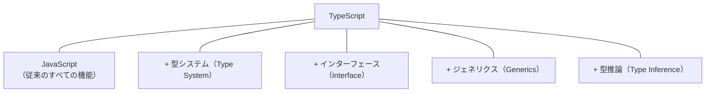
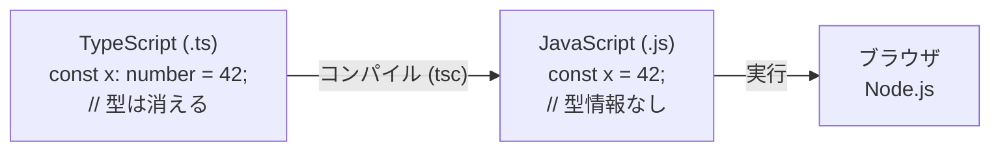
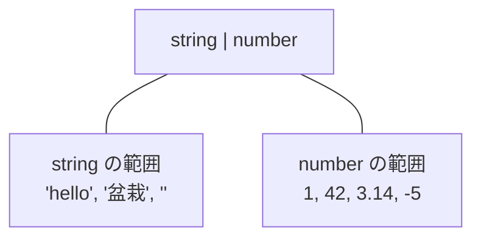
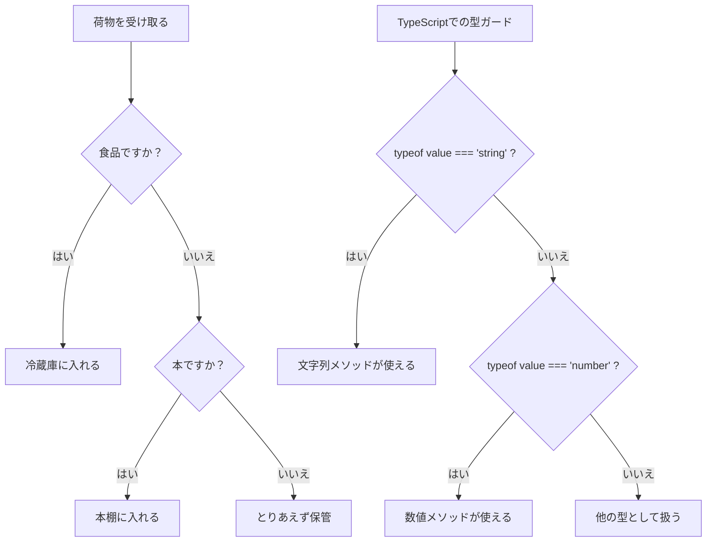
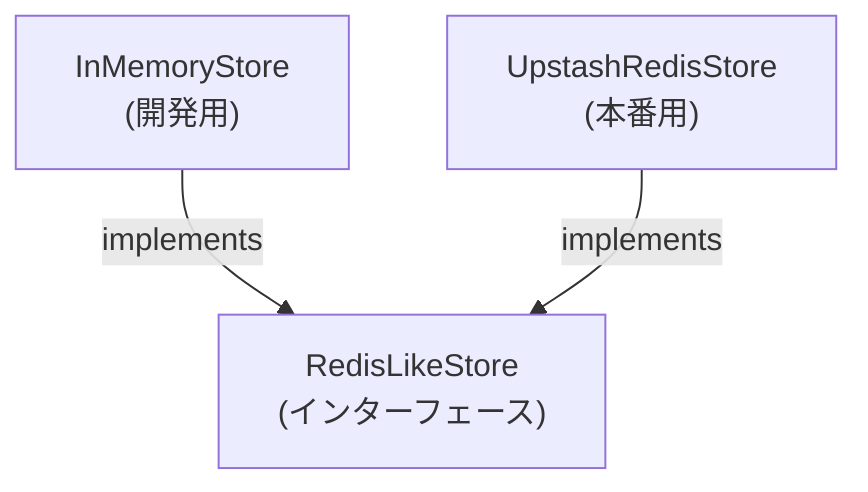
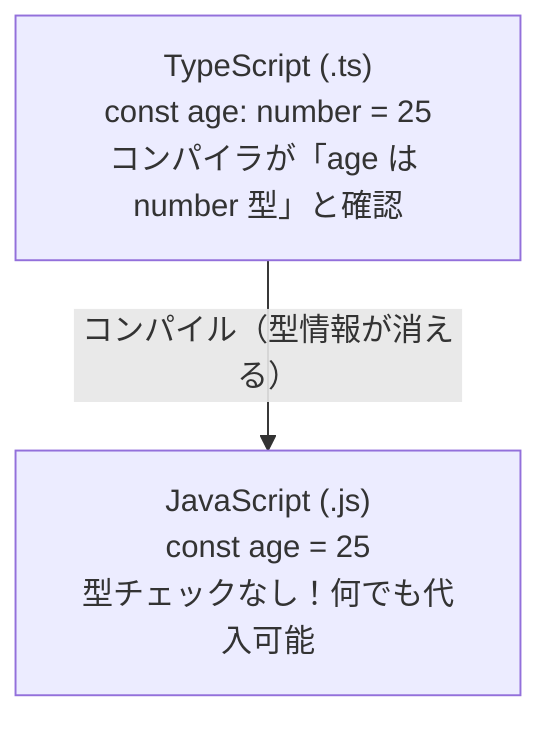
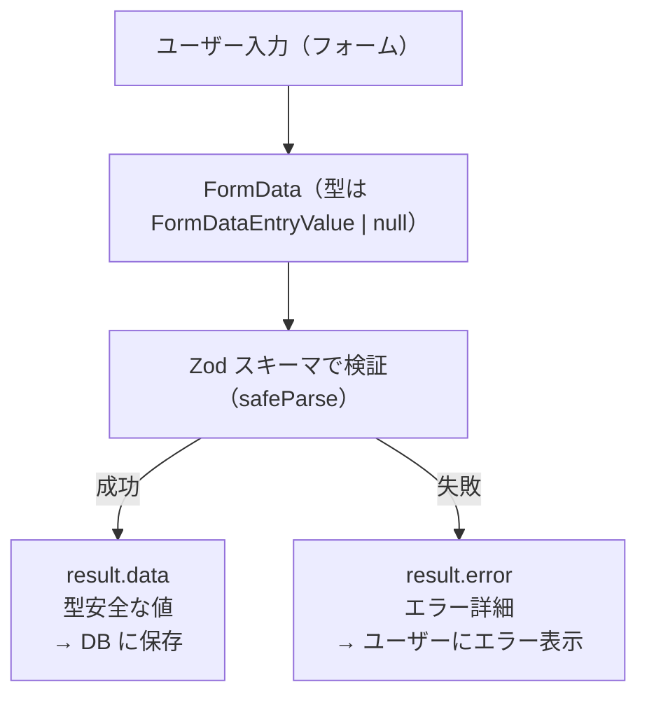

# 第3章 TypeScript入門

## はじめに

---

## 3.0 実習手順の進め方と手順マップ

手順に沿って進めると、**どのファイルに何を入力し、何を確認すればよいか** が分かります。形式の説明は [チュートリアルの進め方](./00_how_to_follow_steps.md) を参照してください。

| 手順 | 主な対象ファイル（例） | 完了時に確認すること |
|------|------------------------|------------------------|
| 型の基本・型注釈 | `*.ts` サンプル | 型エラーが読め、修正できる |
| interface / type | `*.ts` サンプル | オブジェクトの型が定義できる |
| ジェネリクス・ユニオン型 | `*.ts` サンプル | 汎用的な型が書ける |
| tsconfig.json | `tsconfig.json` | `npx tsc --noEmit` が通る |

各セクションで **対象ファイル**・**入力するコード（サンプルコード）**・**実行方法**・**実行するとこうなる**・**このあと変わること**・**確認方法** を確認しながら進めてください。

### 実習 3-0: 手順の形式の例（型注釈のサンプル）

以下は、このチュートリアル全体で使う「手順」の形式です。各章ではこの形式に沿って、サンプルコードと実行結果を記載しています。

- **対象ファイル**: プロジェクトルートに一時ファイル `sample-type.ts` を作成してよい（本番コードには含めない）
- **やること**: 型注釈を付けた変数を定義し、型チェックを体験する。
- **入力するコード（サンプルコード）**:

```typescript
// sample-type.ts（写経用サンプル）
const nickname: string = "盆栽太郎"
const age: number = 30
console.log(nickname, age)
```

- **実行方法**: ターミナルで `npx tsx sample-type.ts` を実行する（`tsx` が無い場合は `npm install -D tsx` で入れる）。または `npx tsc --noEmit` で型チェックだけ行う。
- **実行するとこうなる**:
  - **ターミナル**: `盆栽太郎 30` と1行で表示される（`console.log` の出力）。エラーは出ない。
  - もし `age` に `"30"`（文字列）を代入して保存すると、`npx tsc --noEmit` 実行時に「Type 'string' is not assignable to type 'number'」のような型エラーが表示される。
- **このあと変わること**: 型注釈（`: string`, `: number`）により、変数に入れられる値が制限される。誤った型を代入するとエディタや `tsc` が教えてくれる。
- **確認方法**: `npx tsc --noEmit` を実行し、エラーが出ないことを確認する。`sample-type.ts` は演習用なので、終わったら削除してよい。

---

### この章で学ぶこと

- TypeScriptとは何か、なぜJavaScriptではなくTypeScriptを使うのか
- 基本的な型（string, number, boolean, array, object）の使い方
- 型推論の仕組みと型注釈の書き方
- interface と type の違いと使い分け
- ジェネリクス（Generics）で柔軟な型定義を作る方法
- ユニオン型・交差型・型ガードで安全なコードを書く方法
- Utility Types（Partial, Pick, Omit等）で型を変換する方法
- tsconfig.json の設定と型エラーの読み方

### この章の位置づけ

```
第1章 環境構築 ← 開発ツールの準備
第2章 Web基礎 ← HTML/CSS/JavaScriptの基本
▶ 第3章 TypeScript入門 ← 今ここ！型で安全なコードを書く
第4章 React入門 ← TypeScriptを使ってUIを作る
```

TypeScriptは、BON-LOGプロジェクト全体で使われている言語です。この章をしっかり理解すれば、第4章以降のReact・Next.jsの学習がスムーズに進みます。

### 専門用語の一覧（この章で登場する用語）

この章では多くの専門用語が登場します。初めて出会う用語も多いと思いますので、ここでまとめて紹介します。各用語は本文中で詳しく解説しますが、読み進める中で「この言葉何だっけ？」と思ったら、ここに戻って確認してください。

| 用語 | 読み方 | 一言で説明 |
|------|--------|-----------|
| **型（Type）** | かた | データの種類を表すラベル。「この変数には文字列だけが入る」のように制限をかける |
| **型推論（Type Inference）** | かたすいろん | TypeScriptがコードを見て「この変数はstring型だな」と自動的に型を判定する機能 |
| **型注釈（Type Annotation）** | かたちゅうしゃく | 開発者が `: string` のように明示的に型を書くこと |
| **型ガード（Type Guard）** | かたがーど | `typeof` や `instanceof` などを使って、変数の型を絞り込むテクニック |
| **型アサーション（Type Assertion）** | かたあさーしょん | 開発者が「この値はこの型だ」とTypeScriptに伝える方法（`as string` など） |
| **インターフェース（Interface）** | いんたーふぇーす | オブジェクトの形状（どんなプロパティを持つか）を定義する仕組み |
| **ジェネリクス（Generics）** | じぇねりくす | 型をパラメータ（変数）のように扱い、再利用可能な型定義を作る仕組み |
| **ユニオン型（Union Type）** | ゆにおんがた | 「AまたはB」のように、複数の型のうちどれかを許可する型。`string \| number` のように書く |
| **リテラル型（Literal Type）** | りてらるがた | `"admin"` や `42` のように、特定の値そのものを型として使うこと |
| **enum（列挙型）** | いなむ | 関連する定数をまとめて名前を付ける仕組み。TypeScriptでは代わりにユニオンリテラル型を推奨 |
| **タプル（Tuple）** | たぷる | 要素の数と各位置の型が固定された配列。`[string, number]` のように書く |
| **モジュール（Module）** | もじゅーる | コードを機能ごとにファイルに分割し、`import`/`export`で共有する仕組み |
| **コンパイル（Compile）** | こんぱいる | TypeScriptのコードをJavaScriptに変換すること。この過程で型チェックが行われる |
| **トランスパイル（Transpile）** | とらんすぱいる | コンパイルとほぼ同義。ある言語から別の言語への変換を指す |

---

## 3.1 TypeScriptとは

### このセクションで学ぶこと

- TypeScriptとJavaScriptの関係
- 「型」とは何か、なぜ必要なのか
- TypeScriptのコンパイル（変換）の仕組み
- 実際に型がバグを防ぐ例

### JavaScriptの問題点

JavaScriptは**動的型付け言語**です。変数の型は実行時に決まり、自由に変更できます。

```javascript
// JavaScript — 型の制約がない
let value = "こんにちは";  // 文字列を代入
value = 42;               // 数値に変更できる（エラーにならない）
value = true;             // 真偽値にも変更できる
console.log(value);       // 実行結果: true（最後に代入された値）
```

これは柔軟ですが、大きなプロジェクトでは問題を起こします。

```javascript
// JavaScriptでよくあるバグの例
function greetUser(user) {
  // user にどんなプロパティがあるか分からない
  return "こんにちは、" + user.name + "さん！";
}

// 間違った呼び出し — 実行するまでエラーに気づけない
console.log(greetUser({ nickname: "盆栽太郎" }));
// 実行結果: "こんにちは、undefinedさん！" （nameではなくnicknameだった）
```

**実務での問題**: チーム開発で「この関数にどんなデータを渡せばいいの？」が分からず、コードを読み解く時間が大量に発生します。

### 「型」とは何か -- 日常生活での例え

プログラミングの「型」は、日常生活に例えると**ラベル付きの箱**のようなものです。

日常生活での「型」のイメージ:

| 型 | 入れられるもの | 入れられないもの |
|---|---|---|
| 「文字列」のラベルが貼られた箱 | `"盆栽太郎"`, `"こんにちは"`, `""`, `"abc123"` | `42`, `true`, `null` |
| 「数値」のラベルが貼られた箱 | `42`, `3.14`, `-5`, `0` | `"hello"`, `true`, `null` |

もう少し身近な例で考えてみましょう。

```
例1: 郵便ポスト
  - 「手紙・はがき」だけを入れる箱
  - ペットボトルを入れようとすると、形が合わなくて入らない
  → 型が合わないデータは受け付けない

例2: USBポート
  - USB Type-Cのポートには、Type-Cのケーブルだけが差さる
  - Type-Aのケーブルを差そうとすると、形が合わない
  → 型で「何が入るか」を物理的に制限している

例3: 表計算ソフトのセル
  - 「数値」に設定したセルに文字列を入力するとエラーになる
  - セルの書式設定 = 型の設定
  → 型が合わないデータを入力すると警告してくれる
```

プログラミングにおける「型」も同じです。**変数という箱に「どんな種類のデータが入るか」をあらかじめ決めておく**ことで、間違ったデータが入り込むのを防ぎます。

```typescript
// 「文字列しか入らない箱」を作る
let nickname: string = "盆栽太郎";

// 間違ったデータを入れようとすると...
nickname = 42;
// → TypeScriptが「それは入れられません！」とエラーで教えてくれる
// エラーメッセージ: Type 'number' is not assignable to type 'string'
// （日本語訳: number型はstring型に代入できません）
```

> **初心者向けポイント**: 型は「制限」ではなく「安全装置」です。最初は面倒に感じるかもしれませんが、型があることで「間違いを早く見つけられる」「エディタが賢く補完してくれる」という大きなメリットがあります。

### TypeScriptとは

**TypeScript（タイプスクリプト）** は、Microsoftが開発した、JavaScriptに**型システム**を追加したプログラミング言語です。



つまり、**TypeScript = JavaScript + 型** です。JavaScriptの知識はそのまま使えます。

```typescript
// TypeScript — 型の制約がある
let value: string = "こんにちは";  // 文字列型として宣言
console.log(value);  // 実行結果: こんにちは
value = 42;  // ❌ コンパイルエラー！数値を文字列型変数に代入できない
```

### コンパイルの仕組み

ブラウザやNode.jsはTypeScriptを直接実行できません。TypeScriptは**コンパイル（トランスパイル）** によってJavaScriptに変換されます。



**ポイント**: 型情報はコンパイル時にチェックされ、実行時には消えます。つまり、実行速度に影響はありません。

> **コンパイルとは？**
> コンパイルは「翻訳」です。TypeScriptはブラウザが直接理解できないため、JavaScriptに変換（コンパイル）する必要があります。
>
> この翻訳過程で型チェックが行われるため、実行前にエラーを発見できます：
> - **コンパイル時エラー**: コードを実行する前に見つかるエラー（スペルミス、型の不一致など）。赤い波線でエディタに表示される
> - **実行時エラー**: 実際にコードを動かした時に初めて発生するエラー（APIが落ちている、データがnullなど）
>
> TypeScriptの型情報はコンパイル後のJavaScriptには残りません。型はあくまで「開発中の安全ネット」です。

> **用語解説: コンパイル（Compile）** とは、プログラミング言語で書いたコードを、コンピュータが実行できる別の形式に変換することです。TypeScriptの場合、ブラウザやNode.jsが理解できるJavaScriptに変換します。この変換作業の中で型のチェックも行われ、型の間違いがあればエラーとして報告されます。TypeScriptのコンパイラは `tsc` というコマンドですが、BON-LOGプロジェクトではNext.jsがSWCという高速ツールで変換を行い、tscは型チェックのみを担当します。
>
> **用語解説: モジュール（Module）** とは、コードを機能ごとにファイルに分割する仕組みです。`import` で他のファイルの機能を読み込み、`export` で自分のファイルの機能を外部に公開します。TypeScriptファイル（`.ts`, `.tsx`）はそれぞれが1つのモジュールとして扱われます。

### TypeScriptを使うメリット

| メリット | 説明 | 具体例 |
|---------|------|--------|
| バグの早期発見 | コードを書いている段階でエラーを検出 | `user.nme` → 「nameのtypoでは？」 |
| IDE補完の充実 | エディタが正確な補完候補を提示 | `user.` と打つと全プロパティが候補に |
| リファクタリングの安全性 | 変更の影響範囲を正確に把握 | 関数名変更時、全使用箇所を自動検出 |
| ドキュメント代わり | 型定義がコードの仕様書になる | 「この関数は何を受け取り何を返す？」が型で分かる |
| チーム開発での認識統一 | 型がインターフェースとして機能 | データ構造の認識ズレを防止 |

### 技術選定: なぜTypeScriptを選んだのか

ここでは、BON-LOGプロジェクトがTypeScriptを採用した理由と、他の選択肢との比較を解説します。技術選定の背景を理解することで、「なぜこう書くのか」がより深く分かるようになります。

#### TypeScript vs JavaScript

「JavaScriptでも動くのに、なぜわざわざTypeScriptを使うの？」という疑問は自然です。以下に両者の比較をまとめます。

| 比較ポイント | JavaScript | TypeScript |
|---|---|---|
| 型の有無 | なし（動的型付け） | あり（静的型付け） |
| バグの検出タイミング | 実行時 | コーディング時 |
| IDE補完の精度 | 低い | 非常に高い |
| リファクタリングの安全性 | 低い | 高い |
| チーム開発での認識統一 | 難しい | 型が仕様書になる |
| 学習コスト | 低い | やや高い |
| コード記述量 | 少ない | やや多い |
| ランタイム速度 | 同じ | 同じ |

**学習コストについての正直な話**: TypeScriptの学習コストは確かにJavaScriptよりも高いです。型の書き方、ジェネリクス、Utility Typesなど、覚えることが増えます。しかし、BON-LOGのような中〜大規模プロジェクトでは、**「型を書く時間」よりも「型がないことによるバグ調査の時間」のほうが遥かに長くなる**ため、長期的にはTypeScriptのほうが開発効率が高くなります。

**BON-LOGでTypeScriptを選んだ具体的な理由**:
1. **Next.js公式がTypeScriptを推奨** -- Next.jsは `create-next-app` でTypeScriptテンプレートをデフォルトで提供
2. **Prismaの型自動生成** -- DBスキーマから型が自動生成され、データベース操作が型安全になる
3. **チーム開発への備え** -- 将来的に複数人で開発する際、型がコードの仕様書として機能する
4. **IDE補完の恩恵が大きい** -- React コンポーネントのProps、Server Actionsの引数など、補完が開発速度を大幅に向上させる

#### 型システムの選択肢: TypeScript以外にもある

JavaScriptに型を付ける方法はTypeScriptだけではありません。主な選択肢を比較します。

| 選択肢 | 概要 | メリット | デメリット |
|--------|------|---------|-----------|
| **TypeScript** | Microsoftが開発。JavaScriptのスーパーセット | 最も広く普及。エコシステムが充実 | 学習コストがある。コンパイルが必要 |
| **Flow** | Metaが開発した型チェッカー | TypeScriptと似た構文 | 普及率が低下。ツールのサポートが薄い |
| **JSDoc型注釈** | コメントに型を記述する方法 | コンパイル不要。既存JSに段階的に導入可能 | 記述が冗長。複雑な型が書きにくい |
| **ReScript** | OCaml系の別言語としてJSに変換 | 型推論が強力。soundな型システム | 学習コストが非常に高い。エコシステムが小さい |

```typescript
// 各選択肢でのコード比較

// TypeScript
function greet(name: string): string {
  return `こんにちは、${name}さん`;
}

// Flow（TypeScriptと似た構文だが、別のツールチェーン）
// function greet(name: string): string {
//   return `こんにちは、${name}さん`;
// }

// JSDoc型注釈（JavaScriptファイルのままで型を書く）
// /**
//  * @param {string} name
//  * @returns {string}
//  */
// function greet(name) {
//   return `こんにちは、${name}さん`;
// }
```

**BON-LOGがTypeScriptを選んだ理由**: 2024年現在、TypeScriptは型付きJavaScriptの事実上の標準（デファクトスタンダード）です。ライブラリの型定義（`@types/xxx`）が豊富に揃っており、Next.js、Prisma、React Queryなど、BON-LOGで使用するすべてのライブラリがTypeScriptを公式サポートしています。

#### strictモードの選択: なぜ最も厳しい設定を選んだか

TypeScriptの `tsconfig.json` では、型チェックの厳しさを調整できます。

strictモードの段階:

| 設定 | 特徴 |
|---|---|
| `strict: false`（緩い） | 型を書かなくてもエラーにならない / null/undefinedのチェックが緩い / 初心者にはやさしいが、バグを見逃す |
| `strict: true`（厳しい）**BON-LOGで採用** | 型を書かないとエラーになる / null/undefinedを厳密にチェック / 初心者には厳しいが、バグを防げる |

**BON-LOGがstrict: trueを選んだ理由**:
1. **null安全性**: `strict: false` だと `user.name` のように書いたとき、`user` が `null` でもエラーにならず、実行時に `TypeError: Cannot read property 'name' of null` というバグになる。`strict: true` なら事前に防げる
2. **暗黙のanyを防止**: 型を書き忘れると自動的に `any` 型（何でもあり）になってしまう問題を防ぐ
3. **最初から厳しくするほうが楽**: 緩い設定で始めて後から厳しくすると、大量のエラーが出て修正が大変。最初から厳しくすれば段階的にコードが整う

> **初心者向けアドバイス**: `strict: true` は最初は厳しく感じますが、エラーメッセージをひとつひとつ読み解くことで、TypeScriptの理解が確実に深まります。「エラーが出る = 学習のチャンス」と捉えましょう。

#### パスエイリアスの選択: なぜ `@/*` を選んだか

TypeScriptプロジェクトでは、インポートパスの書き方にいくつかの選択肢があります。

```typescript
// 選択肢1: 相対パス（設定不要だが、深いネストで読みにくい）
import { prisma } from "../../../lib/db";
import { Button } from "../../../components/ui/button";

// 選択肢2: @/* エイリアス（BON-LOGで採用）
import { prisma } from "@/lib/db";
import { Button } from "@/components/ui/button";

// 選択肢3: ~/* エイリアス（一部のプロジェクトで使用）
// import { prisma } from "~/lib/db";

// 選択肢4: baseUrlのみ（@なし）
// import { prisma } from "lib/db";
```

**BON-LOGが `@/*` を選んだ理由**:
1. **Next.js公式の推奨** -- `create-next-app` のデフォルト設定が `@/*`
2. **一般的な慣習** -- React/Next.jsコミュニティで最も広く使われている
3. **node_modulesとの混同を防止** -- `lib/db` だとnpmパッケージと混同する可能性があるが、`@/lib/db` なら自プロジェクトのファイルだと一目で分かる
4. **ファイル移動時の安全性** -- 相対パスだとファイルを移動するたびにインポートパスを修正する必要があるが、`@/*` はプロジェクトルートからの絶対パスなので影響が少ない

### BON-LOGプロジェクトでの活用

BON-LOGでは `tsconfig.json` で `"strict": true` を設定し、最も厳しい型チェックを有効にしています。

```
BON-LOGプロジェクトでTypeScriptが活躍する場面:

1. ユーザー情報の型定義 → User型で全プロパティが明確
2. API レスポンスの型定義 → データ構造が保証される
3. コンポーネントのProps → 必要な引数が型で分かる
4. Server Actions → 入出力の型が安全に管理される
5. Prisma ORM → DBスキーマから自動で型が生成される
```

### 理解度チェック

**Q1**: TypeScriptはJavaScriptと何が違いますか？
<details><summary>答え</summary>
TypeScriptはJavaScriptに「型システム」を追加した言語です。変数や関数の引数・戻り値に型を指定でき、コンパイル時に型チェックが行われます。
</details>

**Q2**: TypeScriptのコードはブラウザで直接実行できますか？
<details><summary>答え</summary>
いいえ。TypeScriptはコンパイル（トランスパイル）によってJavaScriptに変換してから実行します。型情報はコンパイル時に消えるため、実行速度に影響はありません。
</details>

**Q3**: TypeScriptを使う最大のメリットは何ですか？
<details><summary>答え</summary>
バグの早期発見です。実行する前に型エラーが検出されるため、「実行してみたらundefinedだった」といった問題をコーディング段階で防げます。
</details>

---

## 3.2 基本の型

### このセクションで学ぶこと

- プリミティブ型（string, number, boolean）の使い方
- null と undefined の違い
- any, unknown, void, never の使い分け
- 型注釈（Type Annotation）と型推論（Type Inference）

### 用語解説: 型注釈と型推論

このセクションで最も重要な2つの用語を、先に理解しておきましょう。

**型注釈（Type Annotation）** とは、開発者が「この変数はstring型です」とコードに明記することです。変数名の後に `: 型名` と書きます。

```typescript
// ↓ この `: string` が型注釈
const name: string = "盆栽太郎";
```

**型推論（Type Inference）** とは、TypeScriptが代入された値を見て、自動的に型を判定してくれる機能です。型注釈を書かなくても、TypeScriptが「これはstring型だな」と推論してくれます。

```typescript
// 型注釈を書いていないが、TypeScriptは "盆栽太郎" を見て
// 「これはstring型だ」と自動的に判定する
const name = "盆栽太郎";  // string型と推論される
```

> **日常生活での例え**: 型注釈は「名札を自分で書いて貼る」こと。型推論は「見た目で中身が分かるから名札がなくてもOK」ということです。りんごが入った透明な箱に「りんご」と書く必要がないのと同じです。

### プリミティブ型

**プリミティブ型（Primitive Types）** とは、最も基本的なデータの型です。

```typescript
// ===== Step 1: まず基本の3つの型を理解する =====

// ========== 文字列型 (string) ==========
// テキストデータを表す型
const nickname: string = "盆栽太郎";
console.log(nickname);                        // 実行結果: 盆栽太郎
console.log(typeof nickname);                 // 実行結果: string

const bio: string = `盆栽歴${10}年です`;      // テンプレートリテラル（変数埋め込み可能）
console.log(bio);                             // 実行結果: 盆栽歴10年です

const empty: string = "";                     // 空文字列もstring
console.log(empty.length);                    // 実行結果: 0

// ========== 数値型 (number) ==========
// 整数も小数もすべてnumber型（JavaScriptには整数型がない）
const age: number = 25;                       // 整数
const rating: number = 4.5;                   // 小数
const year: number = 2024;                    // 年号
const hex: number = 0xff;                     // 16進数
console.log(hex);                             // 実行結果: 255

// ========== 真偽値型 (boolean) ==========
// true（真）または false（偽）のみ
const isPublic: boolean = true;               // 公開アカウント
const isPremium: boolean = false;             // プレミアム会員でない
console.log(isPublic);                        // 実行結果: true
console.log(typeof isPremium);                // 実行結果: boolean
```

```typescript
// ===== Step 2: BON-LOGでの実際の使い方 =====
// ユーザー情報のフィールドはすべてプリミティブ型で定義される（第8章の認証で使用）
const userId: string = "cl123abc";          // ユーザーID（CUID形式の文字列）
const postCount: number = 42;               // 投稿数
const isVerified: boolean = true;           // メール認証済みか
console.log(`${userId}の投稿数: ${postCount}`);  // 実行結果: cl123abcの投稿数: 42
```

> **実行結果の確認方法**
> TypeScript Playground (typescriptlang.org/play) にコードを貼り付けると、`console.log` の出力結果がConsoleタブに表示されます。`typeof` 演算子で型を実行時に確認できます。

#### NG例: プリミティブ型でよくある間違い

初心者がやりがちな間違いと、そのエラーメッセージの読み方を紹介します。

```typescript
// NG例1: 型が違う値を代入する
const age: number = "25歳";
// ❌ エラー: Type 'string' is not assignable to type 'number'
// 読み方: 「string型をnumber型に代入することはできません」
// 原因: "25歳" は見た目は数字を含むが、引用符で囲まれているのでstring型
// 修正: const age: number = 25;

// NG例2: 大文字のString, Number, Booleanを使う
const name: String = "盆栽太郎";
// ⚠️ エラーにはならないが非推奨！
// String（大文字）はラッパーオブジェクト型、string（小文字）はプリミティブ型
// TypeScriptでは常に小文字の string, number, boolean を使う
// 修正: const name: string = "盆栽太郎";

// NG例3: string型の変数に計算結果を入れる
const result: string = 10 + 20;
// ❌ エラー: Type 'number' is not assignable to type 'string'
// 読み方: 10 + 20 の結果は number型（30）なので、string型の変数には入らない
// 修正: const result: number = 10 + 20;
//   または: const result: string = String(10 + 20); // "30"に変換
```

> **エラーメッセージの読み方のコツ**: TypeScriptのエラーは `Type 'X' is not assignable to type 'Y'` という形式が非常に多いです。これは「X型の値をY型の変数に入れようとしたけどダメですよ」という意味です。Xが実際に書いた値の型、Yが変数に指定された型です。

### null と undefined

この2つは似ていますが、意味が異なります。

| 値 | 意味 | 例 |
|---|---|---|
| `null` | 「値が無い」ことを意図的に示す | アバター画像を設定していない → `null` |
| `undefined` | 「値がまだ定義されていない」 | オプションのパラメータが渡されなかった |

```typescript
// null: 「値が無い」ことを明示的に表す
const avatarUrl: string | null = null;  // アバター未設定
console.log(avatarUrl);  // 実行結果: null

// undefined: 「値が未定義」
const headerUrl: string | undefined = undefined;  // ヘッダー画像なし
console.log(headerUrl);  // 実行結果: undefined

// BON-LOGのUser型での使い分け
type User = {
  nickname: string;           // 必須 — 常に存在する
  bio: string | null;         // オプション — 未設定の場合null
  avatarUrl: string | null;   // オプション — 画像が無い場合null
  birthDate: Date | null;     // オプション — 生年月日未設定の場合null
};
```

**実務でのルール**: BON-LOGでは「意図的に空」は `null`、「省略可能」は `?`（オプショナル）を使います。

### any, unknown, void, never

```typescript
// ========== any型 — 使用を避けるべき型 ==========
// 型チェックを完全に無効化する。TypeScriptの恩恵がなくなる
let anything: any = "文字列";
anything = 123;        // エラーにならない
anything = true;       // これもエラーにならない
anything.foo.bar;      // 存在しないプロパティへのアクセスもエラーにならない！
// ⚠️ any は「型安全性の放棄」を意味する。原則として使わない

// ========== unknown型 — anyの安全な代替 ==========
// 何が入っているか分からない値を安全に扱う
let unknownValue: unknown = "Hello";
// unknownValue.toUpperCase(); // ❌ エラー！型チェックしないと使えない

// 型チェック（型ガード）してから使う
if (typeof unknownValue === "string") {
  console.log(unknownValue.toUpperCase()); // 実行結果: HELLO
}

// ========== void型 — 戻り値がない関数 ==========
// 関数が何も返さないことを示す
function logMessage(message: string): void {
  console.log(message);
  // return文がない、または return; のみ
}
logMessage("テスト");   // 実行結果: テスト
console.log(typeof logMessage("テスト")); // 実行結果: undefined

// ========== never型 — 決して起こらないことを示す ==========
// 関数が正常に終了しない（例外をスローする、無限ループ）
function throwError(message: string): never {
  throw new Error(message);
  // この行には到達しない
}
// throwError("エラー発生"); // 実行結果: Error: エラー発生（例外がスローされる）
```

#### NG例: any, unknown でよくある間違い

```typescript
// NG例1: unknown型を型チェックせずに使う
let data: unknown = "hello";
console.log(data.toUpperCase());
// ❌ エラー: 'data' is of type 'unknown'.
// 読み方: 「dataはunknown型なので、メソッドを直接呼び出せません」
// unknown型は「型が分からないもの」なので、TypeScriptは安全のためアクセスを禁止する
// 修正: if (typeof data === "string") { console.log(data.toUpperCase()); }

// NG例2: anyを安易に使ってバグを見逃す
function getLength(value: any): number {
  return value.length;
  // ⚠️ エラーにはならないが危険！
  // value が number（42）の場合、42.length は undefined
  // any型は型チェックを放棄するので、こういうバグを見逃す
}
getLength(42); // 実行時に undefined が返る（バグ）

// 修正: unknown型 + 型ガードを使う
function getLengthSafe(value: unknown): number {
  if (typeof value === "string") {
    return value.length;
  }
  if (Array.isArray(value)) {
    return value.length;
  }
  return 0;  // string でも配列でもない場合
}

// NG例3: void関数で値を返す
function logMessage(msg: string): void {
  return msg;
  // ❌ エラー: Type 'string' is not assignable to type 'void'
  // 読み方: 「void型（何も返さない）なのに、string型の値を返そうとしています」
  // void関数は return 文を書かないか、return; のみにする
}
```

### 型注釈と型推論

**型注釈（Type Annotation）** は、開発者が明示的に型を指定することです。
**型推論（Type Inference）** は、TypeScriptが自動的に型を判定することです。

```typescript
// ========== 型注釈（明示的に書く） ==========
const name: string = "盆栽太郎";     // 型を明示
const age: number = 25;              // 型を明示
const isActive: boolean = true;      // 型を明示
console.log(name, age, isActive);    // 実行結果: 盆栽太郎 25 true

// ========== 型推論（TypeScriptが自動判定） ==========
const name2 = "盆栽太郎";    // 型推論: string
const age2 = 25;             // 型推論: number
const isActive2 = true;      // 型推論: boolean（型注釈なしでも同じ結果！）
console.log(typeof name2);   // 実行結果: string
console.log(typeof age2);    // 実行結果: number

// 型推論の確認方法:
// VS Codeで変数にカーソルを合わせると、推論された型が表示される

// ========== 型注釈が必要な場合 ==========
// 1. 関数の引数（推論できない）
function greet(name: string): string {  // 引数と戻り値に型注釈が必要
  return `こんにちは、${name}さん！`;
}
console.log(greet("盆栽太郎"));         // 実行結果: こんにちは、盆栽太郎さん！

// 2. 初期値がない場合
let userId: string;  // 後で値を代入する場合、型注釈が必要
userId = "user123";
console.log(userId);                    // 実行結果: user123

// 3. 複数の型を許可する場合
let input: string | number;  // Union型は明示が必要
input = "テキスト";
console.log(input);                     // 実行結果: テキスト
input = 42;
console.log(input);                     // 実行結果: 42

// ========== 型注釈が不要な場合（推論に任せる） ==========
const posts = [];  // ❌ any[]と推論される — これは避ける
const posts2: Post[] = [];  // ✅ 型注釈を付ける
const count = posts2.length;  // 型推論: number — 注釈不要
console.log(count);                     // 実行結果: 0
```

**実務での使い分け**:
- 変数の初期値から型が明らかな場合 → 型推論に任せる
- 関数の引数・戻り値 → 型注釈を書く
- 空の配列・オブジェクト → 型注釈を書く

> **型注釈を書くべき場面・省略してよい場面**
> ```typescript
> // ✅ 省略してよい（TypeScriptが自動推論できる）
> const name = '太郎'           // string と自動推論
> const count = 42              // number と自動推論
> const items = ['a', 'b']     // string[] と自動推論
>
> // ✅ 書くべき（推論できない・曖昧な場面）
> function getUser(id: string): User { ... }  // 関数の引数・戻り値
> const data: ApiResponse = await fetch(...)   // API応答の型
> let status: 'active' | 'inactive'            // 後から代入する変数
> ```
>
> **原則**: 関数の引数には必ず型を書く。変数は初期値から推論できるなら省略してよい。

### よくあるトラブルと解決法

| トラブル | 原因 | 解決法 |
|---------|------|--------|
| `Type 'string' is not assignable to type 'number'` | 型が合わない代入 | 正しい型の値を代入する |
| `Object is possibly 'null'` | nullチェックが未実施 | `if (value !== null)` で確認 |
| `Object is possibly 'undefined'` | undefinedチェックが未実施 | `if (value !== undefined)` または `value?.property` |
| 変数が `any` 型になる | 型注釈なし + 推論できない | 明示的に型注釈を付ける |

### 理解度チェック

**Q1**: `any` 型と `unknown` 型の違いは何ですか？
<details><summary>答え</summary>
`any`は型チェックを完全に無効化し、何でもできてしまいます。`unknown`は型が不明な値を安全に扱うための型で、使用前に型チェック（型ガード）が必要です。安全性の観点から`unknown`を使うべきです。
</details>

**Q2**: 以下のコードで型推論される型は何ですか？
```typescript
const items = [1, 2, 3];
const mixed = [1, "hello", true];
```
<details><summary>答え</summary>
`items`は`number[]`型、`mixed`は`(string | number | boolean)[]`型と推論されます。
</details>

**Q3**: 型注釈を書くべき場面と、型推論に任せるべき場面を1つずつ挙げてください。
<details><summary>答え</summary>
型注釈を書くべき: 関数の引数（TypeScriptは引数の型を推論できないため）。型推論に任せるべき: 初期値から型が明らかな変数（`const name = "太郎"` など冗長な型注釈は不要）。
</details>

---

## 3.3 リテラル型とUnion型

### このセクションで学ぶこと

- リテラル型で「特定の値のみ」を許可する方法
- Union型で「複数の型のうちどれか」を表現する方法
- 判別可能なユニオン型（Discriminated Unions）の使い方

### リテラル型

**リテラル型（Literal Types）** は、特定の値だけを許可する型です。

```typescript
// ===== Step 1: まず基本のリテラル型を理解する =====

// 文字列リテラル型 — 特定の文字列のみ許可
type UserRole = "admin" | "moderator" | "user";
const role: UserRole = "admin";       // ✅ OK
console.log(role);                    // 実行結果: admin
// const role2: UserRole = "guest";   // ❌ エラー！"guest"は許可されていない

// 数値リテラル型 — 特定の数値のみ許可
type Rating = 1 | 2 | 3 | 4 | 5;
const myRating: Rating = 5;           // ✅ OK
console.log(myRating);                // 実行結果: 5
// const bad: Rating = 6;             // ❌ エラー！
```

```typescript
// ===== Step 2: BON-LOGの通知タイプをリテラル型で定義する =====
// BON-LOGでは通知の種類をリテラル型で管理（第11章の通知機能で使用）
type NotificationType =
  | "like"           // いいね通知
  | "comment"        // コメント通知
  | "follow"         // フォロー通知
  | "quote"          // 引用通知
  | "reply"          // 返信通知
  | "comment_like";  // コメントいいね通知

const notification: NotificationType = "like";
console.log(notification);            // 実行結果: like

// BON-LOGの実例: 投稿メディアタイプ
type MediaType = "image" | "video";
const media: MediaType = "image";
console.log(media);                   // 実行結果: image

// BON-LOGの実例: 投稿ステータス
type PostStatus = "draft" | "published" | "hidden";
```

> **実行結果の確認方法**
> TypeScript Playground で `const bad: NotificationType = "typo"` と入力すると、即座に赤い波線でエラーが表示されます。BON-LOGでは、これらのリテラル型がスペルミスを防ぎ、通知の種類を正確に管理しています。

#### NG例: リテラル型でよくある間違い

```typescript
type UserRole = "admin" | "moderator" | "user";

// NG例1: スペルミス
const role: UserRole = "adimn";
// ❌ エラー: Type '"adimn"' is not assignable to type 'UserRole'.
// 読み方: 「"adimn"はUserRole型に代入できません」
// TypeScriptはスペルミスを検出してくれる！
// 修正: const role: UserRole = "admin";

// NG例2: 変数から代入する場合の罠
let inputRole = "admin";
const role2: UserRole = inputRole;
// ❌ エラー: Type 'string' is not assignable to type 'UserRole'.
// 読み方: inputRole は string型に推論されるため、UserRole型には代入できない
// let で宣言すると "admin" ではなく string に推論されるのがポイント
// 修正1: const inputRole = "admin"; // constにするとリテラル型 "admin" に推論される
// 修正2: let inputRole = "admin" as UserRole; // 型アサーションで指定
// 修正3: let inputRole: UserRole = "admin"; // 型注釈で指定
```

> **初心者向け補足**: `const` と `let` で型推論が変わるのは重要なポイントです。`const` で宣言した変数は値が変わらないので、TypeScriptは具体的なリテラル型（`"admin"`）に推論します。`let` で宣言した変数は値が変わる可能性があるので、より広い型（`string`）に推論します。

### Union型（ユニオン型）

**Union型（ユニオンがた）** は、複数の型のうちどれか1つを取る型です。`|`（パイプ）で区切ります。



> `string | number` → 文字列か数値のどちらかが入る

```typescript
// 基本的なUnion型
type StringOrNumber = string | number;
let value: StringOrNumber;
value = "こんにちは";  // ✅ OK（string）
console.log(value);    // 実行結果: こんにちは
value = 42;           // ✅ OK（number）
console.log(value);    // 実行結果: 42
// value = true;      // ❌ エラー！（booleanは許可されていない）

// 型の絞り込み（Type Narrowing）
function displayValue(value: string | number): string {
  if (typeof value === "string") {
    // このブロック内では value は string 型
    return value.toUpperCase();   // 文字列メソッドが使える
  } else {
    // このブロック内では value は number 型
    return value.toFixed(2);      // 数値メソッドが使える
  }
}
console.log(displayValue("hello"));   // 実行結果: HELLO
console.log(displayValue(3.14159));   // 実行結果: 3.14
```

#### NG例: Union型でよくある間違い

```typescript
// NG例1: Union型の値に型チェックなしでメソッドを呼ぶ
function processValue(value: string | number) {
  console.log(value.toUpperCase());
  // ❌ エラー: Property 'toUpperCase' does not exist on type 'string | number'.
  //          Property 'toUpperCase' does not exist on type 'number'.
  // 読み方: 「toUpperCaseはstring | number型には存在しません。
  //         number型にはtoUpperCaseがありません」
  // 原因: value が number の可能性があるため、string専用メソッドを直接呼べない
  // 修正: if (typeof value === "string") { console.log(value.toUpperCase()); }
}

// NG例2: Union型の絞り込みが不十分
function formatInput(input: string | number | boolean) {
  if (typeof input === "string") {
    return input.toUpperCase();
  }
  return input.toFixed(2);
  // ❌ エラー: Property 'toFixed' does not exist on type 'number | boolean'.
  // 読み方: else節に入った時点で input は number | boolean のどちらか
  //         boolean に toFixed メソッドはないのでエラー
  // 修正: if (typeof input === "number") { return input.toFixed(2); }
  //       return String(input); // boolean の場合
}
```

> **用語解説: 型の絞り込み（Type Narrowing）** とは、Union型の変数に対して `typeof` や `if` で条件チェックを行い、特定の型に限定するテクニックのことです。TypeScriptはこの絞り込みを理解して、各ブロック内で使えるメソッドを正しく判定してくれます。

### 判別可能なユニオン型（Discriminated Unions）

共通のプロパティ（**判別子**）を持つオブジェクト型のユニオンです。BON-LOGで頻繁に使います。

```typescript
// ===== Step 1: 判別子（status）で分岐する基本パターン =====
// 各型に共通の status プロパティ（判別子）がある
type Result =
  | { status: "success"; data: string }    // 成功時はdataを持つ
  | { status: "error"; error: string }     // エラー時はerrorを持つ
  | { status: "loading" };                 // 読み込み中は追加プロパティなし

function handleResult(result: Result) {
  switch (result.status) {
    case "success":
      // TypeScriptが自動で型を絞り込む → data にアクセス可能
      console.log(result.data);            // 実行結果: （dataの値が表示される）
      break;
    case "error":
      // TypeScriptが自動で型を絞り込む → error にアクセス可能
      console.error(result.error);         // 実行結果: （errorメッセージが表示される）
      break;
    case "loading":
      console.log("読み込み中...");         // 実行結果: 読み込み中...
      break;
  }
}

handleResult({ status: "success", data: "投稿が完了しました" });
// 実行結果: 投稿が完了しました

handleResult({ status: "error", error: "ネットワークエラー" });
// 実行結果: ネットワークエラー
```

// BON-LOGの実例: Server Actionの戻り値（types/action-result.ts）
type ActionResult<T = void> =
  | { success: true; data?: T }
  | { success: false; error: string };

// 使用例
async function createPost(content: string): Promise<ActionResult<{ postId: string }>> {
  try {
    const post = await prisma.post.create({ data: { content, userId: "user123" } });
    return { success: true, data: { postId: post.id } };
  } catch {
    return { success: false, error: "投稿の作成に失敗しました" };
  }
}

const result = await createPost("こんにちは");
if (result.success) {
  console.log("投稿ID:", result.data.postId);  // ✅ data にアクセス可能
} else {
  console.error("エラー:", result.error);       // ✅ error にアクセス可能
}
```

### 理解度チェック

**Q1**: リテラル型 `type Direction = "up" | "down" | "left" | "right"` に `"diagonal"` を代入するとどうなりますか？
<details><summary>答え</summary>
コンパイルエラーになります。リテラル型は指定された値のみを許可するため、`"diagonal"` は代入できません。
</details>

**Q2**: 判別可能なユニオン型（Discriminated Unions）を使う利点は何ですか？
<details><summary>答え</summary>
共通のプロパティ（判別子）で分岐することで、TypeScriptが自動的に型を絞り込んでくれます。switch文やif文で判別子を確認すると、各ブロック内で正しいプロパティにアクセスできます。
</details>

---

## 3.4 配列とオブジェクトの型

### このセクションで学ぶこと

- 配列の型定義（`number[]` と `Array<number>`）
- タプル型で固定長の配列を表現する方法
- オブジェクト型の定義方法
- オプショナルプロパティと読み取り専用プロパティ

### 配列型

```typescript
// ========== 基本的な配列型 ==========
const numbers: number[] = [1, 2, 3, 4, 5];        // 数値の配列
const names: string[] = ["太郎", "花子", "次郎"];    // 文字列の配列
const flags: boolean[] = [true, false, true];       // 真偽値の配列
console.log(numbers.length);    // 実行結果: 5
console.log(names[0]);          // 実行結果: 太郎
console.log(flags.includes(true)); // 実行結果: true

// ジェネリクス構文（同じ意味）
const numbers2: Array<number> = [1, 2, 3];

// BON-LOGの実例: 投稿メディアの配列
type PostMedia = {
  id: string;
  url: string;
  type: "image" | "video";
  sortOrder: number;
};

const media: PostMedia[] = [
  { id: "1", url: "/img1.jpg", type: "image", sortOrder: 0 },
  { id: "2", url: "/img2.jpg", type: "image", sortOrder: 1 },
];

// ========== 読み取り専用配列 ==========
const readonlyNumbers: readonly number[] = [1, 2, 3];
// readonlyNumbers.push(4);     // ❌ エラー！変更できない
// readonlyNumbers[0] = 10;     // ❌ エラー！変更できない
```

#### NG例: 配列型でよくある間違い

```typescript
// NG例1: 空の配列を型注釈なしで宣言
const items = [];
items.push("hello");
items.push(42);
// ⚠️ items は any[] に推論される — 何でも入ってしまう！
// TypeScriptの型安全性が失われる
// 修正: const items: string[] = [];

// NG例2: 配列の型が合わない要素を追加
const numbers: number[] = [1, 2, 3];
numbers.push("4");
// ❌ エラー: Argument of type 'string' is not assignable to parameter of type 'number'.
// 読み方: 「string型の引数をnumber型のパラメータに渡すことはできません」
// 修正: numbers.push(4); // 数値として追加

// NG例3: readonly配列を変更しようとする
const readonlyList: readonly string[] = ["a", "b", "c"];
readonlyList.push("d");
// ❌ エラー: Property 'push' does not exist on type 'readonly string[]'.
// 読み方: 「readonly string[]型にはpushメソッドが存在しません」
// readonly配列は変更操作（push, pop, splice等）がすべて禁止される
```

### タプル型

**タプル型（Tuple Types）** は、要素の数と各位置の型が固定された配列です。

```typescript
// [string, number] — 1番目が文字列、2番目が数値
const userInfo: [string, number] = ["盆栽太郎", 25];

// 要素へのアクセス
const name = userInfo[0];   // 型: string
const age = userInfo[1];    // 型: number
console.log(name);          // 実行結果: 盆栽太郎
console.log(age);           // 実行結果: 25

// ReactのuseStateはタプルを返す
// const [count, setCount] = useState(0);
// → [number, (value: number) => void] 型のタプル

// BON-LOGでの実例: 座標（緯度, 経度）— 盆栽園マップ機能で使用
type Coordinate = [number, number];
const shopLocation: Coordinate = [35.6762, 139.6503];  // 東京の座標
console.log(shopLocation[0]);  // 実行結果: 35.6762（緯度）
console.log(shopLocation[1]);  // 実行結果: 139.6503（経度）
```

> **用語解説: タプル（Tuple）** とは、「固定長で各要素の型が決まった配列」のことです。通常の配列は要素数が不定で全要素が同じ型ですが、タプルは「1番目はstring、2番目はnumber」のように各位置の型が異なります。Pythonなど他のプログラミング言語にもある概念です。

```typescript
// NG例: タプル型の要素の順序を間違える
const userInfo: [string, number] = [25, "盆栽太郎"];
// ❌ エラー: Type 'number' is not assignable to type 'string'.
//          Type 'string' is not assignable to type 'number'.
// 読み方: 1番目はstring型、2番目はnumber型と決まっているのに、逆の順番で代入した
// 修正: const userInfo: [string, number] = ["盆栽太郎", 25];
```

### オブジェクト型

```typescript
// ========== オブジェクトリテラル型 ==========
const user: {
  id: string;
  nickname: string;
  email: string;
  isPublic: boolean;
} = {
  id: "user123",
  nickname: "盆栽太郎",
  email: "taro@example.com",
  isPublic: true,
};
console.log(user.nickname);  // 実行結果: 盆栽太郎
console.log(user.isPublic);  // 実行結果: true

// ========== オプショナルプロパティ（?） ==========
// ?を付けると省略可能になる
const post: {
  id: string;
  content: string;
  imageUrl?: string;  // 省略可能（undefined | string）
} = {
  id: "post123",
  content: "こんにちは",
  // imageUrl は省略してもOK
};
console.log(post.content);   // 実行結果: こんにちは
console.log(post.imageUrl);  // 実行結果: undefined（省略されたため）

// ========== 読み取り専用プロパティ（readonly） ==========
const config: {
  readonly apiUrl: string;
  readonly maxRetries: number;
} = {
  apiUrl: "https://api.example.com",
  maxRetries: 3,
};
// config.apiUrl = "...";  // ❌ エラー！readonlyなので変更不可

// ========== インデックスシグネチャ ==========
// 任意のキーを許可する
const settings: { [key: string]: boolean | string | number } = {
  darkMode: true,
  language: "ja",
  fontSize: 16,
};
console.log(settings.language);  // 実行結果: ja
console.log(settings.fontSize);  // 実行結果: 16
```

### 理解度チェック

**Q1**: `number[]` と `readonly number[]` の違いは何ですか？
<details><summary>答え</summary>
`number[]`は要素の追加・変更・削除が可能ですが、`readonly number[]`は変更不可能です。push、splice、要素の直接代入などがすべてコンパイルエラーになります。
</details>

**Q2**: タプル型 `[string, number, boolean]` に `["hello", 42]` を代入するとどうなりますか？
<details><summary>答え</summary>
コンパイルエラーになります。タプル型は要素の数も厳密にチェックするため、3要素のタプルに2要素の配列は代入できません。
</details>

---

## 3.5 interface と type

### このセクションで学ぶこと

- interface でオブジェクトの形状を定義する方法
- type でエイリアス（別名）を定義する方法
- interface と type の違いと使い分けの指針

### 用語解説: interfaceとtypeの概念

**interface（インターフェース）** という言葉は「接点」「境界面」という意味です。プログラミングでは「外部とのやり取りの仕様」を意味します。

| 例え | 仕様（interface） | 効果 |
|---|---|---|
| コンセントの形状 | 「2つの穴がある」「100V」という仕様が決まっている | この仕様を満たすプラグなら何でも差し込める |
| TypeScriptのinterface | 「idはstring」「nicknameはstring」という仕様が決まっている | この仕様を満たすオブジェクトなら何でも受け付ける |

**type（タイプエイリアス）** は「型に別名（エイリアス）を付ける」仕組みです。既存の型に短い名前を付けたり、複雑な型定義に名前を付けたりします。

### interface

**interface（インターフェース）** は、オブジェクトの形状（プロパティ名と型）を定義します。

```typescript
// ===== Step 1: まずシンプルなinterfaceを理解する =====
interface SimpleUser {
  id: string;
  nickname: string;
}

const simpleUser: SimpleUser = {
  id: "user123",
  nickname: "盆栽太郎",
};
console.log(simpleUser.nickname);  // 実行結果: 盆栽太郎
console.log(simpleUser.id);        // 実行結果: user123
```

```typescript
// ===== Step 2: BON-LOGのUser型を完全に定義する =====
// interfaceの基本 — BON-LOGの実際のユーザー型に近い定義
interface User {
  id: string;              // ユーザーID
  nickname: string;        // 表示名
  email: string;           // メールアドレス
  avatarUrl: string | null; // アバター画像URL（未設定ならnull）
  bio: string | null;      // 自己紹介（未設定ならnull）
  isPublic: boolean;       // 公開アカウントか
  createdAt: Date;         // 作成日時
}

// interfaceを使ってオブジェクトを定義
const user: User = {
  id: "user123",
  nickname: "盆栽太郎",
  email: "taro@example.com",
  avatarUrl: "/avatar.jpg",
  bio: "盆栽歴10年です",
  isPublic: true,
  createdAt: new Date(),
};
console.log(user.nickname);         // 実行結果: 盆栽太郎
console.log(user.bio);              // 実行結果: 盆栽歴10年です
console.log(user.avatarUrl);        // 実行結果: /avatar.jpg
```

> **実行結果の確認方法**
> TypeScript Playground (typescriptlang.org/play) にコードを貼り付けると、`user.` と入力した瞬間にinterfaceで定義した全プロパティが補完候補として表示されます。BON-LOGでは、Prismaのスキーマから自動生成される型がこのinterfaceと同様の役割を果たします。

// ========== interfaceの拡張（extends） ==========
// 既存のinterfaceを拡張して新しいinterfaceを作る
interface PremiumUser extends User {
  isPremium: boolean;              // プレミアム会員か
  premiumExpiresAt: Date | null;   // プレミアム期限
}

const premiumUser: PremiumUser = {
  // Userの全プロパティ + PremiumUserの追加プロパティ
  id: "user456",
  nickname: "盆栽花子",
  email: "hanako@example.com",
  avatarUrl: null,
  bio: null,
  isPublic: true,
  createdAt: new Date(),
  isPremium: true,
  premiumExpiresAt: new Date("2025-12-31"),
};

// ========== interfaceでメソッドを定義 ==========
interface UserActions {
  follow(userId: string): Promise<void>;
  unfollow(userId: string): Promise<void>;
  block(userId: string): Promise<void>;
}
```

### type

**type（タイプエイリアス）** は、任意の型に別名を付けます。

```typescript
// typeの基本
type Post = {
  id: string;
  userId: string;
  content: string | null;
  createdAt: Date;
};

// typeエイリアス（既存の型に別名を付ける）
type ID = string;           // 型: string のエイリアス
type Timestamp = Date;      // 型: Date のエイリアス

// ユニオン型を定義できる（interfaceではできない）
type Status = "active" | "inactive" | "suspended";
type StringOrNumber = string | number;

// 交差型（Intersection Types）で合成
type Timestamps = {
  createdAt: Date;
  updatedAt: Date;
};

type PostWithTimestamps = Post & Timestamps;
```

### interface と type の違い

| 機能 | interface | type |
|---|---|---|
| オブジェクト型の定義 | o | o |
| extends で拡張 | o | x（&で代替） |
| 同名の宣言マージ | o | x |
| ユニオン型の定義 | x | o |
| プリミティブのエイリアス | x | o |
| タプル型の定義 | x | o |
| Mapped Types | x | o |

```typescript
// ✅ interfaceのみ: 宣言マージ
interface Animal {
  name: string;
}
interface Animal {    // 同名で再定義 → 自動マージ
  age: number;
}
const dog: Animal = { name: "ポチ", age: 3 };  // 両方のプロパティが必要
console.log(dog.name, dog.age);  // 実行結果: ポチ 3

// ✅ typeのみ: ユニオン型
type Status = "active" | "inactive";    // interfaceではできない
type ID = string | number;              // interfaceではできない
```

> **実践的な選択基準**
> - **オブジェクトの形を定義** → `interface`（拡張しやすい）
> - **ユニオン型・交差型・条件型** → `type`（`interface`では不可能）
> - **Reactコンポーネントのprops** → `type`（業界慣習）
> - **迷ったら** → `type` を使う（より汎用的）

#### NG例: interface / type でよくある間違い

```typescript
interface User {
  id: string;
  nickname: string;
  email: string;
}

// NG例1: interfaceに定義されていないプロパティを持つオブジェクト
const user: User = {
  id: "user123",
  nickname: "盆栽太郎",
  email: "taro@example.com",
  age: 25,
};
// ❌ エラー: Object literal may only specify known properties,
//          and 'age' does not exist in type 'User'.
// 読み方: 「オブジェクトリテラルは定義済みのプロパティのみ指定できます。
//         'age' はUser型に存在しません」
// 修正: User interfaceにageを追加するか、ageを削除する

// NG例2: interfaceの必須プロパティが足りない
const user2: User = {
  id: "user456",
  nickname: "盆栽花子",
};
// ❌ エラー: Property 'email' is missing in type '{ id: string; nickname: string; }'
//          but required in type 'User'.
// 読み方: 「emailプロパティが足りません。User型では必須です」
// 修正: email プロパティを追加する

// NG例3: typeでユニオン型を定義しようとしてinterfaceを使ってしまう
// interface Status = "active" | "inactive";  // ❌ 構文エラー！
// interfaceはユニオン型を定義できない
// 修正: type Status = "active" | "inactive";  // typeを使う
```

**BON-LOGでの使い分けルール**:
- オブジェクトの形状定義 → `interface` を優先
- ユニオン型・複雑な型操作 → `type` を使用
- コンポーネントのProps → `type` を使用（プロジェクト慣習）

### 理解度チェック

**Q1**: interface と type のどちらでもできることは何ですか？
<details><summary>答え</summary>
オブジェクト型の定義です。`interface User { name: string }` と `type User = { name: string }` はほぼ同等に使えます。
</details>

**Q2**: `type Status = "active" | "inactive"` を interface で書くことはできますか？
<details><summary>答え</summary>
いいえ、できません。ユニオン型を定義できるのはtypeのみです。interfaceはオブジェクトの形状しか定義できません。
</details>

---

## 3.6 ジェネリクス（Generics）

### このセクションで学ぶこと

- ジェネリクスの概念を身近な例で理解する
- ジェネリック関数の作り方
- ジェネリック型（インターフェース）の定義
- 制約付きジェネリクス（extends）

### 用語解説: ジェネリクスの概念

**ジェネリクス（Generics）** という言葉は「汎用的な」「一般的な」という意味です。プログラミングでは「特定の型に縛られず、さまざまな型で使い回せる」仕組みを意味します。

日常生活でのジェネリクスの例え:

| 段ボール箱 = ジェネリクス | 中身 | 結果 |
|---|---|---|
| 段ボール箱の仕様: 「何かを1つ入れて、取り出す」 | 本 | 本が入った箱 |
|  | 食器 | 食器が入った箱 |
|  | 盆栽 | 盆栽が入った箱 |

> 箱の「使い方」は同じで、中身の「型」だけが変わる

| TypeScriptのジェネリクス | 型パラメータ | 結果 |
|---|---|---|
| `Box<T>` の仕様: 「T型のものを1つ入れて、取り出す」 | `string` | `Box<string>` 文字列が入った箱 |
|  | `number` | `Box<number>` 数値が入った箱 |
|  | `User` | `Box<User>` ユーザーが入った箱 |

> 箱の「仕組み」は同じで、中身の「型」だけが変わる

### ジェネリクスとは

> **ジェネリクスの考え方**
> ジェネリクス `<T>` は「型の変数」です。普通の変数が値を入れる箱なら、ジェネリクスは型を入れる箱です。
>
> ```typescript
> // 普通の関数: 値のパラメータ
> function double(x: number): number { return x * 2 }
>
> // ジェネリクス: 型のパラメータ
> function first<T>(arr: T[]): T { return arr[0] }
>
> first<string>(['a', 'b'])  // T = string → 戻り値も string
> first<number>([1, 2, 3])   // T = number → 戻り値も number
> first(['a', 'b'])          // T = string（自動推論）
> ```
>
> `<T>` がないと、`any[]` を受け取って `any` を返す関数になり、型安全性が失われます。

**ジェネリクス（Generics）** は、型を「パラメータ化」する機能です。

```
ジェネリクスのイメージ — 「型の入れ物」

  普通の関数:
    function add(a: number, b: number): number  ← 型が固定

  ジェネリック関数:
    function getFirst<T>(array: T[]): T         ← 型がパラメータ
                     ↑
                     T は「型の変数」
                     使うときに具体的な型が入る

  getFirst<string>(["a", "b"]) → T = string → 戻り値も string
  getFirst<number>([1, 2, 3])  → T = number → 戻り値も number
```

### ジェネリック関数

```typescript
// ジェネリクスを使わない場合 — 型ごとに関数が必要
function getFirstString(array: string[]): string {
  return array[0];
}
function getFirstNumber(array: number[]): number {
  return array[0];
}
console.log(getFirstString(["a", "b", "c"]));  // 実行結果: a
console.log(getFirstNumber([1, 2, 3]));        // 実行結果: 1

// ジェネリクスを使った汎用的な関数 — 1つの関数で両方対応！
function getFirst<T>(array: T[]): T {
  return array[0];
}

// 使用例 — 型パラメータを明示的に指定
const firstStr = getFirst<string>(["a", "b", "c"]);   // 型: string
const firstNum = getFirst<number>([1, 2, 3]);          // 型: number
console.log(firstStr);    // 実行結果: a
console.log(firstNum);    // 実行結果: 1

// 型推論により省略もできる
const firstStr2 = getFirst(["a", "b", "c"]);  // 型推論: string
const firstNum2 = getFirst([1, 2, 3]);         // 型推論: number
console.log(firstStr2);   // 実行結果: a
console.log(firstNum2);   // 実行結果: 1
```

### ジェネリック型の定義

```typescript
// ===== Step 1: まずジェネリック型の基本を理解する =====
// ApiResponse<T> — Tに具体的な型を入れて使う
interface ApiResponse<T> {
  success: boolean;   // 成功したか
  data: T;           // レスポンスデータ（型はTで柔軟に）
  error?: string;    // エラーメッセージ（オプショナル）
}
```

```typescript
// ===== Step 2: Tに具体的な型を入れてみる =====

// ユーザー取得 → T = User
type GetUserResponse = ApiResponse<User>;
// 型: { success: boolean; data: User; error?: string; }

// 投稿一覧取得 → T = Post[]
type GetPostsResponse = ApiResponse<Post[]>;
// 型: { success: boolean; data: Post[]; error?: string; }

// 実際に値を作ってみる
const userResponse: ApiResponse<User> = {
  success: true,
  data: { id: "user123", nickname: "盆栽太郎", email: "taro@example.com",
          avatarUrl: null, bio: null, isPublic: true, createdAt: new Date() },
};
console.log(userResponse.success);          // 実行結果: true
console.log(userResponse.data.nickname);    // 実行結果: 盆栽太郎
```

```typescript
// ===== BON-LOGでの実際の使い方: ページネーション付きレスポンス =====
// タイムラインの無限スクロールで使用する型（第7章で実装）
interface PaginatedResponse<T> {
  data: T[];                  // データの配列
  nextCursor: string | null;  // 次ページのカーソル
  hasMore: boolean;           // 次ページがあるか
}

type PaginatedPosts = PaginatedResponse<Post>;
// 型: { data: Post[]; nextCursor: string | null; hasMore: boolean; }

// 関数での使用例
async function fetchPosts(cursor?: string): Promise<PaginatedResponse<Post>> {
  const response = await fetch(`/api/posts?cursor=${cursor || ""}`);
  return response.json();
}
```

> **実行結果の確認方法**
> TypeScript Playground で `ApiResponse<string>` と `ApiResponse<number>` の2つを定義し、それぞれの `data` プロパティの型が異なることを確認してみましょう。BON-LOGでは、すべてのAPIエンドポイントがこのパターンでレスポンスの型を統一しています。
```

#### NG例: ジェネリクスでよくある間違い

```typescript
// NG例1: 型パラメータを指定し忘れてanyになる
function identity<T>(value: T): T {
  return value;
}
// identity の型パラメータ T は呼び出し時に推論されるので、通常は問題ない
// ただし、インターフェースでジェネリクスを使う場合は注意:

interface ApiResponse<T> {
  success: boolean;
  data: T;
}

// const response: ApiResponse = { success: true, data: "hello" };
// ❌ エラー: Generic type 'ApiResponse<T>' requires 1 type argument(s).
// 読み方: 「ApiResponse<T>は1つの型引数が必要です」
// 修正: const response: ApiResponse<string> = { success: true, data: "hello" };

// NG例2: ジェネリック型のプロパティに直接アクセスしようとする
function getLength<T>(value: T): number {
  return value.length;
  // ❌ エラー: Property 'length' does not exist on type 'T'.
  // 読み方: 「T型にlengthプロパティは存在しません」
  // 原因: T は何の型かわからないので、length があるとは限らない
  // 修正: 制約を付ける → function getLength<T extends { length: number }>(value: T)
}
```

### 制約付きジェネリクス

```typescript
// Tに制約を付ける — 「idプロパティを持つ型のみ」許可
function findById<T extends { id: string }>(items: T[], id: string): T | undefined {
  return items.find(item => item.id === id);
}

// ✅ OK — User型にはidプロパティがある
const users: User[] = [/* ... */];
const user = findById(users, "user123");

// ✅ OK — Post型にもidプロパティがある
const posts: Post[] = [/* ... */];
const post = findById(posts, "post456");

// ❌ エラー — number型にはidプロパティがない
// findById([1, 2, 3], "1");
```

### 理解度チェック

**Q1**: `function identity<T>(value: T): T` の `T` は何を表していますか？
<details><summary>答え</summary>
`T`は型パラメータ（型の変数）です。関数を呼び出す際に具体的な型（string, numberなど）に置き換わります。`identity<string>("hello")`なら`T = string`になり、引数も戻り値もstring型になります。
</details>

**Q2**: なぜジェネリクスが必要なのですか？anyを使えばいいのでは？
<details><summary>答え</summary>
anyを使うと型安全性が失われます。ジェネリクスは「柔軟だが型安全」です。例えば`getFirst<string>([...])`の戻り値はstring型として扱え、IDE補完も効きます。anyの場合は戻り値の型が不明で、補完も効きません。
</details>

---

## 3.7 型ガード（Type Guards）

### このセクションで学ぶこと

- typeof, instanceof, in による型の絞り込み
- カスタム型ガード関数の作り方
- 安全なnullチェックの方法

### 用語解説: 型ガードと型アサーション

**型ガード（Type Guard）** は、「この変数は今、実際に何型なのか？」を実行時にチェックして、TypeScriptに伝えるテクニックです。



**型アサーション（Type Assertion）** は、開発者が「この値はこの型だ」とTypeScriptに直接伝える方法です。`value as string` のように書きます。型ガードとは異なり、実行時のチェックは行いません。

```typescript
// 型アサーション — 「私はこの値がstringであることを知っている」とTypeScriptに伝える
const value: unknown = "hello";
const str = value as string;  // TypeScriptにstring型だと教える
console.log(str.toUpperCase()); // ✅ OK

// ⚠️ 型アサーションは危険な場合もある
const num: unknown = 42;
const str2 = num as string;  // TypeScriptはエラーにしない
console.log(str2.toUpperCase()); // ❌ 実行時エラー！42はstringではない
// 型アサーションは型チェックをスキップするため、嘘をつくことができてしまう
// → 可能な限り型ガード（typeof, instanceof）を使うべき
```

> **初心者向けルール**: 型アサーション（`as`）は「最後の手段」です。まずは型ガード（`typeof`, `instanceof`, `in`）で型を絞り込むことを優先してください。型アサーションは実行時のチェックをしないため、間違った型を指定するとバグの原因になります。

### typeof による型ガード

```typescript
// ===== Step 1: typeof で型を判別する基本パターン =====
function processValue(value: string | number) {
  if (typeof value === "string") {
    // このブロック内では value は string 型
    console.log(value.toUpperCase());   // 文字列メソッドが使える
  } else {
    // このブロック内では value は number 型
    console.log(value.toFixed(2));      // 数値メソッドが使える
  }
}

processValue("hello");    // 実行結果: HELLO
processValue(3.14159);    // 実行結果: 3.14
```

```typescript
// ===== BON-LOGでの実際の使い方 =====
// 投稿内容の表示で、テキストかメディアかを判別する場面で活用
type PostContent = string | null;

function displayContent(content: PostContent): string {
  if (typeof content === "string") {
    return content.slice(0, 100);        // string型 → 先頭100文字を表示
  } else {
    return "（テキストなし）";             // null型 → デフォルトメッセージ
  }
}
console.log(displayContent("盆栽の手入れについて"));  // 実行結果: 盆栽の手入れについて
console.log(displayContent(null));                    // 実行結果: （テキストなし）
```

> **実行結果の確認方法**
> TypeScript Playground にコードを貼り付けて実行してみましょう。`typeof` の後のブロック内で変数にカーソルを合わせると、TypeScriptが型を絞り込んだ結果が表示されます。

### instanceof による型ガード

```typescript
function processError(error: unknown) {
  if (error instanceof Error) {
    // error は Error 型
    console.error(error.message);   // 実行結果: （エラーメッセージが表示される）
    console.error(error.stack);     // 実行結果: （スタックトレースが表示される）
  } else {
    console.error("不明なエラー:", error);
  }
}

processError(new Error("接続に失敗しました"));
// 実行結果: 接続に失敗しました

processError("文字列のエラー");
// 実行結果: 不明なエラー: 文字列のエラー
```

### in による型ガード

```typescript
type Circle = { kind: "circle"; radius: number };
type Rectangle = { kind: "rectangle"; width: number; height: number };
type Shape = Circle | Rectangle;

function calculateArea(shape: Shape): number {
  if ("radius" in shape) {
    // shape は Circle 型
    return Math.PI * shape.radius ** 2;
  } else {
    // shape は Rectangle 型
    return shape.width * shape.height;
  }
}

console.log(calculateArea({ kind: "circle", radius: 5 }));
// 実行結果: 78.53981633974483

console.log(calculateArea({ kind: "rectangle", width: 4, height: 3 }));
// 実行結果: 12
```

### カスタム型ガード

**`is` キーワード** を使って、独自の型判定関数を作れます。

```typescript
// カスタム型ガード関数
// 戻り値の型 `obj is User` がポイント — TypeScriptに型の絞り込みを伝える
function isUser(obj: unknown): obj is User {
  return (
    typeof obj === "object" &&
    obj !== null &&
    "id" in obj &&
    "nickname" in obj &&
    "email" in obj
  );
}

// 使用例
function processData(data: unknown) {
  if (isUser(data)) {
    // data は User 型として扱われる
    console.log(data.nickname);   // 実行結果: （nicknameの値）
    console.log(data.email);      // 実行結果: （emailの値）
  }
}

// BON-LOGでは、APIレスポンスのデータを検証する際にこのパターンを使用
const apiData: unknown = { id: "user123", nickname: "盆栽太郎", email: "taro@example.com" };
console.log(isUser(apiData));    // 実行結果: true
console.log(isUser("hello"));   // 実行結果: false
console.log(isUser(null));      // 実行結果: false
```
```

#### NG例: 型ガードでよくある間違い

```typescript
// NG例1: typeof で null をチェックしようとする
function processValue(value: string | null) {
  if (typeof value === "object") {
    // ⚠️ ここに来るのは null の場合！
    // typeof null === "object" はJavaScriptの有名なバグ（仕様）
    console.log(value.toUpperCase());
    // ❌ ランタイムエラー: Cannot read properties of null
  }
}
// 修正: if (value !== null && typeof value === "string") { ... }
// または: if (value) { ... } // null と空文字列の両方を除外

// NG例2: カスタム型ガードの戻り値の型を忘れる
function isString(value: unknown): boolean {
  // ⚠️ 戻り値が boolean だと、型の絞り込みが効かない！
  return typeof value === "string";
}
const val: unknown = "hello";
if (isString(val)) {
  console.log(val.toUpperCase());
  // ❌ エラー: 'val' is of type 'unknown'.
  // isString が boolean を返すだけだと、TypeScriptは型を絞り込めない
}

// 修正: 戻り値の型を `value is string` にする
function isStringFixed(value: unknown): value is string {
  return typeof value === "string";
}
if (isStringFixed(val)) {
  console.log(val.toUpperCase()); // ✅ val は string 型に絞り込まれる
}
```

### 安全なnullチェック

```typescript
// ❌ 非推奨: ! を使った強制的なnullチェック回避
const user: User | null = getUser();
console.log(user!.nickname);  // nullだとランタイムエラー

// ✅ 推奨: if文でチェック
if (user) {
  console.log(user.nickname);  // 実行結果: （userが存在すればnicknameが表示される）
}

// ✅ 推奨: オプショナルチェイニング（?.）
console.log(user?.nickname);  // 実行結果: userがnullならundefined、存在すればnickname

// ✅ 推奨: Nullish合体演算子（??）
const name = user?.nickname ?? "名無し";  // nullishならデフォルト値
console.log(name);            // 実行結果: userがnullなら "名無し"、存在すればnickname
```

---

## 3.8 Utility Types（ユーティリティ型）

### このセクションで学ぶこと

- Partial, Required, Pick, Omit, Record の使い方
- Readonly, ReturnType, Parameters の使い方
- BON-LOGでの実践的な活用例

### 用語解説: Utility Types とは

**Utility Types（ユーティリティ型）** は、TypeScriptが標準で提供する「型を変換するための便利な道具」です。既存の型を元に、新しい型を簡単に作れます。

Utility Types の例え -- 写真の編集に似ている:

| 操作 | Utility Type | 効果 |
|---|---|---|
| トリミング | `Pick` | 必要な部分だけ抽出 |
| モザイク | `Omit` | 不要な部分を隠す |
| 透かし | `Partial` | 全部オプションに |
| 読取専用 | `Readonly` | 変更不可に |

> 元の写真（User型）を壊さずに、加工した新しい写真（型）を作る

### 主要なUtility Types

> **BON-LOGでの使用箇所**: Utility Typesはプロジェクト全体で使われます。`Partial<T>` はプロフィール更新のServer Action、`Pick<T, K>` は投稿カードに渡す最小限のユーザー情報の型定義、`Omit<T, K>` はAPIレスポンスからパスワードフィールドを除外する型定義に使われます。
>
> **実装しない場合の影響**: Utility Typesを使わないと、更新用・表示用・作成用など用途別の型をすべて手動で定義する必要があり、元の型と同期が取れなくなります。Prismaが生成するモデル型にそのままUtility Typesを適用することで、DB定義と型定義の一致が自動的に保たれます。

```typescript
interface User {
  id: string;
  nickname: string;
  email: string;
  bio: string;
  password: string;
}

// ========== Partial<T> — すべてのプロパティをオプショナルに ==========
type PartialUser = Partial<User>;
// = { id?: string; nickname?: string; email?: string; bio?: string; password?: string; }

// BON-LOGでの使用例: プロフィール更新（一部のフィールドだけ更新）
async function updateProfile(userId: string, updates: Partial<User>): Promise<void> {
  await prisma.user.update({ where: { id: userId }, data: updates });
}
await updateProfile("user123", { nickname: "新しい名前" });  // nicknameだけ更新OK
// Partial<User> なので、すべてのプロパティが省略可能になっている

// ========== Required<T> — すべてのプロパティを必須に ==========
type RequiredUser = Required<PartialUser>;
// すべてが必須に戻る

// ========== Pick<T, K> — 特定のプロパティだけ抽出 ==========
type UserPreview = Pick<User, "id" | "nickname">;
// = { id: string; nickname: string; }

// BON-LOGの実例: 投稿カードで表示するユーザー情報
type PostUser = Pick<User, "id" | "nickname" | "avatarUrl">;

// ========== Omit<T, K> — 特定のプロパティを除外 ==========
type PublicUser = Omit<User, "password">;
// = { id: string; nickname: string; email: string; bio: string; }

// BON-LOGの実例: パスワードを含まないユーザー情報
type SafeUser = Omit<User, "password" | "email">;

// ========== Record<K, T> — キーと値の型を指定 ==========
type GenrePostCount = Record<string, number>;
const postCounts: GenrePostCount = {
  "松柏類": 150,
  "雑木類": 200,
  "用品・道具": 75,
};

// ========== Readonly<T> — すべてのプロパティを読み取り専用に ==========
type ReadonlyUser = Readonly<User>;
const frozenUser: ReadonlyUser = { id: "1", nickname: "太郎", email: "", bio: "", password: "" };
// frozenUser.nickname = "変更";  // ❌ エラー！readonlyなので変更不可
```

### 理解度チェック

**Q1**: `Partial<User>` と `Required<User>` はそれぞれ何をしますか？
<details><summary>答え</summary>
`Partial<User>`はUserのすべてのプロパティをオプショナル（?付き）にします。`Required<User>`は逆にすべてのプロパティを必須にします。
</details>

**Q2**: APIレスポンスからパスワードを除外したい場合、どのUtility Typeを使いますか？
<details><summary>答え</summary>
`Omit<User, "password">`を使います。これにより、password以外のすべてのプロパティを持つ新しい型が作られます。
</details>

---

## 3.9 BON-LOGでの実践的な型定義

### このセクションで学ぶこと

- BON-LOGプロジェクトの実際の型定義パターン
- Prismaから自動生成される型の活用
- コンポーネントProps型の設計

### User型（ユーザー情報）

> **BON-LOGでの使用箇所**: Prismaが `prisma/schema.prisma` の `users` テーブル定義から自動生成する型が実際には使われます。ここに示す `interface User` は学習用の近似です。コンポーネントでは `Pick<User, "id" | "nickname" | "avatarUrl">` のように必要なフィールドだけを抽出して渡します。
>
> **実装しない場合の影響**: ユーザー型がなければ、各コンポーネントやServer Actionがユーザーオブジェクトのどのプロパティにアクセスできるか不明になり、存在しないプロパティへのアクセスが実行時まで発見できません。

```typescript
/**
 * BON-LOGのユーザー型
 * Prismaスキーマから生成される型をベースに設計
 */
interface User {
  id: string;                        // ユーザーID（CUID形式）
  email: string;                     // メールアドレス
  emailVerified: Date | null;        // メール確認日時
  nickname: string;                  // 表示名（1〜50文字）
  avatarUrl: string | null;          // アバター画像URL
  headerUrl: string | null;          // ヘッダー画像URL
  bio: string | null;                // 自己紹介（最大200文字）
  location: string | null;           // 住所・地域
  isPublic: boolean;                 // 公開アカウントか
  isPremium: boolean;                // プレミアム会員か
  twoFactorEnabled: boolean;         // 2段階認証が有効か
  createdAt: Date;                   // アカウント作成日時
  updatedAt: Date;                   // 最終更新日時
}

// 表示に必要な最小限のユーザー情報
type UserProfile = Pick<User, "id" | "nickname" | "avatarUrl" | "bio">;
```

### Post型（投稿情報）

```typescript
interface PostMedia {
  id: string;
  url: string;
  type: "image" | "video";    // リテラル型で限定
  sortOrder: number;           // 表示順序（0始まり）
}

interface PostGenre {
  id: string;
  name: string;
  category: string;
}

interface Post {
  id: string;
  userId: string;
  content: string | null;
  quotePostId: string | null;    // 引用元投稿ID
  repostPostId: string | null;   // リポスト元投稿ID
  isHidden: boolean;
  createdAt: Date;
  user: UserProfile;              // 投稿者情報
  media: PostMedia[];             // 添付メディア（最大4枚）
  genres: PostGenre[];            // ジャンルタグ（最大3つ）
  likeCount: number;
  commentCount: number;
  isLiked?: boolean;              // ログインユーザーがいいね済みか
  isBookmarked?: boolean;         // ログインユーザーがブックマーク済みか
}
```

### コンポーネントProps型

```typescript
// LikeButton コンポーネントのProps
type LikeButtonProps = {
  postId: string;           // いいね対象の投稿ID
  initialLiked: boolean;    // 初期のいいね状態
  initialCount: number;     // 初期のいいね数
};

export function LikeButton({ postId, initialLiked, initialCount }: LikeButtonProps) {
  // コンポーネントの実装...
}

// PostCard コンポーネントのProps
type PostCardProps = {
  post: Post;                       // 投稿データ
  currentUserId?: string;           // ログインユーザーID
  disableNavigation?: boolean;      // ナビゲーション無効化
};

export function PostCard({ post, currentUserId, disableNavigation = false }: PostCardProps) {
  // コンポーネントの実装...
}
```

---

## 3.10 tsconfig.json の設定

### このセクションで学ぶこと

- tsconfig.json の役割と主要オプション
- strict モードの各オプションの意味
- BON-LOGプロジェクトの設定

### 主要オプション

```jsonc
// tsconfig.json — TypeScriptコンパイラの設定ファイル
{
  "compilerOptions": {
    // ========== 基本設定 ==========
    "target": "ES2017",           // 出力するJavaScriptのバージョン
    "module": "esnext",           // モジュールシステム（ESModules）
    "lib": ["dom", "dom.iterable", "esnext"],  // 使用可能なAPIの型定義

    // ========== 型定義ファイルの参照 ==========
    "types": ["node", "vitest/globals", "@testing-library/jest-dom"],

    // ========== 厳密な型チェック ==========
    "strict": true,               // 以下をすべて有効化:
    // "noImplicitAny": true,     // 暗黙のany型を禁止
    // "strictNullChecks": true,  // null/undefinedの厳密チェック
    // "strictFunctionTypes": true, // 関数の型を厳密にチェック

    // ========== パス設定 ==========
    "paths": {
      "@/*": ["./*"]              // @/ でプロジェクトルートからインポート
    },

    // ========== その他 ==========
    "allowJs": true,              // .jsファイルもコンパイル対象に含める
    "esModuleInterop": true,      // CommonJSモジュールとの互換性
    "resolveJsonModule": true,    // JSONファイルのインポートを許可
    "skipLibCheck": true,         // 型定義ファイルのチェックをスキップ
    "noEmit": true,               // .jsファイルを出力しない（Next.jsが担当）
    "moduleResolution": "bundler", // バンドラーがモジュール解決を行う設定
    "isolatedModules": true,      // 各ファイルを独立したモジュールとして扱う
    "jsx": "react-jsx",           // React 17以降の新しいJSX変換
    "incremental": true,          // インクリメンタルコンパイルを有効化
    "plugins": [{ "name": "next" }]  // Next.js固有の型チェックを追加
  },
  "include": [
    "next-env.d.ts",
    "**/*.ts",
    "**/*.tsx",
    "**/*.mts",
    ".next/types/**/*.ts",
    ".next/dev/types/**/*.ts"
  ],
  "exclude": ["node_modules", ".next"]
}
```

### TypeScriptエラーの読み方

TypeScriptのエラーメッセージは最初は難解に見えますが、パターンを覚えれば読めるようになります：

```
Type 'string' is not assignable to type 'number'.
      ~~~~~~                           ~~~~~~
      実際の型                          期待された型
```

**よく見るエラーパターン**:

| エラーコード | 意味 | よくある原因 |
|-------------|------|-------------|
| TS2322 | 型の不一致 | 変数に違う型の値を代入 |
| TS2339 | プロパティが存在しない | スペルミス、または型定義の不足 |
| TS2345 | 引数の型が違う | 関数に間違った型を渡した |
| TS7006 | 暗黙のany | 関数の引数に型注釈がない |
| TS18047 | nullの可能性 | `null` チェックが不足 |

> **エラーの調べ方**: エラーコード（TS2322等）でGoogle検索すると、具体的な解決策が見つかります。VS Codeではエラーの赤い波線にカーソルを合わせると詳細が表示されます。

### よくある型エラーと解決法

TypeScriptのエラーメッセージは英語ですが、パターンを覚えれば読み解けるようになります。ここでは、初心者が最もよく遭遇するエラーを、実際のコードとともに解説します。

#### エラー1: `Type 'X' is not assignable to type 'Y'`

これは最も頻出のエラーです。「X型の値をY型に代入できません」という意味です。

```typescript
// 発生例1: 型が違う
let count: number = "3";
// ❌ Type 'string' is not assignable to type 'number'.
// 修正: let count: number = 3;

// 発生例2: undefined が含まれる
const map = new Map<string, number>();
const value: number = map.get("key");
// ❌ Type 'number | undefined' is not assignable to type 'number'.
//    Type 'undefined' is not assignable to type 'number'.
// 原因: Map.get() は値が見つからない場合 undefined を返す
// 修正: const value: number = map.get("key") ?? 0; // デフォルト値を指定
```

#### エラー2: `Property 'xxx' does not exist on type 'YYY'`

「YYY型にxxxというプロパティは存在しません」という意味です。

```typescript
// 発生例: プロパティ名のtypo
interface User {
  nickname: string;
}
const user: User = { nickname: "太郎" };
console.log(user.nickName);
// ❌ Property 'nickName' does not exist on type 'User'.
//    Did you mean 'nickname'?
// TypeScriptが「nicknameのことですか？」と提案してくれる！
// 修正: console.log(user.nickname);
```

#### エラー3: `Argument of type 'X' is not assignable to parameter of type 'Y'`

「関数の引数に渡した型が、期待される型と合いません」という意味です。

```typescript
// 発生例: 関数に間違った型の引数を渡す
function greet(name: string) {
  return `こんにちは、${name}さん`;
}
greet(42);
// ❌ Argument of type 'number' is not assignable to parameter of type 'string'.
// 修正: greet("42"); // または greet(String(42));
```

#### エラー4: `Object is possibly 'null'` / `Object is possibly 'undefined'`

「この値はnull/undefinedの可能性があるので、直接アクセスするのは危険です」という意味です。

```typescript
// 発生例: DOM要素の取得
const element = document.getElementById("app");
// element の型は HTMLElement | null
element.textContent = "Hello";
// ❌ Object is possibly 'null'.
// 修正1: if (element) { element.textContent = "Hello"; }
// 修正2: element?.textContent; // オプショナルチェイニング
// 修正3: element!.textContent; // 非推奨: 非nullアサーション（バグの元）
```

> **エラーメッセージを読むコツ**:
> 1. まずエラーの「型名」を確認する（string, number, User など）
> 2. 「is not assignable to（代入できない）」「does not exist（存在しない）」「is possibly（可能性がある）」などのキーワードに注目する
> 3. VS Codeならエラー箇所にカーソルを合わせると、日本語の説明が表示されることがある（拡張機能による）

---

## 3.11 as const と高度な型操作

### as const

**`as const`** は、値をリテラル型として固定します。

> **BON-LOGでの使用箇所**: `lib/constants/limits.ts` では `GENRE_CATEGORY_ORDER` を `as const` で定義し、ジャンルカテゴリの表示順序を型安全に管理しています。また `lib/rate-limit.ts` の `RATE_LIMITS` や `lib/validations/password.ts` の `PASSWORD_ERRORS` でも同パターンを使用しています。
>
> **実装しない場合の影響**: `as const` がないと、配列や文字列の型が `string[]` / `string` と広く推論され、`keyof typeof` で正確なキー型が取れなくなります。存在しないカテゴリ名やレートリミット種別を誤って渡してもコンパイルエラーにならず、実行時バグの原因になります。

```typescript
// as const なし — string[] と推論される
const colors = ["red", "green", "blue"];
// colors の型: string[]
console.log(colors[0]);     // 実行結果: red

// as const あり — readonly ["red", "green", "blue"] と推論される
const colors2 = ["red", "green", "blue"] as const;
// colors2 の型: readonly ["red", "green", "blue"]
console.log(colors2[0]);    // 実行結果: red（値は同じだが型がより厳密）

// typeof と組み合わせて型を抽出
type Color = typeof colors2[number];
// 型: "red" | "green" | "blue"

// BON-LOGの実例: ジャンルカテゴリの定義（lib/constants/limits.ts の GENRE_CATEGORY_ORDER）
const GENRE_CATEGORIES = [
  "松柏類",
  "雑木類",
  "草もの",
  "用品・道具",
  "施設・イベント",
  "その他",
] as const;

type GenreCategory = typeof GENRE_CATEGORIES[number];
// = "松柏類" | "雑木類" | "草もの" | "用品・道具" | "施設・イベント" | "その他"
```

### enum vs Union Literal Types

> **用語解説: enum（列挙型、いなむ）** とは、関連する定数をまとめて名前を付ける仕組みです。「方向」なら上下左右、「曜日」なら月火水木金土日、のように関連する値をグループ化します。他のプログラミング言語（Java, C#, Pythonなど）では広く使われていますが、TypeScriptではenumの代わりにUnion Literal Types（ユニオンリテラル型）を使うことが推奨されています。

```typescript
// ========== enum（列挙型）==========
enum Direction {
  Up = "UP",
  Down = "DOWN",
  Left = "LEFT",
  Right = "RIGHT",
}
const dir: Direction = Direction.Up;
console.log(dir);           // 実行結果: UP

// ========== Union Literal Types（推奨）==========
type Direction2 = "UP" | "DOWN" | "LEFT" | "RIGHT";
const dir2: Direction2 = "UP";
console.log(dir2);          // 実行結果: UP（同じ結果だが、よりシンプル）

// BON-LOGでは Union Literal Types を推奨
// 理由: enumはコンパイル後にJavaScriptオブジェクトとして残るが、
//       Union Literalは型情報のみでランタイムに影響しない
```

---

## 3.12 演習問題

### 基礎演習: 盆栽園の型定義

以下の要件を満たす`BonsaiShop`の型を定義してください。

- 必須: `id`（文字列）、`name`（文字列）、`address`（文字列）
- オプション: `phone`（文字列）、`website`（文字列）、`rating`（1〜5の整数）

<details>
<summary>解答例</summary>

```typescript
type Rating = 1 | 2 | 3 | 4 | 5;

interface BonsaiShop {
  id: string;
  name: string;
  address: string;
  phone?: string;
  website?: string;
  rating?: Rating;
}

const shop: BonsaiShop = {
  id: "shop123",
  name: "盆栽園一番",
  address: "東京都渋谷区...",
  rating: 5,
};
```

</details>

### 応用演習: ジェネリクスを使ったページネーション型

以下の要件を満たす`PaginatedResult<T>`型を定義してください。

- `items`: T型の配列
- `total`: アイテムの総数
- `page`: 現在のページ番号
- `pageSize`: 1ページあたりのアイテム数
- `hasNextPage`: 次のページがあるか

<details>
<summary>解答例</summary>

```typescript
interface PaginatedResult<T> {
  items: T[];
  total: number;
  page: number;
  pageSize: number;
  hasNextPage: boolean;
}

type PaginatedPosts = PaginatedResult<Post>;

const result: PaginatedPosts = {
  items: [
    { id: "1", content: "投稿1", createdAt: new Date(), userId: "u1" },
  ],
  total: 100,
  page: 1,
  pageSize: 20,
  hasNextPage: true,
};
```

</details>

### チャレンジ演習: 判別可能なユニオン型で通知システム

以下の通知型を設計してください。

- 共通: `id`, `userId`, `createdAt`, `isRead`
- いいね通知: `type: "like"`, `postId`
- コメント通知: `type: "comment"`, `postId`, `commentId`
- フォロー通知: `type: "follow"`, `followerId`

そして通知を処理する関数を作成してください。

<details>
<summary>解答例</summary>

```typescript
type BaseNotification = {
  id: string;
  userId: string;
  createdAt: Date;
  isRead: boolean;
};

type LikeNotification = BaseNotification & { type: "like"; postId: string };
type CommentNotification = BaseNotification & { type: "comment"; postId: string; commentId: string };
type FollowNotification = BaseNotification & { type: "follow"; followerId: string };

type Notification = LikeNotification | CommentNotification | FollowNotification;

function handleNotification(notification: Notification): string {
  switch (notification.type) {
    case "like":
      return `投稿（${notification.postId}）にいいねされました`;
    case "comment":
      return `投稿（${notification.postId}）にコメント（${notification.commentId}）が付きました`;
    case "follow":
      return `ユーザー（${notification.followerId}）にフォローされました`;
    default:
      const _exhaustiveCheck: never = notification;
      return _exhaustiveCheck;
  }
}
```

</details>

---

## 3.13 tsconfig.json詳細解説

### このセクションで学ぶこと

- tsconfig.jsonの役割とプロジェクトにおける重要性
- strictモードに含まれる各オプションの詳細
- target, module, moduleResolutionの違いと選択基準
- pathsエイリアス（`@/*`）の仕組みと設定方法
- BON-LOGプロジェクトのtsconfig.jsonの全オプション解説

### tsconfig.jsonとは

**tsconfig.json** は、TypeScriptコンパイラ（tsc）の設定ファイルです。プロジェクトのルートディレクトリに配置し、以下のことを定義します。

- どのファイルをコンパイル対象にするか
- どのようなルールで型チェックを行うか
- どの形式のJavaScriptに変換するか
- モジュールシステムやパスの解決方法

```
プロジェクトルート
├── tsconfig.json       ← TypeScriptの設定ファイル
├── package.json
├── app/
├── lib/
├── components/
└── ...
```

### BON-LOGのtsconfig.json完全解説

BON-LOGプロジェクトの実際の`tsconfig.json`を1行ずつ解説します。

> **BON-LOGでの使用箇所**: プロジェクトルートの `tsconfig.json` は全TypeScriptファイルのコンパイル設定を管理します。特に `"types": ["node", "vitest/globals", "@testing-library/jest-dom"]` により、テストファイルで `describe`・`it`・`expect` などのグローバル関数を `import` なしで使えます。`"paths": { "@/*": ["./*"] }` は全コンポーネント・actionsファイルの `@/` インポートを支えています。
>
> **実装しない場合の影響**: `"strict": true` を外すと、null/undefinedのチェック漏れやanyの暗黙使用がエラーにならず、実行時バグが大幅に増加します。`"noEmit": true` を外すと、Next.jsのビルドとtscの両方が.jsファイルを出力しようとして競合します。

```jsonc
{
  "compilerOptions": {
    // ======== 出力ターゲット ========
    // コンパイル後のJavaScriptバージョンを指定
    // ES2017: async/await、Object.values() などが使える
    // Next.jsが内部でBabelやSWCを使って追加の変換を行うため、
    // ES2017で十分
    "target": "ES2017",

    // ======== 使用可能なAPI型定義 ========
    // TypeScriptが認識するグローバルAPIを指定
    // "dom": ブラウザAPI（document, window, HTMLElement等）
    // "dom.iterable": DOM要素のfor...of反復処理
    // "esnext": 最新のJavaScript仕様のAPI
    "lib": ["dom", "dom.iterable", "esnext"],

    // ======== 型定義ファイルの参照 ========
    // @types/xxx パッケージから自動読み込みする型を指定
    // "node": Node.jsのAPIの型（process, Buffer等）
    // "vitest/globals": テスト関数の型（describe, it, expect等）
    // "@testing-library/jest-dom": toBeInTheDocument()等の型
    "types": ["node", "vitest/globals", "@testing-library/jest-dom"],

    // ======== JavaScriptファイルの許可 ========
    // .jsファイルもコンパイル対象に含める
    // 既存のJSファイルとの共存に必要
    "allowJs": true,

    // ======== 型定義ファイルのチェックスキップ ========
    // node_modules内の.d.tsファイルの型チェックをスキップ
    // ビルド時間を大幅に短縮できる
    // ライブラリ同士の型の不整合によるエラーを回避
    "skipLibCheck": true,

    // ======== 厳密な型チェック（最重要） ========
    // 後述の複数のオプションを一括で有効化
    "strict": true,

    // ======== 出力の無効化 ========
    // コンパイル結果の.jsファイルを出力しない
    // Next.jsがSWCで独自にコンパイルするため、
    // TypeScriptは型チェックのみ担当
    "noEmit": true,

    // ======== CommonJSとESModulesの互換性 ========
    // CommonJS形式のモジュール（module.exports）を
    // ESModules形式（import/export）でインポート可能にする
    // 例: import React from 'react' が可能に
    "esModuleInterop": true,

    // ======== モジュールシステム ========
    // ESModulesの最新仕様を使用
    // import/export構文が使える
    "module": "esnext",

    // ======== モジュール解決方式 ========
    // "bundler": バンドラー（webpack, Turbopack等）が
    //            モジュール解決を行う前提の設定
    // Next.js 13.4以降で推奨される設定
    "moduleResolution": "bundler",

    // ======== JSONインポート ========
    // .jsonファイルをimportで読み込めるようにする
    // 例: import data from './config.json'
    "resolveJsonModule": true,

    // ======== モジュールの分離 ========
    // 各ファイルを独立したモジュールとして扱う
    // SWCやBabelでの変換に必要な制約
    "isolatedModules": true,

    // ======== JSXの変換方式 ========
    // "react-jsx": React 17以降の新しいJSX変換
    // import React from 'react' を書かなくても
    // JSXが使えるようになる
    "jsx": "react-jsx",

    // ======== インクリメンタルコンパイル ========
    // 前回のコンパイル結果をキャッシュし、
    // 変更があったファイルのみ再コンパイル
    // 大規模プロジェクトのビルド時間を短縮
    "incremental": true,

    // ======== Next.jsプラグイン ========
    // Next.js固有の型チェックを追加
    // App Routerのページ型チェックなど
    "plugins": [{ "name": "next" }],

    // ======== パスエイリアス ========
    // @/ でプロジェクトルートからのインポートが可能
    // 相対パスの深いネストを避けられる
    "paths": {
      "@/*": ["./*"]
    }
  },

  // ======== コンパイル対象ファイル ========
  "include": [
    "next-env.d.ts",           // Next.jsの型定義
    "**/*.ts",                 // すべての.tsファイル
    "**/*.tsx",                // すべての.tsxファイル
    "**/*.mts",                // ESModules形式の.tsファイル
    ".next/types/**/*.ts",     // Next.jsが生成する型定義
    ".next/dev/types/**/*.ts"  // 開発時にNext.jsが生成する型定義
  ],

  // ======== 除外ファイル ========
  "exclude": [
    "node_modules",  // 依存パッケージ（膨大な量）
    ".next"          // ビルド出力ディレクトリ
  ]
}
```

### strictモードの詳細

`"strict": true` は、以下の7つのオプションを**すべて有効化**するショートカットです。

`strict: true` は以下を一括で有効にする:

| オプション | 効果 |
|---|---|
| `noImplicitAny` | 暗黙のany型を禁止 |
| `strictNullChecks` | null/undefinedの厳密チェック |
| `strictFunctionTypes` | 関数の引数の型を厳密にチェック |
| `strictBindCallApply` | bind, call, applyの引数を厳密にチェック |
| `strictPropertyInitialization` | クラスプロパティの初期化を必須に |
| `noImplicitThis` | thisの型が不明な場合をエラーに |
| `alwaysStrict` | 出力JSに"use strict"を追加 |

```typescript
// ========== noImplicitAny の効果 ==========
// 引数の型が推論できない場合にエラー
function greet(name) {           // ❌ 'name' は暗黙的に 'any' 型
  return `Hello, ${name}`;
}
function greet(name: string) {   // ✅ 型を明示すればOK
  return `Hello, ${name}`;
}

// ========== strictNullChecks の効果 ==========
// null/undefinedの可能性がある値を安全に扱うことを強制
const element = document.getElementById("app");
// element の型は HTMLElement | null
element.textContent = "Hello";   // ❌ elementがnullかもしれない
if (element) {
  element.textContent = "Hello"; // ✅ nullチェック後なのでOK
}

// ========== strictFunctionTypes の効果 ==========
// 関数の引数の型を共変（covariant）ではなく反変（contravariant）でチェック
type Handler = (event: MouseEvent) => void;
const handler: Handler = (event: Event) => {};  // ❌ Eventは広すぎる
```

### pathsエイリアスの仕組み

`"paths"` 設定により、長い相対パスを短い絶対パスに変換できます。

```typescript
// pathsなし — 相対パスが深くなる
import { prisma } from "../../../lib/db";
import { Button } from "../../../components/ui/button";

// pathsあり — @/ でルートから参照
import { prisma } from "@/lib/db";
import { Button } from "@/components/ui/button";
```

```
"paths": { "@/*": ["./*"] } の動作:

import { cn } from "@/lib/utils"
                    ↓
@/* → ./* にマッピング
                    ↓
"./lib/utils" として解決（プロジェクトルート基準）
```

**注意**: `paths` はTypeScriptの型チェック時のパス解決にのみ影響します。実行時のパス解決はバンドラー（Next.jsの場合はTurbopackまたはWebpack）が担当します。Next.jsは `tsconfig.json` の `paths` を自動的に読み取り、バンドラーの設定に反映します。

### target と module の関係

target: 出力するJavaScriptの「バージョン」

| target | 使える構文 |
|---|---|
| ES5 | var, function（古いブラウザ対応） |
| ES2015 | let/const, class, arrow function |
| **ES2017** | **async/await, Object.entries** **BON-LOG採用** |
| ES2020 | BigInt, nullish coalescing (??) |
| ESNext | 最新仕様すべて |

module: 出力するJavaScriptの「モジュール形式」

| module | モジュール形式 |
|---|---|
| CommonJS | require() / module.exports |
| **ESNext** | **import / export** **BON-LOG採用** |
| NodeNext | Node.js ESM対応 |

### 理解度チェック

**Q1**: `"strict": true` を設定すると、具体的にどのようなコードがエラーになりますか？ 1つ例を挙げてください。
<details><summary>答え</summary>
例えば、`function greet(name) { ... }` のように引数に型を書かないコードがエラーになります（noImplicitAnyが有効になるため）。`name` は暗黙的に `any` 型になりますが、strict モードではこれが禁止されます。
</details>

**Q2**: `"paths": { "@/*": ["./*"] }` は何のために設定されていますか？
<details><summary>答え</summary>
長い相対パス（`../../../lib/db` など）を避けて、プロジェクトルートからの短い絶対パス（`@/lib/db`）でインポートできるようにするためです。コードの可読性が向上し、ファイルの移動時にパスの修正が最小限で済みます。
</details>

**Q3**: `"noEmit": true` が設定されている理由は何ですか？
<details><summary>答え</summary>
Next.jsがSWC（またはBabel）を使って独自にTypeScriptをJavaScriptに変換するため、TypeScriptコンパイラ（tsc）は型チェックだけを担当し、.jsファイルの出力は行いません。二重に変換する必要がないため、`noEmit: true` で出力を無効化しています。
</details>

---

## 3.14 型宣言ファイル（Declaration Files）

### このセクションで学ぶこと

- `.d.ts`ファイル（型宣言ファイル）の役割と仕組み
- `declare module` による既存ライブラリの型拡張
- BON-LOGの `types/next-auth.d.ts` の完全解説
- モジュール拡張パターン（Module Augmentation）の実践

### .d.tsファイルとは

**型宣言ファイル（Declaration Files）** は、拡張子が `.d.ts` のファイルです。実行されるコードは含まず、**型情報だけ**を記述します。

```
通常のTypeScriptファイル (.ts)
├── 実行されるコード（関数の実装、クラスの定義など）
└── 型情報（型注釈、interface、type など）

型宣言ファイル (.d.ts)
└── 型情報のみ（実行コードは含まない）
```

型宣言ファイルが必要になる主な場面は以下の通りです。

| 場面 | 説明 |
|------|------|
| JavaScriptライブラリの型定義 | 型のないJSライブラリに型を付与する |
| 既存ライブラリの型拡張 | ライブラリの型を自分のプロジェクト用に拡張する |
| グローバル変数の型定義 | `window` や `process.env` に独自のプロパティを追加 |
| 環境固有の型定義 | Next.jsの自動生成型（`next-env.d.ts`）など |

### next-env.d.ts

プロジェクトルートにある `next-env.d.ts` は、Next.jsが自動生成する型宣言ファイルです。

```typescript
// next-env.d.ts（Next.jsが自動生成 — 手動で編集しない）
/// <reference types="next" />
/// <reference types="next/image-types/global" />

// NOTE: This file should not be edited
```

`/// <reference types="..." />` は、指定されたパッケージの型定義を読み込む指示（トリプルスラッシュディレクティブ）です。これにより、Next.js固有のグローバル型が使えるようになります。

### BON-LOGのtypes/next-auth.d.ts 完全解説

BON-LOGプロジェクトでは、NextAuth.js（認証ライブラリ）の型を拡張しています。これが **モジュール拡張（Module Augmentation）** パターンです。

> **BON-LOGでの使用箇所**: `types/next-auth.d.ts` はプロジェクト全体に影響します。`lib/auth.ts` のJWTコールバックでトークンに `id` を付与し、`lib/actions/post.ts` や `lib/actions/comment.ts` など全Server Actionsで `session.user.id` としてDBのユーザーIDを取得する際に使われます。
>
> **実装しない場合の影響**: この型拡張がないと、`session.user.id` にアクセスするたびに `Property 'id' does not exist on type '...'` というコンパイルエラーが発生します。また、JWT コールバックで設定した `token.id` も型エラーになります。

```typescript
// types/next-auth.d.ts — NextAuth.jsの型を拡張（実際のファイル内容）

// DefaultSessionをインポート
// DefaultSession['user'] は { name?: string; email?: string; image?: string }
import { DefaultSession } from 'next-auth'

// ========================================
// 'next-auth' モジュールの型を拡張
// ========================================
declare module 'next-auth' {
  // Sessionインターフェースを拡張
  // 元の型にはuserにidプロパティがない
  interface Session {
    user: {
      id: string            // ← これを追加！
    } & DefaultSession['user']  // 元のuser型を結合（name, email, image）
  }
}

// ========================================
// 'next-auth/jwt' モジュールの型を拡張
// ========================================
declare module 'next-auth/jwt' {
  // JWTトークンの型にidを追加
  interface JWT {
    id?: string             // ← これを追加！
  }
}
```

この型拡張が必要な理由を、段階的に説明します。

```
なぜ型拡張が必要か？

NextAuth.jsのデフォルトのSession型:
  session.user = {
    name?: string | null
    email?: string | null
    image?: string | null
  }
  ↑ id がない！

BON-LOGで必要なSession型:
  session.user = {
    id: string              ← DBのユーザーIDが必要
    name?: string | null
    email?: string | null
    image?: string | null
  }

型拡張しないと:
  const userId = session.user.id
  //                         ↑ ❌ Property 'id' does not exist on type ...
```

### declare module の仕組み

`declare module '...'` は、指定したモジュールの型定義を拡張する構文です。

```typescript
// declare module の基本構文
declare module 'モジュール名' {
  // この中で interface を定義すると、
  // 元のモジュールの同名の interface とマージされる
  interface 既存の型名 {
    追加プロパティ: 型;
  }
}
```

**重要なルール**: `declare module` 内で `interface` を定義すると、元のモジュールの同名 `interface` と **自動的にマージ**されます。これは3.5章で学んだ「宣言マージ」と同じ仕組みです。

```typescript
// 宣言マージの仕組み

// 元のライブラリの型定義（node_modules内）:
interface Session {
  user: {
    name?: string | null;
    email?: string | null;
    image?: string | null;
  }
  expires: string;
}

// 自分のプロジェクトで追加（types/next-auth.d.ts）:
declare module 'next-auth' {
  interface Session {
    user: {
      id: string;                      // 追加プロパティ
    } & DefaultSession['user'];        // 元のプロパティを維持
  }
}

// マージ後の型:
// Session.user = { id: string; name?: string; email?: string; image?: string }
```

### 交差型（&）を使った型の結合

上記の `{ id: string } & DefaultSession['user']` は、交差型を使って2つの型を結合しています。

```typescript
// DefaultSession['user'] の型:
// { name?: string | null; email?: string | null; image?: string | null }

// { id: string } & DefaultSession['user'] の結果:
// {
//   id: string;
//   name?: string | null;
//   email?: string | null;
//   image?: string | null;
// }
```

`DefaultSession['user']` は **インデックスアクセス型（Indexed Access Type）** です。型からプロパティの型を取り出す構文で、`DefaultSession` 型の `user` プロパティの型を取得しています。

```typescript
// インデックスアクセス型の例
type User = {
  id: string;
  name: string;
  posts: Post[];
};

type UserName = User['name'];     // 型: string
type UserPosts = User['posts'];   // 型: Post[]
type UserIdOrName = User['id' | 'name'];  // 型: string（ユニオンでアクセス）
```

### 型宣言ファイルを作る場面の例

```typescript
// 例1: 環境変数の型定義
// types/env.d.ts
declare namespace NodeJS {
  interface ProcessEnv {
    DATABASE_URL: string;
    NEXTAUTH_SECRET: string;
    NEXT_PUBLIC_APP_URL: string;
    // これにより process.env.DATABASE_URL が string 型になる
  }
}

// 例2: CSSモジュールの型定義
// types/css.d.ts
declare module '*.module.css' {
  const classes: { [key: string]: string };
  export default classes;
}

// 例3: 画像ファイルの型定義
// types/images.d.ts
declare module '*.png' {
  const src: string;
  export default src;
}
declare module '*.jpg' {
  const src: string;
  export default src;
}
```

### 理解度チェック

**Q1**: `.d.ts`ファイルと通常の`.ts`ファイルの違いは何ですか？
<details><summary>答え</summary>
`.d.ts`ファイルは型情報のみを含み、実行されるコードは含みません。通常の`.ts`ファイルは型情報と実行コードの両方を含みます。`.d.ts`ファイルはコンパイル後にJavaScriptファイルを生成しません。
</details>

**Q2**: `declare module 'next-auth'` 内で `interface Session` を定義すると何が起きますか？
<details><summary>答え</summary>
NextAuth.jsの元の`Session`インターフェースと宣言マージされます。つまり、元のプロパティはそのまま残り、新しく定義したプロパティが追加されます。これにより、ライブラリのソースコードを変更せずに型を拡張できます。
</details>

**Q3**: BON-LOGで `session.user.id` にアクセスできるのはなぜですか？
<details><summary>答え</summary>
`types/next-auth.d.ts`で`declare module 'next-auth'`を使い、`Session`インターフェースの`user`プロパティに`id: string`を追加しているからです。さらに、`& DefaultSession['user']`で元の`name`, `email`, `image`プロパティも維持しています。
</details>

---

## 3.15 プロジェクト実例で学ぶ高度な型

### このセクションで学ぶこと

- interface + classパターン（ストラテジーパターン）の実装
- 判別共用体（Discriminated Unions）の実践的な活用
- `as const` + `keyof typeof` パターンで型安全な定数を作る方法
- リテラル型を活用した会員種別管理

### interface + class パターン（lib/redis.ts）

BON-LOGの`lib/redis.ts`は、**ストラテジーパターン（Strategy Pattern）** を型安全に実装した好例です。同じインターフェースを実装した複数のクラスを、環境に応じて切り替えます。

> **BON-LOGでの使用箇所**: `lib/redis.ts` は `lib/rate-limit.ts`（レートリミット）、`lib/actions/post.ts` / `lib/actions/comment.ts`（投稿・コメントの制限チェック）など多数の箇所で `getRedisClient()` を通して利用されます。
>
> **実装しない場合の影響**: `RedisLikeStore` インターフェースがないと、`InMemoryStore` と `UpstashRedisStore` の型が合わず、開発環境と本番環境を同じ変数で扱えません。また、どちらかのメソッドを削除・変更してもコンパイルエラーで検出できず、サイレントバグになります。



> 使う側は `RedisLikeStore` 型で受け取るだけ。中身がどちらの実装かを気にしない。

まず、インターフェースで「契約（API仕様）」を定義します。

```typescript
// lib/redis.ts より — インターフェース定義

/**
 * Redis互換ストアのインターフェース
 *
 * 異なる実装（インメモリ/Upstash）を同じ方法で使用可能にする
 */
interface RedisLikeStore {
  get(key: string): Promise<string | null>
  set(key: string, value: string, options?: { ex?: number }): Promise<void>
  del(key: string): Promise<void>
  incr(key: string): Promise<number>
  expire(key: string, seconds: number): Promise<void>
  ttl(key: string): Promise<number>
}
```

各メソッドの型を解説します。

```typescript
// get メソッドの型を詳しく見る
get(key: string): Promise<string | null>
//  ↑ 引数       ↑ 戻り値
//  key: 文字列    Promise: 非同期で返す
//                 string | null: 値が見つかるかnull

// set メソッドの型
set(key: string, value: string, options?: { ex?: number }): Promise<void>
//                               ↑ オプショナル引数
//                                  options自体が省略可能
//                                  options.ex も省略可能（ネストされたオプショナル）
//                                  ex: 有効期限（秒数）
```

次に、インターフェースを `implements` で実装します。

```typescript
// lib/redis.ts より — InMemoryStore クラス

class InMemoryStore implements RedisLikeStore {
  // Mapを使ったデータストア
  // Map<string, { value: string; expiresAt: number | null }>
  // ジェネリクスで「キーの型」と「値の型」を指定
  private store = new Map<string, { value: string; expiresAt: number | null }>()

  // インターフェースで定義された全メソッドを実装する必要がある
  async get(key: string): Promise<string | null> {
    this.cleanExpired()
    const entry = this.store.get(key)
    if (!entry) return null
    if (entry.expiresAt && entry.expiresAt < Date.now()) {
      this.store.delete(key)
      return null
    }
    return entry.value
  }

  async set(key: string, value: string, options?: { ex?: number }): Promise<void> {
    const expiresAt = options?.ex ? Date.now() + options.ex * 1000 : null
    this.store.set(key, { value, expiresAt })
  }

  // ... 他のメソッドも同様に実装
}
```

```typescript
// lib/redis.ts より — UpstashRedisStore クラス

class UpstashRedisStore implements RedisLikeStore {
  // Upstash Redis公式クライアントを内部に保持
  private client: Redis

  // コンストラクタで接続情報を受け取る
  constructor(url: string, token: string) {
    this.client = new Redis({ url, token })
  }

  async get(key: string): Promise<string | null> {
    // Upstash SDKのメソッドに委譲
    const result = await this.client.get<string>(key)
    return result
  }

  async set(key: string, value: string, options?: { ex?: number }): Promise<void> {
    if (options?.ex) {
      await this.client.set(key, value, { ex: options.ex })
    } else {
      await this.client.set(key, value)
    }
  }

  // ... 他のメソッドも同様に実装
}
```

使う側は**インターフェースの型**で受け取るため、実装の違いを意識しません。

```typescript
// lib/redis.ts より — ファクトリ関数

// 変数の型はインターフェース — どちらの実装が入るか分からない
let redisClient: RedisLikeStore | null = null

export function getRedisClient(): RedisLikeStore {
  if (redisClient) return redisClient

  const redisUrl = process.env.UPSTASH_REDIS_REST_URL
  const redisToken = process.env.UPSTASH_REDIS_REST_TOKEN

  if (redisUrl && redisToken) {
    // 本番環境: Upstash Redis
    redisClient = new UpstashRedisStore(redisUrl, redisToken)
  } else {
    // 開発環境: インメモリストア
    redisClient = new InMemoryStore()
  }

  return redisClient  // 型は RedisLikeStore
}
```

```
このパターンの利点:

1. 型安全: インターフェースを満たさない実装はコンパイルエラー
2. 柔軟性: 新しい実装を簡単に追加できる（例: MemcachedStore）
3. テスト容易性: モックを作る際もインターフェースを実装するだけ
4. 疎結合: 使う側が具体的な実装に依存しない
```

### private キーワードとアクセス修飾子

上記のコードで `private` というキーワードが登場しました。これは**アクセス修飾子**で、クラスのメンバーの可視性を制御します。

```typescript
class InMemoryStore implements RedisLikeStore {
  // private: このクラスの中からしかアクセスできない
  private store = new Map<string, { value: string; expiresAt: number | null }>()

  // private メソッド: 内部でのみ使用する補助的なメソッド
  private cleanExpired() {
    // ...
  }

  // public（デフォルト）: 外部からアクセスできる
  async get(key: string): Promise<string | null> {
    this.cleanExpired()  // ✅ クラス内部からはprivateメソッドを呼べる
    // ...
  }
}

const store = new InMemoryStore()
await store.get("key")          // ✅ publicメソッドは外部から呼べる
// store.store                   // ❌ privateプロパティは外部からアクセス不可
// store.cleanExpired()          // ❌ privateメソッドは外部から呼べない
```

アクセス修飾子の種類:

| 修飾子 | アクセス可能な範囲 |
|---|---|
| `public` | どこからでも（デフォルト） |
| `private` | 同じクラス内のみ |
| `protected` | 同じクラス内 + 子クラス内 |

### 判別共用体（Discriminated Unions）の実践（lib/mention-utils.ts）

`lib/mention-utils.ts` では、テキストを解析してセグメント（部分）に分割する際に、**判別共用体（Discriminated Unions）** を使っています。

```typescript
// lib/mention-utils.ts より — ContentSegment 型

export type ContentSegment =
  | { type: 'text'; content: string }        // テキストセグメント
  | { type: 'mention'; userId: string }      // メンションセグメント
  | { type: 'hashtag'; tag: string }         // ハッシュタグセグメント
```

この型の特徴を詳しく見ていきましょう。

ContentSegment の構造:

| type（判別子） | 固有プロパティ | 説明 |
|---|---|---|
| `'text'` | `content: string` | テキストの内容 |
| `'mention'` | `userId: string` | メンション先のユーザーID |
| `'hashtag'` | `tag: string` | ハッシュタグの文字列 |

> 各型に共通する `type` プロパティで分岐できる。分岐後は各型固有のプロパティに安全にアクセスできる。

この型がどのように使われるか見てみましょう。

```typescript
// lib/mention-utils.ts より — parseContentSegments関数（簡略版）

export function parseContentSegments(text: string): ContentSegment[] {
  // テキストを解析してセグメントの配列を返す
  const segments: ContentSegment[] = []

  // 内部でも判別共用体を使っている
  type MatchInfo = {
    type: 'mention' | 'hashtag'     // 2種類のマッチタイプ
    start: number
    end: number
    value: string
    userId?: string                 // mentionの場合のみ存在
  }

  const matches: MatchInfo[] = []

  // メンションとハッシュタグを収集し、位置順でソート
  // ...

  for (const m of matches) {
    // type プロパティで分岐
    if (m.type === 'mention' && m.userId) {
      segments.push({ type: 'mention', userId: m.userId })
    } else if (m.type === 'hashtag') {
      segments.push({ type: 'hashtag', tag: m.value })
    }
  }

  return segments
}
```

コンポーネントで`ContentSegment`を使う場合のイメージは以下の通りです。

```typescript
// コンポーネントでの使用例（イメージ）
function renderSegment(segment: ContentSegment) {
  switch (segment.type) {
    case 'text':
      // TypeScriptが segment を { type: 'text'; content: string } と認識
      return <span>{segment.content}</span>

    case 'mention':
      // TypeScriptが segment を { type: 'mention'; userId: string } と認識
      return <MentionLink userId={segment.userId} />

    case 'hashtag':
      // TypeScriptが segment を { type: 'hashtag'; tag: string } と認識
      return <HashtagLink tag={segment.tag} />
  }
}
```

### パスワードバリデーションの判別共用体（lib/validations/password.ts）

`lib/validations/password.ts` でも同じパターンが使われています。

```typescript
// lib/validations/password.ts より

export type PasswordValidationResult =
  | { valid: true }                     // 成功時: valid が true
  | { valid: false; error: string }     // 失敗時: valid が false + エラーメッセージ
```

```typescript
// バリデーション関数
export function validatePassword(password: string): PasswordValidationResult {
  if (password.length < PASSWORD_MIN_LENGTH) {
    return { valid: false, error: PASSWORD_ERRORS.MIN_LENGTH }
    //              ↑ false を返す時は error が必須
  }

  const hasLetter = /[a-zA-Z]/.test(password)
  const hasNumber = /[0-9]/.test(password)

  if (!hasLetter) {
    return { valid: false, error: PASSWORD_ERRORS.REQUIRE_LETTER }
  }

  if (!hasNumber) {
    return { valid: false, error: PASSWORD_ERRORS.REQUIRE_NUMBER }
  }

  return { valid: true }
  //              ↑ true を返す時は error プロパティがない
}

// 使用例
const result = validatePassword('abc12345')
if (result.valid) {
  // ✅ 成功 — error プロパティは存在しない
  console.log('パスワードは有効です')
} else {
  // ❌ 失敗 — error プロパティにアクセス可能
  console.log(result.error)   // TypeScriptが安全にアクセスを許可
}
```

このパターンの利点は、**成功時にはエラーメッセージが存在しない**ことを型で保証できる点です。`result.valid` が `true` のブロックで `result.error` にアクセスしようとすると、TypeScriptがエラーを出してくれます。

### as const + keyof typeof パターン（lib/rate-limit.ts）

`lib/rate-limit.ts` では、`as const` と `keyof typeof` を組み合わせて、型安全な定数マップを作っています。

```typescript
// lib/rate-limit.ts より — プリセット設定

export const RATE_LIMITS = {
  api:           { windowMs: 60000, maxRequests: 60 },
  login:         { windowMs: 15 * 60 * 1000, maxRequests: 5 },
  register:      { windowMs: 60 * 60 * 1000, maxRequests: 3 },
  passwordReset: { windowMs: 60 * 60 * 1000, maxRequests: 3 },
  upload:        { windowMs: 60000, maxRequests: 5 },
  search:        { windowMs: 60000, maxRequests: 20 },
  comment:       { windowMs: 60000, maxRequests: 5 },
  post:          { windowMs: 60000, maxRequests: 3 },
  engagement:    { windowMs: 60000, maxRequests: 30 },
  timeline:      { windowMs: 60000, maxRequests: 30 },
  read:          { windowMs: 60000, maxRequests: 60 },
} as const
//   ^^^^^^^^ as const で値を固定！
```

`as const` がない場合とある場合の型の違いを見てみましょう。

```typescript
// as const なしの場合
const RATE_LIMITS_NO_CONST = {
  api: { windowMs: 60000, maxRequests: 60 },
  login: { windowMs: 900000, maxRequests: 5 },
}
// 型: { api: { windowMs: number; maxRequests: number }; login: { ... } }
// → windowMs は「number型」としか分からない（60000という具体値は消える）

// as const ありの場合
const RATE_LIMITS_CONST = {
  api: { windowMs: 60000, maxRequests: 60 },
  login: { windowMs: 900000, maxRequests: 5 },
} as const
// 型: { readonly api: { readonly windowMs: 60000; readonly maxRequests: 60 }; ... }
// → windowMs は「60000」というリテラル型になる（具体値が保持される）
// → すべてのプロパティが readonly になる
```

`keyof typeof` で、このオブジェクトのキーの型を取得します。

```typescript
// keyof typeof でキーの型を取得
type RateLimitType = keyof typeof RATE_LIMITS
// = "api" | "login" | "register" | "passwordReset" | "upload"
//   | "search" | "comment" | "post" | "engagement" | "timeline" | "read"
```

この型が関数の引数で使われています。

```typescript
// lib/rate-limit.ts より — ヘルパー関数

export async function checkRateLimit(
  request: Request,
  limitType: keyof typeof RATE_LIMITS,  // ← ここで使用！
  additionalKey?: string
): Promise<RateLimitResult> {
  const ip = getClientIp(request)
  const key = additionalKey
    ? `${limitType}:${ip}:${additionalKey}`
    : `${limitType}:${ip}`
  return rateLimit(key, RATE_LIMITS[limitType])
  //                     ^^^^^^^^^^^^^^^^ limitType でアクセス — 型安全！
}

// 使用例
await checkRateLimit(request, 'login')     // ✅ OK
await checkRateLimit(request, 'api')       // ✅ OK
await checkRateLimit(request, 'upload')    // ✅ OK
// await checkRateLimit(request, 'typo')   // ❌ エラー！'typo' は存在しないキー
```

`DAILY_LIMITS` でも同じパターンが使われています。

```typescript
// lib/rate-limit.ts より

export const DAILY_LIMITS = {
  upload: 50,
} as const

export async function checkDailyLimit(
  userId: string,
  limitType: keyof typeof DAILY_LIMITS  // "upload" のみ許可
): Promise<{ allowed: boolean; count: number; limit: number }> {
  const limit = DAILY_LIMITS[limitType]
  // ...
}
```

```
as const + keyof typeof パターンのまとめ:

1. オブジェクトを as const で定数化
   → 値がリテラル型になり、readonly になる

2. keyof typeof で キーのユニオン型を取得
   → "api" | "login" | "register" | ...

3. 関数の引数で keyof typeof を使う
   → 存在するキーのみ受け入れる

4. OBJECT[key] でアクセス
   → 存在しないキーでのアクセスを防止
```

### リテラル型を活用した会員種別管理（lib/premium.ts）

`lib/premium.ts` では、会員種別をリテラル型で管理し、それに応じた制限値をインターフェースで定義しています。

```typescript
// lib/premium.ts より — 型定義

// 会員種別: 'free' か 'premium' のみ
export type MembershipType = 'free' | 'premium'

// 制限値のインターフェース
export interface MembershipLimits {
  maxPostLength: number      // 投稿の最大文字数
  maxImages: number          // 最大画像枚数
  maxVideos: number          // 最大動画数
  maxDailyPosts: number      // 1日の最大投稿数
  canSchedulePost: boolean   // 予約投稿の可否
  canViewAnalytics: boolean  // 分析機能の可否
}
```

定数と関数で、型安全に会員種別に応じた制限を管理しています。

```typescript
// lib/premium.ts より — 定数定義

const FREE_LIMITS: MembershipLimits = {
  maxPostLength: 500,
  maxImages: 4,
  maxVideos: 0,
  maxDailyPosts: 20,
  canSchedulePost: false,
  canViewAnalytics: false,
}

const PREMIUM_LIMITS: MembershipLimits = {
  maxPostLength: 2000,
  maxImages: 6,
  maxVideos: 1,
  maxDailyPosts: 40,
  canSchedulePost: true,
  canViewAnalytics: true,
}
```

```typescript
// lib/premium.ts より — 関数

// 戻り値の型は MembershipType リテラル型
export async function getMembershipType(userId: string): Promise<MembershipType> {
  const isPremium = await isPremiumUser(userId)
  return isPremium ? 'premium' : 'free'
}

// 戻り値の型は MembershipLimits インターフェース
export async function getMembershipLimits(userId: string): Promise<MembershipLimits> {
  const isPremium = await isPremiumUser(userId)
  return isPremium ? PREMIUM_LIMITS : FREE_LIMITS
}

// 使用例
const limits = await getMembershipLimits(userId)
if (content.length > limits.maxPostLength) {
  return { error: `投稿は${limits.maxPostLength}文字以内にしてください` }
}
```

`getPremiumStatus` 関数の戻り値は、TypeScriptの型推論に任せています。

```typescript
// lib/premium.ts より

export async function getPremiumStatus(userId: string) {
  const user = await prisma.user.findUnique({
    where: { id: userId },
    select: {
      isPremium: true,
      premiumExpiresAt: true,
      stripeCustomerId: true,
      stripeSubscriptionId: true,
    },
  })

  if (!user) {
    return null  // ユーザーが存在しない場合
  }

  return {
    isPremium: user.isPremium,
    premiumExpiresAt: user.premiumExpiresAt,
    hasStripeSubscription: !!user.stripeSubscriptionId,
    //                     ^^ 二重否定でboolean型に変換
  }
}

// 戻り値の型は TypeScript が自動推論:
// Promise<{
//   isPremium: boolean;
//   premiumExpiresAt: Date | null;
//   hasStripeSubscription: boolean;
// } | null>
```

### as const によるエラーメッセージの型安全管理

`lib/validations/password.ts` でも `as const` が使われています。

```typescript
// lib/validations/password.ts より

export const PASSWORD_ERRORS = {
  MIN_LENGTH: `パスワードは${PASSWORD_MIN_LENGTH}文字以上で入力してください`,
  REQUIRE_LETTER: 'パスワードはアルファベットを含めてください',
  REQUIRE_NUMBER: 'パスワードは数字を含めてください',
  REQUIRE_BOTH: 'パスワードはアルファベットと数字を両方含めてください',
} as const

// as const により、値が具体的な文字列リテラル型になる
// PASSWORD_ERRORS.MIN_LENGTH の型:
//   "パスワードは8文字以上で入力してください" （stringではなくリテラル型）
```

`as const` を使うことで、エラーメッセージの定数が読み取り専用になり、誤って書き換えることを防止できます。

### 理解度チェック

**Q1**: `interface` と `class` の `implements` の関係を説明してください。
<details><summary>答え</summary>
`interface`はメソッドやプロパティの「仕様（契約）」を定義します。`class`が `implements` でインターフェースを指定すると、そのクラスはインターフェースで定義されたすべてのメソッドやプロパティを実装しなければなりません。実装が不足している場合はコンパイルエラーになります。
</details>

**Q2**: `as const` を付けると型にどのような変化がありますか？
<details><summary>答え</summary>
(1) すべてのプロパティが`readonly`（読み取り専用）になります。(2) 値が具体的なリテラル型になります（例: `number`ではなく`60000`、`string`ではなく`"api"`）。これにより型推論がより厳密になり、`keyof typeof`で正確なキーの型が取得できます。
</details>

**Q3**: `checkRateLimit(request, 'typo')` がコンパイルエラーになる理由を説明してください。
<details><summary>答え</summary>
`checkRateLimit`の第2引数の型は `keyof typeof RATE_LIMITS` であり、これは `"api" | "login" | "register" | ...` というユニオン型です。`'typo'`はこのユニオン型に含まれていないため、コンパイルエラーになります。`as const`で定数を定義し、`keyof typeof`で型を導出することで、存在しないキーの指定を型レベルで防いでいます。
</details>

---

## 3.16 ユーティリティ型と高度な型操作

### このセクションで学ぶこと

- Record<K, V>型のさまざまな実用例
- Partial, Required, Pick, Omit の組み合わせ
- ReturnType, Parameters で関数の型を抽出する方法
- 条件型（Conditional Types）の基本
- テンプレートリテラル型でパターンのある文字列型を作る方法
- 関数オーバーロードで複数のシグネチャを持つ関数を定義する方法

### Record<K, V>型の実用例

`Record<K, V>`は、キーの型が`K`、値の型が`V`であるオブジェクトの型です。3.8章で触れましたが、ここではより詳しく見ていきます。

```typescript
// Record<K, V> の基本構造
// Record<Keys, ValueType>

// ========== 基本的な使い方 ==========
// string キー、number 値のオブジェクト
type GenrePostCount = Record<string, number>
const postCounts: GenrePostCount = {
  "松柏類": 150,
  "雑木類": 200,
  "用品・道具": 75,
}
console.log(postCounts["松柏類"]);  // 実行結果: 150

// ========== リテラル型をキーに使う ==========
// キーを限定すると、すべてのキーが必須になる
type StatusLabel = Record<'active' | 'inactive' | 'suspended', string>
const labels: StatusLabel = {
  active: 'アクティブ',
  inactive: '非アクティブ',
  suspended: '停止中',
  // ↑ 3つすべて必須。1つでも欠けるとコンパイルエラー
}
console.log(labels.active);  // 実行結果: アクティブ

// ========== BON-LOGでのRecord使用例 ==========
// 通知タイプごとのメッセージテンプレート
type NotificationType = 'like' | 'comment' | 'follow' | 'quote'
type NotificationMessages = Record<NotificationType, string>

const messages: NotificationMessages = {
  like: 'さんがいいねしました',
  comment: 'さんがコメントしました',
  follow: 'さんにフォローされました',
  quote: 'さんが引用しました',
}
```

```
Record の内部実装:

type Record<K extends keyof any, T> = {
  [P in K]: T
}

これは「Mapped Type」という機能を使っています。
K の各メンバーをキーとして、値の型を T にするオブジェクト型を生成します。

例: Record<'a' | 'b', number>
→ { a: number; b: number }
```

### Partial と Required の組み合わせ

`Partial<T>` と `Required<T>` は逆の操作です。これらを組み合わせることで、柔軟な型を作れます。

```typescript
interface User {
  id: string;
  nickname: string;
  email: string;
  bio?: string;          // もともとオプショナル
  avatarUrl?: string;    // もともとオプショナル
}

// ========== Partial<T> — すべてオプショナルに ==========
type PartialUser = Partial<User>
// = {
//   id?: string;
//   nickname?: string;
//   email?: string;
//   bio?: string;
//   avatarUrl?: string;
// }

// ========== Required<T> — すべて必須に ==========
type RequiredUser = Required<User>
// = {
//   id: string;
//   nickname: string;
//   email: string;
//   bio: string;          // ? が消えた！
//   avatarUrl: string;    // ? が消えた！
// }

// ========== 組み合わせ: 一部だけ必須、残りはオプショナル ==========
// 「idは必須、残りは省略可能」な更新用の型
type UserUpdate = Partial<Omit<User, 'id'>> & Pick<User, 'id'>
// = {
//   id: string;              ← 必須
//   nickname?: string;       ← オプショナル
//   email?: string;          ← オプショナル
//   bio?: string;            ← オプショナル
//   avatarUrl?: string;      ← オプショナル
// }

async function updateUser(data: UserUpdate) {
  await prisma.user.update({
    where: { id: data.id },
    data: data,
  })
}

// 使用例 — idは必須で、更新したいフィールドだけ渡す
await updateUser({ id: 'user123', nickname: '新しい名前' })
await updateUser({ id: 'user123', bio: '盆栽歴10年' })
// await updateUser({ nickname: '名前' })  // ❌ id が必須
```

### Pick と Omit の実践的な使い分け

```typescript
interface Post {
  id: string;
  userId: string;
  content: string | null;
  createdAt: Date;
  updatedAt: Date;
  isHidden: boolean;
  likeCount: number;
  commentCount: number;
}

// ========== Pick: 必要なプロパティだけ「選ぶ」 ==========
// 投稿一覧で表示する最小限のデータ
type PostSummary = Pick<Post, 'id' | 'content' | 'createdAt' | 'likeCount'>
// = { id: string; content: string | null; createdAt: Date; likeCount: number }

// ========== Omit: 不要なプロパティを「除く」 ==========
// 投稿作成時のデータ（id, createdAt, updatedAtは自動生成）
type CreatePostData = Omit<Post, 'id' | 'createdAt' | 'updatedAt' | 'likeCount' | 'commentCount'>
// = { userId: string; content: string | null; isHidden: boolean }
```

```
Pick と Omit の使い分け指針:

・残したいプロパティが少ない → Pick を使う
  Pick<User, 'id' | 'nickname'>  （2つ選ぶ）

・除外したいプロパティが少ない → Omit を使う
  Omit<User, 'password'>  （1つ除外）

・どちらも同数程度 → 好みで選択
```

### ReturnType と Parameters

**ReturnType<T>** は関数の戻り値の型を取得し、**Parameters<T>** は関数の引数の型をタプルとして取得します。

```typescript
// ========== ReturnType — 関数の戻り値の型を取得 ==========

function getUser(id: string) {
  return {
    id,
    nickname: '盆栽太郎',
    isPremium: false,
  }
}

type UserResult = ReturnType<typeof getUser>
// = { id: string; nickname: string; isPremium: boolean }

// 非同期関数の場合、Promiseの中身を取り出す必要がある
async function fetchPosts(cursor?: string) {
  return {
    posts: [] as Post[],
    nextCursor: null as string | null,
    hasMore: false,
  }
}

type FetchPostsResult = Awaited<ReturnType<typeof fetchPosts>>
// = { posts: Post[]; nextCursor: string | null; hasMore: boolean }
// Awaited<T>: Promise<T> から T を取り出す

// ========== Parameters — 関数の引数の型をタプルで取得 ==========

function createPost(content: string, userId: string, options?: { isHidden: boolean }) {
  // ...
}

type CreatePostParams = Parameters<typeof createPost>
// = [content: string, userId: string, options?: { isHidden: boolean }]

// 個別の引数の型を取得
type FirstParam = Parameters<typeof createPost>[0]   // 型: string
type SecondParam = Parameters<typeof createPost>[1]   // 型: string
type ThirdParam = Parameters<typeof createPost>[2]    // 型: { isHidden: boolean } | undefined
```

```
ReturnType と Parameters が役立つ場面:

1. ライブラリの関数の型を再利用したい時
   type PrismaResult = ReturnType<typeof prisma.user.findUnique>

2. コールバック関数の型を合わせたい時
   type Handler = (...args: Parameters<typeof originalFunction>) => void

3. 関数のラッパーを作る時
   function wrapper(...args: Parameters<typeof original>) {
     // 前処理
     return original(...args)
   }
```

### BON-LOGの実例: lib/utils.tsの型分析

`lib/utils.ts` の `cn` 関数を型の観点から分析してみましょう。

```typescript
// lib/utils.ts より
import { clsx, type ClassValue } from "clsx"
import { twMerge } from "tailwind-merge"

export function cn(...inputs: ClassValue[]) {
  return twMerge(clsx(inputs))
}
```

この短い関数に含まれる型の概念を整理します。

```typescript
// 1. type インポート
// import { type ClassValue } from "clsx"
// 型のみをインポート（実行時のコードには含まれない）
// バンドルサイズに影響しない

// 2. レストパラメータの型
// ...inputs: ClassValue[]
// 可変長引数を配列として受け取る
// ClassValue は clsx ライブラリが定義している型:
// type ClassValue = string | number | bigint | boolean
//                 | ClassArray | ClassDictionary
//                 | null | undefined

// 3. 戻り値の型推論
// twMerge() の戻り値は string
// TypeScript が自動的に cn の戻り値を string と推論
// → 明示的な型注釈は不要

// 使用例で見る型の流れ
cn('px-4', 'py-2', isActive && 'bg-blue-500', undefined, null)
// ↓ ...inputs の型: ClassValue[]
// ↓ clsx(inputs) → 'px-4 py-2 bg-blue-500' (string)
// ↓ twMerge('px-4 py-2 bg-blue-500') → 'px-4 py-2 bg-blue-500' (string)
```

### 条件型（Conditional Types）

**条件型（Conditional Types）** は、型レベルでの条件分岐です。`T extends U ? X : Y` の形式で書きます。

```typescript
// 基本構文: T が U を満たすなら X型、そうでなければ Y型
// T extends U ? X : Y

// ========== 基本的な条件型 ==========
type IsString<T> = T extends string ? true : false

type A = IsString<string>   // 型: true
type B = IsString<number>   // 型: false
type C = IsString<"hello">  // 型: true（"hello"はstringの部分型）

// ========== Nullable型の除去 ==========
// TypeScript組み込みのNonNullable<T>と同等
type RemoveNull<T> = T extends null | undefined ? never : T

type D = RemoveNull<string | null | undefined>  // 型: string
type E = RemoveNull<number | null>              // 型: number

// ========== 配列の要素型を取得 ==========
type ElementType<T> = T extends (infer E)[] ? E : never

type F = ElementType<string[]>    // 型: string
type G = ElementType<number[]>    // 型: number
type H = ElementType<Post[]>      // 型: Post
type I = ElementType<string>      // 型: never（配列ではない）
```

```
条件型のイメージ:

  T extends string ? "文字列です" : "文字列ではありません"

  これは JavaScript の三項演算子と似ている:
    value === "string" ? "文字列です" : "文字列ではありません"

  ただし、条件型は「型レベル」で動作する:
  - 実行時には消える（型チェックのみ）
  - T は型パラメータ（具体的な型が入る）
```

```typescript
// ========== Promiseの中身を取り出す（Awaited の簡易版）==========
type UnwrapPromise<T> = T extends Promise<infer U> ? U : T

type J = UnwrapPromise<Promise<string>>   // 型: string
type K = UnwrapPromise<Promise<User>>     // 型: User
type L = UnwrapPromise<string>            // 型: string（Promiseでない場合はそのまま）

// ========== infer キーワード ==========
// infer は「ここの型を推論して名前をつけて」という指示
// T extends Promise<infer U> の場合:
//   T が Promise<string> なら、U は string として推論される
//   T が Promise<number> なら、U は number として推論される

// ========== 実践例: API レスポンスの型を取得 ==========
type ApiResponse<T> = {
  success: boolean
  data: T
  error?: string
}

type ExtractData<T> = T extends ApiResponse<infer D> ? D : never

type M = ExtractData<ApiResponse<User>>   // 型: User
type N = ExtractData<ApiResponse<Post[]>>  // 型: Post[]
```

### テンプレートリテラル型

**テンプレートリテラル型（Template Literal Types）** は、文字列リテラル型を組み合わせて新しい文字列型のパターンを作ります。

```typescript
// ========== 基本的なテンプレートリテラル型 ==========
type Greeting = `Hello, ${string}`
const greeting1: Greeting = "Hello, World"     // ✅ 型: `Hello, ${string}`
const greeting2: Greeting = "Hello, 盆栽太郎"   // ✅ 型: `Hello, ${string}`
// const greeting3: Greeting = "Hi, World"      // ❌ "Hello, " で始まらない

// ========== リテラル型の組み合わせ ==========
type Color = 'red' | 'green' | 'blue'
type Size = 'sm' | 'md' | 'lg'

// すべての組み合わせを自動生成！
type ColorSize = `${Color}-${Size}`
// = "red-sm" | "red-md" | "red-lg"
//   | "green-sm" | "green-md" | "green-lg"
//   | "blue-sm" | "blue-md" | "blue-lg"

// ========== BON-LOGでの活用例: Redisキーの型安全性 ==========
type RateLimitPrefix = 'ratelimit'
type DailyPrefix = 'daily'
type LimitType = 'api' | 'login' | 'upload'

type RateLimitKey = `${RateLimitPrefix}:${LimitType}:${string}`
// = "ratelimit:api:..." | "ratelimit:login:..." | "ratelimit:upload:..."

function setRateLimit(key: RateLimitKey, value: number) {
  // ...
}

setRateLimit('ratelimit:login:192.168.1.1', 1)     // ✅
// setRateLimit('invalid:login:192.168.1.1', 1)     // ❌ エラー

// ========== CSSクラス名の型安全性 ==========
type Spacing = 1 | 2 | 3 | 4 | 5 | 6 | 8 | 10 | 12
type SpacingClass = `p-${Spacing}` | `m-${Spacing}` | `px-${Spacing}` | `py-${Spacing}`

const padding: SpacingClass = 'p-4'     // ✅ 型: SpacingClass
const margin: SpacingClass = 'm-6'      // ✅ 型: SpacingClass
// const invalid: SpacingClass = 'p-7'  // ❌ 7はSpacingに含まれない
```

### 関数オーバーロード

**関数オーバーロード（Function Overloads）** は、同じ関数名で異なる引数パターンと戻り値型を定義する方法です。

```typescript
// ========== 関数オーバーロードの基本 ==========

// オーバーロードシグネチャ（型の宣言のみ）
function formatValue(value: string): string
function formatValue(value: number): string
function formatValue(value: Date): string
// 実装シグネチャ（実際の処理）
function formatValue(value: string | number | Date): string {
  if (typeof value === 'string') {
    return value.trim()
  } else if (typeof value === 'number') {
    return value.toLocaleString('ja-JP')
  } else {
    return value.toLocaleDateString('ja-JP')
  }
}

// 使用例 — 引数の型に応じた正確な型推論
const s = formatValue("  hello  ")         // 実行結果: "hello"（型: string）
const n = formatValue(12345)               // 実行結果: "12,345"（型: string）
const d = formatValue(new Date())          // 実行結果: "2024/1/15"のような日付文字列（型: string）

// ========== 実践例: IDの検索関数 ==========

// 引数が単数なら単一の結果、複数なら配列を返す
function findUser(id: string): User | undefined
function findUser(ids: string[]): User[]
function findUser(idOrIds: string | string[]): User | undefined | User[] {
  if (Array.isArray(idOrIds)) {
    // 配列の場合 → 複数ユーザーを返す
    return users.filter(u => idOrIds.includes(u.id))
  } else {
    // 単一IDの場合 → 1ユーザーまたはundefinedを返す
    return users.find(u => u.id === idOrIds)
  }
}

// 呼び出し側では正確な戻り値の型が推論される
const singleUser = findUser('user123')          // 型: User | undefined
const multipleUsers = findUser(['user1', 'user2']) // 型: User[]
```

```
関数オーバーロードの構造:

  function 関数名(引数パターン1): 戻り値型1     ← シグネチャ1
  function 関数名(引数パターン2): 戻り値型2     ← シグネチャ2
  function 関数名(実装の引数): 実装の戻り値型 {  ← 実装（外部から直接呼べない）
    // 実際の処理
  }

  注意:
  - 実装シグネチャは外部から見えない
  - 呼び出し側はオーバーロードシグネチャ1, 2のみ参照
  - 実装はすべてのパターンを処理する必要がある
```

### Mapped Types（マップ型）の基本

`Record<K, V>` の内部で使われている **Mapped Types** は、既存の型をもとに新しい型を生成する強力な機能です。

```typescript
// Mapped Types の基本構文
// { [P in Keys]: ValueType }

// ========== 全プロパティをオプショナルに（Partial の内部実装）==========
type MyPartial<T> = {
  [P in keyof T]?: T[P]
}

// ========== 全プロパティを読み取り専用に（Readonly の内部実装）==========
type MyReadonly<T> = {
  readonly [P in keyof T]: T[P]
}

// ========== 実践例: すべてのプロパティをPromiseにラップ ==========
type Async<T> = {
  [P in keyof T]: Promise<T[P]>
}

interface UserData {
  name: string
  age: number
  isPremium: boolean
}

type AsyncUserData = Async<UserData>
// = {
//   name: Promise<string>
//   age: Promise<number>
//   isPremium: Promise<boolean>
// }

// ========== 実践例: すべてのプロパティを nullable に ==========
type Nullable<T> = {
  [P in keyof T]: T[P] | null
}

type NullableUser = Nullable<UserData>
// = {
//   name: string | null
//   age: number | null
//   isPremium: boolean | null
// }
```

### 理解度チェック

**Q1**: `Record<'success' | 'error' | 'loading', string>` はどんな型になりますか？
<details><summary>答え</summary>
`{ success: string; error: string; loading: string }` という型になります。3つのキーすべてが必須で、値はすべてstring型です。Record はキーの型と値の型を指定してオブジェクト型を作るユーティリティ型です。
</details>

**Q2**: `ReturnType<typeof fn>` はどんな型を取得しますか？
<details><summary>答え</summary>
関数 `fn` の戻り値の型を取得します。例えば `function fn() { return { id: "1", name: "太郎" } }` の場合、`ReturnType<typeof fn>` は `{ id: string; name: string }` になります。`typeof fn` で関数自体の型を取得し、`ReturnType` でその戻り値の型を抽出しています。
</details>

**Q3**: テンプレートリテラル型 `` `${'get' | 'set'}_${'name' | 'age'}` `` はどんな型になりますか？
<details><summary>答え</summary>
`"get_name" | "get_age" | "set_name" | "set_age"` という4つの文字列リテラルのユニオン型になります。テンプレートリテラル型は、各位置のユニオン型のすべての組み合わせを自動的に生成します。
</details>

**Q4**: 以下のコードの `UserUpdate` 型を説明してください。
```typescript
type UserUpdate = Partial<Omit<User, 'id'>> & Pick<User, 'id'>
```
<details><summary>答え</summary>
まず `Omit<User, 'id'>` で `User` から `id` を除外します。次に `Partial<...>` で残りのプロパティをすべてオプショナルにします。最後に `& Pick<User, 'id'>` で `id` を必須プロパティとして追加します。結果として「idは必須、残りはオプショナル」という更新用の型になります。
</details>

---

## 3.17 TypeScript の型エラー辞典

### このセクションで学ぶこと

- 実務で遭遇する型エラーのパターンを網羅的に理解する
- エラーメッセージを読み解くための体系的なアプローチ
- 各エラーの原因と修正方法を実例で学ぶ

### エラーメッセージの読み方フレームワーク

TypeScript のエラーメッセージは、以下の3つの要素から構成されています。

```
TypeScript エラーメッセージの構造:

  TS2322: Type 'string' is not assignable to type 'number'.
  ^^^^^^  ^^^^^^^^^^^^^^^^^^^^^^^^^^^^^^^^^^^^^^^^^^^^^^^^^^^^
  エラー番号  メッセージ本文

  読み方のステップ:
  1. エラー番号（TS2322）→ 同じ番号のエラーは同じ種類
  2. 「何型が」→ Type 'string'（実際の値の型）
  3. 「何に対して」→ to type 'number'（期待される型）
  4. 「何ができない」→ is not assignable（代入できない）
```

### 頻出エラーパターン集

#### パターン1: TS2322 — 型の不一致（最頻出）

```typescript
// ========== 基本的な型の不一致 ==========
let count: number = "3"
// ❌ TS2322: Type 'string' is not assignable to type 'number'.
// 修正: let count: number = 3

// ========== null/undefined の可能性 ==========
const map = new Map<string, number>()
const value: number = map.get("key")
// ❌ TS2322: Type 'number | undefined' is not assignable to type 'number'.
//            Type 'undefined' is not assignable to type 'number'.
// 原因: Map.get() は見つからない場合 undefined を返す
// 修正1: const value: number = map.get("key") ?? 0
// 修正2: const value: number | undefined = map.get("key")

// ========== Promise の unwrap 忘れ ==========
async function fetchUser(): Promise<User> { /* ... */ }
const user: User = fetchUser()
// ❌ TS2322: Type 'Promise<User>' is not assignable to type 'User'.
// 原因: async 関数の戻り値は Promise でラップされている
// 修正: const user: User = await fetchUser()

// ========== リテラル型の不一致 ==========
type Direction = "up" | "down" | "left" | "right"
let dir = "up"
const direction: Direction = dir
// ❌ TS2322: Type 'string' is not assignable to type 'Direction'.
// 原因: let で宣言した変数は string 型に推論される（リテラル型ではない）
// 修正1: const dir = "up"（const なら "up" リテラル型に推論）
// 修正2: let dir: Direction = "up"（型注釈で指定）
```

#### パターン2: TS2339 — 存在しないプロパティへのアクセス

```typescript
// ========== プロパティ名の typo ==========
interface User { nickname: string }
const user: User = { nickname: "太郎" }
console.log(user.nickName)
// ❌ TS2339: Property 'nickName' does not exist on type 'User'.
//            Did you mean 'nickname'?
// 修正: console.log(user.nickname)

// ========== Union型で共通でないプロパティにアクセス ==========
function process(value: string | number) {
  console.log(value.toUpperCase())
  // ❌ TS2339: Property 'toUpperCase' does not exist on type 'string | number'.
  //            Property 'toUpperCase' does not exist on type 'number'.
  // 修正: if (typeof value === "string") { console.log(value.toUpperCase()) }
}

// ========== 判別共用体で分岐前にアクセス ==========
type Result = { success: true; data: string } | { success: false; error: string }
function handle(result: Result) {
  console.log(result.data)
  // ❌ TS2339: Property 'data' does not exist on type 'Result'.
  //            Property 'data' does not exist on type '{ success: false; error: string }'.
  // 修正: if (result.success) { console.log(result.data) }
}
```

#### パターン3: TS2345 — 関数引数の型不一致

```typescript
// ========== 引数の型が違う ==========
function greet(name: string) { return `Hello ${name}` }
greet(42)
// ❌ TS2345: Argument of type 'number' is not assignable to parameter of type 'string'.
// 修正: greet(String(42)) または greet("42")

// ========== オブジェクト引数のプロパティ不足 ==========
interface Options { timeout: number; retries: number }
function request(options: Options) { /* ... */ }
request({ timeout: 5000 })
// ❌ TS2345: Argument of type '{ timeout: number; }' is not assignable to
//            parameter of type 'Options'.
//            Property 'retries' is missing in type '{ timeout: number; }'
//            but required in type 'Options'.
// 修正: request({ timeout: 5000, retries: 3 })
```

#### パターン4: TS2532 — null/undefined のチェック不足

```typescript
// ========== DOM 要素の取得 ==========
const element = document.getElementById("app")
// element の型: HTMLElement | null
element.textContent = "Hello"
// ❌ TS2532: Object is possibly 'null'.
// 修正1: if (element) { element.textContent = "Hello" }
// 修正2: element?.textContent  // undefined になるだけ（代入はできない）
// 修正3: element!.textContent = "Hello"  // 非推奨（null の場合エラー）

// ========== 配列の find ==========
const users: User[] = [/* ... */]
const found = users.find(u => u.id === "123")
// found の型: User | undefined
console.log(found.nickname)
// ❌ TS2532: Object is possibly 'undefined'.
// 修正: if (found) { console.log(found.nickname) }
// または: console.log(found?.nickname ?? "不明")
```

#### パターン5: TS7006 — 暗黙の any

```typescript
// strict: true の場合に発生
function greet(name) {
  // ❌ TS7006: Parameter 'name' implicitly has an 'any' type.
  // 読み方: 「引数 name は暗黙的に any 型です」
  // 修正: function greet(name: string) { ... }
  return `Hello, ${name}`
}

// コールバックでも発生
[1, 2, 3].map(item => item * 2)
// ✅ これは OK（配列の型から item: number と推論される）

// ただし、イベントハンドラでは発生することがある
document.addEventListener("click", (event) => {
  // ✅ event は MouseEvent と推論される（DOM の型定義があるため）
})
```

#### パターン6: TS2304 — 型が見つからない

```typescript
// ========== インポート忘れ ==========
const user: User = { /* ... */ }
// ❌ TS2304: Cannot find name 'User'.
// 修正: import { User } from '@/types/user'  // 型をインポート

// ========== @types パッケージの不足 ==========
// import express from 'express'
// ❌ TS7016: Could not find a declaration file for module 'express'.
// 修正: npm install @types/express
```

### エラー解決のフローチャート

```
TypeScript エラーに遭遇したら:

  1. エラーメッセージを読む
     └── "is not assignable to" → 型の不一致（パターン1）
     └── "does not exist on type" → プロパティがない（パターン2）
     └── "is not assignable to parameter" → 引数の型が違う（パターン3）
     └── "is possibly 'null'" → null チェック不足（パターン4）
     └── "implicitly has an 'any' type" → 型注釈がない（パターン5）

  2. 赤い下線の部分を確認
     └── VS Code で赤い下線にカーソルを合わせると詳細が表示される

  3. 修正を試みる
     └── 型注釈を追加する
     └── 型ガード（if文）を追加する
     └── オプショナルチェイニング（?.）を使う
     └── 型が本当に正しいか再確認する

  4. 上記で解決しない場合
     └── TypeScript のエラー番号で検索する
     └── このチュートリアルの該当セクションを復習する
```

### TypeScript エラーの解決テクニック集

ここでは、特に実務でよく使うエラー解決テクニックをまとめます。

```typescript
// ========== テクニック1: Nullish合体演算子（??）でデフォルト値 ==========
// 値が null または undefined の場合にデフォルト値を使用
const name: string = user?.nickname ?? "名無し"
// user?.nickname が null/undefined → "名無し" を使用

// ========== テクニック2: オプショナルチェイニング（?.）で安全にアクセス ==========
// ネストしたプロパティに安全にアクセス
const city = user?.address?.city
// user が null → undefined（エラーにならない）
// user.address が null → undefined（エラーにならない）

// ========== テクニック3: 型ガードで絞り込み ==========
// Union型の値を安全に使う
function formatValue(value: string | number | null) {
  if (value === null) return "N/A"
  if (typeof value === "string") return value.toUpperCase()
  return value.toLocaleString()
}

// ========== テクニック4: 型アサーション（最後の手段）==========
// TypeScript が型を正しく推論できない場合に使う
// 注意: 型の安全性を開発者の責任で保証する必要がある
const data = JSON.parse(jsonString) as User
// JSON.parse は any を返すため、型アサーションが必要
// ただし、data が本当に User 型である保証はない
// → Zod でバリデーションするのが安全

// ========== テクニック5: 型の絞り込み用のユーティリティ関数 ==========
// isDefined: null/undefined を除外するヘルパー
function isDefined<T>(value: T | null | undefined): value is T {
  return value !== null && value !== undefined
}

// 使用例: 配列から null/undefined を除外
const items: (string | null | undefined)[] = ["a", null, "b", undefined, "c"]
const validItems: string[] = items.filter(isDefined)
// → ["a", "b", "c"]
```

```
テクニックの使い分けフローチャート:

  null/undefined を扱う必要がある
  ├── デフォルト値で置き換えたい
  │   → ?? を使う: value ?? defaultValue
  │
  ├── プロパティに安全にアクセスしたい
  │   → ?. を使う: obj?.prop?.nested
  │
  ├── 型に応じて処理を分岐したい
  │   → 型ガードを使う: if (typeof x === "string") { ... }
  │
  ├── 配列から null を除外したい
  │   → filter + 型ガード関数を使う
  │
  └── TypeScript が型を正しく推論できない
      → 型アサーション（as）を使う（最後の手段）
      → できれば Zod バリデーションで代替
```

### 理解度チェック

**Q1**: `TS2322: Type 'string | undefined' is not assignable to type 'string'` というエラーが出た場合、どのように修正しますか？
<details><summary>答え</summary>
値が `undefined` の可能性があるため、以下のいずれかで修正します。(1) `?? ""` で デフォルト値を指定する（`const name: string = value ?? ""`）、(2) `if` 文で `undefined` をチェックする、(3) 変数の型を `string | undefined` に変更する。状況に応じて最適な方法を選びます。
</details>

**Q2**: `TS2339: Property 'data' does not exist on type '{ success: false; error: string }'` というエラーの原因は何ですか？
<details><summary>答え</summary>
判別共用体の型で、`success` が `false` の場合は `data` プロパティが存在しないためです。`result.success` で分岐してから `result.data` にアクセスする必要があります。これは TypeScript の型安全性が正しく機能している証拠です。
</details>

---

## 3.18 プロジェクト実例: lib/redis.ts の型設計

### このセクションで学ぶこと

- 実際のプロダクションコードで使われている型パターンを1行ずつ理解する
- interface + class（ストラテジーパターン）の詳細な実装方法
- ジェネリクスと `Map<K, V>` の組み合わせ
- シングルトンパターンとgetterプロパティの型
- 環境変数に基づく条件分岐と型推論

### ファイルの全体構造

まず、`lib/redis.ts` の全体構造を俯瞰しましょう。

`lib/redis.ts` の構造（417行）:

| 行範囲 | セクション | 内容 |
|---|---|---|
| 1-27行 | ファイルヘッダーコメント | このファイルの目的と設計方針 |
| 29-46行 | インポート | @upstash/redis, @/lib/logger |
| 48-109行 | インターフェース定義 | RedisLikeStore（6メソッドの契約） |
| 111-251行 | InMemoryStore クラス | 開発/テスト用のインメモリ実装 |
| 253-339行 | UpstashRedisStore クラス | 本番用の Upstash Redis 実装 |
| 341-417行 | シングルトン管理とエクスポート | getRedisClient(), redis オブジェクト |

### なぜこのファイルを学ぶのか

`lib/redis.ts` は BON-LOG プロジェクトの中で、TypeScript の型システムが最も効果的に活用されているファイルの1つです。以下の理由から、TypeScript 学習の教材として最適です。

```
lib/redis.ts で学べる型パターン:

1. interface でメソッドの「契約」を定義
   → 異なる実装を同じ API で切り替え可能にする

2. class + implements で「契約」を満たす実装を作成
   → インターフェースのメソッドを1つでも実装し忘れるとエラー

3. Map<K, V> のジェネリクス
   → キーと値の型を厳密に管理

4. Promise<T> による非同期処理の型
   → 戻り値が「将来のある時点で得られる値」であることを型で表現

5. シングルトン + ファクトリ関数
   → アプリ全体で1つのインスタンスを共有する設計パターン
```

### 完全なソースコード解説

以下に `lib/redis.ts` の全コードを、1行ずつ日本語コメント付きで掲載します。

#### Part 1: インポートとインターフェース定義

```typescript
// ============================================================
// インポート部分
// ============================================================

// Upstash Redis 公式 SDK をインポート
// HTTP REST API を内部で使用するサーバーレス対応の Redis クライアント
// Redis は「型」として使われている（クラスのインスタンスを作るため）
import { Redis } from '@upstash/redis'

// ロギングユーティリティをインポート
// どのストア実装が選択されたかをログに出力するため
import logger from '@/lib/logger'

// ============================================================
// インターフェース定義 ← ここが最重要！
// ============================================================

// RedisLikeStore インターフェース
// 「Redis のような振る舞いをするオブジェクト」の仕様を定義
// このインターフェースを満たせば、どんな実装でも使える
interface RedisLikeStore {

  // get: キーに対応する値を取得するメソッド
  // 引数: key（string型）
  // 戻り値: Promise<string | null>
  //   → 非同期で文字列を返す（見つからなければ null）
  get(key: string): Promise<string | null>

  // set: キーと値をセットするメソッド
  // 引数: key（必須）、value（必須）、options（省略可能）
  // options?: { ex?: number }
  //   → options 自体が省略可能（?が1つ目）
  //   → options の中の ex も省略可能（?が2つ目）
  //   → ex は有効期限（秒数）
  // 戻り値: Promise<void>（何も返さない非同期処理）
  set(key: string, value: string, options?: { ex?: number }): Promise<void>

  // del: キーを削除するメソッド
  del(key: string): Promise<void>

  // incr: 値を1増やすメソッド（カウンターに使用）
  // 戻り値: Promise<number>（インクリメント後の値）
  incr(key: string): Promise<number>

  // expire: 有効期限を設定するメソッド
  expire(key: string, seconds: number): Promise<void>

  // ttl: 残りの有効期限を取得するメソッド
  // 戻り値の意味:
  //   正の数 → 残り秒数
  //   -1 → 無期限
  //   -2 → キーが存在しない
  ttl(key: string): Promise<number>
}
```

> **ここがポイント!** インターフェースは「実装を含まない」のが重要です。`get` メソッドの中身がどう実装されるかは、インターフェースには書きません。「引数はこの型、戻り値はこの型」という **契約だけ** を定義します。これにより、異なる実装（インメモリ / Upstash）を同じ API で切り替えられます。

#### Part 2: InMemoryStore クラスの実装

```typescript
// ============================================================
// インメモリストア実装（開発/テスト用フォールバック）
// ============================================================

// class宣言: InMemoryStore は RedisLikeStore インターフェースを実装する
// implements RedisLikeStore ← インターフェースの全メソッドを実装する約束
class InMemoryStore implements RedisLikeStore {

  // ---- private プロパティ: クラスの外からアクセスできない ----

  // store: JavaScript の Map オブジェクト
  // Map<K, V> はジェネリクスを使ったキーバリューストア
  //   K = string（キーの型）
  //   V = { value: string; expiresAt: number | null }（値の型）
  //
  // 値のオブジェクトの構造:
  //   value: 保存された文字列
  //   expiresAt: 有効期限のタイムスタンプ（ミリ秒）、null は無期限
  private store = new Map<string, { value: string; expiresAt: number | null }>()

  // ---- private メソッド: 期限切れエントリの削除 ----
  // 外部からは呼べない内部ユーティリティ
  private cleanExpired() {
    const now = Date.now()  // 現在のタイムスタンプ（ミリ秒）
    // Map の entries() で全エントリを反復
    for (const [key, entry] of this.store.entries()) {
      // 有効期限が設定されていて、かつ過ぎている場合
      if (entry.expiresAt && entry.expiresAt < now) {
        this.store.delete(key)  // エントリを削除
      }
    }
  }

  // ---- public メソッド: インターフェースを満たす実装 ----

  // get メソッドの実装
  // async キーワード: この関数は Promise を返す非同期関数
  async get(key: string): Promise<string | null> {
    this.cleanExpired()                    // まず期限切れを掃除
    const entry = this.store.get(key)      // Map から取得
    if (!entry) return null                // 見つからなければ null

    // 個別の期限切れチェック（cleanExpired 後に追加確認）
    if (entry.expiresAt && entry.expiresAt < Date.now()) {
      this.store.delete(key)
      return null
    }
    return entry.value                     // 値を返す
  }

  // set メソッドの実装
  async set(key: string, value: string, options?: { ex?: number }): Promise<void> {
    // options?.ex は「オプショナルチェイニング」
    // options が undefined でもエラーにならない
    // options.ex が存在する場合のみ有効期限を計算
    const expiresAt = options?.ex
      ? Date.now() + options.ex * 1000  // 秒→ミリ秒に変換して加算
      : null                             // 有効期限なし

    // Map にセット
    this.store.set(key, { value, expiresAt })
    // { value, expiresAt } は { value: value, expiresAt: expiresAt } の省略形
    // （プロパティ名と変数名が同じ場合の省略記法）
  }

  // del メソッドの実装
  async del(key: string): Promise<void> {
    this.store.delete(key)  // Map から削除
  }

  // incr メソッドの実装
  async incr(key: string): Promise<number> {
    const entry = this.store.get(key)
    // 既存の値があれば数値に変換、なければ 0 から開始
    const currentValue = entry ? parseInt(entry.value, 10) || 0 : 0
    //                          ^^^^^^^^^^^^^^^^^^^^^^^^^^^^^^^^
    //                          parseInt: 文字列→数値変換
    //                          || 0: 変換失敗（NaN）の場合は 0
    const newValue = currentValue + 1

    // 新しい値をセット（有効期限は維持）
    this.store.set(key, {
      value: newValue.toString(),           // 数値→文字列に変換
      expiresAt: entry?.expiresAt ?? null   // 既存の期限を維持、なければ null
      //         ^^^^^ オプショナルチェイニング
      //                            ^^ Nullish合体演算子
    })
    return newValue
  }

  // expire メソッドの実装
  async expire(key: string, seconds: number): Promise<void> {
    const entry = this.store.get(key)
    if (entry) {
      // ミュータブル（変更可能）なオブジェクトのプロパティを直接更新
      entry.expiresAt = Date.now() + seconds * 1000
    }
  }

  // ttl メソッドの実装
  async ttl(key: string): Promise<number> {
    const entry = this.store.get(key)
    if (!entry || !entry.expiresAt) return -1  // 無期限
    const remaining = Math.ceil((entry.expiresAt - Date.now()) / 1000)
    //                ^^^^^^^^^ 切り上げ（ミリ秒→秒変換）
    return remaining > 0 ? remaining : -2      // 0以下は期限切れ
  }
}
```

```
InMemoryStore の型の流れ:

  interface RedisLikeStore
       ↓ implements
  class InMemoryStore
       ↓ 使用している型
  Map<string, { value: string; expiresAt: number | null }>
       ↑ ジェネリクスで型を指定

  各メソッドの型:
  get(key: string) → Promise<string | null>
  set(key: string, value: string, options?: { ex?: number }) → Promise<void>
  del(key: string) → Promise<void>
  incr(key: string) → Promise<number>
  expire(key: string, seconds: number) → Promise<void>
  ttl(key: string) → Promise<number>
```

#### Part 3: UpstashRedisStore と ファクトリ関数

```typescript
// ============================================================
// Upstash Redis 実装（本番用）
// ============================================================

class UpstashRedisStore implements RedisLikeStore {
  // private プロパティ: Upstash Redis の公式クライアント
  // Redis 型は @upstash/redis パッケージからインポートしたもの
  private client: Redis

  // コンストラクタ: インスタンス作成時に呼ばれる
  // url と token は Upstash のダッシュボードから取得する接続情報
  constructor(url: string, token: string) {
    // Upstash Redis クライアントを初期化
    this.client = new Redis({ url, token })
    // { url, token } は { url: url, token: token } の省略形
  }

  // ---- インターフェースの実装: Upstash SDK に委譲 ----

  async get(key: string): Promise<string | null> {
    // this.client.get<string>(key) のジェネリクス
    // <string> は「戻り値を string 型として扱う」指示
    // Upstash SDK はデフォルトで unknown 型を返すため、型パラメータで指定
    const result = await this.client.get<string>(key)
    return result
  }

  async set(key: string, value: string, options?: { ex?: number }): Promise<void> {
    if (options?.ex) {
      // 有効期限付きセット
      await this.client.set(key, value, { ex: options.ex })
    } else {
      // 有効期限なしセット
      await this.client.set(key, value)
    }
  }

  async del(key: string): Promise<void> {
    await this.client.del(key)
  }

  async incr(key: string): Promise<number> {
    return await this.client.incr(key)
  }

  async expire(key: string, seconds: number): Promise<void> {
    await this.client.expire(key, seconds)
  }

  async ttl(key: string): Promise<number> {
    return await this.client.ttl(key)
  }
}

// ============================================================
// シングルトンパターンとファクトリ関数
// ============================================================

// シングルトンインスタンスを保持する変数
// 型: RedisLikeStore | null
//   → インターフェース型で宣言！（具体的なクラス型ではない）
//   → InMemoryStore でも UpstashRedisStore でも入る
let redisClient: RedisLikeStore | null = null

// ファクトリ関数: 環境に応じた実装を返す
export function getRedisClient(): RedisLikeStore {
  // 既にインスタンスが存在すれば返す（シングルトン）
  if (redisClient) return redisClient

  // 環境変数を取得
  // process.env.XXX は string | undefined 型
  const redisUrl = process.env.UPSTASH_REDIS_REST_URL
  const redisToken = process.env.UPSTASH_REDIS_REST_TOKEN

  // 両方の環境変数がある場合のみ Upstash を使用
  if (redisUrl && redisToken) {
    // この if ブロック内では redisUrl, redisToken は string 型に絞り込まれる
    // （TypeScript の型ガード: truthy チェック）
    logger.log('Using Upstash Redis')
    redisClient = new UpstashRedisStore(redisUrl, redisToken)
  } else {
    logger.log('Using in-memory store (Redis not configured)')
    redisClient = new InMemoryStore()
  }

  return redisClient
}

// getter を使った便利なエクスポート
export const redis = {
  // get client() は「getter プロパティ」
  // redis.client にアクセスした時に getRedisClient() が呼ばれる
  // → 遅延初期化（初めてアクセスした時に初期化される）
  get client() {
    return getRedisClient()
  },
}
```

```
ファクトリ関数の型の流れ:

  process.env.UPSTASH_REDIS_REST_URL  →  string | undefined
  process.env.UPSTASH_REDIS_REST_TOKEN →  string | undefined
                ↓ if (redisUrl && redisToken)
  redisUrl  →  string  （型ガードで undefined が除外される）
  redisToken → string
                ↓
  new UpstashRedisStore(redisUrl, redisToken)
                ↓
  redisClient: RedisLikeStore  （インターフェース型に代入）
```

> **ここがポイント!** `getRedisClient()` の戻り値の型は `RedisLikeStore`（インターフェース型）です。呼び出し側は、返ってきたオブジェクトが `InMemoryStore` なのか `UpstashRedisStore` なのかを知る必要がありません。これが **ポリモーフィズム（多態性）** と呼ばれる重要な設計原則です。

### 理解度チェック

**Q1**: `InMemoryStore` クラスに `implements RedisLikeStore` を付けた状態で、`ttl` メソッドを削除するとどうなりますか？
<details><summary>答え</summary>
コンパイルエラーになります。`implements` はインターフェースの全メソッドを実装することを要求するため、`ttl` メソッドが不足していると「Class 'InMemoryStore' incorrectly implements interface 'RedisLikeStore'」というエラーが出ます。
</details>

**Q2**: `redisClient` の型が `InMemoryStore | UpstashRedisStore | null` ではなく `RedisLikeStore | null` なのはなぜですか？
<details><summary>答え</summary>
インターフェース型で宣言することで、将来新しい実装（例: `MemcachedStore`）を追加しても、変数の型を変更する必要がありません。具体的なクラス型に依存しないことで、コードの柔軟性と拡張性が高まります（これを「依存性逆転の原則」と呼びます）。
</details>

**Q3**: `options?.ex` という書き方（`?.`）はなぜ必要ですか？
<details><summary>答え</summary>
`options` パラメータは `{ ex?: number } | undefined` 型です。`options` 自体が省略されている場合（`undefined`）に `options.ex` にアクセスすると実行時エラーになります。`?.`（オプショナルチェイニング）を使うことで、`options` が `undefined` の場合は自動的に `undefined` を返し、エラーを回避できます。
</details>

---

## 3.19 プロジェクト実例: lib/mention-utils.ts の型設計

### このセクションで学ぶこと

- 判別共用体（Discriminated Unions）の実践的な設計方法
- 型ガード（Type Narrowing）とパターンマッチング
- 正規表現と型の組み合わせ
- ローカル型定義（関数内での型定義）

### ファイルの全体構造

`lib/mention-utils.ts` の構造（278行）:

| 行範囲 | セクション | 内容 |
|---|---|---|
| 1-16行 | ファイルヘッダーコメント | -- |
| 18-42行 | 型定義 | ContentSegment（判別共用体）、MentionUser（メンションユーザー情報） |
| 44-76行 | 正規表現定数 | MENTION_ID_REGEX, HASHTAG_REGEX |
| 78-114行 | extractMentionIds 関数 | テキストからメンション ID を抽出 |
| 116-223行 | parseContentSegments 関数 | テキストをセグメントに分割（メイン関数） |
| 225-277行 | ヘルパー関数 | hasMentions, insertMention |

### ファイルの概要

`lib/mention-utils.ts` は、投稿テキスト内のメンション（`<@userId>` 形式）とハッシュタグ（`#tag` 形式）を解析するユーティリティです。テキストを「セグメント」に分割し、それぞれの種類を型で区別します。

```
テキストの解析イメージ:

  入力: "Hello <@cl123>! Check out #bonsai"

  出力（セグメント配列）:

  | # | type | プロパティ | 説明 |
  |---|---|---|---|
  | 1 | `'text'` | `content: 'Hello '` | 通常テキスト |
  | 2 | `'mention'` | `userId: 'cl123'` | メンション |
  | 3 | `'text'` | `content: '! Check out '` | 通常テキスト |
  | 4 | `'hashtag'` | `tag: '#bonsai'` | ハッシュタグ |
```

### 完全なソースコード解説

#### Part 1: 型定義

```typescript
// ============================================================
// 型定義 ← このファイルの核心部分
// ============================================================

// ContentSegment: 判別共用体（Discriminated Union）
// 3つの異なる形状を持つオブジェクトを1つの型で表現
//
// 判別子（discriminant）: type プロパティ
// → この値を見れば、他のどのプロパティが存在するかが分かる
export type ContentSegment =
  | { type: 'text'; content: string }      // テキスト: content を持つ
  | { type: 'mention'; userId: string }    // メンション: userId を持つ
  | { type: 'hashtag'; tag: string }       // ハッシュタグ: tag を持つ

// 各バリアントの特徴:
//
// type: 'text' の場合
//   → content プロパティが存在する
//   → userId, tag は存在しない
//
// type: 'mention' の場合
//   → userId プロパティが存在する
//   → content, tag は存在しない
//
// type: 'hashtag' の場合
//   → tag プロパティが存在する
//   → content, userId は存在しない
```

なぜ `{ type: string; content?: string; userId?: string; tag?: string }` のように1つの型にまとめないのでしょうか？

```typescript
// ❌ すべてオプショナルにする方法（非推奨）
type BadSegment = {
  type: 'text' | 'mention' | 'hashtag'
  content?: string
  userId?: string
  tag?: string
}

// 問題: type が 'text' なのに userId が入ってしまう可能性がある
const bad: BadSegment = { type: 'text', userId: 'oops' }
// ↑ エラーにならない！でも意味的には間違っている

// ✅ 判別共用体を使う方法（推奨）
const good: ContentSegment = { type: 'text', userId: 'oops' }
// ❌ エラー！ type: 'text' の場合は content が必要で、userId は許可されない
// TypeScript が構造的に正しいデータのみを許可してくれる
```

判別共用体 vs 全オプショナルの比較:

| 方式 | プロパティ | 問題点 |
|---|---|---|
| **全オプショナル** | `type: 'text' \| 'mention' \| 'hashtag'`、`content?: string`、`userId?: string`、`tag?: string`（常にオプショナル） | type に関係なく任意のプロパティを設定できてしまう。実行時まで不整合に気づけない |
| **判別共用体** | `type: 'text'` → `content` のみ / `type: 'mention'` → `userId` のみ / `type: 'hashtag'` → `tag` のみ | type に応じたプロパティのみ設定可能（不正な組み合わせはコンパイルエラー） → コンパイル時に不整合を検出 |

#### Part 2: MentionUser 型と正規表現

```typescript
// MentionUser: メンションを表示する際に必要なユーザー情報
// Pick<User, 'id' | 'nickname' | 'avatarUrl'> と同等
export type MentionUser = {
  id: string
  nickname: string
  avatarUrl: string | null  // アバター画像がない場合は null
}

// ============================================================
// 正規表現定数
// ============================================================

// メンション ID を抽出する正規表現
// パターン: <@userId>
// キャプチャグループ: ([a-zA-Z0-9_-]+) で userId 部分を抽出
// g フラグ: グローバル（全マッチを検索）
export const MENTION_ID_REGEX = /<@([a-zA-Z0-9_-]+)>/g

// ハッシュタグを抽出する正規表現
// パターン: #tag
// 対応文字: 英数字、アンダースコア、ひらがな、カタカナ、漢字
// g フラグ: グローバル（全マッチを検索）
export const HASHTAG_REGEX = /#[\w\u3040-\u309F\u30A0-\u30FF\u4E00-\u9FAF]+/g
```

#### Part 3: メイン関数と型ガード

```typescript
// ============================================================
// テキストからメンション ID を抽出する関数
// ============================================================

export function extractMentionIds(text: string): string[] {
  // 早期リターン: 空文字列やnull的な値の場合
  // !text は falsy チェック（空文字列、null、undefined をカバー）
  if (!text) return []  // 空配列を返す（型は string[]）

  const ids: string[] = []
  let match  // 型推論: RegExpExecArray | null

  // 正規表現のリセット（g フラグ付きの場合に必要）
  // lastIndex を 0 にリセットしないと前回の検索位置から始まる
  MENTION_ID_REGEX.lastIndex = 0

  // exec() は1つずつマッチを返す（null で終了）
  while ((match = MENTION_ID_REGEX.exec(text)) !== null) {
    ids.push(match[1])  // match[1] はキャプチャグループ（userId部分）
  }

  // Set を使って重複を除去
  // [...new Set(ids)] は Set → 配列の変換イディオム
  return [...new Set(ids)]
}

// ============================================================
// テキストをセグメントに分割する関数
// ============================================================

export function parseContentSegments(text: string): ContentSegment[] {
  if (!text) return []

  const segments: ContentSegment[] = []
  //    ^^^^^^^^  型注釈は ContentSegment[] — 判別共用体の配列

  // ---- ローカル型定義 ----
  // 関数内部でのみ使う型を定義
  // 外部に公開する必要がないため、関数スコープ内で定義
  type MatchInfo = {
    type: 'mention' | 'hashtag'   // マッチの種類
    start: number                  // テキスト内の開始位置
    end: number                    // テキスト内の終了位置
    value: string                  // マッチした全体文字列
    userId?: string                // メンションの場合のみ存在
  }

  // すべてのマッチを収集して位置でソート
  const matches: MatchInfo[] = []

  // メンションのマッチを収集
  MENTION_ID_REGEX.lastIndex = 0
  let match
  while ((match = MENTION_ID_REGEX.exec(text)) !== null) {
    matches.push({
      type: 'mention',           // リテラル型 'mention' を設定
      start: match.index,        // マッチの開始位置
      end: match.index + match[0].length,  // マッチの終了位置
      value: match[0],           // マッチした全体文字列
      userId: match[1],          // キャプチャグループ（userId）
    })
  }

  // ハッシュタグのマッチを収集
  HASHTAG_REGEX.lastIndex = 0
  while ((match = HASHTAG_REGEX.exec(text)) !== null) {
    matches.push({
      type: 'hashtag',
      start: match.index,
      end: match.index + match[0].length,
      value: match[0],
      // userId は省略（ハッシュタグには不要）
    })
  }

  // 位置でソート（テキスト内の出現順に処理するため）
  matches.sort((a, b) => a.start - b.start)

  // セグメントを構築
  let lastIndex = 0

  for (const m of matches) {
    // マッチ前のテキストがあれば「text」セグメントとして追加
    if (m.start > lastIndex) {
      const textContent = text.slice(lastIndex, m.start)
      if (textContent) {
        segments.push({ type: 'text', content: textContent })
        //             ^^^^^^^^^^^^^^^^^^^^^^^^^^^^^^^^^^^^^^^^^
        //             ContentSegment の 'text' バリアントを作成
      }
    }

    // マッチしたセグメントを追加
    // ---- ここで型ガード（Type Narrowing）が発生 ----
    if (m.type === 'mention' && m.userId) {
      // m.type === 'mention' でチェック
      // m.userId の truthyチェックで undefined でないことを確認
      segments.push({ type: 'mention', userId: m.userId })
    } else if (m.type === 'hashtag') {
      segments.push({ type: 'hashtag', tag: m.value })
    }

    lastIndex = m.end  // 次のテキスト開始位置を更新
  }

  // 残りのテキストがあれば追加
  if (lastIndex < text.length) {
    const textContent = text.slice(lastIndex)
    if (textContent) {
      segments.push({ type: 'text', content: textContent })
    }
  }

  // マッチがなかった場合はテキスト全体を1つのセグメントとして返す
  if (segments.length === 0 && text) {
    segments.push({ type: 'text', content: text })
  }

  return segments  // ContentSegment[] 型
}
```

#### Part 4: ヘルパー関数

```typescript
// メンションを含むかどうかの判定関数
export function hasMentions(text: string): boolean {
  if (!text) return false
  MENTION_ID_REGEX.lastIndex = 0  // 正規表現のリセット
  return MENTION_ID_REGEX.test(text)
  // test() は boolean を返す（match() と異なりマッチ結果は不要）
}

// テキストにメンションを挿入するヘルパー
// 戻り値: { text: string; cursor: number }
//   → 新しいテキストと新しいカーソル位置をオブジェクトで返す
export function insertMention(
  text: string,
  userId: string,
  cursorPosition: number,
  triggerStart: number
): { text: string; cursor: number } {
  const before = text.slice(0, triggerStart)  // @ より前のテキスト
  const after = text.slice(cursorPosition)     // カーソルより後のテキスト
  const mentionTag = `<@${userId}> `           // メンションタグ + スペース

  const newText = before + mentionTag + after
  const newCursor = before.length + mentionTag.length

  return { text: newText, cursor: newCursor }
  // 戻り値の型はTypeScriptが自動推論:
  // { text: string; cursor: number }
}
```

> **ここがポイント!** `insertMention` の戻り値は関数シグネチャに明示的に書いてあります（`{ text: string; cursor: number }`）。これにより、呼び出し側で戻り値の構造が明確になり、分割代入で安全に取得できます：`const { text, cursor } = insertMention(...)`

### 理解度チェック

**Q1**: `ContentSegment` 型の `type` プロパティが `string` ではなく `'text' | 'mention' | 'hashtag'` というリテラル型である理由は何ですか？
<details><summary>答え</summary>
リテラル型にすることで、`switch (segment.type)` や `if (segment.type === 'text')` で分岐した際に、TypeScript が自動的にそのブロック内の型を絞り込めます（型ガード）。`string` 型だと絞り込みが効かず、各ブロック内で `content` や `userId` に安全にアクセスできません。
</details>

**Q2**: 関数内部で `type MatchInfo = { ... }` と型を定義する利点は何ですか？
<details><summary>答え</summary>
この型は `parseContentSegments` 関数内でのみ使用される一時的な型なので、外部に公開する必要がありません。関数スコープ内で定義することで、モジュールの名前空間を汚さず、この型が内部実装の詳細であることを明示できます。
</details>

---

## 3.20 プロジェクト実例: lib/rate-limit.ts の型設計

### このセクションで学ぶこと

- `as const` と `keyof typeof` パターンの実践的な活用
- interface による戻り値型の明確な定義
- 関数パラメータの型安全性を高めるテクニック
- フェイルオープン/フェイルクローズの設計判断と型

### ファイルの全体構造

`lib/rate-limit.ts` の構造（594行）:

| 行範囲 | セクション | 内容 |
|---|---|---|
| 1-30行 | ファイルヘッダーコメント | -- |
| 32-49行 | インポート | getRedisClient, logger |
| 51-88行 | 型定義（interface） | RateLimitOptions, RateLimitResult |
| 90-238行 | rateLimit メイン関数 | 固定ウィンドウ方式のレート制限 |
| 240-347行 | プリセット設定 | RATE_LIMITS（as const） |
| 349-478行 | ヘルパー関数 | getClientIp, checkRateLimit |
| 480-593行 | 日次制限 | DAILY_LIMITS, checkDailyLimit, checkUserRateLimit |

### 完全なソースコード解説

#### Part 1: 型定義

```typescript
// ============================================================
// 型定義
// ============================================================

// RateLimitOptions: レート制限のパラメータ
// この型はインターフェースとして定義
// → 意味のある名前を付けることで、コードの可読性が向上
interface RateLimitOptions {
  windowMs: number      // 時間窓（ミリ秒）例: 60000 = 1分
  maxRequests: number   // 最大リクエスト数 例: 60 = 1分に60回
}

// RateLimitResult: チェック結果
// こちらもインターフェースで定義
interface RateLimitResult {
  success: boolean     // true: 許可、false: 拒否
  remaining: number    // 残りリクエスト可能数
  resetTime: number    // リセット時刻（タイムスタンプ）
}

// なぜ interface を使うのか？
// → RateLimitOptions は「オプションオブジェクト」の形状を定義
// → RateLimitResult は「結果オブジェクト」の形状を定義
// → オブジェクトの形状定義には interface が適切（BON-LOG規約）
```

#### Part 2: RATE_LIMITS 定数と `as const`

```typescript
// ============================================================
// プリセット設定 ← as const パターンの好例
// ============================================================

export const RATE_LIMITS = {
  api:           { windowMs: 60000, maxRequests: 60 },
  login:         { windowMs: 15 * 60 * 1000, maxRequests: 5 },
  register:      { windowMs: 60 * 60 * 1000, maxRequests: 3 },
  passwordReset: { windowMs: 60 * 60 * 1000, maxRequests: 3 },
  upload:        { windowMs: 60000, maxRequests: 5 },
  search:        { windowMs: 60000, maxRequests: 20 },
  comment:       { windowMs: 60000, maxRequests: 5 },
  post:          { windowMs: 60000, maxRequests: 3 },
  engagement:    { windowMs: 60000, maxRequests: 30 },
  timeline:      { windowMs: 60000, maxRequests: 30 },
  read:          { windowMs: 60000, maxRequests: 60 },
} as const
//   ^^^^^^^^
//   as const がないと:
//     typeof RATE_LIMITS.api.maxRequests → number
//   as const があると:
//     typeof RATE_LIMITS.api.maxRequests → 60（リテラル型）
//     すべてのプロパティが readonly になる
```

`as const` の効果を図で理解しましょう。

```
as const の3つの効果:

1. 値がリテラル型になる
   60000 → number（as constなし）
   60000 → 60000（as constあり、リテラル型）

2. プロパティが readonly になる
   RATE_LIMITS.api = ... → 代入不可（readonly）
   RATE_LIMITS.api.maxRequests = ... → 代入不可（readonly）

3. keyof typeof で正確なキーの型が取得できる
   keyof typeof RATE_LIMITS
   → "api" | "login" | "register" | "passwordReset" | "upload"
     | "search" | "comment" | "post" | "engagement" | "timeline" | "read"
```

#### Part 3: checkRateLimit 関数

```typescript
// ============================================================
// ヘルパー関数
// ============================================================

export async function checkRateLimit(
  request: Request,
  limitType: keyof typeof RATE_LIMITS,
  //         ^^^^^^^^^^^^^^^^^^^^^^^
  //         keyof typeof RATE_LIMITS は以下のユニオン型:
  //         "api" | "login" | "register" | "passwordReset" | "upload"
  //         | "search" | "comment" | "post" | "engagement" | "timeline" | "read"
  //
  //         これにより:
  //         checkRateLimit(req, 'login')  → ✅ OK
  //         checkRateLimit(req, 'typo')   → ❌ コンパイルエラー
  additionalKey?: string
  //             ↑ オプショナル引数
): Promise<RateLimitResult> {
  //       ^^^^^^^^^^^^^^^^^^
  //       戻り値は RateLimitResult を Promise でラップ
  //       → 非同期関数なので Promise が必須

  const ip = getClientIp(request)
  //         ^^^^^^^^^^^^^^^^^^^
  //         Request 型を受け取って string を返す
  //         型: (request: Request) => string

  // テンプレートリテラルでキーを生成
  const key = additionalKey
    ? `${limitType}:${ip}:${additionalKey}`
    : `${limitType}:${ip}`
  //  型は string（テンプレートリテラルの結果）

  // RATE_LIMITS[limitType] でプリセットの設定を取得
  // limitType は keyof typeof RATE_LIMITS なので、
  // RATE_LIMITS[limitType] は安全にアクセスできる
  return rateLimit(key, RATE_LIMITS[limitType])
}
```

```
keyof typeof パターンの型安全性:

  開発者が書く           TypeScript がチェック         結果
  ──────────           ────────────────           ────
  checkRateLimit(       limitType: keyof typeof
    req,                RATE_LIMITS を検証
    'login'             'login' は有効なキー？
  )                     → Yes ✅                    コンパイル成功

  checkRateLimit(       limitType: keyof typeof
    req,                RATE_LIMITS を検証
    'typo'              'typo' は有効なキー？
  )                     → No ❌                     コンパイルエラー

  エラーメッセージ:
  Argument of type '"typo"' is not assignable to parameter of type
  '"api" | "login" | "register" | "passwordReset" | ...'
```

#### Part 4: DAILY_LIMITS と日次制限

```typescript
// ============================================================
// 日次制限
// ============================================================

export const DAILY_LIMITS = {
  upload: 50,
} as const
// keyof typeof DAILY_LIMITS → "upload"（現時点ではこの1つだけ）

export async function checkDailyLimit(
  userId: string,
  limitType: keyof typeof DAILY_LIMITS
  //         ^^^^^^^^^^^^^^^^^^^^^^^^
  //         現時点では "upload" のみ
  //         将来 DAILY_LIMITS にキーを追加すれば、自動的に型も拡張される
): Promise<{ allowed: boolean; count: number; limit: number }> {
  //       ^^^^^^^^^^^^^^^^^^^^^^^^^^^^^^^^^^^^^^^^^^^^^^^^^^^^^^^^^
  //       戻り値の型をインラインで定義
  //       使い捨ての型なので interface にする必要はない

  const redis = getRedisClient()
  const limit = DAILY_LIMITS[limitType]
  //    ^^^^^ 型は 50（as const によるリテラル型）

  const today = new Date().toISOString().split('T')[0]
  //    ^^^^^ 型は string（"2024-01-15" のような日付文字列）

  const key = `daily:${limitType}:${userId}:${today}`

  try {
    const currentStr = await redis.get(key)
    //    ^^^^^^^^^^ 型は string | null（RedisLikeStore.get の戻り値型）

    const current = currentStr ? parseInt(currentStr, 10) : 0
    //    ^^^^^^^ 型は number

    if (current >= limit) {
      return { allowed: false, count: current, limit }
      //                                       ^^^^^
      //       プロパティ省略記法: { limit: limit } と同じ
    }

    await redis.incr(key)
    const ttl = await redis.ttl(key)

    if (ttl < 0) {
      await redis.expire(key, 24 * 60 * 60)  // 24時間 = 86400秒
    }

    return { allowed: true, count: current + 1, limit }
  } catch (error) {
    // エラー処理（フェイルオープン）
    logger.error('Daily limit check error:', error)
    return { allowed: true, count: 0, limit }
    // ↑ エラー時も allowed: true を返す
    // → ユーザー体験を優先する設計判断
  }
}
```

> **ここがポイント!** `DAILY_LIMITS` に新しいキーを追加すると（例: `{ upload: 50, comment: 100 }`）、`keyof typeof DAILY_LIMITS` は自動的に `"upload" | "comment"` に拡張されます。定数オブジェクトと型が常に同期するため、追加・変更時に型定義を手動で更新する必要がありません。

### 理解度チェック

**Q1**: `RATE_LIMITS` オブジェクトに新しいキー `notification: { windowMs: 60000, maxRequests: 10 }` を追加した場合、`checkRateLimit` 関数はどう変わりますか？
<details><summary>答え</summary>
関数のコードは一切変更する必要がありません。`keyof typeof RATE_LIMITS` が自動的に `"notification"` を含むようになるため、`checkRateLimit(req, 'notification')` が有効な呼び出しとして認識されます。これが `as const` + `keyof typeof` パターンの最大の利点です。
</details>

**Q2**: `checkDailyLimit` の戻り値型が `Promise<RateLimitResult>` ではなく、インラインで `Promise<{ allowed: boolean; count: number; limit: number }>` と書かれている理由は何ですか？
<details><summary>答え</summary>
`RateLimitResult` 型は `{ success: boolean; remaining: number; resetTime: number }` で、日次制限の結果とはプロパティ名が異なります（`success` vs `allowed`、`remaining` vs `count`）。意味が異なるデータ構造に同じ型を無理に使うと、コードの可読性が下がるため、それぞれ適切な型を使い分けています。
</details>

---

## 3.21 tsconfig.json の全設定解説

### このセクションで学ぶこと

- BON-LOG プロジェクトの `tsconfig.json` の全オプションを1つずつ理解する
- 各設定がプロジェクトのビルドや開発にどう影響するか
- Next.js プロジェクトにおける推奨設定の理由

### BON-LOG の tsconfig.json 全体

以下が BON-LOG プロジェクトの実際の `tsconfig.json` です。

```jsonc
{
  "compilerOptions": {
    "target": "ES2017",
    "lib": ["dom", "dom.iterable", "esnext"],
    "types": ["node", "vitest/globals", "@testing-library/jest-dom"],
    "allowJs": true,
    "skipLibCheck": true,
    "strict": true,
    "noEmit": true,
    "esModuleInterop": true,
    "module": "esnext",
    "moduleResolution": "bundler",
    "resolveJsonModule": true,
    "isolatedModules": true,
    "jsx": "react-jsx",
    "incremental": true,
    "plugins": [{ "name": "next" }],
    "paths": {
      "@/*": ["./*"]
    }
  },
  "include": [
    "next-env.d.ts",
    "**/*.ts",
    "**/*.tsx",
    "**/*.mts",
    ".next/types/**/*.ts",
    ".next/dev/types/**/*.ts"
  ],
  "exclude": [
    "node_modules",
    ".next"
  ]
}
```

### 各オプションの詳細解説

#### compilerOptions（コンパイラオプション）

| オプション | 説明 |
|---|---|
| `target: "ES2017"` | コンパイル後のJSバージョン。ES2017 は async/await をネイティブで使える最小バージョン。Next.js が SWC で追加変換するため十分。 |
| `lib: ["dom", "dom.iterable", "esnext"]` | TypeScript が認識するグローバル API の型定義。`"dom"` → ブラウザ API（document, window, fetch 等）、`"dom.iterable"` → DOM コレクションの for...of 対応、`"esnext"` → 最新 JavaScript の API（Promise.all 等） |
| `types: ["node", "vitest/globals", "@testing-library/jest-dom"]` | @types パッケージの自動読み込み対象を限定。`"node"` → Node.js API、`"vitest/globals"` → テスト関数、`"@testing-library/jest-dom"` → 追加のマッチャー |
| `allowJs: true` | .js ファイルもコンパイル対象に含める。既存の JS ファイルを段階的に TS に移行する際に必要。 |
| `skipLibCheck: true` | node_modules 内の .d.ts ファイルの型チェックをスキップ。ビルド時間を大幅に短縮し、ライブラリ同士の型の不整合によるエラーも回避。 |
| `strict: true` | 最も重要な設定。7つの厳密チェックオプションを一括有効化。詳細は 3.13 章参照。 |
| `noEmit: true` | コンパイル結果の .js ファイルを出力しない。Next.js が SWC で独自にコンパイルするため、tsc は型チェックのみを担当。 |
| `esModuleInterop: true` | CommonJS モジュールを import default で読み込めるようにする。例: `import React from 'react'` が可能に。 |
| `module: "esnext"` | ESModules（import/export）形式を使用。require() ではなく import を使う。 |
| `moduleResolution: "bundler"` | バンドラー（Turbopack/Webpack）がモジュール解決を行う前提の設定。Next.js 13.4+ で推奨。 |
| `resolveJsonModule: true` | .json ファイルを import で読み込み可能にする。例: `import config from './config.json'` |
| `isolatedModules: true` | 各ファイルを独立したモジュールとして扱う。SWC や Babel での変換に必要な制約。const enum や namespace の使用を制限。 |
| `jsx: "react-jsx"` | React 17+ の新しい JSX 変換方式を使用。`import React from 'react'` を書かなくても JSX が使えるようになる。 |
| `incremental: true` | 前回のコンパイル結果をキャッシュし、変更ファイルのみ再チェック。大規模プロジェクトでのビルド時間を短縮。 |
| `plugins: [{ "name": "next" }]` | TypeScript Language Service プラグイン。Next.js 固有の型チェック（App Router のページ型等）を IDE（VS Code）上で提供。 |
| `paths: { "@/*": ["./src/*"] }` | パスエイリアス。@/ でプロジェクトルートからインポート可能。例: `import { prisma } from '@/lib/db'` |

#### include と exclude

```
include: コンパイル対象のファイルパターン
├── "next-env.d.ts"           → Next.js の型定義ファイル
├── "**/*.ts"                 → すべての .ts ファイル
├── "**/*.tsx"                → すべての .tsx ファイル（React コンポーネント）
├── "**/*.mts"                → ESModules 形式の .ts ファイル
├── ".next/types/**/*.ts"     → Next.js がビルド時に生成する型定義
└── ".next/dev/types/**/*.ts" → 開発時に Next.js が生成する型定義

exclude: コンパイル対象から除外
├── "node_modules"            → 依存パッケージ（膨大な量）
└── ".next"                   → ビルド出力ディレクトリ（ただし types は include で明示）
```

### 理解度チェック

**Q1**: `"noEmit": true` と `"skipLibCheck": true` を両方設定する理由は何ですか？
<details><summary>答え</summary>
`noEmit: true` は Next.js が SWC でコンパイルを行うため、tsc が .js ファイルを出力する必要がないからです。`skipLibCheck: true` は node_modules 内の型定義ファイルのチェックをスキップし、ビルド時間を短縮するためです。この2つの組み合わせにより、tsc は「自分のコードの型チェックのみ」を高速に実行します。
</details>

**Q2**: `"jsx": "react-jsx"` と `"jsx": "react"` の違いは何ですか？
<details><summary>答え</summary>
`"react-jsx"` は React 17 以降の新しい JSX 変換方式で、`import React from 'react'` を書かなくても JSX が使えます。`"react"` は従来の方式で、各ファイルで `import React from 'react'` が必要です。BON-LOG は React 19 を使用しているため、新しい方式を採用しています。
</details>

---

## 3.22 型宣言ファイル（.d.ts）の深掘り

### このセクションで学ぶこと

- モジュール拡張（Module Augmentation）パターンの詳細
- `declare module` の仕組みとルール
- BON-LOG の `types/next-auth.d.ts` を1行ずつ理解する
- 自分でモジュール拡張を書くための知識

### BON-LOG の types/next-auth.d.ts 完全解説

```typescript
// types/next-auth.d.ts
// NextAuth.js（認証ライブラリ）の型を拡張するファイル

// Step 1: 必要な型をインポート
// DefaultSession は NextAuth.js が提供するデフォルトのセッション型
// DefaultSession['user'] は以下の型:
//   { name?: string | null; email?: string | null; image?: string | null }
import { DefaultSession } from 'next-auth'

// Step 2: 'next-auth' モジュールの型を拡張
// declare module は「既存モジュールの型を上書き/追加する」宣言
declare module 'next-auth' {
  // Session インターフェースを再定義
  // → 元の Session インターフェースと「宣言マージ」される
  interface Session {
    user: {
      id: string    // ← 追加するプロパティ
      //  ^^^^^^^^
      //  NextAuth.js のデフォルトでは Session.user に id がない
      //  BON-LOG では session.user.id でユーザーIDにアクセスしたいので追加
    } & DefaultSession['user']
    //  ^^^^^^^^^^^^^^^^^^^^^^^^
    //  & は「交差型（Intersection Type）」
    //  左辺の { id: string } と右辺の DefaultSession['user'] を結合
    //  結果: { id: string; name?: string | null; email?: string | null; image?: string | null }
  }
}

// Step 3: 'next-auth/jwt' モジュールの型も拡張
// JWT トークン（認証トークン）の型にも id を追加
declare module 'next-auth/jwt' {
  interface JWT {
    id?: string   // JWT トークンにユーザーIDを含める
    //  ^^^^^^^^
    //  ? 付き: JWT が作成される前は id が undefined の場合がある
    //  callbacks.jwt() で id を設定する
  }
}
```

### モジュール拡張の仕組みを図で理解

```mermaid
flowchart TD
    A["node_modules/next-auth/index.d.ts<br/>(ライブラリの型定義)<br/>interface Session &#123;<br/>  user: &#123; name?, email?, image? &#125;<br/>  expires: string<br/>&#125;"]
    B["types/next-auth.d.ts<br/>(自分のプロジェクトの型拡張)<br/>declare module 'next-auth' &#123;<br/>  interface Session &#123;<br/>    user: &#123; id: string &#125; &amp; DefaultSession['user']<br/>  &#125;<br/>&#125;"]
    C["TypeScript が認識する最終的な型<br/>interface Session &#123;<br/>  user: &#123; id: string, name?, email?, image? &#125;<br/>  expires: string<br/>&#125;"]
    A -->|"+"| B
    B -->|"宣言マージ"| C
```



### DefaultSession['user'] の解説

`DefaultSession['user']` は **インデックスアクセス型（Indexed Access Type）** です。

```typescript
// インデックスアクセス型の仕組み:
// 型['プロパティ名'] で、その型のプロパティの型を取得

// 例:
type User = {
  id: string
  name: string
  posts: Post[]
}

type UserName = User['name']      // string
type UserPosts = User['posts']    // Post[]

// DefaultSession の定義（NextAuth.js 内部）:
// interface DefaultSession {
//   user?: {
//     name?: string | null
//     email?: string | null
//     image?: string | null
//   }
//   expires: string
// }

// したがって:
// DefaultSession['user'] =
//   { name?: string | null; email?: string | null; image?: string | null } | undefined
```

### なぜ型拡張が必要なのか -- 実際のエラー例

型拡張をしない場合に起きるエラーを確認しましょう。

```typescript
// types/next-auth.d.ts を削除した場合...

// lib/auth.ts のコールバック
callbacks: {
  async session({ session, token }) {
    if (session.user) {
      session.user.id = token.id as string
      //          ^^ ❌ Property 'id' does not exist on type
      //                '{ name?: string | null; email?: string | null; image?: string | null }'
    }
    return session
  },
}

// Server Actions で使用する場合
export async function createPost(formData: FormData) {
  const session = await auth()
  const userId = session?.user?.id
  //                          ^^ ❌ Property 'id' does not exist on type ...
}
```

型拡張ファイルがあることで、`session.user.id` に型安全にアクセスできるようになります。

### 自分でモジュール拡張を書く場面

```typescript
// 例1: 環境変数の型定義
// types/env.d.ts
declare namespace NodeJS {
  interface ProcessEnv {
    DATABASE_URL: string
    NEXTAUTH_SECRET: string
    NEXT_PUBLIC_APP_URL: string
    // process.env.DATABASE_URL が string 型として認識される
  }
}

// 例2: CSS モジュールの型定義
// types/css.d.ts
declare module '*.module.css' {
  const classes: { [key: string]: string }
  export default classes
}

// 例3: 画像ファイルの型定義
// types/images.d.ts
declare module '*.png' {
  const src: string
  export default src
}
```

### 理解度チェック

**Q1**: `declare module 'next-auth'` で `interface Session` を定義すると、元の Session の `expires` プロパティはどうなりますか？
<details><summary>答え</summary>
`expires` プロパティはそのまま残ります。`declare module` 内の `interface` は元の `interface` と宣言マージされるため、元のプロパティは消えません。新しく定義した `user` プロパティが追加（または上書き）されるだけです。
</details>

**Q2**: `{ id: string } & DefaultSession['user']` の `&` を `|` に変えたらどうなりますか？
<details><summary>答え</summary>
`&`（交差型）は両方の型のプロパティを持つ型を作ります。`|`（ユニオン型）に変えると「`{ id: string }` または `DefaultSession['user']` のどちらか」になり、`session.user.id` と `session.user.name` を同時にアクセスできなくなります。交差型が正しい選択です。
</details>

---

## 3.23 高度な型パターン集

### このセクションで学ぶこと

- BON-LOG プロジェクトで使われている/使える高度な型パターン
- 各パターンの「いつ使うか」「なぜ使うか」

### Record<K, V> の応用パターン

```typescript
// ========== パターン1: ステータスに応じたラベルマップ ==========
// すべてのステータスに対してラベルを定義することを強制
type PostStatus = 'draft' | 'published' | 'hidden'
type StatusLabels = Record<PostStatus, string>

const statusLabels: StatusLabels = {
  draft: '下書き',
  published: '公開中',
  hidden: '非表示',
  // 1つでも欠けるとコンパイルエラー！
}

// ========== パターン2: アイコンマップ ==========
type NotificationType = 'like' | 'comment' | 'follow' | 'quote'

// Record の値を React コンポーネント型にすることも可能
type IconMap = Record<NotificationType, string>

const notificationIcons: IconMap = {
  like: 'heart',
  comment: 'message-circle',
  follow: 'user-plus',
  quote: 'quote',
}

// ========== パターン3: 設定の型安全なマップ ==========
type Environment = 'development' | 'staging' | 'production'

type EnvironmentConfig = Record<Environment, {
  apiUrl: string
  debug: boolean
}>

const configs: EnvironmentConfig = {
  development: { apiUrl: 'http://localhost:3000', debug: true },
  staging:     { apiUrl: 'https://staging.example.com', debug: true },
  production:  { apiUrl: 'https://api.example.com', debug: false },
}
```

### 条件型（Conditional Types）の応用

```typescript
// ========== パターン1: 非同期関数の戻り値を展開 ==========
// Awaited は TypeScript 組み込みのユーティリティ型
// Promise<T> から T を取り出す

type AsyncResult = Awaited<Promise<string>>  // 型: string
type NestedAsync = Awaited<Promise<Promise<number>>>  // 型: number

// 実践例: Server Action の戻り値の型を取得
async function createPost(data: FormData) {
  return { success: true, postId: 'post123' }
}
type CreatePostResult = Awaited<ReturnType<typeof createPost>>
// = { success: boolean; postId: string }

// ========== パターン2: null を除外する型 ==========
// NonNullable は TypeScript 組み込みのユーティリティ型
type MaybeString = string | null | undefined
type DefiniteString = NonNullable<MaybeString>  // 型: string

// 実践例: Prisma の findUnique 結果から null を除外
// findUnique() は T | null を返すが、存在確認後は T として扱いたい

// ========== パターン3: 配列の要素型を取得 ==========
type ArrayElement<T> = T extends (infer E)[] ? E : never

type PostArray = Post[]
type SinglePost = ArrayElement<PostArray>  // 型: Post

// 実践例: genres 配列の要素型を取得
type GenreItem = ArrayElement<Post['genres']>  // 型: PostGenre
```

### テンプレートリテラル型の応用

```typescript
// ========== パターン1: イベントハンドラの型 ==========
type EventName = 'click' | 'hover' | 'focus'
type HandlerName = `on${Capitalize<EventName>}`
// = "onClick" | "onHover" | "onFocus"
// Capitalize<T> は TypeScript 組み込み: 先頭を大文字にする

// ========== パターン2: API エンドポイントの型 ==========
type Resource = 'users' | 'posts' | 'comments'
type ApiEndpoint = `/api/${Resource}`
// = "/api/users" | "/api/posts" | "/api/comments"

type DetailEndpoint = `/api/${Resource}/${string}`
// = "/api/users/..." | "/api/posts/..." | "/api/comments/..."

// ========== パターン3: CSS変数名の型 ==========
type CSSVariableName = `--${string}`

function setCSSVariable(name: CSSVariableName, value: string) {
  document.documentElement.style.setProperty(name, value)
}

setCSSVariable('--primary-color', '#4a7c59')   // ✅
// setCSSVariable('primary-color', '#4a7c59')  // ❌ -- で始まらない
```

### 関数オーバーロードの応用

```typescript
// ========== 実践例: データフェッチ関数 ==========
// 単数/複数で戻り値の型が異なる

// オーバーロードシグネチャ
function fetchData(type: 'user', id: string): Promise<User>
function fetchData(type: 'user'): Promise<User[]>
function fetchData(type: 'post', id: string): Promise<Post>
function fetchData(type: 'post'): Promise<Post[]>

// 実装シグネチャ
async function fetchData(
  type: 'user' | 'post',
  id?: string
): Promise<User | User[] | Post | Post[]> {
  const endpoint = id ? `/api/${type}s/${id}` : `/api/${type}s`
  const response = await fetch(endpoint)
  return response.json()
}

// 使用例 — 呼び出し方で戻り値の型が変わる
const user = await fetchData('user', 'user123')   // 型: User
const users = await fetchData('user')              // 型: User[]
const post = await fetchData('post', 'post456')    // 型: Post
const posts = await fetchData('post')              // 型: Post[]
```

### ReturnType / Parameters の応用

```typescript
// ========== 関数のラッパーを型安全に作る ==========

// 元の関数
async function originalCreatePost(
  content: string,
  userId: string,
  options?: { isHidden: boolean }
) {
  // ... 実装
  return { id: 'post123', content, userId }
}

// ラッパー関数 — 元の関数と同じ引数/戻り値の型を自動的に持つ
async function wrappedCreatePost(
  ...args: Parameters<typeof originalCreatePost>
): ReturnType<typeof originalCreatePost> {
  console.log('Creating post with args:', args)
  const result = await originalCreatePost(...args)
  console.log('Post created:', result)
  return result
}

// ========== Prisma の型を活用する例 ==========
// Prisma は DB スキーマから型を自動生成する
// その型を ReturnType で取得して再利用

// 例（イメージ）:
// type UserWithPosts = Awaited<ReturnType<typeof getUserWithPosts>>
//
// async function getUserWithPosts(userId: string) {
//   return prisma.user.findUnique({
//     where: { id: userId },
//     include: { posts: true }
//   })
// }
// → 戻り値の型は Prisma が自動生成した複雑な型
// → ReturnType で取得すれば手動で型定義を書く必要がない
```

### Mapped Types の応用

```typescript
// ========== すべてのプロパティを nullable にする ==========
type Nullable<T> = {
  [P in keyof T]: T[P] | null
}

interface UserProfile {
  nickname: string
  bio: string
  avatarUrl: string
}

type NullableProfile = Nullable<UserProfile>
// = {
//   nickname: string | null
//   bio: string | null
//   avatarUrl: string | null
// }

// ========== すべてのプロパティを Promise でラップ ==========
type Promisified<T> = {
  [P in keyof T]: Promise<T[P]>
}

type AsyncProfile = Promisified<UserProfile>
// = {
//   nickname: Promise<string>
//   bio: Promise<string>
//   avatarUrl: Promise<string>
// }

// ========== 特定のプロパティだけ変換 ==========
// keyof T の一部だけを変更したい場合
type MakeOptional<T, K extends keyof T> = Omit<T, K> & Partial<Pick<T, K>>

type UserWithOptionalBio = MakeOptional<UserProfile, 'bio' | 'avatarUrl'>
// = {
//   nickname: string        ← 必須のまま
//   bio?: string            ← オプショナルに変更
//   avatarUrl?: string      ← オプショナルに変更
// }
```

### 理解度チェック

**Q1**: `Record<'a' | 'b' | 'c', number>` 型のオブジェクトで、キー `'a'` のみを定義した場合どうなりますか？
<details><summary>答え</summary>
コンパイルエラーになります。`Record` はすべてのキーに対して値が必要です。`'b'` と `'c'` も定義する必要があります。一部のキーだけ定義したい場合は `Partial<Record<'a' | 'b' | 'c', number>>` を使います。
</details>

**Q2**: `type Handler = `on${Capitalize<'click' | 'hover'>}`` の結果はどうなりますか？
<details><summary>答え</summary>
`"onClick" | "onHover"` になります。テンプレートリテラル型はユニオン型の各メンバーに対して個別に適用されます。`Capitalize` で先頭が大文字になり、`on` がプレフィックスとして付与されます。
</details>

---

## 3.24 TypeScript と React の型（次章への橋渡し）

### このセクションで学ぶこと

- React コンポーネントの Props 型の定義方法
- イベントハンドラの型
- useState / useEffect と型の関係
- 次章（React入門）で登場する型パターンの予習

### なぜこのセクションが必要か

次の第4章では React を学びますが、React と TypeScript の組み合わせで新しい型パターンが多数登場します。ここで予習しておくことで、第4章の学習がスムーズになります。

### Props 型の基本

React コンポーネントは **Props（プロパティ）** という仕組みで、親コンポーネントからデータを受け取ります。Props の型を TypeScript で定義することで、コンポーネントに渡すデータの型安全性が保証されます。

```typescript
// ========== Props型の定義方法 ==========

// 方法1: type エイリアスを使う（BON-LOG で推奨）
type ButtonProps = {
  label: string              // ボタンのラベル（必須）
  onClick: () => void        // クリック時のコールバック（必須）
  disabled?: boolean         // 無効化フラグ（オプショナル）
  variant?: 'primary' | 'secondary' | 'danger'  // バリエーション
}

// 方法2: interface を使う
interface ButtonProps2 {
  label: string
  onClick: () => void
  disabled?: boolean
}

// コンポーネントの定義
// { label, onClick, disabled = false } は分割代入 + デフォルト値
function Button({ label, onClick, disabled = false }: ButtonProps) {
  return (
    <button onClick={onClick} disabled={disabled}>
      {label}
    </button>
  )
}

// 使用例
<Button label="投稿する" onClick={() => console.log('clicked')} />
// ✅ label と onClick は必須なので、渡さないとエラー
// <Button onClick={() => {}} />
// ❌ TS2741: Property 'label' is missing in type ...
```

### children Props

React コンポーネントが子要素を受け取る場合、`children` Props の型を定義します。

```typescript
// children の型は React.ReactNode
// ReactNode は以下のユニオン型:
// string | number | boolean | ReactElement | ReactFragment | ReactPortal | null | undefined

type CardProps = {
  title: string
  children: React.ReactNode  // 子要素（JSX、テキスト、null など何でもOK）
}

function Card({ title, children }: CardProps) {
  return (
    <div className="card">
      <h2>{title}</h2>
      <div className="card-body">
        {children}
      </div>
    </div>
  )
}

// 使用例
<Card title="盆栽の手入れ">
  <p>春の剪定について</p>
  <p>水やりのポイント</p>
</Card>
```

### イベントハンドラの型

React のイベントハンドラは、ブラウザのネイティブイベントとは異なる **SyntheticEvent** 型を使います。

```typescript
// ========== よく使うイベント型 ==========

// クリックイベント
function handleClick(event: React.MouseEvent<HTMLButtonElement>) {
  event.preventDefault()
  console.log('clicked')
}

// フォーム送信イベント
function handleSubmit(event: React.FormEvent<HTMLFormElement>) {
  event.preventDefault()
  const formData = new FormData(event.currentTarget)
}

// 入力変更イベント
function handleChange(event: React.ChangeEvent<HTMLInputElement>) {
  const value = event.target.value  // string 型
  console.log(value)
}

// テキストエリア変更イベント
function handleTextareaChange(event: React.ChangeEvent<HTMLTextAreaElement>) {
  const value = event.target.value
  console.log(value)
}

// キーボードイベント
function handleKeyDown(event: React.KeyboardEvent<HTMLInputElement>) {
  if (event.key === 'Enter') {
    console.log('Enter pressed')
  }
}
```

```
イベント型の命名パターン:

  React.MouseEvent<要素型>       → クリック、マウス操作
  React.ChangeEvent<要素型>      → 入力値の変更
  React.FormEvent<要素型>        → フォーム送信
  React.KeyboardEvent<要素型>    → キーボード操作
  React.FocusEvent<要素型>       → フォーカス/ブラー

  <要素型> にはHTML要素の型を指定:
  HTMLButtonElement, HTMLInputElement, HTMLFormElement,
  HTMLTextAreaElement, HTMLSelectElement, HTMLDivElement, ...
```

### useState の型

```typescript
// ========== useState の型推論 ==========

// 初期値から型が推論される
const [count, setCount] = useState(0)
// count の型: number, setCount の型: (value: number) => void

const [name, setName] = useState("盆栽太郎")
// name の型: string, setName の型: (value: string) => void

// ========== 型パラメータを明示的に指定 ==========

// 初期値が null の場合、型を明示する必要がある
const [user, setUser] = useState<User | null>(null)
// user: User | null, setUser: (value: User | null) => void

// 空配列の場合も型を明示する
const [posts, setPosts] = useState<Post[]>([])
// posts: Post[], setPosts: (value: Post[]) => void

// ========== useState のジェネリクスの仕組み ==========
// useState<T>(initialValue: T): [T, (value: T) => void]
//
// useState(0) → T = number と推論
// useState<User | null>(null) → T = User | null と明示
```

### useEffect の型

```typescript
// useEffect は戻り値として void またはクリーンアップ関数を返す
// クリーンアップ関数は () => void 型

useEffect(() => {
  // 副作用の実行
  const subscription = subscribe()

  // クリーンアップ関数を返す（オプション）
  return () => {
    subscription.unsubscribe()
  }
}, []) // 依存配列

// ========== 非同期処理の注意点 ==========
// useEffect のコールバックは async にできない
// → 内部で async 関数を定義して呼び出す

useEffect(() => {
  // ❌ これはダメ: useEffect(async () => { ... })

  // ✅ 内部で async 関数を定義
  const fetchData = async () => {
    const response = await fetch('/api/posts')
    const data: Post[] = await response.json()
    setPosts(data)
  }

  fetchData()
}, [])
```

### ジェネリックコンポーネント

```typescript
// ジェネリクスを使ったコンポーネント
// → リストの各アイテムの型が柔軟に変わる

type ListProps<T> = {
  items: T[]
  renderItem: (item: T) => React.ReactNode
  keyExtractor: (item: T) => string
}

function List<T>({ items, renderItem, keyExtractor }: ListProps<T>) {
  return (
    <ul>
      {items.map(item => (
        <li key={keyExtractor(item)}>
          {renderItem(item)}
        </li>
      ))}
    </ul>
  )
}

// 使用例 — User のリスト
<List
  items={users}
  renderItem={(user) => <span>{user.nickname}</span>}
  keyExtractor={(user) => user.id}
/>
// TypeScript が items の型から T = User と推論
// → renderItem の引数は User 型になる
// → keyExtractor の引数も User 型になる

// 使用例 — Post のリスト
<List
  items={posts}
  renderItem={(post) => <span>{post.content}</span>}
  keyExtractor={(post) => post.id}
/>
// T = Post と推論される
```

### BON-LOG の Props 型パターン

```typescript
// ========== 投稿カードの Props ==========
type PostCardProps = {
  post: Post                      // 投稿データ（必須）
  currentUserId?: string          // ログインユーザーID（オプショナル）
  disableNavigation?: boolean     // ナビゲーション無効化
  onLike?: (postId: string) => void  // いいねコールバック
}

// ========== ユーザーアバターの Props ==========
type UserAvatarProps = {
  user: Pick<User, 'nickname' | 'avatarUrl'>  // Pick で必要な部分だけ
  size?: 'sm' | 'md' | 'lg'                   // リテラル型でサイズ限定
  onClick?: () => void
}

// ========== モーダルの Props ==========
type ModalProps = {
  isOpen: boolean
  onClose: () => void
  title: string
  children: React.ReactNode
  size?: 'sm' | 'md' | 'lg' | 'full'
}
```

> **ここがポイント!** React コンポーネントの Props 型を正しく定義することで、コンポーネントの使い方がエディタの補完で分かるようになります。これは「型がドキュメントの役割を果たす」という TypeScript の最大のメリットの1つです。

### 理解度チェック

**Q1**: `useState<User | null>(null)` で型パラメータ `<User | null>` を省略すると、`user` の型はどうなりますか？
<details><summary>答え</summary>
`null` 型と推論されます。初期値が `null` だけなので、TypeScript は `user` を `null` 型と判断し、後から `User` 型の値を `setUser` で設定しようとするとエラーになります。初期値が `null` で後から別の型の値を設定する場合は、型パラメータを明示する必要があります。
</details>

**Q2**: `React.MouseEvent<HTMLButtonElement>` のジェネリクスパラメータ `<HTMLButtonElement>` は何を意味しますか？
<details><summary>答え</summary>
イベントが発生した DOM 要素の型を指定しています。これにより `event.currentTarget` が `HTMLButtonElement` 型として認識され、ボタン固有のプロパティ（`disabled` など）に型安全にアクセスできます。`<HTMLInputElement>` に変えると、input 要素固有のプロパティにアクセスできます。
</details>

---

## 3.25 Zod によるランタイムバリデーション

### このセクションで学ぶこと

- TypeScript の型チェックとランタイムバリデーションの違い
- Zod ライブラリの基本的な使い方
- `z.infer<typeof schema>` で Zod スキーマから TypeScript 型を導出する方法
- BON-LOG での Zod の実践的な活用パターン

### TypeScript の型チェックの限界

TypeScript の型チェックは **コンパイル時** にのみ行われ、**実行時** には型情報が消えます。



これが問題になるのは **外部からのデータ** を扱う場合です。

```typescript
// 問題: ユーザーからの入力やAPIレスポンスは型が保証されない

// フォーム入力 — ユーザーが何を入力するか分からない
const formData = new FormData(event.target)
const nickname = formData.get('nickname')  // FormDataEntryValue | null
// → string かもしれないし、File かもしれない

// API レスポンス — サーバーが正しいデータを返す保証がない
const response = await fetch('/api/user')
const data = await response.json()  // any 型！
// → data.nickname が string である保証がない
```

> **ここがポイント!** TypeScript の型は「コードを書く開発者の間違い」を防ぎますが、「ユーザー入力の間違い」や「外部データの不正」は防げません。ランタイムバリデーション（実行時の検証）が必要です。

### Zod とは

**Zod** は、TypeScript ファーストのスキーマバリデーションライブラリです。実行時にデータの型や制約をチェックし、TypeScript の型と連携できます。

Zod の位置づけ:

| 項目 | TypeScript の型チェック | Zod のバリデーション |
|---|---|---|
| 動作タイミング | コンパイル時に動作 | 実行時に動作 |
| 防止対象 | 開発中のミスを防止 | ユーザー入力のミスを防止 |
| .js 変換後 | .js に変換すると消える | .js に残って動作する |

> 両方を組み合わせて完全な型安全性を実現

### Zod の基本的な使い方

```typescript
import { z } from 'zod'

// ========== スキーマの定義 ==========
// z.string() は「文字列であること」をチェックするスキーマ
const nameSchema = z.string()

// z.number() は「数値であること」をチェックするスキーマ
const ageSchema = z.number()

// z.boolean() は「真偽値であること」をチェックするスキーマ
const isActiveSchema = z.boolean()

// ========== バリデーション実行 ==========

// parse(): 成功すれば値を返す、失敗すれば例外を投げる
const name = nameSchema.parse("盆栽太郎")  // 実行結果: "盆栽太郎" が返る
// nameSchema.parse(42)                    // ❌ ZodError が throw される

// safeParse(): 例外を投げず、結果オブジェクトを返す
const result = nameSchema.safeParse("盆栽太郎")
if (result.success) {
  console.log(result.data)   // 実行結果: 盆栽太郎（型: string）
} else {
  console.log(result.error)  // 実行結果: ZodError オブジェクト
}
```

```
parse() vs safeParse() の比較:

parse():
  成功 → 値を返す
  失敗 → 例外を throw（try/catch が必要）
  → シンプルだが、エラーハンドリングが面倒

safeParse():
  成功 → { success: true, data: T }
  失敗 → { success: false, error: ZodError }
  → 判別共用体！ success で分岐して安全に使える
  → BON-LOG では safeParse を推奨
```

### Zod のチェーン API

```typescript
import { z } from 'zod'

// 文字列にさまざまな制約を追加
const nicknameSchema = z
  .string()                       // 文字列であること
  .min(1, 'ニックネームは必須です')   // 1文字以上
  .max(50, '50文字以内で入力してください') // 50文字以下

// 数値にさまざまな制約を追加
const ageSchema = z
  .number()                       // 数値であること
  .int()                          // 整数であること（小数不可）
  .min(0, '0以上で入力してください')  // 0以上
  .max(150, '正しい年齢を入力してください') // 150以下

// 正規表現によるパターンチェック
const emailSchema = z
  .string()
  .email('有効なメールアドレスを入力してください')

// オプショナル（省略可能）
const bioSchema = z
  .string()
  .max(200, '200文字以内で入力してください')
  .optional()  // string | undefined になる

// nullable
const avatarSchema = z
  .string()
  .url('有効なURLを入力してください')
  .nullable()  // string | null になる
```

### Zod オブジェクトスキーマ

```typescript
// z.object() でオブジェクトのスキーマを定義
const profileSchema = z.object({
  nickname: z.string()
    .min(1, 'ニックネームは必須です')
    .max(50, '50文字以内で入力してください'),
  bio: z.string()
    .max(200, '200文字以内で入力してください')
    .optional(),
  location: z.string()
    .max(100, '100文字以内で入力してください')
    .optional(),
  bonsaiStartYear: z.number()
    .int()
    .min(1900)
    .max(new Date().getFullYear())
    .nullable()
    .optional(),
})

// バリデーション実行
const result = profileSchema.safeParse({
  nickname: '盆栽太郎',
  bio: '盆栽歴10年です',
})

if (result.success) {
  // result.data は型安全なオブジェクト
  console.log(result.data.nickname)  // string 型
  console.log(result.data.bio)       // string | undefined 型
}
```

### z.infer でスキーマから型を導出

Zod の最も強力な機能の1つが、スキーマから TypeScript の型を自動導出できることです。

```typescript
import { z } from 'zod'

// スキーマを定義
const userSchema = z.object({
  id: z.string(),
  nickname: z.string().min(1).max(50),
  email: z.string().email(),
  bio: z.string().max(200).optional(),
  isPublic: z.boolean(),
})

// z.infer でスキーマから TypeScript の型を導出！
type User = z.infer<typeof userSchema>
// 結果:
// type User = {
//   id: string
//   nickname: string
//   email: string
//   bio?: string | undefined
//   isPublic: boolean
// }

// メリット: スキーマと型が常に同期する
// スキーマを変更すれば、型も自動的に変わる
```

```
z.infer の利点:

  ❌ 手動で型とスキーマを別々に定義（非推奨）:
  type User = {                          const userSchema = z.object({
    id: string                             id: z.string(),
    nickname: string                       nickname: z.string(),
    email: string       同期が必要！        email: z.string(),
  }                     ←←←←←←←→→→→→→→→→  })
  → 片方を変更すると、もう片方も手動で変更する必要がある
  → 忘れるとバグの原因になる

  ✅ Zod スキーマから型を導出（推奨）:
  const userSchema = z.object({
    id: z.string(),
    nickname: z.string(),
    email: z.string(),
  })
  type User = z.infer<typeof userSchema>  ← 自動導出！
  → スキーマを変更すれば型も自動で変わる
  → 同期の心配が不要
```

### BON-LOG での実践: パスワードバリデーション

`lib/validations/password.ts` を詳しく見てみましょう。

```typescript
// lib/validations/password.ts — 完全解説版

import { z } from 'zod'

// ============================================================
// 定数: パスワードの要件
// ============================================================

// パスワードの最小文字数
export const PASSWORD_MIN_LENGTH = 8

// エラーメッセージ定数
// as const で読み取り専用のリテラル型にする
export const PASSWORD_ERRORS = {
  MIN_LENGTH: `パスワードは${PASSWORD_MIN_LENGTH}文字以上で入力してください`,
  REQUIRE_LETTER: 'パスワードはアルファベットを含めてください',
  REQUIRE_NUMBER: 'パスワードは数字を含めてください',
  REQUIRE_BOTH: 'パスワードはアルファベットと数字を両方含めてください',
} as const
// PASSWORD_ERRORS.MIN_LENGTH の型:
//   "パスワードは8文字以上で入力してください"（リテラル型、string ではない）

// ============================================================
// Zod スキーマ
// ============================================================

// パスワードバリデーションスキーマ
// z.string() からメソッドチェーンで制約を追加
export const passwordSchema = z
  .string()
  // .min(): 最小文字数チェック
  // 第1引数: 最小文字数
  // 第2引数: エラーメッセージ
  .min(PASSWORD_MIN_LENGTH, PASSWORD_ERRORS.MIN_LENGTH)
  // .regex(): 正規表現によるパターンチェック
  // /[a-zA-Z]/ : アルファベットが1文字以上含まれるか
  .regex(/[a-zA-Z]/, PASSWORD_ERRORS.REQUIRE_LETTER)
  // /[0-9]/ : 数字が1文字以上含まれるか
  .regex(/[0-9]/, PASSWORD_ERRORS.REQUIRE_NUMBER)

// 使用例:
// const result = passwordSchema.safeParse('MyPassword123')
// result.success → true
//
// const result2 = passwordSchema.safeParse('short')
// result2.success → false
// result2.error.errors[0].message → 'パスワードは8文字以上で入力してください'

// ============================================================
// TypeScript の判別共用体を使ったバリデーション関数
// ============================================================

// バリデーション結果の型 — 判別共用体パターン
export type PasswordValidationResult =
  | { valid: true }                     // 成功: error プロパティなし
  | { valid: false; error: string }     // 失敗: error プロパティあり

// バリデーション関数
// Zod スキーマとは別に、手動バリデーション関数も提供
// → Zod を使わない場面（Server Actions 以外）でも使えるように
export function validatePassword(password: string): PasswordValidationResult {
  // 長さチェック
  if (password.length < PASSWORD_MIN_LENGTH) {
    return { valid: false, error: PASSWORD_ERRORS.MIN_LENGTH }
    //       ^^^^^^ false なので error が必須
  }

  // アルファベットチェック
  const hasLetter = /[a-zA-Z]/.test(password)
  // 数字チェック
  const hasNumber = /[0-9]/.test(password)

  if (!hasLetter && !hasNumber) {
    return { valid: false, error: PASSWORD_ERRORS.REQUIRE_BOTH }
  }

  if (!hasLetter) {
    return { valid: false, error: PASSWORD_ERRORS.REQUIRE_LETTER }
  }

  if (!hasNumber) {
    return { valid: false, error: PASSWORD_ERRORS.REQUIRE_NUMBER }
  }

  return { valid: true }
  //       ^^^^^ true なので error プロパティは不要
}

// 簡易チェック関数
export function isValidPassword(password: string): boolean {
  return validatePassword(password).valid
  // validatePassword() の戻り値の .valid にアクセス
  // 判別共用体だが、.valid は両方のバリアントに存在するので直接アクセス可能
}
```

### BON-LOG での実践: プロフィール更新のバリデーション

`lib/actions/user.ts` では、Server Actions でフォーム入力を Zod でバリデーションしています。

```typescript
// lib/actions/user.ts より — プロフィール更新スキーマ

import { z } from 'zod'

// プロフィール更新のバリデーションスキーマ
const profileSchema = z.object({
  // nickname: 必須、1〜50文字
  nickname: z.string()
    .min(1, 'ニックネームは必須です')
    .max(50, 'ニックネームは50文字以内で入力してください'),

  // bio: オプショナル、最大200文字
  bio: z.string()
    .max(200, '自己紹介は200文字以内で入力してください')
    .optional(),

  // location: オプショナル、最大100文字
  location: z.string()
    .max(100, '居住地域は100文字以内で入力してください')
    .optional(),

  // bonsaiStartYear: オプショナル、nullable、1900〜現在の年
  bonsaiStartYear: z.number()
    .int()                          // 整数のみ
    .min(1900)                      // 1900年以降
    .max(new Date().getFullYear())  // 現在の年以前
    .nullable()                     // null 許可
    .optional(),                    // 省略可能

  // bonsaiStartMonth: オプショナル、nullable、1〜12
  bonsaiStartMonth: z.number()
    .int()
    .min(1)
    .max(12)
    .nullable()
    .optional(),

  // birthDate: オプショナル、nullable
  birthDate: z.string()
    .nullable()
    .optional(),
})

// スキーマから型を導出
type ProfileInput = z.infer<typeof profileSchema>
// = {
//   nickname: string
//   bio?: string | undefined
//   location?: string | undefined
//   bonsaiStartYear?: number | null | undefined
//   bonsaiStartMonth?: number | null | undefined
//   birthDate?: string | null | undefined
// }

// Server Action での使用例
async function updateProfile(formData: FormData) {
  // FormData から値を取り出し
  const rawData = {
    nickname: formData.get('nickname'),
    bio: formData.get('bio') || undefined,
    location: formData.get('location') || undefined,
  }

  // Zod でバリデーション
  const result = profileSchema.safeParse(rawData)

  if (!result.success) {
    // バリデーションエラー
    // result.error.errors は ZodIssue[] 型
    return { error: result.error.errors[0].message }
  }

  // result.data は ProfileInput 型（型安全！）
  // Prisma に渡して DB 更新
  await prisma.user.update({
    where: { id: session.user.id },
    data: result.data,
  })
}
```



### Zod の高度な機能

```typescript
// ========== z.enum: 列挙値のバリデーション ==========
const statusSchema = z.enum(['active', 'inactive', 'suspended'])
type Status = z.infer<typeof statusSchema>
// = "active" | "inactive" | "suspended"

// ========== z.union: Union型のバリデーション ==========
const inputSchema = z.union([z.string(), z.number()])
type Input = z.infer<typeof inputSchema>
// = string | number

// ========== z.discriminatedUnion: 判別共用体のバリデーション ==========
const resultSchema = z.discriminatedUnion('type', [
  z.object({ type: z.literal('success'), data: z.string() }),
  z.object({ type: z.literal('error'), message: z.string() }),
])
type Result = z.infer<typeof resultSchema>
// = { type: "success"; data: string } | { type: "error"; message: string }

// ========== z.transform: バリデーション + 変換 ==========
const dateStringSchema = z.string().transform((val) => new Date(val))
// 入力: string → 出力: Date
// z.infer の結果は Date 型

// ========== z.refine: カスタムバリデーション ==========
const passwordConfirmSchema = z.object({
  password: z.string().min(8),
  confirmPassword: z.string(),
}).refine(
  (data) => data.password === data.confirmPassword,
  { message: 'パスワードが一致しません', path: ['confirmPassword'] }
)
```

### Zod と TypeScript の型の関係図

```
Zod スキーマと TypeScript 型の対応:

  z.string()            →  string
  z.number()            →  number
  z.boolean()           →  boolean
  z.null()              →  null
  z.undefined()         →  undefined
  z.string().optional() →  string | undefined
  z.string().nullable() →  string | null
  z.array(z.string())   →  string[]
  z.object({ ... })     →  { ... }
  z.enum([...])         →  "a" | "b" | "c"（リテラル型ユニオン）
  z.union([...])        →  A | B | C（ユニオン型）
  z.literal("hello")    →  "hello"（リテラル型）

  z.infer<typeof schema> で逆方向の変換:
  スキーマ → TypeScript の型を自動導出
```

### 理解度チェック

**Q1**: TypeScript の型チェックだけでは不十分な場面を1つ挙げてください。
<details><summary>答え</summary>
フォームからのユーザー入力のバリデーションです。TypeScript の型はコンパイル時に消えるため、ユーザーが「メールアドレス」フィールドに不正な文字列を入力しても、実行時には型チェックが行われません。Zod のようなランタイムバリデーションが必要です。
</details>

**Q2**: `z.infer<typeof schema>` を使う利点は何ですか？
<details><summary>答え</summary>
スキーマと TypeScript の型が常に同期することです。スキーマにプロパティを追加・変更すると、`z.infer` で導出した型も自動的に更新されます。手動で型定義とスキーマを別々に管理する場合に起きる「型とスキーマの不一致」という問題を防げます。
</details>

**Q3**: `safeParse` と `parse` の違いを説明してください。
<details><summary>答え</summary>
`parse` は成功時に値を返し、失敗時に例外（ZodError）を投げます。`safeParse` は例外を投げず、成功時は `{ success: true, data: T }`、失敗時は `{ success: false, error: ZodError }` という判別共用体を返します。`safeParse` のほうが安全で、BON-LOG では推奨されています。
</details>

---

## まとめ

この章では、TypeScriptの基本から実践的な型定義まで学びました。

**重要なポイント:**

| 概念 | ポイント |
|------|---------|
| 基本の型 | string, number, boolean, null, undefined |
| any vs unknown | anyは禁止、unknownを使って型チェックする |
| 型推論 | 初期値があれば自動推論、関数引数は型注釈必須 |
| リテラル型 | 特定の値のみ許可（`"admin" \| "user"`） |
| interface vs type | オブジェクト→interface、ユニオン→type |
| ジェネリクス | 型をパラメータ化して再利用可能にする |
| Union型 | `A \| B` — AまたはBのどちらか |
| 型ガード | typeof, instanceof, in で型を絞り込む |
| Utility Types | Partial, Pick, Omit, Record で型を変換 |
| as const | リテラル型として値を固定 |
| tsconfig.json | strict: true で厳密な型チェック、pathsで@/エイリアス |
| 型宣言ファイル | .d.tsでライブラリの型を拡張（declare module） |
| interface + class | implementsでストラテジーパターンを型安全に実装 |
| 判別共用体 | typeプロパティで分岐し、安全にプロパティアクセス |
| as const + keyof typeof | 定数オブジェクトから型安全なキー型を導出 |
| 条件型 | T extends U ? X : Y で型レベルの条件分岐 |
| テンプレートリテラル型 | 文字列パターンの型を自動生成 |
| 関数オーバーロード | 引数パターンごとに異なる戻り値型を定義 |
| Zod バリデーション | ランタイムで型安全にデータを検証、z.infer で型導出 |
| .d.ts ファイル | 型宣言ファイルでライブラリの型を拡張（declare module） |
| ストラテジーパターン | interface + class + implements で実装を切り替え |
| シングルトンパターン | ファクトリ関数でインスタンスを1つに制限 |
| ローカル型定義 | 関数スコープ内で一時的な型を定義して名前空間を汚さない |

### BON-LOG プロジェクトの型パターン早見表

この章で学んだ型パターンが、BON-LOG プロジェクトのどのファイルで使われているかをまとめます。

| 型パターン | 使用ファイル（主なもの） |
|---|---|
| interface + implements | lib/redis.ts（RedisLikeStore → InMemoryStore, UpstashStore） |
| 判別共用体 (Discriminated Union) | lib/mention-utils.ts（ContentSegment）、lib/validations/password.ts（PasswordValidationResult） |
| as const + keyof typeof | lib/rate-limit.ts（RATE_LIMITS, DAILY_LIMITS）、lib/validations/password.ts（PASSWORD_ERRORS） |
| Zod スキーマ | lib/validations/password.ts（passwordSchema）、lib/actions/user.ts（profileSchema） |
| モジュール拡張 (Module Augmentation) | types/next-auth.d.ts（Session, JWT の型拡張） |
| ジェネリクス | lib/redis.ts（Map&lt;K, V&gt;）、全 API レスポンス型（ApiResponse&lt;T&gt;） |
| リテラル型ユニオン | 投稿メディア（"image" \| "video"）、通知タイプ（"like" \| "comment" \| "follow" \| ...）、会員種別（"free" \| "premium"） |
| オプショナルチェイニング (?.) | lib/redis.ts（options?.ex）、プロジェクト全体で頻繁に使用 |
| Nullish 合体演算子 (??) | lib/redis.ts（entry?.expiresAt ?? null）、プロジェクト全体で頻繁に使用 |

### 型パターンの選択ガイド

「この場面ではどの型パターンを使えばいいの？」という疑問に答えるためのフローチャートです。

```
型パターン選択フローチャート:

  データの種類は？
  ├── 固定の選択肢がある
  │   → リテラル型ユニオン: type Status = "active" | "inactive"
  │
  ├── オブジェクトの形状を定義したい
  │   ├── ユニオン型やプリミティブも含む？
  │   │   → type を使う
  │   └── オブジェクトの形状のみ？
  │       → interface を使う（extends で拡張可能）
  │
  ├── 同じ構造を異なる型で再利用したい
  │   → ジェネリクス: interface ApiResponse<T> { data: T }
  │
  ├── 型によって異なるプロパティを持つ
  │   → 判別共用体: type Result = { type: 'ok'; data: T } | { type: 'error'; message: string }
  │
  ├── 定数オブジェクトのキーを型として使いたい
  │   → as const + keyof typeof
  │
  ├── 既存の型の一部を変更したい
  │   ├── 一部だけ取り出す → Pick<T, K>
  │   ├── 一部を除外する → Omit<T, K>
  │   ├── 全部オプショナルに → Partial<T>
  │   └── 全部必須に → Required<T>
  │
  ├── 外部入力を検証したい
  │   → Zod スキーマ + z.infer で型導出
  │
  └── ライブラリの型を拡張したい
      → .d.ts ファイル + declare module
```

### 初心者がつまずきやすいポイント一覧

TypeScriptの学習でよくあるつまずきと、その乗り越え方をまとめます。

| つまずきポイント | 症状 | 解決策 |
|----------------|------|--------|
| エラーが多すぎて心が折れる | `strict: true` で大量のエラーが出る | 1つずつ解決する。エラーはすべて「バグを防いでくれている」 |
| any を使ってしまう | エラーを消すために `any` を乱用する | `unknown` + 型ガードで代替する。`any` は「型安全性の放棄」 |
| ジェネリクスが理解できない | `<T>` の `T` が何を意味するか分からない | 「型の変数」と捉える。使う時に具体的な型に置き換わる |
| 型の書き方が冗長に感じる | 型注釈を全部書くのが面倒 | 型推論を活用する。推論できる場所には型注釈は不要 |
| interfaceとtypeの使い分けが分からない | どちらを使えばいいか迷う | オブジェクトはinterface、それ以外はtype。迷ったらtypeでOK |
| Utility Typesが覚えられない | Partial, Pick, Omit等を忘れる | よく使う3つ（Partial, Pick, Omit）だけ覚える。残りは都度調べる |

### TypeScript学習の推奨ステップ

```
Step 1: 基本の型を使えるようになる（3.1〜3.2）
  → string, number, boolean の型注釈が書ける
  → 型推論に任せる場面が分かる

Step 2: 型を組み合わせられるようになる（3.3〜3.5）
  → Union型で「AまたはB」が書ける
  → interface / type でオブジェクトの型が定義できる

Step 3: 型を再利用できるようになる（3.6〜3.8）
  → ジェネリクスで汎用的な型が書ける
  → 型ガードで安全に型を絞り込める
  → Utility Types で型を変換できる

Step 4: 実践的な型設計ができるようになる（3.9〜3.16）
  → tsconfig.json の設定を理解している
  → 判別共用体、as const、条件型を使いこなせる
  → エラーメッセージを自力で読み解ける

Step 5: プロダクションコードの型を読み解ける（3.17〜3.25）
  → 型エラーを体系的に解決できる
  → interface + class パターンで環境切り替えができる
  → React コンポーネントの Props 型が定義できる
  → Zod でランタイムバリデーションができる
  → .d.ts ファイルでライブラリの型を拡張できる
  → 実際のコードベースを読んで型パターンを理解できる
```

### チャレンジ演習: 総合問題

この章で学んだ知識を総合的にテストする問題です。

#### 演習1: interface + implements パターン

以下の要件でキャッシュシステムの型を設計してください。

- `CacheLike` インターフェースに `get`、`set`、`clear` メソッドを定義
- `MemoryCache` クラスで `CacheLike` を実装
- ジェネリクスを使って、キャッシュする値の型を柔軟にする

<details>
<summary>解答例</summary>

```typescript
// ジェネリクスを使ったキャッシュインターフェース
interface CacheLike<T> {
  get(key: string): T | null
  set(key: string, value: T, ttlMs?: number): void
  clear(): void
}

class MemoryCache<T> implements CacheLike<T> {
  private store = new Map<string, { value: T; expiresAt: number | null }>()

  get(key: string): T | null {
    const entry = this.store.get(key)
    if (!entry) return null
    if (entry.expiresAt && entry.expiresAt < Date.now()) {
      this.store.delete(key)
      return null
    }
    return entry.value
  }

  set(key: string, value: T, ttlMs?: number): void {
    const expiresAt = ttlMs ? Date.now() + ttlMs : null
    this.store.set(key, { value, expiresAt })
  }

  clear(): void {
    this.store.clear()
  }
}

// 使用例
const userCache = new MemoryCache<User>()
userCache.set('user:123', { id: '123', nickname: '盆栽太郎' /* ... */ }, 60000)
const user = userCache.get('user:123')  // User | null
```

</details>

#### 演習2: 判別共用体 + Zod バリデーション

以下の要件でフォームバリデーションを設計してください。

- Zod スキーマで盆栽園レビューの入力を検証
- 必須: `rating`（1〜5の整数）、`comment`（1〜500文字）
- オプション: `images`（URL文字列の配列、最大3枚）
- バリデーション結果は判別共用体で返す

<details>
<summary>解答例</summary>

```typescript
import { z } from 'zod'

// Zod スキーマの定義
const reviewSchema = z.object({
  rating: z.number().int().min(1).max(5),
  comment: z.string().min(1, 'コメントは必須です').max(500, '500文字以内で入力してください'),
  images: z.array(z.string().url()).max(3, '画像は最大3枚です').optional(),
})

// スキーマから型を導出
type ReviewInput = z.infer<typeof reviewSchema>

// バリデーション結果の判別共用体
type ReviewValidationResult =
  | { valid: true; data: ReviewInput }
  | { valid: false; errors: string[] }

// バリデーション関数
function validateReview(input: unknown): ReviewValidationResult {
  const result = reviewSchema.safeParse(input)

  if (result.success) {
    return { valid: true, data: result.data }
  } else {
    return {
      valid: false,
      errors: result.error.errors.map(e => e.message),
    }
  }
}

// 使用例
const validation = validateReview({ rating: 5, comment: '素晴らしい盆栽園です！' })
if (validation.valid) {
  console.log('Rating:', validation.data.rating)
  // validation.data は ReviewInput 型（型安全）
} else {
  console.log('Errors:', validation.errors)
  // validation.errors は string[] 型
}
```

</details>

#### 演習3: as const + keyof typeof + Record パターン

以下の要件で通知システムの型を設計してください。

- 通知タイプの定数オブジェクトを `as const` で定義
- 各通知タイプに対してアイコン名とメッセージテンプレートを `Record` で定義
- `keyof typeof` で引数の型を制限する関数を作成

<details>
<summary>解答例</summary>

```typescript
// 通知タイプの定義
const NOTIFICATION_TYPES = {
  like: { label: 'いいね', priority: 'low' },
  comment: { label: 'コメント', priority: 'medium' },
  follow: { label: 'フォロー', priority: 'medium' },
  mention: { label: 'メンション', priority: 'high' },
  report: { label: '通報', priority: 'high' },
} as const

// キーの型を導出
type NotificationType = keyof typeof NOTIFICATION_TYPES
// = "like" | "comment" | "follow" | "mention" | "report"

// 優先度の型を導出
type Priority = typeof NOTIFICATION_TYPES[NotificationType]['priority']
// = "low" | "medium" | "high"

// アイコンマップ（すべてのタイプに対してアイコンを定義する必要がある）
const NOTIFICATION_ICONS: Record<NotificationType, string> = {
  like: 'heart',
  comment: 'message-circle',
  follow: 'user-plus',
  mention: 'at-sign',
  report: 'alert-triangle',
}

// メッセージテンプレートマップ
const NOTIFICATION_MESSAGES: Record<NotificationType, string> = {
  like: 'さんがいいねしました',
  comment: 'さんがコメントしました',
  follow: 'さんがフォローしました',
  mention: 'さんがメンションしました',
  report: '新しい通報があります',
}

// 型安全な関数
function getNotificationInfo(type: NotificationType) {
  return {
    ...NOTIFICATION_TYPES[type],
    icon: NOTIFICATION_ICONS[type],
    message: NOTIFICATION_MESSAGES[type],
  }
}

// 使用例
const info = getNotificationInfo('like')     // ✅
// getNotificationInfo('unknown')             // ❌ コンパイルエラー
```

</details>

#### 演習4: モジュール拡張（declare module）

以下の要件で型宣言ファイルを作成してください。

- `express` ライブラリの `Request` インターフェースに `userId` プロパティを追加
- `process.env` に `DATABASE_URL` と `NEXTAUTH_SECRET` を追加
- 画像ファイル（`.svg`）のインポートを可能にする型定義

<details>
<summary>解答例</summary>

```typescript
// types/express.d.ts
declare module 'express' {
  interface Request {
    userId?: string   // 認証ミドルウェアで設定される
  }
}

// types/env.d.ts
declare namespace NodeJS {
  interface ProcessEnv {
    DATABASE_URL: string
    NEXTAUTH_SECRET: string
    NODE_ENV: 'development' | 'production' | 'test'
  }
}

// types/svg.d.ts
declare module '*.svg' {
  import { FC, SVGProps } from 'react'
  const SVGComponent: FC<SVGProps<SVGSVGElement>>
  export default SVGComponent
}
```

</details>

### TypeScript チートシート（クイックリファレンス）

この章で学んだ内容を素早く参照できるチートシートです。

#### 基本の型

```typescript
// プリミティブ型
const str: string = "hello"
const num: number = 42
const bool: boolean = true
const nul: null = null
const undef: undefined = undefined

// 特殊な型
const any: any = "何でもあり"        // ❌ 使用禁止
const unknown: unknown = "安全なany"  // ✅ 型チェック必須
function noReturn(): void {}         // 戻り値なし
function neverEnd(): never { throw new Error() }  // 到達不能
```

#### 複合型

```typescript
// Union型: A または B
type StringOrNumber = string | number

// 交差型: A かつ B
type WithId = { id: string } & { name: string }

// リテラル型: 特定の値のみ
type Direction = "up" | "down" | "left" | "right"

// タプル: 固定長配列
type Pair = [string, number]

// 配列
type StringArray = string[]
type NumberArray = Array<number>
type ReadonlyArray = readonly string[]
```

#### オブジェクト型

```typescript
// interface（オブジェクト型定義に推奨）
interface User {
  id: string
  name: string
  email?: string           // オプショナル（省略可能）
  readonly createdAt: Date  // 読み取り専用
}

// extends で拡張
interface PremiumUser extends User {
  isPremium: boolean
}

// type（ユニオン型やプリミティブに使用）
type ID = string
type Status = "active" | "inactive"
type Result = { ok: true; data: string } | { ok: false; error: string }
```

#### ジェネリクス

```typescript
// ジェネリック関数
function first<T>(arr: T[]): T | undefined { return arr[0] }

// ジェネリック型
interface ApiResponse<T> { data: T; error?: string }

// 制約付きジェネリクス
function getById<T extends { id: string }>(items: T[], id: string): T | undefined {
  return items.find(item => item.id === id)
}
```

#### 型ガード

```typescript
// typeof
if (typeof value === "string") { /* value: string */ }

// instanceof
if (error instanceof Error) { /* error: Error */ }

// in
if ("userId" in segment) { /* segment has userId */ }

// カスタム型ガード
function isUser(obj: unknown): obj is User {
  return typeof obj === "object" && obj !== null && "id" in obj
}
```

#### Utility Types

```typescript
Partial<T>      // 全プロパティをオプショナルに
Required<T>     // 全プロパティを必須に
Pick<T, K>      // 特定のプロパティだけ抽出
Omit<T, K>      // 特定のプロパティを除外
Record<K, V>    // キーKと値Vのオブジェクト型
Readonly<T>     // 全プロパティを読み取り専用に
ReturnType<F>   // 関数の戻り値の型
Parameters<F>   // 関数の引数の型（タプル）
Awaited<T>      // Promise<T> から T を取り出す
NonNullable<T>  // null と undefined を除外
```

#### as const + keyof typeof

```typescript
const CONFIG = {
  api: { url: "/api", timeout: 5000 },
  auth: { url: "/auth", timeout: 10000 },
} as const

type ConfigKey = keyof typeof CONFIG  // "api" | "auth"

function getConfig(key: ConfigKey) {
  return CONFIG[key]  // 型安全にアクセス
}
```

#### Zod バリデーション

```typescript
import { z } from 'zod'

const schema = z.object({
  name: z.string().min(1).max(50),
  age: z.number().int().min(0),
  email: z.string().email().optional(),
})

type SchemaType = z.infer<typeof schema>  // 型を自動導出

const result = schema.safeParse(input)
if (result.success) {
  result.data  // SchemaType 型（型安全）
} else {
  result.error  // ZodError
}
```

#### 型宣言ファイル

```typescript
// types/xxx.d.ts
declare module 'module-name' {
  interface ExistingInterface {
    newProperty: string  // 既存インターフェースに追加
  }
}
```

#### エラーハンドリングパターン

```typescript
// try-catch の型安全なパターン
async function fetchData<T>(url: string): Promise<{ data: T } | { error: string }> {
  try {
    const res = await fetch(url)
    if (!res.ok) return { error: `HTTP ${res.status}` }
    const data: T = await res.json()
    return { data }
  } catch (e) {
    // catch の e は unknown 型
    const message = e instanceof Error ? e.message : '不明なエラー'
    return { error: message }
  }
}

// 使い方
const result = await fetchData<User[]>('/api/users')
if ('error' in result) {
  console.error(result.error)   // string 型
} else {
  console.log(result.data)      // User[] 型
}
```

### よくある質問（FAQ）

TypeScript を学習する中でよく出る質問とその回答をまとめました。

#### Q1: `interface` と `type` はどちらを使えばいいですか？

**A**: 基本ルールは以下の通りです。

| 使い分け | 場面 |
|---|---|
| **interface を使う** | オブジェクトの形を定義するとき / extends で拡張する可能性があるとき / declare module で拡張するとき |
| **type を使う** | ユニオン型（A \| B）を定義するとき / プリミティブ型のエイリアスを作るとき / 判別共用体を定義するとき / Utility Types を組み合わせるとき |

BON-LOG プロジェクトでは、`RedisLikeStore` のように実装を強制する場面では `interface`、
`ContentSegment` のように複数の形状を持つ場面では `type` を使っています。

#### Q2: `any` を使ってはダメですか？

**A**: 原則として使用禁止です。`any` を使うと TypeScript の型チェックが無効になり、
ランタイムエラーの原因になります。代わりに `unknown` を使ってください。

```typescript
// ❌ any: 何でもできてしまう（危険）
function process(data: any) {
  data.foo.bar.baz  // エラーにならない → 実行時にクラッシュ
}

// ✅ unknown: 型チェックが必須（安全）
function process(data: unknown) {
  // data.foo             // ❌ コンパイルエラー
  if (typeof data === 'object' && data !== null && 'foo' in data) {
    // data は { foo: unknown } 型に絞り込まれる
  }
}
```

唯一の例外は、外部ライブラリの型定義が不完全で `any` を返す場合です。
その場合も、できるだけ早い段階で具体的な型にキャストしましょう。

#### Q3: TypeScript のコンパイルエラーが多すぎて心が折れそうです

**A**: これは「TypeScript があなたのミスを教えてくれている」と前向きに考えましょう。

```
  エラーが出るタイミング
  ────────────────────────────────────────────────
  JavaScript:   コードを書く → 実行 → ユーザーがバグ発見 😱
  TypeScript:   コードを書く → エラー表示 → 修正 → 実行 ✅

  つまり、TypeScript のエラーは「未来のバグ」を先に見つけてくれています。
```

最初は `strict: false` で始めて、慣れてきたら `strict: true` にする方法もあります。
BON-LOG プロジェクトは最初から `strict: true`（3.21 参照）ですが、
これは型安全性を最大限に活用するためです。

#### Q4: `as` によるキャストは使っていいですか？

**A**: できるだけ避けてください。`as` は「TypeScript に嘘をつく」行為です。

```typescript
// ❌ 危険なキャスト
const user = data as User        // data が本当に User かわからない

// ✅ 型ガードで安全に絞り込む
function isUser(data: unknown): data is User {
  return (
    typeof data === 'object' &&
    data !== null &&
    'id' in data &&
    'nickname' in data
  )
}

if (isUser(data)) {
  console.log(data.nickname)   // 安全！
}

// ✅ Zod で検証する
const userSchema = z.object({ id: z.string(), nickname: z.string() })
const result = userSchema.safeParse(data)
if (result.success) {
  console.log(result.data.nickname)  // 安全！
}
```

BON-LOG プロジェクトでは、`lib/redis.ts` の `globalForRedis` のように
型システムの制限を回避するためにやむを得ず使う場面もありますが、
その場合もコメントで理由を明記しています。

#### Q5: ジェネリクスの `<T>` が難しくて理解できません

**A**: ジェネリクスは「型の引数」です。関数の引数と同じように考えましょう。

| 種類 | コード例 | ポイント |
|---|---|---|
| 普通の関数 | `function greet(name: string) { return \`Hello, ${name}!\` }` / `greet("太郎")` → `"Hello, 太郎!"` | name に好きな文字列を渡す |
| ジェネリック関数 | `function first<T>(arr: T[]): T { return arr[0] }` / `first<string>(["a", "b"])` → string / `first<number>([1, 2, 3])` → number | T に好きな型を渡す |

ジェネリクスは「今は具体的な型がわからないけど、使うときに決めてね」
という仕組みです。`Map<string, number>` は「キーが string で値が number の Map」、
`Promise<User>` は「解決すると User になる Promise」という意味です。

### TypeScript 学習のロードマップ

この章で学んだ内容を、実際の開発で使えるようになるためのロードマップです。

```
  Week 1: 基礎固め
  ──────────────────────────────────────────────────
  □ プリミティブ型（string, number, boolean）を使って変数を宣言する
  □ interface でオブジェクトの型を定義する
  □ 関数の引数と戻り値に型をつける
  □ 配列の型（string[], number[]）を使う
  □ オプショナル（?）と readonly を使う
  □ 練習: 簡単な TODO アプリの型を定義してみる

  Week 2: 実践的な型
  ──────────────────────────────────────────────────
  □ Union 型（string | number）を使う
  □ リテラル型（"success" | "error"）を使う
  □ 型ガード（typeof, instanceof, in）を使う
  □ type と interface の使い分けを理解する
  □ 判別共用体パターンを使う
  □ 練習: API レスポンスの型を定義してみる

  Week 3: 高度な型
  ──────────────────────────────────────────────────
  □ ジェネリクス（<T>）を使う
  □ Utility Types（Partial, Pick, Omit, Record）を使う
  □ as const + keyof typeof パターンを使う
  □ 型宣言ファイル（.d.ts）を作成する
  □ 練習: BON-LOG の lib/redis.ts を読んで理解する

  Week 4: 実プロジェクトへの応用
  ──────────────────────────────────────────────────
  □ Zod でバリデーションスキーマを定義する
  □ z.infer で型を導出する
  □ Server Actions に型をつける
  □ React コンポーネントの Props に型をつける（→ 第4章）
  □ 練習: BON-LOG の lib/rate-limit.ts を読んで理解する
```

> **ここがポイント！**
> TypeScript は「書きながら覚える」ことが最も効果的です。
> エラーが出たら 3.17 の「型エラー辞典」を参照し、
> パターンに迷ったらチートシートを見返してください。
> 完璧を目指すよりも、まずは基本の型をつけることから始めましょう。

### 各章の対応ファイル一覧

この章で解説した BON-LOG プロジェクトのファイル一覧です。実際のコードを読む際の参考にしてください。

```
ファイルパス                              解説セクション
────────────────────────────────────    ──────────────
lib/redis.ts                            3.15, 3.18
lib/mention-utils.ts                    3.15, 3.19
lib/rate-limit.ts                       3.15, 3.20
lib/validations/password.ts             3.15, 3.25
lib/actions/user.ts                     3.25
lib/premium.ts                          3.15
lib/utils.ts                            3.16
tsconfig.json                           3.13, 3.21
types/next-auth.d.ts                    3.14, 3.22
```

> **最後のアドバイス**: TypeScriptの型システムは非常に奥が深く、すべてを一度に覚える必要はありません。まずは基本の型（Step 1〜2）をしっかり理解し、実際にコードを書きながら少しずつ高度な機能を覚えていくことをお勧めします。エラーメッセージに出会ったら、このチュートリアルの該当セクションに戻って復習しましょう。この章の後半（3.17〜3.23）では、BON-LOG プロジェクトの実際のコードを使って型パターンを学びました。これらのファイルを直接開いてコードを読み、「この型はなぜこう書かれているのか」を考える習慣を身につけてください。

次の章では、これらのTypeScriptの型を活用しながらReactコンポーネントを作成していきます。TypeScriptとReactの組み合わせにより、より安全で保守しやすいUIコードが書けるようになります。
