# 第4章 React入門

## はじめに

---

## 4.0 実習手順の進め方と手順マップ

手順に沿って進めると、**どのファイルに何を入力し、何を確認すればよいか** が分かります。形式の説明は [チュートリアルの進め方](./00_how_to_follow_steps.md) を参照してください。

| 手順 | 主な対象ファイル（例） | 完了時に確認すること |
|------|------------------------|------------------------|
| コンポーネント・JSX | `components/*.tsx` サンプル | コンポーネントが表示される |
| Props・state | `components/*.tsx` | 親子でデータが渡り、状態で表示が変わる |
| useEffect・イベント | `components/*.tsx` | 副作用・クリック等が動く |
| 条件付き・リスト | `components/*.tsx` | リストが key 付きで描画できる |
| BON-LOG のコンポーネント | `LikeButton`, `PostCard` 等 | 実プロジェクトの書き方が分かる |

各セクションで **対象ファイル**・**入力するコード（サンプルコード）**・**実行方法**・**実行するとこうなる**・**このあと変わること**・**確認方法** を確認しながら進めてください。

---

### この章で学ぶこと

- Reactとは何か（仮想DOM、宣言的UI、コンポーネント指向）
- JSXの書き方とHTMLとの違い
- 関数コンポーネントとPropsによるデータの受け渡し
- useStateによる状態管理（カウンター、フォーム、トグル）
- useEffectによる副作用処理（データ取得、DOM操作）
- イベントハンドリング（クリック、入力、フォーム送信）
- 条件付きレンダリングとリスト表示
- BON-LOGの実際のコンポーネント（LikeButton, PostCard）の実装

### この章の位置づけ

```
第1章 環境構築 ← 開発ツールの準備
第2章 Web基礎 ← HTML/CSS/JavaScriptの基本
第3章 TypeScript ← 型で安全なコードを書く
▶ 第4章 React入門 ← 今ここ！UIコンポーネントを作る
第5章 Next.js ← Reactをフルスタック化する
```

Reactは、Meta（旧Facebook）が開発した**UIを構築するためのJavaScriptライブラリ**です。BON-LOGを含む多くのモダンなWebアプリケーションで使われています。

この章では、Reactの基本概念から、BON-LOGで実際に使われているコンポーネントの実装まで、実践的に学んでいきます。

### 専門用語ガイド（この章で登場する重要キーワード）

この章ではReact特有の専門用語が数多く登場します。初めて目にする言葉も多いと思いますので、ここでまとめて紹介します。各用語は本文中で詳しく解説しますが、読み進める中で「この言葉なんだっけ？」と思ったらここに戻ってきてください。

| 用語 | 英語 | 一言でいうと |
|------|------|-------------|
| **コンポーネント** | Component | UIの部品。レゴブロックのように組み合わせて画面を作る |
| **JSX** | JSX (JavaScript XML) | JavaScriptの中にHTML風の記法を書ける仕組み |
| **Props** | Properties | 親コンポーネントから子コンポーネントへ渡すデータ。関数の引数のようなもの |
| **State（状態）** | State | コンポーネント内部で管理する、変化するデータ。ボタンが押された回数など |
| **Hooks（フック）** | Hooks | 関数コンポーネントに状態管理や副作用などの機能を追加する仕組み。`useState`、`useEffect`など |
| **仮想DOM** | Virtual DOM | メモリ上に作られる軽量なDOMのコピー。実際のDOMとの差分だけを更新する仕組み |
| **レンダリング** | Rendering | コンポーネントの関数が実行されて、画面に表示するUI（JSX）が生成されること |
| **再レンダリング** | Re-rendering | 状態やPropsの変更を受けて、コンポーネントが再度実行されUIが更新されること |
| **副作用** | Side Effect | コンポーネントの表示（レンダリング）以外の処理。API通信、タイマー、DOM直接操作など |
| **イベントハンドラ** | Event Handler | ユーザーの操作（クリック、入力など）に反応して実行される関数 |
| **条件付きレンダリング** | Conditional Rendering | 条件に応じて表示内容を切り替えること。ログイン状態で表示を変えるなど |
| **リスト描画** | List Rendering | 配列データを`map()`で繰り返し表示すること。投稿一覧の表示など |
| **key属性** | Key Attribute | リスト描画時にReactが各要素を識別するための一意な値 |
| **マウント** | Mount | コンポーネントが画面に初めて表示されること |
| **アンマウント** | Unmount | コンポーネントが画面から取り除かれること |
| **クリーンアップ** | Cleanup | コンポーネントのアンマウント時や副作用の再実行前に行う後片付け処理 |
| **カスタムフック** | Custom Hook | 開発者が独自に作る再利用可能なHook。`use`で始まる命名が必須 |

> **初心者向けイメージ**
>
> Reactのアプリケーション開発は「レゴで家を建てる」ことに似ています。
> - **コンポーネント** = レゴのブロック（壁、窓、ドアなど）
> - **Props** = ブロックの色やサイズの指定（「この壁は赤で、幅は5」）
> - **State** = ブロックの「現在の状態」（「このドアは今開いている」）
> - **レンダリング** = レゴを組み立てて完成形を見せること
> - **再レンダリング** = 一部のブロックを入れ替えて見た目を更新すること
>
> 小さなブロック（コンポーネント）を作り、それを組み合わせて大きな画面（ページ）を構築する。これがReact開発の基本的な考え方です。

---

## 4.1 Reactとは

### このセクションで学ぶこと

- Reactの3つの主要な特徴（コンポーネント指向、宣言的UI、仮想DOM）
- 従来のDOM操作とReactの違い
- BON-LOGのコンポーネント構成

### 主な特徴

1. **コンポーネント指向**: UIを独立した部品（コンポーネント）として構築
2. **宣言的UI**: 「どう変更するか」ではなく「どうあるべきか」を記述
3. **仮想DOM**: 効率的な画面更新を自動で行う
4. **豊富なエコシステム**: 膨大な数のライブラリとツール

### 仮想DOM（Virtual DOM）

> **DOM（Document Object Model）とは？**
> DOMはHTMLをJavaScriptから操作するためのツリー構造です。ブラウザはHTMLを読み込むと、各タグをオブジェクト（ノード）に変換します。`document.getElementById('root')` のように、JavaScriptからHTML要素を取得・変更できます。
>
> Reactの「仮想DOM」は、このDOMの軽量コピーをメモリ上に作り、変更前後を比較して、**実際に変わった部分だけ**を本物のDOMに反映する仕組みです。

従来のWebアプリケーションでは、DOMを直接操作していました。これは遅くて非効率でした。

```javascript
// ❌ 従来の方法: DOM直接操作
document.getElementById('counter').textContent = count;
document.getElementById('message').style.display = 'block';
```

Reactでは**仮想DOM**を使います。Reactが変更を検出し、必要な部分だけを効率的に更新します。

```tsx
// ✅ Reactの方法: 宣言的に記述
return (
  <>
    <div id="counter">{count}</div>
    {showMessage && <div id="message">メッセージ</div>}
  </>
);
```

### コンポーネント指向

UIを小さな部品に分割して組み合わせます。

```
App
├── Header
│   ├── Logo
│   └── Navigation
├── Feed
│   ├── PostCard (複数)
│   │   ├── UserAvatar
│   │   ├── PostContent
│   │   └── ActionButtons
│   │       ├── LikeButton
│   │       ├── CommentButton
│   │       └── BookmarkButton
└── Sidebar
    ├── TrendingTopics
    └── RecommendedUsers
```

### 理解度チェック

**Q1**: Reactの「宣言的UI」とは何ですか？
<details><summary>答え</summary>
「UIがどうあるべきか」を記述するアプローチです。従来の「DOMをどう変更するか」（命令的）ではなく、「現在の状態に対してUIはこう見えるべき」と記述します。状態が変わると、Reactが自動的にUIを更新します。
</details>

**Q2**: 仮想DOMの利点は何ですか？
<details><summary>答え</summary>
仮想DOMはメモリ上の軽量なDOMのコピーです。状態変更時に仮想DOM同士を比較（差分検出）し、変更が必要な部分だけを実際のDOMに反映します。これにより、DOM操作の回数を最小限に抑え、パフォーマンスが向上します。
</details>

**Q3**: なぜコンポーネント指向が重要なのですか？
<details><summary>答え</summary>
UIを小さな部品に分割することで、再利用性・保守性・テスト容易性が向上します。例えば、LikeButtonコンポーネントを1回作れば、投稿カードやコメントなど様々な場所で再利用できます。
</details>

### Reactコンポーネントのライフサイクル

Reactコンポーネントには「誕生（マウント）」「更新」「消滅（アンマウント）」というライフサイクルがあります。これを理解することで、useEffectなどのフックがいつ実行されるかがわかります。

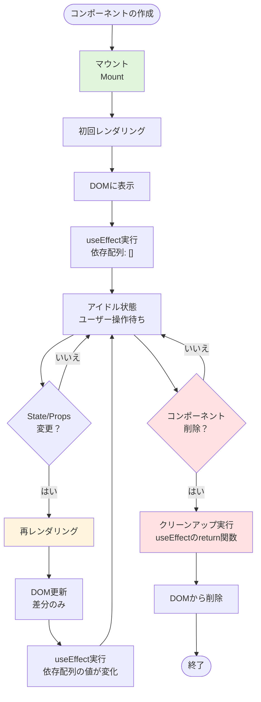
```mermaid
flowchart TD
    Start([コンポーネントの作成]) --> Mount[マウント<br/>Mount]

    Mount --> InitialRender[初回レンダリング]
    InitialRender --> DisplayDOM[DOMに表示]
    DisplayDOM --> Effect1["useEffect実行<br/>依存配列: []"]

    Effect1 --> Idle[アイドル状態<br/>ユーザー操作待ち]

    Idle --> StateChange{State/Props<br/>変更？}
    StateChange -->|はい| Rerender[再レンダリング]
    Rerender --> UpdateDOM[DOM更新<br/>差分のみ]
    UpdateDOM --> Effect2["useEffect実行<br/>依存配列の値が変化"]
    Effect2 --> Idle

    StateChange -->|いいえ| Idle

    Idle --> Unmount{コンポーネント<br/>削除？}
    Unmount -->|はい| Cleanup[クリーンアップ実行<br/>useEffectのreturn関数]
    Cleanup --> RemoveDOM[DOMから削除]
    RemoveDOM --> End([終了])

    Unmount -->|いいえ| Idle

    style Mount fill:#e1f5dd
    style Rerender fill:#fff4dd
    style Unmount fill:#ffe1e1
    style Cleanup fill:#ffe1e1
```

**ライフサイクルの3つのフェーズ:**

| フェーズ | タイミング | 主な処理 |
|---------|----------|---------|
| **マウント** | コンポーネントが初めて画面に表示される | 初回レンダリング、DOM追加、`useEffect(() => {...}, [])`実行 |
| **更新** | State/Propsが変化したとき | 再レンダリング、DOM更新（差分のみ）、`useEffect`実行（依存配列の値が変化時） |
| **アンマウント** | コンポーネントが画面から消えるとき | クリーンアップ実行、DOM削除 |

---

## 4.1.1 技術選定: なぜReactを選んだのか

このセクションでは、BON-LOGの開発でReactおよび関連ライブラリを選定した理由を解説します。「なぜこの技術なのか」を理解しておくと、学習のモチベーションにもつながりますし、将来自分でプロジェクトを始める際の判断材料にもなります。

### UIフレームワーク/ライブラリの選択肢

現在、Webアプリケーションを作るためのUIフレームワーク/ライブラリは複数存在します。それぞれに特徴があり、プロジェクトの要件に合わせて選択します。

| フレームワーク | 開発元 | 初リリース | 特徴 | 学習曲線 |
|--------------|--------|-----------|------|---------|
| **React** | Meta (旧Facebook) | 2013年 | コンポーネント指向、巨大なエコシステム、JSX記法 | 中程度 |
| **Vue.js** | コミュニティ (Evan You) | 2014年 | テンプレート構文で直感的、段階的に導入可能 | やや低い |
| **Angular** | Google | 2016年 | フルスタック、TypeScript標準、依存性注入 | 高い |
| **Svelte** | コミュニティ (Rich Harris) | 2019年 | コンパイル型、仮想DOMなし、少ないコード量 | 低い |
| **Solid.js** | コミュニティ (Ryan Carniato) | 2021年 | React風の書き方、仮想DOMなし、高パフォーマンス | 中程度 |

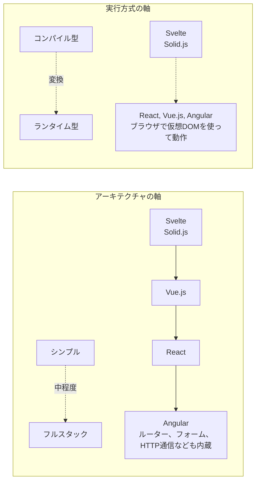
```mermaid
graph LR
    subgraph "アーキテクチャの軸"
        direction TB
        A[シンプル] -.->|中程度| B[フルスタック]
        C[Svelte<br/>Solid.js] --> D[Vue.js]
        D --> E[React]
        E --> F[Angular<br/>ルーター、フォーム、<br/>HTTP通信なども内蔵]
    end

    subgraph "実行方式の軸"
        direction TB
        G[コンパイル型] -.->|変換| H[ランタイム型]
        I[Svelte<br/>Solid.js] -.-> J[React, Vue.js, Angular<br/>ブラウザで仮想DOMを使って動作]
    end
```

### BON-LOGでReactを選んだ理由

BON-LOGでは以下の4つの理由からReactを採用しました。

**1. Next.jsとの統合**

BON-LOGのフレームワークであるNext.jsはReactベースです。Next.jsはSSR（サーバーサイドレンダリング）、静的生成、Server Componentsなど、モダンなWeb開発に必要な機能を豊富に備えています。React + Next.jsの組み合わせは、SNSのようなデータ量が多く、SEOも重要なアプリケーションに最適です。

**2. エコシステムの充実**

Reactには膨大な数のサードパーティライブラリが存在します。BON-LOGで使用している shadcn/ui（UIコンポーネント）、React Query（データ取得）、useState/Context（クライアント状態管理）なども、すべてReactエコシステムの一部です。「やりたいこと」に対するライブラリがほぼ確実に見つかります（Zustand は本プロジェクトでは未使用ですが、選択肢として 4.18 で紹介しています）。

**3. 求人市場とキャリア**

React開発者の求人数は、他のフレームワークと比較して圧倒的に多いです。Reactを学ぶことは、Web開発者としてのキャリアにおいて大きなアドバンテージになります。

**4. コミュニティと情報量**

Reactは世界で最も利用されているUIライブラリの一つであり、日本語の情報も豊富です。問題に直面したときに、Stack OverflowやQiita、Zennなどで解決策を見つけやすいのは大きなメリットです。

> **補足: 他のフレームワークが悪いわけではありません**
>
> Vue.jsは直感的な構文で初心者にやさしく、日本でも人気があります。SvelteやSolid.jsはパフォーマンスに優れた新しい選択肢です。Angularは大企業の大規模プロジェクトで強みを発揮します。それぞれのフレームワークには適した場面があり、Reactが唯一の正解ではありません。ただし、BON-LOGの要件（Next.js統合、豊富なライブラリ、SNS機能の実現）にはReactが最も適していました。

### コンポーネントの書き方: 関数コンポーネント vs クラスコンポーネント

Reactのコンポーネントには、歴史的に2つの書き方があります。

```tsx
// ============================================================
// クラスコンポーネント（旧来の書き方、現在は非推奨）
// ============================================================
class Counter extends React.Component {
  state = { count: 0 };

  handleClick = () => {
    this.setState({ count: this.state.count + 1 });
  };

  render() {
    return (
      <div>
        <p>カウント: {this.state.count}</p>
        <button onClick={this.handleClick}>+1</button>
      </div>
    );
  }
}

// ============================================================
// 関数コンポーネント（現在の標準的な書き方）
// ============================================================
function Counter() {
  const [count, setCount] = useState(0);

  return (
    <div>
      <p>カウント: {count}</p>
      <button onClick={() => setCount(count + 1)}>+1</button>
    </div>
  );
}
```

**BON-LOGで関数コンポーネントを採用した理由:**

| 観点 | 関数コンポーネント | クラスコンポーネント |
|------|------------------|-------------------|
| コード量 | 少ない（簡潔） | 多い（`this`、`render`メソッドなど） |
| Hooks対応 | `useState`、`useEffect`など全Hooks利用可能 | Hooks利用不可（`this.state`を使用） |
| React公式の推奨 | 推奨されている | 新規開発では非推奨 |
| テストのしやすさ | 入出力が明確でテストしやすい | `this`のバインドやライフサイクルの考慮が必要 |
| 学習コスト | JavaScriptの関数の知識で書ける | `class`、`this`、継承の理解が必要 |

React公式ドキュメントでも関数コンポーネントが推奨されており、2023年以降の新しいドキュメントではクラスコンポーネントの記載がほぼなくなっています。BON-LOGのコードベースでもすべてのコンポーネントが関数コンポーネントで記述されています。

> **初心者の方へ**: インターネット上の古い記事やチュートリアルでクラスコンポーネントを見かけることがありますが、新しくReactを学ぶ場合は関数コンポーネントだけを覚えれば大丈夫です。

### 状態管理の選択肢

Reactアプリケーションでは「状態（データ）をどう管理するか」が重要な設計判断になります。BON-LOGでは、状態を**サーバー状態**と**クライアント状態**の2つに分けて、それぞれに最適なツールを選びました。

#### サーバー状態管理の比較

サーバー状態とは、APIやデータベースから取得するデータのことです（投稿一覧、ユーザー情報、通知など）。

| ライブラリ | 特徴 | バンドルサイズ |
|-----------|------|-------------|
| **React Query (TanStack Query)** | キャッシュ管理が強力、楽観的更新、無限スクロール対応 | ~13KB |
| **SWR** | Vercel開発、シンプルなAPI、Next.jsとの相性が良い | ~4KB |
| **自前実装 (useState + useEffect)** | 依存なし、フルコントロール可能 | 0KB |

**React Queryを選んだ理由**: BON-LOGのタイムラインは無限スクロール（`useInfiniteQuery`）を使用しており、楽観的更新（いいねの即時反映）も多用しています。React Queryはこれらの機能を標準で備えており、自前で実装すると膨大なコードになる部分をライブラリに任せられます。SWRも優れたライブラリですが、無限スクロールや楽観的更新のサポートではReact Queryがより充実しています。

#### クライアント状態管理の比較

クライアント状態とは、ブラウザ内で完結するデータのことです（モーダルの開閉、テーマ設定、UI状態など）。

| ライブラリ | 特徴 | バンドルサイズ | 学習コスト |
|-----------|------|-------------|----------|
| **useState** | React標準、ローカル状態に最適 | 0KB | 低い |
| **Zustand** | 軽量、Providerなし、シンプルなAPI | ~1KB | 低い |
| **Redux Toolkit** | 歴史あり、大規模アプリ向け、DevToolsが強力 | ~11KB | 高い |
| **Jotai** | アトム（原子）ベース、ボトムアップ型 | ~3KB | 中程度 |
| **Recoil** | Meta開発、React Contextベース | ~79KB | 中程度 |
| **MobX** | リアクティブプログラミング、自動追跡 | ~16KB | 中程度 |

### 状態管理ライブラリの比較マトリックス

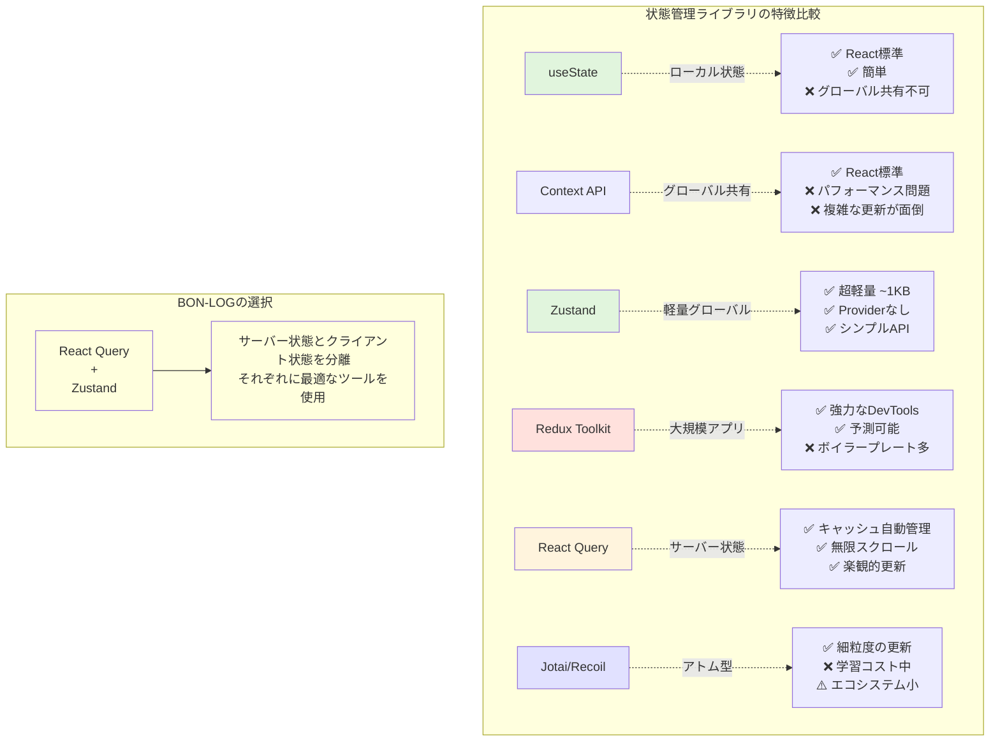
```mermaid
graph TD
    subgraph "状態管理ライブラリの特徴比較"
        direction LR

        A[useState] -.->|ローカル状態| A1["✅ React標準<br/>✅ 簡単<br/>❌ グローバル共有不可"]

        B[Context API] -.->|グローバル共有| B1["✅ React標準<br/>❌ パフォーマンス問題<br/>❌ 複雑な更新が面倒"]

        C[Zustand] -.->|軽量グローバル| C1["✅ 超軽量 ~1KB<br/>✅ Providerなし<br/>✅ シンプルAPI"]

        D[Redux Toolkit] -.->|大規模アプリ| D1["✅ 強力なDevTools<br/>✅ 予測可能<br/>❌ ボイラープレート多"]

        E[React Query] -.->|サーバー状態| E1["✅ キャッシュ自動管理<br/>✅ 無限スクロール<br/>✅ 楽観的更新"]

        F[Jotai/Recoil] -.->|アトム型| F1["✅ 細粒度の更新<br/>❌ 学習コスト中<br/>⚠️ エコシステム小"]

        style A fill:#e1f5dd
        style C fill:#e1f5dd
        style E fill:#fff4dd
        style D fill:#ffe1dd
        style F fill:#e1e1ff
    end

    subgraph "BON-LOGの選択"
        G[React Query<br/>+<br/>Zustand] --> G1["サーバー状態とクライアント状態を分離<br/>それぞれに最適なツールを使用"]
    end

    style G fill:#ffffdd
    style G1 fill:#ffffdd
```

**BON-LOGが採用した理由:**
- **React Query**: サーバー状態（投稿、ユーザー情報）に特化。キャッシュ・再取得・ローディング管理が自動
- **Zustand**: クライアント状態（モーダル、UI）に特化。軽量でシンプル
- **組み合わせの利点**: それぞれの得意分野に集中でき、コードがシンプルになる

**React Query + Zustandの組み合わせを選んだ理由**:

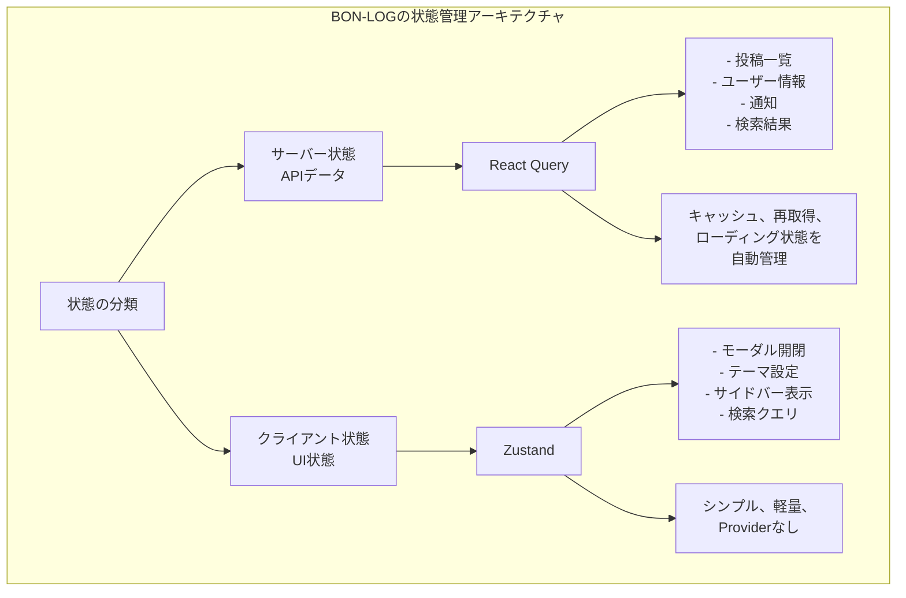
```mermaid
graph TD
    subgraph "BON-LOGの状態管理アーキテクチャ"
        A[状態の分類] --> B[サーバー状態<br/>APIデータ]
        A --> C[クライアント状態<br/>UI状態]

        B --> D[React Query]
        D --> D1["- 投稿一覧<br/>- ユーザー情報<br/>- 通知<br/>- 検索結果"]
        D --> D2["キャッシュ、再取得、<br/>ローディング状態を<br/>自動管理"]

        C --> E[Zustand]
        E --> E1["- モーダル開閉<br/>- テーマ設定<br/>- サイドバー表示<br/>- 検索クエリ"]
        E --> E2["シンプル、軽量、<br/>Providerなし"]
    end
```

この「サーバー状態とクライアント状態を分離する」アプローチは、以下のメリットがあります。

1. **関心の分離**: 各ツールが得意なことに集中できる
2. **コードの簡潔さ**: 1つのライブラリですべてを管理するより、コードがシンプルになる
3. **パフォーマンス**: Zustandのセレクタ機能で不要な再レンダリングを防げる
4. **バンドルサイズ**: React Query (~13KB) + Zustand (~1KB) = 約14KBと軽量

> **Reduxではダメなの？**
>
> Reduxは実績のある優れたライブラリですが、BON-LOGの規模ではやや「大きすぎる」ツールです。Redux Toolkitで設定は簡略化されましたが、それでもAction、Reducer、Sliceなどの概念を理解する必要があります。ZustandはReduxの思想を受け継ぎつつ、はるかにシンプルなAPIを提供しており、小中規模のプロジェクトには最適です。

---

## 4.2 JSX記法

### このセクションで学ぶこと

- JSXの基本的な書き方
- JavaScriptの式の埋め込み方法
- HTMLとJSXの違い（className, htmlFor, 自己閉じタグ）
- フラグメント（<>...</>）の使い方

JSXは、JavaScriptの中にHTML風の構文を書ける記法です。

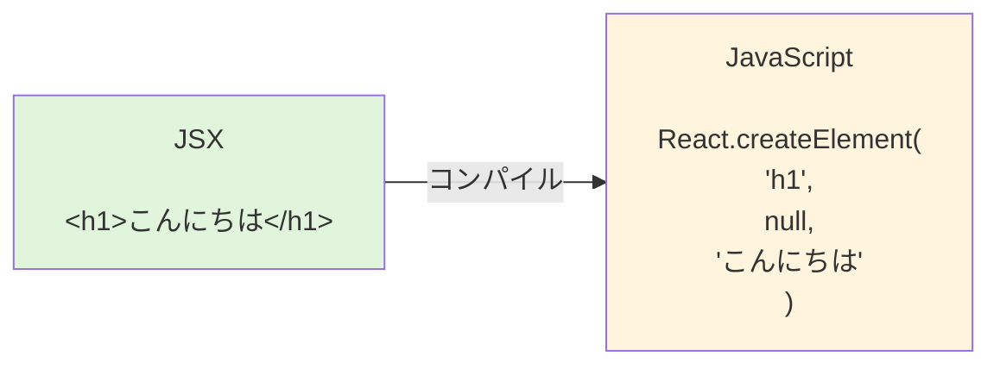
```mermaid
flowchart LR
    A["JSX<br/><br/>&lt;h1&gt;こんにちは&lt;/h1&gt;"] -->|コンパイル| B["JavaScript<br/><br/>React.createElement(<br/>  'h1',<br/>  null,<br/>  'こんにちは'<br/>)"]

    style A fill:#e1f5dd
    style B fill:#fff4dd
```

JSXは「見やすい書き方」であり、内部的にはReact.createElement()に変換されます。

### 基本的なJSX

```tsx
// 単純な要素
const element = <h1>こんにちは、世界！</h1>;  // 表示: 大きな見出しテキスト

// 属性（attribute）の指定
const image = ;  // 表示: 画像

// className（HTMLのclassに相当）
const button = <button className="btn btn-primary">クリック</button>;  // 表示: スタイル付きボタン

// スタイルの指定（オブジェクトで渡す）
const styledDiv = (
  <div style={{ color: 'red', fontSize: '16px' }}>
    赤い文字    {/* 表示: 16pxの赤い文字で「赤い文字」と表示 */}
  </div>
);
```

### 式の埋め込み

`{}`で囲むことで、JavaScriptの式を埋め込めます。

```tsx
const nickname = "盆栽太郎";
const likeCount = 42;
const isLiked = true;

const element = (
  <div>
    {/* 変数の埋め込み */}
    <h2>{nickname}</h2>                {/* 表示: 盆栽太郎 */}

    {/* 演算結果の埋め込み */}
    <p>いいね数: {likeCount + 10}</p>  {/* 表示: いいね数: 52 */}

    {/* 三項演算子での条件分岐 */}
    <button className={isLiked ? 'liked' : 'not-liked'}>
      {isLiked ? 'いいね済み' : 'いいね'}  {/* 表示: いいね済み（isLiked=trueのため） */}
    </button>

    {/* 関数呼び出し */}
    <p>{formatDate(new Date())}</p>    {/* 表示: 2026/02/17 のような日付文字列 */}
  </div>
);
```

### JSXの注意点

```tsx
// ❌ 複数の要素を並べてreturnできない
function Component() {
  return (
    <h1>タイトル</h1>
    <p>本文</p>
  );
}

// ✅ 1つの親要素で囲む
function Component() {
  return (
    <div>
      <h1>タイトル</h1>
      <p>本文</p>
    </div>
  );
}

// ✅ フラグメント（<>...</>）で囲む（余計なdivを作らない）
function Component() {
  return (
    <>
      <h1>タイトル</h1>
      <p>本文</p>
    </>
  );
}

// ❌ class（予約語）
<div class="container">  // エラー

// ✅ className
<div className="container">

// ❌ for（予約語）
<label for="input">  // エラー

// ✅ htmlFor
<label htmlFor="input">

// ❌ 閉じタグ無し
  // エラー

// ✅ 自己閉じタグ

```

### よくあるトラブルと解決法

| トラブル | 原因 | 解決法 |
|---------|------|--------|
| `Adjacent JSX elements must be wrapped` | 複数の要素を直接returnしている | `<>`...`</>`（フラグメント）で囲む |
| `className`ではなく`class`を使った | JSXではclass予約語が使えない | `className`を使う |
| 画像タグが閉じていない | JSXではすべてのタグを閉じる必要がある | `` と自己閉じタグにする |
| `{}`の中にif文を書いてエラー | JSXの`{}`内は式のみ（文は不可） | 三項演算子 `? :` を使う |

### 理解度チェック

**Q1**: JSXで変数の値を表示するにはどう書きますか？
<details><summary>答え</summary>
`{変数名}` のように波括弧で囲みます。例: `<p>{nickname}</p>`
</details>

**Q2**: HTMLの`class`属性はJSXでは何に変わりますか？
<details><summary>答え</summary>
`className`に変わります。`class`はJavaScriptの予約語のため使えません。同様に`for`は`htmlFor`になります。
</details>

> **初心者向け補足: JSXは「見た目はHTMLだけど、中身はJavaScript」**
>
> JSXを初めて見ると「HTMLを直接書いているように見える」と思うかもしれません。しかし、JSXは実際にはJavaScriptの関数呼び出しに変換されます。つまり、JSXはJavaScriptの「シンタックスシュガー（糖衣構文）」です。
>
> これを理解すると、以下のルールが自然に納得できます。
> - `class`ではなく`className` -- JavaScriptの予約語と衝突するから
> - `{}`で式を埋め込める -- JSXがJavaScriptの中で動いているから
> - すべてのタグを閉じる必要がある -- XML（厳密なHTMLのようなもの）の構文規則に従うから
>
> 「JSXはHTMLに似せたJavaScript」と覚えておくと、トラブルシューティングの際に役立ちます。

---

## 4.3 関数コンポーネント

### このセクションで学ぶこと

- 関数コンポーネントの定義方法
- コンポーネント名の命名規則（PascalCase）
- TypeScriptとの組み合わせ方

Reactコンポーネントは**関数**として定義します。コンポーネント名は必ず**大文字で始める**（PascalCase）のがルールです。

> **初心者向けイメージ: コンポーネントは「自分だけのHTMLタグ」**
>
> HTMLには`<button>`、`<div>`、``などの標準タグがありますよね。Reactのコンポーネントは、**自分だけのオリジナルタグを作れる仕組み**です。例えば`<LikeButton />`という「いいねボタンタグ」を作れば、何度でも使い回せます。
>
> ```tsx
> // 自分で作ったオリジナルタグ
> <LikeButton />      // いいねボタン
> <PostCard />        // 投稿カード
> <UserAvatar />      // ユーザーアバター
>
> // HTMLの標準タグと同じように使える！
> <div>
>   <PostCard />
>   <LikeButton />
> </div>
> ```
>
> 大文字で始まるタグ（`<LikeButton />`）はReactコンポーネント、小文字で始まるタグ（`<div>`）はHTMLタグ、と区別されます。

### 基本的なコンポーネント

まずは最もシンプルなコンポーネントから始めましょう。

```tsx
// ===== Step 1: 最もシンプルなコンポーネント =====
// 関数がJSXを返す = それがコンポーネント
function Greeting() {
  return <h1>こんにちは、BON-LOG！</h1>;  // 表示: <h1>タグで「こんにちは、BON-LOG！」と表示
}
```

> **画面表示**
> このコンポーネントを実行すると、画面には以下のように表示されます:
> - 大きな見出しとして「こんにちは、BON-LOG！」というテキストが表示される
> - HTMLの `<h1>` タグとしてレンダリングされるため、太字の大きな文字で表示される

```tsx
// ===== Step 2: 書き方のバリエーション =====

// アロー関数でも可
const Greeting = () => {
  return <h1>こんにちは、BON-LOG！</h1>;
};

// 1行なら波括弧とreturnを省略可能
const Greeting = () => <h1>こんにちは、BON-LOG！</h1>;
```

```tsx
// ===== Step 3: コンポーネントを組み合わせる =====
function App() {
  return (
    <div>
      <Greeting />   {/* 表示: こんにちは、BON-LOG！ */}
      <Greeting />   {/* 表示: こんにちは、BON-LOG！（2つ目） */}
    </div>
  );
}
```

> **画面表示**
> `App` コンポーネントを実行すると:
> - 「こんにちは、BON-LOG！」という見出しが **2つ** 縦に並んで表示される
> - 同じコンポーネントを何回でも再利用できることがわかる

> **実行結果の確認方法**
> `npm run dev` で開発サーバーを起動し、http://localhost:3000 で確認できます。

### TypeScriptとの組み合わせ

```tsx
// コンポーネントの型定義
import { FC } from 'react';

// 方法1: FC型を使う（古い書き方）
const Greeting: FC = () => {
  return <h1>こんにちは、BON-LOG！</h1>;
};

// 方法2: 戻り値を明示（推奨）
function Greeting(): JSX.Element {
  return <h1>こんにちは、BON-LOG！</h1>;
}

// 方法3: 戻り値の型推論に任せる（最も一般的）
function Greeting() {
  return <h1>こんにちは、BON-LOG！</h1>;
}
```

---

## 4.4 Props（親→子のデータ渡し）

### このセクションで学ぶこと

- Propsの概念（親コンポーネントから子コンポーネントへのデータの流れ）
- TypeScriptでのProps型定義
- オプショナルProps とデフォルト値
- childrenプロパティ

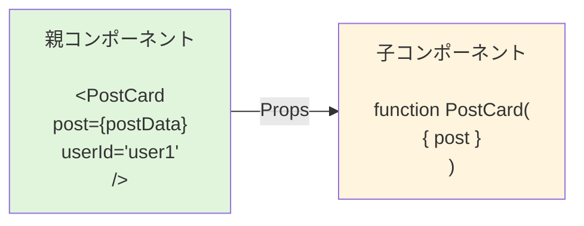
```mermaid
flowchart LR
    A["親コンポーネント<br/><br/>&lt;PostCard<br/>  post={postData}<br/>  userId='user1'<br/>/&gt;"] -->|Props| B["子コンポーネント<br/><br/>function PostCard(<br/>  { post }<br/>)"]

    style A fill:#e1f5dd
    style B fill:#fff4dd
```

※ Propsは親→子の一方通行。子から親へは渡せない。
※ 子から親に通知するにはコールバック関数をPropsで渡す。

コンポーネントに値を渡す仕組みです。

> **初心者向けイメージ: Propsは「注文票」のようなもの**
>
> レストランで注文するとき、「チーズバーガーにピクルス抜きで」と伝えますよね。Propsはまさにその「注文票」です。コンポーネント（厨房）に「こういうデータで作ってね」と指示を出します。
>
> ```tsx
> // 「盆栽太郎さん、25歳」という注文票を渡す
> <Greeting name="盆栽太郎" age={25} />
>
> // 「盆栽花子さん、30歳」という注文票を渡す
> <Greeting name="盆栽花子" age={30} />
>
> // 同じコンポーネントでも、Propsが違えば異なる表示になる
> ```
>
> 重要なのは、**注文票は厨房（子コンポーネント）から書き換えられない**ということです。これをReactでは「Propsは読み取り専用（Read-only）」と言います。もしデータを変更したい場合は、後で学ぶ「State（状態）」を使います。

### 基本的なProps

```tsx
// ===== Step 1: Propsの型を定義する =====
type GreetingProps = {
  name: string;   // 名前（文字列）
  age: number;    // 年齢（数値）
};

// ===== Step 2: Propsを受け取るコンポーネントを作る =====
function Greeting({ name, age }: GreetingProps) {
  return (
    <div>
      <h1>こんにちは、{name}さん！</h1>   {/* 表示: こんにちは、盆栽太郎さん！ */}
      <p>年齢: {age}歳</p>                {/* 表示: 年齢: 25歳 */}
    </div>
  );
}

// ===== Step 3: 異なるPropsで同じコンポーネントを使う =====
function App() {
  return (
    <div>
      <Greeting name="盆栽太郎" age={25} />
      <Greeting name="盆栽花子" age={30} />
    </div>
  );
}
```

> **画面表示**
> `App` コンポーネントを実行すると、画面には以下のように表示されます:
> - 「こんにちは、盆栽太郎さん！」「年齢: 25歳」
> - 「こんにちは、盆栽花子さん！」「年齢: 30歳」
> - 同じ `Greeting` コンポーネントでも、渡すPropsが異なれば表示内容が変わる

#### BON-LOGでの応用: PostCardのProps

BON-LOGのタイムラインでは、各投稿カードに異なるデータをPropsとして渡しています:

```tsx
// 同じPostCardコンポーネントに異なる投稿データを渡す
<PostCard post={post1} />   {/* 表示: 「今日は松の剪定をしました！」 */}
<PostCard post={post2} />   {/* 表示: 「新しい鉢を購入しました」 */}
<PostCard post={post3} />   {/* 表示: 「盆栽展に行ってきました」 */}
// → 1つのコンポーネントで、タイムライン全体を構築できる
```

### オプショナルProps

```tsx
type ButtonProps = {
  label: string;
  disabled?: boolean;  // オプショナル（省略可能）
};

function Button({ label, disabled = false }: ButtonProps) {
  return <button disabled={disabled}>{label}</button>;
}

// 使用例
<Button label="クリック" />                    // disabled=false（デフォルト値） → 表示: クリック可能なボタン
<Button label="無効化" disabled={true} />      // disabled=true → 表示: グレーアウトされた無効なボタン
```

> **画面表示**
> - `<Button label="クリック" />` -- 通常のクリック可能なボタンが表示される
> - `<Button label="無効化" disabled={true} />` -- グレーアウトされ、クリックできないボタンが表示される

### BON-LOGの実例: LikeButtonのProps

```tsx
/**
 * LikeButtonのProps型定義
 */
type LikeButtonProps = {
  postId: string;           // 投稿ID（必須）
  initialLiked: boolean;    // 初期のいいね状態（必須）
  initialCount: number;     // 初期のいいね数（必須）
};

export function LikeButton({
  postId,
  initialLiked,
  initialCount,
}: LikeButtonProps) {
  // コンポーネントの実装...
  return (
    <button>
      ❤️ {initialCount}    {/* 表示: ❤️ 42 */}
    </button>
  );
}

// 使用例
<LikeButton
  postId="post123"
  initialLiked={false}
  initialCount={42}
/>
```

> **画面表示**
> このコンポーネントを実行すると:
> - 「❤️ 42」と書かれたボタンが表示される
> - `initialLiked={false}` なので、まだいいねされていない状態
> - `initialCount={42}` なので、他のユーザーから42件のいいねが付いている状態

### childrenプロパティ

コンポーネントの子要素を受け取る特別なpropsです。

```tsx
type CardProps = {
  title: string;
  children: React.ReactNode;  // 子要素の型
};

function Card({ title, children }: CardProps) {
  return (
    <div className="card">
      <h2>{title}</h2>
      <div className="card-body">
        {children}
      </div>
    </div>
  );
}

// 使用例
<Card title="投稿">
  <p>これが子要素（children）です</p>
  <button>詳細を見る</button>
</Card>
```

> **画面表示**
> このコンポーネントを実行すると:
> - カード風の枠線の中に、見出し「投稿」が表示される
> - その下に「これが子要素（children）です」というテキストと「詳細を見る」ボタンが表示される
> - `children` により、Card の中身を自由にカスタマイズできる

### 理解度チェック

**Q1**: Propsは子コンポーネントから変更できますか？
<details><summary>答え</summary>
いいえ、Propsは読み取り専用です。子コンポーネントでPropsの値を変更することはできません。変更が必要な場合は、親コンポーネントで状態を管理し、更新関数をPropsとして渡します。
</details>

**Q2**: `children` Propsは何に使いますか？
<details><summary>答え</summary>
コンポーネントの開始タグと終了タグの間に書いた内容を受け取るための特別なPropsです。レイアウトコンポーネントやラッパーコンポーネントでよく使います。例: `<Card><p>内容</p></Card>` の `<p>内容</p>` が children です。
</details>

---

## 4.5 useState（状態管理）

### このセクションで学ぶこと

- Reactの「状態（State）」の概念
- useStateの基本的な使い方
- 状態更新と再レンダリングの仕組み
- オブジェクト/配列の状態更新パターン

```
useStateの仕組み:

  const [count, setCount] = useState(0);
         ↑        ↑                   ↑
    現在の値   更新関数          初期値

  setCount(1)  →  countが1に更新  →  コンポーネントが再レンダリング
  setCount(2)  →  countが2に更新  →  コンポーネントが再レンダリング

  ⚠️ 直接変更は禁止:
  count = 5;  // ❌ これでは再レンダリングされない！
  setCount(5); // ✅ 必ず更新関数を使う
```

コンポーネント内で変化する値を管理します。

> **初心者向けイメージ: StateはReactの「ホワイトボード」**
>
> コンポーネントが持つStateは、そのコンポーネント専用の「ホワイトボード」のようなものです。
> - ホワイトボードに書いてある内容（値）が変わると、コンポーネントの見た目も自動で更新される
> - 書き換えは必ず専用のペン（更新関数）を使わなければならない
> - 直接消しゴムで消して書き直しても（`count = 5`）、Reactは変更に気づけない
>
> ```mermaid
> graph TD
>     A["ホワイトボード（State）"]
>     B["count: 0"]
>     C["専用ペン: setCount新しい値"]
>     D["→ 書き換えるとReactが自動で<br/>画面を更新してくれる"]
>
>     A --> B
>     A --> C
>     C --> D
>
>     style A fill:#e1f5dd,stroke:#333,stroke-width:2px
>     style B fill:#fff
>     style C fill:#fff4dd
>     style D fill:#fff
> ```
>
> なぜ`count = 5`ではなく`setCount(5)`を使うのか？ それは、Reactは「更新関数が呼ばれたこと」をきっかけに再レンダリングするからです。変数を直接書き換えても、Reactはその変更を検知できません。

### 基本的なuseState

```tsx
// ===== Step 1: 最もシンプルな useState =====
import { useState } from 'react';

function Counter() {
  const [count, setCount] = useState(0);  // count の初期値は 0

  return (
    <button onClick={() => setCount(count + 1)}>
      クリック数: {count}    {/* 表示: クリック数: 0 → 1 → 2 → ... */}
    </button>
  );
}
```

> **画面表示**
> このコンポーネントを実行すると:
> - 「クリック数: 0」と書かれたボタンが表示される
> - ボタンをクリックすると「クリック数: 1」→「クリック数: 2」と数値が増える
> - ページをリロードすると 0 にリセットされる

```tsx
// ===== Step 2: 複数のボタンで状態を操作する =====
function Counter() {
  // [現在の値, 値を更新する関数] = useState(初期値)
  const [count, setCount] = useState(0);

  return (
    <div>
      <p>カウント: {count}</p>          {/* 表示: カウント: 0 */}
      <button onClick={() => setCount(count + 1)}>
        +1                               {/* クリック → カウント: 1 */}
      </button>
      <button onClick={() => setCount(count - 1)}>
        -1                               {/* クリック → カウント: -1 */}
      </button>
      <button onClick={() => setCount(0)}>
        リセット                          {/* クリック → カウント: 0 */}
      </button>
    </div>
  );
}
```

> **画面表示**
> このコンポーネントを実行すると:
> - 「カウント: 0」というテキストと、3つのボタン「+1」「-1」「リセット」が表示される
> - 「+1」を3回クリック → 「カウント: 3」に変わる
> - 「-1」を1回クリック → 「カウント: 2」に変わる
> - 「リセット」をクリック → 「カウント: 0」に戻る
> - **ポイント**: `setCount` を呼ぶたびに、Reactが自動的に画面を更新する

> **実行結果の確認方法**
> `npm run dev` で開発サーバーを起動し、http://localhost:3000 で確認できます。ブラウザの開発者ツール（F12）のConsoleタブを開いておくと、デバッグ時に便利です。

### TypeScriptでの型指定

```tsx
import { useState } from 'react';

function Example() {
  // 型推論が効く場合（初期値から型が決まる）
  const [count, setCount] = useState(0);  // number型（0から推論）
  const [name, setName] = useState("");   // string型（""から推論）

  // 明示的に型指定（ジェネリクス）
  const [user, setUser] = useState<User | null>(null);
  // → user は User型 または null。APIからデータ取得前はnull。

  // 初期値がundefinedの場合は型指定が必要
  const [data, setData] = useState<string>();  // string | undefined
  // → setData("hello") で string に、setData(undefined) で undefined に

  return <div>{/* ... */}</div>;
}
```

### 複雑な状態の管理

```tsx
type FormData = {
  nickname: string;
  email: string;
  bio: string;
};

function ProfileForm() {
  const [formData, setFormData] = useState<FormData>({
    nickname: "",
    email: "",
    bio: "",
  });

  // 特定のフィールドだけ更新
  const updateField = (field: keyof FormData, value: string) => {
    setFormData(prev => ({
      ...prev,        // 既存の値を展開
      [field]: value  // 特定フィールドを上書き
    }));
  };

  return (
    <form>
      <input
        value={formData.nickname}
        onChange={(e) => updateField('nickname', e.target.value)}
        // 「盆栽太郎」と入力 → formData.nickname が "盆栽太郎" に更新
      />
      <input
        value={formData.email}
        onChange={(e) => updateField('email', e.target.value)}
        // 「taro@example.com」と入力 → formData.email が更新
      />
      <textarea
        value={formData.bio}
        onChange={(e) => updateField('bio', e.target.value)}
        // 自己紹介文を入力 → formData.bio が更新
      />
    </form>
  );
}
```

> **画面表示**
> このフォームを実行すると:
> - ニックネーム入力欄、メールアドレス入力欄、自己紹介テキストエリアの3つが表示される
> - 各入力欄に文字を入力すると、`formData` オブジェクトの該当フィールドだけが更新される
> - 他のフィールドの値はスプレッド演算子（`...prev`）により保持される

### BON-LOGの実例: LikeButtonの状態管理

```tsx
export function LikeButton({
  postId,
  initialLiked,
  initialCount,
}: LikeButtonProps) {
  // いいね状態
  const [liked, setLiked] = useState(initialLiked);    // 初期値: false

  // いいね数
  const [count, setCount] = useState(initialCount);    // 初期値: 42

  // いいねトグル処理
  async function handleToggle() {
    // Optimistic UI: 先にUIを更新
    const newLiked = !liked;
    setLiked(newLiked);                                // false → true
    setCount(prev => newLiked ? prev + 1 : prev - 1); // 42 → 43

    // サーバーに送信
    const result = await togglePostLike(postId);

    // エラー時は元に戻す
    if (result.error) {
      setLiked(liked);           // true → false に戻す
      setCount(initialCount);    // 43 → 42 に戻す
    }
  }

  return (
    <button onClick={handleToggle}>
      {liked ? '❤️' : '🤍'} {count}   {/* 表示: 🤍 42 → クリック → ❤️ 43 */}
    </button>
  );
}
```

> **画面表示**
> このコンポーネントの動作を追ってみましょう:
> 1. 初期状態: 「🤍 42」（白いハート + いいね数42）
> 2. ボタンをクリック: **即座に** 「❤️ 43」に変わる（赤いハート + いいね数43）
> 3. サーバー通信中: 見た目はすでに更新済み（ユーザーは待たされない）
> 4. サーバー成功時: そのまま「❤️ 43」を維持
> 5. サーバー失敗時: 「🤍 42」に戻る（元の状態にロールバック）
>
> これが **Optimistic UI（楽観的更新）** パターンです。

### よくあるトラブルと解決法

| トラブル | 原因 | 解決法 |
|---------|------|--------|
| 状態が更新されない | 直接代入している（`count = 5`） | `setCount(5)` のように更新関数を使う |
| 古い値が参照される | クロージャの問題 | `setCount(prev => prev + 1)` の関数形式を使う |
| オブジェクトが更新されない | 同じ参照のオブジェクトを渡している | `{ ...prev, key: value }` でスプレッド演算子を使う |
| 配列にpushしても更新されない | 配列を直接変更している | `[...prev, newItem]` で新しい配列を作る |

### 初心者がよく遭遇する落とし穴

#### 落とし穴1: Stale Closure（古いクロージャ）

> **クロージャとは？**
> クロージャは「関数が作成された時点の変数を記憶する」JavaScriptの仕組みです。
>
> ```javascript
> function createCounter() {
>   let count = 0  // この変数を...
>   return function() {
>     count++      // ...内側の関数が記憶している
>     return count
>   }
> }
> const counter = createCounter()
> counter() // 1
> counter() // 2（countの値を覚えている）
> ```
>
> Reactの `useState` でも同じことが起きます。イベントハンドラは作成時点の `state` 値を「記憶」しているため、最新の値と異なる場合があります（Stale Closure）。

「setCountを何回も呼んでいるのにカウントが1しか増えない」という問題に遭遇することがあります。

```tsx
function Counter() {
  const [count, setCount] = useState(0);

  function handleClick() {
    // ❌ これは3回呼んでもcountが1にしかならない！
    setCount(count + 1);  // count=0 なので 0+1=1
    setCount(count + 1);  // まだ count=0 のまま！ 0+1=1
    setCount(count + 1);  // まだ count=0 のまま！ 0+1=1
    // 結果: countは3ではなく1になる
  }

  return <button onClick={handleClick}>カウント: {count}</button>;
}
```

**なぜこうなるのか？** `handleClick`関数が作られた時点での`count`の値（0）がそのまま使われ続けるためです。これを「古いクロージャ（Stale Closure）」と呼びます。

```tsx
function Counter() {
  const [count, setCount] = useState(0);

  function handleClick() {
    // ✅ 関数形式なら最新の値を使える
    setCount(prev => prev + 1);  // prev=0 → 1
    setCount(prev => prev + 1);  // prev=1 → 2
    setCount(prev => prev + 1);  // prev=2 → 3
    // 結果: countは正しく3になる
  }

  return <button onClick={handleClick}>カウント: {count}</button>;
}
```

**ルール**: 前の値に基づいて更新する場合は、必ず`setCount(prev => prev + 1)`の関数形式を使いましょう。

#### 落とし穴2: オブジェクトや配列の直接変更

```tsx
// ❌ 配列を直接変更してもReactは検知できない
function TodoList() {
  const [todos, setTodos] = useState(['買い物', '掃除']);

  function addTodo() {
    todos.push('料理');  // 配列を直接変更
    setTodos(todos);      // 同じ配列の参照を渡している
    // → Reactは「同じ配列だ」と判断して再レンダリングしない！
  }

  return <div>{todos.map(t => <p key={t}>{t}</p>)}</div>;
}

// ✅ 新しい配列を作って渡す
function TodoList() {
  const [todos, setTodos] = useState(['買い物', '掃除']);

  function addTodo() {
    setTodos([...todos, '料理']);  // 新しい配列を作る
    // → Reactは「違う配列だ！」と判断して再レンダリングする
  }

  return <div>{todos.map(t => <p key={t}>{t}</p>)}</div>;
}
```

> **覚え方**: Reactの状態更新では「壊して作り直す」が基本です。既存のオブジェクトや配列を変更するのではなく、常に新しいコピーを作って渡しましょう。スプレッド演算子（`...`）がその強力な味方です。

### 理解度チェック

**Q1**: `const [count, setCount] = useState(0)` で `setCount(count + 1)` と `setCount(prev => prev + 1)` の違いは何ですか？
<details><summary>答え</summary>
`setCount(count + 1)` はクロージャの値を使うため、連続して呼ぶと古い値を参照する問題があります。`setCount(prev => prev + 1)` は最新の値を引数で受け取るため、常に正しい値で計算されます。
</details>

**Q2**: オブジェクトの状態を更新する際、なぜスプレッド演算子が必要ですか？
<details><summary>答え</summary>
Reactは状態の**参照（メモリアドレス）**が変わったかどうかで再レンダリングを判断します。既存のオブジェクトを直接変更しても参照は変わらないため、Reactは変更を検出できません。`{ ...prev, key: newValue }` で新しいオブジェクトを作ることで、参照が変わり再レンダリングされます。
</details>

---

## 4.6 useEffect（副作用）

### このセクションで学ぶこと

- 副作用（Side Effect）とは何か
- useEffectの基本的な使い方
- 依存配列の3パターン（なし・空・値あり）
- クリーンアップ関数の役割
- 無限ループを避ける方法

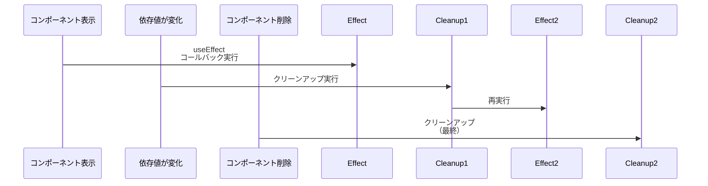
```mermaid
sequenceDiagram
    participant Mount as コンポーネント表示
    participant Change as 依存値が変化
    participant Unmount as コンポーネント削除

    Mount->>Effect: useEffect<br/>コールバック実行
    Change->>Cleanup1: クリーンアップ実行
    Cleanup1->>Effect2: 再実行
    Unmount->>Cleanup2: クリーンアップ<br/>（最終）
```

コンポーネントの外部と連携する処理（副作用）を扱います。

> **初心者向けイメージ: 副作用（Side Effect）とは**
>
> 「副作用」という言葉は難しく聞こえますが、要は「コンポーネントの表示（JSXを返すこと）以外のすべての処理」のことです。
>
> 例えるなら、コンポーネントの主な仕事は「商品を陳列すること（画面表示）」です。それ以外の裏方作業が副作用です。
>
> - **API通信**: お店で仕入れをする（サーバーからデータを取得する）
> - **タイマー**: 閉店時間にアラームをセットする（`setTimeout`、`setInterval`）
> - **DOM操作**: 看板の位置を調整する（`document.title`を変えるなど）
> - **イベントリスナー登録**: お客さんの呼び鈴を設置する（`addEventListener`）
> - **ローカルストレージ**: 在庫メモを倉庫に保管する（`localStorage`の読み書き）
>
> これらの処理は、コンポーネントが「表示された後」に実行される必要があります。そのためのHookが`useEffect`です。

### 基本的なuseEffect

```tsx
import { useEffect } from 'react';

function Example() {
  useEffect(() => {
    // この関数は、コンポーネントが画面に表示された後に実行される
    console.log('コンポーネントがマウントされました');
    // 実行結果: コンソールに「コンポーネントがマウントされました」と表示される

    // クリーンアップ関数（オプショナル）
    return () => {
      console.log('コンポーネントがアンマウントされます');
      // 実行結果: コンポーネントが画面から消える直前にコンソールに表示される
    };
  }, []);  // 依存配列が空 = 初回のみ実行

  return <div>Example</div>;
}
```

> **実行結果の確認方法**
> `npm run dev` で開発サーバーを起動し、ブラウザの開発者ツール（F12）のConsoleタブを確認してください。ページを開いたとき「コンポーネントがマウントされました」と表示され、ページを離れるとき「コンポーネントがアンマウントされます」と表示されます。

### 依存配列

useEffectの第2引数は**依存配列**です。配列内の値が変化したときだけ実行されます。

```tsx
// ===== BON-LOGの例: 投稿詳細ページのデータ取得 =====
function PostDetail({ postId }: { postId: string }) {
  const [post, setPost] = useState<Post | null>(null);

  useEffect(() => {
    // postIdが変わるたびに実行される
    async function fetchPost() {
      console.log(`投稿 ${postId} を取得中...`);
      // 実行結果: コンソールに「投稿 post123 を取得中...」と表示
      const response = await fetch(`/api/posts/${postId}`);
      const data = await response.json();
      setPost(data);
      console.log(`投稿 ${postId} の取得完了`);
      // 実行結果: コンソールに「投稿 post123 の取得完了」と表示
    }

    fetchPost();
  }, [postId]);  // postIdが変わったら再実行

  if (!post) return <div>読み込み中...</div>;

  return <div>{post.content}</div>;
}
```

> **画面表示**
> このコンポーネントの動作を追ってみましょう:
> 1. **マウント直後**: 「読み込み中...」と表示される（`post` がまだ `null` のため）
> 2. **データ取得完了後**: 投稿の本文（例: 「今日は松の剪定をしました！」）が表示される
> 3. **postIdが変わったとき**: 再び「読み込み中...」→ 新しい投稿の本文が表示される
>
> BON-LOGでは、ユーザーが投稿詳細ページを開くとこのパターンでデータを取得しています。

### 依存配列のパターン

```tsx
// パターン1: 依存配列なし（毎回実行 - 通常は非推奨）
useEffect(() => {
  console.log('毎回実行される');
  // 実行結果: コンポーネントが再レンダリングされるたびにコンソールに表示
});

// パターン2: 空の依存配列（初回のみ実行）
useEffect(() => {
  console.log('初回のみ実行される');
  // 実行結果: ページを開いたときに1回だけコンソールに表示
}, []);

// パターン3: 特定の値に依存（値が変わったら実行）
useEffect(() => {
  console.log(`countが${count}に変わりました`);
  // 実行結果: count=0→1 のとき「countが1に変わりました」とコンソールに表示
}, [count]);

// パターン4: 複数の値に依存
useEffect(() => {
  console.log(`${userId}のページ${page}を読み込み中`);
  // 実行結果: userId または page が変わるたびにコンソールに表示
}, [userId, page]);
```

> **依存配列の比較方法**
> Reactは依存配列の値を`Object.is()`（≒ `===`）で**浅い比較（shallow comparison）**します。
>
> ```typescript
> // ✅ プリミティブ値: 値が変わった時だけ再実行
> useEffect(() => { ... }, [count])  // count: 1 → 2 で再実行
>
> // ⚠️ オブジェクト/配列: 参照が変わると再実行（中身が同じでも！）
> const user = { name: '太郎' }
> useEffect(() => { ... }, [user])  // 毎回新しいオブジェクト → 毎回再実行！
>
> // ✅ 解決策: 必要なプリミティブ値だけを依存配列に入れる
> useEffect(() => { ... }, [user.name])
> ```
>
> **クリーンアップ関数の実行タイミング**:
> 1. コンポーネントがアンマウント（画面から消える）される時
> 2. 依存配列の値が変わり、エフェクトが再実行される**直前**

### BON-LOGの実例: propsの同期

```tsx
export function LikeButton({
  postId,
  initialLiked,
  initialCount,
}: LikeButtonProps) {
  const [liked, setLiked] = useState(initialLiked);
  const [count, setCount] = useState(initialCount);

  // propsが更新されたら状態を同期
  useEffect(() => {
    setLiked(prev => prev !== initialLiked ? initialLiked : prev);
    setCount(prev => prev !== initialCount ? initialCount : prev);
  }, [initialLiked, initialCount]);

  // ...
}
```

### 依存配列の覚え方（初心者向けまとめ）

依存配列は「このuseEffectは何をきっかけに再実行するか」を指定するものです。

| 依存配列のパターン | 料理の例え | 実行タイミング |
|---|---|---|
| `useEffect(() => { ... })` <br/>**依存配列なし** | 「注文が来るたびに毎回作り直す」 | 毎回の再レンダリングで実行される<br/>（ほとんど使わない） |
| `useEffect(() => { ... }, [])` <br/>**空の依存配列** | 「開店時に1回だけ仕込みをする」 | マウント時に1回だけ実行される<br/>（初期化処理に使う） |
| `useEffect(() => { ... }, [postId])` <br/>**値を指定** | 「注文メニューが変わったら作り直す」 | postIdが変化したときだけ再実行される |

> **初心者がよくやるミス**: 依存配列を書き忘れると、コンポーネントが再レンダリングするたびにuseEffectが実行されます。その中でsetStateを呼んでいると、再レンダリング→useEffect実行→setState→再レンダリング...の無限ループに陥ります。ESLintの`react-hooks/exhaustive-deps`ルールが依存配列の不足を警告してくれるので、その警告を無視しないようにしましょう。

### useEffectの注意点

```tsx
// ❌ 無限ループの例
function BadExample() {
  const [count, setCount] = useState(0);

  useEffect(() => {
    setCount(count + 1);  // countを更新
  }, [count]);  // countが変わるとuseEffectが再実行 → 無限ループ！

  return <div>{count}</div>;
}

// ✅ 正しい例
function GoodExample() {
  const [count, setCount] = useState(0);

  useEffect(() => {
    // 初回のみ実行
    setCount(1);
  }, []);  // 空の依存配列

  return <div>{count}</div>;
}
```

### 理解度チェック

**Q1**: `useEffect(() => { ... }, [])` の空の依存配列は何を意味しますか？
<details><summary>答え</summary>
コンポーネントが最初に表示されたとき（マウント時）に1回だけ実行されることを意味します。API呼び出しやイベントリスナーの登録によく使います。
</details>

**Q2**: useEffectで無限ループが発生する原因は何ですか？
<details><summary>答え</summary>
useEffect内で依存配列に含まれる状態を更新すると、状態更新→再レンダリング→useEffect実行→状態更新...の無限ループが発生します。依存配列を正しく設定するか、条件分岐で更新を制御してください。
</details>

---

## 4.7 イベントハンドリング

### このセクションで学ぶこと

- Reactでのイベント処理の書き方
- イベントオブジェクトのTypeScript型
- よく使うイベント（click, change, submit, keydown）
- イベントのバブリング制御

ユーザーの操作に応答する処理です。

> **初心者向け補足: イベントハンドラとは**
>
> イベントハンドラとは、「何かが起きたときに実行される関数」のことです。日常生活で言えば、「ドアベルが鳴ったら玄関に行く」の「玄関に行く」がイベントハンドラにあたります。
>
> Reactでは、イベントハンドラの命名規則として`handle`で始めるのが一般的です。
> - `handleClick` -- クリックされたときの処理
> - `handleChange` -- 入力値が変わったときの処理
> - `handleSubmit` -- フォームが送信されたときの処理
>
> HTMLとの違いに注意しましょう。
> - HTML: `onclick="handleClick()"` -- 文字列で指定、小文字
> - React: `onClick={handleClick}` -- 関数を直接渡す、キャメルケース
>
> よくある間違いとして、`onClick={handleClick()}`と書いてしまうケースがあります。これだと関数を「渡す」のではなく「すぐに実行」してしまいます。`()`を付けないように注意しましょう。

### 基本的なイベントハンドラ

```tsx
function Button() {
  // クリックイベント
  function handleClick() {
    console.log('ボタンがクリックされました');
    // 実行結果: コンソールに「ボタンがクリックされました」と表示
  }

  return <button onClick={handleClick}>クリック</button>;
  // 表示: 「クリック」と書かれたボタン。クリックするとhandleClickが呼ばれる
}

// インラインで記述（簡単な処理の場合）
function Button() {
  return (
    <button onClick={() => console.log('クリック')}>
      クリック
    </button>
  );
  // 実行結果: ボタンをクリックするとコンソールに「クリック」と表示
}
```

### イベントオブジェクト

```tsx
function Input() {
  const [value, setValue] = useState("");

  // 入力イベント
  function handleChange(e: React.ChangeEvent<HTMLInputElement>) {
    console.log('入力値:', e.target.value);
    // 実行結果: 「あ」と入力 → コンソールに「入力値: あ」と表示
    //           「あい」と入力 → コンソールに「入力値: あい」と表示
    setValue(e.target.value);
  }

  return <input type="text" value={value} onChange={handleChange} />;
  // 表示: テキスト入力欄。キーを打つたびにhandleChangeが呼ばれる
}
```

### よく使うイベント

```tsx
function EventExamples() {
  return (
    <>
      {/* クリック */}
      <button onClick={(e) => console.log('クリック')}>
        クリック
      </button>

      {/* 入力 */}
      <input
        onChange={(e) => console.log(e.target.value)}
      />

      {/* フォーカス */}
      <input
        onFocus={() => console.log('フォーカス')}
        onBlur={() => console.log('フォーカスが外れた')}
      />

      {/* マウスホバー */}
      <div
        onMouseEnter={() => console.log('マウスが入った')}
        onMouseLeave={() => console.log('マウスが出た')}
      >
        ホバーしてみて
      </div>

      {/* キーボード */}
      <input
        onKeyDown={(e) => {
          if (e.key === 'Enter') {
            console.log('Enterキーが押された');
          }
        }}
      />

      {/* フォーム送信 */}
      <form
        onSubmit={(e) => {
          e.preventDefault();  // デフォルトの送信を防ぐ
          console.log('フォーム送信');
        }}
      >
        <button type="submit">送信</button>
      </form>
    </>
  );
}
```

### イベントのバブリング制御

```tsx
function Card({ postId }: { postId: string }) {
  return (
    <div
      onClick={() => {
        console.log('カード全体がクリックされた');
        // 実行結果: カードの空白部分をクリック → コンソールに表示
      }}
    >
      <h2>投稿タイトル</h2>
      <button
        onClick={(e) => {
          e.stopPropagation();  // 親要素へのバブリングを停止
          console.log('ボタンがクリックされた');
          // 実行結果: ボタンをクリック →「ボタンがクリックされた」のみ表示
          //   e.stopPropagation()がなければ「カード全体がクリックされた」も表示される
        }}
      >
        いいね
      </button>
    </div>
  );
}
```

> **画面表示**
> - カードの空白部分をクリック → コンソールに「カード全体がクリックされた」と表示（投稿詳細ページに遷移）
> - 「いいね」ボタンをクリック → コンソールに「ボタンがクリックされた」のみ表示（カードのクリックイベントは発火しない）
> - BON-LOGでもこのパターンを使い、投稿カードのクリック（詳細へ遷移）といいねボタンのクリックを分離しています

---

## 4.8 条件付きレンダリング

### このセクションで学ぶこと

- if文、三項演算子、&& での条件分岐の使い分け
- 早期リターンパターン
- BON-LOGでの実例（認証状態、ローディング）

条件によって表示内容を変える方法です。

> **初心者向け補足: 条件付きレンダリングの使い分け**
>
> 条件付きレンダリングにはいくつかの書き方がありますが、「どれを使えばいいの？」と迷ったら以下のフローで判断してください。
>
> ```mermaid
> flowchart TD
>     A[条件によって表示を変えたい] --> B{表示するか、しないか<br/>の2択？}
>     B -->|はい| C["&& 演算子を使う<br/>例: {isAdmin && &lt;AdminPanel /&gt;}"]
>     B -->|いいえ| D{AかBか<br/>の2択？}
>     D -->|はい| E["三項演算子を使う<br/>例: {isLoggedIn ? &lt;Dashboard /&gt; : &lt;LoginForm /&gt;}"]
>     D -->|いいえ| F{3つ以上の<br/>分岐がある？}
>     F -->|はい| G["早期リターンまたは<br/>switch文を使う"]
>     F -->|いいえ| H{複雑な条件で、<br/>表示するJSXが大きい？}
>     H -->|はい| I["早期リターンを使う<br/>例: if !data return &lt;Loading /&gt;"]
> ```
>
> **&& 演算子の注意点**: `{count && <Badge count={count} />}` と書くと、`count`が`0`のとき`0`が画面に表示されてしまいます。数値を条件にする場合は `{count > 0 && <Badge count={count} />}` のように明示的にbooleanにしましょう。

### if文での条件分岐

```tsx
function Greeting({ isLoggedIn }: { isLoggedIn: boolean }) {
  if (isLoggedIn) {
    return <h1>おかえりなさい！</h1>;    // 表示: ログイン済みのとき
  }
  return <h1>ログインしてください</h1>;   // 表示: 未ログインのとき
}

// 使用例
<Greeting isLoggedIn={true} />   // 表示: おかえりなさい！
<Greeting isLoggedIn={false} />  // 表示: ログインしてください
```

### 三項演算子

```tsx
function Greeting({ isLoggedIn }: { isLoggedIn: boolean }) {
  return (
    <div>
      {isLoggedIn ? (
        <h1>おかえりなさい！</h1>
      ) : (
        <h1>ログインしてください</h1>
      )}
    </div>
  );
}
```

### 論理AND演算子（&&）

```tsx
function NotificationBadge({ count }: { count: number }) {
  return (
    <div>
      通知
      {/* countが0より大きい場合のみバッジを表示 */}
      {count > 0 && (
        <span className="badge">{count}</span>
      )}
    </div>
  );
}

// 使用例
<NotificationBadge count={5} />  // 表示: 通知 5（バッジ付き）
<NotificationBadge count={0} />  // 表示: 通知（バッジなし）
```

### 早期リターン

```tsx
function PostCard({ post }: { post: Post | null }) {
  // postがnullなら早期リターン
  if (!post) {
    return <div>投稿が見つかりません</div>;  // 表示: 投稿が見つかりません
  }

  // 以降はpostがnullでないことが保証される
  return (
    <div>
      <h2>{post.title}</h2>    {/* 表示: 投稿のタイトル */}
      <p>{post.content}</p>    {/* 表示: 投稿の本文 */}
    </div>
  );
}

// 使用例
<PostCard post={null} />        // 表示: 投稿が見つかりません
<PostCard post={postData} />    // 表示: タイトルと本文
```

### BON-LOGの実例

```tsx
export function LikeButton({
  postId,
  initialLiked,
  initialCount,
}: LikeButtonProps) {
  const [liked, setLiked] = useState(initialLiked);
  const [isPending, startTransition] = useTransition();

  return (
    <button
      onClick={handleToggle}
      disabled={isPending}  // ペンディング中は無効化
    >
      {/* いいね状態で色を変える（条件付きレンダリング） */}
      <Heart
        className={liked ? 'text-red-500 fill-current' : 'text-gray-500'}
        // liked=true → 赤いハートアイコン（塗りつぶし）
        // liked=false → グレーのハートアイコン（枠線のみ）
      />
      {/* カウントが0より大きい場合のみ表示（&& 演算子） */}
      {count > 0 && <span>{count}</span>}
      {/* count=42 → 「42」と表示 / count=0 → 何も表示しない */}
    </button>
  );
}
```

> **画面表示**
> - `liked=true, count=42` の場合: 赤い塗りつぶしハート + 「42」
> - `liked=false, count=42` の場合: グレーの枠線ハート + 「42」
> - `liked=false, count=0` の場合: グレーの枠線ハートのみ（数字は非表示）
> - `isPending=true` の場合: ボタン全体がクリック不可（グレーアウト）

---

## 4.9 リスト表示（map）

### このセクションで学ぶこと

- map()メソッドで配列をJSXに変換する方法
- keyプロパティの重要性と正しい指定方法
- 空リストの処理パターン

配列のデータを表示する方法です。

> **初心者向けイメージ: map()は「一括変換マシン」**
>
> `map()`メソッドは、配列の各要素を別のものに変換する関数です。工場のベルトコンベアーを想像してください。
>
> ```mermaid
> flowchart LR
>     A["入力（データ配列）<br/><br/>{ id: 1,<br/>  name:<br/>  '盆栽太郎' }"] --> B[map<br/>変換処理]
>     B --> C["出力（JSX配列）<br/><br/>&lt;li key='1'&gt;<br/>  盆栽太郎<br/>&lt;/li&gt;"]
>
>     D["{ id: 2,<br/>  name:<br/>  '盆栽花子' }"] --> E[map<br/>変換処理]
>     E --> F["&lt;li key='2'&gt;<br/>  盆栽花子<br/>&lt;/li&gt;"]
>
>     style A fill:#e1f5dd
>     style D fill:#e1f5dd
>     style C fill:#fff4dd
>     style F fill:#fff4dd
> ```
>
> 各データが「コンポーネント」や「JSX要素」に変換され、画面に表示されるイメージです。

### 基本的なmap

```tsx
// ===== Step 1: データ配列を用意する =====
function UserList() {
  const users = [
    { id: '1', name: '盆栽太郎' },
    { id: '2', name: '盆栽花子' },
    { id: '3', name: '盆栽次郎' },
  ];

  // ===== Step 2: map() で配列をJSXに変換する =====
  return (
    <ul>
      {users.map((user) => (
        <li key={user.id}>{user.name}</li>
        // 1回目: <li key="1">盆栽太郎</li>
        // 2回目: <li key="2">盆栽花子</li>
        // 3回目: <li key="3">盆栽次郎</li>
      ))}
    </ul>
  );
}
```

> **画面表示**
> このコンポーネントを実行すると、画面には以下のように表示されます:
> - ・盆栽太郎
> - ・盆栽花子
> - ・盆栽次郎
>
> `<ul>` と `<li>` タグにより、箇条書きリストとして表示されます。`map()` が配列の要素を1つずつJSXに変換しています。

### keyプロパティの重要性

Reactがリストの変更を効率的に追跡するために**key**が必要です。

> **初心者向けイメージ: keyは「名札」**
>
> 教室にいる生徒が席替えをする場面を想像してください。先生（React）が「誰がどこに移動したか」を把握するためには、各生徒に名札（key）が必要です。名札がないと、先生はすべての生徒を一度退席させて座り直させるしかありません（全要素を再レンダリング）。名札があれば、「太郎くんが3列目から5列目に移動した」と効率的に把握できます。
>
> - **名札なし**: 全員やり直し（パフォーマンスが悪い）
> - **出席番号を名札にする**: 転入生が来ると番号がずれてバグの原因に（indexをkeyにするのが非推奨な理由）
> - **生徒IDを名札にする**: 転入・転出があっても各生徒を正しく追跡できる（データベースIDをkeyにするのが推奨）

```tsx
// ❌ keyなし（警告が出る）
{users.map((user) => (
  <li>{user.name}</li>
))}

// ❌ インデックスをkeyにする（非推奨）
{users.map((user, index) => (
  <li key={index}>{user.name}</li>
))}

// ✅ 一意なIDをkeyにする（推奨）
{users.map((user) => (
  <li key={user.id}>{user.name}</li>
))}
```

### 複雑なリスト表示

```tsx
// ===== BON-LOGのタイムライン風: 投稿一覧の表示 =====
type Post = {
  id: string;
  content: string;
  author: string;
  likeCount: number;
};

function PostList({ posts }: { posts: Post[] }) {
  // 投稿が無い場合
  if (posts.length === 0) {
    return <div>投稿がありません</div>;  // 表示: 「投稿がありません」
  }

  return (
    <div>
      {posts.map((post) => (
        <article key={post.id} className="post-card">
          <h3>{post.author}</h3>           {/* 表示: 盆栽太郎 */}
          <p>{post.content}</p>            {/* 表示: 今日は松の剪定をしました！ */}
          <span>{post.likeCount} いいね</span>  {/* 表示: 15 いいね */}
        </article>
      ))}
    </div>
  );
}

// 使用例
const samplePosts: Post[] = [
  { id: '1', content: '今日は松の剪定をしました！', author: '盆栽太郎', likeCount: 15 },
  { id: '2', content: '新しい鉢を購入しました', author: '盆栽花子', likeCount: 8 },
  { id: '3', content: '盆栽展に行ってきました', author: '盆栽次郎', likeCount: 23 },
];

<PostList posts={samplePosts} />
```

> **画面表示**
> このコンポーネントを実行すると、BON-LOGのタイムラインのように投稿カードが縦に並んで表示されます:
>
> ```
> ┌─────────────────────────────┐
> │ 盆栽太郎                      │
> │ 今日は松の剪定をしました！       │
> │ 15 いいね                     │
> ├─────────────────────────────┤
> │ 盆栽花子                      │
> │ 新しい鉢を購入しました          │
> │ 8 いいね                      │
> ├─────────────────────────────┤
> │ 盆栽次郎                      │
> │ 盆栽展に行ってきました          │
> │ 23 いいね                     │
> └─────────────────────────────┘
> ```
>
> 空の配列 `[]` を渡した場合は「投稿がありません」と表示されます。

### BON-LOGの実例: ジャンルタグ表示

```tsx
function PostCard({ post }: { post: Post }) {
  return (
    <article>
      {/* 投稿本文 */}
      <p>{post.content}</p>

      {/* ジャンルタグ一覧 */}
      {post.genres && post.genres.length > 0 && (
        <div className="genre-tags">
          {post.genres.map((genre) => (
            <Link
              key={genre.id}
              href={`/search?genre=${genre.id}`}
              className="tag"
            >
              {genre.name}
            </Link>
          ))}
        </div>
      )}
    </article>
  );
}
```

### 理解度チェック

**Q1**: リスト表示でkeyプロパティが必要な理由は何ですか？
<details><summary>答え</summary>
Reactがリスト内の各要素を一意に識別し、効率的に差分更新するために必要です。keyがないとReactは全要素を再レンダリングする可能性があり、パフォーマンスが低下します。
</details>

**Q2**: keyにインデックス（配列の添字）を使うのはなぜ非推奨ですか？
<details><summary>答え</summary>
要素の追加・削除・並び替えが起こると、インデックスと要素の対応がずれてしまいます。その結果、Reactが誤った要素を更新し、バグの原因になります。データベースのIDなど、一意で安定した値を使いましょう。
</details>

---

## 4.10 実践例1: LikeButtonコンポーネント（簡易版）

BON-LOGで実際に使われているLikeButtonを簡略化したバージョンを作ってみましょう。ここまで学んだ `useState`、イベントハンドラ、条件付きレンダリングを組み合わせます。

```tsx
'use client'

import { useState } from 'react';

/**
 * Props の型定義
 */
type LikeButtonProps = {
  postId: string;
  initialLiked: boolean;
  initialCount: number;
};

/**
 * いいねボタンコンポーネント（簡易版）
 *
 * クリックでいいね状態をトグルし、カウントを増減させます。
 */
export function LikeButton({
  postId,
  initialLiked,
  initialCount,
}: LikeButtonProps) {
  // 状態管理
  const [liked, setLiked] = useState(initialLiked);
  const [count, setCount] = useState(initialCount);
  const [isLoading, setIsLoading] = useState(false);

  // いいねトグル処理
  async function handleClick() {
    // ローディング中は何もしない
    if (isLoading) return;

    // Optimistic UI: 先にUIを更新
    const newLiked = !liked;
    setLiked(newLiked);
    setCount(prev => newLiked ? prev + 1 : prev - 1);

    // サーバーに送信（ダミー）
    setIsLoading(true);
    try {
      // 実際のプロジェクトでは Server Action を呼び出す
      await new Promise(resolve => setTimeout(resolve, 500));
      console.log(`投稿${postId}をいいね:`, newLiked);
    } catch (error) {
      // エラー時は元に戻す
      setLiked(liked);
      setCount(initialCount);
      console.error('いいねに失敗しました', error);
    } finally {
      setIsLoading(false);
    }
  }

  return (
    <button
      onClick={handleClick}
      disabled={isLoading}
      className={`
        flex items-center gap-2 px-4 py-2 rounded-lg
        transition-colors duration-200
        ${liked
          ? 'text-red-500 bg-red-50 hover:bg-red-100'
          : 'text-gray-500 bg-gray-100 hover:bg-gray-200'
        }
        ${isLoading ? 'opacity-50 cursor-wait' : 'cursor-pointer'}
      `}
    >
      {/* ハートアイコン */}
      <span className="text-xl">
        {liked ? '❤️' : '🤍'}
      </span>

      {/* カウント表示 */}
      <span className="font-medium">
        {count}
      </span>
    </button>
  );
}

// 使用例
function Example() {
  return (
    <div className="p-4">
      <LikeButton
        postId="post123"
        initialLiked={false}
        initialCount={42}
      />
    </div>
  );
}
```

> **画面表示**
> このコンポーネントを実行すると:
> 1. **初期状態**: 灰色の背景に「🤍 42」と表示されたボタン
> 2. **クリック時**: 即座に「❤️ 43」に変わり、背景が赤っぽくなる（Optimistic UI）
> 3. **サーバー通信中**: ボタンが半透明になり、カーソルが待機アイコンに変わる
> 4. **通信成功**: ボタンが通常の状態に戻り、「❤️ 43」を維持
> 5. **通信失敗**: 「🤍 42」に戻る（ロールバック）
> 6. **もう一度クリック**: 「❤️ 43」→「🤍 42」（いいねを取り消す）
>
> コンソールには `投稿post123をいいね: true` と表示されます。

---

## 4.11 実践例2: PostCardコンポーネント（簡易版）

投稿カードコンポーネントの簡略版を作ってみましょう。Props、useState、条件付きレンダリング、リスト表示、イベントハンドリングなど、ここまで学んだすべての概念が登場します。

```tsx
'use client'

import { useState } from 'react';
import Link from 'next/link';
import { LikeButton } from './LikeButton';

/**
 * 投稿ユーザーの型
 */
type PostUser = {
  id: string;
  nickname: string;
  avatarUrl: string | null;
};

/**
 * 投稿の型
 */
type Post = {
  id: string;
  content: string;
  createdAt: Date;
  user: PostUser;
  likeCount: number;
  commentCount: number;
  isLiked?: boolean;
};

/**
 * Props の型定義
 */
type PostCardProps = {
  post: Post;
  currentUserId?: string;
};

/**
 * 投稿カードコンポーネント（簡易版）
 *
 * タイムラインに表示される個別の投稿カード。
 */
export function PostCard({ post, currentUserId }: PostCardProps) {
  // メニューの表示状態
  const [showMenu, setShowMenu] = useState(false);

  // 現在のユーザーが投稿者かどうか
  const isOwner = currentUserId === post.user.id;

  // 相対時間表示（簡易版）
  function getTimeAgo(date: Date): string {
    const seconds = Math.floor((Date.now() - date.getTime()) / 1000);
    if (seconds < 60) return `${seconds}秒前`;
    const minutes = Math.floor(seconds / 60);
    if (minutes < 60) return `${minutes}分前`;
    const hours = Math.floor(minutes / 60);
    if (hours < 24) return `${hours}時間前`;
    const days = Math.floor(hours / 24);
    return `${days}日前`;
  }

  return (
    <article className="bg-white border rounded-lg p-4 hover:bg-gray-50">
      {/* ヘッダー: ユーザー情報 */}
      <div className="flex items-center justify-between mb-3">
        <div className="flex items-center gap-3">
          {/* アバター */}
          <Link href={`/users/${post.user.id}`}>
            <div className="w-10 h-10 rounded-full bg-gray-200 flex items-center justify-center">
              {post.user.avatarUrl ? (
                
              ) : (
                <span className="text-gray-600 font-bold">
                  {post.user.nickname.charAt(0)}
                </span>
              )}
            </div>
          </Link>

          {/* ユーザー名と時間 */}
          <div>
            <Link
              href={`/users/${post.user.id}`}
              className="font-medium hover:underline"
            >
              {post.user.nickname}
            </Link>
            <div className="text-sm text-gray-500">
              {getTimeAgo(post.createdAt)}
            </div>
          </div>
        </div>

        {/* メニューボタン */}
        <div className="relative">
          <button
            onClick={() => setShowMenu(!showMenu)}
            className="p-2 hover:bg-gray-100 rounded-full"
          >
            ⋮
          </button>

          {showMenu && (
            <>
              {/* 背景クリックで閉じる */}
              <div
                className="fixed inset-0 z-10"
                onClick={() => setShowMenu(false)}
              />

              {/* メニュー */}
              <div className="absolute right-0 top-full mt-1 z-20 bg-white border rounded-lg shadow-lg py-1 min-w-[140px]">
                {isOwner && (
                  <button
                    onClick={() => {
                      setShowMenu(false);
                      console.log('投稿を削除');
                    }}
                    className="w-full text-left px-4 py-2 hover:bg-gray-100 text-red-600"
                  >
                    削除
                  </button>
                )}
                {!isOwner && (
                  <button
                    onClick={() => {
                      setShowMenu(false);
                      console.log('投稿を通報');
                    }}
                    className="w-full text-left px-4 py-2 hover:bg-gray-100"
                  >
                    通報
                  </button>
                )}
              </div>
            </>
          )}
        </div>
      </div>

      {/* 投稿本文 */}
      <p className="mb-3 whitespace-pre-wrap break-words">
        {post.content}
      </p>

      {/* アクションボタン */}
      <div className="flex items-center gap-4">
        {/* いいねボタン */}
        {currentUserId ? (
          <LikeButton
            postId={post.id}
            initialLiked={post.isLiked ?? false}
            initialCount={post.likeCount}
          />
        ) : (
          <Link href="/login">
            <button className="flex items-center gap-2 px-4 py-2 text-gray-500">
              🤍 {post.likeCount}
            </button>
          </Link>
        )}

        {/* コメントボタン */}
        <Link href={`/posts/${post.id}`}>
          <button className="flex items-center gap-2 px-4 py-2 text-gray-500 hover:text-blue-500">
            💬 {post.commentCount}
          </button>
        </Link>
      </div>
    </article>
  );
}

// 使用例
function Feed() {
  const posts: Post[] = [
    {
      id: 'post1',
      content: '今日は松の剪定をしました！',
      createdAt: new Date(Date.now() - 3600000), // 1時間前
      user: {
        id: 'user1',
        nickname: '盆栽太郎',
        avatarUrl: null,
      },
      likeCount: 15,
      commentCount: 3,
      isLiked: false,
    },
    // ... 他の投稿
  ];

  return (
    <div className="max-w-2xl mx-auto space-y-4 p-4">
      {posts.map((post) => (
        <PostCard
          key={post.id}
          post={post}
          currentUserId="user123"
        />
      ))}
    </div>
  );
}
```

> **画面表示**
> PostCardコンポーネントを実行すると、BON-LOGのタイムラインと同じような投稿カードが表示されます:
>
> ```
> ┌─────────────────────────────────────────┐
> │ [盆] 盆栽太郎              1時間前    ⋮ │
> │                                         │
> │ 今日は松の剪定をしました！               │
> │                                         │
> │ 🤍 15          💬 3                     │
> └─────────────────────────────────────────┘
> ```
>
> - **ヘッダー部分**: アバター画像（またはイニシャル）、ユーザー名、経過時間、メニューボタン
> - **本文部分**: 投稿テキスト
> - **アクション部分**: いいねボタン（LikeButtonコンポーネント）、コメントボタン
> - **メニューボタン（⋮）をクリック**: ドロップダウンメニューが表示される
>   - 自分の投稿の場合: 「削除」ボタン
>   - 他人の投稿の場合: 「通報」ボタン
> - **ログインしていない場合**: いいねボタンをクリックするとログインページに遷移

---

## 4.12 演習問題

### 演習1: カウンターコンポーネント

以下の要件を満たすカウンターコンポーネントを作成してください。

- 初期値は0
- 「+1」ボタンでカウントを1増やす
- 「-1」ボタンでカウントを1減らす
- 「リセット」ボタンでカウントを0に戻す
- カウントが0未満にはならないようにする

<details>
<summary>解答例</summary>

```tsx
'use client'

import { useState } from 'react';

export function Counter() {
  const [count, setCount] = useState(0);

  function increment() {
    setCount(prev => prev + 1);
  }

  function decrement() {
    setCount(prev => Math.max(0, prev - 1));  // 0未満にならない
  }

  function reset() {
    setCount(0);
  }

  return (
    <div className="p-4 border rounded-lg">
      <div className="text-3xl font-bold mb-4 text-center">
        {count}
      </div>
      <div className="flex gap-2">
        <button
          onClick={increment}
          className="px-4 py-2 bg-blue-500 text-white rounded hover:bg-blue-600"
        >
          +1
        </button>
        <button
          onClick={decrement}
          disabled={count === 0}
          className="px-4 py-2 bg-red-500 text-white rounded hover:bg-red-600 disabled:opacity-50"
        >
          -1
        </button>
        <button
          onClick={reset}
          className="px-4 py-2 bg-gray-500 text-white rounded hover:bg-gray-600"
        >
          リセット
        </button>
      </div>
    </div>
  );
}
```

</details>

### 演習2: Todoリスト

以下の要件を満たすTodoリストコンポーネントを作成してください。

- 入力フォームでTodoを追加できる
- Todoの一覧を表示する
- 各Todoにチェックボックスがあり、完了/未完了を切り替えられる
- 完了したTodoには取り消し線を表示する
- 削除ボタンでTodoを削除できる

<details>
<summary>解答例</summary>

```tsx
'use client'

import { useState } from 'react';

type Todo = {
  id: string;
  text: string;
  completed: boolean;
};

export function TodoList() {
  const [todos, setTodos] = useState<Todo[]>([]);
  const [inputValue, setInputValue] = useState('');

  // Todoを追加
  function addTodo() {
    if (inputValue.trim() === '') return;

    const newTodo: Todo = {
      id: Date.now().toString(),
      text: inputValue,
      completed: false,
    };

    setTodos(prev => [...prev, newTodo]);
    setInputValue('');
  }

  // 完了状態をトグル
  function toggleTodo(id: string) {
    setTodos(prev =>
      prev.map(todo =>
        todo.id === id
          ? { ...todo, completed: !todo.completed }
          : todo
      )
    );
  }

  // Todoを削除
  function deleteTodo(id: string) {
    setTodos(prev => prev.filter(todo => todo.id !== id));
  }

  return (
    <div className="max-w-md mx-auto p-4">
      <h1 className="text-2xl font-bold mb-4">Todoリスト</h1>

      {/* 入力フォーム */}
      <form
        onSubmit={(e) => {
          e.preventDefault();
          addTodo();
        }}
        className="flex gap-2 mb-4"
      >
        <input
          type="text"
          value={inputValue}
          onChange={(e) => setInputValue(e.target.value)}
          placeholder="Todoを入力..."
          className="flex-1 px-3 py-2 border rounded"
        />
        <button
          type="submit"
          className="px-4 py-2 bg-blue-500 text-white rounded hover:bg-blue-600"
        >
          追加
        </button>
      </form>

      {/* Todoリスト */}
      <div className="space-y-2">
        {todos.map((todo) => (
          <div
            key={todo.id}
            className="flex items-center gap-2 p-3 border rounded"
          >
            <input
              type="checkbox"
              checked={todo.completed}
              onChange={() => toggleTodo(todo.id)}
              className="w-5 h-5"
            />
            <span
              className={`flex-1 ${
                todo.completed ? 'line-through text-gray-400' : ''
              }`}
            >
              {todo.text}
            </span>
            <button
              onClick={() => deleteTodo(todo.id)}
              className="px-3 py-1 text-red-500 hover:bg-red-50 rounded"
            >
              削除
            </button>
          </div>
        ))}

        {todos.length === 0 && (
          <p className="text-center text-gray-400">
            Todoがありません
          </p>
        )}
      </div>
    </div>
  );
}
```

</details>

### 演習3: ユーザーカード一覧

以下の要件を満たすユーザーカード一覧コンポーネントを作成してください。

- ユーザー情報（名前、メールアドレス、プロフィール画像URL）の配列を受け取る
- 各ユーザーをカード形式で表示する
- カードにはアバター（画像または頭文字）、名前、メールアドレスを表示
- 「フォロー」ボタンがあり、クリックすると「フォロー中」に変わる

<details>
<summary>解答例</summary>

```tsx
'use client'

import { useState } from 'react';

type User = {
  id: string;
  name: string;
  email: string;
  avatarUrl: string | null;
};

type UserCardListProps = {
  users: User[];
};

function UserCard({ user }: { user: User }) {
  const [isFollowing, setIsFollowing] = useState(false);

  return (
    <div className="border rounded-lg p-4 flex items-center gap-4">
      {/* アバター */}
      <div className="w-16 h-16 rounded-full bg-gray-200 flex items-center justify-center flex-shrink-0">
        {user.avatarUrl ? (
          
        ) : (
          <span className="text-2xl font-bold text-gray-600">
            {user.name.charAt(0)}
          </span>
        )}
      </div>

      {/* ユーザー情報 */}
      <div className="flex-1 min-w-0">
        <h3 className="font-bold text-lg truncate">{user.name}</h3>
        <p className="text-sm text-gray-500 truncate">{user.email}</p>
      </div>

      {/* フォローボタン */}
      <button
        onClick={() => setIsFollowing(!isFollowing)}
        className={`px-4 py-2 rounded font-medium flex-shrink-0 ${
          isFollowing
            ? 'bg-gray-200 text-gray-700 hover:bg-gray-300'
            : 'bg-blue-500 text-white hover:bg-blue-600'
        }`}
      >
        {isFollowing ? 'フォロー中' : 'フォロー'}
      </button>
    </div>
  );
}

export function UserCardList({ users }: UserCardListProps) {
  return (
    <div className="max-w-2xl mx-auto p-4 space-y-4">
      <h1 className="text-2xl font-bold mb-6">おすすめユーザー</h1>

      {users.length === 0 ? (
        <p className="text-center text-gray-400">
          ユーザーがいません
        </p>
      ) : (
        users.map((user) => (
          <UserCard key={user.id} user={user} />
        ))
      )}
    </div>
  );
}

// 使用例
function Example() {
  const users: User[] = [
    {
      id: '1',
      name: '盆栽太郎',
      email: 'taro@example.com',
      avatarUrl: null,
    },
    {
      id: '2',
      name: '盆栽花子',
      email: 'hanako@example.com',
      avatarUrl: '/avatars/hanako.jpg',
    },
  ];

  return <UserCardList users={users} />;
}
```

</details>

## 4.13 useTransition・useCallback・useRef詳細

### このセクションで学ぶこと

- useTransitionの実用例（Server Actions連携、フォーム送信中の状態管理）
- useCallbackの最適化パターン（依存配列の正しい使い方）
- useRefのDOM操作以外の使い方（前回値の保持、タイマー管理）
- 各フックのプロジェクト内実例

### useTransition：非同期処理のペンディング状態管理

`useTransition`は、状態の更新を「低優先度のトランジション」としてマークし、UIの応答性を維持しながら非同期処理を行うためのフックです。特にServer Actionsとの連携で威力を発揮します。

```
useTransitionの仕組み:

  const [isPending, startTransition] = useTransition();
         ↑               ↑
    処理中かどうか    トランジションを開始する関数

  startTransition(async () => {
    await serverAction()  // この間 isPending = true
  })
  // 完了後 isPending = false

  ⚠️ useTransitionのメリット:
  - isPendingで処理中状態を自動追跡（setLoadingが不要）
  - UIのブロッキングを防止
  - Server Actionsとシームレスに連携
```

#### 基本的な使い方

```tsx
import { useTransition } from 'react';

function SaveButton() {
  const [isPending, startTransition] = useTransition();

  function handleSave() {
    startTransition(async () => {
      // この中の処理が完了するまで isPending = true
      await saveData();
    });
  }

  return (
    <button onClick={handleSave} disabled={isPending}>
      {isPending ? '保存中...' : '保存'}
    </button>
  );
}
```

> **画面表示**
> - 初期状態: 「保存」と書かれたクリック可能なボタン
> - ボタンをクリック: 即座に「保存中...」に変わり、ボタンが無効化（グレーアウト）される
> - サーバー処理完了後: 「保存」に戻り、再びクリック可能になる

#### BON-LOGの実例：CommentLikeButton

BON-LOGのコメントいいねボタン（`components/comment/CommentLikeButton.tsx`）では、`useTransition`を使ってServer Actionの実行中にボタンを無効化しています。

> **BON-LOGでの使用箇所**
> `components/comment/CommentLikeButton.tsx` - コメントへのいいね操作
>
> **実装しない場合の影響**
> `isLoading`を`useState`で手動管理する必要があり、`setLoading(true)` / `setLoading(false)` の書き忘れによるバグが発生しやすくなります。

```tsx
'use client'

import { useState, useTransition, useEffect } from 'react'
import { toggleCommentLike } from '@/lib/actions/like'

type CommentLikeButtonProps = {
  commentId: string
  postId: string
  initialLiked: boolean
  initialCount: number
}

export function CommentLikeButton({
  commentId,
  postId,
  initialLiked,
  initialCount,
}: CommentLikeButtonProps) {
  const [liked, setLiked] = useState(initialLiked)
  const [count, setCount] = useState(initialCount)

  // useTransitionで非同期処理のペンディング状態を管理
  const [isPending, startTransition] = useTransition()

  function handleToggle() {
    // Optimistic UI: 先にUIを更新
    const newLiked = !liked
    setLiked(newLiked)
    setCount(prev => newLiked ? prev + 1 : prev - 1)

    // startTransition内でServer Actionを呼び出し
    startTransition(async () => {
      const result = await toggleCommentLike(commentId, postId)
      if (result.error) {
        // エラー時は元に戻す
        setLiked(liked)
        setCount(initialCount)
      }
    })
  }

  return (
    <button
      onClick={handleToggle}
      disabled={isPending}  // isPendingで自動的にローディング制御
    >
      {liked ? '❤️' : '🤍'} {count}
      {/* 表示例: いいね済み → 「❤️ 5」、未いいね → 「🤍 4」 */}
    </button>
  )
}
```

> **画面表示**
> - 未いいね状態: 「🤍 4」（白ハート + いいね数）
> - クリック直後: 即座に「❤️ 5」に変わる（Optimistic UI）、ボタンは一瞬無効化（`isPending=true`）
> - サーバー処理完了: ボタンが再び有効化される
> - サーバーでエラー: 「🤍 4」に自動的に戻る（ロールバック）

**ポイント**: `useState`で`isLoading`を手動管理する代わりに、`useTransition`を使えば`isPending`が自動的に処理中の状態を追跡してくれます。`setLoading(true)` / `setLoading(false)` の書き忘れがなくなり、コードがすっきりします。

### useCallback：関数のメモ化

> **なぜuseCallbackが必要？**
> Reactでは、親コンポーネントが再レンダリングされると、子コンポーネントも再レンダリングされます。関数はレンダリングごとに新しく作られるため、`React.memo` で最適化した子コンポーネントに関数を渡すと、「新しい関数だ」と判断されて再レンダリングが発生します。
>
> `useCallback` は「同じ関数を使い回す」ことで、不要な再レンダリングを防ぎます。ただし、**パフォーマンス問題が実際に発生するまで使う必要はありません**。

`useCallback`は関数をメモ化（キャッシュ）するフックです。依存配列の値が変わらない限り、同じ関数インスタンスを返します。

```
useCallbackの仕組み:

  コンポーネントが再レンダリングされるたびに、
  通常は関数が再作成される。

  ❌ useCallbackなし:
  毎回新しい関数インスタンスが作られる
  → 子コンポーネントが不要に再レンダリングされる

  ✅ useCallbackあり:
  依存配列が変わらなければ同じ関数を返す
  → 子コンポーネントの不要な再レンダリングを防止
```

#### 基本的な使い方

```tsx
import { useCallback, useState } from 'react';

function SearchForm() {
  const [query, setQuery] = useState('');

  // queryが変わった時だけ新しい関数を作成
  const handleSearch = useCallback(() => {
    console.log(`検索: ${query}`);
    // 実行結果: queryが「松柏」なら → 「検索: 松柏」
  }, [query]);  // queryが依存配列

  return (
    <div>
      <input
        value={query}
        onChange={(e) => setQuery(e.target.value)}
        // ↑ 「松柏」と入力するたびにqueryが更新される
      />
      <SearchButton onSearch={handleSearch} />
      {/* ↑ queryが変わるとhandleSearchが新しくなり、
            SearchButtonに新しい関数が渡される */}
    </div>
  );
}
```

#### BON-LOGの実例：useKeyboardShortcuts

BON-LOGのキーボードショートカットフック（`hooks/use-keyboard-shortcuts.ts`）では、`useCallback`を使ってイベントハンドラをメモ化しています。

```tsx
// hooks/use-keyboard-shortcuts.ts から抜粋
export function useKeyboardShortcuts(options: UseKeyboardShortcutsOptions = {}) {
  const { onNewPost, userId, enabled = true } = options
  const router = useRouter()

  // 入力フィールドのフォーカスチェック（依存なし → 一度だけ作成）
  const isInputFocused = useCallback(() => {
    const activeElement = document.activeElement
    if (!activeElement) return false
    const tagName = activeElement.tagName.toUpperCase()
    return tagName === 'INPUT' || tagName === 'TEXTAREA'
  }, [])  // 依存配列が空 = コンポーネント生存中ずっと同じ関数

  // キーボードイベントハンドラ（複数の依存値あり）
  const handleKeyDown = useCallback((event: KeyboardEvent) => {
    if (!enabled) return
    if (isInputFocused()) return

    switch (event.key.toLowerCase()) {
      case 'n':
        event.preventDefault()
        onNewPost?.()
        break
      case '/':
        event.preventDefault()
        document.querySelector<HTMLInputElement>('[data-search-input]')?.focus()
        break
    }
  }, [enabled, isInputFocused, onNewPost])
  // ↑ これらの値が変わった時だけ handleKeyDown が再作成される

  // useEffectでイベントリスナーを登録
  useEffect(() => {
    document.addEventListener('keydown', handleKeyDown)
    return () => document.removeEventListener('keydown', handleKeyDown)
  }, [handleKeyDown])  // handleKeyDownが変わったらリスナーを再登録
}
```

**ポイント**: `useEffect`の依存配列に関数を含めるとき、`useCallback`でラップしないと毎レンダリングで関数が再作成され、`useEffect`も毎回再実行されてしまいます。

#### useCallbackを使うべき場面と使わなくてよい場面

```tsx
// ✅ useCallbackが有効な場面
// 1. React.memoされた子コンポーネントにコールバックを渡すとき
const handleClick = useCallback(() => {
  doSomething()
}, [])
return <MemoizedChild onClick={handleClick} />

// 2. useEffectの依存配列に含まれるとき
const fetchData = useCallback(async () => {
  const data = await fetch(`/api/${id}`)
  setData(data)
}, [id])

useEffect(() => {
  fetchData()
}, [fetchData])

// ❌ useCallbackが不要な場面
// 1. 子コンポーネントがReact.memoされていないとき
//    （どうせ親のレンダリングで子も再レンダリングされる）
// 2. シンプルなインラインハンドラ
<button onClick={() => setCount(count + 1)}>+1</button>
```

### useRef：DOM参照と値の永続化

`useRef`はDOM要素への参照だけでなく、**再レンダリングを引き起こさない値の保持**にも使えます。

```
useRefの2つの使い方:

  1. DOM要素への参照:
  const inputRef = useRef<HTMLInputElement>(null)
  // inputRef.current で DOM 要素にアクセス

  2. 値の永続化（再レンダリングなし）:
  const prevValueRef = useRef<number>(0)
  prevValueRef.current = newValue  // ← これは再レンダリングを起こさない

  ⚠️ useRef vs useState:
  - useState → 値が変わると再レンダリング
  - useRef → 値が変わっても再レンダリングしない
```

#### DOM参照の例：ファイル入力

BON-LOGの投稿フォーム（`components/post/PostForm.tsx`）では、`useRef`で隠しファイル入力要素を制御しています。

> **BON-LOGでの使用箇所**
> `components/post/PostForm.tsx`、`components/comment/CommentForm.tsx`、`components/user/AvatarUploader.tsx`など、ファイル選択ダイアログを持つすべてのフォームコンポーネント
>
> **実装しない場合の影響**
> ネイティブの`<input type="file">`ボタンがそのまま表示され、デザインのカスタマイズができなくなります。

```tsx
'use client'

import { useState, useRef } from 'react'

export function PostForm() {
  // ファイル入力要素への参照
  const fileInputRef = useRef<HTMLInputElement>(null)

  return (
    <form>
      {/* 非表示のファイル入力 */}
      <input
        ref={fileInputRef}
        type="file"
        accept="image/jpeg,image/png,image/webp,image/gif,video/mp4,video/quicktime"
        onChange={handleFileSelect}
        multiple
        className="hidden"  // UIでは非表示
      />

      {/* ボタンをクリックするとファイル選択ダイアログが開く */}
      <button
        type="button"
        onClick={() => fileInputRef.current?.click()}
      >
        画像を添付
      </button>
    </form>
  )
}
```

#### 値の永続化の例：AbortControllerの管理

`PostFormModal`では、アップロードのキャンセル機能に`useRef`を使っています。

```tsx
export function PostFormModal() {
  // AbortControllerへの参照（再レンダリングを起こさない）
  const abortControllerRef = useRef<AbortController | null>(null)

  async function handleFileUpload(file: File) {
    // 新しいAbortControllerを作成
    abortControllerRef.current = new AbortController()

    try {
      const result = await uploadFile(file)
      // キャンセルされた場合は処理を中断
      if (abortControllerRef.current?.signal.aborted) return
      // 成功処理...
    } catch {
      if (!abortControllerRef.current?.signal.aborted) {
        setError('アップロードに失敗しました')
      }
    } finally {
      abortControllerRef.current = null
    }
  }

  function handleCancel() {
    // アップロードをキャンセル
    abortControllerRef.current?.abort()
  }

  return (/* ... */)
}
```

#### タイマー管理の例：連続キー入力の検知

```tsx
function useKeySequence() {
  const timerRef = useRef<NodeJS.Timeout | null>(null)
  const [firstKey, setFirstKey] = useState<string | null>(null)

  function handleKeyDown(key: string) {
    if (firstKey) {
      // 2つ目のキー → 組み合わせを処理
      console.log(`キー組み合わせ: ${firstKey} + ${key}`)
      setFirstKey(null)

      // タイマーをクリア
      if (timerRef.current) {
        clearTimeout(timerRef.current)
        timerRef.current = null
      }
    } else {
      // 1つ目のキー → タイマーで自動リセット
      setFirstKey(key)
      timerRef.current = setTimeout(() => {
        setFirstKey(null)
        timerRef.current = null
      }, 1000)  // 1秒後にリセット
    }
  }

  // クリーンアップ
  useEffect(() => {
    return () => {
      if (timerRef.current) clearTimeout(timerRef.current)
    }
  }, [])

  return { handleKeyDown }
}
```

### 理解度チェック

**Q1**: `useTransition`と`useState`でローディング状態を管理する方法の違いは何ですか？
<details><summary>答え</summary>
`useState`では`setLoading(true)` / `setLoading(false)` を手動で呼ぶ必要がありますが、`useTransition`では`startTransition`で囲んだ処理が完了するまで自動的に`isPending`が`true`になります。書き忘れのリスクがなく、コードがシンプルになります。
</details>

**Q2**: `useCallback`はどのような場面で使うべきですか？
<details><summary>答え</summary>
主に2つの場面で使います。(1) `React.memo`でメモ化された子コンポーネントにコールバック関数をpropsとして渡すとき。(2) `useEffect`の依存配列に関数を含めるとき。単純なイベントハンドラには通常不要です。
</details>

**Q3**: `useRef`と`useState`の違いは何ですか？
<details><summary>答え</summary>
`useState`は値が変わると再レンダリングが発生しますが、`useRef`は値（`.current`）が変わっても再レンダリングは発生しません。そのため、DOM参照やタイマーID、AbortControllerなど、UIの表示に直接関係しない値の保持に`useRef`を使います。
</details>

---

## 4.14 カスタムフック

### このセクションで学ぶこと

- カスタムフックの設計原則（`use` プレフィックス）
- プロジェクト内のカスタムフックの紹介・解説
- カスタムフック作成のベストプラクティス
- テストしやすいフック設計

### カスタムフックとは

カスタムフックは、**React Hooksを使ったロジックを再利用可能な関数として切り出したもの**です。命名規則として、必ず`use`で始める必要があります。

> **初心者向けイメージ: カスタムフックは「便利な道具箱」**
>
> 同じ作業を何度もやるとき、毎回道具を一つずつ取り出すのは面倒ですよね。カスタムフックは、よく使う道具をまとめた「専用の道具箱」を作るようなものです。
>
> 例えば「データの取得」に必要な道具は毎回同じです。
> - useState（データを保存する箱）
> - useState（エラーを保存する箱）
> - useState（ローディング状態のスイッチ）
> - useEffect（データを取りに行くタイミング制御）
>
> これを毎回書くのは大変なので、`useFetchData()`という道具箱にまとめてしまいます。使うときは`const { data, error, isLoading } = useFetchData(url)`の1行で済みます。

```
カスタムフックの概念:

  ❌ 同じロジックをコピペ:
  ComponentA: useState + useEffect + ハンドラ... (50行)
  ComponentB: useState + useEffect + ハンドラ... (50行)  ← 重複！

  ✅ カスタムフックで共通化:
  useMyLogic(): useState + useEffect + ハンドラ... (50行)
  ComponentA: const { ... } = useMyLogic()  ← 1行で利用
  ComponentB: const { ... } = useMyLogic()  ← 1行で利用

  ルール:
  - 関数名は必ず use で始める（useXxxxx）
  - 内部で他のHooksを使える
  - 通常のJavaScript関数と同じように引数・戻り値を自由に定義
  - 各コンポーネントで独立した状態を持つ（共有されない）
```

### カスタムフックの基本構造

```tsx
import { useState, useEffect } from 'react'

/**
 * カスタムフックの基本形
 *
 * @param initialValue - 初期値
 * @returns 状態と操作関数をまとめたオブジェクト
 */
function useCounter(initialValue: number = 0) {
  const [count, setCount] = useState(initialValue)

  function increment() {
    setCount(prev => prev + 1)
  }

  function decrement() {
    setCount(prev => Math.max(0, prev - 1))
  }

  function reset() {
    setCount(initialValue)
  }

  // オブジェクトとして返す（名前付き）
  return { count, increment, decrement, reset }
}

// 使用例
function CounterComponent() {
  const { count, increment, decrement, reset } = useCounter(10)
  // ↑ 初期値10でカウンターを作成。count=10, increment/decrement/reset関数を取得

  return (
    <div>
      <p>{count}</p>           {/* 表示: 10（初期値） */}
      <button onClick={increment}>+1</button>    {/* クリック → 11, 12, 13... */}
      <button onClick={decrement}>-1</button>    {/* クリック → 9, 8, 7...（0で止まる） */}
      <button onClick={reset}>リセット</button>  {/* クリック → 10（初期値に戻る） */}
    </div>
  )
}
```

> **画面表示**
> - 初期状態: 数字「10」と3つのボタン「+1」「-1」「リセット」が表示される
> - 「+1」を3回クリック: 数字が「13」に変わる
> - 「-1」を1回クリック: 数字が「12」に変わる
> - 「リセット」をクリック: 数字が「10」（初期値）に戻る
> - `useCounter`はカスタムフックなので、複数のコンポーネントで独立して使える

### BON-LOGの実例1: useToast

BON-LOGでは`hooks/use-toast.ts`にグローバルなトースト通知を管理するカスタムフックがあります。

> **BON-LOGでの使用箇所**
> - `components/post/PostForm.tsx` - 投稿成功・失敗時の通知
> - `lib/actions/post.ts` 呼び出し後のフィードバック全般
> - アバター・ヘッダー画像アップローダーなど多数のコンポーネント
>
> **実装しない場合の影響**
> 各コンポーネントが独自のエラー表示領域を持つ必要があり、画面上部への統一した通知表示ができなくなります。Server Actionの結果をコンポーネント外から通知する手段がなくなります。

```tsx
// hooks/use-toast.ts
'use client'

import { useState, useCallback } from 'react'

type ToastVariant = 'default' | 'destructive'

type Toast = {
  id: string
  title?: string
  description?: string
  variant?: ToastVariant
}

type ToastState = {
  toasts: Toast[]
}

// モジュールスコープの状態（グローバルに共有）
const listeners: Array<(state: ToastState) => void> = []
let memoryState: ToastState = { toasts: [] }

function dispatch(toastProps: Omit<Toast, 'id'>) {
  const id = Math.random().toString(36).substring(2, 9)
  const newToast = { ...toastProps, id }

  memoryState = {
    toasts: [...memoryState.toasts, newToast],
  }

  listeners.forEach((listener) => listener(memoryState))

  // 3秒後に自動で削除
  setTimeout(() => {
    memoryState = {
      toasts: memoryState.toasts.filter((t) => t.id !== id),
    }
    listeners.forEach((listener) => listener(memoryState))
  }, 3000)
}

/**
 * グローバルなトースト表示関数
 * コンポーネント外からも呼び出し可能
 */
export function toast(props: Omit<Toast, 'id'>) {
  dispatch(props)
}

/**
 * トースト通知のカスタムフック
 *
 * グローバルな状態を購読し、トースト一覧と表示関数を返す
 */
export function useToast() {
  const [state, setState] = useState<ToastState>(memoryState)

  // リスナーに追加（初回のみ）
  useState(() => {
    listeners.push(setState)
    return () => {
      const index = listeners.indexOf(setState)
      if (index > -1) {
        listeners.splice(index, 1)
      }
    }
  })

  const toast = useCallback((props: Omit<Toast, 'id'>) => {
    dispatch(props)
  }, [])

  return {
    toast,
    toasts: state.toasts,
  }
}
```

**設計のポイント**:
- モジュールスコープの変数（`listeners`, `memoryState`）でグローバル状態を管理
- `useToast`フックはその状態を「購読」して、変更を検知して再レンダリング
- `toast`関数はコンポーネント外からも呼び出し可能（Server Actionの結果通知など）

### BON-LOGの実例2: useKeyboardShortcuts

`hooks/use-keyboard-shortcuts.ts`は、アプリ全体のキーボードショートカットを管理する高度なカスタムフックです。

> **BON-LOGでの使用箇所**
> - `app/(main)/layout.tsx` または各ページのルートコンポーネント - アプリ全体でショートカットキーを有効化
>
> **実装しない場合の影響**
> `N` キーで新規投稿モーダルを開く、`G → H` でフィードに移動するなどのキーボードナビゲーションが使えなくなります。ただし、機能の本体には影響しません。

```tsx
// hooks/use-keyboard-shortcuts.ts（簡略版）
'use client'

import { useEffect, useCallback, useState } from 'react'
import { useRouter } from 'next/navigation'

type UseKeyboardShortcutsOptions = {
  onNewPost?: () => void
  userId?: string
  enabled?: boolean
}

export function useKeyboardShortcuts(options: UseKeyboardShortcutsOptions = {}) {
  const { onNewPost, userId, enabled = true } = options
  const router = useRouter()
  const [showHelp, setShowHelp] = useState(false)
  const [gKeyPressed, setGKeyPressed] = useState(false)

  // 入力フィールドにフォーカスがあるかチェック
  const isInputFocused = useCallback(() => {
    const activeElement = document.activeElement
    if (!activeElement) return false
    const tagName = activeElement.tagName.toUpperCase()
    return tagName === 'INPUT' || tagName === 'TEXTAREA'
  }, [])

  // キーボードイベントハンドラ
  const handleKeyDown = useCallback((event: KeyboardEvent) => {
    if (!enabled || isInputFocused()) return

    const key = event.key.toLowerCase()

    // 「g」キーの後のナビゲーション
    if (gKeyPressed) {
      setGKeyPressed(false)
      event.preventDefault()
      switch (key) {
        case 'h': router.push('/feed'); break
        case 'n': router.push('/notifications'); break
        case 'p': userId && router.push(`/users/${userId}`); break
      }
      return
    }

    switch (key) {
      case 'g':
        setGKeyPressed(true)
        setTimeout(() => setGKeyPressed(false), 1000)
        break
      case 'n':
        event.preventDefault()
        onNewPost?.()
        break
      case '?':
        event.preventDefault()
        setShowHelp(true)
        break
    }
  }, [enabled, isInputFocused, gKeyPressed, router, userId, onNewPost])

  // イベントリスナーの登録
  useEffect(() => {
    document.addEventListener('keydown', handleKeyDown)
    return () => document.removeEventListener('keydown', handleKeyDown)
  }, [handleKeyDown])

  return { showHelp, setShowHelp, gKeyPressed }
}
```

**設計のポイント**:
- オプションオブジェクトで柔軟な設定（`enabled`, `onNewPost`など）
- `useCallback`でイベントハンドラをメモ化し、不要なリスナー再登録を防止
- クリーンアップ関数でイベントリスナーを確実に解除
- 戻り値で内部状態（ヘルプモーダルの表示状態）を公開

### BON-LOGの実例3: useMediaUpload

`hooks/use-media-upload.ts`は、投稿・コメント・レビューフォームで共通して使われるメディアアップロード処理を切り出したカスタムフックです。

> **BON-LOGでの使用箇所**
> - `components/post/PostForm.tsx` - 投稿フォーム（実際は内部実装として同等のロジックを直接持つ）
> - `components/comment/CommentForm.tsx` - コメントフォーム
> - `components/shop/ReviewForm.tsx` - 盆栽園レビューフォーム
>
> **実装しない場合の影響**
> 各フォームに同一のアップロードロジック（圧縮・XHR進捗追跡・エラーハンドリング）を重複して記述することになり、バグ修正や仕様変更を複数箇所で行う必要が生じます。

```tsx
// hooks/use-media-upload.ts（主要部分）
'use client'

import { useState, useCallback } from 'react'

interface UseMediaUploadOptions {
  maxImages: number
  maxVideos: number
  currentImageCount: number
  currentVideoCount: number
  videoUploadPath?: string                              // 'posts', 'comments' など
  onUploadComplete: (result: { url: string; type: string }) => void
  onError: (error: string) => void
}

interface UseMediaUploadReturn {
  uploading: boolean
  uploadProgress: number
  uploadFile: (file: File) => Promise<void>
}

export function useMediaUpload(options: UseMediaUploadOptions): UseMediaUploadReturn {
  const { maxImages, maxVideos, currentImageCount, currentVideoCount,
          videoUploadPath = 'posts', onUploadComplete, onError } = options

  const [uploading, setUploading] = useState(false)
  const [uploadProgress, setUploadProgress] = useState(0)

  const uploadFile = useCallback(async (file: File) => {
    const isVideo = isVideoFile(file)

    // 添付数の上限チェック
    if (!isVideo && currentImageCount >= maxImages) {
      onError(`画像は${maxImages}枚まで添付できます`)
      return
    }
    if (isVideo && currentVideoCount >= maxVideos) {
      onError(`動画は${maxVideos}本まで添付できます`)
      return
    }

    setUploading(true)
    setUploadProgress(0)

    try {
      if (isVideo) {
        // 動画はR2に直接アップロード（Vercelの4.5MB制限を回避）
        const result = await uploadVideoToR2(file, videoUploadPath, setUploadProgress)
        if (result.error) onError(result.error)
        else if (result.url) onUploadComplete({ url: result.url, type: 'video' })
      } else {
        // 画像はクライアントサイドで圧縮してからXHRでアップロード
        const fileToUpload = await prepareFileForUpload(file, { maxSizeMB: 1, maxWidthOrHeight: 1920 })
        const formData = new FormData()
        formData.append('file', fileToUpload)

        const result = await new Promise<{ url?: string; type?: string; error?: string }>((resolve) => {
          const xhr = new XMLHttpRequest()
          xhr.upload.addEventListener('progress', (event) => {
            if (event.lengthComputable) {
              setUploadProgress(Math.round((event.loaded / event.total) * 100))
            }
          })
          xhr.addEventListener('load', () => {
            if (xhr.status >= 200 && xhr.status < 300) {
              resolve(JSON.parse(xhr.responseText))
            } else {
              resolve({ error: 'アップロードに失敗しました' })
            }
          })
          xhr.open('POST', '/api/upload')
          xhr.send(formData)
        })

        if (result.error) onError(result.error)
        else if (result.url) onUploadComplete({ url: result.url, type: result.type || 'image' })
      }
    } catch {
      onError('アップロードに失敗しました')
    } finally {
      setUploading(false)
      setUploadProgress(0)
    }
  }, [currentImageCount, currentVideoCount, maxImages, maxVideos,
      videoUploadPath, onUploadComplete, onError])

  return { uploading, uploadProgress, uploadFile }
}

// 使用例（CommentFormなど）
function CommentForm({ postId }: { postId: string }) {
  const [mediaFiles, setMediaFiles] = useState<{ url: string; type: string }[]>([])
  const [error, setError] = useState<string | null>(null)

  const { uploading, uploadProgress, uploadFile } = useMediaUpload({
    maxImages: 4,
    maxVideos: 1,
    currentImageCount: mediaFiles.filter(m => m.type === 'image').length,
    currentVideoCount: mediaFiles.filter(m => m.type === 'video').length,
    videoUploadPath: 'comments',
    onUploadComplete: (result) => setMediaFiles(prev => [...prev, result]),
    onError: (err) => setError(err),
  })
  // ...
}
```

**設計のポイント**:
- `onUploadComplete` / `onError` コールバックで、フック自体は状態を持たず呼び出し側が柔軟に制御できる
- `useCallback`で依存配列を正しく指定し、不要な再生成を防止
- 動画（R2直接アップロード）と画像（XHR + クライアント圧縮）で処理を分岐
- `uploading` / `uploadProgress` の状態のみをフック内で管理し、実際のファイルリストは呼び出し側が管理する

### カスタムフック設計のベストプラクティス

```tsx
// ✅ 1. 明確な命名（use + 動詞 or 名詞）
function useWindowSize() { ... }       // ウィンドウサイズ取得
function useLocalStorage() { ... }     // localStorage操作
function useDebounce() { ... }         // 値のデバウンス

// ✅ 2. 引数にオプションオブジェクトを使う
function useKeyboardShortcuts(options: {
  enabled?: boolean     // デフォルト値を設定可能
  onNewPost?: () => void
} = {}) { ... }

// ✅ 3. 戻り値はオブジェクト（名前付き）
function useToggle(initial: boolean) {
  const [value, setValue] = useState(initial)
  const toggle = useCallback(() => setValue(v => !v), [])
  const setTrue = useCallback(() => setValue(true), [])
  const setFalse = useCallback(() => setValue(false), [])

  return { value, toggle, setTrue, setFalse }
  // 使用側: const { value, toggle } = useToggle(false)
}

// ✅ 4. クリーンアップを忘れない
function useEventListener(event: string, handler: () => void) {
  useEffect(() => {
    window.addEventListener(event, handler)
    return () => window.removeEventListener(event, handler)  // クリーンアップ
  }, [event, handler])
}

// ✅ 5. テストしやすい設計（外部依存を引数で注入）
function useFetchData(fetcher: () => Promise<Data>) {
  const [data, setData] = useState<Data | null>(null)
  const [error, setError] = useState<Error | null>(null)

  useEffect(() => {
    fetcher()
      .then(setData)
      .catch(setError)
  }, [fetcher])

  return { data, error }
}
// テスト時: const mockFetcher = vi.fn().mockResolvedValue(mockData)
//           const { data } = useFetchData(mockFetcher)
```

### よくある間違い

```tsx
// ❌ useプレフィックスがない
function getWindowSize() {      // これはカスタムフックではない
  const [size, setSize] = useState(0)  // エラー: Hooksはフック内でのみ使用可能
  return size
}

// ❌ 条件分岐の中でフックを呼ぶ
function useConditional(condition: boolean) {
  if (condition) {
    const [value, setValue] = useState(0)  // エラー: Hooksは条件分岐内で使えない
  }
}

// ✅ 条件はフック内部で処理する
function useConditional(condition: boolean) {
  const [value, setValue] = useState(0)

  useEffect(() => {
    if (!condition) return  // ここで条件分岐
    // 処理...
  }, [condition])

  return value
}
```

### 理解度チェック

**Q1**: カスタムフックの命名規則は何ですか？
<details><summary>答え</summary>
必ず`use`で始める必要があります（例: `useToast`, `useKeyboardShortcuts`）。Reactはこの命名規則でフックを識別し、Hooksのルール（条件分岐内で呼ばないなど）を適用します。
</details>

**Q2**: 同じカスタムフックを複数のコンポーネントで使った場合、状態は共有されますか？
<details><summary>答え</summary>
いいえ、共有されません。各コンポーネントでカスタムフックを呼び出すと、それぞれ独立した状態が作られます。状態を共有したい場合は、Context APIや外部状態管理ライブラリ（Zustandなど）を使う必要があります。ただし、`useToast`のようにモジュールスコープの変数を使えば、擬似的にグローバル状態を共有することも可能です。
</details>

---

## 4.15 Context & Providers

### このセクションで学ぶこと

- React Contextの基礎（createContext, useContext）
- `app/providers.tsx`の完全解説
- QueryClientProvider, ThemeProviderの構成
- Providerの入れ子パターン
- Context vs Props vs 状態管理ライブラリ

### React Contextとは

Contextは、**コンポーネントツリー全体で値を共有する仕組み**です。Propsのバケツリレー（Props Drilling）を解消します。

```
Props Drilling（バケツリレー問題）:

  App → Layout → Sidebar → UserMenu → ThemeToggle
              ↑
        theme={theme}をすべての中間コンポーネントに渡す必要がある

  ❌ Props Drilling:
  <App theme="dark">
    <Layout theme="dark">        // themeを使わないのに受け取る
      <Sidebar theme="dark">     // themeを使わないのに受け取る
        <ThemeToggle theme="dark" />  // ここだけがthemeを使う
      </Sidebar>
    </Layout>
  </App>

  ✅ Context:
  <ThemeProvider value="dark">   // ツリー全体に提供
    <App>
      <Layout>                   // themeを知らなくてよい
        <Sidebar>                // themeを知らなくてよい
          <ThemeToggle />        // useTheme() で直接取得
        </Sidebar>
      </Layout>
    </App>
  </ThemeProvider>
```

### Contextの3ステップ

```tsx
import { createContext, useContext, useState } from 'react'

// ============================================================
// ステップ1: Contextを作成
// ============================================================
type ThemeContextType = {
  theme: 'light' | 'dark'
  setTheme: (theme: 'light' | 'dark') => void
}

const ThemeContext = createContext<ThemeContextType | undefined>(undefined)

// ============================================================
// ステップ2: Providerを作成
// ============================================================
function ThemeProvider({ children }: { children: React.ReactNode }) {
  const [theme, setTheme] = useState<'light' | 'dark'>('light')

  return (
    <ThemeContext.Provider value={{ theme, setTheme }}>
      {children}
    </ThemeContext.Provider>
  )
}

// ============================================================
// ステップ3: カスタムフックでContextを使う
// ============================================================
function useTheme() {
  const context = useContext(ThemeContext)
  if (context === undefined) {
    throw new Error('useTheme must be used within a ThemeProvider')
  }
  return context
}

// ============================================================
// 使用例
// ============================================================
function ThemeToggle() {
  // どこからでもthemeにアクセスできる
  const { theme, setTheme } = useTheme()

  return (
    <button onClick={() => setTheme(theme === 'light' ? 'dark' : 'light')}>
      現在: {theme === 'light' ? 'ライト' : 'ダーク'}モード
      {/* 表示: 「現在: ライトモード」または「現在: ダークモード」 */}
    </button>
  )
}
```

> **画面表示**
> - 初期状態: 「現在: ライトモード」ボタンが表示される
> - ボタンをクリック: 「現在: ダークモード」に切り替わる
> - もう一度クリック: 「現在: ライトモード」に戻る
> - ポイント: ThemeToggleは`<ThemeProvider>`の中のどこに配置しても、Propsを経由せずにテーマにアクセスできる

### BON-LOGの実例: ThemeProvider

BON-LOGの`components/theme/ThemeProvider.tsx`は、Contextを使ったテーマ管理の完全な実装例です。

```tsx
// components/theme/ThemeProvider.tsx（簡略版）
'use client'

import { createContext, useContext, useEffect, useState, useCallback } from 'react'

type Theme = 'light' | 'dark' | 'system'

interface ThemeContextType {
  theme: Theme
  resolvedTheme: 'light' | 'dark'
  setTheme: (theme: Theme) => void
}

// undefinedで初期化 → Provider外での使用をエラー検出
const ThemeContext = createContext<ThemeContextType | undefined>(undefined)

export function ThemeProvider({ children }: { children: React.ReactNode }) {
  const [theme, setThemeState] = useState<Theme>('system')
  const [resolvedTheme, setResolvedTheme] = useState<'light' | 'dark'>('light')
  const [mounted, setMounted] = useState(false)

  // テーマをDOMに適用する関数
  const applyTheme = useCallback((newTheme: Theme) => {
    const resolved = newTheme === 'system'
      ? (window.matchMedia('(prefers-color-scheme: dark)').matches ? 'dark' : 'light')
      : newTheme
    setResolvedTheme(resolved)
    document.documentElement.classList.remove('light', 'dark')
    document.documentElement.classList.add(resolved)
  }, [])

  // テーマ変更関数（外部に公開）
  const setTheme = useCallback((newTheme: Theme) => {
    setThemeState(newTheme)
    localStorage.setItem('theme', newTheme)
    applyTheme(newTheme)
  }, [applyTheme])

  // localStorageからテーマを読み込み
  useEffect(() => {
    const stored = localStorage.getItem('theme') as Theme | null
    const initial = stored || 'system'
    setThemeState(initial)
    applyTheme(initial)
    setMounted(true)
  }, [applyTheme])

  // SSRのハイドレーション対策
  if (!mounted) {
    return (
      <ThemeContext.Provider value={{ theme: 'system', resolvedTheme: 'light', setTheme: () => {} }}>
        {children}
      </ThemeContext.Provider>
    )
  }

  return (
    <ThemeContext.Provider value={{ theme, resolvedTheme, setTheme }}>
      {children}
    </ThemeContext.Provider>
  )
}

// カスタムフック
export function useTheme() {
  const context = useContext(ThemeContext)
  if (context === undefined) {
    throw new Error('useTheme must be used within a ThemeProvider')
  }
  return context
}
```

### BON-LOGのProviders構成

`app/providers.tsx`は、アプリケーション全体に必要なProviderをまとめています。

> **BON-LOGでの使用箇所**
> `app/layout.tsx`のルートレイアウトから呼び出され、アプリケーション全体をラップしています。
>
> **実装しない場合の影響**
> - `QueryClientProvider`がない場合: `useQuery`や`useMutation`など、React Queryのすべてのフックが動作しません。タイムラインの無限スクロールや楽観的更新が機能しなくなります。
> - `ThemeProvider`がない場合: ダーク/ライトモードの切り替えができなくなります。
> - `ServiceWorkerRegistration`がない場合: PWAとしてのオフラインキャッシュが無効になります。

```tsx
// app/providers.tsx
'use client'

import { QueryClient, QueryClientProvider } from '@tanstack/react-query'
import { useState } from 'react'
import { ThemeProvider } from '@/components/theme/ThemeProvider'
import { ServiceWorkerRegistration } from '@/components/pwa/ServiceWorkerRegistration'
import { STALE_TIME_MS } from '@/lib/constants/limits'

// Sentryクライアント初期化（エラー監視）
import '../sentry.client.config'

export function Providers({ children }: { children: React.ReactNode }) {
  // QueryClientをuseStateで一度だけ作成（再レンダリング時に再作成されない）
  const [queryClient] = useState(
    () =>
      new QueryClient({
        defaultOptions: {
          queries: {
            staleTime: STALE_TIME_MS,        // 定数で管理（lib/constants/limits.ts）
            refetchOnWindowFocus: false,     // タブ切り替えで再フェッチしない
          },
        },
      })
  )

  return (
    // 外側から順に: QueryClient → Theme
    <QueryClientProvider client={queryClient}>
      <ThemeProvider>
        {children}
        <ServiceWorkerRegistration />
      </ThemeProvider>
    </QueryClientProvider>
  )
}
```

```
Providerの階層構造:

  QueryClientProvider        ← React Queryのキャッシュ管理
    └── ThemeProvider        ← テーマ（ライト/ダーク）管理
          └── children       ← アプリケーション本体
          └── ServiceWorkerRegistration  ← PWA対応
```

**ポイント**: Providerの順序には意味があります。内側のProviderから外側のProviderにアクセスできるため、ThemeProvider内でReact Queryを使いたい場合は、QueryClientProviderを外側に配置する必要があります。

### ルートレイアウトでの使用

```tsx
// app/layout.tsx
import { Providers } from './providers'

export default function RootLayout({ children }: { children: React.ReactNode }) {
  return (
    <html lang="ja">
      <body>
        <Providers>
          {children}
        </Providers>
      </body>
    </html>
  )
}
```

### Context vs Props vs 状態管理ライブラリ

| 方法 | 用途 | 例 |
|------|------|-----|
| **Props** | 親子間の直接的なデータ渡し | `<PostCard post={post} />` |
| **Context** | ツリー全体で共有する設定値 | テーマ、認証情報、言語設定 |
| **React Query** | サーバーから取得するデータ | 投稿一覧、ユーザー情報 |
| **Zustand** | クライアント側のグローバル状態 | モーダルの開閉、UI状態 |

```tsx
// 使い分けの判断基準:
// Q: この値は何箇所で使われる？
//   → 1-2箇所: Props で十分
//   → 多数: Context または状態管理ライブラリ

// Q: この値はサーバーから取得する？
//   → はい: React Query（キャッシュ、再取得、ローディング状態を自動管理）
//   → いいえ: Context または Zustand

// Q: この値は頻繁に変わる？
//   → はい: Zustand（パフォーマンスに優れる）
//   → いいえ: Context で十分
```

### 理解度チェック

**Q1**: Contextを使わずにPropsだけでデータを渡す問題点は何ですか？
<details><summary>答え</summary>
Props Drilling（バケツリレー）が発生します。深い階層のコンポーネントにデータを渡すために、中間のコンポーネントがすべてそのPropsを受け取って次に渡す必要があり、コードが冗長になります。また、中間コンポーネントの変更が必要になるリスクもあります。
</details>

**Q2**: `app/providers.tsx`でQueryClientを`useState`で作成しているのはなぜですか？
<details><summary>答え</summary>
`useState`のイニシャライザ関数（`() => new QueryClient()`）を使うことで、QueryClientがコンポーネントの初回レンダリング時に1回だけ作成されます。もし`useState`なしで`const queryClient = new QueryClient()`と書くと、コンポーネントが再レンダリングされるたびに新しいQueryClientが作られ、キャッシュが失われてしまいます。
</details>

---

## 4.16 React 19新機能

### このセクションで学ぶこと

- `useFormStatus`（フォーム送信状態）
- `useActionState`（Server Actionsの状態管理）
- Server Actionsとの連携
- `use()`フック（Promiseの解決）
- プロジェクトでの活用例

### React 19の概要

React 19.2.3（BON-LOGで使用中）は、Server ActionsやServer Componentsとの連携を強化する新しいフックを導入しました。

```
React 19の主な新機能:

| 機能 | 説明 |
|------|------|
| `useFormStatus` | フォーム送信中の状態を子コンポーネントで取得 |
| `useActionState` | Server Actionの結果と状態を管理 |
| `use()` | Promiseやcontextを直接読む |
| `Server Actions` | サーバー側の関数をクライアントから直接呼び出し |
| `<form action={}>` | フォームからServer Actionを直接呼び出し |

```

### useFormStatus：フォーム送信状態の取得

`useFormStatus`は、親の`<form>`要素の送信状態を**子コンポーネントから**取得できるフックです。

```tsx
'use client'

import { useFormStatus } from 'react-dom'

/**
 * 送信ボタンコンポーネント
 *
 * このコンポーネントは<form>タグの子要素として使う必要がある
 * 親フォームの送信状態を自動的に取得する
 */
function SubmitButton() {
  // pending: フォームが送信中かどうか
  const { pending } = useFormStatus()
  // ↑ 親の<form>が送信中 → pending=true、完了後 → pending=false

  return (
    <button type="submit" disabled={pending}>
      {pending ? '送信中...' : '投稿する'}
      {/* 表示: 通常「投稿する」、送信中「送信中...」 */}
    </button>
  )
}

/**
 * 投稿フォーム
 *
 * action属性にServer Actionを直接指定
 */
async function createPost(formData: FormData) {
  'use server'
  const content = formData.get('content') as string
  // データベースに保存...
}

function PostForm() {
  return (
    <form action={createPost}>
      <textarea name="content" placeholder="いまどうしてる？" />
      <SubmitButton />
      {/* ↑ useFormStatusは<form>の子要素でのみ使用可能 */}
    </form>
  )
}
```

> **画面表示**
> - 初期状態: テキストエリア（プレースホルダー「いまどうしてる？」）と「投稿する」ボタン
> - テキストを入力して「投稿する」ボタンをクリック:
>   - ボタンが即座に「送信中...」に変わり、グレーアウト（クリック不可）になる
>   - Server Actionがサーバー側でデータベース保存を実行
>   - 完了後、ボタンが「投稿する」に戻る

**重要な制約**: `useFormStatus`はフォームの子コンポーネント内でのみ機能します。フォーム自体と同じコンポーネントでは使えません。

```tsx
// ❌ 動作しない: フォームと同じコンポーネント内
function BadExample() {
  const { pending } = useFormStatus()  // ← 親フォームがないので常にfalse
  return (
    <form action={someAction}>
      <button disabled={pending}>送信</button>
    </form>
  )
}

// ✅ 正しい: フォームの子コンポーネント内
function SubmitButton() {
  const { pending } = useFormStatus()  // ← 親フォームの状態を取得
  return <button disabled={pending}>送信</button>
}

function GoodExample() {
  return (
    <form action={someAction}>
      <SubmitButton />  {/* 子コンポーネントとして使用 */}
    </form>
  )
}
```

### useActionState：Server Actionの状態管理

`useActionState`は、Server Actionの結果（成功/エラー）とフォームの状態を統合管理するフックです。

```tsx
'use client'

import { useActionState } from 'react'

// Server Action
async function updateProfile(prevState: any, formData: FormData) {
  'use server'
  const nickname = formData.get('nickname') as string

  if (nickname.length < 2) {
    return { error: 'ニックネームは2文字以上で入力してください' }
  }

  // データベースを更新...
  return { success: true, message: 'プロフィールを更新しました' }
}

function ProfileForm() {
  // useActionState(action, 初期状態)
  const [state, formAction, isPending] = useActionState(updateProfile, {
    error: null,
    success: false,
    message: '',
  })
  // state: Server Actionの戻り値が入る
  // formAction: <form action={formAction}> に渡す関数
  // isPending: 送信中はtrue

  return (
    <form action={formAction}>
      <input name="nickname" placeholder="ニックネーム" />

      {/* Server Actionの結果を表示 */}
      {state.error && (
        <p className="text-red-500">{state.error}</p>
        // 表示例: 「ニックネームは2文字以上で入力してください」
      )}
      {state.success && (
        <p className="text-green-500">{state.message}</p>
        // 表示例: 「プロフィールを更新しました」
      )}

      <button type="submit" disabled={isPending}>
        {isPending ? '更新中...' : '更新'}
      </button>
    </form>
  )
}
```

> **画面表示**
> - 初期状態: ニックネーム入力欄と「更新」ボタン
> - 「あ」（1文字）を入力して送信 → 赤字で「ニックネームは2文字以上で入力してください」が表示
> - 「盆栽太郎」を入力して送信 → ボタンが「更新中...」に変わり、完了後に緑字で「プロフィールを更新しました」が表示
> - `state`がServer Actionの戻り値を保持するので、成功/エラーの表示が自然にできる

**ポイント**: `useActionState`は`useFormStatus`と`useState`の機能を統合したフックです。Server Actionの結果を状態として保持し、送信中のペンディング状態も提供します。

### Server Actionsとフォーム連携

React 19では、`<form>`の`action`属性にServer Actionを直接指定できます。

```tsx
// 従来の方法（React 18以前）
function OldForm() {
  const [isLoading, setIsLoading] = useState(false)
  const [error, setError] = useState<string | null>(null)

  async function handleSubmit(e: React.FormEvent) {
    e.preventDefault()
    setIsLoading(true)
    setError(null)
    try {
      const formData = new FormData(e.target as HTMLFormElement)
      const result = await createPost(formData)
      if (result.error) setError(result.error)
    } catch {
      setError('送信に失敗しました')
    } finally {
      setIsLoading(false)
    }
  }

  return (
    <form onSubmit={handleSubmit}>
      {error && <p className="text-red-500">{error}</p>}
      <textarea name="content" />
      <button disabled={isLoading}>
        {isLoading ? '送信中...' : '投稿する'}
      </button>
    </form>
  )
}

// React 19の方法
function NewForm() {
  const [state, formAction, isPending] = useActionState(createPost, null)

  return (
    <form action={formAction}>
      {state?.error && <p className="text-red-500">{state.error}</p>}
      <textarea name="content" />
      <button disabled={isPending}>
        {isPending ? '送信中...' : '投稿する'}
      </button>
    </form>
  )
}
```

### use() フック

`use()`は、コンポーネント内でPromiseやContextを直接読み取るためのフックです。

```tsx
import { use, Suspense } from 'react'

// PromiseをuseでUnwrap
function UserProfile({ userPromise }: { userPromise: Promise<User> }) {
  // Promiseが解決するまでSuspenseのフォールバックが表示される
  const user = use(userPromise)
  // ↑ Promiseが解決するまで、このコンポーネントは「中断」される
  //   その間、親の<Suspense>のフォールバックが表示される

  return (
    <div>
      <h2>{user.nickname}</h2>   {/* 表示例: 「盆栽花子」 */}
      <p>{user.bio}</p>          {/* 表示例: 「雑木が好きです」 */}
    </div>
  )
}

// 使用例
function ProfilePage({ userId }: { userId: string }) {
  // fetchはPromiseを返す
  const userPromise = fetchUser(userId)

  return (
    <Suspense fallback={<div>読み込み中...</div>}>
      {/* ↑ use()がPromiseを待っている間はこのfallbackが表示される */}
      <UserProfile userPromise={userPromise} />
    </Suspense>
  )
}
```

> **画面表示**
> - データ取得中: 「読み込み中...」が表示される（Suspenseのfallback）
> - データ取得完了: ニックネーム「盆栽花子」とプロフィール文が表示される
> - `use()`はasync/awaitのようにPromiseを「待つ」が、コンポーネントをSuspenseと連携させる点が異なる

```tsx
// Contextの読み取りにも使える
import { use, createContext } from 'react'

const ThemeContext = createContext<'light' | 'dark'>('light')

function ThemedButton() {
  // useContextの代わりにuseを使える
  const theme = use(ThemeContext)
  return <button className={theme}>ボタン</button>
}
```

**`use()`の特徴**:
- `useContext`と違い、`if`文やループの中でも呼べる
- Promiseを渡すとSuspenseと連携して非同期データを読める
- Server Componentsとの組み合わせで特に有用

### 理解度チェック

**Q1**: `useFormStatus`が正しく動作するための条件は何ですか？
<details><summary>答え</summary>
`useFormStatus`は`<form>`タグの子コンポーネント内で呼び出す必要があります。フォーム自体と同じコンポーネントで呼び出しても、親フォームが存在しないため常に`pending: false`になります。
</details>

**Q2**: `useActionState`の利点は何ですか？
<details><summary>答え</summary>
Server Actionの結果（成功/エラー）とフォームの送信中状態（isPending）を一元管理できます。従来のように`useState`で`isLoading`と`error`を個別に管理する必要がなくなり、コードが簡潔になります。
</details>

---

## 4.17 React Query入門

### このセクションで学ぶこと

- TanStack Query (React Query) の概要と利点
- `useQuery`: データ取得の基本パターン
- `useMutation`: データ変更（POST/PUT/DELETE）
- `useInfiniteQuery`: 無限スクロール
- QueryClientの設定（staleTime, gcTime）
- 楽観的更新（Optimistic Updates）
- プロジェクトでの使用例

### React Queryとは

React Query（TanStack Query）は、**サーバー状態（サーバーから取得するデータ）の管理に特化したライブラリ**です。データのフェッチ、キャッシュ、同期、更新を自動化します。

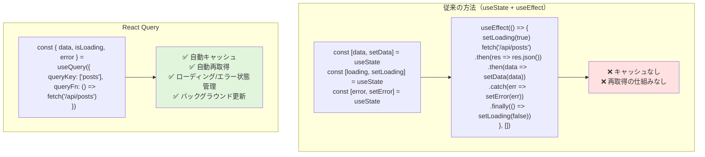
```mermaid
graph TD
    subgraph "従来の方法（useState + useEffect）"
        A1["const [data, setData] = useState<br/>const [loading, setLoading] = useState<br/>const [error, setError] = useState"]
        A2["useEffect(() => {<br/>  setLoading(true)<br/>  fetch('/api/posts')<br/>    .then(res => res.json())<br/>    .then(data => setData(data))<br/>    .catch(err => setError(err))<br/>    .finally(() => setLoading(false))<br/>}, [])"]
        A3["❌ キャッシュなし<br/>❌ 再取得の仕組みなし"]
        A1 --> A2 --> A3
    end

    subgraph "React Query"
        B1["const { data, isLoading, error } =<br/>  useQuery({<br/>    queryKey: ['posts'],<br/>    queryFn: () => fetch('/api/posts')<br/>  })"]
        B2["✅ 自動キャッシュ<br/>✅ 自動再取得<br/>✅ ローディング/エラー状態管理<br/>✅ バックグラウンド更新"]
        B1 --> B2
    end

    style A3 fill:#ffe1e1
    style B2 fill:#e1f5dd
```

### useQuery：データ取得の基本

```tsx
'use client'

import { useQuery } from '@tanstack/react-query'

function UserProfile({ userId }: { userId: string }) {
  const {
    data,           // 取得したデータ
    isLoading,      // 初回ローディング中
    error,          // エラー
    isFetching,     // バックグラウンドで再取得中
  } = useQuery({
    // クエリキー: このキーでキャッシュを識別
    queryKey: ['user', userId],

    // クエリ関数: データを取得する関数
    queryFn: async () => {
      const response = await fetch(`/api/users/${userId}`)
      if (!response.ok) throw new Error('取得に失敗しました')
      return response.json()
    },

    // オプション
    staleTime: 5 * 60 * 1000,  // 5分間はデータを新鮮とみなす
  })

  if (isLoading) return <div>読み込み中...</div>     // 表示: 「読み込み中...」
  if (error) return <div>エラー: {error.message}</div> // 表示: 「エラー: 取得に失敗しました」

  return (
    <div>
      <h2>{data.nickname}</h2>   {/* 表示例: 「盆栽太郎」 */}
      <p>{data.bio}</p>          {/* 表示例: 「松柏類が好きです」 */}
    </div>
  )
}
```

> **画面表示**
> - アクセス直後: 「読み込み中...」が表示される
> - データ取得成功: ニックネームとプロフィール文が表示される
> - 5分以内に再アクセス: キャッシュからデータが即座に表示される（API呼び出しなし）
> - ネットワークエラー: 「エラー: 取得に失敗しました」が表示される

**クエリキーの仕組み**:

```tsx
// クエリキーは配列で指定する
queryKey: ['user', userId]
// → userId が変わると別のキャッシュとして管理される

// 例:
queryKey: ['user', 'user1']  // user1のキャッシュ
queryKey: ['user', 'user2']  // user2のキャッシュ（別物）
queryKey: ['posts']          // 投稿一覧のキャッシュ
queryKey: ['posts', { genre: '松柏類' }]  // フィルタ付きのキャッシュ
```

### useMutation：データ変更

`useMutation`は、データの作成（POST）、更新（PUT）、削除（DELETE）など、サーバーのデータを変更する操作に使います。

```tsx
'use client'

import { useMutation, useQueryClient } from '@tanstack/react-query'

function FollowButton({ userId }: { userId: string }) {
  const queryClient = useQueryClient()

  const followMutation = useMutation({
    // ミューテーション関数
    mutationFn: async () => {
      const response = await fetch(`/api/users/${userId}/follow`, {
        method: 'POST',
      })
      if (!response.ok) throw new Error('フォローに失敗しました')
      return response.json()
    },

    // 成功時: 関連するキャッシュを無効化して再取得
    onSuccess: () => {
      // 'timeline'キーのキャッシュを無効化 → 自動的に再取得
      queryClient.invalidateQueries({ queryKey: ['timeline'] })
    },

    // エラー時
    onError: (error) => {
      console.error('フォローに失敗:', error.message)
    },
  })

  return (
    <button
      onClick={() => followMutation.mutate()}
      disabled={followMutation.isPending}
    >
      {followMutation.isPending ? '処理中...' : 'フォローする'}
      {/* 表示: 通常「フォローする」、クリック後「処理中...」 */}
    </button>
  )
}
```

> **画面表示**
> - 初期状態: 「フォローする」ボタンが表示される
> - ボタンをクリック: 即座に「処理中...」に変わり、ボタンが無効化される
> - サーバー処理成功: 「フォローする」に戻る + タイムラインのキャッシュが無効化されて最新化
> - サーバー処理失敗: コンソールにエラーが表示される

#### BON-LOGでのuseMutation活用

BON-LOGの`PostForm`コンポーネントでは、投稿送信時にReact Queryのキャッシュを無効化してタイムラインを更新しています。

```tsx
// components/post/PostForm.tsx から抜粋
export function PostForm({ genres, limits }) {
  const queryClient = useQueryClient()

  async function handleSubmit(e: React.FormEvent) {
    e.preventDefault()

    const formData = new FormData()
    formData.append('content', content)

    // Server Actionで投稿を作成
    createPost(formData)
      .then(async (result) => {
        if (result.error) {
          toast({ variant: 'destructive', title: '投稿に失敗しました' })
        } else {
          toast({ title: '投稿しました' })
          // タイムラインのキャッシュを無効化 → 新しい投稿が表示される
          await queryClient.invalidateQueries({ queryKey: ['timeline'] })
        }
      })
  }
}
```

### useInfiniteQuery：無限スクロール

`useInfiniteQuery`は、ページネーション付きのデータを管理し、無限スクロールを実装するためのフックです。

#### BON-LOGの実例：Timeline

BON-LOGのタイムライン（`components/feed/Timeline.tsx`）は、`useInfiniteQuery`で実装されています。

```tsx
'use client'

import { useInfiniteQuery } from '@tanstack/react-query'
import { useInView } from 'react-intersection-observer'
import { useEffect } from 'react'
import { getTimeline } from '@/lib/actions/feed'

type TimelineProps = {
  initialPosts: any[]
  currentUserId?: string
}

export function Timeline({ initialPosts, currentUserId }: TimelineProps) {
  // Intersection Observer: スクロール検知
  const { ref, inView } = useInView()

  const {
    data,               // ページ配列
    fetchNextPage,      // 次のページを取得
    hasNextPage,        // 次のページがあるか
    isFetchingNextPage, // 次ページ取得中か
    isLoading,          // 初回ローディング中か
  } = useInfiniteQuery({
    // キャッシュキー
    queryKey: ['timeline'],

    // データ取得関数（pageParamにカーソルが渡される）
    queryFn: async ({ pageParam }) => {
      const result = await getTimeline(pageParam)
      return result
    },

    // 初期ページパラメータ
    initialPageParam: undefined as string | undefined,

    // SSRで取得した初期データ
    initialData: {
      pages: [{
        posts: initialPosts,
        nextCursor: initialPosts.length >= 20
          ? initialPosts[initialPosts.length - 1]?.id
          : undefined,
      }],
      pageParams: [undefined],
    },

    // 次のページのカーソルを取得
    getNextPageParam: (lastPage) => lastPage.nextCursor,
  })

  // スクロール検知で自動フェッチ
  useEffect(() => {
    if (inView && hasNextPage && !isFetchingNextPage) {
      fetchNextPage()
    }
  }, [inView, hasNextPage, isFetchingNextPage, fetchNextPage])

  if (isLoading) return <div>読み込み中...</div>

  // 全ページの投稿をフラットな配列に変換
  const allPosts = data?.pages.flatMap((page) => page.posts) || []

  return (
    <div>
      {allPosts.map((post) => (
        <PostCard key={post.id} post={post} currentUserId={currentUserId} />
      ))}

      {/* この要素がビューポートに入ると次ページを取得 */}
      <div ref={ref}>
        {isFetchingNextPage && <span>読み込み中...</span>}
        {!hasNextPage && <span>すべて表示しました</span>}
      </div>
    </div>
  )
}
```

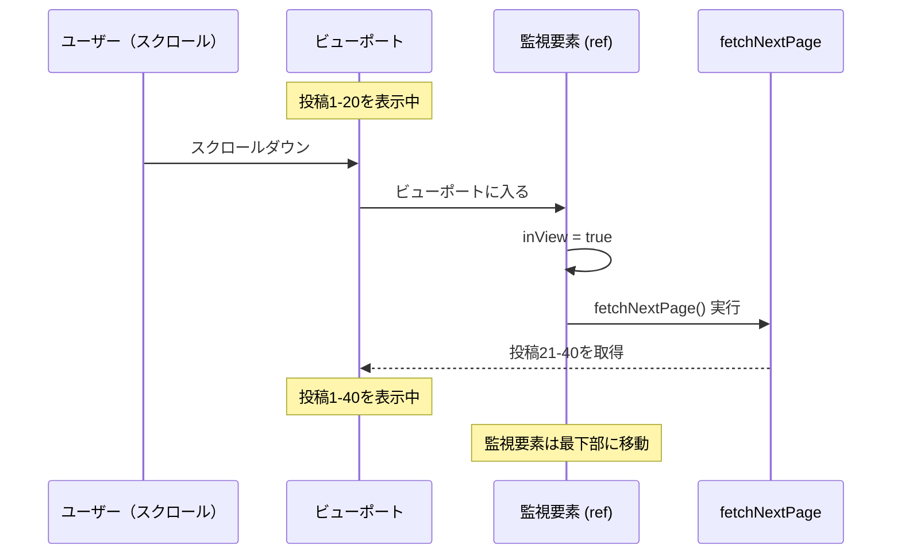
```mermaid
sequenceDiagram
    participant User as ユーザー（スクロール）
    participant View as ビューポート
    participant Ref as 監視要素 (ref)
    participant API as fetchNextPage

    Note over View: 投稿1-20を表示中
    User->>View: スクロールダウン
    View->>Ref: ビューポートに入る
    Ref->>Ref: inView = true
    Ref->>API: fetchNextPage() 実行
    API-->>View: 投稿21-40を取得
    Note over View: 投稿1-40を表示中
    Note over Ref: 監視要素は最下部に移動
```

### QueryClientの設定

BON-LOGでは`app/providers.tsx`でQueryClientを設定しています。

```tsx
const [queryClient] = useState(
  () =>
    new QueryClient({
      defaultOptions: {
        queries: {
          // データが「古い」とみなされるまでの時間
          staleTime: 60 * 1000,  // 1分

          // ウィンドウフォーカス時の自動再フェッチを無効化
          refetchOnWindowFocus: false,
        },
      },
    })
)
```

**主要なオプション**:

| オプション | デフォルト | 説明 |
|-----------|----------|------|
| `staleTime` | 0 | データを新鮮とみなす時間。この間はキャッシュを返す |
| `gcTime` | 5分 | 未使用のキャッシュを保持する時間 |
| `refetchOnWindowFocus` | true | タブ切り替え時に再取得するか |
| `retry` | 3 | エラー時の再試行回数 |
| `refetchOnMount` | true | コンポーネントマウント時に再取得するか |

### 楽観的更新（Optimistic Updates）

楽観的更新は、**サーバーのレスポンスを待たずにUIを即座に更新**するパターンです。BON-LOGではいいねボタンやフォローボタンで広く使われています。

```tsx
function LikeButton({ postId, initialLiked, initialCount }: LikeButtonProps) {
  const [liked, setLiked] = useState(initialLiked)
  const [count, setCount] = useState(initialCount)

  async function handleToggle() {
    // ステップ1: 先にUIを更新（楽観的更新）
    const newLiked = !liked
    setLiked(newLiked)
    setCount(prev => newLiked ? prev + 1 : prev - 1)

    // ステップ2: サーバーに送信
    const result = await togglePostLike(postId)

    // ステップ3: エラー時は元に戻す（ロールバック）
    if (result.error) {
      setLiked(liked)           // 元のliked状態に戻す
      setCount(initialCount)     // 元のカウントに戻す
    }
  }

  return (
    <button onClick={handleToggle}>
      {liked ? '❤️' : '🤍'} {count}
    </button>
  )
}
```

```
楽観的更新のフロー:

  ユーザーがクリック
       ↓
  ① UI即座に更新（liked=true, count+1）  ← ユーザーには即座に反映
       ↓
  ② サーバーに送信
       ↓
  ③-A 成功 → そのまま            ← 何もしない
  ③-B 失敗 → UIを元に戻す       ← ロールバック
```

### キャッシュの無効化パターン

React Queryの強力な機能の一つは、関連するキャッシュを簡単に無効化できることです。

```tsx
const queryClient = useQueryClient()

// 特定のクエリを無効化（再取得される）
queryClient.invalidateQueries({ queryKey: ['timeline'] })

// プレフィックスマッチで一括無効化
queryClient.invalidateQueries({ queryKey: ['search'] })
// → ['search-posts', ...], ['search-users', ...] もすべて無効化

// 全クエリを無効化
queryClient.invalidateQueries()
```

### 理解度チェック

**Q1**: React Queryの`staleTime`とは何ですか？
<details><summary>答え</summary>
データが「新鮮（fresh）」とみなされる時間です。この時間内にコンポーネントが再マウントされても、キャッシュからデータを返しAPIリクエストは発生しません。BON-LOGでは1分に設定されており、1分以内の再アクセスではネットワークリクエストを行わずキャッシュを使用します。
</details>

**Q2**: `useInfiniteQuery`で`getNextPageParam`が`undefined`を返すとどうなりますか？
<details><summary>答え</summary>
`hasNextPage`が`false`になり、これ以上のデータ取得は行われなくなります。BON-LOGでは、サーバーが返す`nextCursor`が`undefined`の場合にこれが起こり、「すべての投稿を表示しました」というメッセージが表示されます。
</details>

---

## 4.18 Zustand入門（選択肢としての学習）

> **本プロジェクトについて**  
> **BON-LOGでは現在Zustandは使っていません。** クライアント側の状態（モーダル、UIの開閉など）は **useState** や **Context** で十分なため、あえてライブラリを導入していません。  
> このセクションでは「状態管理ライブラリの選択肢」としてZustandを学び、将来ほかのプロジェクトで使うときや、より複雑なクライアント状態が必要になったときの参考にしてください。

### このセクションで学ぶこと

- Zustandとは（軽量状態管理ライブラリ・**選択肢の一つ**）
- ストアの作成パターン（create関数）
- セレクタによるパフォーマンス最適化
- React Queryとの使い分け（サーバー状態 vs クライアント状態）

### Zustandとは

Zustandは、**軽量でシンプルなクライアント状態管理ライブラリ**です。Reduxの複雑さなしにグローバル状態を管理でき、多くのReactプロジェクトで採用されています（BON-LOGでは上述の通り未使用です）。

**Zustandの特徴:**

| 特徴 | 詳細 |
|------|------|
| ✅ 設定が少ない | ボイラープレートなし |
| ✅ バンドルサイズが小さい | ~1KB |
| ✅ TypeScriptサポート良好 | 型推論が優れている |
| ✅ Providerが不要 | どこからでもアクセス可能 |
| ✅ React外からもアクセス可能 | Server Actionsからも使える |

**比較:**
- **Redux**: 強力だが設定が複雑
- **Context**: シンプルだがパフォーマンス問題あり
- **Zustand**: シンプル & 高パフォーマンス

### ストアの作成

```tsx
import { create } from 'zustand'

// ============================================================
// ステップ1: ストアの型定義
// ============================================================
type ModalStore = {
  // 状態
  isOpen: boolean
  modalType: 'compose' | 'edit' | 'confirm' | null

  // アクション（状態を変更する関数）
  openModal: (type: 'compose' | 'edit' | 'confirm') => void
  closeModal: () => void
}

// ============================================================
// ステップ2: ストアの作成
// ============================================================
const useModalStore = create<ModalStore>((set) => ({
  // 初期状態
  isOpen: false,
  modalType: null,

  // アクション
  openModal: (type) => set({ isOpen: true, modalType: type }),
  closeModal: () => set({ isOpen: false, modalType: null }),
}))

// ============================================================
// ステップ3: コンポーネントで使用
// ============================================================
function ComposeButton() {
  const openModal = useModalStore((state) => state.openModal)

  return (
    <button onClick={() => openModal('compose')}>
      新規投稿
    </button>
    // ↑ クリックすると isOpen=true, modalType='compose' になる
  )
}

function Modal() {
  const { isOpen, modalType, closeModal } = useModalStore()

  if (!isOpen) return null  // モーダルが閉じている時は何も表示しない

  return (
    <div className="fixed inset-0 z-50 bg-black/50">
      <div className="bg-white rounded-lg p-6">
        <h2>{modalType === 'compose' ? '新規投稿' : '確認'}</h2>
        {/* 表示: modalType='compose'の場合「新規投稿」 */}
        <button onClick={closeModal}>閉じる</button>
      </div>
    </div>
  )
}
```

> **画面表示**
> - 初期状態: 「新規投稿」ボタンのみ表示（モーダルは非表示）
> - 「新規投稿」ボタンをクリック: 画面全体に半透明の黒背景が重なり、中央に白い「新規投稿」モーダルが表示される
> - 「閉じる」をクリック: モーダルが消え、元の画面に戻る
> - ポイント: ComposeButtonとModalは別コンポーネントだが、Zustandストアを通じて状態を共有している（Propsの受け渡し不要）

### セレクタによるパフォーマンス最適化

Zustandでは、**セレクタを使って必要な値だけを購読**することで、不要な再レンダリングを防げます。

```tsx
type AppStore = {
  count: number
  userName: string
  theme: 'light' | 'dark'
  increment: () => void
  setUserName: (name: string) => void
  setTheme: (theme: 'light' | 'dark') => void
}

const useAppStore = create<AppStore>((set) => ({
  count: 0,
  userName: '',
  theme: 'light',
  increment: () => set((state) => ({ count: state.count + 1 })),
  setUserName: (name) => set({ userName: name }),
  setTheme: (theme) => set({ theme }),
}))

// ❌ 悪い例: ストア全体を購読
function BadComponent() {
  // ストアのどの値が変わっても再レンダリングされる
  const store = useAppStore()
  return <div>{store.count}</div>
}

// ✅ 良い例: 必要な値だけを購読（セレクタ）
function GoodComponent() {
  // countが変わった時だけ再レンダリング
  const count = useAppStore((state) => state.count)
  return <div>{count}</div>
}

// ✅ 複数の値を選択する場合
function AnotherComponent() {
  const count = useAppStore((state) => state.count)
  const increment = useAppStore((state) => state.increment)

  return (
    <button onClick={increment}>
      カウント: {count}
    </button>
  )
}
```

### 実践的なストアの例

```tsx
// stores/ui-store.ts
import { create } from 'zustand'

/**
 * UI関連のグローバル状態
 *
 * モーダルの開閉、サイドバーの表示、通知などの
 * クライアント側のUI状態を管理
 */
type UIStore = {
  // サイドバー
  isSidebarOpen: boolean
  toggleSidebar: () => void

  // 投稿モーダル
  isComposeOpen: boolean
  openCompose: () => void
  closeCompose: () => void

  // 検索
  searchQuery: string
  setSearchQuery: (query: string) => void
}

export const useUIStore = create<UIStore>((set) => ({
  // サイドバー
  isSidebarOpen: false,
  toggleSidebar: () => set((state) => ({
    isSidebarOpen: !state.isSidebarOpen,
  })),

  // 投稿モーダル
  isComposeOpen: false,
  openCompose: () => set({ isComposeOpen: true }),
  closeCompose: () => set({ isComposeOpen: false }),

  // 検索
  searchQuery: '',
  setSearchQuery: (query) => set({ searchQuery: query }),
}))

// 使用例: ヘッダーコンポーネント
function Header() {
  const toggleSidebar = useUIStore((state) => state.toggleSidebar)
  const openCompose = useUIStore((state) => state.openCompose)
  // ↑ セレクタで関数だけを取得（状態値を購読していないので、状態変化で再レンダリングされない）

  return (
    <header>
      <button onClick={toggleSidebar}>メニュー</button>
      {/* クリック → isSidebarOpen が true ↔ false */}
      <button onClick={openCompose}>投稿</button>
      {/* クリック → isComposeOpen が true */}
    </header>
  )
}

// 使用例: サイドバーコンポーネント
function Sidebar() {
  const isOpen = useUIStore((state) => state.isSidebarOpen)
  // ↑ isSidebarOpen だけを購読。searchQuery が変わっても再レンダリングされない

  if (!isOpen) return null  // 表示: サイドバーが閉じている時は何も表示しない
  return <nav>...</nav>     // 表示: サイドバーが開いている時はナビゲーションを表示
}
```

> **画面表示**
> - 初期状態: ヘッダーに「メニュー」「投稿」ボタン。サイドバーは非表示
> - 「メニュー」クリック: サイドバーが表示される
> - 検索入力を変更: `searchQuery`が変わるが、Header/Sidebarは再レンダリングされない（パフォーマンス最適化）

### React Queryとの使い分け

BON-LOGでは、**サーバー状態にReact Query、クライアント状態にuseState/Context** を用途に応じて使い分けています。Zustandは採用していませんが、同じ考え方（サーバー状態とクライアント状態の分離）が参考になります。

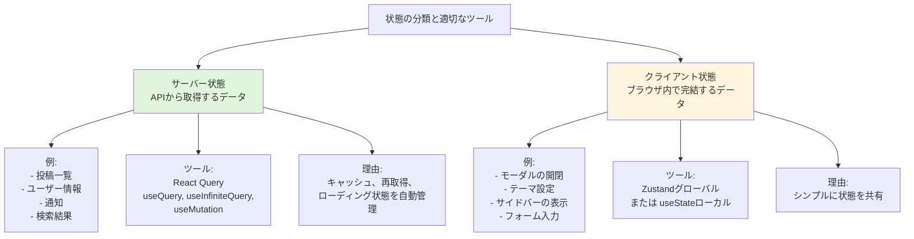
```mermaid
graph TD
    A[状態の分類と適切なツール]

    A --> B[サーバー状態<br/>APIから取得するデータ]
    B --> B1["例:<br/>- 投稿一覧<br/>- ユーザー情報<br/>- 通知<br/>- 検索結果"]
    B --> B2["ツール:<br/>React Query<br/>useQuery, useInfiniteQuery,<br/>useMutation"]
    B --> B3["理由:<br/>キャッシュ、再取得、<br/>ローディング状態を自動管理"]

    A --> C[クライアント状態<br/>ブラウザ内で完結するデータ]
    C --> C1["例:<br/>- モーダルの開閉<br/>- テーマ設定<br/>- サイドバーの表示<br/>- フォーム入力"]
    C --> C2["ツール:<br/>Zustandグローバル<br/>または useStateローカル"]
    C --> C3["理由:<br/>シンプルに状態を共有"]

    style B fill:#e1f5dd
    style C fill:#fff4dd
```

| 状態の種類 | ツール | 例 |
|-----------|--------|-----|
| ローカルUI状態 | `useState` | フォーム入力値、メニュー開閉 |
| グローバルUI状態 | `useState` + Context（BON-LOGではこちら） / または Zustand | モーダル、テーマ、サイドバー |
| サーバーデータ | `React Query` | 投稿一覧、ユーザー情報 |
| URL状態 | `useSearchParams` | 検索クエリ、フィルタ |

### 理解度チェック

**Q1**: Zustandで`Provider`は必要ですか？
<details><summary>答え</summary>
いいえ、Zustandは`Provider`が不要です。`create`で作成したストアは、任意のコンポーネントから直接インポートして使用できます。これはReact ContextやReduxと大きく異なる点です。
</details>

**Q2**: サーバーから取得するデータの管理にZustandを使うべきですか？
<details><summary>答え</summary>
いいえ、サーバーデータにはReact Query（TanStack Query）を使うべきです。React Queryはキャッシュ管理、バックグラウンド再取得、ローディング/エラー状態、楽観的更新などの機能を提供しています。Zustandはモーダルの開閉やテーマ設定など、クライアント側で完結する状態の管理に適しています。
</details>

---

## 4.19 Hooks判断フローチャート（初心者向けまとめ）

この章で多くのHooksを学びましたが、「どのHookを使えばいいの？」と迷うことがあると思います。以下のフローチャートを参考にしてください。

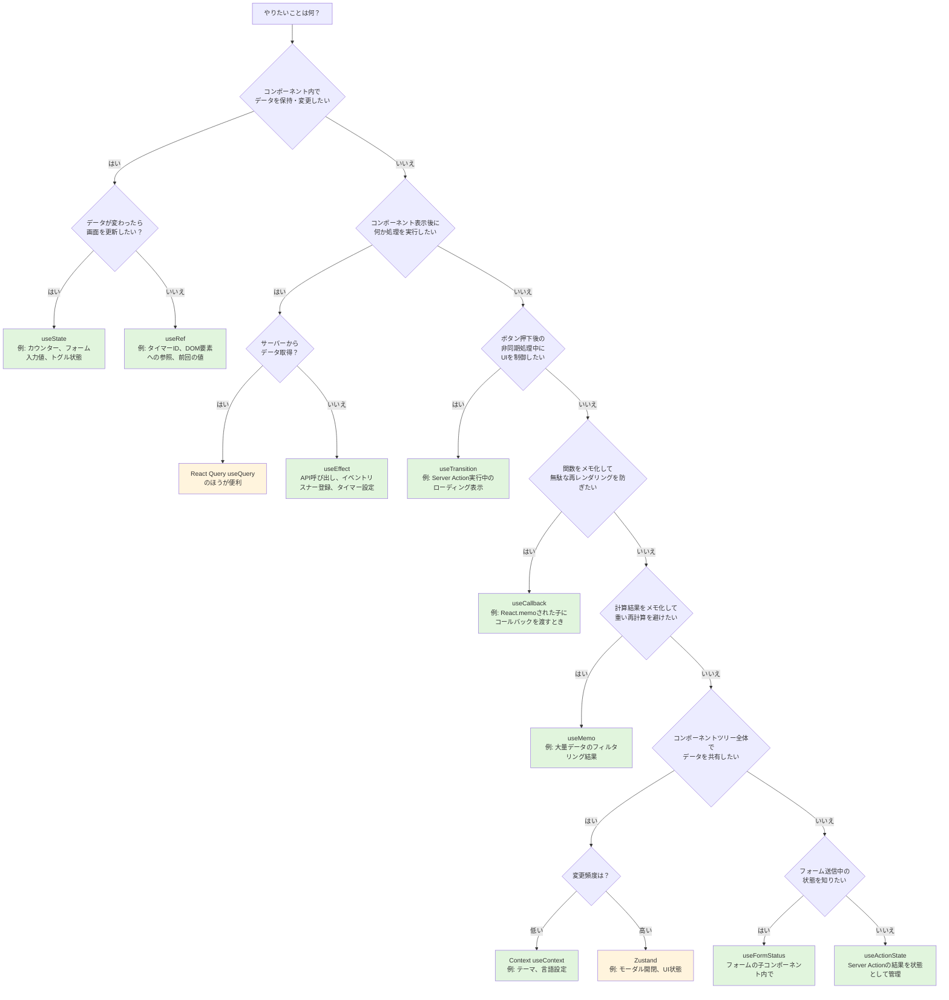
```mermaid
flowchart TD
    Start[やりたいことは何？]

    Start --> Q1{コンポーネント内で<br/>データを保持・変更したい}
    Q1 -->|はい| Q1A{データが変わったら<br/>画面を更新したい？}
    Q1A -->|はい| A1["useState<br/>例: カウンター、フォーム入力値、トグル状態"]
    Q1A -->|いいえ| A2["useRef<br/>例: タイマーID、DOM要素への参照、前回の値"]

    Q1 -->|いいえ| Q2{コンポーネント表示後に<br/>何か処理を実行したい}
    Q2 -->|はい| Q2A{サーバーから<br/>データ取得？}
    Q2A -->|はい| A3["React Query useQuery<br/>のほうが便利"]
    Q2A -->|いいえ| A4["useEffect<br/>API呼び出し、イベントリスナー登録、タイマー設定"]

    Q2 -->|いいえ| Q3{ボタン押下後の<br/>非同期処理中に<br/>UIを制御したい}
    Q3 -->|はい| A5["useTransition<br/>例: Server Action実行中のローディング表示"]

    Q3 -->|いいえ| Q4{関数をメモ化して<br/>無駄な再レンダリングを防ぎたい}
    Q4 -->|はい| A6["useCallback<br/>例: React.memoされた子にコールバックを渡すとき"]

    Q4 -->|いいえ| Q5{計算結果をメモ化して<br/>重い再計算を避けたい}
    Q5 -->|はい| A7["useMemo<br/>例: 大量データのフィルタリング結果"]

    Q5 -->|いいえ| Q6{コンポーネントツリー全体で<br/>データを共有したい}
    Q6 -->|はい| Q6A{変更頻度は？}
    Q6A -->|低い| A8["Context useContext<br/>例: テーマ、言語設定"]
    Q6A -->|高い| A9["Zustand<br/>例: モーダル開閉、UI状態"]

    Q6 -->|いいえ| Q7{フォーム送信中の<br/>状態を知りたい}
    Q7 -->|はい| A10["useFormStatus<br/>フォームの子コンポーネント内で"]

    Q7 -->|いいえ| A11["useActionState<br/>Server Actionの結果を状態として管理"]

    style A1 fill:#e1f5dd
    style A2 fill:#e1f5dd
    style A3 fill:#fff4dd
    style A4 fill:#e1f5dd
    style A5 fill:#e1f5dd
    style A6 fill:#e1f5dd
    style A7 fill:#e1f5dd
    style A8 fill:#e1f5dd
    style A9 fill:#fff4dd
    style A10 fill:#e1f5dd
    style A11 fill:#e1f5dd
```

### よくある間違いと対策の総まとめ

| よくある間違い | 原因 | 対策 |
|-------------|------|------|
| `setCount(count + 1)`を連続で呼んでも1しか増えない | Stale Closure（古いクロージャ） | `setCount(prev => prev + 1)`の関数形式を使う |
| useEffectで無限ループが発生 | 依存配列に更新対象の状態が含まれている | 依存配列を見直すか、条件分岐で更新を制御する |
| オブジェクトのStateを更新しても画面が変わらない | 同じ参照のオブジェクトを渡している | `{...prev, key: value}`でスプレッド構文を使い新しいオブジェクトを作る |
| `onClick={handleClick()}`で関数がすぐ実行される | `()`を付けると関数を呼び出してしまう | `onClick={handleClick}`で関数自体を渡す |
| useEffectの依存配列に関数を入れると毎回実行される | 関数は毎回新しいインスタンスが作られる | `useCallback`でラップする |
| `{count && <Badge />}`で`0`が表示される | `0`はfalsyだがJSXでは`0`を描画する | `{count > 0 && <Badge />}`で明示的にbooleanにする |
| useFormStatusがpending: falseのまま | フォームの子コンポーネント外で使っている | `<form>`タグの子コンポーネント内で呼び出す |
| カスタムフック内でHooksが使えないエラー | 関数名が`use`で始まっていない | 必ず`use`で始まる名前にする（例: `useCounter`） |
| Zustandストアの値が変わっても再レンダリングされない | ストア全体を取得していない or セレクタの問題 | セレクタ`(state) => state.value`で必要な値だけを購読する |

### PropsとStateの見分け方

初心者の方が最も混乱しやすいのが「この値はPropsで持つべき？それともStateで持つべき？」という判断です。

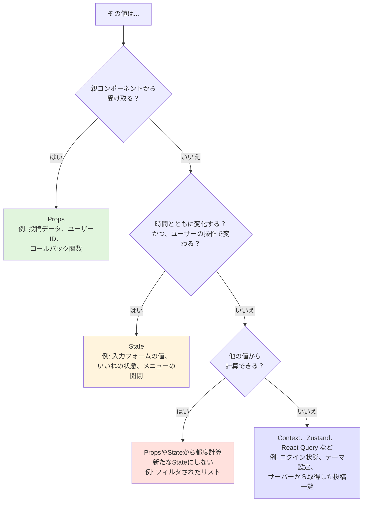
```mermaid
flowchart TD
    Start[その値は...]

    Start --> Q1{親コンポーネントから<br/>受け取る？}
    Q1 -->|はい| A1["Props<br/>例: 投稿データ、ユーザーID、<br/>コールバック関数"]

    Q1 -->|いいえ| Q2{時間とともに変化する？<br/>かつ、ユーザーの操作で変わる？}
    Q2 -->|はい| A2["State<br/>例: 入力フォームの値、<br/>いいねの状態、メニューの開閉"]

    Q2 -->|いいえ| Q3{他の値から<br/>計算できる？}
    Q3 -->|はい| A3["PropsやStateから都度計算<br/>新たなStateにしない<br/>例: フィルタされたリスト"]

    Q3 -->|いいえ| A4["Context、Zustand、<br/>React Query など<br/>例: ログイン状態、テーマ設定、<br/>サーバーから取得した投稿一覧"]

    style A1 fill:#e1f5dd
    style A2 fill:#fff4dd
    style A3 fill:#ffe1dd
    style A4 fill:#e1e1ff
```

> **原則: Stateは最小限に保つ**
>
> 「計算で求められる値」をStateにすると、元のデータとの同期を維持する責任が生まれ、バグの温床になります。例えば、投稿リストと検索キーワードがStateにあるなら、「検索結果」は`posts.filter(...)`で都度計算すべきであり、別のStateとして持つべきではありません。

### React Hooks 依存関係図

Reactの主要なHooksがどのように関連し、どのような場面で組み合わせて使うかを視覚化した図です。

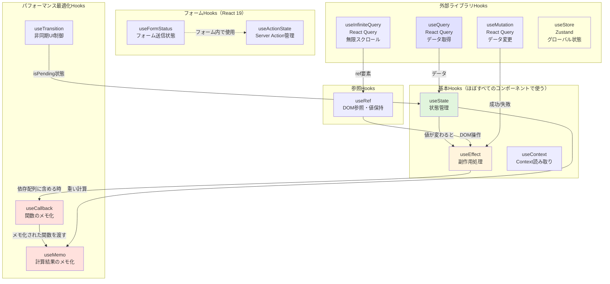
```mermaid
graph TB
    subgraph "基本Hooks（ほぼすべてのコンポーネントで使う）"
        useState[useState<br/>状態管理]
        useEffect[useEffect<br/>副作用処理]
        useContext[useContext<br/>Context読み取り]
    end

    subgraph "パフォーマンス最適化Hooks"
        useMemo[useMemo<br/>計算結果のメモ化]
        useCallback[useCallback<br/>関数のメモ化]
        useTransition[useTransition<br/>非同期UI制御]
    end

    subgraph "参照Hooks"
        useRef[useRef<br/>DOM参照・値保持]
    end

    subgraph "フォームHooks（React 19）"
        useFormStatus[useFormStatus<br/>フォーム送信状態]
        useActionState[useActionState<br/>Server Action管理]
    end

    subgraph "外部ライブラリHooks"
        useQuery[useQuery<br/>React Query<br/>データ取得]
        useInfiniteQuery[useInfiniteQuery<br/>React Query<br/>無限スクロール]
        useMutation[useMutation<br/>React Query<br/>データ変更]
        useStore[useStore<br/>Zustand<br/>グローバル状態]
    end

    %% 依存関係
    useState -->|値が変わると| useEffect
    useEffect -->|依存配列に含める時| useCallback
    useCallback -->|メモ化された関数を渡す| useMemo
    useState -->|重い計算| useMemo
    useRef -->|DOM操作| useEffect
    useTransition -->|isPending状態| useState

    useQuery -->|データ| useState
    useMutation -->|成功/失敗| useEffect
    useInfiniteQuery -->|ref要素| useRef

    useFormStatus -.->|フォーム内で使用| useActionState

    %% スタイリング
    style useState fill:#e1f5dd
    style useEffect fill:#fff4dd
    style useCallback fill:#ffe1dd
    style useMemo fill:#ffe1dd
    style useQuery fill:#e1e1ff
    style useStore fill:#ffffdd
```

**Hooksの組み合わせパターン:**

| パターン | 組み合わせ | 用途 |
|---------|----------|------|
| **データ取得 + 表示** | `useQuery` + `useState` | サーバーデータを取得して状態管理 |
| **副作用 + クリーンアップ** | `useEffect` + `useRef` | イベントリスナー登録・解除 |
| **最適化 + 子渡し** | `useCallback` + `React.memo` | 関数をメモ化して子の再レンダリング防止 |
| **無限スクロール** | `useInfiniteQuery` + `useRef` | ページング + Intersection Observer |
| **楽観的更新** | `useState` + `useTransition` + `useMutation` | UI即時更新 + サーバー送信 |
| **フォーム送信** | `useFormStatus` + `useActionState` | Server Actionとの連携 |

---

## 4.20 useTransition 深掘り：非同期UIの制御パターン

### このセクションで学ぶこと

- useTransitionの内部動作メカニズム
- isPendingを活用した段階的UIフィードバック
- Server Actionsとの実践的な連携パターン
- BON-LOGの「いいねボタン」完全解剖
- useTransitionとusStateのローディング管理の比較

### useTransitionの内部動作を理解する

useTransitionは「この状態更新は急ぎではないので、他の緊急な更新（ユーザーの入力など）を先に処理してよい」とReactに伝えるフックです。これをもう少し具体的なたとえで理解しましょう。

**useTransitionの動作イメージ（レストランでの注文に例えると）:**

| アプローチ | 説明 | 結果 |
|---|---|---|
| **通常の状態更新**<br/>「すぐ持ってきて！」 | 客: 「水をください」<br/>店員: すべての作業を止めて水を持っていく | → UIが完全にブロックされる |
| **Transition**<br/>「急がないから、手が空いたら」 | 客: 「デザートをお願い（急がないよ）」<br/>店員: 他の注文を先に処理してからデザートを準備する | → UIはブロックされない<br/>→ isPending = true の間「準備中」と表示 |

### BON-LOGの実例：LikeButton完全解剖

BON-LOGの「いいねボタン」（`components/post/LikeButton.tsx`）は、useTransitionを使った実践的なパターンの教科書的な例です。このコンポーネントの全体像を1行ずつ理解しましょう。

```tsx
// ファイル: components/post/LikeButton.tsx

'use client'
// ↑ このコンポーネントはブラウザで動作する
//   useStateやuseTransitionはブラウザ側のフック

import { useState, useTransition, useEffect } from 'react'
// useState: いいねの状態（liked）とカウント（count）を管理
// useTransition: Server Action実行中のペンディング状態を管理
// useEffect: 親から渡されるpropsの変更を監視

import { Heart } from 'lucide-react'
// ハートアイコン（いいねの見た目）

import { useQueryClient } from '@tanstack/react-query'
// React Queryのキャッシュを操作する関数

import { useToast } from '@/hooks/use-toast'
// トースト通知（画面下部に一時的に表示されるメッセージ）

import { Button } from '@/components/ui/button'
// shadcn/uiのボタンコンポーネント

import { togglePostLike } from '@/lib/actions/like'
// Server Action: サーバー側でいいねの状態を切り替える
```

**Props（外部から受け取るデータ）の型定義**:

```tsx
type LikeButtonProps = {
  postId: string         // どの投稿に対するいいねか
  initialLiked: boolean  // 初期状態（すでにいいね済みか）
  initialCount: number   // 初期のいいね数
}
```

**状態管理部分**:

```tsx
export function LikeButton({
  postId,
  initialLiked,
  initialCount,
}: LikeButtonProps) {
  // ─── 状態管理 ───

  // いいね済みかどうか（true/false）
  const [liked, setLiked] = useState(initialLiked)

  // いいねの合計数
  const [count, setCount] = useState(initialCount)

  // ★ useTransition ★
  // isPending: Server Action実行中はtrue、完了後にfalse
  // startTransition: この中で実行する処理を「低優先度」にする
  const [isPending, startTransition] = useTransition()

  const queryClient = useQueryClient()
  const { toast } = useToast()

  // ─── propsの変更を監視 ───
  // タイムラインが再取得されたとき、親から新しい値が来る
  // そのとき内部状態を同期する
  useEffect(() => {
    setLiked((prev) => (prev !== initialLiked ? initialLiked : prev))
    setCount((prev) => (prev !== initialCount ? initialCount : prev))
  }, [initialLiked, initialCount])
  // ↑ 関数型更新 (prev => ...) を使う理由:
  //   単純に setLiked(initialLiked) とすると、
  //   値が同じでもsetterが呼ばれて不要な再レンダリングが起きる。
  //   prev !== initialLiked のチェックでそれを防止している。
```

**イベントハンドラ部分（Optimistic UI + useTransition）**:

```tsx
  async function handleToggle() {
    // ─── ステップ1: Optimistic UI（楽観的更新）───
    // サーバーの応答を「待たずに」先にUIを更新する
    // ユーザーには「即座に反応した」ように見える
    const newLiked = !liked
    setLiked(newLiked)
    setCount(prev => newLiked ? prev + 1 : prev - 1)

    // ─── ステップ2: startTransitionでServer Actionを実行 ───
    // この中の処理が完了するまで isPending = true
    startTransition(async () => {
      const result = await togglePostLike(postId)
      //                   ↑ サーバーに「いいねを切り替えて」とリクエスト

      if (result.error) {
        // ─── ステップ3a: エラー時 → ロールバック ───
        // サーバーで失敗したので、UIを元に戻す
        setLiked(liked)          // 元のいいね状態に戻す
        setCount(initialCount)   // 元のカウントに戻す
        toast({
          title: 'エラー',
          description: 'いいねに失敗しました。再度お試しください',
          variant: 'destructive',
        })
      } else {
        // ─── ステップ3b: 成功時 → キャッシュ更新 ───
        queryClient.invalidateQueries({ queryKey: ['timeline'] })
        //          ↑ タイムラインのキャッシュを「古い」とマークし、
        //            次にタイムラインを表示するとき最新データを取得させる
        toast({
          description: newLiked ? 'いいねしました' : 'いいねを取り消しました',
        })
      }
    })
  }
```

**レンダリング部分**:

```tsx
  return (
    <Button
      variant="ghost"
      size="sm"
      className={`flex items-center gap-1 ${
        liked
          ? 'text-red-500 hover:text-red-600'    // いいね済み: 赤色
          : 'text-muted-foreground hover:text-red-500'  // 未いいね: グレー
      }`}
      onClick={handleToggle}
      disabled={isPending}
      //       ↑ useTransitionのisPendingを使って
      //         Server Action実行中はボタンを無効化
      aria-label={liked ? 'いいねを取り消す' : 'いいねする'}
      aria-pressed={liked}
      //           ↑ アクセシビリティ: スクリーンリーダーに
      //             ボタンの押下状態を伝える
    >
      <Heart
        className={`w-5 h-5 transition-all ${
          liked ? 'fill-current scale-110' : ''
          //       ↑ いいね済みならハートを塗りつぶし+少し大きく
        }`}
        aria-hidden="true"
      />
      <span className="text-sm">{count}</span>
    </Button>
  )
}
```

### Optimistic UI + useTransition のフロー図

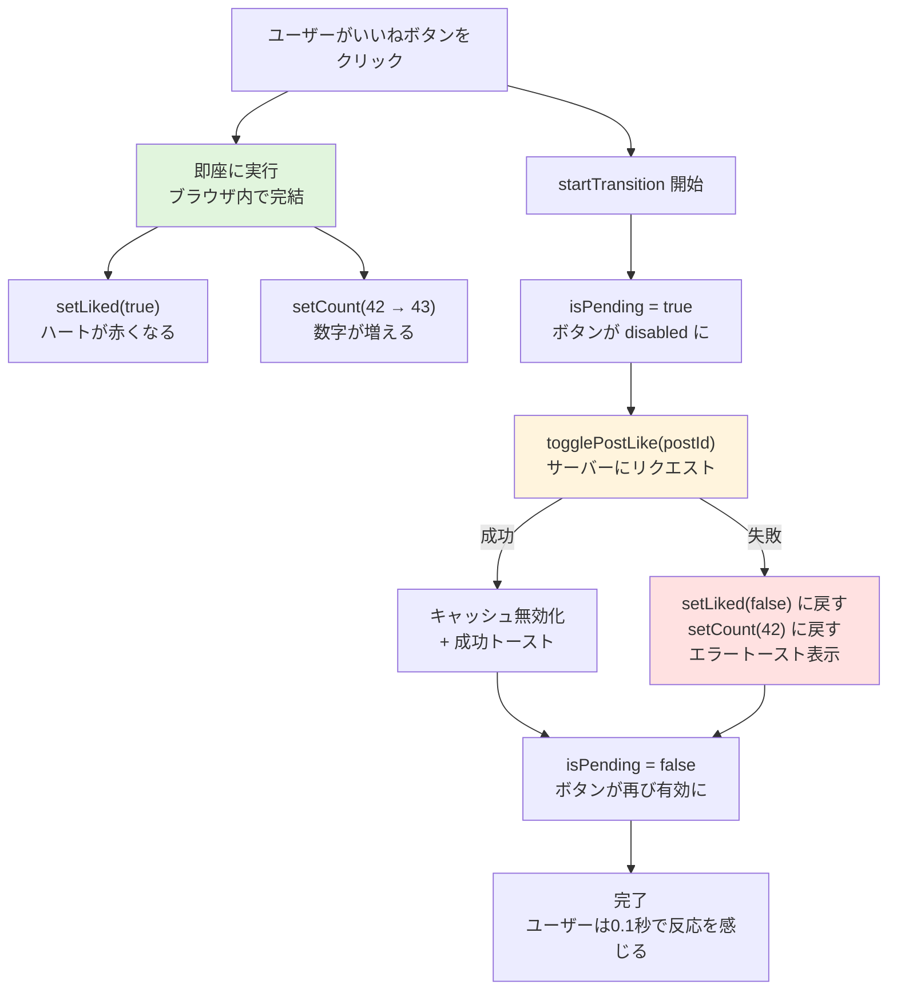
```mermaid
flowchart TD
    A[ユーザーがいいねボタンをクリック] --> B[即座に実行<br/>ブラウザ内で完結]
    A --> C[startTransition 開始]

    B --> B1["setLiked(true)<br/>ハートが赤くなる"]
    B --> B2["setCount(42 → 43)<br/>数字が増える"]

    C --> C1["isPending = true<br/>ボタンが disabled に"]
    C1 --> C2["togglePostLike(postId)<br/>サーバーにリクエスト"]

    C2 -->|成功| C3["キャッシュ無効化<br/>+ 成功トースト"]
    C2 -->|失敗| C4["setLiked(false) に戻す<br/>setCount(42) に戻す<br/>エラートースト表示"]

    C3 --> C5["isPending = false<br/>ボタンが再び有効に"]
    C4 --> C5
    C5 --> D[完了<br/>ユーザーは0.1秒で反応を感じる]

    style B fill:#e1f5dd
    style C2 fill:#fff4dd
    style C4 fill:#ffe1e1
```

> **初心者向けポイント**
>
> 「Optimistic UI（楽観的更新）」とは、「たぶんサーバーは成功するだろう」と楽観的に考えて、先にUIを更新する手法です。SNSの「いいね」は99%以上成功するので、ユーザーを0.5秒待たせるより、先に反応させたほうが快適です。万が一失敗したら元に戻す（ロールバック）だけです。

### useTransition vs useState でのローディング管理

```tsx
// ❌ useState でのローディング管理（冗長になりがち）
function LikeButtonOld({ postId }: { postId: string }) {
  const [isLoading, setIsLoading] = useState(false)

  async function handleToggle() {
    setIsLoading(true)        // ← 手動でtrue
    try {
      await togglePostLike(postId)
    } catch (error) {
      // エラー処理...
    } finally {
      setIsLoading(false)     // ← 手動でfalse（忘れるとバグ！）
    }
  }

  return <button disabled={isLoading}>...</button>
}

// ✅ useTransition でのローディング管理（自動追跡）
function LikeButtonNew({ postId }: { postId: string }) {
  const [isPending, startTransition] = useTransition()

  function handleToggle() {
    startTransition(async () => {
      await togglePostLike(postId)
      // isPendingは自動でtrue→falseになる
      // setLoadingの書き忘れがない！
    })
  }

  return <button disabled={isPending}>...</button>
}
```

### BookmarkButtonでの応用

ブックマークボタン（`components/post/BookmarkButton.tsx`）も同じパターンを使っています。

```tsx
export function BookmarkButton({ postId, initialBookmarked }: BookmarkButtonProps) {
  const [bookmarked, setBookmarked] = useState(initialBookmarked)

  // ★ useTransition で非同期処理を管理
  const [isPending, startTransition] = useTransition()

  const queryClient = useQueryClient()
  const { toast } = useToast()

  async function handleToggle() {
    // Optimistic UI: 先にUIを更新
    const newBookmarked = !bookmarked
    setBookmarked(newBookmarked)

    // startTransition で Server Action を実行
    startTransition(async () => {
      const result = await toggleBookmark(postId)

      if (result.error) {
        // エラー時: ロールバック
        setBookmarked(bookmarked)
        toast({ title: 'エラー', variant: 'destructive' })
      } else {
        // 成功時: キャッシュ更新
        queryClient.invalidateQueries({ queryKey: ['timeline'] })
        toast({
          description: newBookmarked
            ? 'ブックマークに追加しました'
            : 'ブックマークを解除しました',
        })
      }
    })
  }

  return (
    <Button
      onClick={handleToggle}
      disabled={isPending}
      //       ↑ isPending で自動的にローディング制御
    >
      <Bookmark className={bookmarked ? 'fill-current' : ''} />
    </Button>
  )
}
```

### 理解度チェック

**Q1**: Optimistic UIでエラーが発生した場合、何が起きますか？
<details><summary>答え</summary>
UIを元の状態にロールバック（巻き戻し）します。例えばいいねボタンの場合、一度赤くなったハートが再びグレーに戻り、増えたカウントも元の数値に戻ります。そしてエラートーストでユーザーに「失敗しました」と通知します。
</details>

**Q2**: なぜ`setCount(prev => prev + 1)`のように関数型更新を使うのですか？
<details><summary>答え</summary>
直接`setCount(count + 1)`と書くと、クロージャに捕捉された古い`count`の値を使ってしまう可能性があります（Stale Closure問題）。`prev => prev + 1`の形式なら、常に最新の状態値をベースに計算するため、安全です。特に非同期処理やOptimistic UIでは、状態が予期せず変わる可能性があるため、関数型更新が推奨されます。
</details>

**Q3**: `isPending`と手動の`isLoading`状態の違いを説明してください。
<details><summary>答え</summary>
`isPending`は`startTransition`の中の処理が完了すると自動的に`false`になります。手動の`isLoading`は`setIsLoading(true)`と`setIsLoading(false)`を明示的に呼ぶ必要があり、`finally`ブロックでの`setIsLoading(false)`を書き忘れるとボタンが永遠に無効化されるバグが起きます。useTransitionを使えばこのようなバグを防げます。
</details>

---

## 4.21 useCallback・useRef 実践パターン集

### このセクションで学ぶこと

- useCallbackの「いつ使うか」判断フロー
- useRefの5つの実用パターン（DOM参照、タイマー、前回値、AbortController、フォーカス管理）
- BON-LOGの投稿フォームにおけるuseRef活用の完全解説
- パフォーマンス最適化の考え方

### useCallbackの判断フロー

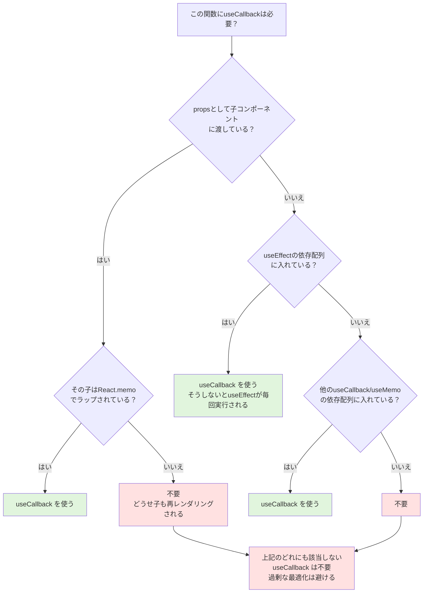
```mermaid
flowchart TD
    Q[この関数にuseCallbackは必要？]

    Q --> Q1{propsとして子コンポーネント<br/>に渡している？}
    Q1 -->|はい| Q1a{その子はReact.memo<br/>でラップされている？}
    Q1a -->|はい| A1[useCallback を使う]
    Q1a -->|いいえ| A2[不要<br/>どうせ子も再レンダリングされる]

    Q1 -->|いいえ| Q2{useEffectの依存配列<br/>に入れている？}
    Q2 -->|はい| A3[useCallback を使う<br/>そうしないとuseEffectが毎回実行される]
    Q2 -->|いいえ| Q3{他のuseCallback/useMemo<br/>の依存配列に入れている？}
    Q3 -->|はい| A4[useCallback を使う]
    Q3 -->|いいえ| A5[不要]

    A2 --> END[上記のどれにも該当しない<br/>useCallback は不要<br/>過剰な最適化は避ける]
    A5 --> END

    style A1 fill:#e1f5dd
    style A3 fill:#e1f5dd
    style A4 fill:#e1f5dd
    style A2 fill:#ffe1e1
    style A5 fill:#ffe1e1
    style END fill:#ffe1e1
```

### BON-LOGのuseCallback実例：ThemeProvider

`components/theme/ThemeProvider.tsx`では、`useCallback`が2つの重要な場面で使われています。

```tsx
// components/theme/ThemeProvider.tsx から抜粋

export function ThemeProvider({ children }: { children: React.ReactNode }) {
  const [theme, setThemeState] = useState<Theme>('system')
  const [resolvedTheme, setResolvedTheme] = useState<'light' | 'dark'>('light')
  const [mounted, setMounted] = useState(false)

  // ★ useCallback その1: applyTheme
  // 理由: この関数は useEffect の依存配列に含まれるため
  const applyTheme = useCallback((newTheme: Theme) => {
    const resolved = newTheme === 'system'
      ? (window.matchMedia('(prefers-color-scheme: dark)').matches
          ? 'dark' : 'light')
      : newTheme
    setResolvedTheme(resolved)
    document.documentElement.classList.remove('light', 'dark')
    document.documentElement.classList.add(resolved)
    document.documentElement.style.colorScheme = resolved
  }, [])
  // ↑ 依存配列が空 = この関数は一度作ったらずっと同じインスタンス

  // ★ useCallback その2: setTheme
  // 理由: Contextの value に含まれるため、
  //       useCallbackなしだと毎レンダリングで新しい関数が作られ、
  //       Context を使う全コンポーネントが再レンダリングされる
  const setTheme = useCallback((newTheme: Theme) => {
    setThemeState(newTheme)
    localStorage.setItem('theme', newTheme)
    applyTheme(newTheme)
  }, [applyTheme])
  // ↑ applyThemeが依存値。applyThemeが変わらないので
  //   setThemeも変わらない = Context.valueが安定

  // ★ applyTheme が useEffect の依存配列に含まれている
  useEffect(() => {
    const stored = localStorage.getItem('theme') as Theme | null
    const initial = stored || 'system'
    setThemeState((prev) => (prev !== initial ? initial : prev))
    applyTheme(initial)
    setMounted((prev) => (prev ? prev : true))
  }, [applyTheme])
  // ↑ もし applyTheme が useCallback でラップされていなかったら、
  //   毎回新しい関数が作られ、このuseEffectも毎回実行されてしまう！

  // ... 省略 ...
}
```

### useRefの5つの実用パターン

#### パターン1: DOM要素への参照（ファイル入力）

BON-LOGの投稿フォーム（`components/post/PostForm.tsx`）の実例です。

```tsx
export function PostForm({ genres, limits = DEFAULT_LIMITS }: PostFormProps) {
  // ★ useRefでファイル入力要素への参照を保持
  const fileInputRef = useRef<HTMLInputElement>(null)
  //                         ↑ 型パラメータ: HTML input要素
  //                                         ↑ 初期値: null（まだDOMにない）

  return (
    <form>
      {/* 非表示のファイル入力 */}
      <input
        ref={fileInputRef}
        // ↑ この要素がレンダリングされると、
        //   fileInputRef.current にこのDOM要素が入る
        type="file"
        accept="image/jpeg,image/png,image/webp,image/gif,video/mp4"
        onChange={handleFileSelect}
        multiple
        className="hidden"  // CSSで非表示にする
      />

      {/* カスタムボタンをクリック → 非表示のinputをプログラムでクリック */}
      <Button
        type="button"
        onClick={() => fileInputRef.current?.click()}
        //               ↑ DOM要素のclick()メソッドを呼び出し
        //               ↑ ?. はオプショナルチェーン（nullなら何もしない）
      >
        画像を添付
      </Button>
    </form>
  )
}
```

> **画面表示**
> - 画面に見えるのは「画像を添付」というきれいなカスタムボタンだけ
> - ブラウザ標準のファイル入力（「ファイルを選択」ボタン）は`hidden`で非表示
> - 「画像を添付」をクリック → OSのファイル選択ダイアログが開く
> - 画像を選択 → `handleFileSelect`が呼ばれ、プレビュー表示などの処理が実行される

**なぜこのパターンが必要？**

ブラウザ標準のファイル入力（`<input type="file">`）は見た目をカスタマイズしにくいため、以下の解決策を取ります。

1. 標準のファイル入力を hidden で非表示にする
2. きれいなカスタムボタンを表示する
3. カスタムボタンのクリック時に、useRef経由で非表示のファイル入力をクリックする

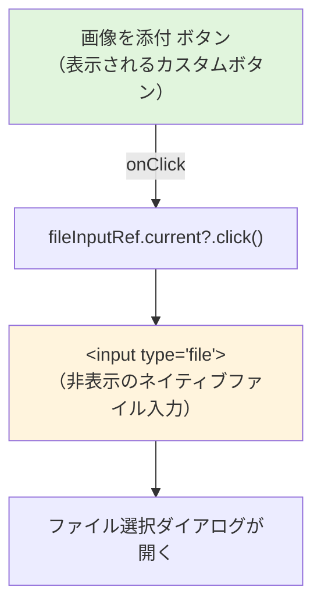
```mermaid
flowchart TD
    A["画像を添付 ボタン<br/>（表示されるカスタムボタン）"] -->|onClick| B["fileInputRef.current?.click()"]
    B --> C["&lt;input type='file'&gt;<br/>（非表示のネイティブファイル入力）"]
    C --> D["ファイル選択ダイアログが開く"]

    style A fill:#e1f5dd
    style C fill:#fff4dd
```

#### パターン2: タイマーIDの管理

キーボードショートカット（`hooks/use-keyboard-shortcuts.ts`）での使用例です。

```tsx
// 実際にはuseStateを使っているが、useRefでも同様に実装可能

function useKeySequenceWithRef() {
  const timerRef = useRef<NodeJS.Timeout | null>(null)
  // ↑ タイマーIDを保持する
  //   useRef を使う理由: タイマーIDの変更で再レンダリングは不要

  const [firstKey, setFirstKey] = useState<string | null>(null)

  function handleKeyDown(key: string) {
    if (firstKey) {
      // 2つ目のキー → 組み合わせを処理
      console.log(`${firstKey} + ${key}`)
      setFirstKey(null)

      // タイマーをクリア
      if (timerRef.current) {
        clearTimeout(timerRef.current)
        timerRef.current = null
      }
    } else {
      // 1つ目のキー → タイマーで自動リセット
      setFirstKey(key)
      timerRef.current = setTimeout(() => {
        setFirstKey(null)
        timerRef.current = null
      }, 1000)
    }
  }

  // クリーンアップ: コンポーネント破棄時にタイマーを確実に止める
  useEffect(() => {
    return () => {
      if (timerRef.current) clearTimeout(timerRef.current)
    }
  }, [])

  return { handleKeyDown, firstKey }
}
```

#### パターン3: 前回の値を記憶する

```tsx
/**
 * 前回の値を記録するカスタムフック
 * デバッグや変化の検知に便利
 */
function usePrevious<T>(value: T): T | undefined {
  const ref = useRef<T | undefined>(undefined)

  useEffect(() => {
    ref.current = value
  }, [value])
  // ↑ useEffectはレンダリング後に実行されるので、
  //   ref.current は「前回のレンダリング時の値」を保持する

  return ref.current
}

// 使用例: いいね数の変化を検知
function LikeCounter({ count }: { count: number }) {
  const prevCount = usePrevious(count)
  // 初回: prevCount=undefined, count=42
  // countが43に変わった後: prevCount=42, count=43

  return (
    <span>
      {count}
      {prevCount !== undefined && count > prevCount && ' ↑'}
      {/* 表示例: count=43, prevCount=42 → 「43 ↑」 */}
      {prevCount !== undefined && count < prevCount && ' ↓'}
      {/* 表示例: count=41, prevCount=42 → 「41 ↓」 */}
    </span>
  )
}
```

> **画面表示**
> - いいね数が42から43に増えた場合: 「43 ↑」と表示される
> - いいね数が43から41に減った場合: 「41 ↓」と表示される
> - 変化なしの場合: 数字のみ表示（矢印なし）

#### パターン4: AbortController（通信キャンセル）

```tsx
function useAbortableSearch() {
  const abortRef = useRef<AbortController | null>(null)
  const [results, setResults] = useState([])

  async function search(query: string) {
    // 前の検索リクエストをキャンセル
    abortRef.current?.abort()

    // 新しいAbortControllerを作成
    abortRef.current = new AbortController()

    try {
      const res = await fetch(`/api/search?q=${query}`, {
        signal: abortRef.current.signal,
        // ↑ このシグナルが abort されると fetch が中断される
      })
      const data = await res.json()
      setResults(data)
    } catch (error) {
      // AbortErrorは無視（ユーザーが新しい検索をしただけ）
      if (error instanceof Error && error.name !== 'AbortError') {
        console.error('検索エラー:', error)
      }
    }
  }

  return { results, search }
}
```

#### パターン5: フォーカス管理

```tsx
function SearchBar() {
  const inputRef = useRef<HTMLInputElement>(null)

  // コンポーネントマウント時に自動フォーカス
  useEffect(() => {
    inputRef.current?.focus()
    // 実行結果: ページ読み込み直後に検索バーにカーソルが自動的に当たる
  }, [])

  // 外部からフォーカスを設定できるように公開
  // （BON-LOGのキーボードショートカット「/」で使用）
  return (
    <input
      ref={inputRef}
      data-search-input  // キーボードショートカットからの参照用
      placeholder="検索..."
    />
  )
}
```

> **画面表示**
> - ページ読み込み直後: 検索バーに自動的にカーソルが当たり、すぐに入力できる状態になる
> - キーボードで「/」を押す: `document.querySelector('[data-search-input]')?.focus()` により、どの画面からでも検索バーにフォーカスが移動する

### useRef vs useState 比較表

| 特性 | useRef | useState |
|------|--------|----------|
| 値の変更で再レンダリング | しない | する |
| 主な用途 | DOM参照、タイマーID、前回値 | 画面表示に使うデータ |
| 値の読み取り | `ref.current` | 直接 |
| 値の更新 | `ref.current = newValue` | `setValue(newValue)` |
| SSR互換性 | DOM参照はクライアントのみ | 両方で動作 |

### 理解度チェック

**Q1**: 投稿フォームでファイル入力に`useRef`を使う理由は何ですか？
<details><summary>答え</summary>
ブラウザ標準の`<input type="file">`は見た目のカスタマイズが難しいため、非表示にしてカスタムボタンを代わりに表示します。カスタムボタンがクリックされたとき、`useRef`経由で非表示のファイル入力の`click()`メソッドをプログラムから呼び出し、ファイル選択ダイアログを開きます。
</details>

**Q2**: タイマーIDの管理に`useState`ではなく`useRef`を使う理由は何ですか？
<details><summary>答え</summary>
タイマーIDは画面表示に使わない「裏方のデータ」です。タイマーIDが変わるたびに再レンダリングする必要はないため、再レンダリングを引き起こさない`useRef`が適しています。`useState`を使うと、タイマーの設定・クリアのたびに不要な再レンダリングが発生してしまいます。
</details>

---

## 4.22 カスタムフック設計 深掘り

### このセクションで学ぶこと

- カスタムフックの設計思想と抽象化のレベル
- useToastの設計パターン「モジュールスコープ + リスナー」の完全理解
- useKeyboardShortcutsの「連続キー入力」実装の解説
- 自分でカスタムフックを設計する手順
- テストしやすいフック設計

### useToastの設計思想：「なぜReact Contextを使わないのか」

BON-LOGの`hooks/use-toast.ts`は、一見するとContextを使いそうな「グローバル状態」を、モジュールスコープの変数で管理しています。この設計選択には明確な理由があります。

**2つのアプローチの比較:**

| 観点 | アプローチA: React Context | アプローチB: モジュールスコープ (BON-LOGの選択) |
|------|--------------------------|----------------------------------------------|
| **使い方** | `<ToastProvider>` で囲む必要あり | Providerは不要 |
| **コンポーネント内** | `const { toast } = useToast()` | `const { toast } = useToast()` |
| **コンポーネント外** | 使えない | `import { toast } from '...'` で呼べる |
| **制約** | Providerの中でしか使えない / Server Actionsの結果通知がコンポーネント外からできない | 特になし |
| **メリット** | React標準のパターン | Providerが不要 / どこからでも呼べる |

### useToast 完全解説

```tsx
// hooks/use-toast.ts を1行ずつ解説

'use client'

import { useState, useCallback } from 'react'

// ─── 型定義 ───
type ToastVariant = 'default' | 'destructive'
// 'default': 通常の通知（成功メッセージなど）
// 'destructive': エラー通知（赤色で表示）

type Toast = {
  id: string           // 各トーストの一意な識別子
  title?: string       // タイトル（省略可）
  description?: string // 説明文（省略可）
  variant?: ToastVariant
}

type ToastState = {
  toasts: Toast[]      // 現在表示中のトースト一覧
}

// ─── モジュールスコープの変数 ───
// これらはモジュール全体で1つだけ存在する（シングルトン）

const listeners: Array<(state: ToastState) => void> = []
// ↑ 「状態が変わったら呼んでね」と登録されたコールバックのリスト
//   各 useToast() を使うコンポーネントの setState が入る

let memoryState: ToastState = { toasts: [] }
// ↑ 現在のトースト状態を保持するグローバル変数

// ─── 内部関数: トーストの追加と自動削除 ───
function dispatch(toastProps: Omit<Toast, 'id'>) {
  // 1. ランダムなIDを生成
  const id = Math.random().toString(36).substring(2, 9)
  const newToast = { ...toastProps, id }

  // 2. グローバル状態を更新
  memoryState = {
    toasts: [...memoryState.toasts, newToast],
  }

  // 3. すべてのリスナーに通知
  //    → 各コンポーネントの setState が呼ばれる
  //    → 再レンダリングが起きてトーストが表示される
  listeners.forEach((listener) => listener(memoryState))

  // 4. 3秒後に自動で削除
  setTimeout(() => {
    memoryState = {
      toasts: memoryState.toasts.filter((t) => t.id !== id),
    }
    listeners.forEach((listener) => listener(memoryState))
  }, 3000)
}

// ─── エクスポート1: グローバルなトースト関数 ───
// コンポーネント外からも呼び出し可能
export function toast(props: Omit<Toast, 'id'>) {
  dispatch(props)
}

// ─── エクスポート2: カスタムフック ───
export function useToast() {
  // このコンポーネントのローカル状態
  const [state, setState] = useState<ToastState>(memoryState)

  // マウント時にリスナーに自分のsetStateを登録
  // → グローバル状態が変わると、このコンポーネントも再レンダリングされる
  useState(() => {
    listeners.push(setState)
    return () => {
      const index = listeners.indexOf(setState)
      if (index > -1) {
        listeners.splice(index, 1)
      }
    }
  })

  // toast関数をメモ化（依存なし → 常に同じインスタンス）
  const toast = useCallback((props: Omit<Toast, 'id'>) => {
    dispatch(props)
  }, [])

  return {
    toast,              // トーストを表示する関数
    toasts: state.toasts, // 現在表示中のトースト一覧
  }
}
```

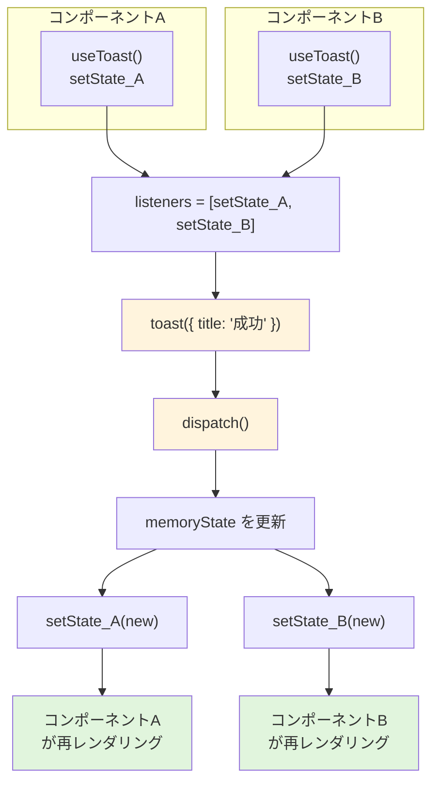
```mermaid
flowchart TD
    subgraph "コンポーネントA"
        A1["useToast()<br/>setState_A"]
    end

    subgraph "コンポーネントB"
        B1["useToast()<br/>setState_B"]
    end

    A1 --> L["listeners = [setState_A, setState_B]"]
    B1 --> L

    L --> T["toast({ title: '成功' })"]
    T --> D["dispatch()"]
    D --> M["memoryState を更新"]

    M --> SA["setState_A(new)"]
    M --> SB["setState_B(new)"]

    SA --> RA["コンポーネントA<br/>が再レンダリング"]
    SB --> RB["コンポーネントB<br/>が再レンダリング"]

    style T fill:#fff4dd
    style D fill:#fff4dd
    style RA fill:#e1f5dd
    style RB fill:#e1f5dd
```

### useKeyboardShortcuts の連続キー入力パターン

`hooks/use-keyboard-shortcuts.ts`の最も興味深い部分は、`g` + `h`のような2キーの連続入力を検知する仕組みです。

```tsx
// 連続キー入力の実装を図解

// 状態:
const [gKeyPressed, setGKeyPressed] = useState(false)
//     ↑ 「g」キーが押されたかどうか

// キーハンドラ:
const handleKeyDown = useCallback((event: KeyboardEvent) => {
  const key = event.key.toLowerCase()

  // ─── 分岐1: 「g」の後の2つ目のキー ───
  if (gKeyPressed) {
    setGKeyPressed(false)
    event.preventDefault()
    switch (key) {
      case 'h': router.push('/feed'); break         // g → h でホームへ
      case 'n': router.push('/notifications'); break // g → n で通知へ
      case 'p': router.push(`/users/${userId}`); break // g → p でプロフィールへ
      case 's': router.push('/settings'); break      // g → s で設定へ
      case 'e': router.push('/events'); break        // g → e でイベントへ
      case 'm': router.push('/shops'); break         // g → m でマップへ
    }
    return
  }

  // ─── 分岐2: 単体キーのショートカット ───
  switch (key) {
    case 'g':
      setGKeyPressed(true)
      // 1秒以内に2つ目のキーが来なかったらリセット
      setTimeout(() => setGKeyPressed(false), 1000)
      break
    case 'n':
      event.preventDefault()
      onNewPost?.() // 新規投稿モーダルを開く
      break
    case '/':
      event.preventDefault()
      // 検索バーにフォーカス
      document.querySelector<HTMLInputElement>('[data-search-input]')?.focus()
      break
    case '?':
      event.preventDefault()
      setShowHelp(true) // ヘルプモーダルを表示
      break
  }
}, [enabled, isInputFocused, gKeyPressed, router, userId, onNewPost])
```

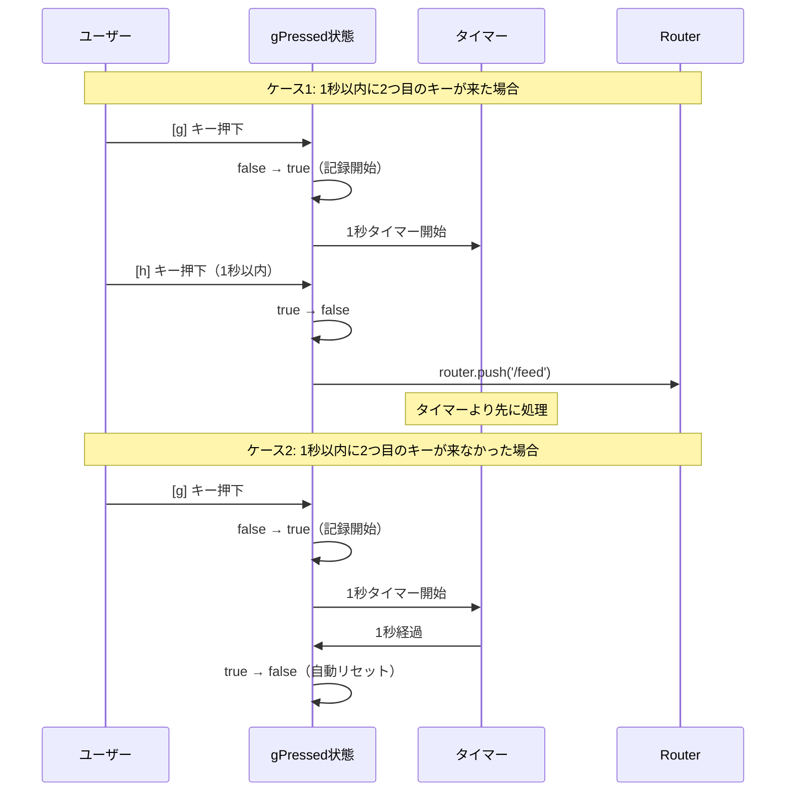
```mermaid
sequenceDiagram
    participant U as ユーザー
    participant S as gPressed状態
    participant T as タイマー
    participant R as Router

    Note over U,R: ケース1: 1秒以内に2つ目のキーが来た場合

    U->>S: [g] キー押下
    S->>S: false → true（記録開始）
    S->>T: 1秒タイマー開始

    U->>S: [h] キー押下（1秒以内）
    S->>S: true → false
    S->>R: router.push('/feed')
    Note over T: タイマーより先に処理

    Note over U,R: ケース2: 1秒以内に2つ目のキーが来なかった場合

    U->>S: [g] キー押下
    S->>S: false → true（記録開始）
    S->>T: 1秒タイマー開始

    T->>S: 1秒経過
    S->>S: true → false（自動リセット）
```

### カスタムフックを自分で設計する手順

| ステップ | 内容 | 例 |
|---------|------|-----|
| **ステップ1** | 「何を再利用したいか」を明確にする | 「ウィンドウサイズの取得」を複数コンポーネントで使いたい |
| **ステップ2** | 使用側のインターフェースを先に決める | `const { width, height } = useWindowSize()` -- 使い方をまず決める（実装は後から） |
| **ステップ3** | 必要なHooksを洗い出す | `useState`: 幅と高さを保持 / `useEffect`: resizeイベントを監視 / `useCallback`: ハンドラのメモ化（省略可） |
| **ステップ4** | 実装する | 下記コード参照 |

```tsx
// ステップ4の実装例: useWindowSize

function useWindowSize() {
  // ステップ3で決めたHooks
  const [size, setSize] = useState({
    width: typeof window !== 'undefined' ? window.innerWidth : 0,
    height: typeof window !== 'undefined' ? window.innerHeight : 0,
  })
  // ↑ SSR対策: サーバーサイドではwindowが存在しないので0にする

  useEffect(() => {
    function handleResize() {
      setSize({
        width: window.innerWidth,   // 実行結果例: 1280
        height: window.innerHeight, // 実行結果例: 720
      })
    }

    window.addEventListener('resize', handleResize)
    return () => window.removeEventListener('resize', handleResize)
    // ↑ クリーンアップ: コンポーネント破棄時にリスナーを解除
  }, [])

  // ステップ2で決めたインターフェース
  return size  // 実行結果: { width: 1280, height: 720 }
}

// 使用例
function ResponsiveLayout() {
  const { width } = useWindowSize()
  // ↑ ウィンドウ幅が変わると自動的に再レンダリングされる

  return width < 768
    ? <MobileLayout />    // 表示: 768px未満ならモバイルレイアウト
    : <DesktopLayout />   // 表示: 768px以上ならデスクトップレイアウト
}
```

### 理解度チェック

**Q1**: `useToast`がReact Contextではなくモジュールスコープの変数を使う理由は？
<details><summary>答え</summary>
モジュールスコープの変数を使うことで、(1) Providerのラップが不要、(2) コンポーネント外（Server Actionの結果処理など）からも`toast()`関数を呼び出せる、という2つのメリットがあります。Contextだと`<ToastProvider>`の中でしか使えず、コンポーネント外からの呼び出しができません。
</details>

**Q2**: `useKeyboardShortcuts`で「g + h」のような連続キー入力を実現する仕組みを説明してください。
<details><summary>答え</summary>
(1) 最初に「g」キーが押されたら`gKeyPressed`状態を`true`にし、1秒のタイムアウトを設定します。(2) 1秒以内に次のキー（h, n, p等）が押されたら、`gKeyPressed`が`true`のため連続キーとして処理し、対応するページに遷移します。(3) 1秒以内に何も押されなかったら、`setTimeout`により`gKeyPressed`が自動的に`false`にリセットされます。
</details>

---

## 4.23 Context & Providers 実践パターン

### このセクションで学ぶこと

- Providerの入れ子パターンとその順序の意味
- ThemeProviderの完全な実装パターン（ハイドレーション対策含む）
- 「Provider地獄」の解消テクニック
- Contextの性能問題と対策
- いつContextを使い、いつZustandを使うか

### BON-LOGのProviders構成 完全解説

`app/providers.tsx`はアプリ全体の「土台」です。ここで設定した各種プロバイダーが、アプリ全体の機能を支えています。

```tsx
// app/providers.tsx - 完全版のソースコード

'use client'
// ↑ Providerはクライアントコンポーネントでなければならない
//   理由: useState や useEffect を内部で使うため

import { QueryClient, QueryClientProvider } from '@tanstack/react-query'
import { useState } from 'react'
import { ThemeProvider } from '@/components/theme/ThemeProvider'
import { ServiceWorkerRegistration } from '@/components/pwa/ServiceWorkerRegistration'
import '../sentry.client.config'
// ↑ Sentryのクライアント初期化ファイルをインポート
//   これだけで自動的にJavaScriptエラーの監視が開始される

export function Providers({ children }: { children: React.ReactNode }) {
  // ★ QueryClientを useState の初期化関数で作成
  const [queryClient] = useState(
    () =>
      new QueryClient({
        defaultOptions: {
          queries: {
            staleTime: 60 * 1000,
            // ↑ データが「古い(stale)」とみなされるまでの時間
            //   1分間は再フェッチせずキャッシュを使う
            //
            //   なぜ60秒？
            //   SNSでは1分以内に変わるデータは少ない。
            //   投稿の「いいね数」が60秒前のデータでも問題ない。
            //   一方、リアルタイムチャットなら0秒にすべき。

            refetchOnWindowFocus: false,
            // ↑ タブを切り替えて戻ってきた時の自動再フェッチを無効化
            //   SNSではタブ切り替えが頻繁なので、
            //   毎回再フェッチすると無駄なAPIコールが増える
          },
        },
      })
  )
  // ↑ useState(() => ...) のパターン
  //   () => new QueryClient(...) は「初期化関数」
  //   コンポーネントが何回再レンダリングされても、
  //   QueryClientは最初の1回だけ作成される

  return (
    <QueryClientProvider client={queryClient}>
      {/* ↑ 最外層: React Queryの機能を全コンポーネントに提供 */}
      <ThemeProvider>
        {/* ↑ 内層: テーマ（ダーク/ライト）を全コンポーネントに提供 */}
        {children}
        {/* ↑ アプリケーション本体 */}
        <ServiceWorkerRegistration />
        {/* ↑ PWA対応: Service Workerを登録 */}
      </ThemeProvider>
    </QueryClientProvider>
  )
}
```

### Providerの順序が重要な理由

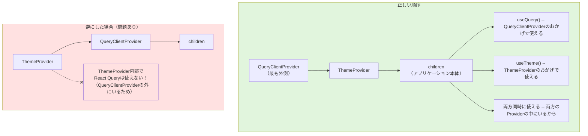
```mermaid
flowchart TD
    subgraph correct["正しい順序"]
        QCP1["QueryClientProvider<br/>（最も外側）"] --> TP1["ThemeProvider"]
        TP1 --> CH1["children<br/>（アプリケーション本体）"]
        CH1 --> U1["useQuery() -- QueryClientProviderのおかげで使える"]
        CH1 --> U2["useTheme() -- ThemeProviderのおかげで使える"]
        CH1 --> U3["両方同時に使える -- 両方のProviderの中にいるから"]
    end

    subgraph wrong["逆にした場合（問題あり）"]
        TP2["ThemeProvider"] --> QCP2["QueryClientProvider"]
        QCP2 --> CH2["children"]
        TP2 -.-x NG["ThemeProvider内部で<br/>React Queryは使えない！<br/>（QueryClientProviderの外にいるため）"]
    end

    style correct fill:#e1f5dd
    style wrong fill:#ffe1e1
    style NG fill:#ffe1e1
```

### ThemeProviderのハイドレーション対策

サーバーサイドレンダリング（SSR）を使うNext.jsでは、「サーバーで生成したHTML」と「クライアントで生成したHTML」が一致しないと「ハイドレーションミスマッチ」エラーが発生します。ThemeProviderはこの問題を解決する仕組みを持っています。

```tsx
// components/theme/ThemeProvider.tsx のハイドレーション対策部分

export function ThemeProvider({ children }: { children: React.ReactNode }) {
  const [mounted, setMounted] = useState(false)
  //     ↑ クライアントでマウントされたかどうか

  useEffect(() => {
    // ... テーマの初期化 ...
    setMounted(true)
    // ↑ useEffectはクライアントでのみ実行される
    //   → mountedがtrueになるのはクライアントだけ
  }, [])

  // ★ マウント前（サーバー or 初回クライアント描画）
  if (!mounted) {
    return (
      <ThemeContext.Provider
        value={{
          theme: 'system',        // デフォルト値
          resolvedTheme: 'light', // デフォルト値
          setTheme: () => {},     // 何もしない関数
        }}
      >
        {children}
      </ThemeContext.Provider>
    )
  }
  // ↑ サーバーとクライアントの初回描画で同じHTMLを生成する
  //   → ハイドレーションミスマッチを防止

  // ★ マウント後（クライアントで操作可能な状態）
  return (
    <ThemeContext.Provider value={{ theme, resolvedTheme, setTheme }}>
      {children}
    </ThemeContext.Provider>
  )
}
```

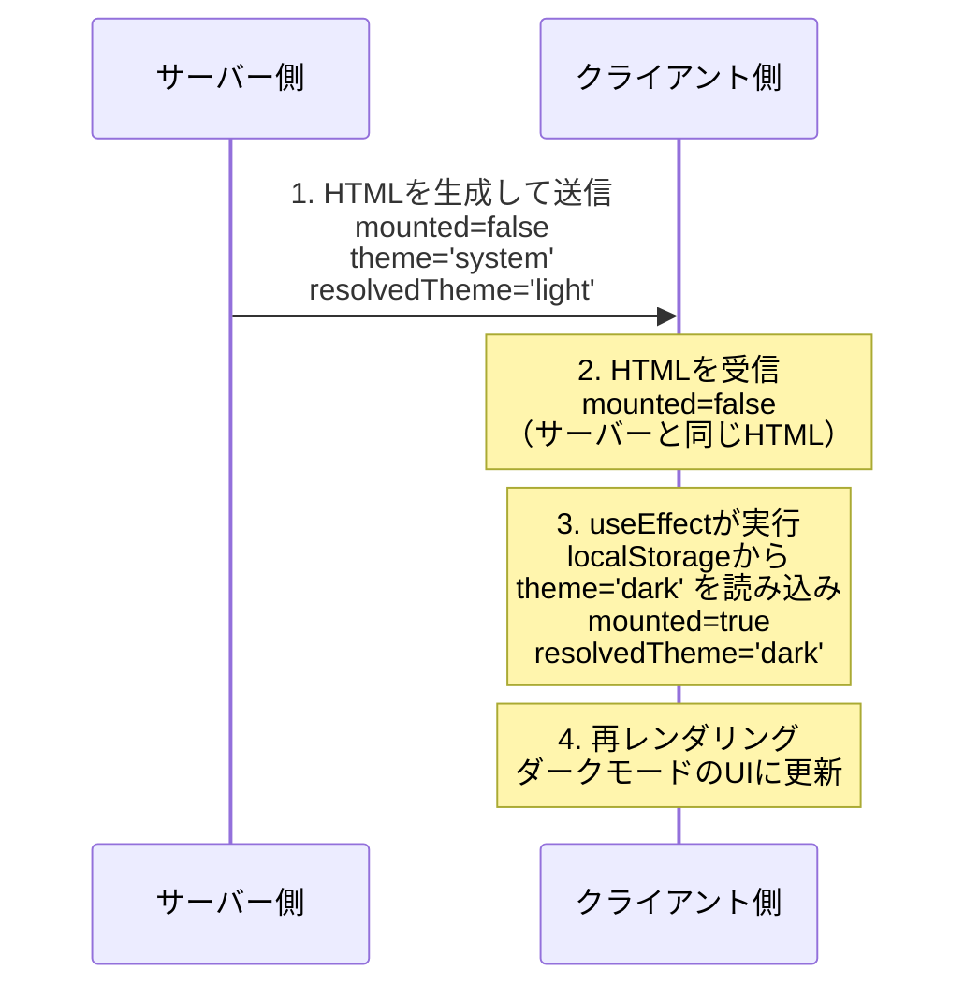
```mermaid
sequenceDiagram
    participant S as サーバー側
    participant C as クライアント側

    S->>C: 1. HTMLを生成して送信<br/>mounted=false<br/>theme='system'<br/>resolvedTheme='light'

    Note over C: 2. HTMLを受信<br/>mounted=false<br/>（サーバーと同じHTML）

    Note over C: 3. useEffectが実行<br/>localStorageから<br/>theme='dark' を読み込み<br/>mounted=true<br/>resolvedTheme='dark'

    Note over C: 4. 再レンダリング<br/>ダークモードのUIに更新
```

### Provider地獄の解消

アプリが大きくなると、Providerの入れ子が深くなりがちです（通称「Provider地獄」）。

```tsx
// ❌ Provider地獄
function App() {
  return (
    <AuthProvider>
      <ThemeProvider>
        <QueryClientProvider>
          <ToastProvider>
            <ModalProvider>
              <SidebarProvider>
                {children}
              </SidebarProvider>
            </ModalProvider>
          </ToastProvider>
        </QueryClientProvider>
      </ThemeProvider>
    </AuthProvider>
  )
}

// ✅ 解消方法: compose関数を使う
function composeProviders(...providers: React.FC<{ children: React.ReactNode }>[]) {
  return function ComposedProviders({ children }: { children: React.ReactNode }) {
    return providers.reduceRight(
      (child, Provider) => <Provider>{child}</Provider>,
      children
    )
  }
}

const AllProviders = composeProviders(
  AuthProvider,
  ThemeProvider,
  QueryClientProvider,
  ToastProvider,
  ModalProvider,
  SidebarProvider,
)

function App() {
  return <AllProviders>{children}</AllProviders>
}
```

> **BON-LOGのアプローチ**
>
> BON-LOGでは、トースト通知にContextを使わず（モジュールスコープで管理）、クライアント状態もuseState/Contextで賄っているため、`app/providers.tsx`ではQueryClientProviderとThemeProviderの2つだけで済んでいます。必要最小限のProviderに抑えることで、Provider地獄を回避しています。

### Contextの性能問題と対策

Contextの値が変わると、そのContextを使う**すべてのコンポーネント**が再レンダリングされます。

```tsx
// ❌ 性能問題のある例
type AppContextType = {
  user: User
  theme: string
  sidebarOpen: boolean
  notificationCount: number
}

const AppContext = createContext<AppContextType>(/* ... */)

// userの値だけ変わっても、sidebarOpenを使うコンポーネントも
// 再レンダリングされてしまう！
function Sidebar() {
  const { sidebarOpen } = useContext(AppContext)
  // ↑ notificationCountが変わっても再レンダリングされる
  return sidebarOpen ? <nav>...</nav> : null
}

// ✅ 対策1: Contextを分割する
const UserContext = createContext<User | null>(null)
const ThemeContext = createContext<string>('light')
const UIContext = createContext<{ sidebarOpen: boolean }>({ sidebarOpen: false })

// ✅ 対策2: 頻繁に変わる値はZustandに移す
// → BON-LOGではこのアプローチを採用
// テーマ（低頻度変更）→ Context
// モーダル開閉（高頻度変更）→ Zustand
```

### 理解度チェック

**Q1**: `app/providers.tsx`でQueryClientをuseStateの初期化関数で作る理由は？
<details><summary>答え</summary>
`useState(() => new QueryClient(...))`のパターンにより、QueryClientはコンポーネントの初回レンダリング時に1回だけ作成されます。もし`const queryClient = new QueryClient(...)`と書くと、Providersコンポーネントが再レンダリングされるたびに新しいQueryClientが作られ、これまでのキャッシュが全て失われてしまいます。
</details>

**Q2**: ThemeProviderで`mounted`状態を使うのはなぜですか？
<details><summary>答え</summary>
ハイドレーションミスマッチを防ぐためです。サーバーサイドでは`localStorage`にアクセスできないため、サーバーとクライアントの初回描画でHTMLが一致しない可能性があります。`mounted`がfalseの間はデフォルト値を返すことで、サーバーとクライアントで同じHTMLを生成し、ハイドレーション後に実際のテーマを適用します。
</details>

---

## 4.24 React 19 新機能 実践ガイド

### このセクションで学ぶこと

- useFormStatusの実践パターンと制約の詳細
- useOptimisticによる楽観的更新
- useActionStateでServer Actionの結果を管理
- BON-LOGでのServer Actions連携パターン
- React 19で変わったフォームの書き方

### useOptimistic：楽観的更新の新しい形

React 19で追加された`useOptimistic`は、サーバーレスポンスを待つ間、UIを「楽観的に」更新するためのフックです。BON-LOGの「いいね」や「フォロー」で使っているOptimistic UIパターンを、より宣言的に書けます。

```tsx
import { useOptimistic } from 'react'

// ─── 基本的な使い方 ───
function TodoList({ todos }: { todos: Todo[] }) {
  // useOptimistic(現在のデータ, 更新関数)
  const [optimisticTodos, addOptimisticTodo] = useOptimistic(
    todos,
    // ↓ 楽観的更新時に呼ばれる関数
    (currentTodos: Todo[], newTodo: Todo) => [
      ...currentTodos,
      { ...newTodo, sending: true },
      // ↑ sending: true で「送信中」マークを付ける
    ]
  )

  async function handleAddTodo(formData: FormData) {
    const text = formData.get('text') as string
    const newTodo = { id: crypto.randomUUID(), text, sending: true }

    // 即座にUIを更新（サーバーの応答を待たない）
    addOptimisticTodo(newTodo)

    // サーバーにデータを送信
    await createTodo(text)
    // 完了後、todosが更新されて楽観的な値は自動的に消える
  }

  return (
    <form action={handleAddTodo}>
      <input name="text" />
      <button type="submit">追加</button>
      <ul>
        {optimisticTodos.map(todo => (
          <li key={todo.id} style={{ opacity: todo.sending ? 0.5 : 1 }}>
            {/* ↑ 送信中のアイテムは半透明（0.5）にする */}
            {todo.text}
          </li>
        ))}
      </ul>
    </form>
  )
}
```

> **画面表示**
> - 初期状態: テキスト入力欄と「追加」ボタン、既存のTodoリスト
> - 「買い物に行く」を入力して「追加」をクリック:
>   - 即座にリストに「買い物に行く」が追加される（半透明で表示 = 送信中）
>   - サーバー処理が完了すると、不透明（通常表示）に変わる
> - サーバー処理中にさらに追加: 前のアイテムが半透明のまま、新しいアイテムも半透明でリストに追加される

### useOptimistic を BON-LOG のいいねボタンに適用する例

現在のBON-LOGでは`useState`を使ったOptimistic UIパターンですが、`useOptimistic`を使うとよりシンプルに書けます。

```tsx
// ─── 現在の実装（useState版） ───
function LikeButton({ postId, initialLiked, initialCount }: LikeButtonProps) {
  const [liked, setLiked] = useState(initialLiked)
  const [count, setCount] = useState(initialCount)

  async function handleToggle() {
    // 手動でOptimistic更新
    const newLiked = !liked
    setLiked(newLiked)
    setCount(prev => newLiked ? prev + 1 : prev - 1)

    const result = await togglePostLike(postId)
    if (result.error) {
      // 手動でロールバック
      setLiked(liked)
      setCount(initialCount)
    }
  }
  // ...
}

// ─── useOptimistic版 ───
function LikeButtonOptimistic({ postId, initialLiked, initialCount }: LikeButtonProps) {
  const likeState = { liked: initialLiked, count: initialCount }

  const [optimisticState, updateOptimistic] = useOptimistic(
    likeState,
    // 楽観的更新関数
    (current, _action: 'toggle') => ({
      liked: !current.liked,
      count: current.liked ? current.count - 1 : current.count + 1,
    })
  )

  async function handleToggle() {
    // 1行で楽観的更新
    updateOptimistic('toggle')
    // ロールバックは自動（エラー時にlikeStateが元に戻る）
    await togglePostLike(postId)
  }

  return (
    <button onClick={handleToggle}>
      {optimisticState.liked ? '❤' : '♡'} {optimisticState.count}
      {/* 表示例: いいね前「♡ 42」→ クリック後「❤ 43」 */}
    </button>
  )
}
```

> **画面表示**（useOptimistic版）
> - 未いいね状態: 「♡ 42」
> - クリック直後: 即座に「❤ 43」に変わる（useOptimisticによる楽観的更新）
> - サーバー処理成功: そのまま「❤ 43」が維持される（propsの`initialLiked`/`initialCount`が更新される）
> - サーバー処理失敗: 自動的に「♡ 42」に戻る（useOptimisticがpropsの元の値に自動ロールバック）
> - useState版との違い: 手動で`setLiked`/`setCount`のロールバックを書く必要がなく、コードがシンプル

### useFormStatusの実践パターン

`useFormStatus`の最大のポイントは「**フォームの子コンポーネント内でのみ動作する**」という制約です。

```tsx
'use client'

import { useFormStatus } from 'react-dom'

// ─── 再利用可能な送信ボタン ───
// このコンポーネントは必ず <form> の中で使う
function SubmitButton({
  children,
  loadingText,
}: {
  children: React.ReactNode
  loadingText?: string
}) {
  const { pending, data, method, action } = useFormStatus()
  // pending: フォームが送信中かどうか
  // data: 送信中のFormData（送信後はnull）
  // method: HTTPメソッド（'get' | 'post'）
  // action: フォームのaction属性の値

  return (
    <button
      type="submit"
      disabled={pending}
      className={`
        px-4 py-2 rounded
        ${pending ? 'opacity-50 cursor-not-allowed' : 'hover:opacity-90'}
      `}
    >
      {pending ? (loadingText || '送信中...') : children}
    </button>
  )
}

// ─── 使用例: コメントフォーム ───
async function addComment(formData: FormData) {
  'use server'
  const content = formData.get('content') as string
  await createComment(content)
}

function CommentForm() {
  return (
    <form action={addComment}>
      <textarea name="content" placeholder="コメントを入力..." />
      <SubmitButton loadingText="投稿中...">
        コメントする
      </SubmitButton>
      {/* ↑ SubmitButton内のuseFormStatusが
           このformの送信状態を自動取得する */}
    </form>
  )
}
```

> **画面表示**
> - 初期状態: テキストエリア（プレースホルダー「コメントを入力...」）と「コメントする」ボタン
> - コメントを入力して送信: ボタンが「投稿中...」に変わり、半透明でクリック不可になる
> - Server Action完了後: ボタンが「コメントする」に戻る
> - この`SubmitButton`コンポーネントは`loadingText`を変えるだけで、どんなフォームでも再利用できる

### Server Actions連携の全体像

BON-LOGでは、Server ActionsとReact 19の機能を組み合わせた3つのパターンが使われています。

| パターン | 手法 | コード例 | 用途 |
|---------|------|---------|------|
| **パターン1** | form action + useFormStatus | `<form action={serverAction}>` + `<SubmitButton />` (useFormStatusで送信状態を取得) | シンプルなフォーム送信（設定変更、コメント投稿） |
| **パターン2** | useTransition + 手動Optimistic UI | `startTransition(async () => { await serverAction(); if (error) rollback() })` | いいね、ブックマーク、フォロー（即座のフィードバックが重要） |
| **パターン3** | useActionState（React 19） | `const [state, formAction, isPending] = useActionState(serverAction, initialState)` | バリデーション付きフォーム（プロフィール編集、レビュー投稿） |

### BON-LOGの投稿フォームのServer Actions連携

`components/post/PostForm.tsx`は、パターン2（useTransitionは使わず、手動でOptimistic UI）を使っています。

```tsx
// components/post/PostForm.tsx から核心部分を抜粋

async function handleSubmit(e: React.FormEvent) {
  e.preventDefault()

  // バリデーション
  if (content.length === 0 && mediaFiles.length === 0) {
    setError('テキストまたは画像を入力してください')
    return
  }

  // FormDataを構築（リセット前にデータを保存）
  const formData = new FormData()
  formData.append('content', content)
  selectedGenres.forEach(id => formData.append('genreIds', id))
  mediaFiles.forEach(m => {
    formData.append('mediaUrls', m.url)
    formData.append('mediaTypes', m.type)
  })

  // ★ 楽観的UI: 即座にフォームをリセット
  //   ユーザーはすぐに次の投稿を書ける
  setContent('')
  setSelectedGenres([])
  setMediaFiles([])
  setError(null)

  // ★ バックグラウンドでServer Actionを実行
  createPost(formData)
    .then(async (result) => {
      if (result.error) {
        toast({ variant: 'destructive', title: '投稿に失敗しました' })
      } else {
        toast({ title: '投稿しました' })
        await queryClient.invalidateQueries({ queryKey: ['timeline'] })
        router.refresh()
      }
    })
    .catch(() => {
      toast({ variant: 'destructive', title: 'ネットワークエラー' })
    })
}
```

```mermaid
flowchart TD
    A["ユーザーが「投稿する」をクリック"] --> B["即座に実行（体感0秒）"]
    A --> C["バックグラウンドで実行"]

    B --> B1["テキスト欄をクリア"]
    B --> B2["選択ジャンルをクリア"]
    B --> B3["添付画像をクリア"]
    B1 & B2 & B3 --> B4["ユーザーはすぐに次の投稿を書ける"]

    C --> C1["createPost(formData)<br/>をサーバーに送信"]
    C1 -->|成功| C2["「投稿しました」トースト<br/>タイムラインのキャッシュを更新"]
    C1 -->|失敗| C3["「投稿に失敗しました」トースト<br/>（フォームは既にクリア済みなので<br/>厳密にはデータが失われる）"]

    style B fill:#e1f5dd
    style B4 fill:#e1f5dd
    style C2 fill:#e1f5dd
    style C3 fill:#ffe1e1
```

### 理解度チェック

**Q1**: `useOptimistic`と手動のOptimistic UI（useState版）の違いは何ですか？
<details><summary>答え</summary>
`useOptimistic`は楽観的更新とロールバックを宣言的に管理します。Server Actionが完了（または失敗）すると、元のデータ（props経由で受け取る値）に自動的に戻ります。一方、useState版では楽観的更新もロールバックも手動で`setState`を呼ぶ必要があり、コードが複雑になりがちです。ただしBON-LOGでは細かい制御（エラー時のトースト表示など）が必要なため、useState版を採用しています。
</details>

**Q2**: BON-LOGの投稿フォームで、送信後すぐにフォームをクリアするメリットとデメリットは？
<details><summary>答え</summary>
メリット: ユーザーがすぐに次の投稿を書ける快適な体験。デメリット: 投稿が失敗した場合、ユーザーが入力した内容が失われる（復元できない）。BON-LOGでは投稿の失敗率が非常に低いため、ユーザー体験を優先してこのアプローチを採用しています。
</details>

---

## 4.25 React Query 実践ガイド

### このセクションで学ぶこと

- useQuery、useMutation、useInfiniteQueryの完全解説
- QueryKeyの設計パターン
- キャッシュ戦略（staleTime, gcTime）
- 楽観的更新（Optimistic Updates）の実装
- BON-LOGのタイムライン（無限スクロール）完全解剖
- React QueryとServer Actionsの併用パターン

### React Queryの全体像

**React Queryの3つの主要フック:**

| フック | 役割 | 使用例 | 返り値 |
|-------|------|-------|--------|
| **useQuery** | データの「読み取り」 | `GET /api/posts` | `{ data, isLoading }` -- 1つのデータを取得して表示 |
| **useMutation** | データの「変更」 | `POST /api/posts` | `{ mutate, isPending }` -- 作成・更新・削除の操作、成功時にキャッシュを更新 |
| **useInfiniteQuery** | 無限スクロール | `GET /api/posts?cursor=xxx` | ページ分割されたデータを連続的に取得 |

### useQuery 基本パターン

```tsx
import { useQuery } from '@tanstack/react-query'

function UserProfile({ userId }: { userId: string }) {
  const {
    data,        // 取得したデータ（undefined → User）
    isLoading,   // 初回読み込み中（データがまだない）
    isFetching,  // バックグラウンドで再取得中（データはある）
    error,       // エラーオブジェクト
    isError,     // エラーが発生したか（boolean）
    refetch,     // 手動で再取得する関数
  } = useQuery({
    queryKey: ['user', userId],
    //         ↑ キャッシュのキー
    //         userIdが変わると新しいデータを取得
    //         同じuserIdなら キャッシュを返す

    queryFn: async () => {
      // データ取得関数
      const res = await fetch(`/api/users/${userId}`)
      if (!res.ok) throw new Error('ユーザーが見つかりません')
      return res.json()
    },

    staleTime: 5 * 60 * 1000,
    //         ↑ 5分間はデータを「新鮮」とみなす
    //         この間は再フェッチしない

    enabled: !!userId,
    //       ↑ userIdが存在する場合のみクエリを実行
    //       空文字やundefinedの場合はスキップ
  })

  // ─── ローディング状態 ───
  if (isLoading) {
    return <div>読み込み中...</div>        // 表示: 「読み込み中...」
  }

  // ─── エラー状態 ───
  if (isError) {
    return <div>エラー: {error.message}</div>  // 表示: 「エラー: ユーザーが見つかりません」
  }

  // ─── データ表示 ───
  return (
    <div>
      <h2>{data.nickname}</h2>               {/* 表示例: 「盆栽太郎」 */}
      <p>{data.bio}</p>                      {/* 表示例: 「松柏類が好きです」 */}
      {isFetching && <span>更新中...</span>}
      {/* ↑ バックグラウンド再取得中の表示（データはある状態でスピナー表示） */}
    </div>
  )
}
```

> **画面表示**
> 1. 初回アクセス: 「読み込み中...」が表示される（`isLoading=true`）
> 2. データ取得完了: ニックネーム「盆栽太郎」とプロフィール文が表示される
> 3. 5分後に再アクセス: 前のデータがすぐ表示され、右上に「更新中...」が出つつバックグラウンドで再取得
> 4. 再取得完了: 「更新中...」が消え、最新のデータに更新される
> 5. `enabled: !!userId` により、userIdが空の場合はAPI呼び出し自体が行われない

### QueryKeyの設計パターン

```tsx
// QueryKeyはキャッシュの「住所」のようなもの

// ─── 基本的なキー設計 ───
queryKey: ['posts']              // 全投稿
queryKey: ['posts', postId]      // 特定の投稿
queryKey: ['posts', { genre: '松柏類' }]  // フィルタ付き
queryKey: ['users', userId]      // 特定のユーザー
queryKey: ['users', userId, 'posts']  // ユーザーの投稿一覧

// ─── キー設計のルール ───
// 1. 配列の先頭は「データの種類」
// 2. 後続の要素は「絞り込み条件」
// 3. 関連するキーは同じプレフィックスにする

// ─── キャッシュ無効化のパターン ───
import { useQueryClient } from '@tanstack/react-query'

const queryClient = useQueryClient()

// 特定のキーのキャッシュを無効化
queryClient.invalidateQueries({ queryKey: ['posts', postId] })

// プレフィックスで一括無効化
queryClient.invalidateQueries({ queryKey: ['posts'] })
//          ↑ ['posts'] で始まるすべてのクエリが無効化される
//          → ['posts'], ['posts', '123'], ['posts', { genre: '松柏類' }] 全部

// BON-LOGのタイムライン更新パターン
queryClient.invalidateQueries({ queryKey: ['timeline'] })
//          ↑ いいね、投稿、フォロー等の操作後に呼ぶ
```

### useMutation：データ変更の管理

```tsx
import { useMutation, useQueryClient } from '@tanstack/react-query'

function CreatePostButton() {
  const queryClient = useQueryClient()

  const mutation = useMutation({
    // 変更を実行する関数
    mutationFn: async (newPost: { content: string }) => {
      const res = await fetch('/api/posts', {
        method: 'POST',
        body: JSON.stringify(newPost),
      })
      return res.json()
    },

    // 成功時のコールバック
    onSuccess: (data) => {
      // タイムラインのキャッシュを無効化して再取得
      queryClient.invalidateQueries({ queryKey: ['timeline'] })
    },

    // エラー時のコールバック
    onError: (error) => {
      toast({ variant: 'destructive', title: '投稿に失敗しました' })
    },
  })

  return (
    <button
      onClick={() => mutation.mutate({ content: 'Hello!' })}
      disabled={mutation.isPending}
    >
      {mutation.isPending ? '投稿中...' : '投稿する'}
      {/* 表示: 通常「投稿する」→ クリック後「投稿中...」→ 完了後「投稿する」に戻る */}
    </button>
  )
}
```

> **画面表示**
> - 初期状態: 「投稿する」ボタン
> - クリック: ボタンが「投稿中...」に変わり、無効化される
> - 成功: ボタンが「投稿する」に戻り、タイムラインのキャッシュが無効化されて最新の投稿が表示される
> - 失敗: エラートーストが表示される

### useMutationの楽観的更新パターン

```tsx
function useToggleLike(postId: string) {
  const queryClient = useQueryClient()

  return useMutation({
    mutationFn: () => togglePostLike(postId),

    // ★ 楽観的更新: mutateが呼ばれた瞬間にキャッシュを更新
    onMutate: async () => {
      // 現在進行中のクエリをキャンセル
      await queryClient.cancelQueries({ queryKey: ['timeline'] })

      // 現在のキャッシュデータを保存（ロールバック用）
      const previousData = queryClient.getQueryData(['timeline'])

      // キャッシュを楽観的に更新
      queryClient.setQueryData(['timeline'], (old: any) => ({
        ...old,
        pages: old.pages.map((page: any) => ({
          ...page,
          posts: page.posts.map((post: any) =>
            post.id === postId
              ? {
                  ...post,
                  _count: {
                    ...post._count,
                    likes: post.isLiked
                      ? post._count.likes - 1
                      : post._count.likes + 1,
                  },
                  isLiked: !post.isLiked,
                }
              : post
          ),
        })),
      }))

      // 保存したデータを返す（onErrorで使う）
      return { previousData }
    },

    // ★ エラー時: 保存したデータでロールバック
    onError: (_err, _variables, context) => {
      if (context?.previousData) {
        queryClient.setQueryData(['timeline'], context.previousData)
      }
    },

    // ★ 完了時（成功/エラー問わず）: 最新データを再取得
    onSettled: () => {
      queryClient.invalidateQueries({ queryKey: ['timeline'] })
    },
  })
}
```

### BON-LOGのタイムライン完全解剖

`components/feed/Timeline.tsx`は、`useInfiniteQuery`を使った無限スクロールの実装です。

```tsx
// components/feed/Timeline.tsx - 完全解説版

'use client'

import { useInfiniteQuery } from '@tanstack/react-query'
import { useInView } from 'react-intersection-observer'
import { useEffect } from 'react'
import { PostCard } from '@/components/post/PostCard'
import { getTimeline } from '@/lib/actions/feed'

type TimelineProps = {
  initialPosts: Post[]     // SSRで取得した初期データ
  currentUserId?: string   // 現在のユーザーID
}

export function Timeline({ initialPosts, currentUserId }: TimelineProps) {
  // ─── Intersection Observer ───
  // ref: 監視対象のDOM要素に付けるref
  // inView: その要素が画面内に入ったらtrue
  const { ref, inView } = useInView()

  // ─── useInfiniteQuery ───
  const {
    data,               // { pages: [ページ1, ページ2, ...] }
    fetchNextPage,      // 次のページを取得する関数
    hasNextPage,        // まだ次のページがあるか
    isFetchingNextPage, // 次のページを取得中か
    isLoading,          // 初回読み込み中か
  } = useInfiniteQuery({
    // ─── クエリキー ───
    queryKey: ['timeline'],

    // ─── データ取得関数 ───
    queryFn: async ({ pageParam }) => {
      // pageParam = カーソル（前回取得した最後の投稿ID）
      // 初回はundefined → 最新の投稿から取得
      const result = await getTimeline(pageParam)
      return result
    },

    // ─── 初期ページパラメータ ───
    initialPageParam: undefined as string | undefined,

    // ─── SSR初期データ ───
    initialData: {
      pages: [{
        posts: initialPosts,
        nextCursor: initialPosts.length >= 20
          ? initialPosts[initialPosts.length - 1]?.id
          : undefined,
        //   ↑ 20件以上あれば「まだデータがある」
        //     最後の投稿IDをカーソルとして保持
      }],
      pageParams: [undefined],
    },

    // ─── 次ページのパラメータを決定 ───
    getNextPageParam: (lastPage) => lastPage.nextCursor,
    // ↑ nextCursorがundefinedなら「もうデータなし」
    //   → hasNextPage が false になる
  })

  // ─── 自動フェッチ ───
  useEffect(() => {
    // 条件: 画面内に入った + 次ページがある + 取得中でない
    if (inView && hasNextPage && !isFetchingNextPage) {
      fetchNextPage()
    }
  }, [inView, hasNextPage, isFetchingNextPage, fetchNextPage])

  // ─── 全ページのデータをフラット化 ───
  const allPosts = data?.pages.flatMap((page) => page.posts) || []
  //                      ↑ [ページ1の投稿[], ページ2の投稿[], ...]
  //                        → [投稿1, 投稿2, ... 投稿40, ...]（1次元配列に）

  // ─── レンダリング ───
  return (
    <div className="space-y-4">
      {allPosts.map((post, index) => (
        <div key={post.id}>
          <PostCard post={post} currentUserId={currentUserId} />
          {/* 5投稿ごとに広告を表示 */}
          {(index + 1) % 5 === 0 && <InFeedAdUnit className="my-4" />}
        </div>
      ))}

      {/* ★ 無限スクロールの監視要素 ★ */}
      <div ref={ref} className="py-4 flex flex-col items-center">
        {/* ↑ この要素が画面に入ると inView=true → fetchNextPage() が呼ばれる */}

        {isFetchingNextPage && (
          <div className="animate-spin h-4 w-4 border-2 border-primary" />
          // 表示: 回転するスピナーアイコン（次のページを読み込み中）
        )}
        {!hasNextPage && allPosts.length > 0 && (
          <p>すべての投稿を表示しました（{allPosts.length}件）</p>
          // 表示例: 「すべての投稿を表示しました（47件）」
        )}
      </div>
    </div>
  )
}
```

```mermaid
flowchart TD
    subgraph viewport["画面に表示されている部分（ビューポート）"]
        P1["投稿1"]
        P2["投稿2"]
        P3["投稿3 ... 投稿20"]
    end

    P3 --> REF["ref要素<br/>（Intersection Observer）"]

    REF -->|"この要素が画面に入ると<br/>inView = true"| FN["fetchNextPage() が呼ばれる"]
    FN --> SV["getTimeline(cursor) で<br/>サーバーに次の20件をリクエスト"]
    SV --> ADD["data.pages に新しいページが追加"]
    ADD --> UI["allPosts が更新されてUIに表示"]
    UI --> MOVE["ref要素はさらに下に移動<br/>（まだ画面外なので inView = false）"]
    MOVE --> SCROLL["スクロールして ref が見えたら<br/>また fetchNextPage()..."]
    SCROLL --> FN

    style viewport fill:#e1f5dd
    style REF fill:#fff4dd
    style FN fill:#fff4dd
```

### キャッシュ戦略の詳細

```tsx
// ─── staleTime: データが「古い」とみなされるまでの時間 ───

const queryClient = new QueryClient({
  defaultOptions: {
    queries: {
      staleTime: 60 * 1000,  // 1分（BON-LOGのデフォルト）
    },
  },
})

// staleTimeの効果:
// 0（デフォルト）: データ取得直後に「古い」扱い → すぐに再取得
// 60000（1分）: 1分間は「新鮮」→ 再フェッチしない
// Infinity: 永遠に「新鮮」→ 明示的に無効化するまで再フェッチしない

// ─── gcTime: キャッシュがメモリから削除されるまでの時間 ───
// デフォルト: 5分
// コンポーネントがアンマウントされてから5分後にキャッシュが削除される

// ─── BON-LOGの戦略 ───
// staleTime: 1分
//   SNSでは投稿やいいねが頻繁に更新されるが、
//   1分以内の古いデータでも許容範囲
//
// refetchOnWindowFocus: false
//   タブ切り替えでの再フェッチを無効化
//   SNSではタブ切り替えが頻繁なので、
//   毎回再フェッチするとAPIへの負荷が高い
```

### React Query + Server Actions パターン

BON-LOGでは、React QueryのqueryFnにServer Actionsを直接使っています。

```tsx
// ─── Server Action を queryFn に使う ───
const { data } = useInfiniteQuery({
  queryKey: ['timeline'],
  queryFn: async ({ pageParam }) => {
    // ★ Server Action を直接呼び出し
    return await getTimeline(pageParam)
    //          ↑ 'use server' が付いた関数
    //          Next.jsがRPC（Remote Procedure Call）に変換
  },
  // ...
})

// ─── Server Action + React Query のメリット ───
// 1. API Routeを作る必要がない
//    （Server Actionが直接サーバーのDBにアクセス）
// 2. 型安全（Server Actionの戻り値の型がそのまま使える）
// 3. React Queryのキャッシュ・再取得の恩恵を受けられる
```

### 理解度チェック

**Q1**: `useInfiniteQuery`の`getNextPageParam`が`undefined`を返すとどうなりますか？
<details><summary>答え</summary>
`hasNextPage`が`false`になります。これにより「もうデータがない」ことがReact Queryに伝わり、`fetchNextPage()`を呼んでも新しいリクエストは送信されません。BON-LOGのタイムラインでは、サーバーから返された投稿が20件未満のとき`nextCursor`が`undefined`になり、これがgetNextPageParamで伝播して無限スクロールが停止します。
</details>

**Q2**: `queryClient.invalidateQueries({ queryKey: ['timeline'] })`は何をしますか？
<details><summary>答え</summary>
`['timeline']`で始まるすべてのクエリキーのキャッシュを「古い(stale)」としてマークします。次にそのデータが必要になったとき（コンポーネントが表示されているとき）、自動的にバックグラウンドで最新データを再取得します。BON-LOGでは、いいね、投稿、フォロー等の操作成功後にこれを呼び出して、タイムラインを最新の状態に保ちます。
</details>

**Q3**: SSRの`initialData`を設定する理由は何ですか？
<details><summary>答え</summary>
サーバーサイドで取得した投稿データをReact Queryのキャッシュに初期値として設定することで、(1) ページ表示直後にデータが表示される（ローディング画面が出ない）、(2) クライアント側で再度同じデータを取得する無駄なリクエストを防げる、(3) SEO対策（サーバーサイドで生成されたHTMLにデータが含まれる）という3つのメリットがあります。
</details>

---

## 4.26 Zustand 実践パターン

### このセクションで学ぶこと

- Zustandの基本原理と「なぜProviderが不要なのか」
- ストアの設計パターン（セレクタ、アクション分離）
- React QueryとZustandの使い分け判断基準
- パフォーマンス最適化（セレクタによる再レンダリング制御）
- BON-LOGでの設計判断

### Zustandの基本原理

Zustandは「**Providerなしで使える軽量な状態管理ライブラリ**」です。React Contextと違い、ストアの外側にProviderを置く必要がありません。

**Zustand vs React Context:**

| 観点 | React Context | Zustand |
|------|--------------|---------|
| **セットアップ** | `<Provider value={...}>` で囲む必要あり | Providerは不要 |
| **使い方** | `const ctx = useContext()` | `const value = useStore()` |
| **利用範囲** | Provider外では使えない | どこでも使える |
| **再レンダリング** | 値が変わると全子コンポーネントが再描画 | セレクタで最適化可能 |

### ストアの作成と使用

```tsx
import { create } from 'zustand'

// ─── 型定義 ───
type UIState = {
  // 状態
  isSidebarOpen: boolean
  isComposeOpen: boolean
  searchQuery: string

  // アクション（状態を変更する関数）
  toggleSidebar: () => void
  openCompose: () => void
  closeCompose: () => void
  setSearchQuery: (query: string) => void
}

// ─── ストアの作成 ───
const useUIStore = create<UIState>((set) => ({
  // 初期状態
  isSidebarOpen: false,
  isComposeOpen: false,
  searchQuery: '',

  // アクション
  toggleSidebar: () =>
    set((state) => ({ isSidebarOpen: !state.isSidebarOpen })),
  //  ↑ set関数で状態を更新
  //    関数を渡すと前の状態を参照できる

  openCompose: () => set({ isComposeOpen: true }),
  //               ↑ オブジェクトを渡すとマージされる

  closeCompose: () => set({ isComposeOpen: false }),

  setSearchQuery: (query) => set({ searchQuery: query }),
}))
```

### セレクタによるパフォーマンス最適化

Zustandの最大の強みの1つは、**セレクタ**で必要な値だけを購読できることです。

```tsx
// ❌ ストア全体を取得（非推奨）
function BadComponent() {
  const store = useUIStore()
  // ↑ ストアのどの値が変わっても再レンダリングされる
  //   searchQueryが変わるたびにサイドバーも再描画！

  return <nav>{store.isSidebarOpen ? '開' : '閉'}</nav>
}

// ✅ セレクタで必要な値だけを取得
function GoodSidebar() {
  const isOpen = useUIStore((state) => state.isSidebarOpen)
  //                        ↑ セレクタ関数
  //                        isSidebarOpen だけを購読
  //                        searchQueryが変わっても再描画されない！

  if (!isOpen) return null
  return <nav>サイドバーの中身...</nav>
}

function GoodHeader() {
  const toggleSidebar = useUIStore((state) => state.toggleSidebar)
  const openCompose = useUIStore((state) => state.openCompose)
  // ↑ 関数は参照が変わらないので、不要な再レンダリングが起きない

  return (
    <header>
      <button onClick={toggleSidebar}>メニュー</button>
      {/* クリック → isSidebarOpen が true/false 切り替え */}
      <button onClick={openCompose}>投稿</button>
      {/* クリック → isComposeOpen が true になる */}
    </header>
  )
}
```

> **画面表示**（GoodSidebar + GoodHeader の組み合わせ）
> - 初期状態: ヘッダーに「メニュー」「投稿」ボタンが表示される。サイドバーは非表示
> - 「メニュー」をクリック: サイドバーが表示される（GoodSidebarが再レンダリング）
> - もう一度「メニュー」をクリック: サイドバーが非表示になる
> - 「投稿」をクリック: 投稿モーダルが開く（サイドバーの表示状態には影響しない）
> - ポイント: GoodSidebarは`isSidebarOpen`だけを購読しているので、`isComposeOpen`が変わっても再レンダリングされない

```
セレクタの仕組み:

  ストアの状態:
  {
    isSidebarOpen: false,
    isComposeOpen: true,     ← この値が変わったとき
    searchQuery: '松'
  }

  コンポーネントA: useUIStore((s) => s.isSidebarOpen)
  → isSidebarOpen は変わっていない → 再レンダリングしない ✅

  コンポーネントB: useUIStore((s) => s.isComposeOpen)
  → isComposeOpen が変わった → 再レンダリングする ✅

  コンポーネントC: useUIStore() ← セレクタなし
  → ストアの何かが変わった → 再レンダリングする ❌ 無駄！
```

### 複雑なストアの設計パターン

```tsx
// ─── パターン1: 状態とアクションを分離 ───
type State = {
  count: number
  items: string[]
}

type Actions = {
  increment: () => void
  addItem: (item: string) => void
  reset: () => void
}

const useStore = create<State & Actions>((set) => ({
  // 状態
  count: 0,
  items: [],

  // アクション
  increment: () => set((s) => ({ count: s.count + 1 })),
  addItem: (item) => set((s) => ({ items: [...s.items, item] })),
  reset: () => set({ count: 0, items: [] }),
}))

// ─── パターン2: 複数の値を1つのセレクタで取得 ───
function PostComposer() {
  // 複数の値を1つのオブジェクトとして取得
  const { isOpen, close } = useUIStore((state) => ({
    isOpen: state.isComposeOpen,
    close: state.closeCompose,
  }))
  // ⚠️ 注意: このパターンだと毎回新しいオブジェクトが
  //          作られるため、shallow比較が必要

  // ✅ 推奨: 個別に取得する
  const isOpen2 = useUIStore((state) => state.isComposeOpen)
  const close2 = useUIStore((state) => state.closeCompose)
}

// ─── パターン3: 計算値（Derived State） ───
const useCartStore = create<CartState>((set, get) => ({
  items: [],

  // get() で現在の状態を読み取れる
  addItem: (item) => {
    const currentItems = get().items
    if (currentItems.length >= 10) {
      console.warn('カートの上限に達しました')
      return
    }
    set({ items: [...currentItems, item] })
  },
}))

// 計算値はコンポーネント側で計算
function CartSummary() {
  const items = useCartStore((s) => s.items)
  const total = items.reduce((sum, item) => sum + item.price, 0)
  // ↑ ストアに total を持たせず、都度計算する
  //   → 状態の最小化の原則

  return <div>合計: {total}円</div>
}
```

### React Query vs Zustand 判断基準

```mermaid
flowchart TD
    Q["このデータをどこで管理する？"]
    Q --> Q1{"そのデータは<br/>サーバーから取得する？"}

    Q1 -->|はい| RQ["React Query"]
    RQ --> RQ1["例: 投稿一覧、ユーザープロフィール、<br/>通知、検索結果"]
    RQ --> RQ2["メリット:<br/>- キャッシュの自動管理<br/>- バックグラウンドでの自動再取得<br/>- ローディング/エラー状態の自動追跡<br/>- 無限スクロール対応<br/>- 楽観的更新のサポート"]
    RQ --> RQ3["BON-LOG:<br/>タイムライン / 検索結果 / レビュー情報"]

    Q1 -->|いいえ| Q2{"そのコンポーネントの<br/>中だけで使う？"}
    Q2 -->|はい| US["useState<br/>例: フォーム入力値、メニュー開閉、ホバー状態"]
    Q2 -->|いいえ| Q3{"変更頻度は？"}

    Q3 -->|低い<br/>テーマ、認証情報など| CTX["Context<br/>BON-LOG: ThemeProvider"]
    Q3 -->|高い<br/>UI状態など| ZS["Zustand<br/>例: モーダル開閉、サイドバー表示"]

    style RQ fill:#e1f5dd
    style US fill:#fff4dd
    style CTX fill:#e1e1ff
    style ZS fill:#ffe1dd
```

### BON-LOGの状態管理設計

**BON-LOGの状態管理マップ:**

| カテゴリ | データ | 管理方法 |
|---------|--------|---------|
| **React Query** | タイムライン | useInfiniteQuery |
| | 検索結果 | useInfiniteQuery |
| | ユーザー情報 | (Server Component) |
| | 投稿詳細 | (Server Component) |
| **Context** | テーマ設定 | ThemeProvider |
| | React Query | QueryClientProvider |
| **useState** | フォーム入力 | PostForm, CommentForm |
| | いいね状態 | LikeButton |
| | フォロー状態 | FollowButton |
| | ブックマーク | BookmarkButton |
| | ホバー状態 | FollowButton |
| | エラー表示 | 各フォーム |
| **モジュールスコープ** | トースト通知 | useToast（Zustandの代わりにモジュール変数で管理） |

### 理解度チェック

**Q1**: ZustandのストアでProviderが不要な理由を説明してください。
<details><summary>答え</summary>
ZustandはReactのContext APIを使わず、独自のサブスクリプション（購読）メカニズムを持っています。`create()`で作成されたストアはモジュールスコープのシングルトンとして存在し、`useStore()`フックは内部で`useSyncExternalStore`を使ってストアの変更を監視します。そのため、Reactのコンポーネントツリー構造に依存せず、Providerで囲む必要がありません。
</details>

**Q2**: セレクタ`(state) => state.isSidebarOpen`を使う利点は何ですか？
<details><summary>答え</summary>
セレクタを使うと、指定した値（この場合は`isSidebarOpen`）が変わったときだけコンポーネントが再レンダリングされます。セレクタなしでストア全体を取得すると、ストアのどの値が変わっても再レンダリングが発生し、パフォーマンスが低下します。例えば`searchQuery`が変わるたびにサイドバーが再描画されるのは無駄です。
</details>

---

## 4.27 よくある質問（FAQ）

### Reactの基本に関するFAQ

**Q: コンポーネント名はなぜ大文字で始めるのですか？**

Reactは大文字で始まる名前をコンポーネントとして認識し、小文字で始まる名前をHTMLタグとして認識します。

```tsx
// ✅ コンポーネント（大文字始まり）
function PostCard() { return <div>...</div> }
<PostCard />  // → PostCard関数が呼ばれる → 表示: <div>...</div>

// ❌ 小文字で始めるとHTMLタグとして扱われる
function postCard() { return <div>...</div> }
<postCard />  // → <postcard> HTMLタグとして扱われる（意図通りに動かない）
// 実行結果: ブラウザに <postcard></postcard> という無効なHTMLタグが出力される
```

**Q: `key`属性はなぜ必要なのですか？**

Reactが「どのリストアイテムが追加・削除・移動されたか」を効率的に判別するためです。

```tsx
// ✅ 一意なIDをkeyに使う
{posts.map(post => (
  <PostCard key={post.id} post={post} />
  //        ↑ 各投稿を一意に識別するID
))}

// ❌ インデックスをkeyに使う（並び替えや削除時に問題が起きる）
{posts.map((post, index) => (
  <PostCard key={index} post={post} />
  //        ↑ 要素が削除されるとインデックスがずれて
  //          Reactが別の要素と誤認する
))}
```

**Q: `'use client'`を付け忘れるとどうなりますか？**

Next.jsでは、`'use client'`がないコンポーネントはServer Componentとして扱われます。Server Componentで`useState`や`useEffect`を使うとエラーになります。

```tsx
// ❌ 'use client' を忘れた
import { useState } from 'react'

export function Counter() {
  const [count, setCount] = useState(0)
  // → エラー: "useState" is not allowed in Server Components.
  //   Use a Client Component instead.
}

// ✅ 'use client' を追加
'use client'

import { useState } from 'react'

export function Counter() {
  const [count, setCount] = useState(0)  // OK - Client Componentなので使える
}
```

### 状態管理に関するFAQ

**Q: useStateとuseRefの使い分けがわかりません。**

「画面に表示される値か？」で判断します。

```mermaid
flowchart TD
    Q{"画面に表示される値？"}
    Q -->|はい| US["useState<br/>例: いいね数、入力テキスト、メニューの開閉<br/>値が変わると画面が更新される"]
    Q -->|いいえ| UR["useRef<br/>例: タイマーID、DOM要素の参照、前回の値<br/>値が変わっても画面は更新されない"]

    style US fill:#e1f5dd
    style UR fill:#fff4dd
```

**Q: React QueryとuseEffectでのデータ取得、どちらを使うべき？**

React Queryを強く推奨します。useEffectで手動でデータ取得すると、キャッシュ、ローディング状態、エラーハンドリング、再取得ロジックをすべて自分で実装する必要があります。

```tsx
// ❌ useEffect で手動管理（冗長で漏れが起きやすい）
function Posts() {
  const [posts, setPosts] = useState([])
  const [loading, setLoading] = useState(true)
  const [error, setError] = useState(null)

  useEffect(() => {
    setLoading(true)
    fetch('/api/posts')
      .then(res => res.json())
      .then(data => setPosts(data))
      .catch(err => setError(err))
      .finally(() => setLoading(false))
  }, [])
  // キャッシュなし、再取得の仕組みなし、
  // 他のコンポーネントとデータ共有不可
}

// ✅ React Query（すべて自動管理）
function Posts() {
  const { data: posts, isLoading, error } = useQuery({
    queryKey: ['posts'],
    queryFn: () => fetch('/api/posts').then(r => r.json()),
  })
  // キャッシュあり、バックグラウンド再取得、
  // 同じqueryKeyを使う他のコンポーネントとデータ共有
}
```

**Q: Context、Zustand、React Query のどれを使えばいいかわかりません。**

```
1. サーバーからのデータ → React Query
   （投稿一覧、ユーザー情報、通知）

2. アプリ全体の設定値（変更頻度低）→ Context
   （テーマ、言語、認証セッション）

3. クライアント側のUI状態（変更頻度高）→ Zustand
   （モーダル開閉、サイドバー表示）

4. 1つのコンポーネント内だけの状態 → useState
   （フォーム入力、ローカルのトグル）
```

### デバッグに関するFAQ

**Q: 「Too many re-renders」エラーが出ます。どうすればいいですか？**

このエラーは、レンダリング中にsetStateを呼んでしまい、無限ループに陥っていることを意味します。

```tsx
// ❌ レンダリング中にsetStateを呼んでいる
function BadComponent() {
  const [count, setCount] = useState(0)
  setCount(count + 1)  // ← レンダリングのたびに呼ばれる → 無限ループ！
  // 実行結果: コンソールに "Too many re-renders" エラーが表示される
  return <div>{count}</div>
}

// ❌ onClick にすぐ実行される関数を渡している
function AlsoBad() {
  const [count, setCount] = useState(0)
  return (
    <button onClick={setCount(count + 1)}>
      {/*                ↑ () があるので即座に実行される！
          onClick={関数の実行結果} になってしまう
          実行結果: "Too many re-renders" エラー */}
      {count}
    </button>
  )
}

// ✅ 正しい: onClick に「関数自体」を渡す
function Good() {
  const [count, setCount] = useState(0)
  return (
    <button onClick={() => setCount(count + 1)}>
      {/*         ↑ アロー関数で包む → クリック時のみ実行される */}
      {count}  {/* 表示: 0 → クリック → 1 → クリック → 2 */}
    </button>
  )
}
```

**Q: useEffectの依存配列にESLintが警告を出します。無視してもいいですか？**

基本的に無視しないでください。依存配列の不足は、古い値を参照するバグ（Stale Closure）の原因になります。

```tsx
// ❌ ESLint警告を無視する
const [count, setCount] = useState(0)

useEffect(() => {
  const timer = setInterval(() => {
    console.log(count)  // 常に初期値(0)を表示してしまう！
  }, 1000)
  return () => clearInterval(timer)
}, [])  // ← ESLint: 'count' が依存配列にありません

// ✅ 対策1: 依存配列に追加する
useEffect(() => {
  const timer = setInterval(() => {
    console.log(count)  // 最新の値を表示
  }, 1000)
  return () => clearInterval(timer)
}, [count])  // countが変わるたびにtimerを再設定

// ✅ 対策2: 関数型更新を使う（countに依存しない）
useEffect(() => {
  const timer = setInterval(() => {
    setCount(prev => {
      console.log(prev)  // 最新の値
      return prev + 1
    })
  }, 1000)
  return () => clearInterval(timer)
}, [])  // 依存なしでOK（setCountは安定した関数）
```

**Q: コンポーネントが期待通りに更新されません。原因は何ですか？**

よくある原因を確認しましょう。

```tsx
// 原因1: オブジェクトや配列のミューテーション（直接変更）
// ❌ Reactはオブジェクトの「参照」で変更を検知する
const [user, setUser] = useState({ name: '太郎', age: 25 })
function birthday() {
  user.age += 1  // ← 同じオブジェクトを変更している
  setUser(user)  // ← 同じ参照なのでReactは変更を検知しない！
}

// ✅ 新しいオブジェクトを作る（スプレッド構文）
function birthday() {
  setUser({ ...user, age: user.age + 1 })
  //       ↑ 新しいオブジェクト = 新しい参照 = Reactが変更を検知
}

// 原因2: 配列の直接変更
// ❌
const [items, setItems] = useState(['A', 'B', 'C'])
function addItem() {
  items.push('D')    // ← 同じ配列を変更している
  setItems(items)    // ← 同じ参照なので検知されない！
}

// ✅
function addItem() {
  setItems([...items, 'D'])
  //        ↑ 新しい配列
}

// 原因3: 非同期処理内でのStale Closure
// ❌
const [count, setCount] = useState(0)
function handleClick() {
  setTimeout(() => {
    setCount(count + 1)  // ← handleClick呼び出し時のcountを使っている
  }, 3000)
}
// 3秒以内にボタンを3回押しても、countは1にしかならない

// ✅
function handleClick() {
  setTimeout(() => {
    setCount(prev => prev + 1)  // ← 常に最新の値を使う
  }, 3000)
}
// 3秒以内にボタンを3回押すと、countは3になる
```

### パフォーマンスに関するFAQ

**Q: useCallbackやuseMemoはどこにでも使うべき？**

いいえ。メモ化自体にもコストがあるため、必要な場所だけに使います。

```tsx
// ❌ 過剰な最適化（効果がない）
function SimpleButton() {
  // このコンポーネントに子コンポーネントがないので
  // useCallbackの効果はほぼゼロ
  const handleClick = useCallback(() => {
    console.log('clicked')
  }, [])

  return <button onClick={handleClick}>クリック</button>
}

// ✅ 効果的な最適化
function ParentWithMemoizedChild() {
  // MemoizedListは React.memo でラップされているため、
  // useCallbackで同じ関数参照を維持することで
  // 不要な再レンダリングを防げる
  const handleItemClick = useCallback((id: string) => {
    selectItem(id)
  }, [])

  return <MemoizedList onItemClick={handleItemClick} />
}
```

**Q: 再レンダリングが多すぎる場合のデバッグ方法は？**

React Developer Tools（ブラウザ拡張機能）の「Profiler」タブを使います。

```
デバッグ手順:
1. React Developer Tools をインストール
2. ブラウザの開発者ツールを開く
3. 「Profiler」タブを選択
4. 「Record」ボタンをクリック
5. 問題のある操作を行う
6. 「Stop」ボタンをクリック
7. どのコンポーネントが何回レンダリングされたか確認

よくある原因:
- Zustandのセレクタを使っていない
- オブジェクトや配列を毎回新しく作っている
- useCallbackが必要な場所で使っていない
```

---

## 4.28 React学習ロードマップ

### この章で学んだことの全体像

**React学習の地図:**

| レベル | トピック |
|-------|---------|
| **基礎（この章で習得）** | JSXの書き方 / コンポーネントとProps / useState（状態管理） / useEffect（副作用） / イベントハンドリング / 条件付きレンダリング / リスト表示とkey |
| **中級（この章で習得）** | useTransition（非同期UI制御） / useCallback（関数メモ化） / useRef（DOM参照・値の永続化） / カスタムフック / Context & Providers / React 19の新機能 |
| **実践（この章で習得）** | React Query（サーバー状態管理） / Zustand（クライアント状態管理） / Optimistic UI（楽観的更新） / 無限スクロール |
| **次のステップ（第5章で学習）** | Next.js App Router / Server Components / Server Actions / ルーティングとレイアウト / ミドルウェア / デプロイ |

### 推奨学習順序

| ステップ | セクション | 目標 | 演習 |
|---------|-----------|------|------|
| **ステップ1** | 基礎を固める（4.1〜4.9） | 簡単なコンポーネントを自分で作れる | カウンター、Todoリスト、簡単なフォーム |
| **ステップ2** | 実際のコンポーネントを読む（4.10〜4.12） | BON-LOGのコンポーネントのコードを理解できる | LikeButton、PostCardを写経して動かす |
| **ステップ3** | 高度なフックをマスター（4.13〜4.16） | useTransition、useCallback、useRef、カスタムフック、Contextを使いこなせる | 自作のカスタムフックを作ってみる |
| **ステップ4** | 状態管理ライブラリ（4.17〜4.18） | React QueryとZustandの使い分けができる | 無限スクロールのリストを実装してみる |
| **ステップ5** | Next.jsへ進む（第5章） | ReactをNext.jsのフルスタックフレームワークの中で活用できる | -- |

### 実践で力をつけるためのヒント

1. **コードを読む**: BON-LOGの`components/`ディレクトリにある実際のコンポーネントを読みましょう。この章で学んだパターンがあちこちで使われています。

2. **小さく始める**: 最初から複雑なコンポーネントを作ろうとせず、`useState`だけで動く小さなコンポーネントから始めましょう。

3. **エラーを恐れない**: Reactのエラーメッセージは非常に親切です。「Hooksはコンポーネントのトップレベルで呼んでください」などのメッセージを読めば、何が問題かわかります。

4. **React Developer Toolsを活用**: ブラウザの拡張機能をインストールして、コンポーネントツリーや状態を視覚的に確認しましょう。

5. **公式ドキュメントを参照**: [React公式ドキュメント](https://react.dev/)は非常に充実しています。疑問に思ったらまず公式ドキュメントを確認しましょう。

---

## 4.29 React.memo 実践パターン — 不要な再レンダリングの防止

BON-LOGでは、頻繁に状態が更新されるフォームやタイムラインで `React.memo` を活用して不要な再レンダリングを防止しています。

### 4.29.1 なぜ memo が必要か？

Reactでは、**親コンポーネントが再レンダリングすると子コンポーネントも全て再レンダリング**されます。これは通常問題ありませんが、以下のケースではパフォーマンスに影響します：

```
PostForm（親）
  ├── MentionTextarea    ← content変更で毎回再レンダリング ✓必要
  ├── GenreSelector      ← content変更で毎回再レンダリング ✗不要
  ├── MediaPreview       ← content変更で毎回再レンダリング ✗不要
  └── AutoSaveIndicator  ← content変更で毎回再レンダリング ✗不要
```

### 4.29.2 実践例: AutoSaveIndicator の分離

BON-LOGの `PostForm` では、自動保存ステータスの表示を `memo` 化した独立コンポーネントに分離しています：

```typescript
// ❌ 悪い例: 親のstateが変わるたびに再レンダリング
function PostForm() {
  const [content, setContent] = useState('')
  const [autoSaveStatus, setAutoSaveStatus] = useState<'idle' | 'saving' | 'saved'>('idle')

  return (
    <form>
      <textarea value={content} onChange={(e) => setContent(e.target.value)} />
      {/* content が変わるたびにこの部分も再レンダリングされる */}
      {autoSaveStatus === 'saving' && <span>保存中...</span>}
      {autoSaveStatus === 'saved' && <span>保存しました</span>}
    </form>
  )
}

// ✅ 良い例: memo で分離してpropsが変わらない限り再レンダリングしない
const AutoSaveIndicator = memo(function AutoSaveIndicator({
  status,
  savedTime,
}: {
  status: 'idle' | 'saving' | 'saved' | 'error'
  savedTime: string
}) {
  if (status === 'idle') return null
  return (
    <span className="text-xs text-muted-foreground">
      {status === 'saving' && '保存中...'}
      {status === 'saved' && `自動保存しました ${savedTime}`}
      {status === 'error' && <span className="text-destructive">自動保存に失敗</span>}
    </span>
  )
})
```

### 4.29.3 memo を使うべき場面・使わない場面

| 場面 | memo すべき？ | 理由 |
|------|-------------|------|
| 親の状態更新が頻繁（入力フォーム等） | ✅ はい | 子のpropsが変わらないのに毎回再レンダリングは無駄 |
| リスト内の個別アイテム | ✅ はい | 1件の変更で全アイテムが再レンダリングされるのを防止 |
| アイコンやバッジ等の純粋な表示コンポーネント | ✅ はい | propsのみに依存するため効果的 |
| 状態やコールバックを多数受け取るコンポーネント | ❌ いいえ | propsが頻繁に変わるなら memo の比較コスト分だけ損 |
| 最上位レイアウトコンポーネント | ❌ いいえ | 再レンダリング頻度が低いため効果なし |

### 4.29.4 PostCardIcons の memo 活用

```typescript
// components/post/PostCardIcons.tsx
// SVGアイコンは純粋な関数コンポーネント → memo で再レンダリング防止
export const HeartIcon = memo(function HeartIcon({ filled }: { filled: boolean }) {
  return (
    <svg viewBox="0 0 24 24" fill={filled ? 'currentColor' : 'none'} stroke="currentColor">
      <path d="M20.84 4.61a5.5 5.5 0 0 0-7.78 0L12 5.67l-1.06-1.06a5.5 5.5 0 0 0-7.78 7.78L12 21.23l8.84-8.84a5.5 5.5 0 0 0 0-7.78z" />
    </svg>
  )
})
```

**判断基準**: 「このコンポーネントは、親が再レンダリングされたとき、自分のpropsは変わっているか？」と問いかけましょう。変わっていないなら `memo` が有効です。

---

## まとめ

この章では、Reactの基本概念から、BON-LOGで実際に使われている高度なパターンまで、幅広くReactの知識を学びました。

### 基礎編で学んだこと

| セクション | 学んだこと | BON-LOGでの活用例 |
|-----------|-----------|------------------|
| 4.1 Reactとは | 仮想DOM、宣言的UI | アプリケーション全体の構築思想 |
| 4.2 JSX | HTML風構文の書き方 | すべてのコンポーネント |
| 4.3 コンポーネント | 関数コンポーネントの作成 | PostCard, LikeButton等 |
| 4.4 Props | 親子間データの受け渡し | `<PostCard post={post} />` |
| 4.5 useState | コンポーネントの状態管理 | いいね状態、フォーム入力値 |
| 4.6 useEffect | 副作用（API通信等） | イベントリスナー登録 |
| 4.7 イベント | ユーザー操作への応答 | クリック、入力、送信 |
| 4.8 条件付き描画 | 条件による表示切り替え | ログイン状態での表示制御 |
| 4.9 リスト表示 | 配列データの効率的描画 | タイムラインの投稿一覧 |

### 中級編で学んだこと

| セクション | 学んだこと | BON-LOGでの活用例 |
|-----------|-----------|------------------|
| 4.13 useTransition | 非同期処理のペンディング管理 | LikeButton, BookmarkButton |
| 4.14 カスタムフック | ロジックの再利用 | useToast, useKeyboardShortcuts |
| 4.15 Context | コンポーネントツリーでの共有 | ThemeProvider |
| 4.16 React 19 | useFormStatus, useActionState | フォーム送信状態管理 |

### 実践編で学んだこと

| セクション | 学んだこと | BON-LOGでの活用例 |
|-----------|-----------|------------------|
| 4.17 React Query | サーバー状態管理 | Timeline, SearchResults |
| 4.18 Zustand | クライアント状態管理 | UI状態の共有 |
| 4.20 useTransition深掘り | Optimistic UI + isPending | いいね・ブックマークの即時反応 |
| 4.21 useCallback/useRef | 最適化・DOM操作 | ThemeProvider, PostForm |
| 4.22 カスタムフック深掘り | 設計パターン・テスト | useToast, useKeyboardShortcuts |
| 4.23 Context実践 | ハイドレーション対策 | providers.tsx, ThemeProvider |
| 4.24 React 19実践 | useOptimistic, Server Actions | 投稿フォーム |
| 4.25 React Query実践 | 無限スクロール・楽観的更新 | タイムライン・検索結果 |
| 4.26 Zustand実践 | セレクタ・性能最適化 | UI状態の効率的管理 |

### 重要なポイントの振り返り

**基礎の3本柱**:
1. **コンポーネント**: UIを再利用可能な部品として設計する
2. **Props**: 親から子へのデータの流れを理解する
3. **State**: コンポーネント内部の状態変化を管理する

**中級の3本柱**:
4. **Hooks**: useTransition, useCallback, useRefを適切に使い分ける
5. **カスタムフック**: ロジックを再利用可能な形に抽象化する
6. **Context**: コンポーネントツリー全体でのデータ共有

**実践の3本柱**:
7. **React Query**: サーバーデータの取得・キャッシュ・再取得を自動管理
8. **Optimistic UI**: サーバーの応答を待たずにUIを即座に更新する
9. **状態管理の使い分け**: useState / Context / React Query / Zustand を用途に応じて選択する

### この章のゴール確認

```
チェックリスト:
□ Reactコンポーネントを読んで理解できる
□ useState/useEffectを使ってコンポーネントを作れる
□ Props を使って親子間でデータをやり取りできる
□ useTransition でServer Actionsの実行中状態を管理できる
□ useCallback/useRef の使いどころがわかる
□ カスタムフックのコードを読んで理解できる
□ Context/Providerのパターンがわかる
□ React QueryのuseQueryとuseInfiniteQueryの違いがわかる
□ 「サーバー状態はReact Query、クライアント状態はZustand」と判断できる
□ BON-LOGのコンポーネント（LikeButton, Timeline等）のコードが読める
```

### 次の章への橋渡し

この章で学んだReactの知識は、次の第5章「Next.js」の土台になります。

| 第4章（React）で学んだこと | 第5章（Next.js）で活きる場面 |
|--------------------------|---------------------------|
| コンポーネント設計 | Server Components vs Client Components |
| useTransition | Server Actionsとの連携 |
| Context & Providers | app/providers.tsx の理解 |
| React Query | SSRデータとの統合 |
| カスタムフック | Next.js固有のフック（useRouter等） |
| Optimistic UI | Server Actionsでの楽観的更新 |

次の章では、Next.js固有の機能（Server Components、Server Actions、App Router、ルーティング、ミドルウェア）について学んでいきます。この章で身につけたReactの知識を活かして、フルスタックなWebアプリケーション開発に進みましょう！

---

[前の章へ: 第3章 TypeScript入門](./03_typescript.md) | [次の章へ: 第5章 Next.js入門](./05_nextjs.md)
