# 第6章: Tailwind CSS & shadcn/ui

---

## 6.0 実習手順の進め方と手順マップ

手順に沿って進めると、**どのファイルに何を入力し、何を確認すればよいか** が分かります。形式の説明は [チュートリアルの進め方](./00_how_to_follow_steps.md) を参照してください。

| 手順 | 主な対象ファイル（例） | 完了時に確認すること |
|------|------------------------|------------------------|
| Tailwind 基本・クラス | `*.tsx`, `globals.css` | ユーティリティクラスで見た目が変わる |
| レスポンシブ・ダークモード | `tailwind.config.*`, `*.tsx` | 画面幅・テーマで表示が切り替わる |
| shadcn/ui 導入・コンポーネント | `components/ui/*` | Button, Card, Dialog 等が使える |
| BON-LOG 実例・3カラムレイアウト | `components/layout/*` | 実際の画面にスタイルが適用される |

各セクションで **対象ファイル**・**入力するコード（サンプルコード）**・**実行方法**・**実行するとこうなる**・**このあと変わること**・**確認方法** を確認しながら進めてください。

---

### この章で学ぶこと

- Tailwind CSSの「ユーティリティファースト」という考え方と従来のCSSとの違い
- よく使うTailwind CSSクラス（余白、色、タイポグラフィ、Flexbox、Grid等）
- モバイルファーストのレスポンシブデザインの実装方法
- ダークモード対応の仕組みと実装手順
- BON-LOGの和風カスタムテーマの設定方法
- shadcn/uiの特徴と従来のUIライブラリとの違い
- shadcn/uiの主要コンポーネント（Button、Card、Dialog等）の使い方
- BON-LOGの実際の画面（投稿カード、ログイン画面等）でのスタイリング実装
- CVA（class-variance-authority）の応用パターンとAlert/Inputの高度なセレクタ
- tailwind-merge + clsx のcn()関数による安全なクラス名管理
- Tailwind CSS v4のCSS-firstアーキテクチャとglobals.cssの完全な読み方
- oklch()カラースペースの実践的な操作とダークモード色変換
- 3カラムレイアウトの各コンポーネント（Sidebar、RightSidebar、MobileNav、Header）の詳細
- アニメーション・トランジションパターンとアクセシビリティ対応

### この章の位置づけ

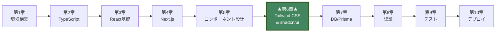

**この章の位置づけ:**
この章では、画面の「見た目」を効率的に作る方法を学びます。第5章で学んだコンポーネントに美しいスタイルを適用し、次の第7章でデータベースと連携する準備を整えます。

## 目次
- [6.1 Tailwind CSSとは](#61-tailwind-cssとは)
- [6.2 よく使うクラス](#62-よく使うクラス)
- [6.3 レスポンシブデザイン](#63-レスポンシブデザイン)
- [6.4 ダークモード対応](#64-ダークモード対応)
- [6.5 カスタムテーマ](#65-カスタムテーマ)
- [6.6 shadcn/uiとは](#66-shadcnuiとは)
- [6.7 shadcn/uiのインストールと使い方](#67-shadcnuiのインストールと使い方)
- [6.8 主要コンポーネント](#68-主要コンポーネント)
- [6.9 BON-LOGでの実例](#69-bon-logでの実例)
- [6.10 演習問題](#610-演習問題)
- [6.11 CVA（class-variance-authority）詳細](#611-cvaclass-variance-authority詳細)
- [6.12 tailwind-merge + clsx（cn()関数）](#612-tailwind-merge--clsxcn関数)
- [6.13 Tailwind CSS v4固有機能](#613-tailwind-css-v4固有機能)
- [6.14 和風デザインパターン](#614-和風デザインパターン)
- [6.15 3カラムレイアウト実装](#615-3カラムレイアウト実装)
- [6.16 CVA応用: 実際のコンポーネントを深く読む](#616-cva応用-実際のコンポーネントを深く読む)
- [6.17 Tailwind CSS v4 詳細: globals.cssを完全に読む](#617-tailwind-css-v4-詳細-bon-logの-globalscss-を完全に読む)
- [6.18 和風タイポグラフィとカラーの深掘り](#618-和風タイポグラフィとカラーの深掘り)
- [6.19 3カラムレイアウト詳細: 各コンポーネントの実装を深く読む](#619-3カラムレイアウト詳細-各コンポーネントの実装を深く読む)
- [6.20 アニメーションとトランジションパターン](#620-アニメーションとトランジションパターン)
- [6.21 asChildパターンとSlotコンポーネント](#621-aschildパターンとslotコンポーネント)
- [6.22 よくある質問（FAQ）](#622-よくある質問faq)
- [6.23 デザインシステム チートシート](#623-デザインシステム-チートシート)

---

## 6.1 Tailwind CSSとは

### このセクションで学ぶこと

- 従来のCSSアプローチとユーティリティファーストアプローチの違い
- Tailwind CSSが開発効率を高める理由
- クラスの基本的な命名規則（プロパティ-値のパターン）

### ユーティリティファーストの考え方

Tailwind CSSは「ユーティリティファースト」のCSSフレームワークです。事前定義された小さなユーティリティクラスを組み合わせてスタイリングします。

#### 従来のCSS vs Tailwind CSS の比較図

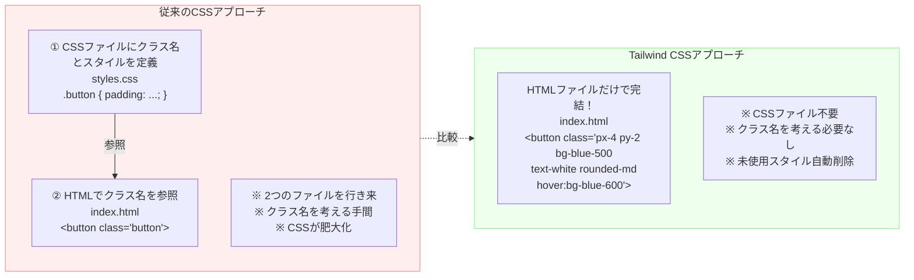

**従来のCSS**
```css
/* styles.css */
.button {
  padding: 0.5rem 1rem;
  background-color: #3b82f6;
  color: white;
  border-radius: 0.375rem;
  font-weight: 600;
}

.button:hover {
  background-color: #2563eb;
}
```

```html
<button class="button">ボタン</button>
```

**Tailwind CSS**
```html
<button class="px-4 py-2 bg-blue-500 text-white rounded-md font-semibold hover:bg-blue-600">
  ボタン
</button>
```

> **画面表示**
> 上記の両方のコードは同じボタンを表示します:
> - 左右に16pxの余白（`px-4`）、上下に8pxの余白（`py-2`）が入った青い背景色のボタン
> - テキストは白色（`text-white`）で、やや太めのフォント（`font-semibold`）
> - 角がわずかに丸い（`rounded-md` = 6px）
> - マウスを重ねると、青色が少し濃くなる（`hover:bg-blue-600`）
> - 違いは「CSSファイル + HTMLファイルの2つ」か「HTMLだけで完結」かの記述方法のみ

### Tailwind CSSの利点

1. **高速な開発**: CSSファイルとHTMLを行き来する必要がない
2. **一貫性**: デザインシステムに基づいた値（spacing、color等）
3. **パフォーマンス**: 未使用のスタイルは自動削除（PurgeCSS）
4. **保守性**: コンポーネント単位でスタイルが完結

> **未使用クラスの自動削除の仕組み**
> Tailwind CSSは全クラス（数千個）を定義していますが、ビルド時にプロジェクト内のファイル（`.tsx`, `.ts`, `.html`等）をスキャンし、**実際に使われているクラス名だけ**を最終CSSに含めます。そのため、本番CSSは通常10KB以下と非常に小さくなります。
>
> ⚠️ **注意**: クラス名を動的に組み立てると検出されません：
> ```typescript
> // ❌ 検出されない（ビルド時に文字列が確定しない）
> const color = 'blue'
> className={`bg-${color}-500`}
>
> // ✅ 検出される（完全なクラス名が文字列に含まれる）
> className={color === 'blue' ? 'bg-blue-500' : 'bg-red-500'}
> ```

### Tailwind CSSの基本構造

```html
<!-- 構造: プロパティ-値 -->
<div class="
  text-lg         <!-- font-size: 1.125rem -->
  text-gray-700   <!-- color: #374151 -->
  bg-white        <!-- background-color: #ffffff -->
  p-4             <!-- padding: 1rem -->
  rounded-lg      <!-- border-radius: 0.5rem -->
  shadow-md       <!-- box-shadow: ... -->
">
  コンテンツ
</div>
```

> **画面表示**
> このコードを適用すると:
> - 白い背景（`bg-white`）の上に、やや大きめのフォント（`text-lg` = 18px）でダークグレーのテキスト（`text-gray-700`）が表示される
> - 全方向に16pxの内側余白（`p-4`）があり、テキストが枠線ギリギリにならない
> - 角が丸い（`rounded-lg` = 8px）カード形状になる
> - 中程度の影（`shadow-md`）が付き、カードが浮いているような奥行き感が生まれる

### よくあるトラブルと解決法

| トラブル | 原因 | 解決法 |
|---------|------|--------|
| クラスを書いたのにスタイルが適用されない | Tailwind CSS v4ではCSSファイルでの`@import "tailwindcss"`が必要 | `app/globals.css`に`@import "tailwindcss";`があるか確認。v4ではcontentの自動検出が行われるため、v3のような`content`配列は不要 |
| 動的なクラス名が効かない | Tailwindはビルド時にクラスを検出するため、動的生成は不可 | `bg-red-500`のように完全なクラス名を書く（`bg-${color}-500`はNG） |
| カスタムの値を使いたい | デフォルトのスケールにない値を使いたい | `w-[320px]`のように角括弧で任意の値を指定（JIT） |

> **BON-LOGでの使用箇所:** `app/globals.css`
>
> **実装しない場合の影響:** Tailwind CSSが正しく読み込まれず、すべてのユーティリティクラスが適用されません。ページは装飾のない素のHTMLとして表示されてしまいます。

### 理解度チェック

<details>
<summary>Q1: Tailwind CSSの「ユーティリティファースト」とは何ですか？</summary>

**A1:** 小さな単一機能のCSSクラス（ユーティリティクラス）を組み合わせてUIを構築するアプローチです。例えば`p-4`（padding: 1rem）、`text-blue-500`（color: 青）のように、1つのクラスが1つのCSSプロパティに対応します。CSSファイルに独自のクラスを定義するのではなく、既に用意されたユーティリティクラスを直接HTMLに書いてスタイリングします。
</details>

<details>
<summary>Q2: 従来のCSSと比較して、Tailwind CSSの最大のメリットは何ですか？</summary>

**A2:** 最大のメリットは「CSSファイルとHTMLファイルを行き来する必要がない」ことです。従来はHTMLでクラス名を付け、別のCSSファイルでスタイルを定義する必要がありました。Tailwind CSSでは、HTMLの中で直接スタイルを指定するので、開発速度が大幅に向上します。また、クラス名を考える手間がなくなり、使われていないCSSが残る問題も解消されます。
</details>

<details>
<summary>Q3: `bg-${color}-500` のような動的クラス名が動かないのはなぜですか？</summary>

**A3:** Tailwind CSSはビルド時にソースコードをスキャンして使用されているクラスを検出します。`bg-${color}-500`のような動的な文字列はビルド時に解析できないため、該当するCSSが生成されません。代わりに、条件分岐で完全なクラス名を切り替える方法を使います。例: `color === 'red' ? 'bg-red-500' : 'bg-blue-500'`
</details>

---

## 補足A: 初心者のための専門用語ガイド

この章では多くのCSS・フロントエンド関連の専門用語が登場します。初めて出会う用語に戸惑わないよう、ここでまとめて解説します。

### スタイリング基本用語

| 用語 | 読み方 | 意味 |
|------|--------|------|
| **ユーティリティファースト** | - | 1つのCSSプロパティに対して1つのクラスを割り当て、それらを組み合わせてUIを構築するアプローチ。「まずユーティリティ（道具）を使う」という意味 |
| **レスポンシブデザイン** | - | スマートフォン、タブレット、デスクトップなど、さまざまな画面サイズに合わせてレイアウトを自動調整するデザイン手法 |
| **ブレークポイント** | breakpoint | 画面幅の区切りとなるピクセル値のこと。例: 768px以上ならタブレット向けレイアウトに切り替える、のように使う |
| **モバイルファースト** | mobile first | まずスマートフォン向けのスタイルを基本として定義し、そこから画面幅が大きくなるにつれて追加のスタイルを上書きする設計手法 |
| **CSS変数（カスタムプロパティ）** | CSS variables | `--primary: #42855e;`のように`--`で始まる名前で定義し、`var(--primary)`で参照できるCSSの値の仕組み。JavaScriptの変数と同じように「値に名前を付けて再利用する」ためのもの |
| **バリアント** | variant | コンポーネントの見た目のバリエーション（種類）のこと。例: ボタンの「デフォルト」「アウトライン」「ゴースト」など |
| **コンポーネントライブラリ** | component library | Button、Card、Dialogなどの再利用可能なUIパーツ（コンポーネント）をまとめたもの。自分で一から作る手間を省ける |

### レイアウト関連用語

| 用語 | 読み方 | 意味 |
|------|--------|------|
| **Flexbox** | フレックスボックス | CSSのレイアウト方式の1つ。要素を横並びまたは縦並びに配置し、間隔や位置を柔軟に調整できる。「flex = 柔軟な」の意味 |
| **Grid** | グリッド | CSSのレイアウト方式の1つ。要素を行と列の格子状（グリッド）に配置する。Excelのセルのようなイメージ |
| **sticky** | スティッキー | `position: sticky`のこと。通常は他の要素と一緒にスクロールするが、画面の端に達すると「くっついて」固定される配置方法 |
| **fixed** | フィクスド | `position: fixed`のこと。常に画面の特定位置に固定される配置方法。スクロールしても動かない |

### デザインシステム用語

| 用語 | 読み方 | 意味 |
|------|--------|------|
| **デザイントークン** | design token | 色、余白、角丸などの値に意味のある名前を付けて管理する仕組み。例: `--primary`（メインカラー）、`--radius-lg`（大きい角丸）など |
| **アクセシビリティ** | accessibility (a11y) | 障がいのある方やさまざまな環境のユーザーが問題なく利用できるようにすること。キーボード操作、スクリーンリーダー対応などが含まれる |
| **ヘッドレスUI** | headless UI | 機能（動作やアクセシビリティ）だけを提供し、見た目（スタイル）は自分で自由に付けられるUIライブラリのこと。「頭（見た目）がない」という意味 |
| **PurgeCSS** | パージCSS | 実際にコード内で使われていないCSSクラスを自動的に検出・除去する仕組み。Tailwind CSSに組み込まれており、ファイルサイズの削減に貢献する |
| **バンドルサイズ** | bundle size | Webサイトをブラウザに読み込む際に必要なファイルの合計サイズ。小さいほどページの読み込みが速い |
| **DX（Developer Experience）** | ディーエックス | 開発者体験のこと。開発ツールの使いやすさ、ドキュメントの充実度、エラーメッセージの分かりやすさなどを含む |

### CSS-in-JS関連用語

| 用語 | 読み方 | 意味 |
|------|--------|------|
| **CSS-in-JS** | シーエスエス・イン・ジェーエス | JavaScriptファイルの中でCSSスタイルを記述するアプローチの総称。Styled Components、Emotionなどが代表例 |
| **型安全** | かたあんぜん | TypeScriptの型チェック機能により、間違った値を指定するとコンパイル時にエラーが表示されること。実行前にミスを防げる |
| **ゼロランタイム** | zero runtime | スタイルの処理がビルド時に完了し、ブラウザ実行時にはJavaScriptが不要であること。ページの表示速度が速くなる |

---

## 補足B: ユーティリティファーストCSSを従来のCSSと比較して理解する

Tailwind CSSの「ユーティリティファースト」という考え方が初めての方に向けて、従来のCSS記法との違いを段階的に解説します。

### 従来のCSS: クラス名を考えて、別ファイルにスタイルを書く

従来のCSS開発では、以下のような流れでスタイリングを行います。

```
【Step 1】HTMLに意味のあるクラス名を付ける
【Step 2】CSSファイルでそのクラス名にスタイルを定義する
【Step 3】2つのファイルを行き来しながら調整する
```

**例: ユーザープロフィールカード**

```css
/* styles/profile.css */
.profile-card {
  background-color: #ffffff;
  border: 1px solid #e5e7eb;
  border-radius: 0.5rem;
  padding: 1.5rem;
  box-shadow: 0 1px 3px rgba(0, 0, 0, 0.1);
}

.profile-card__name {
  font-size: 1.25rem;
  font-weight: 700;
  color: #1a1a1a;
  margin-bottom: 0.5rem;
}

.profile-card__bio {
  font-size: 0.875rem;
  color: #6b7280;
  line-height: 1.625;
}

.profile-card__button {
  background-color: #6b8e23;
  color: #ffffff;
  padding: 0.5rem 1rem;
  border-radius: 0.375rem;
  font-weight: 600;
  margin-top: 1rem;
}

.profile-card__button:hover {
  background-color: #2d5016;
}
```

```html
<!-- pages/profile.html -->
<div class="profile-card">
  <h2 class="profile-card__name">山田太郎</h2>
  <p class="profile-card__bio">五葉松を育てて20年。盆栽の魅力を発信しています。</p>
  <button class="profile-card__button">フォローする</button>
</div>
```

この方法の**課題**:
- クラス名を考える手間がある（`profile-card__name`のような命名ルールを覚える必要がある）
- HTMLとCSSの2つのファイルを常に行き来する
- CSSファイルが肥大化しやすい（使われなくなったクラスが残りがち）
- 「この色はどのクラスで定義してたっけ？」と探す手間がかかる

### Tailwind CSS: HTMLの中で直接スタイルを書く

Tailwind CSSでは、同じUIを以下のように記述します。

```html
<!-- 従来のCSSで5つのクラス定義 + CSSファイルが必要だったものが、HTMLだけで完結 -->
<div class="bg-white border border-gray-200 rounded-lg p-6 shadow-sm">
  <h2 class="text-xl font-bold text-sumi mb-2">山田太郎</h2>
  <p class="text-sm text-gray-500 leading-relaxed">
    五葉松を育てて20年。盆栽の魅力を発信しています。
  </p>
  <button class="bg-bonsai-moss text-white px-4 py-2 rounded-md font-semibold mt-4 hover:bg-bonsai-pine">
    フォローする
  </button>
</div>
```

> **画面表示**
> このBON-LOGのプロフィールカードは以下のように表示されます:
> - 白い背景（`bg-white`）に薄いグレーの枠線（`border-gray-200`）で囲まれたカード
> - 角が丸く（`rounded-lg`）、内側に24pxの余白（`p-6`）、薄い影（`shadow-sm`）で浮遊感
> - **名前**: 「山田太郎」が大きめ（`text-xl` = 20px）の太字（`font-bold`）で墨色（`text-sumi`）表示
> - **自己紹介**: 小さめ（`text-sm` = 14px）のグレー文字（`text-gray-500`）で、行間がゆったり（`leading-relaxed`）
> - **フォローボタン**: 苔色（`bg-bonsai-moss` = 黄緑がかった緑）の背景に白文字、角がやや丸い
> - ボタンにマウスを重ねると松葉色（`bg-bonsai-pine` = 濃い深緑）に変化

**対応関係:**

| 従来のCSS | Tailwind CSS |
|---|---|
| `background-color: #ffffff;` | `bg-white` |
| `border: 1px solid #e5e7eb;` | `border border-gray-200` |
| `border-radius: 0.5rem;` | `rounded-lg` |
| `padding: 1.5rem;` | `p-6` |
| `box-shadow: ...;` | `shadow-sm` |
| `font-size: 1.25rem;` | `text-xl` |
| `font-weight: 700;` | `font-bold` |
| `color: #1a1a1a;` | `text-sumi` |
| `margin-bottom: 0.5rem;` | `mb-2` |
| `:hover background-color` | `hover:bg-bonsai-pine` |

### 「クラスが長すぎる」問題はReactコンポーネントが解決する

Tailwind CSSの最大の批判は「HTMLのクラスが長すぎて読みにくい」というものです。しかし、Reactのコンポーネント化と組み合わせることで、この問題は解消されます。

```typescript
// components/ui/ProfileCard.tsx
// 1回定義すれば、使う側はシンプルなコンポーネントとして呼び出すだけ
export function ProfileCard({ name, bio, onFollow }: ProfileCardProps) {
  return (
    <div className="bg-white border border-gray-200 rounded-lg p-6 shadow-sm">
      <h2 className="text-xl font-bold text-sumi mb-2">{name}</h2>
      <p className="text-sm text-gray-500 leading-relaxed">{bio}</p>
      <button
        onClick={onFollow}
        className="bg-bonsai-moss text-white px-4 py-2 rounded-md font-semibold mt-4 hover:bg-bonsai-pine"
      >
        フォローする
      </button>
    </div>
  )
}

// 使う側はこれだけ
<ProfileCard name="山田太郎" bio="五葉松を育てて20年" onFollow={handleFollow} />
```

スタイルの詳細はコンポーネント内部に隠蔽され、使う側はpropsを渡すだけで済みます。これは従来のCSSでクラス名を別ファイルに定義するのと本質的に同じ役割です。

---

## 補足C: Tailwindクラス名の読み方ガイド

Tailwind CSSのクラス名は一見すると暗号のように見えますが、実は「プロパティの略称-値」という規則的なパターンで構成されています。このガイドでは、クラス名を見ただけで何のスタイルか分かるようになることを目指します。

### 基本パターン: プロパティ-値

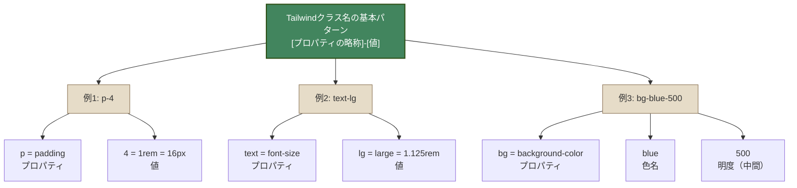

### 方向の略語

Tailwindでは方向を1文字で表します。

```
         t (top)
          ↑
l (left) ←  → r (right)      x = 左右 (horizontal)
          ↓                   y = 上下 (vertical)
         b (bottom)           (なし) = 全方向
```

**具体例:**

```
p-4   → padding: 1rem             （全方向に1rem）
pt-4  → padding-top: 1rem          （上だけ1rem）
pb-4  → padding-bottom: 1rem       （下だけ1rem）
pl-4  → padding-left: 1rem         （左だけ1rem）
pr-4  → padding-right: 1rem        （右だけ1rem）
px-4  → padding-left/right: 1rem   （左右に1rem）
py-4  → padding-top/bottom: 1rem   （上下に1rem）

m-4   → margin: 1rem               （marginも同様のパターン）
mt-4  → margin-top: 1rem
mx-auto → margin-left/right: auto  （中央寄せ）
```

### 数値スケールの読み方

Tailwindの数値は`0.25rem(4px)`を1単位としています。

| 数値 | rem値 | px値 | 覚え方 |
|---:|---|---|---|
| 0 | 0 | 0px | |
| 1 | 0.25rem | 4px | 「1 = 4px」と覚える |
| 2 | 0.5rem | 8px | 1の2倍 |
| 3 | 0.75rem | 12px | 1の3倍 |
| 4 | 1rem | 16px | ★ よく使う基準値 |
| 5 | 1.25rem | 20px | |
| 6 | 1.5rem | 24px | 4の1.5倍 |
| 8 | 2rem | 32px | 4の2倍 |
| 10 | 2.5rem | 40px | |
| 12 | 3rem | 48px | 4の3倍 |
| 16 | 4rem | 64px | 4の4倍 |
| 20 | 5rem | 80px | |
| 24 | 6rem | 96px | |

**よく使う目安:**
- `p-2` (8px): テキスト周りの最小パディング
- `p-4` (16px): カード内のパディング、要素間の標準間隔
- `p-6` (24px): セクション内のゆったりしたパディング
- `p-8` (32px): ページセクション間の大きな余白

### 色の読み方

```
色の指定: [プロパティ]-[色名]-[明度]

明度スケール:
50   ████████████  極めて薄い（背景用）
100  ███████████   とても薄い
200  ██████████    薄い
300  █████████     やや薄い
400  ████████      やや薄め
500  ███████       標準（中間）
600  ██████        やや濃い
700  █████         濃い
800  ████          とても濃い
900  ███           極めて濃い
950  ██            最も濃い

例:
text-gray-500   → 中間のグレーの文字色（サブテキストに最適）
text-gray-900   → 濃いグレーの文字色（メインテキストに最適）
bg-blue-100     → 薄い青の背景色（情報メッセージの背景に最適）
bg-red-500      → 標準の赤の背景色（エラー表示に最適）
border-gray-200 → 薄いグレーのボーダー（カードの枠線に最適）
```

### 修飾プレフィックスの読み方

Tailwindでは`状態:クラス名`の形式で、特定の状態でのみスタイルを適用できます。

```
hover:bg-blue-600     → マウスホバー時に背景色を青600に
focus:ring-2          → フォーカス時にリング（枠線）を2px表示
active:scale-95       → クリック中にサイズを95%に縮小
disabled:opacity-50   → 無効状態で透明度を50%に

dark:bg-gray-900      → ダークモード時に背景色をグレー900に
dark:text-white       → ダークモード時に文字色を白に

sm:text-lg            → 640px以上でフォントサイズをlgに
md:grid-cols-2        → 768px以上で2カラムグリッドに
lg:flex               → 1024px以上でFlexbox表示に
xl:block              → 1280px以上でブロック表示に
```

### 実践: クラスの逆引きリファレンス

以下に、BON-LOGでよく使われるスタイルの「やりたいこと→Tailwindクラス」対応表を示します。

| やりたいこと | Tailwindクラス |
|---|---|
| 画面全体の高さを確保したい | `min-h-screen` |
| 要素を横並びにしたい | `flex` |
| 要素を縦並びにしたい | `flex flex-col` |
| 要素を上下左右中央に配置したい | `flex items-center justify-center` |
| 要素間に均等な余白を入れたい | `flex gap-4` |
| 残りのスペースを埋めたい | `flex-1` |
| テキストを1行で省略表示したい | `truncate` |
| テキストを複数行で省略したい | `line-clamp-2` |
| 画像をコンテナに合わせてトリミングしたい | `object-cover` |
| 角を丸くしたい | `rounded-lg` |
| 完全な円にしたい | `rounded-full` |
| 要素を非表示にしたい | `hidden` |
| 大画面でのみ表示したい | `hidden lg:block` |
| マウスカーソルを指に変えたい | `cursor-pointer` |
| アニメーションで変化させたい | `transition-all duration-200` |

---

## 補足D: レスポンシブデザインの考え方（モバイルファースト）

### なぜモバイルファーストなのか

現在、Webサイトのアクセスの50%以上がスマートフォンからです。そのため、まずスマートフォンでの表示を基本として設計し、画面が大きくなるにつれて追加のレイアウトを適用するのが合理的です。

```
【デスクトップファースト（従来の考え方）】

  まずデスクトップ向けに作る → スマホ対応を後から追加
  → スマホで「崩れる」「はみ出す」問題が起きやすい
  → 「引き算」の設計（デスクトップから要素を減らす）

  ────────────────────────────

【モバイルファースト（Tailwind CSSの考え方）】

  まずスマホ向けに作る → 大画面向けを後から追加
  → 基本がシンプルなのでレイアウト崩れが起きにくい
  → 「足し算」の設計（画面が広がったら要素を追加）
```

### Tailwind CSSでのモバイルファースト

Tailwindのレスポンシブの仕組みを、具体例で理解しましょう。

```html
<!-- この1行に3つのスタイルが定義されている -->
<div class="grid grid-cols-1 md:grid-cols-2 lg:grid-cols-3">
```

このクラスは以下のように解釈されます:

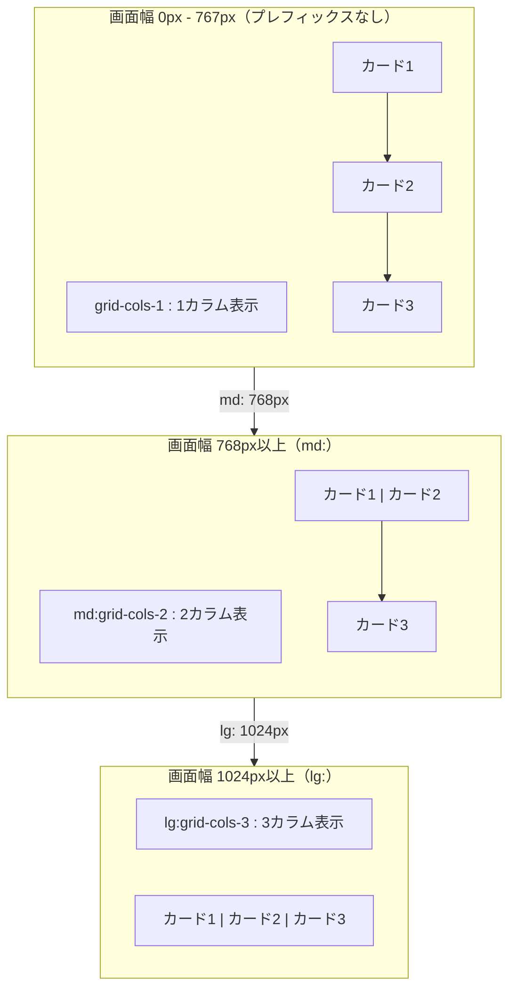

重要なポイント: **プレフィックスなしのクラスは「全画面サイズ」で適用される**のではなく、**最小画面（モバイル）からのベースライン**として機能します。`md:`や`lg:`のプレフィックスは「そのサイズ以上で上書き」を意味します。

### BON-LOGでの実例

BON-LOGのレスポンシブ設計は、以下の3段階で構成されています。

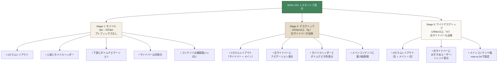

このように「モバイルで基本形を作り、画面幅が広がるたびにサイドバーを追加していく」のがモバイルファーストの設計です。

---

## 6.2 よく使うクラス

### このセクションで学ぶこと

- Spacing（余白）の仕組みとスケール
- Color（色）の指定方法とカラースケール
- Typography（文字）、Flexbox、Gridレイアウトのクラス
- Border、Shadow、Width/Height、Position、Displayの使い方

### Spacing（余白）

Tailwind CSSのスペーシングは`0.25rem`（4px）を1単位とします。

```html
<!-- Padding -->
<div class="p-4">       <!-- padding: 1rem (16px) -->
<div class="px-4">      <!-- padding-left/right: 1rem -->
<div class="py-2">      <!-- padding-top/bottom: 0.5rem -->
<div class="pt-8">      <!-- padding-top: 2rem -->
<div class="pl-2">      <!-- padding-left: 0.5rem -->

<!-- Margin -->
<div class="m-4">       <!-- margin: 1rem -->
<div class="mx-auto">   <!-- margin-left/right: auto（中央寄せ） -->
<div class="my-8">      <!-- margin-top/bottom: 2rem -->
<div class="-mt-4">     <!-- margin-top: -1rem（負のマージン） -->

<!-- Space Between（子要素間の余白） -->
<div class="space-y-4"> <!-- 子要素の縦方向に1remの余白 -->
  <div>項目1</div>      <!-- → 項目1と項目2の間に16pxの余白 -->
  <div>項目2</div>      <!-- → 項目2と項目3の間に16pxの余白 -->
  <div>項目3</div>
</div>
```

> **画面表示**
> `space-y-4`を使うと、各項目の間に均等な16pxの縦方向余白が自動的に入る。フォーム要素の縦並びやカードリストでよく使うパターン。

**スペーシングスケール**
```
0   → 0
1   → 0.25rem (4px)
2   → 0.5rem (8px)
4   → 1rem (16px)
6   → 1.5rem (24px)
8   → 2rem (32px)
12  → 3rem (48px)
16  → 4rem (64px)
```

> **なぜ4pxの倍数？**
> Tailwindのスペーシングは**8ポイントグリッドシステム**に基づいています。4px刻みにすることで、デザイン全体に一貫したリズムが生まれ、要素間の余白が自然に揃います。デザイナーとの協業でも「p-4（16px）」のように共通言語で会話できます。

### Color（色）

```html
<!-- Text Color → テキストの色を変える -->
<p class="text-gray-900">濃いグレーのテキスト</p>  <!-- → メインテキストに最適 -->
<p class="text-blue-500">青いテキスト</p>           <!-- → リンクや情報表示に -->
<p class="text-red-600">赤いテキスト</p>            <!-- → エラーメッセージに -->

<!-- Background Color → 背景色を変える -->
<div class="bg-white">白背景</div>           <!-- → カード、入力欄に -->
<div class="bg-gray-100">薄いグレー背景</div> <!-- → セクション区切りに -->
<div class="bg-blue-500">青背景</div>         <!-- → ボタン、バッジに（白文字と組み合わせる） -->

<!-- Border Color → 枠線の色を変える -->
<div class="border border-gray-300">グレーのボーダー</div> <!-- → カードの枠線に -->
```

**カラースケール**
```
50   → 最も薄い
100  →
200  →
...
800  →
900  → 最も濃い
```

### Typography（タイポグラフィ）

```html
<!-- Font Size → 文字が段階的に大きくなる -->
<p class="text-xs">極小 (0.75rem)</p>       <!-- → 12px: 注釈や日時表示に -->
<p class="text-sm">小 (0.875rem)</p>         <!-- → 14px: サブテキスト、説明文に -->
<p class="text-base">標準 (1rem)</p>          <!-- → 16px: 本文のデフォルト -->
<p class="text-lg">大 (1.125rem)</p>          <!-- → 18px: 強調テキストに -->
<p class="text-xl">特大 (1.25rem)</p>         <!-- → 20px: カードタイトルに -->
<p class="text-2xl">2XL (1.5rem)</p>          <!-- → 24px: セクション見出しに -->
<p class="text-3xl">3XL (1.875rem)</p>        <!-- → 30px: ページタイトルに -->

<!-- Font Weight → 文字の太さが段階的に変わる -->
<p class="font-normal">通常 (400)</p>     <!-- → 本文テキスト -->
<p class="font-medium">中 (500)</p>       <!-- → ラベル、ナビリンク -->
<p class="font-semibold">半太字 (600)</p> <!-- → ボタンテキスト -->
<p class="font-bold">太字 (700)</p>       <!-- → 見出し、ユーザー名 -->

<!-- Line Height → 行と行の間隔が変わる -->
<p class="leading-tight">密な行間</p>      <!-- → 見出し向き（行間が詰まる） -->
<p class="leading-normal">標準行間</p>     <!-- → 一般テキスト向き -->
<p class="leading-relaxed">ゆったり行間</p> <!-- → 長文・説明文向き（読みやすい） -->

<!-- Text Align -->
<p class="text-left">左寄せ</p>
<p class="text-center">中央寄せ</p>
<p class="text-right">右寄せ</p>

<!-- Text Decoration -->
<a class="underline">下線</a>
<a class="no-underline">下線なし</a>
<p class="line-through">打ち消し線</p>

<!-- Text Transform -->
<p class="uppercase">大文字</p>
<p class="lowercase">小文字</p>
<p class="capitalize">先頭大文字</p>

<!-- Text Overflow -->
<p class="truncate">長いテキストは省略される...</p>
<p class="overflow-ellipsis">同様に省略...</p>
```

### Flexbox

```html
<!-- 基本的なFlexコンテナ -->
<div class="flex">
  <div>項目1</div>
  <div>項目2</div>
</div>

<!-- 縦方向 -->
<div class="flex flex-col">
  <div>項目1</div>
  <div>項目2</div>
</div>

<!-- 主軸の配置（justify-content） -->
<div class="flex justify-start">     <!-- 左寄せ -->
<div class="flex justify-center">    <!-- 中央 -->
<div class="flex justify-end">       <!-- 右寄せ -->
<div class="flex justify-between">   <!-- 両端寄せ -->
<div class="flex justify-around">    <!-- 均等配置 -->

<!-- 交差軸の配置（align-items） -->
<div class="flex items-start">       <!-- 上寄せ -->
<div class="flex items-center">      <!-- 中央 -->
<div class="flex items-end">         <!-- 下寄せ -->
<div class="flex items-stretch">     <!-- 伸ばす -->

<!-- 折り返し -->
<div class="flex flex-wrap">         <!-- 折り返す -->

<!-- ギャップ -->
<div class="flex gap-4">             <!-- 子要素間に1remの余白 -->
<div class="flex gap-x-2 gap-y-4">   <!-- 横2、縦4の余白 -->

<!-- 実用例: ヘッダー -->
<header class="flex items-center justify-between p-4 bg-white border-b">
  <div class="flex items-center gap-2">
    
    <h1 class="text-xl font-bold">BON-LOG</h1>
  </div>
  <nav class="flex gap-4">
    <a href="/feed">タイムライン</a>
    <a href="/search">検索</a>
  </nav>
</header>
```

> **画面表示**
> このヘッダーは白い背景に下線付き（`border-b`）で横一列に配置されます:
> - 左端: ロゴアイコン（高さ32px）と「BON-LOG」テキスト（太字、20px）が横並び（`gap-2`で8px間隔）
> - 右端: 「タイムライン」「検索」のリンクが16px間隔（`gap-4`）で並ぶ
> - `justify-between`により左右に分かれ、`items-center`で縦方向の中央に揃う

### Grid

```html
<!-- 基本的なグリッド -->
<div class="grid grid-cols-3 gap-4">
  <div>1</div>
  <div>2</div>
  <div>3</div>
  <div>4</div>
  <div>5</div>
  <div>6</div>
</div>

<!-- 列数の指定 -->
<div class="grid grid-cols-2">     <!-- 2列 -->
<div class="grid grid-cols-4">     <!-- 4列 -->
<div class="grid grid-cols-12">    <!-- 12列（Bootstrapスタイル） -->

<!-- 行数の指定 -->
<div class="grid grid-rows-3">     <!-- 3行 -->

<!-- 列のスパン -->
<div class="grid grid-cols-3">
  <div class="col-span-2">2列分</div>
  <div>1列</div>
</div>

<!-- 実用例: カードグリッド -->
<div class="grid grid-cols-1 md:grid-cols-2 lg:grid-cols-3 gap-6">
  <div class="bg-white rounded-lg shadow p-4">カード1</div>
  <div class="bg-white rounded-lg shadow p-4">カード2</div>
  <div class="bg-white rounded-lg shadow p-4">カード3</div>
</div>
```

> **画面表示**
> レスポンシブなカードグリッドの表示:
> - **モバイル**: 3枚のカードが縦1列（`grid-cols-1`）に並ぶ。各カード間に24pxの余白（`gap-6`）
> - **タブレット（768px以上）**: 2列（`md:grid-cols-2`）に並び、3枚目は次の行に回り込む
> - **デスクトップ（1024px以上）**: 3列（`lg:grid-cols-3`）に横一列で3枚並ぶ
> - 各カードは白背景、角丸、影付きで浮いたように見える

### Border（ボーダー）

```html
<!-- ボーダーの太さ -->
<div class="border">          <!-- 1px -->
<div class="border-2">        <!-- 2px -->
<div class="border-4">        <!-- 4px -->

<!-- 方向指定 -->
<div class="border-t">        <!-- 上のみ -->
<div class="border-b">        <!-- 下のみ -->
<div class="border-l">        <!-- 左のみ -->
<div class="border-r">        <!-- 右のみ -->

<!-- 角丸 -->
<div class="rounded">         <!-- border-radius: 0.25rem -->
<div class="rounded-md">      <!-- border-radius: 0.375rem -->
<div class="rounded-lg">      <!-- border-radius: 0.5rem -->
<div class="rounded-full">    <!-- border-radius: 9999px（完全な円） -->
<div class="rounded-t-lg">    <!-- 上のみ角丸 -->

<!-- 実用例: カード -->
<div class="border border-gray-200 rounded-lg p-4">
  カードコンテンツ
</div>
```

### Shadow（影）

```html
<div class="shadow-sm">       <!-- 薄い影 -->
<div class="shadow">          <!-- 標準の影 -->
<div class="shadow-md">       <!-- 中程度の影 -->
<div class="shadow-lg">       <!-- 大きい影 -->
<div class="shadow-xl">       <!-- 特大の影 -->

<!-- 実用例: ホバー時に影を強調 -->
<div class="shadow hover:shadow-lg transition-shadow duration-200">
  ホバーしてみて
</div>
```

> **画面表示**
> 通常時は控えめな影（`shadow`）が付いた要素。マウスを重ねると200ミリ秒かけて（`duration-200`）影がなめらかに大きくなり（`hover:shadow-lg`）、カードが浮き上がるような視覚効果が生まれる。`transition-shadow`により影の変化だけがアニメーションする。

### Width & Height

```html
<!-- 固定サイズ -->
<div class="w-64">            <!-- width: 16rem (256px) -->
<div class="h-32">            <!-- height: 8rem (128px) -->

<!-- パーセント -->
<div class="w-full">          <!-- width: 100% -->
<div class="w-1/2">           <!-- width: 50% -->
<div class="w-1/3">           <!-- width: 33.333% -->
<div class="w-2/3">           <!-- width: 66.666% -->

<!-- ビューポート -->
<div class="w-screen">        <!-- width: 100vw -->
<div class="h-screen">        <!-- height: 100vh -->

<!-- 最小・最大 -->
<div class="min-w-0">         <!-- min-width: 0 -->
<div class="max-w-md">        <!-- max-width: 28rem -->
<div class="max-w-lg">        <!-- max-width: 32rem -->
<div class="max-w-2xl">       <!-- max-width: 42rem -->
<div class="max-w-screen-xl"> <!-- max-width: 1280px -->
```

### Position

```html
<!-- 配置 -->
<div class="static">          <!-- position: static -->
<div class="relative">        <!-- position: relative -->
<div class="absolute">        <!-- position: absolute -->
<div class="fixed">           <!-- position: fixed -->
<div class="sticky">          <!-- position: sticky -->

<!-- 位置指定 -->
<div class="absolute top-0 left-0">     <!-- 左上 -->
<div class="absolute top-0 right-0">    <!-- 右上 -->
<div class="absolute bottom-0 left-0">  <!-- 左下 -->
<div class="absolute inset-0">          <!-- 全方向0 -->

<!-- 実用例: 通知バッジ -->
<div class="relative">
  <button>通知</button>
  <span class="absolute -top-2 -right-2 bg-red-500 text-white rounded-full w-5 h-5 text-xs flex items-center justify-center">
    3
  </span>
</div>
```

> **画面表示**
> 「通知」ボタンの右上に赤い丸バッジ（直径20px）が少しはみ出して表示される。バッジ内には白文字で「3」という件数が中央揃えで表示される。`relative`の親要素を基準に`absolute`で配置し、`-top-2 -right-2`（負のオフセット）でボタンの外側にはみ出す位置に調整している。

### Display

```html
<div class="block">           <!-- display: block -->
<div class="inline">          <!-- display: inline -->
<div class="inline-block">    <!-- display: inline-block -->
<div class="flex">            <!-- display: flex -->
<div class="grid">            <!-- display: grid -->
<div class="hidden">          <!-- display: none -->
```

### Opacity & Visibility

```html
<div class="opacity-0">       <!-- opacity: 0（完全透明） -->
<div class="opacity-50">      <!-- opacity: 0.5（半透明） -->
<div class="opacity-100">     <!-- opacity: 1（不透明） -->

<div class="visible">         <!-- visibility: visible -->
<div class="invisible">       <!-- visibility: hidden -->
```

### 理解度チェック

<details>
<summary>Q1: `px-4` と `p-4` の違いは何ですか？</summary>

**A1:** `p-4`は上下左右すべてに`1rem`のpaddingを適用します。`px-4`は水平方向（左右）のみに`1rem`のpaddingを適用します。同様に`py-4`は垂直方向（上下）のみです。`x`はhorizontal（水平）、`y`はvertical（垂直）を意味します。
</details>

<details>
<summary>Q2: `flex justify-between items-center` を使うとどのようなレイアウトになりますか？</summary>

**A2:** 子要素が横一列に並び、最初の要素が左端、最後の要素が右端に配置されます（`justify-between`）。また、すべての子要素が縦方向の中央に揃います（`items-center`）。ヘッダーでロゴを左に、ナビゲーションを右に配置するときなどによく使うパターンです。
</details>

<details>
<summary>Q3: `space-y-4` と `gap-4` の違いは何ですか？</summary>

**A3:** `space-y-4`は隣接する兄弟要素間にmarginを追加します（`> * + *`セレクタを使用）。`gap-4`はFlexboxまたはGridコンテナの子要素間にギャップを設定します。`gap`はFlexbox/Grid専用ですが、よりシンプルで予測しやすい動作をします。一般的にFlexbox/Gridを使っている場合は`gap`が推奨されます。
</details>

---

## 6.3 レスポンシブデザイン

### このセクションで学ぶこと

- Tailwind CSSのブレークポイントの種類と意味
- 「モバイルファースト」の考え方とプレフィックスの使い方
- BON-LOGの3カラムレイアウトの実装方法

Tailwind CSSでは、プレフィックスを付けることでブレークポイントごとのスタイルを指定できます。

### ブレークポイント

```
sm:  640px以上
md:  768px以上
lg:  1024px以上
xl:  1280px以上
2xl: 1536px以上
```

#### レスポンシブブレークポイントの図解

```
画面幅(px)   0        640      768      1024     1280     1536
            |         |        |        |        |        |
            |  (なし)  |  sm:   |  md:   |  lg:   |  xl:   | 2xl:
            |         |        |        |        |        |
スマートフォン|         |        |        |        |        |
 [=======]  |         |        |        |        |        |
            |         |        |        |        |        |
タブレット    |         |        |        |        |        |
 [=================]  |        |        |        |        |
            |         |        |        |        |        |
小型ノートPC  |         |        |        |        |        |
 [============================]|        |        |        |
            |         |        |        |        |        |
デスクトップ  |         |        |        |        |        |
 [==========================================]    |        |
            |         |        |        |        |        |
大画面       |         |        |        |        |        |
 [========================================================]

※ 各プレフィックスは「そのサイズ以上」で適用される
※ プレフィックスなし = すべてのサイズで適用
```

### モバイルファーストアプローチ

Tailwind CSSは**モバイルファースト**です。プレフィックスなしのクラスはすべての画面サイズに適用され、プレフィックス付きはそのサイズ以上で適用されます。

```html
<!-- モバイル: 1列、タブレット: 2列、デスクトップ: 3列 -->
<div class="grid grid-cols-1 md:grid-cols-2 lg:grid-cols-3 gap-4">
  <div>カード1</div>
  <div>カード2</div>
  <div>カード3</div>
</div>
<!-- → モバイル: カードが縦1列 / タブレット: 2列 / PC: 3列横並び -->

<!-- モバイル: テキスト小、デスクトップ: テキスト大 -->
<h1 class="text-2xl lg:text-4xl font-bold">
  BON-LOG
</h1>
<!-- → モバイル: 24pxの見出し / PC: 36pxの大見出しに拡大 -->

<!-- モバイル: 縦並び、デスクトップ: 横並び -->
<div class="flex flex-col lg:flex-row gap-4">
  <div>左側</div>
  <div>右側</div>
</div>
<!-- → モバイル: 上下に積み重なる / PC: 左右に横並びになる -->

<!-- モバイル: 非表示、デスクトップ: 表示 -->
<aside class="hidden lg:block">
  サイドバー（PCのみ）
</aside>
<!-- → モバイル: 完全に非表示 / PC: ブロック要素として出現 -->

<!-- モバイル: 表示、デスクトップ: 非表示 -->
<nav class="block lg:hidden">
  モバイルメニュー
</nav>
<!-- → モバイル: 表示される / PC: 完全に非表示（代わりにサイドバーが機能） -->
```

### 実用例: 3カラムレイアウト

#### BON-LOGの3カラムレイアウト構成図

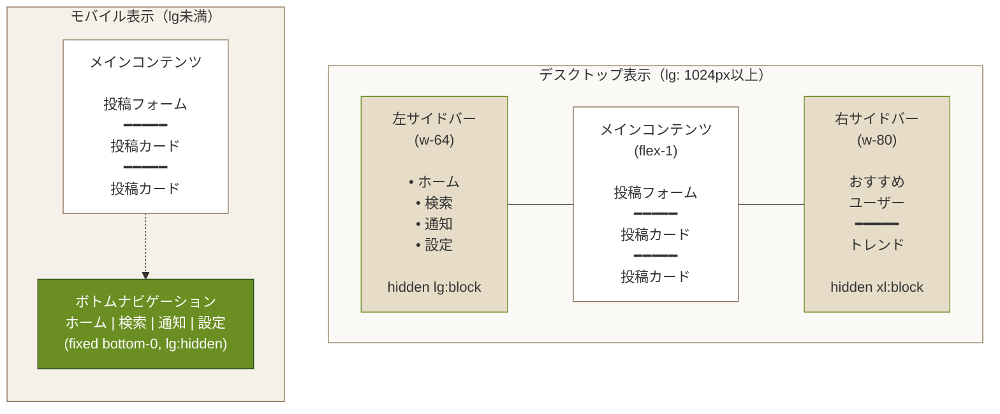

```html
<!-- BON-LOGのメインレイアウト -->
<div class="flex min-h-screen">
  <!-- 左サイドバー（モバイルでは非表示） -->
  <aside class="hidden lg:block w-64 border-r border-gray-200 p-4">
    <nav class="space-y-2">
      <a href="/feed" class="block p-2 rounded hover:bg-gray-100">
        タイムライン
      </a>
      <a href="/search" class="block p-2 rounded hover:bg-gray-100">
        検索
      </a>
    </nav>
  </aside>

  <!-- メインコンテンツ -->
  <main class="flex-1 max-w-full lg:max-w-2xl border-x border-gray-200">
    <!-- コンテンツ -->
  </main>

  <!-- 右サイドバー（モバイル・タブレットでは非表示） -->
  <aside class="hidden xl:block w-80 p-4">
    <div class="bg-gray-50 rounded-lg p-4">
      おすすめユーザー
    </div>
  </aside>
</div>

<!-- モバイル用ボトムナビゲーション -->
<nav class="fixed bottom-0 left-0 right-0 bg-white border-t border-gray-200 lg:hidden">
  <div class="flex justify-around p-2">
    <a href="/feed">ホーム</a>
    <a href="/search">検索</a>
    <a href="/notifications">通知</a>
    <a href="/settings">設定</a>
  </div>
</nav>
```

> **画面表示**
> この3カラムレイアウトは画面幅に応じて大きく変化します:
>
> **モバイル（1024px未満）:**
> - 左右のサイドバーは非表示（`hidden`）。メインコンテンツが画面幅いっぱいに表示
> - 画面下部に白い帯（ボトムナビ）が固定表示。「ホーム」「検索」「通知」「設定」が均等配置（`justify-around`）
> - ボトムナビは常に画面の最下部に固定（`fixed bottom-0`）されスクロールしても追従する
>
> **デスクトップ（1024px以上）:**
> - 左サイドバー（幅256px）が出現し、ナビゲーションリンクが縦に並ぶ
> - ボトムナビは非表示になる（`lg:hidden`）
>
> **ワイドデスクトップ（1280px以上）:**
> - 右サイドバー（幅320px）も出現し、おすすめユーザーなどの補助情報が表示される

### よくあるトラブルと解決法

| トラブル | 原因 | 解決法 |
|---------|------|--------|
| モバイルでサイドバーが表示されてしまう | `hidden lg:block`ではなく`block`と書いている | デフォルトを`hidden`にし、`lg:block`で大画面のみ表示 |
| レスポンシブが逆に動く（大画面で非表示） | `lg:hidden`と書いてしまっている | モバイルファーストで考え直す。「モバイルで非表示→大画面で表示」なら`hidden lg:block` |
| ボトムナビが他のコンテンツに重なる | `fixed`でコンテンツの上に重なっている | メインコンテンツに`pb-16`等の下部パディングを追加 |

### 理解度チェック

<details>
<summary>Q1: `hidden lg:block` と `lg:hidden` の違いは何ですか？</summary>

**A1:** `hidden lg:block`は「デフォルトで非表示、lg(1024px)以上で表示」です。`lg:hidden`は「デフォルトで表示、lg(1024px)以上で非表示」です。モバイルファーストの考え方では、プレフィックスなしがモバイルの状態を定義し、プレフィックス付きがそれより大きい画面の状態を上書きします。
</details>

<details>
<summary>Q2: BON-LOGの3カラムレイアウトで、右サイドバーがxl以上でのみ表示される理由は何ですか？</summary>

**A2:** 右サイドバーは「おすすめユーザー」などの補助的な情報を表示するエリアです。タブレットやノートPCの画面幅（lg: 1024px程度）ではメインコンテンツの表示領域を確保することが優先されるため、より広い画面（xl: 1280px以上）でのみ右サイドバーを表示する設計にしています。
</details>

---

## 6.4 ダークモード対応

### このセクションで学ぶこと

- Tailwind CSS v4でのダークモード設定方法（`@custom-variant`）
- `dark:`プレフィックスの使い方
- JavaScriptを使ったダークモード切り替えの実装

Tailwind CSSでは`dark:`プレフィックスでダークモードのスタイルを指定できます。

### 設定

Tailwind CSS v4では、従来の`tailwind.config.ts`の`darkMode: 'class'`に代わり、`@custom-variant`ディレクティブを使用してダークモードを設定します。

```css
/* app/globals.css（BON-LOGの実際のコード） */
@import "tailwindcss";

/* ダークモードのカスタムバリアント定義 */
/* .dark クラスの子孫要素に dark: プレフィックスのスタイルを適用 */
@custom-variant dark (&:is(.dark *));
```

> **Tailwind CSS v3との違い:**
> v3では`tailwind.config.ts`に`darkMode: 'class'`と書いていましたが、v4ではCSSファイル内の`@custom-variant`で定義します。設定ファイル（JavaScript/TypeScript）ではなくCSSファイルで完結するのがv4のCSS-firstアーキテクチャの特徴です。

> **BON-LOGでの使用箇所:** `app/globals.css`（3-4行目）
>
> **実装しない場合の影響:** `dark:`プレフィックスのクラスが一切動作せず、ダークモードに切り替えてもスタイルが変わりません。ライトモードの色がそのまま表示され、暗い環境での閲覧が目に辛くなります。

### 使用例

```html
<!-- ライト: 白背景、ダーク: 黒背景 -->
<div class="bg-white dark:bg-gray-900 text-gray-900 dark:text-white">
  <h1 class="text-2xl font-bold">BON-LOG</h1>
  <p class="text-gray-600 dark:text-gray-400">
    盆栽愛好家のためのSNS
  </p>
</div>

<!-- カード -->
<div class="bg-white dark:bg-gray-800 border border-gray-200 dark:border-gray-700 rounded-lg p-4">
  <p class="text-gray-900 dark:text-white">カードコンテンツ</p>
</div>

<!-- ボタン -->
<button class="bg-blue-500 hover:bg-blue-600 dark:bg-blue-600 dark:hover:bg-blue-700 text-white px-4 py-2 rounded">
  クリック
</button>
```

> **画面表示**
> ライトモードとダークモードの見え方の違い:
>
> **ライトモード（通常時）:**
> - 背景: 白（`bg-white`）、テキスト: 濃いグレー（`text-gray-900`）、サブテキスト: 中間グレー（`text-gray-600`）
> - カード: 白背景に薄いグレーの枠線（`border-gray-200`）
> - ボタン: 青い背景（`bg-blue-500`）に白文字
>
> **ダークモード（`<html class="dark">`時）:**
> - 背景: ほぼ黒（`dark:bg-gray-900`）、テキスト: 白（`dark:text-white`）、サブテキスト: 薄めのグレー（`dark:text-gray-400`）
> - カード: 暗いグレー背景（`dark:bg-gray-800`）にさらに暗い枠線（`dark:border-gray-700`）
> - ボタン: やや暗い青（`dark:bg-blue-600`）に白文字
> - 全体的にコントラストが保たれつつ、目に優しい暗色系に切り替わる

> **ダークモードのちらつき（FOUC）対策**
> `useEffect` でテーマを読み込むと、初回表示時に一瞬ライトモードが表示されてからダークモードに切り替わる「ちらつき」が発生します。BON-LOGでは `ThemeProvider` が `<html>` タグの `class` 属性を制御し、`next-themes` ライブラリがこの問題を自動的に解決しています。

### ダークモード切り替え実装

```typescript
// components/ThemeToggle.tsx
'use client'

import { useEffect, useState } from 'react'

export function ThemeToggle() {
  const [isDark, setIsDark] = useState(false)

  useEffect(() => {
    // ローカルストレージから設定を読み込み
    const theme = localStorage.getItem('theme')
    if (theme === 'dark') {
      document.documentElement.classList.add('dark')
      setIsDark(true)
    }
  }, [])

  const toggleTheme = () => {
    if (isDark) {
      document.documentElement.classList.remove('dark')
      localStorage.setItem('theme', 'light')
      setIsDark(false)
    } else {
      document.documentElement.classList.add('dark')
      localStorage.setItem('theme', 'dark')
      setIsDark(true)
    }
  }

  return (
    <button
      onClick={toggleTheme}
      className="p-2 rounded-lg bg-gray-200 dark:bg-gray-700"
    >
      {isDark ? '☀️' : '🌙'}
    </button>
  )
}
```

> **画面表示**
> ライトモード時: 薄いグレー背景（`bg-gray-200`）のボタンに月のアイコンが表示される。クリックするとダークモードに切り替わる。ダークモード時: 暗いグレー背景（`dark:bg-gray-700`）に太陽のアイコンが表示される。クリックでライトモードに戻る。

### 理解度チェック

<details>
<summary>Q1: `darkMode: 'class'` と `darkMode: 'media'` の違いは何ですか？</summary>

**A1:** `'class'`モードでは、HTMLの`<html>`要素に`dark`クラスが付与されている場合にダークモードが有効になります。JavaScript で手動に切り替えることができます。`'media'`モードでは、OSのダークモード設定（`prefers-color-scheme: dark`）に自動的に従います。ユーザーが手動で切り替えたい場合は`'class'`モードが適しています。
</details>

<details>
<summary>Q2: ダークモード切り替えで `localStorage` を使う理由は何ですか？</summary>

**A2:** ユーザーが選択したテーマ設定をブラウザに保存するためです。`localStorage`に保存しておくことで、ページをリロードしたり再訪問した際にも、以前選択したテーマが維持されます。保存しない場合、ページを開くたびにデフォルトのテーマに戻ってしまいます。
</details>

---

## 6.5 カスタムテーマ

### このセクションで学ぶこと

- tailwind.config.tsでカスタムカラーを定義する方法
- BON-LOGの和風カラーパレットの意味と使い方
- カスタムスペーシングやフォントの追加方法

BON-LOGでは和風の配色を使用します。

### カスタムカラーの追加

```typescript
// tailwind.config.ts
import type { Config } from 'tailwindcss'

const config: Config = {
  content: [
    './pages/**/*.{js,ts,jsx,tsx,mdx}',
    './components/**/*.{js,ts,jsx,tsx,mdx}',
    './app/**/*.{js,ts,jsx,tsx,mdx}',
  ],
  theme: {
    extend: {
      colors: {
        // 和風カラーパレット
        'bonsai-cream': '#f5f1e8',      // クリーム色（背景）
        'bonsai-moss': '#6b8e23',       // 苔色（アクセント）
        'bonsai-earth': '#8b7355',      // 土色（サブカラー）
        'bonsai-pine': '#2d5016',       // 松葉色（濃い緑）
        'sumi': '#1a1a1a',              // 墨色（テキスト）
        'sumi-light': '#4a4a4a',        // 薄墨色（サブテキスト）
        'washi': '#faf9f6',             // 和紙色（カード背景）
        'kinari': '#e6dcc8',            // 生成り色（ボーダー）
      },
      fontFamily: {
        sans: ['Noto Sans JP', 'sans-serif'],
      },
    },
  },
  plugins: [],
}

export default config
```

### カスタムカラーの使用

```html
<!-- 和風配色を使用したカード -->
<div class="bg-washi border border-kinari rounded-lg p-6 shadow-md">
  <h2 class="text-xl font-bold text-sumi mb-2">
    五葉松の育成記録
  </h2>
  <p class="text-sumi-light mb-4">
    今年の春、新芽が美しく伸びました。
  </p>
  <button class="bg-bonsai-moss hover:bg-bonsai-pine text-white px-4 py-2 rounded transition-colors">
    詳細を見る
  </button>
</div>

<!-- 和風背景 -->
<div class="min-h-screen bg-bonsai-cream">
  <!-- ページコンテンツ -->
</div>
```

> **画面表示**
> このカードは和風の色調で以下のように表示されます:
> - 背景: 和紙色（`bg-washi` = わずかに黄みを帯びた白 `#faf9f6`）で温かみのある印象
> - 枠線: 生成り色（`border-kinari` = 薄いベージュ `#e6dcc8`）で柔らかい境界線
> - 影: 中程度の影（`shadow-md`）でカードが浮いた立体感
> - タイトル: 墨色（`text-sumi` = 温かみのある黒 `#1a1a1a`）で凛とした印象。純粋な黒ではない
> - 本文: 薄墨色（`text-sumi-light` = 暗いグレー `#4a4a4a`）で落ち着いた読みやすさ
> - ボタン: 苔色（`bg-bonsai-moss` = 黄緑がかった緑）で和の自然を感じる。ホバーで松葉色に滑らかに変化（`transition-colors`）
> - ページ全体の背景はクリーム色（`bg-bonsai-cream` = `#f5f1e8`）で、白とは異なる温かい紙のような質感

### カスタムスペーシング

```typescript
// tailwind.config.ts
const config: Config = {
  theme: {
    extend: {
      spacing: {
        '18': '4.5rem',   // 72px
        '88': '22rem',    // 352px
        '128': '32rem',   // 512px
      },
    },
  },
}
```

### 理解度チェック

<details>
<summary>Q1: `theme.extend.colors` に色を追加するのと、`theme.colors` に色を追加するのでは何が違いますか？</summary>

**A1:** `theme.extend.colors`はTailwindのデフォルトカラー（gray、blue、red等）を維持したまま、新しい色を追加します。`theme.colors`で定義するとデフォルトの色がすべて上書きされ、定義した色だけが使えるようになります。通常は`extend`を使うのが安全です。
</details>

<details>
<summary>Q2: カスタムカラー名に `bonsai-moss` のようにハイフンを含めた場合、使い方は？</summary>

**A2:** 通常のTailwindクラスと同じように使えます。`bg-bonsai-moss`、`text-bonsai-moss`、`border-bonsai-moss`のように、プロパティのプレフィックスの後にカラー名を付けます。ハイフンを含む名前も問題なく動作します。
</details>

---

## 補足E: CSSフレームワークの選択肢と比較

Webアプリケーションのスタイリングにはさまざまなアプローチがあります。BON-LOGではTailwind CSSを採用していますが、なぜこの選択をしたのかを他の選択肢と比較して理解しましょう。

### 主要なCSSフレームワーク / アプローチ一覧

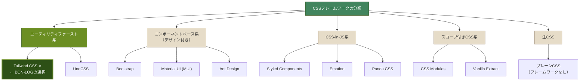

### 比較表

| 特性 | Tailwind CSS | Bootstrap | Material UI | CSS Modules | Styled Components | 生CSS |
|------|:---:|:---:|:---:|:---:|:---:|:---:|
| **学習コスト** | 中 | 低 | 中 | 低 | 中 | 低 |
| **カスタマイズ性** | 高 | 中 | 低〜中 | 高 | 高 | 高 |
| **バンドルサイズ** | 小 | 中 | 大 | 小 | 中 | 小 |
| **開発速度** | 高 | 高 | 高 | 中 | 中 | 低 |
| **デザインの自由度** | 高 | 低〜中 | 低 | 高 | 高 | 高 |
| **型安全性** | 中 | 低 | 高 | 中 | 中 | 低 |
| **SSR対応** | 完全 | 完全 | 要設定 | 完全 | 要設定 | 完全 |
| **React Server Components対応** | 完全 | 完全 | 制限あり | 完全 | 非対応 | 完全 |

### 各選択肢の特徴

**Bootstrap**
```
メリット: 豊富な既製デザイン、ドキュメントが充実、学習コストが低い
デメリット: 「Bootstrap臭い」既視感のあるデザインになりがち、
           カスタマイズが難しい、未使用CSSが多く含まれる
向いている場面: 管理画面、プロトタイプ、デザインにこだわらない場合
```

**Material UI (MUI)**
```
メリット: Googleのデザインガイドラインに準拠、豊富なコンポーネント、
         テーマシステムが強力
デメリット: バンドルサイズが大きい、Material Designの見た目に引きずられる、
           Next.js App Router/Server Componentsとの相性に課題がある
向いている場面: Googleライクなデザインが求められるBtoB製品
```

**CSS Modules**
```
メリット: 標準的なCSSの知識だけで使える、クラス名の衝突を防げる、
         バンドルサイズが小さい
デメリット: ファイル数が増える（各コンポーネントにCSSファイル）、
           デザインの統一性を自分で管理する必要がある
向いている場面: CSS知識がある中〜大規模チーム
```

**Styled Components / Emotion**
```
メリット: JavaScriptの中でCSSが完結、動的なスタイルが書きやすい、
         コンポーネントのスコープが自然に効く
デメリット: ランタイムでCSSを生成するためパフォーマンスに影響、
           React Server Componentsでは使えない（大きな制約）
向いている場面: Client Componentsが中心の小〜中規模アプリ
```

**生CSS（フレームワークなし）**
```
メリット: 追加ライブラリが不要、CSSの仕様をそのまま活用できる、
         バンドルサイズへの影響が最小
デメリット: 開発速度が遅い、一貫性の維持が難しい、
           大規模プロジェクトでの管理が大変
向いている場面: 非常に小規模なサイト、CSSの学習目的
```

### BON-LOGがTailwind CSSを選んだ理由

```mermaid
flowchart TD
    A["BON-LOGの技術要件"]

    A --> B["要件1: 和風の独自デザイン"]
    B --> B1["❌ Bootstrap/MUIの<br/>既製デザインでは困難"]
    B --> B2["✅ Tailwindはゼロから<br/>デザインを組み上げ可能"]

    A --> C["要件2: Next.js App Router<br/>Server Components 対応"]
    C --> C1["❌ Styled Components/<br/>Emotionは非対応"]
    C --> C2["✅ Tailwindはクラス名<br/>ベースで完全対応"]

    A --> D["要件3: 高いパフォーマンス"]
    D --> D1["❌ MUIは<br/>バンドルサイズ大"]
    D --> D2["✅ Tailwindは未使用CSS<br/>自動除去で最小化"]

    A --> E["要件4: 迅速な開発"]
    E --> E1["❌ 生CSS/CSS Modulesは<br/>開発速度が遅い"]
    E --> E2["✅ Tailwindはクラスを<br/>書くだけで即適用"]

    A --> F["要件5: 拡張性と<br/>カスタマイズ性"]
    F --> F1["❌ Bootstrapは<br/>独自テーマ作成困難"]
    F --> F2["✅ Tailwindは@themeで<br/>デザイントークン自在"]

    style A fill:#42855e,stroke:#2d5016,stroke-width:2px,color:#fff
    style B2 fill:#6b8e23,stroke:#2d5016,color:#fff
    style C2 fill:#6b8e23,stroke:#2d5016,color:#fff
    style D2 fill:#6b8e23,stroke:#2d5016,color:#fff
    style E2 fill:#6b8e23,stroke:#2d5016,color:#fff
    style F2 fill:#6b8e23,stroke:#2d5016,color:#fff
    style B1 fill:#f88,stroke:#c44,color:#fff
    style C1 fill:#f88,stroke:#c44,color:#fff
    style D1 fill:#f88,stroke:#c44,color:#fff
    style E1 fill:#f88,stroke:#c44,color:#fff
    style F1 fill:#f88,stroke:#c44,color:#fff
```

---

## 補足F: UIコンポーネントライブラリの選択肢と比較

### 主要なUIコンポーネントライブラリ

| ライブラリ | アプローチ | スタイル | アクセシビリティ |
|------------|------------|----------|-----------------|
| **shadcn/ui** | コピー&ペースト | Tailwind CSS | Radix UIベースで高い |
| **Radix UI** | ヘッドレス（スタイルなし） | 自分で付ける | 非常に高い |
| **Headless UI** | ヘッドレス（スタイルなし） | 自分で付ける | 高い |
| **Material UI (MUI)** | フルパッケージ | MUI独自 + Emotion | 高い |
| **Ant Design** | フルパッケージ | Less/CSS-in-JS | 中程度 |
| **daisyUI** | Tailwindプラグイン | Tailwind CSS | 中程度 |
| **Chakra UI** | フルパッケージ | Emotion / Panda CSS | 高い |

### 比較のポイント

```mermaid
flowchart LR
    subgraph full["フルパッケージ型"]
        direction TB
        A1["MUI, Ant Design, Chakra UI"]
        A2["• npm installして使う<br/>（node_modulesに入る）"]
        A3["• 見た目が最初から整っている"]
        A4["• カスタマイズの自由度は制限"]
        A5["• バージョンアップに追従必要"]
        A6["• 'そのライブラリっぽい'見た目"]
    end

    full -.->|"vs"| copy

    subgraph copy["コピー&ペースト型 / ヘッドレス型"]
        direction TB
        B1["shadcn/ui ⭐<br/>Radix UI, Headless UI"]
        B2["• コードを自分のプロジェクトにコピー"]
        B3["• 見た目は自由にカスタマイズ"]
        B4["• 完全にプロジェクトの一部として管理"]
        B5["• バージョンアップの強制なし"]
        B6["• 独自のデザインを作りやすい"]
    end

    style full fill:#fee,stroke:#f88
    style copy fill:#efe,stroke:#8f8
    style B1 fill:#6b8e23,stroke:#2d5016,color:#fff
```

### BON-LOGがshadcn/uiを選んだ理由

1. **コピー&ペースト方式**: コンポーネントのソースコードが完全に手元にあるため、和風テーマへの大幅なカスタマイズが可能。MUIやAnt Designではライブラリの制約内でのカスタマイズに限られる

2. **Radix UIベースのアクセシビリティ**: shadcn/uiの内部ではRadix UIが使われており、キーボード操作、スクリーンリーダー対応、フォーカス管理などが標準で組み込まれている。自前で実装すると膨大な工数がかかる部分

3. **Tailwind CSSとの完全な統合**: shadcn/uiのスタイルはすべてTailwind CSSのクラスで定義されているため、BON-LOGのカスタムテーマ（和風カラーパレット）とシームレスに統合できる

4. **Next.js App Routerとの互換性**: Server Componentsでもclient Componentsでも問題なく動作する。CSS-in-JS系ライブラリ（Emotion等）を使うMUIやChakra UIでは、Server Componentsでの利用に制限がある

5. **軽量**: 必要なコンポーネントだけをプロジェクトに追加するため、使わないコンポーネントがバンドルに含まれない

---

## 補足G: CSS-in-JSツール（CVA）の選択肢と比較

### CVAの位置づけ

CVA（class-variance-authority）は厳密にはCSS-in-JSライブラリではありませんが、「バリアント管理」という同じ問題領域を扱うツールとして、関連するライブラリと比較します。

| ツール | アプローチ | ランタイム | Tailwind連携 | 型安全 |
|--------|------------|-----------|:------------:|:------:|
| **CVA** | クラス名のバリアント管理 | ゼロランタイム | 最適 | 高い |
| **Stitches** | CSS-in-JSでバリアント管理 | ランタイムあり | 不可 | 高い |
| **Vanilla Extract** | ビルド時CSS生成 | ゼロランタイム | 限定的 | 非常に高い |
| **Panda CSS** | ビルド時CSS生成 + ユーティリティ | ゼロランタイム | 不可（代替） | 非常に高い |

### BON-LOGがCVAを選んだ理由

```
CVAが解決する問題:
  コンポーネントの「variant(見た目の種類)」と
  「size(サイズ)」の組み合わせを型安全に管理すること

他のツールとの違い:
  ・Stitches: 独自のCSS-in-JSシステムを必要とする。
    Tailwind CSSと併用できない
  ・Vanilla Extract: 強力だが学習コストが高い。
    Tailwind CSSとの統合が自然ではない
  ・Panda CSS: Tailwind CSSの代替として設計されている。
    Tailwind CSSと併用する設計ではない

CVAが最適な理由:
  ・Tailwind CSSのクラス名をそのまま使える
  ・shadcn/uiが内部で採用しており、統一的な設計になる
  ・ゼロランタイムで追加のパフォーマンスコストがない
  ・TypeScriptのVariantProps型でバリアントの型を自動生成
```

---

## 補足H: アイコンライブラリの選択肢と比較

### 主要なアイコンライブラリ

| ライブラリ | アイコン数 | サイズ | スタイル | Tree-shaking |
|------------|-----------|--------|----------|:------------:|
| **Lucide React** | 1,500+ | 小 | 線画（アウトライン） | 対応 |
| **React Icons** | 40,000+ | 大 | 複数スタイル混在 | 部分対応 |
| **Heroicons** | 300+ | 小 | アウトライン/塗り | 対応 |
| **Font Awesome** | 2,000+(無料) | 中〜大 | 複数スタイル | 部分対応 |
| **Phosphor Icons** | 7,000+ | 中 | 6種類のスタイル | 対応 |

※ Tree-shaking: 使わないアイコンをビルド時に自動除去する仕組み

### BON-LOGがLucide Reactを選んだ理由

```
1. shadcn/uiの標準アイコン
   → shadcn/uiが公式にLucide Reactを推奨しており、
     コンポーネント例やドキュメントでも使われている
     同じアイコンを使うことで統一感が保たれる

2. 一貫したデザイン言語
   → 全アイコンが同じ線幅(stroke-width)、角丸、サイズ感で
     設計されており、統一感のあるUIが作りやすい
   → React Iconsは複数のアイコンセットの寄せ集めのため、
     スタイルにばらつきが出やすい

3. 軽量なバンドルサイズ
   → Tree-shakingに完全対応しており、使ったアイコンだけが
     バンドルに含まれる
   → React Iconsはパッケージ全体で数MBになることがある

4. 和風デザインとの相性
   → 繊細な線画スタイルがBON-LOGの和風テイストと調和する
   → 太い線や塗りつぶしスタイルのアイコンは和のテイストに合いにくい

5. カスタマイズ性
   → size、color、strokeWidthなどのpropsで細かく調整可能
   → className経由でTailwind CSSのクラスも適用できる
```

**使用例:**

```typescript
import { Heart, MessageCircle, Bookmark, Share2 } from 'lucide-react'

// 投稿カードのアクションボタン
<div className="flex gap-4">
  <button className="flex items-center gap-1 text-gray-500 hover:text-red-500">
    <Heart className="h-5 w-5" />   {/* → 20x20pxのハートアイコン（線画） */}
    <span>12</span>
  </button>
  <button className="flex items-center gap-1 text-gray-500 hover:text-blue-500">
    <MessageCircle className="h-5 w-5" /> {/* → 20x20pxの吹き出しアイコン（線画） */}
    <span>3</span>
  </button>
</div>
```

> **画面表示**
> いいねボタンとコメントボタンが16px間隔で横並び。通常はグレー（`text-gray-500`）の線画アイコン + 数字。ハートアイコンにホバーすると赤色（`hover:text-red-500`）に、吹き出しアイコンにホバーすると青色（`hover:text-blue-500`）に変化する。

---

## 6.6 shadcn/uiとは

### このセクションで学ぶこと

- shadcn/uiの基本的な考え方（コピー&ペーストアプローチ）
- 従来のUIライブラリ（Material-UI等）との違い
- shadcn/uiが採用するRadix UI + Tailwind CSSのアーキテクチャ

shadcn/uiは、Radix UIとTailwind CSSを組み合わせた**コンポーネントコレクション**です。

### 特徴

1. **コピー&ペースト**: npm installではなく、コンポーネントをプロジェクトにコピー
2. **完全なカスタマイズ性**: コードが自分のプロジェクトに入るので自由に編集可能
3. **アクセシビリティ**: Radix UIベースで高いアクセシビリティ
4. **Tailwind CSS**: スタイリングはすべてTailwind

### ライブラリとの違い

| 項目 | 通常のライブラリ（Material-UI等） | shadcn/ui |
|---|---|---|
| インストール方法 | npm installで追加 | CLIでコンポーネントをコピー |
| 保存場所 | node_modulesに保存 | componentsディレクトリに保存 |
| カスタマイズ性 | カスタマイズが難しい | 完全にカスタマイズ可能 |
| バージョン管理 | バージョン管理が必要 | 自分で管理（バージョンアップは手動） |

### shadcn/uiのアーキテクチャ図

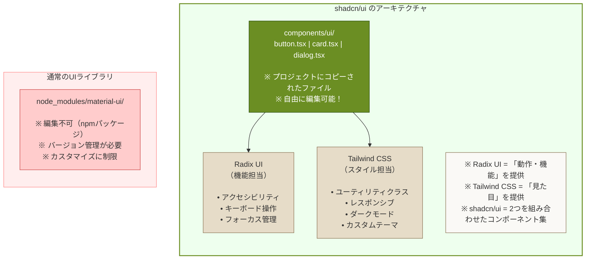

### 理解度チェック

<details>
<summary>Q1: shadcn/uiのコンポーネントはどこに保存されますか？</summary>

**A1:** `components/ui/`ディレクトリに保存されます。通常のnpmパッケージのように`node_modules`に入るのではなく、プロジェクト内のファイルとしてコピーされます。そのため、ボタンの色を変えたい、カードのレイアウトを調整したいなど、自由にカスタマイズすることができます。
</details>

<details>
<summary>Q2: shadcn/uiが「Radix UI」を使っている理由は何ですか？</summary>

**A2:** Radix UIは、アクセシビリティ（キーボード操作、スクリーンリーダー対応等）やフォーカス管理などの複雑な「動作・機能」部分を提供するヘッドレスUIライブラリです。スタイルを持たないため、Tailwind CSSで自由に見た目をカスタマイズできます。shadcn/uiはRadix UIの機能とTailwind CSSのスタイルを組み合わせることで、「高品質な動作」と「自由なデザイン」の両方を実現しています。
</details>

---

## 6.7 shadcn/uiのインストールと使い方

### このセクションで学ぶこと

- shadcn/uiの初期セットアップ手順
- コンポーネントの追加方法（CLIの使い方）
- 追加されたコンポーネントの使い方

### 初期セットアップ

```bash
# shadcn/uiの初期化
npx shadcn@latest init

# 質問に答える
# ✔ Would you like to use TypeScript? … yes
# ✔ Which style would you like to use? › Default
# ✔ Which color would you like to use as base color? › Slate
# ✔ Where is your global CSS file? … app/globals.css
# ✔ Would you like to use CSS variables for colors? … yes
# ✔ Where is your tailwind.config.js located? … tailwind.config.ts
# ✔ Configure the import alias for components? … @/components
# ✔ Configure the import alias for utils? … @/lib/utils
```

### コンポーネントの追加

```bash
# Buttonコンポーネントを追加
npx shadcn@latest add button

# 複数まとめて追加
npx shadcn@latest add button input card dialog
```

追加されたコンポーネントは`components/ui/`に保存されます。

```
components/
└── ui/
    ├── button.tsx
    ├── input.tsx
    ├── card.tsx
    └── dialog.tsx
```

### コンポーネントの使用

```typescript
// app/page.tsx
import { Button } from '@/components/ui/button'

export default function Home() {
  return (
    <div>
      <Button>クリック</Button>
      <Button variant="destructive">削除</Button>
      <Button variant="outline">アウトライン</Button>
      <Button variant="ghost">ゴースト</Button>
    </div>
  )
}
```

### よくあるトラブルと解決法

| トラブル | 原因 | 解決法 |
|---------|------|--------|
| `npx shadcn@latest add`でエラー | `components.json`が存在しない | 先に`npx shadcn@latest init`を実行する |
| コンポーネントが見つからないエラー | importパスが間違っている | `@/components/ui/button`のようにエイリアスパスを使用 |
| スタイルが適用されない | globals.cssにTailwindのディレクティブがない | `@tailwind base; @tailwind components; @tailwind utilities;`を確認 |

### 理解度チェック

<details>
<summary>Q1: `npx shadcn@latest add button` を実行すると何が起きますか？</summary>

**A1:** `components/ui/button.tsx`というファイルが作成されます。このファイルにはButtonコンポーネントのソースコードが含まれており、`variant`（default、destructive、outline等）や`size`（sm、default、lg）のpropsに対応したスタイルが定義されています。また必要な依存パッケージ（Radix UIのslot等）も自動的にインストールされます。
</details>

<details>
<summary>Q2: shadcn/uiで追加したコンポーネントを更新したい場合はどうしますか？</summary>

**A2:** shadcn/uiのコンポーネントは自分のプロジェクトにコピーされたファイルなので、直接編集できます。公式の最新版に合わせたい場合は、再度`npx shadcn@latest add button`を実行すると上書きするか確認されます。ただし、自分で加えたカスタマイズは失われるため、差分を確認してから更新することをお勧めします。
</details>

---

## 6.8 主要コンポーネント

### このセクションで学ぶこと

- Button、Input、Card、Dialog等の基本的なコンポーネントの使い方
- 各コンポーネントのvariant（バリエーション）やsize（サイズ）の指定方法
- 実際のUIでどのように組み合わせるかのパターン

### Button

```typescript
import { Button } from '@/components/ui/button'

export function ButtonDemo() {
  return (
    <div className="space-y-4">
      {/* バリアント */}
      <Button variant="default">デフォルト</Button>
      <Button variant="destructive">削除</Button>
      <Button variant="outline">アウトライン</Button>
      <Button variant="secondary">セカンダリ</Button>
      <Button variant="ghost">ゴースト</Button>
      <Button variant="link">リンク</Button>

      {/* サイズ */}
      <Button size="sm">小</Button>
      <Button size="default">標準</Button>
      <Button size="lg">大</Button>

      {/* 無効化 */}
      <Button disabled>無効</Button>

      {/* アイコン付き */}
      <Button>
        <svg className="mr-2 h-4 w-4" /* ... */>
        メール送信
      </Button>

      {/* ローディング */}
      <Button disabled>
        <svg className="mr-2 h-4 w-4 animate-spin" /* ... */>
        送信中...
      </Button>
    </div>
  )
}
```

> **画面表示**
> 各バリアントのボタンは以下のように表示されます:
> - **default**: 松葉色（プライマリカラー）の塗りつぶし背景に白文字。最も目立つメインアクション用
> - **destructive**: 朱色（赤系）の塗りつぶし背景に白文字。「削除」「通報」など危険な操作用
> - **outline**: 白背景に枠線のみ。背景色が透明で控えめ。補助的なアクション用
> - **secondary**: 亜麻色（淡いベージュ）の塗りつぶし背景。「キャンセル」など副次的な操作用
> - **ghost**: 背景なし・枠線なし。テキストだけが表示される。ホバーすると薄い背景色が出現。ナビゲーションやアイコンボタン向き
> - **link**: テキストのみ表示（下線なし）。ホバーすると下線が出現。テキストリンクの代替
>
> サイズは3段階:
> - **sm**: 高さ32px、小さめのパディング。カード内のアクションボタン向き
> - **default**: 高さ36px、標準パディング。一般的なフォーム送信ボタン向き
> - **lg**: 高さ40px、大きめのパディング。ログインやCTAなど目立たせたいボタン向き
>
> **disabled**状態では半透明（`opacity-50`）になり、クリック不可に。ローディング中はスピナーアイコンが回転する。

### Input

```typescript
import { Input } from '@/components/ui/input'
import { Label } from '@/components/ui/label'

export function InputDemo() {
  return (
    <div className="space-y-4">
      {/* 基本 */}
      <Input type="text" placeholder="メールアドレス" />

      {/* ラベル付き */}
      <div>
        <Label htmlFor="email">メールアドレス</Label>
        <Input id="email" type="email" />
      </div>

      {/* 無効化 */}
      <Input disabled placeholder="無効" />

      {/* ファイル */}
      <Input type="file" />
    </div>
  )
}
```

> **画面表示**
> 4つの入力欄が16px間隔で縦に並びます:
> - **基本**: 枠線付きの入力欄。プレースホルダー「メールアドレス」がグレーで表示。フォーカスすると枠線が松葉色に変化しリング（輪郭線）が表示される
> - **ラベル付き**: 「メールアドレス」のラベルが入力欄の上に小さめの太字で表示される
> - **無効化**: グレーアウトして操作不可。テキストと背景が薄くなる
> - **ファイル**: 「ファイルを選択」ボタンが入力欄内に表示される

### Card

```typescript
import {
  Card,
  CardContent,
  CardDescription,
  CardFooter,
  CardHeader,
  CardTitle,
} from '@/components/ui/card'
import { Button } from '@/components/ui/button'

export function CardDemo() {
  return (
    <Card className="w-full max-w-md">
      <CardHeader>
        <CardTitle>五葉松の育成記録</CardTitle>
        <CardDescription>2026年2月8日</CardDescription>
      </CardHeader>
      <CardContent>
        <p>今年の春、新芽が美しく伸びました。針金かけも順調です。</p>
      </CardContent>
      <CardFooter className="flex justify-between">
        <Button variant="outline">編集</Button>
        <Button>詳細を見る</Button>
      </CardFooter>
    </Card>
  )
}
```

> **画面表示**
> このCardコンポーネントは以下のように表示されます:
> - 最大幅448px（`max-w-md`）の白いカードで、枠線・角丸・薄い影がある
> - **CardHeader**: 上部にタイトル「五葉松の育成記録」（太字・大きめ）と日付「2026年2月8日」（小さめ・グレー）
> - **CardContent**: 中央に本文テキストが表示される
> - **CardFooter**: 下部に2つのボタンが左右に分かれて配置（`flex justify-between`）
>   - 左側: 「編集」ボタン（枠線のみのoutlineスタイル）
>   - 右側: 「詳細を見る」ボタン（松葉色の塗りつぶし）
> - カード全体は和紙色（`bg-card`）の背景で、BON-LOGの落ち着いた色調に馴染む

### Dialog（モーダル）

```typescript
import {
  Dialog,
  DialogContent,
  DialogDescription,
  DialogFooter,
  DialogHeader,
  DialogTitle,
  DialogTrigger,
} from '@/components/ui/dialog'
import { Button } from '@/components/ui/button'

export function DialogDemo() {
  return (
    <Dialog>
      <DialogTrigger asChild>
        <Button>投稿する</Button>
      </DialogTrigger>
      <DialogContent>
        <DialogHeader>
          <DialogTitle>新しい投稿</DialogTitle>
          <DialogDescription>
            今日の盆栽について語りましょう（500文字まで）
          </DialogDescription>
        </DialogHeader>
        <textarea className="w-full border rounded p-2" rows={5} />
        <DialogFooter>
          <Button variant="outline">キャンセル</Button>
          <Button>投稿する</Button>
        </DialogFooter>
      </DialogContent>
    </Dialog>
  )
}
```

> **画面表示**
> Dialogは以下のように動作・表示されます:
> - 「投稿する」ボタンをクリックすると、画面中央にモーダルが表示される
> - 背後は半透明の黒いオーバーレイで覆われ、モーダルに注目が集まる
> - モーダル内部:
>   - **ヘッダー**: 「新しい投稿」というタイトルと説明文
>   - **本文**: テキストエリア（5行分の高さ）が配置され、すぐに入力可能
>   - **フッター**: 「キャンセル」（outline）と「投稿する」（primary）の2つのボタン
> - モーダルの外側をクリックするか、Escキーを押すと閉じる
> - フォーカスがモーダル内に閉じ込められ（フォーカストラップ）、Tabキーでモーダル外の要素にフォーカスが移らない（Radix UIのアクセシビリティ機能）

### DropdownMenu

```typescript
import {
  DropdownMenu,
  DropdownMenuContent,
  DropdownMenuItem,
  DropdownMenuLabel,
  DropdownMenuSeparator,
  DropdownMenuTrigger,
} from '@/components/ui/dropdown-menu'
import { Button } from '@/components/ui/button'

export function DropdownMenuDemo() {
  return (
    <DropdownMenu>
      <DropdownMenuTrigger asChild>
        <Button variant="outline">メニュー</Button>
      </DropdownMenuTrigger>
      <DropdownMenuContent>
        <DropdownMenuLabel>マイアカウント</DropdownMenuLabel>
        <DropdownMenuSeparator />
        <DropdownMenuItem>プロフィール</DropdownMenuItem>
        <DropdownMenuItem>設定</DropdownMenuItem>
        <DropdownMenuSeparator />
        <DropdownMenuItem className="text-red-600">
          ログアウト
        </DropdownMenuItem>
      </DropdownMenuContent>
    </DropdownMenu>
  )
}
```

> **画面表示**
> DropdownMenuは以下のように動作・表示されます:
> - 「メニュー」ボタンをクリックすると、ボタンの下にドロップダウンリストが表示される
> - リスト上部に「マイアカウント」のラベル（グレー・小さめ）、その下に区切り線
> - 「プロフィール」「設定」の項目がリスト状に並び、ホバーすると背景が薄く変化
> - 再度区切り線の後に「ログアウト」が赤文字（`text-red-600`）で表示され、危険な操作であることが視覚的に伝わる
> - メニューの外側をクリックするか、Escキーで閉じる。上下矢印キーでの移動にも対応

### Avatar

```typescript
import { Avatar, AvatarFallback, AvatarImage } from '@/components/ui/avatar'

export function AvatarDemo() {
  return (
    <div className="flex gap-4">
      {/* 画像あり */}
      <Avatar>
        <AvatarImage src="/avatars/user1.jpg" alt="@user1" />
        <AvatarFallback>U1</AvatarFallback>
      </Avatar>

      {/* フォールバックのみ */}
      <Avatar>
        <AvatarFallback>佐藤</AvatarFallback>
      </Avatar>

      {/* サイズ指定 */}
      <Avatar className="h-16 w-16">
        <AvatarImage src="/avatars/user2.jpg" />
        <AvatarFallback>U2</AvatarFallback>
      </Avatar>
    </div>
  )
}
```

> **画面表示**
> 3つのアバターが横に16px間隔（`gap-4`）で並びます:
> - **1つ目**: 丸い画像（デフォルト40x40px）。画像読み込み失敗時は「U1」の2文字がグレー背景の円に表示
> - **2つ目**: 画像がないため「佐藤」という文字がフォールバックとして表示される
> - **3つ目**: `h-16 w-16`で大きめ（64x64px）の丸い画像。プロフィールページのアバター等に使用

### Select

```typescript
import {
  Select,
  SelectContent,
  SelectItem,
  SelectTrigger,
  SelectValue,
} from '@/components/ui/select'

export function SelectDemo() {
  return (
    <Select>
      <SelectTrigger className="w-64">
        <SelectValue placeholder="ジャンルを選択" />
      </SelectTrigger>
      <SelectContent>
        <SelectItem value="pine">松柏類</SelectItem>
        <SelectItem value="deciduous">雑木類</SelectItem>
        <SelectItem value="flowering">花物</SelectItem>
        <SelectItem value="fruit">実物</SelectItem>
        <SelectItem value="tools">用品・道具</SelectItem>
      </SelectContent>
    </Select>
  )
}
```

> **画面表示**
> 幅256px（`w-64`）のセレクトボックスが表示される。初期状態では「ジャンルを選択」のプレースホルダーがグレーで表示。クリックするとドロップダウンリストが開き、5つのジャンルが縦に並ぶ。各項目にマウスを重ねると背景色が変化し、クリックで選択される。選択後はトリガー部分に選択したジャンル名が表示される。

### Textarea

```typescript
import { Textarea } from '@/components/ui/textarea'

export function TextareaDemo() {
  return (
    <div className="space-y-2">
      <label htmlFor="content" className="text-sm font-medium">
        投稿内容
      </label>
      <Textarea
        id="content"
        placeholder="今日の盆栽について語りましょう"
        rows={5}
        maxLength={500}
      />
      <p className="text-sm text-gray-500">500文字まで</p>
    </div>
  )
}
```

### Badge

```typescript
import { Badge } from '@/components/ui/badge'

export function BadgeDemo() {
  return (
    <div className="flex gap-2">
      <Badge>デフォルト</Badge>                       {/* → 松葉色の塗りつぶし丸型タグ */}
      <Badge variant="secondary">セカンダリ</Badge>    {/* → 亜麻色の控えめな丸型タグ */}
      <Badge variant="destructive">削除</Badge>        {/* → 朱色の警告用丸型タグ */}
      <Badge variant="outline">アウトライン</Badge>     {/* → 枠線のみの軽い丸型タグ */}
    </div>
  )
}
```

> **画面表示**
> 4つの小さな丸型タグ（`rounded-full`）が横に8px間隔で並ぶ。各バリアントは背景色と文字色の組み合わせが異なり、ジャンルタグ、ステータス表示、カテゴリラベルなどに使い分ける。BON-LOGでは投稿のジャンル表示（「松柏類」「雑木類」等）にsecondaryバリアントを使用。

### 理解度チェック

<details>
<summary>Q1: Buttonコンポーネントの `variant="ghost"` はどのような見た目ですか？</summary>

**A1:** `ghost`バリアントは背景色が透明で、ホバー時にのみ薄い背景色が表示されるボタンです。テキストのみが表示されるため、ナビゲーションリンクやアクション一覧の中で目立たせたくないボタンに使います。BON-LOGでは投稿カードのいいねボタンやコメントボタンに使用しています。
</details>

<details>
<summary>Q2: DialogコンポーネントのDialogTriggerに `asChild` を付ける理由は何ですか？</summary>

**A2:** `asChild`を付けると、DialogTrigger自体がHTMLの要素をレンダリングせず、子要素（この例ではButton）にトリガー機能を委譲します。これにより、ボタンの中にボタンがネストされる（HTML的に不正な）構造を避けることができます。Radix UIの多くのコンポーネントでこのパターンが使われています。
</details>

---

## 6.9 BON-LOGでの実例

### このセクションで学ぶこと

- PostCard（投稿カード）コンポーネントの実際のスタイリング
- 認証ページ（ログイン画面）のレイアウト実装
- 投稿フォームのインタラクティブなUI実装

### PostCardのスタイリング

```typescript
// components/post/PostCard.tsx
import { Card, CardContent, CardFooter, CardHeader } from '@/components/ui/card'
import { Avatar, AvatarFallback, AvatarImage } from '@/components/ui/avatar'
import { Badge } from '@/components/ui/badge'
import { Button } from '@/components/ui/button'
import Link from 'next/link'
import Image from 'next/image'

interface PostCardProps {
  post: {
    id: string
    content: string
    createdAt: Date
    user: {
      id: string
      nickname: string
      avatarUrl: string | null
    }
    media: Array<{
      url: string
      type: string
    }>
    genres: Array<{
      genre: {
        id: string
        name: string
      }
    }>
    _count: {
      likes: number
      comments: number
    }
  }
}

export function PostCard({ post }: PostCardProps) {
  return (
    <Card className="mb-4 hover:shadow-md transition-shadow">
      <CardHeader>
        <div className="flex items-center gap-3">
          <Link href={`/users/${post.user.id}`}>
            <Avatar>
              <AvatarImage src={post.user.avatarUrl || undefined} />
              <AvatarFallback>{post.user.nickname[0]}</AvatarFallback>
            </Avatar>
          </Link>
          <div className="flex-1">
            <Link
              href={`/users/${post.user.id}`}
              className="font-semibold hover:underline"
            >
              {post.user.nickname}
            </Link>
            <p className="text-sm text-gray-500">
              {new Date(post.createdAt).toLocaleDateString('ja-JP')}
            </p>
          </div>
        </div>
      </CardHeader>

      <CardContent>
        {/* 投稿内容 */}
        <p className="text-gray-900 whitespace-pre-wrap mb-4">
          {post.content}
        </p>

        {/* メディア */}
        {post.media.length > 0 && (
          <div className="grid grid-cols-2 gap-2 mb-4">
            {post.media.map((media, index) => (
              <div key={index} className="relative aspect-square">
                <Image
                  src={media.url}
                  alt=""
                  fill
                  className="object-cover rounded-lg"
                />
              </div>
            ))}
          </div>
        )}

        {/* ジャンル */}
        <div className="flex flex-wrap gap-2">
          {post.genres.map(({ genre }) => (
            <Badge key={genre.id} variant="secondary">
              {genre.name}
            </Badge>
          ))}
        </div>
      </CardContent>

      <CardFooter className="flex justify-between">
        <div className="flex gap-4">
          <Button variant="ghost" size="sm">
            💬 {post._count.comments}
          </Button>
          <Button variant="ghost" size="sm">
            ❤️ {post._count.likes}
          </Button>
        </div>
        <Link href={`/posts/${post.id}`}>
          <Button variant="ghost" size="sm">
            詳細
          </Button>
        </Link>
      </CardFooter>
    </Card>
  )
}
```

> **画面表示**
> PostCardコンポーネントはSNSの投稿カードとして以下のように表示されます:
>
> **ヘッダー部分（CardHeader）:**
> - 左側に丸いアバター画像（40x40px）。画像がない場合はニックネームの頭文字がグレー背景に表示される
> - アバターの右側にユーザーのニックネーム（太字）と投稿日時（小さめのグレー文字）が縦に並ぶ
> - ニックネームをクリック/ホバーすると下線が表示され、ユーザーページへリンク
>
> **コンテンツ部分（CardContent）:**
> - 投稿テキストが墨色（`text-gray-900`）で表示。改行は保持される（`whitespace-pre-wrap`）
> - 画像がある場合は2列のグリッドで正方形にトリミングされたサムネイルが並ぶ（`grid-cols-2`）
> - ジャンルタグ（「松柏類」「雑木類」等）がセカンダリBadgeとして横並びに表示
>
> **フッター部分（CardFooter）:**
> - 左側にコメント数（吹き出しアイコン）といいね数（ハートアイコン）がghostボタンで横並び
> - 右側に「詳細」リンクボタン
> - カード全体にマウスを重ねると影が強まる（`hover:shadow-md`）アニメーション付き

### 認証ページのレイアウト

```typescript
// app/(auth)/login/page.tsx
import { Card, CardContent, CardDescription, CardFooter, CardHeader, CardTitle } from '@/components/ui/card'
import { Input } from '@/components/ui/input'
import { Label } from '@/components/ui/label'
import { Button } from '@/components/ui/button'
import Link from 'next/link'

export default function LoginPage() {
  return (
    <div className="min-h-screen flex items-center justify-center bg-bonsai-cream p-4">
      <Card className="w-full max-w-md bg-washi">
        <CardHeader className="text-center">
          <div className="mb-4">
            <h1 className="text-3xl font-bold text-sumi">BON-LOG</h1>
            <p className="text-sm text-sumi-light mt-1">
              盆栽愛好家のためのSNS
            </p>
          </div>
          <CardTitle className="text-2xl">ログイン</CardTitle>
          <CardDescription>
            アカウント情報を入力してログインしてください
          </CardDescription>
        </CardHeader>

        <CardContent>
          <form className="space-y-4">
            <div>
              <Label htmlFor="email">メールアドレス</Label>
              <Input
                id="email"
                type="email"
                placeholder="your@email.com"
                required
              />
            </div>

            <div>
              <Label htmlFor="password">パスワード</Label>
              <Input
                id="password"
                type="password"
                placeholder="••••••••"
                required
              />
            </div>

            <Button
              type="submit"
              className="w-full bg-bonsai-moss hover:bg-bonsai-pine"
            >
              ログイン
            </Button>
          </form>
        </CardContent>

        <CardFooter className="flex flex-col gap-2">
          <Link
            href="/forgot-password"
            className="text-sm text-bonsai-moss hover:underline"
          >
            パスワードを忘れた場合
          </Link>
          <div className="text-sm text-gray-600">
            アカウントをお持ちでない方は{' '}
            <Link
              href="/register"
              className="text-bonsai-moss font-semibold hover:underline"
            >
              新規登録
            </Link>
          </div>
        </CardFooter>
      </Card>
    </div>
  )
}
```

> **画面表示**
> ログインページは以下のように表示されます:
> - 画面全体が生成り色（`bg-bonsai-cream`）の背景で覆われ、和の温かみを感じる
> - 画面の中央に和紙色（`bg-washi`）のカードが配置される（`flex items-center justify-center`で上下左右中央）
> - カード上部:
>   - 「BON-LOG」のロゴテキスト（`text-3xl font-bold text-sumi` = 30px、太字、墨色）
>   - 「盆栽愛好家のためのSNS」のサブタイトル（小さめ、薄墨色）
>   - 「ログイン」の見出しと説明文
> - カード中部:
>   - メールアドレスとパスワードの入力欄（ラベル付き）が縦に並ぶ（`space-y-4`で16px間隔）
>   - 「ログイン」ボタンが全幅（`w-full`）で表示。苔色（`bg-bonsai-moss`）でホバー時に松葉色に変化
> - カード下部:
>   - 「パスワードを忘れた場合」のリンク（松葉色テキスト）
>   - 「新規登録」のリンク（松葉色、太字）
> - モバイルでも`p-4`により画面端からの余白が確保される

### 投稿フォーム

```typescript
// components/post/PostForm.tsx
'use client'

import { useState } from 'react'
import { Card, CardContent } from '@/components/ui/card'
import { Textarea } from '@/components/ui/textarea'
import { Button } from '@/components/ui/button'
import { Badge } from '@/components/ui/badge'
import { createPost } from '@/lib/actions/post'

const GENRES = [
  { id: 'pine', name: '松柏類' },
  { id: 'deciduous', name: '雑木類' },
  { id: 'flowering', name: '花物' },
  { id: 'fruit', name: '実物' },
  { id: 'tools', name: '用品・道具' },
]

export function PostForm() {
  const [content, setContent] = useState('')
  const [selectedGenres, setSelectedGenres] = useState<string[]>([])

  const toggleGenre = (genreId: string) => {
    if (selectedGenres.includes(genreId)) {
      setSelectedGenres(selectedGenres.filter(id => id !== genreId))
    } else if (selectedGenres.length < 3) {
      setSelectedGenres([...selectedGenres, genreId])
    }
  }

  return (
    <Card className="mb-4 bg-washi">
      <CardContent className="pt-6">
        <form action={createPost}>
          <Textarea
            name="content"
            placeholder="今日の盆栽について語りましょう（500文字まで）"
            value={content}
            onChange={(e) => setContent(e.target.value)}
            maxLength={500}
            rows={4}
            className="mb-4"
          />

          <div className="mb-4">
            <p className="text-sm font-medium mb-2">
              ジャンル（最大3つ）
            </p>
            <div className="flex flex-wrap gap-2">
              {GENRES.map(genre => (
                <Badge
                  key={genre.id}
                  variant={selectedGenres.includes(genre.id) ? 'default' : 'outline'}
                  className="cursor-pointer"
                  onClick={() => toggleGenre(genre.id)}
                >
                  {genre.name}
                </Badge>
              ))}
            </div>
          </div>

          <div className="flex justify-between items-center">
            <p className="text-sm text-gray-500">
              {content.length} / 500
            </p>
            <Button
              type="submit"
              disabled={!content.trim() || selectedGenres.length === 0}
              className="bg-bonsai-moss hover:bg-bonsai-pine"
            >
              投稿する
            </Button>
          </div>
        </form>
      </CardContent>
    </Card>
  )
}
```

> **画面表示**
> 投稿フォームは和紙色のカードとして以下のように表示されます:
> - **テキストエリア**: 4行分の高さで、プレースホルダー「今日の盆栽について語りましょう（500文字まで）」がグレーで表示
> - **ジャンル選択**: 「松柏類」「雑木類」「花物」「実物」「用品・道具」の5つのバッジが横並び
>   - 未選択: アウトライン（枠線のみ）で控えめに表示。カーソルは指マーク（`cursor-pointer`）
>   - 選択済み: 塗りつぶしのdefaultスタイルで目立つ表示に切り替わる
>   - 最大3つまで選択可能
> - **フッター**: 左に「0 / 500」の文字数カウンター（グレー、小さめ）、右に「投稿する」ボタン
> - テキスト未入力またはジャンル未選択時はボタンが半透明のdisabled状態

### 理解度チェック

<details>
<summary>Q1: PostCardの画像表示部分で `aspect-square` と `object-cover` を組み合わせている理由は何ですか？</summary>

**A1:** `aspect-square`は要素の縦横比を1:1（正方形）に固定します。`object-cover`はImageコンポーネントの画像が、コンテナ（正方形）全体を覆うように表示し、はみ出した部分を切り取ります。これにより、元の画像がどのようなサイズ・比率であっても、常に正方形のサムネイルとして統一的に表示されます。SNSの投稿画像表示でよく使われるパターンです。
</details>

<details>
<summary>Q2: ログインページで `min-h-screen flex items-center justify-center` を使う目的は何ですか？</summary>

**A2:** この組み合わせにより、ログインカードが画面の中央に表示されます。`min-h-screen`でコンテナの最小高さを画面全体の高さにし、`flex items-center`で垂直方向の中央揃え、`justify-center`で水平方向の中央揃えを実現しています。ログインや登録などの単一フォームを目立たせたいページでよく使われるレイアウトパターンです。
</details>

---

## 6.10 演習問題

### 演習1: ユーザープロフィールカードを作成

**要件**
- カバー画像（16:9の比率）
- プロフィール画像（カバー画像に重ねる）
- ニックネーム、自己紹介
- フォロー/フォロワー数
- 編集ボタン（自分のプロフィールの場合のみ）
- レスポンシブ対応

**ヒント**
```typescript
// components/user/ProfileCard.tsx
import { Card, CardContent } from '@/components/ui/card'
import { Avatar, AvatarImage, AvatarFallback } from '@/components/ui/avatar'
import { Button } from '@/components/ui/button'
import Image from 'next/image'

interface ProfileCardProps {
  user: {
    id: string
    nickname: string
    bio: string | null
    avatarUrl: string | null
    headerUrl: string | null
    _count: {
      followers: number
      following: number
    }
  }
  isOwner: boolean
}

export function ProfileCard({ user, isOwner }: ProfileCardProps) {
  return (
    <Card>
      {/* カバー画像 */}
      <div className="relative w-full aspect-[16/9] bg-gray-200">
        {user.headerUrl && (
          <Image
            src={user.headerUrl}
            alt=""
            fill
            className="object-cover"
          />
        )}
      </div>

      <CardContent className="relative pt-0">
        {/* プロフィール画像（カバー画像に重ねる） */}
        <Avatar className="absolute -top-16 left-4 h-32 w-32 border-4 border-white">
          {/* ... */}
        </Avatar>

        {/* 編集ボタン */}
        {isOwner && (
          <div className="flex justify-end pt-4">
            <Button variant="outline">プロフィールを編集</Button>
          </div>
        )}

        {/* ユーザー情報 */}
        {/* ... */}
      </CardContent>
    </Card>
  )
}
```

### 演習2: 検索バーを作成

**要件**
- 検索入力欄
- 検索ボタン
- クリアボタン（入力がある場合のみ表示）
- フォーカス時に枠線を強調
- モバイルで全幅、デスクトップで最大幅を制限

**ヒント**
```typescript
// components/search/SearchBar.tsx
'use client'

import { useState } from 'react'
import { Input } from '@/components/ui/input'
import { Button } from '@/components/ui/button'
import { useRouter } from 'next/navigation'

export function SearchBar() {
  const [query, setQuery] = useState('')
  const router = useRouter()

  const handleSubmit = (e: React.FormEvent) => {
    e.preventDefault()
    if (query.trim()) {
      router.push(`/search?q=${encodeURIComponent(query)}`)
    }
  }

  return (
    <form onSubmit={handleSubmit} className="w-full max-w-2xl">
      <div className="relative flex gap-2">
        <Input
          type="search"
          placeholder="投稿、ユーザーを検索"
          value={query}
          onChange={(e) => setQuery(e.target.value)}
          className="flex-1"
        />
        {query && (
          <Button
            type="button"
            variant="ghost"
            size="sm"
            onClick={() => setQuery('')}
            className="absolute right-20 top-1/2 -translate-y-1/2"
          >
            ✕
          </Button>
        )}
        <Button type="submit">検索</Button>
      </div>
    </form>
  )
}
```

### 演習3: 通知リストを作成

**要件**
- 通知タイプごとにアイコンを表示（いいね、コメント、フォロー）
- 未読通知は背景色を変える
- 相対時間を表示（1時間前、1日前など）
- ホバー時に背景色を変える
- クリックで詳細ページに遷移

**ヒント**
```typescript
// components/notification/NotificationList.tsx
import { Card } from '@/components/ui/card'
import { Avatar, AvatarImage, AvatarFallback } from '@/components/ui/avatar'
import Link from 'next/link'

interface Notification {
  id: string
  type: 'like' | 'comment' | 'follow'
  isRead: boolean
  createdAt: Date
  actor: {
    id: string
    nickname: string
    avatarUrl: string | null
  }
  post?: {
    id: string
    content: string
  }
}

const NOTIFICATION_CONFIG = {
  like: { icon: '❤️', text: 'があなたの投稿にいいねしました' },
  comment: { icon: '💬', text: 'があなたの投稿にコメントしました' },
  follow: { icon: '👤', text: 'があなたをフォローしました' },
}

export function NotificationList({ notifications }: { notifications: Notification[] }) {
  return (
    <div className="space-y-2">
      {notifications.map(notification => {
        const config = NOTIFICATION_CONFIG[notification.type]

        return (
          <Link
            key={notification.id}
            href={notification.post ? `/posts/${notification.post.id}` : `/users/${notification.actor.id}`}
          >
            <Card className={`p-4 hover:bg-gray-50 transition-colors ${!notification.isRead ? 'bg-blue-50' : ''}`}>
              <div className="flex gap-3">
                <div className="text-2xl">{config.icon}</div>
                <Avatar>
                  <AvatarImage src={notification.actor.avatarUrl || undefined} />
                  <AvatarFallback>{notification.actor.nickname[0]}</AvatarFallback>
                </Avatar>
                <div className="flex-1">
                  <p className="text-sm">
                    <span className="font-semibold">{notification.actor.nickname}</span>
                    {config.text}
                  </p>
                  {notification.post && (
                    <p className="text-sm text-gray-500 mt-1 line-clamp-1">
                      {notification.post.content}
                    </p>
                  )}
                  <p className="text-xs text-gray-400 mt-1">
                    {formatRelativeTime(notification.createdAt)}
                  </p>
                </div>
              </div>
            </Card>
          </Link>
        )
      })}
    </div>
  )
}

function formatRelativeTime(date: Date) {
  const now = new Date()
  const diff = now.getTime() - date.getTime()
  const minutes = Math.floor(diff / 60000)

  if (minutes < 1) return 'たった今'
  if (minutes < 60) return `${minutes}分前`

  const hours = Math.floor(minutes / 60)
  if (hours < 24) return `${hours}時間前`

  const days = Math.floor(hours / 24)
  if (days < 7) return `${days}日前`

  return date.toLocaleDateString('ja-JP')
}
```

---

## 6.11 CVA（class-variance-authority）詳細

### このセクションで学ぶこと

- CVA（class-variance-authority）の基本概念と役割
- `cva()`関数の引数構造とバリアント定義方法
- `defaultVariants`と`compoundVariants`の使い分け
- `VariantProps`型ヘルパーによる型安全なprops定義
- BON-LOGの実際のコンポーネントで使われているCVAパターン

### CVAとは何か

CVA（class-variance-authority）は、Tailwind CSSベースのコンポーネントにおいて、**バリアント（見た目のバリエーション）を型安全に管理する**ためのライブラリです。shadcn/uiの全コンポーネントがCVAを基盤としており、BON-LOGのUI設計においても中核的な役割を果たしています。

#### CVAが解決する問題

```
【CVAなしの場合 - 条件分岐が複雑になる】

function Button({ variant, size }: ButtonProps) {
  // 条件分岐が増えるほどコードが複雑に...
  let classes = 'inline-flex items-center justify-center'

  if (variant === 'default') {
    classes += ' bg-primary text-primary-foreground'
  } else if (variant === 'destructive') {
    classes += ' bg-destructive text-white'
  } else if (variant === 'outline') {
    classes += ' border border-border bg-background'
  }
  // ... size分岐も追加するとさらに複雑に

  return <button className={classes}>...</button>
}

  ↓ ↓ ↓

【CVAを使った場合 - 宣言的で見通しが良い】

const buttonVariants = cva('inline-flex items-center ...', {
  variants: {
    variant: {
      default: 'bg-primary text-primary-foreground',
      destructive: 'bg-destructive text-white',
      outline: 'border border-border bg-background',
    },
    size: { ... },
  },
  defaultVariants: { variant: 'default', size: 'default' },
})
```

### `cva()`関数の構造

`cva()`関数は2つの引数を受け取ります。

```typescript
import { cva } from 'class-variance-authority'

const myVariants = cva(
  // 第1引数: ベーススタイル（全バリアントに共通で適用される）
  'inline-flex items-center justify-center rounded text-sm font-medium',

  // 第2引数: オプションオブジェクト（variants, defaultVariants, compoundVariants）
  {
    variants: { ... },
    defaultVariants: { ... },
    compoundVariants: [ ... ],
  }
)
```

#### 第1引数: ベーススタイル

全てのバリアントに共通して適用されるクラス名の文字列です。コンポーネントがどのバリアントで呼ばれても必ず適用されます。

```typescript
// BON-LOGのButtonコンポーネントのベーススタイル（実際のコード）
const buttonVariants = cva(
  "inline-flex items-center justify-center gap-2 whitespace-nowrap rounded text-sm font-medium transition-all duration-200 disabled:pointer-events-none disabled:opacity-50 [&_svg]:pointer-events-none [&_svg:not([class*='size-'])]:size-4 shrink-0 [&_svg]:shrink-0 outline-none focus-visible:border-ring focus-visible:ring-ring/50 focus-visible:ring-[3px] aria-invalid:ring-destructive/20 dark:aria-invalid:ring-destructive/40 aria-invalid:border-destructive active:scale-[0.98]",
  { ... }
)
```

このベーススタイルには以下が含まれています。

| クラス | 役割 |
|--------|------|
| `inline-flex items-center justify-center` | フレックスレイアウトで中央揃え |
| `gap-2` | 子要素間にスペース |
| `rounded text-sm font-medium` | 基本的な見た目 |
| `transition-all duration-200` | アニメーション |
| `disabled:pointer-events-none disabled:opacity-50` | 無効状態のスタイル |
| `active:scale-[0.98]` | クリック時のフィードバック |
| `focus-visible:ring-[3px]` | キーボードフォーカス表示 |

#### 第2引数: variantsオプション

```typescript
{
  variants: {
    // variant: 見た目のスタイルを切り替える
    variant: {
      default: 'bg-primary text-primary-foreground hover:bg-primary/85 shadow-sm',
      destructive: 'bg-destructive text-white hover:bg-destructive/90',
      outline: 'border border-border/80 bg-background shadow-xs hover:bg-muted/50',
      secondary: 'bg-secondary text-secondary-foreground hover:bg-secondary/70',
      ghost: 'hover:bg-muted/60 hover:text-foreground',
      link: 'text-primary underline-offset-4 hover:underline',
    },

    // size: サイズを切り替える
    size: {
      default: 'h-9 px-4 py-2',
      sm: 'h-8 rounded gap-1.5 px-3',
      lg: 'h-10 rounded px-6',
      icon: 'size-9',
    },
  },
}
```

#### variantsの使い方

```typescript
// 関数として呼び出すと、該当するクラス名の文字列が返る
buttonVariants({ variant: 'default', size: 'default' })
// => 'inline-flex items-center ... bg-primary text-primary-foreground ... h-9 px-4 py-2'

buttonVariants({ variant: 'destructive', size: 'lg' })
// => 'inline-flex items-center ... bg-destructive text-white ... h-10 rounded px-6'

// コンポーネントでの使用
<button className={buttonVariants({ variant: 'outline', size: 'sm' })}>
  保存
</button>
```

### defaultVariants

propsが指定されなかった場合に適用されるデフォルト値を定義します。

```typescript
const buttonVariants = cva('...', {
  variants: {
    variant: {
      default: '...',
      destructive: '...',
      outline: '...',
    },
    size: {
      default: '...',
      sm: '...',
      lg: '...',
    },
  },

  // propsが未指定の場合のデフォルト値
  defaultVariants: {
    variant: 'default',
    size: 'default',
  },
})

// これらは同じ結果になる
buttonVariants()                                          // デフォルト適用
buttonVariants({ variant: 'default', size: 'default' })   // 明示的に指定
```

### compoundVariants（複合バリアント）

複数のバリアントの組み合わせに応じて追加のスタイルを適用したい場合に使います。

```typescript
const alertVariants = cva('rounded-lg border p-4 text-sm', {
  variants: {
    variant: {
      info: 'bg-blue-50 border-blue-200',
      success: 'bg-green-50 border-green-200',
      warning: 'bg-yellow-50 border-yellow-200',
      error: 'bg-red-50 border-red-200',
    },
    size: {
      sm: 'p-2 text-xs',
      default: 'p-4 text-sm',
      lg: 'p-6 text-base',
    },
    elevated: {
      true: 'shadow-lg',
      false: '',
    },
  },

  // compoundVariants: 特定の組み合わせに追加スタイルを適用
  compoundVariants: [
    {
      // variant=error かつ elevated=true の場合
      variant: 'error',
      elevated: true,
      // 追加のクラスを適用
      className: 'ring-2 ring-red-300 shadow-red-100',
    },
    {
      // variant=success かつ size=lg の場合
      variant: 'success',
      size: 'lg',
      className: 'border-2 font-semibold',
    },
  ],

  defaultVariants: {
    variant: 'info',
    size: 'default',
    elevated: false,
  },
})
```

#### compoundVariantsの使用例

**variant="error" + elevated=true の場合:**

| レイヤー | 適用されるスタイル |
|---|---|
| ベーススタイル | `rounded-lg border p-4 text-sm` |
| + error | `bg-red-50 border-red-200` |
| + elevated | `shadow-lg` |
| + compound | `ring-2 ring-red-300 shadow-red-100` (組み合わせにのみ追加されるスタイル) |

**variant="info" + elevated=true の場合:**

| レイヤー | 適用されるスタイル |
|---|---|
| ベーススタイル | `rounded-lg border p-4 text-sm` |
| + info | `bg-blue-50 border-blue-200` |
| + elevated | `shadow-lg` |
| + compound | (適用されない - 条件が一致しないため) |

### VariantProps型ヘルパー

CVAで定義したバリアントの型を自動的にTypeScriptの型として抽出できます。これにより、コンポーネントのpropsに型安全性が保証されます。

```typescript
import { cva, type VariantProps } from 'class-variance-authority'

const buttonVariants = cva('...', {
  variants: {
    variant: {
      default: '...',
      destructive: '...',
      outline: '...',
    },
    size: {
      default: '...',
      sm: '...',
      lg: '...',
    },
  },
  defaultVariants: {
    variant: 'default',
    size: 'default',
  },
})

// VariantPropsで型を抽出
type ButtonVariantProps = VariantProps<typeof buttonVariants>
// => {
//   variant?: 'default' | 'destructive' | 'outline' | null | undefined
//   size?: 'default' | 'sm' | 'lg' | null | undefined
// }

// コンポーネントのprops型に使用
function Button({
  className,
  variant,
  size,
  ...props
}: React.ComponentProps<'button'> & VariantProps<typeof buttonVariants>) {
  return (
    <button
      className={cn(buttonVariants({ variant, size, className }))}
      {...props}
    />
  )
}
```

#### VariantPropsの型安全性

```typescript
// 正しい使い方 - 型チェックに通る
<Button variant="outline" size="lg">保存</Button>

// コンパイルエラー - 存在しないバリアントを指定
<Button variant="large" size="lg">保存</Button>
//              ^^^^^^^ '"large"' は割り当てられません
```

### BON-LOGでのCVA実例: Badgeコンポーネント

```typescript
// components/ui/badge.tsx（BON-LOGの実際のコード）
const badgeVariants = cva(
  // ベーススタイル
  "inline-flex items-center justify-center rounded-full border px-2 py-0.5 text-xs font-medium w-fit whitespace-nowrap shrink-0 [&>svg]:size-3 gap-1 [&>svg]:pointer-events-none transition-[color,box-shadow] overflow-hidden",
  {
    variants: {
      variant: {
        // デフォルト: プライマリカラーの塗りつぶし
        default:
          "border-transparent bg-primary text-primary-foreground [a&]:hover:bg-primary/90",
        // セカンダリ: グレー系の塗りつぶし
        secondary:
          "border-transparent bg-secondary text-secondary-foreground [a&]:hover:bg-secondary/90",
        // 削除・エラー用: 赤系の塗りつぶし
        destructive:
          "border-transparent bg-destructive text-white [a&]:hover:bg-destructive/90",
        // アウトライン: 枠線のみ
        outline:
          "text-foreground [a&]:hover:bg-accent [a&]:hover:text-accent-foreground",
      },
    },
    defaultVariants: {
      variant: "default",
    },
  }
)
```

### 独自コンポーネントでのCVA活用

BON-LOG向けのカスタムコンポーネントを作る場合の例です。

```typescript
// components/post/PostStatusBadge.tsx
import { cva, type VariantProps } from 'class-variance-authority'
import { cn } from '@/lib/utils'

// 投稿ステータスバッジのバリアント定義
const postStatusVariants = cva(
  // ベーススタイル
  'inline-flex items-center gap-1 rounded-full px-2.5 py-0.5 text-xs font-medium',
  {
    variants: {
      status: {
        draft: 'bg-muted text-muted-foreground',
        published: 'bg-primary/10 text-primary border border-primary/20',
        scheduled: 'bg-amber-50 text-amber-700 border border-amber-200',
        archived: 'bg-gray-100 text-gray-500',
      },
    },
    defaultVariants: {
      status: 'draft',
    },
  }
)

// ステータスラベルのマッピング
const STATUS_LABELS = {
  draft: '下書き',
  published: '公開中',
  scheduled: '予約済み',
  archived: 'アーカイブ',
} as const

type PostStatusBadgeProps = VariantProps<typeof postStatusVariants> & {
  className?: string
}

export function PostStatusBadge({ status, className }: PostStatusBadgeProps) {
  return (
    <span className={cn(postStatusVariants({ status }), className)}>
      {STATUS_LABELS[status ?? 'draft']}
    </span>
  )
}

// 使用例
// <PostStatusBadge status="published" />
// <PostStatusBadge status="scheduled" className="text-base" />
```

> **画面表示**
> 各ステータスバッジの見え方:
> - **draft（下書き）**: グレーの背景にグレーのテキスト。控えめで目立たない表示
> - **published（公開中）**: 松葉色の薄い背景に松葉色のテキスト + 薄い松葉色の枠線。公開状態を緑系で表現
> - **scheduled（予約済み）**: 薄い黄色の背景に黄褐色のテキスト + 黄系の枠線。未来の予定を暖色で表現
> - **archived（アーカイブ）**: 薄いグレー背景に薄めのテキスト。過去のコンテンツを控えめに表示

### cva()にclassNameを渡す

`cva()`で生成された関数は、`className`引数を受け取ることができます。これにより、呼び出し側から追加のクラスを注入できます。

```typescript
const buttonVariants = cva('px-4 py-2 rounded', {
  variants: {
    variant: { primary: 'bg-blue-500', secondary: 'bg-gray-200' },
  },
  defaultVariants: { variant: 'primary' },
})

// className引数で追加クラスを渡す
buttonVariants({ variant: 'primary', className: 'mt-4 w-full' })
// => 'px-4 py-2 rounded bg-blue-500 mt-4 w-full'
```

### 理解度チェック

<details>
<summary>Q1: cva()の第1引数と第2引数のvariantsの違いは何ですか？</summary>

**A1:** 第1引数はベーススタイルで、どのバリアントが選ばれても必ず適用されるクラス名です。第2引数のvariantsは、プロパティ（variant、sizeなど）の値に応じて条件的に追加されるクラス名を定義します。例えばボタンの場合、`inline-flex items-center`はどのボタンにも共通ですが、`bg-primary text-white`は`variant="default"`の場合のみ適用されます。
</details>

<details>
<summary>Q2: compoundVariantsはどのような場面で使いますか？</summary>

**A2:** 複数のバリアントの組み合わせによって追加のスタイルが必要な場合に使います。例えば、「variant=errorかつelevated=trueの場合だけ赤い輪郭線を追加する」といったケースです。単一のバリアントでは表現できない、組み合わせ特有のスタイルを定義するときに便利です。
</details>

<details>
<summary>Q3: VariantPropsを使う利点は何ですか？</summary>

**A3:** CVAで定義したバリアントの型をTypeScriptの型として自動的に抽出できることです。手動で型定義を書く必要がなく、バリアントを追加・変更した際も型が自動更新されます。存在しないバリアント名を指定した場合にコンパイルエラーになるため、タイプミスや不正な値の指定を防ぐことができます。
</details>

---

## 6.12 tailwind-merge + clsx（cn()関数）

### このセクションで学ぶこと

- BON-LOGの`lib/utils.ts`に定義されている`cn()`関数の内部動作
- `clsx`と`tailwind-merge`がそれぞれ解決する問題
- 条件付きクラス名の実践的なパターン
- コンポーネント設計における`cn()`の重要性

### cn()関数の全体像

BON-LOGでは、`lib/utils.ts`にスタイリングの要となる`cn()`関数が定義されています。

```typescript
// lib/utils.ts（BON-LOGの実際のコード）
import { clsx, type ClassValue } from "clsx"
import { twMerge } from "tailwind-merge"

export function cn(...inputs: ClassValue[]) {
  return twMerge(clsx(inputs))
}
```

この関数は非常に短いですが、2つのライブラリを組み合わせることで強力な機能を提供しています。

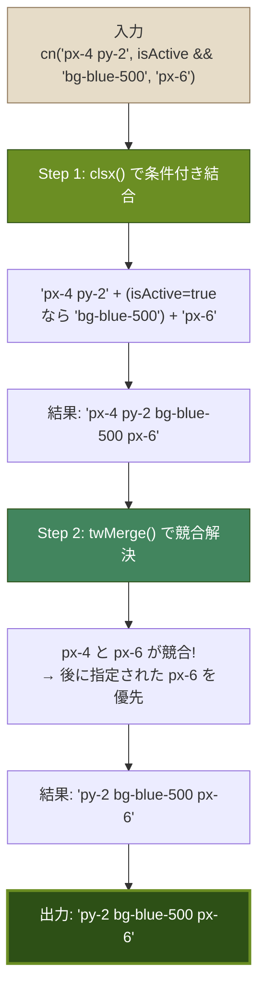

### clsx: 条件付きクラス名の結合

`clsx`は、さまざまな形式の引数を受け取って、1つのクラス名文字列に結合するライブラリです。

```typescript
import { clsx } from 'clsx'

// 1. 文字列の結合
clsx('foo', 'bar')
// => 'foo bar'

// 2. 条件付き（falsy値は無視される）
clsx('base', true && 'active', false && 'hidden', null, undefined)
// => 'base active'

// 3. オブジェクト形式（値がtruthyのキーのみ含まれる）
clsx({ 'bg-red-500': hasError, 'bg-green-500': isSuccess, 'opacity-50': isDisabled })
// hasError=true, isSuccess=false, isDisabled=true の場合
// => 'bg-red-500 opacity-50'

// 4. 配列形式
clsx(['foo', 'bar'], ['baz'])
// => 'foo bar baz'

// 5. 混合形式（文字列、オブジェクト、配列を組み合わせ可能）
clsx('base', { active: isActive }, ['extra', isLarge && 'large'])
// isActive=true, isLarge=false の場合
// => 'base active extra'
```

### tailwind-merge: Tailwindクラスの競合解決

`tailwind-merge`は、Tailwind CSSのクラス名が競合した場合に、後に指定されたクラスを優先するライブラリです。

```typescript
import { twMerge } from 'tailwind-merge'

// 同じプロパティの競合を解決
twMerge('px-4 px-6')
// => 'px-6'（後の値が優先）

twMerge('text-red-500 text-blue-500')
// => 'text-blue-500'

// ショートハンドと個別指定の競合も解決
twMerge('px-4 py-2 p-6')
// => 'p-6'（pはpx/pyを包含する）

// レスポンシブクラスは別プロパティとして扱う
twMerge('md:px-4 md:px-6')
// => 'md:px-6'

// 競合しないクラスはそのまま残る
twMerge('bg-red-500 text-white font-bold bg-blue-500')
// => 'text-white font-bold bg-blue-500'
```

#### なぜtailwind-mergeが必要か

```
【tailwind-mergeなしの問題】

// コンポーネント内部のベーススタイル
const baseClass = 'px-4 py-2 bg-blue-500'

// 親コンポーネントから上書きしたい
<Button className="px-8">大きい余白</Button>

// 結果: 'px-4 py-2 bg-blue-500 px-8'
//        ↑                      ↑
//     px-4 と px-8 の両方が適用される！
//     CSSの詳細度が同じなので、どちらが適用されるか不確定

---

【tailwind-mergeありの場合】

cn('px-4 py-2 bg-blue-500', 'px-8')
// 結果: 'py-2 bg-blue-500 px-8'
//       px-4は削除され、px-8のみが適用される
```

### 条件付きクラス名のパターン集

#### パターン1: 真偽値による切り替え

```typescript
// isActive が true なら 'bg-primary text-white' を追加
<div className={cn(
  'px-4 py-2 rounded',
  isActive && 'bg-primary text-white'
)}>
```

#### パターン2: 三項演算子による切り替え

```typescript
// isActive の真偽で異なるスタイルを適用
<div className={cn(
  'px-4 py-2 rounded transition-colors',
  isActive
    ? 'bg-primary text-primary-foreground'
    : 'bg-muted text-muted-foreground'
)}>
```

#### パターン3: オブジェクト形式の条件指定

```typescript
// 複数の条件を見やすく記述
<div className={cn(
  'px-4 py-2 rounded',
  {
    'bg-primary text-white': isActive,
    'opacity-50 cursor-not-allowed': isDisabled,
    'ring-2 ring-destructive': hasError,
    'shadow-lg': isElevated,
  }
)}>
```

#### パターン4: コンポーネントのclassNameオーバーライド

```typescript
// 最も重要なパターン: 外部からのクラス上書きを許可
function Card({ className, children }: { className?: string; children: React.ReactNode }) {
  return (
    <div className={cn(
      // ベーススタイル（デフォルト）
      'rounded-lg border bg-card p-6 shadow-sm',
      // 外部から渡されたクラスで上書き可能
      className
    )}>
      {children}
    </div>
  )
}

// 使用側：paddingを上書き
<Card className="p-2">コンパクトなカード</Card>
// 結果: 'rounded-lg border bg-card shadow-sm p-2'
// p-6がp-2で上書きされる
```

#### パターン5: CVAと組み合わせた使用

```typescript
// BON-LOGのButtonコンポーネントでの実際のパターン
function Button({
  className,
  variant,
  size,
  ...props
}: React.ComponentProps<'button'> & VariantProps<typeof buttonVariants>) {
  return (
    <button
      className={cn(buttonVariants({ variant, size, className }))}
      {...props}
    />
  )
}

// 使用側: バリアント + 追加クラス
<Button variant="outline" className="w-full mt-4">
  保存
</Button>
```

### ClassValue型

`cn()`が受け入れる引数の型`ClassValue`は、以下の値を受け付けます。

```typescript
type ClassValue =
  | string                    // 'foo bar'
  | number                    // 0（falsyなので無視される）
  | boolean                   // true/false
  | null                      // 無視される
  | undefined                 // 無視される
  | ClassValue[]              // ['foo', 'bar']
  | Record<string, boolean>   // { foo: true, bar: false }
```

この柔軟な型定義により、条件分岐の結果をそのまま引数に渡すことが可能です。

### よくある使い方の比較

```typescript
// すべて同じ結果になる（isActive=true, isDisabled=false の場合）

// 方法1: 論理AND演算子
cn('base', isActive && 'active', isDisabled && 'disabled')
// => 'base active'

// 方法2: 三項演算子
cn('base', isActive ? 'active' : '', isDisabled ? 'disabled' : '')
// => 'base active'

// 方法3: オブジェクト形式
cn('base', { active: isActive, disabled: isDisabled })
// => 'base active'

// 推奨: 条件が少ない場合は方法1、多い場合は方法3
```

### 理解度チェック

<details>
<summary>Q1: cn('px-4', 'px-8') の結果は何ですか？</summary>

**A1:** `'px-8'`です。`cn()`は内部で`tailwind-merge`を使用しているため、同じプロパティ（padding-x）の競合を検出し、後に指定された`px-8`を優先します。`px-4`は結果から除外されます。
</details>

<details>
<summary>Q2: cn()関数がコンポーネント設計で重要な理由は何ですか？</summary>

**A2:** `cn()`により、コンポーネントの内部スタイル（ベーススタイル）を外部から安全に上書きできるようになります。例えばButtonコンポーネントが内部で`px-4`を持っていても、使用側が`className="px-8"`を渡せば`px-8`に上書きされます。tailwind-mergeがなければ両方のクラスが残り、予測不可能な結果になります。
</details>

<details>
<summary>Q3: clsx({ 'bg-red': true, 'text-white': false, 'font-bold': true }) の結果は？</summary>

**A3:** `'bg-red font-bold'`です。`clsx`のオブジェクト形式では、値が`true`のキーのみがクラス名として含まれます。`text-white`は値が`false`なので除外されます。
</details>

---

## 補足I: CSS Class Composition Flow（Tailwind → CVA → cn()）

BON-LOGで使われるスタイリングの流れを、全体像として図解します。

### CSS クラス合成フローの全体像

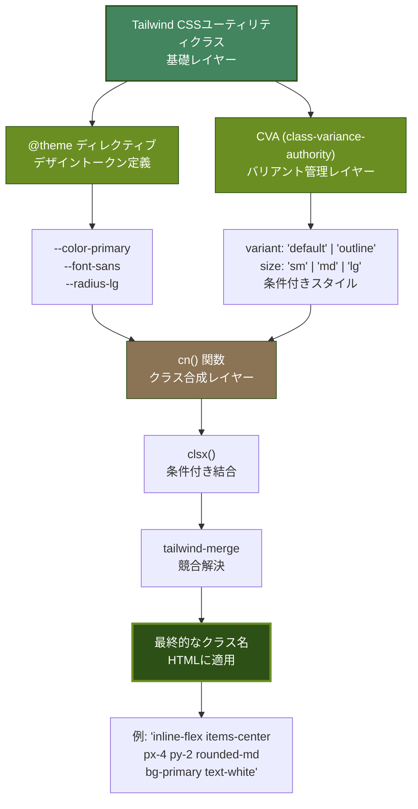

### レイヤー別の役割

**レイヤー1: Tailwind CSS（基礎）**
- `px-4`, `py-2`, `bg-blue-500` などのユーティリティクラスを提供
- すべてのスタイリングの土台

**レイヤー2: @theme（デザイントークン）**
- `--color-primary`, `--font-sans` など、プロジェクト共通の値を定義
- `bg-primary` のように、トークン名でクラスを使えるようにする

**レイヤー3: CVA（バリアント管理）**
- `variant="default"` などのpropsに応じてクラスを切り替え
- 複雑な条件分岐を型安全に管理

**レイヤー4: cn()（クラス合成）**
- 複数のクラス名を結合し、競合を解決
- コンポーネントの外部から上書き可能にする

---

## 補足J: Component Styling Architecture（コンポーネントスタイリング設計）

shadcn/uiのコンポーネントがどのようにスタイリングされているかを構造化して示します。

### コンポーネントスタイリングのアーキテクチャ

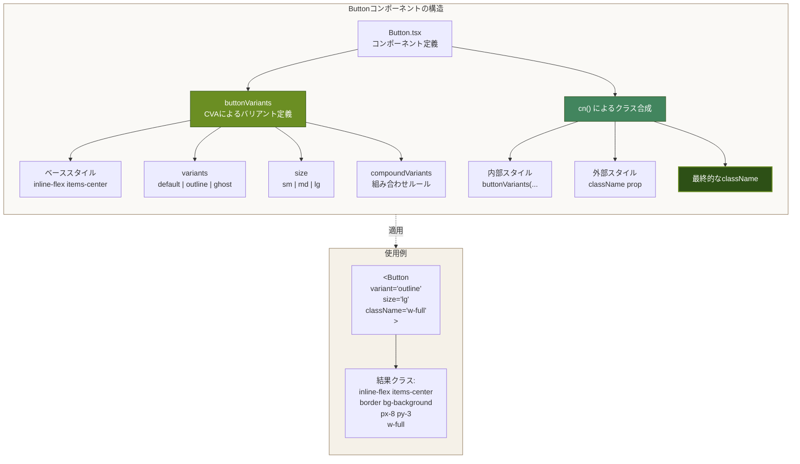

### スタイリング優先順位

1. **ベーススタイル（最も低い優先度）**: すべてのバリアントで共通
2. **variants**: `variant`や`size`に応じたスタイル
3. **compoundVariants**: 複数バリアントの組み合わせ
4. **className prop（最も高い優先度）**: 外部からの上書き

```typescript
// 優先順位の実例
<Button
  variant="default"     // → bg-primary text-white
  size="lg"             // → px-8 py-3
  className="px-4"      // → px-8 を px-4 で上書き
/>
// 最終結果: inline-flex items-center bg-primary text-white py-3 px-4
```

---

## 補足K: Responsive Layout Breakdown（レスポンシブレイアウト詳細）

BON-LOGの3カラムレイアウトが画面サイズによってどう変化するかを段階的に示します。

### レスポンシブレイアウトの段階的変化

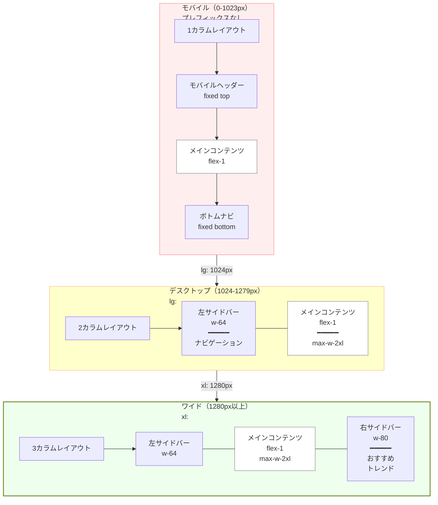

### 各段階での表示/非表示クラス

```typescript
// 左サイドバー: モバイルで非表示、lg以上で表示
<aside className="hidden lg:block w-64">

// 右サイドバー: モバイル・デスクトップで非表示、xl以上で表示
<aside className="hidden xl:block w-80">

// モバイルヘッダー: モバイルのみ、lg以上で非表示
<header className="block lg:hidden fixed top-0">

// ボトムナビ: モバイルのみ、lg以上で非表示
<nav className="block lg:hidden fixed bottom-0">
```

### コンテンツ幅の制御

```typescript
// メインコンテンツ: 画面サイズに応じて幅を調整
<main className="
  flex-1                    // 残りスペースを埋める
  max-w-full                // モバイル: 画面幅いっぱい
  lg:max-w-2xl              // デスクトップ: 最大42rem
  border-x border-gray-200  // 左右にボーダー
">
```

---

## 6.13 Tailwind CSS v4固有機能

### このセクションで学ぶこと

- Tailwind CSS v4のCSS-firstアーキテクチャ
- `@theme`ディレクティブによるデザイントークンの定義
- CSS変数（カスタムプロパティ）を活用したテーマシステム
- `@custom-variant`によるカスタムバリアントの定義
- oklch()カラースペースの利点

### Tailwind CSS v4の大きな変更点

BON-LOGはTailwind CSS v4を使用しています。v3からの最大の変更点は、**設定ファイル（tailwind.config.ts）からCSS-firstへの移行**です。

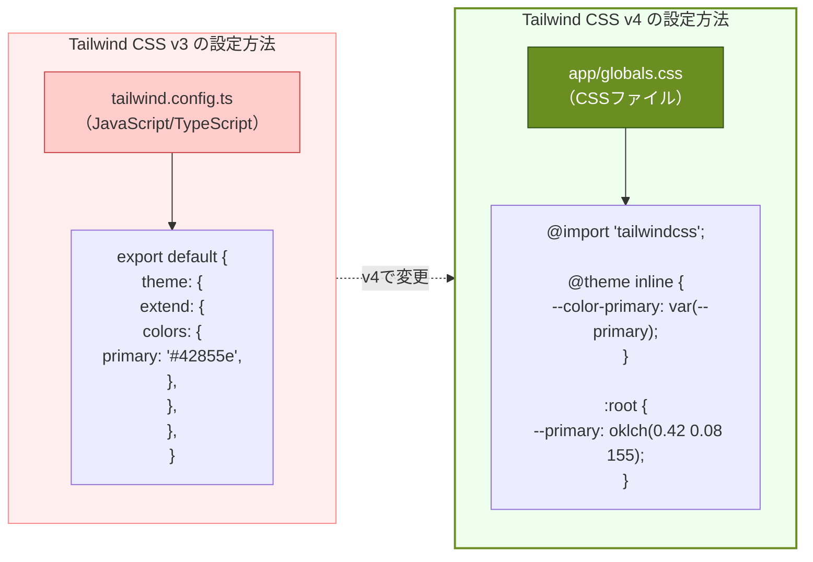

### @import "tailwindcss"

v4では、従来の3つのディレクティブ（`@tailwind base; @tailwind components; @tailwind utilities;`）が1つのインポート文に統合されました。

```css
/* Tailwind CSS v3 */
@tailwind base;
@tailwind components;
@tailwind utilities;

/* Tailwind CSS v4 */
@import "tailwindcss";
```

### @themeディレクティブ

`@theme`は、Tailwind CSSのユーティリティクラスとして使えるデザイントークン（色、フォント、角丸など）を定義するディレクティブです。BON-LOGの`globals.css`では`@theme inline`として使用しています。

```css
/* app/globals.css（BON-LOGの実際のコード） */
@theme inline {
  /* カラートークン: bg-background、text-foreground 等のクラスで使用可能 */
  --color-background: var(--background);
  --color-foreground: var(--foreground);

  /* フォントトークン: font-sans、font-serif 等のクラスで使用可能 */
  --font-sans: var(--font-noto-sans-jp);
  --font-mono: var(--font-geist-mono);
  --font-serif: var(--font-shippori-mincho);

  /* 和風カラートークン: bg-bonsai-green、text-sumi 等のクラスで使用可能 */
  --color-bonsai-green: var(--bonsai-green);
  --color-bonsai-brown: var(--bonsai-brown);
  --color-bonsai-beige: var(--bonsai-beige);
  --color-bonsai-cream: var(--bonsai-cream);
  --color-washi: var(--washi);
  --color-sumi: var(--sumi);
  --color-aka: var(--aka);
  --color-ai: var(--ai);
  --color-matcha: var(--matcha);
  --color-kincha: var(--kincha);

  /* 角丸トークン: rounded-sm、rounded-lg 等のクラスで使用可能 */
  --radius-sm: calc(var(--radius) - 4px);
  --radius-md: calc(var(--radius) - 2px);
  --radius-lg: var(--radius);
  --radius-xl: calc(var(--radius) + 4px);
}
```

#### @themeの命名規則

`@theme`内で定義する変数名は、Tailwindのユーティリティクラスに対応する特定の命名規則に従います。

| @theme変数名 | 使えるTailwindクラス |
|-------------|---------------------|
| `--color-primary` | `bg-primary`, `text-primary` |
| `--color-bonsai-green` | `bg-bonsai-green` |
| `--font-sans` | `font-sans` |
| `--font-serif` | `font-serif` |
| `--radius-lg` | `rounded-lg` |
| `--spacing-18` | `p-18`, `m-18`, `gap-18` |
| `--breakpoint-xl` | `xl:` |

#### inlineキーワード

```css
/* @theme inline: CSSの出力に @theme の内容を含めない（軽量化） */
/* CSS変数を参照するだけの場合に使用 */
@theme inline {
  --color-primary: var(--primary);
}

/* @theme（inlineなし）: テーマ値を直接定義する場合 */
@theme {
  --color-primary: oklch(0.42 0.08 155);
}
```

### CSS変数によるテーマシステム

BON-LOGでは、`:root`と`.dark`で定義されたCSS変数を切り替えることで、ライトモードとダークモードを実現しています。

```css
/* app/globals.css（BON-LOGの実際のコード） */
:root {
  /* ライトモード: 和風の明るい色調 */
  --background: oklch(0.97 0.008 85);        /* 生成り - kinari */
  --foreground: oklch(0.22 0.015 50);        /* 墨色 - sumi */
  --card: oklch(0.99 0.004 90);              /* 和紙 - washi */
  --primary: oklch(0.42 0.08 155);           /* 松葉色 - matsuba */
  --secondary: oklch(0.88 0.025 75);         /* 亜麻色 - ama */
  --accent: oklch(0.55 0.12 45);             /* 錆朱 - sabiaka */
  --destructive: oklch(0.55 0.20 25);        /* 朱色 - shu */
}

.dark {
  /* ダークモード: 墨・漆のような暗い色調 */
  --background: oklch(0.15 0.015 50);        /* 漆黒 - shikkoku */
  --foreground: oklch(0.92 0.008 85);        /* 生成り */
  --card: oklch(0.20 0.015 50);              /* 墨色 */
  --primary: oklch(0.60 0.10 155);           /* 若松 */
  --secondary: oklch(0.30 0.02 50);
  --accent: oklch(0.60 0.15 45);             /* 緋色 */
  --destructive: oklch(0.60 0.20 25);
}
```

#### CSS変数の仕組み図

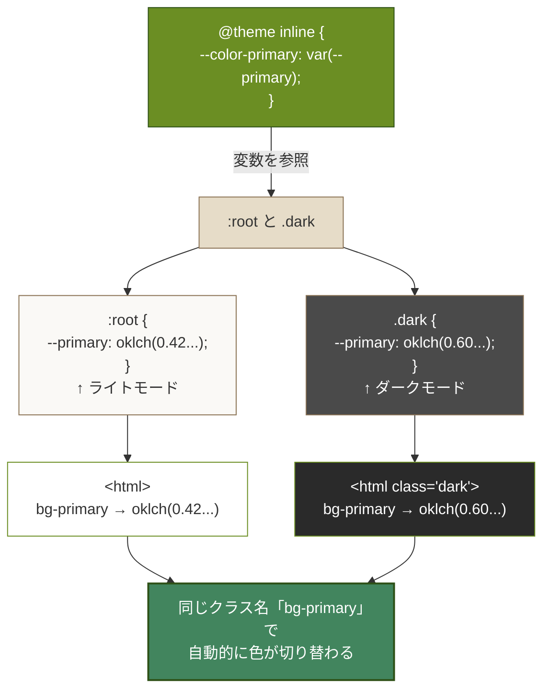

### @custom-variant

v4では`@custom-variant`ディレクティブでカスタムバリアントを定義できます。BON-LOGではダークモードのバリアントをカスタム定義しています。

```css
/* app/globals.css（BON-LOGの実際のコード） */
@custom-variant dark (&:is(.dark *));
```

これにより、`dark:`プレフィックスが`.dark`クラスの子孫要素に適用されるようになります。

```html
<!-- この設定により以下が動作する -->
<html class="dark">
  <body>
    <div class="bg-white dark:bg-gray-900">
      <!-- .darkクラスの子孫なので dark:bg-gray-900 が適用される -->
    </div>
  </body>
</html>
```

### oklch()カラースペース

BON-LOGのカラーパレットでは、従来のHEX/RGB/HSLではなく**oklch()**カラースペースを使用しています。

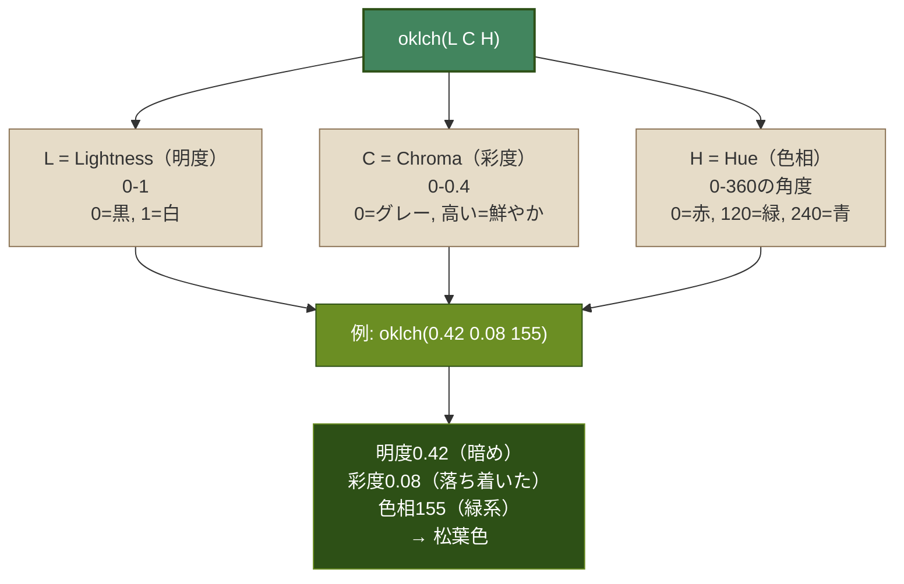

#### oklch()の利点

```css
/* 明度を変えるだけで統一感のあるカラーバリエーションが作れる */
:root {
  --primary: oklch(0.42 0.08 155);           /* 松葉色（基本） */
}
.dark {
  --primary: oklch(0.60 0.10 155);           /* 若松色（明るくした版） */
  /*               ↑    ↑   同じ色相
     明度を上げて、彩度を少し上げるだけで
     ダークモード用の色が自然に作れる */
}
```

| 利点 | 説明 |
|------|------|
| 知覚的均一性 | 明度の値が同じなら、人間の目に同じ明るさに見える |
| 直感的な操作 | 明度・彩度・色相を独立して調整できる |
| ダークモード対応 | 明度を変えるだけで自然なダークモード色が作れる |
| アクセシビリティ | コントラスト比の計算が正確にできる |

### @layerディレクティブ

BON-LOGでは`@layer base`を使って基本スタイルを定義しています。

```css
/* app/globals.css（BON-LOGの実際のコード） */
@layer base {
  * {
    @apply border-border outline-ring/50;
  }
  body {
    @apply bg-background text-foreground;
  }
}
```

`@layer`はCSSの詳細度を制御するための仕組みで、Tailwindの3つのレイヤー（`base` < `components` < `utilities`）の優先順位に従います。

### 理解度チェック

<details>
<summary>Q1: Tailwind CSS v4で tailwind.config.ts の代わりに使うものは何ですか？</summary>

**A1:** CSSファイル（`globals.css`）内の`@theme`ディレクティブです。v4ではCSS-firstのアプローチが採用され、デザイントークン（色、フォント、角丸など）をCSSファイル内で直接定義します。これにより、JavaScriptの設定ファイルが不要になり、CSSの標準機能（CSS変数など）との統合がよりシームレスになりました。
</details>

<details>
<summary>Q2: oklch()カラースペースがダークモード対応に適している理由は何ですか？</summary>

**A2:** oklch()は明度（Lightness）、彩度（Chroma）、色相（Hue）の3つのパラメータが独立しているため、色相を維持したまま明度だけを変更できます。例えば松葉色（`oklch(0.42 0.08 155)`）のダークモード版は、明度を上げるだけで自然な「若松色」（`oklch(0.60 0.10 155)`）が作れます。従来のHEX/RGBでは、暗い色→明るい色の変換が直感的ではありませんでした。
</details>

<details>
<summary>Q3: @theme inline と @theme（inlineなし）の違いは何ですか？</summary>

**A3:** `@theme inline`はCSS変数を参照してTailwindのトークンを定義する場合に使い、出力CSSに`@theme`ブロックの内容が直接含まれません（軽量化のため）。`@theme`（inlineなし）は値を直接定義する場合に使います。BON-LOGでは、`:root`と`.dark`でCSS変数を切り替えてテーマを変更する方式のため、`@theme inline`でCSS変数を参照しています。
</details>

---

## 6.14 和風デザインパターン

### このセクションで学ぶこと

- BON-LOGで使用している和風カラーパレット（日本の伝統色）の意味と使い分け
- 和紙テクスチャ、麻の葉、青海波などの伝統的装飾パターンの実装
- 和風タイポグラフィ（明朝体、縦書き）の活用方法
- `globals.css`で定義されている和風CSSクラスの使い方

### 和風カラーパレット

BON-LOGでは日本の伝統色を基調としたカラーパレットを採用しています。各色には日本語の色名が付けられ、その意味と用途が明確に定義されています。

| 色名 | 英語名 | oklch値 | 用途 | 印象 |
|-----|-------|---------|------|------|
| ■ 松葉色 | matsuba (Primary) | oklch(0.42 0.08 155) | メインボタン、アクティブ状態、リンク | 落ち着き、信頼、自然 |
| ■ 栗皮茶 | kurikawacha (Brown) | oklch(0.45 0.08 55) | サブカラー、アクセント要素 | 温もり、大地、和の風格 |
| □ 亜麻色 | ama (Secondary) | oklch(0.88 0.025 75) | セカンダリボタン、タグ背景 | 穏やか、優しさ |
| □ 生成り | kinari (Background) | oklch(0.97 0.008 85) | ページ全体の背景色 | 自然な白、温かみ |
| □ 和紙 | washi (Card) | oklch(0.99 0.004 90) | カード背景、ポップオーバー | 清潔感、繊細さ |
| ■ 墨 | sumi (Foreground) | oklch(0.22 0.015 50) | メインテキスト | 凛とした黒、文字の美しさ |
| ■ 錆朱 | sabiaka (Accent) | oklch(0.55 0.12 45) | アクセント、注目ポイント | 渋み、味わい |
| ■ 朱 | shu/aka (Destructive) | oklch(0.55 0.20 25) | エラー、警告、削除 | 鳥居の赤、印鑑の朱 |
| ■ 藍 | ai | oklch(0.35 0.10 250) | 情報表示、リンク（代替） | 深い青、日本の伝統染め |
| ■ 抹茶 | matcha | oklch(0.55 0.10 140) | 成功状態、確認 | 茶道、和の緑 |
| ■ 金茶 | kincha | oklch(0.50 0.12 70) | 警告、注意喚起 | 金箔、高級感 |

#### カラーの使い分けガイド

```typescript
// ページ背景: 生成り色（自然な白）
<div className="bg-background">

// カード: 和紙色（わずかに黄みがかった白）
<div className="bg-card">

// メインテキスト: 墨色（純粋な黒ではなく温かみのある黒）
<p className="text-foreground">

// アクションボタン: 松葉色
<Button>投稿する</Button>   {/* bg-primary */}

// 危険なアクション: 朱色
<Button variant="destructive">削除</Button>

// タグ・バッジ: 亜麻色のベースに墨色のテキスト
<Badge variant="secondary">松柏類</Badge>

// リンクテキスト: 松葉色
<a className="text-primary hover:text-primary/80">詳細を見る</a>

// 和風カスタムカラーの直接使用
<div className="bg-matcha text-white">成功</div>   {/* → 抹茶色（緑系）の背景に白文字 */}
<div className="bg-ai text-white">情報</div>       {/* → 藍色（深い青）の背景に白文字 */}
<div className="bg-kincha text-white">警告</div>    {/* → 金茶色（黄褐色）の背景に白文字 */}
```

### 和風テクスチャと装飾パターン

BON-LOGの`globals.css`には、日本の伝統的な模様をCSSで再現したクラスが定義されています。

#### 和紙テクスチャ（washi-texture）

```html
<!-- 和紙のような微細な質感を追加 -->
<div class="washi-texture bg-card p-6 rounded-lg">
  <p>和紙のような温かみのある質感の背景</p>
</div>
```

> **画面表示**
> カード背景色の上に、和紙の繊維のような極めて微細なノイズパターンが重なる。画面をよく見ると紙の表面のようなざらざらした質感が薄く感じられる。不透明度0.03と極めて控えめなので、テキストの可読性には影響しない。

和紙テクスチャはSVGフィルターの`feTurbulence`を使って、和紙特有の繊維感を極めて薄い不透明度（0.03）で表現しています。

#### 麻の葉模様（asanoha-pattern）

```html
<!-- 麻の葉模様の背景 -->
<div class="asanoha-pattern min-h-screen">
  <!-- BON-LOGのメインレイアウトで実際に使用 -->
</div>
```

> **画面表示**
> 六角形を基調とした幾何学的な線画パターンが背景全体に繰り返し表示される。非常に薄い不透明度で描かれるため、メインコンテンツの可読性を妨げずに和の雰囲気を添える。

BON-LOGの`app/(main)/layout.tsx`では、メインレイアウトの背景に麻の葉模様を適用しています。

```typescript
// app/(main)/layout.tsx（BON-LOGの実際のコード）
<div className="min-h-screen bg-background asanoha-pattern">
```

#### 青海波模様（seigaiha-pattern）

```html
<!-- 青海波（波のような連続模様） -->
<div class="seigaiha-pattern p-8">
  <p>海や水を象徴する伝統的な波模様</p>
</div>
```

> **画面表示**
> 同心円の扇形が連なる波のような模様が背景に表示される。穏やかな海を象徴する吉祥文様で、ヘッダーやフッターの装飾に適している。

#### 市松模様（ichimatsu-pattern）

```html
<!-- 市松模様（格子状の模様） -->
<div class="ichimatsu-pattern p-8">
  <p>歌舞伎の佐野川市松に由来する格子模様</p>
</div>
```

> **画面表示**
> 色の異なる正方形が交互に並ぶ格子模様（チェッカーボード）が背景に表示される。薄い不透明度で控えめに描かれ、モダンかつ伝統的な印象を与える。

### 和風コンポーネントクラス

#### カード和風装飾（card-washi）

上部にプライマリカラーのアクセントラインが入るカードスタイルです。

```html
<!-- 和風カード: 上部に松葉色のラインが入る -->
<div class="card-washi rounded p-4">
  <h3 class="font-medium">おすすめユーザー</h3>
  <p class="text-sm text-muted-foreground">...</p>
</div>
```

> **画面表示**
> カードの上端に松葉色（プライマリカラー）の細い横線（3px程度）が入り、和の掛け軸や料理の器の縁飾りのような上品なアクセントになる。カード本体は通常の白い背景。

BON-LOGの右サイドバーで実際に使用されています。

#### 和風シャドウ（shadow-washi）

繊細な多層シャドウで和紙のような柔らかい影を実現します。

```html
<!-- 和風の柔らかい影 -->
<div class="shadow-washi p-4 rounded-lg bg-card">
  通常の影
</div>

<!-- より大きな和風シャドウ -->
<div class="shadow-washi-lg p-4 rounded-lg bg-card">
  大きい影
</div>
```

> **画面表示**
> - **shadow-washi**: 3-4層の極めて薄い影が重なり、和紙が何枚か重なったような柔らかい影を表現。通常のTailwindの`shadow`より繊細で落ち着いた印象
> - **shadow-washi-lg**: より大きな範囲に広がる多層影で、カードが少し高い位置に浮いているような奥行き感。モーダルやホバー時のカードに適している

#### 和風タグ（tag-washi）

```html
<!-- 和風のタグスタイル -->
<span class="tag-washi">松柏類</span>
<span class="tag-washi">雑木類</span>
```

> **画面表示**
> 和紙のような質感を持つ小さなラベル。通常のBadgeコンポーネントと異なり、角がわずかに丸く、背景に微細なテクスチャ感がある。ジャンル分類の表示に使用。

#### 印鑑風装飾（hanko）

```html
<!-- 印鑑風の丸い装飾 -->
<span class="hanko">盆</span>
<span class="hanko">栽</span>
```

> **画面表示**
> 朱色（赤系）の丸い枠の中に「盆」「栽」の文字が表示される。実際の朱肉で押した印鑑のような見た目で、和の装飾要素として使える。

#### 墨流し風グラデーション（suminagashi）

```html
<!-- 墨流しのような微妙なグラデーション背景 -->
<div class="suminagashi p-8">
  <p>墨流し技法を模したグラデーション</p>
</div>
```

> **画面表示**
> 微妙に色が変化するグラデーション背景が表示される。水面に墨を垂らして作る伝統技法「墨流し」を模した、波打つような緩やかな色調変化が見られる。ヒーローセクションや特別なページの背景装飾に適している。

### 和風タイポグラフィ

BON-LOGでは3つのフォントファミリーを和風デザインに活用しています。

```css
/* @theme で定義されたフォント */
--font-sans: var(--font-noto-sans-jp);     /* Noto Sans JP: 本文用ゴシック体 */
--font-serif: var(--font-shippori-mincho); /* しっぽり明朝: 見出し・装飾用 */
--font-mono: var(--font-geist-mono);       /* Geist Mono: コード表示用 */
```

```html
<!-- ゴシック体（デフォルト） -->
<p class="font-sans">盆栽愛好家のためのSNS</p>
<!-- → Noto Sans JP: 現代的で読みやすい。本文、ボタン、ラベルに使用 -->

<!-- 明朝体（和の雰囲気を強調） -->
<h1 class="font-serif text-3xl">五葉松の育成記録</h1>
<!-- → しっぽり明朝: 筆で書いたような繊細さ。30pxの大きな見出しで和の雰囲気を演出 -->

<!-- 縦書きテキスト -->
<p class="vertical-text font-serif text-lg">盆栽の美</p>
<!-- → 右から左に縦書き表示。明朝体と組み合わせて掛け軸のような日本的な表現 -->
```

#### 縦書きの実装

```css
/* globals.css に定義済み */
.vertical-text {
  writing-mode: vertical-rl;    /* 右から左に縦書き */
  text-orientation: upright;    /* 文字を正立で表示 */
}
```

```html
<!-- 縦書きの活用例: 和風サイドデコレーション -->
<div class="flex items-center gap-4">
  <p class="vertical-text font-serif text-muted-foreground text-sm">
    五葉松
  </p>
  <div class="flex-1">
    
  </div>
</div>
```

### 和風区切り線

```html
<!-- 竹のような区切り線（左右にグラデーションフェード） -->
<div class="divider-bamboo text-sm text-muted-foreground">
  <span>投稿一覧</span>
</div>
```

> **画面表示**
> 「投稿一覧」テキストの左右に、中央から端に向かって徐々に薄くなるグラデーション線が表示される。竹の節のようなイメージで、セクション間の区切りとして和風の雰囲気を持つ水平線になる。

### 和風アニメーション

```html
<!-- フェードインアップ: 下からふわっと表示 -->
<div class="animate-fade-in-up">
  投稿カード
</div>
<!-- → 要素が下から上に15pxほど移動しながら、透明から不透明にフェードイン。
     投稿カードの初回表示で「ふわっと」現れる柔らかい演出 -->

<!-- ゆるやかなバウンス: ローディング表示 -->
<div class="animate-gentle-bounce">
  読み込み中...
</div>
<!-- → 要素がゆっくり上下に弾むアニメーション。
     読み込み待ちの間、控えめに動くことでユーザーに処理中であることを伝える -->
```

`prefers-reduced-motion: reduce`メディアクエリにより、アニメーション酔いを起こすユーザーに対してはすべてのアニメーションが自動的に無効化されます。

### 和風セレクション

テキスト選択時も和風の色合いが適用されます。

```css
/* globals.css に定義済み */
::selection {
  background: oklch(0.42 0.08 155 / 0.25);  /* 松葉色の25%透過 */
  color: oklch(0.22 0.015 50);               /* 墨色 */
}
```

### 理解度チェック

<details>
<summary>Q1: BON-LOGのメインレイアウトの背景に使われている和柄パターンは何ですか？</summary>

**A1:** 麻の葉模様（`asanoha-pattern`）です。`app/(main)/layout.tsx`のルート要素に`className="min-h-screen bg-background asanoha-pattern"`として適用されています。麻の葉は日本の伝統的な幾何学模様で、成長を象徴する吉祥文様です。SVGパターンで実装されており、微細な線で目立ちすぎない背景装飾を実現しています。
</details>

<details>
<summary>Q2: shadow-washiとTailwind標準のshadowクラスの違いは何ですか？</summary>

**A2:** `shadow-washi`は多層の繊細なbox-shadowで、和紙が重なったような柔らかい影を表現します。Tailwindの標準`shadow`は単一または少数の影レイヤーですが、`shadow-washi`は3〜4層の極めて薄い影を重ねることで、より自然で落ち着いた印象を与えます。BON-LOGの和風デザインコンセプトに合わせた独自クラスです。
</details>

<details>
<summary>Q3: prefers-reduced-motionの対応がなぜ重要ですか？</summary>

**A3:** アニメーション酔い（前庭機能障害）を持つユーザーにとって、動くコンテンツは頭痛やめまいを引き起こす可能性があります。`prefers-reduced-motion: reduce`はOSレベルの「視差効果を減らす」設定を検出するメディアクエリで、BON-LOGではこの設定が有効な場合にすべてのアニメーションとトランジションを無効化します。アクセシビリティの観点から非常に重要な対応です。
</details>

---

## 6.15 3カラムレイアウト実装

### このセクションで学ぶこと

- BON-LOGの実際の3カラムレイアウト（`app/(main)/layout.tsx`）の構造
- Flexboxを使ったサイドバー + メインコンテンツの配置
- スティッキーサイドバーの実装方法と注意点
- レスポンシブ対応（デスクトップ3カラム / モバイル1カラム + ナビ）
- 各コンポーネント（Sidebar、RightSidebar、MobileNav、Header）の役割

### レイアウト全体像

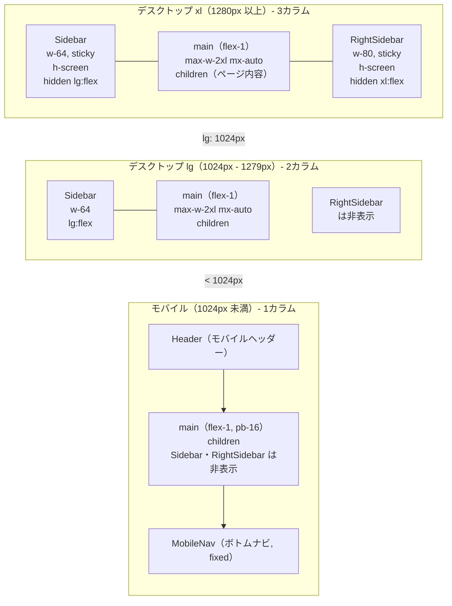

### メインレイアウトの実装（BON-LOG実際のコード）

```typescript
// app/(main)/layout.tsx（BON-LOGの実際のコード）
export default async function MainLayout({
  children,
}: {
  children: React.ReactNode
}) {
  const session = await auth()
  if (!session?.user) {
    redirect('/login')
  }

  const isPremium = await isPremiumUser(session.user.id)

  return (
    <div className="min-h-screen bg-background asanoha-pattern">
      {/* モバイルヘッダー（lg未満で表示） */}
      <Header userId={session.user.id} isPremium={isPremium} />

      <div className="flex">
        {/* 左サイドバー（lg以上で表示） */}
        <Sidebar userId={session.user.id} isPremium={isPremium} />

        {/* メインコンテンツ */}
        <main id="main-content" className="flex-1 min-h-screen pb-16 lg:pb-0" tabIndex={-1}>
          <div className="max-w-2xl mx-auto px-4 py-4 lg:py-6">
            {children}
          </div>
        </main>

        {/* 右サイドバー（xl以上で表示） */}
        <RightSidebar />
      </div>

      {/* モバイルボトムナビ（lg未満で表示） */}
      <MobileNav userId={session.user.id} isPremium={isPremium} />
      <KeyboardShortcutsProvider userId={session.user.id} />
      <Toaster />
    </div>
  )
}
```

> **画面表示**
> このレイアウトの各画面サイズでの見え方:
>
> **モバイル（1024px未満）:**
> - 画面上部: モバイルヘッダー（ロゴ + メニューボタン + 通知アイコン）
> - 中央: メインコンテンツが画面幅いっぱいに表示。下部にボトムナビ分の余白（`pb-16` = 64px）
> - 画面下部: ボトムナビ（ホーム / 検索 / 通知 / プロフィール）が固定表示
> - 背景全体に生成り色 + 麻の葉模様（`asanoha-pattern`）
>
> **デスクトップ（1024px以上）:**
> - 左: サイドバー（幅256px）が出現。ナビゲーションリンク、プレミアムバッジ等
> - 中央: メインコンテンツ（最大幅672px = `max-w-2xl`で中央配置）
> - モバイルヘッダーとボトムナビは非表示
>
> **ワイドデスクトップ（1280px以上）:**
> - 右: 右サイドバー（幅320px）も出現。おすすめユーザー、トレンド等の補助情報

### Flexboxによる3カラム配置

レイアウトの核心は`<div className="flex">`で囲まれた3つの要素です。

```html
<div class="flex">
  <aside class="w-64 ...">左サイドバー</aside>
  <main class="flex-1 ...">メインコンテンツ</main>
  <aside class="w-80 ...">右サイドバー</aside>
</div>
```

#### Flexboxの動作

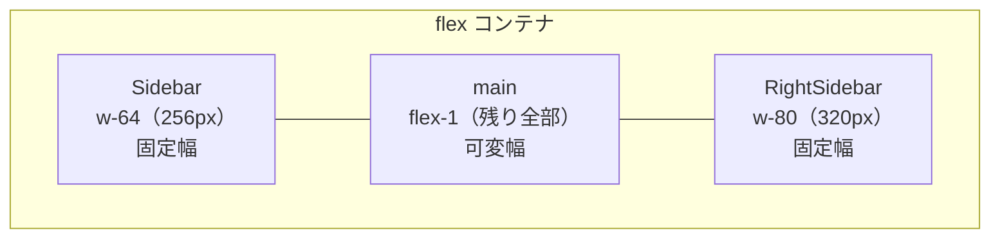

> **画面幅1280pxの場合:** Sidebar: 256px / main: 1280 - 256 - 320 = 704px / RightSidebar: 320px
>
> `flex-1` は `flex: 1 1 0%` の短縮形で、残りの空間をすべて占有する。サイドバーの幅は固定で、メインコンテンツが伸縮する。

### スティッキーサイドバー

両サイドバーには`sticky top-0 h-screen`が適用されています。これにより、メインコンテンツをスクロールしてもサイドバーは画面に固定されます。

```html
<!-- 左サイドバー（BON-LOGの実際のクラス） -->
<aside class="sticky top-0 h-screen w-64 border-r bg-card/95 backdrop-blur-sm hidden lg:flex flex-col shadow-washi">
  <!-- ... -->
</aside>

<!-- 右サイドバー（BON-LOGの実際のクラス） -->
<aside class="sticky top-0 h-screen w-80 border-l bg-card/95 backdrop-blur-sm hidden xl:flex flex-col p-4 overflow-y-auto shadow-washi">
  <!-- ... -->
</aside>
```

#### スティッキーの仕組み

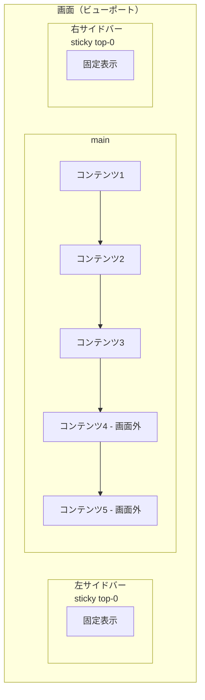

> **sticky positioning の動作:**
> - **sticky**: 通常フローに残りつつ、スクロール時は画面上端に固定
> - **h-screen**: ビューポートの高さいっぱいに広がる
> - **overflow-y-auto**: 右サイドバーの内容が長い場合はサイドバー内部でスクロール可能
> - メインコンテンツはスクロール可能、サイドバーは固定

#### stickyの注意点

```typescript
// sticky が動作するための条件:

// 1. 親要素にoverflow: hidden/auto が設定されていないこと
//    × <div className="overflow-hidden"> ← stickyが効かなくなる
//        <aside className="sticky top-0">

// 2. top, bottom, left, right のいずれかが指定されていること
//    × <aside className="sticky">           ← 位置が指定されていない
//    ○ <aside className="sticky top-0">     ← top-0を指定

// 3. h-screen で高さを明示すること（サイドバーの場合）
//    h-screen がないと、コンテンツの高さに合わせてサイドバーも伸びてしまう
```

### レスポンシブブレークポイントの使い分け

| 画面幅 | 表示される要素 | レイアウト |
|---|---|---|
| < 1024px | Header + main + MobileNav | 1カラム + ボトムナビ |
| >= 1024px (lg) | Sidebar + main | 2カラム、左サイドバーが表示 |
| >= 1280px (xl) | Sidebar + main + RightSidebar | 3カラム、右サイドバーも表示 |

#### 各コンポーネントの表示条件

```html
<!-- 左サイドバー: lg以上で表示 -->
<aside class="hidden lg:flex ...">

<!-- 右サイドバー: xl以上で表示 -->
<aside class="hidden xl:flex ...">

<!-- モバイルヘッダー: lg未満で表示（Headerコンポーネント内で制御） -->

<!-- モバイルボトムナビ: lg未満で表示（MobileNavコンポーネント内で制御） -->
```

### メインコンテンツの幅制限

```html
<main class="flex-1 min-h-screen pb-16 lg:pb-0">
  <div class="max-w-2xl mx-auto px-4 py-4 lg:py-6">
    {children}
  </div>
</main>
```

| クラス | 役割 |
|--------|------|
| `flex-1` | Flexbox内で残りの幅をすべて占有 |
| `min-h-screen` | 最低でも画面の高さを確保 |
| `pb-16 lg:pb-0` | モバイルではボトムナビ分のパディング、デスクトップでは不要 |
| `max-w-2xl` | コンテンツの最大幅を672pxに制限（読みやすさのため） |
| `mx-auto` | コンテンツを中央に配置 |
| `px-4` | 左右にパディング（モバイルで端にくっつかない） |

#### なぜmax-w-2xlで幅を制限するのか

```mermaid
flowchart TD
    subgraph bad["幅制限なしの場合"]
        direction LR
        B_S["Sidebar"]
        B_M["このように文章が横に長く伸びると<br/>目の移動距離が増えて読みづらくなる"]
        B_R["RightSidebar"]
        B_S --- B_M --- B_R
    end

    subgraph good["max-w-2xl で制限した場合"]
        direction LR
        G_S["Sidebar"]
        G_M["適切な幅で折り返<br/>されるので読みや<br/>すい<br/>---<br/>max-w-2xl（672px）<br/>mx-auto で中央配置"]
        G_R["RightSidebar"]
        G_S --- G_M --- G_R
    end
```

### 背景とvisual effects

```html
<!-- ルート要素: 背景色 + 麻の葉模様 -->
<div class="min-h-screen bg-background asanoha-pattern">

<!-- サイドバー: 半透明の背景 + ブラー -->
<aside class="bg-card/95 backdrop-blur-sm shadow-washi">
<!--           ↑ 95%の不透明度    ↑ 背後をぼかす   ↑ 和風シャドウ -->
```

> **画面表示**
> ページ全体の背景には生成り色の上に麻の葉の幾何学模様がうっすらと描かれている。サイドバーは和紙色の半透明（95%不透明）で、背後の麻の葉模様がほんのわずかに透けて見える。`backdrop-blur-sm`により透けた部分がぼやけ、すりガラスのような和の趣のある効果が生まれる。和風シャドウ（`shadow-washi`）で柔らかい影も付き、サイドバーとメインコンテンツの境界が自然に区別される。

`bg-card/95`は「カード背景色を95%の不透明度で適用」を意味し、`backdrop-blur-sm`と組み合わせることで、背後の麻の葉模様がうっすら透けて見える、すりガラスのような効果を実現しています。

### Grid レイアウトとの比較

3カラムレイアウトはCSS Gridでも実現できますが、BON-LOGではFlexboxを採用しています。

```html
<!-- Flexbox版（BON-LOGの採用方式） -->
<div class="flex">
  <aside class="w-64 hidden lg:flex">左</aside>
  <main class="flex-1">中央</main>
  <aside class="w-80 hidden xl:flex">右</aside>
</div>

<!-- Grid版（代替実装） -->
<div class="grid grid-cols-1 lg:grid-cols-[256px_1fr] xl:grid-cols-[256px_1fr_320px]">
  <aside class="hidden lg:block">左</aside>
  <main>中央</main>
  <aside class="hidden xl:block">右</aside>
</div>
```

| | Flexbox | Grid |
|--|---------|------|
| サイドバーの固定幅指定 | `w-64`で直接指定 | `grid-cols-[256px_1fr]`で指定 |
| レスポンシブ対応 | `hidden lg:flex`で要素ごとに制御 | `grid-cols`を切り替え |
| 記述のシンプルさ | シンプル | やや複雑 |
| 高さの制御 | `h-screen`で個別指定 | `align-items`で一括制御 |

BON-LOGでは、各カラムの表示/非表示をレスポンシブに制御する必要があるため、要素単位で`hidden`/`flex`を切り替えられるFlexboxがより適しています。

### モバイル用ナビゲーション

モバイルでは左右のサイドバーが非表示になるため、ボトムナビゲーション（MobileNav）とヘッダー（Header）でナビゲーションを提供します。

```mermaid
flowchart TD
    subgraph mobile["モバイル画面レイアウト"]
        direction TB
        H["Header（sticky top-0, lg:hidden）<br/>メニューボタン | BON-LOG | 通知ボタン"]
        M["main（pb-16 でボトムナビ分の余白）<br/>コンテンツ"]
        N["MobileNav（fixed bottom-0, lg:hidden）<br/>ホーム | 検索 | 通知 | プロフィール"]
        H --> M --> N
    end
```

#### pb-16の重要性

```html
<main class="flex-1 min-h-screen pb-16 lg:pb-0">
```

`pb-16`（padding-bottom: 4rem = 64px）は、モバイルのボトムナビゲーションが`fixed bottom-0`で画面下部に固定されるため、メインコンテンツの最下部がナビに隠れないようにするためのパディングです。`lg:pb-0`で、デスクトップ（ボトムナビなし）ではこのパディングを除去しています。

### 理解度チェック

<details>
<summary>Q1: 左サイドバーが lg:flex で、右サイドバーが xl:flex である理由は何ですか？</summary>

**A1:** 画面幅に応じて段階的にコンテンツを表示するためです。lg（1024px）の画面幅では、左サイドバーとメインコンテンツの2カラムで十分なスペースを確保できます。しかし右サイドバー（320px）も表示すると、メインコンテンツの幅が狭くなりすぎます。xl（1280px）以上の十分な画面幅がある場合にのみ右サイドバーを表示することで、メインコンテンツの可読性を維持しています。
</details>

<details>
<summary>Q2: sticky と fixed の違いは何ですか？サイドバーになぜstickyを使うのですか？</summary>

**A2:** `fixed`は要素をビューポートに対して固定し、通常のフロー（他の要素の配置）から完全に外れます。`sticky`は通常のフロー内に残りつつ、スクロール時に指定位置で固定されます。サイドバーに`sticky`を使う理由は、Flexboxレイアウトのフロー内に留まったまま（他の要素の幅計算に影響を与えつつ）、スクロール時にも画面に追従させるためです。`fixed`だとサイドバーがフローから外れ、メインコンテンツがサイドバーの下に潜り込んでしまいます。
</details>

<details>
<summary>Q3: bg-card/95 と backdrop-blur-sm を組み合わせる効果は何ですか？</summary>

**A3:** `bg-card/95`でカード背景色を95%の不透明度にし、5%だけ背後が透けて見えるようにします。`backdrop-blur-sm`は背後の要素をぼかすフィルターです。この2つを組み合わせることで、すりガラスのような効果が生まれます。BON-LOGではメインレイアウトの背景に麻の葉模様が適用されているため、サイドバーを通してうっすらと模様が透けて見え、奥行きのある和風の雰囲気を演出しています。
</details>

---

## 6.16 CVA応用: 実際のコンポーネントを深く読む

### このセクションで学ぶこと

- BON-LOGの実際のAlertコンポーネントでのCVA活用パターン
- Inputコンポーネントで`cn()`のみを使うケースとCVAを使うケースの違い
- `data-slot`属性を使った高度なCSS連携
- `[a&]`や`has-[>svg]`などの高度なTailwindセレクタの読み方
- 自作コンポーネントでCVAを設計する際の考え方

### Alertコンポーネント: CVA + Grid レイアウトの実例

BON-LOGの`components/ui/alert.tsx`は、CVAとCSSグリッドを組み合わせた実践的な例です。

```mermaid
flowchart TD
    subgraph alert["Alert（role=alert）- Grid Layout"]
        direction LR
        subgraph col1["列1: Icon（16px）"]
            I["SVG Icon"]
        end
        subgraph col2["列2: コンテンツ（1fr）"]
            T["AlertTitle: お知らせ"]
            D["AlertDescription: 新しい機能が追加されました"]
            T --> D
        end
    end
```

> **Grid Layout:**
> - SVGアイコンあり: `grid-cols-[16px_1fr]`
> - SVGアイコンなし: `grid-cols-[0_1fr]`
> - Title/Description は常に `col-start-2`

#### Alertのベーススタイルを1行ずつ読む

```css
/* alertVariantsのベーススタイル（実際のコード）を分解して解説 */

relative           /* 相対配置: 子要素のabsolute配置の基準点になる */
w-full             /* 幅100%: 親コンテナいっぱいに広がる */
rounded-lg         /* 角丸: 大きめの丸み (0.5rem = 8px) */
border             /* ボーダー: 1pxの枠線 */
px-4 py-3          /* 内側余白: 左右16px、上下12px */
text-sm            /* フォントサイズ: 14px */

/* Gridレイアウト関連 */
grid               /* display: grid を有効化 */

has-[>svg]:grid-cols-[calc(var(--spacing)*4)_1fr]
/* ↑ 直接の子要素にSVGアイコンがある場合のグリッド列定義
     第1列: 16px (アイコン用)
     第2列: 1fr (残りの幅すべて) */

grid-cols-[0_1fr]
/* ↑ SVGがない場合のデフォルト
     第1列: 0px (幅なし)
     第2列: 1fr (全幅) */

has-[>svg]:gap-x-3 /* SVGがある場合、列間に12pxのスペース */
gap-y-0.5          /* 行間に2pxのスペース */
items-start        /* グリッドアイテムを上揃え */

/* SVGアイコンのスタイル */
[&>svg]:size-4          /* 直接の子SVGは 16x16px */
[&>svg]:translate-y-0.5 /* SVGを2px下にずらす（テキストとの視覚的調整） */
[&>svg]:text-current    /* SVGの色はテキスト色に合わせる */
```

#### `has-[>svg]` セレクタの仕組み

このセレクタはCSS `:has()` 擬似クラスのTailwind表現で、「直接の子要素にSVGがあるかどうか」で条件分岐します。

| 条件 | 構造例 | 適用されるスタイル |
|---|---|---|
| **SVGアイコンあり** | `<Alert>` `<svg>...</svg>` `<AlertTitle>` `<AlertDescription>` `</Alert>` | `has-[>svg]:grid-cols-[16px_1fr]` が適用、`has-[>svg]:gap-x-3` が適用 |
| **SVGアイコンなし** | `<Alert>` `<AlertTitle>` `<AlertDescription>` `</Alert>` | `grid-cols-[0_1fr]` が適用（デフォルト）、アイコン列の幅が0なので実質1カラム |

このように、同じコンポーネントが「アイコンあり」「アイコンなし」の両方に対応できるのは、`has-[>svg]` を使った条件付きスタイルのおかげです。従来なら `icon` というpropsを追加してif分岐する必要がありましたが、CSSだけで解決しています。

#### Alertのバリアント定義

```typescript
// components/ui/alert.tsx（BON-LOGの実際のコード）
const alertVariants = cva(
  "relative w-full rounded-lg border px-4 py-3 text-sm grid ...",
  {
    variants: {
      variant: {
        // default: カード背景色で情報を表示
        default: "bg-card text-card-foreground",

        // destructive: エラーや危険情報を赤系で強調
        destructive:
          "text-destructive bg-card [&>svg]:text-current *:data-[slot=alert-description]:text-destructive/90",
        //                         ↑ アイコンも赤に   ↑ 説明文は少し薄い赤に
      },
    },
    defaultVariants: {
      variant: "default",
    },
  }
)
```

#### `*:data-[slot=alert-description]` の読み方

セレクタ `*:data-[slot=alert-description]:text-destructive/90` の分解:

| パーツ | 意味 |
|---|---|
| `*` | 任意の子孫要素 |
| `:data-[slot=alert-description]` | `data-slot="alert-description"` 属性を持つ要素 |
| `:text-destructive/90` | テキスト色: destructiveの90%不透明度 |

AlertDescriptionコンポーネントは `data-slot="alert-description"` を持っているので:

```html
<div data-slot="alert-description" class="...">
  説明文テキスト
</div>
```

この要素に `text-destructive/90` が適用される。

この `data-slot` パターンは shadcn/ui が採用している設計パターンで、コンポーネントの内部要素にセマンティックな名前を付け、親のバリアントからスタイルを適用できるようにしています。

#### `[a&]` セレクタの意味

Badgeコンポーネントのバリアントに登場する `[a&]:hover:bg-primary/90` の読み方を解説します。

セレクタ `[a&]:hover:bg-primary/90` の分解:

| パーツ | 意味 |
|---|---|
| `a` | `<a>`タグ |
| `&` | 現在の要素自身（Badge） |
| `:hover` | ホバー状態のとき |
| `:bg-primary/90` | 背景色: primaryの90%不透明度 |

意味: 「この要素がaタグとしてレンダリングされている場合のホバースタイル」

```html
<!-- spanとしてレンダリング → ホバースタイルなし -->
<Badge>新着</Badge>

<!-- aタグとしてレンダリング → ホバースタイルあり -->
<Badge asChild>
  <a href="/news">新着</a>
</Badge>
```

### Inputコンポーネント: CVAなしのcn()パターン

BON-LOGの`components/ui/input.tsx`は、CVA**なし**で`cn()`のみを使用しています。Inputコンポーネントにはバリアントが不要だからです。

```typescript
// components/ui/input.tsx（BON-LOGの実際のコード）
function Input({ className, type, ...props }: React.ComponentProps<"input">) {
  return (
    <input
      type={type}
      data-slot="input"
      className={cn(
        // ベーススタイル
        "file:text-foreground placeholder:text-muted-foreground/70 ...",
        // フォーカス時
        "focus-visible:border-primary focus-visible:ring-primary/20 ...",
        // ホバー時
        "hover:border-border hover:bg-card/80",
        // エラー時
        "aria-invalid:ring-destructive/20 ...",
        // 外部からのオーバーライド
        className
      )}
      {...props}
    />
  )
}
```

#### CVAを使うかどうかの判断基準

```mermaid
flowchart TD
    Q["コンポーネントに複数の<br/>見た目のバリエーションがある？"]
    Q -->|はい| A["CVAを使う"]
    Q -->|いいえ| B["cn()のみで十分"]

    A --> A1["Button: default / destructive / outline / ghost"]
    A --> A2["Badge: default / secondary / destructive / outline"]
    A --> A3["Alert: default / destructive"]

    B --> B1["Input: 見た目のバリエーションなし"]
    B --> B2["Card: 見た目のバリエーションなし"]
    B --> B3["Label: 見た目のバリエーションなし"]
```

### Inputの高度なTailwindクラスを読み解く

Inputコンポーネントには、初心者には馴染みのない高度なクラスが多く含まれています。

```css
/* ファイル入力関連 */
file:text-foreground         /* <input type="file"> のテキスト色 */
file:inline-flex             /* ファイル選択ボタンをインラインフレックスに */
file:h-7                    /* ファイル選択ボタンの高さ: 28px */
file:border-0               /* ファイル選択ボタンのボーダーなし */
file:bg-transparent          /* ファイル選択ボタンの背景: 透明 */
file:text-sm                /* ファイル選択ボタンのフォント: 14px */
file:font-medium            /* ファイル選択ボタンのフォント太さ: 500 */

/* プレースホルダー */
placeholder:text-muted-foreground/70
/* ↑ プレースホルダーテキストを薄いグレーに（70%不透明度） */

/* テキスト選択時 */
selection:bg-primary         /* 選択部分の背景: プライマリカラー（松葉色） */
selection:text-primary-foreground  /* 選択部分のテキスト: 白 */

/* バリデーションエラー (aria-invalid="true" が設定された場合) */
aria-invalid:ring-destructive/20   /* 赤いリングを薄く表示 */
aria-invalid:border-destructive    /* ボーダーを赤に変更 */

/* ダークモード専用 */
dark:bg-input/30            /* ダークモードでの背景色 */
dark:aria-invalid:ring-destructive/40
/* ↑ ダークモードではエラーリングを少し濃くして視認性を確保 */
```

#### `md:text-sm` の重要性

```typescript
// Inputの最後のクラス
"text-base md:text-sm"
```

| 画面サイズ | クラス | フォントサイズ | 理由 |
|---|---|---|---|
| **モバイル（md未満）** | `text-base` | 16px | iOSのSafariは16px未満のフォントサイズのinputにフォーカスすると自動的にズームする。ユーザー体験を損なうため、16pxにすることでこの自動ズームを防止する。 |
| **デスクトップ（md以上）** | `md:text-sm` | 14px | デスクトップではズームの問題がないため、他のUIコンポーネントと揃えた14pxのフォントサイズを使用して統一感を出す。 |

### 自作コンポーネントでのCVA設計手順

BON-LOGで独自のCVAコンポーネントを作る際のステップバイステップガイドです。

```typescript
// === Step 1: バリアントの洗い出し ===
// まず、コンポーネントに必要な見た目のバリエーションをリストアップする
// 例: 通知バッジ
// - type: info / success / warning / error
// - size: sm / default / lg

// === Step 2: ベーススタイルを定義 ===
// 全バリアントに共通するスタイルを抽出
import { cva, type VariantProps } from 'class-variance-authority'
import { cn } from '@/lib/utils'

const notificationBadgeVariants = cva(
  // ベーススタイル: 全バリアントに共通
  'inline-flex items-center gap-1.5 rounded-full font-medium border transition-colors',
  {
    // === Step 3: バリアントごとのスタイルを定義 ===
    variants: {
      type: {
        info:    'bg-ai/10 text-ai border-ai/20',       // 藍色ベース
        success: 'bg-matcha/10 text-matcha border-matcha/20', // 抹茶色ベース
        warning: 'bg-kincha/10 text-kincha border-kincha/20', // 金茶色ベース
        error:   'bg-aka/10 text-aka border-aka/20',     // 朱色ベース
      },
      size: {
        sm:      'px-2 py-0.5 text-xs',
        default: 'px-3 py-1 text-sm',
        lg:      'px-4 py-1.5 text-base',
      },
    },

    // === Step 4: デフォルト値を設定 ===
    defaultVariants: {
      type: 'info',
      size: 'default',
    },
  }
)

// === Step 5: コンポーネントを実装 ===
type NotificationBadgeProps = React.ComponentProps<'span'> &
  VariantProps<typeof notificationBadgeVariants>

export function NotificationBadge({
  type,
  size,
  className,
  children,
  ...props
}: NotificationBadgeProps) {
  return (
    <span
      data-slot="notification-badge"
      className={cn(notificationBadgeVariants({ type, size }), className)}
      {...props}
    >
      {children}
    </span>
  )
}

// === Step 6: 使用する ===
// <NotificationBadge type="success">保存しました</NotificationBadge>
// <NotificationBadge type="error" size="lg">エラーが発生しました</NotificationBadge>
// <NotificationBadge type="warning" className="mt-2">注意</NotificationBadge>
```

### 理解度チェック

<details>
<summary>Q1: has-[>svg]:grid-cols-[16px_1fr] はどのような場合に適用されますか？</summary>

**A1:** コンポーネントの直接の子要素にSVG要素が存在する場合に適用されます。`has-[>svg]` はCSS `:has(> svg)` のTailwind表現で、「直接の子にSVGがあるか」を条件としています。適用されると、グリッドが2列（16pxのアイコン列 + 残り幅のコンテンツ列）に分割されます。SVGがない場合は `grid-cols-[0_1fr]` が適用され、実質的に1列レイアウトになります。
</details>

<details>
<summary>Q2: Inputコンポーネントがtext-base（16px）を使用する理由は何ですか？</summary>

**A2:** iOSのSafariブラウザが、16px未満のフォントサイズのinput要素にフォーカスした際に自動ズームを行う問題を回避するためです。16pxにすることでこの自動ズームが発生せず、ユーザーが意図しないページの拡大を防げます。デスクトップ（md以上）では自動ズームの問題がないため、`md:text-sm`（14px）で他のUIと統一しています。
</details>

<details>
<summary>Q3: CVAを使うコンポーネントとcn()のみで十分なコンポーネントの違いは何ですか？</summary>

**A3:** CVAは「複数の見た目のバリエーション（variant）」を持つコンポーネントに適しています。ButtonやBadgeのように、default/destructive/outlineなど複数のスタイルを切り替える必要がある場合です。一方、Inputのように見た目のバリエーションがなく、常に同じスタイルで、外部からのクラス上書きだけを許可すれば良い場合は、cn()のみで十分です。CVAは便利ですが、不要な場面で使うとコードが冗長になります。
</details>

---

## 6.17 Tailwind CSS v4 詳細: BON-LOGの globals.css を完全に読む

### このセクションで学ぶこと

- `@import` ディレクティブによるTailwindとアニメーションの読み込み
- `@custom-variant` によるダークモードの制御方法
- `@theme inline` ブロック内の全トークン定義の読み方
- `:root` と `.dark` でのCSS変数切り替えの仕組み
- radius（角丸）のサイズスケール設計

### globals.css の全体構造

BON-LOGの `app/globals.css` は、Tailwind CSS v4の構成に従って以下の構造になっています。

```mermaid
flowchart TD
    subgraph globals["globals.css の構造マップ"]
        direction TB
        S1["(1) @import - ライブラリの読み込み<br/>@import tailwindcss / @import tw-animate-css"]
        S2["(2) @custom-variant - ダークモード定義<br/>dark（&:is(.dark *)）"]
        S3["(3) @theme inline - Tailwindトークンの定義<br/>色、フォント、角丸のマッピング"]
        S4["(4) :root - ライトモードのCSS変数"]
        S5["(5) .dark - ダークモードのCSS変数"]
        S6["(6) @layer base - 基本スタイル"]
        S7["(7) 和風装飾クラス群"]
        S8["(8) アクセシビリティ対応"]
        S1 --> S2 --> S3 --> S4 --> S5 --> S6 --> S7 --> S8
    end
```

### (1) @import ディレクティブ

```css
/* app/globals.css（BON-LOGの実際のコード） */
@import "tailwindcss";
@import "tw-animate-css";
```

Tailwind CSS v4では、従来の `@tailwind base; @tailwind components; @tailwind utilities;` の3行が `@import "tailwindcss"` の1行に統合されました。

| バージョン | 記述方法 |
|---|---|
| **Tailwind CSS v3（従来）** | `@tailwind base;` (リセットCSS) / `@tailwind components;` (コンポーネント) / `@tailwind utilities;` (ユーティリティクラス) |
| **Tailwind CSS v4（統合）** | `@import "tailwindcss";` (全部入り) |

`tw-animate-css` は、フェードイン、スライドイン、アコーディオンなどのアニメーションユーティリティを追加するプラグインです。shadcn/uiのDialogやDropdownMenuで使われるアニメーションに必要です。

### (2) @custom-variant ダークモード

```css
/* app/globals.css（BON-LOGの実際のコード） */
@custom-variant dark (&:is(.dark *));
```

この1行で「ダークモードの検出方法」を定義しています。

**`@custom-variant dark (&:is(.dark *))` の意味:**

- `dark:` プレフィックスが付いたクラスは、祖先要素に `.dark` クラスがある場合に適用される
- 例: `dark:bg-gray-900` は `.dark` 配下の要素にのみ `bg-gray-900` が適用

```html
<html class="dark">     <!-- .dark がここにある -->
  <body>
    <div class="dark:bg-gray-900">
      <!-- .dark の子孫なので dark:bg-gray-900 が適用 -->
    </div>
  </body>
</html>
```

| 方式 | 記述 | 特徴 |
|------|------|------|
| クラス方式（BON-LOG採用） | `@custom-variant dark (&:is(.dark *))` | ユーザーがトグルスイッチで切り替え可能。JavaScriptで `<html>` に `.dark` クラスを付け外しする |
| OS設定方式（v3デフォルト） | `@custom-variant dark (prefers-color-scheme: dark)` | OSの設定に従う（ユーザーが手動切替できない） |

### (3) @theme inline トークン定義

```css
/* app/globals.css（BON-LOGの実際のコード） */
@theme inline {
  --color-background: var(--background);
  --color-foreground: var(--foreground);
  --font-sans: var(--font-noto-sans-jp);
  --font-mono: var(--font-geist-mono);
  --font-serif: var(--font-shippori-mincho);
  --color-bonsai-green: var(--bonsai-green);
  --color-bonsai-brown: var(--bonsai-brown);
  /* ... */
}
```

`@theme inline` はTailwind CSS v4の核心的な機能です。ここで定義した値が、Tailwindのユーティリティクラスとして使えるようになります。

```mermaid
flowchart TD
    A[":root / .dark<br>CSS変数を定義<br>--primary: oklch(0.42 ...)"] -->|var参照| B["@theme inline<br>Tailwindトークンとして登録<br>--color-primary: var(--primary)"]
    B --> C["Tailwindクラスとして使用可能<br>bg-primary / text-primary<br>border-primary / ring-primary"]

    style A fill:#f9f9f9,stroke:#333
    style B fill:#e8f5e9,stroke:#333
    style C fill:#fff3e0,stroke:#333
```

> **inline キーワードの意味:** CSS変数を参照（`var(...)`）する場合に使用。出力CSSにトークン値が直接含まれない。ライト/ダークでCSS変数の値だけ切り替えれば、全てのTailwindクラスが自動的に更新される。

#### フォントファミリーのマッピング

```css
@theme inline {
  --font-sans: var(--font-noto-sans-jp);    /* 本文用: Noto Sans JP */
  --font-mono: var(--font-geist-mono);      /* コード用: Geist Mono */
  --font-serif: var(--font-shippori-mincho); /* 装飾用: しっぽり明朝 */
}
```

| フォントファミリー | フォント名 | 用途 | 適用クラス | 表示例 |
|---|---|---|---|---|
| font-sans | Noto Sans JP | 読みやすいゴシック体。本文、ボタン、ラベルに使用 | `class="font-sans"` | 盆栽の手入れには、適切な水やりが重要です。 |
| font-serif | しっぽり明朝 | 和風の雰囲気を出す明朝体。見出し、引用に使用 | `class="font-serif"` | 盆栽の手入れには、適切な水やりが重要です。 |
| font-mono | Geist Mono | 等幅フォント。コードブロック、数値表示に使用 | `class="font-mono"` | `const bonsai = await getPost(id)` |

#### 角丸（radius）のスケールシステム

```css
@theme inline {
  --radius-sm: calc(var(--radius) - 4px);    /* 0rem = 0px */
  --radius-md: calc(var(--radius) - 2px);    /* 0.125rem = 2px */
  --radius-lg: var(--radius);                /* 0.25rem = 4px */
  --radius-xl: calc(var(--radius) + 4px);    /* 0.5rem = 8px */
  --radius-2xl: calc(var(--radius) + 8px);   /* 0.75rem = 12px */
  --radius-3xl: calc(var(--radius) + 12px);  /* 1rem = 16px */
  --radius-4xl: calc(var(--radius) + 16px);  /* 1.25rem = 20px */
}

:root {
  --radius: 0.25rem;  /* 基準値: 4px */
}
```

**角丸スケールの視覚比較** (`--radius = 0.25rem (4px)` の場合)

| クラス | サイズ | 見た目 | 用途 |
|--------|--------|--------|------|
| `rounded-sm` | 0px | 直角 | - |
| `rounded-md` | 2px | わずかな丸み | - |
| `rounded-lg` | 4px | 標準的な丸み | ボタンなどで使用 |
| `rounded-xl` | 8px | 大きめの丸み | カードで使用 |
| `rounded-2xl` | 12px | かなり丸い | モーダルで使用 |

> BON-LOGでは控えめな角丸（0.25rem基準）を採用。和風デザインは直線的な美しさを重視するため、デフォルト（0.5rem）より小さい値にしている。

### (4)(5) ライトモードとダークモードの切り替え

`:root`（ライトモード）と `.dark`（ダークモード）で同じCSS変数名に異なる値を設定することで、テーマを切り替えます。

```css
/* ライトモード */
:root {
  --primary: oklch(0.42 0.08 155);    /* 松葉色（暗い緑） */
  --background: oklch(0.97 0.008 85); /* 生成り（明るい） */
}

/* ダークモード */
.dark {
  --primary: oklch(0.60 0.10 155);    /* 若松色（明るい緑） */
  --background: oklch(0.15 0.015 50); /* 漆黒（暗い） */
}
```

```mermaid
flowchart TD
    subgraph S1["CSS変数定義"]
        A[":root (ライトモード)<br>--background: oklch(0.97 ..)<br>--primary: oklch(0.42 ..)"]
        B[".dark (ダークモード)<br>--background: oklch(0.15 ..)<br>--primary: oklch(0.60 ..)"]
    end
    A --> C["@theme inline<br>--color-background: var(--background)<br>--color-primary: var(--primary)"]
    B --> C
    C --> D["Tailwindクラスが自動的に正しい色になる<br>bg-background: ライト=生成り / ダーク=漆黒<br>text-primary: ライト=松葉色 / ダーク=若松色"]

    style A fill:#fffde7,stroke:#333
    style B fill:#263238,stroke:#aaa,color:#fff
    style C fill:#e8f5e9,stroke:#333
    style D fill:#fff3e0,stroke:#333
```

> コンポーネントのコードは一切変更不要。CSS変数の値が切り替わるだけで全体のテーマが変わる。

### 理解度チェック

<details>
<summary>Q1: @theme inline の「inline」キーワードの役割は何ですか？</summary>

**A1:** `inline` は、@theme ブロック内でCSS変数（`var(...)`）を参照してTailwindトークンを定義する場合に使用します。`inline` を付けると、出力CSSにトークンの値が直接埋め込まれず、CSS変数の参照のまま残ります。これにより、`:root` と `.dark` でCSS変数の値を切り替えるだけで、全てのTailwindユーティリティクラスの色が自動的に変更されます。`inline` なしの `@theme` は値を直接定義する場合に使い、出力CSSに値がそのまま含まれます。
</details>

<details>
<summary>Q2: BON-LOGの角丸が控えめ（0.25rem基準）に設定されている理由は何ですか？</summary>

**A2:** BON-LOGは和風デザインを基調としており、和の美意識は直線的でシャープな形状を重視します。デフォルトのTailwind設定（0.5rem基準）では丸みが強すぎるため、0.25rem（4px）を基準値にしています。これにより、ボタンやカードが直線的で凛とした印象になり、和紙や書道のような繊細な雰囲気と調和します。ただし完全な直角ではなく、わずかな丸みを持たせることで現代的な優しさも表現しています。
</details>

<details>
<summary>Q3: @custom-variant dark (&:is(.dark *)) がOSのダークモード設定（prefers-color-scheme）より優れている点は？</summary>

**A3:** クラスベースの方式では、ユーザーがアプリ内のトグルスイッチでライト/ダークを自由に切り替えられます。`prefers-color-scheme` はOSの設定に完全に依存するため、「OSはダークモードだけどこのアプリだけライトモードで使いたい」といった要望に対応できません。BON-LOGではJavaScriptで `<html>` タグの `class` 属性に `.dark` を付け外しすることで、ユーザーの好みに即座に応答できる仕組みを採用しています。
</details>

---

## 6.18 和風タイポグラフィとカラーの深掘り

### このセクションで学ぶこと

- oklch()カラースペースのパラメータ（明度・彩度・色相）の実践的な調整方法
- ライトモードからダークモードへの色の変換テクニック
- 和風テクスチャクラス（washi-texture、asanoha-pattern等）のSVG実装の仕組み
- 和風シャドウ（shadow-washi）の多層構造
- 縦書きテキスト、印鑑風装飾などの和風タイポグラフィ

### oklch()の3つのパラメータを理解する

BON-LOGのカラーパレットは全てoklch()カラースペースで定義されています。3つのパラメータを直感的に理解しましょう。

**oklch(L, C, H) - 3つのパラメータ**

| パラメータ | 名前 | 範囲 | 説明 |
|-----------|------|------|------|
| L | Lightness（明度） | 0.0（真っ黒）〜 1.0（真っ白） | 色の明るさ |
| C | Chroma（彩度） | 0.0（無彩色）〜 0.4（最大彩度） | 色の鮮やかさ |
| H | Hue（色相） | 0〜360 | 色の種類を角度で指定 |

**色相環と角度:**

| 角度 | 色 | 角度 | 色 |
|------|-----|------|-----|
| 0° | 赤 | 180° | 青緑 |
| 30° | オレンジ | 210° | シアン |
| 90° | 黄 | 270° | 紫 |
| 150° | 緑 | 330° | ピンク |

**BON-LOGの主要色の色相:**

| 色名 | H（色相） | 系統 |
|------|----------|------|
| 松葉色 | 155 | 緑系 |
| 栗皮茶 | 55 | 黄〜茶系 |
| 錆朱 | 45 | オレンジ系 |
| 朱色 | 25 | 赤系 |
| 藍 | 250 | 青系 |
| 抹茶 | 140 | 緑系 |
| 金茶 | 70 | 黄系 |

#### ライトモードからダークモードへの色変換パターン

```css
/* 松葉色の変換例 */
/* ライトモード */
--primary: oklch(0.42 0.08 155);  /* 明度0.42（暗め）、彩度0.08 */

/* ダークモード */
--primary: oklch(0.60 0.10 155);  /* 明度0.60（明るめ）、彩度0.10 */
```

**ダークモード色変換のルール:**

| 要素 | ライトモード | ダークモード | 変換方向 |
|------|-------------|-------------|---------|
| 背景 | 明るい (L=0.97) | 暗い (L=0.15) | 明度を反転（明→暗） |
| テキスト | 暗い (L=0.22) | 明るい (L=0.92) | 明度を反転（暗→明） |
| プライマリ | 暗め (L=0.42) | 明るめ (L=0.60) | 明度を少し上げる + 彩度も少し上げる |

**変換パターン:**
1. 背景色: 明度を反転（明→暗）
2. テキスト色: 明度を反転（暗→明）
3. アクセント色: 明度を少し上げる + 彩度も少し上げる（暗い背景上で見えやすくするため）
4. 色相(H)は変えない（同じ色味を保持）

**具体例（松葉色 → 若松色）:**

| パラメータ | ライト | ダーク | 差分 |
|-----------|--------|--------|------|
| L（明度） | 0.42 | 0.60 | +0.18 |
| C（彩度） | 0.08 | 0.10 | +0.02 |
| H（色相） | 155 | 155 | 変化なし |

### 和風テクスチャの実装解説

#### 和紙テクスチャ（washi-texture）の仕組み

```css
/* app/globals.css（BON-LOGの実際のコード） */
.washi-texture {
  background-image:
    url("data:image/svg+xml,%3Csvg ... %3E
      %3Cfilter id='noise'%3E
        %3CfeTurbulence
          type='fractalNoise'    /* フラクタルノイズ */
          baseFrequency='0.8'    /* ノイズの細かさ */
          numOctaves='4'         /* ノイズの複雑さ */
          stitchTiles='stitch'   /* タイルの継ぎ目を滑らかに */
        /%3E
      %3C/filter%3E
      %3Crect ... filter='url(%23noise)' opacity='0.03' /%3E
    %3C/svg%3E");
}
```

**和紙テクスチャの仕組み** (SVGフィルター `feTurbulence` を使用)

| パラメータ | 値 | 説明 |
|-----------|-----|------|
| `baseFrequency` | `0.8` | 数値が大きいほど模様が細かい |
| `numOctaves` | `4` | 数値が大きいほど模様が複雑 |
| `opacity` | `0.03` | ほぼ見えないレベルの薄さ。和紙の繊維感を微かに表現 |

> このテクスチャはインラインSVGのData URIとして埋め込まれているため、外部ファイルの読み込みが不要。パフォーマンスに影響を与えずに質感を追加できる。

#### 和風シャドウ（shadow-washi）の多層設計

```css
/* app/globals.css（BON-LOGの実際のコード） */
.shadow-washi {
  box-shadow:
    0 1px 2px rgba(34, 34, 34, 0.04),   /* 第1層: 最も近い影 */
    0 2px 4px rgba(34, 34, 34, 0.04),   /* 第2層: 中間の影 */
    0 4px 8px rgba(34, 34, 34, 0.04);   /* 第3層: 遠い影 */
}
```

**多層シャドウの視覚効果**

| 方式 | 影の数 | 印象 |
|------|--------|------|
| 通常の `box-shadow` | 1層 | ベタッとした平面的な印象 |
| `shadow-washi`（3層の影） | 3層 | 自然で柔らかい浮遊感。各層の不透明度が0.04と非常に薄く、和紙が重なったような繊細な表現 |

> **なぜ `rgba(34, 34, 34, ...)` を使うのか？** 純粋な黒（0,0,0）よりも温かみのある影になる。`#222222` は墨色に近い色で、和風デザインと調和する。

### 和風タイポグラフィの活用

#### 縦書きテキスト

```css
/* app/globals.css（BON-LOGの実際のコード） */
.vertical-text {
  writing-mode: vertical-rl;   /* 右から左へ縦書き */
  text-orientation: upright;    /* 文字を正立（回転させない） */
}
```

```html
<!-- 使用例: 和風の見出し -->
<div class="flex items-center gap-4">
  <div class="vertical-text font-serif text-primary text-lg tracking-widest">
    盆栽日記
  </div>
  <div class="flex-1">
    <!-- 通常の横書きコンテンツ -->
    <p>今日は五葉松の葉刈りを行いました。</p>
  </div>
</div>
```

```mermaid
flowchart LR
    subgraph レイアウト
        A["盆<br>栽<br>日<br>記<br>(vertical-text<br>font-serif)"] --- B["今日は五葉松の葉刈りを行いました。<br>春先の手入れとして、昨年伸びた葉を..."]
    end
```

> `vertical-text` + `font-serif`（しっぽり明朝）の組み合わせで和の雰囲気を強く演出する。

#### 印鑑風装飾（hanko）

```css
/* app/globals.css（BON-LOGの実際のコード） */
.hanko {
  display: inline-flex;
  align-items: center;
  justify-content: center;
  width: 2.5rem;           /* 40px */
  height: 2.5rem;          /* 40px */
  border: 2px solid var(--aka);  /* 朱色のボーダー */
  border-radius: 50%;       /* 完全な円 */
  color: var(--aka);        /* 朱色のテキスト */
  font-size: 0.75rem;       /* 12px */
  font-weight: 700;         /* 太字 */
}
```

```html
<!-- 使用例: ユーザー認証マーク -->
<span class="hanko">認</span>

<!-- 使用例: 投稿の承認マーク -->
<span class="hanko">済</span>
```

**印鑑風装飾の表示イメージ:** 朱色の円形ボーダー + 漢字1文字で、まるで実物の印鑑を押したような見た目になる。

**活用シーン:**
- ユーザーの本人確認済みマーク
- 投稿の承認/確認状態の表示
- 和風のデコレーション要素

#### 和風区切り線（divider-bamboo）

```css
/* app/globals.css（BON-LOGの実際のコード） */
.divider-bamboo {
  display: flex;
  align-items: center;
  gap: 1rem;
}
.divider-bamboo::before,
.divider-bamboo::after {
  content: '';
  flex: 1;
  height: 1px;
  background: linear-gradient(90deg, transparent, var(--border), transparent);
}
```

```html
<!-- 使用例 -->
<div class="divider-bamboo text-sm text-muted-foreground">
  本日の投稿
</div>
```

```mermaid
flowchart LR
    A["transparent"] -->|グラデーション| B["border色"]
    B -->|グラデーション| C["transparent"]
    C --- D["テキスト"]
    D --- E["transparent"]
    E -->|グラデーション| F["border色"]
    F -->|グラデーション| G["transparent"]
```

> 両端が透明にフェードアウトする繊細なデザイン。従来の `<hr>` タグよりも和風の雰囲気がある。`flex: 1` でテキストの左右を均等に埋める。

### 理解度チェック

<details>
<summary>Q1: oklch()の色相(H)を変えずに明度(L)と彩度(C)だけを変えるとどうなりますか？</summary>

**A1:** 色の「種類」は同じまま、明るさと鮮やかさだけが変わります。例えば松葉色（H=155, 緑系）の明度を上げると「若松色」になり、同じ緑系でありながら明るい印象になります。これがoklch()の最大の利点で、ダークモード対応時にライトモードと同じ色味を保ちながら視認性を調整できます。RGBやHEXでは、暗い緑→明るい緑の変換が直感的ではないため、oklch()が優れています。
</details>

<details>
<summary>Q2: shadow-washiが3層の影を使う理由は何ですか？</summary>

**A2:** 1つの影だけでは不自然でベタッとした印象になりますが、距離の異なる3層の薄い影を重ねることで、現実の光と影に近い自然な浮遊感を表現できます。各層の不透明度が0.04と極めて薄いため、3層合わせても重くなりすぎません。これは「和紙が何枚か重なったような柔らかさ」を再現するための技法で、和風デザインの繊細さと調和しています。
</details>

---

## 6.19 3カラムレイアウト詳細: 各コンポーネントの実装を深く読む

### このセクションで学ぶこと

- Sidebarコンポーネントのナビゲーションアイテム構築パターン
- アクティブ状態のスタイリング（パス判定 + 条件付きクラス）
- RightSidebarのServer Component + 並列データ取得パターン
- MobileNavの「もっと見る」メニューの状態管理
- Headerのスティッキー配置とモバイル専用表示

### Sidebarのナビゲーションスタイリング

BON-LOGの`components/layout/Sidebar.tsx`では、アクティブ状態の判定と条件付きスタイリングが組み合わされています。

```typescript
// components/layout/Sidebar.tsx（BON-LOGの実際のコード）
{allNavItems.map((item) => {
  // パス判定: 完全一致 または 前方一致（子ルート含む）
  const isActive = pathname === item.href
    || pathname.startsWith(item.href + '/')
  const Icon = item.icon

  return (
    <li key={item.href}>
      <Link
        href={item.href}
        className={`flex items-center gap-3 px-4 py-3 rounded
          transition-all duration-200 ${
          isActive
            ? 'bg-primary/10 text-primary font-medium border-l-2 border-primary'
            : 'text-foreground hover:bg-muted/70 hover:translate-x-1'
        }`}
      >
        {/* ... */}
      </Link>
    </li>
  )
})}
```

#### アクティブ状態のスタイリング詳解

**ナビゲーションのアクティブ状態:**

| 状態 | クラス | 効果 |
|------|--------|------|
| **非アクティブ** | `text-foreground` | 通常のテキスト |
| | `hover:bg-muted/70` | ホバーで背景色 |
| | `hover:translate-x-1` | ホバーで右に4px移動 |
| **アクティブ** | `bg-primary/10` | 薄い松葉色の背景 |
| | `text-primary` | 松葉色テキスト |
| | `font-medium` | 中太字 |
| | `border-l-2 border-primary` | 左ボーダー（「現在地」を強調） |

> `hover:translate-x-1` の効果: マウスを乗せるとアイテムが右に4px移動する。微かなアニメーションで「触れている」感覚を演出し、`transition-all duration-200` でスムーズに動く。

#### パス判定ロジックの詳細

```typescript
const isActive = pathname === item.href
  || pathname.startsWith(item.href + '/')
```

**パス判定の2段階チェック** (`item.href = '/notifications'` の場合)

| pathname | 完全一致 | 前方一致 | 結果 |
|----------|---------|---------|------|
| `/notifications` | true | false | Active |
| `/notifications/` | false | true | Active |
| `/notifications/123` | false | true | Active |
| `/notif` | false | false | Inactive |
| `/settings` | false | false | Inactive |

> **なぜ `/` を付けて `startsWith` するのか？** `/notifications` で `startsWith` すると、`/notifications-settings` のような別パスもマッチしてしまう。`/` を付けることで確実に子ルートのみマッチする。

### RightSidebarのServer Componentパターン

RightSidebarは **Server Component** として実装されており、サーバーサイドでデータを取得して描画します。

```typescript
// components/layout/RightSidebar.tsx（BON-LOGの実際のコード）
export async function RightSidebar() {
  // Promise.allで並列取得 → パフォーマンス最適化
  const [usersResult, genresResult] = await Promise.all([
    getRecommendedUsers(5),
    getTrendingGenres(5),
  ])

  const recommendedUsers = usersResult.users || []
  const trendingGenres = genresResult.genres || []

  return (
    <aside className="sticky top-0 h-screen w-80 border-l
      bg-card/95 backdrop-blur-sm hidden xl:flex flex-col
      p-4 overflow-y-auto shadow-washi">
      {/* おすすめユーザー */}
      {/* トレンドジャンル */}
      {/* 広告 */}
      {/* フッター */}
    </aside>
  )
}
```

```mermaid
flowchart TD
    subgraph Server["サーバーサイド (Node.js)"]
        A["getRecommendedUsers(5)"] --> C["Promise.all (並列実行)"]
        B["getTrendingGenres(5)"] --> C
        C --> D["両方のデータが揃う"]
        D --> E["HTMLを生成してクライアントへ"]
    end
    subgraph Client["クライアントサイド (ブラウザ)"]
        F["完成済みのHTMLを表示するだけ<br>- JSによるデータ取得が不要<br>- ローディング状態も不要<br>- 初期表示が高速"]
    end
    E --> F
```

> **Server Component のメリット:** データベースに直接アクセスでき、APIルート不要。ブラウザにJavaScriptを送信しないため軽量。

#### RightSidebarの card-washi クラス

```html
<!-- おすすめユーザーセクション -->
<div className="card-washi rounded p-4 mb-4">
```

```css
/* app/globals.css（BON-LOGの実際のコード） */
.card-washi {
  background: var(--card);
  border: 1px solid var(--border);
  position: relative;
}
.card-washi::before {
  content: '';
  position: absolute;
  top: -1px;
  left: 8px;
  right: 8px;
  height: 3px;
  background: linear-gradient(90deg,
    transparent 0%,
    var(--primary) 30%,
    var(--primary) 70%,
    transparent 100%
  );
  border-radius: 0 0 2px 2px;
}
```

```mermaid
flowchart TD
    A["::before 疑似要素<br>松葉色のアクセントライン<br>(左右8px余白 + グラデーションで両端フェード)"]
    A --> B["card-washi カード本体<br>- おすすめユーザー<br>- アバター + 名前 + フォロワー数"]

    style A fill:#4caf50,stroke:#333,color:#fff
    style B fill:#fafafa,stroke:#ccc
```

> `::before` 疑似要素で上部にアクセントラインを配置。左右8pxの余白 + グラデーションで両端がフェードし、カードに和風の品格を添える装飾。

### MobileNavの状態管理とスタイリング

MobileNavの「もっと見る」メニューは、Client Componentの状態管理とスタイリングが密接に関連しています。

```typescript
// components/layout/MobileNav.tsx（BON-LOGの実際のコード）
export function MobileNav({ userId, isPremium }: MobileNavProps) {
  const pathname = usePathname()
  const [showMoreMenu, setShowMoreMenu] = useState(false)
  const menuRef = useRef<HTMLDivElement>(null)

  // メニュー外クリックで閉じる
  useEffect(() => {
    function handleClickOutside(event: MouseEvent) {
      if (menuRef.current && !menuRef.current.contains(event.target as Node)) {
        setShowMoreMenu(false)
      }
    }
    if (showMoreMenu) {
      document.addEventListener('mousedown', handleClickOutside)
    }
    return () => {
      document.removeEventListener('mousedown', handleClickOutside)
    }
  }, [showMoreMenu])

  return (
    <nav className="fixed bottom-0 left-0 right-0 bg-card/95
      backdrop-blur-sm border-t border-border/50 lg:hidden z-50
      shadow-washi">
      {/* ... */}
    </nav>
  )
}
```

#### MobileNavのレイアウト構成

**MobileNav のレイアウト (モバイル画面下部)**

| プロパティ | 値 | 効果 |
|-----------|-----|------|
| position | `fixed bottom-0 left-0 right-0` | 画面下部に完全固定 |
| 背景 | `bg-card/95 backdrop-blur-sm` | すりガラス効果の背景 |
| 重なり順 | `z-50` | 最前面に表示（他のコンテンツの上に） |
| 高さ | `h-16` (64px) | ナビバーの高さ |

```mermaid
flowchart LR
    subgraph BottomNav["ボトムナビ (flex justify-around)"]
        A["ホーム<br>(flex-1)"]
        B["検索<br>(flex-1)"]
        C["通知<br>(flex-1)"]
        D["メッセージ<br>(flex-1)"]
        E["もっと見る<br>(flex-1)"]
    end
```

**「もっと見る」タップ時のドロップダウン:** `absolute bottom-full right-0 w-48 bg-card rounded-lg shadow-lg border` で、ボタンの上に表示される。メニュー項目: プロフィール / マイ盆栽 / 盆栽園マップ / イベント / ブックマーク / 設定 / 利用規約 / プライバシー

### HeaderのモバイルUI

```typescript
// components/layout/Header.tsx（BON-LOGの実際のコード）
export function Header({ userId, isPremium }: HeaderProps) {
  return (
    <header className="sticky top-0 z-40 border-b border-border/50
      bg-card/95 backdrop-blur-sm lg:hidden shadow-washi">
      <div className="flex items-center justify-between h-14 px-4">
        {/* 左: ロゴ + プレミアムバッジ */}
        {/* 右: 設定 + ログアウト */}
      </div>
    </header>
  )
}
```

**Header vs MobileNav の position 比較**

| コンポーネント | position | z-index | 理由 |
|---------------|----------|---------|------|
| Header | `sticky top-0` | `z-40` | コンテンツの一番上に表示。フロー内に残り、スクロール開始時に自然に画面上部に固定される |
| MobileNav | `fixed bottom-0` | `z-50` | 常に画面下部に表示したいため、スクロール位置に関わらず固定。main要素に `pb-16` を付けてコンテンツが隠れるのを防止 |

### 理解度チェック

<details>
<summary>Q1: RightSidebarがServer Componentである利点は何ですか？</summary>

**A1:** Server Componentとして実装されているため、データベースから直接データを取得でき、APIルートを経由する必要がありません。また、おすすめユーザーとトレンドジャンルをPromise.allで並列取得することでレスポンス時間を短縮しています。ブラウザにJavaScriptが送信されないため、バンドルサイズの削減にも貢献します。ローディング状態の管理も不要で、サーバーで完成したHTMLをそのまま表示するだけです。
</details>

<details>
<summary>Q2: pathname.startsWith(item.href + '/') で '/' を付ける理由は何ですか？</summary>

**A2:** '/' を付けないと、意図しないパスもマッチしてしまう可能性があります。例えば item.href が '/notifications' の場合、'/' なしで startsWith すると '/notifications-settings' もマッチしてしまいます。'/' を付けて '/notifications/' で startsWith すれば、確実に '/notifications' の子ルート（`/notifications/123`等）のみがマッチし、別のパスを誤判定しません。
</details>

<details>
<summary>Q3: MobileNavのz-50とHeaderのz-40はなぜ異なる値なのですか？</summary>

**A3:** MobileNavは画面下部に常時固定される主要なナビゲーションであり、他のすべての要素より前面に表示する必要があります。Headerもスクロール時に上部に固定されますが、MobileNavのドロップダウンメニュー（「もっと見る」）が画面下部から上に展開するため、Headerよりも高いz-indexが必要です。z-40とz-50の差があることで、ドロップダウンメニューがHeaderの上に表示されます。
</details>

---

## 6.20 アニメーションとトランジションパターン

### このセクションで学ぶこと

- BON-LOGの `globals.css` で定義されているアニメーション（@keyframes）
- Tailwindの `transition-all duration-200` パターンの使い分け
- `tw-animate-css` プラグインが提供するアニメーションクラス
- アクセシビリティ対応（prefers-reduced-motion）の実装
- 実際のコンポーネントで使われているアニメーションの例
- **背景アニメーション**（Canvas APIによる桜/紅葉/雪等のパーティクル描画）

### BON-LOGで定義されているアニメーション

`globals.css` に定義されている @keyframes を一覧で解説します。

#### fade-in-up: 下からフェードイン

```css
/* app/globals.css（BON-LOGの実際のコード） */
@keyframes fade-in-up {
  from {
    opacity: 0;              /* 完全に透明 */
    transform: translateY(10px); /* 10px下にずれた位置 */
  }
  to {
    opacity: 1;              /* 完全に不透明 */
    transform: translateY(0);   /* 本来の位置 */
  }
}

.animate-fade-in-up {
  animation: fade-in-up 0.4s ease-out;
}
```

**fade-in-up アニメーションの動き:**

| 時間 | 状態 | opacity | transform |
|------|------|---------|-----------|
| 0ms (開始) | 見えない | 0 | translateY(10px) - 10px下にずれている |
| 200ms (中間) | 薄く見え始める | 0.5 | 上に移動中 |
| 400ms (終了) | 完全表示 | 1 | translateY(0) - 定位置 |

> **使用場面:** 投稿カードの初回表示、通知の出現。`ease-out` により最初は速く、最後はゆっくりで自然な動きになる。

#### fade-in: スケールフェードイン

```css
/* app/globals.css（BON-LOGの実際のコード） */
@keyframes fade-in {
  from {
    opacity: 0;
    transform: scale(0.95);  /* 95%の大きさ */
  }
  to {
    opacity: 1;
    transform: scale(1);     /* 100%の大きさ */
  }
}

.animate-fade-in {
  animation: fade-in 0.6s ease-out;
}
```

**fade-in（ローディング画面などで使用）:**

| フェーズ | サイズ | 見た目 | scale | opacity |
|---------|--------|--------|-------|---------|
| 開始 | 小さい + 透明 | 見えない | 0.95 | 0 |
| 中間 | やや大きい + 半透明 | 薄く表示 | 0.975 | 0.5 |
| 終了 | 通常サイズ + 不透明 | 完全表示 | 1.0 | 1 |

#### gentle-bounce: やわらかバウンス

```css
/* app/globals.css（BON-LOGの実際のコード） */
@keyframes gentle-bounce {
  0%, 100% {
    transform: translateY(0);    /* 元の位置 */
  }
  50% {
    transform: translateY(-8px); /* 8px上に移動 */
  }
}

.animate-gentle-bounce {
  animation: gentle-bounce 2s ease-in-out infinite;
}
```

**gentle-bounce（ローディングインジケーターなどで使用）:**

要素が基準位置から8px上に移動し、また戻る動きを2秒周期で永遠に繰り返す波形アニメーション。

| 設定 | 値 | 説明 |
|------|-----|------|
| duration | `2s` | 1周期の長さ |
| timing | `ease-in-out` | 上下の頂点で速度がゆるやかに |
| 移動量 | `-8px` | 控えめな移動量（激しくない、和風の穏やかさ） |
| 繰り返し | `infinite` | 永遠に繰り返す |

### Tailwindトランジションの使い分け

BON-LOGのコンポーネントでは、いくつかのトランジションパターンが使われています。

**トランジションパターン一覧**

| パターン | 遷移対象 | 使用場面 |
|---------|---------|---------|
| `transition-all duration-200` | 全プロパティを200msで遷移 | ボタン、リンク全般。クリック、ホバー時 |
| `transition-colors` | 色のみを遷移 | テキスト色、背景色のみ。フッターリンクなど |
| `transition-[color,box-shadow]` | 色と影のみを遷移 | Badge。フォーカス時 |
| `transition-all duration-300` | 全プロパティを300msで遷移 | 和風カスタムクラス。より落ち着いた動き |

#### active:scale-[0.98] のフィードバック効果

```css
/* Buttonコンポーネントのベーススタイルより */
active:scale-[0.98]
```

**`active:scale-[0.98]` の効果**

| 状態 | scale | 説明 |
|------|-------|------|
| 通常状態 | 1.0 | 通常サイズ |
| クリック中 | 0.98 | 2%小さくなる |

**効果:**
- 物理的な「押している」感覚を演出
- 2%の縮小はユーザーがかろうじて感じる程度
- 大きすぎると不自然、小さすぎると気づかない
- `duration-200` と組み合わせてスムーズに遷移

> **和風デザインとの調和:** 派手なエフェクトではなく、控えめで上品なフィードバック。

### アクセシビリティ: prefers-reduced-motion 対応

BON-LOGでは、アニメーションを好まないユーザーや、アニメーション酔いを起こすユーザーに配慮した実装がされています。

```css
/* app/globals.css（BON-LOGの実際のコード） */
@media (prefers-reduced-motion: reduce) {
  /* 全てのアニメーションとトランジションを無効化 */
  *,
  *::before,
  *::after {
    animation-duration: 0.01ms !important;
    animation-iteration-count: 1 !important;
    transition-duration: 0.01ms !important;
    scroll-behavior: auto !important;
  }

  /* 特定のアニメーションクラスを無効化 */
  .animate-fade-in-up,
  .animate-fade-in,
  .animate-gentle-bounce {
    animation: none !important;
    opacity: 1 !important;
    transform: none !important;
  }
}
```

**prefers-reduced-motion の仕組み**

**OS/ブラウザの設定場所:**

| OS | 設定パス |
|----|---------|
| Windows | 設定 → アクセシビリティ → アニメーション効果 |
| macOS | 設定 → アクセシビリティ → 視差効果を減らす |
| iOS | 設定 → アクセシビリティ → 視覚効果を減らす |

**ユーザーが「アニメーションを減らす」を有効にすると:**

| 要素 | 通常モード | reduced-motionモード |
|------|-----------|---------------------|
| 投稿カード | フェードインしながら下から出現 | 即座に表示（アニメーションなし） |
| ボタン | クリック時に0.98倍に縮小するアニメーション | 即座に反応（トランジションなし） |
| ローディング | 要素がバウンドし続ける | 静止した表示 |

> **`animation-duration: 0.01ms` にする理由:** `0ms` にするとブラウザによっては `animationend` イベントが発火しない問題がある。`0.01ms` なら実質見えないが、イベントは正常に発火する。

### 理解度チェック

<details>
<summary>Q1: active:scale-[0.98] の0.98という値の意図は何ですか？</summary>

**A1:** 0.98（2%の縮小）は、ユーザーが「押している」感覚をかろうじて感じる最小限の変化量です。これより小さい（0.99など）と変化に気づきにくく、大きい（0.9など）と不自然で安っぽい印象になります。BON-LOGの和風デザインでは派手なエフェクトを避け、控えめで上品なフィードバックを重視しているため、この微妙な値が採用されています。`transition-all duration-200` と組み合わせることで、スムーズに縮小・復元されます。
</details>

<details>
<summary>Q2: prefers-reduced-motionでanimation-durationを0msではなく0.01msにする理由は？</summary>

**A2:** animation-durationを0msにすると、一部のブラウザで`animationend`イベントが発火しないという問題があります。JavaScriptでアニメーション完了を検知している処理（例: DialogやDropdownMenuの表示アニメーション完了後にフォーカスを移動する処理）が動かなくなる可能性があります。0.01msは人間の目には見えないほど短い時間ですが、技術的にはアニメーションが「実行された」とみなされるため、イベントが正常に発火します。
</details>

### 高コントラストモード対応

BON-LOGでは、視覚に制限のあるユーザーのために高コントラストモードにも対応しています。

```css
/* app/globals.css（BON-LOGの実際のコード） */
@media (prefers-contrast: more) {
  :root {
    --border: oklch(0.40 0.02 50);
    --muted-foreground: oklch(0.35 0.02 50);
  }

  /* フォーカスリングをより目立たせる */
  *:focus-visible {
    outline-width: 3px;
    outline-offset: 3px;
  }
}
```

**高コントラストモードの変更点**

| プロパティ | 通常モード | 高コントラストモード | 効果 |
|-----------|-----------|-------------------|------|
| `--border` | oklch(0.85 ...) 薄いボーダー | oklch(0.40 ...) 濃いボーダー | 明度 0.85 → 0.40（大幅に暗く）。背景との区別がよりはっきりする |
| `--muted-foreground` | oklch(0.48 ...) 薄いグレーテキスト | oklch(0.35 ...) 濃いグレーテキスト | 明度 0.48 → 0.35（大幅に暗く）。補助テキストが読みやすくなる |
| `outline-width` | 2px 標準 | 3px 太いフォーカス | フォーカスリングがより目立つ |
| `outline-offset` | - | 3px | フォーカスリングを要素から離す |
```

### アニメーション実践例: 投稿カードの表示

投稿カードが画面に表示される際のアニメーション実装例です。

```typescript
// components/post/PostCard.tsx（実践例）
'use client'

import { cn } from '@/lib/utils'

type PostCardProps = {
  className?: string
  children: React.ReactNode
  index?: number  // リスト内の順番（遅延表示に使用）
}

export function PostCard({ className, children, index = 0 }: PostCardProps) {
  return (
    <article
      className={cn(
        // ベーススタイル
        'card-washi rounded-lg p-4',
        // アニメーション
        'animate-fade-in-up',
        // 外部からのカスタマイズ
        className
      )}
      style={{
        // index に応じて表示を遅延させる（スタガーアニメーション）
        animationDelay: `${index * 50}ms`,
        animationFillMode: 'both',  // 遅延中は非表示に保つ
      }}
    >
      {children}
    </article>
  )
}

// 使用例: 投稿リスト
function PostList({ posts }: { posts: Post[] }) {
  return (
    <div className="space-y-4">
      {posts.map((post, index) => (
        <PostCard key={post.id} index={index}>
          <p>{post.content}</p>
        </PostCard>
      ))}
    </div>
  )
}
```

**スタガーアニメーション（時間差表示）の効果**

| カード番号 | animationDelay | タイミング |
|-----------|---------------|-----------|
| 1 | 0ms | 即座にフェードイン |
| 2 | 50ms | 50ms後にフェードイン |
| 3 | 100ms | 100ms後にフェードイン |
| 4 | 150ms | 150ms後にフェードイン |

> 各カードが順番にフェードインすることで、リストが「流れるように」表示される演出が生まれる。50msの間隔は人間が「順番に出ている」と感じる最小限の遅延。

### ホバーエフェクトの組み合わせパターン

BON-LOGで使われているホバーエフェクトのパターンを整理します。

```typescript
// パターン1: 背景色の変化（最も基本的）
<div className="hover:bg-muted/50 transition-colors">
{/* → ホバーでうっすら灰色の背景が出現。リスト項目のホバーに */}

// パターン2: 背景色 + 移動（サイドバーナビゲーション）
<div className="hover:bg-muted/70 hover:translate-x-1 transition-all duration-200">
{/* → ホバーで背景色が変わり、要素が右に4pxスライド。ナビリンクの「選択感」を演出 */}

// パターン3: 影の変化（カード）
<div className="shadow-sm hover:shadow-washi-lg transition-all duration-200">
{/* → ホバーで影が大きくなり、カードが浮き上がるように見える */}

// パターン4: ボーダー色の変化（インプット的な要素）
<div className="border border-border/50 hover:border-primary/30 transition-all duration-200">
{/* → ホバーで枠線が松葉色に変化。入力欄やセレクトボックス向き */}

// パターン5: 複合効果（リッチなホバー）
<div className="bg-card hover:bg-muted/30 shadow-sm hover:shadow-washi-lg
  border border-transparent hover:border-primary/20
  transition-all duration-200">
{/* → 背景・影・枠線が同時に変化する豪華なホバーエフェクト。重要なカードに */}

// パターン6: テキスト色の変化（リンク）
<a className="text-muted-foreground hover:text-primary transition-colors">
{/* → グレーのテキストがホバーで松葉色に変化。テキストリンクの基本パターン */}
```

**ホバーエフェクトの「和風原則」**

| 原則 | 良い例 | 悪い例 | 理由 |
|------|--------|--------|------|
| 1. 変化は控えめに | `hover:bg-muted/50` (わずかな背景変化) | `hover:bg-primary` (急激な色変化) | 和風デザインは控えめを重視 |
| 2. durationは200msが基本 | `duration-200` (自然で心地よい速度) | `duration-75` (急すぎ) / `duration-500` (遅すぎ) | 自然な心地よさ |
| 3. 不透明度で調整 | `hover:bg-muted/50` (50%不透明・控えめ) / `hover:bg-muted/70` (70%・やや強め) | - | 数値で微調整できるのがTailwindの利点 |
| 4. 色相は変えずに明度だけ変える | `hover:bg-primary/85` (同じ色の少し暗い版) | `hover:bg-blue-500` (全く異なる色) | 色の一貫性を保つ |

### 背景アニメーション（Canvas API）

BON-LOGでは、画面の奥に季節のエフェクト（桜の花びら、紅葉、雪、綿毛、水面の波紋、雨）が舞う**背景アニメーション**機能を提供しています。これはHTML5 Canvas APIを使ってJavaScriptで直接描画する手法で、CSSアニメーションとは異なるアプローチです。

#### CSSアニメーション vs Canvas APIの使い分け

| 手法 | 適した場面 | BON-LOGでの例 |
|------|-----------|---------------|
| **CSSアニメーション** | ボタンのホバー効果、フェードイン、単純な繰り返し | `animate-fade-in-up`、`transition-all duration-200` |
| **Canvas API** | 大量のパーティクル、物理シミュレーション、複雑な描画 | 桜の花びら（回転＋揺れ＋奥行き）、水面の波紋 |

> **なぜCanvasを使うのか？** 桜の花びらは1画面に30〜50個のパーティクルが独立して動き、それぞれが回転・揺れ・奥行きの3D風表現を持っています。これをCSSの `@keyframes` で実現しようとすると、50個分のDOM要素と複雑なアニメーション定義が必要になり、パフォーマンスが大きく低下します。Canvas APIなら1つの `<canvas>` 要素上にJavaScriptで描画するため、DOM負荷が最小限です。

#### アニメーションの種類

ユーザーは設定ページで以下の6種類＋オフから選べます:

| 値 | 表示名 | 描画内容 |
|----|--------|----------|
| `sakura` | 桜の花びら | ピンクの花びらが回転しながらゆっくり落ちる（デフォルト） |
| `momiji` | 秋の紅葉 | 赤・オレンジ・黄色の葉が風に舞う |
| `snow` | 冬の雪 | 白い雪が静かに降る |
| `dandelion` | 春の綿毛 | ふわふわした綿毛が漂う |
| `rain` | 水面の波紋 | 水面に波紋が広がるエフェクト |
| `rain-drops` | 雨 | 斜めに降る雨粒 |
| `none` | オフ | アニメーション非表示 |

#### 実装の全体像

背景アニメーション機能は3つのファイルで構成されています:

```
lib/sakura-petals-pref.ts        ← 設定の読み書き（localStorage）
components/SakuraAnimation.tsx    ← Canvas描画ロジック（Client Component）
components/settings/SakuraPetalsToggle.tsx ← 設定UI（Select）
```

**1. 設定管理（`lib/sakura-petals-pref.ts`）**

```typescript
// lib/sakura-petals-pref.ts（実際のコード・簡略化）

// 選べるアニメーションの型（Union型 — Ch03 参照）
export type AnimationType = 'sakura' | 'momiji' | 'snow' | 'dandelion' | 'rain' | 'rain-drops' | 'none'

// localStorage のキー名
export const BG_ANIMATION_STORAGE_KEY = 'bg-animation-type'

// 設定変更時に同一タブ内で通知するためのカスタムイベント名
export const BG_ANIMATION_CHANGE_EVENT = 'bg-animation-change'

// 設定の読み取り（localStorage から取得、なければデフォルト 'sakura'）
export function getBgAnimationType(): AnimationType { /* ... */ }

// 設定の書き込み（localStorage に保存 + カスタムイベントを発火）
export function setBgAnimationType(type: AnimationType): void { /* ... */ }
```

> **ポイント: カスタムイベントによる即時反映**
> `setBgAnimationType()` は localStorage に保存するだけでなく、`window.dispatchEvent(new CustomEvent(...))` でイベントを発火します。`SakuraAnimation` コンポーネントはこのイベントを `addEventListener` で購読しているので、設定を変更した瞬間にアニメーションが切り替わります。これは React の状態管理（useState/Context）を使わず、ブラウザのネイティブイベントシステムで実現しています。

**2. Canvas描画（`components/SakuraAnimation.tsx`）**

```typescript
// components/SakuraAnimation.tsx（構造の概要）
'use client'

export default function SakuraAnimation() {
  const canvasRef = useRef<HTMLCanvasElement>(null)
  const particlesRef = useRef<Particle[]>([])     // パーティクル（花びら等）の配列
  const [animType, setAnimType] = useState<AnimationType>('sakura')

  // 1. カスタムイベントを購読して animType を更新
  useEffect(() => { /* BG_ANIMATION_CHANGE_EVENT を addEventListener */ }, [])

  // 2. animType に応じて Canvas 描画ループを開始
  useEffect(() => {
    if (animType === 'none') return  // オフなら何もしない

    // Canvas のサイズ設定（devicePixelRatio対応）
    const resizeCanvas = () => { /* ... */ }

    // パーティクルの初期化
    const initParticles = () => { /* animType に応じた数・色・速度で生成 */ }

    // アニメーションループ（requestAnimationFrame）
    const animate = () => {
      ctx.clearRect(0, 0, w, h)   // 画面をクリア
      for (const p of particles) {
        updateParticle(p)           // 位置・回転を更新
        drawParticle(ctx, p)        // Canvas に描画
      }
      animationFrameId = requestAnimationFrame(animate)
    }

    // クリーンアップ（コンポーネント破棄時にアニメーション停止）
    return () => cancelAnimationFrame(animationFrameId)
  }, [animType])

  if (animType === 'none') return null

  return (
    <canvas
      ref={canvasRef}
      className="pointer-events-none fixed inset-0 z-0"
      // ↑ pointer-events-none で画面操作を妨げない
      // ↑ fixed inset-0 z-0 で画面全体の最背面に配置
    />
  )
}
```

> **初心者向け: requestAnimationFrame とは？**
> ブラウザの画面更新タイミング（通常60fps = 1秒に60回）に合わせて関数を呼び出すAPIです。`setInterval(fn, 16)` と似ていますが、タブが非表示の時は自動的に停止するためバッテリー消費を抑えられます。ゲームやアニメーションの描画ループで標準的に使われる手法です。

**3. 設定UI（`components/settings/SakuraPetalsToggle.tsx`）**

```typescript
// components/settings/SakuraPetalsToggle.tsx（実際のコード）
'use client'

export function BgAnimationSelect() {
  const [animType, setAnimType] = useState<AnimationType>('sakura')

  useEffect(() => {
    // マウント時に localStorage から現在の設定を読み込む
    const id = setTimeout(() => setAnimType(getBgAnimationType()), 0)
    return () => clearTimeout(id)
  }, [])

  const handleChange = (value: string) => {
    const type = value as AnimationType
    setAnimType(type)            // UIの状態を更新
    setBgAnimationType(type)     // localStorage保存 + イベント発火
  }

  return (
    <Select value={animType} onValueChange={handleChange}>
      <SelectTrigger id="bg-animation">
        <SelectValue placeholder="エフェクトを選択" />
      </SelectTrigger>
      <SelectContent>
        <SelectItem value="sakura">桜の花びら</SelectItem>
        <SelectItem value="momiji">秋の紅葉</SelectItem>
        <SelectItem value="snow">冬の雪</SelectItem>
        {/* ... 他のオプション */}
        <SelectItem value="none">オフ（非表示）</SelectItem>
      </SelectContent>
    </Select>
  )
}
```

#### 学んだ技術のまとめ

| 技術 | この機能での使い方 | 詳しく学べる章 |
|------|-------------------|---------------|
| Canvas API | パーティクル描画、`requestAnimationFrame`ループ | — |
| localStorage | ユーザー設定の永続化 | Ch04 (ブラウザAPI) |
| CustomEvent | コンポーネント間のイベント通知 | Ch04 (DOM API) |
| Union型 | `AnimationType`の定義 | Ch03 (TypeScript) |
| useRef | Canvas要素・パーティクル配列の参照保持 | Ch07 (React Hooks) |
| useEffect | イベント購読・アニメーションループの管理 | Ch07 (React Hooks) |

<details>
<summary>理解度チェック: 背景アニメーション</summary>

**Q1: なぜCSSアニメーションではなくCanvas APIを使っているのですか？**

A1: 数十個のパーティクルが独立して動く（回転、揺れ、奥行き表現）必要があり、CSSではDOM要素が大量に必要になりパフォーマンスが低下するため。Canvas APIなら1つの`<canvas>`要素上にJavaScriptで直接描画でき、DOM負荷が最小限。

**Q2: 設定変更がページリロードなしで即座に反映される仕組みは？**

A2: `setBgAnimationType()` が `window.dispatchEvent(new CustomEvent(...))` でカスタムイベントを発火し、`SakuraAnimation` コンポーネントが `addEventListener` でこのイベントを購読しているため。React の状態管理ではなくブラウザのネイティブイベントシステムを使っている。

**Q3: `<canvas>` 要素に `pointer-events-none` が付いている理由は？**

A3: Canvas要素は画面全体を覆う `fixed inset-0` で配置されているため、そのままではクリックやスクロールなどのユーザー操作を妨げてしまう。`pointer-events-none` によりマウスイベントがCanvas要素を「すり抜けて」背後の要素に到達する。

</details>

---

## 6.21 asChildパターンとSlotコンポーネント

### このセクションで学ぶこと

- Radix UIの`Slot`コンポーネントの仕組みと役割
- `asChild`パターンがReactのコンポーネント合成でどう機能するか
- BON-LOGのButton/Badgeでの実際のasChild使用例
- Next.jsのLinkコンポーネントとの組み合わせパターン

### asChildとは何か

`asChild`は、コンポーネントの「外見」はそのままに、レンダリングされるHTML要素を子要素に委譲するパターンです。

**asChild パターンの動作:**

| asChild | 入力 | 出力 | 説明 |
|---------|------|------|------|
| `false`（デフォルト） | `<Button>クリック</Button>` | `<button class="bg-primary ...">クリック</button>` | Button自身が`<button>`をレンダリング |
| `true` | `<Button asChild><Link href="/profile">プロフィール</Link></Button>` | `<a href="/profile" class="bg-primary ...">プロフィール</a>` | 子要素にButtonのprops/classを渡し、子要素（Link = a要素）がそのまま描画される |

### Slotコンポーネントの仕組み

`asChild`パターンの背後にはRadix UIの`Slot`コンポーネントがあります。

```typescript
// components/ui/button.tsx（BON-LOGの実際のコード）
import { Slot } from "@radix-ui/react-slot"

function Button({
  className,
  variant = "default",
  size = "default",
  asChild = false,
  ...props
}: /* ... */) {
  // asChildがtrueならSlot、falseならbuttonを使用
  const Comp = asChild ? Slot : "button"

  return (
    <Comp
      data-slot="button"
      data-variant={variant}
      data-size={size}
      className={cn(buttonVariants({ variant, size, className }))}
      {...props}
    />
  )
}
```

**Slot コンポーネントの動作原理:**

Slot は「自分自身をレンダリングせず、子要素に自分の props を受け渡す」コンポーネント。

```mermaid
flowchart LR
    A["Slot className='bg-primary'<br>onClick=handler"] -->|propsを委譲| B["a href='/home'<br>class='bg-primary'<br>onclick='...'<br>ホーム"]
```

> Slot自身は消えて、子要素の`<a>`にpropsが渡される。`className` は `cn()` でマージされるため、子要素の既存クラスとも安全に結合される。

### 実践的なasChild使用例

#### ボタンスタイルのリンク

```typescript
// Next.jsのLinkをButtonスタイルで表示
import { Button } from '@/components/ui/button'
import Link from 'next/link'

// パターン1: リンクボタン
<Button asChild>
  <Link href="/feed">タイムラインへ</Link>
</Button>
// → <a href="/feed" class="inline-flex items-center ... bg-primary ...">
//     タイムラインへ
//   </a>

// パターン2: アウトラインスタイルのリンク
<Button variant="outline" asChild>
  <Link href="/settings">設定</Link>
</Button>

// パターン3: アイコンボタンのリンク
<Button variant="ghost" size="icon" asChild>
  <Link href="/notifications">
    <BellIcon className="w-5 h-5" />
  </Link>
</Button>
```

#### バッジスタイルのリンク

```typescript
import { Badge } from '@/components/ui/badge'
import Link from 'next/link'

// ジャンルタグをクリック可能にする
<Badge variant="secondary" asChild>
  <Link href="/search?genre=松柏類">松柏類</Link>
</Badge>
// → <a href="/search?genre=松柏類" class="... bg-secondary ...">
//     松柏類
//   </a>
// ホバー時に [a&]:hover:bg-secondary/90 が適用される
```

#### asChildを使う場面と使わない場面

**asChild 使い分けガイド**

| asChildを使う場面 | asChildを使わない場面 |
|------------------|---------------------|
| ボタンスタイルのリンク（Link + Button） | 通常のクリックハンドラ（onClick）を持つボタン |
| バッジスタイルのリンク（Link + Badge） | フォームの送信ボタン（type="submit"） |
| button以外のセマンティクスが必要な場合 | disabled属性が必要な場合 |
| カスタムラッパーコンポーネントへのスタイル委譲 | 単純な表示用バッジ |

> **ルール:** 「HTML要素を変えたい場合」に `asChild`。「HTML要素はそのままでいい場合」は `asChild` 不要。

### なぜ [a&]:hover:bg-primary/90 が機能するのか

Badgeのバリアント定義にある `[a&]:hover:bg-primary/90` は、asChildパターンと連携して動作します。

```typescript
// badgeVariantsのdefaultバリアント
default: "border-transparent bg-primary text-primary-foreground [a&]:hover:bg-primary/90"
```

**`[a&]:hover:bg-primary/90` の解読**

| ケース | JSX | 出力HTML | `[a&]` | ホバー |
|--------|-----|---------|--------|--------|
| 通常のBadge (span) | `<Badge>新着</Badge>` | `<span class="...">新着</span>` | 不成立（spanなので） | ホバースタイルなし |
| asChild=trueのBadge (a) | `<Badge asChild><a href="...">新着</a></Badge>` | `<a class="...">新着</a>` | 成立（aタグなので） | ホバー時に `bg-primary/90` |

> **設計意図:** spanの場合はホバー不要（クリックできないため）、aの場合はホバーが必要（クリックできることを示すため）。CSSだけで自動判定できる。

### data-slot属性の活用

BON-LOGの全コンポーネントは `data-slot` 属性を持っています。

```typescript
<Comp data-slot="button" ... />    // Buttonコンポーネント
<Comp data-slot="badge" ... />     // Badgeコンポーネント
<div data-slot="alert" ... />      // Alertコンポーネント
<div data-slot="alert-title" ... /> // AlertTitleコンポーネント
<input data-slot="input" ... />    // Inputコンポーネント
```

**data-slot 属性の3つの用途**

| 用途 | 例 | 説明 |
|------|-----|------|
| 1. CSSセレクタとして | `*:data-[slot=alert-description]:text-destructive` | AlertDescriptionのスタイルを親バリアントから制御 |
| 2. テストでの要素特定 | `screen.getByAttribute('data-slot', 'button')` | テストで確実に要素を見つけられる |
| 3. デバッグツールでの識別 | ブラウザの開発者ツールで要素を検査 | どのコンポーネントかすぐに分かる |

### 理解度チェック

<details>
<summary>Q1: asChild=true にした場合、Slotコンポーネントは何をレンダリングしますか？</summary>

**A1:** Slotコンポーネント自体は何もレンダリングしません。自分のprops（className、onClick、data-*属性など）を子要素に受け渡し、子要素がそのままレンダリングされます。例えば `<Slot className="bg-primary"><a href="/">Home</a></Slot>` の場合、`<a href="/" class="bg-primary">Home</a>` がレンダリングされます。Slot自身はDOMに存在しません。
</details>

<details>
<summary>Q2: Badge に [a&]:hover:bg-primary/90 が必要な理由は何ですか？</summary>

**A2:** Badgeはspanとしてレンダリングされる場合（表示のみ）とaタグとしてレンダリングされる場合（リンク）の両方に対応する必要があります。`[a&]` セレクタにより、a要素としてレンダリングされた場合のみホバースタイルが適用されます。spanのBadgeにホバースタイルは不要（クリックできないため）で、aのBadgeにはホバーが必要（クリック可能であることを視覚的に示すため）です。このパターンにより、asChildの有無に関わらず適切なスタイルが自動適用されます。
</details>

<details>
<summary>Q3: asChildパターンを使わずにLinkにボタンスタイルを適用する方法はありますか？</summary>

**A3:** `buttonVariants()` 関数をLinkのclassNameに直接適用する方法があります。`<Link href="/feed" className={buttonVariants({ variant: "default" })}>タイムラインへ</Link>` のように記述できます。これはButtonコンポーネントを経由しないため、asChildは不要です。ただし、この方法ではButtonコンポーネントのdata-slot属性やその他のデフォルトpropsが付与されません。一貫性のためにasChildパターンの使用が推奨されます。
</details>

---

## 6.22 よくある質問（FAQ）

### スタイリング全般

<details>
<summary>Q: Tailwind CSSのクラスが長すぎて見づらいです。どう整理すればいいですか？</summary>

**A:** Reactのコンポーネント化が最も効果的な解決策です。長いクラスリストはコンポーネント内部に隠蔽し、使う側はpropsを渡すだけにします。

```typescript
// クラスリストが長いのはコンポーネント内部だけ
function PostCard({ children }: { children: React.ReactNode }) {
  return (
    <div className="card-washi rounded-lg p-4 mb-4 hover:shadow-washi-lg
      transition-all duration-200 border border-border/50">
      {children}
    </div>
  )
}

// 使う側はシンプル
<PostCard>
  <p>投稿内容</p>
</PostCard>
```

また、論理的なグループごとに改行することで可読性が向上します。

```typescript
<div className={cn(
  // レイアウト
  'flex items-center gap-3',
  // サイズ
  'px-4 py-3 w-full',
  // 見た目
  'rounded bg-card border border-border/50',
  // インタラクション
  'hover:bg-muted/50 transition-all duration-200',
  // 条件付き
  isActive && 'ring-2 ring-primary',
)}>
```
</details>

<details>
<summary>Q: bg-primary/10 の /10 は何を意味しますか？</summary>

**A:** `/10` は不透明度（opacity）10%を意味します。Tailwind CSS v4ではスラッシュの後に数値を付けることで、色の不透明度を指定できます。

```
bg-primary      → 松葉色 100%（完全不透明）
bg-primary/90   → 松葉色 90%
bg-primary/50   → 松葉色 50%（半透明）
bg-primary/10   → 松葉色 10%（ほぼ透明）
bg-primary/0    → 松葉色 0%（完全に透明）
```

BON-LOGのアクティブ状態（`bg-primary/10`）では、松葉色を10%の不透明度で適用することで、わずかに色が付いた控えめなハイライト効果を実現しています。和風デザインの「さりげなさ」を表現するのに最適な技法です。
</details>

<details>
<summary>Q: cn()関数とテンプレートリテラル(`${}``)はどう使い分けますか？</summary>

**A:** 原則として`cn()`を使うことを推奨します。テンプレートリテラルではTailwindクラスの競合解決ができず、予期しないスタイルの問題が発生する可能性があります。

```typescript
// 推奨: cn() を使う
<div className={cn(
  'px-4 py-2 rounded',
  isActive ? 'bg-primary text-white' : 'bg-muted',
  className  // 外部からの上書きも安全
)}>

// 非推奨: テンプレートリテラル
<div className={`px-4 py-2 rounded ${isActive ? 'bg-primary text-white' : 'bg-muted'} ${className}`}>
// → classNameに px-8 を渡しても px-4 と px-8 の両方が残ってしまう
```

ただし、BON-LOGのSidebarコンポーネントのように、外部からのクラス上書きが不要な場合はテンプレートリテラルでも問題ありません。
</details>

### shadcn/uiとCVA

<details>
<summary>Q: shadcn/uiのコンポーネントをカスタマイズする正しい方法は？</summary>

**A:** shadcn/uiのコンポーネントは `components/ui/` ディレクトリにコピーされた自分のコードなので、直接編集できます。カスタマイズの方法は3つあります。

```typescript
// 方法1: 使用側でclassNameを渡して上書き（推奨）
<Button className="w-full mt-4">保存</Button>

// 方法2: コンポーネントファイルを直接編集
// components/ui/button.tsx のバリアント定義を変更

// 方法3: ラッパーコンポーネントを作成
function PrimaryButton({ children, ...props }: React.ComponentProps<typeof Button>) {
  return (
    <Button variant="default" className="shadow-washi" {...props}>
      {children}
    </Button>
  )
}
```

方法1が最もシンプルで、アップデート時の影響も少ないため推奨されます。
</details>

<details>
<summary>Q: CVAのvariantを後から追加するにはどうすればいいですか？</summary>

**A:** `variants` オブジェクトに新しいキーを追加するだけです。TypeScriptが自動的に型を更新してくれます。

```typescript
const buttonVariants = cva('...', {
  variants: {
    variant: {
      default: '...',
      destructive: '...',
      outline: '...',
      // 新しいバリアントを追加
      washi: 'bg-card border border-border shadow-washi hover:shadow-washi-lg',
      matcha: 'bg-matcha text-white hover:bg-matcha/90',
    },
    size: { ... },
  },
  defaultVariants: { ... },
})

// 自動的に型が更新される
<Button variant="washi">和風ボタン</Button>
<Button variant="matcha">抹茶ボタン</Button>
```
</details>

### レスポンシブとレイアウト

<details>
<summary>Q: 3カラムレイアウトで右サイドバーの表示がlg:flexではなくxl:flexである理由は？</summary>

**A:** 画面幅に応じた段階的なコンテンツ表示を実現するためです。

```
lg (1024px) の場合:
  左サイドバー(256px) + メイン = 768px
  → メインコンテンツに十分な幅がある

lg (1024px) で右サイドバーも表示すると:
  左(256px) + メイン + 右(320px) = メインに448pxしか残らない
  → 投稿カードが狭すぎて読みにくい

xl (1280px) の場合:
  左(256px) + メイン + 右(320px) = メインに704px
  → 十分な幅を確保できる
```

この段階的な表示は、X（旧Twitter）やFacebookなど多くのSNSが採用しているパターンです。
</details>

<details>
<summary>Q: sticky と fixed の使い分けがよく分かりません。</summary>

**A:** 最大の違いは「通常のフロー（他の要素の配置計算）に参加するかどうか」です。

```
【sticky】
- 通常のフローに参加する（他の要素の幅計算に影響する）
- スクロール時のみ固定される
- 使用例: サイドバー
  → Flexboxのフロー内に残り、メインコンテンツの幅が正しく計算される

【fixed】
- 通常のフローから完全に外れる
- 常にビューポートに固定される
- 使用例: MobileNav（ボトムナビ）
  → フローから外れるので、main要素にpb-16を付けて
    コンテンツがナビの下に隠れないようにする

もしサイドバーにfixedを使うと:
  → サイドバーがフローから外れる
  → メインコンテンツがサイドバーの下に潜り込む
  → 手動でmargin-leftを設定する必要がある（面倒で壊れやすい）
```
</details>

### ダークモードとテーマ

<details>
<summary>Q: oklch()カラーが難しいです。もっと簡単に色を決める方法はありますか？</summary>

**A:** oklch()を直接書く必要はほとんどありません。BON-LOGではCSS変数（`--primary` など）を通じて色が定義されているため、Tailwindクラス（`bg-primary`、`text-foreground`など）を使うだけで適切な色が適用されます。

新しい色を追加したい場合は、以下のツールが便利です。

```
1. oklch.com - oklch()値をビジュアルに調整できるツール
2. Tailwind CSSのドキュメントのカラーパレット
3. BON-LOGの既存色をコピーして明度だけ調整

例: 新しい「桜色」を追加する場合
--sakura: oklch(0.85 0.08 350);  /* H=350はピンク系 */

:root { --sakura: oklch(0.85 0.08 350); }
.dark { --sakura: oklch(0.70 0.10 350); }  /* ダーク版は明度を下げる */

@theme inline {
  --color-sakura: var(--sakura);
}

使用: <div class="bg-sakura">桜色の背景</div>
```
</details>

<details>
<summary>Q: 和風デザインパターン（asanoha-pattern等）を使いすぎると重くなりませんか？</summary>

**A:** BON-LOGの和風パターンはインラインSVGのData URIとして実装されているため、外部画像ファイルの読み込みが発生せず、パフォーマンスへの影響は最小限です。

```
パターン           サイズ      パフォーマンス影響
────────────────  ──────────  ────────────────
washi-texture     ~500 bytes  ほぼなし（SVGフィルター）
asanoha-pattern   ~300 bytes  ほぼなし（シンプルなSVGパス）
seigaiha-pattern  ~400 bytes  ほぼなし
ichimatsu-pattern ~200 bytes  ほぼなし（CSS gradientのみ）
```

ただし、`backdrop-blur-sm`（すりガラス効果）は GPU を使用するため、低スペックの端末ではパフォーマンスに影響する可能性があります。BON-LOGではサイドバーとヘッダーなど限られた要素にのみ使用しています。
</details>

### 開発のヒント

<details>
<summary>Q: Tailwindのクラスを効率よく書くコツはありますか？</summary>

**A:** 以下のコツを実践すると効率が大幅に向上します。

1. **VS Codeの拡張機能を活用する**
   - Tailwind CSS IntelliSense: クラス名の自動補完
   - Tailwind CSS Highlight: クラス名をハイライト表示

2. **書く順序を統一する**
   ```
   レイアウト → サイズ → スペーシング → 見た目 → インタラクション
   flex → w-64 h-screen → p-4 → bg-card border → hover:bg-muted transition
   ```

3. **よく使うパターンを覚える**
   ```
   中央揃え:   flex items-center justify-center
   カード:     bg-card rounded-lg border p-4 shadow-sm
   テキスト切り詰め: truncate (= overflow-hidden text-ellipsis whitespace-nowrap)
   スクロール: overflow-y-auto
   ```

4. **プロジェクトの既存コンポーネントを参考にする**
   BON-LOGの`components/ui/`ディレクトリには、実践的なスタイリングパターンが豊富にあります。
</details>

<details>
<summary>Q: カスタムCSSクラス（.washi-textureなど）とTailwindのユーティリティクラスは併用できますか？</summary>

**A:** はい、問題なく併用できます。Tailwindのユーティリティクラスが優先されるように設計されています。

```html
<!-- カスタムクラスとTailwindクラスの併用 -->
<div class="card-washi rounded-lg p-6 hover:shadow-washi-lg transition-all">
  <!--  ↑ カスタム   ↑ Tailwind  ↑ Tailwind  ↑ カスタム      ↑ Tailwind -->
  <p>コンテンツ</p>
</div>
```

`@layer base` で定義されたカスタムクラスは base レイヤーに属するため、Tailwindのutilitiesレイヤーよりも優先度が低く、Tailwindクラスで上書きすることが可能です。

```css
/* globals.cssでのレイヤー優先順位 */
@layer base       /* 最も低い優先度: カスタム基本スタイル */
@layer components  /* 中間: コンポーネントスタイル */
@layer utilities   /* 最も高い優先度: Tailwindユーティリティ */
```
</details>

---

## 6.23 デザインシステム チートシート

### BON-LOGカラーパレット早見表

**セマンティックカラー（意味に基づくカラー）**

| Tailwindクラス | CSS変数 | ライト | ダーク |
|---------------|---------|--------|--------|
| `bg-background` | `--background` | 生成り | 漆黒 |
| `text-foreground` | `--foreground` | 墨 | 生成り |
| `bg-card` | `--card` | 和紙 | 墨色 |
| `bg-primary` | `--primary` | 松葉色 | 若松色 |
| `bg-secondary` | `--secondary` | 亜麻色 | 暗灰 |
| `bg-muted` | `--muted` | 白練 | 暗灰 |
| `bg-accent` | `--accent` | 錆朱 | 緋色 |
| `bg-destructive` | `--destructive` | 朱色 | 明朱 |

**和風カスタムカラー**

| Tailwindクラス | CSS変数 | 色名 |
|---------------|---------|------|
| `bg-bonsai-green` | `--bonsai-green` | 松葉色 |
| `bg-bonsai-brown` | `--bonsai-brown` | 栗皮茶 |
| `bg-bonsai-beige` | `--bonsai-beige` | 亜麻色 |
| `bg-bonsai-cream` | `--bonsai-cream` | 生成り |
| `bg-washi` | `--washi` | 和紙 |
| `bg-sumi` | `--sumi` | 墨 |
| `bg-aka` | `--aka` | 朱 |
| `bg-ai` | `--ai` | 藍 |
| `bg-matcha` | `--matcha` | 抹茶 |
| `bg-kincha` | `--kincha` | 金茶 |

### よく使うスタイリングパターン集

#### カードパターン

```typescript
// パターン1: 基本カード
<div className="bg-card rounded border p-4 shadow-sm">
  コンテンツ
</div>

// パターン2: 和風カード（上部アクセントライン付き）
<div className="card-washi rounded p-4">
  コンテンツ
</div>

// パターン3: ホバーエフェクト付きカード
<div className="bg-card rounded border p-4 shadow-sm
  hover:shadow-washi-lg hover:border-primary/30
  transition-all duration-200">
  コンテンツ
</div>

// パターン4: クリック可能なカード
<Link href="/posts/123" className="block bg-card rounded border p-4
  shadow-sm hover:bg-muted/30 transition-all duration-200
  active:scale-[0.99]">
  コンテンツ
</Link>
```

#### テキストパターン

```typescript
// 見出し（和風）
<h1 className="text-2xl font-bold text-foreground font-serif">
  盆栽の世界
</h1>

// サブテキスト
<p className="text-sm text-muted-foreground">
  2024年1月15日に投稿
</p>

// テキスト切り詰め（1行）
<p className="truncate">
  長いテキストが自動的に省略されます...
</p>

// テキスト切り詰め（2行）
<p className="line-clamp-2">
  2行で切り詰められるテキスト。
  この行まで表示されますが、
  これ以降は省略されます。
</p>

// リンクテキスト
<Link href="/about" className="text-primary hover:text-primary/80
  transition-colors">
  詳細を見る
</Link>
```

#### フォームパターン

```typescript
// ラベル + 入力フィールド
<div className="space-y-2">
  <label className="text-sm font-medium text-foreground">
    ニックネーム
  </label>
  <Input placeholder="表示名を入力" />
</div>

// エラー表示付き入力
<div className="space-y-2">
  <label className="text-sm font-medium text-foreground">
    メールアドレス
  </label>
  <Input
    type="email"
    aria-invalid={!!error}
    placeholder="example@email.com"
  />
  {error && (
    <p className="text-sm text-destructive">{error}</p>
  )}
</div>

// 送信ボタン
<Button type="submit" className="w-full">
  投稿する
</Button>
```

#### レイアウトパターン

```typescript
// 横並び（アイテム間にスペース）
<div className="flex items-center gap-3">
  <Avatar />
  <span>ユーザー名</span>
</div>

// 横並び（両端に配置）
<div className="flex items-center justify-between">
  <span>タイトル</span>
  <Button size="sm">編集</Button>
</div>

// 縦並び（アイテム間にスペース）
<div className="space-y-4">
  <PostCard />
  <PostCard />
  <PostCard />
</div>

// 中央揃え（画面いっぱい）
<div className="flex items-center justify-center min-h-screen">
  <LoginForm />
</div>
```

### スタイリング設計原則

BON-LOGのスタイリングは以下の原則に基づいています。

**BON-LOG スタイリング5原則**

| # | 原則 | 説明 |
|---|------|------|
| 1 | **侘び寂びの美学** | 派手な色やエフェクトを避け、自然で落ち着いた雰囲気を大切にする。色は日本の伝統色から選び、角丸は控えめに、影は薄く繊細に。 |
| 2 | **コンテンツファースト** | 装飾は控えめにし、盆栽の写真やテキストなどのコンテンツが主役になるデザインにする。背景パターンは opacity 0.03〜0.05 で極めて薄く。 |
| 3 | **レスポンシブ段階表示** | モバイル → タブレット → デスクトップで段階的に情報量を増やす。モバイルでは核心的な情報のみ、デスクトップでは補助情報も表示する。 |
| 4 | **アクセシビリティ最優先** | フォーカスリング、reduced-motion対応、高コントラストモード、aria属性を必ず実装する。美しさよりも使いやすさを優先する。 |
| 5 | **コンポーネント指向** | スタイルはコンポーネントに閉じ込める。グローバルCSSは最小限に抑え、CVA + cn() でバリアントを型安全に管理する。 |
```

### Tailwindクラス名 逆引き辞書

「こんなことをしたい」から、対応するTailwindクラスをすぐに見つけられる逆引き辞書です。

**レイアウト**

| やりたいこと | Tailwindクラス |
|------------|---------------|
| 横並びにしたい | `flex` |
| 縦並びにしたい | `flex flex-col` |
| 中央揃え（横） | `justify-center` |
| 中央揃え（縦） | `items-center` |
| 両端揃え | `justify-between` |
| 要素間にスペース | `gap-2`, `gap-4` |
| 画面いっぱいの高さ | `min-h-screen` |
| 固定幅 | `w-64`, `w-80` |
| 残りの幅を全部使う | `flex-1` |
| 最大幅を制限 | `max-w-2xl` |
| 中央に配置 | `mx-auto` |

**見た目**

| やりたいこと | Tailwindクラス |
|------------|---------------|
| 背景色 | `bg-card`, `bg-primary` |
| テキスト色 | `text-foreground` |
| ボーダー | `border`, `border-border` |
| 角丸 | `rounded`, `rounded-lg` |
| 影 | `shadow-sm`, `shadow-washi` |
| 不透明度 | `opacity-50`, `bg-primary/10` |

**テキスト**

| やりたいこと | Tailwindクラス |
|------------|---------------|
| フォントサイズ | `text-xs`, `text-sm`, `text-base` |
| 太字 | `font-bold`, `font-medium` |
| テキスト切り詰め | `truncate`, `line-clamp-2` |
| 行間 | `leading-relaxed` |
| 文字間隔 | `tracking-tight` |

**インタラクション**

| やりたいこと | Tailwindクラス |
|------------|---------------|
| ホバー効果 | `hover:bg-muted` |
| フォーカス表示 | `focus-visible:ring-2` |
| クリック効果 | `active:scale-[0.98]` |
| 無効状態 | `disabled:opacity-50` |
| アニメーション | `transition-all duration-200` |

**レスポンシブ**

| やりたいこと | Tailwindクラス |
|------------|---------------|
| モバイルのみ | (プレフィックスなし) |
| タブレット以上 | `md:` |
| デスクトップ以上 | `lg:` |
| 大画面以上 | `xl:` |
| モバイルでは非表示 | `hidden lg:flex` |
| デスクトップでは非表示 | `lg:hidden` |

**配置**

| やりたいこと | Tailwindクラス |
|------------|---------------|
| 画面上部に固定 | `sticky top-0` |
| 画面下部に固定 | `fixed bottom-0` |
| 要素を重ねる | `relative` + `absolute` |
| 前面に表示 | `z-50` |

### コンポーネント別 使用Tailwindクラス一覧

BON-LOGの主要コンポーネントで使われているTailwindクラスのパターンを整理します。

**コンポーネント: Sidebar** (`components/layout/Sidebar.tsx`)

| 対象 | クラス | 効果 |
|------|--------|------|
| aside 要素 | `sticky top-0` | スクロール時の固定配置 |
| | `h-screen` | 画面高さいっぱい |
| | `w-64` | 固定幅256px |
| | `border-r` | 右ボーダー |
| | `bg-card/95` | 95%不透明の背景 |
| | `backdrop-blur-sm` | すりガラス効果 |
| | `hidden lg:flex` | lg以上でのみ表示 |
| | `flex-col` | 子要素を縦並びに |
| | `shadow-washi` | 和風シャドウ |
| ナビ（アクティブ） | `bg-primary/10` | 薄い松葉色の背景 |
| | `text-primary` | 松葉色のテキスト |
| | `font-medium` | 中太字 |
| | `border-l-2 border-primary` | 左ボーダーのインジケーター |
| ナビ（非アクティブ） | `text-foreground` | 通常のテキスト色 |
| | `hover:bg-muted/70` | ホバーで薄い背景 |
| | `hover:translate-x-1` | ホバーで右に4px移動 |

**コンポーネント: RightSidebar** (`components/layout/RightSidebar.tsx`)

| 対象 | クラス | 効果 |
|------|--------|------|
| aside 要素 | `sticky top-0` | スクロール時の固定配置 |
| | `h-screen` | 画面高さいっぱい |
| | `w-80` | 固定幅320px |
| | `border-l` | 左ボーダー |
| | `bg-card/95` | 95%不透明の背景 |
| | `backdrop-blur-sm` | すりガラス効果 |
| | `hidden xl:flex` | xl以上でのみ表示 |
| | `flex-col` | 子要素を縦並びに |
| | `p-4` | 全方向16pxのパディング |
| | `overflow-y-auto` | 内容が長い場合スクロール |
| | `shadow-washi` | 和風シャドウ |
| おすすめユーザーリスト | `space-y-3` | アイテム間に12pxのスペース |
| | `rounded-full` | アバターを完全な円に |
| | `ring-2 ring-border` | アバターに枠線 |
| | `truncate` | 長いニックネームを切り詰め |
| フッター | `mt-auto` | 下部に配置（flexboxの余白を利用） |
| | `text-xs` | 極小フォント |
| | `text-muted-foreground` | 薄いグレーのテキスト |

**コンポーネント: MobileNav** (`components/layout/MobileNav.tsx`)

| 対象 | クラス | 効果 |
|------|--------|------|
| nav 要素 | `fixed bottom-0 left-0 right-0` | 画面下部に完全固定 |
| | `bg-card/95` | 95%不透明の背景 |
| | `backdrop-blur-sm` | すりガラス効果 |
| | `border-t` | 上ボーダー |
| | `border-border/50` | 50%不透明のボーダー色 |
| | `lg:hidden` | lg以上では非表示 |
| | `z-50` | 最前面に表示 |
| | `shadow-washi` | 和風シャドウ |
| ナビ（アクティブ） | `text-primary` | 松葉色のアイコン・テキスト |
| | `bg-primary/10` | 薄い松葉色の背景（アイコン周り） |
| | `font-medium` | テキストを中太字に |
| ナビ（非アクティブ） | `text-muted-foreground` | 薄いグレーのアイコン |
| | `hover:text-foreground` | ホバーで通常色に |
| 「もっと見る」メニュー | `absolute bottom-full right-0` | ボタンの上に表示 |
| | `w-48` | 幅192px |
| | `bg-card` | カード背景色 |
| | `rounded-lg` | 角丸 |
| | `shadow-lg` | 大きめの影 |
| | `border` | ボーダー |

**コンポーネント: Header** (`components/layout/Header.tsx`)

| 対象 | クラス | 効果 |
|------|--------|------|
| header 要素 | `sticky top-0` | スクロール時上部に固定 |
| | `z-40` | MobileNav(z-50)より下 |
| | `border-b` | 下ボーダー |
| | `border-border/50` | 50%不透明のボーダー |
| | `bg-card/95` | 95%不透明の背景 |
| | `backdrop-blur-sm` | すりガラス効果 |
| | `lg:hidden` | lg以上では非表示 |
| | `shadow-washi` | 和風シャドウ |
| 内部レイアウト | `flex items-center justify-between` | 左右に分割 |
| | `h-14` | 高さ56px |
| | `px-4` | 左右16pxのパディング |

### 和風CSSクラス一覧

`globals.css` で定義されている和風カスタムCSSクラスの完全なリファレンスです。

| クラス名 | 用途 | 適用対象 |
|----------|------|----------|
| `washi-texture` | 和紙のような微細な質感 | 背景に使用 |
| `asanoha-pattern` | 麻の葉模様の背景パターン | メインレイアウト背景 |
| `seigaiha-pattern` | 青海波（波模様）の背景パターン | 装飾的な背景 |
| `ichimatsu-pattern` | 市松模様の背景パターン | 装飾的な背景 |
| `washi-border` | 上部にグラデーションラインを追加 | セクション区切り |
| `suminagashi` | 墨流し風グラデーション背景 | 装飾的な背景 |
| `shadow-washi` | 和紙のような3層の柔らかいシャドウ | カード、サイドバー |
| `shadow-washi-lg` | shadow-washiの大きいバージョン | ホバー時のカード |
| `hover-washi` | ホバー時の和風グラデーション効果 | インタラクティブ要素 |
| `btn-washi` | 波紋エフェクト付きボタン | 特別なボタン |
| `vertical-text` | 縦書きテキスト | 和風見出し |
| `divider-bamboo` | 両端フェードの区切り線 | セクション区切り |
| `ink-circle` | 墨で描いたような回転する円 | 装飾的なアバター |
| `card-washi` | 上部アクセントライン付きカード | サイドバーカード |
| `tag-washi` | 和風のタグ/ラベル | カテゴリ表示 |
| `input-washi` | 和風の入力フィールド | フォーム入力 |
| `avatar-washi` | 和風のアバター枠 | ユーザーアバター |
| `hanko` | 印鑑風の円形装飾 | 認証マーク |
| `frame-washi` | 和紙風の縁取り装飾 | 画像フレーム |
| `animate-fade-in-up` | 下からフェードインするアニメーション | 初回表示 |
| `animate-fade-in` | スケールフェードインアニメーション | ローディング |
| `animate-gentle-bounce` | やわらかなバウンスアニメーション | ローディング |

---

## まとめ

この章では、Tailwind CSSとshadcn/uiを使ったスタイリングを学びました。

**重要ポイント**
1. **ユーティリティファースト**: 小さなクラスを組み合わせてスタイリング
2. **モバイルファースト**: プレフィックスなしはすべてのサイズ、プレフィックス付きはそのサイズ以上
3. **カスタムテーマ**: Tailwind CSS v4の`@theme inline`でCSS変数ベースのテーマを定義
4. **shadcn/ui**: アクセシブルで高品質なコンポーネントをコピー&ペースト
5. **CVA**: `cva()`でバリアントを型安全に管理し、`cn()`でクラスの競合を解決
6. **レスポンシブ**: sm:, md:, lg:, xl:等のプレフィックスで段階的な3カラムレイアウト
7. **和風デザイン**: oklch()カラーパレット、和紙テクスチャ、控えめなアニメーション
8. **アクセシビリティ**: prefers-reduced-motion、高コントラストモード対応

```mermaid
flowchart TD
    subgraph TW["Tailwind CSS v4"]
        A["ユーティリティクラス<br>Spacing (p-4等) / Color (bg-blue等)<br>Typography / Flexbox / Grid<br>レスポンシブ (sm: md: lg: xl:)<br>ダークモード (dark:)<br>@theme inline / oklch()カラー<br>@custom-variant"]
    end
    subgraph SH["shadcn/ui + CVA"]
        B["UIコンポーネント集<br>Button (6 variant) / Card / Dialog<br>Input / Avatar / Badge (4 variant)<br>Alert (2 variant) / DropdownMenu<br><br>cn() + cva() / tailwind-merge"]
    end
    A --> C
    B --> C
    subgraph C["BON-LOGのUI"]
        D["和風カラーパレット (松葉色、生成り、和紙、墨色)"]
        E["3カラムレイアウト (Sidebar + main + RightSidebar)"]
        F["和風装飾 (asanoha、washi-texture、shadow-washi)"]
        G["アニメーション (fade-in-up、gentle-bounce)"]
        H["アクセシビリティ (reduced-motion、高コントラスト)"]
    end
```

次の章では、Prismaとデータベースについて学びます。
