# 第8章: 認証システム（NextAuth.js）

この章では、Webアプリケーションの「門番」とも言える認証（ログイン）システムをBON-LOGに実装します。NextAuth.js（Auth.js v5）を使って、安全で使いやすいログイン機能を構築していきましょう。

---

## 8.0 実習手順の進め方と手順マップ

手順に沿って進めると、**どのファイルに何を入力し、何を確認すればよいか** が分かります。形式の説明は [チュートリアルの進め方](./00_how_to_follow_steps.md) を参照してください。

| 手順 | 主な対象ファイル（例） | 完了時に確認すること |
|------|------------------------|------------------------|
| 認証の設計理解 | — | 認証と認可の違い、JWT/セッションの違いが分かる |
| NextAuth 設定 | `lib/auth.ts`, `app/api/auth/[...nextauth]/route.ts` | ログイン・ログアウトの API が動く |
| ログイン画面 | `app/(auth)/login/page.tsx`, ログインフォーム | メール+パスワードでログインできる |
| プロキシ（旧ミドルウェア） | `proxy.ts`（Next.js 16） | 未ログインで保護ページにアクセスするとログイン画面へリダイレクトされる |
| 登録・パスワードリセット等 | 各セクション参照 | 登録・メール確認・2FA などが利用できる |
| メール確認フロー | `app/(auth)/register/verify-email-sent/`, `app/(auth)/verify-email/` | 登録後確認メール送信・リンクで検証完了までログイン不可 |

各セクションで **対象ファイル**・**入力するコード（サンプルコード）**・**実行方法**・**実行するとこうなる**・**このあと変わること**・**確認方法** を確認しながら進めてください。

---

## 8.1 認証とは

> **このセクションで学ぶこと**
> - 認証（Authentication）と認可（Authorization）の違い
> - 認証に関する基本用語の理解
> - なぜ認証が重要なのかの理解

### 8.1.1 Authentication（認証）とAuthorization（認可）

認証の世界には、似ているようで全く異なる2つの概念があります。まずはこの2つをしっかり区別しましょう。

**Authentication（認証）**: 「あなたは誰ですか？」を確認すること

現実世界でたとえると、建物に入るときに「身分証明書」を見せることです。あなたが本当にその人物であることを確認します。

- ログイン機能（メールアドレス + パスワードの確認）
- ユーザー識別（「この人は田中太郎さんだ」と判定する）
- 本人確認（第三者によるなりすましを防ぐ）

**Authorization（認可）**: 「あなたは何ができますか？」を制御すること

現実世界でたとえると、建物に入った後に「どの部屋に入れるか」を決めることです。社員証があっても、サーバールームには限られた人しか入れません。

- アクセス権限の管理（一般ユーザー vs 管理者）
- 管理者権限（管理画面へのアクセス）
- リソースへのアクセス制御（自分の投稿のみ編集・削除可能）

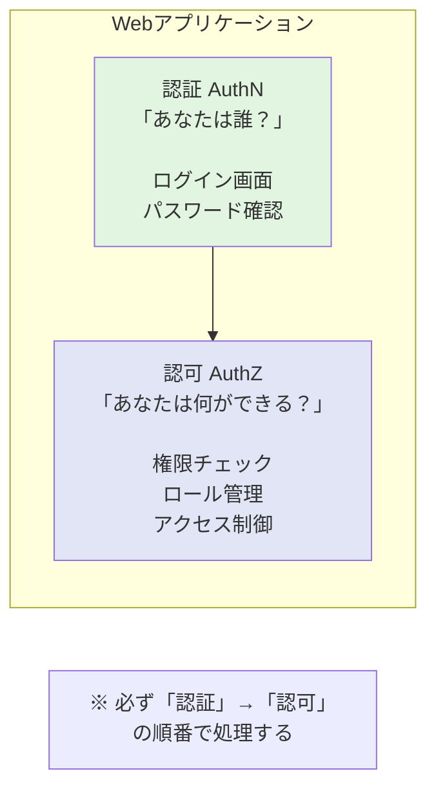
```mermaid
graph LR
    subgraph WebApp["Webアプリケーション"]
        A[認証 AuthN<br/>「あなたは誰？」<br/><br/>ログイン画面<br/>パスワード確認] --> B[認可 AuthZ<br/>「あなたは何ができる？」<br/><br/>権限チェック<br/>ロール管理<br/>アクセス制御]
    end

    note1["※ 必ず「認証」→「認可」の順番で処理する"]

    style A fill:#e1f5e1
    style B fill:#e1e5f5
```

**コードで見る認証と認可の違い:**
```typescript
// ====================================
// 認証: ユーザーがログインしているか確認する
// ====================================
const session = await auth()  // セッション情報を取得
if (!session) {
  // セッションがない = ログインしていない
  return { error: '認証が必要です' }
}

// ====================================
// 認可: そのユーザーがこの操作を行えるか確認する
// ====================================
const post = await prisma.post.findUnique({ where: { id: postId } })
// 投稿者本人 OR 管理者のみ削除を許可する
if (post.userId !== session.user.id && !session.user.isAdmin) {
  return { error: '権限がありません' }
}
```

### 8.1.2 認証の主要な概念

認証システムを理解するために、まず基本的な用語を押さえましょう。それぞれ身近なものにたとえて説明します。

1. **クレデンシャル（Credentials）**: ログイン情報（メールアドレス + パスワード）
   - たとえ: 銀行のキャッシュカード（口座番号）と暗証番号の組み合わせ
2. **セッション（Session）**: ログイン状態の保持
   - たとえ: テーマパークの「再入場スタンプ」。一度入場チェックを受ければ、スタンプを見せるだけで再入場できる
3. **トークン（Token）**: セッションを識別する文字列
   - たとえ: コインロッカーの「鍵」。この鍵を持っている人だけが荷物を取り出せる
4. **ハッシュ化（Hashing）**: パスワードを不可逆的に変換して保存すること
   - たとえ: 肉をミンチにするのと同じ。ミンチから元の肉の形に戻すことはできない
5. **多要素認証（MFA: Multi-Factor Authentication）**: パスワード + 別の要素（TOTPコードなど）
   - たとえ: 金庫を開けるのに「鍵」と「暗証番号」の両方が必要なこと

<details>
<summary>理解度チェック: 認証の基本概念</summary>

**Q1: ユーザーがフィードページにアクセスしようとしたとき、「ログインしてください」と表示されました。これは認証と認可のどちらですか？**

A1: **認証（Authentication）** です。「あなたは誰ですか？」をまだ確認できていない状態です。

**Q2: ログイン済みのユーザーが、他人の投稿を削除しようとして「権限がありません」と表示されました。これは認証と認可のどちらですか？**

A2: **認可（Authorization）** です。誰であるかは確認済みですが、その操作を行う権限がないと判断されました。

**Q3: パスワードのハッシュ化とは何ですか？元に戻せますか？**

A3: パスワードを数学的な一方向変換で文字列に変えることです。**元に戻すことはできません。** 検証するときは、入力されたパスワードを同じ方法でハッシュ化し、保存されたハッシュ値と比較します。
</details>

### 8.1.3 認証に関する用語集（グロッサリー）

この章では多くの専門用語が登場します。初めて見る単語に出会ったとき、いつでもここに戻って確認してください。用語は登場順に並べています。

#### 基本用語

| 用語 | 英語表記 | ひとことで言うと | 詳しい説明 |
|------|----------|-----------------|-----------|
| 認証 | Authentication (AuthN) | 「あなたは誰？」 | ユーザーが本人であることを確認するプロセス。ログイン処理がこれにあたる。身分証明書を見せて自分が誰かを証明するイメージ |
| 認可 | Authorization (AuthZ) | 「あなたは何ができる？」 | 認証済みのユーザーに対して、どの操作を許可するかを制御するプロセス。社員証で入れる部屋が決まるイメージ |
| クレデンシャル | Credentials | ログイン情報 | メールアドレスとパスワードの組み合わせなど、本人確認に使う情報のこと。銀行のキャッシュカード+暗証番号にあたる |
| セッション | Session | ログイン状態の記録 | ユーザーがログインしてからログアウトするまでの一連の接続状態のこと。一度ログインすれば、その後のリクエストではパスワードを再入力せずに済む仕組み。カフェで「この席を使います」と伝えた後、何度立ってもその席が確保されているイメージ |

#### トークンと暗号関連

| 用語 | 英語表記 | ひとことで言うと | 詳しい説明 |
|------|----------|-----------------|-----------|
| トークン | Token | 認証の「合言葉」 | ユーザーが認証済みであることを証明するデータの塊。リクエストのたびにサーバーに送信する。映画館の半券のように「入場済みです」を証明する |
| JWT | JSON Web Token | 情報入りトークン | セッション情報をJSON形式でエンコードし、デジタル署名を付けたトークン。パスポートのように、本人情報と偽造防止スタンプが一体になっている。読み方は「ジョット」 |
| ハッシュ化 | Hashing | 元に戻せない変換 | パスワードなどの文字列を、数学的に不可逆な文字列に変換すること。肉をミンチにするように、一度変換したら元に戻せない。パスワードを安全に保存するために使う |
| ソルト | Salt | ハッシュに加える調味料 | ハッシュ化の前にパスワードに付加するランダムな文字列。同じパスワードでも異なるハッシュ値になるようにする。料理に塩を加えると味が変わるように、ソルトを加えるとハッシュ値が変わる |
| 暗号化 | Encryption | 元に戻せる変換 | データを鍵を使って読めない形に変換すること。ハッシュ化と違い、正しい鍵があれば元に戻せる（復号）。金庫に入れた手紙は、鍵があれば取り出して読める |
| 署名 | Signature | 改ざん検出の印 | データが改ざんされていないことを証明するための仕組み。JWTでは秘密鍵を使って署名を生成し、検証時には同じ秘密鍵で確認する |

#### 認証プロトコルとセキュリティ

| 用語 | 英語表記 | ひとことで言うと | 詳しい説明 |
|------|----------|-----------------|-----------|
| OAuth | Open Authorization | 他サービス経由のログイン | 「Googleでログイン」「GitHubでログイン」のように、他のサービスの認証情報を使ってログインする仕組み。自分でパスワードを管理せず、信頼できる第三者に認証を委任する。ホテルのコンシェルジュが「この方はVIP会員です」と保証してくれるイメージ |
| CSRF | Cross-Site Request Forgery | サイトを跨いだ偽のリクエスト | 悪意あるサイトが、ログイン済みユーザーのブラウザを経由して、本来意図しないリクエストを送る攻撃。例えば、悪意あるサイトを開いただけで「投稿を全削除」するリクエストが送られてしまう。NextAuth.jsとNext.jsのServer Actionsはこの攻撃を自動的に防いでくれる |
| XSS | Cross-Site Scripting | サイトへのスクリプト埋め込み | 悪意あるJavaScriptコードをWebページに埋め込む攻撃。ユーザーの入力をそのまま表示すると、攻撃者のスクリプトが実行されてしまう。Reactはデフォルトでエスケープ処理を行うため、基本的に防がれている |
| ブルートフォース攻撃 | Brute Force Attack | パスワード総当たり | 考えられるパスワードを片っ端から試す攻撃手法。「0000」から「9999」まで全部試すように、時間をかければいつか正解にたどり着く。これを防ぐために、ログイン試行回数の制限やアカウントロックを実装する |
| レインボーテーブル | Rainbow Table | ハッシュ値の逆引き辞書 | よく使われるパスワードのハッシュ値を事前に計算してまとめた辞書。ソルトを使わないハッシュ値はこの辞書で瞬時に元のパスワードが判明してしまう。bcryptがソルトを使う主な理由の一つ |

#### フレームワーク・ライブラリ関連

| 用語 | 英語表記 | ひとことで言うと | 詳しい説明 |
|------|----------|-----------------|-----------|
| プロバイダー | Provider | 認証手段の提供者 | NextAuth.jsにおいて、認証の方法を提供するモジュール。CredentialsProvider（メール+パスワード）、GoogleProvider（Google認証）など、ログインの「窓口」のようなもの |
| アダプター | Adapter | DB接続の翻訳者 | NextAuth.jsとデータベースを繋ぐ仲介役。PrismaAdapterを使えば、NextAuth.jsがPrisma経由でDBにユーザー情報を保存・取得できる。コンセントの形を変換するプラグアダプターのイメージ |
| コールバック | Callback | 処理の途中で呼ばれる関数 | NextAuth.jsの認証フローの各段階で実行されるカスタム関数。`jwt`コールバック（トークン生成時）、`session`コールバック（セッション取得時）などがあり、認証の動作をカスタマイズできる |
| ミドルウェア | Middleware | リクエストの門番 | クライアントからのリクエストがページに到達する前に実行される処理。Next.js 16では`proxy.ts`に記述し、認証チェックやリダイレクトを行う。入口で入場券をチェックする係員のようなもの |
| Edge Runtime | Edge Runtime | CDN上の軽量実行環境 | 世界中のCDNエッジサーバーで動作する軽量なJavaScript実行環境。Node.jsより機能は少ないが、ユーザーに近い場所で高速に実行できる。Next.jsのMiddlewareはこの環境で動く |
| バリデーション | Validation | データの検証 | ユーザーが入力したデータが正しい形式かどうかを確認すること。「メールアドレスに@が含まれているか」「パスワードが8文字以上か」など。不正なデータがシステムに入るのを防ぐ |

> **ヒント:** この用語集は章全体で使われる用語をまとめたものです。各用語の詳しい解説は、この後のセクションで実際のコードと一緒に学んでいきます。分からない用語が出てきたら、このセクションに戻って確認しましょう。

---

## 8.2 セッションベース vs JWT

> **このセクションで学ぶこと**
> - セッションベース認証の仕組みとメリット・デメリット
> - JWT認証の仕組みとメリット・デメリット
> - BON-LOGでJWTを選択した理由

Webアプリケーションにおいて、ユーザーのログイン状態を保持する方法は大きく2つあります。それぞれの仕組みを理解し、プロジェクトに最適な方式を選べるようになりましょう。

### 8.2.1 セッションベース認証

セッションベース認証は、ホテルの「宿泊カード」に似ています。チェックイン時にフロント（サーバー）で情報を記録し、鍵（セッションID）を渡します。何かサービスを受けるときは、鍵を見せてフロントに照会します。

**仕組み:**
1. ログイン成功時、サーバーがセッションIDを発行
2. セッションIDをデータベースに保存（サーバー側で管理）
3. クッキーでセッションIDをブラウザに送信
4. リクエストごとにセッションIDでユーザーを識別

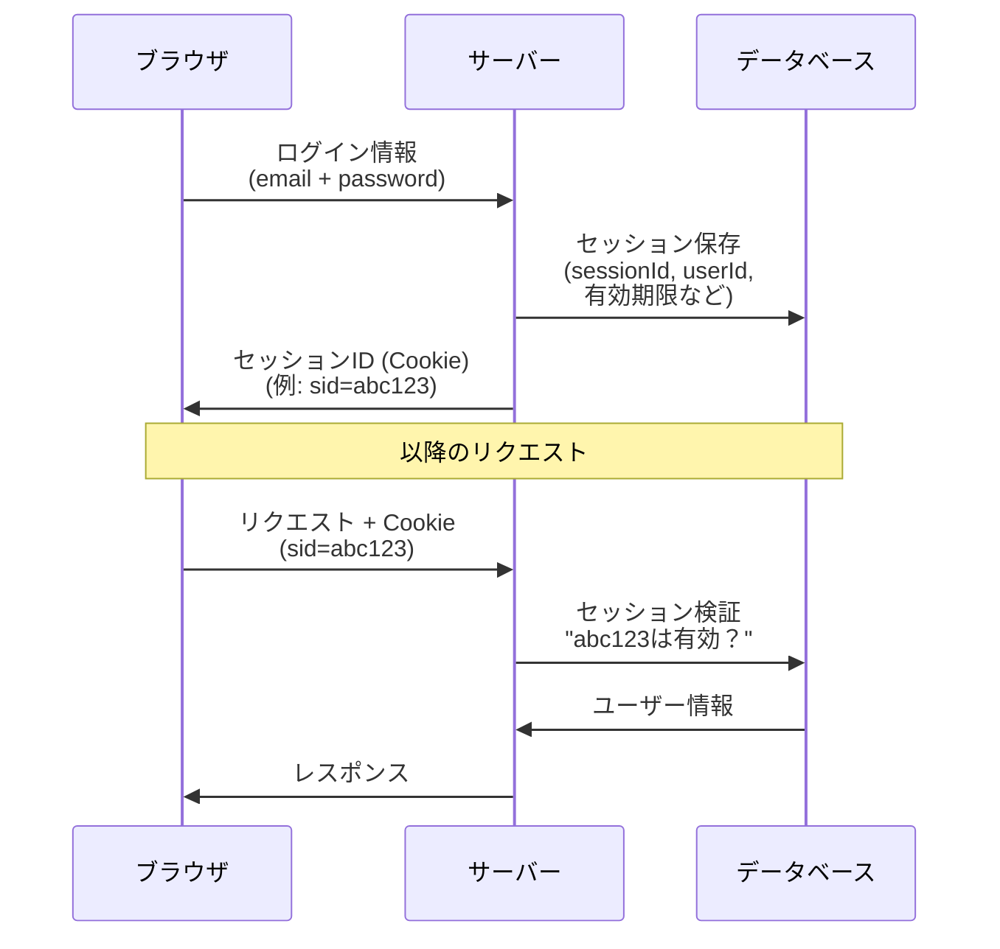
```mermaid
sequenceDiagram
    participant Browser as ブラウザ
    participant Server as サーバー
    participant DB as データベース

    Browser->>Server: ログイン情報<br/>(email + password)
    Server->>DB: セッション保存<br/>(sessionId, userId,<br/>有効期限など)
    Server->>Browser: セッションID (Cookie)<br/>(例: sid=abc123)

    Note over Browser,DB: 以降のリクエスト

    Browser->>Server: リクエスト + Cookie<br/>(sid=abc123)
    Server->>DB: セッション検証<br/>"abc123は有効？"
    DB->>Server: ユーザー情報
    Server->>Browser: レスポンス
```

**メリット:**
- サーバー側でセッションを無効化できる（DBからセッションを削除すれば即座にログアウト可能）
- セッション情報をDBで管理可能（「いつ、どこからログインしたか」を追跡できる）
- トークンサイズが小さい（セッションIDは短い文字列）

**デメリット:**
- リクエストごとにDBアクセスが必要（パフォーマンスへの影響）
- 水平スケーリング時にセッション共有が必要（複数サーバーでDB共有かRedis等が必要）

### 8.2.2 JWT（JSON Web Token）認証

JWT認証は、パスポートに似ています。パスポートには本人情報が直接書き込まれており、偽造防止のスタンプ（署名）が押されています。入国審査（サーバー）ではスタンプの真正性を確認するだけで、発行元に問い合わせる必要がありません。

**仕組み:**
1. ログイン成功時、サーバーがJWTを発行
2. JWTにユーザー情報を含める（暗号化署名つき）
3. クッキーでJWTをブラウザに送信
4. リクエストごとにJWTの署名を検証（DB問い合わせ不要）

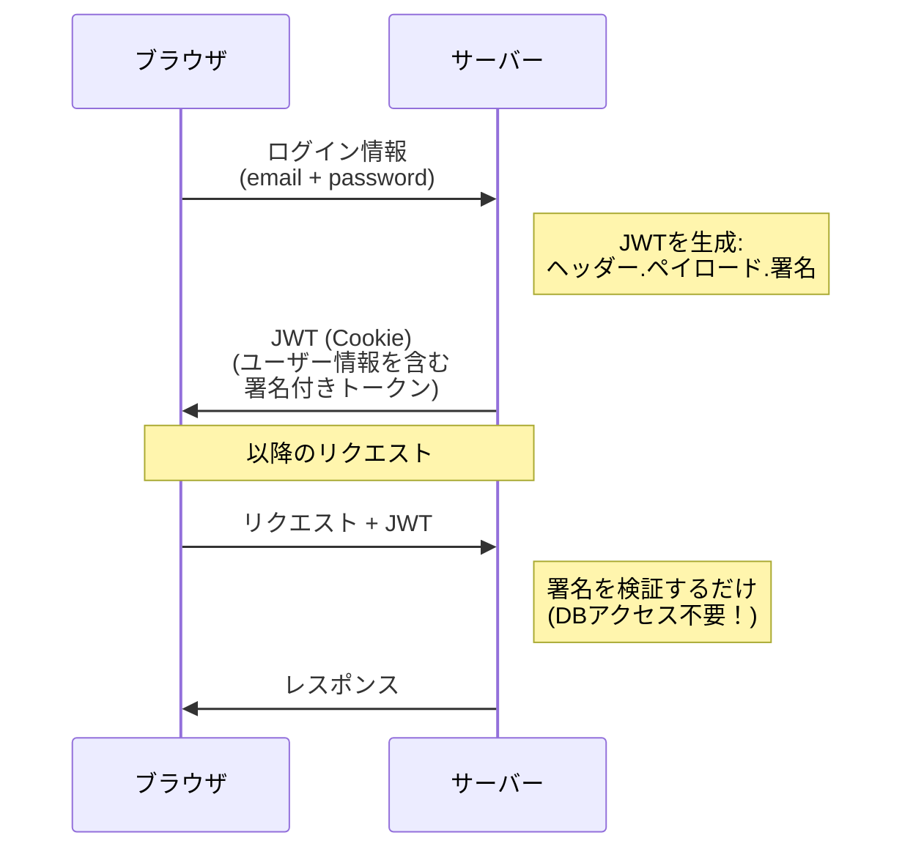
```mermaid
sequenceDiagram
    participant Browser as ブラウザ
    participant Server as サーバー

    Browser->>Server: ログイン情報<br/>(email + password)
    Note right of Server: JWTを生成:<br/>ヘッダー.ペイロード.署名
    Server->>Browser: JWT (Cookie)<br/>(ユーザー情報を含む<br/>署名付きトークン)

    Note over Browser,Server: 以降のリクエスト

    Browser->>Server: リクエスト + JWT
    Note right of Server: 署名を検証するだけ<br/>(DBアクセス不要！)
    Server->>Browser: レスポンス
```

**JWTの構造:**

JWTは3つの部分をドット（.）で繋いだ文字列です。

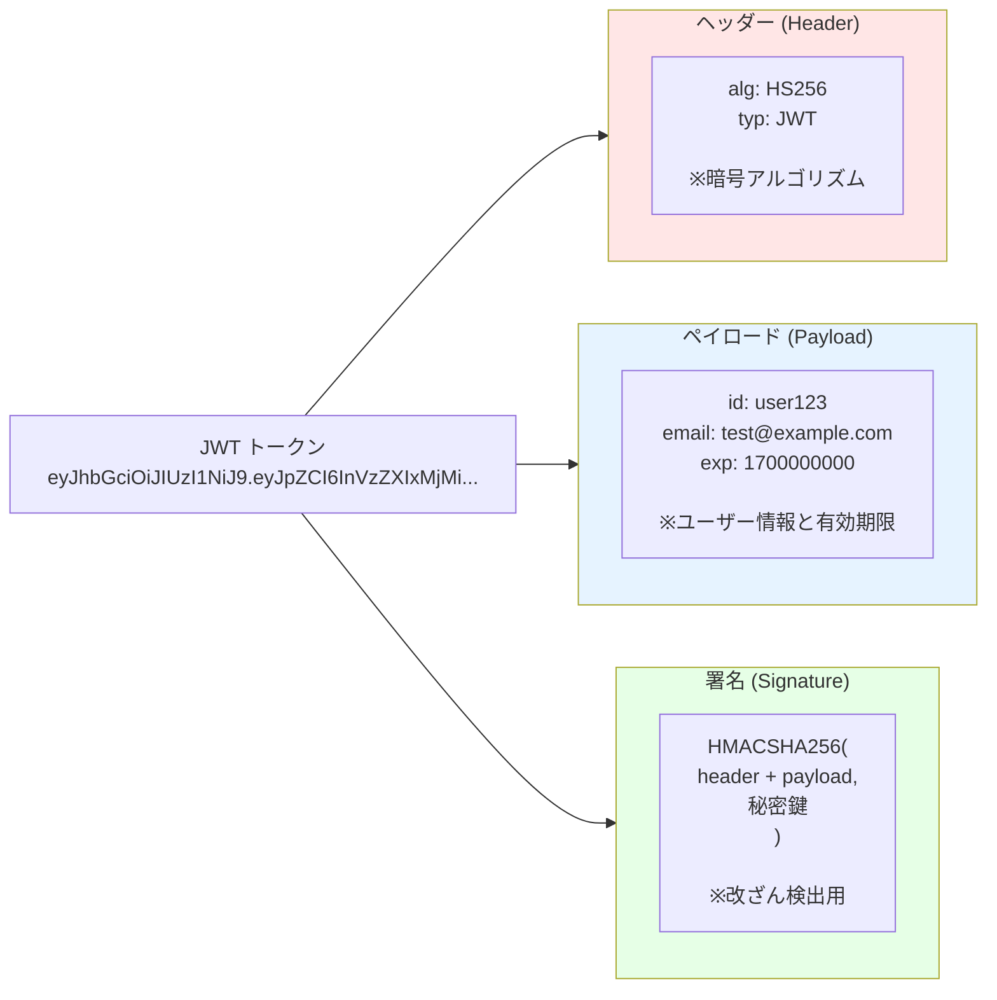
```mermaid
graph LR
    JWT["JWT トークン<br/>eyJhbGciOiJIUzI1NiJ9.eyJpZCI6InVzZXIxMjMi..."]

    subgraph Header["ヘッダー (Header)"]
        H1["alg: HS256<br/>typ: JWT<br/><br/>※暗号アルゴリズム"]
    end

    subgraph Payload["ペイロード (Payload)"]
        P1["id: user123<br/>email: test@example.com<br/>exp: 1700000000<br/><br/>※ユーザー情報と有効期限"]
    end

    subgraph Signature["署名 (Signature)"]
        S1["HMACSHA256(<br/>header + payload,<br/>秘密鍵<br/>)<br/><br/>※改ざん検出用"]
    end

    JWT --> Header
    JWT --> Payload
    JWT --> Signature

    style Header fill:#ffe6e6
    style Payload fill:#e6f3ff
    style Signature fill:#e6ffe6
```

**メリット:**
- DBアクセス不要（署名検証のみで高速）
- ステートレス（サーバー間で情報共有不要。サーバーレス環境に最適）
- スケーラビリティが高い（サーバーを増やしても問題なし）

**デメリット:**
- 発行後のトークン無効化が困難（パスポートを取り消すのが難しいのと同じ）
- トークンサイズが大きい（ユーザー情報を含むため）
- 有効期限内は強制ログアウトが難しい

### 8.2.3 BON-LOGでの選択

BON-LOGでは**JWT方式**を採用します。

| 観点 | セッションベース | JWT | BON-LOGの判断 |
|------|----------------|-----|--------------|
| パフォーマンス | DB問い合わせ必要 | 署名検証のみ | JWT有利 |
| デプロイ先 | DB常時接続必要 | ステートレス | Vercelに最適なJWT |
| スケーリング | セッション共有必要 | 不要 | JWT有利 |
| 即座のログアウト | 容易 | 工夫が必要 | 許容範囲 |
| 実装の複雑さ | シンプル | やや複雑 | NextAuth.jsが吸収 |

**選択理由のまとめ:**
- Vercelでのデプロイに最適（ステートレスでサーバーレス環境と相性抜群）
- パフォーマンス重視（毎リクエストDBアクセスを避けられる）
- セッションテーブル不要（データベース設計がシンプルになる）
- NextAuth.jsが複雑な部分を処理してくれる

<details>
<summary>理解度チェック: セッションベース vs JWT</summary>

**Q1: セッションベース認証で、サーバーを2台に増やしたときに起こる問題は何ですか？**

A1: サーバーAで作成されたセッションはサーバーAのDBにしか存在しないため、次のリクエストがサーバーBに振り分けられると、セッション情報が見つからずログアウト状態になってしまいます。これを防ぐには、RedisなどでセッションをDB共有する必要があります。

**Q2: JWTが「改ざん」されたら何が起きますか？**

A2: JWTの署名部分はサーバーの秘密鍵で生成されています。ペイロード（データ）が改ざんされると、署名の検証に失敗するため、サーバーはそのJWTを無効として拒否します。つまり、秘密鍵を知らない限り改ざんは検出されます。

**Q3: JWT方式で「即座のログアウト」が難しいのはなぜですか？**

A3: JWTは一度発行されるとサーバー側では管理していないため、有効期限が切れるまで有効です。セッションベースならDBからセッションを削除すれば済みますが、JWTにはそのような仕組みがありません。8.10節で紹介する「tokenVersion」方式で対策できます。
</details>

### 8.2.4 JWTの仕組みをもう少し詳しく（初心者向け深掘り）

JWTは認証システムの中核なので、もう少し掘り下げて理解しましょう。

#### JWTの「署名」とは何か

JWTの署名は、「このトークンが本物であること」を証明するための仕組みです。手紙に封蝋（シーリングワックス）を押すようなものです。

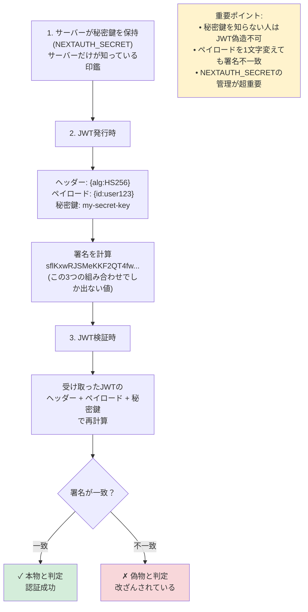
```mermaid
flowchart TD
    A["1. サーバーが秘密鍵を保持<br/>(NEXTAUTH_SECRET)<br/>サーバーだけが知っている印鑑"] --> B

    B["2. JWT発行時"] --> C["ヘッダー: {alg:HS256}<br/>ペイロード: {id:user123}<br/>秘密鍵: my-secret-key"]
    C --> D["署名を計算<br/>sflKxwRJSMeKKF2QT4fw...<br/>(この3つの組み合わせでしか出ない値)"]

    D --> E["3. JWT検証時"]
    E --> F["受け取ったJWTの<br/>ヘッダー + ペイロード + 秘密鍵<br/>で再計算"]

    F --> G{署名が一致？}
    G -->|一致| H["✓ 本物と判定<br/>認証成功"]
    G -->|不一致| I["✗ 偽物と判定<br/>改ざんされている"]

    J["重要ポイント:<br/>• 秘密鍵を知らない人はJWT偽造不可<br/>• ペイロードを1文字変えても署名不一致<br/>• NEXTAUTH_SECRETの管理が超重要"]

    style H fill:#d4edda
    style I fill:#f8d7da
    style J fill:#fff3cd
```

#### JWTの有効期限と更新


```mermaid
gantt
    title JWTの有効期限とスライディングウィンドウ方式
    dateFormat X
    axisFormat %d日

    section 初回ログイン
    JWTが有効           :a1, 0, 30d
    期限切れ            :milestone, 30d

    section 15日目にアクセス
    JWT更新 有効期限延長 :a2, 15, 30d

    section 40日目にアクセス
    JWT更新 有効期限延長 :a3, 40, 30d
```

**NextAuth.jsのデフォルト設定:**
```typescript
session: {
  strategy: 'jwt',
  maxAge: 30 * 24 * 60 * 60, // 30日（= 2,592,000秒）
}

// ※ 30日以内にアクセスがあれば、
//   自動的にトークンが更新される
//   (スライディングウィンドウ方式)

// JWTトークンのペイロード部分をデコードすると以下のような構造が見える:
// {
//   "id": "clx1abc2d0001abcdef12345",   ← ユーザーID（callbacks.jwtで追加）
//   "email": "taro@example.com",         ← メールアドレス
//   "name": "盆栽太郎",                   ← ニックネーム
//   "iat": 1707123456,                   ← 発行日時（Unix timestamp）
//   "exp": 1709715456,                   ← 有効期限（30日後）
//   "jti": "a1b2c3d4-e5f6-7890-abcd"    ← トークンの一意ID
// }
```

**スライディングウィンドウの効果:**
- 定期的にアクセスしていれば、ずっとログイン状態を維持できる
- 30日間アクセスがなければ自動的にログアウト

> **初心者の方へ:** JWTの仕組みを完全に理解する必要はありません。重要なのは、(1) JWTにはユーザー情報が含まれていること、(2) 署名で改ざんが検出できること、(3) 秘密鍵（NEXTAUTH_SECRET）の管理が重要なこと、の3点です。NextAuth.jsがこれらの処理をすべて自動的に行ってくれます。

---

## 8.3 NextAuth.js (Auth.js v5) の概要

> **このセクションで学ぶこと**
> - NextAuth.jsとは何か、なぜ使うのか
> - v5の主な変更点と特徴
> - 必要なパッケージのインストール方法

### 8.3.1 NextAuth.jsとは

認証システムをゼロから実装するのは非常に大変です。パスワードの安全な保存、セッション管理、CSRF対策、Cookie管理など、考慮すべきことが山のようにあります。

NextAuth.js（Auth.js）は、Next.jsアプリに認証機能を簡単かつ安全に追加できるライブラリです。いわば、「認証のプロが作った認証キット」です。

**NextAuth.jsを使わない場合に自分で実装が必要なもの:**
- パスワードのハッシュ化と検証ロジック
- JWTの生成・検証・更新の処理
- Cookieの設定（HttpOnly, Secure, SameSite等）
- CSRFトークンの管理
- セッションの有効期限管理
- ログイン・ログアウトのAPI
- 型安全なセッション情報の取得

**NextAuth.jsを使えば、これらすべてが設定ファイル1つで完了します。**

**主な特徴:**
- 多様なプロバイダー対応（Google, GitHub, Email/Password等）
- セッション管理（JWT/セッションベースの切り替え可能）
- JWTサポート（自動的に署名・検証を処理）
- Prismaなど主要ORMと統合（データベース連携が簡単）
- TypeScript完全対応（型安全なセッション情報）
- Edge Runtime対応（Vercelのミドルウェアで動作）

**v5の主な変更点:**

| 項目 | v4 | v5 |
|------|----|----|
| インストール | `next-auth` | `next-auth@beta` |
| インポート | `import { getServerSession } from 'next-auth'` | `import { auth } from '@/lib/auth'` |
| セッション取得 | `getServerSession(authOptions)` | `auth()` |
| API設定 | `[...nextauth].ts`で`authOptions`をエクスポート | `auth.ts`で`NextAuth()`の戻り値をエクスポート |
| Edge対応 | 限定的 | フル対応 |
| ミドルウェア | 別途設定が必要 | `auth`関数をそのままミドルウェアに使える |

### 8.3.2 インストール

```bash
# NextAuth.js v5（beta版）
# Next.jsアプリに認証機能を追加するメインライブラリ
npm install next-auth@beta

# Prisma Adapter
# NextAuth.jsとPrisma（データベース）を連携させるアダプター
npm install @auth/prisma-adapter

# パスワードハッシュ化ライブラリ
# bcryptjsはパスワードを安全に変換するためのライブラリ
npm install bcryptjs

# bcryptjsの型定義（開発時のみ必要）
# TypeScriptで型チェックを有効にするための型情報
npm install -D @types/bcryptjs
```

> **実行結果の確認方法**
> インストールが正常に完了すると、`package.json` の `dependencies` に以下が追加されます:
> ```json
> "dependencies": {
>   "@auth/prisma-adapter": "^2.x.x",
>   "bcryptjs": "^2.4.3",
>   "next-auth": "5.0.0-beta.x",
>   ...
> }
> ```
> `node_modules` フォルダにパッケージがダウンロードされ、TypeScriptのインポートで型エラーが出なくなります。

> **補足:** `next-auth@beta`はAuth.js v5のベータ版です。安定版がリリースされたら `npm install next-auth` でインストールできるようになります。BON-LOGの開発時点ではベータ版を使用しています。

| パッケージ名 | 役割 | なぜ必要か |
|-------------|------|-----------|
| `next-auth@beta` | 認証ライブラリ本体 | ログイン/ログアウト/セッション管理のすべてを提供 |
| `@auth/prisma-adapter` | DB連携アダプター | ユーザー情報をPrisma経由でDBに保存するため |
| `bcryptjs` | パスワードハッシュ化 | パスワードを安全に保存するため（平文保存は厳禁） |
| `@types/bcryptjs` | 型定義 | TypeScriptでbcryptjsを型安全に使うため |

---

## 8.4 パスワードのハッシュ化

> **このセクションで学ぶこと**
> - なぜパスワードをそのまま保存してはいけないのか
> - ハッシュ化の仕組みとbcryptの使い方
> - ソルト（Salt）の役割

### 8.4.1 なぜハッシュ化が必要か

パスワードを平文（そのままの文字列）でDBに保存するのは重大なセキュリティリスクです。

**もしパスワードが平文で保存されていたら:**

**users テーブル（平文保存 = 危険！）**

| email | password |
|-------|----------|
| taro@example | MyBonsai2024 | ← 丸見え！
| hana@example | Sakura#123 | ← 丸見え！
| ken@example | Password1234 | ← 丸見え！

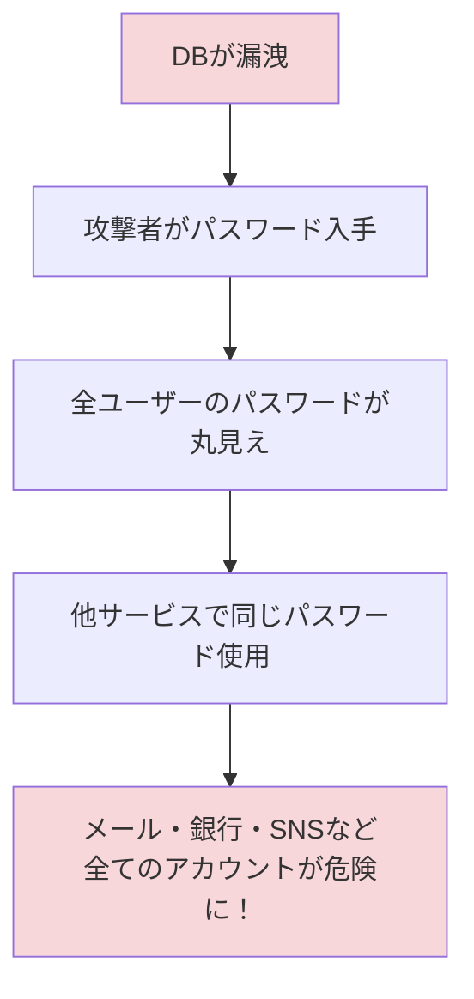
```mermaid
graph TD
    A["DBが漏洩"] --> B["攻撃者がパスワード入手"]
    B --> C["全ユーザーのパスワードが丸見え"]
    C --> D["他サービスで同じパスワード使用"]
    D --> E["メール・銀行・SNSなど<br/>全てのアカウントが危険に！"]

    style A fill:#f8d7da
    style E fill:#f8d7da
```

**users テーブル（ハッシュ化保存 = 安全）**

| email | password |
|-------|----------|
| taro@example | $2a$10$N9qo8uLO...lhWy |
| hana@example | $2a$10$Xk3mR9pQ...jK2x |
| ken@example | $2a$10$Wq7nL5sT...mN4z |

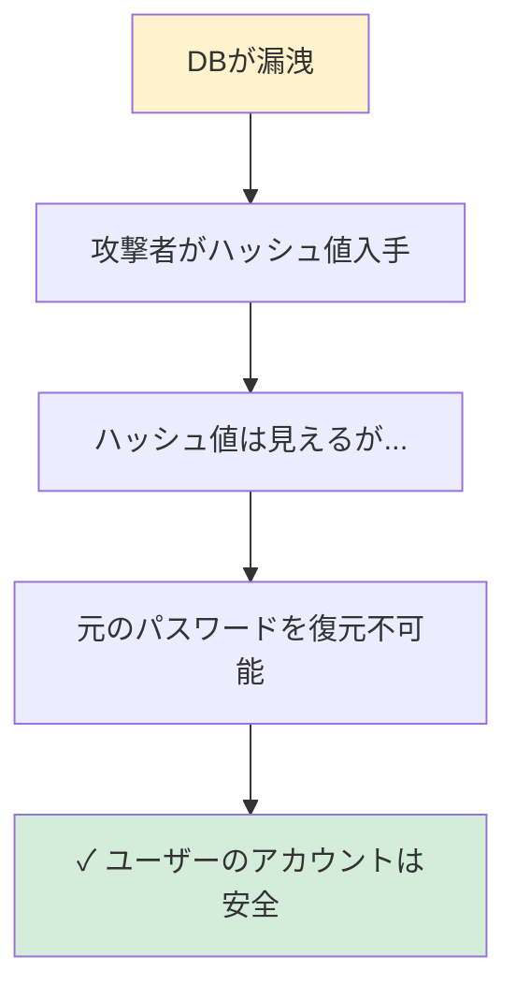
```mermaid
graph TD
    A["DBが漏洩"] --> B["攻撃者がハッシュ値入手"]
    B --> C["ハッシュ値は見えるが..."]
    C --> D["元のパスワードを復元不可能"]
    D --> E["✓ ユーザーのアカウントは安全"]

    style A fill:#fff3cd
    style E fill:#d4edda
```

**重要:** ハッシュから元のパスワードを復元することは事実上不可能

**ハッシュ化の特徴:**
- **一方向変換**: 元に戻せない（ハッシュ値からパスワードを復元できない）
- **決定的**: 同じパスワードは常に同じハッシュ値になる（検証に利用）
- **ソルト（Salt）**: bcryptが自動で付加するランダム値。同じパスワードでも異なるハッシュ値を生成し、「レインボーテーブル攻撃」を防ぐ

**ソルトの役割を具体的に:**
```
ソルトなし（危険）:
  "password123" → 常に同じハッシュ値
  → 攻撃者が事前に計算したハッシュ辞書で照合可能

ソルトあり（安全）:
  "password123" + ソルト"abc" → ハッシュ値A
  "password123" + ソルト"xyz" → ハッシュ値B（全く違う！）
  → 毎回異なるソルトを使うので辞書攻撃が無効化される
```

### 8.4.2 bcryptjsの使い方

まずはハッシュ化の基本操作から見ていきましょう。

**Step 1: パスワードをハッシュ化する**

```typescript
import bcrypt from 'bcryptjs'  // bcryptjsライブラリをインポート

// パスワードを安全な形式に変換する
const password = 'myPassword123'       // ユーザーが入力した生のパスワード
const hashedPassword = await bcrypt.hash(password, 10)
// 第2引数の「10」はソルトラウンド数（計算回数）
// 数字が大きいほど安全だが処理が遅くなる。10が推奨値。

console.log(hashedPassword)
// 実行結果: $2a$10$xK8Dv3q9fN7G2mH5pR1Oe8YzWvX4bA6cD0eF1gH2iJ3kL4mN5oP
// （毎回異なるハッシュが生成される -- ソルトがランダムなため）
```

> **実行結果の確認方法**
> Node.jsのREPLで試すことができます:
> ```bash
> node -e "const bcrypt = require('bcryptjs'); bcrypt.hash('myPassword123', 10).then(h => console.log(h))"
> ```
> 実行するたびに異なるハッシュ値が出力されます。これはソルトが毎回ランダムに生成されるためで、正常な動作です。

**Step 2: パスワードを検証する**

```typescript
// 正しいパスワードで検証
const isValid = await bcrypt.compare('myPassword123', hashedPassword)
console.log(isValid)   // 実行結果: true（一致！）
// compareは内部で以下を行う:
// 1. hashedPasswordからソルトを抽出
// 2. 入力パスワード + ソルトでハッシュ化
// 3. 結果を比較

// 間違ったパスワードで検証
const isInvalid = await bcrypt.compare('wrongPassword', hashedPassword)
console.log(isInvalid) // 実行結果: false（不一致。パスワードが間違っている）
```

**Step 3: ハッシュ値の構造を理解する**

```typescript
// ハッシュ値の構造を分解して見てみましょう
const hash = await bcrypt.hash('MyBonsai2024', 10)
console.log(hash)
// 実行結果: $2a$10$N9qo8uLOickgx2ZMRZoMyeIjZAgcfl7p92ldGxad68LJZdL17lhWy
//           ^^^^ ^^ ^^^^^^^^^^^^^^^^^^^^^^ ^^^^^^^^^^^^^^^^^^^^^^^^^^^^^^
//           |    |  |                      |
//           |    |  ソルト（22文字）         ハッシュ値（31文字）
//           |    ソルトラウンド数（10）
//           アルゴリズム識別子（2a = bcrypt）
```

> **重要:** `bcrypt.compare()` を使うことで、元のパスワードを知らなくてもパスワードの正しさを検証できます。DBには常にハッシュ値のみを保存し、平文パスワードは一切保存しません。

| よくあるトラブル | 原因 | 解決法 |
|----------------|------|--------|
| `bcrypt.hash is not a function` | ESModulesとCommonJSの互換性問題 | `import bcrypt from 'bcryptjs'`のインポートを確認。`bcryptjs`を使っていることを確認 |
| ハッシュ化に時間がかかる | ソルトラウンド数が大きすぎる | ラウンド数を10に設定（推奨値）。12以上は本番環境でも遅くなることがある |
| 同じパスワードなのにハッシュ値が違う | 正常な動作（ソルトが毎回異なるため） | 比較には必ず`bcrypt.compare()`を使う。ハッシュ値同士の直接比較（`===`）は厳禁 |

<details>
<summary>理解度チェック: パスワードのハッシュ化</summary>

**Q1: なぜ `hashedPassword1 === hashedPassword2` でパスワードを比較してはいけないのですか？**

A1: bcryptは毎回異なるソルト（ランダム値）を使うため、同じパスワードでも異なるハッシュ値が生成されます。そのため文字列の直接比較では常に`false`になります。`bcrypt.compare()`はハッシュ値からソルトを抽出して正しく比較してくれます。

**Q2: ソルトラウンド数の「10」は何を意味していますか？**

A2: ハッシュ計算を2^10 = 1024回繰り返すことを意味します。繰り返すほど総当たり攻撃に時間がかかりますが、ログイン処理自体も遅くなります。10は安全性と処理速度のバランスが良い推奨値です。

**Q3: MD5やSHA-1でパスワードをハッシュ化するのはなぜダメですか？**

A3: MD5やSHA-1は「高速」に計算できるように設計されたハッシュ関数です。攻撃者にとっても高速に総当たり攻撃ができてしまいます。bcryptは意図的に「遅い」ハッシュ関数であり、総当たり攻撃を困難にしています。

> **bcryptが「意図的に遅い」理由**
>
> | ハッシュ方式 | 1回の計算時間 | 10億パターン試行 |
> |------------|-------------|----------------|
> | MD5（非推奨） | 0.000001秒 | 約17分 |
> | bcrypt（推奨） | 0.1秒 | **約3,170年** |
>
> ログインは1ユーザーにつき1回なので0.1秒の遅延は問題になりません。しかし攻撃者がパスワードを総当たりする場合、この遅さが致命的な壁になります。
</details>

---

## 8.4B 技術選定の理由 -- なぜこの技術スタックを選んだのか

> **このセクションで学ぶこと**
> - 認証ライブラリを選ぶときの判断基準
> - セッション管理方式の選択肢とトレードオフ
> - パスワードハッシュアルゴリズムの比較
> - バリデーションライブラリの選択肢
> - 各選択肢のメリット・デメリットを比較して、根拠のある技術選定ができるようになること

ソフトウェア開発では「何を使うか」を選ぶこと自体が重要なスキルです。ここでは、BON-LOGの認証システムで採用した各技術について、「なぜそれを選んだのか」を他の選択肢と比較しながら解説します。

> **初心者の方へ:** 技術選定は「正解が一つ」ではありません。プロジェクトの規模、チームのスキル、予算、将来の拡張性など、様々な要因を総合的に判断します。ここでの比較を参考に、自分のプロジェクトに最適な選択ができるようになりましょう。

### 8.4B.1 認証ライブラリの選択肢

Next.jsアプリに認証を追加する方法は複数あります。主要な選択肢を比較してみましょう。

#### 選択肢の一覧

**1. NextAuth.js（Auth.js v5）-- BON-LOGの選択**

Next.js公式が推奨するオープンソースの認証ライブラリです。設定ファイルを書くだけで認証機能が完成します。

```typescript
// NextAuth.jsの設定例（たった1ファイルで認証が完成）
export const { handlers, signIn, signOut, auth } = NextAuth({
  adapter: PrismaAdapter(prisma),
  session: { strategy: 'jwt' },
  providers: [
    CredentialsProvider({ ... }),
    // Google(), GitHub() なども簡単に追加可能
  ],
})
```

**2. Clerk**

認証のUI（ログインフォーム等）まで提供する、フルマネージドの認証サービスです。最速で認証を実装できますが、有料プランが必要な場合があります。

```typescript
// Clerkの例: コンポーネントを置くだけでログインUIが完成
import { SignIn } from '@clerk/nextjs'

export default function LoginPage() {
  return <SignIn />  // ログインフォームが自動生成される
}
```

**3. Supabase Auth**

Supabase（PostgreSQLベースのBaaS）に組み込まれた認証機能です。Supabaseをデータベースとして使う場合に便利です。

**4. Firebase Auth**

Googleが提供するFirebaseプラットフォームの認証機能です。Googleのインフラで動作し、大規模な利用に対応できます。

**5. Lucia Auth**

軽量でカスタマイズ性が高いオープンソースの認証ライブラリです。内部の仕組みを理解しやすい設計になっています。

**6. 自前実装**

ライブラリを使わず、すべての認証ロジックを自分で書く方法です。学習目的には最適ですが、本番環境ではセキュリティリスクが高くなります。

#### 比較表

| 観点 | NextAuth.js | Clerk | Supabase Auth | Firebase Auth | Lucia Auth | 自前実装 |
|------|-------------|-------|---------------|---------------|------------|----------|
| **コスト** | 無料（OSS） | 無料枠あり（月5,000MAUまで）、それ以上は有料 | 無料枠あり（月50,000MAUまで） | 無料枠あり（月10,000回/日の認証まで） | 無料（OSS） | 無料 |
| **カスタマイズ性** | 高い | 中程度（UIは制限あり） | 中程度 | 中程度 | 非常に高い | 完全自由 |
| **プロバイダー数** | 80以上 | 30以上 | 主要なもの | 主要なもの | 任意で追加 | 自分で実装 |
| **学習コスト** | 中程度 | 低い | 中程度 | 中程度 | 高い | 非常に高い |
| **Next.js統合** | 公式推奨 | 専用SDK | SDK経由 | SDK経由 | 手動設定 | 手動実装 |
| **Prisma連携** | 公式アダプター | 不要（自前DB） | 不要（Supabase DB） | 不要（Firebase DB） | 公式サポート | 手動実装 |
| **TypeScript** | フル対応 | フル対応 | 対応 | 対応 | フル対応 | 自分で型定義 |
| **Edge Runtime** | v5で対応 | 対応 | 非対応 | 非対応 | 非対応 | 自分で対応 |

#### なぜNextAuth.jsを選んだか

BON-LOGでNextAuth.jsを採用した理由を整理します。

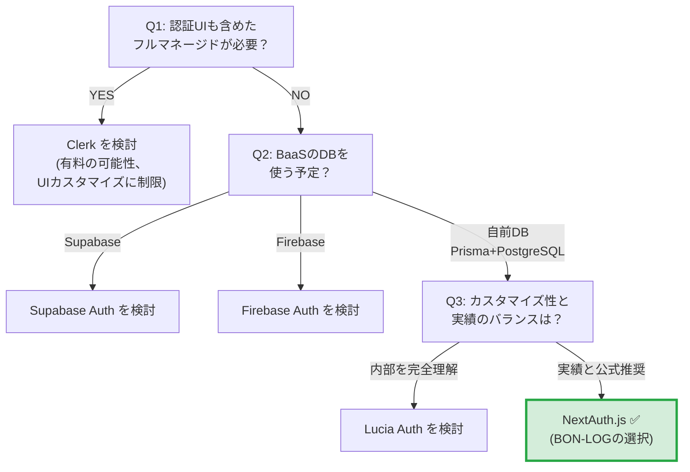
```mermaid
flowchart TD
    A["Q1: 認証UIも含めた<br/>フルマネージドが必要？"] --> |YES| B["Clerk を検討<br/>(有料の可能性、<br/>UIカスタマイズに制限)"]
    A --> |NO| C["Q2: BaaSのDBを<br/>使う予定？"]

    C --> |Supabase| D["Supabase Auth を検討"]
    C --> |Firebase| E["Firebase Auth を検討"]
    C --> |自前DB<br/>Prisma+PostgreSQL| F["Q3: カスタマイズ性と<br/>実績のバランスは？"]

    F --> |内部を完全理解| G["Lucia Auth を検討"]
    F --> |実績と公式推奨| H["NextAuth.js ✅<br/>(BON-LOGの選択)"]

    style H fill:#d4edda,stroke:#28a745,stroke-width:3px
```

**BON-LOGの選定理由:**

1. **Next.js公式推奨**: Next.jsドキュメントで推奨されており、アップデートへの追従が早い
2. **Prismaアダプター**: BON-LOGのDBスタックと完璧に連携できる
3. **完全無料**: オープンソースで、ユーザー数に関係なく無料
4. **柔軟性**: カスタムUIを自由にデザインでき、和風テイストのデザインを実現可能
5. **Edge Runtime対応**: Vercelのミドルウェアで認証チェックが可能
6. **コミュニティ**: 利用者が多く、トラブルシューティングの情報が豊富
7. **段階的な拡張**: まずCredentials（メール+パスワード）から始め、後からGoogleやGitHub認証を追加可能

> **初心者の方へ:** 「どれが一番良いか」は状況によって異なります。個人プロジェクトで素早く認証を実装したいならClerk、Supabaseを既に使っているならSupabase Auth、というように、プロジェクトの文脈で最適解は変わります。

### 8.4B.2 セッション管理の選択肢

ユーザーのログイン状態をどのように管理するかには、主に3つの方式があります。

#### 方式の比較

**方式1: JWT（JSON Web Token）-- BON-LOGの選択**

トークンにユーザー情報を含め、署名で改ざんを検出します。サーバーに状態を持たない「ステートレス」な方式です。

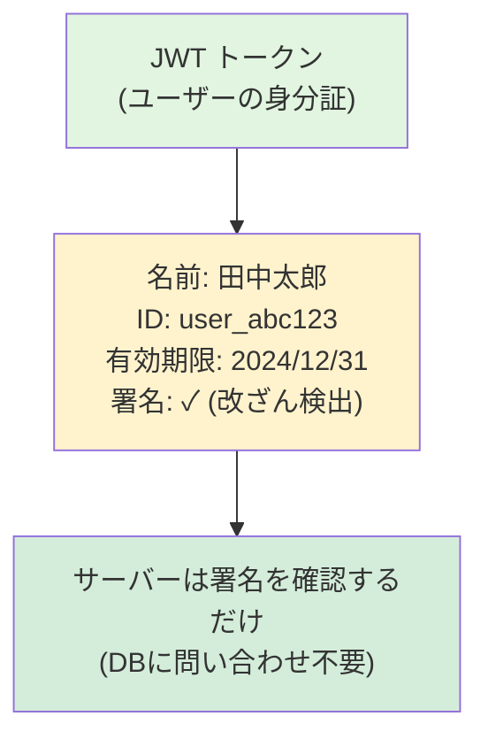
```mermaid
graph TD
    A["JWT トークン<br/>(ユーザーの身分証)"] --> B["名前: 田中太郎<br/>ID: user_abc123<br/>有効期限: 2024/12/31<br/>署名: ✓ (改ざん検出)"]
    B --> C["サーバーは署名を確認するだけ<br/>(DBに問い合わせ不要)"]

    style A fill:#e1f5e1
    style B fill:#fff3cd
    style C fill:#d4edda
```

**方式2: サーバーサイドセッション（DB保存）**

セッションIDだけをクライアントに渡し、ユーザー情報はサーバー側のDBに保存します。

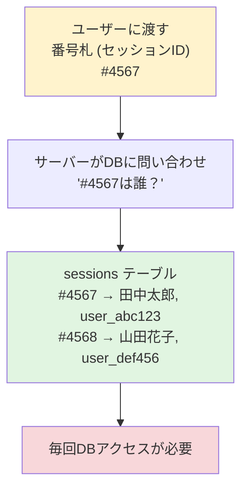
```mermaid
graph TD
    A["ユーザーに渡す<br/>番号札 (セッションID)<br/>#4567"] --> B["サーバーがDBに問い合わせ<br/>'#4567は誰？'"]
    B --> C["sessions テーブル<br/>#4567 → 田中太郎, user_abc123<br/>#4568 → 山田花子, user_def456"]
    C --> D["毎回DBアクセスが必要"]

    style A fill:#fff3cd
    style C fill:#e1f5e1
    style D fill:#f8d7da
```

**方式3: Cookie（サーバーサイドの暗号化Cookie）**

セッション情報を暗号化してCookieに直接保存します。JWTと似ていますが、標準化されたトークン形式ではなく、フレームワーク独自の暗号化を使います。

#### 比較表

| 観点 | JWT | サーバーサイドセッション | 暗号化Cookie |
|------|-----|----------------------|-------------|
| **DBアクセス** | 不要（署名検証のみ） | 毎リクエスト必要 | 不要 |
| **スケーラビリティ** | 高い（ステートレス） | セッション共有が必要 | 高い |
| **即座のログアウト** | 困難（工夫が必要） | 容易（DB削除） | 困難 |
| **サーバーレス対応** | 最適 | 追加設定が必要 | 対応可能 |
| **Edge Runtime** | 対応 | 非対応（DB接続必要） | 対応 |
| **トークンサイズ** | やや大きい | 小さい（IDのみ） | 中程度 |
| **情報の確認** | デコードで内容確認可 | DB参照が必要 | 復号が必要 |

#### なぜJWTを選んだか

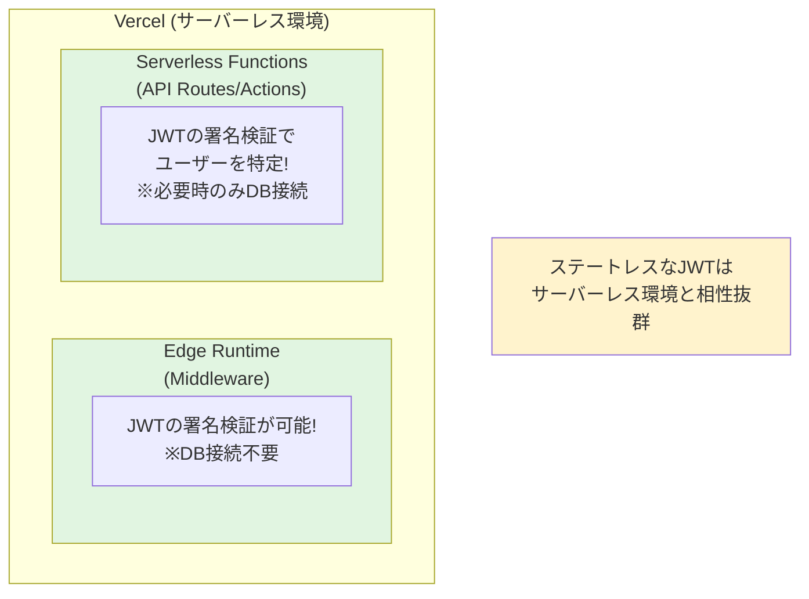
```mermaid
graph TB
    subgraph Vercel["Vercel (サーバーレス環境)"]
        subgraph EdgeRuntime["Edge Runtime<br/>(Middleware)"]
            E1["JWTの署名検証が可能!<br/>※DB接続不要"]
        end

        subgraph ServerlessFn["Serverless Functions<br/>(API Routes/Actions)"]
            S1["JWTの署名検証で<br/>ユーザーを特定!<br/>※必要時のみDB接続"]
        end
    end

    Note["ステートレスなJWTは<br/>サーバーレス環境と相性抜群"]

    style EdgeRuntime fill:#e1f5e1
    style ServerlessFn fill:#e1f5e1
    style Note fill:#fff3cd
```

1. **Vercelとの相性**: Vercelはサーバーレス環境であり、リクエストごとに関数が起動する。DBセッションだと毎回DB接続が必要だが、JWTなら署名検証だけで済む
2. **Edge Runtime対応**: Next.jsのMiddlewareはEdge Runtimeで動作し、DB接続ができない。JWTなら署名検証のみで認証チェックが可能
3. **DB負荷の軽減**: BON-LOGでは投稿の読み込み等でDBアクセスが多い。認証チェックまでDBに負荷をかけたくない
4. **スケーラビリティ**: ユーザー数が増えても、認証処理がボトルネックになりにくい
5. **NextAuth.jsの標準サポート**: NextAuth.js v5ではJWTがデフォルトの戦略であり、最も安定して動作する

> **トレードオフの認識:** JWTの弱点である「即座のログアウトが難しい」問題については、8.10節で`tokenVersion`方式を使った対策を解説しています。完璧な方式は存在しないので、弱点を理解した上で対策を講じることが重要です。

### 8.4B.3 パスワードハッシュアルゴリズムの選択肢

パスワードを安全に保存するためのハッシュアルゴリズムにも複数の選択肢があります。

#### 主な選択肢

**1. bcrypt -- BON-LOGの選択**

1999年に発表された、パスワードハッシュに特化したアルゴリズムです。「意図的に遅い」ことが特徴で、ラウンド数（コストファクター）で計算時間を調整できます。

```typescript
// bcryptの使用例
import bcrypt from 'bcryptjs'

const hash = await bcrypt.hash('password123', 10)  // 10ラウンド
const isValid = await bcrypt.compare('password123', hash)
```

**2. Argon2**

2015年のPassword Hashing Competitionで優勝した、最新のアルゴリズムです。メモリ使用量も調整でき、理論上最も安全です。

```typescript
// argon2の使用例
import argon2 from 'argon2'

const hash = await argon2.hash('password123')
const isValid = await argon2.verify(hash, 'password123')
```

**3. scrypt**

Googleが採用しているアルゴリズムで、メモリを大量に必要とするため、専用ハードウェアでの攻撃に強いです。Node.jsの`crypto`モジュールに標準搭載されています。

```typescript
// scryptの使用例（Node.js標準）
import { scrypt, randomBytes } from 'crypto'

const salt = randomBytes(16).toString('hex')
scrypt('password123', salt, 64, (err, derivedKey) => {
  const hash = derivedKey.toString('hex')
})
```

#### 比較表

| 観点 | bcrypt | Argon2 | scrypt |
|------|--------|--------|--------|
| **セキュリティ強度** | 十分に安全 | 最も安全（最新） | 非常に安全 |
| **実績・歴史** | 25年以上 | 約10年 | 約15年 |
| **Node.jsサポート** | npm（bcryptjs） | npm（argon2） | 標準搭載 |
| **Edge Runtime** | bcryptjs対応 | 非対応（Native依存） | 非対応（Native依存） |
| **学習コスト** | 低い | 中程度（パラメータが多い） | 中程度 |
| **パフォーマンス** | 良好（CPU依存） | 良好（CPU+メモリ依存） | 良好（CPU+メモリ依存） |
| **コミュニティ** | 非常に大きい | 成長中 | 中程度 |

#### なぜbcryptを選んだか

1. **十分なセキュリティ**: 25年以上の実績があり、現在も安全に使えるアルゴリズム。大手サービスでも広く使われている
2. **Node.jsでの信頼性**: `bcryptjs`はpure JavaScript実装のため、環境を選ばず動作する。ネイティブモジュールのコンパイルエラーに悩まされることがない
3. **Edge Runtime対応**: `bcryptjs`（JavaScript実装版）はEdge Runtimeでも動作する可能性がある（Argon2やscryptはネイティブ依存のため不可）
4. **シンプルなAPI**: `hash()`と`compare()`の2つの関数だけで完結し、初心者にも理解しやすい
5. **NextAuth.jsとの相性**: NextAuth.jsのサンプルコードやチュートリアルで最も多く使われている

> **補足:** もし「最新かつ最強のアルゴリズム」を使いたい場合はArgon2が最適です。ただし、bcryptが「弱い」わけではなく、現時点でも実用上十分な安全性を備えています。セキュリティとは「最強の一点を追求する」のではなく「全体のバランスを保つ」ことが重要です。

### 8.4B.4 バリデーションライブラリの選択肢

ユーザー入力の検証（バリデーション）に使うライブラリの選択肢です。

#### 主な選択肢

**1. Zod -- BON-LOGの選択**

TypeScriptファーストで設計されたスキーマバリデーションライブラリです。スキーマ定義からTypeScriptの型を自動生成できます。

```typescript
import { z } from 'zod'

const schema = z.object({
  email: z.string().email(),
  password: z.string().min(8),
})

// スキーマからTypeScriptの型を自動生成
type FormData = z.infer<typeof schema>
// → { email: string; password: string }
```

**2. Yup**

Formikなどのフォームライブラリと組み合わせて使われることが多いバリデーションライブラリです。JavaScriptの世界で長く使われてきました。

```typescript
import * as yup from 'yup'

const schema = yup.object({
  email: yup.string().email().required(),
  password: yup.string().min(8).required(),
})
```

**3. Joi**

Node.jsのHapi フレームワーク由来のバリデーションライブラリです。バックエンドでの使用に強みがあります。

**4. Valibot**

Zodと似た設計ですが、「ツリーシェイキング」に対応しており、使った機能だけがバンドルに含まれるため、バンドルサイズが非常に小さくなります。

```typescript
import { object, string, email, minLength, pipe } from 'valibot'

const schema = object({
  email: pipe(string(), email()),
  password: pipe(string(), minLength(8)),
})
```

**5. io-ts**

関数型プログラミングの手法を取り入れたバリデーションライブラリです。型安全性が非常に高いですが、学習コストも高めです。

#### 比較表

| 観点 | Zod | Yup | Joi | Valibot | io-ts |
|------|-----|-----|-----|---------|-------|
| **TypeScript対応** | ファースト | 後付け | 限定的 | ファースト | ファースト |
| **型推論** | 自動（z.infer） | 手動定義が必要 | 手動定義が必要 | 自動 | 自動 |
| **バンドルサイズ** | 約13KB | 約18KB | 約65KB（大きい） | 約1KB（最小） | 約6KB |
| **学習コスト** | 低い | 低い | 中程度 | 低い | 高い |
| **Server Actions** | 最適 | 対応可能 | 対応可能 | 対応可能 | 対応可能 |
| **エコシステム** | Next.js推奨 | Formik推奨 | Hapi推奨 | 成長中 | ニッチ |
| **メンテナンス** | 活発 | 活発 | 活発 | 活発 | やや停滞 |

#### なぜZodを選んだか

1. **TypeScriptファースト**: スキーマを書くだけでTypeScriptの型が自動生成される。型定義とバリデーションルールの二重管理が不要
2. **Next.js/Server Actionsとの相性**: Next.js公式ドキュメントでZodが推奨されており、Server Actionsとの連携パターンが確立されている
3. **軽量**: バンドルサイズが小さく、クライアントサイドでも使える
4. **直感的なAPI**: メソッドチェーンで読みやすいバリデーションルールを書ける
5. **エラーメッセージ**: 日本語を含むカスタムエラーメッセージが簡単に設定できる

```typescript
// ZodとServer Actionsの連携がシンプル
'use server'
import { z } from 'zod'

const schema = z.object({
  email: z.string().email('有効なメールアドレスを入力してください'),
  password: z.string().min(8, 'パスワードは8文字以上です'),
})

export async function register(formData: FormData) {
  const result = schema.safeParse({
    email: formData.get('email'),
    password: formData.get('password'),
  })

  if (!result.success) {
    return { error: result.error.errors[0].message }
  }

  // result.data は型安全（TypeScriptが自動推論）
  const { email, password } = result.data
  // ... 登録処理
}
```

> **補足:** バンドルサイズを極限まで小さくしたい場合はValibotが最適です。ただし、Zodの方がエコシステムが成熟しており、情報量も多いため、初めてのプロジェクトではZodをおすすめします。

<details>
<summary>理解度チェック: 技術選定</summary>

**Q1: 個人ブログに認証を追加したい場合、最速で実装できるのはどの認証ライブラリですか？**

A1: **Clerk** です。ログインUIまで提供してくれるため、コンポーネントを配置するだけで認証が完成します。ただし、ユーザー数が増えると有料になる可能性があります。

**Q2: JWTの「即座のログアウトが難しい」という問題は、どのように対策できますか？**

A2: いくつかの方法があります。(1) tokenVersionをDBに保存し、JWTのバージョンと照合する（BON-LOGの方式）、(2) JWTの有効期限を短くし、リフレッシュトークンと組み合わせる、(3) ブラックリストをRedis等で管理する、などです。

**Q3: bcryptではなくArgon2を選ぶべき状況はどのようなケースですか？**

A3: セキュリティ要件が非常に高い金融系アプリケーション、Edge Runtimeでの実行が不要な場合、チームにArgon2の経験者がいる場合などです。Argon2はメモリ使用量も調整でき、理論上最も安全ですが、ネイティブ依存のため環境構築が複雑になる可能性があります。

**Q4: ZodではなくValibotを選ぶべき状況はどのようなケースですか？**

A4: バンドルサイズが非常に重要なプロジェクト（モバイル向けWebアプリなど）や、使う機能が限定されていてZodの全機能が不要な場合です。ValibotはZodの約1/13のサイズで、必要な機能だけをインポートできます。
</details>

---

## 8.4C 初心者のための認証フロー図解

> **このセクションで学ぶこと**
> - 認証フロー全体の流れを視覚的に理解する
> - ハッシュ化の概念を身近な例で理解する
> - セキュリティのよくある間違いを知る
> - 「なぜそうするのか」を直感的に理解する

### 8.4C.1 認証フローの全体像（ユーザー登録からログインまで）

認証の流れを、ユーザー登録とログインの2つのフェーズに分けて図解します。

#### フェーズ1: ユーザー登録

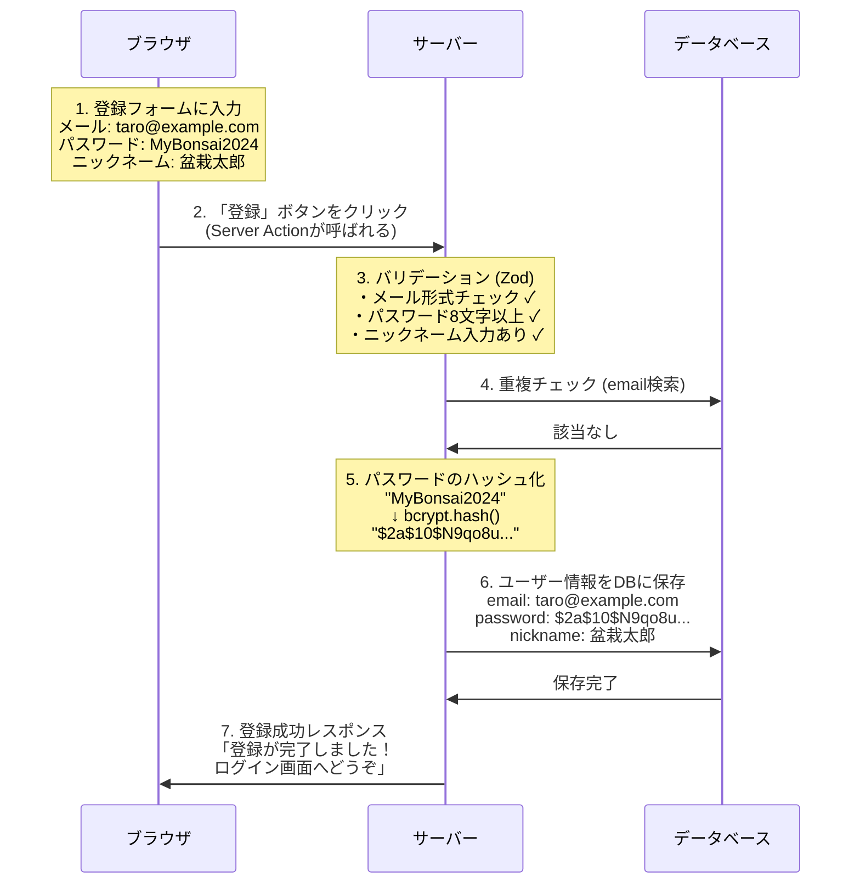
```mermaid
sequenceDiagram
    participant Browser as ブラウザ
    participant Server as サーバー
    participant DB as データベース

    Note over Browser: 1. 登録フォームに入力<br/>メール: taro@example.com<br/>パスワード: MyBonsai2024<br/>ニックネーム: 盆栽太郎

    Browser->>Server: 2. 「登録」ボタンをクリック<br/>(Server Actionが呼ばれる)

    Note over Server: 3. バリデーション (Zod)<br/>・メール形式チェック ✓<br/>・パスワード8文字以上 ✓<br/>・ニックネーム入力あり ✓

    Server->>DB: 4. 重複チェック (email検索)
    DB->>Server: 該当なし

    Note over Server: 5. パスワードのハッシュ化<br/>"MyBonsai2024"<br/>↓ bcrypt.hash()<br/>"$2a$10$N9qo8u..."

    Server->>DB: 6. ユーザー情報をDBに保存<br/>email: taro@example.com<br/>password: $2a$10$N9qo8u...<br/>nickname: 盆栽太郎
    DB->>Server: 保存完了

    Server->>Browser: 7. 登録成功レスポンス<br/>「登録が完了しました！<br/>ログイン画面へどうぞ」
```

> **ポイント:** パスワード「MyBonsai2024」は一度もそのままDBに保存されません。ハッシュ化された「$2a$10$N9qo8u...」という読めない文字列だけがDBに保存されます。

#### フェーズ2: ログイン（JWT発行）

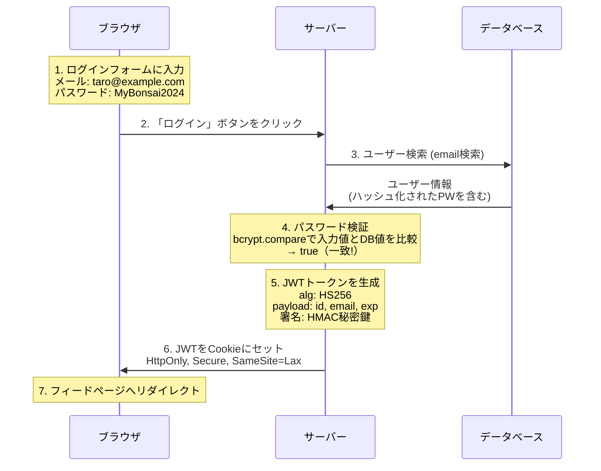
```mermaid
sequenceDiagram
    participant Browser as ブラウザ
    participant Server as サーバー
    participant DB as データベース

    Note over Browser: 1. ログインフォームに入力<br/>メール: taro@example.com<br/>パスワード: MyBonsai2024

    Browser->>Server: 2. 「ログイン」ボタンをクリック

    Server->>DB: 3. ユーザー検索 (email検索)
    DB->>Server: ユーザー情報<br/>(ハッシュ化されたPWを含む)

    Note over Server: 4. パスワード検証<br/>bcrypt.compareで入力値とDB値を比較<br/>→ true（一致!）

    Note over Server: 5. JWTトークンを生成<br/>alg: HS256<br/>payload: id, email, exp<br/>署名: HMAC秘密鍵

    Server->>Browser: 6. JWTをCookieにセット<br/>HttpOnly, Secure, SameSite=Lax

    Note over Browser: 7. フィードページへリダイレクト
```

#### フェーズ3: 認証済みリクエスト

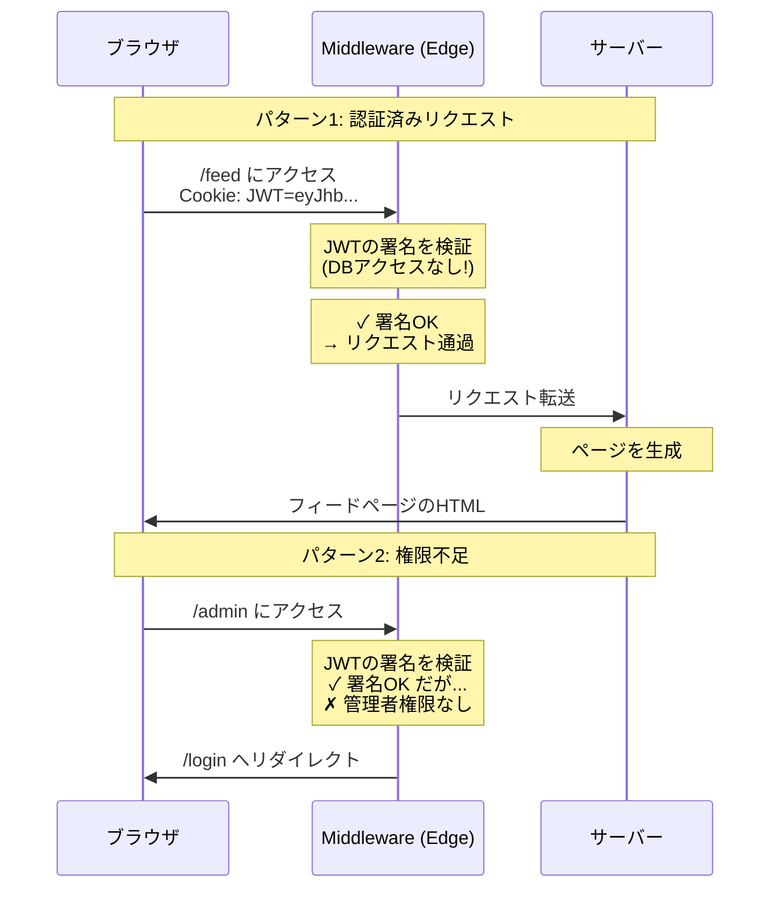
```mermaid
sequenceDiagram
    participant Browser as ブラウザ
    participant Middleware as Middleware (Edge)
    participant Server as サーバー

    Note over Browser,Server: パターン1: 認証済みリクエスト

    Browser->>Middleware: /feed にアクセス<br/>Cookie: JWT=eyJhb...

    Note over Middleware: JWTの署名を検証<br/>(DBアクセスなし!)

    Note over Middleware: ✓ 署名OK<br/>→ リクエスト通過

    Middleware->>Server: リクエスト転送
    Note over Server: ページを生成
    Server->>Browser: フィードページのHTML

    Note over Browser,Server: パターン2: 権限不足

    Browser->>Middleware: /admin にアクセス
    Note over Middleware: JWTの署名を検証<br/>✓ 署名OK だが...<br/>✗ 管理者権限なし
    Middleware->>Browser: /login へリダイレクト
```

#### フェーズ4: 完全な認証フロー（ログイン → JWT → セッション）

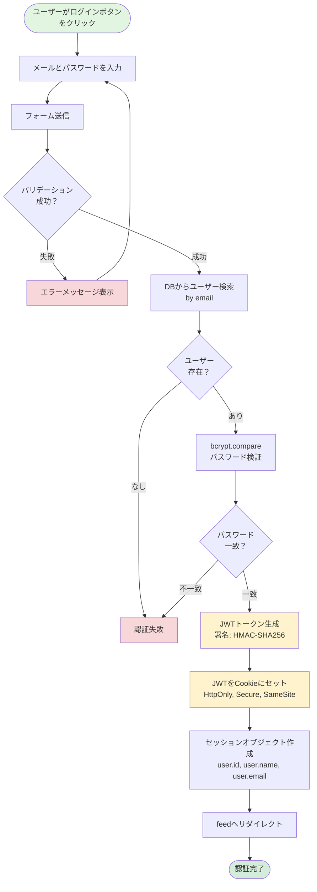
```mermaid
flowchart TD
    Start([ユーザーがログインボタンをクリック]) --> Input[メールとパスワードを入力]
    Input --> Submit[フォーム送信]
    Submit --> Validate{バリデーション<br/>成功？}

    Validate -->|失敗| Error1[エラーメッセージ表示]
    Error1 --> Input

    Validate -->|成功| DBQuery[DBからユーザー検索<br/>by email]
    DBQuery --> UserExists{ユーザー<br/>存在？}

    UserExists -->|なし| Error2[認証失敗]
    UserExists -->|あり| PasswordCheck[bcrypt.compare<br/>パスワード検証]

    PasswordCheck --> PasswordMatch{パスワード<br/>一致？}
    PasswordMatch -->|不一致| Error2
    PasswordMatch -->|一致| GenerateJWT[JWTトークン生成<br/>署名: HMAC-SHA256]

    GenerateJWT --> SetCookie[JWTをCookieにセット<br/>HttpOnly, Secure, SameSite]
    SetCookie --> CreateSession[セッションオブジェクト作成<br/>user.id, user.name, user.email]
    CreateSession --> Redirect["feedへリダイレクト"]
    Redirect --> End([認証完了])

    style Start fill:#e1f5e1
    style End fill:#d4edda
    style Error1 fill:#f8d7da
    style Error2 fill:#f8d7da
    style GenerateJWT fill:#fff3cd
    style SetCookie fill:#fff3cd
```

### 8.4C.2 「ハッシュ化」を身近な例で理解する

ハッシュ化は認証システムの要ですが、概念が分かりにくいかもしれません。いくつかの身近な例で理解しましょう。

#### 例え1: 料理のレシピ

| ハッシュ化 = 調理 | 材料（元のパスワード） | 料理（ハッシュ値） |
|---|---|---|
| 例 | 卵、小麦粉、砂糖、バター | パウンドケーキ |

- 完成した料理から元の材料の量は分からない（不可逆）
- 同じ材料 → 常に同じ料理ができる（検証に使える）
- 違う材料 → 違う料理ができる（不正を検出できる）

#### 例え2: 指紋

| ハッシュ化 = 指紋を取ること | 人物（パスワード） | 指紋（ハッシュ値） |
|---|---|---|
| 例 | 田中太郎 | △○□×△□○（一意の指紋） |

- 指紋から「田中太郎」という人物を復元することはできない
- でも、田中太郎が来たら同じ指紋が取れるので本人確認ができる
- 田中太郎と山田花子の指紋は異なる（別のパスワードは別のハッシュ値）

#### 例え3: bcryptのソルトはなぜ必要か

```
ソルトなしの問題（レインボーテーブル攻撃）:

  攻撃者の持つ「ハッシュ値辞典」:
```

| パスワード | ハッシュ値 |
|---|---|
| "password123" | abc123def456... |
| "admin" | 789xyz012abc... |
| "qwerty" | 456def789ghi... |
| ... (数百万件) | ... |

DBが流出 → ハッシュ値を辞典と照合 → 即座にパスワード判明！

```
ソルトありの防御:

  同じ "password123" でも、ソルトが違えば全く違うハッシュ値に:

  "password123" + ソルト "aX7k" → 完全に異なるハッシュ値A
  "password123" + ソルト "mP2q" → 完全に異なるハッシュ値B

  → 事前に計算した辞典が使えない！
  → ユーザーごとにソルトが違うので、1つずつ攻撃する必要がある
  → bcryptは「意図的に遅い」ので、1つの攻撃にも時間がかかる
  → 実質的に攻撃不可能
```

### 8.4C.3 セキュリティのよくある間違いと対策

認証システムを実装するとき、初心者が陥りやすい間違いをまとめました。

#### 間違い1: パスワードを平文で保存する

```
❌ 危険なコード（絶対にやってはいけない）:

  await prisma.user.create({
    data: {
      email: 'taro@example.com',
      password: 'MyBonsai2024',  // ← 平文のまま保存！
    },
  })

  → DBが漏洩すると、全ユーザーのパスワードが丸見え


✅ 正しいコード:

  const hashedPassword = await bcrypt.hash('MyBonsai2024', 10)
  await prisma.user.create({
    data: {
      email: 'taro@example.com',
      password: hashedPassword,  // ← ハッシュ化してから保存
    },
  })

  → DBが漏洩しても、元のパスワードは分からない
```

#### 間違い2: JWTをlocalStorageに保存する

```
❌ 危険な方法:

  // ログイン成功後
  localStorage.setItem('token', jwt)

  // リクエスト時
  fetch('/api/posts', {
    headers: { Authorization: `Bearer ${localStorage.getItem('token')}` }
  })

  なぜ危険？
  → XSS攻撃（悪意あるスクリプトの埋め込み）で
    localStorage の内容が盗まれる
  → 攻撃者がJWTを使って「なりすまし」できてしまう


✅ 正しい方法（NextAuth.jsのデフォルト動作）:

  JWTはHTTPOnly Cookieに保存される
  → JavaScriptからアクセスできない
  → XSS攻撃でも盗まれない
  → ブラウザが自動的にリクエストに付与する

  ※ NextAuth.jsを使えば、開発者が意識しなくても
    この安全な方式が自動的に適用されます
```

#### 間違い3: クライアント側のバリデーションだけで安心する

```
❌ クライアント側のみのバリデーション:

  // ブラウザ上のJavaScript
  function validateForm(email, password) {
    if (!email.includes('@')) return 'メール形式が不正です'
    if (password.length < 8) return 'パスワードが短すぎます'
    return null
  }

  問題:
  → ブラウザの開発者ツールでJavaScriptを無効化できる
  → curlやPostmanで直接APIを叩けばバリデーションを回避できる

  $ curl -X POST http://localhost:3000/api/register \
    -d '{"email":"not-an-email","password":"1"}'
  # → クライアントバリデーションは一切通らない！


✅ サーバー側でも必ずバリデーション:

  'use server'
  export async function register(formData: FormData) {
    // サーバー側でZodによるバリデーション
    const result = registerSchema.safeParse({
      email: formData.get('email'),
      password: formData.get('password'),
    })
    if (!result.success) {
      return { error: result.error.errors[0].message }
    }
    // ここまで来たデータは安全
  }

  → クライアント側のバリデーションは「UX向上」のため
  → サーバー側のバリデーションは「セキュリティ」のため
  → 両方必要！
```

#### 間違い4: エラーメッセージで情報を漏らす

```
❌ 情報を漏らすエラーメッセージ:

  「このメールアドレスは登録されていません」
  → 攻撃者: 「なるほど、このメールは使われていないのか」

  「パスワードが間違っています」
  → 攻撃者: 「メールアドレスは合っている！パスワードだけ
              総当たりすればいい」


✅ 安全なエラーメッセージ:

  「メールアドレスまたはパスワードが正しくありません」
  → メールが間違っているのかパスワードが間違っているのか
    攻撃者には分からない
  → BON-LOGではこの方式を採用しています
```

#### 間違い5: 秘密鍵をコードに直接書く

```
❌ ハードコーディング（絶対にやってはいけない）:

  // lib/auth.ts
  export const { auth } = NextAuth({
    secret: 'my-super-secret-key-12345',  // ← コードに直書き！
    // ...
  })

  問題:
  → GitHubにpushすると秘密鍵が全世界に公開される
  → 秘密鍵があればJWTを偽造できる = 全アカウントに侵入可能


✅ 環境変数を使う:

  // .env.local（Gitにコミットしない）
  NEXTAUTH_SECRET=ランダムな文字列

  // lib/auth.ts
  export const { auth } = NextAuth({
    secret: process.env.NEXTAUTH_SECRET,
    // ...
  })

  → .env.localは.gitignoreに含まれているため、
    GitHubにpushされることはない
  → 本番環境ではVercelの環境変数設定で管理する
```

#### 間違い6: 認証チェックを忘れる

```
❌ 認証チェックなしのServer Action:

  'use server'
  export async function deletePost(postId: string) {
    // 誰でも任意の投稿を削除できてしまう！
    await prisma.post.delete({ where: { id: postId } })
  }


✅ 認証 + 認可チェック付き:

  'use server'
  export async function deletePost(postId: string) {
    // 1. 認証チェック: ログインしているか？
    const session = await auth()
    if (!session?.user?.id) {
      return { error: '認証が必要です' }
    }

    // 2. 認可チェック: この投稿の所有者か？
    const post = await prisma.post.findUnique({
      where: { id: postId },
    })
    if (post?.userId !== session.user.id) {
      return { error: '権限がありません' }
    }

    // 3. 安全に削除
    await prisma.post.delete({ where: { id: postId } })
  }
```

### 8.4C.4 認証セキュリティのチェックリスト

実装が完了したら、以下のチェックリストで確認しましょう。

```
認証実装のセキュリティチェックリスト:

パスワード管理:
  □ パスワードはbcryptでハッシュ化して保存しているか
  □ パスワードの最低文字数（8文字以上）を設定しているか
  □ パスワードの強度チェック（大文字・小文字・数字）を実装しているか
  □ 平文パスワードがログに出力されていないか

セッション管理:
  □ JWTはHTTPOnly Cookieに保存されているか（NextAuth.jsのデフォルト）
  □ Secure属性が有効か（HTTPS通信のみ）
  □ SameSite属性が設定されているか（CSRF対策）
  □ トークンに有効期限が設定されているか

入力バリデーション:
  □ サーバー側でバリデーションを行っているか
  □ Zodスキーマでバリデーションルールを定義しているか
  □ SQLインジェクション対策（Prisma使用）をしているか

アクセス制御:
  □ 保護ルートにMiddlewareで認証チェックを設定しているか
  □ Server Actionsで認証チェックを行っているか
  □ 認可チェック（リソース所有者の確認）を行っているか

環境変数:
  □ NEXTAUTH_SECRETが十分にランダムな値か
  □ 秘密鍵がコードにハードコーディングされていないか
  □ .env.localが.gitignoreに含まれているか

エラーハンドリング:
  □ エラーメッセージがユーザー情報を漏らしていないか
  □ ログイン失敗時に具体的な原因を教えていないか
```

<details>
<summary>理解度チェック: 初心者のための認証フロー</summary>

**Q1: ユーザー登録時、パスワードはどの時点でハッシュ化されますか？**

A1: サーバーがパスワードを受け取った直後、DBに保存する前にハッシュ化されます。ブラウザ → サーバー間の通信ではHTTPSで暗号化されていますが、パスワードはまだ平文です。サーバーに到達した時点で`bcrypt.hash()`によりハッシュ化し、DBにはハッシュ値のみを保存します。

**Q2: JWTがHTTPOnly Cookieに保存されることの利点は何ですか？**

A2: HTTPOnly属性が設定されたCookieは、JavaScriptの`document.cookie`からアクセスできません。これにより、XSS攻撃（悪意あるスクリプトの埋め込み）でJWTが盗まれることを防ぎます。ブラウザはリクエスト時に自動的にCookieを送信するので、開発者がJWTを手動で管理する必要もありません。

**Q3: 「メールアドレスまたはパスワードが正しくありません」と曖昧なエラーメッセージを返す理由は何ですか？**

A3: もし「このメールアドレスは登録されていません」と返すと、攻撃者はそのメールアドレスがシステムに存在しないことを知ります。「パスワードが間違っています」と返すと、メールアドレスは正しいことが確認され、パスワードだけを総当たりすれば良いことになります。曖昧なメッセージにすることで、攻撃者に手がかりを与えません。

**Q4: クライアント側のバリデーションが不要というわけではないのはなぜですか？**

A4: クライアント側のバリデーションは「UX（ユーザー体験）の向上」のために重要です。フォーム送信前にエラーを表示することで、ユーザーはサーバーの応答を待たずに即座にフィードバックを受け取れます。ただし、セキュリティの観点では、クライアント側は簡単にバイパスできるため、サーバー側のバリデーションが「セキュリティの砦」として必ず必要です。つまり、クライアント側はUX目的、サーバー側はセキュリティ目的で、両方実装するのがベストプラクティスです。
</details>

---

## 8.5 認証システムのセットアップ

> **このセクションで学ぶこと**
> - NextAuth.jsの設定ファイル（lib/auth.ts）の作り方
> - 各設定項目の意味と役割
> - APIルート、型拡張、環境変数の設定方法
> - 認証フロー全体の流れ

### 8.5.1 認証フローの全体像

設定ファイルを書き始める前に、認証システム全体の流れを把握しましょう。

```
BON-LOG 認証フローの全体像:

  ユーザー          ブラウザ            Next.js            NextAuth.js       DB
    |                 |                   |                   |              |
    |  メール/PW入力   |                   |                   |              |
    |---------------->|                   |                   |              |
    |                 |  POST /api/auth   |                   |              |
    |                 |------------------>|                   |              |
    |                 |                   |  authorize()呼出  |              |
    |                 |                   |------------------>|              |
    |                 |                   |                   | DB検索       |
    |                 |                   |                   |------------->|
    |                 |                   |                   |<-------------|
    |                 |                   |                   | bcrypt検証   |
    |                 |                   |  JWT生成          |              |
    |                 |                   |<------------------|              |
    |                 |  Set-Cookie: JWT  |                   |              |
    |                 |<------------------|                   |              |
    |  ログイン完了！   |                   |                   |              |
    |<----------------|                   |                   |              |
    |                 |                   |                   |              |
    |  フィード閲覧    |  リクエスト+JWT    |                   |              |
    |---------------->|------------------>|  JWT検証          |              |
    |                 |                   |  → session取得    |              |
    |                 |  フィード表示      |                   |              |
    |<----------------|<------------------|                   |              |
```

### 8.5.2 auth.config.ts と auth.ts の分離構成

BON-LOGでは認証設定を**2つのファイル**に分割しています。これはNext.jsのMiddleware（`proxy.ts`）が**Edge Runtime**で実行されるという制約に対応するためです。

- **`lib/auth.config.ts`**: Edge Runtimeで動作する設定のみ（認可ロジック、ページ設定、Cookie設定）
- **`lib/auth.ts`**: Node.jsランタイム用のフル設定（Prisma、bcrypt、認証プロバイダー）

> **なぜ2ファイルに分けるのか？** Edge Runtimeは軽量で高速ですが、PrismaやbcryptなどのNode.js専用モジュールが使えません。`proxy.ts`で認証チェック（JWT署名検証とアクセス制御）を行うために、Node.js依存を含まない設定ファイルが必要です。詳しくは8.14節で解説します。

まず、認証の「心臓部」である`lib/auth.ts`を段階的に構築していきましょう。一度にすべてを書くのではなく、ステップバイステップで理解しながら進めます。

**Step 1: 最小構成 -- まず動くものを作る**

最初に、認証の骨格だけを作ります。この段階ではパスワード検証はまだ行いません。

```typescript
// lib/auth.ts（Step 1: 最小構成）
import NextAuth from 'next-auth'
import { PrismaAdapter } from '@auth/prisma-adapter'
import { prisma } from '@/lib/db'
import { authConfig } from '@/lib/auth.config'

export const { handlers, signIn, signOut, auth } = NextAuth({
  ...authConfig,
  adapter: PrismaAdapter(prisma),
  session: { strategy: 'jwt' },
  providers: [],  // まだプロバイダーなし
})
```

> **実行結果の確認方法**
> この段階で `npm run dev` を実行すると、NextAuth.jsの基本的なエンドポイント（`/api/auth/session` 等）が利用可能になります。ただし、ログイン手段がないため認証はまだできません。ブラウザで `http://localhost:3000/api/auth/providers` にアクセスすると `{}` と表示されます（プロバイダーが空のため）。

**Step 2: 認証プロバイダーを追加する**

次に、メール + パスワードで認証できるようにCredentialsProviderを追加します。

```typescript
// lib/auth.ts（Step 2: プロバイダー追加）
import NextAuth from 'next-auth'
import { PrismaAdapter } from '@auth/prisma-adapter'
import CredentialsProvider from 'next-auth/providers/credentials'
import bcrypt from 'bcryptjs'
import { prisma } from '@/lib/db'
import { z } from 'zod'
import { authConfig } from '@/lib/auth.config'

const loginSchema = z.object({
  email: z.string().email('有効なメールアドレスを入力してください'),
  password: z.string().min(8, 'パスワードは8文字以上である必要があります'),
})

export const { handlers, signIn, signOut, auth } = NextAuth({
  ...authConfig,
  adapter: PrismaAdapter(prisma),
  session: { strategy: 'jwt' },
  providers: [
    CredentialsProvider({
      name: 'credentials',
      async authorize(credentials) {
        const result = loginSchema.safeParse(credentials)
        if (!result.success) return null

        const { email, password } = result.data
        const user = await prisma.user.findUnique({
          where: { email },
          select: {
            id: true,
            email: true,
            password: true,
            nickname: true,
            avatarUrl: true,
            isSuspended: true,
          },
        })
        if (!user || !user.password) return null

        // アカウント停止チェック
        if (user.isSuspended) return null

        const passwordMatch = await bcrypt.compare(password, user.password)
        if (!passwordMatch) return null

        return {
          id: user.id,
          email: user.email,
          name: user.nickname,
          image: user.avatarUrl,
        }
      },
    }),
  ],
})
```

> **実行結果の確認方法**
> `http://localhost:3000/api/auth/providers` にアクセスすると、以下のようなJSONが表示されます:
> ```json
> {"credentials":{"id":"credentials","name":"credentials","type":"credentials",...}}
> ```
> これでCredentials認証が登録されたことが確認できます。ただし、`session.user.id` がまだ利用できません。

**Step 3: コールバックを追加して完成させる**

最後に、JWTとセッションのコールバックを追加して、`session.user.id` でユーザーIDにアクセスできるようにします。

```typescript
// lib/auth.ts（Step 3: 完成版）
// ============================================
// BON-LOGの認証設定ファイル（Node.jsランタイム用）
// auth.config.tsの設定を継承し、Node.js専用の機能を追加する
// ============================================

import NextAuth from 'next-auth'                           // NextAuth.jsのメイン関数
import { PrismaAdapter } from '@auth/prisma-adapter'       // PrismaとNextAuth.jsを繋ぐアダプター
import CredentialsProvider from 'next-auth/providers/credentials'  // メール+パスワード認証用プロバイダー
import bcrypt from 'bcryptjs'                              // パスワードのハッシュ化・検証ライブラリ
import { prisma } from '@/lib/db'                          // Prismaクライアント（DB操作用）
import { z } from 'zod'                                    // バリデーション（入力検証）ライブラリ
import { authConfig } from '@/lib/auth.config'             // Edge Runtime対応の基本設定
import { BCRYPT_SALT_ROUNDS } from '@/lib/constants/limits' // bcryptのラウンド数定数

// ============================================
// ログイン入力のバリデーションスキーマ
// authorize()関数内でDB検索の前に不正入力を弾く
// ============================================
const loginSchema = z.object({
  email: z.string().email('有効なメールアドレスを入力してください'),
  password: z.string().min(8, 'パスワードは8文字以上である必要があります'),
})

// NextAuth()の戻り値から必要な関数・オブジェクトを取り出す
// handlers: APIルート用のGET/POSTハンドラー
// signIn:   サーバー側からログイン処理を実行する関数
// signOut:  サーバー側からログアウト処理を実行する関数
// auth:     現在のセッション情報を取得する関数
export const { handlers, signIn, signOut, auth } = NextAuth({

  // -----------------------------------------------
  // authConfigを展開: auth.config.tsの設定をすべて継承
  // pages, cookies, callbacks(authorized) の設定が展開される
  // この後に同名のプロパティを書くと「上書き」される
  // -----------------------------------------------
  ...authConfig,

  // -----------------------------------------------
  // adapter: データベースとの連携設定
  // PrismaAdapterがNextAuth.jsとPrismaの橋渡しをする
  // -----------------------------------------------
  adapter: PrismaAdapter(prisma),

  // -----------------------------------------------
  // session: セッション管理の方式を指定
  // 'jwt' = JWT方式（DBにセッションを保存しない）
  // 'database' = セッションベース方式（DBに保存する）
  // -----------------------------------------------
  session: {
    strategy: 'jwt',  // JWT方式を使用（8.2節で解説した理由による）
  },

  // -----------------------------------------------
  // providers: 認証方法の設定（複数設定可能）
  // auth.config.tsの空配列を上書きする
  // BON-LOGではメール+パスワード認証のみ使用
  // -----------------------------------------------
  providers: [
    CredentialsProvider({
      name: 'credentials',  // このプロバイダーの名前（内部識別用）

      // -----------------------------------------------
      // authorize: 実際の認証ロジック（最も重要な関数）
      // ユーザーが入力した情報が正しいか検証する
      // 成功時: ユーザーオブジェクトを返す
      // 失敗時: nullを返す
      // -----------------------------------------------
      async authorize(credentials) {
        // ステップ1: Zodでバリデーション
        // safeParse はエラーを投げずに結果オブジェクトを返す
        const result = loginSchema.safeParse(credentials)
        if (!result.success) return null  // バリデーション失敗 → 認証失敗

        // バリデーション済みデータを分割代入
        const { email, password } = result.data

        // ステップ2: データベースからユーザーを検索
        // selectで必要なフィールドのみ取得（パフォーマンス最適化）
        const user = await prisma.user.findUnique({
          where: { email },
          select: {
            id: true,           // ユーザーID
            email: true,        // メールアドレス
            password: true,     // ハッシュ化されたパスワード
            nickname: true,     // 表示名
            avatarUrl: true,    // アバター画像URL
            isSuspended: true,  // アカウント停止フラグ
          },
        })

        // ステップ3: ユーザーの存在確認
        // ユーザーが見つからない、またはパスワードが設定されていない場合
        if (!user || !user.password) {
          return null  // 認証失敗（ユーザーが存在しない or パスワード未設定）
        }

        // ステップ4: アカウント停止チェック
        // 管理者によって停止されたアカウントはログイン不可
        if (user.isSuspended) return null

        // ステップ5: パスワードの検証
        // 入力されたパスワードとDB内のハッシュ値を比較
        const passwordMatch = await bcrypt.compare(
          password,         // ユーザーが入力した生のパスワード
          user.password     // DBに保存されたハッシュ化パスワード
        )

        // パスワードが一致しなければ認証失敗
        if (!passwordMatch) {
          return null  // 認証失敗（パスワード不一致）
        }

        // ステップ6: 認証成功！ユーザー情報を返す
        // ここで返した情報がJWTトークンに含まれる
        return {
          id: user.id,            // 実行結果例: "clx1abc2d0001abcdef12345"
          email: user.email,      // 実行結果例: "taro@example.com"
          name: user.nickname,    // 実行結果例: "盆栽太郎"
          image: user.avatarUrl,  // 実行結果例: "https://r2.example.com/avatars/xxx.jpg" or null
        }
      },
    }),
  ],

  // -----------------------------------------------
  // callbacks: トークン生成やセッション取得時の処理をカスタマイズ
  // NextAuth.jsの処理フローに「割り込んで」独自の処理を追加できる
  // auth.config.tsのauthorizedコールバックは上書きされるが、
  // proxy.ts（Next.js 16）ではauthConfigを直接使うので問題なし
  // -----------------------------------------------
  callbacks: {
    // JWTコールバック: JWTトークンが生成・更新されるたびに呼ばれる
    // トークンにカスタムデータ（ユーザーID）を追加する
    async jwt({ token, user }) {
      // user が存在する = 初回ログイン時（それ以降はundefined）
      if (user) {
        token.id = user.id  // トークンにユーザーIDを追加
        // 実行結果: token.id = "clx1abc2d0001abcdef12345"
      }
      return token  // 更新されたトークンを返す（JWTペイロードに含まれる）
    },

    // セッションコールバック: セッション情報が参照されるたびに呼ばれる
    // auth()で取得できるセッション情報をカスタマイズする
    async session({ session, token }) {
      if (session.user && token.id) {
        // トークンからユーザーIDをセッションにコピー
        // これにより session.user.id でアクセスできるようになる
        session.user.id = token.id as string
        // 実行結果: session.user = { id: "clx1abc2d...", name: "盆栽太郎", email: "taro@example.com" }
      }
      return session  // 更新されたセッションを返す
    },
  },
})
```

**各設定項目のまとめ:**

| 設定項目 | 役割 | BON-LOGでの設定 |
|---------|------|----------------|
| `...authConfig` | Edge Runtime対応の基本設定を継承 | pages、cookies、authorized コールバック |
| `adapter` | DB連携 | PrismaAdapter（Prisma経由でPostgreSQLに接続） |
| `session.strategy` | セッション方式 | `'jwt'`（JWTベース） |
| `providers` | 認証方式 | CredentialsProvider（メール+パスワード） |
| `callbacks.jwt` | JWT生成時の処理 | ユーザーIDをトークンに追加 |
| `callbacks.session` | セッション取得時の処理 | ユーザーIDをセッションに追加 |

> **auth.config.ts との関係:** `pages`と`cookies`の設定は`auth.config.ts`に定義されており、`...authConfig`で継承されます。そのため`auth.ts`ではこれらを重複して記述する必要がありません。`providers`と`callbacks`は`auth.ts`で上書きしています。

| よくあるトラブル | 原因 | 解決法 |
|----------------|------|--------|
| `authorize`で常に`null`が返る | Zodバリデーションが失敗している | `loginSchema`の条件（メール形式、8文字以上）を確認 |
| `session.user.id`が`undefined` | callbacksの設定漏れ | `jwt`と`session`の両方のコールバックでidを設定しているか確認 |
| `PrismaAdapter`でエラー | Prismaスキーマに必要なテーブルがない | `npx prisma db push`を実行してDBスキーマを更新 |
| ログイン後にリダイレクトループ | `pages.signIn`の設定ミス | `/login`ページが`proxy.ts`の保護対象外であることを確認 |
| 停止されたユーザーがログインできてしまう | `isSuspended`チェックの漏れ | `authorize`関数内で`user.isSuspended`をチェックしているか確認 |

### 8.5.3 APIルートの作成

NextAuth.jsが認証リクエストを処理するためのAPIルートを作成します。

```typescript
// app/api/auth/[...nextauth]/route.ts
// ============================================
// NextAuth.js APIルート
// [...nextauth] はキャッチオールルートで、
// /api/auth/signin, /api/auth/signout 等のすべてのパスを処理する
// ============================================
import { handlers } from '@/lib/auth'  // lib/auth.tsからhandlersをインポート

// handlers から GET と POST メソッドハンドラーを取り出してエクスポート
// これだけで以下のすべてのエンドポイントが自動的に作成される
export const { GET, POST } = handlers
```

**自動生成されるエンドポイント:**

| エンドポイント | メソッド | 役割 |
|---------------|---------|------|
| `/api/auth/signin` | GET/POST | ログイン処理 |
| `/api/auth/signout` | GET/POST | ログアウト処理 |
| `/api/auth/session` | GET | セッション情報の取得 |
| `/api/auth/csrf` | GET | CSRFトークンの取得（セキュリティ用） |
| `/api/auth/providers` | GET | 利用可能な認証プロバイダー一覧 |
| `/api/auth/callback/credentials` | POST | クレデンシャル認証のコールバック |

> **実行結果の確認方法**
> 開発サーバー起動中にブラウザで以下のURLにアクセスして動作を確認できます:
> - `http://localhost:3000/api/auth/providers` → 利用可能なプロバイダー一覧（JSON）が表示される
> - `http://localhost:3000/api/auth/session` → 未ログイン時は `{}` 、ログイン済みなら `{"user":{"id":"...","name":"盆栽太郎","email":"taro@example.com"}}` が表示される
> - `http://localhost:3000/api/auth/csrf` → CSRFトークン（`{"csrfToken":"ランダムな文字列"}` ）が表示される

> **補足:** `[...nextauth]` はNext.jsの「キャッチオールルート」です。`/api/auth/`以降のどんなパスでも、この1つのファイルで処理できます。

### 8.5.4 型拡張

TypeScriptでセッションに`id`プロパティを追加するため、型定義を拡張します。この設定がないと、`session.user.id` にアクセスしたときに TypeScript がエラーを出します。

```typescript
// types/next-auth.d.ts
// ============================================
// NextAuth.jsの型を拡張する宣言ファイル
// TypeScriptに「sessionにはidプロパティがあるよ」と教える
// ============================================

import { DefaultSession } from 'next-auth'

// 'next-auth' モジュールの型定義を上書き（拡張）する
declare module 'next-auth' {
  // Session型にidプロパティを追加
  interface Session {
    user: {
      id: string  // ← これを追加！デフォルトには含まれていない
    } & DefaultSession['user']  // デフォルトのuser型（name, email, image）と合体
  }
}

// JWTトークンの型を拡張
// callbacks.jwt内でtoken.idに書き込む際に型エラーを防ぐ
declare module 'next-auth/jwt' {
  interface JWT {
    id?: string  // ← JWTペイロードにユーザーIDを追加
  }
}
```

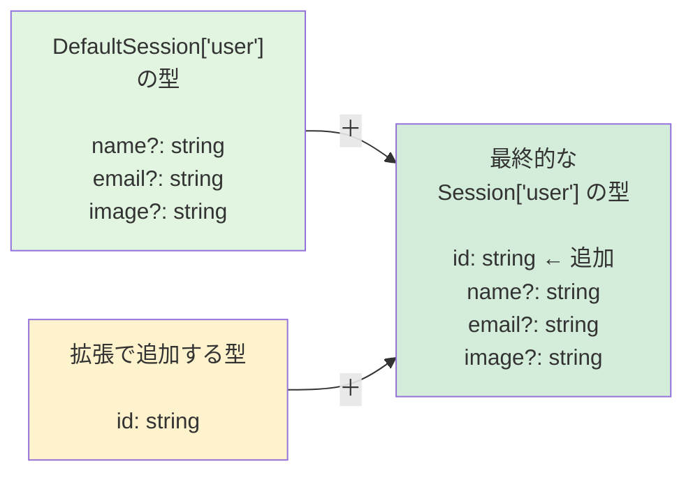
```mermaid
graph LR
    A["DefaultSession['user']<br/>の型<br/><br/>name?: string<br/>email?: string<br/>image?: string"]
    B["拡張で追加する型<br/><br/>id: string"]
    C["最終的な<br/>Session['user'] の型<br/><br/>id: string ← 追加<br/>name?: string<br/>email?: string<br/>image?: string"]

    A -->|＋| C
    B -->|＋| C

    style A fill:#e1f5e1
    style B fill:#fff3cd
    style C fill:#d4edda
```

これで`session.user.id`が型安全にアクセス可能になります。TypeScriptが`id`プロパティの存在を認識するので、タイプミスがあればコンパイル時にエラーとして検出されます。

```typescript
// この型拡張がない場合:
session.user.id   // TypeScriptエラー: Property 'id' does not exist on type 'User'

// 型拡張があれば:
session.user.id   // OK: string 型として認識される
session.user.name // OK: string | undefined 型（デフォルトの型）
```

### 8.5.5 環境変数の設定

NextAuth.jsが動作するために必要な環境変数を設定します。

```bash
# .env.local
# ============================================
# NextAuth.js 環境変数設定
# ============================================

# NEXTAUTH_URL: アプリケーションのベースURL
# NextAuth.jsがコールバックURLを生成するときに使用する
NEXTAUTH_URL=http://localhost:3000

# NEXTAUTH_SECRET: JWTの署名に使用する秘密鍵
# この鍵が漏洩すると、JWTが偽造される危険があるので絶対に公開しない！
# 生成方法: ターミナルで以下のコマンドを実行
#   openssl rand -base64 32
#   実行結果: xK8j3N9mP2qR7sT1vU5wX6yZ0aB4cD8eF2gH6iJ+kL=
# または Node.js で:
#   node -e "console.log(require('crypto').randomBytes(32).toString('base64'))"
#   実行結果: Qm9uc2FpU05TUHJvamVjdFNlY3JldEtleQ==
NEXTAUTH_SECRET=your-secret-key-here
```

**本番環境:**
```bash
# 本番環境では実際のドメインと強力なシークレットを設定する
NEXTAUTH_URL=https://your-domain.com
NEXTAUTH_SECRET=production-secret-key  # 必ず新しく生成した強力な鍵を使う
```

> **注意:** `NEXTAUTH_SECRET`は絶対にGitにコミットしないでください。`.env.local`は`.gitignore`に含まれていることを確認してください。

> **秘密鍵（Secret）の正体**
> `NEXTAUTH_SECRET` は単なる長いランダム文字列です（例: `xK8j3N9mP2qR7sT1...`）。この文字列でJWTトークンを署名し、改ざんを検知します。
>
> `openssl rand -base64 32` コマンドで生成でき、**絶対に外部に漏らしてはいけません**。もし漏洩した場合、攻撃者が有効なトークンを偽造でき、任意のユーザーになりすませます。

<details>
<summary>理解度チェック: 認証システムのセットアップ</summary>

**Q1: `authorize` 関数で `null` を返すとどうなりますか？**

A1: 認証失敗を意味します。NextAuth.jsはエラーレスポンスを返し、ユーザーにはログイン失敗が通知されます。`pages.error`で設定したページにリダイレクトされます。

**Q2: `callbacks.jwt` と `callbacks.session` の違いは何ですか？**

A2: `jwt`コールバックはJWTトークンが生成・更新されるときに呼ばれ、トークンにデータを追加します。`session`コールバックは`auth()`でセッション情報が参照されるときに呼ばれ、トークンの情報をセッションオブジェクトにコピーします。データの流れは「authorize → jwt callback → session callback → アプリケーション」です。

**Q3: `NEXTAUTH_SECRET`を設定し忘れるとどうなりますか？**

A3: 開発環境では警告が表示されますが動作します（内部でランダムな値が使われる）。しかし本番環境では**JWTの署名ができず、認証が正しく動作しません**。必ず設定してください。
</details>

### BON-LOGでの使用箇所

認証セットアップの各ファイルはBON-LOG全体の基盤となっています。

| ファイル | BON-LOGでの役割 |
|---------|----------------|
| `lib/auth.ts` | 全ページ・全Server Actionから参照される認証の中核。ログイン処理、JWT生成、セッション提供を担当 |
| `lib/auth.config.ts` | `proxy.ts`で使用するEdge Runtime対応設定。公開ページの定義とアクセス制御ロジックを管理 |
| `app/api/auth/[...nextauth]/route.ts` | NextAuth.jsのすべての認証エンドポイント（サインイン、サインアウト、セッション取得等）をハンドル |
| `types/next-auth.d.ts` | `session.user.id`を型安全に使えるようにする型拡張。全Server ActionとServer Componentで参照 |

具体的な使用箇所の例:
- `lib/actions/post.ts` — 投稿作成時に`auth()`でユーザーIDを取得
- `lib/actions/comment.ts` — コメント投稿時に`auth()`で認証チェック
- `app/(main)/feed/page.tsx` — フィードページで`auth()`によるセッション確認
- `app/(main)/settings/page.tsx` — 設定ページで`auth()`による本人確認

### 実装しない場合の影響

| 省略した場合 | 発生する問題 |
|------------|------------|
| `PrismaAdapter`を省略 | NextAuth.jsがユーザーデータをDBと連携できず、OAuth連携時にユーザーを自動作成できない |
| `session.strategy: 'jwt'`を省略 | デフォルトのデータベースセッションが使われ、毎リクエストDBにセッション照会が必要になりパフォーマンスが低下 |
| `callbacks.jwt`を省略 | `token.id`が設定されず、`session.user.id`が`undefined`になる。全Server Actionで認証チェックが機能しなくなる |
| `callbacks.session`を省略 | JWTトークン内のユーザーIDがセッションオブジェクトに反映されず、`session.user.id`が使えない |
| `isSuspended`チェックを省略 | 管理者によって停止されたアカウントでもログインできてしまい、不正ユーザーの排除ができない |
| `types/next-auth.d.ts`を省略 | TypeScriptが`session.user.id`を認識せずコンパイルエラー。型アサション（`as string`）が増えてコードが不安全になる |
| `NEXTAUTH_SECRET`環境変数を設定しない | 本番環境でJWTへの署名ができず認証が機能しない。開発環境では動作するが本番デプロイ後に全ユーザーがログインできなくなる |

---

## 8.6 ユーザー登録フロー

> **このセクションで学ぶこと**
> - ユーザー登録のServer Actionの実装方法
> - zodを使ったバリデーションの書き方
> - 登録フォームコンポーネントの実装
> - 登録後の自動ログインの仕組み

### 8.6.1 ユーザー登録フローの全体像

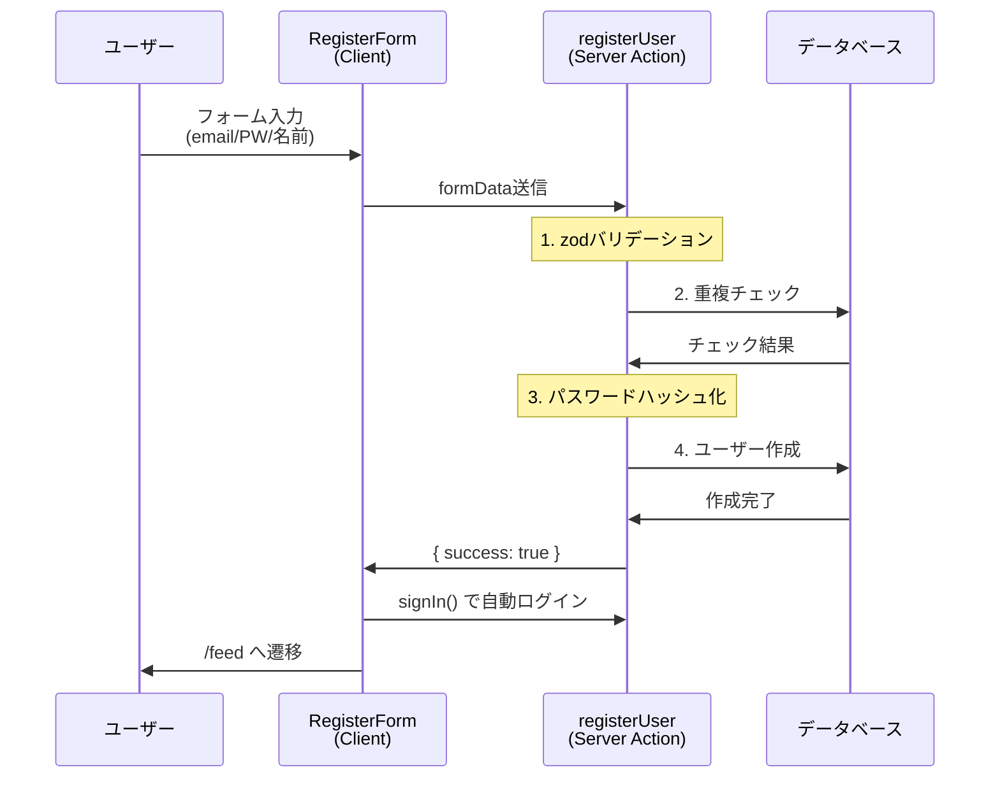
```mermaid
sequenceDiagram
    participant User as ユーザー
    participant Form as RegisterForm<br/>(Client)
    participant Action as registerUser<br/>(Server Action)
    participant DB as データベース

    User->>Form: フォーム入力<br/>(email/PW/名前)
    Form->>Action: formData送信

    Note over Action: 1. zodバリデーション

    Action->>DB: 2. 重複チェック
    DB->>Action: チェック結果

    Note over Action: 3. パスワードハッシュ化

    Action->>DB: 4. ユーザー作成
    DB->>Action: 作成完了

    Action->>Form: { success: true }

    Form->>Action: signIn() で自動ログイン

    Form->>User: /feed へ遷移
```

### 8.6.2 registerUser Server Action

BON-LOGの実際の `registerUser` は `lib/actions/auth.ts` に定義されています。`FormData` ではなくオブジェクトを引数に取り、パスワードバリデーション、ブラックリストチェック、セキュリティログ記録を行います。

```typescript
// lib/actions/auth.ts（実際のコード）
'use server'  // Server Actionであることを宣言（サーバー側でのみ実行される）

import { prisma } from '@/lib/db'          // データベース操作用
import bcrypt from 'bcryptjs'              // パスワードハッシュ化用
import { validatePassword } from '@/lib/validations/password' // パスワード強度チェック
import { sanitizeInput } from '@/lib/sanitize'                // XSS対策の入力サニタイズ
import { isEmailBlacklisted, isDeviceBlacklisted } from '@/lib/actions/blacklist' // ブラックリスト
import { logRegisterSuccess } from '@/lib/security-logger'    // セキュリティログ
import { getClientIp } from '@/lib/actions/utils'             // IPアドレス取得
import { BCRYPT_SALT_ROUNDS } from '@/lib/constants/limits'   // bcryptラウンド数定数

// ============================================
// ユーザー登録 Server Action
// オブジェクトを引数に取る（FormDataではない）
// ============================================
export async function registerUser(data: {
  email: string
  password: string
  nickname: string
  fingerprint?: string // デバイスフィンガープリント（オプション）
}) {
  // ステップ1: パスワードバリデーション（サーバー側でも必ず検証）
  // validatePassword は lib/validations/password.ts で定義
  // 要件: 8文字以上、アルファベット1文字以上、数字1文字以上
  const passwordValidation = validatePassword(data.password)
  if (!passwordValidation.valid) {
    return { error: passwordValidation.error }
    // 実行結果（例）: { error: "パスワードは8文字以上で入力してください" }
  }

  // ステップ2: ブラックリストチェック（不正利用防止）
  // メールアドレスがブラックリストに登録されていないか確認
  const emailBlacklisted = await isEmailBlacklisted(data.email)
  if (emailBlacklisted) {
    return { error: 'このメールアドレスは利用できません' }
  }

  // デバイスフィンガープリントがブラックリストに登録されていないか確認
  if (data.fingerprint) {
    const deviceBlacklisted = await isDeviceBlacklisted(data.fingerprint)
    if (deviceBlacklisted) {
      return { error: 'このデバイスからの登録は許可されていません' }
    }
  }

  // ステップ3: 既存ユーザーチェック
  const existingUser = await prisma.user.findUnique({
    where: { email: data.email },
  })

  if (existingUser) {
    return { error: 'このメールアドレスは既に登録されています' }
    // ※ throwではなく{ error }を返す → 呼び出し元でtry-catchが不要
  }

  // ステップ4: パスワードをハッシュ化
  // BCRYPT_SALT_ROUNDS は lib/constants/limits.ts で定義された定数
  const hashedPassword = await bcrypt.hash(data.password, BCRYPT_SALT_ROUNDS)
  // 実行結果（例）: "$2a$10$LJ3m9Vf4kN8pQ2xR5tY7We.Kd6aB0cE3fG4hI5jK6lM7nO8pQ9rS"

  // ステップ5: ユーザーをデータベースに作成
  const user = await prisma.user.create({
    data: {
      email: data.email,
      password: hashedPassword,
      nickname: data.nickname,
    },
  })

  // ステップ6: セキュリティログに記録
  const ip = await getClientIp()
  logRegisterSuccess(user.id, ip)

  return { success: true, userId: user.id }
  // 実行結果: { success: true, userId: "clx1abc2d0001abcdef12345" }
}
```

> **なぜサーバー側でバリデーションが必要なのか？** クライアント側（ブラウザ）のバリデーションは、HTMLを書き換えるだけで簡単にスキップできます。セキュリティ上、サーバー側でのバリデーションは必須です。クライアント側のバリデーションはあくまで「UX向上のためのおまけ」と考えてください。

> **lib/auth.ts の registerUser との違い:** `lib/auth.ts` にもシンプルな `registerUser` 関数がありますが、実際の登録フォームは `lib/actions/auth.ts` の Server Action 版を使用します。Server Action 版はブラックリストチェック、セキュリティログ記録など、本番環境に必要な機能を含んでいます。

### 8.6.3 登録フォームコンポーネント

> **画面表示**
> 新規登録ページ（http://localhost:3000/register）にアクセスすると:
> - 「BON-LOG」のロゴと「盆栽愛好家のためのSNS」のキャッチコピーが中央に表示される
> - メールアドレス入力欄、パスワード入力欄（「8文字以上、大文字・小文字・数字を含む」の注記付き）、ニックネーム入力欄が並ぶ
> - 緑色の「登録」ボタンが表示される
> - バリデーションエラー時（例: パスワードが7文字以下）、赤背景のエラーメッセージが表示される
> - 登録処理中は「登録中...」とボタンのテキストが変わり、ボタンが半透明になって二重送信を防止する
> - 登録成功すると自動的にログインされ、/feed ページにリダイレクトされる

```typescript
// components/auth/RegisterForm.tsx
'use client'  // Client Component: useState等のReact Hooksを使うため

import { useState, useEffect } from 'react'             // 状態管理・副作用フック
import { useRouter } from 'next/navigation'              // ページ遷移用
import { registerUser } from '@/lib/actions/auth'        // 登録Server Action
import { signIn } from 'next-auth/react'                 // クライアント側ログイン関数
import { Button } from '@/components/ui/button'          // shadcn/ui ボタン
import { Input } from '@/components/ui/input'            // shadcn/ui 入力フィールド
import { Label } from '@/components/ui/label'            // shadcn/ui ラベル
import Link from 'next/link'                             // ページ遷移リンク
import { getFingerprintWithCache } from '@/lib/fingerprint' // デバイス識別
import { PASSWORD_MIN_LENGTH, MAX_NICKNAME_LENGTH } from '@/lib/constants/limits'

export function RegisterForm() {
  const router = useRouter()                              // ページ遷移を行うためのルーター
  const [error, setError] = useState<string | null>(null) // エラーメッセージの状態
  const [loading, setLoading] = useState(false)           // ローディング状態（二重送信防止）
  const [showPassword, setShowPassword] = useState(false) // パスワード表示/非表示
  const [showConfirmPassword, setShowConfirmPassword] = useState(false)
  const [agreedToTerms, setAgreedToTerms] = useState(false) // 利用規約同意
  const [fingerprint, setFingerprint] = useState<string | null>(null) // デバイスフィンガープリント

  // コンポーネントマウント時にデバイスフィンガープリントを取得
  useEffect(() => {
    async function collectFingerprint() {
      const fp = await getFingerprintWithCache()
      if (fp) setFingerprint(fp)
    }
    collectFingerprint()
  }, [])

  // フォーム送信時のハンドラー
  async function handleSubmit(e: React.FormEvent<HTMLFormElement>) {
    e.preventDefault()     // デフォルトのフォーム送信を防止（SPAとして制御）
    setLoading(true)       // ローディング開始（ボタンを無効化）
    setError(null)         // 前回のエラーをクリア

    const formData = new FormData(e.currentTarget)
    const email = formData.get('email') as string
    const password = formData.get('password') as string
    const confirmPassword = formData.get('confirmPassword') as string
    const nickname = formData.get('nickname') as string

    // クライアント側バリデーション
    if (!agreedToTerms) {
      setError('利用規約とプライバシーポリシーに同意してください')
      setLoading(false)
      return
    }
    if (password !== confirmPassword) {
      setError('パスワードが一致しません')
      setLoading(false)
      return
    }
    if (password.length < PASSWORD_MIN_LENGTH) {
      setError('パスワードは8文字以上で入力してください')
      setLoading(false)
      return
    }
    if (!/[a-zA-Z]/.test(password) || !/[0-9]/.test(password)) {
      setError('パスワードはアルファベットと数字を両方含めてください')
      setLoading(false)
      return
    }

    // ステップ1: Server Actionでユーザー登録を実行
    // ※ registerUserはオブジェクトを受け取る（FormDataではない）
    const result = await registerUser({
      email,
      password,
      nickname,
      fingerprint: fingerprint || undefined,  // デバイス識別情報を送信
    })

    // 登録失敗: エラーメッセージを表示
    if (result.error) {
      setError(result.error)  // エラーメッセージをセット
      setLoading(false)       // ローディング終了
      return                  // ここで処理を中断
    }

    // ステップ2: 登録成功後、自動的にログインする
    const signInResult = await signIn('credentials', {
      email,              // 登録時と同じメールアドレス
      password,           // 登録時と同じパスワード
      redirect: false,    // 自動リダイレクトを無効化（手動で制御する）
    })

    // ログイン失敗（通常は起きないが、念のため）
    if (signInResult?.error) {
      setError('登録は完了しましたが、ログインに失敗しました。ログインページからお試しください。')
      setLoading(false)
      return
    }

    // ステップ3: ログイン成功！フィードページへ遷移
    router.push('/feed')    // /feedページへ遷移
    router.refresh()        // ページのキャッシュを更新（セッション情報を反映）
  }

  return (
    <form onSubmit={handleSubmit} className="space-y-4">
      {/* ニックネーム入力フィールド */}
      <div className="space-y-2">
        <Label htmlFor="nickname">ニックネーム</Label>
        <Input id="nickname" name="nickname" type="text"
          placeholder="表示名" required maxLength={MAX_NICKNAME_LENGTH} />
      </div>

      {/* メールアドレス入力フィールド */}
      <div className="space-y-2">
        <Label htmlFor="email">メールアドレス</Label>
        <Input id="email" name="email" type="email"
          placeholder="mail@example.com" required autoComplete="email" />
      </div>

      {/* パスワード入力フィールド（表示/非表示トグル付き） */}
      <div className="space-y-2">
        <Label htmlFor="password">パスワード</Label>
        <div className="relative">
          <Input id="password" name="password"
            type={showPassword ? 'text' : 'password'}
            placeholder="8文字以上（英字・数字を含む）"
            required minLength={PASSWORD_MIN_LENGTH}
            autoComplete="new-password" className="pr-10" />
          <button type="button" onClick={() => setShowPassword(!showPassword)}
            className="absolute right-3 top-1/2 -translate-y-1/2 text-muted-foreground"
            aria-label={showPassword ? 'パスワードを隠す' : 'パスワードを表示'}>
            {/* 目のアイコン（EyeIcon / EyeOffIcon） */}
          </button>
        </div>
      </div>

      {/* パスワード確認入力 */}
      <div className="space-y-2">
        <Label htmlFor="confirmPassword">パスワード（確認）</Label>
        <div className="relative">
          <Input id="confirmPassword" name="confirmPassword"
            type={showConfirmPassword ? 'text' : 'password'}
            placeholder="もう一度入力" required minLength={PASSWORD_MIN_LENGTH}
            autoComplete="new-password" className="pr-10" />
        </div>
      </div>

      {/* 利用規約同意チェックボックス */}
      <div className="flex items-start gap-2">
        <input type="checkbox" id="agreeTerms"
          checked={agreedToTerms} onChange={(e) => setAgreedToTerms(e.target.checked)} />
        <label htmlFor="agreeTerms" className="text-sm text-muted-foreground">
          <Link href="/terms" target="_blank" className="text-primary hover:underline">利用規約</Link>
          および
          <Link href="/privacy" target="_blank" className="text-primary hover:underline">プライバシーポリシー</Link>
          に同意します
        </label>
      </div>

      {/* エラーメッセージの表示 */}
      {error && <p className="text-sm text-destructive">{error}</p>}

      {/* 送信ボタン（loading中または未同意時は無効化される） */}
      <Button type="submit" className="w-full" disabled={loading || !agreedToTerms}>
        {loading ? '登録中...' : '新規登録'}
      </Button>

      {/* ログインページへのリンク */}
      <p className="text-center text-sm text-muted-foreground">
        既にアカウントをお持ちの方は{' '}
        <Link href="/login" className="text-primary hover:underline">ログイン</Link>
      </p>
    </form>
  )
}
```

<details>
<summary>理解度チェック: ユーザー登録フロー</summary>

**Q1: なぜ `redirect: false` を指定しているのですか？**

A1: `signIn` 関数はデフォルトで認証後に自動リダイレクトを行います。`redirect: false` にすることで、結果を受け取ってから手動で遷移先を制御できます。エラーハンドリングを適切に行うために必要です。

**Q2: `router.refresh()` は何のために呼んでいますか？**

A2: Next.jsはページデータをキャッシュしています。ログイン後、Server Componentが新しいセッション情報でレンダリングされるようにキャッシュを無効化しています。これがないと、古いデータ（未ログイン状態）が表示される可能性があります。

**Q3: クライアント側とサーバー側でバリデーションが二重になっていませんか？**

A3: 意図的に二重チェックしています。クライアント側（`RegisterForm`内）ではパスワード一致確認・強度チェック・利用規約同意をチェックし、サーバー側（`registerUser` Server Action内）では`validatePassword()`・メールブラックリスト・デバイスブラックリスト・メール重複チェックを行います。クライアント側チェックはUXのため（即座にフィードバック）、サーバー側チェックはセキュリティのため（改ざん不可）です。
</details>

### BON-LOGでの使用箇所

| ファイル・コンポーネント | 役割 |
|----------------------|------|
| `lib/auth.ts` の `registerUser()` 関数 | 新規ユーザーのDB登録処理。メール重複チェック、bcryptハッシュ化、Prismaでのユーザー作成を担当 |
| `app/(auth)/register/page.tsx` | 新規登録ページのServer Component。`RegisterForm`をレンダリング |
| `components/auth/RegisterForm.tsx` | 登録フォームのClient Component。フォーム送信後に`signIn()`で自動ログインし`/feed`へ遷移 |

### 実装しない場合の影響

| 省略した場合 | 発生する問題 |
|------------|------------|
| Zodバリデーションを省略 | 不正なメールアドレスや1文字のパスワードでもDBにユーザーが作成されてしまう |
| 既存ユーザーチェックを省略 | 同じメールアドレスで複数アカウントが作成でき、DBの一意制約エラーが未処理のまま発生する |
| `bcrypt.hash()`を省略して平文保存 | DBが漏洩した際に全ユーザーのパスワードが即座に判明する重大なセキュリティ事故になる |
| 登録後の`signIn()`を省略 | 登録成功後にユーザーが再度ログインフォームを開かなければならず、UXが損なわれる |

---

## 8.7 ログインフロー

> **このセクションで学ぶこと**
> - ログインフォームの実装方法
> - `callbackUrl` を使ったリダイレクト制御
> - ログインページのServer Component実装
> - ログイン失敗時のエラーハンドリング

### 8.7.1 ログインフォームコンポーネント

ログインフォームは登録フォームと似ていますが、いくつか重要な違いがあります。特に `callbackUrl` による「元のページに戻る」機能に注目してください。

> **画面表示**
> ログインページ（http://localhost:3000/login）にアクセスすると:
> - 「BON-LOG」のロゴと「盆栽愛好家のためのSNS」のキャッチコピーが中央に表示される
> - メールアドレス入力欄とパスワード入力欄が表示される（ブラウザの自動補完が有効）
> - 緑色の「ログイン」ボタンが表示される
> - 間違ったパスワードを入力すると、赤背景で「メールアドレスまたはパスワードが正しくありません」と表示される
> - 「アカウントをお持ちでない方は 新規登録」のリンクがフォーム下部に表示される
> - 正しい情報でログインすると、/feed ページにリダイレクトされる
> - ログイン処理中は「ログイン中...」とボタンのテキストが変わる
>
> 

```typescript
// components/auth/LoginForm.tsx
'use client'  // Client Component: useState, useEffect等を使用

import { useState, useEffect } from 'react'              // 状態管理・副作用フック
import { useRouter } from 'next/navigation'               // ルーティング関連
import { signIn } from 'next-auth/react'                  // NextAuth.jsのログイン関数
import Link from 'next/link'                              // ページ遷移リンク
import { Button } from '@/components/ui/button'           // shadcn/ui ボタン
import { Input } from '@/components/ui/input'             // shadcn/ui 入力フィールド
import { Label } from '@/components/ui/label'             // shadcn/ui ラベル
import { checkLoginAllowed } from '@/lib/actions/auth'    // レート制限チェック
import { check2FARequired, verify2FAToken } from '@/lib/actions/two-factor' // 2FA
import { getFingerprintWithCache } from '@/lib/fingerprint' // デバイス識別
import { isDeviceBlacklisted } from '@/lib/actions/blacklist' // ブラックリスト
import { PASSWORD_MIN_LENGTH } from '@/lib/constants/limits'

export function LoginForm() {
  const router = useRouter()                               // ページ遷移用
  const [error, setError] = useState<string | null>(null)  // エラーメッセージ
  const [loading, setLoading] = useState(false)            // ローディング状態
  const [showPassword, setShowPassword] = useState(false)  // パスワード表示/非表示

  // 2段階認証関連の状態
  const [requires2FA, setRequires2FA] = useState(false)
  const [twoFactorCode, setTwoFactorCode] = useState('')
  const [pendingUserId, setPendingUserId] = useState<string | null>(null)

  // デバイスフィンガープリント（ブラックリストチェック用）
  const [fingerprint, setFingerprint] = useState<string | null>(null)

  // マウント時にデバイスフィンガープリントを取得
  useEffect(() => {
    async function collectFingerprint() {
      const fp = await getFingerprintWithCache()
      if (fp) setFingerprint(fp)
    }
    collectFingerprint()
  }, [])

  async function handleSubmit(e: React.FormEvent<HTMLFormElement>) {
    e.preventDefault()     // デフォルトのフォーム送信を防止
    setLoading(true)       // ローディング開始
    setError(null)         // 前回のエラーをクリア

    const formData = new FormData(e.currentTarget)
    const email = formData.get('email') as string
    const password = formData.get('password') as string

    try {
      // ステップ1: レート制限チェック（ブルートフォース攻撃対策）
      try {
        const checkResult = await checkLoginAllowed(email)
        if (!checkResult.allowed) {
          setError(checkResult.message || 'ログイン試行回数の上限に達しました。')
          setLoading(false)
          return
        }
      } catch {
        // レート制限チェック失敗時はフェイルオープン（ログイン処理を続行）
      }

      // ステップ2: デバイスブラックリストチェック
      if (fingerprint) {
        try {
          const deviceBlocked = await isDeviceBlacklisted(fingerprint)
          if (deviceBlocked) {
            setError('このデバイスからのログインは許可されていません')
            setLoading(false)
            return
          }
        } catch {
          // デバイスチェック失敗時もフェイルオープン
        }
      }

      // ステップ3: 2段階認証チェック
      let twoFactorCheck = { required: false, userId: undefined as string | undefined }
      try {
        twoFactorCheck = await check2FARequired(email)
      } catch {
        // 2FAチェック失敗時はスキップ（フェイルオープン）
      }

      if (twoFactorCheck.required && twoFactorCheck.userId) {
        // パスワードが正しいか先に確認
        const preAuthResult = await signIn('credentials', { email, password, redirect: false })
        if (preAuthResult?.error) {
          setError('メールアドレスまたはパスワードが間違っています')
          setLoading(false)
          return
        }
        // パスワード認証成功 → 2FAステップへ移行
        setPendingUserId(twoFactorCheck.userId)
        setRequires2FA(true)
        setLoading(false)
        return
      }

      // ステップ4: NextAuth.js認証（2FA不要の場合）
      const result = await signIn('credentials', { email, password, redirect: false })

      if (result?.error) {
        setError('メールアドレスまたはパスワードが間違っています')
        setLoading(false)
        return
      }

      // ログイン成功: フィードページへ遷移
      router.push('/feed')
      router.refresh()
    } catch {
      setError('ログイン中にエラーが発生しました。再度お試しください。')
      setLoading(false)
    }
  }

  // 2段階認証検証ハンドラ
  async function handleVerify2FA(e: React.FormEvent<HTMLFormElement>) {
    e.preventDefault()
    setLoading(true)
    setError(null)

    if (!pendingUserId) {
      setError('認証情報が見つかりません。もう一度ログインしてください。')
      setRequires2FA(false)
      setLoading(false)
      return
    }

    try {
      const verifyResult = await verify2FAToken(pendingUserId, twoFactorCode)
      if ('error' in verifyResult) {
        setError(verifyResult.error)
        setLoading(false)
        return
      }
      router.push('/feed')
      router.refresh()
    } catch {
      setError('認証中にエラーが発生しました。再度お試しください。')
      setLoading(false)
    }
  }

  // 2段階認証ステップの表示
  if (requires2FA) {
    return (
      <form onSubmit={handleVerify2FA} className="space-y-4">
        <div className="text-center space-y-2">
          <h2 className="text-lg font-semibold">2段階認証</h2>
          <p className="text-sm text-muted-foreground">
            認証アプリに表示されている6桁のコードを入力してください。
          </p>
        </div>
        <div className="space-y-2">
          <Label htmlFor="twoFactorCode">認証コード</Label>
          <Input id="twoFactorCode" type="text" inputMode="text"
            placeholder="000000 または バックアップコード"
            value={twoFactorCode}
            onChange={(e) => setTwoFactorCode(e.target.value.toUpperCase())}
            required autoComplete="one-time-code"
            className="text-center text-lg tracking-widest" />
        </div>
        {error && <p className="text-sm text-destructive">{error}</p>}
        <Button type="submit" className="w-full" disabled={loading || !twoFactorCode}>
          {loading ? '確認中...' : '確認'}
        </Button>
        <Button type="button" variant="outline" className="w-full"
          onClick={() => { setRequires2FA(false); setTwoFactorCode(''); setPendingUserId(null); setError(null) }}>
          キャンセル
        </Button>
      </form>
    )
  }

  return (
    <form onSubmit={handleSubmit} className="space-y-4">
      <div className="space-y-2">
        <Label htmlFor="email">メールアドレス</Label>
        <Input id="email" name="email" type="email"
          placeholder="mail@example.com" required autoComplete="email" />
      </div>

      <div className="space-y-2">
        <Label htmlFor="password">パスワード</Label>
        <div className="relative">
          <Input id="password" name="password"
            type={showPassword ? 'text' : 'password'}
            placeholder="8文字以上（英字・数字を含む）"
            required minLength={PASSWORD_MIN_LENGTH}
            autoComplete="current-password" className="pr-10" />
          <button type="button" onClick={() => setShowPassword(!showPassword)}
            className="absolute right-3 top-1/2 -translate-y-1/2 text-muted-foreground"
            aria-label={showPassword ? 'パスワードを隠す' : 'パスワードを表示'}>
            {/* 目のアイコン（EyeIcon / EyeOffIcon） */}
          </button>
        </div>
      </div>

      {error && <p className="text-sm text-destructive">{error}</p>}

      <Button type="submit" className="w-full" disabled={loading}>
        {loading ? 'ログイン中...' : 'ログイン'}
      </Button>

      <div className="text-center text-sm space-y-2">
        <p>
          <Link href="/password-reset" className="text-primary hover:underline">
            パスワードをお忘れですか？
          </Link>
        </p>
        <p className="text-muted-foreground">
          アカウントをお持ちでない方は{' '}
          <Link href="/register" className="text-primary hover:underline">新規登録</Link>
        </p>
      </div>
    </form>
  )
}
```

> **セキュリティTips:** ログイン失敗時のエラーメッセージに「メールアドレスが見つかりません」や「パスワードが間違っています」のように具体的な原因を表示しないでください。攻撃者が「このメールアドレスは登録されている」と判断する材料になってしまいます。

### 8.7.2 ログインページ

ログインページはServer Componentとして作成します。Server Component側で「既にログイン済みかどうか」を確認し、ログイン済みならフィードにリダイレクトします。

> **画面表示**
> 未ログイン状態で http://localhost:3000/login にアクセスすると:
> - 灰色の背景に白いカード型のフォームが中央に表示される
> - カード上部に「BON-LOG」のタイトル（緑色の太字）と説明文が表示される
> - ログイン済みの状態で /login にアクセスすると、自動的に /feed にリダイレクトされる（ログインページは表示されない）

```typescript
// app/(auth)/login/page.tsx
// ============================================
// ログインページ（Server Component）
// 「既にログインしているか」のチェックをサーバー側で行う
// ============================================
import { LoginForm } from '@/components/auth/LoginForm'  // ログインフォーム（Client Component）
import { auth } from '@/lib/auth'                        // セッション取得関数
import { redirect } from 'next/navigation'               // サーバー側リダイレクト

export default async function LoginPage() {
  // サーバー側でセッションを確認
  // auth()はServer Componentで使えるセッション取得関数
  const session = await auth()

  // 既にログイン済みならフィードページへリダイレクト
  // ログイン済みユーザーにログインページを見せる必要はない
  if (session) {
    redirect('/feed')
  }

  // 未ログインの場合: ログインフォームを表示
  return (
    <div className="flex min-h-screen items-center justify-center bg-gray-50 px-4">
      <div className="w-full max-w-md">
        {/* アプリのロゴとタイトル */}
        <div className="mb-8 text-center">
          <h1 className="text-3xl font-bold text-green-800">BON-LOG</h1>
          <p className="mt-2 text-gray-600">盆栽愛好家のためのSNS</p>
        </div>

        {/* ログインフォーム（Client Componentをここに埋め込む） */}
        <div className="rounded-lg bg-white p-8 shadow-md">
          <h2 className="mb-6 text-2xl font-semibold">ログイン</h2>
          <LoginForm />  {/* インタラクティブ部分のみClient Component */}
        </div>
      </div>
    </div>
  )
}
```

> **Server Component + Client Component のパターン:** このページは第3章で学んだ「Compositionパターン」の実践例です。ページ全体はServer Componentとして認証チェックやレイアウトを担当し、フォームのインタラクティブ部分のみをClient Componentにしています。

### BON-LOGでの使用箇所

| ファイル・コンポーネント | 役割 |
|----------------------|------|
| `components/auth/LoginForm.tsx` | メール+パスワードによるログインフォーム。`signIn('credentials', ...)`でNextAuth.jsのCredentials認証を呼び出す |
| `app/(auth)/login/page.tsx` | ログインページのServer Component。既ログインユーザーを`/feed`へリダイレクト |
| `app/(auth)/login/layout.tsx` | 認証ページ専用レイアウト（中央揃えの白背景） |

`callbackUrl`の連携フロー:
1. 未ログインで`/posts/123`にアクセス → Middlewareが`/login?callbackUrl=/posts/123`にリダイレクト
2. `LoginForm`が`useSearchParams()`で`callbackUrl`を読み取る
3. ログイン成功後、`router.push(callbackUrl)`で元のページ`/posts/123`に戻る

### 実装しない場合の影響

| 省略した場合 | 発生する問題 |
|------------|------------|
| `callbackUrl`の処理を省略 | ログイン後に常に`/feed`に飛んでしまい、ユーザーが見ようとしていたページに戻れない |
| `redirect: false`を省略（デフォルトの自動リダイレクト） | ログイン失敗時のエラーハンドリングができず、エラーメッセージをフォームに表示できない |
| ログインページでの`auth()`チェックを省略 | ログイン済みユーザーが`/login`に直接アクセスしてもログインフォームが表示される（Middlewareでのリダイレクトでカバーできるが、二重防護として重要） |
| `router.refresh()`を省略 | ログイン後にServer Componentが古いキャッシュを使い続け、ナビゲーションバーが未ログイン状態のまま表示される |

---

## 8.8 セッション管理

> **このセクションで学ぶこと**
> - Server Component、Server Action、Client Componentそれぞれでのセッション取得方法
> - SessionProviderの設定と役割
> - セッション情報の活用パターン

セッション管理は「ログイン後のユーザー情報をどこでどう取得するか」がポイントです。NextAuth.jsでは、使う場所によって方法が異なります。

**セッション取得の3パターン:**

| | Server Component | Server Action | Client Component |
|---|---|---|---|
| **関数** | `auth()` | `auth()` | `useSession()` |
| **実行環境** | サーバー側で直接<br/>セッション取得 | サーバー側で直接<br/>セッション取得 | SessionProvider経由で<br/>ブラウザ側で取得 |
| **使用例** | ページ表示時の<br/>認証チェック | 投稿作成時の<br/>認証チェック | ナビバーの<br/>ユーザーメニュー |

### 8.8.1 Server Componentでのセッション取得

Server Componentでは `auth()` 関数を直接呼び出してセッション情報を取得します。最もシンプルで推奨される方法です。

```typescript
// app/(main)/feed/page.tsx
// ============================================
// フィードページ（Server Component）
// auth()でサーバー側でセッション情報を取得する
// ============================================
import { auth } from '@/lib/auth'          // セッション取得関数
import { redirect } from 'next/navigation' // サーバー側リダイレクト

export default async function FeedPage() {
  // auth()を呼ぶだけでセッション情報が取得できる
  // 内部でJWTのCookieを読み取り、署名を検証し、ユーザー情報を返す
  const session = await auth()

  // セッションがない = 未ログイン → ログインページへリダイレクト
  if (!session) {
    redirect('/login')
  }

  // セッションがある = ログイン済み → ユーザー情報を使って表示
  // session オブジェクトの中身（例）:
  // {
  //   user: {
  //     id: "clx1abc2d0001abcdef12345",   ← types/next-auth.d.ts で追加した型
  //     name: "盆栽太郎",
  //     email: "taro@example.com",
  //     image: "https://r2.example.com/avatars/xxx.jpg"
  //   },
  //   expires: "2026-03-19T12:00:00.000Z"  ← セッション有効期限
  // }
  return (
    <div>
      <h1>こんにちは、{session.user.name}さん</h1>
      {/* 型安全: session.user.id は types/next-auth.d.ts で定義した通り string 型 */}
      <p>ユーザーID: {session.user.id}</p>
    </div>
  )
}
```

> **画面表示**
> ログイン済みのユーザー「盆栽太郎」が /feed にアクセスすると:
> - 「こんにちは、盆栽太郎さん」と表示される
> - 「ユーザーID: clx1abc2d0001abcdef12345」と表示される
>
> 未ログインで /feed にアクセスすると:
> - /login ページに自動リダイレクトされる

### 8.8.2 Server Actionでのセッション取得

Server Actionでも同じ `auth()` 関数を使います。データの作成・更新・削除の前に必ず認証チェックを行うことが重要です。

```typescript
// lib/actions/post.ts
'use server'  // Server Action

import { auth } from '@/lib/auth'    // セッション取得関数
import { prisma } from '@/lib/db'    // DB操作

export async function createPost(formData: FormData) {
  // ============================================
  // 重要: Server Actionの先頭で必ず認証チェック！
  // これを忘れると誰でもデータを操作できてしまう
  // ============================================
  const session = await auth()

  // オプショナルチェーン(?.)で安全にアクセス
  // session が null の場合や user が undefined の場合でもエラーにならない
  if (!session?.user?.id) {
    return { error: '認証が必要です' }
  }

  const content = formData.get('content') as string

  // session.user.id が型安全にアクセス可能
  // types/next-auth.d.ts の型拡張のおかげ
  const post = await prisma.post.create({
    data: {
      userId: session.user.id,  // ログインユーザーのIDを投稿者IDに設定
      content,
    },
  })
  // 実行結果: { id: "clx2def3g...", userId: "clx1abc2d...", content: "松の盆栽を植え替えました", ... }

  return { success: true, postId: post.id }
  // 実行結果: { success: true, postId: "clx2def3g..." }
}
```

### 8.8.3 Client Componentでのセッション取得

Client Componentでは `useSession()` フックを使います。ただし、これを使うには `SessionProvider` でアプリケーション全体をラップする必要があります。

**BON-LOGのProvidersコンポーネント（実際のコード）**

BON-LOGではJWT方式を採用しているため、`SessionProvider` は使用していません。代わりに、React Query（TanStack Query）とテーマ管理のプロバイダーを配置しています。

```typescript
// app/providers.tsx（実際のコード）
'use client'

import { QueryClient, QueryClientProvider } from '@tanstack/react-query'
import { useState } from 'react'
import { ThemeProvider } from '@/components/theme/ThemeProvider'
import { ServiceWorkerRegistration } from '@/components/pwa/ServiceWorkerRegistration'
import { STALE_TIME_MS } from '@/lib/constants/limits'

// Sentryクライアント初期化（エラー監視）
import '../sentry.client.config'

export function Providers({ children }: { children: React.ReactNode }) {
  const [queryClient] = useState(
    () =>
      new QueryClient({
        defaultOptions: {
          queries: {
            staleTime: STALE_TIME_MS,        // 1分間はデータを新鮮とみなす
            refetchOnWindowFocus: false,      // ウィンドウフォーカスでの再フェッチを無効化
          },
        },
      })
  )

  return (
    <QueryClientProvider client={queryClient}>
      <ThemeProvider>
        {children}
        <ServiceWorkerRegistration />
      </ThemeProvider>
    </QueryClientProvider>
  )
}
```

> **なぜSessionProviderを使わないのか？** BON-LOGではJWT方式を採用しており、Server Component / Server Action では `auth()` 関数で直接セッションを取得します。Client Componentでは `next-auth/react` の `signIn()` や `signOut()` を個別にインポートして使用します。`useSession()` フックは使用していないため、`SessionProvider` は不要です。

**ルートレイアウトでProvidersをラップ**

```typescript
// app/layout.tsx
import { Providers } from './providers'

export default function RootLayout({
  children,
}: {
  children: React.ReactNode
}) {
  return (
    <html lang="ja">
      <body>
        <Providers>{children}</Providers>
      </body>
    </html>
  )
}
```

**Client Componentでセッション情報を使う場合**

BON-LOGではClient Componentでセッション情報が必要な場合、Server Componentからpropsとして渡すパターンを推奨しています。`useSession()` を使う場合は、`SessionProvider` を追加する必要があります。以下は参考例です。

```typescript
// components/user/UserMenu.tsx
'use client'  // Client Component

import { useSession, signOut } from 'next-auth/react'

export function UserMenu() {
  // useSession()はSessionProviderから現在のセッション情報を取得する
  // data: セッション情報（session.user.name, session.user.id等）
  // status: 'loading' | 'authenticated' | 'unauthenticated'
  const { data: session, status } = useSession()
  // status の遷移: 'loading' → 'authenticated' または 'unauthenticated'

  // ローディング中（セッション情報を取得中）
  // 内部で /api/auth/session にリクエストを送信してJWTを検証中
  if (status === 'loading') {
    return <div>読み込み中...</div>
  }

  // 未ログイン状態（status === 'unauthenticated'）
  if (!session) {
    return <a href="/login">ログイン</a>
  }

  // ログイン済み（status === 'authenticated'）: ユーザーメニューを表示
  return (
    <div>
      <p>ようこそ、{session.user.name}さん</p>
      {/* signOut()でログアウト。callbackUrlでログアウト後の遷移先を指定 */}
      <button onClick={() => signOut({ callbackUrl: '/login' })}>
        ログアウト
      </button>
    </div>
  )
}

// 画面表示の遷移:
// 1. 初回: 「読み込み中...」が一瞬表示される（status === 'loading'）
// 2a. ログイン済み: 「ようこそ、盆栽太郎さん」と「ログアウト」ボタンが表示される
// 2b. 未ログイン: 「ログイン」リンクが表示される
```

| よくあるトラブル | 原因 | 解決法 |
|----------------|------|--------|
| `useSession()` で `status` が常に `'loading'` | `SessionProvider` が設定されていない | `app/layout.tsx` で `Providers` コンポーネントをラップしているか確認 |
| Server Component で `useSession()` を使ってエラー | `useSession` はClient Component専用 | Server Componentでは `auth()` を使う |
| `session.user.id` が `undefined` | callbacksの設定漏れ | `lib/auth.ts` の `jwt` と `session` コールバックを確認 |

<details>
<summary>理解度チェック: セッション管理</summary>

**Q1: Server ComponentとClient Componentで、セッション取得方法が違うのはなぜですか？**

A1: Server Componentはサーバー側で実行されるため、Cookieに直接アクセスしてJWTを検証できます（`auth()`）。一方、Client Componentはブラウザ側で実行されるため、React ContextAPIを通じてセッション情報を受け取る必要があります（`useSession()`）。

**Q2: SessionProviderはなぜアプリケーション全体をラップする必要がありますか？**

A2: ReactのContext APIの仕組み上、`useSession()`を使うコンポーネントは、必ず`SessionProvider`の子孫コンポーネントでなければなりません。ルートレイアウトでラップすることで、アプリケーション内のどのClient Componentからでもセッション情報にアクセスできます。

**Q3: `status: 'loading'` の間に何が起きていますか？**

A3: ブラウザが `/api/auth/session` エンドポイントにリクエストを送信し、サーバーがJWTを検証してセッション情報を返すのを待っています。この間、UIにはローディング表示を出すのが適切です。
</details>

### BON-LOGでの使用箇所

| 取得方法 | BON-LOGでの使用コンポーネント・ファイル |
|---------|---------------------------------------|
| `auth()`（Server Component） | `app/(main)/feed/page.tsx`, `app/(main)/users/[id]/page.tsx`, `app/(main)/settings/page.tsx` など全保護ページ |
| `auth()`（Server Action） | `lib/actions/post.ts`, `lib/actions/comment.ts`, `lib/actions/message.ts` など全データ変更アクション |
| Client Component | BON-LOGではServer Componentからpropsで渡すパターンを使用。ナビゲーションバーのユーザーメニュー等では `signIn()` / `signOut()` を個別にインポート |
| `Providers` | `app/providers.tsx` で QueryClientProvider + ThemeProvider をラップし、`app/layout.tsx` から呼び出している（SessionProviderは不使用） |

### 実装しない場合の影響

| 省略した場合 | 発生する問題 |
|------------|------------|
| `Providers`を省略 | React Queryのキャッシュ管理やテーマ切り替えが機能しない。BON-LOGではSessionProviderは不使用だが、`useSession()`を使う場合はSessionProviderの追加が必要 |
| Server Componentで`auth()`の認証チェックを省略 | Middlewareを突破した後のページでも二重チェックができず、URLを直接操作されると認証なしでデータが表示されてしまう |
| Server Actionで`auth()`の認証チェックを省略 | 未ログインユーザーや他人が任意のユーザーに成りすましてデータを作成・変更・削除できてしまうという深刻なセキュリティホールが発生する |
| `router.refresh()`を省略 | ログイン後、Next.jsのキャッシュが古いまま残り、ログイン前の状態（未認証状態）がページに表示され続ける |

---

## 8.9 Proxy（旧Middleware）での認証チェック

> **このセクションで学ぶこと**
> - Proxy（旧Middleware）とは何か、どのタイミングで実行されるか
> - 保護ルートの設定方法
> - callbackUrlによるリダイレクト先の保持
>
> **Note**: Next.js 16 では `middleware.ts` が `proxy.ts` に名称変更されました。役割と機能は同一です。

### 8.9.1 Proxyの役割

Proxy（プロキシ）は「すべてのリクエストが通る門番」です。ページのレンダリングが始まる前に実行され、アクセスを許可するかリダイレクトするかを判断します。

```
Proxyの実行タイミング（proxy.ts）:

  ブラウザ     Proxy          ページ（Server Component）
    |              |                    |
    |  /feed要求   |                    |
    |------------->|                    |
    |              |                    |
    |              | ログイン済み？      |
    |              |                    |
    |              | YES → 通過         |
    |              |------------------->|  ページを表示
    |              |                    |
    |              | NO → リダイレクト   |
    |<-------------|                    |
    |  /login へ   |                    |
    |              |                    |

  ※ Proxyが拒否したら、ページのコードは一切実行されない
```

### 8.9.2 BON-LOGのProxy実装

BON-LOGの`proxy.ts`はシンプルな認証チェック以上の機能を持ちます。認証に加えて、セキュリティヘッダーの付与、CSP（Content Security Policy）のnonce生成、メンテナンスモード制御、Basic認証、Origin検証を担当します。

```typescript
// proxy.ts（プロジェクトルートに配置 — Next.js 16）
// ============================================
// Proxyの主要な処理フロー
// ============================================
import NextAuth from 'next-auth'
import { authConfig } from '@/lib/auth.config'
import { NextResponse } from 'next/server'

// auth.config.ts（Edge Runtime対応）からauthを生成
// lib/auth.tsではなくlib/auth.config.tsを使うのがポイント
// → PrismaやbcryptなどNode.js依存モジュールを含まないため
const { auth } = NextAuth(authConfig)

export default auth(async (req) => {
  const { nextUrl } = req

  // ============================================
  // ステップ1: APIルートは認証チェックをスキップ
  // ============================================
  if (nextUrl.pathname.startsWith('/api/')) {
    return addSecurityHeaders(NextResponse.next())
    // 理由: APIルートは各ハンドラ内で個別に認証チェックを行う
    // /api/auth/* はNextAuth.jsが処理するため除外が必須
  }

  // ============================================
  // ステップ2: ログイン状態を確認
  // ============================================
  const isLoggedIn = !!req.auth
  // req.auth: auth.config.tsのauthorizedコールバックが設定したセッション情報

  // ============================================
  // ステップ3: メンテナンスモードチェック（Upstash Redis経由）
  // ============================================
  // Redisに maintenance_mode_enabled キーが "true" の場合、
  // 許可パス以外は /maintenance ページにリダイレクト

  // ============================================
  // ステップ4: 保護ルートへの認証チェック
  // ============================================
  const protectedPaths = [
    '/feed',           // タイムライン
    '/posts',          // 投稿詳細・編集
    '/settings',       // アカウント設定
    '/notifications',  // 通知
    '/bookmarks',      // ブックマーク
    '/users',          // ユーザープロフィール
    '/messages',       // メッセージ
    '/drafts',         // 下書き
    '/bonsai',         // 盆栽記録
    '/admin',          // 管理者ダッシュボード
    '/analytics',      // アナリティクス
  ]

  const isProtected = protectedPaths.some((path) =>
    nextUrl.pathname === path || nextUrl.pathname.startsWith(path + '/')
  )

  // 保護ルートに未ログインでアクセス → ログインページへリダイレクト
  if (isProtected && !isLoggedIn) {
    const redirectUrl = new URL('/login', nextUrl)
    // callbackUrl: ログイン後に元のページに戻れるようにURLを保持
    // 例: /posts/123 → /login?callbackUrl=/posts/123 → ログイン後 /posts/123 に戻る
    redirectUrl.searchParams.set('callbackUrl', nextUrl.pathname)
    return addSecurityHeaders(NextResponse.redirect(redirectUrl))
  }

  // ============================================
  // ステップ5: 認証済みユーザーのトップ・認証ページアクセス制御
  // ============================================
  const authOnlyPaths = ['/login', '/register', '/password-reset']
  const isAuthPage = authOnlyPaths.some((path) =>
    nextUrl.pathname.startsWith(path)
  )
  const isTopPage = nextUrl.pathname === '/'

  // ログイン済みでトップページ・認証ページにアクセス → フィードへリダイレクト
  if ((isAuthPage || isTopPage) && isLoggedIn) {
    return addSecurityHeaders(NextResponse.redirect(new URL('/feed', nextUrl)))
  }

  // ============================================
  // ステップ6: セキュリティヘッダーを付与して通過
  // ============================================
  return addSecurityHeaders(NextResponse.next())
  // 付与されるヘッダー:
  // - X-XSS-Protection: XSS攻撃対策
  // - X-Content-Type-Options: コンテンツタイプスニッフィング防止
  // - X-Frame-Options: クリックジャッキング対策
  // - Content-Security-Policy: スクリプト・スタイル読み込み元の制限
  // - Strict-Transport-Security: HTTPS強制（本番環境のみ）
})

// ============================================
// proxy.ts（Next.js 16）を適用するパスの設定
// matcher: この正規表現にマッチするパスにのみMiddlewareを適用
// ============================================
export const config = {
  // 静的ファイル（画像・フォント・favicon等）を除外することで
  // Middlewareの無駄な実行を防ぎパフォーマンスを確保する
  matcher: [
    '/((?!_next/static|_next/image|favicon.ico|site\\.webmanifest|.*\\.(?:svg|png|jpg|jpeg|gif|webp)$).*)',
  ],
}
```

> **注意:** BON-LOGの実際の`proxy.ts`はEdge Runtime対応のため、`lib/auth.ts`（PrismaやbcryptなどNode.js依存モジュールを含む）ではなく`lib/auth.config.ts`から`NextAuth`を初期化しています。これにより、Middlewareがベアメタルなエッジサーバーで高速に動作します。

**Middlewareの動作まとめ:**

| アクセスパス | ログイン状態 | Middlewareの動作 |
|-------------|-------------|----------------|
| `/feed` | 未ログイン | `/login?callbackUrl=/feed` にリダイレクト（セキュリティヘッダー付き） |
| `/feed` | ログイン済み | セキュリティヘッダーを付与して通過 |
| `/messages` | 未ログイン | `/login?callbackUrl=/messages` にリダイレクト |
| `/admin` | 未ログイン | `/login?callbackUrl=/admin` にリダイレクト |
| `/login` | 未ログイン | セキュリティヘッダーを付与して通過 |
| `/login` | ログイン済み | `/feed` にリダイレクト |
| `/` | ログイン済み | `/feed` にリダイレクト |
| `/api/auth/*` | どちらでも | セキュリティヘッダーを付与して通過（認証チェックなし） |
| `*.png`, `*.jpg`等 | どちらでも | matcher除外のためMiddlewareスキップ |

> **実行結果の確認方法**
> 以下の操作でMiddlewareの動作を確認できます:
> 1. 未ログイン状態でブラウザのアドレスバーに `http://localhost:3000/feed` と入力 → アドレスバーが `http://localhost:3000/login?callbackUrl=/feed` に変わる
> 2. そのままログインすると → /feed ページに自動的に戻される（callbackUrlが機能）
> 3. ログイン済みで `http://localhost:3000/login` にアクセス → アドレスバーが `http://localhost:3000/feed` に変わる
> 4. ブラウザの開発者ツール > ネットワークタブでリダイレクト（302レスポンス）とレスポンスヘッダーのCSP設定を確認できる

### 8.9.3 認証Middleware決定フロー

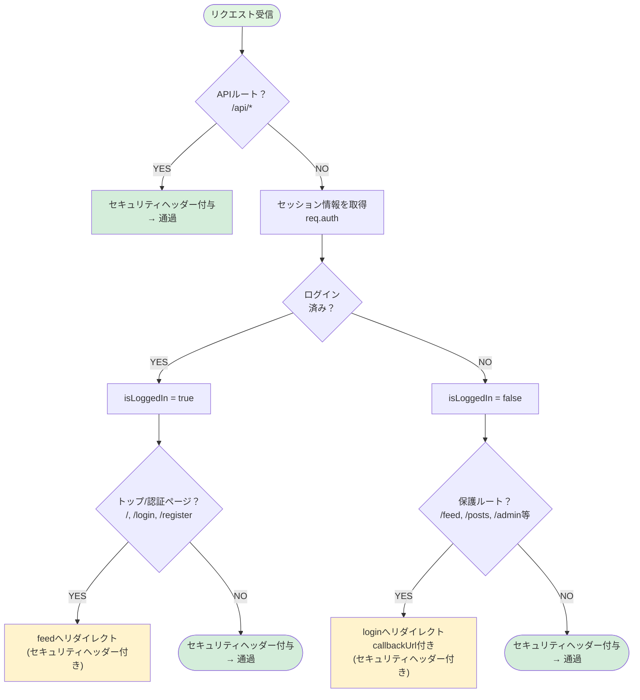
```mermaid
flowchart TD
    Start([リクエスト受信]) --> CheckAPI{APIルート？<br/>/api/*}

    CheckAPI -->|YES| AddHeaders1[セキュリティヘッダー付与<br/>→ 通過]
    CheckAPI -->|NO| GetSession[セッション情報を取得<br/>req.auth]

    GetSession --> CheckLoggedIn{ログイン<br/>済み？}

    CheckLoggedIn -->|YES| IsLoggedIn[isLoggedIn = true]
    CheckLoggedIn -->|NO| IsNotLoggedIn[isLoggedIn = false]

    IsLoggedIn --> CheckAuthPage1{トップ/認証ページ？<br/>/, /login, /register}
    IsNotLoggedIn --> CheckProtected{保護ルート？<br/>/feed, /posts, /admin等}

    CheckAuthPage1 -->|YES| RedirectFeed["feedへリダイレクト\n(セキュリティヘッダー付き)"]
    CheckAuthPage1 -->|NO| Allow1([セキュリティヘッダー付与\n→ 通過])

    CheckProtected -->|YES| RedirectLogin["loginへリダイレクト\ncallbackUrl付き\n(セキュリティヘッダー付き)"]
    CheckProtected -->|NO| Allow2([セキュリティヘッダー付与\n→ 通過])

    style Start fill:#e1f5e1
    style RedirectFeed fill:#fff3cd
    style RedirectLogin fill:#fff3cd
    style Allow1 fill:#d4edda
    style Allow2 fill:#d4edda
    style AddHeaders1 fill:#d4edda
```

| よくあるトラブル | 原因 | 解決法 |
|----------------|------|--------|
| ログインページでリダイレクトループ | `/login`が保護パスに含まれている | `protectedPaths`に`/login`が入っていないか確認。`auth.config.ts`の`publicPaths`も確認 |
| APIリクエストが403エラー | Origin検証に引っかかっている | Webhookやクロスオリジンリクエストは`webhookPaths`に除外設定を追加 |
| 静的ファイルが表示されない | matcherで静的リソースが除外されていない | matcherの正規表現で`.*\\.(?:svg|png|jpg|jpeg|gif|webp)$`が含まれているか確認 |
| `lib/auth.ts`をMiddlewareでimportするとエラー | PrismaがEdge Runtimeで動作しない | `proxy.ts`では`lib/auth.ts`でなく`lib/auth.config.ts`からNextAuthを初期化する |

### BON-LOGでの使用箇所

`proxy.ts`はBON-LOGの全リクエストの入口として機能します。

| 保護しているパス | 対象機能 |
|---------------|---------|
| `/feed`, `/posts` | タイムライン・投稿詳細（未ログインユーザーにコンテンツを見せない） |
| `/settings` | プロフィール編集・パスワード変更・アカウント削除 |
| `/notifications`, `/messages` | 通知・DM（本人のみ閲覧可能） |
| `/bookmarks`, `/drafts` | ブックマーク・下書き（本人のみ閲覧可能） |
| `/bonsai` | 盆栽記録の作成・編集 |
| `/admin`, `/analytics` | 管理者ダッシュボード・アナリティクス（管理者専用） |
| `/users` | ユーザープロフィール（ログイン必須） |

### 実装しない場合の影響

| 省略した場合 | 発生する問題 |
|------------|------------|
| `proxy.ts`自体を省略 | URLを直接入力するだけで未ログインでも`/feed`や`/admin`にアクセスできてしまう（Server Componentの個別チェックでカバーできるが多重実装が必要になる） |
| `protectedPaths`からパスを省略 | 省略したパスが未認証でアクセス可能になる（例: `/admin`を省略すると管理画面が誰でも見える） |
| `matcher`の設定を省略またはデフォルトに戻す | 全リクエスト（静的ファイル含む）にMiddlewareが実行され、パフォーマンスが大幅に低下する |
| セキュリティヘッダーの付与を省略 | XSS、クリックジャッキング、コンテンツスニッフィングなどの攻撃に対して無防備になる |
| `lib/auth.ts`を`proxy.ts`で使用 | EdgeランタイムでPrismaが実行できずビルドエラー。`lib/auth.config.ts`を使う必要がある |

---

## 8.10 ログアウト機能

> **このセクションで学ぶこと**
> - ログアウトボタンの実装方法
> - JWT方式での全デバイスログアウトの実現方法
> - tokenVersionを使ったトークン無効化の仕組み

### 8.10.1 LogoutButtonコンポーネント

ログアウトは `signOut()` 関数を呼ぶだけで実現できます。内部的にはJWTのCookieが削除されます。

```typescript
// components/auth/LogoutButton.tsx
'use client'  // Client Component: onClick イベントを使うため

import { signOut } from 'next-auth/react'  // ログアウト関数
import { LogOut } from 'lucide-react'      // ログアウトアイコン

export function LogoutButton() {
  return (
    <button
      // signOut()を呼ぶとJWTのCookieが削除される
      // callbackUrl: ログアウト後のリダイレクト先
      onClick={() => signOut({ callbackUrl: '/login' })}
      className="flex items-center gap-2 rounded-md px-4 py-2 text-gray-700 hover:bg-gray-100"
    >
      <LogOut className="h-5 w-5" />   {/* アイコン表示 */}
      <span>ログアウト</span>
    </button>
  )
}
```

```
ログアウトの流れ:

  ブラウザ                    サーバー
    |                          |
    |  signOut() 呼び出し      |
    |------------------------->|
    |                          |  JWTのCookieを削除する
    |                          |  Set-Cookie ヘッダーで期限切れに設定
    |<-- Cookie削除 + リダイレクト
    |                          |
    |  /login ページへ遷移     |
    |                          |
```

> **画面表示**
> ナビゲーションバーの「ログアウト」ボタンをクリックすると:
> - JWTのCookieが削除され、セッションが無効化される
> - /login ページにリダイレクトされ、ログインフォームが表示される
> - その後 /feed などの保護ページにアクセスしようとすると、再びログインが求められる
> - ブラウザの開発者ツール > Application > Cookies で `authjs.session-token` が消えていることを確認できる

### 8.10.2 全デバイスからログアウト（セキュリティ強化）

JWTは発行後に無効化できないという弱点があります。しかし、データベースに「トークンバージョン」を持たせることで、疑似的に全デバイスからのログアウトを実現できます。

```
tokenVersionによるトークン無効化の仕組み:

  1. ユーザーがログイン
     JWT に tokenVersion: 0 を含める

  2. スマホ、PC、タブレットからそれぞれログイン
     全デバイスのJWTに tokenVersion: 0 が含まれる

  3. 「全デバイスからログアウト」を実行
     DB の tokenVersion を 0 → 1 に更新

  4. 各デバイスがリクエスト
     JWT の tokenVersion(0) != DB の tokenVersion(1)
     → セッション無効！全デバイスで強制ログアウト
```

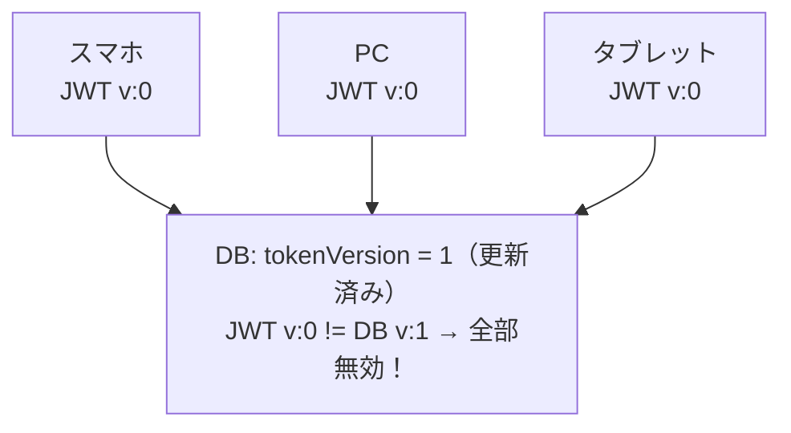
```mermaid
flowchart TD
    A["スマホ\nJWT v:0"] --> D["DB: tokenVersion = 1（更新済み）\nJWT v:0 != DB v:1 → 全部無効！"]
    B["PC\nJWT v:0"] --> D
    C["タブレット\nJWT v:0"] --> D
```

**ステップ1: スキーマにtokenVersionを追加**

```prisma
// prisma/schema.prisma
model User {
  id            String   @id @default(cuid())
  email         String   @unique
  password      String?
  nickname      String
  tokenVersion  Int      @default(0) @map("token_version")  // トークンバージョン（追加）
  // ...
}
```

**ステップ2: コールバックでtokenVersionを処理**

```typescript
// lib/auth.ts
export const { handlers, signIn, signOut, auth } = NextAuth({
  // ... 他の設定は省略 ...
  callbacks: {
    async jwt({ token, user }) {
      if (user) {
        token.id = user.id
        // ログイン時: DBからtokenVersionを取得してJWTに含める
        const dbUser = await prisma.user.findUnique({
          where: { id: user.id },
          select: { tokenVersion: true },
        })
        token.tokenVersion = dbUser?.tokenVersion ?? 0
      }
      return token
    },
    async session({ session, token }) {
      if (session.user) {
        session.user.id = token.id as string

        // セッション取得のたびに: DBのtokenVersionと照合
        const dbUser = await prisma.user.findUnique({
          where: { id: token.id as string },
          select: { tokenVersion: true },
        })

        // JWTのバージョンとDBのバージョンが一致しない
        // = 「全デバイスからログアウト」が実行された
        if (dbUser && dbUser.tokenVersion !== token.tokenVersion) {
          throw new Error('Token revoked')  // セッションを無効にする
        }
      }
      return session
    },
  },
})
```

**ステップ3: 全セッション無効化のServer Action**

```typescript
// lib/actions/auth.ts
'use server'

import { auth } from '@/lib/auth'
import { prisma } from '@/lib/db'

export async function revokeAllSessions() {
  // 認証チェック
  const session = await auth()
  if (!session?.user?.id) {
    return { error: '認証が必要です' }
  }

  // tokenVersionをインクリメント（0→1、1→2、...）
  // これにより、既存のすべてのJWTが「古い」バージョンになり無効化される
  await prisma.user.update({
    where: { id: session.user.id },
    data: {
      tokenVersion: { increment: 1 },  // 現在の値に+1
    },
  })
  // 実行結果: DBの tokenVersion が 0 → 1 に更新される
  // これ以降、tokenVersion: 0 を持つ既存のJWTは全て無効になる

  return { success: true }
}
```

> **注意:** この方式では `session` コールバック内でDBアクセスが発生するため、JWT方式のメリット（DBアクセス不要）が一部失われます。しかし、セキュリティとのトレードオフとして許容範囲です。

---

## 8.11 2段階認証（TOTP）の概要

> **このセクションで学ぶこと**
> - 2段階認証（2FA）とは何か
> - TOTPの仕組み
> - BON-LOGでの2FA実装の基礎知識

### 8.11.1 TOTPとは

TOTP（Time-based One-Time Password）は、時間ベースのワンタイムパスワードです。Google AuthenticatorやAuthyなどのアプリで6桁の認証コードを生成します。

パスワードだけでは、パスワードが漏洩した時点でアカウントが乗っ取られます。2段階認証を追加することで、パスワードが漏洩しても、もう1つの認証要素（スマホアプリ）がなければログインできません。

```
2段階認証のログインフロー:

  ユーザー        ブラウザ           サーバー            認証アプリ
    |               |                 |                  |
    | email/PW入力  |                 |                  |
    |-------------->|  ログイン要求   |                  |
    |               |---------------->|                  |
    |               |                 | PW検証OK         |
    |               |                 |                  |
    |               |  2FAコード要求  |                  |
    |               |<----------------|                  |
    |               |                 |                  |
    | アプリを確認  |                 |                  |
    |--------------------------------------------->|     |
    |               |                 |            |     |
    |<---------------------------------------------|     |
    | コード: 123456|                 |                  |
    |               |                 |                  |
    |  コード入力   |  コード送信     |                  |
    |-------------->|---------------->|                  |
    |               |                 | コード検証OK     |
    |               |  ログイン完了   |                  |
    |               |<----------------|                  |
    |  フィード表示 |                 |                  |
    |<--------------|                 |                  |

  ※ パスワードが漏洩しても、認証アプリがなければログインできない
```

**TOTPの仕組み（簡単に）:**
1. 初回セットアップ: サーバーが秘密鍵を生成し、QRコードとしてユーザーに表示
2. ユーザーがQRコードをスキャン: 認証アプリに秘密鍵が登録される
3. コード生成: 認証アプリが「秘密鍵 + 現在時刻」から30秒ごとに6桁のコードを生成
4. コード検証: サーバーも同じ「秘密鍵 + 現在時刻」で計算し、ユーザーの入力と一致するか確認

### 8.11.2 スキーマ拡張

2FAを有効にするためにUserモデルに3つのカラムを追加します。

```prisma
// prisma/schema.prisma（実際のコード）
model User {
  id                   String    @id @default(cuid())
  email                String    @unique @db.VarChar(100)
  password             String?
  nickname             String    @db.VarChar(50)
  isSuspended          Boolean   @default(false) @map("is_suspended")
  // ...

  // 2段階認証（2FA）
  twoFactorEnabled     Boolean   @default(false) @map("two_factor_enabled")
  twoFactorSecret      String?   @map("two_factor_secret")     // 暗号化されたTOTPシークレット
  twoFactorBackupCodes String[]  @map("two_factor_backup_codes") // ハッシュ化されたバックアップコード
  // ...
}
```

- `twoFactorEnabled`: 2FAが有効かどうかのフラグ
- `twoFactorSecret`: AES-256-GCMで暗号化されたTOTPシークレット（Base64文字列）
- `twoFactorBackupCodes`: SHA-256でハッシュ化されたバックアップコードの配列（`String[]`型）

### 8.11.3 実装の概要

BON-LOGでは `otplib` の `OTP` クラスを使用しています。

```typescript
// ============================================
// 必要なライブラリのインストール
// ============================================
// npm install otplib qrcode
// npm install -D @types/qrcode

// lib/two-factor.ts（実際のコード）
import { OTP } from 'otplib'        // OTP操作ライブラリ
import * as QRCode from 'qrcode'    // QRコード生成ライブラリ
import crypto from 'crypto'          // Node.js暗号化モジュール

// OTPインスタンスを作成（TOTP戦略）
const otp = new OTP({ strategy: 'totp' })

// ============================================
// 秘密鍵の生成（2FAセットアップ時）
// ============================================
const secret = otp.generateSecret()  // ランダムな秘密鍵を生成
// 実行結果（例）: "JBSWY3DPEHPK3PXP"（Base32エンコードされた文字列）

// ============================================
// QRコード用URIの生成
// ============================================
const otpauthUri = otp.generateURI({
  secret,
  issuer: 'BON-LOG',        // サービス名（認証アプリに表示される）
  label: user.email,         // アカウント識別子
  period: 30,                // コード更新間隔（秒）
  digits: 6,                 // コード桁数
  algorithm: 'sha1',         // ハッシュアルゴリズム
})
// 実行結果: "otpauth://totp/BON-LOG:taro@example.com?secret=JBSWY3DPEHPK3PXP&issuer=BON-LOG"

// QRコードをData URL形式で生成（imgタグのsrcに設定可能）
const qrCodeDataUrl = await QRCode.toDataURL(otpauthUri, {
  errorCorrectionLevel: 'M',
  type: 'image/png',
  margin: 1,
  width: 256,
})
// 実行結果: "data:image/png;base64,iVBORw0KGgoAAAA..."（QRコード画像のBase64データ）

// ============================================
// コード検証（ログイン時）
// ============================================
const result = await otp.verify({
  secret,
  token: userInputCode,       // ユーザーが入力した6桁のコード（例: "123456"）
  epochTolerance: 30,         // 前後30秒を許容
})
console.log(result.valid) // 実行結果: true（コードが一致）または false（不一致・期限切れ）
```

> **注意:** BON-LOGでは2段階認証が完全に実装されています。秘密鍵のAES-256-GCM暗号化保存、バックアップコードのSHA-256ハッシュ化保存、使用済みバックアップコードの自動無効化など、本番環境に必要なセキュリティ機能をすべて備えています。詳細は8.18A節で解説します。

---

## 8.12 実践演習

> **このセクションで学ぶこと**
> - 認証機能の実装を通じた実践的なスキル
> - 認証チェック + 認可チェックの組み合わせ
> - セキュリティを意識したServer Actionの書き方

以下の演習は難易度別に分かれています。

| レベル | 演習 | 難易度 |
|--------|------|--------|
| 基礎 | 演習1: パスワード変更機能 | 基本的なServer Action |
| 基礎 | 演習2: アカウント削除機能 | 認証 + DB操作 |
| 応用 | 演習3: 投稿削除の認可チェック | 認証 + 認可 |
| チャレンジ | 演習4: ログイン試行回数制限 | セキュリティ応用 |

### 演習1（基礎）: パスワード変更機能

現在のパスワードを入力し、新しいパスワードに変更するServer Actionを作成してください。

**要件:**
- 現在のパスワードが正しいか検証
- 新しいパスワードをバリデーション（8文字以上、大文字・小文字・数字含む）
- ハッシュ化して保存

```typescript
// lib/actions/auth.ts
'use server'

import { auth } from '@/lib/auth'
import { prisma } from '@/lib/db'
import bcrypt from 'bcryptjs'
import { z } from 'zod'

const changePasswordSchema = z.object({
  currentPassword: z.string().min(1, '現在のパスワードを入力してください'),
  newPassword: z
    .string()
    .min(8, 'パスワードは8文字以上である必要があります')
    .regex(
      /^(?=.*[a-z])(?=.*[A-Z])(?=.*\d)/,
      'パスワードには大文字、小文字、数字を含める必要があります'
    ),
})

export async function changePassword(formData: FormData) {
  // ここにコードを書いてください
}
```

<details>
<summary>解答例</summary>

```typescript
'use server'

import { auth } from '@/lib/auth'
import { prisma } from '@/lib/db'
import bcrypt from 'bcryptjs'
import { z } from 'zod'

const changePasswordSchema = z.object({
  currentPassword: z.string().min(1, '現在のパスワードを入力してください'),
  newPassword: z
    .string()
    .min(8, 'パスワードは8文字以上である必要があります')
    .regex(
      /^(?=.*[a-z])(?=.*[A-Z])(?=.*\d)/,
      'パスワードには大文字、小文字、数字を含める必要があります'
    ),
})

export async function changePassword(formData: FormData) {
  // 認証チェック
  const session = await auth()
  if (!session?.user?.id) {
    return { error: '認証が必要です' }
  }

  // バリデーション
  const result = changePasswordSchema.safeParse({
    currentPassword: formData.get('currentPassword'),
    newPassword: formData.get('newPassword'),
  })

  if (!result.success) {
    return { error: result.error.errors[0].message }
  }

  const { currentPassword, newPassword } = result.data

  // 現在のユーザー情報を取得
  const user = await prisma.user.findUnique({
    where: { id: session.user.id },
    select: { password: true },
  })

  if (!user || !user.password) {
    return { error: 'パスワードが設定されていません' }
  }

  // 現在のパスワードを検証
  const isValid = await bcrypt.compare(currentPassword, user.password)
  if (!isValid) {
    return { error: '現在のパスワードが正しくありません' }
  }

  // 新しいパスワードをハッシュ化
  const hashedPassword = await bcrypt.hash(newPassword, 10)
  // 実行結果: "$2a$10$新しいハッシュ値..."

  // パスワードを更新
  await prisma.user.update({
    where: { id: session.user.id },
    data: { password: hashedPassword },
  })

  return { success: true, message: 'パスワードを変更しました' }
  // 実行結果: { success: true, message: "パスワードを変更しました" }
  // ※ 次回ログイン時から新しいパスワードが必要になる
}
```
</details>

### 演習2（基礎）: アカウント削除機能

ユーザーが自分のアカウントを削除できる機能を実装してください。

**要件:**
- パスワードを入力して本人確認
- ユーザー削除（CascadeでPrismaが関連データも削除）
- 削除後はログアウト

```typescript
// lib/actions/auth.ts
'use server'

import { auth } from '@/lib/auth'
import { prisma } from '@/lib/db'
import bcrypt from 'bcryptjs'

export async function deleteAccount(formData: FormData) {
  // ここにコードを書いてください
}
```

<details>
<summary>解答例</summary>

```typescript
'use server'

import { auth, signOut } from '@/lib/auth'
import { prisma } from '@/lib/db'
import bcrypt from 'bcryptjs'

export async function deleteAccount(formData: FormData) {
  // 認証チェック
  const session = await auth()
  if (!session?.user?.id) {
    return { error: '認証が必要です' }
  }

  const password = formData.get('password') as string
  if (!password) {
    return { error: 'パスワードを入力してください' }
  }

  // ユーザー情報を取得
  const user = await prisma.user.findUnique({
    where: { id: session.user.id },
    select: { password: true },
  })

  if (!user || !user.password) {
    return { error: 'パスワードが設定されていません' }
  }

  // パスワード検証
  const isValid = await bcrypt.compare(password, user.password)
  if (!isValid) {
    return { error: 'パスワードが正しくありません' }
  }

  // ユーザー削除（Cascadeで関連データも削除される）
  await prisma.user.delete({
    where: { id: session.user.id },
  })

  // ログアウト
  await signOut({ redirect: false })

  return { success: true, message: 'アカウントを削除しました' }
}
```
</details>

### 演習3（応用）: 自分が投稿した投稿のみ削除可能にする

投稿削除Server Actionで、自分の投稿のみ削除できるように認可チェックを追加してください。

**要件:**
- 認証チェック
- 投稿の存在確認
- 認可チェック（投稿者 === ログインユーザー）
- 削除実行

```typescript
// lib/actions/post.ts
'use server'

import { auth } from '@/lib/auth'
import { prisma } from '@/lib/db'
import { revalidatePath } from 'next/cache'

export async function deletePost(postId: string) {
  // ここにコードを書いてください
}
```

<details>
<summary>解答例</summary>

```typescript
'use server'

import { auth } from '@/lib/auth'
import { prisma } from '@/lib/db'
import { revalidatePath } from 'next/cache'

export async function deletePost(postId: string) {
  // 認証チェック
  const session = await auth()
  if (!session?.user?.id) {
    return { error: '認証が必要です' }
  }

  // 投稿を取得
  const post = await prisma.post.findUnique({
    where: { id: postId },
    select: { userId: true },
  })

  if (!post) {
    return { error: '投稿が見つかりません' }
  }

  // 認可チェック（自分の投稿か）
  if (post.userId !== session.user.id) {
    return { error: 'この投稿を削除する権限がありません' }
  }

  // 投稿削除
  await prisma.post.delete({
    where: { id: postId },
  })

  // キャッシュを更新
  revalidatePath('/feed')
  revalidatePath(`/users/${session.user.id}`)

  return { success: true, message: '投稿を削除しました' }
}
```
</details>

### 演習4（チャレンジ）: ログイン試行回数の制限

ブルートフォース攻撃（総当たり攻撃）を防ぐため、ログイン失敗回数を制限する仕組みを考えてください。

**要件:**
- 同じメールアドレスで5回連続でログインに失敗したらアカウントを一時的にロック
- ロック時間は15分
- ロック中はログインを拒否し、残り時間を表示

**ヒント:**
- UserモデルにfailedLoginAttempts（失敗回数）とlockedUntil（ロック解除時刻）のカラムを追加
- authorize関数内でロック状態を確認

<details>
<summary>解答例（設計のみ）</summary>

```prisma
// prisma/schema.prisma に追加するカラム
model User {
  // ... 既存カラム ...
  failedLoginAttempts  Int       @default(0) @map("failed_login_attempts")
  lockedUntil          DateTime? @map("locked_until")
}
```

```typescript
// authorize関数内のロジック（概要）
async authorize(credentials) {
  // 1. ユーザーを取得
  const user = await prisma.user.findUnique({
    where: { email: credentials.email as string },
  })

  if (!user || !user.password) return null

  // 2. ロック状態を確認
  if (user.lockedUntil && user.lockedUntil > new Date()) {
    // まだロック中 → 認証失敗
    // 注意: エラーメッセージでロック中であることを伝える場合は
    //       カスタムエラーの仕組みが必要
    return null
  }

  // 3. パスワード検証
  const isValid = await bcrypt.compare(
    credentials.password as string,
    user.password
  )

  if (!isValid) {
    // 失敗回数をインクリメント
    const attempts = user.failedLoginAttempts + 1
    const updateData: any = { failedLoginAttempts: attempts }

    // 5回失敗したら15分ロック
    if (attempts >= 5) {
      updateData.lockedUntil = new Date(Date.now() + 15 * 60 * 1000)
      updateData.failedLoginAttempts = 0  // リセット
    }

    await prisma.user.update({
      where: { id: user.id },
      data: updateData,
    })

    return null
  }

  // 4. 認証成功: 失敗回数をリセット
  await prisma.user.update({
    where: { id: user.id },
    data: { failedLoginAttempts: 0, lockedUntil: null },
  })

  return {
    id: user.id,
    email: user.email,
    name: user.nickname,
    image: user.avatarUrl,
  }
}
```

**ポイント:**
- 上記はDB方式の設計例ですが、BON-LOGの実際の実装（`lib/login-tracker.ts`）ではRedisベースの方式を採用しています
- IPアドレス + メールアドレスの組み合わせでキーを生成し、分散環境でも正確にカウントできます
- Redis障害時はフェイルクローズ（安全側に倒して拒否）する設計です
- 詳しくは8.15節「ログイン追跡とブルートフォース防止」で解説します
</details>

---

## 8.13 セキュリティベストプラクティス

> **このセクションで学ぶこと**
> - Webアプリケーション認証におけるセキュリティの基本原則
> - 各攻撃手法と対策方法
> - NextAuth.jsとNext.jsが自動的に対応してくれるセキュリティ機能

### 8.13.1 パスワード管理

| 項目 | 良い例 | 悪い例 | 理由 |
|------|--------|--------|------|
| パスワード長 | 最低8文字を必須に | 短いパスワードを許可 | 短いと総当たり攻撃で破られやすい |
| 文字種 | 大文字・小文字・数字を必須に | 制限なし | 文字種が多いほど組み合わせが増え安全 |
| 保存方法 | bcryptでハッシュ化（saltラウンド10以上） | 平文保存 | DB漏洩時にパスワードが露出する |
| ハッシュ関数 | bcrypt, scrypt, argon2 | MD5, SHA1 | MD5等は高速すぎて総当たり攻撃に弱い |

### 8.13.2 セッション管理

| 項目 | 良い例 | 悪い例 | 理由 |
|------|--------|--------|------|
| トークン保存場所 | HTTPOnly Cookieを使用 | localStorageにトークン保存 | localStorageはXSS攻撃で読み取られる |
| Cookie属性 | Secure属性（HTTPS通信のみ） | HTTP通信でもCookie送信 | 通信経路でトークンが傍受される |
| CSRF対策 | SameSite属性を設定 | SameSite未設定 | クロスサイトからの不正リクエストを防ぐ |
| トークン有効期限 | 定期的なトークン更新 | 無期限トークン | 漏洩時の被害を限定するため |
| URL | トークンをCookieに格納 | トークンをURLに含める | URLはログやリファラーで漏洩しやすい |

> **NextAuth.jsの場合:** 上記の多くはNextAuth.jsが自動的に対応しています。HTTPOnly Cookie、Secure属性（本番環境）、SameSite属性はデフォルトで設定されます。

> **Cookie属性の意味**
> - **`HttpOnly`**: JavaScriptから読み取り不可 → XSS攻撃でCookieを盗めない
> - **`Secure`**: HTTPS接続でのみ送信 → 通信傍受でCookieを盗めない
> - **`SameSite=Lax`**: 外部サイトからのリクエストにCookieを付けない → CSRF攻撃を防止

### 8.13.3 入力バリデーション

| 項目 | 良い例 | 悪い例 | 理由 |
|------|--------|--------|------|
| バリデーション | zodなどのスキーマバリデーション | バリデーションなし | 不正な入力でシステムが破壊される |
| 実行場所 | サーバー側で必ずバリデーション | クライアント側のみ | クライアント側は簡単にスキップ可能 |
| SQL操作 | PrismaのORMを使用 | 生SQLの直接実行 | SQLインジェクション攻撃を防ぐ |
| 入力処理 | サニタイズ後にDBに保存 | ユーザー入力を直接DBに保存 | XSS等の攻撃コードが混入する |

### 8.13.4 CSRF対策

CSRF（Cross-Site Request Forgery）は、ログイン済みのユーザーに意図しない操作を行わせる攻撃です。

```
CSRF攻撃の例:

  1. ユーザーがBON-LOGにログイン中
  2. 攻撃者が悪意あるサイトにユーザーを誘導
  3. 悪意あるサイトがBON-LOGにリクエストを送信
     （ユーザーのCookieが自動送信される）
  4. BON-LOGは正規のリクエストと区別できない！

  対策: CSRFトークン（予測不可能なランダム値）をフォームに埋め込み、
        リクエストと一緒に送信させる。トークンがないリクエストは拒否。
```

NextAuth.jsは自動的にCSRFトークンを管理します。また、Next.jsのServer Actionsも自動的にCSRF保護が行われます。

```typescript
// Next.jsのServer Actionsは自動的にCSRF保護される
// 開発者が特別な対策を行う必要はない
<form action={serverAction}>
  {/* CSRFトークンはNext.jsが自動的に付与・検証する */}
</form>
```

<details>
<summary>理解度チェック: セキュリティベストプラクティス</summary>

**Q1: なぜlocalStorageにJWTを保存するのは危険ですか？**

A1: localStorageはJavaScriptからアクセスできるため、XSS（クロスサイトスクリプティング）攻撃でトークンが盗まれます。HTTPOnly Cookieに保存すればJavaScriptからアクセスできないため安全です。

**Q2: クライアント側のバリデーションだけではなぜダメですか？**

A2: ブラウザの開発者ツールでHTML/JavaScriptを改変するか、curlなどのツールで直接APIにリクエストを送れば、クライアント側のバリデーションは完全にスキップできます。サーバー側のバリデーションは「最後の砦」として必ず必要です。

**Q3: PrismaがSQLインジェクションを防ぐ仕組みを説明してください。**

A3: Prismaはユーザー入力を自動的にパラメータ化（プレースホルダ化）してSQLに埋め込みます。例えば `where: { email: userInput }` と書くと、内部的に `WHERE email = $1` のようなパラメータ化クエリが生成され、userInputに `'; DROP TABLE users; --` のような悪意あるSQLが含まれていても、ただの文字列として処理されます。
</details>

### 8.13.5 主要な攻撃手法と防御策の対応表（初心者向けまとめ）

認証に関わる主要な攻撃手法を整理し、BON-LOGでの防御策を一覧にまとめます。

Webアプリケーションに対する主な攻撃と防御:

| 攻撃名 | 何をするか | BON-LOGでの防御 |
|---|---|---|
| ブルートフォース | パスワードを片っ端から試す | ログイン試行回数制限（Redis + レートリミット） |
| 辞書攻撃 | よく使われるパスワードを試す (password, 123456 など) | パスワード強度要件（8文字以上、大文字小文字数字必須） |
| レインボーテーブル | ハッシュ値の逆引き辞書でパスワードを特定する | bcryptのソルト（毎回異なるランダム値を付加） |
| SQLインジェクション | SQL文を注入してDBを操作する | Prisma ORM（自動パラメータ化） |
| XSS | 悪意あるスクリプトを埋め込む | Reactの自動エスケープ、HTTPOnly Cookie |
| CSRF | ログイン済みユーザーに意図しない操作を行わせる | NextAuth.js + Server Actions（自動CSRFトークン管理） |
| セッションハイジャック | トークンを盗んでなりすます | HTTPOnly + Secure Cookie、SameSite属性 |
| 中間者攻撃(MITM) | 通信を傍受してデータを盗む | HTTPS(TLS)、Secure属性のCookie |

> **初心者の方へ:** これらの攻撃すべてを暗記する必要はありません。重要なのは、NextAuth.js、Prisma、React、Next.jsを正しく使うことで、多くの攻撃が自動的に防がれるということです。「フレームワークの推奨する方法に従う」ことが最大のセキュリティ対策です。

### 8.13.6 「多層防御」の考え方

セキュリティでは、1つの対策だけに頼らず、複数の層で防御する「多層防御（Defense in Depth）」が重要です。

```mermaid
block-beta
  columns 1
  block:L1["第1層: ネットワーク / HTTPS（通信の暗号化）→ 通信経路でのデータ盗聴を防止"]
    block:L2["第2層: フレームワーク / Next.js Middleware → 保護ルートへの未認証アクセスをブロック"]
      block:L3["第3層: 認証ライブラリ / NextAuth.js → JWT管理, CSRF防止, Cookie安全設定"]
        L4["第4層: アプリ / バリデーション, 認可チェック, レート制限"]
      end
    end
  end
```

- どの層が突破されても、次の層が防御する
- すべての層を突破しなければ攻撃は成功しない

この考え方があるからこそ、Server Actionsでの認証チェック、Middlewareでのルート保護、JWTの署名検証といった「冗長に見える」チェックが、それぞれ重要な役割を果たしています。

## 8.14 auth.config.ts vs auth.ts -- Edge と Node の分離パターン

> **このセクションで学ぶこと**
> - なぜ認証設定を2つのファイルに分けるのか
> - Edge RuntimeとNode.jsランタイムの違い
> - auth.config.tsとauth.tsそれぞれの責務
> - Middlewareとの連携パターン

### 8.14.1 2つのファイルに分ける理由

Next.jsのMiddlewareは**Edge Runtime**で実行されます。Edge Runtimeは世界中のCDNエッジで動作する軽量な実行環境で、高速にレスポンスを返せる反面、Node.jsの全機能は使えません。

```mermaid
graph TB
    subgraph EdgeRuntime["Edge Runtime"]
        E1["特徴:<br/>・CDNエッジで実行 (ユーザーに近い場所)<br/>・起動が高速 (コールドスタートが短い)<br/>・メモリ制限あり"]
        E2["使えないもの:<br/>✗ Prisma (データベースアクセス)<br/>✗ bcrypt (ネイティブモジュール)<br/>✗ Node.jsのfs, path等<br/>✗ 一部のnpmパッケージ"]
        E3["使える場所:<br/>・proxy.ts（Next.js 16）<br/>・Edge API Routes"]
    end

    subgraph NodeRuntime["Node.js ランタイム"]
        N1["特徴:<br/>・サーバーで実行 (フル機能)<br/>・全てのNode.jsモジュールが使用可能"]
        N2["使えるもの:<br/>✓ Prisma (DB操作)<br/>✓ bcrypt (パスワードハッシュ)<br/>✓ Node.jsの全モジュール<br/>✓ 全てのnpmパッケージ"]
        N3["使える場所:<br/>・Server Components<br/>・Server Actions<br/>・API Routes (Node.js)"]
    end

    style EdgeRuntime fill:#fff3cd
    style NodeRuntime fill:#d4edda
```

この制約のため、NextAuth.jsの設定を**2つのファイルに分割**します。

> **Edge Runtimeの制約**
> Edge RuntimeはCDN上で動く軽量な実行環境で、応答が高速ですが制約があります：
> - Node.jsのAPIが一部使えない（`fs`, `crypto`の一部等）
> - データベースに直接接続できない（HTTP経由のみ）
> - 実行時間に制限あり（通常30秒以内）
>
> そのため `auth.config.ts`（Edge対応・軽量設定）と `auth.ts`（Node.js・フル機能）を分離しています。

### 8.14.2 auth.config.ts（Edge Runtime対応）

`auth.config.ts`にはEdge Runtimeで安全に実行できる設定のみを記述します。具体的には、Prismaやbcryptを使わない**認可ロジック**（アクセス許可/拒否の判定）を担当します。

```typescript
// lib/auth.config.ts
// ============================================
// Edge Runtime対応の認証設定
// Prisma, bcrypt等のNode.js専用モジュールは使用不可！
// ============================================

import type { NextAuthConfig } from "next-auth"  // 型のみインポート（ランタイムコードに含まれない）

// ログイン不要でアクセスできるページの一覧
const publicPaths = ['/', '/login', '/register', '/password-reset', '/verify-email']

export const authConfig = {
  // カスタム認証ページのパス設定
  pages: {
    signIn: '/login',   // ログインページ
    error: '/login',    // エラー時のリダイレクト先
  },

  // Cookie設定（セキュリティ強化）
  cookies: {
    sessionToken: {
      name: process.env.NODE_ENV === 'production'
        ? '__Secure-authjs.session-token'   // 本番: Secureプレフィックス付き
        : 'authjs.session-token',           // 開発: プレフィックスなし
      options: {
        httpOnly: true,      // JavaScriptからアクセス不可（XSS対策）
        sameSite: 'lax',     // クロスサイトリクエスト制限（CSRF対策）
        path: '/',
        secure: process.env.NODE_ENV === 'production',  // HTTPS通信のみ
      },
    },
    // callbackUrl, csrfToken も同様に設定...
  },

  // proxy.ts（Next.js 16）で実行される認可チェック
  callbacks: {
    authorized({ auth, request: { nextUrl } }) {
      const isLoggedIn = !!auth?.user
      const pathname = nextUrl.pathname

      // 公開ページ、API、静的ファイルは認証不要
      const isPublicPage = publicPaths.some((path) =>
        pathname === path || pathname.startsWith(path + '/')
      )
      const isApiRoute = pathname.startsWith('/api')
      const isStaticFile = pathname.startsWith('/_next') || pathname.includes('.')

      if (isPublicPage || isApiRoute || isStaticFile) {
        return true  // アクセス許可
      }

      return isLoggedIn  // 保護ページはログイン必須
    },
  },

  providers: [],  // 空！auth.tsで上書きされる
} satisfies NextAuthConfig
```

**ポイント:**
- `import type` で型のみインポート（ランタイムコードに含まれない）
- `satisfies` で型チェックしつつ具体的な型推論を維持
- `providers: []` は型エラー防止のための空配列（auth.tsで上書き）
- Cookie名に `__Secure-` プレフィックス（本番環境でHTTPS必須を強制）

### 8.14.3 auth.ts（Node.jsランタイム）

`auth.ts`は`auth.config.ts`の設定を継承し、Node.js専用の機能（Prisma, bcrypt）を追加します。

```typescript
// lib/auth.ts
// ============================================
// Node.jsランタイム用の認証設定
// Prisma, bcrypt等の全機能が利用可能
// ============================================

import NextAuth from 'next-auth'
import { PrismaAdapter } from '@auth/prisma-adapter'       // DB連携（Node.js必須）
import CredentialsProvider from 'next-auth/providers/credentials'
import bcrypt from 'bcryptjs'                               // パスワード検証（Node.js必須）
import { prisma } from '@/lib/db'                           // Prisma（Node.js必須）
import { authConfig } from '@/lib/auth.config'              // Edge設定を継承

export const { handlers, signIn, signOut, auth } = NextAuth({
  ...authConfig,           // ← auth.config.tsの設定をスプレッド展開

  adapter: PrismaAdapter(prisma),    // ← Node.jsでのみ使用可能
  session: { strategy: 'jwt' },

  providers: [
    CredentialsProvider({            // ← auth.config.tsの空配列を上書き
      name: 'credentials',
      async authorize(credentials) {
        // Prisma, bcrypt を使用（Node.jsランタイムなので問題なし）
        const user = await prisma.user.findUnique({ ... })
        const passwordMatch = await bcrypt.compare(password, user.password)
        // ...
      },
    }),
  ],

  callbacks: {
    async jwt({ token, user }) { ... },
    async session({ session, token }) { ... },
  },
})
```

### 8.14.4 Middlewareとの連携

`proxy.ts`では`auth.config.ts`のみを使い、`auth.ts`のNode.js依存を回避します。

```typescript
// proxy.ts（Next.js 16）
import NextAuth from 'next-auth'
import { authConfig } from '@/lib/auth.config'  // Edge対応の設定のみ

const { auth } = NextAuth(authConfig)  // authConfigから軽量なauth関数を生成

export default auth(async (req) => {
  // ここではPrismaやbcryptは使えないが、
  // JWTの検証とauthorizedコールバックは実行される
  const isLoggedIn = !!req.auth
  // ...アクセス制御ロジック
})
```

```mermaid
graph LR
    A["auth.config.ts<br/><br/>Edge Runtime対応<br/><br/>・pages設定<br/>・cookies設定<br/>・authorized()<br/>・providers: []<br/><br/>共通設定を定義"]
    B["auth.ts<br/><br/>Node.js Runtime<br/><br/>...authConfig<br/>+ PrismaAdapter<br/>+ bcrypt<br/>+ Credentials<br/>providers上書き<br/><br/>フル機能を追加"]
    C["proxy.ts（Next.js 16）<br/><br/>Edge Runtime<br/><br/>authConfigのみ使用<br/><br/>auth() で<br/>JWT検証 +<br/>authorized実行<br/><br/>軽量版で認可チェック"]

    A -->|継承| B
    A -.->|参照| C

    style A fill:#fff3cd
    style B fill:#d4edda
    style C fill:#e1f5e1
```

<details>
<summary>理解度チェック: auth.config.ts vs auth.ts</summary>

**Q1: auth.config.tsでPrismaを直接importしたらどうなりますか？**

A1: Middlewareの実行時にEdge Runtimeエラーが発生します。PrismaはNode.jsネイティブモジュールに依存しているため、Edge Runtimeでは動作しません。ビルド時にエラーになるか、実行時に`Module not found`エラーが発生します。

**Q2: auth.config.tsの`providers: []`は何のためにありますか？**

A2: NextAuthConfigの型定義で`providers`は必須プロパティです。空配列を設定することで型エラーを防ぎ、auth.tsでスプレッド展開後に`providers`を上書きできるようにしています。

**Q3: `proxy.ts`がauth.config.tsだけで動作できるのはなぜですか？**

A3: `proxy.ts`ではJWTの署名検証とauthorizedコールバック（アクセス許可/拒否の判定）のみが必要です。これらの処理にはPrismaやbcryptは不要で、Edge Runtimeで実行可能な軽量な処理だけで完結するためです。
</details>

---

## 8.15 ログイン追跡とブルートフォース防止

> **このセクションで学ぶこと**
> - ブルートフォース攻撃の仕組みとリスク
> - Redisを使ったログイン試行回数の追跡
> - ロックアウト（一時的アカウントロック）の実装パターン
> - フェイルオープン設計の考え方

### 8.15.1 ブルートフォース攻撃とは

ブルートフォース攻撃は、パスワードを片っ端から試す攻撃手法です。8.12節の演習4で概要を学びましたが、BON-LOGでは`lib/login-tracker.ts`として本格的な実装を行っています。

```
ブルートフォース攻撃のイメージ:

  攻撃者                              サーバー
    |                                   |
    |  email: user@example.com          |
    |  password: "password1"            |
    |---------------------------------->|  ✗ 失敗（1回目）
    |                                   |
    |  email: user@example.com          |
    |  password: "password2"            |
    |---------------------------------->|  ✗ 失敗（2回目）
    |                                   |
    |  email: user@example.com          |
    |  password: "password3"            |
    |---------------------------------->|  ✗ 失敗（3回目）
    |                                   |
    |  ... 何千回、何万回と繰り返す ...   |
    |                                   |
    |  email: user@example.com          |
    |  password: "correctPassword!"     |
    |---------------------------------->|  ✓ 突破！
    |                                   |

  対策なしの場合、攻撃者は無制限に試行できてしまう
```

### 8.15.2 BON-LOGの防御設定

BON-LOGでは以下の3つのパラメータでログイン試行を制御します。

```typescript
// lib/login-tracker.ts の設定定数

const MAX_ATTEMPTS = 5           // 最大試行回数: 5回
const WINDOW_SECONDS = 15 * 60   // 試行ウィンドウ: 15分
const LOCKOUT_SECONDS = 30 * 60  // ロックアウト時間: 30分
```

| パラメータ | 値 | 意味 |
|-----------|-----|------|
| `MAX_ATTEMPTS` | 5回 | この回数失敗するとロックアウト |
| `WINDOW_SECONDS` | 15分 | この時間内の失敗回数をカウント |
| `LOCKOUT_SECONDS` | 30分 | ロックアウト後の待機時間 |

```mermaid
flowchart LR
    subgraph WINDOW["WINDOW（15分）"]
        direction TB
        F1["1回目 ✗"] --> F2["2回目 ✗"]
        F2 --> F3["3回目 ✗"]
        F3 --> F4["4回目 ✗"]
        F4 --> F5["5回目 ✗ → ロック！"]
    end
    subgraph LOCKOUT["LOCKOUT（30分）"]
        direction TB
        B1["全試行ブロック"]
        B2["「30分後に再試行してください」"]
    end
    WINDOW --> LOCKOUT
    LOCKOUT --> UNLOCK["ロック解除\n再試行可能"]
```

### 8.15.3 識別子の設計: IP + メールアドレス

ログイン試行の追跡にはIPアドレスとメールアドレスの**組み合わせ**を識別子として使用します。

```typescript
// lib/login-tracker.ts

export function getLoginKey(ip: string, email: string): string {
  return `${ip}:${email.toLowerCase()}`
  // 実行結果: getLoginKey("192.168.1.1", "User@Example.com")
  //         → "192.168.1.1:user@example.com"
}
```

**なぜ組み合わせが重要なのか:**

| 方式 | 問題点 |
|------|--------|
| IPのみ | NAT環境（社内LAN、カフェWi-Fi等）で同じIPを共有する多数のユーザーが互いに影響を受ける |
| メールのみ | 攻撃者が異なるIPアドレスから攻撃でき、制限を回避できる |
| **IP + メール** | 特定のIP + メールの組み合わせのみをロック。正規ユーザーは別ネットワークからログイン可能 |

### 8.15.4 主要関数の解説

**checkLoginAttempt**: ログイン試行が許可されているかチェック

```typescript
// lib/login-tracker.ts

export async function checkLoginAttempt(
  identifier: string
): Promise<LoginCheckResult> {
  const key = `login_attempt:${identifier}`
  const now = Date.now()

  try {
    const data = await getAttemptData(key)  // Redisからデータ取得

    // 新規（初めてのログイン試行）→ 許可
    if (!data) {
      return { allowed: true, remainingAttempts: MAX_ATTEMPTS, lockedUntil: null }
    }

    // ロックアウト中 → 拒否
    if (data.lockedUntil && data.lockedUntil > now) {
      const remainingMinutes = Math.ceil((data.lockedUntil - now) / 1000 / 60)
      // 実行結果（例）: remainingMinutes = 23（ロック解除まであと23分）
      return {
        allowed: false,
        remainingAttempts: 0,
        lockedUntil: data.lockedUntil,
        message: `アカウントが一時的にロックされています。${remainingMinutes}分後に再試行してください。`,
        // 実行結果: "アカウントが一時的にロックされています。23分後に再試行してください。"
      }
    }

    // 試行回数超過 → 拒否
    if (data.count >= MAX_ATTEMPTS) {
      return { allowed: false, remainingAttempts: 0, lockedUntil: data.lockedUntil }
    }

    // 余裕あり → 許可
    return { allowed: true, remainingAttempts: MAX_ATTEMPTS - data.count, lockedUntil: null }

  } catch (error) {
    // フェイルクローズ: Redisエラー時は安全側に倒して拒否する
    // ログイン認証はセキュリティクリティカルなため
    logger.error('Login attempt check error:', error)
    return {
      allowed: false,
      remainingAttempts: 0,
      lockedUntil: null,
      message: '一時的なエラーが発生しました。しばらく待ってから再試行してください。',
    }
  }
}
```

**recordFailedLogin**: ログイン失敗を記録

```typescript
export async function recordFailedLogin(
  identifier: string
): Promise<LoginCheckResult> {
  const key = `login_attempt:${identifier}`
  const now = Date.now()

  try {
    const existing = await getAttemptData(key)

    // 初回失敗: カウント=1で記録開始
    if (!existing) {
      await setAttemptData(key, { count: 1, lockedUntil: null }, WINDOW_SECONDS)
      return { allowed: true, remainingAttempts: MAX_ATTEMPTS - 1, lockedUntil: null }
    }

    const newCount = existing.count + 1

    // 上限到達 → ロックアウト発動
    if (newCount >= MAX_ATTEMPTS) {
      const lockedUntil = now + LOCKOUT_SECONDS * 1000
      await setAttemptData(key, { count: newCount, lockedUntil }, LOCKOUT_SECONDS)
      return {
        allowed: false,
        remainingAttempts: 0,
        lockedUntil,
        message: `ログイン試行回数の上限に達しました。${LOCKOUT_SECONDS / 60}分後に再試行してください。`,
      }
    }

    // まだ余裕あり: カウント更新
    await setAttemptData(key, { count: newCount, lockedUntil: null }, WINDOW_SECONDS)
    return { allowed: true, remainingAttempts: MAX_ATTEMPTS - newCount, lockedUntil: null }

  } catch (error) {
    return { allowed: true, remainingAttempts: MAX_ATTEMPTS - 1, lockedUntil: null }
  }
}
```

**resetLoginAttempts**: ログイン成功時のリセット

```typescript
export async function resetLoginAttempts(identifier: string): Promise<void> {
  const redis = getRedisClient()
  const key = `login_attempt:${identifier}`
  try {
    await redis.del(key)  // Redisからキーを削除
  } catch (error) {
    logger.error('Reset login attempts error:', error)
    // リセット失敗は致命的ではない → ログのみ
  }
}
```

### 8.15.5 フェイルクローズとフェイルオープンの使い分け

BON-LOGのログイン追跡では、関数の役割に応じて**フェイルクローズ**と**フェイルオープン**を使い分けています。

```mermaid
graph TB
    subgraph FailClose["フェイルクローズ (checkLoginAttempt)"]
        FC1["Redis障害 → 拒否"]
        FC2["理由: ログイン認証はセキュリティクリティカル<br/>安全側に倒して拒否する"]
        FC3["ユーザーメッセージ:<br/>「一時的なエラーが発生しました」"]
    end

    subgraph FailOpen["フェイルオープン (recordFailedLogin)"]
        FO1["Redis障害 → 記録をスキップ"]
        FO2["理由: 記録失敗は致命的ではない<br/>ログイン判定自体は別で行われる"]
        FO3["残り試行回数はデフォルト値を返す"]
    end

    style FailClose fill:#f8d7da
    style FailOpen fill:#d4edda
```

| 関数 | エラー時の動作 | 理由 |
|------|--------------|------|
| `checkLoginAttempt` | **フェイルクローズ**（拒否） | ログイン認証はセキュリティクリティカル。Redis障害時に無制限の試行を許可すると危険 |
| `recordFailedLogin` | **フェイルオープン**（許可） | 記録失敗は致命的ではない。ログイン可否の判定は別の処理で行われる |
| `resetLoginAttempts` | エラーをログに記録するのみ | リセット失敗は致命的ではない。次回のTTL期限切れで自動リセットされる |

### 8.15.6 Redisでの保存とTTL

ログイン試行データはRedisに**TTL（Time To Live）付き**で保存されます。

```typescript
// Redisに保存するデータ構造
interface LoginAttemptData {
  count: number           // 現在の試行回数
  lockedUntil: number | null  // ロック解除時刻（ミリ秒タイムスタンプ）
}

// 保存時にTTLを設定
async function setAttemptData(
  key: string,
  data: LoginAttemptData,
  ttlSeconds: number       // 自動削除までの秒数
): Promise<void> {
  const redis = getRedisClient()
  await redis.set(key, JSON.stringify(data), { ex: ttlSeconds })
  // { ex: ttlSeconds } → ttlSeconds秒後にRedisが自動削除
}
```

TTL（自動削除）の利点:
- ウィンドウ時間（15分）経過後に自動的にデータが消える
- ロックアウト時間（30分）経過後にも自動削除
- メモリリークを防止
- 手動のクリーンアップ処理が不要

<details>
<summary>理解度チェック: ログイン追跡</summary>

**Q1: なぜデータベース（PostgreSQL）ではなくRedisを使うのですか？**

A1: ログイン試行のチェックは全てのログインリクエストで実行されるため、高速性が求められます。Redisはインメモリデータストアで、ミリ秒単位のレスポンスが可能です。また、TTLによる自動削除がネイティブにサポートされており、一時的なデータの管理に最適です。

**Q2: 攻撃者がIPアドレスを変えながら攻撃したらどうなりますか？**

A2: IP + メールの組み合わせで追跡しているため、IPを変えるたびに新しいカウンターが始まります。この場合は、メールアドレス単体での追跡やWAF（Web Application Firewall）などの追加対策が必要です。

**Q3: フェイルオープン設計の「一時的に攻撃に脆弱になる」リスクをどう軽減していますか？**

A3: bcryptの計算コスト（1回のハッシュ検証に数百ミリ秒）が自然な速度制限になります。また、HTTPS通信、CSRF対策、長いパスワード要件など、多層防御で補完しています。
</details>

---

## 8.16 メール認証とパスワードリセット

> **このセクションで学ぶこと**
> - メール送信の抽象化レイヤーの設計
> - Resend連携によるメール送信
> - パスワードリセットフローの全体像
> - 開発環境と本番環境でのプロバイダー切り替え

### 8.16.1 メール送信の抽象化設計

BON-LOGでは、メール送信機能を**抽象化レイヤー**（`lib/email/index.ts`）で管理しています。環境に応じてメール送信先を切り替えることで、開発時にはコンソール出力、本番ではResendを使った実際のメール送信を行います。

```mermaid
flowchart TD
    A["sendEmail(options)\n共通のインターフェース"] --> B{"環境変数で切り替え"}
    B -->|"EMAIL_PROVIDER=console"| C["開発環境\nConsole Provider\n\nコンソールにログ出力\nAPIキー不要\n外部接続不要"]
    B -->|"EMAIL_PROVIDER=resend"| D["本番環境\nResend Provider\n\n実際にメールを送信\nRESEND_API_KEYが必要"]
```

### 8.16.2 型定義とインターフェース

```typescript
// lib/email/index.ts

// メール送信オプションの型
export interface EmailOptions {
  to: string       // 送信先メールアドレス
  subject: string  // 件名
  html: string     // HTML本文（リッチなデザイン）
  text?: string    // プレーンテキスト本文（フォールバック用）
}

// メール送信結果の型
export interface EmailResult {
  success: boolean      // 送信成功ならtrue
  messageId?: string    // 送信成功時のメッセージID
  error?: string        // 送信失敗時のエラーメッセージ
}

// 全プロバイダーが実装するインターフェース
interface EmailProvider {
  send(options: EmailOptions): Promise<EmailResult>
}
```

この設計パターンは**Strategy Pattern**（戦略パターン）と呼ばれるデザインパターンです。同じインターフェースを実装する複数のクラスを用意し、実行時に切り替えることができます。

### 8.16.3 ConsoleEmailProvider（開発用）

開発環境では、実際のメールを送信する代わりにコンソールにログ出力します。

```typescript
class ConsoleEmailProvider implements EmailProvider {
  async send(options: EmailOptions): Promise<EmailResult> {
    // コンソールにメール内容を出力
    logger.log('========== EMAIL (Console Provider) ==========')
    logger.log(`To: ${options.to}`)
    logger.log(`Subject: ${options.subject}`)
    logger.log(`HTML: ${options.html}`)
    logger.log('===============================================')

    // 常に成功を返す
    return { success: true, messageId: `console-${Date.now()}` }
  }
}
```

### 8.16.4 ResendEmailProvider（本番用）

本番環境では[Resend](https://resend.com)を使用してメールを送信します。

```typescript
class ResendEmailProvider implements EmailProvider {
  private resend: import('resend').Resend

  constructor() {
    const { Resend } = require('resend')  // 動的インポート
    this.resend = new Resend(process.env.RESEND_API_KEY)
  }

  async send(options: EmailOptions): Promise<EmailResult> {
    try {
      const fromAddress = process.env.EMAIL_FROM || 'BON-LOG <onboarding@resend.dev>'

      const { data, error } = await this.resend.emails.send({
        from: fromAddress,
        to: options.to,
        subject: options.subject,
        html: options.html,
        text: options.text,
      })

      if (error) {
        return { success: false, error: error.message }
      }

      return { success: true, messageId: data?.id }
    } catch (err) {
      return { success: false, error: err instanceof Error ? err.message : 'Unknown error' }
    }
  }
}
```

**Resendの特徴:**
| 項目 | 説明 |
|------|------|
| 無料枠 | 月100通まで無料 |
| 送信元制限 | 無料プランでは `onboarding@resend.dev` からのみ |
| 独自ドメイン | 有料プランで利用可能 |
| 開発者フレンドリー | シンプルなAPIとSDK |

### 8.16.5 パスワードリセットフロー

パスワードリセットは以下のフローで実行されます。

```mermaid
sequenceDiagram
    participant User as ユーザー
    participant Browser as ブラウザ
    participant Server as サーバー
    participant Email as Resend/Console
    participant DB as データベース

    User->>Browser: 「PWを忘れた」<br/>メール入力
    Browser->>Server: リセット要求

    Server->>DB: 1. ユーザー検索
    DB->>Server: ユーザー情報

    Note over Server: 2. トークン生成<br/>(ランダム文字列)

    Server->>DB: 3. トークンをDBに保存<br/>(有効期限1時間)

    Server->>Email: 4. リセットメール送信
    Note over Email: メール送信

    Server->>Browser: 「メールを確認してください」

    Note over User: メール受信<br/>リンクをクリック

    User->>Browser: /reset-password?token=xxx
    Browser->>Server: トークンを含むリクエスト

    Server->>DB: 5. トークン検証
    DB->>Server: トークン有効

    User->>Browser: 新PW入力
    Browser->>Server: 新PW送信

    Note over Server: 6. PW更新<br/>bcrypt.hash()

    Server->>DB: ハッシュ化したPWを保存
    Server->>Browser: 「変更完了」

    Note over User: ログインへ
```

### 8.16.6 パスワードリセットメールのテンプレート

`sendPasswordResetEmail`関数は、HTMLとプレーンテキストの両方のテンプレートを含むメールを送信します。

```typescript
// lib/email/index.ts

export async function sendPasswordResetEmail(
  email: string,
  resetUrl: string
): Promise<EmailResult> {
  // HTMLテンプレート（リッチなデザイン）
  const html = `
    <div style="background: linear-gradient(135deg, #2d5016 0%, #4a7c23 100%); ...">
      <h1 style="color: #fff;">BON-LOG</h1>
    </div>
    <div style="...">
      <h2>パスワードリセットのご依頼</h2>
      <p>下記のボタンをクリックして、新しいパスワードを設定してください。</p>
      <a href="${resetUrl}" style="...">パスワードを再設定する</a>
      <p>このリンクは<strong>1時間</strong>で有効期限が切れます。</p>
    </div>
  `

  // プレーンテキスト版（HTMLを表示できないクライアント用）
  const text = `
    BON-LOG - パスワードリセット
    下記のURLにアクセスして、新しいパスワードを設定してください。
    ${resetUrl}
    このリンクは1時間で有効期限が切れます。
  `

  return sendEmail({
    to: email,
    subject: '【BON-LOG】パスワードリセットのご案内',
    html,
    text,
  })
}
```

> **実行結果の確認方法**
> 開発環境（`EMAIL_PROVIDER=console`）でパスワードリセットを実行すると、ターミナルに以下のようなログが出力されます:
> ```
> ========== EMAIL (Console Provider) ==========
> To: taro@example.com
> Subject: 【BON-LOG】パスワードリセットのご案内
> HTML: <div style="background: linear-gradient(135deg, #2d5016 0%, #4a7c23 100%); ...">...
> ===============================================
> ```
> HTML内のリセットURLをブラウザに貼り付けることで、パスワードリセットページにアクセスできます。

**メールテンプレートの設計ポイント:**
- **インラインスタイル**: メールクライアントは`<style>`タグを無視することが多いため、style属性を直接記述
- **レスポンシブ対応**: `max-width: 600px`でモバイルでも読みやすいレイアウト
- **BON-LOGのブランドカラー**: 緑系のグラデーション（`#2d5016`から`#4a7c23`）
- **テキスト版の提供**: HTML非対応クライアントへのフォールバック
- **有効期限の明示**: セキュリティのため、リンクの有効期限（1時間）を明記

### 8.16.7 環境変数の設定

```bash
# .env.local

# メールプロバイダー（開発時はconsole、本番はresend）
EMAIL_PROVIDER=console

# Resend APIキー（本番用）
RESEND_API_KEY=re_xxxxxxxxxx

# 送信元アドレス（オプション、デフォルトはonboarding@resend.dev）
EMAIL_FROM="BON-LOG <noreply@bon-log.com>"
```

<details>
<summary>理解度チェック: メール認証とパスワードリセット</summary>

**Q1: なぜメール送信を抽象化レイヤーで管理するのですか？**

A1: 開発環境では実際のメール送信が不要（コンソール出力で十分）で、本番環境では信頼性の高いメールサービスが必要です。抽象化することで、コード変更なしに環境変数だけでプロバイダーを切り替えでき、テスト時にはモックに置き換えることも容易になります。

**Q2: パスワードリセットのトークンに有効期限を設定する理由は何ですか？**

A2: トークンが永続的に有効だと、メールが漏洩した場合にいつでも悪用される危険があります。1時間の有効期限を設定することで、トークンが漏洩しても時間的な制約があるため被害を最小限に抑えられます。

**Q3: HTMLメールでインラインスタイルを使う理由は何ですか？**

A3: GmailやOutlook等の多くのメールクライアントは、セキュリティ上の理由から`<style>`タグや外部CSSを無視します。インラインスタイル（style属性）のみが確実に反映されるため、メールテンプレートでは必須の手法です。
</details>

---

## 8.17 Zodバリデーション詳細

> **このセクションで学ぶこと**
> - Zodスキーマの定義パターン
> - パスワードバリデーションの実装
> - Server Actionsとの連携パターン
> - バリデーションの再利用と共通化

### 8.17.1 Zodとは

Zod（ゾッド）はTypeScriptファーストのスキーマバリデーションライブラリです。「このデータはこの形であるべき」というルール（スキーマ）を定義し、実行時にデータを検証します。

```typescript
import { z } from 'zod'

// スキーマ定義: 「これが正しいデータの形」
const userSchema = z.object({
  name: z.string().min(1),           // 1文字以上の文字列
  age: z.number().int().positive(),  // 正の整数
  email: z.string().email(),         // メール形式の文字列
})

// バリデーション実行
const result = userSchema.safeParse({
  name: '太郎',
  age: 25,
  email: 'taro@example.com',
})
console.log(result.success)  // 実行結果: true
console.log(result.data)     // 実行結果: { name: '太郎', age: 25, email: 'taro@example.com' }

// 不正なデータの場合
const badResult = userSchema.safeParse({
  name: '',        // 空文字 → エラー
  age: -5,         // 負の数 → エラー
  email: 'invalid', // メール形式でない → エラー
})
console.log(badResult.success)  // 実行結果: false
console.log(badResult.error.errors[0].message)
// 実行結果: "String must contain at least 1 character(s)"
// （カスタムメッセージを設定していない場合のデフォルトメッセージ）
```

### 8.17.2 BON-LOGで使われるバリデーションスキーマ

**ログインスキーマ（lib/auth.ts）:**

```typescript
const loginSchema = z.object({
  email: z.string().email('有効なメールアドレスを入力してください'),
  password: z.string().min(8, 'パスワードは8文字以上である必要があります'),
})
```

**ユーザー登録スキーマ:**

```typescript
const registerSchema = z.object({
  email: z.string().email('有効なメールアドレスを入力してください'),
  password: z.string()
    .min(8, 'パスワードは8文字以上である必要があります')
    .regex(
      /^(?=.*[a-z])(?=.*[A-Z])(?=.*\d)/,
      'パスワードには大文字、小文字、数字を含める必要があります'
    ),
  nickname: z.string()
    .min(1, 'ニックネームを入力してください')
    .max(50, 'ニックネームは50文字以内である必要があります'),
})
```

**プロフィール更新スキーマ（lib/actions/user.ts）:**

```typescript
const profileSchema = z.object({
  nickname: z.string()
    .min(1, 'ニックネームは必須です')
    .max(50, 'ニックネームは50文字以内で入力してください'),
  bio: z.string()
    .max(200, '自己紹介は200文字以内で入力してください')
    .optional(),
  location: z.string()
    .max(100, '居住地域は100文字以内で入力してください')
    .optional(),
  bonsaiStartYear: z.number().int().min(1900).max(new Date().getFullYear())
    .nullable().optional(),
  bonsaiStartMonth: z.number().int().min(1).max(12)
    .nullable().optional(),
  birthDate: z.string().nullable().optional(),
})
```

### 8.17.3 パスワードバリデーションの共通化

BON-LOGでは、パスワードのバリデーションルールを`lib/validations/password.ts`に共通化しています。

```typescript
// lib/validations/password.ts

import { z } from 'zod'

// 定数として最小文字数を管理
export const PASSWORD_MIN_LENGTH = 8

// エラーメッセージを定数化（一元管理）
export const PASSWORD_ERRORS = {
  MIN_LENGTH: `パスワードは${PASSWORD_MIN_LENGTH}文字以上で入力してください`,
  REQUIRE_LETTER: 'パスワードはアルファベットを含めてください',
  REQUIRE_NUMBER: 'パスワードは数字を含めてください',
  REQUIRE_BOTH: 'パスワードはアルファベットと数字を両方含めてください',
} as const

// Zodスキーマ版（Server Actionsで使用）
export const passwordSchema = z
  .string()
  .min(PASSWORD_MIN_LENGTH, PASSWORD_ERRORS.MIN_LENGTH)
  .regex(/[a-zA-Z]/, PASSWORD_ERRORS.REQUIRE_LETTER)
  .regex(/[0-9]/, PASSWORD_ERRORS.REQUIRE_NUMBER)

// 関数版（Zodを使わない場面で使用）
export function validatePassword(password: string): PasswordValidationResult {
  if (password.length < PASSWORD_MIN_LENGTH) {
    return { valid: false, error: PASSWORD_ERRORS.MIN_LENGTH }
  }

  const hasLetter = /[a-zA-Z]/.test(password)
  const hasNumber = /[0-9]/.test(password)

  if (!hasLetter && !hasNumber) {
    return { valid: false, error: PASSWORD_ERRORS.REQUIRE_BOTH }
  }
  if (!hasLetter) {
    return { valid: false, error: PASSWORD_ERRORS.REQUIRE_LETTER }
  }
  if (!hasNumber) {
    return { valid: false, error: PASSWORD_ERRORS.REQUIRE_NUMBER }
  }

  return { valid: true }
}

// 簡易チェック版（boolean を返す）
export function isValidPassword(password: string): boolean {
  return validatePassword(password).valid
}

// 実行結果の例:
// validatePassword("abc")        → { valid: false, error: "パスワードは8文字以上で入力してください" }
// validatePassword("12345678")   → { valid: false, error: "パスワードはアルファベットを含めてください" }
// validatePassword("abcdefgh")   → { valid: false, error: "パスワードは数字を含めてください" }
// validatePassword("Bonsai2024") → { valid: true }
// isValidPassword("Bonsai2024")  → true
// isValidPassword("abc")         → false
```

**なぜ3つの形式を用意するのか:**

| 形式 | 用途 | 使用場所 |
|------|------|---------|
| `passwordSchema`（Zod） | Server Actionsでの `z.object()` 内で使用 | `lib/actions/auth.ts` |
| `validatePassword()`（関数） | エラーメッセージを取得したい場合 | フォームのリアルタイムバリデーション |
| `isValidPassword()`（簡易） | 有効/無効の判定のみが必要な場合 | 条件分岐での簡易チェック |

### 8.17.4 Server Actionsとの連携パターン

Zodバリデーションは常に**サーバー側**で実行します。以下がBON-LOGでの標準パターンです。

```typescript
// Server Actionでのバリデーションパターン
'use server'

import { z } from 'zod'
import { auth } from '@/lib/auth'
import { prisma } from '@/lib/db'

// ステップ1: スキーマ定義
const createPostSchema = z.object({
  content: z.string()
    .min(1, '投稿内容を入力してください')
    .max(500, '投稿は500文字以内です'),
  genreIds: z.array(z.string()).max(3, 'ジャンルは3つまでです'),
})

export async function createPost(formData: FormData) {
  // ステップ2: 認証チェック（必ずバリデーション前に実行）
  const session = await auth()
  if (!session?.user?.id) {
    return { error: '認証が必要です' }
  }

  // ステップ3: バリデーション（safeParseを使用）
  const result = createPostSchema.safeParse({
    content: formData.get('content'),
    genreIds: formData.getAll('genreIds'),
  })

  // ステップ4: バリデーションエラー処理
  if (!result.success) {
    // 最初のエラーメッセージを返す
    return { error: result.error.errors[0].message }
  }

  // ステップ5: バリデーション済みデータを使用（型安全！）
  const { content, genreIds } = result.data
  // result.data は createPostSchema の型が推論される
  // content: string, genreIds: string[]
  // 実行結果（例）: content = "松の盆栽を植え替えました", genreIds = ["genre_1", "genre_3"]

  // ステップ6: DB操作
  const post = await prisma.post.create({
    data: { userId: session.user.id, content },
  })

  return { success: true, postId: post.id }
}
```

**`parse` vs `safeParse` の使い分け:**

```typescript
// parse: 失敗時に例外をスロー（try-catchが必要）
try {
  const data = schema.parse(input)  // 失敗すると ZodError をスロー
  // 実行結果（成功時）: data = { email: "taro@example.com", password: "Bonsai2024" }
} catch (error) {
  // 実行結果（失敗時）: ZodError: [ { message: "有効なメールアドレスを入力してください", ... } ]
}

// safeParse: 成功/失敗を返す（推奨）
const result = schema.safeParse(input)
if (result.success) {
  const data = result.data    // 実行結果: { email: "taro@example.com", password: "Bonsai2024" }
} else {
  const errors = result.error // 実行結果: ZodError オブジェクト（errors配列を含む）
}
```

BON-LOGではServer Actionsでは**常に`safeParse`**を使用します。例外をスローすると、Next.jsのエラーバウンダリが発動してしまい、ユーザーにわかりやすいエラーメッセージを返せなくなるためです。

### 8.17.5 Zodの便利なメソッド一覧

BON-LOGで使われる主要なZodメソッドをまとめます。

| メソッド | 説明 | 使用例 |
|---------|------|--------|
| `z.string()` | 文字列型 | メール、パスワード、名前 |
| `z.number()` | 数値型 | 年、月、件数 |
| `z.boolean()` | 真偽値型 | 公開/非公開フラグ |
| `z.array()` | 配列型 | ジャンルIDリスト |
| `.min(n)` | 最小値/最小文字数 | `.min(8, 'パスワードは8文字以上')` |
| `.max(n)` | 最大値/最大文字数 | `.max(500, '500文字以内')` |
| `.email()` | メール形式チェック | `.email('有効なメールアドレスを入力')` |
| `.regex()` | 正規表現マッチ | `.regex(/[0-9]/, '数字を含めてください')` |
| `.optional()` | 省略可能 | `bio: z.string().optional()` |
| `.nullable()` | null許可 | `birthDate: z.string().nullable()` |
| `.int()` | 整数のみ | `z.number().int()` |
| `.positive()` | 正の数のみ | `z.number().positive()` |

<details>
<summary>理解度チェック: Zodバリデーション</summary>

**Q1: なぜクライアント側だけでなくサーバー側でもバリデーションが必要ですか？**

A1: クライアント側のバリデーションはブラウザの開発者ツールで無効化でき、curlやPostmanで直接APIにリクエストすればバイパスできます。サーバー側のバリデーションは「最後の砦」であり、不正なデータがデータベースに保存されることを確実に防ぎます。

**Q2: `safeParse`と`parse`の違いを説明してください。Server Actionsではどちらを使うべきですか？**

A2: `parse`はバリデーション失敗時に例外をスローし、`safeParse`は成功/失敗を示すオブジェクトを返します。Server Actionsでは`safeParse`を使うべきです。例外がスローされるとNext.jsのエラーバウンダリが発動し、ユーザーに意味のあるエラーメッセージを返せなくなるためです。

**Q3: passwordSchemaを共通化するメリットは何ですか？**

A3: パスワードルール（最小文字数、必須文字種など）を1か所で管理できるため、ルール変更時に修正漏れが防げます。また、エラーメッセージも一元管理されるため、アプリ全体で一貫性のあるUXを提供できます。
</details>

---

## 8.18 2段階認証（2FA）の実装詳細

> **このセクションで学ぶこと**
> - TOTP（Time-based One-Time Password）の技術的な仕組み
> - BON-LOGでの2FA実装アーキテクチャ
> - シークレットの暗号化保存
> - バックアップコードの生成と管理

8.11節ではTOTPの基本概念を学びました。このセクションでは、BON-LOGの`lib/two-factor.ts`に基づいて、実装の詳細を深掘りします。なお、2FAの完全な実装（UI、設定画面、ログインフローへの統合）は第20章で扱います。

### 8.18.1 TOTPの技術的な仕組み

TOTPは「共有秘密鍵」と「現在時刻」から6桁のコードを生成するアルゴリズムです（RFC 6238）。

```mermaid
sequenceDiagram
    participant S as サーバー
    participant A as 認証アプリ（Google Authenticator等）

    Note over S: 1. シークレット（秘密鍵）を生成<br/>"JBSWY3DPEHPK3PXP"
    S->>A: 2. QRコードで共有<br/>otpauth://totp/BON-LOG:user<br/>?secret=JBSWY3DPEHPK3PXP<br/>&issuer=BON-LOG

    Note over S,A: 以降、双方が同じ計算を独立に実行
    Note over S: 現在時刻: 2026-02-10 12:00:00<br/>タイムステップ: floor(time/30) = T<br/>HMAC-SHA1(secret, T) → 123456
    Note over A: 現在時刻: 2026-02-10 12:00:00<br/>タイムステップ: floor(time/30) = T<br/>HMAC-SHA1(secret, T) → 123456

    Note over S: ユーザーが 123456 を入力<br/>サーバーの計算結果と一致 → 認証成功
```

### 8.18.2 シークレットの暗号化保存

TOTPのシークレット（秘密鍵）は、平文でデータベースに保存すると危険です。データベースが漏洩した場合、攻撃者が2FAコードを生成できてしまいます。BON-LOGでは**AES-256-GCM**で暗号化して保存します。

```typescript
// lib/two-factor.ts

// 暗号化設定
const ENCRYPTION_ALGORITHM = 'aes-256-gcm'  // 暗号アルゴリズム
const IV_LENGTH = 16                         // 初期化ベクトル（16バイト）
const AUTH_TAG_LENGTH = 16                   // 認証タグ（改ざん検知用）

// 暗号化
export function encryptSecret(plainSecret: string): string {
  const key = getEncryptionKey()                    // 環境変数から暗号化キーを取得
  const iv = crypto.randomBytes(IV_LENGTH)          // ランダムな初期化ベクトル

  const cipher = crypto.createCipheriv(ENCRYPTION_ALGORITHM, key, iv)

  let encrypted = cipher.update(plainSecret, 'utf8', 'hex')
  encrypted += cipher.final('hex')

  const authTag = cipher.getAuthTag()               // 認証タグ（改ざん検知用）

  // IV + 暗号文 + 認証タグ を結合してBase64エンコード
  const combined = Buffer.concat([iv, Buffer.from(encrypted, 'hex'), authTag])
  return combined.toString('base64')
  // 実行結果（例）: "dG9wc2VjcmV0ZW5jcnlwdGVk..."（Base64エンコードされた暗号化データ）
}

// 復号化
export function decryptSecret(encryptedSecret: string): string {
  const key = getEncryptionKey()
  const combined = Buffer.from(encryptedSecret, 'base64')

  // IV、暗号文、認証タグを分離
  const iv = combined.subarray(0, IV_LENGTH)
  const authTag = combined.subarray(combined.length - AUTH_TAG_LENGTH)
  const encrypted = combined.subarray(IV_LENGTH, combined.length - AUTH_TAG_LENGTH)

  const decipher = crypto.createDecipheriv(ENCRYPTION_ALGORITHM, key, iv)
  decipher.setAuthTag(authTag)

  let decrypted = decipher.update(encrypted)
  decrypted = Buffer.concat([decrypted, decipher.final()])
  return decrypted.toString('utf8')
}
```

暗号化データの構造:

| 要素 | IV | 暗号文 | 認証タグ |
|---|---|---|---|
| サイズ | 16byte | 可変長 | 16byte |
| 内容 | ランダム初期化ベクトル | AES-256-GCMで暗号化されたシークレット | 改ざん検知用、復号時に検証 |

全体をBase64エンコードしてDBに保存

### 8.18.3 バックアップコードの生成

ユーザーがスマートフォンを紛失した場合に備えて、**バックアップコード**を発行します。各コードは1回限りの使い捨てです。

```typescript
// lib/two-factor.ts（実際のコード）

const BACKUP_CODE_COUNT = LIMITS_BACKUP_CODE_COUNT   // 定数から取得（10個）
const BACKUP_CODE_LENGTH = LIMITS_BACKUP_CODE_LENGTH // 定数から取得（8文字）

export function generateBackupCodes(): string[] {
  const codes: string[] = []
  const chars = 'ABCDEFGHIJKLMNOPQRSTUVWXYZ0123456789'
  // 256 % 36 = 4 なのでモジュラバイアスを回避するため
  // 36の最大整数倍（252）を超える値をリジェクトする
  const maxValid = 256 - (256 % chars.length) // 252

  for (let i = 0; i < BACKUP_CODE_COUNT; i++) {
    let code = ''
    let pos = 0
    const randomBytes = crypto.randomBytes(BACKUP_CODE_LENGTH * 2)

    while (code.length < BACKUP_CODE_LENGTH) {
      if (pos >= randomBytes.length) {
        // バッファが足りない場合は追加生成
        const extra = crypto.randomBytes(BACKUP_CODE_LENGTH)
        for (let k = 0; k < extra.length && code.length < BACKUP_CODE_LENGTH; k++) {
          if (extra[k] < maxValid) {
            code += chars[extra[k] % chars.length]
          }
        }
        continue
      }
      if (randomBytes[pos] < maxValid) {
        code += chars[randomBytes[pos] % chars.length]
      }
      pos++
    }

    codes.push(code)
  }

  return codes
  // 実行結果（例）: ["X7KM2NP4", "QR8T5VW3", "BF6H9JL1", "CD2E4GA8", "MN5P7RS0",
  //                 "TU3V6WX9", "YZ1A4BC7", "DE8F2GH5", "IJ6K3LM0", "NO9P1QR4"]
}
```

> **モジュラバイアスとは？** `crypto.randomBytes` が返す各バイト（0-255）を文字セット長（36）で割った余りを使うと、0-35の文字が均等に選ばれません（256 % 36 = 4 なので、先頭4文字が微小に多く選ばれる）。`maxValid = 252` を閾値として超過値をリジェクトすることで、暗号学的に公平な分布を実現しています。

バックアップコードは**SHA-256でハッシュ化**してデータベースに保存します。平文コードはユーザーに一度だけ表示し、サーバーには保持しません。

```typescript
// ハッシュ化して保存
export function hashBackupCode(code: string): string {
  const normalizedCode = code.toUpperCase().replace(/[^A-Z0-9]/g, '')
  return crypto.createHash('sha256').update(normalizedCode).digest('hex')
}

// 検証（タイミング攻撃対策あり）
export function verifyBackupCode(inputCode: string, hashedCodes: string[]): number {
  const inputHash = hashBackupCode(inputCode)

  for (let i = 0; i < hashedCodes.length; i++) {
    const storedHash = Buffer.from(hashedCodes[i], 'hex')
    const inputHashBuffer = Buffer.from(inputHash, 'hex')

    // crypto.timingSafeEqual: タイミング攻撃を防ぐ定数時間比較
    if (
      storedHash.length === inputHashBuffer.length &&
      crypto.timingSafeEqual(storedHash, inputHashBuffer)
    ) {
      return i  // 一致したコードのインデックスを返す
    }
  }

  return -1  // 一致なし
}
```

**タイミング攻撃とは:** 文字列比較に`===`を使うと、最初に不一致が見つかった時点で処理が終了します。攻撃者はレスポンス時間の微妙な差を測定することで、何文字目まで一致しているか推測できます。`crypto.timingSafeEqual`は常に同じ時間で比較を完了するため、この攻撃を防ぎます。

### 8.18.4 コードの種類判定

ユーザーが入力したコードがTOTPコード（6桁の数字）かバックアップコード（8文字の英数字）かを自動判定します。

```typescript
// lib/two-factor.ts

export function detectCodeType(code: string): 'totp' | 'backup' {
  const cleaned = code.replace(/[^A-Za-z0-9]/g, '')

  // 数字のみで6桁ならTOTP
  if (/^\d{6}$/.test(cleaned)) {
    return 'totp'   // 実行結果: detectCodeType("123456") → "totp"
  }

  // それ以外はバックアップコード
  return 'backup'   // 実行結果: detectCodeType("X7KM2NP4") → "backup"
}
```

この判定により、ログイン画面では1つの入力フィールドでTOTPコードとバックアップコードの両方を受け付けることができ、ユーザーにとって使いやすいインターフェースを実現しています。

### 8.18.5 2FA Server Actions（lib/actions/two-factor.ts）

BON-LOGでは2FAの全操作をServer Actionsとして実装しています。各関数の概要を見ていきましょう。

**setup2FA(): セットアップ開始**

QRコード、シークレット、バックアップコードを生成して返します。この時点では2FAはまだ有効化されません。

```typescript
// lib/actions/two-factor.ts（実際のコード）
'use server'

export async function setup2FA(): Promise<Setup2FAResult> {
  // 認証チェック
  const session = await auth()
  if (!session?.user?.id) {
    return { error: ERR_AUTH_REQUIRED }
  }

  // ユーザー情報を取得
  const user = await prisma.user.findUnique({
    where: { id: session.user.id },
    select: { email: true, twoFactorEnabled: true },
  })

  if (!user) return { error: 'ユーザーが見つかりません' }
  if (user.twoFactorEnabled) return { error: '2段階認証は既に有効です' }

  // シークレット、QRコード、バックアップコードを生成
  const secret = generateSecret()
  const otpauthUri = generateTOTPUri(secret, user.email)
  const qrCode = await generateQRCode(otpauthUri)
  const backupCodes = generateBackupCodes()

  return { success: true, qrCode, secret, backupCodes }
}
```

**enable2FA(): 有効化（TOTP検証後）**

ユーザーが認証アプリで表示されたコードを入力し、検証に成功した場合に2FAを有効化します。

```typescript
export async function enable2FA(
  token: string,         // ユーザーが入力した6桁のTOTPコード
  secret: string,        // setup2FAで生成されたシークレット
  backupCodes: string[]  // setup2FAで生成されたバックアップコード
): Promise<Enable2FAResult> {
  const session = await auth()
  if (!session?.user?.id) return { error: ERR_AUTH_REQUIRED }

  // TOTPコードを検証
  const isValid = await verifyTOTP(token, secret)
  if (!isValid) return { error: '認証コードが正しくありません' }

  // シークレットを暗号化、バックアップコードをハッシュ化してDB保存
  const encryptedSecret = encryptSecret(secret)
  const hashedBackupCodes = backupCodes.map((code) => hashBackupCode(code))

  await prisma.user.update({
    where: { id: session.user.id },
    data: {
      twoFactorEnabled: true,
      twoFactorSecret: encryptedSecret,
      twoFactorBackupCodes: hashedBackupCodes,
    },
  })

  return { success: true }
}
```

**verify2FAToken(): ログイン時の2FA検証**

TOTPコードまたはバックアップコードを検証します。`detectCodeType()` で自動判定します。

```typescript
export async function verify2FAToken(
  userId: string,
  code: string
): Promise<Verify2FAResult> {
  // レート制限チェック（ブルートフォース対策）
  const rateLimitResult = await checkUserRateLimit(userId, 'verify_2fa')
  if (!rateLimitResult.success) return { error: ERR_RATE_LIMIT_OPERATION }

  const user = await prisma.user.findUnique({
    where: { id: userId },
    select: { twoFactorEnabled: true, twoFactorSecret: true, twoFactorBackupCodes: true },
  })

  if (!user?.twoFactorEnabled || !user.twoFactorSecret) {
    return { error: '2段階認証が有効ではありません' }
  }

  // コードの種類を自動判定
  const codeType = detectCodeType(code)

  if (codeType === 'totp') {
    // TOTPコードの検証
    const secret = decryptSecret(user.twoFactorSecret)
    const formattedCode = formatTOTPCode(code)
    const isValid = await verifyTOTP(formattedCode, secret)
    if (!isValid) return { error: '認証コードが正しくありません' }
    return { success: true }
  } else {
    // バックアップコードの検証
    const backupCodeIndex = verifyBackupCode(code, user.twoFactorBackupCodes)
    if (backupCodeIndex === -1) return { error: 'バックアップコードが正しくありません' }

    // 使用されたバックアップコードを削除（1回限り使い捨て）
    const updatedBackupCodes = [...user.twoFactorBackupCodes]
    updatedBackupCodes.splice(backupCodeIndex, 1)

    await prisma.user.update({
      where: { id: userId },
      data: { twoFactorBackupCodes: updatedBackupCodes },
    })

    return { success: true }
  }
}
```

**その他のServer Actions:**

| 関数 | 機能 | パスワード要求 |
|------|------|--------------|
| `disable2FA(password)` | 2FAを無効化。twoFactorEnabled=false, シークレットとバックアップコードをクリア | 必要 |
| `regenerateBackupCodes(password)` | 新しいバックアップコードを生成し、既存のコードを置き換え | 必要 |
| `get2FAStatus()` | 2FAの有効状態と残りバックアップコード数を返す | 不要（認証のみ） |
| `check2FARequired(email)` | ログイン時にそのユーザーが2FAを必要とするかチェック | 不要 |

<details>
<summary>理解度チェック: 2段階認証の実装詳細</summary>

**Q1: TOTPのシークレットを暗号化せずにDBに保存するとどうなりますか？**

A1: データベースが漏洩した場合、攻撃者がシークレットを使って有効な2FAコードを生成できてしまいます。暗号化することで、たとえDBが漏洩しても、暗号化キー（環境変数に保存）がなければシークレットを復元できません。

**Q2: バックアップコードをハッシュ化して保存する理由は何ですか？**

A2: パスワードと同じ理由です。バックアップコードは実質的に「パスワード」と同等の認証手段なので、平文で保存するとDB漏洩時にアカウントが乗っ取られます。ハッシュ化して保存し、検証時にはユーザー入力をハッシュ化して比較します。

**Q3: `crypto.timingSafeEqual`と通常の`===`の違いは何ですか？**

A3: `===`は最初の不一致文字で即座に`false`を返すため、レスポンス時間から一致している文字数を推測できます（タイミング攻撃）。`crypto.timingSafeEqual`は文字列全体を常に同じ時間で比較するため、レスポンス時間から情報が漏洩しません。
</details>

---

## 8.14A auth.config.ts vs auth.ts 深掘り -- ソースコード完全解説

> **このセクションで学ぶこと**
> - auth.config.tsの全ソースコードを1行ずつ理解する
> - auth.tsの全ソースコードを1行ずつ理解する
> - 2ファイル分割パターンがなぜ必要なのか、具体例で体感する
> - スプレッド構文による設定の継承と上書きの仕組み

### 8.14A.1 なぜ「2ファイル分割」は初心者にとって難しいのか

認証設定を2つのファイルに分ける理由を直感的に理解するために、レストランのたとえを使いましょう。

レストランのたとえ:

| | 受付カウンター (Edge Runtime) | キッチン (Node.js Runtime) |
|---|---|---|
| **できること** | 予約確認 | 予約確認 |
| | 名前の照合 | 名前の照合 |
| | 席の案内 | 席の案内 |
| | | 料理を作る |
| | | 食材をDB検索 |
| | | パスワード検証 |
| **できないこと** | 料理を作る | -- |
| | 食材を扱う | -- |

受付（auth.config.ts）で使うルールとキッチン（auth.ts）で使うルールは共通部分がある → 共通ルールを受付側に書く

受付カウンター（Middleware/Edge Runtime）では「予約確認」と「席の案内」しかしません。料理を作ったり食材を扱ったりする必要はありません。一方、キッチン（Server Components/Server Actions/Node.jsランタイム）では何でもできます。

この「受付でもキッチンでも使う共通ルール」を`auth.config.ts`に書き、「キッチンでしか使わない機能」を`auth.ts`に追加する -- これが2ファイル分割の本質です。

### 8.14A.2 auth.config.ts 完全ソースコード解説

`lib/auth.config.ts`の全コードを1行ずつ見ていきましょう。

```typescript
// ファイル: lib/auth.config.ts
// ============================================================
// 1行目〜: インポート部分
// ============================================================

/**
 * NextAuthConfig: NextAuth.jsの設定型
 *
 * 「import type」は型情報のみをインポートする構文です。
 * 通常の「import」との違いを見てみましょう:
 *
 * import { something } from 'module'
 *   → ランタイムコードに含まれる（実行時に使う）
 *
 * import type { Something } from 'module'
 *   → コンパイル時にのみ使われ、実行時には消える
 *
 * Edge Runtimeでは余計なコードを含めたくないので、
 * 型だけが必要な場合は必ず「import type」を使います。
 */
import type { NextAuthConfig } from "next-auth";
// ↑ NextAuthConfigという「型」だけをインポート
// ↑ 実行時（ブラウザやサーバー）にはこの行は存在しない
```

```typescript
// ============================================================
// 定数定義部分
// ============================================================

/**
 * 公開ページのパス一覧
 *
 * このリストに含まれるパスは、ログインしていなくても
 * アクセスできます。
 *
 * なぜ定数として切り出すのか？
 * 1. 一覧性: どのページが公開かひと目で分かる
 * 2. 保守性: ページの追加・削除が1箇所で完結
 * 3. テスト性: この配列をテストで検証できる
 */
const publicPaths = [
  '/',                // トップページ（ランディングページ）
  '/login',           // ログインページ
  '/register',        // 新規登録ページ
  '/password-reset',  // パスワードリセット申請ページ
  '/verify-email',    // メール認証ページ
]
// ↑ const で宣言 → 変更不可（イミュータブル）
// ↑ export していない → このファイル内でのみ使用
```

```typescript
// ============================================================
// 設定オブジェクト
// ============================================================

/**
 * authConfig: NextAuth.jsの基本設定オブジェクト
 *
 * 「satisfies」演算子（TypeScript 4.9+）について:
 *
 * 通常の型注釈:
 *   const config: NextAuthConfig = { ... }
 *   → 型が NextAuthConfig に「強制」される
 *   → 具体的なプロパティの型情報が失われる
 *
 * satisfies演算子:
 *   const config = { ... } satisfies NextAuthConfig
 *   → NextAuthConfig に「適合するか検証」するだけ
 *   → 具体的なプロパティの型情報が保持される
 *
 * たとえ:
 *   「この書類は申請書の形式を満たしていますか？」
 *   → 形式チェックだけ行い、書類の中身はそのまま保持
 */
export const authConfig = {
```

```typescript
  /**
   * pages: カスタム認証ページのURL設定
   *
   * NextAuth.jsにはデフォルトのログインページ（/api/auth/signin）が
   * ありますが、BON-LOGでは独自デザインのページを使用します。
   *
   * signIn: ログインが必要な時のリダイレクト先
   *   例: 未ログインで /feed にアクセス → /login にリダイレクト
   *
   * error: 認証エラー時のリダイレクト先
   *   例: OAuthエラー、セッション期限切れ → /login にリダイレクト
   */
  pages: {
    signIn: '/login',   // デフォルト: '/api/auth/signin'
    error: '/login',    // デフォルト: '/api/auth/error'
  },
```

```typescript
  /**
   * cookies: Cookie設定（セキュリティ強化）
   *
   * Cookieとは？
   *   ブラウザに保存される小さなデータ。サーバーが「このユーザーは
   *   ログイン済みです」という情報をブラウザに覚えさせるために使います。
   *
   * なぜCookie設定をカスタマイズするのか？
   *   デフォルト設定でも動作しますが、セキュリティを強化するために
   *   明示的に設定します。
   */
  cookies: {
    /**
     * セッショントークンCookie
     *
     * 最も重要なCookie。ユーザーのログイン状態を管理します。
     * このCookieが盗まれると、攻撃者がそのユーザーになりすませます。
     */
    sessionToken: {
      /**
       * Cookie名
       *
       * 本番環境: '__Secure-authjs.session-token'
       *   → '__Secure-' プレフィックスはブラウザに「このCookieは
       *     HTTPS接続でしか送信しないで」と指示します。
       *     HTTPSでないとブラウザがCookieを拒否します。
       *
       * 開発環境: 'authjs.session-token'
       *   → localhostはHTTPなので、プレフィックスなし
       */
      name: process.env.NODE_ENV === 'production'
        ? '__Secure-authjs.session-token'
        : 'authjs.session-token',
      options: {
        httpOnly: true,
        // ↑ JavaScriptからアクセス不可にする
        // ↑ document.cookie でこのCookieが見えなくなる
        // ↑ XSS攻撃でCookieを盗まれるのを防ぐ

        sameSite: 'lax' as const,
        // ↑ CSRF攻撃の防止
        // ↑ 'strict': 同一サイトからのリクエストのみ
        // ↑ 'lax': + トップレベルナビゲーション（リンククリック）
        // ↑ 'none': 制限なし（危険！）
        // ↑ 'as const' は TypeScript に文字列リテラル型を伝える

        path: '/',
        // ↑ サイト全体でこのCookieが有効
        // ↑ '/admin' にすると管理画面のみで有効

        secure: process.env.NODE_ENV === 'production',
        // ↑ 本番: HTTPS接続でのみ送信
        // ↑ 開発: HTTP接続でも送信（localhostで動作するため）
      },
    },
    /**
     * callbackUrl Cookie と csrfToken Cookie も同様に設定
     * （セキュリティ設定は sessionToken と同じパターン）
     */
    callbackUrl: {
      name: process.env.NODE_ENV === 'production'
        ? '__Secure-authjs.callback-url'
        : 'authjs.callback-url',
      options: {
        httpOnly: true,
        sameSite: 'lax' as const,
        path: '/',
        secure: process.env.NODE_ENV === 'production',
      },
    },
    csrfToken: {
      name: process.env.NODE_ENV === 'production'
        ? '__Host-authjs.csrf-token'
        // ↑ '__Host-' プレフィックス: '__Secure-' よりさらに厳格
        // ↑ Path=/ が必須、ドメイン属性が設定不可
        : 'authjs.csrf-token',
      options: {
        httpOnly: true,
        sameSite: 'lax' as const,
        path: '/',
        secure: process.env.NODE_ENV === 'production',
      },
    },
  },
```

```typescript
  /**
   * callbacks: コールバック関数
   *
   * NextAuth.jsの認証フローの各段階で呼び出される関数です。
   * auth.config.ts には authorized コールバックのみ配置します。
   * （jwt, session コールバックは auth.ts に配置）
   */
  callbacks: {
    /**
     * authorized コールバック
     *
     * proxy.ts（Next.js 16）から呼び出され、各リクエストに対して
     * 「このユーザーはこのページにアクセスしてよいか？」を判定します。
     *
     * パラメータ:
     * - auth: 現在のセッション情報（ログインユーザーの情報）
     * - request: HTTPリクエスト情報
     *   - nextUrl: URL情報（パス、クエリパラメータなど）
     *
     * 戻り値:
     * - true: アクセス許可
     * - false: ログインページにリダイレクト
     * - Response: カスタムレスポンス
     */
    authorized({ auth, request: { nextUrl } }) {
      // ↑ 分割代入で request から nextUrl を取り出す
      // ↑ { request: { nextUrl } } は request.nextUrl と同じ

      const isLoggedIn = !!auth?.user
      // ↑ auth?.user が存在すれば true、なければ false
      // ↑ !! はどんな値も boolean に変換する慣用句
      //   !!undefined → false
      //   !!null      → false
      //   !!{ id: '1' } → true

      const pathname = nextUrl.pathname
      // ↑ リクエストされたURL のパス部分
      //   例: "https://bon-log.com/feed" → "/feed"

      /**
       * 公開ページの判定
       */
      const isPublicPage = publicPaths.some((path) =>
        pathname === path || pathname.startsWith(path + '/')
      )
      // ↑ some() は配列のいずれかの要素が条件を満たすか判定
      // ↑ pathname === path → 完全一致（例: '/login' === '/login'）
      // ↑ pathname.startsWith(path + '/') → 前方一致
      //     例: '/login/callback'.startsWith('/login/') → true
      //     例: '/loginpage'.startsWith('/login/') → false
      //     （path + '/' とすることで誤マッチを防ぐ）

      const isApiRoute = pathname.startsWith('/api')
      // ↑ APIルートは各ハンドラで個別に認証するため、ここではスキップ

      const isStaticFile = pathname.startsWith('/_next') ||
        pathname.includes('.')
      // ↑ /_next: Next.jsの静的アセット（JS, CSS, 画像など）
      // ↑ includes('.'): ファイル拡張子を含むパス（favicon.ico等）

      /**
       * 最終判定
       */
      if (isPublicPage || isApiRoute || isStaticFile) {
        return true   // 認証不要 → アクセス許可
      }

      return isLoggedIn
      // ↑ 保護ページの場合:
      //   ログイン済み → true（アクセス許可）
      //   未ログイン   → false（/login にリダイレクト）
    },
  },

  /**
   * providers: 認証プロバイダーの配列
   *
   * ここは意図的に空配列にしています。
   * 理由: CredentialsProvider は Prisma と bcrypt を使うため、
   *        Edge Runtime では動作しません。
   *
   * auth.ts でスプレッド構文（...authConfig）で展開した後、
   * providers プロパティを上書きします。
   */
  providers: [],

} satisfies NextAuthConfig;
// ↑ satisfies で NextAuthConfig 型に適合するか検証
// ↑ 型エラーがあればコンパイル時に検出される
```

### 8.14A.3 auth.ts 完全ソースコード解説

続いて、`lib/auth.ts`の全コードを解説します。こちらはNode.jsランタイムで動作するため、Prisma、bcryptなど全ての機能が使えます。

```typescript
// ファイル: lib/auth.ts
// ============================================================
// インポート部分
// ============================================================

import NextAuth from 'next-auth'
// ↑ NextAuth.jsのメイン関数
// ↑ 設定オブジェクトを受け取り、認証に必要な関数をエクスポート

import { PrismaAdapter } from '@auth/prisma-adapter'
// ↑ NextAuth.js と Prisma（DB）を繋ぐアダプター
// ↑ ユーザー作成、セッション管理などのDB操作を仲介
// ↑ 【重要】Node.js でのみ動作 → auth.config.ts には書けない

import CredentialsProvider from 'next-auth/providers/credentials'
// ↑ メールアドレス + パスワードによる認証プロバイダー
// ↑ authorize() 関数でカスタムな認証ロジックを実装可能

import bcrypt from 'bcryptjs'
// ↑ パスワードハッシュライブラリ
// ↑ 【重要】Node.js でのみ動作 → auth.config.ts には書けない

import { prisma } from '@/lib/db'
// ↑ Prisma クライアント（データベースアクセス）
// ↑ 【重要】Node.js でのみ動作 → auth.config.ts には書けない

import { z } from 'zod'
// ↑ バリデーションライブラリ
// ↑ ユーザー入力の検証に使用

import { authConfig } from '@/lib/auth.config'
// ↑ Edge Runtime対応の基本設定をインポート
// ↑ この設定をベースにNode.js専用機能を追加する
```

```typescript
// ============================================================
// バリデーションスキーマ
// ============================================================

/**
 * ログイン入力のバリデーション
 *
 * authorize() 関数の中で使用し、
 * DB検索の前に不正な入力を弾きます。
 */
const loginSchema = z.object({
  email: z.string().email('有効なメールアドレスを入力してください'),
  // ↑ z.string(): 文字列であること
  // ↑ .email(): メールアドレス形式であること
  //   「aaa」→ NG、「aaa@bbb.com」→ OK

  password: z.string().min(8, 'パスワードは8文字以上である必要があります'),
  // ↑ .min(8): 8文字以上であること
  //   「1234567」→ NG（7文字）、「12345678」→ OK（8文字）
})
```

```typescript
// ============================================================
// NextAuth設定とエクスポート
// ============================================================

/**
 * NextAuth() 関数の呼び出し
 *
 * 設定オブジェクトを渡すと、以下の4つの関数が返されます:
 * - handlers: APIルートで使うリクエストハンドラー
 * - signIn: プログラムからサインインを実行する関数
 * - signOut: プログラムからサインアウトを実行する関数
 * - auth: 現在のセッション情報を取得する関数
 */
export const { handlers, signIn, signOut, auth } = NextAuth({

  ...authConfig,
  // ↑ スプレッド構文: auth.config.ts の設定を全て展開
  // ↑ pages, cookies, callbacks, providers が展開される
  // ↑ この後に同名のプロパティを書くと「上書き」される
  //
  // スプレッド構文の動作:
  // {
  //   ...authConfig,     → { pages: {...}, cookies: {...}, callbacks: {...}, providers: [] }
  //   adapter: ...,      → 新規追加
  //   session: ...,      → 新規追加
  //   providers: [...],  → authConfigの providers: [] を上書き！
  //   callbacks: {...},  → authConfigの callbacks を上書き！
  // }

  adapter: PrismaAdapter(prisma),
  // ↑ Prismaアダプターの設定
  // ↑ NextAuth.jsがユーザーデータを保存/取得する際にPrismaを使用
  // ↑ auth.config.ts には書けない（Prisma は Node.js 専用）

  session: {
    strategy: 'jwt',
    // ↑ セッション管理方式: JWT（JSON Web Token）
    // ↑ トークンをCookieに保存（サーバーレス対応）
    // ↑ 'database' にすると、セッションをDBに保存する方式
  },

  providers: [
    // ↑ auth.config.ts の providers: [] を上書き
    CredentialsProvider({
      name: 'credentials',

      /**
       * authorize 関数: 認証のコアロジック
       *
       * ユーザーが送信したメールアドレスとパスワードを検証し、
       * 正しければユーザーオブジェクトを返します。
       *
       * 戻り値:
       * - ユーザーオブジェクト: 認証成功
       * - null: 認証失敗
       */
      async authorize(credentials) {
        // 1. バリデーション
        const result = loginSchema.safeParse(credentials)
        if (!result.success) return null
        // ↑ safeParse: 例外をスローせず結果オブジェクトを返す
        // ↑ success === false → バリデーション失敗 → null を返して終了

        const { email, password } = result.data
        // ↑ バリデーション済みのデータを分割代入
        // ↑ result.data は型安全（email: string, password: string）

        // 2. データベースでユーザーを検索
        const user = await prisma.user.findUnique({
          where: { email },
          select: {
            id: true,           // ユーザーID
            email: true,        // メールアドレス
            password: true,     // ハッシュ化されたパスワード
            nickname: true,     // 表示名
            avatarUrl: true,    // アバター画像URL
            isSuspended: true,  // アカウント停止フラグ
          },
        })
        // ↑ findUnique: 一意なフィールド（email）で検索
        // ↑ select: 必要なフィールドのみ取得（パフォーマンス最適化）

        // 3. ユーザー存在チェック
        if (!user || !user.password) return null
        // ↑ user が null → そのメールアドレスのユーザーは存在しない
        // ↑ user.password が null → OAuthで登録したユーザー
        //   （パスワードが設定されていない）

        // 4. アカウント停止チェック
        if (user.isSuspended) return null
        // ↑ 管理者によって停止されたアカウントはログイン不可

        // 5. パスワード検証
        const passwordMatch = await bcrypt.compare(password, user.password)
        // ↑ 第1引数: ユーザーが入力したパスワード（平文）
        // ↑ 第2引数: DBに保存されているハッシュ値
        // ↑ bcrypt内部で: hash(平文) === 保存ハッシュ を比較
        if (!passwordMatch) return null

        // 6. 認証成功 → ユーザーオブジェクトを返す
        return {
          id: user.id,
          email: user.email,
          name: user.nickname,    // NextAuth.jsの規約で 'name' を使用
          image: user.avatarUrl,  // NextAuth.jsの規約で 'image' を使用
        }
      },
    }),
  ],

  callbacks: {
    // ↑ auth.config.ts の callbacks（authorized のみ）を上書き
    // ↑ 注意: authorized は上書きにより失われるが、
    //   proxy.ts（Next.js 16）では authConfig を直接使うので問題なし

    /**
     * jwt コールバック
     *
     * JWTトークンが作成・更新されるたびに呼び出されます。
     * 初回サインイン時にユーザーIDをトークンに埋め込みます。
     */
    async jwt({ token, user }) {
      if (user) {
        token.id = user.id
        // ↑ user は初回サインイン時のみ存在
        // ↑ 2回目以降のリクエストでは user は undefined
        // ↑ token.id は以降のリクエストで保持される
      }
      return token
    },

    /**
     * session コールバック
     *
     * セッション情報がクライアントに返されるたびに呼び出されます。
     * JWTトークンからユーザーIDをセッションにコピーします。
     */
    async session({ session, token }) {
      if (session.user && token.id) {
        session.user.id = token.id as string
        // ↑ token.id を session.user.id にコピー
        // ↑ これにより、クライアント側で session.user.id が使える
        // ↑ 'as string' は型アサーション（token.id の型を明示）
      }
      return session
    },
  },
})
```

### 8.14A.4 2ファイルの連携を図で整理

全体の流れを改めて図にまとめます。

```mermaid
flowchart TD
    A["auth.config.ts（Edge Runtime対応）\n\n・pages設定（/login）\n・cookies設定（httpOnly, sameSite, secure）\n・authorized() コールバック\n・providers: []（空配列）\n\n使用禁止: Prisma, bcrypt, Node.jsモジュール"] --> B["proxy.ts（Next.js 16）\n（Edge Runtime）\n\nimport authConfig\n→ authorized() のみ使用\nJWT検証 + アクセス制御"]
    A --> C["auth.ts\n（Node.js Runtime）\n\n...authConfig で継承\n+ PrismaAdapter\n+ bcrypt\n+ CredentialsProvider\n+ jwt/session callback\n\nexport: handlers, signIn, signOut, auth"]
```

```mermaid
flowchart TD
    A["ブラウザ"] --> B["proxy.ts"]
    B --> C["auth.config.ts の authorized()"]
    C -->|"公開ページ"| D["そのまま表示"]
    C -->|"未ログイン"| E["/login にリダイレクト"]
    C -->|"ログイン済み"| F["ページ表示"]
    F --> G["Server Component / Server Action"]
    G --> H["auth.ts の auth() でセッション取得"]
    H --> I["Prisma でDB操作"]
```

<details>
<summary>理解度チェック: auth.config.ts vs auth.ts</summary>

**Q1: auth.config.tsに`import { prisma } from '@/lib/db'`を書くとどうなりますか？**

A1: Edge Runtimeでエラーが発生します。Prismaは内部でNode.jsのネイティブモジュール（TCP接続、ファイルシステムなど）を使用するため、Edge Runtimeでは動作しません。`proxy.ts`がEdge Runtimeで実行される際に、auth.config.tsもEdge Runtimeで読み込まれるため、Node.js専用のモジュールは一切インポートできません。

**Q2: `satisfies`と`as`の違いを説明してください。**

A2: `satisfies`は型に「適合するか検証」するだけで、元の具体的な型推論を維持します。`as`は型を「強制的に変換」するため、元の型情報が失われます。例えば、`const x = { a: 1 } satisfies { a: number }`では`x.a`の型は`1`（リテラル型）ですが、`const x = { a: 1 } as { a: number }`では`x.a`の型は`number`（ワイドな型）になります。

**Q3: auth.tsでcallbacksを上書きすると、auth.config.tsのauthorizedコールバックは使えなくなりますか？**

A3: auth.tsの`callbacks`プロパティはauth.config.tsの`callbacks`を**完全に上書き**するため、auth.ts内ではauthorizedは含まれません。しかし、`proxy.ts`は`authConfig`（auth.config.ts）を直接インポートして使うため、authorizedコールバックは問題なく動作します。auth.tsはServer Components/Server Actionsで使われ、`proxy.ts`ではauth.config.tsが使われる -- この分担が重要です。
</details>

---

## 8.15A ログイン追跡の実装詳細 -- login-tracker.ts 完全解説

> **このセクションで学ぶこと**
> - login-tracker.tsの全ソースコードを1行ずつ理解する
> - Redis のデータ構造とTTLの仕組み
> - フェイルオープン設計をコードレベルで理解する
> - ログイン追跡の状態遷移を完全に把握する

### 8.15A.1 ログイン追跡の状態遷移図

ログイン追跡は、ユーザー（正確にはIP + メールの組み合わせ）の状態を管理するシステムです。状態遷移図で全体の動きを理解しましょう。

```mermaid
stateDiagram-v2
    [*] --> 初期状態 : Redisにデータなし
    初期状態 --> count1 : ログイン失敗
    count1 --> リセット : ログイン成功
    count1 --> 初期状態 : 15分経過(TTL消滅)
    count1 --> count2 : ログイン失敗

    count2 --> リセット : ログイン成功
    count2 --> count3 : ログイン失敗

    count3 --> リセット : ログイン成功
    count3 --> count4 : ログイン失敗

    count4 --> リセット : ログイン成功
    count4 --> ロックアウト : ログイン失敗（5回目）

    ロックアウト --> 初期状態 : 30分経過（TTL消滅）

    リセット --> 初期状態 : データ削除

    count1 : count 1 / 残り 4回
    count2 : count 2 / 残り 3回
    count3 : count 3 / 残り 2回
    count4 : count 4 / 残り 1回
    ロックアウト : count 5 / 残り 0回 / 30分間ブロック
```

### 8.15A.2 型定義の詳細解説

```typescript
// ファイル: lib/login-tracker.ts

// ============================================================
// 型定義
// ============================================================

/**
 * LoginCheckResult: ログイン試行チェックの結果型
 *
 * この型は checkLoginAttempt() と recordFailedLogin() の
 * 戻り値として使用されます。
 *
 * 呼び出し元（Server Action等）が「次にどうするか」を
 * 判断するための情報をすべて含んでいます。
 */
export interface LoginCheckResult {
  allowed: boolean
  // ↑ ログイン試行が許可されているか
  // ↑ true: 試行可能 → パスワード検証に進む
  // ↑ false: 試行不可 → エラーメッセージを表示

  remainingAttempts: number
  // ↑ 残りの試行可能回数
  // ↑ 例: 3 → あと3回試行できる
  // ↑ 0 → これ以上試行できない
  // ↑ UIで「残り○回」と表示するために使用

  lockedUntil: number | null
  // ↑ ロックアウト解除時刻（ミリ秒タイムスタンプ）
  // ↑ null: ロックアウトされていない
  // ↑ 数値: その時刻までログイン不可
  // ↑ 例: 1707123456000 → 2024-02-05T12:30:56.000Z に解除

  message?: string
  // ↑ オプショナルプロパティ（?がついている）
  // ↑ ユーザーに表示するメッセージ
  // ↑ ロックアウト時: 「30分後に再試行してください」
  // ↑ 通常時: undefined（メッセージなし）
}
```

```typescript
/**
 * LoginAttemptData: Redisに保存するデータの型
 *
 * この型は外部に公開しない（export なし）。
 * login-tracker.ts 内部でのみ使用します。
 *
 * なぜ内部型にするのか？
 * → Redisのデータ形式は実装詳細であり、
 *   外部のコードが直接このデータに触れるべきではない
 */
interface LoginAttemptData {
  count: number
  // ↑ 現在の試行回数（1〜5）
  // ↑ 1回目の失敗で1、2回目で2、... 5回で上限

  lockedUntil: number | null
  // ↑ ロックアウト解除時刻
  // ↑ count < MAX_ATTEMPTS の間は null
  // ↑ count >= MAX_ATTEMPTS になると時刻が設定される
}
```

### 8.15A.3 内部ヘルパー関数の解説

```typescript
// ============================================================
// 内部ヘルパー関数
// ============================================================

/**
 * getAttemptData: Redisから試行データを取得
 *
 * 銀行の記録簿から「この人の今日の取引回数」を
 * 調べるようなイメージです。
 */
async function getAttemptData(key: string): Promise<LoginAttemptData | null> {
  const redis = getRedisClient()
  // ↑ Redisクライアントのインスタンスを取得
  // ↑ 接続済みのクライアントが返される（シングルトン）

  const data = await redis.get(key)
  // ↑ Redis の GET コマンドでキーに対応する値を取得
  // ↑ キーが存在しない場合は null が返る
  // ↑ 存在する場合は JSON 文字列が返る
  //   例: '{"count":3,"lockedUntil":null}'

  if (!data) return null
  // ↑ データが存在しない = 初めてのログイン試行
  // ↑ またはTTLが切れてデータが自動削除された

  try {
    return JSON.parse(data) as LoginAttemptData
    // ↑ JSON文字列をJavaScriptオブジェクトに変換
    //   '{"count":3,"lockedUntil":null}'
    //   → { count: 3, lockedUntil: null }
    // ↑ 'as LoginAttemptData' は型アサーション
    //   JSON.parseの戻り値（any型）を具体的な型に指定
  } catch {
    return null
    // ↑ JSON.parseに失敗した場合（不正なデータ）
    // ↑ 何らかの理由でRedisに不正なデータが入っていた場合の安全策
  }
}
```

```typescript
/**
 * setAttemptData: Redisに試行データを保存
 *
 * 銀行の記録簿に「この人の取引回数を更新」するイメージ。
 * ただし「○分後に自動的に記録を消す」というタイマー付き。
 */
async function setAttemptData(
  key: string,                    // Redisキー
  data: LoginAttemptData,         // 保存するデータ
  ttlSeconds: number              // 有効期限（秒）
): Promise<void> {
  const redis = getRedisClient()
  await redis.set(
    key,                          // キー
    JSON.stringify(data),         // 値（オブジェクト → JSON文字列）
    { ex: ttlSeconds }            // オプション: ex = 有効期限（秒）
  )
  // ↑ Redis の SET コマンド + EX オプション
  // ↑ EX: 指定秒数後にキーが自動削除される
  //
  // 具体例:
  //   key: "login_attempt:192.168.1.1:user@example.com"
  //   value: '{"count":3,"lockedUntil":null}'
  //   ex: 900 (15分)
  //
  //   → 15分後にRedisがこのキーを自動削除
  //   → 手動の「掃除」処理が不要
}
```

### 8.15A.4 checkLoginAttempt の完全フロー図

`checkLoginAttempt`関数の処理を、フローチャートで完全に図解します。

```mermaid
flowchart TD
    START["開始\nkey = 'login_attempt:' + identifier\nnow = Date.now()"] --> GET["data = await getAttemptData(key)"]
    GET --> CHECK_NULL{"data === null ?"}
    CHECK_NULL -->|"はい"| FIRST["return allowed: true\nremainingAttempts: 5\n「初めてのアクセスです。どうぞ！」"]
    CHECK_NULL -->|"いいえ"| CHECK_LOCKED{"data.lockedUntil != null\nAND data.lockedUntil > now ?"}
    CHECK_LOCKED -->|"はい"| BLOCKED1["return allowed: false（ブロック！）\nremainingAttempts: 0\nmessage: '○分後に再試行してください'"]
    CHECK_LOCKED -->|"いいえ"| CHECK_COUNT{"data.count >= 5\n(MAX_ATTEMPTS) ?"}
    CHECK_COUNT -->|"はい"| BLOCKED2["return allowed: false（ブロック！）\nremainingAttempts: 0\nmessage: '上限に達しました'"]
    CHECK_COUNT -->|"いいえ"| ALLOWED["return allowed: true（許可！）\nremainingAttempts: 5 - data.count"]
    GET -- "catch (error)" --> FAILOPEN["フェイルオープン:\nreturn allowed: true（障害時も許可！）\nremainingAttempts: 5"]
```

### 8.15A.5 recordFailedLogin の完全フロー図

```mermaid
flowchart TD
    START["開始\nkey = 'login_attempt:' + identifier\nnow = Date.now()"] --> GET["existing = await getAttemptData(key)"]
    GET --> CHECK_NULL{"existing === null ?\n（初回失敗）"}
    CHECK_NULL -->|"はい"| FIRST["setAttemptData(key, count:1, TTL:15分)\nreturn allowed: true（まだ大丈夫）\nremainingAttempts: 4"]
    CHECK_NULL -->|"いいえ"| CALC["newCount = existing.count + 1"]
    CALC --> CHECK_MAX{"newCount >= 5\n(MAX_ATTEMPTS) ?"}
    CHECK_MAX -->|"はい"| LOCKOUT["lockedUntil = now + 30分\nsetAttemptData(key, count:5, TTL:30分)\nreturn allowed: false（ロックアウト！）\nmessage: '30分後に再試行してください'"]
    CHECK_MAX -->|"いいえ"| STILL_OK["setAttemptData(key, count:newCount, TTL:15分)\nreturn allowed: true（まだ余裕あり）\nremainingAttempts: 5 - newCount"]
    GET -- "catch (error)" --> FAILOPEN["フェイルオープン:\nreturn allowed: true, remainingAttempts: 4"]
```

### 8.15A.6 resetLoginAttempts の解説

```typescript
/**
 * ログイン成功時にカウンターをリセット
 *
 * 正規ユーザーが正しくログインできた場合、
 * 過去の失敗記録を削除します。
 *
 * たとえ:
 *   図書館の延滞記録。本を返却したら延滞記録を消す。
 *   次に借りるときはクリーンな状態から始まる。
 */
export async function resetLoginAttempts(identifier: string): Promise<void> {
  const redis = getRedisClient()
  const key = `login_attempt:${identifier}`

  try {
    await redis.del(key)
    // ↑ Redis の DEL コマンド
    // ↑ キーを即座に削除
    // ↑ TTLを待たずに記録をクリア
  } catch (error) {
    logger.error('Reset login attempts error:', error)
    // ↑ リセット失敗は致命的ではない
    // ↑ 最悪の場合、TTLで自然に消える
    // ↑ ログイン自体は成功させる（throwしない）
  }
}
```

### 8.15A.7 getLoginKey の設計思想

```typescript
/**
 * ログイン追跡用のキーを生成
 *
 * IPアドレスとメールアドレスを組み合わせて、
 * 一意の識別子を作ります。
 */
export function getLoginKey(ip: string, email: string): string {
  return `${ip}:${email.toLowerCase()}`
  // ↑ テンプレートリテラルで文字列を結合
  // ↑ email.toLowerCase() でメールアドレスを小文字に統一
  //
  // なぜ小文字に統一するか？
  //   RFC 5321 では、メールアドレスのローカル部分は
  //   大文字小文字を区別する「場合がある」と規定していますが、
  //   実際にはほとんどのメールサーバーが区別しません。
  //   User@Example.com と user@example.com を同一視することで、
  //   攻撃者が大文字小文字を変えてカウンターを回避するのを防ぎます。
}
```

Redisに保存されるデータの具体例:

| キー | 値 | TTL |
|---|---|---|
| `login_attempt:203.0.113.50:tanaka@example.com` | `{"count":3,"lockedUntil":null}` | 720秒（12分後に自動削除） |
| `login_attempt:198.51.100.10:suzuki@example.com` | `{"count":5,"lockedUntil":1707123456000}` | 1200秒 |

※ TTLが0になると自動削除される

### 8.15A.8 ログイン追跡をServer Actionに組み込む実践例

実際のログインServer Actionで、login-tracker.tsがどのように使われるかを見てみましょう。

```typescript
// lib/actions/auth.ts（ログインServer Action の例）
'use server'

import { signIn } from '@/lib/auth'
import { checkLoginAttempt, recordFailedLogin, resetLoginAttempts, getLoginKey }
  from '@/lib/login-tracker'
import { headers } from 'next/headers'

export async function loginAction(formData: FormData) {
  const email = formData.get('email') as string
  const password = formData.get('password') as string

  // ステップ1: IPアドレスを取得
  const headerList = await headers()
  const ip = headerList.get('x-forwarded-for')?.split(',')[0] || 'unknown'
  // ↑ x-forwarded-for: プロキシ/ロードバランサーが付与するヘッダー
  // ↑ カンマ区切りの最初の値がクライアントの実IPアドレス
  // ↑ ヘッダーがない場合は 'unknown' を使用

  // ステップ2: ログイン追跡キーを生成
  const loginKey = getLoginKey(ip, email)
  // ↑ 例: "203.0.113.50:user@example.com"

  // ステップ3: ログイン試行が許可されているかチェック
  const check = await checkLoginAttempt(loginKey)
  if (!check.allowed) {
    // ロックアウト中 → エラーメッセージを返す
    return { error: check.message || 'ログイン試行回数の上限に達しました' }
  }

  try {
    // ステップ4: NextAuth.jsでサインイン
    await signIn('credentials', {
      email,
      password,
      redirect: false,
    })

    // ステップ5: ログイン成功 → カウンターをリセット
    await resetLoginAttempts(loginKey)

    return { success: true }
  } catch (error) {
    // ステップ6: ログイン失敗 → 失敗を記録
    const result = await recordFailedLogin(loginKey)

    if (!result.allowed) {
      // ロックアウト発動
      return { error: result.message }
    }

    // 残り回数をメッセージに含める
    return {
      error: `メールアドレスまたはパスワードが正しくありません（残り${result.remainingAttempts}回）`
    }
  }
}
```

```mermaid
flowchart TD
    A["ユーザー「ログイン」ボタンクリック"] --> B["1. IPアドレス取得"]
    B --> C["2. キー生成 'IP:email'"]
    C --> D["3. checkLoginAttempt()"]
    D -->|"allowed: false"| E["エラー返却"]
    D -->|"allowed: true"| F["4. signIn('credentials', ...)"]
    F -->|"成功"| G["5. resetLoginAttempts() → success: true"]
    F -->|"失敗"| H["6. recordFailedLogin()"]
    H -->|"allowed: false"| I["ロックアウトメッセージ"]
    H -->|"allowed: true"| J["'残りN回' メッセージ"]
```

<details>
<summary>理解度チェック: ログイン追跡の実装詳細</summary>

**Q1: `getAttemptData`がJSON.parseに失敗した場合、なぜnullを返すのですか？**

A1: Redisに不正なデータが保存されている可能性（手動操作やバグなど）に備えた安全策です。nullを返すことで「データなし」として扱われ、ユーザーは新規の状態から試行できます。不正データのせいでユーザーがログインできなくなることを防ぎます。

**Q2: TTLが900秒（15分）と1800秒（30分）の2種類ある理由は？**

A2: 通常の失敗記録にはWINDOW_SECONDS（900秒 = 15分）のTTLを設定し、15分経過で自動リセットされます。ロックアウト発動時にはLOCKOUT_SECONDS（1800秒 = 30分）に延長し、ロックアウト期間中はデータが維持されます。これにより、ロックアウト中にTTLでデータが消えてしまう問題を防ぎます。

**Q3: `resetLoginAttempts`がエラーをスローせずログだけ記録する理由は？**

A3: リセット処理はログイン成功「後」に実行されます。リセットが失敗してもログイン自体は既に成功しているため、ユーザー体験に影響はありません。最悪の場合でもTTL（15分 or 30分）で自然にデータが消えるため、致命的な問題にはなりません。
</details>

---

## 8.16A メール送信システム完全解説 -- lib/email/index.ts

> **このセクションで学ぶこと**
> - Strategy パターン（戦略パターン）の考え方とメリット
> - ConsoleEmailProvider と ResendEmailProvider の実装詳細
> - メールテンプレートの設計原則
> - 本番環境と開発環境の切り替えメカニズム

### 8.16A.1 Strategy パターンとは

BON-LOGのメール送信システムは、**Strategy パターン**（戦略パターン）というデザインパターンを使用しています。

**通常のアプローチ（if文で分岐）:**

```typescript
function sendEmail(options) {
  if (provider === 'resend') {
    // Resendで送信する処理...
  } else if (provider === 'sendgrid') {
    // SendGridで送信する処理...
  } else {
    // コンソールに出力する処理...
  }
}
```

問題点: プロバイダーが増えるたびにif文が増える / 関数が肥大化する / テストが複雑になる

**Strategy パターン（インターフェースで抽象化）:**

```mermaid
flowchart BT
    C["Console Provider"] --> A["interface EmailProvider\nsend(options): Promise&lt;Result&gt;"]
    D["Resend Provider"] --> A
```

メリット: 各プロバイダーが独立したクラス / 新しいプロバイダーの追加が容易 / テストで簡単にモックに置き換え可能

身近な例でたとえると、「支払い方法」と同じです。レジ（sendEmail関数）は「支払いをしてください」と言うだけ。現金（Console）で払うか、クレジットカード（Resend）で払うかは、設定で切り替えます。レジの仕組み自体は変わりません。

### 8.16A.2 型定義とインターフェースの詳細

```typescript
// ファイル: lib/email/index.ts

// ============================================================
// 型定義
// ============================================================

/**
 * EmailOptions: メール送信に必要な情報
 *
 * 「封筒の表書き」にあたる部分と「中身」を定義します。
 */
export interface EmailOptions {
  to: string
  // ↑ 送信先メールアドレス
  // ↑ 例: "tanaka@example.com"
  // ↑ 現時点では1つのアドレスのみ対応
  //   （複数送信は将来的に配列化する可能性あり）

  subject: string
  // ↑ メールの件名
  // ↑ 例: "【BON-LOG】パスワードリセットのご案内"

  html: string
  // ↑ HTML形式のメール本文
  // ↑ リッチなデザイン（色、レイアウト、ボタンなど）が可能
  // ↑ ほとんどのメールクライアントで表示される

  text?: string
  // ↑ プレーンテキスト形式の本文（オプショナル）
  // ↑ HTMLを表示できないメールクライアント用のフォールバック
  // ↑ アクセシビリティの観点からも提供推奨
  // ↑ ?（オプショナル）= 省略可能
}
```

```typescript
/**
 * EmailResult: メール送信の結果
 *
 * 「郵便局の受領証」のようなもの。
 * 送信できたか、できなかったか、その理由は何かを返します。
 */
export interface EmailResult {
  success: boolean
  // ↑ 送信成功なら true、失敗なら false

  messageId?: string
  // ↑ 送信成功時のメッセージID
  // ↑ Resendが返す一意のID
  // ↑ 配信状況の追跡に使用できる
  // ↑ 例: "abc123-def456-ghi789"

  error?: string
  // ↑ 送信失敗時のエラーメッセージ
  // ↑ 例: "Invalid API key"
  // ↑ ログ記録やデバッグに使用
}
```

```typescript
/**
 * EmailProvider: メールプロバイダーのインターフェース
 *
 * 全てのプロバイダーが実装すべき「契約」を定義します。
 *
 * インターフェースとは？
 *   「この形式を守ってください」という約束事。
 *   実際の処理はクラスごとに自由に実装できます。
 *
 * 例えるなら:
 *   コンセントの形（インターフェース）は統一されているが、
 *   家電の中身（実装）はメーカーごとに異なる
 */
interface EmailProvider {
  send(options: EmailOptions): Promise<EmailResult>
  // ↑ send メソッドだけを要求
  // ↑ EmailOptions を受け取って EmailResult を返す
  // ↑ Promise<> なので非同期処理（async/await で呼べる）
}
```

### 8.16A.3 ConsoleEmailProvider 完全解説

```typescript
/**
 * ConsoleEmailProvider: 開発用プロバイダー
 *
 * メールを実際に送信せず、コンソール（ターミナル）に
 * 内容を出力します。
 *
 * 用途:
 * - ローカル開発: メール内容を手軽に確認
 * - テスト: 外部サービスに依存しないテスト
 * - CI/CD: APIキーなしで動作確認
 *
 * 「implements EmailProvider」について:
 *   「EmailProvider インターフェースの契約を守ります」
 *   という宣言。send() メソッドを実装しないとエラー。
 */
class ConsoleEmailProvider implements EmailProvider {
  async send(options: EmailOptions): Promise<EmailResult> {
    // ↑ async: 非同期関数として宣言
    // ↑ 実際には非同期処理はないが、インターフェースに合わせる

    logger.log('========== EMAIL (Console Provider) ==========')
    logger.log(`To: ${options.to}`)
    logger.log(`Subject: ${options.subject}`)
    logger.log(`HTML: ${options.html}`)
    logger.log('===============================================')
    // ↑ logger は環境に応じたログ出力を行う
    // ↑ 本番環境では console.log が抑制される場合がある
    // ↑ logger を使うことで一貫したログ管理が可能

    return { success: true, messageId: `console-${Date.now()}` }
    // ↑ 常に成功を返す（実際の送信は行わないため）
    // ↑ messageId は "console-1707123456000" のような形式
    // ↑ Date.now() でユニークさを確保
  }
}
```

### 8.16A.4 ResendEmailProvider 完全解説

```typescript
/**
 * ResendEmailProvider: 本番用プロバイダー
 *
 * Resendとは？
 *   開発者フレンドリーなメール送信API サービスです。
 *   シンプルなAPI、充実したドキュメント、そして
 *   月100通の無料枠が魅力です。
 *
 * Resendの特徴:
 * - REST API でメール送信
 * - React Email でテンプレート作成可能
 * - Webhook で配信状況をリアルタイム追跡
 * - 無料プランでも開発・テストに十分
 */
class ResendEmailProvider implements EmailProvider {
  /**
   * Resendクライアントインスタンス
   *
   * private: クラス外部からアクセス不可
   * import('resend').Resend: 動的インポート型
   *   → 'resend' パッケージの Resend クラスの型を参照
   *   → パッケージがインストールされていなくても型エラーにならない
   */
  private resend: import('resend').Resend

  /**
   * コンストラクタ（初期化処理）
   *
   * クラスがインスタンス化される時に1回だけ実行されます。
   */
  constructor() {
    // eslint-disable-next-line @typescript-eslint/no-require-imports
    const { Resend } = require('resend')
    // ↑ require() による動的読み込み
    // ↑ なぜ import ではなく require ?
    //   → ファイルのトップレベルに import を書くと、
    //     resend パッケージが未インストールの環境で
    //     ビルドエラーになる
    //   → require() はランタイムで実行されるため、
    //     実際にこのクラスが使われるまでエラーにならない
    // ↑ eslint-disable は lint ルール違反を無効化する指示

    const apiKey = process.env.RESEND_API_KEY
    // ↑ 環境変数からAPIキーを取得
    // ↑ .env.local に RESEND_API_KEY=re_xxxxxxxx のように設定

    logger.log('Initializing Resend with API key:',
      apiKey ? `${apiKey.substring(0, 10)}...` : 'NOT SET'
    )
    // ↑ APIキーの先頭10文字だけ表示（セキュリティのため全体は見せない）
    // ↑ 設定されていない場合は 'NOT SET' と表示

    this.resend = new Resend(apiKey)
    // ↑ Resendクライアントを初期化
  }

  /**
   * メール送信
   */
  async send(options: EmailOptions): Promise<EmailResult> {
    try {
      const fromAddress = process.env.EMAIL_FROM
        || 'BON-LOG <onboarding@resend.dev>'
      // ↑ 送信元アドレス
      // ↑ 環境変数で上書き可能（独自ドメイン使用時）
      // ↑ デフォルト: Resend無料プランの共有アドレス
      //   onboarding@resend.dev は Resend が提供するテスト用アドレス

      const { data, error } = await this.resend.emails.send({
        from: fromAddress,
        to: options.to,
        subject: options.subject,
        html: options.html,
        text: options.text,
      })
      // ↑ Resend API にメール送信リクエスト
      // ↑ 分割代入で data と error を取り出す
      // ↑ 成功時: data = { id: "abc123" }, error = null
      // ↑ 失敗時: data = null, error = { message: "..." }

      if (error) {
        logger.error('Resend API error:', JSON.stringify(error))
        return { success: false, error: error.message }
      }

      logger.log('Resend success, messageId:', data?.id)
      return { success: true, messageId: data?.id }
      // ↑ data?.id: オプショナルチェイニング
      //   data が null/undefined の場合も安全にアクセス

    } catch (err) {
      // ↑ ネットワークエラー、タイムアウト等の予期しないエラー
      logger.error('Resend exception:', err)
      return {
        success: false,
        error: err instanceof Error ? err.message : 'Unknown error'
      }
      // ↑ err instanceof Error: err が Error クラスのインスタンスか確認
      // ↑ Error でない場合（文字列など）は 'Unknown error' を返す
    }
  }
}
```

### 8.16A.5 プロバイダーの選択とシングルトンパターン

```typescript
// ============================================================
// プロバイダー管理
// ============================================================

/**
 * シングルトンインスタンス
 *
 * シングルトンパターンとは？
 *   アプリケーション全体で1つだけインスタンスを共有するパターン。
 *
 * たとえ:
 *   会社に社長は1人だけ。「社長を呼んで」と言えば、
 *   毎回同じ人が出てくる。新しい社長は作らない。
 *
 * なぜシングルトン？
 * - ResendEmailProviderの初期化は1回で十分
 * - 毎回new すると無駄なAPIキーの検証が走る
 * - メモリ効率がよい
 */
let emailProvider: EmailProvider | null = null
// ↑ モジュールレベルの変数（グローバル変数に近い）
// ↑ 初期値は null（まだプロバイダーが初期化されていない）
// ↑ let なので後から代入可能

/**
 * getEmailProvider: プロバイダーを取得する関数
 *
 * 1回目の呼び出し: プロバイダーを初期化して返す
 * 2回目以降: 初期化済みのプロバイダーをそのまま返す
 */
function getEmailProvider(): EmailProvider {
  if (emailProvider) return emailProvider
  // ↑ 既に初期化済み → そのまま返す
  // ↑ 2回目以降の呼び出しはここで即座にリターン

  const provider = process.env.EMAIL_PROVIDER || 'console'
  // ↑ 環境変数 EMAIL_PROVIDER の値を読む
  // ↑ 未設定の場合は 'console'（開発用）がデフォルト

  switch (provider) {
    case 'resend':
      emailProvider = new ResendEmailProvider()
      // ↑ 本番用プロバイダーを初期化
      break
    case 'console':
    default:
      emailProvider = new ConsoleEmailProvider()
      // ↑ 開発用プロバイダーを初期化
      // ↑ default: 未知の値が設定された場合もコンソールにフォールバック
      break
  }

  logger.log(`Email provider initialized: ${provider}`)
  return emailProvider
}
```

```mermaid
flowchart TD
    A["getEmailProvider() 呼び出し"] --> B{"emailProvider が null でない?"}
    B -->|"はい"| C["そのまま返す（2回目以降）"]
    B -->|"いいえ"| D["EMAIL_PROVIDER 環境変数を読む"]
    D -->|"'resend'"| E["new ResendEmailProvider()"]
    D -->|"'console'"| F["new ConsoleEmailProvider()"]
    D -->|"その他/未設定"| G["new ConsoleEmailProvider()"]
    E --> H["emailProvider に保存して返す"]
    F --> H
    G --> H
```

`.env.local` の設定例:

| 環境 | 設定 |
|---|---|
| 開発環境（コンソール出力） | `EMAIL_PROVIDER=console` |
| 本番環境（Resend使用） | `EMAIL_PROVIDER=resend`<br>`RESEND_API_KEY=re_xxxxxxxxxxxxxxxxxxxx`<br>`EMAIL_FROM=BON-LOG <noreply@bon-log.com>` |

### 8.16A.6 パスワードリセットメールテンプレートの設計原則

```typescript
/**
 * sendPasswordResetEmail: パスワードリセットメール送信
 *
 * メールテンプレートの設計で重要なポイント:
 *
 * 1. インラインスタイル
 *    メールクライアント（Gmail, Outlook等）は<style>タグや
 *    外部CSSを無視するものが多い。
 *    → 全てのスタイルをstyle属性に直接記述する。
 *
 * 2. テーブルレイアウト
 *    FlexboxやGridはメールクライアントでサポートが不安定。
 *    → 従来のテーブルベースのレイアウトが安全。
 *    （BON-LOGではシンプルなdivレイアウトを使用）
 *
 * 3. テキスト版の提供
 *    HTMLを表示できないクライアントや、
 *    アクセシビリティツールのために必ずテキスト版を用意。
 *
 * 4. ブランドの一貫性
 *    アプリのカラーパレット（緑系）をメールにも反映。
 *    ユーザーに「BON-LOGからのメールだ」と認識してもらう。
 */
export async function sendPasswordResetEmail(
  email: string,
  resetUrl: string
): Promise<EmailResult> {
  const html = `
<!DOCTYPE html>
<html>
<head>
  <meta charset="utf-8">
  <!-- ↑ 日本語文字化け防止 -->
  <meta name="viewport" content="width=device-width, initial-scale=1.0">
  <!-- ↑ モバイル表示の最適化 -->
</head>
<body style="font-family: 'Hiragino Sans', ...; max-width: 600px; margin: 0 auto;">
  <!-- ↑ max-width: 600px はメールの推奨幅 -->
  <!-- ↑ margin: 0 auto で中央寄せ -->

  <!-- ヘッダー: ブランドカラーのグラデーション -->
  <div style="background: linear-gradient(135deg, #2d5016 0%, #4a7c23 100%); ...">
    <h1 style="color: #fff;">BON-LOG</h1>
    <!-- ↑ 白文字 + 緑グラデーション背景 = BON-LOGのブランドイメージ -->
  </div>

  <!-- 本文 -->
  <div style="background: #fff; padding: 30px; ...">
    <h2 style="color: #2d5016;">パスワードリセットのご依頼</h2>

    <!-- CTAボタン（Call To Action）-->
    <div style="text-align: center; margin: 30px 0;">
      <a href="\${resetUrl}" style="background: #4a7c23; color: #fff; padding: 15px 30px; ...">
        パスワードを再設定する
      </a>
      <!-- ↑ resetUrl はトークン付きURL -->
      <!--   例: https://bon-log.com/reset-password?token=abc123 -->
    </div>

    <!-- 有効期限の明示 -->
    <p style="color: #666;">
      このリンクは<strong>1時間</strong>で有効期限が切れます。
    </p>

    <!-- フォールバックURL（ボタンが機能しない場合） -->
    <p style="color: #999; font-size: 12px;">
      ボタンが機能しない場合: <a href="\${resetUrl}">\${resetUrl}</a>
    </p>
  </div>
</body>
</html>
`
  // ... テキスト版も同様に定義 ...

  return sendEmail({
    to: email,
    subject: '【BON-LOG】パスワードリセットのご案内',
    html,
    text,
  })
}
```

```mermaid
sequenceDiagram
    participant U as ユーザー
    participant S as サーバー
    participant M as メール

    U->>S: 1.「パスワードを忘れた」メールアドレス入力
    Note over S: 2. トークン生成（ランダムな文字列）<br/>DBに保存（1時間TTL）
    S->>M: 3. メール送信 sendPasswordResetEmail()
    S-->>U: 4.「メールを送信しました」
    Note over U: 5. メール受信、リンクをクリック
    U->>S: /reset-password?token=xxx
    Note over S: 6. トークン検証、有効期限チェック
    S-->>U: 7. 新パスワード入力画面
    U->>S: 8. 新パスワード送信
    Note over S: 9. パスワード更新<br/>bcrypt.hash(新パスワード)<br/>DB更新、トークン無効化
    S-->>U: 10.「パスワードを変更しました」
```

<details>
<summary>理解度チェック: メール送信システム</summary>

**Q1: なぜResendEmailProviderのコンストラクタで`require()`を使い、トップレベルの`import`を使わないのですか？**

A1: `import`はファイル読み込み時に即座に評価されるため、`resend`パッケージがインストールされていない環境（ConsoleProviderのみを使う開発環境）でビルドエラーになります。`require()`は実行時に評価されるため、ResendEmailProviderが実際にインスタンス化されるまでエラーになりません。

**Q2: シングルトンパターンの`emailProvider`変数が`let`で宣言されている理由は？**

A2: 初期値は`null`で、最初の`getEmailProvider()`呼び出し時にプロバイダーインスタンスが代入されます。`const`では再代入できないため、`let`を使う必要があります。一度代入された後は変更されませんが、TypeScriptの型システムでは`let`にせざるを得ません。

**Q3: メールテンプレートでインラインスタイルを使う理由は？**

A3: メールクライアント（Gmail、Outlookなど）の多くは、セキュリティ上の理由から`<style>`タグや外部CSSファイルを無視します。Gmailは`<style>`タグを完全に除去し、Outlookは独自のレンダリングエンジンを使います。確実にスタイルを適用するには、各要素の`style`属性に直接記述する必要があります。
</details>

---

## 8.17A Zodバリデーション深掘り -- password.ts 完全解説

> **このセクションで学ぶこと**
> - パスワードバリデーションの3つの提供形式とその使い分け
> - 正規表現の読み方と各パターンの意味
> - TypeScriptの判別共用型（Discriminated Union）
> - バリデーションをフロントエンドとバックエンドで共有する戦略

### 8.17A.1 なぜバリデーションを共通化するのか

BON-LOGでは、パスワードのバリデーションルールを`lib/validations/password.ts`に一元化しています。その理由を理解しましょう。

**悪い例: ルールが散在**

| 場所 | min | regex | 問題 |
|---|---|---|---|
| 登録フォーム | 8 | [A-Z] | -- |
| 設定画面 | 6 | なし | min が誤り、regex なし |
| Server Action | 8 | [a-z] | regex が不一致 |

※ ルールが場所によってバラバラ → バグの温床

**良い例: ルールを一元管理**

```mermaid
flowchart TD
    A["lib/validations/password.ts\n\n唯一の真実（Single Source of Truth）\nmin: 8\nregex: [a-zA-Z] + [0-9]"] --> B["登録フォーム"]
    A --> C["設定画面"]
    A --> D["Server Action"]
```

（全て同じルールを参照）

### 8.17A.2 password.ts 完全ソースコード解説

```typescript
// ファイル: lib/validations/password.ts

import { z } from 'zod'
// ↑ Zod: TypeScriptファーストのバリデーションライブラリ
// ↑ スキーマ定義 → バリデーション実行 → 型推論 が一体化

// ============================================================
// 定数
// ============================================================

/**
 * パスワードの最小文字数
 *
 * なぜ定数にするか？
 * 1. エラーメッセージで使い回せる
 * 2. 将来の変更が1箇所で完結する
 * 3. テストで参照できる
 *
 * なぜ8文字？
 * - NIST（米国標準技術研究所）の推奨: 最低8文字
 * - 6文字だとブルートフォース攻撃に弱い
 * - 12文字以上が理想だが、ユーザビリティとのバランス
 */
export const PASSWORD_MIN_LENGTH = 8
// ↑ export: 他のファイルからインポート可能
// ↑ const: 変更不可（イミュータブル）
```

```typescript
/**
 * エラーメッセージの定数オブジェクト
 *
 * 'as const' について:
 *   通常の const オブジェクト:
 *     const obj = { A: 'hello' }
 *     typeof obj.A → string  （ワイドな型）
 *
 *   as const を付けた場合:
 *     const obj = { A: 'hello' } as const
 *     typeof obj.A → 'hello'  （リテラル型）
 *
 *   メリット:
 *   - 値が「読み取り専用」になる
 *   - 型がより具体的になる
 *   - IDEの補完がより正確になる
 */
export const PASSWORD_ERRORS = {
  MIN_LENGTH: `パスワードは${PASSWORD_MIN_LENGTH}文字以上で入力してください`,
  // ↑ テンプレートリテラルで定数を埋め込む
  // ↑ PASSWORD_MIN_LENGTH が変わればメッセージも自動的に変わる

  REQUIRE_LETTER: 'パスワードはアルファベットを含めてください',
  // ↑ 英字（a-z, A-Z）が1文字以上必要

  REQUIRE_NUMBER: 'パスワードは数字を含めてください',
  // ↑ 数字（0-9）が1文字以上必要

  REQUIRE_BOTH: 'パスワードはアルファベットと数字を両方含めてください',
  // ↑ 両方とも含まれていない場合の特別なメッセージ
  // ↑ 「アルファベットを含めてください」+「数字を含めてください」
  //   と2つ表示するより、1つのメッセージの方がユーザーに優しい
} as const
```

```typescript
// ============================================================
// Zodスキーマ版
// ============================================================

/**
 * passwordSchema: Zodバリデーションスキーマ
 *
 * Zodのチェイン（連鎖）メソッドの動作:
 *
 *   z.string()
 *     → 文字列であることを確認
 *
 *   .min(8, メッセージ)
 *     → 8文字以上であることを確認
 *     → 失敗時: PASSWORD_ERRORS.MIN_LENGTH を返す
 *
 *   .regex(/[a-zA-Z]/, メッセージ)
 *     → 正規表現にマッチすることを確認
 *     → /[a-zA-Z]/ は「a-z または A-Z の文字が1つ以上」
 *
 *   .regex(/[0-9]/, メッセージ)
 *     → /[0-9]/ は「0-9 の数字が1つ以上」
 *
 * チェインのイメージ:
 *   入力 → string? → 8文字以上? → 英字含む? → 数字含む? → OK!
 *            NG↓       NG↓           NG↓          NG↓
 *          エラー     エラー        エラー       エラー
 */
export const passwordSchema = z
  .string()
  .min(PASSWORD_MIN_LENGTH, PASSWORD_ERRORS.MIN_LENGTH)
  .regex(/[a-zA-Z]/, PASSWORD_ERRORS.REQUIRE_LETTER)
  .regex(/[0-9]/, PASSWORD_ERRORS.REQUIRE_NUMBER)
```

### 8.17A.3 正規表現の読み方

パスワードバリデーションで使われる正規表現を詳しく解説します。

```
正規表現（Regular Expression / RegExp）の基本:

  /[a-zA-Z]/
  │ │      │
  │ │      └── / : 正規表現の終了
  │ │
  │ └──────── [a-zA-Z] : 文字クラス
  │            │
  │            ├── a-z : 小文字のaからz（26文字）
  │            └── A-Z : 大文字のAからZ（26文字）
  │
  └────────── / : 正規表現の開始

  意味: 「a〜z または A〜Z の文字が1つ以上含まれているか？」
```

テストケース `/[a-zA-Z]/`:

| 入力 | 結果 | 理由 |
|---|---|---|
| "12345678" | マッチしない | 英字なし |
| "abcdefgh" | マッチする | 英字あり |
| "Abc12345" | マッチする | 英字あり |
| "!@#$%^&\*" | マッチしない | 英字なし |

```
  /[0-9]/
  │ │   │
  │ │   └── / : 正規表現の終了
  │ │
  │ └──── [0-9] : 文字クラス
  │        │
  │        └── 0-9 : 数字の0から9（10文字）
  │
  └────── / : 正規表現の開始

  意味: 「0〜9 の数字が1つ以上含まれているか？」
```

テストケース `/[0-9]/`:

| 入力 | 結果 | 理由 |
|---|---|---|
| "abcdefgh" | マッチしない | 数字なし |
| "12345678" | マッチする | 数字あり |
| "Abc12345" | マッチする | 数字あり |
| "!@#$%^&\*" | マッチしない | 数字なし |

```
  パスワードバリデーションの全体像:

  入力: "MyBonsai2024"

  チェック1: z.string()
    → "MyBonsai2024" は文字列 → OK ✓

  チェック2: .min(8)
    → "MyBonsai2024" は12文字 ≥ 8 → OK ✓

  チェック3: .regex(/[a-zA-Z]/)
    → "M" が a-zA-Z にマッチ → OK ✓

  チェック4: .regex(/[0-9]/)
    → "2" が 0-9 にマッチ → OK ✓

  結果: バリデーション成功！
```

### 8.17A.4 判別共用型（Discriminated Union）

`validatePassword`関数の戻り値は**判別共用型**というTypeScriptの高度なパターンを使っています。

```typescript
// ============================================================
// バリデーション関数（Zodを使わない版）
// ============================================================

/**
 * PasswordValidationResult: 判別共用型（Discriminated Union）
 *
 * 判別共用型とは？
 *   共通のプロパティ（判別子）で型を区別するパターン。
 *   ここでは 'valid' プロパティが判別子です。
 *
 * メリット:
 *   if文で valid をチェックすると、TypeScript が
 *   自動的に型を絞り込んでくれます。
 */
export type PasswordValidationResult =
  | { valid: true }
  // ↑ 成功の場合: valid は true のみ
  // ↑ error プロパティは存在しない

  | { valid: false; error: string }
  // ↑ 失敗の場合: valid は false, error は必須
  // ↑ 'string' 型のエラーメッセージ
```

```typescript
/**
 * validatePassword: パスワード検証関数
 *
 * Zodスキーマ版と同じルールを関数形式で提供します。
 *
 * なぜZod版とは別に関数版を用意するのか？
 *
 * 1. フォームのリアルタイムバリデーション
 *    Client Component で onChange イベントに反応する場合、
 *    Zodを使うよりシンプルな関数の方が扱いやすい。
 *
 * 2. 詳細なエラー制御
 *    「英字も数字もない」場合に REQUIRE_BOTH という
 *    1つのメッセージにまとめたい。Zodの .regex() では
 *    個別のエラーしか返せない。
 *
 * 3. テスト容易性
 *    純粋関数なので、入力と出力だけでテスト可能。
 */
export function validatePassword(password: string): PasswordValidationResult {
  // 1. 長さチェック
  if (password.length < PASSWORD_MIN_LENGTH) {
    return { valid: false, error: PASSWORD_ERRORS.MIN_LENGTH }
    // ↑ 早期リターンパターン: 条件を満たさなければ即座に結果を返す
    // ↑ 以降のチェックは実行されない（効率的）
  }

  // 2. 英字と数字の存在チェック
  const hasLetter = /[a-zA-Z]/.test(password)
  // ↑ .test(): 正規表現にマッチするかを boolean で返す
  //   /[a-zA-Z]/.test("abc") → true
  //   /[a-zA-Z]/.test("123") → false

  const hasNumber = /[0-9]/.test(password)
  // ↑ /[0-9]/.test("a1b") → true
  //   /[0-9]/.test("abc") → false

  // 3. 両方ない場合は特別なメッセージ
  if (!hasLetter && !hasNumber) {
    return { valid: false, error: PASSWORD_ERRORS.REQUIRE_BOTH }
    // ↑ 例: "!@#$%^&*" → 英字も数字もない
    // ↑ 「英字を含めて」「数字を含めて」と2つ返すより
    //   「両方含めて」と1つ返す方がユーザーに優しい
  }

  // 4. 英字がない場合
  if (!hasLetter) {
    return { valid: false, error: PASSWORD_ERRORS.REQUIRE_LETTER }
    // ↑ 例: "12345678" → 英字がない
  }

  // 5. 数字がない場合
  if (!hasNumber) {
    return { valid: false, error: PASSWORD_ERRORS.REQUIRE_NUMBER }
    // ↑ 例: "abcdefgh" → 数字がない
  }

  // 6. 全てのチェックを通過 → 成功
  return { valid: true }
}
```

```typescript
/**
 * 判別共用型の使い方（呼び出し側）:
 */
const result = validatePassword('MyBonsai2024')

if (result.valid) {
  // ↑ TypeScriptは result の型を { valid: true } に絞り込む
  // ↑ result.error はアクセスできない（存在しない）
  console.log('パスワードは有効です')
} else {
  // ↑ TypeScriptは result の型を { valid: false; error: string } に絞り込む
  // ↑ result.error が確実に存在する
  console.log(result.error)  // ← 型安全！
}
```

### 8.17A.5 isValidPassword: 簡易チェック関数

```typescript
/**
 * isValidPassword: boolean を返す簡易版
 *
 * 「パスワードが有効か無効か」だけが知りたい場合に使用。
 * エラーメッセージは不要な場面で便利。
 *
 * 実装は validatePassword() に委譲するだけ。
 * DRY原則（Don't Repeat Yourself）に従い、
 * ロジックの重複を避けています。
 */
export function isValidPassword(password: string): boolean {
  return validatePassword(password).valid
  // ↑ validatePassword() を呼び出し、.valid だけを返す
  // ↑ エラーメッセージは破棄される
}
```

3つの形式の使い分けまとめ（`lib/validations/password.ts`）:

| 形式 | passwordSchema (Zodスキーマ) | validatePassword() | isValidPassword() |
|---|---|---|---|
| **用途** | z.object() 内で使用 | エラーメッセージが必要 | true/false だけ必要 |
| **場所** | Server Actions | フォーム | 条件分岐 |

※ 全て同じバリデーションルールを共有
※ ルール変更は1箇所（定数 + 正規表現）で完結

<details>
<summary>理解度チェック: Zodバリデーション詳細</summary>

**Q1: `PASSWORD_ERRORS`に`as const`を付けることで何が変わりますか？**

A1: `as const`なしの場合、各プロパティの型は`string`になります。`as const`を付けると、各プロパティの型がリテラル型（例: `'パスワードは8文字以上で入力してください'`）になります。これにより、誤って値を変更しようとするとコンパイルエラーになり、オブジェクト全体が完全に読み取り専用になります。

**Q2: なぜ`validatePassword`では`!hasLetter && !hasNumber`を最初にチェックするのですか？**

A2: ユーザー体験の最適化です。英字も数字も含まれていない場合（例: `!@#$%^&*`）、「英字を含めて」「数字を含めて」と2つのエラーを返すより、「両方含めて」と1つのメッセージにまとめた方が分かりやすいためです。この順序は意図的な設計です。

**Q3: `isValidPassword`は内部で`validatePassword`を呼んでいます。パフォーマンス上の問題はありませんか？**

A3: 問題ありません。`validatePassword`は正規表現のテストと文字列長の比較だけを行う軽量な処理です。オーバーヘッドは無視できるレベル（マイクロ秒単位）です。DRY原則に従い、ロジックの重複を避けることの方がはるかに重要です。
</details>

---

## 8.18A 2段階認証（2FA）の包括的解説

> **このセクションで学ぶこと**
> - TOTPの数学的な仕組み（時間ベースワンタイムパスワード）
> - Google Authenticatorとの連携方法
> - バックアップコードの暗号学的安全性
> - AES-256-GCM暗号化の仕組み
> - 2FAの有効化/無効化フロー

### 8.18A.1 TOTPの仕組みを図解で理解する

TOTP（Time-based One-Time Password）は、「時間」と「秘密の鍵」から6桁の数字を生成する仕組みです。

```mermaid
flowchart TD
    subgraph ServerSide["サーバー"]
        S1["シークレット: JBSWY3DPEHPK3PXP\n現在時刻: 2024-02-05 12:30:00"] --> S2["HMAC SHA-1\n入力: 秘密鍵 + 時間"]
        S2 --> S3["483726"]
    end
    subgraph UserPhone["ユーザーのスマホ"]
        U1["同じシークレット\n現在時刻: 同じ"] --> U2["HMAC SHA-1\n入力: 秘密鍵 + 時間"]
        U2 --> U3["483726"]
    end
    S3 --> MATCH["サーバーの値 === アプリの値\n→ 一致すれば認証成功！"]
    U3 --> MATCH
```

- 30秒ごとに新しいコードが生成される
- ネットワーク通信なしで検証可能

```
なぜTOTPは安全なのか:

  攻撃者が知っていること:
  ✓ コードは6桁の数字
  ✓ 30秒ごとに変わる

  攻撃者が知らないこと:
  ✗ シークレット（サーバーとスマホだけが持つ）
  ✗ 次のコードが何か

  6桁の数字 = 100万通り
  30秒以内に100万回の試行は現実的に不可能
  → パスワード + TOTP の2要素で安全性が飛躍的に向上
```

### 8.18A.2 lib/two-factor.ts の定数と設定

```typescript
// ファイル: lib/two-factor.ts

import { OTP } from 'otplib'
// ↑ otplib: OTP（One-Time Password）操作ライブラリ
// ↑ TOTP/HOTP のシークレット生成、検証を提供

import * as QRCode from 'qrcode'
// ↑ qrcode: QRコード生成ライブラリ
// ↑ otpauth URI をQRコードに変換
// ↑ * as QRCode: 全てのエクスポートを QRCode オブジェクトとしてインポート

import crypto from 'crypto'
// ↑ Node.jsの暗号化モジュール
// ↑ AES暗号化、ハッシュ化、ランダムバイト生成に使用

// OTPインスタンスを作成
const otp = new OTP({ strategy: 'totp' })
// ↑ strategy: 'totp' → 時間ベースのOTP
// ↑ 'hotp' にするとカウンターベースのOTP

// ============================================================
// 定数
// ============================================================

const TOTP_ISSUER = 'BON-LOG'
// ↑ 認証アプリに表示される発行者名
// ↑ Google Authenticator で「BON-LOG」と表示される

const TOTP_WINDOW = 1
// ↑ 前後1ステップを許容
// ↑ 1ステップ = 30秒
// ↑ つまり: 30秒前のコード、現在のコード、30秒後のコード
// ↑ 合計90秒の猶予
// ↑ なぜ猶予が必要？ → サーバーとスマホの時計がわずかにずれることがある

const BACKUP_CODE_COUNT = 10
// ↑ バックアップコードの生成数
// ↑ 10個: スマホ紛失時に十分な回数

const BACKUP_CODE_LENGTH = 8
// ↑ 各バックアップコードの文字数
// ↑ 8文字の英数字 = 36^8 ≈ 2.8兆通り
// ↑ ブルートフォースに対して十分な強度

const ENCRYPTION_ALGORITHM = 'aes-256-gcm'
// ↑ AES: Advanced Encryption Standard（暗号化標準）
// ↑ 256: 暗号鍵の長さ（256ビット = 32バイト）
// ↑ GCM: Galois/Counter Mode（認証付き暗号化モード）
// ↑ GCMの特徴: 暗号化 + 改ざん検知を同時に行う

const IV_LENGTH = 16
// ↑ IV: Initialization Vector（初期化ベクトル）
// ↑ 16バイト = 128ビット
// ↑ 暗号化のたびにランダムに生成
// ↑ 同じ平文でも異なる暗号文になるようにする

const AUTH_TAG_LENGTH = 16
// ↑ 認証タグ: 暗号文が改ざんされていないことを保証
// ↑ 16バイト = 128ビット
// ↑ 復号時にタグを検証し、不一致ならエラー
```

### 8.18A.3 暗号化キーの取得と安全管理

```typescript
/**
 * getEncryptionKey: 暗号化キーを環境変数から取得
 *
 * 暗号化キーは絶対にソースコードに書いてはいけません！
 * 環境変数（.env.local）に保存し、.gitignore で
 * バージョン管理から除外します。
 *
 * キーの生成方法:
 *   openssl rand -hex 32
 *   → 64文字のhex文字列（32バイト = 256ビット）
 *   → 例: "a1b2c3d4e5f6..."
 */
function getEncryptionKey(): Buffer {
  const key = process.env.TWO_FACTOR_ENCRYPTION_KEY
  // ↑ 環境変数からhex文字列を取得
  // ↑ .env.local に設定: TWO_FACTOR_ENCRYPTION_KEY=a1b2c3d4...

  if (!key) {
    throw new Error('TWO_FACTOR_ENCRYPTION_KEY is not configured')
    // ↑ キーが未設定の場合はエラー
    // ↑ 暗号化なしで保存することは絶対に許可しない
    // ↑ セキュリティ上の問題を早期に検出
  }

  return Buffer.from(key, 'hex')
  // ↑ hex文字列をバイナリデータ（Buffer）に変換
  // ↑ "a1b2c3d4..." → <Buffer a1 b2 c3 d4 ...>
  // ↑ AES-256は32バイト（256ビット）のキーを要求
  // ↑ hex文字列64文字 → 32バイトのBuffer
}
```

### 8.18A.4 TOTP検証の詳細フロー

```typescript
/**
 * verifyTOTP: TOTPコードを検証する
 *
 * ユーザーがGoogle Authenticator等で表示された
 * 6桁のコードを入力した際に呼び出されます。
 */
export async function verifyTOTP(token: string, secret: string): Promise<boolean> {
  const normalizedToken = token.replace(/\D/g, '').slice(0, 6)
  // ↑ /\D/g: 数字以外の全文字にマッチする正規表現
  //   \D: 数字以外の1文字
  //   g: グローバルフラグ（全ての出現箇所に適用）
  // ↑ .replace(/\D/g, ''): 数字以外を全て除去
  //   "12 34 56" → "123456"
  //   "123-456"  → "123456"
  // ↑ .slice(0, 6): 先頭6文字を切り出し
  //   "1234567" → "123456"（余分な文字を削除）

  if (normalizedToken.length !== 6) {
    return false
    // ↑ 6桁未満のコードは無効
    // ↑ 例: "123" → 3桁 → false
  }

  try {
    const result = await otp.verify({
      secret,                          // シークレットキー
      token: normalizedToken,          // ユーザー入力のコード
      epochTolerance: TOTP_WINDOW * 30, // 許容時間（秒）
    })
    // ↑ epochTolerance: 時間のずれの許容範囲
    // ↑ TOTP_WINDOW(1) * 30秒 = 30秒の前後を許容
    // ↑ つまり: 30秒前のコード + 現在のコード + 30秒後のコード

    return result.valid
    // ↑ true: コードが一致
    // ↑ false: コードが不一致
  } catch {
    return false
    // ↑ 何らかのエラー（不正なシークレット等）→ false
  }
}
```

```
TOTP検証のタイムライン:

  12:29:30   12:30:00   12:30:30   12:31:00   12:31:30
     |          |          |          |          |
     +----------+----------+----------+----------+
     | コード:   | コード:   | コード:   | コード:   |
     | 293847   | 483726   | 571029   | 102938   |
     +----------+----------+----------+----------+

  現在時刻が12:30:15の場合:
  TOTP_WINDOW = 1 なので:

    293847 ← 前のステップ（12:29:30〜12:30:00）✓ 許容
    483726 ← 現在のステップ（12:30:00〜12:30:30）✓ 許容
    571029 ← 次のステップ（12:30:30〜12:31:00）✓ 許容
    102938 ← 2つ先のステップ ✗ 拒否
```

### 8.18A.5 暗号化と復号化の詳細

```typescript
/**
 * encryptSecret: シークレットをAES-256-GCMで暗号化
 *
 * AES-256-GCM の各要素:
 *
 * AES: 暗号化アルゴリズム本体
 *   「データを鍵で変換する方法」
 *
 * 256: 鍵のビット長
 *   256ビット = 32バイト
 *   現在の技術では解読不可能な強度
 *
 * GCM: 暗号利用モード
 *   暗号化 + 改ざん検知を同時に行う
 *   「鍵をかける + 封印する」のイメージ
 */
export function encryptSecret(plainSecret: string): string {
  const key = getEncryptionKey()
  // ↑ 32バイトの暗号化キーを取得

  const iv = crypto.randomBytes(IV_LENGTH)
  // ↑ 16バイトのランダムな初期化ベクトルを生成
  // ↑ 暗号化のたびに新しいIVを生成する
  // ↑ 同じ平文 + 同じ鍵でも、IVが異なれば暗号文は異なる
  // ↑ これにより、暗号文のパターン分析を防ぐ

  const cipher = crypto.createCipheriv(ENCRYPTION_ALGORITHM, key, iv)
  // ↑ 暗号化オブジェクト（Cipher）を作成
  // ↑ createCipheriv の引数:
  //   - アルゴリズム名: 'aes-256-gcm'
  //   - 暗号化キー: 32バイトのBuffer
  //   - 初期化ベクトル: 16バイトのBuffer

  let encrypted = cipher.update(plainSecret, 'utf8', 'hex')
  encrypted += cipher.final('hex')
  // ↑ update(): データを暗号化（ストリーミング処理）
  //   入力: UTF-8文字列
  //   出力: 16進数文字列
  // ↑ final(): 残りのデータを暗号化して完了
  // ↑ update + final で全データを暗号化

  const authTag = cipher.getAuthTag()
  // ↑ 認証タグ（16バイト）を取得
  // ↑ このタグで暗号文の改ざんを検出できる
  // ↑ 復号時にタグを検証し、改ざんされていればエラー

  const combined = Buffer.concat([
    iv,                              // 16バイト: 初期化ベクトル
    Buffer.from(encrypted, 'hex'),   // 可変長:  暗号文
    authTag,                         // 16バイト: 認証タグ
  ])
  // ↑ IV + 暗号文 + 認証タグを1つのBufferに結合
  // ↑ 復号時にはこの順番で分割する

  return combined.toString('base64')
  // ↑ Base64エンコードしてDBに保存
  // ↑ Base64: バイナリデータをテキストで表現する方式
  // ↑ 例: "SGVsbG8gV29ybGQ=" のような文字列
}
```

```typescript
/**
 * decryptSecret: 暗号化されたシークレットを復号化
 */
export function decryptSecret(encryptedSecret: string): string {
  const key = getEncryptionKey()

  const combined = Buffer.from(encryptedSecret, 'base64')
  // ↑ Base64文字列をBufferに変換

  // IV、暗号文、認証タグを分離
  const iv = combined.subarray(0, IV_LENGTH)
  // ↑ 先頭16バイト = IV

  const authTag = combined.subarray(combined.length - AUTH_TAG_LENGTH)
  // ↑ 末尾16バイト = 認証タグ

  const encrypted = combined.subarray(IV_LENGTH, combined.length - AUTH_TAG_LENGTH)
  // ↑ 中間部分 = 暗号文

  const decipher = crypto.createDecipheriv(ENCRYPTION_ALGORITHM, key, iv)
  // ↑ 復号化オブジェクトを作成

  decipher.setAuthTag(authTag)
  // ↑ 認証タグをセット
  // ↑ この後の復号処理でタグが検証される
  // ↑ 暗号文が改ざんされていた場合、ここでエラー

  let decrypted = decipher.update(encrypted)
  decrypted = Buffer.concat([decrypted, decipher.final()])
  // ↑ 復号化を実行
  // ↑ final() で認証タグの検証も行われる

  return decrypted.toString('utf8')
  // ↑ バイナリデータをUTF-8文字列に変換
  // ↑ 元のシークレット（平文）が復元される
}
```

### 8.18A.6 バックアップコードの安全な生成

```typescript
/**
 * generateBackupCodes: バックアップコードを生成
 *
 * バックアップコードとは？
 *   スマートフォンを紛失した場合の「非常口」です。
 *   各コードは1回限り使え、認証アプリの代わりになります。
 *
 * セキュリティ要件:
 * 1. 暗号学的に安全なランダム生成
 *    → Math.random() は使わない！
 *    → crypto.randomBytes() を使用
 *
 * 2. 十分な強度
 *    → 36文字（A-Z + 0-9）の8文字 = 36^8 ≈ 2.8兆通り
 *
 * 3. 1回限りの使用
 *    → 使用済みコードはDBから削除
 */
export function generateBackupCodes(): string[] {
  const codes: string[] = []
  const chars = 'ABCDEFGHIJKLMNOPQRSTUVWXYZ0123456789'
  // ↑ 36文字の候補（大文字英字 + 数字）
  // ↑ 小文字を含めない理由:
  //   入力時に大文字/小文字の混乱を避けるため
  //   紙に書き写す際に判読しやすくするため

  for (let i = 0; i < BACKUP_CODE_COUNT; i++) {
    // ↑ 10個のコードを生成

    let code = ''
    const randomBytes = crypto.randomBytes(BACKUP_CODE_LENGTH)
    // ↑ 8バイトの暗号学的に安全なランダムバイトを生成
    // ↑ 各バイトは 0〜255 の値

    for (let j = 0; j < BACKUP_CODE_LENGTH; j++) {
      code += chars[randomBytes[j] % chars.length]
      // ↑ randomBytes[j]: 0〜255 のランダム値
      // ↑ % chars.length: 36で割った余り → 0〜35
      // ↑ chars[0〜35]: A〜Z, 0〜9 のいずれか
      //
      // 具体例:
      //   randomBytes[0] = 178
      //   178 % 36 = 34
      //   chars[34] = '8'  (A=0, B=1, ..., Z=25, 0=26, ..., 9=35)
    }

    codes.push(code)
    // ↑ 生成されたコードを配列に追加
    // ↑ 例: "X7KM3QP9"
  }

  return codes
  // ↑ 10個のコードの配列を返す
  // ↑ 例: ["X7KM3QP9", "A2BN5RT6", "H8WL1YJ4", ...]
}
```

### 8.18A.7 2FA有効化の全体フロー

```mermaid
sequenceDiagram
    participant U as ユーザー
    participant S as サーバー
    participant A as 認証アプリ

    U->>S: 1. 「2FAを有効にする」
    Note over S: 2. シークレット生成<br/>generateSecret()<br/>例: "JBSWY3DPEHPK3PXP"
    Note over S: 3. QRコード生成<br/>generateTOTPUri()<br/>generateQRCode()
    S->>U: 4. QRコード表示
    U->>A: 5. QRコードスキャン
    Note over A: 登録完了
    U->>S: 6. 認証アプリのコード入力（例:483726）
    Note over S: 7. コード検証<br/>verifyTOTP("483726", secret)<br/>→ true
    Note over S: 8. シークレット暗号化<br/>encryptSecret(secret)<br/>→ DBに保存
    Note over S: 9. バックアップコード生成<br/>generateBackupCodes()<br/>hashBackupCode() でハッシュ化してDB保存
    S->>U: 10. バックアップコード表示（1回のみ！）
    Note over U: 11. コードを安全に保管（紙に印刷等）
```

<details>
<summary>理解度チェック: 2段階認証の包括的理解</summary>

**Q1: なぜバックアップコードの生成に`Math.random()`ではなく`crypto.randomBytes()`を使うのですか？**

A1: `Math.random()`は暗号学的に安全ではありません。内部の擬似乱数生成器の状態を推測できれば、次の出力を予測できます。`crypto.randomBytes()`はOSのエントロピーソース（ハードウェアノイズなど）を利用し、予測不可能なランダムバイトを生成します。セキュリティ用途には必ず`crypto`モジュールを使用します。

**Q2: AES-256-GCMの「GCM」モードは、単純なAES暗号化と何が違いますか？**

A2: GCM（Galois/Counter Mode）は「認証付き暗号化」モードです。暗号化だけでなく、暗号文の改ざん検出も同時に行います。認証タグ（auth tag）を生成し、復号時にこのタグを検証します。タグが一致しなければ復号を拒否するため、攻撃者が暗号文を書き換えても検出できます。単純なAES（例: CBCモード）にはこの改ざん検出機能がありません。

**Q3: TOTPの`TOTP_WINDOW = 1`を大きくすると何が起こりますか？**

A3: ウィンドウを大きくすると、より広い時間範囲のコードが受け入れられます。例えば`TOTP_WINDOW = 5`なら前後5ステップ（合計330秒 = 5.5分）のコードが有効になります。これにより時計のずれに寛容になりますが、攻撃者がコードを推測できる時間も増えます。セキュリティとユーザビリティのバランスとして、1（90秒の猶予）が一般的な推奨値です。
</details>

---

## 8.19 よくある質問（FAQ）

この章で学んだ内容について、よくある質問をまとめます。

### 8.19.1 認証全般

**Q: NextAuth.jsとAuth.jsは何が違うのですか？**

A: Auth.jsはNextAuth.jsの後継で、Next.js以外のフレームワーク（SvelteKit、SolidStart等）でも使えるようにリブランドされた認証ライブラリです。Auth.js v5がNextAuth.js v5に相当します。BON-LOGではNext.js専用の機能を使うため、`next-auth`パッケージをインストールしていますが、内部的にはAuth.js v5のコアライブラリが動作しています。

**Q: JWTの有効期限はどこで設定しますか？**

A: NextAuth.jsの設定で`session.maxAge`を指定します。デフォルトは30日間です。

```typescript
export const { handlers, signIn, signOut, auth } = NextAuth({
  session: {
    strategy: 'jwt',
    maxAge: 30 * 24 * 60 * 60, // 30日間（秒単位）
  },
  // ...
})
```

**Q: OAuth（Googleログイン等）を追加するにはどうしますか？**

A: `auth.ts`の`providers`配列にOAuthプロバイダーを追加します。

```typescript
import GoogleProvider from 'next-auth/providers/google'

export const { handlers, signIn, signOut, auth } = NextAuth({
  // ...
  providers: [
    CredentialsProvider({ /* 既存の設定 */ }),
    GoogleProvider({
      clientId: process.env.GOOGLE_CLIENT_ID!,
      clientSecret: process.env.GOOGLE_CLIENT_SECRET!,
    }),
  ],
})
```

Google Cloud Console でOAuthクライアントIDを取得し、環境変数に設定する必要があります。

### 8.19.2 セキュリティ

**Q: JWTトークンがブラウザのCookieに保存されるなら、盗まれませんか？**

A: 以下の多層防御で保護しています:

```
JWTの保護層:

  1. httpOnly Cookie
     → JavaScriptからアクセス不可（XSS攻撃で盗めない）

  2. Secure フラグ（本番環境）
     → HTTPS接続でのみ送信（通信傍受で盗めない）

  3. SameSite=lax
     → 別サイトからのリクエストにCookieを付けない
     → CSRF攻撃を防ぐ

  4. __Secure- プレフィックス（本番環境）
     → ブラウザがHTTPS必須を強制

  5. 署名検証
     → サーバーの秘密鍵で署名されているため
     → トークンの改ざんは検出される
```

**Q: パスワードの要件はこれで十分ですか？**

A: BON-LOGの要件（8文字以上 + 英字 + 数字）は基本的なセキュリティ水準を満たしています。より厳格にするなら:

| 対策 | 例 | BON-LOGの対応 |
|------|-----|--------------|
| 最小文字数 | 12文字以上 | 8文字（バランス重視） |
| 大文字・小文字 | 両方必須 | 区別なし（ユーザビリティ重視） |
| 特殊文字 | 1文字以上 | 不要（入力の手間を減らす） |
| 辞書攻撃対策 | "password" を禁止 | bcryptの計算コストで対策 |
| 漏洩チェック | Have I Been Pwnedと連携 | 将来的に検討 |

**Q: Redisが落ちたらセキュリティはどうなりますか？**

A: フェイルオープン設計により、Redis障害時はログイン追跡が一時的に無効化されます。しかし、以下のセキュリティ層が維持されます:

1. bcryptの計算コスト（1回の検証に約100〜500ミリ秒）
2. HTTPS通信
3. CSRF対策（SameSite Cookie）
4. パスワードのバリデーション要件
5. アカウント停止チェック（isSuspended）

Redis復旧後は追跡が自動的に再開されます。

### 8.19.3 開発環境

**Q: 開発中にメールの内容を確認するにはどうしますか？**

A: `EMAIL_PROVIDER=console`（デフォルト）の場合、メール内容はターミナルのコンソールに出力されます。実際のメール送信は行われません。

```bash
# ターミナルの出力例:
========== EMAIL (Console Provider) ==========
To: user@example.com
Subject: 【BON-LOG】パスワードリセットのご案内
HTML: <!DOCTYPE html>...
===============================================
```

**Q: 2FAのテストはどうすればよいですか？**

A: テスト環境では`otplib`の機能を使って現在のTOTPコードをプログラムから生成できます:

```typescript
// テストコード例
import { generateSecret, verifyTOTP } from '@/lib/two-factor'

const secret = generateSecret()
// テスト用にシークレットから現在のコードを生成
const otp = new OTP({ strategy: 'totp' })
const currentCode = otp.generate({ secret })
// このコードで verifyTOTP をテスト
const isValid = await verifyTOTP(currentCode, secret)
// isValid === true
```

---

## 8.20 学習ロードマップ -- 次のステップ

この章で学んだ認証システムの知識を、どう発展させていくかのロードマップです。

### 8.21.1 スキルマップ

認証システムの学習ロードマップ（★ = この章で学んだ内容、◆ = 次に学ぶべき内容、○ = 発展的な内容）:

| レベル | トピック1 | トピック2 | トピック3 |
|--------|-----------|-----------|-----------|
| **基礎（第8章で完了）** | ★ 認証/認可の違い | ★ JWTセッション | ★ パスワードハッシュ化 |
| | ★ NextAuthセットアップ | ★ Middleware認可チェック | ★ Zodバリデーション |
| **応用（第8章で触れた内容）** | ★ 2ファイル分割パターン | ★ ログイン追跡 | ★ メール送信抽象化 |
| | ★ 2FA(TOTP)基礎 | ★ AES暗号化 | |
| **次のステップ（他の章）** | ◆ 画像アップロード(第9章) | ◆ Server Actions(第10章) | ◆ リアルタイム通知(第14章) |
| **発展（さらに深く）** | ○ OAuth 2.0 / OIDC | ○ WebAuthn / Passkeys | ○ SAMLエンタープライズ |
| | ○ ゼロトラストアーキ | ○ RBAC / ABAC | ○ セキュリティ監査 |

### 8.21.2 推奨する学習順序

**すぐに役立つスキル（第9章以降で使用）:**

1. **Server Actionsでの認証チェック**: `auth()`関数を使ったパターンは第10章以降で頻出します
2. **Zodバリデーション**: フォーム入力の検証は全ての機能で使用します
3. **Middlewareの拡張**: 管理者専用ページの保護など

**将来的に深めるべき知識:**

1. **OAuth 2.0**: GoogleやGitHubでのソーシャルログインを追加する場合
2. **WebAuthn / Passkeys**: パスワードレス認証（指紋、顔認証）を実装する場合
3. **RBAC（Role-Based Access Control）**: ユーザーの役割に基づく詳細な権限管理

### 8.21.3 認証システム全体の振り返り図

最後に、この章で学んだ全ての要素がどのように連携するかを1つの図にまとめます。

```mermaid
flowchart TB
    subgraph Browser["ブラウザ"]
        LoginForm["ログインフォーム"]
        SP["SessionProvider / useSession()"]
        Logout["LogoutButton / signOut()"]
    end

    subgraph MW["proxy.ts（Edge Runtime）"]
        AuthConfig["auth.config.ts の authorized() で認可チェック"]
        Public["公開ページ → 通過"]
        NotLoggedIn["未ログイン → /login リダイレクト"]
        LoggedIn["ログイン済み → 通過"]
    end

    subgraph Server["Server Actions / API（Node.js Runtime）"]
        AuthTS["auth.ts\n・認証\n・JWT\n・セッション"]
        LoginTracker["login-tracker.ts\n・ブルートフォース防止"]
        Email["email/index.ts\n・メール送信\n・テンプレート"]
        TwoFactor["two-factor.ts\n・TOTP\n・暗号化\n・バックアップ"]
        Prisma["Prisma (DB)"]
        Redis["Redis (Cache)"]
        PG["PostgreSQL\nユーザー・セッション"]
        Resend["Resend\nメール送信 API"]
        Validation["validations/password.ts\n・Zodスキーマ\n・validatePassword()\n・isValidPassword()"]
    end

    LoginForm -- "入力値" --> MW
    SP -. "セッション情報" .- Browser
    Logout --> MW

    MW -- "HTTPリクエスト" --> Server

    AuthTS --> Prisma
    LoginTracker --> Redis
    Prisma --> PG
    Email --> Resend
    TwoFactor -.- Validation
```

<details>
<summary>理解度チェック: 総合確認</summary>

**Q1: ユーザーが `/feed` にアクセスしたとき、認証の流れを順番に説明してください。**

A1:
1. ブラウザが `/feed` にHTTPリクエストを送信
2. `proxy.ts` が受信し、`auth.config.ts` の `authorized()` が実行される
3. `authorized()` が `/feed` は公開ページでないと判定
4. ユーザーのJWTトークン（Cookie内）を検証
5. ログイン済み（トークン有効）→ `/feed` ページを表示
6. 未ログイン（トークンなし/無効）→ `/login` にリダイレクト

**Q2: ログイン処理で、login-tracker.ts の3つの関数はどの順番で呼ばれますか？**

A2:
1. `checkLoginAttempt()` → ログイン試行が許可されているかチェック
2. パスワード検証（NextAuth.jsの`authorize()`内）
3. 成功時: `resetLoginAttempts()` → カウンターをリセット
   失敗時: `recordFailedLogin()` → 失敗を記録

**Q3: 2FAが有効なユーザーのログインフローを説明してください。**

A3:
1. メールアドレス + パスワードで認証（通常のログイン）
2. パスワードが正しければ、2FAコード入力画面を表示
3. ユーザーが認証アプリの6桁コードを入力
4. `verifyTOTP()` でコードを検証
5. コードが正しければログイン完了
6. コードが間違っていれば再入力を要求
7. 認証アプリが使えない場合、バックアップコードで認証可能
</details>

---

## 8.21 まとめ

この章では、BON-LOGの認証システムを包括的に学びました。以下が主要な学習項目です:

### 基礎概念（8.1〜8.2）

1. **認証と認可の違い**: Authentication（「あなたは誰？」）vs Authorization（「あなたは何ができる？」）
2. **セッションベース vs JWT**: BON-LOGではVercelデプロイに適したJWT方式を採用
3. **認証用語集**: クレデンシャル、トークン、ハッシュ化、ソルト、CSRF等

### NextAuth.jsセットアップ（8.3〜8.7）

4. **NextAuth.js v5のセットアップ**: PrismaAdapter, CredentialsProvider, JWT戦略
5. **パスワードハッシュ化**: bcryptjsを使った安全な保存（ラウンド数12）
6. **ユーザー登録フロー**: Zodバリデーション → bcryptハッシュ化 → Prisma DB保存
7. **ログインフロー**: 認証情報検証 → authorize関数 → JWT発行 → セッション確立

### セッション・Middleware（8.8〜8.10）

8. **セッション管理**: auth()関数でServer Component / Server Action / Client Component対応
9. **Middleware**: auth.config.tsのauthorizedコールバックによるアクセス制御
10. **ログアウト**: signOut関数による安全なセッション無効化

### セキュリティ（8.13〜8.14A）

11. **セキュリティベストプラクティス**: 多層防御、CSRF対策、XSS対策
12. **auth.config.ts vs auth.ts**: Edge Runtime（Middleware）とNode.js Runtime（Server Actions）の分離パターン
13. **Cookie設定**: httpOnly, SameSite, Secure, __Secure-/__Host- プレフィックス

### 高度な認証機能（8.15〜8.18A）

14. **ログイン追跡**: Redis + TTLによるブルートフォース防止、フェイルオープン設計
15. **メール送信抽象化**: Strategy パターン、Console/Resend プロバイダー切り替え
16. **パスワードリセット**: トークンベースのリセットフロー、HTMLメールテンプレート
17. **Zodバリデーション**: スキーマ定義、判別共用型、3形式の使い分け
18. **2段階認証（2FA）**: TOTP、AES-256-GCM暗号化、バックアップコード

### 実践知識（8.20〜8.21）

19. **FAQ**: よくある質問への回答集
20. **学習ロードマップ**: OAuth、WebAuthn、RBACへの発展パス

```mermaid
flowchart TB
    A["認証の基礎概念"] --> B["NextAuth.js セットアップ"]
    B --> C["セッション管理"]

    A --> D["パスワードハッシュ"]
    B --> E["2ファイル分割パターン"]
    C --> F["Middleware"]

    D --> G["Zod検証"]
    E --> H["ログイン追跡"]
    F --> I["メール送信"]

    G --> J["2段階認証（2FA）\nTOTP + 暗号化 + バックアップコード"]
    H --> J
```

> **おめでとうございます!** この章を完了すると、Webアプリケーションの認証システムについて、基礎から応用まで包括的な知識が身につきます。パスワードの安全な管理、セッション管理、ブルートフォース対策、メール連携、2段階認証まで -- 実際のプロダクションアプリで必要な認証機能を一通り理解できたはずです。

次章では、投稿機能（CRUD、画像添付、ジャンルタグ、下書き）について学びます。
