# 第9章: 投稿機能の実装

この章では、BON-LOGの中核機能である投稿機能を実装します。テキスト投稿、画像・動画のアップロード、ジャンルタグの設定、そしてタイムライン表示まで、SNSの基本的な投稿機能を一通り学びます。

> **この章の位置づけ**
> 前章（第8章）までで認証とユーザープロフィールが完成しました。この第9章では、SNSの心臓部ともいえる「投稿機能」を構築します。投稿機能は、ユーザーが情報を発信し、他のユーザーと交流するための最も重要な機能です。日常生活でいえば、「手紙を書いて掲示板に貼り出す」ようなものです。デジタルの世界では、テキスト・画像・動画を組み合わせてリアルタイムに共有できます。

> **前提知識**
> - 第7章: データベース設計（Prisma）の基礎
> - 第8章: 認証（NextAuth.js）の基礎
> - TypeScript の基本的な型定義
> - React の useState, useTransition の基礎

> **この章で作成するファイル一覧**
> | ファイルパス | 役割 |
> |---|---|
> | `prisma/schema.prisma` | 投稿関連のデータモデル定義 |
> | `lib/actions/post.ts` | 投稿のCRUD操作（Server Actions） |
> | `lib/actions/draft.ts` | 下書き機能（Server Actions） |
> | `lib/actions/hashtag.ts` | ハッシュタグ管理（Server Actions） |
> | `lib/actions/mention.ts` | メンション管理（Server Actions） |
> | `lib/actions/poll.ts` | 投票機能（Server Actions） |
> | `lib/actions/scheduled-post.ts` | 予約投稿（Server Actions） |
> | `lib/actions/hide-post.ts` | 投稿の非表示（Server Actions） |
> | `lib/actions/feed.ts` | フィード/タイムライン（Server Actions） |
> | `lib/sanitize.ts` | コンテンツサニタイズ（XSS防止） |
> | `lib/mention-utils.ts` | メンションユーティリティ |
> | `lib/constants/limits.ts` | アプリケーション制限値の定数 |
> | `app/api/cron/publish-scheduled/route.ts` | 予約投稿の自動公開（Cronジョブ） |
> | `components/post/PostForm.tsx` | 投稿フォーム（Client Component） |
> | `components/post/PostCard.tsx` | 投稿カード表示（Client Component） |
> | `components/feed/Timeline.tsx` | タイムライン表示（無限スクロール） |
> | `components/feed/ComposeButton.tsx` | 投稿作成ボタン |
> | `app/(main)/feed/page.tsx` | タイムラインページ |

## 目次

- [9.1 投稿機能の設計](#91-投稿機能の設計)
- [9.2 データモデルの定義](#92-データモデルの定義)
- [9.3 Server Actionによる投稿作成](#93-server-actionによる投稿作成)
- [9.4 投稿フォームの実装](#94-投稿フォームの実装)
- [9.5 投稿カードコンポーネント](#95-投稿カードコンポーネント)
- [9.6 タイムライン（フィード）の実装](#96-タイムラインフィードの実装)
- [9.7 メンション機能](#97-メンション機能)
- [9.8 ハッシュタグ機能](#98-ハッシュタグ機能)
- [9.9 無限スクロール](#99-無限スクロール)
- [9.10 React Queryでタイムライン管理](#910-react-queryでタイムライン管理)
- [9.11 投票機能（Poll）](#911-投票機能poll)
- [9.12 予約投稿](#912-予約投稿)
- [9.13 下書き機能](#913-下書き機能)
- [9.14 プレミアム制限](#914-プレミアム制限)
- [9.23 投稿の非表示機能](#923-投稿の非表示機能)
- [9.24 コンテンツサニタイズ](#924-コンテンツサニタイズ-xss攻撃の防止)
- [9.25 フィードアルゴリズム](#925-フィードアルゴリズム-タイムラインの構築)
- [演習問題](#10-演習問題)
- [まとめ](#まとめ)

---

## 9.0 実習手順の進め方と手順マップ

この章では、**手順に沿って指定したファイルにコードを入力していく**ことで、投稿機能が組み上がります。各セクションに「対象ファイル」「入力するコード」「このあと変わること」「確認方法」が書いてあります。

### この章で行う手順一覧（概要）

| 手順 | セクション | 主な対象ファイル | 完了時にできること |
|------|------------|------------------|---------------------|
| 9-1 | 9.2 データモデル | `prisma/schema.prisma` | 投稿・メディア・ジャンル・下書きのテーブルが定義され、`prisma generate` が通る |
| 9-2 | 9.3 Server Action | `lib/actions/post.ts`, `lib/actions/utils.ts` 等 | 投稿作成・取得の Server Action が呼べる |
| 9-3 | 9.4 投稿フォーム | `components/post/PostForm.tsx` | テキスト・ジャンル入力して投稿ボタンで送信できる |
| 9-4 | 9.5 投稿カード | `components/post/PostCard.tsx` | 1件の投稿がカードとして表示される |
| 9-5 | 9.6 タイムライン | `lib/actions/feed.ts`, `app/(main)/feed/page.tsx`, `components/feed/Timeline.tsx` | フィードページで投稿一覧が表示される |
| 以降 | 9.7〜9.14 等 | 各セクション参照 | メンション、ハッシュタグ、無限スクロール、投票、予約、下書きなど |

### 進め方のコツ

1. **上から順に** 手順を実行する（9-1 → 9-2 → …）。
2. 各セクションの **「対象ファイル」** をエディタで開いてから、**「入力するコード」** を写す（写経推奨）。
3. 保存したら **「実行方法」** に従って動かし、**「実行するとこうなる」** の説明と見比べて同じ表示・出力になるか確認する。
4. **「確認方法」** を実行し、エラーが出ないことを確認する。
5. **「このあと変わること」** を読んで、何が変わったかを理解する。
6. 章全体を終えたら、**タイムラインで投稿が表示され、新規投稿ができる** 状態になっているか確認する。

---

## 用語集: この章で登場する専門用語

この章では多くの専門用語が登場します。初めて目にする方のために、あらかじめ主要な用語を一覧にまとめました。各セクション内でも改めて解説しますが、迷ったときにはこの一覧に戻ってきてください。

| 用語 | 英語 | 意味 |
|------|------|------|
| **CRUD** | Create, Read, Update, Delete | データに対する4つの基本操作（作成・読み取り・更新・削除）のこと。ほぼすべてのWebアプリケーションの基盤となる概念です。例えば投稿機能では、「投稿の作成（Create）」「投稿の表示（Read）」「投稿の編集（Update）」「投稿の削除（Delete）」の4操作が CRUD に対応します。 |
| **ページネーション** | Pagination | 大量のデータを複数のページに分割して表示する仕組み。Google検索の「次のページ」ボタンや、SNSの「もっと読む」がこれにあたります。一度にすべてのデータを取得するとパフォーマンスが低下するため、ページ単位で少しずつ取得します。 |
| **カーソルベース** | Cursor-based | ページネーションの方式の一つ。「この投稿より前のデータを20件ください」のように、特定のデータ（カーソル）を基準に次のデータを取得します。本の「しおり」のようなもので、しおりの位置から続きを読むイメージです。 |
| **オフセットベース** | Offset-based | ページネーションの別の方式。「最初から数えて21番目から20件ください」のように、数値の位置指定でデータを取得します。SNSのようにデータの追加・削除が頻繁に発生する場面ではズレが起きやすいため、カーソルベースが好まれます。 |
| **無限スクロール** | Infinite Scroll | ユーザーが画面の下部までスクロールすると、自動的に次のデータを読み込んで表示する仕組み。SNSのタイムラインでおなじみの動作で、「次のページ」ボタンを押す手間がなく、シームレスにコンテンツを閲覧できます。 |
| **楽観的更新** | Optimistic Update | サーバーの応答を待たずに、UIを先に更新する手法。例えば「いいね」ボタンを押した瞬間にハートの色を変え、サーバーでエラーが起きた場合だけ元に戻します。ほとんどの操作は成功するという「楽観的な」前提に基づいており、ユーザーに即座にフィードバックを与えることで快適な操作感を実現します。 |
| **メンション** | Mention | 投稿の中で `@ユーザー名` の形式で他のユーザーを言及（メンション）する機能。言及されたユーザーには通知が届きます。日常生活でいえば「会議で名前を呼んで話しかける」ようなものです。 |
| **ハッシュタグ** | Hashtag | 投稿に `#キーワード` の形式で付ける分類ラベル。同じハッシュタグを持つ投稿をまとめて検索できます。SNSにおける「話題のラベル」として機能し、`#盆栽` `#五葉松` のように使います。 |
| **正規表現** | Regular Expression (RegExp) | 文字列のパターンを記述するための特殊な記法。「`@` で始まって英数字が続く部分」のような複雑な文字列パターンを簡潔に表現でき、メンションやハッシュタグの自動検出に使われます。プログラミングの世界では「テキスト処理のスイスアーミーナイフ」と呼ばれるほど万能なツールです。 |
| **投票（Poll）** | Poll | 投稿にアンケートを添付する機能。複数の選択肢を提示し、他のユーザーに投票してもらえます。「どちらの鉢が好きですか？」のような質問に使います。 |
| **下書き（Draft）** | Draft | 作成途中の投稿を一時保存しておく機能。まだ公開したくないが内容を失いたくない場合に使います。手紙を書きかけて引き出しにしまっておくイメージです。 |
| **予約投稿** | Scheduled Post | 指定した日時に自動的に投稿を公開する機能。「朝8時に投稿したいが、その時間は忙しい」といったニーズに応えます。メールの「送信日時指定」と同じ概念です。 |
| **バリデーション** | Validation | ユーザーからの入力データが正しい形式・範囲であることを検証する処理。「テキストが500文字以内か」「ジャンルが1つ以上選択されているか」などのチェックを行います。 |
| **リポスト** | Repost | 他のユーザーの投稿を自分のタイムラインに共有する機能。X（旧Twitter）の「リツイート」に相当します。自分のコメントは添えず、元の投稿をそのまま共有します。 |
| **引用投稿** | Quote Post | 他のユーザーの投稿を引用し、自分のコメントを添えて投稿する機能。X（旧Twitter）の「引用リツイート」に相当します。 |
| **トランザクション** | Transaction | 複数のデータベース操作を「まとめて一つの操作」として実行する仕組み。途中で失敗した場合はすべての操作が取り消される（ロールバック）ため、データの整合性が保たれます。 |
| **upsert** | Update + Insert | 「あれば更新、なければ新規作成」を1回のクエリで行う操作。update と insert を組み合わせた造語です。 |
| **非正規化** | Denormalization | データベース設計において、パフォーマンス向上のためにあえてデータの重複を許容する手法。例えばハッシュタグの使用回数を別途カウントカラムに保持することで、集計クエリの負荷を軽減します。 |
| **SSR** | Server-Side Rendering | サーバー側でHTMLを生成してブラウザに返す仕組み。初期表示が高速で、SEOにも有利です。 |
| **ハイドレーション** | Hydration | サーバーで生成されたHTMLに、クライアント側でJavaScriptのイベントハンドラや状態管理を「注入」する処理。乾燥した植物に水を与えて復活させるイメージから名付けられました。 |

---

## 投稿のデータフロー全体図

投稿機能の全体的なデータの流れを、ユーザーの操作からデータベース保存、画面への反映まで図解します。この章を読み進める前に、全体の流れを把握しておくと理解が深まります。

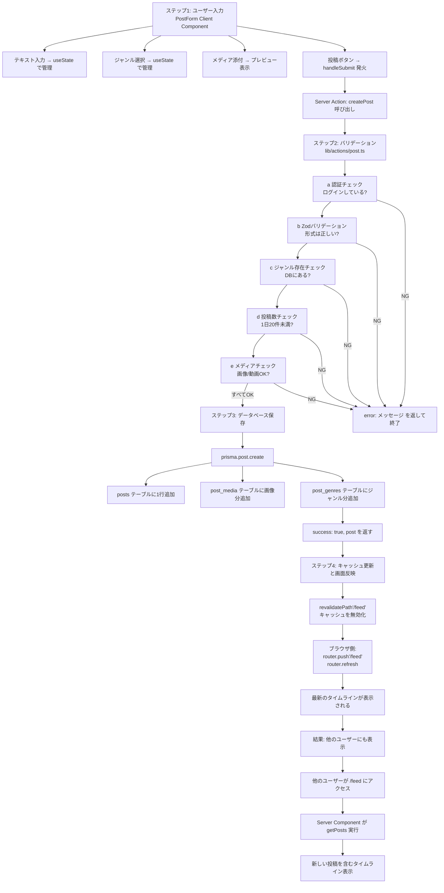
```mermaid
flowchart TD
    A[ステップ1: ユーザー入力<br/>PostForm Client Component] --> A1[テキスト入力 → useState で管理]
    A --> A2[ジャンル選択 → useState で管理]
    A --> A3[メディア添付 → プレビュー表示]
    A --> A4[投稿ボタン → handleSubmit 発火]
    A4 --> B[Server Action: createPost 呼び出し]

    B --> C[ステップ2: バリデーション<br/>lib/actions/post.ts]
    C --> C1[a 認証チェック<br/>ログインしている?]
    C1 --> C2[b Zodバリデーション<br/>形式は正しい?]
    C2 --> C3[c ジャンル存在チェック<br/>DBにある?]
    C3 --> C4[d 投稿数チェック<br/>1日20件未満?]
    C4 --> C5[e メディアチェック<br/>画像/動画OK?]
    C5 -->|すべてOK| D[ステップ3: データベース保存]
    C1 -->|NG| E[error: メッセージ を返して終了]
    C2 -->|NG| E
    C3 -->|NG| E
    C4 -->|NG| E
    C5 -->|NG| E

    D --> D1[prisma.post.create]
    D1 --> D2[posts テーブルに1行追加]
    D1 --> D3[post_media テーブルに画像分追加]
    D1 --> D4[post_genres テーブルにジャンル分追加]
    D4 --> F[success: true, post を返す]

    F --> G[ステップ4: キャッシュ更新と画面反映]
    G --> G1[revalidatePath'/feed'<br/>キャッシュを無効化]
    G1 --> G2[ブラウザ側:<br/>router.push'/feed'<br/>router.refresh]
    G2 --> H[最新のタイムラインが表示される]

    H --> I[結果: 他のユーザーにも表示]
    I --> I1[他のユーザーが /feed にアクセス]
    I1 --> I2[Server Component が getPosts 実行]
    I2 --> I3[新しい投稿を含むタイムライン表示]
```

> **初心者向けポイント: データフローの読み方**
> 上の図は「ユーザーがテキストを入力してから、他のユーザーに表示されるまで」の一連の流れを示しています。この流れを理解しておくと、以降のセクションで「今どの部分を実装しているのか」が明確になります。
>
> 特に重要なのは、**バリデーション（ステップ2）はサーバー側で行う**という点です。ブラウザ側でも簡単なチェック（文字数制限など）は行いますが、セキュリティ上重要なチェックは必ずサーバー側で実行します。ブラウザ側のチェックは「ユーザーの利便性のため」、サーバー側のチェックは「セキュリティのため」と覚えておいてください。

---

## 9.1 投稿機能の設計

> **このセクションで学ぶこと**
> - 投稿機能全体の仕様と設計思想
> - なぜ投稿に制約（文字数制限・投稿数制限）を設けるのか
> - ジャンル分けの意義と設計判断
> - 通常投稿・引用投稿・リポストの違い

BON-LOGの投稿機能は以下の仕様を持ちます。まず全体像をASCIIアートで確認しましょう。

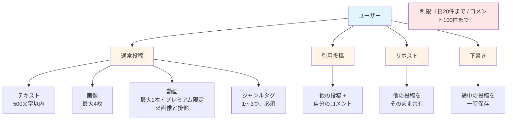
```mermaid
graph TD
    A[ユーザー] --> B[通常投稿]
    A --> C[引用投稿]
    A --> D[リポスト]
    A --> E[下書き]

    B --> B1[テキスト<br/>500文字以内]
    B --> B2[画像<br/>最大4枚]
    B --> B3[動画<br/>最大1本・プレミアム限定<br/>※画像と排他]
    B --> B4[ジャンルタグ<br/>1〜3つ、必須]

    C --> C1[他の投稿 +<br/>自分のコメント]
    D --> D1[他の投稿を<br/>そのまま共有]
    E --> E1[途中の投稿を<br/>一時保存]

    style A fill:#e1f5ff
    style B fill:#fff4e6
    style C fill:#fff4e6
    style D fill:#fff4e6
    style E fill:#fff4e6

    F[制限: 1日20件まで / コメント100件まで]
    style F fill:#ffe6e6
```

### 投稿の制約

| 項目 | 制約 | 理由 |
|------|------|------|
| **テキスト** | 最大500文字 | 短い文章で要点を伝える文化を育成。X（旧Twitter）の280文字より長く、ブログよりは短い「ちょうどいい長さ」 |
| **メディア** | 画像4枚 **または** 動画1本（排他。動画はプレミアム会員限定） | 画像と動画の混在はUIが複雑になるため排他に。盆栽の写真は複数アングルが重要なので4枚まで許可 |
| **ジャンルタグ** | 最大3つ（必須） | 投稿の分類を必須にすることで、検索・フィルタリングの品質を担保 |
| **投稿制限** | 1日20件まで | スパム・botによる大量投稿を防止 |
| **コメント制限** | 1日100件まで | コメントスパムの防止 |

> **なぜ制約を設けるのか？（現実世界のたとえ）**
> 図書館の掲示板を想像してください。もし1人が100枚のチラシを一気に貼ったら、他の人のチラシが見えなくなりますよね。投稿制限はこの「掲示板のルール」にあたります。適切な制約があることで、すべてのユーザーが公平にコンテンツを発信できる環境を維持します。

### ジャンル

投稿には以下のジャンルから1〜3つを選択します。ジャンルは盆栽の種類や活動内容に基づいて分けられています。

| ジャンル名 | 読み方 | 内容 | 投稿例 |
|-----------|--------|------|--------|
| 松柏類 | しょうはくるい | 松や杉などの常緑針葉樹 | 「五葉松の植え替えをしました」 |
| 雑木類 | ぞうきるい | 楓・欅などの落葉広葉樹 | 「紅葉が見頃です」 |
| 花物類 | はなものるい | 梅・桜など花を楽しむ樹種 | 「長寿梅が開花しました」 |
| 実物類 | みものるい | 柿・梅擬など実を楽しむ樹種 | 「姫リンゴに実がつきました」 |
| 草物類 | くさものるい | 草や苔を使った盆栽 | 「苔玉を作ってみました」 |
| 用品・道具 | ─ | 鉢、はさみ、土など | 「新しい剪定ばさみを購入」 |
| 施設・イベント | ─ | 盆栽園、展示会情報 | 「大宮盆栽美術館に行きました」 |
| 初心者向け | ─ | ビギナー向けの質問・情報 | 「初めての盆栽、何がおすすめ？」 |
| その他 | ─ | 上記に当てはまらないもの | 「盆栽カフェを見つけました」 |

### 投稿の種類

BON-LOGでは3種類の投稿方法があります。SNS（X/Twitterなど）を使ったことがある方にはおなじみの機能です。

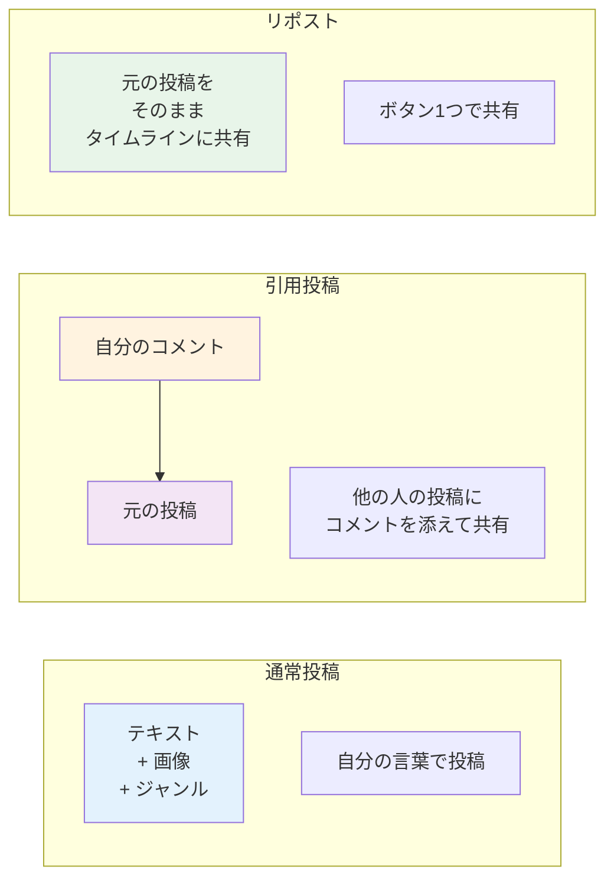
```mermaid
graph LR
    subgraph 通常投稿
        A1[テキスト<br/>+ 画像<br/>+ ジャンル]
        A2["自分の言葉で投稿"]
    end

    subgraph 引用投稿
        B1[自分のコメント]
        B2[元の投稿]
        B1 --> B2
        B3["他の人の投稿に<br/>コメントを添えて共有"]
    end

    subgraph リポスト
        C1[元の投稿を<br/>そのまま<br/>タイムラインに共有]
        C2["ボタン1つで共有"]
    end

    style A1 fill:#e3f2fd
    style B1 fill:#fff3e0
    style B2 fill:#f3e5f5
    style C1 fill:#e8f5e9
```

- **通常投稿**: テキスト + メディア + ジャンル。最も基本的な投稿方法です。
- **引用投稿**: 他の投稿を引用してコメントを添えます。「この投稿について自分はこう思う」と意見を共有したいときに使います。
- **リポスト**: 他の投稿を自分のタイムラインに共有します。「いいね」は評価を示すだけですが、リポストはフォロワーにも見せたいときに使います。

<details>
<summary><strong>理解度チェック: 投稿機能の設計</strong></summary>

**Q1: なぜ画像と動画は同時に投稿できないのですか？**

A1: UIの複雑さを避けるためです。画像と動画が混在すると、表示レイアウトの組み合わせが膨大になり、ユーザー体験が悪化します。また、動画は容量が大きいため、画像と合わせるとアップロード時間が長くなるリスクもあります。

**Q2: ジャンルを「必須」にした理由は何ですか？**

A2: ジャンルを任意にすると、多くのユーザーが設定しないまま投稿します。すると検索やフィルタリングが機能しなくなり、「松柏類の投稿だけ見たい」といったニーズに応えられません。必須にすることで、コンテンツの整理が自動的に行われます。

**Q3: 引用投稿とリポストの違いを、日常生活のたとえで説明してください。**

A3: リポストは「友人のメールをそのまま別の人に転送する」ようなもの。引用投稿は「友人のメールを貼り付けて、自分のコメントを添えて別の人に送る」ようなものです。

</details>

---

### 補足: 投稿機能の主要フロー図

ここでは、投稿機能の主要な3つのフローを図解します。これらの図は、各セクションで詳細に説明する内容の「全体像」を把握するために用意しました。

#### 1. 投稿作成フロー（Compose → Validate → Save → Notify）

このフローは、ユーザーが投稿を作成してから他のユーザーに通知されるまでの一連の流れを示しています。


```mermaid
flowchart LR
    subgraph Compose[作成]
        A1[ユーザーがテキスト入力]
        A2[メディアアップロード]
        A3[ジャンル選択]
    end

    subgraph Validate[検証]
        B1[文字数チェック<br/>500文字以内]
        B2[メディア数チェック<br/>画像4枚 or 動画1本※プレミアム限定]
        B3[ジャンルチェック<br/>1〜3つ選択済み]
        B4[投稿数制限<br/>1日20件未満]
    end

    subgraph Save[保存]
        C1[Post レコード作成]
        C2[PostMedia レコード作成]
        C3[PostGenre レコード作成]
        C4[メンション抽出]
        C5[ハッシュタグ抽出]
    end

    subgraph Notify[通知]
        D1[メンション先に通知]
        D2[フォロワーのタイムラインに追加]
        D3[キャッシュ更新<br/>revalidatePath]
    end

    Compose --> Validate
    Validate -->|すべてOK| Save
    Validate -->|NG| E[エラー表示]
    Save --> Notify
    Notify --> F[完了]

    style Compose fill:#e3f2fd
    style Validate fill:#fff3e0
    style Save fill:#c8e6c9
    style Notify fill:#f3e5f5
    style E fill:#ffcdd2
    style F fill:#c8e6c9
```

#### 2. タイムラインのデータフロー（Infinite Scroll + React Query）

タイムライン表示における無限スクロールとReact Queryによるデータ管理の仕組みを示しています。

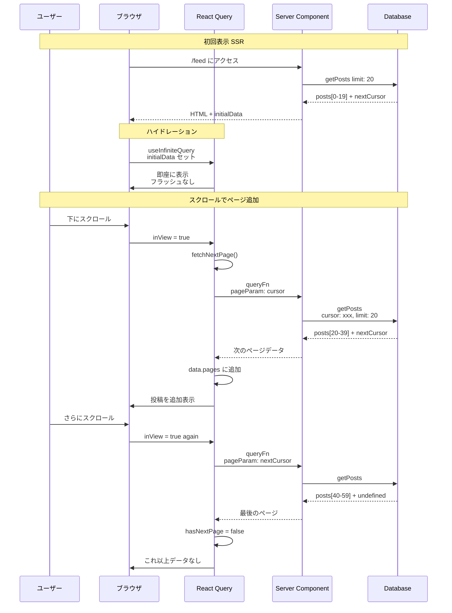
```mermaid
sequenceDiagram
    participant User as ユーザー
    participant Browser as ブラウザ
    participant RQ as React Query
    participant Server as Server Component
    participant DB as Database

    Note over User,DB: 初回表示 SSR
    Browser->>Server: /feed にアクセス
    Server->>DB: getPosts limit: 20
    DB-->>Server: posts[0-19] + nextCursor
    Server-->>Browser: HTML + initialData

    Note over Browser,RQ: ハイドレーション
    Browser->>RQ: useInfiniteQuery<br/>initialData セット
    RQ->>Browser: 即座に表示<br/>フラッシュなし

    Note over User,DB: スクロールでページ追加
    User->>Browser: 下にスクロール
    Browser->>RQ: inView = true
    RQ->>RQ: fetchNextPage()
    RQ->>Server: queryFn<br/>pageParam: cursor
    Server->>DB: getPosts<br/>cursor: xxx, limit: 20
    DB-->>Server: posts[20-39] + nextCursor
    Server-->>RQ: 次のページデータ
    RQ->>RQ: data.pages に追加
    RQ->>Browser: 投稿を追加表示

    User->>Browser: さらにスクロール
    Browser->>RQ: inView = true again
    RQ->>Server: queryFn<br/>pageParam: nextCursor
    Server->>DB: getPosts
    DB-->>Server: posts[40-59] + undefined
    Server-->>RQ: 最後のページ
    RQ->>RQ: hasNextPage = false
    RQ->>Browser: これ以上データなし
```

#### 3. 投稿インタラクションモデル（Like, Comment, Repost, Bookmark）

投稿に対する4つの主要なインタラクション（いいね、コメント、リポスト、ブックマーク）の関係を示しています。

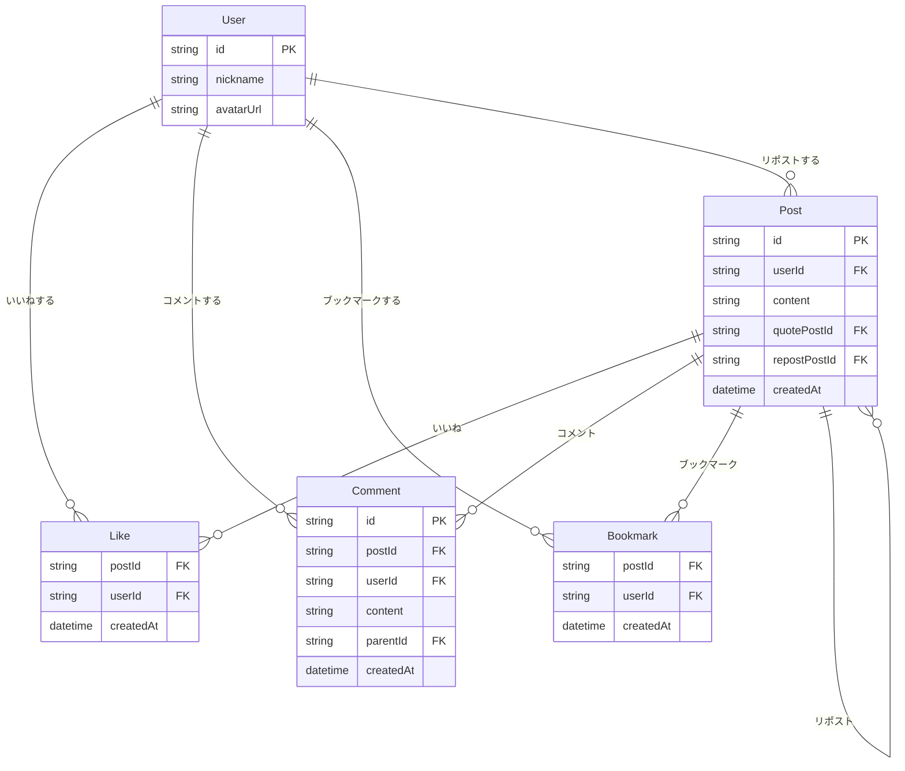
```mermaid
erDiagram
    Post ||--o{ Like : "いいね"
    Post ||--o{ Comment : "コメント"
    Post ||--o{ Bookmark : "ブックマーク"
    Post ||--o{ Post : "リポスト"

    User ||--o{ Like : "いいねする"
    User ||--o{ Comment : "コメントする"
    User ||--o{ Bookmark : "ブックマークする"
    User ||--o{ Post : "リポストする"

    Post {
        string id PK
        string userId FK
        string content
        string quotePostId FK
        string repostPostId FK
        datetime createdAt
    }

    Like {
        string postId FK
        string userId FK
        datetime createdAt
    }

    Comment {
        string id PK
        string postId FK
        string userId FK
        string content
        string parentId FK
        datetime createdAt
    }

    Bookmark {
        string postId FK
        string userId FK
        datetime createdAt
    }

    User {
        string id PK
        string nickname
        string avatarUrl
    }
```

> **図の読み方のヒント**
> - **作成フロー図**: 左から右へ、段階的に処理が進む様子を表しています。各段階でエラーが発生すると、処理が中断されます。
> - **タイムラインフロー図**: 時系列で上から下へ、サーバーとクライアント間のやり取りを表しています。初回はSSRで高速表示、以降はクライアント側で動的に追加します。
> - **インタラクションモデル図**: テーブル間の関係を表しています。1つの投稿に対して、複数のユーザーがいいね・コメント・ブックマークできます。

---

## 9.2 データモデルの定義

> **このセクションで学ぶこと**
> - 投稿に関連するデータベーステーブルの設計
> - Prismaスキーマの書き方（リレーション、インデックス、マッピング）
> - 自己参照リレーション（投稿が別の投稿を参照する仕組み）
> - 中間テーブル（PostGenre）の役割

---

### 実習 9-1: 投稿関連のモデルをスキーマに定義する

- **対象ファイル**: `prisma/schema.prisma`
- **やること**: 投稿（Post）、メディア（PostMedia）、ジャンル（PostGenre / Genre）、下書き（DraftPost 等）のモデルを追加・確認する。既存の User モデルがある場合は、その後に追記する。

まず、テーブル間の関係を以下の図で確認してから、下のコードブロックを参照してスキーマを書きます。**プロジェクトによっては既に一部が定義されているため、重複しないように既存の `model` を確認してから追加してください。**

まず、Prismaスキーマで投稿関連のモデルを定義します。投稿機能には複数のテーブルが関わります。以下の図でテーブル間の関係を確認しましょう。

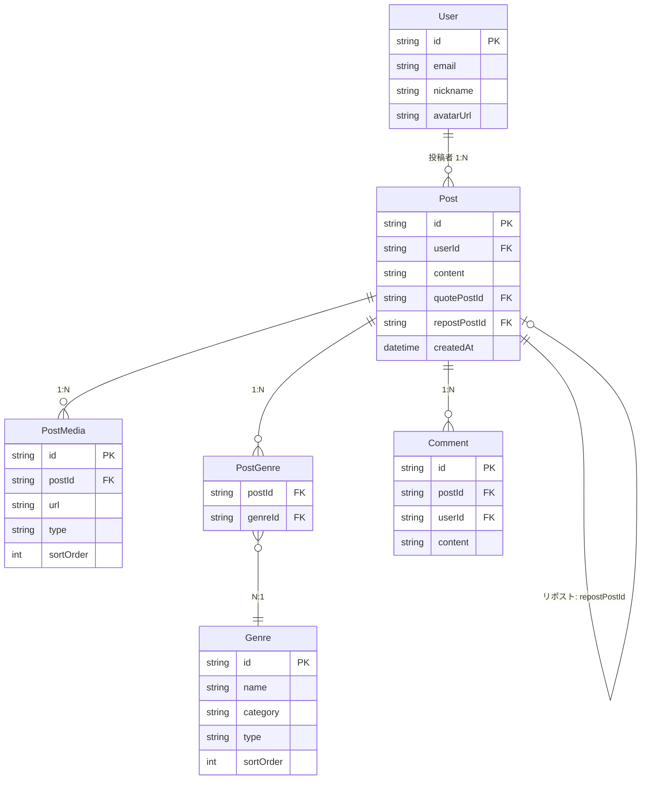
```mermaid
erDiagram
    User ||--o{ Post : "投稿者 1:N"
    Post ||--o{ PostMedia : "1:N"
    Post ||--o{ PostGenre : "1:N"
    Post ||--o{ Comment : "1:N"
    PostGenre }o--|| Genre : "N:1"

    Post ||--o| Post : "引用: quotePostId"
    Post ||--o| Post : "リポスト: repostPostId"

    User {
        string id PK
        string email
        string nickname
        string avatarUrl
    }

    Post {
        string id PK
        string userId FK
        string content
        string quotePostId FK
        string repostPostId FK
        datetime createdAt
    }

    PostMedia {
        string id PK
        string postId FK
        string url
        string type
        int sortOrder
    }

    PostGenre {
        string postId FK
        string genreId FK
    }

    Genre {
        string id PK
        string name
        string category
        string type
        int sortOrder
    }

    Comment {
        string id PK
        string postId FK
        string userId FK
        string content
    }
```

> **現実世界のたとえ: テーブル間の関係**
> - `Post`（投稿）は「掲示板に貼られた1枚のメモ」です。
> - `PostMedia`（メディア）は「そのメモに添付された写真」です。1枚のメモに複数の写真を付けられます。
> - `Genre`（ジャンル）は「掲示板のカテゴリラベル」です。
> - `PostGenre`（中間テーブル）は「メモにラベルを貼る行為」です。1枚のメモに複数のラベルを貼れるし、1つのラベルは複数のメモに使えます（多対多の関係）。
> - `DraftPost`（下書き）は「まだ掲示板に貼っていない、机の引き出しにしまったメモ」です。

```prisma
// prisma/schema.prisma
// 投稿関連のデータモデルを定義するファイル

// ================================================================
// Post モデル: 投稿の本体を格納するメインテーブル
// ================================================================
model Post {
  // --- 基本フィールド ---
  id           String    @id @default(cuid())    // 一意なID（cuid形式で自動生成）
  userId       String    @map("user_id")         // 投稿者のユーザーID（Userテーブルへの外部キー）
  content      String?   @db.Text // 投稿本文（500文字まで、画像のみ投稿もあるのでnull許容）
  quotePostId  String?   @map("quote_post_id")   // 引用元の投稿ID（引用投稿の場合のみ設定）
  repostPostId String?   @map("repost_post_id")  // リポスト元の投稿ID（リポストの場合のみ設定）
  bonsaiId     String?   @map("bonsai_id")       // 紐付く盆栽のID（任意）
  isHidden     Boolean   @default(false) @map("is_hidden") // 非表示フラグ（管理者による非表示）
  hiddenAt     DateTime? @map("hidden_at")        // 非表示にされた日時
  createdAt    DateTime  @default(now()) @map("created_at")  // 投稿日時（自動設定）
  // ※ updatedAt は持たない（投稿は作成後に編集しない設計）

  // --- リレーション（他のテーブルとの関係） ---
  user         User     @relation(fields: [userId], references: [id], onDelete: Cascade)
  // ↑ 投稿者との関連。ユーザーが削除されたら投稿も一緒に削除（Cascade）

  quotePost    Post?    @relation("QuotePost", fields: [quotePostId], references: [id], onDelete: SetNull)
  // ↑ 引用元の投稿（自己参照リレーション）。引用元が削除されたらnullに設定（SetNull）
  quotedBy     Post[]   @relation("QuotePost")
  // ↑ この投稿を引用している投稿の一覧（逆方向のリレーション）

  repostPost   Post?    @relation("RepostPost", fields: [repostPostId], references: [id], onDelete: SetNull)
  // ↑ リポスト元の投稿。元投稿が削除されたらnullに設定（SetNull）
  repostedBy   Post[]   @relation("RepostPost")
  // ↑ この投稿をリポストした投稿の一覧

  bonsai       Bonsai?  @relation(fields: [bonsaiId], references: [id], onDelete: SetNull)
  // ↑ 紐付く盆栽（任意）

  media        PostMedia[]   // 添付メディア（画像・動画）のリスト
  genres       PostGenre[]   // 設定されたジャンルのリスト（中間テーブル経由）
  comments     Comment[]     // この投稿へのコメント一覧
  likes        Like[]        // この投稿へのいいね一覧
  bookmarks    Bookmark[]    // この投稿のブックマーク一覧
  notifications Notification[] // この投稿に関連する通知
  hashtags     PostHashtag[]  // この投稿のハッシュタグ
  poll         Poll?          // 投票（アンケート）

  // --- インデックス（検索速度の最適化） ---
  @@index([userId])    // ユーザーIDでの検索を高速化（例: 特定ユーザーの投稿一覧）
  @@index([createdAt]) // 日時での検索を高速化（例: 新着順の並び替え）
  @@index([isHidden])  // 非表示状態での検索を高速化
  @@index([bonsaiId])  // 盆栽IDでの検索を高速化
  // パフォーマンス最適化: タイムラインクエリ用の複合インデックス
  @@index([userId, isHidden, createdAt(sort: Desc)])
  @@map("posts")       // 実際のテーブル名は「posts」（スネークケース）
}

// ================================================================
// PostMedia モデル: 投稿に添付されたメディア（画像・動画）を格納
// 1つの投稿に対して複数のメディアを紐付けられる（1:N）
// ================================================================
model PostMedia {
  id        String   @id @default(cuid())             // メディアの一意なID
  postId    String   @map("post_id")                  // 紐付く投稿のID
  url       String                                     // メディアファイルのURL（R2ストレージ上のパス）
  type      String   @default("image")                 // メディアの種類（"image" or "video"）
  sortOrder Int      @default(0) @map("sort_order")    // 表示順（0始まり: 0, 1, 2, 3）

  post      Post     @relation(fields: [postId], references: [id], onDelete: Cascade)
  // ↑ 親の投稿が削除されたら、メディアも自動削除（Cascade）

  @@map("post_media") // テーブル名: post_media
}

// ================================================================
// PostGenre モデル: 投稿とジャンルの「中間テーブル」
// 多対多（M:N）の関係を実現するためのテーブル
// 例: 1つの投稿が「松柏類」と「初心者向け」の2つのジャンルを持てる
//     1つのジャンルに複数の投稿が紐付く
// ================================================================
model PostGenre {
  postId  String @map("post_id")   // 投稿のID
  genreId String @map("genre_id")  // ジャンルのID

  post    Post   @relation(fields: [postId], references: [id], onDelete: Cascade)
  genre   Genre  @relation(fields: [genreId], references: [id], onDelete: Cascade)

  @@id([postId, genreId])  // 複合主キー: 同じ投稿に同じジャンルは1回だけ設定可能
  @@map("post_genres")     // テーブル名: post_genres
}

// ================================================================
// Genre モデル: ジャンルのマスタデータ
// アプリ起動時にシードデータとして投入される（ユーザーが追加するものではない）
// ================================================================
model Genre {
  id        String   @id @default(cuid())        // ジャンルの一意なID
  name      String                                // ジャンル名（例: 「松柏類」）
  category  String                                // カテゴリ（例: 「盆栽」「一般」）
  type      String   @default("post")             // 種別: "post"（投稿用）or "shop"（盆栽園用）
  sortOrder Int      @default(0) @map("sort_order") // 表示順

  postGenres          PostGenre[]          // このジャンルが設定された投稿のリスト
  shopGenres          ShopGenre[]          // このジャンルが設定された盆栽園のリスト
  scheduledPostGenres ScheduledPostGenre[] // 予約投稿のジャンル
  draftPostGenres     DraftPostGenre[]     // 下書きのジャンル

  @@map("genres") // テーブル名: genres
}

// ================================================================
// DraftPost モデル: 下書き投稿
// ユーザーが作成途中の投稿を一時保存するためのテーブル
// メディアとジャンルは別テーブル（DraftPostMedia, DraftPostGenre）で管理
// ================================================================
model DraftPost {
  id        String   @id @default(cuid())             // 下書きの一意なID
  userId    String   @map("user_id")                  // 作成者のユーザーID
  content   String?  @db.Text                          // 下書きの本文
  createdAt DateTime @default(now()) @map("created_at")  // 作成日時
  updatedAt DateTime @updatedAt @map("updated_at")       // 最終更新日時

  user   User             @relation(fields: [userId], references: [id], onDelete: Cascade)
  media  DraftPostMedia[]   // 添付メディア（別テーブルで管理）
  genres DraftPostGenre[]   // 関連ジャンル（別テーブルで管理）

  @@index([userId])     // ユーザーIDでの検索を高速化
  @@map("draft_posts")  // テーブル名: draft_posts
}

// DraftPostMedia: 下書きに添付されたメディア
model DraftPostMedia {
  id          String @id @default(cuid())
  draftPostId String @map("draft_post_id")
  url         String
  type        String @default("image")
  sortOrder   Int    @default(0) @map("sort_order")

  draftPost DraftPost @relation(fields: [draftPostId], references: [id], onDelete: Cascade)

  @@index([draftPostId])
  @@map("draft_post_media")
}

// DraftPostGenre: 下書きとジャンルの中間テーブル
model DraftPostGenre {
  draftPostId String @map("draft_post_id")
  genreId     String @map("genre_id")

  draftPost DraftPost @relation(fields: [draftPostId], references: [id], onDelete: Cascade)
  genre     Genre     @relation(fields: [genreId], references: [id], onDelete: Cascade)

  @@id([draftPostId, genreId])
  @@map("draft_post_genres")
}
```

> **補足: `@map` と `@@map` の違い**
> - `@map("user_id")`: フィールド名のマッピング。TypeScript側では `userId`（キャメルケース）、DB側では `user_id`（スネークケース）として保存されます。
> - `@@map("posts")`: テーブル名のマッピング。Prismaのモデル名は `Post`（パスカルケース）ですが、実際のDBテーブル名は `posts`（スネークケース・複数形）です。

> **補足: `@@id([postId, genreId])` 複合主キーとは？**
> 通常、テーブルには `id` という単一の主キーがあります。しかし `PostGenre` テーブルでは、`postId` と `genreId` の組み合わせを主キーにしています。これにより、「同じ投稿に同じジャンルが2回設定される」ことを防げます。住所でいえば、「都道府県 + 市区町村」の組み合わせで一意になるようなイメージです。

スキーマを更新したら、データベースに反映します。

```bash
# Prismaスキーマをデータベースに反映する（開発環境用）
npx prisma db push

# TypeScriptのPrismaクライアントを再生成する
# （スキーマ変更後は必ず実行してください）
npx prisma generate
```

- **このあと変わること**
  - データベースに `posts`, `post_media`, `post_genres`, `genres`, `draft_posts` などのテーブルが作成（または更新）される。
  - TypeScript 上で `prisma.post`, `prisma.postMedia`, `prisma.genre` などが使えるようになる。まだ画面や Server Action はないので、見た目の変化はない。
- **確認方法**
  1. プロジェクトルートで `npx prisma db push` を実行し、エラーが出ないことを確認する。
  2. 続けて `npx prisma generate` を実行し、エラーが出ないことを確認する。
  3. （任意）`npx prisma studio` で DB を開き、`posts` や `genres` テーブルが存在することを確認する。

### よくあるトラブルと解決法（データモデル編）

| トラブル | 原因 | 解決法 |
|---------|------|--------|
| `npx prisma db push` でエラー | PostgreSQLが起動していない | `docker compose up -d postgres` でDBを起動 |
| `P2002: Unique constraint failed` | 同じnameのジャンルが既に存在 | `npx prisma studio` でデータを確認・削除 |
| `npx prisma generate` 後に型が反映されない | エディタのキャッシュ | VSCodeを再起動、またはTypeScriptサーバーを再起動（Ctrl+Shift+P → "Restart TS Server"） |
| `Cannot find module '@prisma/client'` | `prisma generate` を実行していない | `npx prisma generate` を実行 |
| リレーション先のデータが取得できない | `include` の指定漏れ | `include: { genres: { include: { genre: true } } }` のように明示的に指定 |

<details>
<summary><strong>理解度チェック: データモデル</strong></summary>

**Q1: なぜ `PostMedia` テーブルを `Post` テーブルから分離しているのですか？直接 `Post` に画像URLを持たせるのではダメですか？**

A1: 1つの投稿に複数のメディアを紐付けたいからです。もし `Post` テーブルに `imageUrl1`, `imageUrl2`, `imageUrl3`, `imageUrl4` というカラムを作ると、画像数が変わるたびにテーブル定義を変更する必要があります。別テーブルにすることで、何枚でも柔軟に対応でき、`sortOrder` で表示順も管理できます。

**Q2: 「自己参照リレーション」とは何ですか？**

A2: あるテーブルが自分自身を参照するリレーションです。`Post` テーブルの `quotePostId` は別の `Post` のIDを指しています。つまり「投稿Aが投稿Bを引用する」という関係を、同一テーブル内で表現しています。家族でいえば「親子関係」のようなものです。

**Q3: `Genre` テーブルの `category` フィールドと `type` フィールドの役割は何ですか？**

A3: `category` はジャンルの分類です（例: 「盆栽」「一般」）。同じカテゴリのジャンルをグループ化して表示する際に使います。`type` はジャンルの用途を示し、`"post"`（投稿用）と `"shop"`（盆栽園用）のどちらで使うかを区別します。これにより、投稿のジャンル選択と盆栽園のジャンル選択で異なるジャンル一覧を表示できます。

</details>

## 9.3 Server Actionによる投稿作成

> **このセクションで学ぶこと**
> - Server Actionsの仕組みと利点
> - FormDataを使ったバリデーション（入力検証）の実装
> - 認証チェック・権限チェックの重要性
> - トランザクション的なデータ作成（投稿 + メディア + ジャンルを一括作成）
> - `revalidatePath` によるキャッシュの更新

---

### 実習 9-2: 投稿作成の Server Action を実装する

- **対象ファイル**: `lib/actions/post.ts`（および必要に応じて `lib/actions/utils.ts`, `types/action-result.ts`）
- **やること**: 認証チェック・バリデーション・投稿数制限を行い、`prisma.post.create` で Post / PostMedia / PostGenre を保存する `createPost` 関数を実装する。既存プロジェクトでは該当ファイルを開き、下記の考え方に沿ってコードを追加・修正する。

Next.js 16のServer Actionsを使って、投稿作成処理を実装します。

> **CRUDとは？（初心者向け解説）**
> このセクションのタイトルに含まれる「CRUD」は、データベース操作の4つの基本操作を表す略語です。
>
> | 操作 | 英語 | 意味 | 投稿機能での例 |
> |------|------|------|---------------|
> | **C** | Create | 作成 | 新しい投稿を作成する |
> | **R** | Read | 読み取り | 投稿一覧やタイムラインを表示する |
> | **U** | Update | 更新 | 投稿を編集する（演習問題で扱います） |
> | **D** | Delete | 削除 | 自分の投稿を削除する |
>
> ほぼすべてのWebアプリケーションは、この4つの操作の組み合わせで成り立っています。レストランに例えると、「新しいメニューを追加する（Create）」「メニュー表を見る（Read）」「メニューの価格を変更する（Update）」「メニューを廃止する（Delete）」に相当します。

> **Server Actionsとは？（初心者向け解説）**
> Server Actionsは、Next.js 13.4以降で使えるサーバーサイドの関数です。従来のWebアプリでは「APIエンドポイントを作る → クライアントからfetchでリクエストを送る」という2ステップが必要でしたが、Server Actionsでは「サーバーで実行される関数を直接呼び出す」だけでOKです。
>
> ```
> 【従来の方法】
> ブラウザ → fetch('/api/posts', { method: 'POST', body: ... })
>         → APIルート（route.ts）で処理
>         → レスポンスを返す
>
> 【Server Actions】
> ブラウザ → createPost(input) を呼ぶだけ！
>         → 自動的にサーバーで実行される
>         → 結果が返ってくる
> ```
>
> ファイルの先頭に `'use server'` を書くと、そのファイル内の関数はすべてServer Actionになります。

以下が投稿作成処理の全体フローです。

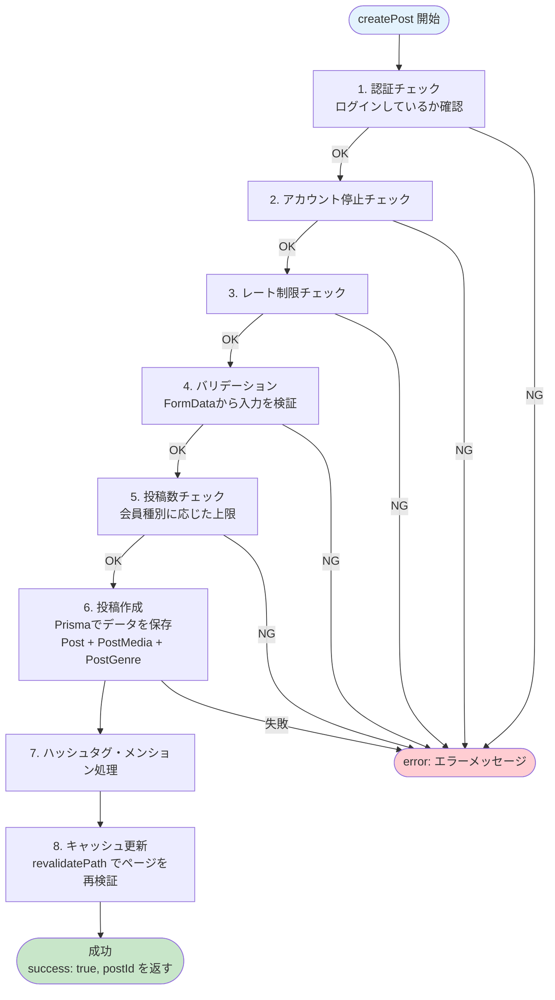
```mermaid
flowchart TD
    Start([createPost 開始]) --> Step1[1. 認証チェック<br/>ログインしているか確認]
    Step1 -->|OK| Step1b[2. アカウント停止チェック]
    Step1b -->|OK| Step1c[3. レート制限チェック]
    Step1c -->|OK| Step2[4. バリデーション<br/>FormDataから入力を検証]
    Step2 -->|OK| Step5[5. 投稿数チェック<br/>会員種別に応じた上限]
    Step5 -->|OK| Step7[6. 投稿作成<br/>Prismaでデータを保存<br/>Post + PostMedia + PostGenre]
    Step7 --> Step7b[7. ハッシュタグ・メンション処理]
    Step7b --> Step8[8. キャッシュ更新<br/>revalidatePath でページを再検証]
    Step8 --> Success([成功<br/>success: true, postId を返す])

    Step1 -->|NG| Error([error: エラーメッセージ])
    Step1b -->|NG| Error
    Step1c -->|NG| Error
    Step2 -->|NG| Error
    Step5 -->|NG| Error
    Step7 -->|失敗| Error

    style Start fill:#e3f2fd
    style Success fill:#c8e6c9
    style Error fill:#ffcdd2
```

> **ActionResult パターン（Server Actions の戻り値の統一型）**
>
> BON-LOGでは、すべての Server Actions の戻り値を `ActionResult` 型で統一しています。成功時は `{ success: true, data? }` 、失敗時は `{ success: false, error }` という形です。
>
> ```typescript
> // types/action-result.ts（実際のコード）
>
> /** 成功時: success=true と data（省略可）。失敗時: success=false と error */
> export type ActionResult<T = void> =
>   | { success: true; data?: T }
>   | { success: false; error: string }
>
> /** 成功レスポンスを返す */
> export function actionSuccess<T>(data?: T): ActionResult<T> {
>   return data !== undefined ? { success: true, data } : { success: true }
> }
>
> /** エラーレスポンスを返す */
> export function actionError(message: string): ActionResult<never> {
>   return { success: false, error: message }
> }
> ```
>
> **なぜ統一するのか？** Server Actions ごとに戻り値の形がバラバラだと、呼び出し側（Client Component）で「成功したかどうか」の判定コードが毎回異なってしまいます。`ActionResult` に統一することで、`if (result.success)` という1パターンで済みます。TypeScript の判別共用体（Discriminated Union — Ch03 参照）を活用しており、`success` の値で型が自動的に絞り込まれます。
>
> ```typescript
> // 使い方（Server Action側）
> export async function createPost(formData: FormData): Promise<ActionResult<{ postId: string }>> {
>   const { userId, error } = await requireActiveUser('post')
>   if (!userId) return actionError(error!)          // ← 失敗
>   // ...
>   return actionSuccess({ postId: post.id })        // ← 成功
> }
>
> // 使い方（Client Component側）
> const result = await createPost(formData)
> if (result.success) {
>   // TypeScript が result.data の型を { postId: string } と認識する
>   router.push(`/posts/${result.data!.postId}`)
> } else {
>   // TypeScript が result.error の型を string と認識する
>   setError(result.error)
> }
> ```

```typescript
// lib/actions/post.ts（実際のソースコード）
// 投稿に関するServer Actions（サーバーサイドで実行される関数群）
'use server'

import { z } from 'zod'                              // バリデーションライブラリ
import { prisma } from '@/lib/db'                     // データベースクライアント
import { MediaType } from '@prisma/client'            // Prisma生成の型
import { revalidatePath } from 'next/cache'           // キャッシュの再検証
import { getMembershipLimits } from '@/lib/premium'   // 会員種別の制限値を取得
import { sanitizePostContent } from '@/lib/sanitize'  // 投稿内容のサニタイズ（XSS対策）
import { attachHashtagsToPost } from './hashtag'      // ハッシュタグ処理
import { notifyMentionedUsers } from './mention'      // メンション通知
import { requireActiveUser } from '@/lib/actions/utils'  // 認証+アカウント状態チェック
import logger from '@/lib/logger'                     // ロガー
import { getStartOfToday } from '@/lib/utils'         // 今日の0時を返すユーティリティ
import {
  MAX_GENRES_PER_POST,        // 3
  MIN_POLL_OPTIONS,           // 2
  MAX_POLL_OPTIONS,           // 10
  MAX_POLL_OPTION_LENGTH,     // 50
  VALID_POLL_DURATIONS,       // [3600, 21600, 43200, 86400, 259200, 604800]
} from '@/lib/constants/limits'
import {
  ERR_INVALID_INPUT,
  ERR_CONTENT_REQUIRED,
  ERR_MEDIA_DATA_INVALID,
  ERR_POST_CREATE_FAILED,
} from '@/lib/constants/errors'

// ── Zodスキーマ: FormDataのバリデーション定義 ──
// z.object() でフォームデータの形式を定義し、safeParse() で検証する
const createPostSchema = z.object({
  content: z.string().optional().default(''),
  genreIds: z.array(z.string()).default([]),
  mediaUrls: z.array(z.string()).default([]),
  mediaTypes: z.array(z.string()).default([]),
  bonsaiId: z.string().nullable().optional(),       // 盆栽紐付け（任意）
  pollOptions: z.string().nullable().optional(),     // アンケート選択肢（JSON文字列）
  pollDuration: z.string().nullable().optional(),    // アンケート期間（秒数文字列）
})

// ──────────────────────────────────────────────
// createPost: 投稿を作成するServer Action
// FormData を受け取り、バリデーション後にDBに保存する
// ──────────────────────────────────────────────
export async function createPost(formData: FormData) {
  // ステップ1: 認証 + アカウント状態チェック
  // requireActiveUser は認証チェック、アカウント停止チェック、
  // レート制限チェックを1つにまとめたヘルパー関数
  const { userId, error } = await requireActiveUser('post')
  if (!userId) return { error: error! }

  // ステップ2: Zodバリデーション
  // safeParse() は成功時に { success: true, data: ... } を返し、
  // 失敗時に { success: false, error: ... } を返す（例外を投げない）
  const parsed = createPostSchema.safeParse({
    content: formData.get('content') || '',
    genreIds: formData.getAll('genreIds'),
    mediaUrls: formData.getAll('mediaUrls'),
    mediaTypes: formData.getAll('mediaTypes'),
    bonsaiId: (formData.get('bonsaiId') as string) || null,
    pollOptions: formData.get('pollOptions') as string | null,
    pollDuration: formData.get('pollDuration') as string | null,
  })
  if (!parsed.success) return { error: ERR_INVALID_INPUT }

  const { genreIds, mediaUrls, mediaTypes, bonsaiId,
    pollOptions: pollOptionsRaw, pollDuration: pollDurationRaw } = parsed.data

  // ステップ3: サニタイズ（XSS対策）
  // HTMLタグ除去 + 改行正規化 + 前後空白除去
  const content = sanitizePostContent(parsed.data.content)

  // ステップ4: 会員種別に応じた制限を取得
  const limits = await getMembershipLimits(userId)

  // ステップ5: バリデーション
  if (!content && mediaUrls.length === 0) {
    return { error: ERR_CONTENT_REQUIRED }
  }
  if (content && content.length > limits.maxPostLength) {
    return { error: `投稿は${limits.maxPostLength}文字以内で入力してください` }
  }
  if (genreIds.length > MAX_GENRES_PER_POST) {
    return { error: `ジャンルは${MAX_GENRES_PER_POST}つまで選択できます` }
  }
  if (mediaUrls.length !== mediaTypes.length) {
    return { error: ERR_MEDIA_DATA_INVALID }
  }
  const imageCount = mediaTypes.filter((t: string) => t === 'image').length
  const videoCount = mediaTypes.filter((t: string) => t === 'video').length
  if (imageCount > limits.maxImages) {
    return { error: `画像は${limits.maxImages}枚までです` }
  }
  if (videoCount > limits.maxVideos) {
    return { error: `動画は${limits.maxVideos}本までです` }
  }

  // ステップ6: アンケートのバリデーション（任意）
  let pollOptions: string[] = []
  let pollDuration = 0
  if (pollOptionsRaw) {
    try {
      pollOptions = JSON.parse(pollOptionsRaw)
    } catch {
      return { error: 'アンケートデータが不正です' }
    }
    if (!Array.isArray(pollOptions) ||
        pollOptions.length < MIN_POLL_OPTIONS ||
        pollOptions.length > MAX_POLL_OPTIONS) {
      return { error: `アンケートの選択肢は${MIN_POLL_OPTIONS}〜${MAX_POLL_OPTIONS}個で設定してください` }
    }
    for (const opt of pollOptions) {
      if (typeof opt !== 'string' || opt.trim().length === 0 ||
          opt.length > MAX_POLL_OPTION_LENGTH) {
        return { error: `選択肢は1〜${MAX_POLL_OPTION_LENGTH}文字で入力してください` }
      }
    }
    pollDuration = parseInt(pollDurationRaw || '0', 10)
    if (!(VALID_POLL_DURATIONS as readonly number[]).includes(pollDuration)) {
      return { error: '無効な投票期間です' }
    }
  }

  // ステップ7: 1日の投稿数チェック（スパム対策）
  const today = getStartOfToday()
  const count = await prisma.post.count({
    where: { userId, createdAt: { gte: today } },
  })
  if (count >= limits.maxDailyPosts) {
    return { error: `1日の投稿上限（${limits.maxDailyPosts}件）に達しました` }
  }

  try {
    // ステップ8: 投稿作成
    // ネストした create で Post + PostMedia + PostGenre + Poll を一括作成
    const post = await prisma.post.create({
      data: {
        userId,
        content: content || null,
        bonsaiId: bonsaiId || null,
        media: mediaUrls.length > 0 ? {
          create: mediaUrls.map((url: string, index: number) => ({
            url,
            type: (mediaTypes[index] || 'image') as MediaType,
            sortOrder: index,
          })),
        } : undefined,
        genres: genreIds.length > 0 ? {
          create: genreIds.map((genreId: string) => ({ genreId })),
        } : undefined,
        // アンケート付き投稿の場合
        poll: pollOptions.length > 0 ? {
          create: {
            duration: pollDuration,
            expiresAt: new Date(Date.now() + pollDuration * 1000),
            options: {
              create: pollOptions.map((text: string, index: number) => ({
                text: text.trim(),
                sortOrder: index,
              })),
            },
          },
        } : undefined,
      },
    })

    // ステップ9: ハッシュタグを関連付け
    await attachHashtagsToPost(post.id, content)

    // ステップ10: メンションされたユーザーに通知
    await notifyMentionedUsers(post.id, content, userId)

    // ステップ11: キャッシュ更新
    revalidatePath('/feed')
    return { success: true, postId: post.id }
  } catch (error) {
    logger.error('Create post error:', error)
    return { error: ERR_POST_CREATE_FAILED }
  }
}
```

```
期待される出力:

  成功時: { success: true, postId: 'clxxxxxxxxxx' }
  未認証時: { error: '認証が必要です' }
  入力不正時: { error: '入力内容が正しくありません' }
  文字数超過時: { error: '投稿は500文字以内で入力してください' }
  投稿上限時: { error: '1日の投稿上限（20件）に達しました' }
```

> **ファイルパス**: `lib/actions/post.ts`
>
> **この処理があると**: ユーザーはテキスト・画像・動画・アンケートを含む投稿を作成でき、ハッシュタグの自動検出やメンション通知も行われます。
>
> **この処理がないと**: 投稿機能が存在せず、SNSとしての基本機能が成り立ちません。
>
> **`requireActiveUser` ヘルパー関数**: 認証チェック、アカウント停止チェック、レート制限チェックの3つを1つの関数にまとめたヘルパーです。投稿作成・引用投稿・リポストなど、複数のServer Actionで共通的に使用されます。

> **なぜネストクリエート？**
> ```typescript
> // ❌ 個別に作成（2回のクエリ + IDの受け渡しが必要）
> const post = await prisma.post.create({ data: { content: '黒松の手入れ' } })
> await prisma.postMedia.create({ data: { postId: post.id, url: '/img.jpg', type: 'image', sortOrder: 0 } })
>
> // ✅ ネストクリエート（1回のクエリ + トランザクション保証）
> const post = await prisma.post.create({
>   data: {
>     content: '黒松の手入れ',
>     media: { create: [{ url: '/img.jpg', type: 'image', sortOrder: 0 }] }
>   }
> })
> ```
> ネストクリエートは自動的にトランザクション内で実行されるため、画像の保存に失敗した場合は投稿自体も作成されません（データの整合性が保たれる）。

```typescript
// lib/actions/post.ts（実際のソースコード）
// ──────────────────────────────────────────────
// createRepost: リポスト（トグル方式）
// 既にリポスト済みなら解除し、まだなら作成する
// ──────────────────────────────────────────────
export async function createRepost(postId: string) {
  // requireActiveUser で認証+アカウント状態チェック
  const { userId, error } = await requireActiveUser('post')
  if (!userId) return { error: error! }

  try {
    // 既にリポスト済みかチェック
    const existing = await prisma.post.findFirst({
      where: {
        userId,                     // 自分が作成した
        repostPostId: postId,       // 同じ投稿のリポスト
      },
    })

    if (existing) {
      // ── リポスト解除 ──
      // 既にリポスト済みの場合は削除（トグルのOFF）
      await prisma.post.delete({ where: { id: existing.id } })
      revalidatePath('/feed')
      return { success: true, reposted: false }
    }

    // ── リポスト作成 ──
    // リポストは「内容なし・メディアなし・ジャンルなし」の投稿として作成
    // repostPostId に元の投稿IDを設定することでリポストであることを示す
    await prisma.post.create({
      data: {
        userId: session.user.id,
        repostPostId: postId,       // ここがリポストの要！元投稿のIDを紐付け
      },
    })

    // キャッシュ更新
    revalidatePath('/feed')

    return { success: true, reposted: true }
  } catch (error) {
    console.error('リポストエラー:', error)
    return { error: 'リポストに失敗しました' }
  }
}

// lib/actions/post.ts（実際のソースコード）
// ──────────────────────────────────────────────
// deletePost: 投稿を削除するServer Action
// 重要: 必ず「所有者チェック」を行い、他人の投稿を削除できないようにする
// ──────────────────────────────────────────────
export async function deletePost(postId: string) {
  // 認証チェック（auth() を直接使用）
  const session = await auth()
  if (!session?.user?.id) {
    return { error: ERR_AUTH_REQUIRED }
  }

  try {
    // 投稿の所有者チェック（認可: Authorization）
    // 「認証」（誰か）と「認可」（何ができるか）は別の概念です
    const post = await prisma.post.findUnique({
      where: { id: postId },
      select: { userId: true },  // 必要なフィールドだけ取得（効率化）
    })

    if (!post || post.userId !== session.user.id) {
      return { error: ERR_PERMISSION_DENIED }
    }

    // ハッシュタグの関連付けを解除（カウントを減少）
    // 投稿削除前に実行する必要がある
    await detachHashtagsFromPost(postId)

    // 削除実行
    // Prismaスキーマで onDelete: Cascade を設定しているため、
    // 投稿を削除すると関連する PostMedia, PostGenre, Comment, Like, Bookmark も自動削除される
    await prisma.post.delete({
      where: { id: postId },
    })

    // キャッシュ更新
    revalidatePath('/feed')
    return { success: true }
  } catch (error) {
    logger.error('Delete post error:', error)
    return { error: ERR_POST_DELETE_FAILED }
  }
}
```

> **セキュリティの重要ポイント: なぜサーバー側で認証・認可チェックが必要なのか？**
>
> ブラウザ上のJavaScriptは誰でも改変できます。フロントエンド側で「自分の投稿だけ削除ボタンを表示する」ようにしても、悪意のあるユーザーが直接Server Actionを呼び出す可能性があります。そのため、**サーバー側でも必ず認証・認可チェックを行う**ことが鉄則です。
>
> ```mermaid
> flowchart TB
>     A["フロントエンド（信頼できない）<br/>「削除ボタンを非表示にする」<br/>→ UIの利便性のため（セキュリティではない）"]
>     A -->|Server Action呼び出し| B["サーバーサイド（信頼できる）<br/>「認証チェック + 所有者チェック」<br/>→ セキュリティの本質"]
> ```

> **サニタイズとは何をしているか？**
> ユーザー入力をそのまま表示すると、悪意のあるHTMLやJavaScriptが実行される危険があります：
>
> ```
> 入力: こんにちは<script>alert('ハッキング!')</script>
>   ↓ サニタイズ
> 出力: こんにちは（scriptタグが除去される）
> ```
>
> `sanitizePostContent` は危険なHTMLタグ（`<script>`, `<iframe>` 等）を除去し、安全なテキストに変換します。

> **レート制限とは？**
> 一定時間内のアクション回数を制限する仕組みです。スパム投稿や攻撃を防ぎます。
>
> BON-LOGでは1日20件の投稿制限があります。21件目を投稿しようとすると「1日の投稿上限に達しました」エラーが返されます。この制限はRedis（高速なメモリDB）でカウントを管理しています。

### BON-LOGでの使用箇所

| ファイル | 役割 |
|---------|------|
| `lib/actions/post.ts` | 投稿のCRUD操作（createPost, createQuotePost, createRepost, deletePost） |
| `lib/actions/draft.ts` | 下書きの保存・取得・削除（saveDraft, getDrafts, deleteDraft） |
| `lib/actions/hashtag.ts` | ハッシュタグの関連付け・解除（attachHashtagsToPost, detachHashtagsFromPost） |
| `lib/actions/mention.ts` | メンション通知（notifyMentionedUsers） |
| `components/post/PostForm.tsx` | 投稿フォームからcreatePostを呼び出し |
| `components/post/PostCard.tsx` | 投稿カードからdeletePost・createRepostを呼び出し |

### 実装しない場合の影響

- ユーザーが投稿を作成・削除できなくなり、SNSとして機能しない
- バリデーションを省略すると、スパム投稿や不正データによってデータベースが汚染される
- 認証チェックを省略すると、未ログインユーザーや他人が投稿を削除できるセキュリティ脆弱性が生まれる
- `revalidatePath` を省略すると、投稿後もタイムラインが更新されず、ユーザーが自分の投稿を確認できない

- **このあと変わること（実習 9-2）**
  - フォームから `createPost(formData)` を呼ぶと、サーバー側で認証・バリデーション・投稿数チェックが行われ、問題なければ DB に投稿が保存される。まだ UI（投稿フォーム・タイムライン）がないと「呼び方」の確認は難しいため、次に 9.4 でフォームを実装してから確認する。
- **確認方法**
  - `npm run build` または `npx tsc --noEmit` で型エラーがないことを確認する。投稿フォーム（9.4）とタイムライン（9.6）を実装したあと、ログインして実際に投稿を作成し、一覧に表示されるかで確認する。

### よくあるトラブルと解決法（Server Actions編）

| トラブル | 原因 | 解決法 |
|---------|------|--------|
| `Error: Functions cannot be passed directly to Client Components` | Server ActionをClient Componentに直接渡している | Server Actionは `import` で使用する。propsとしてではなく、ファイル内で直接import |
| `Error: Invariant: headers() expects to have requestAsyncStorage` | Server Action外で `auth()` を呼んでいる | `auth()` はServer Action内またはServer Component内でのみ使用可能 |
| 投稿後にタイムラインが更新されない | `revalidatePath` の呼び忘れ | Server Actionの最後に `revalidatePath('/feed')` を追加 |
| バリデーションエラーが表示されない | `safeParse` の結果をチェックしていない | `result.success` が `false` の場合にエラーメッセージを返す |

<details>
<summary><strong>理解度チェック: Server Actions</strong></summary>

**Q1: `'use server'` ディレクティブを書き忘れるとどうなりますか？**

A1: その関数はServer Actionとして認識されず、クライアント側で実行されようとします。その結果、`prisma` や `auth` など、サーバー専用のモジュールがブラウザで実行できずエラーになります。

**Q2: `safeParse` と `parse` の違いは何ですか？**

A2: `parse` はバリデーション失敗時に例外（エラー）を投げます。`safeParse` は例外を投げず、`{ success: false, error: ... }` を返します。Server Actionsではユーザーにエラーメッセージを見せたいので、`safeParse` を使って安全にエラーハンドリングします。

**Q3: `revalidatePath` は何をしているのですか？**

A3: Next.jsはパフォーマンスのためにページをキャッシュしています。投稿を作成した後、タイムラインのキャッシュが古いまま残っていると、新しい投稿が表示されません。`revalidatePath('/feed')` を呼ぶと、「次回 /feed にアクセスしたとき、キャッシュを使わず最新データで再描画してね」とNext.jsに指示します。

**Q4: カスケード削除（onDelete: Cascade）とは何ですか？**

A4: 親レコードを削除したとき、それに紐づく子レコードも自動的に削除する仕組みです。投稿を削除すると、その投稿に紐づくメディア・ジャンル・コメント・いいね・ブックマークもすべて自動削除されます。家を壊したら、中の家具も一緒にいなくなるイメージです。

</details>

## 9.4 投稿フォームの実装

> **このセクションで学ぶこと**
> - Client Component としてフォームを実装する理由
> - `useState` による状態管理（テキスト、ジャンル、メディア）
> - `useTransition` による非同期処理中のUI制御
> - ファイルアップロードのプレビュー実装
> - 文字数カウンター・バリデーション表示の実装

投稿フォームはClient Componentとして実装します。なぜClient Componentなのでしょうか？

> **なぜ投稿フォームはClient Componentなのか？**
> 投稿フォームでは以下の操作が必要です:
> - `useState` でテキストやジャンルの選択状態を管理する
> - `onChange` イベントでリアルタイムに文字数をカウントする
> - ボタンの `onClick` でフォーム送信処理を実行する
>
> これらはすべてブラウザ上でのインタラクション（ユーザー操作）です。Server Componentではブラウザのイベントを扱えないため、`'use client'` を指定してClient Componentにする必要があります。

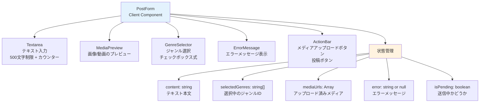
```mermaid
graph TD
    A[PostForm<br/>Client Component] --> B[Textarea<br/>テキスト入力<br/>500文字制限 + カウンター]
    A --> C[MediaPreview<br/>画像/動画のプレビュー]
    A --> D[GenreSelector<br/>ジャンル選択<br/>チェックボックス式]
    A --> E[ErrorMessage<br/>エラーメッセージ表示]
    A --> F[ActionBar<br/>メディアアップロードボタン<br/>投稿ボタン]

    A --> State[状態管理]
    State --> S1[content: string<br/>テキスト本文]
    State --> S2["selectedGenres: string[]<br/>選択中のジャンルID"]
    State --> S3[mediaUrls: Array<br/>アップロード済みメディア]
    State --> S4["error: string or null<br/>エラーメッセージ"]
    State --> S5[isPending: boolean<br/>送信中かどうか]

    style A fill:#e3f2fd
    style State fill:#fff3e0
```

```typescript
// components/post/PostForm.tsx
// 投稿フォームコンポーネント（Client Component）
'use client'

// React Hooksをインポート
import { useState, useRef } from 'react'
import { useRouter } from 'next/navigation'                    // ルーターフック（ページ遷移用）
import { createPost } from '@/lib/actions/post'                 // Server Action
import { Button } from '@/components/ui/button'                 // shadcn/ui ボタン
import { MentionTextarea } from '@/components/common/MentionTextarea' // メンション対応テキストエリア
import { Label } from '@/components/ui/label'                   // shadcn/ui ラベル
import { Checkbox } from '@/components/ui/checkbox'             // shadcn/ui チェックボックス
import { ImageIcon, VideoIcon, X } from 'lucide-react'         // アイコンライブラリ
import Image from 'next/image'                                  // Next.js 画像最適化コンポーネント

// ── 型定義 ───────────────────────────────
// Genre: ジャンルの型（サーバーから取得したデータの形）
interface Genre {
  id: string      // ジャンルID
  name: string    // ジャンル名（例: 「松柏類」）
  category: string // カテゴリ（例: 「盆栽」「一般」）
}

// PostFormProps: このコンポーネントが受け取るpropsの型
interface PostFormProps {
  genres: Genre[]       // 選択肢として表示するジャンル一覧
  quotePostId?: string  // 引用投稿の場合、引用元のID
}

// ── コンポーネント本体 ───────────────────────────
export function PostForm({ genres, quotePostId }: PostFormProps) {
  const router = useRouter()

  // ── 状態管理（useState） ──
  const [content, setContent] = useState('')                     // 投稿テキスト
  const [selectedGenres, setSelectedGenres] = useState<string[]>([]) // 選択中のジャンルID
  const [mediaUrls, setMediaUrls] = useState<Array<{ url: string; type: 'image' | 'video' }>>([]) // アップロード済みメディア
  const [error, setError] = useState<string | null>(null)        // エラーメッセージ
  const [isPending, setIsPending] = useState(false)              // 送信中かどうか

  // ── フォーム送信処理 ──
  const handleSubmit = async (e: React.FormEvent) => {
    e.preventDefault()   // フォームのデフォルト送信（ページリロード）を防止
    setError(null)       // 前回のエラーをクリア
    setIsPending(true)   // 送信中状態にする

    try {
      // FormData を組み立ててServer Actionに渡す
      const formData = new FormData()
      formData.append('content', content)
      selectedGenres.forEach((id) => formData.append('genreIds', id))
      mediaUrls.forEach((media) => {
        formData.append('mediaUrls', media.url)
        formData.append('mediaTypes', media.type)
      })

      // Server Action を呼び出し（サーバー側で実行される）
      const result = await createPost(formData)

      if (result.error) {
        // エラーが返ってきたらエラーメッセージを表示
        setError(result.error)
      } else {
        // 成功時はフォームをリセットしてフィードへ遷移
        setContent('')
        setSelectedGenres([])
        setMediaUrls([])
        router.push('/feed')    // フィードページへ遷移
        router.refresh()        // ページを再描画して新しい投稿を表示
      }
    } finally {
      setIsPending(false)    // 送信完了
    }
  }

  // ── ジャンル選択の切り替え処理 ──
  const handleGenreToggle = (genreId: string) => {
    setSelectedGenres((prev) => {
      if (prev.includes(genreId)) {
        // すでに選択済みのジャンルをクリック → 選択解除
        return prev.filter((id) => id !== genreId)
      } else {
        // 新しいジャンルを選択
        if (prev.length >= 3) {
          // 3つ以上は選択できないのでエラーを表示
          setError('ジャンルは3つまで選択できます')
          return prev  // 状態は変更しない
        }
        return [...prev, genreId]  // 配列の末尾に追加
      }
    })
  }

  // ── メディアアップロード処理 ──
  const handleMediaUpload = async (files: FileList | null) => {
    if (!files || files.length === 0) return  // ファイルが選択されなかった場合は何もしない

    // 画像アップロード処理（第11章で本格的に実装）
    // ここでは仮のプレビューURLを使用
    // URL.createObjectURL: ブラウザのメモリ上に一時的なURLを作成
    const newMedia = Array.from(files).map((file) => ({
      url: URL.createObjectURL(file),
      type: file.type.startsWith('video/') ? 'video' as const : 'image' as const,
    }))

    // 既存のメディアに追加し、最大4件に制限
    setMediaUrls((prev) => [...prev, ...newMedia].slice(0, 4))
  }

  // ── メディア削除処理 ──
  const removeMedia = (index: number) => {
    // 指定したインデックスのメディアを配列から除去
    setMediaUrls((prev) => prev.filter((_, i) => i !== index))
  }

  // ── バリデーション状態の計算 ──
  const contentLength = content.length                                    // 現在の文字数
  const isContentValid = contentLength > 0 && contentLength <= 500        // テキストが有効か
  const isGenresValid = selectedGenres.length >= 1 && selectedGenres.length <= 3 // ジャンルが有効か
  const isFormValid = isContentValid && isGenresValid                     // フォーム全体が有効か

  return (
    <form onSubmit={handleSubmit} className="space-y-4 bg-white p-4 rounded-lg border">
      {/* テキストエリア（メンション対応） */}
      <div>
        <MentionTextarea
          placeholder="今日の盆栽の様子は？"
          value={content}
          onChange={setContent}
          maxLength={500}
        />
        <div className="text-sm text-right mt-1">
          <span className={contentLength > 500 ? 'text-red-500' : 'text-gray-500'}>
            {contentLength} / 500
          </span>
        </div>
      </div>

      {/* メディアプレビュー */}
      {mediaUrls.length > 0 && (
        <div className="grid grid-cols-2 gap-2">
          {mediaUrls.map((media, index) => (
            <div key={index} className="relative aspect-square">
              {media.type === 'image' ? (
                <Image
                  src={media.url}
                  alt={`アップロード画像 ${index + 1}`}
                  fill
                  className="object-cover rounded-lg"
                />
              ) : (
                <video src={media.url} className="w-full h-full object-cover rounded-lg" />
              )}
              <button
                type="button"
                onClick={() => removeMedia(index)}
                className="absolute top-2 right-2 bg-black/50 text-white rounded-full p-1 hover:bg-black/70"
              >
                <X className="h-4 w-4" />
              </button>
            </div>
          ))}
        </div>
      )}

      {/* ジャンル選択 */}
      <div>
        <Label className="text-sm font-medium mb-2 block">
          ジャンル（1〜3つ選択）
        </Label>
        <div className="flex flex-wrap gap-2">
          {genres.map((genre) => (
            <label
              key={genre.id}
              className={`flex items-center space-x-2 px-3 py-2 rounded-full border cursor-pointer transition-colors ${
                selectedGenres.includes(genre.id)
                  ? 'bg-green-100 border-green-500'
                  : 'bg-white border-gray-300 hover:border-gray-400'
              }`}
            >
              <Checkbox
                checked={selectedGenres.includes(genre.id)}
                onCheckedChange={() => handleGenreToggle(genre.id)}
              />
              <span className="text-sm">{genre.name}</span>
            </label>
          ))}
        </div>
        {!isGenresValid && selectedGenres.length > 0 && (
          <p className="text-sm text-red-500 mt-1">ジャンルを1〜3つ選択してください</p>
        )}
      </div>

      {/* エラーメッセージ */}
      {error && (
        <div className="bg-red-50 border border-red-200 text-red-700 px-4 py-3 rounded">
          {error}
        </div>
      )}

      {/* アクションバー */}
      <div className="flex items-center justify-between pt-2 border-t">
        <div className="flex space-x-2">
          <label className="cursor-pointer">
            <input
              type="file"
              accept="image/*"
              multiple
              onChange={(e) => handleMediaUpload(e.target.files)}
              className="hidden"
            />
            <div className="flex items-center justify-center w-10 h-10 rounded-full hover:bg-gray-100 transition-colors">
              <ImageIcon className="h-5 w-5 text-gray-600" />
            </div>
          </label>
          <label className="cursor-pointer">
            <input
              type="file"
              accept="video/*"
              onChange={(e) => handleMediaUpload(e.target.files)}
              className="hidden"
            />
            <div className="flex items-center justify-center w-10 h-10 rounded-full hover:bg-gray-100 transition-colors">
              <VideoIcon className="h-5 w-5 text-gray-600" />
            </div>
          </label>
        </div>

        <Button
          type="submit"
          disabled={!isFormValid || isPending}
          className="bg-green-600 hover:bg-green-700"
        >
          {isPending ? '投稿中...' : '投稿'}
        </Button>
      </div>
    </form>
  )
}
```

> **送信中状態（`isPending`）の管理**
> `useState` で `isPending` を管理し、送信開始時に `true`、完了時に `false` に設定します。`isPending` が `true` の間はボタンを無効化して二重投稿を防ぎます。
>
> 実際のプロジェクトでは `MentionTextarea` コンポーネントを使用しており、`@` を入力するとユーザーのオートコンプリートが表示されます。これにより、正確なメンション（`<@userId>` 形式）を挿入できます。

<details>
<summary><strong>理解度チェック: 投稿フォーム</strong></summary>

**Q1: `e.preventDefault()` がないとどうなりますか？**

A1: HTMLフォームのデフォルト動作（ページ全体のリロードを伴うフォーム送信）が実行されます。Reactアプリでは、ページリロードなしにデータを送信したいので、デフォルト動作を防止します。

**Q2: `URL.createObjectURL(file)` は何をしていますか？**

A2: ブラウザのメモリ上にファイルの一時的なURLを作成します。このURLを使って、アップロード前に画像のプレビューを表示できます。実際のサーバーへのアップロードは第11章で実装します。

**Q3: なぜ `setMediaUrls((prev) => [...prev, ...newMedia].slice(0, 4))` と書くのですか？`setMediaUrls([...mediaUrls, ...newMedia])` ではダメですか？**

A3: `prev` を使う関数形式の更新は、常に最新の状態を参照できるため安全です。`mediaUrls` を直接参照すると、React の非同期レンダリングにより古い値を参照してしまう場合があります。また `.slice(0, 4)` で最大4件に制限しています。

</details>

### BON-LOGでの使用箇所

| ファイル | 役割 |
|---------|------|
| `components/post/PostForm.tsx` | タイムラインと投稿モーダルで使用されるメインの投稿フォーム |
| `components/post/PostFormModal.tsx` | フローティングボタンから開くモーダル型投稿フォーム |
| `app/(main)/feed/page.tsx` | フィードページに埋め込まれる投稿フォームの呼び出し元 |
| `components/common/MentionTextarea.tsx` | @メンションのオートコンプリート付きテキストエリア |

### 実装しない場合の影響

- ユーザーが投稿を作成するためのUIがなくなり、SNSの最も基本的な機能が失われる
- ジャンル選択UIがないと、投稿の分類・フィルタリングが機能しない
- メディアアップロードUIがないと、画像・動画付き投稿ができなくなる
- 文字数カウンターがないと、ユーザーが500文字制限を超えて投稿しようとしてサーバー側エラーが発生する

## 9.5 投稿カードコンポーネント

> **このセクションで学ぶこと**
> - Server Component として投稿カードを実装する理由
> - 条件付きレンダリング（リポスト表示、メディア表示）
> - `date-fns` による日時のフォーマット（「3時間前」表示）
> - レスポンシブなメディアグリッドレイアウト
> - アクションバー（いいね、コメント、ブックマーク、共有）の配置

投稿を表示するカードコンポーネントを実装します。このコンポーネントはSNSの「投稿1件分」の見た目を定義します。
> **画面表示**
> 
> （タイムライン上で投稿カードがプレビューされます。完成イメージは前セクションの`mockup_timeline.png`を参照してください）

> **PostCard は Client Component**
> 実際のプロジェクトでは、PostCard は `'use client'` を指定した Client Component として実装しています。いいねボタン、コメントボタン、ブックマークボタン、リポストボタンなど、多くのインタラクティブな操作を含むため、コンポーネント全体を Client Component にしています。`useState` でいいね状態やブックマーク状態を管理し、直接 Server Actions を呼び出す設計です。

```typescript
// components/post/PostCard.tsx
// 投稿カードコンポーネント（Client Component）
// 投稿1件分のUIを定義する
'use client'

import { useState } from 'react'
import Link from 'next/link'                  // Next.js リンク（クライアントサイドナビゲーション）
import Image from 'next/image'                // Next.js 画像最適化
import { formatDistanceToNow } from 'date-fns' // 日時を「3時間前」形式に変換するライブラリ
import { ja } from 'date-fns/locale'           // date-fnsの日本語ロケール
import { MessageCircle, Heart, Bookmark, Share2, MoreHorizontal } from 'lucide-react' // アイコン

// PostCardProps: このコンポーネントが受け取るpropsの型定義
// 投稿データの構造を正確に記述する
interface PostCardProps {
  post: {
    id: string                 // 投稿ID
    content: string | null     // 投稿本文（リポストの場合はnull）
    createdAt: Date            // 投稿日時
    user: {                    // 投稿者情報
      id: string
      nickname: string
      avatarUrl: string | null
    }
    media: Array<{             // 添付メディアの配列
      id: string
      url: string
      type: string             // "image" or "video"
      sortOrder: number        // 表示順
    }>
    genres: Array<{            // ジャンル情報の配列（中間テーブル経由）
      genre: {
        id: string
        name: string
        category: string
      }
    }>
    _count: {                  // リレーションの件数カウント
      likes: number            // いいね数
      comments: number         // コメント数
      bookmarks: number        // ブックマーク数
    }
    quotePost?: any            // 引用元の投稿（存在する場合のみ）
    repostPost?: any           // リポスト元の投稿（存在する場合のみ）
  }
  currentUserId?: string       // 現在ログインしているユーザーのID（メニュー表示判定用）
}

export function PostCard({ post, currentUserId }: PostCardProps) {
  // リポストかどうかを判定
  // repostPost が存在すれば、この投稿はリポストである
  const isRepost = !!post.repostPost

  // 表示する投稿を決定
  // リポストの場合: 元の投稿の内容を表示する
  // 通常投稿の場合: そのまま表示する
  const displayPost = isRepost ? post.repostPost : post

  return (
    <article className="bg-white border-b hover:bg-gray-50 transition-colors">
      <div className="p-4">
        {/* リポスト表示 */}
        {isRepost && (
          <div className="flex items-center text-sm text-gray-600 mb-2">
            <Share2 className="h-4 w-4 mr-2" />
            <Link href={`/users/${post.user.id}`} className="font-medium hover:underline">
              {post.user.nickname}
            </Link>
            <span className="ml-1">がリポストしました</span>
          </div>
        )}

        <div className="flex space-x-3">
          {/* アバター */}
          <Link href={`/users/${displayPost.user.id}`} className="flex-shrink-0">
            {displayPost.user.avatarUrl ? (
              <Image
                src={displayPost.user.avatarUrl}
                alt={displayPost.user.nickname}
                width={48}
                height={48}
                className="rounded-full"
              />
            ) : (
              <div className="w-12 h-12 bg-gray-300 rounded-full flex items-center justify-center">
                <span className="text-gray-600 font-bold">
                  {displayPost.user.nickname.charAt(0)}
                </span>
              </div>
            )}
          </Link>

          {/* コンテンツ */}
          <div className="flex-1 min-w-0">
            {/* ユーザー情報 */}
            <div className="flex items-center justify-between">
              <div className="flex items-center space-x-2">
                <Link
                  href={`/users/${displayPost.user.id}`}
                  className="font-bold hover:underline"
                >
                  {displayPost.user.nickname}
                </Link>
                <span className="text-gray-500 text-sm">
                  {formatDistanceToNow(new Date(displayPost.createdAt), {
                    addSuffix: true,
                    locale: ja,
                  })}
                </span>
              </div>
              {/* メニューボタン（削除・通報等）は自分の投稿にのみ表示 */}
              {currentUserId === displayPost.user.id && (
                <button className="flex items-center justify-center w-8 h-8 rounded-full hover:bg-gray-100">
                  <MoreHorizontal className="h-5 w-5 text-gray-500" />
                </button>
              )}
            </div>

            {/* 投稿本文 */}
            <Link href={`/posts/${displayPost.id}`}>
              {displayPost.content && (
                <p className="mt-2 text-gray-900 whitespace-pre-wrap break-words">
                  {displayPost.content}
                </p>
              )}

              {/* メディア表示 */}
              {displayPost.media.length > 0 && (
                <div
                  className={`mt-3 grid gap-2 rounded-xl overflow-hidden ${
                    displayPost.media.length === 1
                      ? 'grid-cols-1'
                      : displayPost.media.length === 2
                      ? 'grid-cols-2'
                      : displayPost.media.length === 3
                      ? 'grid-cols-2'
                      : 'grid-cols-2'
                  }`}
                >
                  {displayPost.media.map((media, index) => (
                    <div
                      key={media.id}
                      className={`relative ${
                        displayPost.media.length === 3 && index === 0
                          ? 'col-span-2'
                          : ''
                      } ${
                        displayPost.media.length === 1
                          ? 'aspect-video'
                          : 'aspect-square'
                      }`}
                    >
                      {media.type === 'image' ? (
                        <Image
                          src={media.url}
                          alt={`投稿画像 ${index + 1}`}
                          fill
                          className="object-cover"
                          sizes="(max-width: 768px) 100vw, 600px"
                        />
                      ) : (
                        <video
                          src={media.url}
                          controls
                          className="w-full h-full object-cover"
                        />
                      )}
                    </div>
                  ))}
                </div>
              )}

              {/* ジャンルタグ */}
              {displayPost.genres.length > 0 && (
                <div className="flex flex-wrap gap-2 mt-3">
                  {displayPost.genres.map(({ genre }) => (
                    <span
                      key={genre.id}
                      className="inline-flex items-center px-2.5 py-0.5 rounded-full text-xs font-medium bg-green-100 text-green-800"
                    >
                      {genre.name}
                    </span>
                  ))}
                </div>
              )}
            </Link>

            {/* アクションバー */}
            <div className="flex items-center justify-between mt-3 text-gray-500">
              <Link
                href={`/posts/${displayPost.id}`}
                className="flex items-center space-x-1 hover:text-blue-600 transition-colors"
              >
                <MessageCircle className="h-5 w-5" />
                <span className="text-sm">{displayPost._count.comments}</span>
              </Link>

              <LikeButton
                postId={displayPost.id}
                initialLikeCount={displayPost._count.likes}
                initialIsLiked={false} // TODO: 実際のいいね状態を取得
              />

              <BookmarkButton
                postId={displayPost.id}
                initialIsBookmarked={false} // TODO: 実際のブックマーク状態を取得
              />

              <button className="flex items-center space-x-1 hover:text-green-600 transition-colors">
                <Share2 className="h-5 w-5" />
              </button>
            </div>
          </div>
        </div>
      </div>
    </article>
  )
}
```

> **メディアグリッドレイアウトの仕組み**
> 添付画像の枚数によって、グリッドのレイアウトが変わります:
>
> | 画像枚数 | レイアウト | CSSクラス |
> |---------|-----------|----------|
> | 1枚 | 1列で大きく表示 | `grid-cols-1 aspect-video` |
> | 2枚 | 2列で並べて表示 | `grid-cols-2 aspect-square` |
> | 3枚 | 1枚目が2列幅 + 残り2枚が1列ずつ | `grid-cols-2` + `col-span-2`（1枚目のみ） |
> | 4枚 | 2x2のグリッド | `grid-cols-2 aspect-square` |

> **`formatDistanceToNow` について**
> `date-fns` ライブラリの関数で、指定した日時から現在までの経過時間を「3時間前」「2日前」のような人間が読みやすい形式に変換します。`locale: ja` を指定することで日本語表示になります。

<details>
<summary><strong>理解度チェック: 投稿カード</strong></summary>

**Q1: `displayPost` という変数を導入している理由は何ですか？**

A1: リポストと通常投稿で、表示するデータの取得元が異なるためです。リポストの場合は `post.repostPost`（元の投稿）の内容を表示し、通常投稿の場合は `post` そのものを表示します。`displayPost` に統一することで、以降のコードで条件分岐を減らし、シンプルに書けます。

**Q2: `currentUserId === displayPost.user.id` のチェックは何のためですか？**

A2: 自分の投稿にだけ「メニュー（...）」ボタンを表示するためです。他人の投稿に削除メニューが表示されると混乱しますし、セキュリティ上も好ましくありません。

**Q3: なぜ `LikeButton` と `BookmarkButton` は別コンポーネントとして分離しているのですか？**

A3: これらはクリック時の状態変化（いいね済み/未済の切り替え）があるため、Client Componentにする必要があります。PostCard全体をClient Componentにするのではなく、インタラクティブな部分だけを分離することで、パフォーマンスが向上します。

</details>

### BON-LOGでの使用箇所

| ファイル | 役割 |
|---------|------|
| `components/post/PostCard.tsx` | タイムライン・投稿詳細・プロフィールページで使用される投稿カードUI |
| `components/feed/Timeline.tsx` | タイムライン全体のリスト表示（PostCardを繰り返し使用） |
| `app/(main)/posts/[id]/page.tsx` | 投稿詳細ページでの単一PostCard表示 |
| `app/(main)/users/[id]/page.tsx` | ユーザープロフィールページでの投稿一覧表示 |

### 実装しない場合の影響

- タイムラインに投稿が表示されなくなり、SNSのコアな体験が失われる
- リポスト表示ロジックがないと、リポストが通常投稿と区別できず意図しない内容が表示される
- メディアグリッドがないと、画像・動画付き投稿で画像が表示されない
- アクションバー（いいね・コメント・ブックマーク・リポスト）がないと、投稿へのインタラクションができなくなる

## 9.6 タイムライン（フィード）の実装

> **このセクションで学ぶこと**
> - Server Component としてフィードページを実装する方法
> - `Promise.all` による並列データフェッチの重要性
> - カーソルベースのページネーション（無限スクロールの基盤）
> - React `cache` によるリクエスト内のデータ重複取得防止
> - フォローしているユーザーの投稿を取得するクエリの書き方

フィードページをServer Componentとして実装します。フィードとは、SNSの「タイムライン」のことです。自分の投稿と、フォローしているユーザーの投稿が時系列で表示されます。

> **画面表示**
> 
> 
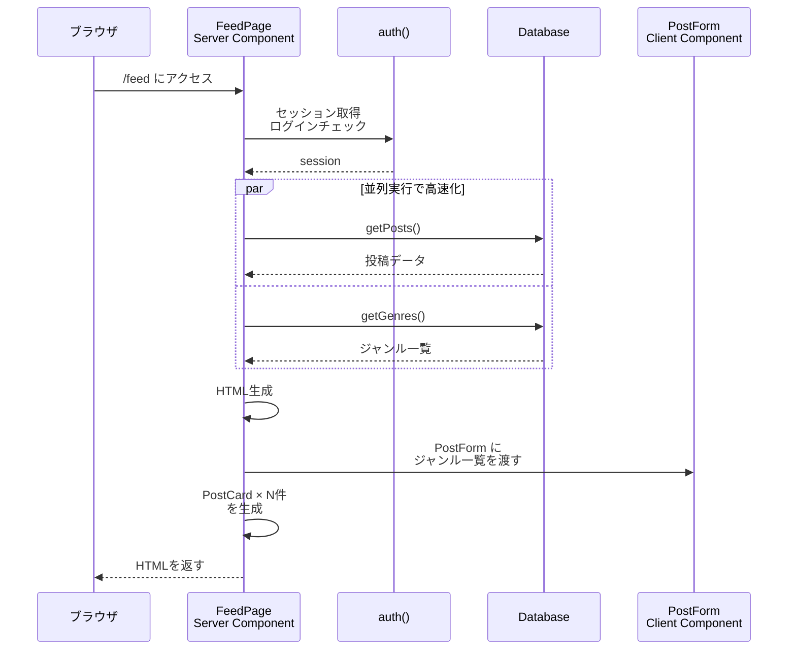
```mermaid
sequenceDiagram
    participant Browser as ブラウザ
    participant FeedPage as FeedPage<br/>Server Component
    participant Auth as auth()
    participant DB as Database
    participant Client as PostForm<br/>Client Component

    Browser->>FeedPage: /feed にアクセス
    FeedPage->>Auth: セッション取得<br/>ログインチェック
    Auth-->>FeedPage: session

    par 並列実行で高速化
        FeedPage->>DB: getPosts()
        DB-->>FeedPage: 投稿データ
    and
        FeedPage->>DB: getGenres()
        DB-->>FeedPage: ジャンル一覧
    end

    FeedPage->>FeedPage: HTML生成
    FeedPage->>Client: PostForm に<br/>ジャンル一覧を渡す
    FeedPage->>FeedPage: PostCard × N件<br/>を生成
    FeedPage-->>Browser: HTMLを返す
```

```typescript
// app/(main)/feed/page.tsx
// タイムライン（フィード）ページ - Server Component
import { Suspense } from 'react'
import { auth } from '@/lib/auth'

// タイムラインコンポーネント（無限スクロール対応）
import { Timeline } from '@/components/feed/Timeline'
// タイムラインスケルトン（Suspenseフォールバック用）
import { TimelineSkeleton } from '@/components/feed/TimelineSkeleton'
// 投稿作成ボタン（即座に表示）
import { ComposeButton } from '@/components/feed/ComposeButton'

// Server Actions
import { getGenres } from '@/lib/actions/post'      // ジャンル一覧取得
import { getTimeline } from '@/lib/actions/feed'     // タイムライン取得
import { getDraftCount } from '@/lib/actions/draft'  // 下書き件数取得

// 会員プラン別の制限値取得関数
import { getMembershipLimits } from '@/lib/premium'

// タイムラインセクション（Suspense内で使用）
async function TimelineSection({ currentUserId }: { currentUserId?: string }) {
  const timelineResult = await getTimeline()
  const posts = timelineResult.posts || []
  return <Timeline initialPosts={posts} currentUserId={currentUserId} />
}

export default async function FeedPage() {
  const session = await auth()

  // 投稿ボタンに必要なデータを並列取得（比較的高速）
  // Promise.all を使うと、複数の非同期処理を「同時に」実行できる
  const [genresResult, limits, draftCount] = await Promise.all([
    getGenres(),
    session?.user?.id
      ? getMembershipLimits(session.user.id)
      : Promise.resolve({ maxPostLength: 500, maxImages: 4, maxVideos: 0 }),
    getDraftCount(),
  ])

  const genres = genresResult.genres || {}

  return (
    <div className="relative min-h-screen">
      {/* タイムラインセクション */}
      <div>
        <h2 className="text-lg font-bold mb-4">タイムライン</h2>

        {/* Suspense境界: タイムラインをストリーミングで読み込み */}
        <Suspense fallback={<TimelineSkeleton />}>
          <TimelineSection currentUserId={session?.user?.id} />
        </Suspense>
      </div>

      {/* 投稿作成ボタン（即座に表示） */}
      <ComposeButton genres={genres} limits={limits} draftCount={draftCount} />
    </div>
  )
}
```

> **Suspense を使ったストリーミングレンダリング**
> タイムラインのデータ取得には時間がかかることがあります。`<Suspense>` でラップすることで、投稿ボタンなどのUI要素は即座に表示し、タイムラインデータの読み込み中はスケルトン（仮の表示）を見せます。データ取得が完了するとスケルトンが実際のタイムラインに差し替わります。

投稿取得のクエリ関数は `lib/actions/post.ts` に定義されています。Server Actions と同じファイルに配置することで、投稿に関する処理を一箇所にまとめています。

```typescript
// lib/actions/post.ts（getPosts 関数の部分）
import { prisma } from '@/lib/db'

export async function getPosts({
  userId,
  type = 'timeline',
  cursor,
  limit = 20,
}: {
  userId: string
  type?: 'timeline' | 'user' | 'all'
  cursor?: string
  limit?: number
}) {
    const where = (() => {
      switch (type) {
        case 'user':
          return { userId }
        case 'timeline':
          // フォローしているユーザー + 自分の投稿
          return {
            OR: [
              { userId },
              {
                user: {
                  followers: {
                    some: { followerId: userId },
                  },
                },
              },
            ],
          }
        case 'all':
        default:
          return {}
      }
    })()

    const posts = await prisma.post.findMany({
      where,
      take: limit,
      ...(cursor && {
        cursor: { id: cursor },
        skip: 1,
      }),
      orderBy: { createdAt: 'desc' },
      include: {
        user: {
          select: {
            id: true,
            nickname: true,
            avatarUrl: true,
          },
        },
        media: {
          orderBy: { sortOrder: 'asc' },
        },
        genres: {
          include: {
            genre: true,
          },
        },
        quotePost: {
          include: {
            user: {
              select: {
                id: true,
                nickname: true,
                avatarUrl: true,
              },
            },
          },
        },
        repostPost: {
          include: {
            user: {
              select: {
                id: true,
                nickname: true,
                avatarUrl: true,
              },
            },
            media: {
              orderBy: { sortOrder: 'asc' },
            },
            genres: {
              include: {
                genre: true,
              },
            },
          },
        },
        _count: {
          select: {
            likes: true,
            comments: true,
            bookmarks: true,
          },
        },
      },
    })

    return posts
}

export async function getPost(postId: string) {
  const post = await prisma.post.findUnique({
    where: { id: postId },
    include: {
      user: {
        select: {
          id: true,
          nickname: true,
          avatarUrl: true,
          bio: true,
        },
      },
      media: {
        orderBy: { sortOrder: 'asc' },
      },
      genres: {
        include: {
          genre: true,
        },
      },
      quotePost: {
        include: {
          user: {
            select: {
              id: true,
              nickname: true,
              avatarUrl: true,
            },
          },
        },
      },
      _count: {
        select: {
          likes: true,
          comments: true,
          bookmarks: true,
          repostedBy: true,
        },
      },
    },
  })

  return post
}
```

### BON-LOGでの使用箇所

| ファイル | 役割 |
|---------|------|
| `app/(main)/feed/page.tsx` | タイムラインページのServer Component（getTimeline・getGenres並列取得） |
| `components/feed/Timeline.tsx` | 無限スクロール対応のタイムライン表示（React Query useInfiniteQuery） |
| `components/feed/TimelineSkeleton.tsx` | タイムライン読み込み中のスケルトンUI（Suspenseフォールバック） |
| `components/feed/ComposeButton.tsx` | フィードページのフローティング投稿ボタン |
| `lib/actions/post.ts` | getPosts・getPost クエリ関数 |

### 実装しない場合の影響

- フィードページが存在しないと、ユーザーが他の人の投稿を閲覧する手段がなくなる
- カーソルベースのページネーションがないと、タイムライン更新中に投稿の重複・欠落が発生する
- Suspenseによるストリーミングがないと、重いデータ取得中にページ全体が白くなり、UXが低下する
- `Promise.all` による並列取得がないと、ページ表示が直列処理になりロード時間が増加する

---

## 技術選定の深掘り: ページネーションとデータフェッチング

ここまでで投稿の作成・表示・タイムラインの基本実装を学びました。ここで一度立ち止まり、「なぜこの技術を選んだのか？」を深掘りします。技術選定の理由を理解することで、将来自分でアーキテクチャを設計する際の判断力が身につきます。

### ページネーションの選択肢

タイムラインのように大量のデータを分割して表示する場合、ページネーションの方式を選ぶ必要があります。主要な方式を比較してみましょう。


```mermaid
graph TD
    subgraph オフセットベース
        A1[SELECT * FROM posts<br/>ORDER BY created_at DESC<br/>OFFSET 20 LIMIT 20]
        A2[20番目から20件取得<br/>数値で位置指定]
        A3[❌ データの追加・削除で<br/>位置がズレる]
        A4[例: 2ページ目表示中に<br/>新しい投稿が追加されると<br/>1ページ目の投稿が<br/>2ページ目にも表示される]
        A1 --> A2 --> A3 --> A4
    end

    subgraph カーソルベース BON-LOG採用
        B1[SELECT * FROM posts<br/>WHERE id < 'cursor_id'<br/>ORDER BY created_at DESC<br/>LIMIT 20]
        B2[この投稿より前の20件<br/>データ基準で指定]
        B3[✅ データの追加・削除の<br/>影響を受けない]
        B1 --> B2 --> B3
    end

    subgraph キーセットページネーション
        C1[SELECT * FROM posts<br/>WHERE created_at, id <<br/>'2024-01-01', 'xxx'<br/>ORDER BY created_at DESC, id DESC<br/>LIMIT 20]
        C2[カーソルベースの発展形<br/>複合キーで並び順を保証]
        C3[より厳密だが実装が複雑]
        C1 --> C2 --> C3
    end

    style A3 fill:#ffcdd2
    style B3 fill:#c8e6c9
```

| 方式 | メリット | デメリット | 適した場面 |
|------|---------|-----------|-----------|
| **オフセットベース** | 実装が簡単。「全Xページ中Y番目」の表示が容易 | データの追加・削除で表示ズレが発生。大きなOFFSETでパフォーマンスが低下 | 変更が少ない管理画面、検索結果一覧 |
| **カーソルベース** | 追加・削除に強い。パフォーマンスが安定 | 「全X件中Y件目」のような表示が困難。前のページに戻りにくい | SNSタイムライン、チャット、リアルタイムフィード |
| **キーセットページネーション** | カーソルベースの利点 + 並び順の厳密性 | 実装が複雑。複合インデックスの設計が必要 | 大規模データの分析、ログ表示 |

**BON-LOGでカーソルベースを選んだ理由:**

1. **リアルタイムフィードとの相性**: SNSのタイムラインは常に新しい投稿が追加されます。オフセット方式では「2ページ目を見ている間に新しい投稿が追加されると、1ページ目にあった投稿がまた2ページ目に出現する」問題が起きます。カーソル方式なら「この投稿より前のデータ」という指定なので、追加の影響を受けません。

2. **パフォーマンスの安定性**: オフセット方式では `OFFSET 10000` のように大きな値を指定すると、データベースは10000件のデータを読み飛ばす必要があり、パフォーマンスが低下します。カーソル方式では常にインデックスを使って効率的に検索できます。

3. **無限スクロールとの相性**: 無限スクロールでは「次のデータ」を繰り返し取得します。カーソル方式なら「最後に取得した投稿のID」をカーソルとして渡すだけで次のデータが取得でき、実装がシンプルです。

> **初心者向けたとえ: オフセットとカーソルの違い**
> 図書館の本棚を想像してください。
> - **オフセット方式**: 「棚の左から50番目から10冊取ってきて」→ 途中で新しい本が棚に追加されると、数え直しが必要
> - **カーソル方式**: 「『吾輩は猫である』より右にある10冊を取ってきて」→ 本が追加・削除されても、基準の本が変わらないので正確

### データフェッチングの選択肢

クライアントサイドでデータを取得・管理する方法にも複数の選択肢があります。

| 方式 | ライブラリ/方法 | メリット | デメリット |
|------|---------------|---------|-----------|
| **React Query (`useInfiniteQuery`)** | `@tanstack/react-query` | キャッシュ管理、楽観的更新、devtools、リトライ、バックグラウンド再取得 | ライブラリの学習コスト |
| **SWR (`useSWRInfinite`)** | `swr` | 軽量、Next.jsとの統合が容易、stale-while-revalidate戦略 | 楽観的更新の実装がやや複雑 |
| **useEffect + fetch** | React組み込み | 依存ライブラリなし。仕組みが理解しやすい | キャッシュ管理・ローディング状態・エラーハンドリングを自前で実装する必要がある |
| **Server Components** | Next.js組み込み | サーバーサイドで完結。バンドルサイズに影響なし | 無限スクロールのようなクライアントインタラクションには不向き |

**BON-LOGでReact Query（`@tanstack/react-query`）を選んだ理由:**

1. **強力なキャッシュ管理**: React Queryはデータをキャッシュし、必要に応じてバックグラウンドで再取得します。同じデータを複数のコンポーネントで使う場合、重複リクエストが自動的に排除されます。

2. **楽観的更新のサポート**: 「いいね」ボタンのように即座にUIを更新したい操作に対して、`onMutate` / `onError` / `onSettled` の3段階で楽観的更新を簡潔に実装できます。

3. **`useInfiniteQuery` の存在**: 無限スクロールに特化したフックが組み込みで提供されており、ページネーションのデータ管理（`pages` 配列、`getNextPageParam`、`fetchNextPage`）が宣言的に記述できます。

4. **DevTools**: `@tanstack/react-query-devtools` を導入すると、ブラウザ上でキャッシュの状態やクエリの状態をリアルタイムで確認でき、デバッグが容易です。

5. **SWRとの比較**: SWRも優れたライブラリですが、楽観的更新の実装パターンがReact Queryの方がより直感的で、ドキュメントも充実しています。BON-LOGのように「いいね」「ブックマーク」「リポスト」など多くの楽観的更新が必要な場面では、React Queryの方が開発効率が高いと判断しました。

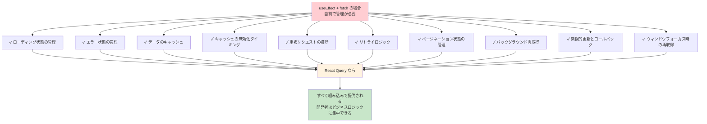
```mermaid
graph TD
    A[useEffect + fetch の場合<br/>自前で管理が必要] --> B1[✓ ローディング状態の管理]
    A --> B2[✓ エラー状態の管理]
    A --> B3[✓ データのキャッシュ]
    A --> B4[✓ キャッシュの無効化タイミング]
    A --> B5[✓ 重複リクエストの排除]
    A --> B6[✓ リトライロジック]
    A --> B7[✓ ページネーション状態の管理]
    A --> B8[✓ バックグラウンド再取得]
    A --> B9[✓ 楽観的更新とロールバック]
    A --> B10[✓ ウィンドウフォーカス時の再取得]

    B1 & B2 & B3 & B4 & B5 & B6 & B7 & B8 & B9 & B10 --> C[React Query なら]

    C --> D[すべて組み込みで提供される!<br/>開発者はビジネスロジックに集中できる]

    style A fill:#ffcdd2
    style C fill:#fff3e0
    style D fill:#c8e6c9
```

---

## 9.6A 引用投稿とリポスト

引用投稿とリポストの機能は、実際のプロジェクトでは `PostCard` コンポーネント内にインラインで実装されています。ここでは、引用投稿ボタンとリポストボタンの実装例を示します。

> **注意**: 以下は実装パターンの例です。実際のプロジェクトでは `PostCard.tsx` 内で直接 Server Actions を呼び出す形で実装されています。

```typescript
// 引用投稿ボタンの実装例
// Dialog（モーダル）を開いて、引用コメントを入力させる
'use client'

import { useState } from 'react'
import { MessageSquareQuote } from 'lucide-react'
import {
  Dialog,
  DialogContent,
  DialogHeader,
  DialogTitle,
  DialogTrigger,
} from '@/components/ui/dialog'

function QuotePostButton({ postId, genres }: { postId: string; genres: Array<{ id: string; name: string }> }) {
  const [open, setOpen] = useState(false)

  return (
    <Dialog open={open} onOpenChange={setOpen}>
      <DialogTrigger asChild>
        <button className="flex items-center space-x-1 hover:text-green-600 transition-colors">
          <MessageSquareQuote className="h-5 w-5" />
        </button>
      </DialogTrigger>
      <DialogContent className="max-w-2xl">
        <DialogHeader>
          <DialogTitle>引用投稿</DialogTitle>
        </DialogHeader>
        {/* PostForm に quotePostId を渡すことで引用投稿モードになる */}
        <PostForm genres={genres} quotePostId={postId} />
      </DialogContent>
    </Dialog>
  )
}
```

リポストボタンの実装例です。`createRepost` はトグル方式（リポスト済みなら解除、未リポストなら作成）で動作します。

```typescript
// リポストボタンの実装例（トグル方式）
'use client'

import { useState } from 'react'
import { Share2 } from 'lucide-react'
import { createRepost } from '@/lib/actions/post'

function RepostButton({ postId, initialReposted, initialRepostCount }: {
  postId: string
  initialReposted: boolean
  initialRepostCount: number
}) {
  const [reposted, setReposted] = useState(initialReposted)
  const [count, setCount] = useState(initialRepostCount)
  const [isPending, setIsPending] = useState(false)

  const handleRepost = async () => {
    setIsPending(true)
    try {
      const result = await createRepost(postId)
      if (result.success) {
        // result.reposted が true なら新規リポスト、false ならリポスト解除
        setReposted(result.reposted)
        setCount((prev) => result.reposted ? prev + 1 : prev - 1)
      }
    } finally {
      setIsPending(false)
    }
  }

  return (
    <button
      onClick={handleRepost}
      disabled={isPending}
      className={`flex items-center space-x-1 transition-colors disabled:opacity-50 ${
        reposted ? 'text-green-600' : 'hover:text-green-600'
      }`}
    >
      <Share2 className="h-5 w-5" />
      <span className="text-sm">{count}</span>
    </button>
  )
}
```

## 9.6B 下書き機能（概要）

下書きを保存・読み込む機能を実装します。下書きのメディアとジャンルは `DraftPostMedia` と `DraftPostGenre` テーブルで管理します（JSON形式ではなく、正規化されたリレーション）。

```typescript
// lib/actions/draft.ts
'use server'

import { auth } from '@/lib/auth'
import { prisma } from '@/lib/db'

export async function saveDraft(data: {
  id?: string           // あれば更新、なければ新規作成
  content?: string
  mediaUrls?: string[]
  genreIds?: string[]
}) {
  const session = await auth()
  if (!session?.user?.id) {
    return { error: '認証が必要です' }
  }

  try {
    if (data.id) {
      // 既存の下書きを更新（メディアとジャンルは削除して再作成）
      await prisma.$transaction([
        prisma.draftPostMedia.deleteMany({ where: { draftPostId: data.id } }),
        prisma.draftPostGenre.deleteMany({ where: { draftPostId: data.id } }),
      ])

      const draft = await prisma.draftPost.update({
        where: { id: data.id },
        data: {
          content: data.content,
          media: data.mediaUrls?.length ? {
            create: data.mediaUrls.map((url, index) => ({
              url, type: 'image', sortOrder: index,
            })),
          } : undefined,
          genres: data.genreIds?.length ? {
            create: data.genreIds.map((genreId) => ({ genreId })),
          } : undefined,
        },
      })
      return { draft }
    }

    // 新規下書き作成
    const draft = await prisma.draftPost.create({
      data: {
        userId: session.user.id,
        content: data.content,
        media: data.mediaUrls?.length ? {
          create: data.mediaUrls.map((url, index) => ({
            url, type: 'image', sortOrder: index,
          })),
        } : undefined,
        genres: data.genreIds?.length ? {
          create: data.genreIds.map((genreId) => ({ genreId })),
        } : undefined,
      },
    })

    return { draft }
  } catch (error) {
    console.error('下書き保存エラー:', error)
    return { error: '下書きの保存に失敗しました' }
  }
}

export async function getDrafts() {
  const session = await auth()
  if (!session?.user?.id) {
    return { error: '認証が必要です' }
  }

  try {
    const drafts = await prisma.draftPost.findMany({
      where: { userId: session.user.id },
      include: {
        media: { orderBy: { sortOrder: 'asc' } },
        genres: { include: { genre: true } },
      },
      orderBy: { updatedAt: 'desc' },
    })

    return { drafts }
  } catch (error) {
    console.error('下書き取得エラー:', error)
    return { error: '下書きの取得に失敗しました' }
  }
}

export async function deleteDraft(draftId: string) {
  const session = await auth()
  if (!session?.user?.id) {
    return { error: '認証が必要です' }
  }

  try {
    const draft = await prisma.draftPost.findUnique({
      where: { id: draftId },
      select: { userId: true },
    })

    if (!draft) {
      return { error: '下書きが見つかりません' }
    }

    if (draft.userId !== session.user.id) {
      return { error: '削除権限がありません' }
    }

    await prisma.draftPost.delete({
      where: { id: draftId },
    })

    return { success: true }
  } catch (error) {
    console.error('下書き削除エラー:', error)
    return { error: '下書きの削除に失敗しました' }
  }
}
```

## 9.6C 投稿の削除

投稿の削除機能は、実際のプロジェクトでは `PostCard.tsx` コンポーネント内に実装されています。ここでは、投稿メニュー（削除確認ダイアログ付き）の実装パターンを示します。

> **注意**: 以下は実装パターンの例です。実際のプロジェクトでは `PostCard.tsx` 内で直接実装されています。

```typescript
// 投稿メニューの実装例
// DropdownMenu + AlertDialog で削除確認を行う
'use client'

import { useState } from 'react'
import { MoreHorizontal, Trash2 } from 'lucide-react'
import { deletePost } from '@/lib/actions/post'
import { useRouter } from 'next/navigation'
import {
  DropdownMenu,
  DropdownMenuContent,
  DropdownMenuItem,
  DropdownMenuTrigger,
} from '@/components/ui/dropdown-menu'
import {
  AlertDialog,
  AlertDialogAction,
  AlertDialogCancel,
  AlertDialogContent,
  AlertDialogDescription,
  AlertDialogFooter,
  AlertDialogHeader,
  AlertDialogTitle,
} from '@/components/ui/alert-dialog'

function PostMenu({ postId }: { postId: string }) {
  const router = useRouter()
  const [isPending, setIsPending] = useState(false)
  const [showDeleteDialog, setShowDeleteDialog] = useState(false)

  const handleDelete = async () => {
    setIsPending(true)
    try {
      const result = await deletePost(postId)
      if (result.success) {
        router.refresh()
      }
    } finally {
      setIsPending(false)
    }
  }

  return (
    <>
      <DropdownMenu>
        <DropdownMenuTrigger asChild>
          <button className="flex items-center justify-center w-8 h-8 rounded-full hover:bg-gray-100">
            <MoreHorizontal className="h-5 w-5 text-gray-500" />
          </button>
        </DropdownMenuTrigger>
        <DropdownMenuContent align="end">
          <DropdownMenuItem
            onClick={() => setShowDeleteDialog(true)}
            className="text-red-600"
          >
            <Trash2 className="h-4 w-4 mr-2" />
            削除
          </DropdownMenuItem>
        </DropdownMenuContent>
      </DropdownMenu>

      <AlertDialog open={showDeleteDialog} onOpenChange={setShowDeleteDialog}>
        <AlertDialogContent>
          <AlertDialogHeader>
            <AlertDialogTitle>投稿を削除しますか？</AlertDialogTitle>
            <AlertDialogDescription>
              この操作は取り消せません。投稿に付けられたいいねやコメントも削除されます。
            </AlertDialogDescription>
          </AlertDialogHeader>
          <AlertDialogFooter>
            <AlertDialogCancel>キャンセル</AlertDialogCancel>
            <AlertDialogAction
              onClick={handleDelete}
              disabled={isPending}
              className="bg-red-600 hover:bg-red-700"
            >
              {isPending ? '削除中...' : '削除'}
            </AlertDialogAction>
          </AlertDialogFooter>
        </AlertDialogContent>
      </AlertDialog>
    </>
  )
}
```

## 技術選定の深掘り: リッチテキストの表現方式

メンションやハッシュタグを含む投稿テキストの処理方法にも、いくつかの選択肢があります。次のセクション（9.7、9.8）に入る前に、なぜBON-LOGが「プレーンテキスト + パース方式」を採用しているのかを理解しておきましょう。

### テキスト表現の選択肢

| 方式 | 概要 | メリット | デメリット |
|------|------|---------|-----------|
| **プレーンテキスト + パース方式**（BON-LOG採用） | テキストをそのまま保存し、表示時に正規表現でメンション・ハッシュタグを検出してリンクに変換 | シンプル。DBには普通の文字列を保存するだけ。パフォーマンスが良い | 複雑な装飾（太字、リスト等）には対応しにくい |
| **Markdown** | テキストをMarkdown形式で保存し、表示時にHTMLに変換 | 太字・リスト・リンクなどの装飾が可能。開発者に馴染み深い | SNSの短文投稿には過剰。学習コストがユーザーにかかる |
| **TipTap** | ProseMirrorベースのリッチテキストエディタ | WYSIWYG（見たまま編集）。メンションのプラグインが用意されている | バンドルサイズが大きい（100KB以上）。設定が複雑 |
| **Slate.js** | Reactベースのリッチテキストエディタフレームワーク | 高いカスタマイズ性。Reactとの相性が良い | 学習コストが高い。APIが頻繁に変わる |
| **Draft.js** | Facebook製のリッチテキストエディタ | 大規模な実績。プラグインエコシステム | メンテナンスが停滞気味。バンドルサイズが大きい |

**BON-LOGで「プレーンテキスト + パース方式」を選んだ理由:**

1. **SNSの簡潔さ**: BON-LOGは500文字以内の短文投稿がメインです。太字やリストなどの装飾は不要で、メンション（`@ユーザー`）とハッシュタグ（`#タグ`）さえ対応すれば十分です。

2. **パフォーマンス**: TipTapやSlate.jsのようなリッチテキストエディタはバンドルサイズが大きく（100KB～300KB）、モバイル環境での読み込みに影響します。プレーンテキスト + 正規表現なら追加のバンドルサイズはほぼゼロです。

3. **データの汎用性**: データベースにはプレーンテキスト（`<@userId>` 形式のメンションを含む）を保存するため、将来エディタを変更しても既存データに影響しません。リッチテキストエディタ固有のJSON形式で保存すると、エディタの乗り換えが困難になります。

4. **X（旧Twitter）と同じアプローチ**: X、Instagram、Threadsなどの主要SNSもプレーンテキスト + パース方式を採用しています。SNSの短文投稿においては、このアプローチが最も実績があります。

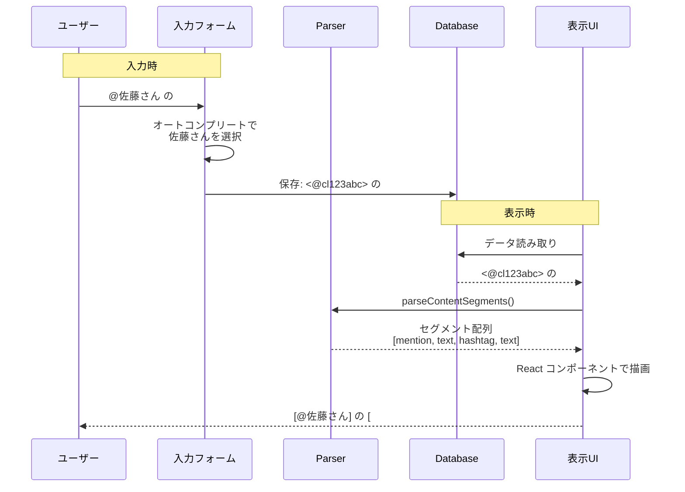
```mermaid
sequenceDiagram
    participant User as ユーザー
    participant Form as 入力フォーム
    participant Parser as Parser
    participant DB as Database
    participant UI as 表示UI

    Note over User,Form: 入力時
    User->>Form: @佐藤さん の #五葉松 が美しい
    Form->>Form: オートコンプリートで<br/>佐藤さんを選択
    Form->>DB: 保存: <@cl123abc> の #五葉松 が美しい

    Note over DB,UI: 表示時
    UI->>DB: データ読み取り
    DB-->>UI: <@cl123abc> の #五葉松 が美しい
    UI->>Parser: parseContentSegments()
    Parser-->>UI: セグメント配列<br/>[mention, text, hashtag, text]
    UI->>UI: React コンポーネントで描画
    UI-->>User: [@佐藤さん] の [#五葉松] が美しい<br/>リンク付き表示
```

---

## 9.7 メンション機能

> **このセクションで学ぶこと**
> - メンション（`@ユーザー名`）の仕組みと保存形式
> - `lib/mention-utils.ts` のユーティリティ関数群
> - テキストをセグメント（テキスト/メンション/ハッシュタグ）に分割する方法
> - オートコンプリートでのメンション挿入

### メンションとは

メンション（Mention）とは、投稿の中で他のユーザーを `@ニックネーム` の形式で言及する機能です。日常生活でいえば、「Aさんに宛てた手紙を掲示板に貼る」ようなイメージです。メンションされたユーザーには通知が届き、会話の文脈を把握しやすくなります。

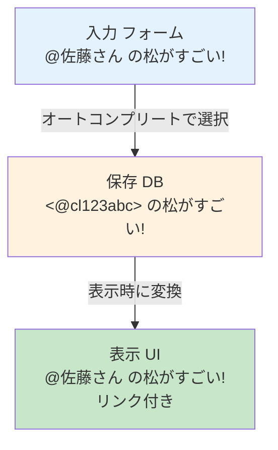
```mermaid
flowchart TD
    A[入力 フォーム<br/>@佐藤さん の松がすごい!] -->|オートコンプリートで選択| B[保存 DB<br/>&lt;@cl123abc&gt; の松がすごい!]
    B -->|表示時に変換| C[表示 UI<br/>@佐藤さん の松がすごい!<br/>リンク付き]

    style A fill:#e3f2fd
    style B fill:#fff3e0
    style C fill:#c8e6c9
```

### 保存形式と表示形式

BON-LOGでは、メンションを2つの形式で管理します。

| 形式 | 例 | 用途 |
|------|-----|------|
| **保存形式** | `<@cl123abc>` | データベースに保存。ユーザーIDで一意に特定 |
| **表示形式** | `@佐藤さん` | UIに表示。ニックネーム付きのリンク |

なぜユーザーIDで保存するのでしょうか？ ニックネームは変更される可能性がありますが、IDは不変です。ID形式で保存することで、ユーザーがニックネームを変更しても正しいリンクを維持できます。

### 型定義と正規表現

> **正規表現（RegExp）とは？（初心者向け解説）**
> 正規表現とは、文字列の「パターン」を記述するための特殊な記法です。例えば「`@` で始まり、その後に英数字が1文字以上続く部分」を探したいとき、通常のプログラムでは複数行のコードが必要ですが、正規表現なら `/@[a-zA-Z0-9]+/` の1行で表現できます。
>
> 正規表現の基本的な記号:
>
> | 記号 | 意味 | 例 |
> |------|------|-----|
> | `.` | 任意の1文字 | `a.c` → "abc", "a1c" にマッチ |
> | `+` | 直前の文字が1回以上 | `a+` → "a", "aa", "aaa" にマッチ |
> | `*` | 直前の文字が0回以上 | `a*` → "", "a", "aa" にマッチ |
> | `?` | 直前の文字が0回か1回 | `a?` → "", "a" にマッチ |
> | `[abc]` | a, b, c のいずれか1文字 | `[aeiou]` → 母音にマッチ |
> | `[a-z]` | a から z までの範囲 | `[0-9]` → 数字にマッチ |
> | `(...)` | グループ化（マッチ部分を抽出） | `<@([a-z]+)>` → `<@abc>` の "abc" を抽出 |
> | `g` フラグ | 文字列全体を検索（グローバル） | `/pattern/g` → すべてのマッチを返す |
>
> メンションの正規表現 `/<@([a-zA-Z0-9_-]+)>/g` を分解すると:
> - `<@` → 文字通り `<@` にマッチ
> - `([a-zA-Z0-9_-]+)` → 英大文字、英小文字、数字、アンダースコア、ハイフンが1文字以上（グループとして抽出）
> - `>` → 文字通り `>` にマッチ
> - `g` → 文字列全体から全てのマッチを探す
>
> つまり、`<@cl123abc>` のような形式を見つけ、中の `cl123abc` 部分を取り出します。

`lib/mention-utils.ts` に定義されている型と正規表現を見てみましょう。

```typescript
// lib/mention-utils.ts

/**
 * コンテンツセグメントの型
 * テキストを解析して得られるセグメントの型。
 * テキスト、メンション、ハッシュタグの3種類がある。
 */
export type ContentSegment =
  | { type: 'text'; content: string }
  | { type: 'mention'; userId: string }
  | { type: 'hashtag'; tag: string }

/**
 * メンションユーザー情報の型
 * メンションを表示する際に必要なユーザー情報。
 */
export type MentionUser = {
  id: string
  nickname: string
  avatarUrl: string | null
}

/**
 * メンションID形式を抽出する正規表現
 * <@userId> 形式にマッチする。
 * グループ1: ユーザーID部分（<@と>を除く）
 */
export const MENTION_ID_REGEX = /<@([a-zA-Z0-9_-]+)>/g

/**
 * ハッシュタグを抽出する正規表現
 * 英数字、アンダースコア、ひらがな、カタカナ、漢字に対応
 */
export const HASHTAG_REGEX = /#[\w\u3040-\u309F\u30A0-\u30FF\u4E00-\u9FAF]+/g
```

> **TypeScript の Union 型（ユニオン型）**
> `ContentSegment` は3種類の型の「いずれか」を表します。`type` フィールドの値によって、他のフィールドが決まります。これを **判別可能な Union 型（Discriminated Union）** と呼びます。`switch(segment.type)` で安全に分岐できる点が大きなメリットです。

### extractMentionIds: メンションIDの抽出

テキストからメンションされたユーザーIDを抽出する関数です。

```typescript
// lib/mention-utils.ts

export function extractMentionIds(text: string): string[] {
  if (!text) return []

  const ids: string[] = []
  let match

  // 正規表現のlastIndexをリセット
  // グローバルフラグ(g)付きの正規表現は、前回のマッチ位置を記憶する
  // リセットしないと途中から検索が始まってしまう
  MENTION_ID_REGEX.lastIndex = 0

  while ((match = MENTION_ID_REGEX.exec(text)) !== null) {
    ids.push(match[1])  // match[1] はキャプチャグループ1（ユーザーID）
  }

  // Setで重複を除去して返却
  return [...new Set(ids)]
}
```

使用例を確認しましょう。

```typescript
extractMentionIds('Hello <@cl123>! Check out <@cl456> and <@cl123>')
// → ['cl123', 'cl456']  ← 重複が除去されている
```

> **なぜ `lastIndex` をリセットするのか？**
> JavaScriptの正規表現にグローバルフラグ（`g`）を付けると、`exec()` は前回マッチした位置を `lastIndex` に記憶します。同じ正規表現を複数回使い回すと、意図しない位置から検索が始まることがあります。`lastIndex = 0` で毎回先頭からの検索を保証します。

### parseContentSegments: テキストのセグメント分割

投稿テキストをメンション・ハッシュタグ・通常テキストのセグメントに分割する関数です。この関数はUIでの表示に使います。

```typescript
// lib/mention-utils.ts

export function parseContentSegments(text: string): ContentSegment[] {
  if (!text) return []

  const segments: ContentSegment[] = []

  // マッチ情報を格納する型
  type MatchInfo = {
    type: 'mention' | 'hashtag'
    start: number
    end: number
    value: string
    userId?: string
  }

  const matches: MatchInfo[] = []

  // メンションをマッチ
  MENTION_ID_REGEX.lastIndex = 0
  let match
  while ((match = MENTION_ID_REGEX.exec(text)) !== null) {
    matches.push({
      type: 'mention',
      start: match.index,
      end: match.index + match[0].length,
      value: match[0],
      userId: match[1],
    })
  }

  // ハッシュタグをマッチ
  HASHTAG_REGEX.lastIndex = 0
  while ((match = HASHTAG_REGEX.exec(text)) !== null) {
    matches.push({
      type: 'hashtag',
      start: match.index,
      end: match.index + match[0].length,
      value: match[0],
    })
  }

  // 位置でソート（テキスト内の出現順に並べる）
  matches.sort((a, b) => a.start - b.start)

  // セグメントを構築
  let lastIndex = 0
  for (const m of matches) {
    // マッチ前のテキストがあれば追加
    if (m.start > lastIndex) {
      segments.push({ type: 'text', content: text.slice(lastIndex, m.start) })
    }
    // マッチしたセグメントを追加
    if (m.type === 'mention' && m.userId) {
      segments.push({ type: 'mention', userId: m.userId })
    } else if (m.type === 'hashtag') {
      segments.push({ type: 'hashtag', tag: m.value })
    }
    lastIndex = m.end
  }

  // 残りのテキストがあれば追加
  if (lastIndex < text.length) {
    segments.push({ type: 'text', content: text.slice(lastIndex) })
  }

  // マッチがない場合はテキスト全体を返す
  if (segments.length === 0 && text) {
    segments.push({ type: 'text', content: text })
  }

  return segments
}
```

使用例を見てみましょう。

```typescript
parseContentSegments('Hello <@cl123>! Check out #bonsai')
// → [
//     { type: 'text', content: 'Hello ' },
//     { type: 'mention', userId: 'cl123' },
//     { type: 'text', content: '! Check out ' },
//     { type: 'hashtag', tag: '#bonsai' }
//   ]
```

UIコンポーネントでは、このセグメント配列をマップして各タイプに応じた表示を行います。

```tsx
// メンションとハッシュタグを含むテキストの表示
function PostContent({ content }: { content: string }) {
  const segments = parseContentSegments(content)

  return (
    <p>
      {segments.map((segment, i) => {
        switch (segment.type) {
          case 'text':
            return <span key={i}>{segment.content}</span>
          case 'mention':
            return <MentionLink key={i} userId={segment.userId} />
          case 'hashtag':
            return <HashtagLink key={i} tag={segment.tag} />
        }
      })}
    </p>
  )
}
```

### insertMention: オートコンプリートでのメンション挿入

ユーザーが `@` を入力してオートコンプリートからユーザーを選択した際に、テキストにメンションを挿入するヘルパー関数です。

```typescript
// lib/mention-utils.ts

export function insertMention(
  text: string,
  userId: string,
  cursorPosition: number,
  triggerStart: number
): { text: string; cursor: number } {
  const before = text.slice(0, triggerStart)    // @より前のテキスト
  const after = text.slice(cursorPosition)      // カーソルより後のテキスト
  const mentionTag = `<@${userId}> `            // メンションタグ（末尾にスペース）
  const newText = before + mentionTag + after
  const newCursor = before.length + mentionTag.length

  return { text: newText, cursor: newCursor }
}
```

```
入力中: "Hello @jo"   (カーソル位置: 9, @の位置: 6)
         ↓ オートコンプリートで "John" (ID: cl123) を選択
結果:   "Hello <@cl123> "  (カーソル位置: 16)
```

### hasMentions: メンション判定

テキストにメンションが含まれるかを判定するシンプルなユーティリティです。通知送信の判定などに使います。

```typescript
export function hasMentions(text: string): boolean {
  if (!text) return false
  MENTION_ID_REGEX.lastIndex = 0
  return MENTION_ID_REGEX.test(text)
}

// 使用例
hasMentions('Hello <@cl123>!')  // → true
hasMentions('Hello world!')     // → false
```

### BON-LOGでの使用箇所

| ファイル | 役割 |
|---------|------|
| `lib/mention-utils.ts` | メンション関連のユーティリティ（MENTION_ID_REGEX, extractMentionIds, parseContentSegments, insertMention, hasMentions） |
| `lib/actions/mention.ts` | 投稿・コメント作成時のメンション通知送信（notifyMentionedUsers） |
| `components/common/MentionTextarea.tsx` | @入力でユーザーをオートコンプリートするテキストエリア |
| `components/common/MentionContent.tsx` | 保存形式（`<@userId>`）を表示形式（@ニックネームリンク）に変換するコンポーネント |
| `lib/actions/post.ts` | createPost・createQuotePost内でnotifyMentionedUsersを呼び出し |

### 実装しない場合の影響

- 投稿で他のユーザーに言及（メンション）できなくなり、ユーザー間の会話が成立しにくくなる
- メンション通知がないため、自分が言及されたことに気づけなくなる
- `<@userId>` 形式のテキストがそのまま表示され、UIが汚くなる
- オートコンプリートがないと、ユーザーIDを手動入力する必要が生じ、実用的でなくなる

---

## 9.8 ハッシュタグ機能

> **このセクションで学ぶこと**
> - ハッシュタグの仕組みと正規表現による自動検出
> - `Hashtag` / `PostHashtag` のデータモデル
> - ハッシュタグの関連付け・解除・トレンド集計
> - `lib/actions/hashtag.ts` の Server Actions

### ハッシュタグとは

ハッシュタグとは、投稿に `#キーワード` の形式で付けるタグです。SNSの世界では「話題のラベル」として機能し、同じハッシュタグを持つ投稿を簡単に検索・発見できます。盆栽SNSでは `#五葉松` `#剪定` `#紅葉` のように、樹種や作業内容に関するハッシュタグが活用されます。

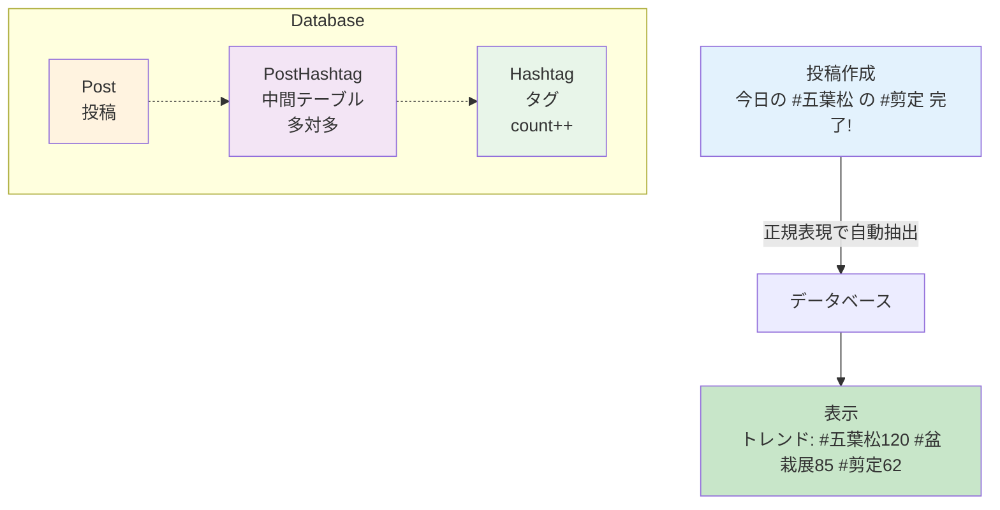
```mermaid
flowchart TD
    A[投稿作成<br/>今日の #五葉松 の #剪定 完了!] -->|正規表現で自動抽出| B[データベース]

    subgraph Database
        B1[Post<br/>投稿]
        B2[PostHashtag<br/>中間テーブル<br/>多対多]
        B3[Hashtag<br/>タグ<br/>count++]

        B1 -.-> B2
        B2 -.-> B3
    end

    B --> C[表示<br/>トレンド: #五葉松120 #盆栽展85 #剪定62]

    style A fill:#e3f2fd
    style B1 fill:#fff3e0
    style B2 fill:#f3e5f5
    style B3 fill:#e8f5e9
    style C fill:#c8e6c9
```

### データモデル

ハッシュタグは2つのテーブルで管理します。

```prisma
// prisma/schema.prisma

// ハッシュタグマスタ
model Hashtag {
  id        String   @id @default(cuid())
  name      String   @unique       // ハッシュタグ名（#なし、小文字）
  count     Int      @default(0)   // 使用回数（トレンド集計用）
  createdAt DateTime @default(now()) @map("created_at")

  posts PostHashtag[]

  @@index([count])       // トレンドの並び替え用インデックス
  @@map("hashtags")
}

// 投稿とハッシュタグの中間テーブル
model PostHashtag {
  postId    String @map("post_id")
  hashtagId String @map("hashtag_id")

  post    Post    @relation(fields: [postId], references: [id], onDelete: Cascade)
  hashtag Hashtag @relation(fields: [hashtagId], references: [id], onDelete: Cascade)

  @@id([postId, hashtagId])   // 複合主キー（同じ組み合わせは1回のみ）
  @@map("post_hashtags")
}
```

> **なぜ `count` カラムを持つのか？**
> トレンド表示のたびに `PostHashtag` テーブルで `GROUP BY` 集計を行うとパフォーマンスが低下します。`Hashtag.count` に使用回数を保持しておくことで、トレンドの取得が `ORDER BY count DESC` の単純なクエリで済みます。これは **非正規化（Denormalization）** と呼ばれるパフォーマンス最適化手法です。

### ハッシュタグの正規表現

```typescript
// lib/actions/hashtag.ts

/**
 * ハッシュタグを抽出する正規表現
 *
 * Unicode範囲:
 * - \u3040-\u309F: ひらがな（あ〜ん）
 * - \u30A0-\u30FF: カタカナ（ア〜ン）
 * - \u4E00-\u9FFF: 漢字（CJK統合漢字）
 */
const HASHTAG_REGEX = /#([a-zA-Z0-9_\u3040-\u309F\u30A0-\u30FF\u4E00-\u9FFF]+)/g
```

日本語のSNSでは、英数字だけでなくひらがな・カタカナ・漢字もハッシュタグに使えることが重要です。この正規表現により、`#bonsai` も `#盆栽` も `#五葉松_2024` もすべて正しく抽出できます。

### テキストからハッシュタグを抽出（内部関数）

```typescript
// lib/actions/hashtag.ts

function extractHashtags(text: string): string[] {
  if (!text) return []

  const matches = text.match(HASHTAG_REGEX)
  if (!matches) return []

  // # を除去して小文字に変換
  // slice(1) で最初の1文字（#）を除去
  const hashtags = matches.map((tag: string) => tag.slice(1).toLowerCase())

  // Set で重複を除去して配列に戻す
  return [...new Set(hashtags)]
}
```

```typescript
// 使用例
extractHashtags('今日の #盆栽 #Bonsai の手入れ')
// → ['盆栽', 'bonsai']

extractHashtags('#五葉松 #五葉松 の植え替え')
// → ['五葉松']  ← 重複が除去される
```

> **なぜ小文字に変換するのか？**
> `#Bonsai` と `#bonsai` を同じハッシュタグとして扱うためです。SNSでは大文字小文字を区別しないのが一般的です。

### attachHashtagsToPost: 投稿へのハッシュタグ関連付け

投稿作成時に自動的に呼び出される関数です。テキストからハッシュタグを抽出し、データベースに関連付けを作成します。

```typescript
// lib/actions/hashtag.ts
'use server'

export async function attachHashtagsToPost(postId: string, content: string | null) {
  if (!content) return

  const hashtagNames = extractHashtags(content)
  if (hashtagNames.length === 0) return

  try {
    for (const name of hashtagNames) {
      // ハッシュタグを upsert（存在しなければ作成、あればcount+1）
      const hashtag = await prisma.hashtag.upsert({
        where: { name },
        update: { count: { increment: 1 } },
        create: { name, count: 1 },
      })

      // 投稿とハッシュタグの関連付けを upsert
      await prisma.postHashtag.upsert({
        where: { postId_hashtagId: { postId, hashtagId: hashtag.id } },
        update: {},
        create: { postId, hashtagId: hashtag.id },
      })
    }
  } catch (error) {
    // ハッシュタグの処理失敗は投稿作成をブロックしない
    logger.error('Attach hashtags error:', error)
  }
}
```

> **upsert の仕組み**
> `upsert` は `update` + `insert` の造語です。`where` 条件に一致するレコードがあれば `update` を実行し、なければ `create` を実行します。「あれば更新、なければ新規作成」を1回のクエリで安全に行えます。

### detachHashtagsFromPost: ハッシュタグの関連付け解除

投稿削除時にハッシュタグの関連付けを解除し、カウントを減少させます。

```typescript
// lib/actions/hashtag.ts

export async function detachHashtagsFromPost(postId: string) {
  try {
    // 関連するハッシュタグを取得
    const postHashtags = await prisma.postHashtag.findMany({
      where: { postId },
      include: { hashtag: true },
    })

    // 関連付けを削除
    await prisma.postHashtag.deleteMany({ where: { postId } })

    // ハッシュタグのカウントを減少
    for (const ph of postHashtags) {
      await prisma.hashtag.update({
        where: { id: ph.hashtagId },
        data: { count: { decrement: 1 } },
      })
    }

    // 使用されなくなったハッシュタグを削除
    await prisma.hashtag.deleteMany({
      where: { count: { lte: 0 } },
    })
  } catch (error) {
    logger.error('Detach hashtags error:', error)
  }
}
```

### getTrendingHashtags: トレンド取得

最も多く使われているハッシュタグを取得します。サイドバーの「トレンド」セクションで使います。

```typescript
// lib/actions/hashtag.ts

export async function getTrendingHashtags(limit: number = 10) {
  try {
    const hashtags = await prisma.hashtag.findMany({
      where: { count: { gt: 0 } },    // count > 0 のみ
      orderBy: { count: 'desc' },      // 使用回数の多い順
      take: limit,
    })
    return hashtags
  } catch (error) {
    logger.error('Get trending hashtags error:', error)
    return []
  }
}
```

UIでの表示例:

```tsx
// components/common/TrendingHashtags.tsx
export async function TrendingHashtags() {
  const hashtags = await getTrendingHashtags(5)

  return (
    <div className="rounded-lg border p-4">
      <h3 className="font-semibold text-lg mb-3">トレンド</h3>
      {hashtags.map(tag => (
        <Link
          key={tag.id}
          href={`/search?tag=${tag.name}`}
          className="block py-1 hover:text-primary"
        >
          #{tag.name}
          <span className="text-sm text-muted-foreground ml-2">
            {tag.count}件
          </span>
        </Link>
      ))}
    </div>
  )
}
```

### searchHashtags: オートコンプリート用候補検索

投稿フォームで `#` を入力した際に、候補をサジェストする関数です。

```typescript
// lib/actions/hashtag.ts

export async function searchHashtags(query: string, limit: number = 10) {
  if (!query || query.length < 1) return []

  try {
    const hashtags = await prisma.hashtag.findMany({
      where: {
        name: {
          contains: query.toLowerCase(),
          mode: 'insensitive',     // 大文字小文字を区別しない
        },
        count: { gt: 0 },          // 使用されているもののみ
      },
      orderBy: { count: 'desc' },  // 人気順
      take: limit,
    })
    return hashtags
  } catch (error) {
    logger.error('Search hashtags error:', error)
    return []
  }
}
```

### BON-LOGでの使用箇所

| ファイル | 役割 |
|---------|------|
| `lib/actions/hashtag.ts` | ハッシュタグの関連付け・解除・トレンド取得・検索（attachHashtagsToPost, detachHashtagsFromPost, getTrendingHashtags, searchHashtags） |
| `lib/actions/post.ts` | createPost内でattachHashtagsToPostを呼び出し |
| `components/common/TrendingHashtags.tsx` | サイドバーに表示するトレンドハッシュタグ一覧 |
| `app/(main)/search/page.tsx` | ハッシュタグ検索結果ページ |

### 実装しない場合の影響

- 投稿の `#タグ` がただのテキストになり、タグとして機能しない
- トレンドハッシュタグ機能が使えず、話題の投稿を発見しにくくなる
- 投稿削除時にハッシュタグのカウントが減らず、使われていないタグがトレンドに残り続ける
- ハッシュタグによる投稿の検索・フィルタリングができなくなる

---

## 9.9 無限スクロール

> **このセクションで学ぶこと**
> - Intersection Observer API の仕組み
> - `react-intersection-observer` ライブラリの `useInView` フック
> - 無限スクロールの実装パターン
> - ユーザー体験を向上させるローディング表示

### 無限スクロールとは

無限スクロール（Infinite Scroll）とは、ユーザーがページの下部までスクロールすると自動的に次のデータを読み込む仕組みです。SNSのタイムラインでは、「次のページ」ボタンを押す代わりに、スクロールするだけで新しい投稿が表示されます。

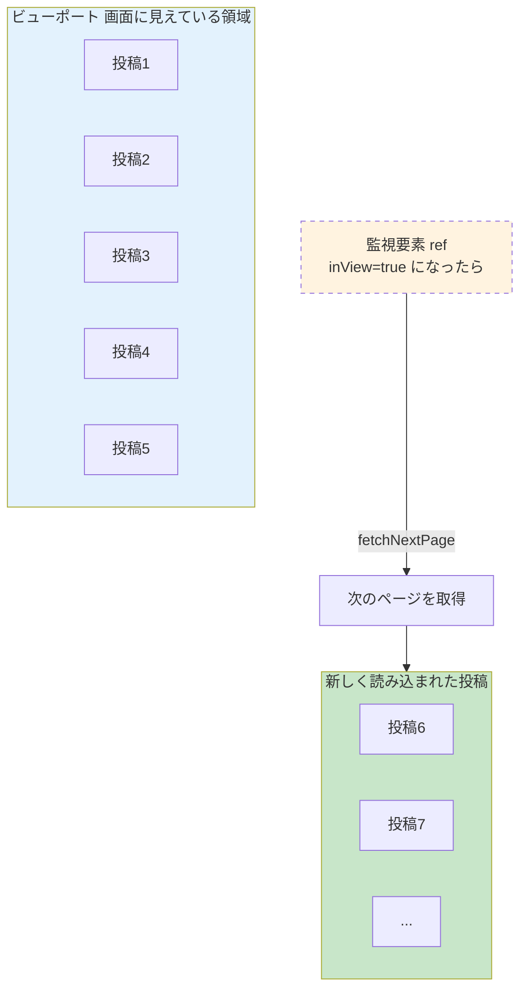
```mermaid
graph TD
    subgraph Viewport[ビューポート 画面に見えている領域]
        P1[投稿1]
        P2[投稿2]
        P3[投稿3]
        P4[投稿4]
        P5[投稿5]
    end

    Observer[監視要素 ref<br/>inView=true になったら] -->|fetchNextPage| Load[次のページを取得]

    subgraph NewPosts[新しく読み込まれた投稿]
        P6[投稿6]
        P7[投稿7]
        P8[...]
    end

    Load --> NewPosts

    style Viewport fill:#e3f2fd
    style Observer fill:#fff3e0,stroke-dasharray: 5 5
    style NewPosts fill:#c8e6c9
```

### Intersection Observer API

Intersection Observer は、ブラウザが提供する「要素がビューポート（画面に見えている領域）に入ったかどうか」を検知するAPIです。スクロールイベントを監視するよりもパフォーマンスが良く、モダンなWebアプリで広く使われています。

生のAPIを使う場合は以下のようになります。

```typescript
// 生のIntersection Observer API（参考）
const observer = new IntersectionObserver((entries) => {
  entries.forEach(entry => {
    if (entry.isIntersecting) {
      // 要素がビューポートに入った！
      loadMorePosts()
    }
  })
})

observer.observe(targetElement) // 監視開始
```

しかし、Reactではライフサイクル管理やクリーンアップが必要です。そこで `react-intersection-observer` ライブラリを使うと、Reactのフック形式で簡潔に利用できます。

### useInView フック

`react-intersection-observer` の `useInView` フックは、要素がビューポートに入ったかどうかを簡単に検知できます。

```bash
# インストール（既にプロジェクトに含まれています）
npm install react-intersection-observer
```

```typescript
import { useInView } from 'react-intersection-observer'

function MyComponent() {
  // ref: 監視対象の要素に設定するref
  // inView: 要素がビューポート内にあるかどうか（boolean）
  const { ref, inView } = useInView()

  return (
    <div>
      <div ref={ref}>
        {inView ? '見えています！' : 'まだ見えていません'}
      </div>
    </div>
  )
}
```

### Timeline コンポーネントでの実装

BON-LOGの `components/feed/Timeline.tsx` で実際にどのように使われているか見てみましょう。

```typescript
// components/feed/Timeline.tsx
'use client'

import { useInfiniteQuery } from '@tanstack/react-query'
import { useInView } from 'react-intersection-observer'
import { useEffect } from 'react'
import { PostCard } from '@/components/post/PostCard'
import { getTimeline } from '@/lib/actions/feed'
import { TimelineSkeleton } from './TimelineSkeleton'
import { EmptyTimeline } from './EmptyTimeline'

type TimelineProps = {
  initialPosts: Post[]
  currentUserId?: string
}

export function Timeline({ initialPosts, currentUserId }: TimelineProps) {
  // ① Intersection Observer の設定
  const { ref, inView } = useInView()

  // ② React Query の無限クエリ（次のセクションで詳解）
  const {
    data,
    fetchNextPage,
    hasNextPage,
    isFetchingNextPage,
    isLoading,
  } = useInfiniteQuery({
    queryKey: ['timeline'],
    queryFn: async ({ pageParam }) => {
      const result = await getTimeline(pageParam)
      return result
    },
    initialPageParam: undefined as string | undefined,
    initialData: {
      pages: [{
        posts: initialPosts,
        nextCursor: initialPosts.length >= 20
          ? initialPosts[initialPosts.length - 1]?.id
          : undefined,
      }],
      pageParams: [undefined],
    },
    getNextPageParam: (lastPage) => lastPage.nextCursor,
  })

  // ③ 監視要素がビューポートに入ったら次ページを取得
  useEffect(() => {
    if (inView && hasNextPage && !isFetchingNextPage) {
      fetchNextPage()
    }
  }, [inView, hasNextPage, isFetchingNextPage, fetchNextPage])

  // ④ ローディング状態
  if (isLoading) return <TimelineSkeleton />

  // ⑤ 全ページの投稿をフラット化
  const allPosts = data?.pages.flatMap((page) => page.posts) || []

  if (allPosts.length === 0) return <EmptyTimeline />

  // ⑥ レンダリング
  return (
    <div className="space-y-4">
      {allPosts.map((post, index) => {
        // 書のような非対称なレイアウトを作るための余白と回転（Sumi-e & Washi アートディレクション）
        const staggerClass = index % 2 === 0 ? 'ml-0 md:mr-12' : 'md:ml-12 mr-0'
        const rotateClass = index % 3 === 0 ? '-rotate-1' : index % 3 === 1 ? 'rotate-1' : 'rotate-2'

        return (
          <div key={post.id} className={`${staggerClass} transform ${rotateClass} transition-all duration-500 hover:rotate-0 hover:z-10 relative`}>
            <PostCard post={post} currentUserId={currentUserId} />
            {/* 広告の挿入ロジック（後述） */}
          </div>
        )
      })}

      {/* ⑦ 監視要素 - この div がビューポートに入ると次ページを取得 */}
      <div ref={ref} className="py-4 flex flex-col items-center gap-2">
        {isFetchingNextPage && (
          <div className="flex items-center gap-2 text-muted-foreground">
            <div className="animate-spin h-4 w-4 border-2 border-primary border-t-transparent rounded-full" />
            <span className="text-sm">投稿を読み込んでいます...</span>
          </div>
        )}
        {!hasNextPage && allPosts.length > 0 && (
          <p className="text-sm text-muted-foreground">
            すべての投稿を表示しました（{allPosts.length}件）
          </p>
        )}
      </div>
    </div>
  )
}
```

処理の流れを整理します。

| ステップ | コード | 説明 |
|---------|--------|------|
| 1 | `useInView()` | 監視要素の ref と inView フラグを取得 |
| 2 | `useInfiniteQuery()` | React Query でページネーション付きデータ管理 |
| 3 | `useEffect` | inView が true になったら `fetchNextPage()` を呼ぶ |
| 4 | `isLoading` | 初回読み込み中はスケルトンを表示 |
| 5 | `flatMap` | 全ページの投稿を1次元配列にフラット化 |
| 6 | `map` | 各投稿を `PostCard` で表示 |
| 7 | `ref={ref}` | リストの最後に監視要素を配置 |

> **なぜ `useEffect` の依存配列に4つの値があるのか？**
> `inView`（監視状態）、`hasNextPage`（次ページの有無）、`isFetchingNextPage`（取得中かどうか）、`fetchNextPage`（取得関数）の4つすべてが条件に関わるためです。いずれかが変わったときに再評価され、条件を満たした場合のみ次ページが取得されます。

### BON-LOGでの使用箇所

| ファイル | 役割 |
|---------|------|
| `components/feed/Timeline.tsx` | `useInView` + `useInfiniteQuery` による無限スクロール実装 |
| `components/feed/EmptyTimeline.tsx` | 投稿が0件のときの空状態表示 |
| `components/feed/TimelineSkeleton.tsx` | 読み込み中のスケルトンUI |

### 実装しない場合の影響

- 投稿を一覧で読み込む際に「次のページ」ボタンが必要になり、SNSらしいシームレスな体験が失われる
- Intersection Observer を使わずスクロールイベントで実装すると、高頻度のイベントにより描画パフォーマンスが低下する
- `ref` の監視要素がないと、ユーザーが一番下までスクロールしても次のデータが読み込まれない

---

## 9.10 React Queryでタイムライン管理

> **このセクションで学ぶこと**
> - `useInfiniteQuery` の詳しい設定と各パラメータの意味
> - `initialData` によるSSRデータとの統合
> - `getNextPageParam` によるカーソルベースページネーション
> - 楽観的更新（Optimistic Update）によるUX向上

### useInfiniteQuery の設定詳解

前セクションで見た `useInfiniteQuery` の各パラメータを詳しく解説します。

```typescript
const {
  data,              // ページ分割されたデータ
  fetchNextPage,     // 次のページを取得する関数
  hasNextPage,       // 次のページがあるかどうか
  isFetchingNextPage,// 次ページ取得中かどうか
  isLoading,         // 初回ローディング中かどうか
} = useInfiniteQuery({
  // ① クエリキー - このキーでキャッシュを識別・無効化
  queryKey: ['timeline'],

  // ② データ取得関数 - pageParam にはカーソル（投稿ID）が渡される
  queryFn: async ({ pageParam }) => {
    const result = await getTimeline(pageParam)
    return result
  },

  // ③ 初期ページパラメータ - 最初のページは undefined（最新から取得）
  initialPageParam: undefined as string | undefined,

  // ④ SSRで取得した初期データ
  initialData: {
    pages: [{
      posts: initialPosts,
      nextCursor: initialPosts.length >= 20
        ? initialPosts[initialPosts.length - 1]?.id
        : undefined,
    }],
    pageParams: [undefined],
  },

  // ⑤ 次のページのパラメータを決定
  getNextPageParam: (lastPage) => lastPage.nextCursor,
})
```

各パラメータの詳しい説明です。

| パラメータ | 説明 |
|-----------|------|
| `queryKey` | キャッシュのキー。同じキーなら同じデータを参照する。`['timeline', userId]` のように配列で複合キーも可能 |
| `queryFn` | データを取得する非同期関数。`pageParam` は `getNextPageParam` で返した値 |
| `initialPageParam` | 最初のページのパラメータ。`undefined` は「最新から」を意味する |
| `initialData` | SSRで取得した初期データ。ハイドレーション時のフラッシュを防ぐ |
| `getNextPageParam` | 最後のページのレスポンスから次のページのパラメータを抽出。`undefined` を返すと「もうデータがない」ことを示す |

### initialData とSSRの統合

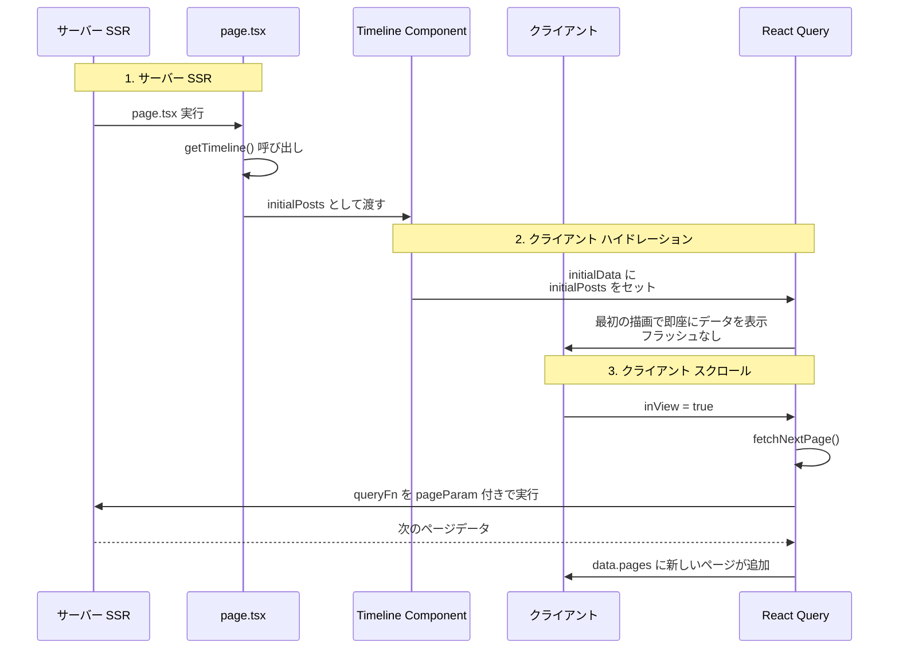
```mermaid
sequenceDiagram
    participant Server as サーバー SSR
    participant Page as page.tsx
    participant Timeline as Timeline Component
    participant Client as クライアント
    participant RQ as React Query

    Note over Server,Page: 1. サーバー SSR
    Server->>Page: page.tsx 実行
    Page->>Page: getTimeline() 呼び出し
    Page->>Timeline: initialPosts として渡す

    Note over Timeline,RQ: 2. クライアント ハイドレーション
    Timeline->>RQ: initialData に<br/>initialPosts をセット
    RQ->>Client: 最初の描画で即座にデータを表示<br/>フラッシュなし

    Note over Client,RQ: 3. クライアント スクロール
    Client->>RQ: inView = true
    RQ->>RQ: fetchNextPage()
    RQ->>Server: queryFn を pageParam 付きで実行
    Server-->>RQ: 次のページデータ
    RQ->>Client: data.pages に新しいページが追加
```

Server Componentでの初期データ取得はこのように行います。

```typescript
// app/(main)/feed/page.tsx (Server Component)
import { Timeline } from '@/components/feed/Timeline'
import { getTimeline } from '@/lib/actions/feed'
import { auth } from '@/lib/auth'

export default async function FeedPage() {
  const session = await auth()
  const { posts } = await getTimeline()

  return (
    <Timeline
      initialPosts={posts}
      currentUserId={session?.user?.id}
    />
  )
}
```

### カーソルベースページネーション

BON-LOGでは、オフセット方式ではなくカーソル方式のページネーションを採用しています。

```
オフセット方式（非推奨）:
  1ページ目: OFFSET 0, LIMIT 20
  2ページ目: OFFSET 20, LIMIT 20
  → データの追加・削除でズレが発生する

カーソル方式（採用）:
  1ページ目: 最新20件
  2ページ目: 投稿ID xxx より前の20件
  → データの追加・削除の影響を受けない
```

サーバー側のクエリはこのようになっています。

```typescript
// lib/actions/feed.ts
export async function getTimeline(cursor?: string, limit = 20) {
  const posts = await prisma.post.findMany({
    take: limit,
    ...(cursor && {
      cursor: { id: cursor },
      skip: 1,  // カーソル自体をスキップ
    }),
    orderBy: { createdAt: 'desc' },
    include: {
      user: { select: { id: true, nickname: true, avatarUrl: true } },
      // ... 他のリレーション
    },
  })

  const hasMore = posts.length === limit
  const nextCursor = hasMore ? posts[posts.length - 1]?.id : undefined

  return { posts, nextCursor }
}
```

### データの表示: pages のフラット化

`useInfiniteQuery` のデータは `pages` 配列で管理されています。表示時には `flatMap` で1次元配列に変換します。

```typescript
// data.pages の構造
{
  pages: [
    { posts: [投稿1, 投稿2, ..., 投稿20], nextCursor: 'id-20' },
    { posts: [投稿21, 投稿22, ..., 投稿40], nextCursor: 'id-40' },
    { posts: [投稿41, 投稿42, ..., 投稿55], nextCursor: undefined },
  ],
  pageParams: [undefined, 'id-20', 'id-40'],
}

// flatMap で1次元配列に変換
const allPosts = data?.pages.flatMap((page) => page.posts) || []
// → [投稿1, 投稿2, ..., 投稿55]
```

### 楽観的更新（Optimistic Update）

楽観的更新とは、サーバーの応答を待たずにUIを先に更新する手法です。例えば「いいね」ボタンを押した瞬間にハートの色を変え、サーバーエラーの場合のみ元に戻します。これによりユーザーは操作の反映を即座に確認でき、快適に操作できます。

```typescript
import { useQueryClient, useMutation } from '@tanstack/react-query'

function useLikeMutation() {
  const queryClient = useQueryClient()

  return useMutation({
    mutationFn: async (postId: string) => {
      // サーバーにリクエスト
      return await toggleLike(postId)
    },

    // サーバーリクエスト前にUIを更新
    onMutate: async (postId) => {
      // 進行中のクエリをキャンセル
      await queryClient.cancelQueries({ queryKey: ['timeline'] })

      // 現在のデータを保存（ロールバック用）
      const previousData = queryClient.getQueryData(['timeline'])

      // キャッシュを楽観的に更新
      queryClient.setQueryData(['timeline'], (old: any) => ({
        ...old,
        pages: old.pages.map((page: any) => ({
          ...page,
          posts: page.posts.map((post: any) =>
            post.id === postId
              ? { ...post, isLiked: !post.isLiked, _count: {
                  ...post._count,
                  likes: post.isLiked
                    ? post._count.likes - 1
                    : post._count.likes + 1
                }}
              : post
          ),
        })),
      }))

      return { previousData }
    },

    // エラー時はロールバック
    onError: (err, postId, context) => {
      queryClient.setQueryData(['timeline'], context?.previousData)
    },

    // 成功・失敗に関わらず最新データで再検証
    onSettled: () => {
      queryClient.invalidateQueries({ queryKey: ['timeline'] })
    },
  })
}
```

> **楽観的更新のたとえ**
> レストランで注文する場面を想像してください。「カレーをください」と言った瞬間にメニューの「注文済み」マークを付けるのが楽観的更新です。キッチンが「在庫切れです」と返答したときだけ、マークを元に戻します。ほとんどの場合は在庫があるので、先にUIを更新した方がユーザー体験が良くなります。

### BON-LOGでの使用箇所

| ファイル | 役割 |
|---------|------|
| `components/feed/Timeline.tsx` | `useInfiniteQuery` によるページネーション付きタイムライン管理 |
| `components/post/LikeButton.tsx` | `useMutation` + 楽観的更新によるいいね状態管理 |
| `components/post/BookmarkButton.tsx` | `useMutation` + 楽観的更新によるブックマーク状態管理 |
| `app/providers.tsx` | `QueryClientProvider` によるReact Queryの初期化 |

### 実装しない場合の影響

- `useInfiniteQuery` がないと、無限スクロールのページネーション状態を手動で管理する必要が生じ、コードが複雑になる
- 楽観的更新がないと、いいね/ブックマーク操作のたびにサーバー応答を待つため、ボタンが遅く感じられる
- `initialData` を使わないと、SSRで取得したデータとクライアントハイドレーション時にちらつき（フラッシュ）が発生する
- `invalidateQueries` がないと、サーバーの実際の状態とUIのキャッシュが食い違ったままになる

---

## 9.11 投票機能（Poll）

> **このセクションで学ぶこと**
> - Poll / PollOption / PollVote のデータモデル
> - アンケート投稿の作成と投票の仕組み
> - 投票結果の集計と表示
> - 有効期限の管理

### 投票機能とは

投票機能（Poll）は、投稿にアンケートを添付する機能です。「どちらの鉢が好きですか？」「次回の盆栽展の日程はいつが良いですか？」といった質問をフォロワーに投げかけることができます。

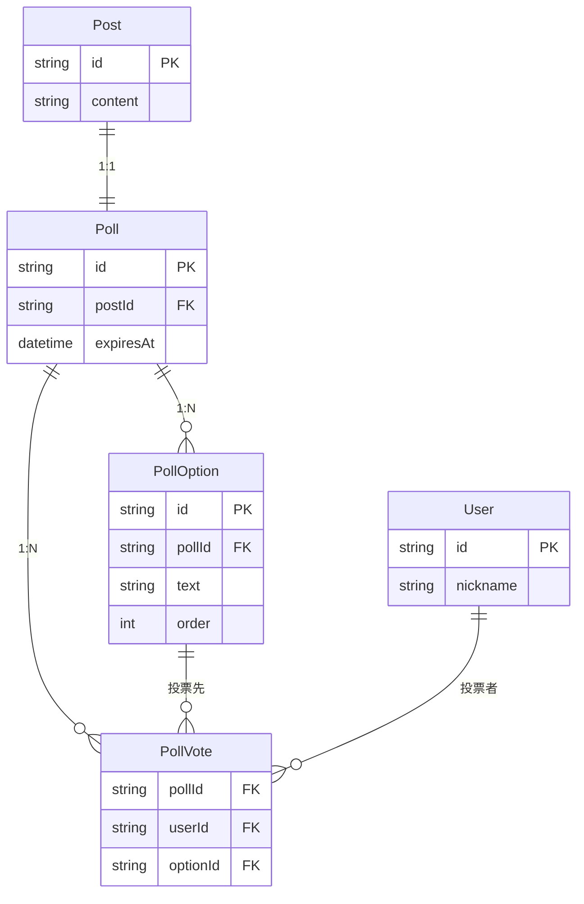
```mermaid
erDiagram
    Post ||--|| Poll : "1:1"
    Poll ||--o{ PollOption : "1:N"
    Poll ||--o{ PollVote : "1:N"
    PollOption ||--o{ PollVote : "投票先"
    User ||--o{ PollVote : "投票者"

    Post {
        string id PK
        string content
    }

    Poll {
        string id PK
        string postId FK
        datetime expiresAt
    }

    PollOption {
        string id PK
        string pollId FK
        string text
        int order
    }

    PollVote {
        string pollId FK
        string userId FK
        string optionId FK
    }

    User {
        string id PK
        string nickname
    }
```

### データモデル

```prisma
// prisma/schema.prisma

model Poll {
  id        String       @id @default(cuid())
  postId    String       @unique @map("post_id")  // 投稿との1:1関係
  duration  Int          // アンケートの期間（秒数）
  expiresAt DateTime     @map("expires_at")       // 終了日時
  createdAt DateTime     @default(now()) @map("created_at")

  post    Post         @relation(fields: [postId], references: [id], onDelete: Cascade)
  options PollOption[]
  votes   PollVote[]

  @@map("polls")
}

model PollOption {
  id        String     @id @default(cuid())
  pollId    String     @map("poll_id")
  text      String     @db.VarChar(50)     // 選択肢テキスト（50文字以内）
  sortOrder Int        @default(0) @map("sort_order")  // 表示順

  poll  Poll       @relation(fields: [pollId], references: [id], onDelete: Cascade)
  votes PollVote[]

  @@index([pollId])
  @@map("poll_options")
}

model PollVote {
  id        String   @id @default(cuid())
  pollId    String   @map("poll_id")
  optionId  String   @map("option_id")
  userId    String   @map("user_id")
  createdAt DateTime @default(now()) @map("created_at")

  poll   Poll       @relation(fields: [pollId], references: [id], onDelete: Cascade)
  option PollOption @relation(fields: [optionId], references: [id], onDelete: Cascade)

  @@unique([pollId, userId])    // 1ユーザーにつき1投票
  @@index([pollId])
  @@map("poll_votes")
}
```

> **`@@unique([pollId, userId])` の意味**
> 同じアンケートに同じユーザーが2回投票することを防ぐ複合ユニーク制約です。データベースレベルで重複投票を防止するため、アプリケーション側のチェックが漏れても安全です。

### votePoll: 投票のServer Action

```typescript
// lib/actions/poll.ts
'use server'

import { prisma } from '@/lib/db'
import { auth } from '@/lib/auth'
import { revalidatePath } from 'next/cache'

export async function votePoll(pollId: string, optionId: string) {
  // 認証チェック
  const session = await auth()
  if (!session?.user?.id) {
    return { error: '認証が必要です' }
  }

  // アンケートの存在確認
  const poll = await prisma.poll.findUnique({
    where: { id: pollId },
    select: { expiresAt: true, options: { select: { id: true } } },
  })

  if (!poll) {
    return { error: 'アンケートが見つかりません' }
  }

  // 有効期限チェック
  if (new Date() > poll.expiresAt) {
    return { error: 'このアンケートは終了しています' }
  }

  // 選択肢の妥当性チェック
  if (!poll.options.some(o => o.id === optionId)) {
    return { error: '無効な選択肢です' }
  }

  // 重複投票チェック
  const existing = await prisma.pollVote.findUnique({
    where: { pollId_userId: { pollId, userId: session.user.id } },
  })

  if (existing) {
    return { error: '既に投票済みです' }
  }

  // 投票を記録
  await prisma.pollVote.create({
    data: {
      pollId,
      optionId,
      userId: session.user.id,
    },
  })

  revalidatePath('/feed')
  return { success: true }
}
```

この Server Action では以下のバリデーションを順番に実行しています。

| チェック | 理由 |
|---------|------|
| 認証チェック | 未ログインユーザーの投票を防止 |
| 存在確認 | 削除されたアンケートへの投票を防止 |
| 有効期限チェック | 終了したアンケートへの投票を防止 |
| 選択肢の妥当性 | 改ざんされた選択肢IDでの投票を防止 |
| 重複投票チェック | 同一ユーザーの複数回投票を防止 |

### getPollResults: 投票結果の取得

```typescript
// lib/actions/poll.ts

export async function getPollResults(pollId: string) {
  const session = await auth()
  const currentUserId = session?.user?.id

  const poll = await prisma.poll.findUnique({
    where: { id: pollId },
    include: {
      options: {
        orderBy: { sortOrder: 'asc' },
        include: {
          _count: { select: { votes: true } },   // 各選択肢の得票数
        },
      },
      _count: { select: { votes: true } },       // 総投票数
    },
  })

  if (!poll) {
    return { error: 'アンケートが見つかりません' }
  }

  // 現在のユーザーの投票先を取得
  let userVoteOptionId: string | null = null
  if (currentUserId) {
    const vote = await prisma.pollVote.findUnique({
      where: { pollId_userId: { pollId, userId: currentUserId } },
      select: { optionId: true },
    })
    userVoteOptionId = vote?.optionId ?? null
  }

  return {
    poll: {
      id: poll.id,
      expiresAt: poll.expiresAt,
      isExpired: new Date() > poll.expiresAt,
      totalVotes: poll._count.votes,
      userVoteOptionId,        // 自分がどの選択肢に投票したか
      options: poll.options.map(o => ({
        id: o.id,
        text: o.text,
        voteCount: o._count.votes,
      })),
    },
  }
}
```

### BON-LOGでの使用箇所

| ファイル | 役割 |
|---------|------|
| `lib/actions/poll.ts` | 投票のServer Actions（votePoll, getPollResults） |
| `components/post/PollDisplay.tsx` | 投票フォームと結果表示コンポーネント |
| `components/post/PostForm.tsx` | 投稿フォームでのアンケート作成UI |
| `lib/actions/post.ts` | createPost内でのアンケートデータ保存 |

### 実装しない場合の影響

- 投稿にアンケートを添付できなくなり、コミュニティでの意見収集手段が失われる
- 有効期限チェックがないと、終了したアンケートへの投票が可能になる
- 重複投票チェックがないと、同じユーザーが何度も投票して結果を改ざんできる
- `@@unique([pollId, userId])` のDB制約がないと、アプリ側チェックを回避した重複投票が登録される

UIでの表示では、投票済みの場合に結果（パーセンテージバー）を表示し、未投票の場合に選択肢のボタンを表示するのが一般的です。

```tsx
// 投票結果の表示例
function PollDisplay({ poll }: { poll: PollResult }) {
  const hasVoted = !!poll.userVoteOptionId

  return (
    <div className="border rounded-lg p-4">
      {poll.options.map(option => {
        const percentage = poll.totalVotes > 0
          ? Math.round((option.voteCount / poll.totalVotes) * 100)
          : 0

        return (
          <div key={option.id} className="mb-2">
            {hasVoted || poll.isExpired ? (
              // 投票済みまたは終了: 結果を表示
              <div className="relative bg-muted rounded p-2">
                <div
                  className="absolute inset-0 bg-primary/20 rounded"
                  style={{ width: `${percentage}%` }}
                />
                <span className="relative">{option.text} ({percentage}%)</span>
              </div>
            ) : (
              // 未投票: ボタンを表示
              <button
                onClick={() => handleVote(poll.id, option.id)}
                className="w-full border rounded p-2 hover:bg-muted"
              >
                {option.text}
              </button>
            )}
          </div>
        )
      })}
      <p className="text-sm text-muted-foreground mt-2">
        {poll.totalVotes}票 {poll.isExpired ? '(終了)' : ''}
      </p>
    </div>
  )
}
```

---

## 9.12 予約投稿

> **このセクションで学ぶこと**
> - 予約投稿（Scheduled Post）の仕組みとステータス管理
> - `ScheduledPost` のデータモデル
> - プレミアム会員限定機能としての制御
> - バッチ処理による自動公開

### 予約投稿とは

予約投稿は、指定した日時に自動的に投稿を公開する機能です。例えば「朝の盆栽写真を午前8時に投稿したい」「盆栽展の告知を開催1週間前に投稿したい」といったニーズに応えます。

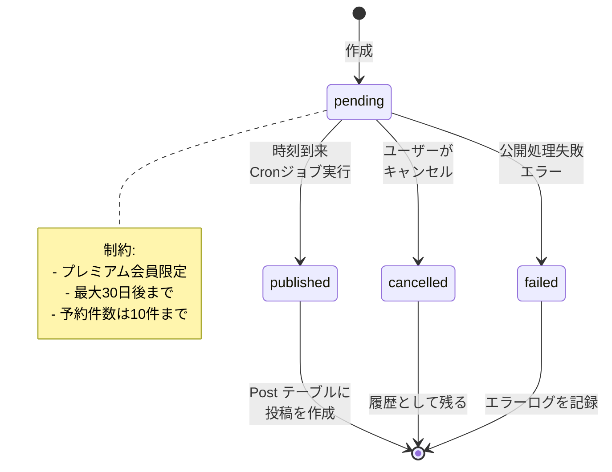
```mermaid
stateDiagram-v2
    [*] --> pending : 作成
    pending --> published : 時刻到来<br/>Cronジョブ実行
    pending --> cancelled : ユーザーが<br/>キャンセル
    pending --> failed : 公開処理失敗<br/>エラー

    published --> [*] : Post テーブルに<br/>投稿を作成
    cancelled --> [*] : 履歴として残る
    failed --> [*] : エラーログを記録

    note right of pending
        制約:
        - プレミアム会員限定
        - 最大30日後まで
        - 予約件数は10件まで
    end note
```

### データモデル

```prisma
// prisma/schema.prisma

model ScheduledPost {
  id              String              @id @default(cuid())
  userId          String              @map("user_id")
  content         String?             @db.Text
  scheduledAt     DateTime            @map("scheduled_at")    // 予約日時
  status          ScheduledPostStatus @default(pending)
  publishedPostId String?             @unique @map("published_post_id")
  createdAt       DateTime            @default(now()) @map("created_at")
  updatedAt       DateTime            @updatedAt @map("updated_at")

  user          User                 @relation(fields: [userId], references: [id], onDelete: Cascade)
  publishedPost Post?                @relation(fields: [publishedPostId], references: [id], onDelete: SetNull)
  media         ScheduledPostMedia[]
  genres        ScheduledPostGenre[]

  @@index([userId])
  @@index([scheduledAt])
  @@index([status])
  @@index([status, scheduledAt])   // Cronジョブのクエリ最適化用
  @@map("scheduled_posts")
}

enum ScheduledPostStatus {
  pending     // 予約中
  published   // 公開済み
  failed      // 公開失敗
  cancelled   // キャンセル済み
}
```

> **複合インデックス `[status, scheduledAt]` の意味**
> Cronジョブで「予約中かつ公開時刻を過ぎた投稿」を取得するクエリ（`WHERE status = 'pending' AND scheduledAt <= NOW()`）を高速化するためのインデックスです。2つのカラムの組み合わせでインデックスを作成することで、この頻出クエリのパフォーマンスが大幅に向上します。

### 予約投稿の作成

```typescript
// lib/actions/scheduled-post.ts
'use server'

export async function createScheduledPost(formData: FormData) {
  const session = await auth()
  if (!session?.user?.id) {
    return { error: '認証が必要です' }
  }

  // ① プレミアム会員チェック
  const isPremium = await isPremiumUser(session.user.id)
  if (!isPremium) {
    return { error: '予約投稿は有料会員限定の機能です' }
  }

  // ② フォームデータの取得
  const content = formData.get('content') as string
  const scheduledAtStr = formData.get('scheduledAt') as string
  const genreIds = formData.getAll('genreIds') as string[]
  const mediaUrls = formData.getAll('mediaUrls') as string[]
  const mediaTypes = formData.getAll('mediaTypes') as string[]

  // ③ 予約日時のバリデーション
  const scheduledAt = new Date(scheduledAtStr)

  if (scheduledAt <= new Date()) {
    return { error: '予約日時は未来の日時を指定してください' }
  }

  const maxDate = new Date()
  maxDate.setDate(maxDate.getDate() + 30)
  if (scheduledAt > maxDate) {
    return { error: '予約日時は30日以内で指定してください' }
  }

  // ④ 会員種別の制限チェック
  const limits = await getMembershipLimits(session.user.id)
  if (content && content.length > limits.maxPostLength) {
    return { error: `投稿は${limits.maxPostLength}文字以内で入力してください` }
  }

  // ⑤ 予約投稿の上限チェック（最大10件）
  const pendingCount = await prisma.scheduledPost.count({
    where: { userId: session.user.id, status: 'pending' },
  })
  if (pendingCount >= 10) {
    return { error: '予約投稿は10件までです。' }
  }

  // ⑥ 予約投稿作成
  const scheduledPost = await prisma.scheduledPost.create({
    data: {
      userId: session.user.id,
      content: content || null,
      scheduledAt,
      media: mediaUrls.length > 0 ? {
        create: mediaUrls.map((url, index) => ({
          url,
          type: mediaTypes[index] || 'image',
          sortOrder: index,
        })),
      } : undefined,
      genres: genreIds.length > 0 ? {
        create: genreIds.map((genreId) => ({ genreId })),
      } : undefined,
    },
  })

  revalidatePath('/posts/scheduled')
  return { success: true, scheduledPostId: scheduledPost.id }
}
```

### publishDueScheduledPosts: バッチ処理による自動公開

Cronジョブで定期的に実行される関数です。公開時刻を過ぎた予約投稿を自動的に公開します。Server Action ではなく services 層に置かれ、Cron用 Route Handler からのみ呼ばれます。

```typescript
// lib/services/scheduled-post-publisher.ts

export async function publishDueScheduledPosts() {
  const now = new Date()

  // 公開対象の予約投稿を取得
  const scheduledPosts = await prisma.scheduledPost.findMany({
    where: {
      status: 'pending',
      scheduledAt: { lte: now },    // 現在時刻以前
    },
    include: {
      media: { orderBy: { sortOrder: 'asc' } },
      genres: true,
    },
  })

  let publishedCount = 0
  let failedCount = 0

  for (const scheduled of scheduledPosts) {
    try {
      // Post テーブルに投稿を作成
      const post = await prisma.post.create({
        data: {
          userId: scheduled.userId,
          content: scheduled.content,
          media: scheduled.media.length > 0 ? {
            create: scheduled.media.map((m) => ({
              url: m.url, type: m.type, sortOrder: m.sortOrder,
            })),
          } : undefined,
          genres: scheduled.genres.length > 0 ? {
            create: scheduled.genres.map((g) => ({ genreId: g.genreId })),
          } : undefined,
        },
      })

      // ステータスを published に更新
      await prisma.scheduledPost.update({
        where: { id: scheduled.id },
        data: { status: 'published', publishedPostId: post.id },
      })

      publishedCount++
    } catch (error) {
      logger.error(`Failed to publish scheduled post ${scheduled.id}:`, error)
      // エラー時はステータスを failed に更新
      await prisma.scheduledPost.update({
        where: { id: scheduled.id },
        data: { status: 'failed' },
      })
      failedCount++
    }
  }

  return { published: publishedCount, failed: failedCount }
}
```

> **Cronジョブとは？**
> 定期的にタスクを実行する仕組みです。BON-LOGでは GitHub Actions（`.github/workflows/cron.yml`）が5分毎に `/api/cron/publish-scheduled` を起動し、`publishDueScheduledPosts()` で公開時刻を過ぎた予約投稿を自動公開します。

### BON-LOGでの使用箇所

| ファイル | 役割 |
|---------|------|
| `lib/actions/scheduled-post.ts` | 予約投稿のServer Actions（createScheduledPost, cancelScheduledPost 等のCRUD） |
| `lib/services/scheduled-post-publisher.ts` | 公開バッチ処理本体（publishDueScheduledPosts） |
| `components/post/ScheduledPostForm.tsx` | 予約投稿作成フォーム（プレミアム会員のみ表示） |
| `app/api/cron/publish-scheduled/route.ts` | Cronジョブ用APIルート（GitHub Actions が5分毎に起動し、publishDueScheduledPostsを呼び出し） |
| `app/(main)/posts/scheduled/page.tsx` | 予約投稿一覧ページ |

### 実装しない場合の影響

- ユーザーが事前に投稿内容を準備して特定の日時に公開する手段がなくなる
- プレミアム会員の差別化機能の1つが失われ、課金のメリットが薄まる
- Cronジョブがないと、ステータスが `pending` のまま永久に公開されない投稿が蓄積する

---

## 9.13 下書き機能

> **このセクションで学ぶこと**
> - 下書き（Draft）の仕組みとデータモデル
> - 下書きの保存・編集・公開・削除
> - 予約投稿との違い

### 下書き機能とは

下書き機能は、作成途中の投稿を一時保存しておく機能です。「いい写真が撮れたけど文章が思いつかない」「今は時間がないから後で仕上げたい」といった場合に活用します。

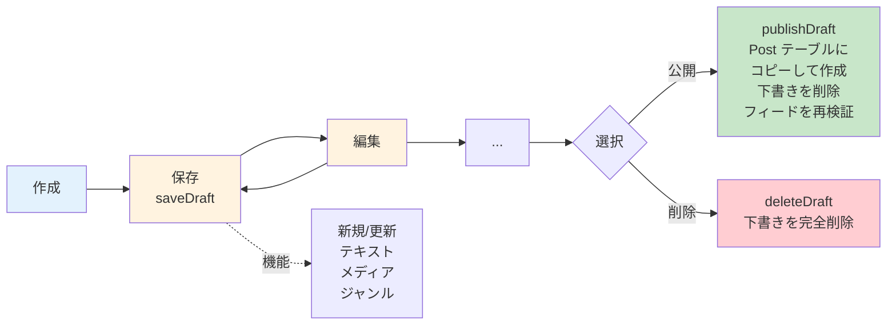
```mermaid
flowchart LR
    A[作成] --> B[保存<br/>saveDraft]
    B --> C[編集]
    C --> B
    C --> D[...]
    D --> E{選択}
    E -->|公開| F[publishDraft<br/>Post テーブルに<br/>コピーして作成<br/>下書きを削除<br/>フィードを再検証]
    E -->|削除| G[deleteDraft<br/>下書きを完全削除]

    B -.->|機能| B1[新規/更新<br/>テキスト<br/>メディア<br/>ジャンル]

    style A fill:#e3f2fd
    style B fill:#fff3e0
    style C fill:#fff3e0
    style F fill:#c8e6c9
    style G fill:#ffcdd2
```

### データモデル

```prisma
// prisma/schema.prisma

model DraftPost {
  id        String   @id @default(cuid())
  userId    String   @map("user_id")
  content   String?  @db.Text
  createdAt DateTime @default(now()) @map("created_at")
  updatedAt DateTime @updatedAt @map("updated_at")

  user   User             @relation(fields: [userId], references: [id], onDelete: Cascade)
  media  DraftPostMedia[]
  genres DraftPostGenre[]

  @@index([userId])
  @@map("draft_posts")
}

model DraftPostMedia {
  id          String @id @default(cuid())
  draftPostId String @map("draft_post_id")
  url         String
  type        String @default("image")
  sortOrder   Int    @default(0) @map("sort_order")

  draftPost DraftPost @relation(fields: [draftPostId], references: [id], onDelete: Cascade)

  @@index([draftPostId])
  @@map("draft_post_media")
}

model DraftPostGenre {
  draftPostId String @map("draft_post_id")
  genreId     String @map("genre_id")

  draftPost DraftPost @relation(fields: [draftPostId], references: [id], onDelete: Cascade)
  genre     Genre     @relation(fields: [genreId], references: [id], onDelete: Cascade)

  @@id([draftPostId, genreId])
  @@map("draft_post_genres")
}
```

### 下書きの保存

`saveDraft` は新規作成と既存更新の両方に対応しています。

```typescript
// lib/actions/draft.ts（実際のソースコード）
'use server'

import { requireAuth } from '@/lib/actions/utils'

export async function saveDraft(data: {
  id?: string           // あれば更新、なければ新規作成
  content?: string
  mediaUrls?: string[]
  genreIds?: string[]
}) {
  // requireAuth: 認証チェックを共通化したヘルパー
  const { userId, error: authError } = await requireAuth()
  if (!userId) return { error: authError! }

  try {
    if (data.id) {
      // 既存の下書きを更新
      const existing = await prisma.draftPost.findFirst({
        where: { id: data.id, userId: session.user.id },
      })
      if (!existing) {
        return { error: '下書きが見つかりません' }
      }

      // メディアとジャンルを削除して再作成（全置換方式）
      await prisma.$transaction([
        prisma.draftPostMedia.deleteMany({ where: { draftPostId: data.id } }),
        prisma.draftPostGenre.deleteMany({ where: { draftPostId: data.id } }),
      ])

      const draft = await prisma.draftPost.update({
        where: { id: data.id },
        data: {
          content: data.content,
          media: data.mediaUrls?.length ? {
            create: data.mediaUrls.map((url, index) => ({
              url, type: 'image', sortOrder: index,
            })),
          } : undefined,
          genres: data.genreIds?.length ? {
            create: data.genreIds.map((genreId) => ({ genreId })),
          } : undefined,
        },
      })
      return { draft }
    }

    // 新規下書き作成
    const draft = await prisma.draftPost.create({
      data: {
        userId: session.user.id,
        content: data.content,
        media: data.mediaUrls?.length ? {
          create: data.mediaUrls.map((url, index) => ({
            url, type: 'image', sortOrder: index,
          })),
        } : undefined,
        genres: data.genreIds?.length ? {
          create: data.genreIds.map((genreId) => ({ genreId })),
        } : undefined,
      },
    })
    return { draft }
  } catch (error) {
    logger.error('Save draft error:', error)
    return { error: '下書きの保存に失敗しました' }
  }
}
```

### 下書きから投稿を公開

```typescript
// lib/actions/draft.ts（実際のソースコード）

export async function publishDraft(draftId: string) {
  const { userId, error: authError } = await requireAuth()
  if (!userId) return { error: authError! }

  try {
    // 下書きを取得
    const draft = await prisma.draftPost.findFirst({
      where: { id: draftId, userId: session.user.id },
      include: { media: { orderBy: { sortOrder: 'asc' } }, genres: true },
    })
    if (!draft) return { error: '下書きが見つかりません' }

    // 投稿を作成（下書きの内容をコピー）
    const post = await prisma.post.create({
      data: {
        userId: session.user.id,
        content: draft.content,
        media: draft.media.length ? {
          create: draft.media.map((m) => ({
            url: m.url, type: m.type, sortOrder: m.sortOrder,
          })),
        } : undefined,
        genres: draft.genres.length ? {
          create: draft.genres.map((g) => ({ genreId: g.genreId })),
        } : undefined,
      },
    })

    // 下書きを削除
    await prisma.draftPost.delete({ where: { id: draftId } })

    revalidatePath('/feed')
    return { postId: post.id }
  } catch (error) {
    logger.error('Publish draft error:', error)
    return { error: '投稿の作成に失敗しました' }
  }
}
```

> **下書き vs 予約投稿**
> - **下書き**: 未完成の投稿を一時保存。ユーザーが手動で公開。プレミアム会員でなくても利用可能。
> - **予約投稿**: 完成した投稿を指定日時に自動公開。Cronジョブが公開を実行。プレミアム会員限定。

### BON-LOGでの使用箇所

| ファイル | 役割 |
|---------|------|
| `lib/actions/draft.ts` | 下書きのServer Actions（saveDraft, getDrafts, getDraftCount, publishDraft, deleteDraft） |
| `components/draft/DraftEditForm.tsx` | 下書き編集フォームコンポーネント |
| `app/(main)/posts/drafts/page.tsx` | 下書き一覧ページ |
| `components/feed/ComposeButton.tsx` | フィードページの投稿ボタン（下書き件数バッジを表示） |
| `components/post/PostForm.tsx` | 投稿フォームの「下書き保存」ボタンからsaveDraftを呼び出し |

### 実装しない場合の影響

- 作成途中の投稿内容が失われる（ページ遷移・誤操作で消える）
- ユーザーが一度書いた文章を後から編集できなくなる
- 下書き保存がないと、ユーザーは投稿を完成させてから一気に送信するしかなくなり、UXが低下する

---

## 9.14 プレミアム制限

> **このセクションで学ぶこと**
> - 無料会員とプレミアム会員の機能差
> - `lib/premium.ts` の `isPremiumUser` / `getMembershipLimits` 関数
> - 期限切れの自動失効処理
> - バッチ処理による一括失効

### プレミアム会員制度

BON-LOGでは、無料会員とプレミアム会員の2つの会員種別があります。プレミアム会員は月額または年額の課金により、投稿の文字数・画像枚数・1日の投稿数などの制限が緩和されます。

| 項目 | 無料会員 | プレミアム会員 |
|------|---------|--------------|
| 投稿文字数 | 500文字 | 2,000文字 |
| 画像枚数 | 4枚 | 10枚 |
| 動画数 | 添付不可 | 1本 |
| 1日の投稿数 | 20件 | 40件 |
| 予約投稿 | 不可 | 可能 |
| 分析機能 | 不可 | 可能 |

### 型定義と制限値

```typescript
// lib/premium.ts

// 会員種別の型
export type MembershipType = 'free' | 'premium'

// 制限値の型
export interface MembershipLimits {
  maxPostLength: number      // 投稿の最大文字数
  maxImages: number          // 最大画像枚数
  maxVideos: number          // 最大動画数
  maxDailyPosts: number      // 1日の最大投稿数
  canSchedulePost: boolean   // 予約投稿の可否
  canViewAnalytics: boolean  // 分析機能の可否
}

// 無料会員の制限値
const FREE_LIMITS: MembershipLimits = {
  maxPostLength: 500,
  maxImages: 4,
  maxVideos: 0,
  maxDailyPosts: 20,
  canSchedulePost: false,
  canViewAnalytics: false,
}

// プレミアム会員の制限値
const PREMIUM_LIMITS: MembershipLimits = {
  maxPostLength: 2000,
  maxImages: 10,
  maxVideos: 1,
  maxDailyPosts: 40,
  canSchedulePost: true,
  canViewAnalytics: true,
}
```

### isPremiumUser: プレミアム判定と自動失効

```typescript
// lib/premium.ts

export async function isPremiumUser(userId: string): Promise<boolean> {
  // 必要なフィールドのみ取得（パフォーマンス最適化）
  const user = await prisma.user.findUnique({
    where: { id: userId },
    select: { isPremium: true, premiumExpiresAt: true },
  })

  // ユーザーが存在しない or プレミアムでない場合
  if (!user || !user.isPremium) return false

  // 期限切れチェック
  if (user.premiumExpiresAt && user.premiumExpiresAt < new Date()) {
    // 期限切れの場合はフラグを自動更新
    await prisma.user.update({
      where: { id: userId },
      data: { isPremium: false },
    })
    return false
  }

  return true
}
```

> **期限切れの自動失効**
> `premiumExpiresAt` が現在時刻より前の場合、`isPremium` フラグを自動的に `false` に更新します。これにより、Stripeのサブスクリプションが終了した際に手動でフラグを更新する必要がなくなります。次回のチェックでは、既にフラグが更新されているため高速に判定できます。

### getMembershipLimits: 制限値の取得

```typescript
// lib/premium.ts

export async function getMembershipLimits(userId: string): Promise<MembershipLimits> {
  const isPremium = await isPremiumUser(userId)
  return isPremium ? PREMIUM_LIMITS : FREE_LIMITS
}
```

投稿作成時の使用例です。

```typescript
// lib/actions/post.ts
export async function createPost(formData: FormData) {
  const session = await auth()
  if (!session?.user?.id) return { error: '認証が必要です' }

  // 会員種別に応じた制限値を取得
  const limits = await getMembershipLimits(session.user.id)

  const content = formData.get('content') as string

  // 文字数チェック（無料: 500文字、プレミアム: 2000文字）
  if (content && content.length > limits.maxPostLength) {
    return { error: `投稿は${limits.maxPostLength}文字以内で入力してください` }
  }

  // 画像枚数チェック（無料: 4枚、プレミアム: 10枚）
  const imageCount = /* ... */
  if (imageCount > limits.maxImages) {
    return { error: `画像は${limits.maxImages}枚までです` }
  }

  // 予約投稿の可否チェック
  if (!limits.canSchedulePost && scheduledAt) {
    return { error: '予約投稿はプレミアム会員限定の機能です' }
  }

  // ... 投稿作成処理
}
```

### checkPremiumExpiry: バッチ一括失効処理

Cronジョブで定期実行し、期限切れの会員を一括で失効させます。

```typescript
// lib/premium.ts

export async function checkPremiumExpiry(): Promise<number> {
  const result = await prisma.user.updateMany({
    where: {
      isPremium: true,
      premiumExpiresAt: {
        lt: new Date(),  // 期限切れ
      },
    },
    data: {
      isPremium: false,
    },
  })

  return result.count  // 更新されたユーザー数
}
```

> **なぜ個別チェックとバッチ処理の両方があるのか？**
> `isPremiumUser` は個別のリクエスト時にリアルタイムで判定するための関数です。一方、`checkPremiumExpiry` はCronジョブで定期的に実行し、データベースの整合性を一括で保つための関数です。個別チェックで見落としがあっても、バッチ処理がセーフティネットとして機能します。

### UIでの制限表示

プラン比較をUIに表示する例です。

```tsx
import { FREE_LIMITS, PREMIUM_LIMITS } from '@/lib/premium'

function PlanComparison() {
  return (
    <table className="w-full border">
      <thead>
        <tr>
          <th>機能</th>
          <th>無料</th>
          <th>プレミアム</th>
        </tr>
      </thead>
      <tbody>
        <tr>
          <td>投稿文字数</td>
          <td>{FREE_LIMITS.maxPostLength}文字</td>
          <td>{PREMIUM_LIMITS.maxPostLength}文字</td>
        </tr>
        <tr>
          <td>画像枚数</td>
          <td>{FREE_LIMITS.maxImages}枚</td>
          <td>{PREMIUM_LIMITS.maxImages}枚</td>
        </tr>
        <tr>
          <td>1日の投稿数</td>
          <td>{FREE_LIMITS.maxDailyPosts}件</td>
          <td>{PREMIUM_LIMITS.maxDailyPosts}件</td>
        </tr>
        <tr>
          <td>予約投稿</td>
          <td>-</td>
          <td>対応</td>
        </tr>
      </tbody>
    </table>
  )
}
```

### BON-LOGでの使用箇所

| ファイル | 役割 |
|---------|------|
| `lib/premium.ts` | プレミアム判定・制限値取得（isPremiumUser, getMembershipLimits, checkPremiumExpiry） |
| `lib/actions/post.ts` | createPost内でgetMembershipLimitsを呼び出し、文字数・画像枚数・投稿数を制限 |
| `lib/actions/scheduled-post.ts` | createScheduledPost内でプレミアム判定を実施 |
| `app/(main)/settings/premium/page.tsx` | プレミアムプランの紹介・加入ページ |
| `app/api/cron/cleanup-events/route.ts` | CronジョブでcheckPremiumExpiryを定期実行 |

### 実装しない場合の影響

- 無料会員とプレミアム会員の機能差がなくなり、課金のインセンティブが失われる
- 制限がないと、大量の長文投稿や無制限の画像添付によってストレージ・帯域コストが増大する
- `checkPremiumExpiry` がないと、解約後もプレミアム権限が維持されてしまう
- `isPremiumUser` の期限チェックがないと、期限切れのユーザーがプレミアム機能を不正利用できる

---

## 9.14A 演習問題

### 演習1: メンション通知の実装

メンションされたユーザーに通知を送る機能を実装してください。

ヒント:
- `extractMentionIds` でメンション先ユーザーIDを抽出
- 投稿作成の Server Action 内で通知を作成
- 自分自身へのメンションは通知しない

### 演習2: ハッシュタグのトレンド期間制限

現在のトレンドは全期間の累計ですが、「過去7日間」に限定したトレンドを実装してください。

ヒント:
- `PostHashtag` テーブルに `createdAt` を追加
- `where` 条件で過去7日間に絞り込み
- `_count` で集計

### 演習3: 投稿の編集機能

投稿後30分以内であれば投稿を編集できる機能を実装してください。

ヒント:
- `updatePost` Server Actionを作成
- 投稿時刻と現在時刻の差分をチェック
- 編集履歴を保存する`PostEdit`テーブルを検討

### 演習4: 投票の変更機能

一度投票した後に、投票先を変更できる機能を実装してください。

ヒント:
- `PollVote` の `optionId` を更新
- `upsert` または `update` を使用
- 有効期限内のみ変更可能

## 9.15 メンション機能の深掘り: 実装パターンとコンポーネント設計

> **このセクションで学ぶこと**
> - メンション機能の全体アーキテクチャを図解で理解する
> - `ContentSegment` 型による型安全なテキスト解析
> - `MENTION_ID_REGEX` 正規表現の各部を1文字ずつ分解して理解する
> - `extractMentionIds` 関数のステートフルな正規表現の注意点
> - `parseContentSegments` 関数のアルゴリズムを視覚的に追跡する
> - `insertMention` 関数によるテキストエディタ連携の仕組み
> - メンション表示コンポーネントの実装パターン
> - メンション通知のフローと実装

### メンション機能の全体アーキテクチャ

メンション機能は「入力」「保存」「表示」「通知」の4つのフェーズで構成されます。各フェーズで異なるモジュールが連携して動作します。

```mermaid
sequenceDiagram
    participant User as ユーザー
    participant PostForm as PostForm<br/>Client Component
    participant ServerAction as Server Action<br/>lib/actions/post.ts
    participant DB as Database
    participant PostContent as PostContent<br/>Client Component
    participant Notification as NotificationSystem

    Note over User,PostForm: フェーズ1: 入力
    User->>PostForm: "@" を入力
    PostForm->>PostForm: オートコンプリートで候補を表示
    User->>PostForm: ユーザーを選択
    PostForm->>PostForm: insertMention()<br/>@jo → <@cl123>

    Note over PostForm,DB: フェーズ2: 保存
    PostForm->>ServerAction: 投稿を送信
    ServerAction->>DB: テキストをそのまま保存<br/>今日の<@cl123>の盆栽すごい!
    ServerAction->>ServerAction: extractMentionIds()<br/>→ ['cl123']
    ServerAction->>Notification: メンションされた<br/>ユーザーに通知を作成

    Note over PostContent,Notification: フェーズ3: 表示
    PostContent->>PostContent: parseContentSegments()<br/>→ [text, mention, text, hashtag, ...]
    PostContent->>PostContent: 各セグメントをUIに変換<br/>text → span<br/>mention → Link<br/>hashtag → Link
    PostContent->>User: レンダリング

    Note over Notification: フェーズ4: 通知
    Notification->>User: nicknameさんが<br/>あなたをメンションしました
```

### ContentSegment 型の設計思想

`ContentSegment` は TypeScript のユニオン型（Union Type）を使って定義されています。ユニオン型とは「複数の型のいずれか」を表す型で、`|` で区切って定義します。

```typescript
// lib/mention-utils.ts

/**
 * コンテンツセグメントの型
 *
 * テキストを解析して得られるセグメントの型。
 * テキスト、メンション、ハッシュタグの3種類がある。
 *
 * TypeScriptのユニオン型（Union Type）で定義。
 * 各型は type フィールドで区別する（判別ユニオン）。
 */
export type ContentSegment =
  | { type: 'text'; content: string }      // 通常のテキスト
  | { type: 'mention'; userId: string }    // メンション
  | { type: 'hashtag'; tag: string }       // ハッシュタグ
```

この設計は「判別ユニオン（Discriminated Union）」と呼ばれるパターンです。`type` フィールドの値で、どの型かを判別できます。

```typescript
// 判別ユニオンの使い方
function renderSegment(segment: ContentSegment) {
  // TypeScriptはswitch文でtype値を見て、
  // 各caseブロック内で適切な型に絞り込む（型の絞り込み/narrowing）
  switch (segment.type) {
    case 'text':
      // この中では segment は { type: 'text'; content: string } 型
      return segment.content  // ✅ content にアクセスできる
      // return segment.userId  // ❌ コンパイルエラー！

    case 'mention':
      // この中では segment は { type: 'mention'; userId: string } 型
      return segment.userId   // ✅ userId にアクセスできる
      // return segment.content  // ❌ コンパイルエラー！

    case 'hashtag':
      // この中では segment は { type: 'hashtag'; tag: string } 型
      return segment.tag      // ✅ tag にアクセスできる
  }
}
```

> **たとえ: 郵便物の仕分け**
> 判別ユニオンは、郵便局の仕分け作業に似ています。封筒（セグメント）に「種類」のスタンプが押されていて、「手紙」なら手紙の処理棚へ、「はがき」ならはがきの処理棚へ、「小包」なら小包の処理棚へと分けます。各棚では、その種類に固有の情報（手紙なら差出人住所、小包なら重量など）を参照できます。

### MentionUser 型

メンションを表示する際に必要なユーザー情報の型です。データベースから取得したユーザー情報のうち、表示に必要な最小限のフィールドだけを持ちます。

```typescript
// lib/mention-utils.ts

/**
 * メンションユーザー情報の型
 *
 * メンションを表示する際に必要なユーザー情報。
 * DBのUser型全体ではなく、表示に必要な最小限の情報のみ。
 */
export type MentionUser = {
  id: string           // ユーザーID（プロフィールへのリンク用）
  nickname: string     // ニックネーム（表示名）
  avatarUrl: string | null  // アバター画像URL（nullの場合はデフォルト画像）
}
```

### MENTION_ID_REGEX の徹底解剖

メンションIDを抽出する正規表現を1文字ずつ分解して理解しましょう。

```typescript
// lib/mention-utils.ts

export const MENTION_ID_REGEX = /<@([a-zA-Z0-9_-]+)>/g
```

```
正規表現の各部分の意味:

/<@([a-zA-Z0-9_-]+)>/g
│││ │                │││
│││ │                ││└── g: グローバルフラグ（全マッチを探す）
│││ │                │└─── >: 閉じ山括弧（リテラル文字）
│││ │                └──── ): キャプチャグループの終わり
│││ └─────────────────── [a-zA-Z0-9_-]+: ユーザーID部分
│││                         a-z: 小文字英字
│││                         A-Z: 大文字英字
│││                         0-9: 数字
│││                         _: アンダースコア
│││                         -: ハイフン
│││                         +: 1文字以上の繰り返し
││└──────────────────────── (: キャプチャグループの始まり
│└───────────────────────── @: アットマーク（リテラル文字）
└────────────────────────── <: 開き山括弧（リテラル文字）
```

マッチ例を見てみましょう。

```
テキスト: "Hello <@cl123abc>! How about <@user-456>?"

マッチ1: <@cl123abc>
  全体: "<@cl123abc>"
  グループ1: "cl123abc"  ← ユーザーID

マッチ2: <@user-456>
  全体: "<@user-456>"
  グループ1: "user-456"  ← ユーザーID

マッチしない例:
  "@username"      ← <@ > で囲まれていない
  "<@>"           ← IDが空（+は1文字以上を要求）
  "<@user name>"  ← スペースは許可されていない
```

> **なぜ `<@userId>` 形式で保存するのか？**
> 単に `@nickname` で保存すると、ニックネームが変更された場合にメンションが無効になります。`<@userId>` 形式でIDを保存することで、ニックネームが変わっても常に正しいユーザーへのリンクを生成できます。表示時に `userId` からニックネームを取得して `@nickname` として表示します。

### extractMentionIds 関数の詳細解説

テキストからメンションされたユーザーIDを抽出する関数です。ステートフルな正規表現（`g` フラグ付き）を正しく扱うための工夫が含まれています。

```typescript
// lib/mention-utils.ts

export function extractMentionIds(text: string): string[] {
  // ① 空テキストの早期リターン
  if (!text) return []

  const ids: string[] = []
  let match

  // ② 正規表現のlastIndexをリセット
  // gフラグ付き正規表現は内部に「どこまで検索したか」を記憶している
  // 前回の呼び出しで途中まで検索していた場合、
  // リセットしないと途中から検索が始まってしまう
  MENTION_ID_REGEX.lastIndex = 0

  // ③ exec() でマッチを1つずつ取得
  // exec() は1回呼ぶと1つのマッチを返し、lastIndex を更新する
  // マッチがなくなると null を返す
  while ((match = MENTION_ID_REGEX.exec(text)) !== null) {
    // match[0]: マッチ全体 (例: "<@cl123>")
    // match[1]: キャプチャグループ1 (例: "cl123")
    ids.push(match[1])
  }

  // ④ Set で重複を除去
  // 同じユーザーが複数回メンションされていても1回だけ通知する
  return [...new Set(ids)]
}
```

```
処理の流れを追跡:

入力テキスト: "Hello <@cl123>! CC: <@cl456> <@cl123>"

【1回目の exec()】
  lastIndex: 0 → 検索開始
  マッチ: "<@cl123>" (位置 6-15)
  match[1]: "cl123"
  ids: ["cl123"]
  lastIndex: 15

【2回目の exec()】
  lastIndex: 15 → 検索開始
  マッチ: "<@cl456>" (位置 21-30)
  match[1]: "cl456"
  ids: ["cl123", "cl456"]
  lastIndex: 30

【3回目の exec()】
  lastIndex: 30 → 検索開始
  マッチ: "<@cl123>" (位置 31-40)
  match[1]: "cl123"
  ids: ["cl123", "cl456", "cl123"]
  lastIndex: 40

【4回目の exec()】
  lastIndex: 40 → 検索開始
  マッチなし → null

Set で重複除去:
  ["cl123", "cl456", "cl123"] → ["cl123", "cl456"]
```

> **ステートフル正規表現の罠**
> JavaScript の `g`（グローバル）フラグ付き正規表現は、`lastIndex` プロパティに「次にどこから検索するか」を記憶します。同じ正規表現オブジェクトを複数回使うと、前回の検索位置が残ったまま検索が始まるため、意図しない結果になることがあります。そのため、関数の冒頭で `MENTION_ID_REGEX.lastIndex = 0` として明示的にリセットしています。

### parseContentSegments のアルゴリズム詳解

テキストをメンション・ハッシュタグ・通常テキストのセグメントに分割する関数です。このアルゴリズムは「マッチ収集 → ソート → セグメント構築」の3ステップで動作します。

```typescript
// lib/mention-utils.ts

export function parseContentSegments(text: string): ContentSegment[] {
  // ① 空テキストの早期リターン
  if (!text) return []

  const segments: ContentSegment[] = []

  // ② マッチ情報を格納する型（関数内ローカル型）
  type MatchInfo = {
    type: 'mention' | 'hashtag'   // マッチの種類
    start: number                  // テキスト内の開始位置
    end: number                    // テキスト内の終了位置
    value: string                  // マッチした文字列全体
    userId?: string                // メンションの場合のユーザーID
  }

  // ③ すべてのマッチを収集（メンションとハッシュタグ両方）
  const matches: MatchInfo[] = []

  // ③-a メンションをマッチ
  MENTION_ID_REGEX.lastIndex = 0     // lastIndex をリセット
  let match
  while ((match = MENTION_ID_REGEX.exec(text)) !== null) {
    matches.push({
      type: 'mention',
      start: match.index,              // マッチの開始位置
      end: match.index + match[0].length,  // マッチの終了位置
      value: match[0],                 // マッチした文字列全体
      userId: match[1],               // キャプチャグループ1
    })
  }

  // ③-b ハッシュタグをマッチ
  HASHTAG_REGEX.lastIndex = 0
  while ((match = HASHTAG_REGEX.exec(text)) !== null) {
    matches.push({
      type: 'hashtag',
      start: match.index,
      end: match.index + match[0].length,
      value: match[0],
    })
  }

  // ④ 位置でソート（テキスト内の出現順に並べる）
  matches.sort((a, b) => a.start - b.start)

  // ⑤ セグメントを構築
  let lastIndex = 0

  for (const m of matches) {
    // マッチ前のテキストがあれば追加
    if (m.start > lastIndex) {
      const textContent = text.slice(lastIndex, m.start)
      if (textContent) {
        segments.push({ type: 'text', content: textContent })
      }
    }

    // マッチしたセグメントを追加
    if (m.type === 'mention' && m.userId) {
      segments.push({ type: 'mention', userId: m.userId })
    } else if (m.type === 'hashtag') {
      segments.push({ type: 'hashtag', tag: m.value })
    }

    lastIndex = m.end
  }

  // ⑥ 残りのテキストがあれば追加
  if (lastIndex < text.length) {
    const textContent = text.slice(lastIndex)
    if (textContent) {
      segments.push({ type: 'text', content: textContent })
    }
  }

  // ⑦ マッチがない場合はテキスト全体を返す
  if (segments.length === 0 && text) {
    segments.push({ type: 'text', content: text })
  }

  return segments
}
```

アルゴリズムを視覚的に追跡してみましょう。

```
入力: "今日の<@cl123>の#盆栽がすごい！#五葉松"

ステップ③: マッチ収集
  メンション: { type:'mention', start:3, end:13, value:'<@cl123>', userId:'cl123' }
  ハッシュタグ1: { type:'hashtag', start:14, end:17, value:'#盆栽' }
  ハッシュタグ2: { type:'hashtag', start:23, end:27, value:'#五葉松' }

ステップ④: ソート（開始位置順）
  [start:3, start:14, start:23]  ← 既に順番通り

ステップ⑤: セグメント構築

  テキスト: 今日の<@cl123>の#盆栽がすごい！#五葉松
  位置:     0  3   13  14  17     23   27

  lastIndex=0, m.start=3:
    text[0..3] → "今日の" → { type:'text', content:'今日の' }
    → { type:'mention', userId:'cl123' }
    lastIndex=13

  lastIndex=13, m.start=14:
    text[13..14] → "の" → { type:'text', content:'の' }
    → { type:'hashtag', tag:'#盆栽' }
    lastIndex=17

  lastIndex=17, m.start=23:
    text[17..23] → "がすごい！" → { type:'text', content:'がすごい！' }
    → { type:'hashtag', tag:'#五葉松' }
    lastIndex=27

  残りのテキスト: text[27..] → "" → なし

結果:
  [
    { type: 'text', content: '今日の' },
    { type: 'mention', userId: 'cl123' },
    { type: 'text', content: 'の' },
    { type: 'hashtag', tag: '#盆栽' },
    { type: 'text', content: 'がすごい！' },
    { type: 'hashtag', tag: '#五葉松' },
  ]
```

### insertMention 関数のテキストエディタ連携

オートコンプリートでユーザーを選択した際に、テキストにメンションを挿入するヘルパー関数の動作を詳しく見てみましょう。

```typescript
// lib/mention-utils.ts

export function insertMention(
  text: string,           // 現在のテキスト全体
  userId: string,         // 選択されたユーザーのID
  cursorPosition: number, // 現在のカーソル位置
  triggerStart: number    // "@" が入力された位置
): { text: string; cursor: number } {
  // ① @より前のテキストを切り出し
  const before = text.slice(0, triggerStart)

  // ② カーソルより後ろのテキストを切り出し
  const after = text.slice(cursorPosition)

  // ③ メンションタグを構築（末尾にスペースを付けて入力継続しやすくする）
  const mentionTag = `<@${userId}> `

  // ④ テキストを組み立て
  const newText = before + mentionTag + after

  // ⑤ 新しいカーソル位置を計算
  const newCursor = before.length + mentionTag.length

  return { text: newText, cursor: newCursor }
}
```

```
具体例:

入力中のテキスト: "おはよう @tan さんこんにちは"
                  0123456789...
                           ^ カーソル位置=12
                         ^ @の位置=9

パラメータ:
  text = "おはよう @tan さんこんにちは"
  userId = "user-tanaka"
  cursorPosition = 12
  triggerStart = 9

処理:
  before = "おはよう "         (text[0..9])
  after  = " さんこんにちは"   (text[12..])
  mentionTag = "<@user-tanaka> "

  newText = "おはよう <@user-tanaka>  さんこんにちは"
  newCursor = 9 + 16 = 25
                         ^ ここにカーソルが移動
```

### メンション表示コンポーネントの実装

解析されたセグメントを実際にUIに表示するコンポーネントの実装パターンです。

```tsx
// components/post/PostContent.tsx
'use client'

import Link from 'next/link'
import { parseContentSegments, MentionUser } from '@/lib/mention-utils'

type PostContentProps = {
  content: string
  mentionUsers?: Record<string, MentionUser>  // userId → ユーザー情報のマップ
}

/**
 * 投稿内容を表示するコンポーネント
 *
 * メンションはユーザープロフィールへのリンクに変換
 * ハッシュタグは検索ページへのリンクに変換
 * 通常テキストはそのまま表示
 */
export function PostContent({ content, mentionUsers = {} }: PostContentProps) {
  // テキストをセグメントに分割
  const segments = parseContentSegments(content)

  return (
    <p className="whitespace-pre-wrap break-words">
      {segments.map((segment, i) => {
        switch (segment.type) {
          case 'text':
            // 通常テキスト: そのまま表示
            return <span key={i}>{segment.content}</span>

          case 'mention': {
            // メンション: ユーザープロフィールへのリンク
            const user = mentionUsers[segment.userId]
            if (user) {
              return (
                <Link
                  key={i}
                  href={`/users/${segment.userId}`}
                  className="text-primary hover:underline font-medium"
                >
                  @{user.nickname}
                </Link>
              )
            }
            // ユーザーが見つからない場合（削除済みなど）
            return <span key={i} className="text-muted-foreground">@不明なユーザー</span>
          }

          case 'hashtag':
            // ハッシュタグ: 検索ページへのリンク
            return (
              <Link
                key={i}
                href={`/search?tag=${segment.tag.slice(1)}`}
                className="text-primary hover:underline"
              >
                {segment.tag}
              </Link>
            )
        }
      })}
    </p>
  )
}
```

### 理解度チェック: メンション機能

以下の質問に答えて、メンション機能の理解を確認しましょう。

**Q1**: `<@cl123>` 形式で保存する理由は何ですか？

<details>
<summary>回答を見る</summary>

ユーザーのニックネームではなくIDで保存することで、ニックネームが変更されてもメンションが正しく機能し続けるためです。表示時にIDからニックネームを取得して `@nickname` として表示します。

</details>

**Q2**: `MENTION_ID_REGEX.lastIndex = 0` を呼ぶ理由は何ですか？

<details>
<summary>回答を見る</summary>

`g`（グローバル）フラグ付き正規表現は、前回の検索位置（`lastIndex`）を記憶しています。同じ正規表現オブジェクトを複数の関数から使い回す場合、前回の検索位置が残っていると途中から検索が始まってしまいます。`lastIndex = 0` で先頭にリセットすることで、常にテキストの最初から検索を開始できます。

</details>

**Q3**: `parseContentSegments` が返すセグメントの順序はどうなりますか？

<details>
<summary>回答を見る</summary>

テキスト内での出現順序と同じです。メンションとハッシュタグのマッチを収集した後、`matches.sort((a, b) => a.start - b.start)` で開始位置順にソートしてからセグメントを構築するため、元のテキストの順序が保持されます。

</details>

**Q4**: 以下のテキストから `extractMentionIds` を呼んだ結果は？

```
"<@user1> と <@user2> と <@user1> がいます"
```

<details>
<summary>回答を見る</summary>

`['user1', 'user2']` です。`<@user1>` は2回出現しますが、`new Set()` で重複が除去されるため、結果は2要素の配列になります。

</details>

---

## 9.16 ハッシュタグ機能の深掘り: 正規表現と日本語対応

> **このセクションで学ぶこと**
> - HASHTAG_REGEX の Unicode 範囲を詳しく理解する
> - ハッシュタグの正規化（小文字変換）の理由
> - `attachHashtagsToPost` の upsert パターンを完全に理解する
> - `detachHashtagsFromPost` のカウント管理の仕組み
> - `getPostsByHashtag` の検索クエリの設計
> - ハッシュタグの非正規化カウントの整合性を保つ方法

### HASHTAG_REGEX の Unicode 範囲を徹底解剖

BON-LOGは日本の盆栽愛好家向けSNSのため、ハッシュタグには日本語文字を使えることが必須です。正規表現の各 Unicode 範囲を理解しましょう。

```typescript
// lib/actions/hashtag.ts

const HASHTAG_REGEX = /#([a-zA-Z0-9_\u3040-\u309F\u30A0-\u30FF\u4E00-\u9FFF]+)/g
```

```
正規表現の各部分:

/#([a-zA-Z0-9_\u3040-\u309F\u30A0-\u30FF\u4E00-\u9FFF]+)/g
│ │ │                                                  │ │
│ │ │  a-z: 小文字英字 (a, b, c, ..., z)               │ │
│ │ │  A-Z: 大文字英字 (A, B, C, ..., Z)               │ │
│ │ │  0-9: 数字 (0, 1, 2, ..., 9)                     │ │
│ │ │  _: アンダースコア                                 │ │
│ │ │  \u3040-\u309F: ひらがな                          │ │
│ │ │    ぁあぃいぅうぇえぉおかがきぎくぐけげこごさざ      │ │
│ │ │    しじすずせぜそぞただちぢっつづてでとどなにぬね      │ │
│ │ │    のはばぱひびぴふぶぷへべぺほぼぽまみむめもゃや      │ │
│ │ │    ゅゆょよらりるれろゎわゐゑをん                    │ │
│ │ │  \u30A0-\u30FF: カタカナ                          │ │
│ │ │    ァアィイゥウェエォオカガキギクグケゲコゴサザ        │ │
│ │ │    シジスズセゼソゾタダチヂッツヅテデトドナニヌネ      │ │
│ │ │    ノハバパヒビピフブプヘベペホボポマミムメモ         │ │
│ │ │    ャヤュユョヨラリルレロヮワヰヱヲンヴヵヶ          │ │
│ │ │  \u4E00-\u9FFF: CJK統合漢字                      │ │
│ │ │    一丁七万三上下不与丑且世丘丙丞...               │ │
│ │ │    （約20,000文字の漢字）                          │ │
│ │ │  +: 1文字以上の繰り返し                            │ │
│ │ └── (...): キャプチャグループ（#を除いた部分を取得）  │ │
│ └──── #: ハッシュ記号（リテラル文字）                   │
└────── /.../ : 正規表現リテラル                         │
                                               g: グローバルフラグ
```

マッチ例:

```
✅ マッチするもの:
  #盆栽       → 漢字
  #bonsai     → 英字
  #Bonsai2024 → 英字 + 数字
  #五葉松     → 漢字
  #カエデ     → カタカナ
  #おはよう   → ひらがな
  #盆栽_入門  → 漢字 + アンダースコア + 漢字

❌ マッチしないもの:
  #           → #の後に文字がない
  #hello world → スペースで区切られる（"hello"のみマッチ）
  #こんにちは！ → "！"は対象外（"こんにちは"のみマッチ）
  ##double    → 最初の#のみマッチ開始
```

### ハッシュタグの正規化フロー

テキストから抽出されたハッシュタグは、いくつかの正規化処理を経てデータベースに保存されます。

```
入力テキスト: "今日の #五葉松 #Bonsai #BONSAI の手入れ #五葉松"

ステップ1: 正規表現でマッチ
  → ["#五葉松", "#Bonsai", "#BONSAI", "#五葉松"]

ステップ2: # を除去 (slice(1))
  → ["五葉松", "Bonsai", "BONSAI", "五葉松"]

ステップ3: 小文字に変換 (toLowerCase())
  → ["五葉松", "bonsai", "bonsai", "五葉松"]

ステップ4: 重複を除去 (new Set())
  → ["五葉松", "bonsai"]
```

> **なぜ小文字に統一するのか？**
> `#Bonsai` と `#BONSAI` と `#bonsai` は同じタグとして扱いたいためです。大文字小文字を区別すると、同じ話題のハッシュタグが分散してしまい、検索やトレンド集計の精度が下がります。なお、日本語文字には大文字小文字の区別がないため、`toLowerCase()` を適用しても変化しません。

### attachHashtagsToPost の upsert パターン詳解

ハッシュタグを投稿に関連付ける処理を、データベースの状態変化を追いながら理解しましょう。

> **ファイルパス**: `lib/actions/hashtag.ts`
>
> **この処理がないと**: 投稿にハッシュタグを含めても、トレンドや検索に反映されません。

```typescript
// lib/actions/hashtag.ts（実際のソースコード）

export async function attachHashtagsToPost(postId: string, content: string | null) {
  // コンテンツがない場合は終了
  if (!content) return

  // ハッシュタグを抽出
  const hashtagNames = extractHashtags(content)
  if (hashtagNames.length === 0) return

  try {
    // ────────────────────────────────────────
    // 全ハッシュタグをバッチ処理（N+1クエリ回避）
    // ────────────────────────────────────────

    // 1. 全ハッシュタグを一括upsert
    //    $transaction にクエリ配列を渡すと、
    //    すべてのクエリが1つのトランザクションで実行される
    const hashtags = await prisma.$transaction(
      hashtagNames.map(name =>
        prisma.hashtag.upsert({
          where: { name },
          update: { count: { increment: 1 } },
          create: { name, count: 1 },
        })
      )
    )

    // 2. 全関連付けを一括upsert
    await prisma.$transaction(
      hashtags.map(hashtag =>
        prisma.postHashtag.upsert({
          where: { postId_hashtagId: { postId, hashtagId: hashtag.id } },
          update: {},
          create: { postId, hashtagId: hashtag.id },
        })
      )
    )
  } catch (error) {
    // ハッシュタグの処理失敗は投稿作成をブロックしない
    // ユーザーの投稿が消えることは避けたい
    logger.error('Attach hashtags error:', error)
  }
}
```

```
データベースの状態変化を追跡:

初期状態:
  Hashtag テーブル: (空)
  PostHashtag テーブル: (空)

投稿A "今日の #盆栽 の手入れ" を作成:

  1. extractHashtags → ["盆栽"]
  2. upsert Hashtag: name="盆栽" → 新規作成
     Hashtag: [{ id:"h1", name:"盆栽", count:1 }]
  3. upsert PostHashtag: postId="A", hashtagId="h1" → 新規作成
     PostHashtag: [{ postId:"A", hashtagId:"h1" }]

投稿B "#盆栽 #剪定 のコツ" を作成:

  1. extractHashtags → ["盆栽", "剪定"]
  2. upsert Hashtag: name="盆栽" → 既存 → count +1
     Hashtag: [
       { id:"h1", name:"盆栽", count:2 },  ← count が 1→2
     ]
  3. upsert PostHashtag: postId="B", hashtagId="h1" → 新規作成
  4. upsert Hashtag: name="剪定" → 新規作成
     Hashtag: [
       { id:"h1", name:"盆栽", count:2 },
       { id:"h2", name:"剪定", count:1 },  ← 新規
     ]
  5. upsert PostHashtag: postId="B", hashtagId="h2" → 新規作成
```

### detachHashtagsFromPost のカウント管理

投稿が削除されたときにハッシュタグの関連付けを解除し、カウントを正しく減少させる処理です。

```typescript
// lib/actions/hashtag.ts（実際のソースコード）

export async function detachHashtagsFromPost(postId: string) {
  try {
    // ステップ1: この投稿に関連するハッシュタグを取得
    const postHashtags = await prisma.postHashtag.findMany({
      where: { postId },
      include: { hashtag: true },
    })

    // ステップ2: 関連付けを一括削除
    await prisma.postHashtag.deleteMany({ where: { postId } })

    // ステップ3: ハッシュタグのカウントを一括減少
    //   $transaction で全対象をバッチ処理
    const hashtagIds = postHashtags.map(ph => ph.hashtagId)

    if (hashtagIds.length > 0) {
      await prisma.$transaction([
        // 全対象ハッシュタグの count を一括で -1
        ...hashtagIds.map(id =>
          prisma.hashtag.update({
            where: { id },
            data: { count: { decrement: 1 } },
          })
        ),
        // count が 0 以下のハッシュタグを削除
        prisma.hashtag.deleteMany({
          where: { count: { lte: 0 } },
        }),
      ])
    }
  } catch (error) {
    logger.error('Detach hashtags error:', error)
  }
}
```

```
データベースの状態変化を追跡:

現在の状態:
  Hashtag: [
    { id:"h1", name:"盆栽", count:2 },
    { id:"h2", name:"剪定", count:1 },
  ]
  PostHashtag: [
    { postId:"A", hashtagId:"h1" },
    { postId:"B", hashtagId:"h1" },
    { postId:"B", hashtagId:"h2" },
  ]

投稿Bを削除する場合:

  ステップ1: 投稿Bの関連を取得
    → [{ hashtagId:"h1" }, { hashtagId:"h2" }]

  ステップ2: PostHashtag から投稿Bの行を削除
    PostHashtag: [
      { postId:"A", hashtagId:"h1" },
      ← 投稿Bの2行が削除された
    ]

  ステップ3: $transaction でカウント減少 + 掃除を一括実行
    "盆栽": count 2 → 1
    "剪定": count 1 → 0
    → count ≤ 0 のハッシュタグを deleteMany で削除
    Hashtag: [
      { id:"h1", name:"盆栽", count:1 },
      ← "剪定" が削除された
    ]
```

### getPostsByHashtag の検索設計

ハッシュタグで投稿を検索するクエリの設計と、そのパフォーマンス上の考慮点を解説します。

```typescript
// lib/actions/hashtag.ts

export async function getPostsByHashtag(
  hashtagName: string,
  options: { cursor?: string; limit?: number } = {}
) {
  const { limit = 20 } = options

  const posts = await prisma.post.findMany({
    where: {
      isHidden: false,   // 非表示でない投稿のみ
      content: {
        contains: `#${hashtagName}`,  // テキスト内に #hashtagName を含む
        mode: 'insensitive',          // 大文字小文字を区別しない
      },
    },
    include: {
      user: {
        select: {
          id: true,
          nickname: true,
          avatarUrl: true,
        },
      },
      media: { orderBy: { sortOrder: 'asc' } },
      genres: { include: { genre: true } },
      _count: {
        select: {
          likes: true,
          comments: { where: { deletedAt: null } },
        },
      },
    },
    orderBy: { createdAt: 'desc' },
    take: limit,
  })

  const hasMore = posts.length === limit
  const nextCursor = hasMore ? posts[posts.length - 1]?.id : undefined

  return {
    posts,
    hashtag: { name: hashtagName, count: posts.length },
    nextCursor,
  }
}
```

> **`mode: 'insensitive'` とは？**
> PostgreSQLの文字列検索で大文字小文字を区別しないオプションです。`#Bonsai` で検索しても `#bonsai` を含む投稿がヒットします。日本語の文字には大文字小文字の区別がないため、主に英語のハッシュタグで効果を発揮します。

### 理解度チェック: ハッシュタグ機能

**Q1**: `extractHashtags('#盆栽 #BONSAI #盆栽')` の結果は？

<details>
<summary>回答を見る</summary>

`['盆栽', 'bonsai']` です。`#BONSAI` は `toLowerCase()` で `bonsai` に変換され、2つ目の `#盆栽` は `new Set()` で重複除去されます。

</details>

**Q2**: ハッシュタグの `count` カラムはどのようなときに更新されますか？

<details>
<summary>回答を見る</summary>

- 投稿作成時: そのハッシュタグの `count` を +1（`attachHashtagsToPost`）
- 投稿削除時: そのハッシュタグの `count` を -1（`detachHashtagsFromPost`）
- `count` が 0 以下になったハッシュタグは完全に削除されます

</details>

**Q3**: `attachHashtagsToPost` でエラーが発生した場合、投稿はどうなりますか？

<details>
<summary>回答を見る</summary>

投稿はそのまま作成されます。ハッシュタグの処理は `try-catch` で囲まれており、エラーが発生してもログに記録するだけで、投稿の作成自体をブロックしません。ユーザーの投稿データを失わないことを優先しています。

</details>

---

## 9.17 無限スクロールの深掘り: Intersection Observer と UX 設計

> **このセクションで学ぶこと**
> - Intersection Observer API の内部動作とオプション設定
> - `useInView` のパラメータ詳細（threshold, rootMargin, triggerOnce）
> - 無限スクロールのエッジケース対応
> - ローディング状態とスケルトンUI
> - パフォーマンス最適化のテクニック

### Intersection Observer の内部動作

Intersection Observer API は、ブラウザが「効率的に」要素の可視性を監視する仕組みです。スクロールイベントをリスナーで直接監視する従来の方法と比較してみましょう。

```
従来の方法（scroll イベント）:

```mermaid
flowchart TD
    A[scroll イベント → コールバック] --> B[毎フレーム 60fps = 16ms間隔]
    B --> C[getBoundingClientRect で<br/>要素の位置を計算]
    C --> D[メインスレッドをブロック]
    D --> E[⚠️ パフォーマンス低下]

    style E fill:#ffcdd2
```

Intersection Observer:

```mermaid
flowchart TD
    A[ブラウザが非同期で要素を監視] --> B[要素が閾値を超えたときだけ<br/>コールバックを呼び出す]
    B --> C[メインスレッドを最小限しか<br/>ブロックしない]
    C --> D[✅ 高パフォーマンス]

    style D fill:#c8e6c9
```

> **たとえ: 交差点の信号機**
> Intersection Observer は「交差点の信号機」のようなものです。従来の方法は「常に見張り番が立って、車が来たかどうかを報告する」方式でした。Intersection Observer は「信号機が自動で車の通過を検知して報告する」方式です。見張り番（メインスレッド）の負担が大幅に減ります。

### useInView のパラメータ詳細

`react-intersection-observer` の `useInView` フックは、いくつかの便利なオプションを提供しています。

```typescript
import { useInView } from 'react-intersection-observer'

const { ref, inView, entry } = useInView({
  // ─────────────────────────────────────────
  // threshold: 要素がどれだけ見えたら「表示中」と判定するか
  // ─────────────────────────────────────────
  // 0: 1pxでも見えたら true（デフォルト）
  // 0.5: 50%見えたら true
  // 1.0: 100%見えたら true
  threshold: 0,

  // ─────────────────────────────────────────
  // rootMargin: 判定領域をどれだけ拡張するか
  // ─────────────────────────────────────────
  // "0px": デフォルト（ビューポートと同じ）
  // "200px": ビューポートの200px手前で検知（プリフェッチに便利）
  // "-100px": ビューポート内100px入ったところで検知
  rootMargin: '200px',

  // ─────────────────────────────────────────
  // triggerOnce: 一度だけトリガーするか
  // ─────────────────────────────────────────
  // true: 一度表示されたら以降は監視しない
  // false: 表示/非表示が変わるたびにトリガー（デフォルト）
  triggerOnce: false,

  // ─────────────────────────────────────────
  // onChange: 状態変化時のコールバック
  // ─────────────────────────────────────────
  onChange: (inView, entry) => {
    if (inView) {
      console.log('要素が表示されました')
    }
  },
})
```

BON-LOGのタイムラインでの実際の使い方:

```typescript
// rootMargin: '200px' で「画面の200px手前」で検知
// → ユーザーが最下部に到達する前に次のデータを読み込み開始
// → スクロールが途切れず、シームレスな体験を提供
const { ref, inView } = useInView({
  rootMargin: '200px',  // 200px手前で検知
})
```

ビューポートとrootMarginの関係:

```mermaid
graph TD
    subgraph Viewport[ビューポート]
        P1[投稿1]
        P2[投稿2]
        P3[投稿3]
        P4[投稿4]
        P5[投稿5]
    end

    subgraph Margin[rootMargin: 200px 拡張領域<br/>この領域に入ると検知される]
        Observer[監視要素 ref<br/>ここがrootMargin内に入った時点で<br/>inView = true になる]
    end

    Viewport -.->|200px| Margin

    style Viewport fill:#e3f2fd
    style Margin fill:#fff3e0,stroke-dasharray: 5 5
    style Observer fill:#c8e6c9,stroke-dasharray: 5 5
```

### 無限スクロールのエッジケース対応

実際の運用では、いくつかのエッジケースを考慮する必要があります。

```typescript
// components/feed/Timeline.tsx

// エッジケース1: 初回データが画面を埋めない場合
// → データが少なすぎて監視要素が最初から表示されている
//   → useEffectで自動的にfetchNextPageが呼ばれる
//   → hasNextPageがfalseなら何も起きない

// エッジケース2: ネットワークエラー
// → isFetchingNextPage中にエラーが発生
//   → React Queryのerror状態を利用してリトライボタンを表示

// エッジケース3: 重複投稿の防止
// → 同じ投稿が複数ページにまたがる可能性
//   → flatMap後にid重複をフィルタリング

useEffect(() => {
  // ① inView: 監視要素が表示されている
  // ② hasNextPage: 次のページがある
  // ③ !isFetchingNextPage: 現在取得中でない（二重リクエスト防止）
  if (inView && hasNextPage && !isFetchingNextPage) {
    fetchNextPage()
  }
}, [inView, hasNextPage, isFetchingNextPage, fetchNextPage])
```

### スケルトンUIの実装

データ読み込み中に表示するスケルトン（骨組み）UIは、ユーザーに「データを読み込んでいます」というフィードバックを視覚的に伝える重要な要素です。

```tsx
// components/feed/TimelineSkeleton.tsx

export function TimelineSkeleton() {
  return (
    <div className="space-y-4">
      {/* 3つの投稿カードのスケルトンを表示 */}
      {[1, 2, 3].map((i) => (
        <div key={i} className="bg-card rounded-lg border p-4 animate-pulse">
          {/* ヘッダー: アバター + ユーザー名 */}
          <div className="flex items-center gap-3 mb-3">
            <div className="w-10 h-10 bg-muted rounded-full" />
            <div className="space-y-2">
              <div className="w-24 h-4 bg-muted rounded" />
              <div className="w-16 h-3 bg-muted rounded" />
            </div>
          </div>
          {/* 本文 */}
          <div className="space-y-2">
            <div className="w-full h-4 bg-muted rounded" />
            <div className="w-3/4 h-4 bg-muted rounded" />
          </div>
          {/* フッター: いいね・コメントボタン */}
          <div className="flex gap-4 mt-3">
            <div className="w-16 h-4 bg-muted rounded" />
            <div className="w-16 h-4 bg-muted rounded" />
          </div>
        </div>
      ))}
    </div>
  )
}
```

スケルトンUIの表示例:

```mermaid
graph TD
    Card[PostCard Skeleton<br/>animate-pulse でフワフワ点滅]

    Card --> Header[○─── ──────<br/>アバター + ユーザー名の<br/>プレースホルダー]
    Card --> Content[──────────────────────────<br/>───────────────────<br/>本文のプレースホルダー]
    Card --> Actions[───── ─────<br/>ボタンのプレースホルダー]

    style Card fill:#e0e0e0
    style Header fill:#f5f5f5
    style Content fill:#f5f5f5
    style Actions fill:#f5f5f5
```

### 理解度チェック: 無限スクロール

**Q1**: `rootMargin: '200px'` を設定する理由は何ですか？

<details>
<summary>回答を見る</summary>

ユーザーが画面の最下部に到達する200px手前で次のデータの読み込みを開始するためです。これにより、ユーザーがスクロールし続けても途切れることなくデータが表示される「シームレスな体験」を提供できます。

</details>

**Q2**: `useEffect` の条件分岐で `!isFetchingNextPage` をチェックする理由は？

<details>
<summary>回答を見る</summary>

二重リクエストを防止するためです。`inView` が `true` の状態で `fetchNextPage()` が呼ばれた後も、データ取得が完了するまで `inView` は `true` のままです。`!isFetchingNextPage` のチェックがないと、同じページを何度もリクエストしてしまいます。

</details>

---

## 9.18 React Queryによるタイムライン管理の深掘り

> **このセクションで学ぶこと**
> - `useInfiniteQuery` の内部状態遷移を図解で理解する
> - `pages` と `pageParams` のデータ構造を完全に把握する
> - `getNextPageParam` のカーソル決定ロジック
> - 楽観的更新の3つのフェーズ（onMutate, onError, onSettled）
> - キャッシュの無効化戦略とその選び方

### useInfiniteQuery の状態遷移図

`useInfiniteQuery` は複数の状態を持ちます。各状態の遷移を図で理解しましょう。

```mermaid
stateDiagram-v2
    [*] --> 初期化

    state 初期化 {
        [*] --> Loading
        Loading --> Success_Initial : initialData がある場合
        Loading --> Query : initialData がない場合
        Query --> Success_Initial : queryFn 実行成功
    }

    state ページ追加 {
        [*] --> FetchNext
        FetchNext --> Fetching : isFetchingNextPage = true
        Fetching --> QueryWithParam : queryFn(pageParam = cursor)
        QueryWithParam --> Success_Page : 成功 - pages に新ページ追加
        QueryWithParam --> Error : 失敗 - isError = true
    }

    state hasNextPage判定 {
        [*] --> Check
        Check --> HasNext : 値を返す → hasNextPage = true
        Check --> NoNext : undefined を返す → hasNextPage = false
    }

    note right of NoNext
        nextCursor が undefined
        = もうデータがない
    end note
```

### pages と pageParams のデータ構造

`useInfiniteQuery` が管理するデータ構造を詳しく見てみましょう。

```typescript
// data オブジェクトの構造

// 初期状態（SSRデータのみ）
{
  pages: [
    {
      posts: [投稿1, 投稿2, ..., 投稿20],  // 最新20件
      nextCursor: 'post-id-20'              // 次のページの起点
    }
  ],
  pageParams: [undefined]  // 最初のページはカーソルなし
}

// 2ページ目を読み込んだ後
{
  pages: [
    {
      posts: [投稿1, 投稿2, ..., 投稿20],
      nextCursor: 'post-id-20'
    },
    {
      posts: [投稿21, 投稿22, ..., 投稿40],  // 追加された20件
      nextCursor: 'post-id-40'
    }
  ],
  pageParams: [undefined, 'post-id-20']  // 各ページのカーソル
}

// 最後のページを読み込んだ後
{
  pages: [
    { posts: [...20件], nextCursor: 'post-id-20' },
    { posts: [...20件], nextCursor: 'post-id-40' },
    { posts: [...15件], nextCursor: undefined }  // 15件 < 20件 なのでこれが最後
  ],
  pageParams: [undefined, 'post-id-20', 'post-id-40']
}
```

```
pages と pageParams の対応関係:

  pageParams[0] = undefined     → pages[0] を取得する際のカーソル
  pageParams[1] = 'post-id-20'  → pages[1] を取得する際のカーソル
  pageParams[2] = 'post-id-40'  → pages[2] を取得する際のカーソル

  つまり:
  queryFn({ pageParam: undefined })     → pages[0]
  queryFn({ pageParam: 'post-id-20' }) → pages[1]
  queryFn({ pageParam: 'post-id-40' }) → pages[2]
```

### getNextPageParam の詳解

`getNextPageParam` は、最後に取得したページの結果から次のページのカーソルを決定する関数です。

```typescript
getNextPageParam: (lastPage) => lastPage.nextCursor
```

```
getNextPageParam の動作:

  【ケース1: まだデータがある場合】
  lastPage = { posts: [...20件], nextCursor: 'post-id-20' }
  → lastPage.nextCursor = 'post-id-20'
  → hasNextPage = true
  → 次の fetchNextPage() で queryFn({ pageParam: 'post-id-20' }) が呼ばれる

  【ケース2: もうデータがない場合】
  lastPage = { posts: [...15件], nextCursor: undefined }
  → lastPage.nextCursor = undefined
  → hasNextPage = false
  → fetchNextPage() は呼ばれない（ボタンやスクロールによるトリガーが無効化）
```

> **なぜ `posts.length < limit` で判定するのか？**
> サーバー側で `take: 20` を指定して取得し、結果が20件未満だった場合、「もうこれ以上データがない」と判断できます。20件ちょうど返ってきた場合は、まだ後続のデータが存在する可能性があるため、`nextCursor` を設定して次のページの取得を可能にします。

### 楽観的更新の3つのフェーズ詳解

楽観的更新は `onMutate`、`onError`、`onSettled` の3つのフェーズで構成されます。それぞれの役割を詳しく見てみましょう。

```typescript
import { useQueryClient, useMutation } from '@tanstack/react-query'

function useLikeMutation() {
  const queryClient = useQueryClient()

  return useMutation({
    // ─────────────────────────────────────────
    // mutationFn: サーバーへのリクエスト
    // ─────────────────────────────────────────
    mutationFn: async (postId: string) => {
      return await toggleLike(postId)
    },

    // ─────────────────────────────────────────
    // フェーズ1: onMutate（楽観的にUIを更新）
    // mutationFn が呼ばれる「前」に実行される
    // ─────────────────────────────────────────
    onMutate: async (postId) => {
      // (1) 進行中のクエリをキャンセル
      // 理由: fetchが進行中だと、楽観的更新の後に古いデータで上書きされるため
      await queryClient.cancelQueries({ queryKey: ['timeline'] })

      // (2) 現在のデータをバックアップ（ロールバック用）
      const previousData = queryClient.getQueryData(['timeline'])

      // (3) キャッシュを楽観的に更新
      queryClient.setQueryData(['timeline'], (old: any) => ({
        ...old,
        pages: old.pages.map((page: any) => ({
          ...page,
          posts: page.posts.map((post: any) =>
            post.id === postId
              ? {
                  ...post,
                  isLiked: !post.isLiked,
                  _count: {
                    ...post._count,
                    likes: post.isLiked
                      ? post._count.likes - 1
                      : post._count.likes + 1
                  }
                }
              : post
          ),
        })),
      }))

      // (4) contextとしてバックアップを返す（onErrorで使う）
      return { previousData }
    },

    // ─────────────────────────────────────────
    // フェーズ2: onError（エラー時のロールバック）
    // mutationFn がエラーを投げた場合に実行される
    // ─────────────────────────────────────────
    onError: (err, postId, context) => {
      // バックアップデータでキャッシュを復元
      queryClient.setQueryData(['timeline'], context?.previousData)
    },

    // ─────────────────────────────────────────
    // フェーズ3: onSettled（最終処理）
    // 成功・失敗に関わらず必ず実行される
    // ─────────────────────────────────────────
    onSettled: () => {
      // サーバーの最新データで再検証
      // これにより、楽観的更新で一時的にずれたデータが正しく修正される
      queryClient.invalidateQueries({ queryKey: ['timeline'] })
    },
  })
}
```

```
楽観的更新のタイムライン:

時間 →
───────────────────────────────────────────────────────────
  ユーザーが                                     サーバー
  ハートをクリック                                 レスポンス
       │                                            │
       ▼                                            │
  [onMutate]                                        │
  ・キャッシュをバックアップ                           │
  ・UIを即座に更新（ハートが赤に）                      │
  ・mutationFn が実行される                           │
       │                                            │
       │  ←────── サーバー処理中 ──────→              │
       │                                            │
       │                                            ▼
       │                                      【成功の場合】
       │                                      [onSettled]
       │                                      ・サーバーの最新データで再検証
       │
       │                                      【失敗の場合】
       │                                      [onError]
       │                                      ・バックアップでロールバック
       │                                      ・ハートが灰色に戻る
       │                                      [onSettled]
       │                                      ・最新データで再検証
───────────────────────────────────────────────────────────
```

### キャッシュの無効化戦略

React Query のキャッシュ無効化にはいくつかの方法があり、ユースケースに応じて使い分けます。

```typescript
const queryClient = useQueryClient()

// 方法1: invalidateQueries - バックグラウンドで再フェッチ
// 使い方: ほとんどのケースでこれが適切
// 既存のキャッシュは表示したまま、バックグラウンドで最新データを取得
queryClient.invalidateQueries({ queryKey: ['timeline'] })

// 方法2: setQueryData - 直接キャッシュを更新
// 使い方: 楽観的更新のように、サーバーレスポンスを待たずに更新する場合
queryClient.setQueryData(['timeline'], newData)

// 方法3: resetQueries - キャッシュを完全にクリアして再フェッチ
// 使い方: ログイン/ログアウト時など、データを完全にリセットしたい場合
queryClient.resetQueries({ queryKey: ['timeline'] })

// 方法4: removeQueries - キャッシュを削除（再フェッチなし）
// 使い方: ページ遷移時にメモリを解放したい場合
queryClient.removeQueries({ queryKey: ['timeline'] })
```

| 方法 | 再フェッチ | 既存データ | 使用場面 |
|------|-----------|-----------|---------|
| `invalidateQueries` | する | 表示したまま | いいね・コメント後 |
| `setQueryData` | しない | 直接更新 | 楽観的更新 |
| `resetQueries` | する | クリア | ログアウト |
| `removeQueries` | しない | 削除 | クリーンアップ |

### 理解度チェック: React Query

**Q1**: `initialData` を設定する理由は何ですか？

<details>
<summary>回答を見る</summary>

Server Component で SSR 時に取得したデータを React Query のキャッシュに初期値として設定するためです。これにより、クライアントサイドでの初回レンダリング時にデータが即座に表示され、画面のフラッシュ（一瞬の空白）が防がれます。

</details>

**Q2**: `onMutate` で `cancelQueries` を呼ぶ理由は？

<details>
<summary>回答を見る</summary>

進行中のバックグラウンド再フェッチが楽観的更新を上書きしてしまうのを防ぐためです。例えば、いいねボタンを押した瞬間に別のフェッチが進行中だと、楽観的に更新したハートの色が、古いデータによって元に戻されてしまう可能性があります。

</details>

**Q3**: `flatMap` で `pages` を1次元配列に変換する理由は？

<details>
<summary>回答を見る</summary>

`useInfiniteQuery` のデータは `pages` 配列として管理されており、各ページが `posts` 配列を持つネスト構造です。React のレンダリングでは1次元の配列を `map` する方がシンプルで効率的なため、`pages.flatMap(page => page.posts)` で全ページの投稿を1つの配列に結合します。

</details>

---

## 9.19 投票機能（Poll）の深掘り: UIコンポーネントと状態管理

> **このセクションで学ぶこと**
> - PollForm コンポーネントの設計と実装
> - PollDisplay コンポーネントの状態管理
> - 投票と結果表示の切り替えロジック
> - パーセンテージバーの実装
> - 投票期間の管理と表示

### PollForm: アンケート作成フォーム

投稿フォームにアンケートを追加するコンポーネントです。選択肢の動的な追加・削除と、投票期間の設定をサポートします。

```tsx
// components/post/PollForm.tsx
'use client'

import { Button } from '@/components/ui/button'

// ────────────────────────────────────────
// 投票期間の選択肢
// value は秒数で管理
// ────────────────────────────────────────
const DURATION_OPTIONS = [
  { label: '1時間',  value: 3600 },     // 60 * 60
  { label: '6時間',  value: 21600 },    // 60 * 60 * 6
  { label: '12時間', value: 43200 },    // 60 * 60 * 12
  { label: '1日',    value: 86400 },    // 60 * 60 * 24
  { label: '3日',    value: 259200 },   // 60 * 60 * 24 * 3
  { label: '7日',    value: 604800 },   // 60 * 60 * 24 * 7
]
```

```
DURATION_OPTIONSの時間計算:

  1時間 = 60秒 × 60分 = 3,600秒
  6時間 = 3,600 × 6 = 21,600秒
  12時間 = 3,600 × 12 = 43,200秒
  1日 = 3,600 × 24 = 86,400秒
  3日 = 86,400 × 3 = 259,200秒
  7日 = 86,400 × 7 = 604,800秒
```

Props の型定義:

```tsx
// PollForm の Props
type PollFormProps = {
  isActive: boolean           // アンケートモードが有効かどうか
  onToggle: () => void        // アンケートモードの切り替え
  options: string[]           // 選択肢のテキスト配列
  onOptionsChange: (options: string[]) => void  // 選択肢変更時のコールバック
  duration: number            // 投票期間（秒）
  onDurationChange: (duration: number) => void  // 期間変更時のコールバック
}
```

選択肢の動的管理:

```tsx
// 選択肢を更新する関数
function updateOption(index: number, value: string) {
  const newOptions = [...options]   // 配列をコピー（イミュータブル更新）
  newOptions[index] = value         // 指定位置の値を更新
  onOptionsChange(newOptions)       // 親コンポーネントに通知
}

// 選択肢を追加する関数
function addOption() {
  if (options.length < 10) {        // 最大10個まで
    onOptionsChange([...options, ''])  // 空の選択肢を追加
  }
}

// 選択肢を削除する関数
function removeOption(index: number) {
  if (options.length > 2) {         // 最小2個を維持
    onOptionsChange(options.filter((_, i) => i !== index))
  }
}
```

```
選択肢の操作を視覚的に追跡:

初期状態: options = ["", ""]

addOption():
  options = ["", "", ""]
  → 選択肢3が追加された

updateOption(0, "五葉松"):
  options = ["五葉松", "", ""]
  → 選択肢1が更新された

updateOption(1, "真柏"):
  options = ["五葉松", "真柏", ""]

removeOption(2):
  options = ["五葉松", "真柏"]
  → 選択肢3が削除された

removeOption(0) を試みる場合:
  options.length = 2、最低2なので削除不可
```

### PollDisplay: 投票結果表示コンポーネント

投票のUIを表示するコンポーネントです。「未投票」「投票済み」「期限切れ」の3つの状態に応じて表示を切り替えます。

```tsx
// components/post/PollDisplay.tsx
'use client'

import { useState, useTransition } from 'react'
import { votePoll } from '@/lib/actions/poll'
import { formatDistanceToNow } from 'date-fns'
import { ja } from 'date-fns/locale'

type PollDisplayProps = {
  poll: PollData
  currentUserId?: string
}

export function PollDisplay({ poll, currentUserId }: PollDisplayProps) {
  // useTransition: サーバーへの投票送信中にUIをブロックしない
  const [isPending, startTransition] = useTransition()

  // 選択中の選択肢ID（投票前）
  const [selectedOptionId, setSelectedOptionId] = useState<string | null>(null)

  // 投票済みかどうか
  const [hasVoted, setHasVoted] = useState(
    poll.votes && poll.votes.length > 0
  )

  // 自分が投票した選択肢のID
  const [userVoteOptionId, setUserVoteOptionId] = useState<string | null>(
    poll.votes?.[0]?.optionId ?? null
  )

  // ローカルの投票カウント（楽観的更新用）
  const [localVoteCounts, setLocalVoteCounts] = useState<Record<string, number>>(
    Object.fromEntries(poll.options.map(o => [o.id, o._count.votes]))
  )

  // ローカルの総投票数
  const [localTotalVotes, setLocalTotalVotes] = useState(poll._count.votes)
```

状態管理の全体像:

```
PollDisplay の状態管理:

```typescript
interface PollState {
  // サーバー通信中?
  isPending: boolean              // false

  // 選択中の選択肢
  selectedOptionId: string | null // null

  // 投票済み?
  hasVoted: boolean              // false

  // 自分の投票先
  userVoteOptionId: string | null // null

  // 各選択肢の票数
  localVoteCounts: {
    [optionId: string]: number
    // 例: { "opt1": 5, "opt2": 3, "opt3": 7 }
  }

  // 合計票数
  localTotalVotes: number        // 15

  // 派生値: 期限切れ?
  isExpired: boolean             // false

  // 派生値: 結果を表示?
  showResults: boolean           // false
  // showResults の条件:
  //   hasVoted || isExpired || !currentUserId
  //   = 投票済み OR 期限切れ OR 未ログイン
  //   → いずれかが true なら結果を表示
}
```

投票処理の実装:

```tsx
function handleVote() {
  // 選択肢が選ばれていない、またはログインしていない場合は何もしない
  if (!selectedOptionId || !currentUserId) return

  // startTransition: UI をブロックせずにサーバーアクションを実行
  startTransition(async () => {
    // ① サーバーに投票を送信
    const result = await votePoll(poll.id, selectedOptionId)

    if (result.success) {
      // ② 楽観的にローカル状態を更新
      setHasVoted(true)
      setUserVoteOptionId(selectedOptionId)

      // ③ 投票数をインクリメント
      setLocalVoteCounts(prev => ({
        ...prev,
        [selectedOptionId]: (prev[selectedOptionId] || 0) + 1,
      }))
      setLocalTotalVotes(prev => prev + 1)
    }
  })
}
```

```
投票フローのタイムライン:

  ユーザー操作                  UI の状態
  ─────────                  ──────────
  「五葉松」を選択            → selectedOptionId = "opt1"
                               選択肢に青い枠が付く

  「投票する」ボタンをクリック  → isPending = true
                               ボタンに「投票中...」が表示

  サーバーが成功を返す        → hasVoted = true
                               localVoteCounts["opt1"] += 1
                               localTotalVotes += 1
                               isPending = false
                               → 結果表示に切り替わる
                               → パーセンテージバーが表示される
```

### パーセンテージバーの実装

投票結果をパーセンテージバーで表示する部分の実装です。

```tsx
// 結果表示部分
{poll.options.map((option) => {
  // 各選択肢の投票数を取得
  const count = localVoteCounts[option.id] || 0

  // パーセンテージを計算
  // 0票の場合は除算エラーを防ぐため 0% にする
  const pct = localTotalVotes > 0
    ? Math.round((count / localTotalVotes) * 100)
    : 0

  // 自分が投票した選択肢かどうか
  const isUserVote = userVoteOptionId === option.id

  return (
    <div key={option.id} className="relative">
      {/* バックグラウンドのパーセンテージバー */}
      <div
        className={`absolute inset-0 rounded-md ${
          isUserVote ? 'bg-bonsai-green/20' : 'bg-muted/60'
        }`}
        style={{ width: `${pct}%` }}
      />
      {/* テキストとパーセンテージ */}
      <div className="relative flex items-center justify-between px-3 py-2 text-sm">
        <span className={isUserVote ? 'font-medium' : ''}>
          {option.text}
          {isUserVote && ' ✓'}
        </span>
        <span className="text-muted-foreground ml-2">{pct}%</span>
      </div>
    </div>
  )
})}
```

```
パーセンテージバーの表示例:

  五葉松 ✓                           47%
  ██████████████░░░░░░░░░░░░░░░░░

  真柏                               27%
  ████████░░░░░░░░░░░░░░░░░░░░░░░

  楓                                 26%
  ████████░░░░░░░░░░░░░░░░░░░░░░░

  15票 ・ 残り2日

  █ = bg-bonsai-green/20 (自分の投票先は緑)
  █ = bg-muted/60 (他の選択肢はグレー)
  ░ = 背景なし
```

### 投票期限の表示

`date-fns` ライブラリの `formatDistanceToNow` を使って、残り時間を人間が読みやすい形式で表示します。

```typescript
import { formatDistanceToNow } from 'date-fns'
import { ja } from 'date-fns/locale'

const isExpired = new Date() > new Date(poll.expiresAt)

const timeLabel = isExpired
  ? '終了済み'
  : `残り${formatDistanceToNow(new Date(poll.expiresAt), { locale: ja })}`

// 表示例:
// 期限が 3時間後 → "残り約3時間"
// 期限が 2日後 → "残り2日"
// 期限が過去 → "終了済み"
```

### 理解度チェック: 投票機能

**Q1**: `@@unique([pollId, userId])` は何を防止していますか？

<details>
<summary>回答を見る</summary>

同じユーザーが同じアンケートに2回投票することを防止しています。データベースレベルの制約のため、アプリケーション側のチェックが漏れても二重投票は発生しません。

</details>

**Q2**: `showResults` が `true` になる条件は？

<details>
<summary>回答を見る</summary>

以下の3つの条件のいずれかが `true` の場合です:
1. `hasVoted`: ユーザーが既に投票済み
2. `isExpired`: アンケートの有効期限が切れている
3. `!currentUserId`: ユーザーがログインしていない（投票できないため結果のみ表示）

</details>

**Q3**: 投票成功後、なぜローカル状態を更新するのですか（サーバーから再取得しない）？

<details>
<summary>回答を見る</summary>

楽観的更新のパターンです。サーバーから全データを再取得すると遅延が発生しますが、ローカル状態を即座に更新することで、ユーザーは投票結果を待たずに確認できます。これにより、レスポンシブな操作感を実現しています。

</details>

---

## 9.20 予約投稿の深掘り: フォームUI とバッチ処理

> **このセクションで学ぶこと**
> - ScheduledPostForm コンポーネントの状態管理
> - 日時入力のバリデーション設計
> - ScheduledPostStatus の遷移ルール
> - publishDueScheduledPosts バッチ処理の詳細
> - Cronジョブとの連携パターン

### ScheduledPostForm の状態管理

予約投稿フォームは多くの状態を管理します。各状態の役割を整理しましょう。

```tsx
// components/post/ScheduledPostForm.tsx

export function ScheduledPostForm({ genres, limits, editData }: ScheduledPostFormProps) {
  const router = useRouter()

  // ─── テキスト入力の状態 ───
  const [content, setContent] = useState(editData?.content || '')

  // ─── ジャンル選択の状態 ───
  const [selectedGenres, setSelectedGenres] = useState<string[]>(
    editData?.genreIds || []
  )

  // ─── メディアの状態 ───
  const [mediaFiles, setMediaFiles] = useState<{ url: string; type: string }[]>(
    editData?.media || []
  )

  // ─── 予約日時の状態（日付と時間を分離管理）───
  const [scheduledDate, setScheduledDate] = useState(
    editData?.scheduledAt
      ? new Date(editData.scheduledAt).toISOString().split('T')[0]
      : ''
  )
  const [scheduledTime, setScheduledTime] = useState(
    editData?.scheduledAt
      ? new Date(editData.scheduledAt).toTimeString().slice(0, 5)
      : ''
  )

  // ─── ローディング状態 ───
  const [loading, setLoading] = useState(false)
  const [uploading, setUploading] = useState(false)
  const [uploadProgress, setUploadProgress] = useState(0)

  // ─── エラー状態 ───
  const [error, setError] = useState<string | null>(null)

  // ─── ファイル入力の参照 ───
  const fileInputRef = useRef<HTMLInputElement>(null)

  // ─── 計算値 ───
  const maxChars = limits.maxPostLength
  const remainingChars = maxChars - content.length
}
```

```
状態の依存関係マップ:

  content ──→ remainingChars（残り文字数）
  limits ──→ maxChars（最大文字数）
  limits ──→ メディアの枚数制限

  scheduledDate + scheduledTime ──→ scheduledAt（Dateオブジェクト）

  editData ──→ 各状態の初期値
    editData.content → content の初期値
    editData.genreIds → selectedGenres の初期値
    editData.media → mediaFiles の初期値
    editData.scheduledAt → scheduledDate, scheduledTime の初期値
```

### 日時入力のバリデーション

予約日時のバリデーションは、ユーザーの誤操作を防ぐために重要です。

```tsx
async function handleSubmit(e: React.FormEvent) {
  e.preventDefault()
  setLoading(true)
  setError(null)

  // ─── バリデーション1: 日時が入力されているか ───
  if (!scheduledDate || !scheduledTime) {
    setError('予約日時を指定してください')
    setLoading(false)
    return
  }

  // ─── バリデーション2: 日付と時間を結合してDateオブジェクトを作成 ───
  const scheduledAt = new Date(`${scheduledDate}T${scheduledTime}`)
  // 例: "2024-12-25" + "T" + "10:00" = "2024-12-25T10:00"

  // ─── バリデーション3: 未来の日時かどうか ───
  if (scheduledAt <= new Date()) {
    setError('予約日時は未来の日時を指定してください')
    setLoading(false)
    return
  }

  // サーバーサイドでも追加のバリデーション（30日以内など）を行う
  // ...
}
```

```
日時バリデーションの階層構造:

  【クライアントサイド】（即座にフィードバック）
  ├─ 日付が入力されているか
  ├─ 時間が入力されているか
  ├─ 未来の日時かどうか
  └─ HTML input の min 属性（今日以降のみ選択可能）

  【サーバーサイド】（セキュリティ）
  ├─ 認証チェック
  ├─ プレミアム会員チェック
  ├─ 予約日時が未来かどうか（再確認）
  ├─ 30日以内かどうか
  ├─ 文字数チェック
  ├─ メディア数チェック
  └─ 予約件数チェック（最大10件）
```

> **なぜクライアントとサーバーの両方でバリデーションするのか？**
> クライアントサイドのバリデーションはUX向上のため（即座のフィードバック）、サーバーサイドのバリデーションはセキュリティのためです。クライアントサイドのバリデーションはブラウザの開発者ツールで簡単に無効化できるため、サーバーサイドでのチェックが必須です。

### ScheduledPostStatus の遷移ルール

予約投稿のステータス遷移:

```mermaid
stateDiagram-v2
    [*] --> pending : 予約作成

    pending --> published : 時刻到来<br/>Cronジョブ実行
    pending --> cancelled : ユーザーが<br/>キャンセル
    pending --> failed : 公開処理失敗<br/>DBエラー等

    published --> [*]
    cancelled --> [*]
    failed --> [*]

    note right of pending
        遷移ルール:
        ✅ pending → published
        ✅ pending → cancelled
        ✅ pending → failed
        ❌ published → pending 不可
        ❌ cancelled → pending 不可
        ❌ failed → published 不可
    end note
```

  ※ pending 状態のみ「編集」「キャンセル」「削除」が可能
```

### publishDueScheduledPosts バッチ処理の詳細

Cronジョブで定期的に実行されるバッチ処理の動作を追跡します。

```typescript
// lib/services/scheduled-post-publisher.ts（簡略版）

export async function publishDueScheduledPosts() {
  const now = new Date()

  // ステップ1: 公開対象の予約投稿を取得
  // 条件: status='pending' AND scheduledAt <= 現在時刻
  const scheduledPosts = await prisma.scheduledPost.findMany({
    where: {
      status: 'pending',
      scheduledAt: { lte: now },
    },
    include: {
      media: { orderBy: { sortOrder: 'asc' } },
      genres: true,
    },
  })

  let publishedCount = 0
  let failedCount = 0

  // ステップ2: 各予約投稿を順番に公開
  for (const scheduled of scheduledPosts) {
    try {
      // ステップ2-a: Post テーブルに新規投稿を作成
      // 予約投稿の内容を通常の投稿としてコピー
      const post = await prisma.post.create({
        data: {
          userId: scheduled.userId,
          content: scheduled.content,
          media: scheduled.media.length > 0 ? {
            create: scheduled.media.map((m) => ({
              url: m.url,
              type: m.type,
              sortOrder: m.sortOrder,
            })),
          } : undefined,
          genres: scheduled.genres.length > 0 ? {
            create: scheduled.genres.map((g) => ({
              genreId: g.genreId,
            })),
          } : undefined,
        },
      })

      // ステップ2-b: 予約投稿のステータスを更新
      await prisma.scheduledPost.update({
        where: { id: scheduled.id },
        data: {
          status: 'published',          // ステータスを公開済みに
          publishedPostId: post.id,     // 作成された投稿のIDを記録
        },
      })

      publishedCount++
    } catch (error) {
      // ステップ2-c: エラー時の処理
      logger.error(`Failed to publish scheduled post ${scheduled.id}:`, error)

      // ステータスを失敗に更新（次回のCronで再試行しない）
      await prisma.scheduledPost.update({
        where: { id: scheduled.id },
        data: { status: 'failed' },
      })

      failedCount++
    }
  }

  return { published: publishedCount, failed: failedCount }
}
```

バッチ処理の実行例:

現在時刻: 2024-12-15 10:05:00

scheduled_posts テーブル:

| id | userId | scheduledAt | status | 備考 |
|------|--------|---------------------|-----------|------------|
| sp-1 | user-A | 2024-12-15 08:00:00 | pending | 公開対象 |
| sp-2 | user-B | 2024-12-15 10:00:00 | pending | 公開対象 |
| sp-3 | user-C | 2024-12-15 12:00:00 | pending | まだ時刻前 |
| sp-4 | user-D | 2024-12-14 09:00:00 | published | 既に公開済み |

```
WHERE status='pending' AND scheduledAt <= '2024-12-15 10:05:00'
→ sp-1, sp-2 が対象

処理結果:
  sp-1: Post 作成成功 → status='published', publishedPostId='post-xxx'
  sp-2: Post 作成成功 → status='published', publishedPostId='post-yyy'
  → { published: 2, failed: 0 }
```

### Cronジョブとの連携

GitHub Actions（`.github/workflows/cron.yml`）が5分毎に `/api/cron/publish-scheduled` を起動してバッチ処理を実行します。Route Handler は `verifyCronAuth` で認証だけを行い、公開処理本体は services 層の `publishDueScheduledPosts()` に委譲します。実際のソースコードでは、ユーザー停止チェックとトランザクションを使った安全な実装になっています。

> **ファイルパス**: `app/api/cron/publish-scheduled/route.ts`
>
> **この処理がないと**: 予約投稿は作成できても、指定時刻に自動公開されません。

```typescript
// app/api/cron/publish-scheduled/route.ts

import { NextRequest, NextResponse } from 'next/server'
import { verifyCronAuth } from '@/lib/cron-auth'
import { publishDueScheduledPosts } from '@/lib/services/scheduled-post-publisher'

export async function GET(request: NextRequest) {
  // ── Cron 認証 ──
  // Bearer CRON_SECRET（GitHub Actions cron 用）と
  // HMAC署名＋タイムスタンプ（外部スケジューラ用）の2方式を受け付ける
  const authHeader = request.headers.get('authorization')
  const timestampHeader = request.headers.get('x-cron-timestamp')

  const authResult = verifyCronAuth(authHeader, timestampHeader, request.nextUrl.pathname)
  if (!authResult.valid) {
    return NextResponse.json(
      { error: authResult.error || 'Unauthorized' },
      { status: 401 }
    )
  }

  // ── 公開処理本体は services 層に一本化 ──
  const { published, failed } = await publishDueScheduledPosts()

  return NextResponse.json({
    success: true,
    message: `Published ${published} scheduled posts`,
    publishedCount: published,
    failedCount: failed,
  })
}

// Cron用 Route Handler 設定
export const dynamic = 'force-dynamic'
export const maxDuration = 60 // 60秒タイムアウト
```

公開処理本体（services 層）は、取得カラムの絞り込み・ユーザー停止チェック・トランザクションを組み合わせた実装です。

```typescript
// lib/services/scheduled-post-publisher.ts（公開処理本体・抜粋）

export async function publishDueScheduledPosts() {
  const now = new Date()

  // ── 公開対象の予約投稿を取得 ──
  const scheduledPosts = await prisma.scheduledPost.findMany({
    where: {
      status: 'pending',
      scheduledAt: { lte: now },
    },
    select: {
      id: true,
      userId: true,
      content: true,
      user: { select: { id: true, isSuspended: true } },
      media: {
        select: { url: true, type: true, sortOrder: true },
        orderBy: { sortOrder: 'asc' },
      },
      genres: { select: { genreId: true } },
    },
    take: CRON_BATCH_SIZE,  // lib/constants/limits.ts で 50 に設定
  })

  let published = 0
  let failed = 0

  for (const scheduledPost of scheduledPosts) {
    try {
      // ── ユーザーが有効かチェック ──
      // 停止されたユーザーの投稿は公開しない
      if (!scheduledPost.user || scheduledPost.user.isSuspended) {
        await prisma.scheduledPost.update({
          where: { id: scheduledPost.id },
          data: { status: 'failed' },
        })
        failed++
        continue
      }

      // ── トランザクションで投稿作成と予約投稿の更新を行う ──
      await prisma.$transaction(async (tx) => {
        // 投稿を作成
        const post = await tx.post.create({
          data: {
            userId: scheduledPost.userId,
            content: scheduledPost.content,
          },
        })

        // メディアを作成
        if (scheduledPost.media.length > 0) {
          await tx.postMedia.createMany({
            data: scheduledPost.media.map((m) => ({
              postId: post.id,
              url: m.url,
              type: m.type,
              sortOrder: m.sortOrder,
            })),
          })
        }

        // ジャンルを作成
        if (scheduledPost.genres.length > 0) {
          await tx.postGenre.createMany({
            data: scheduledPost.genres.map((g) => ({
              postId: post.id,
              genreId: g.genreId,
            })),
          })
        }

        // 予約投稿のステータスを更新
        await tx.scheduledPost.update({
          where: { id: scheduledPost.id },
          data: {
            status: 'published',
            publishedPostId: post.id,
          },
        })
      })

      published++
    } catch (error) {
      logger.error(`Failed to publish scheduled post ${scheduledPost.id}:`, error)
      failed++

      // ステータスを失敗に更新（次回のCronで再試行しない）
      await prisma.scheduledPost.update({
        where: { id: scheduledPost.id },
        data: { status: 'failed' },
      }).catch(() => {}) // 更新失敗は無視
    }
  }

  return { published, failed }
}
```

```
期待される出力（レスポンス例）:

  正常時:
  {
    "success": true,
    "message": "Published 2 scheduled posts",
    "publishedCount": 2,
    "failedCount": 0
  }

  一部失敗時:
  {
    "success": true,
    "message": "Published 1 scheduled posts",
    "publishedCount": 1,
    "failedCount": 1
  }
```

> **実装のポイント: Bearer と HMAC の2方式**
> `verifyCronAuth` は Bearer トークン（`CRON_SECRET`。GitHub Actions cron が GET で使用）と、HMAC署名＋タイムスタンプ（外部スケジューラ用）の2方式を受け付けます。HMAC方式はトークン漏洩リスクが低減し、リプレイ攻撃（過去のリクエストを再送する攻撃）も防止できます。

> **実装のポイント: ユーザー停止チェック**
> 予約投稿の作成後にユーザーが停止された場合、そのユーザーの投稿を公開すべきではありません。`user.isSuspended` チェックにより、停止ユーザーの投稿は `failed` ステータスに変更されます。

```
Cronスケジュール "*/5 * * * *" の意味:

  */5 * * * *
  │   │ │ │ │
  │   │ │ │ └── 曜日 (0-7, 0=日, 7=日)   * = 毎日
  │   │ │ └──── 月 (1-12)                * = 毎月
  │   │ └────── 日 (1-31)                * = 毎日
  │   └──────── 時 (0-23)                * = 毎時
  └──────────── 分 (0-59)                */5 = 5分ごと

  つまり: 5分ごとに実行（5分間隔で予約投稿をチェック）
```

### 理解度チェック: 予約投稿

**Q1**: 予約投稿が `failed` ステータスになった場合、再公開されることはありますか？

<details>
<summary>回答を見る</summary>

いいえ。`failed` ステータスの投稿は、次回のCronジョブでは `status: 'pending'` の条件に一致しないため、再処理されません。管理者が手動で対応するか、ユーザーに通知して再予約してもらう必要があります。

</details>

**Q2**: なぜ `publishedPostId` を記録するのですか？

<details>
<summary>回答を見る</summary>

予約投稿と実際に公開された投稿を紐付けるためです。これにより、「この予約投稿は公開済みで、こちらの投稿として表示されています」という情報を管理画面やユーザーに提示できます。

</details>

---

## 9.21 下書き機能の深掘り: ライフサイクルとエラーハンドリング

> **このセクションで学ぶこと**
> - 下書きの完全なライフサイクル
> - `saveDraft` の新規作成 vs 更新の分岐ロジック
> - `publishDraft` のコピー＆削除パターン
> - `getDrafts` と `getDraftCount` の使い分け
> - エラーハンドリングの設計方針

### 下書きの完全なライフサイクル

下書き機能の各操作と、それに対応するServer Actionを整理します。

```mermaid
flowchart TD
    Start([新規作成]) --> Save[saveDraft<br/>content, mediaUrls, genreIds]
    Save --> Create[DraftPost レコードを作成]
    Create --> List[下書き一覧に表示<br/>getDrafts / getDraftCount]

    List --> Op1[操作1: 編集]
    List --> Op2[操作2: 公開]
    List --> Op3[操作3: 削除]
    List --> Op4[操作4: 詳細表示]

    Op1 --> Edit[saveDraft<br/>id, content, ...<br/>メディア・ジャンルを全置換]
    Edit --> List

    Op2 --> Publish[publishDraft draftId<br/>Post を作成<br/>下書きを削除]
    Publish --> End1([完了: 投稿公開])

    Op3 --> Delete[deleteDraft draftId<br/>下書きを完全削除]
    Delete --> End2([完了: 削除])

    Op4 --> Detail[getDraft draftId<br/>編集画面の初期値として使用]
    Detail --> Op1

    style Start fill:#e3f2fd
    style List fill:#fff3e0
    style End1 fill:#c8e6c9
    style End2 fill:#ffcdd2
```

### saveDraft の新規作成 vs 更新の分岐

`saveDraft` は1つの関数で新規作成と更新の両方を処理します。`id` パラメータの有無で処理を分岐します。

```typescript
// lib/actions/draft.ts

export async function saveDraft(data: {
  id?: string           // あれば更新、なければ新規作成
  content?: string      // 投稿テキスト
  mediaUrls?: string[]  // メディアURL配列
  genreIds?: string[]   // ジャンルID配列
}) {
  const session = await auth()
  if (!session?.user?.id) {
    return { error: '認証が必要です' }
  }

  try {
    if (data.id) {
      // ───────── 更新パターン ─────────

      // ① 所有者確認: 他人の下書きを更新できないように
      const existing = await prisma.draftPost.findFirst({
        where: { id: data.id, userId: session.user.id },
      })
      if (!existing) {
        return { error: '下書きが見つかりません' }
      }

      // ② 関連データを全削除（メディアとジャンル）
      // なぜ差分更新ではなく全削除 → 再作成？
      // → 差分計算のロジックが複雑になるため、
      //   シンプルに「全消し → 全作り直し」が安全
      await prisma.$transaction([
        prisma.draftPostMedia.deleteMany({
          where: { draftPostId: data.id }
        }),
        prisma.draftPostGenre.deleteMany({
          where: { draftPostId: data.id }
        }),
      ])

      // ③ 下書きを更新（新しいメディア・ジャンルを同時作成）
      const draft = await prisma.draftPost.update({
        where: { id: data.id },
        data: {
          content: data.content,
          media: data.mediaUrls?.length ? {
            create: data.mediaUrls.map((url, index) => ({
              url,
              type: 'image',
              sortOrder: index,
            })),
          } : undefined,
          genres: data.genreIds?.length ? {
            create: data.genreIds.map((genreId) => ({ genreId })),
          } : undefined,
        },
      })
      return { draft }
    }

    // ───────── 新規作成パターン ─────────
    const draft = await prisma.draftPost.create({
      data: {
        userId: session.user.id,
        content: data.content,
        media: data.mediaUrls?.length ? {
          create: data.mediaUrls.map((url, index) => ({
            url,
            type: 'image',
            sortOrder: index,
          })),
        } : undefined,
        genres: data.genreIds?.length ? {
          create: data.genreIds.map((genreId) => ({ genreId })),
        } : undefined,
      },
    })
    return { draft }

  } catch (error) {
    logger.error('Save draft error:', error)
    return { error: '下書きの保存に失敗しました' }
  }
}
```

> **なぜ「全削除 → 再作成」方式を採用するのか？**
> 差分更新（追加されたメディアだけ作成、削除されたメディアだけ削除）は正確な差分計算が必要で、バグが発生しやすくなります。下書きの更新頻度はそれほど高くないため、シンプルな「全削除 → 再作成」方式の方が安全で保守しやすい選択です。

### publishDraft のコピー & 削除パターン

下書きを公開する処理は「コピーして元を削除」というパターンで実装されています。

```typescript
// lib/actions/draft.ts

export async function publishDraft(draftId: string) {
  const session = await auth()
  if (!session?.user?.id) return { error: '認証が必要です' }

  try {
    // ステップ1: 下書きを取得（メディアとジャンルも含む）
    const draft = await prisma.draftPost.findFirst({
      where: { id: draftId, userId: session.user.id },
      include: {
        media: { orderBy: { sortOrder: 'asc' } },
        genres: true,
      },
    })
    if (!draft) return { error: '下書きが見つかりません' }

    // ステップ2: 投稿を作成（下書きの内容をコピー）
    const post = await prisma.post.create({
      data: {
        userId: session.user.id,
        content: draft.content,
        media: draft.media.length ? {
          create: draft.media.map((m) => ({
            url: m.url,
            type: m.type,
            sortOrder: m.sortOrder,
          })),
        } : undefined,
        genres: draft.genres.length ? {
          create: draft.genres.map((g) => ({
            genreId: g.genreId,
          })),
        } : undefined,
      },
    })

    // ステップ3: 下書きを削除
    // カスケード削除で関連する media, genres も自動削除
    await prisma.draftPost.delete({ where: { id: draftId } })

    // ステップ4: フィードのキャッシュを更新
    revalidatePath('/feed')
    return { postId: post.id }

  } catch (error) {
    logger.error('Publish draft error:', error)
    return { error: '投稿の作成に失敗しました' }
  }
}
```

```mermaid
flowchart LR
    subgraph DraftPost["DraftPost テーブル"]
        D["id: &quot;draft-1&quot;<br/>content: &quot;...&quot;<br/>media: [...]<br/>genres: [...]"]
    end
    subgraph Post["Post テーブル"]
        P["id: &quot;post-new&quot;<br/>content: &quot;...&quot;<br/>media: [...]<br/>genres: [...]"]
    end
    D -->|コピー| P
    D -->|削除| X["(消滅)"]
```

### 理解度チェック: 下書き機能

**Q1**: 下書き機能と予約投稿機能の違いは何ですか？

<details>
<summary>回答を見る</summary>

| 項目 | 下書き | 予約投稿 |
|------|--------|---------|
| 公開方法 | ユーザーが手動で公開 | 指定日時に自動公開 |
| 利用条件 | 全ユーザー | プレミアム会員限定 |
| ステータス | なし（存在 or 削除） | pending / published / failed / cancelled |
| 保存期限 | なし（無期限） | 最大30日後まで |

</details>

**Q2**: `publishDraft` でステップ2（Post作成）は成功したがステップ3（下書き削除）が失敗した場合、どうなりますか？

<details>
<summary>回答を見る</summary>

投稿は作成されますが、下書きが残ったままになります。これはデータの不整合ですが、ユーザーから見ると「投稿が公開された + 下書きがまだ残っている」という状態です。エラーログに記録されるため、管理者が手動で対応できます。より厳密にする場合は、`$transaction` で2つの操作をまとめることを検討します。

</details>

---

## 9.22 プレミアム制限の深掘り: ビジネスロジックと安全な制限管理

> **このセクションで学ぶこと**
> - `MembershipLimits` の設計思想
> - `isPremiumUser` の期限切れ自動失効の仕組み
> - `checkPremiumExpiry` バッチ処理のセーフティネット
> - `getPremiumStatus` によるStripe連携状態の確認
> - フロントエンドでの制限表示パターン

### MembershipLimits の設計思想

無料会員とプレミアム会員の制限値は、定数として明確に定義されています。

```typescript
// lib/premium.ts

// 無料会員の制限値
const FREE_LIMITS: MembershipLimits = {
  maxPostLength: 500,       // 500文字（Twitterと同程度）
  maxImages: 4,             // 4枚（SNSの標準的な上限）
  maxVideos: 0,             // 添付不可（ストレージコスト考慮、動画はプレミアム限定）
  maxDailyPosts: 20,        // 20件/日（スパム対策）
  canSchedulePost: false,   // 予約投稿: 不可
  canViewAnalytics: false,  // 分析機能: 不可
}

// プレミアム会員の制限値
const PREMIUM_LIMITS: MembershipLimits = {
  maxPostLength: 2000,      // 2000文字（4倍に拡張）
  maxImages: 6,             // 6枚（1.5倍に拡張）
  maxVideos: 1,             // 1本（プレミアムのみ動画添付可）
  maxDailyPosts: 40,        // 40件/日（2倍に拡張）
  canSchedulePost: true,    // 予約投稿: 可能
  canViewAnalytics: true,   // 分析機能: 可能
}
```

```
制限値の比較:

  項目          │  無料  │  プレミアム  │  倍率
  ──────────────┼────────┼────────────┼──────
  投稿文字数    │  500   │  2,000     │  4.0x
  画像枚数      │  4     │  6         │  1.5x
  動画数        │  0     │  1         │  -
  1日の投稿数   │  20    │  40        │  2.0x
  予約投稿      │  ✗     │  ✓         │  -
  分析機能      │  ✗     │  ✓         │  -
```

### isPremiumUser の期限チェックフロー

```typescript
// lib/premium.ts

export async function isPremiumUser(userId: string): Promise<boolean> {
  // ステップ1: DB からプレミアム情報を取得
  const user = await prisma.user.findUnique({
    where: { id: userId },
    select: { isPremium: true, premiumExpiresAt: true },
  })

  // ステップ2: ユーザーが存在しない or プレミアムでない
  if (!user || !user.isPremium) return false

  // ステップ3: 期限切れチェック
  if (user.premiumExpiresAt && user.premiumExpiresAt < new Date()) {
    // 期限切れ → フラグを自動更新（次回以降の高速判定のため）
    await prisma.user.update({
      where: { id: userId },
      data: { isPremium: false },
    })
    return false
  }

  // ステップ4: プレミアム有効
  return true
}
```

```
isPremiumUser の判定フローチャート:

  入力: userId
    │
    ▼
  DB から user を取得
    │
    ▼
  user が存在する？ ── No ──→ return false
    │
   Yes
    │
    ▼
  isPremium = true？ ── No ──→ return false
    │
   Yes
    │
    ▼
  premiumExpiresAt が設定されている？ ── No ──→ return true
    │                                           （無期限プレミアム）
   Yes
    │
    ▼
  premiumExpiresAt < 現在時刻？ ── No ──→ return true
    │                                      （期限内）
   Yes
    │
    ▼
  isPremium を false に更新  ← 自動失効
    │
    ▼
  return false
```

### 二重セーフティ: 個別チェック + バッチ処理

| セーフティネット | 関数 | タイミング | 内容 |
|---|---|---|---|
| セーフティ1: 個別チェック（リアルタイム） | `isPremiumUser(userId)` | 投稿作成時、予約投稿作成時、分析画面アクセス時 等 | 期限切れを発見したら即座にフラグ更新 |
| セーフティ2: バッチ処理（定期実行） | `checkPremiumExpiry()` | Cronジョブで毎日実行 | 期限切れの全ユーザーを一括更新。個別チェックの漏れをカバーし、データベースの整合性を保つ |

### getPremiumStatus: Stripe 連携状態の確認

設定画面でプレミアム会員のステータスを表示するために使う関数です。

```typescript
// lib/premium.ts

export async function getPremiumStatus(userId: string) {
  const user = await prisma.user.findUnique({
    where: { id: userId },
    select: {
      isPremium: true,
      premiumExpiresAt: true,
      stripeCustomerId: true,
      stripeSubscriptionId: true,
    },
  })

  if (!user) return null

  return {
    isPremium: user.isPremium,
    premiumExpiresAt: user.premiumExpiresAt,
    // !!: 二重否定で boolean に変換
    // stripeSubscriptionId が存在する → true
    // null/undefined → false
    hasStripeSubscription: !!user.stripeSubscriptionId,
  }
}
```

> **`!!`（二重否定）とは？**
> JavaScriptの `!` 演算子は値を反転させます。`!!` は2回反転することで、任意の値を `boolean` 型に変換するイディオムです。
> - `!!"hello"` → `true`（truthy な値）
> - `!!null` → `false`（falsy な値）
> - `!!undefined` → `false`（falsy な値）
> - `!!""` → `false`（空文字は falsy）

### 理解度チェック: プレミアム制限

**Q1**: `premiumExpiresAt` が `null` の場合、そのユーザーのプレミアム状態はどうなりますか？

<details>
<summary>回答を見る</summary>

`isPremium` が `true` で `premiumExpiresAt` が `null` の場合、無期限のプレミアム会員として扱われます。期限チェックの条件 `user.premiumExpiresAt && ...` の最初の部分が `null`（falsy）のため、期限チェックが行われず、そのまま `true` が返されます。

</details>

**Q2**: `getMembershipLimits` と `FREE_LIMITS`/`PREMIUM_LIMITS` を直接使うことの違いは？

<details>
<summary>回答を見る</summary>

`getMembershipLimits(userId)` はデータベースに問い合わせてユーザーの会員種別を判定し、適切な制限値を返します。`FREE_LIMITS`/`PREMIUM_LIMITS` はUI表示用の定数で、プラン比較表などデータベースアクセスが不要な場面で使います。

</details>

---

## 9.23 投稿の非表示機能

> **このセクションで学ぶこと**
> - 投稿を非表示にする仕組み（`hidePost`）
> - 非表示投稿IDの取得（`getHiddenPostIds`）
> - タイムラインからの非表示投稿の除外
> - upsert パターンによる冪等性の確保

### 投稿の非表示とは

投稿の非表示は、特定の投稿を自分のタイムラインから見えなくする機能です。ブロックやミュートとは異なり、投稿単位で非表示にできます。自分の投稿は非表示にできません。

### hidePost: 投稿を非表示にする

> **ファイルパス**: `lib/actions/hide-post.ts`
>
> **この処理があると**: ユーザーは見たくない投稿を個別に非表示にできます。
>
> **この処理がないと**: 不快な投稿を避けるにはユーザーごとブロック/ミュートするしかなくなります。

```typescript
// lib/actions/hide-post.ts（実際のソースコード全文）

'use server'

import { prisma } from '@/lib/db'
import { revalidatePath } from 'next/cache'
import { requireAuth } from '@/lib/actions/utils'

export async function hidePost(
  postId: string
): Promise<{ success: true } | { error: string }> {
  // ── 認証チェック ──
  const { userId, error: authError } = await requireAuth()
  if (!userId) return { error: authError! }

  // ── 投稿の存在確認 ──
  const post = await prisma.post.findUnique({ where: { id: postId } })
  if (!post) {
    return { error: '投稿が見つかりません' }
  }

  // ── 自分の投稿は非表示にできない ──
  if (post.userId === userId) {
    return { error: '自分の投稿は非表示にできません' }
  }

  // ── upsert で冪等に非表示を設定 ──
  // 既に非表示にしている場合は何もしない（update: {}）
  await prisma.userHiddenPost.upsert({
    where: {
      userId_postId: {
        userId,
        postId,
      },
    },
    create: {
      userId,
      postId,
    },
    update: {},
  })

  revalidatePath('/feed')
  return { success: true }
}

export async function getHiddenPostIds(userId: string): Promise<string[]> {
  const hidden = await prisma.userHiddenPost.findMany({
    where: { userId },
    select: { postId: true },
  })
  return hidden.map((h) => h.postId)
}
```

```
期待される出力:

  成功時: { success: true }
  自分の投稿を非表示にしようとした場合:
    { error: '自分の投稿は非表示にできません' }
  投稿が存在しない場合:
    { error: '投稿が見つかりません' }
```

> **upsert で冪等性を確保する理由**
> ユーザーが同じ投稿の「非表示」ボタンを2回押した場合、エラーにならずに正常に処理されます。`upsert` は「あれば何もしない、なければ作成」を1つのクエリで実現するため、重複操作に対して安全です。

### タイムラインでの非表示投稿の除外

非表示にした投稿はタイムライン取得時に除外されます。`getTimeline` 関数で `hiddenPostIds` を取得し、クエリの `where` 条件に含めています。

```typescript
// lib/actions/feed.ts（getTimeline 内の該当部分）

// Promise.all で並列取得（パフォーマンス最適化）
const [following, excludeIds, hiddenPostIds] = await Promise.all([
  // フォロー中のユーザーID一覧
  prisma.follow.findMany({
    where: { followerId: currentUserId },
    select: { followingId: true },
  }),
  // ブロック・ミュートしているユーザーID
  getExcludedUserIds(currentUserId, { blocked: true, muted: true }),
  // ユーザーが非表示にした投稿ID
  prisma.userHiddenPost.findMany({
    where: { userId: currentUserId },
    select: { postId: true },
  }).then((rows) => rows.map((r) => r.postId)),
])

// 投稿取得時に非表示投稿を除外
const posts = await prisma.post.findMany({
  where: {
    userId: {
      in: followingIds,
      notIn: excludeIds.length > 0 ? excludeIds : undefined,
    },
    // 非表示投稿を除外
    ...(hiddenPostIds.length > 0 ? { id: { notIn: hiddenPostIds } } : {}),
  },
  // ...
})
```

---

## 9.24 コンテンツサニタイズ: XSS攻撃の防止

> **このセクションで学ぶこと**
> - XSS（クロスサイトスクリプティング）攻撃とは何か
> - `sanitizePostContent` 関数の実装と動作
> - なぜサーバーサイドでのサニタイズが必須なのか
> - 投稿作成フローでのサニタイズの位置づけ

### XSS攻撃とは

XSS攻撃とは、悪意のあるユーザーがHTMLやJavaScriptをフォームに入力し、他のユーザーのブラウザで実行させる攻撃です。

```
攻撃例:

  ユーザーが投稿に以下を入力:
  <script>document.cookie を外部サーバーに送信</script>

  サニタイズしないと:
  → 他のユーザーがこの投稿を見た時にスクリプトが実行される
  → セッション情報が盗まれる可能性がある

  サニタイズすると:
  → HTMLタグが除去され、ただのテキストとして表示される
  → "document.cookie を外部サーバーに送信" というテキストになる
```

### sanitizePostContent の実装

> **ファイルパス**: `lib/sanitize.ts`
>
> **この処理があると**: 投稿内のHTMLタグやスクリプトが除去され、XSS攻撃を防止できます。
>
> **この処理がないと**: 悪意のあるユーザーがJavaScriptを投稿に埋め込み、他のユーザーのセッション情報を盗める可能性があります。

```typescript
// lib/sanitize.ts（実際のソースコードから抜粋）

/**
 * HTMLタグを除去する内部関数
 */
function stripHtmlTags(input: string): string {
  return input
    // scriptタグを中身ごと除去
    .replace(/<script\b[^<]*(?:(?!<\/script>)<[^<]*)*<\/script>/gi, '')
    // styleタグを中身ごと除去
    .replace(/<style\b[^<]*(?:(?!<\/style>)<[^<]*)*<\/style>/gi, '')
    // その他すべてのHTMLタグを除去
    .replace(/<[^>]+>/g, '')
}

/**
 * 投稿コンテンツのサニタイズ
 *
 * 処理内容:
 * 1. HTMLタグを除去（XSS防止）
 * 2. 連続する改行を正規化（3つ以上 → 2つ）
 * 3. 前後の空白を除去
 */
export function sanitizePostContent(content: string): string {
  if (!content) return ''

  let sanitized = content

  // HTMLタグを除去
  sanitized = stripHtmlTags(sanitized)

  // 連続する改行を正規化（3つ以上の改行 → 2つ）
  sanitized = sanitized.replace(/\n{3,}/g, '\n\n')

  // 前後の空白を除去
  sanitized = sanitized.trim()

  return sanitized
}
```

```
sanitizePostContent の動作例:

  入力: '<script>alert("XSS")</script>盆栽が綺麗です'
  出力: 'alert("XSS")盆栽が綺麗です'
  → scriptタグが除去された

  入力: '今日の盆栽\n\n\n\n\n手入れしました'
  出力: '今日の盆栽\n\n手入れしました'
  → 5つの改行が2つに正規化された

  入力: '  盆栽の剪定  '
  出力: '盆栽の剪定'
  → 前後の空白が除去された
```

### createPost でのサニタイズの位置

投稿作成の Server Action では、Zodバリデーションの後にサニタイズを実行します。

```typescript
// lib/actions/post.ts（実際のソースコードから該当部分）

import { sanitizePostContent } from '@/lib/sanitize'

export async function createPost(formData: FormData) {
  const { userId, error } = await requireActiveUser('post')
  if (!userId) return { error: error! }

  // Zodでフォームデータをバリデーション
  const parsed = createPostSchema.safeParse({
    content: formData.get('content') || '',
    genreIds: formData.getAll('genreIds'),
    mediaUrls: formData.getAll('mediaUrls'),
    mediaTypes: formData.getAll('mediaTypes'),
    // ...
  })
  if (!parsed.success) return { error: ERR_INVALID_INPUT }

  // ← ここでサニタイズ実行（バリデーション後、DB保存前）
  const content = sanitizePostContent(parsed.data.content)

  // サニタイズ済みのcontentを使って以降の処理を行う
  // ...
}
```

```
処理の順序:

  ユーザー入力
    ↓
  1. requireActiveUser（認証＋アカウント状態チェック）
    ↓
  2. Zodバリデーション（形式チェック）
    ↓
  3. sanitizePostContent（XSS防止）  ← ここ
    ↓
  4. 文字数・メディア数チェック
    ↓
  5. prisma.post.create（DB保存）
```

> **なぜバリデーションとサニタイズを分けるのか？**
> バリデーションは「入力が正しい形式かどうか」を判定し、不正な入力を拒否します。サニタイズは「入力を安全な形式に変換」して受け入れます。例えば、HTMLタグが含まれていても投稿自体は許可し、タグだけを除去するのがサニタイズです。

---

## 9.25 フィードアルゴリズム: タイムラインの構築

> **このセクションで学ぶこと**
> - `getTimeline` 関数の完全な実装
> - フォロー中ユーザー + 自分の投稿の取得ロジック
> - ブロック・ミュート・非表示投稿の除外
> - いいね/ブックマーク状態の効率的な取得（N+1回避）
> - おすすめユーザーとトレンドジャンルの取得

### getTimeline: タイムライン取得の完全な実装

> **ファイルパス**: `lib/actions/feed.ts`
>
> **この処理があると**: ユーザーはフォロー中の人の投稿だけを見ることができ、ブロック/ミュートしたユーザーや非表示にした投稿が除外されます。
>
> **この処理がないと**: すべてのユーザーの投稿が表示され、ブロック/ミュートが効かなくなります。

```typescript
// lib/actions/feed.ts（実際のソースコードから主要部分）

import { getExcludedUserIds } from './filter-helper'
import { getCachedTrendingGenres } from '@/lib/cache'
import { DEFAULT_PAGE_LIMIT, RECOMMENDED_USERS_LIMIT } from '@/lib/constants/limits'

export async function getTimeline(cursor?: string, limit = DEFAULT_PAGE_LIMIT) {
  // ── 認証チェック ──
  const session = await auth()
  if (!session?.user?.id) {
    return { error: ERR_AUTH_REQUIRED, posts: [], nextCursor: undefined }
  }

  const currentUserId = session.user.id

  // ── フォロー情報と除外ユーザーを並列取得 ──
  // Promise.all で3つのクエリを同時実行（パフォーマンス最適化）
  const [following, excludeIds, hiddenPostIds] = await Promise.all([
    prisma.follow.findMany({
      where: { followerId: currentUserId },
      select: { followingId: true },
    }),
    getExcludedUserIds(currentUserId, { blocked: true, muted: true }),
    prisma.userHiddenPost.findMany({
      where: { userId: currentUserId },
      select: { postId: true },
    }).then((rows) => rows.map((r) => r.postId)),
  ])

  const followingIds = following.map((f) => f.followingId)
  followingIds.push(currentUserId)  // 自分の投稿もタイムラインに含める

  // ── タイムライン取得 ──
  const posts = await prisma.post.findMany({
    where: {
      userId: {
        in: followingIds,
        notIn: excludeIds.length > 0 ? excludeIds : undefined,
      },
      ...(hiddenPostIds.length > 0 ? { id: { notIn: hiddenPostIds } } : {}),
    },
    include: {
      user: { select: { id: true, nickname: true, avatarUrl: true } },
      media: { orderBy: { sortOrder: 'asc' } },
      genres: { include: { genre: true } },
      _count: { select: { likes: true, comments: { where: { deletedAt: null } } } },
      quotePost: {
        include: {
          user: { select: { id: true, nickname: true, avatarUrl: true } },
          media: { orderBy: { sortOrder: 'asc' } },
        },
      },
      repostPost: {
        include: {
          user: { select: { id: true, nickname: true, avatarUrl: true } },
          media: { orderBy: { sortOrder: 'asc' } },
        },
      },
      poll: {
        include: {
          options: {
            orderBy: { sortOrder: 'asc' },
            include: { _count: { select: { votes: true } } },
          },
          _count: { select: { votes: true } },
        },
      },
    },
    orderBy: { createdAt: 'desc' },
    take: limit,
    ...(cursor && { cursor: { id: cursor }, skip: 1 }),
  })

  // ── いいね/ブックマーク状態を効率的に取得 ──
  let likedPostIds: Set<string> = new Set()
  let bookmarkedPostIds: Set<string> = new Set()

  if (posts.length > 0) {
    const postIds = posts.map((p) => p.id)

    // 2つのクエリを並列実行（N+1問題を回避）
    const [userLikes, userBookmarks] = await Promise.all([
      prisma.like.findMany({
        where: { userId: currentUserId, postId: { in: postIds }, commentId: null },
        select: { postId: true },
      }),
      prisma.bookmark.findMany({
        where: { userId: currentUserId, postId: { in: postIds } },
        select: { postId: true },
      }),
    ])

    // Set に変換して O(1) でアクセス可能に
    likedPostIds = new Set(
      userLikes.map((l) => l.postId).filter((id): id is string => id !== null)
    )
    bookmarkedPostIds = new Set(userBookmarks.map((b) => b.postId))
  }

  // ── 結果の整形と返却 ──
  const formattedPosts = posts.map((post) => ({
    ...post,
    likeCount: post._count.likes,
    commentCount: post._count.comments,
    genres: post.genres.map((pg) => pg.genre),
    isLiked: likedPostIds.has(post.id),
    isBookmarked: bookmarkedPostIds.has(post.id),
  }))

  return {
    posts: formattedPosts,
    nextCursor: posts.length === limit
      ? posts[posts.length - 1]?.id
      : undefined,
  }
}
```

```
getTimeline のフィルタリングフロー:

  全投稿
    │
    ├── フォロー中 + 自分の投稿のみ（userId in followingIds）
    │
    ├── ブロック・ミュート除外（userId notIn excludeIds）
    │
    ├── 非表示投稿除外（id notIn hiddenPostIds）
    │
    └── 新しい順にN件取得（orderBy: createdAt desc, take: limit）
```

### getRecommendedUsers: おすすめユーザーの取得

> **ファイルパス**: `lib/actions/feed.ts`

```typescript
// lib/actions/feed.ts（実際のソースコードから）

export async function getRecommendedUsers(limit = RECOMMENDED_USERS_LIMIT) {
  const session = await auth()
  if (!session?.user?.id) return { users: [] }

  const currentUserId = session.user.id

  // フォロー中 + ブロック関係のユーザーを並列取得
  const [following, blockedIds] = await Promise.all([
    prisma.follow.findMany({
      where: { followerId: currentUserId },
      select: { followingId: true },
    }),
    // blockedBy: true で「自分をブロックしたユーザー」も除外
    getExcludedUserIds(currentUserId, { blocked: true, blockedBy: true }),
  ])

  const followingIds = following.map((f) => f.followingId)
  followingIds.push(currentUserId)  // 自分自身も除外

  const users = await prisma.user.findMany({
    where: {
      id: { notIn: [...followingIds, ...blockedIds] },
      isPublic: true,  // 公開アカウントのみ
    },
    select: {
      id: true,
      nickname: true,
      avatarUrl: true,
      bio: true,
      _count: { select: { followers: true } },
    },
    orderBy: { followers: { _count: 'desc' } },  // フォロワー数順
    take: limit,
  })

  return {
    users: users.map((user) => ({
      ...user,
      followersCount: user._count.followers,
    })),
  }
}
```

```
おすすめユーザーの選定ロジック:

  全ユーザー
    │
    ├── 自分自身を除外
    ├── フォロー中のユーザーを除外
    ├── ブロック関係（双方向）のユーザーを除外
    ├── 非公開アカウントを除外
    │
    └── フォロワー数の多い順に5件取得
```

### getTrendingGenres: トレンドジャンルの取得

```typescript
// lib/actions/feed.ts（実際のソースコード）

export async function getTrendingGenres(limit = TRENDING_GENRES_LIMIT) {
  // キャッシュされたトレンドジャンルを取得
  // lib/cache.ts の getCachedTrendingGenres() で
  // unstable_cache によりキャッシュされている
  return getCachedTrendingGenres(limit)
}
```

> **なぜキャッシュを使うのか？**
> トレンドジャンルの計算には投稿テーブルの集計クエリが必要ですが、結果は全ユーザーで共通です。キャッシュを使うことで、同じクエリが繰り返し実行されるのを防ぎ、データベースの負荷を軽減します。

---

## 9.26 よくある質問（FAQ）

投稿機能の実装でよく遭遇する疑問とその回答をまとめました。

### Q: Server Actions と API Routes（Route Handlers）はどう使い分ける？

**A**: 基本的にはServer Actionsを優先します。

| 観点 | Server Actions | API Routes |
|------|---------------|------------|
| フォーム送信 | 最適 | 可能だが冗長 |
| ブラウザからの直接呼び出し | 可能 | 可能 |
| 外部からのWebhook | 不可 | 最適 |
| ストリーミングレスポンス | 不可 | 可能 |
| キャッシュの再検証 | `revalidatePath` で簡単 | 同じく可能 |
| CORSの設定 | 不要（同一オリジン） | 必要な場合あり |

BON-LOGでは:
- 投稿の作成・削除・いいね → **Server Actions**
- 画像のアップロード → **API Route**（ストリーミングが必要）
- Webhookの受信（Stripe, Cron） → **API Route**

### Q: なぜ Zod でサーバーサイドバリデーションが必要？

**A**: クライアントサイドのバリデーションはセキュリティとして不十分です。

```typescript
// ❌ クライアントサイドのみでは不十分
// DevToolsやcurlで簡単にバイパスできる
<input maxLength={500} />  // ← ブラウザの開発者ツールで変更可能

// ✅ サーバーサイドでも必ずバリデーション
const schema = z.object({
  content: z.string().min(1).max(500),
  genreIds: z.array(z.string()).max(3),
})

export async function createPost(formData: FormData) {
  const result = schema.safeParse({
    content: formData.get('content'),
    genreIds: formData.getAll('genreIds'),
  })

  if (!result.success) {
    return { error: result.error.errors[0].message }
  }

  // バリデーション済みのデータを使用
  const { content, genreIds } = result.data
}
```

### Q: カーソルベースとオフセットベースのページネーション、どちらを使うべき？

**A**: SNSのタイムラインではカーソルベースが推奨です。

```
オフセットベースの問題:

  1ページ目取得: OFFSET 0, LIMIT 20 → [投稿1, ..., 投稿20]

  ↓ ここで誰かが新しい投稿を追加

  2ページ目取得: OFFSET 20, LIMIT 20
  → 投稿が1つずれて、投稿20が再表示されてしまう！

カーソルベースなら:

  1ページ目取得: 最新20件 → [投稿1, ..., 投稿20]  (最後のID: "post-20")

  ↓ ここで誰かが新しい投稿を追加

  2ページ目取得: "post-20" より前の20件
  → 投稿20は含まれず、正確に次の20件が返る
```

### Q: `useTransition` と `useState` のローディング管理の違いは？

**A**: `useTransition` はReactの内部優先度管理と連携し、UIのレスポンス性を保ちます。

```typescript
// ① useState でローディング管理（従来の方法）
const [isLoading, setIsLoading] = useState(false)

async function handleClick() {
  setIsLoading(true)       // ← レンダリングが発生
  await serverAction()     // ← UIがブロックされる可能性
  setIsLoading(false)      // ← レンダリングが発生
}

// ② useTransition でローディング管理（推奨）
const [isPending, startTransition] = useTransition()

function handleClick() {
  startTransition(async () => {
    await serverAction()   // ← UIはレスポンシブなまま
  })
  // isPending が自動的に true/false を切り替える
}
```

### Q: 画像は4枚 + 動画は1本（プレミアム限定）の制限はどこでチェックする？

**A**: クライアントサイド（即座のフィードバック）とサーバーサイド（セキュリティ）の両方です。

```typescript
// クライアントサイド: PostForm.tsx
if (imageFiles.length >= limits.maxImages) {
  setError(`画像は${limits.maxImages}枚まで`)
  return
}

// サーバーサイド: lib/actions/post.ts
const imageCount = mediaTypes.filter(t => t === 'image').length
if (imageCount > limits.maxImages) {
  return { error: `画像は${limits.maxImages}枚までです` }
}
```

### Q: 投稿を編集したいが、メンションやハッシュタグも更新される？

**A**: はい、投稿の編集時にはメンションとハッシュタグの両方を再解析する必要があります。
以下は編集処理の全体的な流れです。

```
投稿の編集フロー:

```mermaid
flowchart TD
    A[ユーザーが内容を変更して<br/>保存を押す] --> B[1. バリデーション<br/>createPostSchema<br/>Zodで文字数・ジャンル数をチェック]
    B --> C[2. 既存のハッシュタグを<br/>関連付け解除<br/>detachHashtagsFromPost<br/>使用回数を -1]
    C --> D[3. 投稿内容をUPDATE<br/>prisma.post.update]
    D --> E[4. 新しいハッシュタグを<br/>再度関連付け<br/>attachHashtagsToPost<br/>新しいタグは upsert で作成]
    E --> F[5. 新しいメンションを<br/>差分検出して通知<br/>extractMentionIds<br/>追加されたメンション先に通知]

    style A fill:#e3f2fd
    style B fill:#fff3e0
    style C fill:#f3e5f5
    style D fill:#c8e6c9
    style E fill:#fff3e0
    style F fill:#f3e5f5
```

```typescript
// lib/actions/post.ts（投稿編集の実装例）
'use server'

import { z } from 'zod'
import { auth } from '@/lib/auth'
import { prisma } from '@/lib/db'
import { revalidatePath } from 'next/cache'
import { extractMentionIds } from '@/lib/mention'
import { attachHashtagsToPost, detachHashtagsFromPost } from '@/lib/hashtag'

// --- バリデーションスキーマ（createPost と共通化も可能） ---
const editPostSchema = z.object({
  content: z.string().min(1, '内容を入力してください').max(500, '500文字以内で入力してください'),
})

export async function editPost(postId: string, formData: FormData) {
  // --- 認証チェック ---
  const session = await auth()
  if (!session?.user?.id) {
    return { error: '認証が必要です' }
  }

  // --- 投稿の存在確認と所有権チェック ---
  const existingPost = await prisma.post.findUnique({
    where: { id: postId },
    select: { userId: true, content: true },
  })

  // 投稿が存在しない場合
  if (!existingPost) {
    return { error: '投稿が見つかりません' }
  }

  // 自分の投稿でない場合は編集を拒否
  if (existingPost.userId !== session.user.id) {
    return { error: 'この投稿を編集する権限がありません' }
  }

  // --- バリデーション ---
  const result = editPostSchema.safeParse({
    content: formData.get('content'),
  })

  if (!result.success) {
    return { error: result.error.errors[0].message }
  }

  const { content } = result.data

  // --- トランザクションで一括処理 ---
  await prisma.$transaction(async (tx) => {
    // 旧ハッシュタグの関連付けを解除（使用回数を減らす）
    await detachHashtagsFromPost(postId, tx)

    // 投稿内容を更新
    await tx.post.update({
      where: { id: postId },
      data: { content },
    })

    // 新しいハッシュタグを関連付け（使用回数を増やす）
    await attachHashtagsToPost(postId, content, tx)
  })

  // --- メンションの差分検出と通知 ---
  const oldMentionIds = existingPost.content
    ? extractMentionIds(existingPost.content)
    : []
  const newMentionIds = extractMentionIds(content)

  // 新しく追加されたメンションだけに通知を送る
  const addedMentionIds = newMentionIds.filter(
    (id) => !oldMentionIds.includes(id)
  )

  // 通知の作成（追加されたメンションのみ）
  if (addedMentionIds.length > 0) {
    await prisma.notification.createMany({
      data: addedMentionIds.map((userId) => ({
        userId,
        actorId: session.user.id,
        type: 'mention',
        postId,
      })),
    })
  }

  // --- キャッシュの再検証 ---
  revalidatePath('/feed')
  revalidatePath(`/posts/${postId}`)

  return { success: true }
}
```

上のコードのポイントを整理します。

| 行 | 処理 | なぜ必要か |
|----|------|-----------|
| `findUnique` | 投稿の存在確認 | 削除済み投稿への編集を防ぐ |
| `userId !== session.user.id` | 所有権チェック | 他人の投稿を編集させない |
| `$transaction` | トランザクション | ハッシュタグの解除と再関連付けを原子的に実行 |
| `detach → update → attach` | 順序 | 古いタグを外してから新しいタグを付ける |
| `filter(!oldMentionIds.includes)` | 差分検出 | 既存メンションへの重複通知を防ぐ |

### Q: `revalidatePath` と `revalidateTag` はどう使い分ける？

**A**: 再検証する範囲の粒度によって使い分けます。

```
revalidatePath と revalidateTag の違い:

  revalidatePath('/feed')
  ├── /feed ページ全体のキャッシュを無効化
  ├── そのページで使われるすべてのデータを再取得
  └── シンプルだが、範囲が広い

  revalidateTag('posts')
  ├── 'posts' タグが付いたデータのみ無効化
  ├── 他のデータ（ユーザー情報等）はキャッシュが残る
  └── きめ細かいが、タグの管理が必要
```

```typescript
// revalidatePath: パス単位の無効化（シンプル）
// 投稿を作成したら /feed ページのキャッシュを丸ごと無効化
export async function createPost(formData: FormData) {
  await prisma.post.create({ ... })
  revalidatePath('/feed')         // /feed 全体を再レンダリング
  revalidatePath('/users/me')     // 自分のプロフィールも更新
}

// revalidateTag: タグ単位の無効化（きめ細かい）
// fetch にタグを付けておく
const posts = await fetch('/api/posts', {
  next: { tags: ['posts', 'feed'] }  // ← このデータに 'posts' タグを付与
})

// 投稿作成時に 'posts' タグのキャッシュだけ無効化
export async function createPost(formData: FormData) {
  await prisma.post.create({ ... })
  revalidateTag('posts')  // 'posts' タグのデータだけ再取得
}
```

BON-LOGでの使い分け方針:

| 操作 | 使用する関数 | 理由 |
|------|-------------|------|
| 投稿の作成・削除 | `revalidatePath('/feed')` | フィード全体に影響するため |
| プロフィール編集 | `revalidatePath('/users/[id]')` | 特定ユーザーページだけ更新 |
| いいね・コメント | `revalidateTag('post-{id}')` | 特定投稿のデータだけ更新 |

### Q: なぜ `prisma.$transaction` を使うのか？通常のawaitの連鎖ではダメ？

**A**: 複数のデータベース操作が「すべて成功するか、すべて失敗する」必要がある場合にトランザクションが必須です。銀行振込に例えると分かりやすいでしょう。

```
トランザクションなしの危険な例（銀行振込のたとえ）:

  ① Aの口座から1万円を引く  → 成功 ✅
  ② Bの口座に1万円を足す    → 失敗 ❌（ネットワーク障害）

  結果: Aの口座からお金が消えたのに、Bの口座に入っていない！

トランザクションありの安全な例:

  $transaction([
    ① Aの口座から1万円を引く  → 成功 ✅
    ② Bの口座に1万円を足す    → 失敗 ❌
  ])

  結果: ①も②もロールバック（取り消し）されて、元の状態に戻る
```

BON-LOGの投稿機能でトランザクションが必要な場面:

```typescript
// ❌ トランザクションなし: 途中で失敗するとデータが不整合に
await prisma.post.create({ data: postData })      // ← 成功
await prisma.postGenre.createMany({ data: genres }) // ← もし失敗したら？
// → 投稿はあるがジャンルが紐付いていない不整合状態になる

// ✅ トランザクションあり: 全て成功 or 全てロールバック
await prisma.$transaction([
  prisma.post.create({ data: postData }),
  prisma.postGenre.createMany({ data: genres }),
])
// → 片方が失敗したら両方取り消される
```

### Q: テスト環境で投稿機能をテストするには？

**A**: VitestでServer Actionsとコンポーネントの両方をテストします。
以下は投稿作成のServer Actionをテストする例です。

```typescript
// __tests__/actions/post.test.ts
import { createPost } from '@/lib/actions/post'
import { prisma } from '@/lib/db'
import { auth } from '@/lib/auth'

// --- モジュールのモック ---
// auth() が返す値を制御するためにモック化する
vi.mock('@/lib/auth')
// prisma の各メソッドを制御するためにモック化する
vi.mock('@/lib/db', () => ({
  prisma: {
    post: {
      create: vi.fn(),   // post.create をモック関数に差し替え
      count: vi.fn(),    // post.count をモック関数に差し替え
    },
  },
}))

describe('createPost', () => {
  // --- 各テスト前にモックをリセット ---
  beforeEach(() => {
    vi.clearAllMocks()
  })

  it('未認証ユーザーはエラーを返す', async () => {
    // auth() が null を返すように設定（= ログインしていない状態）
    ;(auth as ReturnType<typeof vi.fn>).mockResolvedValue(null)

    // FormData を手動で作成
    const formData = new FormData()
    formData.set('content', 'テスト投稿')

    // Server Action を実行
    const result = await createPost(formData)

    // エラーが返ることを確認
    expect(result).toEqual({ error: '認証が必要です' })
    // prisma.post.create が呼ばれていないことを確認
    expect(prisma.post.create).not.toHaveBeenCalled()
  })

  it('空の内容はバリデーションエラーを返す', async () => {
    // ログイン済みの状態を模擬
    ;(auth as ReturnType<typeof vi.fn>).mockResolvedValue({
      user: { id: 'user-1' },
    })

    const formData = new FormData()
    formData.set('content', '')  // ← 空文字列

    const result = await createPost(formData)

    // バリデーションエラーが返ることを確認
    expect(result).toHaveProperty('error')
    expect(prisma.post.create).not.toHaveBeenCalled()
  })

  it('正常な投稿が作成される', async () => {
    // ログイン済みの状態を模擬
    ;(auth as ReturnType<typeof vi.fn>).mockResolvedValue({
      user: { id: 'user-1' },
    })
    // 1日の投稿数が0件（制限内）と模擬
    ;(prisma.post.count as ReturnType<typeof vi.fn>).mockResolvedValue(0)
    // post.create が成功した場合のレスポンスを模擬
    ;(prisma.post.create as ReturnType<typeof vi.fn>).mockResolvedValue({
      id: 'post-new',
      content: 'テスト投稿',
    })

    const formData = new FormData()
    formData.set('content', 'テスト投稿')
    formData.append('genreIds', 'genre-1')

    const result = await createPost(formData)

    // 成功レスポンスを確認
    expect(result).toEqual({ success: true, postId: 'post-new' })
    // prisma.post.create が正しい引数で呼ばれたことを確認
    expect(prisma.post.create).toHaveBeenCalledWith(
      expect.objectContaining({
        data: expect.objectContaining({
          userId: 'user-1',
          content: 'テスト投稿',
        }),
      })
    )
  })
})
```

テストの書き方で重要なポイント:

```
テストの3ステップ（AAA パターン）:

  Arrange（準備）  → モックの設定、テストデータの作成
  Act（実行）      → テスト対象の関数を呼び出す
  Assert（検証）   → 結果が期待通りか確認

  例:
  Arrange: auth() が null を返すように設定
  Act:     createPost(formData) を実行
  Assert:  { error: '認証が必要です' } が返ることを確認
```

### Q: 投稿の並び順を「いいね数順」や「コメント数順」に変更するには？

**A**: Prismaの `orderBy` に `_count` を使うことで、リレーションの件数でソートできます。

```typescript
// lib/queries/post.ts

// --- いいね数順（人気順） ---
export async function getPopularPosts(cursor?: string, limit = 20) {
  const posts = await prisma.post.findMany({
    take: limit,
    ...(cursor && {
      cursor: { id: cursor },
      skip: 1,
    }),
    // orderBy にリレーションの _count を指定
    orderBy: {
      likes: {
        _count: 'desc',  // ← いいねの件数が多い順
      },
    },
    include: {
      user: { select: { id: true, nickname: true, avatarUrl: true } },
      _count: { select: { likes: true, comments: true } },
    },
  })

  return posts
}

// --- コメント数順（話題順） ---
export async function getMostDiscussedPosts(cursor?: string, limit = 20) {
  const posts = await prisma.post.findMany({
    take: limit,
    ...(cursor && {
      cursor: { id: cursor },
      skip: 1,
    }),
    orderBy: {
      comments: {
        _count: 'desc',  // ← コメントの件数が多い順
      },
    },
    include: {
      user: { select: { id: true, nickname: true, avatarUrl: true } },
      _count: { select: { likes: true, comments: true } },
    },
  })

  return posts
}

// --- 複合ソート（新しい順 + いいね数） ---
export async function getTrendingPosts(cursor?: string, limit = 20) {
  const posts = await prisma.post.findMany({
    take: limit,
    ...(cursor && {
      cursor: { id: cursor },
      skip: 1,
    }),
    // 複数のソート条件を配列で指定
    orderBy: [
      { likes: { _count: 'desc' } },   // 第1ソート: いいね数
      { createdAt: 'desc' },            // 第2ソート: 作成日時
    ],
    include: {
      user: { select: { id: true, nickname: true, avatarUrl: true } },
      _count: { select: { likes: true, comments: true } },
    },
  })

  return posts
}
```

---

## 9.27 学習ロードマップ

この章で学んだ知識をベースに、さらなる発展的な学習を進めるためのロードマップです。

### レベル1: 基礎の確認（この章の内容）

```
✅ 投稿のCRUD操作（Server Actions + Prisma）
✅ 投稿フォーム（Client Component + useState）
✅ タイムライン表示（Server Component → Client Component）
✅ メンション機能（正規表現 + セグメント分割）
✅ ハッシュタグ機能（正規表現 + upsert + トレンド）
✅ 無限スクロール（Intersection Observer + useInView）
✅ React Query（useInfiniteQuery + 楽観的更新）
✅ 投票機能（Poll/PollOption/PollVote）
✅ 予約投稿（ScheduledPost + Cronジョブ）
✅ 下書き機能（DraftPost + コピー&削除パターン）
✅ プレミアム制限（MembershipLimits + 自動失効）
✅ 投稿の非表示機能（UserHiddenPost + upsert）
✅ コンテンツサニタイズ（XSS防止 + 改行正規化）
✅ フィードアルゴリズム（フォロー + 除外 + キャッシュ）
```

### レベル2: 発展的な機能

```
□ リアルタイム更新（WebSocket / Server-Sent Events）
  → 新しい投稿が自動的にタイムラインに追加される
  → 投票結果がリアルタイムで更新される

□ 全文検索（PostgreSQL full-text search / Elasticsearch）
  → 投稿内容の全文検索
  → 検索結果のハイライト表示

□ 画像のAI分析（盆栽の樹種自動判定）
  → 画像アップロード時に樹種を自動提案
  → AIによるタグ付けの提案

□ リッチテキストエディタ
  → マークダウンサポート
  → テキストのフォーマット（太字・斜体・リスト）
```

### レベル3: パフォーマンスとスケーラビリティ

```
□ キャッシュ戦略の最適化
  → Redis（Upstash）でクエリ結果をキャッシュ
  → ISR（Incremental Static Regeneration）の活用

□ データベース最適化
  → 読み取りレプリカの設定
  → クエリパフォーマンスの分析と最適化
  → インデックス戦略の見直し

□ 画像配信の最適化
  → CDN（Cloudflare R2）の活用
  → レスポンシブ画像の自動生成
  → WebP/AVIF への自動変換

□ モニタリングとアラート
  → Sentry でエラー監視
  → パフォーマンスメトリクスの収集
  → 異常検知と自動アラート
```

### レベル4: セキュリティとコンプライアンス

```
□ レート制限（Rate Limiting）
  → Upstash Redis でAPIのレート制限
  → ユーザーごとの投稿頻度制限

□ コンテンツモデレーション
  → 不適切な投稿の自動検出
  → 通報機能と管理者による審査フロー

□ プライバシー
  → GDPR/個人情報保護法への対応
  → ユーザーデータのエクスポート/削除機能

□ アクセシビリティ
  → スクリーンリーダー対応
  → キーボードナビゲーション
  → ARIAラベルの適切な設定
```

### 各技術の学習リソース

| 技術 | 公式ドキュメント | 学習のポイント |
|------|----------------|--------------|
| Next.js App Router | nextjs.org/docs | Server/Client Componentの使い分け |
| React Query | tanstack.com/query | キャッシュ戦略と楽観的更新 |
| Prisma | prisma.io/docs | リレーション設計とクエリ最適化 |
| TypeScript | typescriptlang.org | 型安全なコード設計 |
| Tailwind CSS | tailwindcss.com | ユーティリティファーストCSS |
| PostgreSQL | postgresql.org/docs | インデックスとクエリ最適化 |

### 学習の進め方のアドバイス

投稿機能は多くの技術要素が組み合わさった複合的な機能です。一度にすべてを理解しようとするのではなく、段階的に学習を進めましょう。

```
学習の進め方（山登りのたとえ）:

  🏔️ 頂上: プロダクション品質の投稿機能
         ▲
        /  \
       / レベル4 \     ← セキュリティ・運用を習得
      /  セキュリティ  \
     /────────────────\
    / レベル3           \   ← パフォーマンスチューニング
   / パフォーマンス      \
  /──────────────────────\
 / レベル2                 \  ← リアルタイム更新、全文検索
/ 発展機能                   \
/────────────────────────────\
| レベル1: 基礎               |  ← まずはここを完璧に！
| CRUD + フォーム + 表示      |
\────────────────────────────/
  ベースキャンプ（この章の内容）

ポイント:
  ・レベル1を80%理解してからレベル2へ進む
  ・分からない箇所があっても先に進み、後で戻ってくるのもOK
  ・実際にコードを書いて動かすことが最も効果的
```

各レベルの目安学習時間:

| レベル | 目安時間 | ゴール |
|--------|---------|--------|
| レベル1（基礎） | 20〜30時間 | 投稿のCRUDが一通り動く |
| レベル2（発展） | 30〜50時間 | リアルタイム更新、全文検索が動く |
| レベル3（最適化） | 20〜40時間 | キャッシュ・DB最適化で高速化 |
| レベル4（セキュリティ） | 20〜30時間 | レート制限・モデレーションが動く |

### 理解度チェック: 学習ロードマップ

以下の質問に答えて、この章全体の理解度を確認しましょう。

```
Q1: Server Actions と API Routes の使い分けの基準を3つ挙げてください。

A1:
  ① フォーム送信やデータ変更 → Server Actions
  ② 外部からのWebhook受信 → API Routes
  ③ ストリーミングレスポンスが必要 → API Routes

Q2: 投稿の編集時にハッシュタグを更新する正しい手順を説明してください。

A2:
  ① detachHashtagsFromPost で旧タグの関連付けを解除
  ② prisma.post.update で投稿内容を更新
  ③ attachHashtagsToPost で新タグを関連付け
  ※ この3ステップを $transaction でまとめる

Q3: revalidatePath('/feed') を呼ぶと何が起こりますか？

A3:
  /feed ページのキャッシュが無効化され、
  次にアクセスしたユーザーには最新のデータで
  再レンダリングされたページが返される。

Q4: テストで auth() をモックする理由は何ですか？

A4:
  テスト環境では実際の認証プロバイダ（NextAuth.js）が
  動作しないため、auth() の戻り値を制御して
  「ログイン済み」「未ログイン」の状態を模擬するため。

Q5: Prisma の orderBy で _count を使うとどんなソートができますか？

A5:
  リレーションの件数でソートできる。
  例: likes の _count で「いいね数順」、
  comments の _count で「コメント数順」のソートが可能。
```

---

## まとめ

この章では、BON-LOGの投稿機能を実装しました。

学んだ内容:
- Prismaでの複雑なリレーションの定義
- Server Actionsによるフォーム処理
- バリデーションとエラーハンドリング
- Client ComponentとServer Componentの適切な使い分け
- カーソルベースのページネーション
- 楽観的更新による快適なUX
- メンション機能: `<@userId>` 形式での保存と `parseContentSegments` によるセグメント分割
- ハッシュタグ機能: 正規表現による自動検出、`$transaction` バッチ upsert による関連付け、トレンド集計
- 無限スクロール: `react-intersection-observer` と `useInfiniteQuery` の連携
- React Queryによるタイムライン管理: `initialData` でのSSR統合、楽観的更新
- 投票機能: Poll / PollOption / PollVote の3テーブル設計、重複投票防止
- 予約投稿: プレミアム会員限定、ステータス管理、HMAC認証付きCronジョブによる自動公開
- 下書き機能: 一時保存と公開のライフサイクル
- プレミアム制限: 会員種別に応じた制限値管理、期限切れの自動失効
- 投稿の非表示: `UserHiddenPost` テーブルと upsert による冪等な非表示管理
- コンテンツサニタイズ: `sanitizePostContent` によるXSS防止、HTMLタグ除去、改行正規化
- フィードアルゴリズム: フォロー中ユーザーの投稿取得、ブロック/ミュート/非表示の除外、`Promise.all` による並列クエリ

次章では、いいね・コメント・フォローなどのソーシャル機能を実装します。
