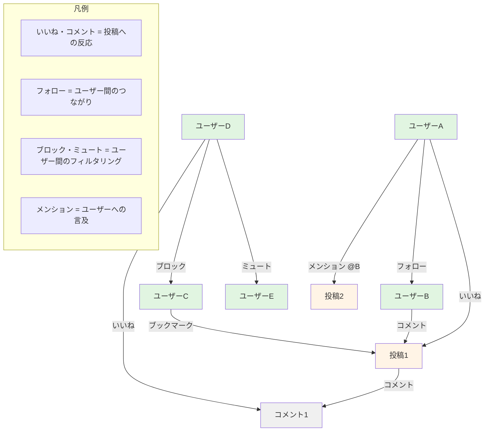
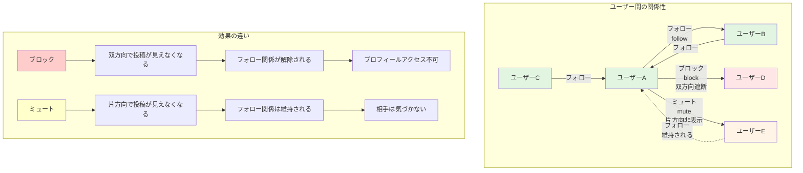
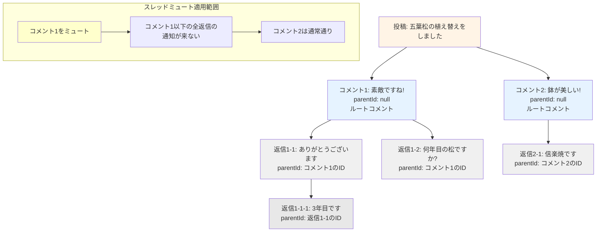
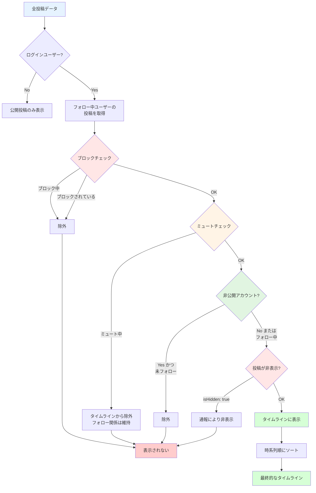
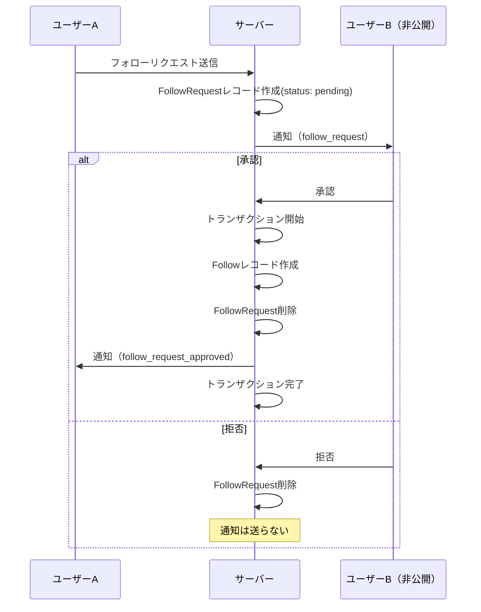
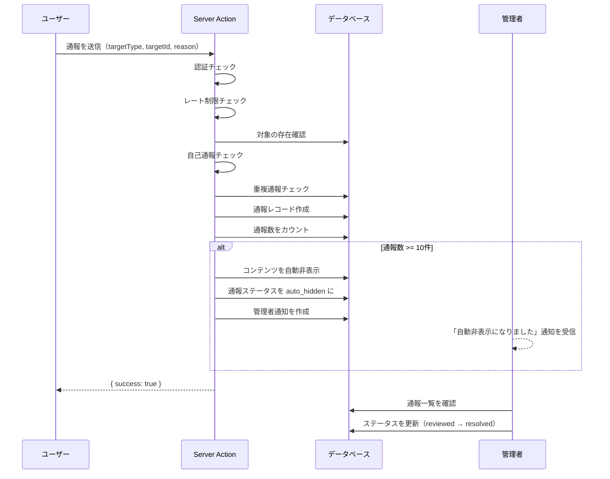
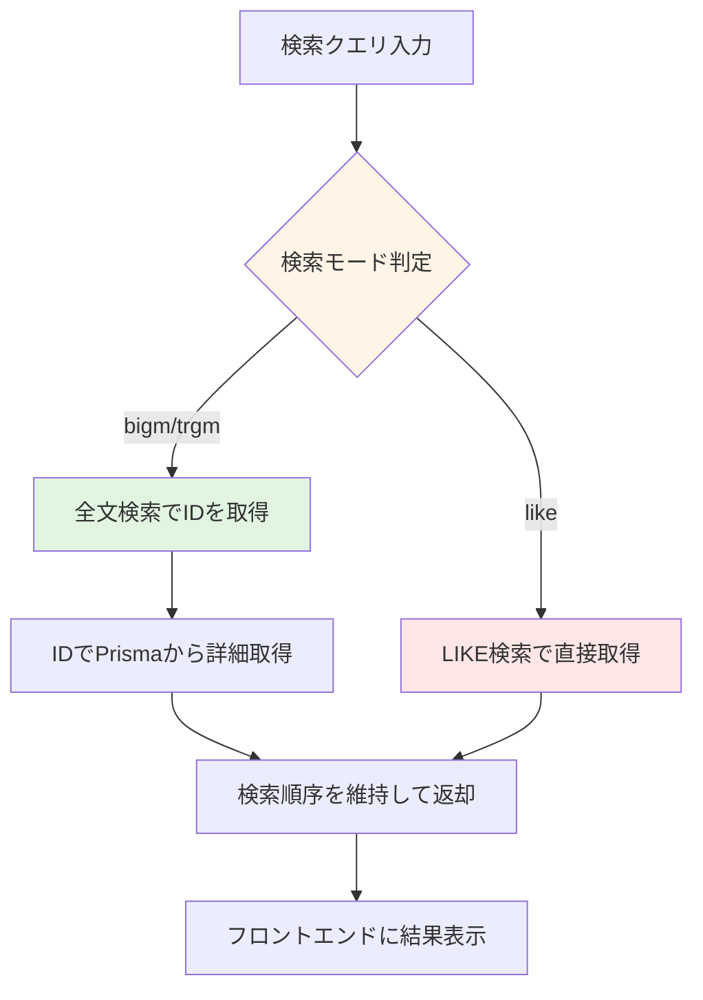

# 第10章: ソーシャル機能の実装

> **この章の目標**: BON-LOGのソーシャル機能（いいね、コメント、ブックマーク、フォロー、ブロック、ミュート、メンション）を実装し、ユーザー同士がつながるSNSの中核部分を完成させます。

この章では、BON-LOGのソーシャル機能を実装します。いいね、コメント、ブックマーク、フォロー、ブロック、ミュートなど、SNSに不可欠なインタラクション機能を一通り学びます。

SNSの本質は「人と人のつながり」です。現実世界に例えると、いいねは「うなずき」、コメントは「会話」、フォローは「友達になること」、ブロックは「距離を置くこと」に相当します。これらの機能を技術的にどう実現するのか、一つずつ丁寧に見ていきましょう。

---

## 10.0 実習手順の進め方と手順マップ

手順に沿って進めると、**どのファイルに何を入力し、何を確認すればよいか** が分かります。形式の説明は [チュートリアルの進め方](./00_how_to_follow_steps.md) を参照してください。

| 手順 | 主な対象ファイル（例） | 完了時に確認すること |
|------|------------------------|------------------------|
| いいね | `lib/actions/like.ts`, いいねボタンコンポーネント | いいね・解除ができ、件数が変わる |
| コメント | `lib/actions/comment.ts`, コメントUI | コメント投稿・スレッド表示ができる |
| フォロー | `lib/actions/follow.ts`, フォローボタン | フォロー・解除ができ、一覧が表示される |
| ブックマーク | `lib/actions/bookmark.ts` | ブックマーク・解除ができる |
| ブロック・ミュート | `lib/actions/block.ts`, `mute.ts` | ブロック・ミュートが効く |
| メンション | `lib/actions/mention.ts`, 投稿フォーム | @ユーザー名で通知が届く |

各セクションで **対象ファイル**・**入力するコード（サンプルコード）**・**実行方法**・**実行するとこうなる**・**このあと変わること**・**確認方法** を確認しながら進めてください。

---

### この章で学ぶ技術要素

| 技術 | 用途 | 対応セクション |
|------|------|--------------|
| Prismaリレーション | ユーザー間の関係をDBで表現 | 全セクション |
| Server Actions | データの作成・更新・削除 | 全セクション |
| 楽観的更新（Optimistic Update） | 即座にUIを反映しUXを向上 | 10.1, 10.3, 10.4 |
| トランザクション | 複数操作の整合性を保証 | 10.5, 10.6 |
| 複合ユニーク制約 | 重複データの防止 | 10.1, 10.3, 10.4 |
| カーソルベースページネーション | 大量データの効率的な取得 | 10.2, 10.3, 10.4 |
| 再帰CTE | コメントスレッドの祖先を辿る | 10.2 |
| メンション解析 | テキストからユーザー参照を抽出 | 10.8 |

### ソーシャル機能の全体像



### 前提条件

この章を始める前に、以下が完了していることを確認してください。

- 第8章: 認証機能の実装が完了していること
- 第9章: 投稿機能の実装が完了していること
- PostgreSQLが起動していること（`docker compose up -d postgres`）
- `npx prisma generate` でPrismaクライアントが生成済みであること

---

### 専門用語ガイド（この章で登場する用語）

この章では、SNS開発に特有の専門用語が数多く登場します。初めて目にする用語もあるかもしれませんので、先にまとめて解説しておきます。各セクションでも必要に応じて補足しますが、迷ったときはここに戻ってきてください。

| 用語 | 英語 | 意味 |
|------|------|------|
| **ソーシャルグラフ** | Social Graph | ユーザー同士の「つながり」をグラフ（ノードとエッジ）として表現したもの。ノード=ユーザー、エッジ=フォロー関係。SNSの根幹データ構造 |
| **フォロー / フォロワー** | Follow / Follower | フォロー=ある人の投稿をタイムラインに受け取ること。フォロワー=自分をフォローしている人。一方向の関係が基本 |
| **フォローリクエスト** | Follow Request | 非公開アカウントにフォローしたい場合に送る承認依頼。相手が承認するとフォロー関係が成立する |
| **いいね** | Like | 投稿やコメントに対するポジティブなリアクション。X(旧Twitter)のハートやFacebookの「いいね！」と同じ |
| **ブックマーク** | Bookmark | 後で読み返したい投稿をプライベートに保存する機能。他のユーザーには見えない |
| **ブロック** | Block | 特定ユーザーとの関わりを完全に断つ操作。双方向で投稿やプロフィールが見えなくなる |
| **ミュート** | Mute | 特定ユーザーの投稿を自分のタイムラインから非表示にする操作。フォロー関係は維持され、相手にも通知されない |
| **スレッドミュート** | Thread Mute | コメントスレッドの通知をミュートする機能。特定の会話から離脱したいときに使用 |
| **メンション** | Mention | 投稿内で他のユーザーを `@ユーザー名` 形式で言及する機能。言及されたユーザーに通知が送られる |
| **楽観的更新** | Optimistic Update | サーバーの応答を待たず、成功を「楽観的に」想定して先にUIを更新するUXパターン。失敗時はロールバックする |
| **トグル** | Toggle | 同じ操作で2つの状態を切り替えること。いいね済み <-> いいね解除のように、1つのボタンでON/OFFを切り替える |
| **レート制限** | Rate Limit | 一定時間内の操作回数を制限する仕組み。スパムや悪意ある大量操作を防ぐ |
| **トランザクション** | Transaction | 複数のデータベース操作をひとまとまりとして実行すること。全て成功するか、全て取り消されるか（Atomicity）を保証する |
| **ソフトデリート** | Soft Delete | レコードを物理的に削除するのではなく、`deletedAt` などのフラグを設定して論理的に削除済みとマークする方式 |
| **再帰CTE** | Recursive CTE | SQLのWITH RECURSIVE構文。ツリー構造のデータを辿るために使用。コメントスレッドの祖先を一括取得する |
| **キャッシュ無効化** | Cache Invalidation | 古くなったキャッシュデータを「古い」とマークし、次回アクセス時に最新データを再取得させること |
| **カーソルベースページネーション** | Cursor-based Pagination | 「最後に取得したレコードのID」を起点に次のページを取得する方式。オフセット方式より大規模データで高性能 |

> **用語の関連図**
>
> ```
> [ソーシャルグラフ]
>     |
>     +-- [フォロー/フォロワー] -- ユーザー間の「つながり」の基本単位
>     |       |
>     |       +-- フォローリクエスト = 非公開アカウントへの承認依頼
>     |
>     +-- [いいね/ブックマーク] -- コンテンツへの反応
>     |       |
>     |       +-- いいね = 公開のリアクション
>     |       +-- ブックマーク = プライベートな保存
>     |
>     +-- [コメント/メンション] -- コンテンツへの参加
>     |       |
>     |       +-- コメント = 投稿への返信（スレッド対応）
>     |       +-- メンション = ユーザーへの言及
>     |       +-- スレッドミュート = 会話からの離脱
>     |
>     +-- [ブロック/ミュート] -- ユーザー間のフィルタリング
>             |
>             +-- ブロック = 強い遮断（双方向、フォロー解除）
>             +-- ミュート = 軽い非表示（片方向、フォロー維持）
> ```

---

## 目次

- 10.1 いいね機能
- 10.2 コメント機能
- 10.3 ブックマーク機能
- 10.4 フォロー機能
- 10.5 非公開アカウントとフォローリクエスト
- 10.6 ブロック・ミュート機能
- 10.7 コメントスレッドミュート
- 10.8 メンション機能
- 10.9 ユーザープロフィールページ
- 10.10 タイムラインのフィルタリング
- 10.10A ブロック/ミュート管理ページ
- 10.10B 投稿の非表示機能（ユーザーレベル）
- 10.11 通報（レポート）機能
- 10.12 ユーザープロフィール管理
- 10.13 プライバシー設定
- 10.14 アカウント削除
- 10.15 メンション詳解 - テキスト解析とオートコンプリート
- 10.16 ユーザー検索・発見機能
- 10.17 演習問題
- 10.18 まとめ

---

## ソーシャル機能の関係図

BON-LOGのソーシャル機能を理解するために、以下の3つの重要な図解を用意しました。

### 1. ソーシャルインタラクションモデル（Follow、Block、Mute関係図）



### 2. コメントスレッド構造図



### 3. コンテンツフィルタリングパイプライン



---

## 10.1 いいね機能

> **このセクションで学ぶこと**
> - いいねデータの設計方法（複合ユニーク制約で重複防止）
> - トグル操作（いいね追加 / いいね解除）の実装パターン
> - 楽観的更新（Optimistic Update）でUXを向上させる手法
> - 投稿いいねとコメントいいねの両方への対応

いいね機能は、投稿やコメントに対するポジティブなリアクションを表現します。BON-LOGでは投稿へのいいねとコメントへのいいねの両方に対応しています。

### BON-LOGでの使用箇所

| ファイル | 役割 |
|---------|------|
| `prisma/schema.prisma` (Likeモデル) | いいねデータの定義 |
| `lib/actions/like.ts` | いいねのServer Actions（togglePostLike, toggleCommentLike, getPostLikeStatus, getLikedPosts） |
| `components/post/LikeButton.tsx` | いいねボタンUI（投稿用） |
| `components/comment/CommentLikeButton.tsx` | いいねボタンUI（コメント用） |

### 実装しない場合の影響

- ユーザーが投稿に対してリアクションを示す手段がなくなる
- 投稿の人気度を測る指標がなくなる
- フィードのアルゴリズムでの活用ができない
- ユーザーのエンゲージメント（参加意欲）が低下する

### データモデル

いいねのデータモデルは、「誰が」「何に」いいねしたかを記録するシンプルな構造です。ポイントは、投稿（Post）とコメント（Comment）の両方に対応できるようにしていることです。

```prisma
// prisma/schema.prisma

model Like {
  id        String   @id @default(cuid())
  userId    String   @map("user_id")
  postId    String?  @map("post_id")       // 投稿へのいいね（任意）
  commentId String?  @map("comment_id")    // コメントへのいいね（任意）
  createdAt DateTime @default(now()) @map("created_at")

  user    User     @relation(fields: [userId], references: [id], onDelete: Cascade)
  post    Post?    @relation(fields: [postId], references: [id], onDelete: Cascade)
  comment Comment? @relation(fields: [commentId], references: [id], onDelete: Cascade)

  @@unique([userId, postId])     // 同じユーザーが同じ投稿に複数回いいね不可
  @@unique([userId, commentId])  // 同じユーザーが同じコメントに複数回いいね不可
  @@index([postId])
  @@index([userId])
  @@map("likes")
}
```

> **用語解説: 複合ユニーク制約（@@unique）とは？**
>
> `@@unique([userId, postId])` は「userId と postId の組み合わせ」が重複してはいけないという制約です。
> つまり、ユーザーAが投稿1に対して2回いいねしようとすると、データベースがエラーを返します。
> アプリケーション側でチェックしなくても、データベースレベルで重複が防止されます。

### Server Action

`togglePostLike` 関数は、いいねの追加と解除を1つの関数で処理する「トグル」パターンを使っています。

```typescript
// lib/actions/like.ts
'use server'

import { prisma } from '@/lib/db'
import { requireAuth } from '@/lib/actions/utils'
import { revalidatePath } from 'next/cache'
import { recordLikeReceived } from './analytics'
import { checkUserRateLimit } from '@/lib/rate-limit'
import logger from '@/lib/logger'
import { ERR_RATE_LIMIT_OPERATION } from '@/lib/constants/errors'

export async function togglePostLike(postId: string) {
  // 認証チェック（requireAuthヘルパーを使用）
  const { userId, error: authError } = await requireAuth()
  if (!userId) return { error: authError! }

  // レート制限チェック（スパム防止）
  const rateLimitResult = await checkUserRateLimit(userId, 'toggle_like')
  if (!rateLimitResult.success) {
    return { error: ERR_RATE_LIMIT_OPERATION }
  }

  try {
    // 既にいいね済みかどうかを確認
    // commentId: null で「投稿へのいいね」と「コメントへのいいね」を区別
    const existingLike = await prisma.like.findFirst({
      where: { postId, userId, commentId: null },
    })

    if (existingLike) {
      // いいね解除
      await prisma.like.delete({ where: { id: existingLike.id } })
      revalidatePath('/feed')
      revalidatePath(`/posts/${postId}`)
      return { success: true, liked: false }
    } else {
      // いいね追加
      await prisma.like.create({
        data: { postId, userId },
      })

      // 投稿者への通知（自分の投稿でない場合のみ）
      const post = await prisma.post.findUnique({
        where: { id: postId },
        select: { userId: true },
      })

      if (post && post.userId !== userId) {
        await prisma.notification.create({
          data: {
            userId: post.userId,   // 通知を受け取る人（投稿者）
            actorId: userId,       // いいねした人
            type: 'like',
            postId,
          },
        })
        // 分析データ記録（エラーは無視して本体処理に影響させない）
        recordLikeReceived(post.userId).catch((err) => logger.error('recordLikeReceived failed:', err))
      }

      revalidatePath('/feed')
      revalidatePath(`/posts/${postId}`)
      return { success: true, liked: true }
    }
  } catch (error) {
    logger.error('Toggle post like error:', error)
    return { error: 'いいねの処理に失敗しました' }
  }
}
```

コメントへのいいねも同様のパターンです。通知タイプが `'comment_like'` になる点が異なります。

```typescript
// lib/actions/like.ts（続き）

export async function toggleCommentLike(commentId: string, postId: string) {
  const { userId, error: authError } = await requireAuth()
  if (!userId) return { error: authError! }

  const rateLimitResult = await checkUserRateLimit(userId, 'toggle_like')
  if (!rateLimitResult.success) {
    return { error: ERR_RATE_LIMIT_OPERATION }
  }

  try {
    const existingLike = await prisma.like.findFirst({
      where: { commentId, userId },
    })

    if (existingLike) {
      await prisma.like.delete({ where: { id: existingLike.id } })
      revalidatePath(`/posts/${postId}`)
      return { success: true, liked: false }
    } else {
      await prisma.like.create({
        data: { commentId, userId },
      })

      // コメント投稿者への通知
      const comment = await prisma.comment.findUnique({
        where: { id: commentId },
        select: { userId: true },
      })

      if (comment && comment.userId !== userId) {
        await prisma.notification.create({
          data: {
            userId: comment.userId,
            actorId: userId,
            type: 'comment_like',  // コメントへのいいね
            postId,
            commentId,
          },
        })
      }

      revalidatePath(`/posts/${postId}`)
      return { success: true, liked: true }
    }
  } catch (error) {
    logger.error('Toggle comment like error:', error)
    return { error: 'いいねの処理に失敗しました' }
  }
}
```

### LikeButtonコンポーネント（楽観的更新）

楽観的更新（Optimistic Update）を実装して、ユーザーがボタンを押した瞬間にUIが変わるようにします。

```typescript
// components/post/LikeButton.tsx
'use client'

import { useState, useTransition } from 'react'
import { Heart } from 'lucide-react'
import { togglePostLike } from '@/lib/actions/like'
import { cn } from '@/lib/utils'

interface LikeButtonProps {
  postId: string
  initialLikeCount: number
  initialIsLiked: boolean
}

export function LikeButton({ postId, initialLikeCount, initialIsLiked }: LikeButtonProps) {
  const [isPending, startTransition] = useTransition()
  const [isLiked, setIsLiked] = useState(initialIsLiked)
  const [likeCount, setLikeCount] = useState(initialLikeCount)

  const handleToggle = () => {
    // 楽観的更新: サーバー応答を待たずにUIを先に変更
    const newIsLiked = !isLiked
    const newCount = newIsLiked ? likeCount + 1 : likeCount - 1
    setIsLiked(newIsLiked)
    setLikeCount(newCount)

    startTransition(async () => {
      const result = await togglePostLike(postId)
      // エラー時はロールバック
      if (result.error) {
        setIsLiked(!newIsLiked)
        setLikeCount(likeCount)
      }
    })
  }

  return (
    <button
      onClick={handleToggle}
      disabled={isPending}
      className={cn(
        'flex items-center space-x-1 transition-colors disabled:opacity-50',
        isLiked ? 'text-red-600' : 'text-gray-500 hover:text-red-600'
      )}
    >
      <Heart className={cn('h-5 w-5', isLiked && 'fill-current')} />
      <span className="text-sm">{likeCount}</span>
    </button>
  )
}
```

> **楽観的更新のフロー**
>
> ```
> [クリック] --> [UI即座に更新] + [Server Action (バックグラウンド)]
>                                        |
>                                  成功 --> そのまま
>                                  失敗 --> UI元に戻す（ロールバック）
> ```

### 期待される動作

1. ユーザーがハートアイコンをクリック
2. 即座にハートが赤くなり、カウントが+1される（楽観的更新）
3. バックグラウンドでServer Actionが実行される
4. 成功時: 投稿者に通知が送信される（自分の投稿の場合は通知なし）
5. 失敗時: ハートがグレーに戻り、カウントも元に戻る

---

## 10.2 コメント機能

> **このセクションで学ぶこと**
> - スレッド形式（親子関係）のコメント設計
> - 自己参照リレーション（Comment が Comment を参照）
> - 再帰CTEによるスレッド参加者の一括取得
> - スパム防止のためのレート制限（1日100件まで）
> - ソフトデリート（論理削除）パターン

### BON-LOGでの使用箇所

| ファイル | 役割 |
|---------|------|
| `prisma/schema.prisma` (Comment, CommentMediaモデル) | コメントデータの定義 |
| `lib/actions/comment.ts` | コメントのServer Actions（createComment, deleteComment, getComments, getReplies, getCommentCount, uploadCommentMedia） |
| `components/comment/CommentForm.tsx` | コメント入力フォーム（メンション対応、メディア添付対応） |
| `components/comment/CommentCard.tsx` | 各コメントの表示 |
| `components/comment/CommentList.tsx` | コメント一覧の取得と表示 |
| `app/(main)/posts/[id]/page.tsx` | 投稿詳細ページ |

### 実装しない場合の影響

- ユーザーが投稿に対して意見や感想を書き込めない
- ユーザー間の会話（スレッド）が成立しない
- SNSとしてのコミュニケーション機能が著しく低下する
- 投稿者がフィードバックを受け取れない

### データモデル

コメントは「自己参照リレーション」を使ったツリー構造になっています。`parentId` が `null` なら親コメント、値があれば返信です。

```prisma
// prisma/schema.prisma

model Comment {
  id        String    @id @default(cuid())
  postId    String    @map("post_id")
  userId    String    @map("user_id")
  parentId  String?   @map("parent_id")      // 返信先（nullならルートコメント）
  content   String    @db.Text
  isHidden  Boolean   @default(false) @map("is_hidden")
  hiddenAt  DateTime? @map("hidden_at")
  deletedAt DateTime? @map("deleted_at")     // ソフトデリート
  createdAt DateTime  @default(now()) @map("created_at")

  post    Post      @relation(fields: [postId], references: [id], onDelete: Cascade)
  user    User      @relation(fields: [userId], references: [id], onDelete: Cascade)
  parent  Comment?  @relation("CommentReplies", fields: [parentId], references: [id], onDelete: Cascade)
  replies Comment[] @relation("CommentReplies")
  likes   Like[]
  media   CommentMedia[]
  notifications Notification[]
  threadMutes   CommentThreadMute[]

  @@index([postId])
  @@index([userId])
  @@index([parentId])
  @@map("comments")
}
```

> **自己参照リレーションとは？**
>
> 通常のリレーションは「ユーザーが投稿を持つ」のように異なるテーブル間ですが、
> コメントの場合は「コメントがコメント（返信）を持つ」という**同じテーブル内での参照**です。
> `parentId` フィールドが同じCommentテーブルのIDを指すことで実現します。

### Server Action: コメント作成

コメント作成では、認証、レート制限、バリデーション、ソフトデリートなど多くの処理が含まれます。特に注目すべきは、返信時に**再帰CTE**を使ってスレッド参加者全員に通知を送る仕組みです。

```typescript
// lib/actions/comment.ts
'use server'

import { prisma } from '@/lib/db'
import { auth } from '@/lib/auth'
import { revalidatePath } from 'next/cache'
import { sanitizePostContent } from '@/lib/sanitize'
import { checkUserRateLimit } from '@/lib/rate-limit'
import {
  MAX_COMMENT_LENGTH,
  DAILY_COMMENT_LIMIT,
} from '@/lib/constants/limits'

export async function createComment(formData: FormData) {
  const session = await auth()
  if (!session?.user?.id) return { error: '認証が必要です' }

  // レート制限チェック（分単位のスパム防止）
  const rateLimitResult = await checkUserRateLimit(session.user.id, 'comment')
  if (!rateLimitResult.success) return { error: 'コメント操作が多すぎます' }

  // フォームデータ取得
  const postId = formData.get('postId') as string
  const parentId = formData.get('parentId') as string | null
  const rawContent = formData.get('content') as string
  const content = sanitizePostContent(rawContent)  // XSS対策
  const mediaUrls = formData.getAll('mediaUrls') as string[]
  const mediaTypes = formData.getAll('mediaTypes') as string[]

  // バリデーション
  if ((!content || content.length === 0) && mediaUrls.length === 0) {
    return { error: 'コメント内容を入力してください' }
  }
  if (content && content.length > MAX_COMMENT_LENGTH) {
    return { error: `コメントは${MAX_COMMENT_LENGTH}文字以内で入力してください` }
  }

  try {
    // 1日のコメント数制限チェック
    const today = new Date()
    today.setHours(0, 0, 0, 0)
    const count = await prisma.comment.count({
      where: { userId: session.user.id, createdAt: { gte: today } },
    })
    if (count >= DAILY_COMMENT_LIMIT) {
      return { error: `1日のコメント上限（${DAILY_COMMENT_LIMIT}件）に達しました` }
    }

    // コメント作成
    const comment = await prisma.comment.create({
      data: {
        postId,
        userId: session.user.id,
        parentId: parentId || null,
        content: content?.trim() || '',
        media: mediaUrls.length > 0 ? {
          create: mediaUrls.map((url, index) => ({
            url,
            type: mediaTypes[index] || 'image',
            sortOrder: index,
          })),
        } : undefined,
      },
    })

    // 通知作成
    if (parentId) {
      // 返信の場合：再帰CTEで全祖先コメントの投稿者を一括取得
      const participantIds = new Set<string>()
      let rootCommentId: string = parentId

      const ancestors = await prisma.$queryRaw<{ id: string; user_id: string; parent_id: string | null }[]>`
        WITH RECURSIVE ancestors AS (
          SELECT id, user_id, parent_id FROM comments WHERE id = ${parentId}
          UNION ALL
          SELECT c.id, c.user_id, c.parent_id FROM comments c
          INNER JOIN ancestors a ON c.id = a.parent_id
        )
        SELECT id, user_id, parent_id FROM ancestors
      `
      for (const ancestor of ancestors) {
        participantIds.add(ancestor.user_id)
        if (!ancestor.parent_id) rootCommentId = ancestor.id
      }

      // 投稿者も通知対象に追加
      const post = await prisma.post.findUnique({
        where: { id: postId },
        select: { userId: true },
      })
      if (post) participantIds.add(post.userId)
      participantIds.delete(session.user.id) // 自分は除外

      // スレッドミュート済みユーザーを除外
      const mutedUsers = await prisma.commentThreadMute.findMany({
        where: {
          commentId: rootCommentId,
          userId: { in: Array.from(participantIds) },
        },
        select: { userId: true },
      })
      const mutedUserIds = new Set(mutedUsers.map(m => m.userId))

      // 各参加者に通知
      for (const userId of participantIds) {
        if (mutedUserIds.has(userId)) continue
        await prisma.notification.create({
          data: {
            userId,
            actorId: session.user.id,
            type: 'reply',
            postId,
            commentId: comment.id,
          },
        })
      }
    } else {
      // 通常コメント：投稿者へ通知
      const post = await prisma.post.findUnique({
        where: { id: postId },
        select: { userId: true },
      })
      if (post && post.userId !== session.user.id) {
        await prisma.notification.create({
          data: {
            userId: post.userId,
            actorId: session.user.id,
            type: 'comment',
            postId,
            commentId: comment.id,
          },
        })
      }
    }

    revalidatePath(`/posts/${postId}`)
    return { success: true, comment }
  } catch (error) {
    console.error('コメント作成エラー:', error)
    return { error: 'コメントの作成に失敗しました' }
  }
}
```

> **再帰CTE（WITH RECURSIVE）とは？**
>
> SQLのWITH RECURSIVE構文を使って、ツリー構造のデータを再帰的に辿ります。
> コメントの返信の返信の返信...と深い階層があっても、1回のSQLクエリで全ての祖先を取得できます。
> N+1問題（ループでクエリを発行する）を回避する重要なテクニックです。

### Server Action: コメント削除（ソフトデリート）

コメントの削除は「ソフトデリート」方式を採用しています。返信コメントを保持するため、物理削除ではなく `deletedAt` を設定します。

```typescript
// lib/actions/comment.ts（続き）

export async function deleteComment(commentId: string) {
  const session = await auth()
  if (!session?.user?.id) return { error: '認証が必要です' }

  try {
    const comment = await prisma.comment.findUnique({
      where: { id: commentId },
      select: { userId: true, postId: true },
    })

    if (!comment) return { error: 'コメントが見つかりません' }
    if (comment.userId !== session.user.id) return { error: '削除権限がありません' }

    // 物理削除ではなくソフトデリート
    await prisma.comment.update({
      where: { id: commentId },
      data: { deletedAt: new Date() },
    })

    revalidatePath(`/posts/${comment.postId}`)
    return { success: true }
  } catch (error) {
    console.error('コメント削除エラー:', error)
    return { error: 'コメントの削除に失敗しました' }
  }
}
```

### CommentFormコンポーネント

コメントフォームは、テキスト入力とメディア添付に対応しています。メンション機能（@入力でユーザー候補を表示）も統合されています。

```typescript
// components/comment/CommentForm.tsx
'use client'

import { useState, useTransition, useRef } from 'react'
import { Button } from '@/components/ui/button'
import { MentionTextarea } from '@/components/common/MentionTextarea'
import { createComment } from '@/lib/actions/comment'
import { MAX_COMMENT_LENGTH } from '@/lib/constants/limits'

type CommentFormProps = {
  postId: string
  parentId?: string       // 返信先（省略時は通常コメント）
  onSuccess?: () => void
  onCancel?: () => void
  placeholder?: string
  autoFocus?: boolean
}

export function CommentForm({
  postId,
  parentId,
  onSuccess,
  onCancel,
  placeholder = 'コメントを入力...',
  autoFocus = false,
}: CommentFormProps) {
  const [content, setContent] = useState('')
  const [error, setError] = useState<string | null>(null)
  const [isPending, startTransition] = useTransition()
  const [mediaFiles, setMediaFiles] = useState<{ url: string; type: string }[]>([])

  const remainingChars = MAX_COMMENT_LENGTH - content.length
  const canSubmit = (content.trim().length > 0 || mediaFiles.length > 0) && remainingChars >= 0

  async function handleSubmit(e: React.FormEvent) {
    e.preventDefault()
    if (!canSubmit || isPending) return
    setError(null)

    const formData = new FormData()
    formData.append('postId', postId)
    formData.append('content', content)
    if (parentId) formData.append('parentId', parentId)
    mediaFiles.forEach(m => {
      formData.append('mediaUrls', m.url)
      formData.append('mediaTypes', m.type)
    })

    startTransition(async () => {
      const result = await createComment(formData)
      if (result.error) {
        setError(result.error)
      } else {
        setContent('')
        setMediaFiles([])
        onSuccess?.()
      }
    })
  }

  return (
    <form onSubmit={handleSubmit} className="space-y-3">
      <MentionTextarea
        value={content}
        onChange={setContent}
        placeholder={placeholder}
        disabled={isPending}
        autoFocus={autoFocus}
        maxLength={MAX_COMMENT_LENGTH}
      />
      {error && <p className="text-sm text-destructive">{error}</p>}
      <div className="flex justify-end gap-2">
        {onCancel && (
          <Button type="button" variant="ghost" size="sm" onClick={onCancel}>
            キャンセル
          </Button>
        )}
        <Button type="submit" size="sm" disabled={!canSubmit || isPending}>
          {isPending ? '送信中...' : parentId ? '返信する' : 'コメントする'}
        </Button>
      </div>
    </form>
  )
}
```

### 期待される動作

1. 投稿詳細ページにコメントフォームが表示される
2. テキスト入力時に文字数カウンターがリアルタイム更新（500文字上限）
3. 画像2枚または動画1本を添付可能
4. 返信ボタンを押すと、その場に返信フォームが展開される
5. 返信を投稿すると、スレッド内の参加者全員に通知が送られる（スレッドミュートしているユーザーは除外）
6. コメントを削除すると、テキストが「このコメントは削除されました」に変わる（返信は保持）

---

## 10.3 ブックマーク機能

> **このセクションで学ぶこと**
> - プライベートな保存機能の設計
> - いいねとの違い（非公開、通知なし）

### BON-LOGでの使用箇所

| ファイル | 役割 |
|---------|------|
| `prisma/schema.prisma` (Bookmarkモデル) | ブックマークデータの定義 |
| `lib/actions/bookmark.ts` | ブックマークのServer Actions（toggleBookmark, getBookmarkStatus, getBookmarkedPosts） |
| `components/post/BookmarkButton.tsx` | ブックマークボタンUI |
| `app/(main)/bookmarks/page.tsx` | ブックマーク一覧ページ |

### 実装しない場合の影響

- ユーザーが後で見返したい投稿を保存できない
- 「いいね」を「後で読む」代わりに使う運用になり、本来の意味が曖昧になる

### データモデル

```prisma
// prisma/schema.prisma

model Bookmark {
  id        String   @id @default(cuid())
  userId    String   @map("user_id")
  postId    String   @map("post_id")
  createdAt DateTime @default(now()) @map("created_at")

  user User @relation(fields: [userId], references: [id], onDelete: Cascade)
  post Post @relation(fields: [postId], references: [id], onDelete: Cascade)

  @@unique([userId, postId])  // 同じユーザーが同じ投稿を重複ブックマーク不可
  @@index([userId])
  @@map("bookmarks")
}
```

### Server Action

いいねと似たトグル操作ですが、**通知を送らない**のがポイントです（ブックマークはプライベート機能のため）。

```typescript
// lib/actions/bookmark.ts
'use server'

import { prisma } from '@/lib/db'
import { auth } from '@/lib/auth'
import { checkUserRateLimit } from '@/lib/rate-limit'

export async function toggleBookmark(postId: string) {
  const session = await auth()
  if (!session?.user?.id) return { error: '認証が必要です' }

  const rateLimitResult = await checkUserRateLimit(session.user.id, 'engagement')
  if (!rateLimitResult.success) return { error: '操作が多すぎます' }

  try {
    const existingBookmark = await prisma.bookmark.findFirst({
      where: { postId, userId: session.user.id },
    })

    if (existingBookmark) {
      await prisma.bookmark.delete({ where: { id: existingBookmark.id } })
      return { success: true, bookmarked: false }
    } else {
      await prisma.bookmark.create({
        data: { postId, userId: session.user.id },
      })
      // 通知は送らない（ブックマークは非公開機能）
      return { success: true, bookmarked: true }
    }
  } catch (error) {
    console.error('ブックマーク操作エラー:', error)
    return { error: 'ブックマーク操作に失敗しました' }
  }
}
```

### BookmarkButtonコンポーネント（楽観的更新）

ブックマークボタンもいいねボタンと同じく楽観的更新パターンを使います。違いは通知がないことと、トースト通知（ユーザーへのフィードバック）を表示する点です。

```typescript
// components/post/BookmarkButton.tsx
'use client'

import { useState, useTransition, useEffect } from 'react'
import { Bookmark } from 'lucide-react'
import { useQueryClient } from '@tanstack/react-query'
import { useToast } from '@/hooks/use-toast'
import { Button } from '@/components/ui/button'
import { toggleBookmark } from '@/lib/actions/bookmark'

type BookmarkButtonProps = {
  postId: string
  initialBookmarked: boolean
}

export function BookmarkButton({ postId, initialBookmarked }: BookmarkButtonProps) {
  const [bookmarked, setBookmarked] = useState(initialBookmarked)
  const [isPending, startTransition] = useTransition()
  const queryClient = useQueryClient()
  const { toast } = useToast()

  // 親コンポーネントから渡されるpropsが変わった場合に同期
  useEffect(() => {
    setBookmarked(initialBookmarked)
  }, [initialBookmarked])

  async function handleToggle() {
    const newBookmarked = !bookmarked
    setBookmarked(newBookmarked)  // 楽観的更新

    startTransition(async () => {
      const result = await toggleBookmark(postId)

      if (result.error) {
        setBookmarked(bookmarked)  // 失敗時はロールバック
        toast({
          title: 'エラー',
          description: 'ブックマークに失敗しました。再度お試しください',
          variant: 'destructive',
        })
      } else {
        // タイムラインのキャッシュを無効化して再取得
        queryClient.invalidateQueries({ queryKey: ['timeline'] })
        toast({
          description: newBookmarked
            ? 'ブックマークに追加しました'
            : 'ブックマークを解除しました',
        })
      }
    })
  }

  return (
    <Button
      variant="ghost"
      size="sm"
      className={`${
        bookmarked
          ? 'text-yellow-500 hover:text-yellow-600'
          : 'text-muted-foreground hover:text-yellow-500'
      }`}
      onClick={handleToggle}
      disabled={isPending}
      aria-label={bookmarked ? 'ブックマークを解除' : 'ブックマークに追加'}
      aria-pressed={bookmarked}
    >
      <Bookmark
        className={`w-5 h-5 transition-all ${bookmarked ? 'fill-current scale-110' : ''}`}
        aria-hidden="true"
      />
    </Button>
  )
}
```

> **初心者向け解説: `useEffect` で `initialBookmarked` を同期する理由**
>
> React では親コンポーネントから渡される `props` が変わっても、`useState` の初期値は最初の1回しか使われません。
> タイムラインで別の投稿がブックマーク状態を変更したとき、`useEffect` で最新のprops値を `state` に反映させることで、
> 画面の表示とサーバーの実際の状態を一致させます。

> **初心者向け解説: `aria-label` と `aria-pressed` とは？**
>
> `aria-label` はスクリーンリーダー（視覚障害者向けの読み上げソフト）が「このボタンは何をするか」を伝えるための属性です。
> `aria-pressed` はトグルボタンの現在の状態（ON/OFF）を示します。
> これらを設定することで、アクセシビリティ（誰でも使えるUI）が向上します。

### ブックマーク一覧ページ

ブックマークした投稿は専用の一覧ページで確認できます。Server Componentでデータを取得し、Client Componentに渡すパターンです。

```typescript
// app/(main)/bookmarks/page.tsx

import { auth } from '@/lib/auth'
import { getBookmarkedPosts } from '@/lib/actions/bookmark'
import { BookmarkPostList } from './BookmarkPostList'

export const metadata = {
  title: 'ブックマーク - BON-LOG',
}

export default async function BookmarksPage() {
  const session = await auth()
  const result = await getBookmarkedPosts()

  return (
    <div className="max-w-2xl mx-auto">
      <div className="bg-card rounded-lg border overflow-hidden">
        <h1 className="px-4 py-3 font-bold border-b">ブックマーク</h1>
        <BookmarkPostList
          initialPosts={result.posts || []}
          initialNextCursor={result.nextCursor}
          currentUserId={session!.user.id}
        />
      </div>
    </div>
  )
}
```

> **設計パターン: Server Component → Client Component データ受け渡し**
>
> ```
> [BookmarksPage (Server Component)]
>     |
>     +-- auth() でセッション取得
>     +-- getBookmarkedPosts() でDB直接アクセス
>     |
>     v
> [BookmarkPostList (Client Component)]
>     +-- initialPosts を受け取って表示
>     +-- 無限スクロールで追加データを取得
> ```
>
> Server Componentはデータベースに直接アクセスでき、初回表示が高速です。
> Client Componentはユーザー操作（スクロール、クリック）を担当します。
> この役割分担がNext.js App Routerの基本パターンです。

### ブックマーク取得 Server Action

ブックマーク一覧の取得では、カーソルベースページネーションに加えて、各投稿のいいね状態も同時に取得しています。

```typescript
// lib/actions/bookmark.ts（続き）

export async function getBookmarkedPosts(cursor?: string, limit = DEFAULT_PAGE_LIMIT) {
  const session = await auth()
  if (!session?.user?.id) return { error: ERR_AUTH_REQUIRED, posts: [] }

  const currentUserId = session.user.id

  // ブックマークをカーソルベースで取得（投稿データをinclude）
  const bookmarks = await prisma.bookmark.findMany({
    where: { userId: currentUserId },
    include: {
      post: {
        include: {
          user: { select: { id: true, nickname: true, avatarUrl: true } },
          media: { orderBy: { sortOrder: 'asc' } },
          genres: { include: { genre: true } },
          _count: { select: { likes: true, comments: { where: { deletedAt: null } } } },
        },
      },
    },
    orderBy: { createdAt: 'desc' },
    take: limit,
    ...(cursor && { cursor: { id: cursor }, skip: 1 }),
  })

  // 削除済み投稿を除外
  const validBookmarks = bookmarks.filter(b => Boolean(b.post))
  const postIds = validBookmarks.map(b => b.post.id)

  // ユーザーのいいね状態を一括取得（N+1問題を回避）
  let likedPostIds: Set<string> = new Set()
  if (postIds.length > 0) {
    const userLikes = await prisma.like.findMany({
      where: { userId: currentUserId, postId: { in: postIds }, commentId: null },
      select: { postId: true },
    })
    likedPostIds = new Set(
      userLikes.map(l => l.postId).filter((id): id is string => id !== null)
    )
  }

  // フロントエンド用のデータ形式に変換
  const posts = validBookmarks.map(bookmark => ({
    ...bookmark.post,
    likeCount: bookmark.post._count.likes,
    commentCount: bookmark.post._count.comments,
    genres: bookmark.post.genres.map(pg => pg.genre),
    isLiked: likedPostIds.has(bookmark.post.id),
    isBookmarked: true,  // ブックマーク一覧なので常にtrue
  }))

  return {
    posts,
    nextCursor: bookmarks.length === limit
      ? bookmarks[bookmarks.length - 1]?.id
      : undefined,
  }
}
```

> **初心者向け解説: N+1問題の回避**
>
> 「各投稿がいいね済みかどうか」を確認するとき、ループで1件ずつクエリを発行すると N+1問題 が発生します：
> ```
> ❌ 悪い例（N+1問題）:
> posts.forEach(post => {
>   const like = await prisma.like.findFirst({ where: { postId: post.id, userId } })
> })
> // → 20件の投稿 = 20回のDBクエリ
>
> ✅ 良い例（一括取得）:
> const likes = await prisma.like.findMany({
>   where: { postId: { in: postIds }, userId }
> })
> // → 1回のDBクエリで全件取得
> ```

### いいねとブックマークの比較

| 特性 | いいね | ブックマーク |
|------|--------|------------|
| 公開/非公開 | 公開（いいね数が見える） | 非公開（自分だけ） |
| 通知 | 投稿者に通知が送られる | 通知なし |
| 対象 | 投稿 + コメント | 投稿のみ |
| `revalidatePath` | 呼び出す | 呼び出さない |
| トースト通知 | なし | あり（ユーザーへのフィードバック） |
| 意味 | ポジティブなリアクション | 後で読み返したい |

---

## 10.4 フォロー機能

> **このセクションで学ぶこと**
> - フォロー/フォロワーの関係性の設計
> - 複合主キー（@@id）の使い方
> - 非公開アカウントへのフォロー時の分岐処理

### BON-LOGでの使用箇所

| ファイル | 役割 |
|---------|------|
| `prisma/schema.prisma` (Followモデル) | フォローデータの定義 |
| `lib/actions/follow.ts` | フォローのServer Actions（toggleFollow, getFollowStatus, getFollowers, getFollowing） |
| `components/user/FollowButton.tsx` | フォローボタンUI（公開/非公開対応） |
| `app/(main)/users/[id]/page.tsx` | ユーザープロフィールページ |

### 実装しない場合の影響

- タイムラインに表示する投稿を選別できない（全ユーザーの投稿が流れる）
- ユーザー間のソーシャルグラフが構築できない
- SNSの核心機能が欠落する

### データモデル

フォローは複合主キー（`@@id`）を使います。`id` フィールドを持たず、`followerId` と `followingId` の組み合わせで一意に識別します。

```prisma
// prisma/schema.prisma

model Follow {
  followerId  String   @map("follower_id")   // フォローする人
  followingId String   @map("following_id")  // フォローされる人
  createdAt   DateTime @default(now()) @map("created_at")

  follower  User @relation("FollowerToUser", fields: [followerId], references: [id], onDelete: Cascade)
  following User @relation("FollowingToUser", fields: [followingId], references: [id], onDelete: Cascade)

  @@id([followerId, followingId])  // 複合主キー
  @@index([followerId])
  @@index([followingId])
  @@map("follows")
}
```

> **複合主キー（@@id）とは？**
>
> `@@id([followerId, followingId])` は2つのフィールドの組み合わせを主キーとして使います。
> 通常の `id` フィールドが不要になり、「ユーザーAがユーザーBをフォロー」という関係が1レコードとして表現されます。
> 同じ組み合わせは2つ存在できないので、重複防止も兼ねています。

### Server Action

フォロー時には対象ユーザーの公開設定を確認し、非公開アカウントの場合はエラーを返してフォローリクエストの送信を促します。

```typescript
// lib/actions/follow.ts
'use server'

import { prisma } from '@/lib/db'
import { auth } from '@/lib/auth'
import { recordNewFollower } from './analytics'
import { checkUserRateLimit } from '@/lib/rate-limit'
import logger from '@/lib/logger'

export async function toggleFollow(userId: string) {
  const session = await auth()
  if (!session?.user?.id) return { error: '認証が必要です' }

  // 自分自身へのフォロー防止
  if (session.user.id === userId) return { error: '自分自身をフォローすることはできません' }

  const rateLimitResult = await checkUserRateLimit(session.user.id, 'engagement')
  if (!rateLimitResult.success) return { error: '操作が多すぎます' }

  try {
    // 現在のフォロー状態を確認
    const existingFollow = await prisma.follow.findUnique({
      where: {
        followerId_followingId: {
          followerId: session.user.id,
          followingId: userId,
        },
      },
    })

    if (existingFollow) {
      // フォロー解除
      await prisma.follow.delete({
        where: {
          followerId_followingId: {
            followerId: session.user.id,
            followingId: userId,
          },
        },
      })
      return { success: true, following: false }
    } else {
      // 対象ユーザーの公開設定を確認
      const targetUser = await prisma.user.findUnique({
        where: { id: userId },
        select: { isPublic: true },
      })

      if (!targetUser) return { error: 'ユーザーが見つかりません' }

      // 非公開アカウントの場合はフォローリクエストが必要
      if (!targetUser.isPublic) {
        return {
          error: 'このユーザーは非公開アカウントです。フォローリクエストを送信してください',
          requiresRequest: true,
        }
      }

      // フォロー作成
      await prisma.follow.create({
        data: {
          followerId: session.user.id,
          followingId: userId,
        },
      })

      // フォロー通知
      await prisma.notification.create({
        data: {
          userId,
          actorId: session.user.id,
          type: 'follow',
        },
      })

      // アナリティクスに記録
      recordNewFollower(userId).catch((err) => logger.error('recordNewFollower failed:', err))

      return { success: true, following: true }
    }
  } catch (error) {
    logger.error('Toggle follow error:', error)
    return { error: 'フォロー操作に失敗しました' }
  }
}
```

### FollowButtonコンポーネント

フォローボタンは公開アカウントと非公開アカウントで異なる振る舞いをします。ホバー時にテキストが変化するインタラクティブなUIです。

```typescript
// components/user/FollowButton.tsx
'use client'

import { useState, useTransition } from 'react'
import { Button } from '@/components/ui/button'
import { toggleFollow } from '@/lib/actions/follow'
import { sendFollowRequest, cancelFollowRequest } from '@/lib/actions/follow-request'
import { useQueryClient } from '@tanstack/react-query'

type FollowButtonProps = {
  userId: string
  initialIsFollowing: boolean
  isPublic?: boolean           // 対象が公開アカウントか
  initialHasRequest?: boolean  // リクエスト送信済みか
}

export function FollowButton({
  userId,
  initialIsFollowing,
  isPublic = true,
  initialHasRequest = false,
}: FollowButtonProps) {
  const [isFollowing, setIsFollowing] = useState(initialIsFollowing)
  const [hasRequest, setHasRequest] = useState(initialHasRequest)
  const [isPending, startTransition] = useTransition()
  const [isHovered, setIsHovered] = useState(false)
  const queryClient = useQueryClient()

  function handleClick() {
    if (isFollowing) {
      // フォロー解除
      handleFollow()
    } else if (!isPublic && hasRequest) {
      // リクエストキャンセル
      handleCancelRequest()
    } else if (!isPublic) {
      // リクエスト送信
      handleSendRequest()
    } else {
      // フォロー
      handleFollow()
    }
  }

  // ボタンテキストの動的切り替え
  const getButtonText = () => {
    if (isPending) return '...'
    if (isFollowing) return isHovered ? 'フォロー解除' : 'フォロー中'
    if (!isPublic && hasRequest) return isHovered ? 'キャンセル' : 'リクエスト済み'
    if (!isPublic) return 'フォローリクエスト'
    return 'フォローする'
  }

  return (
    <Button
      onClick={handleClick}
      disabled={isPending}
      onMouseEnter={() => setIsHovered(true)}
      onMouseLeave={() => setIsHovered(false)}
    >
      {getButtonText()}
    </Button>
  )
}
```

### 期待される動作

| 状態 | ボタン表示 | ホバー時 | クリック時の動作 |
|------|----------|---------|---------------|
| 未フォロー（公開アカウント） | 「フォローする」（緑色） | -- | フォロー実行 |
| フォロー中 | 「フォロー中」（アウトライン） | 「フォロー解除」（赤色） | フォロー解除 |
| 未フォロー（非公開アカウント） | 「フォローリクエスト」（緑色） | -- | リクエスト送信 |
| リクエスト済み | 「リクエスト済み」（アウトライン） | 「キャンセル」（赤色） | リクエストキャンセル |

---

## 10.5 非公開アカウントとフォローリクエスト

> **このセクションで学ぶこと**
> - フォローリクエストの承認/拒否フロー
> - トランザクションによるアトミックな承認処理

### BON-LOGでの使用箇所

| ファイル | 役割 |
|---------|------|
| `prisma/schema.prisma` (FollowRequestモデル, RequestStatus enum) | フォローリクエストの定義 |
| `lib/actions/follow-request.ts` | フォローリクエストのServer Actions（sendFollowRequest, approveFollowRequest, rejectFollowRequest, cancelFollowRequest, getFollowRequestStatus, getReceivedFollowRequests, getSentFollowRequests, getPendingFollowRequestCount） |
| `components/user/FollowButton.tsx` | フォローリクエスト送信/キャンセルUI |
| `app/(main)/settings/follow-requests/page.tsx` | リクエスト管理ページ |

### 実装しない場合の影響

- 非公開アカウントの意味がなくなる（誰でもフォローできてしまう）
- プライバシーの保護ができない
- ユーザーが安心してSNSを利用できない

### データモデル

```prisma
// prisma/schema.prisma

enum RequestStatus {
  pending    // 保留中
  approved   // 承認済み
  rejected   // 拒否済み
}

model FollowRequest {
  id          String        @id @default(cuid())
  requesterId String        @map("requester_id")  // リクエスト送信者
  targetId    String        @map("target_id")     // リクエスト受信者（非公開アカウント）
  status      RequestStatus @default(pending)
  createdAt   DateTime @default(now()) @map("created_at")
  updatedAt   DateTime @updatedAt @map("updated_at")

  requester User @relation("FollowRequestSent", fields: [requesterId], references: [id], onDelete: Cascade)
  target    User @relation("FollowRequestReceived", fields: [targetId], references: [id], onDelete: Cascade)

  @@unique([requesterId, targetId])
  @@index([requesterId])
  @@index([targetId])
  @@index([status])
  @@map("follow_requests")
}
```

### フォローリクエストのフロー



### Server Action: 承認（トランザクション使用）

承認処理では、フォロー関係の作成とリクエスト削除をトランザクションでアトミックに実行します。

```typescript
// lib/actions/follow-request.ts

export async function approveFollowRequest(requestId: string) {
  const session = await auth()
  if (!session?.user?.id) return { error: '認証が必要です' }

  const request = await prisma.followRequest.findUnique({
    where: { id: requestId },
    include: { requester: { select: { id: true, nickname: true } } },
  })

  if (!request) return { error: 'フォローリクエストが見つかりません' }
  if (request.targetId !== session.user.id) return { error: '権限がありません' }
  if (request.status !== 'pending') return { error: '既に処理されています' }

  // トランザクションで原子的に実行
  await prisma.$transaction(async (tx) => {
    // フォロー関係作成
    await tx.follow.create({
      data: {
        followerId: request.requesterId,
        followingId: session.user.id,
      },
    })
    // リクエスト削除
    await tx.followRequest.delete({ where: { id: requestId } })
    // 承認通知
    await tx.notification.create({
      data: {
        userId: request.requesterId,
        actorId: session.user.id,
        type: 'follow_request_approved',
      },
    })
  })

  return { success: true, status: 'approved' }
}
```

### 期待される動作

1. ユーザーAが非公開ユーザーBのプロフィールで「フォローリクエスト」ボタンを押す
2. ボタンが「リクエスト済み」に変わる
3. ユーザーBに通知が届く
4. ユーザーBが設定画面でリクエストを確認し、承認/拒否を選択
5. 承認された場合: フォロー関係が成立し、ユーザーAに承認通知が届く
6. 拒否された場合: リクエストが削除される（ユーザーAに通知は送られない）

---

## 10.6 ブロック・ミュート機能

> **このセクションで学ぶこと**
> - ブロックの双方向遮断の実装
> - ミュートの片方向非表示の実装
> - トランザクションによるフォロー解除 + ブロック作成

### BON-LOGでの使用箇所

| ファイル | 役割 |
|---------|------|
| `prisma/schema.prisma` (Block, Muteモデル) | ブロック・ミュートデータの定義 |
| `lib/actions/block.ts` | ブロックのServer Actions（blockUser, unblockUser, getBlockedUsers, isBlocked） |
| `lib/actions/mute.ts` | ミュートのServer Actions（muteUser, unmuteUser, getMutedUsers, isMuted） |
| `app/(main)/settings/blocked/page.tsx` | ブロック一覧ページ |
| `app/(main)/settings/muted/page.tsx` | ミュート一覧ページ |
| `app/(main)/users/[id]/page.tsx` | プロフィールページ（ブロック/ミュート状態表示） |

### 実装しない場合の影響

- ハラスメントや迷惑行為からユーザーを保護できない
- ユーザーがSNSを安心して利用できず、離脱につながる
- プラットフォームの健全性が維持できない

### データモデル

```prisma
// prisma/schema.prisma

model Block {
  blockerId String   @map("blocker_id")
  blockedId String   @map("blocked_id")
  createdAt DateTime @default(now()) @map("created_at")

  blocker User @relation("BlockingUser", fields: [blockerId], references: [id], onDelete: Cascade)
  blocked User @relation("BlockedUser", fields: [blockedId], references: [id], onDelete: Cascade)

  @@id([blockerId, blockedId])  // 複合主キー
  @@index([blockedId])
  @@map("blocks")
}

model Mute {
  muterId String   @map("muter_id")
  mutedId String   @map("muted_id")
  createdAt DateTime @default(now()) @map("created_at")

  muter User @relation("MutingUser", fields: [muterId], references: [id], onDelete: Cascade)
  muted User @relation("MutedUser", fields: [mutedId], references: [id], onDelete: Cascade)

  @@id([muterId, mutedId])  // 複合主キー
  @@index([mutedId])
  @@map("mutes")
}
```

### ブロックとミュートの比較

| 特性 | ブロック | ミュート |
|------|---------|---------|
| 方向 | 双方向 | 片方向 |
| フォロー解除 | される | されない |
| 相手への通知 | なし | なし |
| 相手のプロフィール | 見えない | 見える |
| 相手の投稿 | 双方向で見えない | 自分のTLから見えない |
| 相手は気づくか | 気づく可能性あり | 気づかない |

### Server Action: ブロック（トランザクション使用）

ブロック時は**トランザクション**で相互フォローの解除とブロックレコードの作成をアトミックに実行します。

```typescript
// lib/actions/block.ts
'use server'

import { prisma } from '@/lib/db'
import { requireAuth } from '@/lib/actions/utils'
import { revalidatePath } from 'next/cache'

export async function blockUser(targetUserId: string) {
  const { userId, error: authError } = await requireAuth()
  if (!userId) return { error: authError! }

  if (userId === targetUserId) return { error: '自分自身をブロックできません' }

  try {
    // トランザクションで相互フォロー解除 + ブロック作成
    await prisma.$transaction([
      // 双方向のフォローを一括削除
      prisma.follow.deleteMany({
        where: {
          OR: [
            { followerId: userId, followingId: targetUserId },
            { followerId: targetUserId, followingId: userId },
          ],
        },
      }),
      // ブロックレコード作成
      prisma.block.create({
        data: {
          blockerId: userId,
          blockedId: targetUserId,
        },
      }),
    ])

    revalidatePath('/feed')
    revalidatePath(`/users/${targetUserId}`)
    return { success: true }
  } catch (error) {
    console.error('ブロックエラー:', error)
    return { error: 'ブロックに失敗しました' }
  }
}
```

### Server Action: ミュート

ミュートはブロックよりシンプルです。フォロー関係は維持したまま、ミュートレコードを作成するだけです。

```typescript
// lib/actions/mute.ts
'use server'

import { prisma } from '@/lib/db'
import { requireAuth } from '@/lib/actions/utils'
import { revalidatePath } from 'next/cache'

export async function muteUser(targetUserId: string) {
  const { userId, error: authError } = await requireAuth()
  if (!userId) return { error: authError! }

  if (userId === targetUserId) return { error: '自分自身をミュートできません' }

  try {
    // フォロー関係は解除しない
    await prisma.mute.create({
      data: {
        muterId: userId,
        mutedId: targetUserId,
      },
    })

    revalidatePath('/feed')
    revalidatePath(`/users/${targetUserId}`)
    return { success: true }
  } catch (error) {
    console.error('ミュートエラー:', error)
    return { error: 'ミュートに失敗しました' }
  }
}
```

### BlockButtonコンポーネント（確認ダイアログ付き）

ブロックは取り消しが難しい操作（フォロー関係が解除される）なので、**確認ダイアログ**を表示してからブロックを実行します。これは「破壊的操作には確認を求める」というUI設計の原則です。

```typescript
// components/user/BlockButton.tsx
'use client'

import { useState } from 'react'
import { Button } from '@/components/ui/button'
import {
  AlertDialog,
  AlertDialogAction,
  AlertDialogCancel,
  AlertDialogContent,
  AlertDialogDescription,
  AlertDialogFooter,
  AlertDialogHeader,
  AlertDialogTitle,
} from '@/components/ui/alert-dialog'
import { blockUser, unblockUser } from '@/lib/actions/block'
import { useToast } from '@/hooks/use-toast'
import { useQueryClient } from '@tanstack/react-query'

type BlockButtonProps = {
  userId: string
  nickname: string
  initialIsBlocked: boolean
  variant?: 'default' | 'ghost' | 'destructive'
  size?: 'default' | 'sm' | 'lg' | 'icon'
}

export function BlockButton({
  userId,
  nickname,
  initialIsBlocked,
  variant = 'ghost',
  size = 'default',
}: BlockButtonProps) {
  const [isBlocked, setIsBlocked] = useState(initialIsBlocked)
  const [loading, setLoading] = useState(false)
  const [showDialog, setShowDialog] = useState(false)
  const { toast } = useToast()
  const queryClient = useQueryClient()

  async function handleBlock() {
    setLoading(true)
    setShowDialog(false)
    setIsBlocked(true)  // 楽観的更新

    const result = await blockUser(userId)

    if (result.error) {
      setIsBlocked(false)  // ロールバック
      toast({ title: 'エラー', description: result.error, variant: 'destructive' })
    } else {
      toast({
        title: 'ブロックしました',
        description: `${nickname}さんをブロックしました`,
      })
      queryClient.invalidateQueries({ queryKey: ['timeline'] })
    }
    setLoading(false)
  }

  async function handleUnblock() {
    setLoading(true)
    setIsBlocked(false)  // 楽観的更新

    const result = await unblockUser(userId)

    if (result.error) {
      setIsBlocked(true)  // ロールバック
      toast({ title: 'エラー', description: result.error, variant: 'destructive' })
    } else {
      toast({
        title: 'ブロックを解除しました',
        description: `${nickname}さんのブロックを解除しました`,
      })
      queryClient.invalidateQueries({ queryKey: ['timeline'] })
    }
    setLoading(false)
  }

  return (
    <>
      {/* ブロック解除は直接実行、ブロックは確認ダイアログを表示 */}
      <Button
        onClick={() => (isBlocked ? handleUnblock() : setShowDialog(true))}
        disabled={loading}
        variant={variant}
        size={size}
      >
        {loading ? '...' : isBlocked ? 'ブロック解除' : 'ブロック'}
      </Button>

      {/* ブロック確認ダイアログ */}
      <AlertDialog open={showDialog} onOpenChange={setShowDialog}>
        <AlertDialogContent>
          <AlertDialogHeader>
            <AlertDialogTitle>{nickname}さんをブロックしますか?</AlertDialogTitle>
            <AlertDialogDescription asChild>
              <div className="text-muted-foreground text-sm">
                ブロックすると、以下の操作が行われます:
                <ul className="mt-2 space-y-1 list-disc list-inside">
                  <li>相互フォローが解除されます</li>
                  <li>相手の投稿が表示されなくなります</li>
                  <li>相手からのコメントが表示されなくなります</li>
                  <li>相手はあなたのプロフィールにアクセスできなくなります</li>
                </ul>
              </div>
            </AlertDialogDescription>
          </AlertDialogHeader>
          <AlertDialogFooter>
            <AlertDialogCancel>キャンセル</AlertDialogCancel>
            <AlertDialogAction
              onClick={handleBlock}
              className="bg-red-600 hover:bg-red-700"
            >
              ブロック
            </AlertDialogAction>
          </AlertDialogFooter>
        </AlertDialogContent>
      </AlertDialog>
    </>
  )
}
```

> **初心者向け解説: AlertDialog（確認ダイアログ）とは？**
>
> `AlertDialog` は shadcn/ui が提供する確認ダイアログコンポーネントです。
> 「本当に実行しますか？」とユーザーに確認を求めるUIパターンで、
> データ削除やブロックなど**取り消しが難しい操作**で使います。
>
> ```
> [ブロックボタン] → クリック → [確認ダイアログ表示]
>                                    |
>                              キャンセル → 何もしない
>                              ブロック → blockUser() 実行
> ```
>
> `AlertDialogDescription` に `asChild` を付けると、子要素（`<div>`）がそのまま使われます。
> これにより `<ul>` リストなどのリッチな説明文を入れられます。

### MuteButtonコンポーネント

ミュートボタンもブロックと同様に確認ダイアログを使いますが、影響が軽い（フォロー解除されない）ため、ダイアログの文言が異なります。

```typescript
// components/user/MuteButton.tsx
'use client'

import { useState } from 'react'
import { Button } from '@/components/ui/button'
import {
  AlertDialog, AlertDialogAction, AlertDialogCancel, AlertDialogContent,
  AlertDialogDescription, AlertDialogFooter, AlertDialogHeader, AlertDialogTitle,
} from '@/components/ui/alert-dialog'
import { muteUser, unmuteUser } from '@/lib/actions/mute'
import { useToast } from '@/hooks/use-toast'
import { useQueryClient } from '@tanstack/react-query'

type MuteButtonProps = {
  userId: string
  nickname: string
  initialIsMuted: boolean
}

export function MuteButton({ userId, nickname, initialIsMuted }: MuteButtonProps) {
  const [isMuted, setIsMuted] = useState(initialIsMuted)
  const [loading, setLoading] = useState(false)
  const [showDialog, setShowDialog] = useState(false)
  const { toast } = useToast()
  const queryClient = useQueryClient()

  async function handleMute() {
    setLoading(true)
    setShowDialog(false)
    setIsMuted(true)

    const result = await muteUser(userId)
    if (result.error) {
      setIsMuted(false)
      toast({ title: 'エラー', description: result.error, variant: 'destructive' })
    } else {
      toast({ title: 'ミュートしました', description: `${nickname}さんをミュートしました` })
      queryClient.invalidateQueries({ queryKey: ['timeline'] })
    }
    setLoading(false)
  }

  async function handleUnmute() {
    setLoading(true)
    setIsMuted(false)

    const result = await unmuteUser(userId)
    if (result.error) {
      setIsMuted(true)
      toast({ title: 'エラー', description: result.error, variant: 'destructive' })
    } else {
      toast({ title: 'ミュートを解除しました' })
      queryClient.invalidateQueries({ queryKey: ['timeline'] })
    }
    setLoading(false)
  }

  return (
    <>
      <Button onClick={() => (isMuted ? handleUnmute() : setShowDialog(true))} disabled={loading}>
        {loading ? '...' : isMuted ? 'ミュート解除' : 'ミュート'}
      </Button>

      <AlertDialog open={showDialog} onOpenChange={setShowDialog}>
        <AlertDialogContent>
          <AlertDialogHeader>
            <AlertDialogTitle>{nickname}さんをミュートしますか?</AlertDialogTitle>
            <AlertDialogDescription asChild>
              <div className="text-muted-foreground text-sm">
                ミュートすると、以下の効果があります:
                <ul className="mt-2 space-y-1 list-disc list-inside">
                  <li>タイムラインに投稿が表示されなくなります</li>
                  <li>通知が表示されなくなります</li>
                </ul>
                <span className="block mt-2">フォロー関係は維持されます。相手に通知は送られません。</span>
              </div>
            </AlertDialogDescription>
          </AlertDialogHeader>
          <AlertDialogFooter>
            <AlertDialogCancel>キャンセル</AlertDialogCancel>
            <AlertDialogAction onClick={handleMute}>ミュート</AlertDialogAction>
          </AlertDialogFooter>
        </AlertDialogContent>
      </AlertDialog>
    </>
  )
}
```

### ブロック状態の確認（双方向チェック）

ブロック状態の確認では、自分が相手をブロックしているかだけでなく、相手から自分がブロックされているかも確認します。

```typescript
// lib/actions/block.ts（続き）

export async function isBlocked(targetUserId: string) {
  const session = await auth()
  if (!session?.user?.id) return { blocked: false, blockedBy: false }

  try {
    // Promise.allで並列クエリ
    const [block, blockedBy] = await Promise.all([
      prisma.block.findUnique({
        where: {
          blockerId_blockedId: { blockerId: session.user.id, blockedId: targetUserId },
        },
      }),
      prisma.block.findUnique({
        where: {
          blockerId_blockedId: { blockerId: targetUserId, blockedId: session.user.id },
        },
      }),
    ])

    return { blocked: !!block, blockedBy: !!blockedBy }
  } catch (error) {
    return { blocked: false, blockedBy: false }
  }
}
```

### 期待される動作

**ブロック時:**
1. ユーザーAがユーザーBをブロック
2. A-B間の相互フォローが解除される
3. Aのタイムラインからbの投稿が消える
4. BのタイムラインからAの投稿が消える
5. 双方のプロフィールページに「このページは表示できません」と表示される

**ミュート時:**
1. ユーザーAがユーザーBをミュート
2. フォロー関係は維持される
3. AのタイムラインからBの投稿が非表示になる
4. Bからは変化が見えない（Bは気づかない）

---

## 10.7 コメントスレッドミュート

> **このセクションで学ぶこと**
> - スレッド単位の通知制御
> - upsert操作（存在すれば更新、なければ作成）

### BON-LOGでの使用箇所

| ファイル | 役割 |
|---------|------|
| `prisma/schema.prisma` (CommentThreadMuteモデル) | スレッドミュートデータの定義 |
| `lib/actions/comment-thread-mute.ts` | スレッドミュートのServer Actions（muteThread, unmuteThread, isThreadMuted） |
| `lib/actions/comment.ts` | コメント通知時のスレッドミュートチェック |

### 実装しない場合の影響

- 活発なスレッドに一度参加すると、以降すべての返信通知が届き続ける
- 通知が溢れてユーザー体験が悪化する
- 重要な通知が埋もれてしまう

### データモデル

```prisma
// prisma/schema.prisma

model CommentThreadMute {
  id        String   @id @default(cuid())
  userId    String   @map("user_id")
  commentId String   @map("comment_id")   // ルートコメントのID
  createdAt DateTime @default(now()) @map("created_at")

  user    User    @relation(fields: [userId], references: [id], onDelete: Cascade)
  comment Comment @relation(fields: [commentId], references: [id], onDelete: Cascade)

  @@unique([userId, commentId])
  @@map("comment_thread_mutes")
}
```

### Server Action

`upsert` を使って、既にミュートしている場合は何もせず、していない場合は作成します。

```typescript
// lib/actions/comment-thread-mute.ts
'use server'

import { prisma } from '@/lib/db'
import { auth } from '@/lib/auth'

export async function muteThread(rootCommentId: string) {
  const session = await auth()
  if (!session?.user?.id) return { error: '認証が必要です' }

  try {
    await prisma.commentThreadMute.upsert({
      where: {
        userId_commentId: {
          userId: session.user.id,
          commentId: rootCommentId,
        },
      },
      create: {
        userId: session.user.id,
        commentId: rootCommentId,
      },
      update: {},  // 既にあれば何もしない
    })
    return { success: true }
  } catch (error) {
    return { error: 'スレッドのミュートに失敗しました' }
  }
}

export async function unmuteThread(rootCommentId: string) {
  const session = await auth()
  if (!session?.user?.id) return { error: '認証が必要です' }

  try {
    await prisma.commentThreadMute.deleteMany({
      where: {
        userId: session.user.id,
        commentId: rootCommentId,
      },
    })
    return { success: true }
  } catch (error) {
    return { error: 'スレッドのミュート解除に失敗しました' }
  }
}
```

### スレッドミュートと通知の関係

コメント作成時（`lib/actions/comment.ts`）の通知処理で、スレッドミュートがチェックされます。

```
[返信投稿]
  |
  v
[再帰CTEで祖先コメントを辿り、ルートコメントIDを取得]
  |
  v
[スレッド参加者を収集]
  |
  v
[CommentThreadMuteテーブルをチェック]
  |
  v
[ミュートしていないユーザーにのみ通知]
```

### 期待される動作

1. 活発なコメントスレッドで「このスレッドをミュート」を選択
2. 以降、そのスレッドへの新しい返信通知が届かなくなる
3. スレッド自体は閲覧可能（通知だけが止まる）
4. 「ミュート解除」で通知の受信を再開できる

---

## 10.8 メンション機能

> **このセクションで学ぶこと**
> - テキストからのユーザー参照抽出（正規表現）
> - オートコンプリートの実装パターン
> - メンション通知の仕組み

### BON-LOGでの使用箇所

| ファイル | 役割 |
|---------|------|
| `lib/actions/mention.ts` | メンションのServer Actions（searchMentionUsers, notifyMentionedUsers, resolveMentionUsers, getRecentMentionedUsers） |
| `lib/mention-utils.ts` | メンション解析ユーティリティ（extractMentionIds, parseContentSegments, insertMention） |
| `components/common/MentionTextarea.tsx` | メンション対応テキストエリア |
| `components/common/MentionContent.tsx` | メンション表示コンポーネント |
| `lib/actions/post.ts` | 投稿作成時のメンション通知呼び出し |

### 実装しない場合の影響

- 投稿で他のユーザーに言及できない
- ユーザー間のコミュニケーションが制限される
- 「この人に見てほしい」という意図を伝えられない

### メンションの仕組み

BON-LOGのメンションは以下の形式で動作します。

| 段階 | 形式 | 例 |
|------|------|-----|
| 入力中 | `@ニックネーム` | `@田中` |
| 保存形式 | `<@ユーザーID>` | `<@clxxxxxxxxxx>` |
| 表示形式 | `@ニックネーム`（リンク付き） | @田中 |

ユーザーIDで保存することで、ニックネームが変更されても正しいユーザーにリンクされ続けます。

### メンション解析ユーティリティ

```typescript
// lib/mention-utils.ts

// メンションを抽出する正規表現
export const MENTION_ID_REGEX = /<@([a-zA-Z0-9_-]+)>/g

// テキストからメンションされたユーザーIDを抽出
export function extractMentionIds(text: string): string[] {
  if (!text) return []
  const ids: string[] = []
  let match
  MENTION_ID_REGEX.lastIndex = 0
  while ((match = MENTION_ID_REGEX.exec(text)) !== null) {
    ids.push(match[1])
  }
  return [...new Set(ids)]  // 重複除去
}

// テキストをセグメントに分割（テキスト/メンション/ハッシュタグ）
export function parseContentSegments(text: string): ContentSegment[] {
  // メンションとハッシュタグの位置を特定し、
  // テキストを各セグメントに分割する
  // ...
}
```

### Server Action: メンション候補検索

`@` を入力した際にユーザー候補を表示するオートコンプリート用の関数です。フォロー中のユーザーを優先して表示します。

```typescript
// lib/actions/mention.ts
'use server'

import { prisma } from '@/lib/db'
import { auth } from '@/lib/auth'

export async function searchMentionUsers(query: string, limit: number = 10) {
  const session = await auth()
  if (!session?.user?.id) return []

  // フォロー中のユーザーIDを取得
  const followingIds = await prisma.follow.findMany({
    where: { followerId: session.user.id },
    select: { followingId: true },
  })
  const followingIdSet = new Set(followingIds.map(f => f.followingId))

  // クエリが空ならフォロー中のみ、そうでなければ全ユーザーを検索
  const users = await prisma.user.findMany({
    where: {
      ...(query
        ? { OR: [
            { nickname: { contains: query, mode: 'insensitive' } },
            { email: { startsWith: query, mode: 'insensitive' } },
          ]}
        : { id: { in: [...followingIdSet] } }),
      isSuspended: false,
      id: { not: session.user.id },
    },
    select: { id: true, nickname: true, avatarUrl: true },
    take: limit * 2,
  })

  // フォロー中のユーザーを優先してソート
  return users
    .map(user => ({ ...user, isFollowing: followingIdSet.has(user.id) }))
    .sort((a, b) => (a.isFollowing === b.isFollowing ? 0 : a.isFollowing ? -1 : 1))
    .slice(0, limit)
}
```

### Server Action: メンション通知

投稿作成時に自動的に呼び出され、メンションされたユーザーに通知を送信します。

```typescript
// lib/actions/mention.ts（続き）

export async function notifyMentionedUsers(
  postId: string,
  content: string | null,
  authorId: string
) {
  if (!content) return

  // テキストから <@userId> 形式でIDを抽出
  const mentionedUserIds = extractMentionIds(content)
  if (mentionedUserIds.length === 0) return

  try {
    // ユーザーIDで検索（停止中ユーザーと自分を除外）
    const users = await prisma.user.findMany({
      where: {
        id: { in: mentionedUserIds },
        isSuspended: false,
        NOT: { id: authorId },
      },
      select: { id: true },
    })

    // 一括通知作成
    if (users.length > 0) {
      await prisma.notification.createMany({
        data: users.map(user => ({
          userId: user.id,
          actorId: authorId,
          type: 'mention',
          postId,
        })),
        skipDuplicates: true,  // 重複通知を防止
      })
    }
  } catch (error) {
    // メンション通知の失敗は投稿作成をブロックしない
    console.error('メンション通知エラー:', error)
  }
}
```

### 期待される動作

1. テキストエリアで `@` を入力するとオートコンプリートが表示される
2. フォロー中のユーザーが優先的に上位に表示される
3. ユーザーを選択すると `<@userId>` 形式でテキストに挿入される
4. 投稿表示時には `@ニックネーム` としてリンク付きで表示される
5. メンションされたユーザーに通知が届く

---

## 10.9 ユーザープロフィールページ

> **このセクションで学ぶこと**
> - Server Componentでの複数データの並列取得
> - フォロー/ブロック/ミュート状態の統合表示
> - ブロック時のアクセス制限

### BON-LOGでの使用箇所

| ファイル | 役割 |
|---------|------|
| `app/(main)/users/[id]/page.tsx` | プロフィールページ本体 |
| `components/user/ProfileHeader.tsx` | プロフィールヘッダー（アバター、フォローボタン等） |
| `components/user/ProfileTabs.tsx` | 投稿・コメントタブ |
| `components/seo/JsonLd.tsx` | SEO構造化データ |

### 実装しない場合の影響

- ユーザーの公開情報を閲覧する手段がない
- フォロー/ブロック/ミュート操作のUIがない
- ユーザーのアイデンティティが表示されない

### プロフィールページの実装

プロフィールページはServer Componentとして実装され、`Promise.all` で複数のデータを並列取得します。

```typescript
// app/(main)/users/[id]/page.tsx

export default async function UserProfilePage({ params }: Props) {
  const { id } = await params
  const session = await auth()

  // ユーザー情報とカウントを取得
  const user = await prisma.user.findUnique({
    where: { id },
    include: {
      _count: { select: { posts: true, followers: true, following: true } },
    },
  })

  if (!user) notFound()

  const isOwner = session?.user?.id === user.id
  let isFollowing = false
  let isBlocked = false
  let isMuted = false
  let isBlockedByUser = false
  let hasFollowRequest = false

  // 他ユーザーのプロフィールの場合、関係性を並列で確認
  if (session?.user?.id && !isOwner) {
    const [follow, block, mute, blockedBy, followRequestStatus] = await Promise.all([
      prisma.follow.findUnique({
        where: { followerId_followingId: { followerId: session.user.id, followingId: id } },
      }),
      prisma.block.findUnique({
        where: { blockerId_blockedId: { blockerId: session.user.id, blockedId: id } },
      }),
      prisma.mute.findUnique({
        where: { muterId_mutedId: { muterId: session.user.id, mutedId: id } },
      }),
      prisma.block.findUnique({
        where: { blockerId_blockedId: { blockerId: id, blockedId: session.user.id } },
      }),
      getFollowRequestStatus(id),
    ])

    isFollowing = !!follow
    isBlocked = !!block
    isMuted = !!mute
    isBlockedByUser = !!blockedBy
    hasFollowRequest = followRequestStatus.hasRequest && followRequestStatus.status === 'pending'
  }

  // ブロック関係にある場合はプロフィールを表示しない
  if (isBlocked || isBlockedByUser) {
    return (
      <div className="text-center p-8">
        <h1>このページは表示できません</h1>
        <p>{isBlocked ? 'このユーザーをブロックしています' : 'このユーザーからブロックされています'}</p>
      </div>
    )
  }

  // 投稿とコメントを並列取得
  const [posts, comments] = await Promise.all([
    prisma.post.findMany({
      where: { userId: id },
      include: {
        user: { select: { id: true, nickname: true, avatarUrl: true } },
        media: { orderBy: { sortOrder: 'asc' } },
        genres: { include: { genre: true } },
        _count: { select: { likes: true, comments: { where: { deletedAt: null } } } },
      },
      orderBy: { createdAt: 'desc' },
      take: 10,
    }),
    prisma.comment.findMany({
      where: { userId: id, deletedAt: null, isHidden: false },
      include: { post: { select: { id: true, content: true } } },
      orderBy: { createdAt: 'desc' },
      take: 20,
    }),
  ])

  return (
    <div className="max-w-2xl mx-auto space-y-6">
      <ProfileHeader
        user={userWithCounts}
        isOwner={isOwner}
        isFollowing={isFollowing}
        isBlocked={isBlocked}
        isMuted={isMuted}
        isPremium={isPremium}
        hasFollowRequest={hasFollowRequest}
      />
      <ProfileTabs posts={formattedPosts} comments={comments} />
    </div>
  )
}
```

### 期待される動作

| 訪問者 | 表示内容 |
|--------|---------|
| 自分のプロフィール | 編集ボタン表示、フォローボタンなし |
| 他ユーザー（未ログイン） | 閲覧のみ、操作ボタンなし |
| 他ユーザー（公開、未フォロー） | 「フォローする」ボタン表示 |
| 他ユーザー（非公開、未フォロー） | 「フォローリクエスト」ボタン表示 |
| ブロック中のユーザー | 「このページは表示できません」表示 |
| ブロックされているユーザー | 「このページは表示できません」表示 |

> **画面表示**
> 
> 


---

## 10.10 タイムラインのフィルタリング

タイムラインに表示される投稿は、以下の4段階でフィルタリングされます。

### フィルタリングの順序

```
1. ブロックチェック
   - 自分がブロックしているユーザーの投稿を除外
   - 自分をブロックしているユーザーの投稿を除外

2. ミュートチェック
   - 自分がミュートしているユーザーの投稿をタイムラインから除外
   - ※フォロー関係は維持される

3. 非公開アカウントチェック
   - 非公開アカウントの投稿はフォロワーのみに表示
   - 未フォローの非公開ユーザーの投稿は除外

4. 非表示フラグチェック
   - isHidden: true の投稿を除外（通報による非表示）
```

### BON-LOGでの使用箇所

| ファイル | 役割 |
|---------|------|
| `lib/actions/filter-helper.ts` | ブロック/ミュートユーザーIDの取得ヘルパー |
| `lib/actions/feed.ts` | タイムライン取得時のフィルタリング |
| `lib/actions/comment.ts` | コメント取得時のブロックユーザー除外 |

### 実装しない場合の影響

- ブロック/ミュートした相手の投稿がタイムラインに表示され続ける
- 非公開アカウントの投稿が誰でも見えてしまう
- 通報で非表示にした投稿が表示され続ける

### フィルターヘルパーの実装

`filter-helper.ts` はブロック/ミュートしたユーザーのIDリストを一括取得するユーティリティです。タイムライン、検索結果、コメント一覧など、複数の場所で再利用されます。

```typescript
// lib/actions/filter-helper.ts
'use server'

import { prisma } from '@/lib/db'

export type FilterOptions = {
  blocked?: boolean    // 自分がブロックしたユーザー
  blockedBy?: boolean  // 自分をブロックしたユーザー
  muted?: boolean      // 自分がミュートしたユーザー
}

/**
 * タイムラインや検索結果から除外すべきユーザーIDを一括取得する
 *
 * @param userId - 現在ログイン中のユーザーID
 * @param options - どの種類のユーザーを除外するかのフラグ
 * @returns 除外すべきユーザーIDの配列
 */
export async function getExcludedUserIds(
  userId: string,
  options: FilterOptions = {}
): Promise<string[]> {
  const { blocked = false, blockedBy = false, muted = false } = options

  // フラグが全てfalseなら空配列を返す（不要なDBクエリを防止）
  if (!blocked && !blockedBy && !muted) return []

  // 必要なクエリだけを構築してPromise.allで並列実行
  const queries: Promise<unknown[]>[] = []

  if (blocked || blockedBy) {
    const blockWhere: { OR: object[] } = { OR: [] }
    if (blocked) blockWhere.OR.push({ blockerId: userId })
    if (blockedBy) blockWhere.OR.push({ blockedId: userId })
    queries.push(
      prisma.block.findMany({
        where: blockWhere,
        select: { blockerId: true, blockedId: true },
      })
    )
  }

  if (muted) {
    queries.push(
      prisma.mute.findMany({
        where: { muterId: userId },
        select: { mutedId: true },
      })
    )
  }

  const results = await Promise.all(queries)
  const excludedIds = new Set<string>()

  // 結果からユーザーIDを収集
  for (const items of results) {
    for (const item of items as Array<Record<string, string>>) {
      if ('blockedId' in item && blocked) excludedIds.add(item.blockedId)
      if ('blockerId' in item && blockedBy) excludedIds.add(item.blockerId)
      if ('mutedId' in item) excludedIds.add(item.mutedId)
    }
  }

  excludedIds.delete(userId)  // 自分自身は除外しない
  return Array.from(excludedIds)
}
```

> **初心者向け解説: なぜヘルパー関数を作るのか？**
>
> ブロック/ミュートユーザーの除外は以下の場所すべてで必要です：
> - タイムライン（`lib/actions/feed.ts`）
> - 検索結果（`lib/actions/search.ts`）
> - コメント一覧（`lib/actions/comment.ts`）
> - 通知一覧（`lib/actions/notification.ts`）
>
> 同じロジックをコピペすると、変更時に全箇所を修正する必要があり、バグの温床になります。
> 共通ロジックを1つのヘルパー関数にまとめることで、**DRY原則（Don't Repeat Yourself）**を実現します。

### タイムラインでのフィルタリング使用例

```typescript
// lib/actions/feed.ts（概念的なコード）

export async function getTimelinePosts(userId: string, cursor?: string) {
  // 1. 除外すべきユーザーIDを取得
  const excludedUserIds = await getExcludedUserIds(userId, {
    blocked: true,     // 自分がブロックした人
    blockedBy: true,   // 自分をブロックした人
    muted: true,       // 自分がミュートした人
  })

  // 2. フォロー中のユーザーIDを取得
  const followingIds = await prisma.follow.findMany({
    where: { followerId: userId },
    select: { followingId: true },
  })
  const followingUserIds = followingIds.map(f => f.followingId)

  // 3. フィルタリング条件を組み立て
  const posts = await prisma.post.findMany({
    where: {
      isHidden: false,            // 通報で非表示にされていない
      userId: {
        in: [...followingUserIds, userId],  // フォロー中 + 自分
        notIn: excludedUserIds,             // ブロック/ミュートを除外
      },
    },
    orderBy: { createdAt: 'desc' },
    take: 20,
    ...(cursor && { cursor: { id: cursor }, skip: 1 }),
  })

  return posts
}
```

---

## 10.10A ブロック/ミュート管理ページ

ユーザーが自分のブロック/ミュート一覧を確認・管理できるページも必要です。設定画面からアクセスします。

> **このセクションで学ぶこと**
> - 設定ページのServer Component実装パターン
> - 空状態（Empty State）の表示
> - リスト表示コンポーネントの設計

### ブロック一覧ページ

```typescript
// app/(main)/settings/blocked/page.tsx

import { Metadata } from 'next'
import { auth } from '@/lib/auth'
import { redirect } from 'next/navigation'
import { ROUTE_LOGIN } from '@/lib/constants/routes'
import { getBlockedUsers } from '@/lib/actions/block'
import { BlockedUserList } from '@/components/user/BlockedUserList'

export const metadata: Metadata = {
  title: 'ブロック中のユーザー | BON-LOG',
  description: 'ブロック中のユーザー一覧',
}

export default async function BlockedUsersPage() {
  const session = await auth()
  if (!session?.user?.id) redirect(ROUTE_LOGIN)

  const { users } = await getBlockedUsers()

  return (
    <div className="max-w-2xl mx-auto p-4">
      <h1 className="text-2xl font-bold mb-6">ブロック中のユーザー</h1>

      {users.length === 0 ? (
        <div className="text-center py-12 text-gray-500">
          <p>ブロック中のユーザーはいません</p>
        </div>
      ) : (
        <BlockedUserList users={users} />
      )}
    </div>
  )
}
```

### ミュート一覧ページ

```typescript
// app/(main)/settings/muted/page.tsx

import { Metadata } from 'next'
import { auth } from '@/lib/auth'
import { redirect } from 'next/navigation'
import { ROUTE_LOGIN } from '@/lib/constants/routes'
import { getMutedUsers } from '@/lib/actions/mute'
import { MutedUserList } from '@/components/user/MutedUserList'

export const metadata: Metadata = {
  title: 'ミュート中のユーザー | BON-LOG',
  description: 'ミュート中のユーザー一覧',
}

export default async function MutedUsersPage() {
  const session = await auth()
  if (!session?.user?.id) redirect(ROUTE_LOGIN)

  const { users } = await getMutedUsers()

  return (
    <div className="max-w-2xl mx-auto p-4">
      <h1 className="text-2xl font-bold mb-6">ミュート中のユーザー</h1>

      {users.length === 0 ? (
        <div className="text-center py-12 text-gray-500">
          <p>ミュート中のユーザーはいません</p>
        </div>
      ) : (
        <MutedUserList users={users} />
      )}
    </div>
  )
}
```

### フォローリクエスト管理ページ

非公開アカウントのフォローリクエストを管理するページです。受信したリクエストと送信したリクエストの両方を `Promise.all` で並列取得しています。

```typescript
// app/(main)/settings/follow-requests/page.tsx

import { auth } from '@/lib/auth'
import { redirect } from 'next/navigation'
import { Metadata } from 'next'
import { ROUTE_LOGIN } from '@/lib/constants/routes'
import { FollowRequestsClient } from './FollowRequestsClient'
import {
  getReceivedFollowRequests,
  getSentFollowRequests,
} from '@/lib/actions/follow-request'

export const metadata: Metadata = {
  title: 'フォローリクエスト',
  description: 'フォローリクエストの管理',
}

export default async function FollowRequestsPage() {
  const session = await auth()
  if (!session?.user?.id) redirect(ROUTE_LOGIN)

  // 受信と送信のリクエストを並列取得
  const [receivedResult, sentResult] = await Promise.all([
    getReceivedFollowRequests(),
    getSentFollowRequests(),
  ])

  return (
    <div className="max-w-2xl mx-auto">
      <div className="bg-card rounded-lg border">
        <div className="px-4 py-3 border-b">
          <h1 className="text-xl font-bold">フォローリクエスト</h1>
          <p className="text-sm text-muted-foreground mt-1">
            受信したリクエストを承認または拒否できます
          </p>
        </div>
        <FollowRequestsClient
          initialReceivedRequests={receivedResult.requests}
          initialSentRequests={sentResult.requests}
        />
      </div>
    </div>
  )
}
```

> **初心者向け解説: 設定ページの共通パターン**
>
> 上記3つのページには共通パターンがあります：
>
> 1. **認証チェック**: `auth()` でセッションを取得し、未ログインなら `redirect(ROUTE_LOGIN)`
> 2. **データ取得**: Server ActionでDBからデータを取得
> 3. **空状態の表示**: データがない場合に「〜はありません」と表示（ユーザーが「壊れている？」と思わないため）
> 4. **リスト表示**: データがある場合は専用のClient Componentに渡す
>
> ```
> Server Component（ページ本体）
>   ├── 認証チェック（未ログインならリダイレクト）
>   ├── データ取得（Server Action呼び出し）
>   └── Client Component（ユーザー操作のUI）
>        ├── 各ユーザーの表示
>        └── ブロック解除/ミュート解除/承認/拒否ボタン
> ```

### 設定ページへのナビゲーション

これらのページは設定メニューからアクセスします。

| ページパス | メニュー名 | 機能 |
|-----------|-----------|------|
| `/settings/blocked` | ブロック中のユーザー | ブロック一覧の確認と解除 |
| `/settings/muted` | ミュート中のユーザー | ミュート一覧の確認と解除 |
| `/settings/follow-requests` | フォローリクエスト | リクエストの承認/拒否 |

---

## 10.10B 投稿の非表示機能（ユーザーレベル）

> **このセクションで学ぶこと**
> - ユーザーが特定の投稿を自分のタイムラインから非表示にする機能
> - `upsert` による冪等（べきとう）な操作
> - 管理者の「コンテンツ非表示」とユーザーの「投稿非表示」の違い

SNSを使っていると、「この投稿は見たくない」と感じることがあります。ブロックやミュートはユーザー単位ですが、**投稿の非表示**は1件の投稿だけをタイムラインから消す機能です。

### BON-LOGでの使用箇所

| ファイル | 役割 |
|---------|------|
| `prisma/schema.prisma` (UserHiddenPostモデル) | ユーザーが非表示にした投稿のデータ定義 |
| `lib/actions/hide-post.ts` | 投稿非表示のServer Actions（hidePost, getHiddenPostIds） |

### データモデル

```prisma
// prisma/schema.prisma

model UserHiddenPost {
  id        String   @id @default(cuid())
  userId    String   @map("user_id")
  postId    String   @map("post_id")
  createdAt DateTime @default(now()) @map("created_at")

  user User @relation(fields: [userId], references: [id], onDelete: Cascade)
  post Post @relation(fields: [postId], references: [id], onDelete: Cascade)

  @@unique([userId, postId])  // 同じユーザーが同じ投稿を重複非表示しない
  @@map("user_hidden_posts")
}
```

### Server Action

```typescript
// lib/actions/hide-post.ts
'use server'

import { prisma } from '@/lib/db'
import { revalidatePath } from 'next/cache'
import { requireAuth } from '@/lib/actions/utils'

export async function hidePost(postId: string) {
  const { userId, error: authError } = await requireAuth()
  if (!userId) return { error: authError! }

  // 自分の投稿は非表示にできない
  const post = await prisma.post.findUnique({ where: { id: postId } })
  if (!post) return { error: '投稿が見つかりません' }
  if (post.userId === userId) return { error: '自分の投稿は非表示にできません' }

  // upsertで冪等に処理（既に非表示でもエラーにならない）
  await prisma.userHiddenPost.upsert({
    where: { userId_postId: { userId, postId } },
    create: { userId, postId },
    update: {},  // 既にあれば何もしない
  })

  revalidatePath('/feed')
  return { success: true }
}

export async function getHiddenPostIds(userId: string): Promise<string[]> {
  const hidden = await prisma.userHiddenPost.findMany({
    where: { userId },
    select: { postId: true },
  })
  return hidden.map(h => h.postId)
}
```

> **初心者向け解説: 冪等（べきとう）な操作とは？**
>
> 「冪等」とは、「同じ操作を何回実行しても結果が同じ」という性質です。
> `upsert` を使うことで、ユーザーが「非表示」ボタンを何回押しても、
> エラーにならず1レコードだけが存在する状態を保てます。
>
> ```
> 1回目: レコードが存在しない → create（作成）
> 2回目: レコードが既に存在 → update（何もしない）
> 3回目: レコードが既に存在 → update（何もしない）
> → 結果は常に同じ（レコードが1つ存在する）
> ```

### 2種類の「非表示」の違い

BON-LOGには2種類の投稿非表示があります。混同しないように注意してください。

| 種類 | モデル | 実行者 | 範囲 | 用途 |
|------|--------|--------|------|------|
| **ユーザー非表示** | `UserHiddenPost` | 一般ユーザー | 自分のタイムラインのみ | 見たくない投稿を消す |
| **管理者非表示** | `Post.isHidden` | 管理者 | 全ユーザー | 通報されたコンテンツを非表示にする |

---

## 10.11 通報（レポート）機能

SNSプラットフォームでは、スパムや誹謗中傷、著作権侵害などの不適切なコンテンツに対処する仕組みが不可欠です。BON-LOGでは、ユーザーが問題のあるコンテンツを「通報」し、管理者が確認・対応する仕組みを提供しています。

現実世界に例えると、通報機能は「町内の目安箱」のようなものです。住民（ユーザー）が問題を報告し、自治会長（管理者）が対応を判断します。さらに、多くの住民から報告があった場合は自動的に対応する「自動モデレーション」の仕組みも備えています。

### この機能がないとどうなるか

通報機能がないSNSでは以下の問題が発生します。

- スパム投稿が放置され、タイムラインが荒れる
- 誹謗中傷を受けたユーザーが退会してしまう
- 不適切なコンテンツが検索結果に表示され続ける
- プラットフォームの信頼性が低下する

### 10.11.1 データベース設計 - Reportモデル

通報データを格納するために、Prismaスキーマに以下のモデルと列挙型を定義しています。

**ファイル: `prisma/schema.prisma`**

```prisma
// ============================================================
// 通報関連の列挙型
// ============================================================

// 通報対象の種類
enum ReportTargetType {
  post      // 投稿
  comment   // コメント
  event     // イベント
  shop      // 盆栽園
  review    // レビュー
  user      // ユーザー
}

// 通報理由
enum ReportReason {
  spam           // スパム
  inappropriate  // 不適切な内容
  harassment     // 誹謗中傷
  copyright      // 著作権侵害
  other          // その他
}

// 通報ステータス
enum ReportStatus {
  pending      // 未対応（新規通報）
  reviewed     // 確認中
  resolved     // 対応済み
  dismissed    // 却下
  auto_hidden  // 自動非表示
}

// ============================================================
// 通報モデル
// ============================================================
model Report {
  id          String           @id @default(cuid())
  reporterId  String           @map("reporter_id")
  targetType  ReportTargetType @map("target_type")
  targetId    String           @map("target_id")
  reason      ReportReason
  description String?          @db.Text
  status      ReportStatus     @default(pending)
  createdAt   DateTime @default(now()) @map("created_at")

  reporter User @relation(fields: [reporterId], references: [id], onDelete: Cascade)

  @@index([targetType, targetId])
  @@index([status])
  @@map("reports")
}
```

> **初心者向け解説: なぜ列挙型（enum）を使うのか**
>
> 通報理由を自由テキスト（String型）にすると以下の問題が発生します。
>
> - 「スパム」「spam」「SPAM」「すぱむ」のように表記ゆれが発生
> - データベースのクエリが複雑になる（LIKEで検索が必要）
> - 統計集計が困難になる
> - 不正な値を防げない
>
> enumを使えば、許可された値のみが入力でき、これらの問題を全て解決できます。
>
> ```typescript
> // enumがない場合（NG）
> reason: 'すぱむ'  // 何でも入る...
>
> // enumがある場合（OK）
> reason: 'spam'     // 定義された値のみ
> reason: 'invalid'  // コンパイルエラー！
> ```

### 10.11.2 通報関連の定数定義

UIで表示するラベルや、自動非表示のしきい値など、通報機能に必要な定数を定義しています。

**ファイル: `lib/constants/report.ts`**

```typescript
// 通報理由の選択肢（UI表示用）
export const REPORT_REASONS = [
  { value: 'spam', label: 'スパム' },
  { value: 'inappropriate', label: '不適切な内容' },
  { value: 'harassment', label: '誹謗中傷' },
  { value: 'copyright', label: '著作権侵害' },
  { value: 'other', label: 'その他' },
] as const

// 通報理由の型（値のユニオン型を自動生成）
// 結果: 'spam' | 'inappropriate' | 'harassment' | 'copyright' | 'other'
export type ReportReason = typeof REPORT_REASONS[number]['value']

// 通報対象の種類
export type ReportTargetType = 'post' | 'comment' | 'event' | 'shop' | 'review' | 'user'

// 通報ステータス
export type ReportStatus = 'pending' | 'reviewed' | 'resolved' | 'dismissed' | 'auto_hidden'

// 自動非表示のしきい値（10件の通報で自動非表示）
export const AUTO_HIDE_THRESHOLD = 10

// 通報対象タイプの日本語ラベル
export const TARGET_TYPE_LABELS: Record<ReportTargetType, string> = {
  post: '投稿',
  comment: 'コメント',
  event: 'イベント',
  shop: '盆栽園',
  review: 'レビュー',
  user: 'ユーザー',
}

// コンテンツタイプごとのバッジカラー
export const CONTENT_TYPE_COLORS: Record<ContentType, string> = {
  post: 'bg-blue-100 text-blue-800',
  comment: 'bg-green-100 text-green-800',
  event: 'bg-purple-100 text-purple-800',
  shop: 'bg-amber-100 text-amber-800',
  review: 'bg-pink-100 text-pink-800',
}
```

> **初心者向け解説: `as const` の効果**
>
> `as const` を付けると、配列が「読み取り専用」になり、要素の型がリテラル型（具体的な文字列型）として推論されます。
>
> ```typescript
> // as const なし
> const arr = [{ value: 'spam' }]
> // 型: { value: string }[]  ← value は string 型
>
> // as const あり
> const arr = [{ value: 'spam' }] as const
> // 型: readonly [{ readonly value: 'spam' }]  ← value は 'spam' リテラル型
>
> // これにより typeof arr[number]['value'] で
> // 'spam' | 'inappropriate' | ... という具体的なユニオン型を生成できる
> ```

### 10.11.3 通報作成 Server Action

ユーザーが不適切なコンテンツを通報するためのServer Actionです。

**ファイル: `lib/actions/report.ts`**

```typescript
'use server'

import { prisma } from '@/lib/db'
import { auth } from '@/lib/auth'
import { revalidatePath } from 'next/cache'
import type { ReportReason, ReportTargetType } from '@/lib/constants/report'
import { AUTO_HIDE_THRESHOLD, TARGET_TYPE_LABELS } from '@/lib/constants/report'
import { checkUserRateLimit } from '@/lib/rate-limit'

// 通報作成パラメータの型定義
interface CreateReportParams {
  targetType: ReportTargetType  // 通報対象の種類
  targetId: string              // 通報対象のID
  reason: ReportReason          // 通報理由
  description?: string          // 詳細説明（任意）
}

export async function createReport(params: CreateReportParams) {
  // ============================================================
  // 1. 認証チェック
  // ============================================================
  const session = await auth()
  if (!session?.user?.id) {
    return { error: '認証が必要です' }
  }

  // ============================================================
  // 2. レート制限チェック（通報の乱用を防止）
  // ============================================================
  const rateLimitResult = await checkUserRateLimit(session.user.id, 'create_report')
  if (!rateLimitResult.success) {
    return { error: '操作が多すぎます。しばらく待ってから再試行してください' }
  }

  const { targetType, targetId, reason, description } = params

  // ============================================================
  // 3. 対象の存在確認と所有者取得
  // ============================================================
  let targetUserId: string | null = null

  switch (targetType) {
    case 'post': {
      const post = await prisma.post.findUnique({
        where: { id: targetId },
        select: { userId: true },
      })
      if (!post) return { error: '対象が見つかりません' }
      targetUserId = post.userId
      break
    }
    case 'comment': {
      const comment = await prisma.comment.findUnique({
        where: { id: targetId },
        select: { userId: true },
      })
      if (!comment) return { error: '対象が見つかりません' }
      targetUserId = comment.userId
      break
    }
    case 'event': {
      const event = await prisma.event.findUnique({
        where: { id: targetId },
        select: { createdBy: true },
      })
      if (!event) return { error: '対象が見つかりません' }
      targetUserId = event.createdBy
      break
    }
    case 'shop': {
      const shop = await prisma.bonsaiShop.findUnique({
        where: { id: targetId },
        select: { createdBy: true },
      })
      if (!shop) return { error: '対象が見つかりません' }
      targetUserId = shop.createdBy
      break
    }
    case 'review': {
      const review = await prisma.shopReview.findUnique({
        where: { id: targetId },
        select: { userId: true },
      })
      if (!review) return { error: '対象が見つかりません' }
      targetUserId = review.userId
      break
    }
    case 'user': {
      const user = await prisma.user.findUnique({
        where: { id: targetId },
        select: { id: true },
      })
      if (!user) return { error: '対象が見つかりません' }
      targetUserId = user.id
      break
    }
  }

  // ============================================================
  // 4. 自己通報チェック（自分のコンテンツは通報不可）
  // ============================================================
  if (targetUserId === session.user.id) {
    return { error: '自分自身のコンテンツは通報できません' }
  }

  // ============================================================
  // 5. 重複通報チェック
  // ============================================================
  const existing = await prisma.report.findFirst({
    where: {
      reporterId: session.user.id,
      targetType,
      targetId,
    },
  })

  if (existing) {
    return { error: '既に通報済みです' }
  }

  // ============================================================
  // 6. 通報を作成
  // ============================================================
  await prisma.report.create({
    data: {
      reporterId: session.user.id,
      targetType,
      targetId,
      reason,
      description: description?.trim() || null,
      status: 'pending',
    },
  })

  // ============================================================
  // 7. 自動非表示チェック
  // ============================================================
  const reportCount = await prisma.report.count({
    where: { targetType, targetId },
  })

  if (reportCount >= AUTO_HIDE_THRESHOLD) {
    await autoHideContent(targetType, targetId, reportCount)
  }

  return { success: true }
}
```

**期待される動作:**

```
1. ユーザーAが投稿Xを通報（reason: 'spam'）
   → 通報レコードが作成される（status: 'pending'）
   → 管理者画面に未対応通報として表示される

2. ユーザーB, C, D... と通報が蓄積
   → 通報数が10件に達した場合:
     → 投稿Xが自動的に非表示（isHidden: true）
     → 管理者に「投稿が10件の通報を受け自動非表示になりました」と通知

3. 管理者が確認
   → ステータスを 'reviewed' → 'resolved' に変更
   → 必要に応じてコンテンツを削除
```

### 10.11.4 自動非表示の仕組み

同一コンテンツへの通報が `AUTO_HIDE_THRESHOLD`（10件）に達すると、自動的に非表示にする機能です。

**ファイル: `lib/actions/report.ts`（autoHideContent関数）**

```typescript
async function autoHideContent(
  targetType: ReportTargetType,
  targetId: string,
  reportCount: number
) {
  const now = new Date()

  // 対象の種類ごとに非表示フラグを設定
  switch (targetType) {
    case 'post':
      await prisma.post.update({
        where: { id: targetId },
        data: { isHidden: true, hiddenAt: now },
      })
      break
    case 'comment':
      await prisma.comment.update({
        where: { id: targetId },
        data: { isHidden: true, hiddenAt: now },
      })
      break
    case 'event':
      await prisma.event.update({
        where: { id: targetId },
        data: { isHidden: true, hiddenAt: now },
      })
      break
    case 'shop':
      await prisma.bonsaiShop.update({
        where: { id: targetId },
        data: { isHidden: true, hiddenAt: now },
      })
      break
    case 'review':
      await prisma.shopReview.update({
        where: { id: targetId },
        data: { isHidden: true, hiddenAt: now },
      })
      break
    case 'user':
      // ユーザーの場合はアカウント停止
      await prisma.user.update({
        where: { id: targetId },
        data: { isSuspended: true, suspendedAt: now },
      })
      break
  }

  // 関連する通報のステータスを「auto_hidden」に更新
  await prisma.report.updateMany({
    where: { targetType, targetId, status: 'pending' },
    data: { status: 'auto_hidden' },
  })

  // 管理者通知を作成
  const label = TARGET_TYPE_LABELS[targetType]
  await prisma.adminNotification.create({
    data: {
      type: 'auto_hidden',
      targetType,
      targetId,
      message: `${label}が${reportCount}件の通報を受け自動非表示になりました`,
      reportCount,
    },
  })
}
```

> **初心者向け解説: なぜ自動非表示が必要なのか**
>
> 管理者が24時間体制で通報を監視することは現実的ではありません。自動非表示は「明らかに問題のあるコンテンツ」を迅速に対処するための安全装置です。
>
> ```
> しきい値が10件の設計意図:
> - 少なすぎる（例: 3件）→ 悪意ある通報グループによる乱用リスク
> - 多すぎる（例: 100件）→ 被害が拡大してから対応になる
> - 10件は複数の独立したユーザーからの報告が必要な適度な値
> ```

### 10.11.5 通報統計取得（管理者用）

管理ダッシュボードで通報の全体像を把握するための関数です。

**ファイル: `lib/actions/report.ts`**

```typescript
export async function getReportStats() {
  const { error } = await requireAdmin()
  if (error) return { error }

  // 5つのクエリを並列実行して高速化
  const [pending, reviewed, resolved, dismissed, byType] = await Promise.all([
    prisma.report.count({ where: { status: 'pending' } }),
    prisma.report.count({ where: { status: 'reviewed' } }),
    prisma.report.count({ where: { status: 'resolved' } }),
    prisma.report.count({ where: { status: 'dismissed' } }),
    prisma.report.groupBy({
      by: ['targetType'],
      _count: true,
    }),
  ])

  return {
    stats: {
      pending,       // 未対応: 5件
      reviewed,      // 確認中: 2件
      resolved,      // 対応済み: 30件
      dismissed,     // 却下: 8件
      total: pending + reviewed + resolved + dismissed,
      // 対象種類ごとの内訳
      byType: byType.reduce((acc, item) => {
        acc[item.targetType] = item._count
        return acc
      }, {} as Record<string, number>),
    },
  }
}
```

**期待される出力:**

```json
{
  "stats": {
    "pending": 5,
    "reviewed": 2,
    "resolved": 30,
    "dismissed": 8,
    "total": 45,
    "byType": {
      "post": 20,
      "comment": 10,
      "user": 8,
      "review": 5,
      "shop": 2
    }
  }
}
```

> **初心者向け解説: `Promise.all` と `groupBy` の組み合わせ**
>
> `Promise.all` は複数の非同期処理を**並列**で実行します。5つのデータベースクエリを順番に実行すると合計5倍の時間がかかりますが、`Promise.all` なら最も遅いクエリの時間だけで済みます。
>
> `groupBy` は SQLの `GROUP BY` 句に相当し、特定のカラムでレコードをグループ化して集計します。
>
> ```
> 順番に実行:    ████ ████ ████ ████ ████  → 計5秒
> Promise.all:   ████                       → 計1秒
>                ████
>                ████
>                ████
>                ████
> ```

### 10.11.6 通報機能の全体フロー図



### この機能を実装すると

- ユーザーが不適切なコンテンツを簡単に報告できるようになる
- 管理者が通報を効率的に管理・対応できる
- 多数の通報を受けたコンテンツが自動的に非表示になる
- プラットフォームの健全性が維持される

---

## 10.12 ユーザープロフィール管理

SNSにおいて、プロフィールはユーザーの「顔」です。BON-LOGでは、ニックネーム、自己紹介、居住地域、盆栽歴、生年月日などの基本情報に加え、アバター画像とヘッダー画像のアップロード機能を提供しています。

### この機能がないとどうなるか

- ユーザーが自分の個性を表現できない
- 他のユーザーを区別しにくくなる
- コミュニティの一体感が生まれない
- 信頼性の判断材料がなくなる（盆栽歴、居住地域など）

### 10.12.1 プロフィール更新 Server Action

**ファイル: `lib/actions/user.ts`**

```typescript
'use server'

import { prisma } from '@/lib/db'
import { requireAuth } from '@/lib/actions/utils'
import { revalidatePath } from 'next/cache'
import { z } from 'zod'
import {
  MAX_NICKNAME_LENGTH,
  MAX_BIO_LENGTH,
  MAX_LOCATION_LENGTH,
  USER_BONSAI_START_MIN_YEAR,
} from '@/lib/constants/limits'

// ============================================================
// バリデーションスキーマ（Zod）
// ============================================================
const profileSchema = z.object({
  nickname: z.string()
    .min(1, 'ニックネームは必須です')
    .max(MAX_NICKNAME_LENGTH, 'ニックネームは50文字以内で入力してください'),
  bio: z.string()
    .max(MAX_BIO_LENGTH, '自己紹介は200文字以内で入力してください')
    .optional(),
  location: z.string()
    .max(MAX_LOCATION_LENGTH, '居住地域は100文字以内で入力してください')
    .optional(),
  bonsaiStartYear: z.number().int()
    .min(USER_BONSAI_START_MIN_YEAR)
    .max(new Date().getFullYear())
    .nullable()
    .optional(),
  bonsaiStartMonth: z.number().int()
    .min(1).max(12)
    .nullable()
    .optional(),
  birthDate: z.string().nullable().optional(),
})

export async function updateProfile(formData: FormData) {
  // 認証チェック
  const { userId, error: authError } = await requireAuth()
  if (!userId) return { error: authError! }

  // 盆栽開始年月の処理（文字列→数値変換）
  const bonsaiStartYearStr = formData.get('bonsaiStartYear') as string
  const bonsaiStartMonthStr = formData.get('bonsaiStartMonth') as string
  const bonsaiStartYear = bonsaiStartYearStr
    ? parseInt(bonsaiStartYearStr, 10) : null
  const bonsaiStartMonth = bonsaiStartMonthStr
    ? parseInt(bonsaiStartMonthStr, 10) : null

  // 生年月日の処理
  const birthDateStr = formData.get('birthDate') as string

  // Zodバリデーション
  const result = profileSchema.safeParse({
    nickname: formData.get('nickname'),
    bio: formData.get('bio') || '',
    location: formData.get('location') || '',
    bonsaiStartYear: isNaN(bonsaiStartYear as number) ? null : bonsaiStartYear,
    bonsaiStartMonth: isNaN(bonsaiStartMonth as number) ? null : bonsaiStartMonth,
    birthDate: birthDateStr || null,
  })

  if (!result.success) {
    return { error: result.error.issues[0].message }
  }

  // データベース更新
  await prisma.user.update({
    where: { id: userId },
    data: {
      nickname: result.data.nickname,
      bio: result.data.bio || null,
      location: result.data.location || null,
      bonsaiStartYear: result.data.bonsaiStartYear ?? null,
      bonsaiStartMonth: result.data.bonsaiStartMonth ?? null,
      birthDate: result.data.birthDate
        ? new Date(result.data.birthDate) : null,
    },
  })

  // キャッシュ再検証（プロフィールページと設定ページ）
  revalidatePath(`/users/${userId}`)
  revalidatePath('/settings/profile')
  return { success: true }
}
```

> **初心者向け解説: なぜZodバリデーションが必要なのか**
>
> フロントエンドの `required` 属性や `maxLength` 属性だけでは不十分です。悪意のあるユーザーはブラウザの開発者ツールでHTML属性を書き換えたり、APIを直接呼び出したりできます。
>
> ```
> [フロントエンド検証のみ]
> ユーザー → ブラウザ → サーバー
>              ↑ ここは書き換え可能!
>
> [フロントエンド + サーバーサイド検証]
> ユーザー → ブラウザ → サーバー（Zod） → データベース
>              ↑                    ↑
>           UX向上           セキュリティ担保
> ```

### 10.12.2 アバター画像アップロード

**ファイル: `lib/actions/user.ts`**

```typescript
export async function uploadAvatar(formData: FormData) {
  const { userId, error: authError } = await requireAuth()
  if (!userId) return { error: authError! }

  // ファイルの存在チェック
  const file = formData.get('file') as File
  if (!file) {
    return { error: 'ファイルが選択されていません' }
  }

  // ファイルサイズチェック（4MB以下）
  if (file.size > MAX_IMAGE_SIZE) {
    return { error: '画像サイズは4MB以下にしてください' }
  }

  // MIMEタイプチェック
  const allowedTypes = ['image/jpeg', 'image/png', 'image/webp']
  if (!allowedTypes.includes(file.type)) {
    return { error: 'JPEG、PNG、WebP形式の画像をアップロードしてください' }
  }

  // File → Buffer 変換
  const buffer = Buffer.from(await file.arrayBuffer())

  // ファイルシグネチャ検証（MIMEタイプ偽装防止）
  const validation = validateImageFile(buffer, file.type, allowedTypes)
  if (!validation.valid) {
    return { error: validation.error || '無効な画像ファイルです' }
  }

  // 安全なファイル名を生成（パストラバーサル防止）
  const safeFileName = generateSafeFileName(file.name, file.type)

  // ストレージにアップロード
  const result = await uploadFile(
    buffer, safeFileName, file.type, 'avatars'
  )

  if (!result.success || !result.url) {
    return { error: result.error || 'アップロードに失敗しました' }
  }

  // データベースにURL保存
  await prisma.user.update({
    where: { id: userId },
    data: { avatarUrl: result.url },
  })

  revalidatePath(`/users/${userId}`)
  revalidatePath('/settings/profile')
  return { success: true, url: result.url }
}
```

> **初心者向け解説: ファイルシグネチャ検証とは**
>
> ファイルの拡張子やMIMEタイプは簡単に偽装できます。例えば、悪意のあるスクリプトを `.jpg` に偽装してアップロードされる可能性があります。ファイルシグネチャ（マジックバイト）はファイルの先頭数バイトに書かれた「本当のファイル形式」の識別子です。
>
> ```
> JPEG: FF D8 FF  ← 先頭3バイトがこの値ならJPEG
> PNG:  89 50 4E 47  ← 先頭4バイトがこの値ならPNG
>
> 偽装ファイル: 拡張子は .jpg だが、先頭が FF D8 FF でない
>   → validateImageFile が false を返す
>   → アップロード拒否
> ```

### 10.12.3 プロフィール編集フォームコンポーネント

**ファイル: `components/user/ProfileEditForm.tsx`**

```typescript
'use client'

import { useState } from 'react'
import { useRouter } from 'next/navigation'
import { Button } from '@/components/ui/button'
import { Input } from '@/components/ui/input'
import { Label } from '@/components/ui/label'
import { Textarea } from '@/components/ui/textarea'
import { updateProfile } from '@/lib/actions/user'
import { AvatarUploader } from './AvatarUploader'
import { HeaderUploader } from './HeaderUploader'
import { LOCATION_GROUPS } from '@/lib/constants/locations'
import { MAX_NICKNAME_LENGTH, MAX_BIO_LENGTH } from '@/lib/constants/limits'

type ProfileEditFormProps = {
  user: {
    id: string
    nickname: string
    bio: string | null
    location: string | null
    avatar_url: string | null
    header_url: string | null
    bonsai_start_year: number | null
    bonsai_start_month: number | null
    birth_date: string | null
  }
}

export function ProfileEditForm({ user }: ProfileEditFormProps) {
  const router = useRouter()
  const [error, setError] = useState<string | null>(null)
  const [success, setSuccess] = useState(false)
  const [loading, setLoading] = useState(false)

  async function handleSubmit(e: React.FormEvent<HTMLFormElement>) {
    e.preventDefault()
    setLoading(true)
    setError(null)
    setSuccess(false)

    const formData = new FormData(e.currentTarget)
    const result = await updateProfile(formData)

    if (result.error) {
      setError(result.error)
      setLoading(false)
    } else {
      // 成功時: プロフィールページへリダイレクト
      router.push(`/users/${user.id}`)
    }
  }

  return (
    <div className="space-y-6">
      {/* ヘッダー画像アップローダー */}
      <div>
        <Label>ヘッダー画像</Label>
        <HeaderUploader currentUrl={user.header_url} />
      </div>

      {/* アバター画像アップローダー */}
      <div>
        <Label>プロフィール画像</Label>
        <AvatarUploader
          currentUrl={user.avatar_url}
          nickname={user.nickname}
        />
      </div>

      {/* テキストフォーム */}
      <form onSubmit={handleSubmit} className="space-y-4">
        {/* ニックネーム */}
        <div className="space-y-2">
          <Label htmlFor="nickname">ニックネーム *</Label>
          <Input
            id="nickname"
            name="nickname"
            defaultValue={user.nickname}
            required
            maxLength={MAX_NICKNAME_LENGTH}
            placeholder="ニックネーム"
          />
          <p className="text-xs text-muted-foreground">最大50文字</p>
        </div>

        {/* 居住地域 */}
        <div className="space-y-2">
          <Label htmlFor="location">居住地域</Label>
          <select
            id="location"
            name="location"
            defaultValue={user.location || ''}
            className="w-full h-10 px-3 py-2 text-sm rounded-md
                       border border-input bg-background"
          >
            <option value="">選択してください</option>
            {LOCATION_GROUPS.map((group) => (
              <optgroup key={group.label} label={group.label}>
                {group.options.map((option) => (
                  <option key={option.value} value={option.value}>
                    {option.label}
                  </option>
                ))}
              </optgroup>
            ))}
          </select>
        </div>

        {/* 自己紹介 */}
        <div className="space-y-2">
          <Label htmlFor="bio">自己紹介</Label>
          <Textarea
            id="bio"
            name="bio"
            defaultValue={user.bio || ''}
            maxLength={MAX_BIO_LENGTH}
            rows={4}
            placeholder="自己紹介を入力..."
          />
          <p className="text-xs text-muted-foreground">最大200文字</p>
        </div>

        {/* エラーメッセージ */}
        {error && (
          <p className="text-sm text-destructive">{error}</p>
        )}

        {/* 送信ボタン */}
        <Button type="submit" disabled={loading} className="w-full">
          {loading ? '保存中...' : '保存する'}
        </Button>
      </form>
    </div>
  )
}
```

**期待される表示:**

```
┌─────────────────────────────────────────────┐
│ ▓▓▓▓▓▓▓▓▓▓▓▓▓▓▓▓ ヘッダー画像 ▓▓▓▓▓▓▓▓▓▓▓▓│
│ ┌──────┐                                    │
│ │avatar│  [画像を変更]                       │
│ └──────┘                                    │
│                                             │
│ ニックネーム *                               │
│ ┌─────────────────────────────────────┐     │
│ │ 盆栽太郎                            │     │
│ └─────────────────────────────────────┘     │
│ 最大50文字                                  │
│                                             │
│ 居住地域                                    │
│ ┌─────────────────────────────────────┐     │
│ │ 東京都                         ▼   │     │
│ └─────────────────────────────────────┘     │
│                                             │
│ 自己紹介                                    │
│ ┌─────────────────────────────────────┐     │
│ │ 五葉松を中心に盆栽を楽しんでいます。│     │
│ │ 盆栽歴は5年です。                  │     │
│ └─────────────────────────────────────┘     │
│ 最大200文字                                 │
│                                             │
│ ┌─────────────────────────────────────┐     │
│ │             保存する                │     │
│ └─────────────────────────────────────┘     │
└─────────────────────────────────────────────┘
```

### 10.12.4 プロフィールヘッダーコンポーネント

ユーザープロフィールページのヘッダー部分を表示するコンポーネントです。自分のプロフィールか他人のプロフィールかで表示が切り替わります。

**ファイル: `components/user/ProfileHeader.tsx`**

```typescript
'use client'

import Image from 'next/image'
import Link from 'next/link'
import { Button } from '@/components/ui/button'
import { FollowButton } from './FollowButton'
import { BlockButton } from './BlockButton'
import { MuteButton } from './MuteButton'
import { MessageButton } from '@/components/message/MessageButton'

export function ProfileHeader({
  user, isOwner, isFollowing, isBlocked, isMuted, isPremium, hasFollowRequest
}: ProfileHeaderProps) {
  // 登録日のフォーマット
  const joinDate = new Date(user.createdAt)
  const formattedJoinDate =
    `${joinDate.getFullYear()}年${joinDate.getMonth() + 1}月`

  // 盆栽歴の計算
  const bonsaiExperience = calculateBonsaiExperience(
    user.bonsaiStartYear, user.bonsaiStartMonth
  )

  return (
    <div className="bg-card rounded-lg border">
      {/* ヘッダー画像 */}
      <div className="relative">
        <div className="h-32 sm:h-48 bg-bonsai-green/20 rounded-t-lg
                        overflow-hidden">
          {user.headerUrl && (
            
          )}
        </div>

        {/* アバター（ヘッダーの上に重ねる） */}
        <div className="absolute left-4 -bottom-12 sm:-bottom-16 z-20">
          <div className="w-24 h-24 sm:w-32 sm:h-32 rounded-full
                          border-4 border-card bg-muted overflow-hidden">
            {user.avatarUrl ? (
              <Image src={user.avatarUrl} alt={user.nickname}
                     width={128} height={128}
                     className="object-cover w-full h-full" />
            ) : (
              <div className="w-full h-full flex items-center
                              justify-center text-3xl sm:text-4xl
                              text-muted-foreground bg-card">
                {user.nickname.charAt(0)}
              </div>
            )}
          </div>
        </div>
      </div>

      {/* プロフィール情報 */}
      <div className="px-4 pb-4 pt-14 sm:pt-20">
        {/* アクションボタン */}
        <div className="flex justify-end gap-2 mb-4">
          {isOwner ? (
            // 自分: プロフィール編集ボタン
            <Button variant="outline" asChild>
              <Link href="/settings/profile">
                プロフィールを編集
              </Link>
            </Button>
          ) : (
            // 他人: フォロー/メッセージ/ミュート/ブロック
            <>
              <MessageButton userId={user.id} isBlocked={isBlocked} />
              <FollowButton
                userId={user.id}
                initialIsFollowing={isFollowing ?? false}
                isPublic={user.isPublic}
                initialHasRequest={hasFollowRequest ?? false}
              />
              <MuteButton userId={user.id} nickname={user.nickname}
                          initialIsMuted={isMuted ?? false} />
              <BlockButton userId={user.id} nickname={user.nickname}
                           initialIsBlocked={isBlocked ?? false} />
            </>
          )}
        </div>

        {/* 名前とバッジ */}
        <div className="flex items-center gap-2 mb-2">
          <h1 className="text-xl sm:text-2xl font-bold">
            {user.nickname}
          </h1>
          {isPremium && (
            <span className="text-xs text-amber-600 bg-amber-100
                             px-2 py-0.5 rounded">
              Premium
            </span>
          )}
          {!user.isPublic && (
            <span className="text-xs text-muted-foreground bg-muted
                             px-2 py-0.5 rounded">
              非公開
            </span>
          )}
        </div>

        {/* 自己紹介 */}
        {user.bio && (
          <p className="text-sm text-foreground mb-3
                        whitespace-pre-wrap">{user.bio}</p>
        )}

        {/* メタ情報 */}
        <div className="flex flex-wrap gap-x-4 gap-y-1 text-sm
                        text-muted-foreground mb-4">
          {user.location && (
            <span className="flex items-center gap-1">
              <MapPinIcon className="w-4 h-4" />
              {user.location}
            </span>
          )}
          {bonsaiExperience && (
            <span className="flex items-center gap-1">
              <SproutIcon className="w-4 h-4" />
              盆栽歴 {bonsaiExperience}
            </span>
          )}
          <span className="flex items-center gap-1">
            <CalendarIcon className="w-4 h-4" />
            {formattedJoinDate}から利用
          </span>
        </div>

        {/* フォロー情報 */}
        <div className="flex gap-4 text-sm">
          <Link href={`/users/${user.id}/following`}
                className="hover:underline">
            <span className="font-bold">{user.followingCount}</span>
            <span className="text-muted-foreground ml-1">
              フォロー中
            </span>
          </Link>
          <Link href={`/users/${user.id}/followers`}
                className="hover:underline">
            <span className="font-bold">{user.followersCount}</span>
            <span className="text-muted-foreground ml-1">
              フォロワー
            </span>
          </Link>
          <span>
            <span className="font-bold">{user.postsCount}</span>
            <span className="text-muted-foreground ml-1">投稿</span>
          </span>
        </div>
      </div>
    </div>
  )
}
```

**期待される表示:**

```
┌─────────────────────────────────────────────┐
│ ▓▓▓▓▓▓▓▓▓▓▓ ヘッダー画像 ▓▓▓▓▓▓▓▓▓▓▓▓▓▓▓▓│
│ ┌──────┐                    [フォロー]      │
│ │ avatar│                   [メッセージ]    │
│ └──────┘                    [ミュート]       │
│                             [ブロック]       │
│ 盆栽太郎  Premium                           │
│                                             │
│ 五葉松を中心に盆栽を楽しんでいます。        │
│                                             │
│ 📍 東京都  🌱 盆栽歴 5年  📅 2020年1月から  │
│                                             │
│ 120 フォロー中  350 フォロワー  45 投稿     │
└─────────────────────────────────────────────┘
```

### 10.12.5 アバター画像アップローダーコンポーネント

**ファイル: `components/user/AvatarUploader.tsx`**

```typescript
'use client'

import { useState, useRef } from 'react'
import Image from 'next/image'
import { useRouter } from 'next/navigation'
import { Button } from '@/components/ui/button'
import { prepareFileForUpload } from '@/lib/client-image-compression'
import { Camera as CameraIcon } from 'lucide-react'

export function AvatarUploader({ currentUrl, nickname }: {
  currentUrl: string | null
  nickname: string
}) {
  const [preview, setPreview] = useState<string | null>(currentUrl)
  const [loading, setLoading] = useState(false)
  const [error, setError] = useState<string | null>(null)
  const inputRef = useRef<HTMLInputElement>(null)
  const router = useRouter()

  function handleFileSelect(e: React.ChangeEvent<HTMLInputElement>) {
    const file = e.target.files?.[0]
    if (!file) return

    // プレビュー表示
    const reader = new FileReader()
    reader.onloadend = () => setPreview(reader.result as string)
    reader.readAsDataURL(file)

    handleUpload(file)
  }

  async function handleUpload(file: File) {
    setLoading(true)
    setError(null)

    try {
      // クライアントサイドで画像を圧縮
      const compressedFile = await prepareFileForUpload(file, {
        maxSizeMB: 0.5,          // 500KB以下
        maxWidthOrHeight: 512,    // 512px以下
      })

      const formData = new FormData()
      formData.append('file', compressedFile)

      const response = await fetch('/api/upload/avatar', {
        method: 'POST',
        body: formData,
      })
      const result = await response.json()

      if (!response.ok || result.error) {
        setError(result.error || 'アップロードに失敗しました')
        setPreview(currentUrl)  // プレビューを元に戻す
      } else {
        router.refresh()
      }
    } catch {
      setError('アップロードに失敗しました')
      setPreview(currentUrl)
    }

    setLoading(false)
  }

  return (
    <div className="mt-2">
      <input ref={inputRef} type="file"
             accept="image/jpeg,image/png,image/webp"
             onChange={handleFileSelect} className="hidden" />
      <div className="flex items-center gap-4">
        {/* アバタープレビュー */}
        <div className="relative w-20 h-20 rounded-full bg-muted
                        overflow-hidden">
          {preview ? (
            <Image src={preview} alt={nickname} fill
                   className="object-cover" />
          ) : (
            <div className="w-full h-full flex items-center
                            justify-center text-2xl
                            text-muted-foreground">
              {nickname.charAt(0)}
            </div>
          )}
          {loading && (
            <div className="absolute inset-0 bg-black/50
                            flex items-center justify-center">
              <div className="w-6 h-6 border-2 border-white
                              border-t-transparent rounded-full
                              animate-spin" />
            </div>
          )}
        </div>
        <Button type="button" variant="outline" size="sm"
                onClick={() => inputRef.current?.click()}
                disabled={loading}>
          <CameraIcon className="w-4 h-4 mr-2" />
          画像を変更
        </Button>
      </div>
      {error && (
        <p className="text-sm text-destructive mt-2">{error}</p>
      )}
      <p className="text-xs text-muted-foreground mt-2">
        JPEG、PNG、WebP形式（4MB以下）
      </p>
    </div>
  )
}
```

> **初心者向け解説: クライアントサイド画像圧縮の重要性**
>
> スマートフォンのカメラで撮影した画像は5MB〜15MBにもなります。これをそのままアップロードすると：
>
> ```
> 圧縮なし:
>   12MB → アップロード: 10秒（4G回線）
>          ストレージ: 12MB/画像
>          表示速度: 遅い
>
> 圧縮あり（512px, 500KB）:
>   500KB → アップロード: 0.5秒
>           ストレージ: 0.5MB/画像
>           表示速度: 速い
> ```
>
> `prepareFileForUpload` はブラウザ上で Canvas API を使い、サーバーに送信する前に画像を圧縮します。これによりユーザーの通信量節約、サーバーの負荷軽減、ストレージコスト削減が実現できます。

### この機能を実装すると

- ユーザーが自分のプロフィールを自由にカスタマイズできる
- ヘッダー画像とアバター画像でプロフィールページが華やかになる
- 盆栽歴や居住地域で同じ趣味の仲間を見つけやすくなる
- プロフィール情報がZodで安全にバリデーションされる

---

## 10.13 プライバシー設定

BON-LOGでは、ユーザーがアカウントの公開/非公開を自由に切り替えられる機能を提供しています。非公開アカウントにすることで、フォロワーのみが投稿を閲覧でき、フォローリクエスト制（第10.5節で解説）が有効になります。

### この機能がないとどうなるか

- 全てのユーザーの投稿が誰でも閲覧可能になる
- プライバシーを重視するユーザーがサービスを利用しなくなる
- 検索エンジンに投稿が表示されることへの懸念が生まれる
- ユーザーの安心感が損なわれる

### 10.13.1 プライバシー設定更新 Server Action

**ファイル: `lib/actions/user.ts`**

```typescript
export async function updatePrivacy(isPublic: boolean) {
  // 認証チェック
  const { userId, error: authError } = await requireAuth()
  if (!userId) return { error: authError! }

  // データベース更新
  await prisma.user.update({
    where: { id: userId },
    data: { isPublic },
  })

  // キャッシュ再検証
  revalidatePath(`/users/${userId}`)
  revalidatePath('/settings/account')
  return { success: true }
}
```

> **初心者向け解説: `isPublic` フィールドの影響範囲**
>
> `isPublic` を `false` にすると、以下の動作が変わります。
>
> | 機能 | 公開（true） | 非公開（false） |
> |------|-------------|----------------|
> | フォロー | 即座にフォロー成立 | フォローリクエスト制 |
> | 投稿の閲覧 | 誰でも閲覧可能 | フォロワーのみ |
> | 検索結果 | 表示される | 表示されない |
> | おすすめユーザー | 表示される | 表示されない |
> | プロフィールアクセス | 全情報表示 | 限定情報のみ |

### 10.13.2 プライバシー設定トグルコンポーネント

**ファイル: `components/user/PrivacyToggle.tsx`**

```typescript
'use client'

import { useState } from 'react'
import { useRouter } from 'next/navigation'
import { Switch } from '@/components/ui/switch'
import { Label } from '@/components/ui/label'
import { updatePrivacy } from '@/lib/actions/user'

type PrivacyToggleProps = {
  initialIsPublic: boolean
}

export function PrivacyToggle({ initialIsPublic }: PrivacyToggleProps) {
  const [isPublic, setIsPublic] = useState(initialIsPublic)
  const [loading, setLoading] = useState(false)
  const [error, setError] = useState<string | null>(null)
  const router = useRouter()

  async function handleChange(checked: boolean) {
    setLoading(true)
    setError(null)

    const result = await updatePrivacy(checked)

    if (result.error) {
      setError(result.error)
    } else {
      setIsPublic(checked)
      router.refresh()
    }

    setLoading(false)
  }

  return (
    <div className="space-y-3">
      <div className="flex items-center justify-between">
        <div>
          <Label htmlFor="privacy-toggle" className="text-base">
            アカウントを公開する
          </Label>
          <p className="text-sm text-muted-foreground mt-1">
            {isPublic
              ? '誰でもあなたの投稿を閲覧できます'
              : 'フォロワーのみがあなたの投稿を閲覧できます'}
          </p>
        </div>
        <Switch
          id="privacy-toggle"
          checked={isPublic}
          onCheckedChange={handleChange}
          disabled={loading}
        />
      </div>
      {error && (
        <p className="text-sm text-destructive">{error}</p>
      )}
    </div>
  )
}
```

**期待される表示:**

```
公開時:
┌──────────────────────────────────────────────┐
│ アカウントを公開する              [====●]    │
│ 誰でもあなたの投稿を閲覧できます            │
└──────────────────────────────────────────────┘

非公開時:
┌──────────────────────────────────────────────┐
│ アカウントを公開する              [●====]    │
│ フォロワーのみがあなたの投稿を閲覧できます  │
└──────────────────────────────────────────────┘
```

> **初心者向け解説: shadcn/ui の Switch コンポーネント**
>
> `Switch` はトグルスイッチのUIコンポーネントです。チェックボックスのオン/オフと似ていますが、よりモダンなデザインで「設定の切り替え」に最適です。
>
> `onCheckedChange` は値が変わったときのコールバックで、新しい値（`true` / `false`）を引数として受け取ります。`onChange` イベントとは違い、イベントオブジェクトではなく値が直接渡されるため、よりシンプルに書けます。

### この機能を実装すると

- ユーザーがアカウントの公開/非公開をワンタップで切り替えられる
- 非公開設定時にフォローリクエスト制が有効になる
- プライバシー設定に応じた説明文が動的に表示される
- 設定変更が即座にサーバーに反映される

---

## 10.14 アカウント削除

ユーザーが自分のアカウントを完全に削除できる機能です。GDPR（EU一般データ保護規則）などのプライバシー法規制では、ユーザーに自分のデータを削除する権利（忘れられる権利）が保障されています。SNSプラットフォームにおいてこの機能は法的にも重要です。

### この機能がないとどうなるか

- ユーザーが退会できず、サービスへの不信感が高まる
- プライバシー法規制に違反する可能性がある
- 放置アカウントが増加し、セキュリティリスクが高まる
- ユーザーからの「アカウント削除」問い合わせが運営に殺到する

### 10.14.1 アカウント削除 Server Action

**ファイル: `lib/actions/user.ts`**

```typescript
export async function deleteAccount() {
  // 認証チェック
  const { userId, error: authError } = await requireAuth()
  if (!userId) return { error: authError! }

  try {
    await prisma.$transaction(async (tx) => {
      // 1. UserAnalytics を明示的に削除
      //   （リレーションが後から追加されたため、カスケード非対応）
      await tx.userAnalytics.deleteMany({
        where: { userId },
      })

      // 2. メッセージ関連を削除
      await tx.message.deleteMany({
        where: { senderId: userId },
      })

      await tx.conversationParticipant.deleteMany({
        where: { userId },
      })

      // 3. 通知関連を削除（自分が受信した通知 + 自分が送った通知）
      await tx.notification.deleteMany({
        where: {
          OR: [
            { userId },       // 自分宛の通知
            { actorId: userId }, // 自分が起因の通知
          ],
        },
      })

      // 4. ユーザーを削除
      //    Prismaのカスケード削除で以下が自動削除:
      //    - 投稿（posts） → 投稿メディア、いいね、コメントも連鎖削除
      //    - フォロー関係（followers, following）
      //    - ブックマーク
      //    - ブロック/ミュート関係
      //    - 通報レコード
      await tx.user.delete({
        where: { id: userId },
      })
    })

    return { success: true }
  } catch (error) {
    logger.error('Account deletion error:', error)
    return { error: 'アカウントの削除に失敗しました' }
  }
}
```

> **初心者向け解説: トランザクションとカスケード削除**
>
> アカウント削除は多くの関連データを巻き込む複雑な操作です。
>
> **カスケード削除**: Prismaスキーマで `onDelete: Cascade` を設定したリレーションは、親レコードが削除されると自動的に子レコードも削除されます。例えば、ユーザーが削除されると、そのユーザーの投稿も自動削除されます。
>
> **明示的な削除**: カスケード設定がないリレーション（後から追加したテーブルなど）は手動で削除する必要があります。
>
> **トランザクション**: `$transaction` を使うことで、全ての削除処理が「全て成功する」か「全て取り消される」かのどちらかになります。
>
> ```
> トランザクションなしの場合:
>   通知削除 → 成功
>   メッセージ削除 → 成功
>   ユーザー削除 → 失敗!  ← 通知とメッセージだけ消えた...
>
> トランザクションありの場合:
>   通知削除 → 成功
>   メッセージ削除 → 成功
>   ユーザー削除 → 失敗!  ← 全てロールバック（元に戻る）
> ```

### 10.14.2 アカウント削除ボタンコンポーネント

**ファイル: `components/user/DeleteAccountButton.tsx`**

```typescript
'use client'

import { useState } from 'react'
import { signOut } from 'next-auth/react'
import { Button } from '@/components/ui/button'
import {
  AlertDialog,
  AlertDialogAction,
  AlertDialogCancel,
  AlertDialogContent,
  AlertDialogDescription,
  AlertDialogFooter,
  AlertDialogHeader,
  AlertDialogTitle,
  AlertDialogTrigger,
} from '@/components/ui/alert-dialog'
import { deleteAccount } from '@/lib/actions/user'

export function DeleteAccountButton() {
  const [loading, setLoading] = useState(false)
  const [error, setError] = useState<string | null>(null)

  async function handleDelete() {
    setLoading(true)
    setError(null)

    const result = await deleteAccount()

    if (result.error) {
      setError(result.error)
      setLoading(false)
    } else {
      // 成功: ログアウトしてトップページへ
      await signOut({ callbackUrl: '/' })
    }
  }

  return (
    <div className="space-y-3">
      <p className="text-sm text-muted-foreground">
        アカウントを削除すると、すべての投稿、コメント、いいね
        などのデータが完全に削除されます。この操作は取り消せません。
      </p>

      <AlertDialog>
        <AlertDialogTrigger asChild>
          <Button variant="destructive">アカウントを削除</Button>
        </AlertDialogTrigger>

        <AlertDialogContent>
          <AlertDialogHeader>
            <AlertDialogTitle>
              本当にアカウントを削除しますか？
            </AlertDialogTitle>
            <AlertDialogDescription>
              この操作は取り消せません。すべての投稿、コメント、
              いいね、フォロー関係などが完全に削除されます。
            </AlertDialogDescription>
          </AlertDialogHeader>
          <AlertDialogFooter>
            <AlertDialogCancel>キャンセル</AlertDialogCancel>
            <AlertDialogAction
              onClick={handleDelete}
              disabled={loading}
              className="bg-destructive text-destructive-foreground
                         hover:bg-destructive/90"
            >
              {loading ? '削除中...' : '削除する'}
            </AlertDialogAction>
          </AlertDialogFooter>
        </AlertDialogContent>
      </AlertDialog>

      {error && (
        <p className="text-sm text-destructive">{error}</p>
      )}
    </div>
  )
}
```

**期待される表示:**

```
通常時:
┌──────────────────────────────────────────────┐
│ アカウントを削除すると、すべての投稿、       │
│ コメント、いいねなどのデータが完全に          │
│ 削除されます。この操作は取り消せません。     │
│                                              │
│ ┌──────────────────┐                         │
│ │ アカウントを削除   │  ← 赤いボタン          │
│ └──────────────────┘                         │
└──────────────────────────────────────────────┘

確認ダイアログ:
┌──────────────────────────────────────────────┐
│                                              │
│ 本当にアカウントを削除しますか？             │
│                                              │
│ この操作は取り消せません。すべての投稿、     │
│ コメント、いいね、フォロー関係などが         │
│ 完全に削除されます。                         │
│                                              │
│            [キャンセル]  [削除する]           │
│                              ↑ 赤いボタン    │
└──────────────────────────────────────────────┘
```

> **初心者向け解説: AlertDialog パターン**
>
> 破壊的な操作（アカウント削除、データ削除など）では、ユーザーが誤ってクリックしないように確認ダイアログを挟むのが定石です。
>
> shadcn/ui の `AlertDialog` は以下の要素で構成されます:
>
> ```
> AlertDialog（コンテナ）
>  ├── AlertDialogTrigger  ← ダイアログを開くボタン
>  └── AlertDialogContent  ← ダイアログ本体
>       ├── AlertDialogHeader
>       │    ├── AlertDialogTitle        ← タイトル
>       │    └── AlertDialogDescription  ← 説明文
>       └── AlertDialogFooter
>            ├── AlertDialogCancel  ← キャンセルボタン
>            └── AlertDialogAction  ← 実行ボタン
> ```

### この機能を実装すると

- ユーザーが安全にアカウントを削除できる
- 確認ダイアログにより誤操作を防止できる
- 関連データがトランザクションで安全に削除される
- 削除後に自動ログアウトしてトップページへ遷移する

---

## 10.15 メンション詳解 - テキスト解析とオートコンプリート

第10.8節でメンション機能の概要を紹介しましたが、ここでは実装の詳細に踏み込みます。BON-LOGのメンション機能は、ユーザーIDベースの保存形式（`<@userId>`）とニックネームベースの表示形式（`@nickname`）を分離する設計を採用しています。

### この設計がないとどうなるか

もしメンションをニックネーム（`@盆栽太郎`）でそのまま保存すると以下の問題が発生します。

- ニックネーム変更時に過去の投稿のメンションが壊れる
- 同名ユーザーがいた場合にどちらを指しているか特定できない
- メンション通知を正しいユーザーに送れない
- リンク先のプロフィールページを生成できない

### 10.15.1 メンションユーティリティ関数

**ファイル: `lib/mention-utils.ts`**

```typescript
// ============================================================
// 正規表現の定義
// ============================================================

// メンションID形式を抽出する正規表現
// マッチ例: <@cl123abc>, <@user_name-123>
export const MENTION_ID_REGEX = /<@([a-zA-Z0-9_-]+)>/g

// ハッシュタグを抽出する正規表現
// マッチ例: #盆栽, #bonsai2024, #松柏類
export const HASHTAG_REGEX =
  /#[\w\u3040-\u309F\u30A0-\u30FF\u4E00-\u9FAF]+/g

// ============================================================
// ユーザーID抽出
// ============================================================

export function extractMentionIds(text: string): string[] {
  if (!text) return []

  const ids: string[] = []
  let match

  // 正規表現の lastIndex をリセット（グローバルフラグ使用時に必要）
  MENTION_ID_REGEX.lastIndex = 0

  while ((match = MENTION_ID_REGEX.exec(text)) !== null) {
    ids.push(match[1])  // キャプチャグループ1 = ユーザーID
  }

  // 重複を除去して返却
  return [...new Set(ids)]
}

// ============================================================
// テキストをセグメントに分割
// ============================================================

export type ContentSegment =
  | { type: 'text'; content: string }
  | { type: 'mention'; userId: string }
  | { type: 'hashtag'; tag: string }

export function parseContentSegments(text: string): ContentSegment[] {
  if (!text) return []

  const segments: ContentSegment[] = []

  // メンションとハッシュタグの位置を全て収集
  type MatchInfo = {
    type: 'mention' | 'hashtag'
    start: number
    end: number
    value: string
    userId?: string
  }

  const matches: MatchInfo[] = []

  // メンションを収集
  MENTION_ID_REGEX.lastIndex = 0
  let match
  while ((match = MENTION_ID_REGEX.exec(text)) !== null) {
    matches.push({
      type: 'mention',
      start: match.index,
      end: match.index + match[0].length,
      value: match[0],
      userId: match[1],
    })
  }

  // ハッシュタグを収集
  HASHTAG_REGEX.lastIndex = 0
  while ((match = HASHTAG_REGEX.exec(text)) !== null) {
    matches.push({
      type: 'hashtag',
      start: match.index,
      end: match.index + match[0].length,
      value: match[0],
    })
  }

  // 位置でソート
  matches.sort((a, b) => a.start - b.start)

  // セグメントを構築
  let lastIndex = 0
  for (const m of matches) {
    // マッチ前のテキスト
    if (m.start > lastIndex) {
      segments.push({ type: 'text', content: text.slice(lastIndex, m.start) })
    }

    // マッチしたセグメント
    if (m.type === 'mention' && m.userId) {
      segments.push({ type: 'mention', userId: m.userId })
    } else if (m.type === 'hashtag') {
      segments.push({ type: 'hashtag', tag: m.value })
    }

    lastIndex = m.end
  }

  // 残りのテキスト
  if (lastIndex < text.length) {
    segments.push({ type: 'text', content: text.slice(lastIndex) })
  }

  return segments
}

// ============================================================
// メンション挿入ヘルパー
// ============================================================

export function insertMention(
  text: string,
  userId: string,
  cursorPosition: number,
  triggerStart: number
): { text: string; cursor: number } {
  const before = text.slice(0, triggerStart)
  const after = text.slice(cursorPosition)
  const mentionTag = `<@${userId}> `
  const newText = before + mentionTag + after
  const newCursor = before.length + mentionTag.length

  return { text: newText, cursor: newCursor }
}
```

**使用例と出力:**

```typescript
// 1. ユーザーID抽出
extractMentionIds('こんにちは <@cl123>！<@cl456> さんも見てね')
// → ['cl123', 'cl456']

// 2. セグメント分割
parseContentSegments('こんにちは <@cl123>！#盆栽 の投稿です')
// → [
//     { type: 'text', content: 'こんにちは ' },
//     { type: 'mention', userId: 'cl123' },
//     { type: 'text', content: '！' },
//     { type: 'hashtag', tag: '#盆栽' },
//     { type: 'text', content: ' の投稿です' }
//   ]

// 3. メンション挿入（@bon と入力中にユーザーを選択）
insertMention('こんにちは @bon', 'cl123', 14, 6)
// → { text: 'こんにちは <@cl123> ', cursor: 21 }
```

> **初心者向け解説: 正規表現の `lastIndex` リセット**
>
> グローバルフラグ（`/g`）付きの正規表現は、`exec()` を呼ぶたびに `lastIndex` が更新されます。同じ正規表現を複数回使う場合、前回の `lastIndex` が残っていると意図しない動作になります。
>
> ```typescript
> const regex = /a/g
> regex.exec('aaa')  // index: 0, lastIndex: 1
> regex.exec('aaa')  // index: 1, lastIndex: 2
> regex.exec('aaa')  // index: 2, lastIndex: 3
> regex.exec('aaa')  // null, lastIndex: 0
>
> // 別の文字列に使う前にリセットが必要
> regex.lastIndex = 0
> regex.exec('abc')  // index: 0 ← 正しい結果
> ```

### 10.15.2 メンション候補検索（オートコンプリート）

**ファイル: `lib/actions/mention.ts`**

```typescript
'use server'

import { prisma } from '@/lib/db'
import { auth } from '@/lib/auth'

export async function searchMentionUsers(
  query: string, limit: number = 10
) {
  const session = await auth()
  if (!session?.user?.id) return []

  // フォロー中のユーザーIDを取得（優先表示用）
  const followingIds = await prisma.follow.findMany({
    where: { followerId: session.user.id },
    select: { followingId: true },
  })
  const followingIdSet = new Set(
    followingIds.map((f) => f.followingId)
  )

  // ユーザーを検索
  const isEmptyQuery = !query || query.length === 0

  const users = await prisma.user.findMany({
    where: {
      ...(isEmptyQuery
        // 空クエリ: フォロー中ユーザーのみ表示
        ? { id: { in: [...followingIdSet] } }
        // キーワード検索: ニックネームまたはメール
        : {
            OR: [
              { nickname: { contains: query, mode: 'insensitive' } },
              { email: { startsWith: query, mode: 'insensitive' } },
            ],
          }),
      isSuspended: false,    // 停止ユーザーを除外
      id: { not: session.user.id },  // 自分を除外
    },
    select: {
      id: true,
      nickname: true,
      avatarUrl: true,
    },
    take: limit * 2,  // フィルタ後に十分な件数を確保
  })

  // フォロー中ユーザーを優先してソート
  const sortedUsers = users
    .map((user) => ({
      ...user,
      isFollowing: followingIdSet.has(user.id),
    }))
    .sort((a, b) => {
      if (a.isFollowing && !b.isFollowing) return -1
      if (!a.isFollowing && b.isFollowing) return 1
      return 0
    })
    .slice(0, limit)

  return sortedUsers
}
```

**期待される出力:**

```typescript
// '@bon' と入力した場合
searchMentionUsers('bon')
// → [
//   { id: 'cl123', nickname: '盆栽太郎', avatarUrl: '...', isFollowing: true },
//   { id: 'cl456', nickname: 'bonsai_master', avatarUrl: '...', isFollowing: true },
//   { id: 'cl789', nickname: 'ボンちゃん', avatarUrl: null, isFollowing: false },
// ]

// 空文字（@のみ入力）の場合 → フォロー中ユーザーのみ表示
searchMentionUsers('')
// → [
//   { id: 'cl123', nickname: '盆栽太郎', avatarUrl: '...', isFollowing: true },
//   { id: 'cl456', nickname: 'bonsai_master', avatarUrl: '...', isFollowing: true },
// ]
```

### 10.15.3 メンション通知送信

投稿が作成されたとき、メンションされたユーザーに自動的に通知を送信します。

**ファイル: `lib/actions/mention.ts`**

```typescript
export async function notifyMentionedUsers(
  postId: string,
  content: string | null,
  authorId: string
) {
  if (!content) return

  // テキストから <@userId> 形式のメンションを抽出
  const mentionedUserIds = extractMentionIds(content)
  if (mentionedUserIds.length === 0) return

  try {
    // メンションされたユーザーを検索
    const users = await prisma.user.findMany({
      where: {
        id: { in: mentionedUserIds },
        isSuspended: false,
        NOT: { id: authorId },  // 自分を除外
      },
      select: { id: true },
    })

    // 通知を一括作成
    if (users.length > 0) {
      await prisma.notification.createMany({
        data: users.map((user) => ({
          userId: user.id,
          actorId: authorId,
          type: 'mention' as NotificationType,
          postId,
        })),
        skipDuplicates: true,  // 重複通知を防止
      })
    }
  } catch (error) {
    // メンション通知の失敗は投稿作成をブロックしない
    logger.error('Notify mentioned users error:', error)
  }
}
```

> **初心者向け解説: `skipDuplicates` と `createMany`**
>
> `createMany` は複数のレコードを一度のクエリで作成する高速な方法です。`for` ループで一つずつ作成するより大幅に高速です。
>
> ```typescript
> // 遅い方法（N回のクエリ）
> for (const user of users) {
>   await prisma.notification.create({
>     data: { userId: user.id, ... }
>   })
> }
>
> // 速い方法（1回のクエリ）
> await prisma.notification.createMany({
>   data: users.map(user => ({ userId: user.id, ... })),
>   skipDuplicates: true,
> })
> ```
>
> `skipDuplicates: true` は、ユニーク制約に違反するレコードを無視します。同じユーザーへの重複通知を防ぐ安全策です。

### 10.15.4 メンション付きテキストエリアコンポーネント

`@` を入力するとオートコンプリートが表示されるテキストエリアです。

**ファイル: `components/common/MentionTextarea.tsx`**

```typescript
'use client'

import { useState, useRef, useEffect, useCallback } from 'react'
import Image from 'next/image'
import { Textarea } from '@/components/ui/textarea'
import { searchMentionUsers } from '@/lib/actions/mention'
import { insertMention } from '@/lib/mention-utils'
import { cn } from '@/lib/utils'

const DEBOUNCE_DELAY = 300  // 300ms のデバウンス

export function MentionTextarea({
  value, onChange, placeholder, maxLength, rows = 3,
  className, disabled = false, autoFocus = false,
}: MentionTextareaProps) {
  const [suggestions, setSuggestions] = useState<MentionUser[]>([])
  const [showSuggestions, setShowSuggestions] = useState(false)
  const [selectedIndex, setSelectedIndex] = useState(0)
  const [triggerPosition, setTriggerPosition] = useState<number | null>(null)
  const textareaRef = useRef<HTMLTextAreaElement>(null)
  const debounceTimerRef = useRef<ReturnType<typeof setTimeout> | null>(null)

  // デバウンス付き検索
  const debouncedSearch = useCallback((searchQuery: string) => {
    if (debounceTimerRef.current) {
      clearTimeout(debounceTimerRef.current)
    }
    debounceTimerRef.current = setTimeout(async () => {
      const users = await searchMentionUsers(searchQuery, 8)
      setSuggestions(users)
      setShowSuggestions(users.length > 0)
      setSelectedIndex(0)
    }, DEBOUNCE_DELAY)
  }, [])

  // テキスト変更時: @の検出
  function handleChange(e: ChangeEvent<HTMLTextAreaElement>) {
    const newValue = e.target.value
    const cursorPosition = e.target.selectionStart
    onChange(newValue)

    // @の検出ロジック
    const textBeforeCursor = newValue.slice(0, cursorPosition)
    const lastAtIndex = textBeforeCursor.lastIndexOf('@')

    if (lastAtIndex !== -1) {
      const charBeforeAt = lastAtIndex > 0
        ? textBeforeCursor[lastAtIndex - 1] : ' '
      const isValidTrigger =
        charBeforeAt === ' ' ||
        charBeforeAt === '\n' ||
        lastAtIndex === 0

      if (isValidTrigger) {
        const textAfterAt = textBeforeCursor.slice(lastAtIndex + 1)
        if (!/[\s\n]/.test(textAfterAt)) {
          setTriggerPosition(lastAtIndex)
          debouncedSearch(textAfterAt)
          return
        }
      }
    }

    // メンション入力中でない場合は候補を非表示
    setTriggerPosition(null)
    setSuggestions([])
    setShowSuggestions(false)
  }

  // キーボード操作
  function handleKeyDown(e: KeyboardEvent<HTMLTextAreaElement>) {
    if (!showSuggestions || suggestions.length === 0) return

    switch (e.key) {
      case 'ArrowDown':
        e.preventDefault()
        setSelectedIndex((prev) => (prev + 1) % suggestions.length)
        break
      case 'ArrowUp':
        e.preventDefault()
        setSelectedIndex((prev) =>
          (prev - 1 + suggestions.length) % suggestions.length)
        break
      case 'Enter':
        if (suggestions[selectedIndex]) {
          e.preventDefault()
          selectUser(suggestions[selectedIndex])
        }
        break
      case 'Escape':
        e.preventDefault()
        setShowSuggestions(false)
        break
    }
  }

  // ユーザー選択
  function selectUser(user: MentionUser) {
    if (triggerPosition === null) return
    const cursorPosition =
      textareaRef.current?.selectionStart ?? value.length
    const { text, cursor } = insertMention(
      value, user.id, cursorPosition, triggerPosition
    )
    onChange(text)
    // カーソル位置を設定
    setTimeout(() => {
      if (textareaRef.current) {
        textareaRef.current.selectionStart = cursor
        textareaRef.current.selectionEnd = cursor
        textareaRef.current.focus()
      }
    }, 0)
    setSuggestions([])
    setShowSuggestions(false)
  }

  return (
    <div className="relative">
      <Textarea ref={textareaRef} value={value}
                onChange={handleChange} onKeyDown={handleKeyDown}
                placeholder={placeholder} maxLength={maxLength}
                rows={rows} disabled={disabled}
                autoFocus={autoFocus} />

      {/* メンション候補ドロップダウン */}
      {showSuggestions && suggestions.length > 0 && (
        <div className="absolute z-50 w-full mt-1 bg-card border
                        rounded-lg shadow-lg max-h-64 overflow-y-auto">
          <ul className="py-1">
            {suggestions.map((user, index) => (
              <li key={user.id}>
                <button type="button"
                        onClick={() => selectUser(user)}
                        className={cn(
                          'w-full flex items-center gap-3 px-4 py-2',
                          index === selectedIndex ? 'bg-muted'
                            : 'hover:bg-muted/50'
                        )}>
                  <div className="w-8 h-8 rounded-full bg-muted
                                  overflow-hidden">
                    {user.avatarUrl ? (
                      <Image src={user.avatarUrl}
                             alt={user.nickname}
                             width={32} height={32} />
                    ) : (
                      <span>{user.nickname[0]}</span>
                    )}
                  </div>
                  <span className="font-medium">@{user.nickname}</span>
                  {user.isFollowing && (
                    <span className="text-xs bg-muted px-1.5 py-0.5
                                     rounded">フォロー中</span>
                  )}
                </button>
              </li>
            ))}
          </ul>
          <div className="px-4 py-2 text-xs text-muted-foreground
                          border-t bg-muted/30">
            <span className="mr-3">↑↓ 選択</span>
            <span className="mr-3">Enter 確定</span>
            <span>Esc 閉じる</span>
          </div>
        </div>
      )}
    </div>
  )
}
```

**期待される動作:**

```
1. ユーザーが投稿フォームに「こんにちは @bon」と入力

2. @が検出され、'bon' で検索が実行される（300msデバウンス）

3. ドロップダウンが表示:
   ┌────────────────────────────────────┐
   │ [avatar] @盆栽太郎     フォロー中  │ ← 選択中（ハイライト）
   │ [avatar] @bonsai_master フォロー中  │
   │ [avatar] @ボンちゃん               │
   │────────────────────────────────────│
   │ ↑↓ 選択  Enter 確定  Esc 閉じる   │
   └────────────────────────────────────┘

4. Enter を押すと:
   テキストが「こんにちは <@cl123> 」に変換される
   （表示時は「こんにちは @盆栽太郎 」として表示される）
```

> **初心者向け解説: デバウンスとは**
>
> デバウンス（debounce）は、連続する入力イベントを「最後の入力から一定時間待ってから」処理する技法です。
>
> ```
> デバウンスなし:
>   b → 検索!  o → 検索!  n → 検索!  s → 検索!  a → 検索!  i → 検索!
>   → 6回のサーバーリクエスト（無駄が多い）
>
> デバウンスあり（300ms）:
>   b → 待機... o → リセット... n → リセット... s → リセット...
>   a → リセット... i → 300ms経過 → 検索!（'bonsai'で1回だけ）
>   → 1回のサーバーリクエスト
> ```

### この機能を実装すると

- ユーザーが `@` を入力するだけで簡単に他のユーザーをメンションできる
- フォロー中のユーザーが優先表示され、すばやく選択できる
- ユーザーIDベースの保存により、ニックネーム変更に耐性がある
- メンションされたユーザーに自動的に通知が送信される

---

## 10.16 ユーザー検索・発見機能

SNSにおいて、新しいユーザーを見つけてフォローする機能は、コミュニティの成長に不可欠です。BON-LOGでは、キーワードによるユーザー検索機能を提供しています。

### この機能がないとどうなるか

- 新規ユーザーがフォローする相手を見つけられない
- 盆栽の同じジャンルに興味を持つユーザー同士がつながれない
- コミュニティが閉鎖的になり、成長しない
- ユーザーの離脱率が高まる

### 10.16.1 ユーザー検索 Server Action

**ファイル: `lib/actions/search.ts`**

```typescript
'use server'

import { prisma } from '@/lib/db'
import { auth } from '@/lib/auth'
import { fulltextSearchUsers, getSearchMode } from '@/lib/search/fulltext'
import { getExcludedUserIds } from './filter-helper'
import { rateLimit, RATE_LIMITS } from '@/lib/rate-limit'
import { getClientIp } from '@/lib/actions/utils'
import { DEFAULT_PAGE_LIMIT } from '@/lib/constants/limits'

export async function searchUsers(
  query: string,
  cursor?: string,
  limit = DEFAULT_PAGE_LIMIT
) {
  // レート制限チェック（検索はDB負荷が高い）
  const clientIp = await getClientIp()
  const rateLimitResult = await rateLimit(
    `search:${clientIp}`, RATE_LIMITS.search
  )
  if (!rateLimitResult.success) {
    return {
      users: [],
      nextCursor: undefined,
      error: '検索リクエストが多すぎます。しばらく待ってください',
    }
  }

  const session = await auth()
  const currentUserId = session?.user?.id

  // ブロック関係のユーザーを除外
  const excludedUserIds = currentUserId
    ? await getExcludedUserIds(currentUserId, {
        blocked: true,
        blockedBy: true,
      })
    : []

  const searchMode = getSearchMode()

  // 共通のselect設定
  const userSelect = {
    id: true,
    nickname: true,
    avatarUrl: true,
    bio: true,
    _count: {
      select: { followers: true, following: true },
    },
  } as const

  // ============================================================
  // 全文検索モード（bigm/trgm）
  // ============================================================
  if (query && (searchMode === 'bigm' || searchMode === 'trgm')) {
    const userIds = await fulltextSearchUsers(query, {
      excludedUserIds, currentUserId, cursor, limit,
    })

    if (userIds.length === 0) {
      return { users: [], nextCursor: undefined }
    }

    const fetchedUsers = await prisma.user.findMany({
      where: { id: { in: userIds } },
      select: userSelect,
    })

    // 全文検索の結果順を維持
    const users = userIds
      .map((id) => fetchedUsers.find((u) => u.id === id))
      .filter(Boolean)

    return {
      users: users.map((user) => ({
        ...user,
        followersCount: user._count.followers,
        followingCount: user._count.following,
      })),
      nextCursor: users.length === limit
        ? users[users.length - 1]?.id : undefined,
    }
  }

  // ============================================================
  // 従来のLIKE検索（フォールバック）
  // ============================================================
  const users = await prisma.user.findMany({
    where: {
      AND: [
        query ? {
          OR: [
            { nickname: { contains: query, mode: 'insensitive' } },
            { bio: { contains: query, mode: 'insensitive' } },
          ],
        } : {},
        excludedUserIds.length > 0
          ? { id: { notIn: excludedUserIds } } : {},
        currentUserId
          ? { id: { not: currentUserId } } : {},
      ],
    },
    select: userSelect,
    take: limit,
    ...(cursor && { cursor: { id: cursor }, skip: 1 }),
  })

  return {
    users: users.map((user) => ({
      ...user,
      followersCount: user._count.followers,
      followingCount: user._count.following,
    })),
    nextCursor: users.length === limit
      ? users[users.length - 1]?.id : undefined,
  }
}
```

**期待される出力:**

```typescript
searchUsers('盆栽')
// → {
//   users: [
//     {
//       id: 'cl123',
//       nickname: '盆栽太郎',
//       avatarUrl: '/avatars/cl123.jpg',
//       bio: '五葉松を中心に盆栽を楽しんでいます',
//       followersCount: 350,
//       followingCount: 120,
//     },
//     {
//       id: 'cl456',
//       nickname: '盆栽マスター',
//       avatarUrl: '/avatars/cl456.jpg',
//       bio: '盆栽歴30年のベテランです',
//       followersCount: 1200,
//       followingCount: 80,
//     },
//   ],
//   nextCursor: 'cl456',
// }
```

> **初心者向け解説: 検索モードの自動選択**
>
> BON-LOGの検索機能は、データベースの設定に応じて最適な検索方法を自動選択します。
>
> | モード | 検索方法 | 特徴 |
> |--------|---------|------|
> | **bigm** | pg_bigm拡張 | 日本語のN-gram検索に最適。「松」で「五葉松」もヒット |
> | **trgm** | pg_trgm拡張 | トライグラム検索。英語に強く、タイプミスにも対応 |
> | **like** | LIKE検索 | フォールバック。拡張なしでも動作するが遅い |
>
> ```
> 環境に応じた自動選択:
> 本番環境（Supabase）→ bigm（日本語対応）
> 開発環境（Docker）→ like（拡張なしで動作）
> テスト環境 → like（高速なフォールバック）
> ```

### 10.16.2 検索のフィルタリング

ユーザー検索では、以下のフィルタリングが自動的に適用されます。

```typescript
// filter-helper.ts から除外ユーザーIDを取得
const excludedUserIds = await getExcludedUserIds(currentUserId, {
  blocked: true,   // 自分がブロックしたユーザー
  blockedBy: true, // 自分をブロックしたユーザー
  // muted は検索では除外しない（フォロー状態は維持されるため）
})
```

```
フィルタリングの設計意図:

検索結果から除外するもの:
  [x] 自分自身 → 自分を検索する必要がない
  [x] ブロックしたユーザー → 見たくない
  [x] ブロックされたユーザー → 相手側の意思を尊重

検索結果に含めるもの:
  [ ] ミュートしたユーザー → タイムライン非表示だが、
      プロフィールは見れるべき
```

### 10.16.3 検索モードと全文検索の仕組み

BON-LOGは2段階の検索アプローチを採用しています。



**全文検索の2段階方式の理由:**

全文検索エンジン（pg_bigm/pg_trgm）は関連度スコアを計算してソートしますが、Prismaはこのスコアを直接扱えません。そのため：

1. **第1段階**: 生のSQLで全文検索を実行し、関連度順のIDリストを取得
2. **第2段階**: Prismaの `findMany` でIDからリレーション付きの詳細データを取得
3. **並べ替え**: 第1段階の順序を維持して結果を返却

```typescript
// 第1段階で取得したIDの順序
const userIds = ['cl456', 'cl123', 'cl789']
//                  ↑ 最も関連度が高い

// 第2段階: Prismaの findMany はIN句の順序を保証しない
const fetchedUsers = await prisma.user.findMany({
  where: { id: { in: userIds } }
})
// → 順序がバラバラに返る可能性がある

// 第3段階: 元の順序を復元
const users = userIds
  .map(id => fetchedUsers.find(u => u.id === id))
  .filter(Boolean)
// → 関連度順が維持される
```

### この機能を実装すると

- ユーザーがニックネームや自己紹介からユーザーを検索できる
- 全文検索による高速で関連性の高い検索結果が得られる
- ブロック関係のユーザーが自動的に除外される
- カーソルベースページネーションで大量の結果を効率的に表示できる
- 検索モードが環境に応じて自動的に最適化される

---

## 10.17 演習問題

### 演習1: いいね機能の理解

**Q1**: `@@unique([userId, postId])` を設定しないとどうなりますか？

<details>
<summary>答えを見る</summary>

同じユーザーが同じ投稿に対して複数回いいねを登録できてしまいます。同時リクエストなどでアプリケーション側のチェックをすり抜けた場合、データの整合性が崩れます。データベースレベルの制約がセーフティネットとして機能します。

</details>

**Q2**: 楽観的更新を使わない場合、ユーザー体験にどんな影響がありますか？

<details>
<summary>答えを見る</summary>

サーバーの応答を待つ間（通常0.1〜0.5秒）、UIが無反応になります。ユーザーは「ボタンが壊れている」と感じる可能性があります。特にモバイル回線など遅い環境で顕著になります。

</details>

### 演習2: コメント機能の理解

**Q3**: ソフトデリート（論理削除）を物理削除に変更するとどうなりますか？

<details>
<summary>答えを見る</summary>

親コメントを削除すると、`onDelete: Cascade` の設定によりそのコメントへの全ての返信も連鎖的に削除されます。返信の中に重要な情報が含まれていても失われてしまいます。ソフトデリートなら「このコメントは削除されました」と表示しつつ、返信は保持できます。

</details>

**Q4**: 再帰CTEを使わずにスレッド参加者を取得する方法はありますか？その問題点は？

<details>
<summary>答えを見る</summary>

ループでparentIdを辿る方法（N+1問題）があります。コメントが10階層あれば10回のSQLクエリが発行されます。再帰CTEなら1回のクエリで全祖先を取得できるため、パフォーマンスが大幅に向上します。

</details>

### 演習3: フォロー機能の理解

**Q5**: フォローリクエストの承認時にトランザクションを使わないとどうなりますか？

<details>
<summary>答えを見る</summary>

フォロー関係の作成に成功したが、リクエスト削除に失敗した場合、「フォロー済みなのにリクエストも残っている」という不整合が発生します。トランザクションを使えば、全ての操作が成功するか、全てロールバックされるかのどちらかになります。

</details>

### 演習4: ブロックとミュートの理解

**Q6**: ブロック時にフォロー解除しない（ミュートと同じ動作にする）と、どんな問題がありますか？

<details>
<summary>答えを見る</summary>

ブロックした相手があなたをフォロー中のままになります。相手のフォロワー一覧にあなたが表示されたり、フォロワーカウントに含まれたりします。ブロックの意図（完全な遮断）と矛盾し、ユーザーの安心感を損ねます。

</details>

---

## 10.18 まとめ

この章で実装したソーシャル機能の全体像を振り返りましょう。

### 実装した機能一覧

| 機能 | モデル | 主要ファイル | 重要な技術要素 |
|------|--------|-------------|--------------|
| いいね | Like | `lib/actions/like.ts` | 楽観的更新、トグル、レート制限 |
| コメント | Comment, CommentMedia | `lib/actions/comment.ts` | 自己参照リレーション、再帰CTE、ソフトデリート |
| ブックマーク | Bookmark | `lib/actions/bookmark.ts` | プライベート機能、通知なし |
| フォロー | Follow | `lib/actions/follow.ts` | 複合主キー、非公開アカウント分岐 |
| フォローリクエスト | FollowRequest | `lib/actions/follow-request.ts` | トランザクション、承認/拒否フロー |
| ブロック | Block | `lib/actions/block.ts` | トランザクション、双方向遮断 |
| ミュート | Mute | `lib/actions/mute.ts` | 片方向非表示、フォロー維持 |
| スレッドミュート | CommentThreadMute | `lib/actions/comment-thread-mute.ts` | upsert、通知制御 |
| メンション | (テキスト内) | `lib/actions/mention.ts` | 正規表現、オートコンプリート |
| プロフィール | User | `app/(main)/users/[id]/page.tsx` | 並列データ取得、状態統合 |

### 学んだ設計パターン

| パターン | 用途 | 使用箇所 |
|---------|------|---------|
| **トグル操作** | ON/OFFの切り替え | いいね、ブックマーク、フォロー |
| **楽観的更新** | 即座のUI反応 | いいね、ブックマーク、フォロー |
| **複合ユニーク制約** | 重複防止 | Like、Bookmark |
| **複合主キー** | ID不要の関係テーブル | Follow、Block、Mute |
| **トランザクション** | 原子的操作 | ブロック、フォローリクエスト承認 |
| **自己参照リレーション** | ツリー構造 | Comment（parentId） |
| **ソフトデリート** | 論理削除 | Comment（deletedAt） |
| **再帰CTE** | ツリー走査 | コメントスレッド参加者取得 |
| **upsert** | 存在チェック+作成 | スレッドミュート |
| **レート制限** | スパム防止 | 全操作 |

### CommentCardコンポーネントの補足

コメント一覧の各項目を表示する `CommentCard` は、以下の要素を含む複合的なコンポーネントです。

```typescript
// components/comment/CommentCard.tsx（概要）
'use client'

import { useState } from 'react'
import Link from 'next/link'
import Image from 'next/image'
import { formatDistanceToNow } from 'date-fns'
import { ja } from 'date-fns/locale'
import { MessageCircle, Trash2, ChevronDown, ChevronUp } from 'lucide-react'
import { Button } from '@/components/ui/button'
import { AlertDialog, ... } from '@/components/ui/alert-dialog'
import { CommentForm } from './CommentForm'
import { CommentLikeButton } from './CommentLikeButton'
import { deleteComment } from '@/lib/actions/comment'
```

**CommentCardの構成要素:**

| 要素 | 説明 | 使用コンポーネント |
|------|------|------------------|
| アバター画像 | ユーザーのプロフィール画像 | `next/image` |
| ニックネーム | クリックでプロフィールへ遷移 | `next/link` |
| 投稿日時 | 「3分前」形式で表示 | `date-fns` の `formatDistanceToNow` |
| コメント本文 | メンションはリンク付きで表示 | `MentionContent` |
| いいねボタン | コメント用のいいね | `CommentLikeButton` |
| 返信ボタン | クリックで返信フォーム展開 | `CommentForm` |
| 返信の展開/折りたたみ | 返信がある場合の表示切り替え | `ChevronDown` / `ChevronUp` |
| 削除ボタン | 自分のコメントのみ表示 | `AlertDialog`（確認付き） |
| 削除済み表示 | ソフトデリートされた場合 | 「このコメントは削除されました」 |

> **初心者向け解説: `date-fns` と `formatDistanceToNow`**
>
> `date-fns` はJavaScriptの日付操作ライブラリです。`formatDistanceToNow` は日付を「3分前」「2時間前」「1日前」のような
> 相対的な形式に変換します。`{ locale: ja }` オプションで日本語表示に対応しています。
>
> ```typescript
> import { formatDistanceToNow } from 'date-fns'
> import { ja } from 'date-fns/locale'
>
> formatDistanceToNow(new Date('2024-01-01'), { locale: ja, addSuffix: true })
> // → "約1年前"
> ```

### CommentListコンポーネントの補足

コメント一覧は `CommentList` で管理され、カーソルベースページネーションで「もっと読む」ボタンにより追加データを取得します。

```typescript
// components/comment/CommentList.tsx（概要）
'use client'

import { useState, useCallback } from 'react'
import { Button } from '@/components/ui/button'
import { CommentCard } from './CommentCard'
import { getComments } from '@/lib/actions/comment'

// カーソルベースで「もっと読む」を実装
export function CommentList({ postId, initialComments, initialNextCursor, ... }) {
  const [comments, setComments] = useState(initialComments)
  const [nextCursor, setNextCursor] = useState(initialNextCursor)
  const [loading, setLoading] = useState(false)

  const loadMore = useCallback(async () => {
    if (!nextCursor || loading) return
    setLoading(true)
    const result = await getComments(postId, nextCursor)
    if (result.comments) {
      setComments(prev => [...prev, ...result.comments])
      setNextCursor(result.nextCursor)
    }
    setLoading(false)
  }, [nextCursor, loading, postId])

  return (
    <div className="space-y-4">
      {comments.map(comment => (
        <CommentCard key={comment.id} comment={comment} postId={postId} />
      ))}
      {nextCursor && (
        <Button onClick={loadMore} disabled={loading} variant="ghost">
          {loading ? '読み込み中...' : 'さらにコメントを表示'}
        </Button>
      )}
    </div>
  )
}
```

> **初心者向け解説: カーソルベースの「もっと読む」パターン**
>
> 従来のページネーション（1ページ目、2ページ目...）と違い、カーソルベースは「最後に取得したレコードのID」を起点にします。
> SNSでは新しいコメントがリアルタイムで追加されるため、ページ番号方式だと「同じコメントが2回表示される」問題が起きます。
> カーソルベースならこの問題を回避できます。
>
> ```
> [最初の取得]  → コメント1, 2, 3, 4, 5  (cursor = コメント5のID)
> [もっと読む] → コメント6, 7, 8, 9, 10  (cursor = コメント10のID)
> [もっと読む] → コメント11, 12           (cursor = undefined → 終了)
> ```

---

### 次の章へ

[第11章](./11_upload.md)では、画像アップロード機能の実装に進みます。Cloudflare R2を使ったストレージ管理、プリサインドURL、Sharp による画像圧縮など、SNSに不可欠なメディア処理を学びます。この章で作成したソーシャル機能（コメントへの画像添付など）でも画像アップロードが活用されます。
