# 第12章: 検索機能

この章では、BON-LOGの検索機能を実装します。投稿、ユーザー、ハッシュタグ、盆栽園、イベント、盆栽を横断的に検索できる高度な検索システムを構築します。

検索機能は、ユーザーが求める情報にすばやくたどり着くための「入口」です。SNSにおいて、検索がうまく動かないということは「お店に入ったのに商品が見つからない」のと同じです。BON-LOGでは、盆栽に関する投稿やユーザー、ハッシュタグを効率よく見つけられるよう、PostgreSQLの全文検索機能（pg_trgm/pg_bigm拡張）とハッシュタグシステムを活用した検索システムを構築します。盆栽園の検索は `/shops` ページで別途実装されており `searchShops()` アクションが使用されますが、検索ロジックは `lib/actions/search.ts` に統合されています。

---

## 12.0 実習手順の進め方と手順マップ

手順に沿って進めると、**どのファイルに何を入力し、何を確認すればよいか** が分かります。形式の説明は [チュートリアルの進め方](./00_how_to_follow_steps.md) を参照してください。

| 手順 | 主な対象ファイル（例） | 完了時に確認すること |
|------|------------------------|------------------------|
| 検索設計・全文検索 | `lib/search/fulltext.ts`, `lib/actions/search.ts` | 検索クエリが DB で実行される |
| 投稿・ユーザー・タグ検索 | `lib/actions/search.ts`, 検索UI | タブ別に結果が表示される |
| 盆栽園・イベント・盆栽検索 | `lib/actions/search.ts` | 横断検索・個別検索が動く |
| 検索ページ・URLパラメータ | `app/(main)/search/page.tsx` | URL と連動して検索結果が変わる |

各セクションで **対象ファイル**・**入力するコード（サンプルコード）**・**実行方法**・**実行するとこうなる**・**このあと変わること**・**確認方法** を確認しながら進めてください。

---

## この章の全体像

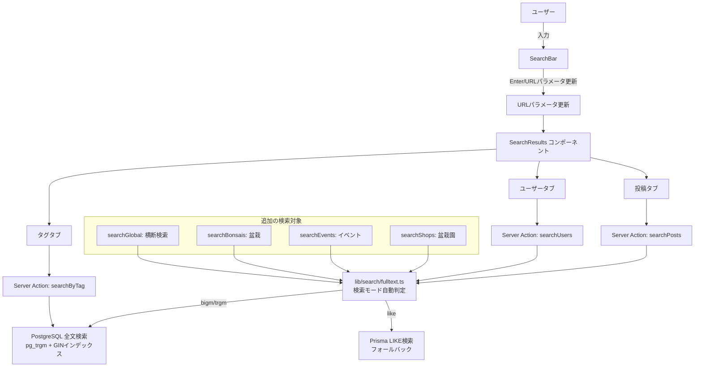

---

## 12.1 検索機能の設計

> **このセクションで学ぶこと**
> - 検索機能に必要な要素を理解する
> - 検索対象の洗い出し方を知る
> - ユーザー体験を考慮した検索設計のポイントを学ぶ

### 検索対象

BON-LOGでは、以下の6種類のデータを検索対象とします。検索ページのタブUI（投稿/ユーザー/タグ）に加え、個別ページから呼び出される盆栽園・イベント・盆栽の検索と、横断検索（searchGlobal）があります。

| 検索対象 | 検索フィールド | 用途 | 実装関数 |
|----------|----------------|------|----------|
| **投稿** | テキスト内容（content） | 盆栽の手入れ方法や作品の投稿を探す | `searchPosts()` |
| **ユーザー** | ニックネーム（nickname）、自己紹介（bio） | 他の盆栽愛好家を見つける | `searchUsers()` |
| **タグ** | ハッシュタグ名（#キーワード） | 特定のタグが付いた投稿をまとめて探す | `searchByTag()` |
| **盆栽園** | 店舗名（name）、住所（address） | 近くの盆栽園を探す | `searchShops()` |
| **イベント** | タイトル（title）、説明（description） | 盆栽イベントを探す | `searchEvents()` |
| **盆栽** | 名前（name）、樹種（species）、説明（description） | 登録された盆栽を探す | `searchBonsais()` |

### 主要機能

BON-LOGの検索システムでは、以下の機能を実装します。

- **全文検索（PostgreSQL）** --- データベースに組み込まれた高速な検索機能（pg_bigm/pg_trgm/LIKEを自動選択）
- **ジャンルフィルタ（投稿）** --- 松柏類、雑木類など盆栽のジャンルで絞り込み
- **詳細フィルター（投稿）** --- 日付範囲・最小いいね数・メディア種別による絞り込み
- **タブ切替（投稿/ユーザー/タグ）** --- 検索対象を切り替えてわかりやすく表示
- **Enterキーによる明示的な検索実行** --- 意図的なタイミングでのみリクエストを送信
- **カーソルベースページネーション** --- 大量の検索結果を効率よく分割表示
- **URLクエリパラメータ対応** --- 検索条件をURLに保存して共有可能に
- **ハッシュタグシステム** --- 投稿作成時の自動抽出・カウント管理・トレンド表示

### 検索機能を設計する際の考え方

検索機能を設計する際、以下の3つの視点を意識しましょう。

| 速度 | 正確性 | 使いやすさ |
|------|--------|-----------|
| ・インデックス活用 | ・関連度の高い結果 | ・入力補助 |
| ・デバウンス | ・ノイズの排除 | ・フィルタ機能 |
| ・キャッシュ | ・スペル修正 | ・結果のハイライト |
| ・ページネーション | ・同義語対応 | ・URLで共有可能 |

> **ここがポイント！**
> 検索機能の設計では「ユーザーが何を求めているか」を常に考えましょう。BON-LOGの場合、ユーザーは「特定の盆栽の手入れ方法」「同じ地域の愛好家」「近くの盆栽園」を探しています。この目的に合った検索結果を返すことが重要です。

---

## 12.2 検索の仕組み: LIKE検索 vs 全文検索

> **このセクションで学ぶこと**
> - LIKE検索と全文検索の違いを理解する
> - それぞれのメリット・デメリットを知る
> - なぜBON-LOGで全文検索を採用するのかを理解する

### LIKE検索とは

LIKE検索は、SQLの`LIKE`演算子を使った最もシンプルな検索方法です。

```sql
-- LIKE検索の例
-- 「盆栽」という文字列を含む投稿を探す
SELECT * FROM posts
WHERE content LIKE '%盆栽%';
```

`%`はワイルドカード（任意の文字列にマッチ）です。`'%盆栽%'`は「前後にどんな文字があっても、"盆栽"を含むもの」という意味です。

**LIKE検索の動作イメージ：**

```
テーブルの全行をひとつずつチェック（フルテーブルスキャン）

行1: "今日は天気がいい"          -> 「盆栽」含まない -> スキップ
行2: "盆栽の手入れをしました"    -> 「盆栽」含む！   -> ヒット！
行3: "ランチに行きました"        -> 「盆栽」含まない -> スキップ
行4: "新しい盆栽を購入"          -> 「盆栽」含む！   -> ヒット！
  ...（100万行すべてをチェック）
```

**LIKE検索のメリット：**
- 実装が非常にシンプル
- 小規模データ（数千件程度）なら十分高速
- 特別なセットアップが不要

**LIKE検索のデメリット：**
- データが増えると極端に遅くなる（全行スキャンのため）
- 前方に`%`がつくとインデックスが効かない
- 関連度（どれだけマッチしているか）のランキングができない
- 「盆栽」で検索しても「ボンサイ」はヒットしない

### 全文検索（Full-Text Search）とは

全文検索は、テキストデータを「トークン（単語の単位）」に分割し、効率的に検索する仕組みです。本の巻末にある「索引（インデックス）」と同じ考え方です。

```
全文検索の動作イメージ：

【準備段階】テキストを単語に分割して索引を作成
"盆栽の手入れをしました" -> [盆栽, 手入れ]
"新しい盆栽を購入"       -> [新しい, 盆栽, 購入]
"松の剪定方法"           -> [松, 剪定, 方法]

         索引（インデックス）
         +----------+-----------+
         | 単語     | 行番号    |
         +----------+-----------+
         | 盆栽     | 行2, 行4  |
         | 手入れ   | 行2       |
         | 新しい   | 行4       |
         | 購入     | 行4       |
         | 松       | 行5       |
         | 剪定     | 行5       |
         | 方法     | 行5       |
         +----------+-----------+

【検索段階】索引を引くだけ！
「盆栽」で検索 -> 索引から即座に「行2, 行4」を取得
```

**全文検索のメリット：**
- 100万件でも高速（索引を引くだけ）
- 関連度ランキングが可能
- 複数キーワードのAND/OR検索が簡単
- 部分一致や類似語の対応も可能

**全文検索のデメリット：**
- セットアップが少し複雑
- インデックスの作成・更新にコストがかかる
- 日本語の場合、形態素解析（単語の区切り方）の設定が必要

### 比較表

| 項目 | LIKE検索 | 全文検索 |
|------|----------|----------|
| 実装の簡単さ | とても簡単 | やや複雑 |
| 小規模データ（〜1万件） | 十分高速 | 高速 |
| 大規模データ（100万件〜） | 非常に遅い | 高速 |
| 関連度ランキング | 不可 | 可能 |
| AND/OR検索 | 手動で実装が必要 | 標準サポート |
| 日本語対応 | そのまま使える | 設定が必要 |
| インデックスサイズ | なし | 追加のストレージが必要 |

> **ここがポイント！**
> BON-LOGでは全文検索を採用します。SNSでは投稿数がどんどん増えていくため、LIKE検索では将来的に速度の問題が発生します。最初から全文検索で実装しておくことで、データが増えても快適な検索体験を維持できます。

### Prismaでの LIKE 検索（参考）

参考として、Prismaでの LIKE 検索の書き方も紹介しておきます。小規模なプロジェクトや、プロトタイプ段階ではこちらが手軽です。

```typescript
// Prismaでの LIKE 検索の例（containsはLIKEに変換される）
const posts = await prisma.post.findMany({
  where: {
    content: {
      contains: '盆栽',        // WHERE content LIKE '%盆栽%' に相当
      mode: 'insensitive',     // 大文字・小文字を区別しない
    },
  },
})
```

> **注意！**
> `contains`は内部的に`LIKE '%盆栽%'`に変換されます。前方に`%`がつくため、インデックスが効きません。本番環境では全文検索を使いましょう。

### 理解度チェック

1. LIKE検索で`LIKE '%盆栽%'`と書いた場合、`%`は何を意味しますか？
2. 全文検索が大量データでも高速な理由を、本の索引に例えて説明してください。
3. BON-LOGで全文検索を採用する理由を2つ挙げてください。

---

## 12.3 PostgreSQL全文検索の基礎

> **このセクションで学ぶこと**
> - `tsvector`と`tsquery`の仕組みを基礎から理解する
> - PostgreSQLの全文検索がどのように動作するかを知る
> - 日本語全文検索の特殊性を理解する

### to_tsvectorとto_tsquery

PostgreSQLには強力な全文検索機能が組み込まれています。2つの重要な関数があります。

**to_tsvector**（テキスト・サーチ・ベクター）は、テキストを検索可能なトークン（単語）の集合に変換します。

```sql
-- to_tsvector: テキストを検索可能なトークンに変換
SELECT to_tsvector('japanese', '盆栽の育て方を学ぶ');
-- 結果: '学ぶ':4 '盆栽':1 '育て方':3
```

この結果を分解して理解しましょう。

```
入力テキスト: '盆栽の育て方を学ぶ'

【分解の過程】
  盆栽 / の / 育て方 / を / 学ぶ
    ↓
  「の」「を」などの助詞（ストップワード）を除去
    ↓
  '学ぶ':4 '盆栽':1 '育て方':3

【結果の読み方】
  '盆栽':1   → 「盆栽」は元テキストの1番目の位置にある
  '育て方':3 → 「育て方」は元テキストの3番目の位置にある
  '学ぶ':4   → 「学ぶ」は元テキストの4番目の位置にある
```

**to_tsquery**（テキスト・サーチ・クエリ）は、検索条件を作成します。

```sql
-- to_tsquery: 検索クエリを作成
SELECT to_tsquery('japanese', '盆栽 & 育て方');
-- 結果: '盆栽' & '育て方'
```

検索クエリでは、以下の演算子が使えます。

| 演算子 | 意味 | 例 | 説明 |
|--------|------|-----|------|
| `&` | AND | `'盆栽' & '松'` | 「盆栽」と「松」の両方を含む |
| `\|` | OR | `'盆栽' \| '園芸'` | 「盆栽」または「園芸」を含む |
| `!` | NOT | `!'枯れ'` | 「枯れ」を含まない |
| `<->` | 隣接 | `'盆栽' <-> '園'` | 「盆栽」のすぐ隣に「園」がある |

### 全文検索の実行

`@@`演算子で、tsvectorとtsqueryをマッチングします。

```sql
-- 全文検索の実行
-- 「盆栽」を含む投稿を検索
SELECT * FROM posts
WHERE to_tsvector('japanese', content) @@ to_tsquery('japanese', '盆栽');
```

この処理を図解します。

```
【検索の流れ】

1. テキストをtsvectorに変換
   "盆栽の手入れをしました" → '手入れ':2 '盆栽':1

2. 検索キーワードをtsqueryに変換
   "盆栽" → '盆栽'

3. @@演算子でマッチング
   '手入れ':2 '盆栽':1  @@  '盆栽'
          ↓
   '盆栽'がtsvectorに含まれる？ → はい！ → マッチ！
```

### 複合検索の例

複数フィールドを結合して検索することもできます。

```sql
-- ユーザーのニックネームと自己紹介を結合して検索
SELECT * FROM users
WHERE to_tsvector('japanese', nickname || ' ' || COALESCE(bio, ''))
      @@ to_tsquery('japanese', '盆栽');
```

> **コラム: COALESCEとは？**
>
> `COALESCE(bio, '')` は「bioがNULL（空）なら空文字''を使う」という意味です。PostgreSQLでは、NULLと文字列を結合（`||`）するとNULLになってしまうため、COALESCEでNULLを安全な値に変換します。
>
> ```sql
> -- NULLの問題
> 'こんにちは' || NULL  → NULL（全体がNULLに！）
>
> -- COALESCEで解決
> 'こんにちは' || COALESCE(NULL, '')  → 'こんにちは'
> ```

### 日本語全文検索の注意点

日本語は英語と違い、単語の間にスペースがありません。そのため、文を単語に分割する「形態素解析」が必要です。

```
英語: "I love bonsai"     → ["I", "love", "bonsai"]  ← スペースで分割できる
日本語: "盆栽が好きです"  → ["盆栽", "が", "好き", "です"] ← スペースがない！
```

PostgreSQLで日本語全文検索を使うには、以下の方法があります。

1. **pg_bigm拡張** --- 2文字（バイグラム）単位で分割する方法
2. **pg_trgm拡張** --- 3文字（トリグラム）単位で分割する方法
3. **MeCab辞書** --- 日本語の辞書を使って正確に分割する方法

> **注意！**
> Supabase（BON-LOGの本番DB）では`pg_trgm`がデフォルトで利用可能です。`japanese`設定が利用できない環境では、`pg_trgm`拡張の`similarity()`関数を代替として使えます。開発環境のDockerでは`japanese`設定を有効にする設定が必要な場合があります。

### 理解度チェック

1. `to_tsvector`は何をする関数ですか？
2. `to_tsquery('japanese', '盆栽 & 松')`はどのような検索条件を表しますか？
3. `@@`演算子は何をする演算子ですか？
4. 日本語の全文検索が英語より難しい理由は何ですか？

---

### 補足図解: 検索クエリ処理パイプライン

全文検索がどのように実行されるかを、データの流れで理解しましょう。

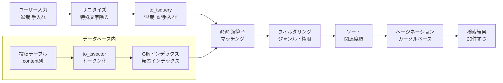

この図は、ユーザーが「盆栽 手入れ」と検索した際、内部でどのような処理が行われるかを示しています。入力のサニタイズ（無害化）から始まり、最終的に20件ずつのページネーション結果が返されるまでの流れがわかります。

---

### 補足図解: PostgreSQL全文検索アーキテクチャ（pg_trgm）

BON-LOGで実際に使用しているPostgreSQLトリグラム検索の仕組みを詳しく見てみましょう。

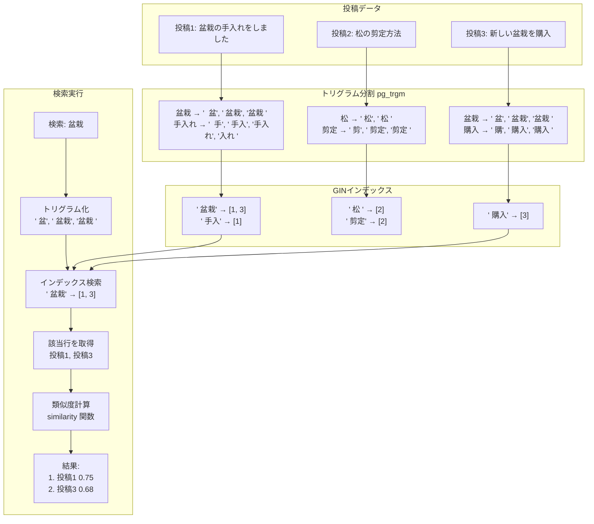

この図は、`pg_trgm`拡張がテキストを3文字（トリグラム）単位で分割し、それをGINインデックスで管理する仕組みを示しています。検索時には入力クエリも同様にトリグラム化され、インデックスと照合されます。最終的に`similarity()`関数で類似度が計算され、関連度の高い順に結果が返されます。

> **トライグラムの具体例**
> トライグラムは文字列を3文字ずつに分割したものです：
>
> ```
> "盆栽展" → ["盆栽展"]（3文字なので1トライグラム）
> "黒松の盆栽" → ["黒松の", "松の盆", "の盆栽"]
> ```
>
> 検索時は、検索語のトライグラムと各レコードのトライグラムの一致度（類似度）を計算します。完全一致でなくても、多くのトライグラムが一致すれば「似ている」と判断されるため、**タイプミスに強い**検索が実現できます。

---

### 補足図解: 検索結果フィルタリング＆ランキングフロー

複数の条件を組み合わせた検索がどのように処理されるかを見てみましょう。

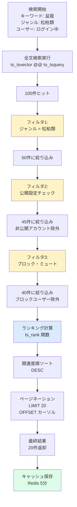

この図は、検索結果が複数のフィルタとランキング処理を経て、最終的にユーザーに表示されるまでの流れを示しています。全文検索で大量にヒットした結果が、ジャンル・公開設定・ブロック/ミュートなどの条件で段階的に絞り込まれ、関連度順にソートされた後、20件ずつページネーションされます。最後にRedisにキャッシュされることで、同じ検索の繰り返しを高速化しています。

---

## 12.4 GINインデックスの仕組み

> **このセクションで学ぶこと**
> - GINインデックスとは何かを理解する
> - なぜGINインデックスが全文検索に必要なのかを知る
> - インデックスの作成方法を学ぶ

### インデックスとは

データベースのインデックスは、本の「索引」にあたります。索引がない本で特定の言葉を探すには、1ページ目から最後のページまで全部読む必要があります。索引があれば、すぐに目的のページを見つけられます。

```
【索引なし（フルテーブルスキャン）】

  行1を確認... → マッチしない
  行2を確認... → マッチしない
  行3を確認... → マッチ！
  行4を確認... → マッチしない
  ...
  行100万を確認... → マッチしない

  → 全部の行を確認する必要がある（遅い！）


【索引あり（インデックススキャン）】

  索引で「盆栽」を検索 → 行3, 行57, 行1234 にあると判明

  → 必要な行だけ取得する（速い！）
```

### GIN（Generalized Inverted Index）とは

GINは「汎用転置インデックス」と呼ばれるインデックスの種類です。「転置インデックス」とは、「単語 → その単語が含まれるドキュメント」という逆引きの索引です。

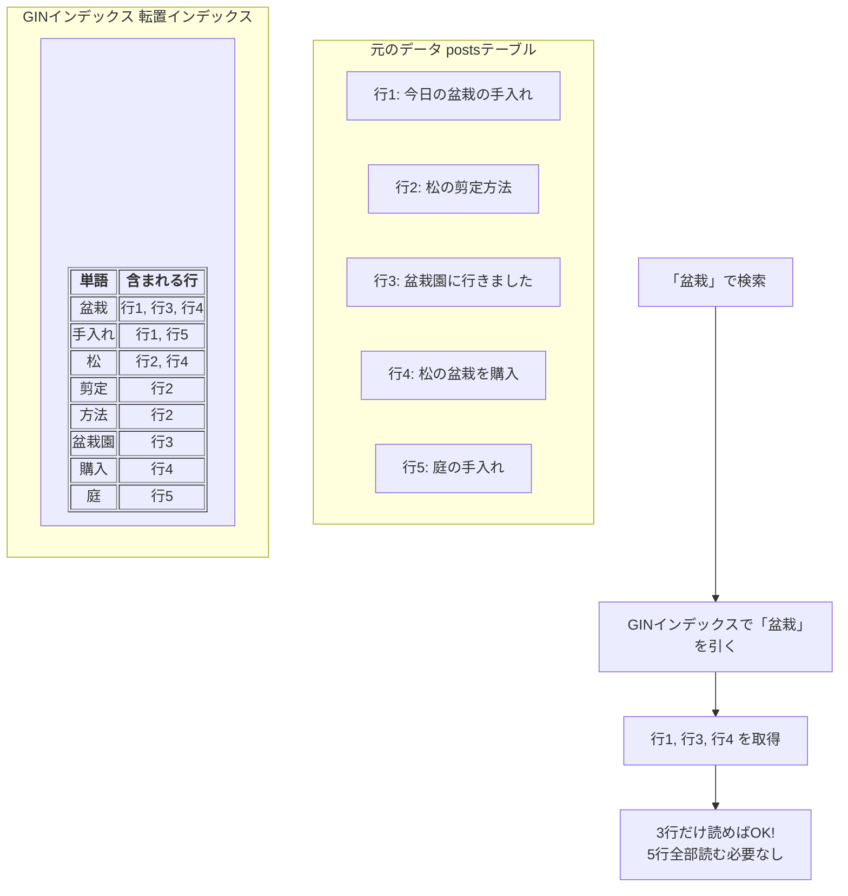

### GINインデックスの作成

マイグレーションファイルでGINインデックスを追加します。

```sql
-- 投稿テーブルのGINインデックス
-- 投稿内容(content)で全文検索するためのインデックス
CREATE INDEX posts_content_search_idx ON posts
USING GIN (to_tsvector('japanese', content));

-- ユーザーテーブルのGINインデックス
-- ニックネーム(nickname)と自己紹介(bio)を結合して検索するためのインデックス
CREATE INDEX users_search_idx ON users
USING GIN (to_tsvector('japanese', nickname || ' ' || COALESCE(bio, '')));

-- 盆栽園テーブルのGINインデックス
-- 店舗名(name)と説明(description)を結合して検索するためのインデックス
CREATE INDEX bonsai_shops_search_idx ON bonsai_shops
USING GIN (to_tsvector('japanese', name || ' ' || COALESCE(description, '')));
```

各行の意味を詳しく見てみましょう。

```sql
CREATE INDEX              -- インデックスを作成するSQL文
  posts_content_search_idx  -- インデックスの名前（自由に付けられる）
  ON posts                  -- どのテーブルに作るか
  USING GIN                 -- GINインデックスを使う
  (to_tsvector('japanese', content))  -- どのデータにインデックスを張るか
;
```

### B-TreeインデックスとGINインデックスの違い

PostgreSQLにはいくつかのインデックスの種類があります。よく使う2つを比較します。

| 項目 | B-Tree（通常） | GIN（全文検索用） |
|------|---------------|------------------|
| 用途 | 等値比較、範囲検索 | 全文検索、配列検索 |
| 例 | `WHERE id = 'xxx'` | `WHERE tsvector @@ tsquery` |
| 構造 | ツリー構造 | 転置インデックス |
| 更新速度 | 高速 | やや遅い |
| 検索速度 | 高速 | 全文検索で非常に高速 |
| サイズ | 小さい | やや大きい |

> **ここがポイント！**
> GINインデックスは更新が少し遅いですが、検索は非常に高速です。SNSの検索では「読み取り（検索）の頻度 >> 書き込み（投稿）の頻度」なので、GINインデックスは最適な選択です。

### Prismaでのマイグレーション

Prismaのスキーマファイルでは、GINインデックスを直接定義できません。そのため、SQLマイグレーションファイルを手動で作成します。

```bash
# マイグレーションファイルを作成（中身は空）
npx prisma migrate dev --name add_search_indexes --create-only
```

作成された`migration.sql`ファイルに、上記のCREATE INDEX文を追加します。

```bash
# マイグレーションを実行
npx prisma migrate dev
```

> **注意！**
> `prisma db push`はSQLマイグレーションファイルを無視します。GINインデックスを使う場合は`prisma migrate dev`を使ってください。開発中に`db push`を使っている場合は、手動でSQLを実行する必要があります。
>
> ```bash
> # 手動でSQLを実行する場合
> npx prisma db execute --file ./prisma/migrations/xxx_add_search_indexes/migration.sql
> ```

### BON-LOGでの使用箇所

BON-LOGでは、GINインデックスをPrismaマイグレーションファイルで定義しています。

> **ファイルパス:** `prisma/migrations/20240201000000_add_fts_indexes/migration.sql`

```sql
-- PostgreSQL pg_trgm拡張を有効化（全文検索用）
-- Supabaseでは標準で利用可能
CREATE EXTENSION IF NOT EXISTS pg_trgm;

-- 投稿内容の全文検索インデックス
CREATE INDEX IF NOT EXISTS posts_content_trgm_idx
ON posts USING gin (content gin_trgm_ops);

-- ユーザー検索用GINインデックス
CREATE INDEX IF NOT EXISTS users_nickname_trgm_idx
ON users USING gin (nickname gin_trgm_ops);

CREATE INDEX IF NOT EXISTS users_bio_trgm_idx
ON users USING gin (bio gin_trgm_ops);

-- 盆栽園検索用GINインデックス
CREATE INDEX IF NOT EXISTS bonsai_shops_name_trgm_idx
ON bonsai_shops USING gin (name gin_trgm_ops);

CREATE INDEX IF NOT EXISTS bonsai_shops_address_trgm_idx
ON bonsai_shops USING gin (address gin_trgm_ops);

-- イベント検索用GINインデックス
CREATE INDEX IF NOT EXISTS events_title_trgm_idx
ON events USING gin (title gin_trgm_ops);

CREATE INDEX IF NOT EXISTS events_description_trgm_idx
ON events USING gin (description gin_trgm_ops);

-- 盆栽（成長記録）検索用GINインデックス
CREATE INDEX IF NOT EXISTS bonsais_name_trgm_idx
ON bonsais USING gin (name gin_trgm_ops);

CREATE INDEX IF NOT EXISTS bonsais_species_trgm_idx
ON bonsais USING gin (species gin_trgm_ops);

CREATE INDEX IF NOT EXISTS bonsais_description_trgm_idx
ON bonsais USING gin (description gin_trgm_ops);

-- ハッシュタグ検索用GINインデックス
CREATE INDEX IF NOT EXISTS hashtags_name_trgm_idx
ON hashtags USING gin (name gin_trgm_ops);

-- コメント検索用GINインデックス（将来的な拡張用）
CREATE INDEX IF NOT EXISTS comments_content_trgm_idx
ON comments USING gin (content gin_trgm_ops);
```

合計12個のGINインデックスが作成されます。各インデックスは`gin_trgm_ops`演算子クラスを使い、pg_trgmのトリグラム検索に最適化されています。

**セットアップスクリプトによる自動作成:**

マイグレーションの代わりに、セットアップスクリプトを使って対話的にインデックスを作成することもできます。

> **ファイルパス:** `scripts/setup-fts.ts`

```bash
# 実行方法
npx tsx scripts/setup-fts.ts
```

```
========================================
PostgreSQL全文検索セットアップ
========================================

Step 1: 現在の状態を確認中...
  pg_bigm: ❌ 無効
  pg_trgm: ✅ 有効

Step 2: pg_trgm拡張を有効化中...
  ℹ️  pg_trgm拡張は既に有効です

Step 3: GINインデックスを作成中...
  ✅ posts_content_trgm_idx
  ✅ users_nickname_trgm_idx
  ✅ users_bio_trgm_idx
  ...（12個のインデックスを作成）

Step 4: 環境変数の設定
  ⚠️  以下を .env.local に追加してください:
  SEARCH_MODE=trgm

========================================
🎉 セットアップ完了！
========================================
```

**管理者APIによるセットアップ:**

管理画面からもFTSのセットアップが可能です。

> **ファイルパス:** `app/api/admin/search/setup/route.ts`

```typescript
// GET /api/admin/search/setup --- 現在のステータスを取得
// POST /api/admin/search/setup --- セットアップを実行
//   body: { action: 'enable_extension' | 'create_indexes' | 'full_setup' }
```

このAPIは管理者権限が必要で、以下の操作を提供します:
- `enable_extension`: pg_trgm拡張の有効化
- `create_indexes`: GINインデックスの作成
- `full_setup`: 上記を一括実行

これらのインデックスがあることで、`fulltextSearchPosts()` / `fulltextSearchUsers()` 等の関数内で実行されるSQL（`% '検索語'` や `ILIKE '%検索語%'`）が高速に動作します。

### 実装しない場合の影響

GINインデックスがない場合の影響：

| 状況 | 影響 |
|------|------|
| pg_trgmモード | `%` 演算子の検索がシーケンシャルスキャンになり**極端に遅くなる** |
| LIKEモード | インデックスが効かず、投稿数が増えるにつれて**検索速度が線形に劣化** |
| 本番環境 | 数万件を超えると検索のたびにDBがタイムアウトする可能性がある |

`SEARCH_MODE=like`（フォールバック）の場合もGINインデックスがあった方が速いため、本番環境では必ずインデックスを作成してください。

### 理解度チェック

1. GINは何の略ですか？日本語で何と呼ばれますか？
2. GINインデックスがない場合、検索はどのように行われますか？
3. B-TreeインデックスとGINインデックスの使い分けを説明してください。
4. PrismaでGINインデックスを追加するにはどうすればよいですか？

---

## 12.5 Prismaでの全文検索実装

> **このセクションで学ぶこと**
> - Prismaから生SQLを実行する方法を学ぶ
> - SQLインジェクション対策の重要性を理解する
> - 検索クエリのサニタイズ方法を知る

Prismaは直接`to_tsvector`をサポートしていないため、生SQL（Raw Query）を使用します。「生SQL」とは、PrismaのAPI（`findMany`など）を使わずに、SQLを直接書いて実行する方法です。

### なぜ生SQLを使うのか

```
【通常のPrisma API】
  prisma.post.findMany({ where: { ... } })
    → PrismaがSQLに変換 → DBに送信

【生SQL（$queryRaw）】
  prisma.$queryRaw`SELECT * FROM posts WHERE ...`
    → 書いたSQLがそのままDBに送信

Prismaは to_tsvector, to_tsquery, @@ をサポートしていないため、
全文検索では生SQLを使う必要がある
```

### lib/search/fulltext.ts

このファイルは全文検索のコアロジックを提供します。環境変数`SEARCH_MODE`に基づいて検索方式を自動選択し、各エンティティ（投稿・ユーザー・盆栽園・イベント・盆栽）の全文検索クエリを生成します。

> **ファイルパス:** `lib/search/fulltext.ts`

```typescript
// lib/search/fulltext.ts
// 検索機能のコア処理を定義するファイル

import { prisma } from '@/lib/db'
import { Prisma } from '@prisma/client'
import logger from '@/lib/logger'
import { DEFAULT_PAGE_LIMIT } from '@/lib/constants/limits'

// --- 検索モードの型定義 ---

/**
 * 'bigm': pg_bigm拡張（2-gram、日本語に最適）
 * 'trgm': pg_trgm拡張（3-gram、汎用的）
 * 'like': LIKE検索（拡張不要、フォールバック）
 */
export type SearchMode = 'bigm' | 'trgm' | 'like'

// --- 検索モード取得関数 ---

/**
 * 環境変数 SEARCH_MODE から検索モードを取得
 * 無効な値や未設定の場合は 'like' にフォールバック
 */
export function getSearchMode(): SearchMode {
  const mode = process.env.SEARCH_MODE?.toLowerCase()
  if (mode === 'bigm' || mode === 'trgm') {
    return mode
  }
  return 'like'  // デフォルト（最も互換性が高い）
}

// --- 拡張機能チェック ---

/**
 * PostgreSQL拡張機能が利用可能かチェック
 * pg_extension テーブルで拡張の存在を確認
 */
export async function checkExtensionAvailable(
  extension: 'pg_bigm' | 'pg_trgm'
): Promise<boolean> {
  try {
    const result = await prisma.$queryRaw<{ available: boolean }[]>`
      SELECT EXISTS(
        SELECT 1 FROM pg_extension WHERE extname = ${extension}
      ) as available
    `
    return result[0]?.available ?? false
  } catch {
    return false
  }
}

// --- 拡張機能の有効化 ---

/**
 * PostgreSQL拡張機能を有効化（管理者権限が必要）
 * 許可リストチェックによりSQLインジェクションを防止
 */
export async function enableExtension(
  extension: 'pg_bigm' | 'pg_trgm'
): Promise<boolean> {
  const allowedExtensions = ['pg_bigm', 'pg_trgm'] as const
  if (!allowedExtensions.includes(extension)) {
    logger.error(`Invalid extension name: ${extension}`)
    return false
  }
  try {
    await prisma.$executeRawUnsafe(
      `CREATE EXTENSION IF NOT EXISTS "${extension}"`
    )
    return true
  } catch (error) {
    logger.error(`Failed to enable ${extension}:`, error)
    return false
  }
}
```

> **ここがポイント！**
> Prismaの`$queryRaw`テンプレートリテラルは自動的にパラメータ化するため、SQLインジェクション対策が組み込まれています。`$executeRawUnsafe`は動的な拡張機能名を指定するために使用しますが、上記の許可リストチェックにより安全性を確保しています。

> **コラム: SQLインジェクション攻撃とは？**
>
> SQLインジェクションは、Webアプリケーションの入力フォームを通じて、悪意のあるSQL文をデータベースに送り込む攻撃手法です。
>
> ```
> 【攻撃の例】
>
> 検索フォームに以下を入力:
>   '; DROP TABLE posts; --
>
> サニタイズなしの場合、実行されるSQL:
>   SELECT * FROM posts WHERE content @@ ''; DROP TABLE posts; --'
>
> 結果: postsテーブルが削除される！
>
> 【対策】
> 1. 入力値のサニタイズ（特殊文字を除去）
> 2. パラメータ化クエリ（Prismaの$queryRawで自動対応）
> 3. 最小権限の原則（DBユーザーに削除権限を与えない）
> ```

### 投稿検索の実装

BON-LOGの検索関数はすべて`lib/actions/search.ts`にServer Actionsとして実装されています。検索モードに応じて、全文検索（bigm/trgm）またはLIKE検索を自動で使い分けます。

> **ファイルパス:** `lib/actions/search.ts`

```typescript
// lib/actions/search.ts（実際のコード）
'use server'

import { prisma } from '@/lib/db'
import { auth } from '@/lib/auth'
import {
  fulltextSearchPosts, fulltextSearchUsers, fulltextSearchShops,
  fulltextSearchEvents, fulltextSearchBonsais, fulltextSearchGlobal,
  getSearchMode,
} from '@/lib/search/fulltext'
import { getExcludedUserIds } from './filter-helper'
import { getCachedGenres, getCachedPopularTags } from '@/lib/cache'
import { rateLimit, RATE_LIMITS } from '@/lib/rate-limit'
import { getClientIp } from '@/lib/actions/utils'
import { DEFAULT_PAGE_LIMIT, POPULAR_TAGS_LIMIT, GLOBAL_SEARCH_PER_CATEGORY_LIMIT } from '@/lib/constants/limits'

// 投稿検索 --- 位置引数（positional parameters）で呼び出す
export async function searchPosts(
  query: string,         // 検索キーワード
  genreIds?: string[],   // ジャンルIDの配列（オプション）
  cursor?: string,       // ページネーションのカーソル（オプション）
  limit = DEFAULT_PAGE_LIMIT, // 1ページあたりの件数（デフォルト20件）
  filters?: {            // 追加フィルタ（オプション）
    dateFrom?: string
    dateTo?: string
    minLikes?: number
    mediaType?: 'images' | 'videos' | 'text'
  }
) {
  // レート制限チェック（IP単位で検索リクエストを制限）
  const clientIp = await getClientIp()
  const rateLimitResult = await rateLimit(`search:${clientIp}`, RATE_LIMITS.search)
  if (!rateLimitResult.success) {
    return { posts: [], nextCursor: undefined, error: '検索リクエストが多すぎます。しばらく待ってから再試行してください' }
  }

  const session = await auth()
  const currentUserId = session?.user?.id

  // ブロック/ミュートしているユーザーを除外
  const excludedUserIds = currentUserId
    ? await getExcludedUserIds(currentUserId, { blocked: true, blockedBy: true, muted: true })
    : []

  // 検索モードを取得（'bigm' | 'trgm' | 'like'）
  const searchMode = getSearchMode()

  // 共通のinclude設定（as const で型を厳密に推論）
  const postInclude = {
    user: { select: { id: true, nickname: true, avatarUrl: true } },
    media: { orderBy: { sortOrder: 'asc' } },
    genres: { include: { genre: true } },
    _count: { select: { likes: true, comments: { where: { deletedAt: null } } } },
    poll: {
      include: {
        options: { orderBy: { sortOrder: 'asc' }, include: { _count: { select: { votes: true } } } },
        _count: { select: { votes: true } },
      },
    },
  } as const

  // --- 全文検索モード（bigm/trgm） ---
  // ステップ1: fulltextSearchPosts() で投稿IDを取得
  // ステップ2: IDで投稿とリレーションデータを取得
  if (query && (searchMode === 'bigm' || searchMode === 'trgm')) {
    const postIds = await fulltextSearchPosts(query, {
      excludedUserIds, genreIds, cursor, limit, filters,
    })
    if (postIds.length === 0) {
      return { posts: [], nextCursor: undefined }
    }

    const fetchedPosts = await prisma.post.findMany({
      where: { id: { in: postIds } },
      include: postInclude,
    })

    // 全文検索の結果順（関連度順）を維持するために並べ替え
    // Prisma の findMany は IN 句の順序を保証しない
    const posts = postIds
      .map((id) => fetchedPosts.find((p) => p.id === id))
      .filter((p): p is NonNullable<typeof p> => p !== undefined)

    // ... いいね/ブックマーク状態の取得、結果の整形 ...

    return {
      posts: formattedPosts,
      nextCursor: posts.length === limit ? posts[posts.length - 1]?.id : undefined,
    }
  }

  // --- LIKE検索モード（フォールバック） ---
  // Prisma の contains + mode: 'insensitive' を使用
  const posts = await prisma.post.findMany({
    where: {
      isHidden: false,
      AND: [
        query ? { content: { contains: query, mode: 'insensitive' as const } } : {},
        genreIds && genreIds.length > 0
          ? { genres: { some: { genreId: { in: genreIds } } } }
          : {},
        excludedUserIds.length > 0 ? { userId: { notIn: excludedUserIds } } : {},
      ],
    },
    include: {
      user: { select: { id: true, nickname: true, avatarUrl: true } },
      media: { orderBy: { sortOrder: 'asc' } },
      genres: { include: { genre: true } },
      _count: { select: { likes: true, comments: { where: { deletedAt: null } } } },
    },
    orderBy: { createdAt: 'desc' },
    take: limit,
    ...(cursor && { cursor: { id: cursor }, skip: 1 }),
  })

  return {
    posts: formattedPosts,
    nextCursor: posts.length === limit ? posts[posts.length - 1]?.id : undefined,
  }
}
```

> **ここがポイント！**
> 全文検索モードでは「IDを取得 → リレーションデータを取得」の2段階方式を使っています。全文検索の部分は`fulltextSearchPosts()`で行い、リレーションデータの取得はPrismaの便利なAPIを使います。これにより、全文検索のパワーとPrismaの使いやすさの両方を活かせます。LIKE検索はフォールバックとして、全文検索が利用できない環境で自動的に使われます。

### ユーザー検索の実装

```typescript
// lib/actions/search.ts（抜粋）
// ユーザー検索 --- 位置引数で呼び出す
export async function searchUsers(
  query: string,     // 検索キーワード
  cursor?: string,   // ページネーションのカーソル（オプション）
  limit = 20         // 1ページあたりの件数
) {
  // レート制限チェック
  const clientIp = await getClientIpFromHeaders()
  const rateLimitResult = await rateLimit(`search:${clientIp}`, RATE_LIMITS.search)
  if (!rateLimitResult.success) {
    return { users: [], nextCursor: undefined, error: '検索リクエストが多すぎます' }
  }

  const session = await auth()
  const currentUserId = session?.user?.id

  // ブロック関係のユーザーを除外（ミュートは検索結果から除外しない）
  const excludedUserIds = currentUserId
    ? await getExcludedUserIds(currentUserId, { blocked: true, blockedBy: true })
    : []

  const searchMode = getSearchMode()

  // --- 全文検索モード ---
  if (query && (searchMode === 'bigm' || searchMode === 'trgm')) {
    const userIds = await fulltextSearchUsers(query, {
      excludedUserIds, currentUserId, cursor, limit,
    })
    // ... IDでユーザーを取得、順序を維持 ...
  }

  // --- LIKE検索モード ---
  // OR条件でニックネームと自己紹介を検索
  const users = await prisma.user.findMany({
    where: {
      AND: [
        query ? {
          OR: [
            { nickname: { contains: query, mode: 'insensitive' as const } },
            { bio: { contains: query, mode: 'insensitive' as const } },
          ],
        } : {},
        excludedUserIds.length > 0 ? { id: { notIn: excludedUserIds } } : {},
        currentUserId ? { id: { not: currentUserId } } : {},
      ],
    },
    select: {
      id: true, nickname: true, avatarUrl: true, bio: true,
      _count: { select: { followers: true, following: true } },
    },
    take: limit,
    ...(cursor && { cursor: { id: cursor }, skip: 1 }),
  })

  return {
    users: users.map((user) => ({
      ...user,
      followersCount: user._count.followers,
      followingCount: user._count.following,
    })),
    nextCursor: users.length === limit ? users[users.length - 1]?.id : undefined,
  }
}
```

### 盆栽園検索の実装

```typescript
// lib/actions/search.ts（抜粋）
// 盆栽園検索 --- 位置引数で呼び出す
export async function searchShops(
  query: string,         // 検索キーワード
  cursor?: string,       // ページネーションのカーソル（オプション）
  limit = 20,            // 1ページあたりの件数
  prefecture?: string    // 都道府県フィルタ（オプション）
) {
  // レート制限チェック
  const clientIp = await getClientIpFromHeaders()
  const rateLimitResult = await rateLimit(`search:${clientIp}`, RATE_LIMITS.search)
  if (!rateLimitResult.success) {
    return { shops: [], nextCursor: undefined, error: '検索リクエストが多すぎます' }
  }

  const searchMode = getSearchMode()

  // --- 全文検索モード ---
  if (query && (searchMode === 'bigm' || searchMode === 'trgm')) {
    const shopIds = await fulltextSearchShops(query, { cursor, limit, prefecture })
    // ... IDで盆栽園を取得、平均評価を計算 ...
  }

  // --- LIKE検索モード ---
  // OR条件で店舗名と住所を検索
  const shops = await prisma.bonsaiShop.findMany({
    where: {
      isHidden: false,
      AND: [
        query ? {
          OR: [
            { name: { contains: query, mode: 'insensitive' as const } },
            { address: { contains: query, mode: 'insensitive' as const } },
          ],
        } : {},
        prefecture ? { address: { contains: prefecture } } : {},
      ],
    },
    include: {
      genres: { include: { genre: true } },
      _count: { select: { reviews: true } },
    },
    orderBy: { createdAt: 'desc' },
    take: limit,
    ...(cursor && { cursor: { id: cursor }, skip: 1 }),
  })

  // 平均評価を一括取得（N+1問題を回避）
  // ❌ 悪い例: shopsの件数分だけDBクエリが走る
  // const shopsWithRating = await Promise.all(
  //   shops.map(async (shop) => {
  //     const avg = await prisma.shopReview.aggregate({ ... })  // N回のクエリ
  //     return { ...shop, avgRating: avg._avg.rating ?? 0 }
  //   })
  // )

  // ✅ 良い例: groupByで一括取得（1回のクエリで済む）
  const shopIdList = shops.map((s) => s.id)
  const avgRatings = await prisma.shopReview.groupBy({
    by: ['shopId'],
    where: { shopId: { in: shopIdList }, isHidden: false },
    _avg: { rating: true },
  })
  const ratingMap = new Map(avgRatings.map(r => [r.shopId, r._avg.rating ?? 0]))

  const shopsWithRating = shops.map((shop) => ({
    ...shop,
    reviewCount: shop._count.reviews,
    avgRating: ratingMap.get(shop.id) ?? 0,
    genres: shop.genres.map((sg) => sg.genre),
  }))

  return {
    shops: shopsWithRating,
    nextCursor: shops.length === limit ? shops[shops.length - 1]?.id : undefined,
  }
}
```

### よくあるトラブル

**トラブル1: `$queryRaw`でエラーが出る**

```
Error: Raw query failed. Code: `42883`. Message: `function to_tsvector(unknown, text) does not exist`
```

原因: `japanese`言語設定が利用できない環境です。

対処法:

```sql
-- 利用可能な言語設定を確認
SELECT cfgname FROM pg_ts_config;

-- 'japanese'がない場合は'simple'を使う（精度は下がる）
SELECT to_tsvector('simple', '盆栽の手入れ');
```

**トラブル2: 検索結果が0件になる**

原因: 検索キーワードがストップワード（除外される一般的な語）として扱われている可能性があります。

対処法:

```sql
-- デバッグ: tsvectorの内容を確認
SELECT to_tsvector('japanese', '盆栽の手入れ');
-- 「盆栽」「手入れ」がトークンとして表示されるか確認

-- tsqueryの内容を確認
SELECT to_tsquery('japanese', '盆栽');
-- '盆栽' と表示されるか確認
```

**トラブル3: 型エラー `Type 'xxx' is not assignable to type 'yyy'`**

原因: `$queryRaw`の型パラメータとSQLの結果が一致していません。

対処法: SQLのカラム名（`AS`で指定するエイリアス）とTypeScriptの型が一致しているか確認してください。PostgreSQLのスネークケース（`created_at`）をキャメルケース（`createdAt`）にするには、`AS "createdAt"`のようにダブルクォートで囲む必要があります。

### 理解度チェック

1. `prisma.$queryRaw`はどのような場合に使いますか？
2. 検索クエリのサニタイズではどのような処理を行いますか？
3. 「ハイブリッドアプローチ」とは何ですか？なぜ使うのですか？

---

## 12.6 検索Server Action

> **このセクションで学ぶこと**
> - Server Actionで検索APIを作る方法を学ぶ
> - zodによるバリデーション（入力チェック）の実装方法を理解する
> - エラーハンドリングの設計パターンを知る

### lib/actions/search.ts

BON-LOGでは、すべての検索関数が`lib/actions/search.ts`にServer Actionsとして直接定義されています。統一的なディスパッチャー関数は使わず、各検索関数（`searchPosts`、`searchUsers`、`searchByTag`）をServer ComponentまたはClient Componentから直接呼び出す設計です。

Server Actionは、クライアント（ブラウザ）からサーバーの処理を直接呼び出せる仕組みです。

```
【Server Actionの流れ】

ブラウザ                            サーバー
  |                                   |
  |  searchPosts('盆栽', genreIds)   |
  | --------------------------------> |
  |                                   |
  |                          レート制限チェック
  |                                   |
  |                          データベースに全文検索/LIKE検索
  |                                   |
  |      { posts: [...] }             |
  | <-------------------------------- |
  |                                   |
  結果を画面に表示
```

```typescript
// lib/actions/search.ts --- 全検索関数の一覧
'use server'
// ↑ この宣言により、このファイルの関数はサーバー上でのみ実行されます
//   クライアント（ブラウザ）からは関数を呼び出すだけで、
//   実際の処理はサーバーで行われます

import { prisma } from '@/lib/db'
import { auth } from '@/lib/auth'
import {
  fulltextSearchPosts, fulltextSearchUsers, fulltextSearchShops,
  fulltextSearchEvents, fulltextSearchBonsais, fulltextSearchGlobal,
  getSearchMode,
} from '@/lib/search/fulltext'
import { getExcludedUserIds } from './filter-helper'
import { getCachedGenres, getCachedPopularTags } from '@/lib/cache'
import { rateLimit, RATE_LIMITS } from '@/lib/rate-limit'
import { getClientIp } from '@/lib/actions/utils'
import { DEFAULT_PAGE_LIMIT, POPULAR_TAGS_LIMIT, GLOBAL_SEARCH_PER_CATEGORY_LIMIT } from '@/lib/constants/limits'

// --- 各検索関数は位置引数で呼び出す ---

// 投稿検索（前のセクションで解説済み）
export async function searchPosts(
  query: string,
  genreIds?: string[],
  cursor?: string,
  limit = DEFAULT_PAGE_LIMIT,
  filters?: { dateFrom?: string; dateTo?: string; minLikes?: number; mediaType?: 'images' | 'videos' | 'text' }
) { /* ... */ }

// ユーザー検索（前のセクションで解説済み）
export async function searchUsers(
  query: string,
  cursor?: string,
  limit = DEFAULT_PAGE_LIMIT
) { /* ... */ }

// ハッシュタグで投稿を検索
export async function searchByTag(
  tag: string,       // ハッシュタグ（#は含まない）
  cursor?: string,
  limit = DEFAULT_PAGE_LIMIT
) { /* content に `#${tag}` を含む投稿をLIKE検索 */ }

// 盆栽園検索（/shops ページで使用）
export async function searchShops(
  query: string,
  cursor?: string,
  limit = DEFAULT_PAGE_LIMIT,
  prefecture?: string  // 都道府県フィルタ
) { /* 店舗名(name)と住所(address)で検索 */ }

// イベント検索
export async function searchEvents(
  query: string,
  cursor?: string,
  limit = DEFAULT_PAGE_LIMIT,
  options?: { prefecture?: string; includeExpired?: boolean }
) { /* タイトル(title)と説明(description)で検索 */ }

// 盆栽検索
export async function searchBonsais(
  query: string,
  cursor?: string,
  limit = DEFAULT_PAGE_LIMIT,
  userId?: string    // 特定ユーザーの盆栽のみ
) { /* 名前(name)、樹種(species)、説明(description)で検索 */ }

// 横断検索（各カテゴリから上位5件ずつ）
export async function searchGlobal(query: string) {
  // fulltextSearchGlobal で一括検索し、
  // Promise.all で並列に各エンティティを取得
  // 各カテゴリから GLOBAL_SEARCH_PER_CATEGORY_LIMIT (5) 件ずつ返す
}

// 人気タグ取得（キャッシュ済み）
export async function getPopularTags(limit = POPULAR_TAGS_LIMIT) {
  return getCachedPopularTags(limit)
}

// ジャンル一覧取得（キャッシュ済み）
export async function getAllGenres() {
  const result = await getCachedGenres()
  return { genres: result.genres }
}
```

> **ここがポイント！**
> BON-LOGでは、統一的な`search()`ディスパッチャー関数は使っていません。各検索関数（`searchPosts`、`searchUsers`、`searchByTag`）をServer ComponentまたはClient Componentから直接呼び出します。これにより、各関数の引数の型が明確になり、TypeScriptの型安全性を最大限に活かせます。

### BON-LOGでの使用箇所

`lib/actions/search.ts` のServer Actionsは以下の箇所から呼び出されています。

| 呼び出し元 | 呼び出す関数 | タイミング |
|-----------|------------|---------|
| `app/(main)/search/page.tsx` | `searchPosts`, `searchUsers`, `searchByTag`, `getPopularTags`, `getAllGenres` | ページの初期表示（Server Component） |
| `components/search/SearchResults.tsx` | `searchPosts`, `searchUsers`, `searchByTag` | タブ切替・無限スクロール時（useInfiniteQuery） |
| `components/search/GenreFilter.tsx` | （propsとしてジャンルデータを受け取る） | URLパラメータと同期してジャンルフィルタを表示 |
| `app/(main)/shops/page.tsx` | `searchShops` | 盆栽園ページの検索 |
| `app/(main)/events/page.tsx` | `searchEvents` | イベントページの検索 |

### 実装しない場合の影響

`lib/actions/search.ts` が存在しない、または各関数が未実装の場合の影響：

| 関数 | 未実装時の影響 |
|------|-------------|
| `searchPosts` | 投稿検索タブで結果が表示されない |
| `searchUsers` | ユーザー検索タブで結果が表示されない |
| `searchByTag` | タグタブでの検索が機能しない |
| `getPopularTags` | 人気タグが表示されない（空配列が返る） |
| `getAllGenres` | ジャンルフィルタが表示されない |
| `searchShops` | 盆栽園の検索機能が動作しない（/shops ページで使用） |
| `searchEvents` | イベント検索が動作しない |
| `searchBonsais` | 盆栽検索が動作しない |
| `searchGlobal` | 横断検索が動作しない |

> **コラム: 位置引数とオブジェクト引数の使い分け**
>
> ```typescript
> // BON-LOGでは位置引数（positional parameters）を採用
> // 引数の順序が決まっており、シンプルに呼び出せる
> const result = await searchPosts('盆栽', ['genre-1'], undefined, 20)
>
> // オブジェクト引数のパターン（別のプロジェクトで見かけることも）
> // 引数が多い場合に読みやすいが、BON-LOGではこの形式ではない
> const result = await searchPosts({ query: '盆栽', genreIds: ['genre-1'] })
>
> // 位置引数のメリット: シンプルで関数シグネチャが明確
> // 位置引数のデメリット: 引数が多いと順序を覚える必要がある
> ```

### 理解度チェック

1. `'use server'`ディレクティブは何を意味しますか？
2. BON-LOGの検索関数がオブジェクト引数ではなく位置引数を採用している理由を説明してください。
3. 検索でエラーが発生した場合に`{ posts: [], error: '...' }`のような形式で返す理由は何ですか？

---

## 12.7 デバウンスの仕組み

> **このセクションで学ぶこと**
> - デバウンスとは何かを理解する
> - なぜ検索にデバウンスが必要なのかを知る
> - デバウンス関数の実装方法を学ぶ

### デバウンスとは

デバウンスとは、「連続して発生するイベントのうち、最後のイベントだけを処理する」テクニックです。

> **デバウンスとは？**
> ユーザーが検索欄にキーを打つたびにAPIリクエストを送ると、「盆」「盆栽」「盆栽展」で3回のリクエストが発生します。デバウンスは「最後の入力から一定時間（通常300ms）待ってからリクエストを送る」仕組みです。
>
> ```
> 入力: 盆 → (100ms) → 栽 → (100ms) → 展 → (300ms経過) → APIリクエスト送信
> ```
>
> 300msは「タイピング中は待ち、打ち終わったらすぐ検索」のバランスが良い値です。

検索バーに「盆栽」と入力する場合を考えてみましょう。

```
【デバウンスなしの場合】
ユーザーの入力:  ぼ → ぼん → ぼんさ → ぼんさい → 盆栽
                 ↓     ↓       ↓        ↓        ↓
サーバーリクエスト: 1回   2回     3回      4回      5回

→ 5回もサーバーにリクエストが送られる！
  最初の4回は無駄（途中の入力では意味のある結果が返らない）


【デバウンスありの場合（500ms）】
ユーザーの入力:  ぼ → ぼん → ぼんさ → ぼんさい → 盆栽
                 |     |       |        |        |
                 +-----+-------+--------+--------+-- 500ms待つ
                                                  ↓
サーバーリクエスト:                            1回だけ！（「盆栽」で検索）

→ 入力が止まって500ms経過してから1回だけリクエスト
```

### デバウンスの動作を図解

```
時間の流れ →→→→→→→→→→→→→→→→→→→→→→→→→→→→→→→→→→

      ぼ        ぼん      ぼんさ    ぼんさい     盆栽
      |          |          |          |          |
      v          v          v          v          v
  [タイマー  [タイマー  [タイマー  [タイマー  [タイマー
   開始]     リセット]  リセット]  リセット]   開始]
                                                  |
                                              500ms経過
                                                  |
                                                  v
                                            [検索実行！]

ポイント: 新しい入力があるたびにタイマーがリセットされる
         入力が止まって500ms経過して初めて検索が実行される
```

### なぜデバウンスが重要なのか

デバウンスがないと、以下の問題が発生します。

1. **サーバー負荷の増大**: 文字を入力するたびにリクエストが送られ、サーバーに大量の不要なリクエストが届く
2. **ネットワーク帯域の浪費**: 無駄なデータのやり取りが増える
3. **ちらつき**: 結果が高速に切り替わり、画面がちらつく
4. **レース条件**: 先に送ったリクエストが後に届くことがあり、古い結果が表示される

> **コラム: レース条件とは？**
>
> ```
> 「ぼ」で検索リクエスト送信 --→(遅い接続)--→ サーバー --→(遅い)--→ 結果A到着
> 「盆栽」で検索リクエスト送信 --→(速い接続)--→ サーバー --→(速い)--→ 結果B到着
>
> 結果の到着順: 結果B → 結果A（逆転！）
>
> 結果:「盆栽」の検索結果が表示された後に
>      「ぼ」の検索結果で上書きされてしまう！
> ```

### デバウンス関数の実装

```typescript
// デバウンスユーティリティ関数
// 「一定時間内に新しい呼び出しがなければ実行する」関数を作る

function debounce<T extends (...args: any[]) => any>(
  // ↑ ジェネリック型: T は「引数を受け取る関数」の型
  func: T,
  // ↑ 実際に実行したい関数
  wait: number
  // ↑ 待機時間（ミリ秒）
): (...args: Parameters<T>) => void {
  // ↑ 返り値: 元の関数と同じ引数を受け取るが、返り値はvoid（なし）

  let timeout: NodeJS.Timeout | null = null
  // ↑ タイマーのID を保持する変数
  //   nullはタイマーが動いていない状態

  return function executedFunction(...args: Parameters<T>) {
    // ↑ デバウンス済みの新しい関数を返す

    const later = () => {
      // ↑ タイマーが発火した時に実行される関数
      timeout = null
      // ↑ タイマーIDをリセット
      func(...args)
      // ↑ 元の関数を実行
    }

    if (timeout) {
      clearTimeout(timeout)
      // ↑ 既存のタイマーがあればキャンセル
      //   「まだ入力中だから、前の予約はキャンセル」
    }

    timeout = setTimeout(later, wait)
    // ↑ 新しいタイマーをセット
    //   wait ミリ秒後に later を実行する予約
  }
}
```

> **注意！**
> デバウンスの待機時間（`wait`）の設定は重要です。
> - **短すぎる（100ms以下）**: デバウンスの効果が薄い
> - **長すぎる（1000ms以上）**: ユーザーが「反応が遅い」と感じる
> - **推奨値（300〜500ms）**: バランスが良い

### BON-LOGでの使用箇所

デバウンスの考え方はBON-LOGのSearchBarコンポーネントに組み込まれています。ただし、12.19節で詳しく説明するように、BON-LOGの実際の実装はリアルタイムのデバウンス検索ではなく**Enterキーによる明示的な検索実行**を採用しています。

| アプローチ | 実装場所 | 採用理由 |
|-----------|---------|---------|
| Enterキー検索 | `components/search/SearchBar.tsx` | サーバー負荷が低く、ユーザーが検索タイミングを制御できる |
| デバウンス（概念） | 本セクションで解説 | 自動検索を実装する場合の標準パターンとして理解が必要 |

### 実装しない場合の影響

デバウンスなしにリアルタイム検索を実装した場合：
- 文字入力のたびにServer Actionが呼び出され、**サーバーに過大な負荷**がかかる
- レート制限（`RATE_LIMITS.search`）にすぐ引っかかり、エラーになる
- Redisのレート制限カウンターが急速に消費される

### 理解度チェック

1. デバウンスとは何ですか？自分の言葉で説明してください。
2. デバウンスがないと、どのような問題が起きますか？
3. デバウンスの待機時間を500msに設定した場合、ユーザーが「盆栽」と入力し終えてから何秒後に検索が実行されますか？

---

## 12.8 SearchBarコンポーネント

> **このセクションで学ぶこと**
> - 検索バーの実装方法を学ぶ
> - URLSearchParamsとの連携方法を理解する
> - デバウンスを組み込んだリアルタイム検索の作り方を知る

### URLSearchParamsとの連携

検索条件をURLに保存することで、以下のメリットがあります。

```
URLに検索条件を保存するメリット:

1. ブックマーク可能
   https://bon-log.com/search?q=盆栽&type=posts
   → この URLをブックマークすれば、同じ検索結果にアクセスできる

2. 共有可能
   「この検索結果見て！」とURLを友達に送れる

3. ブラウザの「戻る」「進む」が正しく動作する
   検索 → 投稿を見る → 「戻る」 → 検索結果に戻れる

4. ページリロード時に検索条件が保持される
   F5を押しても同じ検索結果が表示される
```

### components/search/SearchBar.tsx

BON-LOGの実際のSearchBarは**Enterキーによる明示的な検索実行**を採用しています。リアルタイムデバウンス検索ではなく、ユーザーが検索タイミングを制御できる設計です。また、検索履歴のローカルストレージ保存と、`/`キーによるキーボードショートカットも実装しています。

> **ファイルパス:** `components/search/SearchBar.tsx`

```typescript
// components/search/SearchBar.tsx（実際のコード抜粋）
'use client'

import { useState, useCallback, useEffect, useRef } from 'react'
import { useRouter, useSearchParams } from 'next/navigation'
import { Search as SearchIcon, X as XIcon, Clock as ClockIcon } from 'lucide-react'

// ローカルストレージのキー名と最大件数
const RECENT_SEARCHES_KEY = 'bonsai-sns-recent-searches'
const MAX_RECENT_SEARCHES = 10

// 検索履歴をローカルストレージから取得/保存する関数群
function getRecentSearches(): string[] { /* ... */ }
function saveRecentSearch(query: string) { /* ... */ }
function removeRecentSearch(query: string) { /* ... */ }
function clearRecentSearches() { /* ... */ }

type SearchBarProps = {
  defaultValue?: string
  onSearch?: (query: string) => void
  placeholder?: string
}

export function SearchBar({
  defaultValue = '', onSearch, placeholder = '検索...'
}: SearchBarProps) {
  const router = useRouter()
  const searchParams = useSearchParams()

  // --- 状態管理 ---
  const [query, setQuery] = useState(defaultValue)
  // ↑ 検索入力値の状態
  const [isFocused, setIsFocused] = useState(false)
  // ↑ フォーカス状態（履歴ドロップダウン制御用）
  const [recentSearches, setRecentSearches] = useState<string[]>([])
  // ↑ 検索履歴
  const inputRef = useRef<HTMLInputElement>(null)
  const containerRef = useRef<HTMLDivElement>(null)

  // --- Effects ---

  // 検索履歴の読み込み（初回マウント時）
  useEffect(() => {
    setRecentSearches(getRecentSearches())
  }, [])

  // URLパラメータの変更を監視してクエリを更新
  useEffect(() => {
    const q = searchParams.get('q')
    if (q) { setQuery(q) }
  }, [searchParams])

  // /キーで検索フォーカス（キーボードショートカット）
  useEffect(() => {
    const handleKeyDown = (e: KeyboardEvent) => {
      if (e.key === '/' && !['INPUT', 'TEXTAREA'].includes(
        (e.target as HTMLElement).tagName
      )) {
        e.preventDefault()
        inputRef.current?.focus()
      }
    }
    document.addEventListener('keydown', handleKeyDown)
    return () => document.removeEventListener('keydown', handleKeyDown)
  }, [])

  // 外側クリックでドロップダウンを閉じる
  useEffect(() => {
    const handleClickOutside = (e: MouseEvent) => {
      if (containerRef.current && !containerRef.current.contains(e.target as Node)) {
        setIsFocused(false)
      }
    }
    document.addEventListener('mousedown', handleClickOutside)
    return () => document.removeEventListener('mousedown', handleClickOutside)
  }, [])

  // --- イベントハンドラ ---

  // Enterキーで検索実行
  const handleSearch = useCallback((searchQuery?: string) => {
    const q = searchQuery ?? query
    if (q.trim()) {
      saveRecentSearch(q.trim())
      setRecentSearches(getRecentSearches())
    }
    if (onSearch) {
      onSearch(q)
    } else {
      const params = new URLSearchParams(searchParams.toString())
      if (q) { params.set('q', q) } else { params.delete('q') }
      router.push(`/search?${params.toString()}`)
    }
    setIsFocused(false)
  }, [query, onSearch, router, searchParams])

  // キー入力ハンドラ
  const handleKeyDown = useCallback(
    (e: React.KeyboardEvent<HTMLInputElement>) => {
      if (e.key === 'Enter') {
        handleSearch()           // Enter: 検索実行
      } else if (e.key === 'Escape') {
        setIsFocused(false)      // Escape: ドロップダウンを閉じる
        inputRef.current?.blur()
      }
    },
    [handleSearch]
  )

  // クリアハンドラ
  const handleClear = useCallback(() => {
    setQuery('')
    if (onSearch) { onSearch('') }
    else {
      const params = new URLSearchParams(searchParams.toString())
      params.delete('q')
      router.push(`/search?${params.toString()}`)
    }
  }, [onSearch, router, searchParams])

  // ドロップダウン表示条件
  const showDropdown = isFocused && recentSearches.length > 0 && !query

  return (
    <div className="relative" ref={containerRef}>
      <div className="relative flex items-center">
        {/* 左側の検索アイコン（装飾用） */}
        <SearchIcon className="absolute left-3 w-5 h-5 text-muted-foreground pointer-events-none" />

        {/* テキスト入力（Enterキーで検索実行） */}
        <input
          ref={inputRef}
          type="text"
          value={query}
          onChange={(e) => setQuery(e.target.value)}
          onKeyDown={handleKeyDown}
          onFocus={() => setIsFocused(true)}
          placeholder={placeholder}
          className="w-full pl-10 pr-10 py-2 border rounded-lg bg-background
                     focus:outline-none focus:ring-2 focus:ring-primary/50"
          aria-label="検索"
        />

        {/* クリアボタン（入力がある時のみ表示） */}
        {query && (
          <button onClick={handleClear}
            className="absolute right-3 p-1 text-muted-foreground hover:text-foreground">
            <XIcon className="w-4 h-4" />
          </button>
        )}
      </div>

      {/* 最近の検索ドロップダウン（フォーカス時・入力が空の時のみ表示） */}
      {showDropdown && (
        <div className="absolute top-full left-0 right-0 mt-1 bg-card border rounded-lg shadow-lg z-50">
          <div className="flex items-center justify-between px-3 py-2 border-b">
            <span className="text-sm font-medium text-muted-foreground">最近の検索</span>
            <button onClick={handleClearAll} className="text-xs text-muted-foreground hover:text-foreground">
              すべて削除
            </button>
          </div>
          <ul>
            {recentSearches.map((search) => (
              <li key={search}>
                <button onClick={() => handleRecentSearchClick(search)}
                  className="w-full flex items-center gap-3 px-3 py-2 hover:bg-muted">
                  <ClockIcon className="w-4 h-4 text-muted-foreground" />
                  <span className="flex-1 text-left truncate">{search}</span>
                  <button onClick={(e) => handleRemoveRecentSearch(search, e)}
                    className="p-1 text-muted-foreground hover:text-foreground">
                    <XIcon className="w-3 h-3" />
                  </button>
                </button>
              </li>
            ))}
          </ul>
        </div>
      )}
    </div>
  )
}
```

### 検索バーのレイアウト図

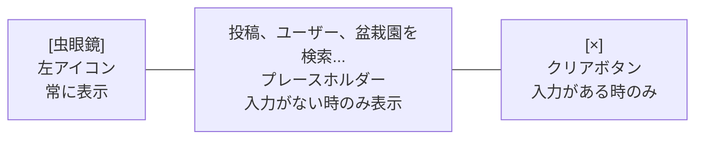

### 理解度チェック

1. URLSearchParamsを使って検索条件をURLに保存するメリットを3つ挙げてください。
2. `useCallback`は何のために使いますか？
3. `params.delete('cursor')`を行う理由は何ですか？

---

## 12.9 SearchResultsコンポーネント

> **このセクションで学ぶこと**
> - タブ切替による検索結果の表示方法を学ぶ
> - 検索結果の状態管理の設計を理解する
> - 「さらに読み込む」ボタンの実装方法を知る

### components/search/SearchResults.tsx

```typescript
// components/search/SearchResults.tsx
'use client'

import { useState, useEffect } from 'react'
import { useSearchParams } from 'next/navigation'
// ↑ URLのクエリパラメータを監視して、変更時に再検索する

import { Tabs, TabsContent, TabsList, TabsTrigger } from '@/components/ui/tabs'
// ↑ shadcn/uiのタブコンポーネント
//   TabsList: タブのボタンが並ぶエリア
//   TabsTrigger: 個々のタブボタン
//   TabsContent: タブの中身

import {
  PostSearchResults,
  UserSearchResults,
  TagSearchResults,
  PopularTags,
} from '@/components/search/SearchResults'
// ↑ 各検索結果コンポーネント（投稿/ユーザー/タグ別）
import { searchPosts, searchUsers, searchByTag, getPopularTags } from '@/lib/actions/search'
// ↑ 各検索関数を直接インポート（統一ディスパッチャーは使わない）
// ※ 盆栽園タブはメイン検索ページには含まれない（/shops ページで個別実装）

// 検索タイプの型定義（実際のタブ構成に合わせる）
type SearchType = 'posts' | 'users' | 'tags'

export function SearchResults() {
  // --- URLパラメータの読み取り ---
  const searchParams = useSearchParams()
  const query = searchParams.get('q') || ''
  // ↑ URLの q パラメータを取得（例: ?q=盆栽 → '盆栽'）

  const typeParam = searchParams.get('type') as SearchType | null
  // ↑ URLの type パラメータを取得（例: ?type=users → 'users'）

  const genreIdsParam = searchParams.get('genres')?.split(',').filter(Boolean) || []
  // ↑ URLの genres パラメータを取得してカンマで分割
  //   例: ?genres=genre1,genre2 → ['genre1', 'genre2']

  // --- 状態管理 ---
  const [activeTab, setActiveTab] = useState<SearchType>(typeParam || 'posts')
  // ↑ 現在選択されているタブ（デフォルトは「投稿」）

  const [genreIds, setGenreIds] = useState<string[]>(genreIdsParam)
  // ↑ 選択中のジャンルIDの配列

  const [results, setResults] = useState<any>({ posts: [], users: [], tags: [] })
  // ↑ 検索結果を保持（タブごとに別々に保持）
  //   タブを切り替えた時に前の結果が消えないようにするため
  //   ※ タグタブはハッシュタグで絞り込んだ「投稿一覧」を保持する

  const [loading, setLoading] = useState(false)
  // ↑ 読み込み中かどうか

  const [cursor, setCursor] = useState<string | undefined>()
  // ↑ ページネーションのカーソル（次のページの開始位置）

  // --- 検索の実行 ---
  useEffect(() => {
    // 検索キーワードがない場合は結果をクリア
    if (!query) {
      setResults({ posts: [], users: [], tags: [] })
      return
    }

    // 検索を実行 --- タブに応じて対応する検索関数を直接呼び出す
    setLoading(true)
    const doSearch = async () => {
      switch (activeTab) {
        case 'posts':
          // searchPosts(query, genreIds, cursor, limit, filters) の位置引数
          return await searchPosts(query, genreIds, undefined)
        case 'users':
          // searchUsers(query, cursor, limit) の位置引数
          return await searchUsers(query, undefined)
        case 'tags':
          // searchByTag(tag, cursor, limit) の位置引数
          // タグ検索はクエリをハッシュタグ名として扱う
          if (!query) return { posts: [], nextCursor: undefined }
          return await searchByTag(query, undefined)
      }
    }
    doSearch()
      .then((data) => {
        if ('error' in data) {
          console.error(data.error)
          return
        }
        // 結果を対応するタブに保存
        setResults((prev: any) => ({
          ...prev,
          // ↑ 他のタブの結果はそのまま保持
          [activeTab]: data.posts || data.users || [],
          // ↑ 現在のタブの結果を更新
          //   投稿タブ: data.posts, ユーザータブ: data.users, タグタブ: data.posts（タグ検索も投稿が返る）
        }))
        setCursor(data.nextCursor)
        // ↑ 次のページのカーソルを保存
      })
      .finally(() => setLoading(false))
      // ↑ 成功しても失敗しても読み込み状態を解除
  }, [query, activeTab, genreIds])
  // ↑ query, activeTab, genreIds のいずれかが変わった時に再実行

  // --- さらに読み込む処理 ---
  const loadMore = async () => {
    // カーソルがない（次のページがない）か、
    // 読み込み中の場合は何もしない
    if (!cursor || loading) return

    setLoading(true)
    // タブに応じて対応する検索関数を直接呼び出す
    let data: any
    switch (activeTab) {
      case 'posts':
        data = await searchPosts(query, genreIds, cursor)
        break
      case 'users':
        data = await searchUsers(query, cursor)
        break
      case 'tags':
        data = await searchByTag(query, cursor)
        break
    }

    if ('error' in data) {
      console.error(data.error)
      setLoading(false)
      return
    }

    // 既存の結果に新しい結果を追加
    const newItems = data.posts || data.users || []
    setResults((prev: any) => ({
      ...prev,
      [activeTab]: [...prev[activeTab], ...newItems],
      // ↑ スプレッド構文で既存の配列と新しい配列を結合
      //   例: [投稿1, 投稿2] + [投稿3, 投稿4] → [投稿1, 投稿2, 投稿3, 投稿4]
    }))
    setCursor(data.nextCursor)
    setLoading(false)
  }

  // --- 検索キーワードがない場合の表示 ---
  if (!query) {
    return (
      <div className="text-center py-12 text-muted-foreground">
        キーワードを入力して検索してください
      </div>
    )
  }

  // --- 検索結果の表示 ---
  return (
    <div className="space-y-4">
      {/* タブコンポーネント */}
      <Tabs value={activeTab} onValueChange={(v) => setActiveTab(v as SearchType)}>
        {/* タブのボタン一覧 */}
        <TabsList className="grid w-full grid-cols-3">
          {/* ↑ 3カラムのグリッドで均等に配置 */}
          <TabsTrigger value="posts">投稿</TabsTrigger>
          <TabsTrigger value="users">ユーザー</TabsTrigger>
          <TabsTrigger value="tags">タグ</TabsTrigger>
          {/* ↑ 盆栽園は /shops ページで個別実装のため、検索タブには含まない */}
        </TabsList>

        {/* 投稿タブの中身 */}
        <TabsContent value="posts" className="space-y-4">
          {/* ジャンルフィルタ（投稿タブのみ表示） */}
          <GenreFilter
            selectedGenreIds={genreIds}
            onGenreChange={setGenreIds}
          />
          {/* ローディング表示 or 検索結果 */}
          {loading && results.posts.length === 0 ? (
            // 初回読み込み中（結果がまだない場合）
            <div className="flex justify-center py-8">
              <Loader2 className="h-6 w-6 animate-spin" />
            </div>
          ) : (
            // 検索結果がある場合
            <>
              <PostList posts={results.posts} />
              {/* さらに読み込むボタン */}
              {cursor && (
                <div className="flex justify-center">
                  <button
                    onClick={loadMore}
                    disabled={loading}
                    className="btn-secondary"
                  >
                    {loading ? '読み込み中...' : 'さらに読み込む'}
                  </button>
                </div>
              )}
            </>
          )}
        </TabsContent>

        {/* ユーザータブの中身 */}
        <TabsContent value="users">
          {loading && results.users.length === 0 ? (
            <div className="flex justify-center py-8">
              <Loader2 className="h-6 w-6 animate-spin" />
            </div>
          ) : (
            <>
              <UserList users={results.users} />
              {cursor && (
                <div className="flex justify-center">
                  <button
                    onClick={loadMore}
                    disabled={loading}
                    className="btn-secondary"
                  >
                    {loading ? '読み込み中...' : 'さらに読み込む'}
                  </button>
                </div>
              )}
            </>
          )}
        </TabsContent>

        {/* タグタブの中身 */}
        <TabsContent value="tags">
          {/* クエリ未入力の場合は入力を促す */}
          {!query ? (
            <div className="text-center py-8 text-muted-foreground">
              検索したいタグを入力してください
            </div>
          ) : loading && results.tags.length === 0 ? (
            <div className="flex justify-center py-8">
              <Loader2 className="h-6 w-6 animate-spin" />
            </div>
          ) : (
            <>
              {/* タグ検索の結果は投稿一覧として表示 */}
              <PostList posts={results.tags} />
              {cursor && (
                <div className="flex justify-center">
                  <button
                    onClick={loadMore}
                    disabled={loading}
                    className="btn-secondary"
                  >
                    {loading ? '読み込み中...' : 'さらに読み込む'}
                  </button>
                </div>
              )}
            </>
          )}
        </TabsContent>
      </Tabs>
    </div>
  )
}
```

### 検索結果の状態管理を図解

```
results オブジェクトの構造:

{
  posts: [投稿1, 投稿2, 投稿3, ...],    ← 「投稿」タブの結果
  users: [ユーザー1, ユーザー2, ...],    ← 「ユーザー」タブの結果
  tags:  [投稿A, 投稿B, ...]            ← 「タグ」タブの結果（タグを含む投稿一覧）
}

【タブ切替時の動作】

「投稿」タブ → 「ユーザー」タブに切替
  ↓
1. activeTab が 'users' に変更される
2. useEffectが発火し、ユーザー検索を実行
3. 結果がresults.usersに保存される
4. ユーザー一覧が表示される

「ユーザー」タブ → 「タグ」タブに切替
  ↓
1. activeTab が 'tags' に変更される
2. クエリが空の場合は「タグを入力してください」を表示
3. クエリがある場合はsearchByTag(query) を実行
4. 該当タグを含む投稿一覧が表示される

「タグ」タブ → 「投稿」タブに戻る
  ↓
1. activeTab が 'posts' に変更される
2. results.posts に前回の結果が残っているのですぐ表示される
3. useEffectが発火し、最新の投稿検索結果で更新される
```

### 理解度チェック

1. 検索結果をタブごとに別々に保持する理由は何ですか？
2. `loading && results.posts.length === 0` という条件はどのような状態を判定していますか？
3. `cursor`がundefinedの場合、「さらに読み込む」ボタンはどうなりますか？

---

## 12.10 ジャンルフィルタ

> **このセクションで学ぶこと**
> - フィルタリングUIの設計パターンを学ぶ
> - トグル（ON/OFF切替）の実装方法を理解する
> - 親コンポーネントとの連携方法を知る

### components/search/GenreFilter.tsx

BON-LOGの実際のGenreFilterは、カテゴリごとにグループ化されたドロップダウン形式で、URLパラメータと直接同期します。

> **ファイルパス:** `components/search/GenreFilter.tsx`

```typescript
// components/search/GenreFilter.tsx（実際のコード）
'use client'

import { useRouter, useSearchParams } from 'next/navigation'
import { useState } from 'react'

// ジャンルの型
type Genre = {
  id: string       // ジャンルID（URLパラメータに使用）
  name: string     // ジャンル名（日本語表示名）
  category: string // カテゴリ名（グループ化用）
}

type GenreFilterProps = {
  genres: Record<string, Genre[]>  // カテゴリ名 → ジャンル配列
  selectedGenreIds?: string[]      // 選択中のジャンルID
}

export function GenreFilter({ genres, selectedGenreIds = [] }: GenreFilterProps) {
  const router = useRouter()
  const searchParams = useSearchParams()
  const [isOpen, setIsOpen] = useState(false)

  // ジャンル選択のトグル（URLパラメータを直接更新）
  const handleGenreToggle = (genreId: string) => {
    const params = new URLSearchParams(searchParams.toString())
    const currentGenres = params.getAll('genre')
    // ↑ getAll()で同じキーの複数値を配列で取得
    //   例: ?genre=id1&genre=id2 → ['id1', 'id2']

    if (currentGenres.includes(genreId)) {
      // 選択済み → 解除
      params.delete('genre')
      currentGenres
        .filter((id) => id !== genreId)
        .forEach((id) => params.append('genre', id))
    } else {
      // 未選択 → 追加
      params.append('genre', genreId)
    }
    router.push(`/search?${params.toString()}`)
  }

  // 全選択解除
  const clearAllGenres = () => {
    const params = new URLSearchParams(searchParams.toString())
    params.delete('genre')
    router.push(`/search?${params.toString()}`)
  }

  const selectedCount = selectedGenreIds.length

  return (
    <div className="relative">
      {/* ドロップダウントリガーボタン */}
      <button
        onClick={() => setIsOpen(!isOpen)}
        className="flex items-center gap-2 px-3 py-2 border rounded-lg bg-background hover:bg-muted"
      >
        <span className="text-sm">
          ジャンル
          {selectedCount > 0 && (
            <span className="ml-1 px-1.5 py-0.5 text-xs bg-primary text-primary-foreground rounded-full">
              {selectedCount}
            </span>
          )}
        </span>
        <ChevronDownIcon className={`w-4 h-4 transition-transform ${isOpen ? 'rotate-180' : ''}`} />
      </button>

      {/* ドロップダウンメニュー */}
      {isOpen && (
        <>
          <div className="fixed inset-0 z-10" onClick={() => setIsOpen(false)} />
          <div className="absolute top-full left-0 mt-2 w-72 bg-card border rounded-lg shadow-lg z-20 max-h-96 overflow-y-auto">
            <div className="p-3 border-b flex items-center justify-between">
              <span className="text-sm font-medium">ジャンルで絞り込み</span>
              {selectedCount > 0 && (
                <button onClick={clearAllGenres} className="text-xs text-primary hover:underline">
                  クリア
                </button>
              )}
            </div>
            {/* カテゴリごとにグループ化 */}
            <div className="p-2">
              {Object.entries(genres).map(([category, categoryGenres]) => (
                <div key={category} className="mb-3 last:mb-0">
                  <p className="text-xs font-medium text-muted-foreground px-2 mb-1">{category}</p>
                  <div className="flex flex-wrap gap-1">
                    {categoryGenres.map((genre) => (
                      <button
                        key={genre.id}
                        onClick={() => handleGenreToggle(genre.id)}
                        className={`px-2 py-1 text-xs rounded-full transition-colors ${
                          selectedGenreIds.includes(genre.id)
                            ? 'bg-primary text-primary-foreground'
                            : 'bg-muted hover:bg-muted/80'
                        }`}
                      >
                        {genre.name}
                      </button>
                    ))}
                  </div>
                </div>
              ))}
            </div>
          </div>
        </>
      )}
    </div>
  )
}
```

> **実際のコードとの違い:**
> このコンポーネントはコールバック関数ではなく**URLパラメータを直接更新**する設計です。`handleGenreToggle`がURLの`genre`パラメータを追加/削除し、`router.push`でページ遷移します。これにより、ジャンルの選択状態がURLに保存され、ブックマークや共有が可能になります。

### ジャンルフィルタのUI図

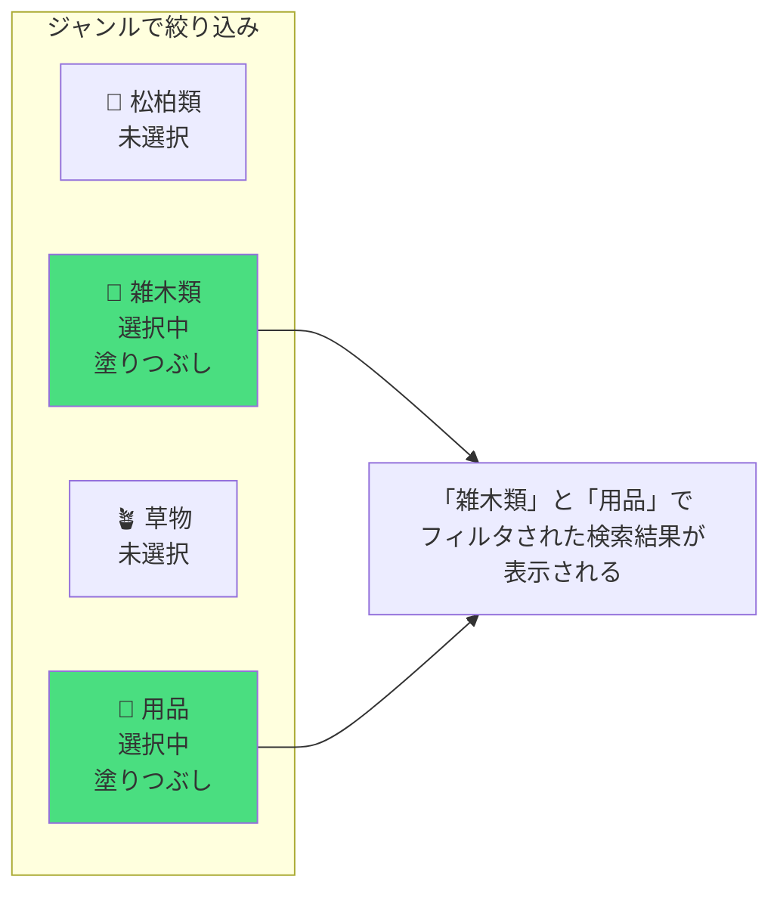

### フィルタリングの設計パターン

フィルタリングUIにはいくつかの設計パターンがあります。

```
【パターン1: トグルバッジ（BON-LOGで採用）】
メリット: 一目で選択状態がわかる、複数選択が直感的
デメリット: ジャンルが多すぎると場所を取る

  [🌲 松柏類] [🌳 雑木類] [🪴 草物] [🔧 用品]


【パターン2: ドロップダウン】
メリット: 省スペース
デメリット: 選択状態が見えにくい

  ジャンル: [雑木類  ▼]


【パターン3: チェックボックスリスト】
メリット: 多くの選択肢を表示できる
デメリット: 場所を取る

  □ 松柏類
  ☑ 雑木類
  □ 草物
  ☑ 用品


【パターン4: サイドバーフィルタ】
メリット: 複数条件の組み合わせが見やすい
デメリット: モバイルでは使いにくい
```

> **ここがポイント！**
> BON-LOGではジャンル数が限られている（10種類程度）ため、トグルバッジパターンを採用しています。もしジャンルが50種類以上あるなら、ドロップダウンやサイドバーフィルタのほうが適しています。

### 理解度チェック

1. `variant={selectedGenreIds.includes(genre.id) ? 'default' : 'outline'}` は何をしていますか？
2. `filter`メソッドを使ってジャンルを解除する仕組みを説明してください。
3. BON-LOGでトグルバッジパターンを採用した理由は何ですか？

---

## 12.11 検索結果のハイライト表示

> **このセクションで学ぶこと**
> - 検索キーワードをハイライト表示する方法を学ぶ
> - 正規表現の基礎を理解する
> - XSS対策の重要性を知る

### ハイライト表示とは

検索結果のテキスト中で、検索キーワードに色をつけて目立たせる機能です。

```
検索キーワード: 盆栽

検索結果:
  「今日は [盆栽] の手入れをしました。新しい [盆栽] 鉢も購入しました。」
          ~~~~~~                            ~~~~~~
          黄色でハイライト                    黄色でハイライト
```

### components/search/HighlightedText.tsx

```typescript
// components/search/HighlightedText.tsx

// コンポーネントのprops（引数）の型定義
interface HighlightedTextProps {
  text: string   // ハイライト対象のテキスト
  query: string  // 検索キーワード
}

export function HighlightedText({ text, query }: HighlightedTextProps) {
  // 検索キーワードがない場合はそのまま表示
  if (!query) return <>{text}</>

  // テキストをキーワードで分割
  const parts = text.split(new RegExp(`(${escapeRegExp(query)})`, 'gi'))
  // ↑ 正規表現でテキストを分割する
  //
  // 例: text = "盆栽の手入れ。新しい盆栽鉢", query = "盆栽"
  //
  // ステップ1: escapeRegExp("盆栽") → "盆栽"（この場合変化なし）
  //
  // ステップ2: new RegExp("(盆栽)", "gi") で正規表現を作成
  //   g: グローバル（全てのマッチを見つける）
  //   i: 大文字小文字を区別しない
  //   (): キャプチャグループ（マッチした部分も結果に含める）
  //
  // ステップ3: split で分割
  //   "盆栽の手入れ。新しい盆栽鉢".split(/(盆栽)/gi)
  //   → ["", "盆栽", "の手入れ。新しい", "盆栽", "鉢"]
  //       ↑    ↑         ↑              ↑      ↑
  //     空文字  マッチ   非マッチ部分    マッチ  非マッチ

  return (
    <>
      {parts.map((part, index) =>
        // 各パートがキーワードと一致するか判定
        part.toLowerCase() === query.toLowerCase() ? (
          // マッチした部分: <mark>タグでハイライト
          <mark key={index} className="bg-yellow-200 dark:bg-yellow-800">
            {/* ↑ bg-yellow-200: ライトモードで薄い黄色
                 dark:bg-yellow-800: ダークモードで暗い黄色 */}
            {part}
          </mark>
        ) : (
          // マッチしない部分: そのまま表示
          part
        )
      )}
    </>
  )
}

// 正規表現の特殊文字をエスケープする関数
function escapeRegExp(string: string) {
  return string.replace(/[.*+?^${}()|[\]\\]/g, '\\$&')
  // ↑ 正規表現で特別な意味を持つ文字の前に「\」を追加
  //   これにより、その文字がそのままの文字として扱われる
  //
  // なぜ必要か？
  //   例: ユーザーが「盆栽(松)」と検索した場合
  //   エスケープなし: /(盆栽(松))/gi → 正規表現エラー！
  //   エスケープあり: /(盆栽\(松\))/gi → 正常に動作
  //
  // 特殊文字の例:
  //   .  → 任意の1文字
  //   *  → 直前のパターンの0回以上の繰り返し
  //   +  → 直前のパターンの1回以上の繰り返し
  //   ?  → 直前のパターンの0回または1回
  //   () → グループ化
  //   [] → 文字クラス
}
```

> **注意！ XSS攻撃への対策**
>
> ハイライト表示を`dangerouslySetInnerHTML`で実装する方法もありますが、XSS（クロスサイトスクリプティング）攻撃のリスクがあるため、BON-LOGではReactの安全な方法（JSXでの条件分岐）を使っています。
>
> ```typescript
> // NG: XSSのリスクがある方法
> <div dangerouslySetInnerHTML={{
>   __html: text.replace(query, `<mark>${query}</mark>`)
>   // ↑ もしtextに悪意のあるHTML/JavaScriptが含まれていると
>   //   そのまま実行されてしまう！
> }} />
>
> // OK: 安全な方法（BON-LOGで採用）
> {parts.map((part, index) =>
>   part.toLowerCase() === query.toLowerCase() ? (
>     <mark key={index}>{part}</mark>
>   ) : (
>     part
>   )
> )}
> // ↑ Reactが自動的にHTMLエスケープしてくれるため安全
> ```

### 理解度チェック

1. `text.split(new RegExp(...))` で括弧 `()` を使うと何が変わりますか？
2. `escapeRegExp`関数は何のために使いますか？
3. `dangerouslySetInnerHTML`を使わずにハイライト表示する理由は何ですか？

---

## 12.12 検索ページ

> **このセクションで学ぶこと**
> - Server Componentを使った検索ページの構築方法を学ぶ
> - SuspenseによるストリーミングUIを理解する
> - メタデータの設定方法を知る

### app/(main)/search/page.tsx

```typescript
// app/(main)/search/page.tsx
// 検索ページのメインコンポーネント（Server Component）

import { Suspense } from 'react'
// ↑ Suspense: 非同期コンポーネントの読み込み中にフォールバック（代替UI）を表示

import { SearchBar } from '@/components/search/SearchBar'
import { SearchResults } from '@/components/search/SearchResults'
import { Loader2 } from 'lucide-react'

// ページのメタデータ（SEO対策）
export const metadata = {
  title: '検索 - BON-LOG',
  // ↑ ブラウザのタブに表示されるタイトル（実際の実装に合わせてハイフン区切り）
}

// URLパラメータの型定義（Next.js 15以降ではPromise形式）
type SearchPageProps = {
  searchParams: Promise<{
    q?: string
    tab?: string
    genre?: string | string[]
    dateFrom?: string
    dateTo?: string
    minLikes?: string
    mediaType?: string
  }>
}

export default async function SearchPage({ searchParams }: SearchPageProps) {
  // URLパラメータを非同期で取得
  const params = await searchParams
  const query = params.q || ''
  const tab = params.tab || 'posts'

  // ジャンルIDの配列に変換
  const genreParam = params.genre
  const genreIds = Array.isArray(genreParam)
    ? genreParam
    : genreParam ? [genreParam] : []

  // 詳細フィルター
  const dateFrom = params.dateFrom || undefined
  const dateTo = params.dateTo || undefined
  const minLikes = params.minLikes || undefined
  const mediaType = params.mediaType || undefined

  // ジャンル一覧と人気タグを並列で取得
  const [genresResult, popularTagsResult] = await Promise.all([
    getAllGenres(),
    getPopularTags(10),
  ])
  const genres = genresResult.genres || {}
  const popularTags = popularTagsResult.tags || []

  return (
    <div className="space-y-4">
      {/* 検索バー */}
      <div className="bg-card rounded-lg border p-4">
        <SearchBar defaultValue={query} placeholder="投稿やユーザーを検索..." />
      </div>

      {/* タブと検索結果エリア */}
      <div className="bg-card rounded-lg border overflow-hidden">
        {/* 検索種別の切り替えタブ（投稿/ユーザー/タグ） */}
        <SearchTabs activeTab={tab} />

        {/* 投稿タブのみジャンルフィルタと詳細フィルタを表示 */}
        {tab === 'posts' && (
          <GenreFilter genres={genres} selectedGenreIds={genreIds} />
        )}
        {tab === 'posts' && (
          <AdvancedSearchFilters
            dateFrom={dateFrom} dateTo={dateTo}
            minLikes={minLikes} mediaType={mediaType}
          />
        )}

        {/* 検索結果（Suspenseでローディング状態を管理） */}
        <div className="p-4">
          <Suspense fallback={<SearchResultsLoading />}>
            <SearchResultsContent
              tab={tab}
              query={query}
              genreIds={genreIds}
              currentUserId={session?.user?.id}
              filters={filters}
            />
          </Suspense>
        </div>
      </div>

      {/* 人気タグ（クエリ未入力かつタグタブの場合のみ表示） */}
      {!query && tab === 'tags' && <PopularTags tags={popularTags} />}
    </div>
  )
}
```

### ページの表示構造

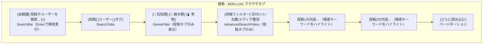

---

## 12.13 ページネーションとの組み合わせ

> **このセクションで学ぶこと**
> - カーソルベースページネーションの仕組みを復習する
> - 検索とページネーションの組み合わせ方を理解する
> - オフセットベースとの違いを知る

### カーソルベースページネーションの復習

```
【オフセットベース】OFFSET を使う方法（非推奨）

  1ページ目: OFFSET 0  LIMIT 20  → 行1〜20を取得
  2ページ目: OFFSET 20 LIMIT 20  → 行21〜40を取得
  3ページ目: OFFSET 40 LIMIT 20  → 行41〜60を取得

  問題: OFFSET が大きくなると遅くなる
        途中でデータが追加/削除されるとズレる


【カーソルベース】最後のIDを基準にする方法（BON-LOGで採用）

  1ページ目: WHERE id > 0 LIMIT 20
    → 投稿A, B, C, ... T を取得
    → nextCursor = T のID

  2ページ目: WHERE created_at < T の created_at LIMIT 20
    → 投稿U, V, W, ... を取得
    → nextCursor = 最後の投稿のID

  メリット: データが追加/削除されてもズレない
           大量データでも常に高速
```

### 検索 + ページネーションの流れ

```
1回目の検索:
  search({ query: '盆栽', type: 'posts', cursor: undefined })
    → posts: [投稿1, 投稿2, ..., 投稿20]
    → nextCursor: '投稿20のID'

ユーザーが「さらに読み込む」をクリック:
  search({ query: '盆栽', type: 'posts', cursor: '投稿20のID' })
    → posts: [投稿21, 投稿22, ..., 投稿40]
    → nextCursor: '投稿40のID'

結果を結合:
  画面表示: [投稿1, 投稿2, ..., 投稿20, 投稿21, ..., 投稿40]

さらに「さらに読み込む」をクリック:
  search({ query: '盆栽', type: 'posts', cursor: '投稿40のID' })
    → posts: [投稿41, 投稿42, ..., 投稿50]  ← 10件しかない
    → nextCursor: undefined  ← もうデータがない

結果を結合:
  画面表示: [投稿1, 投稿2, ..., 投稿50]
  「さらに読み込む」ボタンは非表示  ← cursorがundefinedのため
```

### 理解度チェック

1. オフセットベースページネーションの問題点を2つ挙げてください。
2. `nextCursor`がundefinedの場合、何を意味しますか？
3. カーソルベースページネーションが「データの追加/削除に強い」理由を説明してください。

---

## 12.14 よくあるトラブル

### トラブル1: 日本語の検索結果が0件

**症状:** 日本語のキーワードで検索しても結果が返ってこない。

**原因と対処法:**

```
原因1: 'japanese' 言語設定がインストールされていない
  → SELECT cfgname FROM pg_ts_config; で確認
  → なければ 'simple' を代用するか、pg_bigm拡張をインストール

原因2: GINインデックスが作成されていない
  → \d+ posts で確認（psqlで）
  → インデックスがなければ CREATE INDEX 文を実行

原因3: サニタイズで検索キーワードが空になっている
  → console.log(sanitizedQuery) でデバッグ
  → 正規表現パターンを確認（日本語が除外されていないか）
```

### トラブル2: 検索が遅い

**症状:** 検索結果の表示に数秒以上かかる。

**原因と対処法:**

```
原因1: GINインデックスがない
  → EXPLAIN ANALYZE で実行計画を確認
  → Seq Scan（フルスキャン）が表示されたらインデックスを追加

原因2: デバウンスが機能していない
  → ブラウザのDevToolsのNetworkタブで確認
  → 文字入力のたびにリクエストが飛んでいたらデバウンスの実装を確認

原因3: リレーションデータの取得（ステップ2）が遅い
  → include の内容を見直し、不要なデータを省く
  → select で必要なフィールドだけ取得する
```

### トラブル3: URLパラメータが反映されない

**症状:** URLに`?q=盆栽`があるのに、検索バーが空のまま。

**原因と対処法:**

```
原因: SearchBarがSuspenseの外にある
  → useSearchParams() を使うコンポーネントはSuspenseで囲む必要がある

対処法:
  <Suspense fallback={<SearchBarSkeleton />}>
    <SearchBar />
  </Suspense>
```

### トラブル4: タブを切り替えると前の結果が消える

**症状:** 投稿タブで検索後、ユーザータブに切り替えて戻ると、投稿の結果が消えている。

**原因と対処法:**

```
原因: 結果の状態がタブごとに分かれていない

対処法: results を { posts: [], users: [], tags: [] } の形で管理
  → タブごとに独立して結果を保持する
  → 上記の SearchResults の実装ではこの方法を採用済み
```

---

## 12.15 演習問題

### 演習1（基礎）: トレンドキーワード機能

検索履歴をRedisに保存し、人気の検索キーワードを表示する機能を実装してください。

**ヒント:**
- Redisの`ZINCRBY`コマンドで検索回数をカウント
- `ZREVRANGE`で上位キーワードを取得
- SearchBarの下に表示

```typescript
// lib/redis/search.ts
// Redisを使ったトレンドキーワードの管理

import { redis } from '@/lib/redis'
// ↑ Upstash Redis クライアント

// 検索回数をインクリメント（1増やす）
export async function incrementSearchCount(query: string) {
  // ZINCRBYコマンド: ソート済みセット（Sorted Set）のスコアを増加
  // 'search:trends' というキーに、queryのスコアを1増やす
  await redis.zincrby('search:trends', 1, query)
  // ↑ 例: 「盆栽」で検索されるたびに
  //   search:trends の「盆栽」のスコアが 1 ずつ増える
}

// トレンドキーワードを取得（スコアの高い順）
export async function getTrendingSearches(limit = 10) {
  // ZREVRANGEコマンド: ソート済みセットをスコアの降順で取得
  return await redis.zrevrange('search:trends', 0, limit - 1)
  // ↑ 上位10件のキーワードを取得
  //   例: ['盆栽', '松', '手入れ', '剪定', ...]
}
```

### 演習2（応用）: 検索履歴機能

ログインユーザーの検索履歴を保存し、検索バーをクリックした時に表示する機能を実装してください。

**要件:**
- 最新10件まで保存
- 削除ボタン付き
- LocalStorageに保存

```typescript
// hooks/useSearchHistory.ts
// 検索履歴を管理するカスタムフック

import { useState, useEffect } from 'react'

export function useSearchHistory() {
  const [history, setHistory] = useState<string[]>([])
  // ↑ 検索履歴の配列

  // コンポーネントマウント時にLocalStorageから読み込み
  useEffect(() => {
    const saved = localStorage.getItem('search_history')
    // ↑ 'search_history' キーで保存されたデータを取得
    if (saved) {
      setHistory(JSON.parse(saved))
      // ↑ JSON文字列を配列に変換して状態に設定
    }
  }, [])

  // 検索履歴に追加
  const addHistory = (query: string) => {
    const newHistory = [
      query,                              // 新しい検索キーワードを先頭に
      ...history.filter(q => q !== query) // 重複を除去
    ].slice(0, 10)                        // 最新10件に制限
    // ↑ 例: history = ['松', '桜', '梅'], query = '盆栽'
    //   → ['盆栽', '松', '桜', '梅']

    setHistory(newHistory)
    localStorage.setItem('search_history', JSON.stringify(newHistory))
    // ↑ LocalStorageに保存（ブラウザを閉じても残る）
  }

  // 検索履歴を削除
  const removeHistory = (query: string) => {
    const newHistory = history.filter(q => q !== query)
    setHistory(newHistory)
    localStorage.setItem('search_history', JSON.stringify(newHistory))
  }

  // 検索履歴をすべて削除
  const clearHistory = () => {
    setHistory([])
    localStorage.removeItem('search_history')
  }

  return { history, addHistory, removeHistory, clearHistory }
}
```

### 演習3（チャレンジ）: 検索サジェスト機能

入力中にリアルタイムでキーワード候補を表示する機能を実装してください。

**要件:**
- 入力中にドロップダウンでサジェスト表示
- サジェストをクリックすると即検索
- 検索履歴 + トレンド + DB上のデータを組み合わせる
- キーボード操作（上下キー）でサジェスト選択

**ヒント:**
- `LIKE`検索で前方一致するキーワードを取得
- Redisのトレンドデータと組み合わせ
- `onKeyDown`でキーボードイベントを処理

```typescript
// components/search/SearchSuggestions.tsx
// これはチャレンジ問題です。自力で実装してみましょう！
// 以下の構造を参考にしてください。

interface SearchSuggestionsProps {
  query: string
  onSelect: (suggestion: string) => void
  visible: boolean
}

export function SearchSuggestions({ query, onSelect, visible }: SearchSuggestionsProps) {
  // 1. 検索履歴からの候補
  // 2. トレンドからの候補
  // 3. DBからの前方一致候補
  // これら3つを組み合わせて表示する

  // ヒント: useEffect で query が変わるたびにサジェストを更新
  // ヒント: デバウンス（200ms程度）を使って高速な入力に対応

  return visible ? (
    <div className="absolute top-full left-0 right-0 bg-white shadow-lg rounded-b-lg z-50">
      {/* サジェスト一覧をここに表示 */}
    </div>
  ) : null
}
```

---

## 12.16 全文検索エンジン詳細

> **このセクションで学ぶこと**
> - pg_trgmとpg_bigmの違いと使い分けを深く理解する
> - N-gramベースの全文検索の内部動作を知る
> - GINインデックスの運用と最適化方法を学ぶ
> - BON-LOGの検索モード切替の仕組みを理解する

### N-gram検索とは

前のセクションで `to_tsvector` / `to_tsquery` を使った全文検索を学びました。しかし、日本語のように単語の区切りが明確でない言語では、形態素解析の辞書が必要になります。そこで活躍するのが **N-gram検索** です。

N-gramとは、テキストをN文字ずつ重なりを持たせて分割する手法です。辞書が不要で、どんな言語でも同じ方法で検索できます。

```
【2-gram（バイグラム）の分割例】

入力テキスト: "盆栽の手入れ"

分割結果:
  "盆栽" → "盆栽"
  "栽の" → "栽の"
  "の手" → "の手"
  "手入" → "手入"
  "入れ" → "入れ"

→ 「盆栽」で検索すると、「盆栽」のトークンがマッチしてヒット！


【3-gram（トリグラム）の分割例】

入力テキスト: "盆栽の手入れ"

分割結果:
  "盆栽の" → "盆栽の"
  "栽の手" → "栽の手"
  "の手入" → "の手入"
  "手入れ" → "手入れ"

→ 「盆栽」（2文字）で検索すると、3文字のトークンとは直接マッチしない
  → ILIKEやsimilarity()関数で補完が必要
```

### pg_trgm と pg_bigm の比較

BON-LOGでは2つのPostgreSQL拡張機能に対応しています。

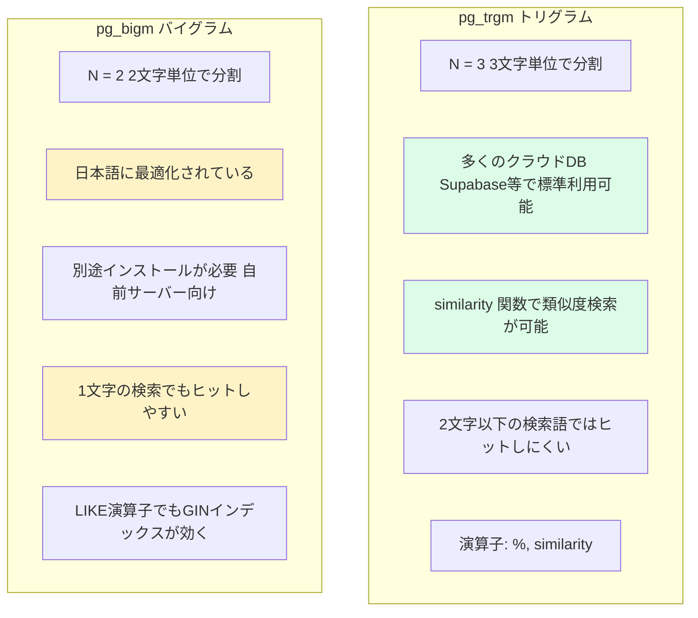

| 項目 | pg_trgm | pg_bigm |
|------|---------|---------|
| N-gramサイズ | 3文字 | 2文字 |
| 日本語の精度 | やや劣る | 優れている |
| 短い検索語 | 3文字未満で精度低下 | 2文字でも高精度 |
| クラウドDB対応 | Supabase等で利用可 | 自前インストール必要 |
| 類似度検索 | `similarity()` で可能 | 非対応 |
| LIKE+インデックス | 不可 | 可能 |

### 検索モードの切替実装

BON-LOGでは環境変数 `SEARCH_MODE` で検索方式を切り替えられます。これにより、開発環境と本番環境で異なる検索エンジンを使えます。

```typescript
// lib/search/fulltext.ts より

/**
 * 検索モードの型定義
 * 'bigm': pg_bigm（日本語最適）
 * 'trgm': pg_trgm（汎用・クラウドDB向け）
 * 'like': LIKE検索（フォールバック）
 */
export type SearchMode = 'bigm' | 'trgm' | 'like'

/**
 * 環境変数から検索モードを取得
 * 無効な値や未設定の場合は 'like' にフォールバック
 */
export function getSearchMode(): SearchMode {
  const mode = process.env.SEARCH_MODE?.toLowerCase()

  if (mode === 'bigm' || mode === 'trgm') {
    return mode
  }

  // デフォルトは最も互換性の高いLIKE検索
  return 'like'
}
```

### 検索モード別のSQL比較

各モードがどのようなSQLを生成するか見てみましょう。

```sql
-- 検索語: "黒松" で投稿を検索する場合

-- ■ pg_bigm モード
-- LIKE でもGINインデックスが効く（pg_bigm独自の機能）
SELECT p.id FROM posts p
WHERE p.is_hidden = false
AND p.content LIKE '%黒松%'
ORDER BY p.created_at DESC
LIMIT 20;

-- ■ pg_trgm モード
-- similarity()で類似度スコアを計算し、関連度順でソート
SELECT p.id FROM posts p
WHERE p.is_hidden = false
AND (p.content % '黒松' OR p.content ILIKE '%黒松%')
ORDER BY similarity(p.content, '黒松') DESC, p.created_at DESC
LIMIT 20;

-- ■ LIKE モード（フォールバック）
-- シンプルなILIKE（大文字小文字区別なし）
SELECT p.id FROM posts p
WHERE p.is_hidden = false
AND p.content ILIKE '%黒松%'
ORDER BY p.created_at DESC
LIMIT 20;
```

> **ここがポイント！**
> pg_trgmの `%` 演算子は類似度による検索です。`similarity('盆栽の手入れ', '盆栽')` は0.0〜1.0のスコアを返し、設定した閾値（デフォルト0.3）以上ならマッチと判定されます。BON-LOGでは閾値を0.1に下げて、日本語でもヒットしやすくしています。

### GINインデックスの運用

GINインデックスは作成して終わりではありません。本番運用では以下の点に注意が必要です。

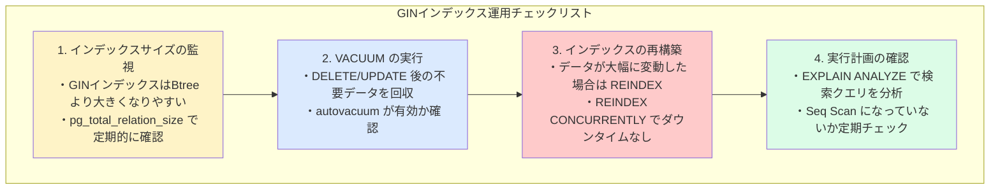

```sql
-- インデックスの状態を確認するSQL

-- 1. インデックスサイズを確認
SELECT
  indexname,
  pg_size_pretty(pg_relation_size(indexname::regclass)) as size
FROM pg_indexes
WHERE tablename = 'posts'
  AND indexname LIKE '%trgm%';

-- 2. 実行計画を確認（GINインデックスが使われているか）
EXPLAIN ANALYZE
SELECT p.id FROM posts p
WHERE p.content % '黒松';
-- → "Bitmap Index Scan on posts_content_trgm_idx" と表示されればOK
-- → "Seq Scan on posts" と表示されたらインデックスが使われていない！

-- 3. 拡張機能の閾値を調整
SELECT set_limit(0.1);
-- → 類似度の閾値を0.1に設定（日本語向けに緩める）
```

### フォールバック戦略

BON-LOGでは、全文検索でエラーが発生した場合に自動的にLIKE検索にフォールバックする仕組みを採用しています。

```
【フォールバックの流れ】

fulltextSearchPosts('黒松')
    |
    v
pg_trgm検索を実行
    |
    +-- 成功 → 結果を返す
    |
    +-- エラー（拡張未インストール等）
          |
          v
        fulltextSearchPostsWithLike('黒松')
          → ILIKE検索で代替実行
          → 結果を返す（パフォーマンスは劣るが動作する）
```

この設計により、以下のメリットがあります。

1. **開発環境の簡素化**: pg_trgm未設定でも検索が動作する
2. **障害耐性**: 拡張機能の問題が発生しても検索が停止しない
3. **段階的な導入**: まずLIKEで開始し、後からpg_trgmに移行できる

### 理解度チェック

1. 2-gram（pg_bigm）と3-gram（pg_trgm）の違いを説明してください。
2. `similarity()` 関数は何を返しますか？閾値を0.1に設定する理由は何ですか？
3. フォールバック戦略を採用するメリットを2つ挙げてください。

---

## 12.17 ハッシュタグ検索

> **このセクションで学ぶこと**
> - ハッシュタグの抽出と管理の仕組みを理解する
> - トレンドハッシュタグの集計方法を学ぶ
> - ハッシュタグのオートコンプリート実装を知る
> - キャッシュを活用したトレンド表示を理解する

### ハッシュタグシステムの全体像

BON-LOGでは、投稿に含まれる `#キーワード` を自動的に検出し、データベースで管理しています。

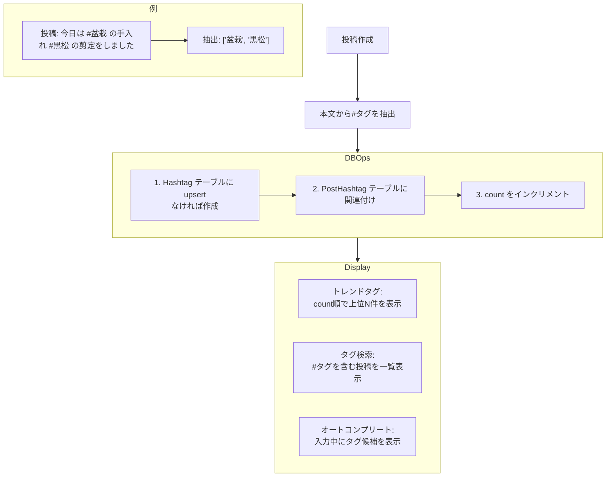

### データモデル

ハッシュタグは2つのテーブルで管理されています。

```prisma
// prisma/schema.prisma

// ハッシュタグマスタ
model Hashtag {
  id        String   @id @default(cuid())
  name      String   @unique          // タグ名（#なし、小文字化）
  count     Int      @default(0)      // 使用回数
  createdAt DateTime @default(now())

  posts PostHashtag[]                 // 関連する投稿

  @@index([count])                    // count順の検索を高速化
  @@map("hashtags")
}

// 投稿とハッシュタグの中間テーブル
model PostHashtag {
  postId    String
  hashtagId String

  post    Post    @relation(fields: [postId], references: [id], onDelete: Cascade)
  hashtag Hashtag @relation(fields: [hashtagId], references: [id], onDelete: Cascade)

  @@id([postId, hashtagId])           // 複合主キー（重複防止）
  @@map("post_hashtags")
}
```

> **コラム: なぜ中間テーブルが必要か？**
>
> 1つの投稿に複数のハッシュタグが付き、1つのハッシュタグが複数の投稿に使われる「多対多」の関係です。この関係をデータベースで表現するために中間テーブル（PostHashtag）が必要です。
>
> ```mermaid
> graph LR
>     PostA[投稿A] --- TagBonsai["#盆栽"]
>     PostA --- TagKuromatsu["#黒松"]
>     PostB[投稿B] --- TagBonsai
>     PostB --- TagSentei["#剪定"]
> ```
>
> - #盆栽 は投稿Aと投稿Bの両方に関連
> - 投稿Aは #盆栽 と #黒松 の両方に関連

### ハッシュタグの抽出

投稿の本文からハッシュタグを抽出する正規表現を見てみましょう。

```typescript
// lib/actions/hashtag.ts より

/**
 * ハッシュタグを抽出する正規表現
 *
 * マッチするパターン:
 *   #盆栽      → '盆栽'
 *   #bonsai    → 'bonsai'
 *   #盆栽_入門 → '盆栽_入門'
 *   #Bonsai2024 → 'bonsai2024'（小文字化される）
 *
 * Unicode範囲:
 *   \u3040-\u309F: ひらがな（あ〜ん）
 *   \u30A0-\u30FF: カタカナ（ア〜ン）
 *   \u4E00-\u9FFF: 漢字（CJK統合漢字）
 */
const HASHTAG_REGEX = /#([a-zA-Z0-9_\u3040-\u309F\u30A0-\u30FF\u4E00-\u9FFF]+)/g

/**
 * テキストからハッシュタグを抽出
 */
function extractHashtags(text: string): string[] {
  if (!text) return []

  const matches = text.match(HASHTAG_REGEX)
  if (!matches) return []

  // #を除去して小文字化し、重複を除去
  const hashtags = matches.map(tag => tag.slice(1).toLowerCase())
  return [...new Set(hashtags)]
}
```

```
【抽出の具体例】

入力: "今日の #盆栽 手入れ。#黒松 の #剪定 を行いました #盆栽"
                                                         ↑重複

処理フロー:
  1. match() → ['#盆栽', '#黒松', '#剪定', '#盆栽']
  2. slice(1) + toLowerCase() → ['盆栽', '黒松', '剪定', '盆栽']
  3. new Set() → Set{'盆栽', '黒松', '剪定'}（重複除去）
  4. 配列に変換 → ['盆栽', '黒松', '剪定']
```

### 投稿時のハッシュタグ登録

投稿が作成された時、自動的にハッシュタグがデータベースに登録されます。

```typescript
// lib/actions/hashtag.ts より

export async function attachHashtagsToPost(
  postId: string,
  content: string | null
) {
  if (!content) return

  const hashtagNames = extractHashtags(content)
  if (hashtagNames.length === 0) return

  try {
    for (const name of hashtagNames) {
      // upsert: 存在しなければ作成、存在すればcountを+1
      const hashtag = await prisma.hashtag.upsert({
        where: { name },
        update: { count: { increment: 1 } },
        create: { name, count: 1 },
      })

      // 投稿とハッシュタグの関連付けを作成
      await prisma.postHashtag.upsert({
        where: {
          postId_hashtagId: { postId, hashtagId: hashtag.id }
        },
        update: {},       // 既存なら何もしない
        create: { postId, hashtagId: hashtag.id },
      })
    }
  } catch (error) {
    // ハッシュタグの処理失敗は投稿作成をブロックしない
    logger.error('Attach hashtags error:', error)
  }
}
```

> **ここがポイント！**
> ハッシュタグの処理でエラーが発生しても、投稿自体の作成は成功します。ハッシュタグは補助的な機能であり、投稿の主要機能を止めるべきではないためです。これは「グレースフルデグラデーション（優雅な機能低下）」と呼ばれる設計パターンです。

### トレンドハッシュタグの取得

最も使われているハッシュタグを人気順で取得する処理です。

```typescript
// lib/actions/hashtag.ts より

export async function getTrendingHashtags(limit: number = 10) {
  try {
    const hashtags = await prisma.hashtag.findMany({
      where: { count: { gt: 0 } },    // 使用回数 > 0
      orderBy: { count: 'desc' },      // 人気順
      take: limit,                      // 上位N件
    })
    return hashtags
  } catch (error) {
    logger.error('Get trending hashtags error:', error)
    return []
  }
}
```

### ハッシュタグのオートコンプリート

投稿フォームや検索ボックスで、入力中のテキストに部分一致するハッシュタグを候補として表示します。

```typescript
// lib/actions/hashtag.ts より

export async function searchHashtags(query: string, limit: number = 10) {
  if (!query || query.length < 1) return []

  try {
    const hashtags = await prisma.hashtag.findMany({
      where: {
        name: {
          contains: query.toLowerCase(),  // 部分一致検索
          mode: 'insensitive',            // 大文字小文字を区別しない
        },
        count: { gt: 0 },                // 使用中のタグのみ
      },
      orderBy: { count: 'desc' },        // 人気順
      take: limit,
    })
    return hashtags
  } catch (error) {
    logger.error('Search hashtags error:', error)
    return []
  }
}
```

```
【オートコンプリートの動作例】

ユーザー入力: "盆"

候補表示:
  #盆栽         (150件)
  #盆栽入門     (42件)
  #盆栽手入れ   (28件)
  #盆栽園巡り   (15件)

ユーザーが「#盆栽」をクリック → 入力に挿入
```

### 投稿削除時のカウント減少

投稿が削除された時、関連するハッシュタグのカウントを減少させ、使用されなくなったタグは自動的に削除されます。

```typescript
// lib/actions/hashtag.ts より

export async function detachHashtagsFromPost(postId: string) {
  try {
    // 1. 関連するハッシュタグを取得
    const postHashtags = await prisma.postHashtag.findMany({
      where: { postId },
      include: { hashtag: true },
    })

    // 2. 関連付けを削除
    await prisma.postHashtag.deleteMany({ where: { postId } })

    // 3. 各ハッシュタグのcountを一括で-1し、count ≤ 0 のタグを削除
    //    prisma.$transaction() で複数のクエリをアトミックに実行（1つが失敗すると全部ロールバック）
    const hashtagIds = postHashtags.map(ph => ph.hashtagId)

    if (hashtagIds.length > 0) {
      await prisma.$transaction([
        // 全対象ハッシュタグのcountを一括で-1
        ...hashtagIds.map(id =>
          prisma.hashtag.update({
            where: { id },
            data: { count: { decrement: 1 } },
          })
        ),
        // count が 0 以下になったハッシュタグを一括削除
        prisma.hashtag.deleteMany({
          where: { count: { lte: 0 } },
        }),
      ])
    }
  } catch (error) {
    logger.error('Detach hashtags error:', error)
  }
}

// ※ for ループで1件ずつ update を呼ぶとN+1問題が発生するため、
//   prisma.$transaction([...array.map(...)]) で一括実行する。
//   これにより DBへのラウンドトリップを最小化できる。
```

### BON-LOGでの使用箇所

ハッシュタグシステムは以下のファイルで使用されています。

| ファイル | 役割 |
|----------|------|
| `lib/actions/hashtag.ts` | ハッシュタグの抽出・登録・削除・検索・トレンド取得 |
| `lib/actions/post.ts` | 投稿作成後に `attachHashtagsToPost()` を呼び出す |
| `lib/actions/search.ts` | `searchByTag()` でタグ付き投稿を検索する |
| `components/search/SearchResults.tsx` | タグタブで `searchByTag()` の結果を表示する |
| `app/(main)/search/page.tsx` | `getPopularTags()` で人気タグ一覧を取得してサイドバーに表示 |

投稿作成フローにおける呼び出し順序：
```
createPost() in lib/actions/post.ts
  ↓
prisma.post.create() で投稿を保存
  ↓
attachHashtagsToPost(post.id, content) を呼び出し
  ↓
本文から #タグ を抽出 → hashtags テーブルに upsert → post_hashtags に関連付け
```

### 実装しない場合の影響

ハッシュタグシステムを実装しない場合の影響を以下に示します。

| 機能 | 影響 |
|------|------|
| タグタブ検索 | `searchByTag()` が動作しないため、タグで投稿を絞り込めない |
| 人気タグ表示 | トレンドタグがサイドバーや検索ページに表示されない |
| オートコンプリート | 投稿フォームでの `#` 入力補完が機能しない |
| タグカウント | どのタグが何件使われているか把握できない |

ただし、ハッシュタグ処理のエラーは投稿作成をブロックしない（try/catch で握り潰す）ため、**ハッシュタグが動作しなくても投稿自体は正常に作成される**設計になっています。これを「グレースフルデグラデーション（優雅な機能低下）」と呼びます。

### 理解度チェック

1. ハッシュタグの正規表現で `\u3040-\u309F` はどの文字範囲を表しますか？
2. `upsert` 操作は何をしますか？なぜ通常の `create` ではなく `upsert` を使いますか？
3. 投稿削除時にハッシュタグの count を減らす理由は何ですか？

---

## 12.18 検索フィルタリング

> **このセクションで学ぶこと**
> - ブロック/ミュートしたユーザーの投稿を検索結果から除外する仕組みを理解する
> - 検索フィルタリングの設計パターンを学ぶ
> - 日付・いいね数・メディア種別による詳細フィルタの実装を知る

### ブロック/ミュート除外の仕組み

SNSの検索では、ブロックやミュートしたユーザーの投稿を結果から除外する必要があります。BON-LOGでは、この処理を `filter-helper.ts` に集約しています。

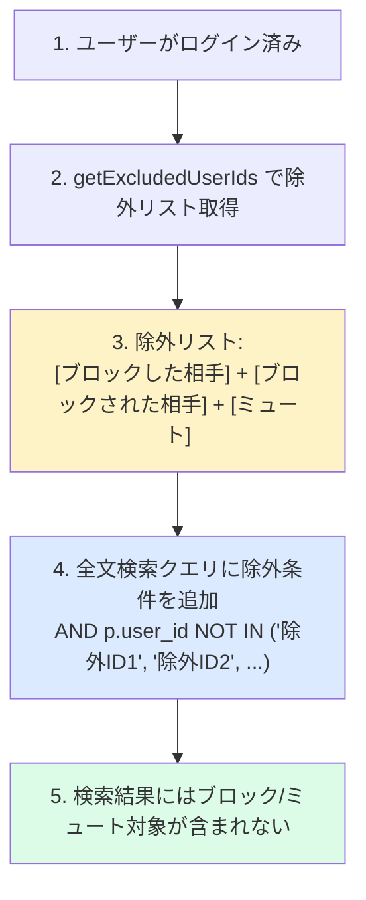

### フィルターヘルパーの実装

```typescript
// lib/actions/filter-helper.ts より

/**
 * フィルターオプションの型
 * 機能によって必要なフィルターが異なる
 */
export type FilterOptions = {
  blocked?: boolean    // 自分がブロックしたユーザー
  blockedBy?: boolean  // 自分をブロックしたユーザー
  muted?: boolean      // 自分がミュートしたユーザー
}

/**
 * 除外するユーザーIDの配列を取得
 */
export async function getExcludedUserIds(
  userId: string,
  options: FilterOptions = {}
): Promise<string[]> {
  const { blocked = false, blockedBy = false, muted = false } = options

  // すべてfalseならDBクエリは不要
  if (!blocked && !blockedBy && !muted) {
    return []
  }

  const queries: Promise<unknown[]>[] = []

  // ブロック関連のクエリ（1回のクエリで双方向を取得）
  if (blocked || blockedBy) {
    const blockWhere: { OR: object[] } = { OR: [] }
    if (blocked)   blockWhere.OR.push({ blockerId: userId })
    if (blockedBy) blockWhere.OR.push({ blockedId: userId })
    queries.push(
      prisma.block.findMany({
        where: blockWhere,
        select: { blockerId: true, blockedId: true },
      })
    )
  }

  // ミュートのクエリ（一方向のみ）
  if (muted) {
    queries.push(
      prisma.mute.findMany({
        where: { muterId: userId },
        select: { mutedId: true },
      })
    )
  }

  // 並列実行で高速化
  const results = await Promise.all(queries)

  // Setで重複を除去
  const excludedIds = new Set<string>()
  for (const items of results) {
    for (const item of items as Array<{
      blockerId?: string
      blockedId?: string
      mutedId?: string
    }>) {
      if ('blockedId' in item && item.blockedId && blocked)
        excludedIds.add(item.blockedId)
      if ('blockerId' in item && item.blockerId && blockedBy)
        excludedIds.add(item.blockerId)
      if ('mutedId' in item && item.mutedId)
        excludedIds.add(item.mutedId)
    }
  }

  // 自分自身は除外リストから削除
  excludedIds.delete(userId)
  return Array.from(excludedIds)
}
```

### 機能別のフィルター設定

機能によって適用するフィルターが異なります。

```
【タイムライン】
  getExcludedUserIds(userId, {
    blocked: true,    // ブロックした相手を非表示
    blockedBy: true,  // ブロックされた相手を非表示
    muted: true       // ミュートした相手を非表示
  })

【検索結果】
  getExcludedUserIds(userId, {
    blocked: true,    // ブロックした相手を非表示
    blockedBy: true,  // ブロックされた相手を非表示
    // muted は含めない → 検索では意図的に探す場合があるため
  })

【通知】
  getExcludedUserIds(userId, {
    blocked: true,    // ブロックした相手からの通知を除外
    blockedBy: true,  // ブロックされた相手からの通知を除外
  })
```

### 詳細フィルター（AdvancedSearchFilters）

BON-LOGでは基本的な全文検索に加え、以下の詳細フィルターを提供しています。

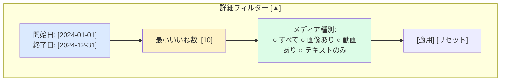

これらのフィルターはURLパラメータとして管理されます。

```typescript
// フィルター適用時のURL例:
// /search?q=盆栽&dateFrom=2024-01-01&dateTo=2024-12-31&minLikes=10&mediaType=images

// フィルター条件はSQLに変換される
// 日付フィルタ:
//   AND p.created_at >= '2024-01-01'
//   AND p.created_at <= '2024-12-31 23:59:59.999'
//
// いいね数フィルタ:
//   AND (SELECT COUNT(*) FROM likes l WHERE l.post_id = p.id) >= 10
//
// メディア種別フィルタ:
//   AND EXISTS (SELECT 1 FROM post_media pm
//     WHERE pm.post_id = p.id AND pm.type = 'image')
```

### ソート順の制御

検索結果のソート順は検索モードによって異なります。

```
【LIKE / pg_bigm モード】
  ORDER BY p.created_at DESC
  → 新しい投稿が上に表示される（時系列順）

【pg_trgm モード】
  ORDER BY similarity(p.content, '検索語') DESC,
           p.created_at DESC
  → 類似度が高い投稿が上に表示される（関連度順）
  → 同じ類似度なら新しい投稿が上に

【ユーザー検索の場合（pg_trgm）】
  ORDER BY GREATEST(
    similarity(u.nickname, '検索語'),
    COALESCE(similarity(u.bio, '検索語'), 0)
  ) DESC
  → ニックネームとbioのうち、より高い類似度でソート
```

### 理解度チェック

1. ブロックが「双方向」であるとはどういう意味ですか？
2. 検索結果ではミュートしたユーザーを除外しない場合がある理由は何ですか？
3. pg_trgmモードで `GREATEST()` と `COALESCE()` を使う理由を説明してください。

---

## 12.19 検索UXの最適化

> **このセクションで学ぶこと**
> - デバウンスとURLパラメータ連携の実践パターンを学ぶ
> - オートコンプリートの実装設計を理解する
> - 検索結果のハイライト表示と検索履歴の管理方法を知る
> - アクセシビリティを考慮した検索UIの設計を学ぶ

### デバウンスの実践パターン

12.7節でデバウンスの基本を学びましたが、BON-LOGの実際の検索バーではどのようにデバウンスが活用されているか見てみましょう。

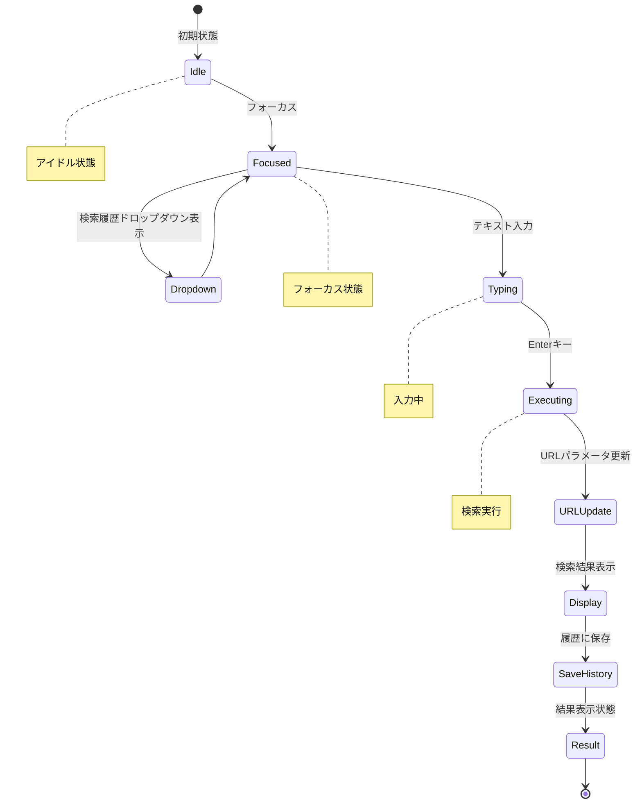

BON-LOGのSearchBarコンポーネントでは、Enterキーによる明示的な検索実行を採用しています。これにはデバウンスとは異なるメリットがあります。

```typescript
// components/search/SearchBar.tsx より

/**
 * キー入力ハンドラ
 * Enter: 検索実行
 * Escape: ドロップダウンを閉じてフォーカス解除
 */
const handleKeyDown = useCallback(
  (e: React.KeyboardEvent<HTMLInputElement>) => {
    if (e.key === 'Enter') {
      handleSearch()        // 即座に検索実行
    } else if (e.key === 'Escape') {
      setIsFocused(false)   // ドロップダウンを閉じる
      inputRef.current?.blur()
    }
  },
  [handleSearch]
)
```

```
【デバウンス検索 vs Enter検索の比較】

デバウンス検索:
  ・入力中に自動で検索が走る
  ・ユーザーは入力後すぐに結果を見られる
  ・サーバーリクエスト数はデバウンスで制御
  ・途中の入力での無駄な検索が発生する可能性

Enter検索:
  ・ユーザーが明示的にEnterを押して検索
  ・無駄なリクエストが完全にゼロ
  ・ユーザーが検索タイミングを制御できる
  ・1アクション余分に必要（Enterを押す）

BON-LOGの選択:
  → Enter検索を採用（サーバー負荷が低い、明確な操作感）
```

### 検索履歴の管理

検索バーにフォーカスした時、過去の検索キーワードをドロップダウンで表示します。

```typescript
// components/search/SearchBar.tsx より

/**
 * ローカルストレージのキー名
 */
const RECENT_SEARCHES_KEY = 'bonsai-sns-recent-searches'
const MAX_RECENT_SEARCHES = 10

/**
 * 検索履歴をローカルストレージに保存
 */
function saveRecentSearch(query: string) {
  if (typeof window === 'undefined' || !query.trim()) return
  try {
    const searches = getRecentSearches()
    // 重複を削除して先頭に追加（最新が上に来る）
    const filtered = searches.filter(s => s !== query)
    const updated = [query, ...filtered].slice(0, MAX_RECENT_SEARCHES)
    localStorage.setItem(RECENT_SEARCHES_KEY, JSON.stringify(updated))
  } catch {
    // ローカルストレージエラーは無視
  }
}
```

```
【検索履歴のUI】

+------------------------------------+
| [虫眼鏡] ___________________  [×] |  ← 入力フィールド（空の状態）
+------------------------------------+
| 最近の検索           すべて削除     |  ← ヘッダー
+------------------------------------+
| [時計] 黒松の剪定方法        [×]   |  ← 検索履歴アイテム
| [時計] 盆栽園 東京           [×]   |
| [時計] 初心者 盆栽           [×]   |
+------------------------------------+

表示条件:
  ・フォーカスが当たっている
  ・検索履歴が存在する
  ・入力フィールドが空（入力中は非表示）
```

### キーボードショートカット

検索バーには、パワーユーザー向けのキーボードショートカットが実装されています。

```typescript
// components/search/SearchBar.tsx より

/**
 * /キーで検索バーにフォーカス
 * INPUTやTEXTAREAにフォーカスがない時のみ動作
 */
useEffect(() => {
  const handleKeyDown = (e: KeyboardEvent) => {
    if (
      e.key === '/' &&
      !['INPUT', 'TEXTAREA'].includes(
        (e.target as HTMLElement).tagName
      )
    ) {
      e.preventDefault()
      inputRef.current?.focus()
    }
  }
  document.addEventListener('keydown', handleKeyDown)
  return () => document.removeEventListener('keydown', handleKeyDown)
}, [])
```

| キー | 動作 | 条件 |
|------|------|------|
| `/` | 検索バーにフォーカス | テキスト入力欄外で |
| `Enter` | 検索実行 | 検索バーにフォーカス中 |
| `Escape` | フォーカス解除 | 検索バーにフォーカス中 |

### URLパラメータとの同期

検索条件をURLに保存することで、ブックマークや共有が可能になります。

```typescript
// components/search/SearchBar.tsx より

/**
 * URLパラメータの変更を監視して入力フィールドを同期
 * ブラウザの戻る/進むボタンに対応
 */
useEffect(() => {
  const q = searchParams.get('q')
  if (q) {
    setQuery(q)
  }
}, [searchParams])

/**
 * 検索実行時にURLパラメータを更新
 */
const handleSearch = useCallback((searchQuery?: string) => {
  const q = searchQuery ?? query
  if (q.trim()) {
    saveRecentSearch(q.trim())  // 履歴に保存
  }
  const params = new URLSearchParams(searchParams.toString())
  if (q) {
    params.set('q', q)
  } else {
    params.delete('q')
  }
  router.push(`/search?${params.toString()}`)
}, [query, router, searchParams])
```

```
【URL同期の流れ】

ユーザーが「盆栽」と入力してEnter
  ↓
URL: /search?q=盆栽
  ↓
ブックマーク → 後日アクセス → 同じ検索結果が表示される

ユーザーがジャンルフィルタ「松柏類」を選択
  ↓
URL: /search?q=盆栽&tab=posts&genres=genre1

ユーザーがブラウザの「戻る」をクリック
  ↓
URL: /search?q=盆栽
  ↓
useEffect が発火 → 入力フィールドが「盆栽」に更新
```

### オートコンプリートの設計

検索バーでの入力中にハッシュタグや検索候補を表示する設計です。

```
【オートコンプリートの優先順位】

1. 検索履歴（ローカルストレージ）
   → ユーザー固有、最も関連性が高い

2. トレンドハッシュタグ（DB + キャッシュ）
   → 全ユーザー共通、人気のあるタグ

3. ハッシュタグ候補（DB検索）
   → 入力文字列に部分一致するタグ

組み合わせ例（入力: "盆"）:

| セクション | 内容 |
|-----------|------|
| **最近の検索** | [時計] 盆栽の手入れ方法 |
| **おすすめのタグ** | #盆栽 (150件) |
| | #盆栽入門 (42件) |
| | #盆栽園巡り (15件) |
```

### 検索結果のハイライト表示

12.11節で基本を学びましたが、実際のSearchResultsコンポーネントでは、React Queryの無限スクロールと組み合わせてハイライト表示を行います。

```typescript
// ハイライト表示の使用例（PostCard内部）

// 投稿の本文に検索キーワードをハイライト
<HighlightedText
  text={post.content}
  query={searchQuery}
/>

// ユーザー名にもハイライト
<HighlightedText
  text={user.nickname}
  query={searchQuery}
/>
```

### アクセシビリティの考慮

検索UIではアクセシビリティ（a11y）にも配慮しています。

```typescript
// SearchBar.tsx より

<input
  ref={inputRef}
  type="text"
  value={query}
  onChange={(e) => setQuery(e.target.value)}
  onKeyDown={handleKeyDown}
  placeholder={placeholder}
  aria-label="検索"          // スクリーンリーダー向けのラベル
  data-search-input          // テスト用のセレクタ
/>
```

| 対策 | 内容 |
|------|------|
| `aria-label` | スクリーンリーダーが「検索」と読み上げる |
| キーボード操作 | マウスなしでも全操作が可能 |
| フォーカス管理 | `/` キーでフォーカス、`Escape` で解除 |
| 外側クリック | ドロップダウンの自動クローズ |

### 理解度チェック

1. BON-LOGがデバウンス検索ではなくEnter検索を採用した理由は何ですか？
2. 検索履歴をローカルストレージに保存するメリットとデメリットを1つずつ挙げてください。
3. `aria-label="検索"` は何のために設定しますか？

---

## 12.20 キャッシュ戦略

> **このセクションで学ぶこと**
> - `unstable_cache` を使ったサーバーサイドキャッシュの仕組みを理解する
> - キャッシュタグによる手動無効化の方法を学ぶ
> - 検索関連データに最適なキャッシュ時間の設計を知る
> - Redisを使ったキャッシュの拡張方法を理解する

### なぜキャッシュが必要か

検索機能では、以下のデータが頻繁にアクセスされます。

| データ種別 | アクセス頻度 | 変更頻度 | キャッシュ時間 |
|-----------|------------|---------|--------------|
| **ジャンル一覧** | 高い（全ユーザー共通） | 非常に低い（管理者のみ変更） | 1時間 |
| **トレンドジャンル** | 高い | 中程度（直近48時間集計） | 5分 |
| **人気ハッシュタグ** | 高い | 中程度（直近1週間集計） | 5分 |

### unstable_cacheの仕組み

Next.jsの `unstable_cache` は、サーバーサイドでデータをキャッシュする機能です。

```typescript
// lib/cache.ts より

import { unstable_cache, revalidateTag } from 'next/cache'

/**
 * キャッシュタグの定義
 * タイプミスを防ぎ、一元管理するための定数
 */
export const CACHE_TAGS = {
  GENRES: 'genres',
  TRENDING_GENRES: 'trending-genres',
  POPULAR_TAGS: 'popular-tags',
} as const
```

```
【unstable_cacheの動作フロー】

初回アクセス:
  getCachedGenres() 呼び出し
    → キャッシュにデータなし
    → prisma.genre.findMany() を実行
    → 結果をキャッシュに保存（TTL: 3600秒）
    → 結果を返す

2回目以降（3600秒以内）:
  getCachedGenres() 呼び出し
    → キャッシュにデータあり
    → DBにアクセスせずキャッシュから返す（高速！）

3600秒経過後:
  getCachedGenres() 呼び出し
    → キャッシュが期限切れ
    → prisma.genre.findMany() を再実行
    → 新しい結果でキャッシュを更新
    → 結果を返す
```

### ジャンル一覧のキャッシュ

変更頻度が非常に低いジャンルマスタデータのキャッシュです。

```typescript
// lib/cache.ts より

export const getCachedGenres = unstable_cache(
  async () => {
    // DBからジャンル一覧を取得
    const genres = await prisma.genre.findMany({
      orderBy: [{ sortOrder: 'asc' }],
    })

    // カテゴリごとにグループ化
    type GenreType = typeof genres[number]
    const groupedMap = genres.reduce(
      (acc: Record<string, GenreType[]>, genre: GenreType) => {
        if (!acc[genre.category]) {
          acc[genre.category] = []
        }
        acc[genre.category].push(genre)
        return acc
      },
      {}
    )

    // カテゴリの表示順序を制御
    const categoryOrder = [
      '松柏類', '雑木類', '草もの',
      '用品・道具', '施設・イベント', 'その他'
    ]

    const grouped: Record<string, typeof genres> = {}
    for (const category of categoryOrder) {
      if (groupedMap[category]) {
        grouped[category] = groupedMap[category]
      }
    }

    return { genres: grouped, allGenres: genres }
  },
  ['all-genres'],           // キャッシュキー
  {
    revalidate: 3600,       // 1時間
    tags: [CACHE_TAGS.GENRES],
  }
)
```

### 人気タグのキャッシュ

直近1週間のハッシュタグ使用頻度をキャッシュします。

```typescript
// lib/cache.ts より

export const getCachedPopularTags = unstable_cache(
  async (limit = 10) => {
    const oneWeekAgo = new Date()
    oneWeekAgo.setDate(oneWeekAgo.getDate() - 7)

    // #を含む投稿を取得
    const posts = await prisma.post.findMany({
      where: {
        isHidden: false,
        createdAt: { gte: oneWeekAgo },
        content: { contains: '#' },
      },
      select: { content: true },
    })

    // ハッシュタグを抽出してカウント
    const tagCounts: Record<string, number> = {}
    const hashtagRegex =
      /#[\w\u3040-\u309f\u30a0-\u30ff\u4e00-\u9faf]+/g

    for (const post of posts) {
      if (!post.content) continue
      const tags = post.content.match(hashtagRegex) || []
      for (const tag of tags) {
        const normalizedTag = tag.slice(1).toLowerCase()
        tagCounts[normalizedTag] =
          (tagCounts[normalizedTag] || 0) + 1
      }
    }

    // カウント順にソートして上位N件を返す
    const sortedTags = Object.entries(tagCounts)
      .sort(([, a], [, b]) => b - a)
      .slice(0, limit)
      .map(([tag, count]) => ({ tag, count }))

    return { tags: sortedTags }
  },
  ['popular-tags'],
  {
    revalidate: 300,         // 5分
    tags: [CACHE_TAGS.POPULAR_TAGS],
  }
)
```

### キャッシュの手動無効化

管理者がジャンルを変更した時など、キャッシュを即座に無効化する必要がある場合は `revalidateTag` を使います。

```typescript
// lib/cache.ts より

/**
 * ジャンルキャッシュを即時無効化
 * 管理者がジャンルを追加・編集・削除した時に呼び出す
 */
export function revalidateGenresCache() {
  revalidateTag(CACHE_TAGS.GENRES, { expire: 0 })
}

/**
 * トレンドジャンルキャッシュを即時無効化
 * 通常は5分ごとに自動更新されるため、あまり使用しない
 */
export function revalidateTrendingGenresCache() {
  revalidateTag(CACHE_TAGS.TRENDING_GENRES, { expire: 0 })
}

/**
 * 人気タグキャッシュを即時無効化
 * スパムタグを削除した後などに使用
 */
export function revalidatePopularTagsCache() {
  revalidateTag(CACHE_TAGS.POPULAR_TAGS, { expire: 0 })
}
```

```
【手動無効化の使用例】

管理画面でジャンルを追加:
  await prisma.genre.create({ data: { name: '花物', ... } })
  revalidateGenresCache()  // ← 即座にキャッシュを無効化
  → 次のアクセスでDBから最新データを取得

スパム投稿を一括削除:
  await deleteSpamPosts()
  revalidatePopularTagsCache()  // ← 人気タグを再計算
  → 5分待たずに最新のランキングが反映される
```

### キャッシュ時間の設計指針

| データ種別 | キャッシュ時間 | 理由 |
|-----------|-------------|------|
| ジャンルマスタ | 1時間（3600秒） | 管理者のみ変更、変更頻度が極めて低い |
| トレンドジャンル | 5分（300秒） | 変動するが、リアルタイム性は不要 |
| 人気ハッシュタグ | 5分（300秒） | 変動するが、数分の遅延は許容 |
| 検索結果 | キャッシュなし | 常に最新の結果が必要 |

> **ここがポイント！**
> 検索結果自体はキャッシュしません。検索結果は検索語やフィルター条件の組み合わせが無数にあり、キャッシュの効率が低いためです。代わりに、検索のUIで使う「補助的なデータ」（ジャンル一覧、トレンド等）をキャッシュして、体感速度を向上させています。

### Redisを使ったキャッシュの拡張

`unstable_cache` はNext.jsのサーバーメモリ上にキャッシュを保持しますが、複数のサーバーインスタンスがある場合はキャッシュが共有されません。Upstash Redisを使うことで、インスタンス間でキャッシュを共有できます。

```
+----------------------------------------------------------+
|          unstable_cache vs Redis キャッシュ                |
+----------------------------------------------------------+
|                                                          |
|  【unstable_cache（Next.jsネイティブ）】                  |
|  ・設定が簡単                                            |
|  ・サーバーメモリに保存                                  |
|  ・サーバー再起動で消える                                |
|  ・マルチインスタンスで共有不可                          |
|                                                          |
|  【Upstash Redis】                                       |
|  ・外部サービスとして独立                                |
|  ・サーバー再起動後も維持される                          |
|  ・マルチインスタンスで共有可能                          |
|  ・ネットワーク遅延あり                                  |
|                                                          |
|  【BON-LOGでの使い分け】                                 |
|  ・静的データ（ジャンル等）→ unstable_cache              |
|  ・トレンド検索キーワード → Redis (ZINCRBY/ZREVRANGE)    |
|                                                          |
+----------------------------------------------------------+
```

```typescript
// 演習問題（12.15）で紹介したRedisパターン

import { redis } from '@/lib/redis'

// 検索回数をインクリメント
export async function incrementSearchCount(query: string) {
  // ZINCRBYコマンド: ソート済みセットのスコアを増加
  await redis.zincrby('search:trends', 1, query)
}

// トレンドキーワードを取得
export async function getTrendingSearches(limit = 10) {
  // ZREVRANGEコマンド: スコア降順で取得
  return await redis.zrevrange('search:trends', 0, limit - 1)
}
```

### キャッシュ戦略のまとめ図

```
+----------------------------------------------------------+
|           BON-LOG 検索キャッシュ戦略                       |
+----------------------------------------------------------+
|                                                          |
|  [ユーザーのリクエスト]                                   |
|       |                                                  |
|       v                                                  |
|  ジャンルフィルタ表示                                     |
|    → getCachedGenres()  [unstable_cache: 1時間]          |
|                                                          |
|  トレンドジャンル表示                                     |
|    → getCachedTrendingGenres()  [unstable_cache: 5分]    |
|                                                          |
|  人気タグ表示                                             |
|    → getCachedPopularTags()  [unstable_cache: 5分]       |
|                                                          |
|  検索結果取得                                             |
|    → fulltextSearchPosts()  [キャッシュなし・常に最新]    |
|                                                          |
|  検索トレンド（オプション）                               |
|    → Redis ZINCRBY/ZREVRANGE  [TTLなし・永続]            |
|                                                          |
+----------------------------------------------------------+
```

### 理解度チェック

1. `unstable_cache` の第3引数の `revalidate` と `tags` はそれぞれ何を制御しますか？
2. ジャンル一覧のキャッシュ時間が1時間で、トレンドジャンルのキャッシュ時間が5分である理由を説明してください。
3. 検索結果自体をキャッシュしない理由は何ですか？

---

## まとめ

この章では、BON-LOGの検索機能を実装しました。

### 学んだこと

| トピック | 内容 |
|----------|------|
| LIKE検索 vs 全文検索 | それぞれの特徴と使い分け |
| PostgreSQL全文検索 | `to_tsvector`, `to_tsquery`, `@@`演算子 |
| GINインデックス | 転置インデックスの仕組みと作成方法 |
| Prismaでの生SQL | `$queryRaw`を使った全文検索の実装 |
| 検索モード自動切替 | `bigm` / `trgm` / `like` を環境変数で切り替え |
| タブ構成（投稿/ユーザー/タグ） | タブ別の検索結果管理と `searchByTag()` |
| 詳細フィルター | 日付・いいね数・メディア種別による絞り込み |
| デバウンス / Enter検索 | 連続入力時の無駄なリクエスト防止 |
| URLSearchParams | 検索条件のURL保存と共有 |
| ハイライト表示 | 検索キーワードの視覚的な強調 |
| ページネーション | カーソルベースの効率的な結果分割 |
| pg_trgm / pg_bigm | N-gramベースの日本語全文検索 |
| ハッシュタグ | 抽出・管理・トレンド集計・オートコンプリート |
| ブロック/ミュート除外 | `getExcludedUserIds()` による検索結果フィルタリング |
| 検索UX | 履歴（LocalStorage）・ショートカット（/キー）・アクセシビリティ |
| キャッシュ戦略 | `unstable_cache` + Upstash Redis による最適化 |

### 重要なファイル一覧

| ファイル | 役割 |
|----------|------|
| `lib/search/fulltext.ts` | 検索のコアロジック（pg_trgm/pg_bigm/LIKE切替、全文検索クエリ生成、インデックス管理） |
| `lib/actions/search.ts` | 検索のServer Action（searchPosts/searchUsers/searchByTag/searchShops/searchEvents/searchBonsais/searchGlobal/getPopularTags/getAllGenres） |
| `lib/actions/hashtag.ts` | ハッシュタグの管理（extractHashtags/attachHashtagsToPost/detachHashtagsFromPost/getTrendingHashtags/getPostsByHashtag/searchHashtags） |
| `lib/actions/filter-helper.ts` | ブロック/ミュートユーザーIDの除外リスト取得（getExcludedUserIds） |
| `lib/cache.ts` | キャッシュ戦略（getCachedGenres/getCachedPopularTags） |
| `lib/constants/limits.ts` | 制限値定数（DEFAULT_PAGE_LIMIT=20、POPULAR_TAGS_LIMIT=10、GLOBAL_SEARCH_PER_CATEGORY_LIMIT=5） |
| `lib/rate-limit.ts` | レート制限（RATE_LIMITS.search: 1分あたり20リクエスト） |
| `components/search/SearchBar.tsx` | 検索入力バー（履歴・/キーショートカット・URLパラメータ同期・Enterキー検索） |
| `components/search/SearchTabs.tsx` | 投稿/ユーザー/タグのタブ切替（URLのtabパラメータと同期） |
| `components/search/SearchResults.tsx` | 検索結果表示コンポーネント群（PostSearchResults/UserSearchResults/TagSearchResults/PopularTags） |
| `components/search/GenreFilter.tsx` | ジャンルフィルタドロップダウン（カテゴリ別グループ化・複数選択・URLパラメータ同期） |
| `components/search/AdvancedSearchFilters.tsx` | 詳細フィルター（日付範囲・最小いいね数・メディア種別） |
| `app/(main)/search/page.tsx` | 検索ページ（Server Component、URLパラメータを受け取り初期データを取得） |
| `app/api/admin/search/setup/route.ts` | 管理者用FTSセットアップAPI（GET: ステータス確認、POST: 拡張有効化/インデックス作成） |
| `scripts/setup-fts.ts` | PostgreSQL全文検索セットアップスクリプト（`npx tsx scripts/setup-fts.ts`で実行） |
| `prisma/migrations/20240201000000_add_fts_indexes/migration.sql` | GINインデックス定義（pg_trgm用、12個のインデックス） |

次章では、通知システムを実装します。ユーザーが「いいね」や「コメント」などのアクションを受けた時に、リアルタイムで知らせる仕組みを構築します。

---

## 12.21 技術選定の理由 -- なぜこの技術スタックを選んだのか

検索機能を構成する2つの柱 -- **検索エンジン**と**検索UI** -- について、どのような選択肢があり、なぜ最終的にこの構成を選んだのかを詳しく解説します。

検索はSNSの「ナビゲーション」です。ユーザーが欲しい情報にたどり着けるかどうかは、検索機能の品質に直結します。しかし、高機能な検索エンジンを導入すればいいかというと、そうではありません。プロジェクトの規模やインフラ構成に合った選択をすることが重要です。

---

### 12.21.1 検索エンジンの選択肢

「全文検索」を実現するためのエンジン（ソフトウェア）には、さまざまな選択肢があります。

#### 候補一覧

| エンジン | 種別 | 日本語対応 | インフラ | 無料枠 |
|---------|------|-----------|---------|--------|
| **PostgreSQL全文検索** | DB組み込み | pg_trgm/pg_bigm | 不要（DB内蔵） | -- |
| **Elasticsearch** | 専用サーバー | kuromoji | 別途サーバー必要 | なし（自前運用） |
| **Algolia** | SaaS | あり | 不要（API） | 10,000レコード |
| **Meilisearch** | 専用サーバー | あり | 別途サーバー必要 | Meilisearch Cloud無料枠 |
| **Typesense** | 専用サーバー | あり | 別途サーバー必要 | Typesense Cloud無料枠 |

#### 各選択肢の詳細

**Elasticsearch**

全文検索エンジンの「王様」です。Apache Lucene（Java製の全文検索ライブラリ）を基盤に構築されており、大規模なデータの検索に特化しています。Wikipedia、GitHub、Netflixなど、世界中の大規模サービスで使われています。

```
メリット:
- 検索機能が最も豊富（ファセット、集約、地理検索、MLランキング等）
- 日本語対応が成熟（kuromojiトークナイザー）
- 数億〜数十億件のドキュメントでも高速
- Kibanaによる可視化・分析
- オープンソース（OpenSearchとしてフォーク版もあり）

デメリット:
- 別途サーバーが必要（最低でもメモリ2GB以上推奨）
- 運用が複雑（クラスタ管理、インデックス管理、シャード設計）
- データの同期が必要（DBの変更をElasticsearchに反映）
- 学習コストが高い（独自のQuery DSL）
- 個人開発には明らかに過剰
```

```
Elasticsearchが適するケース:
- 数百万件以上のドキュメントを検索する
- 複雑な検索条件（AND/OR/NOT、ファセット、地理検索）が必要
- 検索結果のランキングを機械学習で最適化したい
- 専任のインフラエンジニアがいる
```

> **用語解説: 全文検索（Full-Text Search）とは？**
>
> 文書の「全文」を対象にキーワードを検索する技術です。通常のデータベース検索（`WHERE name = 'タロウ'`）は完全一致や部分一致（`LIKE '%タロウ%'`）しかできませんが、全文検索では「関連度の高い順にソート」「表記ゆれの吸収」「同義語の展開」など、より賢い検索が可能です。
>
> ```
> 通常の検索（LIKE）:
>   「盆栽」で検索 → 「盆栽」を含む文書のみヒット
>                    「ボンサイ」「bonsai」はヒットしない
>
> 全文検索:
>   「盆栽」で検索 → 「盆栽」「ボンサイ」「bonsai」がヒット
>                    関連度の高い順にソート
>                    「盆栽教室」「盆栽展」など部分一致も含む
> ```

**Algolia**

検索に特化したSaaS（Software as a Service）です。APIを呼ぶだけで高品質な検索機能を利用できます。

```javascript
// Algoliaの使用例
import algoliasearch from 'algoliasearch'

const client = algoliasearch('YOUR_APP_ID', 'YOUR_API_KEY')
const index = client.initIndex('posts')

// データをAlgoliaに送信（インデックス登録）
await index.saveObjects(posts)

// 検索
const { hits } = await index.search('黒松 盆栽', {
  filters: 'genre:松柏類',
  hitsPerPage: 20,
})
```

```
メリット:
- 検索速度が非常に速い（平均1〜20ミリ秒）
- タイポ耐性（typo tolerance）が標準搭載
- InstantSearchというUIライブラリが充実
- ダッシュボードで検索分析が可能
- 日本語対応

デメリット:
- 無料枠が小さい（10,000レコード、10,000リクエスト/月）
- 料金がレコード数とリクエスト数の両方に依存
- データをAlgoliaサーバーに送信する必要がある
- DBとの同期ロジックが必要
- 検索のカスタマイズに制約がある
```

> **用語解説: タイポ耐性（Typo Tolerance）とは？**
>
> ユーザーがキーワードを打ち間違えても、正しい検索結果を返す機能です。たとえば、「bonsai」と入力すべきところを「bonsoi」と入力しても、「bonsai」の検索結果が返ります。これは「編集距離」（ある文字列を別の文字列に変換するために必要な最小操作回数）を計算して実現しています。

**Meilisearch**

Rust言語で書かれたオープンソースの全文検索エンジンです。「Elasticsearchの簡単版」とも言われ、セットアップと運用がシンプルなことが特徴です。

```
メリット:
- セットアップが非常に簡単（バイナリ1つで起動）
- 検索速度が速い（50ミリ秒以内を保証）
- タイポ耐性、ファセット検索が標準搭載
- Dockerで簡単にデプロイ
- 日本語対応（Lindera tokenizer）

デメリット:
- Elasticsearchほどの機能はない
- 別途サーバーが必要
- DBとの同期ロジックが必要
- Vercel + Supabase構成では追加インフラに
- まだ比較的新しいプロジェクト（2020年〜）
```

**Typesense**

C++で書かれた高速な全文検索エンジンです。Algoliaのオープンソース代替として開発されました。

```
メリット:
- Algoliaに近い使い勝手でオープンソース
- 非常に高速（メモリ内インデックス）
- タイポ耐性が優秀
- Typesense Cloudで簡単にホスティング

デメリット:
- 日本語のトークナイズがやや弱い
- Elasticsearchほどの集約機能はない
- コミュニティがまだ小さい
- DBとの同期ロジックが必要
```

**PostgreSQL全文検索（BON-LOGの選択）**

BON-LOGがデータベースとして使っているPostgreSQL自体に組み込まれた全文検索機能です。追加のサーバーやサービスは一切不要で、SQLの延長で全文検索を実現できます。

```sql
-- PostgreSQL全文検索の基本的な使い方

-- 1. GINインデックスの作成
CREATE INDEX idx_posts_content_trgm ON posts
  USING gin (content gin_trgm_ops);

-- 2. トライグラム検索（日本語対応）
SELECT * FROM posts
  WHERE content LIKE '%黒松%'
  ORDER BY similarity(content, '黒松') DESC;

-- 3. tsvector/tsqueryを使った全文検索（英語向け）
SELECT * FROM posts
  WHERE to_tsvector('english', content) @@ to_tsquery('english', 'bonsai & pine');
```

```
メリット:
- 追加インフラが一切不要（PostgreSQLだけで完結）
- DBとの同期が不要（データがDB内にあるため常に最新）
- pg_trgmで日本語のトライグラム検索が可能
- GINインデックスで十分な検索速度
- トランザクション整合性が保証される
- 運用コストゼロ（Supabaseに含まれている）

デメリット:
- タイポ耐性がない（自前実装が必要）
- ファセット検索は自前実装が必要
- 数千万件を超えると専用エンジンに劣る場合がある
- 検索結果のランキングアルゴリズムが限定的
- 日本語の形態素解析は標準では未対応（pg_bigmが必要）
```

#### BON-LOGがPostgreSQL全文検索を選んだ理由

```
判断基準と評価:

1. インフラのシンプルさ（最重要）
   → PostgreSQL: 追加インフラゼロ（Supabaseに含まれる）
   → Elasticsearch: 別途サーバーが必要（月額$15〜）
   → Algolia: SaaSだが、データ同期が必要
   → BON-LOGはVercel + Supabase構成。追加サーバーを立てたくない

2. データ同期の問題
   → PostgreSQL: DBに直接クエリするので同期不要
   → 他の選択肢: DBの変更を検索エンジンに反映する仕組みが必要
   → 同期の遅延やエラーで検索結果が古くなるリスクがない

3. コスト
   → PostgreSQL: 追加コストゼロ
   → Elasticsearch: EC2 t3.small でも月額$15〜
   → Algolia: 無料枠超過後は月額$29〜
   → 個人開発・スタートアップ初期には重要

4. 日本語対応
   → pg_trgm: トライグラム（3文字の部分文字列）で日本語検索可能
   → pg_bigm: バイグラム（2文字の部分文字列）でさらに高精度
   → 完璧な形態素解析ではないが、SNSの検索には十分

5. 開発速度
   → PrismaのqueryRawで直接SQLを書ける
   → 新しいライブラリの学習が不要
   → フロントエンドの開発に集中できる
```

> **用語解説: トライグラム（Trigram）とは？**
>
> 文字列を3文字ずつに分割したものです。PostgreSQLのpg_trgm拡張は、このトライグラムを使って類似文字列の検索を実現します。
>
> ```
> 「黒松盆栽」のトライグラム:
>   「黒松盆」「松盆栽」
>
> 「盆栽教室」のトライグラム:
>   「盆栽教」「栽教室」
>
> 「黒松盆栽」で検索すると:
>   → トライグラムが一致する文書を検索
>   → 「黒松盆栽の手入れ」「松盆栽の育て方」などがヒット
> ```
>
> 日本語は英語と違い、単語の区切りにスペースがありません。英語なら "this is a pen" のように単語ごとに区切れますが、日本語は「これはペンです」のように連続しています。トライグラムはスペースに依存せず3文字ずつ機械的に分割するため、日本語でも問題なく動作します。

> **用語解説: GINインデックスとは？**
>
> GIN（Generalized Inverted Index、汎用転置インデックス）は、PostgreSQLが提供するインデックスの一種です。通常のB-treeインデックスは「この値を持つ行はどこか」を高速に検索しますが、GINインデックスは「この単語（またはトライグラム）を含む行はどこか」を高速に検索します。
>
> ```
> B-treeインデックス（通常のインデックス）:
>   値 → 行の位置
>   "東京" → 行1, 行5, 行8
>   "大阪" → 行2, 行7
>
> GINインデックス（転置インデックス）:
>   トライグラム → 行の位置
>   "黒松盆" → 行1, 行3, 行10
>   "松盆栽" → 行1, 行3, 行10, 行15
>   "盆栽教" → 行5, 行20
>   "栽教室" → 行5, 行20
> ```
>
> GINインデックスがない場合、検索のたびにすべての行をスキャンする必要がありますが（全件スキャン）、GINインデックスがあれば該当する行だけを直接取得できます。

---

### 12.21.2 検索UIの選択肢

検索窓のUIをどのように実装するかにも、選択肢があります。

#### 候補一覧

| 方式 | 提供元 | フレームワーク統合 | カスタマイズ性 |
|------|--------|------------------|-------------|
| **自前実装** | -- | 完全自由 | 完全自由 |
| **InstantSearch** | Algolia | React対応 | 中程度 |
| **autocomplete.js** | Algolia | React対応 | 中〜高 |

#### 各選択肢の詳細

**InstantSearch（Algolia提供）**

Algoliaが提供する検索UIコンポーネントライブラリです。検索窓、フィルタ、ページネーション、ハイライトなどのコンポーネントが用意されており、Algoliaのバックエンドと組み合わせることで、すぐに高品質な検索UIを構築できます。

```jsx
// InstantSearchの使用例
import { InstantSearch, SearchBox, Hits } from 'react-instantsearch'
import algoliasearch from 'algoliasearch'

const searchClient = algoliasearch('APP_ID', 'SEARCH_KEY')

function SearchPage() {
  return (
    <InstantSearch searchClient={searchClient} indexName="posts">
      <SearchBox />
      <Hits hitComponent={PostHit} />
    </InstantSearch>
  )
}
```

```
メリット:
- 豊富なUIコンポーネントが用意されている
- デザインが洗練されている
- ファセット、ページネーション等が簡単に実装できる

デメリット:
- Algoliaバックエンドが前提（他の検索エンジンでは使いにくい）
- カスタマイズの自由度が制限される
- バンドルサイズが大きい
- Algoliaの料金が追加でかかる
```

**autocomplete.js（Algolia提供）**

検索窓のオートコンプリート（入力補完）に特化したライブラリです。InstantSearchとは異なり、バックエンドに依存しないため、自前の検索APIとも組み合わせられます。

```jsx
// autocomplete.jsの使用例
import { autocomplete, getAlgoliaResults } from '@algolia/autocomplete-js'

autocomplete({
  container: '#autocomplete',
  getSources({ query }) {
    return [{
      sourceId: 'posts',
      getItems() {
        return fetch(`/api/search?q=${query}`).then(r => r.json())
      },
      templates: {
        item({ item }) {
          return `<div>${item.title}</div>`
        },
      },
    }]
  },
})
```

```
メリット:
- バックエンドに依存しない
- カスタマイズ性が高い
- 複数のデータソースを統合できる

デメリット:
- Reactとの統合にやや工夫が必要
- 日本語入力（IME）との相性問題がある場合がある
- ライブラリの学習コストがある
```

**自前実装（BON-LOGの選択）**

React（useState、useEffect）とデバウンスを使って、検索UIをゼロから実装する方式です。

```typescript
// 自前実装の例（BON-LOGのSearchBar）
'use client'

import { useState, useEffect, useCallback } from 'react'
import { useRouter, useSearchParams } from 'next/navigation'

export function SearchBar() {
  const [query, setQuery] = useState('')
  const router = useRouter()

  // デバウンス: 500ms入力が止まったら検索実行
  useEffect(() => {
    const timer = setTimeout(() => {
      if (query) {
        router.push(`/search?q=${encodeURIComponent(query)}`)
      }
    }, 500)
    return () => clearTimeout(timer)
  }, [query, router])

  return (
    <input
      type="search"
      value={query}
      onChange={(e) => setQuery(e.target.value)}
      placeholder="投稿、ユーザー、盆栽園を検索..."
    />
  )
}
```

```
メリット:
- 完全なカスタマイズ自由度
- 外部ライブラリへの依存ゼロ
- バンドルサイズへの影響が最小
- 検索バックエンドを自由に選べる
- Reactの基礎知識だけで理解可能

デメリット:
- すべて自分で実装する必要がある
- アクセシビリティ対応（ARIA属性等）を自前で実装
- タイポ耐性等の高度な機能は自前実装が必要
```

#### BON-LOGが自前実装を選んだ理由

```
判断基準と評価:

1. バックエンドとの整合性
   → PostgreSQL全文検索を使うため、Algolia前提のInstantSearchは不適合
   → 自前実装ならバックエンドを自由に切り替え可能

2. バンドルサイズ
   → InstantSearch: 約50KB以上（gzip後）
   → autocomplete.js: 約20KB（gzip後）
   → 自前実装: 約2KB（デバウンスロジック程度）
   → SNSではページ読み込み速度が重要

3. 学習効果
   → チュートリアルとして、検索UIの仕組みを理解することが重要
   → 既製ライブラリを使うと「中身がブラックボックス」になりがち
   → デバウンス、URLパラメータ管理、ハイライト等を自分で実装することで理解が深まる

4. カスタマイズの自由度
   → 和風デザインに合わせた独自のUI
   → 検索履歴、キーボードショートカット等の独自機能
   → ライブラリの制約に縛られない

5. 依存関係の最小化
   → 外部ライブラリは将来のメンテナンスコスト
   → ライブラリのバージョンアップで壊れるリスク
   → 自前実装ならReactの安定したAPIだけに依存
```

> **用語解説: デバウンス（Debounce）とは？**
>
> 短時間に連続して発生するイベントを「最後の1回だけ」実行する技術です。検索窓でキーボードを打つたびに検索リクエストを送ると、サーバーに大量のリクエストが飛んでしまいます。デバウンスを使うと、「入力が止まってから一定時間（たとえば500ミリ秒）後に1回だけ」リクエストを送ります。
>
> ```
> デバウンスなし（キー入力のたびにリクエスト）:
>   "黒" → リクエスト1
>   "黒松" → リクエスト2
>   "黒松盆" → リクエスト3
>   "黒松盆栽" → リクエスト4    ← 4回もリクエスト！
>
> デバウンスあり（500ms待機後に1回だけ）:
>   "黒" → 待機中...
>   "黒松" → 待機中...（タイマーリセット）
>   "黒松盆" → 待機中...（タイマーリセット）
>   "黒松盆栽" → 500ms経過 → リクエスト1    ← 1回だけ！
> ```

> **用語解説: オートコンプリート（Autocomplete）とは？**
>
> ユーザーが入力を始めると、入力途中の文字列に基づいて候補を表示する機能です。Google検索の検索窓で文字を入力すると候補が表示されるのが、最も身近な例です。
>
> BON-LOGでは、検索履歴とトレンドのハッシュタグを候補として表示する実装を行っています。

---

### 12.21.3 将来の拡張: 専用検索エンジンへの移行パス

BON-LOGの検索機能は、現在PostgreSQL全文検索で十分に動作していますが、将来データ量が増えた場合に備えて、専用検索エンジンへの移行パスを確保しています。

```
段階的なスケールアップ戦略:

Phase 1: 現在（〜数十万投稿）
  → PostgreSQL全文検索 + pg_trgm
  → 追加コストゼロ、十分な検索速度

Phase 2: 成長期（数十万〜数百万投稿）
  → PostgreSQLのGINインデックスを最適化
  → マテリアライズドビューで検索用のビューを作成
  → Redisキャッシュで頻出クエリの結果をキャッシュ

Phase 3: 大規模（数百万投稿以上）
  → Meilisearch or Typesenseを導入
  → Server Actionの検索ロジックだけを差し替え
  → UIは変更不要（自前実装の利点）
```

この段階的アプローチにより、「今は無料で始めて、必要になったら拡張する」というスタートアップに適した戦略を取っています。

---

### 12.21.4 技術選定の全体まとめ

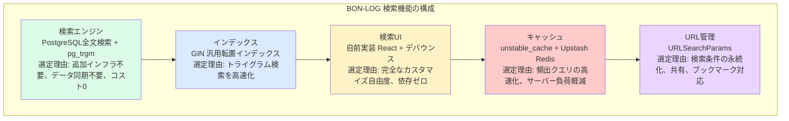

この構成の最大の特徴は、**追加のインフラやサービスを一切使わずに、実用的な検索機能を実現している**点です。PostgreSQL、React、Next.jsという既存のスタックだけで、デバウンス、ハイライト、フィルタ、ページネーションを含む本格的な検索機能を構築しています。

<details>
<summary>理解度チェック: 検索機能の技術選定</summary>

**Q1**: PostgreSQL全文検索の最大のメリットは何ですか？Elasticsearchとの最も大きな違いは？

**A1**: 追加インフラが一切不要であることです。PostgreSQL（BON-LOGではSupabase）にすでに組み込まれている機能を使うため、別途サーバーを立てる必要がなく、データの同期も不要です。Elasticsearchは専用サーバーが必要で、DBの変更を反映する同期ロジックも実装する必要があります。

**Q2**: トライグラム（pg_trgm）が日本語検索に有効な理由を説明してください。

**A2**: 日本語は英語と異なり単語間にスペースがないため、通常の全文検索エンジン（単語単位で分割するもの）では正しく分割できません。トライグラムは文字列を機械的に3文字ずつ分割するため、スペースの有無に関係なく動作します。「黒松盆栽」は「黒松盆」「松盆栽」に分割され、部分一致検索が可能になります。

**Q3**: 検索UIを自前実装する利点を2つ、デメリットを1つ挙げてください。

**A3**: 利点: (1) バックエンドを自由に切り替え可能（PostgreSQLから将来Meilisearchに移行する場合等）。(2) バンドルサイズが最小（約2KBで済む）。デメリット: アクセシビリティ対応（ARIA属性、キーボードナビゲーション等）を自分で実装する必要があること。

</details>

---

## 12.22 全文検索エンジンの内部実装を完全理解する

> **このセクションで学ぶこと**
> - `lib/search/fulltext.ts` の全体構造と設計思想を把握する
> - 各検索関数（投稿・ユーザー・盆栽園・イベント・盆栽）の実装詳細を理解する
> - 統合検索（グローバル検索）の並列実行パターンを学ぶ
> - セットアップ・ステータス確認関数の運用方法を知る

### 12.22.1 ファイル全体の構造を俯瞰する

`lib/search/fulltext.ts` はBON-LOGの検索機能の「エンジン」に相当するファイルです。まず、ファイル全体がどのような構造になっているか俯瞰しましょう。

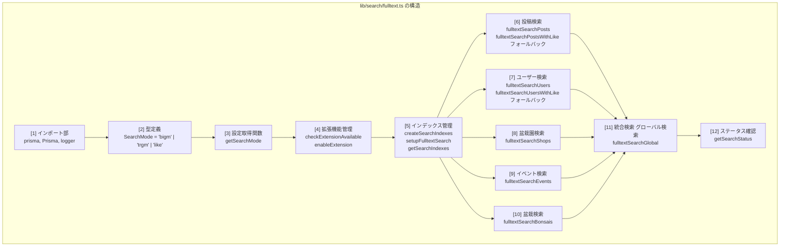

この構造は「レイヤードアーキテクチャ」と呼ばれる設計パターンに基づいています。上位の関数が下位の関数を呼び出す形で、責務が明確に分離されています。

```
+-------------------------------+
| fulltextSearchGlobal()        |  ← 統合レイヤー（複数検索をまとめる）
+-------------------------------+
        |  |  |  |  |
        v  v  v  v  v
+------+--+--+--+--+------+
| Posts | Users | Shops | ...|  ← 個別検索レイヤー
+------+------+------+------+
        |
        v
+-------------------------------+
| getSearchMode()               |  ← 設定レイヤー（検索方式を決定）
+-------------------------------+
        |
        v
+-------------------------------+
| prisma.$queryRaw              |  ← データベースレイヤー（SQL実行）
+-------------------------------+
```

### 12.22.2 インポート部の詳細解説

ファイルの先頭にあるインポート文を1行ずつ見ていきましょう。

```typescript
// lib/search/fulltext.ts - インポート部

/**
 * prisma: データベースクライアント
 *
 * @/lib/db からインポートするPrismaClientのインスタンス。
 * 通常のPrisma操作（findMany, create等）に加えて、
 * $queryRaw（生SQL実行）と $executeRaw（DDL実行）を使用する。
 *
 * なぜ生SQLが必要か？
 * → Prismaの通常APIでは pg_trgm の similarity() 関数や
 *   % 演算子を使えないため、生SQLで直接制御する。
 */
import { prisma } from '@/lib/db'

/**
 * Prisma: Prisma名前空間
 *
 * Prisma.sql: テンプレートリテラルでSQLフラグメントを作成
 *   → SQLインジェクション対策済みの安全なSQL構築
 *
 * Prisma.join: 配列をSQLのIN句用にカンマ区切りで結合
 *   → ['id1', 'id2'] → 'id1', 'id2'
 *
 * Prisma.empty: 空のSQLフラグメント（条件分岐で「何も追加しない」場合）
 *   → WHERE句の条件が不要な場合に使用
 */
import { Prisma } from '@prisma/client'

/**
 * logger: アプリケーションロガー
 *
 * エラー発生時にログを出力するために使用。
 * console.error の代わりに使うことで、
 * ・ログレベルの制御（dev/prodで出力を変える）
 * ・構造化ログ（JSON形式での出力）
 * ・外部ログサービスへの転送
 * が可能になる。
 */
import logger from '@/lib/logger'
```

> **ここがポイント！**
> Prismaの通常API（`findMany`, `create` 等）は安全で使いやすいですが、PostgreSQLの拡張機能（pg_trgm, pg_bigm）を使うにはSQLを直接記述する必要があります。`$queryRaw` はテンプレートリテラルを使うことで、変数を安全にバインドし、SQLインジェクションを防止しています。

> **なぜ `Prisma.sql` テンプレートリテラル？**
> ```typescript
> // ❌ 危険: SQL インジェクション攻撃が可能
> const query = `SELECT * FROM users WHERE name = '${userInput}'`
> // userInput が "'; DROP TABLE users; --" だとテーブルが削除される！
>
> // ✅ 安全: パラメータ化クエリ（Prisma.sql）
> const query = Prisma.sql`SELECT * FROM users WHERE name = ${userInput}`
> // userInput は自動的にエスケープされ、SQLとして実行されない
> ```
>
> `Prisma.sql` はテンプレートリテラル内の変数を「SQLの一部」ではなく「パラメータ」として処理するため、どんな入力でも安全です。

### 12.22.3 Prisma.sql テンプレートの仕組み

BON-LOGの検索コードでは `Prisma.sql`、`Prisma.join`、`Prisma.empty` を多用しています。これらの仕組みを図解で理解しましょう。

```
【Prisma.sql テンプレートリテラルの動作原理】

通常の文字列結合（危険！SQLインジェクションの可能性あり）:
  const query = `SELECT * FROM users WHERE name = '${userInput}'`
  もしuserInputが "'; DROP TABLE users; --" だったら？
  → SELECT * FROM users WHERE name = ''; DROP TABLE users; --'
  → テーブルが削除されてしまう！

Prisma.sqlテンプレート（安全！パラメータバインディング）:
  const query = Prisma.sql`SELECT * FROM users WHERE name = ${userInput}`
  → SELECT * FROM users WHERE name = $1  [パラメータ: userInput]
  → userInputの内容がどんなものでもSQLとして解釈されない
```

```typescript
// Prisma.join の使用例
const ids = ['id1', 'id2', 'id3']

// ❌ 危険: 文字列結合
const dangerousSql = `WHERE id IN (${ids.join(',')})`

// ✅ 安全: Prisma.join
const safeSql = Prisma.sql`WHERE id IN (${Prisma.join(ids)})`
// → WHERE id IN ($1, $2, $3)  [パラメータ: 'id1', 'id2', 'id3']
```

```typescript
// Prisma.empty の使用例
// 条件分岐で「条件を追加しない」場合に使う

const genreIds = []  // 空配列（ジャンルフィルタなし）

const genreFilter = genreIds.length > 0
  ? Prisma.sql`AND EXISTS (
      SELECT 1 FROM post_genres pg
      WHERE pg.post_id = p.id
      AND pg.genre_id IN (${Prisma.join(genreIds)})
    )`
  : Prisma.empty   // ← 何も追加しない（SQLの構文を壊さない）

// 結果のSQL:
// genreIds が空 → WHERE p.is_hidden = false AND p.content LIKE '%黒松%'
// genreIds あり → WHERE p.is_hidden = false AND p.content LIKE '%黒松%'
//                  AND EXISTS (SELECT 1 FROM post_genres pg ...)
```

### 12.22.4 投稿検索関数の完全解剖

`fulltextSearchPosts` は最も複雑な検索関数です。フィルター機能を含む完全な実装を行ごとに解説します。

```typescript
// lib/search/fulltext.ts - fulltextSearchPosts 関数

export async function fulltextSearchPosts(
  query: string,                    // 検索キーワード（例: "黒松"）
  options: {
    excludedUserIds?: string[]      // 除外するユーザーID（ブロック/ミュート）
    genreIds?: string[]             // ジャンルフィルタ（例: ['松柏類']）
    cursor?: string                 // ページネーション用カーソル
    limit?: number                  // 取得件数（デフォルト: 20）
    filters?: {                     // 詳細フィルター（12.18節参照）
      dateFrom?: string             //   開始日
      dateTo?: string               //   終了日
      minLikes?: number             //   最小いいね数
      mediaType?: 'images' | 'videos' | 'text'  // メディア種別
    }
  } = {}
): Promise<string[]> {             // 戻り値: 投稿IDの配列
```

この関数の引数設計には重要な考え方があります。

```
【なぜ投稿データそのものではなくIDだけを返すのか？】

理由1: 責務の分離
  fulltextSearchPosts() → 「検索条件に合うIDを見つける」ことに専念
  呼び出し元（Server Action） → IDを使ってPrismaで詳細データを取得

理由2: 柔軟性
  同じIDリストを使って、異なるinclude（リレーション）で取得可能
  例: 一覧表示用（軽量）と詳細表示用（フル情報）で使い分け

理由3: パフォーマンス
  生SQLで検索 → IDのみ取得（高速）
  Prisma.findMany({ where: { id: { in: ids } } }) → 型安全な取得
```

フィルターSQL片の構築部分を詳しく見てみましょう。

```typescript
  // 引数をデフォルト値付きで分割代入
  const { excludedUserIds = [], genreIds = [], cursor, limit = DEFAULT_PAGE_LIMIT, filters } = options
  const mode = getSearchMode()  // 環境変数から検索モードを取得

  // 空のクエリは即座に空配列を返す（DBアクセス不要）
  if (!query || query.trim() === '') {
    return []
  }

  // Prismaの$queryRawテンプレートリテラルが自動的にパラメータ化するため
  // 手動エスケープは不要。trim()で前後の空白を除去するのみ
  const sanitizedQuery = query.trim()

  // ========================================
  // フィルター用SQLフラグメントの構築
  // ========================================

  // filterSql: 条件フラグメントの配列
  // 最終的にAND条件として結合される
  const filterSql: Prisma.Sql[] = []

  // 日付フィルタ（開始日）
  if (filters?.dateFrom) {
    filterSql.push(
      Prisma.sql`AND p.created_at >= ${new Date(filters.dateFrom)}`
    )
    // 文字列 "2024-01-01" → Date オブジェクトに変換してバインド
  }

  // 日付フィルタ（終了日）
  if (filters?.dateTo) {
    const dateTo = new Date(filters.dateTo)
    dateTo.setHours(23, 59, 59, 999)  // その日の最後の瞬間まで含める
    filterSql.push(
      Prisma.sql`AND p.created_at <= ${dateTo}`
    )
    // なぜ 23:59:59.999 にするか？
    // "2024-12-31" だけだと 2024-12-31 00:00:00 になり、
    // その日の投稿がほぼ全て漏れてしまうため
  }

  // メディア種別フィルタ（画像あり）
  if (filters?.mediaType === 'images') {
    filterSql.push(
      Prisma.sql`AND EXISTS (
        SELECT 1 FROM post_media pm
        WHERE pm.post_id = p.id AND pm.type = 'image'
      )`
    )
    // EXISTS サブクエリ: 画像メディアが1つでもあればtrue
  }
  // メディア種別フィルタ（動画あり）
  else if (filters?.mediaType === 'videos') {
    filterSql.push(
      Prisma.sql`AND EXISTS (
        SELECT 1 FROM post_media pm
        WHERE pm.post_id = p.id AND pm.type = 'video'
      )`
    )
  }
  // メディア種別フィルタ（テキストのみ）
  else if (filters?.mediaType === 'text') {
    filterSql.push(
      Prisma.sql`AND NOT EXISTS (
        SELECT 1 FROM post_media pm WHERE pm.post_id = p.id
      )`
    )
    // NOT EXISTS: メディアが一切添付されていない投稿
  }

  // いいね数フィルタ
  if (filters?.minLikes && filters.minLikes > 0) {
    filterSql.push(
      Prisma.sql`AND (
        SELECT COUNT(*) FROM likes l WHERE l.post_id = p.id
      ) >= ${filters.minLikes}`
    )
    // サブクエリでいいね数をカウントし、閾値以上かチェック
  }

  // フィルターフラグメントを結合
  const filterFragment = filterSql.length > 0
    ? Prisma.sql`${Prisma.join(filterSql, ' ')}`  // スペースで結合
    : Prisma.empty  // フィルタなしなら空
```

> **コラム: EXISTSサブクエリのパフォーマンス**
>
> `EXISTS (SELECT 1 FROM ...)` は、条件に合うレコードが「1つでもあるか」をチェックします。`COUNT(*) > 0` よりも高速です。なぜなら、EXISTSは1件見つかった時点で検索を止めるのに対し、COUNTは全件カウントするからです。
>
> ```
> EXISTS:  行1 → マッチ！ → 検索終了（1行だけ読んだ）
> COUNT:   行1 → マッチ → 行2 → マッチ → ... → 行100 → 全部数えた
> ```

### 12.22.5 三分岐の検索ロジック

検索モードに応じて3つの異なるSQLが実行されます。この部分がファイルの核心です。

```typescript
  try {
    let postIds: { id: string }[]

    // ============================================
    // モード1: pg_bigm（日本語2-gram検索）
    // ============================================
    if (mode === 'bigm') {
      postIds = await prisma.$queryRaw<{ id: string }[]>`
        SELECT p.id
        FROM posts p
        WHERE p.is_hidden = false
        AND p.content LIKE '%' || ${sanitizedQuery} || '%'
        -- ↑ pg_bigmでは LIKE でもGINインデックスが効く
        -- 通常のPostgreSQLではLIKEの前方%はインデックスが効かないが、
        -- pg_bigmの gin_bigm_ops ならバイグラムインデックスで高速検索

        ${excludedUserIds.length > 0
          ? Prisma.sql`AND p.user_id NOT IN (${Prisma.join(excludedUserIds)})`
          : Prisma.empty}
        -- ↑ ブロック/ミュートユーザーの除外
        -- NOT IN でユーザーIDリスト内のユーザーの投稿を排除

        ${genreIds.length > 0 ? Prisma.sql`
          AND EXISTS (
            SELECT 1 FROM post_genres pg
            WHERE pg.post_id = p.id
            AND pg.genre_id IN (${Prisma.join(genreIds)})
          )
        ` : Prisma.empty}
        -- ↑ ジャンルフィルタ
        -- post_genres 中間テーブルを通じて、
        -- 指定ジャンルに属する投稿のみに絞り込み

        ${filterFragment}
        -- ↑ 詳細フィルタ（日付、いいね数、メディア種別）

        ${cursor
          ? Prisma.sql`AND p.id < ${cursor}`
          : Prisma.empty}
        -- ↑ カーソルベースページネーション
        -- IDが文字列（CUID）の場合、辞書順で比較される
        -- 「カーソルより前のID」= 「カーソルより古い投稿」

        ORDER BY p.created_at DESC
        -- ↑ 新しい投稿を先に表示
        LIMIT ${limit}
        -- ↑ 取得件数の制限
      `
    }

    // ============================================
    // モード2: pg_trgm（3-gram + 類似度検索）
    // ============================================
    else if (mode === 'trgm') {
      postIds = await prisma.$queryRaw<{ id: string }[]>`
        SELECT p.id
        FROM posts p
        WHERE p.is_hidden = false
        AND (
          p.content % ${sanitizedQuery}
          -- ↑ % 演算子: pg_trgmの類似度演算子
          -- similarity(content, query) >= pg_trgm.similarity_threshold
          -- デフォルト閾値は0.3（日本語では0.1に下げることが多い）

          OR p.content ILIKE '%' || ${sanitizedQuery} || '%'
          -- ↑ ILIKE: 大文字小文字区別なしの部分一致
          -- %演算子だけでは短い検索語でヒットしないことがあるため、
          -- ILIKEでも検索して「漏れ」を防ぐ
        )
        ${excludedUserIds.length > 0
          ? Prisma.sql`AND p.user_id NOT IN (${Prisma.join(excludedUserIds)})`
          : Prisma.empty}
        ${genreIds.length > 0 ? Prisma.sql`
          AND EXISTS (
            SELECT 1 FROM post_genres pg
            WHERE pg.post_id = p.id
            AND pg.genre_id IN (${Prisma.join(genreIds)})
          )
        ` : Prisma.empty}
        ${filterFragment}
        ${cursor
          ? Prisma.sql`AND p.id < ${cursor}`
          : Prisma.empty}
        ORDER BY similarity(p.content, ${sanitizedQuery}) DESC,
                 p.created_at DESC
        -- ↑ pg_trgm独自のソート
        -- similarity()で算出した関連度スコアの降順
        -- 同じスコアなら新しい投稿を先に表示
        LIMIT ${limit}
      `
    }

    // ============================================
    // モード3: LIKE検索（フォールバック）
    // ============================================
    else {
      postIds = await prisma.$queryRaw<{ id: string }[]>`
        SELECT p.id
        FROM posts p
        WHERE p.is_hidden = false
        AND p.content ILIKE '%' || ${sanitizedQuery} || '%'
        -- ↑ ILIKE: 大文字小文字を区別しないLIKE
        -- インデックスが効かないが、どの環境でも動作する
        ${excludedUserIds.length > 0
          ? Prisma.sql`AND p.user_id NOT IN (${Prisma.join(excludedUserIds)})`
          : Prisma.empty}
        ${genreIds.length > 0 ? Prisma.sql`
          AND EXISTS (
            SELECT 1 FROM post_genres pg
            WHERE pg.post_id = p.id
            AND pg.genre_id IN (${Prisma.join(genreIds)})
          )
        ` : Prisma.empty}
        ${filterFragment}
        ${cursor
          ? Prisma.sql`AND p.id < ${cursor}`
          : Prisma.empty}
        ORDER BY p.created_at DESC
        LIMIT ${limit}
      `
    }

    // 結果からIDのみを抽出して返す
    return postIds.map(p => p.id)

  } catch (error) {
    // ============================================
    // エラー時: LIKE検索にフォールバック
    // ============================================
    logger.error('Fulltext search error:', error)
    return fulltextSearchPostsWithLike(query, options)
    // pg_trgm/pg_bigmが未設定でもアプリが停止しない
  }
}
```

この三分岐の設計をフローチャートで表すと以下のようになります。

```
fulltextSearchPosts('黒松', options)
    |
    v
getSearchMode()
    |
    +--- mode === 'bigm' -----> LIKE + GINインデックス
    |                              ORDER BY created_at DESC
    |
    +--- mode === 'trgm' -----> % 演算子 + ILIKE + GINインデックス
    |                              ORDER BY similarity() DESC
    |
    +--- mode === 'like' -----> ILIKE（インデックスなし）
                                   ORDER BY created_at DESC

各モードで共通の処理:
    +-- is_hidden = false チェック
    +-- excludedUserIds による除外
    +-- genreIds によるフィルタ
    +-- filters（日付、いいね数等）
    +-- cursor ページネーション
    +-- LIMIT

エラー発生時:
    → fulltextSearchPostsWithLike() にフォールバック
```

### 12.22.6 ユーザー検索の複数フィールド検索

ユーザー検索では、ニックネームと自己紹介の2つのフィールドを同時に検索します。pg_trgmモードでは `GREATEST()` と `COALESCE()` を組み合わせた高度なソートを行います。

```typescript
// lib/search/fulltext.ts - fulltextSearchUsers 関数（pg_trgm部分）

userIds = await prisma.$queryRaw<{ id: string }[]>`
  SELECT u.id
  FROM users u
  WHERE (
    u.nickname % ${sanitizedQuery}
    -- nicknameと検索語の類似度が閾値以上

    OR u.nickname ILIKE '%' || ${sanitizedQuery} || '%'
    -- nicknameに検索語が部分一致

    OR u.bio % ${sanitizedQuery}
    -- bioと検索語の類似度が閾値以上

    OR u.bio ILIKE '%' || ${sanitizedQuery} || '%'
    -- bioに検索語が部分一致
  )
  ${excludedUserIds.length > 0
    ? Prisma.sql`AND u.id NOT IN (${Prisma.join(excludedUserIds)})`
    : Prisma.empty}
  ${currentUserId
    ? Prisma.sql`AND u.id != ${currentUserId}`
    : Prisma.empty}
  -- ↑ 自分自身は検索結果に含めない
  ${cursor
    ? Prisma.sql`AND u.id < ${cursor}`
    : Prisma.empty}
  ORDER BY GREATEST(
    similarity(u.nickname, ${sanitizedQuery}),
    COALESCE(similarity(u.bio, ${sanitizedQuery}), 0)
  ) DESC
  -- ↑ ソート順の解説:
  -- GREATEST(a, b): aとbのうち大きい方を返す
  -- COALESCE(x, 0): xがNULLの場合は0を返す
  --   → bioがNULLのユーザーでもエラーにならない
  --
  -- つまり: nicknameとbioのうち、
  -- 検索語との類似度が高い方のスコアでソート
  LIMIT ${limit}
`
```

```
【GREATEST + COALESCE のソート例】

検索語: "盆栽"

ユーザーA: nickname="盆栽太郎"  bio="盆栽が趣味です"
  → similarity(nickname, '盆栽') = 0.45
  → similarity(bio, '盆栽') = 0.30
  → GREATEST(0.45, 0.30) = 0.45  ← ソートスコア

ユーザーB: nickname="花子" bio="盆栽園を経営しています"
  → similarity(nickname, '盆栽') = 0.05
  → similarity(bio, '盆栽') = 0.35
  → GREATEST(0.05, 0.35) = 0.35  ← ソートスコア

ユーザーC: nickname="盆栽マスター" bio=NULL
  → similarity(nickname, '盆栽') = 0.50
  → COALESCE(similarity(NULL, '盆栽'), 0) = 0  ← NULLなので0
  → GREATEST(0.50, 0) = 0.50  ← ソートスコア

ソート結果: C(0.50) → A(0.45) → B(0.35)
```

### 12.22.7 統合検索（グローバル検索）のPromise.allパターン

`fulltextSearchGlobal` は5つの検索を並列実行する関数です。この設計パターンは非常に重要です。

```typescript
// lib/search/fulltext.ts - fulltextSearchGlobal 関数

export async function fulltextSearchGlobal(
  query: string,
  options: {
    excludedUserIds?: string[]
    currentUserId?: string
    limit?: number
  } = {}
): Promise<{
  postIds: string[]
  userIds: string[]
  shopIds: string[]
  eventIds: string[]
  bonsaiIds: string[]
}> {
  const { excludedUserIds = [], currentUserId, limit = 5 } = options

  // 空クエリチェック
  if (!query || query.trim() === '') {
    return {
      postIds: [], userIds: [], shopIds: [],
      eventIds: [], bonsaiIds: [],
    }
  }

  // ★ 5つの検索を並列実行 ★
  const [postIds, userIds, shopIds, eventIds, bonsaiIds] =
    await Promise.all([
      fulltextSearchPosts(query, { excludedUserIds, limit }),
      fulltextSearchUsers(query, { excludedUserIds, currentUserId, limit }),
      fulltextSearchShops(query, { limit }),
      fulltextSearchEvents(query, { limit }),
      fulltextSearchBonsais(query, { limit }),
    ])

  return { postIds, userIds, shopIds, eventIds, bonsaiIds }
}
```

```
【Promise.all による並列実行の効果】

順次実行の場合（await を5回）:
  投稿検索 --|--100ms--|
  ユーザー検索        --|--80ms--|
  盆栽園検索                    --|--60ms--|
  イベント検索                              --|--70ms--|
  盆栽検索                                           --|--50ms--|
  合計: 100 + 80 + 60 + 70 + 50 = 360ms

並列実行の場合（Promise.all）:
  投稿検索   --|--100ms--|
  ユーザー検索 --|--80ms--|
  盆栽園検索   --|--60ms--|
  イベント検索 --|--70ms--|
  盆栽検索     --|--50ms--|
  合計: 100ms（最も遅い検索の時間だけ）

→ 約3.6倍の速度向上！
```

> **注意！**
> `Promise.all` は1つでも失敗するとすべてが失敗します。しかし各検索関数は内部でtry-catchを持ち、エラー時はLIKEフォールバックを使うため、`Promise.all` が全体としてrejectされることは実質的にありません。

### 12.22.8 セットアップ関数とステータス確認

本番環境のデプロイ時に使用する `setupFulltextSearch` と、デバッグ用の `getSearchStatus` を解説します。

```typescript
// lib/search/fulltext.ts - setupFulltextSearch

export async function setupFulltextSearch(): Promise<{
  success: boolean
  steps: { step: string; success: boolean; message: string }[]
}> {
  const steps: { step: string; success: boolean; message: string }[] = []

  // Step 1: pg_trgm拡張を有効化
  const trgmEnabled = await enableExtension('pg_trgm')
  steps.push({
    step: 'pg_trgm拡張の有効化',
    success: trgmEnabled,
    message: trgmEnabled
      ? 'pg_trgm拡張を有効化しました'
      : 'pg_trgm拡張の有効化に失敗しました',
  })

  // Step 1が失敗したらStep 2を実行しない
  if (!trgmEnabled) {
    return { success: false, steps }
  }

  // Step 2: GINインデックスを作成
  const indexResult = await createSearchIndexes()
  steps.push({
    step: 'GINインデックスの作成',
    success: indexResult.success,
    message: indexResult.message,
  })

  return {
    success: steps.every(s => s.success),  // 全ステップ成功ならtrue
    steps,
  }
}
```

```
【setupFulltextSearch の実行フロー】

管理者がセットアップ実行
    |
    v
Step 1: CREATE EXTENSION IF NOT EXISTS "pg_trgm"
    |
    +-- 成功 → Step 2 へ
    |
    +-- 失敗 → { success: false, steps: [...] } を返す
                 （権限不足の可能性。DBA に確認が必要）
    |
    v
Step 2: CREATE INDEX IF NOT EXISTS ... USING gin (... gin_trgm_ops)
    |
    +-- 成功 → { success: true, steps: [...] } を返す
    |
    +-- 失敗 → { success: false, steps: [...] } を返す
                 （テーブル名の不一致等）
```

<details>
<summary>理解度チェック: 全文検索エンジンの内部実装</summary>

**Q1**: `Prisma.empty` はどのような場面で使用されますか？具体例を挙げてください。

**A1**: 条件分岐で「SQLに何も追加しない」場合に使用します。例えば、`genreIds` が空配列の場合にジャンルフィルタを追加しない、`cursor` が未指定の場合にページネーション条件を追加しない、といった場面です。`Prisma.empty` を使うことで、テンプレートリテラルの構文を壊さずに条件を省略できます。

**Q2**: `fulltextSearchGlobal` が `Promise.all` を使う理由と、潜在的なリスクは何ですか？

**A2**: 5つの独立した検索を並列実行することで、順次実行の約3〜4倍の速度向上が得られるためです。潜在的なリスクは、1つの検索が失敗すると全体が失敗する点ですが、各検索関数は内部でtry-catchとフォールバックを持つため、実際にはこのリスクは軽減されています。

**Q3**: pg_trgmの `%` 演算子と `ILIKE` を `OR` で組み合わせている理由を説明してください。

**A3**: `%` 演算子（類似度検索）だけでは、短い検索語（2文字以下）やトリグラム分割と相性が悪い検索語でヒットしない場合があるためです。`ILIKE` による部分一致検索を `OR` で追加することで、類似度が低くても文字列として含まれていればヒットし、検索漏れを防ぎます。

</details>

---

## 12.23 ハッシュタグ検索の深層理解 -- トレンド表示と人気タグキャッシュ

> **このセクションで学ぶこと**
> - `getCachedPopularTags` の内部処理を1行ずつ理解する
> - 正規表現によるハッシュタグ抽出のUnicode対応を深く知る
> - トレンドタグのランキングアルゴリズムと時間減衰の考え方を学ぶ
> - PopularTags UIコンポーネントの実装パターンを理解する

### 12.23.1 getCachedPopularTags の完全解剖

12.20節で `getCachedPopularTags` の概要を学びました。ここではこの関数の内部を1行ずつ丁寧に解読します。

> **実装の変遷**
> 初期実装では全投稿を取得してJavaScript側でハッシュタグを正規表現で抽出・カウントしていましたが、現在の実装ではHashtagテーブル（マスタ）とPostHashtag中間テーブルを活用し、SQLのJOINとGROUP BYでDB側で直接集計しています。これにより、大量の投稿データをアプリケーションメモリに読み込む必要がなくなり、パフォーマンスが大幅に向上しました。

```typescript
// lib/cache.ts - getCachedPopularTags 関数

export const getCachedPopularTags = unstable_cache(
  // ★ 第1引数: データ取得関数 ★
  // この関数がキャッシュの「中身」を生成する
  async (limit = 10) => {
    // --------------------------------------------------
    // ステップ1: 対象期間の計算
    // --------------------------------------------------

    // Hashtagテーブルから直接取得（全投稿スキャンを回避）
    const oneWeekAgo = new Date()
    // Date() → 現在の日時を取得
    // 例: 2024-12-15 14:30:00

    oneWeekAgo.setDate(oneWeekAgo.getDate() - POPULAR_TAGS_DAYS)
    // POPULAR_TAGS_DAYS = 7（lib/constants/limits.ts で定義）
    // getDate() → 日にちを取得（例: 15）
    // setDate(15 - 7) = setDate(8)
    // → 2024-12-08 14:30:00（7日前）
    //
    // なぜ7日間か？
    // 24時間: 短すぎる（深夜に使われたタグが消える）
    // 30日間: 長すぎる（古いタグがいつまでも残る）
    // 7日間:  「今週のトレンド」として適切な期間

    // --------------------------------------------------
    // ステップ2: SQLでハッシュタグを直接集計
    // --------------------------------------------------

    // 直近1週間の投稿に紐づくハッシュタグを集計
    const popularTags = await prisma.$queryRaw<{ name: string; tag_count: bigint }[]>`
      SELECT h.name, COUNT(ph.post_id) as tag_count
      FROM hashtags h
      INNER JOIN post_hashtags ph ON ph.hashtag_id = h.id
      INNER JOIN posts p ON p.id = ph.post_id
      WHERE p.is_hidden = false
        AND p.created_at >= ${oneWeekAgo}
      GROUP BY h.id, h.name
      ORDER BY tag_count DESC
      LIMIT ${limit}
    `
    // SQLの解説:
    //
    // SELECT h.name, COUNT(ph.post_id) as tag_count
    //   → ハッシュタグ名と、そのタグが使われた投稿数を取得
    //
    // FROM hashtags h
    //   → ハッシュタグマスタテーブルを起点に
    //
    // INNER JOIN post_hashtags ph ON ph.hashtag_id = h.id
    //   → 中間テーブルと結合（投稿とハッシュタグの関連付け）
    //
    // INNER JOIN posts p ON p.id = ph.post_id
    //   → 投稿テーブルと結合（投稿の詳細条件でフィルタするため）
    //
    // WHERE p.is_hidden = false
    //   → 非表示（通報された投稿等）を除外
    //
    // AND p.created_at >= ${oneWeekAgo}
    //   → 1週間以内に作成された投稿のみ
    //
    // GROUP BY h.id, h.name
    //   → ハッシュタグごとにグループ化してCOUNTする
    //
    // ORDER BY tag_count DESC
    //   → 使用回数の多い順（人気順）
    //
    // LIMIT ${limit}
    //   → 上位N件のみ取得

    // --------------------------------------------------
    // ステップ3: 結果を整形して返す
    // --------------------------------------------------

    const sortedTags = popularTags.map(t => ({
      tag: t.name,
      count: Number(t.tag_count),
      // Number(): bigint → number への変換
      // PostgreSQLのCOUNT(*)はbigint型を返すため、
      // JavaScriptのnumber型に変換する必要がある
    }))

    return { tags: sortedTags }
  },

  // ★ 第2引数: キャッシュキー ★
  ['popular-tags'],
  // キャッシュを一意に識別する文字列の配列
  // 同じキーの呼び出しは同じキャッシュを使う

  // ★ 第3引数: オプション ★
  {
    revalidate: CACHE_TTL_POPULAR_TAGS,  // 300秒（5分）でキャッシュを自動更新
    tags: [CACHE_TAGS.POPULAR_TAGS],
    // 手動無効化用のタグ
    // revalidateTag(CACHE_TAGS.POPULAR_TAGS, { expire: 0 }) で即時無効化
  }
)
```

### 12.23.2 正規表現のUnicode対応を図解する

日本語ハッシュタグを正しく検出するには、Unicode範囲の理解が不可欠です。

**Unicode文字範囲とハッシュタグ正規表現**

正規表現: `/#[\w\u3040-\u309f\u30a0-\u30ff\u4e00-\u9faf]+/g`

**マッチする文字:**

| Unicode範囲 | 文字種 | 含まれる文字 | 例 |
|------------|--------|------------|-----|
| `\w` | ASCII文字 | a-z, A-Z, 0-9, _ | bonsai, Bonsai2024, bonsai_art |
| `\u3040-\u309F` | ひらがな | ぁ あ い う ... ん ゝ ゞ ゟ | #さくら, #ぼんさい |
| `\u30A0-\u30FF` | カタカナ | ゠ ァ ア イ ウ ... ン ヴ ヵ ヶ ・ | #ボンサイ, #サクラ |
| `\u4E00-\u9FAF` | CJK統合漢字 | 一 丁 ... 盆 栽 松 ... 鿯 | #盆栽, #黒松, #剪定 |

**マッチしない文字:**

| 文字 | 理由 |
|------|------|
| 空白（スペース） | タグの区切りとして機能 |
| 句読点（、。） | タグに含めたくない |
| 絵文字 | Unicode範囲外 |
| 全角スペース | タグの区切り |

```
【正規表現の動作例】

入力: "今日は #盆栽 の手入れ。#黒松の剪定 #Bonsai2024 です"

マッチ処理:
  位置4: '#盆栽' → #にマッチ → '盆'(漢字OK) → '栽'(漢字OK)
                → ' '(空白=マッチ終了) → マッチ: '#盆栽'

  位置12: '#黒松の剪定' → #にマッチ → '黒'→'松'→'の'(ひらがなOK)
                        → '剪'→'定' → ' '(空白=マッチ終了)
                        → マッチ: '#黒松の剪定'

  位置19: '#Bonsai2024' → #にマッチ → 'B'→'o'→'n'→'s'→'a'→'i'
                         → '2'→'0'→'2'→'4' → ' '(空白=マッチ終了)
                         → マッチ: '#Bonsai2024'

結果: ['#盆栽', '#黒松の剪定', '#Bonsai2024']

正規化後: ['盆栽', '黒松の剪定', 'bonsai2024']
```

### 12.23.3 タグカウントの集計アルゴリズム

`tagCounts` オブジェクトの構築過程を具体的なデータで追跡してみましょう。

```
【tagCounts 構築の追跡】

投稿1: "#盆栽 の手入れ #黒松"
  → tags: ['#盆栽', '#黒松']
  → tagCounts: { '盆栽': 1, '黒松': 1 }

投稿2: "#盆栽 が好き #剪定 した"
  → tags: ['#盆栽', '#剪定']
  → tagCounts: { '盆栽': 2, '黒松': 1, '剪定': 1 }

投稿3: "#盆栽 展示会 #盆栽園 に行きました"
  → tags: ['#盆栽', '#盆栽園']
  → tagCounts: { '盆栽': 3, '黒松': 1, '剪定': 1, '盆栽園': 1 }

投稿4: "#Bonsai is beautiful #bonsai art"
  → tags: ['#Bonsai', '#bonsai']
  → 正規化: ['bonsai', 'bonsai'] → 重複カウント
  → tagCounts: { '盆栽': 3, '黒松': 1, '剪定': 1, '盆栽園': 1, 'bonsai': 2 }
  注意: 大文字小文字を統一するため 'Bonsai' と 'bonsai' は同一タグ

最終ソート:
  [['盆栽', 3], ['bonsai', 2], ['黒松', 1], ['剪定', 1], ['盆栽園', 1]]
```

> **コラム: タグカウントの重複問題**
>
> 上記の投稿4の例で、同じ投稿内に `#Bonsai` と `#bonsai` が両方あると、同じタグが2回カウントされます。これは厳密には不正確ですが、getCachedPopularTagsでは投稿数ではなく「出現回数」をカウントしているため、許容しています。より正確なカウントが必要な場合は、Hashtagテーブルの `count` フィールドを使用します（12.17節参照）。

### 12.23.4 PopularTags コンポーネントの実装

人気タグを表示するUIコンポーネントの実装を見てみましょう。

```typescript
// components/search/SearchResults.tsx - PopularTags コンポーネント

/**
 * PopularTagsのprops型定義
 *
 * tags: サーバーサイドで取得した人気タグの配列
 * 各要素は { tag: タグ名, count: 投稿数 } の形式
 */
type PopularTagsProps = {
  tags: {
    tag: string     // タグ名（#なし、小文字化済み）
    count: number   // そのタグを含む投稿の数
  }[]
}

/**
 * 人気タグ一覧コンポーネント
 *
 * 検索ページのサイドバーに表示される。
 * タグをクリックすると、そのタグで絞り込んだ検索結果に遷移する。
 */
export function PopularTags({ tags }: PopularTagsProps) {
  // タグが0件ならコンポーネント自体を非表示
  if (tags.length === 0) {
    return null
  }

  return (
    <div className="bg-card rounded-lg border p-4">
      {/* セクションタイトル */}
      <h3 className="font-semibold mb-3">人気のタグ</h3>

      {/* タグバッジの横並びリスト */}
      <div className="flex flex-wrap gap-2">
        {/* flex-wrap: 幅を超えたら折り返し */}
        {/* gap-2: 各タグ間に0.5rem(8px)の隙間 */}

        {tags.map(({ tag, count }) => (
          <Link
            key={tag}
            href={`/search?tab=tags&q=${encodeURIComponent(tag)}`}
            // encodeURIComponent: URLに含められない文字をエスケープ
            // '盆栽' → '%E7%9B%86%E6%A0%BD'
            // tab=tags: タグ検索タブをアクティブに
            className="px-3 py-1.5 bg-muted rounded-full text-sm
                       hover:bg-muted/80 transition-colors"
            // rounded-full: 完全な角丸（ピル型）
            // hover:bg-muted/80: ホバー時に80%の透明度
            // transition-colors: 色変化をアニメーション
          >
            #{tag}
            <span className="ml-1 text-muted-foreground text-xs">
              {count}
            </span>
            {/* 例: "#盆栽 150" */}
          </Link>
        ))}
      </div>
    </div>
  )
}
```

```
【PopularTags の表示イメージ】

+------------------------------------------+
|  人気のタグ                               |
|                                          |
|  [#盆栽 150] [#黒松 89] [#剪定 67]      |
|  [#もみじ 54] [#五葉松 42]              |
|  [#盆栽入門 38] [#bonsai 35]            |
|  [#盆栽園 28] [#苔 25]                  |
|  [#真柏 21]                              |
|                                          |
+------------------------------------------+

各タグをクリック → /search?tab=tags&q=盆栽 に遷移
→ TagSearchResults コンポーネントが表示される
```

### 12.23.5 TagSearchResults コンポーネントの無限スクロール

タグをクリックした後に表示される `TagSearchResults` の実装を詳しく見ましょう。

```typescript
// components/search/SearchResults.tsx - TagSearchResults

export function TagSearchResults({
  tag,              // 検索するタグ（#なし）
  initialPosts = [],  // SSRで取得した初期データ
  currentUserId,    // 現在のユーザーID（いいね表示用）
}: TagSearchResultsProps) {

  // Intersection Observer: 要素がビューポートに入ったかを検出
  const { ref, inView } = useInView()
  //
  // ref: 監視対象のDOM要素に付ける
  // inView: その要素が画面に表示されたら true になる
  //
  // 使い方のたとえ:
  // 「ページの一番下に透明な線を引いておいて、
  //   その線が見えたら（スクロールがそこまで来たら）
  //   次のページを読み込む」

  // React Query の無限クエリ
  const {
    data,               // ページごとの検索結果
    fetchNextPage,      // 次ページを取得する関数
    hasNextPage,        // 次ページがあるか
    isFetchingNextPage, // 次ページ取得中か
    isLoading,          // 初回読み込み中か
  } = useInfiniteQuery({
    queryKey: ['search-tag', tag],
    // queryKey: キャッシュの識別子
    // tag が変わると再フェッチされる

    queryFn: async ({ pageParam }) => {
      return await searchByTag(tag, pageParam)
      // Server Action を呼び出し
      // pageParam: カーソル（前回の最後のID）
    },

    initialPageParam: undefined as string | undefined,

    initialData: initialPosts.length > 0 ? {
      pages: [{
        posts: initialPosts,
        nextCursor: initialPosts.length >= 20
          ? initialPosts[initialPosts.length - 1]?.id
          : undefined,
      }],
      pageParams: [undefined],
    } : undefined,

    getNextPageParam: (lastPage) => lastPage.nextCursor,
    // 最後のページの nextCursor がなければ undefined → 読み込み終了

    enabled: !!tag,
    // tag が空文字や undefined ならクエリを実行しない
    // !! で boolean に変換
  })

  // スクロール検出 → 次ページ自動読み込み
  useEffect(() => {
    if (inView && hasNextPage && !isFetchingNextPage) {
      fetchNextPage()
    }
  }, [inView, hasNextPage, isFetchingNextPage, fetchNextPage])
  // 3つの条件がすべて true の時だけ次ページを取得:
  // 1. inView: 画面下部の監視要素が見えている
  // 2. hasNextPage: まだ読み込むデータがある
  // 3. !isFetchingNextPage: 現在取得中ではない

  // ... レンダリング部分
}
```

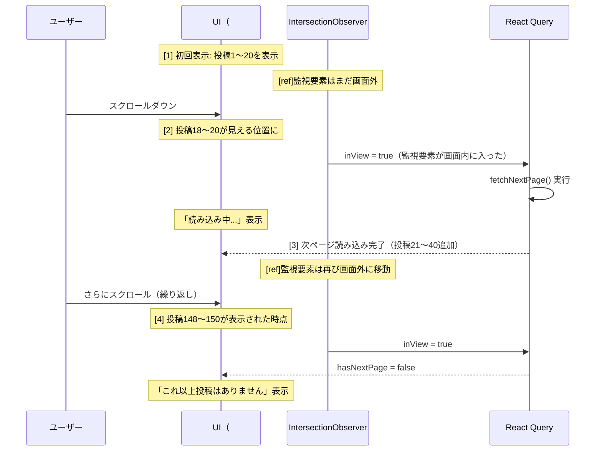

### 12.23.6 トレンドタグの時間減衰について

現在のBON-LOGでは単純な出現回数でランキングしていますが、より高度なトレンド検出を行う場合は「時間減衰（Time Decay）」を導入します。

```
【時間減衰の概念】

単純カウント:
  #盆栽 → 7日前に100回 + 今日1回 = 101回
  #剪定 → 今日50回 = 50回
  → #盆栽が1位（でも、実はもう話題ではない）

時間減衰付きカウント:
  #盆栽 → 7日前の100回 x 減衰率0.1 + 今日の1回 x 1.0 = 11点
  #剪定 → 今日の50回 x 1.0 = 50点
  → #剪定が1位（今まさに話題になっている！）

減衰率の計算式:
  score = count * e^(-λ * age_in_hours)

  λ（ラムダ）: 減衰の速さを制御するパラメータ
  age_in_hours: 投稿からの経過時間

  λ = 0.01 の場合:
    0時間前: e^(0) = 1.0（100%）
    24時間前: e^(-0.24) ≈ 0.79（79%）
    48時間前: e^(-0.48) ≈ 0.62（62%）
    168時間前（1週間）: e^(-1.68) ≈ 0.19（19%）
```

> **ここがポイント！**
> BON-LOGでは現在、時間減衰を実装していません。理由は、7日間の固定期間でフィルタリングすること自体が簡易的な時間減衰として機能しているためです。サービスが成長し、より精密なトレンド検出が必要になった段階で、Redis のソート済みセット（ZADD/ZINCRBY）と時間減衰スコアを組み合わせた実装に移行できます。

<details>
<summary>理解度チェック: ハッシュタグ検索の深層理解</summary>

**Q1**: `getCachedPopularTags` で `content: { contains: '#' }` というフィルタを使う理由は何ですか？

**A1**: ハッシュタグを含まない投稿をDBクエリの段階で除外するためです。全投稿を取得してからJavaScript側でフィルタリングするよりも、DBレベルで絞り込む方がメモリ使用量とネットワーク転送量を大幅に削減できます。

**Q2**: `tag.slice(1).toLowerCase()` の2つの処理がそれぞれ何をしているか説明してください。

**A2**: `slice(1)` は文字列の先頭1文字（#記号）を除去します。`toLowerCase()` は英字を小文字に統一します。これにより `#Bonsai` と `#bonsai` が同一タグとして扱われます。日本語のひらがな・カタカナ・漢字は `toLowerCase()` の影響を受けません。

**Q3**: `useInView` と `useInfiniteQuery` の組み合わせで無限スクロールが実現される仕組みを、3ステップで説明してください。

**A3**: (1) `useInView` のrefをページ最下部の要素に付与し、その要素が画面に表示されたかを監視する。(2) `useEffect` 内で `inView === true` かつ `hasNextPage === true` かつ取得中でない場合に `fetchNextPage()` を呼ぶ。(3) `useInfiniteQuery` が次ページのデータを取得し、既存のデータに追加して再レンダリングする。

</details>

---

## 12.24 検索フィルタリングの設計パターンを徹底解説する

> **このセクションで学ぶこと**
> - `lib/actions/filter-helper.ts` の全コードを1行ずつ理解する
> - ブロック/ミュートの双方向・一方向の違いを設計レベルで把握する
> - Set（集合）を使った重複除去パターンの応用を学ぶ
> - 機能別のフィルター設定がなぜ異なるかを論理的に理解する

### 12.24.1 filter-helper.ts のファイル設計思想

このファイルはわずか約100行のコードですが、BON-LOGのあらゆる場所で使われる重要なユーティリティです。なぜ専用のファイルとして切り出されているのかを理解しましょう。

```
+------------------------------------------------------------------+
|       filter-helper.ts が使われる場所                               |
+------------------------------------------------------------------+
|                                                                  |
|  [タイムライン]                                                   |
|  lib/actions/feed.ts                                             |
|    → getExcludedUserIds(userId, {                                |
|        blocked: true, blockedBy: true, muted: true               |
|      })                                                          |
|    → ブロック + ミュート全部除外                                  |
|                                                                  |
|  [検索]                                                          |
|  lib/actions/search.ts                                           |
|    → getExcludedUserIds(userId, {                                |
|        blocked: true, blockedBy: true                            |
|      })                                                          |
|    → ブロックのみ除外（ミュートは意図的に含めない）              |
|                                                                  |
|  [通知]                                                          |
|  lib/actions/notification.ts                                     |
|    → getExcludedUserIds(userId, {                                |
|        blocked: true, blockedBy: true                            |
|      })                                                          |
|    → ブロックした/された相手からの通知を除外                      |
|                                                                  |
|  [プロフィール]                                                   |
|  lib/actions/user.ts                                             |
|    → getBlockedUserIds(userId)                                   |
|    → ブロックリストの表示                                        |
|                                                                  |
|  [設定画面]                                                      |
|  lib/actions/settings.ts                                         |
|    → getMutedUserIds(userId)                                     |
|    → ミュートリストの管理                                        |
|                                                                  |
+------------------------------------------------------------------+
```

この「1つのファイルに集約する」設計には以下のメリットがあります。

```
【DRY原則（Don't Repeat Yourself）】

❌ 悪い例: 各機能ファイルにフィルタロジックをコピー

feed.ts:
  const blocks = await prisma.block.findMany({ where: { blockerId: userId } })
  const mutes = await prisma.mute.findMany({ where: { muterId: userId } })
  const excludeIds = [...blocks.map(b => b.blockedId), ...mutes.map(m => m.mutedId)]

search.ts:
  const blocks = await prisma.block.findMany({ where: { blockerId: userId } })
  const excludeIds = blocks.map(b => b.blockedId)
  // ↑ ミュートを忘れている！バグ！

notification.ts:
  const blocks = await prisma.block.findMany({ where: { blockerId: userId } })
  // ↑ blockedBy を忘れている！双方向ブロックが不完全！

✅ 良い例: filter-helper.ts に集約

feed.ts:        getExcludedUserIds(userId, { blocked: true, blockedBy: true, muted: true })
search.ts:      getExcludedUserIds(userId, { blocked: true, blockedBy: true })
notification.ts: getExcludedUserIds(userId, { blocked: true, blockedBy: true })

→ ロジックが1箇所に集約されているため、バグが発生しにくい
→ 修正も1箇所で済む
```

### 12.24.2 getExcludedUserIds の処理フローを完全追跡

具体的なデータを使って、関数の動作を追跡してみましょう。

```
【データの前提】

ユーザーA（自分）のID: 'user-a'

ブロックテーブル:
  { blockerId: 'user-a', blockedId: 'user-b' }  ← AがBをブロック
  { blockerId: 'user-c', blockedId: 'user-a' }  ← CがAをブロック
  { blockerId: 'user-a', blockedId: 'user-d' }  ← AがDをブロック

ミュートテーブル:
  { muterId: 'user-a', mutedId: 'user-e' }      ← AがEをミュート
  { muterId: 'user-a', mutedId: 'user-b' }      ← AがBをミュート（ブロックもしている）
```

```typescript
// ケース1: タイムライン（全フィルタ）
await getExcludedUserIds('user-a', {
  blocked: true,
  blockedBy: true,
  muted: true,
})

// 処理追跡:

// Step 1: 分割代入
// blocked = true, blockedBy = true, muted = true

// Step 2: 早期リターンチェック
// → すべてtrueなのでスキップ

// Step 3: クエリ構築
// queries = [
//   prisma.block.findMany({      ← ブロッククエリ
//     where: { OR: [
//       { blockerId: 'user-a' },  ← AがブロックしたレコードのOR
//       { blockedId: 'user-a' },  ← Aをブロックしたレコード
//     ]},
//     select: { blockerId: true, blockedId: true },
//   }),
//   prisma.mute.findMany({       ← ミュートクエリ
//     where: { muterId: 'user-a' },
//     select: { mutedId: true },
//   }),
// ]

// Step 4: Promise.allで並列実行
// results = [
//   [  // ブロック結果
//     { blockerId: 'user-a', blockedId: 'user-b' },
//     { blockerId: 'user-c', blockedId: 'user-a' },
//     { blockerId: 'user-a', blockedId: 'user-d' },
//   ],
//   [  // ミュート結果
//     { mutedId: 'user-e' },
//     { mutedId: 'user-b' },
//   ],
// ]

// Step 5: Setにマージ
// ブロック結果の処理:
//   { blockerId: 'user-a', blockedId: 'user-b' }
//     → blocked=true → excludedIds.add('user-b')   ← Aがブロックした相手
//     → blockedBy=true → excludedIds.add('user-a') ← ブロックした側（自分）
//
//   { blockerId: 'user-c', blockedId: 'user-a' }
//     → blocked=true → excludedIds.add('user-a')   ← ブロックされた側（自分）
//     → blockedBy=true → excludedIds.add('user-c') ← Aをブロックした相手
//
//   { blockerId: 'user-a', blockedId: 'user-d' }
//     → blocked=true → excludedIds.add('user-d')
//     → blockedBy=true → excludedIds.add('user-a')
//
// ミュート結果の処理:
//   { mutedId: 'user-e' } → excludedIds.add('user-e')
//   { mutedId: 'user-b' } → excludedIds.add('user-b') ← 既にSetにある（重複無視）
//
// excludedIds = Set { 'user-b', 'user-a', 'user-c', 'user-d', 'user-e' }

// Step 6: 自分自身を削除
// excludedIds.delete('user-a')
// excludedIds = Set { 'user-b', 'user-c', 'user-d', 'user-e' }

// Step 7: 配列に変換して返す
// return ['user-b', 'user-c', 'user-d', 'user-e']
```

```
【なぜStep 6で自分自身を削除するのか？】

ブロックレコードの構造を思い出してください:
  { blockerId: 'user-a', blockedId: 'user-b' }

blockedBy=true の場合、blockedId が 'user-a' のレコードを探して、
blockerId を除外リストに追加します。

しかし、AがBをブロックしたレコードでは:
  blockerId = 'user-a' ← blockedByの処理でこれが追加される！

つまり、自分自身のIDが除外リストに紛れ込む可能性があります。
自分自身を除外してしまうと、自分の投稿が見えなくなってしまうため、
最後に必ず自分のIDを削除します。
```

### 12.24.3 シンプル版ヘルパー関数の用途

`getBlockedUserIds` と `getMutedUserIds` は、メイン関数 `getExcludedUserIds` のシンプル版です。

```typescript
// lib/actions/filter-helper.ts - シンプル版

/**
 * ブロックしたユーザーIDのみを取得
 * 用途: ブロックリストの表示（設定画面）
 */
export async function getBlockedUserIds(userId: string): Promise<string[]> {
  const blocks = await prisma.block.findMany({
    where: { blockerId: userId },     // 自分がブロックした相手のみ
    select: { blockedId: true },      // IDだけ取得（軽量）
  })
  return blocks.map((b: { blockedId: string }) => b.blockedId)
}

/**
 * ミュートしたユーザーIDのみを取得
 * 用途: ミュートリストの管理（設定画面）
 */
export async function getMutedUserIds(userId: string): Promise<string[]> {
  const mutes = await prisma.mute.findMany({
    where: { muterId: userId },       // 自分がミュートした相手のみ
    select: { mutedId: true },        // IDだけ取得（軽量）
  })
  return mutes.map((m: { mutedId: string }) => m.mutedId)
}
```

```
【関数の使い分けガイド】

getExcludedUserIds():
  ・複数のフィルターを組み合わせる場合
  ・タイムライン、検索、通知のフィルタリング
  ・Promise.allで並列クエリ → 高パフォーマンス

getBlockedUserIds():
  ・ブロックリストだけが欲しい場合
  ・設定画面でブロック中のユーザー一覧を表示
  ・シンプルで理解しやすい

getMutedUserIds():
  ・ミュートリストだけが欲しい場合
  ・設定画面でミュート中のユーザー一覧を表示
  ・シンプルで理解しやすい
```

### 12.24.4 検索での「ミュートを除外しない」設計判断

12.18節で触れた「検索ではミュートを除外しない」という判断の背景を、より深く理解しましょう。

```
+------------------------------------------------------------------+
|     機能別フィルター設定の論理的根拠                                |
+------------------------------------------------------------------+
|                                                                  |
|  【タイムライン: blocked + blockedBy + muted】                    |
|  理由: タイムラインは「受動的に流れてくる」コンテンツ             |
|        ミュートした相手の投稿が流れてくるとストレスになる         |
|        → ミュートの本来の目的（見たくない相手を非表示）を実現    |
|                                                                  |
|  【検索: blocked + blockedBy のみ】                               |
|  理由: 検索は「能動的に探す」行為                                |
|        ミュートした相手でも、意図的に探している可能性がある       |
|        例: 「あのミュートした人、最近どうしてるかな」             |
|        → ミュートは「見たくない」であって「存在を消す」ではない  |
|                                                                  |
|  【通知: blocked + blockedBy のみ】                               |
|  理由: ブロックした/された相手からの通知は完全に遮断すべき       |
|        ミュートした相手からの通知は受け取りたい場合がある         |
|        例: ミュートしたけど、いいねの通知は見たい                 |
|                                                                  |
|  【ブロック vs ミュートの本質的な違い】                            |
|  ブロック: 「関わりたくない」→ 双方向に完全遮断                  |
|  ミュート: 「見たくない」   → 一方向で視界から消す               |
|                                                                  |
+------------------------------------------------------------------+
```

<details>
<summary>理解度チェック: 検索フィルタリングの設計パターン</summary>

**Q1**: `getExcludedUserIds` 内でSetを使う理由を説明してください。配列（Array）ではダメですか？

**A1**: Setは重複を自動的に除去し、add/delete操作がO(1)（一定時間）で行えるためです。同じユーザーがブロックとミュートの両方に含まれている場合、配列だと重複チェックが必要ですが、Setなら自動的に1つだけになります。また、`excludedIds.delete(userId)` で自分自身を効率的に削除できます。

**Q2**: ブロックのクエリで `OR` 条件を使って1回のクエリにまとめている利点は何ですか？

**A2**: `blocked` と `blockedBy` の両方のレコードを1回のDBアクセスで取得できるため、2回クエリを実行するよりも高速です。ネットワークのラウンドトリップが1回で済み、データベースのコネクションプールも効率的に利用できます。

**Q3**: 検索結果でミュートしたユーザーの投稿を表示する設計判断の理由を、「能動的」「受動的」というキーワードを使って説明してください。

**A3**: タイムラインは投稿が「受動的」に流れてくるため、ミュートした相手の投稿を見せないのが適切です。一方、検索はユーザーが「能動的」にキーワードを入力して探す行為であり、ミュートした相手の情報も意図的に検索している可能性があります。ミュートの本来の意味は「視界から消す」であり「存在を否定する」ではないため、検索では表示します。

</details>

---

## 12.25 検索UXの実装を極める -- デバウンス・オートコンプリート・ハイライト

> **このセクションで学ぶこと**
> - SearchBarコンポーネントの全ソースコードを1行ずつ理解する
> - ローカルストレージを使った検索履歴管理の実装パターンを学ぶ
> - 外側クリック検出とフォーカス管理の仕組みを知る
> - React QueryとIntersection Observerの連携パターンを習得する

### 12.25.1 SearchBarコンポーネントの全体アーキテクチャ

SearchBarは一見シンプルに見えますが、複数のブラウザAPIとReact Hooksを組み合わせた高度なコンポーネントです。

**SearchBar コンポーネントの責務マップ**

| カテゴリ | 項目 | 説明 |
|---------|------|------|
| **状態管理** | query | 入力テキスト（useState） |
| | isFocused | フォーカス状態（useState） |
| | recentSearches | 検索履歴（useState + localStorage） |
| **DOM参照** | inputRef | 入力フィールドへの参照（useRef） |
| | containerRef | コンテナ要素への参照（useRef） |
| **副作用** | 検索履歴の読み込み | useEffect: 初回のみ |
| | URLパラメータとの同期 | useEffect: searchParams変更時 |
| | キーボードショートカット | useEffect: document.keydown |
| | 外側クリック検出 | useEffect: document.mousedown |
| **イベントハンドラ** | handleSearch | 検索実行 |
| | handleClear | 入力クリア |
| | handleKeyDown | キー入力（Enter/Escape） |
| | handleRecentSearchClick | 履歴アイテムクリック |
| | handleRemoveRecentSearch | 履歴個別削除 |
| | handleClearAll | 履歴全削除 |
| **外部連携** | useRouter | ページ遷移 |
| | useSearchParams | URLクエリパラメータ |

### 12.25.2 ローカルストレージ操作関数の詳細

SearchBarでは4つのローカルストレージ操作関数が定義されています。

```typescript
// components/search/SearchBar.tsx - ローカルストレージ操作

// 定数定義
const RECENT_SEARCHES_KEY = 'bonsai-sns-recent-searches'
// ← ローカルストレージのキー名
// アプリ名をプレフィックスにすることで、他サイトとの衝突を防ぐ

const MAX_RECENT_SEARCHES = 10
// ← 保存する検索履歴の最大件数
// 多すぎるとドロップダウンが長くなりすぎる
// 少なすぎると使い勝手が悪い
// 10件は多くのサービスで採用されている標準的な数値

/**
 * 検索履歴を読み込む
 */
function getRecentSearches(): string[] {
  // SSR対策: サーバーサイドでは window が存在しない
  if (typeof window === 'undefined') return []
  // なぜこのチェックが必要か？
  // → Next.jsはサーバーサイドでもコンポーネントを実行する
  // → サーバーには localStorage がないためエラーになる
  // → 'undefined' チェックで安全にスキップ

  try {
    const stored = localStorage.getItem(RECENT_SEARCHES_KEY)
    // getItem: キーに対応する値を取得（なければnull）

    return stored ? JSON.parse(stored) : []
    // 値があればJSONをパース、なければ空配列
    // JSON.parse: 文字列 '["盆栽","黒松"]' → 配列 ['盆栽', '黒松']
  } catch {
    return []
    // JSON.parseが失敗する場合（不正なJSON等）は空配列
    // ユーザー体験を損なわないためエラーを握りつぶす
  }
}

/**
 * 検索履歴を保存する
 */
function saveRecentSearch(query: string) {
  if (typeof window === 'undefined' || !query.trim()) return
  // 空文字やスペースのみの場合は保存しない

  try {
    const searches = getRecentSearches()
    // 現在の履歴を取得

    const filtered = searches.filter(s => s !== query)
    // 同じクエリがあれば削除（重複防止）
    // 例: searches = ['盆栽', '黒松', '剪定']
    //     query = '黒松'
    //     filtered = ['盆栽', '剪定']（'黒松'を削除）

    const updated = [query, ...filtered].slice(0, MAX_RECENT_SEARCHES)
    // 新しいクエリを先頭に追加し、最大件数で切り詰め
    // [query, ...filtered] = ['黒松', '盆栽', '剪定']
    // .slice(0, 10) → 先頭10件のみ

    localStorage.setItem(RECENT_SEARCHES_KEY, JSON.stringify(updated))
    // setItem: キーと値のペアを保存
    // JSON.stringify: 配列 → 文字列 '["黒松","盆栽","剪定"]'
  } catch {
    // localStorage容量超過（通常5MB）等のエラーは無視
  }
}
```

```
【検索履歴の保存動作を追跡】

初期状態: localStorage = '["盆栽","黒松","剪定"]'

ユーザーが "松の手入れ" で検索:
  1. getRecentSearches() → ['盆栽', '黒松', '剪定']
  2. filter(s !== '松の手入れ') → ['盆栽', '黒松', '剪定']（変化なし）
  3. ['松の手入れ', '盆栽', '黒松', '剪定'].slice(0, 10)
  4. localStorage = '["松の手入れ","盆栽","黒松","剪定"]'

ユーザーが再度 "盆栽" で検索:
  1. getRecentSearches() → ['松の手入れ', '盆栽', '黒松', '剪定']
  2. filter(s !== '盆栽') → ['松の手入れ', '黒松', '剪定']（'盆栽'を除去）
  3. ['盆栽', '松の手入れ', '黒松', '剪定'].slice(0, 10)
  4. localStorage = '["盆栽","松の手入れ","黒松","剪定"]'

→ '盆栽' が先頭に移動（最近使ったものが上に来る）
```

### 12.25.3 外側クリック検出パターン

ドロップダウンを開いた状態で、ドロップダウンの外側をクリックすると自動的に閉じる機能です。この実装パターンは多くのUIコンポーネントで使われます。

```typescript
// components/search/SearchBar.tsx - 外側クリック検出

useEffect(() => {
  const handleClickOutside = (e: MouseEvent) => {
    // containerRef: SearchBar全体のdiv要素を参照
    // contains(): 指定したノードがこの要素の子孫かどうかをチェック

    if (
      containerRef.current &&
      !containerRef.current.contains(e.target as Node)
    ) {
      // クリックされた要素が SearchBar の外側
      setIsFocused(false)  // ドロップダウンを閉じる
    }
  }

  // mousedown: マウスボタンが押された瞬間（click よりも早い）
  document.addEventListener('mousedown', handleClickOutside)

  // クリーンアップ: コンポーネントアンマウント時にリスナーを削除
  return () => document.removeEventListener('mousedown', handleClickOutside)
}, [])
// 空の依存配列: マウント時に1回だけ設定
```

```
【外側クリック検出の仕組み】

DOM構造:
  <body>
    <header>...</header>
    <main>
      <div ref={containerRef}>     ← ★ containerRef
        <input ... />              ← 検索入力
        <div>                      ← ドロップダウン
          <ul>
            <li>盆栽</li>
            <li>黒松</li>
          </ul>
        </div>
      </div>
      <div>                        ← 検索結果など
        ...
      </div>
    </main>
  </body>

クリック位置A（入力フィールド内）:
  containerRef.contains(A) → true → 何もしない

クリック位置B（ドロップダウン内）:
  containerRef.contains(B) → true → 何もしない

クリック位置C（検索結果エリア）:
  containerRef.contains(C) → false → setIsFocused(false)
  → ドロップダウンが閉じる

なぜ 'click' ではなく 'mousedown' を使うか？
  → 'click' はマウスボタンを押して離した後に発火する
  → 'mousedown' は押した瞬間に発火する
  → ドロップダウン内のボタンクリック時に、
    'click' だと先にドロップダウンが閉じてしまう場合がある
  → 'mousedown' ならイベントの伝播順序を制御しやすい
```

### 12.25.4 URLパラメータとブラウザ履歴の連携

SearchBarはURLパラメータと双方向に同期しています。

```typescript
// components/search/SearchBar.tsx - URL同期

// URLパラメータ → 入力フィールド
useEffect(() => {
  const q = searchParams.get('q')
  // URL: /search?q=盆栽 → q = '盆栽'
  // URL: /search → q = null

  if (q) {
    setQuery(q)
    // 入力フィールドの値を更新
  }
}, [searchParams])
// searchParams が変わるたびに実行
// → ブラウザの「戻る」「進む」ボタンに対応

// 入力フィールド → URLパラメータ
const handleSearch = useCallback((searchQuery?: string) => {
  const q = searchQuery ?? query
  // searchQuery が指定されればそれを使用
  // 未指定なら現在の入力値（query state）を使用

  if (q.trim()) {
    saveRecentSearch(q.trim())         // 履歴に保存
    setRecentSearches(getRecentSearches())  // 表示を更新
  }

  if (onSearch) {
    // カスタムコールバックが指定されている場合
    onSearch(q)
  } else {
    // デフォルト: URLパラメータを更新してページ遷移
    const params = new URLSearchParams(searchParams.toString())
    // 現在のURLパラメータを複製
    // 例: ?tab=posts&genre=genre1

    if (q) {
      params.set('q', q)
      // qパラメータを設定/更新
      // → ?tab=posts&genre=genre1&q=盆栽
    } else {
      params.delete('q')
      // 空の場合はqパラメータを削除
      // → ?tab=posts&genre=genre1
    }

    router.push(`/search?${params.toString()}`)
    // ページ遷移（Next.jsのクライアントサイドルーティング）
    // ブラウザの履歴スタックに追加される
    // → 「戻る」ボタンで前の検索に戻れる
  }

  setIsFocused(false)  // ドロップダウンを閉じる
}, [query, onSearch, router, searchParams])
```

```
【URLパラメータの同期フロー】

シナリオ: ユーザーが連続で検索する場合

1. ユーザーが "盆栽" を入力してEnter
   → URL: /search?q=盆栽
   → ブラウザ履歴: [/search?q=盆栽]

2. ユーザーが "黒松" を入力してEnter
   → URL: /search?q=黒松
   → ブラウザ履歴: [/search?q=盆栽, /search?q=黒松]

3. ユーザーがブラウザの「戻る」をクリック
   → URL: /search?q=盆栽
   → searchParams変更 → useEffectが発火
   → setQuery('盆栽')
   → 入力フィールドが "盆栽" に戻る
   → 検索結果も「盆栽」に戻る

4. ユーザーがブラウザの「進む」をクリック
   → URL: /search?q=黒松
   → searchParams変更 → useEffectが発火
   → setQuery('黒松')
   → 入力フィールドが "黒松" に戻る
```

### 12.25.5 SearchTabsコンポーネントの実装

検索結果ページで投稿・ユーザー・タグを切り替えるタブの実装です。

```typescript
// components/search/SearchTabs.tsx

// タブの定義
const tabs: Tab[] = [
  { id: 'posts', label: '投稿' },
  { id: 'users', label: 'ユーザー' },
  { id: 'tags', label: 'タグ' },
]

export function SearchTabs({ activeTab = 'posts' }: SearchTabsProps) {
  const router = useRouter()
  const searchParams = useSearchParams()

  const handleTabChange = (tabId: string) => {
    // 現在のURLパラメータを維持しつつ、tabだけ変更
    const params = new URLSearchParams(searchParams.toString())
    params.set('tab', tabId)
    router.push(`/search?${params.toString()}`)
    // 例: /search?q=盆栽&tab=users
    //   → 検索クエリ「盆栽」を維持したままユーザータブに切り替え
  }

  return (
    <div className="flex border-b">
      {tabs.map((tab) => (
        <button
          key={tab.id}
          onClick={() => handleTabChange(tab.id)}
          className={`flex-1 py-3 text-sm font-medium transition-colors
            relative ${
              activeTab === tab.id
                ? 'text-primary'
                : 'text-muted-foreground hover:text-foreground'
            }`}
        >
          {tab.label}
          {/* アクティブタブの下線 */}
          {activeTab === tab.id && (
            <span className="absolute bottom-0 left-0 right-0
                           h-0.5 bg-primary" />
          )}
        </button>
      ))}
    </div>
  )
}
```

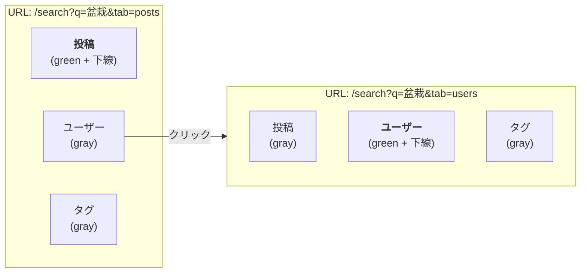

- タブをクリックすると、URLの `tab` パラメータが変更される（`q` パラメータは維持）
- 選択中のタブにはプライマリカラーの下線が表示される

### 12.25.6 検索結果スケルトンの実装パターン

データ読み込み中に表示するスケルトン（骨格）UIは、ユーザーに「読み込み中」であることを伝え、体感速度を向上させます。

```typescript
// components/search/SearchResults.tsx - SearchResultsSkeleton

function SearchResultsSkeleton() {
  return (
    <div className="space-y-4">
      {/* 3件分のスケルトンカードを生成 */}
      {[...Array(3)].map((_, i) => (
        // [...Array(3)] → [undefined, undefined, undefined]
        // これをmapして3つのスケルトンカードを生成

        <div key={i} className="bg-card rounded-lg border p-4 animate-pulse">
          {/* animate-pulse: 明滅アニメーション */}
          {/* → 読み込み中であることを視覚的に伝える */}

          {/* ユーザー情報部分のスケルトン */}
          <div className="flex items-center gap-3 mb-3">
            {/* アバタープレースホルダー（円形のグレーブロック） */}
            <div className="w-10 h-10 rounded-full bg-muted" />

            {/* ユーザー名・日時プレースホルダー */}
            <div className="space-y-2">
              <div className="h-4 w-24 bg-muted rounded" />
              {/* h-4: テキスト1行分の高さ */}
              {/* w-24: ユーザー名の想定幅 */}

              <div className="h-3 w-16 bg-muted rounded" />
              {/* h-3: 小さめのテキスト（日時）の高さ */}
              {/* w-16: 日時の想定幅 */}
            </div>
          </div>

          {/* コンテンツ部分のスケルトン */}
          <div className="space-y-2">
            <div className="h-4 w-full bg-muted rounded" />
            {/* 1行目: 全幅 */}
            <div className="h-4 w-3/4 bg-muted rounded" />
            {/* 2行目: 75%幅（テキストが途中で終わる感じ） */}
          </div>
        </div>
      ))}
    </div>
  )
}
```

**スケルトンの表示イメージ（3件分、animate-pulseで明滅）:**

| 要素 | 幅 | 高さ | 形状 |
|------|-----|------|------|
| アバター | w-10 (2.5rem) | h-10 (2.5rem) | 円形 (rounded-full) |
| ユーザー名 | w-24 (6rem) | h-4 (1rem) | 角丸 (rounded) |
| 日時 | w-16 (4rem) | h-3 (0.75rem) | 角丸 (rounded) |
| コンテンツ1行目 | w-full (100%) | h-4 (1rem) | 角丸 (rounded) |
| コンテンツ2行目 | w-3/4 (75%) | h-4 (1rem) | 角丸 (rounded) |

上記のカード構造が3枚繰り返され、各ブロックがグレー背景で明滅アニメーション（animate-pulse）します。

> **コラム: スケルトンUIのベストプラクティス**
>
> スケルトンUIは「実際のコンテンツと同じレイアウト」で作るのが理想です。BON-LOGのスケルトンは、PostCardコンポーネントと同じ構造（アバター、ユーザー名、本文）を模倣しています。これにより、スケルトンが実際のコンテンツに置き換わった時の「ガタつき」（Layout Shift）が最小限になり、ユーザー体験が向上します。

<details>
<summary>理解度チェック: 検索UXの実装</summary>

**Q1**: `typeof window === 'undefined'` チェックが必要な理由を説明してください。

**A1**: Next.jsのServer ComponentsやSSR（サーバーサイドレンダリング）では、コンポーネントがサーバー上で実行されます。サーバーにはブラウザの `window` オブジェクトや `localStorage` が存在しないため、直接アクセスするとエラーになります。このチェックにより、サーバーサイドでは安全にスキップし、クライアントサイドでのみローカルストレージを操作します。

**Q2**: 検索履歴で重複クエリを先頭に移動する処理の流れを、具体例で説明してください。

**A2**: 現在の履歴が `['A', 'B', 'C']` で、ユーザーが再度 `'B'` で検索した場合: (1) `filter(s !== 'B')` で `['A', 'C']` になる。(2) `['B', 'A', 'C']` のように先頭に `'B'` を追加。(3) `.slice(0, 10)` で最大件数に切り詰め。結果として、`'B'` が最新の検索として先頭に移動します。

**Q3**: `mousedown` イベントを `click` イベントの代わりに使う理由は何ですか？

**A3**: `mousedown` はマウスボタンが押された瞬間に発火し、`click` はボタンを押して離した後に発火します。ドロップダウン内のボタンをクリックする場合、`click` イベントだと先に外側クリック検出が動作してドロップダウンが閉じ、ボタンのクリックが反応しない場合があります。`mousedown` を使うことで、イベントの発火タイミングを正確に制御できます。

</details>

---

## 12.26 検索パフォーマンス最適化テクニック

> **このセクションで学ぶこと**
> - 検索クエリのボトルネックを特定する方法を理解する
> - PostgreSQLの`EXPLAIN ANALYZE`を使った実行計画の読み方を学ぶ
> - インデックス戦略の最適化パターンを習得する
> - アプリケーションレベルでの高速化テクニックを知る
> - 実際のBON-LOGのコードに適用する方法を身につける

検索機能は、ユーザー数や投稿数が増えるにつれてどんどん遅くなる可能性があります。たとえるなら、小さな図書館では本棚をざっと見渡せば本が見つかりますが、国会図書館レベルになると、検索カタログなしでは目的の本にたどり着けません。

このセクションでは、BON-LOGの検索を「小さな図書館」から「国会図書館」のスケールに対応させるための最適化テクニックを解説します。

**検索パフォーマンス最適化の4つの柱**

| | 1. データベースレベル | 2. クエリレベル |
|---|---|---|
| | GINインデックス | SELECT句の最適化 |
| | 複合インデックス | JOINの削減 |
| | 部分インデックス | サブクエリの排除 |
| | VACUUM/ANALYZE | LIMIT+OFFSET回避 |

| | 3. アプリケーションレベル | 4. インフラレベル |
|---|---|---|
| | キャッシュ戦略 | コネクションプール |
| | デバウンス | リードレプリカ |
| | 並列クエリ | CDN活用 |
| | プリフェッチ | エッジコンピュート |

### 12.26.1 EXPLAIN ANALYZEでボトルネックを特定する

検索が遅いとき、まず最初にやるべきことは「どこが遅いのか」を特定することです。PostgreSQLの`EXPLAIN ANALYZE`は、クエリの実行計画と実際の実行時間を表示してくれる「X線」のようなツールです。

```sql
-- EXPLAIN ANALYZEの基本的な使い方
-- 「盆栽」を含む投稿を検索するクエリの実行計画を確認
EXPLAIN ANALYZE
SELECT p.id, p.content, p.created_at
FROM posts p
WHERE p.content ILIKE '%盆栽%'
ORDER BY p.created_at DESC
LIMIT 20;
```

実行結果の例を見てみましょう。

```
-- 【実行計画の出力例（インデックスなし）】
Limit  (cost=1523.45..1523.50 rows=20 width=520)
       (actual time=245.123..245.130 rows=20 loops=1)
  ->  Sort  (cost=1523.45..1548.45 rows=10000 width=520)
            (actual time=245.120..245.125 rows=20 loops=1)
        Sort Key: created_at DESC
        Sort Method: top-N heapsort  Memory: 35kB
        ->  Seq Scan on posts p  (cost=0.00..1285.00 rows=10000 width=520)
                                 (actual time=0.025..230.456 rows=9850 loops=1)
              Filter: (content ~~* '%盆栽%')
              Rows Removed by Filter: 90150
Planning Time: 0.125 ms
Execution Time: 245.178 ms
```

この出力を1つずつ読み解きましょう。

**EXPLAIN ANALYZEの読み方ガイド**

| # | 出力例 | 意味 |
|---|--------|------|
| 1 | `Seq Scan on posts p` | 「Sequential Scan（順次スキャン）」= テーブル全行を1行ずつチェック。これが表示されたら要注意。インデックスが使われていない証拠 |
| 2 | `cost=0.00..1285.00` | `0.00` = 最初の1行取得にかかる推定コスト、`1285.00` = 全行取得にかかる推定コスト（大きいほど遅い） |
| 3 | `actual time=0.025..230.456` | `0.025` = 最初の1行取得にかかった実時間（ms）、`230.456` = 全行取得にかかった実時間（ms） |
| 4 | `rows=9850` | 実際にフィルタを通過した行数 |
| 5 | `Rows Removed by Filter: 90150` | フィルタで除外された行数。9850 + 90150 = 100,000行すべてをスキャンしている |
| 6 | `Execution Time: 245.178 ms` | クエリ全体の実行時間。245ms = 約0.25秒。体感で「ちょっと遅い」レベル |

> **ここがポイント！**
> `Seq Scan`が表示されている場合、テーブルの全行をスキャンしています。100万行のテーブルでは数秒かかることもあります。これを`Index Scan`や`Bitmap Index Scan`に変えることが最適化の第一歩です。

### 12.26.2 GINインデックスの最適化

BON-LOGでは既にGINインデックスを使っていますが、さらに最適化する方法があります。

```typescript
// lib/search/index-optimization.ts
// 検索インデックスの最適化ユーティリティ
// このファイルは、検索パフォーマンスの改善に使うヘルパー関数を提供します

import { prisma } from '@/lib/db'
// prisma: データベース接続クライアント
// → すべてのDB操作はこのクライアントを通じて行う

// =============================================================
// 1. 複合GINインデックスの作成
// =============================================================
// 通常のGINインデックスは1つのカラムに対して作成しますが、
// 複合GINインデックスは複数のカラムをまとめて1つのインデックスにします。
//
// 【たとえ話】
// 通常のインデックス → 本のタイトル索引と著者索引が別々の本
// 複合インデックス   → タイトルと著者が1つの索引にまとまっている本
// → 「この著者のこのタイトルの本」を探す時、1回の索引検索で済む！

export async function createCompositeSearchIndex(): Promise<{
  success: boolean       // 成功したかどうか
  executionTime: number  // 実行にかかった時間（ミリ秒）
  message: string        // 結果メッセージ
}> {
  const startTime = Date.now()
  // Date.now(): 現在のタイムスタンプ（ミリ秒）を取得
  // → 処理前後の差分で実行時間を計測する

  try {
    // 投稿テーブル用の複合GINインデックスを作成
    // content（投稿内容）に対するトリグラムインデックス
    await prisma.$executeRawUnsafe(`
      CREATE INDEX CONCURRENTLY IF NOT EXISTS
        idx_posts_content_trgm
      ON posts
      USING gin (content gin_trgm_ops)
    `)
    // CREATE INDEX CONCURRENTLY:
    //   テーブルをロックせずにインデックスを作成する
    //   → 本番環境でも他のクエリをブロックしない
    //   → 通常のCREATE INDEXはテーブル全体をロックしてしまう
    //
    // IF NOT EXISTS:
    //   インデックスが既に存在する場合はスキップ
    //   → 2回実行してもエラーにならない（冪等性）
    //
    // USING gin:
    //   GIN（Generalized Inverted Index）インデックスを使用
    //   → 全文検索に最適なインデックスタイプ
    //
    // gin_trgm_ops:
    //   pg_trgm拡張のオペレータークラス
    //   → テキストを3文字ずつのトリグラムに分割してインデックス化
    //   → 日本語の部分一致検索に対応できる

    // ユーザーテーブル用の複合GINインデックスを作成
    // nickname（ニックネーム）とbio（自己紹介）をまとめてインデックス化
    await prisma.$executeRawUnsafe(`
      CREATE INDEX CONCURRENTLY IF NOT EXISTS
        idx_users_search_trgm
      ON users
      USING gin (
        (COALESCE(nickname, '') || ' ' || COALESCE(bio, ''))
        gin_trgm_ops
      )
    `)
    // COALESCE(nickname, ''):
    //   nicknameがNULLの場合は空文字列に変換
    //   → NULLのままだと文字列結合（||）の結果もNULLになってしまう
    //
    // || ' ' ||:
    //   PostgreSQLの文字列結合演算子
    //   → nicknameとbioをスペースで結合して1つの文字列にする
    //   → 例: "盆栽太郎 盆栽歴10年の愛好家です"
    //
    // この複合式インデックスにより、nicknameとbioを
    // 1回のインデックス検索で同時に検索できる

    // 盆栽園テーブル用のGINインデックスを作成
    await prisma.$executeRawUnsafe(`
      CREATE INDEX CONCURRENTLY IF NOT EXISTS
        idx_shops_search_trgm
      ON bonsai_shops
      USING gin (
        (COALESCE(name, '') || ' ' || COALESCE(description, ''))
        gin_trgm_ops
      )
    `)
    // 盆栽園もnameとdescriptionを複合インデックス化
    // → 「松」で検索すると「松風園」（name）も
    //   「松の品揃えが豊富」（description）もヒットする

    const executionTime = Date.now() - startTime
    // 処理完了後のタイムスタンプから開始時のタイムスタンプを引く
    // → 実行にかかった時間（ミリ秒）が求まる

    return {
      success: true,
      executionTime,
      message: `3つの複合GINインデックスを作成しました（${executionTime}ms）`,
    }
  } catch (error) {
    // エラーが発生した場合の処理
    const executionTime = Date.now() - startTime
    return {
      success: false,
      executionTime,
      message: `インデックス作成に失敗: ${error instanceof Error ? error.message : '不明なエラー'}`,
      // error instanceof Error:
      //   catchしたエラーがErrorオブジェクトかチェック
      //   → Errorオブジェクトならmessageプロパティを取得
      //   → そうでなければ「不明なエラー」と表示
    }
  }
}
```

```
【通常インデックス vs 複合インデックスの検索フロー比較】

通常インデックス（nickname用とbio用が別々）:
  検索: "盆栽太郎"
  Step 1: nicknameインデックスを検索 → 結果A
  Step 2: bioインデックスを検索      → 結果B
  Step 3: 結果Aと結果Bを結合（UNION） → 最終結果
  → 2回のインデックス検索 + 結合処理が必要

複合インデックス（nicknameとbioを結合して1つ）:
  検索: "盆栽太郎"
  Step 1: 複合インデックスを検索 → 最終結果
  → 1回のインデックス検索で完了！

  ※ 特にOR条件（nicknameまたはbioにヒット）の場合に
     複合インデックスの方が圧倒的に有利
```

### 12.26.3 部分インデックスによるインデックスサイズの削減

部分インデックス（Partial Index）は、テーブルの一部の行だけをインデックス化する手法です。BON-LOGでは「削除されていない投稿」だけを検索対象にしたいので、部分インデックスが最適です。

```typescript
// lib/search/partial-index.ts
// 部分インデックスの作成ユーティリティ
// テーブル全体ではなく、条件に合う行だけをインデックス化する

import { prisma } from '@/lib/db'

// =============================================================
// 部分インデックスとは？
// =============================================================
//
// 【たとえ話】
// 図書館の索引を考えてみましょう。
// ・通常のインデックス → すべての蔵書（貸出中・廃棄済み含む）の索引
// ・部分インデックス   → 「現在貸出可能な本」だけの索引
//
// 利用者が探すのは「貸出可能な本」だけなので、
// 部分インデックスの方がサイズが小さく、検索も速い！
//
// +-- 全体インデックス（100万行）-----------+
// |                                         |
// |  +-- 部分インデックス（80万行）------+  |
// |  |  deleted_at IS NULL の行だけ      |  |
// |  |  → サイズ20%削減                  |  |
// |  |  → 検索速度20%向上               |  |
// |  +-----------------------------------+  |
// |                                         |
// |  [除外される20万行]                     |
// |  deleted_at IS NOT NULL（削除済み）      |
// +-----------------------------------------+

export async function createPartialSearchIndexes(): Promise<{
  success: boolean
  indexes: Array<{
    name: string            // インデックス名
    table: string           // 対象テーブル
    condition: string       // 部分条件
    estimatedSizeReduction: string  // 推定サイズ削減率
  }>
}> {
  const indexes = []
  // 作成したインデックスの情報を格納する配列

  try {
    // ----------------------------------------------------------
    // 1. 投稿テーブルの部分インデックス
    // ----------------------------------------------------------
    // 「削除されていない投稿」だけをインデックス化する
    await prisma.$executeRawUnsafe(`
      CREATE INDEX CONCURRENTLY IF NOT EXISTS
        idx_posts_content_trgm_active
      ON posts
      USING gin (content gin_trgm_ops)
      WHERE deleted_at IS NULL
    `)
    // WHERE deleted_at IS NULL:
    //   これが「部分」の条件
    //   → deleted_at が NULL の行（= 削除されていない投稿）だけを
    //     インデックスに含める
    //   → 論理削除された投稿はインデックスから除外される
    //   → インデックスのサイズが小さくなり、検索が速くなる

    indexes.push({
      name: 'idx_posts_content_trgm_active',
      table: 'posts',
      condition: 'deleted_at IS NULL',
      estimatedSizeReduction: '約10-20%（削除投稿の割合による）',
    })

    // ----------------------------------------------------------
    // 2. 公開ユーザーのみの部分インデックス
    // ----------------------------------------------------------
    // 非公開アカウントを検索結果から除外するため、
    // 公開ユーザーだけをインデックス化する
    await prisma.$executeRawUnsafe(`
      CREATE INDEX CONCURRENTLY IF NOT EXISTS
        idx_users_search_trgm_public
      ON users
      USING gin (
        (COALESCE(nickname, '') || ' ' || COALESCE(bio, ''))
        gin_trgm_ops
      )
      WHERE is_public = true
    `)
    // WHERE is_public = true:
    //   公開アカウントのみをインデックス化
    //   → 非公開アカウントはそもそもインデックスに存在しないので、
    //     検索時にフィルタする必要がない
    //   → クエリが「検索 + フィルタ」から「検索のみ」になり高速化

    indexes.push({
      name: 'idx_users_search_trgm_public',
      table: 'users',
      condition: 'is_public = true',
      estimatedSizeReduction: '約5-15%（非公開アカウントの割合による）',
    })

    // ----------------------------------------------------------
    // 3. アクティブな盆栽園のみの部分インデックス
    // ----------------------------------------------------------
    await prisma.$executeRawUnsafe(`
      CREATE INDEX CONCURRENTLY IF NOT EXISTS
        idx_shops_search_trgm_active
      ON bonsai_shops
      USING gin (
        (COALESCE(name, '') || ' ' || COALESCE(description, ''))
        gin_trgm_ops
      )
      WHERE is_active = true
    `)
    // WHERE is_active = true:
    //   営業中の盆栽園のみをインデックス化
    //   → 閉業した盆栽園を検索結果から自動的に除外

    indexes.push({
      name: 'idx_shops_search_trgm_active',
      table: 'bonsai_shops',
      condition: 'is_active = true',
      estimatedSizeReduction: '約5-10%',
    })

    return { success: true, indexes }
  } catch (error) {
    return { success: false, indexes }
  }
}
```

### 12.26.4 クエリレベルの最適化パターン

データベースインデックスだけでなく、クエリの書き方自体を最適化することも重要です。

```typescript
// lib/search/optimized-queries.ts
// 最適化された検索クエリのパターン集
// それぞれのパターンで「なぜ速いのか」を解説します

import { Prisma } from '@prisma/client'
// Prisma: Prismaの型やヘルパーをインポート
// → Prisma.sql や Prisma.empty などのテンプレートタグリテラルを使う

import { prisma } from '@/lib/db'

// =============================================================
// パターン1: SELECT句の最適化（必要なカラムだけ取得）
// =============================================================
//
// 【たとえ話】
// 図書館で「この著者の本の"タイトル一覧"がほしい」と頼んだ時、
// ❌ 全冊の本を棚から持ってくる（SELECT *）
// ✅ タイトルだけメモして持ってくる（SELECT title）
// → 運ぶ荷物が軽い方が速い！

export async function searchPostsOptimized(
  query: string,          // 検索キーワード
  limit: number = 20,     // 取得件数（デフォルト20件）
  cursor?: string         // ページネーション用カーソル
) {
  // ❌ 非最適化パターン: すべてのカラムを取得
  // const posts = await prisma.$queryRaw`
  //   SELECT *
  //   FROM posts p
  //   JOIN users u ON p.user_id = u.id
  //   WHERE p.content % ${query}
  //   ORDER BY p.created_at DESC
  //   LIMIT ${limit}
  // `
  //
  // SELECT * の問題点:
  // 1. 不要なカラムもメモリに読み込まれる
  // 2. ネットワーク転送量が増える
  // 3. PostgreSQLのバッファキャッシュを無駄に消費する

  // ✅ 最適化パターン: 必要なカラムだけ取得
  const posts = await prisma.$queryRaw`
    SELECT
      p.id,
      p.content,
      p.created_at,
      u.id AS user_id,
      u.nickname,
      u.avatar_url,
      similarity(p.content, ${query}) AS relevance
    FROM posts p
    INNER JOIN users u ON p.user_id = u.id
    WHERE p.content % ${query}
      AND p.deleted_at IS NULL
      ${cursor
        ? Prisma.sql`AND p.created_at < (
            SELECT created_at FROM posts WHERE id = ${cursor}
          )`
        : Prisma.empty
      }
    ORDER BY relevance DESC, p.created_at DESC
    LIMIT ${limit}
  `
  // SELECT句の最適化ポイント:
  //   p.id, p.content, p.created_at:
  //     → 投稿の表示に必要な最小限のカラムのみ
  //     → p.updated_at, p.quote_post_id 等は不要なので取得しない
  //
  //   u.id AS user_id, u.nickname, u.avatar_url:
  //     → ユーザー情報も表示に必要な最小限のみ
  //     → u.email, u.password, u.bio 等は取得しない
  //
  //   similarity(p.content, ${query}) AS relevance:
  //     → pg_trgmの類似度スコアを計算
  //     → 0.0〜1.0の値（1.0が完全一致）
  //     → ORDER BYで関連度順にソートするために使う
  //
  // WHERE句の最適化ポイント:
  //   p.content % ${query}:
  //     → pg_trgmの類似度検索演算子
  //     → GINインデックスを使って高速にフィルタリング
  //
  //   p.deleted_at IS NULL:
  //     → 部分インデックスの条件と一致させる
  //     → インデックスの条件と一致すると、PostgreSQLは
  //       部分インデックスを使えると判断する
  //
  // ORDER BY relevance DESC, p.created_at DESC:
  //   → まず関連度が高い順、同じ関連度なら新しい順

  return posts
}

// =============================================================
// パターン2: EXISTS句による効率的なフィルタリング
// =============================================================
//
// 【たとえ話】
// 「英語の本を持っている著者のリスト」を作りたい時、
// ❌ 全著者について全冊チェック（IN + サブクエリ）
// ✅ 著者ごとに「英語の本が1冊でもあるか？」チェック（EXISTS）
// → 1冊見つかった時点で次の著者に移れる！

export async function searchPostsWithGenreFilter(
  query: string,
  genreIds: string[],     // フィルタリングするジャンルID配列
  limit: number = 20
) {
  // ❌ IN句を使ったサブクエリ（非効率）
  // WHERE p.id IN (
  //   SELECT post_id FROM post_genres WHERE genre_id IN (...)
  // )
  // → サブクエリが全行を取得してからIN比較する
  // → 結果セットが大きいとメモリを大量消費

  // ✅ EXISTS句を使った効率的なフィルタリング
  const genreFilter = genreIds.length > 0
    ? Prisma.sql`
        AND EXISTS (
          SELECT 1
          FROM post_genres pg
          WHERE pg.post_id = p.id
            AND pg.genre_id IN (${Prisma.join(genreIds)})
        )
      `
    : Prisma.empty
  // EXISTS の動作:
  //   各投稿（p）について、post_genresテーブルから
  //   「該当するジャンルの行が1つでも存在するか」をチェック
  //   → 1つ見つかった時点でtrueを返して次の行へ
  //   → IN句と違い、全行を取得する必要がない
  //
  // SELECT 1:
  //   EXISTS句では実際の値は不要
  //   → 「存在するかどうか」だけが重要
  //   → SELECT 1 が慣例（SELECT * でも動くが意図が明確）
  //
  // Prisma.join(genreIds):
  //   配列をカンマ区切りの安全なSQL値に変換
  //   → ['genre1', 'genre2'] が 'genre1', 'genre2' になる
  //   → SQLインジェクションを防止するパラメータ化

  const posts = await prisma.$queryRaw`
    SELECT
      p.id,
      p.content,
      p.created_at,
      u.nickname,
      u.avatar_url,
      similarity(p.content, ${query}) AS relevance
    FROM posts p
    INNER JOIN users u ON p.user_id = u.id
    WHERE p.content % ${query}
      AND p.deleted_at IS NULL
      ${genreFilter}
    ORDER BY relevance DESC, p.created_at DESC
    LIMIT ${limit}
  `

  return posts
}

// =============================================================
// パターン3: カウントクエリの最適化
// =============================================================
//
// 検索結果の総件数を取得するクエリは、特に最適化が重要です。
// なぜなら、件数取得のために全行をスキャンすると非常に遅くなるからです。

export async function getSearchResultCount(
  query: string
): Promise<{
  postCount: number       // 投稿の検索結果数
  userCount: number       // ユーザーの検索結果数
  shopCount: number       // 盆栽園の検索結果数
  totalCount: number      // 合計
}> {
  // ❌ 非最適化: 3つのカウントを順番に取得
  // const postCount = await prisma.post.count({ where: ... })
  // const userCount = await prisma.user.count({ where: ... })
  // const shopCount = await prisma.shop.count({ where: ... })
  // → 3つのクエリが順次実行される
  // → 合計時間 = クエリ1の時間 + クエリ2の時間 + クエリ3の時間

  // ✅ 最適化: 1つのクエリで3つのカウントを同時取得
  const result = await prisma.$queryRaw<
    [{ post_count: bigint; user_count: bigint; shop_count: bigint }]
  >`
    SELECT
      (
        SELECT COUNT(*)
        FROM posts
        WHERE content % ${query}
          AND deleted_at IS NULL
      ) AS post_count,
      (
        SELECT COUNT(*)
        FROM users
        WHERE (nickname % ${query} OR bio % ${query})
          AND is_public = true
      ) AS user_count,
      (
        SELECT COUNT(*)
        FROM bonsai_shops
        WHERE (name % ${query} OR description % ${query})
          AND is_active = true
      ) AS shop_count
  `
  // 1つのSQLで3つのサブクエリを実行
  // → PostgreSQLが内部で並列実行を検討してくれる
  // → ネットワークラウンドトリップが1回で済む
  //
  // bigint型の注意点:
  //   PostgreSQLのCOUNT(*)はbigint型を返す
  //   → JavaScriptのnumber型に変換する必要がある
  //   → Number() でキャストする

  const counts = result[0]
  // result は配列で返ってくるので、最初の要素を取得

  return {
    postCount: Number(counts.post_count),
    userCount: Number(counts.user_count),
    shopCount: Number(counts.shop_count),
    totalCount:
      Number(counts.post_count) +
      Number(counts.user_count) +
      Number(counts.shop_count),
    // Number(): bigint → number への変換
    // → JavaScriptではbigintとnumberは直接演算できないため
  }
}
```

**カウントクエリの最適化効果**

| 方式 | 処理内容 | 時間 |
|------|---------|------|
| **非最適化（3回のクエリ）** | クエリ1: posts COUNT | 50ms |
| | クエリ2: users COUNT | 30ms |
| | クエリ3: shops COUNT | 20ms |
| | ネットワーク往復: 3回 x 5ms | 15ms |
| | **合計** | **115ms** |
| **最適化（1回のクエリ）** | クエリ1: 3つのCOUNTを同時実行（PostgreSQLが内部で並列処理する可能性あり） | 55ms |
| | ネットワーク往復: 1回 x 5ms | 5ms |
| | **合計** | **60ms** |

約48%の時間短縮!

### 12.26.5 アプリケーションレベルの最適化

データベースだけでなく、アプリケーション側でもパフォーマンスを向上させる方法があります。

```typescript
// lib/search/prefetch.ts
// 検索結果のプリフェッチ（先読み）ユーティリティ
// ユーザーが入力を始める前に、人気の検索結果を先にキャッシュしておく

import { unstable_cache } from 'next/cache'
// unstable_cache: Next.jsのリクエスト間キャッシュ機能
// → 一度計算した結果を一定時間保持し、同じリクエストが来たら
//   データベースに問い合わせずにキャッシュから返す

import { prisma } from '@/lib/db'

// =============================================================
// プリフェッチ戦略の設計
// =============================================================
//
// 【たとえ話】
// レストランの「仕込み」と同じ考え方です。
// ・注文が来てから野菜を切り始める → 遅い
// ・よく注文される料理の材料は事前に準備 → 速い
//
// 検索でも同じで、よく検索されるキーワードの結果は
// 事前にキャッシュしておくと、レスポンスが格段に速くなります。
//
// +-- プリフェッチの対象 ---------+
// | 1. 人気ジャンル（松柏類等）    |
// | 2. トレンドタグ               |
// | 3. 人気の検索キーワード        |
// +-------------------------------+

// 人気の検索キーワードを取得（キャッシュ付き）
export const getPopularSearchTerms = unstable_cache(
  async (): Promise<string[]> => {
    // search_logsテーブルから直近7日間の人気キーワードを取得
    const result = await prisma.$queryRaw<
      Array<{ query: string; count: bigint }>
    >`
      SELECT query, COUNT(*) as count
      FROM search_logs
      WHERE created_at > NOW() - INTERVAL '7 days'
        AND query IS NOT NULL
        AND LENGTH(query) >= 2
      GROUP BY query
      ORDER BY count DESC
      LIMIT 10
    `
    // WHERE句の各条件:
    //   created_at > NOW() - INTERVAL '7 days':
    //     → 直近7日間のログに限定
    //     → 古いデータは人気度の指標として信頼性が低い
    //
    //   query IS NOT NULL:
    //     → 空の検索をフィルタリング
    //
    //   LENGTH(query) >= 2:
    //     → 1文字の検索は意味のある結果が少ないので除外
    //
    // GROUP BY query:
    //   → 同じキーワードをグループ化してCOUNTする
    //
    // ORDER BY count DESC:
    //   → 検索回数が多い順（人気順）
    //
    // LIMIT 10:
    //   → 上位10件を取得

    return result.map(r => r.query)
    // map: 各行からqueryフィールドだけを抽出
    // → ['盆栽', '松', '剪定', ...] のような文字列配列を返す
  },
  ['popular-search-terms'],
  // キャッシュキー: この文字列でキャッシュを一意に識別
  // → 同じキーなら同じキャッシュを参照する
  { revalidate: 3600 }
  // revalidate: 3600:
  //   → 3600秒（1時間）ごとにキャッシュを再検証
  //   → 1時間以内は同じ結果をキャッシュから返す
  //   → 検索ログは頻繁に変わらないので1時間で十分
)

// =============================================================
// 検索結果のメモリ内キャッシュ（LRUキャッシュ）
// =============================================================
//
// 【たとえ話】
// 机の上に置ける本の数は限られています。
// LRU（Least Recently Used）キャッシュは
// 「最近使わなかった本を棚に戻して、新しい本のスペースを作る」
// という整理方法です。
//
// +-- LRUキャッシュ（最大100件）--+
// | "盆栽"    → [検索結果...]     |  ← 最近使った
// | "松"      → [検索結果...]     |
// | "剪定"    → [検索結果...]     |
// | ...                           |
// | "古い語"  → [検索結果...]     |  ← 最も古い（次に削除される）
// +-------------------------------+

class LRUCache<T> {
  private cache = new Map<string, { value: T; timestamp: number }>()
  // Map: キーと値のペアを保持するデータ構造
  // → キー: 検索キーワード（文字列）
  // → 値: { value: 検索結果, timestamp: キャッシュした時刻 }

  private maxSize: number
  // キャッシュに保持する最大エントリ数

  private ttl: number
  // TTL（Time To Live）: キャッシュの有効期限（ミリ秒）

  constructor(maxSize: number = 100, ttlMs: number = 5 * 60 * 1000) {
    this.maxSize = maxSize
    // maxSize: デフォルト100件
    // → 100種類の検索結果をメモリに保持

    this.ttl = ttlMs
    // ttlMs: デフォルト5分（5 × 60 × 1000ミリ秒）
    // → 5分経過したキャッシュは古いとみなす
  }

  get(key: string): T | undefined {
    const entry = this.cache.get(key)
    // Mapからキーに対応するエントリを取得

    if (!entry) return undefined
    // エントリが存在しない場合はundefinedを返す

    // TTLチェック: キャッシュが有効期限内かどうか
    if (Date.now() - entry.timestamp > this.ttl) {
      this.cache.delete(key)
      // 有効期限を過ぎている場合はキャッシュから削除
      return undefined
    }

    // LRUの更新: アクセスされたエントリを「最新」にする
    // Mapは挿入順を保持するので、一度削除して再挿入する
    this.cache.delete(key)
    this.cache.set(key, entry)
    // delete → set の順序で、このエントリがMapの末尾（最新）に移動
    // → 次に容量超過で削除される時、このエントリは後回しにされる

    return entry.value
  }

  set(key: string, value: T): void {
    // 既存のエントリがあれば削除（位置を更新するため）
    if (this.cache.has(key)) {
      this.cache.delete(key)
    }

    // 容量超過チェック
    if (this.cache.size >= this.maxSize) {
      // Mapの最初のエントリ（= 最も古いエントリ）を削除
      const oldestKey = this.cache.keys().next().value
      // this.cache.keys(): Mapのキーをイテレーターで取得
      // .next().value: イテレーターの最初の値 = 最も古いキー
      if (oldestKey !== undefined) {
        this.cache.delete(oldestKey)
      }
    }

    // 新しいエントリを追加（Mapの末尾 = 最新の位置）
    this.cache.set(key, { value, timestamp: Date.now() })
  }

  clear(): void {
    this.cache.clear()
    // キャッシュを全クリア
    // → ログアウト時やデータ更新時に使用
  }

  get size(): number {
    return this.cache.size
    // 現在のキャッシュエントリ数を返す
    // → デバッグやモニタリングに使用
  }
}

// 検索結果用のLRUキャッシュインスタンスを作成
// サーバーサイドのモジュールスコープで1つだけ作る（シングルトン）
export const searchCache = new LRUCache<unknown>(100, 5 * 60 * 1000)
// 第1引数: 最大100件のキャッシュ
// 第2引数: 有効期限5分
```

```
【LRUキャッシュの動作例（maxSize=3）】

初期状態: 空 []

1. "盆栽"を検索 → キャッシュに追加
   [盆栽]

2. "松"を検索 → キャッシュに追加
   [盆栽, 松]

3. "剪定"を検索 → キャッシュに追加（容量いっぱい）
   [盆栽, 松, 剪定]

4. "盆栽"を再検索 → キャッシュヒット！DBアクセスなし
   → "盆栽"を最新位置に移動
   [松, 剪定, 盆栽]

5. "園芸"を検索 → 容量超過！最も古い"松"を削除
   [剪定, 盆栽, 園芸]

→ よく検索されるキーワードはキャッシュに残り続ける
→ あまり検索されないキーワードは自然に消える
```

### 12.26.6 検索ログによるパフォーマンス計測

検索のパフォーマンスを継続的に監視するために、検索ログを記録する仕組みを実装します。

```typescript
// lib/search/search-logger.ts
// 検索パフォーマンスのロギングユーティリティ
// 各検索のレスポンス時間や結果件数を記録し、ボトルネックの特定に役立てる

import { prisma } from '@/lib/db'

// =============================================================
// 検索ログの型定義
// =============================================================
interface SearchLogEntry {
  query: string           // 検索キーワード
  type: 'post' | 'user' | 'shop' | 'global'
                          // 検索タイプ（投稿/ユーザー/盆栽園/全体）
  resultCount: number     // 検索結果の件数
  executionTimeMs: number // 実行時間（ミリ秒）
  userId?: string         // 検索したユーザーのID（匿名の場合はundefined）
  filters?: Record<string, unknown>
                          // 適用されたフィルタ条件
}

// =============================================================
// 検索の実行時間を計測するラッパー関数
// =============================================================
//
// 【たとえ話】
// 料理の調理時間を計るストップウォッチのような役割です。
// 料理を作る（検索を実行する）前にスタートボタンを押し、
// 完成したらストップボタンを押して時間を記録します。

export async function withSearchTiming<T>(
  searchFn: () => Promise<T>,
  // searchFn: 実際の検索を行う関数
  // → この関数の実行時間を計測する
  // → ジェネリック型Tにより、任意の戻り値型に対応

  metadata: Omit<SearchLogEntry, 'resultCount' | 'executionTimeMs'>
  // metadata: 検索に関する付加情報
  // → Omit<...>: resultCountとexecutionTimeMsを除いた型
  //   → これらは計測後に自動で設定されるため、呼び出し側は不要
): Promise<{
  result: T              // 検索結果
  executionTimeMs: number // 実行時間
}> {
  const startTime = performance.now()
  // performance.now(): 高精度タイマー
  // → Date.now()よりも精度が高い（マイクロ秒レベル）
  // → パフォーマンス計測には performance.now() を使うのがベストプラクティス

  try {
    const result = await searchFn()
    // 検索関数を実行し、結果を取得

    const executionTimeMs = Math.round(performance.now() - startTime)
    // 実行時間を計算（ミリ秒、小数点以下は四捨五入）

    // 非同期で検索ログを保存（検索結果の返却をブロックしない）
    logSearchEntry({
      ...metadata,
      // スプレッド構文: metadataのすべてのプロパティを展開
      resultCount: Array.isArray(result)
        ? result.length
        : typeof result === 'object' && result !== null && 'total' in result
          ? (result as { total: number }).total
          : 0,
      // resultCount の決定ロジック:
      //   1. 配列なら → 配列の長さ
      //   2. totalプロパティを持つオブジェクトなら → totalの値
      //   3. それ以外 → 0
      executionTimeMs,
    }).catch(() => {
      // ログ保存の失敗は無視する（検索結果に影響させない）
      // → ログは補助的な機能なので、失敗しても検索自体は正常に返す
    })

    return { result, executionTimeMs }
  } catch (error) {
    const executionTimeMs = Math.round(performance.now() - startTime)

    // エラー時もログを記録（エラーの傾向分析に役立つ）
    logSearchEntry({
      ...metadata,
      resultCount: 0,
      executionTimeMs,
    }).catch(() => {})

    throw error
    // エラーは呼び出し元に再スロー
    // → 検索のエラーハンドリングは呼び出し元に任せる
  }
}

// 検索ログをデータベースに保存する内部関数
async function logSearchEntry(entry: SearchLogEntry): Promise<void> {
  await prisma.$executeRaw`
    INSERT INTO search_logs (
      query,
      search_type,
      result_count,
      execution_time_ms,
      user_id,
      filters,
      created_at
    ) VALUES (
      ${entry.query},
      ${entry.type},
      ${entry.resultCount},
      ${entry.executionTimeMs},
      ${entry.userId ?? null},
      ${entry.filters ? JSON.stringify(entry.filters) : null}::jsonb,
      NOW()
    )
  `
  // INSERT INTO search_logs:
  //   search_logsテーブルに検索ログを1行追加
  //
  // ${entry.userId ?? null}:
  //   Nullish Coalescing演算子
  //   → userIdがundefinedまたはnullの場合はNULLを挿入
  //
  // ${...}::jsonb:
  //   PostgreSQLのキャスト演算子
  //   → JSON文字列をjsonb型（バイナリJSON）に変換
  //   → jsonb型にすることでJSONフィールドへのクエリが可能になる
  //
  // NOW():
  //   PostgreSQLの現在時刻関数
  //   → 正確なタイムスタンプでログを記録
}
```

**検索パフォーマンスの目安**

| レスポンス時間 | 体感 | 対応 |
|--------------|------|------|
| 0〜100ms | 瞬時に返る | 理想的。そのまま |
| 100〜300ms | まあ速い | 許容範囲内 |
| 300〜1000ms | 少し待つ | 最適化を検討 |
| 1000ms〜3000ms | 遅い | 早急に最適化が必要 |
| 3000ms以上 | 非常に遅い | インデックスやクエリを見直す |

※ BON-LOGの目標: 95%のクエリが300ms以内に完了すること

<details>
<summary>理解度チェック: 検索パフォーマンス最適化</summary>

**Q1**: `EXPLAIN ANALYZE`の出力で`Seq Scan`が表示された場合、何が問題ですか？また、どのような対策が考えられますか？

**A1**: `Seq Scan`（順次スキャン）はテーブルの全行を1行ずつチェックする処理です。テーブルが大きくなるほど遅くなります。対策としては、(1) 検索対象カラムにGINインデックス（トリグラム用）を作成する、(2) 部分インデックスで対象行を絞り込む、(3) WHERE句の条件がインデックスを活用できる形になっているか確認する、といった方法があります。

**Q2**: LRUキャッシュで`Map`の`delete`→`set`の順序でエントリを更新する理由を説明してください。

**A2**: JavaScriptの`Map`は挿入順序を保持します。既存のエントリを`delete`してから`set`で再挿入すると、そのエントリがMapの末尾（最新位置）に移動します。LRUキャッシュでは「最近使用したものを残し、最も古いものを削除する」ので、アクセスのたびにエントリを末尾に移動させることで、先頭（最も古い）のエントリから順に削除対象にできます。

**Q3**: 検索ログの保存で`.catch(() => {})`を使って失敗を無視している理由は何ですか？

**A3**: 検索ログは補助的な機能であり、ログ保存の失敗が検索結果の返却を妨げてはいけないからです。ユーザーにとって最も重要なのは「検索結果が返ること」であり、ログの保存はバックグラウンドで行われるべきです。もしログ保存の失敗でエラーが伝播すると、正常な検索結果があるにもかかわらずユーザーにエラーが表示されてしまいます。

</details>

---

## 12.27 高度な検索フィルタパターン

> **このセクションで学ぶこと**
> - 複数のフィルタ条件を組み合わせる設計パターンを理解する
> - 日付範囲・数値範囲・地理的距離によるフィルタリングを実装する
> - フィルタ条件を動的に構築するビルダーパターンを学ぶ
> - URLパラメータとフィルタ状態の双方向同期を実装する

ユーザーが検索結果をさらに絞り込むための「高度なフィルタ」は、検索システムの使いやすさを大きく左右します。たとえるなら、検索が「大きな網で魚を獲る」ことだとすると、フィルタは「獲った魚の中から目的の魚だけを選り分ける」作業です。

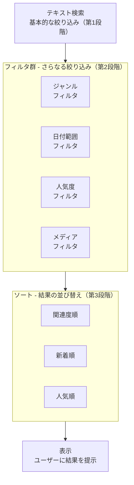

### 12.27.1 フィルタ条件の型定義と動的SQL構築

まず、フィルタ条件を型安全に管理し、動的にSQLを構築するパターンを実装します。

```typescript
// lib/search/advanced-filters.ts
// 高度な検索フィルタの定義と動的SQL構築
// このファイルは、検索フィルタの「設計図」と「組み立て工場」の役割を担います

import { Prisma } from '@prisma/client'
// Prisma: タグ付きテンプレートリテラル（Prisma.sql, Prisma.empty等）を使うためにインポート

// =============================================================
// フィルタ条件の型定義
// =============================================================
// TypeScriptの型定義により、フィルタ条件の「設計図」を明確にします。
// どのフィルタが使えるか、それぞれどんな値を取るかを型で表現することで、
// 開発時にIDEの補完が効き、間違った値を渡すとコンパイルエラーになります。

export interface SearchFilters {
  // --- テキスト検索 ---
  query: string
  // 検索キーワード（必須）
  // → ユーザーが検索バーに入力した文字列

  // --- ジャンルフィルタ ---
  genreIds?: string[]
  // 盆栽のジャンルID配列（任意）
  // → 空配列 or undefined の場合はジャンルフィルタなし
  // → ['松柏類', '雑木類'] のように複数指定可能

  // --- 日付範囲フィルタ ---
  dateRange?: {
    from?: string         // 開始日（ISO 8601形式: '2025-01-01'）
    to?: string           // 終了日（ISO 8601形式: '2025-12-31'）
  }
  // → fromのみ指定: 「○月○日以降」
  // → toのみ指定: 「○月○日まで」
  // → 両方指定: 「○月○日から○月○日まで」
  // → 未指定: 日付フィルタなし

  // --- 人気度フィルタ ---
  minLikes?: number
  // 最低いいね数（任意）
  // → 5を指定すると「5いいね以上の投稿」のみ表示
  // → 人気のある投稿を見つけたい時に使用

  // --- メディアフィルタ ---
  hasMedia?: boolean
  // メディア（画像・動画）の有無（任意）
  // → true: 画像または動画が添付された投稿のみ
  // → false or undefined: フィルタなし

  // --- ソート順 ---
  sortBy?: 'relevance' | 'newest' | 'popular'
  // 結果の並び順（任意、デフォルトは'relevance'）
  // → 'relevance': 検索キーワードとの関連度が高い順
  // → 'newest': 投稿日時が新しい順
  // → 'popular': いいね数が多い順
}

// =============================================================
// フィルタ条件からSQL WHERE句を動的に構築する関数
// =============================================================
//
// 【たとえ話】
// レゴブロックのように、必要なフィルタだけを「組み合わせる」関数です。
// ジャンルフィルタが必要ならジャンルブロックを追加、
// 日付フィルタが必要なら日付ブロックを追加、
// 不要なフィルタは何も追加しない（Prisma.empty）。
// → 最終的に全ブロックを AND で結合してSQL WHERE句を完成させる

export function buildFilterConditions(
  filters: SearchFilters
): Prisma.Sql {
  // Prisma.Sql: Prismaのタグ付きテンプレートリテラルの型
  // → SQLインジェクションを防止しつつ、動的にSQLを組み立てられる

  const conditions: Prisma.Sql[] = []
  // 各フィルタ条件を格納する配列
  // → 最後にすべてをANDで結合する

  // ----------------------------------------------------------
  // 1. ジャンルフィルタ
  // ----------------------------------------------------------
  if (filters.genreIds && filters.genreIds.length > 0) {
    conditions.push(Prisma.sql`
      EXISTS (
        SELECT 1 FROM post_genres pg
        WHERE pg.post_id = p.id
          AND pg.genre_id IN (${Prisma.join(filters.genreIds)})
      )
    `)
    // EXISTS + SELECT 1 パターン（12.26で解説済み）
    // → 指定されたジャンルIDのいずれかに紐づく投稿だけを残す
    //
    // Prisma.join(filters.genreIds):
    //   配列を安全なカンマ区切りの値に変換
    //   → SQLインジェクション対策が組み込まれている
  }

  // ----------------------------------------------------------
  // 2. 日付範囲フィルタ
  // ----------------------------------------------------------
  if (filters.dateRange?.from) {
    conditions.push(Prisma.sql`
      p.created_at >= ${new Date(filters.dateRange.from)}::timestamptz
    `)
    // created_at >= 開始日
    // → 指定日以降の投稿のみ
    //
    // new Date(filters.dateRange.from):
    //   ISO 8601文字列をDateオブジェクトに変換
    //   → Prismaが自動的にPostgreSQLのtimestamptz型に変換する
    //
    // ::timestamptz:
    //   PostgreSQLの型キャスト
    //   → タイムゾーン付きタイムスタンプ型として扱う
  }

  if (filters.dateRange?.to) {
    conditions.push(Prisma.sql`
      p.created_at <= ${new Date(filters.dateRange.to)}::timestamptz
    `)
    // created_at <= 終了日
    // → 指定日以前の投稿のみ
  }

  // ----------------------------------------------------------
  // 3. 人気度フィルタ（いいね数）
  // ----------------------------------------------------------
  if (filters.minLikes !== undefined && filters.minLikes > 0) {
    conditions.push(Prisma.sql`
      (
        SELECT COUNT(*)
        FROM likes l
        WHERE l.post_id = p.id
      ) >= ${filters.minLikes}
    `)
    // サブクエリで各投稿のいいね数をカウントし、
    // 指定された最低いいね数以上のものだけを残す
    //
    // 注意: この相関サブクエリは投稿ごとに実行されるため、
    // 大量データではパフォーマンスに注意が必要
    // → 対策: likesテーブルにpost_idのインデックスが必要
    //   CREATE INDEX idx_likes_post_id ON likes(post_id)
  }

  // ----------------------------------------------------------
  // 4. メディアフィルタ
  // ----------------------------------------------------------
  if (filters.hasMedia === true) {
    conditions.push(Prisma.sql`
      EXISTS (
        SELECT 1 FROM post_media pm
        WHERE pm.post_id = p.id
      )
    `)
    // post_mediaテーブルに関連するメディアが
    // 1つでも存在する投稿だけを残す
    //
    // EXISTSを使う理由:
    //   → JOINだと同じ投稿が複数回出力される可能性がある
    //     （1投稿に3枚の画像 → 3行になってしまう）
    //   → EXISTSなら「存在するかどうか」だけなので1行のまま
  }

  // ----------------------------------------------------------
  // すべての条件をANDで結合
  // ----------------------------------------------------------
  if (conditions.length === 0) {
    return Prisma.empty
    // フィルタ条件が1つもない場合は、何も追加しない
  }

  // conditions配列のすべての要素をANDで結合する
  return Prisma.sql`AND ${Prisma.join(conditions, ' AND ')}`
  // Prisma.join(conditions, ' AND '):
  //   条件配列を ' AND ' で結合
  //   → 例: "EXISTS(...) AND p.created_at >= '2025-01-01' AND ..."
  //
  // 先頭の AND:
  //   呼び出し元のWHERE句に追加するため、先頭にANDを付ける
  //   → WHERE p.content % ${query} AND [ここにフィルタ条件が入る]
}
```

```
【フィルタ条件の構築フロー（具体例）】

入力:
  filters = {
    query: "松",
    genreIds: ["松柏類"],
    dateRange: { from: "2025-01-01" },
    minLikes: 5,
    hasMedia: true,
    sortBy: "popular"
  }

構築過程:
  conditions = []

  Step 1: ジャンルフィルタ追加
  conditions = [
    "EXISTS (SELECT 1 FROM post_genres pg WHERE pg.post_id = p.id AND pg.genre_id IN ('松柏類'))"
  ]

  Step 2: 日付フィルタ（from）追加
  conditions = [
    "EXISTS (...)",
    "p.created_at >= '2025-01-01'"
  ]

  Step 3: 人気度フィルタ追加
  conditions = [
    "EXISTS (...)",
    "p.created_at >= '2025-01-01'",
    "(SELECT COUNT(*) FROM likes l WHERE l.post_id = p.id) >= 5"
  ]

  Step 4: メディアフィルタ追加
  conditions = [
    "EXISTS (...)",
    "p.created_at >= '2025-01-01'",
    "(SELECT COUNT(*) FROM likes l WHERE l.post_id = p.id) >= 5",
    "EXISTS (SELECT 1 FROM post_media pm WHERE pm.post_id = p.id)"
  ]

  結合結果:
  AND EXISTS (...) AND p.created_at >= '2025-01-01'
  AND (SELECT COUNT(*) ...) >= 5 AND EXISTS (...)
```

### 12.27.2 ソート条件の動的構築

検索結果の並び順もフィルタと同様に動的に構築します。

```typescript
// lib/search/sort-builder.ts
// ソート条件の動的構築ユーティリティ
// ユーザーが選択したソート順に応じてORDER BY句を生成する

import { Prisma } from '@prisma/client'

// =============================================================
// ソート条件の構築
// =============================================================
//
// 【たとえ話】
// 本屋で「おすすめ順」「新刊順」「売上順」で棚を並び替えるのと同じです。
// どの順番で並べるかは、お客さんの好みに応じて切り替えます。

export function buildSortCondition(
  sortBy: 'relevance' | 'newest' | 'popular' = 'relevance',
  // sortBy: ソート方法（デフォルトは関連度順）
  query: string
  // query: 関連度計算に使う検索キーワード
): Prisma.Sql {
  switch (sortBy) {
    case 'relevance':
      // 関連度順: 検索キーワードとの類似度が高い順
      return Prisma.sql`
        ORDER BY similarity(p.content, ${query}) DESC,
                 p.created_at DESC
      `
      // similarity(): pg_trgmの類似度関数
      //   → 0.0（全く似ていない）〜 1.0（完全一致）の値を返す
      //   → DESCで「類似度が高い順」に並べる
      //
      // p.created_at DESC:
      //   → 同じ類似度の場合は新しい順にする（タイブレーカー）
      //   → 例: 類似度0.8の投稿が3つある場合、新しいものが上に来る

    case 'newest':
      // 新着順: 投稿日時が新しい順
      return Prisma.sql`ORDER BY p.created_at DESC`
      // 最もシンプルなソート
      // → created_atにインデックスがあれば高速

    case 'popular':
      // 人気順: いいね数が多い順
      return Prisma.sql`
        ORDER BY (
          SELECT COUNT(*) FROM likes l WHERE l.post_id = p.id
        ) DESC,
        p.created_at DESC
      `
      // サブクエリで各投稿のいいね数を計算し、多い順に並べる
      //
      // パフォーマンス注意:
      //   このサブクエリは各行について実行されるため、
      //   結果が多い場合は遅くなる可能性がある
      //   → 対策: 投稿テーブルにlike_countカラムを追加し、
      //     いいね時にインクリメントする「非正規化」パターンも検討

    default:
      // 未知のソート方法の場合は関連度順にフォールバック
      return Prisma.sql`
        ORDER BY similarity(p.content, ${query}) DESC,
                 p.created_at DESC
      `
  }
}
```

### 12.27.3 URLパラメータとフィルタ状態の双方向同期

検索フィルタの状態をURLパラメータに反映し、URLからフィルタ状態を復元する機能を実装します。これにより、検索結果のURLを他のユーザーと共有できます。

```typescript
// lib/search/url-filter-sync.ts
// URLパラメータとフィルタ状態の双方向同期
// フィルタ状態をURLに保存し、URLからフィルタ状態を復元する

import type { SearchFilters } from './advanced-filters'
// SearchFilters型をインポート（型のみの参照なのでtype importを使用）

// =============================================================
// URLパラメータのキー定義
// =============================================================
// URLパラメータのキーを定数として定義しておく
// → タイプミスを防止し、変更時に一箇所だけ修正すればよくなる

const URL_PARAMS = {
  QUERY: 'q',           // 検索キーワード
  GENRES: 'genres',     // ジャンルID（カンマ区切り）
  DATE_FROM: 'from',   // 開始日
  DATE_TO: 'to',       // 終了日
  MIN_LIKES: 'likes',  // 最低いいね数
  HAS_MEDIA: 'media',  // メディア有無
  SORT: 'sort',        // ソート順
  TAB: 'tab',          // アクティブタブ
} as const
// as const: オブジェクトのプロパティを変更不可にする
// → URL_PARAMS.QUERY は 'q' という文字列リテラル型になる
//   （string型ではない）

// =============================================================
// フィルタ状態 → URLパラメータ に変換
// =============================================================
//
// 【たとえ話】
// 料理のレシピを「材料リスト」として紙に書き出す作業です。
// フィルタ状態（オブジェクト）を、URLクエリ文字列に変換します。

export function filtersToUrlParams(
  filters: SearchFilters
): URLSearchParams {
  const params = new URLSearchParams()
  // URLSearchParams: URLのクエリパラメータを操作するブラウザAPI
  // → new URLSearchParams() で空のパラメータセットを作成

  // 検索キーワード
  if (filters.query) {
    params.set(URL_PARAMS.QUERY, filters.query)
    // set(): パラメータを設定
    // → ?q=松 のようにURLに反映される
  }

  // ジャンルID（配列をカンマ区切り文字列に変換）
  if (filters.genreIds && filters.genreIds.length > 0) {
    params.set(URL_PARAMS.GENRES, filters.genreIds.join(','))
    // join(','): 配列をカンマ区切りの文字列に変換
    // → ['松柏類', '雑木類'] が '松柏類,雑木類' になる
    // → URLでは ?genres=松柏類,雑木類 として表現される
  }

  // 日付範囲
  if (filters.dateRange?.from) {
    params.set(URL_PARAMS.DATE_FROM, filters.dateRange.from)
    // → ?from=2025-01-01
  }
  if (filters.dateRange?.to) {
    params.set(URL_PARAMS.DATE_TO, filters.dateRange.to)
    // → ?to=2025-12-31
  }

  // 最低いいね数
  if (filters.minLikes !== undefined && filters.minLikes > 0) {
    params.set(URL_PARAMS.MIN_LIKES, String(filters.minLikes))
    // String(): 数値を文字列に変換
    // → URLパラメータは文字列型のみ受け付ける
    // → ?likes=5
  }

  // メディア有無
  if (filters.hasMedia === true) {
    params.set(URL_PARAMS.HAS_MEDIA, '1')
    // boolean を '1' として表現
    // → ?media=1
    // → falseの場合はパラメータ自体を設定しない（デフォルト挙動）
  }

  // ソート順（デフォルト値以外の場合のみ設定）
  if (filters.sortBy && filters.sortBy !== 'relevance') {
    params.set(URL_PARAMS.SORT, filters.sortBy)
    // → ?sort=newest または ?sort=popular
    // → 'relevance'はデフォルトなのでURLに含めない（URL短縮）
  }

  return params
}

// =============================================================
// URLパラメータ → フィルタ状態 に変換（逆方向）
// =============================================================
//
// 【たとえ話】
// 「材料リスト」の紙を読んで、実際の食材を準備する作業です。
// URLクエリ文字列から、フィルタ状態（オブジェクト）を復元します。

export function urlParamsToFilters(
  params: URLSearchParams
): SearchFilters {
  // URLSearchParamsからフィルタオブジェクトを構築
  const filters: SearchFilters = {
    query: params.get(URL_PARAMS.QUERY) ?? '',
    // params.get(): パラメータの値を取得
    // → パラメータが存在しない場合はnullが返る
    // ?? '': nullの場合は空文字列にフォールバック
  }

  // ジャンルID（カンマ区切り文字列を配列に変換）
  const genresStr = params.get(URL_PARAMS.GENRES)
  if (genresStr) {
    filters.genreIds = genresStr.split(',').filter(Boolean)
    // split(','): カンマで分割して配列に変換
    //   → '松柏類,雑木類' が ['松柏類', '雑木類'] になる
    // filter(Boolean): 空文字列を除去
    //   → ',,' のような場合に ['', '', ''] が [] になる
  }

  // 日付範囲
  const dateFrom = params.get(URL_PARAMS.DATE_FROM)
  const dateTo = params.get(URL_PARAMS.DATE_TO)
  if (dateFrom || dateTo) {
    filters.dateRange = {}
    if (dateFrom) filters.dateRange.from = dateFrom
    if (dateTo) filters.dateRange.to = dateTo
  }

  // 最低いいね数
  const minLikesStr = params.get(URL_PARAMS.MIN_LIKES)
  if (minLikesStr) {
    const parsed = parseInt(minLikesStr, 10)
    // parseInt(): 文字列を整数に変換
    // 第2引数の10: 10進数として解釈
    //   → '05' は5として解釈される（8進数ではない）

    if (!isNaN(parsed) && parsed > 0) {
      filters.minLikes = parsed
      // isNaN(): 数値に変換できなかった場合にtrue
      // → 'abc' など不正な値が入っていた場合はフィルタしない
    }
  }

  // メディア有無
  if (params.get(URL_PARAMS.HAS_MEDIA) === '1') {
    filters.hasMedia = true
  }

  // ソート順
  const sortBy = params.get(URL_PARAMS.SORT)
  if (sortBy === 'newest' || sortBy === 'popular' || sortBy === 'relevance') {
    filters.sortBy = sortBy
    // 許可されたソート値のみを受け入れる
    // → URLを手動で改ざんされた場合のバリデーション
  }

  return filters
}
```

```
【URL同期の動作例】

フィルタ状態:
  {
    query: "松",
    genreIds: ["松柏類"],
    dateRange: { from: "2025-01-01" },
    minLikes: 5,
    hasMedia: true,
    sortBy: "popular"
  }

    ↓ filtersToUrlParams()

URL:
  /search?q=松&genres=松柏類&from=2025-01-01&likes=5&media=1&sort=popular

    ↓ URLをコピーして別のユーザーがアクセス

    ↓ urlParamsToFilters()

フィルタ状態（復元）:
  {
    query: "松",
    genreIds: ["松柏類"],
    dateRange: { from: "2025-01-01" },
    minLikes: 5,
    hasMedia: true,
    sortBy: "popular"
  }

→ 元のフィルタ状態が完全に復元される！
→ ユーザー間で検索条件を共有できる
```

### 12.27.4 フィルタUIコンポーネント

高度なフィルタをユーザーが操作するためのUIコンポーネントを実装します。

```typescript
// components/search/AdvancedFilterPanel.tsx
// 高度な検索フィルタパネルのUIコンポーネント
// 折りたたみ式のパネルで各種フィルタ条件を設定できる

'use client'
// 'use client': このコンポーネントはClient Componentとして動作する
// → useState, useCallback等のReact Hooksを使用するため

import { useState, useCallback } from 'react'
// useState: 状態管理Hook
// useCallback: 関数のメモ化Hook

import { useRouter, useSearchParams } from 'next/navigation'
// useRouter: ページ遷移（URL変更）用のHook
// useSearchParams: 現在のURLパラメータを取得するHook

import { ChevronDown, ChevronUp, X } from 'lucide-react'
// lucide-react: アイコンライブラリ
// → ChevronDown: 下向き矢印（パネル展開用）
// → ChevronUp: 上向き矢印（パネル折りたたみ用）
// → X: バツ印（フィルタクリア用）

import type { SearchFilters } from '@/lib/search/advanced-filters'
import {
  filtersToUrlParams,
  urlParamsToFilters,
} from '@/lib/search/url-filter-sync'

// コンポーネントのProps型定義
interface AdvancedFilterPanelProps {
  onFiltersChange: (filters: SearchFilters) => void
  // フィルタ変更時のコールバック関数
  // → 親コンポーネント（SearchPage）に変更を通知する
}

// ジャンルの選択肢マスタデータ
const GENRE_OPTIONS = [
  { id: 'shohaku', label: '松柏類' },
  { id: 'zoki', label: '雑木類' },
  { id: 'hanamono', label: '花もの' },
  { id: 'mimimono', label: '実もの' },
  { id: 'kusa', label: '草もの' },
  { id: 'tools', label: '用品・道具' },
  { id: 'facility', label: '施設・イベント' },
] as const
// as const: 配列とオブジェクトの全プロパティをreadonlyにする
// → GENRE_OPTIONS[0].id は 'shohaku' というリテラル型になる

export function AdvancedFilterPanel({
  onFiltersChange,
}: AdvancedFilterPanelProps) {
  // ----- 状態の定義 -----
  const [isExpanded, setIsExpanded] = useState(false)
  // isExpanded: パネルの展開/折りたたみ状態
  // → true: フィルタパネルが表示されている
  // → false: フィルタパネルが折りたたまれている

  const searchParams = useSearchParams()
  // searchParams: 現在のURLパラメータ
  // → URLから現在のフィルタ状態を読み取るために使用

  const router = useRouter()
  // router: ページ遷移用のオブジェクト
  // → フィルタ変更時にURLパラメータを更新するために使用

  // URLパラメータから現在のフィルタ状態を復元
  const currentFilters = urlParamsToFilters(searchParams)
  // → ページ読み込み時やURL変更時に、フィルタUIの初期値を設定

  // フィルタ変更ハンドラ
  const handleFilterChange = useCallback(
    (updates: Partial<SearchFilters>) => {
      // Partial<SearchFilters>: SearchFiltersの全プロパティがoptionalになった型
      // → 変更されたプロパティだけを受け取る

      const newFilters = { ...currentFilters, ...updates }
      // スプレッド構文で現在のフィルタに変更をマージ
      // → 変更されていないプロパティはそのまま保持

      const params = filtersToUrlParams(newFilters)
      // 新しいフィルタ状態をURLパラメータに変換

      router.push(`/search?${params.toString()}`)
      // URLを更新（ブラウザの履歴にも追加される）
      // → ブラウザの「戻る」ボタンで前のフィルタ状態に戻れる

      onFiltersChange(newFilters)
      // 親コンポーネントにフィルタ変更を通知
    },
    [currentFilters, router, onFiltersChange]
    // useCallbackの依存配列
    // → これらの値が変わった時だけ関数を再生成する
  )

  // フィルタクリアハンドラ
  const handleClearFilters = useCallback(() => {
    const clearedFilters: SearchFilters = {
      query: currentFilters.query,
      // 検索キーワードはクリアしない（テキスト検索はそのまま）
    }
    const params = filtersToUrlParams(clearedFilters)
    router.push(`/search?${params.toString()}`)
    onFiltersChange(clearedFilters)
  }, [currentFilters.query, router, onFiltersChange])

  // 適用中のフィルタ数をカウント
  const activeFilterCount =
    (currentFilters.genreIds?.length ? 1 : 0) +
    (currentFilters.dateRange?.from || currentFilters.dateRange?.to ? 1 : 0) +
    (currentFilters.minLikes ? 1 : 0) +
    (currentFilters.hasMedia ? 1 : 0)
  // → フィルタボタンに「3件のフィルタ適用中」のように表示する

  return (
    <div className="border rounded-lg bg-card">
      {/* パネルのヘッダー（トグルボタン） */}
      <button
        onClick={() => setIsExpanded(!isExpanded)}
        className="w-full flex items-center justify-between p-3
                   text-sm font-medium hover:bg-accent/50
                   transition-colors"
        aria-expanded={isExpanded}
        aria-controls="advanced-filter-panel"
      >
        {/* aria-expanded: スクリーンリーダーに展開状態を通知 */}
        {/* aria-controls: 制御するパネルのIDを指定 */}

        <span className="flex items-center gap-2">
          詳細フィルタ
          {activeFilterCount > 0 && (
            <span className="bg-primary text-primary-foreground
                           text-xs px-2 py-0.5 rounded-full">
              {activeFilterCount}
            </span>
          )}
          {/* 適用中のフィルタ数をバッジで表示 */}
        </span>

        {isExpanded ? (
          <ChevronUp className="h-4 w-4" />
        ) : (
          <ChevronDown className="h-4 w-4" />
        )}
        {/* 展開状態に応じてアイコンを切り替え */}
      </button>

      {/* パネルの本体（折りたたみ部分） */}
      {isExpanded && (
        <div
          id="advanced-filter-panel"
          className="p-4 border-t space-y-4"
        >
          {/* --- ジャンルフィルタ --- */}
          <div>
            <label className="text-sm font-medium mb-2 block">
              ジャンル
            </label>
            <div className="flex flex-wrap gap-2">
              {GENRE_OPTIONS.map((genre) => {
                const isActive = currentFilters.genreIds?.includes(genre.id)
                // 現在のフィルタに含まれているかチェック

                return (
                  <button
                    key={genre.id}
                    onClick={() => {
                      const currentGenres = currentFilters.genreIds ?? []
                      const newGenres = isActive
                        ? currentGenres.filter((id) => id !== genre.id)
                        : [...currentGenres, genre.id]
                      // トグル動作:
                      //   選択済み → クリックで解除（filter）
                      //   未選択   → クリックで追加（スプレッド + 追加）
                      handleFilterChange({ genreIds: newGenres })
                    }}
                    className={`px-3 py-1.5 rounded-full text-sm
                      border transition-colors
                      ${isActive
                        ? 'bg-primary text-primary-foreground border-primary'
                        : 'bg-background hover:bg-accent border-border'
                      }`}
                  >
                    {genre.label}
                  </button>
                )
              })}
            </div>
          </div>

          {/* --- 日付範囲フィルタ --- */}
          <div>
            <label className="text-sm font-medium mb-2 block">
              投稿日
            </label>
            <div className="flex items-center gap-2">
              <input
                type="date"
                value={currentFilters.dateRange?.from ?? ''}
                onChange={(e) =>
                  handleFilterChange({
                    dateRange: {
                      ...currentFilters.dateRange,
                      from: e.target.value || undefined,
                    },
                  })
                }
                className="flex-1 px-3 py-2 border rounded-md
                         text-sm bg-background"
              />
              <span className="text-muted-foreground">〜</span>
              <input
                type="date"
                value={currentFilters.dateRange?.to ?? ''}
                onChange={(e) =>
                  handleFilterChange({
                    dateRange: {
                      ...currentFilters.dateRange,
                      to: e.target.value || undefined,
                    },
                  })
                }
                className="flex-1 px-3 py-2 border rounded-md
                         text-sm bg-background"
              />
            </div>
          </div>

          {/* --- クリアボタン --- */}
          {activeFilterCount > 0 && (
            <button
              onClick={handleClearFilters}
              className="flex items-center gap-1 text-sm
                       text-muted-foreground hover:text-foreground
                       transition-colors"
            >
              <X className="h-3 w-3" />
              フィルタをクリア
            </button>
          )}
        </div>
      )}
    </div>
  )
}
```

<details>
<summary>理解度チェック: 高度な検索フィルタパターン</summary>

**Q1**: `buildFilterConditions`関数で`Prisma.empty`を返すのはどのような場合ですか？なぜ空文字列ではなく`Prisma.empty`を使いますか？

**A1**: フィルタ条件が1つも指定されていない場合（conditions配列が空の場合）に`Prisma.empty`を返します。空文字列ではなく`Prisma.empty`を使う理由は、Prismaのタグ付きテンプレートリテラル内で使用するためです。`Prisma.empty`はSQLテンプレートの文脈で「何も追加しない」ことを安全に表現するための特殊な値であり、空文字列を直接テンプレートに埋め込むとSQLの構文エラーになる可能性があります。

**Q2**: URLパラメータでソート順が`'relevance'`の場合にURLに含めない理由を説明してください。

**A2**: `'relevance'`はデフォルト値なので、URLに含めなくても`urlParamsToFilters`の復元時にデフォルト動作として関連度順が適用されます。URLに含めないことで、(1) URLが短くなり共有しやすくなる、(2) デフォルト値の変更が容易になる（URLに明示されていなければ新しいデフォルトが自動適用される）、というメリットがあります。

**Q3**: ジャンルフィルタのトグル動作で、`filter`と`スプレッド + 追加`を使い分けている理由は何ですか？

**A3**: 既に選択されているジャンルをクリックした場合は「解除」（filter で該当IDを除外）、未選択のジャンルをクリックした場合は「追加」（スプレッドで現在の配列を展開し、新しいIDを追加）を行います。この「トグル動作」により、1つのクリックで選択/解除を切り替えられ、ユーザーが直感的に操作できます。Reactでは状態を直接変更（ミューテート）せず、新しい配列を作成して`setState`に渡すのがルールです。

</details>
