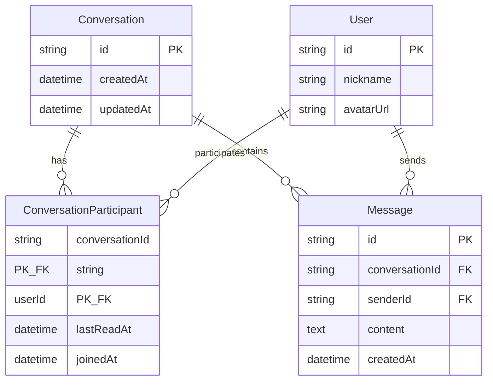
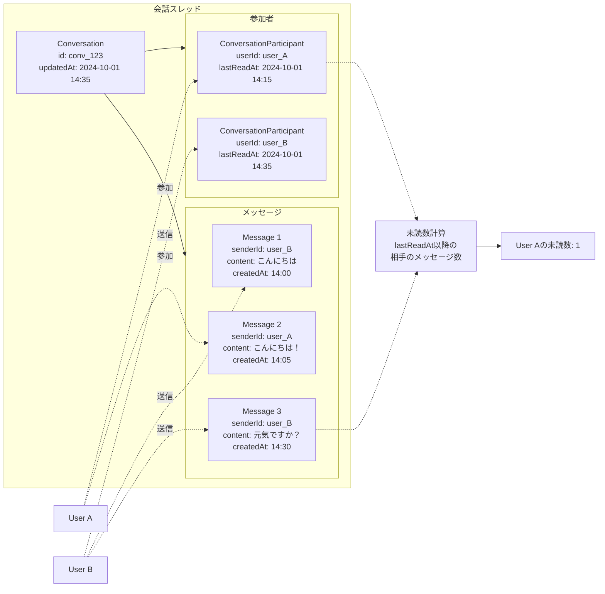
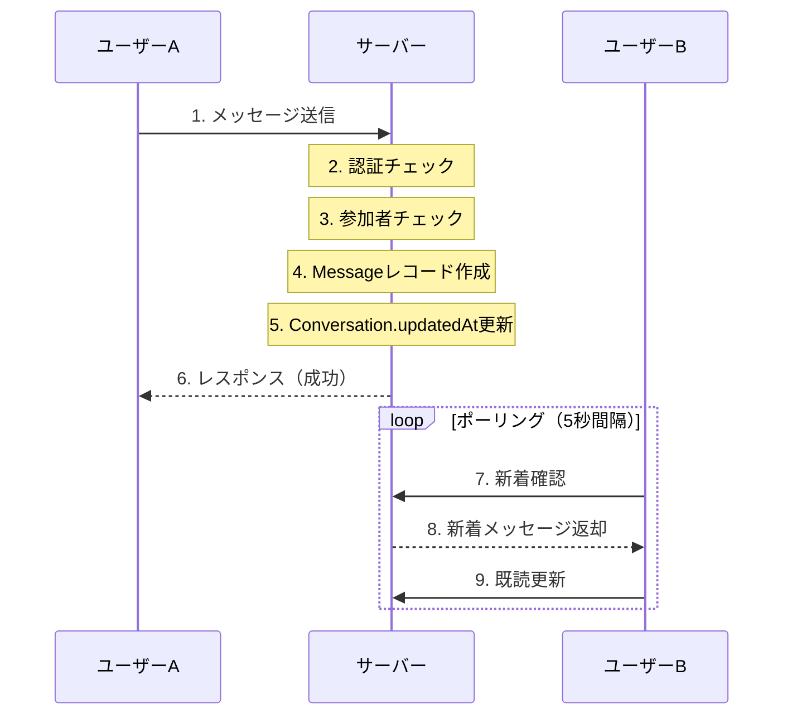
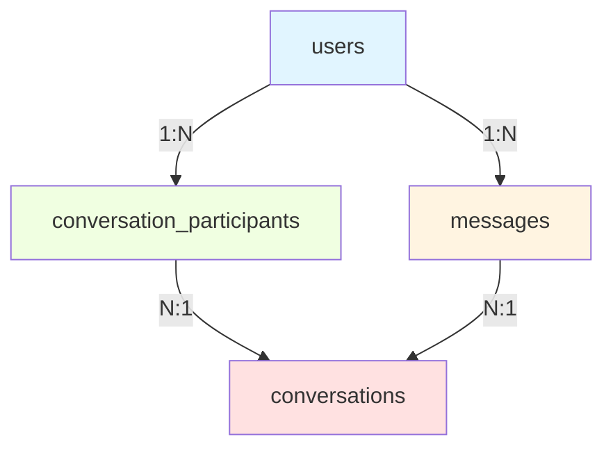
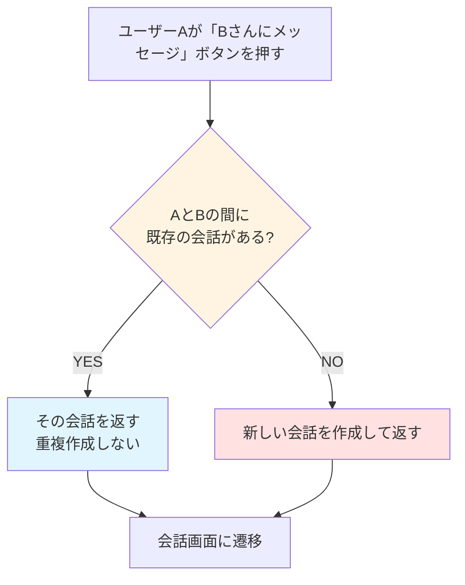
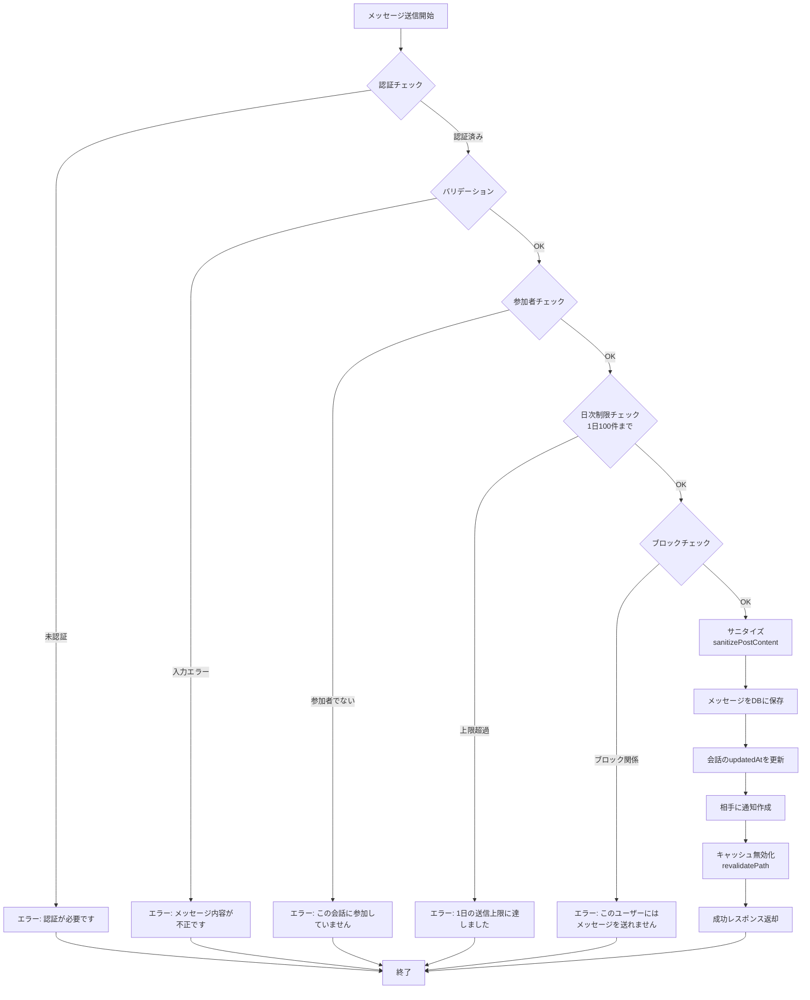
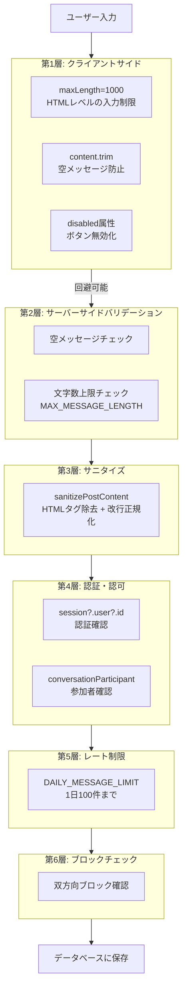

# 第14章: ダイレクトメッセージ

この章では、BON-LOGのダイレクトメッセージ（DM）機能を実装します。ユーザー同士がプライベートなメッセージをやり取りできる仕組みを構築します。

> **この章の全体像**: LINEやTwitterのDMのように、ユーザーが1対1でプライベートなメッセージをやり取りできる機能を、データベース設計からUI実装まで一貫して作り上げます。

---

## 14.0 実習手順の進め方と手順マップ

手順に沿って進めると、**どのファイルに何を入力し、何を確認すればよいか** が分かります。形式の説明は [チュートリアルの進め方](./00_how_to_follow_steps.md) を参照してください。

| 手順 | 主な対象ファイル（例） | 完了時に確認すること |
|------|------------------------|------------------------|
| DM データモデル | `prisma/schema.prisma` | Conversation, Message 等が定義される |
| メッセージ送受信 | `lib/actions/message.ts` | 送信・一覧取得が動く |
| 未読管理 | `lib/actions/message.ts`, スキーマ | 未読件数・既読が更新される |
| 会話一覧・チャットUI | `app/(main)/messages/*`, コンポーネント | DM ページでやり取りができる |

各セクションで **対象ファイル**・**入力するコード（サンプルコード）**・**実行方法**・**実行するとこうなる**・**このあと変わること**・**確認方法** を確認しながら進めてください。

---

### この章で学ぶこと

- DM機能のデータベース設計（会話・参加者・メッセージの3モデル構成）
- Prismaを使ったリレーショナルデータの定義と操作
- Server Actionsによるメッセージ送受信の実装
- 未読管理の仕組みと実装パターン
- ポーリングによるリアルタイム風メッセージ更新
- チャットUIのコンポーネント設計

### 前提知識

この章を進めるにあたり、以下の知識があるとスムーズです。

| 前提知識 | 学べる章 | 重要度 |
|---------|---------|--------|
| Prismaの基本操作（CRUD） | 第3章 | 必須 |
| Server Actionsの仕組み | 第5章 | 必須 |
| 認証（NextAuth.js）の基本 | 第4章 | 必須 |
| React Hooks（useState, useEffect, useRef） | 第2章 | 必須 |
| Suspenseとローディング | 第6章 | 推奨 |

---

## 14.1 DM機能の設計

> **このセクションで学ぶこと**
> - DM機能を構成する3つのデータモデルの役割
> - なぜ「会話」と「メッセージ」を分けるのか
> - 未読管理の設計思想
> - DM機能全体のアーキテクチャ

### 14.1.1 現実世界のアナロジーで理解する

DM機能を設計する前に、LINEのトーク機能を思い浮かべてみましょう。

| LINEのトーク画面 | BON-LOGのDM |
|---|---|
| トークルーム一覧 | 会話一覧ページ (`/messages`) |
| Aさんとのトーク | `Conversation`（会話） |
| 「こんにちは」(Aさん) | `Message`（メッセージ） |
| 「元気？」(自分) | `Message`（メッセージ） |
| 未読バッジ「3」 | `ConversationParticipant.lastReadAt` で計算 |
| Bさんとのトーク | `Conversation`（会話） |

LINEのトークルーム = Conversation、トークルームに参加している人 = ConversationParticipant、1つ1つのメッセージ = Message という対応関係です。

### 14.1.2 データモデル設計

DMシステムは **3つのモデル** で構成されます。



それぞれのモデルの役割を詳しく見ていきましょう。

| モデル | 役割 | 現実世界での例え |
|-------|------|----------------|
| **Conversation** | 会話（チャットルーム）。2人のユーザー間の会話空間。 | LINEのトークルーム |
| **ConversationParticipant** | 会話の参加者情報と未読管理。誰がいつまで読んだかを記録。 | トークルームのメンバー + 既読情報 |
| **Message** | 個々のメッセージ。誰がいつ何を送ったかを記録。 | トーク内の1つ1つの吹き出し |

会話スレッドのデータフローは以下のように構成されます。



### 14.1.3 なぜ3モデル構成なのか？

「メッセージにsenderIdとrecipientIdを持たせれば2モデルで済むのでは？」と思うかもしれません。しかし、3モデル構成にする理由があります。

| 構成 | モデル | メリット/デメリット |
|---|---|---|
| 2モデル構成（シンプルだが拡張性が低い） | `Message: { senderId, recipientId, content }` | 問題1: 会話一覧の取得が複雑（GROUP BYが必要） / 問題2: 未読管理が困難 / 問題3: グループチャットに拡張できない |
| 3モデル構成（推奨） | `Conversation` + `ConversationParticipant` + `Message` | 会話一覧はConversationを取得するだけ / 未読管理はConversationParticipant.lastReadAtで実現 / グループチャットへの拡張も容易（参加者を増やすだけ） |

### 14.1.4 メッセージフロー

ユーザーAがユーザーBにメッセージを送る流れを見てみましょう。



### 14.1.5 主要機能一覧

この章で実装する機能の全体像です。

| 機能 | 説明 | 実装セクション |
|------|------|--------------|
| 1対1のDM | 2人のユーザー間でメッセージをやり取り | 14.2 - 14.4 |
| 会話の作成・取得 | 既存の会話を検索、なければ新規作成 | 14.3 |
| メッセージの送受信 | テキストメッセージの送信と取得 | 14.4 |
| 未読管理 | lastReadAtを使った未読数の計算 | 14.3, 14.4 |
| 会話一覧 | 最新メッセージ順で会話を一覧表示 | 14.5 |
| メッセージスレッド表示 | チャット形式でメッセージを時系列表示 | 14.6 |
| メッセージ入力フォーム | テキスト入力とキーボードショートカット | 14.7 |
| 未読バッジ | ナビゲーションバーの未読数表示 | 14.8 |

### BON-LOGでの使用箇所

DM機能は以下のファイルで実装されています。

| ファイル | 役割 |
|---------|------|
| `prisma/schema.prisma` | `Conversation`, `ConversationParticipant`, `Message` モデルの定義 |
| `lib/actions/message.ts` | バレル再エクスポート（後方互換用）。実装は下記 2 ファイルに分割 |
| `lib/actions/message-conversations.ts` | 会話関連 Server Actions（5 関数: `getOrCreateConversation` / `getConversations` / `getConversation` / `getUnreadMessageCount` / `markAsRead`） |
| `lib/actions/message-messages.ts` | メッセージ関連 Server Actions（3 関数: `sendMessage` / `getMessages` / `deleteMessage`） |
| `app/(main)/messages/page.tsx` | 会話一覧ページ（Server Component） |
| `app/(main)/messages/[conversationId]/page.tsx` | 会話詳細ページ（Server Component） |
| `components/message/MessageList.tsx` | メッセージ一覧表示（Client Component） |
| `components/message/MessageForm.tsx` | メッセージ入力フォーム（Client Component） |
| `components/message/MessageButton.tsx` | ユーザープロフィールからDMを開始するボタン |
| `components/message/MessageBadge.tsx` | ナビゲーションバーの未読バッジ |
| `app/api/badges/route.ts` | 未読通知・未読メッセージ数のAPIエンドポイント |

### 実装しない場合の影響

DM機能を実装しない（または削除する）場合、以下の影響が生じます。

| 影響範囲 | 具体的な問題 |
|---------|------------|
| ユーザー体験 | ユーザー同士がプライベートにやり取りする手段がなくなる |
| 通知機能 | `NotificationType.message` タイプの通知が送れなくなる |
| データベース | `conversations`, `conversation_participants`, `messages` テーブルが不要になる |
| ナビゲーション | `/messages` ページへのリンクを削除する必要がある |
| 代替手段 | 公開コメント欄のみでコミュニケーションを取ることになり、プライバシーが確保できない |

<details>
<summary>理解度チェック: DM機能の設計</summary>

**Q1: なぜConversation（会話）モデルが必要なのですか？Messageモデルだけではダメですか？**

A1: Conversationモデルがないと、会話一覧を取得する際にMessageテーブルからGROUP BYで集約する必要があり、クエリが複雑になります。また、未読管理のためのlastReadAtを持つConversationParticipantの親として、Conversationが必要です。さらに、updatedAtフィールドにより、最新の会話を効率的にソートできます。

**Q2: lastReadAtを使った未読管理の仕組みを説明してください。**

A2: 各参加者のlastReadAtに「最後に会話を開いた日時」を記録します。未読数は「lastReadAt以降に相手が送ったメッセージの件数」をCOUNTすることで計算します。ユーザーが会話画面を開いたタイミングでlastReadAtを現在時刻に更新します。

**Q3: ポーリングとWebSocketの違いは何ですか？なぜポーリングを採用していますか？**

A3: ポーリングはクライアントが定期的（例：5秒間隔）にサーバーに問い合わせる方式で、WebSocketはサーバーからクライアントにリアルタイムで通知を送れる双方向通信です。ポーリングは実装が簡単で、Next.jsのServer Actionsとの相性が良いため採用しています。本格的なリアルタイム通信が必要になった場合はWebSocketへの移行を検討します。

</details>

---

## 14.2 Prismaスキーマ定義

> **このセクションで学ぶこと**
> - DM機能に必要な3つのモデル（Conversation, ConversationParticipant, Message）の定義方法
> - 各フィールドの役割とPrismaのアトリビュート（@id, @default, @map 等）の意味
> - リレーション（1対多、多対多）の設定方法
> - 複合ユニーク制約とインデックスの使い方
> - マイグレーションの実行方法

### 14.2.1 スキーマの全体像

まず、3つのモデルの関係を整理してから、実際のコードを見ていきましょう。



### 14.2.2 prisma/schema.prisma

以下は `prisma/schema.prisma` に定義されているDM関連の3つのモデルです。各行にコメントを付けて詳しく解説します。

**ファイルパス**: `prisma/schema.prisma`

```prisma
// ============================================================
// Conversation（会話）モデル
// LINEのトークルームに相当する。2人のユーザー間の会話空間を表す。
// ============================================================
model Conversation {
  // id: 一意な識別子。cuid()で自動生成される。
  // cuid()はUUIDに似た衝突しにくいIDを生成する関数
  id        String   @id @default(cuid())

  // createdAt: 会話が作成された日時。自動で現在時刻が入る
  createdAt DateTime @default(now()) @map("created_at")

  // updatedAt: 最後に更新された日時。@updatedAtにより自動更新される
  // メッセージ送信時にこの値を更新することで、最新の会話を上に表示できる
  updatedAt DateTime @updatedAt @map("updated_at")

  // participants: この会話に参加しているユーザーの一覧（1対多の関係）
  participants ConversationParticipant[]

  // messages: この会話に含まれるメッセージの一覧（1対多の関係）
  messages     Message[]

  // @@map: データベース上のテーブル名を指定
  // PrismaのモデルはPascalCase、DBテーブルはsnake_caseにするのが慣例
  @@map("conversations")
}

// ============================================================
// ConversationParticipant（会話参加者）モデル
// 「誰がどの会話に参加しているか」と「いつまで読んだか」を管理する。
// 中間テーブルの役割も果たす（User <-> Conversation の多対多関係を実現）。
// ============================================================
model ConversationParticipant {
  // conversationId: どの会話に参加しているかを示す外部キー
  conversationId String    @map("conversation_id")

  // userId: どのユーザーが参加しているかを示す外部キー
  userId         String    @map("user_id")

  // joinedAt: 参加した日時
  joinedAt       DateTime  @default(now()) @map("joined_at")

  // lastReadAt: このユーザーが最後に会話を読んだ日時
  // null = まだ一度も読んでいない（全メッセージが未読）
  // この値とMessage.createdAtを比較して未読数を計算する
  lastReadAt     DateTime? @map("last_read_at")

  // conversation: Conversationモデルへのリレーション
  // onDelete: Cascade = 会話が削除されたら参加者レコードも自動削除
  conversation Conversation @relation(fields: [conversationId], references: [id], onDelete: Cascade)

  // user: Userモデルへのリレーション
  // onDelete: Cascade = ユーザーが削除されたら参加者レコードも自動削除
  user         User         @relation(fields: [userId], references: [id], onDelete: Cascade)

  // @@id: conversationIdとuserIdの複合主キー
  // 同じ会話に同じユーザーが重複参加することを防ぎ、
  // 各参加者レコードを一意に識別する（別途idフィールドは不要）
  @@id([conversationId, userId])

  // @@index: userIdのインデックス
  // 「このユーザーが参加している会話一覧」の取得を高速化
  @@index([userId])

  // @@map: データベース上のテーブル名
  @@map("conversation_participants")
}

// ============================================================
// Message（メッセージ）モデル
// 会話内の1つ1つのメッセージを表す。LINEの吹き出し1つに相当。
// ============================================================
model Message {
  // id: メッセージの一意な識別子
  id             String   @id @default(cuid())

  // conversationId: このメッセージが属する会話の外部キー
  conversationId String   @map("conversation_id")

  // senderId: メッセージを送信したユーザーの外部キー
  senderId       String   @map("sender_id")

  // content: メッセージ本文（テキスト）
  // @db.Text はPostgreSQLのTEXT型にマッピングされ、長文に対応
  content        String   @db.Text

  // createdAt: メッセージが送信された日時
  createdAt      DateTime @default(now()) @map("created_at")

  // conversation: Conversationモデルへのリレーション
  conversation Conversation @relation(fields: [conversationId], references: [id], onDelete: Cascade)

  // sender: 送信者（Userモデル）へのリレーション
  sender       User         @relation(fields: [senderId], references: [id], onDelete: Cascade)

  // @@index: 会話IDのインデックス
  // 「特定の会話のメッセージを取得する」クエリを高速化
  @@index([conversationId])

  // @@map: データベース上のテーブル名
  @@map("messages")
}
```

> **期待される結果**: `npx prisma db push` を実行すると、PostgreSQLに `conversations`, `conversation_participants`, `messages` の3つのテーブルが作成されます。

> **このスキーマがないと**: `lib/actions/message.ts` が `prisma.conversation` などを参照しているためビルドが失敗します。TypeScriptの型チェックで `Property 'conversation' does not exist on type 'PrismaClient'` エラーが発生します。

### 14.2.3 @map と @@map の違い

初心者が混乱しやすいポイントを整理します。

```
@map("column_name")   -> フィールド（列）名のマッピング
                        PrismaではcamelCase、DBではsnake_case

@@map("table_name")   -> モデル（テーブル）名のマッピング
                        PrismaではPascalCase、DBではsnake_case

例:
  model ConversationParticipant {    <- Prisma上のモデル名
    conversationId String @map("conversation_id")  <- DB上の列名
    @@map("conversation_participants")  <- DB上のテーブル名
  }

TypeScriptコードでは:
  prisma.conversationParticipant.findMany(...)  <- camelCase
  // -> SQL: SELECT * FROM "conversation_participants"  <- snake_case
```

### 14.2.4 複合主キーの理解

```
@@id([conversationId, userId])
```

これは何を実現する？ `@@id` は複合主キー（composite primary key）を定義します。`@@unique` と似ていますが、主キーとしてレコードを一意に識別する役割を持ちます。別途 `id` フィールドを用意する必要がなく、2つのフィールドの組み合わせがそのまま主キーになります。

これは何を防ぐ？

| conversation_id | user_id | 結果 |
|---|---|---|
| conv_abc | user_1 | OK（登録成功） |
| conv_abc | user_2 | OK（登録成功、別のユーザー） |
| conv_abc | user_1 | NG（エラー！同じ組み合わせは不可） |
| conv_def | user_1 | OK（登録成功、別の会話） |

### 14.2.5 マイグレーションの実行

スキーマを定義したら、データベースに反映します。

```bash
# 開発環境: スキーマを直接DBに反映（マイグレーションファイルは作成されない）
npx prisma db push

# Prismaクライアントを再生成（型定義を更新する）
npx prisma generate
```

> **補足**: `npx prisma db push` は開発中の手軽な方法です。本番環境では `npx prisma migrate dev --name add_dm_models` を使って、マイグレーションファイルを作成・管理しましょう。

### よくあるトラブルと解決法

| トラブル | 原因 | 解決法 |
|---------|------|--------|
| `Foreign key constraint failed` | 参照先のUserが存在しない | テストデータでUserを先に作成してからメッセージを作成する |
| `Unique constraint failed` | 同じユーザーが同じ会話に2回参加しようとした | `@@id([conversationId, userId])` による重複防止が正しく動作している。`upsert`や事前チェックを使用する |
| `Unknown model "ConversationParticipant"` | Prismaクライアントが古い | `npx prisma generate` を再実行する |
| `Column not found` | マイグレーションが未適用 | `npx prisma db push` を実行する |

<details>
<summary>理解度チェック: Prismaスキーマ定義</summary>

**Q1: `@updatedAt` アトリビュートの役割は何ですか？**

A1: `@updatedAt` を付けたフィールドは、そのレコードが `update` された際に自動的に現在時刻に更新されます。ただし、メッセージ送信時にConversationの `updatedAt` を更新する場合は、明示的に `update` クエリを実行する必要があります（Messageの作成はConversationの更新とはみなされないため）。

**Q2: `@@index([conversationId])` はなぜ必要ですか？**

A2: メッセージ一覧を取得する際、「特定の会話のメッセージを取得する」というクエリが頻繁に実行されます。このインデックスがあると、データベースはテーブル全体をスキャンせずに対象会話のメッセージを直接特定できます。インデックスがないと、データ量が増えるとパフォーマンスが大幅に低下します。

**Q3: `onDelete: Cascade` を設定しないとどうなりますか？**

A3: 親レコード（例：User）を削除しようとした際に、子レコード（例：Message）が存在すると外部キー制約違反でエラーになります。Cascadeを設定すると、親レコードの削除時に子レコードも自動的に削除されます。

</details>

---

## 14.3 会話の作成・取得（Server Actions）

> **このセクションで学ぶこと**
> - 「既存の会話があれば取得、なければ新規作成」パターンの実装
> - Prismaの `findFirst` と `create` の使い分け
> - ユーザーの会話一覧を効率的に取得する方法
> - 未読数の計算ロジック
> - ブロック関係のチェック

### 14.3.1 getOrCreateConversation の設計思想

ユーザーAがユーザーBにDMを送る際、以下のフローが必要です。



これは「Get or Create」パターンと呼ばれ、データベース操作でよく使われるパターンです。

### 14.3.2 lib/actions/message-conversations.ts（会話管理部分）

実際のコードでは、会話の作成・取得処理は **`lib/actions/message-conversations.ts`** に Server Action として実装されています（メッセージ送受信・削除は `lib/actions/message-messages.ts`）。後方互換のため `lib/actions/message.ts` は両者を再エクスポートする barrel として残しています。

**ファイルパス**: `lib/actions/message-conversations.ts`（barrel: `lib/actions/message.ts`）

```typescript
'use server'

import { prisma } from '@/lib/db'
import { NotificationType } from '@prisma/client'
import { auth } from '@/lib/auth'
import { revalidatePath } from 'next/cache'
import {
  MAX_MESSAGE_LENGTH,
  DAILY_MESSAGE_LIMIT,
  MESSAGES_PAGE_LIMIT,
} from '@/lib/constants/limits'
import { ERR_AUTH_REQUIRED } from '@/lib/constants/errors'
import { getStartOfToday } from '@/lib/utils'
import { sanitizePostContent } from '@/lib/sanitize'

// ============================================================
// getOrCreateConversation:
// 指定したユーザーとの会話を取得する。存在しなければ新規作成する。
// いわゆる「Get or Create」パターン。
//
// ポイント: 引数は targetUserId のみ。
// 現在のユーザーはセッションから自動的に取得するため、
// 呼び出し側で自分のIDを渡す必要がない。
// ============================================================
export async function getOrCreateConversation(targetUserId: string) {
  // ステップ1: 認証チェック
  const session = await auth()
  if (!session?.user?.id) {
    return { error: ERR_AUTH_REQUIRED }
  }

  // 自分自身へのメッセージを防止
  if (session.user.id === targetUserId) {
    return { error: '自分自身にメッセージを送ることはできません' }
  }

  // ステップ2: ブロック関係のチェック
  // どちらか一方でもブロックしていればメッセージ不可
  const blocked = await prisma.block.findFirst({
    where: {
      OR: [
        { blockerId: session.user.id, blockedId: targetUserId },
        { blockerId: targetUserId, blockedId: session.user.id },
      ],
    },
  })

  if (blocked) {
    return { error: 'このユーザーにはメッセージを送れません' }
  }

  // ステップ3: 既存の会話を検索する
  // AND条件で「自分と相手の両方が参加している会話」を探す
  const existingConversation = await prisma.conversation.findFirst({
    where: {
      AND: [
        { participants: { some: { userId: session.user.id } } },
        { participants: { some: { userId: targetUserId } } },
      ],
    },
  })

  // ステップ4: 既存の会話が見つかった場合はそのIDを返す
  if (existingConversation) {
    return { conversationId: existingConversation.id }
  }

  // ステップ5: 既存の会話がない場合は新規作成する
  // participants.create でネスト作成
  const conversation = await prisma.conversation.create({
    data: {
      participants: {
        create: [
          { userId: session.user.id },
          { userId: targetUserId },
        ],
      },
    },
  })

  return { conversationId: conversation.id }
}
```

> **期待される結果**: `getOrCreateConversation('user_B_id')` を呼び出すと、既存の会話IDまたは新規作成された会話IDが `{ conversationId: "cXXXXXXX" }` の形式で返されます。

> **この関数がないと**: ユーザープロフィールの「メッセージ」ボタンが機能しなくなり、DM画面に遷移できません。

### 14.3.3 getConversations: 会話一覧の取得

**ファイルパス**: `lib/actions/message.ts`（続き）

```typescript
export async function getConversations() {
  const session = await auth()
  if (!session?.user?.id) {
    return { conversations: [] }
  }

  // 自分が参加している会話を取得
  const conversations = await prisma.conversation.findMany({
    where: {
      participants: { some: { userId: session.user.id } },
    },
    include: {
      // 参加者情報（相手のニックネームやアバターを表示するため）
      participants: {
        include: {
          user: {
            select: { id: true, nickname: true, avatarUrl: true },
          },
        },
      },
      // 最新メッセージ1件（会話一覧でプレビューとして表示する）
      messages: {
        orderBy: { createdAt: 'desc' },
        take: 1,
      },
    },
    orderBy: { updatedAt: 'desc' },
  })

  // 各会話のデータを整形する
  const conversationsWithDetails = conversations.map((conv) => {
    const currentUserParticipant = conv.participants.find(
      (p) => p.userId === session.user.id
    )
    const otherParticipant = conv.participants.find(
      (p) => p.userId !== session.user.id
    )

    const lastMessage = conv.messages[0]

    // 未読判定: lastReadAtより後に作成されたメッセージがあれば未読
    const unreadCount = lastMessage && currentUserParticipant?.lastReadAt
      ? (lastMessage.createdAt > currentUserParticipant.lastReadAt ? 1 : 0)
      : (lastMessage ? 1 : 0)

    return {
      id: conv.id,
      updatedAt: conv.updatedAt,
      otherUser: otherParticipant?.user || null,
      lastMessage: lastMessage || null,
      hasUnread: unreadCount > 0,
    }
  })

  return { conversations: conversationsWithDetails }
}
```

> **期待される結果**: 自分が参加している会話の一覧が、最終更新日時の降順で返されます。各会話には相手のユーザー情報、最新メッセージ、未読フラグが含まれます。

### 14.3.4 getConversation: 会話の詳細取得

**ファイルパス**: `lib/actions/message.ts`（続き）

```typescript
export async function getConversation(conversationId: string) {
  const session = await auth()
  if (!session?.user?.id) {
    return { error: ERR_AUTH_REQUIRED }
  }

  // 参加者チェック（複合主キーで検索）
  const participant = await prisma.conversationParticipant.findUnique({
    where: {
      conversationId_userId: {
        conversationId,
        userId: session.user.id,
      },
    },
  })

  if (!participant) {
    return { error: 'この会話にアクセスする権限がありません' }
  }

  const conversation = await prisma.conversation.findUnique({
    where: { id: conversationId },
    include: {
      participants: {
        include: {
          user: {
            select: { id: true, nickname: true, avatarUrl: true },
          },
        },
      },
    },
  })

  if (!conversation) {
    return { error: '会話が見つかりません' }
  }

  const otherParticipant = conversation.participants.find(
    (p) => p.userId !== session.user.id
  )

  return {
    conversation: {
      id: conversation.id,
      otherUser: otherParticipant?.user || null,
    },
  }
}
```

### 14.3.5 未読数計算の仕組み

未読数の計算ロジックをもう少し詳しく見てみましょう。

| 時刻 | メッセージ | 送信者 | 備考 |
|---|---|---|---|
| 10:00 | 「おはようございます」 | Bさん | |
| 10:05 | 「おはよう！」 | Aさん（自分） | |
| 10:10 | 「今日の盆栽の様子」 | Bさん | |
| 10:15 | _(Aさんが会話を開く)_ | - | lastReadAt = 10:15に更新 |
| 10:20 | 「新しい芽が出たよ」 | Bさん | |
| 10:30 | 「すごい！」 | Bさん | |

```
Aさんの未読数の計算:
  対象 = createdAt > lastReadAt(10:15) AND senderId != Aさん
  -> 10:20「新しい芽が出たよ」（Bさん）  <- カウント対象
  -> 10:30「すごい！」（Bさん）          <- カウント対象

  未読数 = 2
```

<details>
<summary>理解度チェック: 会話の作成・取得</summary>

**Q1: `getOrCreateConversation` で既存会話を検索する際、なぜ `AND` + `some` の組み合わせを使うのですか？**

A1: `AND` 条件で「自分が参加している」かつ「相手が参加している」会話を探します。`some` は「参加者の中に条件を満たすものが1つ以上ある」という意味です。`participants: { some: { userId: session.user.id } }` と `participants: { some: { userId: targetUserId } }` を `AND` で組み合わせることで、「両方のユーザーが参加している会話」を正確に特定できます。

**Q2: なぜブロックチェックは双方向で行うのですか？**

A2: `OR` 条件で「自分が相手をブロックしている」または「相手が自分をブロックしている」の両方をチェックします。どちらか一方でもブロック関係がある場合、メッセージのやり取りは不可とするのがプライバシー保護の基本方針です。

</details>

---

## 14.4 メッセージの送受信

> **このセクションで学ぶこと**
> - Server Actionsを使ったメッセージ送信処理の実装
> - 入力バリデーションとサニタイズ処理
> - 認証チェックと参加者チェックのセキュリティ対策
> - メッセージ一覧の取得（カーソルベースページネーション）
> - 既読処理（markAsRead）の実装
> - メッセージの削除（deleteMessage）の実装

### 14.4.1 Server Actions の全体像

このセクションで実装するServer Actionsは以下の4つです。

```
lib/actions/message.ts
├── sendMessage()         <- メッセージを送信する
├── getMessages()         <- メッセージ一覧を取得する
├── markAsRead()          <- 会話を既読にする
└── deleteMessage()       <- メッセージを削除する
```

`sendMessage()` の処理フロー:



### 14.4.2 sendMessage: メッセージ送信

**ファイルパス**: `lib/actions/message.ts`（続き）

```typescript
export async function sendMessage(conversationId: string, content: string) {
  // ステップ1: 認証チェック
  const session = await auth()
  if (!session?.user?.id) {
    return { error: ERR_AUTH_REQUIRED }
  }

  // ステップ2: バリデーション
  if (!content || content.trim().length === 0) {
    return { error: 'メッセージを入力してください' }
  }

  if (content.length > MAX_MESSAGE_LENGTH) {
    return { error: `メッセージは${MAX_MESSAGE_LENGTH}文字以内で入力してください` }
  }

  // ステップ3: 参加者チェック
  // conversationId_userId は @@id で定義した複合主キーを使った検索
  const participant = await prisma.conversationParticipant.findUnique({
    where: {
      conversationId_userId: {
        conversationId,
        userId: session.user.id,
      },
    },
  })

  if (!participant) {
    return { error: 'この会話にアクセスする権限がありません' }
  }

  // ステップ4: 日次制限チェック（スパム対策）
  const today = getStartOfToday()

  const todayMessageCount = await prisma.message.count({
    where: {
      senderId: session.user.id,
      createdAt: { gte: today },
    },
  })

  if (todayMessageCount >= DAILY_MESSAGE_LIMIT) {
    return { error: '1日のメッセージ送信上限に達しました' }
  }

  // ステップ5: ブロックチェック（送信時にも再チェック）
  // 会話作成後にブロックされた可能性があるため
  const otherParticipant = await prisma.conversationParticipant.findFirst({
    where: {
      conversationId,
      userId: { not: session.user.id },
    },
  })

  if (otherParticipant) {
    const blocked = await prisma.block.findFirst({
      where: {
        OR: [
          { blockerId: session.user.id, blockedId: otherParticipant.userId },
          { blockerId: otherParticipant.userId, blockedId: session.user.id },
        ],
      },
    })

    if (blocked) {
      return { error: 'このユーザーにはメッセージを送れません' }
    }
  }

  // ステップ6: サニタイズ + メッセージ保存
  const sanitizedContent = sanitizePostContent(content)

  const message = await prisma.message.create({
    data: {
      conversationId,
      senderId: session.user.id,
      content: sanitizedContent,
    },
    include: {
      sender: {
        select: { id: true, nickname: true, avatarUrl: true },
      },
    },
  })

  // ステップ7: 会話のupdatedAtを更新
  await prisma.conversation.update({
    where: { id: conversationId },
    data: { updatedAt: new Date() },
  })

  // ステップ8: 相手に通知を作成
  if (otherParticipant) {
    await prisma.notification.create({
      data: {
        userId: otherParticipant.userId,
        actorId: session.user.id,
        type: 'message' as NotificationType,
      },
    })
  }

  // ステップ9: キャッシュ無効化
  revalidatePath(`/messages/${conversationId}`)
  revalidatePath('/messages')

  return { success: true, message }
}
```

> **期待される結果**: メッセージが正常に保存されると `{ success: true, message: { id, content, sender, ... } }` が返されます。相手には通知が作成され、会話一覧の並び順も更新されます。

> **この関数がないと**: DM機能のコア機能であるメッセージ送信ができなくなります。

### 14.4.3 getMessages: メッセージ一覧取得

**ファイルパス**: `lib/actions/message.ts`（続き）

```typescript
export async function getMessages(
  conversationId: string,
  cursor?: string,
  limit = MESSAGES_PAGE_LIMIT
) {
  const session = await auth()
  if (!session?.user?.id) {
    return { error: ERR_AUTH_REQUIRED }
  }

  // 参加者チェック
  const participant = await prisma.conversationParticipant.findUnique({
    where: {
      conversationId_userId: {
        conversationId,
        userId: session.user.id,
      },
    },
  })

  if (!participant) {
    return { error: 'この会話にアクセスする権限がありません' }
  }

  // メッセージ取得（カーソルページネーション）
  // 新しい順で取得して、後で逆順にする
  const messages = await prisma.message.findMany({
    where: { conversationId },
    include: {
      sender: {
        select: { id: true, nickname: true, avatarUrl: true },
      },
    },
    orderBy: { createdAt: 'desc' },
    take: limit,
    ...(cursor && {
      cursor: { id: cursor },
      skip: 1,
    }),
  })

  // 既読時刻を更新（メッセージ取得 = 閲覧したとみなす）
  await prisma.conversationParticipant.update({
    where: {
      conversationId_userId: {
        conversationId,
        userId: session.user.id,
      },
    },
    data: { lastReadAt: new Date() },
  })

  return {
    // 古い順に並べ替えて返す（チャットUIでは上が古く下が新しい）
    messages: messages.reverse(),
    // 次のページのカーソル
    nextCursor: messages.length === limit ? messages[0]?.id : undefined,
    // 現在のユーザーID（自分のメッセージかどうかの判定に使用）
    currentUserId: session.user.id,
  }
}
```

> **なぜ `desc` で取得して `reverse()` するのか**: DBから「最新の50件」を取得したいため `orderBy: { createdAt: 'desc' }` で新しい順にソートして `take: 50` で取得します。しかし、チャット画面では上が古く下が新しい並び順で表示したいので、取得後に `reverse()` で逆順にします。

### 14.4.4 markAsRead: 既読処理

**ファイルパス**: `lib/actions/message.ts`（続き）

```typescript
export async function markAsRead(conversationId: string) {
  const session = await auth()
  if (!session?.user?.id) {
    return { error: ERR_AUTH_REQUIRED }
  }

  await prisma.conversationParticipant.update({
    where: {
      conversationId_userId: {
        conversationId,
        userId: session.user.id,
      },
    },
    data: { lastReadAt: new Date() },
  })

  revalidatePath('/messages')
  return { success: true }
}
```

### 14.4.5 deleteMessage: メッセージ削除

**ファイルパス**: `lib/actions/message.ts`（続き）

```typescript
export async function deleteMessage(messageId: string) {
  const session = await auth()
  if (!session?.user?.id) {
    return { error: ERR_AUTH_REQUIRED }
  }

  const message = await prisma.message.findUnique({
    where: { id: messageId },
    select: { id: true, senderId: true, conversationId: true },
  })

  if (!message) {
    return { error: 'メッセージが見つかりません' }
  }

  // 自分が送信したメッセージのみ削除可能
  if (message.senderId !== session.user.id) {
    return { error: 'このメッセージを削除する権限がありません' }
  }

  await prisma.message.delete({
    where: { id: messageId },
  })

  revalidatePath(`/messages/${message.conversationId}`)
  revalidatePath('/messages')
  return { success: true }
}
```

### 14.4.6 getUnreadMessageCount: 未読メッセージ数取得

ナビゲーションバーのバッジ表示に使用する関数です。

**ファイルパス**: `lib/actions/message.ts`（続き）

```typescript
export async function getUnreadMessageCount() {
  const session = await auth()
  if (!session?.user?.id) {
    return { count: 0 }
  }

  // 自分が参加しているすべての会話と最新メッセージを取得
  const participants = await prisma.conversationParticipant.findMany({
    where: { userId: session.user.id },
    include: {
      conversation: {
        include: {
          messages: {
            orderBy: { createdAt: 'desc' },
            take: 1,
          },
        },
      },
    },
  })

  let unreadCount = 0

  for (const participant of participants) {
    const lastMessage = participant.conversation.messages[0]

    if (lastMessage) {
      // 自分が送ったメッセージは未読カウントしない
      if (lastMessage.senderId === session.user.id) {
        continue
      }

      // 既読時刻より後のメッセージがあれば未読
      if (!participant.lastReadAt || lastMessage.createdAt > participant.lastReadAt) {
        unreadCount++
      }
    }
  }

  return { count: unreadCount }
}
```

> **期待される結果**: 未読メッセージがある会話の数が返されます。個々のメッセージ数ではなく、未読がある「会話の数」をカウントしている点に注目してください。

### BON-LOGでのServer Actions使用箇所

| 関数 | 呼び出し元 | タイミング |
|------|----------|----------|
| `getOrCreateConversation` | `components/message/MessageButton.tsx` | ユーザープロフィールの「メッセージ」ボタン押下時 |
| `sendMessage` | `components/message/MessageForm.tsx` | フォーム送信時（送信ボタン or Ctrl+Enter） |
| `getConversations` | `app/(main)/messages/page.tsx` | 会話一覧ページのレンダリング時 |
| `getConversation` | `app/(main)/messages/[conversationId]/page.tsx` | 会話詳細ページのレンダリング時 |
| `getMessages` | `app/(main)/messages/[conversationId]/page.tsx` | 会話詳細ページの初期データ取得時 |
| `markAsRead` | `getMessages` 内で自動的に呼ばれる（副作用） | メッセージ取得時 |
| `deleteMessage` | （将来的な削除機能のために定義済み） | - |
| `getUnreadMessageCount` | `components/message/MessageBadge.tsx` | ナビゲーションバーの未読バッジ表示 |

### 定数値

`lib/constants/limits.ts` で定義されている、メッセージ関連の定数は以下の通りです。

| 定数名 | 値 | 用途 |
|--------|-----|------|
| `MAX_MESSAGE_LENGTH` | 1000 | メッセージの最大文字数 |
| `DAILY_MESSAGE_LIMIT` | 100 | 1日のメッセージ送信上限 |
| `MESSAGES_PAGE_LIMIT` | 50 | メッセージ一覧の1ページあたりの取得件数 |
| `REFETCH_INTERVAL_MS` | 30000 | 未読バッジのポーリング間隔（30秒） |
| `BADGE_OVERFLOW_THRESHOLD` | 99 | バッジの最大表示数（99+） |

<details>
<summary>理解度チェック: メッセージの送受信</summary>

**Q1: なぜメッセージを「新しい順（desc）」で取得してから `reverse()` するのですか？**

A1: データベースから「最新の50件」を取得したいため、`orderBy: { createdAt: 'desc' }` で新しい順にソートして `take: 50` で取得します。しかし、チャット画面では上が古く下が新しい並び順で表示したいので、取得後に `reverse()` で逆順に並べ替えます。もし最初から `asc` で取得すると、「最も古い50件」が返ってしまい、最新のメッセージが取得できません。

**Q2: `sendMessage` で `sanitizePostContent` を使う理由は何ですか？**

A2: ユーザーが入力したテキストにHTMLタグが含まれている場合、XSS攻撃のリスクがあります。`sanitizePostContent` はHTMLタグを除去し、過度な改行を正規化し、前後の空白を除去してから保存します。これにより、悪意のあるスクリプトがデータベースに保存されるのを防ぎます。

**Q3: なぜ `sendMessage` で送信時にもブロックチェックを行うのですか？**

A3: 会話を作成した後に相手がブロックした可能性があるためです。`getOrCreateConversation` でブロックチェックを行っても、その後に相手がブロック操作を行うかもしれません。送信時にも再度チェックすることで、ブロック後のメッセージ送信を確実に防止します。

</details>

---

## 14.5 会話一覧ページ

> **このセクションで学ぶこと**
> - Server Componentとして会話一覧ページを作成する方法
> - Server Componentで直接データ取得してレンダリングするパターン
> - 未読インジケーター（丸いドット）の表示方法
> - 相対時刻表示（「3分前」のような表示）の実装

### 14.5.1 ファイル構成

```
app/(main)/messages/
├── page.tsx                    <- 会話一覧ページ（Server Component）
└── [conversationId]/
    └── page.tsx                <- メッセージスレッドページ（14.6で実装）

components/message/
├── MessageList.tsx             <- メッセージ一覧コンポーネント（Client Component）
├── MessageForm.tsx             <- メッセージ入力フォーム（Client Component）
├── MessageButton.tsx           <- メッセージ送信ボタン（ユーザープロフィールから）
└── MessageBadge.tsx            <- 未読バッジコンポーネント
```

### 14.5.2 app/(main)/messages/page.tsx

実際の実装では、認証済みユーザーのみのアクセス制御はmiddlewareで行っており、ページコンポーネントはServer Componentとして会話一覧を直接取得して描画します。

**ファイルパス**: `app/(main)/messages/page.tsx`

```typescript
import Link from 'next/link'
import Image from 'next/image'
import { getConversations } from '@/lib/actions/message'
import { formatDistanceToNow } from 'date-fns'
import { ja } from 'date-fns/locale'
import { MessageSquare as MessageSquareIcon } from 'lucide-react'

// 会話データの型定義
type Conversation = {
  id: string
  updatedAt: Date
  otherUser?: {
    id: string
    nickname: string | null
    avatarUrl: string | null
  } | null
  lastMessage?: {
    content: string
  } | null
  hasUnread: boolean
}

// ページのメタデータ
export const metadata = {
  title: 'メッセージ - BON-LOG',
}

// Server Component: 直接 getConversations() を呼び出してデータ取得
export default async function MessagesPage() {
  const { conversations } = await getConversations()

  return (
    <div className="max-w-2xl mx-auto">
      <div className="bg-card rounded-lg border">
        {/* ヘッダー */}
        <div className="p-4 border-b">
          <h1 className="text-xl font-bold">メッセージ</h1>
        </div>

        {/* 会話一覧 */}
        {conversations.length === 0 ? (
          // 会話がない場合の空状態表示
          <div className="p-8 text-center">
            <MessageSquareIcon className="w-12 h-12 text-muted-foreground mx-auto mb-4" />
            <p className="text-muted-foreground mb-4">
              まだメッセージはありません
            </p>
            <p className="text-sm text-muted-foreground">
              ユーザーのプロフィールページから<br />
              メッセージを送ることができます
            </p>
          </div>
        ) : (
          // 会話リスト表示
          <div className="divide-y">
            {conversations.map((conversation: Conversation) => (
              <Link
                key={conversation.id}
                href={`/messages/${conversation.id}`}
                className="flex items-center gap-3 p-4 hover:bg-muted/50 transition-colors"
              >
                {/* アバター画像 */}
                {conversation.otherUser?.avatarUrl ? (
                  <Image
                    src={conversation.otherUser.avatarUrl}
                    alt={conversation.otherUser.nickname || ''}
                    width={48}
                    height={48}
                    className="rounded-full"
                  />
                ) : (
                  <div className="w-12 h-12 bg-muted rounded-full flex items-center justify-center">
                    <span className="text-lg text-muted-foreground">
                      {conversation.otherUser?.nickname?.charAt(0) || '?'}
                    </span>
                  </div>
                )}

                {/* 会話情報 */}
                <div className="flex-1 min-w-0">
                  <div className="flex items-center justify-between gap-2">
                    <span className="font-medium truncate">
                      {conversation.otherUser?.nickname || '削除されたユーザー'}
                    </span>
                    <span className="text-xs text-muted-foreground flex-shrink-0">
                      {formatDistanceToNow(new Date(conversation.updatedAt), {
                        addSuffix: true,
                        locale: ja,
                      })}
                    </span>
                  </div>

                  <div className="flex items-center gap-2">
                    <p className="text-sm text-muted-foreground truncate flex-1">
                      {conversation.lastMessage?.content || 'メッセージなし'}
                    </p>
                    {/* 未読インジケーター（丸いドット） */}
                    {conversation.hasUnread && (
                      <span className="w-2.5 h-2.5 bg-primary rounded-full flex-shrink-0" />
                    )}
                  </div>
                </div>
              </Link>
            ))}
          </div>
        )}
      </div>
    </div>
  )
}
```

> **期待される結果**: `/messages` にアクセスすると、自分が参加している会話の一覧が表示されます。各会話には相手のアバター、ニックネーム、最新メッセージのプレビュー、相対時刻（「3分前」など）、未読ドットが表示されます。会話がない場合はメッセージアイコンと案内テキストが表示されます。

> **この実装がないと**: ユーザーが会話一覧を閲覧できず、既存の会話にアクセスする手段がなくなります。

<details>
<summary>理解度チェック: 会話一覧ページ</summary>

**Q1: なぜ会話一覧ページをServer Componentとして実装しているのですか？**

A1: Server Componentでは `async/await` で直接 `getConversations()` を呼び出してデータを取得でき、`useState` や `useEffect` が不要なため、コードがシンプルになります。認証チェックはmiddlewareが担当するため、ページ内でのリダイレクト処理も不要です。

**Q2: `formatDistanceToNow` はどのような表示を返しますか？**

A2: 現在時刻との差分を人間が読みやすい形で返します。例えば: `1分前`、`3分前`、`1時間前`、`2日前`、`1ヶ月前` など。`locale: ja` を指定することで日本語で表示されます。

</details>

---

## 14.6 メッセージスレッド表示

> **このセクションで学ぶこと**
> - メッセージスレッドページの構成（ヘッダー + メッセージ一覧 + 入力フォーム）
> - Dynamic Route（`[conversationId]`）を使った個別会話ページの実装
> - `Promise.all` による並列データ取得
> - 自動スクロール（新着メッセージ時に最下部へスクロール）
> - メッセージの吹き出しUI（自分/相手の区別、アバター表示、タイムスタンプ）

### 14.6.1 app/(main)/messages/[conversationId]/page.tsx

会話情報とメッセージを `Promise.all` で並列取得し、`MessageList` と `MessageForm` を使って描画します。

**ファイルパス**: `app/(main)/messages/[conversationId]/page.tsx`

```typescript
import { redirect, notFound } from 'next/navigation'
import Link from 'next/link'
import { ROUTE_LOGIN } from '@/lib/constants/routes'
import Image from 'next/image'
import { auth } from '@/lib/auth'
import { getConversation, getMessages } from '@/lib/actions/message'
import { MessageList } from '@/components/message/MessageList'
import { MessageForm } from '@/components/message/MessageForm'

// Next.js 15以降: paramsはPromiseとして渡される
interface ConversationPageProps {
  params: Promise<{ conversationId: string }>
}

// 動的メタデータ: 相手ユーザー名をタイトルに含める
export async function generateMetadata({ params }: ConversationPageProps) {
  const { conversationId } = await params
  const result = await getConversation(conversationId)

  if ('error' in result || !result.conversation) {
    return { title: 'メッセージ - BON-LOG' }
  }

  return {
    title: `${result.conversation.otherUser?.nickname || 'ユーザー'}とのメッセージ - BON-LOG`,
  }
}

export default async function ConversationPage({ params }: ConversationPageProps) {
  const session = await auth()
  if (!session?.user?.id) {
    redirect(ROUTE_LOGIN)
  }

  const { conversationId } = await params

  // 会話情報とメッセージを並列で取得（パフォーマンス最適化）
  const [conversationResult, messagesResult] = await Promise.all([
    getConversation(conversationId),
    getMessages(conversationId),
  ])

  if ('error' in conversationResult || !conversationResult.conversation) {
    notFound()
  }

  if ('error' in messagesResult) {
    notFound()
  }

  const { conversation } = conversationResult
  const { messages, currentUserId } = messagesResult

  return (
    <div className="max-w-2xl mx-auto h-[calc(100vh-120px)] flex flex-col">
      <div className="bg-card rounded-lg border flex flex-col h-full">
        {/* ヘッダー - 戻るボタンと相手ユーザー情報 */}
        <div className="flex items-center gap-3 p-4 border-b">
          <Link
            href="/messages"
            className="p-2 hover:bg-muted rounded-lg transition-colors -ml-2"
          >
            {/* 戻る矢印アイコン（SVG） */}
            <svg xmlns="http://www.w3.org/2000/svg" viewBox="0 0 24 24" fill="none"
              stroke="currentColor" strokeWidth="2" className="w-5 h-5">
              <path d="m12 19-7-7 7-7"/><path d="M19 12H5"/>
            </svg>
          </Link>

          <Link
            href={conversation.otherUser ? `/users/${conversation.otherUser.id}` : '#'}
            className="flex items-center gap-3 hover:opacity-80 transition-opacity"
          >
            {conversation.otherUser?.avatarUrl ? (
              <Image
                src={conversation.otherUser.avatarUrl}
                alt={conversation.otherUser.nickname || ''}
                width={40}
                height={40}
                className="rounded-full"
              />
            ) : (
              <div className="w-10 h-10 bg-muted rounded-full flex items-center justify-center">
                <span className="text-muted-foreground">
                  {conversation.otherUser?.nickname?.charAt(0) || '?'}
                </span>
              </div>
            )}
            <span className="font-medium">
              {conversation.otherUser?.nickname || '削除されたユーザー'}
            </span>
          </Link>
        </div>

        {/* メッセージ一覧（Client Component） */}
        <MessageList
          initialMessages={messages}
          conversationId={conversationId}
          currentUserId={currentUserId}
        />

        {/* 入力フォーム（Client Component） */}
        <MessageForm conversationId={conversationId} />
      </div>
    </div>
  )
}
```

> **実装上のポイント**:
> - `Promise.all` で `getConversation` と `getMessages` を並列取得することでパフォーマンスを最適化
> - `getMessages` は取得と同時に `lastReadAt` を更新する副作用があるため、ページを開いた瞬間に既読処理が完了する
> - 初期データはServer ComponentからClient Component（`MessageList`）に `props` で渡す

### 14.6.2 components/message/MessageList.tsx

チャット形式でメッセージを表示するClient Componentです。日付ごとにグループ化し、自分と相手のメッセージを視覚的に区別します。

**ファイルパス**: `components/message/MessageList.tsx`

```typescript
'use client'

import { useEffect, useRef } from 'react'
import Image from 'next/image'
import { format } from 'date-fns'
import { ja } from 'date-fns/locale'

interface Message {
  id: string
  content: string
  createdAt: Date
  sender: {
    id: string
    nickname: string
    avatarUrl: string | null
  }
}

interface MessageListProps {
  initialMessages: Message[]
  conversationId: string
  currentUserId: string
}

export function MessageList({ initialMessages, currentUserId }: MessageListProps) {
  const messagesEndRef = useRef<HTMLDivElement>(null)

  // メッセージが更新されたら最下部にスクロール
  useEffect(() => {
    messagesEndRef.current?.scrollIntoView({ behavior: 'smooth' })
  }, [initialMessages])

  // メッセージを日付ごとにグループ化
  const groupMessagesByDate = (messages: Message[]) => {
    const groups: { date: string; messages: Message[] }[] = []
    let currentDate = ''

    messages.forEach((message) => {
      const messageDate = format(new Date(message.createdAt), 'yyyy年M月d日', { locale: ja })
      if (messageDate !== currentDate) {
        currentDate = messageDate
        groups.push({ date: messageDate, messages: [] })
      }
      groups[groups.length - 1].messages.push(message)
    })

    return groups
  }

  const messageGroups = groupMessagesByDate(initialMessages)

  if (initialMessages.length === 0) {
    return (
      <div className="flex-1 flex items-center justify-center p-4">
        <p className="text-muted-foreground text-center">
          メッセージはまだありません。<br />
          最初のメッセージを送ってみましょう！
        </p>
      </div>
    )
  }

  return (
    <div className="flex-1 overflow-y-auto p-4 space-y-6">
      {messageGroups.map((group) => (
        <div key={group.date}>
          {/* 日付ラベル（中央揃え、ピル型バッジ） */}
          <div className="flex justify-center mb-4">
            <span className="px-3 py-1 text-xs bg-muted rounded-full text-muted-foreground">
              {group.date}
            </span>
          </div>

          <div className="space-y-3">
            {group.messages.map((message) => {
              const isOwn = message.sender.id === currentUserId

              return (
                <div
                  key={message.id}
                  className={`flex gap-2 ${isOwn ? 'flex-row-reverse' : ''}`}
                >
                  {/* アバター（相手のメッセージのみ表示） */}
                  {!isOwn && (
                    message.sender.avatarUrl ? (
                      <Image
                        src={message.sender.avatarUrl}
                        alt={message.sender.nickname}
                        width={32}
                        height={32}
                        className="rounded-full h-8 w-8 flex-shrink-0"
                      />
                    ) : (
                      <div className="w-8 h-8 bg-muted rounded-full flex items-center justify-center flex-shrink-0">
                        <span className="text-xs text-muted-foreground">
                          {message.sender.nickname.charAt(0)}
                        </span>
                      </div>
                    )
                  )}

                  {/* メッセージ吹き出し */}
                  <div
                    className={`max-w-[70%] ${
                      isOwn
                        ? 'bg-primary text-primary-foreground rounded-l-lg rounded-tr-lg'
                        : 'bg-muted rounded-r-lg rounded-tl-lg'
                    } px-4 py-2`}
                  >
                    <p className="whitespace-pre-wrap break-words">{message.content}</p>
                    <p
                      className={`text-xs mt-1 ${
                        isOwn ? 'text-primary-foreground/70' : 'text-muted-foreground'
                      }`}
                    >
                      {format(new Date(message.createdAt), 'HH:mm', { locale: ja })}
                    </p>
                  </div>
                </div>
              )
            })}
          </div>
        </div>
      ))}
      {/* スクロール位置の参照用（空のdiv） */}
      <div ref={messagesEndRef} />
    </div>
  )
}
```

> **期待される結果**: メッセージが日付ごとにグループ化されて表示されます。自分のメッセージは右側（プライマリカラー背景）、相手のメッセージは左側（グレー背景 + アバター付き）で表示されます。新しいメッセージが追加されると自動的に最下部にスクロールします。

<details>
<summary>理解度チェック: メッセージスレッド表示</summary>

**Q1: `useRef` と `scrollIntoView` はなぜ必要ですか？**

A1: 新しいメッセージが追加された時に、自動的に画面を最下部にスクロールさせるためです。`useRef` でメッセージ一覧の最下部にある `<div>` 要素への参照を取得し、`scrollIntoView` メソッドでその要素が見えるようにスクロールします。

**Q2: なぜ `flex-row-reverse` で自分のメッセージを右寄せにするのですか？**

A2: 通常の `flex` レイアウトでは要素が左から右に並びます。`flex-row-reverse` を使うと要素の並び順が逆になり、吹き出しが右側に配置されます。これにより、自分のメッセージが右寄せで表示される一般的なチャットUIを実現できます。

</details>

---

## 14.7 MessageFormコンポーネント

> **このセクションで学ぶこと**
> - メッセージ入力フォームの作成方法
> - キーボードショートカット（Cmd/Ctrl + Enter で送信）の実装
> - テキストエリアの高さ自動調整
> - `useTransition` による非同期処理の状態管理
> - `router.refresh()` によるServer Componentの再レンダリング

### 14.7.1 フォームの動作仕様

| カテゴリ | 仕様 |
|---|---|
| **送信方法** | 1. 送信ボタンクリック / 2. Cmd + Enter (Mac) / Ctrl + Enter (Windows) |
| **バリデーション** | 空文字は送信不可（ボタンが無効化される） / 最大1000文字 / 送信中は二重送信を防止 |
| **高さ調整** | 入力内容に応じてテキストエリアの高さが自動調整される（最大120px） |
| **送信後** | 入力欄がクリアされる / `router.refresh()` でページを更新 |

### 14.7.2 components/message/MessageForm.tsx

**ファイルパス**: `components/message/MessageForm.tsx`

```typescript
'use client'

import { useState, useTransition, useRef, useEffect } from 'react'
import { useRouter } from 'next/navigation'
import { sendMessage } from '@/lib/actions/message'
import { MAX_MESSAGE_LENGTH } from '@/lib/constants/limits'

interface MessageFormProps {
  conversationId: string
}

export function MessageForm({ conversationId }: MessageFormProps) {
  const router = useRouter()
  const [content, setContent] = useState('')
  const [error, setError] = useState<string | null>(null)
  const [isPending, startTransition] = useTransition()
  const textareaRef = useRef<HTMLTextAreaElement>(null)

  // 入力内容に応じてテキストエリアの高さを自動調整
  useEffect(() => {
    if (textareaRef.current) {
      textareaRef.current.style.height = 'auto'
      textareaRef.current.style.height = `${Math.min(textareaRef.current.scrollHeight, 120)}px`
    }
  }, [content])

  const handleSubmit = (e: React.FormEvent) => {
    e.preventDefault()
    if (!content.trim() || isPending) return

    setError(null)

    startTransition(async () => {
      const result = await sendMessage(conversationId, content.trim())

      if (result.error) {
        setError(result.error)
        return
      }

      setContent('')
      router.refresh()
    })
  }

  const handleKeyDown = (e: React.KeyboardEvent) => {
    if (e.key === 'Enter' && (e.ctrlKey || e.metaKey)) {
      e.preventDefault()
      handleSubmit(e)
    }
  }

  return (
    <div className="border-t p-4">
      {error && (
        <div className="mb-2 p-2 text-sm text-red-500 bg-red-50 dark:bg-red-950 rounded-lg">
          {error}
        </div>
      )}

      <form onSubmit={handleSubmit} className="flex gap-2 items-end">
        <div className="flex-1 relative">
          <textarea
            ref={textareaRef}
            value={content}
            onChange={(e) => setContent(e.target.value)}
            onKeyDown={handleKeyDown}
            placeholder="メッセージを入力..."
            maxLength={MAX_MESSAGE_LENGTH}
            rows={1}
            className="w-full px-4 py-2 border rounded-lg bg-background resize-none focus:outline-none focus:ring-2 focus:ring-primary"
            disabled={isPending}
          />
        </div>

        <button
          type="submit"
          disabled={!content.trim() || isPending}
          className="p-2.5 bg-primary text-primary-foreground rounded-lg hover:bg-primary/90 disabled:opacity-50 disabled:cursor-not-allowed transition-colors"
        >
          {/* 紙飛行機アイコン */}
          <svg xmlns="http://www.w3.org/2000/svg" viewBox="0 0 24 24" fill="none"
            stroke="currentColor" strokeWidth="2" className="w-5 h-5">
            <path d="m22 2-7 20-4-9-9-4Z"/>
            <path d="M22 2 11 13"/>
          </svg>
        </button>
      </form>

      <p className="text-xs text-muted-foreground mt-2">
        {content.length}/{MAX_MESSAGE_LENGTH}文字 | Ctrl+Enterで送信
      </p>
    </div>
  )
}
```

> **期待される結果**: テキストエリアにメッセージを入力し、送信ボタンまたはCtrl+Enterで送信できます。送信後は入力欄がクリアされ、`router.refresh()` によりServer Componentが再レンダリングされて最新のメッセージが表示されます。文字数カウントが入力中にリアルタイムで更新されます。

> **`useTransition` を使う理由**: `useState` + `loading` フラグを手動管理するより簡潔に非同期処理の状態を管理できます。`startTransition` で囲むと `isPending` が自動的に `true`/`false` に切り替わります。

<details>
<summary>理解度チェック: MessageFormコンポーネント</summary>

**Q1: なぜ `e.preventDefault()` が必要ですか？**

A1: HTMLの `<form>` 要素は、送信時にデフォルトでページ全体をリロードします。`e.preventDefault()` を呼ぶことで、このデフォルト動作を防ぎ、JavaScriptで非同期にメッセージを送信できるようにします。

**Q2: `router.refresh()` は何をしますか？**

A2: `router.refresh()` はNext.jsのServer Componentを再レンダリングし、最新データでページを更新します。メッセージ送信後にこれを呼ぶことで、Server Component側の `getMessages()` が再実行され、送信したメッセージが画面に表示されます。

</details>

---

## 14.8 未読バッジとBadge API

> **このセクションで学ぶこと**
> - React Queryを使ったポーリングで未読数をリアルタイム表示する方法
> - MessageBadgeコンポーネントの実装
> - Badge APIルートによる統合的な未読数取得
> - ミュートユーザーの通知除外

### 14.8.1 components/message/MessageBadge.tsx

ナビゲーションバーに表示される未読メッセージ数のバッジです。React Queryの `refetchInterval` を使って30秒ごとに自動更新します。

**ファイルパス**: `components/message/MessageBadge.tsx`

```typescript
'use client'

import { useQuery } from '@tanstack/react-query'
import { getUnreadMessageCount } from '@/lib/actions/message'
import { BADGE_OVERFLOW_THRESHOLD, REFETCH_INTERVAL_MS } from '@/lib/constants/limits'

type MessageBadgeProps = {
  className?: string
}

export function MessageBadge({ className }: MessageBadgeProps) {
  const { data } = useQuery({
    queryKey: ['unreadMessageCount'],
    queryFn: async () => {
      return await getUnreadMessageCount()
    },
    refetchInterval: REFETCH_INTERVAL_MS, // 30秒ごとに更新
  })

  const count = data?.count || 0

  if (count === 0) {
    return null
  }

  return (
    <span
      className={`inline-flex items-center justify-center min-w-[18px] h-[18px] px-1 text-xs font-medium bg-red-500 text-white rounded-full ${className}`}
    >
      {count > BADGE_OVERFLOW_THRESHOLD ? `${BADGE_OVERFLOW_THRESHOLD}+` : count}
    </span>
  )
}
```

> **期待される結果**: 未読メッセージがある場合、赤いバッジに未読数が表示されます。100件以上の場合は「99+」と表示されます。未読が0件の場合はバッジ自体が非表示になります。30秒ごとにバックグラウンドで最新の未読数を取得します。

> **この実装がないと**: ユーザーが新着メッセージに気づけず、メッセージ画面を手動で開くまで未読の存在がわかりません。

### 14.8.2 app/api/badges/route.ts

Badge APIは、通知とメッセージの未読数をまとめて取得するRoute Handlerです。ミュートしているユーザーからの通知を除外する処理も含まれています。

**ファイルパス**: `app/api/badges/route.ts`

```typescript
import { NextResponse } from 'next/server'
import { auth } from '@/lib/auth'
import { prisma } from '@/lib/db'
import { logger } from '@/lib/logger'

export async function GET() {
  try {
    const session = await auth()

    if (!session?.user?.id) {
      return NextResponse.json({ notifications: 0, messages: 0 })
    }

    const userId = session.user.id

    // ミュートしているユーザーのIDを取得
    const mutedUsers = await prisma.mute.findMany({
      where: { muterId: userId },
      select: { mutedId: true },
    })
    const mutedUserIds = mutedUsers.map((m) => m.mutedId)

    // 未読通知数（ミュートユーザーからの通知を除外）
    const unreadNotifications = await prisma.notification.count({
      where: {
        userId,
        isRead: false,
        ...(mutedUserIds.length > 0 && {
          actorId: { notIn: mutedUserIds },
        }),
      },
    })

    // 未読メッセージ数（getUnreadMessageCount と同じロジック）
    const participants = await prisma.conversationParticipant.findMany({
      where: { userId },
      include: {
        conversation: {
          include: {
            messages: {
              orderBy: { createdAt: 'desc' },
              take: 1,
            },
          },
        },
      },
    })

    let unreadMessages = 0
    for (const participant of participants) {
      const lastMessage = participant.conversation.messages[0]
      if (lastMessage) {
        if (lastMessage.senderId === userId) {
          continue
        }
        if (
          !participant.lastReadAt ||
          lastMessage.createdAt > participant.lastReadAt
        ) {
          unreadMessages++
        }
      }
    }

    return NextResponse.json({
      notifications: unreadNotifications,
      messages: unreadMessages,
    })
  } catch (error) {
    logger.error('Badge API error:', error)
    return NextResponse.json({ notifications: 0, messages: 0 })
  }
}
```

> **期待される結果**: `GET /api/badges` を呼び出すと `{ notifications: 3, messages: 1 }` のようなJSON形式で未読数が返されます。ミュートしているユーザーからの通知は除外されます。

> **ブロック/ミュートの統合**: ブロックしているユーザーとは会話を開始できませんが（`getOrCreateConversation` でブロックチェック）、ミュートしているユーザーからのメッセージは受信されます。Badge APIでは通知のみミュートユーザーを除外し、メッセージ自体は未読カウントに含めます。

---

## 14.9 MessageButtonコンポーネント

> **このセクションで学ぶこと**
> - ユーザープロフィールからDMを開始するボタンの実装
> - `useTransition` を使った非同期処理とローディング表示
> - ブロック中のユーザーへのメッセージ送信防止

### 14.9.1 components/message/MessageButton.tsx

ユーザープロフィールページに表示され、クリックするとそのユーザーとのDM画面に遷移します。

**ファイルパス**: `components/message/MessageButton.tsx`

```typescript
'use client'

import { useState, useTransition } from 'react'
import { useRouter } from 'next/navigation'
import { getOrCreateConversation } from '@/lib/actions/message'
import { Button } from '@/components/ui/button'

interface MessageButtonProps {
  userId: string
  isBlocked?: boolean
}

export function MessageButton({ userId, isBlocked = false }: MessageButtonProps) {
  const router = useRouter()
  const [isPending, startTransition] = useTransition()
  const [error, setError] = useState<string | null>(null)

  const handleClick = () => {
    if (isBlocked) return
    setError(null)

    startTransition(async () => {
      const result = await getOrCreateConversation(userId)

      if (result.error) {
        setError(result.error)
        return
      }

      if (result.conversationId) {
        router.push(`/messages/${result.conversationId}`)
      }
    })
  }

  return (
    <>
      <Button
        variant="outline"
        size="icon"
        onClick={handleClick}
        disabled={isPending || isBlocked}
        aria-label={isBlocked ? 'メッセージを送れません' : 'メッセージを送る'}
      >
        {/* 吹き出しアイコン（SVG） */}
        <svg xmlns="http://www.w3.org/2000/svg" viewBox="0 0 24 24" fill="none"
          stroke="currentColor" strokeWidth="2" strokeLinecap="round"
          strokeLinejoin="round" className="w-4 h-4">
          <path d="M21 15a2 2 0 0 1-2 2H7l-4 4V5a2 2 0 0 1 2-2h14a2 2 0 0 1 2 2z"/>
        </svg>
      </Button>
      {error && (
        <span className="text-xs text-red-500">{error}</span>
      )}
    </>
  )
}
```

> **期待される結果**: ボタンをクリックすると `getOrCreateConversation` が呼ばれ、既存の会話があればその画面に、なければ新しい会話が作成されてその画面に遷移します。ブロック中のユーザーの場合はボタンが無効化されます。

> **動作フロー**:
> 1. ボタンクリック
> 2. `getOrCreateConversation` Server Actionを呼び出し
> 3. 既存の会話があればそのID、なければ新規作成したIDを取得
> 4. `/messages/{conversationId}` に遷移

---

## 14.10 セキュリティ

> **このセクションで学ぶこと**
> - DM送信時の多層防御（認証・バリデーション・認可・レート制限・ブロックチェック）
> - サニタイズ処理によるXSS対策
> - Server ActionsにおけるCSRF対策

### 14.10.1 sendMessage のセキュリティチェック全体像



> **重要**: クライアントサイドのバリデーション（`maxLength` 属性等）はブラウザの開発者ツールで容易に回避できます。サーバーサイドで必ずバリデーションとサニタイズを行う「多層防御」が必要です。

### 14.10.2 Reactの自動エスケープ

Reactは、JSX内でレンダリングされるテキストを自動的にHTMLエスケープします。

```typescript
// 安全: Reactが自動的にエスケープする
function MessageBubble({ content }: { content: string }) {
  return <p>{content}</p>
  // content = '<script>alert("xss")</script>' の場合:
  // 実際のHTML: <p>&lt;script&gt;alert("xss")&lt;/script&gt;</p>
}

// 危険: dangerouslySetInnerHTML はエスケープをバイパスする
function UnsafeExample({ content }: { content: string }) {
  return <p dangerouslySetInnerHTML={{ __html: content }} />
}
```

BON-LOGではサーバーサイドで `sanitizePostContent` によるサニタイズと、React側の自動エスケープの2層で防御しています。

---

## 14.11 演習問題

### 演習1: メッセージ検索

会話内のメッセージを検索する機能を実装してください。

**要件:**
- 検索バーを表示
- キーワードでメッセージをフィルタ
- 検索結果に移動

```typescript
// lib/actions/message.ts に追加
export async function searchMessages(conversationId: string, query: string) {
  const session = await auth()
  if (!session?.user?.id) {
    return { error: ERR_AUTH_REQUIRED }
  }

  const messages = await prisma.message.findMany({
    where: {
      conversationId,
      content: {
        contains: query,
        mode: 'insensitive',
      },
    },
    orderBy: { createdAt: 'desc' },
    take: 50,
  })

  return { messages }
}
```

### 演習2: グループチャット

3人以上で会話できるグループチャット機能を実装してください。

**ヒント:** 現在の3モデル構成はグループチャットにも対応できます。`Conversation` にグループ名フィールドを追加し、`ConversationParticipant` に3人以上の参加者を登録するだけです。

```prisma
model Conversation {
  // ... 既存のフィールド
  name      String?  // グループ名（1対1の場合はnull）
  isGroup   Boolean  @default(false) @map("is_group")
}
```

### 演習3: メッセージの編集機能

送信したメッセージを編集する機能を実装してください。

**要件:**
- 自分のメッセージのみ編集可能
- 編集済みフラグの表示

```prisma
model Message {
  // ... 既存のフィールド
  isEdited  Boolean  @default(false) @map("is_edited")
  editedAt  DateTime? @map("edited_at")
}
```

---

## まとめ

この章では、BON-LOGのダイレクトメッセージ機能を実装しました。

### 実装したファイルと機能の対応

| ファイル | 役割 | セクション |
|---------|------|----------|
| `prisma/schema.prisma` | Conversation, ConversationParticipant, Message の3モデル定義 | 14.2 |
| `lib/actions/message.ts` | barrel 再エクスポート（後方互換用） | 14.3, 14.4 |
| `lib/actions/message-conversations.ts` | 会話管理 5 関数（`getOrCreateConversation`, `getConversations`, `getConversation`, `getUnreadMessageCount`, `markAsRead`） | 14.3 |
| `lib/actions/message-messages.ts` | メッセージ送受信・削除 3 関数（`sendMessage`, `getMessages`, `deleteMessage`） | 14.4 |
| `app/(main)/messages/page.tsx` | 会話一覧ページ（Server Component） | 14.5 |
| `app/(main)/messages/[conversationId]/page.tsx` | メッセージスレッドページ（Server Component + Promise.all） | 14.6 |
| `components/message/MessageList.tsx` | チャット形式のメッセージ表示（日付グループ化、自動スクロール） | 14.6 |
| `components/message/MessageForm.tsx` | メッセージ入力フォーム（Ctrl+Enter送信、高さ自動調整） | 14.7 |
| `components/message/MessageBadge.tsx` | 未読バッジ（React Queryポーリング、30秒間隔） | 14.8 |
| `components/message/MessageButton.tsx` | DM開始ボタン（getOrCreateConversation連携） | 14.9 |
| `app/api/badges/route.ts` | 通知+メッセージ未読数の統合APIエンドポイント | 14.8 |

### 学んだ主要パターン

- **3モデル構成**: Conversation + ConversationParticipant + Message による柔軟なDM設計
- **Get or Create パターン**: 既存の会話があれば取得、なければ新規作成
- **lastReadAtによる未読管理**: 参加者ごとの最終閲覧時刻とメッセージ作成時刻の比較
- **Server Component + Client Component の組み合わせ**: Server Componentで初期データ取得、Client Componentでインタラクティブ操作
- **多層防御**: 認証 -> バリデーション -> サニタイズ -> 認可 -> レート制限 -> ブロックチェック
- **`router.refresh()` によるデータ同期**: メッセージ送信後にServer Componentを再レンダリング
