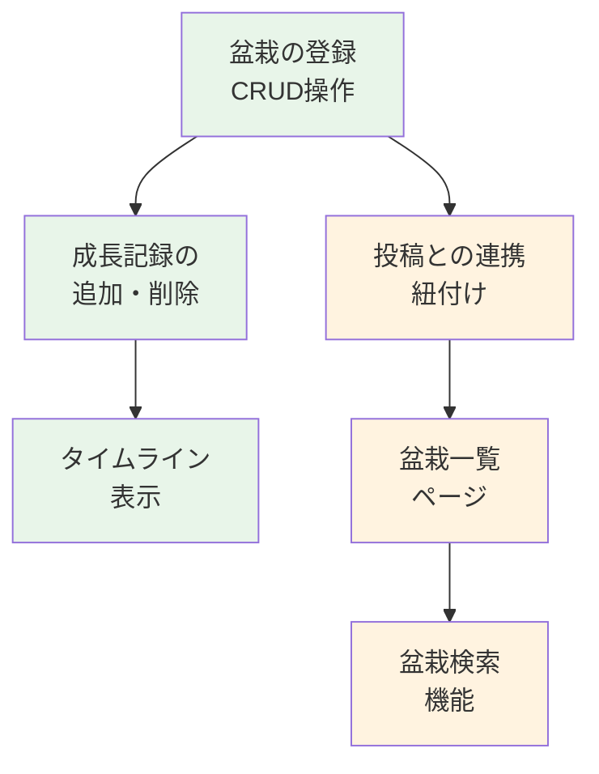
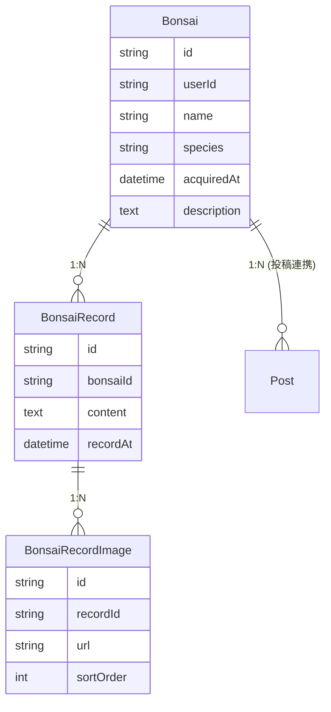
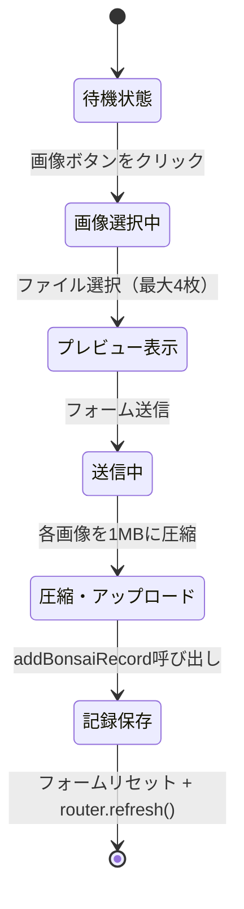

# 第15章: 盆栽管理機能

本章では、ユーザーが自分の盆栽コレクションを管理し、成長記録を時系列で記録できる機能を実装します。盆栽の登録、成長記録の追加、タイムライン表示、そして投稿との連携を学びます。

> **この章の全体像**
>
> 盆栽SNSにおける最も重要な独自機能 -- 「盆栽管理」を実装します。
> 一般的なSNSとの差別化ポイントであり、ユーザーが自分の盆栽を
> デジタル台帳のように管理できる機能です。
>
> 身近な例で言うと、「ペットの成長アルバム」や「植物の育成日記」を
> イメージしてください。盆栽に名前を付けて登録し、日々の手入れや
> 変化を写真付きで記録していく機能を作ります。

---

## 15.0 実習手順の進め方と手順マップ

手順に沿って進めると、**どのファイルに何を入力し、何を確認すればよいか** が分かります。形式の説明は [チュートリアルの進め方](./00_how_to_follow_steps.md) を参照してください。

| 手順 | 主な対象ファイル（例） | 完了時に確認すること |
|------|------------------------|------------------------|
| 盆栽・成長記録モデル | `prisma/schema.prisma` | Bonsai, GrowthRecord が定義される |
| 盆栽 CRUD | `lib/actions/bonsai.ts` | 登録・一覧・編集・削除が動く |
| 成長記録 | `lib/actions/bonsai.ts` 等 | 記録の追加・タイムライン表示ができる |
| 投稿との連携 | 投稿フォーム・盆栽選択UI | 投稿に盆栽を紐付けられる |
| 盆栽一覧・検索 | `app/(main)/bonsai/*` | 一覧・検索が表示される |

各セクションで **対象ファイル**・**入力するコード（サンプルコード）**・**実行方法**・**実行するとこうなる**・**このあと変わること**・**確認方法** を確認しながら進めてください。

---

### この章で実装する機能の全体マップ



### 前提知識

本章を進めるにあたり、以下の知識が必要です。

| 必要な知識 | 該当する章 | 重要度 |
|-----------|----------|-------|
| Prismaの基本操作（CRUD） | 第5章 | 必須 |
| Server Actionsの使い方 | 第8章 | 必須 |
| NextAuth.jsによる認証 | 第7章 | 必須 |
| React Hooksの基礎 | 第3章 | 推奨 |
| shadcn/uiコンポーネント | 第4章 | 推奨 |

### ファイル構成

盆栽管理機能に関連するファイルの全体像です。

```
app/(main)/bonsai/
├── page.tsx              # 盆栽一覧ページ
├── loading.tsx           # 一覧ローディング画面
├── error.tsx             # エラーバウンダリ
├── new/
│   └── page.tsx          # 盆栽新規登録ページ
└── [id]/
    ├── page.tsx          # 盆栽詳細ページ
    ├── loading.tsx       # 詳細ローディング画面
    └── edit/
        └── page.tsx      # 盆栽編集ページ

components/bonsai/
├── BonsaiForm.tsx        # 盆栽登録・編集フォーム
├── BonsaiListClient.tsx  # 盆栽一覧クライアント表示
├── BonsaiSearch.tsx      # 盆栽検索コンポーネント
├── BonsaiRecordForm.tsx  # 成長記録追加フォーム
├── BonsaiTimeline.tsx    # タイムライン表示
└── BonsaiActions.tsx     # 編集・削除アクションメニュー

lib/actions/
└── bonsai.ts             # 盆栽関連のServer Actions
```

---

## 15.1 盆栽管理機能の設計

> **このセクションで学ぶこと**
>
> - 盆栽管理機能の全体像と機能要件を理解する
> - 3つのデータモデル（Bonsai, BonsaiRecord, BonsaiRecordImage）の関係を理解する
> - Prismaスキーマの設計パターン（親子関係・インデックス）を学ぶ

### 15.1.1 機能要件

#### この機能について

盆栽管理機能は大きく4つの機能で構成されます。

1. **盆栽コレクション管理** -- 「盆栽の台帳」
   - ユーザーは複数の盆栽を登録できる
   - 各盆栽に名前、樹種（任意）、取得日（任意）、説明を設定
   - 盆栽の編集・削除が可能

2. **成長記録** -- 「盆栽の日記」
   - 日付ごとに成長記録を追加
   - テキスト + 画像（最大4枚）で記録
   - 時系列でタイムライン表示

3. **投稿連携** -- 「盆栽と投稿の紐付け」
   - SNS投稿時に「この投稿はどの盆栽について？」を選択可能
   - 盆栽詳細ページから関連投稿を一覧表示

4. **盆栽検索** -- 「コレクション内のキーワード検索」
   - 名前、樹種、説明文でインクリメンタルサーチ
   - デバウンス処理でサーバー負荷を軽減

### 15.1.2 データモデル設計（Prismaスキーマ）

#### この機能について

盆栽管理のデータモデルは、3つのテーブルが親子関係で繋がっています。

#### 使用ファイル
> **ファイル**: `prisma/schema.prisma`

#### 実装コード

```prisma
// prisma/schema.prisma

// ============================================
// Bonsai モデル: 盆栽そのものの情報を保持する
// ============================================
model Bonsai {
  id          String    @id @default(cuid())
  userId      String    @map("user_id")
  name        String
  species     String?
  acquiredAt  DateTime? @map("acquired_at")
  description String?   @db.Text
  createdAt   DateTime  @default(now()) @map("created_at")
  updatedAt   DateTime  @updatedAt @map("updated_at")

  user    User           @relation(fields: [userId], references: [id], onDelete: Cascade)
  records BonsaiRecord[]
  posts   Post[]

  @@index([userId])
  @@map("bonsais")
}

// ============================================
// BonsaiRecord モデル: 盆栽の成長記録（日記の1ページ）
// ============================================
model BonsaiRecord {
  id        String   @id @default(cuid())
  bonsaiId  String   @map("bonsai_id")
  content   String?  @db.Text
  recordAt  DateTime @default(now()) @map("record_at")
  createdAt DateTime @default(now()) @map("created_at")

  bonsai Bonsai             @relation(fields: [bonsaiId], references: [id], onDelete: Cascade)
  images BonsaiRecordImage[]

  @@index([bonsaiId])
  @@index([recordAt])
  @@map("bonsai_records")
}

// ============================================
// BonsaiRecordImage モデル: 成長記録に添付する画像
// ============================================
model BonsaiRecordImage {
  id        String @id @default(cuid())
  recordId  String @map("record_id")
  url       String
  sortOrder Int    @default(0) @map("sort_order")

  record BonsaiRecord @relation(fields: [recordId], references: [id], onDelete: Cascade)

  @@index([recordId])
  @@map("bonsai_record_images")
}
```

Postモデルには盆栽との紐付け用フィールドが追加されています。

```prisma
model Post {
  // ... 既存フィールド
  bonsaiId     String?   @map("bonsai_id")

  bonsai   Bonsai? @relation(fields: [bonsaiId], references: [id], onDelete: SetNull)
}
```

#### ER図



#### この実装で可能になること

- 1人のユーザーが複数の盆栽を管理できる
- 各盆栽に複数の成長記録を時系列で追加できる
- 各記録に最大4枚の画像を添付できる
- SNS投稿と盆栽を紐付けて関連付けできる

#### 実装しない場合の影響

データモデルがないと、盆栽管理機能の全てが動作しません。Server Actions、コンポーネント、ページの全てがこのスキーマに依存しています。

> **Cascade vs SetNull の違い（重要）**
>
> - `onDelete: Cascade` -- 親が削除されたら子も一緒に削除される
>   - 例: ユーザーを削除 → そのユーザーの盆栽も全て削除
>   - 例: 盆栽を削除 → その盆栽の成長記録も全て削除
> - `onDelete: SetNull` -- 親が削除されたら紐付けだけ解除（子は残る）
>   - 例: 盆栽を削除 → 関連投稿はそのまま残るが、bonsaiId が null になる

### スキーマの反映

```bash
# 開発環境ではdb pushで即座に反映
npx prisma db push

# 本番環境では必ずマイグレーションを作成してから反映
npx prisma migrate dev --name add_bonsai_management
```

---

## 15.2 盆栽のCRUD操作（Server Actions）

> **このセクションで学ぶこと**
>
> - Server Actionsを使ったデータの作成・更新・削除の実装方法
> - 認証チェックとレート制限の適用パターン
> - 所有者チェック（認可）の重要性と実装方法
> - revalidatePath によるキャッシュ更新の仕組み

### 15.2.1 盆栽の新規作成（Create）

#### この機能について

新しい盆栽をデータベースに登録するServer Actionです。認証チェック、レート制限、DB操作、キャッシュ更新を順番に実行します。

#### 使用ファイル
> **ファイル**: `lib/actions/bonsai.ts`

#### 実装コード

```typescript
// lib/actions/bonsai.ts
'use server'

import { auth } from '@/lib/auth'
import { prisma } from '@/lib/db'
import { revalidatePath } from 'next/cache'
import logger from '@/lib/logger'
import { checkUserRateLimit } from '@/lib/rate-limit'
import { ERR_AUTH_REQUIRED, ERR_RATE_LIMIT_OPERATION } from '@/lib/constants/errors'

export async function createBonsai(data: {
  name: string
  species?: string
  acquiredAt?: Date
  description?: string
}) {
  // ステップ1: 認証チェック
  const session = await auth()
  if (!session?.user?.id) {
    return { error: ERR_AUTH_REQUIRED }
  }

  // ステップ2: レート制限チェック（スパム登録防止）
  const rateLimitResult = await checkUserRateLimit(session.user.id, 'create_bonsai')
  if (!rateLimitResult.success) {
    return { error: ERR_RATE_LIMIT_OPERATION }
  }

  try {
    // ステップ3: DB操作（作成）
    const bonsai = await prisma.bonsai.create({
      data: {
        userId: session.user.id,
        name: data.name,
        species: data.species,
        acquiredAt: data.acquiredAt,
        description: data.description,
      },
    })

    // ステップ4: キャッシュ更新
    revalidatePath('/bonsai')
    return { bonsai }
  } catch (error) {
    logger.error('Create bonsai error:', error)
    return { error: '盆栽の登録に失敗しました' }
  }
}
```

#### 実行結果・画面表示

```
成功時: { bonsai: { id: "clx1abc...", name: "五葉松1号", species: "五葉松", ... } }
失敗時: { error: "認証が必要です" } または { error: "操作の制限を超えました" }
```

盆栽一覧ページ（`/bonsai`）のキャッシュが自動更新され、新しい盆栽がリストに表示されます。

#### この実装で可能になること

- ログインユーザーが盆栽を登録できる
- レート制限により連続した大量登録を防止できる

#### 実装しない場合の影響

盆栽の登録ができなくなり、盆栽管理機能のコアが失われます。

### 15.2.2 盆栽の更新（Update）

#### この機能について

既存の盆栽情報を編集するServer Actionです。自分の盆栽のみ更新可能な所有者チェックが含まれています。

#### 使用ファイル
> **ファイル**: `lib/actions/bonsai.ts`

#### 実装コード

```typescript
export async function updateBonsai(
  bonsaiId: string,
  data: {
    name?: string
    species?: string
    acquiredAt?: Date | null
    description?: string
  }
) {
  const session = await auth()
  if (!session?.user?.id) {
    return { error: ERR_AUTH_REQUIRED }
  }

  const rateLimitResult = await checkUserRateLimit(session.user.id, 'update_bonsai')
  if (!rateLimitResult.success) {
    return { error: ERR_RATE_LIMIT_OPERATION }
  }

  try {
    // 所有者確認: findFirst で盆栽ID + ユーザーIDを同時にチェック
    const existing = await prisma.bonsai.findFirst({
      where: { id: bonsaiId, userId: session.user.id },
    })

    if (!existing) {
      return { error: '盆栽が見つかりません' }
    }

    const bonsai = await prisma.bonsai.update({
      where: { id: bonsaiId },
      data: {
        name: data.name,
        species: data.species,
        acquiredAt: data.acquiredAt,
        description: data.description,
      },
    })

    revalidatePath(`/bonsai/${bonsaiId}`)
    return { bonsai }
  } catch (error) {
    logger.error('Update bonsai error:', error)
    return { error: '盆栽の更新に失敗しました' }
  }
}
```

#### この実装で可能になること

- 盆栽の名前、樹種、入手日、説明を変更できる
- `acquiredAt` に `null` を渡すことで入手日を解除できる

#### 実装しない場合の影響

登録後に情報を修正できなくなります。樹種の入力ミスや説明文の追記ができません。

### 15.2.3 盆栽の削除（Delete）

#### この機能について

盆栽とその関連データ（成長記録・画像）を全て削除するServer Actionです。Cascadeにより子テーブルのデータも自動削除されます。

#### 使用ファイル
> **ファイル**: `lib/actions/bonsai.ts`

#### 実装コード

```typescript
export async function deleteBonsai(bonsaiId: string) {
  const session = await auth()
  if (!session?.user?.id) {
    return { error: ERR_AUTH_REQUIRED }
  }

  try {
    // 所有者確認
    const existing = await prisma.bonsai.findFirst({
      where: { id: bonsaiId, userId: session.user.id },
    })

    if (!existing) {
      return { error: '盆栽が見つかりません' }
    }

    // Cascade削除: BonsaiRecord と BonsaiRecordImage も自動削除
    // ただし Post の bonsaiId は SetNull なので投稿は残る
    await prisma.bonsai.delete({ where: { id: bonsaiId } })

    revalidatePath('/bonsai')
    return { success: true }
  } catch (error) {
    logger.error('Delete bonsai error:', error)
    return { error: '盆栽の削除に失敗しました' }
  }
}
```

#### この実装で可能になること

- 不要になった盆栽をコレクションから削除できる
- 関連する成長記録・画像も自動的にクリーンアップされる

#### 実装しない場合の影響

一度登録した盆栽を削除できなくなります。誤って登録した盆栽がコレクションに残り続けます。

### 15.2.4 盆栽一覧の取得（Read）

#### この機能について

ユーザーの盆栽コレクションを一覧取得するServer Actionです。最新の成長記録とサムネイル画像も一緒に取得します。

#### 使用ファイル
> **ファイル**: `lib/actions/bonsai.ts`

#### 実装コード

```typescript
export async function getBonsais(userId?: string) {
  const session = await auth()
  const targetUserId = userId || session?.user?.id

  if (!targetUserId) {
    return { error: ERR_AUTH_REQUIRED }
  }

  try {
    const bonsais = await prisma.bonsai.findMany({
      where: { userId: targetUserId },
      include: {
        // 最新の成長記録を1件取得（サムネイル用）
        records: {
          orderBy: { recordAt: 'desc' },
          take: 1,
          include: {
            images: { orderBy: { sortOrder: 'asc' }, take: 1 },
          },
        },
        // 成長記録の総件数
        _count: { select: { records: true } },
      },
      orderBy: { createdAt: 'desc' },
    })

    return { bonsais }
  } catch (error) {
    logger.error('Get bonsais error:', error)
    return { error: '盆栽一覧の取得に失敗しました' }
  }
}
```

#### 実行結果・画面表示

```typescript
// 戻り値の構造
{
  bonsais: [
    {
      id: "clx1abc...",
      name: "五葉松1号",
      species: "五葉松",
      acquiredAt: "2024-01-15T00:00:00.000Z",
      description: "盆栽展で入手",
      records: [
        { images: [{ url: "/uploads/latest-photo.jpg" }] }
      ],
      _count: { records: 5 }
    },
    // ...
  ]
}
```

#### この実装で可能になること

- ユーザーの盆栽コレクションを一覧表示できる
- 各盆栽の最新画像をサムネイルとして表示できる
- 成長記録の件数を表示できる

#### 実装しない場合の影響

盆栽一覧ページにデータを表示できなくなります。

### 15.2.5 盆栽詳細の取得

#### この機能について

特定の盆栽の詳細情報を全成長記録と共に取得するServer Actionです。

#### 使用ファイル
> **ファイル**: `lib/actions/bonsai.ts`

#### 実装コード

```typescript
export async function getBonsai(bonsaiId: string) {
  try {
    const bonsai = await prisma.bonsai.findUnique({
      where: { id: bonsaiId },
      include: {
        // 所有者情報（select で必要なフィールドのみ取得）
        user: {
          select: { id: true, nickname: true, avatarUrl: true },
        },
        // 全成長記録（新しい順、画像含む）
        records: {
          orderBy: { recordAt: 'desc' },
          include: {
            images: { orderBy: { sortOrder: 'asc' } },
          },
        },
        // 記録件数
        _count: { select: { records: true } },
      },
    })

    if (!bonsai) {
      return { error: '盆栽が見つかりません' }
    }

    return { bonsai }
  } catch (error) {
    logger.error('Get bonsai error:', error)
    return { error: '盆栽の取得に失敗しました' }
  }
}
```

> **`include` と `select` の使い分け**
>
> | 方法 | 説明 | 使いどころ |
> |------|------|----------|
> | `include` | リレーション先のデータを**全フィールド**取得 | 全ての情報が必要な場合 |
> | `select` | 指定したフィールド**だけ**を取得 | 必要な情報だけ欲しい場合 |
>
> `select` を使うと取得するデータ量が減り、パフォーマンスが向上します。
> 特にユーザー情報は password など機密情報を含むため、
> `select` で必要なフィールドだけを取得しましょう。

---

## 15.3 成長記録の管理

> **このセクションで学ぶこと**
>
> - 親子関係のあるデータ（盆栽 → 成長記録 → 画像）の作成方法
> - Prisma のネストした create（1回のクエリで親子を同時作成）
> - 成長記録の更新・削除の実装パターン

### 15.3.1 成長記録の追加

#### この機能について

盆栽に新しい成長記録（テキスト + 画像最大4枚）を追加するServer Actionです。Prismaのネストしたcreateにより、記録と画像を1回のクエリで同時作成します。

#### 使用ファイル
> **ファイル**: `lib/actions/bonsai.ts`

#### 実装コード

```typescript
export async function addBonsaiRecord(data: {
  bonsaiId: string
  content?: string
  recordAt?: Date
  imageUrls?: string[]
}) {
  const session = await auth()
  if (!session?.user?.id) {
    return { error: ERR_AUTH_REQUIRED }
  }

  // レート制限チェック
  const rateLimitResult = await checkUserRateLimit(session.user.id, 'create_bonsai_record')
  if (!rateLimitResult.success) {
    return { error: ERR_RATE_LIMIT_OPERATION }
  }

  try {
    // 盆栽の所有者確認
    const bonsai = await prisma.bonsai.findFirst({
      where: { id: data.bonsaiId, userId: session.user.id },
    })

    if (!bonsai) {
      return { error: '盆栽が見つかりません' }
    }

    // ネストした create で記録と画像を同時作成
    const record = await prisma.bonsaiRecord.create({
      data: {
        bonsaiId: data.bonsaiId,
        content: data.content,
        recordAt: data.recordAt || new Date(),
        // 画像がある場合はネストして作成
        images: data.imageUrls?.length
          ? {
              create: data.imageUrls.map((url: string, index: number) => ({
                url,
                sortOrder: index,
              })),
            }
          : undefined,
      },
      include: {
        images: { orderBy: { sortOrder: 'asc' } },
      },
    })

    revalidatePath(`/bonsai/${data.bonsaiId}`)
    return { record }
  } catch (error) {
    logger.error('Add bonsai record error:', error)
    return { error: '成長記録の追加に失敗しました' }
  }
}
```

#### 実行結果・画面表示

```typescript
// 呼び出し例
const result = await addBonsaiRecord({
  bonsaiId: 'clx1abc...',
  content: '春の植え替えを実施。根の状態良好。',
  imageUrls: ['/uploads/photo1.jpg', '/uploads/photo2.jpg'],
})

// 戻り値
{
  record: {
    id: "clx2def...",
    bonsaiId: "clx1abc...",
    content: "春の植え替えを実施。根の状態良好。",
    recordAt: "2024-05-15T09:00:00.000Z",
    images: [
      { id: "img1", url: "/uploads/photo1.jpg", sortOrder: 0 },
      { id: "img2", url: "/uploads/photo2.jpg", sortOrder: 1 },
    ]
  }
}
```

#### この実装で可能になること

- 盆栽の成長を日々の記録として残せる
- 1回の操作で記録テキストと画像を同時に保存できる

#### 実装しない場合の影響

成長記録を追加する手段がなくなります。盆栽管理機能の「日記」機能が失われ、タイムライン表示も意味をなさなくなります。

> **ネストした create とは？**
>
> 通常、親と子のレコードを作るには2回のDB操作が必要です。
> Prisma のネストした create を使うと、1回のクエリで両方を作成できます。
> コードがシンプルになるだけでなく、途中でエラーが起きた場合にデータの不整合も防げます。

### 15.3.2 成長記録の更新

#### この機能について

既存の成長記録のテキストや画像を更新するServer Actionです。画像は「全削除して再作成」方式で更新します。

#### 使用ファイル
> **ファイル**: `lib/actions/bonsai.ts`

#### 実装コード

```typescript
export async function updateBonsaiRecord(
  recordId: string,
  data: {
    content?: string
    recordAt?: Date
    imageUrls?: string[]
  }
) {
  const session = await auth()
  if (!session?.user?.id) {
    return { error: ERR_AUTH_REQUIRED }
  }

  try {
    // 記録を取得し、関連する盆栽の所有者を確認
    const existing = await prisma.bonsaiRecord.findFirst({
      where: { id: recordId },
      include: { bonsai: true },
    })

    if (!existing || existing.bonsai.userId !== session.user.id) {
      return { error: '成長記録が見つかりません' }
    }

    // 画像URLが指定された場合は既存画像を全削除
    if (data.imageUrls !== undefined) {
      await prisma.bonsaiRecordImage.deleteMany({ where: { recordId } })
    }

    // 記録を更新（新しい画像を同時作成）
    const record = await prisma.bonsaiRecord.update({
      where: { id: recordId },
      data: {
        content: data.content,
        recordAt: data.recordAt,
        images: data.imageUrls?.length
          ? {
              create: data.imageUrls.map((url: string, index: number) => ({
                url,
                sortOrder: index,
              })),
            }
          : undefined,
      },
      include: {
        images: { orderBy: { sortOrder: 'asc' } },
      },
    })

    revalidatePath(`/bonsai/${existing.bonsaiId}`)
    return { record }
  } catch (error) {
    logger.error('Update bonsai record error:', error)
    return { error: '成長記録の更新に失敗しました' }
  }
}
```

#### この実装で可能になること

- 記録のテキストを修正できる
- 添付画像を差し替えできる

#### 実装しない場合の影響

投稿した記録の誤字脱字を修正できなくなります。

### 15.3.3 成長記録の削除

#### この機能について

成長記録を削除するServer Actionです。Cascade設定により、添付画像も自動削除されます。

#### 使用ファイル
> **ファイル**: `lib/actions/bonsai.ts`

#### 実装コード

```typescript
export async function deleteBonsaiRecord(recordId: string) {
  const session = await auth()
  if (!session?.user?.id) {
    return { error: ERR_AUTH_REQUIRED }
  }

  try {
    // 記録の所有者確認（盆栽の所有者を経由してチェック）
    const existing = await prisma.bonsaiRecord.findFirst({
      where: { id: recordId },
      include: { bonsai: true },
    })

    if (!existing || existing.bonsai.userId !== session.user.id) {
      return { error: '成長記録が見つかりません' }
    }

    // Cascade削除で BonsaiRecordImage も自動削除
    await prisma.bonsaiRecord.delete({ where: { id: recordId } })

    revalidatePath(`/bonsai/${existing.bonsaiId}`)
    return { success: true }
  } catch (error) {
    logger.error('Delete bonsai record error:', error)
    return { error: '成長記録の削除に失敗しました' }
  }
}
```

#### この実装で可能になること

- 不要な記録を削除してタイムラインを整理できる

#### 実装しない場合の影響

誤って追加した記録や不要な記録を削除できなくなります。

---

## 15.4 盆栽フォームコンポーネント

> **このセクションで学ぶこと**
>
> - 新規作成と編集の両方で使い回せるフォーム設計（DRY原則）
> - FormData を使ったフォームデータの取得
> - Server Action との連携パターン
> - defaultValue による非制御コンポーネントの実装

### 15.4.1 BonsaiForm（盆栽登録・編集フォーム）

#### この機能について

盆栽の新規登録と編集の両方で使い回せるフォームコンポーネントです。`bonsai` propsの有無で動作モードが切り替わります。

#### 使用ファイル
> **ファイル**: `components/bonsai/BonsaiForm.tsx`

#### 実装コード

```typescript
// components/bonsai/BonsaiForm.tsx
'use client'

import { useState } from 'react'
import { useRouter } from 'next/navigation'
import { createBonsai, updateBonsai } from '@/lib/actions/bonsai'
import { FormError } from '@/components/common/FormError'

interface BonsaiFormProps {
  bonsai?: {
    id: string
    name: string
    species: string | null
    acquiredAt: Date | null
    description: string | null
  }
}

export function BonsaiForm({ bonsai }: BonsaiFormProps) {
  const router = useRouter()
  const [loading, setLoading] = useState(false)
  const [error, setError] = useState<string | null>(null)

  const handleSubmit = async (e: React.FormEvent<HTMLFormElement>) => {
    e.preventDefault()
    setLoading(true)
    setError(null)

    const formData = new FormData(e.currentTarget)
    const data = {
      name: formData.get('name') as string,
      species: formData.get('species') as string || undefined,
      acquiredAt: formData.get('acquiredAt')
        ? new Date(formData.get('acquiredAt') as string)
        : undefined,
      description: formData.get('description') as string || undefined,
    }

    try {
      if (bonsai) {
        // 編集モード
        const result = await updateBonsai(bonsai.id, data)
        if (result.error) { setError(result.error); return }
        router.push(`/bonsai/${bonsai.id}`)
      } else {
        // 新規登録モード
        const result = await createBonsai(data)
        if (result.error) { setError(result.error); return }
        if (result.bonsai) router.push(`/bonsai/${result.bonsai.id}`)
      }
      router.refresh()
    } catch {
      setError('エラーが発生しました')
    } finally {
      setLoading(false)
    }
  }

  return (
    <form onSubmit={handleSubmit} className="space-y-4">
      <FormError message={error} />

      {/* 名前入力（必須） */}
      <div>
        <label htmlFor="name" className="block text-sm font-medium mb-1">
          名前 <span className="text-destructive">*</span>
        </label>
        <input
          type="text"
          id="name"
          name="name"
          defaultValue={bonsai?.name || ''}
          required
          className="w-full px-3 py-2 border rounded-lg bg-background
                     focus:outline-none focus:ring-2 focus:ring-primary"
          placeholder="例: 黒松一号"
        />
      </div>

      {/* 樹種選択（セレクトボックス） */}
      <div>
        <label htmlFor="species" className="block text-sm font-medium mb-1">
          樹種
        </label>
        <select
          id="species"
          name="species"
          defaultValue={bonsai?.species || ''}
          className="w-full px-3 py-2 border rounded-lg bg-background
                     focus:outline-none focus:ring-2 focus:ring-primary"
        >
          <option value="">選択してください</option>
          <optgroup label="松柏類">
            <option value="黒松">黒松</option>
            <option value="赤松">赤松</option>
            <option value="五葉松">五葉松</option>
            <option value="真柏">真柏</option>
            {/* ... その他の松柏類 */}
          </optgroup>
          <optgroup label="雑木類">
            <option value="紅葉">紅葉</option>
            <option value="楓">楓</option>
            <option value="欅">欅</option>
            <option value="梅">梅</option>
            {/* ... その他の雑木類 */}
          </optgroup>
          <optgroup label="草もの">
            <option value="山野草">山野草</option>
            <option value="苔">苔</option>
          </optgroup>
        </select>
      </div>

      {/* 入手日 */}
      <div>
        <label htmlFor="acquiredAt" className="block text-sm font-medium mb-1">
          入手日
        </label>
        <input
          type="date"
          id="acquiredAt"
          name="acquiredAt"
          defaultValue={
            bonsai?.acquiredAt
              ? new Date(bonsai.acquiredAt).toISOString().split('T')[0]
              : ''
          }
          className="w-full px-3 py-2 border rounded-lg bg-background
                     focus:outline-none focus:ring-2 focus:ring-primary"
        />
      </div>

      {/* メモ */}
      <div>
        <label htmlFor="description" className="block text-sm font-medium mb-1">
          メモ
        </label>
        <textarea
          id="description"
          name="description"
          defaultValue={bonsai?.description || ''}
          rows={3}
          className="w-full px-3 py-2 border rounded-lg bg-background
                     focus:outline-none focus:ring-2 focus:ring-primary resize-none"
          placeholder="この盆栽についてのメモを入力"
        />
      </div>

      {/* アクションボタン */}
      <div className="flex gap-2 pt-4">
        <button
          type="button"
          onClick={() => router.back()}
          className="flex-1 px-4 py-2 border rounded-lg hover:bg-muted transition-colors"
        >
          キャンセル
        </button>
        <button
          type="submit"
          disabled={loading}
          className="flex-1 px-4 py-2 bg-primary text-primary-foreground rounded-lg
                     hover:bg-primary/90 transition-colors disabled:opacity-50"
        >
          {loading ? '保存中...' : bonsai ? '更新' : '登録'}
        </button>
      </div>
    </form>
  )
}
```

#### 実行結果・画面表示

- **新規登録時**: 空のフォームが表示される。「登録」ボタン押下で盆栽が作成され、詳細ページにリダイレクト。
- **編集時**: 既存のデータがフォームに初期表示される。「更新」ボタン押下で盆栽が更新され、詳細ページにリダイレクト。

#### この実装で可能になること

- 1つのコンポーネントで新規作成と編集の両方に対応できる
- 樹種がセレクトボックスで選択できるため、入力ミスを防げる

#### 実装しない場合の影響

盆栽の登録・編集UIが存在しなくなり、ユーザーが盆栽情報を入力する手段がなくなります。

> **`defaultValue` と `value` の違い**
>
> - `defaultValue`: 初期値を設定するが、その後ユーザーが自由に変更可能（非制御コンポーネント）
> - `value`: 常にstateの値と同期する（制御コンポーネント。onChange も必要）
>
> Server Actions と組み合わせる場合は `defaultValue` が便利です。

---

## 15.5 成長記録フォームコンポーネント

> **このセクションで学ぶこと**
>
> - 画像選択・プレビュー・圧縮・アップロードの一連の流れ
> - BlobURL によるプレビュー表示とメモリリーク防止
> - useRef による非表示ファイル入力の制御

### 15.5.1 BonsaiRecordForm（成長記録追加フォーム）

#### この機能について

盆栽の成長記録を追加するフォームです。テキスト入力と画像選択（最大4枚）を組み合わせて記録を投稿します。画像はクライアントサイドで圧縮してからアップロードされます。

#### 使用ファイル
> **ファイル**: `components/bonsai/BonsaiRecordForm.tsx`

#### 実装コード

```typescript
// components/bonsai/BonsaiRecordForm.tsx
'use client'

import { useState, useRef } from 'react'
import { useRouter } from 'next/navigation'
import { addBonsaiRecord } from '@/lib/actions/bonsai'
import Image from 'next/image'
import { prepareFileForUpload, MAX_IMAGE_SIZE } from '@/lib/client-image-compression'
import { MAX_BONSAI_RECORD_IMAGES } from '@/lib/constants/limits'

interface BonsaiRecordFormProps {
  bonsaiId: string
}

export function BonsaiRecordForm({ bonsaiId }: BonsaiRecordFormProps) {
  const router = useRouter()
  const [loading, setLoading] = useState(false)
  const [error, setError] = useState<string | null>(null)
  const [content, setContent] = useState('')
  const [images, setImages] = useState<{ file: File; preview: string }[]>([])
  const fileInputRef = useRef<HTMLInputElement>(null)

  // 画像選択時の処理
  const handleImageSelect = (e: React.ChangeEvent<HTMLInputElement>) => {
    const files = e.target.files
    if (!files) return

    const validFiles: File[] = []
    for (const file of Array.from(files)) {
      if (file.size > MAX_IMAGE_SIZE) {
        setError(`画像は${MAX_IMAGE_SIZE / 1024 / 1024}MB以下にしてください`)
        continue
      }
      validFiles.push(file)
    }

    const newImages = validFiles.map((file) => ({
      file,
      preview: URL.createObjectURL(file),
    }))

    // 既存 + 新規で最大4枚まで
    setImages((prev) => [...prev, ...newImages].slice(0, MAX_BONSAI_RECORD_IMAGES))

    // ファイル入力をリセット（同じファイルを再選択可能に）
    if (fileInputRef.current) fileInputRef.current.value = ''
  }

  // 画像削除時の処理
  const removeImage = (index: number) => {
    setImages((prev) => {
      const newImages = [...prev]
      URL.revokeObjectURL(newImages[index].preview) // メモリリーク防止
      newImages.splice(index, 1)
      return newImages
    })
  }

  // フォーム送信処理
  const handleSubmit = async (e: React.FormEvent<HTMLFormElement>) => {
    e.preventDefault()
    if (!content.trim() && images.length === 0) {
      setError('テキストまたは画像を入力してください')
      return
    }

    setLoading(true)
    setError(null)

    try {
      // 各画像を圧縮してアップロード
      const imageUrls: string[] = []
      for (const image of images) {
        const compressedFile = await prepareFileForUpload(image.file, {
          maxSizeMB: 1,
          maxWidthOrHeight: 1920,
        })
        const formData = new FormData()
        formData.append('file', compressedFile)
        const response = await fetch('/api/upload/avatar', {
          method: 'POST',
          body: formData,
        })
        const result = await response.json()
        if (result.url) imageUrls.push(result.url)
      }

      // Server Actionで保存
      const result = await addBonsaiRecord({
        bonsaiId,
        content: content.trim() || undefined,
        imageUrls: imageUrls.length > 0 ? imageUrls : undefined,
      })

      if (result.error) { setError(result.error); return }

      // 成功時はフォームをリセット
      setContent('')
      setImages([])
      router.refresh()
    } catch {
      setError('エラーが発生しました')
    } finally {
      setLoading(false)
    }
  }

  return (
    <form onSubmit={handleSubmit} className="space-y-4">
      {error && (
        <div className="p-3 bg-destructive/10 text-destructive rounded-lg text-sm">
          {error}
        </div>
      )}

      <textarea
        value={content}
        onChange={(e) => setContent(e.target.value)}
        rows={3}
        className="w-full px-3 py-2 border rounded-lg bg-background
                   focus:outline-none focus:ring-2 focus:ring-primary resize-none"
        placeholder="成長の様子や作業内容を記録..."
      />

      {/* 画像プレビュー */}
      {images.length > 0 && (
        <div className="flex gap-2 flex-wrap">
          {images.map((image, index) => (
            <div key={index} className="relative w-20 h-20">
              <Image src={image.preview} alt={`画像 ${index + 1}`}
                     fill className="object-cover rounded-lg" />
              <button type="button" onClick={() => removeImage(index)}
                className="absolute -top-2 -right-2 w-6 h-6 bg-destructive
                           text-destructive-foreground rounded-full
                           flex items-center justify-center">
                x
              </button>
            </div>
          ))}
        </div>
      )}

      {/* 画像追加と送信ボタン */}
      <div className="flex items-center justify-between">
        <div>
          <input ref={fileInputRef} type="file" accept="image/*" multiple
                 onChange={handleImageSelect} className="hidden" id="record-images" />
          <label htmlFor="record-images"
            className="flex items-center gap-2 px-3 py-2 border rounded-lg
                       cursor-pointer hover:bg-muted transition-colors">
            画像を追加
          </label>
          <p className="text-xs text-muted-foreground mt-1">最大4枚まで</p>
        </div>

        <button type="submit"
          disabled={loading || (!content.trim() && images.length === 0)}
          className="px-4 py-2 bg-primary text-primary-foreground rounded-lg
                     hover:bg-primary/90 transition-colors disabled:opacity-50">
          {loading ? '保存中...' : '記録する'}
        </button>
      </div>
    </form>
  )
}
```

#### 実行結果・画面表示

フォーム送信後、盆栽詳細ページが `router.refresh()` で更新され、タイムラインに新しい記録が表示されます。フォームは自動的にリセットされます。

#### 処理フロー



#### この実装で可能になること

- テキストと写真を組み合わせた成長記録を投稿できる
- 画像はクライアントサイドで圧縮されるため、通信量が削減される
- プレビュー表示で投稿前に画像を確認・削除できる

#### 実装しない場合の影響

成長記録を追加するUIが表示されず、盆栽の日記機能が使えなくなります。

---

## 15.6 盆栽一覧ページと検索機能

> **このセクションで学ぶこと**
>
> - Server Component でのデータ取得とClient Componentへの受け渡し
> - インクリメンタルサーチの実装パターン（デバウンス処理）
> - useTransition による非ブロッキングな状態更新

### 15.6.1 盆栽一覧ページ

#### この機能について

ログインユーザーの盆栽コレクションを一覧表示するServer Componentページです。認証チェック後、データを取得してClient Componentに渡します。

#### 使用ファイル
> **ファイル**: `app/(main)/bonsai/page.tsx`

#### 実装コード

```typescript
// app/(main)/bonsai/page.tsx
import { auth } from '@/lib/auth'
import { redirect } from 'next/navigation'
import { ROUTE_LOGIN } from '@/lib/constants/routes'
import { getBonsais } from '@/lib/actions/bonsai'
import { BonsaiListClient } from '@/components/bonsai/BonsaiListClient'

export const metadata = {
  title: 'マイ盆栽 - BON-LOG',
  description: 'あなたの盆栽コレクションを管理',
}

export default async function BonsaiListPage() {
  const session = await auth()
  if (!session?.user?.id) {
    redirect(ROUTE_LOGIN)
  }

  const result = await getBonsais()
  const bonsais = result.bonsais || []

  return <BonsaiListClient initialBonsais={bonsais} />
}
```

#### 実行結果・画面表示

- 盆栽が登録されている場合: カード形式のリストが表示される。各カードにはサムネイル画像、名前、樹種、記録数が表示される。
- 盆栽が未登録の場合: 「まだ盆栽が登録されていません」というメッセージと「最初の盆栽を登録」ボタンが表示される。

### 15.6.2 BonsaiListClient（一覧表示コンポーネント）

#### この機能について

盆栽一覧のUI表示と検索機能との連携を担当するClient Componentです。BonsaiSearchコンポーネントと連携して、リアルタイムに検索結果を反映します。

#### 使用ファイル
> **ファイル**: `components/bonsai/BonsaiListClient.tsx`

#### 実装コード

```typescript
// components/bonsai/BonsaiListClient.tsx
'use client'

import { useState } from 'react'
import Link from 'next/link'
import Image from 'next/image'
import { BonsaiSearch } from './BonsaiSearch'

type BonsaiWithRecords = {
  id: string
  name: string
  species: string | null
  acquiredAt: Date | null
  description: string | null
  records?: { images?: { url: string }[] }[]
  _count?: { records: number }
}

interface BonsaiListClientProps {
  initialBonsais: BonsaiWithRecords[]
}

export function BonsaiListClient({ initialBonsais }: BonsaiListClientProps) {
  const [bonsais, setBonsais] = useState<BonsaiWithRecords[]>(initialBonsais)
  const [isSearching, setIsSearching] = useState(false)

  const handleSearch = (searchResults: BonsaiWithRecords[]) => {
    setBonsais(searchResults)
    setIsSearching(true)
  }

  const handleClear = () => {
    setBonsais(initialBonsais)
    setIsSearching(false)
  }

  return (
    <div className="max-w-2xl mx-auto space-y-6">
      {/* ヘッダー: タイトル + 追加ボタン + 検索 */}
      <div className="bg-card rounded-lg border p-4">
        <div className="flex items-center justify-between mb-4">
          <h1 className="text-xl font-bold">マイ盆栽</h1>
          <Link href="/bonsai/new"
            className="flex items-center gap-2 px-4 py-2 bg-primary
                       text-primary-foreground rounded-lg hover:bg-primary/90">
            盆栽を追加
          </Link>
        </div>
        <BonsaiSearch onSearch={handleSearch} onClear={handleClear}
                      initialCount={initialBonsais.length} />
      </div>

      {/* 盆栽リスト */}
      {bonsais.length === 0 ? (
        <div className="bg-card rounded-lg border p-8 text-center">
          {isSearching ? (
            <p>検索結果がありません</p>
          ) : (
            <>
              <h2>まだ盆栽が登録されていません</h2>
              <Link href="/bonsai/new">最初の盆栽を登録</Link>
            </>
          )}
        </div>
      ) : (
        <div className="grid gap-4">
          {bonsais.map((bonsai) => {
            const latestImage = bonsai.records?.[0]?.images?.[0]?.url
            return (
              <Link key={bonsai.id} href={`/bonsai/${bonsai.id}`}
                className="bg-card rounded-lg border overflow-hidden
                           hover:border-primary/50 transition-colors">
                <div className="flex">
                  {/* サムネイル */}
                  <div className="w-32 h-32 bg-muted flex-shrink-0">
                    {latestImage ? (
                      <Image src={latestImage} alt={bonsai.name}
                             width={128} height={128}
                             className="w-full h-full object-cover" />
                    ) : (
                      <div className="w-full h-full flex items-center justify-center">
                        {/* 木のアイコン */}
                      </div>
                    )}
                  </div>
                  {/* 情報 */}
                  <div className="flex-1 p-4">
                    <h3 className="font-bold text-lg">{bonsai.name}</h3>
                    {bonsai.species && (
                      <p className="text-sm text-muted-foreground">{bonsai.species}</p>
                    )}
                    <div className="mt-2 flex items-center gap-4 text-sm text-muted-foreground">
                      <span>{bonsai._count?.records || 0}件の記録</span>
                      {bonsai.acquiredAt && (
                        <span>入手: {new Date(bonsai.acquiredAt).toLocaleDateString('ja-JP')}</span>
                      )}
                    </div>
                  </div>
                </div>
              </Link>
            )
          })}
        </div>
      )}
    </div>
  )
}
```

### 15.6.3 BonsaiSearch（盆栽検索コンポーネント）

#### この機能について

盆栽の名前、樹種、説明文をキーワードで検索するインクリメンタルサーチコンポーネントです。デバウンス処理（300ms）により、入力のたびにサーバーリクエストが発生するのを防ぎます。

#### 使用ファイル
> **ファイル**: `components/bonsai/BonsaiSearch.tsx`

#### 実装コード

```typescript
// components/bonsai/BonsaiSearch.tsx
'use client'

import { useState, useTransition, useCallback } from 'react'
import { searchBonsais } from '@/lib/actions/bonsai'
import { MAX_SEARCH_QUERY_LENGTH, DEBOUNCE_DELAY_MS } from '@/lib/constants/limits'

interface BonsaiSearchProps {
  onSearch: (bonsais: BonsaiResult[]) => void
  onClear: () => void
  initialCount: number
}

export function BonsaiSearch({ onSearch, onClear, initialCount }: BonsaiSearchProps) {
  const [query, setQuery] = useState('')
  const [isPending, startTransition] = useTransition()
  const [resultCount, setResultCount] = useState<number | null>(null)
  const [debounceTimer, setDebounceTimer] = useState<NodeJS.Timeout | null>(null)

  const handleSearch = useCallback((searchQuery: string) => {
    if (debounceTimer) clearTimeout(debounceTimer)

    const trimmed = searchQuery.trim()
    if (!trimmed) {
      setResultCount(null)
      onClear()
      return
    }

    // デバウンス: DEBOUNCE_DELAY_MS (300ms) 後に検索実行
    const timer = setTimeout(() => {
      startTransition(async () => {
        const result = await searchBonsais(trimmed)
        if (result.bonsais) {
          setResultCount(result.bonsais.length)
          onSearch(result.bonsais)
        }
      })
    }, DEBOUNCE_DELAY_MS)

    setDebounceTimer(timer)
  }, [debounceTimer, onSearch, onClear])

  return (
    <div className="space-y-2">
      <input
        type="text"
        value={query}
        onChange={(e) => { setQuery(e.target.value); handleSearch(e.target.value) }}
        placeholder="盆栽を検索（名前・樹種・説明）"
        className="w-full pl-10 pr-10 py-2 rounded-lg border bg-background
                   focus:outline-none focus:ring-2 focus:ring-primary text-sm"
        maxLength={MAX_SEARCH_QUERY_LENGTH}
      />
      {resultCount !== null && (
        <p className="text-sm text-muted-foreground">
          {resultCount === 0 ? '該当する盆栽が見つかりませんでした'
                             : `${resultCount}件の盆栽が見つかりました`}
        </p>
      )}
      {resultCount === null && !query && (
        <p className="text-sm text-muted-foreground">{initialCount}本の盆栽を管理中</p>
      )}
    </div>
  )
}
```

#### 検索Server Action

```typescript
// lib/actions/bonsai.ts

export async function searchBonsais(query: string) {
  const session = await auth()
  if (!session?.user?.id) {
    return { error: ERR_AUTH_REQUIRED }
  }

  // レート制限（IP単位）
  const clientIp = await getClientIp()
  const rateLimitResult = await rateLimit(`search:bonsai:${clientIp}`, RATE_LIMITS.search)
  if (!rateLimitResult.success) {
    return { bonsais: [], error: '検索リクエストが多すぎます' }
  }

  const trimmedQuery = query.trim()
  if (!trimmedQuery) return getBonsais()
  if (trimmedQuery.length > MAX_SEARCH_QUERY_LENGTH) {
    return { bonsais: [], error: '検索キーワードが長すぎます' }
  }

  try {
    const bonsais = await prisma.bonsai.findMany({
      where: {
        userId: session.user.id,
        OR: [
          { name: { contains: trimmedQuery, mode: 'insensitive' } },
          { species: { contains: trimmedQuery, mode: 'insensitive' } },
          { description: { contains: trimmedQuery, mode: 'insensitive' } },
        ],
      },
      include: {
        records: { orderBy: { recordAt: 'desc' }, take: 1,
                   include: { images: { orderBy: { sortOrder: 'asc' }, take: 1 } } },
        _count: { select: { records: true } },
      },
      orderBy: { createdAt: 'desc' },
    })

    return { bonsais }
  } catch (error) {
    logger.error('Search bonsais error:', error)
    return { error: '盆栽の検索に失敗しました' }
  }
}
```

#### この実装で可能になること

- リアルタイムに盆栽コレクションを検索できる
- デバウンス処理でサーバー負荷を軽減
- レート制限で検索APIの乱用を防止

#### 実装しない場合の影響

盆栽が多数登録されている場合、目的の盆栽を見つけるのが困難になります。

---

## 15.7 盆栽詳細ページとタイムライン表示

> **このセクションで学ぶこと**
>
> - 動的ルート（`[id]`）を使ったページの作成方法
> - `notFound()` 関数によるエラーハンドリング
> - 所有者と閲覧者で表示を出し分けるパターン
> - 成長記録と投稿を統合したタイムライン表示
> - `Promise.all` によるデータ並列取得

### 15.7.1 盆栽詳細ページ

#### この機能について

特定の盆栽の詳細情報、成長記録タイムライン、関連投稿を表示するServer Componentページです。盆栽の所有者にはアクションメニュー（編集・削除）と成長記録追加フォームが表示されます。

#### 使用ファイル
> **ファイル**: `app/(main)/bonsai/[id]/page.tsx`

#### 実装コード

```typescript
// app/(main)/bonsai/[id]/page.tsx
import { notFound } from 'next/navigation'
import { Metadata } from 'next'
import { auth } from '@/lib/auth'
import { getBonsai } from '@/lib/actions/bonsai'
import { getPostsByBonsai } from '@/lib/actions/post'
import Link from 'next/link'
import Image from 'next/image'
import { BonsaiRecordForm } from '@/components/bonsai/BonsaiRecordForm'
import { BonsaiActions } from '@/components/bonsai/BonsaiActions'
import { BonsaiTimeline } from '@/components/bonsai/BonsaiTimeline'
import { BONSAI_DESCRIPTION_PREVIEW_LENGTH } from '@/lib/constants/limits'
import { BASE_URL } from '@/lib/constants/routes'

type Props = {
  params: Promise<{ id: string }>
}

// SEO用の動的メタデータ生成
export async function generateMetadata({ params }: Props): Promise<Metadata> {
  const { id } = await params
  const result = await getBonsai(id)

  if (result.error || !result.bonsai) {
    return { title: '盆栽が見つかりません' }
  }

  const bonsai = result.bonsai
  const title = `${bonsai.name} - マイ盆栽`
  const description = bonsai.description
    ? `${bonsai.species ? `${bonsai.species}の` : ''}盆栽「${bonsai.name}」${bonsai.description.slice(0, BONSAI_DESCRIPTION_PREVIEW_LENGTH)}`
    : `${bonsai.species ? `${bonsai.species}の` : ''}盆栽「${bonsai.name}」の成長記録`

  const latestImage = bonsai.records?.[0]?.images?.[0]?.url
  const ogImage = latestImage || '/og-image.jpg'

  return {
    title,
    description,
    openGraph: { type: 'article', title, description, url: `${BASE_URL}/bonsai/${id}`,
                 images: [{ url: ogImage, width: 1200, height: 630, alt: bonsai.name }] },
    twitter: { card: 'summary_large_image', title, description, images: [ogImage] },
    alternates: { canonical: `${BASE_URL}/bonsai/${id}` },
  }
}

export default async function BonsaiDetailPage({ params }: Props) {
  const { id } = await params
  const session = await auth()

  // 盆栽詳細と関連投稿を並列で取得（パフォーマンス最適化）
  const [result, postsResult] = await Promise.all([
    getBonsai(id),
    getPostsByBonsai(id),
  ])

  if (result.error || !result.bonsai) {
    notFound()
  }

  const bonsai = result.bonsai
  const relatedPosts = postsResult.posts || []
  const isOwner = session?.user?.id === bonsai.userId
  const latestImage = bonsai.records?.[0]?.images?.[0]?.url

  return (
    <div className="max-w-2xl mx-auto space-y-6">
      {/* 盆栽情報カード */}
      <div className="bg-card rounded-lg border overflow-hidden">
        <div className="px-4 py-3 border-b flex items-center justify-between">
          <Link href="/bonsai" className="flex items-center gap-2 text-sm
                                          text-muted-foreground hover:text-foreground">
            マイ盆栽に戻る
          </Link>
          {/* 所有者のみアクションメニュー（編集・削除） */}
          {isOwner && <BonsaiActions bonsaiId={id} bonsaiName={bonsai.name} />}
        </div>

        {/* メイン画像 */}
        <div className="aspect-video bg-muted relative">
          {latestImage ? (
            <Image src={latestImage} alt={bonsai.name} fill className="object-cover" />
          ) : (
            <div className="w-full h-full flex items-center justify-center">
              {/* フォールバックアイコン */}
            </div>
          )}
        </div>

        {/* 基本情報 */}
        <div className="p-4">
          <h1 className="text-2xl font-bold">{bonsai.name}</h1>
          {bonsai.species && <p className="text-muted-foreground">{bonsai.species}</p>}
          {bonsai.description && (
            <p className="mt-4 text-muted-foreground">{bonsai.description}</p>
          )}
          <div className="mt-4 flex flex-wrap gap-4 text-sm text-muted-foreground">
            {bonsai.acquiredAt && (
              <span>入手: {new Date(bonsai.acquiredAt).toLocaleDateString('ja-JP')}</span>
            )}
            <span>{bonsai._count?.records || 0}件の成長記録 / {relatedPosts.length}件の投稿</span>
          </div>
        </div>
      </div>

      {/* 成長記録追加フォーム（所有者のみ） */}
      {isOwner && (
        <div className="bg-card rounded-lg border">
          <h2 className="px-4 py-3 font-bold border-b">成長記録を追加</h2>
          <div className="p-4">
            <BonsaiRecordForm bonsaiId={id} />
          </div>
        </div>
      )}

      {/* タイムライン */}
      <div className="bg-card rounded-lg border">
        <h2 className="px-4 py-3 font-bold border-b">タイムライン</h2>
        <BonsaiTimeline
          records={bonsai.records || []}
          posts={relatedPosts}
          isOwner={isOwner}
          currentUserId={session?.user?.id}
        />
      </div>
    </div>
  )
}
```

#### 実行結果・画面表示

ページは3つのセクションで構成されます。

1. **盆栽情報カード**: メイン画像、名前、樹種、説明、入手日、記録数と投稿数を表示
2. **成長記録追加フォーム**: 所有者にのみ表示。テキストと画像で記録を追加
3. **タイムライン**: 成長記録と関連投稿が日付順で統合表示

#### この実装で可能になること

- 盆栽の全情報を1ページで確認できる
- 所有者は記録追加や編集・削除が同じページから操作できる
- 成長記録と関連投稿が統合されたタイムラインで盆栽の歴史を振り返れる
- OGP（Open Graph Protocol）メタデータにより、SNSシェア時に盆栽の画像と情報が表示される

#### 実装しない場合の影響

盆栽の詳細情報や成長記録のタイムラインを閲覧できなくなります。盆栽管理機能の中核ページが失われます。

### 15.7.2 BonsaiTimeline（タイムラインコンポーネント）

#### この機能について

成長記録と関連投稿を統合して時系列順に表示するClient Componentです。成長記録は緑の葉アイコン、投稿はユーザーアバターで区別されます。画像のクリックで拡大表示も可能です。

#### 使用ファイル
> **ファイル**: `components/bonsai/BonsaiTimeline.tsx`

#### 実装コード

```typescript
// components/bonsai/BonsaiTimeline.tsx
'use client'

import { useState } from 'react'
import Image from 'next/image'
import Link from 'next/link'
import { useRouter } from 'next/navigation'
import { formatDistanceToNow } from 'date-fns'
import { ja } from 'date-fns/locale'
import { deleteBonsaiRecord } from '@/lib/actions/bonsai'
import { useToast } from '@/hooks/use-toast'

// タイムラインアイテムの型（成長記録 or 投稿）
type TimelineItem =
  | { type: 'record'; data: BonsaiRecord; date: Date }
  | { type: 'post'; data: Post; date: Date }

interface BonsaiTimelineProps {
  records: BonsaiRecord[]
  posts: Post[]
  isOwner: boolean
  currentUserId?: string
}

export function BonsaiTimeline({ records, posts, isOwner }: BonsaiTimelineProps) {
  const router = useRouter()
  const { toast } = useToast()
  const [deletingId, setDeletingId] = useState<string | null>(null)
  const [selectedImage, setSelectedImage] = useState<string | null>(null)

  // 成長記録と投稿を統合し、日付順でソート（新しい順）
  const timelineItems: TimelineItem[] = [
    ...records.map((record) => ({
      type: 'record' as const,
      data: record,
      date: new Date(record.recordAt || record.createdAt),
    })),
    ...posts.map((post) => ({
      type: 'post' as const,
      data: post,
      date: new Date(post.createdAt),
    })),
  ].sort((a, b) => b.date.getTime() - a.date.getTime())

  // 成長記録削除
  const handleDeleteRecord = async (recordId: string) => {
    if (!confirm('この記録を削除しますか？')) return
    setDeletingId(recordId)
    try {
      const result = await deleteBonsaiRecord(recordId)
      if (result.error) {
        toast({ title: result.error, variant: 'destructive' })
      } else {
        router.refresh()
      }
    } catch {
      toast({ title: '削除に失敗しました', variant: 'destructive' })
    } finally {
      setDeletingId(null)
    }
  }

  if (timelineItems.length === 0) {
    return (
      <div className="p-8 text-center text-muted-foreground">
        <p>まだ記録や投稿がありません</p>
      </div>
    )
  }

  return (
    <>
      <div className="divide-y">
        {timelineItems.map((item) => {
          if (item.type === 'record') {
            const record = item.data
            return (
              <div key={`record-${record.id}`} className="p-4">
                <div className="flex items-start gap-3">
                  {/* 緑の葉アイコン（成長記録のマーカー） */}
                  <div className="flex-shrink-0 w-10 h-10 bg-bonsai-green/10
                                  rounded-full flex items-center justify-center">
                    {/* LeafIcon */}
                  </div>
                  <div className="flex-1 min-w-0">
                    <div className="flex items-center gap-2 text-sm">
                      <span className="font-medium text-bonsai-green">成長記録</span>
                      <span className="text-muted-foreground">
                        {formatDistanceToNow(item.date, { addSuffix: true, locale: ja })}
                      </span>
                      {isOwner && (
                        <button onClick={() => handleDeleteRecord(record.id)}
                          disabled={deletingId === record.id}
                          className="ml-auto p-1 text-muted-foreground
                                     hover:text-destructive transition-colors">
                          削除
                        </button>
                      )}
                    </div>
                    {record.content && (
                      <p className="mt-1 text-sm whitespace-pre-wrap">{record.content}</p>
                    )}
                    {record.images.length > 0 && (
                      <div className="mt-2 flex gap-2 flex-wrap">
                        {record.images.map((image) => (
                          <button key={image.id}
                            onClick={() => setSelectedImage(image.url)}
                            className="relative w-20 h-20 rounded-lg overflow-hidden">
                            <Image src={image.url} alt="成長記録画像"
                                   fill className="object-cover" />
                          </button>
                        ))}
                      </div>
                    )}
                  </div>
                </div>
              </div>
            )
          } else {
            // 投稿アイテムの表示
            const post = item.data
            return (
              <Link key={`post-${post.id}`} href={`/posts/${post.id}`}
                className="block p-4 hover:bg-muted/50 transition-colors">
                {/* 投稿者アバター、テキスト、メディア、いいね・コメント数 */}
              </Link>
            )
          }
        })}
      </div>

      {/* 画像拡大モーダル */}
      {selectedImage && (
        <div className="fixed inset-0 bg-black/80 z-50 flex items-center justify-center p-4"
             onClick={() => setSelectedImage(null)}>
          <div className="relative max-w-4xl max-h-[90vh] w-full h-full">
            <Image src={selectedImage} alt="成長記録画像" fill className="object-contain" />
          </div>
        </div>
      )}
    </>
  )
}
```

#### 実行結果・画面表示

タイムラインは以下のように表示されます。

```
┌─────────────────────────────────────┐
│ [葉] 成長記録   3時間前      [削除] │
│ 新芽が3本出てきました。             │
│ [写真1] [写真2]                     │
├─────────────────────────────────────┤
│ [アバター] ユーザー名   1日前       │
│ 五葉松の手入れをしました！          │
│ ♥ 5   💬 2                         │
├─────────────────────────────────────┤
│ [葉] 成長記録   3日前              │
│ 剪定を行いました。形が整ってきた。  │
│ [写真1] [写真2] [写真3] [写真4]    │
└─────────────────────────────────────┘
```

#### この実装で可能になること

- 成長記録とSNS投稿が1つのタイムラインで時系列表示される
- 画像をクリックして拡大表示できる
- 所有者は不要な記録を削除できる
- 投稿をクリックすると投稿詳細ページに遷移

#### 実装しない場合の影響

成長記録の閲覧手段がなくなります。盆栽の成長過程を振り返ることができません。

---

## 15.8 盆栽編集ページとアクションメニュー

> **このセクションで学ぶこと**
>
> - 編集ページでの所有者チェックとリダイレクト
> - ドロップダウンアクションメニューの実装
> - 削除確認ダイアログのUXパターン

### 15.8.1 盆栽編集ページ

#### この機能について

既存の盆栽情報を編集するページです。所有者以外がアクセスした場合は詳細ページにリダイレクトされます。

#### 使用ファイル
> **ファイル**: `app/(main)/bonsai/[id]/edit/page.tsx`

#### 実装コード

```typescript
// app/(main)/bonsai/[id]/edit/page.tsx
import { notFound, redirect } from 'next/navigation'
import { auth } from '@/lib/auth'
import { ROUTE_LOGIN } from '@/lib/constants/routes'
import { getBonsai } from '@/lib/actions/bonsai'
import Link from 'next/link'
import { BonsaiForm } from '@/components/bonsai/BonsaiForm'

type Props = {
  params: Promise<{ id: string }>
}

export default async function EditBonsaiPage({ params }: Props) {
  const { id } = await params
  const session = await auth()

  if (!session?.user?.id) {
    redirect(ROUTE_LOGIN)
  }

  const result = await getBonsai(id)

  if (result.error || !result.bonsai) {
    notFound()
  }

  // 所有者以外は詳細ページにリダイレクト
  if (result.bonsai.userId !== session.user.id) {
    redirect(`/bonsai/${id}`)
  }

  return (
    <div className="max-w-2xl mx-auto">
      <div className="bg-card rounded-lg border">
        <div className="px-4 py-3 border-b">
          <Link href={`/bonsai/${id}`}
            className="flex items-center gap-2 text-sm text-muted-foreground">
            盆栽詳細に戻る
          </Link>
        </div>
        <div className="p-4">
          <h1 className="text-xl font-bold mb-6">盆栽を編集</h1>
          {/* 既存データを渡して編集モードで表示 */}
          <BonsaiForm bonsai={result.bonsai} />
        </div>
      </div>
    </div>
  )
}
```

#### この実装で可能になること

- 盆栽の名前、樹種、入手日、説明を変更できる
- 所有者以外のアクセスが自動的に遮断される

#### 実装しない場合の影響

盆栽情報の修正ができなくなります。

### 15.8.2 BonsaiActions（アクションメニュー）

#### この機能について

盆栽詳細ページの右上に表示されるドロップダウンメニューです。「編集」と「削除」のオプションを提供します。

#### 使用ファイル
> **ファイル**: `components/bonsai/BonsaiActions.tsx`

#### 実装コード

```typescript
// components/bonsai/BonsaiActions.tsx
'use client'

import { useState } from 'react'
import { useRouter } from 'next/navigation'
import Link from 'next/link'
import { deleteBonsai } from '@/lib/actions/bonsai'
import { useToast } from '@/hooks/use-toast'

interface BonsaiActionsProps {
  bonsaiId: string
  bonsaiName: string
}

export function BonsaiActions({ bonsaiId, bonsaiName }: BonsaiActionsProps) {
  const router = useRouter()
  const { toast } = useToast()
  const [isOpen, setIsOpen] = useState(false)
  const [isDeleting, setIsDeleting] = useState(false)

  const handleDelete = async () => {
    if (!confirm(`「${bonsaiName}」を削除しますか？\n成長記録もすべて削除されます。`)) {
      return
    }

    setIsDeleting(true)
    try {
      const result = await deleteBonsai(bonsaiId)
      if (result.error) {
        toast({ title: result.error, variant: 'destructive' })
      } else {
        router.push('/bonsai')
        router.refresh()
      }
    } catch {
      toast({ title: '削除に失敗しました', variant: 'destructive' })
    } finally {
      setIsDeleting(false)
      setIsOpen(false)
    }
  }

  return (
    <div className="relative">
      <button onClick={() => setIsOpen(!isOpen)}
              className="p-2 hover:bg-muted rounded-lg transition-colors"
              disabled={isDeleting}>
        {/* 縦三点リーダーアイコン */}
      </button>

      {isOpen && (
        <>
          {/* オーバーレイ: メニュー外クリックで閉じる */}
          <div className="fixed inset-0 z-40" onClick={() => setIsOpen(false)} />
          <div className="absolute right-0 top-full mt-1 w-48 bg-card border
                          rounded-lg shadow-lg z-50 py-1">
            <Link href={`/bonsai/${bonsaiId}/edit`}
              className="flex items-center gap-2 px-4 py-2 text-sm hover:bg-muted"
              onClick={() => setIsOpen(false)}>
              編集
            </Link>
            <button onClick={handleDelete} disabled={isDeleting}
              className="w-full flex items-center gap-2 px-4 py-2 text-sm
                         text-destructive hover:bg-muted disabled:opacity-50">
              {isDeleting ? '削除中...' : '削除'}
            </button>
          </div>
        </>
      )}
    </div>
  )
}
```

#### 実行結果・画面表示

三点リーダーボタンをクリックするとドロップダウンメニューが開き、「編集」と「削除」が表示されます。「削除」を選択すると確認ダイアログが表示され、確認後に盆栽が削除されて一覧ページにリダイレクトされます。

#### この実装で可能になること

- 盆栽詳細ページから直接編集ページに遷移できる
- 確認ダイアログ付きで安全に盆栽を削除できる

#### 実装しない場合の影響

盆栽の編集・削除への導線がなくなり、操作性が著しく低下します。

---

## 15.9 投稿との連携

> **このセクションで学ぶこと**
>
> - Post モデルの bonsaiId フィールドによる紐付け
> - getPostsByBonsai Server Action による関連投稿の取得
> - タイムラインへの統合表示

### 15.9.1 盆栽に紐付いた投稿の取得

#### この機能について

特定の盆栽に紐付いたSNS投稿を取得するServer Actionです。盆栽詳細ページのタイムラインで成長記録と一緒に表示されます。

#### 使用ファイル
> **ファイル**: `lib/actions/post.ts`

#### 実装コード

```typescript
// lib/actions/post.ts

export async function getPostsByBonsai(
  bonsaiId: string,
  cursor?: string,
  limit = DEFAULT_PAGE_LIMIT
) {
  try {
    const posts = await prisma.post.findMany({
      where: { bonsaiId },
      take: limit,
      ...(cursor && { cursor: { id: cursor }, skip: 1 }),
      orderBy: { createdAt: 'desc' },
      include: {
        user: {
          select: { id: true, nickname: true, avatarUrl: true },
        },
        media: { orderBy: { sortOrder: 'asc' } },
        genres: { include: { genre: true } },
        _count: {
          select: {
            likes: true,
            comments: { where: { deletedAt: null } },
          },
        },
      },
    })

    const hasMore = posts.length === limit
    const nextCursor = hasMore ? posts[posts.length - 1]?.id : undefined

    return { posts, nextCursor }
  } catch (error) {
    logger.error('Get posts by bonsai error:', error)
    return { posts: [], nextCursor: undefined }
  }
}
```

#### 実行結果・画面表示

盆栽詳細ページのタイムラインに、成長記録と投稿が混在して日付順に表示されます。

```
タイムライン:
  [成長記録] 2024-06-01 新芽の成長が順調
  [SNS投稿] 2024-05-20 「五葉松の新芽が出ました！」 ♥5 💬2
  [成長記録] 2024-05-15 剪定を実施
  [SNS投稿] 2024-05-01 「春の手入れ完了」 ♥3 💬1
```

#### この実装で可能になること

- 盆栽詳細ページから関連する全投稿を確認できる
- 成長記録とSNS投稿が統合されたタイムラインで盆栽の歴史が把握できる

#### 実装しない場合の影響

盆栽に紐付いた投稿が表示されず、タイムラインに成長記録のみが表示されます。

---

## 15.10 ローディングとエラーハンドリング

> **このセクションで学ぶこと**
>
> - Next.js App Routerの `loading.tsx` と `error.tsx` ファイル規約
> - スケルトンUIによるローディング体験の向上
> - エラーバウンダリによる優雅なエラー処理

### 15.10.1 盆栽一覧ローディング

#### 使用ファイル
> **ファイル**: `app/(main)/bonsai/loading.tsx`

#### 実装コード

```typescript
// app/(main)/bonsai/loading.tsx
import { LoadingScreen } from '@/components/common/LoadingScreen'

export default function BonsaiListLoading() {
  return <LoadingScreen message="盆栽一覧を読み込んでいます..." />
}
```

### 15.10.2 盆栽詳細スケルトンローディング

#### 使用ファイル
> **ファイル**: `app/(main)/bonsai/[id]/loading.tsx`

#### 実装コード

```typescript
// app/(main)/bonsai/[id]/loading.tsx
export default function BonsaiDetailLoading() {
  return (
    <div className="max-w-2xl mx-auto space-y-6 animate-pulse">
      {/* 盆栽情報カードのスケルトン */}
      <div className="bg-card rounded-lg border overflow-hidden">
        <div className="px-4 py-3 border-b flex items-center justify-between">
          <div className="h-5 bg-muted rounded w-32" />
          <div className="h-8 bg-muted rounded w-8" />
        </div>
        <div className="aspect-square bg-muted" />
        <div className="p-4 space-y-4">
          <div className="h-7 bg-muted rounded w-48" />
          <div className="h-5 bg-muted rounded w-32" />
        </div>
      </div>

      {/* タイムラインのスケルトン */}
      <div className="bg-card rounded-lg border">
        <div className="px-4 py-3 border-b">
          <div className="h-6 bg-muted rounded w-24" />
        </div>
        <div className="divide-y">
          {[1, 2, 3].map((i) => (
            <div key={i} className="p-4">
              <div className="flex gap-4">
                <div className="w-20 h-20 bg-muted rounded" />
                <div className="flex-1 space-y-2">
                  <div className="h-4 bg-muted rounded w-full" />
                  <div className="h-4 bg-muted rounded w-3/4" />
                </div>
              </div>
            </div>
          ))}
        </div>
      </div>
    </div>
  )
}
```

### 15.10.3 エラーバウンダリ

#### 使用ファイル
> **ファイル**: `app/(main)/bonsai/error.tsx`

#### 実装コード

```typescript
// app/(main)/bonsai/error.tsx
'use client'

import { PageError } from '@/components/common/PageError'

export default function BonsaiError({
  error,
  reset,
}: {
  error: Error & { digest?: string }
  reset: () => void
}) {
  return (
    <PageError
      error={error}
      reset={reset}
      title="盆栽情報を読み込めません"
      description="盆栽の取得に失敗しました。再試行してください。"
      linkHref="/feed"
      linkLabel="タイムラインへ"
    />
  )
}
```

#### この実装で可能になること

- データ取得中にスケルトンUIが表示され、体感速度が向上する
- エラー発生時にクラッシュせず、再試行ボタンが表示される

#### 実装しない場合の影響

- ローディング中にブランク画面が表示され、ユーザーに不安を与える
- エラー発生時にページ全体がクラッシュする

---

## 15.11 盆栽タイムライン取得（フィード用）

> **このセクションで学ぶこと**
>
> - カーソルベースのページネーション
> - 全ユーザーの盆栽記録を横断的に取得する方法

### 15.11.1 盆栽タイムライン（全体フィード）

#### この機能について

全ユーザーの盆栽成長記録をタイムライン形式で取得するServer Actionです。「盆栽ギャラリー」のようなフィードページで使用します。

#### 使用ファイル
> **ファイル**: `lib/actions/bonsai.ts`

#### 実装コード

```typescript
export async function getBonsaiTimeline(options: { cursor?: string; limit?: number } = {}) {
  const { cursor, limit = DEFAULT_PAGE_LIMIT } = options

  try {
    const records = await prisma.bonsaiRecord.findMany({
      take: limit,
      ...(cursor && { cursor: { id: cursor }, skip: 1 }),
      orderBy: { recordAt: 'desc' },
      include: {
        // 盆栽情報と所有者情報
        bonsai: {
          include: {
            user: { select: { id: true, nickname: true, avatarUrl: true } },
          },
        },
        // 記録の画像
        images: { orderBy: { sortOrder: 'asc' } },
      },
    })

    const hasMore = records.length === limit
    const nextCursor = hasMore ? records[records.length - 1]?.id : undefined

    return { records, nextCursor }
  } catch (error) {
    logger.error('Get bonsai timeline error:', error)
    return { records: [], nextCursor: undefined }
  }
}
```

#### この実装で可能になること

- 他のユーザーの盆栽成長記録を閲覧できる
- カーソルベースのページネーションで効率的にデータを読み込める
- 「次のページ」をスクロールで追加読み込みできる

#### 実装しない場合の影響

盆栽ギャラリー機能が動作しなくなります。

---

## 15.12 天気アドバイス機能（Open-Meteo API連携）

盆栽の管理には天気情報が重要です。BON-LOGでは外部API（Open-Meteo）から天気データを取得し、盆栽管理アドバイスを自動生成します。

### 15.12.1 アーキテクチャ

```
Cronジョブ（毎時）          Open-Meteo API
      │                         │
      │  GET /forecast?...      │
      │────────────────────────>│
      │  天気データ（JSON）      │
      │<────────────────────────│
      │                         │
      ▼
  Redis キャッシュに保存
      │
      ▼
  RightSidebar → WeatherAdviceCard
  （ユーザーの設定地域の天気を表示）
```

### 15.12.2 天気サービス

```typescript
// lib/services/weather-service.ts
export async function fetchWeatherData(latitude: number, longitude: number) {
  // Open-Meteo API は無料・認証不要
  const url = `https://api.open-meteo.com/v1/forecast?latitude=${latitude}&longitude=${longitude}&daily=temperature_2m_max,temperature_2m_min,precipitation_sum,weathercode&timezone=Asia/Tokyo`

  const response = await fetch(url)
  const data = await response.json()

  return {
    maxTemp: data.daily.temperature_2m_max[0],
    minTemp: data.daily.temperature_2m_min[0],
    precipitation: data.daily.precipitation_sum[0],
    weatherCode: data.daily.weathercode[0],
  }
}

/** 天気データから盆栽管理アドバイスを生成 */
export function generateBonsaiAdvice(weather: WeatherData): string[] {
  const advice: string[] = []

  if (weather.maxTemp > 35) {
    advice.push('猛暑日です。直射日光を避け、遮光ネットの使用を検討してください。')
  }
  if (weather.precipitation > 0) {
    advice.push('雨の予報です。雨ざらしの盆栽は問題ありませんが、植え替え直後の鉢は軒下へ。')
  }
  if (weather.minTemp < 0) {
    advice.push('氷点下の予報です。寒さに弱い樹種はムロ入れを検討してください。')
  }
  return advice
}
```

### 15.12.3 Cronジョブによる定期更新

```typescript
// app/api/cron/update-weather/route.ts
export async function GET(request: Request) {
  // HMAC認証でCronジョブのみ実行可能
  const authResult = verifyCronAuth(request)
  if (!authResult.valid) return NextResponse.json({ error: 'Unauthorized' }, { status: 401 })

  // アクティブユーザーの位置情報を取得し、天気データを一括更新
  const locations = await getActiveUserLocations()
  // 座標を丸めて重複リクエストを削減（同じ市区町村のユーザーは1回のAPI呼び出し）
  const uniqueCoords = deduplicateCoordinates(locations)

  for (const coord of uniqueCoords) {
    const weather = await fetchWeatherData(coord.lat, coord.lng)
    await cacheWeatherData(coord.key, weather)  // Redis に保存
  }

  return NextResponse.json({ updated: uniqueCoords.length })
}
```

### 15.12.4 天気カードコンポーネント

```typescript
// components/weather/WeatherAdviceCard.tsx
'use client'

export function WeatherAdviceCard({ weather }: { weather: WeatherData }) {
  const advice = generateBonsaiAdvice(weather)

  return (
    <div className="bg-card rounded-lg border p-4">
      <h3 className="font-medium text-sm mb-2">今日の盆栽管理アドバイス</h3>
      <div className="flex items-center gap-2 text-sm text-muted-foreground mb-3">
        <span>{weather.maxTemp}°C / {weather.minTemp}°C</span>
        <span>{getWeatherEmoji(weather.weatherCode)}</span>
      </div>
      {advice.map((text, i) => (
        <p key={i} className="text-sm text-muted-foreground">{text}</p>
      ))}
    </div>
  )
}
```

**学習ポイント**: 外部API連携 → Cronで定期取得 → Redisキャッシュ → UIに表示、という実践的なデータパイプラインのパターンです。

---

## 15.13 盆栽用語辞典

盆栽の専門用語を検索・学習できる辞典機能です。

### 15.13.1 データモデル

```prisma
model DictionaryTerm {
  id          String   @id @default(cuid())
  term        String   @unique          // 用語名（例: "取り木"）
  reading     String                    // 読み仮名（例: "とりき"）
  slug        String   @unique          // URLスラッグ
  description String   @db.Text         // 説明文
  category    String                    // カテゴリ（技法, 道具, 樹形 等）
  isPublished Boolean  @default(true)
  createdAt   DateTime @default(now())

  @@index([category])
  @@index([reading])
  @@map("dictionary_terms")
}
```

### 15.13.2 ページ構成

```
app/(main)/dictionary/
├── page.tsx            # 用語一覧（カテゴリ別、読み仮名検索）
└── [slug]/page.tsx     # 用語詳細（SEO用JSON-LD付き）
```

### 15.13.3 検索コンポーネント

```typescript
// components/dictionary/DictionarySearch.tsx
'use client'

export function DictionarySearch({ terms }: { terms: DictionaryTerm[] }) {
  const [query, setQuery] = useState('')

  const filtered = terms.filter(
    (t) => t.term.includes(query) || t.reading.includes(query)
  )

  return (
    <div>
      <Input
        placeholder="用語名または読み仮名で検索"
        value={query}
        onChange={(e) => setQuery(e.target.value)}
      />
      {filtered.map((term) => (
        <Link key={term.id} href={`/dictionary/${term.slug}`}>
          <ruby>{term.term}<rp>(</rp><rt>{term.reading}</rt><rp>)</rp></ruby>
        </Link>
      ))}
    </div>
  )
}
```

**学習ポイント**: シンプルなマスタデータのCRUD + クライアントサイドフィルタリング + SEO（JSON-LD `DefinedTerm`）のパターンです。

---

## 15.14 肥料ガイド

盆栽の施肥に関する知識を体系的に提供するリファレンス機能です。

### 15.14.1 ページ構成

```
app/(main)/fertilizers/
├── layout.tsx                    # 肥料ガイド共通レイアウト
├── page.tsx                      # トップページ
├── categories/page.tsx           # 肥料カテゴリ一覧（有機肥料, 化学肥料 等）
├── nutrients/page.tsx            # 栄養素一覧（窒素N, リン酸P, カリK 等）
├── nutrients/[slug]/page.tsx     # 栄養素詳細
├── schedules/page.tsx            # 施肥スケジュール一覧
├── schedules/[slug]/page.tsx     # 樹種別施肥スケジュール詳細
├── columns/page.tsx              # 肥料コラム一覧
└── columns/[slug]/page.tsx       # コラム詳細
```

### 15.14.2 コンポーネント

```typescript
// components/fertilizer/CategoryComparisonTable.tsx
// 有機肥料と化学肥料の比較テーブル

// components/fertilizer/NutrientCard.tsx
// 栄養素（N/P/K等）の役割と効果を表示

// components/fertilizer/TreeSpeciesCard.tsx
// 樹種ごとの施肥カレンダーを表示
```

### 15.14.3 設計のポイント

肥料ガイドは**静的コンテンツ中心**の機能です：

- **Server Component** でDBからデータ取得 → HTMLをサーバーでレンダリング
- **SEO最適化**: `generateMetadata` で動的メタデータ、JSON-LD構造化データ
- **Nested Layouts**: `layout.tsx` で肥料ガイド内のナビゲーションを共通化
- **Dynamic Routes**: `[slug]` パラメータで各詳細ページを生成

**学習ポイント**: 「ユーザー操作のない情報ページ」をServer Componentで効率的に構築するパターンです。Client Componentが不要な場面ではServer Componentを活用することで、JavaScriptバンドルサイズを削減できます。

---

## まとめ

本章では、盆栽管理機能の全体像を実装しました。

### 実装したファイルと機能

| ファイル | 機能 |
|---------|------|
| `prisma/schema.prisma` | Bonsai, BonsaiRecord, BonsaiRecordImage モデル定義 |
| `lib/actions/bonsai.ts` | 盆栽CRUD、成長記録CRUD、検索、タイムライン取得 |
| `lib/actions/post.ts` | `getPostsByBonsai` -- 盆栽に紐付いた投稿取得 |
| `components/bonsai/BonsaiForm.tsx` | 盆栽登録・編集フォーム（新規/編集共用） |
| `components/bonsai/BonsaiListClient.tsx` | 盆栽一覧表示（検索連携） |
| `components/bonsai/BonsaiSearch.tsx` | インクリメンタルサーチ |
| `components/bonsai/BonsaiRecordForm.tsx` | 成長記録追加フォーム（画像圧縮・アップロード対応） |
| `components/bonsai/BonsaiTimeline.tsx` | 成長記録+投稿の統合タイムライン |
| `components/bonsai/BonsaiActions.tsx` | 編集・削除ドロップダウンメニュー |
| `app/(main)/bonsai/page.tsx` | 盆栽一覧ページ（Server Component） |
| `app/(main)/bonsai/new/page.tsx` | 盆栽新規登録ページ |
| `app/(main)/bonsai/[id]/page.tsx` | 盆栽詳細ページ（動的ルート） |
| `app/(main)/bonsai/[id]/edit/page.tsx` | 盆栽編集ページ（所有者のみ） |
| `app/(main)/bonsai/loading.tsx` | 一覧ローディング画面 |
| `app/(main)/bonsai/[id]/loading.tsx` | 詳細スケルトンUI |
| `app/(main)/bonsai/error.tsx` | エラーバウンダリ |

### 学んだ設計パターン

1. **Server Actions パターン**: 認証 → レート制限 → 認可（所有者チェック） → DB操作 → キャッシュ更新
2. **DRYフォーム**: 1つのコンポーネント（BonsaiForm）で新規作成と編集の両方に対応
3. **ネストした create**: Prismaで親子テーブルを1回のクエリで同時作成
4. **カーソルベースページネーション**: 大量データの効率的な取得
5. **統合タイムライン**: 異なるデータ型（成長記録・投稿）を統合して時系列表示
6. **デバウンスサーチ**: クライアントサイドのデバウンスでサーバー負荷を軽減
7. **画像圧縮アップロード**: クライアントサイドで圧縮してから送信
8. **所有者チェック**: 全ての変更操作で所有者を確認してセキュリティを確保

### 次のステップ

- 第16章: 盆栽園マップ機能の実装（Leaflet + OpenStreetMap）
- 第17章: イベント管理機能の実装
