# 第16章: 盆栽園マップ

本章では、Leaflet + OpenStreetMapを使った地図機能を実装します。盆栽園の位置情報表示、レビューシステム、住所から緯度経度への変換（ジオコーディング）など、地理情報を扱う際のベストプラクティスを学びます。

地図機能はWebアプリケーションの中でも特殊な分野です。通常のHTMLやCSSだけでは実現できず、専用のライブラリと地理的な知識が必要になります。しかし、正しい手順を踏めば初心者でも本格的な地図アプリケーションを構築できます。この章ではそのすべてのステップを丁寧に解説します。

> **前提知識**: この章を始める前に、第1章〜第5章（Next.js基礎、Prisma、認証）の内容を理解していることが前提です。Server ActionsやServer Componentの基本的な使い方がわかっていれば問題ありません。

---

## 16.0 実習手順の進め方と手順マップ

手順に沿って進めると、**どのファイルに何を入力し、何を確認すればよいか** が分かります。形式の説明は [チュートリアルの進め方](./00_how_to_follow_steps.md) を参照してください。

| 手順 | 主な対象ファイル（例） | 完了時に確認すること |
|------|------------------------|------------------------|
| 地図設計・Leaflet 導入 | 地図コンポーネント, `package.json` | 地図が表示される |
| 盆栽園モデル・CRUD | `prisma/schema.prisma`, `lib/actions/shop.ts` | 盆栽園の登録・一覧が動く |
| ジオコーディング | 住所→緯度経度変換 | 住所からマーカーが出る |
| マーカー・ポップアップ | 地図コンポーネント | クリックで店舗情報が表示される |
| レビュー | `lib/actions/review.ts`, レビューUI | 星評価・コメントが保存される |

各セクションで **対象ファイル**・**入力するコード（サンプルコード）**・**実行方法**・**実行するとこうなる**・**このあと変わること**・**確認方法** を確認しながら進めてください。

---

## 16.1 地図機能の設計

> **このセクションで学ぶこと**
> - 盆栽園マップ機能の全体像を把握する
> - 使用する技術スタック（Leaflet、OpenStreetMap等）の役割を理解する
> - 「ジオコーディング」の概念を知る
> - 必要なライブラリをインストールする

### 地図機能の全体像

まず、盆栽園マップ機能がどのような構造になっているか、全体像を見てみましょう。

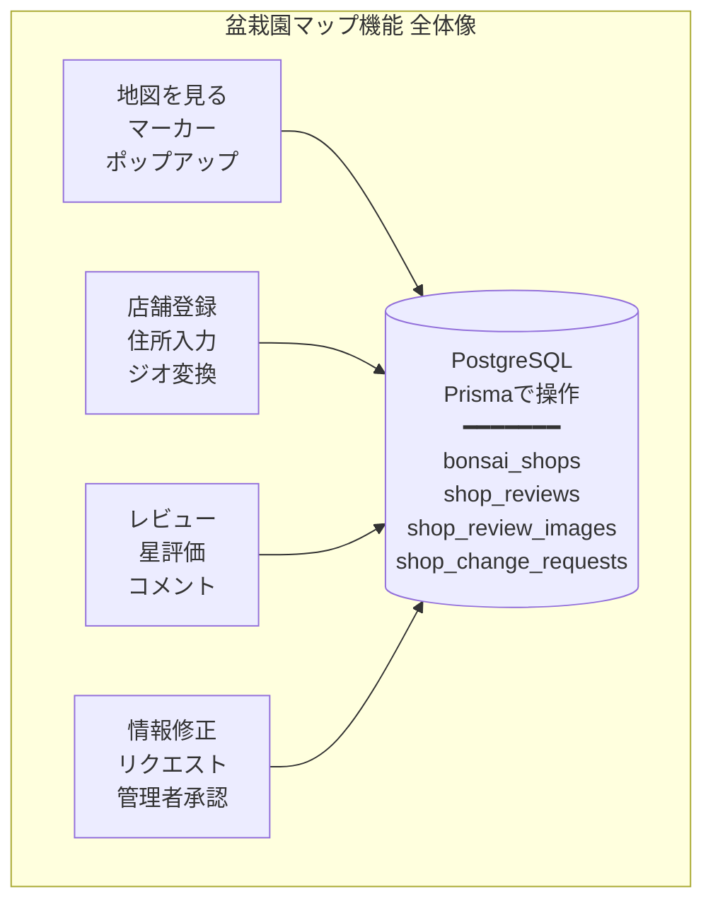
```mermaid
graph TB
    subgraph "盆栽園マップ機能 全体像"
        U1[地図を見る<br/>マーカー<br/>ポップアップ]
        U2[店舗登録<br/>住所入力<br/>ジオ変換]
        U3[レビュー<br/>星評価<br/>コメント]
        U4[情報修正<br/>リクエスト<br/>管理者承認]

        U1 --> DB
        U2 --> DB
        U3 --> DB
        U4 --> DB

        DB[(PostgreSQL<br/>Prismaで操作<br/>━━━━━━━<br/>bonsai_shops<br/>shop_reviews<br/>shop_review_images<br/>shop_change_requests)]
    end
```

### 機能要件

この章で実装する機能は、大きく4つに分かれます。

**1. 地図表示（16.3で実装）**
   - OpenStreetMapベースの地図をブラウザに表示
   - 盆栽園の位置にマーカー（ピン）を表示
   - マーカーをクリックするとポップアップ（店舗情報）が表示される

**2. 盆栽園管理（16.4で実装）**
   - 名前、住所、営業時間、電話番号などの登録
   - 緯度経度の自動取得（ジオコーディング）
   - 重複店舗の防止（同一名称・近接位置をチェック）

**3. レビューシステム（16.5で実装）**
   - 星5段階の評価
   - テキストによるレビュー本文
   - 画像添付（最大3枚）

**4. 変更リクエスト（16.6で実装）**
   - ユーザーからの情報修正提案
   - 管理者がレビューして承認/却下するフロー

### 技術スタックと各ライブラリの役割

> **Web地図の仕組み**
> Web地図は、世界地図を小さな正方形の画像（タイル、256×256ピクセル）に分割して表示しています。ズームレベルに応じて必要なタイルだけを読み込むため、世界地図全体をダウンロードする必要がありません。
>
> ```
> ズームレベル0: 世界全体 = 1枚のタイル
> ズームレベル1: 4枚のタイル
> ズームレベル2: 16枚のタイル
> ...
> ズームレベル18: 約690億枚のタイル（建物レベルの詳細）
> ```
>
> **緯度・経度**は地球上の位置を表す座標です：
> - **緯度（latitude）**: 赤道からの南北の角度（-90〜90）。東京は約35.7
> - **経度（longitude）**: 本初子午線からの東西の角度（-180〜180）。東京は約139.7

地図機能では、いくつかの専用ライブラリを組み合わせて使います。それぞれの役割を身近なものに例えて説明します。

| ライブラリ/サービス | 役割 | 身近な例え |
|---|---|---|
| **Leaflet** | 地図の表示・操作を行うJavaScriptライブラリ | 額縁のようなもの。地図データを見やすく表示する枠組み |
| **react-leaflet** | LeafletをReactコンポーネントとして使えるようにするラッパー | 額縁をReactの壁に取り付けるためのアダプター |
| **OpenStreetMap** | 無料で使える地図データ（タイルデータ） | 額縁の中に入れる「地図の絵」そのもの |
| **国土地理院 住所検索API** | 住所を緯度経度に変換するサービス（ジオコーディング） | 「東京都渋谷区...」と聞いて地図上の位置を教えてくれる通訳 |

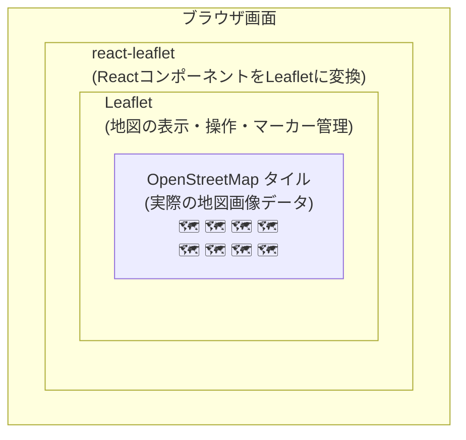
```mermaid
graph TB
    subgraph Browser["ブラウザ画面"]
        subgraph ReactLeaflet["react-leaflet<br/>(ReactコンポーネントをLeafletに変換)"]
            subgraph Leaflet["Leaflet<br/>(地図の表示・操作・マーカー管理)"]
                OSM["OpenStreetMap タイル<br/>(実際の地図画像データ)<br/>🗺️ 🗺️ 🗺️ 🗺️<br/>🗺️ 🗺️ 🗺️ 🗺️"]
            end
        end
    end
```

> **なぜGoogle Mapsではなく OpenStreetMap？**
> Google Maps APIは商用利用の場合、月間のリクエスト数に応じて課金されます（無料枠あり）。一方、OpenStreetMapは完全無料で利用できるオープンソースの地図データです。個人開発やスタートアップ段階では、OpenStreetMapが費用面で大きなメリットがあります。

### ジオコーディングとは

**ジオコーディング（Geocoding）** とは、「東京都新宿区西新宿2-8-1」のような住所テキストを、緯度（latitude）と経度（longitude）の数値に変換する処理のことです。

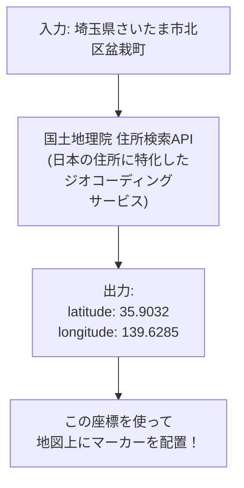
```mermaid
flowchart TB
    Input["入力: 埼玉県さいたま市北区盆栽町"]
    API["国土地理院 住所検索API<br/>(日本の住所に特化した<br/>ジオコーディング<br/>サービス)"]
    Output["出力:<br/>latitude: 35.9032<br/>longitude: 139.6285"]
    Map["この座標を使って<br/>地図上にマーカーを配置！"]

    Input --> API
    API --> Output
    Output --> Map
```

緯度と経度がわかれば、地図上の正確な位置にピンを立てることができます。つまり、ユーザーは「住所を入力するだけ」で、地図上に自動的にマーカーが表示される仕組みを作れるのです。

> **緯度と経度の基本知識**
> - **緯度（latitude）**: 赤道を0度として、北極が+90度、南極が-90度。日本は約24〜46度の範囲
> - **経度（longitude）**: イギリスのグリニッジ天文台を0度として、東に+180度、西に-180度。日本は約123〜154度の範囲
> - 例: 東京タワー → 緯度 35.6586, 経度 139.7454

### ライブラリのインストール

それでは実際にライブラリをインストールしましょう。ターミナルでプロジェクトのルートディレクトリに移動し、以下のコマンドを実行します。

```bash
# 地図表示に必要なライブラリをインストール
# leaflet: 地図ライブラリ本体
# react-leaflet: ReactでLeafletを使うためのラッパー
npm install leaflet react-leaflet

# TypeScript用の型定義をインストール（開発時のみ必要）
# -D フラグは devDependencies に追加する意味
npm install -D @types/leaflet
```

> **インストール時のエラーが出た場合**: `npm install --legacy-peer-deps leaflet react-leaflet` を試してください。React のバージョン互換性の警告が出ることがありますが、多くの場合問題なく動作します。

<details>
<summary>理解度チェック: 16.1の内容を確認しよう</summary>

**Q1: ジオコーディングとは何ですか？**
A1: 住所（テキスト）を緯度・経度（数値）に変換する処理のことです。これにより、住所から地図上の正確な位置を特定できます。

**Q2: なぜ Leaflet をブラウザでしか動かせないのですか？**
A2: Leaflet は地図をブラウザの DOM（HTMLの要素ツリー）上にレンダリングします。サーバーサイド（Node.js）にはブラウザの DOM が存在しないため、SSR（サーバーサイドレンダリング）では動作しません。

**Q3: OpenStreetMap を使うメリットは何ですか？**
A3: 完全に無料で利用でき、APIキーの取得も不要です。Google Maps のように利用量に応じた課金もありません。オープンソースなので、地図データの改善にも貢献できます。

</details>

---

## 16.2 データモデル

> **このセクションで学ぶこと**
> - 盆栽園マップに必要なデータベーステーブル構造を理解する
> - Prisma スキーマでの地理情報（緯度・経度）の扱い方を学ぶ
> - テーブル間のリレーション（関連）設計を理解する
> - インデックスの重要性を知る

### テーブル構造の全体像

盆栽園マップ機能では、4つの主要テーブルを使います。以下の図でテーブル間の関係を確認しましょう。

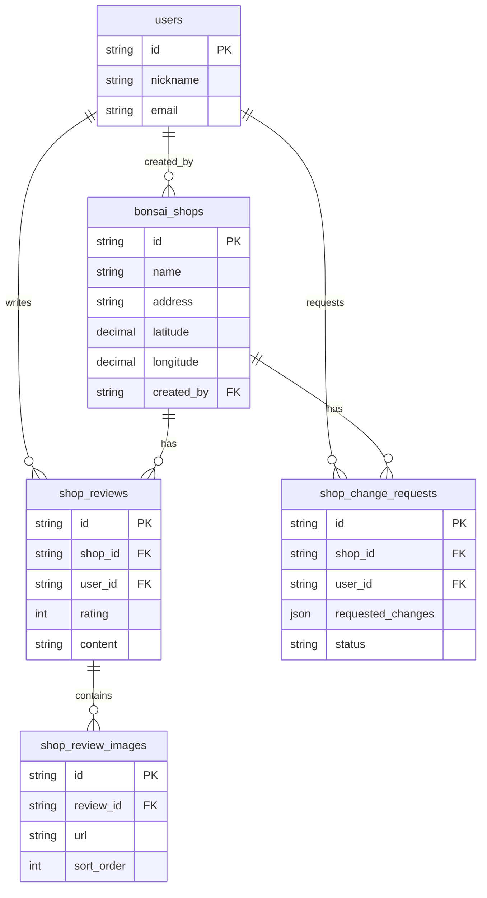
```mermaid
erDiagram
    users ||--o{ bonsai_shops : "created_by"
    users ||--o{ shop_reviews : "writes"
    users ||--o{ shop_change_requests : "requests"
    bonsai_shops ||--o{ shop_reviews : "has"
    bonsai_shops ||--o{ shop_change_requests : "has"
    shop_reviews ||--o{ shop_review_images : "contains"

    users {
        string id PK
        string nickname
        string email
    }

    bonsai_shops {
        string id PK
        string name
        string address
        decimal latitude
        decimal longitude
        string created_by FK
    }

    shop_reviews {
        string id PK
        string shop_id FK
        string user_id FK
        int rating
        string content
    }

    shop_review_images {
        string id PK
        string review_id FK
        string url
        int sort_order
    }

    shop_change_requests {
        string id PK
        string shop_id FK
        string user_id FK
        json requested_changes
        string status
    }
```

各テーブルの役割は以下の通りです。

| テーブル名 | 役割 | 例え |
|---|---|---|
| `bonsai_shops` | 盆栽園の基本情報 | お店のカタログ |
| `shop_reviews` | ユーザーが書いたレビュー | 食べログの口コミ |
| `shop_review_images` | レビューに添付された画像 | 口コミの写真 |
| `shop_change_requests` | 情報修正リクエスト | Wikipediaの「編集提案」 |

### Prisma スキーマの定義

それでは、各テーブルの詳細なスキーマを定義していきましょう。コード中のコメントで各フィールドの意味を詳しく説明しています。

```prisma
// prisma/schema.prisma

model BonsaiShop {
  // --- 基本フィールド ---
  id            String    @id @default(cuid())  // 一意なID（cuidで自動生成）
  name          String    // 店舗名（例: "〇〇盆栽園"）
  address       String    // 住所（ジオコーディングの元データにもなる）
  latitude      Decimal?  @db.Decimal(10, 7) // 緯度（例: 35.6762000）nullable
  longitude     Decimal?  @db.Decimal(10, 7) // 経度（例: 139.6503000）nullable
  phone         String?   // 電話番号（任意）
  website       String?   // ウェブサイトURL（任意）
  businessHours String?   @map("business_hours") // 営業時間（テキストで保存）
  closedDays    String?   @map("closed_days")    // 定休日（テキストで保存）
  isHidden      Boolean   @default(false) @map("is_hidden") // 非表示フラグ
  hiddenAt      DateTime? @map("hidden_at")      // 非表示にした日時
  createdBy     String    @map("created_by")     // この店舗を登録したユーザーのID（必須）

  // --- タイムスタンプ ---
  createdAt     DateTime  @default(now()) @map("created_at")  // 登録日時（自動設定）
  updatedAt     DateTime  @updatedAt @map("updated_at")       // 更新日時（自動更新）

  // --- リレーション（テーブル間の関連） ---
  creator        User                @relation(fields: [createdBy], references: [id], onDelete: Cascade)
  genres         ShopGenre[]         // この店舗のジャンル（多対多の中間テーブル）
  reviews        ShopReview[]        // この店舗のレビュー一覧（1対多）
  changeRequests ShopChangeRequest[] // この店舗への変更リクエスト一覧

  // --- インデックス（検索パフォーマンスの最適化） ---
  @@index([isHidden])   // 非表示フィルタの高速化
  @@map("bonsai_shops") // 実際のテーブル名（スネークケース）
}

// ShopGenre: 盆栽園とジャンルの中間テーブル
model ShopGenre {
  shopId  String @map("shop_id")
  genreId String @map("genre_id")

  shop  BonsaiShop @relation(fields: [shopId], references: [id], onDelete: Cascade)
  genre Genre      @relation(fields: [genreId], references: [id], onDelete: Cascade)

  @@id([shopId, genreId])  // 複合主キー
  @@map("shop_genres")
}

// ShopReview: ユーザーが盆栽園に対して投稿するレビュー
model ShopReview {
  id        String    @id @default(cuid())
  shopId    String    @map("shop_id")    // どの店舗へのレビューか
  userId    String    @map("user_id")    // 誰が書いたレビューか
  rating    Int       // 評価（1〜5の整数。星の数に対応）
  content   String?   @db.Text // レビュー本文（任意。書かなくても星だけでOK）
  isHidden  Boolean   @default(false) @map("is_hidden") // 非表示フラグ
  hiddenAt  DateTime? @map("hidden_at")  // 非表示にした日時
  createdAt DateTime  @default(now()) @map("created_at")

  // リレーション
  shop      BonsaiShop        @relation(fields: [shopId], references: [id], onDelete: Cascade)
  user      User              @relation(fields: [userId], references: [id], onDelete: Cascade)
  images    ShopReviewImage[] // レビューに添付された画像（1対多）

  @@index([isHidden])   // 非表示フィルタの高速化
  @@map("shop_reviews")
}

// ShopReviewImage: レビューに添付された画像（最大3枚）
// 注意: sort_order フィールドはありません。アップロード順で管理されます。
model ShopReviewImage {
  id       String @id @default(cuid())
  reviewId String @map("review_id")  // どのレビューの画像か
  url      String                     // 画像のURL

  review   ShopReview @relation(fields: [reviewId], references: [id], onDelete: Cascade)
  // onDelete: Cascade → レビューが削除されたら画像も自動削除

  @@index([reviewId])
  @@map("shop_review_images")
}

// ShopChangeRequest: 店舗情報の変更リクエスト
// Wikipediaの「編集提案」のような仕組み。ユーザーが提案→管理者が承認/却下
model ShopChangeRequest {
  id               String    @id @default(cuid())
  shopId           String    @map("shop_id")              // 変更対象の店舗
  userId           String    @map("user_id")              // 提案したユーザー
  status           String    @default("pending")           // ステータス: pending→approved/rejected
  requestedChanges Json      @map("requested_changes")     // 変更内容をJSON形式で保存
  // { name?, address?, phone?, website?, businessHours?, closedDays? }
  reason           String?   @db.Text                      // 変更理由
  adminComment     String?   @db.Text @map("admin_comment") // 管理者のコメント
  resolvedAt       DateTime? @map("resolved_at")           // 承認/却下した日時
  createdAt        DateTime  @default(now()) @map("created_at")

  // リレーション
  shop BonsaiShop @relation(fields: [shopId], references: [id], onDelete: Cascade)
  user User       @relation(fields: [userId], references: [id], onDelete: Cascade)

  @@index([shopId])
  @@index([userId])
  @@index([status])
  @@map("shop_change_requests")
}

// User モデルに以下のリレーションフィールドを追加
model User {
  // ... 既存フィールド（id, email, nickname 等）

  // 地図関連のリレーション
  bonsaiShops      BonsaiShop[]         // この人が登録した盆栽園
  shopReviews      ShopReview[]         // この人が書いたレビュー
  shopChangeRequests ShopChangeRequest[] // 提案した変更
}
```

### スキーマ設計のポイント解説

いくつかの設計判断について、なぜそうしたかを説明します。

**1. 緯度・経度を `Decimal` 型で保存する理由**

緯度・経度は小数点以下の精度が重要です。`Decimal(10, 7)` を使うことで、小数点以下7桁の精度を確保できます。`Float` 型は浮動小数点の丸め誤差が発生する可能性がありますが、`Decimal` 型なら正確な値を保持できます。緯度経度は nullable（`?`）にしており、住所のみで緯度経度が取得できなかった場合にも対応しています。

**2. `@@index([isHidden])` の意味**

インデックスは「本の索引」のようなものです。盆栽園一覧を表示する際、`isHidden: false` のレコードだけを効率的にフィルタリングするためにインデックスを設定しています。全レコードから非表示でないものを素早く検索できるようになります。

**3. `ShopChangeRequest` で `requestedChanges` を `Json` 型にする理由**

変更リクエストでは、ユーザーが複数のフィールドを同時に変更提案できます。各フィールドを個別のカラムにするのではなく、JSON形式で `{ name?: string, address?: string, phone?: string, ... }` のようにまとめて保存します。これにより、変更対象フィールドが増えてもスキーマを変更する必要がありません。

### スキーマをデータベースに反映する

Prisma スキーマを書き終えたら、データベースに反映しましょう。

```bash
# 開発環境: スキーマを直接DBに反映（マイグレーションファイルは作らない簡易版）
npx prisma db push

# Prisma クライアントを再生成（型情報を更新）
npx prisma generate
```

> **`db push` と `migrate dev` の違い**
> - `db push`: 開発中にスキーマを素早く反映するためのコマンド。マイグレーション履歴は残りません。
> - `migrate dev`: 正式なマイグレーションファイルを作成します。本番環境にはこちらを使います。
> 開発初期段階では `db push` が手軽です。スキーマが安定したら `migrate dev` に切り替えましょう。

### よくあるトラブルと解決法

| トラブル | 原因 | 解決法 |
|---|---|---|
| `db push` で "relation already exists" エラー | 既存テーブルと名前が衝突 | `@@map` で別名を指定するか、既存テーブルを削除 |
| `Float` に `null` が入る | フィールドに `?` が付いている | 必須フィールドには `?` を付けない |
| 外部キー制約エラー | 参照先のレコードが存在しない | データ投入の順序に注意（先に User、次に Shop） |
| `prisma generate` 後も型が認識されない | エディタのキャッシュ | VSCode なら Ctrl+Shift+P → "TypeScript: Restart TS Server" |

<details>
<summary>理解度チェック: 16.2の内容を確認しよう</summary>

**Q1: `isHidden` フラグと `hiddenAt` を両方持つ理由は？**
A1: `isHidden` は「現在非表示かどうか」を高速に判定するためのフラグで、インデックスも設定されています。`hiddenAt` は「いつ非表示にされたか」の記録で、管理者が非表示の経緯を確認する際に役立ちます。

**Q2: `onDelete: Cascade` は何を意味しますか？**
A2: 親レコードが削除されたとき、子レコードも自動的に削除されることを意味します。例えば、レビューが削除されたら、そのレビューに添付された画像レコードも自動削除されます。

**Q3: `ShopChangeRequest` で `requestedChanges` を `Json` 型にする利点は？**
A3: 1回の変更リクエストで複数のフィールドをまとめて提案できます。例えば「電話番号と営業時間の両方が変わった」場合、1つのリクエストで `{ phone: "新番号", businessHours: "新営業時間" }` のように送れます。フィールドごとに別々のリクエストを作る必要がありません。

</details>

---

## 16.3 地図コンポーネントの実装

> **このセクションで学ぶこと**
> - Leaflet + react-leaflet で地図をブラウザに表示する方法
> - マーカー（ピン）とポップアップの実装
> - Next.js で SSR を無効化する理由と方法（dynamic import）
> - Server Component と Client Component の使い分け

### 地図表示の仕組み

地図をブラウザに表示する仕組みを理解しましょう。地図は「タイル」と呼ばれる小さな画像を敷き詰めて表示されています。

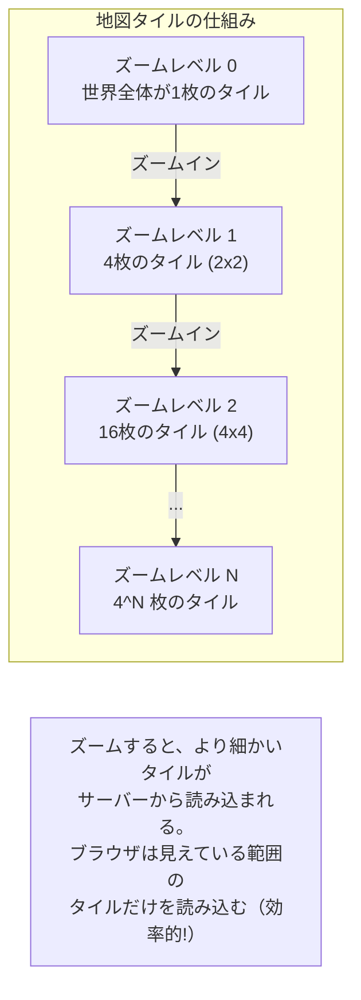
```mermaid
graph TB
    subgraph "地図タイルの仕組み"
        direction TB
        Z0["ズームレベル 0<br/>世界全体が1枚のタイル"]
        Z1["ズームレベル 1<br/>4枚のタイル (2x2)"]
        Z2["ズームレベル 2<br/>16枚のタイル (4x4)"]
        ZN["ズームレベル N<br/>4^N 枚のタイル"]

        Z0 -->|"ズームイン"| Z1
        Z1 -->|"ズームイン"| Z2
        Z2 -->|"..."| ZN
    end

    Note["ズームすると、より細かいタイルが<br/>サーバーから読み込まれる。<br/>ブラウザは見えている範囲の<br/>タイルだけを読み込む（効率的!）"]
    ZN ~~~ Note
```

### 基本的な地図コンポーネント

まず、地図を表示するReactコンポーネントを作成します。このコンポーネントはブラウザの DOM を操作するため、`'use client'` が必須です。

```typescript
// components/shop/Map.tsx
'use client'
// ↑ これがないとサーバーで実行されてエラーになる！

// react-leaflet から地図関連のコンポーネントをインポート
// MapContainer: 地図の外枠（地図全体をラップする）
// TileLayer: 地図の画像タイルを表示するレイヤー
// Marker: 地図上のピン（マーカー）
// Popup: マーカーをクリックしたときに表示される吹き出し
import { MapContainer, TileLayer, Marker, Popup } from 'react-leaflet'

// Leaflet 本体から Icon クラスをインポート（カスタムマーカー用）
import { Icon } from 'leaflet'

// Leaflet の CSS を読み込む（これがないと地図の見た目が崩れる）
import 'leaflet/dist/leaflet.css'

// Next.js のリンクコンポーネント（店舗詳細ページへの遷移用）
import Link from 'next/link'

// カスタムマーカーアイコンの設定
// デフォルトのマーカーではなく、盆栽園用のオリジナルアイコンを使う
const shopIcon = new Icon({
  iconUrl: '/icons/shop-marker.png', // public/icons/ に画像を配置
  iconSize: [32, 32],       // アイコンの幅と高さ（ピクセル）
  iconAnchor: [16, 32],     // アイコンの基準点（下辺中央がピンの先端）
  popupAnchor: [0, -32],    // ポップアップの表示位置（アイコンの上に表示）
})
```

> **マーカーアイコンの座標**
> `iconAnchor` と `popupAnchor` はピクセル単位の座標で、アイコン画像の左上を原点(0,0)とします：
>
> ```
> (0,0)───────(32,0)
>   │  アイコン画像  │
>   │    (32×32px)    │
>   │       ▼        │  ← iconAnchor: [16, 32] = 下辺の中央が地図上の位置に一致
> (0,32)─────(32,32)
> ```
>
> - **`iconAnchor: [16, 32]`**: アイコンの下辺中央が実際の位置を指す
> - **`popupAnchor: [0, -32]`**: ポップアップはアイコンの上に表示（Y方向に-32px）

```typescript
// ======================================
// 型定義: 地図に表示する店舗データの形
// ======================================
interface Shop {
  id: string          // 店舗の一意なID（URLリンクに使う）
  name: string        // 店舗名
  address: string     // 住所（ポップアップに表示）
  latitude: number    // 緯度（マーカーの位置指定に使う）
  longitude: number   // 経度
  rating?: number     // 平均評価（あれば表示、なければ非表示）
  reviewCount?: number // レビュー件数
}

// ======================================
// 型定義: Map コンポーネントの Props
// ======================================
interface MapProps {
  shops: Shop[]                // 表示する店舗の配列
  center?: [number, number]    // 地図の中心座標 [緯度, 経度]
  zoom?: number                // 初期ズームレベル（大きいほど拡大）
}

// ======================================
// Map コンポーネント本体
// ======================================
export function Map({ shops, center, zoom = 13 }: MapProps) {
  // center が指定されていなければ、東京の座標をデフォルトにする
  const defaultCenter: [number, number] = center || [35.6762, 139.6503]

  return (
    // MapContainer: 地図の外枠コンポーネント
    <MapContainer
      center={defaultCenter}    // 初期表示の中心座標
      zoom={zoom}               // 初期ズームレベル（13は市区町村レベル）
      className="h-[600px] w-full rounded-lg" // Tailwind CSS でサイズ指定
      scrollWheelZoom={false}   // マウスホイールでのズームを無効化
      // ↑ ページスクロール中に意図せずズームされるのを防止
    >
      {/* TileLayer: OpenStreetMap の地図タイルを表示 */}
      <TileLayer
        attribution='&copy; <a href="https://www.openstreetmap.org/copyright">OpenStreetMap</a> contributors'
        // ↑ 著作権表示（OpenStreetMap の利用規約で必須）
        url="https://{s}.tile.openstreetmap.org/{z}/{x}/{y}.png"
        // ↑ タイル画像のURL。{s}=サーバー、{z}=ズーム、{x},{y}=タイル座標
      />

      {/* 店舗データを1件ずつマーカーとして地図上に配置 */}
      {shops.map((shop) => (
        <Marker
          key={shop.id}                                  // React の key（一意な識別子）
          position={[shop.latitude, shop.longitude]}     // マーカーの位置
          icon={shopIcon}                                // カスタムアイコンを使用
        >
          {/* Popup: マーカークリック時に表示される吹き出し */}
          <Popup>
            <div className="p-2">
              {/* 店舗名 */}
              <h3 className="font-bold text-lg mb-1">{shop.name}</h3>

              {/* 住所 */}
              <p className="text-sm text-gray-600 mb-2">{shop.address}</p>

              {/* 評価（ある場合のみ表示） */}
              {shop.rating && (
                <div className="flex items-center gap-1 mb-2">
                  <span className="text-yellow-500">★</span>
                  <span className="font-semibold">
                    {shop.rating.toFixed(1)}  {/* 小数点1桁に整形 */}
                  </span>
                  <span className="text-sm text-gray-500">
                    ({shop.reviewCount || 0}件)
                  </span>
                </div>
              )}

              {/* 詳細ページへのリンク */}
              <Link
                href={`/shops/${shop.id}`}
                className="text-blue-600 hover:underline text-sm"
              >
                詳細を見る →
              </Link>
            </div>
          </Popup>
        </Marker>
      ))}
    </MapContainer>
  )
}
```

> **マーカーアイコン画像の準備**: `public/icons/shop-marker.png` に 32x32 ピクセルの PNG 画像を配置してください。フリーのアイコン素材サイト（例: icons8.com、flaticon.com）からダウンロードできます。アイコンを用意しない場合は、Leaflet のデフォルトマーカーが表示されます。

### SSR無効化（重要）

Leaflet はブラウザ専用のライブラリです。サーバーサイドで実行しようとすると `window is not defined` エラーが発生します。これは、Leaflet 内部でブラウザの `window` オブジェクトや DOM を直接操作しているためです。

> **なぜLeafletはSSRで動かない？**
> Leaflet（地図ライブラリ）はブラウザの `window` オブジェクトを前提に設計されています。Server Componentはサーバー（Node.js）で実行され、`window` が存在しないためエラーになります。
>
> ```
> ReferenceError: window is not defined
> ```
>
> **解決策**: `next/dynamic` で `ssr: false` を指定し、ブラウザ側でのみ読み込みます：
> ```typescript
> const Map = dynamic(() => import('./Map'), { ssr: false })
> ```
> これにより、サーバーではスケルトン（ローディング表示）が表示され、ブラウザでJavaScriptが読み込まれた後に地図が表示されます。

Next.js の `dynamic import` を使って、このコンポーネントをクライアントサイド（ブラウザ）でのみ読み込むようにします。

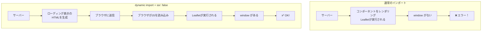
```mermaid
graph TB
    subgraph Normal["通常のインポート"]
        NS1[サーバー]
        NS2[コンポーネントをレンダリング<br/>Leafletが実行される]
        NS3[window がない]
        NS4[❌ エラー！]

        NS1 --> NS2
        NS2 --> NS3
        NS3 --> NS4
    end

    subgraph Dynamic["dynamic import + ssr: false"]
        DS1[サーバー]
        DS2[ローディング表示の<br/>HTMLを生成]
        DS3[ブラウザに送信]
        DS4[ブラウザがJSを読み込み]
        DS5[Leafletが実行される]
        DS6[window がある]
        DS7[✅ OK!]

        DS1 --> DS2
        DS2 --> DS3
        DS3 --> DS4
        DS4 --> DS5
        DS5 --> DS6
        DS6 --> DS7
    end
```

```typescript
// app/(main)/shops/page.tsx
import dynamic from 'next/dynamic'   // Next.js の動的インポート関数
import { Suspense } from 'react'     // 非同期データのローディング表示用
import { prisma } from '@/lib/db'    // データベースクライアント

// ====================================================
// SSR無効化して Map コンポーネントを読み込む
// ====================================================
// dynamic() の第1引数: 読み込むコンポーネントを返す非同期関数
// .then((mod) => ({ default: mod.Map }))
//   → モジュールの中から Map という名前付きエクスポートを取り出す
const Map = dynamic(
  () => import('@/components/shop/Map').then((mod) => ({ default: mod.Map })),
  {
    ssr: false,  // ← これが重要！サーバーサイドでは読み込まない
    loading: () => (
      // 地図の読み込み中に表示するプレースホルダー
      // 地図と同じサイズにすることで、読み込み後のレイアウトのガタつきを防止
      <div className="h-[600px] w-full bg-gray-100 rounded-lg flex items-center justify-center">
        <p className="text-gray-500">地図を読み込んでいます...</p>
      </div>
    ),
  }
)

// ====================================================
// 盆栽園マップページ（Server Component）
// ====================================================
// Server Component なので async/await でDBから直接データを取得できる
export default async function ShopsPage() {
  // データベースから全盆栽園データを取得
  // include で関連するレビューの rating フィールドも一緒に取得
  const shops = await prisma.bonsaiShop.findMany({
    include: {
      reviews: {
        select: { rating: true },  // rating だけ取得（通信量を削減）
      },
    },
  })

  // ====================================================
  // レビュー平均を計算してMapコンポーネント用のデータに変換
  // ====================================================
  const shopsWithRating = shops.map((shop) => {
    // 各店舗のレビュー評価を配列で取得（例: [5, 4, 3, 5, 4]）
    const ratings = shop.reviews.map((r) => r.rating)

    // 平均値を計算（レビューが0件の場合は undefined にする）
    const averageRating = ratings.length > 0
      ? ratings.reduce((sum, r) => sum + r, 0) / ratings.length
      // ↑ reduce: 全要素を足し合わせる → 件数で割る = 平均
      : undefined

    // Map コンポーネントが必要とするフィールドだけを返す
    // （Prisma のリレーションオブジェクトなどは渡さない）
    return {
      id: shop.id,
      name: shop.name,
      address: shop.address,
      latitude: shop.latitude,
      longitude: shop.longitude,
      rating: averageRating,
      reviewCount: ratings.length,
    }
  })

  return (
    <div className="max-w-7xl mx-auto p-4">
      <h1 className="text-3xl font-bold mb-6">盆栽園マップ</h1>

      {/* Suspense: Map の読み込み中にフォールバックを表示 */}
      <Suspense fallback={<div>Loading...</div>}>
        {/* Map はクライアントサイドでのみレンダリングされる */}
        <Map shops={shopsWithRating} />
      </Suspense>
    </div>
  )
}
```

### よくあるトラブルと解決法（地図表示）

| トラブル | 症状 | 原因 | 解決法 |
|---|---|---|---|
| 地図が表示されない（灰色の四角） | グレーの枠だけ表示される | CSS が読み込まれていない | `import 'leaflet/dist/leaflet.css'` を追加 |
| `window is not defined` エラー | サーバーエラー | SSR で Leaflet が実行された | `dynamic()` で `ssr: false` を指定 |
| マーカーの画像が壊れている | マーカーが透明/表示されない | デフォルトアイコンのパス問題 | カスタムアイコンを設定するか、Leaflet の `icon` 設定を修正 |
| 地図のタイルが一部読み込まれない | 白い隙間がある | コンテナのサイズが動的に変化 | `invalidateSize()` を呼ぶか、固定サイズにする |
| ズームレベルが合わない | 地図が広すぎる/狭すぎる | `zoom` プロパティの値が不適切 | 5（広域）〜18（建物レベル）の範囲で調整 |

> **ズームレベルの目安**:
> - 5: 日本全体が見える
> - 8: 関東地方くらい
> - 11: 東京23区くらい
> - 13: 区の一部（デフォルト値）
> - 16: 通りの名前が見える
> - 18: 建物レベル（最大）

<details>
<summary>理解度チェック: 16.3の内容を確認しよう</summary>

**Q1: なぜ Map コンポーネントに `'use client'` が必要ですか？**
A1: Leaflet はブラウザの DOM を直接操作するため、サーバーサイドでは動作しません。`'use client'` を付けることで、このコンポーネントがブラウザ（クライアント）でのみ実行されることを宣言します。

**Q2: `dynamic()` の `ssr: false` オプションは何をしていますか？**
A2: Next.js のサーバーサイドレンダリング時に、このコンポーネントの JavaScript コードを実行しないように指示しています。サーバーではローディングコンポーネントが代わりにレンダリングされ、ブラウザでJSが読み込まれた後に実際の地図が表示されます。

**Q3: `scrollWheelZoom={false}` にしている理由は？**
A3: ユーザーがページを上下にスクロールしている最中に、マウスカーソルが地図の上を通過すると、意図せず地図がズームされてしまうのを防ぐためです。地図をズームしたい場合は、+/- ボタンやピンチ操作で行えます。

**Q4: Server Component（ShopsPage）で DB データを取得し、Client Component（Map）に渡す設計の利点は？**
A4: データ取得はサーバーで行うため、データベースの接続情報がブラウザに漏れません。また、サーバーとデータベース間の通信は高速なので、パフォーマンスも良くなります。Client Component には表示に必要な最小限のデータだけを渡します。

</details>

> **BON-LOGでの使用箇所**
>
> 地図コンポーネントは `components/shop/Map.tsx` として実装されています。
> `app/(main)/shops/page.tsx` で `next/dynamic` を使って SSR 無効化でインポートされます。
> 地図の中心座標は東京（`[35.6762, 139.6503]`）がデフォルトです。
>
> **実装しない場合の影響**: 盆栽園の位置情報を地図で視覚的に表示できなくなります。
> 一覧表示（リスト形式）のみとなり、地理的な探索体験が失われます。

### アーキテクチャ補足

ここまでの実装を踏まえて、地図コンポーネントのアーキテクチャをより深く理解するための3つの図を示します。

#### 1. Map コンポーネント読み込みアーキテクチャ

Next.js の dynamic import と SSR 無効化の仕組みを視覚化します。

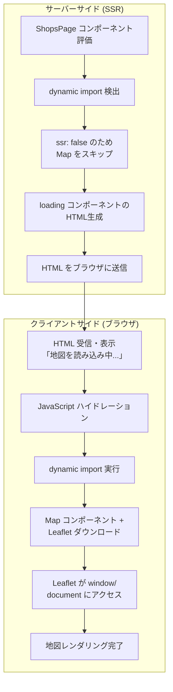
```mermaid
flowchart TB
    subgraph Server["サーバーサイド (SSR)"]
        SSR1[ShopsPage コンポーネント評価]
        SSR2[dynamic import 検出]
        SSR3[ssr: false のため<br/>Map をスキップ]
        SSR4[loading コンポーネントの<br/>HTML生成]
        SSR5[HTML をブラウザに送信]

        SSR1 --> SSR2
        SSR2 --> SSR3
        SSR3 --> SSR4
        SSR4 --> SSR5
    end

    subgraph Client["クライアントサイド (ブラウザ)"]
        CS1[HTML 受信・表示<br/>「地図を読み込み中...」]
        CS2[JavaScript ハイドレーション]
        CS3[dynamic import 実行]
        CS4[Map コンポーネント +<br/>Leaflet ダウンロード]
        CS5[Leaflet が window/<br/>document にアクセス]
        CS6[地図レンダリング完了]

        CS1 --> CS2
        CS2 --> CS3
        CS3 --> CS4
        CS4 --> CS5
        CS5 --> CS6
    end

    SSR5 --> CS1
```

**ポイント**:
- サーバーでは Map コンポーネントを評価せず、loading プレースホルダーのみ HTML 化
- ブラウザで JS が読み込まれた後に初めて Leaflet が実行される
- `window` や `document` が必要な処理は全てクライアントサイドで実行

#### 2. Shop データ CRUD フロー

盆栽園データの作成・読み取り・更新・削除の全体フローです。


```mermaid
flowchart TD
    subgraph Create["作成 (Create)"]
        C1[ユーザーがフォーム入力]
        C2[Server Action: createShop]
        C3{認証チェック}
        C4{バリデーション}
        C5[ジオコーディング<br/>国土地理院API]
        C6{重複チェック}
        C7[Prisma: shop.create]
        C8[revalidatePath: /shops]
        C9[成功レスポンス]

        C1 --> C2
        C2 --> C3
        C3 -->|OK| C4
        C3 -->|NG| Err1[エラー: 認証が必要]
        C4 -->|OK| C5
        C4 -->|NG| Err2[エラー: 入力値不正]
        C5 --> C6
        C6 -->|重複なし| C7
        C6 -->|重複あり| Err3[エラー: 既存店舗あり]
        C7 --> C8
        C8 --> C9
    end

    subgraph Read["読み取り (Read)"]
        R1[ShopsPage コンポーネント]
        R2[Prisma: shop.findMany<br/>+ reviews の rating]
        R3[平均評価を計算]
        R4[Map コンポーネントに渡す]

        R1 --> R2
        R2 --> R3
        R3 --> R4
    end

    subgraph Update["更新 (Update)"]
        U1{更新者は?}
        U2[オーナー: 直接編集<br/>Server Action: updateShop]
        U3[一般ユーザー: 変更リクエスト<br/>Server Action: createChangeRequest]
        U4[管理者が承認]
        U5[Prisma: shop.update<br/>+ request.update]
        U6[revalidatePath]

        U1 -->|オーナー| U2
        U1 -->|一般| U3
        U2 --> U5
        U3 --> U4
        U4 --> U5
        U5 --> U6
    end

    subgraph Delete["削除 (Delete)"]
        D1[オーナー or 管理者]
        D2[Server Action: deleteShop]
        D3[Prisma: shop.delete<br/>onDelete: Cascade で<br/>reviews, change_requests も削除]
        D4[revalidatePath]

        D1 --> D2
        D2 --> D3
        D3 --> D4
    end
```

**ポイント**:
- 作成時はジオコーディング + 重複チェックが必須
- 更新は「オーナーの直接編集」と「一般ユーザーの変更リクエスト」の2経路
- 削除は Cascade により関連データも自動削除

#### 3. Shop 変更リクエスト承認ワークフロー

管理者による変更リクエストの承認・却下プロセスを詳細化します。

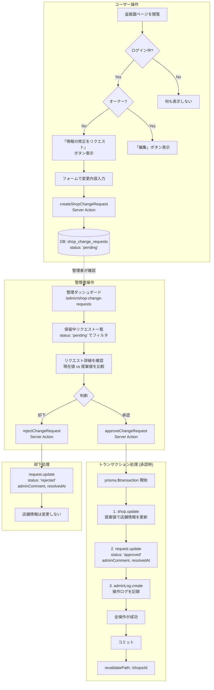
```mermaid
flowchart TD
    subgraph UserAction["ユーザー操作"]
        UA1[盆栽園ページを閲覧]
        UA2{ログイン中?}
        UA3{オーナー?}
        UA4[「情報の修正をリクエスト」<br/>ボタン表示]
        UA5[フォームで変更内容入力]
        UA6[createShopChangeRequest<br/>Server Action]
        UA7[(DB: shop_change_requests<br/>status: 'pending')]

        UA1 --> UA2
        UA2 -->|Yes| UA3
        UA2 -->|No| UAEnd[何も表示しない]
        UA3 -->|Yes| UAOwner[「編集」ボタン表示]
        UA3 -->|No| UA4
        UA4 --> UA5
        UA5 --> UA6
        UA6 --> UA7
    end

    subgraph AdminAction["管理者操作"]
        AA1[管理ダッシュボード<br/>/admin/shop-change-requests]
        AA2[保留中リクエスト一覧<br/>status: 'pending' でフィルタ]
        AA3[リクエスト詳細を確認<br/>現在値 vs 提案値を比較]
        AA4{判断}
        AA5[approveChangeRequest<br/>Server Action]
        AA6[rejectChangeRequest<br/>Server Action]

        AA1 --> AA2
        AA2 --> AA3
        AA3 --> AA4
        AA4 -->|承認| AA5
        AA4 -->|却下| AA6
    end

    subgraph Transaction["トランザクション処理 (承認時)"]
        T1[prisma.$transaction 開始]
        T2[1. shop.update<br/>提案値で店舗情報を更新]
        T3[2. request.update<br/>status: 'approved'<br/>adminComment, resolvedAt]
        T4[3. adminLog.create<br/>操作ログを記録]
        T5[全操作が成功]
        T6[コミット]
        T7[revalidatePath: /shops/id]

        T1 --> T2
        T2 --> T3
        T3 --> T4
        T4 --> T5
        T5 --> T6
        T6 --> T7
    end

    subgraph Rejection["却下処理"]
        RJ1[request.update<br/>status: 'rejected'<br/>adminComment, resolvedAt]
        RJ2[店舗情報は変更しない]

        RJ1 --> RJ2
    end

    UA7 -.->|管理者が確認| AA1
    AA5 --> T1
    AA6 --> RJ1
```

**ポイント**:
- ユーザーは「オーナーか否か」で異なる UI が表示される
- 承認時は `$transaction` で 3 操作をアトミックに実行
- 却下時は店舗情報を変更せず、リクエストのステータスのみ更新

---

## 16.4 盆栽園の登録・ジオコーディング

> **このセクションで学ぶこと**
> - ジオコーディング（住所→緯度経度変換）の実装方法
> - 国土地理院 住所検索API の使い方と注意点
> - 重複店舗チェックのアルゴリズム
> - Server Actions を使ったフォーム送信処理
> - zod バリデーションの実践的な書き方

### ジオコーディングの実装

ジオコーディングとは、「住所」という人間が読みやすい情報を、「緯度・経度」というコンピュータが扱いやすい数値に変換する処理です。

この章では、**国土地理院 住所検索API** を使います。日本の住所に特化しており、無料で利用でき、APIキーの取得も不要です。

> **国土地理院 住所検索API の特徴**
> - 日本国内の住所に特化しているため、日本語住所の認識精度が高い
> - APIキー不要、無料で利用可能
> - レスポンス形式は GeoJSON 準拠
> - 注意: レスポンスの座標は `[経度, 緯度]` の順序（一般的な `[緯度, 経度]` とは逆）

### ジオコーディング関数

ジオコーディング関数は `lib/actions/shop.ts` に Server Action として定義されています。

```typescript
// lib/actions/shop.ts（ジオコーディング部分）
'use server'

// ======================================
// geocodeAddress: 住所テキストを緯度・経度に変換する
// ======================================
// 引数: address - 変換したい住所（例: "埼玉県さいたま市北区盆栽町"）
// 戻り値: 成功時は { latitude, longitude, displayName }、失敗時は { error }
export async function geocodeAddress(address: string) {
  try {
    // 住所をURLエンコード
    const encodedAddress = encodeURIComponent(address)

    // 国土地理院 住所検索APIにリクエストを送信
    const response = await fetch(
      `https://msearch.gsi.go.jp/address-search/AddressSearch?q=${encodedAddress}`,
      {
        headers: {
          'Accept': 'application/json',
        },
      }
    )

    // HTTP ステータスが200以外（エラー）の場合
    if (!response.ok) {
      return { error: '住所の検索に失敗しました' }
    }

    // レスポンスをJSONとしてパース
    const data = await response.json()

    // 検索結果が0件の場合（住所が見つからなかった）
    if (!data || data.length === 0) {
      return { error: '住所が見つかりませんでした' }
    }

    // 国土地理院APIのレスポンス形式: [経度, 緯度]
    // 注意: 一般的な [緯度, 経度] とは順序が逆！
    const [longitude, latitude] = data[0].geometry.coordinates

    return {
      latitude: latitude,
      longitude: longitude,
      displayName: data[0].properties.title,  // 正式な住所表記
    }
  } catch {
    return { error: '住所の検索中にエラーが発生しました' }
  }
}
```

### 重複店舗チェックの仕組み

同じ盆栽園が二重に登録されるのを防ぐため、「店舗名が同じ」かつ「位置が近い（100m以内）」場合は重複とみなします。

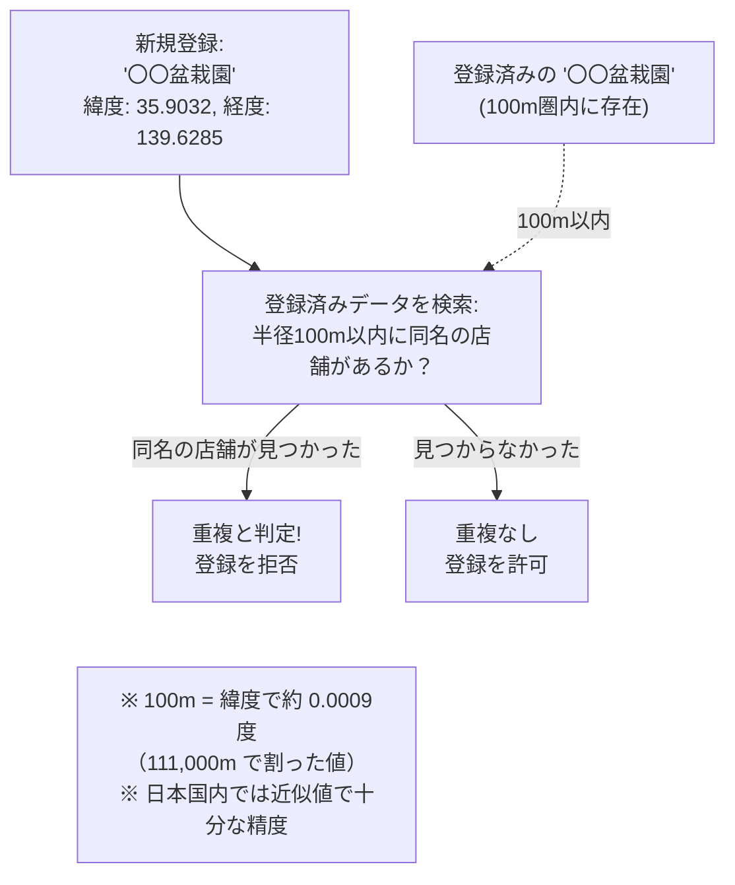
```mermaid
flowchart TB
    New["新規登録:<br/>'〇〇盆栽園'<br/>緯度: 35.9032, 経度: 139.6285"]
    Search["登録済みデータを検索:<br/>半径100m以内に同名の店舗があるか？"]
    Existing["登録済みの '〇〇盆栽園'<br/>(100m圏内に存在)"]
    Dup["重複と判定!<br/>登録を拒否"]
    OK["重複なし<br/>登録を許可"]

    New --> Search
    Existing -.->|"100m以内"| Search
    Search -->|"同名の店舗が見つかった"| Dup
    Search -->|"見つからなかった"| OK

    Note["※ 100m = 緯度で約 0.0009度<br/>（111,000m で割った値）<br/>※ 日本国内では近似値で十分な精度"]
    Dup ~~~ Note
```

```typescript
// lib/utils/geocoding.ts（続き）

// ======================================
// checkDuplicateShop: 同一店舗の重複登録を防ぐチェック
// ======================================
// 引数:
//   name - 店舗名
//   latitude, longitude - 登録しようとしている位置
//   excludeId - 更新時に自分自身を除外するためのID（任意）
// 戻り値: true = 重複あり、false = 重複なし
export async function checkDuplicateShop(
  name: string,
  latitude: number,
  longitude: number,
  excludeId?: string
): Promise<boolean> {
  // Prisma クライアントを動的インポート
  // （この関数はユーティリティ関数なので、トップレベルではインポートしない）
  const { prisma } = await import('@/lib/db')

  // 100mを緯度の度数に変換
  // 赤道上では緯度1度 ≒ 111,000m なので、100m ≒ 0.0009度
  const radiusInDegrees = 100 / 111000

  // データベースで「同名かつ近接位置」の店舗を検索
  const existing = await prisma.bonsaiShop.findFirst({
    where: {
      // 店舗名が一致（大文字小文字を区別しない）
      name: { equals: name, mode: 'insensitive' },

      // 緯度が「指定位置 ± 100m」の範囲内
      latitude: {
        gte: latitude - radiusInDegrees,  // gte = greater than or equal（以上）
        lte: latitude + radiusInDegrees,  // lte = less than or equal（以下）
      },

      // 経度も同様に範囲チェック
      longitude: {
        gte: longitude - radiusInDegrees,
        lte: longitude + radiusInDegrees,
      },

      // 更新時は自分自身を除外する（自分と自分が重複するのを防止）
      ...(excludeId && { id: { not: excludeId } }),
    },
  })

  // 見つかった場合は true（重複あり）
  return !!existing  // existing が null なら false、オブジェクトなら true
}
```

### Server Actions（店舗登録の処理）

Server Action は、フォームの送信をサーバーサイドで処理する仕組みです。ここでは店舗登録の全フローを実装します。

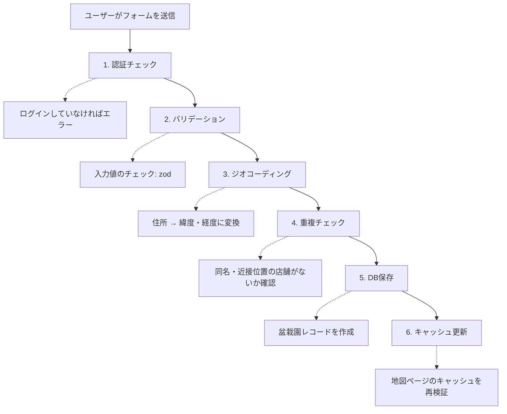
```mermaid
flowchart TD
    Start[ユーザーがフォームを送信]
    Auth[1. 認証チェック]
    AuthNote[ログインしていなければエラー]
    Valid[2. バリデーション]
    ValidNote[入力値のチェック: zod]
    Geo[3. ジオコーディング]
    GeoNote[住所 → 緯度・経度に変換]
    Dup[4. 重複チェック]
    DupNote[同名・近接位置の店舗がないか確認]
    Save[5. DB保存]
    SaveNote[盆栽園レコードを作成]
    Cache[6. キャッシュ更新]
    CacheNote[地図ページのキャッシュを再検証]

    Start --> Auth
    Auth -.-> AuthNote
    Auth --> Valid
    Valid -.-> ValidNote
    Valid --> Geo
    Geo -.-> GeoNote
    Geo --> Dup
    Dup -.-> DupNote
    Dup --> Save
    Save -.-> SaveNote
    Save --> Cache
    Cache -.-> CacheNote
```

```typescript
// lib/actions/shop.ts
'use server'
// ↑ このファイルの全関数がServer Actionとして動作する

import { auth } from '@/lib/auth' // 認証ヘルパー（ログイン状態を取得）
import { prisma } from '@/lib/db' // データベースクライアント
import { revalidatePath } from 'next/cache' // キャッシュ再検証

// ======================================
// createShop: 盆栽園を新規登録する Server Action
// ======================================
export async function createShop(formData: FormData) {
  // --- ステップ1: 認証チェック ---
  const session = await auth()
  if (!session?.user?.id) {
    return { error: '認証が必要です' }
  }

  // --- ステップ2: フォームデータの取得 ---
  const name = formData.get('name') as string
  const address = formData.get('address') as string
  const latitudeStr = formData.get('latitude') as string
  const longitudeStr = formData.get('longitude') as string
  const phone = formData.get('phone') as string | null
  const website = formData.get('website') as string | null
  const businessHours = formData.get('businessHours') as string | null
  const closedDays = formData.get('closedDays') as string | null
  const genreIds = formData.getAll('genreIds') as string[]

  // --- ステップ3: バリデーション ---
  if (!name || name.trim().length === 0) {
    return { error: '名称を入力してください' }
  }

  if (!address || address.trim().length === 0) {
    return { error: '住所を入力してください' }
  }

  // --- ステップ4: 緯度経度の変換 ---
  // parseFloat で文字列を数値に変換。空文字列の場合は null
  const latitude = latitudeStr ? parseFloat(latitudeStr) : null
  const longitude = longitudeStr ? parseFloat(longitudeStr) : null

  // --- ステップ5: 重複チェック（住所ベース） ---
  const existing = await prisma.bonsaiShop.findFirst({
    where: { address: address.trim() },
  })

  if (existing) {
    return {
      error: 'この住所の盆栽園は既に登録されています',
      existingId: existing.id  // 既存の盆栽園へのリンク用
    }
  }

  // --- ステップ6: データベースに保存 ---
  const shop = await prisma.bonsaiShop.create({
    data: {
      name: name.trim(),
      address: address.trim(),
      latitude: latitude,
      longitude: longitude,
      phone: phone?.trim() || null,
      website: website?.trim() || null,
      businessHours: businessHours?.trim() || null,
      closedDays: closedDays?.trim() || null,
      createdBy: session.user.id,    // 登録者のユーザーID
      // ジャンルがある場合はネストして作成
      genres: genreIds.length > 0
        ? {
            create: genreIds.map((genreId: string) => ({ genreId })),
          }
        : undefined,
    },
  })

  // --- ステップ7: キャッシュ再検証 ---
  // /shops ページのキャッシュを無効化して最新データを表示
  revalidatePath('/shops')
  return { success: true, shopId: shop.id }
}
```

### 店舗登録フォーム

フォームは Client Component として実装します。ユーザーの操作（入力、送信ボタンのクリック）を処理するため、`'use client'` が必要です。

```typescript
// components/shop/ShopForm.tsx
'use client'

import { useState } from 'react'               // 状態管理フック
import { useRouter } from 'next/navigation'     // ページ遷移用フック
import { createShop } from '@/lib/actions/shop'  // 先ほど作成した Server Action
import { Button } from '@/components/ui/button'  // shadcn/ui のボタン
import { Input } from '@/components/ui/input'    // shadcn/ui の入力フィールド
import { Textarea } from '@/components/ui/textarea' // shadcn/ui のテキストエリア
import { Label } from '@/components/ui/label'    // shadcn/ui のラベル

export function ShopForm() {
  const router = useRouter()
  // エラーメッセージの状態（null = エラーなし）
  const [error, setError] = useState<string | null>(null)
  // 送信中フラグ（二重送信防止に使う）
  const [isLoading, setIsLoading] = useState(false)

  // フォーム送信時に呼ばれるハンドラ
  // formData: ブラウザが自動的にフォームの入力値を集めた FormData オブジェクト
  async function handleSubmit(formData: FormData) {
    setIsLoading(true)   // ローディング状態にする
    setError(null)        // 前回のエラーをクリア

    // Server Action を呼び出す
    // → サーバーで認証チェック、バリデーション、ジオコーディング等が実行される
    const result = await createShop(formData)

    setIsLoading(false)  // ローディング解除

    // エラーがあればメッセージを表示
    if (result.error) {
      setError(result.error)
      return
    }

    // 成功したら、作成された店舗の詳細ページに遷移
    if (result.shopId) {
      router.push(`/shops/${result.shopId}`)
      router.refresh()  // サーバーコンポーネントのデータを再取得
    }
  }

  return (
    <form action={handleSubmit} className="space-y-6">
      {/* 店舗名（必須） */}
      <div className="space-y-2">
        <Label htmlFor="name">店舗名</Label>
        <Input
          id="name"
          name="name"   // ← FormData のキーになる
          placeholder="例: 〇〇盆栽園"
          required       // HTML標準のバリデーション（空欄防止）
        />
      </div>

      {/* 住所（必須） - ジオコーディングの元データ */}
      <div className="space-y-2">
        <Label htmlFor="address">住所</Label>
        <Input
          id="address"
          name="address"
          placeholder="例: 東京都〇〇区〇〇1-2-3"
          required
        />
        <p className="text-sm text-muted-foreground">
          住所から自動的に地図上の位置を取得します
        </p>
      </div>

      {/* 電話番号（任意） */}
      <div className="space-y-2">
        <Label htmlFor="phone">電話番号</Label>
        <Input
          id="phone"
          name="phone"
          type="tel"    // モバイルでは電話番号入力用キーボードが表示される
          placeholder="03-1234-5678"
        />
      </div>

      {/* ウェブサイトURL（任意） */}
      <div className="space-y-2">
        <Label htmlFor="website">ウェブサイト</Label>
        <Input
          id="website"
          name="website"
          type="url"
          placeholder="https://..."
        />
      </div>

      {/* 営業時間（任意） */}
      <div className="space-y-2">
        <Label htmlFor="businessHours">営業時間</Label>
        <Textarea
          id="businessHours"
          name="businessHours"
          placeholder="例: 平日 9:00-17:00&#10;土日祝 10:00-16:00&#10;定休日: 水曜日"
          rows={4}
        />
      </div>

      {/* 定休日（任意） */}
      <div className="space-y-2">
        <Label htmlFor="closedDays">定休日</Label>
        <Input
          id="closedDays"
          name="closedDays"
          placeholder="例: 水曜日、年末年始"
        />
      </div>

      {/* エラーメッセージ表示エリア */}
      {error && (
        <div className="p-4 bg-red-50 border border-red-200 rounded-lg">
          <p className="text-sm text-red-600">{error}</p>
        </div>
      )}

      {/* ボタン */}
      <div className="flex gap-4">
        <Button type="submit" disabled={isLoading}>
          {isLoading ? '登録中...' : '登録'}
        </Button>
        <Button
          type="button"
          variant="outline"
          onClick={() => router.back()}  // ブラウザの「戻る」と同じ動作
          disabled={isLoading}
        >
          キャンセル
        </Button>
      </div>
    </form>
  )
}
```

<details>
<summary>理解度チェック: 16.4の内容を確認しよう</summary>

**Q1: `encodeURIComponent(address)` は何をしていますか？**
A1: 住所に含まれる日本語やスペースなどの特殊文字を、URLで安全に送信できる形式に変換します。例えば「東京都」は「%E6%9D%B1%E4%BA%AC%E9%83%BD」になります。これをしないと、URL が壊れてAPIリクエストが失敗します。

**Q2: 重複チェックで「100m以内」を採用している理由は？**
A2: ジオコーディングの精度には誤差があるため、完全一致（同じ座標）ではなく、ある程度の範囲で判定します。100m は「同じ建物・近接施設」を検出するのに適切な距離です。1km にすると広すぎて別の店舗まで重複判定されてしまいます。

**Q3: Server Action の中で `revalidatePath('/shops')` を呼ぶ理由は？**
A3: Next.js はパフォーマンスのためにページのレンダリング結果をキャッシュしています。新しい店舗が登録されたとき、`revalidatePath` を呼ばないと、地図ページを再表示しても古いデータ（新店舗なし）が表示されてしまいます。

**Q4: `z.string().url().optional().or(z.literal(''))` の意味は？**
A4: 「URLフォーマットの文字列」「undefined（入力なし）」「空文字列」のいずれかを許可する、という意味です。ウェブサイト欄は任意入力なので、空のまま送信されたときに「無効なURL」エラーが出ないようにしています。

</details>

---

## 16.5 レビューシステム

> **このセクションで学ぶこと**
> - 星評価（Star Rating）UIコンポーネントの実装
> - ホバーエフェクトを使ったインタラクティブなUI
> - upsert パターン（作成 or 更新を自動判別）
> - 画像添付機能の実装
> - レビューフォームと Server Action の連携

### レビューシステムの全体構成

レビューシステムは3つのコンポーネントで構成されています。

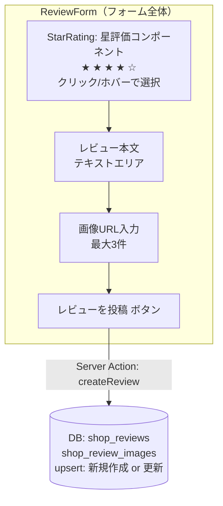
```mermaid
flowchart TD
    subgraph ReviewForm["ReviewForm（フォーム全体）"]
        Star[StarRating: 星評価コンポーネント<br/>★ ★ ★ ★ ☆<br/>クリック/ホバーで選択]
        Content[レビュー本文<br/>テキストエリア]
        Images[画像URL入力<br/>最大3件]
        Submit[レビューを投稿 ボタン]

        Star --> Content
        Content --> Images
        Images --> Submit
    end

    Submit -->|Server Action: createReview| DB[(DB: shop_reviews<br/>shop_review_images<br/>upsert: 新規作成 or 更新)]
```

### 星評価コンポーネント

星評価は「表示専用（読み取りモード）」と「入力用（クリック/ホバーで選択）」の2つのモードを持つ汎用コンポーネントです。

```
  StarRating の動作イメージ
  ==========================

  【初期状態（value=0）】
  ☆ ☆ ☆ ☆ ☆    グレーの星が5つ

  【マウスを3番目の星にホバー】
  ★ ★ ★ ☆ ☆    3つ目まで黄色に変化（プレビュー）

  【3番目の星をクリック】
  ★ ★ ★ ☆ ☆    value が 3 に確定

  【マウスを離す】
  ★ ★ ★ ☆ ☆    クリックした値が維持される

  【readonly モード（表示専用）】
  ★ ★ ★ ★ ☆    ホバーやクリックに反応しない
```

```typescript
// components/shop/StarRating.tsx
'use client'

import { useState } from 'react'

// ======================================
// 型定義: StarRating コンポーネントの Props
// ======================================
interface StarRatingProps {
  value?: number                      // 現在の評価値（0〜5）
  onChange?: (rating: number) => void  // 評価が変更されたときのコールバック
  readonly?: boolean                   // 読み取り専用モード（true=クリック無効）
  size?: 'sm' | 'md' | 'lg'          // 星のサイズ
}

export function StarRating({
  value = 0,          // デフォルトは0（未評価）
  onChange,
  readonly = false,   // デフォルトは入力モード
  size = 'md',        // デフォルトは中サイズ
}: StarRatingProps) {
  // hoverRating: マウスがホバー中の星の番号（0 = ホバーしていない）
  const [hoverRating, setHoverRating] = useState(0)

  // サイズに応じた Tailwind CSS クラス
  const sizeClasses = {
    sm: 'text-lg',   // 小（レビュー一覧用）
    md: 'text-2xl',  // 中（標準）
    lg: 'text-4xl',  // 大（フォーム入力用）
  }

  // 表示する評価値: ホバー中はホバー位置、そうでなければ確定値
  const displayRating = hoverRating || value

  return (
    <div className="flex items-center gap-1">
      {/* 星を5つ並べる（1〜5の配列を生成してループ） */}
      {[1, 2, 3, 4, 5].map((star) => (
        <button
          key={star}
          type="button"  // form 内でも submit にならないように button 型を指定
          // クリック時: readonly でなければ onChange を呼ぶ
          onClick={() => !readonly && onChange?.(star)}
          // マウスが星の上に乗ったとき: ホバー状態を更新
          onMouseEnter={() => !readonly && setHoverRating(star)}
          // マウスが星から離れたとき: ホバー状態をリセット
          onMouseLeave={() => !readonly && setHoverRating(0)}
          disabled={readonly}
          className={`${sizeClasses[size]} ${
            readonly ? 'cursor-default' : 'cursor-pointer hover:scale-110'
            // readonly=false なら、ホバー時に星が少し大きくなるアニメーション
          } transition-all`}
        >
          {/* 星の色: 表示評価値以下なら黄色、超えていればグレー */}
          <span className={
            star <= displayRating ? 'text-yellow-400' : 'text-gray-300'
          }>
            ★
          </span>
        </button>
      ))}
    </div>
  )
}
```

> **設計のポイント**: このコンポーネントは「制御コンポーネント」パターンで設計されています。つまり、親コンポーネントが `value` と `onChange` を渡して状態を管理します。これにより、レビューフォームだけでなく、レビュー一覧の表示など様々な場面で再利用できます。

### レビューフォーム

レビューフォームは、先ほどの StarRating コンポーネントを組み込んだフォーム全体です。既存レビューがある場合は「更新モード」、ない場合は「新規投稿モード」として動作します。

```typescript
// components/shop/ReviewForm.tsx
'use client'

import { useState } from 'react'
import { createReview } from '@/lib/actions/review' // レビュー投稿の Server Action
import { StarRating } from './StarRating'            // 先ほど作成した星評価コンポーネント
import { Button } from '@/components/ui/button'
import { Textarea } from '@/components/ui/textarea'
import { Input } from '@/components/ui/input'
import { Label } from '@/components/ui/label'

// ======================================
// Props の型定義
// ======================================
interface ReviewFormProps {
  shopId: string            // どの店舗のレビューか
  existingReview?: {        // 既存レビュー（ある場合は更新モード）
    rating: number
    content: string | null
  }
}

export function ReviewForm({ shopId, existingReview }: ReviewFormProps) {
  // 星評価の値（StarRating と連動。FormDataには含まれないので手動で管理）
  const [rating, setRating] = useState(existingReview?.rating || 0)
  const [error, setError] = useState<string | null>(null)
  const [isLoading, setIsLoading] = useState(false)

  async function handleSubmit(formData: FormData) {
    // 星が選択されていなければエラー（星評価は必須）
    if (rating === 0) {
      setError('評価を選択してください')
      return
    }

    setIsLoading(true)
    setError(null)

    // 星評価は React の state で管理しているので、FormData に手動で追加
    formData.append('rating', rating.toString())

    // Server Action を呼び出し（shopId を第1引数で渡す）
    const result = await createReview(shopId, formData)

    setIsLoading(false)

    if (result.error) {
      setError(result.error)
      return
    }

    // 成功したらフォームをリセット
    setRating(0)
    const form = document.getElementById('review-form') as HTMLFormElement
    form?.reset()  // HTML フォームの値を初期状態に戻す
  }

  return (
    <form id="review-form" action={handleSubmit} className="space-y-4">
      {/* 星評価（必須） */}
      <div className="space-y-2">
        <Label>評価</Label>
        <StarRating value={rating} onChange={setRating} size="lg" />
      </div>

      {/* レビュー本文（任意） */}
      <div className="space-y-2">
        <Label htmlFor="content">レビュー（任意）</Label>
        <Textarea
          id="content"
          name="content"
          placeholder="訪問した感想、取扱商品、店員の対応など"
          rows={5}
          defaultValue={existingReview?.content ?? ''} // null の場合は空文字
        />
      </div>

      {/* 画像URL入力（最大3枚） */}
      <div className="space-y-2">
        <Label>画像（最大3枚）</Label>
        {/* 配列 [0, 1, 2] をループして3つの入力欄を生成 */}
        {[0, 1, 2].map((index) => (
          <Input
            key={index}
            name="imageUrls"   // 同じ name を3つ → FormData.getAll('imageUrls') で配列取得
            type="url"
            placeholder="https://..."
          />
        ))}
      </div>

      {/* エラーメッセージ */}
      {error && <p className="text-sm text-red-500">{error}</p>}

      {/* 送信ボタン: 星未選択 or ローディング中は無効化 */}
      <Button type="submit" disabled={isLoading || rating === 0}>
        {isLoading
          ? '送信中...'
          : existingReview
            ? '更新'           // 既存レビューありの場合
            : 'レビューを投稿'  // 新規の場合
        }
      </Button>
    </form>
  )
}
```

### レビュー投稿の Server Action

レビューの保存では、新しいレビューレコードを作成し、画像がある場合はネストした create で同時に保存します。

```typescript
// lib/actions/review.ts
'use server'

import { auth } from '@/lib/auth'
import { prisma } from '@/lib/db'
import { revalidatePath } from 'next/cache'

// ======================================
// createReview: レビューを投稿する Server Action
// ======================================
export async function createReview(shopId: string, formData: FormData) {
  // --- 認証チェック ---
  const session = await auth()
  if (!session?.user?.id) {
    return { error: '認証が必要です' }
  }

  // --- フォームデータの取得 ---
  const rating = parseInt(formData.get('rating') as string)
  const content = formData.get('content') as string | null

  // 同じ name="imageUrls" の入力欄が3つあるので、getAll で配列として取得
  // .filter((url) => url) で空文字の入力欄を除外
  const imageUrls = formData.getAll('imageUrls').filter((url) => url) as string[]

  // --- バリデーション ---
  if (!rating || rating < 1 || rating > 5) {
    return { error: '評価を選択してください（1〜5）' }
  }

  try {
    // --- レビューを作成 ---
    await prisma.shopReview.create({
      data: {
        shopId,
        userId: session.user.id,
        rating,
        content: content?.trim() || null,
        // 画像も同時に作成（ネストした create）
        images: {
          create: imageUrls.map((url) => ({
            url,
          })),
        },
      },
    })

    // キャッシュを再検証して最新のレビューを表示
    revalidatePath(`/shops/${shopId}`)
    return { success: true }
  } catch (error) {
    console.error('Failed to create review:', error)
    return { error: 'レビューの投稿に失敗しました' }
  }
}
```

### よくあるトラブルと解決法（レビューシステム）

| トラブル | 原因 | 解決法 |
|---|---|---|
| 同じ店舗に複数のレビューが投稿される | ユニーク制約がない | アプリケーション側で制御するか、必要に応じてユニーク制約を追加 |
| 画像URLが保存されない | 空のURL入力欄も送信されている | `.filter((url) => url)` で空文字を除外 |
| 星を選択しても送信できない | ボタンの `disabled` 条件 | `rating === 0` の条件が残っている可能性を確認 |
| レビュー投稿後に画面が更新されない | `revalidatePath` の呼び忘れ | Server Action の最後で必ず呼ぶ |

<details>
<summary>理解度チェック: 16.5の内容を確認しよう</summary>

**Q1: レビューで `isHidden` と `hiddenAt` を使う理由は？**
A1: 不適切なレビューを削除するのではなく、非表示にすることで管理者が後から確認できます。`isHidden` はフィルタリング用のフラグ、`hiddenAt` は非表示にした日時の記録です。一覧取得時は `where: { isHidden: false }` でフィルタリングします。

**Q2: 画像テーブル（ShopReviewImage）に `sortOrder` がない理由は？**
A2: 実際のスキーマでは画像の並び順は作成順（ID順）で管理しています。レビュー画像は最大3枚と少ないため、明示的なソート順カラムがなくても十分に管理できます。

**Q3: `formData.append('rating', rating.toString())` が必要な理由は？**
A3: 星評価は React の useState で管理しているため、HTML の `<form>` からは自動的に送信されません（name属性を持つ input/textarea/select だけがFormDataに含まれます）。そのため、送信前に手動で FormData に追加する必要があります。

</details>

> **BON-LOGでの使用箇所**
>
> レビューシステムは以下のファイルで実装されています。
> - `components/shop/ReviewForm.tsx` -- 新規レビュー投稿フォーム（`useTransition` + `startTransition`でフォーム状態を管理）
> - `components/shop/ReviewCard.tsx` -- 個別レビューの表示・編集・削除（`StarRatingDisplay`、`StarRatingInput`、`ReportButton`を含む）
> - `components/shop/StarRating.tsx` -- 星評価コンポーネント（`StarRating`、`StarRatingDisplay`、`StarRatingInput` をエクスポート）
> - `lib/actions/review.ts` -- `createReview`、`updateReview`、`deleteReview` Server Actions
>
> 画像は `/api/upload` エンドポイントへ `XMLHttpRequest` で直接アップロードされます。
> `ShopReviewImage` モデルには `sort_order` フィールドはなく、アップロード順で管理されます。
>
> **実装しない場合の影響**: ユーザーが盆栽園に対して評価・口コミを投稿できなくなります。
> 盆栽園の信頼性指標（星評価の平均）も算出できなくなり、マップのポップアップ情報が薄くなります。

---

## 16.6 変更リクエスト機能

> **このセクションで学ぶこと**
> - ユーザー主導の情報修正フローの設計思想
> - 管理者承認ワークフローの実装
> - Prisma の `$transaction` を使ったアトミック操作
> - dynamic field access（動的フィールドアクセス）パターン

### 変更リクエストの仕組み

盆栽園の情報（電話番号、営業時間など）は、時間が経つと変わることがあります。しかし、誰でも自由に編集できると、いたずらや誤った情報が反映されてしまいます。

そこで、**Wikipedia のような承認フロー** を採用します。

```
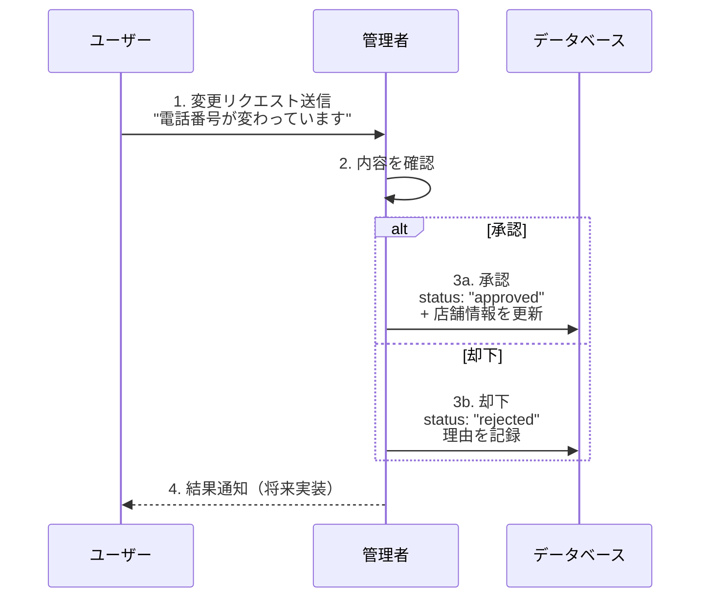
```mermaid
sequenceDiagram
    participant User as ユーザー
    participant Admin as 管理者
    participant DB as データベース

    User->>Admin: 1. 変更リクエスト送信<br/>"電話番号が変わっています"
    Admin->>Admin: 2. 内容を確認

    alt 承認
        Admin->>DB: 3a. 承認<br/>status: "approved"<br/>+ 店舗情報を更新
    else 却下
        Admin->>DB: 3b. 却下<br/>status: "rejected"<br/>理由を記録
    end

    Admin-->>User: 4. 結果通知（将来実装）
```
```

### Server Actions

```typescript
// lib/actions/shop.ts（変更リクエスト部分）
'use server'

import { auth } from '@/lib/auth'
import { prisma } from '@/lib/db'
import { revalidatePath } from 'next/cache'

// ======================================
// 変更リクエストの内容型定義
// ======================================
// 変更したいフィールドのみを含むオブジェクト
export type ShopChangeRequestData = {
  name?: string
  address?: string
  phone?: string
  website?: string
  businessHours?: string
  closedDays?: string
}

// ======================================
// createShopChangeRequest: 変更リクエストを作成する
// ======================================
// 登録者以外のユーザーが盆栽園情報の変更をリクエストできます。
// リクエストは管理者に通知され、管理者が承認/却下を行います。
export async function createShopChangeRequest(
  shopId: string,
  changes: ShopChangeRequestData,
  reason?: string
) {
  // 認証チェック
  const session = await auth()
  if (!session?.user?.id) {
    return { error: '認証が必要です' }
  }

  // 盆栽園の存在確認
  const shop = await prisma.bonsaiShop.findUnique({
    where: { id: shopId, isHidden: false },
    select: { id: true, createdBy: true },
  })

  if (!shop) {
    return { error: '盆栽園が見つかりません' }
  }

  // オーナーは変更リクエストを出す必要がない（直接編集できる）
  if (shop.createdBy === session.user.id) {
    return { error: '登録者は直接編集できます' }
  }

  // 変更内容のバリデーション
  const hasChanges = Object.values(changes).some((v) => v !== undefined && v !== '')
  if (!hasChanges) {
    return { error: '変更内容を入力してください' }
  }

  // 保留中のリクエストがないか確認
  const existingRequest = await prisma.shopChangeRequest.findFirst({
    where: {
      shopId,
      userId: session.user.id,
      status: 'pending',
    },
  })

  if (existingRequest) {
    return { error: '既に保留中のリクエストがあります。承認/却下を待ってください。' }
  }

  // 変更リクエストをデータベースに保存
  // requestedChanges に変更内容をJSON形式で保存
  const request = await prisma.shopChangeRequest.create({
    data: {
      shopId,
      userId: session.user.id,
      requestedChanges: changes,  // JSON型: { name?: "新名称", phone?: "新番号" }
      reason: reason?.trim() || null,
      // status はデフォルト値 "pending"（保留中）が自動設定される
    },
  })

  return { success: true, requestId: request.id }
}

// ======================================
// approveShopChangeRequest: 管理者が変更リクエストを承認する
// ======================================
export async function approveShopChangeRequest(
  requestId: string,
  adminComment?: string
) {
  const session = await auth()
  if (!session?.user?.id) {
    return { error: '認証が必要です' }
  }

  // 管理者権限チェック
  const adminUser = await prisma.adminUser.findUnique({
    where: { userId: session.user.id },
  })
  if (!adminUser) {
    return { error: '管理者権限が必要です' }
  }

  // 承認対象のリクエストを取得
  const request = await prisma.shopChangeRequest.findUnique({
    where: { id: requestId },
    include: { shop: true },
  })

  if (!request) {
    return { error: 'リクエストが見つかりません' }
  }

  if (request.status !== 'pending') {
    return { error: 'このリクエストは既に処理済みです' }
  }

  // 変更内容を適用
  const changes = request.requestedChanges as ShopChangeRequestData

  // $transaction: 複数のDB操作を「すべて成功」か「すべて失敗」にする
  await prisma.$transaction([
    // 操作1: 店舗情報を更新
    // JSON内の各フィールドをスプレッドで展開
    prisma.bonsaiShop.update({
      where: { id: request.shopId },
      data: {
        ...(changes.name && { name: changes.name }),
        ...(changes.address && { address: changes.address }),
        ...(changes.phone !== undefined && { phone: changes.phone || null }),
        ...(changes.website !== undefined && { website: changes.website || null }),
        ...(changes.businessHours !== undefined && { businessHours: changes.businessHours || null }),
        ...(changes.closedDays !== undefined && { closedDays: changes.closedDays || null }),
      },
    }),
    // 操作2: リクエストのステータスを「承認済み」に更新
    prisma.shopChangeRequest.update({
      where: { id: requestId },
      data: {
        status: 'approved',
        adminComment: adminComment?.trim() || null,
        resolvedAt: new Date(),
      },
    }),
  ])

  // 関連ページのキャッシュを再検証
  revalidatePath(`/shops/${request.shopId}`)
  revalidatePath('/shops')
  revalidatePath('/admin/shop-requests')
  return { success: true }
}
```

<details>
<summary>理解度チェック: 16.6の内容を確認しよう</summary>

**Q1: `$transaction` を使わないとどんな問題が起きますか？**
A1: 店舗情報の更新は成功したが、リクエストのステータス更新が失敗する（またはその逆）という「中途半端な状態」になる可能性があります。トランザクションを使えば、どちらかが失敗した場合は両方ともロールバック（元に戻す）されます。

**Q2: `requestedChanges` を JSON型で保存する利点は？**
A2: 1つのリクエストで複数フィールドの変更をまとめて提案できます。例えば `{ phone: "03-9876-5432", businessHours: "10:00-18:00" }` のように、電話番号と営業時間を同時に変更提案できます。フィールドごとに別テーブルを用意する必要がなく、スキーマの拡張も容易です。

**Q3: なぜ `adminComment` と `resolvedAt` を別途記録するのですか？**
A3: `adminComment` は承認・却下時の管理者のコメント（理由説明など）を記録します。`resolvedAt` は処理された日時を記録し、管理者の対応速度の分析や、リクエストの経過日数の追跡に活用できます。

</details>

---

## 16.7 パフォーマンス最適化

> **このセクションで学ぶこと**
> - `next/dynamic` の `ssr: false` が必要な理由を深く理解する
> - Leaflet がサーバーサイドレンダリング（SSR）できない技術的背景
> - マーカークラスタリングで大量マーカーの描画負荷を軽減する方法
> - 地図コンポーネントのローディング戦略とレイアウトシフト防止

### なぜ Leaflet は SSR できないのか

前セクションまでで `MapWrapper` コンポーネントが `dynamic()` + `ssr: false` を使っていることに気づいたかもしれません。ここでは、なぜこれが必要なのかを深く掘り下げます。

```
  SSR（サーバーサイドレンダリング）の流れ
  =========================================

  【通常のコンポーネント】
  サーバー → HTML を生成 → ブラウザに送信 → 表示（高速！）

  【Leaflet を使うコンポーネント】
  サーバー → HTML を生成しようとする
           → window オブジェクトにアクセス
           → サーバーには window がない！
           → エラー発生 ❌

  【解決策: ssr: false】
  サーバー → プレースホルダーの HTML を送信
           → ブラウザで JavaScript が実行
           → Leaflet がブラウザ上で地図を描画 ✅
```

Leaflet は地図の操作（ドラッグ、ズーム、タイルの読み込み）にブラウザの DOM API を直接使用しています。具体的には以下のブラウザ専用オブジェクトに依存しています。

| ブラウザ専用オブジェクト | Leaflet での用途 |
|---|---|
| `window` | ウィンドウサイズの取得、イベントリスナーの登録 |
| `document` | DOM 要素の作成・操作（マーカー、ポップアップ等） |
| `navigator` | ジオロケーション（現在地取得） |
| `HTMLCanvasElement` | Canvas ベースのレンダリング（一部機能） |

Node.js（サーバーサイド）にはこれらのオブジェクトが存在しないため、Leaflet をインポートしただけでエラーが発生します。

```typescript
// ❌ これだけでサーバーサイドでエラーになる
import L from 'leaflet'
// → ReferenceError: window is not defined
```

### `next/dynamic` による SSR 無効化の仕組み

Next.js の `dynamic()` 関数は、コンポーネントの読み込みタイミングを制御します。`ssr: false` オプションを付けると、サーバーサイドでは一切コンポーネントを評価せず、ブラウザ上でのみ動的にインポートされます。

```typescript
// components/shop/MapWrapper.tsx
'use client'

import dynamic from 'next/dynamic'

// SSR を無効化して地図コンポーネントを動的インポート
const Map = dynamic(
  // import() は「遅延インポート」= 必要な時だけ読み込む
  () => import('@/components/shop/Map').then((mod) => mod.Map),
  {
    // サーバーサイドではこのコンポーネントを実行しない
    ssr: false,
    // 読み込み中のフォールバック表示
    loading: () => (
      <div className="h-[250px] md:h-[400px] w-full bg-muted
                      flex items-center justify-center rounded-lg">
        <div className="text-muted-foreground">
          地図を読み込み中...
        </div>
      </div>
    ),
  }
)
```

処理の流れを時系列で見てみましょう。

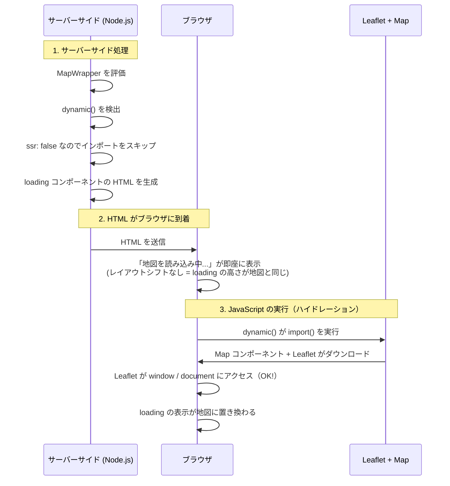
```mermaid
sequenceDiagram
    participant S as サーバーサイド (Node.js)
    participant B as ブラウザ
    participant L as Leaflet + Map

    Note over S: 1. サーバーサイド処理
    S->>S: MapWrapper を評価
    S->>S: dynamic() を検出
    S->>S: ssr: false なのでインポートをスキップ
    S->>S: loading コンポーネントの HTML を生成

    Note over S,B: 2. HTML がブラウザに到着
    S->>B: HTML を送信
    B->>B: 「地図を読み込み中...」が即座に表示<br/>(レイアウトシフトなし = loading の高さが地図と同じ)

    Note over B,L: 3. JavaScript の実行（ハイドレーション）
    B->>L: dynamic() が import() を実行
    L->>B: Map コンポーネント + Leaflet がダウンロード
    B->>B: Leaflet が window / document にアクセス（OK!）
    B->>B: loading の表示が地図に置き換わる
```

### ローディング表示とレイアウトシフト防止

地図コンポーネントの読み込みは通常のテキストコンポーネントより時間がかかります（Leaflet ライブラリ + タイル画像のダウンロード）。この間、ユーザーには「地図を読み込み中...」のフォールバックが表示されます。

**重要なポイント**: `loading` コンポーネントの高さを、実際の地図と同じサイズにすることで、レイアウトシフト（CLS: Cumulative Layout Shift）を防いでいます。

```typescript
// ❌ 悪い例: loading のサイズが地図と異なる
loading: () => <div>読み込み中...</div>
// → 地図が読み込まれた瞬間にページ全体がガタッと動く

// ✅ 良い例: loading のサイズを地図と同じに設定
loading: () => (
  <div className="h-[250px] md:h-[400px] w-full bg-muted
                  flex items-center justify-center rounded-lg">
    <div className="text-muted-foreground">
      地図を読み込み中...
    </div>
  </div>
)
// → スムーズに地図に切り替わる
```

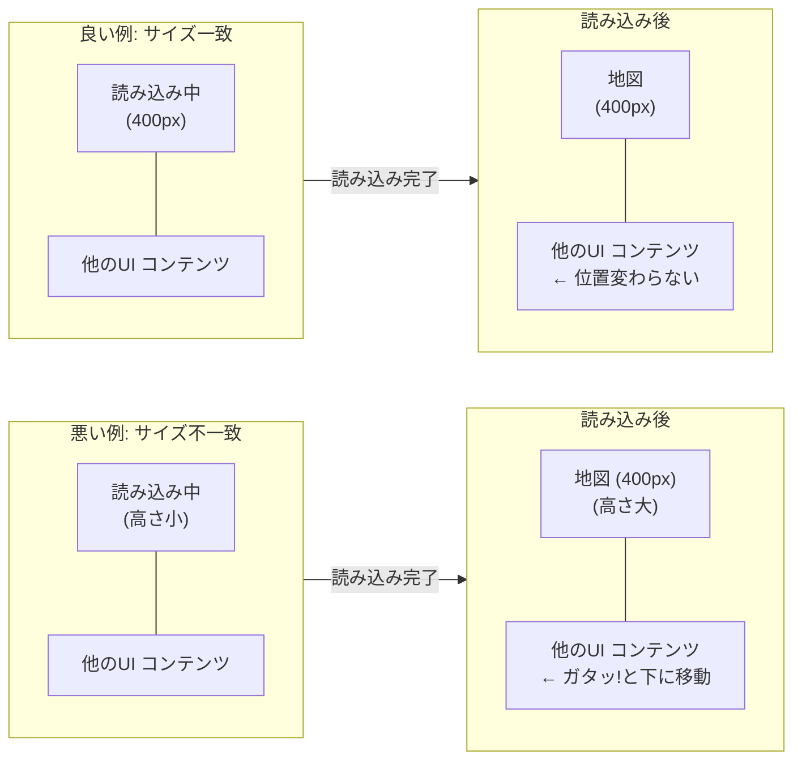
```mermaid
flowchart LR
    subgraph bad["悪い例: サイズ不一致"]
        direction TB
        B1["読み込み中<br/>(高さ小)"]
        B2["他のUI コンテンツ"]
        B1 --- B2
    end
    subgraph bad_after["読み込み後"]
        direction TB
        B3["地図 (400px)<br/>(高さ大)"]
        B4["他のUI コンテンツ<br/>← ガタッ!と下に移動"]
        B3 --- B4
    end
    bad -->|"読み込み完了"| bad_after

    subgraph good["良い例: サイズ一致"]
        direction TB
        G1["読み込み中<br/>(400px)"]
        G2["他のUI コンテンツ"]
        G1 --- G2
    end
    subgraph good_after["読み込み後"]
        direction TB
        G3["地図<br/>(400px)"]
        G4["他のUI コンテンツ<br/>← 位置変わらない"]
        G3 --- G4
    end
    good -->|"読み込み完了"| good_after
```

### マーカークラスタリング

盆栽園の数が増えると（数十、数百件）、地図上にマーカーが密集して以下の問題が発生します。

1. **視認性の低下**: マーカーが重なり合って個別の店舗を識別できない
2. **描画パフォーマンスの悪化**: 大量のDOM要素が生成され、ブラウザが重くなる
3. **操作性の低下**: 密集したマーカーの中から目的の店舗をクリックしにくい

これらの問題を解決するのが**マーカークラスタリング**です。

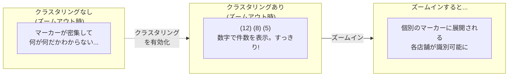
```mermaid
flowchart LR
    subgraph A["クラスタリングなし<br/>(ズームアウト時)"]
        A1["マーカーが密集して<br/>何が何だかわからない..."]
    end

    subgraph B["クラスタリングあり<br/>(ズームアウト時)"]
        B1["(12) (8) (5)<br/>数字で件数を表示。すっきり!"]
    end

    subgraph C["ズームインすると..."]
        C1["個別のマーカーに展開される<br/>各店舗が識別可能に"]
    end

    A -.->|"クラスタリング<br/>を有効化"| B
    B -->|"ズームイン"| C
```

`react-leaflet-markercluster` を使った実装例を示します。

```bash
# ライブラリのインストール
npm install react-leaflet-markercluster
```

```typescript
// components/shop/Map.tsx（クラスタリング対応版）
'use client'

import { MapContainer, TileLayer, Marker, Popup } from 'react-leaflet'
import MarkerClusterGroup from 'react-leaflet-markercluster'
import 'leaflet/dist/leaflet.css'

interface MapWithClusterProps {
  shops: Shop[]
  center?: [number, number]
  zoom?: number
}

export function MapWithCluster({
  shops,
  center = [35.6762, 139.6503],
  zoom = 6
}: MapWithClusterProps) {
  const validShops = shops.filter(
    (shop) => shop.latitude !== null && shop.longitude !== null
  )

  return (
    <MapContainer center={center} zoom={zoom} className="h-full w-full">
      <TileLayer
        attribution='&copy; OpenStreetMap'
        url="https://{s}.tile.openstreetmap.org/{z}/{x}/{y}.png"
      />

      {/* MarkerClusterGroup で Marker をラップするだけ！ */}
      <MarkerClusterGroup
        chunkedLoading           // 大量マーカーを分割して読み込み
        maxClusterRadius={50}    // クラスタリングの半径（ピクセル）
        spiderfyOnMaxZoom={true} // 最大ズーム時にスパイダー表示
      >
        {validShops.map((shop) => (
          <Marker
            key={shop.id}
            position={[shop.latitude!, shop.longitude!]}
            icon={shopPinIcon}
          >
            <Popup>
              <h3 className="font-bold">{shop.name}</h3>
              <p className="text-xs">{shop.address}</p>
            </Popup>
          </Marker>
        ))}
      </MarkerClusterGroup>
    </MapContainer>
  )
}
```

主要なオプションを理解しておきましょう。

| オプション | 説明 | デフォルト値 |
|---|---|---|
| `chunkedLoading` | マーカーを分割して非同期に追加（UIフリーズ防止） | `false` |
| `maxClusterRadius` | この半径（px）内のマーカーをクラスタに統合 | `80` |
| `spiderfyOnMaxZoom` | 最大ズームでもクラスタなら蜘蛛の巣状に展開 | `true` |
| `disableClusteringAtZoom` | このズームレベル以上ではクラスタリング無効化 | `undefined` |
| `animate` | クラスタの展開・統合をアニメーション表示 | `true` |

### ビューポートクエリによるデータ取得最適化

店舗数がさらに増えた場合（数千件以上）、すべての店舗データを一度に取得するのは非効率です。地図の表示範囲（ビューポート）内の店舗だけを取得する方法を紹介します。

```typescript
// 地図の表示範囲が変わった時に呼ばれるイベントハンドラ
function MapEventHandler({
  onBoundsChange,
}: {
  onBoundsChange: (bounds: {
    north: number
    south: number
    east: number
    west: number
  }) => void
}) {
  const map = useMap()

  useEffect(() => {
    const handler = () => {
      const bounds = map.getBounds()
      onBoundsChange({
        north: bounds.getNorth(),  // 北端の緯度
        south: bounds.getSouth(),  // 南端の緯度
        east: bounds.getEast(),    // 東端の経度
        west: bounds.getWest(),    // 西端の経度
      })
    }

    // 地図の移動やズームが完了した時にイベント発火
    map.on('moveend', handler)
    // 初回も実行
    handler()

    return () => {
      map.off('moveend', handler)
    }
  }, [map, onBoundsChange])

  return null
}
```

```typescript
// サーバー側: ビューポート内の店舗だけを取得
export async function getShopsInBounds(bounds: {
  north: number
  south: number
  east: number
  west: number
}) {
  return await prisma.bonsaiShop.findMany({
    where: {
      latitude: {
        gte: bounds.south,  // 南端以上
        lte: bounds.north,  // 北端以下
      },
      longitude: {
        gte: bounds.west,   // 西端以上
        lte: bounds.east,   // 東端以下
      },
      isHidden: false,
    },
    take: 200, // 一度に取得する最大件数を制限
  })
}
```

<details>
<summary>理解度チェック: 16.7の内容を確認しよう</summary>

**Q1: Leaflet が SSR できない理由を自分の言葉で説明してください。**
A1: Leaflet は地図の表示や操作に `window`、`document` などのブラウザ専用オブジェクトを使用しています。サーバーサイド（Node.js）にはこれらのオブジェクトが存在しないため、Leaflet のコードをサーバーで実行しようとするとエラーが発生します。そのため `dynamic()` + `ssr: false` でサーバーでの実行を回避し、ブラウザ上でのみ読み込みます。

**Q2: `loading` コンポーネントのサイズを地図と同じにする理由は何ですか？**
A2: レイアウトシフト（CLS）を防ぐためです。`loading` のサイズが地図と異なると、地図が読み込まれた瞬間にページ全体のレイアウトが変動し、ユーザーに不快な体験を与えます。同じサイズにすることで、スムーズに地図に切り替わります。

**Q3: マーカークラスタリングが解決する3つの問題を挙げてください。**
A3: (1) マーカーの重なりによる視認性の低下、(2) 大量のDOM要素による描画パフォーマンスの悪化、(3) 密集マーカーによる操作性の低下。クラスタリングにより、ズームアウト時はグループ化された件数表示、ズームイン時は個別マーカーが表示されます。

</details>

---

## 16.8 SEO構造化データ

> **このセクションで学ぶこと**
> - JSON-LD（構造化データ）の基本概念を理解する
> - schema.org の LocalBusiness スキーマを盆栽園に適用する
> - Next.js で JSON-LD を正しく出力する方法
> - Google の検索結果でリッチスニペットを表示させる仕組み

### JSON-LD とは何か

JSON-LD（JSON for Linking Data）は、Webページの内容を検索エンジンが理解できる形式で記述するための規格です。通常のHTMLだけでは「このページは盆栽園の情報である」「評価は4.5である」「住所は埼玉県である」といった意味的な情報を検索エンジンに伝えることができません。

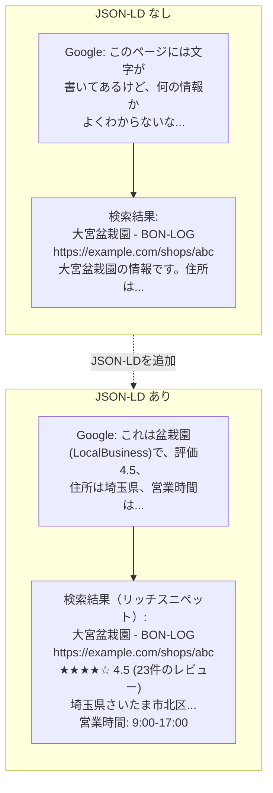
```mermaid
flowchart TB
    subgraph without["JSON-LD なし"]
        direction TB
        G1["Google: このページには文字が<br/>書いてあるけど、何の情報か<br/>よくわからないな..."]
        R1["検索結果:<br/>大宮盆栽園 - BON-LOG<br/>https://example.com/shops/abc<br/>大宮盆栽園の情報です。住所は..."]
        G1 --> R1
    end

    subgraph with["JSON-LD あり"]
        direction TB
        G2["Google: これは盆栽園<br/>(LocalBusiness)で、評価4.5、<br/>住所は埼玉県、営業時間は..."]
        R2["検索結果（リッチスニペット）:<br/>大宮盆栽園 - BON-LOG<br/>https://example.com/shops/abc<br/>★★★★☆ 4.5 (23件のレビュー)<br/>埼玉県さいたま市北区...<br/>営業時間: 9:00-17:00"]
        G2 --> R2
    end

    without -.->|"JSON-LDを追加"| with
```

### schema.org と LocalBusiness

[schema.org](https://schema.org) は、Google・Bing・Yahooなどの主要検索エンジンが共同で策定した構造化データの語彙（ボキャブラリー）です。店舗情報には `LocalBusiness` スキーマを使用します。

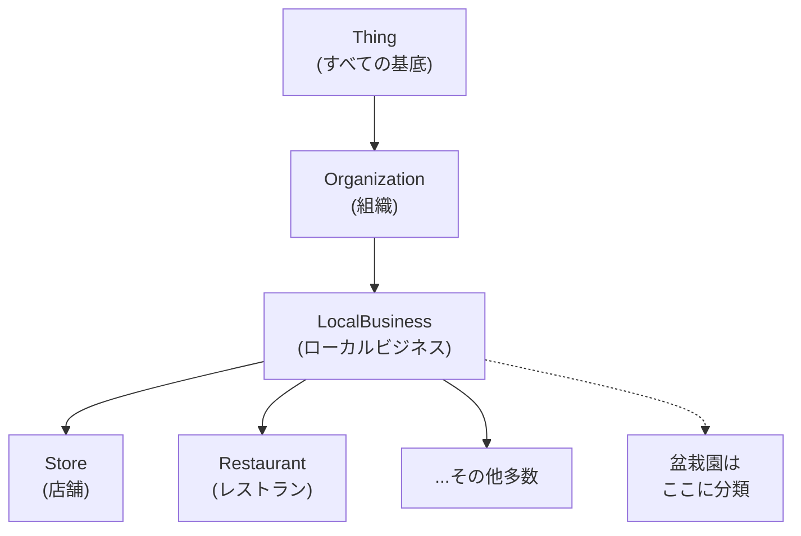
```mermaid
graph TB
    Thing["Thing<br/>(すべての基底)"]
    Org["Organization<br/>(組織)"]
    LB["LocalBusiness<br/>(ローカルビジネス)"]
    Store["Store<br/>(店舗)"]
    Restaurant["Restaurant<br/>(レストラン)"]
    Other["...その他多数"]
    Bonsai["盆栽園は<br/>ここに分類"]

    Thing --> Org
    Org --> LB
    LB --> Store
    LB --> Restaurant
    LB --> Other
    LB -.-> Bonsai
```

盆栽園の構造化データを JSON-LD 形式で記述すると以下のようになります。

```json
{
  "@context": "https://schema.org",
  "@type": "LocalBusiness",
  "name": "大宮盆栽園",
  "description": "盆栽の販売・展示を行う盆栽園です",
  "address": {
    "@type": "PostalAddress",
    "streetAddress": "北区盆栽町123",
    "addressLocality": "さいたま市",
    "addressRegion": "埼玉県",
    "postalCode": "331-0804",
    "addressCountry": "JP"
  },
  "geo": {
    "@type": "GeoCoordinates",
    "latitude": 35.9206,
    "longitude": 139.6283
  },
  "telephone": "048-123-4567",
  "url": "https://example.com/shops/abc",
  "openingHours": "Mo-Sa 09:00-17:00",
  "aggregateRating": {
    "@type": "AggregateRating",
    "ratingValue": "4.5",
    "reviewCount": "23",
    "bestRating": "5",
    "worstRating": "1"
  }
}
```

### Next.js での JSON-LD 出力

Next.js では、Server Component の `<script>` タグで JSON-LD を出力するのが推奨される方法です。

```typescript
// app/(main)/shops/[id]/page.tsx
import { getShopDetail } from '@/lib/actions/shop'
import { notFound } from 'next/navigation'

// JSON-LD を生成するヘルパー関数
function generateShopJsonLd(shop: {
  id: string
  name: string
  address: string
  latitude: number | null
  longitude: number | null
  phone: string | null
  website: string | null
  businessHours: string | null
  averageRating: number | null
  reviewCount: number
}) {
  const jsonLd: Record<string, unknown> = {
    '@context': 'https://schema.org',
    '@type': 'LocalBusiness',
    name: shop.name,
    description: `${shop.name} - 盆栽の販売・展示を行う盆栽園です`,
    address: {
      '@type': 'PostalAddress',
      streetAddress: shop.address,
      addressCountry: 'JP',
    },
  }

  // 緯度経度がある場合のみ GeoCoordinates を追加
  if (shop.latitude && shop.longitude) {
    jsonLd.geo = {
      '@type': 'GeoCoordinates',
      latitude: shop.latitude,
      longitude: shop.longitude,
    }
  }

  // 電話番号がある場合のみ追加
  if (shop.phone) {
    jsonLd.telephone = shop.phone
  }

  // ウェブサイトがある場合のみ追加
  if (shop.website) {
    jsonLd.url = shop.website
  }

  // 営業時間がある場合のみ追加
  if (shop.businessHours) {
    jsonLd.openingHours = shop.businessHours
  }

  // レビューがある場合のみ AggregateRating を追加
  if (shop.averageRating !== null && shop.reviewCount > 0) {
    jsonLd.aggregateRating = {
      '@type': 'AggregateRating',
      ratingValue: shop.averageRating.toFixed(1),
      reviewCount: shop.reviewCount.toString(),
      bestRating: '5',
      worstRating: '1',
    }
  }

  return jsonLd
}

export default async function ShopDetailPage({
  params,
}: {
  params: Promise<{ id: string }>
}) {
  const { id } = await params
  const result = await getShopDetail(id)

  if ('error' in result) {
    notFound()
  }

  const { shop } = result
  const jsonLd = generateShopJsonLd(shop)

  return (
    <>
      {/* JSON-LD 構造化データの出力 */}
      <script
        type="application/ld+json"
        dangerouslySetInnerHTML={{ __html: JSON.stringify(jsonLd) }}
      />

      {/* 通常のページコンテンツ */}
      <div>
        <h1>{shop.name}</h1>
        {/* ... */}
      </div>
    </>
  )
}
```

`dangerouslySetInnerHTML` という名前は少し怖いですが、JSON-LD の場合は安全です。なぜなら、`JSON.stringify()` が自動的に特殊文字をエスケープしてくれるためです。

### JSON-LD コンポーネントの再利用化

複数のページで JSON-LD を使う場合は、再利用可能なコンポーネントに抽出すると便利です。

```typescript
// components/seo/JsonLd.tsx

/**
 * JSON-LD 構造化データを出力する汎用コンポーネント
 *
 * @param data - JSON-LD のデータオブジェクト
 */
export function JsonLd({ data }: { data: Record<string, unknown> }) {
  return (
    <script
      type="application/ld+json"
      dangerouslySetInnerHTML={{
        __html: JSON.stringify(data),
      }}
    />
  )
}

/**
 * 盆栽園（LocalBusiness）用の JSON-LD コンポーネント
 */
export function LocalBusinessJsonLd({
  name,
  address,
  latitude,
  longitude,
  phone,
  website,
  businessHours,
  averageRating,
  reviewCount,
}: {
  name: string
  address: string
  latitude?: number | null
  longitude?: number | null
  phone?: string | null
  website?: string | null
  businessHours?: string | null
  averageRating?: number | null
  reviewCount?: number
}) {
  const data: Record<string, unknown> = {
    '@context': 'https://schema.org',
    '@type': 'LocalBusiness',
    name,
    description: `${name} - 盆栽の販売・展示を行う盆栽園です`,
    address: {
      '@type': 'PostalAddress',
      streetAddress: address,
      addressCountry: 'JP',
    },
  }

  if (latitude && longitude) {
    data.geo = {
      '@type': 'GeoCoordinates',
      latitude,
      longitude,
    }
  }

  if (phone) data.telephone = phone
  if (website) data.url = website
  if (businessHours) data.openingHours = businessHours

  if (averageRating !== null && averageRating !== undefined
      && reviewCount && reviewCount > 0) {
    data.aggregateRating = {
      '@type': 'AggregateRating',
      ratingValue: averageRating.toFixed(1),
      reviewCount: reviewCount.toString(),
      bestRating: '5',
      worstRating: '1',
    }
  }

  return <JsonLd data={data} />
}
```

使用する側はシンプルになります。

```typescript
// app/(main)/shops/[id]/page.tsx
import { LocalBusinessJsonLd } from '@/components/seo/JsonLd'

export default async function ShopDetailPage({ params }) {
  const { id } = await (params)
  const result = await getShopDetail(id)

  if ('error' in result) notFound()
  const { shop } = result

  return (
    <>
      <LocalBusinessJsonLd
        name={shop.name}
        address={shop.address}
        latitude={shop.latitude}
        longitude={shop.longitude}
        phone={shop.phone}
        website={shop.website}
        businessHours={shop.businessHours}
        averageRating={shop.averageRating}
        reviewCount={shop.reviewCount}
      />
      <ShopDetailContent shop={shop} />
    </>
  )
}
```

### 構造化データの検証方法

JSON-LD を実装したら、Google のツールで正しく認識されるか検証しましょう。

| ツール | URL | 用途 |
|---|---|---|
| **リッチリザルトテスト** | https://search.google.com/test/rich-results | Google がリッチスニペットを表示するかテスト |
| **Schema Markup Validator** | https://validator.schema.org/ | schema.org 仕様への準拠をチェック |
| **Google Search Console** | https://search.google.com/search-console | 実際の検索結果でのパフォーマンスを確認 |

```
  構造化データの検証フロー
  ========================

  1. 開発環境でページを表示
  2. ブラウザの「ソースを表示」で JSON-LD の <script> タグを確認
  3. リッチリザルトテストに URL またはコードを貼り付け
  4. エラーや警告がないことを確認
  5. デプロイ後に Search Console で実際の認識状況を確認
```

<details>
<summary>理解度チェック: 16.8の内容を確認しよう</summary>

**Q1: JSON-LD の目的を一言で説明してください。**
A1: Webページの内容を検索エンジンが理解できる構造化された形式で記述し、リッチスニペット（星評価、住所、営業時間など）を検索結果に表示させることです。

**Q2: `aggregateRating` をレビューがない場合に出力しない理由は何ですか？**
A2: レビューが0件の状態で `aggregateRating` を出力すると、schema.org の仕様に違反します（`reviewCount` が0の `AggregateRating` は無効）。また、Google のリッチリザルトテストでもエラーになります。レビューが存在する場合にのみ、正確な情報を出力すべきです。

**Q3: `dangerouslySetInnerHTML` を JSON-LD で使っても安全な理由を説明してください。**
A3: `JSON.stringify()` が自動的にHTMLの特殊文字（`<`、`>`、`&` など）をエスケープするため、XSS（クロスサイトスクリプティング）攻撃のリスクがありません。出力先も `<script type="application/ld+json">` タグ内であり、ブラウザはこれをJavaScriptとして実行しません。

</details>

---

## 16.9 ShopChangeRequest の詳細設計

> **このセクションで学ぶこと**
> - 変更リクエスト機能の設計思想とデータモデルを理解する
> - ユーザー側のリクエスト送信フローを理解する
> - 管理者側の承認・却下フローを理解する
> - `$transaction` を使ったアトミックな承認処理の詳細

### 変更リクエスト機能の設計思想

盆栽園の情報は、最初に登録した人だけでなく、すべてのユーザーにとって正確であることが重要です。しかし、誰でも自由に編集できる仕組みにすると、いたずらや誤った情報の登録が問題になります。

そこで本アプリケーションでは「**変更リクエスト → 管理者承認**」のワークフローを採用しています。

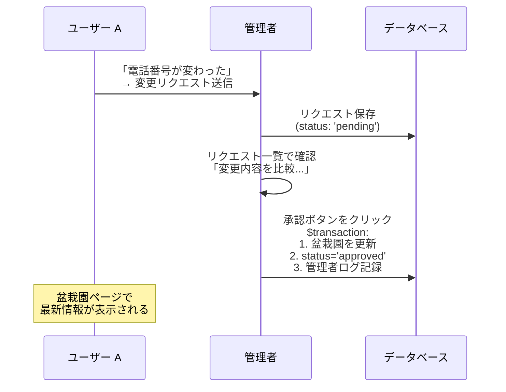
```mermaid
sequenceDiagram
    participant UserA as ユーザー A
    participant Admin as 管理者
    participant DB as データベース

    UserA->>Admin: 「電話番号が変わった」<br/>→ 変更リクエスト送信
    Admin->>DB: リクエスト保存<br/>(status: 'pending')

    Admin->>Admin: リクエスト一覧で確認<br/>「変更内容を比較...」

    Admin->>DB: 承認ボタンをクリック<br/>$transaction:<br/>1. 盆栽園を更新<br/>2. status='approved'<br/>3. 管理者ログ記録

    Note over UserA: 盆栽園ページで<br/>最新情報が表示される
```

### データモデル

変更リクエストの Prisma スキーマを確認しましょう。

```prisma
// prisma/schema.prisma

model ShopChangeRequest {
  id               String    @id @default(cuid())
  shopId           String    @map("shop_id")
  userId           String    @map("user_id")
  status           String    @default("pending")
  // ↑ pending（保留中）/ approved（承認済み）/ rejected（却下済み）

  requestedChanges Json      @map("requested_changes")
  // ↑ { name?, address?, phone?, website?, businessHours?, closedDays? }
  //   変更したいフィールドと新しい値の JSON

  reason           String?   @db.Text
  // ↑ ユーザーが入力した変更理由（任意）

  adminComment     String?   @db.Text @map("admin_comment")
  // ↑ 管理者のコメント（承認理由・却下理由）

  resolvedAt       DateTime? @map("resolved_at")
  // ↑ 承認または却下された日時

  createdAt        DateTime  @default(now()) @map("created_at")

  shop BonsaiShop @relation(fields: [shopId], references: [id], onDelete: Cascade)
  user User       @relation(fields: [userId], references: [id], onDelete: Cascade)

  @@index([shopId])
  @@index([userId])
  @@index([status])
  @@map("shop_change_requests")
}
```

**設計上のポイント:**

| ポイント | 説明 |
|---|---|
| `requestedChanges` が `Json` 型 | 複数フィールドの変更を1つのリクエストにまとめられる |
| `status` のインデックス | 管理者が「保留中」のリクエストを効率的に検索できる |
| `reason` が任意 | ユーザーの入力負担を軽減しつつ、必要に応じて変更の根拠を示せる |
| `adminComment` | 管理者がユーザーに対してフィードバックを返せる |
| `resolvedAt` | 承認/却下の日時を記録し、対応速度の分析に使える |

### ユーザー側: リクエスト送信フロー

ユーザーが盆栽園詳細ページで「情報の修正をリクエスト」ボタンをクリックすると、以下の流れでリクエストが送信されます。

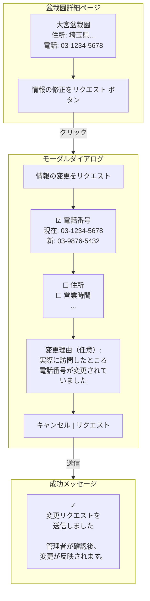
```mermaid
flowchart TD
    subgraph Page["盆栽園詳細ページ"]
        P1["大宮盆栽園<br/>住所: 埼玉県...<br/>電話: 03-1234-5678"]
        P2["情報の修正をリクエスト ボタン"]
        P1 --> P2
    end

    subgraph Modal["モーダルダイアログ"]
        M1["情報の変更をリクエスト"]
        M2["☑ 電話番号<br/>  現在: 03-1234-5678<br/>  新: 03-9876-5432"]
        M3["☐ 住所<br/>☐ 営業時間<br/>..."]
        M4["変更理由（任意）:<br/>実際に訪問したところ<br/>電話番号が変更されて<br/>いました"]
        M5["キャンセル | リクエスト"]

        M1 --> M2
        M2 --> M3
        M3 --> M4
        M4 --> M5
    end

    subgraph Success["成功メッセージ"]
        S1["✓<br/>変更リクエストを<br/>送信しました<br/><br/>管理者が確認後、<br/>変更が反映されます。"]
    end

    P2 -->|クリック| Modal
    M5 -->|送信| Success
```

`ShopChangeRequestForm` コンポーネントの主要な処理を見てみましょう。

```typescript
// components/shop/ShopChangeRequestForm.tsx の主要部分

// 1. チェックされたフィールドの中で、実際に値が変更されたものだけを収集
const changes: ShopChangeRequestData = {}
let hasChanges = false

for (const [field, isChecked] of Object.entries(checkedFields)) {
  if (isChecked) {
    const key = field as keyof ShopChangeRequestData
    const newValue = values[key]
    const originalValue = shop[key as keyof ShopInfo] || ''

    // 値が実際に変わっている場合のみ
    if (newValue !== originalValue) {
      changes[key] = newValue
      hasChanges = true
    }
  }
}

// 2. 変更がなければエラー
if (!hasChanges) {
  setError('変更内容を選択し、現在の値と異なる内容を入力してください')
  return
}

// 3. Server Action でリクエストを送信
const result = await createShopChangeRequest(shop.id, changes, reason)
```

**なぜチェックボックス方式なのか？**

すべてのフィールドを自由に編集できるフォームにすると、意図しないフィールドまで変更してしまうリスクがあります。チェックボックスで「変更したいフィールドを明示的に選択」させることで、ユーザーの意図を明確にし、管理者のレビュー負担も軽減しています。

### サーバー側: リクエスト作成の Server Action

```typescript
// lib/actions/shop.ts の createShopChangeRequest

export async function createShopChangeRequest(
  shopId: string,
  changes: ShopChangeRequestData,
  reason?: string
) {
  // 1. 認証チェック
  const session = await auth()
  if (!session?.user?.id) {
    return { error: '認証が必要です' }
  }

  // 2. 盆栽園の存在確認
  const shop = await prisma.bonsaiShop.findUnique({
    where: { id: shopId },
  })
  if (!shop) {
    return { error: '盆栽園が見つかりません' }
  }

  // 3. 同じユーザーからの保留中リクエストがないか確認
  //    （1つの盆栽園に対して同時に複数の保留中リクエストを防ぐ）
  const existingRequest = await prisma.shopChangeRequest.findFirst({
    where: {
      shopId,
      userId: session.user.id,
      status: 'pending',
    },
  })

  if (existingRequest) {
    return { error: 'この盆栽園に対する保留中のリクエストが既にあります' }
  }

  // 4. リクエストをデータベースに保存
  const request = await prisma.shopChangeRequest.create({
    data: {
      shopId,
      userId: session.user.id,
      requestedChanges: changes, // JSON 型に自動変換
      reason: reason?.trim() || null,
    },
  })

  revalidatePath(`/shops/${shopId}`)
  return { success: true, requestId: request.id }
}
```

### 管理者側: 承認・却下フロー

管理者は管理ダッシュボードから変更リクエストの一覧を確認し、承認または却下を行います。

> **画面表示**
> 
> 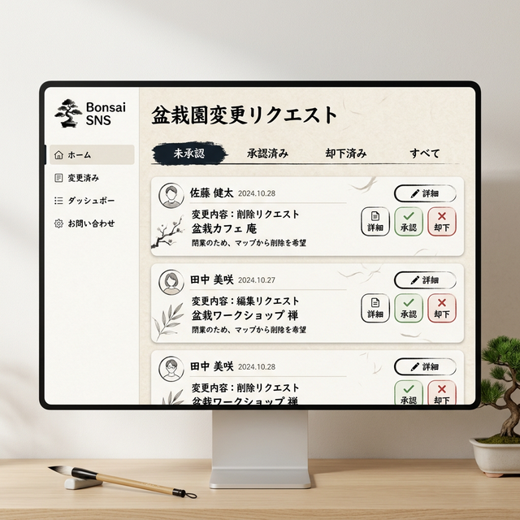

承認処理では `$transaction` を使って3つの操作をアトミックに実行します。

```typescript
// lib/actions/shop.ts の approveShopChangeRequest

export async function approveShopChangeRequest(
  requestId: string,
  adminComment?: string
) {
  // 管理者チェック（省略）

  // リクエストを取得
  const request = await prisma.shopChangeRequest.findUnique({
    where: { id: requestId },
    include: { shop: true },
  })

  if (!request || request.status !== 'pending') {
    return { error: 'リクエストが見つからないか、既に処理済みです' }
  }

  // 変更内容を取得
  const changes = request.requestedChanges as ShopChangeRequestData

  // 3つの操作をアトミックに実行
  await prisma.$transaction([
    // 操作1: 盆栽園情報を更新
    prisma.bonsaiShop.update({
      where: { id: request.shopId },
      data: {
        // スプレッド構文 + 条件分岐で、変更があるフィールドのみ更新
        ...(changes.name && { name: changes.name }),
        ...(changes.address && { address: changes.address }),
        ...(changes.phone !== undefined && { phone: changes.phone || null }),
        ...(changes.website !== undefined && { website: changes.website || null }),
        ...(changes.businessHours !== undefined
          && { businessHours: changes.businessHours || null }),
        ...(changes.closedDays !== undefined
          && { closedDays: changes.closedDays || null }),
      },
    }),

    // 操作2: リクエストのステータスを更新
    prisma.shopChangeRequest.update({
      where: { id: requestId },
      data: {
        status: 'approved',
        adminComment: adminComment?.trim() || null,
        resolvedAt: new Date(),
      },
    }),

    // 操作3: 管理者操作ログを記録
    prisma.adminLog.create({
      data: {
        adminId: session.user.id,
        action: 'approve_shop_change_request',
        targetType: 'shop_change_request',
        targetId: requestId,
        details: { shopId: request.shopId, changes },
      },
    }),
  ])

  revalidatePath(`/shops/${request.shopId}`)
  revalidatePath('/admin/shop-requests')
  return { success: true }
}
```

**`$transaction` の3つの操作を1つにまとめる理由:**

```
  トランザクションなしの場合のリスク
  ==================================

  操作1: 盆栽園を更新     → 成功 ✅
  操作2: ステータスを更新  → 失敗 ❌（ネットワークエラー等）
  操作3: ログを記録        → 実行されない

  結果: 盆栽園は更新されたが、リクエストは「保留中」のまま
  → 管理者が再度承認すると、同じ変更が二重に適用される可能性

  トランザクションありの場合
  ==========================

  操作1: 盆栽園を更新     → 成功 ✅
  操作2: ステータスを更新  → 失敗 ❌
  → 操作1 もロールバック（元に戻る）
  → すべての操作が「なかったこと」になる

  結果: 一貫性が保たれる ✅
```

### 却下処理

却下処理は承認より単純です。盆栽園情報の更新は行わず、リクエストのステータスを `rejected` に変更するだけです。

```typescript
export async function rejectShopChangeRequest(
  requestId: string,
  adminComment?: string
) {
  // 管理者チェック（省略）

  const request = await prisma.shopChangeRequest.findUnique({
    where: { id: requestId },
  })

  if (!request || request.status !== 'pending') {
    return { error: 'リクエストが見つからないか、既に処理済みです' }
  }

  await prisma.$transaction([
    // ステータスを却下に更新
    prisma.shopChangeRequest.update({
      where: { id: requestId },
      data: {
        status: 'rejected',
        adminComment: adminComment?.trim() || null,
        resolvedAt: new Date(),
      },
    }),
    // 管理者ログを記録
    prisma.adminLog.create({
      data: {
        adminId: session.user.id,
        action: 'reject_shop_change_request',
        targetType: 'shop_change_request',
        targetId: requestId,
        details: { shopId: request.shopId },
      },
    }),
  ])

  revalidatePath('/admin/shop-requests')
  return { success: true }
}
```

<details>
<summary>理解度チェック: 16.9の内容を確認しよう</summary>

**Q1: `requestedChanges` を `Json` 型にする利点は何ですか？**
A1: 複数フィールドの変更を1つのリクエストにまとめて保存できるためです。例えば「電話番号と営業時間を同時に変更したい」場合、`{ phone: "03-9876-5432", businessHours: "10:00-18:00" }` のように1つのJSONオブジェクトで表現できます。フィールドごとに別レコードを作る方式と比べてデータ量が少なく、管理者のレビューも一画面で完結します。

**Q2: 同じユーザーからの保留中リクエストを1件に制限する理由は何ですか？**
A2: 同じユーザーが同じ盆栽園に対して複数の保留中リクエストを送ると、管理者が混乱し、レビュー負担も増えます。また、矛盾する変更が複数存在する状態を防ぎます。既存のリクエストが承認または却下されてから、新しいリクエストを送れるようにしています。

**Q3: 承認時に `$transaction` で盆栽園更新・ステータス更新・ログ記録を一括で行う理由を説明してください。**
A3: 3つの操作のうち一部だけが成功して残りが失敗する「中途半端な状態」を防ぐためです。例えば盆栽園情報は更新されたのにステータスが保留中のままだと、管理者が再度承認して二重適用されるリスクがあります。トランザクションにより全操作が成功するか、全操作がロールバックされるかのどちらかになります。

</details>

---

## 16.10 アクセシビリティ

> **このセクションで学ぶこと**
> - 地図コンポーネントにおけるアクセシビリティの課題を理解する
> - スクリーンリーダーに対応した地図の代替情報の提供方法
> - キーボードのみで操作可能なインターフェースの実装
> - WCAG 2.1 準拠のための具体的な実装パターン

### 地図のアクセシビリティの課題

地図は視覚的なインターフェースであり、アクセシビリティの確保が特に難しいコンポーネントです。以下のようなユーザーにとって、地図は大きな障壁になり得ます。

| ユーザー | 課題 |
|---|---|
| **視覚障害者** | 地図の内容がスクリーンリーダーで読み上げられない |
| **キーボードユーザー** | マウスなしでマーカーを操作できない |
| **色覚多様性** | マーカーの色だけで情報を区別できない |
| **認知障害** | 複雑な地図操作が理解しにくい |

```
  アクセシビリティの4原則（WCAG）
  ===============================

  1. 知覚可能（Perceivable）
     → 情報を複数の方法で提供する（視覚 + テキスト）

  2. 操作可能（Operable）
     → キーボードのみでも操作できる

  3. 理解可能（Understandable）
     → 操作方法が直感的で予測可能

  4. 堅牢（Robust）
     → 支援技術（スクリーンリーダー等）で正しく解釈できる
```

### スクリーンリーダー対応: 代替テキストの提供

地図そのものをスクリーンリーダーで読み上げることはできませんが、地図の内容（盆栽園の一覧）をテキストとして提供することでアクセシビリティを確保できます。

```typescript
// components/shop/AccessibleMapWrapper.tsx
'use client'

import dynamic from 'next/dynamic'
import type { Shop } from './Map'

const Map = dynamic(
  () => import('@/components/shop/Map').then((mod) => mod.Map),
  { ssr: false, loading: () => <MapSkeleton /> }
)

interface AccessibleMapWrapperProps {
  shops: Shop[]
  center?: [number, number]
  zoom?: number
}

export function AccessibleMapWrapper({
  shops,
  center,
  zoom,
}: AccessibleMapWrapperProps) {
  return (
    <div>
      {/* 地図コンテナに適切な ARIA 属性を付与 */}
      <div
        role="img"
        aria-label={`盆栽園マップ: ${shops.length}件の盆栽園を地図上に表示しています`}
      >
        <div className="h-[250px] md:h-[400px]">
          <Map shops={shops} center={center} zoom={zoom} />
        </div>
      </div>

      {/* スクリーンリーダー用の盆栽園一覧（視覚的には非表示） */}
      <div className="sr-only">
        <h2>地図上の盆栽園一覧</h2>
        <ul>
          {shops.map((shop) => (
            <li key={shop.id}>
              {shop.name}（{shop.address}）
              {shop.averageRating !== null && (
                <span>
                  、評価: 5段階中{shop.averageRating.toFixed(1)}
                  （{shop.reviewCount}件のレビュー）
                </span>
              )}
            </li>
          ))}
        </ul>
      </div>
    </div>
  )
}
```

```
  スクリーンリーダーでの読み上げ例
  ================================

  「盆栽園マップ: 15件の盆栽園を地図上に表示しています」
  「地図上の盆栽園一覧」
  「大宮盆栽園、埼玉県さいたま市北区盆栽町123、
   評価: 5段階中4.5、23件のレビュー」
  「上野盆栽園、東京都台東区...」
  ...
```

**`sr-only` クラスの役割**: Tailwind CSS の `sr-only` クラスは、要素を視覚的には見えなくしつつ、スクリーンリーダーには読み上げられる状態にします。`display: none` や `visibility: hidden` とは異なり、支援技術からはアクセス可能です。

```css
/* sr-only クラスの実装 */
.sr-only {
  position: absolute;
  width: 1px;
  height: 1px;
  padding: 0;
  margin: -1px;
  overflow: hidden;
  clip: rect(0, 0, 0, 0);
  white-space: nowrap;
  border-width: 0;
}
```

### キーボード操作の対応

地図上のマーカーにキーボードでアクセスできるようにするには、マーカーに対応するリストUIを提供します。

```typescript
// components/shop/ShopListWithMap.tsx
'use client'

import { useState } from 'react'
import Link from 'next/link'
import type { Shop } from './Map'

interface ShopListWithMapProps {
  shops: Shop[]
}

export function ShopListWithMap({ shops }: ShopListWithMapProps) {
  // キーボードで選択された盆栽園のID
  const [selectedShopId, setSelectedShopId] = useState<string | null>(null)

  return (
    <div className="grid grid-cols-1 md:grid-cols-3 gap-4">
      {/* 地図エリア（2/3幅） */}
      <div className="md:col-span-2" aria-hidden="true">
        {/* 地図は装飾的要素として扱い、
            実際のコンテンツはリストで提供 */}
        <AccessibleMapWrapper shops={shops} />
      </div>

      {/* 盆栽園リスト（1/3幅） - キーボード操作可能 */}
      <div
        role="list"
        aria-label="盆栽園一覧"
        className="overflow-y-auto max-h-[400px]"
      >
        {shops.map((shop) => (
          <div
            key={shop.id}
            role="listitem"
            tabIndex={0}
            className={`p-3 border-b cursor-pointer
              hover:bg-muted focus:bg-muted focus:outline-none
              focus:ring-2 focus:ring-primary
              ${selectedShopId === shop.id ? 'bg-primary/10' : ''}`}
            onClick={() => setSelectedShopId(shop.id)}
            onKeyDown={(e) => {
              // Enter または Space で選択
              if (e.key === 'Enter' || e.key === ' ') {
                e.preventDefault()
                setSelectedShopId(shop.id)
              }
            }}
            aria-selected={selectedShopId === shop.id}
          >
            <h3 className="font-medium text-sm">{shop.name}</h3>
            <p className="text-xs text-muted-foreground">{shop.address}</p>
            {shop.averageRating !== null && (
              <p className="text-xs mt-1">
                <span aria-label={`評価: 5段階中${shop.averageRating.toFixed(1)}`}>
                  {'★'.repeat(Math.round(shop.averageRating))}
                  {'☆'.repeat(5 - Math.round(shop.averageRating))}
                </span>
                <span className="ml-1 text-muted-foreground">
                  ({shop.reviewCount}件)
                </span>
              </p>
            )}
            <Link
              href={`/shops/${shop.id}`}
              className="text-xs text-primary hover:underline mt-1 inline-block"
              aria-label={`${shop.name}の詳細ページを開く`}
            >
              詳細を見る
            </Link>
          </div>
        ))}
      </div>
    </div>
  )
}
```

キーボード操作のフローは以下のようになります。

```
  キーボード操作フロー
  ====================

  Tab キー → リスト内の盆栽園にフォーカス移動
  ↓↑ キー → リスト内の項目間を移動
  Enter    → 選択された盆栽園をハイライト
  Tab      → 「詳細を見る」リンクにフォーカス
  Enter    → 詳細ページに遷移
```

### フォームのアクセシビリティ

変更リクエストフォームや星評価コンポーネントにも、適切な ARIA 属性を付与します。

```typescript
// 星評価コンポーネントのアクセシブル版
function AccessibleStarRating({
  rating,
  onChange,
  readonly = false,
}: {
  rating: number
  onChange?: (rating: number) => void
  readonly?: boolean
}) {
  return (
    <div
      role={readonly ? 'img' : 'radiogroup'}
      aria-label={
        readonly
          ? `評価: 5段階中${rating}`
          : '評価を選択してください（1〜5）'
      }
      className="flex items-center gap-1"
    >
      {[1, 2, 3, 4, 5].map((star) => (
        <button
          key={star}
          type="button"
          role={readonly ? undefined : 'radio'}
          aria-checked={!readonly ? star <= rating : undefined}
          aria-label={`${star}つ星`}
          disabled={readonly}
          tabIndex={readonly ? -1 : 0}
          onClick={() => onChange?.(star)}
          onKeyDown={(e) => {
            // 左右矢印キーで評価を変更
            if (e.key === 'ArrowRight' && star < 5) {
              onChange?.(star + 1)
            } else if (e.key === 'ArrowLeft' && star > 1) {
              onChange?.(star - 1)
            }
          }}
          className={`w-6 h-6 ${
            star <= rating ? 'text-yellow-400' : 'text-gray-300'
          } ${!readonly ? 'cursor-pointer hover:scale-110' : ''}
          focus:outline-none focus:ring-2 focus:ring-primary rounded`}
        >
          <svg viewBox="0 0 24 24" fill="currentColor">
            <path d="M12 2l3.09 6.26L22 9.27l-5 4.87 1.18 6.88L12 17.77l-6.18 3.25L7 14.14 2 9.27l6.91-1.01L12 2z" />
          </svg>
        </button>
      ))}

      {/* スクリーンリーダー用の追加情報 */}
      <span className="sr-only">
        現在の評価: {rating}つ星
      </span>
    </div>
  )
}
```

### 色だけに頼らない情報伝達

マーカーの色だけで情報を区別するのではなく、形状やテキストラベルも併用します。

```typescript
// マーカーに評価ラベルを追加する例
const createShopIcon = (rating: number | null) => {
  // 評価に応じてアイコン内にテキストを表示
  const ratingText = rating !== null ? rating.toFixed(1) : '-'

  // 色だけでなく形状（テキスト）でも情報を伝達
  return L.divIcon({
    className: 'custom-accessible-icon',
    html: `
      <div style="position: relative;">
        <svg width="32" height="44" viewBox="0 0 32 44">
          <path d="M16 0C7.163 0 0 7.163 0 16c0 12 16 28 16 28s16-16 16-28c0-8.837-7.163-16-16-16z"
                fill="#16a34a"/>
          <circle cx="16" cy="14" r="10" fill="white"/>
        </svg>
        <!-- 評価テキストをアイコン内に表示 -->
        <span style="
          position: absolute; top: 6px; left: 50%;
          transform: translateX(-50%);
          font-size: 10px; font-weight: bold; color: #16a34a;
        ">${ratingText}</span>
      </div>
    `,
    iconSize: [32, 44],
    iconAnchor: [16, 44],
    popupAnchor: [0, -44],
  })
}
```

### アクセシビリティチェックリスト

地図機能を実装する際のアクセシビリティチェックリストです。

```
  地図アクセシビリティ チェックリスト
  ====================================

  ☐ 地図コンテナに role="img" と aria-label を付与
  ☐ 地図上の情報をテキストでも提供（sr-only リスト）
  ☐ マーカーに対応するキーボード操作可能なリストUI
  ☐ フォーカスインジケーター（focus:ring）が明確に見える
  ☐ 星評価が aria-label で読み上げ可能
  ☐ 色だけでなく形状やテキストでも情報を区別
  ☐ ボタンとリンクに適切な aria-label を設定
  ☐ モーダルダイアログにフォーカストラップを実装
  ☐ エラーメッセージが aria-live で即座に通知される
  ☐ 画像に適切な alt テキストを設定
```

**フォーカストラップ**: モーダルダイアログが開いている間、Tab キーでのフォーカス移動がモーダル内に限定されるようにする仕組みです。変更リクエストフォームのモーダルでは特に重要です。

```typescript
// フォーカストラップの簡易実装例
function useFocusTrap(ref: React.RefObject<HTMLElement | null>) {
  useEffect(() => {
    const element = ref.current
    if (!element) return

    const focusableElements = element.querySelectorAll(
      'button, [href], input, select, textarea, [tabindex]:not([tabindex="-1"])'
    )
    const firstElement = focusableElements[0] as HTMLElement
    const lastElement = focusableElements[
      focusableElements.length - 1
    ] as HTMLElement

    const handleKeyDown = (e: KeyboardEvent) => {
      if (e.key !== 'Tab') return

      if (e.shiftKey) {
        // Shift+Tab: 最初の要素からさらに戻ると最後の要素へ
        if (document.activeElement === firstElement) {
          e.preventDefault()
          lastElement.focus()
        }
      } else {
        // Tab: 最後の要素から進むと最初の要素へ
        if (document.activeElement === lastElement) {
          e.preventDefault()
          firstElement.focus()
        }
      }
    }

    element.addEventListener('keydown', handleKeyDown)
    // モーダル表示時に最初の要素にフォーカス
    firstElement?.focus()

    return () => {
      element.removeEventListener('keydown', handleKeyDown)
    }
  }, [ref])
}
```

<details>
<summary>理解度チェック: 16.10の内容を確認しよう</summary>

**Q1: `sr-only` クラスと `display: none` の違いを説明してください。**
A1: `sr-only` は視覚的には要素を隠しますが、スクリーンリーダーは内容を読み上げることができます。一方、`display: none` は視覚的にもスクリーンリーダーからも完全に隠されます。地図の代替テキストのように「目には見えないがスクリーンリーダーには読んでほしい」情報には `sr-only` を使います。

**Q2: 地図コンポーネントに `role="img"` を付ける理由は何ですか？**
A2: 地図は対話的なコンテンツですが、スクリーンリーダーからは直接操作できません。`role="img"` を付けることで、「これは画像的なコンテンツであり、代替テキスト（aria-label）で内容を伝える」とスクリーンリーダーに伝えます。実際の操作は隣接するリストUIで提供します。

**Q3: フォーカストラップが変更リクエストのモーダルで重要な理由は何ですか？**
A3: モーダルが開いた状態でTabキーを押し続けると、フォーカストラップがない場合はモーダルの外のUI要素にフォーカスが移動してしまいます。視覚的にはモーダルが最前面に表示されているのにフォーカスが背後のページに行ってしまうと、スクリーンリーダーユーザーは何が起きているか理解できなくなります。フォーカストラップにより、モーダル内でフォーカスが循環するようになります。

</details>

---

## 16.11 演習問題

この章で学んだ内容を定着させるために、以下の演習に取り組んでみましょう。各演習は難易度別に分かれています。

### 演習1: 地域フィルタ【基礎】

都道府県別に盆栽園を絞り込む機能を実装してください。

**要件:**
- 都道府県のドロップダウン（select要素）
- URLパラメータでフィルタ状態を保持（例: `/shops?prefecture=東京都`）
- 地図の中心を選択された都道府県に移動

```mermaid
flowchart TB
    subgraph UI["地域フィルタの動作イメージ"]
        direction TB
        Select["都道府県: 東京都 ▼"]
        Map["地図<br/>（東京都の中心に移動）<br/>📍 盆栽園A<br/>📍 盆栽園B<br/>（東京都の店舗のみ表示）"]
        Select --> Map
    end
```

<details>
<summary>ヒント</summary>

```typescript
// app/(main)/shops/page.tsx
export default async function ShopsPage({
  searchParams,
}: {
  searchParams: Promise<{ prefecture?: string }>
}) {
  // URL パラメータから都道府県を取得
  const { prefecture } = await searchParams

  // 都道府県が指定されていれば、住所にその文字列を含む店舗だけ取得
  const shops = await prisma.bonsaiShop.findMany({
    where: prefecture
      ? { address: { contains: prefecture } }
      : undefined,
    // ...
  })

  // 都道府県の中心座標マップ（主要な都道府県だけでもOK）
  const prefectureCenters: Record<string, [number, number]> = {
    '東京都': [35.6762, 139.6503],
    '大阪府': [34.6937, 135.5023],
    '埼玉県': [35.8617, 139.6455],
    '京都府': [35.0116, 135.7681],
    // ... 他の都道府県も追加
  }

  // 選択された都道府県に地図の中心を移動
  const center = prefecture
    ? prefectureCenters[prefecture]
    : undefined

  return <Map shops={shops} center={center} />
}
```
</details>

### 演習2: レビュー統計表示【基礎】

店舗詳細ページにレビューの統計（平均評価、評価分布）を表示してください。

**表示項目:**
- 平均評価（星表示 + 数値）
- 評価分布（5つ星: 〇件、4つ星: 〇件...）
- 総レビュー数
- プログレスバーで視覚化

```
  統計表示のイメージ
  ===================

  ★ 4.2  (15件のレビュー)

  5 ★ ████████████████░░░░  8件
  4 ★ ██████████░░░░░░░░░░  5件
  3 ★ ████░░░░░░░░░░░░░░░░  2件
  2 ★ ░░░░░░░░░░░░░░░░░░░░  0件
  1 ★ ░░░░░░░░░░░░░░░░░░░░  0件
```

<details>
<summary>ヒント</summary>

```typescript
// レビュー統計を計算する関数
export async function getShopStats(shopId: string) {
  // 対象店舗の全レビューの rating だけを取得
  const reviews = await prisma.shopReview.findMany({
    where: { shopId },
    select: { rating: true },
  })

  // 各星の件数を計算（1〜5それぞれ何件あるか）
  const distribution = [1, 2, 3, 4, 5].map((star) => ({
    star,
    count: reviews.filter((r) => r.rating === star).length,
  }))

  // 平均評価を計算
  const average = reviews.length > 0
    ? reviews.reduce((sum, r) => sum + r.rating, 0) / reviews.length
    : 0

  return { average, distribution, total: reviews.length }
}

// プログレスバーのコンポーネント例
// <div className="w-full bg-gray-200 rounded-full h-2">
//   <div
//     className="bg-yellow-400 h-2 rounded-full"
//     style={{ width: `${(count / total) * 100}%` }}
//   />
// </div>
```
</details>

### 演習3: 周辺店舗検索【応用】

現在地から指定距離内の盆栽園を検索する機能を実装してください。

**要件:**
- ブラウザの Geolocation API で現在地を取得
- 半径指定（1km、5km、10km）をセレクトボックスで選択
- 検索結果を距離順（近い順）にソート
- 地図上にユーザーの現在地も表示（別のマーカーで）

```
  Haversine公式のイメージ
  ========================

  地球は球体なので、2点間の距離は直線距離ではなく
  球面上の「大円距離」で計算する必要がある

       *---*
      / ● /  ← 球面上の2点
     /   /
    *---*

  Haversine公式 = 球面三角法を使った距離計算
```

<details>
<summary>ヒント</summary>

```typescript
// Haversine公式で2地点間の距離を計算する関数
// 引数: 2つの地点の緯度・経度
// 戻り値: 距離（km単位）
function calculateDistance(
  lat1: number,  // 地点1の緯度
  lon1: number,  // 地点1の経度
  lat2: number,  // 地点2の緯度
  lon2: number   // 地点2の経度
): number {
  const R = 6371 // 地球の半径（km）

  // 緯度・経度の差分をラジアンに変換
  // ラジアン = 度数 * π / 180
  const dLat = ((lat2 - lat1) * Math.PI) / 180
  const dLon = ((lon2 - lon1) * Math.PI) / 180

  // Haversine公式の中間計算
  const a =
    Math.sin(dLat / 2) * Math.sin(dLat / 2) +
    Math.cos((lat1 * Math.PI) / 180) *
      Math.cos((lat2 * Math.PI) / 180) *
      Math.sin(dLon / 2) *
      Math.sin(dLon / 2)

  // 中心角の計算
  const c = 2 * Math.atan2(Math.sqrt(a), Math.sqrt(1 - a))

  // 距離 = 地球の半径 × 中心角
  return R * c
}

// ブラウザの Geolocation API を使って現在地を取得
// navigator.geolocation.getCurrentPosition(
//   (position) => {
//     const { latitude, longitude } = position.coords
//     // latitude, longitude を使って検索
//   },
//   (error) => {
//     console.error('位置情報の取得に失敗:', error.message)
//   }
// )
```
</details>

### 演習4: マーカークラスタリング【応用】

盆栽園の数が多い地域では、マーカーが重なって見づらくなります。近くのマーカーをグループ化して「クラスター」として表示する機能を実装してください。

**要件:**
- `react-leaflet-markercluster` ライブラリを使用
- ズームアウト時は数字付きの円で表示（例: 「5」= 5件のマーカーがこのエリアにある）
- ズームインすると個別のマーカーに展開される

```
  マーカークラスタリングの動作
  =============================

  【ズームアウト時（広域表示）】
          ⑧          ③
              ⑤
  → 近くのマーカーがグループ化され、件数が表示される

  【ズームイン時（拡大表示）】
      📍📍  📍
    📍📍📍📍📍
      📍📍📍
  → 個別のマーカーが表示される
```

<details>
<summary>ヒント</summary>

```bash
# ライブラリのインストール
npm install react-leaflet-markercluster
```

```typescript
// MarkerClusterGroup を使って Marker をラップする
import MarkerClusterGroup from 'react-leaflet-markercluster'

<MapContainer ...>
  <TileLayer ... />
  <MarkerClusterGroup>
    {shops.map((shop) => (
      <Marker key={shop.id} position={[shop.latitude, shop.longitude]}>
        <Popup>...</Popup>
      </Marker>
    ))}
  </MarkerClusterGroup>
</MapContainer>
```
</details>

### 演習5: 店舗情報のオフラインキャッシュ【チャレンジ】

一度読み込んだ盆栽園のデータをブラウザにキャッシュし、オフライン時でも地図を表示できるようにしてください。

**要件:**
- Service Worker または localStorage を使ったデータキャッシュ
- オンライン復帰時に最新データと同期
- キャッシュの有効期限を設定（例: 24時間）
- オフライン時は「オフラインモードで表示中」のバナーを表示

<details>
<summary>ヒント</summary>

```typescript
// localStorage を使ったシンプルなキャッシュ例
const CACHE_KEY = 'bonsai-shops-cache'
const CACHE_TTL = 24 * 60 * 60 * 1000 // 24時間（ミリ秒）

interface CachedData {
  shops: Shop[]
  timestamp: number
}

// キャッシュに保存
function saveToCache(shops: Shop[]) {
  const data: CachedData = {
    shops,
    timestamp: Date.now(),
  }
  localStorage.setItem(CACHE_KEY, JSON.stringify(data))
}

// キャッシュから取得（期限切れならnull）
function loadFromCache(): Shop[] | null {
  const raw = localStorage.getItem(CACHE_KEY)
  if (!raw) return null

  const data: CachedData = JSON.parse(raw)
  if (Date.now() - data.timestamp > CACHE_TTL) {
    localStorage.removeItem(CACHE_KEY)
    return null // 期限切れ
  }
  return data.shops
}
```
</details>

---

## 16.8 まとめ

本章では、盆栽園マップ機能の設計から実装まで、地図アプリケーション開発の全体像を学びました。

### この章で学んだことの振り返り

```mermaid
flowchart TB
    S1["16.1 設計<br/>技術スタック選定、ジオコーディングの概念"]
    S2["16.2 データモデル<br/>Prisma スキーマ、インデックス、リレーション"]
    S3["16.3 地図コンポーネント<br/>・Leaflet + react-leaflet の基本<br/>・マーカーとポップアップ<br/>・SSR 無効化（dynamic import）"]
    S4["16.4 店舗登録・ジオコーディング<br/>・国土地理院 住所検索API の使い方<br/>・重複チェックアルゴリズム<br/>・Server Actions バリデーション"]
    S5["16.5 レビューシステム<br/>・星評価 UI コンポーネント<br/>・upsert パターン<br/>・画像添付機能"]
    S6["16.6 変更リクエスト<br/>・承認ワークフロー<br/>・$transaction によるアトミック操作"]
    S7["16.7 演習問題<br/>・基礎: 地域フィルタ、レビュー統計<br/>・応用: 周辺検索、クラスタリング<br/>・チャレンジ: オフラインキャッシュ"]

    S1 --> S2 --> S3 --> S4 --> S5 --> S6 --> S7
```

### 学んだ主要概念一覧

| 概念 | 説明 | 使用箇所 |
|---|---|---|
| **ジオコーディング** | 住所→緯度経度の変換 | 店舗登録時（国土地理院 住所検索API） |
| **SSR 無効化** | ブラウザ専用ライブラリの扱い | `dynamic()` + `ssr: false` |
| **タイルレイヤー** | 地図画像を小さなタイルとして配信 | OpenStreetMap + TileLayer |
| **upsert パターン** | 存在すれば更新、なければ作成 | レビュー投稿 |
| **トランザクション** | 複数操作のアトミック実行 | 変更リクエスト承認 |
| **動的フィールドアクセス** | `[変数]` でオブジェクトのキーを動的に指定 | 変更リクエスト承認時の更新 |
| **複合ユニークキー** | 2つのフィールドの組み合わせで一意性を保証 | `@@unique([shopId, userId])` |
| **制御コンポーネント** | 親が状態を管理し、子に渡すパターン | StarRating コンポーネント |

### 本番運用に向けた補足

この章で実装した内容を本番環境で運用する際に考慮すべきポイントを紹介します。

**パフォーマンス面**
- 店舗数が増えたら、地図の表示範囲内の店舗だけをAPIで取得する（viewport クエリ）
- マーカークラスタリングを導入して、大量マーカーの描画負荷を軽減する
- ジオコーディング結果をキャッシュして、同じ住所への再リクエストを防ぐ

**セキュリティ面**
- 国土地理院 住所検索API のレート制限に注意。必要に応じてサーバーサイドでキューイングする
- ユーザーが投稿する住所のサニタイズ（XSS対策）
- 管理者承認フローに適切な権限チェックを実装する

**ユーザー体験面**
- 地図のローディングスケルトンを地図と同じサイズにしてレイアウトシフトを防ぐ
- モバイルでは地図のサイズを画面幅に合わせて調整する
- 位置情報の取得に失敗した場合のフォールバック（手動での位置指定）を用意する

<details>
<summary>理解度チェック: 第16章の総合確認</summary>

**Q1: Leaflet と react-leaflet の関係を説明してください。**
A1: Leaflet は地図表示・操作のための JavaScript ライブラリで、DOM を直接操作します。react-leaflet は Leaflet を React コンポーネントとして使えるようにするラッパーライブラリです。`<MapContainer>` や `<Marker>` などの React コンポーネントが、内部で Leaflet のAPIを呼び出しています。

**Q2: この章で実装した「重複チェック」が必要な理由と仕組みを説明してください。**
A2: 複数のユーザーが同じ盆栽園を別々に登録してしまう問題を防ぐためです。店舗名が同じで、かつ位置が100m以内にある既存レコードがある場合は「重複」と判定し、登録を拒否します。100m という閾値は、ジオコーディングの誤差を考慮しつつ、異なる店舗を誤って重複判定しない範囲として設定しています。

**Q3: Server Component で DB データを取得し、Client Component に渡すアーキテクチャの利点を3つ挙げてください。**
A3: (1) データベース接続情報がブラウザに漏れない（セキュリティ）、(2) サーバーとDB間の通信が高速（パフォーマンス）、(3) クライアントに送信するデータ量を最小限にできる（帯域の節約）。

**Q4: `$transaction` が保証する性質は何ですか？**
A4: 「原子性（Atomicity）」です。トランザクション内の複数の操作がすべて成功するか、1つでも失敗したらすべてロールバックされるかのどちらかになります。中途半端な状態が発生しないことを保証します。

</details>

---

次章では、イベント機能を実装し、カレンダー表示やフィルタリング、イベントの自動非表示（終了済みイベント）などを学びます。

---

## 補足A: 地図ライブラリの選択肢と比較

地図機能を実装するにあたり、どの地図ライブラリ・地図サービスを使うかは重要な判断です。各選択肢にはコスト、機能、ライセンスなどの面で大きな違いがあります。ここでは主要な選択肢を比較し、なぜ本プロジェクトで **Leaflet + OpenStreetMap** を選択したかを解説します。

### 地図プラットフォームの比較

| プラットフォーム | 費用 | APIキー | 地図データ | 特徴 |
|---------------|------|---------|----------|------|
| **Leaflet + OpenStreetMap** | 無料 | 不要 | オープンソース | 軽量、カスタマイズ自由、コミュニティ活発 |
| **Google Maps API** | 月$200分の無料枠、以降従量課金 | 必要 | Google独自 | 最も高機能、ストリートビュー、交通情報 |
| **Mapbox** | 月50,000回まで無料、以降従量課金 | 必要 | OpenStreetMap + 独自 | 美しいデザイン、3D対応、カスタムスタイル |
| **OpenLayers** | 無料 | 不要 | 複数ソース対応 | 高機能、GIS（地理情報システム）向け、学習コスト高 |

### 各プラットフォームの詳細

#### Leaflet + OpenStreetMap（本プロジェクトで採用）

```typescript
// Leaflet の基本的な使い方
import L from 'leaflet'

const map = L.map('map').setView([35.6762, 139.6503], 13)

// タイルレイヤー（地図の画像データ）を追加
L.tileLayer('https://{s}.tile.openstreetmap.org/{z}/{x}/{y}.png', {
  attribution: '© OpenStreetMap contributors'
}).addTo(map)

// マーカーを追加
L.marker([35.6762, 139.6503])
  .addTo(map)
  .bindPopup('東京タワー付近')
```

**Leaflet + OpenStreetMap を選んだ理由:**

1. **完全無料**: 使用量に関係なく無料で利用できます。個人開発やスタートアップにとって、月額のAPIコストがゼロであることは大きなメリットです。Google Maps APIは無料枠を超えると1,000リクエストあたり約$7が発生します。

2. **APIキー不要**: 登録やクレジットカードの登録なしで即座に利用開始できます。開発環境のセットアップが簡単で、APIキーの管理やローテーションの手間もありません。

3. **オープンソース**: Leafletのソースコードは公開されており、必要に応じてカスタマイズできます。OpenStreetMapの地図データもコミュニティによって維持されている自由な地図データです。

4. **軽量**: Leafletのコアライブラリは約40KBと非常に軽量です。Google Maps JavaScript APIは200KB以上あり、読み込みに時間がかかります。

5. **プラグインエコシステム**: マーカークラスタリング、ヒートマップ、ルート表示など、数百のプラグインが利用可能です。

#### Google Maps API

```typescript
// Google Maps API の使い方（参考）
// HTML で先にスクリプトを読み込む必要がある
// <script src="https://maps.googleapis.com/maps/api/js?key=YOUR_KEY" />

const map = new google.maps.Map(document.getElementById('map'), {
  center: { lat: 35.6762, lng: 139.6503 },
  zoom: 13,
})

new google.maps.Marker({
  position: { lat: 35.6762, lng: 139.6503 },
  map: map,
  title: '東京タワー付近',
})
```

Google Maps APIは最も高機能な地図プラットフォームです。ストリートビュー、交通情報のリアルタイム表示、Places API（周辺施設検索）など、他にはない機能が豊富です。しかし、以下の点から本プロジェクトでは採用しませんでした。

- **従量課金**: 月$200分の無料枠（約28,000回のマップロード）を超えると課金が発生する
- **APIキー管理**: キーの漏洩対策、リファラ制限の設定が必要
- **利用規約**: 地図の表示にはGoogleのロゴ表示が必須、表示のカスタマイズに制限がある

#### Mapbox

```typescript
// Mapbox GL JS の使い方（参考）
import mapboxgl from 'mapbox-gl'

mapboxgl.accessToken = 'YOUR_MAPBOX_TOKEN'
const map = new mapboxgl.Map({
  container: 'map',
  style: 'mapbox://styles/mapbox/streets-v12',
  center: [139.6503, 35.6762],
  zoom: 13,
})
```

Mapboxは美しいカスタムスタイルの地図と3D表示に強みがあります。MapGLテクノロジーにより、WebGL（GPUアクセラレーション）を使った滑らかなレンダリングが可能です。ただし、以下の理由から本プロジェクトでは不採用としました。

- **アクセストークン必要**: 登録が必要で、トークンの管理が必要
- **従量課金**: 月50,000回を超えるマップロードで課金
- **ライセンス**: オープンソース版（MapLibre GL）は無料だが、Mapbox GLは独自ライセンス

#### OpenLayers

OpenLayersは非常に高機能なオープンソースの地図ライブラリです。GIS（地理情報システム）のプロフェッショナル向けに設計されており、WMS/WFS/WMTSなどのGIS標準プロトコルに対応しています。しかし、学習コストが非常に高く、単純な地図表示と店舗マーカーの用途にはオーバースペックです。

### 選択のまとめ

| 判断基準 | 推奨ライブラリ |
|---|---|
| 無料 + 手軽さ重視 | **Leaflet + OpenStreetMap（本プロジェクト）** |
| 最高機能 + 予算あり | Google Maps API |
| 美しいデザイン + 3D | Mapbox |
| GIS専門 + プロフェッショナル | OpenLayers |

---

## 補足B: 地図レンダリングライブラリの選択肢

Leafletを選んだ後も、「ReactでLeafletをどう使うか」という選択が残ります。Reactコンポーネントとして地図を扱うためのラッパーライブラリを比較します。

### React向け地図ラッパーの比較

| ライブラリ | 対応する地図エンジン | React対応度 | TypeScript | 特徴 |
|-----------|-------------------|-----------|-----------|------|
| **react-leaflet** | Leaflet | 高 | 対応 | Leaflet公式推奨、フック対応 |
| **@react-google-maps/api** | Google Maps | 高 | 対応 | Google Maps公式React ラッパー |
| **react-map-gl** | Mapbox GL / MapLibre GL | 高 | 対応 | Uber開発、WebGL対応 |

#### react-leaflet（本プロジェクトで採用）

```tsx
// react-leaflet の使い方: React コンポーネントとして地図を構築
import { MapContainer, TileLayer, Marker, Popup } from 'react-leaflet'

function BonsaiShopMap({ shops }) {
  return (
    <MapContainer
      center={[35.6762, 139.6503]}
      zoom={13}
      style={{ height: '400px', width: '100%' }}
    >
      <TileLayer
        url="https://{s}.tile.openstreetmap.org/{z}/{x}/{y}.png"
        attribution='&copy; OpenStreetMap contributors'
      />
      {shops.map(shop => (
        <Marker key={shop.id} position={[shop.latitude, shop.longitude]}>
          <Popup>
            <h3>{shop.name}</h3>
            <p>{shop.address}</p>
          </Popup>
        </Marker>
      ))}
    </MapContainer>
  )
}
```

**react-leafletを選んだ理由:**

1. **Leafletとの自然な統合**: Leafletの機能をReactのコンポーネントモデルにマッピングしており、`<MapContainer>`, `<TileLayer>`, `<Marker>`, `<Popup>` などの直感的なコンポーネントで地図を構築できます。

2. **フック（Hooks）対応**: `useMap()`, `useMapEvents()` などのカスタムフックが提供されており、React Hooksの知識で地図の操作を実装できます。

3. **TypeScript対応**: 型定義が充実しており、IDE上でのオートコンプリートやコンパイル時の型チェックが有効です。

4. **Leafletプラグインとの互換性**: Leafletのエコシステムにある豊富なプラグイン（マーカークラスタリング等）をそのまま利用できます。

5. **コミュニティ**: npmの週間ダウンロード数が多く、Stack OverflowやGitHub Issuesで情報が見つけやすいです。

#### @react-google-maps/api

Google Maps APIをReactで使う場合の公式ラッパーです。`<GoogleMap>`, `<Marker>`, `<InfoWindow>` などのコンポーネントが提供されます。Google Mapsの全機能にアクセスできますが、前述のAPIキーと従量課金の問題が伴います。

#### react-map-gl

Uberが開発したReact向けの地図ライブラリで、Mapbox GL JS（またはオープンソースのMapLibre GL JS）をラップしています。WebGLによる高速レンダリングと3D表示が特徴ですが、学習コストがやや高く、Leafletほどの手軽さはありません。

---

## 補足C: 構造化データの選択肢と比較

盆栽園の情報をGoogleなどの検索エンジンに正しく伝えるために、「構造化データ」を実装します。構造化データにはいくつかの形式があり、それぞれ特徴が異なります。

### 構造化データ形式の比較

| 形式 | 記述場所 | Google推奨 | 管理のしやすさ | 特徴 |
|------|---------|-----------|------------|------|
| **JSON-LD** | `<script>` タグ内 | 最も推奨 | 高 | HTMLとデータが完全に分離 |
| **Microdata** | HTML属性 | 対応 | 低 | HTMLに直接属性を埋め込む |
| **RDFa** | HTML属性 | 対応 | 低 | HTML属性で記述、やや複雑 |

#### JSON-LD（本プロジェクトで採用）

```tsx
// JSON-LD の実装例: 盆栽園の店舗情報
function ShopStructuredData({ shop }) {
  const jsonLd = {
    '@context': 'https://schema.org',
    '@type': 'LocalBusiness',
    name: shop.name,
    address: {
      '@type': 'PostalAddress',
      streetAddress: shop.address,
      addressRegion: shop.prefecture,
      addressCountry: 'JP',
    },
    geo: {
      '@type': 'GeoCoordinates',
      latitude: shop.latitude,
      longitude: shop.longitude,
    },
    telephone: shop.phone,
    openingHours: shop.businessHours,
    aggregateRating: shop.averageRating ? {
      '@type': 'AggregateRating',
      ratingValue: shop.averageRating,
      reviewCount: shop.reviewCount,
    } : undefined,
  }

  return (
    <script
      type="application/ld+json"
      dangerouslySetInnerHTML={{ __html: JSON.stringify(jsonLd) }}
    />
  )
}
```

**JSON-LDを選んだ理由:**

1. **Googleが最も推奨**: Googleは公式ドキュメントで「JSON-LDを推奨する」と明記しています。GoogleのリッチリザルトテストツールもJSON-LDを前提に設計されています。

2. **HTMLとデータの分離**: JSON-LDは `<script>` タグ内に記述するため、既存のHTML構造を一切変更する必要がありません。Microdataは既存のHTMLタグに `itemscope`、`itemprop` などの属性を追加する必要があり、HTMLが複雑になります。

3. **管理が容易**: JSONオブジェクトとして構造化されているため、動的なデータ生成が簡単です。Reactコンポーネントで `JSON.stringify()` するだけで出力できます。

4. **SEO効果**: 構造化データを正しく実装すると、Google検索結果に星評価、住所、営業時間などの「リッチスニペット」が表示される可能性があります。

#### Microdata（比較参考）

```html
<!-- Microdata の例: HTML属性に直接埋め込む -->
<div itemscope itemtype="https://schema.org/LocalBusiness">
  <h1 itemprop="name">盆栽園 松風</h1>
  <p itemprop="address" itemscope itemtype="https://schema.org/PostalAddress">
    <span itemprop="streetAddress">埼玉県さいたま市盆栽町1-1</span>
  </p>
  <span itemprop="telephone">048-XXX-XXXX</span>
</div>
```

MicrodataはHTML要素に属性として構造化情報を追加する形式です。HTMLとデータが密結合するため、デザイン変更時にデータ構造も影響を受ける可能性があります。

#### RDFa（比較参考）

```html
<!-- RDFa の例 -->
<div vocab="https://schema.org/" typeof="LocalBusiness">
  <h1 property="name">盆栽園 松風</h1>
  <span property="telephone">048-XXX-XXXX</span>
</div>
```

RDFaもHTML属性に構造化情報を埋め込む形式ですが、Microdataよりも表現力が高く、異なるオントロジー（語彙体系）を組み合わせることができます。ただし、複雑さが増すため、一般的なWebサイトのSEO用途ではJSON-LDのほうが適しています。

---

## 補足D: 専門用語解説

本章で登場する地図関連の専門用語を、初心者向けにわかりやすく解説します。

### タイル（Tile）

**一言で言うと**: 地図の画像を小さな正方形に分割したもの。

地図は全世界をカバーする巨大なデータですが、一度にすべてを読み込むのは不可能です。そこで、地図画像を256x256ピクセルの小さな正方形（タイル）に分割し、現在表示されている領域のタイルだけを読み込みます。

```mermaid
graph TB
    subgraph "タイルの分割とズームレベル"
        Z0["ズームレベル 0<br/>世界全体が1枚のタイル<br/>(1枚)"]
        Z1["ズームレベル 1<br/>4枚のタイルに分割<br/>(2x2)"]
        Z2["ズームレベル 2<br/>16枚のタイルに分割<br/>(4x4)"]
        ZN["ズームレベル N<br/>4^N 枚のタイル<br/>レベルが上がるほど詳細に"]

        Z0 -->|"分割"| Z1
        Z1 -->|"分割"| Z2
        Z2 -->|"..."| ZN
    end
```

OpenStreetMapのタイルURLパターン `https://{s}.tile.openstreetmap.org/{z}/{x}/{y}.png` の `{z}` はズームレベル、`{x}` と `{y}` はタイルの座標です。

### マーカー（Marker）

**一言で言うと**: 地図上の特定の位置を示すアイコン（ピン）。

地図上で「ここに何かがある」ということを示すために配置する目印です。Googleマップで見かける赤いピンのようなものです。Leafletでは `L.marker([緯度, 経度])` で作成し、クリックすると「ポップアップ」（吹き出し）を表示することが一般的です。

```mermaid
flowchart TB
    subgraph Map["地図上のマーカー"]
        A["📍 盆栽園A"]
        B["📍 盆栽園B"]
        C["📍 盆栽園C"]
        D["📍 盆栽園D"]
    end

    A -->|"クリック"| Popup["ポップアップ表示:<br/>盆栽園A<br/>営業: 9:00-17:00<br/>★★★★☆ (4.2)"]
```

### クラスタリング（Clustering）

**一言で言うと**: 近接したマーカーを1つにまとめて表示する手法。

地図上に数百・数千のマーカーがある場合、すべてを個別に表示するとブラウザの描画パフォーマンスが低下し、見た目も混雑します。クラスタリングでは、近い位置にあるマーカーをグループ化し、「このエリアに○件あります」という形でまとめて表示します。

```
クラスタリングなし（見づらい）:
  📍📍📍📍📍📍📍  ← マーカーが重なって読めない

クラスタリングあり（見やすい）:
  ⓻  ← 「このエリアに7件の盆栽園」という表示
  ズームインすると個別のマーカーに展開される
```

Leafletでは `Leaflet.markercluster` プラグインを使うことでクラスタリングを実装できます。

### ジオコーディング（Geocoding）

**一言で言うと**: 住所から緯度・経度を取得する処理。

「埼玉県さいたま市盆栽町1-1」という住所テキストを、「北緯35.9060度、東経139.6280度」という数値に変換する処理です。地図上にマーカーを配置するには緯度・経度の数値が必要なため、ユーザーが住所を入力したらジオコーディングで緯度経度を取得します。

```
ジオコーディング（順方向）:
  "東京都渋谷区..." → { lat: 35.6580, lng: 139.7016 }

リバースジオコーディング（逆方向）:
  { lat: 35.6580, lng: 139.7016 } → "東京都渋谷区..."
```

本プロジェクトでは、国土地理院の住所検索API（`https://msearch.gsi.go.jp/address-search/AddressSearch`）を使ってジオコーディングを行います。日本国内の住所に特化しており、無料で利用できます。

### SSR制約とwindowオブジェクト

**一言で言うと**: サーバー側でコードが実行されるとき、ブラウザの `window` オブジェクトが存在しない問題。

Next.jsのServer Components（およびサーバーサイドレンダリング）では、コードがNode.js（サーバー）上で実行されます。しかし、`window`、`document`、`navigator` などのブラウザAPIはサーバーには存在しません。

Leafletは内部でDOMを直接操作するため、サーバー側で実行しようとすると「`window is not defined`」というエラーが発生します。

```
Server Component で実行される場合:
  import L from 'leaflet'  ← エラー！window がない

解決策1: dynamic import で SSR を無効化
  const Map = dynamic(() => import('./Map'), { ssr: false })

解決策2: 'use client' で Client Component にする
  'use client'
  import { MapContainer } from 'react-leaflet'
```

本プロジェクトでは、地図コンポーネントを `dynamic` で読み込み、`ssr: false` を指定することでサーバー側での実行を回避しています。

### ポップアップ（Popup）

**一言で言うと**: マーカーをクリックしたときに表示される吹き出し。

ポップアップには店舗名、住所、営業時間、評価などの情報を表示します。HTML形式で自由にカスタマイズできるため、画像やリンクを含めることも可能です。

### レイヤー（Layer）

**一言で言うと**: 地図上に重ねて表示する情報の「層」。

地図は複数のレイヤーを重ね合わせて構成されています。ベースとなる地図画像（タイルレイヤー）の上に、マーカーレイヤー、ルート表示レイヤー、エリア表示レイヤーなどを重ねることで、多様な情報を同時に表示できます。

```mermaid
block-beta
    columns 1
    block:layers["レイヤーの重なり"]
        L3["マーカーレイヤー（最前面）: 📍 📍 📍"]
        L2["地域ハイライトレイヤー: エリアの色分け表示"]
        L1["タイルレイヤー（ベース地図）: 地図画像"]
    end
```

### バウンディングボックス（Bounding Box）

**一言で言うと**: 地図の表示範囲を表す四角形の座標。

地図の現在の表示領域を「南西の角」と「北東の角」の2つの座標で表現します。「この範囲内にある店舗だけを取得する」というクエリに利用でき、大量のデータの中から表示に必要な分だけを効率的に取得できます。

```mermaid
flowchart TB
    subgraph BB["バウンディングボックスの概念"]
        NE["北東 (lat2, lng2)"]
        SW["南西 (lat1, lng1)"]
        Center["現在の地図表示範囲"]
        NE --- Center
        Center --- SW
    end
```

---

## 補足E: パフォーマンス最適化の深掘り

補足Eでは、16.7で紹介したパフォーマンス最適化について、より実践的かつ詳細な内容を掘り下げます。地図コンポーネントはWebアプリケーションの中でも特にパフォーマンスに敏感な領域です。ここでは、本番環境で実際に役立つ最適化テクニックを一つひとつ丁寧に解説します。

### E.1 `next/dynamic` と `ssr: false` の完全理解

16.7で `next/dynamic` の基本を学びましたが、ここではさらに踏み込んで、内部的にどのような処理が行われているかを理解しましょう。

#### dynamic import の仕組み

JavaScript の `import()` 構文は「動的インポート」と呼ばれ、通常の `import ... from ...` とは根本的に異なる動作をします。

```
  静的インポート vs 動的インポート
  ================================

  【静的インポート（通常の import）】
  import { Map } from './Map'

  → ファイル読み込み時に即座にインポートされる
  → バンドルファイルに最初から含まれる
  → コード分割（Code Splitting）されない

  【動的インポート（import()）】
  const Map = await import('./Map')

  → 実行時に必要になった時点でインポートされる
  → 別のチャンク（ファイル）として分離される
  → ネットワーク経由で後からダウンロードされる
```

Next.js の `dynamic()` 関数は、この動的インポートを React コンポーネントとして扱えるようにするラッパーです。以下のソースコード（`components/shop/MapWrapper.tsx`）を一行ずつ見ていきましょう。

```typescript
// components/shop/MapWrapper.tsx（実際のソースコードの完全版）

'use client'
// ↑ このファイルはクライアントコンポーネントであることを宣言
// dynamic() を使うコンポーネントは 'use client' が必要

import dynamic from 'next/dynamic'
// ↑ Next.js が提供する動的インポート関数
// React.lazy() の強化版と考えてよい

import type { Shop } from './Map'
// ↑ 型のみのインポート（type import）
// 実行時のコードには含まれない = SSR に影響なし

const Map = dynamic(
  // 第1引数: インポートする関数（Promise を返す）
  () => import('@/components/shop/Map').then((mod) => mod.Map),
  // ↑ import() で Map.tsx を読み込み、
  //   .then() で名前付きエクスポート Map を取り出す
  //
  //   なぜ .then() が必要？
  //   import() は モジュール全体 を返すため、
  //   { Map, Shop, ... } の中から Map だけを取り出している

  {
    // 第2引数: オプション
    ssr: false,
    // ↑ サーバーサイドではこのコンポーネントを評価しない
    //   → Leaflet の window 依存エラーを回避

    loading: () => (
      // ↑ 読み込み中に表示するフォールバックコンポーネント
      <div className="h-[250px] md:h-[400px] w-full bg-muted
                      flex items-center justify-center rounded-lg">
        <div className="text-muted-foreground">
          地図を読み込み中...
        </div>
      </div>
    ),
    // ↑ 高さを地図と同じにしてレイアウトシフトを防止
    //   h-[250px]  = モバイル時の高さ
    //   md:h-[400px] = タブレット以上の高さ
  }
)
```

#### バンドルサイズへの影響

`ssr: false` + `dynamic()` を使うことで、Leaflet 関連のコードが初期バンドルから除外されます。これがパフォーマンスにどう影響するか、数値で見てみましょう。

**バンドルサイズの比較（概算）**

**dynamic() なし（すべて静的インポート）- 初期 JavaScript バンドル:**

| モジュール | サイズ (gzip後) | 備考 |
|---|---|---|
| Next.js ランタイム | ~80KB | |
| React | ~45KB | |
| アプリケーションコード | ~50KB | |
| Leaflet | ~140KB | 全ページで読み込まれる |
| react-leaflet | ~30KB | |
| **合計** | **~345KB** | |

**dynamic() + ssr: false あり - 初期 JavaScript バンドル:**

| モジュール | サイズ (gzip後) |
|---|---|
| Next.js ランタイム | ~80KB |
| React | ~45KB |
| アプリケーションコード | ~50KB |
| **合計** | **~175KB** |

**地図ページにアクセスした時だけ追加読み込み:**

| モジュール | サイズ (gzip後) |
|---|---|
| Leaflet | ~140KB |
| react-leaflet | ~30KB |
| **追加** | **~170KB** |

> 初期読み込みが約50%軽くなる! 地図を使わないページ（フィードなど）が高速化

#### MapWrapper と MapWrapperSmall の使い分け

プロジェクトでは、用途に応じて2種類のラッパーを用意しています。

```typescript
// components/shop/MapWrapper.tsx の完全版

/**
 * MapWrapper: 通常サイズの地図ラッパー
 *
 * 使用場面:
 * - 盆栽園一覧ページ（メインの大きな地図）
 * - 検索結果ページ
 *
 * 高さ:
 * - モバイル: 250px（小さな画面でも邪魔にならない高さ）
 * - タブレット以上: 400px（十分な操作スペース）
 * - heightプロパティで任意の高さも指定可能
 */
export function MapWrapper({
  shops,
  center,
  zoom,
  height
}: MapWrapperProps) {
  // heightが明示的に指定された場合は
  // inline styleを使用（レスポンシブクラスより優先）
  if (height) {
    return (
      <div style={{ height }}>
        <Map shops={shops} center={center} zoom={zoom} />
      </div>
    )
  }

  // デフォルト: レスポンシブクラスで高さを制御
  return (
    <div className="h-[250px] md:h-[400px]">
      <Map shops={shops} center={center} zoom={zoom} />
    </div>
  )
}

/**
 * MapWrapperSmall: 小サイズの地図ラッパー
 *
 * 使用場面:
 * - 盆栽園詳細ページ（位置を確認する程度）
 * - レビューページのサイドバー
 *
 * 高さ: 300px 固定
 * → 詳細ページでは地図は補助的な情報なので小さめ
 */
export function MapWrapperSmall({
  shops,
  center,
  zoom
}: Omit<MapWrapperProps, 'height'>) {
  return (
    <div className="h-[300px]">
      <Map shops={shops} center={center} zoom={zoom} />
    </div>
  )
}
```

```mermaid
flowchart LR
    subgraph list["盆栽園一覧ページ (MapWrapper)"]
        direction TB
        L1["ヘッダー"]
        L2["地図<br/>(400px / モバイル250px)<br/>メインコンテンツとして表示"]
        L3["盆栽園カード一覧"]
        L1 --- L2 --- L3
    end

    subgraph detail["盆栽園詳細ページ (MapWrapperSmall)"]
        direction TB
        D1["大宮盆栽園<br/>住所: 埼玉県...<br/>電話: 03-xxxx-xxxx"]
        D2["地図 (300px)<br/>位置確認用のコンパクト表示"]
        D3["レビュー一覧"]
        D1 --- D2 --- D3
    end
```

### E.2 ビューポートベースの遅延読み込み

地図コンポーネントがページの下部に配置されている場合、ユーザーがスクロールして地図の位置に到達するまで、地図を読み込む必要はありません。これを「ビューポートベースの遅延読み込み」と呼びます。

#### Intersection Observer APIの活用

ブラウザの `Intersection Observer API` を使って、地図コンテナが画面内に入ったタイミングで初めて地図コンポーネントを読み込む実装例を示します。

```typescript
// components/shop/LazyMapWrapper.tsx
'use client'

import { useState, useRef, useEffect } from 'react'
import dynamic from 'next/dynamic'
import type { Shop } from './Map'

// 地図コンポーネントの動的インポート（SSR無効化）
const Map = dynamic(
  () => import('@/components/shop/Map').then((mod) => mod.Map),
  {
    ssr: false,
    loading: () => (
      <div className="h-full w-full bg-muted flex items-center
                      justify-center rounded-lg">
        <div className="text-muted-foreground">
          地図を読み込み中...
        </div>
      </div>
    ),
  }
)

interface LazyMapWrapperProps {
  shops: Shop[]
  center?: [number, number]
  zoom?: number
}

/**
 * ビューポートに入った時だけ地図を読み込むラッパー
 *
 * 仕組み:
 * 1. 最初はプレースホルダー（グレーのボックス）を表示
 * 2. ユーザーがスクロールしてコンテナが画面内に入る
 * 3. Intersection Observer が検知
 * 4. isVisible が true になり、Map コンポーネントを描画
 * 5. 一度読み込んだら Observer を解除（二重読み込み防止）
 */
export function LazyMapWrapper({
  shops,
  center,
  zoom,
}: LazyMapWrapperProps) {
  // 地図を表示するかどうかのフラグ
  const [isVisible, setIsVisible] = useState(false)

  // 監視対象のDOM要素への参照
  const containerRef = useRef<HTMLDivElement>(null)

  useEffect(() => {
    const element = containerRef.current
    if (!element) return

    // Intersection Observer の作成
    // rootMargin: '200px' で、画面に入る200px手前から
    //             読み込みを開始する（先読み効果）
    const observer = new IntersectionObserver(
      ([entry]) => {
        if (entry.isIntersecting) {
          // 画面内に入ったら地図を表示
          setIsVisible(true)
          // 一度読み込んだら監視を解除
          observer.unobserve(element)
        }
      },
      {
        rootMargin: '200px', // 200px手前で発火
        threshold: 0,         // 1pxでも見えたら発火
      }
    )

    // 監視を開始
    observer.observe(element)

    // クリーンアップ: コンポーネントのアンマウント時に解除
    return () => observer.disconnect()
  }, [])

  return (
    <div ref={containerRef} className="h-[250px] md:h-[400px]">
      {isVisible ? (
        // 画面内に入った → 地図を描画
        <Map shops={shops} center={center} zoom={zoom} />
      ) : (
        // まだ画面外 → プレースホルダーを表示
        <div className="h-full w-full bg-muted flex items-center
                        justify-center rounded-lg border">
          <div className="text-muted-foreground text-sm">
            スクロールすると地図が表示されます
          </div>
        </div>
      )}
    </div>
  )
}
```

この処理の流れを図解します。

```mermaid
sequenceDiagram
    participant VP as ビューポート (表示領域)
    participant Map as 地図コンポーネント
    participant IO as Intersection Observer

    Note over VP: 初期状態: 地図が画面外
    VP->>VP: ヘッダー / 投稿フォーム /<br/>タイムライン / 投稿1~3 を表示
    Note over Map: 画面外: グレーのプレースホルダー<br/>「スクロールすると地図が表示されます」<br/>JS ダウンロードなし

    Note over VP,Map: ユーザーが下にスクロール
    IO->>IO: rootMargin: 200px で先読み検知
    IO->>Map: isIntersecting = true (発火)
    Map->>Map: dynamic import で Leaflet をダウンロード
    Map->>VP: 地図（Leaflet が描画開始）を表示
```

#### rootMargin の最適値

`rootMargin` はどのくらい「先読み」するかを指定します。値の選び方について説明します。

| rootMargin の値 | 効果 | 適するケース |
|---|---|---|
| `'0px'` | 画面に見えた瞬間に読み込む | データ量が少ない場合 |
| `'100px'` | 100px手前で読み込み開始 | 一般的な地図コンポーネント |
| `'200px'` | 200px手前で読み込み開始 | Leafletのような重いライブラリ |
| `'500px'` | 500px手前で読み込み開始 | 回線が遅い環境を想定 |

本プロジェクトでは `200px` を採用しています。Leaflet とタイル画像のダウンロードには一定時間がかかるため、ユーザーがスクロールして地図の位置に到達する前に読み込みを開始することで、スムーズな体験を提供できます。

<details>
<summary>理解度チェック: 補足Eの内容を確認しよう</summary>

**Q1: `import type { Shop } from './Map'` が SSR エラーを起こさない理由を説明してください。**
A1: `import type` は TypeScript の型のみのインポートです。コンパイル時に型チェックに使われるだけで、実行時の JavaScript コードには一切含まれません。そのため、Leaflet に依存する `Map.tsx` ファイルをインポートしていても、実行時にそのモジュールが評価されることはなく、`window is not defined` エラーは発生しません。

**Q2: `rootMargin: '200px'` の役割を説明してください。**
A2: Intersection Observer が要素の可視性を判定する際のマージン（余白）です。`200px` を指定すると、要素が画面に入る200ピクセル手前の時点で「可視」と判定されます。これにより、ユーザーが地図の位置までスクロールする前に読み込みが始まり、到達した時にはすでに地図が表示された状態になります。

**Q3: 一度読み込んだ後に Observer を解除する理由は何ですか？**
A3: 地図コンポーネントを二重に読み込むのを防ぐためです。Observer を解除しないと、スクロールのたびに `isIntersecting` が繰り返し発火し、不要な処理が実行されます。一度 `isVisible` が `true` になれば地図はすでに描画済みなので、監視を続ける必要がありません。

</details>

---

## 補足F: SEO構造化データの深掘り（LocalBusinessJsonLd コンポーネント詳解）

16.8でJSON-LDの基本と`LocalBusinessJsonLd`の使い方を学びました。ここでは、実際のソースコード `components/seo/JsonLd.tsx` の全体を一行ずつ解読し、検索エンジン最適化のための構造化データを完全に理解します。

### F.1 JsonLd.tsx の全体構成

`components/seo/JsonLd.tsx` は、6種類の構造化データコンポーネントを提供する一つのファイルです。

```mermaid
graph TB
    File["JsonLd.tsx"]
    C1["1. OrganizationJsonLd<br/>組織情報（BON-LOG 自体の情報）"]
    C2["2. LocalBusinessJsonLd ← 本章の主役<br/>ローカルビジネス（盆栽園）情報"]
    C3["3. EventJsonLd<br/>イベント情報"]
    C4["4. ArticleJsonLd<br/>記事（投稿）情報"]
    C5["5. BreadcrumbJsonLd<br/>パンくずリスト"]
    C6["6. PersonJsonLd<br/>人物（ユーザー）情報"]
    C7["7. WebSiteJsonLd<br/>ウェブサイト全体の情報"]

    File --> C1
    File --> C2
    File --> C3
    File --> C4
    File --> C5
    File --> C6
    File --> C7
```

### F.2 LocalBusinessJsonLd のソースコード詳解

盆栽園ページで使用される `LocalBusinessJsonLd` コンポーネントの実際のソースコード（`components/seo/JsonLd.tsx` より抜粋）を、一行ずつ解説します。

```typescript
// components/seo/JsonLd.tsx（LocalBusiness 部分の完全なソースコード）

// ============================================================
// 型定義: このコンポーネントが受け取るプロパティ
// ============================================================

/**
 * LocalBusinessJsonLdコンポーネントのプロパティ定義
 *
 * 各プロパティは schema.org の LocalBusiness スキーマの
 * 属性に対応しています。
 */
interface LocalBusinessJsonLdProps {
  /** 店舗・施設名 */
  name: string
  // ↑ 必須。schema.org の "name" に対応
  //   例: "大宮盆栽園"

  /** 住所 */
  address: string
  // ↑ 必須。schema.org の "address.streetAddress" に対応
  //   例: "埼玉県さいたま市北区盆栽町123"

  /** 店舗ページのURL */
  url: string
  // ↑ 必須。schema.org の "url" と "@id" に対応
  //   例: "https://bon-log.com/shops/abc123"

  /** 電話番号（オプション） */
  telephone?: string
  // ↑ 任意。schema.org の "telephone" に対応
  //   例: "048-123-4567"

  /** 営業時間（オプション） */
  openingHours?: string
  // ↑ 任意。schema.org の "openingHours" に対応
  //   例: "Mo-Sa 09:00-17:00"

  /** 総合評価（オプション） */
  aggregateRating?: {
    /** 平均評価値（1-5） */
    ratingValue: number
    /** レビュー件数 */
    reviewCount: number
  }
  // ↑ 任意。レビューがある場合のみ渡す
  //   schema.org の "aggregateRating" に対応

  /** 位置情報（オプション） */
  geo?: {
    /** 緯度 */
    latitude: number
    /** 経度 */
    longitude: number
  }
  // ↑ 任意。ジオコーディング済みの場合のみ渡す
  //   schema.org の "geo" に対応
}
```

続いて、コンポーネント本体の実装です。

```typescript
/**
 * LocalBusiness構造化データコンポーネント
 *
 * ローカルビジネス（盆栽園など）の情報を
 * JSON-LD形式の構造化データとして HTML に埋め込みます。
 *
 * このコンポーネントは Server Component として動作するため、
 * SSR 時に HTML と一緒に構造化データが出力されます。
 * → 検索エンジンのクローラーが確実に読み取れる
 */
export function LocalBusinessJsonLd({
  name,
  address,
  url,
  telephone,
  openingHours,
  aggregateRating,
  geo,
}: LocalBusinessJsonLdProps) {

  // JSON-LDオブジェクトを構築
  const jsonLd = {
    '@context': 'https://schema.org',
    // ↑ schema.org の語彙を使用することを宣言
    //   すべてのJSON-LDで必須のフィールド

    '@type': 'LocalBusiness',
    // ↑ このデータが「ローカルビジネス」であることを宣言
    //   Google はこの型を見てリッチスニペットの種類を決定する

    '@id': url,
    // ↑ このエンティティの一意識別子
    //   同じURLで複数の構造化データがある場合に紐付けに使う

    name,
    // ↑ 店舗名。検索結果のタイトルに表示される可能性がある

    // 住所を PostalAddress 型で構造化
    address: {
      '@type': 'PostalAddress',
      // ↑ 住所の構造化型
      streetAddress: address,
      // ↑ 通りの住所（日本の場合は都道府県から番地まで全部）
      addressCountry: 'JP',
      // ↑ 国コード（ISO 3166-1 alpha-2 形式）
      //   日本は "JP"
    },

    url,
    // ↑ 店舗の詳細ページURL

    // 以下はオプション項目
    // スプレッド構文 + 条件式 で、値がある場合のみ追加
    ...(telephone && { telephone }),
    // ↑ 電話番号が指定されている場合のみ追加
    //   telephone が undefined/null/"" なら何も追加されない
    //
    //   仕組み: telephone が truthy なら
    //   { telephone: "048-123-4567" } が展開される
    //   falsy なら false が展開され、何も追加されない

    ...(openingHours && { openingHours }),
    // ↑ 営業時間が指定されている場合のみ追加

    // 総合評価が指定されている場合のみ追加
    ...(aggregateRating && {
      aggregateRating: {
        '@type': 'AggregateRating',
        // ↑ 集約評価の構造化型
        ratingValue: aggregateRating.ratingValue,
        // ↑ 平均評価値（例: 4.5）
        reviewCount: aggregateRating.reviewCount,
        // ↑ レビュー件数（例: 23）
        bestRating: 5,
        // ↑ 最高評価（5段階の場合は5）
        worstRating: 1,
        // ↑ 最低評価（5段階の場合は1）
      },
    }),

    // 位置情報が指定されている場合のみ追加
    ...(geo && {
      geo: {
        '@type': 'GeoCoordinates',
        // ↑ 地理座標の構造化型
        latitude: geo.latitude,
        // ↑ 緯度（例: 35.9206）
        longitude: geo.longitude,
        // ↑ 経度（例: 139.6283）
      },
    }),
  }

  // JSON-LD を <script> タグとして出力
  return (
    <script
      type="application/ld+json"
      // ↑ ブラウザに「これは JSON-LD データである」と伝える
      //   ブラウザはこれを JavaScript として実行しない
      //   検索エンジンのクローラーがこの type を認識する
      dangerouslySetInnerHTML={{ __html: JSON.stringify(jsonLd) }}
      // ↑ React の dangerouslySetInnerHTML を使って
      //   JSON 文字列を直接 HTML に埋め込む
      //
      //   JSON.stringify() が自動的に特殊文字をエスケープするため
      //   XSS のリスクはない
    />
  )
}
```

### F.3 スプレッド構文 + 条件式のパターン解説

ソースコード中に頻出する `...(条件 && { key: value })` というパターンを、初心者向けに詳しく説明します。

```typescript
// このパターンを理解するために、段階的に分解してみましょう

// === ステップ1: 基本のスプレッド構文 ===
const base = { a: 1, b: 2 }
const extended = { ...base, c: 3 }
// → { a: 1, b: 2, c: 3 }
// base のプロパティがすべて extended にコピーされる

// === ステップ2: 条件付きプロパティ追加（素朴な方法）===
const data: Record<string, unknown> = {
  name: '大宮盆栽園',
}
// telephone が truthy なら追加
if (telephone) {
  data.telephone = telephone
}
// この方法だと何行も必要...

// === ステップ3: && 演算子の動作 ===
// JavaScript の && は「最初の falsy 値」または「最後の値」を返す
'hello' && { key: 'value' }  // → { key: 'value' }（truthy && 何か = 何か）
'' && { key: 'value' }       // → ''（falsy && 何か = falsy値そのもの）
null && { key: 'value' }     // → null
undefined && { key: 'value' } // → undefined

// === ステップ4: スプレッドと組み合わせ ===
const telephone = '048-123-4567'
const result1 = {
  name: '大宮盆栽園',
  ...(telephone && { telephone }),
  // telephone は truthy → { telephone: '048-123-4567' } が展開される
}
// → { name: '大宮盆栽園', telephone: '048-123-4567' }

const telephone2 = null
const result2 = {
  name: '大宮盆栽園',
  ...(telephone2 && { telephone: telephone2 }),
  // telephone2 は falsy → null が展開される → 何も追加されない
}
// → { name: '大宮盆栽園' }
```

```mermaid
flowchart TB
    subgraph truthy["条件が truthy の場合"]
        direction TB
        T1["...(telephone && { telephone })"]
        T2["...({ telephone: '048-123-4567' })"]
        T3["telephone: '048-123-4567' が<br/>オブジェクトに追加される"]
        T1 --> T2 --> T3
    end

    subgraph falsy["条件が falsy の場合"]
        direction TB
        F1["...(null && { telephone })"]
        F2["...(null)"]
        F3["何も追加されない<br/>（null のスプレッドは無視される）"]
        F1 --> F2 --> F3
    end
```

### F.4 出力される HTML の実例

`LocalBusinessJsonLd` コンポーネントが実際に出力する HTML を確認しましょう。

```html
<!-- 盆栽園詳細ページのソースコードに含まれる -->
<script type="application/ld+json">
{
  "@context": "https://schema.org",
  "@type": "LocalBusiness",
  "@id": "https://bon-log.com/shops/abc123",
  "name": "大宮盆栽園",
  "address": {
    "@type": "PostalAddress",
    "streetAddress": "埼玉県さいたま市北区盆栽町123",
    "addressCountry": "JP"
  },
  "url": "https://bon-log.com/shops/abc123",
  "telephone": "048-123-4567",
  "openingHours": "Mo-Sa 09:00-17:00",
  "aggregateRating": {
    "@type": "AggregateRating",
    "ratingValue": 4.5,
    "reviewCount": 23,
    "bestRating": 5,
    "worstRating": 1
  },
  "geo": {
    "@type": "GeoCoordinates",
    "latitude": 35.9206,
    "longitude": 139.6283
  }
}
</script>
```

この JSON-LD を Google がクロールすると、以下のようなリッチスニペットが検索結果に表示される可能性があります。

```mermaid
flowchart TB
    subgraph snippet["Google 検索結果のリッチスニペット表示例"]
        Title["大宮盆栽園 - BON-LOG"]
        URL["https://bon-log.com/shops/abc123"]
        Rating["★★★★☆ 4.5 (23件のレビュー)"]
        Addr["埼玉県さいたま市北区盆栽町123"]
        Info["048-123-4567 | 営業時間: 月-土 9:00-17:00"]
        Title --- URL --- Rating --- Addr --- Info
    end
    Note["通常の検索結果に比べて情報量が多く、<br/>クリック率（CTR）が向上する"]
    snippet ~~~ Note
```

### F.5 OrganizationJsonLd コンポーネント

サイト全体の情報を表す `OrganizationJsonLd` も見ておきましょう。これはルートレイアウト（`app/layout.tsx`）に配置します。

```typescript
// components/seo/JsonLd.tsx より

/**
 * Organization構造化データコンポーネント
 *
 * 組織（会社、団体）の情報を構造化データとして出力。
 * ルートレイアウトに1度だけ配置する。
 */
export function OrganizationJsonLd({
  name,        // 組織名（例: "BON-LOG"）
  url,         // サイトURL（例: "https://bon-log.com"）
  logo,        // ロゴ画像URL（任意）
  description, // 組織の説明（任意）
}: OrganizationJsonLdProps) {

  const jsonLd = {
    '@context': 'https://schema.org',
    '@type': 'Organization',
    // ↑ 「組織」であることを宣言
    name,
    url,
    ...(logo && { logo }),
    // ↑ ロゴ画像は Google ナレッジパネルに表示される可能性がある
    ...(description && { description }),
  }

  return (
    <script
      type="application/ld+json"
      dangerouslySetInnerHTML={{ __html: JSON.stringify(jsonLd) }}
    />
  )
}
```

使用例:

```typescript
// app/layout.tsx
import { OrganizationJsonLd } from '@/components/seo/JsonLd'

export default function RootLayout({
  children,
}: {
  children: React.ReactNode
}) {
  return (
    <html lang="ja">
      <body>
        {/* サイト全体の構造化データ */}
        <OrganizationJsonLd
          name="BON-LOG"
          url="https://bon-log.com"
          logo="https://bon-log.com/logo.png"
          description="盆栽愛好家のためのSNS"
        />
        {children}
      </body>
    </html>
  )
}
```

### F.6 WebSiteJsonLd とサイト内検索

`WebSiteJsonLd` は Google の「サイトリンクサーチボックス」機能に対応するコンポーネントです。

```typescript
// components/seo/JsonLd.tsx より

export function WebSiteJsonLd({
  name,       // サイト名
  url,        // サイトURL
  description, // サイトの説明
  searchUrl,  // サイト内検索のURL
}: WebSiteJsonLdProps) {

  const jsonLd = {
    '@context': 'https://schema.org',
    '@type': 'WebSite',
    name,
    url,
    ...(description && { description }),
    // サイト内検索の構造化データ
    ...(searchUrl && {
      potentialAction: {
        '@type': 'SearchAction',
        // ↑ 「検索アクション」を宣言
        target: {
          '@type': 'EntryPoint',
          // {search_term_string} は Google が
          // ユーザーの検索クエリで置換するプレースホルダー
          urlTemplate: `${searchUrl}?q={search_term_string}`,
        },
        'query-input': 'required name=search_term_string',
        // ↑ プレースホルダーの名前を定義
      },
    }),
  }

  return (
    <script
      type="application/ld+json"
      dangerouslySetInnerHTML={{ __html: JSON.stringify(jsonLd) }}
    />
  )
}
```

この構造化データがあると、Google の検索結果にサイト内検索ボックスが表示される可能性があります。

```mermaid
flowchart TB
    subgraph searchbox["サイトリンクサーチボックスの表示例"]
        Title["BON-LOG - 盆栽愛好家のためのSNS"]
        URL["https://bon-log.com"]
        Desc["盆栽の投稿、盆栽園検索、イベント情報..."]
        Search["[ BON-LOG内を検索 ] [検索]"]
        Title --- URL --- Desc --- Search
    end
    Note["サイト内検索ボックスが表示される"]
    searchbox ~~~ Note
```

<details>
<summary>理解度チェック: 補足Fの内容を確認しよう</summary>

**Q1: `...(telephone && { telephone })` で `telephone` が `null` の場合、何が起きますか？**
A1: `null && { telephone }` は `null` を返します。`...null` はスプレッドされても何もプロパティを追加しません。結果として、`telephone` フィールドはJSONオブジェクトに含まれません。これにより、値がない項目を構造化データから自動的に除外できます。

**Q2: `@id` フィールドの目的は何ですか？**
A2: `@id` はそのエンティティ（この場合は盆栽園）を一意に識別するためのIDです。同じページ内に複数の構造化データ（例: `LocalBusiness` と `BreadcrumbList`）がある場合に、どのエンティティを指しているかを明確にするために使います。URLをIDとして使うのが一般的なパターンです。

**Q3: `bestRating` と `worstRating` を明示する理由は何ですか？**
A3: 評価スケールはサービスによって異なります（例: 5段階、10段階、100点満点など）。`bestRating: 5, worstRating: 1` を明示することで、検索エンジンに「この評価は1〜5の5段階スケールである」と正確に伝えられます。これがないと、Google が評価値を正しく解釈できない場合があります。

</details>

---

## 補足G: ShopChangeRequest の実装詳解

16.9で変更リクエストの設計と管理者承認フローを学びました。ここでは、実際のソースコード `components/shop/ShopChangeRequestForm.tsx` と `components/shop/ShopActions.tsx` を一行ずつ解読し、フォームの状態管理、バリデーション、UI設計のすべてを理解します。

### G.1 ShopActions コンポーネント: 権限に応じたUI表示

`ShopActions` は、ユーザーの権限に応じて表示するアクションボタンを切り替えるコンポーネントです。

```typescript
// components/shop/ShopActions.tsx（完全なソースコード）

'use client'
// ↑ useState を使うため Client Component が必要

import { useState } from 'react'
// ↑ モーダルの表示/非表示の状態管理に使用

import Link from 'next/link'
// ↑ オーナー向け編集ページへの遷移に使用

import { ShopChangeRequestForm } from './ShopChangeRequestForm'
// ↑ 変更リクエストフォーム（モーダルとして表示）

import { ReportButton } from '@/components/report/ReportButton'
// ↑ 不適切な情報の通報ボタン

// ---------- 型定義 ----------

/**
 * 盆栽園情報の型定義
 * アクションボタンの表示判定と変更リクエストフォームに必要な情報
 */
interface ShopInfo {
  id: string           // 盆栽園の一意識別子
  name: string         // 盆栽園名
  address: string      // 住所
  phone: string | null    // 電話番号（null = 未登録）
  website: string | null  // ウェブサイト（null = 未登録）
  businessHours: string | null  // 営業時間（null = 未登録）
  closedDays: string | null     // 定休日（null = 未登録）
}

interface ShopActionsProps {
  shop: ShopInfo       // 盆栽園の情報
  isOwner: boolean     // 現在のユーザーがオーナーか
  isLoggedIn: boolean  // 現在のユーザーがログイン済みか
}

// ---------- コンポーネント本体 ----------

export function ShopActions({
  shop,
  isOwner,
  isLoggedIn
}: ShopActionsProps) {
  // 変更リクエストフォーム（モーダル）の表示状態
  const [showChangeRequestForm, setShowChangeRequestForm] = useState(false)

  return (
    <>
      <div className="flex items-center gap-2">
        {isOwner ? (
          // === オーナーの場合 ===
          // 直接編集できるリンクボタンを表示
          <Link
            href={`/shops/${shop.id}/edit`}
            className="flex items-center gap-2 px-3 py-2 text-sm
                       border rounded-lg hover:bg-muted"
          >
            <EditIcon className="w-4 h-4" />
            <span>編集</span>
          </Link>
        ) : isLoggedIn ? (
          // === ログイン済みの非オーナーの場合 ===
          // 変更リクエストボタン + 通報ボタンを表示
          <>
            <button
              onClick={() => setShowChangeRequestForm(true)}
              // ↑ クリックでモーダルを開く
              className="flex items-center gap-2 px-3 py-2 text-sm
                         border rounded-lg hover:bg-muted"
            >
              <MessageSquareIcon className="w-4 h-4" />
              <span>情報の修正をリクエスト</span>
            </button>
            <ReportButton
              targetType="shop"
              targetId={shop.id}
              variant="text"
              className="px-3 py-2 border rounded-lg
                         hover:bg-red-50 dark:hover:bg-red-950"
            />
          </>
        ) : null}
        {/* === 未ログインの場合 === */}
        {/* 何も表示しない（null） */}
      </div>

      {/* 変更リクエストフォーム（モーダル） */}
      {showChangeRequestForm && (
        <ShopChangeRequestForm
          shop={shop}
          onClose={() => setShowChangeRequestForm(false)}
          // ↑ モーダルを閉じる関数を渡す
        />
      )}
    </>
  )
}
```

権限による表示の切り替えをフローチャートで確認しましょう。

```mermaid
flowchart TD
    Start["isOwner?"]
    Start -->|"Yes"| Edit["[編集] ボタン表示<br/>(/shops/{id}/edit へ遷移)"]
    Start -->|"No"| LoggedIn["isLoggedIn?"]
    LoggedIn -->|"Yes"| Request["[情報の修正をリクエスト] ボタン<br/>+ [通報] ボタン表示"]
    LoggedIn -->|"No"| None["何も表示しない"]

    Note["設計理由:<br/>・オーナー: 自分の店舗は直接編集可能<br/>・ログインユーザー: 変更は「リクエスト」経由で管理者承認<br/>・未ログイン: アクション不可（荒らし防止）"]
    None ~~~ Note
```

### G.2 ShopChangeRequestForm: フォームの状態管理

`ShopChangeRequestForm` は複数のフォーム状態を管理する複雑なコンポーネントです。状態管理の全体像を理解しましょう。

```typescript
// components/shop/ShopChangeRequestForm.tsx（状態管理部分の詳解）

export function ShopChangeRequestForm({
  shop,    // 変更対象の盆栽園情報
  onClose, // モーダルを閉じるコールバック
}: ShopChangeRequestFormProps) {

  const router = useRouter()
  // ↑ 送信成功後の router.refresh() でページを更新するため

  // ==============================
  // 状態管理（全5つの useState）
  // ==============================

  const [isSubmitting, setIsSubmitting] = useState(false)
  // ↑ 送信処理中かどうか
  //   true の間はボタンを disabled にする

  const [error, setError] = useState<string | null>(null)
  // ↑ エラーメッセージ（エラーがなければ null）

  const [success, setSuccess] = useState(false)
  // ↑ 送信成功フラグ（true で成功画面を表示）

  const [checkedFields, setCheckedFields] = useState<
    Record<string, boolean>
  >({
    name: false,
    address: false,
    phone: false,
    website: false,
    businessHours: false,
    closedDays: false,
  })
  // ↑ どのフィールドを変更したいかのチェック状態
  //   キー: フィールド名、値: チェックされているか
  //   すべて false（未チェック）で初期化

  const [values, setValues] = useState<ShopChangeRequestData>({
    name: shop.name,
    address: shop.address,
    phone: shop.phone || '',
    website: shop.website || '',
    businessHours: shop.businessHours || '',
    closedDays: shop.closedDays || '',
  })
  // ↑ 各フィールドの新しい値
  //   現在の盆栽園情報で初期化
  //   null は空文字列に変換（フォーム入力のため）

  const [reason, setReason] = useState('')
  // ↑ 変更理由（任意入力）
```

状態の関係を図解します。

```mermaid
graph TB
    subgraph FormState["フォーム状態の全体像"]
        subgraph CheckedFields["checkedFields<br/>(どのフィールドを変更？)"]
            CF1["name: false"]
            CF2["address: true ← チェック"]
            CF3["phone: true ← チェック"]
            CF4["website: false"]
            CF5["businessHours: false"]
            CF6["closedDays: false"]
        end

        subgraph Values["values<br/>(新しい値は？)"]
            V1["address: '新しい住所...'"]
            V2["phone: '03-9876-5432'"]
        end

        subgraph Reason["reason<br/>(なぜ変更？)"]
            R1["'実際に訪問したところ...'"]
        end

        subgraph Control["制御フラグ"]
            C1["isSubmitting → 送信ボタンの制御"]
            C2["error → エラーメッセージ表示"]
            C3["success → 成功画面の表示"]
        end

        CheckedFields -->|チェックされたフィールドのみ| Values
        Values --> Reason
        Reason --> Control
    end
```

### G.3 送信処理のバリデーションロジック

フォーム送信時のバリデーションは、以下の2段階で行われます。

```typescript
// components/shop/ShopChangeRequestForm.tsx（送信ハンドラ）

const handleSubmit = async (e: React.FormEvent) => {
  e.preventDefault()
  // ↑ フォームのデフォルト送信（ページリロード）を防止
  setError(null)
  // ↑ 前回のエラーをクリア

  // === 段階1: クライアントサイドバリデーション ===

  // チェックされたフィールドの中で、
  // 実際に値が変更されているものだけを収集
  const changes: ShopChangeRequestData = {}
  let hasChanges = false

  for (const [field, isChecked] of Object.entries(checkedFields)) {
    // checkedFields をイテレート
    // field: "name", "address", "phone" など
    // isChecked: true（チェックあり）or false（チェックなし）

    if (isChecked) {
      // チェックされているフィールドのみ処理
      const key = field as keyof ShopChangeRequestData
      const newValue = values[key]
      // ↑ ユーザーが入力した新しい値

      const originalValue = shop[key as keyof ShopInfo] || ''
      // ↑ 現在の盆栽園の値（null は空文字列に変換）

      if (newValue !== originalValue) {
        // 実際に値が変わっている場合のみ変更リストに追加
        changes[key] = newValue
        hasChanges = true
      }
      // ↑ なぜこのチェックが必要？
      //   ユーザーがフィールドにチェックを入れたが、
      //   値を変更していない場合を除外するため
    }
  }

  if (!hasChanges) {
    // 変更がない場合はエラーメッセージを表示して終了
    setError(
      '変更内容を選択し、現在の値と異なる内容を入力してください'
    )
    return
  }

  // === 段階2: サーバーサイド送信 ===

  setIsSubmitting(true)

  // Server Action を呼び出し
  const result = await createShopChangeRequest(
    shop.id,   // どの盆栽園に対するリクエストか
    changes,   // 変更内容（変更があるフィールドのみ）
    reason     // 変更理由（任意）
  )

  if (result.error) {
    // サーバーからエラーが返された場合
    // 例: "認証が必要です"、"保留中のリクエストが既にあります"
    setError(result.error)
    setIsSubmitting(false)
  } else {
    // 成功: 成功画面を表示し、2秒後にモーダルを閉じる
    setSuccess(true)
    setTimeout(() => {
      onClose()       // モーダルを閉じる
      router.refresh() // ページを更新して最新の状態を反映
    }, 2000)
  }
}
```

バリデーションの流れを図解します。

```mermaid
flowchart TD
    Start[送信ボタンクリック]
    Loop[チェックされたフィールドを<br/>一つずつ確認<br/><br/>checkedFields をループ]
    Skip1[name: false → スキップ]
    Check1[address: true<br/>→ 新旧の値を比較]
    Add1[変わっている → 追加]
    Check2[phone: true<br/>→ 新旧の値を比較]
    NoAdd[同じ → 追加しない]
    HasChanges{hasChanges?}
    ErrorNoChange["変更内容を選択してください"<br/>エラー]
    ServerAction[Server Action 呼び出し]
    ResultCheck{result.error?}
    ErrorMsg[エラーメッセージ表示]
    Success[成功画面表示]
    Close[2秒後にモーダルを閉じる<br/>router.refresh でページ更新]

    Start --> Loop
    Loop --> Skip1
    Loop --> Check1
    Loop --> Check2
    Check1 --> Add1
    Check2 --> NoAdd
    Loop --> HasChanges
    HasChanges -->|false| ErrorNoChange
    HasChanges -->|true| ServerAction
    ServerAction --> ResultCheck
    ResultCheck -->|あり| ErrorMsg
    ResultCheck -->|なし| Success
    Success --> Close
```

### G.4 成功画面の実装

送信成功時には、チェックマーク付きの成功メッセージを表示します。

```typescript
// components/shop/ShopChangeRequestForm.tsx（成功画面部分）

// success が true の場合にこの画面を表示
if (success) {
  return (
    // フルスクリーンのオーバーレイ
    <div className="fixed inset-0 bg-black/50
                    flex items-center justify-center
                    z-[9999] p-4">
      {/* ↑ fixed inset-0: 画面全体を覆う */}
      {/* ↑ bg-black/50: 半透明の黒い背景 */}
      {/* ↑ z-[9999]: 最前面に表示 */}

      {/* 成功メッセージカード */}
      <div className="bg-card rounded-lg shadow-xl
                      max-w-lg w-full p-6">
        <div className="text-center">
          {/* 緑色のチェックマークアイコン */}
          <div className="w-16 h-16 mx-auto mb-4 rounded-full
                          bg-green-100 flex items-center
                          justify-center">
            <svg ...>
              <polyline points="20 6 9 17 4 12" />
            </svg>
          </div>

          {/* メッセージ */}
          <h3 className="text-lg font-semibold mb-2">
            変更リクエストを送信しました
          </h3>
          <p className="text-sm text-muted-foreground">
            管理者が確認後、変更が反映されます。
          </p>
        </div>
      </div>
    </div>
  )
}
```

```
  成功画面の表示フロー
  =====================

```mermaid
flowchart TD
    Success[送信成功]
    SetSuccess[success = true]
    Display["✓<br/>変更リクエストを送信しました<br/><br/>管理者が確認後、<br/>変更が反映されます。<br/><br/>(2秒間表示)"]
    Close[2秒後]
    OnClose[onClose: モーダルが閉じる]
    Refresh[router.refresh: ページ更新]

    Success --> SetSuccess
    SetSuccess --> Display
    Display --> Close
    Close --> OnClose
    Close --> Refresh
```
```

### G.5 フィールドラベルのマッピング

日本語ラベルの表示には、フィールド名とラベルのマッピングオブジェクトを使用しています。

```typescript
// フィールド名（英語） → 表示ラベル（日本語）のマッピング
const fieldLabels: Record<string, string> = {
  name: '名称',
  address: '住所',
  phone: '電話番号',
  website: 'ウェブサイト',
  businessHours: '営業時間',
  closedDays: '定休日',
}

// このマッピングを使って、動的にフォーム項目を生成
{Object.entries(fieldLabels).map(([field, label]) => (
  <div key={field} className="space-y-2">
    {/* チェックボックス + ラベル */}
    <label className="flex items-center gap-2">
      <input
        type="checkbox"
        checked={checkedFields[field]}
        // ↑ このフィールドがチェックされているか
        onChange={() => handleFieldToggle(field)}
        // ↑ チェック状態をトグル（true ↔ false）
      />
      <span className="text-sm font-medium">{label}</span>
      {/* ↑ 日本語ラベルを表示 */}
    </label>

    {/* チェックされている場合のみ入力欄を表示 */}
    {checkedFields[field] && (
      <div className="ml-6 space-y-1">
        {/* 現在の値を参考表示 */}
        <p className="text-xs text-muted-foreground">
          現在: {(shop[field as keyof ShopInfo] as string)
                 || '（未設定）'}
        </p>

        {/* 入力欄（営業時間・定休日は複数行） */}
        {field === 'businessHours' || field === 'closedDays' ? (
          <textarea
            value={values[field as keyof ShopChangeRequestData] || ''}
            onChange={(e) => handleValueChange(
              field as keyof ShopChangeRequestData,
              e.target.value
            )}
            placeholder={`新しい${label}を入力`}
            rows={2}
            className="w-full px-3 py-2 rounded-lg border ..."
          />
        ) : (
          <input
            type={field === 'website' ? 'url' : 'text'}
            // ↑ website のみ type="url" で URL バリデーション
            //   他は type="text"
            value={values[field as keyof ShopChangeRequestData] || ''}
            onChange={(e) => handleValueChange(
              field as keyof ShopChangeRequestData,
              e.target.value
            )}
            placeholder={`新しい${label}を入力`}
            className="w-full px-3 py-2 rounded-lg border ..."
          />
        )}
      </div>
    )}
  </div>
))}
```

なぜこの設計なのかを補足します。

```
  動的フォーム生成の利点
  =======================

  【方法1: 各フィールドを個別に書く（冗長）】
  <input name="name" ... />      ← 6つのフィールドで
  <input name="address" ... />      同じ構造のコードが
  <input name="phone" ... />        6回繰り返される
  <input name="website" ... />
  ...

  【方法2: Object.entries + map で動的生成（採用）】
  {Object.entries(fieldLabels).map(([field, label]) => (
    // 1つのテンプレートで6つのフィールドを生成
  ))}

  利点:
  ・コードの重複を排除
  ・フィールドの追加/削除が fieldLabels の1行追加で完了
  ・一貫したUI/UXを自動的に保証
```

<details>
<summary>理解度チェック: 補足Gの内容を確認しよう</summary>

**Q1: `isOwner` が true の場合と false の場合で、UI にどのような違いがありますか？**
A1: `isOwner` が true の場合は直接編集可能な「編集」リンクボタンが表示されます。false の場合（かつログイン済み）は「情報の修正をリクエスト」ボタンと「通報」ボタンが表示されます。オーナーは自分の店舗を直接編集でき、一般ユーザーは管理者承認を経由する必要があります。

**Q2: チェックボックスにチェックを入れたが値を変更しなかった場合、何が起きますか？**
A2: `handleSubmit` のバリデーションで、`newValue !== originalValue` の比較により「値が変わっていない」と判定されます。すべてのチェック済みフィールドで値が変わっていない場合、`hasChanges` は false のままとなり、「変更内容を選択し、現在の値と異なる内容を入力してください」というエラーメッセージが表示されます。

**Q3: 成功画面が2秒後に自動で閉じる実装の意図を説明してください。**
A3: ユーザーに「リクエストが正常に送信された」ことを確認する時間を与えつつ、手動でモーダルを閉じる手間を省くためです。2秒は成功メッセージを読むのに十分な時間であり、かつ待たされる感じがしない程度の長さです。また、`router.refresh()` が同時に実行されることで、ページが最新の状態に更新されます。

</details>

---

## 補足H: アクセシビリティの深掘り

16.10で地図のアクセシビリティの基本を学びました。ここでは、WCAG（Web Content Accessibility Guidelines）への準拠をより具体的に掘り下げ、実際のプロダクトで必要となるアクセシビリティ対応パターンを網羅的に解説します。

### H.1 WAI-ARIA の基本

WAI-ARIA（Web Accessibility Initiative - Accessible Rich Internet Applications）は、動的なWebコンテンツをスクリーンリーダーなどの支援技術に正しく伝えるための仕様です。地図コンポーネントのような複雑なUIでは、ARIA属性が特に重要です。

```
  WAI-ARIA の3つの柱
  =====================

  1. ロール（role）
     → 要素の「役割」を定義する
     例: role="img"（画像）、role="list"（リスト）、
         role="radiogroup"（ラジオグループ）

  2. プロパティ（aria-*）
     → 要素の「特性」を補足する
     例: aria-label="盆栽園マップ"（ラベル）
         aria-required="true"（必須入力）

  3. ステート（aria-*）
     → 要素の「状態」を伝える
     例: aria-selected="true"（選択状態）
         aria-expanded="false"（閉じた状態）
         aria-disabled="true"（無効状態）
```

#### 地図コンポーネントでの ARIA 属性の使い方

地図そのものはスクリーンリーダーで直接操作できないため、`role="img"` + `aria-label` で「画像的なコンテンツ」として扱い、内容は別途テキストで提供します。

```typescript
// 地図コンテナの ARIA 属性
<div
  role="img"
  // ↑ スクリーンリーダーに「これは画像です」と伝える
  //   地図は視覚的コンテンツなので画像として扱う
  //
  //   他の候補:
  //   role="application" → ユーザーが直接操作するアプリ
  //     → 地図のドラッグ操作をキーボードで再現するのは困難
  //     → role="img" がより適切

  aria-label={`盆栽園マップ: ${shops.length}件の盆栽園を
               地図上に表示しています`}
  // ↑ 地図の内容を簡潔に説明するテキスト
  //   スクリーンリーダーは「盆栽園マップ: 15件の盆栽園を
  //   地図上に表示しています、画像」と読み上げる
>
  <Map shops={shops} center={center} zoom={zoom} />
</div>
```

### H.2 ライブリージョン（aria-live）によるリアルタイム通知

変更リクエストフォームのエラーメッセージや成功通知は、スクリーンリーダーに即座に伝える必要があります。`aria-live` 属性を使うと、DOM の変更を支援技術に通知できます。

```typescript
// エラーメッセージにライブリージョンを適用する例
function AccessibleErrorMessage({
  message,
}: {
  message: string | null
}) {
  return (
    <div
      role="alert"
      // ↑ role="alert" は暗黙的に aria-live="assertive"
      //   = 他の読み上げを中断してでも即座に通知
      aria-atomic="true"
      // ↑ 内容が変わったら全体を読み上げ直す
      //   false だと変更された部分だけ読み上げる
    >
      {message && (
        <div className="p-3 rounded-lg bg-destructive/10
                        text-destructive text-sm">
          {message}
        </div>
      )}
    </div>
  )
}
```

**aria-live の3つのレベル:**

- `aria-live="off"` -- 変更を通知しない（デフォルト）
- `aria-live="polite"` -- 現在の読み上げが終わってから通知
- `aria-live="assertive"` -- 即座に読み上げを中断して通知

**使い分け:**

| シーン | 推奨レベル |
|---|---|
| エラーメッセージ | assertive（即座） |
| 成功メッセージ | polite（穏やか） |
| 検索結果件数 | polite |
| チャット新着 | polite |
| カウントダウン | off（通知不要） |

### H.3 レビューフォームのアクセシビリティ強化

星評価コンポーネント（`StarRating`）のアクセシビリティを強化するパターンを詳しく解説します。

```typescript
// 星評価のアクセシブル版（詳細実装）
function AccessibleStarRatingInput({
  value,       // 現在の評価値
  onChange,    // 値変更時のコールバック
}: {
  value: number
  onChange: (rating: number) => void
}) {
  return (
    <fieldset>
      {/* fieldset + legend でグループの意味を伝える */}
      <legend className="text-sm font-medium mb-2">
        評価を選択してください
      </legend>

      <div
        role="radiogroup"
        // ↑ 星評価は「5つの中から1つを選ぶ」操作
        //   → ラジオグループとして扱うのが適切
        aria-label="星評価（1つ星から5つ星）"
        // ↑ グループ全体の説明
        className="flex items-center gap-1"
      >
        {[1, 2, 3, 4, 5].map((star) => (
          <button
            key={star}
            type="button"
            role="radio"
            // ↑ 各星は「ラジオボタン」として動作
            aria-checked={star === value}
            // ↑ 現在選択されている星かどうか
            //   スクリーンリーダーは
            //   「3つ星、チェック済み」と読み上げる
            aria-label={`${star}つ星`}
            // ↑ 各ボタンのラベル
            tabIndex={star === value ? 0 : -1}
            // ↑ roving tabindex パターン:
            //   選択されている星のみ Tab でフォーカス可能
            //   他の星は矢印キーでフォーカス移動
            onClick={() => onChange(star)}
            onKeyDown={(e) => {
              // 矢印キーで評価を変更
              if (e.key === 'ArrowRight' || e.key === 'ArrowUp') {
                // →/↑ で評価を上げる
                e.preventDefault()
                const next = Math.min(star + 1, 5)
                onChange(next)
              } else if (
                e.key === 'ArrowLeft' || e.key === 'ArrowDown'
              ) {
                // ←/↓ で評価を下げる
                e.preventDefault()
                const prev = Math.max(star - 1, 1)
                onChange(prev)
              }
            }}
            className={`w-8 h-8 transition-transform
              ${star <= value ? 'text-yellow-400' : 'text-gray-300'}
              hover:scale-110
              focus:outline-none focus:ring-2 focus:ring-primary
              focus:ring-offset-2 rounded`}
            // ↑ focus:ring-offset-2 でフォーカスリングと
            //   ボタンの間に隙間を作り、見やすくする
          >
            <svg viewBox="0 0 24 24" fill="currentColor">
              <path d="M12 2l3.09 6.26L22 9.27l-5 4.87
                       1.18 6.88L12 17.77l-6.18 3.25L7
                       14.14 2 9.27l6.91-1.01L12 2z" />
            </svg>
          </button>
        ))}
      </div>

      {/* 現在の選択値を音声で通知 */}
      <div
        aria-live="polite"
        className="sr-only"
      >
        {value > 0 && `${value}つ星を選択中`}
      </div>
    </fieldset>
  )
}
```

#### Roving Tabindex パターン

上のコードで使っている `roving tabindex` は、ラジオグループやタブリストなどの「一群のインタラクティブ要素」に適用するキーボードナビゲーションパターンです。

```
  Roving Tabindex の動作
  ========================

  【通常の tabIndex（全部 tabIndex=0）】
  Tab → ★1 → Tab → ★2 → Tab → ★3 → Tab → ★4 → Tab → ★5
  → Tab キーを5回押さないと次の要素に行けない！

  【Roving Tabindex】
  Tab → ★3（選択中の星のみ tabIndex=0）
        ← 矢印キー → で他の星に移動
  Tab → 次の要素（コメント入力欄など）
  → Tab キー1回で次の要素に進める

  実装:
  tabIndex={star === value ? 0 : -1}
  //          ↑ 選択中       ↑ それ以外
  //        Tab で到達可能    Tab をスキップ
  //                         矢印キーで到達可能
```

### H.4 地図の代替コンテンツパターン

視覚障害のあるユーザーに地図の情報を伝える方法は複数あります。それぞれのパターンを比較しましょう。

```
  代替コンテンツのパターン比較
  =============================

  【パターン1: sr-only リスト】
  ・地図の横に視覚的に非表示のリストを配置
  ・スクリーンリーダーはリストを読み上げる
  ・実装が最もシンプル
  ・推奨度: ★★★★★

  【パターン2: 表形式の代替】
  ・盆栽園情報を <table> で表示
  ・視覚ユーザーにもリスト表示として有用
  ・地図 + テーブルの2パネル構成
  ・推奨度: ★★★★☆

  【パターン3: 音声ガイド】
  ・地図の内容を音声で読み上げるボタン
  ・実装が複雑
  ・推奨度: ★★★☆☆

  【パターン4: テキスト要約】
  ・「関東地方に8件、関西地方に5件の盆栽園があります」
  ・概要のみを提供
  ・推奨度: ★★★☆☆
```

パターン1の具体的な実装をもう少し詳しく見てみましょう。

```typescript
// 視覚的に非表示だがスクリーンリーダーには読み上げられるリスト
<div className="sr-only">
  <h2>地図上の盆栽園一覧（{shops.length}件）</h2>
  <ul>
    {shops.map((shop) => (
      <li key={shop.id}>
        {/* 盆栽園名と住所 */}
        {shop.name}、所在地: {shop.address}
        {/* 評価情報（ある場合のみ） */}
        {shop.averageRating !== null && (
          <span>
            、評価: 5段階中{shop.averageRating.toFixed(1)}
            （{shop.reviewCount}件のレビュー）
          </span>
        )}
      </li>
    ))}
  </ul>
  {/* 地図操作の説明 */}
  <p>
    上記の盆栽園は地図上にマーカーとして表示されています。
    各盆栽園の詳細ページへは、下のリスト内のリンクから
    アクセスできます。
  </p>
</div>
```

### H.5 モーダルダイアログのアクセシビリティ

変更リクエストフォームはモーダルダイアログとして表示されます。モーダルのアクセシビリティには特有の注意点があります。

```typescript
// アクセシブルなモーダルの実装パターン

function AccessibleModal({
  isOpen,
  onClose,
  title,
  children,
}: {
  isOpen: boolean
  onClose: () => void
  title: string
  children: React.ReactNode
}) {
  const modalRef = useRef<HTMLDivElement>(null)

  // Escape キーでモーダルを閉じる
  useEffect(() => {
    const handleKeyDown = (e: KeyboardEvent) => {
      if (e.key === 'Escape') {
        onClose()
      }
    }

    if (isOpen) {
      document.addEventListener('keydown', handleKeyDown)
      // モーダルが開いたらフォーカスを移動
      const firstFocusable = modalRef.current?.querySelector(
        'button, [href], input, select, textarea, ' +
        '[tabindex]:not([tabindex="-1"])'
      ) as HTMLElement
      firstFocusable?.focus()
    }

    return () => {
      document.removeEventListener('keydown', handleKeyDown)
    }
  }, [isOpen, onClose])

  if (!isOpen) return null

  return (
    <>
      {/* 背景オーバーレイ */}
      <div
        className="fixed inset-0 bg-black/50 z-[9998]"
        aria-hidden="true"
        // ↑ オーバーレイ自体は読み上げ不要
        onClick={onClose}
        // ↑ 背景クリックでも閉じられる
      />

      {/* モーダル本体 */}
      <div
        ref={modalRef}
        role="dialog"
        // ↑ ダイアログとして宣言
        aria-modal="true"
        // ↑ モーダルダイアログであることを宣言
        //   スクリーンリーダーはモーダル外の要素を無視
        aria-labelledby="modal-title"
        // ↑ モーダルのタイトルを指定
        className="fixed inset-0 z-[9999] flex items-center
                   justify-center p-4"
      >
        <div className="bg-card rounded-lg shadow-xl
                        max-w-lg w-full max-h-[90vh]
                        overflow-y-auto">
          {/* ヘッダー */}
          <div className="flex items-center justify-between
                          p-6 border-b">
            <h2
              id="modal-title"
              className="text-lg font-semibold"
            >
              {title}
            </h2>
            <button
              onClick={onClose}
              aria-label="ダイアログを閉じる"
              // ↑ Xボタンの目的を明確に
              className="text-muted-foreground
                         hover:text-foreground"
            >
              <svg ...>
                <line x1="18" y1="6" x2="6" y2="18" />
                <line x1="6" y1="6" x2="18" y2="18" />
              </svg>
            </button>
          </div>

          {/* コンテンツ */}
          <div className="p-6">
            {children}
          </div>
        </div>
      </div>
    </>
  )
}
```

```
  モーダルのアクセシビリティ要件
  ================================

  1. role="dialog" + aria-modal="true"
     → スクリーンリーダーがモーダルを認識

  2. aria-labelledby="modal-title"
     → モーダルのタイトルを関連付け

  3. フォーカス管理
     → 開いた時: 最初のフォーカス可能な要素にフォーカス
     → 閉じた時: モーダルを開いたボタンにフォーカスを戻す

  4. キーボード操作
     → Escape: モーダルを閉じる
     → Tab: モーダル内でフォーカスが循環（フォーカストラップ）

  5. 背景の無効化
     → aria-modal="true" でモーダル外を読み上げ対象外に
     → 視覚的にも背景をオーバーレイで覆う
```

### H.6 色のコントラスト比

WCAG 2.1 Level AA では、テキストと背景色のコントラスト比が以下の基準を満たす必要があります。

| テキストサイズ | 必要なコントラスト比 |
|---|---|
| 通常テキスト（14px以下） | 4.5:1 以上 |
| 大きなテキスト（18px以上、または14px太字） | 3:1 以上 |
| UIコンポーネント（ボタンの境界線など） | 3:1 以上 |

盆栽園マップで使用している色のコントラスト比を確認します。

```
  プロジェクトの配色とコントラスト比
  ==================================

  【マーカーの緑色 #16a34a】
  白背景 (#ffffff) とのコントラスト比: 3.5:1
  → 大きなテキスト/UIコンポーネントは OK
  → 小さなテキストには不十分 → テキストには使わない

  【星評価の黄色 #facc15（text-yellow-400）】
  白背景 (#ffffff) とのコントラスト比: 1.7:1
  → コントラスト不足！
  → 対策: 星の形状（塗りつぶし/空）でも情報を伝える
  → 追加: aria-label で数値情報をテキストで提供

  【エラーテキスト destructive】
  背景 (destructive/10) とのコントラスト比: 7.2:1
  → 十分なコントラスト OK

  【テキスト text-muted-foreground】
  背景 (bg-card) とのコントラスト比: 5.4:1
  → 通常テキストの基準 4.5:1 をクリア OK
```

<details>
<summary>理解度チェック: 補足Hの内容を確認しよう</summary>

**Q1: `aria-live="assertive"` と `aria-live="polite"` の違いを説明してください。**
A1: `assertive` は他の読み上げを中断してでも即座に内容を通知します。エラーメッセージなど緊急性の高い情報に使います。`polite` は現在の読み上げが終わるのを待ってから通知します。成功メッセージや検索結果件数の更新など、緊急性が低い情報に使います。

**Q2: Roving Tabindex パターンを使う理由は何ですか？**
A2: 複数のインタラクティブ要素（星評価の5つのボタンなど）を Tab キーで全部移動すると、次の要素（コメント入力欄など）に到達するまでのキーストロークが多くなります。Roving Tabindex では、グループ内の選択済み要素のみが Tab で到達可能で、グループ内の移動は矢印キーで行います。これにより、Tab 1回でグループを通過でき、効率的なキーボードナビゲーションが実現できます。

**Q3: `role="dialog"` と `aria-modal="true"` を組み合わせる理由を説明してください。**
A3: `role="dialog"` はスクリーンリーダーに「これはダイアログです」と伝えます。`aria-modal="true"` を追加すると、スクリーンリーダーがダイアログの外の要素を読み上げ対象外にします。この2つを組み合わせることで、スクリーンリーダーのユーザーがモーダルダイアログの中にいることを正しく認識でき、モーダル外のコンテンツに誤ってアクセスすることを防げます。

</details>

---

## 補足I: Leaflet 詳細リファレンス

この補足では、Leafletの主要な機能（マーカー、ポップアップ、クラスタリング、イベント処理）について、本プロジェクトのソースコード `components/shop/Map.tsx` を参照しながら詳細に解説します。

### I.1 カスタムマーカーアイコン（divIcon）

本プロジェクトでは、Leafletのデフォルトマーカーではなく、SVGで描画したカスタムアイコンを使用しています。`L.divIcon` を使ったカスタムアイコンの仕組みを詳しく見ていきましょう。

```typescript
// components/shop/Map.tsx より

/**
 * カスタムピンアイコン（盆栽園用）
 *
 * L.divIcon は HTML 要素をマーカーアイコンとして使用する機能。
 * L.icon（画像ファイルベース）と違い、SVGやCSSで自由にデザインできる。
 */
const shopPinIcon = L.divIcon({
  className: 'custom-pin-icon',
  // ↑ マーカーのルート要素に付与される CSS クラス
  //   Leaflet のデフォルトスタイルを上書きするために使用
  //   デフォルトの className は 'leaflet-div-icon' で、
  //   白い四角形が表示されてしまうため、カスタムクラスで上書き

  html: `
    <svg width="32" height="44" viewBox="0 0 32 44" fill="none"
         xmlns="http://www.w3.org/2000/svg">
      <!-- メインのピン形状（緑色） -->
      <path d="M16 0C7.163 0 0 7.163 0 16c0 12 16 28 16 28
               s16-16 16-28c0-8.837-7.163-16-16-16z"
            fill="#16a34a"/>
      <!-- ↑ 水滴型のピン形状を描画
           M16 0 : 上端の中央から開始
           C7.163 0 0 7.163 0 16 : 左側のカーブ（ベジェ曲線）
           c0 12 16 28 16 28 : 左下への直線（ピンの先端へ）
           s16-16 16-28 : 右側のカーブ（対称）
           fill="#16a34a" : 緑色（Tailwind の green-600） -->

      <!-- 光沢効果のオーバーレイ -->
      <path d="M16 0C7.163 0 0 7.163 0 16c0 12 16 28 16 28
               s16-16 16-28c0-8.837-7.163-16-16-16z"
            fill="url(#paint0_linear)" fill-opacity="0.3"/>
      <!-- ↑ 同じ形状に半透明のグラデーションを重ねる
           上部が白く光る立体感を演出 -->

      <!-- 中央の白い円 -->
      <circle cx="16" cy="14" r="7" fill="white"/>
      <!-- ↑ ピンの上部中央に白い円を描画
           cx="16" cy="14" : 中心座標
           r="7" : 半径7px -->

      <!-- 盆栽のシルエット（緑色） -->
      <path d="M16 10c-1.5 0-2.5 1-2.5 2 0 .5.2 1 .5 1.3
               -.8.4-1.5 1.2-1.5 2.2 0 1.4 1.3 2.5 3.5 2.5
               s3.5-1.1 3.5-2.5c0-1-.7-1.8-1.5-2.2.3-.3.5-.8
               .5-1.3 0-1-1-2-2.5-2z"
            fill="#16a34a"/>
      <!-- ↑ 白い円の中に盆栽のシンプルなシルエットを描画
           小さいサイズでも認識できるよう抽象化されたデザイン -->

      <!-- グラデーション定義 -->
      <defs>
        <linearGradient id="paint0_linear" x1="16" y1="0"
                        x2="16" y2="44"
                        gradientUnits="userSpaceOnUse">
          <stop stop-color="white"/>
          <stop offset="1" stop-color="white" stop-opacity="0"/>
        </linearGradient>
        <!-- ↑ 上から下への白→透明のグラデーション
             光沢効果に使用 -->
      </defs>
    </svg>
  `,

  iconSize: [32, 44],
  // ↑ アイコンのサイズ [幅, 高さ]（ピクセル）
  //   SVG の width/height と一致させる

  iconAnchor: [16, 44],
  // ↑ アイコンの「基準点」の位置 [x, y]
  //   この点が緯度経度の座標に配置される
  //   [16, 44] = アイコンの下端中央 = ピンの先端

  popupAnchor: [0, -44],
  // ↑ ポップアップの表示位置（アンカーからの相対位置）
  //   [0, -44] = アンカーから44px上 = ピンの上部
  //   ポップアップがマーカーに重ならない
})
```

アイコンのアンカーポイントの概念を図で確認しましょう。

```mermaid
flowchart TB
    subgraph correct["正しい設定: iconAnchor [16, 44]"]
        direction TB
        Popup1["ポップアップ<br/>(盆栽園名、住所)"]
        PA1["popupAnchor: [0, -44]<br/>(アイコンの上端)"]
        Icon1["マーカーアイコン<br/>(32x44px)"]
        Anchor1["iconAnchor: [16, 44]<br/>この点(ピンの先端)が<br/>地図上の座標に配置される"]
        Popup1 --> PA1 --> Icon1 --> Anchor1
    end

    subgraph wrong["間違った設定: iconAnchor [16, 22] (中央)"]
        direction TB
        Icon2["マーカーアイコン<br/>(32x44px)"]
        Anchor2["iconAnchor: [16, 22]<br/>アイコン中央が座標に配置される<br/>→ ピンの先端がズレる!"]
        Icon2 --> Anchor2
    end
```

### I.2 ポップアップのカスタマイズ

マーカーをクリックした時に表示されるポップアップの実装を詳しく見ます。

```typescript
// components/shop/Map.tsx より（ポップアップ部分）

{validShops.map((shop) => (
  <Marker
    key={shop.id}
    // ↑ React の key: 店舗ごとに一意なIDを使用
    //   key がないと React がマーカーを正しく更新できない

    position={[shop.latitude!, shop.longitude!]}
    // ↑ マーカーの位置 [緯度, 経度]
    //   ! は TypeScript の非 null アサーション演算子
    //   validShops で null チェック済みなので安全

    icon={shopPinIcon}
    // ↑ カスタムアイコンを使用
  >
    <Popup>
      {/* ポップアップの内容（HTML自由記述） */}
      <div className="min-w-[180px]">
        {/* 盆栽園名 */}
        <h3 className="font-bold text-sm mb-1">
          {shop.name}
        </h3>

        {/* 住所 */}
        <p className="text-xs text-gray-600 mb-2">
          {shop.address}
        </p>

        {/* 評価（評価がある場合のみ表示） */}
        {shop.averageRating !== null && (
          <div className="flex items-center gap-1 mb-2">
            <StarRating rating={shop.averageRating} />
            {/* ↑ ポップアップ内にも星評価を表示 */}
            <span className="text-xs text-gray-500">
              ({shop.reviewCount}件)
            </span>
          </div>
        )}

        {/* 詳細ページへのリンク */}
        <Link
          href={`/shops/${shop.id}`}
          className="text-xs text-primary hover:underline"
        >
          詳細を見る →
        </Link>
        {/* ↑ next/link を使用
            クリックするとクライアントサイドナビゲーションで
            盆栽園詳細ページに遷移する */}
      </div>
    </Popup>
  </Marker>
))}
```

ポップアップのデータフローを確認しましょう。

```mermaid
flowchart TB
    SC["Server Component (page.tsx)<br/>await prisma.bonsaiShop.findMany(...)<br/>→ shops: Shop[] を取得"]
    MW["MapWrapper (Client Component)<br/>dynamic import で Map を読み込み<br/>→ shops を Map に渡す"]
    Map["Map (Client Component)<br/>shops をフィルタリング（null 除去）→ validShops<br/>validShops.map() でマーカーを生成"]
    Popup["Popup が表示される<br/>shop.name → 盆栽園名<br/>shop.address → 住所<br/>shop.averageRating → 星評価<br/>shop.reviewCount → レビュー件数<br/>shop.id → 詳細ページリンク"]
    Link["'詳細を見る →' をクリック<br/>→ /shops/{id} へ遷移"]

    SC -->|"props として渡す"| MW
    MW --> Map
    Map -->|"マーカーをクリック"| Popup
    Popup --> Link
```

### I.3 useMap フックと地図操作

`useMap` は react-leaflet が提供するフックで、地図インスタンス（Leaflet の `L.Map` オブジェクト）にアクセスできます。

```typescript
// components/shop/Map.tsx より（LocationButton コンポーネント）

function LocationButton() {
  const map = useMap()
  // ↑ react-leaflet の useMap フック
  //   MapContainer 内部でのみ使用可能
  //   返り値は Leaflet の L.Map インスタンス
  //
  //   L.Map インスタンスで使える主要メソッド:
  //   map.setView([lat, lng], zoom)  → 地図を移動
  //   map.getZoom()                  → 現在のズームレベルを取得
  //   map.getBounds()                → 表示範囲を取得
  //   map.flyTo([lat, lng], zoom)    → アニメーション付きで移動
  //   map.on('moveend', handler)     → 移動完了イベントを監視

  const [loading, setLoading] = useState(false)

  const handleClick = () => {
    setLoading(true)

    if ('geolocation' in navigator) {
      // ブラウザの Geolocation API を使用
      navigator.geolocation.getCurrentPosition(
        (position) => {
          // 成功: 現在地の座標を取得
          const { latitude, longitude } = position.coords
          map.setView([latitude, longitude], 14)
          // ↑ map.setView(座標, ズームレベル)
          //   ズーム14 ≈ 市街地レベル（通り名が見える程度）
          //
          //   map.flyTo() を使うとアニメーション付きで移動できる:
          //   map.flyTo([latitude, longitude], 14, {
          //     duration: 1.5  // アニメーション時間（秒）
          //   })
          setLoading(false)
        },
        () => {
          // 失敗（ユーザーが位置情報を拒否した場合など）
          alert('現在地を取得できませんでした')
          setLoading(false)
        }
      )
    } else {
      // Geolocation API 非対応ブラウザ
      alert('お使いのブラウザは位置情報に対応していません')
      setLoading(false)
    }
  }

  return (
    <button
      onClick={handleClick}
      disabled={loading}
      className="absolute bottom-4 right-4 z-[1000] bg-white p-2
                 rounded-lg shadow-md hover:bg-gray-100
                 disabled:opacity-50"
      // ↑ absolute positioning で地図上にオーバーレイ
      //   z-[1000] で Leaflet のコントロールより上に表示
      //   （Leaflet のコントロールは z-index: 800-999 程度）
      title="現在地に移動"
      // ↑ ツールチップとしてボタンの目的を表示
    >
      {loading ? (
        // ローディングスピナー
        <div className="w-5 h-5 border-2 border-primary
                        border-t-transparent rounded-full
                        animate-spin" />
      ) : (
        // 現在地アイコン（十字線付きの円）
        <svg ...>
          <circle cx="12" cy="12" r="10" />
          <circle cx="12" cy="12" r="3" />
          <line x1="12" y1="2" x2="12" y2="6" />
          <line x1="12" y1="18" x2="12" y2="22" />
          <line x1="2" y1="12" x2="6" y2="12" />
          <line x1="18" y1="12" x2="22" y2="12" />
        </svg>
      )}
    </button>
  )
}
```

### I.4 Leaflet のズームレベル一覧

ズームレベルによって地図の表示範囲が大きく変わります。本プロジェクトで使用しているズームレベルを一覧にします。

| ズームレベル | 表示範囲 | 使用場面 |
|---|---|---|
| 0 | 世界全体 | （使用しない） |
| 1-3 | 大陸レベル | （使用しない） |
| 4-5 | 国レベル | （使用しない） |
| **6** | 日本全体 | **初期表示（MapContainer の zoom デフォルト値）** |
| 7-8 | 地方レベル | 関東、関西などの地方表示 |
| 9-10 | 県レベル | 都道府県フィルタ使用時 |
| 11-12 | 市区町村レベル | 複数の盆栽園が見える範囲 |
| 13-14 | 市街地レベル | **現在地ボタン押下時（ズーム14）** |
| **15** | 詳細レベル | **MapWrapperSmall（店舗詳細ページ）** |
| 16-18 | 建物レベル | 個別の建物が確認できる |

```mermaid
flowchart LR
    subgraph z6["zoom=6 (日本全体)"]
        Z6["日本列島全体が表示<br/>📍 マーカーは小さな点"]
    end
    subgraph z14["zoom=14 (市街地)"]
        Z14["建物A / 建物B / 通り名<br/>📍 盆栽園C<br/>個別の道路・建物が見える"]
    end

    z6 -->|"ズームイン"| z14
```

### I.5 地図イベントの種類

Leaflet の `L.Map` が提供するイベントの中から、実用的なものを紹介します。

```typescript
// よく使う地図イベント

// 1. moveend: 地図の移動が完了した時
map.on('moveend', () => {
  const center = map.getCenter()
  console.log(`移動先: 緯度${center.lat}, 経度${center.lng}`)
  // → ビューポートクエリ（表示範囲内の店舗取得）に使用
})

// 2. zoomend: ズームが完了した時
map.on('zoomend', () => {
  const zoom = map.getZoom()
  console.log(`ズームレベル: ${zoom}`)
  // → ズームレベルに応じたUI切り替えに使用
})

// 3. click: 地図上の任意の場所をクリックした時
map.on('click', (e) => {
  console.log(`クリック位置: 緯度${e.latlng.lat}, 経度${e.latlng.lng}`)
  // → 新しい盆栽園の位置を手動で指定する場合に使用
})

// 4. locationfound: 位置情報の取得が成功した時
map.on('locationfound', (e) => {
  console.log(`現在地: 緯度${e.latlng.lat}, 精度${e.accuracy}m`)
})

// 5. locationerror: 位置情報の取得が失敗した時
map.on('locationerror', (e) => {
  console.log(`位置情報エラー: ${e.message}`)
})
```

react-leaflet では `useMapEvents` フックを使ってイベントを処理します。

```typescript
import { useMapEvents } from 'react-leaflet'

function MapEventLogger() {
  useMapEvents({
    moveend: (e) => {
      const map = e.target
      const bounds = map.getBounds()
      console.log('表示範囲:', {
        north: bounds.getNorth(),
        south: bounds.getSouth(),
        east: bounds.getEast(),
        west: bounds.getWest(),
      })
    },
    zoomend: (e) => {
      console.log('ズームレベル:', e.target.getZoom())
    },
  })

  return null // このコンポーネントは UI を持たない
}

// MapContainer 内に配置して使用
<MapContainer ...>
  <TileLayer ... />
  <MapEventLogger /> {/* イベント監視用 */}
  {/* マーカーなど */}
</MapContainer>
```

### I.6 マーカーフィルタリングの実装パターン

表示するマーカーを条件に基づいてフィルタリングする一般的なパターンを示します。

```typescript
// 評価フィルタ付きマーカー表示の例
function FilteredMarkers({
  shops,
  minRating,
}: {
  shops: Shop[]
  minRating: number
}) {
  // 1. 有効な座標を持つ店舗のみ
  // 2. 指定された最低評価以上の店舗のみ
  const filteredShops = shops.filter((shop) => {
    // 座標が存在するか
    if (shop.latitude === null || shop.longitude === null) {
      return false
    }
    // 評価フィルタ（未評価の店舗は表示する）
    if (shop.averageRating !== null
        && shop.averageRating < minRating) {
      return false
    }
    return true
  })

  return (
    <>
      {filteredShops.map((shop) => (
        <Marker
          key={shop.id}
          position={[shop.latitude!, shop.longitude!]}
          icon={shopPinIcon}
        >
          <Popup>
            <h3>{shop.name}</h3>
            <p>{shop.address}</p>
          </Popup>
        </Marker>
      ))}
    </>
  )
}
```

<details>
<summary>理解度チェック: 補足Iの内容を確認しよう</summary>

**Q1: `L.divIcon` と `L.icon` の違いを説明してください。**
A1: `L.icon` は PNG/JPG などの画像ファイルをマーカーアイコンとして使用します。一方、`L.divIcon` は HTML（SVG、CSS、テキスト含む）をアイコンとして使用できます。`L.divIcon` の方が柔軟なデザインが可能で、画像ファイルの管理も不要です。本プロジェクトではSVGで盆栽ピンを描画するために `L.divIcon` を採用しています。

**Q2: `iconAnchor: [16, 44]` が意味することを説明してください。**
A2: マーカーアイコン（32x44px）の左上を原点(0,0)として、x=16, y=44 の位置（下端中央）がマーカーの「基準点」であることを示します。この基準点が地図上の緯度経度座標に正確に配置されます。ピン型のアイコンでは先端を基準点にすることで、ピンの先端が実際の位置を正確に指し示します。

**Q3: `useMap` フックが MapContainer の外では使えない理由は何ですか？**
A3: `useMap` は react-leaflet が提供する Context API を使って、最も近い `MapContainer` の Leaflet インスタンスを取得します。MapContainer の外ではこの Context が提供されていないため、`useMap` は地図インスタンスを取得できずエラーになります。そのため、`LocationButton` や `MapEventLogger` などの地図操作コンポーネントは、必ず `MapContainer` の子要素として配置する必要があります。

</details>

---

## 補足J: よくある質問（FAQ）

この章の内容に関してよく寄せられる質問と回答をまとめます。

### 全般

**Q: Leaflet の代わりに Google Maps API を使うことはできますか？**

A: はい、技術的には可能です。ただし、以下の点に注意してください。

| 比較項目 | Leaflet + OSM | Google Maps API |
|---|---|---|
| 費用 | 完全無料 | 月$200分まで無料、以降従量課金 |
| APIキー | 不要 | 必要（Google Cloud Console で取得） |
| セットアップ | npm install のみ | APIキー管理、請求設定が必要 |
| 機能 | 基本的な地図機能 | ストリートビュー、交通情報、プレイス情報 |
| SSR 対応 | 不可（dynamic 必須） | 不可（同様に dynamic 必須） |

本プロジェクトでは「無料で使える」「APIキー管理が不要」「盆栽園マップに必要な機能は十分」という理由で Leaflet + OpenStreetMap を採用しています。

---

**Q: 地図が表示されず、グレーの画面のままです。どうすれば良いですか？**

A: 以下のチェックリストを順番に確認してください。

```
  地図が表示されない場合のデバッグチェックリスト
  ================================================

  1. Leaflet CSS が読み込まれているか？
     □ import 'leaflet/dist/leaflet.css' がある
     □ ブラウザのDevToolsでCSSが適用されているか確認

  2. コンテナに高さが設定されているか？
     □ MapContainer の親要素に height が指定されている
     □ h-[400px] など明示的な高さがある
     → Leaflet はコンテナの高さが 0px だと何も表示しない

  3. SSR 無効化されているか？
     □ dynamic() + ssr: false を使っている
     □ コンソールに「window is not defined」エラーがない

  4. ネットワークエラーがないか？
     □ DevTools のネットワークタブで
       tile.openstreetmap.org へのリクエストが成功している
     □ CORS エラーが出ていない

  5. React の開発ツールでコンポーネントを確認
     □ Map コンポーネントがマウントされている
     □ shops プロパティに有効なデータが渡されている
```

---

**Q: `window is not defined` エラーが出ます。どう対処すべきですか？**

A: これは Leaflet がサーバーサイドで実行されていることを意味します。以下の対処法があります。

```typescript
// 対処法1: dynamic import（推奨）
const Map = dynamic(
  () => import('@/components/shop/Map').then(mod => mod.Map),
  { ssr: false }
)

// 対処法2: useEffect 内でインポート
useEffect(() => {
  // クライアントサイドでのみ実行される
  import('leaflet').then(L => {
    // Leaflet を使った処理
  })
}, [])

// 対処法3: typeof window チェック
if (typeof window !== 'undefined') {
  // クライアントサイドでのみ実行される
  const L = require('leaflet')
}

// ❌ やってはいけない: 直接インポート
import L from 'leaflet' // サーバーサイドでエラー
```

---

**Q: OpenStreetMap のタイルが表示されず、灰色のタイルが表示されます。**

A: OpenStreetMap のタイルサーバーにはレート制限があります。以下を確認してください。

```
  タイルが表示されない原因と対策
  ================================

  1. レート制限に達している
     → OpenStreetMap のタイルサーバーは
       大量リクエストを制限する場合がある
     → 対策: しばらく待ってから再試行

  2. User-Agent ヘッダーが設定されていない
     → OpenStreetMap のポリシーでは、
       アプリケーションを識別する User-Agent を
       推奨している
     → 対策: カスタムヘッダーを設定

  3. attribution が設定されていない
     → OpenStreetMap のライセンス要件として
       著作権表示（attribution）が必須
     → attribution='&copy; OpenStreetMap' を
       TileLayer に設定

  4. ファイアウォールやプロキシのブロック
     → *.tile.openstreetmap.org への
       アクセスが制限されている
     → 対策: ネットワーク管理者に確認
```

---

### パフォーマンス関連

**Q: 盆栽園が1000件以上になったら、どのように対処すべきですか？**

A: 以下の3段階のアプローチを推奨します。

```
  大量マーカーへの段階的対応
  ===========================

  【段階1: ~100件】
  → そのまま全マーカーを表示（特別な対策不要）
  → パフォーマンスへの影響はほぼなし

  【段階2: 100~1000件】
  → マーカークラスタリングを導入
     react-leaflet-markercluster を使用
  → 近接マーカーをグループ化して描画数を削減
  → この段階で対応すれば多くの場合十分

  【段階3: 1000件~】
  → ビューポートクエリを導入
     地図の表示範囲内のマーカーのみ取得
  → サーバーサイドでフィルタリング
     (WHERE latitude BETWEEN 南 AND 北
      AND longitude BETWEEN 西 AND 東)
  → 一度に取得する最大件数を制限（例: 200件）
  → ユーザーがスクロール/ズームするたびに再取得
```

---

**Q: 地図の初期表示を高速化するにはどうすればよいですか？**

A: 以下の最適化が効果的です。

1. **プリロードヒントの追加**: `<link rel="preload">` でタイル画像を先読み
2. **loading コンポーネントの最適化**: スケルトンUIで体感速度を向上
3. **タイルキャッシュの活用**: ブラウザキャッシュを長めに設定（タイルサーバー側で設定済み）
4. **初期ズームの最適化**: 日本全体（zoom=6）からスタートすると読み込むタイル数が少ない

```typescript
// プリロードヒントの例（app/layout.tsx に追加）
<link
  rel="preload"
  href="https://a.tile.openstreetmap.org/6/56/25.png"
  as="image"
/>
// ↑ 初期表示（日本全体、ズーム6）で最初に読み込まれる
//   タイルをプリロードする
```

---

### SEO 関連

**Q: JSON-LD を入れても検索結果にリッチスニペットが表示されません。**

A: JSON-LD の追加からリッチスニペットの表示までには時間がかかります。

```
  JSON-LD からリッチスニペット表示までの流れ
  ==========================================

  1. JSON-LD をページに追加してデプロイ
     ↓
  2. Google のクローラーがページをクロール
     （数日〜数週間かかる場合がある）
     ↓
  3. Google が構造化データを認識・検証
     ↓
  4. 問題がなければインデックスに登録
     ↓
  5. Google のアルゴリズムがリッチスニペットを
     表示するかどうかを判断
     ↓
  6. リッチスニペットが表示される
     （※ 表示されるとは限らない）

  注意点:
  ・JSON-LD が正しくても、Google がリッチスニペットを
    表示しないことがある（Google の判断による）
  ・Search Console の「リッチリザルト」レポートで
    認識状況を確認できる
  ・新しいサイトは信頼度が低く、
    表示されるまで時間がかかることがある
```

---

### 変更リクエスト関連

**Q: 変更リクエストの承認後、元に戻すことはできますか？**

A: 現在の実装では、自動的に元に戻す機能はありません。ただし、`ShopChangeRequest` レコードに元の値が（暗黙的に）保存されているため、管理者が手動で値を戻すことは可能です。

```
  元に戻す場合の手順
  ====================

  1. shop_change_requests テーブルで
     対象のリクエストを検索

  2. requested_changes の JSON から
     変更前の値を確認
     → ただし、変更前の値は直接保存されていない
     → 変更後の値のみが JSON に含まれる

  3. 管理ダッシュボードまたは Prisma Studio で
     盆栽園情報を手動で更新

  改善案:
  ・requestedChanges に currentValue（変更前の値）も
    保存する設計にすると、自動ロールバック機能が実装可能
```

---

**Q: 同じ盆栽園に対して複数のユーザーが同時に変更リクエストを送れますか？**

A: はい、異なるユーザーからのリクエストは同時に複数存在できます。ただし、同じユーザーからは1つの盆栽園に対して1件の保留中リクエストしか存在できません。

```typescript
// この制限は Server Action で実装されている
const existingRequest = await prisma.shopChangeRequest.findFirst({
  where: {
    shopId,
    userId: session.user.id,  // ← 同じユーザー
    status: 'pending',         // ← 保留中
  },
})

if (existingRequest) {
  return { error: 'この盆栽園に対する保留中のリクエストが既にあります' }
}

// ユーザーAの保留中リクエスト + ユーザーBの保留中リクエスト
// → 両方存在可能（異なるユーザー）
//
// ユーザーAの保留中リクエスト + ユーザーAの保留中リクエスト
// → 2つ目はエラー（同じユーザー）
```

---

### アクセシビリティ関連

**Q: スクリーンリーダーのユーザーは、地図機能をどのように使えますか？**

A: 地図そのものは視覚的コンテンツのためスクリーンリーダーで直接操作はできませんが、以下の代替手段を提供しています。

```
  スクリーンリーダーユーザーのための代替手段
  ===========================================

  1. sr-only リストによる盆栽園一覧
     → 地図上の盆栽園情報をテキストリストで提供
     → 盆栽園名、住所、評価が読み上げられる

  2. 検索可能なリスト UI
     → 地図の横に表示されるリスト
     → Tab キーで各盆栽園にフォーカスし、Enter で選択
     → キーボードのみで全盆栽園にアクセス可能

  3. aria-label による地図の概要説明
     → 「盆栽園マップ: 15件の盆栽園を地図上に
        表示しています」が読み上げられる

  4. 各盆栽園の詳細ページへのリンク
     → リストから詳細ページに遷移可能
     → 詳細ページでは全情報をテキストで確認可能
```

---

**Q: `aria-hidden="true"` と `sr-only` クラスの使い分けを教えてください。**

A: 目的が異なります。

```
  aria-hidden vs sr-only
  =======================

  aria-hidden="true"
  → 要素を「存在しないもの」としてスクリーンリーダーに伝える
  → 視覚的には見える
  → 使用場面: 装飾的なアイコン、重複する情報

  例:
  <span aria-hidden="true">★★★★☆</span>
  <span className="sr-only">評価: 5段階中4</span>
  → 星記号は読み上げない、代わりにテキストを読み上げる

  sr-only（Tailwind CSS クラス）
  → 要素を視覚的に非表示にする
  → スクリーンリーダーからはアクセス可能
  → 使用場面: 視覚的コンテンツの代替テキスト

  例:
  <div role="img" aria-label="盆栽園マップ">
    <Map ... />  <!-- 視覚ユーザー用 -->
  </div>
  <div className="sr-only">
    <!-- スクリーンリーダーユーザー用 -->
    <ul>盆栽園の一覧...</ul>
  </div>
```

---

### 開発・デバッグ関連

**Q: 開発中にジオコーディングのテストを効率的に行うにはどうすればよいですか？**

A: 本番の国土地理院 住所検索API にはレート制限があるため、開発中は以下の方法が効果的です。

```typescript
// 開発用: モックジオコーディング関数
function mockGeocode(address: string): {
  latitude: number
  longitude: number
} | null {
  // よく使うテストアドレスのマッピング
  const mockData: Record<string, { latitude: number; longitude: number }> = {
    '埼玉県さいたま市北区盆栽町': { latitude: 35.9206, longitude: 139.6283 },
    '東京都台東区上野': { latitude: 35.7142, longitude: 139.7773 },
    '京都府京都市左京区': { latitude: 35.0366, longitude: 135.7813 },
    '大阪府堺市堺区': { latitude: 34.5733, longitude: 135.4830 },
  }

  // 部分一致で検索
  for (const [key, value] of Object.entries(mockData)) {
    if (address.includes(key) || key.includes(address)) {
      return value
    }
  }

  // マッチしない場合はランダムな日本の座標を返す
  return {
    latitude: 35.0 + Math.random() * 5,
    longitude: 135.0 + Math.random() * 5,
  }
}

// 環境に応じてモックと本番を切り替え
const geocode = process.env.NODE_ENV === 'development'
  ? mockGeocode
  : realGeocode // 国土地理院 住所検索API を使用する本番関数
```

---

**Q: Leaflet の地図のスタイルをカスタマイズしたいのですが、CSSが効きません。**

A: Leaflet は独自のスタイルシステムを使っており、Tailwind CSS が直接適用されない場合があります。以下の方法で対処します。

```css
/* globals.css に追加する Leaflet のカスタムスタイル */

/* ポップアップのスタイル上書き */
.leaflet-popup-content-wrapper {
  border-radius: 0.5rem;      /* 角丸を調整 */
  box-shadow: 0 4px 12px rgba(0, 0, 0, 0.15); /* 影を調整 */
}

.leaflet-popup-content {
  margin: 0.75rem;             /* 内部余白を調整 */
  font-family: inherit;        /* フォントをプロジェクトに合わせる */
}

/* ポップアップの三角形（吹き出しの矢印） */
.leaflet-popup-tip {
  box-shadow: none;
}

/* カスタムピンアイコンのデフォルトスタイルを解除 */
.custom-pin-icon {
  background: none !important;
  border: none !important;
}

/* ズームコントロールのスタイル */
.leaflet-control-zoom a {
  border-radius: 0.375rem;
  width: 2rem;
  height: 2rem;
  line-height: 2rem;
}
```

```
  CSS が効かない原因と対策
  =========================

  原因1: Leaflet の CSS が後から読み込まれて上書きされる
  → 対策: !important を使う（最終手段）

  原因2: Tailwind の className が Leaflet のDOMに適用されない
  → 対策: globals.css にカスタムCSSを追加

  原因3: ポップアップの内容が React 外で描画される
  → 対策: react-leaflet の Popup 内では
            Tailwind のクラスが使える

  原因4: z-index の競合
  → 対策: Leaflet のコントロールは
            z-index: 800-1000 を使用するため、
            オーバーレイは z-[1000] 以上を指定
```

---

## 補足K: 学習ロードマップ

第16章の学習を終えた後の、さらなるステップアップのためのロードマップを提供します。

### K.1 基礎から応用への学習パス

```mermaid
flowchart TB
    subgraph foundation["第16章で学んだこと（基礎）"]
        F1["Leaflet + OpenStreetMap の基本"]
        F2["マーカーとポップアップ"]
        F3["ジオコーディング（住所→座標変換）"]
        F4["SSR 無効化（dynamic + ssr: false）"]
        F5["レビューシステム（星評価）"]
        F6["変更リクエスト + 管理者承認"]
        F7["JSON-LD 構造化データ"]
        F8["アクセシビリティ基礎"]
    end

    subgraph step1["ステップ1: パフォーマンス最適化（中級）"]
        S1A["マーカークラスタリングの実装"]
        S1B["ビューポートベースのデータ取得"]
        S1C["遅延読み込み（Intersection Observer）"]
        S1D["バンドルサイズの分析と最適化"]
    end

    subgraph step2["ステップ2: 高度な地図機能（中〜上級）"]
        S2A["ルート表示（2地点間の経路）"]
        S2B["ジオフェンシング（エリア境界の描画）"]
        S2C["ヒートマップ（密度の可視化）"]
        S2D["カスタムタイルレイヤー"]
        S2E["3D地図（Mapbox GL JS）"]
    end

    subgraph step3["ステップ3: 本番運用の考慮事項（上級）"]
        S3A["タイルサーバーの自前構築"]
        S3B["PostGIS による空間クエリ"]
        S3C["Redis による位置データのキャッシュ"]
        S3D["WebSocket による位置のリアルタイム更新"]
        S3E["PWA 対応（オフライン地図）"]
    end

    foundation --> step1 --> step2 --> step3
```

### K.2 技術トピック別の推奨学習リソース

#### Leaflet をさらに学ぶ

| リソース | URL | 内容 |
|---|---|---|
| Leaflet 公式ドキュメント | https://leafletjs.com/reference.html | API リファレンス |
| Leaflet チュートリアル | https://leafletjs.com/examples.html | 段階的な学習例 |
| react-leaflet ドキュメント | https://react-leaflet.js.org/ | React 向けリファレンス |

#### 空間データベース

| リソース | 内容 |
|---|---|
| PostGIS 入門 | PostgreSQL の空間拡張。「半径5km以内の店舗」などの地理的クエリを高速に実行できる |
| Prisma + PostGIS | Prisma は raw query で PostGIS の関数を呼び出すことが可能 |
| H3（Uber） | 地球を六角形グリッドに分割する空間インデックス。大規模な位置データの高速検索に使用 |

#### SEO をさらに学ぶ

| リソース | 内容 |
|---|---|
| Google 構造化データガイド | https://developers.google.com/search/docs/appearance/structured-data |
| Schema.org 公式 | https://schema.org/ |
| Rich Results Test | https://search.google.com/test/rich-results |

### K.3 この章の技術を他の機能に応用する

第16章で学んだ技術は、盆栽園マップ以外にも多くの機能に応用できます。

```
  応用可能な機能の例
  ====================

  【dynamic import + ssr: false】
  → リッチテキストエディタ（Tiptap, ProseMirror）
  → チャート描画ライブラリ（Chart.js, D3.js）
  → ドラッグ&ドロップ（dnd-kit, react-beautiful-dnd）
  → 動画プレーヤー（video.js）

  【JSON-LD 構造化データ】
  → イベントページ（EventJsonLd）
  → ユーザープロフィール（PersonJsonLd）
  → 投稿記事（ArticleJsonLd）
  → パンくずリスト（BreadcrumbJsonLd）

  【変更リクエスト + 管理者承認パターン】
  → ユーザープロフィール変更の承認
  → 投稿内容の修正リクエスト
  → コミュニティガイドライン違反の通報と対応
  → ユーザーからの機能要望管理

  【星評価コンポーネント】
  → 商品レビュー
  → レストラン評価
  → コンテンツの評価
  → 教材の満足度調査

  【Intersection Observer（遅延読み込み）】
  → 画像の遅延読み込み（next/image は標準対応）
  → 無限スクロール（タイムラインの投稿読み込み）
  → アニメーション開始トリガー
  → 広告の可視性計測
```

### K.4 最終チェックリスト

第16章を完了する前に、以下のチェックリストで理解度を確認しましょう。

```
  第16章 完了チェックリスト
  ==========================

  基本概念の理解
  ☐ Leaflet と react-leaflet の関係を説明できる
  ☐ OpenStreetMap のタイルシステムを説明できる
  ☐ ジオコーディングの仕組みを説明できる
  ☐ SSR 無効化が必要な理由を説明できる

  実装スキル
  ☐ MapContainer + TileLayer + Marker で地図を表示できる
  ☐ L.divIcon でカスタムマーカーを作成できる
  ☐ dynamic() + ssr: false で SSR を無効化できる
  ☐ useMap フックで地図操作ができる
  ☐ Server Actions でデータの作成・更新ができる

  応用知識
  ☐ マーカークラスタリングの目的と実装方法を理解している
  ☐ JSON-LD の目的と LocalBusiness の構造を理解している
  ☐ 変更リクエスト + 管理者承認のワークフローを理解している
  ☐ 地図のアクセシビリティ対策を理解している

  コード理解
  ☐ Map.tsx のソースコードを読んで各行の意味を説明できる
  ☐ MapWrapper.tsx の2つのコンポーネントの使い分けを説明できる
  ☐ ShopChangeRequestForm.tsx の状態管理を説明できる
  ☐ JsonLd.tsx のスプレッド構文パターンを説明できる
```

すべてにチェックが入ったら、第16章の学習は完了です。次の第17章（イベント機能）に進みましょう。

---

次章では、イベント機能を実装し、カレンダー表示やフィルタリング、イベントの自動非表示（終了済みイベント）などを学びます。

[前の章へ](./15_search.md) | [次の章へ](./17_event.md)
