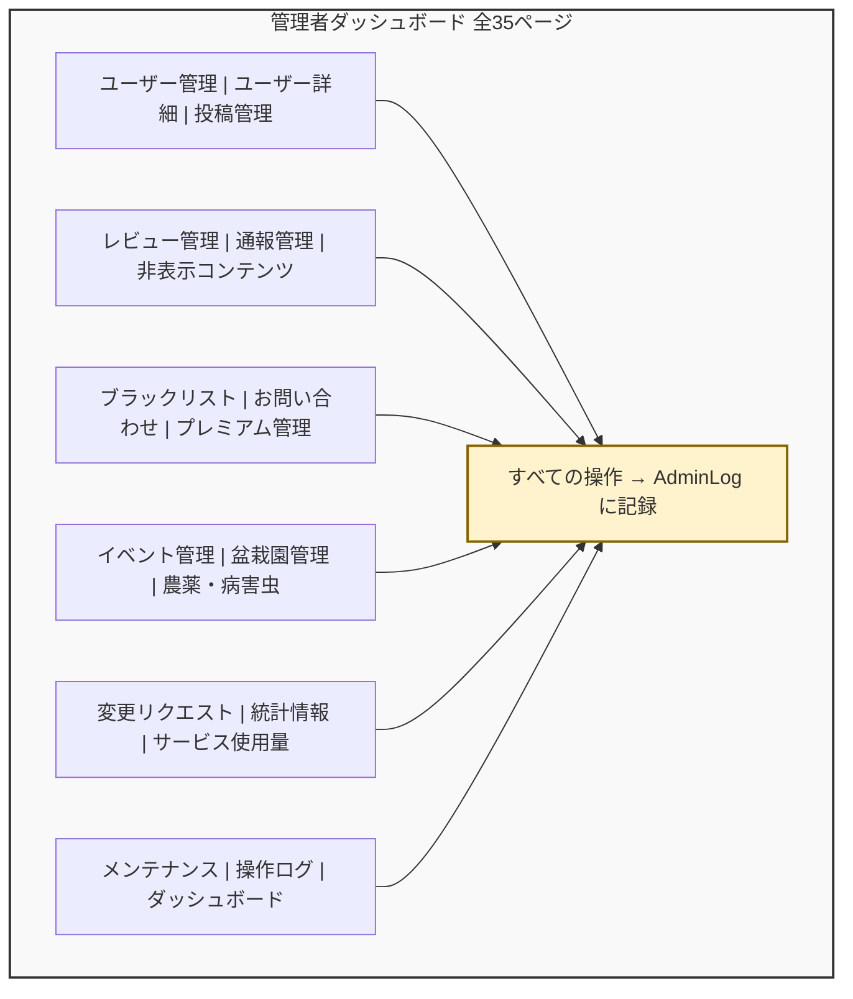

# 第18章: 管理者ダッシュボード

## この章で学ぶこと

この章では、BON-LOGの管理者ダッシュボードを構築します。以下の内容を学びます。

- 管理者権限の設計パターン（RBAC: ロールベースアクセス制御）とは何か、なぜ必要か
- Prismaモデル（AdminUser, AdminLog, AdminNotification, SystemSetting 等）の役割と構造
- ダッシュボードの統計表示とグラフ（Recharts）の実装
- ユーザー管理（一覧表示、アカウント停止、復活、削除）の実装
- 投稿・レビュー管理（コンテンツモデレーション）の実装
- 通報管理と自動非表示システム
- 非表示コンテンツ管理と管理者通知
- ブラックリスト管理（メールアドレス・デバイスフィンガープリント）
- お問い合わせ管理
- プレミアム会員管理
- メンテナンスモード
- 管理者ログ（操作履歴）の重要性と記録方法
- サービス使用量監視・Sentryエラー監視
- 盆栽園変更リクエスト管理



---

## 18.0 実習手順の進め方と手順マップ

手順に沿って進めると、**どのファイルに何を入力し、何を確認すればよいか** が分かります。形式の説明は [チュートリアルの進め方](./00_how_to_follow_steps.md) を参照してください。

| 手順 | 主な対象ファイル（例） | 完了時に確認すること |
|------|------------------------|------------------------|
| 管理者権限・モデル | `prisma/schema.prisma`, `lib/actions/utils.ts` | 管理者のみアクセスできる |
| ダッシュボード・統計 | `app/admin/*`, Recharts | 管理画面にアクセスし統計が表示される |
| ユーザー・投稿・通報管理 | `lib/actions/admin*.ts` | 一覧・停止・モデレーションが動く |
| ブラックリスト・お問い合わせ | `lib/actions/blacklist.ts`, `contact.ts` 等 | 管理操作ができる |
| メンテナンス・ログ | メンテナンスモード, AdminLog | 操作履歴が残りメンテナンス切替ができる |

各セクションで **対象ファイル**・**入力するコード（サンプルコード）**・**実行方法**・**実行するとこうなる**・**このあと変わること**・**確認方法** を確認しながら進めてください。

---

## 18.1 管理者ダッシュボードとは何か

### このセクションで学ぶこと

- 管理者ダッシュボードの役割と目的
- なぜSNSに管理機能が必要なのか
- BON-LOGの管理者ダッシュボードに必要な機能

### なぜ管理者機能が必要なのか

SNSやWebアプリケーションを運営すると、必ず以下のような問題に直面します。

1. **スパム投稿**: 広告や詐欺リンクを大量に投稿するユーザーが現れる
2. **不適切なコンテンツ**: 規約に違反する内容が投稿される
3. **ハラスメント**: 他のユーザーへの嫌がらせ行為
4. **バグや障害**: システムの問題を素早く把握・対処する必要がある
5. **ユーザーサポート**: 問い合わせ対応のために情報を確認する必要がある

これらの問題に対処するために、「管理者ダッシュボード」が必要になります。

> **ここがポイント！**
> 管理者ダッシュボードは「お店のバックヤード」のようなものです。お客さん（一般ユーザー）からは見えませんが、店を円滑に運営するために不可欠な場所です。

### BON-LOGの管理者機能一覧（全35ページ）

BON-LOGの管理者ダッシュボードには以下の機能が実装されています（`app/admin/` 配下に 28 サブディレクトリ・35 個の `page.tsx`）。

| ページ | URL | 説明 |
|--------|-----|------|
| ダッシュボード | `/admin` | 統計サマリー、通報統計、過去30日のアクセス推移（DAU）、Sentryエラー |
| ユーザー管理 | `/admin/users` | ユーザー一覧、検索、停止/復帰 |
| ユーザー詳細 | `/admin/users/[id]` | ユーザー情報、投稿履歴、通報履歴、削除 |
| ユーザーのアクティビティ | `/admin/users/[id]/activity` | ユーザー単位の操作・閲覧履歴 |
| 投稿管理 | `/admin/posts` | 投稿一覧、検索、通報フィルター、削除 |
| レビュー管理 | `/admin/reviews` | レビュー一覧、検索、通報フィルター、削除 |
| 通報管理 | `/admin/reports` | 通報一覧、ステータス・タイプフィルター |
| モデレーションキュー | `/admin/moderation-queue` | 自動検出された要対応コンテンツのキュー |
| 警告管理 | `/admin/warnings` | ユーザーへの警告発行・履歴 |
| 非表示コンテンツ | `/admin/hidden` | 自動非表示コンテンツ、管理者通知 |
| NG ワード管理 | `/admin/ng-words` | NG ワード辞書の追加・削除 |
| ブラックリスト | `/admin/blacklist` | メール/デバイスのブラックリスト管理 |
| IP 管理 | `/admin/ip-management` | IP 単位のブロック・許可リスト |
| お問い合わせ一覧 | `/admin/contact` | ユーザーからの問い合わせ対応 |
| お問い合わせ詳細 | `/admin/contact/[id]` | 問い合わせ詳細・返信ステータス |
| プレミアム管理 | `/admin/premium` | プレミアム会員の付与・取消・延長 |
| イベント管理 | `/admin/events` | イベント一覧、削除 |
| イベントインポート | `/admin/events/import` | 外部ソースからのイベント取り込み |
| 盆栽園管理 | `/admin/shops` | 盆栽園一覧、削除 |
| 農薬・病害虫データ | `/admin/pesticide-data` | 薬剤マスタ・原体・病害虫データ管理 |
| 農薬・病害虫データ詳細 | `/admin/pesticide-data/[id]` | 個別レコードの編集 |
| 変更リクエスト | `/admin/shop-requests` | 盆栽園変更リクエストの承認/却下 |
| 統計情報 | `/admin/stats` | サマリーカード、推移グラフ（期間・指標切替）|
| コホート分析 | `/admin/analytics/cohort` | 登録週ごとのリテンション・コホート分析 |
| コンテンツ分析 | `/admin/analytics/content` | ジャンル / ハッシュタグ / 投稿エンゲージメント分析 |
| サービス使用量 | `/admin/usage` | Vercel/Supabase/R2/Resend の使用量 |
| 監視 | `/admin/monitoring` | リアルタイム監視（エラー率・レイテンシ等） |
| お知らせ管理 | `/admin/announcements` | サービスお知らせの作成・公開 |
| コンテンツ管理（CMS） | `/admin/content-management` | CMS ページ・固定コンテンツ |
| ロール管理 | `/admin/roles` | 管理者ロール（権限マトリクス） |
| セキュリティ | `/admin/security` | セキュリティイベント・監査 |
| セグメント | `/admin/segments` | ユーザーセグメント分析 |
| バックアップ | `/admin/backups` | DB バックアップ管理 |
| メンテナンス | `/admin/maintenance` | メンテナンスモード設定 |
| 操作ログ | `/admin/logs` | 管理者の操作履歴（AdminLog） |

### 実装しない場合のリスク

管理者ダッシュボードを実装しないと以下の問題が発生します。

- スパムや不適切なコンテンツを発見できても対処手段がない
- 問題ユーザーのアカウントを停止・削除する方法がない
- サービスの成長状況（ユーザー数、投稿数の推移）を把握できない
- 障害発生時にメンテナンスモードに切り替える手段がない
- 誰がどの管理操作を行ったかの監査記録が残らない

---

## 18.2 管理者用Prismaモデル

### このセクションで学ぶこと

- 管理者関連のデータベーステーブル設計
- AdminUser、AdminLog、AdminNotification、SystemSetting等のモデル構造
- ブラックリスト関連モデル

### AdminRole列挙型

管理者のロール（権限レベル）を定義する列挙型です。

**ファイル: `prisma/schema.prisma`**

```prisma
enum AdminRole {
  admin
  moderator
}
```

- `admin`: 最高権限。全機能にアクセス可能
- `moderator`: モデレーター権限。コンテンツ管理、通報対応が可能

**これが必要な理由**: 全管理者に全権限を与えると操作ミスやセキュリティリスクが高まります。ロールを分けることで「最小権限の原則」を実現できます。

**実装しない場合**: 管理者全員が同じ権限を持つため、新人スタッフでもユーザーの完全削除やシステム設定変更が可能になってしまいます。

### AdminUser モデル

管理者ユーザーを定義するモデルです。Userテーブルとリレーションを持ちます。

**ファイル: `prisma/schema.prisma`**

```prisma
model AdminUser {
  userId    String    @id @map("user_id")
  role      AdminRole
  createdAt DateTime @default(now()) @map("created_at")

  user User       @relation(fields: [userId], references: [id], onDelete: Cascade)
  logs AdminLog[]

  @@map("admin_users")
}
```

| フィールド | 型 | 説明 |
|-----------|------|------|
| userId | String | ユーザーID（主キー、Userテーブルへの外部キー） |
| role | AdminRole | 管理者ロール（admin / moderator） |
| createdAt | DateTime | 管理者として登録された日時 |

**ポイント**: `userId`を主キーにすることで、1ユーザー = 1管理者レコードを保証しています。

**期待される動作**: AdminUserテーブルにレコードが存在するユーザーのみが管理画面にアクセスできます。

### AdminLog モデル

管理者の操作履歴を記録するモデルです。誰がいつ何をしたかの監査証跡を残します。

**ファイル: `prisma/schema.prisma`**

```prisma
model AdminLog {
  id         String   @id @default(cuid())
  adminId    String   @map("admin_id")
  action     String
  targetType String?  @map("target_type")
  targetId   String?  @map("target_id")
  details    Json?
  createdAt  DateTime @default(now()) @map("created_at")

  admin AdminUser @relation(fields: [adminId], references: [userId], onDelete: Cascade)

  @@map("admin_logs")
}
```

| フィールド | 型 | 説明 | 例 |
|-----------|------|------|------|
| action | String | 実行されたアクション | `suspend_user`, `delete_post` |
| targetType | String? | 操作対象のタイプ | `user`, `post`, `event`, `shop` |
| targetId | String? | 操作対象のID | `cuid_xxxxx` |
| details | Json? | 追加情報（理由など） | `{"reason": "スパム投稿"}` |

**これが必要な理由**: 管理操作の監査証跡がないと、誤操作やセキュリティインシデント発生時に原因究明ができません。

**実装しない場合**: 「誰がユーザーを削除したのか」「なぜこの投稿が消されたのか」を後から追跡できなくなります。

### AdminNotification モデル

通報の自動非表示などのシステムイベントを管理者に通知するモデルです。

**ファイル: `prisma/schema.prisma`**

```prisma
model AdminNotification {
  id          String   @id @default(cuid())
  type        String   // 'auto_hidden', 'report_threshold', etc.
  targetType  String   @map("target_type") // 'post', 'comment', 'event', 'shop', 'review'
  targetId    String   @map("target_id")
  message     String
  reportCount Int      @map("report_count")
  isRead      Boolean  @default(false) @map("is_read")
  isResolved  Boolean  @default(false) @map("is_resolved")
  resolvedAt  DateTime? @map("resolved_at")
  createdAt   DateTime @default(now()) @map("created_at")

  @@index([isRead])
  @@index([isResolved])
  @@index([createdAt])
  @@map("admin_notifications")
}
```

**期待される動作**: 投稿が通報により自動非表示になった場合、管理者の「非表示コンテンツ管理」ページに通知バナーが表示されます。

### EmailBlacklist / DeviceBlacklist モデル

悪質ユーザーの再登録を防ぐためのブラックリストモデルです。

**ファイル: `prisma/schema.prisma`**

```prisma
model EmailBlacklist {
  id        String   @id @default(cuid())
  email     String   @unique
  reason    String?  @db.Text
  createdBy String   @map("created_by")
  createdAt DateTime @default(now()) @map("created_at")

  @@map("email_blacklist")
}

model DeviceBlacklist {
  id            String   @id @default(cuid())
  fingerprint   String   @unique
  reason        String?  @db.Text
  originalEmail String?  @map("original_email")
  createdBy     String   @map("created_by")
  createdAt     DateTime @default(now()) @map("created_at")

  @@map("device_blacklist")
}
```

**これが必要な理由**: メールアドレスだけブロックしても、別のメールで再登録される可能性があります。デバイスフィンガープリントも合わせてブロックすることで、より確実に再登録を防止できます。

### ContactInquiry モデル

ユーザーからのお問い合わせを管理するモデルです。

**ファイル: `prisma/schema.prisma`**

```prisma
model ContactInquiry {
  id          String    @id @default(cuid())
  name        String    @db.VarChar(50)
  email       String    @db.VarChar(100)
  category    String
  subject     String    @db.VarChar(100)
  message     String    @db.Text
  status      String    @default("pending") // pending, in_progress, resolved, closed
  adminNote   String?   @db.Text @map("admin_note")
  respondedAt DateTime? @map("responded_at")
  createdAt   DateTime  @default(now()) @map("created_at")
  updatedAt   DateTime  @updatedAt @map("updated_at")

  @@index([status])
  @@index([createdAt])
  @@map("contact_inquiries")
}
```

### SystemSetting モデル

メンテナンスモードなどのシステム全体の設定を管理するモデルです。

**ファイル: `prisma/schema.prisma`**

```prisma
model SystemSetting {
  id        String   @id @default(cuid())
  key       String   @unique // 設定キー（例: maintenance_mode）
  value     Json     // 設定値（JSON形式）
  updatedBy String?  @map("updated_by")
  updatedAt DateTime @updatedAt @map("updated_at")
  createdAt DateTime @default(now()) @map("created_at")

  @@map("system_settings")
}
```

**期待される動作**: メンテナンスモードを有効にすると、`system_settings`テーブルの`key = 'maintenance_mode'`のレコードが更新され、一般ユーザーのアクセスが制限されます。

---

## 18.3 管理者レイアウトと認証

### このセクションで学ぶこと

- 管理画面専用レイアウトの実装方法
- 認証・権限チェックの仕組み
- サイドバーナビゲーションの構造

### 管理者レイアウト

管理画面全体を囲むレイアウトコンポーネントです。サイドバーナビゲーションと認証チェックを提供します。

**ファイル: `app/admin/layout.tsx`**

```typescript
import { redirect } from 'next/navigation'
import Link from 'next/link'
import { auth, signOut } from '@/lib/auth'
import { isAdmin } from '@/lib/actions/admin'
import { prisma } from '@/lib/db'
import { ROUTE_LOGIN, ROUTE_FEED, ROUTE_HOME } from '@/lib/constants/routes'
import {
  Home as HomeIcon,
  Users as UsersIcon,
  FileText as FileTextIcon,
  AlertTriangle as AlertTriangleIcon,
  Calendar as CalendarIcon,
  MapPin as MapPinIcon,
  ScrollText as ScrollTextIcon,
  ShieldBan as ShieldBanIcon,
  TrendingUp as TrendUpIcon,
  Gauge as GaugeIcon,
  Wrench as WrenchIcon,
  EyeOff as EyeOffIcon,
  MessageSquare as MessageSquareIcon,
  ArrowLeft as ArrowLeftIcon,
} from 'lucide-react'

export const dynamic = 'force-dynamic'

// サイドバーナビゲーション項目の定義
const navItems = [
  { href: '/admin', label: 'ダッシュボード', icon: HomeIcon },
  { href: '/admin/users', label: 'ユーザー管理', icon: UsersIcon },
  { href: '/admin/posts', label: '投稿管理', icon: FileTextIcon },
  { href: '/admin/reports', label: '通報管理', icon: AlertTriangleIcon },
  { href: '/admin/hidden', label: '非表示コンテンツ', icon: EyeOffIcon },
  { href: '/admin/blacklist', label: 'ブラックリスト', icon: ShieldBanIcon },
  { href: '/admin/events', label: 'イベント管理', icon: CalendarIcon },
  { href: '/admin/shops', label: '盆栽園管理', icon: MapPinIcon },
  { href: '/admin/shop-requests', label: '変更リクエスト', icon: MessageSquareIcon },
  { href: '/admin/stats', label: '統計情報', icon: TrendUpIcon },
  { href: '/admin/usage', label: 'サービス使用量', icon: GaugeIcon },
  { href: '/admin/maintenance', label: 'メンテナンス', icon: WrenchIcon },
  { href: '/admin/logs', label: '操作ログ', icon: ScrollTextIcon },
]

export default async function AdminLayout({
  children,
}: {
  children: React.ReactNode
}) {
  // 1. usersテーブルが空ならサインアウトしてトップへ
  const userCount = await prisma.user.count()
  if (userCount === 0) {
    await signOut({ redirect: false })
    redirect(ROUTE_HOME)
  }

  // 2. 未認証ならログインページへ
  const session = await auth()
  if (!session?.user?.id) {
    redirect(ROUTE_LOGIN)
  }

  // 3. 管理者でなければフィードへ
  const isAdminUser = await isAdmin()
  if (!isAdminUser) {
    redirect(ROUTE_FEED)
  }

  return (
    <div className="min-h-screen bg-muted/30">
      <aside className="fixed top-0 left-0 w-64 h-full bg-card border-r z-50 flex flex-col">
        <div className="p-4 border-b">
          <h1 className="text-xl font-bold">BON-LOG 管理</h1>
          <p className="text-sm text-muted-foreground">管理者ダッシュボード</p>
        </div>
        <nav className="p-4 overflow-y-auto flex-1">
          <ul className="space-y-1">
            {navItems.map((item) => (
              <li key={item.href}>
                <Link
                  href={item.href}
                  className="flex items-center gap-3 px-3 py-2 rounded-lg hover:bg-muted transition-colors"
                >
                  <item.icon className="w-5 h-5" />
                  <span>{item.label}</span>
                </Link>
              </li>
            ))}
          </ul>
        </nav>
        <div className="mt-auto p-4 border-t">
          <Link href="/feed" className="flex items-center gap-2 text-sm text-muted-foreground hover:text-foreground">
            <ArrowLeftIcon className="w-4 h-4" />
            <span>サイトに戻る</span>
          </Link>
        </div>
      </aside>
      <main id="main-content" className="ml-64 min-h-screen" tabIndex={-1}>
        <div className="p-6">{children}</div>
      </main>
    </div>
  )
}
```

**期待される表示**:
```
+------------------+--------------------------------------------+
| BON-LOG 管理     |                                            |
| 管理者ダッシュボード|         メインコンテンツ                     |
|------------------|                                            |
| > ダッシュボード  |  ここに各ページの内容が表示される             |
| > ユーザー管理    |                                            |
| > 投稿管理       |                                            |
| > 通報管理       |                                            |
| > 非表示コンテンツ |                                           |
| > ブラックリスト  |                                            |
| > イベント管理    |                                            |
| > 盆栽園管理     |                                            |
| > 変更リクエスト  |                                            |
| > 統計情報       |                                            |
| > サービス使用量  |                                            |
| > メンテナンス    |                                            |
| > 操作ログ       |                                            |
|------------------|                                            |
| ← サイトに戻る   |                                            |
+------------------+--------------------------------------------+
```

**実装しない場合**: 管理者の認証チェックが行われず、URLを知っている一般ユーザーでも管理画面にアクセスできてしまいます。

### 権限チェックユーティリティ

管理者権限チェックは共通ユーティリティ関数として実装されています。

**ファイル: `lib/actions/utils.ts`**

```typescript
'use server'

import { auth } from '@/lib/auth'
import { prisma } from '@/lib/db'
import { ERR_AUTH_REQUIRED, ERR_ADMIN_REQUIRED } from '@/lib/constants/errors'

// 認証を要求し、ユーザーIDを返す
export async function requireAuth(): Promise<
  { userId: string; error?: undefined } | { userId?: undefined; error: string }
> {
  const session = await auth()
  if (!session?.user?.id) {
    return { error: ERR_AUTH_REQUIRED }
  }
  return { userId: session.user.id }
}

// 管理者権限を要求し、ユーザーIDとロールを返す
export async function requireAdmin(): Promise<
  { userId: string; role: string; error?: undefined } | { userId?: undefined; role?: undefined; error: string }
> {
  const { userId, error } = await requireAuth()
  if (!userId) return { error: error! }

  const adminUser = await prisma.adminUser.findUnique({
    where: { userId },
    select: { role: true },
  })
  if (!adminUser) {
    return { error: ERR_ADMIN_REQUIRED }
  }
  return { userId, role: adminUser.role }
}
```

**ポイント**: すべての管理者Server Actionの冒頭で`requireAdmin()`を呼び出し、権限がなければエラーを返します。これにより、APIを直接叩いても不正な操作ができません。

---

## 18.4 ダッシュボードページ（メインページ）

### このセクションで学ぶこと

- 統計サマリーの取得と表示
- 通報統計の表示
- クイックアクションの実装
- Sentryエラー監視

### 統計取得Server Action

**ファイル: `lib/actions/admin.ts`**

```typescript
export async function getAdminStats() {
  const { error } = await requireAdmin()
  if (error) return { error }

  const today = getStartOfToday()

  const weekAgo = new Date()
  weekAgo.setDate(weekAgo.getDate() - WEEK_DAYS)
  weekAgo.setHours(0, 0, 0, 0)

  // 8つのクエリを並列実行してパフォーマンスを最適化
  const [
    totalUsers, todayUsers, totalPosts, todayPosts,
    pendingReports, totalEvents, totalShops, activeUsersWeek,
  ] = await Promise.all([
    prisma.user.count(),
    prisma.user.count({ where: { createdAt: { gte: today } } }),
    prisma.post.count(),
    prisma.post.count({ where: { createdAt: { gte: today } } }),
    prisma.report.count({ where: { status: 'pending' } }),
    prisma.event.count(),
    prisma.bonsaiShop.count(),
    prisma.user.count({
      where: {
        posts: { some: { createdAt: { gte: weekAgo } } },
      },
    }),
  ])

  return {
    totalUsers, todayUsers, totalPosts, todayPosts,
    pendingReports, totalEvents, totalShops, activeUsersWeek,
  }
}
```

**期待される出力**:
```json
{
  "totalUsers": 1234,
  "todayUsers": 12,
  "totalPosts": 5678,
  "todayPosts": 45,
  "pendingReports": 3,
  "totalEvents": 89,
  "totalShops": 56,
  "activeUsersWeek": 234
}
```

### ダッシュボードページ

**ファイル: `app/admin/page.tsx`**

```typescript
import Link from 'next/link'
import { redirect } from 'next/navigation'
import { getAdminStats } from '@/lib/actions/admin'
import { getReportStats } from '@/lib/actions/report'
import { getPendingShopChangeRequestCount } from '@/lib/actions/shop'
import { SentryErrors } from './SentryErrors'
import {
  Users as UsersIcon,
  FileText as FileTextIcon,
  AlertTriangle as AlertTriangleIcon,
  Activity as ActivityIcon,
  ArrowRight as ArrowRightIcon,
  // ... 他のアイコン
} from 'lucide-react'

export default async function AdminDashboardPage() {
  // 3つのデータソースを並列取得
  const [statsResult, reportResult, shopRequestResult] = await Promise.all([
    getAdminStats(),
    getReportStats(),
    getPendingShopChangeRequestCount(),
  ])

  if ('error' in statsResult) {
    redirect('/login')
  }
  const stats = statsResult

  return (
    <div className="space-y-6">
      <h1 className="text-2xl font-bold">ダッシュボード</h1>

      {/* 主要統計カード - 4カラムグリッド */}
      <div className="grid grid-cols-1 md:grid-cols-2 lg:grid-cols-4 gap-4">
        <div className="bg-card rounded-lg border p-4">
          <div className="flex items-center gap-3 mb-2">
            <div className="p-2 bg-blue-500/10 text-blue-500 rounded-lg">
              <UsersIcon className="w-5 h-5" />
            </div>
            <span className="text-sm text-muted-foreground">総ユーザー数</span>
          </div>
          <p className="text-3xl font-bold">{stats.totalUsers.toLocaleString()}</p>
          <p className="text-sm text-green-500 mt-1">+{stats.todayUsers} 今日</p>
        </div>
        {/* 他のカード: 総投稿数、未対応通報、週間アクティブ、変更リクエスト */}
      </div>

      {/* 通報統計セクション */}
      {/* クイックアクションセクション */}
      {/* Sentryエラー表示 */}
      <SentryErrors />
    </div>
  )
}
```

**期待される表示**:
```
ダッシュボード
+------------+------------+------------+------------------+
| 総ユーザー  | 総投稿数   | 未対応通報  | 週間アクティブ    |
|   1,234    |   5,678    |     3     |      234         |
| +12 今日   | +45 今日   | 確認する → | 過去7日間        |
+------------+------------+------------+------------------+

通報統計
+----------+----------+----------+----------+
|  未対応   |  確認中   | 対応完了  |   却下   |
|    3     |    5     |   12    |    8    |
+----------+----------+----------+----------+

クイックアクション
[ユーザー管理] [投稿管理] [レビュー管理] [通報管理] [プレミアム管理]
[お問い合わせ] [操作ログ]
```

### Sentryエラー表示コンポーネント

Sentryから未解決のエラー情報を取得して表示するクライアントコンポーネントです。

**ファイル: `app/admin/SentryErrors.tsx`**

```typescript
'use client'

import { useState, useEffect } from 'react'
import { formatDistanceToNow } from 'date-fns'
import { ja } from 'date-fns/locale'

export function SentryErrors() {
  const [data, setData] = useState<SentryResponse | null>(null)
  const [loading, setLoading] = useState(true)

  const fetchData = async () => {
    setLoading(true)
    try {
      const res = await fetch('/api/admin/sentry')
      const json = await res.json()
      setData(json)
    } catch {
      setData({ success: false, error: '取得に失敗しました' })
    } finally {
      setLoading(false)
    }
  }

  useEffect(() => { fetchData() }, [])

  // 各エラーをカード形式で表示
  // エラーレベル（fatal/error/warning/info）に応じて色分け
  // 発生回数、最終発生日時（相対時間）を表示
  // Sentryダッシュボードへの直リンクを提供
}
```

**これが必要な理由**: 本番環境のエラーをリアルタイムに監視し、素早く対応するためです。

**実装しない場合**: エラーの発生を気づかず、ユーザー体験が悪化します。

---

## 18.5 ユーザー管理

### このセクションで学ぶこと

- ユーザー一覧の取得と表示
- 検索・フィルター・ソート・ページネーション
- アカウント停止/復帰/削除

### ユーザー一覧取得Server Action

**ファイル: `lib/actions/admin.ts`**

```typescript
export async function getAdminUsers(options?: {
  search?: string
  status?: 'all' | 'active' | 'suspended'
  sortBy?: 'createdAt' | 'postCount' | 'nickname'
  sortOrder?: 'asc' | 'desc'
  limit?: number
  offset?: number
}) {
  const { error } = await requireAdmin()
  if (error) return { error }

  const { search, status = 'all', sortBy = 'createdAt', sortOrder = 'desc',
          limit = DEFAULT_PAGE_LIMIT, offset = 0 } = options || {}

  // 動的に検索条件を構築
  const where = {
    ...(search && {
      OR: [
        { nickname: { contains: search } },
        { email: { contains: search } },
      ],
    }),
    ...(status === 'suspended' && { isSuspended: true }),
    ...(status === 'active' && { isSuspended: false }),
  }

  const [users, total] = await Promise.all([
    prisma.user.findMany({
      where,
      select: {
        id: true, email: true, nickname: true, avatarUrl: true,
        createdAt: true, isSuspended: true, suspendedAt: true,
        _count: { select: { posts: true } },
      },
      orderBy: sortBy === 'postCount'
        ? { posts: { _count: sortOrder } }
        : { [sortBy]: sortOrder },
      take: limit,
      skip: offset,
    }),
    prisma.user.count({ where }),
  ])

  return { users, total }
}
```

### ユーザー停止Server Action

**ファイル: `lib/actions/admin.ts`**

```typescript
export async function suspendUser(userId: string, reason: string) {
  const { userId: adminUserId, error } = await requireAdmin()
  if (error) return { error }

  const user = await prisma.user.findUnique({ where: { id: userId } })
  if (!user) return { error: 'ユーザーが見つかりません' }
  if (user.isSuspended) return { error: 'このユーザーは既に停止されています' }

  // トランザクションで停止処理とログ記録を同時実行
  await prisma.$transaction([
    prisma.user.update({
      where: { id: userId },
      data: { isSuspended: true, suspendedAt: new Date() },
    }),
    prisma.adminLog.create({
      data: {
        adminId: adminUserId!,
        action: 'suspend_user',
        targetType: 'user',
        targetId: userId,
        details: JSON.stringify({ reason }),
      },
    }),
  ])

  revalidatePath('/admin/users')
  return { success: true }
}
```

**ポイント**: `prisma.$transaction`で「ユーザー停止」と「ログ記録」をアトミックに実行しています。片方だけ成功してしまう状態を防ぎます。

### ユーザー管理ページ

**ファイル: `app/admin/users/page.tsx`**

```typescript
export default async function AdminUsersPage({ searchParams }: PageProps) {
  const params = await searchParams
  const search = params.search || ''
  const status = params.status || 'all'
  const page = parseInt(params.page || '1', 10)
  const limit = DEFAULT_PAGE_LIMIT
  const offset = (page - 1) * limit

  const result = await getAdminUsers({ search: search || undefined, status, limit, offset })
  if ('error' in result) redirect('/login')
  const { users, total } = result
  const totalPages = Math.ceil(total / limit)

  return (
    <div className="space-y-6">
      <h1 className="text-2xl font-bold">ユーザー管理</h1>
      {/* 検索フォーム: ニックネーム・メールで検索、ステータスフィルター */}
      {/* ユーザーテーブル: ユーザー名、メール、投稿数、登録日、ステータス、操作 */}
      {/* ページネーション */}
    </div>
  )
}
```

**期待される表示**:
```
ユーザー管理                               全 1,234 件
+-----------------------------------------------------------+
| [ニックネーム・メールで検索    ] [全ユーザー ▼] [検索]     |
+-----------------------------------------------------------+

+----------+----------------+------+----------+---------+----+
| ユーザー | メール         | 投稿 | 登録日   | ステータス| 操作|
+----------+----------------+------+----------+---------+----+
| 田中太郎 | tanaka@...     |  45  | 2024/1/1 | アクティブ| ⋮ |
| 鈴木花子 | suzuki@...     |  12  | 2024/2/5 | 停止中   | ⋮ |
+----------+----------------+------+----------+---------+----+
                    1 / 62    [前へ] [次へ]
```

### ユーザーアクションドロップダウン

**ファイル: `app/admin/users/UserActionsDropdown.tsx`**

```typescript
'use client'

export function UserActionsDropdown({ userId, isSuspended }: UserActionsDropdownProps) {
  const router = useRouter()
  const { toast } = useToast()
  const [isOpen, setIsOpen] = useState(false)
  const [showSuspendModal, setShowSuspendModal] = useState(false)
  const [reason, setReason] = useState('')

  const handleSuspend = async () => {
    if (!reason.trim()) {
      toast({ title: '停止理由を入力してください', variant: 'destructive' })
      return
    }
    const result = await suspendUser(userId, reason)
    if (result.error) {
      toast({ title: result.error, variant: 'destructive' })
      return
    }
    setShowSuspendModal(false)
    router.refresh()
  }

  const handleActivate = async () => {
    if (!confirm('このユーザーのアカウントを復帰させますか？')) return
    const result = await activateUser(userId)
    if (result.error) {
      toast({ title: result.error, variant: 'destructive' })
      return
    }
    router.refresh()
  }

  // 停止中なら「アカウント復帰」、アクティブなら「アカウント停止」を表示
  // 停止時は理由入力モーダルを表示
}
```

### ユーザー詳細ページ

**ファイル: `app/admin/users/[id]/page.tsx`**

ユーザーの基本情報、統計（投稿数・コメント数・フォロワー数・フォロー数）、最近の投稿、通報履歴を表示します。

```typescript
export default async function AdminUserDetailPage({ params }: Props) {
  const { id } = await params
  const result = await getAdminUserDetail(id)
  if ('error' in result || !result.user) notFound()

  const { user, reportCount } = result

  // 最近の投稿5件を取得
  const recentPosts = await prisma.post.findMany({
    where: { userId: id },
    select: { id: true, content: true, createdAt: true,
              _count: { select: { likes: true, comments: { where: { deletedAt: null } } } } },
    orderBy: { createdAt: 'desc' },
    take: ADMIN_USER_RECENT_POSTS_LIMIT,
  })

  // このユーザーに対する通報履歴を取得
  const reportsAgainstUser = await prisma.report.findMany({
    where: {
      OR: [
        { targetType: 'user', targetId: id },
        { targetType: 'post', targetId: {
          in: (await prisma.post.findMany({
            where: { userId: id }, select: { id: true },
          })).map((p) => p.id),
        }},
      ],
    },
    include: { reporter: { select: { id: true, nickname: true } } },
    orderBy: { createdAt: 'desc' },
    take: ADMIN_USER_RECENT_ACTIVITY_LIMIT,
  })
  // 2カラムレイアウトで情報表示 + サイドバーにアクションボタン
}
```

### ユーザー完全削除

**ファイル: `lib/actions/admin.ts`**

```typescript
export async function deleteUserByAdmin(userId: string, reason: string) {
  const { userId: adminUserId, error } = await requireAdmin()
  if (error) return { error }

  // 安全チェック
  if (userId === adminUserId) {
    return { error: '自分自身を削除することはできません' }
  }

  const targetAdminUser = await prisma.adminUser.findUnique({ where: { userId } })
  if (targetAdminUser) {
    return { error: '管理者ユーザーは削除できません' }
  }

  await prisma.$transaction([
    prisma.user.delete({ where: { id: userId } }),
    prisma.adminLog.create({
      data: {
        adminId: adminUserId!,
        action: 'delete_user',
        targetType: 'user',
        targetId: userId,
        details: JSON.stringify({ reason, deletedEmail: user.email, deletedNickname: user.nickname }),
      },
    }),
  ])

  revalidatePath('/admin/users')
  return { success: true }
}
```

**重要な安全対策**:
1. 自分自身は削除できない
2. 他の管理者ユーザーは削除できない
3. 削除されたユーザーの情報（メール、ニックネーム）はログに記録される

**実装しない場合**: 悪質ユーザーのアカウントを完全に排除する手段がなくなります。

---

## 18.6 投稿・レビュー管理

### このセクションで学ぶこと

- 投稿一覧の管理者向け表示
- 通報された投稿のフィルタリング
- 管理者による投稿・レビュー削除

### 投稿一覧取得Server Action

**ファイル: `lib/actions/admin.ts`**

```typescript
export async function getAdminPosts(options?: {
  search?: string
  hasReports?: boolean
  sortBy?: 'createdAt' | 'likeCount' | 'reportCount'
  sortOrder?: 'asc' | 'desc'
  limit?: number
  offset?: number
}) {
  const { error } = await requireAdmin()
  if (error) return { error }

  const { search, hasReports = false, sortBy = 'createdAt', sortOrder = 'desc',
          limit = DEFAULT_PAGE_LIMIT, offset = 0 } = options || {}

  // 通報された投稿IDを取得
  let reportedPostIds: string[] = []
  if (hasReports) {
    const reports = await prisma.report.findMany({
      where: { targetType: 'post' },
      select: { targetId: true },
      distinct: ['targetId'],
    })
    reportedPostIds = reports.map((r) => r.targetId)
  }

  const [posts, total] = await Promise.all([
    prisma.post.findMany({
      where: { ...(search && { content: { contains: search } }),
               ...(hasReports && { id: { in: reportedPostIds } }) },
      select: {
        id: true, content: true, createdAt: true,
        user: { select: { id: true, nickname: true, avatarUrl: true } },
        _count: { select: { likes: true, comments: { where: { deletedAt: null } } } },
      },
      orderBy: sortBy === 'likeCount'
        ? { likes: { _count: sortOrder } }
        : { [sortBy]: sortOrder },
      take: limit, skip: offset,
    }),
    prisma.post.count({ where: /* 同条件 */ }),
  ])

  // 各投稿の通報件数を一括取得（N+1回避）
  const postIds = posts.map((p) => p.id)
  const reportCounts = postIds.length > 0
    ? await prisma.report.groupBy({
        by: ['targetId'],
        where: { targetType: 'post', targetId: { in: postIds } },
        _count: { targetId: true },
      })
    : []

  const reportCountMap = new Map(reportCounts.map((r) => [r.targetId, r._count.targetId]))
  const postsWithReportCount = posts.map((post) => ({
    ...post,
    reportCount: reportCountMap.get(post.id) ?? 0,
  }))

  return { posts: postsWithReportCount, total }
}
```

**ポイント**: `groupBy`を使って通報件数を一括取得し、N+1問題を回避しています。

### 投稿削除Server Action

**ファイル: `lib/actions/admin.ts`**

```typescript
export async function deletePostByAdmin(postId: string, reason: string) {
  const { userId: adminUserId, error } = await requireAdmin()
  if (error) return { error }

  const post = await prisma.post.findUnique({ where: { id: postId } })
  if (!post) return { error: '投稿が見つかりません' }

  await prisma.$transaction([
    prisma.post.delete({ where: { id: postId } }),
    prisma.adminLog.create({
      data: {
        adminId: adminUserId!,
        action: 'delete_post',
        targetType: 'post',
        targetId: postId,
        details: JSON.stringify({ reason }),
      },
    }),
  ])

  revalidatePath('/admin/posts')
  return { success: true }
}
```

### レビュー管理

レビュー管理も投稿管理と同じパターンで実装されています。

**ファイル: `lib/actions/admin.ts`** - `getAdminReviews()`, `deleteReviewByAdmin()`

```typescript
export async function getAdminReviews(options?: {
  search?: string
  hasReports?: boolean
  sortBy?: 'createdAt' | 'rating' | 'reportCount'
  sortOrder?: 'asc' | 'desc'
  limit?: number
  offset?: number
}) {
  // 投稿管理と同様のパターンで実装
  // shopReviewテーブルから検索、通報件数を一括取得
}
```

**期待される表示（投稿管理ページ）**:
```
投稿管理                                 全 5,678 件
+-----------------------------------------------------------+
| [投稿内容で検索        ] [□ 通報あり] [検索]              |
+-----------------------------------------------------------+

+----------+------------------+------+------+------+------+----+
| 投稿者   | 内容             | いいね| コメント| 通報 | 投稿日 | 操作|
+----------+------------------+------+------+------+------+----+
| 田中太郎 | 松の手入れを...   |  12  |   3  |  0   | 1/15 | ⋮  |
| 鈴木花子 | スパムリンク...    |   0  |   0  |  5   | 1/16 | ⋮  |
+----------+------------------+------+------+------+------+----+
```

---

## 18.7 通報管理

### このセクションで学ぶこと

- 通報一覧の表示とフィルタリング
- ステータス管理（未対応/確認中/対応完了/却下）
- 対象タイプ別フィルタリング

### 通報管理ページ

**ファイル: `app/admin/reports/page.tsx`**

```typescript
export default async function AdminReportsPage({ searchParams }: PageProps) {
  const params = await searchParams
  const status = params.status        // 'pending' | 'reviewed' | 'resolved' | 'dismissed'
  const targetType = params.targetType // 'post' | 'comment' | 'event' | 'shop' | 'user'
  const page = parseInt(params.page || '1', 10)

  const result = await getReports({ status, targetType, limit, offset })
  if ('error' in result) return <div className="text-red-500">{result.error}</div>

  const { reports, total } = result

  return (
    <div className="space-y-6">
      <h1 className="text-2xl font-bold">通報管理</h1>
      {/* フィルター: ステータス選択、対象タイプ選択 */}
      {/* 通報テーブル: 通報者、対象タイプ、理由、詳細、ステータス、通報日、操作 */}
    </div>
  )
}
```

**ステータス定義**:

| ステータス | 日本語 | 色 | 説明 |
|-----------|--------|------|------|
| pending | 未対応 | 黄 | 新しい通報。まだ確認されていない |
| reviewed | 確認中 | 青 | 管理者が確認を開始した |
| resolved | 対応完了 | 緑 | 対応が完了した |
| dismissed | 却下 | グレー | 対応不要と判断した |

**対象タイプ定義**:

| タイプ | 日本語 | 説明 |
|--------|--------|------|
| post | 投稿 | 不適切な投稿 |
| comment | コメント | 不適切なコメント |
| event | イベント | 不適切なイベント情報 |
| shop | 盆栽園 | 不適切な盆栽園情報 |
| user | ユーザー | 問題のあるユーザー |

**期待される表示**:
```
通報管理                                   全 28 件
+-----------------------------------------------------------+
| [全ステータス ▼] [全タイプ ▼] [フィルター]                  |
+-----------------------------------------------------------+

+----------+------+----------+------+---------+------+----+
| 通報者   | タイプ| 理由     | 詳細 | ステータス| 通報日| 操作|
+----------+------+----------+------+---------+------+----+
| 山田太郎 | 投稿 | スパム   | 広告...| 未対応  | 1/20 | ⋮  |
| 佐藤花子 | ユーザー| 嫌がらせ| 暴言..| 確認中  | 1/19 | ⋮  |
+----------+------+----------+------+---------+------+----+
```

---

## 18.8 非表示コンテンツ管理と管理者通知

### このセクションで学ぶこと

- 通報による自動非表示の仕組み
- 非表示コンテンツの再表示・削除
- 管理者通知バナーの実装

### 非表示コンテンツ管理Server Action

**ファイル: `lib/actions/admin/hidden.ts`**

```typescript
'use server'

import { prisma } from '@/lib/db'
import { revalidatePath } from 'next/cache'
import { requireAdmin } from '@/lib/actions/utils'

type ContentType = 'post' | 'comment' | 'event' | 'shop' | 'review'

// 非表示コンテンツ一覧を取得
export async function getHiddenContent(options?: {
  type?: ContentType
  limit?: number
}) {
  const { error } = await requireAdmin()
  if (error) return { error }

  // 各コンテンツタイプから isHidden: true のアイテムを収集
  // 投稿、コメント、イベント、盆栽園、レビューそれぞれを取得
}

// コンテンツを再表示
export async function restoreContent(type: ContentType, id: string) {
  const { userId, error } = await requireAdmin()
  if (error) return { error }
  // isHidden を false に更新 + AdminLog記録
}

// コンテンツを完全削除
export async function deleteHiddenContent(type: ContentType, id: string) {
  const { userId, error } = await requireAdmin()
  if (error) return { error }
  // レコードを削除 + AdminLog記録
}

// 管理者通知を取得
export async function getAdminNotifications(options?: { unreadOnly?: boolean }) {
  const { error } = await requireAdmin()
  if (error) return { error, notifications: [], unreadCount: 0 }
  // AdminNotificationテーブルから未読通知を取得
}

// 全通知を既読にする
export async function markAllAdminNotificationsAsRead() {
  // isRead: true に一括更新
}
```

### 非表示コンテンツ管理ページ

**ファイル: `app/admin/hidden/page.tsx`**

```typescript
export default async function HiddenContentPage() {
  const [contentResult, notificationResult] = await Promise.all([
    getHiddenContent(),
    getAdminNotifications({ unreadOnly: true }),
  ])

  const items = contentResult.items || []
  const unreadNotifications = notificationResult.notifications || []
  const unreadCount = notificationResult.unreadCount || 0

  return (
    <div className="space-y-6">
      <h1 className="text-2xl font-bold">非表示コンテンツ管理</h1>
      <p className="text-muted-foreground">
        通報により自動非表示になったコンテンツを確認・管理できます
      </p>

      {/* 未読通知バナー */}
      {unreadCount > 0 && (
        <AdminNotificationBanner
          notifications={unreadNotifications}
          unreadCount={unreadCount}
        />
      )}

      {/* タイプ別統計カード */}
      <div className="grid grid-cols-2 md:grid-cols-5 gap-4">
        {(['post', 'comment', 'event', 'shop', 'review'] as const).map((type) => {
          const count = items.filter((item) => item.type === type).length
          return (
            <div key={type} className="bg-card p-4 rounded-lg border">
              <div className="text-2xl font-bold">{count}</div>
              <div className="text-sm text-muted-foreground">{label}</div>
            </div>
          )
        })}
      </div>

      {/* コンテンツ一覧（フィルタリング・再表示・削除機能付き） */}
      <HiddenContentList items={items} />
    </div>
  )
}
```

### 非表示コンテンツ一覧コンポーネント

**ファイル: `app/admin/hidden/HiddenContentList.tsx`**

```typescript
'use client'

export function HiddenContentList({ items }: { items: HiddenItem[] }) {
  const { toast } = useToast()
  const [filter, setFilter] = useState<ContentType | 'all'>('all')

  async function handleRestore(type: ContentType, id: string) {
    if (!confirm('このコンテンツを再表示しますか？')) return
    const result = await restoreContent(type, id)
    if (result.error) toast({ title: result.error, variant: 'destructive' })
  }

  async function handleDelete(type: ContentType, id: string) {
    if (!confirm('このコンテンツを完全に削除しますか？この操作は取り消せません。')) return
    const result = await deleteHiddenContent(type, id)
    if (result.error) toast({ title: result.error, variant: 'destructive' })
  }

  return (
    <div className="space-y-4">
      {/* タイプ別フィルターボタン */}
      {/* 各コンテンツカード: タイプバッジ、内容、作成者、非表示日時 */}
      {/* アクションボタン: [再表示] [削除] */}
    </div>
  )
}
```

### 管理者通知バナー

**ファイル: `app/admin/hidden/AdminNotificationBanner.tsx`**

```typescript
'use client'

export function AdminNotificationBanner({
  notifications,
  unreadCount,
}: {
  notifications: AdminNotification[]
  unreadCount: number
}) {
  const [isExpanded, setIsExpanded] = useState(false)

  async function handleMarkAllAsRead() {
    await markAllAdminNotificationsAsRead()
  }

  return (
    <div className="bg-amber-50 border border-amber-200 rounded-lg p-4">
      <div className="flex items-center justify-between">
        <span className="font-medium text-amber-800">
          {unreadCount}件の新しい通知があります
        </span>
        <div className="flex gap-2">
          <Button variant="ghost" size="sm" onClick={() => setIsExpanded(!isExpanded)}>
            {isExpanded ? '閉じる' : '表示'}
          </Button>
          <Button variant="outline" size="sm" onClick={handleMarkAllAsRead}>
            すべて既読
          </Button>
        </div>
      </div>
      {/* 展開時に通知リストを表示 */}
    </div>
  )
}
```

**期待される表示**:
```
非表示コンテンツ管理
通報により自動非表示になったコンテンツを確認・管理できます

[!] 3件の新しい通知があります        [表示] [すべて既読]

+------+------+--------+------+--------+
| 投稿 | コメント| イベント| 盆栽園| レビュー|
|  5   |   2  |   0   |   1  |   0   |
+------+------+--------+------+--------+

[すべて(8)] [投稿(5)] [コメント(2)] [盆栽園(1)]

+-----------------------------------------------------------------+
| [投稿] 通報数: 5件                                               |
| スパムリンクが含まれる投稿内容...                                  |
| 作成者: 田中太郎 | 非表示: 2024/1/20 15:30          [再表示] [削除] |
+-----------------------------------------------------------------+
```

---

## 18.9 ブラックリスト管理

### このセクションで学ぶこと

- メールブラックリストの管理
- デバイスフィンガープリントブラックリストの管理
- タブ切り替えUIの実装

### ブラックリスト管理Server Action

**ファイル: `lib/actions/blacklist.ts`**

```typescript
'use server'

import { prisma } from '@/lib/db'
import { revalidatePath } from 'next/cache'
import { requireAdmin } from '@/lib/actions/utils'

// メールアドレスをブラックリストに追加
export async function addEmailToBlacklist(email: string, reason?: string) {
  const { userId, error } = await requireAdmin()
  if (error) return { error }

  const normalizedEmail = email.toLowerCase().trim()
  if (!normalizedEmail || !normalizedEmail.includes('@')) {
    return { error: '有効なメールアドレスを入力してください' }
  }

  // 既に登録されているかチェック
  const existing = await prisma.emailBlacklist.findUnique({
    where: { email: normalizedEmail },
  })
  if (existing) {
    return { error: 'このメールアドレスは既にブラックリストに登録されています' }
  }

  await prisma.emailBlacklist.create({
    data: { email: normalizedEmail, reason: reason || null, createdBy: userId! },
  })

  revalidatePath('/admin/blacklist')
  return { success: true }
}

// メールアドレスをブラックリストから削除
export async function removeEmailFromBlacklist(id: string) { /* ... */ }

// デバイスをブラックリストに追加
export async function addDeviceToBlacklist(
  fingerprint: string, reason?: string, originalEmail?: string
) { /* ... */ }

// デバイスをブラックリストから削除
export async function removeDeviceFromBlacklist(id: string) { /* ... */ }

// メールブラックリスト一覧を取得
export async function getEmailBlacklist(options?: {
  search?: string; limit?: number; offset?: number
}) { /* ... */ }

// デバイスブラックリスト一覧を取得
export async function getDeviceBlacklist(options?: {
  search?: string; limit?: number; offset?: number
}) { /* ... */ }
```

### ブラックリストタブコンポーネント

**ファイル: `app/admin/blacklist/BlacklistTabs.tsx`**

```typescript
'use client'

export function BlacklistTabs({
  tab, search, page, limit,
  emailItems, emailTotal, deviceItems, deviceTotal,
}: BlacklistTabsProps) {
  const router = useRouter()
  const [showAddModal, setShowAddModal] = useState(false)

  const handleAddEmail = async () => {
    const result = await addEmailToBlacklist(newEmail, newReason || undefined)
    if ('error' in result) { setError(result.error); return }
    setShowAddModal(false)
    router.refresh()
  }

  const handleRemoveEmail = async (id: string) => {
    if (!confirm('このメールアドレスをブラックリストから削除しますか？')) return
    const result = await removeEmailFromBlacklist(id)
    if ('error' in result) toast({ title: result.error, variant: 'destructive' })
    router.refresh()
  }

  return (
    <div className="space-y-4">
      {/* タブ: [メールアドレス (件数)] [デバイス (件数)] */}
      {/* 検索フォーム + 追加ボタン */}
      {/* 追加モーダル */}
      {/* テーブル */}
      {/* ページネーション */}
    </div>
  )
}
```

**期待される表示（メールタブ）**:
```
ブラックリスト管理

[メールアドレス (5)] [デバイス (2)]

+-----------------------------------------------------------+
| [メールアドレスで検索          ]              [+ 追加]     |
+-----------------------------------------------------------+

+-------------------+-----------+----------+----+
| メールアドレス     | 理由      | 登録日    | 操作|
+-------------------+-----------+----------+----+
| spam@example.com  | スパム    | 2024/1/1 | [削除] |
| bad@example.com   | 嫌がらせ  | 2024/1/5 | [削除] |
+-------------------+-----------+----------+----+
```

**実装しない場合**: 悪質ユーザーが別のメールアドレスや同じデバイスで再登録し、繰り返し問題を起こす可能性があります。

---

## 18.10 お問い合わせ管理

### このセクションで学ぶこと

- お問い合わせ一覧の表示
- ステータス管理（未対応/対応中/解決済/クローズ）
- カテゴリ別フィルタリング

### お問い合わせ管理ページ

**ファイル: `app/admin/contact/page.tsx`**

```typescript
const STATUS_LABELS: Record<string, string> = {
  pending: '未対応',
  in_progress: '対応中',
  resolved: '解決済',
  closed: 'クローズ',
}

const CATEGORY_LABELS: Record<string, string> = {
  general: '一般',
  account: 'アカウント',
  bug: '不具合',
  feature: '機能要望',
  premium: 'プレミアム',
  other: 'その他',
}

export default async function AdminContactPage({ searchParams }) {
  const [statsResult, inquiriesResult] = await Promise.all([
    getContactStats(),
    getContactInquiries({ status, search, page }),
  ])

  return (
    <div className="space-y-6">
      <h1 className="text-2xl font-bold">お問い合わせ管理</h1>

      {/* ステータス別統計カード */}
      <div className="grid grid-cols-2 md:grid-cols-4 gap-4">
        <div className="bg-card rounded-lg border p-4">
          <p className="text-sm text-muted-foreground">未対応</p>
          <p className="text-2xl font-bold text-yellow-600">{stats.pending}</p>
        </div>
        {/* 対応中、解決済、クローズのカード */}
      </div>

      {/* 検索フォーム: ステータスフィルター + キーワード検索 */}
      {/* お問い合わせテーブル: 名前、メール、カテゴリ、件名、ステータス、日時、操作 */}
    </div>
  )
}
```

**期待される表示**:
```
お問い合わせ管理                        ← ダッシュボードに戻る
+----------+----------+----------+----------+
|  未対応   |  対応中   |  解決済   | クローズ  |
|    5     |    3     |   12    |    8    |
+----------+----------+----------+----------+

+----------+----------------+--------+----------+---------+------+----+
| 名前     | メール         | カテゴリ| 件名     | ステータス| 日時 | 操作|
+----------+----------------+--------+----------+---------+------+----+
| 山田太郎 | yamada@...     | 不具合  | 画像が... | 未対応   | 1/20 | ⋮  |
+----------+----------------+--------+----------+---------+------+----+
```

---

## 18.11 プレミアム会員管理

### このセクションで学ぶこと

- プレミアム会員の統計表示
- 手動でのプレミアム付与・取消・延長
- Stripe連携との関係

### プレミアム管理Server Action

**ファイル: `lib/actions/admin/premium.ts`**

```typescript
'use server'

import { prisma } from '@/lib/db'
import { revalidatePath } from 'next/cache'
import { requireAdmin } from '@/lib/actions/utils'

// プレミアム会員を付与
export async function grantPremium(targetUserId: string, durationDays: number = 30) {
  const { userId: adminUserId, error } = await requireAdmin()
  if (error) return { error }

  const user = await prisma.user.findUnique({ where: { id: targetUserId } })
  if (!user) return { error: 'ユーザーが見つかりません' }

  const expiresAt = new Date()
  expiresAt.setDate(expiresAt.getDate() + durationDays)

  await prisma.$transaction([
    prisma.user.update({
      where: { id: targetUserId },
      data: { isPremium: true, premiumExpiresAt: expiresAt },
    }),
    prisma.adminLog.create({
      data: {
        adminId: adminUserId!,
        action: 'grant_premium',
        targetType: 'user',
        targetId: targetUserId,
        details: JSON.stringify({ durationDays }),
      },
    }),
  ])

  revalidatePath('/admin/premium')
  return { success: true, expiresAt }
}

// プレミアム統計を取得
export async function getPremiumStats() {
  const { error } = await requireAdmin()
  if (error) return { error }

  // 総プレミアム会員数、今月の新規、7日以内に期限切れ、総売上を返す
}

// プレミアム会員一覧を取得
export async function getPremiumUsers(options?: {
  search?: string; limit?: number; offset?: number
}) { /* ... */ }
```

### プレミアム管理ページ

**ファイル: `app/admin/premium/page.tsx`**

```typescript
export default async function AdminPremiumPage({ searchParams }: PageProps) {
  const [usersResult, statsResult] = await Promise.all([
    getPremiumUsers({ search, limit, offset }),
    getPremiumStats(),
  ])

  return (
    <div className="space-y-6">
      <h1 className="text-2xl font-bold">プレミアム会員管理</h1>

      {/* 統計カード */}
      <div className="grid grid-cols-2 md:grid-cols-4 gap-4">
        <div className="bg-card rounded-lg border p-4">
          <p className="text-xs text-muted-foreground">総プレミアム会員</p>
          <p className="text-2xl font-bold">{stats.totalPremiumUsers}</p>
        </div>
        <div>今月の新規: {stats.newThisMonth}</div>
        <div>7日以内に期限切れ: {stats.expiringIn7Days}</div>
        <div>総売上（概算）: ¥{stats.totalRevenue.toLocaleString()}</div>
      </div>

      {/* 会員テーブル: ユーザー、メール、開始日、有効期限、ステータス、操作 */}
      {/* ステータス: Stripe連携 / 手動付与 / 期限切れ */}
    </div>
  )
}
```

**期待される表示**:
```
プレミアム会員管理                        全 42 件
+-----------+----------+------------------+---------+
| 総会員    | 今月新規  | 7日以内期限切れ   | 総売上   |
|   42     |    5    |       3         | ¥126,000 |
+-----------+----------+------------------+---------+

+----------+----------+----------+----------+---------+----+
| ユーザー | メール   | 開始日   | 有効期限  | ステータス| 操作|
+----------+----------+----------+----------+---------+----+
| 田中太郎 | tanaka@..| 2024/1/1 | 2024/7/1 | Stripe  | ⋮  |
| 鈴木花子 | suzuki@..| 2024/3/1 | 無期限   | 手動付与 | ⋮  |
+----------+----------+----------+----------+---------+----+
```

**これが必要な理由**: Stripeの自動課金とは別に、プロモーションやカスタマーサポート目的で手動でプレミアムを管理する必要があります。

---

## 18.12 統計情報とグラフ

### このセクションで学ぶこと

- 期間別統計サマリーの取得
- 日別推移データの取得（パフォーマンス最適化）
- Rechartsによるグラフ表示

### 統計サマリーServer Action

**ファイル: `lib/actions/admin.ts`**

```typescript
export async function getStatsSummary() {
  const { error } = await requireAdmin()
  if (error) return { error }

  const today = getStartOfToday()
  const weekAgo = new Date(today); weekAgo.setDate(weekAgo.getDate() - 7)
  const monthAgo = new Date(today); monthAgo.setMonth(monthAgo.getMonth() - 1)

  // 12個のクエリを並列実行
  const [totalUsers, todayUsers, weekUsers, monthUsers,
         totalPosts, todayPosts, weekPosts, monthPosts,
         totalComments, todayComments, weekComments, monthComments] = await Promise.all([
    prisma.user.count(),
    prisma.user.count({ where: { createdAt: { gte: today } } }),
    prisma.user.count({ where: { createdAt: { gte: weekAgo } } }),
    prisma.user.count({ where: { createdAt: { gte: monthAgo } } }),
    // 投稿、コメントも同様
  ])

  return {
    users: { total: totalUsers, today: todayUsers, week: weekUsers, month: monthUsers },
    posts: { total: totalPosts, today: todayPosts, week: weekPosts, month: monthPosts },
    comments: { total: totalComments, today: todayComments, week: weekComments, month: monthComments },
  }
}
```

### 統計履歴Server Action（グラフ用）

**ファイル: `lib/actions/admin.ts`**

```typescript
export async function getStatsHistory(days: number = DEFAULT_ANALYTICS_DAYS) {
  const { error } = await requireAdmin()
  if (error) return { error }

  const startDate = new Date()
  startDate.setDate(startDate.getDate() - (days - 1))
  startDate.setHours(0, 0, 0, 0)

  // N+1問題を回避: 生SQL(groupBy)で日別データを一括取得
  // 従来のN*3クエリ（デフォルト90クエリ）を4クエリに削減
  const [dailyPosts, dailyComments, totalUsersBeforeStart, dailyNewUsers] = await Promise.all([
    prisma.$queryRaw`
      SELECT DATE_TRUNC('day', "created_at") as date, COUNT(*)::bigint as count
      FROM "posts"
      WHERE "created_at" >= ${startDate} AND "created_at" < ${endDate}
      GROUP BY DATE_TRUNC('day', "created_at")
    `,
    // コメント、ユーザーも同様
  ])

  // Mapに変換してO(1)ルックアップ
  // 累計ユーザー数はベースライン + 日ごとの新規ユーザーを累積加算
  return results // [{ date: '2024-01-01', users: 100, posts: 12, comments: 45 }, ...]
}
```

**ポイント**: 生SQLの`DATE_TRUNC`と`GROUP BY`を使うことで、30日分のデータを3クエリで取得しています。PrismaのfindManyだけでは90クエリ以上必要になるところを大幅に最適化しています。

### 統計グラフコンポーネント

**ファイル: `app/admin/stats/StatsCharts.tsx`**

```typescript
'use client'

import { useState } from 'react'
import {
  LineChart, Line, AreaChart, Area, BarChart, Bar,
  XAxis, YAxis, CartesianGrid, Tooltip, Legend, ResponsiveContainer,
} from 'recharts'

type ChartType = 'line' | 'area' | 'bar'
type Period = '7' | '14' | '30'

export function StatsCharts({ data }: { data: StatsData[] }) {
  const [chartType, setChartType] = useState<ChartType>('area')
  const [period, setPeriod] = useState<Period>('30')
  const [selectedMetric, setSelectedMetric] = useState<'all' | 'users' | 'posts' | 'comments'>('all')

  const filteredData = data.slice(-parseInt(period))

  // 日付をフォーマット（1月15日 のように表示）
  const formattedData = filteredData.map((item) => ({
    ...item,
    date: new Date(item.date).toLocaleDateString('ja-JP', { month: 'short', day: 'numeric' }),
  }))

  return (
    <div className="bg-card rounded-lg border p-6">
      <div className="flex flex-wrap items-center justify-between gap-4 mb-6">
        <h2 className="text-lg font-semibold">推移グラフ</h2>
        <div className="flex flex-wrap items-center gap-4">
          {/* 期間選択: 7日/14日/30日 */}
          {/* 指標選択: すべて/ユーザー数/投稿数/コメント数 */}
          {/* グラフタイプ: エリア/ライン/バー */}
        </div>
      </div>
      <div className="h-[400px]">
        <ResponsiveContainer width="100%" height="100%">
          {renderChart()} {/* chartTypeに応じてLineChart/AreaChart/BarChartを切替 */}
        </ResponsiveContainer>
      </div>
    </div>
  )
}
```

**期待される表示**:
```
統計情報
+----------+----------+----------+
| ユーザー  |   投稿   | コメント  |
|  1,234   |  5,678  | 15,000  |
| +5 今日  | +25 今日 | +80 今日 |
| +30 今週 | +180 今週| +550 今週|
| +100 今月| +800 今月| +2400 今月|
+----------+----------+----------+

推移グラフ                期間:[30日間▼] 指標:[すべて▼] [エリア|ライン|バー]
+---------------------------------------------------------------+
|  ▓▓▓▓                                                        |
|  ▓▓▓▓▓▓                                                      |
|  ▓▓▓▓▓▓▓▓▓                                                   |
|  ▓▓▓▓▓▓▓▓▓▓▓▓                                                |
+---------------------------------------------------------------+
  1/1  1/5  1/10  1/15  1/20  1/25  1/30
  ---- ユーザー数  ---- 投稿数  ---- コメント数
```

---

## 18.13 メンテナンスモード

### このセクションで学ぶこと

- メンテナンスモードの設定と管理
- SystemSettingモデルの活用
- クイックアクション機能

### メンテナンス設定ページ

**ファイル: `app/admin/maintenance/page.tsx`**

```typescript
export default async function MaintenancePage() {
  const settings = await getMaintenanceSettings()

  return (
    <div className="space-y-6">
      <h1 className="text-2xl font-bold">メンテナンスモード</h1>
      <p className="text-muted-foreground">
        サービスを一時的に停止し、メンテナンス画面を表示します
      </p>

      {/* 現在のステータス表示 */}
      <div className="bg-card rounded-lg border p-6">
        <div className="flex items-center gap-4 mb-6">
          <div className={`w-4 h-4 rounded-full ${
            settings.enabled ? 'bg-red-500 animate-pulse' : 'bg-green-500'
          }`} />
          <p className="font-medium">
            現在のステータス:{' '}
            <span className={settings.enabled ? 'text-red-600' : 'text-green-600'}>
              {settings.enabled ? 'メンテナンス中' : '通常運用'}
            </span>
          </p>
        </div>
        <MaintenanceForm settings={settings} />
      </div>

      {/* 注意事項 */}
      <div className="bg-amber-50 border border-amber-200 rounded-lg p-4">
        <h3 className="font-medium text-amber-800 mb-2">注意事項</h3>
        <ul className="text-sm text-amber-700 space-y-1 list-disc list-inside">
          <li>メンテナンス中は一般ユーザーがログインできなくなります</li>
          <li>管理者アカウントは通常通りアクセスできます</li>
          <li>トップページ、ログイン、新規登録ページはアクセス可能です</li>
          <li>終了時間を設定すると自動的にメンテナンスが終了します</li>
        </ul>
      </div>
    </div>
  )
}
```

### メンテナンス設定フォーム

**ファイル: `app/admin/maintenance/MaintenanceForm.tsx`**

```typescript
'use client'

export function MaintenanceForm({ settings }: { settings: MaintenanceSettings }) {
  const router = useRouter()
  const [isPending, startTransition] = useTransition()
  const [enabled, setEnabled] = useState(settings.enabled)
  const [startTime, setStartTime] = useState(toLocalDateTimeString(settings.startTime))
  const [endTime, setEndTime] = useState(toLocalDateTimeString(settings.endTime))
  const [message, setMessage] = useState(settings.message)

  const handleSubmit = async (e: React.FormEvent) => {
    e.preventDefault()
    startTransition(async () => {
      const result = await updateMaintenanceSettings({
        enabled, startTime: toISOString(startTime),
        endTime: toISOString(endTime), message,
      })
      if (result.success) {
        setSuccess(true)
        router.refresh()
      }
    })
  }

  return (
    <form onSubmit={handleSubmit} className="space-y-6">
      {/* クイックアクション: [メンテナンス開始] [通常運用に戻す] */}
      {/* メンテナンス期間: 開始日時、終了予定日時 */}
      {/* 表示メッセージ: テキストエリア */}
      {/* [設定を保存] ボタン */}
    </form>
  )
}
```

**期待される表示**:
```
メンテナンスモード
サービスを一時的に停止し、メンテナンス画面を表示します

+-----------------------------------------------------------------+
| ● 現在のステータス: 通常運用                                      |
|                                                                  |
| [メンテナンス開始]  [通常運用に戻す]                               |
|                                                                  |
| メンテナンス期間（任意）                                          |
| 開始日時: [              ]  終了予定日時: [              ]        |
|                                                                  |
| 表示メッセージ                                                    |
| [メンテナンス中に表示するメッセージを入力...                 ]     |
|                                                                  |
| [設定を保存]                                                      |
+-----------------------------------------------------------------+

+- 注意事項 -------------------------------------------------------+
| ・メンテナンス中は一般ユーザーがログインできなくなります           |
| ・管理者アカウントは通常通りアクセスできます                       |
| ・終了時間を設定すると自動的にメンテナンスが終了します             |
+-----------------------------------------------------------------+
```

**実装しない場合**: サーバーのメンテナンスが必要な場合、ユーザーにはエラー画面が表示されてしまい、サービスの信頼性が低下します。

---

## 18.14 管理者ログ（操作履歴）

### このセクションで学ぶこと

- 管理者操作ログの取得と表示
- アクション種別フィルタリング
- 監査証跡としてのログの重要性

### ログ取得Server Action

**ファイル: `lib/actions/admin.ts`**

```typescript
export async function getAdminLogs(options?: {
  action?: string
  limit?: number
  offset?: number
}) {
  const { error } = await requireAdmin()
  if (error) return { error }

  const { action, limit = ADMIN_LOGS_PAGE_LIMIT, offset = 0 } = options || {}

  const [logs, total] = await Promise.all([
    prisma.adminLog.findMany({
      where: action ? { action } : undefined,
      include: {
        admin: {
          include: { user: { select: { id: true, nickname: true } } },
        },
      },
      orderBy: { createdAt: 'desc' },
      take: limit,
      skip: offset,
    }),
    prisma.adminLog.count({ where: action ? { action } : undefined }),
  ])

  return { logs, total }
}
```

### 操作ログページ

**ファイル: `app/admin/logs/page.tsx`**

```typescript
// アクション種別の日本語ラベル
const actionLabels: Record<string, string> = {
  suspend_user: 'ユーザー停止',
  activate_user: 'ユーザー復帰',
  delete_post: '投稿削除',
  delete_event: 'イベント削除',
  delete_shop: '盆栽園削除',
  update_report_status: '通報ステータス更新',
}

const targetTypeLabels: Record<string, string> = {
  user: 'ユーザー',
  post: '投稿',
  event: 'イベント',
  shop: '盆栽園',
  report: '通報',
}

export default async function AdminLogsPage({ searchParams }: PageProps) {
  const result = await getAdminLogs({ action, limit, offset })
  if ('error' in result) redirect('/login')
  const { logs, total } = result

  return (
    <div className="space-y-6">
      <h1 className="text-2xl font-bold">操作ログ</h1>
      {/* フィルター: アクション種別の選択 */}
      {/* ログテーブル: 日時、管理者、アクション、対象タイプ、対象ID、詳細 */}
    </div>
  )
}
```

**期待される表示**:
```
操作ログ                                  全 156 件
+-----------------------------------------------------------+
| [全アクション ▼] [フィルター]                                |
+-----------------------------------------------------------+

+-----------+--------+----------+--------+----------+----------+
| 日時      | 管理者  | アクション | 対象   | 対象ID   | 詳細     |
+-----------+--------+----------+--------+----------+----------+
| 1/20 15:30| 佐藤   | ユーザー停止| ユーザー| cuid1234.| スパム投稿|
| 1/20 14:00| 佐藤   | 投稿削除  | 投稿   | cuid5678.| 規約違反 |
| 1/19 10:00| 山田   | ユーザー復帰| ユーザー| cuid9012.| -       |
+-----------+--------+----------+--------+----------+----------+
```

**記録されるアクション一覧**:

| アクション | 説明 | 記録される詳細 |
|-----------|------|--------------|
| suspend_user | ユーザー停止 | 停止理由 |
| activate_user | ユーザー復帰 | なし |
| delete_user | ユーザー削除 | 理由、削除されたメール・ニックネーム |
| delete_post | 投稿削除 | 削除理由 |
| delete_event | イベント削除 | 削除理由 |
| delete_shop | 盆栽園削除 | 削除理由 |
| delete_review | レビュー削除 | 削除理由 |
| update_report_status | 通報ステータス更新 | 新しいステータス |
| grant_premium | プレミアム付与 | 有効期間（日数） |
| revoke_premium | プレミアム取消 | なし |

---

## 18.15 サービス使用量監視

### このセクションで学ぶこと

- 各クラウドサービスの使用量表示
- 使用量監視の重要性

### サービス使用量ページ

**ファイル: `app/admin/usage/page.tsx`**

```typescript
export default function AdminUsagePage() {
  return (
    <div className="space-y-6">
      <div className="flex items-center gap-3">
        <GaugeIcon className="w-6 h-6" />
        <div>
          <h1 className="text-2xl font-bold">サービス使用量</h1>
          <p className="text-sm text-muted-foreground">
            各クラウドサービスの使用状況を一括確認できます
          </p>
        </div>
      </div>
      <UsageCards />
    </div>
  )
}
```

**ファイル: `app/admin/usage/UsageCards.tsx`**

UsageCardsはクライアントコンポーネントで、以下のサービスの使用量を表示します。

| サービス | 監視項目 |
|---------|---------|
| Vercel | デプロイ回数、帯域幅、関数呼び出し |
| Supabase | データベースサイズ、帯域幅、API呼び出し |
| Cloudflare R2 | ストレージ容量、オブジェクト数 |
| Resend | メール送信数、送信制限 |

**これが必要な理由**: 各サービスには無料枠や利用上限があります。使用量が上限に近づいたことを事前に把握し、サービス停止を防ぐためです。

---

## 18.16 盆栽園変更リクエスト管理

### このセクションで学ぶこと

- ユーザーからの変更リクエスト管理
- 承認・却下ワークフロー

### 変更リクエスト管理ページ

**ファイル: `app/admin/shop-requests/page.tsx`**

```typescript
const statusLabels: Record<string, string> = {
  pending: '保留中',
  approved: '承認済み',
  rejected: '却下済み',
}

export default async function ShopRequestsPage({ searchParams }: PageProps) {
  const result = await getShopChangeRequests({ status })

  return (
    <div className="space-y-6">
      <h1 className="text-2xl font-bold">盆栽園変更リクエスト</h1>
      {/* フィルター: ステータス選択 */}
      {/* リクエストカード: 盆栽園名、変更内容、リクエスト者、ステータス */}
      {/* アクション: [承認] [却下] */}
    </div>
  )
}
```

**期待される表示**:
```
盆栽園変更リクエスト

[保留中 ▼] [フィルター]

+-----------------------------------------------------------------+
| 盆栽園: 大宮盆栽美術館                                            |
| 変更内容: 営業時間を「9:00-17:00」に修正                          |
| リクエスト者: 田中太郎 | 2024/1/20                                |
| ステータス: 保留中                     [承認] [却下]              |
+-----------------------------------------------------------------+
```

---

## 18.17 管理者ダッシュボードのファイル構成まとめ

### ディレクトリ構成

```
app/admin/
├── layout.tsx                 # 管理者レイアウト（サイドバー + 認証チェック）
├── loading.tsx                # ローディングスケルトン
├── page.tsx                   # ダッシュボードメインページ
├── SentryErrors.tsx           # Sentryエラー表示
│
├── users/
│   ├── page.tsx               # ユーザー一覧
│   ├── loading.tsx            # ローディング
│   ├── UserActionsDropdown.tsx # ユーザー操作ドロップダウン
│   └── [id]/
│       ├── page.tsx           # ユーザー詳細
│       └── UserDetailActions.tsx # ユーザー詳細アクション
│
├── posts/
│   ├── page.tsx               # 投稿一覧
│   ├── loading.tsx            # ローディング
│   └── PostActionsDropdown.tsx # 投稿操作ドロップダウン
│
├── reviews/
│   ├── page.tsx               # レビュー一覧
│   └── ReviewActionsDropdown.tsx
│
├── reports/
│   ├── page.tsx               # 通報一覧
│   ├── loading.tsx
│   └── ReportActionsDropdown.tsx
│
├── hidden/
│   ├── page.tsx               # 非表示コンテンツ管理
│   ├── HiddenContentList.tsx  # コンテンツリスト
│   └── AdminNotificationBanner.tsx # 通知バナー
│
├── blacklist/
│   ├── page.tsx               # ブラックリスト管理
│   └── BlacklistTabs.tsx      # タブ切替コンポーネント
│
├── contact/
│   ├── page.tsx               # お問い合わせ一覧
│   ├── ContactActionsDropdown.tsx
│   └── [id]/
│       ├── page.tsx           # お問い合わせ詳細
│       └── ContactDetailActions.tsx
│
├── premium/
│   ├── page.tsx               # プレミアム会員管理
│   └── PremiumActionsDropdown.tsx
│
├── events/
│   ├── page.tsx               # イベント一覧
│   ├── loading.tsx
│   ├── EventActionsDropdown.tsx
│   └── import/
│       ├── page.tsx           # イベントインポート
│       └── EventImportClient.tsx
│
├── shops/
│   ├── page.tsx               # 盆栽園一覧
│   ├── loading.tsx
│   └── ShopActionsDropdown.tsx
│
├── shop-requests/
│   ├── page.tsx               # 変更リクエスト
│   └── ShopRequestActions.tsx
│
├── stats/
│   ├── page.tsx               # 統計情報
│   └── StatsCharts.tsx        # グラフコンポーネント
│
├── usage/
│   ├── page.tsx               # サービス使用量
│   └── UsageCards.tsx         # 使用量カード
│
├── maintenance/
│   ├── page.tsx               # メンテナンスモード
│   └── MaintenanceForm.tsx    # 設定フォーム
│
└── logs/
    └── page.tsx               # 操作ログ
```

### Server Action ファイル

```
lib/actions/
├── admin.ts                   # メイン管理者アクション
│   ├── getAdminStats()        # 統計取得
│   ├── getAdminUsers()        # ユーザー一覧
│   ├── getAdminUserDetail()   # ユーザー詳細
│   ├── suspendUser()          # ユーザー停止
│   ├── activateUser()         # ユーザー復帰
│   ├── deleteUserByAdmin()    # ユーザー削除
│   ├── getAdminPosts()        # 投稿一覧
│   ├── deletePostByAdmin()    # 投稿削除
│   ├── getAdminReviews()      # レビュー一覧
│   ├── deleteReviewByAdmin()  # レビュー削除
│   ├── deleteEventByAdmin()   # イベント削除
│   ├── deleteShopByAdmin()    # 盆栽園削除
│   ├── getAdminLogs()         # 操作ログ取得
│   ├── getDailyActiveUsers()  # DAU取得
│   ├── getStatsHistory()      # 統計履歴（グラフ用）
│   ├── getStatsSummary()      # 期間別サマリー
│   ├── isAdmin()              # 管理者判定
│   └── getAdminInfo()         # 管理者情報取得
│
├── admin/
│   ├── hidden.ts              # 非表示コンテンツ管理
│   │   ├── getHiddenContent()
│   │   ├── restoreContent()
│   │   ├── deleteHiddenContent()
│   │   ├── getAdminNotifications()
│   │   └── markAllAdminNotificationsAsRead()
│   │
│   └── premium.ts             # プレミアム会員管理
│       ├── grantPremium()
│       ├── revokePremium()
│       ├── extendPremium()
│       ├── getPremiumUsers()
│       ├── getPremiumStats()
│       └── searchUsersForPremium()
│
├── blacklist.ts               # ブラックリスト管理
│   ├── addEmailToBlacklist()
│   ├── removeEmailFromBlacklist()
│   ├── addDeviceToBlacklist()
│   ├── removeDeviceFromBlacklist()
│   ├── getEmailBlacklist()
│   └── getDeviceBlacklist()
│
├── maintenance.ts             # メンテナンスモード
│   ├── getMaintenanceSettings()
│   └── updateMaintenanceSettings()
│
├── contact.ts                 # お問い合わせ管理
│   ├── getContactInquiries()
│   ├── getContactStats()
│   └── updateContactStatus()
│
└── utils.ts                   # 共通ユーティリティ
    ├── requireAuth()
    ├── requireAdmin()
    └── requireActiveUser()
```

---

## 18.18 設計パターンのまとめ

### 全Server Actionに共通するパターン

BON-LOGの管理者機能で使われている設計パターンをまとめます。

#### 1. 権限チェックパターン

```typescript
export async function someAdminAction() {
  // 必ず最初に権限チェック
  const { userId, error } = await requireAdmin()
  if (error) return { error }

  // 以降は管理者であることが保証される
}
```

#### 2. トランザクション + ログ記録パターン

```typescript
await prisma.$transaction([
  // メインの操作
  prisma.user.update({ where: { id: userId }, data: { ... } }),
  // 必ずログを記録
  prisma.adminLog.create({
    data: {
      adminId: adminUserId!,
      action: 'action_name',
      targetType: 'user',
      targetId: userId,
      details: JSON.stringify({ reason }),
    },
  }),
])
```

#### 3. 並列クエリパターン

```typescript
const [data1, data2, data3] = await Promise.all([
  prisma.user.count(),
  prisma.post.count(),
  prisma.report.count(),
])
```

#### 4. N+1回避パターン

```typescript
// groupByで通報件数を一括取得
const reportCounts = await prisma.report.groupBy({
  by: ['targetId'],
  where: { targetType: 'post', targetId: { in: postIds } },
  _count: { targetId: true },
})
const reportCountMap = new Map(reportCounts.map((r) => [r.targetId, r._count.targetId]))
```

#### 5. 安全ガードパターン

```typescript
// 自分自身の削除を防止
if (userId === adminUserId) {
  return { error: '自分自身を削除することはできません' }
}
// 管理者の削除を防止
const targetAdmin = await prisma.adminUser.findUnique({ where: { userId } })
if (targetAdmin) {
  return { error: '管理者ユーザーは削除できません' }
}
```

### Server Component / Client Component の分離

管理画面では以下の方針でコンポーネントを分離しています。

| 種類 | 用途 | 例 |
|------|------|------|
| Server Component | データ取得、レイアウト、テーブル表示 | `page.tsx`, `layout.tsx` |
| Client Component | ユーザー操作（ドロップダウン、モーダル、フォーム） | `*ActionsDropdown.tsx`, `*Form.tsx` |

```
Server Component（page.tsx）
  ├── データ取得（Server Actionを直接呼び出し）
  ├── テーブルのレンダリング
  └── Client Component を末端に配置
      ├── UserActionsDropdown（ユーザー操作）
      ├── PostActionsDropdown（投稿操作）
      └── MaintenanceForm（設定フォーム）
```

### 理解度チェック

1. `requireAdmin()`関数はどのファイルに定義されていますか？また、何を返しますか？
2. ユーザー停止操作で`prisma.$transaction`を使う理由は何ですか？
3. `getStatsHistory()`で生SQLを使う理由は何ですか？PrismaのfindManyだけでは何が問題になりますか？
4. ブラックリストにメールアドレスだけでなくデバイスフィンガープリントも必要な理由は何ですか？
5. `AdminNotification`モデルはどのような場合に使われますか？
6. メンテナンスモード中でもアクセス可能なページはどれですか？

---

## 18.12 農薬・病害虫データベース

### このセクションで学ぶこと

- 農薬データベースの全体設計（Prismaモデル群）
- 薬剤製品・原体・剤型・展着剤・病害虫の関係
- シードデータの投入方法
- 病害虫図鑑ページの実装パターン

### 農薬データベースとは

BON-LOGには盆栽の栽培に役立つ**農薬データベース**が組み込まれています。ユーザーは薬剤を検索したり、特定の病害虫に効く薬剤を調べたりできます。

> **ここがポイント！**
> 農薬データベースは「園芸版の薬事典」のようなものです。盆栽を育てていて害虫や病気に困ったとき、どの薬を使えばいいかを調べるための機能です。

### Prismaモデル構成

農薬データベースは以下の10モデルで構成されています。

```
【農薬データベースのモデル関係図】

  Pesticide（薬剤製品）
    ├── PesticideActiveIngredient → ActiveIngredient（原体）
    │     └── FRAC/IRACコード（耐性管理コード）
    ├── PesticideEffect → DiseasePest（病害虫・益虫）
    │     └── 予防/治療/効果/持続レベル
    ├── FormulationType（剤型: 乳剤、水和剤、粒剤等）
    ├── PesticideSpreaderType → SpreaderType（展着剤の型）
    ├── PesticideIncompatibility（混用不可情報）
    └── PesticideColumn（コラム記事）

  DiseasePest（病害虫・益虫）
    ├── category: disease（病害）| pest（害虫）| beneficial_insect（益虫）
    ├── imageUrl: /images/pesticides/{slug}.png
    └── effects → 効く薬剤の一覧
```

**ファイル: `prisma/schema.prisma`**（農薬関連の主要モデル）

```prisma
model Pesticide {
  id                 String   @id @default(cuid())
  name               String               // 製品名（例: トリフミン乳剤）
  slug               String   @unique      // URLスラッグ
  pesticideType      PesticideType         // 殺菌剤/殺虫剤/殺ダニ剤/その他
  registrationNumber String?              // 農薬登録番号
  description        String?

  formulationType    FormulationType? @relation(...)
  ingredients        PesticideActiveIngredient[]  // 含有原体
  effects            PesticideEffect[]            // 効果のある病害虫
  spreaderTypes      PesticideSpreaderType[]      // 対応する展着剤型
  incompatibleWith   PesticideIncompatibility[]   // 混用不可
}

enum PesticideType {
  fungicide    // 殺菌剤
  insecticide  // 殺虫剤
  acaricide    // 殺ダニ剤
  other        // その他（展着剤含む）
}

model DiseasePest {
  id          String  @id @default(cuid())
  name        String                       // 名称（例: うどんこ病）
  slug        String  @unique
  category    DiseasePestCategory           // disease / pest / beneficial_insect
  description String?
  imageUrl    String?                       // 画像パス
  effects     PesticideEffect[]             // この病害虫に効く薬剤
}
```

### ページ構成

農薬機能は `app/(main)/pesticides/` 以下に6つのサブページがあります。

| ページ | パス | 説明 |
|--------|------|------|
| トップ | `/pesticides` | 薬剤検索、病害虫から探す、展着剤ボタン |
| 製品詳細 | `/pesticides/products/[slug]` | 薬剤の基本情報、原体、効果のある病害虫 |
| 原体一覧 | `/pesticides/ingredients` | 原体（有効成分）の一覧・詳細 |
| 病害虫図鑑 | `/pesticides/diseases-pests` | 病害虫・益虫の一覧・詳細（画像付き） |
| 剤型 | `/pesticides/formulations` | 乳剤・水和剤・粒剤などの違い |
| 展着剤 | `/pesticides/spreaders` | 展着剤の種類と効果 |
| コラム | `/pesticides/columns` | 農薬に関するコラム記事 |

### 主要コンポーネント

| コンポーネント | ファイル | 役割 |
|---------------|---------|------|
| `PesticideDisclaimer` | `components/pesticide/PesticideDisclaimer.tsx` | 免責事項表示（全ページに配置） |
| `EffectRatingBadge` | `components/pesticide/EffectRatingBadge.tsx` | 効果レベルの視覚的バッジ（予防/治療/持続） |
| `DiseasePestImageLightbox` | `components/pesticide/DiseasePestImageLightbox.tsx` | 病害虫画像の拡大表示モーダル |

### シードデータ

農薬データはシードスクリプトで投入します。

```bash
# 農薬の基本データを投入
npx prisma db seed

# 追加データ（原体説明、展着剤詳細等）を投入
npx ts-node prisma/seed-pesticide-supplement.ts
```

**ファイル構成**:
- `prisma/seed-pesticide-data.ts`: 薬剤266件（病害125+害虫128+益虫12）+各種マスタデータ
- `prisma/seed-pesticide-supplement.ts`: 原体の詳細説明、展着剤の効果情報等

### Server Actions

農薬関連の全クエリは `lib/actions/pesticide.ts` に集約されています。

```typescript
// lib/actions/pesticide.ts の主要関数
export async function getPesticideBySlug(slug: string)       // 薬剤詳細
export async function getActiveIngredientBySlug(slug: string) // 原体詳細
export async function getDiseasePestBySlug(slug: string)      // 病害虫詳細
export async function getSpreaderTypeBySlug(slug: string)     // 展着剤型詳細
export async function searchPesticides(params: SearchParams)  // 薬剤検索
```

### 病害虫画像の管理

病害虫の画像は `public/images/pesticides/` に `{slug}.png` の命名規則で配置します。

```
public/images/pesticides/
├── udonko-byo.png       # うどんこ病
├── aburamushi.png        # アブラムシ
├── tentoumushi.png       # テントウムシ（益虫）
├── hadani.png            # ハダニ
└── ...（計220ファイル）
```

画像がない病害虫にはカテゴリに応じた絵文字プレースホルダーが表示されます（病害: 🦠、害虫: 🐛、益虫: 🐝）。

### 理解度チェック

1. `PesticideType`列挙型には何種類ありますか？それぞれの意味は？
2. `DiseasePestCategory`の3つのカテゴリは何ですか？
3. 薬剤と病害虫の関係を表すモデルは何ですか？
4. 病害虫の画像がない場合、UIにはどう表示されますか？
5. `PesticideDisclaimer`コンポーネントはなぜ全ページに配置されていますか？

---

## 18.19 お知らせシステム（Announcement）

管理者がユーザー全体に重要な情報を配信する機能です。

### 18.19.1 データモデル

```prisma
model Announcement {
  id        String    @id @default(cuid())
  title     String
  content   String    @db.Text
  isActive  Boolean   @default(true) @map("is_active")
  startsAt  DateTime  @map("starts_at")
  endsAt    DateTime? @map("ends_at")
  createdAt DateTime  @default(now()) @map("created_at")

  @@index([isActive, startsAt, endsAt])
  @@map("announcements")
}
```

### 18.19.2 管理画面

```
app/admin/announcements/
├── page.tsx                # お知らせ一覧（作成/編集/削除）
├── AnnouncementList.tsx    # お知らせリストコンポーネント
└── loading.tsx
```

### 18.19.3 表示ロジック

```typescript
// アクティブなお知らせを取得（表示期間内のもの）
const announcements = await prisma.announcement.findMany({
  where: {
    isActive: true,
    startsAt: { lte: new Date() },
    OR: [
      { endsAt: null },          // 終了日未設定 = 無期限
      { endsAt: { gte: new Date() } },  // 終了日が未来
    ],
  },
  orderBy: { startsAt: 'desc' },
})
```

**設計ポイント**: `isActive` + `startsAt` + `endsAt` の複合インデックスで、表示対象の絞り込みを高速化しています。

---

## 18.20 CMSページ管理

管理者がヘルプページやFAQなどの静的コンテンツを管理画面から編集できる簡易CMSです。

### 18.20.1 データモデル

```prisma
model CmsPage {
  id          String       @id @default(cuid())
  slug        String       @unique           // URLパス（例: "help", "faq"）
  title       String
  isPublished Boolean      @default(false)
  createdAt   DateTime     @default(now())
  updatedAt   DateTime     @updatedAt

  sections CmsSection[]

  @@map("cms_pages")
}

model CmsSection {
  id        String  @id @default(cuid())
  pageId    String  @map("page_id")
  title     String?
  content   String  @db.Text
  sortOrder Int     @default(0) @map("sort_order")

  page CmsPage @relation(fields: [pageId], references: [id], onDelete: Cascade)

  @@index([pageId])
  @@map("cms_sections")
}
```

### 18.20.2 管理画面

```
app/admin/content-management/
├── page.tsx            # ページ一覧（CRUD）
├── CmsPageList.tsx     # ページリストコンポーネント
└── loading.tsx
```

**設計ポイント**:
- **セクション分割**: 1ページを複数セクションに分割し、`sortOrder` で表示順を制御
- **スラッグ一意制約**: URLパスの重複を防止
- **公開/非公開**: `isPublished` で下書き状態を管理
- **Cascadeデリート**: ページ削除時にセクションも自動削除

---

## 18.21 ユーザー警告システム（UserWarning）

規約違反ユーザーへの段階的な警告・制裁を管理する機能です。

### 18.21.1 警告レベル

```
notice（注意）→ warning（警告）→ temp_suspend（一時停止）→ permanent_ban（永久停止）
```

| レベル | 効果 | 説明 |
|--------|------|------|
| `notice` | なし | 軽微な違反への注意喚起 |
| `warning` | なし | 繰り返し違反への正式警告 |
| `temp_suspend` | ログイン不可 | 一定期間のアカウント停止 |
| `permanent_ban` | ログイン不可 | 永久的なアカウント停止 |

### 18.21.2 データモデル

```prisma
model UserWarning {
  id        String       @id @default(cuid())
  userId    String       @map("user_id")
  level     WarningLevel
  reason    String       @db.Text          // 警告理由
  expiresAt DateTime?    @map("expires_at") // temp_suspend の解除日時
  isActive  Boolean      @default(true)
  issuedBy  String?      @map("issued_by") // 発行した管理者ID
  createdAt DateTime     @default(now())

  user User @relation(fields: [userId], references: [id], onDelete: Cascade)

  @@index([userId])
  @@index([level])
  @@index([isActive])
  @@map("user_warnings")
}

enum WarningLevel {
  notice
  warning
  temp_suspend
  permanent_ban
}
```

### 18.21.3 管理画面

```
app/admin/warnings/
├── page.tsx                 # 警告一覧
├── WarningsList.tsx         # 警告リストコンポーネント
├── IssueWarningDialog.tsx   # 警告発行ダイアログ
└── loading.tsx
```

### 18.21.4 警告発行フロー

```typescript
// 管理者が警告を発行
export async function issueWarning(params: {
  userId: string
  level: WarningLevel
  reason: string
  expiresAt?: Date
}) {
  await requireAdmin()

  await prisma.$transaction(async (tx) => {
    // 1. 警告を記録
    await tx.userWarning.create({
      data: {
        userId: params.userId,
        level: params.level,
        reason: params.reason,
        expiresAt: params.expiresAt,
        issuedBy: session.user.id,
      },
    })

    // 2. temp_suspend/permanent_ban の場合、アカウントを停止
    if (params.level === 'temp_suspend' || params.level === 'permanent_ban') {
      await tx.user.update({
        where: { id: params.userId },
        data: { isSuspended: true },
      })
    }

    // 3. 操作ログを記録
    await tx.adminLog.create({
      data: { adminId: session.user.id, action: `issue_warning_${params.level}`, targetId: params.userId },
    })
  })
}
```

**設計ポイント**:
- **段階的エスカレーション**: notice → warning → temp_suspend → permanent_ban
- **トランザクション**: 警告記録 + アカウント停止 + 操作ログをアトミックに実行
- **期限付き停止**: `expiresAt` でtemp_suspendの自動解除を管理
- **監査証跡**: 誰がいつ警告を発行したかを記録

---

## まとめ

この章では、BON-LOGの管理者ダッシュボード全体を学びました。

### 実装した機能

| カテゴリ | 機能 | 主要ファイル |
|---------|------|------------|
| 認証・権限 | 管理者レイアウト、権限チェック | `app/admin/layout.tsx`, `lib/actions/utils.ts` |
| ダッシュボード | 統計サマリー、通報統計、Sentryエラー | `app/admin/page.tsx`, `app/admin/SentryErrors.tsx` |
| ユーザー管理 | 一覧、詳細、停止、復帰、削除 | `app/admin/users/`, `lib/actions/admin.ts` |
| コンテンツ管理 | 投稿・レビューの一覧、削除 | `app/admin/posts/`, `app/admin/reviews/` |
| 通報管理 | 一覧、フィルター、ステータス更新 | `app/admin/reports/` |
| 非表示管理 | 自動非表示コンテンツ、再表示、削除 | `app/admin/hidden/`, `lib/actions/admin/hidden.ts` |
| ブラックリスト | メール・デバイスのブロック | `app/admin/blacklist/`, `lib/actions/blacklist.ts` |
| お問い合わせ | 一覧、詳細、ステータス管理 | `app/admin/contact/`, `lib/actions/contact.ts` |
| プレミアム | 付与、取消、延長、統計 | `app/admin/premium/`, `lib/actions/admin/premium.ts` |
| 統計 | サマリー、推移グラフ（Recharts） | `app/admin/stats/`, `app/admin/stats/StatsCharts.tsx` |
| 使用量 | サービス使用量監視 | `app/admin/usage/`, `app/admin/usage/UsageCards.tsx` |
| メンテナンス | メンテナンスモード設定 | `app/admin/maintenance/`, `lib/actions/maintenance.ts` |
| 操作ログ | 管理者操作履歴 | `app/admin/logs/`, `lib/actions/admin.ts` |
| 盆栽園 | 管理、変更リクエスト承認/却下 | `app/admin/shops/`, `app/admin/shop-requests/` |
| 農薬・病害虫 | 薬剤DB、原体、病害虫図鑑、展着剤、コラム | `app/(main)/pesticides/`, `lib/actions/pesticide.ts`, `components/pesticide/` |

### 重要な設計原則

1. **すべてのServer Actionで権限チェック**: `requireAdmin()`を最初に呼び出す
2. **すべての操作をログに記録**: `prisma.$transaction`でアトミックに実行
3. **安全ガード**: 自分自身の削除、管理者の削除を防止
4. **パフォーマンス最適化**: `Promise.all`で並列クエリ、`groupBy`でN+1回避
5. **Server/Client分離**: データ取得はServer Component、操作UIはClient Component
