# 第19章: 決済システム（Stripe）

## この章で学ぶこと

この章では、Stripeを使った決済システムを実装し、BON-LOGにプレミアム会員機能を追加します。以下の内容を学びます。

- オンライン決済の仕組み（カード決済がどう動くのか）
- Stripeとは何か、なぜStripeを使うのか
- Stripeの主要概念（Customer, Subscription, Invoice, Webhook）
- テスト環境と本番環境の違い
- PCI DSSコンプライアンス（クレジットカード情報の安全な取り扱い）
- Checkout Sessionの作成と決済フロー
- Webhookによる非同期イベント処理
- サブスクリプション（定期課金）のライフサイクル管理
- 返金・キャンセルの処理

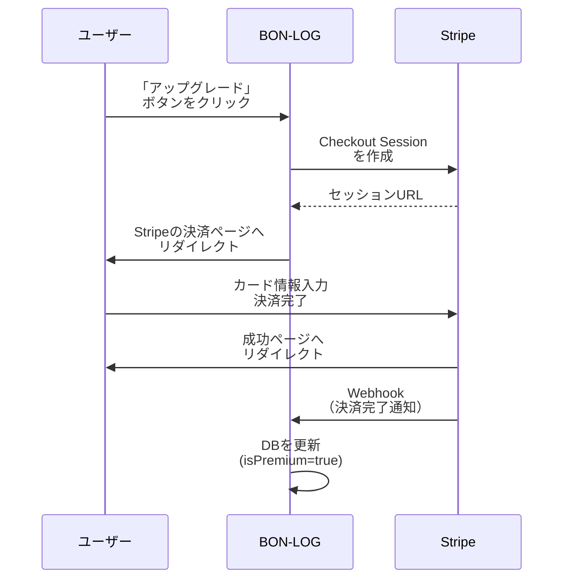
```mermaid
sequenceDiagram
    participant ユーザー
    participant BON-LOG
    participant Stripe

    ユーザー->>BON-LOG: 「アップグレード」<br/>ボタンをクリック
    BON-LOG->>Stripe: Checkout Session<br/>を作成
    Stripe-->>BON-LOG: セッションURL
    BON-LOG->>ユーザー: Stripeの決済ページへ<br/>リダイレクト
    ユーザー->>Stripe: カード情報入力<br/>決済完了
    Stripe->>ユーザー: 成功ページへ<br/>リダイレクト
    Stripe->>BON-LOG: Webhook<br/>（決済完了通知）
    BON-LOG->>BON-LOG: DBを更新<br/>(isPremium=true)
```

---

## 19.0 実習手順の進め方と手順マップ

手順に沿って進めると、**どのファイルに何を入力し、何を確認すればよいか** が分かります。形式の説明は [チュートリアルの進め方](./00_how_to_follow_steps.md) を参照してください。

| 手順 | 主な対象ファイル（例） | 完了時に確認すること |
|------|------------------------|------------------------|
| Stripe 設定 | `.env`, Stripe ダッシュボード | テストモードで接続できる |
| Checkout Session | `lib/actions/*subscription*`, `app/api/*` | 決済ページへリダイレクトし支払いが完了する |
| Webhook | `app/api/webhooks/stripe/route.ts` | 決済完了で DB が更新される |
| サブスクリプション管理 | 解約・返金等 | 定期課金のライフサイクルが扱える |

各セクションで **対象ファイル**・**入力するコード（サンプルコード）**・**実行方法**・**実行するとこうなる**・**このあと変わること**・**確認方法** を確認しながら進めてください。

---

## 19.1 オンライン決済の仕組み

### このセクションで学ぶこと

- クレジットカード決済がどのように行われるか
- なぜ決済処理は複雑なのか
- 決済代行サービス（Stripe）を使う理由

### カード決済の基本フロー

クレジットカード決済には、実は多くの関係者が関わっています。

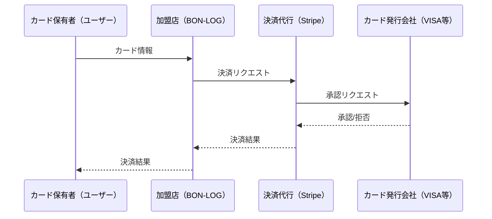
```mermaid
sequenceDiagram
    participant U as カード保有者（ユーザー）
    participant M as 加盟店（BON-LOG）
    participant S as 決済代行（Stripe）
    participant C as カード発行会社（VISA等）

    U->>M: カード情報
    M->>S: 決済リクエスト
    S->>C: 承認リクエスト
    C-->>S: 承認/拒否
    S-->>M: 決済結果
    M-->>U: 決済結果
```

> **ここがポイント！ なぜ自分で決済処理を作らないのか**
>
> クレジットカード情報を直接扱うには、**PCI DSS**（Payment Card Industry Data Security Standard）という厳格なセキュリティ基準に準拠する必要があります。これには膨大なコストと専門知識が必要です。
>
> Stripeのような決済代行サービスを使えば、カード情報はStripe側で安全に処理され、BON-LOG側ではカード情報に一切触れる必要がありません。これは非常に重要なセキュリティ上の利点です。

### PCI DSSコンプライアンスとは

**PCI DSS**とは、クレジットカード情報を扱う事業者が守るべきセキュリティ基準です。

```
PCI DSSの主な要件:

  1. ファイアウォールの設置・維持
  2. デフォルトパスワードの変更
  3. カード会員データの保護
  4. 暗号化による伝送の保護
  5. アンチウイルスソフトの使用
  6. セキュアなシステムの開発
  7. アクセス制御
  8. 一意なIDの割り当て
  9. 物理的アクセスの制限
  10. ネットワークの監視
  11. セキュリティシステムのテスト
  12. 情報セキュリティポリシーの維持

  → Stripeを使えば、これらの大部分をStripeが担当してくれる！
```

> **コラム: Stripeを使うとPCI DSSの負担が軽減される理由**
>
> Stripeの「Checkout」や「Elements」を使うと、カード番号はユーザーのブラウザからStripeに直接送信されます。BON-LOGのサーバーにはカード番号が一切渡りません。これにより、PCI DSSの要件の大部分が不要になります。
>
> これを「SAQ A」（Self-Assessment Questionnaire A）レベルと呼び、最も軽い準拠レベルです。

### 理解度チェック

1. カード決済に関わる主な関係者は何ですか？
2. PCI DSSとは何ですか？
3. Stripeを使うことでPCI DSSの負担が軽減される理由は何ですか？

---

## 19.2 Stripeとは

### このセクションで学ぶこと

- Stripeの基本概念と特徴
- Stripeの主要なオブジェクト（Customer, Subscription, Invoice, PaymentIntent）
- テストモードと本番モードの違い

### Stripeの概要

**Stripe**は、世界中で使われているオンライン決済プラットフォームです。

| 特徴 | 説明 |
|------|------|
| 簡単なAPI | 数行のコードで決済を実装できる |
| テストモード | 実際のお金を使わずに開発・テストできる |
| サブスクリプション対応 | 定期課金（月額・年額）を簡単に管理 |
| Webhook | 決済イベントをリアルタイムに通知 |
| ダッシュボード | 売上、顧客、支払い履歴をGUIで管理 |
| 多通貨対応 | 日本円を含む135以上の通貨に対応 |
| 充実したドキュメント | 日本語ドキュメントも充実 |

### Stripeの主要概念

Stripeには以下のような「オブジェクト」（データの単位）があります。

| オブジェクト | 説明 | 詳細 |
|-------------|------|------|
| **Customer（顧客）** | BON-LOGのユーザーに対応 | メールアドレス等の情報を持つ。複数のSubscriptionを持てる |
| **Subscription（定期課金）** | CustomerとPriceを紐づける | 状態: active, canceled, past_due, trialing。課金サイクル: monthly, yearly。自動更新される |
| **Price（価格）** | 商品の価格を定義 | 例: ¥980/月。Product（商品）に紐づく |
| **Product（商品）** | 売るもの自体の情報 | 例: 「BON-LOG プレミアムプラン」 |
| **Invoice（請求書）** | Subscriptionの更新ごとに自動作成 | 金額、税金、割引等の情報。PDFで発行可能 |
| **PaymentIntent（支払い意図）** | 1回の支払いに対応 | カード承認〜確定のプロセスを管理。状態: requires_payment_method, processing, succeeded, failed |
| **Webhook（ウェブフック）** | Stripeからの通知 | イベントが発生したらURLに通知。例: 決済完了、失敗、キャンセル等 |

> **ここがポイント！ SubscriptionとInvoiceの関係**
>
> Subscriptionは「定期課金の契約」、Invoiceは「その月の請求書」です。
>
> 例えば、月額980円のプレミアムプランに加入すると:
> - Subscription: 1つ作成（契約は1つ）
> - Invoice: 毎月1つ自動作成（1月分、2月分、3月分...）
> - PaymentIntent: Invoiceごとに1つ作成（実際の支払い処理）

### テストモードと本番モード

Stripeには「テストモード」と「本番モード」があり、APIキーで切り替えます。

```
テストモード:
  公開キー: pk_test_xxxxx    ← "test"が含まれる
  秘密キー: sk_test_xxxxx

  特徴:
  - 実際のお金は動かない
  - テスト用のカード番号を使用
  - ダッシュボードに「テストデータ」と表示される

本番モード:
  公開キー: pk_live_xxxxx    ← "live"が含まれる
  秘密キー: sk_live_xxxxx

  特徴:
  - 実際のお金が動く
  - 実際のカード番号を使用
  - 売上がStripeアカウントに入金される
```

**テスト用カード番号:**

| カード番号 | 結果 |
|-----------|------|
| 4242 4242 4242 4242 | 成功 |
| 4000 0000 0000 0002 | カード拒否 |
| 4000 0000 0000 3220 | 3Dセキュア認証が必要 |

> **注意！ 秘密キーの管理**
>
> `sk_test_xxxxx`や`sk_live_xxxxx`は**絶対に**フロントエンド（ブラウザ）で使ってはいけません。環境変数としてサーバー側でのみ使用します。公開キー（`pk_xxx`）だけがブラウザで使えます。

> **ローカルでの決済テスト手順**
>
> 1. [Stripe Dashboard](https://dashboard.stripe.com) でアカウント作成（無料）
> 2. テストモードのAPIキーを取得（`sk_test_...`, `pk_test_...`）
> 3. `.env.local` に設定
> 4. テストカード番号で決済テスト：
>
> | カード番号 | 結果 |
> |-----------|------|
> | `4242 4242 4242 4242` | 成功 |
> | `4000 0000 0000 0002` | カード拒否 |
> | `4000 0000 0000 3220` | 3Dセキュア認証必要 |
>
> 有効期限は未来の任意の日付、CVCは任意の3桁でOKです。実際の課金は発生しません。

### 理解度チェック

1. Stripeの「Customer」は何に対応しますか？
2. テストモードと本番モードの違いは何ですか？
3. 秘密キーをフロントエンドで使ってはいけない理由は何ですか？

### 詳細フロー図

以下の3つの図で、Stripeを使った決済の詳細な流れを理解しましょう。

#### 1. Stripe決済フローの詳細シーケンス

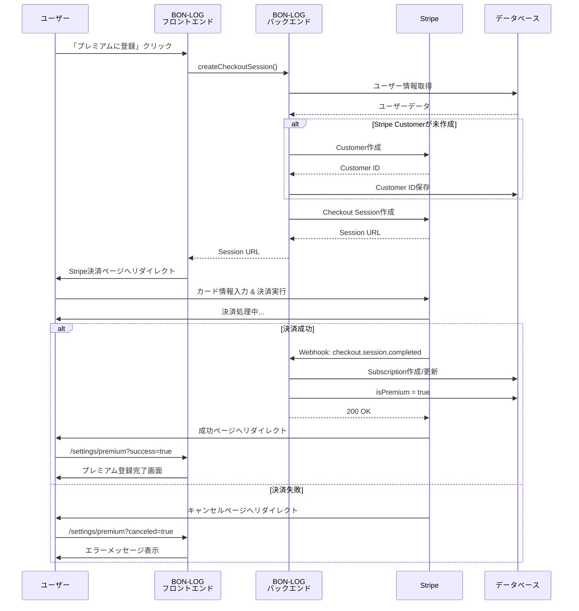
```mermaid
sequenceDiagram
    participant User as ユーザー
    participant Frontend as BON-LOG<br/>フロントエンド
    participant Backend as BON-LOG<br/>バックエンド
    participant Stripe as Stripe
    participant DB as データベース

    User->>Frontend: 「プレミアムに登録」クリック
    Frontend->>Backend: createCheckoutSession()

    Backend->>DB: ユーザー情報取得
    DB-->>Backend: ユーザーデータ

    alt Stripe Customerが未作成
        Backend->>Stripe: Customer作成
        Stripe-->>Backend: Customer ID
        Backend->>DB: Customer ID保存
    end

    Backend->>Stripe: Checkout Session作成
    Stripe-->>Backend: Session URL
    Backend-->>Frontend: Session URL

    Frontend->>User: Stripe決済ページへリダイレクト
    User->>Stripe: カード情報入力 & 決済実行
    Stripe->>User: 決済処理中...

    alt 決済成功
        Stripe->>Backend: Webhook: checkout.session.completed
        Backend->>DB: Subscription作成/更新
        Backend->>DB: isPremium = true
        Backend-->>Stripe: 200 OK

        Stripe->>User: 成功ページへリダイレクト
        User->>Frontend: /settings/premium?success=true
        Frontend->>User: プレミアム登録完了画面
    else 決済失敗
        Stripe->>User: キャンセルページへリダイレクト
        User->>Frontend: /settings/premium?canceled=true
        Frontend->>User: エラーメッセージ表示
    end
```

#### 2. サブスクリプションのライフサイクル

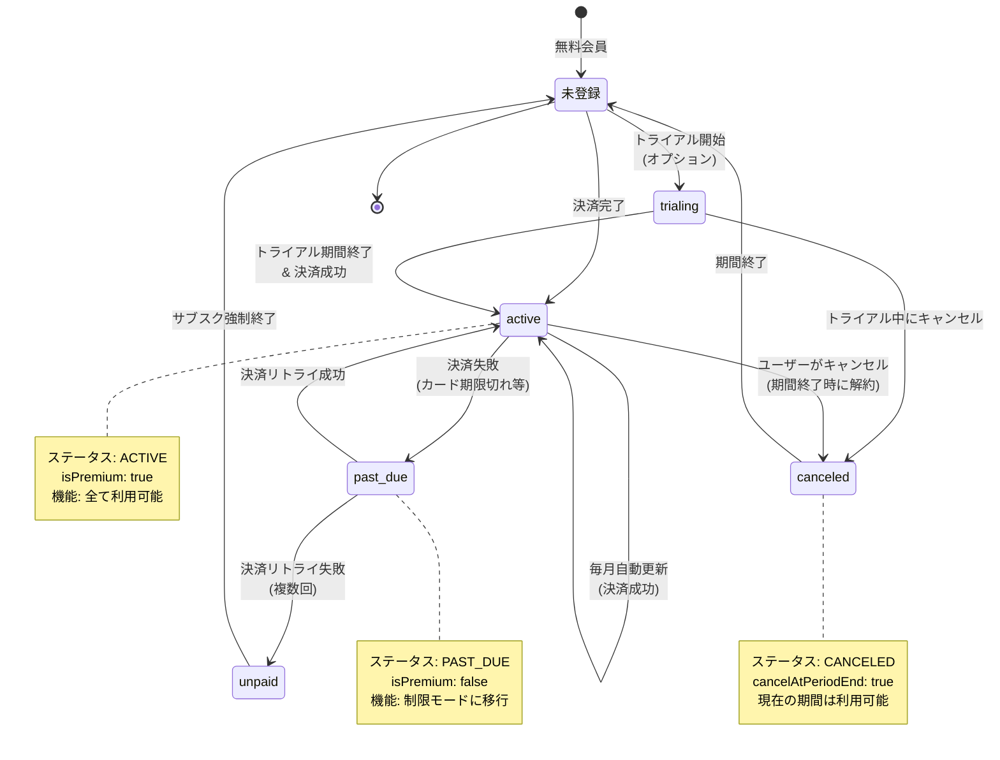
```mermaid
stateDiagram-v2
    [*] --> 未登録: 無料会員

    未登録 --> trialing: トライアル開始<br/>(オプション)
    未登録 --> active: 決済完了

    trialing --> active: トライアル期間終了<br/>& 決済成功
    trialing --> canceled: トライアル中にキャンセル

    active --> active: 毎月自動更新<br/>(決済成功)
    active --> past_due: 決済失敗<br/>(カード期限切れ等)
    active --> canceled: ユーザーがキャンセル<br/>(期間終了時に解約)

    past_due --> active: 決済リトライ成功
    past_due --> unpaid: 決済リトライ失敗<br/>(複数回)

    canceled --> 未登録: 期間終了
    unpaid --> 未登録: サブスク強制終了

    未登録 --> [*]

    note right of active
        ステータス: ACTIVE
        isPremium: true
        機能: 全て利用可能
    end note

    note right of past_due
        ステータス: PAST_DUE
        isPremium: false
        機能: 制限モードに移行
    end note

    note right of canceled
        ステータス: CANCELED
        cancelAtPeriodEnd: true
        現在の期間は利用可能
    end note
```

#### 3. プレミアム機能ゲーティングのアーキテクチャ

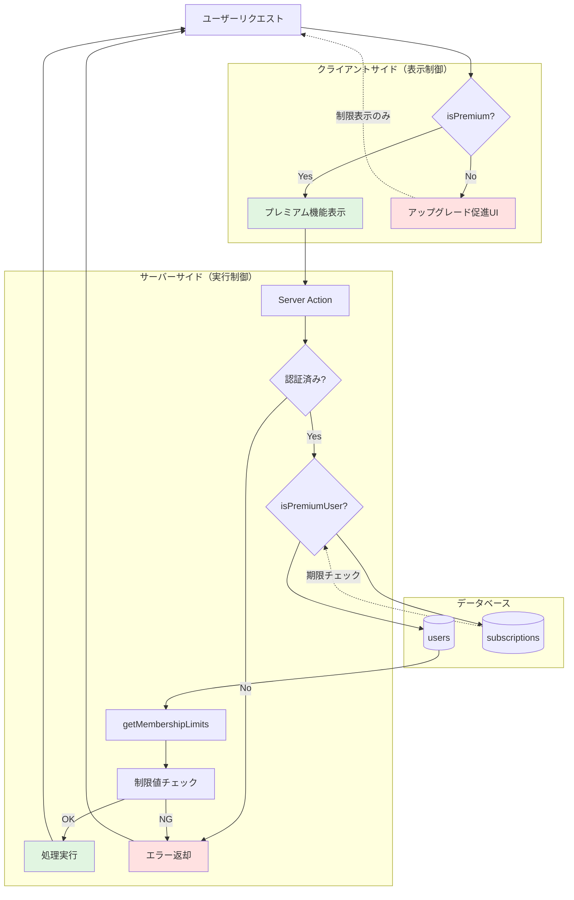
```mermaid
graph TD
    User[ユーザーリクエスト]

    subgraph "クライアントサイド（表示制御）"
        ClientCheck{isPremium?}
        ShowFeature[プレミアム機能表示]
        ShowUpgrade[アップグレード促進UI]
    end

    subgraph "サーバーサイド（実行制御）"
        ServerAction[Server Action]
        AuthCheck{認証済み?}
        PremiumCheck{isPremiumUser?}
        CheckLimits[getMembershipLimits]
        ValidateInput[制限値チェック]
        ExecuteAction[処理実行]
        RejectAction[エラー返却]
    end

    subgraph "データベース"
        UserTable[(users)]
        SubscriptionTable[(subscriptions)]
    end

    User --> ClientCheck
    ClientCheck -->|Yes| ShowFeature
    ClientCheck -->|No| ShowUpgrade

    ShowFeature --> ServerAction
    ShowUpgrade -.制限表示のみ.-> User

    ServerAction --> AuthCheck
    AuthCheck -->|No| RejectAction
    AuthCheck -->|Yes| PremiumCheck

    PremiumCheck --> UserTable
    UserTable --> CheckLimits
    CheckLimits --> ValidateInput

    ValidateInput -->|OK| ExecuteAction
    ValidateInput -->|NG| RejectAction

    PremiumCheck --> SubscriptionTable
    SubscriptionTable -.期限チェック.-> PremiumCheck

    ExecuteAction --> User
    RejectAction --> User

    style ShowFeature fill:#e1f5e1
    style ShowUpgrade fill:#ffe1e1
    style ExecuteAction fill:#e1f5e1
    style RejectAction fill:#ffe1e1
```

これらの図から、以下のポイントを理解できます。

1. **決済フロー**: ユーザーはStripeの安全な決済ページで支払いを行い、BON-LOGはWebhookで結果を受け取る
2. **ライフサイクル**: サブスクリプションは複数の状態を持ち、決済失敗時には自動的にリトライされる
3. **ゲーティング**: クライアント側はUI制御のみで、実際の機能制限はサーバー側で厳格にチェックされる

---

## 19.3 環境設定

### このセクションで学ぶこと

- Stripeアカウントの作成方法
- APIキーの取得方法
- 環境変数の設定
- Stripeライブラリのインストール

### Stripeアカウントの作成

1. [Stripe](https://stripe.com)にアクセス
2. 「今すぐ始める」をクリック
3. メールアドレス、名前、パスワードを入力して登録
4. メール認証を完了

### APIキーの取得

Stripeダッシュボードにログイン後:

```
開発者 → APIキー の順にクリック

テストモードのキーが表示されます:
- 公開可能キー: pk_test_51xxxxx...
- シークレットキー: sk_test_51xxxxx...
```

### 商品と価格の作成

Stripeダッシュボードで「プレミアムプラン」の商品を作成します。

```
商品カタログ → 「商品を追加」
  商品名: BON-LOG プレミアムプラン
  説明: 予約投稿、詳細分析、拡張された制限などの特典

  価格を追加:
    金額: ¥980
    請求期間: 毎月
    → 「商品を保存」

保存後、価格IDが表示されます:
  price_1xxxxx...  ← これを環境変数に設定
```

### 環境変数の設定

```bash
# .env.local

# Stripe秘密キー（サーバー側でのみ使用）
STRIPE_SECRET_KEY="sk_test_xxxxx"

# Stripe公開キー（ブラウザでも使用可能）
NEXT_PUBLIC_STRIPE_PUBLISHABLE_KEY="pk_test_xxxxx"

# Webhook署名シークレット（後で設定）
STRIPE_WEBHOOK_SECRET="whsec_xxxxx"

# プレミアムプランの価格ID（Stripeダッシュボードから取得）
STRIPE_PREMIUM_PRICE_ID="price_xxxxx"
```

### Stripeライブラリのインストール

```bash
# Stripeのサーバー側SDK（Node.js用）とクライアント側SDKをインストール
npm install stripe @stripe/stripe-js
```

- `stripe`: サーバー側で使用（APIへのリクエスト）
- `@stripe/stripe-js`: クライアント側で使用（Checkout画面へのリダイレクト等）

> **よくあるトラブル**
>
> **Q: `npm install stripe`でエラーが出る**
> A: Node.jsのバージョンが古い可能性があります。Node.js 18以上を使用してください。
>
> **Q: APIキーが見つからない**
> A: Stripeダッシュボードの右上で「テストモード」がONになっているか確認してください。

### 理解度チェック

1. Stripeの公開キーと秘密キーの違いは何ですか？
2. `STRIPE_PREMIUM_PRICE_ID`はどこで取得しますか？
3. なぜ2つのnpmパッケージ（`stripe`と`@stripe/stripe-js`）をインストールするのですか？

---

## 19.4 データベーススキーマ

### このセクションで学ぶこと

- サブスクリプション管理に必要なテーブル設計
- SubscriptionモデルとPaymentモデルの関係
- Userモデルの拡張

### Subscription モデルと Payment モデル

```prisma
// prisma/schema.prisma

// ====================================
// サブスクリプションの状態（enum）
// ====================================
enum SubscriptionStatus {
  ACTIVE      // 有効（正常に課金されている）
  CANCELED    // キャンセル済み（期間終了まで利用可能）
  PAST_DUE    // 支払い遅延（決済失敗、リトライ中）
  UNPAID      // 未払い（リトライも失敗）
  TRIALING    // トライアル中
}

// ====================================
// Subscription（サブスクリプション）モデル
// ====================================
// ユーザーのプレミアム会員契約を管理する
model Subscription {
  id                   String             @id @default(cuid())

  userId               String             @unique @map("user_id")
  // サブスクリプションを持つユーザーのID
  // @unique: 1ユーザーにつき1つのサブスクリプション

  stripeSubscriptionId String             @unique @map("stripe_subscription_id")
  // StripeのSubscription ID（sub_xxxxx）

  status               SubscriptionStatus @default(ACTIVE)
  // サブスクリプションの状態

  currentPeriodStart   DateTime           @map("current_period_start")
  // 現在の課金期間の開始日

  currentPeriodEnd     DateTime           @map("current_period_end")
  // 現在の課金期間の終了日（この日を過ぎると次の課金）

  cancelAtPeriodEnd    Boolean            @default(false) @map("cancel_at_period_end")
  // trueの場合、現在の期間終了時に自動解約される

  createdAt            DateTime           @default(now()) @map("created_at")
  updatedAt            DateTime           @updatedAt @map("updated_at")

  // リレーション
  user User @relation(fields: [userId], references: [id], onDelete: Cascade)

  @@map("subscriptions")
}

// ====================================
// Payment（支払い履歴）モデル
// ====================================
// 毎月の支払いを記録する
model Payment {
  id              String   @id @default(cuid())

  userId          String   @map("user_id")
  // 支払いを行ったユーザーのID

  stripePaymentId String   @unique @map("stripe_payment_id")
  // StripeのPaymentIntent ID（pi_xxxxx）
  // @unique: 同じ支払いを二重登録しないための制約

  amount          Int      // 金額（円）
  // 支払い金額（最小単位）
  // 日本円の場合、980円は980（小数点なし）

  currency        String   @default("jpy")
  // 通貨コード（日本円 = "jpy"）

  status          String   // succeeded, pending, failed
  // 支払い状態

  description     String?
  // 支払いの説明（例: 「プレミアム会員登録」「プレミアム会員更新」）

  createdAt       DateTime @default(now()) @map("created_at")

  // リレーション
  user User @relation(fields: [userId], references: [id], onDelete: Cascade)

  @@index([userId])
  @@map("payments")
}
```

### User モデルの拡張

```prisma
model User {
  // ... 既存のフィールド

  isPremium            Boolean   @default(false) @map("is_premium")
  // プレミアム会員かどうか

  premiumExpiresAt     DateTime? @map("premium_expires_at")
  // プレミアムの有効期限

  stripeCustomerId     String?   @unique @map("stripe_customer_id")
  // StripeのCustomer ID（cus_xxxxx）
  // Stripeとの紐付けに使用

  stripeSubscriptionId String?   @unique @map("stripe_subscription_id")
  // StripeのSubscription ID（sub_xxxxx）
  // サブスクリプションを開始していない場合はnull

  @@map("users")
}
```

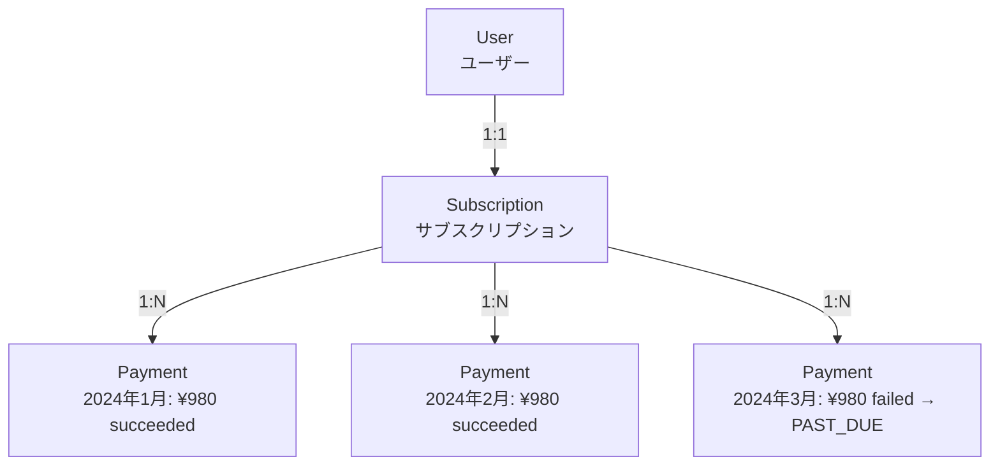
```mermaid
graph TD
    User[User<br/>ユーザー]
    Subscription[Subscription<br/>サブスクリプション]
    Payment1[Payment<br/>2024年1月: ¥980 succeeded]
    Payment2[Payment<br/>2024年2月: ¥980 succeeded]
    Payment3[Payment<br/>2024年3月: ¥980 failed → PAST_DUE]

    User -->|1:1| Subscription
    Subscription -->|1:N| Payment1
    Subscription -->|1:N| Payment2
    Subscription -->|1:N| Payment3
```

スキーマを更新します。

```bash
npx prisma db push      # DBに反映
npx prisma generate     # Prismaクライアントを再生成
```

### 理解度チェック

1. `cancelAtPeriodEnd`がtrueの場合、何が起きますか？
2. Paymentの`amount`が980の場合、いくらですか？
3. UserとSubscriptionの関係は1対1ですか、1対多ですか？

---

## 19.5 Stripeクライアントの設定

### このセクションで学ぶこと

- サーバー側Stripeクライアントの設定
- プレミアム会員の特典と制限値の定義

### lib/stripe.ts

> **BON-LOGでの使用箇所**: `lib/stripe.ts` でStripeクライアントを初期化し、`app/api/webhooks/stripe/route.ts` のWebhook処理や、Checkout Session作成のServer Actionから参照されます。

> **実装しない場合の影響**: Stripeクライアントが未設定だと、プレミアム登録・Webhook受信が完全に動作しません。ただし、環境変数 `STRIPE_SECRET_KEY` が未設定の場合は実行時エラーとなるため、プレミアム機能を使わない場合は呼び出し箇所を無効化する必要があります。

BON-LOGの実際の `lib/stripe.ts` は、Next.jsのビルド時エラーを回避するために**遅延初期化（Lazy Initialization）とProxyパターン**を採用しています。

```typescript
// lib/stripe.ts（実際の実装）
// Stripeのサーバー側クライアント設定

import Stripe from 'stripe'

// 遅延初期化: 実際に使用される時点まで初期化を遅らせる
const getStripe = () => {
  if (!process.env.STRIPE_SECRET_KEY) {
    throw new Error('STRIPE_SECRET_KEY is not set')
  }
  return new Stripe(process.env.STRIPE_SECRET_KEY, {
    apiVersion: '2025-12-15.clover',
    // BON-LOGで採用しているAPIバージョン
    // バージョンを固定することで、API変更による意図しない動作変更を防ぐ
  })
}

// シングルトン: 一度だけ初期化してキャッシュ
let _stripe: Stripe | null = null

// Proxyパターン: プロパティアクセス時に初めてStripeクライアントを初期化
export const stripe = new Proxy({} as Stripe, {
  get(_, prop) {
    if (!_stripe) {
      _stripe = getStripe()
    }
    return (_stripe as unknown as Record<string | symbol, unknown>)[prop]
  },
})

// 月額・年額プランの価格ID（環境変数から取得）
export const STRIPE_PRICE_ID_MONTHLY = process.env.STRIPE_PRICE_ID_MONTHLY
export const STRIPE_PRICE_ID_YEARLY = process.env.STRIPE_PRICE_ID_YEARLY
```

> **なぜProxyパターンを使うのか？**
>
> Next.jsはビルド時にすべてのファイルを評価します。`STRIPE_SECRET_KEY` が環境変数に設定されていないビルド環境（GitHub ActionsのCIなど）では、直接 `new Stripe(...)` を書くとビルドエラーになります。Proxyを使って初期化を実際の使用時点まで遅らせることで、このビルド時エラーを回避しています。

> **apiVersionについて**: BON-LOGでは `'2025-12-15.clover'` を使用しています。Stripeは定期的にAPIバージョンを更新しますが、バージョンを固定することで意図しない破壊的変更を防いでいます。

**環境変数（実際に使用している変数名）:**

```bash
# .env.local

# Stripe秘密キー（サーバー側でのみ使用）
STRIPE_SECRET_KEY="sk_test_xxxxx"

# Stripe公開キー（ブラウザでも使用可能）
NEXT_PUBLIC_STRIPE_PUBLISHABLE_KEY="pk_test_xxxxx"

# Webhook署名シークレット
STRIPE_WEBHOOK_SECRET="whsec_xxxxx"

# プレミアムプランの価格ID（月額・年額）
STRIPE_PRICE_ID_MONTHLY="price_xxxxx"
STRIPE_PRICE_ID_YEARLY="price_xxxxx"
```

### lib/utils/premium.ts -- プレミアム機能の定義

```typescript
// lib/utils/premium.ts
// プレミアム会員に関するユーティリティ

import { prisma } from '@/lib/db'

// ====================================
// プレミアム会員の特典一覧
// ====================================
// 無料プラン vs プレミアムプラン の比較
//
// | 機能           | 無料  | プレミアム |
// |----------------|-------|----------|
// | 1日の投稿上限    | 20件  | 50件     |
// | 画像添付枚数     | 4枚   | 6枚      |
// | 予約投稿        | ×     | ○（10件） |
// | 詳細な分析      | ×     | ○        |
// | 広告非表示      | ×     | ○        |
// | プレミアムバッジ  | ×     | ○        |

// ====================================
// プレミアム状態のチェック
// ====================================
export async function checkPremiumStatus(userId: string): Promise<boolean> {
  // DBからユーザーのプレミアム情報を取得
  const user = await prisma.user.findUnique({
    where: { id: userId },
    select: { isPremium: true, premiumExpiresAt: true }
  })

  // ユーザーが存在しない、またはプレミアムでない場合
  if (!user?.isPremium) {
    return false
  }

  // 期限チェック
  // premiumExpiresAtが設定されていて、かつ現在時刻より前（過去）の場合
  if (user.premiumExpiresAt && user.premiumExpiresAt < new Date()) {
    // 期限切れ → プレミアム状態を解除
    await prisma.user.update({
      where: { id: userId },
      data: { isPremium: false }
    })
    return false
  }

  // プレミアム有効
  return true
}

// ====================================
// 投稿制限の取得
// ====================================
export function getPostLimit(isPremium: boolean): number {
  return isPremium ? 50 : 20
  // プレミアム: 50件/日、無料: 20件/日
}

// ====================================
// メディア添付制限の取得
// ====================================
export function getMediaLimit(isPremium: boolean): number {
  return isPremium ? 6 : 4
  // プレミアム: 6枚、無料: 4枚
}
```

### 理解度チェック

1. `apiVersion`を固定する理由は何ですか？
2. プレミアム会員の1日の投稿上限は何件ですか？
3. `checkPremiumStatus`関数が期限切れを検出した場合、何が起きますか？

---

## 19.6 Checkout Session の作成

### このセクションで学ぶこと

- Checkout Sessionとは何か
- 決済フローの詳細な流れ
- Server Actionからのチェックアウト処理
- 成功/キャンセル時の画面表示

> **BON-LOGでの使用箇所**: `lib/actions/stripe-checkout.ts`（Checkout Session作成のServer Action）と `components/payment/CheckoutButton.tsx`（決済ボタンUI）として実装されています。`app/settings/premium/page.tsx` からCheckoutButtonを呼び出し、StripeのホストされたCheckout画面へリダイレクトします。

> **実装しない場合の影響**: Checkout Sessionがないと、ユーザーがプレミアム会員に登録する手段がなくなります。StripeのホストされたCheckout画面を使うことで、PCI DSSへの準拠が簡単になり、カード情報がBON-LOGサーバーを経由しないセキュアな決済フローが実現されます。

### Checkout Sessionとは

**Checkout Session**は、Stripeが提供する決済ページのセッション（一時的な状態）です。

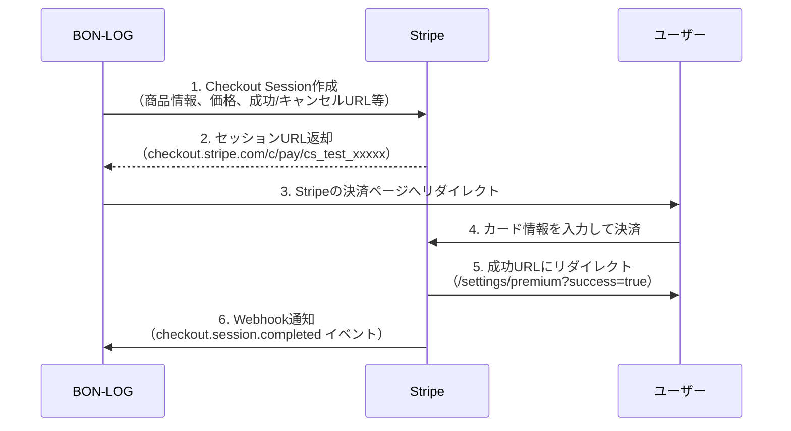
```mermaid
sequenceDiagram
    participant BON-LOG
    participant Stripe
    participant ユーザー

    BON-LOG->>Stripe: 1. Checkout Session作成<br/>（商品情報、価格、成功/キャンセルURL等）
    Stripe-->>BON-LOG: 2. セッションURL返却<br/>（checkout.stripe.com/c/pay/cs_test_xxxxx）
    BON-LOG->>ユーザー: 3. Stripeの決済ページへリダイレクト
    ユーザー->>Stripe: 4. カード情報を入力して決済
    Stripe->>ユーザー: 5. 成功URLにリダイレクト<br/>（/settings/premium?success=true）
    Stripe->>BON-LOG: 6. Webhook通知<br/>（checkout.session.completed イベント）
```

> **ここがポイント！ なぜ自分で決済フォームを作らないのか**
>
> Stripeが提供するCheckout画面を使うと:
> - カード情報がBON-LOGのサーバーを通らない（PCI DSS準拠が簡単）
> - 3Dセキュア認証に自動対応
> - Apple Pay, Google Payにも対応
> - モバイルでも最適化された画面が表示される

### lib/actions/stripe-checkout.ts

```typescript
// lib/actions/stripe-checkout.ts
// Checkout Session（決済セッション）の作成

'use server'

import { auth } from '@/lib/auth'
import { prisma } from '@/lib/db'
import { stripe, PREMIUM_PRICE_ID } from '@/lib/stripe'

// ====================================
// Checkout Session を作成する
// ====================================
// この関数はユーザーが「アップグレード」ボタンを押したときに呼ばれる
export async function createCheckoutSession() {
  // ステップ1: 認証チェック
  const session = await auth()
  if (!session?.user?.id) {
    return { error: '認証が必要です' }
  }

  // ステップ2: ユーザー情報を取得
  const user = await prisma.user.findUnique({
    where: { id: session.user.id },
    include: { subscription: true }
    // include: サブスクリプション情報も一緒に取得
  })

  if (!user) {
    return { error: 'ユーザーが見つかりません' }
  }

  try {
    // ステップ3: Stripe顧客IDの確認/作成
    let customerId = user.subscription?.stripeCustomerId

    if (!customerId) {
      // Stripeに新しい顧客を作成
      const customer = await stripe.customers.create({
        email: user.email,
        // StripeにはBON-LOGのメールアドレスを渡す

        metadata: {
          userId: user.id,
          // metadata: 自由にデータを付与できるフィールド
          // BON-LOGのユーザーIDを保存しておくと、後で紐付けが容易
        },
      })
      customerId = customer.id
      // customer.id: "cus_xxxxx" 形式のID

      // BON-LOGのDBにStripe顧客IDを保存
      await prisma.user.update({
        where: { id: user.id },
        data: {
          stripeCustomerId: customerId,
          // まだ支払いが完了していないのでisPremiumはfalseのまま
        }
      })
    }

    // ステップ4: Checkout Sessionを作成
    const checkoutSession = await stripe.checkout.sessions.create({
      customer: customerId,
      // どの顧客の決済か

      mode: 'subscription',
      // mode:
      //   'payment': 1回限りの支払い
      //   'subscription': 定期課金
      //   'setup': カード情報の登録のみ（支払いなし）

      payment_method_types: ['card'],
      // 支払い方法: クレジットカードのみ
      // 他にも 'konbini'(コンビニ), 'bank_transfer' 等がある

      line_items: [
        {
          price: PREMIUM_PRICE_ID,
          // Stripeダッシュボードで作成したPrice ID

          quantity: 1,
          // 数量: 1つ
        },
      ],

      success_url: `${process.env.NEXT_PUBLIC_APP_URL}/settings/premium?success=true`,
      // 決済成功時にリダイレクトするURL

      cancel_url: `${process.env.NEXT_PUBLIC_APP_URL}/settings/premium?canceled=true`,
      // 決済キャンセル時にリダイレクトするURL

      metadata: {
        userId: user.id,
        // Webhook処理で使用するため、ユーザーIDを付与
      },
    })

    // ステップ5: セッションのURLを返す
    return { sessionId: checkoutSession.id, url: checkoutSession.url }
    // url: "https://checkout.stripe.com/c/pay/cs_test_xxxxx"
    // このURLにブラウザをリダイレクトさせる

  } catch (error) {
    console.error('Checkout session error:', error)
    return { error: '決済セッションの作成に失敗しました' }
  }
}
```

### components/payment/CheckoutButton.tsx

```typescript
// components/payment/CheckoutButton.tsx
// 「アップグレード」ボタンコンポーネント

'use client'
// ボタンのクリックイベントがあるのでClient Component

import { useState } from 'react'
import { createCheckoutSession } from '@/lib/actions/stripe-checkout'
import { Button } from '@/components/ui/button'
import { Loader2 } from 'lucide-react'
// Loader2: ローディング中のスピナーアイコン

export function CheckoutButton() {
  const [loading, setLoading] = useState(false)
  // ボタンが処理中かどうかの状態

  async function handleCheckout() {
    setLoading(true)
    // ボタンを無効化して二重クリックを防ぐ

    // Server Actionを呼び出して Checkout Session を作成
    const { url, error } = await createCheckoutSession()

    if (error) {
      // エラーの場合はアラートを表示
      alert(error)
      setLoading(false)
      return
    }

    if (url) {
      // 成功した場合、Stripeの決済ページにリダイレクト
      window.location.href = url
      // window.location.href: ブラウザの現在のURLを変更
      // Stripeの画面に移動する
    }
  }

  return (
    <Button
      onClick={handleCheckout}
      disabled={loading}
      className="w-full mt-4"
    >
      {loading ? (
        <>
          {/* ローディング中の表示 */}
          <Loader2 className="mr-2 h-4 w-4 animate-spin" />
          {/* animate-spin: CSSアニメーションでくるくる回転 */}
          処理中...
        </>
      ) : (
        'アップグレード'
      )}
    </Button>
  )
}
```

### app/settings/premium/page.tsx -- プレミアムプランページ

```typescript
// app/settings/premium/page.tsx
// プレミアムプラン案内・管理ページ

import { redirect } from 'next/navigation'
import { auth } from '@/lib/auth'
import { checkPremiumStatus } from '@/lib/utils/premium'
import { CheckoutButton } from '@/components/payment/CheckoutButton'
import { SubscriptionStatus } from '@/components/payment/SubscriptionStatus'
import { Card, CardContent, CardHeader, CardTitle } from '@/components/ui/card'
import { Check } from 'lucide-react'

export default async function PremiumPage({
  searchParams
}: {
  searchParams: Promise<{ success?: string; canceled?: string }>
}) {
  const session = await auth()
  if (!session?.user?.id) {
    redirect('/login')
  }

  const isPremium = await checkPremiumStatus(session.user.id)
  const params = await searchParams

  return (
    <div className="container max-w-4xl mx-auto p-6">
      <h1 className="text-3xl font-bold mb-2">プレミアムプラン</h1>
      <p className="text-muted-foreground mb-6">
        BON-LOGをもっと便利に使える特典が満載
      </p>

      {/* 決済成功メッセージ */}
      {params.success && (
        <div className="bg-green-50 border border-green-200 text-green-800 p-4 rounded-lg mb-6">
          プレミアムプランへのアップグレードが完了しました！
        </div>
      )}

      {/* 決済キャンセルメッセージ */}
      {params.canceled && (
        <div className="bg-yellow-50 border border-yellow-200 text-yellow-800 p-4 rounded-lg mb-6">
          決済がキャンセルされました
        </div>
      )}

      {isPremium ? (
        /* プレミアム会員の場合: サブスクリプション管理画面 */
        <SubscriptionStatus />
      ) : (
        /* 無料会員の場合: プラン比較とアップグレードボタン */
        <div className="grid md:grid-cols-2 gap-6">
          {/* 無料プランカード */}
          <Card>
            <CardHeader>
              <CardTitle>無料プラン</CardTitle>
            </CardHeader>
            <CardContent>
              <div className="space-y-2">
                <Feature text="1日20投稿まで" />
                <Feature text="画像4枚まで" />
                <Feature text="基本的な機能" />
              </div>
              <p className="mt-4 text-2xl font-bold">¥0</p>
            </CardContent>
          </Card>

          {/* プレミアムプランカード */}
          <Card className="border-2 border-primary">
            {/* border-2 border-primary: 太い枠線で強調 */}
            <CardHeader>
              <CardTitle className="flex items-center gap-2">
                プレミアムプラン
                <span className="text-xs bg-primary text-primary-foreground px-2 py-1 rounded">
                  おすすめ
                </span>
              </CardTitle>
            </CardHeader>
            <CardContent>
              <div className="space-y-2">
                <Feature text="1日50投稿まで" />
                <Feature text="画像6枚まで" />
                <Feature text="予約投稿機能" />
                <Feature text="詳細な分析" />
                <Feature text="広告非表示" />
                <Feature text="プレミアムバッジ" />
              </div>
              <p className="mt-4 text-2xl font-bold">¥980 / 月</p>
              <CheckoutButton />
            </CardContent>
          </Card>
        </div>
      )}
    </div>
  )
}

// 特典表示コンポーネント
function Feature({ text }: { text: string }) {
  return (
    <div className="flex items-center gap-2">
      <Check className="w-4 h-4 text-green-600" />
      <span>{text}</span>
    </div>
  )
}
```

### 理解度チェック

1. Checkout Sessionの`mode: 'subscription'`は何を意味しますか？
2. 決済成功後、ユーザーはどこにリダイレクトされますか？
3. なぜ`setLoading(true)`でボタンを無効化するのですか？

---

## 19.7 lib/premium.ts 詳細解説

### このセクションで学ぶこと

- プレミアム会員判定ロジックの仕組み
- 会員種別に応じた制限値管理（MembershipLimitsの設計）
- 期限切れの自動失効処理（checkPremiumExpiry）
- 無料会員とプレミアム会員の機能比較

> **BON-LOGでの使用箇所**: `lib/premium.ts` がこのモジュールです。`isPremiumUser()` は投稿作成・画像アップロードなどの制限チェック時に呼び出され、`getMembershipLimits()` は各操作の上限値取得に使用されます。`checkPremiumExpiry()` は `app/api/cron/cleanup-events/route.ts` などのCronジョブから定期的に呼び出されます。

> **実装しない場合の影響**: プレミアム判定ロジックがないと、無料会員とプレミアム会員の機能差別化ができなくなります。`lib/premium.ts` を削除すると、投稿制限・画像制限・解析機能のアクセス制御が全て無効になります。

### プレミアム管理モジュールの全体像

BON-LOGでは、プレミアム会員の判定・制限管理を`lib/premium.ts`に集約しています。このモジュールは、投稿作成時の制限チェック、UI上の機能表示/非表示、Cronジョブでの一括失効処理など、アプリケーション全体で使用されます。

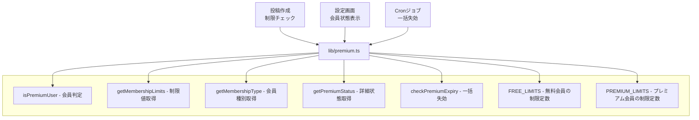
```mermaid
graph TD
    A[投稿作成<br/>制限チェック]
    B[設定画面<br/>会員状態表示]
    C[Cronジョブ<br/>一括失効]

    D[lib/premium.ts]

    subgraph " "
        E[isPremiumUser - 会員判定]
        F[getMembershipLimits - 制限値取得]
        G[getMembershipType - 会員種別取得]
        H[getPremiumStatus - 詳細状態取得]
        I[checkPremiumExpiry - 一括失効]
        J[FREE_LIMITS - 無料会員の制限定数]
        K[PREMIUM_LIMITS - プレミアム会員の制限定数]
    end

    A --> D
    B --> D
    C --> D
    D --> E
    D --> F
    D --> G
    D --> H
    D --> I
    D --> J
    D --> K
```

### 型定義 -- MembershipType と MembershipLimits

```typescript
// lib/premium.ts

// ====================================
// 会員種別の型（リテラル型）
// ====================================
// 'free' または 'premium' の2値のみ許可する
// → タイプミスをコンパイル時に検出できる
export type MembershipType = 'free' | 'premium'

// ====================================
// 会員制限値の型（インターフェース）
// ====================================
// 各プロパティが「何の制限か」を明確に定義
export interface MembershipLimits {
  maxPostLength: number      // 投稿の最大文字数
  maxImages: number          // 1投稿あたりの最大画像枚数
  maxVideos: number          // 1投稿あたりの最大動画数
  maxDailyPosts: number      // 1日の最大投稿数
  canSchedulePost: boolean   // 予約投稿の可否
  canViewAnalytics: boolean  // 分析機能の可否
}
```

> **ここがポイント！ なぜインターフェースで制限値を定義するのか**
>
> 制限値をインターフェースとして型定義することで、以下のメリットがあります。
>
> 1. **新しい制限を追加する際にコンパイルエラーで漏れを検出**: 例えば`maxComments`を追加した場合、`FREE_LIMITS`と`PREMIUM_LIMITS`の両方に値を設定しないとエラーになる
> 2. **エディタの補完**: `limits.`と入力すると利用可能なプロパティが一覧表示される
> 3. **ドキュメントとしての役割**: コードを読むだけで「どんな制限があるか」が一目でわかる

### 制限値の定数定義

```typescript
// lib/premium.ts

// ====================================
// 無料会員の制限値
// ====================================
const FREE_LIMITS: MembershipLimits = {
  maxPostLength: 500,        // 500文字まで
  maxImages: 4,              // 画像4枚まで
  maxVideos: 1,              // 動画1本まで
  maxDailyPosts: 20,         // 1日20投稿まで
  canSchedulePost: false,    // 予約投稿は不可
  canViewAnalytics: false,   // 分析機能は不可
}

// ====================================
// プレミアム会員の制限値
// ====================================
const PREMIUM_LIMITS: MembershipLimits = {
  maxPostLength: 2000,       // 2000文字まで（4倍）
  maxImages: 6,              // 画像6枚まで（1.5倍）
  maxVideos: 3,              // 動画3本まで（3倍）
  maxDailyPosts: 50,         // 1日50投稿まで（2.5倍）
  canSchedulePost: true,     // 予約投稿が可能
  canViewAnalytics: true,    // 分析機能が利用可能
}

// 定数をエクスポート（UIでの比較表表示に使用）
export { FREE_LIMITS, PREMIUM_LIMITS }
```

### 無料会員 vs プレミアム会員 制限比較表

以下の表は、BON-LOGにおける無料会員とプレミアム会員の機能差をまとめたものです。

| 機能 | 無料会員 | プレミアム会員 |
|------|----------|---------------|
| 投稿文字数 | 500文字 | 2,000文字 |
| 画像添付枚数 | 4枚 | 6枚 |
| 動画添付本数 | 1本 | 3本 |
| 1日の投稿上限 | 20件 | 50件 |
| 予約投稿 | × | ○ |
| 投稿分析ダッシュボード | × | ○ |
| 広告表示 | あり | なし |
| プレミアムバッジ | × | ○ |

> **コラム: 制限値の設計思想**
>
> 無料会員の制限は「日常的な利用には十分だが、ヘビーユーザーには物足りない」レベルに設定しています。プレミアム会員への転換率を上げるために、以下の原則で設計しています。
>
> 1. **数値の制限は緩やかに差をつける**: 無料20投稿→プレミアム50投稿のように、2.5倍程度の差
> 2. **機能の有無で明確に差をつける**: 予約投稿や分析機能は「使えるか使えないか」のバイナリ
> 3. **コア体験は無料でも十分**: 投稿・閲覧・いいね・コメントは無料会員でも制限なし

### isPremiumUser() -- プレミアム会員判定関数

この関数はBON-LOG全体で最も頻繁に呼ばれるプレミアム判定関数です。

```typescript
// lib/premium.ts

export async function isPremiumUser(userId: string): Promise<boolean> {
  // ステップ1: DBからプレミアム情報を取得
  const user = await prisma.user.findUnique({
    where: { id: userId },
    select: { isPremium: true, premiumExpiresAt: true },
    // select: 必要なフィールドだけを取得
    // → パフォーマンス最適化（全フィールドを取得するより高速）
  })

  // ステップ2: ユーザーが存在しない or プレミアムでない
  if (!user || !user.isPremium) return false

  // ステップ3: 期限切れチェック
  if (user.premiumExpiresAt && user.premiumExpiresAt < new Date()) {
    // 期限切れ → DBのフラグを自動更新（失効処理）
    await prisma.user.update({
      where: { id: userId },
      data: { isPremium: false },
    })
    return false
    // 次回以降のチェックではステップ2で即falseが返る
    // → 毎回期限比較する必要がなくなる（パフォーマンス向上）
  }

  // ステップ4: プレミアム有効
  return true
}
```

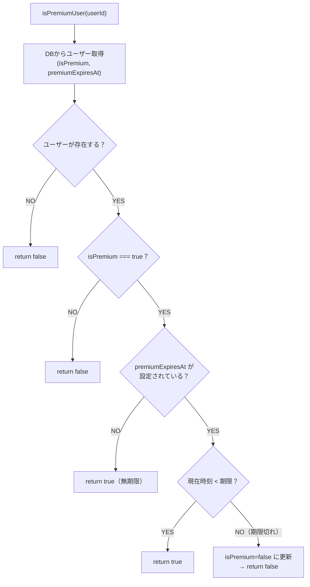
```mermaid
flowchart TD
    A["isPremiumUser(userId)"] --> B["DBからユーザー取得<br/>(isPremium, premiumExpiresAt)"]
    B --> C{"ユーザーが存在する？"}
    C -->|NO| D["return false"]
    C -->|YES| E{"isPremium === true？"}
    E -->|NO| F["return false"]
    E -->|YES| G{"premiumExpiresAt が<br/>設定されている？"}
    G -->|NO| H["return true（無期限）"]
    G -->|YES| I{"現在時刻 < 期限？"}
    I -->|YES| J["return true"]
    I -->|NO（期限切れ）| K["isPremium=false に更新<br/>→ return false"]
```

> **ここがポイント！ 自動失効処理のメリット**
>
> `isPremiumUser()`は単なる判定関数ですが、**期限切れを検出したらDBを自動更新する**という副作用を持っています。これには以下のメリットがあります。
>
> 1. **即時性**: ユーザーがアクセスした瞬間にプレミアムが失効する
> 2. **効率性**: 次回以降のチェックでは`isPremium=false`のため、期限比較が不要
> 3. **Cronジョブの補完**: 1日1回のCronジョブだけでは、アクセスタイミングによっては期限切れユーザーがプレミアム機能を使い続ける可能性がある。この関数がリアルタイムで補完する

### getMembershipLimits() -- 制限値取得関数

```typescript
// lib/premium.ts

export async function getMembershipLimits(userId: string): Promise<MembershipLimits> {
  // isPremiumUser()で会員判定し、適切な制限値オブジェクトを返す
  const isPremium = await isPremiumUser(userId)
  return isPremium ? PREMIUM_LIMITS : FREE_LIMITS
}
```

この関数は**投稿作成時のバリデーション**で主に使用されます。

```typescript
// 使用例: 投稿作成のServer Action
'use server'
import { getMembershipLimits } from '@/lib/premium'

export async function createPost(formData: FormData) {
  const session = await auth()
  if (!session?.user?.id) return { error: '認証が必要です' }

  // 会員種別に応じた制限値を取得
  const limits = await getMembershipLimits(session.user.id)

  const content = formData.get('content') as string
  const images = formData.getAll('images')

  // 文字数チェック
  if (content.length > limits.maxPostLength) {
    return { error: `投稿は${limits.maxPostLength}文字以内にしてください` }
    // 無料会員: 「投稿は500文字以内にしてください」
    // プレミアム: 「投稿は2000文字以内にしてください」
  }

  // 画像枚数チェック
  if (images.length > limits.maxImages) {
    return { error: `画像は${limits.maxImages}枚まで添付できます` }
  }

  // 予約投稿チェック
  const scheduledAt = formData.get('scheduledAt')
  if (scheduledAt && !limits.canSchedulePost) {
    return { error: '予約投稿はプレミアム会員限定の機能です' }
  }

  // ... 投稿作成処理
}
```

### checkPremiumExpiry() -- 一括失効処理

```typescript
// lib/premium.ts

export async function checkPremiumExpiry(): Promise<number> {
  // 期限切れのプレミアム会員を一括でfalseに更新
  const result = await prisma.user.updateMany({
    where: {
      isPremium: true,              // 現在プレミアム会員
      premiumExpiresAt: {
        lt: new Date(),             // かつ期限が過去
        // lt: less than（より小さい）
      },
    },
    data: {
      isPremium: false,             // プレミアムを解除
    },
  })

  return result.count
  // result.count: 更新されたレコード数
  // 例: 3件のユーザーが期限切れだった場合、3が返る
}
```

**checkPremiumExpiry() の動作イメージ:**

実行前のusersテーブル:

| ユーザー | isPremium | premiumExpiresAt | 備考 |
|---------|-----------|-----------------|------|
| Aさん | true | 2024-01-15（過去） | 更新対象 |
| Bさん | true | 2024-03-01（過去） | 更新対象 |
| Cさん | true | 2025-06-01（未来） | 対象外 |
| Dさん | false | null | 対象外 |

実行後:

| ユーザー | isPremium | premiumExpiresAt | 備考 |
|---------|-----------|-----------------|------|
| Aさん | false | 2024-01-15 | 更新された |
| Bさん | false | 2024-03-01 | 更新された |
| Cさん | true | 2025-06-01 | 変更なし |
| Dさん | false | null | 変更なし |

戻り値: 2（2件更新）

> **コラム: isPremiumUser()とcheckPremiumExpiry()の使い分け**
>
> | 関数 | 対象 | 実行タイミング | 用途 |
> |------|------|--------------|------|
> | `isPremiumUser()` | 1人のユーザー | APIリクエスト時 | リアルタイム判定 |
> | `checkPremiumExpiry()` | 全ユーザー | Cronジョブ（1日1回） | 一括クリーンアップ |
>
> 両方を組み合わせることで、「確実な失効」と「パフォーマンス」を両立しています。

### getPremiumStatus() -- 詳細ステータス取得

```typescript
// lib/premium.ts

export async function getPremiumStatus(userId: string) {
  const user = await prisma.user.findUnique({
    where: { id: userId },
    select: {
      isPremium: true,
      premiumExpiresAt: true,
      stripeCustomerId: true,
      stripeSubscriptionId: true,
    },
  })

  if (!user) return null

  return {
    isPremium: user.isPremium,
    premiumExpiresAt: user.premiumExpiresAt,
    hasStripeSubscription: !!user.stripeSubscriptionId,
    // !!（二重否定）: 値をbooleanに変換
    // stripeSubscriptionId が存在する → true
    // null/undefined → false
  }
}
```

この関数は**設定画面**で使用され、以下のような分岐に使います。

```typescript
// 設定画面での使用例
const status = await getPremiumStatus(userId)

if (status?.hasStripeSubscription) {
  // Stripeサブスクリプション経由のプレミアム会員
  // → 「プラン管理」ボタン（Stripeカスタマーポータルへ遷移）を表示
} else if (status?.isPremium) {
  // 管理者付与のプレミアム会員
  // → 期限表示のみ（自分では解約できない）
} else {
  // 無料会員
  // → 「アップグレード」ボタンを表示
}
```

### 理解度チェック

1. `isPremiumUser()`が期限切れを検出した時、なぜDBを自動更新するのですか？
2. `MembershipLimits`インターフェースに新しいプロパティを追加した場合、何が起きますか？
3. `checkPremiumExpiry()`はどのようなタイミングで呼び出すべきですか？
4. `FREE_LIMITS`と`PREMIUM_LIMITS`をエクスポートする理由は何ですか？

---

## 19.8 Webhookハンドリング詳細

### このセクションで学ぶこと

- Webhook署名検証の仕組みと実装の詳細
- 各種Stripeイベントの処理パターン
- 冪等性（べきとうせい）の考え方と実装
- Webhook処理のエラーハンドリングとリトライ

> **BON-LOGでの使用箇所**: `app/api/webhooks/stripe/route.ts` がこのルートハンドラです。`checkout.session.completed`、`customer.subscription.updated`、`customer.subscription.deleted`、`invoice.payment_failed`、`invoice.payment_succeeded` の5つのイベントを処理します。Stripeダッシュボードからはこのエンドポイント（`/api/webhooks/stripe`）に向けてWebhookを設定します。

> **実装しない場合の影響**: Webhookハンドラがないと、Stripeでの決済成功がBON-LOGのDBに反映されず、プレミアム会員のアクティベーションが行われません。また、サブスクリプションのキャンセルや支払い失敗時の処理も実行されないため、会員状態が正確に管理できなくなります。

### Webhook署名検証の詳細な仕組み

19.7節（前章のWebhook処理）で署名検証の概要を学びましたが、ここではより詳しく仕組みを理解しましょう。

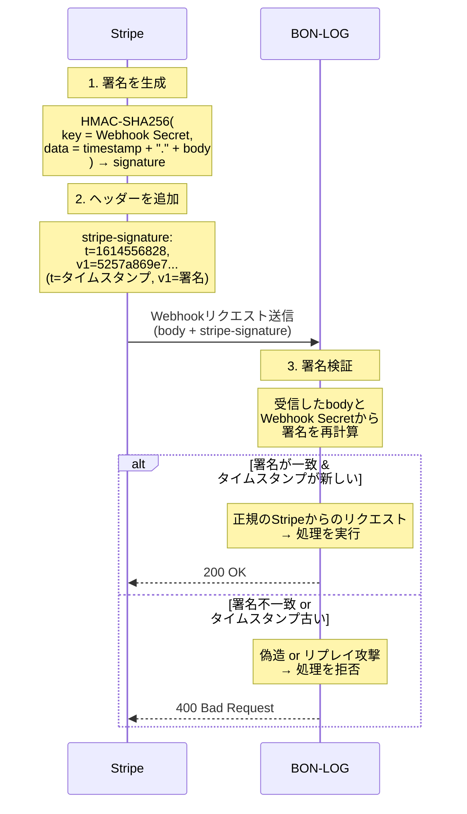
```mermaid
sequenceDiagram
    participant Stripe
    participant BON-LOG

    Note over Stripe: 1. 署名を生成
    Note over Stripe: HMAC-SHA256(<br/>key = Webhook Secret,<br/>data = timestamp + "." + body<br/>) → signature

    Note over Stripe: 2. ヘッダーを追加
    Note over Stripe: stripe-signature:<br/>t=1614556828,<br/>v1=5257a869e7...<br/>(t=タイムスタンプ, v1=署名)

    Stripe->>BON-LOG: Webhookリクエスト送信<br/>(body + stripe-signature)

    Note over BON-LOG: 3. 署名検証
    Note over BON-LOG: 受信したbodyと<br/>Webhook Secretから<br/>署名を再計算

    alt 署名が一致 & タイムスタンプが新しい
        Note over BON-LOG: 正規のStripeからのリクエスト<br/>→ 処理を実行
        BON-LOG-->>Stripe: 200 OK
    else 署名不一致 or タイムスタンプ古い
        Note over BON-LOG: 偽造 or リプレイ攻撃<br/>→ 処理を拒否
        BON-LOG-->>Stripe: 400 Bad Request
    end
```

> **注意！ req.text()でボディを取得する理由**
>
> 署名検証では「生のリクエストボディ」が必要です。`req.json()`を使うとJSONパースされた後のオブジェクトが返るため、文字列に戻した際に元のボディと一致しなくなります。必ず`req.text()`で生のテキストを取得してください。

### 実際のWebhookルートハンドラ（app/api/webhooks/stripe/route.ts）

BON-LOGの実装では、以下のイベントを処理しています。

```typescript
// app/api/webhooks/stripe/route.ts
import { NextRequest, NextResponse } from 'next/server'
import { stripe } from '@/lib/stripe'
import { prisma } from '@/lib/db'
import Stripe from 'stripe'

// Stripe APIレスポンスの型定義
type InvoiceData = {
  subscription: string | null
  payment_intent: string | null
  amount_paid: number
  currency: string
  billing_reason: string | null
  // billing_reason:
  //   'subscription_create': 初回作成
  //   'subscription_cycle': 継続課金（毎月の自動更新）
  //   'subscription_update': プラン変更
}

export async function POST(request: NextRequest) {
  // ====================================
  // ステップ1: 生のリクエストボディを取得
  // ====================================
  const body = await request.text()
  // req.json()ではなくreq.text()を使う理由:
  // 署名検証に生のボディ文字列が必要なため

  // ====================================
  // ステップ2: 署名ヘッダーを取得
  // ====================================
  const signature = request.headers.get('stripe-signature')
  if (!signature) {
    return NextResponse.json({ error: 'Missing signature' }, { status: 400 })
  }

  // ====================================
  // ステップ3: 署名検証
  // ====================================
  let event: Stripe.Event
  try {
    event = stripe.webhooks.constructEvent(
      body,                                // 生のリクエストボディ
      signature,                           // stripe-signatureヘッダー
      process.env.STRIPE_WEBHOOK_SECRET!   // Webhookシークレット
    )
    // constructEvent()は以下を行う:
    // 1. signatureからタイムスタンプとハッシュを抽出
    // 2. body + タイムスタンプからHMAC-SHA256を計算
    // 3. 計算結果とハッシュを比較
    // 4. タイムスタンプが許容範囲内か確認（デフォルト5分以内）
  } catch (err) {
    console.error('Webhook signature verification failed:', err)
    return NextResponse.json({ error: 'Invalid signature' }, { status: 400 })
  }

  // ====================================
  // ステップ4: イベント処理（後述）
  // ====================================
  try {
    switch (event.type) {
      case 'checkout.session.completed':
        // ... （詳細は後述）
        break
      case 'customer.subscription.updated':
        // ...
        break
      case 'customer.subscription.deleted':
        // ...
        break
      case 'invoice.payment_succeeded':
        // ...
        break
      case 'invoice.payment_failed':
        // ...
        break
      default:
        console.log(`Unhandled event type: ${event.type}`)
    }

    // ステップ5: 200 OKを返す
    return NextResponse.json({ received: true })
  } catch (error) {
    console.error('Webhook processing error:', error)
    return NextResponse.json(
      { error: 'Webhook processing failed' },
      { status: 500 }
    )
  }
}
```

### 各イベントの処理パターン

#### checkout.session.completed -- 初回決済完了

```typescript
case 'checkout.session.completed': {
  const session = event.data.object as Stripe.Checkout.Session
  const userId = session.metadata?.userId
  // metadata: Checkout Session作成時にセットしたカスタムデータ
  // → BON-LOGのユーザーIDが入っている

  const subscriptionId = session.subscription as string
  const customerId = session.customer as string

  if (userId && subscriptionId) {
    // Stripeからサブスクリプション詳細を取得
    const subscriptionResponse = await stripe.subscriptions.retrieve(subscriptionId)
    const subData = subscriptionResponse as any
    const currentPeriodEnd = subData.current_period_end as number | undefined

    // 有効期限を計算
    const premiumExpiresAt = currentPeriodEnd
      ? new Date(currentPeriodEnd * 1000)
      // UNIXタイムスタンプ（秒）→ ミリ秒に変換してDateに
      : new Date(Date.now() + 30 * 24 * 60 * 60 * 1000)
      // 取得できない場合のフォールバック: 30日後

    // ユーザーをプレミアムに更新
    await prisma.user.update({
      where: { id: userId },
      data: {
        isPremium: true,
        stripeCustomerId: customerId,
        stripeSubscriptionId: subscriptionId,
        premiumExpiresAt,
      },
    })

    // 支払い履歴を記録
    if (session.invoice) {
      const invoiceResponse = await stripe.invoices.retrieve(
        session.invoice as string
      )
      const invoice = invoiceResponse as any
      if (invoice.payment_intent) {
        await prisma.payment.create({
          data: {
            userId,
            stripePaymentId: invoice.payment_intent as string,
            amount: invoice.amount_paid as number,
            currency: invoice.currency as string,
            status: 'succeeded',
            description: 'プレミアム会員登録',
          },
        })
      }
    }
  }
  break
}
```

#### invoice.payment_succeeded -- 継続課金成功

```typescript
case 'invoice.payment_succeeded': {
  const invoice = event.data.object as unknown as InvoiceData
  const subscriptionId = invoice.subscription

  // billing_reason で初回か継続かを判定
  // 初回は checkout.session.completed で処理済みなのでスキップ
  if (subscriptionId && invoice.billing_reason === 'subscription_cycle') {
    const user = await prisma.user.findFirst({
      where: { stripeSubscriptionId: subscriptionId },
    })

    if (user && invoice.payment_intent) {
      // 支払い履歴を記録
      await prisma.payment.create({
        data: {
          userId: user.id,
          stripePaymentId: invoice.payment_intent,
          amount: invoice.amount_paid,
          currency: invoice.currency,
          status: 'succeeded',
          description: 'プレミアム会員更新',
        },
      })

      // 期限を延長
      const subscriptionResponse = await stripe.subscriptions.retrieve(
        subscriptionId
      )
      const subData = subscriptionResponse as any
      const currentPeriodEnd = subData.current_period_end as number | undefined
      const premiumExpiresAt = currentPeriodEnd
        ? new Date(currentPeriodEnd * 1000)
        : new Date(Date.now() + 30 * 24 * 60 * 60 * 1000)

      await prisma.user.update({
        where: { id: user.id },
        data: { premiumExpiresAt },
      })
    }
  }
  break
}
```

### 冪等性（Idempotency）の重要性

**冪等性**（べきとうせい）とは、「同じ処理を何度実行しても結果が同じになる」という性質です。Webhookでは冪等性が極めて重要です。

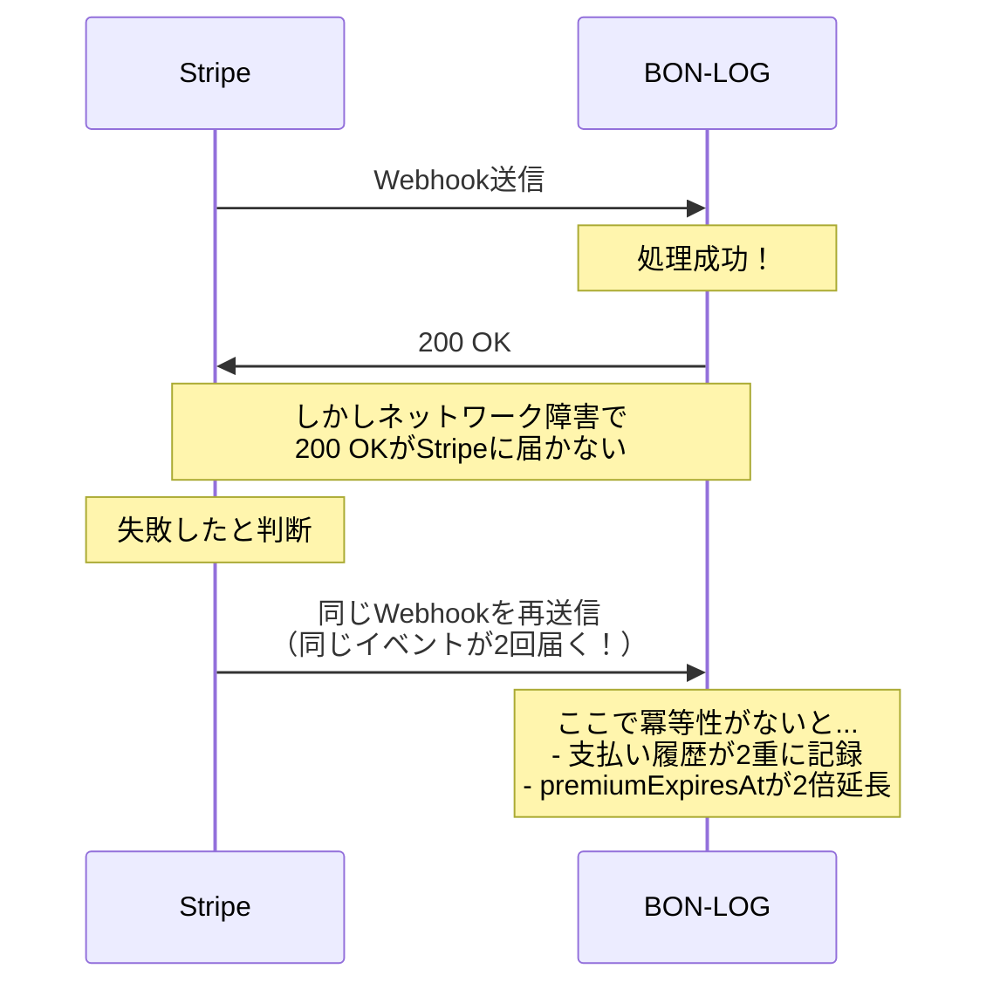
```mermaid
sequenceDiagram
    participant Stripe
    participant BON-LOG

    Stripe->>BON-LOG: Webhook送信
    Note over BON-LOG: 処理成功！
    BON-LOG->>Stripe: 200 OK
    Note over Stripe,BON-LOG: しかしネットワーク障害で<br/>200 OKがStripeに届かない
    Note over Stripe: 失敗したと判断

    Stripe->>BON-LOG: 同じWebhookを再送信<br/>（同じイベントが2回届く！）

    Note over BON-LOG: ここで冪等性がないと...<br/>- 支払い履歴が2重に記録<br/>- premiumExpiresAtが2倍延長
```

> **ここがポイント！ 冪等性を実現する方法**
>
> 1. **Stripeイベントの`id`を記録**: 処理済みイベントIDをDBに保存し、同じIDが来たらスキップ
> 2. **`upsert`を使う**: `create`の代わりに`upsert`（存在すれば更新、なければ作成）を使う
> 3. **べき等な操作を選ぶ**: 「現在の値に+1」ではなく「値を○○に設定」のように絶対値で更新
>
> BON-LOGの実装では、`prisma.user.update()`でプレミアム状態を**絶対値**（`isPremium: true`）で設定しているため、同じWebhookが複数回来ても結果は変わりません。

```typescript
// ❌ 冪等でない例（相対値での更新）
await prisma.user.update({
  where: { id: userId },
  data: {
    premiumExpiresAt: {
      // 現在の期限に30日を追加
      // → 同じWebhookが2回来ると60日延長されてしまう！
    }
  },
})

// ✅ 冪等な例（絶対値での更新）
await prisma.user.update({
  where: { id: userId },
  data: {
    isPremium: true,
    premiumExpiresAt: new Date(currentPeriodEnd * 1000),
    // Stripeから取得した値をそのまま設定
    // → 何回実行しても同じ結果
  },
})
```

### Stripeのリトライ戦略

Webhookが5xxエラーを返すと、Stripeは自動的にリトライします。

```
Stripeのリトライスケジュール:

  1回目: 即座
  2回目: 約1時間後
  3回目: 約3時間後
  4回目: 約6時間後
  5回目: 約12時間後
  ...
  最大72時間にわたって試行

  → 一時的なサーバーダウンでもイベントを取りこぼさない
  → ただし、500エラーを返し続けるバグがあると
    72時間以上経過してイベントが失われるので注意
```

> **よくあるトラブル**
>
> **Q: Webhookが200を返しているのにStripeが「失敗」と表示する**
> A: レスポンスまでに時間がかかりすぎている可能性があります。Stripeは20秒以内に応答がないとタイムアウトと判断します。重い処理は非同期キュー（別プロセス）に委譲することを検討してください。
>
> **Q: 本番環境でWebhookイベントが届かない**
> A: Stripeダッシュボードの「開発者 > Webhook」でエンドポイントURLが正しく設定されているか、またリッスンするイベントが選択されているか確認してください。

### 理解度チェック

1. `req.text()`と`req.json()`の違いは何ですか？なぜ署名検証では`req.text()`を使いますか？
2. 冪等性とは何ですか？Webhookで冪等性が必要な理由を説明してください。
3. `billing_reason === 'subscription_cycle'`のチェックは何のために行いますか？
4. Stripeが200 OKを受け取れなかった場合、何が起きますか？

---

## 19.9 サブスクリプション管理の実装

### このセクションで学ぶこと

- 料金プラン選択UIの実装（月額・年額プラン）
- Stripe Checkout Sessionの作成（月額/年額対応）
- Stripeカスタマーポータルの活用
- 解約フローの実装（期間終了時キャンセル/即時キャンセル）

> **BON-LOGでの使用箇所**: `lib/actions/subscription.ts`（月額/年額プランのCheckout Session作成とカスタマーポータルリンク生成のServer Action）として実装されています。`app/settings/premium/page.tsx` のプレミアムプランページからこれらのServer Actionを呼び出します。

> **実装しない場合の影響**: サブスクリプション管理がないと、ユーザーが自分でプランを選択・変更・解約する手段がなくなります。Stripeカスタマーポータルを使わない場合、管理者がStripeダッシュボードから手動でサブスクリプションを管理する必要があります。

### 月額・年額プランの価格設定

BON-LOGでは、月額プランと年額プランの2つを提供しています。

| 項目 | 月額プラン | 年額プラン |
|------|-----------|-----------|
| **価格** | ¥500/月 | ¥5,000/年（2ヶ月分お得） |
| **価格ID** | STRIPE_PRICE_ID_MONTHLY（環境変数） | STRIPE_PRICE_ID_YEARLY（環境変数） |
| **請求** | 毎月自動 | 毎年自動 |

> 月額×12ヶ月 = ¥6,000 → 年額 = ¥5,000（約17%割引）

### lib/stripe.ts -- 価格IDの管理

```typescript
// lib/stripe.ts

// 月額プランの価格ID
export const STRIPE_PRICE_ID_MONTHLY = process.env.STRIPE_PRICE_ID_MONTHLY
// 環境変数 STRIPE_PRICE_ID_MONTHLY=price_xxxxx

// 年額プランの価格ID
export const STRIPE_PRICE_ID_YEARLY = process.env.STRIPE_PRICE_ID_YEARLY
// 環境変数 STRIPE_PRICE_ID_YEARLY=price_yyyyy
```

### lib/actions/subscription.ts -- Checkout Session作成

```typescript
// lib/actions/subscription.ts
'use server'

import { prisma } from '@/lib/db'
import { auth } from '@/lib/auth'
import { stripe, STRIPE_PRICE_ID_MONTHLY, STRIPE_PRICE_ID_YEARLY } from '@/lib/stripe'

// ====================================
// Checkout Session作成
// ====================================
// priceType引数で月額/年額を切り替え
export async function createCheckoutSession(
  priceType: 'monthly' | 'yearly' = 'monthly'
) {
  // 認証チェック
  const session = await auth()
  if (!session?.user?.id) {
    return { error: '認証が必要です' }
  }

  // ユーザー情報を取得
  const user = await prisma.user.findUnique({
    where: { id: session.user.id },
    select: { email: true, stripeCustomerId: true, isPremium: true },
  })

  if (!user) return { error: 'ユーザーが見つかりません' }

  // すでにプレミアム会員なら拒否
  if (user.isPremium) return { error: 'すでに有料会員です' }

  // プラン種別に応じた価格IDを選択
  const priceId = priceType === 'yearly'
    ? STRIPE_PRICE_ID_YEARLY
    : STRIPE_PRICE_ID_MONTHLY
  // yearly → 年額プランの価格ID
  // monthly → 月額プランの価格ID

  if (!priceId) return { error: '価格設定が見つかりません' }

  // Stripe顧客を取得または作成
  let customerId = user.stripeCustomerId
  if (!customerId) {
    const customer = await stripe.customers.create({
      email: user.email!,
      metadata: { userId: session.user.id },
    })
    customerId = customer.id

    // ユーザーにStripe顧客IDを保存
    await prisma.user.update({
      where: { id: session.user.id },
      data: { stripeCustomerId: customerId },
    })
  }

  // Checkout Session作成
  const checkoutSession = await stripe.checkout.sessions.create({
    customer: customerId,
    mode: 'subscription',
    payment_method_types: ['card'],
    line_items: [{ price: priceId, quantity: 1 }],
    success_url: `${process.env.NEXT_PUBLIC_APP_URL}/settings/subscription?success=true`,
    cancel_url: `${process.env.NEXT_PUBLIC_APP_URL}/settings/subscription?canceled=true`,
    metadata: { userId: session.user.id },
  })

  return { url: checkoutSession.url }
}
```

### components/subscription/PricingCard.tsx -- 料金プラン選択UI

```typescript
// components/subscription/PricingCard.tsx
'use client'

import { useState } from 'react'
import { Button } from '@/components/ui/button'
import { Card, CardContent, CardHeader, CardTitle, CardDescription } from '@/components/ui/card'
import { createCheckoutSession } from '@/lib/actions/subscription'
import { Check, Crown, Loader2 } from 'lucide-react'

type PricingCardProps = {
  isPremium: boolean          // 現在プレミアムかどうか
  priceType: 'monthly' | 'yearly'  // プラン種別
  planName: string            // プラン名
  price: number               // 価格（円）
  period: string              // 期間（「月」「年」）
  description?: string        // 説明文
  popular?: boolean           // おすすめラベルを表示するか
}

// プレミアム機能一覧
const features = [
  '投稿文字数 2000文字',
  '画像添付 6枚まで',
  '動画添付 3本まで',
  '予約投稿機能',
  '投稿分析ダッシュボード',
]

export function PricingCard({
  isPremium, priceType, planName, price, period, description, popular = false,
}: PricingCardProps) {
  const [loading, setLoading] = useState(false)
  const [error, setError] = useState<string | null>(null)

  async function handleSubscribe() {
    setLoading(true)
    setError(null)

    // Server Actionを呼び出し（priceTypeで月額/年額を指定）
    const result = await createCheckoutSession(priceType)

    if (result.error) {
      setError(result.error)
      setLoading(false)
    } else if (result.url) {
      // Stripeの決済ページにリダイレクト
      window.location.href = result.url
    }
  }

  return (
    <Card className={`relative ${popular ? 'border-primary shadow-lg' : ''}`}>
      {/* おすすめラベル */}
      {popular && (
        <div className="absolute -top-3 left-1/2 -translate-x-1/2 z-10">
          <span className="bg-primary text-primary-foreground text-xs px-3 py-1 rounded-full">
            おすすめ
          </span>
        </div>
      )}

      <CardHeader className="text-center pb-2">
        <div className="w-12 h-12 mx-auto mb-2 rounded-full bg-primary/10
                        flex items-center justify-center">
          <Crown className="w-6 h-6 text-primary" />
        </div>
        <CardTitle className="text-lg">{planName}</CardTitle>
        {description && <CardDescription>{description}</CardDescription>}
        <div className="mt-4">
          <span className="text-4xl font-bold">¥{price.toLocaleString()}</span>
          <span className="text-muted-foreground">/{period}</span>
        </div>
      </CardHeader>

      <CardContent>
        {/* 機能リスト */}
        <ul className="space-y-3 mb-6">
          {features.map((feature) => (
            <li key={feature} className="flex items-center gap-2 text-sm">
              <Check className="w-4 h-4 text-primary flex-shrink-0" />
              <span>{feature}</span>
            </li>
          ))}
        </ul>

        {error && (
          <p className="text-sm text-destructive mb-4 text-center">{error}</p>
        )}

        {/* ボタン: 既にプレミアムなら無効化 */}
        {isPremium ? (
          <Button className="w-full" disabled variant="secondary">
            現在ご利用中
          </Button>
        ) : (
          <Button className="w-full" onClick={handleSubscribe} disabled={loading}>
            {loading ? (
              <><Loader2 className="w-4 h-4 mr-2 animate-spin" />処理中...</>
            ) : (
              'プレミアムに登録'
            )}
          </Button>
        )}
      </CardContent>
    </Card>
  )
}
```

料金プランの表示イメージ:

| | 月額プラン | 年額プラン（おすすめ） |
|---|---|---|
| **価格** | ¥500 / 月 | ¥5,000 / 年（2ヶ月分お得） |
| 2000文字投稿 | ✓ | ✓ |
| 画像6枚 | ✓ | ✓ |
| 動画3本 | ✓ | ✓ |
| 予約投稿 | ✓ | ✓ |
| 分析機能 | ✓ | ✓ |
| | [プレミアムに登録] | [プレミアムに登録] |

### Stripeカスタマーポータルによるプラン管理

Stripeは**カスタマーポータル**という管理画面を提供しており、ユーザー自身でプラン変更や解約ができます。

```typescript
// lib/actions/subscription.ts

export async function createCustomerPortalSession() {
  const session = await auth()
  if (!session?.user?.id) {
    return { error: '認証が必要です' }
  }

  const user = await prisma.user.findUnique({
    where: { id: session.user.id },
    select: { stripeCustomerId: true },
  })

  if (!user?.stripeCustomerId) {
    return { error: 'サブスクリプション情報が見つかりません' }
  }

  // Stripeカスタマーポータルセッションを作成
  const portalSession = await stripe.billingPortal.sessions.create({
    customer: user.stripeCustomerId,
    return_url: `${process.env.NEXT_PUBLIC_APP_URL}/settings/subscription`,
    // return_url: ポータルから戻るときのURL
  })

  return { url: portalSession.url }
}
```

**カスタマーポータルでできること:**

- ✓ 支払い方法の変更（カード番号の更新）
- ✓ プランの変更（月額 ↔ 年額の切り替え）
- ✓ サブスクリプションの解約（期間終了時にキャンセル）
- ✓ 請求書・領収書のダウンロード

→ 自前で管理画面を作る必要がない！
→ カード情報もStripe側で管理（PCI DSS不要）

### 即時解約の実装

カスタマーポータルとは別に、BON-LOG側で即時解約を実行する機能も用意しています。

```typescript
// lib/actions/subscription.ts

export async function cancelSubscriptionImmediately() {
  const session = await auth()
  if (!session?.user?.id) {
    return { error: '認証が必要です' }
  }

  const user = await prisma.user.findUnique({
    where: { id: session.user.id },
    select: { stripeSubscriptionId: true },
  })

  if (!user?.stripeSubscriptionId) {
    return { error: 'サブスクリプションが見つかりません' }
  }

  try {
    // Stripeのサブスクリプションを即時キャンセル
    await stripe.subscriptions.cancel(user.stripeSubscriptionId)
    // cancel(): 即座にサブスクリプションを終了
    // ※ stripe.subscriptions.update({ cancel_at_period_end: true })
    //   なら「期間終了時にキャンセル」になる

    // ユーザー情報を更新
    await prisma.user.update({
      where: { id: session.user.id },
      data: {
        isPremium: false,
        stripeSubscriptionId: null,
        premiumExpiresAt: null,
      },
    })

    return { success: true }
  } catch (error) {
    return { error: 'サブスクリプションのキャンセルに失敗しました' }
  }
}
```

**解約方法の比較:**

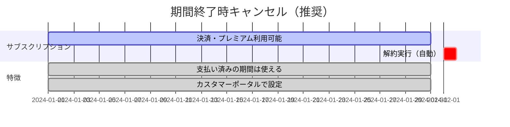
```mermaid
gantt
    title 期間終了時キャンセル（推奨）
    dateFormat YYYY-MM-DD
    section サブスクリプション
    決済・プレミアム利用可能    :active, 2024-01-01, 2024-01-31
    解約実行（自動）            :crit, 2024-02-01, 1d
    section 特徴
    支払い済みの期間は使える    :done, 2024-01-01, 2024-01-31
    カスタマーポータルで設定    :done, 2024-01-01, 2024-01-31
```

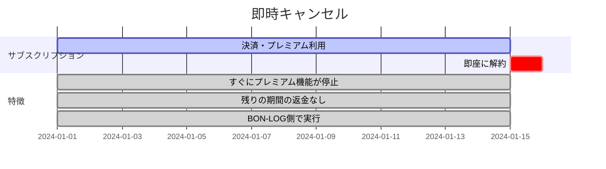
```mermaid
gantt
    title 即時キャンセル
    dateFormat YYYY-MM-DD
    section サブスクリプション
    決済・プレミアム利用    :active, 2024-01-01, 2024-01-15
    即座に解約              :crit, 2024-01-15, 1d
    section 特徴
    すぐにプレミアム機能が停止  :done, 2024-01-01, 2024-01-15
    残りの期間の返金なし        :done, 2024-01-01, 2024-01-15
    BON-LOG側で実行             :done, 2024-01-01, 2024-01-15
```

### 理解度チェック

1. 月額プランと年額プランの価格IDはどこで管理されていますか？
2. カスタマーポータルを使うメリットは何ですか？
3. `cancel()`と`update({ cancel_at_period_end: true })`の違いは何ですか？
4. なぜ即時解約時に`stripeSubscriptionId: null`を設定するのですか？

---

## 19.10 プレミアム機能ゲーティング

### このセクションで学ぶこと

- サーバーサイドでのプレミアム機能ゲーティング
- クライアントサイドでのUI制御
- Server ActionsとServer Componentsでの使い分け
- プレミアム限定ページの保護

### ゲーティングとは

**ゲーティング**（Gating）とは、「特定の条件を満たすユーザーだけに機能を提供する」仕組みです。BON-LOGでは、プレミアム会員だけが使える機能をゲーティングで制御しています。

```
ゲーティングの種類:

  1. サーバーサイドゲーティング（必須）
     → Server Actions / API Routes で会員判定
     → 不正リクエストを確実にブロック

  2. クライアントサイドゲーティング（UX向上）
     → UIの表示/非表示を切り替え
     → 「この機能はプレミアム限定です」メッセージ表示
     → ユーザー体験を向上させるが、セキュリティには頼れない

  重要: クライアントサイドのみのゲーティングは危険！
  → ブラウザの開発者ツールで簡単に回避できる
  → 必ずサーバーサイドでもチェックする
```

### サーバーサイドゲーティング

#### Server Actions でのゲーティング

```typescript
// lib/actions/post.ts
'use server'

import { auth } from '@/lib/auth'
import { getMembershipLimits, isPremiumUser } from '@/lib/premium'

// ====================================
// 予約投稿の作成（プレミアム限定）
// ====================================
export async function createScheduledPost(formData: FormData) {
  const session = await auth()
  if (!session?.user?.id) {
    return { error: '認証が必要です' }
  }

  // プレミアム会員チェック
  const isPremium = await isPremiumUser(session.user.id)
  if (!isPremium) {
    return { error: '予約投稿はプレミアム会員限定の機能です' }
    // たとえクライアント側でボタンを隠していても、
    // APIを直接呼び出す攻撃を防げる
  }

  const scheduledAt = formData.get('scheduledAt') as string
  if (!scheduledAt) {
    return { error: '予約日時を指定してください' }
  }

  // ... 予約投稿の作成処理
}

// ====================================
// 投稿作成（制限値チェック）
// ====================================
export async function createPost(formData: FormData) {
  const session = await auth()
  if (!session?.user?.id) {
    return { error: '認証が必要です' }
  }

  // 会員種別に応じた制限値を取得
  const limits = await getMembershipLimits(session.user.id)

  const content = formData.get('content') as string
  const images = formData.getAll('images')

  // 制限値に基づくバリデーション
  if (content.length > limits.maxPostLength) {
    return { error: `投稿は${limits.maxPostLength}文字以内にしてください` }
  }

  if (images.length > limits.maxImages) {
    return { error: `画像は${limits.maxImages}枚まで添付できます` }
  }

  // ... 投稿作成処理
}
```

#### Server Components でのゲーティング

```typescript
// app/(main)/analytics/page.tsx
// プレミアム会員限定の分析ページ

import { redirect } from 'next/navigation'
import { auth } from '@/lib/auth'
import { isPremiumUser } from '@/lib/premium'
import { PremiumUpgradeCard } from '@/components/subscription/PremiumUpgradeCard'

export default async function AnalyticsPage() {
  const session = await auth()
  if (!session?.user?.id) {
    redirect('/login')
  }

  // プレミアム会員チェック
  const isPremium = await isPremiumUser(session.user.id)

  if (!isPremium) {
    // 無料会員にはアップグレード案内を表示
    return (
      <div className="container max-w-2xl mx-auto p-6">
        <PremiumUpgradeCard
          title="投稿分析はプレミアム限定機能です"
          description="プレミアム会員になると、投稿の閲覧数やいいね数の推移を確認できます。"
        />
      </div>
    )
  }

  // プレミアム会員には分析ダッシュボードを表示
  return (
    <div className="container mx-auto p-6">
      <h1 className="text-2xl font-bold mb-4">投稿分析</h1>
      {/* 分析コンポーネント群 */}
    </div>
  )
}
```

### クライアントサイドゲーティング

```typescript
// components/subscription/PremiumUpgradeCard.tsx
'use client'

import Link from 'next/link'
import { Button } from '@/components/ui/button'
import { Card, CardContent, CardHeader, CardTitle } from '@/components/ui/card'
import { Crown, Check } from 'lucide-react'

type PremiumUpgradeCardProps = {
  title?: string
  description?: string
  showFeatures?: boolean
}

const features = [
  '投稿文字数 2000文字',
  '画像添付 6枚まで',
  '動画添付 3本まで',
  '予約投稿機能',
  '投稿分析ダッシュボード',
]

export function PremiumUpgradeCard({
  title = 'プレミアム会員限定機能',
  description = 'この機能を利用するにはプレミアム会員への登録が必要です。',
  showFeatures = true,
}: PremiumUpgradeCardProps) {
  return (
    <Card className="border-primary/20 bg-gradient-to-br from-primary/5 to-primary/10">
      <CardHeader className="text-center">
        {/* 王冠アイコン: プレミアム感を演出 */}
        <div className="w-16 h-16 mx-auto mb-4 rounded-full bg-primary/10
                        flex items-center justify-center">
          <Crown className="w-8 h-8 text-primary" />
        </div>
        <CardTitle className="text-xl">{title}</CardTitle>
        <p className="text-muted-foreground mt-2">{description}</p>
      </CardHeader>

      <CardContent>
        {showFeatures && (
          <ul className="space-y-2 mb-6">
            {features.map((feature) => (
              <li key={feature} className="flex items-center gap-2 text-sm">
                <Check className="w-4 h-4 text-primary flex-shrink-0" />
                <span>{feature}</span>
              </li>
            ))}
          </ul>
        )}

        <div className="text-center">
          <p className="text-2xl font-bold mb-4">
            ¥500<span className="text-sm font-normal text-muted-foreground">/月</span>
          </p>
          <Button asChild className="w-full bg-bonsai-green hover:bg-bonsai-green/90">
            <Link href="/settings/subscription">プレミアムに登録する</Link>
          </Button>
        </div>
      </CardContent>
    </Card>
  )
}
```

**ゲーティングの使い分けまとめ:**

| 層 | 実装場所 | 目的 | 実装内容 |
|----|---------|------|---------|
| **サーバーサイド<br/>（セキュリティ層）** | Server Actions<br/>API Routes | 確実にブロック | ✓ 投稿作成時の文字数・画像枚数チェック<br/>✓ 予約投稿の許可/拒否<br/>✓ 分析データの取得許可/拒否<br/>→ セキュリティ保証 |
| **クライアントサイド<br/>（UX層）** | Server Components<br/>Client Components | UX向上 | ✓ 予約投稿ボタンの表示/非表示<br/>✓ 分析ページへのアクセス時の案内表示<br/>✓ 文字数カウンターの上限表示<br/>✓ PremiumUpgradeCard の表示<br/>→ ユーザーに理由を伝え、アップグレードを促進 |

### 理解度チェック

1. サーバーサイドゲーティングとクライアントサイドゲーティングの違いは何ですか？
2. なぜクライアントサイドのみのゲーティングでは不十分ですか？
3. 無料会員がプレミアム限定機能にアクセスした場合、どのような表示を行うべきですか？
4. `getMembershipLimits()`をServer Actionで使う利点は何ですか？

---

## 19.11 広告マネタイズ

### このセクションで学ぶこと

- 広告収益化の基本的な仕組み
- AdBannerコンポーネントの実装（Google AdSense対応）
- NinjaAdMaxコンポーネントの実装
- AdProviderによる広告プロバイダーの切り替え
- プレミアム会員の広告非表示制御

### 広告マネタイズの概要

BON-LOGでは、無料会員に対して広告を表示し、広告収益を得ています。プレミアム会員は広告非表示が特典の一つです。

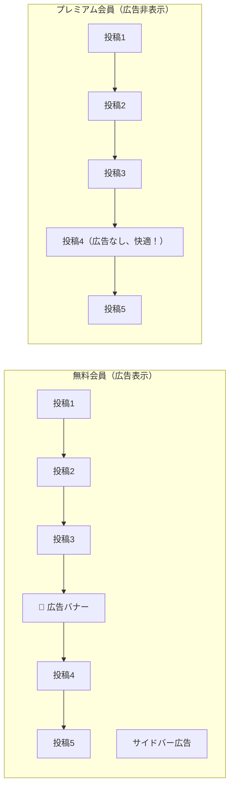
```mermaid
graph LR
    subgraph free["無料会員（広告表示）"]
        F1[投稿1] --> F2[投稿2] --> F3[投稿3]
        F3 --> AD1["📢 広告バナー"]
        AD1 --> F4[投稿4] --> F5[投稿5]
        SIDE1["サイドバー広告"]
    end

    subgraph premium["プレミアム会員（広告非表示）"]
        P1[投稿1] --> P2[投稿2] --> P3[投稿3]
        P3 --> P4["投稿4（広告なし、快適！）"] --> P5[投稿5]
    end
```

### 広告プロバイダーの選択

BON-LOGでは、2つの広告プロバイダーに対応しています。

| プロバイダー | 特徴 | 審査 |
|-------------|------|------|
| Google AdSense | 世界最大の広告ネットワーク、高い収益性 | 厳格な審査あり |
| 忍者AdMax | 日本向け広告ネットワーク、審査が緩い | 比較的簡単に開始可能 |

```
広告プロバイダーの切り替え:

  環境変数 NEXT_PUBLIC_AD_PROVIDER で制御

  NEXT_PUBLIC_AD_PROVIDER="ninja"   → 忍者AdMaxを使用（デフォルト）
  NEXT_PUBLIC_AD_PROVIDER="adsense" → Google AdSenseを使用

  → AdSense審査通過後は環境変数を変えるだけで切り替え完了
```

### components/ads/AdProvider.tsx -- プロバイダー切り替え

```typescript
// components/ads/AdProvider.tsx
'use client'

import { AdBanner, InFeedAd, SidebarAd } from './AdBanner'
import { NinjaAd, NinjaInFeedAd, NinjaSidebarAd } from './NinjaAdMax'
import { GoogleAdSense } from './GoogleAdSense'

// 環境変数でAdSenseかどうかを判定
function isAdSense(): boolean {
  return process.env.NEXT_PUBLIC_AD_PROVIDER === 'adsense'
}

// ====================================
// スクリプトローダー
// ====================================
// AdSense使用時のみ外部スクリプトを読み込む
export function AdProvider() {
  if (isAdSense()) {
    return <GoogleAdSense />
    // next/scriptでAdSenseのJavaScriptを非同期ロード
  }
  // 忍者AdMaxはコンポーネント側で個別に読み込むため不要
  return null
}

// ====================================
// 統一広告コンポーネント群
// ====================================

// フィード内広告（投稿の間に表示）
export function InFeedAdUnit({ className = '' }: { className?: string }) {
  if (isAdSense()) {
    return <InFeedAd adSlot={process.env.NEXT_PUBLIC_ADSENSE_SLOT_INFEED} className={className} />
  }
  return <NinjaInFeedAd adId={process.env.NEXT_PUBLIC_NINJA_AD_ID_INFEED} className={className} />
}

// サイドバー広告
export function SidebarAdUnit({ className = '' }: { className?: string }) {
  if (isAdSense()) {
    return <SidebarAd adSlot={process.env.NEXT_PUBLIC_ADSENSE_SLOT_SIDEBAR} className={className} />
  }
  return <NinjaSidebarAd adId={process.env.NEXT_PUBLIC_NINJA_AD_ID_SIDEBAR} className={className} />
}

// 投稿詳細ページ広告
export function PostDetailAdUnit({ className = '' }: { className?: string }) {
  if (isAdSense()) {
    return <AdBanner adSlot={process.env.NEXT_PUBLIC_ADSENSE_SLOT_POST_DETAIL}
                     size="responsive" format="auto" className={className} />
  }
  return <NinjaAd adId={process.env.NEXT_PUBLIC_NINJA_AD_ID_POST_DETAIL} className={className} />
}
```

> **ここがポイント！ ストラテジーパターンによる広告プロバイダー切り替え**
>
> `AdProvider.tsx`は**ストラテジーパターン**（Strategy Pattern）を使用しています。`isAdSense()`で分岐し、使用する広告コンポーネントを切り替えます。呼び出し側（フィードやサイドバー）は`InFeedAdUnit`や`SidebarAdUnit`を使うだけで、どの広告プロバイダーが使われているかを意識する必要がありません。

### components/ads/AdBanner.tsx -- Google AdSense広告

```typescript
// components/ads/AdBanner.tsx
'use client'
import { useEffect, useRef } from 'react'

// 広告サイズの種類
type AdSize =
  | 'rectangle'      // 300x250 - サイドバー向け
  | 'leaderboard'    // 728x90 - ページ上部向け
  | 'mobile-banner'  // 320x100 - モバイル向け
  | 'responsive'     // 自動サイズ調整
  | 'in-feed'        // フィード内広告

export function AdBanner({ adSlot, size = 'responsive', format = 'auto', className = '' }) {
  const adRef = useRef<HTMLModElement>(null)
  const isInitialized = useRef(false)
  const clientId = process.env.NEXT_PUBLIC_ADSENSE_CLIENT_ID

  useEffect(() => {
    // AdSenseスクリプトが読み込まれた後に広告を初期化
    if (clientId && adSlot && adRef.current && !isInitialized.current) {
      try {
        // adsbygoogleは AdSense のグローバル配列
        // push({})で広告リクエストを送信
        (window.adsbygoogle = window.adsbygoogle || []).push({})
        isInitialized.current = true
        // isInitialized: 二重初期化を防止するフラグ
      } catch (error) {
        console.error('AdSense initialization error:', error)
      }
    }
  }, [clientId, adSlot])

  // AdSense未設定時はプレースホルダーを表示
  if (!clientId || !adSlot) {
    return (
      <div className="bg-muted/50 border border-dashed rounded-lg
                      flex items-center justify-center p-4">
        <p className="text-xs text-muted-foreground">広告スペース</p>
      </div>
    )
  }

  // 実際のAdSense広告
  return (
    <ins
      ref={adRef}
      className="adsbygoogle"
      style={{ display: 'block' }}
      data-ad-client={clientId}
      data-ad-slot={adSlot}
      data-ad-format={format}
    />
  )
}
```

### components/ads/NinjaAdMax.tsx -- 忍者AdMax広告

```typescript
// components/ads/NinjaAdMax.tsx
'use client'

export function NinjaAd({ adId, width = 300, height = 250, className = '' }) {
  // adIdが未設定の場合はプレースホルダーを表示
  if (!adId) {
    return (
      <div className="bg-muted/50 border border-dashed rounded-lg
                      flex items-center justify-center p-4"
           style={{ width: `${width}px`, minHeight: `${height}px` }}>
        <p className="text-xs text-muted-foreground">広告スペース</p>
      </div>
    )
  }

  // 忍者AdMaxはCSPの制約を回避するため、
  // iframeで専用APIルート経由で読み込む
  return (
    <iframe
      src={`/api/ad-frame?id=${adId}`}
      className={className}
      style={{
        width: `${width}px`,
        height: `${height}px`,
        maxWidth: '100%',
        border: 'none',
      }}
      title="広告"
      scrolling="no"
    />
  )
}
```

> **コラム: なぜ忍者AdMaxはiframeで読み込むのか**
>
> 忍者AdMaxの広告スクリプトは多数の外部ドメインと`eval()`を使用します。これはBON-LOGの**CSP（Content Security Policy）**と衝突します。
>
> CSPとは、ブラウザが読み込めるリソースを制限するセキュリティヘッダーです。BON-LOGでは`unsafe-eval`を許可していないため、忍者AdMaxのスクリプトが直接実行できません。
>
> そこで、専用のAPIルート（`/api/ad-frame`）で独自の緩和されたCSPヘッダーを返し、iframeの中でのみ忍者AdMaxを動作させています。これにより、親ページのセキュリティは維持したまま広告を表示できます。

### プレミアム会員の広告非表示

プレミアム会員には広告を表示しません。フィードやサイドバーで広告コンポーネントを呼び出す前に、プレミアム判定を行います。

```typescript
// フィードでの広告表示例
// app/(main)/feed/page.tsx

import { auth } from '@/lib/auth'
import { isPremiumUser } from '@/lib/premium'
import { InFeedAdUnit } from '@/components/ads'

export default async function FeedPage() {
  const session = await auth()
  const isPremium = session?.user?.id
    ? await isPremiumUser(session.user.id)
    : false

  return (
    <div>
      {posts.map((post, index) => (
        <div key={post.id}>
          <PostCard post={post} />

          {/* 3投稿ごとに広告を挿入（プレミアム会員以外） */}
          {!isPremium && (index + 1) % 3 === 0 && (
            <InFeedAdUnit />
          )}
        </div>
      ))}
    </div>
  )
}

// サイドバーでの広告表示例
// components/layout/RightSidebar.tsx

export async function RightSidebar() {
  const session = await auth()
  const isPremium = session?.user?.id
    ? await isPremiumUser(session.user.id)
    : false

  return (
    <aside>
      <TrendingTopics />
      <RecommendedUsers />

      {/* プレミアム会員以外に広告を表示 */}
      {!isPremium && <SidebarAdUnit className="mt-4" />}
    </aside>
  )
}
```

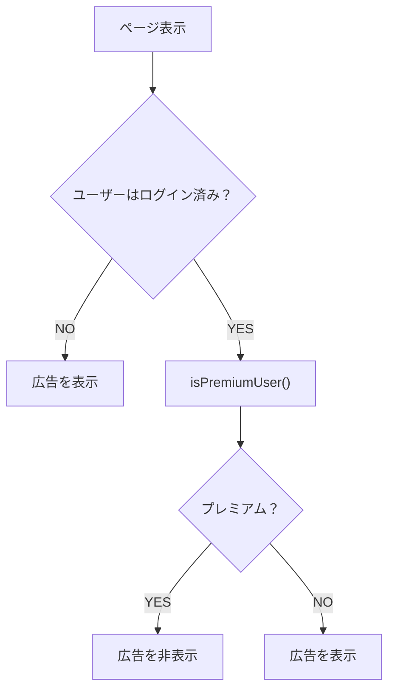
```mermaid
flowchart TD
    A[ページ表示] --> B{"ユーザーはログイン済み？"}
    B -->|NO| C[広告を表示]
    B -->|YES| D["isPremiumUser()"]
    D --> E{"プレミアム？"}
    E -->|YES| F[広告を非表示]
    E -->|NO| G[広告を表示]
```

### 広告関連の環境変数

```bash
# .env.local

# 広告プロバイダー選択
NEXT_PUBLIC_AD_PROVIDER="ninja"  # "adsense" or "ninja"

# Google AdSense
NEXT_PUBLIC_ADSENSE_CLIENT_ID="ca-pub-xxxxxxxxxxxxx"
NEXT_PUBLIC_ADSENSE_SLOT_INFEED="1234567890"
NEXT_PUBLIC_ADSENSE_SLOT_SIDEBAR="0987654321"
NEXT_PUBLIC_ADSENSE_SLOT_POST_DETAIL="1122334455"

# 忍者AdMax
NEXT_PUBLIC_NINJA_AD_ID_INFEED="ninja_infeed_xxxxx"
NEXT_PUBLIC_NINJA_AD_ID_SIDEBAR="ninja_sidebar_xxxxx"
NEXT_PUBLIC_NINJA_AD_ID_POST_DETAIL="ninja_detail_xxxxx"
```

> **よくあるトラブル**
>
> **Q: 広告が表示されず、プレースホルダーだけ表示される**
> A: 環境変数が正しく設定されているか確認してください。`NEXT_PUBLIC_`プレフィックスがないとクライアント側で参照できません。
>
> **Q: AdSenseの審査に通らない**
> A: まず忍者AdMaxで運用を開始し、ある程度のトラフィックとコンテンツが蓄積されてからAdSenseに申請することを推奨します。
>
> **Q: 広告が多すぎてユーザー体験が悪い**
> A: フィード内広告は3〜5投稿に1つ程度が適切です。また、プレミアム会員への転換を促すために「広告非表示はプレミアム会員の特典です」というメッセージを表示することも効果的です。

### 理解度チェック

1. `NEXT_PUBLIC_AD_PROVIDER`環境変数の役割は何ですか？
2. 忍者AdMaxをiframeで読み込む理由は何ですか？
3. プレミアム会員に広告を表示しない実装はどのレイヤーで行いますか？
4. AdSense未設定時にプレースホルダーを表示する理由は何ですか？

---

## 19.12 Webhook 処理

### このセクションで学ぶこと

- Webhookとは何か、なぜ必要か
- Webhook署名検証の重要性
- 各種イベントの処理方法
- サブスクリプションのライフサイクル管理

### Webhookとは

**Webhook**は、「あるイベントが発生したら、指定したURLにHTTPリクエストを送信する」仕組みです。

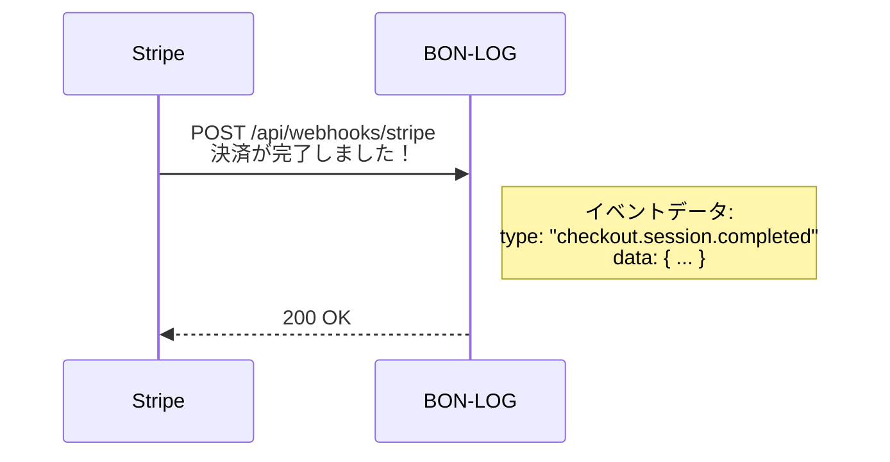
```mermaid
sequenceDiagram
    participant Stripe
    participant BON-LOG

    Stripe->>BON-LOG: POST /api/webhooks/stripe<br/>決済が完了しました！
    Note right of BON-LOG: イベントデータ:<br/>type: "checkout.session.completed"<br/>data: { ... }
    BON-LOG-->>Stripe: 200 OK
```

> **ここがポイント！ なぜWebhookが必要なのか**
>
> 決済成功後にリダイレクトだけで判定すると、以下の問題があります:
>
> 1. ユーザーがリダイレクト前にブラウザを閉じるかもしれない
> 2. 成功URLに直接アクセスされる可能性がある（なりすまし）
> 3. カード決済は「非同期」で、承認が遅れることがある
>
> Webhookは**Stripeから直接**通知されるため、確実に決済結果を受け取れます。

> **Webhookの非同期性に注意**
>
> ```
> ユーザー視点:                    サーバー裏側:
> 1. 「購入」ボタンを押す
> 2. Stripeの決済画面で支払い
> 3. 「完了」画面が表示される ←── この時点ではDBにまだ反映されていない場合がある
>                                  4. Stripeがwebhookを送信（数秒後）
>                                  5. サーバーがDB更新
> 6. ページリロードで反映
> ```
>
> 決済完了とDB更新にはタイムラグがあります。完了画面では「処理中...」を表示し、定期的に状態を確認するか、ポーリングで更新を検知するのが安全です。

### Webhook署名検証

Webhookのセキュリティにおいて最も重要なのが「署名検証」です。

```
署名検証の仕組み:

  1. StripeがWebhookを送信するとき:
     - リクエストボディとWebhookシークレットから「署名」を生成
     - stripe-signatureヘッダーに署名を付与

  2. BON-LOGがWebhookを受信したとき:
     - 受信したボディとWebhookシークレットから「署名」を再計算
     - ヘッダーの署名と一致するか確認
     - 一致 → 正規のStripeからのリクエスト
     - 不一致 → 偽のリクエスト（攻撃者によるなりすまし）

  攻撃者 --- POST /api/webhooks/stripe --> BON-LOG
                                           |
                                       署名検証で拒否！
                                       (署名が一致しない)
```

> **注意！ 署名検証を省略してはいけない**
>
> 署名検証なしでWebhookを処理すると、誰でも偽のリクエストを送って「決済が完了した」ことにできてしまいます。これは深刻なセキュリティホールです。

> **Webhook署名検証とは？**
> 誰でもあなたのWebhookエンドポイントにリクエストを送れます。Stripeからの本物のリクエストか確認するために署名検証を行います。
>
> 仕組み: Stripeはリクエスト送信時に、リクエスト本文と秘密鍵（Webhook Secret）からハッシュ値を計算し、ヘッダーに付与します。サーバー側で同じ計算をして、値が一致すれば「本物」と判断します。
>
> ```typescript
> // stripe.webhooks.constructEvent() がこの検証を自動的に行う
> const event = stripe.webhooks.constructEvent(
>   body,           // リクエスト本文
>   signature,      // Stripeが付けたヘッダー
>   webhookSecret   // あなたの秘密鍵
> )
> // 署名が不正な場合は例外がスローされる
> ```

### app/api/webhooks/stripe/route.ts

```typescript
// app/api/webhooks/stripe/route.ts
// StripeのWebhookを受信するAPIエンドポイント

import { NextRequest, NextResponse } from 'next/server'
import { stripe } from '@/lib/stripe'
import { prisma } from '@/lib/db'
import Stripe from 'stripe'

// Stripe APIレスポンスの型定義
type InvoiceData = {
  subscription: string | null
  payment_intent: string | null
  amount_paid: number
  currency: string
  billing_reason: string | null
}

// POST /api/webhooks/stripe
// Stripeからのイベント通知を受信する
export async function POST(request: NextRequest) {
  // ステップ1: リクエストボディをテキストとして取得
  const body = await request.text()
  // request.text(): リクエストボディを文字列として読み取る
  // request.json()ではなくrequest.text()を使うのは、署名検証に生のボディが必要なため

  // ステップ2: 署名ヘッダーを取得
  const signature = request.headers.get('stripe-signature')
  // Stripeが付与した署名

  if (!signature) {
    return NextResponse.json({ error: 'Missing signature' }, { status: 400 })
    // 署名がない → Stripeからのリクエストではない
  }

  // ステップ3: 署名を検証してイベントを復元
  let event: Stripe.Event

  try {
    event = stripe.webhooks.constructEvent(
      body,                              // リクエストボディ
      signature,                          // 署名
      process.env.STRIPE_WEBHOOK_SECRET!  // Webhookシークレット
    )
    // 署名が正しければ、Stripe.Eventオブジェクトが返る
    // 署名が不正であれば、エラーが投げられる
  } catch (err) {
    console.error('Webhook signature verification failed:', err)
    return NextResponse.json({ error: 'Invalid signature' }, { status: 400 })
  }

  // ステップ4: イベントタイプに応じて処理を分岐
  try {
    switch (event.type) {
      // ====================================
      // 決済完了 → 有料会員有効化
      // ====================================
      case 'checkout.session.completed': {
        const session = event.data.object as Stripe.Checkout.Session
        const userId = session.metadata?.userId
        const subscriptionId = session.subscription as string
        const customerId = session.customer as string

        if (userId && subscriptionId) {
          // Stripeからサブスクリプション情報を取得
          const subscriptionResponse = await stripe.subscriptions.retrieve(subscriptionId)
          const subData = subscriptionResponse as any
          const currentPeriodEnd = subData.current_period_end as number | undefined

          // 有効期限を計算（取得できない場合は30日後をデフォルト）
          const premiumExpiresAt = currentPeriodEnd
            ? new Date(currentPeriodEnd * 1000)
            : new Date(Date.now() + 30 * 24 * 60 * 60 * 1000)

          // Userモデルを直接更新（Subscriptionモデルは使用しない）
          await prisma.user.update({
            where: { id: userId },
            data: {
              isPremium: true,
              stripeCustomerId: customerId,
              stripeSubscriptionId: subscriptionId,
              premiumExpiresAt,
            },
          })

          // 支払い履歴を記録（invoiceから取得）
          if (session.invoice) {
            const invoiceResponse = await stripe.invoices.retrieve(session.invoice as string)
            const invoice = invoiceResponse as any
            if (invoice.payment_intent) {
              await prisma.payment.create({
                data: {
                  userId,
                  stripePaymentId: invoice.payment_intent as string,
                  amount: invoice.amount_paid as number,
                  currency: invoice.currency as string,
                  status: 'succeeded',
                  description: 'プレミアム会員登録',
                },
              })
            }
          }
        }
        break
      }

      // ====================================
      // サブスクリプション更新（更新・期限延長）
      // ====================================
      case 'customer.subscription.updated': {
        const subscriptionData = event.data.object as any
        const subscriptionId = subscriptionData.id as string
        const subscriptionStatus = subscriptionData.status as string
        const currentPeriodEnd = subscriptionData.current_period_end as number | undefined

        // stripeSubscriptionIdでユーザーを検索
        const user = await prisma.user.findFirst({
          where: { stripeSubscriptionId: subscriptionId },
        })

        if (user) {
          const premiumExpiresAt = currentPeriodEnd
            ? new Date(currentPeriodEnd * 1000)
            : new Date(Date.now() + 30 * 24 * 60 * 60 * 1000)

          await prisma.user.update({
            where: { id: user.id },
            data: {
              isPremium: subscriptionStatus === 'active',
              premiumExpiresAt,
            },
          })
        }
        break
      }

      // ====================================
      // サブスクリプション解約
      // ====================================
      case 'customer.subscription.deleted': {
        const subscription = event.data.object as Stripe.Subscription

        // stripeSubscriptionIdでユーザーを検索
        const user = await prisma.user.findFirst({
          where: { stripeSubscriptionId: subscription.id },
        })

        if (user) {
          await prisma.user.update({
            where: { id: user.id },
            data: {
              isPremium: false,
              stripeSubscriptionId: null,
              premiumExpiresAt: null,
            },
          })
        }
        break
      }

      // ====================================
      // 支払い失敗
      // ====================================
      case 'invoice.payment_failed': {
        const invoice = event.data.object as unknown as InvoiceData
        const subscriptionId = invoice.subscription

        if (subscriptionId) {
          const user = await prisma.user.findFirst({
            where: { stripeSubscriptionId: subscriptionId },
          })

          if (user) {
            // 支払い失敗の通知を作成
            await prisma.notification.create({
              data: {
                userId: user.id,
                actorId: user.id,
                type: 'system',
              },
            })
          }
        }
        break
      }

      // ====================================
      // 請求書支払い成功（継続課金）
      // ====================================
      case 'invoice.payment_succeeded': {
        const invoice = event.data.object as unknown as InvoiceData
        const subscriptionId = invoice.subscription

        // 継続課金の場合のみ記録（初回は checkout.session.completed で処理）
        if (subscriptionId && invoice.billing_reason === 'subscription_cycle') {
          const user = await prisma.user.findFirst({
            where: { stripeSubscriptionId: subscriptionId },
          })

          if (user && invoice.payment_intent) {
            // 支払い履歴を記録
            await prisma.payment.create({
              data: {
                userId: user.id,
                stripePaymentId: invoice.payment_intent,
                amount: invoice.amount_paid,
                currency: invoice.currency,
                status: 'succeeded',
                description: 'プレミアム会員更新',
              },
            })

            // 期限を延長
            const subscriptionResponse = await stripe.subscriptions.retrieve(subscriptionId)
            const subData = subscriptionResponse as any
            const currentPeriodEnd = subData.current_period_end as number | undefined
            const premiumExpiresAt = currentPeriodEnd
              ? new Date(currentPeriodEnd * 1000)
              : new Date(Date.now() + 30 * 24 * 60 * 60 * 1000)

            await prisma.user.update({
              where: { id: user.id },
              data: { premiumExpiresAt },
            })
          }
        }
        break
      }

      default:
        // 処理しないイベントタイプはログだけ出す
        console.log(`Unhandled event type: ${event.type}`)
    }

    // ステップ5: 200 OKを返す（Stripeに「受信成功」を伝える）
    return NextResponse.json({ received: true })

  } catch (error) {
    console.error('Webhook processing error:', error)
    return NextResponse.json(
      { error: 'Webhook processing failed', details: error instanceof Error ? error.message : 'Unknown error' },
      { status: 500 }
    )
  }
}
```

### サブスクリプションのライフサイクル

BON-LOGでは、Subscriptionモデルを別途持たず、Userモデルの`isPremium`/`premiumExpiresAt`/`stripeSubscriptionId`フィールドで直接管理しています。Stripe側のサブスクリプション状態変更はWebhookで通知を受け、Userモデルを更新します。

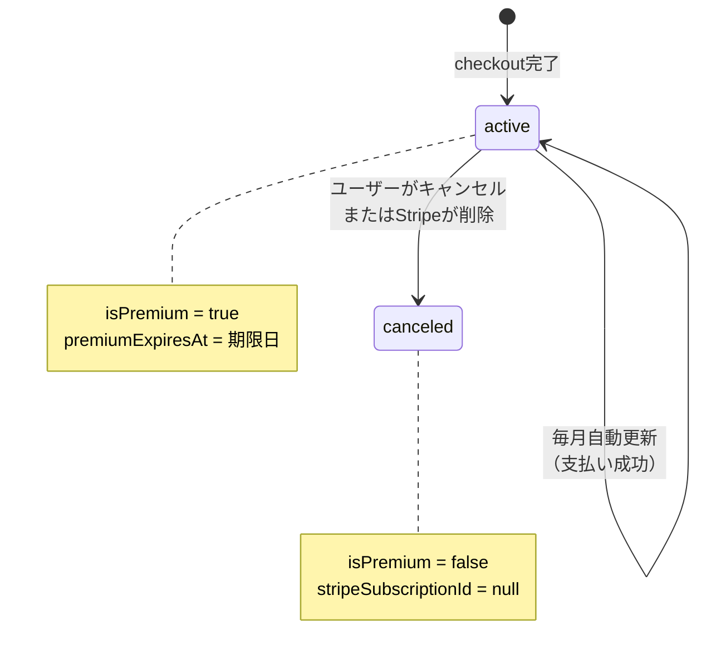
```mermaid
stateDiagram-v2
    [*] --> active: checkout完了
    active --> active: 毎月自動更新<br/>（支払い成功）
    active --> canceled: ユーザーがキャンセル<br/>またはStripeが削除

    note right of active: isPremium = true<br/>premiumExpiresAt = 期限日
    note right of canceled: isPremium = false<br/>stripeSubscriptionId = null
```

### Webhookのローカルテスト

```bash
# Stripe CLIのインストール（https://stripe.com/docs/stripe-cli）

# ログイン
stripe login

# Webhookのフォワーディング（ローカルのAPIに転送）
stripe listen --forward-to localhost:3000/api/webhooks/stripe

# 表示されたWebhookシークレットを.env.localに設定
# STRIPE_WEBHOOK_SECRET="whsec_xxxxx"

# テストイベントの送信
stripe trigger checkout.session.completed
stripe trigger customer.subscription.updated
stripe trigger invoice.payment_failed
```

> **よくあるトラブル**
>
> **Q: Webhookが呼ばれない**
> A: `stripe listen`が実行中であることを確認してください。また、`--forward-to`のURLが正しいか確認してください。
>
> **Q: 「Invalid signature」エラーが出る**
> A: `stripe listen`で表示されたシークレット（`whsec_xxxxx`）を`.env.local`に設定しましたか？`stripe listen`を再起動するとシークレットが変わるので、再設定が必要です。
>
> **Q: WebhookでDBが更新されない**
> A: Webhookハンドラ内のエラーをconsole.errorで確認してください。Stripe CLIの出力にもエラー情報が表示されます。

### 理解度チェック

1. Webhookの署名検証はなぜ必要ですか？
2. `currentPeriodEnd * 1000`の`* 1000`は何のためですか？
3. BON-LOGではSubscriptionモデルを使わず、Userモデルで直接プレミアム状態を管理しています。この設計のメリットは何ですか？

---

## 19.13 サブスクリプション管理

### このセクションで学ぶこと

- サブスクリプションのキャンセル処理
- サブスクリプション状態の表示
- 返金の考え方

### lib/actions/stripe-subscription.ts

```typescript
// lib/actions/stripe-subscription.ts
// サブスクリプションの管理（キャンセル等）

'use server'

import { auth } from '@/lib/auth'
import { prisma } from '@/lib/db'
import { stripe } from '@/lib/stripe'
import { revalidatePath } from 'next/cache'

// ====================================
// サブスクリプションのキャンセル
// ====================================
// 注意: 即時キャンセルではなく「期間終了時にキャンセル」
// ユーザーは支払い済みの期間が終わるまでプレミアム機能を使える
export async function cancelSubscription() {
  const session = await auth()
  if (!session?.user?.id) {
    return { error: '認証が必要です' }
  }

  // ユーザーのサブスクリプション情報を取得
  const user = await prisma.user.findUnique({
    where: { id: session.user.id },
    select: { stripeSubscriptionId: true }
  })

  if (!user?.stripeSubscriptionId) {
    return { error: 'サブスクリプションが見つかりません' }
  }

  try {
    // Stripeのサブスクリプションを「期間終了時にキャンセル」に設定
    await stripe.subscriptions.update(user.stripeSubscriptionId, {
      cancel_at_period_end: true,
      // cancel_at_period_end: true
      //   → 現在の課金期間の終了時にキャンセル
      //   → 即時キャンセルではない
      //   → 支払い済みの期間はプレミアム機能を使える
    })

    revalidatePath('/settings/premium')
    return { success: true }
  } catch (error) {
    console.error('Cancel subscription error:', error)
    return { error: 'キャンセルに失敗しました' }
  }
}
```

> **コラム: キャンセルと返金の違い**
>
> - **キャンセル**(`cancel_at_period_end: true`): 次回更新日でサブスクリプションが終了。既に支払った分は返金されない。ユーザーは期間終了までプレミアム機能を使える。
>
> - **即時キャンセル**: サブスクリプションを即座に終了。日割りで返金するかどうかは事業者の判断。
>
> - **返金**: Stripeダッシュボードから手動で返金処理。APIでも可能（`stripe.refunds.create()`）。
>
> BON-LOGでは「期間終了時のキャンセル」を採用し、返金は管理者が個別対応する方針にしています。

### components/payment/SubscriptionStatus.tsx

```typescript
// components/payment/SubscriptionStatus.tsx
// 現在のサブスクリプション状態を表示するコンポーネント

'use client'

import { useState } from 'react'
import { cancelSubscription } from '@/lib/actions/stripe-subscription'
import { Button } from '@/components/ui/button'
import { Card, CardContent, CardHeader, CardTitle } from '@/components/ui/card'
import {
  AlertDialog,
  AlertDialogAction,
  AlertDialogCancel,
  AlertDialogContent,
  AlertDialogDescription,
  AlertDialogFooter,
  AlertDialogHeader,
  AlertDialogTitle,
  AlertDialogTrigger,
} from '@/components/ui/alert-dialog'
// AlertDialog: 重要な操作の前に確認を求めるダイアログ

export function SubscriptionStatus({ subscription }: { subscription: any }) {
  const [loading, setLoading] = useState(false)

  async function handleCancel() {
    setLoading(true)
    await cancelSubscription()
    window.location.reload()
    // ページをリロードして最新の状態を表示
  }

  return (
    <Card>
      <CardHeader>
        <CardTitle>現在のプラン</CardTitle>
      </CardHeader>
      <CardContent>
        <div className="space-y-4">
          {/* ステータス表示 */}
          <div>
            <p className="text-sm text-muted-foreground">ステータス</p>
            <p className="font-medium">{subscription.status}</p>
          </div>

          {/* 次回更新日 */}
          <div>
            <p className="text-sm text-muted-foreground">次回更新日</p>
            <p className="font-medium">
              {new Date(subscription.currentPeriodEnd).toLocaleDateString('ja-JP')}
              {/* toLocaleDateString('ja-JP'): 日本語形式の日付 */}
              {/* 例: "2024年2月1日" */}
            </p>
          </div>

          {/* キャンセル予約中の警告 */}
          {subscription.cancelAtPeriodEnd && (
            <div className="bg-yellow-50 border border-yellow-200 p-3 rounded">
              <p className="text-sm text-yellow-800">
                このサブスクリプションは更新日に終了します
              </p>
            </div>
          )}

          {/* キャンセルボタン（キャンセル予約中でなければ表示） */}
          {!subscription.cancelAtPeriodEnd && (
            <AlertDialog>
              <AlertDialogTrigger asChild>
                <Button variant="outline" disabled={loading}>
                  サブスクリプションをキャンセル
                </Button>
              </AlertDialogTrigger>
              <AlertDialogContent>
                <AlertDialogHeader>
                  <AlertDialogTitle>本当にキャンセルしますか？</AlertDialogTitle>
                  <AlertDialogDescription>
                    サブスクリプションをキャンセルすると、次回更新日以降は
                    プレミアム機能が利用できなくなります。
                    現在の課金期間が終了するまでは引き続きご利用いただけます。
                  </AlertDialogDescription>
                </AlertDialogHeader>
                <AlertDialogFooter>
                  <AlertDialogCancel>戻る</AlertDialogCancel>
                  <AlertDialogAction onClick={handleCancel}>
                    キャンセルする
                  </AlertDialogAction>
                </AlertDialogFooter>
              </AlertDialogContent>
            </AlertDialog>
          )}
        </div>
      </CardContent>
    </Card>
  )
}
```

### プレミアムバッジ

```typescript
// components/user/PremiumBadge.tsx
// プレミアム会員のバッジ表示

import { Crown } from 'lucide-react'

export function PremiumBadge({ className }: { className?: string }) {
  return (
    <span
      className={`inline-flex items-center gap-1
        bg-gradient-to-r from-yellow-400 to-orange-500
        text-white text-xs px-2 py-0.5 rounded-full ${className}`}
    >
      {/* bg-gradient-to-r: 左から右へのグラデーション */}
      {/* from-yellow-400 to-orange-500: 黄色からオレンジへ */}
      <Crown className="w-3 h-3" />
      Premium
    </span>
  )
}
```

### 理解度チェック

1. `cancel_at_period_end: true`と即時キャンセルの違いは何ですか？
2. キャンセルボタンを押す前にAlertDialogを表示する理由は何ですか？
3. プレミアムバッジはどのような場面で表示されますか？

---

## 19.14 Cronジョブでの期限切れチェック

### このセクションで学ぶこと

- Cronジョブとは何か
- 期限切れプレミアムの自動処理
- Vercel Cronの設定方法

### Cronジョブとは

**Cron（クロン）ジョブ**は、「決まった時間に自動で実行される処理」のことです。

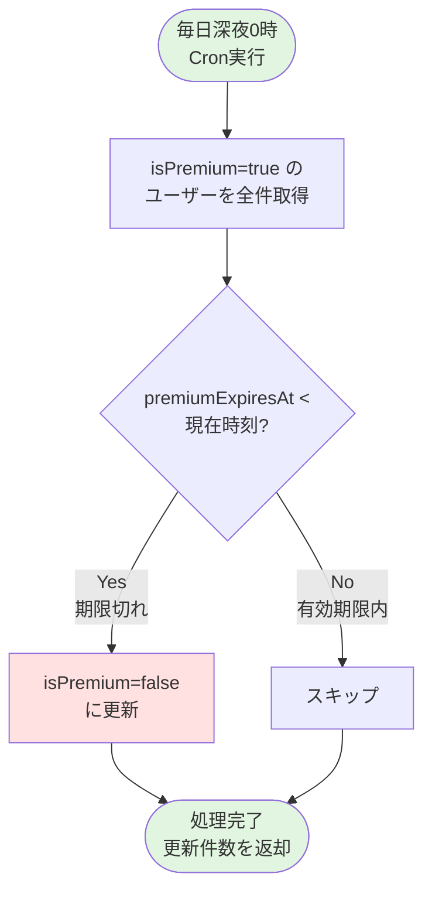
```mermaid
flowchart TD
    Start([毎日深夜0時<br/>Cron実行])
    Query[isPremium=true の<br/>ユーザーを全件取得]
    Check{premiumExpiresAt <<br/>現在時刻?}
    Update[isPremium=false<br/>に更新]
    Skip[スキップ]
    End([処理完了<br/>更新件数を返却])

    Start --> Query
    Query --> Check
    Check -->|Yes<br/>期限切れ| Update
    Check -->|No<br/>有効期限内| Skip
    Update --> End
    Skip --> End

    style Start fill:#e1f5e1
    style Update fill:#ffe1e1
    style End fill:#e1f5e1
```

### app/api/cron/check-premium/route.ts

```typescript
// app/api/cron/check-premium/route.ts
// プレミアム期限切れのチェック（Cronジョブ用）

import { NextResponse } from 'next/server'
import { prisma } from '@/lib/db'

export async function GET(req: Request) {
  // ====================================
  // 認証チェック
  // ====================================
  // このAPIはVercel Cronまたは管理者のみ呼び出せるようにする
  const authHeader = req.headers.get('authorization')
  if (authHeader !== `Bearer ${process.env.CRON_SECRET}`) {
    // Bearerトークンが一致しなければ拒否
    return NextResponse.json({ error: 'Unauthorized' }, { status: 401 })
  }

  try {
    // ====================================
    // 期限切れのプレミアム会員を一括更新
    // ====================================
    const result = await prisma.user.updateMany({
      where: {
        isPremium: true,         // プレミアム会員で
        premiumExpiresAt: {
          lt: new Date()          // 期限が現在時刻より前（= 期限切れ）
          // lt: less than（未満）
        }
      },
      data: {
        isPremium: false          // プレミアムを解除
      }
    })
    // updateMany: 条件に一致するすべてのレコードを一括更新
    // result.count: 更新されたレコード数

    return NextResponse.json({
      success: true,
      updated: result.count
      // 何件更新したかを返す（ログ用）
    })
  } catch (error) {
    console.error('Premium check error:', error)
    return NextResponse.json({ error: 'Failed' }, { status: 500 })
  }
}
```

### vercel.json（Cron設定）

```json
{
  "crons": [
    {
      "path": "/api/cron/check-premium",
      "schedule": "0 0 * * *"
    }
  ]
}
```

Cron式の読み方: `0 0 * * *`

| 位置 | 値 | 意味 |
|------|-----|------|
| 1番目 | `0` | 分（0分） |
| 2番目 | `0` | 時（0時） |
| 3番目 | `*` | 日（毎日） |
| 4番目 | `*` | 月（毎月） |
| 5番目 | `*` | 曜日（毎日） |

つまり: **毎日0時0分に実行**

> **注意！ Vercel CronはProプラン以上が必要**
>
> Vercelの無料プランではCronジョブは使えません。Proプラン（月額$20）以上が必要です。
> 代替手段として、GitHub Actionsのscheduledワークフローを使う方法もあります。

### 理解度チェック

1. Cronジョブは何のために使いますか？
2. `0 0 * * *`は何を意味しますか？
3. CronのAPIエンドポイントに認証が必要な理由は何ですか？

---

## 19.15 よくあるトラブル

### Q: 決済が完了したのにプレミアムにならない

1. **Webhookが正しく設定されているか確認**: `stripe listen`でイベントが届いているか
2. **Webhookシークレットが正しいか確認**: `.env.local`の`STRIPE_WEBHOOK_SECRET`
3. **DBのSubscriptionレコードが存在するか確認**: Prisma Studioで確認
4. **Webhookハンドラ内のエラーを確認**: サーバーログを確認

### Q: テスト決済の方法がわからない

テスト用カード番号`4242 4242 4242 4242`を使用します。有効期限は未来の日付、CVCは任意の3桁を入力してください。

### Q: 本番環境でWebhookが動かない

Stripeダッシュボード → 開発者 → Webhookで本番用のWebhookエンドポイントを追加してください。URLは`https://your-domain.com/api/webhooks/stripe`です。

---

## 19.16 演習問題

### 演習1（基礎）: 支払い履歴ページの作成

ユーザーが過去の支払い履歴を閲覧できるページを作成してください。

要件：
- `/settings/payments`ページを作成
- Paymentテーブルから履歴を取得
- 日付、金額、ステータスを表示
- ステータスに応じた色分け（成功=緑、失敗=赤）

### 演習2（応用）: ギフトコード機能

プレミアム会員をギフトできるコード機能を実装してください。

要件：
- `GiftCode`モデルを作成（code, duration, usedBy, usedAt）
- 管理者がコードを生成できる機能
- ユーザーがコードを入力してプレミアムに
- コードは1回のみ使用可能

### 演習3（チャレンジ）: プレミアム機能の投稿分析

プレミアム会員向けに、投稿の詳細な分析ページを作成してください。

要件：
- `/analytics`ページ（プレミアム会員のみアクセス可）
- 投稿の閲覧数、いいね数、コメント数の推移グラフ
- 人気の投稿トップ10
- フォロワーの増減グラフ

---

## まとめ

この章では、Stripeを使った決済システムを学びました。

### 学んだ概念

| 概念 | 説明 |
|------|------|
| PCI DSS | クレジットカード情報の安全な取り扱い基準 |
| Checkout Session | Stripeが提供する安全な決済画面 |
| Webhook | Stripeからの非同期イベント通知 |
| 署名検証 | Webhookが正規のStripeからのものか確認する仕組み |
| Subscription | 定期課金（月額・年額）の管理 |
| Cronジョブ | 定期的に自動実行される処理 |

### 実装したファイル

- `prisma/schema.prisma` -- Subscription, Paymentモデル
- `lib/stripe.ts` -- Stripeクライアント設定
- `lib/utils/premium.ts` -- プレミアム機能ユーティリティ
- `lib/actions/stripe-checkout.ts` -- Checkout Session作成
- `lib/actions/stripe-subscription.ts` -- サブスクリプション管理
- `app/api/webhooks/stripe/route.ts` -- Webhook処理
- `app/api/cron/check-premium/route.ts` -- Cronジョブ
- `app/settings/premium/page.tsx` -- プレミアムプランページ
- `components/payment/CheckoutButton.tsx` -- チェックアウトボタン
- `components/payment/SubscriptionStatus.tsx` -- サブスクリプション状態表示
- `components/user/PremiumBadge.tsx` -- プレミアムバッジ

次の章では、セキュリティ対策について詳しく学びます。

---

## 付録A: 技術選定の背景 -- なぜこの構成を選んだのか

> **この付録の目的**: チュートリアル本編では「Stripeを使って実装する」という前提で進めましたが、実際の開発では「なぜStripeなのか？」「他の選択肢はなかったのか？」という判断が最初に必要です。ここでは、BON-LOGの決済システムを設計する際に検討した選択肢と、最終的な判断の理由を初心者向けに詳しく解説します。

---

### A.1 決済プラットフォームの選択肢

決済機能を実装するとき、最初に決めるのが「どの決済プラットフォームを使うか」です。世の中には多くの選択肢があります。

| グローバル対応 | 日本特化 |
|---------------|---------|
| Stripe | GMOペイメント |
| PayPal | PAY.JP |
| Square | Sony Payment |
| Paddle | |
| LemonSqueezy | |

→ どれを選ぶ？

#### 各プラットフォームの比較

| 項目 | Stripe | PayPal | Square | Paddle | LemonSqueezy | GMOペイメント |
|------|--------|--------|--------|--------|-------------|-------------|
| **手数料** | 3.6% | 3.6%+40円 | 3.25% | 5%+50円 | 5%+50円 | 3.2%〜 |
| **API品質** | 非常に高い | 中程度 | 高い | 高い | 高い | 中程度 |
| **ドキュメント** | 業界最高水準 | やや複雑 | 良い | 良い | 良い | 日本語あり |
| **日本対応** | 対応済み | 対応済み | 対応済み | 限定的 | 限定的 | 完全対応 |
| **サブスク対応** | 標準機能 | 標準機能 | 標準機能 | 標準機能 | 標準機能 | オプション |
| **Webhook** | 充実 | あり | あり | 充実 | 充実 | あり |
| **テスト環境** | 充実 | あり | あり | あり | あり | あり |
| **Next.js SDK** | 公式あり | 非公式 | 非公式 | 非公式 | 非公式 | なし |
| **学習リソース** | 非常に豊富 | 豊富 | 中程度 | 少ない | 少ない | 日本語あり |

#### なぜStripeを選んだのか

BON-LOGでStripeを選んだ理由は以下の通りです。

**1. 開発者体験（DX）が圧倒的に優れている**

| 分野 | 特徴 |
|------|------|
| **ドキュメント** | インタラクティブなコード例、全APIにcurl例、多言語SDK対応、チュートリアル充実 |
| **テスト環境** | テスト用カード番号、テスト用Webhook、Stripe CLI、ダッシュボードでイベント確認可能 |
| **SDK品質** | TypeScript完全対応、型定義が正確、自動補完が効く、Node.js/Python/Ruby/Go/Java等 |
| **エラーメッセージ** | 原因が明確、修正方法を提示、ドキュメントへのリンクあり |

> **初心者へのアドバイス**: 決済システムはバグが即金銭的損失につながるため、「ドキュメントが分かりやすい」「テスト環境が充実している」ことは、手数料の差以上に重要です。

**2. API設計が一貫して美しい**

StripeのAPIは「RESTfulのお手本」と言われるほど一貫性があります。

```typescript
// Stripe API の一貫した設計パターン:
// どのリソースも同じパターンで操作できる

// 作成: stripe.[リソース].create(...)
const customer = await stripe.customers.create({ email: '...' })
const session  = await stripe.checkout.sessions.create({ ... })
const sub      = await stripe.subscriptions.create({ ... })

// 取得: stripe.[リソース].retrieve(id)
const customer = await stripe.customers.retrieve('cus_xxx')
const session  = await stripe.checkout.sessions.retrieve('cs_xxx')

// 一覧: stripe.[リソース].list({ ... })
const customers = await stripe.customers.list({ limit: 10 })

// 更新: stripe.[リソース].update(id, { ... })
const updated = await stripe.customers.update('cus_xxx', { name: '...' })

// 削除: stripe.[リソース].del(id)
await stripe.customers.del('cus_xxx')
```

**3. Webhookが充実している**

決済は「非同期処理」が多いため、Webhookの充実度は極めて重要です。

```
Stripe が送信する主なWebhookイベント:

  決済関連:
    checkout.session.completed     ← 決済完了
    payment_intent.succeeded       ← 支払い成功
    payment_intent.payment_failed  ← 支払い失敗
    charge.refunded                ← 返金完了

  サブスクリプション関連:
    customer.subscription.created  ← 新規登録
    customer.subscription.updated  ← プラン変更
    customer.subscription.deleted  ← 解約
    invoice.payment_succeeded      ← 請求書の支払い成功
    invoice.payment_failed         ← 請求書の支払い失敗

  顧客関連:
    customer.created               ← 顧客作成
    customer.updated               ← 顧客情報変更
```

**4. 日本市場への対応**

Stripeは2016年に日本法人を設立し、日本円での決済、日本の銀行口座への入金、日本語ダッシュボード、日本語サポートに対応しています。

#### 他の選択肢が適切な場合

Stripe以外が適切なケースも存在します。

| シナリオ | 推奨プラットフォーム | 理由 |
|---------|-------------------|------|
| 越境EC（デジタル商品） | Paddle, LemonSqueezy | 各国の消費税を自動処理（Merchant of Record） |
| 個人商店の対面決済 | Square | POSレジとの統合が強い |
| 日本国内のみ・コンビニ決済重視 | GMOペイメント | コンビニ決済・銀行振込の対応が豊富 |
| 既存PayPalユーザーが多い | PayPal | ユーザーの決済手段に合わせる |

> **Merchant of Recordとは**: PaddleやLemonSqueezyは「販売事業者（Merchant of Record）」として機能します。つまり、各国の消費税申告・納付をプラットフォーム側が代行してくれます。その分、手数料は高めです。

---

### A.2 サブスクリプション管理の選択肢

サブスクリプション（定期課金）を実装する方法にも、複数の選択肢があります。

| 選択肢 | 説明 |
|--------|------|
| **Stripe Billing** | Stripe組み込みの定期課金機能 |
| **自前実装** | 自分でDB管理、Cron + 決済API |
| **専用SaaS（Chargebee等）** | 外部サービス利用、Stripe等と連携 |

| 項目 | Stripe Billing | 自前実装 | Chargebee | Recurly |
|------|---------------|---------|-----------|---------|
| **初期コスト** | 無料（手数料のみ） | 開発コスト大 | 月額$249〜 | 月額$249〜 |
| **実装の簡単さ** | 簡単 | 非常に難しい | 中程度 | 中程度 |
| **柔軟性** | 高い | 最も高い | 非常に高い | 非常に高い |
| **請求書管理** | 標準機能 | 自前で実装 | 標準機能 | 標準機能 |
| **顧客ポータル** | 標準機能 | 自前で実装 | 標準機能 | 標準機能 |
| **トライアル管理** | 標準機能 | 自前で実装 | 標準機能 | 標準機能 |
| **適切な規模** | 小〜大 | 特殊要件時 | 中〜大 | 中〜大 |

#### なぜStripe Billingを選んだのか

**1. 追加コストなしで利用可能**

Stripe Billingは、Stripeの決済手数料（3.6%）だけで利用可能です。Chargebee等の専用SaaSは、Stripeの手数料に加えて月額固定費が発生します。

**2. 顧客ポータルが標準で付属**

Stripe顧客ポータルの機能（ユーザーが自分で管理できること）:

| 機能 |
|------|
| プランの変更（アップグレード/ダウングレード） |
| 支払い方法の変更 |
| 請求書の閲覧・ダウンロード |
| サブスクリプションの解約 |
| 住所・連絡先の変更 |

→ これらの画面を自前で実装する必要がない！

**3. 自前実装は想像以上に複雑**

自前でサブスクリプション管理を実装しようとすると、以下のようなケースを全て処理する必要があります。

```
自前実装で対処すべき課題:

  正常系:
    - 毎月の自動課金
    - プランの変更（日割り計算）
    - トライアル期間の管理
    - 解約処理

  異常系（これが本当に大変）:
    - カードの有効期限切れ
    - 残高不足による決済失敗
    - 再試行ロジック（何回、いつ再試行するか）
    - 決済失敗時のユーザー通知
    - グレースピリオド（猶予期間）
    - 二重課金の防止
    - タイムゾーンの考慮
    - 返金処理と日割り計算
```

> **初心者への重要なアドバイス**: 「自分で作った方が柔軟で安い」と思うかもしれませんが、決済の異常系処理は非常に複雑です。Stripe Billingはこれらを全て処理してくれるため、開発チームはアプリの本質的な機能開発に集中できます。

---

### A.3 課金モデルの選択肢

「ユーザーからどのようにお金を頂くか」という課金モデルの設計も重要な意思決定です。

| 課金モデル | 説明 | 例 |
|-----------|------|-----|
| **サブスクリプション** | 月額/年額の定額課金 | Netflix, Spotify |
| **従量課金** | 使った分だけ支払い | AWS, 電気料金 |
| **買い切り** | 1回の支払い | ゲーム購入, アプリ購入 |
| **フリーミアム** | 基本無料 + 有料オプション | Spotify, Discord |

#### 各モデルの比較

| 項目 | サブスクリプション | 従量課金 | 買い切り | フリーミアム |
|------|-----------------|---------|---------|------------|
| **収益の予測可能性** | 高い | 低い | 低い | 中程度 |
| **ユーザー心理的ハードル** | 中程度 | 低い | 高い | 非常に低い |
| **実装の複雑さ** | 中程度 | 高い | 低い | 中程度 |
| **LTV（顧客生涯価値）** | 高い | 変動的 | 低い | 変動的 |
| **解約リスク** | あり | N/A | N/A | あり |
| **適したサービス** | 継続利用型 | API/インフラ | コンテンツ | コミュニティ型 |

#### なぜフリーミアム + サブスクリプションを選んだのか

BON-LOGでは「**フリーミアム + サブスクリプション**」モデルを採用しました。

| 機能 | 無料プラン（全ユーザー） | プレミアムプラン（月額/年額） |
|------|----------------------|--------------------------|
| タイムライン閲覧 | ✅ | ✅ |
| 投稿（1日20件まで） | ✅ | ✅ |
| いいね・コメント | ✅ | ✅ |
| フォロー | ✅ | ✅ |
| 盆栽園マップ | ✅ | ✅ |
| 無料プランの全機能 | - | ✅ |
| 投稿数上限緩和 | - | ✅ |
| 広告非表示 | ❌（広告が表示される） | ✅ |
| プレミアムバッジ | - | ✅ |
| 高画質画像アップ | ❌（一部機能に制限） | ✅ |
| 限定ジャンル | - | ✅ |
| 優先サポート | - | ✅ |

**選定理由:**

1. **ユーザーの獲得が容易**: SNSは「ユーザー数」が価値の源泉です。無料で使えることでユーザーを集め、一部のヘビーユーザーが有料プランに移行する構造が理想的です。

2. **コミュニティの成長を阻害しない**: 買い切りやサブスクリプション必須にすると、気軽に参加できなくなります。盆栽愛好家のコミュニティを育てるには、まず参加のハードルを下げることが重要です。

3. **収益の予測可能性**: サブスクリプションは毎月安定した収益を生むため、サービスの継続的な改善に投資しやすくなります。

4. **広告収益との組み合わせ**: 無料ユーザーには広告を表示し、プレミアムユーザーは広告非表示にすることで、両方のユーザー層から収益を得られます。

---

### A.4 専門用語集

決済システムに関連する専門用語をまとめます。本編を読む前に一読しておくと理解がスムーズです。

| 用語 | 英語表記 | 説明 |
|------|---------|------|
| **Webhook** | Webhook | サーバー間で「イベントが発生したよ」と通知する仕組み。Stripeが「決済が完了した」「サブスクが解約された」等のイベントをBON-LOGのサーバーにHTTP POSTリクエストで知らせる。現実世界の「宅配便の配達完了通知」に似ている |
| **冪等性** | Idempotency | 同じ操作を何度実行しても結果が同じになる性質。例：「1000円を課金する」処理が通信エラーで2回送信されても、実際の課金は1回だけにする仕組み。Stripeでは `Idempotency-Key` ヘッダーで実現する |
| **Checkout Session** | Checkout Session | Stripeが提供する「安全な決済画面」を生成するための一時的なセッション。BON-LOG側でカード情報を扱わずに、Stripeの画面で安全に決済できる |
| **サブスクリプション** | Subscription | 定期的（月額・年額）に自動課金される契約形態。ユーザーが解約しない限り、毎月/毎年自動的に決済される |
| **プライスID** | Price ID | Stripeで作成した料金プランを識別するID（例：`price_xxx`）。「月額980円プラン」「年額9,800円プラン」等をそれぞれ区別するために使う |
| **顧客ポータル** | Customer Portal | Stripeが提供する「ユーザー自身がサブスクリプションを管理するためのWeb画面」。プラン変更、カード変更、解約等を開発者が実装しなくても済む |
| **PCI DSS** | PCI DSS | クレジットカード情報を扱う事業者が守るべきセキュリティ基準。Stripeを使えば、BON-LOG側ではカード情報に一切触れないため、この基準への準拠が大幅に簡略化される |
| **テストモード** | Test Mode | 実際のお金が動かない開発・テスト用の環境。テスト用カード番号（4242 4242 4242 4242）で決済をシミュレーションできる |
| **本番モード** | Live Mode | 実際のお金が動く環境。テストモードから本番モードへの切り替えは、APIキーを差し替えるだけで完了する |
| **署名検証** | Signature Verification | Webhookリクエストが本当にStripeから送信されたものかを検証する仕組み。悪意ある第三者がWebhookを偽装するのを防ぐ |
| **インボイス** | Invoice | Stripeが自動生成する請求書。サブスクリプションの課金ごとに作成され、ユーザーはPDFでダウンロードできる |
| **グレースピリオド** | Grace Period | 決済失敗後も一定期間サービスを継続する猶予期間。ユーザーが支払い方法を更新する時間を与える |
| **MRR** | Monthly Recurring Revenue | 月次経常収益。サブスクリプションビジネスの健全性を測る最も重要な指標の一つ |
| **チャーン** | Churn | 解約率。一定期間内にサブスクリプションを解約したユーザーの割合。チャーンを下げることがサブスクリプションビジネスの最重要課題 |

```
Webhook の仕組み（図解）:

  従来のポーリング方式（Webhookなし）:
    BON-LOG: 「決済完了した？」→ Stripe: 「まだ」
    BON-LOG: 「決済完了した？」→ Stripe: 「まだ」
    BON-LOG: 「決済完了した？」→ Stripe: 「まだ」
    BON-LOG: 「決済完了した？」→ Stripe: 「完了した！」
    → 無駄なリクエストが多い

  Webhook方式:
    ユーザーが決済完了
    Stripe: 「決済完了したよ！」→ BON-LOG: 「了解、DBを更新する」
    → 必要なときだけ通知が来る（効率的）
```

```
冪等性（Idempotency）の重要性:

  冪等性がない場合:
    1回目の課金リクエスト → 1000円課金 ✅
    通信エラーで再送 → さらに1000円課金 ❌（二重課金！）

  冪等性がある場合:
    1回目の課金リクエスト（Key: abc123）→ 1000円課金 ✅
    通信エラーで再送（Key: abc123）→ 「同じKeyなので無視」 ✅（安全！）
```

---

> **この付録のまとめ**: 技術選定は「正解」があるものではなく、プロジェクトの要件・チームのスキル・予算に応じて最適解が変わります。BON-LOGでは「初心者でも理解しやすい」「エコシステムが充実している」「コストが低い」という観点からStripe + Stripe Billing + フリーミアムモデルを選択しました。

---

## 19.17 lib/premium.ts 完全ソースコード解説

### このセクションで学ぶこと

- `lib/premium.ts`の全ソースコードの1行ずつの解説
- 各関数の内部動作とデータベースとの連携
- TypeScriptの型システムがどのようにコードの品質を保つか
- 実務で使われるパターン（遅延失効、バッチ処理、Proxyパターン）

### ファイル全体の構造

`lib/premium.ts`はBON-LOGの決済システムの「頭脳」とも言えるファイルです。このファイルが「このユーザーはプレミアム会員か？」「何文字まで投稿できるか？」といった判断を一手に引き受けます。

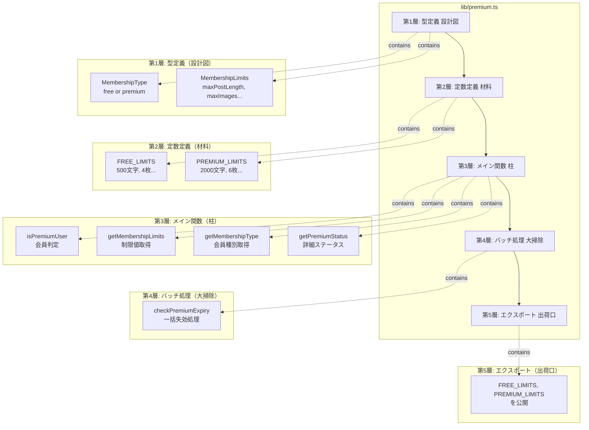
```mermaid
graph TD
    subgraph lib/premium.ts
        Layer1[第1層: 型定義 設計図]
        Layer2[第2層: 定数定義 材料]
        Layer3[第3層: メイン関数 柱]
        Layer4[第4層: バッチ処理 大掃除]
        Layer5[第5層: エクスポート 出荷口]

        Layer1 --> Layer2
        Layer2 --> Layer3
        Layer3 --> Layer4
        Layer4 --> Layer5
    end

    subgraph "第1層: 型定義（設計図）"
        Type1["MembershipType<br/>free or premium"]
        Type2["MembershipLimits<br/>maxPostLength, maxImages..."]
    end

    subgraph "第2層: 定数定義（材料）"
        Const1[FREE_LIMITS<br/>500文字, 4枚...]
        Const2[PREMIUM_LIMITS<br/>2000文字, 6枚...]
    end

    subgraph "第3層: メイン関数（柱）"
        Func1[isPremiumUser<br/>会員判定]
        Func2[getMembershipLimits<br/>制限値取得]
        Func3[getMembershipType<br/>会員種別取得]
        Func4[getPremiumStatus<br/>詳細ステータス]
    end

    subgraph "第4層: バッチ処理（大掃除）"
        Batch1[checkPremiumExpiry<br/>一括失効処理]
    end

    subgraph "第5層: エクスポート（出荷口）"
        Export1[FREE_LIMITS, PREMIUM_LIMITS<br/>を公開]
    end

    Layer1 -.contains.-> Type1
    Layer1 -.contains.-> Type2
    Layer2 -.contains.-> Const1
    Layer2 -.contains.-> Const2
    Layer3 -.contains.-> Func1
    Layer3 -.contains.-> Func2
    Layer3 -.contains.-> Func3
    Layer3 -.contains.-> Func4
    Layer4 -.contains.-> Batch1
    Layer5 -.contains.-> Export1
```

### 完全ソースコード（行番号付き）

以下が`lib/premium.ts`の完全なソースコードです。各行の意味を丁寧に解説します。

```typescript
/**                                                    // 行1: JSDocブロックコメントの開始
 * プレミアム会員管理ユーティリティ                       // 行2: このファイルの名称
 *                                                     // 行3: 空行（読みやすさのため）
 * このファイルは、有料会員（プレミアムメンバーシップ）の   // 行4: 概要説明の開始
 * 判定と会員種別に応じた機能制限の管理を提供します。      // 行5: 概要説明の続き
 *                                                     // 行6: 空行
 * ## プレミアム会員とは？                                // 行7: Markdownスタイルの見出し
 * このアプリケーションでは、無料会員とプレミアム会員の    // 行8: 説明
 * 2種類があります。                                    // 行9: 説明の続き
 * プレミアム会員は月額または年額の課金により、           // 行10: 説明
 * より多くの機能や緩い制限を利用できます。              // 行11: 説明の続き
 *                                                     // 行12: 空行
 * @module lib/premium                                 // 行23: モジュールタグ
 */                                                    // 行24: JSDocブロックコメントの終了
```

> **初心者向け解説: JSDocコメントとは**
>
> `/** */`で囲まれたコメントは**JSDoc**と呼ばれます。通常のコメント（`//`や`/* */`）と異なり、エディタが型情報やドキュメントとして認識します。VSCodeで関数にカーソルを合わせると、JSDocの内容がポップアップで表示されます。
>
> これは「本の目次」のようなものです。本の中身を読まなくても、目次を見れば何が書いてあるかがわかります。

### インポート部分の詳細

```typescript
// ============================================================
// インポート部分
// ============================================================

/**
 * prisma: データベースクライアント
 *
 * ユーザーのプレミアム状態を取得・更新するために使用
 */
import { prisma } from '@/lib/db'
```

この1行は非常にシンプルですが、重要な意味を持っています。

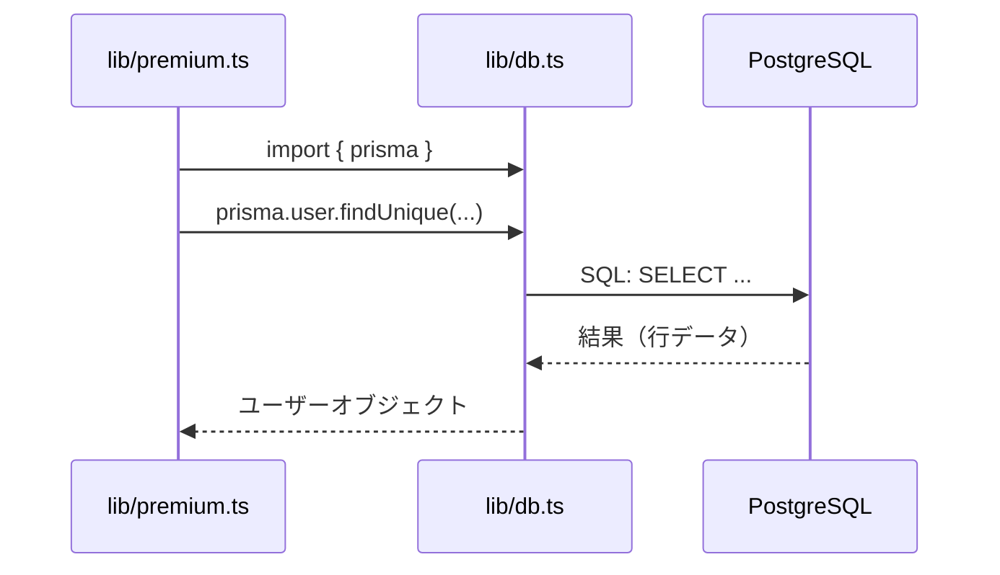
```mermaid
sequenceDiagram
    participant premium as lib/premium.ts
    participant db as lib/db.ts
    participant pg as PostgreSQL

    premium->>db: import { prisma }
    premium->>db: prisma.user.findUnique(...)
    db->>pg: SQL: SELECT ...
    pg-->>db: 結果（行データ）
    db-->>premium: ユーザーオブジェクト
```

ポイント:
- `@/lib/db` は「プロジェクトルート/lib/db.ts」を指す
- `@` は tsconfig.json で設定されたパスエイリアス
- prisma はシングルトンインスタンス（アプリ全体で1つだけ）

> **たとえ話: prismaは「翻訳者」**
>
> prismaは、TypeScriptの世界（「ユーザーを探して」）とデータベースの世界（`SELECT * FROM users WHERE id = '...'`）の間を翻訳してくれる通訳者です。私たちがSQLを書かなくても、TypeScriptのメソッドを呼ぶだけでデータベース操作ができます。

### 型定義の詳細解説

```typescript
// ============================================================
// 型定義
// ============================================================

/**
 * 会員種別の型
 *
 * ## リテラル型とは？
 * 特定の文字列だけを許可する型
 * 'free' か 'premium' 以外の値はコンパイルエラーになる
 */
export type MembershipType = 'free' | 'premium'
```

この型定義がなぜ重要なのか、具体例で見てみましょう。

```typescript
// ❌ string 型の場合（型安全ではない）
function checkMembership(type: string) {
  if (type === 'preimum') {  // タイプミス！でもエラーにならない
    // 永遠にここに入らない...バグ！
  }
}

// ✅ MembershipType の場合（型安全）
function checkMembership(type: MembershipType) {
  if (type === 'preimum') {  // コンパイルエラー！
    // TS2367: タイプ '"preimum"' はタイプ 'MembershipType' に
    // 割り当てられません。
    // → タイプミスを開発時に検出できる
  }
}
```

| 型 | 許容される値 | 安全性 |
|----|------------|--------|
| **string型** | "free", "premium", "gold", "preimum", "abc", "", "何でも"... | 無限の可能性...バグの温床 |
| **MembershipType** | "free", "premium" のみ | たった2つ。安全！ |

次に、`MembershipLimits`インターフェースを見てみましょう。

```typescript
/**
 * 会員種別に応じた制限値の型
 */
export interface MembershipLimits {
  maxPostLength: number      // 投稿の最大文字数
  maxImages: number          // 最大画像枚数
  maxVideos: number          // 最大動画数
  maxDailyPosts: number      // 1日の最大投稿数
  canSchedulePost: boolean   // 予約投稿の可否
  canViewAnalytics: boolean  // 分析機能の可否
}
```

> **ここがポイント！ `interface` vs `type` の使い分け**
>
> TypeScriptでは、オブジェクトの形を定義するのに`interface`と`type`の2つの方法があります。
>
> ```typescript
> // interface: オブジェクトの「契約」を定義（拡張可能）
> interface MembershipLimits {
>   maxPostLength: number
> }
>
> // type: 任意の型に名前をつける（合併型・交差型が得意）
> type MembershipType = 'free' | 'premium'
> ```
>
> 一般的に、オブジェクトの形を定義する場合は`interface`、合併型（`|`）やリテラル型には`type`を使います。BON-LOGでもこの慣習に従っています。

### 定数定義の詳細

```typescript
// ============================================================
// 定数定義
// ============================================================

const FREE_LIMITS: MembershipLimits = {
  maxPostLength: 500,        // 500文字まで（Twitterと同程度）
  maxImages: 4,              // 画像4枚まで（一般的なSNSの標準）
  maxVideos: 1,              // 動画1本まで（ストレージコスト考慮）
  maxDailyPosts: 20,         // 1日20投稿まで（スパム対策）
  canSchedulePost: false,    // 予約投稿は不可（プレミアム限定）
  canViewAnalytics: false,   // 分析機能は不可（プレミアム限定）
}

const PREMIUM_LIMITS: MembershipLimits = {
  maxPostLength: 2000,       // 2000文字まで（長文投稿が可能）
  maxImages: 6,              // 画像6枚まで（より多くの写真を共有）
  maxVideos: 3,              // 動画3本まで（動画投稿の自由度向上）
  maxDailyPosts: 50,         // 1日50投稿まで（無料会員の2.5倍）
  canSchedulePost: true,     // 予約投稿機能を解放
  canViewAnalytics: true,    // 投稿の分析機能を解放
}
```

```
const（定数）キーワードの意味:

  const FREE_LIMITS = { ... }
         |
         +-- 再代入禁止（= で別の値を入れられない）

  ❌ FREE_LIMITS = { maxPostLength: 1000 }  // エラー！
  ✅ FREE_LIMITS.maxPostLength              // 読み取りはOK

  注意: constは「中身の変更」は防げない
  ❌ FREE_LIMITS = newObject     // 再代入はエラー
  ⚠️  FREE_LIMITS.maxPostLength = 1000  // これはエラーにならない！
  → 本当に変更を防ぎたいなら as const を使う

  const FREE_LIMITS = { ... } as const
  → 全プロパティが readonly になる
```

> **設計上のアドバイス: なぜ制限値をハードコードするのか**
>
> 「制限値をデータベースに保存すれば、管理画面から変更できるのでは？」という疑問があるかもしれません。しかし、以下の理由でコード内の定数として定義しています。
>
> 1. **パフォーマンス**: 毎回DBにアクセスする必要がない
> 2. **型安全性**: TypeScriptの型チェックが効く
> 3. **テスト容易性**: テスト時にモックが不要
> 4. **変更頻度が低い**: 制限値はビジネス判断で決まり、頻繁には変わらない

### isPremiumUser() の完全解説

```typescript
export async function isPremiumUser(userId: string): Promise<boolean> {
  // ─── 行1: 関数シグネチャ ───
  // export: 他のファイルから使えるようにする
  // async: この関数は非同期処理（DB問い合わせ）を含む
  // function: 関数定義
  // isPremiumUser: 関数名（「プレミアムユーザーか？」）
  // userId: string: 引数（ユーザーID）の型は文字列
  // Promise<boolean>: 戻り値は「trueまたはfalseの約束」

  const user = await prisma.user.findUnique({
    // ─── 行2-3: DBからユーザー情報を取得 ───
    // await: 非同期処理の完了を待つ
    // prisma.user: usersテーブルへのアクセス
    // findUnique: 主キーまたはユニークフィールドで1件取得
    where: { id: userId },
    // where: 検索条件（「idがuserIdと一致するレコード」）
    select: { isPremium: true, premiumExpiresAt: true },
    // select: 取得するフィールドを限定
    // → 全フィールドを取得するより高速
    // → SQLに変換すると:
    //   SELECT is_premium, premium_expires_at
    //   FROM users WHERE id = $1
  })

  if (!user || !user.isPremium) return false
  // ─── 行4: 早期リターン（ガード句） ───
  // !user: ユーザーが見つからなかった場合（null）
  // !user.isPremium: isPremiumがfalseまたはnull
  // → いずれの場合もfalseを返して処理終了
  //
  // これは「ガード句」（Guard Clause）パターンと呼ばれる
  // 条件を満たさない場合に早期にリターンすることで、
  // ネストが深くならず、コードが読みやすくなる

  if (user.premiumExpiresAt && user.premiumExpiresAt < new Date()) {
    // ─── 行5: 期限切れチェック ───
    // user.premiumExpiresAt: 期限日時（DateまたはNull）
    // &&: 左辺がtruthyの場合のみ右辺を評価（短絡評価）
    // new Date(): 現在日時を生成
    // < : Dateオブジェクト同士の比較（タイムスタンプで比較）
    //
    // 例: premiumExpiresAt = 2024-01-15T00:00:00Z
    //     現在日時           = 2024-02-01T12:00:00Z
    //     → 2024-01-15 < 2024-02-01 → true（期限切れ）

    await prisma.user.update({
      // ─── 行6-8: 期限切れフラグの自動更新 ───
      where: { id: userId },
      data: { isPremium: false },
      // isPremiumをfalseに更新
      // → 次回このユーザーをチェックする時は
      //   行4のガード句で即座にfalseが返る
      //   （DB更新不要 = 高速化）
    })
    return false
    // 期限切れなのでfalseを返す
  }

  return true
  // ─── 行9: プレミアム有効 ───
  // すべてのチェックをパスした = プレミアム会員
}
```

```
isPremiumUser() を「会員証の確認」に例えると:

  スポーツジムの受付で会員証を見せるイメージ:

  1. 受付:「会員証を見せてください」
     → prisma.user.findUnique({ where: { id: userId } })

  2. 受付:「会員証が見つかりません」→ 入場拒否
     → if (!user) return false

  3. 受付:「無料会員ですね」→ VIPラウンジには入れません
     → if (!user.isPremium) return false

  4. 受付:「有効期限が...2024年1月15日...切れてますね」
     → if (user.premiumExpiresAt < new Date())
     受付:「会員証に『期限切れ』スタンプを押しておきますね」
     → await prisma.user.update({ data: { isPremium: false } })
     → return false

  5. 受付:「有効な会員証です。どうぞお入りください」
     → return true
```

### getMembershipLimits() の動作詳細

```typescript
export async function getMembershipLimits(
  userId: string
): Promise<MembershipLimits> {
  const isPremium = await isPremiumUser(userId)
  // isPremiumUser()を呼び出して会員判定
  // → true（プレミアム）または false（無料）

  return isPremium ? PREMIUM_LIMITS : FREE_LIMITS
  // 三項演算子（条件 ? 真の値 : 偽の値）
  // isPremiumがtrue → PREMIUM_LIMITS を返す
  // isPremiumがfalse → FREE_LIMITS を返す
}
```

```mermaid
flowchart TD
    A["getMembershipLimits('user_123')"] --> B["isPremiumUser('user_123') を呼び出し"]
    B --> C{"結果は？"}
    C -->|true（プレミアム会員）| D["PREMIUM_LIMITS を返す"]
    C -->|false（無料会員）| E["FREE_LIMITS を返す"]
```

| 制限値 | プレミアム会員（PREMIUM_LIMITS） | 無料会員（FREE_LIMITS） |
|--------|-------------------------------|----------------------|
| maxPostLength | 2000（2000文字まで投稿OK） | 500（500文字まで） |
| maxImages | 6（画像6枚まで添付OK） | 4（画像4枚まで） |
| maxVideos | 3（動画3本まで添付OK） | 1（動画1本まで） |
| maxDailyPosts | 50（1日50投稿までOK） | 20（1日20投稿まで） |
| canSchedulePost | true（予約投稿できます） | false（予約投稿は不可） |
| canViewAnalytics | true（分析機能使えます） | false（分析機能は不可） |

### checkPremiumExpiry() の完全解説

```typescript
export async function checkPremiumExpiry(): Promise<number> {
  // 引数なし: 全ユーザーを対象にする（バッチ処理）
  // 戻り値: number = 更新されたユーザー数

  const result = await prisma.user.updateMany({
    // updateMany: 条件に合う複数レコードを一括更新
    // findUniqueやupdateと異なり、条件に合う「すべてのレコード」を更新

    where: {
      isPremium: true,
      // 条件1: 現在プレミアム会員である
      premiumExpiresAt: {
        lt: new Date(),
        // 条件2: 期限が現在時刻より前（過去）
        // lt = "less than"（より小さい）
        // Prismaのフィルタ演算子:
        //   lt  = less than（より小さい）
        //   lte = less than or equal（以下）
        //   gt  = greater than（より大きい）
        //   gte = greater than or equal（以上）
      },
    },
    data: {
      isPremium: false,
      // マッチしたレコードのisPremiumをfalseに更新
    },
  })

  return result.count
  // result.count: 更新されたレコード数
  // updateManyの戻り値は { count: number } 形式
  // 例: 5件のユーザーが期限切れだった → 5 を返す
}
```

> **コラム: updateMany と update の違い**
>
> | メソッド | 対象 | 戻り値 | 使用場面 |
> |---------|------|--------|---------|
> | `update` | 1レコード | 更新後のオブジェクト | 特定ユーザーの更新 |
> | `updateMany` | 複数レコード | `{ count: number }` | バッチ処理 |
>
> `updateMany`は個々のレコードの内容を返さないため、`update`より高速です。大量のレコードを一括処理する場合に適しています。

### エクスポートの意味

```typescript
// 定数をエクスポート
export { FREE_LIMITS, PREMIUM_LIMITS }
```

```
エクスポートの方法と違い:

  方法1: 宣言時にexport
  export const FREE_LIMITS = { ... }
  → 定義と同時にエクスポート

  方法2: 別途export文
  const FREE_LIMITS = { ... }      // まず定義
  export { FREE_LIMITS }           // 後からエクスポート
  → BON-LOGではこちらを採用（ファイル末尾でまとめてエクスポート）

  方法3: デフォルトエクスポート
  export default FREE_LIMITS
  → 1ファイル1エクスポートの場合に使う
  → import名を自由に変えられる

  BON-LOGでは方法2を採用:
  理由1: ファイル末尾を見れば何がエクスポートされているかが一目瞭然
  理由2: 名前付きエクスポートなのでimport時に自動補完が効く
```

### 理解度チェック

1. `isPremiumUser()`が期限切れを検出した時にDBを更新する理由を、パフォーマンスの観点から説明してください。
2. `MembershipLimits`インターフェースに`maxBookmarks: number`を追加した場合、`FREE_LIMITS`と`PREMIUM_LIMITS`にはどのような影響がありますか？
3. `checkPremiumExpiry()`の`prisma.user.updateMany`で`premiumExpiresAt`が`null`のユーザーは更新対象になりますか？理由も説明してください。
4. `export { FREE_LIMITS, PREMIUM_LIMITS }`を記述しなかった場合、他のファイルからどのようにアクセスできますか？

---

## 19.18 Webhook署名検証の暗号学的仕組みと実装詳細

### このセクションで学ぶこと

- HMAC-SHA256署名の仕組み
- `stripe.webhooks.constructEvent()`の内部動作
- Webhookリプレイ攻撃への対策
- イベント処理の冪等性（べきとうせい）の実装

### なぜ署名検証が最重要セキュリティ対策なのか

Webhookエンドポイント（`/api/webhooks/stripe`）は、インターネット上に公開されたURLです。つまり、Stripeだけでなく**誰でもリクエストを送信できます**。

```mermaid
sequenceDiagram
    participant 攻撃者
    participant BON-LOG

    攻撃者->>BON-LOG: POST /api/webhooks/stripe<br/>{type: "checkout.session.completed",<br/>data: {metadata: {userId: "attacker_id"},<br/>subscription: "fake_sub"}}
    Note right of BON-LOG: DB更新:<br/>isPremium = true<br/>（お金を払わずに<br/>プレミアム会員に！）
    BON-LOG-->>攻撃者: 200 OK
```

> 署名検証なし = 誰でも「決済が完了した」と偽装できる = 無料でプレミアム会員になれてしまう！

### HMAC-SHA256の仕組み

署名検証は**HMAC-SHA256**という暗号アルゴリズムを使用しています。

HMAC = Hash-based Message Authentication Code（ハッシュベースのメッセージ認証コード）

```mermaid
flowchart LR
    A["入力1: シークレットキー<br/>(STRIPE_WEBHOOK_SECRET = whsec_xxx)"] --> C["HMAC-SHA256"]
    B["入力2: メッセージ<br/>(タイムスタンプ + '.' + リクエストボディ)"] --> C
    C --> D["署名（ハッシュ値）"]
```

署名の特徴:

| 特徴 | 説明 |
|------|------|
| 固定長 | 64文字のhex文字列 |
| 決定的 | 同じ入力からは必ず同じ出力 |
| 雪崩効果 | 入力が1ビットでも変わると全く別の出力 |
| 一方向性 | 出力から入力を逆算することは不可能 |

例:
- シークレット = `"whsec_test123"`
- メッセージ = `"1234567890.{\"type\":\"checkout.session.completed\"}"`
- → HMAC-SHA256(シークレット, メッセージ) → `"a1b2c3d4e5f6..."`（これが署名）

> **たとえ話: 署名検証は「封蝋（ふうろう）」**
>
> 中世ヨーロッパの手紙には、送信者が封蝋（ろうを垂らして印を押す）を施しました。受取人は封蝋の印を見て「この手紙は本物だ」と確認しました。
>
> Webhookの署名検証も同じです。Stripeが「秘密の鍵」で署名を作り、BON-LOGが同じ「秘密の鍵」で署名を再計算して一致を確認します。鍵を知らない第三者は、正しい署名を作れません。

### app/api/webhooks/stripe/route.ts の完全ソースコード解説

```typescript
// ファイル: app/api/webhooks/stripe/route.ts
// 目的: StripeからのWebhookイベントを受信し、処理する

import { NextRequest, NextResponse } from 'next/server'
// NextRequest: Next.jsのリクエストオブジェクト
//   - .text(): ボディを文字列として取得
//   - .headers: ヘッダーへのアクセス
// NextResponse: Next.jsのレスポンスオブジェクト
//   - .json(): JSONレスポンスを生成

import { stripe } from '@/lib/stripe'
// Stripeクライアント（Proxy経由の遅延初期化）
// → webhooks.constructEvent() メソッドを使用

import { prisma } from '@/lib/db'
// Prismaクライアント（データベース操作）

import Stripe from 'stripe'
// Stripe の型定義
// → Stripe.Event, Stripe.Checkout.Session 等の型を使用
```

#### POST関数の詳細

```typescript
// Stripe APIレスポンスの型定義
type InvoiceData = {
  subscription: string | null
  // サブスクリプションID（sub_xxx）またはnull
  payment_intent: string | null
  // 支払いインテントID（pi_xxx）またはnull
  amount_paid: number
  // 実際に支払われた金額（日本円の場合は円単位）
  currency: string
  // 通貨コード（'jpy', 'usd'など）
  billing_reason: string | null
  // 請求理由（'subscription_create', 'subscription_cycle'など）
}

export async function POST(request: NextRequest) {
  // ────────────────────────────────────
  // ステップ1: リクエストボディの取得
  // ────────────────────────────────────
  const body = await request.text()
  // request.text(): ボディを「生のテキスト」として読み取る
  //
  // なぜ request.json() を使わないのか？
  // → request.json() はボディをパースして JavaScript オブジェクトに変換する
  // → パースの過程で、プロパティの順序や空白が変わる可能性がある
  // → 署名検証は「送信された生のバイト列」と完全に一致する必要がある
  // → だから request.text() で生のテキストを取得する

  // ────────────────────────────────────
  // ステップ2: 署名ヘッダーの取得
  // ────────────────────────────────────
  const signature = request.headers.get('stripe-signature')
  // Stripeが付与したHTTPヘッダー
  // 形式: "t=1234567890,v1=a1b2c3d4..."
  //   t  = タイムスタンプ（リプレイ攻撃対策）
  //   v1 = HMAC-SHA256署名

  if (!signature) {
    return NextResponse.json(
      { error: 'Missing signature' },
      { status: 400 }
    )
    // 署名ヘッダーがない = Stripeからのリクエストではない
    // 400 Bad Request を返す
  }

  // ────────────────────────────────────
  // ステップ3: 署名の検証
  // ────────────────────────────────────
  let event: Stripe.Event
  // Stripe.Event: Stripeが送信するイベントの型
  // { type: string, data: { object: any } } の構造

  try {
    event = stripe.webhooks.constructEvent(
      body,                              // 生のリクエストボディ
      signature,                          // stripe-signatureヘッダー
      process.env.STRIPE_WEBHOOK_SECRET!  // Webhookシークレット
      // ! : TypeScriptの非nullアサーション
      //     「undefinedではない」と開発者が保証
    )
    // constructEvent() の内部動作:
    // 1. signatureヘッダーからタイムスタンプ(t)と署名(v1)を分離
    // 2. タイムスタンプ + "." + body でメッセージを構築
    // 3. WEBHOOK_SECRET を鍵として HMAC-SHA256 を計算
    // 4. 計算結果と v1 を比較
    // 5. 一致すれば Stripe.Event を返す
    // 6. 不一致なら例外をスロー
  } catch (err) {
    console.error('Webhook signature verification failed:', err)
    return NextResponse.json(
      { error: 'Invalid signature' },
      { status: 400 }
    )
    // 署名不正 → 400 Bad Request
    // 攻撃者からの偽リクエストを拒否
  }
```

> **重要: タイムスタンプによるリプレイ攻撃の防止**
>
> `stripe-signature`ヘッダーにはタイムスタンプ（`t=1234567890`）が含まれています。`constructEvent()`はデフォルトで**300秒（5分）以内**のリクエストのみ受け付けます。
>
> これにより、攻撃者が過去の正当なWebhookリクエストを盗聴して再送信する「リプレイ攻撃」を防ぎます。
>
> ```
> リプレイ攻撃の仕組みと対策:
>
>   1. 正規のWebhook送信:
>      Stripe → BON-LOG (10:00:00 に送信、t=1000000)
>                ✅ 正常に処理
>
>   2. 攻撃者が盗聴:
>      攻撃者は上記のリクエストを記録
>
>   3. 攻撃者がリプレイ:
>      攻撃者 → BON-LOG (10:10:00 に再送、t=1000000)
>                ❌ タイムスタンプが10分前
>                   → constructEvent()が拒否！
> ```

#### イベント処理の分岐

```typescript
  try {
    switch (event.type) {
      // switch文: event.typeの値によって処理を分岐
      // Stripeは数十種類のイベントを送信するが、
      // BON-LOGでは以下の5種類を処理する

      // ━━━━━━━━━━━━━━━━━━━━━━━━━━━━
      // イベント1: チェックアウト完了
      // ━━━━━━━━━━━━━━━━━━━━━━━━━━━━
      case 'checkout.session.completed': {
        // いつ発生？: ユーザーがStripe Checkout画面で決済を完了した時
        // 何をする？: ユーザーをプレミアム会員に昇格させる

        const session = event.data.object as Stripe.Checkout.Session
        // event.data.object: イベントに紐づくStripeオブジェクト
        // as Stripe.Checkout.Session: 型キャスト
        //   → TypeScriptに「このオブジェクトはCheckout.Sessionだよ」と教える

        const userId = session.metadata?.userId
        // metadata: Checkout Session作成時に設定した独自データ
        // → createCheckoutSession()で { userId: session.user.id } を設定済み
        // ?. : オプショナルチェイニング（metadataがnullでもエラーにならない）

        const subscriptionId = session.subscription as string
        // subscription: 作成されたサブスクリプションのID（sub_xxx）

        const customerId = session.customer as string
        // customer: Stripe顧客ID（cus_xxx）

        if (userId && subscriptionId) {
          // ユーザーIDとサブスクリプションIDの両方が存在する場合のみ処理

          const subscriptionResponse = await stripe.subscriptions.retrieve(
            subscriptionId
          )
          // サブスクリプションの詳細をStripe APIから取得
          // → current_period_end（課金期間の終了日）を知るため

          const subData = subscriptionResponse as any
          // as any: Stripe SDKの型の制約を回避
          // → current_period_endの型がバージョンによって異なるため

          const currentPeriodEnd = subData.current_period_end as
            number | undefined
          // current_period_end: UNIXタイムスタンプ（秒単位）
          // 例: 1706745600 = 2024年2月1日 00:00:00 UTC

          const premiumExpiresAt = currentPeriodEnd
            ? new Date(currentPeriodEnd * 1000)
            // UNIXタイムスタンプ（秒） → Dateオブジェクト
            // * 1000: 秒 → ミリ秒に変換（JavaScriptのDateはミリ秒）
            : new Date(Date.now() + 30 * 24 * 60 * 60 * 1000)
            // 取得できない場合は30日後をデフォルト
            // 30日 = 30 * 24時間 * 60分 * 60秒 * 1000ミリ秒

          await prisma.user.update({
            where: { id: userId },
            data: {
              isPremium: true,
              // プレミアム会員に昇格
              stripeCustomerId: customerId,
              // Stripe顧客IDを保存（ポータル連携用）
              stripeSubscriptionId: subscriptionId,
              // サブスクリプションIDを保存（解約処理用）
              premiumExpiresAt,
              // プレミアム有効期限を保存
            },
          })
        }
        break
      }
```

```mermaid
sequenceDiagram
    participant ユーザー
    participant Stripe
    participant BON-LOG

    ユーザー->>Stripe: 決済完了
    Stripe->>BON-LOG: Webhook送信<br/>type: checkout.session.completed
    Note right of BON-LOG: 1. metadata.userId取得<br/>2. サブスクリプション詳細取得<br/>3. 有効期限を計算<br/>4. DBを更新<br/>- isPremium = true<br/>- stripeCustomerId設定<br/>- stripeSubscriptionId設定<br/>- premiumExpiresAt設定
    BON-LOG-->>Stripe: 200 OK
```

#### サブスクリプション更新イベント

```typescript
      // ━━━━━━━━━━━━━━━━━━━━━━━━━━━━
      // イベント2: サブスクリプション更新
      // ━━━━━━━━━━━━━━━━━━━━━━━━━━━━
      case 'customer.subscription.updated': {
        // いつ発生？:
        //   - プランの変更（月額→年額）
        //   - 自動更新による期限延長
        //   - cancel_at_period_end の設定変更
        // 何をする？: DBの有効期限を更新

        const subscriptionData = event.data.object as any
        const subscriptionId = subscriptionData.id as string
        const subscriptionStatus = subscriptionData.status as string
        // status: 'active', 'canceled', 'past_due', 'unpaid' 等

        const currentPeriodEnd =
          subscriptionData.current_period_end as number | undefined

        const user = await prisma.user.findFirst({
          where: { stripeSubscriptionId: subscriptionId },
          // findFirst: 条件に合う最初のレコードを取得
          // findUniqueと異なり、ユニーク制約がないフィールドでも使える
        })

        if (user) {
          const premiumExpiresAt = currentPeriodEnd
            ? new Date(currentPeriodEnd * 1000)
            : new Date(Date.now() + 30 * 24 * 60 * 60 * 1000)

          await prisma.user.update({
            where: { id: user.id },
            data: {
              isPremium: subscriptionStatus === 'active',
              // 'active' → true: プレミアム有効
              // それ以外 → false: プレミアム無効
              premiumExpiresAt,
            },
          })
        }
        break
      }
```

#### サブスクリプション削除と支払いイベント

```typescript
      // ━━━━━━━━━━━━━━━━━━━━━━━━━━━━
      // イベント3: サブスクリプション削除
      // ━━━━━━━━━━━━━━━━━━━━━━━━━━━━
      case 'customer.subscription.deleted': {
        // いつ発生？: サブスクリプションが完全に削除された時
        //   - 即時解約（cancel()呼び出し）
        //   - 期間終了後の自動削除
        //   - 支払い失敗が続いた場合の自動解約
        // 何をする？: プレミアム状態を解除

        const subscription = event.data.object as Stripe.Subscription
        const user = await prisma.user.findFirst({
          where: { stripeSubscriptionId: subscription.id },
        })

        if (user) {
          await prisma.user.update({
            where: { id: user.id },
            data: {
              isPremium: false,
              // プレミアム状態を解除
              stripeSubscriptionId: null,
              // サブスクリプションIDをクリア
              premiumExpiresAt: null,
              // 有効期限をクリア
            },
          })
        }
        break
      }

      // ━━━━━━━━━━━━━━━━━━━━━━━━━━━━
      // イベント4: 支払い失敗
      // ━━━━━━━━━━━━━━━━━━━━━━━━━━━━
      case 'invoice.payment_failed': {
        // いつ発生？: 毎月の自動課金が失敗した時
        //   - カードの有効期限切れ
        //   - 残高不足
        //   - カードの利用停止
        // 何をする？: ユーザーに通知を送信

        const invoice = event.data.object as unknown as InvoiceData
        const subscriptionId = invoice.subscription

        if (subscriptionId) {
          const user = await prisma.user.findFirst({
            where: { stripeSubscriptionId: subscriptionId },
          })

          if (user) {
            // システム通知を作成
            await prisma.notification.create({
              data: {
                userId: user.id,
                actorId: user.id,
                // actorId: 通知の「送信者」
                // ここではシステム通知なので自分自身を設定
                type: 'system',
                // 'system' タイプの通知
                // → 「お支払いに失敗しました」メッセージを表示
              },
            })
          }
        }
        break
      }

      // ━━━━━━━━━━━━━━━━━━━━━━━━━━━━
      // イベント5: 継続課金の支払い成功
      // ━━━━━━━━━━━━━━━━━━━━━━━━━━━━
      case 'invoice.payment_succeeded': {
        // いつ発生？: 請求書の支払いが成功した時
        //   - 初回決済（checkout.session.completedと重複）
        //   - 毎月/毎年の自動更新決済
        // 何をする？: 支払い履歴を記録し、期限を延長

        const invoice = event.data.object as unknown as InvoiceData
        const subscriptionId = invoice.subscription

        // 継続課金の場合のみ処理（初回はcheckout.session.completedで処理済み）
        if (subscriptionId &&
            invoice.billing_reason === 'subscription_cycle') {
          // billing_reason の値:
          //   'subscription_create' = 初回決済
          //   'subscription_cycle'  = 継続課金 ← これだけ処理
          //   'subscription_update' = プラン変更
          //   'manual'              = 手動請求

          const user = await prisma.user.findFirst({
            where: { stripeSubscriptionId: subscriptionId },
          })

          if (user && invoice.payment_intent) {
            // 支払い履歴をDBに記録
            await prisma.payment.create({
              data: {
                userId: user.id,
                stripePaymentId: invoice.payment_intent,
                amount: invoice.amount_paid,
                currency: invoice.currency,
                status: 'succeeded',
                description: 'プレミアム会員更新',
              },
            })

            // サブスクリプションの期限を延長
            const subscriptionResponse =
              await stripe.subscriptions.retrieve(subscriptionId)
            const subData = subscriptionResponse as any
            const currentPeriodEnd =
              subData.current_period_end as number | undefined
            const premiumExpiresAt = currentPeriodEnd
              ? new Date(currentPeriodEnd * 1000)
              : new Date(Date.now() + 30 * 24 * 60 * 60 * 1000)

            await prisma.user.update({
              where: { id: user.id },
              data: { premiumExpiresAt },
            })
          }
        }
        break
      }

      default:
        // 処理しないイベントタイプはログだけ出力
        console.log(`Unhandled event type: ${event.type}`)
    }

    // Stripeに「正常に受信した」と伝える
    return NextResponse.json({ received: true })
    // Stripeは200レスポンスを受け取ると、
    // そのイベントの再送を停止する
    // 200以外（または30秒以内にレスポンスなし）の場合、
    // Stripeは最大72時間リトライする

  } catch (error) {
    console.error('Webhook processing error:', error)
    return NextResponse.json(
      { error: 'Webhook processing failed' },
      { status: 500 }
    )
    // 500 Internal Server Error
    // Stripeはこのレスポンスを受けるとリトライする
  }
}
```

```
Stripeのリトライスケジュール:

  Webhookが失敗した場合（200以外のレスポンス）:

  1回目: 即座にリトライ
  2回目: 約1時間後
  3回目: 約4時間後
  4回目: 約12時間後
  5回目: 約24時間後
  ...
  最大72時間リトライ（指数バックオフ）

  → だから一時的なエラーでも大丈夫
  → でも、処理ロジックのバグは早期に発見する必要がある
  → Stripeダッシュボードの「Webhookイベント」で失敗を確認可能
```

### 理解度チェック

1. `request.text()`と`request.json()`の違いは何ですか？なぜWebhookでは`text()`を使うのですか？
2. `stripe-signature`ヘッダーに含まれるタイムスタンプ（`t=`）の役割を説明してください。
3. `invoice.billing_reason === 'subscription_cycle'`でフィルタする理由は何ですか？
4. Stripeが200以外のレスポンスを受け取った場合、どのような動作をしますか？

---

## 19.19 サブスクリプション管理コンポーネント群の詳細

### このセクションで学ぶこと

- `components/subscription/`ディレクトリの全コンポーネントの詳細
- SubscriptionStatus: サブスクリプション状態表示
- PaymentHistory: 支払い履歴の一覧表示
- PremiumBadge: プレミアム会員を視覚的に示すバッジ
- PremiumUpgradeCard: アップグレード促進カード
- app/(main)/settings/subscription/page.tsx: プラン管理ページ全体

### コンポーネント群の全体像

```
components/subscription/ ディレクトリの構成:

  components/subscription/
  ├── PricingCard.tsx           料金プラン選択カード
  │   └── Stripeチェックアウトへ誘導
  │
  ├── SubscriptionStatus.tsx    現在のプラン状態表示
  │   └── Stripeカスタマーポータルへ誘導
  │
  ├── PaymentHistory.tsx        支払い履歴の一覧
  │   └── 金額・日付・ステータスを表示
  │
  ├── PremiumBadge.tsx          プレミアム会員バッジ
  │   └── ユーザー名横に王冠アイコンを表示
  │
  └── PremiumUpgradeCard.tsx    アップグレード促進カード
      └── 無料会員にプレミアム特典を訴求

  これらのコンポーネントは以下のページで使用:

  app/(main)/settings/subscription/page.tsx
  ├── SubscriptionStatus  （プレミアム会員の場合）
  ├── PricingCard ×2      （無料会員の場合）
  └── PaymentHistory      （支払い履歴がある場合）

  app/(main)/feed/page.tsx 等
  └── PremiumUpgradeCard  （プレミアム限定機能にアクセスした時）

  components/post/PostCard.tsx 等
  └── PremiumBadge        （ユーザー名の横に表示）
```

### SubscriptionStatus.tsx の完全解説

このコンポーネントは、プレミアム会員のサブスクリプション状態を表示するカードです。Stripeカスタマーポータルへの導線も提供します。

```typescript
// ファイル: components/subscription/SubscriptionStatus.tsx

'use client'
// ─── 'use client' ディレクティブ ───
// このコンポーネントはクライアントサイドで動作する
// 理由:
//   1. useState を使用（ローディング状態管理）
//   2. onClick イベントハンドラを使用
//   3. window.location.href でリダイレクト

import { useState } from 'react'
// useState: Reactの状態管理フック
// → ローディング状態とエラー状態を管理

import { Button } from '@/components/ui/button'
import { Card, CardContent, CardHeader, CardTitle } from '@/components/ui/card'
import { Badge } from '@/components/ui/badge'
// shadcn/uiのUIコンポーネント群
// Button: クリック可能なボタン
// Card系: カードレイアウト
// Badge: 「プレミアム会員」等のラベル

import { createCustomerPortalSession } from '@/lib/actions/subscription'
// Server Action: Stripeカスタマーポータルのセッションを作成

import { Crown, ExternalLink, Loader2, AlertCircle } from 'lucide-react'
// Crown: 王冠アイコン（プレミアム会員を象徴）
// ExternalLink: 外部リンクアイコン（ポータルへの遷移を示す）
// Loader2: ローディングスピナー（回転するアイコン）
// AlertCircle: 警告アイコン（解約予定の警告に使用）
```

#### Props（プロパティ）の型定義

```typescript
type SubscriptionStatusProps = {
  /** ユーザーがプレミアム会員かどうか */
  isPremium: boolean

  /** プレミアム会員の有効期限（管理者付与の場合に使用） */
  premiumExpiresAt: Date | null
  // Date | null: 日付オブジェクトまたはnull
  // null = 無期限（管理者が無期限付与した場合）
  // Date = 有効期限あり

  /** Stripeサブスクリプション情報（Stripe経由の場合に使用） */
  subscription: {
    status: string
    // 'active': 有効
    // 'canceled': 解約済み
    // 'past_due': 支払い遅延
    // 'unpaid': 未払い

    currentPeriodEnd: Date
    // 現在の請求期間の終了日
    // 例: 月額プランで1月15日に登録 → 2月15日

    cancelAtPeriodEnd: boolean
    // true: 期間終了時に解約予定
    // false: 自動更新予定
  } | null
  // null = Stripeサブスクリプションがない
  //        （管理者が直接付与した場合）
}
```

SubscriptionStatus の2つの表示モード:

**モード1: Stripeサブスクリプション経由**（subscription !== null の場合）

| 項目 | 表示内容 |
|------|---------|
| ヘッダー | 現在のプラン [プレミアム会員] |
| ステータス | 有効 |
| 次回更新日 | 2024年12月31日 |
| 警告 | 期間終了時に解約されます（cancelAtPeriodEnd=true の場合） |
| アクション | [プラン管理] → Stripeポータルへ |

**モード2: 管理者付与**（subscription === null の場合）

| 項目 | 表示内容 |
|------|---------|
| ヘッダー | 現在のプラン [プレミアム会員] |
| 有効期限 | 2024年12月31日（または「無期限」） |
| 説明 | 管理者により付与されたプレミアム会員です |

#### コンポーネント本体

```typescript
export function SubscriptionStatus({
  isPremium,
  premiumExpiresAt,
  subscription,
}: SubscriptionStatusProps) {
  // ローディング状態
  const [loading, setLoading] = useState(false)
  // エラーメッセージ
  const [error, setError] = useState<string | null>(null)

  // Stripeカスタマーポータルへの遷移処理
  async function handleManageSubscription() {
    setLoading(true)      // ローディング開始
    setError(null)        // 前回のエラーをクリア

    // Server Actionを呼び出し
    const result = await createCustomerPortalSession()
    // createCustomerPortalSession() の戻り値:
    //   成功: { url: "https://billing.stripe.com/..." }
    //   失敗: { error: "エラーメッセージ" }

    if (result.error) {
      setError(result.error)
      setLoading(false)
    } else if (result.url) {
      window.location.href = result.url
      // Stripeカスタマーポータルにリダイレクト
      // window.location.href: 現在のページを別URLに遷移
      // （Next.jsのrouter.pushではなく、外部URLへの遷移なので
      //   window.location.hrefを使用）
    }
  }

  // プレミアム会員でない場合は何も表示しない
  if (!isPremium) {
    return null
    // null を返すと、何もレンダリングされない
    // → 無料会員にはこのカードが表示されない
  }

  return (
    <Card className="border-primary/20 bg-gradient-to-br
                     from-primary/5 to-transparent">
      {/* border-primary/20: プライマリカラーの20%透過度の枠線 */}
      {/* bg-gradient-to-br: 左上から右下へのグラデーション */}
      {/* from-primary/5: グラデーション開始色（5%透過） */}
      {/* to-transparent: グラデーション終了色（透明） */}

      <CardHeader className="pb-2">
        <div className="flex items-center justify-between">
          {/* 左側: 王冠アイコンとタイトル */}
          <div className="flex items-center gap-2">
            <Crown className="w-5 h-5 text-primary" />
            <CardTitle className="text-lg">現在のプラン</CardTitle>
          </div>
          {/* 右側: プレミアム会員バッジ */}
          <Badge variant="default" className="bg-bonsai-green">
            プレミアム会員
          </Badge>
          {/* bg-bonsai-green: BON-LOGのテーマカラー（盆栽の緑） */}
        </div>
      </CardHeader>

      <CardContent className="space-y-4">
        {subscription ? (
          // ── Stripeサブスクリプション経由の場合 ──
          <>
            <div className="space-y-2 text-sm">
              {/* ステータス表示 */}
              <div className="flex justify-between">
                <span className="text-muted-foreground">ステータス</span>
                <span className="font-medium">
                  {subscription.status === 'active' ? '有効' : subscription.status}
                  {/* 'active' を日本語の '有効' に変換 */}
                  {/* その他のステータスはそのまま表示 */}
                </span>
              </div>

              {/* 次回更新日 */}
              <div className="flex justify-between">
                <span className="text-muted-foreground">次回更新日</span>
                <span className="font-medium">
                  {formatDate(subscription.currentPeriodEnd)}
                  {/* 日本語形式でフォーマット: 2024年12月31日 */}
                </span>
              </div>

              {/* 解約予定の警告 */}
              {subscription.cancelAtPeriodEnd && (
                <div className="flex items-center gap-2 mt-2 p-2
                                bg-yellow-50 text-yellow-800 rounded-md text-sm">
                  <AlertCircle className="w-4 h-4" />
                  <span>期間終了時に解約されます</span>
                </div>
                // cancelAtPeriodEnd=true の場合のみ表示
                // 黄色の警告スタイルで「解約予定」を通知
              )}
            </div>

            {/* エラーメッセージ */}
            {error && (
              <p className="text-sm text-destructive">{error}</p>
            )}

            {/* プラン管理ボタン */}
            <Button
              variant="outline"
              className="w-full"
              onClick={handleManageSubscription}
              disabled={loading}
            >
              {loading ? (
                <>
                  <Loader2 className="w-4 h-4 mr-2 animate-spin" />
                  読み込み中...
                </>
              ) : (
                <>
                  プラン管理
                  <ExternalLink className="w-4 h-4 ml-2" />
                </>
              )}
            </Button>
          </>
        ) : (
          // ── 管理者付与のプレミアム会員の場合 ──
          <div className="space-y-2 text-sm">
            <div className="flex justify-between">
              <span className="text-muted-foreground">有効期限</span>
              <span className="font-medium">
                {premiumExpiresAt ? formatDate(premiumExpiresAt) : '無期限'}
              </span>
            </div>
            <p className="text-xs text-muted-foreground mt-2">
              管理者により付与されたプレミアム会員です
            </p>
          </div>
        )}
      </CardContent>
    </Card>
  )
}
```

### PaymentHistory.tsx の完全解説

支払い履歴コンポーネントは、ユーザーの過去の決済記録を一覧表示します。

```typescript
// ファイル: components/subscription/PaymentHistory.tsx

'use client'

import { Card, CardContent, CardHeader, CardTitle } from '@/components/ui/card'
import { Receipt } from 'lucide-react'
// Receipt: 領収書アイコン

// ── 支払い情報の型定義 ──
type Payment = {
  id: string              // 支払いID（Stripe Payment ID）
  amount: number          // 金額（円単位）
  currency: string        // 通貨コード（'jpy'）
  status: string          // 'succeeded', 'pending', 'failed'
  description: string | null  // 支払いの説明
  createdAt: Date         // 支払い日時
}

type PaymentHistoryProps = {
  payments: Payment[]     // 支払い履歴の配列
}
```

#### ユーティリティ関数

```typescript
// 日付を日本語形式でフォーマット
function formatDate(date: Date) {
  return new Date(date).toLocaleDateString('ja-JP', {
    year: 'numeric',   // 年を数値で: "2024"
    month: 'short',    // 月を短縮形で: "1月"
    day: 'numeric',    // 日を数値で: "15"
  })
  // 出力例: "2024年1月15日"
  //
  // toLocaleDateString() の第1引数は「ロケール」
  // 'ja-JP' = 日本語（日本）
  // 'en-US' = 英語（アメリカ）→ "Jan 15, 2024"
}

// 金額を通貨形式でフォーマット
function formatAmount(amount: number, currency: string) {
  if (currency.toLowerCase() === 'jpy') {
    return `¥${amount.toLocaleString()}`
    // toLocaleString(): 数値に桁区切りを付与
    // 5000 → "5,000"
    // → "¥5,000"
  }
  return `${amount.toLocaleString()} ${currency.toUpperCase()}`
  // JPY以外: "5,000 USD" 形式
}

// ステータスに対応するラベルとスタイルを取得
function getStatusLabel(status: string) {
  switch (status) {
    case 'succeeded':
      return { label: '完了', className: 'text-green-600' }
      // 支払い成功 → 緑色
    case 'pending':
      return { label: '処理中', className: 'text-yellow-600' }
      // 処理中 → 黄色
    case 'failed':
      return { label: '失敗', className: 'text-red-600' }
      // 支払い失敗 → 赤色
    default:
      return { label: status, className: 'text-muted-foreground' }
      // 未知のステータス → グレー
  }
}
```

```
ステータスの色分けの意味:

  視覚的なフィードバックはUXの基本です。
  色だけで情報を伝えるのではなく、テキストも併記します。
  （色覚多様性への配慮）

  ✅ 完了  → 緑（安心感を与える色）
  ⏳ 処理中 → 黄（注意を促す色）
  ❌ 失敗  → 赤（問題があることを示す色）

  信号機と同じ原理です:
  🟢 青（緑）= 進め = 問題なし
  🟡 黄 = 注意 = 確認中
  🔴 赤 = 止まれ = 問題あり
```

#### コンポーネント本体

```typescript
export function PaymentHistory({ payments }: PaymentHistoryProps) {
  // 支払い履歴がない場合は何も表示しない
  if (payments.length === 0) {
    return null
  }

  return (
    <Card>
      <CardHeader className="pb-2">
        <div className="flex items-center gap-2">
          <Receipt className="w-5 h-5 text-muted-foreground" />
          <CardTitle className="text-lg">支払い履歴</CardTitle>
        </div>
      </CardHeader>

      <CardContent>
        <div className="space-y-3">
          {payments.map((payment) => {
            // 各支払いのステータス情報を取得
            const status = getStatusLabel(payment.status)
            return (
              <div
                key={payment.id}
                // key: Reactがリスト内の要素を追跡するための一意な値
                // payment.id（Stripeの支払いID）を使用
                className="flex items-center justify-between
                           py-2 border-b last:border-0"
                // last:border-0: 最後の要素は下線なし
                // （Tailwind CSSのバリアント修飾子）
              >
                <div>
                  <p className="text-sm font-medium">
                    {payment.description || 'プレミアム会員'}
                    {/* || : OR演算子（左辺がfalsyなら右辺を使う） */}
                    {/* descriptionがnullの場合はデフォルト文字列 */}
                  </p>
                  <p className="text-xs text-muted-foreground">
                    {formatDate(payment.createdAt)}
                  </p>
                </div>

                <div className="text-right">
                  <p className="text-sm font-medium">
                    {formatAmount(payment.amount, payment.currency)}
                  </p>
                  <p className={`text-xs ${status.className}`}>
                    {/* テンプレートリテラルでクラスを動的に組み立て */}
                    {/* 例: "text-xs text-green-600" */}
                    {status.label}
                  </p>
                </div>
              </div>
            )
          })}
        </div>
      </CardContent>
    </Card>
  )
}
```

PaymentHistory の表示イメージ:

| 項目 | 金額 | 日付 | ステータス |
|------|------|------|-----------|
| プレミアム会員更新 | ¥350 | 2024年2月15日 | 完了 |
| プレミアム会員更新 | ¥350 | 2024年1月15日 | 完了 |
| プレミアム会員登録 | ¥350 | 2023年12月15日 | 完了 |

### PremiumBadge.tsx の完全解説

プレミアム会員バッジは、ユーザー名の横に小さな王冠アイコンを表示するコンポーネントです。Twitter（X）の認証バッジに似た役割を果たします。

```typescript
// ファイル: components/subscription/PremiumBadge.tsx

'use client'

import { Crown } from 'lucide-react'
import {
  Tooltip,
  TooltipContent,
  TooltipProvider,
  TooltipTrigger,
} from '@/components/ui/tooltip'
// Tooltip: ホバー時に説明テキストを表示するコンポーネント
// → 「プレミアム会員」というテキストをホバー時に表示

type PremiumBadgeProps = {
  size?: 'sm' | 'md' | 'lg'
  // バッジのサイズ
  // sm: ユーザー名横（フィード内）
  // md: プロフィールカード
  // lg: プロフィールページ
  showTooltip?: boolean
  // ツールチップを表示するか
  // false: アクセシビリティ上の理由で省略する場合
}

// サイズに対応するCSSクラス
const sizeClasses = {
  sm: 'w-3.5 h-3.5',  // 14px × 14px
  md: 'w-4 h-4',      // 16px × 16px
  lg: 'w-5 h-5',      // 20px × 20px
}
// Tailwind CSSのサイズ:
// w-3.5 = width: 0.875rem = 14px
// w-4   = width: 1rem     = 16px
// w-5   = width: 1.25rem  = 20px

export function PremiumBadge({
  size = 'sm',
  showTooltip = true,
}: PremiumBadgeProps) {
  // バッジ本体: 琥珀色（amber）の王冠アイコン
  const badge = (
    <span className="inline-flex items-center justify-center text-amber-500">
      {/* text-amber-500: 琥珀色（金色に近い暖かい黄色） */}
      {/* inline-flex: インラインでフレックスボックス */}
      {/* → テキストの横に自然に配置される */}
      <Crown className={sizeClasses[size]} fill="currentColor" />
      {/* fill="currentColor": アイコンを塗りつぶす */}
      {/* → 輪郭だけでなく、中まで色が付く */}
      {/* currentColor: 親要素のtext-colorを継承 */}
      {/* → text-amber-500 が適用される */}
    </span>
  )

  // ツールチップなしの場合
  if (!showTooltip) {
    return badge
  }

  // ツールチップ付きの場合
  return (
    <TooltipProvider>
      <Tooltip>
        <TooltipTrigger asChild>
          {/* asChild: 子要素をトリガーとして使う */}
          {/* asChildがないと、Tooltipが新しいボタン要素を生成する */}
          {badge}
        </TooltipTrigger>
        <TooltipContent>
          <p>プレミアム会員</p>
          {/* ホバー時に表示されるテキスト */}
        </TooltipContent>
      </Tooltip>
    </TooltipProvider>
  )
}
```

PremiumBadge の使用例:

**フィード内のユーザー名横** -- `PremiumBadge(size="sm")`

| 表示内容 |
|---------|
| 盆栽太郎 [王冠] ・ 2時間前 |
| 今日の黒松の手入れ記録です。新芽が順調に伸びています。 |

**プロフィールページ** -- `PremiumBadge(size="lg")`

| 表示内容 |
|---------|
| [アバター画像] |
| 盆栽太郎 [王冠] |
| @bonsai_taro |
| 盆栽歴30年。松柏類を中心に育てています。 |

### PremiumUpgradeCard.tsx の完全解説

無料会員にプレミアム会員の特典を訴求し、アップグレードを促すカードコンポーネントです。

```typescript
// ファイル: components/subscription/PremiumUpgradeCard.tsx

'use client'

import Link from 'next/link'
// Next.jsのLinkコンポーネント
// → クライアントサイドナビゲーション（ページ遷移が高速）

import { Button } from '@/components/ui/button'
import { Card, CardContent, CardHeader, CardTitle } from '@/components/ui/card'
import { Crown, Check } from 'lucide-react'

type PremiumUpgradeCardProps = {
  title?: string
  // カスタムタイトル（デフォルト: 'プレミアム会員限定機能'）
  description?: string
  // カスタム説明文
  showFeatures?: boolean
  // 機能リストの表示/非表示
}

// プレミアム会員の特典リスト
const features = [
  '投稿文字数 2000文字',       // 無料: 500文字
  '画像添付 6枚まで',          // 無料: 4枚
  '動画添付 3本まで',          // 無料: 1本
  '予約投稿機能',              // 無料: 利用不可
  '投稿分析ダッシュボード',    // 無料: 利用不可
]

export function PremiumUpgradeCard({
  title = 'プレミアム会員限定機能',
  description = 'この機能を利用するにはプレミアム会員への登録が必要です。',
  showFeatures = true,
}: PremiumUpgradeCardProps) {
  return (
    <Card className="border-primary/20 bg-gradient-to-br
                     from-primary/5 to-primary/10">
      {/* グラデーション背景で視覚的に強調 */}
      {/* from-primary/5 → to-primary/10: */}
      {/* 薄い緑 → 少し濃い緑のグラデーション */}

      <CardHeader className="text-center">
        {/* 王冠アイコンを円形背景で囲む */}
        <div className="w-16 h-16 mx-auto mb-4 rounded-full
                        bg-primary/10 flex items-center justify-center">
          <Crown className="w-8 h-8 text-primary" />
        </div>
        <CardTitle className="text-xl">{title}</CardTitle>
        <p className="text-muted-foreground mt-2">{description}</p>
      </CardHeader>

      <CardContent>
        {/* 機能リスト */}
        {showFeatures && (
          <ul className="space-y-2 mb-6">
            {features.map((feature) => (
              <li key={feature}
                  className="flex items-center gap-2 text-sm">
                <Check className="w-4 h-4 text-primary flex-shrink-0" />
                {/* flex-shrink-0: アイコンが縮小しないようにする */}
                {/* テキストが長くてもアイコンサイズは維持 */}
                <span>{feature}</span>
              </li>
            ))}
          </ul>
        )}

        {/* 価格とCTAボタン */}
        <div className="text-center">
          <p className="text-2xl font-bold mb-4">
            ¥500
            <span className="text-sm font-normal text-muted-foreground">
              /月
            </span>
          </p>
          <Button asChild
                  className="w-full bg-bonsai-green hover:bg-bonsai-green/90">
            {/* asChild: Buttonのスタイルを子要素(Link)に適用 */}
            {/* → <a>タグにButtonのスタイルが付く */}
            <Link href="/settings/subscription">
              プレミアムに登録する
            </Link>
          </Button>
        </div>
      </CardContent>
    </Card>
  )
}
```

PremiumUpgradeCard の使用場面:

**場面1: プレミアム限定機能にアクセスした時**

| プレミアム会員限定機能 |
|----------------------|
| この機能を利用するにはプレミアム会員への登録が必要です。 |
| ✅ 投稿文字数 2000文字 |
| ✅ 画像添付 6枚まで |
| ✅ 動画添付 3本まで |
| ✅ 予約投稿機能 |
| ✅ 投稿分析ダッシュボード |
| ¥500/月 [プレミアムに登録する] |

**場面2: カスタムタイトルで使用**

```tsx
<PremiumUpgradeCard
  title="予約投稿はプレミアム限定です"
  description="好きな時間に投稿を公開できます"
  showFeatures={false}
/>
```

| 予約投稿はプレミアム限定です |
|---------------------------|
| 好きな時間に投稿を公開できます |
| ¥500/月 [プレミアムに登録する] |

### app/(main)/settings/subscription/page.tsx の完全解説

このページはサブスクリプション管理の「統合画面」です。Server Componentとして動作し、すべてのサブスクリプションコンポーネントを束ねます。

```typescript
// ファイル: app/(main)/settings/subscription/page.tsx

// ── これはServer Component ──
// 'use client' がないため、サーバーサイドで実行される
// → auth(), prisma.payment.findMany() を直接呼び出せる
// → データ取得がサーバーで完結（クライアントにAPIを公開しない）

import { redirect } from 'next/navigation'
import { auth } from '@/lib/auth'
import { prisma } from '@/lib/db'
import { getSubscriptionStatus } from '@/lib/actions/subscription'
import { SubscriptionStatus } from '@/components/subscription/SubscriptionStatus'
import { PricingCard } from '@/components/subscription/PricingCard'
import { PaymentHistory } from '@/components/subscription/PaymentHistory'
import { Alert, AlertDescription } from '@/components/ui/alert'
import { CheckCircle, XCircle, Crown } from 'lucide-react'

// ── 静的メタデータ ──
export const metadata = {
  title: 'プラン管理 | BONLOG',
  // ブラウザのタブに表示されるタイトル
}

// ── 支払い履歴取得ヘルパー ──
async function getPaymentHistory(userId: string) {
  return prisma.payment.findMany({
    where: { userId },
    orderBy: { createdAt: 'desc' },
    // desc: 降順（新しい順）
    take: 10,
    // 最新10件のみ取得（パフォーマンス考慮）
  })
}

// ── メインコンポーネント ──
export default async function SubscriptionPage({
  searchParams,
}: {
  searchParams: Promise<{ success?: string; canceled?: string }>
  // searchParams: URLクエリパラメータ
  // ?success=true → Stripe決済成功後のリダイレクト
  // ?canceled=true → Stripe決済キャンセル後のリダイレクト
  //
  // Next.js 15 ではsearchParamsがPromiseになった
  // → awaitで解決する必要がある
}) {
  const params = await searchParams
  // Promise を解決してパラメータを取得

  // ── 認証チェック ──
  const session = await auth()
  if (!session?.user?.id) {
    redirect('/login')
    // 未ログイン → ログインページにリダイレクト
    // redirect()は例外をスローするため、
    // この後のコードは実行されない
  }

  // ── データの並列取得 ──
  const [statusResult, payments] = await Promise.all([
    getSubscriptionStatus(),
    getPaymentHistory(session.user.id),
  ])
  // Promise.all: 複数の非同期処理を並列実行
  // → 直列実行よりも高速
  //
  // 直列の場合: getSubscriptionStatus() を待つ → getPaymentHistory() を待つ
  // 並列の場合: 両方同時に開始 → 両方完了を待つ
  //
  // 例: 各100msかかる場合
  //   直列: 100ms + 100ms = 200ms
  //   並列: max(100ms, 100ms) = 100ms

  // ── データの整形 ──
  const isPremium = 'error' in statusResult
    ? false
    : statusResult.isPremium
  // 'error' in statusResult: statusResultに'error'プロパティがあるか
  // → エラーの場合はfalse（安全側に倒す）

  const premiumExpiresAt = 'error' in statusResult
    ? null
    : statusResult.premiumExpiresAt

  const subscription = 'error' in statusResult
    ? null
    : statusResult.subscription

  const monthlyPriceId = process.env.STRIPE_PRICE_ID_MONTHLY || ''
  const yearlyPriceId = process.env.STRIPE_PRICE_ID_YEARLY || ''

  // ── JSXレンダリング ──
  return (
    <div className="max-w-2xl mx-auto py-4 px-4">
      {/* max-w-2xl: 最大幅672px（読みやすい幅） */}
      {/* mx-auto: 水平方向の中央揃え */}

      {/* ページヘッダー */}
      <div className="flex items-center gap-3 mb-6">
        <Crown className="w-6 h-6 text-primary" />
        <h1 className="text-xl font-bold">プラン管理</h1>
      </div>

      {/* 決済成功メッセージ */}
      {params.success === 'true' && (
        <Alert className="mb-6 border-green-200 bg-green-50">
          <CheckCircle className="w-4 h-4 text-green-600" />
          <AlertDescription className="text-green-800">
            プレミアム会員への登録が完了しました。
            すべての機能をご利用いただけます。
          </AlertDescription>
        </Alert>
      )}

      {/* 決済キャンセルメッセージ */}
      {params.canceled === 'true' && (
        <Alert className="mb-6 border-yellow-200 bg-yellow-50">
          <XCircle className="w-4 h-4 text-yellow-600" />
          <AlertDescription className="text-yellow-800">
            登録がキャンセルされました。
            いつでも再度お申し込みいただけます。
          </AlertDescription>
        </Alert>
      )}

      {/* 現在のプラン情報（プレミアム会員の場合） */}
      {isPremium && (
        <div className="mb-6">
          <SubscriptionStatus
            isPremium={isPremium}
            premiumExpiresAt={premiumExpiresAt}
            subscription={subscription}
          />
        </div>
      )}

      {/* 料金プラン選択（無料会員の場合） */}
      {!isPremium && (
        <div className="mb-6">
          <h2 className="text-lg font-semibold mb-4">料金プラン</h2>
          <div className="grid gap-4 md:grid-cols-2 pt-4">
            {/* md:grid-cols-2: 768px以上で2カラムレイアウト */}
            {/* → スマホでは1カラム、PCでは横並び */}

            <PricingCard
              isPremium={isPremium}
              priceId={monthlyPriceId}
              priceType="monthly"
              planName="月額プラン"
              price={350}
              period="月"
              popular  // おすすめバッジ表示
            />
            <PricingCard
              isPremium={isPremium}
              priceId={yearlyPriceId}
              priceType="yearly"
              planName="年額プラン"
              price={3500}
              period="年"
              description="2ヶ月分お得"
            />
          </div>
        </div>
      )}

      {/* 支払い履歴 */}
      {payments.length > 0 && (
        <PaymentHistory payments={payments} />
      )}

      {/* 注意事項 */}
      <div className="mt-8 text-xs text-muted-foreground space-y-1">
        <p>・ お支払いはクレジットカードで承ります</p>
        <p>・ サブスクリプションはいつでもキャンセルできます</p>
        <p>・ キャンセル後も期間終了まで機能をご利用いただけます</p>
        <p>・ 料金は税込表示です</p>
      </div>
    </div>
  )
}
```

```mermaid
flowchart TD
    A[ページアクセス] --> B{ログイン済み?}
    B -->|NO| C["loginにリダイレクト"]
    B -->|YES| D["Promise.all で並列データ取得"]
    D --> D1[サブスク状態取得]
    D --> D2[支払い履歴取得]
    D1 --> E["URLパラメータチェック\n?success=true → 成功メッセージ表示\n?canceled=true → キャンセルメッセージ"]
    D2 --> E
    E --> F{プレミアム会員?}
    F -->|YES| G["SubscriptionStatus\n（現在のプラン表示）"]
    F -->|NO| H["PricingCard x2\n（月額/年額プラン）"]
    G --> I{支払い履歴がある?}
    H --> I
    I -->|YES| J["PaymentHistory + 注意事項"]
    I -->|NO| K[注意事項のみ]
```

### 理解度チェック

1. `SubscriptionStatus`コンポーネントが`subscription`と`premiumExpiresAt`の2つの情報源を持つ理由は何ですか？
2. `PaymentHistory`で`payments.length === 0`の場合に`null`を返す設計上の理由は何ですか？
3. `PremiumBadge`で`fill="currentColor"`を使う理由を説明してください。
4. `subscription/page.tsx`で`Promise.all`を使ってデータを並列取得する利点は何ですか？
5. `PremiumUpgradeCard`に`showFeatures`プロパティがある理由を、具体的な使用場面とともに説明してください。

---

## 19.20 Webhook処理の実践的パターンと運用ノウハウ

### このセクションで学ぶこと

- Webhook署名検証の実装パターンとセキュリティ上の意義
- 各Stripeイベントに対する具体的な処理実装
- エラーハンドリングとリトライ戦略
- 本番運用で遭遇する問題と対処法

### Webhook処理の全体設計

Webhookは、Stripeから BON-LOG サーバーへの「通知」です。郵便に例えると分かりやすいでしょう。

```mermaid
flowchart LR
    subgraph Stripe["Stripe（差出人）"]
        S1["決済完了しました\n封筒に封印（署名）"]
    end
    subgraph BONLOG["BON-LOG（受取人）"]
        B1["1. 封筒の封印を確認\n2. 手紙を読む\n3. 内容に応じて処理する"]
    end
    Stripe -- "配達" --> BONLOG
```

```
封印（署名）= Webhook署名
→ 途中で誰かが手紙を偽造していないか確認するため

★ 署名検証なしだと、悪意ある第三者が
  「決済完了しました」と偽の通知を送ることで
  無料でプレミアム会員になれてしまう！
```

### app/api/webhooks/stripe/route.ts の完全実装解説

このファイルがWebhookの受信窓口です。全コードを1行ずつ見ていきましょう。

```typescript
// ============================================================
// ファイル: app/api/webhooks/stripe/route.ts
// 役割: Stripeからの通知（Webhook）を受信し処理する
// ============================================================

// Next.jsのリクエスト・レスポンス型をインポート
// NextRequest: リクエストオブジェクト（ヘッダーやボディにアクセス）
// NextResponse: レスポンスオブジェクト（JSONレスポンスを返す）
import { NextRequest, NextResponse } from 'next/server'

// Stripeクライアントをインポート
// lib/stripe.ts で初期化済みのインスタンス
import { stripe } from '@/lib/stripe'

// Prismaクライアント（データベース操作用）
import { prisma } from '@/lib/db'

// Stripe の型定義
// Stripe.Event: Webhookイベントの型
import Stripe from 'stripe'
```

**なぜ `NextRequest` と `NextResponse` を使うのか？**

通常のAPIルートでは `request.json()` でボディを取得しますが、
Webhookの署名検証には**生のリクエストボディ（テキスト）**が必要です。
`request.text()` で生データを取得できる `NextRequest` が必須となります。

```typescript
// Stripe APIレスポンスの型定義
// Stripe SDKの型が不完全な部分を補完するためのカスタム型
type InvoiceData = {
  subscription: string | null     // サブスクリプションID
  payment_intent: string | null   // 支払いインテントID
  amount_paid: number             // 支払い金額
  currency: string                // 通貨コード（'jpy'など）
  billing_reason: string | null   // 請求理由（'subscription_cycle'など）
}
```

```
なぜカスタム型が必要なのか:
```

| Stripe SDK の型（抽象的） | 現実のAPIレスポンス（具体的な値） |
|---|---|
| Invoice型 | 実際のJSON |
| subscription → `string \| Stripe.. \| null` | subscription: `"sub_xxx"` |
| (汎用的な型定義) | amount_paid: `500` |

```
SDKの型は「汎用的」すぎて、
実際に使いたいプロパティに直接アクセスしにくい。
→ カスタム型で「この場面で使うプロパティ」を明示する。
```

### 署名検証の実装パターン

```typescript
export async function POST(request: NextRequest) {
  // --------------------------------------------------------
  // ステップ1: リクエストボディを「テキスト」として取得
  // --------------------------------------------------------
  // 重要: request.json() ではなく request.text() を使う
  // 署名検証には「生の文字列」が必要だから
  const body = await request.text()

  // --------------------------------------------------------
  // ステップ2: Stripe署名ヘッダーを取得
  // --------------------------------------------------------
  // Stripeは各リクエストに 'stripe-signature' ヘッダーを付与する
  // このヘッダーには署名情報とタイムスタンプが含まれる
  const signature = request.headers.get('stripe-signature')

  // 署名ヘッダーがない場合 → 不正なリクエスト
  if (!signature) {
    return NextResponse.json(
      { error: 'Missing signature' },
      { status: 400 }  // 400 Bad Request
    )
  }

  // --------------------------------------------------------
  // ステップ3: 署名を検証してイベントオブジェクトを構築
  // --------------------------------------------------------
  let event: Stripe.Event

  try {
    // constructEvent() が行うこと:
    // 1. body + STRIPE_WEBHOOK_SECRET からHMACを計算
    // 2. signature ヘッダーの値と比較
    // 3. タイムスタンプが古すぎないか確認
    // 4. 一致したら Event オブジェクトを返す
    event = stripe.webhooks.constructEvent(
      body,                                  // 生のリクエストボディ
      signature,                              // Stripe署名ヘッダー
      process.env.STRIPE_WEBHOOK_SECRET!      // Webhook シークレット
    )
  } catch (err) {
    // 署名が一致しない → 偽のリクエストまたは改ざんされたデータ
    console.error('Webhook signature verification failed:', err)
    return NextResponse.json(
      { error: 'Invalid signature' },
      { status: 400 }
    )
  }
```

```
署名検証の3段階チェック:

stripe-signature ヘッダーの中身:
  t=1614556828,
  v1=abc123def456...,
  v0=old_format...

  t  = タイムスタンプ（UNIXエポック秒）
  v1 = 署名値（HMAC-SHA256）
  v0 = 旧形式の署名値（互換性のため）
```

```mermaid
flowchart TD
    A["1. ヘッダーを解析\nt → 1614556828\nv1 → abc123def456..."] --> B["2. 期待される署名を計算\nHMAC-SHA256(\n  '1614556828.リクエストボディ',\n  STRIPE_WEBHOOK_SECRET\n) → xyz789..."]
    B --> C{"3. 比較\nabc123def456... === xyz789... ?"}
    C -- "一致" --> D["正当なStripeからのリクエスト"]
    C -- "不一致" --> E["偽造されたリクエスト"]
    D --> F{"4. タイムスタンプチェック\n現在時刻 - t < 5分?"}
    F -- "Yes" --> G["受理"]
    F -- "No" --> H["拒否（リプレイ攻撃対策）"]
```

### イベント別処理の詳細

Webhookで受信するイベントは複数種類あります。それぞれの役割と処理を見ていきましょう。

BON-LOGが処理するWebhookイベント一覧:

| イベント名 | タイミング | 処理内容 |
|---|---|---|
| `checkout.session.completed` | 決済完了時 | プレミアム有効化 |
| `customer.subscription.updated` | サブスク更新時 | 期限延長・状態更新 |
| `customer.subscription.deleted` | サブスク削除時 | プレミアム無効化 |
| `invoice.payment_failed` | 支払い失敗時 | 通知作成 |
| `invoice.payment_succeeded` | 継続課金成功時 | 支払い履歴記録 |

#### イベント1: checkout.session.completed（決済完了）

これが最も重要なイベントです。ユーザーが初めてプレミアム会員に登録した時に発火します。

```typescript
      // 決済完了 → 有料会員有効化
      case 'checkout.session.completed': {
        // --------------------------------------------------------
        // イベントデータをCheckout Session型にキャスト
        // --------------------------------------------------------
        const session = event.data.object as Stripe.Checkout.Session

        // --------------------------------------------------------
        // metadataからユーザーIDを取得
        // --------------------------------------------------------
        // Checkout Session作成時に metadata: { userId: ... } を設定済み
        // これにより「誰が支払ったか」を特定できる
        const userId = session.metadata?.userId

        // --------------------------------------------------------
        // サブスクリプションIDと顧客IDを取得
        // --------------------------------------------------------
        // subscription: 定期課金のID
        // customer: Stripe上の顧客ID
        const subscriptionId = session.subscription as string
        const customerId = session.customer as string

        console.log('checkout.session.completed:', {
          userId,
          subscriptionId,
          customerId,
        })

        // --------------------------------------------------------
        // データベースを更新
        // --------------------------------------------------------
        if (userId && subscriptionId) {
          // Stripe APIからサブスクリプション詳細を取得
          const subscriptionResponse =
            await stripe.subscriptions.retrieve(subscriptionId)

          // current_period_end（現在の課金期間の終了日）を取得
          // eslint-disable-next-line @typescript-eslint/no-explicit-any
          const subData = subscriptionResponse as any
          const currentPeriodEnd =
            subData.current_period_end as number | undefined

          // 有効期限を計算
          // current_period_end が取得できた場合:
          //   UNIXタイムスタンプ（秒）→ ミリ秒に変換してDateオブジェクト化
          // 取得できなかった場合:
          //   30日後をデフォルト値として使用
          const premiumExpiresAt = currentPeriodEnd
            ? new Date(currentPeriodEnd * 1000)
            : new Date(Date.now() + 30 * 24 * 60 * 60 * 1000)

          // ユーザーレコードを更新
          await prisma.user.update({
            where: { id: userId },
            data: {
              isPremium: true,               // プレミアム会員フラグを有効化
              stripeCustomerId: customerId,    // 顧客IDを保存
              stripeSubscriptionId: subscriptionId, // サブスクIDを保存
              premiumExpiresAt,               // 有効期限を設定
            },
          })
```

```mermaid
flowchart TD
    A[Stripeから通知受信] --> B[metadata から userId を取得]
    B --> C{userId と subscriptionId が存在する?}
    C -- NO --> D[エラーログ出力]
    C -- YES --> E[Stripe API でサブスクリプション詳細を取得]
    E --> F[current_period_end から有効期限を計算]
    F --> G["prisma.user.update:\n  isPremium: true\n  stripeCustomerId: cus_xxx\n  stripeSubscriptionId: sub_xxx\n  premiumExpiresAt: Date"]
    G --> H[invoice から支払い履歴を記録]
    H --> I["完了（200 OK を返却）"]
```

続いて、支払い履歴の記録部分です。

```typescript
          // --------------------------------------------------------
          // 支払い履歴を記録
          // --------------------------------------------------------
          // サブスクリプションの場合、最初のinvoice（請求書）が
          // 自動的に作成される
          if (session.invoice) {
            // invoice IDから詳細を取得
            const invoiceResponse = await stripe.invoices.retrieve(
              session.invoice as string
            )
            // eslint-disable-next-line @typescript-eslint/no-explicit-any
            const invoice = invoiceResponse as any

            // payment_intent（支払いインテント）がある場合のみ記録
            // payment_intent は実際の決済処理に対応するID
            if (invoice.payment_intent) {
              await prisma.payment.create({
                data: {
                  userId,
                  stripePaymentId: invoice.payment_intent as string,
                  amount: invoice.amount_paid as number,
                  currency: invoice.currency as string,
                  status: 'succeeded',
                  description: 'プレミアム会員登録',
                },
              })
            }
          }

          console.log(`User ${userId} upgraded to premium`)
        } else {
          // userId または subscriptionId が欠けている場合
          // これは本来起こるべきではないエラー状態
          console.error('Missing userId or subscriptionId:', {
            userId,
            subscriptionId,
          })
        }
        break
      }
```

#### イベント2: customer.subscription.updated（サブスクリプション更新）

```typescript
      // サブスクリプション更新（更新・期限延長）
      case 'customer.subscription.updated': {
        // --------------------------------------------------------
        // サブスクリプション情報を取得
        // --------------------------------------------------------
        // eslint-disable-next-line @typescript-eslint/no-explicit-any
        const subscriptionData = event.data.object as any
        const subscriptionId = subscriptionData.id as string
        const subscriptionStatus = subscriptionData.status as string
        const currentPeriodEnd =
          subscriptionData.current_period_end as number | undefined

        // --------------------------------------------------------
        // サブスクリプションIDからユーザーを特定
        // --------------------------------------------------------
        // ここでは metadata ではなく、DBに保存済みの
        // stripeSubscriptionId で逆引きする
        const user = await prisma.user.findFirst({
          where: { stripeSubscriptionId: subscriptionId },
        })

        if (user) {
          // 有効期限を計算（checkout.session.completedと同じロジック）
          const premiumExpiresAt = currentPeriodEnd
            ? new Date(currentPeriodEnd * 1000)
            : new Date(Date.now() + 30 * 24 * 60 * 60 * 1000)

          // ユーザー情報を更新
          // subscriptionStatus === 'active' の場合のみ
          // isPremium を true にする
          await prisma.user.update({
            where: { id: user.id },
            data: {
              isPremium: subscriptionStatus === 'active',
              premiumExpiresAt,
            },
          })
        }
        break
      }
```

```
subscription.updated が発火するタイミング:

  1. プランの変更（月額→年額）
     status: 'active' → isPremium: true（維持）

  2. 解約予約（期間終了後に解約）
     cancel_at_period_end: true → まだ active のまま

  3. 支払い方法の変更
     status: 'active' → isPremium: true（維持）

  4. 支払い遅延
     status: 'past_due' → isPremium: false に変更！

  5. 再開（解約予約の取り消し）
     cancel_at_period_end: false → status: 'active'
```

#### イベント3: customer.subscription.deleted（サブスクリプション削除）

```typescript
      // サブスクリプション解約
      case 'customer.subscription.deleted': {
        const subscription = event.data.object as Stripe.Subscription

        // サブスクリプションIDからユーザーを特定
        const user = await prisma.user.findFirst({
          where: { stripeSubscriptionId: subscription.id },
        })

        if (user) {
          // プレミアム状態を完全にリセット
          await prisma.user.update({
            where: { id: user.id },
            data: {
              isPremium: false,              // プレミアムを無効化
              stripeSubscriptionId: null,     // サブスクIDをクリア
              premiumExpiresAt: null,         // 有効期限をクリア
            },
          })

          console.log(`User ${user.id} subscription deleted`)
        }
        break
      }
```

> **ここがポイント！ deleted と updated の違い**
>
> - `updated`: サブスクリプションの状態が「変化」した時。まだサブスクリプション自体は存在する
> - `deleted`: サブスクリプションが「完全に削除」された時。もう復旧できない
>
> `deleted` では `stripeSubscriptionId` も `null` にクリアします。
> これにより、ユーザーが再登録した際に新しいサブスクリプションIDが保存されます。

#### イベント4: invoice.payment_failed（支払い失敗）

```typescript
      // 支払い失敗
      case 'invoice.payment_failed': {
        const invoice = event.data.object as unknown as InvoiceData
        const subscriptionId = invoice.subscription

        console.log('invoice.payment_failed:', { subscriptionId })

        if (subscriptionId) {
          // サブスクリプションIDからユーザーを特定
          const user = await prisma.user.findFirst({
            where: { stripeSubscriptionId: subscriptionId },
          })

          if (user) {
            // --------------------------------------------------------
            // 支払い失敗の通知を作成
            // --------------------------------------------------------
            // type: 'system' は「システムからの通知」を意味する
            // actorId は自分自身を設定（システム通知のため）
            await prisma.notification.create({
              data: {
                userId: user.id,
                actorId: user.id,
                type: 'system',
              },
            })

            console.log(`Payment failed for user ${user.id}`)
          }
        }
        break
      }
```

```mermaid
flowchart TD
    A["1回目の試行: 支払い失敗"] -- "invoice.payment_failed\nイベント発火\n→ ユーザーに通知" --> B["3日後"]
    B --> C["2回目の試行（Stripeの自動リトライ）:\n支払い失敗"]
    C -- "invoice.payment_failed\nイベント発火" --> D["5日後"]
    D --> E["3回目の試行（最終）:\n支払い失敗"]
    E --> F["サブスクキャンセル\ncustomer.subscription.deleted\nイベント発火"]
```

```
★ Stripeは自動的に複数回リトライしてくれる
★ 全て失敗した場合、サブスクリプションが自動解約される
```

#### イベント5: invoice.payment_succeeded（継続課金成功）

```typescript
      // 請求書支払い成功（継続課金）
      case 'invoice.payment_succeeded': {
        const invoice = event.data.object as unknown as InvoiceData
        const subscriptionId = invoice.subscription

        // --------------------------------------------------------
        // 「継続課金」の場合のみ処理する
        // --------------------------------------------------------
        // billing_reason の値:
        //   'subscription_create'  → 初回登録（checkout.session.completedで処理済み）
        //   'subscription_cycle'   → 定期更新（ここで処理する）
        //   'subscription_update'  → プラン変更
        //   'manual'               → 手動請求
        //
        // 初回は checkout.session.completed で処理済みなので、
        // ここでは subscription_cycle（定期更新）のみ処理する
        if (
          subscriptionId &&
          invoice.billing_reason === 'subscription_cycle'
        ) {
          const user = await prisma.user.findFirst({
            where: { stripeSubscriptionId: subscriptionId },
          })

          if (user && invoice.payment_intent) {
            // 支払い履歴を記録
            await prisma.payment.create({
              data: {
                userId: user.id,
                stripePaymentId: invoice.payment_intent,
                amount: invoice.amount_paid,
                currency: invoice.currency,
                status: 'succeeded',
                description: 'プレミアム会員更新',
              },
            })

            // 期限を延長
            const subscriptionResponse =
              await stripe.subscriptions.retrieve(subscriptionId)
            // eslint-disable-next-line @typescript-eslint/no-explicit-any
            const subData = subscriptionResponse as any
            const currentPeriodEnd =
              subData.current_period_end as number | undefined
            const premiumExpiresAt = currentPeriodEnd
              ? new Date(currentPeriodEnd * 1000)
              : new Date(Date.now() + 30 * 24 * 60 * 60 * 1000)

            await prisma.user.update({
              where: { id: user.id },
              data: {
                premiumExpiresAt,
              },
            })

            console.log(`User ${user.id} subscription renewed`)
          }
        }
        break
      }
```

### Webhookのエラーハンドリング

```typescript
      // 未知のイベントタイプ
      default:
        console.log(`Unhandled event type: ${event.type}`)
    }

    // 正常処理完了 → 200を返す
    // Stripeは200を受け取ると「処理成功」と判断する
    return NextResponse.json({ received: true })
  } catch (error) {
    // --------------------------------------------------------
    // エラー発生時の処理
    // --------------------------------------------------------
    // Stripeは500を受け取ると「処理失敗」と判断し、
    // 後で再送（リトライ）してくれる
    console.error('Webhook processing error:', error)
    console.error('Event type:', event.type)
    console.error(
      'Event data:',
      JSON.stringify(event.data.object, null, 2)
    )
    return NextResponse.json(
      {
        error: 'Webhook processing failed',
        details:
          error instanceof Error ? error.message : 'Unknown error',
      },
      { status: 500 }
    )
  }
}
```

Webhookレスポンスとリトライの関係:

| BON-LOG の応答 | Stripeの挙動 |
|---|---|
| 200 OK | 成功。リトライしない。 |
| 201-299 | 成功扱い。 |
| 301-399 | 成功扱い（リダイレクトは追わない）。 |
| 400-499 | 失敗。リトライしない。（クライアントエラーは再送しても同じ結果のため） |
| 500-599 | 失敗。リトライする。（サーバーエラーは一時的な可能性があるため） |
| タイムアウト | 失敗。リトライする。（20秒以内に応答が必要） |

> **ポイント:** 500を返すことで、一時的なDB障害などでもStripeが自動的に再送してくれる

### 理解度チェック

1. Webhookの署名検証で `request.text()` を使い `request.json()` を使わない理由は何ですか？
2. `checkout.session.completed` で `metadata` からユーザーIDを取得する仕組みを説明してください。
3. `invoice.payment_succeeded` で `billing_reason === 'subscription_cycle'` をチェックする理由は何ですか？
4. Webhookが500を返した場合、Stripeはどのような挙動をしますか？ 400の場合との違いを説明してください。
5. `customer.subscription.deleted` で `stripeSubscriptionId` を `null` にする設計上の理由を説明してください。

---

## 19.21 lib/actions/subscription.ts 完全解説 -- Server Actionsによるサブスクリプション管理

### このセクションで学ぶこと

- Server Actionsを使ったサブスクリプション管理の全体像
- Checkout Session作成の詳細フロー
- Stripeカスタマーポータルの活用
- サブスクリプション状態の取得と表示
- 即時解約の実装パターン

### ファイル全体の構造

| 関数名 | 役割 | 説明 |
|---|---|---|
| `createCheckoutSession()` | Checkout Session作成 | ユーザーをStripe決済ページへリダイレクト |
| `createCustomerPortalSession()` | カスタマーポータル | カード変更・解約管理ページへリダイレクト |
| `getSubscriptionStatus()` | サブスクリプション状態取得 | 現在のプラン情報を返却 |
| `getPaymentHistory()` | 支払い履歴取得 | 過去の支払い一覧を返却 |
| `cancelSubscriptionImmediately()` | 即時解約 | サブスクリプションを今すぐ停止 |
| `getMembershipInfo()` | 会員情報取得 | 会員種別と機能制限を返却 |

### createCheckoutSession() の詳細解説

この関数は、ユーザーをStripeの決済ページに案内するためのURLを作成します。

```typescript
// ファイル: lib/actions/subscription.ts

// 'use server' ディレクティブ
// この宣言により、このファイル内の関数は全て Server Actions となる
// Server Actions はサーバー上でのみ実行され、
// クライアントから直接呼び出せる特殊な関数
'use server'

// データベースクライアント
import { prisma } from '@/lib/db'

// NextAuth.js の認証関数
// 現在ログイン中のユーザー情報を取得できる
import { auth } from '@/lib/auth'

// Stripeクライアントと価格ID定数
import {
  stripe,
  STRIPE_PRICE_ID_MONTHLY,
  STRIPE_PRICE_ID_YEARLY,
} from '@/lib/stripe'

// ロガー（エラー記録用）
import logger from '@/lib/logger'
```

```typescript
/**
 * Checkout Session作成
 *
 * @param priceType - 'monthly'（月額）または 'yearly'（年額）
 * @returns { url: string } または { error: string }
 */
export async function createCheckoutSession(
  priceType: 'monthly' | 'yearly' = 'monthly'
) {
  // ========================================
  // ステップ1: 認証チェック
  // ========================================
  // auth() で現在のセッション情報を取得
  // ログインしていない場合は null が返る
  const session = await auth()
  if (!session?.user?.id) {
    return { error: '認証が必要です' }
  }

  // ========================================
  // ステップ2: ユーザー情報を取得
  // ========================================
  // select: 必要なフィールドのみ取得（パフォーマンス最適化）
  const user = await prisma.user.findUnique({
    where: { id: session.user.id },
    select: {
      email: true,           // Stripe顧客作成時に使用
      stripeCustomerId: true, // 既存のStripe顧客ID
      isPremium: true,        // 現在のプレミアム状態
    },
  })

  if (!user) {
    return { error: 'ユーザーが見つかりません' }
  }

  // 既にプレミアム会員の場合は二重課金を防止
  if (user.isPremium) {
    return { error: 'すでに有料会員です' }
  }

  // ========================================
  // ステップ3: 価格IDを選択
  // ========================================
  // priceType に応じて月額/年額の価格IDを選ぶ
  // 価格IDは Stripe ダッシュボードで作成したもの
  const priceId = priceType === 'yearly'
    ? STRIPE_PRICE_ID_YEARLY
    : STRIPE_PRICE_ID_MONTHLY

  if (!priceId) {
    return { error: '価格設定が見つかりません' }
  }

  // ========================================
  // ステップ4: Stripe顧客を取得または作成
  // ========================================
  let customerId = user.stripeCustomerId

  if (!customerId) {
    // 新規顧客を作成
    // metadata: BON-LOGのユーザーIDを紐付ける
    const customer = await stripe.customers.create({
      email: user.email!,
      metadata: { userId: session.user.id },
    })
    customerId = customer.id

    // DBにStripe顧客IDを保存（次回以降の再作成を防止）
    await prisma.user.update({
      where: { id: session.user.id },
      data: { stripeCustomerId: customerId },
    })
  }

  // ========================================
  // ステップ5: Checkout Sessionを作成
  // ========================================
  const checkoutSession = await stripe.checkout.sessions.create({
    customer: customerId,           // 顧客ID
    mode: 'subscription',           // 定期課金モード
    payment_method_types: ['card'],  // クレジットカードのみ
    line_items: [
      {
        price: priceId,  // 選択されたプランの価格ID
        quantity: 1,      // 数量: 1
      },
    ],
    // 決済成功時のリダイレクト先
    // ?success=true でサブスクリプションページに成功メッセージを表示
    success_url:
      `${process.env.NEXT_PUBLIC_APP_URL}/settings/subscription?success=true`,
    // 決済キャンセル時のリダイレクト先
    cancel_url:
      `${process.env.NEXT_PUBLIC_APP_URL}/settings/subscription?canceled=true`,
    // メタデータ: Webhookで誰の支払いか識別するため
    metadata: {
      userId: session.user.id,
    },
  })

  // Checkout ページのURLを返す
  return { url: checkoutSession.url }
}
```

```mermaid
flowchart TD
    A["クライアント（PricingCard）"] -- "createCheckoutSession('monthly')" --> B["Server Action（サーバーサイド）"]
    subgraph B["Server Action（サーバーサイド）"]
        B1["1. auth() でセッション確認"] --> B2["2. DB からユーザー情報取得"]
        B2 --> B3["3. 二重課金チェック"]
        B3 --> B4["4. 価格ID選択"]
        B4 --> B5["5. Stripe顧客の取得/作成"]
        B5 --> B6["6. Checkout Session 作成"]
        B6 --> B7["7. url: 'https://...' を返却"]
    end
    B7 --> C["クライアント"]
    C -- "window.location.href = result.url" --> D["Stripe決済ページ（外部サイト）"]
```

### createCustomerPortalSession() の詳細解説

```typescript
/**
 * カスタマーポータルセッション作成
 *
 * Stripeカスタマーポータル = Stripeが提供する自己管理ページ
 * ユーザーが自分で以下の操作ができる:
 *   - 支払い方法（カード）の変更
 *   - プランの変更（月額 ⇔ 年額）
 *   - サブスクリプションの解約
 *   - 請求履歴の確認・領収書のダウンロード
 */
export async function createCustomerPortalSession() {
  // 認証チェック
  const session = await auth()
  if (!session?.user?.id) {
    return { error: '認証が必要です' }
  }

  // Stripe顧客IDを取得
  const user = await prisma.user.findUnique({
    where: { id: session.user.id },
    select: { stripeCustomerId: true },
  })

  // stripeCustomerId がない場合はサブスクリプション未登録
  if (!user?.stripeCustomerId) {
    return { error: 'サブスクリプション情報が見つかりません' }
  }

  // Stripe Billing Portal Session を作成
  // return_url: ポータルから「戻る」ボタンを押した時の遷移先
  const portalSession = await stripe.billingPortal.sessions.create({
    customer: user.stripeCustomerId,
    return_url:
      `${process.env.NEXT_PUBLIC_APP_URL}/settings/subscription`,
  })

  return { url: portalSession.url }
}
```

Stripeカスタマーポータルでユーザーができること:

| セクション | 内容 | 操作 |
|---|---|---|
| 支払い方法 | VISA **** 4242 | 変更 |
| 現在のプラン | 月額プラン 980円/月 | プラン変更 / 解約する |
| 請求履歴 | 2024/01/15 980円、2024/02/15 980円 | 領収書ダウンロード |

> ポータル下部に「BON-LOG に戻る」ボタンが表示される

```
★ これらの管理画面を自前で実装する必要がない！
★ Stripeが多言語対応・モバイル対応済みの画面を提供
```

### cancelSubscriptionImmediately() の詳細解説

```typescript
/**
 * サブスクリプションを即時解約
 *
 * カスタマーポータルの「期間終了時に解約」とは異なり、
 * この関数は「今すぐ」解約する。
 *
 * 使い分け:
 *   - 通常の解約: カスタマーポータルで「解約する」
 *     → 現在の課金期間が終わるまではプレミアム機能が使える
 *   - 即時解約: この関数を呼ぶ
 *     → すぐにプレミアム機能が使えなくなる
 */
export async function cancelSubscriptionImmediately() {
  // 認証チェック
  const session = await auth()
  if (!session?.user?.id) {
    return { error: '認証が必要です' }
  }

  // サブスクリプションIDを取得
  const user = await prisma.user.findUnique({
    where: { id: session.user.id },
    select: { stripeSubscriptionId: true },
  })

  if (!user?.stripeSubscriptionId) {
    return { error: 'サブスクリプションが見つかりません' }
  }

  try {
    // Stripe APIでサブスクリプションをキャンセル
    // cancel() は即時キャンセル
    // 比較: update() で cancel_at_period_end: true にすると
    //        期間終了時にキャンセル
    await stripe.subscriptions.cancel(user.stripeSubscriptionId)

    // ユーザー情報をリセット
    await prisma.user.update({
      where: { id: session.user.id },
      data: {
        isPremium: false,              // プレミアム無効化
        stripeSubscriptionId: null,     // サブスクIDクリア
        premiumExpiresAt: null,         // 有効期限クリア
      },
    })

    return { success: true }
  } catch (error) {
    // エラーが発生した場合（ネットワーク障害など）
    logger.error('Failed to cancel subscription:', error)
    return { error: 'サブスクリプションのキャンセルに失敗しました' }
  }
}
```

| 項目 | 通常解約（カスタマーポータル経由） | 即時解約（cancelSubscriptionImmediately） |
|---|---|---|
| トリガー | 「解約する」ボタンをクリック | 即時解約を実行 |
| 設定値 | `cancel_at_period_end: true` | `stripe.subscriptions.cancel()` |
| 解約後の期間 | 1月15日~2月14日: プレミアム機能は引き続き利用可能 | その瞬間にプレミアム即座に無効化 |
| 完全解約 | 2月15日（更新日）にサブスクリプション削除、プレミアム無効化 | 即座にサブスクリプションキャンセル |
| 返金 | 期間終了まで利用可能のため不要 | 残り日数分は返金なし |

### getMembershipInfo() の詳細解説

```typescript
/**
 * 会員情報と機能制限を取得
 *
 * クライアントコンポーネントで使用する。
 * 投稿フォームなどで文字数制限や機能の利用可否を表示するため。
 */
export async function getMembershipInfo() {
  const session = await auth()
  if (!session?.user?.id) {
    // 未ログイン時は無料会員の制限を返す
    return {
      isPremium: false,
      limits: {
        maxPostLength: 500,
        maxImages: 4,
        maxVideos: 1,
        canSchedulePost: false,
        canViewAnalytics: false,
      },
    }
  }

  const user = await prisma.user.findUnique({
    where: { id: session.user.id },
    select: { isPremium: true, premiumExpiresAt: true },
  })

  // プレミアム判定ロジック:
  // 1. isPremium フラグが true
  // 2. premiumExpiresAt が null（無期限）または未来の日時
  const isPremium = user?.isPremium &&
    (!user.premiumExpiresAt || user.premiumExpiresAt > new Date())

  return {
    isPremium,
    limits: isPremium
      ? {
          maxPostLength: 2000,
          maxImages: 6,
          maxVideos: 3,
          canSchedulePost: true,
          canViewAnalytics: true,
        }
      : {
          maxPostLength: 500,
          maxImages: 4,
          maxVideos: 1,
          canSchedulePost: false,
          canViewAnalytics: false,
        },
  }
}
```

### 理解度チェック

1. `createCheckoutSession()` で二重課金を防止するロジックを説明してください。
2. Stripe顧客の「取得または作成」パターンで、なぜ毎回新しい顧客を作らないのですか？
3. `cancelSubscriptionImmediately()` と カスタマーポータルの「解約」の違いを説明してください。
4. `getMembershipInfo()` で未ログイン時に無料会員の制限を返す設計上の理由は何ですか？
5. `getSubscriptionStatus()` で Stripe APIからリアルタイムにサブスクリプション情報を取得する理由は何ですか？（DBの情報だけでは不十分な理由）

---

## 19.22 プレミアム機能ゲーティングの実装パターン

### このセクションで学ぶこと

- 「機能ゲーティング」の概念と重要性
- サーバーサイドでの機能制限の実装
- クライアントサイドでの機能制限の表示
- lib/premium.ts と Server Actions の連携

### 機能ゲーティングとは

「ゲーティング（Gating）」とは、門番のように特定の条件を満たすユーザーだけに機能を解放する仕組みです。

```mermaid
flowchart TD
    A[ユーザーのリクエスト] --> B{"門番（ゲート）\n会員種別をチェック"}
    B -- "プレミアム会員" --> C["プレミアム機能\n・予約投稿\n・分析機能\n・長文投稿"]
    B -- "無料会員" --> D["アップグレード案内"]
```

```
★ 重要: ゲーティングは「サーバーサイド」で行う
★ クライアントサイドは「表示の切り替え」のみ
★ セキュリティ上、サーバーサイドのチェックが必須
```

### サーバーサイドゲーティングの実装

サーバーサイドゲーティングは、Server Actions やAPIルートで会員種別を確認し、無料会員には機能を制限する仕組みです。

#### パターン1: 投稿作成時の文字数制限

```typescript
// ファイル: lib/actions/post.ts（投稿作成のServer Action）
'use server'

import { auth } from '@/lib/auth'
import { prisma } from '@/lib/db'
import { getMembershipLimits } from '@/lib/premium'
import { revalidatePath } from 'next/cache'

export async function createPost(formData: FormData) {
  // 認証チェック
  const session = await auth()
  if (!session?.user?.id) {
    return { error: '認証が必要です' }
  }

  const content = formData.get('content') as string

  // ========================================
  // ゲーティング: 会員種別に応じた制限チェック
  // ========================================
  // getMembershipLimits() は lib/premium.ts から取得
  // 無料会員: { maxPostLength: 500, maxImages: 4, ... }
  // プレミアム: { maxPostLength: 2000, maxImages: 6, ... }
  const limits = await getMembershipLimits(session.user.id)

  // 文字数チェック
  if (content.length > limits.maxPostLength) {
    return {
      error: `投稿は${limits.maxPostLength}文字以内にしてください`,
    }
  }

  // 1日の投稿数チェック
  const today = new Date()
  today.setHours(0, 0, 0, 0)  // 今日の0時0分0秒
  const todayPostCount = await prisma.post.count({
    where: {
      userId: session.user.id,
      createdAt: { gte: today },  // 今日以降の投稿をカウント
    },
  })

  if (todayPostCount >= limits.maxDailyPosts) {
    return {
      error: `1日の投稿上限（${limits.maxDailyPosts}件）に達しました`,
    }
  }

  // 投稿を作成
  await prisma.post.create({
    data: {
      userId: session.user.id,
      content,
    },
  })

  revalidatePath('/feed')
  return { success: true }
}
```

```mermaid
flowchart TD
    A["クライアント（PostForm）"] -- "formData: content='盆栽の話...'" --> B["Server Action (createPost)"]
    B --> C["1. auth() で認証確認"]
    C --> D["2. getMembershipLimits(userId) で制限値取得"]
    D --> D1["isPremiumUser(userId) 呼び出し"]
    D1 --> D2["DB から isPremium, premiumExpiresAt 取得"]
    D2 --> D3{"プレミアム?"}
    D3 -- "Yes" --> D4["maxPostLength: 2000"]
    D3 -- "No" --> D5["maxPostLength: 500"]
    D4 --> E{"3. content.length > limits.maxPostLength ?"}
    D5 --> E
    E -- "YES" --> E1["error: '投稿は500文字以内に...'"]
    E -- "NO" --> F{"4. 1日の投稿数 >= limits.maxDailyPosts ?"}
    F -- "YES" --> F1["error: '1日の投稿上限に...'"]
    F -- "NO" --> G["5. prisma.post.create() -> success: true"]
```

#### パターン2: 予約投稿機能のゲーティング

```typescript
// ファイル: lib/actions/scheduled-post.ts
'use server'

import { auth } from '@/lib/auth'
import { isPremiumUser } from '@/lib/premium'

export async function createScheduledPost(formData: FormData) {
  const session = await auth()
  if (!session?.user?.id) {
    return { error: '認証が必要です' }
  }

  // ========================================
  // ゲーティング: プレミアム会員限定機能
  // ========================================
  // isPremiumUser() は boolean を返す
  // true = プレミアム、false = 無料
  const isPremium = await isPremiumUser(session.user.id)

  if (!isPremium) {
    return {
      error: '予約投稿はプレミアム会員限定機能です',
    }
  }

  // 予約投稿の作成処理...
  const scheduledAt = formData.get('scheduledAt') as string
  const content = formData.get('content') as string

  // ... (予約投稿のロジック)

  return { success: true }
}
```

#### パターン3: Server Componentでのゲーティング

```typescript
// ファイル: app/(main)/analytics/page.tsx
// 分析ダッシュボード（プレミアム会員限定ページ）

import { auth } from '@/lib/auth'
import { redirect } from 'next/navigation'
import { isPremiumUser } from '@/lib/premium'
import { PremiumUpgradeCard } from '@/components/subscription/PremiumUpgradeCard'

export default async function AnalyticsPage() {
  // 認証チェック
  const session = await auth()
  if (!session?.user?.id) {
    redirect('/login')
  }

  // ========================================
  // ゲーティング: プレミアム会員のみアクセス可能
  // ========================================
  const isPremium = await isPremiumUser(session.user.id)

  // 無料会員にはアップグレード案内を表示
  if (!isPremium) {
    return (
      <div className="max-w-lg mx-auto py-8">
        <PremiumUpgradeCard
          title="投稿分析ダッシュボード"
          description="投稿のパフォーマンスを詳しく分析できます。プレミアム会員に登録して全機能を解放しましょう。"
        />
      </div>
    )
  }

  // プレミアム会員向けのコンテンツ
  // const analytics = await getPostAnalytics(session.user.id)
  return (
    <div>
      <h1 className="text-2xl font-bold mb-6">投稿分析</h1>
      {/* 分析ダッシュボードの内容 */}
    </div>
  )
}
```

### クライアントサイドゲーティングの実装

クライアントサイドのゲーティングは、UIの表示/非表示を切り替えるために使います。
**注意: クライアントサイドの制限は容易にバイパスできるため、セキュリティ目的ではなく UX 向上のために使います。**

#### パターン1: 投稿フォームの文字数表示

```typescript
// ファイル: components/post/PostForm.tsx
'use client'

import { useState, useEffect } from 'react'
import { getMembershipInfo } from '@/lib/actions/subscription'

export function PostForm() {
  // 会員情報の状態管理
  const [membershipInfo, setMembershipInfo] = useState({
    isPremium: false,
    limits: { maxPostLength: 500, maxImages: 4 },
  })
  const [content, setContent] = useState('')

  // コンポーネントマウント時に会員情報を取得
  useEffect(() => {
    getMembershipInfo().then((info) => {
      if (!('error' in info)) {
        setMembershipInfo(info)
      }
    })
  }, [])

  // 残り文字数を計算
  const remaining =
    membershipInfo.limits.maxPostLength - content.length
  const isOverLimit = remaining < 0

  return (
    <form>
      <textarea
        value={content}
        onChange={(e) => setContent(e.target.value)}
        placeholder="何を投稿しますか？"
        className="w-full p-3 border rounded-lg"
      />

      {/* 文字数カウンター */}
      <div className="flex justify-between items-center mt-2">
        <span
          className={`text-sm ${
            isOverLimit
              ? 'text-red-500 font-bold'
              : remaining < 50
                ? 'text-yellow-500'
                : 'text-muted-foreground'
          }`}
        >
          {remaining}文字
        </span>

        {/* プレミアムでない場合、アップグレード案内を表示 */}
        {!membershipInfo.isPremium && (
          <span className="text-xs text-muted-foreground">
            プレミアム会員なら
            {2000}文字まで投稿可能
          </span>
        )}
      </div>

      <button
        type="submit"
        disabled={isOverLimit || content.length === 0}
        className="mt-3 w-full bg-bonsai-green text-white py-2 rounded-lg
                   disabled:opacity-50"
      >
        投稿する
      </button>
    </form>
  )
}
```

#### パターン2: 機能のロック表示

```typescript
// ファイル: components/post/SchedulePostButton.tsx
'use client'

import { useState, useEffect } from 'react'
import { getMembershipInfo } from '@/lib/actions/subscription'
import { PremiumUpgradeCard } from '@/components/subscription/PremiumUpgradeCard'
import { Button } from '@/components/ui/button'
import { Clock, Lock } from 'lucide-react'

export function SchedulePostButton() {
  const [isPremium, setIsPremium] = useState(false)
  const [showUpgrade, setShowUpgrade] = useState(false)

  useEffect(() => {
    getMembershipInfo().then((info) => {
      if (!('error' in info)) {
        setIsPremium(info.isPremium ?? false)
      }
    })
  }, [])

  if (isPremium) {
    // プレミアム会員: 予約投稿ボタンを表示
    return (
      <Button variant="outline" size="sm">
        <Clock className="w-4 h-4 mr-2" />
        予約投稿
      </Button>
    )
  }

  // 無料会員: ロックアイコン付きのボタン
  return (
    <>
      <Button
        variant="outline"
        size="sm"
        className="opacity-60"
        onClick={() => setShowUpgrade(true)}
      >
        <Lock className="w-4 h-4 mr-2" />
        予約投稿
        <span className="ml-1 text-xs text-amber-500">PRO</span>
      </Button>

      {/* アップグレード案内モーダル */}
      {showUpgrade && (
        <div className="fixed inset-0 bg-black/50 flex items-center justify-center z-50">
          <div className="max-w-md mx-4">
            <PremiumUpgradeCard
              title="予約投稿機能"
              description="好きな日時に投稿を自動公開できます"
            />
            <Button
              variant="ghost"
              className="w-full mt-2"
              onClick={() => setShowUpgrade(false)}
            >
              閉じる
            </Button>
          </div>
        </div>
      )}
    </>
  )
}
```

サーバーサイド vs クライアントサイド ゲーティング:

| 項目 | サーバーサイド | クライアントサイド |
|---|---|---|
| 目的 | セキュリティ目的 | UX向上目的 |
| 制限の強さ | 「絶対に」制限する | 「見た目上」制限する |
| バイパス | バイパス不可能 | バイパス可能 |
| 必要性 | 必須 | あると便利 |
| 例1 | 投稿時の文字数チェック | 文字数カウンターの表示 |
| 例2 | 予約投稿の作成拒否 | ロックアイコンの表示 |

```
★ 両方実装するのがベストプラクティス
★ サーバーサイドだけでも動くが、UXが悪い
★ クライアントサイドだけではセキュリティホールになる
```

### 理解度チェック

1. なぜサーバーサイドのゲーティングが「必須」で、クライアントサイドのゲーティングは「あると便利」なのですか？
2. `getMembershipLimits()` が返す制限値を、投稿作成のServer Actionでどのように使っていますか？
3. Server Component でのゲーティング（AnalyticsPage の例）で、無料会員に `PremiumUpgradeCard` を表示する設計の利点は何ですか？
4. クライアントサイドで `getMembershipInfo()` を `useEffect` で呼び出す理由を説明してください。
5. 文字数カウンターで `remaining < 50` の時に黄色にする UX 上の理由は何ですか？

---

## 19.23 広告マネタイズの実装 -- components/ads/ 完全解説

### このセクションで学ぶこと

- SNSアプリにおける広告マネタイズの基本概念
- 広告プロバイダーの切り替えアーキテクチャ
- Google AdSense と忍者AdMax の実装
- プレミアム会員の広告非表示
- 各コンポーネントの詳細な動作原理

### 広告マネタイズの全体像

SNSアプリの収益モデルは大きく2つあります。BON-LOGでは両方を組み合わせています。

BON-LOG の収益モデル:

| 収益源 | 手段 | 対象 | メリット |
|---|---|---|---|
| 収益源1: サブスクリプション | 月額980円 / 年額9,800円 | プレミアム機能を使いたいユーザー | 安定した月次収益 |
| 収益源2: 広告収入 | Google AdSense / 忍者AdMax | 無料会員ユーザー | ユーザー数に比例して収益増加 |

```
★ プレミアム会員 → 広告非表示（特典の一つ）
★ 無料会員     → 広告表示（サイト運営費に充当）
```

### コンポーネントのアーキテクチャ

```
components/ads/ のファイル構成:

  components/ads/
  ├── index.ts           # エクスポート集約
  ├── AdProvider.tsx      # プロバイダー切り替え（核心）
  ├── GoogleAdSense.tsx   # AdSenseスクリプトローダー
  ├── AdBanner.tsx        # AdSense広告表示
  └── NinjaAdMax.tsx      # 忍者AdMax広告表示

```

依存関係:

```mermaid
flowchart TD
    AP["AdProvider（司令塔）\n環境変数で切り替え"] --> AS["AdSense系: AdBanner"]
    AP --> NA["忍者AdMax系: NinjaAd"]
    AP --> GAS["GoogleAdSense（スクリプト）"]
```

### index.ts -- エクスポート集約ファイル

```typescript
// ファイル: components/ads/index.ts
//
// このファイルは「バレル（barrel）ファイル」と呼ばれるパターン。
// ディレクトリ内の全コンポーネントを1箇所からエクスポートする。
//
// 利点:
// - インポート文が短くなる
// - ディレクトリ内部の構造変更が外部に影響しない

export { GoogleAdSense } from './GoogleAdSense'
// GoogleAdSense: AdSenseスクリプトをページに読み込むコンポーネント

export { AdBanner, InFeedAd, SidebarAd } from './AdBanner'
// AdBanner: 汎用広告バナー
// InFeedAd: フィード内広告ラッパー
// SidebarAd: サイドバー広告ラッパー

export { NinjaAd, NinjaInFeedAd, NinjaSidebarAd } from './NinjaAdMax'
// NinjaAd: 忍者AdMax汎用コンポーネント
// NinjaInFeedAd: 忍者AdMaxフィード内広告
// NinjaSidebarAd: 忍者AdMaxサイドバー広告

export {
  AdProvider,
  InFeedAdUnit,
  SidebarAdUnit,
  PostDetailAdUnit,
} from './AdProvider'
// AdProvider: プロバイダー切り替えの司令塔
// InFeedAdUnit: 統一フィード内広告
// SidebarAdUnit: 統一サイドバー広告
// PostDetailAdUnit: 統一投稿詳細広告
```

```
バレルファイルのメリット:

  バレルファイルなし:
  import { AdBanner } from '@/components/ads/AdBanner'
  import { NinjaAd } from '@/components/ads/NinjaAdMax'
  import { AdProvider } from '@/components/ads/AdProvider'

  バレルファイルあり:
  import { AdBanner, NinjaAd, AdProvider } from '@/components/ads'
  //                                              ^^^^^^^^^^
  //                                              index.ts が自動解決
```

### AdProvider.tsx -- 広告プロバイダー切り替えの司令塔

このファイルが広告システムの「司令塔」です。環境変数を切り替えるだけで、広告プロバイダー全体を変更できます。

```typescript
// ファイル: components/ads/AdProvider.tsx
'use client'

/**
 * 広告プロバイダー切り替えコンポーネント
 *
 * 環境変数 NEXT_PUBLIC_AD_PROVIDER で広告配信元を切り替える。
 * - "adsense" → Google AdSense
 * - "ninja"（デフォルト）→ 忍者AdMax
 *
 * なぜ切り替え機能が必要か:
 * Google AdSense は審査が必要で、新しいサイトではすぐに使えない。
 * 忍者AdMaxは審査なしで使えるため、AdSense審査通過まで忍者AdMaxを使用。
 * 審査通過後は環境変数を変えるだけで切り替え完了。
 */

import { AdBanner, InFeedAd, SidebarAd } from './AdBanner'
import { NinjaAd, NinjaInFeedAd, NinjaSidebarAd } from './NinjaAdMax'
import { GoogleAdSense } from './GoogleAdSense'

// ============================================================
// ヘルパー関数
// ============================================================

/**
 * 現在のプロバイダーがAdSenseかどうかを判定
 *
 * process.env.NEXT_PUBLIC_AD_PROVIDER:
 * - "adsense" → true（AdSenseを使用）
 * - それ以外   → false（忍者AdMaxを使用）
 *
 * NEXT_PUBLIC_ プレフィックス:
 * このプレフィックスを付けることで、クライアントサイドでもアクセス可能になる。
 * 通常の環境変数はサーバーサイドのみだが、
 * NEXT_PUBLIC_ 付きは Next.js がビルド時にバンドルに含める。
 */
function isAdSense(): boolean {
  return process.env.NEXT_PUBLIC_AD_PROVIDER === 'adsense'
}

// ============================================================
// スクリプトローダー
// ============================================================

/**
 * 広告プロバイダーのスクリプトローダー
 *
 * AdSense使用時: Googleの広告配信スクリプトを読み込む
 * 忍者AdMax使用時: 何もしない（各広告枠で個別にスクリプトを読み込む）
 *
 * 使用場所: app/layout.tsx の <head> 内
 */
export function AdProvider() {
  if (isAdSense()) {
    return <GoogleAdSense />
  }
  // 忍者AdMaxはスクリプトローダー不要
  return null
}
```

AdProvider のスクリプト読み込み戦略:

| プロバイダー | 読み込み方式 | 仕組み | 特徴 |
|---|---|---|---|
| Google AdSense | 1つのスクリプトを全ページで共有 | `<head>`に`<script src="adsbygoogle.js">`を配置し、各ページでは`<ins class="adsbygoogle">`で広告枠を指定 | 1回のスクリプト読み込みで全広告表示 |
| 忍者AdMax | 各広告枠ごとにiframeで個別読み込み | 各ページで`<iframe src="/api/ad-frame">`を配置 | グローバルスクリプト不要、iframeでCSPの影響を回避 |

```typescript
// ============================================================
// 統一広告コンポーネント
// ============================================================

/**
 * フィード内広告ユニット
 *
 * タイムライン（投稿一覧）の間に挿入する広告。
 * プロバイダーに応じてAdSenseまたは忍者AdMaxを表示。
 *
 * 使用例:
 * {posts.map((post, index) => (
 *   <>
 *     <PostCard key={post.id} post={post} />
 *     {index === 2 && <InFeedAdUnit />}
 *   </>
 * ))}
 */
export function InFeedAdUnit({ className = '' }: { className?: string }) {
  if (isAdSense()) {
    return (
      <InFeedAd
        // AdSenseのフィード内広告スロットID（環境変数から取得）
        adSlot={process.env.NEXT_PUBLIC_ADSENSE_SLOT_INFEED}
        className={className}
      />
    )
  }
  return (
    <NinjaInFeedAd
      // 忍者AdMaxのフィード内広告枠ID（環境変数から取得）
      adId={process.env.NEXT_PUBLIC_NINJA_AD_ID_INFEED}
      className={className}
    />
  )
}

/**
 * サイドバー広告ユニット
 *
 * 3カラムレイアウトの右サイドバーに配置する広告。
 * デスクトップのみ表示される。
 */
export function SidebarAdUnit({ className = '' }: { className?: string }) {
  if (isAdSense()) {
    return (
      <SidebarAd
        adSlot={process.env.NEXT_PUBLIC_ADSENSE_SLOT_SIDEBAR}
        className={className}
      />
    )
  }
  return (
    <NinjaSidebarAd
      adId={process.env.NEXT_PUBLIC_NINJA_AD_ID_SIDEBAR}
      className={className}
    />
  )
}

/**
 * 投稿詳細広告ユニット
 *
 * 投稿の詳細ページに表示する広告。
 * コメント欄の上に配置することが多い。
 */
export function PostDetailAdUnit({ className = '' }: { className?: string }) {
  if (isAdSense()) {
    return (
      <AdBanner
        adSlot={process.env.NEXT_PUBLIC_ADSENSE_SLOT_POST_DETAIL}
        size="responsive"
        format="auto"
        className={className}
      />
    )
  }
  return (
    <NinjaAd
      adId={process.env.NEXT_PUBLIC_NINJA_AD_ID_POST_DETAIL}
      className={className}
    />
  )
}
```

### GoogleAdSense.tsx -- AdSenseスクリプトローダー

```typescript
// ファイル: components/ads/GoogleAdSense.tsx

// next/script: Next.js のスクリプト最適化コンポーネント
// 通常の <script> タグより以下の点で優れている:
// - 読み込みタイミングを制御できる（afterInteractive, lazyOnloadなど）
// - ページパフォーマンスへの影響を最小化
// - SSR対応
import Script from 'next/script'

/**
 * Google AdSenseスクリプトローダー
 *
 * AdSenseの広告配信スクリプトをページに読み込む。
 * このコンポーネントは app/layout.tsx の <head> 内に1回だけ配置する。
 */
export function GoogleAdSense() {
  // 環境変数からAdSenseクライアントIDを取得
  // フォールバック値は開発テスト用
  const clientId =
    process.env.NEXT_PUBLIC_ADSENSE_CLIENT_ID || 'ca-pub-7644314630384219'

  return (
    <Script
      // Script の一意識別子（重複読み込みを防止）
      id="google-adsense"
      // AdSenseスクリプトのURL（クライアントIDをパラメータとして渡す）
      src={`https://pagead2.googlesyndication.com/pagead/js/adsbygoogle.js?client=${clientId}`}
      // strategy: スクリプトの読み込みタイミング
      // "afterInteractive": ページがインタラクティブになった後に読み込む
      //   → ページの初期表示を遅延させない
      //   → ユーザーがページを操作できるようになってから広告を読み込む
      strategy="afterInteractive"
      // CORS設定: 異なるドメインからのスクリプト読み込みを許可
      crossOrigin="anonymous"
    />
  )
}
```

Next.js Script の strategy 比較:

| strategy | 読み込みタイミング | 用途 |
|---|---|---|
| `"beforeInteractive"` | ページ読み込み前（最優先） | 必須スクリプト（認証、分析など） |
| `"afterInteractive"` | ページ表示後（デフォルト） | 重要だが必須でない（広告、チャットなど） |
| `"lazyOnload"` | ブラウザが暇な時（最後に読み込み） | 重要でないもの（ウィジェットなど） |

> **ポイント:** 広告は `"afterInteractive"` が最適。ページ表示速度に影響を与えずに広告を読み込める。

### AdBanner.tsx -- Google AdSense広告表示コンポーネント

```typescript
// ファイル: components/ads/AdBanner.tsx
'use client'

import { useEffect, useRef } from 'react'

// ============================================================
// 広告サイズの型定義
// ============================================================

/**
 * 広告サイズの種別
 *
 * 各サイズはIAB（Interactive Advertising Bureau）の
 * 標準広告サイズに準拠している。
 */
type AdSize =
  | 'rectangle'        // 300x250 - 「ミディアムレクタングル」
  | 'large-rectangle'  // 336x280 - 「ラージレクタングル」
  | 'leaderboard'      // 728x90  - 「リーダーボード」
  | 'mobile-banner'    // 320x100 - 「モバイルバナー」
  | 'half-page'        // 300x600 - 「ハーフページ」
  | 'responsive'       // 自動     - コンテナに合わせて自動調整
  | 'in-feed'          // 自動     - フィード内に溶け込むスタイル
```

広告サイズの配置場所:

| 配置場所 | 広告サイズ | サイズ (px) | 説明 |
|---|---|---|---|
| ページ上部 | leaderboard | 728x90 | ページ上部バナー |
| メインコンテンツ内 | in-feed | 自動 | フィード内広告 |
| サイドバー上部 | rectangle | 300x250 | サイドバー広告 |
| サイドバー下部 | half-page | 300x600 | 縦長広告 |
| モバイル下部 | mobile-banner | 320x100 | モバイルのみ表示 |

```typescript
// サイズに対応するスタイル設定
const adSizeStyles: Record<
  AdSize,
  { width: string; height: string; minHeight: string }
> = {
  'rectangle':       { width: '300px', height: '250px', minHeight: '250px' },
  'large-rectangle': { width: '336px', height: '280px', minHeight: '280px' },
  'leaderboard':     { width: '728px', height: '90px',  minHeight: '90px' },
  'mobile-banner':   { width: '320px', height: '100px', minHeight: '100px' },
  'half-page':       { width: '300px', height: '600px', minHeight: '600px' },
  'responsive':      { width: '100%',  height: 'auto',  minHeight: '100px' },
  'in-feed':         { width: '100%',  height: 'auto',  minHeight: '120px' },
}
```

```typescript
/**
 * AdBannerコンポーネント
 *
 * Google AdSense広告を表示する汎用コンポーネント。
 * AdSlot未指定時やAdSense未設定時はプレースホルダーを表示。
 */
export function AdBanner({
  adSlot,
  size = 'responsive',
  format = 'auto',
  className = '',
  showPlaceholder = false,
}: AdBannerProps) {
  // ========================================
  // Ref管理
  // ========================================

  // 広告要素（<ins>タグ）への参照
  // AdSenseはDOM上の<ins>要素に広告を注入する
  const adRef = useRef<HTMLModElement>(null)

  // 初期化済みフラグ
  // useRef で管理する理由:
  // - useState と異なり、値の変更で再レンダリングが起きない
  // - コンポーネントのライフサイクル全体で値が保持される
  const isInitialized = useRef(false)

  // 環境変数からAdSenseクライアントIDを取得
  const clientId = process.env.NEXT_PUBLIC_ADSENSE_CLIENT_ID

  // 現在のサイズに対応するスタイルを取得
  const sizeStyle = adSizeStyles[size]

  // ========================================
  // AdSenseの初期化
  // ========================================

  useEffect(() => {
    // 全ての条件が揃った場合のみ初期化
    if (clientId && adSlot && adRef.current && !isInitialized.current) {
      try {
        // adsbygoogle はGoogleのグローバル配列
        // push({}) で「この<ins>要素に広告を表示してください」と
        // AdSenseに通知する
        //
        // @ts-expect-error: adsbygoogle はAdSenseスクリプトが
        // 定義するグローバル変数。TypeScriptの型定義には存在しない
        (window.adsbygoogle = window.adsbygoogle || []).push({})
        isInitialized.current = true
      } catch (error) {
        console.error('AdSense initialization error:', error)
      }
    }
  }, [clientId, adSlot])

  // ========================================
  // プレースホルダー表示
  // ========================================

  // AdSense未設定時 or adSlot未指定時 or 強制プレースホルダー
  if (!clientId || !adSlot || showPlaceholder) {
    return (
      <div
        className={`bg-muted/50 border border-dashed border-border
                    rounded-lg flex items-center justify-center
                    ${className}`}
        style={{
          width: sizeStyle.width,
          minHeight: sizeStyle.minHeight,
          maxWidth: '100%',
        }}
      >
        <div className="text-center text-muted-foreground p-4">
          <AdIcon className="w-8 h-8 mx-auto mb-2 opacity-50" />
          <p className="text-xs">広告スペース</p>
          <p className="text-[10px] opacity-70">{size}</p>
        </div>
      </div>
    )
  }

  // ========================================
  // 実際のAdSense広告
  // ========================================

  return (
    <div
      className={`overflow-hidden ${className}`}
      style={{
        width: sizeStyle.width,
        minHeight: sizeStyle.minHeight,
        maxWidth: '100%',
      }}
    >
      {/* AdSense広告ユニット
          <ins>要素はAdSenseの標準フォーマット。
          AdSenseスクリプトがこの要素を検出し、
          広告コンテンツを自動的に注入する。 */}
      <ins
        ref={adRef}
        className="adsbygoogle"
        style={{
          display: 'block',
          width: sizeStyle.width,
          height:
            size === 'responsive' || size === 'in-feed'
              ? 'auto'
              : sizeStyle.height,
        }}
        data-ad-client={clientId}
        data-ad-slot={adSlot}
        data-ad-format={format}
        data-full-width-responsive={
          size === 'responsive' || size === 'in-feed'
            ? 'true'
            : 'false'
        }
      />
    </div>
  )
}
```

### NinjaAdMax.tsx -- 忍者AdMax広告コンポーネント

```typescript
// ファイル: components/ads/NinjaAdMax.tsx
'use client'

/**
 * 忍者AdMax広告コンポーネント
 *
 * なぜ iframe を使うのか:
 *
 * 忍者AdMaxの広告スクリプトは多数の第三者ドメインと
 * unsafe-eval（eval()の使用）を必要とする。
 * しかし、BON-LOG はCSP（Content Security Policy）で
 * unsafe-eval を禁止している（セキュリティのため）。
 *
 * 解決策:
 * → 専用APIルート（/api/ad-frame）経由でiframeに読み込む
 * → APIルートは独自の緩和CSPを返す
 * → 親ページのCSPに影響を与えずに広告を表示できる
 */

interface NinjaAdProps {
  adId?: string      // 忍者AdMaxの広告枠ID
  width?: number     // 広告の幅（px）
  height?: number    // 広告の高さ（px）
  className?: string // 追加のCSSクラス
}

export function NinjaAd({
  adId,
  width = 300,
  height = 250,
  className = '',
}: NinjaAdProps) {
  // adId が未設定の場合はプレースホルダーを表示
  if (!adId) {
    return (
      <div
        className={`bg-muted/50 border border-dashed border-border
                    rounded-lg flex items-center justify-center
                    ${className}`}
        style={{
          width: `${width}px`,
          minHeight: `${height}px`,
          maxWidth: '100%',
        }}
      >
        <div className="text-center text-muted-foreground p-4">
          <p className="text-xs">広告スペース</p>
        </div>
      </div>
    )
  }

  // iframe で広告を読み込む
  // /api/ad-frame?id=xxx は忍者AdMaxのスクリプトを
  // 緩和CSPで配信する専用APIルート
  return (
    <iframe
      src={`/api/ad-frame?id=${adId}`}
      className={className}
      style={{
        width: `${width}px`,
        height: `${height}px`,
        maxWidth: '100%',
        border: 'none',       // iframeの枠線を非表示
        overflow: 'hidden',    // はみ出しを非表示
      }}
      title="広告"
      scrolling="no"  // iframe内のスクロールを禁止
    />
  )
}
```

```mermaid
flowchart TD
    subgraph Parent["親ページ（BON-LOG）\nCSP: script-src 'self' -- 厳格なCSP"]
        subgraph IFrame["iframe（独自CSP）\nCSP: script-src 'unsafe-eval' -- 緩和されたCSP"]
            AD["忍者AdMax の広告スクリプト\neval() を含むコードが実行可能"]
        end
    end
```

```
★ iframe 内のCSPは親ページとは独立
★ 親ページのセキュリティは維持される
```

### 広告配置のベストプラクティス

BON-LOG での広告配置場所:

| 配置場所 | コンポーネント | 配置ルール |
|---|---|---|
| フィード（タイムライン）ページ | `InFeedAdUnit` | 3件おきに広告を挿入（投稿3の後、投稿6の後...） |
| サイドバー | `SidebarAdUnit` | 固定位置に配置 |
| 投稿詳細ページ | `PostDetailAdUnit` | 投稿本文とコメント一覧の間に配置 |

### 広告関連の環境変数一覧

広告に関する環境変数:

| カテゴリ | 環境変数名 | 説明 |
|---|---|---|
| **共通** | `NEXT_PUBLIC_AD_PROVIDER="ninja"` | `"adsense"` または `"ninja"` -- 使用する広告プロバイダーを選択 |
| **Google AdSense** | `NEXT_PUBLIC_ADSENSE_CLIENT_ID` | AdSenseのパブリッシャーID |
| | `NEXT_PUBLIC_ADSENSE_SLOT_INFEED` | フィード内広告のスロットID |
| | `NEXT_PUBLIC_ADSENSE_SLOT_SIDEBAR` | サイドバー広告のスロットID |
| | `NEXT_PUBLIC_ADSENSE_SLOT_POST_DETAIL` | 投稿詳細広告のスロットID |
| **忍者AdMax** | `NEXT_PUBLIC_NINJA_AD_ID_INFEED` | フィード内広告の枠ID |
| | `NEXT_PUBLIC_NINJA_AD_ID_SIDEBAR` | サイドバー広告の枠ID |
| | `NEXT_PUBLIC_NINJA_AD_ID_POST_DETAIL` | 投稿詳細広告の枠ID |

### 理解度チェック

1. `AdProvider` で `isAdSense()` 関数を使ってプロバイダーを切り替える設計の利点は何ですか？
2. 忍者AdMaxの広告表示に iframe を使う理由を、CSPの観点から説明してください。
3. `AdBanner` の `isInitialized` を `useRef` で管理し `useState` を使わない理由は何ですか？
4. AdSenseの `strategy="afterInteractive"` が広告に適している理由を説明してください。
5. バレルファイル（index.ts）を使うメリットを2つ以上挙げてください。

---

## 19.24 よくある質問（FAQ）

### 決済全般

#### Q: 決済が完了したのにプレミアムにならないのですが？

**A:** Webhookの処理が正常に行われていない可能性があります。以下を確認してください。

```
トラブルシューティングのチェックリスト:

  1. Webhook URLが正しく設定されているか
     Stripeダッシュボード → 開発者 → Webhook
     URL: https://your-domain.com/api/webhooks/stripe

  2. STRIPE_WEBHOOK_SECRET が正しいか
     環境変数を確認（テスト用と本番用で異なる）

  3. Stripeダッシュボードでイベントログを確認
     開発者 → イベント → 該当イベントのステータスを確認

  4. サーバーログを確認
     "Webhook signature verification failed" が出ていないか
     "checkout.session.completed" のログが出ているか

  5. metadata にuserIdが含まれているか
     Checkout Session 作成時に metadata を設定しているか確認
```

#### Q: テスト決済で実際にお金が引き落とされますか？

**A:** テストモードでは実際の課金は発生しません。

```
テスト用カード番号:

  正常決済: 4242 4242 4242 4242
  有効期限: 12/34（未来の日付ならOK）
  CVC:     123

  決済失敗: 4000 0000 0000 0002
  → カード拒否エラーの再現

  3Dセキュア: 4000 0025 0000 3155
  → 3Dセキュア認証フローの確認

  ★ テストモードのAPIキーを使用している限り、
    実際の課金は一切発生しない
```

#### Q: 本番環境でWebhookが動きません

**A:** 以下の点を確認してください。

1. **Webhook URLがHTTPS**であること（HTTPは不可）
2. **本番用のWebhookシークレット**を使用していること（テスト用とは異なる）
3. Stripeダッシュボードの**本番モード**でWebhookを設定していること
4. サーバーが**20秒以内にレスポンスを返せる**こと

#### Q: ローカル開発でWebhookをテストする方法は？

**A:** Stripe CLIを使います。

```bash
# Stripe CLIのインストール（macOS）
brew install stripe/stripe-cli/stripe

# Stripe CLIのインストール（Windows - Scoop）
scoop install stripe

# ログイン
stripe login

# ローカルへのWebhook転送を開始
stripe listen --forward-to localhost:3000/api/webhooks/stripe

# 別のターミナルでテストイベントを送信
stripe trigger checkout.session.completed
stripe trigger customer.subscription.updated
stripe trigger invoice.payment_failed
```

```mermaid
flowchart TD
    A["Stripe"] -- "Webhook イベント" --> B["Stripe CLI（ローカルで動作）"]
    B -- "localhost:3000 に転送" --> C["BON-LOG 開発サーバー\n/api/webhooks/stripe"]
```

```
★ Stripe CLI が中継役となり、
  ローカル環境でもWebhookをテストできる
```

#### Q: サブスクリプションの料金を変更したい場合は？

**A:** Stripeダッシュボードで新しい価格（Price）を作成し、環境変数を更新します。

```
料金変更の手順:

  1. Stripeダッシュボード → 商品 → 該当商品
  2. 「価格を追加」をクリック
  3. 新しい料金を設定（例: ¥500/月）
  4. 新しい価格ID（price_xxx）をコピー
  5. 環境変数を更新:
     STRIPE_PRICE_ID_MONTHLY=price_新しいID
  6. アプリを再デプロイ

  ★ 既存のサブスクリプションには影響しない
  ★ 新規登録から新料金が適用される
```

#### Q: 返金処理はどうすれば良いですか？

**A:** Stripeダッシュボードから手動で返金できます。

```
返金の種類:

  全額返金:
    Stripeダッシュボード → 支払い → 該当の支払い → 「返金」

  一部返金:
    返金額を指定して返金

  APIからの返金:
    await stripe.refunds.create({
      payment_intent: 'pi_xxx',
      amount: 350,  // 一部返金の場合は金額を指定
    })

  ★ 返金するとWebhookで charge.refunded イベントが発火
  ★ BON-LOGでは現在このイベントは未処理
    （必要に応じて実装を追加）
```

### 広告関連

#### Q: Google AdSenseの審査に通るまでどうすればいい？

**A:** 忍者AdMaxを使用してください。BON-LOGは環境変数1つで切り替え可能です。

```
AdSense審査のステップ:

  1. 忍者AdMaxで開始
     NEXT_PUBLIC_AD_PROVIDER="ninja"
     → 審査不要、即日開始可能

  2. AdSense審査に申請
     → サイトに一定のコンテンツが必要
     → 審査期間: 数日〜数週間

  3. 審査通過後に切り替え
     NEXT_PUBLIC_AD_PROVIDER="adsense"
     → 環境変数を変えるだけ
     → コードの変更は不要
```

#### Q: プレミアム会員に広告を表示しない方法は？

**A:** レイアウトコンポーネントで会員種別を確認し、条件付きで広告を表示します。

```typescript
// 例: app/(main)/layout.tsx

import { auth } from '@/lib/auth'
import { isPremiumUser } from '@/lib/premium'
import { SidebarAdUnit } from '@/components/ads'

export default async function MainLayout({
  children,
}: {
  children: React.ReactNode
}) {
  const session = await auth()
  const isPremium = session?.user?.id
    ? await isPremiumUser(session.user.id)
    : false

  return (
    <div className="flex">
      <main>{children}</main>
      <aside>
        {/* プレミアム会員には広告を表示しない */}
        {!isPremium && <SidebarAdUnit />}
      </aside>
    </div>
  )
}
```

---

## 19.25 学習ロードマップ -- この章の先にある世界

### この章で身についたスキル

| カテゴリ | スキル | 状態 |
|---|---|---|
| **基礎知識** | オンライン決済の仕組み | 完了 |
| | PCI DSSコンプライアンスの概念 | 完了 |
| | Stripeの主要概念 | 完了 |
| **実装スキル** | Checkout Sessionによる決済フロー | 完了 |
| | Webhookの受信と署名検証 | 完了 |
| | サブスクリプションのライフサイクル管理 | 完了 |
| | Server Actionsでの決済処理 | 完了 |
| | プレミアム機能ゲーティング | 完了 |
| | 広告マネタイズの実装 | 完了 |
| **設計スキル** | 決済システムのセキュリティ設計 | 完了 |
| | 収益モデルの設計 | 完了 |
| | プロバイダー切り替えパターン | 完了 |

### 次のステップ -- 学習を深めるためのロードマップ

```mermaid
flowchart TD
    L1["**レベル1（入門）** -- 今ここまで完了！\nStripeの基本概念\nCheckout Sessionの作成\nWebhookの基本処理\nサブスクリプション管理"]
    L2["**レベル2（中級）**\nStripe Elements（カスタム決済フォーム）\n複数プラン対応（Basic / Pro / Enterprise）\nクーポン・割引コード\n無料トライアル期間"]
    L3["**レベル3（上級）**\nStripe Connect（プラットフォーム決済）\nUsage-based billing（従量課金）\nInvoice管理（請求書発行）\nTax（税金計算）"]
    L4["**レベル4（エキスパート）**\nPCI DSS Level 1 準拠\n不正検知（Stripe Radar）\nマルチ通貨対応\n決済分析ダッシュボード"]
    L1 --> L2 --> L3 --> L4
```

### 推奨学習リソース

```
公式ドキュメント:
  ━━━━━━━━━━━━━━━━━━━━━━━━
  1. Stripe公式ドキュメント
     https://docs.stripe.com/
     → 全機能の網羅的なリファレンス

  2. Stripe Billing（サブスクリプション）
     https://docs.stripe.com/billing
     → サブスクリプション管理の詳細ガイド

  3. Stripe Webhooks
     https://docs.stripe.com/webhooks
     → Webhookの設定と処理の公式ガイド

  4. Next.js with Stripe
     https://github.com/vercel/next.js/tree/canary/examples/with-stripe-typescript
     → Vercel公式のStripe統合サンプル

実践プロジェクトのアイデア:
  ━━━━━━━━━━━━━━━━━━━━━━━━
  1. ギフトコード機能の実装
     → 任意のユーザーにプレミアム期間を贈れる機能

  2. 投稿分析ダッシュボード
     → プレミアム機能としてのアナリティクス画面

  3. プランのアップグレード/ダウングレード
     → 月額⇔年額の切り替えとプロレーション（日割り計算）

  4. 領収書のPDF自動生成
     → Stripe Invoiceと連携したPDF出力
```

### この章のまとめ

この章では、Stripeを使った決済システムの設計から実装まで、一通りの知識を学びました。

```mermaid
sequenceDiagram
    participant U as ユーザー（ブラウザ）
    participant B as BON-LOG（Next.js）
    participant S as Stripe（API）

    U->>B: PricingCard クリック
    B->>S: createCheckoutSession()
    S-->>B: sessionURL
    U->>S: リダイレクト（Stripe決済ページ）
    S-->>U: 決済完了
    U->>B: /settings/subscription?success=true
    S->>B: Webhook（checkout.session.completed）
    B->>B: DB更新: isPremium=true
    B-->>U: プレミアム機能が有効に
    S->>B: 毎月自動課金 Webhook（invoice.payment_succeeded）
    B->>B: 期限延長
```

決済システムは「信頼」が最も重要です。ユーザーのお金を扱うシステムだからこそ、セキュリティ、エラーハンドリング、冪等性の確保を怠らないようにしましょう。

この章で学んだパターンは、BON-LOG以外のあらゆるSaaSアプリケーションにも応用できます。次のプロジェクトでも、ぜひ活用してください。

---

[次の章へ: 第20章 セキュリティ →](./20_security.md)
